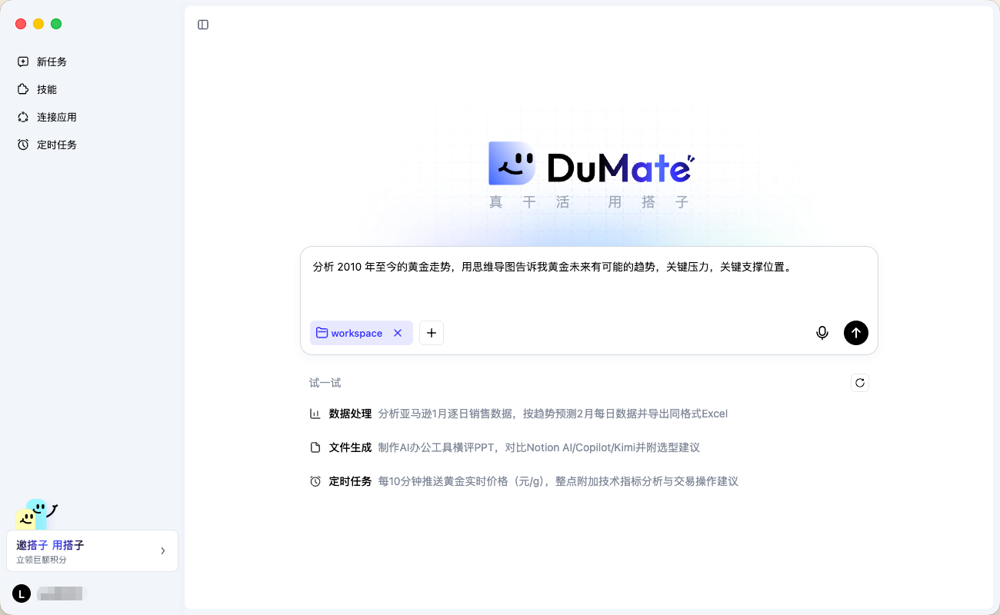
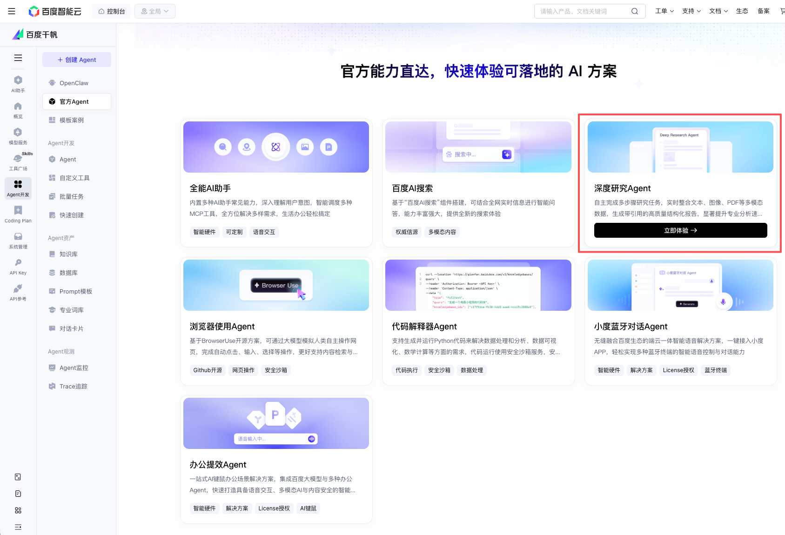

<div align="center">
  <p>
    
    &nbsp;&nbsp;&nbsp;&nbsp;
    
  </p>

  <a href="https://www.dumate.cn/">
    
  </a>

  <h1>DuMate-DeepResearch</h1>

  <p>
    <strong>具备递归搜索与评估标准驱动推理能力的可审计多智能体深度研究系统。</strong>
  </p>

  <p>
    <a href="README.md">English</a>
    ·
    <a href="#榜单快照">榜单快照</a>
    ·
    <a href="#报告目录">报告目录</a>
    ·
    <a href="#引用">引用</a>
  </p>

  <p>
    <a href="https://arxiv.org/abs/2606.07299"></a>
    <a href="https://www.dumate.cn/"></a>
    <a href="https://cloud.baidu.com/doc/qianfan-api/s/vmizwyngh"></a>
    
    
  </p>
</div>

---

## 📌 概述

本仓库发布百度千帆团队 **DuMate-DeepResearch** 在两个深度研究基准测试上的官方评估报告：

- [DeepResearch Bench](https://github.com/Ayanami0730/deep_research_bench)
- [DeepResearch Bench II](https://github.com/imlrz/DeepResearch-Bench-II)

DuMate-DeepResearch 基于千帆 Agent Foundry 构建，面向长链路、证据驱动的深度研究任务。系统结合图式动态规划、递归搜索执行和评估标准驱动推理，使研究过程可以被审计、调整，并通过细粒度标准进行评估。

## ✨ 技术亮点

<table>
  <tr>
    <td width="33%">
      <strong>基于图的动态规划</strong>
      <br />
      以持续演化的 DAG 将粗粒度目标展开为细粒度研究动作，支持反思、重规划、回溯与并行分支。
    </td>
    <td width="33%">
      <strong>递归两层执行</strong>
      <br />
      外层 Research Agent 将复杂搜索子任务委派给内层 Searcher Agent；每个 Searcher 拥有独立规划循环，从而隔离噪声检索与全局策略。
    </td>
    <td width="33%">
      <strong>评估标准驱动优化</strong>
      <br />
      动态生成的质量标准作为推理时脚手架，支撑证据溯源的综合生成与自适应终止。
    </td>
  </tr>
</table>

## 🚀 体验与接入

| 入口 | 说明 |
|:--|:--|
| [DuMate](https://www.dumate.cn/) | 下载并使用 DuMate 的 macOS、Windows 和移动端客户端。 |
| [千帆 DeepResearch](https://console.bce.baidu.com/qianfan/studio/officialAppCenter) | 在百度智能云千帆 API 平台使用 DeepResearch Agent 应用。 |
| [API 文档](https://cloud.baidu.com/doc/qianfan-api/s/vmizwyngh) | 查看千帆 DeepResearch 的 API 接入文档。 |

<table>
  <tr>
    <td align="center" width="50%">
      <a href="https://www.dumate.cn/">
        
      </a>
      <br />
      <sub><strong>DuMate</strong></sub>
    </td>
    <td align="center" width="50%">
      <a href="https://console.bce.baidu.com/qianfan/studio/officialAppCenter">
        
      </a>
      <br />
      <sub><strong>千帆 DeepResearch</strong></sub>
    </td>
  </tr>
</table>

<a id="榜单快照"></a>

## 🏆 榜单快照

<table>
  <tr>
    <td width="50%">
      <h3>DeepResearch Bench</h3>
      <p><strong>Overall：58.03</strong></p>
      <p>覆盖 22 个领域的 100 个任务，采用 RACE 框架进行 LLM-as-a-judge 评测。</p>
    </td>
    <td width="50%">
      <h3>DeepResearch Bench II</h3>
      <p><strong>Overall：61.95</strong></p>
      <p>包含 132 个任务，以及从专家报告中提取的 9,430 条细粒度二元评估标准。</p>
    </td>
  </tr>
</table>

### DeepResearch Bench

| 模型/系统 | 全面性 | 洞察力 | 指令遵循 | 可读性 | Overall |
|:--|:-:|:-:|:-:|:-:|:-:|
| **DuMate-DeepResearch** | **59.48** | **61.48** | 53.87 | 54.34 | **58.03** |
| ZTE Nebula DeepResearch | 58.37 | 59.76 | **54.06** | 54.66 | 57.27 |
| iFlow-Researcher | 58.24 | 59.74 | 53.24 | **55.05** | 57.08 |
| Zhipu Deep Research | 58.15 | 60.14 | 53.47 | 53.88 | 57.06 |
| Xiaoyi DeepResearch 6.0 | 58.58 | 59.38 | 53.58 | 53.99 | 57.00 |
| Cellcog-Max | 57.40 | 60.01 | 53.25 | 53.21 | 56.67 |
| 1688AILab-DeepResearch | 57.32 | 59.27 | 53.51 | 53.36 | 56.53 |
| Octen DeepResearch | 56.89 | 59.00 | 53.39 | 53.83 | 56.31 |
| Grep Deep Research | 56.82 | 58.92 | 53.38 | 53.44 | 56.23 |
| NVIDIA-AIQ | 56.90 | 58.49 | 52.89 | 53.43 | 55.95 |

<small>
我们基于多次评估的 Overall 得分中位数汇报 DuMate-DeepResearch 的性能表现。完整排行榜请访问 [DeepResearch Bench Leaderboard](https://huggingface.co/spaces/muset-ai/DeepResearch-Bench-Leaderboard)。
</small>

### DeepResearch Bench II

| 模型/系统 | 信息召回 | 分析能力 | 表达呈现 | Overall |
|:--|:-:|:-:|:-:|:-:|
| **DuMate-DeepResearch** | **57.58** | **71.70** | 89.89 | **61.95** |
| iFlow-Researcher | 54.99 | 69.54 | 92.56 | 59.91 |
| Xiaoyi DeepResearch 6.0 | 53.05 | 69.90 | 91.12 | 58.72 |
| CMCC-DeepInsight | 49.60 | 62.95 | 92.94 | 55.39 |
| NVIDIA-AIQ | 49.23 | 61.55 | **93.15** | 54.50 |
| OpenAI-GPT-o3 Deep Research | 39.98 | 49.85 | 89.16 | 45.40 |
| Gemini-3-Pro Deep Research | 39.09 | 48.94 | 91.85 | 44.60 |
| Gemini-2.5-Pro Deep Research | 34.91 | 51.91 | 90.24 | 41.98 |

<a id="报告目录"></a>

## 📁 报告目录

| 基准 | 内容 | 目录 |
|:--|:--|:--|
| DeepResearch Bench | 100 份 Markdown 格式生成报告 | [`reports/deepresearch_bench/`](reports/deepresearch_bench/) |
| DeepResearch Bench II | 132 份 Markdown 格式生成报告 | [`reports/deepresearch_bench_ii/`](reports/deepresearch_bench_ii/) |

```text
.
├── assets/
│   ├── dumate-screenshot.png
│   └── qianfandrs_screenshot.png
├── reports/
│   ├── deepresearch_bench/
│   └── deepresearch_bench_ii/
├── README.md
└── README_zh.md
```

<a id="引用"></a>

## 📝 引用

如果 DuMate-DeepResearch 对你的研究或应用有帮助，欢迎引用我们的论文：

```bibtex
@article{yan2026dumatedeepresearchauditablemultiagentrecursive,
      title={DuMate-DeepResearch: An Auditable Multi-Agent System with Recursive Search and Rubric-Grounded Reasoning},
      author={Lingyong Yan and Can Xu and Yukun Zhao and Wenxuan Li and Qingyang Chen and Jiulong Wu and Wenli Song and Xiangnan Li and Weixian Shi and Yiqun Chen and Xuchen Ma and Yuchen Li and Jiashu Zhao and Shuaiqiang Wang and Jianmin Wu and Dawei Yin},
      year={2026},
      eprint={2606.07299},
      archivePrefix={arXiv},
      primaryClass={cs.AI},
      url={https://arxiv.org/abs/2606.07299},
}
```

## 🙏 致谢

感谢 [DeepResearch Bench](https://github.com/Ayanami0730/deep_research_bench) 团队和 [DeepResearch Bench II](https://github.com/imlrz/DeepResearch-Bench-II) 团队构建了用于评估深度研究智能体的综合性基准。
