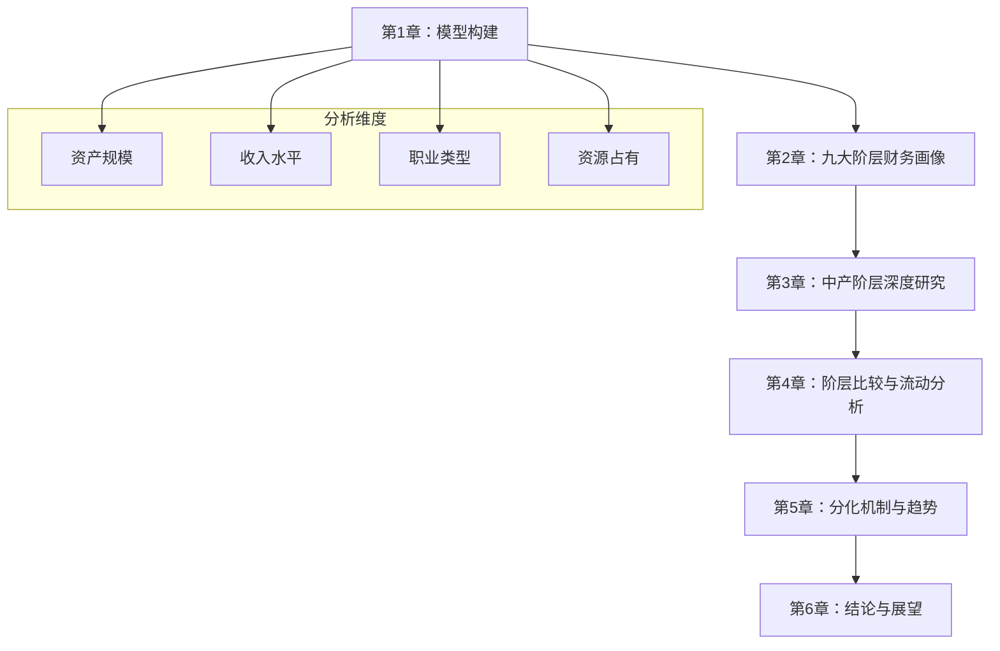
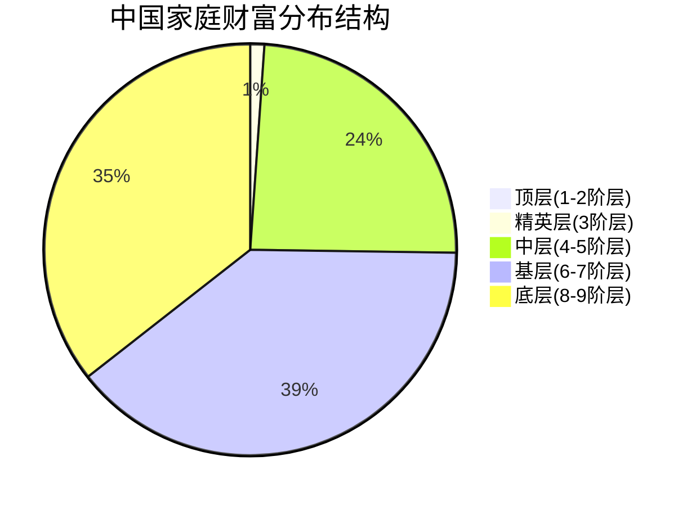
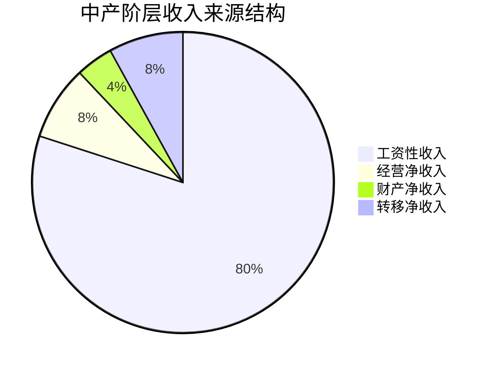
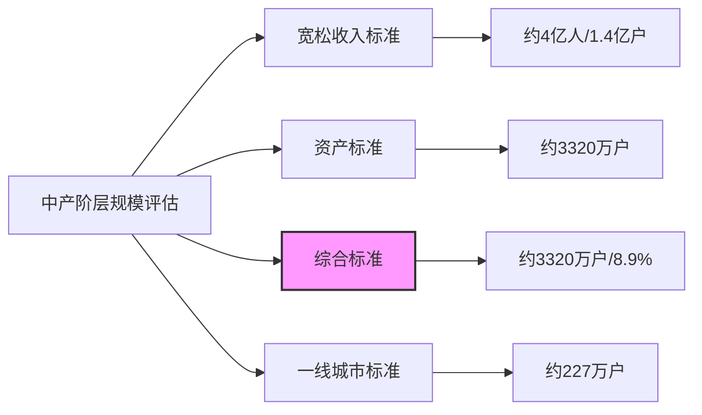
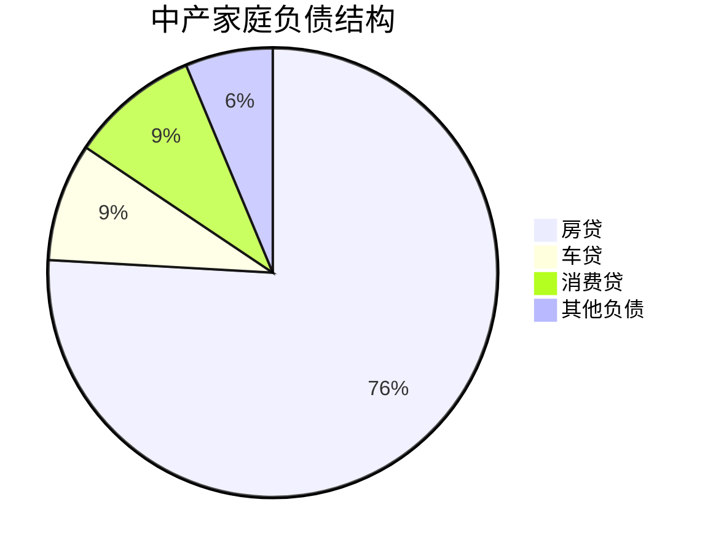
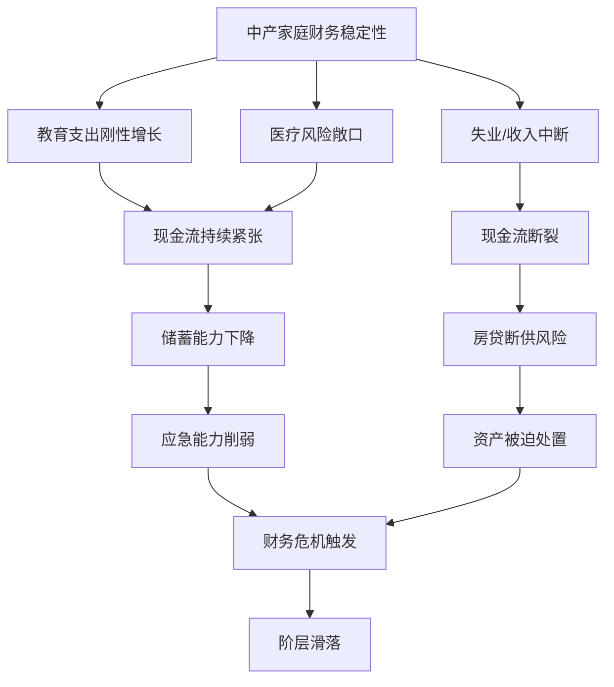
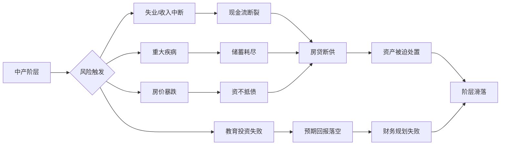
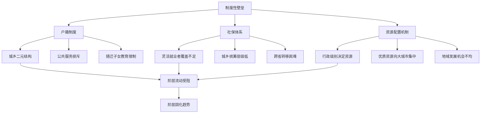
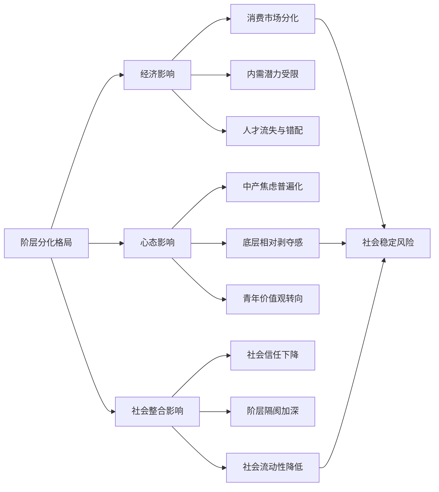
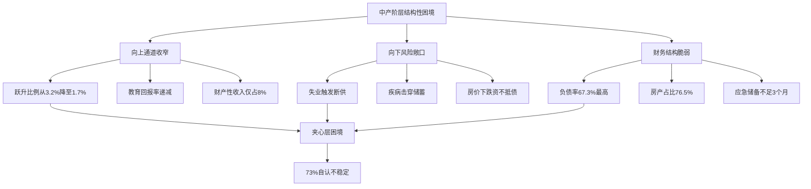

# 当代中国社会九大阶层财务画像与中产阶层深度研究报告
## 1 绪论：研究框架、数据基础与阶层划分模型构建

本章作为全报告的方法论基础与逻辑起点，系统阐明研究目标、分析路径与核心方法，对所依据的多元数据来源进行批判性评估，并在梳理现有社会分层理论的基础上，构建一个融合收入、资产、职业与权力四重维度的当代中国社会九大阶层分析模型，为后续各阶层财务画像与中产阶层深度研究提供统一的分析框架与概念工具。

### 1.1 研究目标、核心问题与分析路径

当代中国社会正经历深刻的结构性变革，伴随经济高速发展与市场化改革的深入推进，社会阶层分化日益显著，财富分配格局呈现出鲜明的梯度特征。在此背景下，准确把握各阶层的实际收入与财务状况，特别是深入理解中产阶层的真实处境，已成为认识中国社会基本国情、制定科学社会政策的重要前提。

**本报告的核心研究目标**聚焦于三个层面：其一，系统刻画当代中国九大阶层的财务特征，包括收入水平、资产规模、负债状况与财务安全边际；其二，深度解析中产阶层的多维特点、实际规模与财力虚实；其三，揭示阶层分化的驱动机制与流动趋势，为理解当代中国社会结构提供实证基础。

围绕上述目标，报告需回应以下**关键问题**：社会阶层应依据何种标准进行科学划分？各阶层的实际财务状况呈现何种梯度差异？中产阶层的定义标准为何存在巨大争议？不同口径下中产阶层的规模差异从何而来？中产阶层面临的财务脆弱性与流动困境根源何在？

**分析路径**采用从宏观到微观、从静态描述到动态分析的多层次递进结构。首先，在宏观层面构建九大阶层分析框架，确立统一的分层标准与概念工具；其次，在中观层面逐层剖析各阶层的财务画像，进行横向比较以揭示结构性差异；再次，在微观层面聚焦中产阶层，深入验证其多维特点与真实规模；最后，从纵向流动视角分析阶层间的财力边界与流动壁垒，揭示分化机制与未来趋势。这一分析路径确保报告既有宏观的结构性把握，又有微观的细节验证，形成完整的研究闭环。

### 1.2 数据来源与可靠性评估

社会分层研究的质量高度依赖数据基础的可靠性与全面性。本报告综合运用多类数据来源，通过交叉验证策略提升分析的稳健性。以下对主要数据来源进行系统梳理与批判性评估。

**第一类数据来源为财富调查报告**，以胡润研究院发布的《胡润财富报告》为代表。该报告系统追踪中国高净值与超高净值家庭的规模与分布，提供了关于亿元资产家庭（约13万户）、千万资产家庭（约206.6万户）等顶层财富群体的详细数据[^1]。其优势在于对高净值人群的专业追踪与深度覆盖，能够捕捉财富金字塔顶端的分布特征；局限性则在于对中低收入群体关注不足，且部分数据依赖推算而非直接调查。

**第二类数据来源为官方统计数据**，主要包括国家统计局发布的居民收入与消费支出数据。2025年数据显示，全国居民人均可支配收入为43377元，城镇居民为56502元，农村居民为24456元[^2]。国家统计局还提供居民收入五等分分组数据，将全部调查家庭按人均收入水平从高到低平均分为五组，每组代表约3亿人口[^3]。官方数据的优势在于样本覆盖面广、统计口径规范、时间序列完整；局限性在于对极端富裕群体的捕捉能力有限，且"平均值"指标易受极端值影响而偏离大多数人的实际感受。

**第三类数据来源为学术研究报告**，以中国社会科学院陆学艺课题组的《当代中国社会阶层研究报告》为核心参考。该报告以职业分类为基础，以组织资源、经济资源、文化资源占有状况为标准，将当代中国社会划分为十大阶层[^2]。其理论贡献在于突破了单一收入或资产维度的局限，建立了多维度分层框架；局限性在于原始数据采集于1999年前后，部分比例数据需结合后续研究进行更新校准。

**第四类数据来源为家庭金融调查**，以西南财经大学中国家庭金融调查（CHFS）为代表。该调查提供了关于家庭资产结构、负债水平、金融资产配置等微观层面的详细数据，揭示了城镇家庭资产中房产占比高达69.3%、金融资产仅占25.8%的结构性特征[^4]。其优势在于微观数据的丰富性与家庭层面的可追踪性；局限性在于对超高净值家庭的覆盖存在困难，部分学者尝试使用富豪榜数据进行"拼接"以弥补这一缺陷[^5]。

下表汇总各类数据来源的特点与适用范围：

| 数据来源 | 核心指标 | 优势 | 局限性 | 适用场景 |
|---------|---------|------|--------|---------|
| 胡润财富报告 | 高净值家庭数量与分布 | 顶层财富追踪专业 | 中低收入覆盖不足 | 财富金字塔顶端分析 |
| 国家统计局数据 | 人均可支配收入、五等分分组 | 覆盖面广、口径规范 | 极端值捕捉有限 | 收入分布整体格局 |
| 社科院阶层报告 | 十大阶层职业构成与比例 | 多维度分层框架 | 数据时效性待更新 | 阶层结构理论基础 |
| 家庭金融调查 | 资产结构、负债、金融配置 | 微观数据丰富 | 高净值覆盖困难 | 家庭财务画像分析 |

**数据整合与交叉验证策略**：鉴于单一数据来源的局限性，本报告采用多源数据交叉验证的方法。在分析高净值群体时，以胡润报告为主、官方数据为辅；在分析中低收入群体时，以国家统计局数据为主、学术调查为辅；在构建阶层框架时，以社科院理论模型为骨架、财富与收入数据为填充。当不同来源数据存在冲突时，优先采信官方统计数据，并在报告中明确标注数据差异及可能原因。

### 1.3 现有社会分层理论与模型述评

当代中国社会分层研究已形成多种理论框架与分析模型，各有侧重与适用场景。系统梳理与比较这些模型，是构建本报告分析框架的必要前提。

**陆学艺课题组的十大阶层模型**是中国本土社会分层研究的里程碑式成果。该模型以职业分类为基础，引入组织资源（具有决定性意义）、经济资源、文化资源三种社会资源的占有状况作为划分标准，将当代中国社会群体划分为十个阶层：国家与社会管理者阶层、经理人员阶层、私营企业主阶层、专业技术人员阶层、办事人员阶层、个体工商户阶层、商业服务业员工阶层、产业工人阶层、农业劳动者阶层、城乡无业失业半失业者阶层[^2][^6]。该模型的理论价值在于突破了传统"两个阶级一个阶层"的简单框架，揭示了市场化改革后社会阶层多元化、复杂化的趋势[^7]。其局限性在于：原始数据采集于20世纪90年代末，部分阶层比例已发生显著变化；职业分类标准难以完全覆盖新兴职业群体（如平台经济从业者、自由职业者）；对经济资源的量化标准不够明确，难以与财富数据直接对接。

**基于家庭净资产的财富金字塔分层模型**以资产规模为核心标准，将家庭划分为多个财富层级。根据综合多份报告的数据，财富金字塔呈现以下结构：贫困型（净资产≤10万元，约占10%）、温饱型（10-50万元，约占30%）、小康型（50-100万元，约占20%）、富裕型（100-500万元，约占15%）、高净值家庭（≥1000万元，约占0.4%）、超高净值家庭（≥1亿元，约占0.03%）[^4][^8]。该模型的优势在于量化标准明确、数据可比性强、便于国际比较；局限性在于单纯资产规模难以反映职业地位与社会权力差异，且房产价值波动会显著影响阶层归属判断。

**国家统计局的收入五等分分组法**将全部调查家庭按人均收入水平从高到低平均分为五组：低收入组、中等偏下收入组、中等收入组、中等偏上收入组、高收入组，每组各占20%人口[^3]。2021年数据显示，低收入组人均年收入为8333元（月均约694元），高收入组为85836元（月均约7153元），两者相差约10倍[^3]。该模型的优势在于官方权威、统计规范、时间序列完整；局限性在于五等分的机械划分无法反映阶层内部的异质性，且"中等收入"与社会学意义上的"中产阶层"存在概念差异。

**权力-资本-文化资源的多维分层视角**强调社会地位由多种资源综合决定。陆学艺将其概括为组织资源（权力）、经济资源（财富）、文化资源（知识）三个维度[^1]。近年研究进一步提出"五大社会经济等级"划分：社会上层（高层领导干部、大企业经理人员、高级专业人员及大私营企业主）、中上层、中中层、中下层、底层[^1]。该视角的理论深度在于揭示了阶层地位的多维性与复杂性；局限性在于多维度的综合评估难以量化操作，不同资源之间的换算与加权缺乏统一标准。

下表比较各分层模型的核心特征：

| 分层模型 | 划分标准 | 阶层数量 | 理论优势 | 主要局限 |
|---------|---------|---------|---------|---------|
| 十大阶层模型 | 职业+三种资源占有 | 10层 | 多维度、本土化 | 数据时效性、新职业覆盖 |
| 财富金字塔模型 | 家庭净资产 | 6-8层 | 量化明确、可比性强 | 忽视职业与权力维度 |
| 收入五等分法 | 人均可支配收入 | 5层 | 官方权威、时序完整 | 机械划分、概念差异 |
| 多维资源视角 | 权力+资本+文化 | 5层 | 理论深度、综合性强 | 量化困难、操作性弱 |

综合评析可见，**单一维度的分层模型均存在明显局限**：纯资产标准忽视了职业地位与权力差异，纯收入标准难以反映财富存量与抗风险能力，纯职业标准缺乏经济量化支撑。因此，构建一个整合多维度的分析框架，成为本报告的方法论任务。

### 1.4 九大阶层分析模型的构建逻辑与维度整合

在批判性吸收现有分层理论的基础上，本报告构建一个融合收入、资产、职业与权力四重维度的**九大阶层分析模型**，作为后续各章分析的统一框架。

**构建逻辑**遵循以下原则：第一，以陆学艺十大阶层模型的职业-资源框架为理论骨架，确保分层标准的社会学意义；第二，以财富金字塔模型的资产数据为量化填充，明确各阶层的经济边界；第三，以收入五等分数据为校准参照，验证阶层划分的合理性；第四，适度合并相近阶层、突出财务特征差异，形成便于分析的九级结构。

**维度整合**体现为四重标准的综合运用：

- **资产规模维度**：以家庭净资产或可投资资产为核心指标，划定各阶层的财富边界。例如，超高净值阶层以净资产≥1亿元为门槛，高净值阶层以≥1000万元为门槛[^4]。
- **收入水平维度**：以家庭年可支配收入为辅助指标，反映各阶层的现金流状况。例如，中产阶层通常对应年收入20-50万元区间[^5]。
- **职业类型维度**：以主要职业类别为分类基础，反映各阶层的社会功能与劳动性质。例如，国家与社会管理者阶层以党政机关领导干部为主体[^2]。
- **资源占有维度**：以组织资源（权力）、经济资源（财富）、文化资源（知识）的占有状况为综合评判标准，反映各阶层的社会地位与影响力[^1]。

**九大阶层的具体划分**如下表所示：

| 阶层序号 | 阶层名称 | 资产规模参考 | 典型职业构成 | 资源占有特征 |
|:---:|---------|-------------|-------------|-------------|
| **1** | 国家与社会管理者阶层 | 中等（显性）/高（隐性） | 省部级以上官员、核心决策者 | 组织资源极高，经济文化资源较高 |
| **2** | 经理人员与大型私营企业主阶层 | ≥1000万元 | 上市公司CEO、亿元级企业主 | 经济资源极高，组织资源高 |
| **3** | 专业技术人员与知识精英阶层 | 300-1000万元 | 院士、主任医师、顶尖律师 | 文化资源极高，经济资源中高 |
| **4** | 办事人员与普通公务员阶层 | 100-500万元 | 科员、中小学教师、银行职员 | 文化组织资源中等，经济资源稳定 |
| **5** | 个体工商户与中小企业主阶层 | 50-300万元 | 店铺老板、小企业主 | 经济资源中低且不稳定 |
| **6** | 商业服务业员工阶层 | 10-100万元 | 店员、客服、网约车司机 | 三种资源均较少 |
| **7** | 产业工人阶层 | 10-100万元 | 制造业工人、建筑工人 | 三种资源均较少 |
| **8** | 农业劳动者阶层 | ≤50万元 | 农民、养殖户 | 三种资源匮乏 |
| **9** | 城乡无业失业半失业者阶层 | 极低或负债 | 长期失业者、零工 | 三种资源极度匮乏 |

**模型的结构特征**：该九大阶层模型呈现"上窄下宽"的金字塔形态。第1-2阶层构成社会顶层，人口占比极低（合计约2-3%）但财富集中度极高；第3-5阶层构成社会中层，是"中产阶层"的主要来源，人口占比约20-25%；第6-9阶层构成社会基层，人口占比超过70%，是中国劳动力市场的主体[^9][^10]。这一结构与清华大学李强团队描述的"土字型"社会结构特征相吻合——底层庞大、中层扩容但不稳定、上层固化[^9]。

### 1.5 核心概念界定与分析框架说明

为确保报告分析的准确性与一致性，需对反复使用的核心概念进行操作性界定。

**净资产与可投资资产的区分**：净资产指家庭总资产减去总负债后的余额，反映家庭的真实财富水平；可投资资产指家庭持有的、可在金融市场上流通变现的资产（如存款、股票、基金、理财产品等），不包括自住房产、自用车辆等非流动性资产[^1]。两者的差异对阶层判断影响显著——一个拥有800万元房产但背负500万元房贷的家庭，净资产仅为300万元，可投资资产可能更低[^1]。本报告在分析财务状况时，将同时关注两类指标，以避免"虚假富裕"的误判。

**中产阶层的多元定义标准**：中产阶层的定义是本报告的核心议题之一，现有标准差异显著：

- **宽松收入标准**：家庭年收入10-50万元，对应人口超过4亿（约1.4亿户家庭）[^5]
- **严格综合标准**：需同时满足家庭年可支配收入20-50万元、家庭净资产100-500万元、保障体系齐全、至少1人有本科以上学历等四类条件，对应家庭仅约3320万户[^5]
- **国际参考标准**：瑞银采用成年人净资产1万-10万美元（约7.1万-71万人民币），对应约4亿人[^5]

本报告将在第三章详细比较各类标准，分析其背后的逻辑差异与适用场景。

**财务脆弱性与抗风险能力**：财务脆弱性指家庭在面对收入中断、重大支出或资产贬值时维持正常生活的能力。测量维度包括：负债率（负债/总资产）、流动性比率（流动资产/月支出）、应急储备（可在短期内变现的资产是否覆盖6个月以上支出）、收入来源多元化程度等。研究显示，中国家庭资产结构中房产占比高达69.3%，导致流动性严重不足[^4]；负债率大于100%的家庭仍占10.8%，面临"资不抵债"风险[^1]。

**分析框架与章节结构对应关系**：

上图展示了九大阶层分析框架与后续章节的逻辑关系。第1章构建的四维分析框架将贯穿全报告：第2章运用该框架逐层描绘各阶层的财务特征；第3章聚焦中产阶层，深入验证其多维特点与真实规模；第4章在阶层框架内进行横向比较与纵向流动分析；第5章揭示塑造阶层格局的深层机制；第6章归纳核心发现并提出研究启示。

通过上述研究框架、数据基础与分析模型的系统构建，本报告为后续各章的实证分析奠定了方法论基础，确保对中国九大阶层财务状况与中产阶层处境的研究具有理论深度与实证支撑。

## 2 全景扫描：九大阶层的实际收入与财务状况深度剖析

本章运用第一章构建的九阶层分析框架，系统呈现当代中国社会各阶层的财务全貌。通过整合胡润财富报告、国家统计局收入数据、家庭金融调查等多源信息，逐层剖析各阶层的收入水平、资产规模与结构、负债状况及财务安全边际，揭示从财富金字塔顶端到基层的梯度差异与结构性特征，为后续中产阶层深度研究提供比较基准。

### 2.1 顶层阶层财务画像：国家与社会管理者及经理人员与大型私营企业主

社会阶层金字塔的顶端由两类群体构成：掌握核心组织资源的国家与社会管理者，以及掌控大规模经济资源的经理人员与大型私营企业主。这两个阶层虽然财富来源与积累路径存在差异，但共同构成了当代中国社会权力与资本的顶层设计者。

**国家与社会管理者阶层**的财务特征呈现显性与隐性的双重结构。从显性层面看，该群体的工资收入受制度约束，与其社会地位并不完全匹配；但从隐性层面看，其组织资源向经济资源的转化渠道多元而隐蔽。陆学艺课题组的研究指出，该阶层以党政机关、事业单位、社会团体中行使实际行政管理职权的领导干部为主体，其核心特征在于对组织资源的高度占有。[^6]这种组织资源的占有不仅体现为行政权力的行使，更体现为对政策制定、资源配置、土地审批等核心环节的影响力。该阶层具有极强的封闭性，主要依赖家族传承或特殊历史机遇实现代际延续，普通人难以触及。[^11]

**经理人员与大型私营企业主阶层**则是财富金字塔最耀眼的顶端。根据《2024胡润财富报告》显示，全国亿元资产超高净值家庭达13万户，同比减少1.7%，其中拥有亿元可投资资产的家庭为7.8万户，占总人口仅0.017%。[^5]福布斯中国2025年富豪榜补充数据进一步显示，可投资资产超1亿元的家庭约8.95万户。[^12]这一群体堪称财富金字塔的"塔尖"，其财务特征呈现以下鲜明特点：

从**人群构成**看，该群体以大型企业控股者、资本市场赢家为主，80%为企业主，企业资产占其总资产的73%。[^6]瑞银2025年底的报告显示，中国内地的470位亿万富豪里，有98%都是白手起家，这一比例远超美国的74%、日本的68%，更将德国的26%远远甩在身后。[^13]这一数据表明，当代中国顶层财富的形成高度依赖改革开放以来的市场化机遇与企业家精神。

从**资产配置**看，该群体呈现高度多元化特征。以长三角地区某制造业集团创始人为例，其家族可投资资产超5亿元，除核心产业股权外，还配置了31%的海外资产和18%的保险产品，子女教育年均投入达268万元，远超全球平均水平。[^14]高净值家庭金融资产配置更为多元：45%配置境外资产（以香港保险、新加坡理财为主），37%投资私募股权基金，28%持有黄金。[^15]

从**财富集中度**看，该群体的财富总额高达87万亿元，占600万以上资产家庭总财富的58%，集中度持续提升。[^6]前1%家庭掌握全国31%的财富，前10%掌握68%，后50%仅占4.1%，超高净值家庭人均财富达6300万元，普通家庭仅2.38万元，差距悬殊。[^16]

从**地域分布**看，高净值家庭高度集中于经济发达地区。胡润2025年的报告显示，全国超4成的高净值家庭集中在北京、上海、广州、深圳、杭州这5座城市。其中，广东以30.04万户领跑，北京、上海紧随其后。[^13]北京每80户家庭中就有1户净资产过千万，而东北地区每1000户中仅9户达标。[^17]

下表汇总顶层阶层的核心财务指标：

| 指标维度 | 亿元资产家庭 | 5000万-1亿资产家庭 |
|---------|-------------|-------------------|
| 家庭数量 | 约13万户 | 约185万户（含千万以上） |
| 人口占比 | 0.017% | 0.36% |
| 资产构成 | 企业资产占73% | 不动产42.7%+股票基金23.5%+私募18.3% |
| 海外配置 | 31%以上 | 16%-45% |
| 地域集中 | 北上广深杭超4成 | 长三角+粤港澳占53.8% |

### 2.2 精英阶层财务画像：专业技术人员与知识精英

第3阶层的专业技术人员与知识精英，是当代中国社会"知识就是力量"的典型代表。这一群体以院士、三甲医院主任医师、985高校教授、顶级律所合伙人等为主体，其核心特征在于对文化资源的高度占有，并通过专业技能实现文化资本向经济资本的转化。

**收入水平**方面，该阶层年收入普遍达到百万级。根据国家统计局2025年一季度数据，可投资资产300万-1000万元的中产精英家庭约580万户，占比1.1%。[^5]这一群体多为企业高管、高级专家或成功小企业主，年收入水平显著高于社会平均。以深圳某科技公司技术主管为例，年薪85万元加投资收益，年收入约110万元，家庭总资产约600万元。[^6]

**资产结构**方面，该阶层在大城市普遍拥有多套房产，金融资产占比逐步提升。其资产构成中，房产占比仍达35%左右，金融资产配置以股票、基金和银行理财为主，风险偏好相对稳健。[^6]与顶层阶层相比，该群体的资产流动性更高，但总规模存在数量级差距。

**文化资本转化路径**方面，该阶层通过专业技能、学术声誉、执业资质等文化资源获取经济回报。陆学艺课题组将其界定为"拥有被社会所承认的、为社会所需要的专业知识和专门技术的人"，其社会地位和经济收入主要取决于所掌握的知识和技术的稀缺程度。[^6]然而，这一转化路径面临AI技术的冲击——公开知识被AI瞬间吸收超越，部分学者被迫用技术手段封锁成果以保持竞争优势。[^18]

**财务安全边际**方面，尽管该阶层已迈入精英行列，但面对高昂房贷、子女教育和父母养老压力，仍坦言距离财务自由尚远。[^17]该群体的向上流动通道趋窄，2020-2025年间从小康型跃升至富足型的家庭比例仅1.7%，低于此前五年的3.2%。[^19]

### 2.3 稳定中层财务画像：办事人员、普通公务员与个体工商户

第4-5阶层构成当代中国社会的"稳定中层"，是"中产阶层"的主要来源群体。这一群体涵盖科员、中小学教师、银行职员、店铺老板、小企业主等，其核心特征在于拥有相对稳定的收入来源和一定规模的资产积累，但同时承受着最大的财务压力。

**收入分布**方面，该阶层年收入主要集中在10-50万元区间。根据2025年官方收入分层标准，中等收入群体年收入为15-30万元，中高收入群体为30-50万元。[^20]国家统计局数据显示，2025年全国居民人均可支配收入43377元，按全国居民五等份收入分组，中间收入组人均可支配收入35536元，中间偏上收入组55586元，高收入组103778元。[^13]以三口之家计算，中间收入组家庭年收入约10.7万元，中间偏上收入组约16.7万元。

**资产规模与结构**方面，该阶层家庭净资产主要分布在50-500万元区间。根据中国社会科学院与国家统计局联合发布的《中国家庭财富分级报告》，800万-3000万元资产家庭约1914万户，占比5.98%，其中1000万-5000万区间约占该群体的60%，推算规模超1100万户。[^21]然而，该群体资产结构高度依赖房产——全国城镇家庭资产中，房产占比高达69.3%，金融资产仅占25.8%，一线城市家庭房产占比更达75%，导致流动性严重不足。[^17]

**负债水平与偿债压力**方面，该阶层承受着最高的负债率。数据显示，高收入家庭（年收入50万以上）负债率82.3%，中等收入（15-50万）61.7%，低收入（15万以下）32.5%。[^22]中等收入家庭负债率最高（67.3%），偿债压力最大。[^6]以海淀区典型中产家庭为例，月均支出结构显示：学区房房贷28000元、课外辅导6500元、素质教育4200元，教育支出年增长率高达18.7%-31.5%。[^23]

**财务脆弱性**方面，该群体抗风险能力明显不足。尽管从资产账面看似乎已跻身"中产"，但高负债率意味着实际可支配财富远低于名义资产。一位上海白领的自述颇具代表性："房贷1.8万+孩子教育1.2万+老人赡养0.6万，根本不敢失业。"[^24]某一线城市家庭拥有1000万房产但背负600万房贷，实际可投资资产仅400万，难以满足高净值标准。[^15]这种"虚假富裕"现象在中产阶层中普遍存在——房子值300万，但房贷就有200万，实际净资产只有100万，而房价下跌后可能更低。[^6]

下表对比稳定中层的财务特征：

| 阶层细分 | 典型职业 | 年收入区间 | 净资产区间 | 负债率 | 核心压力 |
|---------|---------|-----------|-----------|-------|---------|
| 办事人员/公务员 | 科员、教师、银行职员 | 10-30万 | 100-310万 | 61.7% | 房贷、教育、养老 |
| 个体工商户/小企业主 | 店铺老板、小企业主 | 20-80万 | 50-300万 | 67.3% | 经营风险、资产保值 |

### 2.4 基层阶层财务画像：商业服务业员工与产业工人

第6-7阶层的商业服务业员工与产业工人，构成当代中国劳动力市场的主体。这一群体包括店员、客服、网约车司机、外卖骑手、制造业工人、建筑工人等，其核心特征在于依赖劳动力出售获取收入，资产积累有限，抗风险能力较弱。

**收入水平**方面，该阶层月收入主要分布在3000-10000元区间。长三角电子厂普工月薪仍徘徊在4500-6000元，十年间仅上涨35%，远不及物价涨幅。[^23]外卖骑手日均配送12小时，月跑单量1500单才能保底；网约车司机月流水1.2万，扣除平台抽成、油费后净收入仅剩5800元。[^24]根据2025年最新收入分层标准，月收入3000-5000元属于低收入群体，5000-8000元属于中低收入群体，这两个群体合计占全国职工的约77.7%。[^18]

**资产积累**方面，该阶层家庭净资产主要在10-100万元区间，且高度依赖房产。50-200万元资产家庭约1.07亿户，占比33.4%。[^21]这一群体是中国家庭财富的"中坚力量"，但财富积累主要依赖工资收入，缺乏资本性收益。普通家庭80%以上收入来自工资，财产性收入占比不足10%。[^15]

**平台经济从业者的特殊处境**值得关注。数字经济催生了新服务阶层，平台经济从业者（如快递员、网约司机）达4000万人，其收入介于传统蓝领与白领之间，月均收入5000-8000元，受教育程度普遍高于传统蓝领，但缺乏社会保障，工作稳定性差，35%的新蓝领无劳动合同。[^9]他们的社会认同呈现矛盾性：既渴望融入城市，又因户籍、住房等问题被边缘化，形成"悬浮式生存"状态。[^10]

**社保覆盖与风险敞口**方面，该阶层面临显著的保障缺口。灵活就业者社保覆盖率仅68%，抗风险能力弱，一场大病可能导致家庭返贫。[^9]制造业工人还面临技术替代风险——东莞某手机配件厂引入AI质检系统后，300人的QC团队仅保留52人，转岗成功率不足三成。[^25]34岁成为制造业"年龄红线"，某车企焊装车间超40岁工人仅占17%。[^23]

### 2.5 底层阶层财务画像：农业劳动者与城乡无业失业半失业者

第8-9阶层位于社会阶层金字塔的底部，包括农民、养殖户、长期失业者、零工群体等。这一群体的核心特征在于三种社会资源（组织资源、经济资源、文化资源）均极度匮乏，面临基本生存挑战。

**农业劳动者阶层**的财务状况呈现城乡差距的集中体现。2025年数据显示，农村居民人均可支配收入24456元，仅为城镇居民56502元的43.3%，城乡差距达2.31倍。[^19]农村居民人均可支配收入中位数20711元，意味着半数农村居民年收入低于这一水平。[^17]城市家庭净资产中位数为289万元，农村仅为87万元，差距达3.3倍；能一次性拿出50万元现金的城市家庭占比22.5%，农村仅7.8%。[^17]

陆学艺课题组将农业劳动者界定为"承包集体所有的耕地,以农(林、牧、渔)业为惟一或主要的职业,并以农业收入为惟一或主要收入来源的农业劳动者"，这一群体是当代中国社会中规模最大的阶层之一。[^6]然而，其社会地位和经济收入处于较低水平，且面临土地收益有限、农产品价格波动、劳动力外流等多重挑战。

**城乡无业失业半失业者阶层**处于财务困境的最底端。根据家庭净资产分层数据，贫困阶层（净资产0-7.8万元）占比约18%，负债层（净资产为负）占比约14%。[^20]这意味着约32%的中国家庭处于财务极度脆弱或资不抵债状态。全国负债人数预计超过4亿人（部分机构预测突破5亿），较前一年增长近40%。[^22]低收入家庭债务收入比平均超60%，部分陷入"以贷养贷"恶性循环。[^22]

该阶层的**代际传递特征**尤为突出。经合组织报告显示，超过40%的低收入家庭子女终生困于底层。[^18]教育作为阶层流动的关键通道呈现"马太效应"——农村学生进入顶尖高校比例不足5%，贫困代际传递概率达48%，即穷人子女仍为穷人的可能性近半。[^9]

下表汇总底层阶层的核心财务指标：

| 指标维度 | 农业劳动者 | 无业失业半失业者 |
|---------|-----------|-----------------|
| 人均年收入 | 约2.4万元 | 低于最低生活标准 |
| 家庭净资产 | ≤50万元 | 极低或负债 |
| 家庭占比 | 约18%（贫困阶层） | 约14%（负债层） |
| 核心风险 | 土地收益有限、劳动力外流 | 基本生存挑战 |

### 2.6 九大阶层财务状况的梯度比较与结构性特征

综合前述各阶层分析，当代中国社会财务状况呈现鲜明的"上窄下宽"金字塔结构，阶层间财务差距悬殊，结构性分化特征显著。

**收入倍差**方面，国家统计局数据显示，按全国居民五等份收入分组，高收入组人均可支配收入103778元，低收入组10150元，两者相差约10.2倍。[^13]若将视野扩展至顶层与底层的对比，差距更为惊人——超高净值家庭人均财富达6300万元，普通家庭仅2.38万元。[^16]

**财富集中度**方面，前1%家庭掌握全国31%的财富，前10%掌握68%，后50%仅占4.1%。[^15]亿元资产超高净值家庭仅13万户，却掌握87万亿财富，占600万以上资产家庭总财富的58%，集中度持续提升。[^17]这一数据表明，财富向顶层集中的趋势仍在加剧。

下表构建九大阶层财务指标对比框架：

| 阶层 | 家庭占比 | 净资产区间 | 年收入参考 | 负债特征 | 财务安全边际 |
|:---:|---------|-----------|-----------|---------|-------------|
| 1-2 | 约0.5% | ≥1000万 | 百万级以上 | 可控 | 极高 |
| 3 | 约1.1% | 300-1000万 | 50-100万 | 中等 | 较高 |
| 4-5 | 约24% | 50-500万 | 15-50万 | 最高(67%) | 脆弱 |
| 6-7 | 约39% | 10-100万 | 5-15万 | 中低 | 较低 |
| 8-9 | 约36% | ≤50万或负债 | <5万 | 高风险 | 极低 |

**城乡差距**是结构性分化的核心维度。城镇居民人均可支配收入56502元，农村居民24456元，城镇是农村的2.31倍。[^26]城市家庭净资产中位数289万元，农村仅87万元，差距达3.3倍。[^17]房产占比差异同样突出：城市家庭资产中房产占69.3%，农村为54.2%；一线城市家庭户均房产净资产284万元，农村家庭仅47万元。[^15]

**地域分化**同样显著。31省份2025年人均可支配收入数据显示，上海超9万元、北京超8万元位居前列，而甘肃不到3万元位居末位，前后差距超过3倍。[^22]高净值家庭高度集中于东部沿海城市——广东以29.8万户千万资产家庭领跑全国，浙江、江苏紧随其后，三省合计占全国总数的40%。[^15]北上广深杭五城集聚全国超六成的独角兽企业，估值总额占比超过七成。[^13]

上图直观展示了当代中国社会阶层的人口分布结构。顶层与精英层合计仅占约1.6%，却掌握着社会大部分财富；中层约占24%，是"中产阶层"的主要来源，但财务脆弱性显著；基层与底层合计超过74%，构成社会的绝对多数，但资产积累有限、抗风险能力不足。这一"土字型"结构特征——底层庞大、中层扩容但不稳定、上层固化——构成理解当代中国社会阶层分化的基本图景。[^9]

综上所述，当代中国九大阶层的财务状况呈现梯度分明、差距悬殊、结构固化的特征。顶层阶层财富高度集中且持续增长，精英阶层收入可观但向上通道趋窄，稳定中层承受最高负债率与财务脆弱性，基层阶层依赖劳动收入且保障不足，底层阶层面临生存挑战与代际传递困境。这一全景扫描为后续深入研究中产阶层的特点、规模与财力奠定了比较基准。

## 3 焦点深研：中产阶层的定义争议、多维特点与真实规模

本章作为报告的核心聚焦章节，系统梳理当代中国中产阶层定义标准的多元分歧，深入剖析各类界定标准背后的理论逻辑与适用局限，在此基础上从收入来源、资产结构、消费模式、教育医疗投入、职业分布与地域集中度等多维度验证中产阶层的真实特征，最终综合评估不同口径下中产阶层的实际规模，揭示数据差异背后的深层原因，为理解中产阶层的真实处境与政策制定提供实证基础。

### 3.1 中产阶层定义标准的多元分歧与比较分析

"到底什么才是真正意义上的中产"这一问题，至今没有统一答案。不同机构、不同研究视角给出的标准差异悬殊，导致中产阶层规模从"3320万户"到"超4亿人"的巨大分歧。系统梳理并比较这些标准，是准确理解中产阶层真实处境的必要前提。

**国家统计局的宽松收入标准**是目前覆盖人群最广的界定方式。根据2024年12月国家统计局在年度经济报告中重申的标准，一个三口之家年收入在10万元至50万元之间，即为中等收入家庭[^27]。按此标准，中国中等收入群体规模超过4亿人，对应家庭约1.4亿户[^28]。这一标准的优势在于简单明确、便于统计，但其局限性同样显著：月入3000元即达到中等收入门槛，这与公众对"中产"的直观认知存在巨大落差[^27]。正如白岩松的反问所揭示的那样——"如果月入3000就算中等收入，为什么好多人都拒绝承认自己已经进入中等收入人群？"[^27]

**胡润财富报告的资产标准**则将门槛大幅提高。根据胡润财富报告数据，总资产在300万元以上的家庭全国只有3320万户[^2]。这一标准与国家统计局的4亿人形成鲜明对比，差距近12倍。胡润标准更强调财富存量而非收入流量，更能反映家庭的财务积累与抗风险能力，但也存在将房产价值纳入总资产、忽视负债因素的问题。

**2025年官方综合标准**代表了最严格的界定方式。国家统计局联合发改委、人社部发布的《中国中等收入群体发展报告》明确划定了中产家庭的四类核心条件：家庭年可支配收入20-50万元（税后）、家庭净资产100-500万元（扣完负债）、保障体系齐全（社保全覆盖+至少3种商业保险+6-12个月应急储备金）、至少1人有本科以上学历或专业技能证书[^29]。符合这四项条件的家庭约3320万户，仅占全国家庭总数的8.9%[^29]。这一标准的核心逻辑在于：**中产不是单一数字标准，而是经济资本和文化资本的双重积累，强调持续创造价值和风险抵御能力**。

**一线城市的高门槛标准**进一步拉高了中产定义。2025年部分市场观点将一线城市的中产门槛设定为：家庭年收入达到50万元以上、房产价值不低于600万元、家庭成员普遍接受高等教育、从事管理岗位工作[^2]。按此标准，根据国家税务局数据，年收入超过50万元的家庭全国仅为227万户[^2]。上海的中产标准更为严苛，要求至少一套无贷款自住房市值600万元以上、100万元以上流动资产、家庭年消费支出16万元以上[^30]。

**国际参考标准**提供了另一种视角。瑞银《2024年全球财富报告》将全球中等财富群体界定为净资产1万-10万美元（约7.1万-71万人民币）的成年人，中国符合该标准人口约4亿[^28]。这一标准与国家统计局的收入标准在规模上相近，但衡量维度不同——前者关注资产存量，后者关注收入流量。

下表系统比较各类中产定义标准的核心差异：

| 标准类型 | 核心指标 | 门槛要求 | 对应规模 | 适用场景 | 主要局限 |
|---------|---------|---------|---------|---------|---------|
| 国家统计局收入标准 | 家庭年收入 | 10-50万元 | 约4亿人/1.4亿户 | 宏观政策制定 | 与公众认知落差大 |
| 胡润资产标准 | 家庭总资产 | ≥300万元 | 约3320万户 | 财富分布研究 | 未扣除负债 |
| 官方综合标准 | 收入+资产+保障+学历 | 四维条件 | 约3320万户(8.9%) | 精准识别 | 门槛较高 |
| 一线城市标准 | 收入+房产+学历+职业 | 年入50万+房产600万 | 约227万户 | 区域比较 | 地域适用性窄 |
| 瑞银国际标准 | 成年人净资产 | 1万-10万美元 | 约4亿人 | 国际比较 | 标准偏低 |

**标准差异的根本原因**在于三个层面：其一，**统计维度的差异**——收入标准关注流量、资产标准关注存量、综合标准关注能力，三者衡量的是家庭财务状况的不同侧面；其二，**地域经济的差异**——一线城市需具备50万元以上年收入及150万资产储备，二线城市则要求20万元以上年收入，三四线城市门槛更低[^28]，同一收入水平在不同城市意味着完全不同的生活品质；其三，**概念内涵的差异**——"中等收入"是统计学概念，强调收入分布的中间位置；"中产阶层"是社会学概念，强调稳定的社会地位、体面的生活方式和一定的文化资本[^31]。两者虽有交集，但并非等同。

### 3.2 中产阶层的收入来源结构与稳定性分析

中产阶层的收入结构呈现出**高度依赖工资性收入、财产性收入薄弱**的显著特征，这一结构性问题决定了中产阶层财富积累的速度与抗风险能力的上限。

**工资性收入的主导地位**是中产阶层收入结构的核心特征。2025年国家统计局数据显示，全国居民人均工资性收入24555元，占人均可支配收入的比重为56.6%[^32][^33]。对于中产阶层而言，这一比例更高——据研究数据显示，该群体以工资收入为主，86%以上接受过大专及以上教育，形成稳定的专业技术人员群体[^28]。小康型家庭中，67.8%的财富源于工资收入，单纯依靠薪资积累难以实现快速财富跃升[^1]。

**财产性收入的薄弱现状**构成了中产阶层财富积累的瓶颈。2025年全国居民人均财产净收入3490元，增长仅1.6%，占人均可支配收入的比重仅为8.0%[^32][^33]。这一比例远低于发达国家水平——2019年中等收入群体财产性净收入占比约9.1%，低于美国同期水平[^28]。财产性收入增长乏力意味着中产阶层缺乏"钱生钱"的渠道，财富积累高度依赖持续就业，一旦失业或收入中断，家庭财务状况将迅速恶化。

**公职新中产与市场新中产的收入差异**反映了中产阶层内部的结构性分化。根据清华大学李强团队研究，中国新中产呈现"公职-市场"二元特征：公职新中产（党政机关、国企员工）占比达38.9%，具有较强政策依赖性，收入稳定但增长空间有限；市场新中产（私营企业白领）则更具契约精神和权利意识，收入弹性更大但面临更大的市场风险[^18]。公职新中产的收入来源更为单一，但社保覆盖完善；市场新中产可能通过股权激励、项目分红等获得额外收入，但稳定性较差。

**收入稳定性与抗风险能力的关联**是理解中产焦虑的关键。中产阶层73%的人士自认处于不稳定状态[^18]，这种不安全感的根源在于：收入来源单一意味着一旦失业，家庭将立即面临现金流断裂风险；财产性收入不足意味着缺乏被动收入覆盖日常支出的能力；高负债率意味着即使短期失业也可能触发连锁财务危机。正如一位上海白领所言："房贷1.8万+孩子教育1.2万+老人赡养0.6万，根本不敢失业。"

下图展示中产阶层收入来源结构：

**收入结构优化的路径**正在成为中产阶层关注的焦点。部分中产家庭开始尝试通过理财投资、副业经营、知识付费等方式拓展收入来源，但受限于时间精力、专业能力和风险承受度，效果有限。真正实现收入多元化、建立被动收入体系的中产家庭比例仍然很低，这也是"真正中产"与"统计中产"之间的重要分野。

### 3.3 中产阶层的资产结构特征与房产依赖困境

中产阶层的资产结构呈现**"高房产依赖、低金融配置"**的显著特征，这一结构性失衡导致了流动性不足、抗风险能力弱、"虚假富裕"等一系列问题，是理解中产阶层财务脆弱性的关键切入点。

**房产占比过高**是中产家庭资产结构的核心问题。中国家庭的资产结构非常依赖于房产，在历史峰值期高达70%，这在世界上属于较高水平[^2]。中产家庭的平均净资产为213万元，其中房产占比高达76.5%，金融资产仅占19.3%，远低于德国（58%）和美国（63%）的水平[^28]。居民住房资产占家庭总资产的比重为59.1%，而美国仅为30.6%[^34]。这种资产结构意味着：房子价值的多少将直接决定一个家庭是否属于中产，房价波动将对中产地位产生决定性影响。

**金融资产配置不足**加剧了资产流动性危机。中产精英家庭的资产构成中，房产占比仍达35%左右，金融资产配置以股票、基金和银行理财为主，风险偏好相对稳健[^1]。小康型家庭的资产主要由房产、储蓄和小额理财构成，投资意识较弱[^1]。这种配置结构导致43%的家庭难以快速筹措50万元应急资金，现金及等价物仅覆盖3-6个月支出，远低于"6-12个月应急储备"的合理水平[^35]。

**高负债率**是中产阶层财务脆弱性的直接体现。房贷占家庭总负债超过七成（75.9%）[^34]。中等收入家庭负债率达61.7%-67.3%，偿债压力最大[^35]。根据2025年第三季度家庭财富报告显示，尽管无任何负债的家庭占比为49.2%，但高负债率（负债率大于100%）的家庭仍占10.8%[^2]。这意味着很多中产的总资产是有300万元，但外债却高达400万元，实际净资产为负。中产家庭的负债率平均为43.7%，其中房贷占78.3%，远高于全国平均负债率31.5%，抗风险能力较弱[^28]。

**"虚假富裕"现象**是房产依赖与高负债叠加的必然结果。一个典型案例是：房子值300万，但房贷就有200万，实际净资产只有100万，关键问题是房子现在还能不能卖到300万元[^2]。随着房价下降、房贷倒挂现象发生，许多家庭的总资产已经大幅缩水。按照现在的中产定义，有很多人都在中产的边缘游离，一不小心就会跌出中产及格线[^2]。这种"虚假富裕"的幻觉还会导致行为扭曲——投资变得更大胆、消费不考虑承受能力，进一步加剧财务风险。

下表对比中产家庭与理想资产配置结构：

| 资产类别 | 中产家庭实际占比 | 健康配置建议 | 差距分析 |
|---------|-----------------|-------------|---------|
| 房产 | 70%-76.5% | 30% | 超配40%以上 |
| 金融资产 | 19%-25% | 30% | 欠配5%-10% |
| 流动资产 | 3%-6% | 30% | 严重不足 |
| 保险 | 6%-8% | 10% | 略有不足 |

**房价波动对中产地位的冲击风险**不容忽视。一线城市家庭房贷收入比常超40%，部分高杠杆家庭（如首付30%、贷款70%）面临"房价下跌20%即资不抵债"风险[^35]。中产家庭面临的主要风险包括房地产下跌、金融投资亏损和突发医疗支出，一旦失业或房价下跌20%，家庭净资产可能大幅缩水[^28]。这也解释了为什么教育、医疗、养老会成为压在中产心头的"三座大山"——因为任何一项出现风险，都可能击穿那张薄薄的资产负债表[^2]。

### 3.4 中产阶层的消费模式与教育医疗投入特征

中产阶层的消费行为呈现**"总体节俭、局部肆意"**的分化特征，在整体消费趋于理性的同时，教育、医疗等特定领域的支出却持续刚性增长，形成了独特的消费升级与消费降级并存格局。

**消费升级趋势与品质化追求**是中产阶层消费的基本特征。中产阶级注重品质生活，追求健康、舒适、有品质的生活方式，对于精神文化层面的需求较高，注重个人成长、精神满足和文化消费[^36]。中产阶级在消费时更注重品牌、口碑和服务等因素，愿意为高品质商品和服务支付更高价格[^36]。新中产人群线上高消费意愿占比和高消费能力占比分别为39%、52.3%[^37]。消费领域广泛，包括家居、旅游、教育、医疗、娱乐等各个方面[^36]。

**消费支出占收入比例**维持在合理区间。中产家庭年消费支出普遍占收入40%-60%[^28]。2025年全国居民人均消费支出29476元，其中食品烟酒消费支出8631元（占29.3%）、居住消费支出6397元（占21.7%）、交通通信消费支出4306元（占14.6%）、教育文化娱乐消费支出3489元（占11.8%）、医疗保健消费支出2573元（占8.7%）[^32][^33]。值得注意的是，教育文化娱乐消费支出增长9.4%，其他用品及服务消费支出增长11.2%，增速领先于其他品类[^32]。

**教育支出的刚性特征**是中产消费最显著的特点。教育投入是刚性核心支出，与家庭收入正相关[^38]。调研数据显示，91%的受访者在教育上的支出没有发生变化，53%的人增加了教育支出，预期消费金额增长率7.2%，高居首位[^38]。中产家庭在消费降级趋势下呈现"不降教育"的独特选择——当问及是否感受到消费降级时，55.1%的家长回答"Yes"，但教育支出却逆势增长[^38]。排在消费降级第一的是大件商品如电子产品汽车等（64.8%），而教育支出基本不受影响[^38]。

**教育、医疗、养老构成"三座大山"**持续挤压中产家庭的可支配空间。以海淀区典型中产家庭为例，月均支出结构显示：学区房房贷28000元、课外辅导6500元、素质教育4200元，教育支出年增长率高达18.7%-31.5%。北京、南京的学区房溢价高达40%-60%，私立幼儿园年费超10万元已成常态；上海、杭州的课外补习班均价每小时300元，普通家庭教育支出占收入30%以上[^39]。超高净值家庭子女教育年均投入达268万元，远超全球平均水平[^1]。

**消费降级与消费升级并存**反映了中产阶层的焦虑心态。中产现在也不敢消费，日子还要精打细算的过，不是他们手里没有钱，也不是他们找不到工作，而是他们都在担心未来的不确定性[^2]。一方面，中产家庭在大件商品、奢侈品、非必要消费上明显收缩；另一方面，在教育、健康、品质体验等领域的投入不降反升。这种"经济下行周期的逻辑，投资房子股市不如投资孩子"的心态[^38]，既体现了中产阶层对下一代的殷切期望，也折射出对自身阶层地位不稳定的深层焦虑。

### 3.5 中产阶层的职业分布与地域集中度

中产阶层并非均匀分布于社会各行业和各地区，而是呈现**高度集中于特定职业群体与经济发达城市**的显著特征，这种集聚效应既是中产阶层形成的条件，也是其脆弱性的来源之一。

**职业构成的二元结构**是中产阶层的典型特征。中国新中产呈现"公职-市场"二元特征：公职新中产（党政机关、国企员工）占比达38.9%，具有较强政策依赖性；市场新中产（私营企业白领）则更具契约精神和权利意识，但面临更大的市场风险[^18]。公职新中产收入稳定、社保完善，但晋升通道受限；市场新中产收入弹性更大，但面临裁员、行业波动等不确定性。

**典型职业群体的分布特征**呈现明显的行业集中度。中产阶层主要分布在互联网、金融、高端制造、医疗教育、专业服务（律师、会计师）这几个领域，占比超80%[^29]。金融、科技行业集中度超20%，资产性收入占比超28%[^18]。企业高管、专业技术人员、中小企业主构成中产阶层的核心群体。以深圳为例，南山科技园的科技创业者占比38%，年薪百万的科技人才超20万名[^40]。

**地域高度集中于一线与新一线城市**是中产阶层分布的突出特点。一线、新一线等经济发达城市拥有更多的发展机遇、更高的收入水平、丰富的医疗教育等资源，进而吸引更多新中产人群定居[^37]。新中产人群城市分布上，北京、上海、成都、重庆、广州位居前五，分别占比5%、4.9%、2.9%、2.9%、2.9%[^37]。北京、上海中等收入人群占比超过60%，而甘肃、贵州一些地区甚至不足20%[^27]。

**地域门槛差异**导致同一收入水平在不同城市意味着完全不同的中产地位。一线城市（北上广深）年可支配收入需35-50万，家庭净资产至少200万，自有住房价值300万以上；新一线城市（成都、杭州、武汉等）年可支配收入25-35万，净资产150-200万；三四线城市及以下年可支配收入20-25万，净资产100-150万[^29]。这种差异反映了生活成本、收入水平和资产价值的区域不平衡[^41]。

下表展示中产阶层的地域分布特征：

| 城市类型 | 年收入门槛 | 净资产门槛 | 中产占比 | 典型城市 |
|---------|-----------|-----------|---------|---------|
| 一线城市 | 35-50万 | ≥200万 | 约15% | 北京、上海、深圳、广州 |
| 新一线城市 | 25-35万 | 150-200万 | 约40% | 杭州、成都、武汉、南京 |
| 二线城市 | 20-30万 | 100-150万 | 约30% | 苏州、厦门、珠海 |
| 三四线城市 | 15-25万 | 50-100万 | 约25% | 其他地级市 |

**高度集中带来的脆弱性**值得警惕。中产阶层集中于特定行业和城市，意味着一旦这些行业遭遇周期性调整（如互联网行业裁员潮）或城市房价大幅波动，将对中产群体产生系统性冲击。中小城市因产业结构单一导致人才流失率超40%[^18]，进一步加剧了地域分化。超大城市与小城市间职业地位差异显著，北京、上海等城市聚集全国60%的高技能人才[^18]。

### 3.6 中产阶层真实规模的综合评估与数据差异解析

综合前述各维度分析，中产阶层的真实规模因衡量标准不同而呈现巨大差异。准确理解这些差异的成因，是避免对中产阶层产生误判的关键。

**不同口径下的规模对比**清晰展示了标准差异带来的影响：

- **宽松收入标准**（家庭年收入10-50万元）：对应超4亿人，约1.4亿户家庭[^27][^28]
- **资产标准**（总资产≥300万元）：对应约3320万户[^2]
- **严格四维综合标准**（收入+资产+保障+学历）：对应约3320万户，仅占全国家庭8.9%[^29]
- **一线城市高门槛标准**（年入50万+房产600万）：对应约227万户[^2]

**数据差异的根本原因**可归纳为以下四个层面：

**第一，统计口径的本质差异**。收入标准衡量的是现金流量，反映家庭当期获取收入的能力；资产标准衡量的是财富存量，反映家庭长期积累的结果；综合标准则试图同时考量能力、积累与保障。三者衡量的是家庭财务状况的不同侧面，自然得出不同结果。以三口之家年收入10万元为例，按收入标准已达中等收入门槛，但这一收入水平在一线城市连基本生活都难以维持，更遑论积累300万资产。

**第二，净资产与总资产的概念混淆**。许多统计将房产市值纳入总资产，却忽视了房贷负债。一个拥有800万房产但背负500万房贷的家庭，总资产看似可观，实际净资产仅300万。更关键的是，房产属于非流动性资产，难以快速变现，且受房价波动影响大。中产家庭的可投资资产门槛为100万元，但全国仅有0.1%的家庭存款超过100万元[^28]。

**第三，地域门槛的巨大差异**。中国地域经济差异太大，3000块在一线城市根本不够用，但放在西北某些四线城市可能还过得挺滋润[^27]。同一个标准掩盖了太多现实的不平衡。一线城市的中产需要年入35-50万、净资产200万以上；三四线城市可能年入20万、净资产100万即可达标[^29]。这种差异使得全国统一标准的意义大打折扣。

**第四，"中等收入"与"中产阶层"的概念差异**。"中等收入"是统计学概念，指收入分布处于中间位置的群体，不涉及社会地位、生活方式等内涵；"中产阶层"是社会学概念，强调稳定的职业、体面的生活、一定的文化资本和社会影响力[^31]。许多月入3000元的群体虽然在统计上属于"中等收入"，但缺乏中产阶层应有的财务安全感、消费能力和社会地位，本质上仍属于"有工作但焦虑、有收入但没安全感"的夹心层[^27]。

**综合评估结论**：若以严格的四维综合标准衡量，当代中国真正意义上的中产阶层家庭约**3320万户**，占全国家庭总数的**8.9%**，折算人口约**1亿人**左右。这一规模远低于4亿人的宽松口径，但更能反映中产阶层的真实处境——他们不仅拥有稳定的收入，还具备一定的资产积累、完善的保障体系和较高的文化资本，能够维持体面的生活并具有一定的抗风险能力。

下图展示不同标准下中产规模的差异：

**理解中产规模的正确框架**应当是：不同标准适用于不同场景。宏观政策制定可参考宽松收入标准以覆盖更广泛人群；财富管理与市场研究应采用资产标准以识别有效购买力；精准施策与社会研究则需采用综合标准以准确定位目标群体。无论采用何种标准，都应清醒认识到：中产阶层是一个内部异质性高、处于动态变化中的群体，其规模、特征与处境需要结合具体语境进行分析，避免简单化的标签与误判。

## 4 比较与定位：中产阶层的财力虚实、脆弱性及阶层间流动

本章在九阶层分析框架内，系统比较中产阶层与上下相邻阶层的财力边界与核心差异，深入剖析中产阶层"账面富裕"与"实际脆弱"之间的结构性矛盾。通过解构高净值背后的高负债现实、资产流动性陷阱与"虚假富裕"现象，揭示教育、医疗、失业等多重风险对中产财务稳定性的系统性冲击。同时，从代际流动与即时流动双重视角，分析中产阶层向上跃升的通道收窄与壁垒固化，以及向下滑落的"返贫"风险因素与触发机制，最终揭示中产阶层作为社会"夹心层"的独特处境、焦虑根源与结构性困境。

### 4.1 中产阶层与相邻阶层的财力边界比较

在九阶层分析框架中，中产阶层（第4-5阶层）处于承上启下的关键位置，其财力边界既与上方精英阶层（第3阶层）存在显著差距，又与下方基层阶层（第6-7阶层）保持有限的缓冲空间。系统比较这三个相邻层级的核心财务指标，是准确定位中产阶层真实处境的必要前提。

**与精英阶层的向上差距呈现数量级分野**。第3阶层的专业技术人员与知识精英，其可投资资产普遍在300万-1000万元区间，家庭数量约580万户，占比1.1%[^1]。这一群体多为企业高管、高级专家或成功小企业主，年收入可达百万级别。以深圳某科技公司技术主管为例，年薪85万元加投资收益，年收入约110万元，家庭总资产约600万元[^1]。相比之下，中产阶层（第4-5阶层）的净资产主要分布在50-500万元区间，年收入集中于15-50万元。两者之间的核心差距不仅体现在资产规模上——精英层净资产是中产层的2-5倍，更体现在资产结构与收入来源上。精英层金融资产占比逐步提升，风险偏好相对稳健，而中产层资产高度集中于房产，流动性严重不足[^1]。

**与基层阶层的向下缓冲空间有限**。第6-7阶层的商业服务业员工与产业工人，家庭净资产主要在10-100万元区间，月收入分布在3000-10000元。平台经济从业者（如快递员、网约司机）达4000万人，月均收入5000-8000元，但缺乏社会保障，工作稳定性差[^18]。中产阶层与基层阶层的财力边界看似存在50-400万元的净资产差距，但这一差距在高负债背景下大幅收窄。一个账面净资产200万元但背负150万元房贷的中产家庭，其实际可支配财富与基层家庭的差距远小于名义数字所显示的程度。更关键的是，中产阶层的负债率（61.7%-67.3%）显著高于基层（32.5%），偿债压力反而更大[^42]。

下表系统比较中产阶层与相邻阶层的核心财务指标：

| 比较维度 | 精英阶层(第3阶层) | 中产阶层(第4-5阶层) | 基层阶层(第6-7阶层) |
|---------|------------------|-------------------|-------------------|
| 净资产区间 | 300-1000万元 | 50-500万元 | 10-100万元 |
| 年收入参考 | 50-100万元以上 | 15-50万元 | 5-15万元 |
| 家庭占比 | 约1.1% | 约24% | 约39% |
| 负债率 | 中等(可控) | 最高(61.7%-67.3%) | 中低(32.5%) |
| 资产结构 | 房产35%+金融资产提升 | 房产70%+金融资产不足 | 房产+储蓄为主 |
| 收入来源 | 工资+投资收益 | 工资为主(80%以上) | 纯劳动收入 |

**财力定位的结构性特征**揭示了中产阶层的尴尬处境。向上看，中产与精英层之间存在难以逾越的资本鸿沟——精英层不仅资产规模更大，更重要的是其资产结构更健康、收入来源更多元、抗风险能力更强。向下看，中产与基层之间的缓冲空间在高负债侵蚀下日益收窄，一次重大变故就可能击穿这层薄弱的防线。这种"向上差距悬殊、向下缓冲有限"的结构性位置，决定了中产阶层既难以实现阶层跃升，又时刻面临滑落风险，形成了独特的"夹心层"困境。

### 4.2 高净值背后的高负债：中产阶层的财务结构性矛盾

中产阶层最显著的财务特征并非资产规模可观，而是**"账面资产可观、实际负债高企"**的结构性矛盾。这一矛盾使得中产家庭的财务体系如同紧绑的弹簧，任何外部冲击都可能导致系统性崩溃。

**房贷主导的负债结构**是中产财务脆弱性的核心来源。根据央行数据，居民债务中房贷占比超过50%，是最主要的负债类型，2023年个人住房贷款余额达38.8万亿元，占居民债务总额的52%[^43]。城镇居民家庭户均住房贷款余额达57.6万元，月供收入比超过40%的家庭占比达35%[^44]。这一比例远超国际公认的30%合理警戒线。更值得警惕的是，在一线城市，情况更为严峻——北上广深四大一线城市的年轻购房者中，约52%的家庭房贷月供占收入比例超过50%，每赚到10块钱，就有5块钱要用来还房贷[^45]。

**中等收入家庭承受着最高的负债率**，这一反直觉的现象揭示了中产困境的本质。数据显示，高收入家庭（年收入50万以上）负债率82.3%，中等收入（15-50万）61.7%，低收入（15万以下）32.5%[^42]。中等收入家庭负债率最高（67.3%），偿债压力最大。这意味着中产阶层恰恰是负债最重的群体——他们有足够的信用获取贷款，却没有足够的财力轻松偿还。以作为中产阶层主力的85后与90后购车家庭为例，户均负债均超过80万元，负债渗透率均接近80%，显示出三十而立的"青年家庭"正承受多重经济压力[^42]。

**高杠杆购房将中产家庭置于"斩杀线"边缘**。所谓"斩杀线"，指的是中产家庭所面临的风险阈值：表面生活体面，有房有车，看起来风光，但只要一次意外变故就可能对家庭财务造成致命一击，迅速跌入贫困[^46]。当家庭月供占收入60%时，应急储备需覆盖12个月支出才能维持基本生活，但现实中62%的高房贷家庭储备金不足3个月，一旦遭遇裁员（35岁以上职场人失业周期平均8.7个月），极易陷入"断供—资产处置—生活品质暴跌"的恶性循环[^44]。

**收入增长赶不上偿债压力**形成了恶性循环。从2012年到2021年这十年间，我国居民每年还本付息的金额从5万亿元攀升到了14万亿元，占可支配收入的比例从24.5%上升到了28.2%[^47]。这意味着，一个年收入30万的家庭，每年要拿出快8万块去还债，剩下来的日子就靠22万来过。要是家里还有孩子上学、父母要赡养，这笔账基本算不过来。高额房贷不仅给家庭带来了沉重的经济负担，还严重影响了生活质量——高房贷家庭的非必需消费支出较普通家庭低34%，且在职业发展投资（如进修、创业）上的预算压缩52%[^44]。

下图展示中产家庭负债结构的典型构成：

**结构性矛盾的本质**在于：中产阶层通过高杠杆购房获取了"账面资产"，却同时背负了沉重的"实际负债"。这种财务结构使得中产家庭的真实财力远低于名义净资产所显示的水平，其抗风险能力被严重削弱。正如一位深圳中产家庭的自述："房贷压力让我们感到焦虑，每个月薪水一到账，还没攒热就已经分配出去三四千，我们计划再积累两年，关键是有选择的自由，但现在房贷压力还是让我们有些喘不过气来。"[^45]

### 4.3 资产流动性陷阱与"虚假富裕"现象

中产阶层资产结构的严重失衡，导致了**"账面富裕、实际贫困"**的悖论性现象。高房产占比与低金融配置的组合，使中产家庭陷入流动性陷阱，其财富价值高度依赖单一且难以变现的资产类别，形成了典型的"虚假富裕"。

**房产占比过高是资产结构失衡的核心问题**。中国城镇家庭资产中房产占比高达61.7%，部分家庭甚至超过70%[^48]。中产家庭的平均净资产中，房产占比高达76.5%，金融资产仅占19.3%，远低于德国（58%）和美国（63%）的水平。北上广深家庭平均房产占总资产78%，而房产变现周期长达6-12个月，且交易成本高达房价的8%-10%[^44]。这种"纸面财富"在突发医疗、教育支出面前，难以转化为即时购买力。

**金融资产配置极度保守加剧了流动性危机**。中国家庭金融资产配置中，低风险资产（存款、理财、保险、国债）占金融资产总额的83%，股票、基金等风险资产仅占17%[^48]。这种配置结构意味着，即使在金融资产有限的情况下，其增值潜力也受到严重制约。中产家庭的现金及等价物仅覆盖3-6个月支出，远低于"6-12个月应急储备"的合理水平，导致43%的家庭难以快速筹措50万元应急资金[^49]。

**"虚假富裕"现象的典型表现**是账面净资产与实际可支配财富的巨大落差。一个典型案例是：房子值300万，但房贷就有200万，实际净资产只有100万，关键问题是房子现在还能不能卖到300万元[^24]。随着房价下降、房贷倒挂现象发生，许多家庭的总资产已经大幅缩水。某一线城市家庭拥有1000万房产但背负600万房贷，实际可投资资产仅400万，难以满足高净值标准。更极端的情况是，若剔除房产价值仅计算可投资资产（现金、股票等），600万资产家庭数量从512.8万户骤降至184.6万户，降幅达65%[^50]。

**房价下跌触发的"负资产"风险**正在成为现实威胁。成都某餐饮老板2017年高位入手改善性住房，首付80万，月供1.6万。四年后房价下跌三分之一，卖掉房子还要倒贴银行12万[^51]。这种"负资产"困境并非个案——全国范围内，房产不再是财富的避风港，反而成为债务枷锁。一线城市家庭房贷收入比常超40%，部分高杠杆家庭（如首付30%、贷款70%）面临"房价下跌20%即资不抵债"风险[^52]。

下表对比中产家庭资产结构的现实与理想状态：

| 资产类别 | 中产家庭实际占比 | 健康配置建议 | 差距分析 |
|---------|-----------------|-------------|---------|
| 房产 | 70%-76.5% | 30% | 超配40%以上，流动性锁死 |
| 金融资产 | 19%-25% | 30% | 欠配5%-10%，增值受限 |
| 流动资产(现金等价物) | 3%-6% | 30% | 严重不足，应急能力弱 |
| 保险配置 | 6%-8% | 10% | 略有不足，风险敞口大 |

**流动性陷阱的深层影响**超越了财务层面。当一个家庭的财富主要由无法变现的不动产构成，所谓的"富裕"不过是纸面幻觉[^53]。这种幻觉还会导致行为扭曲——投资变得更大胆、消费不考虑承受能力，进一步加剧财务风险。中产家庭面临的困境是：既不能轻易出售房产（因为是自住刚需），又无法从房产中提取流动性（因为已经高度抵押），只能眼睁睁看着"账面财富"在市场波动中缩水，却无力改变资产配置结构。

### 4.4 多重风险冲击：教育、医疗与失业对财务稳定性的侵蚀

中产阶层的财务稳定性正在遭受**教育军备竞赛、医疗支出刚性增长、职场年龄红线**三重因素的系统性冲击。这些风险因素相互叠加、彼此强化，形成了"不敢失业、不敢生病、不敢停止奋斗"的焦虑闭环。

**教育军备竞赛持续吞噬家庭现金流**。教育投入已成为中产家庭最刚性的核心支出。调研数据显示，91%的受访者在教育上的支出没有发生变化，53%的人增加了教育支出，预期消费金额增长率7.2%，高居首位[^54]。北上广深中产家庭年均教育支出达28.7万元，占家庭收入比重的47%，远超国际警戒线30%[^55]。更触目惊心的是，教育成本正以14.5%的年增速膨胀，远超3%的居民收入增长。以海淀区典型中产家庭为例，月均支出结构显示：学区房房贷28000元、课外辅导6500元、素质教育4200元，教育支出年增长率高达18.7%-31.5%。

教育支出的刚性特征在消费降级背景下更为突出。当问及是否感受到消费降级时，55.1%的家长回答"Yes"，但教育支出却逆势增长——排在消费降级第一的是大件商品如电子产品汽车等（64.8%），而教育支出基本不受影响[^54]。这种"消费降级也不降教育"的选择，既体现了中产阶层对下一代的殷切期望，也折射出对自身阶层地位不稳定的深层焦虑。正如一位家长所言："经济下行周期的逻辑，投资房子股市不如投资孩子。"

**医疗支出构成隐性但致命的财务威胁**。医疗自费比例仍高达35%，社会保障覆盖不足加剧阶层脆弱性[^18]。灵活就业者社保覆盖率仅68%，农村中等收入群体中42.2%属于"脆弱中产"，易因疾病、失业返贫[^18]。一场大病可能耗尽多年积蓄——美国的案例显示，25%至35%的个人破产直接源于医疗账单，若计入因疾病导致收入中断的间接影响，这一比例升至60%以上[^48]。虽然中国的医保体系提供了一定保障，但高端医疗需求（如进口药品、特需门诊）仍需大量自费，构成中产家庭的隐性风险敞口。

**35岁职场红线与中年失业风险**是压垮中产的最后一根稻草。2024年《中国中年就业调查报告》显示，45-55岁群体中，68%面临"隐性失业"，他们或伪装上班、或打零工维生[^56]。互联网大厂35岁裁员潮正波及211硕士群体，中年失业已从中产的"黑天鹅"变为"灰犀牛"。深圳个人破产案件信息网显示，2024年申请破产的中产群体中，40%因失业导致现金流断裂，而他们的平均负债额高达260万元[^51]。更严峻的是，再就业市场呈现"年龄折价"现象：40岁以上的IT从业者薪资水平较峰值下降40%，且岗位数量减少60%。

**"房贷+教育+养老"三座大山**持续挤压中产家庭的可支配空间。75%的中产家庭因房贷和教育支出陷入"夹心层焦虑"[^18]。一位上海白领的自述颇具代表性："房贷1.8万+孩子教育1.2万+老人赡养0.6万，根本不敢失业。"这种焦虑并非杞人忧天——中产家庭80%以上收入来自工资，财产性收入占比不足10%，单一收入来源在面对突发风险时极为脆弱。一旦失业两个月，可能就交不起房贷；一场大病，医疗费加上治疗期间无法工作，这个家庭的现金流就会立刻断掉[^47]。

下图展示多重风险对中产财务稳定性的冲击路径：

**焦虑闭环的形成机制**在于：教育、医疗、养老的刚性支出挤压了储蓄空间，导致应急能力不足；应急能力不足又加剧了对失业、疾病的恐惧；恐惧驱动更高强度的工作以维持收入，却进一步透支健康和家庭时间。这种自我强化的循环，使中产阶层陷入"越努力越焦虑、越焦虑越脆弱"的困境之中。

### 4.5 向上流动的通道收窄与壁垒固化

中产阶层向上跃升至精英阶层的通道正在显著收窄，多重结构性壁垒的叠加使得阶层跨越变得愈发困难。这种"向上固化"的趋势，与"向下滑落"的风险形成鲜明对照，共同构成了中产困境的完整图景。

**阶层跃升比例持续下降**是向上通道收窄的直接体现。数据显示，2020-2025年间从小康型跃升至富足型的家庭比例仅1.7%，低于此前五年的3.2%[^1]。这意味着向上流动的速度在放缓，难度在增加。值得注意的是，这一群体的向上流动通道趋窄，群体构成以企业高管、成功创业者为主，虽生活品质较高，但仍需关注资产保值、子女教育等问题[^1]。

**教育回报率递减**削弱了传统阶层跃升路径的有效性。教育作为阶层流动的关键通道，呈现"马太效应"——农村学生进入顶尖高校比例不足5%，贫困代际传递概率达48%，即穷人子女仍为穷人的可能性近半[^18]。职业教育面临结构性矛盾：61.9%的职业院校学生因"工作枯燥"拒绝进入制造业基层，导致"技工荒"与青年失业并存。尽管2025年教育强国战略提出扩大优质本科资源，但城乡教育资源配置失衡问题依然突出[^18]。更关键的是，国际教育的高投入未必带来高回报——QS全球教育报告指出，海归毕业生起薪优势已从2015年的45%收窄[^44]。

**财产性收入占比不足**制约了财富积累速度。2025年全国居民人均财产净收入3490元，增长仅1.6%，占人均可支配收入的比重仅为8.0%。中产家庭80%以上收入来自工资，缺乏"钱生钱"的渠道，财富积累高度依赖持续就业。与此形成对照的是，高收入群体通过资产配置（如房产、金融产品）固化优势，2025年高净值人群海外资产配置比例达35%[^18]。这种"资本积累资本"的马太效应，使得中产与顶层之间的差距不断拉大。

**高净值群体的优势固化机制**构成了难以逾越的壁垒。顶层阶层通过多种方式巩固其优势地位：企业股权、房地产、金融资产、专利版权等都具有天然的跨代传递属性；通过股权安排、信托基金、家族办公室等制度设计，使子孙后代即便不再参与日常经营，也能持续享受财富收益[^57]。这种传承不仅限于物质财富，还包括社会网络、品牌声誉、教育资源等软性资本，形成了一种"代际复利"效应。相比之下，中产阶级所拥有的往往是职位、职称、社会地位这些依附于特定组织体系的暂时性资源，无法作为遗产传递给下一代[^57]。

**"寒门难出贵子"现象在中产子女身上的延续**值得深思。杜克大学社会系副教授杰西·斯特雷布耗时10年追踪研究发现，47%的中上层家庭出身的孩子最终跌出了父母所在的阶层[^58]。这些孩子并未遭遇家道中落或重大变故，只是在一次次看似合理的选择中，悄然滑向了底层。核心原因在于**身份认同与资源手段的错配**——他们从小继承了中产阶层的身份认同，习惯了体面的生活方式，却并未掌握维持这种身份所需的资源与能力，比如赚钱的本事、积累人脉的方法、驾驭规则的智慧[^58]。

下表汇总向上流动的主要壁垒：

| 壁垒类型 | 具体表现 | 影响机制 |
|---------|---------|---------|
| 教育壁垒 | 农村生进名校不足5%，教育回报率递减 | 削弱传统跃升路径有效性 |
| 资本壁垒 | 财产性收入仅占8%，缺乏资本积累渠道 | 财富增长速度受限 |
| 制度壁垒 | 户籍限制、社保不完善 | 阻碍跨区域流动与资源获取 |
| 代际传递壁垒 | 中产资源难以传承，顶层优势固化 | 起点差距持续扩大 |
| 认知壁垒 | 身份认同与资源手段错配 | 子女缺乏维持阶层的能力 |

### 4.6 向下滑落的风险因素与"返贫"触发机制

与向上通道收窄形成对照的是，中产阶层向下滑落的通道却相对"通畅"。多种风险因素的存在，使得中产家庭时刻处于"一次变故即可能跌出阶层"的脆弱平衡之中。

**失业导致现金流断裂**是最直接的触发因素。深圳个人破产案件信息网显示，2024年申请破产的中产群体中，40%因失业导致现金流断裂[^51]。中产阶层80%以上收入来自工资，一旦失业，家庭将立即面临现金流危机。考虑到35岁以上职场人失业周期平均8.7个月，而62%的高房贷家庭储备金不足3个月[^44]，失业几乎必然导致断供风险。某互联网大厂P9高管，年薪200万却仍需为房贷焦虑——他的收入再高，也只是资本增殖链条上的"高级零件"，一旦失去"被雇佣的价值"，随时可能跌落[^46]。

**重大疾病击穿储蓄**是另一重要风险源。高额房贷还带来了巨大的精神压力和健康问题——心理健康咨询平台发布的《2025年城市居民压力源调查》显示，房贷压力已经超过职场和育儿压力，成为30-45岁城市人群的首要压力来源，调查中约38%的受访者表示因房贷压力导致失眠、焦虑等问题[^45]。一旦因压力或其他原因导致重大疾病，医疗自费比例35%的现实意味着可能需要大量自付费用，而中产家庭应急储备普遍不足，一场大病可能耗尽多年积蓄。

**房价下跌触发资不抵债**正在从理论风险变为现实威胁。成都某餐饮老板的案例具有代表性：2017年高位入手改善性住房，首付80万，月供1.6万，四年后房价下跌三分之一，卖掉房子还要倒贴银行12万[^52]。一线城市二手房价普遍回落至四五年前水平，如深圳某豪宅账面蒸发600万元[^50]。对于首付比例较低的家庭而言，房价下跌20%即可能陷入"资不抵债"困境，而这一情景在部分城市已经发生。

**"返贫三件套"的风险叠加效应**值得高度警惕。根据《2024年中国家庭财富健康报告》，同时具备"高房贷、单薪养家、子女国际教育"三项特征的家庭，抗风险能力较普通中产低47%，遭遇重大变故时陷入财务危机的概率是后者的3.2倍[^44]。这三个因素的叠加形成了完美的风险组合：高房贷意味着刚性支出高、储蓄能力弱；单薪养家意味着收入来源单一、一旦中断无替代；高端教育意味着支出不可压缩、退出成本高。任何一个因素出现问题，都可能触发连锁反应。

**"脆弱中产"群体的规模不容忽视**。社会保障覆盖不足加剧阶层脆弱性：灵活就业者社保覆盖率仅68%，农村中等收入群体中42.2%属于"脆弱中产"，易因疾病、失业返贫[^18]。这意味着超过四成的农村中等收入家庭处于随时可能滑落的边缘状态。全国负债人数预计超过4亿人，较前一年增长近40%，低收入家庭债务收入比平均超60%，部分陷入"以贷养贷"恶性循环。

下图展示中产阶层向下滑落的主要触发机制：

**滑落的不可逆性**使得风险后果更为严重。一旦因失业或家庭变故暂时失去为资本创造价值的能力，高额账单和信用评价体系会迅速将其剔除出中产阶层[^59]。脱离职场导致的人脉断层与技能退化，使得重返职场时面临平均27%的薪资折损，2024年职场重启者的平均空窗期达21个月[^44]。这种"滑落容易、回升难"的非对称性，加剧了中产阶层的焦虑感。

### 4.7 夹心层困境：中产焦虑的结构性根源与独特处境

综合前述分析，中产阶层作为社会"夹心层"的独特处境已清晰呈现：**向上通道趋窄、向下风险敞口大、财务结构脆弱、焦虑感普遍**。这种困境并非个体能力或选择的问题，而是源于深层的结构性因素。

**73%的中产人士自认处于不稳定状态**，这一数据直接反映了中产阶层的集体焦虑。根据清华大学李强团队研究，中产阶层占比从2000年不足10%提升至2025年的26%-28%（约3.7亿人），但73%的中产人士自认处于不稳定状态[^18]。这种不安全感并非杞人忧天，而是对自身财务脆弱性的准确认知。中等收入群体消费贡献率达58%，但家庭负债率高达62%，抗风险能力薄弱[^18]。

**身份认同与资源手段的错配**是中产焦虑的深层根源之一。中产阶层从社会叙事中继承了"体面生活"的身份认同——有房有车、子女接受优质教育、享受品质消费——却并未掌握稳固维持这种身份所需的资源基础。他们的财富高度依赖单一的工资收入，资产被锁定在流动性差的房产中，储蓄被教育、医疗、养老持续消耗。这种"身份期望"与"资源现实"之间的落差，是焦虑的重要来源。

**地位性消费的刚性约束**加剧了财务压力。在一个社会地位与消费符号紧密挂钩的环境里，维持圈层认同意味着无法缩减的硬性开支：特定的社区房产、子女的私立教育、符合身份的度假与社交消费[^60]。这种消费具有极强的向下刚性，缩减它们不仅关乎生活品质，更意味着社会身份的崩塌。因此，即便收入波动，这部分支出也极难削减，导致许多中产家庭每月可自由支配的现金流极其稀薄。

**社会保障网的结构性缺失**使中产缺乏托底。与美国中产面临的"歼灭式崩塌"（一场大病即可能破产）不同，中国中产的困境更多来自资产结构失衡与流动性危机[^48]。尽管中国的基本医保、保障性住房等制度提供了一定的"防摔网"，但这些保障主要覆盖底层群体，对中产阶级的保障极其有限。中产阶层处于"福利悬崖"的尴尬位置——收入太高无法享受低收入补贴，收入又不够高以至于无法自行承担全部风险。

**75%的中产家庭因房贷和教育支出陷入"夹心层焦虑"**[^18]。这种焦虑的表现形式多样：不敢失业、不敢生病、不敢停止奋斗；在大件消费上收缩，在教育投入上却不敢松懈；明知房产流动性差却无力调整资产结构；清楚向上通道收窄却仍在教育军备竞赛中投入重金。这些看似矛盾的行为，实际上都是对结构性困境的应激反应。

**焦虑反过来加剧非理性消费与投资行为**，形成自我强化的困境循环。研究发现，负债人群反而成了情绪消费的主力军——年轻人平均每个月花949块钱来为情绪价值买单，有人买盲盒解压，有人买各种小摆件[^47]。这种"用消费缓解焦虑、消费加剧财务压力、财务压力又加剧焦虑"的循环，使中产阶层陷入难以自拔的困境。更深层的问题是，焦虑驱动下的教育投入可能并不理性——当教育支出占家庭年收入30%以上时，其他必要开支（如房贷、医疗）的风险敞口被放大，家庭抗通胀能力下降60%[^44]。

**中产阶层的独特处境**可以概括为：他们是社会的"稳定器"却自身不稳定，是消费的"主力军"却不敢消费，是向上流动的"追求者"却面临通道收窄，是向下滑落的"恐惧者"却缺乏有效防护。这种多重矛盾的叠加，构成了当代中国中产阶层最真实的生存图景。正如研究所揭示的那样，中产阶层是一个**"脆弱的中坚"**群体——其财力存在严重的"虚胖"问题，实际抗风险能力薄弱；社会流动性上则面临"晋升天花板"与"滑落地板"的双重挤压。这种状态不仅影响个体家庭的安全感，也关系到"橄榄型"社会结构的稳定形成。

## 5 机制与挑战：阶层分化动力、社会影响与未来趋势

本章超越前四章对各阶层财务状况的静态描述与比较分析，转向动态视角，深入剖析塑造当代中国九阶层财务格局的核心驱动机制。通过系统考察经济转型、制度安排与资源分配三重因素的交互作用，揭示阶层分化的深层逻辑；在此基础上，全面评估分化格局对消费市场、社会心态与社会整合带来的多维影响；最终结合政策动向与宏观经济环境，研判各阶层尤其是中产阶层财务状况的未来演变路径与潜在风险挑战，为理解当代中国社会结构变迁提供完整的分析框架。

### 5.1 经济转型与阶层分化的驱动机制

当代中国社会阶层分化的首要驱动力源于经济体制的深刻转型。自改革开放以来，中国从计划经济体制逐步迈向社会主义市场经济体制，这一转型是阶层分化的关键驱动力[^61]。市场经济强调自由竞争、资源的市场化配置以及多种所有制经济共同发展，这些因素促使经济结构不断优化升级，产业多元化趋势愈发明显，不同产业、行业在市场竞争中的发展状况各异，由此导致从业者的经济收入和社会地位出现显著差别[^61]。

**数字经济催生的新阶层格局**是经济转型重塑阶层结构的典型体现。平台经济从业者（如快递员、网约司机）达4000万人，其收入介于传统蓝领与白领之间，月均收入5000-8000元，但缺乏社会保障[^18]。这一群体的出现打破了传统的蓝领-白领二元划分，形成了新的"数字劳工"阶层。他们受教育程度普遍高于传统蓝领，但工作稳定性差，35%的新蓝领无劳动合同[^18]。这种"收入尚可、保障缺失"的状态，使其处于阶层结构中的模糊地带——既非传统意义上的产业工人，也难以被纳入稳定的中产行列。

**产业升级与技术替代效应**正在深刻重塑劳动力市场的阶层分布。制造业升级推动蓝领技能化，月均收入达6043元，但50岁以上劳动力仍集中在高强度体力岗位，职业选择范围缩小[^18]。与此同时，AI和自动化技术正替代2.8亿低技能岗位，迫使产业工人转型[^18]。这一趋势意味着：**传统体力劳动者阶层正在经历结构性萎缩，而能够适应技术变革的高技能蓝领与技术人员则获得相对优势**。如前文所述，东莞某手机配件厂引入AI质检系统后，300人的QC团队仅保留52人，转岗成功率不足三成，34岁成为制造业"年龄红线"。

**资本回报与劳动报酬的差距扩大**是经济转型加剧阶层分化的另一重要机制。年收入20万元以上群体占全国人口的8-12%，但在一线城市达15%，金融、科技行业集中度超20%，资产性收入占比超28%[^18]。与之形成对比的是，年收入10万元以下群体仍占全国人口的85-90%，主要集中在农业、基础服务业和灵活就业领域[^18]。这种收入分布格局揭示了一个核心事实：**经济转型的红利高度集中于少数行业和群体，而大多数劳动者仍依赖有限的工资性收入**。

下表汇总经济转型对各阶层的差异化影响：

| 转型因素 | 受益阶层 | 受损阶层 | 影响机制 |
|---------|---------|---------|---------|
| 数字经济崛起 | 平台资本方、技术精英 | 传统零售、低端服务业从业者 | 流量与数据垄断、算法控制 |
| 产业结构升级 | 高技能蓝领、专业技术人员 | 低技能产业工人、大龄劳动力 | 技术替代、岗位消失 |
| 金融深化 | 高净值家庭、资本所有者 | 依赖工资收入的中产与基层 | 财产性收入差距扩大 |
| 新兴产业发展 | 互联网、金融、科技从业者 | 传统制造业、农业劳动者 | 行业收入差距拉大 |

**经济转型的阶层效应具有明显的"马太效应"特征**。新兴的互联网行业凭借技术创新和市场需求的迅速增长，创造出大量高收入岗位，吸引了众多高学历、高素质人才，从业者往往能获得较高的经济回报和社会认可；而传统制造业在面临转型升级压力时，部分从业者可能会面临收入增长缓慢甚至就业不稳定的困境[^61]。这种分化不仅体现在收入层面，更深刻地影响着各阶层的财富积累路径——**能够搭上经济转型快车的群体，其资产增值速度远超依赖工资收入的群体，阶层差距因此不断拉大**。

### 5.2 制度安排与阶层流动的壁垒效应

如果说经济转型是阶层分化的"市场之手"，那么制度安排则是塑造阶层格局的"政策之手"。与西方社会经济结构主导社会分层的模式不同，在中国，决定社会结构最主要的要素是政治权力而非经济结构[^62]。这一判断揭示了理解中国阶层分化的关键视角：**制度设计不仅影响资源分配的结果，更从根本上塑造着阶层流动的机会结构**。

**户籍制度是最具中国特色的阶层壁垒机制**。传统的户籍制度严格限制了人口的流动，城乡二元结构明显，城市居民和农村居民在就业、教育、医疗等资源的获取上存在巨大差距[^61]。尽管户籍制度改革取得进展，2025年《农村集体经济组织法》允许四类人回迁农村户口，但2亿农民工仍面临"半城市化"困境，无法享受完整市民待遇[^18]。这种制度性排斥意味着：**即使农民工在城市工作、生活多年，其子女教育、医疗保障、住房权利仍受到系统性限制，难以真正融入城市中产阶层**。

户籍制度改革的推进方向已经明确。国务院印发的《深入实施以人为本的新型城镇化战略五年行动计划》提出，全面落实城区常住人口300万以下城市取消落户限制要求，全面放宽城区常住人口300万至500万城市落户条件，完善城区常住人口500万以上超大特大城市积分落户政策[^63]。然而，改革进程面临地方政府激励不相容的困境——城市居民整体作为既得利益，时刻在阻碍着城乡一体化[^62]。迄今在户籍人口城镇化率与常住人口城镇化率之间，仍然存在着高达18个百分点的差别[^64]。

**社会保障体系的覆盖不足加剧了阶层脆弱性**。灵活就业者社保覆盖率仅68%，农村中等收入群体中42.2%属于"脆弱中产"，易因疾病、失业返贫[^18]。这一数据表明，相当比例的中等收入群体实际上处于"无保护状态"——他们的收入水平或许已经跨入中产门槛，但缺乏完善的社会保障网络，一次重大变故就可能导致阶层滑落。正如前文分析所揭示的，中产阶层的财务脆弱性很大程度上源于这种制度性保障的缺失。

**资源分配的行政化机制进一步固化阶层差距**。在中国，很难找到另一个国家像这样城市分属于不同的行政级别。政府分配资源，而资源是根据行政级别来分配的，级别越高，所分配到的资源就越多[^62]。这种机制导致大量优质资源被配置在大城市，尤其是一线大城市。城市之间的阶层区别（例如城市户口）并不亚于任何意义上的阶层区别，这也是中国老百姓拼命涌向大城市的一个重要原因[^62]。

下图展示制度因素对阶层流动的壁垒效应：

**制度改革是打破阶层壁垒的关键路径**。户籍制度改革不仅涉及城乡居民均具有同等的发展机会、享受均等的基本公共服务，或者增强社会流动的问题，还可以通过增加劳动力供给和改善资源重新配置效率，显著提高经济潜在增长率[^64]。该项改革带来真金白银的收益或改革红利，既表现为长期的经济影响和制度效应，对于解决现实中存在的从疫情后经济复苏到青年失业治理等一系列难题，也具有立竿见影的效果[^64]。然而，改革的推进需要克服既得利益的阻力与地方政府激励不相容的问题，这决定了制度性壁垒的消解将是一个渐进而漫长的过程。

### 5.3 资源分配不均与阶层再生产

阶层分化不仅体现在当代人的收入与财富差距，更通过教育、医疗、社会资本等核心资源的代际传递，形成了阶层再生产的闭环机制。这种"马太效应"的累积作用，使得阶层固化趋势日益显著，"寒门难出贵子"从社会感知变为统计现实。

**教育资源的阶层集中是代际传递的核心渠道**。教育作为阶层流动的关键通道，呈现"马太效应"——农村学生进入顶尖高校比例不足5%，贫困代际传递概率达48%，即穷人子女仍为穷人的可能性近半[^18]。这一数据揭示了教育公平的深层困境：**优质教育资源高度集中于城市和富裕家庭，农村与低收入家庭子女在教育竞争中处于结构性劣势**。底层25%人群父代收入传递给子代的概率达48%，而中产阶层子女通过教育跃迁的路径收窄[^18]。

教育资源分配不均的成因是多重的。首先是**地域差异**：农村教育的发展远比不上城市，在城乡二元结构的长期影响下，基础教育资源城乡分配不均，城乡教育在投入上存在巨大差别[^65]。其次是**家庭背景影响**：家庭的社会经济状况、父母的教育水平、家庭对教育的重视程度等都会影响个体的教育流动，家庭经济状况较好的家庭往往能提供更好的教育资源，使子女在竞争中具备优势[^66]。再次是**教育投入的阶层分化**：如前文所述，北上广深中产家庭年均教育支出达28.7万元，而低收入家庭难以负担这种"教育军备竞赛"的成本。

**职业教育面临的结构性矛盾**进一步加剧了阶层固化。61.9%的职业院校学生因"工作枯燥"拒绝进入制造业基层，导致"技工荒"与青年失业并存[^18]。尽管2025年教育强国战略提出扩大优质本科资源，但城乡教育资源配置失衡问题依然突出[^18]。2026年"读书无用论"死灰复燃的现象值得警惕：部分产业密集区青少年早早进入流水线，即便政策打通"中职-高职-职业本科"通道，职教仍难摆脱"次选"标签[^67]。这种观念的蔓延，实际上反映了底层群体对教育改变命运的信心动摇。

**地域发展机会的不平衡强化了阶层的空间固化**。城镇化率虽达63.89%，但城乡差距呈现"复杂化"特征：大城市近郊农村通过土地股份化实现财富积累，而偏远农村仍陷于贫困[^18]。超大城市与小城市间职业地位差异显著，北京、上海等城市聚集全国60%的高技能人才，而中小城市因产业结构单一导致人才流失率超40%[^18]。这种人才与资源的空间集聚，使得**出生地与成长环境在很大程度上预设了个体的阶层起点与发展天花板**。

下表对比不同阶层子女的教育资源获取差异：

| 资源维度 | 高收入家庭 | 中产家庭 | 低收入家庭 |
|---------|-----------|---------|-----------|
| 学校选择 | 顶级私立/国际学校 | 重点公立/优质私立 | 普通公立/农村学校 |
| 课外投入 | 年均20万+，精英培训 | 年均5-15万，竞争性补习 | 有限或无，依赖学校教育 |
| 升学路径 | 海外名校/保送名额 | 高考竞争/自主招生 | 普通高考/职业教育 |
| 社会资本 | 家族人脉、信息优势 | 有限的职业网络 | 几乎无社会资本支持 |
| 代际传递概率 | 高度维持或上升 | 维持为主，上升困难 | 48%停留在底层 |

**文化资本与社会资本的代际传递机制**同样值得关注。高收入群体通过资产配置（如房产、金融产品）固化优势，2025年高净值人群海外资产配置比例达35%[^18]。这种财富传承不仅限于物质层面，还包括社会网络、品牌声誉、教育资源等软性资本，形成了一种"代际复利"效应。相比之下，中产阶级所拥有的往往是职位、职称、社会地位这些依附于特定组织体系的暂时性资源，无法作为遗产传递给下一代。这种**可传承资源与不可传承资源的差异**，是阶层固化的深层机制之一。

### 5.4 阶层分化的社会影响与整合挑战

阶层分化不仅是经济现象，更深刻影响着社会心态、消费市场与社会凝聚力。当前的分化格局已经产生多维度的社会效应，对社会整合与长期稳定构成潜在挑战。

**消费市场的结构性分化**是阶层分化的直接经济后果。中等收入群体是有效扩大国内消费市场规模、激发我国内需潜能的关键人群，约占总人口数量30%的中等收入群体贡献了近50%的居民消费支出[^68]。然而，这一群体的消费潜力受制于多重因素：**收入来源单一（过度依赖工资）、高负债（家庭负债率62%）、以及住房、教育、医疗的沉重负担**。中等收入群体收入水平有待提升，群体消费能力仍然较低[^68]。这种"有消费意愿、无消费能力"的状态，制约着内需对经济增长的拉动作用。

消费领域正在出现明显分化。一方面是**消费升级加快**：中国居民收入增长，需求结构从温饱型向高品质提升，广大群众对消费升级的需求日益强烈[^69]。另一方面是**部分群体"消费降级"**：伴随短期宏观经济下行压力加大，居民收入增速趋缓，就业机会萎缩，房租、贷款、医疗费用高企，导致部分居民对未来预期转差，高性价比、理性化消费成为部分人群的选择[^69]。这种**消费升级与消费降级并存**的格局，正是阶层分化在消费领域的直接映射。

**社会心态的阶层分化**同样值得关注。不同阶层呈现出差异化的心态特征：

- **中产阶层的普遍焦虑**：73%的中产人士自认处于不稳定状态[^18]，迷茫和焦虑更易成为他们工作和生活中的主旋律，就业环境的错综复杂也让他们对个人发展顾虑重重[^70]。这种焦虑源于对未来的不确定性（71%）、对现状的不满（46%）以及虚度时间的遗憾[^70]。

- **底层群体的相对剥夺感**：社会流动性的下降打击了人们的奋斗精神，贫富悬殊容易引发对立情绪，削弱社会凝聚力[^71]。当底层群体感知到向上流动的通道收窄，而上层群体的优势不断固化时，"相对剥夺感"可能转化为社会不满情绪。

- **青年群体的精神转向**：在物质基础上，年轻一代更追求精神富足和文化认同，休闲方式"宅"化，反映了新的价值取向和生活模式[^72]。这种转向既是对物质压力的应对，也可能是对阶层竞争的某种"躺平"式回应。

**阶层隔阂对社会信任与凝聚力的侵蚀**是更深层的挑战。贫富差距过大时，底层群众向上流动的机会就会减少，这不仅打击了人们的奋斗精神，也不利于社会的长远发展[^71]。一些极端思潮可能借机蔓延，威胁社会稳定[^71]。当不同阶层在居住空间、教育资源、社交圈层上日益隔离，社会的共同体意识将逐渐弱化，阶层之间的理解与共情变得困难。

下图展示阶层分化的多维社会影响：

**社会整合面临的挑战**需要系统性应对。政府应当完善法律法规，加大对垄断行为的打击力度，同时要健全社会保障体系，缓解民众后顾之忧，在教育、医疗等领域加大投入，促进机会公平[^71]。企业要承担更多社会责任，在追求利润的同时也要注重员工福利和社会贡献[^71]。这些措施的核心目标是：**在承认阶层差异客观存在的前提下，确保社会流动的通道畅通，使努力奋斗仍能获得合理回报，从而维护社会的基本公平感与凝聚力**。

### 5.5 各阶层财务状况的未来趋势研判

综合前述分析，结合宏观经济环境、政策动向与人口结构变化，可以对九大阶层尤其是中产阶层财务状况的未来演变趋势作出研判。总体而言，**阶层分化的自发趋势与政策干预的调节效果之间的博弈，将决定未来社会结构的演变方向**。

**若缺乏有效政策干预，阶层分化可能进一步加剧**。财富（顶端1%家庭占全国约三分之一财产）和收入差距（基尼系数长期高于0.4）可能继续扩大，优势阶层通过资产配置进一步固化优势。教育、职业的代际传递加强，底层向上流动通道收窄，社会结构可能从"土字型"向更稳固的"金字塔型"退化。中产阶层因高负债、抗风险能力差，存在因外部冲击（疾病、失业、房价下跌）而阶层下滑的显著风险。

**政策干预的关键领域与潜在突破**已经明确。2025年中央经济工作会议将"坚持内需主导，建设强大国内市场"列为2026年首要任务，明确要求"深入实施提振消费专项行动，制定实施城乡居民增收计划"[^73]。在"保持合理的宏观税负水平"之下，税收政策需着力优化税制结构，强化对收入分配的调节功能，通过完善个税专项附加扣除政策、降低特定商品税率等，可将减税红利精准投向边际消费倾向最高的群体[^73]。

**户籍制度改革是释放流动红利的关键**。今后15年是破除城乡二元结构、健全城乡融合发展体制机制的窗口期[^64]。户籍制度改革不仅形成保持增长合理速度的供给侧效应，越来越重要的意义体现在需求侧，即有助于扩大消费需求，打破经济增长来自需求的常态制约因素[^64]。如果改革能够实质性推进，2亿农民工及其家属的消费潜力将得到释放，中产阶层的规模有望进一步扩大。

**中产阶层面临的主要风险与应对方向**可以归纳为：

| 风险类型 | 具体表现 | 政策应对方向 | 个人应对策略 |
|---------|---------|-------------|-------------|
| 房产风险 | 房价波动、资产缩水 | 房地产市场稳定政策 | 降低房产占比、多元配置 |
| 就业风险 | 35岁红线、技术替代 | 灵活就业保障、技能培训 | 终身学习、技能更新 |
| 医疗风险 | 重大疾病、自费比例高 | 扩大医保覆盖、降低自费 | 商业保险配置、健康管理 |
| 教育风险 | 投入回报率下降 | 教育资源均衡化 | 理性投入、多元发展 |
| 养老风险 | 储蓄不足、保障缺口 | 养老体系完善 | 提前规划、多支柱保障 |

**人口结构变化对各阶层的差异化影响**值得关注。老龄化加速，医疗康养消费将迎高增长；少子化加速，母婴、教培等消费增长受限[^69]。对于中产阶层而言，这意味着：一方面，养老支出压力将持续增加；另一方面，子女教育的竞争可能因生育率下降而有所缓解，但优质教育资源的稀缺性短期内难以改变。"十五五"时期，基础教育各学段面临不同的学龄人口形势，学龄人口减少区域面临校产闲置，学龄人口增加区域面临扩容压力[^74]。

**技术变革对就业结构与收入格局的重塑效应**将持续深化。AI和自动化技术正替代2.8亿低技能岗位[^18]，这一趋势意味着：**依赖重复性劳动的基层阶层将面临更大的就业压力，而掌握新技术、具备创新能力的群体将获得相对优势**。对于中产阶层而言，保持学习能力、适应技术变革，是避免被"替代"的关键。

**共同富裕政策框架下的分配改革**为缩小阶层差距提供了政策空间。收入分配是民生之源，是改善民生、实现发展成果由人民共享最重要最直接的方式[^75]。"十四五"时期要围绕增活力、提效率、缩差距、优格局，努力使全体人民在共建共享发展中有更多获得感[^75]。具体措施包括：扩大中等收入群体规模、提升中等收入群体的消费能力[^68]；优化税收政策，降低中低收入阶层的税负[^73]；完善社会保障体系，将灵活就业者纳入保障网络。

**综合研判**：未来中国社会阶层结构的演变将取决于**市场分化力量与政策整合力量的角力结果**。在乐观情景下，户籍制度改革实质性推进、社会保障网络扩面提质、教育资源配置趋于均衡，中产阶层规模将稳步扩大，社会结构向"橄榄型"演进。在悲观情景下，制度改革进展缓慢、经济下行压力持续、房地产市场深度调整，中产阶层可能出现"塌缩"，阶层固化趋势加剧。**最可能的情景是介于两者之间的渐进调整**：政策在重点领域取得突破，但结构性问题的解决需要较长周期；中产阶层整体规模维持稳定，但内部分化加剧——公职新中产相对稳定，市场新中产波动加大。

对于中产家庭而言，应对未来不确定性的核心策略是：**降低资产集中度风险（减少对单一房产的依赖）、拓展收入来源（发展副业或财产性收入）、强化保障配置（完善商业保险）、保持学习能力（适应技术变革）、理性规划教育投入（避免过度投资）**。这些策略的本质是：在阶层流动通道收窄、向下风险敞口加大的背景下，通过主动调整财务结构与能力储备，增强家庭的抗风险能力与适应性。

## 6 结论与展望：核心发现总结与研究启示

本章作为全报告的收束与升华，系统归纳九大阶层财务画像与中产阶层深度研究的核心发现，凝练关于阶层分化格局、中产阶层真实处境与财务脆弱性的关键结论。在此基础上，从社会结构认知、政策制定参考与个人财务规划三个维度提出研究启示，并坦诚指出本研究在数据时效性、动态追踪与微观验证等方面的局限，展望未来可深入的研究方向。

### 6.1 九大阶层财务画像的核心发现

本报告基于融合收入、资产、职业与权力四重维度的九大阶层分析模型，系统描绘了当代中国社会各阶层的财务全貌，揭示了一系列具有重要认知价值的核心发现。

**财富金字塔呈现"上窄下宽"的显著结构特征**。顶层与精英层（第1-3阶层）合计仅占全国家庭总数的约1.6%，却掌握着社会大部分财富。亿元资产超高净值家庭约13万户，占总人口仅0.017%，其财富总额高达87万亿元，占600万以上资产家庭总财富的58%。**前1%家庭掌握全国31%的财富，前10%掌握68%，而后50%仅占4.1%**。超高净值家庭人均财富达6300万元，普通家庭仅2.38万元，两者差距悬殊。这一财富集中度持续提升的趋势，表明当代中国社会财富分配的"马太效应"仍在加剧。

**各阶层收入与资产呈现梯度分明的差异格局**。国家统计局数据显示，按全国居民五等份收入分组，高收入组人均可支配收入103778元，低收入组10150元，两者相差约10.2倍。若将视野扩展至九阶层框架的全景比较，差距更为惊人：第1-2阶层家庭年收入可达百万级以上，净资产普遍超过1000万元；第4-5阶层（中产阶层主体）年收入集中于15-50万元，净资产分布在50-500万元区间；第8-9阶层（底层）人均年收入低于5万元，家庭净资产极低甚至为负。顶层与底层之间的财富差距达到数千倍量级，形成了鲜明的阶层梯度。

**城乡与地域分化构成阶层差距的核心维度**。2025年数据显示，城镇居民人均可支配收入56502元，农村居民24456元，**城镇是农村的2.31倍**。城市家庭净资产中位数289万元，农村仅87万元，差距达3.3倍。地域分化同样显著：上海人均可支配收入超9万元，北京超8万元，而甘肃不到3万元，前后差距超过3倍。高净值家庭高度集中于东部沿海城市——广东以30.04万户千万资产家庭领跑全国，北上广深杭五城集聚全国超四成高净值家庭。这种城乡与地域的双重分化，使得出生地与成长环境在很大程度上预设了个体的阶层起点。

**基层阶层面临保障缺口，底层陷入代际传递困境**。第6-7阶层的商业服务业员工与产业工人依赖劳动力出售获取收入，月收入主要分布在3000-10000元区间，抗风险能力较弱。平台经济从业者达4000万人，但35%无劳动合同，灵活就业者社保覆盖率仅68%。第8-9阶层处于财务困境最底端，贫困阶层（净资产0-7.8万元）占比约18%，负债层（净资产为负）占比约14%，合计约32%的中国家庭处于财务极度脆弱或资不抵债状态。更值得警惕的是**代际传递的固化效应**：超过40%的低收入家庭子女终生困于底层，贫困代际传递概率达48%。

下表汇总九大阶层财务画像的核心指标：

| 阶层 | 家庭占比 | 净资产区间 | 年收入参考 | 核心特征 |
|:---:|---------|-----------|-----------|---------|
| **1-2** | 约0.5% | ≥1000万 | 百万级以上 | 财富高度集中，资源占有极高 |
| **3** | 约1.1% | 300-1000万 | 50-100万 | 知识精英，文化资本转化路径 |
| **4-5** | 约24% | 50-500万 | 15-50万 | 负债率最高，财务脆弱性显著 |
| **6-7** | 约39% | 10-100万 | 5-15万 | 依赖劳动收入，保障缺口明显 |
| **8-9** | 约36% | ≤50万或负债 | <5万 | 资源匮乏，代际传递困境 |

### 6.2 中产阶层特点、规模与财力的关键结论

中产阶层是本报告的核心研究对象，通过多维度深入分析，形成了以下关键结论。

**定义标准的多元分歧导致规模认知的巨大差异**。"到底什么才是真正意义上的中产"这一问题至今没有统一答案。国家统计局的宽松收入标准（家庭年收入10-50万元）对应超4亿人、约1.4亿户家庭；胡润财富报告的资产标准（总资产≥300万元）对应约3320万户；而2025年官方综合标准（同时满足年收入20-50万、净资产100-500万、保障体系齐全、至少1人本科以上学历）对应的家庭仅约3320万户，**占全国家庭总数的8.9%**。从4亿人到3320万户，规模差距近12倍，根本原因在于统计维度（收入流量vs资产存量vs综合能力）、地域门槛（一线vs三四线城市）以及概念内涵（"中等收入"vs"中产阶层"）的本质差异。

**"高房产依赖、高负债率、低流动性"的资产结构导致"虚假富裕"**。中产家庭的平均净资产中，**房产占比高达76.5%，金融资产仅占19.3%**，远低于德国（58%）和美国（63%）的水平。这种资产结构意味着：房价波动直接决定中产地位的存亡，而房产变现周期长达6-12个月，难以转化为即时购买力。更关键的是，**中等收入家庭负债率达61.7%-67.3%**，偿债压力最大。一个典型案例是：房子值300万，但房贷就有200万，实际净资产只有100万，若房价下跌则更低。这种"账面资产可观、实际负债高企"的结构性矛盾，使得许多中产家庭的"富裕"不过是纸面幻觉。

**收入来源单一与财产性收入薄弱制约财富积累速度**。中产阶层**80%以上收入来自工资**，财产性收入占比仅约8%，远低于发达国家水平。这意味着中产阶层缺乏"钱生钱"的渠道，财富积累高度依赖持续就业。一旦失业或收入中断，家庭财务状况将迅速恶化。与之形成对照的是，高净值群体通过资产配置固化优势，2025年高净值人群海外资产配置比例达35%。这种"资本积累资本"的马太效应，使得中产与顶层之间的差距不断拉大，向上流动的通道日益收窄。

**教育、医疗、养老"三座大山"持续挤压可支配空间**。教育投入是中产家庭最刚性的核心支出：北上广深中产家庭年均教育支出达28.7万元，占家庭收入比重的47%，远超国际警戒线30%。91%的受访者在教育上的支出没有发生变化，53%的人增加了教育支出。医疗自费比例仍高达35%，一场大病可能耗尽多年积蓄。**75%的中产家庭因房贷和教育支出陷入"夹心层焦虑"**，一位上海白领的自述颇具代表性："房贷1.8万+孩子教育1.2万+老人赡养0.6万，根本不敢失业。"

**73%的中产人士自认处于不稳定状态**。这一数据直接反映了中产阶层的集体焦虑。这种不安全感并非杞人忧天，而是对自身财务脆弱性的准确认知：收入来源单一意味着一旦失业即面临现金流断裂；资产被锁定在流动性差的房产中难以变现；储蓄被教育、医疗、养老持续消耗。中产阶层的焦虑源于对未来的不确定性（71%）、对现状的不满（46%）以及虚度时间的遗憾。

### 6.3 中产阶层财务脆弱性与夹心层困境的本质揭示

中产阶层作为社会"夹心层"的结构性困境，并非个体能力或选择的问题，而是源于深层的结构性因素。本报告通过系统分析，揭示了这一困境的本质。

**向上流动通道收窄与向下滑落风险敞口并存**，构成中产困境的核心特征。数据显示，**2020-2025年间从小康型跃升至富足型的家庭比例仅1.7%，低于此前五年的3.2%**，向上流动的速度在放缓、难度在增加。与此同时，向下滑落的通道却相对"通畅"：深圳个人破产案件信息网显示，2024年申请破产的中产群体中，40%因失业导致现金流断裂；一线城市家庭房贷收入比常超40%，部分高杠杆家庭面临"房价下跌20%即资不抵债"风险。这种"向上差距悬殊、向下缓冲有限"的结构性位置，决定了中产阶层既难以实现阶层跃升，又时刻面临滑落风险。

**负债率最高却抗风险能力最弱**，这一反直觉的现象揭示了中产困境的本质。数据显示，高收入家庭（年收入50万以上）负债率82.3%，中等收入（15-50万）61.7%，低收入（15万以下）32.5%。**中等收入家庭负债率最高（67.3%），偿债压力最大**。他们有足够的信用获取贷款，却没有足够的财力轻松偿还。高额房贷不仅给家庭带来沉重经济负担，还严重影响生活质量——高房贷家庭的非必需消费支出较普通家庭低34%，且在职业发展投资上的预算压缩52%。

**身份认同与资源手段的错配导致焦虑闭环**。中产阶层从社会叙事中继承了"体面生活"的身份认同——有房有车、子女接受优质教育、享受品质消费——却并未掌握稳固维持这种身份所需的资源基础。他们的财富高度依赖单一的工资收入，资产被锁定在流动性差的房产中，储蓄被教育、医疗、养老持续消耗。这种"身份期望"与"资源现实"之间的落差，是焦虑的重要来源。更深层的问题是，焦虑驱动下的教育投入可能并不理性——当教育支出占家庭年收入30%以上时，其他必要开支的风险敞口被放大，家庭抗通胀能力下降60%。

**失业、疾病、房价下跌任一因素均可触发"返贫"机制**。中产阶层面临的"斩杀线"风险不容忽视：表面生活体面，有房有车，看起来风光，但只要一次意外变故就可能对家庭财务造成致命一击。考虑到35岁以上职场人失业周期平均8.7个月，而62%的高房贷家庭储备金不足3个月，失业几乎必然导致断供风险。同时具备"高房贷、单薪养家、子女国际教育"三项特征的家庭，抗风险能力较普通中产低47%，遭遇重大变故时陷入财务危机的概率是后者的3.2倍。

下图展示中产阶层夹心层困境的结构性特征：

**中产焦虑的深层根源是结构性的而非个体性的**。这一结论具有重要的认知意义：它意味着中产阶层的困境不能简单归咎于个人"不够努力"或"选择失误"，而是由经济转型、制度安排与资源分配三重机制共同塑造的结构性产物。认识到这一点，有助于避免对中产群体的道德化评判，也为政策干预提供了正确的方向指引。

### 6.4 对理解当代中国社会结构的认知启示

基于本报告的研究发现，可以提出以下关于当代中国社会结构认知层面的重要启示。

**当代中国社会呈现"土字型"而非理想"橄榄型"结构**。理想的"橄榄型"社会结构以中产阶层为主体，两端（富裕阶层与贫困阶层）占比较小，形成稳定的纺锤形态。然而，本报告的分析表明，当代中国社会结构更接近"土字型"——底层庞大（第6-9阶层合计超过75%）、中层扩容但不稳定（第4-5阶层约24%）、上层固化（第1-3阶层仅约1.6%）。这一结构特征意味着：**中产阶层虽然规模有所扩大，但尚未成为社会的绝对主体；底层群体仍占人口大多数，其财务状况的改善是社会整体进步的关键**。

**阶层分化由经济转型、制度安排与资源分配三重机制共同驱动**。经济转型通过数字经济崛起、产业结构升级、资本回报与劳动报酬差距扩大等路径重塑阶层格局；制度安排通过户籍制度、社会保障体系、资源配置的行政化机制等设定阶层流动的壁垒与通道；资源分配通过教育资源的阶层集中、地域发展机会的不平衡、文化资本与社会资本的代际传递等机制强化阶层再生产。**理解阶层分化需要同时关注这三重机制的交互作用，而非单一归因**。

**"中等收入"与"中产阶层"是两个不同概念，不应混淆**。"中等收入"是统计学概念，指收入分布处于中间位置的群体，按国家统计局标准（家庭年收入10-50万元）对应超4亿人；"中产阶层"是社会学概念，强调稳定的职业、体面的生活、一定的文化资本和社会影响力，按严格四维综合标准仅对应约3320万户（8.9%）。**将"4亿中等收入人口"等同于"4亿中产阶层"是概念混淆，会导致对中国社会结构的严重误判**。许多月入3000元的群体虽然在统计上属于"中等收入"，但缺乏中产阶层应有的财务安全感、消费能力和社会地位，本质上仍属于"有工作但焦虑、有收入但没安全感"的夹心层。

**阶层固化趋势与流动通道收窄并存，需警惕"马太效应"的累积作用**。教育作为阶层流动的关键通道呈现"马太效应"——农村学生进入顶尖高校比例不足5%，贫困代际传递概率达48%。高收入群体通过资产配置固化优势，形成"代际复利"效应。这种趋势如果持续加剧，将对社会整合与长期稳定构成潜在挑战：社会流动性的下降打击奋斗精神，贫富悬殊容易引发对立情绪，削弱社会凝聚力。**保持社会流动通道的畅通，使努力奋斗仍能获得合理回报，是维护社会基本公平感的关键**。

### 6.5 对社会政策制定的参考建议

基于本报告的研究发现，可以从政策制定角度提出以下针对性建议。

**户籍制度改革是释放流动红利与扩大中产规模的关键突破口**。今后15年是破除城乡二元结构、健全城乡融合发展体制机制的窗口期。户籍制度改革不仅形成保持增长合理速度的供给侧效应，越来越重要的意义体现在需求侧，即有助于扩大消费需求，打破经济增长来自需求的常态制约因素。当前2亿农民工仍面临"半城市化"困境，无法享受完整市民待遇。**如果改革能够实质性推进，这一群体的消费潜力将得到释放，中产阶层的规模有望进一步扩大**。政策建议包括：全面落实城区常住人口300万以下城市取消落户限制，全面放宽300万至500万城市落户条件，完善500万以上超大特大城市积分落户政策。

**社会保障体系需扩面提质，将灵活就业者纳入保护网络**。当前灵活就业者社保覆盖率仅68%，农村中等收入群体中42.2%属于"脆弱中产"，易因疾病、失业返贫。平台经济从业者达4000万人，但35%无劳动合同。**这一庞大群体处于社会保障的"灰色地带"，一旦遭遇风险即可能陷入困境**。政策建议包括：建立适应灵活就业特点的社保缴纳机制，探索平台企业与从业者共担社保责任的模式，扩大工伤保险和失业保险的覆盖范围。

**税收政策应优化结构以精准惠及边际消费倾向高的群体**。2025年中央经济工作会议明确要求"深入实施提振消费专项行动，制定实施城乡居民增收计划"。在"保持合理的宏观税负水平"之下，税收政策需着力优化税制结构，强化对收入分配的调节功能。**通过完善个税专项附加扣除政策、降低特定商品税率等，可将减税红利精准投向边际消费倾向最高的群体**。政策建议包括：提高子女教育、住房贷款利息、赡养老人等专项附加扣除标准，研究实施针对中低收入群体的消费税减免措施。

**教育资源均衡化与医疗保障扩面是缓解中产"三座大山"压力的核心路径**。教育支出年增长率高达18.7%-31.5%，北京、南京的学区房溢价高达40%-60%，这种"教育军备竞赛"严重挤压中产家庭的可支配空间。医疗自费比例仍高达35%，一场大病可能击穿家庭财务防线。**政策干预的核心是降低这些刚性支出的负担，而非简单要求家庭"量入为出"**。政策建议包括：加大优质教育资源供给，推进义务教育均衡发展，规范校外培训市场；扩大医保药品目录覆盖范围，提高大病保险报销比例，建立针对重大疾病的专项救助机制。

**政策目标应从单纯"扩大中产规模"转向"增强中产稳定性与抗风险能力"**。本报告的分析表明，中产阶层的核心问题不仅是规模偏小，更是稳定性不足、抗风险能力弱。73%的中产人士自认处于不稳定状态，这种焦虑感本身就会抑制消费意愿、影响社会心态。**政策设计应从"做大蛋糕"转向"稳住蛋糕"，帮助现有中产群体增强财务安全感**。这包括：建立针对中产家庭的风险预警与救助机制，提供职业转型培训支持，完善住房保障体系以降低房贷压力。

### 6.6 对个人财务规划的实践启示

本报告的研究发现对个人与家庭财务规划具有直接的实践指导价值。在阶层流动通道收窄、向下风险敞口加大的背景下，主动调整财务结构与能力储备，是增强家庭抗风险能力的关键。

**降低资产集中度风险，减少对单一房产的过度依赖**。当前中产家庭资产结构中房产占比高达76.5%，远超健康配置建议的30%。这种"把所有鸡蛋放在一个篮子里"的做法，使家庭财务状况高度依赖房价走势。**建议在条件允许的情况下，逐步降低房产占比，增加金融资产配置**。具体策略包括：避免过度加杠杆购房，优先考虑满足居住需求而非投资需求；在还清部分房贷后，将增量资金配置于流动性更好的金融资产；对于已持有多套房产的家庭，可考虑适时变现部分房产以优化资产结构。

**拓展收入来源，发展财产性收入与被动收入渠道**。中产阶层80%以上收入来自工资，财产性收入仅占8%，这种单一收入结构在面对失业风险时极为脆弱。**建议在主业稳定的基础上，逐步建立多元收入来源**。具体策略包括：学习基础的投资理财知识，将储蓄的一部分配置于稳健型金融产品（如指数基金、债券）；探索与自身技能相关的副业机会（如咨询、培训、内容创作）；对于有一定资本积累的家庭，可考虑参与股权投资或创业。目标是逐步提高财产性收入占比，使家庭现金流不完全依赖单一工作。

**强化保障配置，建立覆盖6-12个月支出的应急储备并完善商业保险**。当前62%的高房贷家庭储备金不足3个月，43%的家庭难以快速筹措50万元应急资金。这种"裸奔"状态意味着任何突发变故都可能引发财务危机。**建议将应急储备作为财务规划的优先事项**。具体策略包括：建立专门的应急储备账户，确保流动资金覆盖6-12个月的家庭支出；配置基本的商业保险（重疾险、意外险、定期寿险），转移重大风险敞口；对于家庭经济支柱，保险保额应覆盖房贷余额与3-5年家庭支出。

**理性规划教育投入，避免"教育军备竞赛"中的过度投资**。教育支出占家庭年收入30%以上时，其他必要开支的风险敞口被放大，家庭抗通胀能力下降60%。**建议在教育投入上保持理性，避免"内卷"心态驱动下的非理性支出**。具体策略包括：明确教育投入的目标与边界，区分"必要投入"与"焦虑驱动的过度投入"；关注孩子的兴趣与天赋，而非盲目追求"全面发展"；考虑教育投入的机会成本，将部分资金用于家庭财务安全建设。

**保持终身学习能力以适应技术变革**。AI和自动化技术正替代2.8亿低技能岗位，34岁成为制造业"年龄红线"，40岁以上IT从业者薪资水平较峰值下降40%。**在技术快速迭代的时代，持续学习是保持职业竞争力的关键**。具体策略包括：关注所在行业的技术发展趋势，主动学习新技能；建立跨领域的知识储备，增强职业转型的灵活性；利用在线学习平台，持续更新专业知识。目标是使自身技能不被技术替代，而是能够与技术协同创造价值。

下表汇总个人财务规划的核心策略：

| 策略维度 | 核心目标 | 具体行动建议 |
|---------|---------|-------------|
| 资产配置 | 降低集中度风险 | 房产占比降至50%以下，增加金融资产 |
| 收入结构 | 拓展多元来源 | 发展副业，提高财产性收入占比 |
| 风险保障 | 增强抗风险能力 | 6-12个月应急储备+完善商业保险 |
| 教育投入 | 理性规划 | 控制在收入30%以内，避免过度投资 |
| 能力储备 | 适应技术变革 | 终身学习，建立跨领域知识储备 |

### 6.7 研究局限性与未来深入方向

本报告在系统分析当代中国九大阶层财务状况与中产阶层真实处境的同时，也存在一些固有的局限性，需要坦诚指出并展望未来可深入的研究方向。

**数据来源的时效性差异与多源数据整合的固有张力**。本报告综合运用了胡润财富报告、国家统计局数据、社科院阶层研究报告、家庭金融调查等多类数据来源。这些数据的采集时间、统计口径、覆盖范围存在差异，在整合过程中不可避免地产生一定张力。例如，陆学艺课题组的十大阶层研究原始数据采集于20世纪90年代末，部分比例数据已发生变化；不同机构对"高净值家庭"的定义标准不完全一致。**未来研究可致力于建立统一口径的阶层财务数据库，提高数据的可比性与时效性**。

**对超高净值群体与最底层群体的覆盖存在困难**。超高净值家庭（亿元资产以上）的财务数据高度敏感且难以通过常规调查获取，部分学者尝试使用富豪榜数据进行"拼接"以弥补这一缺陷，但仍存在覆盖不足的问题。同样，最底层群体（如城乡无业失业半失业者）往往是调查的"盲区"，其真实财务状况可能比统计数据显示的更为严峻。**未来研究可探索与税务、金融机构合作获取脱敏数据，或采用深度访谈等质性方法补充量化分析的不足**。

**静态截面分析难以完全捕捉阶层流动的动态过程**。本报告主要基于截面数据描绘各阶层的财务画像，对阶层流动的分析主要依赖不同时点数据的比较（如跃升比例从3.2%降至1.7%）。然而，阶层流动是一个复杂的动态过程，涉及个体生命周期、代际传递、宏观经济周期等多重因素的交互作用。**未来研究可建立阶层流动的长期追踪数据库，采用面板数据分析方法，更精准地刻画流动的路径、速度与影响因素**。

**宏观统计数据与微观个案验证之间的衔接有待加强**。本报告在宏观层面运用了大量统计数据，在微观层面引用了部分典型案例（如海淀区中产家庭、深圳科技公司技术主管等）进行验证。然而，宏观数据反映的是群体平均状况，微观案例则具有个体特殊性，两者之间的衔接存在一定张力。**未来研究可采用混合方法设计，在大样本统计分析的基础上，系统开展代表性案例的深度访谈，增强研究发现的可信度与说服力**。

**未来可深入的研究方向**包括：

- **建立阶层流动的长期追踪数据库**：通过持续跟踪同一批家庭的财务状况变化，精准测量向上流动与向下滑落的实际发生率、触发因素与影响后果。

- **开展新兴职业群体的专项研究**：平台经济从业者、自由职业者、远程工作者等新兴群体正在重塑传统的阶层边界，其财务状况、社会认同与流动路径值得专门研究。

- **深化区域差异的比较分析**：一线城市与三四线城市、东部沿海与中西部内陆、城市与农村之间的阶层结构差异显著，需要更精细的区域比较研究。

- **探索政策干预效果的量化评估方法**：户籍制度改革、社会保障扩面、教育资源均衡化等政策对阶层结构的影响，需要建立科学的评估框架与量化指标。

- **关注阶层分化的社会心理影响**：阶层焦虑、相对剥夺感、社会信任下降等心理层面的影响，对社会稳定与个体幸福感具有重要意义，值得深入研究。

---

**全报告核心结论**：当代中国社会呈现"上窄下宽"的财富金字塔结构，前1%家庭掌握31%财富，城乡与地域分化显著。中产阶层按严格四维标准仅占8.9%（约3320万户），其"高房产依赖、高负债率、低流动性"的资产结构导致"虚假富裕"，73%自认处于不稳定状态。中产困境的本质是结构性的而非个体性的——向上通道收窄与向下风险敞口并存，教育、医疗、养老"三座大山"持续挤压，失业、疾病、房价下跌任一因素均可触发"返贫"机制。应对这一困境，需要政策层面的制度改革与保障扩面，也需要个人层面的财务结构优化与能力储备增强。中产阶层作为社会的"稳定器"，其财务安全感的提升，关系到"橄榄型"社会结构的形成与社会整体的长期稳定。

# 参考内容如下：
[^1]:[中国家庭财富分配全景快讯:九档层级勾勒贫富格局,差距明显](https://baijiahao.baidu.com/s?id=1853541820372606264&wfr=spider&for=pc)
[^2]:[新中产及格线出炉,只有3320万户!你达标了吗?](https://baijiahao.baidu.com/s?id=1853562912360275506&wfr=spider&for=pc)
[^3]:[2025年居民收入和消费支出情况 ](https://www.stats.gov.cn/sj/zxfbhjd/202601/t20260119_1962321.html)
[^4]:[中国居民收入的五档划分,从数据看差距](https://weibo.com/ttarticle/p/show?id=23093504866165678670049)
[^5]:[2025年居民收入和消费支出情况 ](https://www.gov.cn/lianbo/202601/content_7055181.htm)
[^6]:[2025中国社会各阶层分析](https://baijiahao.baidu.com/s?id=1823612530767723353&wfr=spider&for=pc)
[^7]:[陆学艺:当代中国社会阶层](https://www.aisixiang.com/data/51488.html)
[^8]:[最新!我国将收入群体划分五等份,你在哪个等份? ](https://mp.weixin.qq.com/s?__biz=MzA5ODUyNjE3Nw==&mid=2651174946&idx=2&sn=f1d869d01dc2c68affbb1a3aba5203d8&chksm=8b612eacbc16a7ba47562300a5fdfb8f78921946d523dc3adc8195a9041f09d4167b51c763e7&scene=27)
[^9]:[根据陆学艺主持编写的《当代中国社会阶层研究报告》,社会分层以职业分类为基础,当然还要参考你的经济资源、文化资源、组织资源... - 雪球](https://xueqiu.com/3927146543/221235879)
[^10]:[家庭存款达到多少,能超过80%的中国家庭?35岁前如何存够35万?](https://baijiahao.baidu.com/s?id=1854940816007202923&wfr=spider&for=pc)
[^11]:[家庭存款8级大曝光,50%的人难以跨越第四层,你在哪一层?](http://user.youth.cn/article/abk?signature=rzOqw7m0y9YWX6kGodPMBBQkwh9035gG1lJ2MAE5b3x4K8NLgD)
[^12]:[中国财富分层统计](https://baijiahao.baidu.com/s?id=1852136435846478425&wfr=spider&for=pc)
[^13]:[中国社会阶层研究](https://baijiahao.baidu.com/s?id=1824998650514708569&wfr=spider&for=pc)
[^14]:[国家统计局:2025年全国人均可支配收入43377元 中位数36231元](https://baijiahao.baidu.com/s?id=1854710280069930612&wfr=spider&for=pc)
[^15]:[工资收入分“6个阶层”,全国87%职工都是低薪,你在哪一个等级?](https://baijiahao.baidu.com/s?id=1833888574048465774&wfr=spider&for=pc)
[^16]:[原来这才是阶层固化的真相!读完《中国社会各阶层分析》,瞬间清醒了](https://baijiahao.baidu.com/s?id=1839330097342025163&wfr=spider&for=pc)
[^17]:[社会阶层九大层级全景解析:你处于金字塔哪一层?普通人破局机会在哪? ](https://mp.weixin.qq.com/s?__biz=MzAxNzY2MTYzNA==&mid=2652323551&idx=1&sn=27200fedbcab530e6bd7cfe9641c6755&chksm=8155799230befcddc52952a2d33113af7071b086060f4487690b6360de786604fb1f3cc7815e&scene=27)
[^18]:[中国社会当今阶层报告：“土”型已成](https://baijiahao.baidu.com/s?id=1833481107178945554&wfr=spider&for=pc)
[^19]:[2025年中国家庭净资产10个等级，你在哪一层？财富层级 净资产区间 家庭占比巨富层 1亿元以上 0.1%富豪层 300... - 雪球](https://xueqiu.com/9926299616/363832288)
[^20]:[学术论文_社会学视野网](http://sociologyol.ruc.edu.cn/shxdt/zxxx/yjcg/xslw/43e1f50b4caf417d879118d849795713.htm)
[^21]:[31省市人均可支配收入排名(2013-2025)](https://baijiahao.baidu.com/s?id=1855112386266036138&wfr=spider&for=pc)
[^22]:[世界阶层分析](https://baijiahao.baidu.com/s?id=1840058333929870226&wfr=spider&for=pc)
[^23]:[Sina Visitor System](https://weibo.com/6240641523/PyU2g19hS)
[^24]:[“中产阶级”及格线诞生!全国只有3320万户,你达标了吗?](http://finance.sina.com.cn/roll/2026-01-01/doc-inhewqnv2256212.shtml)
[^25]:[2025年中国家庭净资产10个等级,你在哪一层?](https://taizhou.19lou.com/forum-2012-thread-176381764742045646-showthread-17162892-puid-17162892-1-1.html)
[^26]:[年中国家庭收入分层研究报告](https://wenku.baidu.com/view/5a80f806a700a6c30c22590102020740bf1ecd52.html)
[^27]:[专家说月入3000已经进入中等收入,白岩松反问专家](https://www.163.com/dy/article/KJNQOKRJ05568720.html)
[^28]:[中产定义与标准揭秘](http://mbd.baidu.com/newspage/data/dtlandingsuper?nid=dt_4169885127306979472)
[^29]:[中产家庭新标准发布,全国约3300万户符合四类条件](https://www.sohu.com/a/957390276_121608585)
[^30]:[北京中产VS上海中产:2025年,谁的门槛更高?](https://baijiahao.baidu.com/s?id=1854642794798615959&wfr=spider&for=pc)
[^31]:[苏州大讲坛](http://www.szlib.com/dr/suzhouforums/content/487)
[^32]:[2025年居民收入和消费支出情况 - 国家统计局](https://www.stats.gov.cn/sj/zxfb/202601/t20260119_1962321.html)
[^33]:[国家统计局信息公开](https://www.stats.gov.cn/xxgk/sjfb/zxfb2020/202601/t20260119_1962321.html)
[^34]:[央行报告显示:中产家庭的房价依赖度过度!](http://baijiahao.baidu.com/s?id=1664957544322090225&wfr=spider&for=pc)
[^35]:[典型的家庭资产负债表特征 ](https://caifuhao.eastmoney.com/news/20251112103608204428000)
[^36]:[中国中产阶级消费趋势研究报告](https://wenku.baidu.com/view/870238534328915f804d2b160b4e767f5acf809b.html)
[^37]:[2023新中产人群洞察报告](https://weibo.com/ttarticle/p/show?id=2309404947744237420577)
[^38]:[523个中产家庭晒账单:被孩子套牢的爸妈,不敢消费降级 ](https://mp.weixin.qq.com/s?__biz=MjM5MDQ0NTkwMw==&mid=2650639674&idx=1&sn=901c52d74a961e6fd7379d23991a4d09&chksm=bfe8b24c35c0f97c13632c7e24fae70f65341ad3dc3dc811eb5694fee3697fb4463ac899f008&scene=27)
[^39]:[月薪过万仍难立足?中国打工生活成本最贵的十大城市深度解析](https://baijiahao.baidu.com/s?id=1826216639290482267&wfr=spider&for=pc)
[^40]:[中国财富金字塔顶端的1%人群主要从事什么职业](https://baijiahao.baidu.com/s?id=1852136743599151572&wfr=spider&for=pc)
[^41]:[中产定义标准与资产配置全解析](http://mbd.baidu.com/newspage/data/dtlandingsuper?nid=dt_4476616457526596759)
[^42]:[腾易研究院:多维度透视购车家庭负债结构与社会经济韧性](https://baijiahao.baidu.com/s?id=1855022770139974568&wfr=spider&for=pc)
[^43]:[根据央行《2024年中国金融稳定报告》及国家统计局数据,2023年中国居民债务规模超过93万亿元,全国居民人均可支配收入... - 雪球](https://xueqiu.com/3446706652/332470464)
[^44]:[中产家庭的财务警戒线:解析“返贫三件套”背后的生存逻辑](https://baijiahao.baidu.com/s?id=1832836090752227816&wfr=spider&for=pc)
[^45]:[央行数据揭秘:23.7%家庭月供超收入40%,喘不过气的不只你一个](https://baijiahao.baidu.com/s?id=1849468605657565361&wfr=spider&for=pc)
[^46]:[美国中产“斩杀线”和股市K线:金融繁荣背后的中产危机](https://baijiahao.baidu.com/s?id=1852931047856322376&wfr=spider&for=pc)
[^47]:[负债几十万、几百万的人,他们每天都是怎么过日子的?过来人说出了真实情况](https://baijiahao.baidu.com/s?id=1855073601554602063&wfr=spider&for=pc)
[^48]:[全球中产的滑落风险中美差异何在,高成本崩塌与流动性困局如何突围](https://baijiahao.baidu.com/s?id=1853622661767209288&wfr=spider&for=pc)
[^49]:[一个家庭有多少存款,能挤进全国前10%?银行员工透露:达到这个数](https://baijiahao.baidu.com/s?id=1855248018586688232&wfr=spider&for=pc)
[^50]:[楼市催生变局,我国中产数量大幅减少,财富集中度上升](https://baijiahao.baidu.com/s?id=1838124588489646074&wfr=spider&for=pc)
[^51]:[向上之路越来越窄,向下之路越来越宽,中产该如何避免返贫?](https://baijiahao.baidu.com/s?id=1838361854273127492&wfr=spider&for=pc)
[^52]:[悬浮的中产,无数的陷阱:谁在慢慢滑出 “中产” 的队伍](https://baijiahao.baidu.com/s?id=1838360878333709756&wfr=spider&for=pc)
[^53]:[2025GDP增长5%,一半家庭存款不足5万负债高企](https://baijiahao.baidu.com/s?id=1854882077916686779&wfr=spider&for=pc)
[^54]:[523个中产家庭晒账单:被孩子套牢的爸妈,不敢消费_腾讯新闻](https://new.qq.com/rain/a/20240830A050HY00)
[^55]:[教育金黑洞:中产家庭的新贫困陷阱](https://baijiahao.baidu.com/s?id=1823910622281551992&wfr=spider&for=pc)
[^56]:[中年失业真相:父母假装上班躲家人,年轻人焦虑拍视频](https://baijiahao.baidu.com/s?id=1828845228145548466&wfr=spider&for=pc)
[^57]:[中产阶级与富人阶层之间分界线:无法传承](https://new.qq.com/rain/a/20260119A0575500)
[^58]:[杜克教授 10 年追踪:近半数中产子女跌落阶层,4 个隐形陷阱正在毁掉孩子](https://baijiahao.baidu.com/s?id=1854020093369020700&wfr=spider&for=pc)
[^59]:[中产阶层该如何优化资产配置 应对“斩杀线”挑战](https://news.china.com/socialgd/10000169/20251230/49123139_all.html)
[^60]:[别笑美国中产了!他们的‘斩杀线’,明天可能就轮到你我头上](https://baijiahao.baidu.com/s?id=1852731178659462929&wfr=spider&for=pc)
[^61]:[当代中国社会阶层分化的多维审视与影响探究.docx 26页](https://m.book118.com/html/2025/1211/5211233000013032.shtm)
[^62]:[中国的制度安排与社会阶层](https://maimai.cn/article/detail?fid=1599134755&efid=IXEiPBVfL9NRkb0v4XXfBw)
[^63]:[加快农业转移人口市民化,如何深化户籍制度改革? ](https://www.gov.cn/zhengce/202408/content_6966337.htm)
[^64]:[蔡昉:户籍制度改革的效应、方向和路径](https://www.zgxcfx.com/sannonglunjian/122185.html)
[^65]:[制度变迁、观念转型与阶层分化:农村青少年教育 城镇化的动力机制分析 ——以豫西B村为例](https://mp.weixin.qq.com/s?__biz=MzA5NDEwNzY2Ng==&mid=2649618811&idx=4&sn=77ef04e427a085c2d649f7eed03c3a0b&chksm=884af806bf3d711081ef5e7f1a2a0b3ee7639387e0280c69914a953384c93d42ca76151cd86a&scene=27)
[^66]:[教育流动中的阶层固化-洞察及研究](https://www.renrendoc.com/paper/497614924.html)
[^67]:[2026年“读书无用论”死灰复燃,这次和之前的有些差别!](https://baijiahao.baidu.com/s?id=1855030126539053205&wfr=spider&for=pc)
[^68]:[有效释放中等收入群体消费潜能](https://www.cssn.cn/skgz/bwyc/202404/t20240416_5746378.shtml)
[^69]:[消费领域分化加剧,消费潜力空间在哪?](http://baijiahao.baidu.com/s?id=1743114312759233230&wfr=spider&for=pc)
[^70]:[新锐中产现状调研报告发布,他们大多很“宅”](https://www.thepaper.cn/newsDetail_forward_1669385)
[^71]:[社会分化加剧,普通人如何自处](https://baijiahao.baidu.com/s?id=1808905551120005779&wfr=spider&for=pc)
[^72]:[中国青年网民社会心态调查报告(2024)](https://fddi.fudan.edu.cn/ef/72/c19047a716658/page.htm)
[^73]:[统筹推进财税改革 助力经济高质量发展](http://news.10jqka.com.cn/20260119/c674110863.shtml)
[^74]:[秦玉友等:“十五五”时期优化区域基础教育资源配置研究](https://new.qq.com/rain/a/20260122A01W0800)
[^75]:[“十四五”规划《纲要》解读文章之32|优化收入分配结构](https://www.ndrc.gov.cn/fggz/fzzlgh/gjfzgh/202112/t20211225_1309720.html)
