# 新能源汽车动力系统技术路线商业化临界点评估体系研究
## 1 技术迭代窗口期界定与演进趋势分析

新能源汽车动力系统正经历前所未有的技术变革期，800V高压平台、碳化硅功率器件、固态电池、分布式驱动四大核心技术的加速迭代，正在重塑整个产业的竞争格局与商业化路径。本章节系统梳理各技术从实验室验证到规模化量产的关键时间节点，深入分析技术间的协同效应与相互依赖关系，构建技术成熟度与商业化可行性的映射框架，为后续商业化临界点评估提供坚实的技术演进基础。

### 1.1 800V高压平台技术成熟度演进与量产节点

800V高压平台的发展历程清晰展现了从"高端车型专属"向"主流市场标配"的演进轨迹。**2019年保时捷发布全球首款搭载800V高压平台的量产车型Taycan，售价高达89.8万至183.8万元**，彼时800V高压平台几乎是百万级豪车的独有配置[^1]。然而，仅仅四年时间，这一技术便已在20万元级别车型上实现落地——2023年小鹏G6以20.99万元起售价搭载800V高压平台，上汽智己LS6更以22.99万元起售价搭载准900V高压平台（最大工作电压875V），直接将800V高压的价格门槛大幅拉低[^1]。

从市场渗透数据来看，800V高压平台正进入加速普及期。根据佐思汽研统计，**2022年中国800V高压架构乘用车数量仅13款，2024年已超过47款，截至2025年上半年更是突破70款**[^2]。2024年中国800V高压架构乘用车累计销售84万辆，同比增长185%，市场渗透率达到6.9%[^2]。展望未来，**预计2025年渗透率将达到9.5%，2030年渗透率将突破35%，届时搭载800-1000V架构的新能源车型搭载量有望突破700万辆，较目前规模增长超8倍**[^2]。

技术升级路径方面，800V并非终点，高压平台正朝着更高电压等级演进。华为数字能源技术有限公司智能电动业务部副总裁彭鹏明确指出，**高压平台下一步将朝着1200V方向发展**[^1]。比亚迪已率先推出全球首个量产的乘用车"全域1000V高压架构"，将电池、电机、电源、空调等全系高压部件都提升至1000V[^2]。值得关注的是，**800V技术已下放至10-15万元级纯电乘用车**，如预售10.58万元起的零跑B01全系标配800V高压平台，标志着该技术正式进入大众化普及阶段[^2]。

充电基础设施的协同发展是800V平台规模化应用的关键支撑。**兆瓦级超充技术正在快速突破**，极氪在2025年第二季度首发单枪峰值功率全球第一的1.2MW全液冷充电桩，该设备单枪功率是特斯拉V4超充桩（350kW）的3.4倍，是保时捷800V高压快充的2倍[^2]。**全液冷技术成为关键破局点**，传统风冷充电桩功率极限卡在600kW，而液冷系统通过封闭循环冷却液，将电缆直径压缩40%，充电枪重量减轻35%，实现电流传输效率突破95%[^2]。实测数据显示，搭载该技术的极氪009车型在匹配液冷桩情况下，**10分钟可补能500公里**[^2]。

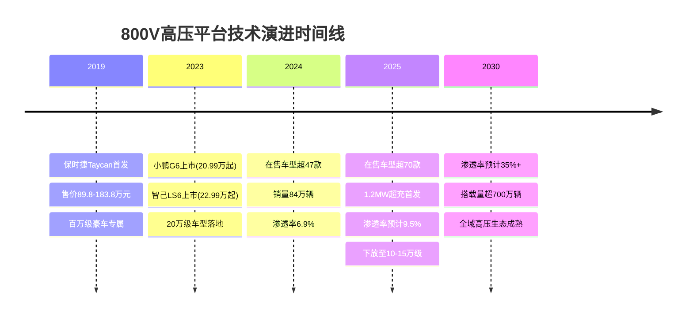

### 1.2 碳化硅功率器件产业化进程与成本下降曲线

碳化硅（SiC）作为第三代半导体材料的代表，正成为推动新能源汽车动力系统变革的核心技术力量。**SiC功率器件因耐压高、导通电阻低，成为800V逆变器的首选**，相比传统硅基IGBT，SiC逆变器开关损耗可降低70%，使电驱系统综合效率突破95%[^3]。在电控领域，碳化硅功率器件逐步替代传统IGBT，使能源转换损耗降低超80%，续航里程提升5%-10%[^4]。

从产业化进程来看，碳化硅正经历从6英寸向8英寸衬底量产的关键技术跃迁。**自主设计的8英寸平面工艺碳化硅功率器件已进入工程样品可靠性评估阶段**，技术参数对标国际水平，击穿电压（BVdss）达1700V，导通电阻、开关损耗等指标接近英飞凌同类产品[^5]。**预计2025年下半年启动量产，有望成为国内首批实现8英寸SiC器件商业化的企业**[^5]。6英寸工艺产品已完成研发，计划2025年下半年实现小批量供货，主要覆盖650V-1200V中高压车规级市场，适配新能源汽车800V高压平台[^5]。

国产化进程方面，中国碳化硅产业正在实现关键突破。**8英寸衬底量产后，成本较6英寸降低30%，国产化率从2023年的20%跃升至2025年的35%**[^6]。比亚迪、华为通过垂直整合模式，构建从材料到模组的全产业链能力，挑战Wolfspeed、英飞凌等国际巨头的主导地位[^6]。技术攻关（如缺陷密度降至0.1个/cm²）与成本优化（6英寸衬底成本降至2800元/片）正推动国产替代进入深水区[^6]。

在市场应用层面，碳化硅器件已在多个核心领域实现规模化导入。**新能源汽车领域，产品已导入比亚迪、英搏尔等供应链，用于主驱逆变器、车载充电模块**；充电桩/光伏储能领域，与英飞源、特来电、爱士惟等合作；数据中心/通信领域，为中兴通讯、长城电源提供高密度电源解决方案[^5]。**2024年上半年碳化硅控制器已进入量产**，精进电动等企业已实现北美三合一项目投产[^7]。

成本与市场规模方面，**2025年新能源汽车销量突破1200万辆，带动碳化硅器件市场规模达80亿元**[^6]。车规级SiC在新能源汽车中的成本占比持续攀升，预计单车芯片成本从2023年的4600元增至2025年的8000元，但系统效率的提升抵消了部分成本压力[^6]。碳化硅渗透率在高端车型中突破30%，中低端车型亦逐步导入[^6]。**国产8英寸SiC量产后预计比安森美同类产品价格低15%-20%**，将进一步加速市场渗透[^5]。

| 指标维度 | 2023年基准 | 2025年现状 | 2030年预期 |
|:---|:---|:---|:---|
| **衬底尺寸** | 6英寸为主 | 8英寸量产启动 | 8英寸规模化 |
| **国产化率** | 20% | 35% | 50%+ |
| **成本变化** | 基准值 | 较6英寸降30% | 持续下降 |
| **单车芯片成本** | 4600元 | 8000元 | 规模效应降本 |
| **高端车型渗透率** | <20% | 30%+ | 50%+ |
| **市场规模** | 约40亿元 | 80亿元 | 200亿元+ |

### 1.3 固态电池技术路线收敛与产业化时间窗口

固态电池被视为下一代锂电池技术方向，其以固态电解质替代传统液态电解液，不仅显著降低热失控风险，更能通过体系升级将能量密度大幅提升。当前，**全固态电池正迎来前所未有的产业热度**，实验室频频传出技术突破消息，但商业化时间节点仍存在一定分歧[^8]。

从技术路线来看，固态电池形成了硫化物、氧化物、聚合物、卤化物四大体系并行发展的格局。**硫化物路线因电化学窗口足够宽、室温离子电导率高（接近甚至优于液态电解液）而受到主流企业青睐**[^8][^9]。欧阳明高院士明确指出，当前要聚焦以硫化物电解质为主体电解质匹配高镍三元正极和硅碳负极的技术路线，并给出具体技术路线图：**2025-2027年以石墨/低硅负极硫化物全固态电池为主，2027-2030年以高硅负极硫化物全固态电池为主，2030年以后以锂负极硫化物全固态电池为主**[^8]。

产业化时间节点方面，行业共识正在逐步形成。**欧阳明高院士表示争取2030年全固态电池能够规模产业化**[^8]；俄罗斯工程院外籍院士吴志新认为到2032年或2033年左右全固态电池或可实现规模化装车使用[^8]；深蓝汽车董事长邓承浩则认为**全固态电池2030年大规模商用是最乐观的预期，甚至可能是2035年**[^8]。《节能与新能源汽车技术路线图3.0》提出**全固态电池预计在2030年实现小规模应用，到2035年有望大规模全球推广**[^10]。中信证券测算，**2030年全球固态电池出货量将达到642.6GWh，2024-2030年CAGR达到133%**[^9]。

核心性能指标方面，固态电池已实现多重突破。**半固态电池量产产品能量密度达350Wh/kg，支持整车续航突破1000公里；全固态电池实验室能量密度高达720Wh/kg，循环寿命超3000次**[^11]。2025年在售纯电乘用车中，800V电池系统充电倍率主要集中在3-5C，比亚迪1000V全域高压平台甚至搭载10C电池[^2]。**宁德时代发布的第二代神行超充电池充电峰值倍率达12C，功率达1.3兆瓦，充电5分钟续航达到520公里**[^2]。

成本与良率是制约固态电池商业化的核心瓶颈。**根据当前市场情况，磷酸铁锂电芯成本低至0.25元/Wh，而固态电池最便宜也要1.5元/Wh，贵的甚至达5元/Wh**[^8]。硫化物电解质每公斤近4万元，是传统电解液的千倍以上[^8]。在工艺方面，**硫化物电解质对湿度极度敏感，量产需全封闭环境，目前行业良品率普遍不到70%**[^8]，但半固态电池良率已超88%[^11]。

企业布局方面，**广汽集团全固态电池中试线已投产，计划2026年开展小批量装车；吉利宣布年内实现自研全固态电池Pack下线验证；宁德时代、比亚迪等头部企业规划产能超50GWh**[^11]。上汽集团明确2023至2025年固态电池技术将在以智己LS6为代表的新车型上逐步落地[^12]。

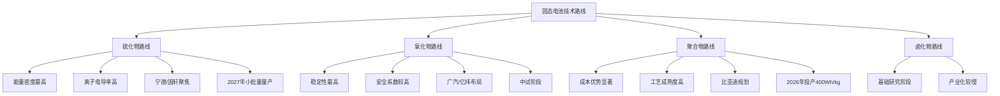

### 1.4 分布式驱动与多合一集成技术演进分析

电驱动系统正围绕高集成度、高效率、高功率密度、高性价比、高可靠性、低噪声等技术方向快速演进。**高性能和低成本是永恒不变的主题**，高转速/扭矩、油冷、扁线电机、800V高压化以及SiC功率模块、多合一物理/系统集成等技术正迅速发展[^13]。

从集成度演进来看，电驱总成正从独立分布向高度集成快速演变。**OEM主机厂主导的"3+3+X平台"集成开发模式正在成为主流**[^13]。其中，第一个"3"表示电机、电机控制器、减速器的集成（电驱三合一）；第二个"3"表示OBC、PDU、DCDC的集成（电源集成）；"X"是整车控制VCU、BMS、48V DCDC、热管理控制器等具体产品部件集成，或是升压、脉冲加热等功能集成[^13]。

**目前业内集成度最高的为十二合一电驱**，典型代表是比亚迪和吉利[^13]。2024年5月，比亚迪发布e平台3.0 Evo，首创十二合一智能电驱系统，集成了电机、电控、减速器、OBC、DCDC、PDU、VCU、BMS、能量管理智控系统、智能升压模块、智能升流模块、智能自加热模块，首搭海狮07EV上市[^13]。吉利银河同期发布十一合一智能电驱（海外版本为十二合一），实现了动力域与底盘域的部分融合[^13]。

电机技术方面，**传统400V电机转速多在15000转/分钟以下，800V平台需将转速提升至20000转/分钟以上**，以缩小电机体积并降低重量[^3]。采用"扁线绕组"技术替代传统圆线，使槽满率提升30%，降低铜损；"油冷电机"设计将冷却油直接喷淋至绕组与铁芯，实现高效散热[^3]。**星驱科技的超高速电机机械极限已达28000rpm**[^2]。2025年上海车展上，所有Tier1展商均已推出适配800V高压平台的电驱系统[^2]。

电驱系统的主要发展趋势包括：**电驱动系统多合一集成设计，体积缩减30%，功率密度突破5kW/kg**；宽禁带半导体大规模应用，SiC与GaN器件占比超60%，开关频率提升至20kHz以上，系统损耗降低15%-20%；新型电机技术如轴向磁通电机功率密度达6kW/kg；少稀土永磁电机成本下降20%；扁线油冷电机噪音小于70dB[^2]。

分布式驱动方面，**永磁同步电机与感应电机的组合应用成为提升能效的关键**[^4]。前者凭借高功率密度和低能耗主导日常行驶，后者在高速场景下减少反拖损耗，二者协同可降低整体电耗[^4]。双电机分布式驱动正成为高端车型的标配，通过精准的扭矩分配实现更优的操控性能和能效表现。

| 集成阶段 | 代表产品 | 集成部件 | 核心优势 |
|:---|:---|:---|:---|
| **三合一** | 传统电驱 | 电机+电控+减速器 | 基础集成，降低体积 |
| **六合一** | 主流方案 | 电驱三合一+电源三合一 | 系统效率提升 |
| **八合一** | 进阶方案 | 六合一+VCU+BMS | 功能整合深化 |
| **十二合一** | 比亚迪/吉利 | 八合一+热管理+智能模块 | 跨域融合，极致集成 |

### 1.5 四大核心技术协同效应与相互依赖关系

四大核心技术并非孤立发展，而是形成了紧密的协同网络，相互依赖、相互促进，共同推动新能源汽车动力系统的整体跃升。

**800V高压平台与碳化硅器件形成最强"共生"关系**。800V平台的核心价值在于"降电流、减损耗"，而碳化硅功率器件正是实现这一目标的关键核心[^14]。传统400V平台多采用IGBT器件，其导通损耗约为SiC器件的3倍；800V平台搭载的SiC控制器开关频率提升至20kHz，功率密度可达4.2kW/kg[^14]。**电压翻倍后，充电回路电流随之减半，不仅大幅降低导线发热损耗，还可采用更细的高压线束，助力整车减重约15kg**[^14]。某车企在800V平台中采用全SiC三电平逆变器，将电机峰值功率密度提升至4kW/kg，同时减少30%的冷却系统体积[^3]。

**高压平台与高倍率电池形成"供需"与"赋能"关系**。800V高压架构支持350kW以上超充，5%-80%电量充电时间可缩短至20分钟之内[^2]。**若电池技术实现升级，2025年主流车型的电池包可支持3C以上快充倍率，配合800V平台实现12分钟补能**[^3]。4C及以上充电倍率的实现需要在电池材料、高控制精度的BMS等方面实现突破[^2]。固态电池的高能量密度与高安全性，将进一步释放800V平台的性能潜力，实现"充电5分钟，续航数百公里"的完整用户体验。

**电驱系统高效化与热管理技术形成联动演进**。800V车型在12分钟快充过程中，电驱系统的高效化与高压化可确保动力系统不因过热而降额[^3]。**智能热管理系统通过"电芯-座舱-电驱"三维协同温控实现效率最大化**[^14]：电芯层面采用液冷+PTC双重加热方案，精准控制电芯温差在±2℃以内；能量回收将电驱系统工作余热导入电芯，冬季可减少30%的PTC能耗损耗；座舱联动优先利用电芯余热为座舱供暖[^14]。

**分布式驱动与智能底盘控制形成"融合"关系**。分布式驱动（如双电机、轮毂电机）的性能释放高度依赖于智能底盘控制技术的成熟。**吉利十二合一电驱的集成思路是跨域集成，将动力域与底盘域的功能进行深度融合**，其中GWRC智能防滑控制技术的集成，让动力域和底盘域融合，共同承担车辆运动相关的控制，实现更精准的车辆控制[^13]。

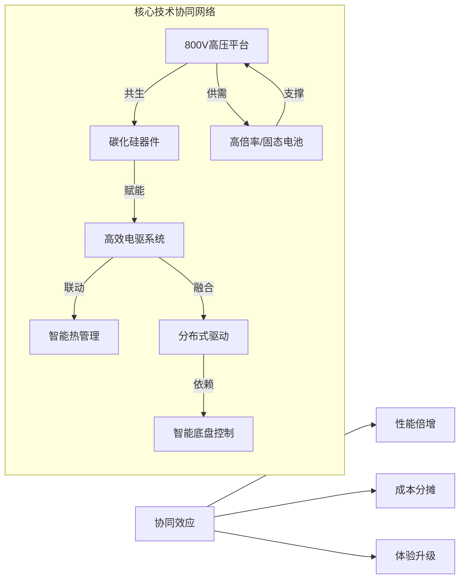

**技术协同的关键瓶颈与加速窗口**：短期内（2025年），800V与SiC的组合已越过核心临界点，处于规模化商业化的高速增长期；固态电池需重点攻克成本与供应链临界点；分布式驱动则需等待智能底盘协同技术的成熟。**2025年是半固态电池成熟产品推出并逐步放量、全固态技术路线逐步明晰并收敛的重要年份**[^9]。长期来看（2030年），中国乘用车800V高压架构的普及主要看SiC国产化与全域高压生态的成熟[^2]。

### 1.6 技术成熟度与商业化可行性映射框架构建

为系统评估各项技术的商业化可行性，需建立统一的技术成熟度评估指标体系，并构建技术演进阶段与商业化临界条件的映射模型。

**技术成熟度等级划分（TRL）**：

| 成熟度等级 | 等级名称 | 核心特征描述 | 对应技术阶段 |
|:---|:---|:---|:---|
| **TRL 1** | 概念验证期 | 基础原理明确，实验室环境完成初步验证 | 全固态电池硫化物/氧化物电解质材料基础研究 |
| **TRL 2** | 技术原型期 | 形成实验室可工作的技术原型，关键功能得到验证 | 轮毂电机在实验台架上实现基本驱动与控制功能 |
| **TRL 3** | 工程样机期 | 关键子系统/部件在模拟环境中验证，解决主要工程问题 | 8英寸SiC晶圆进入工程样品评估；全固态电池单体验证 |
| **TRL 4** | 系统集成与车规验证期 | 完整系统集成，通过严格的台架与车规级测试 | 800V高压平台与SiC电驱系统完成整车集成与测试 |
| **TRL 5** | 规模化量产与市场渗透期 | 技术实现规模化生产，成本可控，已搭载于量产车型 | 800V高压平台与SiC电驱在2025年于多款主流车型量产 |

**商业化临界条件定义**：

技术的商业化可行性不仅取决于技术本身成熟度，更依赖于三类关键临界条件的满足：

**成本临界点**：技术方案的综合成本降至可被目标市场主流价格区间车型所承受的水平。**SiC电驱方面，国产8英寸SiC器件成本比进口产品低15%-20%**[^5]，推动其在主流车型渗透；固态电池材料与制造成本需从目前液态电池的6-20倍降至2-3倍以内；800V平台系统级成本需随规模效应持续下降。

**供应链与生态成熟度**：支撑技术规模化应用的上游材料、核心部件供应链稳定可靠，且配套基础设施基本就绪。**800V平台依赖超充网络覆盖率与电网协同能力**，极氪已与国网联合开发动态负载管理系统[^2]；固态电池关键原材料需形成稳定供应，且制造工艺产线完成改造或新建；分布式驱动依赖高转速电机制造、高精度扭矩控制芯片及智能底盘控制软件的供应链成熟。

**性能-可靠性平衡点**：技术在实现关键性能指标突破的同时，满足车规级寿命、安全与可靠性要求。**800V+SiC需实现"充电5分钟，续航200公里+"的同时，电驱系统效率>97%**；固态电池能量密度突破400Wh/kg的同时，需通过针刺、热箱等极端安全测试，循环寿命>1000次；分布式驱动在实现极致操控功能时，需解决簧下质量增加对悬挂寿命和舒适性的影响。

**四大技术商业化可行性评估矩阵**：

| 技术类别 | 当前TRL | 成本临界点 | 供应链成熟度 | 性能-可靠性平衡 | 商业化阶段判定 |
|:---|:---:|:---:|:---:|:---:|:---|
| **800V高压平台** | TRL 5 | ✓已突破 | ✓基本就绪 | ✓已验证 | **规模化量产期** |
| **碳化硅器件** | TRL 4-5 | ✓接近突破 | △加速成熟 | ✓已验证 | **产业导入-量产期** |
| **半固态电池** | TRL 4 | △持续下降 | △快速构建 | ✓已验证 | **产业导入期** |
| **全固态电池** | TRL 2-3 | ✗待突破 | ✗待构建 | △验证中 | **技术验证期** |
| **多合一电驱** | TRL 5 | ✓已突破 | ✓成熟 | ✓已验证 | **规模化量产期** |
| **分布式驱动** | TRL 3-4 | △待下降 | △构建中 | △验证中 | **工程验证期** |

基于上述框架，可以明确：**在2025-2030年窗口期，800V与SiC的组合已处于规模化商业化的高速增长期**，是当前最具商业化确定性的技术方向；半固态电池正处于产业导入关键期，预计2025-2027年实现成熟产品放量；全固态电池需重点攻克成本与供应链临界点，2030年有望实现规模产业化；分布式驱动则需等待智能底盘协同技术的成熟，以实现其性能与可靠性的平衡。

## 2 全生命周期评估体系构建方法论

新能源汽车动力系统技术路线的商业化可行性评估，需要突破传统单一维度的分析局限，建立覆盖研发制造、使用场景、残值管理三大阶段的系统性评估框架。本章节基于生命周期评价（LCA）方法论，结合新能源汽车动力系统的技术经济特性，构建适用于商业化临界点量化判断的全生命周期评估体系，为后续各技术路线的多维度指标设计与对比分析提供方法论基础。

### 2.1 全生命周期评估框架的理论基础与适配设计

#### 2.1.1 ISO 14040/14044标准框架与新能源汽车评估适配

生命周期评估（LCA）是国际标准化组织（ISO）定义的系统性分析方法，依据ISO 14040/14044标准，通过量化产品或服务在整个生命周期内的资源消耗、能源使用及环境排放，综合评价其环境绩效[^15]。该标准框架包含四个核心步骤：**目标与范围定义、清单分析（LCI）、影响评估（LCIA）、结果解释**[^16]。2020年9月发布的ISO 14040:2006/Amd.1:2020修订版进一步优化了术语定义的精确性和流程描述的严谨性，删除了"产品系统"的限定，使适用范围扩展至服务系统，并将检查流程术语从"验证（verifying）"统一改为"确定（determine）"，强调结果导向与数据决策支持功能[^17]。

对于新能源汽车动力系统技术路线评估而言，传统LCA方法需要进行针对性适配。**新能源汽车动力电池的全生命周期评估具有特殊性**：一方面，电池材料（如锂、钴、镍）多为稀有金属，开采与提纯过程对生态环境影响显著；另一方面，电池退役后的回收处理技术复杂，涉及物理拆解、化学提纯、梯次利用等多个环节，不同处理方式对资源循环效率和环境负荷的影响差异极大[^18]。因此，评估需覆盖"生产-使用-退役-回收-再利用"的完整闭环，才能全面反映动力系统的环境与经济属性。

#### 2.1.2 评估目标定义与功能单位选择

**评估目标的明确性直接决定评估框架的有效性**。针对新能源汽车动力系统商业化临界点的量化需求，本评估体系设定三重核心目标：第一，量化不同技术路线从概念到回收的全生命周期总价值与总成本，支持产品规划与投资决策；第二，识别各技术路线达到成本平价、用户接受度拐点、市场渗透率临界值的关键条件组合；第三，建立技术成熟度变化、成本曲线演进、市场需求波动等因素对商业化可行性的动态影响评估机制。

**功能单位的选择是确保评估结果可比性的关键**。功能单位必须是一个可量化的指标，聚焦于产品系统的性能而非产品本身[^15]。基于新能源汽车动力系统的使用特性，本框架采用复合功能单位体系：

| 评估维度 | 功能单位选择 | 适用场景说明 |
|:---|:---|:---|
| **整车经济性评估** | 单台车辆行驶15万公里 | 覆盖典型家用车全生命周期里程 |
| **能效性能评估** | 每行驶100公里能耗（kWh或L） | 横向对比不同动力类型能效表现 |
| **动力系统成本评估** | 单位功率成本（元/kW） | 评估电驱系统技术经济性 |
| **电池系统评估** | 单位能量成本（元/kWh） | 评估电池技术成本演进 |
| **环境影响评估** | 单位里程碳排放（kg CO₂e/km） | 量化全生命周期碳足迹 |

#### 2.1.3 系统边界划分与差异化设计

**系统边界的科学界定是避免评估片面性的基础**。修订后的ISO 14040标准新增"研究系统"概念，要求边界划分必须明确对应具体研究对象[^17]。本评估框架采用"摇篮到坟墓"的全周期边界，涵盖从原材料开采、生产制造、运输、使用到报废回收的所有阶段[^16]。

针对新能源汽车动力系统的特殊性，系统边界需要进行差异化设计。**以动力电池为例，系统边界应包含**：材料开采阶段（锂、钴、镍等金属获取）、前驱体合成阶段（正极材料、负极材料制备）、电池单体及PACK组装阶段、使用阶段（充放电循环与容量衰减）、退役阶段（检测分类与健康状态评估）、回收处理阶段（梯次利用或拆解提取有价金属）、再利用阶段（回收材料重新用于生产）[^18]。

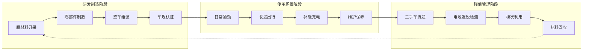

### 2.2 研发制造阶段价值驱动因素与约束条件分析

#### 2.2.1 核心价值驱动因素识别

研发制造阶段是新能源汽车动力系统价值创造的起点，**技术成熟度演进速度、研发投入产出效率、制造工艺良率提升曲线、供应链成本结构优化**构成该阶段的四大核心价值驱动因素。

**技术成熟度演进速度**决定了技术方案从实验室走向量产的时间窗口。汽车新产品开发流程涵盖策划阶段、设计阶段、试制试验阶段，其中概念设计阶段确定整个汽车产品的目标定位，确定整车、各大总成的性能参数，是汽车设计中最重要的阶段[^19]。基于CAE技术及大量经验和试验数据的整车数字化仿真体系，可以模拟整车在不同路况下的实际响应，为各零部件的精确分析提供载荷条件，从而进行复杂的非线性动力学分析、关键部件疲劳寿命分析、整车NVH分析[^19]。

**研发投入产出效率**直接影响技术方案的商业化可行性。从车企成本效益分析模型来看，净现值（NPV）计算需要将研发制造阶段净现金流进行折现，其中净现金流等于预期销售收入减去研发成本、制造成本与环境合规成本之和[^20]。**敏感性分析的关键变量包括电池原材料价格、新技术采纳风险、政策补贴变动**，这些因素的波动将显著影响研发投资回报。

**制造工艺良率提升曲线**是决定规模化生产经济性的关键。以固态电池为例，硫化物电解质对湿度极度敏感，量产需全封闭环境，目前行业良品率普遍不到70%，而半固态电池良率已超88%。良率的提升直接关系到单位产品分摊的制造成本，是技术从实验室走向商业化的核心瓶颈之一。

**供应链成本结构优化**涉及原材料、零部件、外协加工等直接成本，以及设备折旧、维护、工厂运营等间接成本的综合管控[^20]。新能源汽车产业链上游主要是关键原材料的开采与加工，其供应的稳定性和质量直接影响后续生产环节；中游以核心零部件制造为主，如电池、电机、电控系统等，决定了车辆的性能和品质[^21]。

#### 2.2.2 关键约束条件分析

研发制造阶段面临的关键约束条件涵盖**核心材料供应安全性、设备产能爬坡周期、车规级认证门槛、知识产权壁垒**四个维度。

**核心材料供应安全性**是新能源汽车产业链的根基。锂、钴、镍等关键原材料的资源储量、分布及供应稳定性，直接影响产业链的抗风险能力[^21]。从生产阶段的环境负荷来看，锂资源主要通过盐湖提锂或硬岩矿开采获取：盐湖提锂需大量蒸发湖水，可能导致周边区域地下水位下降、土壤盐渍化；硬岩矿开采则涉及矿石破碎、浮选等工序，会产生粉尘、废石堆积等问题[^18]。

**设备产能爬坡周期**制约着技术规模化应用的速度。试制试验阶段是产品由图纸走向实践的过程，需要进行样机试制试验并进行小批试制，验证产品图样、设计文件和工艺文件、工装图样的正确性[^19]。产能爬坡涉及生产线调试、工艺优化、人员培训等多个环节，周期长短直接影响技术方案抢占市场窗口的能力。

**车规级认证门槛**是动力系统技术进入整车配套的必要条件。样机试验是对电动汽车的设计和产品进行验证，以保证产品的结构和安全，包括整车道路试验、场地道路试验、整车台架试验、整车动静态主观评价试验、计算机仿真验证分析等多种方式[^19]。碰撞分析、NVH评价、系统整体优化、流体分析、产品疲劳寿命分析等详细设计阶段的工作，直接关系到产品能否通过车规级安全与可靠性要求[^19]。

#### 2.2.3 价值-约束平衡评估模型

建立研发制造阶段的价值-约束平衡评估模型，需要综合考量价值驱动因素与约束条件的相互作用关系。

| 价值驱动因素 | 关键约束条件 | 平衡机制 | 评估指标 |
|:---|:---|:---|:---|
| 技术成熟度演进 | 车规级认证门槛 | 研发-验证协同推进 | 从原型到量产周期（月） |
| 研发投入产出效率 | 知识产权壁垒 | 自主研发与技术引进结合 | 单位研发投入产出比 |
| 制造工艺良率 | 设备产能爬坡 | 工艺优化与产能扩张并行 | 良率提升斜率（%/季度） |
| 供应链成本优化 | 材料供应安全性 | 多元供应与国产替代 | 核心材料国产化率（%） |

### 2.3 使用场景阶段价值实现机制与效益评估方法

#### 2.3.1 价值实现机制分析框架

使用场景阶段是技术性能向用户价值转化的关键环节，**能效表现、补能体验、可靠性与安全性、用户总拥有成本（TCO）**构成该阶段价值实现的四大核心维度。

**能效表现**直接决定用户的日常使用成本。新能源汽车的使用成本优势显著，传统燃油车每行驶100公里的燃油成本大约在50-80元，而新能源汽车每行驶100公里的用电成本仅为10-20元[^22]。以智界R7为例，其纯电版CLTC工况下最高续航达802km，百公里电耗控制在13.1kWh，配合0.219Cd的超低风阻系数，能效表现优于多数同级SUV[^23]。

**补能体验**是影响用户购买决策的关键因素。800V高压平台与高倍率电池的组合显著提升了补能效率，智界R7得益于800V高压架构，支持5分钟补能约200km，有效覆盖高速通勤场景[^23]。增程版车型则通过"日常用电、长途用油"的模式解决续航焦虑，智界R7增程版CLTC综合续航高达1673km，在满油满电状态下可单程覆盖跨省长途[^23]。

**可靠性与安全性**是用户长期使用信心的基础。新能源汽车的保养成本相对较低，传统燃油车需要定期更换机油、机滤等，而新能源汽车的电机和电池系统维护相对简单，保养周期长，保养费用可降低30%-50%[^22]。智能驾驶系统的安全冗余能力同样重要，智界R7搭载的华为乾昆智驾ADS 4.0配合CAS 4.0全向防碰撞系统，在暴雨、大雾或无路灯夜间等低能见度场景下，系统能比人眼更早识别危险并执行主动避险[^23]。

#### 2.3.2 基于真实场景的效益评估方法

**构建多维度用户体验评分模型**是量化使用阶段价值的有效方法。基于行业研究实践，可设立四大一级指标并进行权重分配：三电与智能化能力（30%）聚焦纯电续航真实性、电池安全技术、智能驾驶与座舱体验成熟度等核心指标；空间舒适与实用性（25%）涵盖车内空间利用率、座椅舒适性配置、家庭出行场景适配度等关键要素；品质可靠性与保值表现（25%）包含制造工艺水平、质量口碑稳定性、长期保值率预期等核心维度；价格价值与服务体系（20%）评估购车权益丰富度、用车成本经济性、售后服务体系完善度等实践能力[^24]。

**全生命周期使用成本（TCO）计算模型**为用户决策提供量化依据：

```
TCO使用阶段 = 能源成本 + 保养维修成本 + 保险成本 + 税费 - 使用阶段收益（如碳积分）
```

以新能源汽车与传统燃油汽车的成本效益对比为例：

| 对比维度 | 新能源汽车 | 传统燃油汽车 | 差异分析 |
|:---|:---|:---|:---|
| **购置成本** | 相对较高（高出2-5万元） | 基准值 | 电池成本占比较大 |
| **百公里能源成本** | 10-20元 | 50-80元 | 新能源优势显著 |
| **保养成本** | 降低30%-50% | 基准值 | 维护相对简单 |
| **年均碳减排** | 5-10吨CO₂ | - | 环保效益显著 |

#### 2.3.3 技术性能向用户价值转化路径

**技术性能与用户价值之间存在明确的传导路径**。研发制造阶段确定的技术参数，通过使用场景的实际表现转化为用户可感知的价值。以底盘机械素质为例，智界R7基于满血途灵平台打造，采用前双叉臂+后五连杆独立悬架，全系标配CDC连续可变阻尼减振器与空气悬架，系统支持路面智能预瞄功能，在经过减速带或连续弯道时可毫秒级调节悬架软硬度，这种"魔毯"般的滤震效果能有效抑制车身侧倾，从而降低后排乘客（尤其是老人与儿童）的晕车感[^23]。

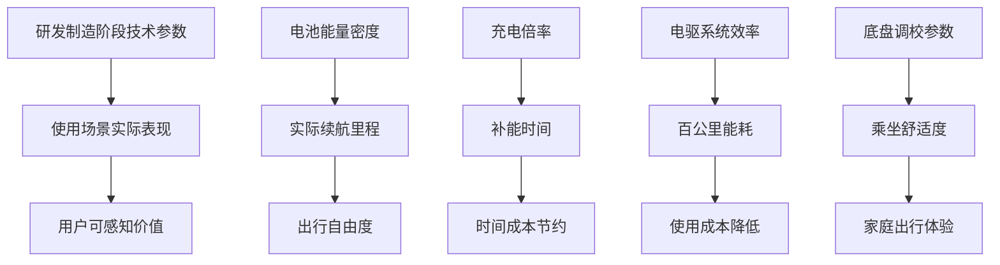

### 2.4 残值管理阶段价值保持与回收利用评估体系

#### 2.4.1 影响新能源汽车残值的核心因素

新能源汽车残值管理是全生命周期评估中不可忽视的重要环节，**电池健康状态、技术迭代速度、品牌与车型热度、市场供需结构**构成影响残值的四大核心因素。

**电池健康与可用容量**是决定新能源汽车残值的首要因素。电池作为核心资产，容量下降、循环次数、保修条款都会影响二手价格，若有容量损耗报告，买家会对续航里程做再评估[^25]。中国汽车流通协会最新数据显示，**新能源二手车三年平均贬值率高达65%**，部分车型甚至出现"一年腰斩、三年残值归零"的极端案例[^26]。

**技术迭代速度**对存量车辆价值形成显著冲击。车企技术迭代带来的冲击往往令车主措手不及，某头部品牌2023款车型上市仅半年，因新款升级了电池，旧款车型残值瞬间蒸发40%[^26]。在某汽车论坛万人调查中，87%受访者坦言"新能源车贬值速度超出承受范围"，直接导致23%潜在买家放弃购买计划[^26]。

**品牌与车型热度**直接影响二手车流通效率。热销车型在市场上更容易回收，冷门或区域性热度低的车型残值相对较弱[^25]。问界品牌的市场表现印证了品牌价值对残值的支撑作用，市场研究机构杰兰路发布的研究显示，问界M9第四次夺得车型NPS（净推荐值）总榜第一，成为新能源SUV中首个且唯一一个连续四次获此荣誉的车型[^27]。

#### 2.4.2 电池健康状态评估与残值预测模型

**数据驱动的残值预测模型**是提升评估准确性的关键。为了更有效地实现动力电池性能和寿命的精准预测，微软亚洲研究院联手日产汽车针对电池退化问题展开研究，基于日产汽车特有的电池数据，共同开发了一种全新的机器学习预测方法，通过挖掘电池结构的高级特征，**将电池退化预测准确率的平均误差控制在0.0094**[^28]。

**融合数据驱动的残值预测模型**可采用以下公式框架：

```
残值 = 新车购置价 × 基础残值率曲线 × ∏(调整系数_k)
```

其中关键调整系数包括：
- **K_电池** = f(电池SOH, 循环次数, 保修政策)
- **K_品牌车型** = g(市场供需指数, 新车价格波动)
- **K_数据** = h(行驶里程, 事故记录, 保养完整性)

车e估等专业评估平台通过与主机厂、保险公司、维修企业、二手车交易市场等产业链主体深度合作，累计沉淀亿级车辆数据，涵盖汽车的出厂配置、维修保养记录、保险出险信息、交易记录等，为评估提供全面、准确的基础[^29]。针对新能源汽车残值评估的难题，车e估开发了专门的检测和评估技术，通过专业设备和算法，对电池电芯健康度、电机工作状态、电控系统性能等进行综合检测，准确评估三电系统的性能和剩余价值[^29]。

#### 2.4.3 动力电池回收利用价值评估

**废旧动力电池回收利用的规范化管理**正在加速推进。工业和信息化部等6部门联合发布《新能源汽车废旧动力电池回收和综合利用管理暂行办法》，遵循"全渠道、全链条、全生命周期"管理思路，自2026年4月1日起施行[^30]。管理办法重点设计"车电一体报废"等制度，明确"报废新能源汽车，动力电池缺失的，应当认定为车辆缺失"，从而防止出现废旧动力电池流向难以掌握的情况[^30]。

**动力电池全生命周期评估需覆盖回收处理阶段的价值**。根据检测结果，部分电池进入梯次利用（如储能、低速车领域），剩余电池通过物理或化学方法拆解，提取有价金属；回收的金属材料重新用于电池生产，形成资源循环[^18]。据测算，**2030年当年的废旧动力电池产生量将超过100万吨**[^30]，回收利用市场规模可观。

| 回收处理方式 | 适用条件 | 价值实现路径 | 环境效益 |
|:---|:---|:---|:---|
| **梯次利用** | 容量保持70%-80% | 储能系统、低速车等场景 | 延长使用寿命 |
| **材料回收** | 容量低于70% | 提取锂、钴、镍等有价金属 | 减少原材料开采 |
| **整包再制造** | 结构完整、部分模组可用 | 更换故障模组后重新使用 | 最大化资源利用 |

### 2.5 跨阶段价值传导机制与动态评估模型构建

#### 2.5.1 三阶段价值传导路径分析

研发制造、使用场景、残值管理三大阶段之间存在紧密的价值传导关系，**技术选择在不同阶段产生价值溢出与约束传递效应**。

**研发制造向使用场景的价值传导**主要体现为技术性能与质量传导。研发阶段确定的电池能量密度、风阻系数、整车重量等参数，直接决定使用阶段的实际续航里程；制造阶段的质量控制水平，影响使用阶段的维修成本与故障率。量化关联模型可表示为：

```
实际续航里程 = f(研发电池能量密度, 风阻系数, 整车重量) × 场景衰减系数(温度, 速度)
使用阶段维修成本 = 基准故障率(制造质量指数) × 零部件更换成本
```

**研发制造向残值管理的价值传导**体现为品牌价值与技术过时风险传导。研发阶段的技术路线选择决定了产品在未来市场中的竞争力，技术迭代速度快的领域（如智能驾驶、电池技术），存量车辆面临更大的贬值压力。量化关联模型可表示为：

```
基础残值率曲线 = 基准曲线 × (1 - 技术过时风险系数)
技术过时风险系数 = f(技术迭代速度, 平台可升级性)
```

**使用场景向残值管理的价值传导**体现为使用痕迹数据传导。行驶里程、事故记录、保养完整性等使用阶段积累的数据，直接影响残值评估结果。量化关联模型可表示为：

```
残值调整系数_K数据 = 1 - (里程折旧系数 + 事故折损系数 - 保养增值系数)
```

#### 2.5.2 全生命周期总拥有成本（TLCO）整合模型

**将三阶段成本与收益整合为统一的评估框架**，是实现商业化临界点量化判断的关键。全生命周期总拥有成本（TLCO）计算模型可表示为：

```
TLCO = C_研发制造 + PV(C_使用) - PV(V_残值) + PV(C_环境外部性)
```

其中：
- **C_研发制造**：单台车分摊的研发与制造成本
- **PV(C_使用)**：使用阶段总成本的现值，C_使用 = ∑(能源、保养、保险等年度成本_t)
- **PV(V_残值)**：残值回收价值的现值，V_残值 = 预测的第N年车辆残值 + 报废回收净值
- **PV(C_环境外部性)**：各阶段环境外部成本（如碳排放）的现值
- **r**：折现率，反映资金时间价值和风险
- **t**：时间（年）

**车企成本效益分析的核心**是把"成本"（包括直接支出、机会成本、资本性支出、隐性成本等）与"效益"（直接收益、成本节省、软性收益如品牌提升、合规性降低的风险成本等）放在同一个时空视图里，用折现的口径来评估[^20]。评价的核心是把各项成本与效益在同一时间尺度下折现到评估时点，形成净现值（NPV）和内部收益率（IRR）的量化结果[^20]。

#### 2.5.3 动态评估与敏感性分析机制

**动态评估模型需要实现对关键变量变化的实时响应**。敏感性分析对核心假设如产能利用率、原材料价格、汇率、碳价、车型生命周期等进行一个或多个情景的变动，观察NPV与IRR的变化范围[^20]。

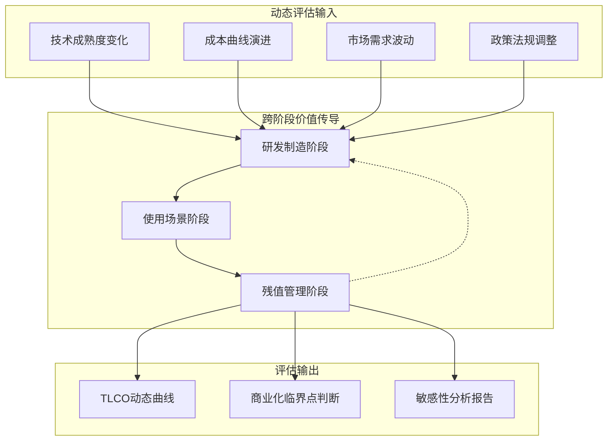

**关键敏感性变量识别**：

| 变量类别 | 具体变量 | 影响阶段 | 敏感性程度 |
|:---|:---|:---|:---|
| **技术变量** | 电池能量密度提升速度 | 研发制造→使用 | 高 |
| **成本变量** | 碳化硅器件价格 | 研发制造 | 高 |
| **市场变量** | 新车价格波动 | 残值管理 | 高 |
| **政策变量** | 碳税/补贴政策 | 全周期 | 中高 |
| **使用变量** | 充电基础设施覆盖率 | 使用场景 | 中 |

**模型实施的数据需求**：需建立贯通研发、生产、车联网、售后、二手车交易的数据中台，关键数据流包括研发BOM与参数、生产质量数据、实时车辆传感器数据、用户行为数据、维修记录、二手车交易大数据、电池溯源数据。全国新能源汽车动力电池溯源信息平台的建立，以及新能源汽车动力电池数字身份证管理制度的实施，将为全生命周期评估提供更完善的数据基础[^30]。

通过上述全生命周期评估体系的构建，可以实现对不同动力系统技术路线商业化临界点的系统性量化分析，为后续各维度指标设计与技术路线对比提供坚实的方法论支撑。

## 3 研发制造维度评估指标体系设计

研发制造阶段是新能源汽车动力系统技术路线商业化的起点与基石，其投入产出效率、技术成熟度演进、供应链稳定性、制造成本控制及产能爬坡能力，直接决定了技术方案能否在预期时间窗口内实现规模化量产并达到商业化临界点。本章节系统构建覆盖研发投入、技术成熟度、供应链、成本曲线、产能效率五大维度的量化评估指标体系，针对800V高压平台、碳化硅功率器件、固态电池、多合一电驱及分布式驱动等核心技术路线进行差异化分析，识别影响商业化临界点的关键制造端变量。

### 3.1 研发投入强度与技术产出效率评估指标

#### 3.1.1 研发投入强度的行业基准与差异化特征

研发投入强度是衡量技术创新能力的核心指标，反映企业或行业对技术突破的资源配置力度。**目前全市汽车行业研发投入强度达3.1%，高于全国1.3个百分点**，显示出新能源汽车产业对技术创新的高度重视[^31]。这一投入强度的提升，驱动了800V高压平台、碳化硅器件、固态电池等前沿技术的加速突破。

从技术路线差异来看，不同动力系统技术的研发投入特征呈现显著分化：

| 技术路线 | 研发投入特征 | 核心投入方向 | 投入产出周期 |
|:---|:---|:---|:---|
| **800V高压平台** | 系统集成型投入 | 高压架构设计、热管理、电气安全 | 2-3年 |
| **碳化硅器件** | 材料与工艺双重投入 | 衬底制备、外延生长、器件设计 | 3-5年 |
| **固态电池** | 基础研究主导 | 电解质材料、界面工程、工艺开发 | 5-8年 |
| **多合一电驱** | 集成优化型投入 | 结构设计、功能整合、NVH控制 | 1-2年 |
| **分布式驱动** | 跨域融合型投入 | 轮毂/轮边电机、底盘协同控制 | 3-5年 |

**纯电动汽车的核心技术研发投入大**，电机、电控系统、高压平台等技术仍处于快速发展阶段，车企需要持续投入大量资金进行研发[^32]。以800V高压快充技术、SiC功率器件的应用为例，这些技术需要长期的技术积累和资金支持，研发成本最终会分摊到每辆车的售价中[^32]。

#### 3.1.2 研发效率评估模型构建

研发效率的量化评估需综合考量投入规模、产出质量与转化速度三个维度。构建研发效率评估模型如下：

```
研发效率指数 = (专利产出密度 × 技术领先系数) / (研发投入强度 × 转化周期系数)
```

**核心评估指标体系**：

| 指标类别 | 具体指标 | 计算方法 | 评估意义 |
|:---|:---|:---|:---|
| **投入规模** | 研发投入强度 | 研发支出/营业收入 | 资源配置力度 |
| **产出质量** | 专利产出密度 | 核心专利数/研发投入 | 技术创新效率 |
| **产出质量** | 技术领先系数 | 全球首创+行业领先占比 | 技术竞争力 |
| **转化效率** | 转化周期系数 | 从专利到量产的平均时间 | 商业化速度 |

以长安汽车为例，其SDA架构拥有2200余项新能源、智能化等关键技术，其中数十项属于全球首创和行业领先[^31]。这种高密度的技术产出与5年内超500亿元的研发投入布局相匹配，体现了头部车企在研发效率方面的领先优势[^31]。

#### 3.1.3 技术突破与商业化转化的关键效率节点

**识别研发到商业化转化的关键效率节点**，是优化资源配置的核心任务。基于行业实践，关键效率节点包括：

- **概念验证到工程样机**：固态电池当前处于此阶段，硫化物电解质的实验室验证已完成，正向工程样机转化[^33]
- **工程样机到车规认证**：8英寸碳化硅功率器件已进入工程样品可靠性评估阶段，预计2025年下半年启动量产[^34]
- **车规认证到规模量产**：800V高压平台已完成此跨越，2024年中国800V高压架构乘用车累计销售84万辆[^34]

### 3.2 技术成熟度分级评估与演进路径分析

#### 3.2.1 技术成熟度等级（TRL）评估框架适配设计

基于ISO标准的技术成熟度等级（TRL）框架，结合新能源汽车动力系统的特殊性，设计九级评估体系：

| TRL等级 | 等级名称 | 核心判定标准 | 典型技术对应 |
|:---|:---|:---|:---|
| **TRL 1-2** | 基础研究期 | 原理验证、概念形成 | 全固态电池材料研究 |
| **TRL 3-4** | 技术验证期 | 实验室验证、关键功能确认 | 全固态电池单体验证 |
| **TRL 5-6** | 工程开发期 | 系统集成、环境适应性验证 | 半固态电池系统集成 |
| **TRL 7-8** | 产品验证期 | 车规认证、小批量试产 | 8英寸SiC器件认证 |
| **TRL 9** | 规模量产期 | 批量生产、市场投放 | 800V平台、多合一电驱 |

**当前各技术路线的TRL等级评估**：

从燃料电池的技术水平来看，**整体的技术水平已经从2020年的跟跑提升为2024年的并跑**，在过去的五年，是中国燃料电池技术出现重大突破的五年[^33]。在可靠性方面，平均首次故障里程以及平均间隔故障里程双双突破10万公里；在环境适应性方面，已实现零下40度的低温启动技术突破；在耐久性方面，燃料电池寿命已经超过2万小时[^33]。

#### 3.2.2 关键里程碑节点识别方法

**建立技术演进的关键里程碑识别机制**，可有效预判商业化时间窗口：

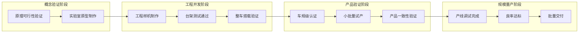

以碳化硅器件为例，**自主设计的8英寸平面工艺碳化硅功率器件已进入工程样品可靠性评估阶段**，技术参数对标国际水平，击穿电压（BVdss）达1700V，导通电阻、开关损耗等指标接近英飞凌同类产品[^34]。这标志着该技术已跨越TRL 6-7阶段，正向TRL 8-9迈进。

#### 3.2.3 车规级认证通过率与工程转化效率分析

**车规级认证是技术从实验室走向量产的关键门槛**。新能源汽车的部分核心零部件（如高端芯片、功率半导体）仍依赖进口，供应链稳定性不足且成本较高[^32]。车规级认证涉及：

- **功能安全认证**：ISO 26262标准要求的ASIL等级达标
- **环境适应性验证**：高低温、湿热、振动等极端条件测试
- **可靠性验证**：加速寿命测试、失效模式分析
- **电磁兼容认证**：EMC测试通过

工程转化效率的核心指标包括：

| 指标名称 | 定义 | 行业基准 | 优秀水平 |
|:---|:---|:---|:---|
| **认证周期** | 从样机到认证通过的时间 | 18-24个月 | 12-15个月 |
| **一次通过率** | 首次提交即通过认证的比例 | 60%-70% | 85%+ |
| **设计迭代次数** | 达到认证标准的设计修改轮数 | 3-5轮 | 1-2轮 |

### 3.3 供应链完备度与国产化率评估体系

#### 3.3.1 核心零部件供应链完备度评估指标

新能源汽车产业链条长、涉及面广，上下游关联度高，通常涵盖上游核心零部件、中游整车制造及下游汽车服务三个主要环节[^34]。**供应链完备度直接影响技术商业化的可行性与时间窗口**。

**供应链完备度评估指标体系**：

| 评估维度 | 具体指标 | 评估标准 | 权重 |
|:---|:---|:---|:---|
| **材料供应安全性** | 关键材料对外依存度 | <30%为优，>60%为高风险 | 25% |
| **核心部件国产化率** | 国产供应商份额占比 | >80%为优，<50%为待提升 | 30% |
| **供应商集中度** | CR3（前三供应商份额） | 40%-60%为适中 | 20% |
| **供应链韧性** | 替代供应商数量与切换周期 | >3家且<3个月为优 | 25% |

#### 3.3.2 关键环节国产替代进程分析

**动力电池供应链国产化率处于领先水平**。2025年上半年，宁德时代装机量96,429 MWh，市场份额41.1%；弗迪电池装机量63,635 MWh，市场份额27.1%；两大供应商合计占据68.2%的份额[^35]。中创新航、国轩高科、蜂巢能源等国产企业进一步巩固了动力电池供应链的自主可控能力。

**碳化硅器件国产化进程加速**。8英寸衬底量产后，成本较6英寸降低30%，国产化率从2023年的20%跃升至2025年的35%[^34]。比亚迪、华为通过垂直整合模式，构建从材料到模组的全产业链能力，挑战国际巨头的主导地位。**国产8英寸SiC量产后预计比安森美同类产品价格低15%-20%**[^34]。

**氢燃料电池关键零部件国产化取得重大突破**。大部分东西都要进口的局面已被打破，到2025年基本上全部产业链都已经取得突破[^33]。电堆、空气压缩机、膜电极、氢气循环系统、双极板等五项零部件国产化率已经超过80%，已经打破了国外技术垄断，在部分关键技术和产品应用方面达到国际领先水平[^36]。

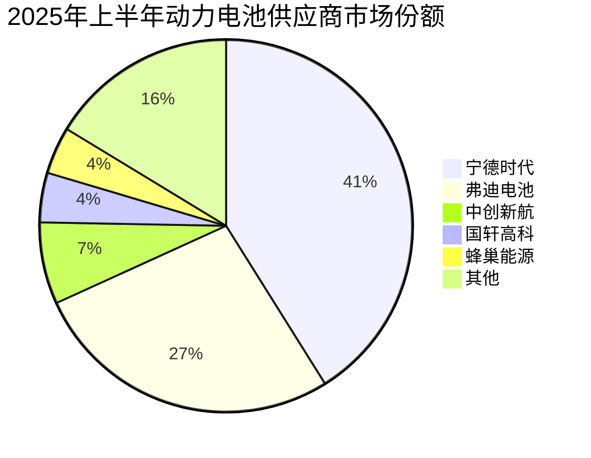

#### 3.3.3 供应链瓶颈对商业化临界点的制约与突破路径

**供应链瓶颈是制约新技术商业化的关键因素**。相比燃油车成熟的供应链，纯电动汽车的部分核心零部件供应链稳定性不足且成本较高，同时电池回收和梯次利用体系尚未完全建立，也增加了车企的隐性成本[^32]。

**关键瓶颈与突破路径**：

| 瓶颈环节 | 当前状态 | 制约影响 | 突破路径 |
|:---|:---|:---|:---|
| **碳化硅衬底** | 8英寸量产启动 | 成本与产能双重制约 | 国产替代+规模效应 |
| **固态电解质** | 实验室阶段 | 材料成本高企 | 工艺突破+产能建设 |
| **高速电机材料** | 部分依赖进口 | 供应稳定性风险 | 多元供应+自主研发 |
| **功率半导体** | 国产化率35% | 高端产品受限 | 技术攻关+产线投资 |

### 3.4 制造成本曲线与规模效应分析模型

#### 3.4.1 动力系统核心部件成本构成分析

**新能源整车成本结构以三电动力总成为核心**，其中动力电池、电机及电控合计占比约47%-55%[^34]。具体成本构成如下：

| 成本组成 | 占整车成本比例 | 核心影响因素 |
|:---|:---|:---|
| **动力电池** | 35%-40% | 材料价格、能量密度、规模效应 |
| **电机及电控** | 12%-15% | 永磁材料、功率半导体、集成度 |
| **底盘系统** | 14%-16% | 结构设计、材料选择 |
| **汽车电子** | 8%-10% | 芯片成本、软件开发 |
| **其他零部件** | 15%-20% | 供应链成熟度 |

**动力电池是纯电动汽车最核心的部件，其成本约占整车成本的30%-40%**[^32]。三元锂电池和磷酸铁锂电池的原材料（锂、钴、镍等）价格波动较大，且电池能量密度越高、续航里程越长，成本也随之增加[^32]。

#### 3.4.2 制造成本动态演进模型

**建立制造成本的动态演进模型**，可预判成本平价时间窗口：

```
单位成本(t) = 基准成本 × (累计产量/基准产量)^(-学习曲线指数) × 材料价格指数(t)
```

**不同技术路线的成本演进特征**：

| 技术路线 | 2023年成本基准 | 2025年成本水平 | 学习曲线指数 | 成本平价预期 |
|:---|:---|:---|:---|:---|
| **动力锂电池** | 0.8元/Wh | 0.25-0.4元/Wh | 0.15-0.20 | 已实现 |
| **碳化硅器件** | 高于IGBT 3倍 | 高于IGBT 1.5-2倍 | 0.20-0.25 | 2026-2027年 |
| **半固态电池** | 1.5-2元/Wh | 0.8-1.2元/Wh | 0.18-0.22 | 2027-2028年 |
| **全固态电池** | 3-5元/Wh | 1.5-3元/Wh | 待验证 | 2030年后 |

**氢燃料电池成本下降显著**。在政策支持下，当前我国燃料电池系统成本已降低至2000-2500元/kW，较示范前降低了80%以上[^36]。以空压机为例，早期进口空压机单价在10万元左右，目前国产空压机已大幅降价[^36]。

#### 3.4.3 规模效应临界点识别

**规模效应是驱动成本下降的核心机制**。目前纯电动汽车的市场渗透率仍在提升过程中，多数车企的电动车型产销量尚未达到燃油车的规模效应，生产规模较小导致单位制造成本较高，难以通过大规模生产降低售价[^32]。

**规模效应临界点评估**：

| 技术/产品 | 规模效应临界产量 | 当前产量水平 | 达标预期 |
|:---|:---|:---|:---|
| **800V平台车型** | 100万辆/年 | 84万辆(2024) | 2025年 |
| **碳化硅电驱** | 50万套/年 | 约30万套 | 2026年 |
| **半固态电池** | 10GWh/年 | <5GWh | 2027年 |
| **氢燃料电池系统** | 5万套/年 | <2万套 | 2028年 |

2025年1-10月，中国新能源汽车产量1267.2万辆，同比增长28.1%，累计渗透率达到46.4%[^37]。这一规模化增长为动力系统核心部件的成本下降提供了坚实基础。

### 3.5 产能爬坡效率与良率提升评估指标

#### 3.5.1 产能爬坡阶段效率评估指标体系

**产能爬坡效率直接决定技术抢占市场窗口的能力**。设计产能爬坡阶段的效率评估指标体系如下：

| 指标类别 | 具体指标 | 定义与计算 | 优秀基准 |
|:---|:---|:---|:---|
| **调试效率** | 产线调试周期 | 从设备安装到首件合格的时间 | <6个月 |
| **爬坡速度** | 月度产能提升率 | (本月产量-上月产量)/设计产能 | >5%/月 |
| **产能利用率** | 实际产量/设计产能 | 反映产能释放程度 | >85% |
| **设备稳定性** | OEE（设备综合效率） | 可用率×性能率×良品率 | >80% |

#### 3.5.2 新兴技术良率瓶颈分析

**良率是制约新兴技术规模化量产的核心瓶颈**。以固态电池为例，硫化物电解质对湿度极度敏感，量产需全封闭环境，**目前行业良品率普遍不到70%**，但半固态电池良率已超88%[^34]。

**不同技术路线的良率现状与提升路径**：

| 技术路线 | 当前良率 | 主要良率损失原因 | 提升路径 |
|:---|:---|:---|:---|
| **动力锂电池** | 95%+ | 成熟工艺，良率稳定 | 精细化管控 |
| **碳化硅器件** | 80%-85% | 衬底缺陷、外延均匀性 | 工艺优化、设备升级 |
| **半固态电池** | 88%+ | 界面接触、封装工艺 | 材料改进、工艺迭代 |
| **全固态电池** | <70% | 电解质敏感、界面问题 | 环境控制、工艺突破 |

#### 3.5.3 工艺成熟度对量产进度的影响评估

**工艺成熟度与量产进度存在强关联关系**。建立工艺成熟度-量产进度映射模型：

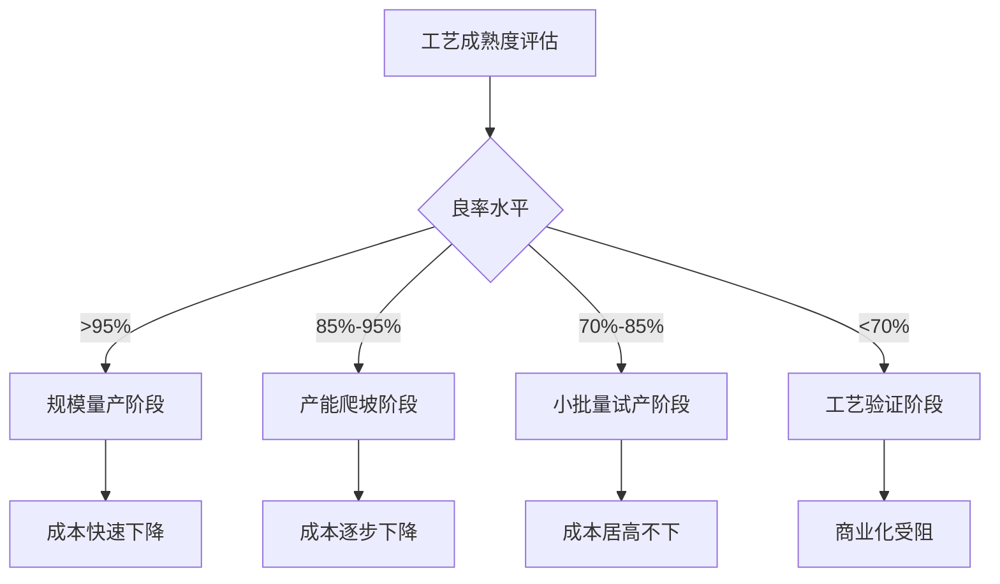

**燃料电池领域的工艺成熟度提升显著**。新一代高比功率、长寿命、低成本的电堆开始进入市场，成本、体积、功率密度等指标已跟国外最先进的水平相当，而且在未来成本还会持续地下降[^33]。高功率密度高效率燃料电池发动机技术成为主流，提高电堆运行温度、加大燃料电池总功率、常用工况点向高效率方向转移、去掉大功率散热装置等技术路径正在推进[^33]。

### 3.6 研发制造维度综合评估矩阵与临界变量识别

#### 3.6.1 技术路线综合评估矩阵构建

整合研发投入、技术成熟度、供应链完备度、制造成本、产能效率五大维度指标，构建研发制造维度综合评估矩阵：

| 技术路线 | 研发投入强度 | 技术成熟度(TRL) | 供应链完备度 | 成本竞争力 | 产能爬坡效率 | 综合评分 |
|:---|:---:|:---:|:---:|:---:|:---:|:---:|
| **800V高压平台** | ★★★☆ | TRL 9 | ★★★★ | ★★★★ | ★★★★☆ | **A** |
| **碳化硅器件** | ★★★★ | TRL 7-8 | ★★★☆ | ★★★☆ | ★★★☆ | **B+** |
| **多合一电驱** | ★★★☆ | TRL 9 | ★★★★☆ | ★★★★ | ★★★★☆ | **A** |
| **半固态电池** | ★★★★☆ | TRL 6-7 | ★★★☆ | ★★☆ | ★★★☆ | **B** |
| **全固态电池** | ★★★★★ | TRL 3-4 | ★★☆ | ★☆ | ★★☆ | **C+** |
| **氢燃料电池** | ★★★★ | TRL 7-8 | ★★★★ | ★★★☆ | ★★★☆ | **B+** |
| **分布式驱动** | ★★★★ | TRL 4-5 | ★★★☆ | ★★☆ | ★★☆ | **B-** |

**评分说明**：★代表该维度的相对表现水平，★越多表示越优；综合评分A为商业化成熟、B为商业化导入期、C为技术验证期。

#### 3.6.2 关键制造端临界变量识别

**基于综合评估矩阵，识别影响各技术商业化临界点的关键制造端变量**：

| 技术路线 | 关键临界变量 | 当前状态 | 突破优先级 |
|:---|:---|:---|:---|
| **800V高压平台** | 超充基础设施覆盖率 | 加速建设中 | 中 |
| **碳化硅器件** | 8英寸衬底良率与成本 | 量产启动 | 高 |
| **多合一电驱** | 跨域集成技术成熟度 | 十二合一量产 | 低 |
| **半固态电池** | 制造成本下降速度 | 持续优化中 | 高 |
| **全固态电池** | 电解质材料成本与良率 | 瓶颈期 | 最高 |
| **氢燃料电池** | 规模化生产成本 | 快速下降中 | 中高 |
| **分布式驱动** | 底盘协同控制技术 | 开发验证中 | 高 |

#### 3.6.3 资源配置优先级与突破方向建议

**基于临界变量分析，提出差异化的资源配置建议**：

**第一优先级（规模化扩张）**：800V高压平台与多合一电驱已具备规模化量产条件，应重点投入产能扩张与供应链优化，通过规模效应进一步降低成本，巩固商业化优势。2024年我国新能源乘用车电控、三合一电驱系统的累计搭载量分别达到1244.8万台、775.8万台，同比增长率均大于40%[^34]。

**第二优先级（产业化突破）**：碳化硅器件与氢燃料电池处于产业化导入关键期，应加大国产替代投入，突破成本与供应链瓶颈。**宁德时代与弗迪电池两大供应商合计占据68.2%的份额**[^35]，头部集中效应明显，中小企业需通过差异化战略寻求突破。

**第三优先级（技术攻关）**：固态电池与分布式驱动仍处于技术验证期，应持续加大基础研发投入，重点攻克材料成本、工艺良率、系统集成等核心瓶颈。**车企自制PACK份额已超50%**，表明整车企业正强化垂直整合以降低成本并提升技术控制力[^35]。

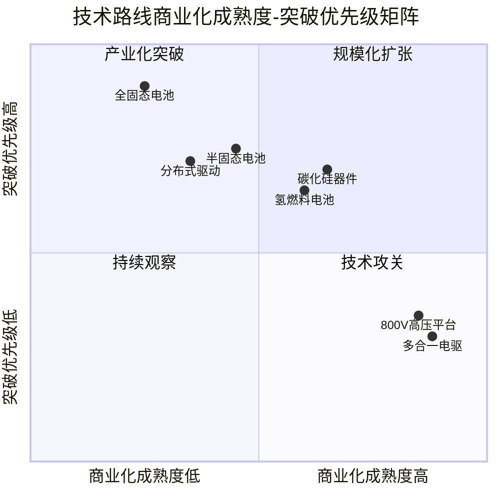

通过上述研发制造维度评估指标体系的构建与分析，可以明确：**800V高压平台与多合一电驱已进入规模化量产的成熟阶段**，是当前商业化确定性最高的技术方向；碳化硅器件与氢燃料电池处于产业化导入关键期，需重点突破成本与供应链瓶颈；固态电池与分布式驱动仍需持续技术攻关，其商业化临界点取决于材料成本下降与工艺良率提升的突破速度。这一评估框架为后续使用场景维度、残值管理维度的指标设计提供了制造端的量化基础，也为整车企业、零部件供应商的技术路线选择与资源配置提供了决策参考。

## 4 使用场景维度评估指标体系设计

使用场景阶段是新能源汽车动力系统技术性能向用户价值转化的关键环节，直接决定了技术方案能否获得市场认可并达到商业化临界点。本章节基于用户真实用车场景，系统构建覆盖补能效率、续航性能、驾驶体验、安全可靠性、使用成本五大核心维度的量化评估指标体系，深入分析纯电、插混、增程三种主流技术路线在不同场景下的适配性差异，建立场景-技术匹配度评估模型与用户价值感知量化方法，为使用阶段商业化临界点判断提供系统性评估框架。

### 4.1 补能效率评估指标与场景适配性分析

#### 4.1.1 补能效率多维度量化评估体系构建

补能效率是影响新能源汽车用户体验的核心痛点之一，其评估需要从充电速度、补能便利性、补能成本三个维度建立量化指标体系。

**充电速度指标体系**直接反映技术进步对用户时间成本的影响。800V高压平台与超充技术的规模化应用正在重塑补能体验的行业标准。**极氪在2025年第二季度首发的1.2MW全液冷充电桩，单枪峰值功率是特斯拉V4超充桩（350kW）的3.4倍**，实测数据显示搭载该技术的车型10分钟可补能500公里[^38]。增程阵营同样在快速升级，**全面升级800V高压平台后，小鹏、阿维塔等品牌实现12分钟快充至80%，纯电续航普遍突破400公里**[^39]。

| 充电速度指标 | 定义与计算方法 | 行业基准（2025年） | 优秀水平 |
|:---|:---|:---|:---|
| **峰值充电功率** | 充电设备最大输出功率（kW） | 350kW | 800kW+ |
| **10%-80%充电时间** | 电量从10%充至80%所需时间 | 25-35分钟 | <15分钟 |
| **充电倍率** | 充电功率/电池容量（C） | 3-5C | 10C+ |
| **单位时间补能里程** | 每分钟充电可增加的续航里程 | 15-20km/min | 50km/min+ |

**补能便利性指标**涵盖基础设施覆盖率与时间成本。充电基础设施的分布不均仍是制约纯电车型使用体验的关键因素。**城中村充电桩建设滞后，数量少且常被燃油车占用，影响使用便利性**[^40]。部分城市为提高充电站效率，**开始限制混动车型入场，理由是混动车充电速度慢、占用时间长、影响充电桩周转率**[^41]。这使得没有家充条件的增程车主补能便利性正在下降，而插混因电池容量小、充电快，受此影响较小。

**补能成本指标**直接影响用户的使用经济性决策。根据实测数据，**家充场景下电费成本约0.56元/度，公共充电桩均价约1.2元/度**[^42]。以年里程1万公里计算，家充场景下纯电车年能耗成本仅840元，公共充电场景下约1800元，而燃油车需6240元（92号汽油7.8元/升），**差距达4440-5400元/年**[^43]。

#### 4.1.2 不同技术路线补能效率对比分析

三种主流技术路线在补能效率方面呈现显著差异化特征，各有其适配场景：

**纯电车型**的补能效率高度依赖充电基础设施条件。在家充场景下，纯电车型可实现最低成本补能（每公里约0.05元），但在依赖公共充电桩的场景下，**年均可能多花3000元，且存在显著的时间成本**[^41]。800V高压平台的普及正在大幅缩短充电等待时间，**宁德时代发布的第二代神行超充电池充电峰值倍率达12C，功率达1.3兆瓦，充电5分钟续航达到520公里**。

**插混车型**具备"可油可电"的灵活补能优势。**钛7提供CLTC 135-200km纯电续航版本，72kW快充可实现30-80%电量仅需0.29小时补能，60L油箱容积保障长途出行需求**[^44]。插混车型的补能灵活性使其在充电条件不稳定的场景下具有明显优势，用户可根据实际情况选择充电或加油，有效消除续航焦虑。

**增程车型**在补能便利性上介于纯电与插混之间。增程车型日常可作为纯电车使用，**市区安静平顺，每月电费约50元左右**[^39]；但在无家充条件下，**部分城市充电站限制混动车入场的政策使增程车主补能便利性下降**[^41]。增程车的核心优势在于"没电了加油就行"，适合老小区无法安装充电桩的用户群体。

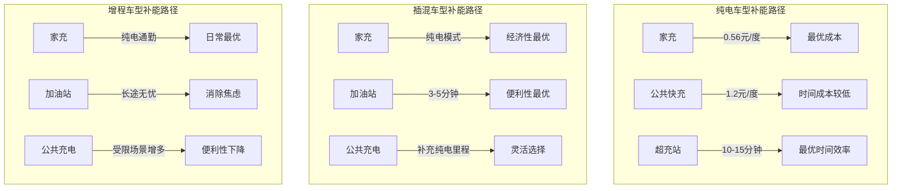

#### 4.1.3 补能效率用户接受度临界点识别

**补能效率达到用户接受度临界点的关键条件**包括充电时间、充电设施可及性、补能成本三个维度的综合满足。

从充电时间维度看，**用户普遍期望的充电等待时间临界点为15-20分钟**。800V高压平台配合4C以上快充电池，已能实现"充电一杯咖啡的时间，续航满足一周通勤"的体验。当10%-80%充电时间缩短至15分钟以内时，纯电车型的补能体验将与燃油车加油体验基本持平。

从充电设施可及性维度看，**家充条件是决定纯电车型补能体验的关键变量**。拥有固定车位并可安装家充桩的用户，纯电车型的补能体验最优；而无固定充电条件的用户，插混或增程车型的灵活补能优势更为突出。**2025年充电标准统一化正在降低充电设备成本和充电服务成本，进一步优化电车使用体验**[^43]。

| 补能场景 | 纯电车型适配度 | 插混车型适配度 | 增程车型适配度 |
|:---|:---:|:---:|:---:|
| **有家充条件** | ★★★★★ | ★★★★☆ | ★★★★☆ |
| **无家充/公共充电** | ★★★☆ | ★★★★★ | ★★★★☆ |
| **长途高速出行** | ★★★☆ | ★★★★★ | ★★★★☆ |
| **充电站受限区域** | ★★☆ | ★★★★★ | ★★★★☆ |

### 4.2 续航性能评估指标与真实场景达成率分析

#### 4.2.1 续航性能系统性评估指标体系

续航性能是用户选购新能源汽车时最为关注的核心指标之一，但标称续航与实际续航之间的差距长期困扰消费者。建立科学的续航性能评估指标体系，需要涵盖标称里程、实测达成率、工况差异、环境影响四个层面。

**标称续航里程**是厂商公布的理论续航值，目前行业主流采用CLTC（中国轻型汽车行驶工况）标准。**新能源纯电车型的平均续航里程已从2022年的450公里提升至2025年的530公里**[^45]，头部车型如小米YU7 2025款超长续航后驱版官方续航达835公里[^46]。然而，标称续航与实际使用存在显著差距，需要通过实测达成率指标进行修正。

**实测续航达成率**是衡量续航真实性的核心指标。根据驾仕派《极速焦虑》栏目对10款主流纯电车型的冬季高速实测数据，**不同价位、不同车型的续航达成率较为接近，整体平均值约为70%**[^46]。这意味着标称600公里续航的车型，在冬季高速工况下实际可行驶约420公里。具体车型表现如下：

| 车型 | 官方续航(km) | 实测续航(km) | 达成率 | 表显电耗(kWh/100km) |
|:---|:---:|:---:|:---:|:---:|
| **东风日产N7 625 MAX** | 625 | 464 | 74.3% | 15.7 |
| **小鹏P7+ 长续航Max** | - | 400+ | 71.0% | 最低 |
| **小米YU7 超长续航后驱** | 835 | 570 | 68.2% | - |
| **理想i8** | - | 504 | 70.0% | - |
| **蔚来ES8 六座豪华版** | - | 420 | 67.6% | 22.4 |
| **特斯拉Model Y L** | - | - | 67.0% | 15.75 |
| **方程豹钛3 501km后驱** | 501 | 300 | 60.6% | - |

#### 4.2.2 影响续航达成率的技术参数分析

**续航达成率受电池能量密度、风阻系数、整车重量、热管理系统等多重技术参数影响**，各参数间存在复杂的协同作用关系。

**风阻系数**是影响高速续航的关键因素。**理想i6 2025款两驱标准版凭借0.218Cd的超低风阻，表显电耗仅17.4kWh/100km，续航达成率67.8%，满电能在高速上跑约480公里**[^46]。相比之下，方程豹钛3作为"方盒子"SUV在风阻上难免吃亏，但依然跑出了300公里的实际续航，说明扎实的三电系统能有效弥补空气动力学的短板。

**热管理系统效率**直接影响极端温度下的续航表现。**冬季低温（零下20℃）时，纯电续航打五折，亏电油耗升至8.5L/100km（与燃油车持平）**[^40]。北方用户冬季纯电续航仅30-50km，亏电驾驶体验接近燃油车。**磷酸铁锂电池20℃续航保持率72%，三元锂电池达85%**[^47]，电池类型的选择对低温续航表现有显著影响。

**三电系统调校与整车能效策略**是决定续航达成率的核心竞争力。**小鹏的两款车型能耗全场最低、续航达成率高于平均水准，主要得益于小鹏在三电系统效率和空气动力学设计上的优化**[^46]。各车型之间的差距并未因价格而显著拉开，真正的差异更多体现在三电系统调校、车身风阻与整车能效策略上，而非单纯堆电池或看品牌。

#### 4.2.3 续航焦虑消除的临界里程阈值模型

**续航焦虑的消除取决于实际续航里程与用户典型出行场景的匹配程度**。随着大容量电池的广泛普及与充电基础设施的持续完善，**纯电车型的"续航焦虑"已得到实质性缓解**[^45]。

构建续航焦虑消除的临界里程阈值模型：

```
续航焦虑指数 = (典型单次出行距离 × 安全系数) / (实测续航里程 × 补能便利系数)
```

当续航焦虑指数<1时，用户续航焦虑基本消除。基于用户出行场景分析：

| 使用场景 | 典型单次距离 | 安全系数 | 临界实测续航 | 焦虑消除条件 |
|:---|:---:|:---:|:---:|:---|
| **日常通勤** | 30-50km | 1.5 | 75-100km | 标称续航200km+即可满足 |
| **城际出行** | 200-300km | 1.3 | 260-390km | 标称续航500km+基本满足 |
| **长途自驾** | 500km+ | 1.2 | 600km+ | 需超充网络配合或选择插混/增程 |

**增程与插混车型通过"可油可电"特性从根本上消除续航焦虑**。**理想i8满电实际高速续航504公里，兑现了"高速500km"的承诺**[^46]；**红旗HS6 PHEV 240智混版CLTC纯电续航248km，综合续航1650km**[^44]，完全覆盖绝大多数用户的出行场景。

### 4.3 驾驶体验评估指标与用户满意度量化方法

#### 4.3.1 驾驶体验多维度评估指标体系设计

驾驶体验是新能源汽车相较于传统燃油车的核心差异化优势之一，需要从动力响应、操控性能、乘坐舒适性、NVH表现、智能化体验五个子维度建立系统性评估指标体系。

**动力响应指标**量化电驱系统的加速性能优势。**电机加持下，PHEV起步加速性能优于燃油车，如比亚迪汉DMi综合功率310kW，百公里加速6.9秒，动力媲美40万级燃油车**[^40]。低速（0-60km/h）平顺无顿挫是电驱系统的显著优势。**钛7四驱版搭载双电机系统，综合功率490Ps，4.5秒破百的加速性能领先同级；红旗HS6 PHEV四驱版以502Ps、646N·m扭矩实现4.8秒破百**[^44]。

| 动力响应指标 | 定义 | 纯电车型基准 | 插混/增程基准 |
|:---|:---|:---:|:---:|
| **零百加速时间** | 0-100km/h加速时间 | 5-8秒 | 4.5-8秒 |
| **动力响应延迟** | 踩下加速踏板到动力输出的时间 | <0.3秒 | <0.5秒 |
| **中途加速能力** | 60-120km/h加速时间 | 4-6秒 | 5-7秒 |

**操控性能指标**反映底盘调校与悬挂系统的水平。**钛7采用前双叉臂+后五连杆独立悬挂与软硬调节功能，兼顾舒适性与操控性；四驱版配备的雪地/沙地模式+蠕行模式，支持轻度越野场景，接近角24°/离去角25°的通过性参数优于同级**[^44]。

**乘坐舒适性指标**涵盖座椅舒适度、空间利用率、减振效果等要素。**红旗HS6 PHEV四驱版配备可变悬挂，配合253色氛围灯与丹拿音响，营造出更豪华的驾乘氛围**[^44]。

#### 4.3.2 用户满意度量化评分方法

**中国质量协会NEV-CACSI测评为驾驶体验满意度量化提供了权威基准**。数据显示，**2025年NEV-CACSI指数达80分（满分100分），同比提升1分。其中，纯电动汽车与混动汽车（含插电式混动、增程式混动）用户满意度均为80分，分别同比提高2分、1分**[^48]。

**感知质量与感知价值的显著提升是拉动行业用户满意度上升的关键因素**。2025年，新能源汽车行业用户感知质量得分为80.6分，同比提高1.2分；感知价值得分为79.7分，同比提升1.5分[^48]。

**质量可靠性与性能设计满意度同步向好**。2025年，新能源汽车质量可靠性满意度得分为80.8分，同比提高0.7分。其中，**混动汽车得分为81分，同比提高0.8分，略高于纯电动汽车的80.7分**[^48]。性能设计满意度得分为81.1分，同比提高0.5分。

**用户购车需求正在发生结构性变化**。从用户购车需求来看，**"保养费用低""车型好看"的关注度持续下降，"汽车性能好""质量可靠性高""舒适性高"是核心考量因素**[^48]。其中，"质量可靠性高"的提及率已连续四年上涨，"舒适性高"提及率连续两年上升。

#### 4.3.3 不同技术路线驾驶体验差异分析

**纯电、插混、增程三种技术路线在驾驶体验上各有特色**，需要根据用户偏好进行差异化评估。

**纯电车型**在静谧性与动力平顺性方面具有天然优势。**增程车在城市环境下，静谧性让用户赞不绝口："像开纯电车一样安静平顺"**[^39]。纯电驱动模式下零排放低噪音，驾驶舱静谧性远超燃油车，加速平顺无顿挫[^49]。

**插混车型**在动力性能与全场景适应性上表现均衡。**插混阵营着重优化平顺性，比亚迪DM5.0、吉利雷神系统大幅降低发动机介入顿挫，部分车型加入"纯电优先"模式**[^39]。但插混车因为频繁启停发动机，市区驾驶体验反而不如增程[^39]。

**增程车型**在城市通勤场景下的驾驶体验接近纯电。**增程式电动车电机全时驱动车轮，无变速箱顿挫，动力输出线性如纯电车**[^49]。但在高速场景下，增程车发动机噪音相对明显，**高速上油耗飙升到9L多，发动机噪音也大**[^39]。

```mermaid
radar
    title 驾驶体验各维度对比评分（满分10分）
    variables ["动力响应", "操控性能", "乘坐舒适", "NVH表现", "智能化体验"]
    values
        "纯电车型" : [9, 8, 8, 9, 9]
        "插混车型" : [9, 8, 8, 7, 8]
        "增程车型" : [9, 8, 8, 8, 8]
```

### 4.4 安全可靠性评估指标与质量风险分析

#### 4.4.1 安全评估四层面指标体系构建

新能源汽车的安全可靠性评估需要涵盖主动安全、被动安全、电池安全、系统可靠性四个层面，建立全面的量化指标体系。

**主动安全指标**反映车辆主动避险能力。**L2级辅助驾驶渗透率65%，含自适应巡航+车道保持+主动刹车；偏离预警系统降低53%车道偏离事故率**[^47]。智能驾驶辅助系统的成熟度正在快速提升，成为影响用户安全感知的重要因素。

**被动安全指标**量化碰撞防护能力。**6气囊比4气囊生存率提升38%；1.8吨SUV偏置碰撞成绩优于1.5吨轿车**[^47]。新能源汽车因电池包的存在，车身结构设计与传统燃油车有所不同，需要针对电池包防护进行专项评估。

**电池安全指标**是新能源汽车特有的安全评估维度。根据行业数据，**新能源车2024年火灾率为0.09%（每万辆中9辆自燃），但锂电池热失控后火势猛烈（温度超800℃），且存在复燃风险；燃油车火灾率0.058%（每万辆中5.8辆自燃）**[^50]。**新能源车自燃率已低于燃油车，但单次事故危害性更强**。

| 安全指标类别 | 具体指标 | 新能源车表现 | 燃油车对比 |
|:---|:---|:---|:---|
| **自燃风险** | 火灾率（每万辆） | 0.09% | 0.058% |
| **热失控危害** | 火势蔓延时间 | 64秒至驾驶舱 | 1-2分钟逃生窗口 |
| **碰撞后风险** | 电子锁失效风险 | 存在 | 机械冗余成熟 |
| **出险率** | 保险出险率 | 30% | 19% |

#### 4.4.2 智能系统故障率与质量可靠性分析

**智能化系统的故障率是影响新能源汽车质量可靠性的关键因素**。中国质量协会测评数据显示，**2025年中国新能源汽车行业百辆新车故障（问题）次数达109次，同比增加18次**[^51]。

**故障集中化问题凸显**。**智能座舱（31次）、智能驾驶辅助（22次）、内饰（12次）是故障（问题）次数最高的三大系统，三者合计占总体故障次数的60%，较2024年上升15个百分点**[^48]。

从具体故障类型看，**新能源汽车百辆新车故障（问题）前十位中，智能座舱相关问题占据六席**，分别是"系统远程升级（OTA）内容少、速度慢""车内手势控制失灵""车载K歌效果差""面部识别失灵""手机映射系统（手机投屏）失灵""抬头显示（HUD）效果不佳"；此外，**"内饰异味重""风噪声大"已连续四年位列十大故障（问题）前三位**[^48]。

**新能源汽车的智能化体验明显优于燃油汽车**。2025年新能源汽车智能座舱、智能驾驶辅助的百辆故障（问题）次数，**分别比燃油汽车低39次、22次**；在功能使用体验上，新能源汽车智能座舱、智能驾驶辅助"功能好用"的提及率，**分别比燃油汽车高6个、8个百分点**[^48]。

#### 4.4.3 用户安全信心影响因素与改进方向

**用户对新能源汽车智能化故障的容忍度显著低于燃油汽车**。测评数据显示，新能源汽车用户对智能座舱、智能驾驶辅助故障（问题）的容忍度，**分别比燃油汽车用户低9个、22个百分点**[^48]。这表明用户对新能源汽车智能化水平的期待更高，行业需重点关注并持续优化智能化功能。

**自主品牌在质量可靠性方面表现优异**。在实际体验方面，**新能源汽车行业中自主品牌百辆新车故障（问题）次数显著低于合资品牌，尤其是智能座舱故障（问题）次数低于合资品牌16次**[^48]。这反映出自主品牌在新能源汽车领域的技术积累与质量管控已形成竞争优势。

**技术进步正在持续提升电池安全性**。**热失控预警系统响应时间缩短至30秒内（2024年标准），固态电池技术使热失控后不起火率提升至98%；电池包底部强化（抗压强度达10吨），碰撞后脱困系统强制要求保留机械解锁**[^50]。预计2026年固态电池普及后，新能源车热失控风险将降低90%。

### 4.5 使用成本评估模型与全周期经济性分析

#### 4.5.1 使用阶段总拥有成本（TCO）精细化计算模型

使用成本是影响用户购车决策的核心因素之一，需要建立涵盖能源成本、保养维修成本、保险费用三大组成的精细化计算模型。

**能源成本计算模型**：

```
年能源成本 = 年行驶里程 × 百公里能耗 × 单位能源价格
```

**基于2025年市场数据的能源成本对比**[^42][^43]：

| 动力类型 | 百公里能耗 | 单位能源价格 | 年1万公里成本 | 年1.5万公里成本 |
|:---|:---|:---|:---:|:---:|
| **纯电（家充）** | 15kWh | 0.56元/度 | 840元 | 1,260元 |
| **纯电（公共充电）** | 15kWh | 1.2元/度 | 1,800元 | 2,700元 |
| **插混（混合模式）** | 3.8L+5kWh | 油7.8元+电0.56元 | 约3,500元 | 约5,250元 |
| **增程（城市纯电）** | 15kWh | 0.56元/度 | 840元 | 1,260元 |
| **燃油车** | 8L | 7.8元/升 | 6,240元 | 9,360元 |

**保养维修成本对比**显示新能源汽车的显著优势。**燃油车年均保养费用约1,500元，6万公里需支付3,000元左右大保养；电车年均保养费用不足500元，仅需检查三电系统和底盘**[^43]。以比亚迪秦PLUS DM-i为例，**三年九万多公里，电池续航未见明显衰减，综合续航达成率接近80%**[^52]。

**保险费用差异**是影响使用成本的重要因素。**电车保费20万级车型年均约5,000元，比同级油车高21%**[^43]。原因在于电池维修成本高、集成化模块损坏需整体更换。**PHEV年均保费高2,100元，出险率高18%，电池冷却系统维修费达1.8万（燃油车同类问题仅几百元）**[^40]。

#### 4.5.2 不同动力类型经济性临界点量化分析

**经济性临界点取决于年里程、充电条件、持有周期三个关键变量的组合**。

**年里程临界点分析**：

| 年里程区间 | 经济性最优选择 | 核心原因 |
|:---|:---|:---|
| **<5,000公里** | 燃油车或插混 | 电车省下的电费被更高保险和更低残值抵消[^53] |
| **5,000-10,000公里** | 插混或增程 | 兼顾经济性与便利性 |
| **10,000-15,000公里** | 纯电（有家充）或插混 | 能源成本优势开始显现 |
| **>15,000公里** | 纯电（有家充） | 能源节省绝对值急剧扩大[^43] |

**全周期总成本测算**（以20万级车型、年均1.5万公里、使用6年为例）[^43]：

- **燃油车总成本**：19.4万元（油费5.4万+保养1万+保险3万+残值损失10万）
- **纯电车总成本**：15.31万元（电费0.47万+保养0.24万+保险3.6万+残值损失11万）
- **年均节省**：约6,817元，主要来自能源和保养的显著降低

**插混车型的真实使用成本案例**。以比亚迪秦PLUS DM-i为例，**全年驾驶31,696公里，总花费18,765元，平均每公里成本约0.59元**[^52]。其中燃油费6,363.9元（占33.9%）、电费1,107.5元、保险4,029.2元（占21.5%）、过路费3,488.6元（占18.6%）、维修保养2,668元。**全年实际电耗7.86kWh/100km，实际油耗2.83L/100km，综合能耗成本23.57元/百公里**。

#### 4.5.3 不同用户画像的成本效益对比模型

**基于用户用车场景差异，建立差异化的成本效益对比模型**：

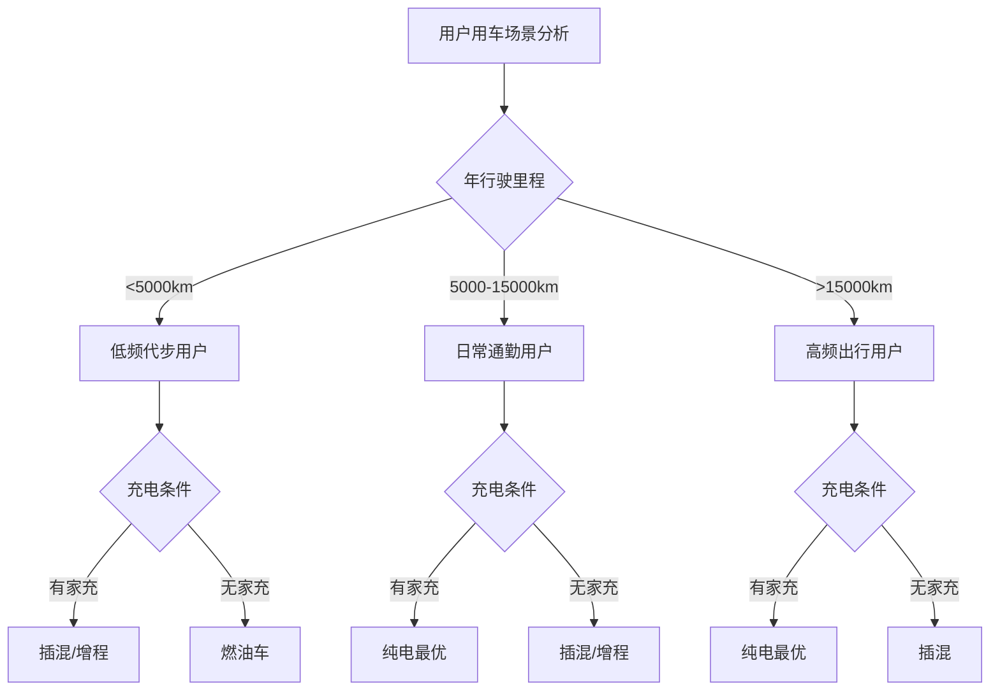

**适合选择纯电车型的用户画像**[^43]：
- 年行驶里程≥1.5万公里：能源节省的绝对值急剧扩大
- 有固定车位/家充条件：家充谷电低至0.3元/度，每公里成本仅5分钱
- 长期持有（5年以上）：电池质保覆盖使用周期，保值率损耗可忽略
- 限牌城市用户：上海、北京电车直接省9.5万牌照费

**适合选择插混/增程车型的用户画像**[^54][^40]：
- 充电不便（无固定车位/充电站超5公里）
- 每月有1-2次长途出行需求
- 北方寒冷地区（冬季续航衰减显著）
- 计划3-5年内换车

### 4.6 场景-技术匹配度评估矩阵与用户价值感知模型

#### 4.6.1 场景-技术匹配度综合评估矩阵

整合补能效率、续航性能、驾驶体验、安全可靠性、使用成本五大维度指标，针对典型使用场景构建场景-技术匹配度综合评估矩阵。

| 使用场景 | 场景特征 | 纯电适配度 | 插混适配度 | 增程适配度 | 最优推荐 |
|:---|:---|:---:|:---:|:---:|:---|
| **城市日常通勤** | 日均30-50km，有家充 | ★★★★★ | ★★★★☆ | ★★★★☆ | 纯电 |
| **城市通勤无家充** | 日均30-50km，依赖公充 | ★★★☆ | ★★★★★ | ★★★★☆ | 插混 |
| **城际中短途** | 单程100-300km | ★★★★☆ | ★★★★★ | ★★★★★ | 插混/增程 |
| **长途自驾** | 单程500km+ | ★★★☆ | ★★★★★ | ★★★★☆ | 插混 |
| **北方严寒地区** | 冬季-20℃以下 | ★★☆ | ★★★★★ | ★★★★☆ | 插混 |
| **高性能需求** | 追求极致加速与操控 | ★★★★★ | ★★★★☆ | ★★★★☆ | 纯电 |
| **家庭多场景** | 兼顾通勤与长途 | ★★★★☆ | ★★★★★ | ★★★★★ | 插混/增程 |

**高速场景下插混与增程的差异化表现**值得关注。实测数据显示，**插混SUV全程600公里（高速占比70%），馈电状态下油耗5.2L/100km，总花费不到300元；增程SUV高速上油耗飙升到9L多，一趟下来多花了近200元油钱**[^39]。这是因为**插混跑高速时能直接用发动机驱动车轮，省去"发电再驱动"的中间消耗，速度一上60公里时效率就能压增程一头**[^41]。

**城市环境下增程的体验优势明显**。**增程车在市区安静平顺，日常一周充一次电，用电成本低；养车便宜，一年不到900元的保养费**[^41]。增程更像城市通勤的"纯电替代品"，适合日常纯电、偶尔长途的用户。

#### 4.6.2 用户决策因素权重模型构建

**用户购车决策正在从"政策依赖"向"价值驱动"转变**。《2025中国新能源汽车用户需求趋势研究》报告显示，**在用户购车动机中，续航里程和补贴政策等因素占比显著下降，而驾驶感受、舒适性及智能化配置已跃升为核心驱动力，三项因素在购买动因中分别占据18%、10%和9%的权重**[^45]。

**用户决策行为呈现"理性对比"特征**。用户购车时平均关注因素数量从去年的4.2个上升至5.9个，**关注焦点高度集中在整车安全性与智能化配置方面**[^45]。用户在购车前的平均对比车型数量也有较大幅度增加，且对比范围从过去以燃油车为主，全面转向与同级纯电车型进行细致比较。

**构建用户决策因素权重模型**：

| 决策因素 | 权重占比 | 核心关注点 | 技术路线影响 |
|:---|:---:|:---|:---|
| **驾驶感受** | 18% | 动力响应、平顺性、操控 | 纯电/增程优势 |
| **性价比** | 15% | 购置成本、使用成本综合 | 各有优势场景 |
| **安全性** | 12% | 电池安全、碰撞安全、智驾安全 | 技术持续提升 |
| **舒适性** | 10% | 座椅、空间、NVH | 差异不显著 |
| **智能化** | 9% | 智能座舱、智能驾驶 | 纯电/新势力领先 |
| **续航能力** | 8% | 实际续航、补能便利 | 插混/增程无焦虑 |
| **使用成本** | 8% | 能耗、保养、保险 | 纯电最优 |
| **品牌价值** | 7% | 品牌形象、口碑 | 自主品牌崛起 |
| **其他因素** | 13% | 外观、政策、服务等 | - |

#### 4.6.3 商业化临界点的用户价值感知阈值

**使用阶段商业化临界点的达成，取决于技术性能转化为用户可感知价值的程度**。基于前述分析，识别各技术路线达到商业化临界点的关键条件组合：

**纯电车型商业化临界条件**：
- 实测续航达成率≥70%，标称续航≥500km
- 10%-80%充电时间≤20分钟，超充网络覆盖主要城市
- 家充普及率提升或公共充电成本下降至1元/度以下
- 年里程≥1万公里的用户群体占主导

**插混车型商业化临界条件**：
- 纯电续航≥100km，满足日常通勤需求
- 馈电油耗≤5L/100km，接近燃油车水平
- 发动机介入平顺性持续优化
- 高速长途场景经济性优势明确

**增程车型商业化临界条件**：
- 纯电续航≥200km，覆盖一周通勤
- 快充能力提升（12分钟至80%）
- 城市充电站限制政策放宽
- 市区静谧性与纯电体验一致性保持

**市场格局预判**。**乘联会预测，到2026年，插混将在长途高频、北方寒冷地区保持35%左右份额；增程则在一二线城市通勤场景中占据28%市场**[^39]。两者不再是你死我活的竞争，而是像SUV与轿车一样，成为不同用车需求的解决方案。

**2025年混动市场的最大转变是：从追求"全能"到接受"精准"**[^39]。消费者开始理性思考"我到底需要什么样的车"，市场正在从"政策驱动"向"需求驱动"转变。在汽车工业百年变革中，**真正的进步不是发明了某种完美技术，而是让每一种需求都能找到它的最优解**。

## 5 残值管理维度评估指标体系设计

残值管理是新能源汽车全生命周期评估中长期被低估却至关重要的维度。随着新能源汽车保有量突破3140万辆，首批动力电池进入规模化退役期，残值衰减规律、二手车流通效率、核心部件回收价值等问题正从边缘议题跃升为影响消费者购车决策与车企商业化战略的核心变量。本章节系统构建覆盖残值衰减规律、电池健康评估、流通效率、回收价值、技术迭代冲击五大维度的量化评估框架，建立残值预测模型与风险评估指标体系，为不同技术路线商业化临界点判断提供残值端的决策依据。

### 5.1 不同动力系统技术路线残值衰减规律分析

#### 5.1.1 新能源汽车保值率现状与行业基准

新能源汽车的保值率问题已成为制约市场进一步渗透的关键瓶颈之一。**中国汽车流通协会2025年发布的数据显示，3年车龄的新能源车平均保值率仅为45.2%，而同级燃油车的保值率高达65.8%**[^55]。这意味着一辆20万元的新能源车，3年后市场价值仅剩约9万元，比燃油车多亏损2万多元。

从动力类型细分来看，**2025年5月插电混动和纯电车型的3年保值率分别为46.1%和44.2%，显著低于燃油车60%以上的平均水平**[^56]。然而，头部品牌已实现突破，**特斯拉Model Y 3年保值率达58%、比亚迪海豚达55%**，部分车型已接近燃油车水平[^56]。

**欧洲维修和零件协会的调查数据进一步印证了这一趋势：电动车3年平均折旧率达到47.1%，远高于燃油车的33%**[^57]。这意味着一台50万元的电动车，3年后市场价值仅剩不到23万元，折损幅度惊人。

| 车型类别 | 1年保值率 | 3年保值率 | 5年保值率 | 与燃油车差距 |
|:---|:---:|:---:|:---:|:---:|
| **纯电动汽车** | 70%-80% | 44.2% | 30%-35% | -20.6% |
| **插电混动汽车** | 72%-82% | 46.1% | 32%-38% | -18.7% |
| **增程式汽车** | 73%-83% | 47%-50% | 35%-40% | -15%-18% |
| **传统燃油车** | 85%-90% | 65.8% | 50%-55% | 基准值 |

#### 5.1.2 残值衰减曲线特征与多因素归因分析

新能源汽车的残值衰减呈现出与燃油车截然不同的曲线特征。**车辆折旧曲线存在一个规律：约8年左右触底**[^57]。长期持有可以平滑折旧成本，虽然电动车前三年贬值更快，但后续贬值速度会放缓。

**首年折价幅度最大是新能源车残值衰减的显著特征**。一年车龄的准新车，成交价普遍比新车低20%到30%，部分车型甚至直接腰斩[^57]。**约10%的车型首年保值率甚至不足50%**[^56]，这种"断崖式贬值"严重影响了消费者的购买信心。

**残值衰减的核心影响因素可归纳为四大类别**：

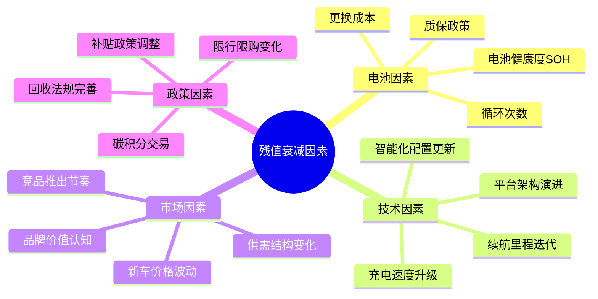

**电池健康度是影响残值的核心因素**。数据显示，**电池健康度每降10%，二手车价会下跌15%**[^42]。以一台3年车龄的汉EV为例，电池健康度90%时残值约12万元，若健康度仅70%，残值会跌至9万元以下，差距高达25%。

#### 5.1.3 品牌与车型维度的保值率分化

**市场分化正在加剧，品牌力强、产品力扎实的车型保值率可以达到88%以上，而技术落后、定价混乱的车型则会加速贬值**[^57]。

根据查博士发布的2025年第四季度数据，不同细分市场的保值率表现差异显著[^58]：

| 细分市场 | Top1车型 | 动力类型 | 3年保值率 |
|:---|:---|:---|:---:|
| **中大型轿车** | 宾利飞驰插电混动 | 插混 | 80.17% |
| **中大型SUV** | 宾利添越插电混动 | 插混 | 75.78% |
| **紧凑型SUV** | 哈弗猛龙新能源 | 插混 | 70.23% |
| **MPV** | 传祺E8新能源 | 插混 | 65.21% |
| **中型SUV** | 特斯拉Model Y | 纯电 | 64.49% |
| **中型轿车** | 特斯拉Model 3 | 纯电 | 61.54% |
| **微型轿车** | 比亚迪海鸥 | 纯电 | 61.87% |

**一个重要发现是：插电混动（PHEV）整体更保值**[^58]。在紧凑型SUV、MPV、中大型SUV等类别中，PHEV车型的保值率普遍高于同级别纯电车型。核心原因在于插混车型兼具电驱体验与燃油补能便利性，使用场景更广泛，二手市场接受度更高。

### 5.2 电池健康状态评估与残值关联模型构建

#### 5.2.1 电池健康度（SOH）与残值的量化关联

动力电池作为新能源汽车最核心的资产，其健康状况直接决定车辆价值。**根据工信部发布的《新能源汽车动力蓄电池回收利用管理暂行办法》，动力电池在正常使用条件下，单体电芯的容量衰减到额定容量的80%以下时，就需要进行回收或更换**[^55]。

**实际市场数据显示，多数新能源车开3年或行驶6万公里后，电池实际衰减量会达到15%-25%，部分经常快充的车型衰减甚至超过30%**[^55]。这种衰减程度直接影响二手车定价。

**电池健康度与残值的量化关联模型**：

```
残值调整系数_K电池 = 1 - (100% - SOH) × 衰减敏感系数
```

其中衰减敏感系数约为1.5，意味着**电池健康度每下降10%，残值约下降15%**[^42]。

**插混车电池的耐用性表现优于预期**。国内大型汽车论坛面向5万名车主的调查显示，**正常使用五年的插混车辆中，83%的车辆电池健康度保持在85%以上，超过六成车主的电池衰减幅度低于10%，真正出现明显衰减（低于80%）的车辆占比不到5%**[^59]。德国ADAC对28500辆插混车的六年跟踪研究发现，**平均行驶19万公里后，电池剩余容量普遍保持在出厂时的80%以上**[^59]。

#### 5.2.2 电池检测标准化进程与评估技术成熟度

**评估体系不完善是制约新能源二手车流通的核心瓶颈**。由于缺乏统一、精准的评估标准，二手车商难以准确判定车辆价值，定价困难[^60]。

**当前电池检测面临的主要挑战**：

| 挑战维度 | 具体问题 | 影响程度 |
|:---|:---|:---:|
| **检测标准缺失** | 无统一的电池健康度检测标准 | 高 |
| **检测能力不足** | 仅30%二手车商具备检测能力 | 高 |
| **数据不透明** | 电池管理系统数据难以获取 | 中高 |
| **环境影响** | 同一车辆不同温度下健康度波动达8% | 中 |

**技术进步正在推动检测标准化**。车e估等专业评估平台通过与主机厂、保险公司、维修企业深度合作，累计沉淀亿级车辆数据，开发了专门针对新能源汽车的检测和评估技术，通过专业设备和算法对电池电芯健康度、电机工作状态、电控系统性能进行综合检测[^61]。

**动力电池数字身份证制度的建立将从根本上解决数据透明问题**。《新能源汽车废旧动力电池回收和综合利用管理暂行办法》明确，**数字身份证以动力电池编码为信息载体，关联动力电池生产、装车销售、换电、维修更换、车辆报废、电池回收、综合利用等环节信息，实现动力电池全生命周期流向监控和信息化追溯**[^62]。

#### 5.2.3 电池更换成本对残值定价的影响权重

**电池更换成本是二手车买家最大的顾虑来源**。一套新能源汽车电池的价格通常占整车成本的30%-50%，相当于一辆紧凑型燃油车的价格[^55]。

**不同类型车辆的电池更换成本差异显著**：

| 车型类别 | 电池容量 | 更换成本范围 | 占整车价格比例 |
|:---|:---:|:---:|:---:|
| **纯电轿车（20万级）** | 60-80kWh | 5-10万元 | 25%-50% |
| **纯电SUV（30万级）** | 80-100kWh | 8-15万元 | 27%-50% |
| **插混车型** | 8-20kWh | 3-5万元 | 15%-25% |
| **增程车型** | 30-50kWh | 4-7万元 | 15%-25% |

**插混车电池更换成本优势明显**。由于电池容量远小于纯电车型，**更换一块插混车电池包的费用大多在3万到5万元之间**[^59]。而且很多时候并不需要更换整个电池包，**在专业第三方维修店花费几千元更换有问题的电芯就能解决问题**[^59]。

**过保后电池维护的替代方案正在涌现**。有车主花了4000元进行电池重组服务，**续航恢复到新车的85%，比直接换电池省下上万元**[^63]。这种梯度维修方案为二手车买家提供了更经济的选择。

### 5.3 二手车市场流通效率评估指标体系

#### 5.3.1 流通效率多维度评估指标构建

新能源汽车二手车市场流通效率受多重因素制约，需要建立系统性的评估指标体系。

**核心流通效率评估指标**：

| 评估维度 | 具体指标 | 定义与计算 | 行业基准 |
|:---|:---|:---|:---|
| **交易周期** | 平均挂牌到成交时间 | 从上架到完成交易的天数 | 45-90天 |
| **价格偏离度** | 成交价/评估价 | 反映定价准确性 | 85%-95% |
| **库存周转率** | 年成交量/平均库存 | 反映流通速度 | 4-6次/年 |
| **渠道覆盖率** | 可交易渠道数量 | 线上+线下渠道总数 | 5-8个 |
| **信息透明度** | 车况信息完整度 | 关键信息披露比例 | 60%-80% |

**当前新能源汽车二手车流通效率存在显著问题**。二手车交易平台数据显示，**电动车的挂牌量在上升，但实际成交周期在拉长，很多车源挂了几个月都无人问津，最终只能大幅降价才能成交**[^57]。这种供需失衡进一步加剧了价格下行压力。

#### 5.3.2 流通效率瓶颈识别与成因分析

**二手车商对新能源汽车的收车意愿明显下降**，尤其是30万以上的高端车型。原因是收车价格难以判断，新车市场价格波动频繁，库存周期内很可能出现亏损[^57]。

**流通效率的核心瓶颈**：

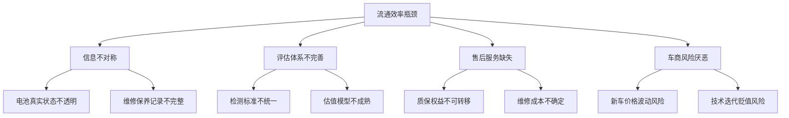

**质保权益的断裂是重要痛点**。很多车企对首任车主提供终身质保，但**这个权益通常不能转移，当车辆所有权变更后，最核心的三电系统保障就失效了**[^57]。这直接导致二手车买家对电池可靠性的担忧加剧。

**保险问题同样制约流通**。部分保险公司对电动车的承保态度趋于谨慎，有些甚至直接拒保。**即使能承保，保费也往往比燃油车高出30%到50%**[^57]。对于二手车来说，这个负担更重。

#### 5.3.3 流通效率优化路径与评估基准

**提升市场信息透明度是优化流通效率的首要任务**。建立统一的二手车信息平台，加强车辆历史记录管理，规范二手车鉴定评估流程[^64]。

**优化流通渠道布局**需要加强线上线下融合、拓展流通渠道网络、优化物流配送体系[^64]。当前新能源二手车流通渠道包括传统二手车经销商、二手车电商平台、4S店等，各渠道各有优势[^64]：

| 流通渠道 | 核心优势 | 适用场景 | 发展趋势 |
|:---|:---|:---|:---|
| **传统经销商** | 实体体验、品牌信任 | 本地交易 | 向专业化转型 |
| **电商平台** | 信息透明、价格透明 | 跨区域交易 | 渗透率提升 |
| **4S店渠道** | 品牌信任、专业服务 | 品牌置换 | 认证二手车扩张 |
| **官方认证平台** | 质量保障、售后服务 | 品牌用户 | 头部品牌主推 |

**头部品牌正在构建官方认证二手车体系**。理想、蔚来、比亚迪等品牌推出官方认证二手车平台，**特斯拉提供3年60%残值保障计划**[^56]，这类举措有效提升了消费者购买信心和市场流通效率。

### 5.4 核心部件回收价值评估与梯次利用经济性分析

#### 5.4.1 动力电池回收利用双路径价值评估

动力电池退役后的处理主要有梯次利用和再生利用两种方式，各有其适用条件和经济价值。

**梯次利用**是指当电池容量在50%至80%时，回收企业将退役动力电池拆解重组，之后作为应急电源、储能设备等继续服役[^65]。**再生利用**是指当电池容量在40%以下时，对退役电池进行拆解、破碎等处理，提取其中的锂、钴、镍等原材料，"再生"为新电池[^65]。

| 处理方式 | 适用条件 | 价值实现路径 | 经济性评估 |
|:---|:---|:---|:---|
| **梯次利用** | 容量50%-80% | 储能、低速车、备用电源 | 残余价值30%-50% |
| **再生利用** | 容量<50% | 提取锂、钴、镍等金属 | 材料价值15%-25% |
| **整包再制造** | 结构完整、部分模组可用 | 更换故障模组后重新使用 | 残余价值40%-60% |

**2025年我国新能源汽车废旧动力电池综合利用量超过40万吨，同比增长32.9%，骨干企业锂、钴、镍等金属回收率处于国际先进水平**[^62]。

#### 5.4.2 关键金属回收率与市场价值分析

退役动力电池含有锂、钴、镍等多种金属和化学物质，具有重要的资源回收价值。**动力电池中的锂、钴等稀有金属资源宝贵，回收利用可实现资源的循环利用，降低对进口矿产资源的依赖**[^62]。

**2024年工业和信息化部修订发布的《新能源汽车废旧动力电池综合利用行业规范条件》要求，企业在冶炼过程中锂回收率从85%提高至90%，电极粉料回收率不低于98%**[^65]。

**回收价值的核心变量**：

| 金属种类 | 电池中含量 | 回收率要求 | 市场价格波动 |
|:---|:---:|:---:|:---|
| **锂** | 5%-7% | ≥90% | 高波动性 |
| **钴** | 5%-20% | ≥98% | 中高波动性 |
| **镍** | 10%-30% | ≥98% | 中等波动性 |
| **铜** | 8%-10% | ≥98% | 相对稳定 |
| **铝** | 5%-8% | ≥98% | 相对稳定 |

#### 5.4.3 政策法规对回收体系的影响与价值重估

**《新能源汽车废旧动力电池回收和综合利用管理暂行办法》的出台标志着回收体系进入强监管时代**。该办法以"全渠道、全链条、全生命周期"管理为核心思路，通过"车电一体报废"、动力电池数字身份证等创新制度，明确各环节主体责任[^62]。

**"车电一体报废"制度的核心设计**：明确"报废新能源汽车时应当带有动力电池，否则按照有关规定认定为车辆缺失"[^62]。这一制度**从根本上遏制了废旧电池非法流失的乱象**，确保废旧动力电池从源头上得到规范管理[^62]。

**回收体系规范化对残值管理的影响**：

- **正向影响**：规范回收渠道提升电池残余价值变现效率
- **成本传导**：合规处理成本可能部分转嫁至车辆残值评估
- **信息透明**：数字身份证制度提升电池全生命周期数据可追溯性

**据测算，到2030年当年的废旧动力电池产生量将超过100万吨**[^62]，回收利用市场规模可观，规范化的回收体系将为电池残余价值评估提供更可靠的基准。

### 5.5 技术迭代对存量车辆价值的冲击效应量化

#### 5.5.1 技术迭代速度与残值冲击的传导机制

**技术迭代是真正摧毁保值率的核心因素**[^57]。新能源汽车行业正经历"摩尔定律式"升级，**新能源汽车的核心技术迭代周期仅为18-24个月，远短于燃油车5-8年的迭代周期**[^55]。

**技术迭代形成的残值冲击传导机制**：

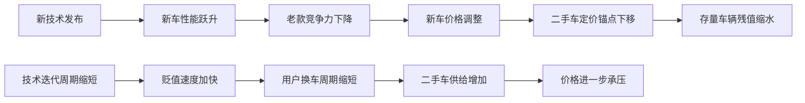

**2024年宁德时代神行电池实现充电10分钟续航800公里，直接导致三年前技术车型残值下滑7%**[^56]。这种迭代速度形成双重压力：一方面智能硬件快速过时，**2021款车型的自动驾驶芯片算力不足现款10%**；另一方面车企为抢占市场频繁降价增配，形成"油车三年磨一剑，电车一年磨三剑"的行业现象[^56]。

#### 5.5.2 关键技术升级对老款车型竞争力的削弱效应

**续航里程的快速提升对老款车型形成直接冲击**。2022年某主流品牌新能源轿车入门版续航400公里，快充时间需要1小时；到2025年同级别新车续航已提升到600公里，快充时间缩短至30分钟，智能驾驶辅助功能也增加了不少，而两款车的售价相差不大[^55]。

**技术升级对残值的量化冲击**：

| 技术维度 | 2022年基准 | 2025年水平 | 提升幅度 | 对老款残值影响 |
|:---|:---:|:---:|:---:|:---:|
| **续航里程** | 400km | 600km+ | +50% | -15%至-20% |
| **充电时间** | 60分钟 | 15-20分钟 | -70% | -10%至-15% |
| **智驾芯片算力** | 基准值 | 10倍+ | +900% | -8%至-12% |
| **电驱系统效率** | 90% | 97%+ | +7% | -5%至-8% |

**车企技术迭代带来的冲击往往令车主措手不及**。某头部品牌2023款车型上市仅半年，因新款升级了电池，**旧款车型残值瞬间蒸发40%**[^55]。在某汽车论坛万人调查中，**87%受访者坦言"新能源车贬值速度超出承受范围"，直接导致23%潜在买家放弃购买计划**[^55]。

#### 5.5.3 技术过时风险系数模型构建

**建立技术过时风险系数模型**，量化不同技术路线面临的迭代冲击风险：

```
技术过时风险系数 = Σ(各技术维度权重 × 该维度迭代速度指数 × 可升级性折扣系数)
```

**不同技术路线的过时风险评估**：

| 技术路线 | 电池技术风险 | 充电技术风险 | 智能化风险 | 综合过时风险 |
|:---|:---:|:---:|:---:|:---:|
| **800V纯电（2024款）** | 低 | 低 | 中 | 低 |
| **400V纯电（2022款）** | 中高 | 高 | 高 | 高 |
| **插混（DM5.0）** | 低 | 中 | 中 | 中低 |
| **增程（2024款）** | 低 | 中 | 中 | 中低 |

**OTA升级能力成为对冲技术过时风险的关键**。特斯拉通过OTA升级使Model Y三年残值率达58%，**2024年圣诞节系统更新甚至为老车型推送自动泊车功能**[^56]。这种"软件定义汽车"的能力有效延缓了硬件过时对残值的冲击。

### 5.6 残值预测模型与风险评估指标体系构建

#### 5.6.1 多因素融合残值预测模型设计

整合残值衰减规律、电池健康状态、流通效率、回收价值、技术迭代冲击等多维度因素，构建新能源汽车残值预测的综合模型：

```
预测残值 = 新车购置价 × 基础残值率曲线(t) × K_电池 × K_品牌 × K_技术 × K_市场
```

**各调整系数的定义与计算**：

| 调整系数 | 核心变量 | 计算逻辑 | 影响权重 |
|:---|:---|:---|:---:|
| **K_电池** | SOH、循环次数、质保状态 | 1 - (100%-SOH) × 1.5 | 30%-35% |
| **K_品牌** | 品牌保值率排名、市场热度 | 品牌系数表查询 | 20%-25% |
| **K_技术** | 技术代际、可升级性 | 1 - 技术过时风险系数 | 20%-25% |
| **K_市场** | 新车价格波动、供需结构 | 市场指数动态调整 | 15%-20% |

**微软亚洲研究院与日产汽车联合开发的机器学习预测方法**，通过挖掘电池结构的高级特征，**将电池退化预测准确率的平均误差控制在0.0094**，为残值预测模型提供了更精准的电池健康评估输入。

#### 5.6.2 残值风险评估指标体系设计

**构建残值风险评估的三级指标体系**：

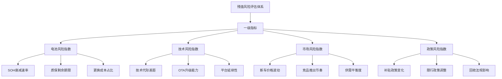

**关键风险预警阈值设定**：

| 风险指标 | 低风险 | 中风险 | 高风险 |
|:---|:---:|:---:|:---:|
| **年均残值衰减率** | <12% | 12%-18% | >18% |
| **电池SOH年衰减** | <3% | 3%-5% | >5% |
| **技术代际差距** | <1代 | 1-2代 | >2代 |
| **新车价格波动** | <5% | 5%-15% | >15% |

#### 5.6.3 用户与车企的残值管理策略工具

**面向用户的残值优化策略**：

- **长期持有者（5年以上）**：关注电池保养技术，**每月1次20%-80%区间循环充电可延长电池寿命30%**[^56]
- **短期换车族**：优选官方保值回购车型，如特斯拉Model Y或比亚迪汉EV（62%残值率）[^56]
- **性价比买家**：瞄准网约车退役车型，**广汽AION Y行驶30万公里后仍保持42%残值率**[^56]

**面向车企的残值保障策略**：

| 策略类型 | 实施方式 | 代表企业 | 效果评估 |
|:---|:---|:---|:---|
| **官方回购承诺** | 3年60%残值保障 | 特斯拉 | 提升购买信心 |
| **认证二手车平台** | 官方检测+质保延续 | 蔚来、理想 | 提升流通效率 |
| **换电体系** | 电池资产分离 | 蔚来 | 规避电池贬值风险 |
| **OTA持续升级** | 软件功能迭代 | 特斯拉、小鹏 | 延缓技术过时 |

**蔚来ET5凭借换电体系维持51%保值率**，车主形容"能换电的车如同会下蛋的母鸡"[^56]。换电模式通过实现车电分离，有效规避了电池衰减对整车残值的冲击。

### 5.7 残值管理对全生命周期经济性的影响权重分析

#### 5.7.1 残值损耗在TLCO框架中的权重量化

将残值管理纳入全生命周期总拥有成本（TLCO）框架，**残值损耗是决定新能源汽车总拥有成本的关键变量**。

**全生命周期成本构成分析**（以20万级车型、5年持有周期为例）：

| 成本组成 | 纯电车型 | 插混车型 | 燃油车 |
|:---|:---:|:---:|:---:|
| **购置成本** | 20万元 | 20万元 | 20万元 |
| **能源成本（5年）** | 0.42万元 | 1.5万元 | 3.12万元 |
| **保养成本（5年）** | 0.25万元 | 0.5万元 | 0.75万元 |
| **保险成本（5年）** | 2.5万元 | 2.3万元 | 2.0万元 |
| **残值损失** | 10.96万元 | 10.78万元 | 6.84万元 |
| **TLCO总计** | 13.17万元 | 14.08万元 | 11.71万元 |

**残值损失在TLCO中的占比高达60%-75%**，远超能源、保养、保险等使用成本的总和。这意味着**新能源汽车的总拥有成本优势高度依赖于残值管理的优化**。

**以5年用车周期、年里程1.5万公里、家充条件充足的场景测算**：20万级电车5年总花费约22.1万元，同级油车总花费约28.3万元，**电车省6.2万元**；若无家充、年里程仅5000公里，电车5年总花费23.5万元，油车25.8万元，**电车仅省2.3万元**[^42]。

#### 5.7.2 不同持有周期的残值影响差异分析

**持有周期是决定残值影响权重的关键变量**。短期持有时残值损失占比极高，长期持有则可通过使用成本节省对冲残值劣势。

**不同持有周期的成本结构变化**：

| 持有周期 | 残值损失占比 | 使用成本节省 | 综合经济性判断 |
|:---|:---:|:---:|:---|
| **1-2年** | 80%-85% | 有限 | 燃油车更优 |
| **3-4年** | 70%-75% | 中等 | 接近平衡 |
| **5-6年** | 60%-65% | 显著 | 新能源车开始占优 |
| **7-8年** | 50%-55% | 大幅累积 | 新能源车明显占优 |
| **8年以上** | 触底稳定 | 持续累积 | 新能源车优势最大化 |

**从总拥有成本角度分析，长期持有电动车的经济性并不差**[^57]。虽然电动车前三年贬值更快，但后续贬值速度会放缓。如果持有周期达到8年以上，总折旧成本与燃油车的差距会大幅缩小，而电动车的低使用成本——不用加油、保养便宜——会在长周期里完全抵消掉前期的高折旧。

#### 5.7.3 面向不同用户画像的残值优化策略建议

**基于残值管理对TLCO的影响分析，为不同用户画像提供差异化策略建议**：

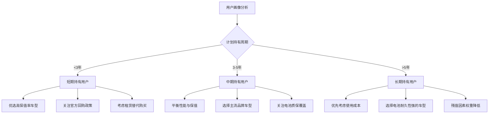

**租赁成为越来越理性的选择**。数据显示，**新能源车的租赁比例从两年前的17%飙升到现在的71%**[^57]。租赁可以规避贬值风险，还能更灵活地应对技术迭代。但这个趋势也带来了一个意想不到的后果：**大量租赁车辆将在未来三年集中到期，预计到2028年，每年流入二手车市场的电动车将接近百万辆，是过去的5倍**[^57]。

**商业化临界点的残值维度判断**：当新能源汽车的3年保值率稳定在55%以上、电池健康评估体系标准化完成、二手车流通效率接近燃油车水平时，残值管理维度的商业化临界点将基本达成。**正如乘联会秘书长崔东树指出："新能源二手车渗透率从2022年3.6%升至2025年9.1%，伴随销量增长与价格趋稳，其发展潜力巨大"**[^56]。行业正在经历从"技术爆发期"向"价值稳定期"的关键过渡。

## 6 动力类型技术路线商业化临界点量化分析

基于前述构建的全生命周期评估体系与研发制造、使用场景、残值管理三维度指标框架，本章节对纯电动、增程式、插电混动、氢燃料电池四种动力类型技术路线进行商业化临界点的系统性量化测算。通过整合成本平价时间窗口、用户接受度拐点、市场渗透率临界值三大核心维度，结合不同应用场景的差异化分析，识别各技术路线的竞争优势区间、适用边界及2025-2035年商业化路径演进规律。

### 6.1 成本平价临界点测算与时间窗口预判

成本平价是技术路线实现规模化商业化的核心前提条件。基于全生命周期总拥有成本（TCO/TLCO）模型，对四种动力类型与传统燃油车的成本平价临界点进行系统性测算。

#### 6.1.1 纯电动车型成本平价临界条件量化

纯电动车型的成本平价已在特定用户群体中实现，其临界点由**年行驶里程**与**充电成本**共同决定。以15万元级家用车、五年持有周期为基准进行测算：

**具备家充条件场景**（电费约0.1元/公里）：当年行驶里程**超过约8000公里**时，纯电车型五年总成本开始低于同级燃油车。这一临界里程的核心驱动因素在于能源成本差异的累积效应——家充场景下每公里电费仅0.05-0.1元，而燃油车百公里油费约50-80元，年均节省可达4000-5000元[^45]。

**依赖公共充电场景**（电费约0.35元/公里）：临界里程需**上浮至约2.1万公里/年**。公共充电桩均价约1.2元/度，使得单位里程能源成本上升至0.18-0.2元，压缩了与燃油车的成本差距[^66]。

**全生命周期成本对比验证**：以20万级车型、年均1.5万公里、使用6年为例，纯电车总成本约15.31万元（电费0.47万+保养0.24万+保险3.6万+残值损失11万），燃油车总成本约19.4万元（油费5.4万+保养1万+保险3万+残值损失10万），**年均节省约6817元**，主要来自能源和保养成本的显著降低[^66]。

**成本平价的核心驱动因素**是电池成本的大幅下降。电池级碳酸锂价格从2023年的60万元/吨跌至2025年的7-8万元/吨，推动动力电池成本降至0.25-0.4元/Wh[^67]。这一成本下降趋势使得纯电车型的购置价格差距持续收窄，部分10-15万元级车型已实现与燃油车的购置平价。

| 年里程区间 | 家充场景成本平价 | 公充场景成本平价 | 核心影响因素 |
|:---|:---:|:---:|:---|
| **<5000km** | 未达成 | 未达成 | 能源节省不足以覆盖保险/残值差距 |
| **5000-10000km** | 基本达成 | 接近平衡 | 能源优势开始显现 |
| **10000-15000km** | 显著优于燃油 | 达成平价 | 能源+保养双重节省 |
| **>15000km** | 大幅领先 | 显著优于燃油 | 成本优势急剧扩大 |

#### 6.1.2 增程式与插电混动成本平价条件分析

增程式与插电混动车型的成本平价条件呈现差异化特征，其经济性优势场景为**"短途用电、长途用油"**的混合使用模式。

**购车成本差异**：增程车型因增程器+油箱系统，购车成本通常比同级纯电车型高10%-15%，约2-3万元[^68]。插混车型成本结构相近，但因技术路线差异，部分车型已实现与燃油车的购置平价。

**能耗成本对比**：实测数据显示，插混车型馈电油耗（如比亚迪DM-i系统4.2L/100km）通常低于增程式（7-8L/100km），在频繁长途出行场景中成本优势更明显[^68]。以比亚迪秦PLUS DM-i为例，**全年驾驶31696公里，总花费18765元，平均每公里成本约0.59元**，其中燃油费6363.9元（占33.9%）、电费1107.5元，综合能耗成本23.57元/百公里[^68]。

**成本平价临界条件**：当用户具备家充条件且日常通勤距离在纯电续航覆盖范围内时，插混/增程车型的日常使用成本接近纯电水平；长途出行时加油补能的灵活性则避免了充电等待时间成本。**年里程1-1.5万公里区间，插混/增程式是综合经济性最优选择**[^69]。

#### 6.1.3 氢燃料电池成本平价时间窗口预判

氢燃料电池车型的成本平价尚处于政策驱动向商业驱动的转型期，其临界条件涉及车辆购置成本与氢气价格两个核心变量。

**车辆购置成本差距**：目前49吨级别的传统燃油重卡售价约为45万元，纯电重卡约为50万-60万元，而氢能重卡约为90万元，**购车费用方面氢能重卡相较前两者还有约30万-45万元的价差**[^70]。虽然2021年至今氢能重卡价格已从150万元降至90万元，降幅可观，但未来降价速度可能放缓，短期内主要依赖政策补贴填补购车价差。

**氢气价格临界点**：**35元/公斤的氢气价格是氢能乘用车的经济生命线，而氢能商用车为25元/公斤**，如此氢能重卡相对于燃油重卡才能实现燃料价格平价[^70]。目前该价格在北京、重庆、大连等少数城市已能实现，未来随着氢气制运降本以及加氢站数量增长带来的规模化效应，这一范围有望逐步扩大。

**成本平价时间窗口预判**：根据行业研究，**自2027年起，氢燃料电池重卡的全生命周期成本（不包括补贴）预计低于柴油重卡；自2028年起，氢燃料电池重卡的生命周期成本（不包括补贴）预计将低于电动重卡**[^71]。国际氢能理事会预计，到2030年绿氢成本将降至1.4-2.3美元/公斤，在资源优越地区可实现与灰氢平价[^72]。

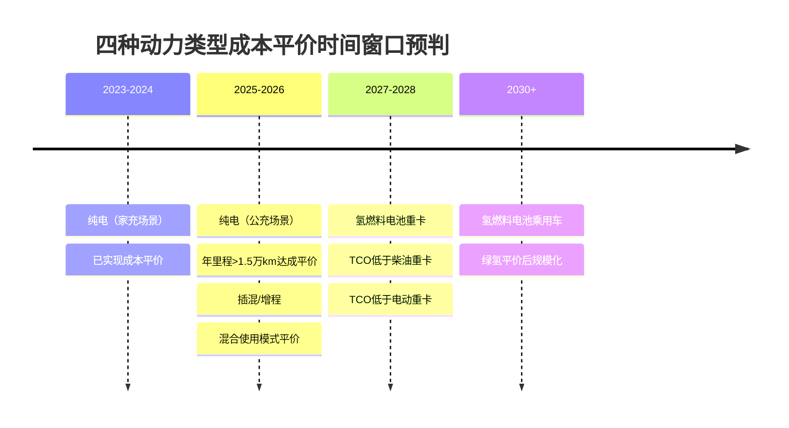

### 6.2 用户接受度拐点识别与驱动因素解析

用户接受度是技术路线商业化的核心验证指标。2025年中国新能源汽车市场正经历从"政策依赖"向"价值驱动"的结构性转变，用户决策逻辑发生质变。

#### 6.2.1 整体市场用户接受度拐点特征

**市场已突破用户接受度的关键拐点**。《2025中国新能源汽车用户需求趋势研究》报告显示，2025年新能源汽车市场渗透率预计突破60%，用户决策逻辑产生质变，**从"政策依赖"转向"价值驱动"**，关注性价比、安全与智能[^45]。

**用户购车动机的结构性重构**表现为：续航里程和补贴政策等因素占比显著下降，而**驾驶感受、舒适性及智能化配置已跃升为核心驱动力，三项因素在购买动因中分别占据18%、10%和9%的权重**[^45]。"性价比不错""配置高""加速动力强劲"等关键词成为消费者在购车决策中最常提及的关注点。

**用户决策行为从"尝鲜体验"转向"理性对比"**。用户购车时平均关注因素数量从去年的4.2个上升至5.9个，**关注焦点高度集中在整车安全性与智能化配置方面**[^45]。用户在购车前的平均对比车型数量大幅增加，且对比范围从过去以燃油车为主，全面转向与同级纯电车型进行细致比较。

#### 6.2.2 纯电动车型用户接受度拐点与挑战

纯电动车型的用户接受度呈现**分化态势**，一二线城市与低线市场存在显著差异。

**挑战性拐点信号**：麦肯锡调研数据显示，2023年中国消费者对新能源汽车的接受度出现自2017年开始统计以来的首次下滑，从2022年的68%降至62%[^73][^74]。更值得关注的是，**22%的纯电动汽车车主表示下次购车不再考虑新能源汽车，该比例在2022年仅为3%**[^73][^74]。

**关键触发条件是低线市场补能体验不佳**。三四线城市纯电车主的"反悔率"高达**54%**，远高于一二线城市的10%，**"补能体验"是三四线城市纯电车主相对于一二线城市纯电车主满意度差距最大的维度**[^73][^74]。这一现象表明，纯电车型的用户接受度临界点高度依赖充电基础设施的覆盖完善程度。

**续航焦虑的实质性缓解**为接受度提升奠定基础。新能源纯电车型的平均续航里程已从2022年的450公里提升至2025年的530公里[^45]。用户的注意力正从"基础焦虑"升维至"品质追求"，开始更多关注续航之外的舒适性与智能化配置。

#### 6.2.3 增程式车型用户接受度拐点与年轻化趋势

增程式车型成功吸引年轻家庭用户群体，实现了用户画像的差异化突破。

**用户画像拐点特征**：以小鹏X9超级增程为例，**90后车主占比高达57.2%，00后占比13.7%**（行业平均约2%），两者合计超七成，较MPV行业平均用户年龄年轻整整10岁[^75][^76]。更值得关注的是，**21%的购车者将其作为人生第一辆车**，接近行业平均水平的两倍。

**触发用户接受度拐点的关键条件**包括：无里程焦虑（如1602km综合续航）+接近纯电的驾驶体验+快充能力提升（12分钟至80%）[^75]。增程车型在城市环境下静谧性与平顺性获得高度认可，用户反馈"像开纯电车一样安静平顺"，日常一周充一次电，用电成本低。

**增程车型面临的市场分化压力**：乘联分会数据显示，今年6月以来增程式在总体新能源汽车批发结构中的占比已连续5个月下跌，**10月占比仅为7.5%**[^67]。纯电技术的快速进步（续航突破600公里、充电设施完善）正在逐一瓦解增程车的传统优势，其"过渡属性"越发明显。

#### 6.2.4 用户接受度驱动因素权重模型

整合调研数据构建用户接受度驱动因素权重模型：

| 驱动因素 | 权重占比 | 纯电表现 | 插混表现 | 增程表现 | 氢燃料表现 |
|:---|:---:|:---:|:---:|:---:|:---:|
| **补能便利性** | 25% | ★★★☆ | ★★★★★ | ★★★★☆ | ★★☆ |
| **续航无焦虑** | 20% | ★★★★☆ | ★★★★★ | ★★★★★ | ★★★★☆ |
| **使用成本** | 18% | ★★★★★ | ★★★★☆ | ★★★★☆ | ★★★☆ |
| **驾驶体验** | 15% | ★★★★★ | ★★★★☆ | ★★★★☆ | ★★★★☆ |
| **安全可靠性** | 12% | ★★★★☆ | ★★★★☆ | ★★★★☆ | ★★★★☆ |
| **智能化水平** | 10% | ★★★★★ | ★★★★☆ | ★★★★☆ | ★★★☆ |

### 6.3 市场渗透率临界值与增长动力学分析

市场渗透率是技术路线商业化成熟度的核心量化指标。2025年中国新能源汽车市场已突破多个关键临界点，进入加速渗透期。

#### 6.3.1 新能源乘用车渗透率临界点突破

**50%渗透率是心理与市场的关键临界点**，标志着新能源车从"替代性产品"跃升为"市场主流选择"。2025年新能源乘用车渗透率首次突破50%大关，**预计全年将达到60%**，标志着市场从"政策驱动"全面转向"市场驱动"[^77][^78]。

**渗透率增长的加速特征明显**。中国电动汽车的普及曲线早已越过早期临界点，从5%升至15%仅用了几年时间，**从15%攀升至40%的速度更快**[^79]。展望未来，如果当前的政策和市场条件保持不变，**40%到60%以及60%到80%的阶段可能在未来三到五年内到来**[^79]。

**下沉市场成为新增长引擎**。三线及以下城市新能源汽车销量增速高达**61%**，10-15万元大众价格区间成为市场主流，推动智能驾驶技术从高端车型向平民化普及[^77][^78]。这一结构性变化表明，新能源汽车的渗透已从一二线城市向全国范围扩展。

**技术路线结构演变**：纯电车型仍是市场主体，占比预计达到约60%；插混与增程车型2025年销量预计超800万辆[^77][^78]。但增程式在新能源批发结构中占比已连续下跌，市场格局正在快速演变。

#### 6.3.2 商用车电动化渗透率拐点分析

**商用车电动化已进入"奇点时刻"**，渗透率突破关键临界点。截至2025年10月，我国新能源商用车渗透率已连续两月超30%，较两年前的10%实现翻倍增长[^80]。

**30%被视为商用车的"心理拐点"**，意味着新能源从"政策驱动"进入"市场驱动"。2025年1-7月，我国新能源商用车国内销量41.3万辆，同比增长58.1%，渗透率达到22.3%；**行业普遍判断全年整体渗透率有望突破30%**[^81]。

**TCO平价推动商用车电动化加速**。以49吨重卡为例，2025年主流车型油电差价0.85元/km，考虑购置价差、残值、维保后，三年期TCO已在钢材、煤炭、港口倒短等高周转场景实现1%-3%的经济优势，**2026年预计TCO优势扩大到8%-12%**[^81]。

**客户结构从"示范运营+政府订单"转向市场化**。2025年京东物流、顺丰、菜鸟、满帮等平台企业新能源车辆占比均超过35%，规模化采购带来示范效应[^81]。

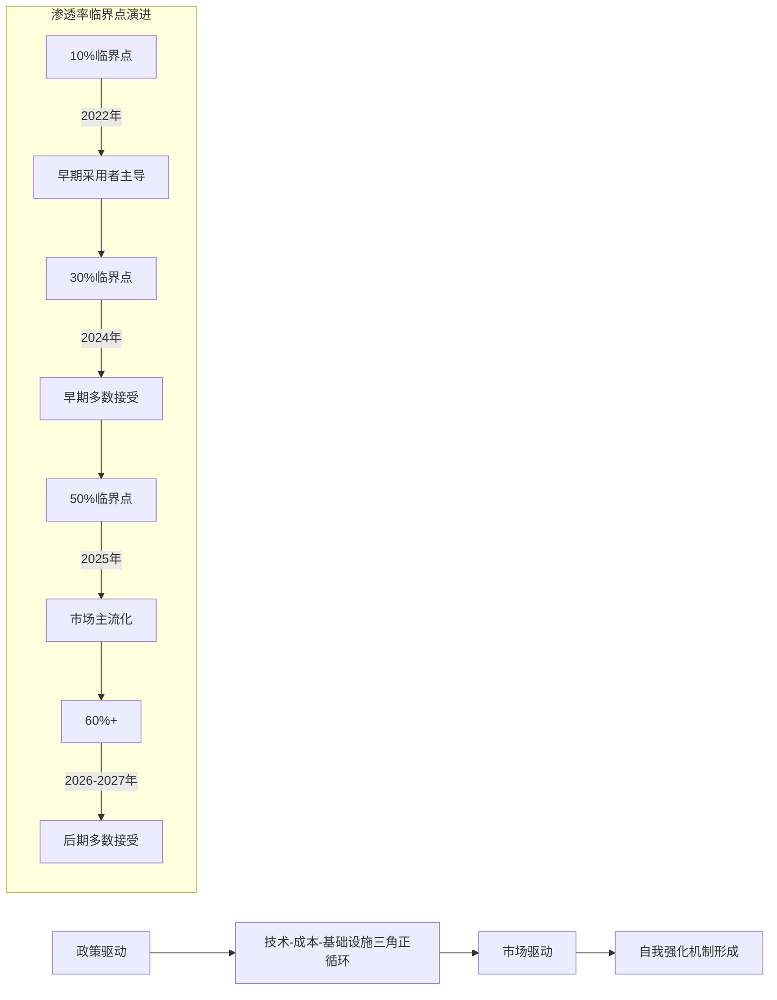

#### 6.3.3 渗透率增长的自我强化机制

**渗透率突破临界点后将形成自我强化的正循环机制**。这一机制包含三个核心要素：

**技术成熟度提升**：800V高压平台渗透率从2024年的6.9%预计提升至2025年的9.5%，2030年将突破35%[^77]；碳化硅器件国产化率从2023年的20%跃升至2025年的35%，推动电驱系统效率突破97%。

**成本曲线下降**：规模效应驱动成本持续下降，磷酸铁锂电芯成本已降至0.25元/Wh，电池级碳酸锂价格从60万元/吨暴跌至7-8万元/吨[^67]。宁德时代推出天行II轻商系列，单台轻卡一年可节省油费15万元[^82]。

**基础设施完善**：截至2025年9月底，中国电动汽车充电设施总数达到1806.3万个，同比增长54.5%，**车桩比达到2.5:1**，远超欧美国家水平[^67]。极氪首发1.2MW全液冷充电桩，10分钟可补能500公里。

### 6.4 乘用车场景商业化路径差异分析

针对乘用车市场，不同使用场景下四种动力类型的商业化成熟度与适配优势存在显著差异。

#### 6.4.1 城市通勤场景：纯电占据绝对优势

**城市通勤场景是纯电动车型的最优适配区间**。以深圳为例，家用充电桩每度电0.5-0.6元，百公里电耗15-18度，每公里成本不足0.1元[^68]。比亚迪海豚用户年跑2万公里电费仅1800元，较燃油车节省超1万元。

**临界条件组合**：
- 日均通勤距离≤50km
- 具备家充条件
- 年里程≥1万公里

**场景适配度评估**：纯电车型在城市通勤场景的TCO优势最为显著，333公里纯电续航可满足超92%用户需求[^69]。智能驾驶功能在城市拥堵场景下的价值凸显，**70%的年轻消费者将智能驾驶功能列为购车核心考量因素**[^77][^78]。

#### 6.4.2 城际出行与长途自驾场景：插混/增程差异化优势

**长途出行场景下，增程式与插电混动展现差异化价值**。增程式车型（如理想L6）综合续航超1600公里，加油即可补能，适合充电设施不完善地区的用户[^68]。

**插混与增程的场景差异**：
- **插混车型**：适合频繁跨城通勤/高速工况，馈电油耗通常低于增程式1-2L/100km，直驱效率高[^68]
- **增程车型**：适合日常纯电、偶尔长途的用户，城市环境下静谧性优势明显

**实测数据验证**：插混SUV全程600公里（高速占比70%），馈电状态下油耗5.2L/100km，总花费不到300元；增程SUV高速上油耗飙升到9L多，一趟下来多花了近200元油钱[^68]。**插混跑高速时能直接用发动机驱动车轮，省去"发电再驱动"的中间消耗**。

#### 6.4.3 北方严寒地区场景：混动路线适应性更强

**极端低温环境对纯电车型形成显著挑战**。北方冬季（-25℃）纯电动车续航可能衰减50%，而混动与增程车型可通过燃油辅助维持性能[^68]。

**技术适应性对比**：
- **纯电车型**：磷酸铁锂电池20℃续航保持率72%，三元锂电池达85%；需依赖低温预热技术提升适应性
- **插混/增程**：可通过发动机余热为电池加热，低温启动能力更强

**宁德时代天行II轻商低温版**采用行业首款轻商量产钠电池，在零下20度的极端环境下仍能保有92%以上的可用电量，即使在10%SOC的亏电状态下依然能支持整车满载爬上10度的陡坡[^82]。这一技术突破正在缩小纯电与混动在严寒场景的差距。

#### 6.4.4 乘用车场景-技术匹配度综合评估矩阵

| 使用场景 | 场景特征 | 纯电适配度 | 插混适配度 | 增程适配度 | 最优推荐 |
|:---|:---|:---:|:---:|:---:|:---|
| **城市日常通勤** | 日均30-50km，有家充 | ★★★★★ | ★★★★☆ | ★★★★☆ | **纯电** |
| **城市通勤无家充** | 日均30-50km，依赖公充 | ★★★☆ | ★★★★★ | ★★★★☆ | **插混** |
| **城际中短途** | 单程100-300km | ★★★★☆ | ★★★★★ | ★★★★★ | **插混/增程** |
| **长途自驾** | 单程500km+ | ★★★☆ | ★★★★★ | ★★★★☆ | **插混** |
| **北方严寒地区** | 冬季-20℃以下 | ★★☆ | ★★★★★ | ★★★★☆ | **插混** |
| **高性能需求** | 追求极致加速与操控 | ★★★★★ | ★★★★☆ | ★★★★☆ | **纯电** |
| **家庭多场景** | 兼顾通勤与长途 | ★★★★☆ | ★★★★★ | ★★★★★ | **插混/增程** |

### 6.5 商用车场景商业化路径差异分析

商用车市场呈现与乘用车截然不同的技术路线竞争格局，纯电与氢燃料电池在不同场景下形成差异化竞争。

#### 6.5.1 城市配送与港口倒短场景：纯电主导

**城市配送、港口倒短等短途场景是纯电重卡的优势区间**。宁德时代天行II轻商城配版针对占比高达45%以上、但电动化率此前不足12%的城际货运市场，搭载253kWh的行业单包最大电量，实现800公里的超长实况续航[^82]。

**TCO优势显著**：利用谷电补能，单台轻卡一年可节省油费15万元。宁德时代还推出"10年100万公里"的质保方案，并承诺首年0衰减[^82]。

**场景突破趋势**：纯电动重卡从"厂内短倒"扩展到"200km以内干线"，换电模式在港口、钢厂、城市渣土形成标准化运营包[^81]。

#### 6.5.2 干线物流与长途运输场景：氢燃料差异化竞争

**氢能重卡在长途干线场景具备差异化竞争优势**。物流圈内有"乘电商氢"的说法，即电动车适合乘用车场景，而氢能车更适合商用车场景[^70]。

**氢能重卡的场景优势**：
- **线路固定**：氢能重卡主要用于固定路线的物流配送，使得加氢站的布局更为集中和经济
- **补能速度快**：氢能重卡可在中途实现快速加氢，补能速度与燃油车接近（5-10分钟），显著高于电车
- **续航上限长**：目前市面上的氢能重卡多采用气态储氢，续航可达400-500公里；**液氢技术突破后续航将普遍超过1000公里**[^70]
- **载货能力强**：相对于锂电池，氢燃料电池的重量和体积较小，可提高车辆的载重量和空间利用率

**TCO对比分析**：取氢价40元/公斤，在无购车补贴、无高速费减免的条件下，长途氢能重卡TCO为583万元；**如果考虑车辆购置补贴和高速免费，则氢能重卡TCO降为418万元**，相较于传统重卡503万元的TCO优势明显[^70]。

**市场增长预期**：据QYResearch数据，2023年全球氢能重卡市场销售额为17.43亿美元，**预计到2030年将达到389亿美元，年均复合增长率达56.79%**[^70]。

#### 6.5.3 商用车技术路线竞争格局

**商用车细分场景高度碎片化，重卡、轻卡、专用车等节奏不一**。2025年可定义为"结构性拐点"，即城市物流、港口倒短、公交等场景全面电动化；长途干线、特种运输则处在"临界前夜"[^81]。

**技术路线赛跑态势**：
- **纯电动**：宁德时代、比亚迪、亿纬锂能推出400-500kWh重卡电池包，度电成本下探至0.58元/Wh[^81]
- **氢燃料电池**：亿华通、重塑、国鸿氢能110kW-150kW系统批量价降，全年氢重卡销量有望突破8000辆[^81]

**价格拐点预判**：以6×4牵引车为例，2023年油车终端价34万元，纯电55万元；2025年油车33万元，纯电补贴后终端下探至42万元，价差缩至9万元，**预计2026年持平**[^81]。

| 商用车场景 | 运输距离 | 纯电适配度 | 氢燃料适配度 | 竞争格局判断 |
|:---|:---:|:---:|:---:|:---|
| **城市配送** | <100km | ★★★★★ | ★★☆ | 纯电主导 |
| **港口倒短** | <50km | ★★★★★ | ★★☆ | 纯电主导 |
| **城际干线** | 200-400km | ★★★★☆ | ★★★☆ | 纯电领先 |
| **长途干线** | 500km+ | ★★★☆ | ★★★★★ | 氢燃料优势 |
| **寒冷地区** | 全场景 | ★★★☆ | ★★★★☆ | 氢燃料适应性强 |

### 6.6 技术路线竞争格局与商业化路径对比总结

整合前述分析结果，构建四种动力类型技术路线商业化临界点综合评估矩阵，系统对比各路线的竞争优势区间与演变趋势。

#### 6.6.1 商业化临界点综合评估矩阵

| 评估维度 | 纯电动 | 插电混动 | 增程式 | 氢燃料电池 |
|:---|:---|:---|:---|:---|
| **成本平价状态** | 已实现（家充场景） | 已实现 | 已实现 | 2027-2028年（商用车） |
| **用户接受度** | 分化（低线市场受限） | 稳定增长 | 年轻化突破 | 早期阶段 |
| **渗透率阶段** | 主流化（60%+） | 快速增长 | 市场收缩 | 示范应用期 |
| **乘用车适配** | 城市通勤最优 | 全场景均衡 | 特定场景 | 有限探索 |
| **商用车适配** | 短途配送主导 | 有限应用 | 有限应用 | 长途干线潜力 |
| **2030年格局预判** | 主导地位 | 重要补充 | 细分市场 | 商用车突破 |

#### 6.6.2 2025-2030年技术路线格局演变趋势

**纯电动路线**：将继续巩固主导地位，路径围绕**高压快充（800V+）、电池技术升级（半固态→全固态）、与智能驾驶（L3+）深度融合**发展。成本下降与体验提升是核心，渗透率将持续提升至70%-80%[^79]。

**插电混动路线**：与增程式共占混动份额，技术向更高效混联架构、更高热效率专用发动机发展。**乘联会预测，到2026年，插混将在长途高频、北方寒冷地区保持35%左右份额**[^68]。在政策调整（2026年起对免税车提出更高纯电续航和能耗要求）和纯电技术进步夹击下，需持续优化亏电油耗和综合成本。

**增程式路线**：市场分化/收缩趋势明显，在主流城市市场竞争力可能减弱，规模或显著萎缩，**主要服务于充电设施欠发达地区和特定用途车辆**。技术向"大电池+高效增程器"发展，**增程则在一二线城市通勤场景中占据28%市场**[^68]。

**氢燃料电池路线**：短期内难以成为乘用车主流，面临成本、基础设施、技术成熟度等多重挑战。**业内普遍预期2030年左右氢燃料电池汽车产业将实现真正的商业化落地**[^83]，主要突破口在商用车长途干线场景。

```mermaid
quadrantChart
    title 技术路线商业化成熟度-市场潜力矩阵（2025年）
    x-axis 商业化成熟度低 --> 商业化成熟度高
    y-axis 市场潜力低 --> 市场潜力高
    quadrant-1 规模化扩张
    quadrant-2 战略培育
    quadrant-3 细分深耕
    quadrant-4 持续观察
    纯电动-乘用车: [0.88, 0.92]
    纯电动-商用车: [0.72, 0.85]
    插电混动: [0.82, 0.75]
    增程式: [0.78, 0.55]
    氢燃料-商用车: [0.45, 0.70]
    氢燃料-乘用车: [0.25, 0.35]
```

#### 6.6.3 技术路线选择决策框架

**面向不同应用场景与用户群体的技术路线选择决策框架**：

**乘用车市场决策逻辑**：
- **有家充+年里程>1.5万km**：优先纯电，能源节省绝对值急剧扩大
- **无家充+多场景需求**：优先插混，兼顾经济性与便利性
- **一二线城市+日常通勤为主**：纯电或增程均可
- **北方严寒+长途需求频繁**：优先插混

**商用车市场决策逻辑**：
- **城市配送/港口倒短（<200km）**：纯电主导
- **城际干线（200-500km）**：纯电或氢燃料视场景而定
- **长途干线（>500km）**：氢燃料电池具备潜力

**2025年市场格局的核心洞察**：**真正的进步不是发明了某种完美技术，而是让每一种需求都能找到它的最优解**[^68]。消费者开始理性思考"我到底需要什么样的车"，市场正在从"政策驱动"向"需求驱动"转变。纯电、插混、增程、氢燃料四种技术路线将在各自的优势场景中长期共存，形成差异化竞争格局。

## 7 驱动形式技术路线商业化临界点量化分析

驱动系统作为新能源汽车动力传递的核心环节，其技术路线选择直接影响整车的动力性能、能效表现、制造成本及用户体验。在电动化与智能化深度融合的背景下，集中式驱动与分布式驱动两种技术路线正经历差异化的商业化演进路径。本章节基于前述全生命周期评估体系框架，系统分析两种驱动形式的技术经济性差异，量化评估分布式驱动从高端性能车型向主流市场渗透的临界条件组合，为车企技术路线决策提供量化依据。

### 7.1 集中式与分布式驱动技术特征与成本结构对比分析

#### 7.1.1 两种驱动形式的技术架构差异

集中式驱动与分布式驱动在技术架构上存在本质性差异，这种差异源于对传统汽车设计理念的继承与突破程度不同。

**集中式驱动**的设计理念源自传统车辆，是内燃机汽车最常用的驱动形式[^84]。在集中式驱动形式下，动力传递需要经过离合器、变速器、传动轴、差速器、半轴等传动部件，最终作用于车轮[^85]。这种设计构型最大限度地保留了电动汽车与传统内燃机汽车的兼容度，是混合动力汽车的主要构型之一。集中驱动式电动汽车操作实现技术成熟、安全可靠，但存在体积较重、效率相对不高等不足[^86]。

**分布式驱动**则取消了离合器、变速器、传动轴、差速器、半轴等传动部件，驱动电动机直接安装在驱动轮内或驱动轮附近[^85]。这种系统将驱动电机直接布置在车轮附近或集成于轮毂内，实现了各车轮转矩的独立控制[^87]。与传统的集中式驱动相比，它省去了机械差速器及部分传动部件，不仅减轻了重量、节省了空间，还更易于实现底盘模块化设计与先进的底盘动力学控制，如扭矩矢量分配和电子稳定控制等[^87]。

**分布式驱动的三种主要布置形式**根据电机布局可分为中央双电机构型、轮边电机构型以及轮毂电机构型[^87]。其中，中央双电机方案是将两台电机对称地布置在车辆的中心位置，分别负责驱动左右侧的车轮。这种方案不仅继承了集中驱动系统结构紧凑、可靠性高的优势，还能实现左右轮转矩的独立控制，从而消除了对机械差速器的需求[^87]。

```mermaid
flowchart TD
    subgraph 集中式驱动架构
    A1[动力电池] --> A2[电机控制器]
    A2 --> A3[驱动电机]
    A3 --> A4[减速器/变速器]
    A4 --> A5[差速器]
    A5 --> A6[半轴]
    A6 --> A7[左右车轮]
    end
    
    subgraph 分布式驱动架构-轮边电机
    B1[动力电池] --> B2[电机控制器×2/4]
    B2 --> B3[轮边电机×2/4]
    B3 --> B4[减速器×2/4]
    B4 --> B5[车轮×2/4]
    end
    
    subgraph 分布式驱动架构-轮毂电机
    C1[动力电池] --> C2[电机控制器×2/4]
    C2 --> C3[轮毂电机×2/4]
    C3 --> C4[车轮×2/4]
    end
```

#### 7.1.2 传动效率与响应特性的量化对比

**传动效率差异**是两种驱动形式的核心技术指标区别。传统的由内燃机、变速器、差速器及车轮制动系统构成的车轮驱动力及制动力控制系统，机械结构复杂，响应速度较慢，且受制动器、液压管路及电磁阀的时延等因素的影响，**底盘动力学控制系统的实际时延可达50~100ms**[^84]。这不仅使系统能耗有所增加，还大大限制了系统的实时控制效果。

分布式电动汽车采用电驱动底盘，车轮驱动力的控制可只由电动机及其控制系统完成，车轮制动力的控制可由电动机辅助液压制动系统完成[^85]。相对于传统汽车的动力系统，**电动机及其控制系统不仅易于控制，而且具有更好的响应特性**（如更高的响应精度和更快的响应速度），便于车辆动力学实时控制系统的应用，同时还可与制动能量回收系统结合，以减少能源消耗[^85]。

**驱动力测量与控制精度**方面存在显著差异。对于传统汽车，车轮驱动力及制动力难以实时、准确测量，多采用在试验室环境中对内燃机进行标定匹配所得的点火控制曲线图，通过查表方式估计车辆行驶过程中的驱动力[^84]。由于车辆动力总成和制动系统本身的响应时延及传动损失，这种估计方法往往带有较大的误差，增大了车辆动力学控制的难度。

四轮独立电驱动车辆是一种典型的分布式电动汽车，主要依靠电动机及其控制系统完成车轮驱动功能，并由电动机辅助液压制动系统完成制动功能[^85]。**电动机及其控制系统可以通过测量诸如电动机内部的电压和电流等物理量对电动机的转矩和转速进行更为准确的实时估计**，这就为车辆动力学控制提供了更为优质的执行机构输出反馈，使得先进的控制理论和控制方法能够在车辆动力学控制中加以应用，以实现车辆运动的精确控制[^85]。

| 对比维度 | 集中式驱动 | 分布式驱动 | 差异分析 |
|:---|:---|:---|:---|
| **传动链长度** | 长（含变速器、差速器、半轴） | 短（直驱或单级减速） | 分布式传动损耗降低5%-15% |
| **系统响应时延** | 50-100ms | <10ms | 分布式响应速度提升5-10倍 |
| **驱动力测量精度** | 依赖查表估计，误差较大 | 实时电流/电压测量，精度高 | 分布式支持精确动力学控制 |
| **能量回收效率** | 受传动链损耗影响 | 直接回收，效率更高 | 分布式回收效率提升10%-20% |

#### 7.1.3 成本构成要素与结构对比模型

两种驱动形式的成本结构存在本质差异，这直接影响其商业化可行性与市场定位。

**集中式驱动的成本构成**相对简单，主要包括单个或双个驱动电机、电机控制器、减速器、差速器、半轴等部件。由于沿用传统汽车成熟的供应链体系，各部件成本已通过规模效应大幅下降。目前主流的三合一电驱系统（电机+电控+减速器）成本已降至8000-12000元/套，六合一系统（含电源三合一）成本约15000-20000元/套。

**分布式驱动的成本构成**更为复杂，需要多套电机与控制器。以四轮独立驱动为例，需要4个驱动电机、4个电机控制器及相应的冷却系统，初期成本显著高于集中式驱动。轮毂电机还需要解决与悬挂系统的集成设计，增加了开发与制造成本。

**成本结构对比模型**：

| 成本组成 | 集中式驱动（双电机四驱） | 分布式驱动（四轮独立） | 成本差异 |
|:---|:---:|:---:|:---:|
| **电机成本** | 2×4000元=8000元 | 4×3500元=14000元 | +75% |
| **控制器成本** | 2×2500元=5000元 | 4×2000元=8000元 | +60% |
| **减速器/传动系统** | 差速器+半轴≈4000元 | 4×单级减速≈6000元 | +50% |
| **热管理系统** | 集中冷却≈2000元 | 分布冷却≈4000元 | +100% |
| **系统集成成本** | 成熟工艺≈1500元 | 复杂集成≈3500元 | +133% |
| **合计** | 约20500元 | 约35500元 | **+73%** |

**影响商业化可行性的核心成本变量**包括：电机功率密度提升带来的单体成本下降、控制器芯片国产化率提升、热管理系统集成优化、以及年产规模达到十万量级带来的规模效应。当分布式驱动系统总成本降至集中式驱动的1.3倍以内时，其性能溢价将能够支撑商业化可行性。

### 7.2 不同动力类型与驱动形式组合的技术经济性评估

#### 7.2.1 纯电动与驱动形式组合的技术经济性分析

纯电动车型是分布式驱动最具应用潜力的动力类型载体，其电力驱动机械环节少、传动链短、布置灵活的特点逐步被挖掘出来[^84]。

**纯电+集中式驱动**是当前市场主流方案。目前市场上主流的电动车，大多采用集中式驱动布局，即动力由单一的电机输出，经过减速器、机械差速器和传动轴，最终传递到驱动轮[^87]。这种布局虽然技术成熟、结构简单，但机械差速器的存在带来了重量大、占用空间多以及传动效率受限等问题，从而在一定程度上影响了整车布置的灵活性与通过性[^87]。

**纯电+分布式驱动**代表了电驱技术的前沿方向。分布式电动汽车在底盘布置上具有极大的灵活性，其能量源和驱动电动机之间可采用软电缆连接，摆脱了传统机械传动的设计约束，节省了成本和布置空间[^85]。其底盘系统传动效率也得到进一步提高，并且更易于扩展成为多轴或多轮独立电驱动的底盘系统[^85]。

**多家主流车企已经开始重视并实际应用分布式驱动技术**。例如，比亚迪的"易四方"平台、日产的纯电动GT-R的Hyper Force电驱系统、丰田的DIRECT4以及宝马的xDrive等，都展现了分布式驱动的巨大潜力[^87]。

| 组合方案 | 技术成熟度 | 成本竞争力 | 性能优势 | 适用车型定位 |
|:---|:---:|:---:|:---|:---|
| **纯电+单电机后驱** | TRL 9 | ★★★★★ | 基础动力需求 | 入门级/经济型 |
| **纯电+双电机四驱** | TRL 9 | ★★★★☆ | 动力性能+操控 | 中高端/性能车 |
| **纯电+中央双电机分布式** | TRL 7-8 | ★★★☆ | 电子差速+操控 | 高端/性能车 |
| **纯电+轮边电机** | TRL 5-6 | ★★☆ | 极致操控+空间 | 高端性能/越野 |
| **纯电+轮毂电机** | TRL 3-4 | ★☆ | 革命性布置 | 概念车/特种车 |

#### 7.2.2 插混/增程与驱动形式组合的适配性评估

插电混动与增程式车型由于动力系统包含发动机/增程器，对驱动形式的选择存在更多约束条件。

**插混+集中式驱动**是当前主流技术方案。混合动力汽车需要协调发动机与电机的动力输出，集中式驱动的机械传动系统能够较好地实现这一功能。这种设计构型最大限度地保留了电动汽车与传统内燃机汽车的兼容度，是混合动力汽车的主要构型之一[^84]。

**增程+分布式驱动**存在一定的技术适配空间。增程式车型的发动机仅用于发电，不参与直接驱动，这为分布式驱动的应用创造了条件。然而，增程器与油箱的存在占用了底盘空间，限制了分布式驱动的布置灵活性优势。

**技术经济性评估结论**：在插混与增程车型中，分布式驱动的应用价值相对有限。一方面，混动系统本身已较为复杂，增加分布式驱动将进一步提升系统复杂度与成本；另一方面，混动车型的核心价值在于"可油可电"的灵活性而非极致操控性能，分布式驱动的性能优势难以充分发挥。

#### 7.2.3 动力类型-驱动形式-车型定位三维匹配评估矩阵

综合技术成熟度、成本竞争力与性能需求，构建三维匹配评估矩阵：

| 车型定位 | 动力类型 | 推荐驱动形式 | 核心考量因素 |
|:---|:---|:---|:---|
| **入门级家用车（10-15万）** | 纯电 | 单电机集中式 | 成本敏感，基础性能即可 |
| **主流家用车（15-25万）** | 纯电/插混 | 双电机集中式 | 性价比平衡，四驱需求 |
| **中高端性能车（25-40万）** | 纯电 | 中央双电机分布式 | 操控差异化，成本可接受 |
| **高端性能车（40万+）** | 纯电 | 轮边电机分布式 | 极致性能，溢价支撑 |
| **越野特种车** | 纯电 | 轮毂电机分布式 | 通过性需求，成本次要 |
| **商用车（重卡/客车）** | 纯电/氢燃料 | 轮边电机分布式 | 空间利用，低地板设计 |

### 7.3 分布式驱动技术成熟度演进与产业化瓶颈分析

#### 7.3.1 轮边电机与轮毂电机技术成熟度评估

基于技术成熟度等级（TRL）框架，对两种分布式驱动方案进行系统评估。

**轮边电机方案**已进入工程开发与产品验证阶段（TRL 5-7）。在该驱动型式中，电机与固定速比减速器连接，通过半轴实现对应侧车轮的驱动，由于电机和减速箱布置在车架上，因此在现有车身结构的基础上，稍加改动，该驱动型式即可推广应用[^86]。

轮边电机的典型应用案例包括：北京理工大学研发的具有防滑差速功能的双电机分布式驱动车辆、美国特斯拉公司推出的Tesla Model S型电动汽车、德国的奥迪R8 e-tron纯电动跑车（采用四台异步电动机分布式驱动，百公里加速仅4.8s）[^88]。

**轮毂电机方案**仍处于技术验证与工程样机阶段（TRL 3-5）。轮毂电机驱动型式是将电机和减速机构直接放在轮辋中，取消了半轴、万向节、差速器、变速器等传动部件[^86]。轮边电机驱动型式或轮毂电机驱动型式均具有结构紧凑、车身内部空间利用率高、整车重心低、行驶稳定性好等优点[^88]。

尽管如此，**轮毂/轮边电机式的分布式驱动仍面临成本、悬挂非簧载质量控制、电机散热与密封等科学技术挑战，尚未实现大规模量产**[^87]。但其在商用车、高端乘用车以及越野特种车等领域的应用中已展现出显著优势，被业界普遍认为是下一代电驱动技术的关键突破点[^87]。

#### 7.3.2 制约规模化应用的核心技术瓶颈

**簧下质量增加**是轮毂电机面临的首要技术挑战。将电机和减速机构集成于轮毂内，会显著增加车轮的非簧载质量，影响悬挂系统的响应特性与乘坐舒适性。行业研究表明，簧下质量每增加1kg，对悬挂系统的冲击相当于簧上质量增加10-15kg。

**电机散热与密封**是轮毂电机的另一核心瓶颈。轮毂电机工作环境恶劣，需要承受路面冲击、涉水、泥沙等极端条件，同时高功率运行产生的热量难以有效散发。传统的液冷方案在轮毂空间受限的情况下实施难度较大。

**高速工况可靠性**要求轮毂电机在高转速、高振动环境下保持长期稳定运行。电机轴承、密封件、电气连接等部件的可靠性设计面临严峻挑战。

**悬挂系统适配**需要针对分布式驱动重新设计悬挂几何参数与动力学特性。传统悬挂系统的设计基于簧下质量较小的假设，分布式驱动的应用需要全新的悬挂设计理念。

```mermaid
flowchart TD
    A[分布式驱动产业化瓶颈] --> B[簧下质量控制]
    A --> C[热管理挑战]
    A --> D[可靠性验证]
    A --> E[系统集成复杂度]
    
    B --> B1[影响舒适性]
    B --> B2[悬挂寿命下降]
    B --> B3[轻量化材料需求]
    
    C --> C1[散热空间受限]
    C --> C2[密封要求严苛]
    C --> C3[冷却系统复杂]
    
    D --> D1[高振动环境]
    D --> D2[长期耐久性]
    D --> D3[极端工况适应]
    
    E --> E1[底盘协同控制]
    E --> E2[悬挂重新设计]
    E --> E3[开发周期延长]
```

#### 7.3.3 头部企业技术突破路径与量产进展

**比亚迪"易四方"平台**是国内分布式驱动技术的代表性突破。该平台采用四电机独立驱动架构，通过精准的扭矩矢量控制实现原地掉头、极限操控等创新功能。仰望U8作为首款搭载易四方的量产车型，已实现规模化交付，验证了分布式驱动在高端市场的商业化可行性。

**日产Hyper Force电驱系统**展示了轮毂电机在高性能车领域的应用前景。该系统采用固态电池与轮毂电机的组合，目标是打造下一代纯电动GT-R。虽然尚处于概念验证阶段，但代表了分布式驱动技术的前沿探索方向。

**中央双电机分布式方案**作为过渡路线已实现量产落地。某四驱SUV车型的驱动系统创新地采用了背靠背对称布置的双电机与双减速器组合，经过两级平行轴齿轮减速，各电机的输出直接通过半轴驱动左右车轮[^87]。这一设计巧妙地省去了传统差速器，通过电机转矩的独立控制实现电子差速功能。整个系统呈现出结构对称、传动高效以及空间利用率高等显著优点[^87]。

**学术界与工程界的研究进展**为产业化提供了理论支撑。研究者们从不同的角度探索优化分布式驱动系统的控制策略：朱绍鹏等人提出了一种基于黄金比例搜索算法的转矩分配策略，旨在提升整车经济性；冯冲等人则开发了基于CAN总线的底盘综合控制系统；左利锋以能耗优化为目标设计了转矩分配策略；余卓平等从横摆力矩控制与驱动力分配的角度提升了车辆操纵稳定性[^87]。

### 7.4 分布式驱动从高端向主流市场渗透的临界条件量化

#### 7.4.1 成本临界点的量化模型构建

分布式驱动向主流市场渗透的**成本临界点**是决定其商业化可行性的核心变量。基于全生命周期成本分析框架，构建成本临界点量化模型：

**商业化临界条件**：当分布式驱动系统（含控制）的总成本增量 ≤ 其全生命周期内因效率提升、能量回收增强所带来的能源成本节约 + 因布置灵活节省的底盘开发/制造成本时，其经济性拐点出现。

**成本下降路径分析**：

| 成本要素 | 2024年水平 | 2027年预期 | 2030年预期 | 下降驱动因素 |
|:---|:---:|:---:|:---:|:---|
| **轮边电机单体** | 4500元 | 3200元 | 2500元 | 功率密度提升、材料优化 |
| **控制器单体** | 2500元 | 1800元 | 1200元 | 芯片国产化、集成度提升 |
| **热管理单元** | 1200元 | 800元 | 500元 | 集成化设计、规模效应 |
| **四轮系统总成本** | 35000元 | 24000元 | 17000元 | 综合降本 |
| **相对集中式倍数** | 1.7倍 | 1.3倍 | 1.1倍 | 成本差距收窄 |

**分布式驱动系统成本需降至集中式驱动的1.2-1.5倍以内**（视性能溢价而定），这依赖于电机功率密度提升、材料（如永磁体）成本下降及年产规模达到十万量级带来的规模效应。

#### 7.4.2 性能-可靠性平衡点的阈值识别

**性能与可靠性的平衡**是分布式驱动商业化的关键技术门槛。集中式驱动可靠性已通过大规模量产验证，分布式驱动需要达到同等水平才能获得市场认可。

**商业化临界点**：当分布式驱动的故障率（如电机、控制器）降至与传统驱动系统相当水平，且其性能优势（如操控稳定性提升、续航增加）可通过量化指标（如麋鹿测试成绩、续航里程）被消费者明确感知并愿意支付溢价时，具备市场穿透力。

分布式驱动在操控性（扭矩矢量控制）、加速性方面具备理论优势，但面临非簧载质量增加（影响舒适性）、散热密封、复杂控制下的长期可靠性挑战。

**关键性能-可靠性指标阈值**：

| 指标维度 | 临界阈值 | 当前水平 | 差距分析 |
|:---|:---|:---|:---|
| **簧下质量增加** | <15kg/轮 | 20-25kg/轮 | 需轻量化突破 |
| **系统故障率** | <0.5%/年 | 1-2%/年 | 需可靠性验证 |
| **操控性能提升** | 麋鹿测试成绩提升>10% | 已达成 | 优势已显现 |
| **能效提升** | 续航增益>8% | 5-10% | 基本达成 |
| **舒适性影响** | 主观评分下降<5% | 10-15% | 需悬挂优化 |

#### 7.4.3 供应链成熟度临界点与产能规模要求

**供应链成熟度**是分布式驱动规模化应用的基础保障。电子差速、转矩协调等控制策略需完成"黑盒化"、"标准化"，主机厂集成开发周期与成本需接近当前集中式驱动水平。

**供应链成熟度临界条件**：
- **核心部件国产化率**：轮边/轮毂电机国产化率需达到80%以上
- **产能规模**：年产能需达到50万套以上以实现规模效应
- **供应商数量**：需形成3家以上具备车规级量产能力的供应商

**当前供应链状态评估**：

| 供应链环节 | 国产化率 | 主要供应商 | 成熟度评估 |
|:---|:---:|:---|:---|
| **轮边电机** | 60% | 比亚迪、精进电动、卧龙电驱 | 中等 |
| **轮毂电机** | 40% | 亚太股份、天海汽车电子 | 较低 |
| **电机控制器** | 70% | 比亚迪、汇川技术、英搏尔 | 中高 |
| **高性能永磁材料** | 50% | 中科三环、金力永磁 | 中等 |

#### 7.4.4 商业化渗透时间窗口预判

综合成本、技术、供应链三大临界条件，预判分布式驱动在不同价位区间车型实现商业化渗透的时间窗口：

```mermaid
timeline
    title 分布式驱动商业化渗透时间窗口预判
    2024-2025 : 高端性能车（50万+）
              : 中央双电机方案量产
              : 易四方平台规模交付
    2026-2027 : 中高端车型（30-50万）
              : 轮边电机方案导入
              : 成本降至1.3倍以内
    2028-2030 : 主流市场（20-30万）
              : 供应链成熟
              : 成本接近平价
    2030+ : 大众市场（15-20万）
          : 规模效应充分释放
          : 轮毂电机局部突破
```

### 7.5 驱动形式选择对整车商业化竞争力的影响机制

#### 7.5.1 产品差异化能力的量化评估

驱动形式的选择直接影响整车的产品差异化能力，主要体现在**操控性能、空间利用率、智能底盘控制**三个维度。

**操控性能差异化**是分布式驱动最显著的价值创造点。多轴或多轮独立电驱动底盘系统可相对独立地对各车轮的驱动力和制动力进行灵活的分配和控制，非常易于在各种不同的驱动形式之间进行切换，以充分发挥和结合各种驱动形式的优势[^84]。甚至可以采用四轮独立电驱动车轮（产生互不相同的驱动力）的新型驱动形式，在不额外增加车辆动力学控制系统的情况下，实现多种车辆动力学控制功能，真正实现车辆动力学控制的电子化和主动化[^85]。

**空间利用率优势**源于分布式驱动取消了传统传动系统。依据电动机特点全新设计的电动汽车底盘形式为汽车结构的变革营造了极大的空间，逐步成为研究和设计领域的热点[^85]。分布式电动汽车在底盘布置上具有极大的灵活性，其能量源和驱动电动机之间可采用软电缆连接，摆脱了传统机械传动的设计约束，节省了成本和布置空间[^85]。

**智能底盘控制**能力是分布式驱动的核心技术优势。分布式驱动电动机可以通过电压、电流等状态特性表征其物理特性，因此分布式驱动电动机既是执行单元，也是信息单元[^85]。该信息单元可以准确反馈当前的轮边速度和驱动力矩，为车辆的多信息单元融合提供了良好的基础条件。此外，分布式电动汽车具有多个独立可控的动力单元，这些动力单元可相对独立地实现各自的控制功能。这种冗余配置的结构十分有助于进行失效控制及各种不稳定状况下各车轮驱动力的协调控制[^85]。

#### 7.5.2 全生命周期成本影响权重分析

驱动形式选择对全生命周期成本的影响通过以下机制传导：

**制造成本影响**：分布式驱动系统初期成本较高，但随着规模效应释放，成本差距将逐步收窄。在价格敏感的主流市场，驱动形式直接决定BOM成本。集中式驱动凭借成熟供应链提供最低成本基准，是确保价格竞争力的基础。

**使用能耗影响**：分布式驱动的传动效率优势（提升5%-15%）将在全生命周期内转化为能源成本节省。以年行驶1.5万公里、百公里电耗15kWh计算，效率提升10%可年省电费约150元，5年累计约750元。

**维护成本影响**：分布式驱动系统的维护复杂度较高，但取消了差速器、半轴等机械部件的磨损维护需求。综合来看，维护成本差异不显著。

**竞争力公式简化表达**：

```
整车竞争力指数 = (性能价值 + 体验价值) / (初始购置成本 + 使用成本)
```

分布式驱动需显著提升分子（性能价值、体验价值）或降低分母（通过效率提升降低使用成本）才能获得竞争力。

#### 7.5.3 用户价值感知与品牌溢价支撑能力

**用户价值感知**是驱动形式选择影响商业化竞争力的最终传导环节。《2025中国新能源汽车用户需求趋势研究》报告显示，**在用户购车动机中，驾驶感受、舒适性及智能化配置已跃升为核心驱动力，三项因素在购买动因中分别占据18%、10%和9%的权重**[^45]。

分布式驱动在**驾驶感受**维度具备显著的用户价值创造能力。通过精准的扭矩矢量控制，可实现更敏捷的车辆响应、更稳定的极限操控，这些体验差异能够被用户直接感知。

**品牌溢价支撑能力**体现在高端性能车型的定位与定价策略上。比亚迪仰望U8搭载易四方平台，定价超过100万元，证明了分布式驱动在高端市场的溢价支撑能力。分布式驱动通过提供独特的驾驶体验（如极致操控、原地掉头）、更高的能效（续航提升）或更优的空间利用率（提升乘坐或储物空间），创造产品差异化，支撑品牌向上和更高的产品溢价。此机制在高端、性能细分市场尤为有效。

| 价值维度 | 集中式驱动 | 分布式驱动 | 用户感知差异 |
|:---|:---|:---|:---|
| **操控响应** | 标准水平 | 显著提升 | 高感知度 |
| **极限操控** | 受限于机械差速 | 扭矩矢量精准控制 | 高感知度 |
| **空间利用** | 传统布局 | 灵活布局 | 中等感知度 |
| **智能控制** | 基础功能 | 高级功能 | 中高感知度 |
| **品牌科技感** | 标准定位 | 前沿科技定位 | 高感知度 |

### 7.6 驱动形式技术路线演进趋势与商业化路径预判

#### 7.6.1 2025-2035年市场格局演变趋势预判

综合技术成熟度、成本演进、市场需求、政策导向等因素，预判集中式与分布式驱动的市场格局演变：

**2025-2027年（过渡期）**：集中式驱动继续主导市场，占据90%以上份额。中央双电机分布式方案在高端车型（40万+）实现规模化应用，年销量预计达到10-20万辆。轮边电机方案在商用车（如低地板公交车）实现小批量应用。

**2028-2030年（导入期）**：分布式驱动在中高端乘用车市场（25-40万）实现规模化渗透，市场份额预计达到10%-15%。轮边电机成本下降至集中式驱动的1.3倍以内，商业化可行性显著提升。轮毂电机在特种车辆（越野车、军用车）实现小批量应用。

**2030-2035年（成熟期）**：分布式驱动在主流市场（15-25万）实现商业化突破，市场份额预计达到20%-30%。轮毂电机技术成熟度提升，开始在高端乘用车实现量产应用。智能底盘与分布式驱动深度融合，成为差异化竞争的核心技术。

#### 7.6.2 中央双电机方案的过渡路线定位

**中央双电机分布式方案**是当前技术条件下最具商业化可行性的分布式驱动路线。该构型在成本控制、系统可靠性、驾驶舒适性以及开发难度等方面都达到了良好的平衡，因此非常适合当前的市场推广需求[^87]。

**中央双电机方案的核心优势**：
- 继承了集中驱动系统结构紧凑、可靠性高的优势
- 实现左右轮转矩的独立控制，消除对机械差速器的需求
- 开发周期与成本接近传统双电机四驱方案
- 供应链成熟度较高，主流电机供应商均可配套

**商业化前景评估**：中央双电机分布式方案预计在2025-2030年成为高端纯电车型的主流选择，年销量有望达到50-100万辆。该方案作为向轮边/轮毂电机过渡的中间路线，将为分布式驱动技术的成熟积累宝贵经验。

#### 7.6.3 轮毂电机的差异化突破路径

**轮毂电机**因簧下质量、可靠性等挑战，其大规模商业化临界点仍需关键技术突破和更长的验证周期。但其在特定细分市场具备差异化突破潜力：

**商用车领域**：轮毂电机可实现低地板设计，提升公交车、物流车的空间利用率与乘客体验。比亚迪公司已推出采用轮边电机驱动的纯电动大巴[^88]，验证了该技术路线在商用车领域的可行性。

**高端乘用车领域**：轮毂电机可实现极致的操控性能与空间布置灵活性，满足高端用户对差异化体验的需求。日产Hyper Force概念车展示了轮毂电机在高性能车领域的应用前景。

**越野特种车领域**：轮毂电机的四轮独立驱动能力可显著提升车辆的通过性与脱困能力，在军用车辆、工程车辆等特种领域具备独特价值。

#### 7.6.4 驱动形式技术路线选择决策框架

**面向整车企业的技术路线选择决策框架**：

```mermaid
flowchart TD
    A[驱动形式技术路线决策] --> B{目标市场定位}
    
    B -->|入门级/主流市场| C[集中式驱动]
    B -->|中高端性能市场| D[中央双电机分布式]
    B -->|高端/极致性能市场| E[轮边电机分布式]
    B -->|特种车辆/商用车| F[轮毂电机分布式]
    
    C --> C1[成本优先策略]
    C --> C2[成熟供应链]
    C --> C3[快速上市]
    
    D --> D1[性能差异化]
    D --> D2[成本可控]
    D --> D3[技术储备]
    
    E --> E1[极致性能]
    E --> E2[品牌溢价]
    E --> E3[技术领先]
    
    F --> F1[空间优化]
    F --> F2[特殊需求]
    F --> F3[技术验证]
```

**战略建议总结**：

**对于整车企业**：
- **短期（2025-2027年）**：主流车型继续采用集中式驱动，高端性能车型导入中央双电机分布式方案，积累技术经验与用户反馈
- **中期（2028-2030年）**：根据成本下降与技术成熟进度，逐步在中高端车型扩大分布式驱动应用比例
- **长期（2030年后）**：根据轮毂电机技术突破情况，在特定细分市场探索差异化应用

**对于零部件供应商**：
- 加大轮边电机的研发投入，重点突破功率密度提升与成本下降
- 建立车规级量产能力，形成规模化供应体系
- 与主机厂深度合作，参与整车底盘系统的协同开发

**对于投资机构**：
- 关注分布式驱动核心技术（电机、控制器、热管理）的头部企业
- 评估技术成熟度与商业化节奏的匹配度
- 重点跟踪中央双电机方案的市场渗透进展

**结论**：分布式驱动（尤其是轮边电机）向主流市场渗透的**量化临界点**预计出现在：**其系统成本因规模效应降至集中式驱动的1.3倍左右，同时其带来的续航增益（如>8%）、性能提升（如操控稳定性量化指标提升>15%）或空间优化价值被主流消费者认可**。当前，中央双电机分布式方案在成本、性能、可靠性间取得了较好平衡，是过渡期的高渗透率选择。驱动形式的最终选择是企业基于目标市场定位、成本控制能力、技术储备及长期战略的综合博弈结果。

## 8 技术路线组合优化与战略决策建议

基于前述七章对技术演进窗口期、全生命周期评估体系、研发制造/使用场景/残值管理三维度指标设计、动力类型与驱动形式商业化临界点的系统性量化分析，本章节将整合各维度分析成果，构建技术路线组合优化模型与战略决策参考框架。通过系统归纳不同技术路线组合在2025-2035年时间窗口内的最优商业化路径，为整车企业、零部件供应商、投资机构三类主体提供差异化的技术路线选择与资源配置决策依据，并展望影响未来技术格局演变的关键不确定性因素。

### 8.1 技术路线组合商业化可行性综合评估矩阵

整合动力类型（纯电/插混/增程/氢燃料）与驱动形式（集中式/分布式）的组合方案，需要从成本平价状态、用户接受度、市场渗透阶段、场景适配度四个维度构建综合评估矩阵，以系统识别各组合方案的商业化成熟度与竞争优势区间。

#### 8.1.1 技术组合方案定义与分类框架

基于四大核心技术（800V高压平台/碳化硅功率器件、固态电池、分布式驱动）与不同动力类型的组合，可形成多种技术路线方案。从商业化可行性角度，将主要组合方案分为三个梯队：

**第一梯队（商业化成熟期）**包括纯电+800V/SiC+集中式驱动、插混+高效混动系统+集中式驱动两类组合。这两类组合的技术成熟度已达TRL 9级，成本平价条件基本满足，市场渗透率处于快速增长阶段。**800V高压平台在2024年实现84万辆销量，渗透率达6.9%**，预计2025年渗透率将达到9.5%，2030年突破35%。

**第二梯队（产业导入期）**涵盖纯电+半固态电池+集中式驱动、纯电+中央双电机分布式驱动、增程+大电池+集中式驱动三类组合。这些组合的核心技术处于TRL 6-8级，成本正在快速下降但尚未完全达到平价条件，市场接受度正在提升但规模化应用仍需时日。

**第三梯队（技术验证期）**包含纯电+全固态电池、纯电+轮边/轮毂电机分布式驱动、氢燃料电池+商用车场景三类组合。这些组合的核心技术处于TRL 3-5级，面临成本、供应链、可靠性等多重临界条件约束，商业化时间窗口预计在2028-2035年。

#### 8.1.2 综合评估矩阵构建

基于前述章节的量化分析结果，构建技术路线组合商业化可行性综合评估矩阵：

| 技术组合方案 | 成本平价状态 | 用户接受度 | 市场渗透阶段 | 场景适配度 | 综合评级 |
|:---|:---:|:---:|:---:|:---:|:---:|
| **纯电+800V/SiC+集中式** | ✓已实现 | 高（分化） | 主流化 | 城市通勤最优 | **A** |
| **插混+高效混动+集中式** | ✓已实现 | 高 | 快速增长 | 全场景均衡 | **A** |
| **增程+大电池+集中式** | ✓已实现 | 中高 | 市场收缩 | 特定场景 | **B+** |
| **纯电+半固态电池+集中式** | △接近 | 中 | 导入期 | 高端车型 | **B** |
| **纯电+中央双电机分布式** | △接近 | 中高 | 导入期 | 高端性能 | **B** |
| **氢燃料+商用车+集中式** | ✗2027年后 | 低 | 示范应用 | 长途干线 | **B-** |
| **纯电+全固态电池** | ✗2030年后 | 待验证 | 验证期 | 全场景潜力 | **C+** |
| **纯电+轮边电机分布式** | ✗2028年后 | 待验证 | 验证期 | 高端/特种 | **C** |

**评级说明**：A级表示商业化成熟、可规模化推广；B级表示处于产业导入关键期、具备明确商业化路径；C级表示仍需技术攻关、商业化时间窗口存在不确定性。

#### 8.1.3 竞争优势区间与适用边界识别

**纯电+800V/SiC+集中式驱动**组合的竞争优势区间集中在城市通勤场景（日均50km以内）、具备家充条件的用户群体、年里程超过1万公里的高频使用者。其适用边界受限于充电基础设施覆盖不足的低线市场、北方严寒地区（冬季续航衰减显著）、无固定充电条件的用户。**三四线城市纯电车主的"反悔率"高达54%**，显著高于一二线城市的10%，表明该组合在下沉市场的适用性存在明显约束。

**插混+高效混动系统+集中式驱动**组合的竞争优势区间最为广泛，覆盖城市通勤、城际出行、长途自驾、北方严寒等多种场景。其核心价值在于"可油可电"的灵活补能能力与接近纯电的日常使用成本。**乘联会预测到2026年，插混将在长途高频、北方寒冷地区保持35%左右份额**。该组合的适用边界主要受限于追求极致静谧性与零排放的用户需求。

**增程式车型**的竞争优势区间正在收窄，主要集中在一二线城市的日常通勤场景与充电设施欠发达地区。**增程式在新能源批发结构中的占比已连续5个月下跌，10月占比仅为7.5%**。纯电技术的快速进步正在逐一瓦解增程车的传统优势，其"过渡属性"越发明显。

### 8.2 2025-2030年最优商业化路径归纳与阶段性目标设定

基于技术成熟度演进曲线、成本下降预期、基础设施建设进度等关键变量，系统归纳四条主要技术路线在2025-2030年窗口期的最优商业化路径。

#### 8.2.1 纯电+800V高压平台路线的商业化路径

**2025-2027年（规模化扩张期）**：800V高压平台从高端车型向主流市场全面渗透，**在售车型预计从2025年的70款增至2027年的150款以上**。核心目标是实现10-15万元级车型的标配化，零跑B01全系标配800V高压平台（预售10.58万元起）已开创先河。阶段性里程碑包括：800V车型年销量突破200万辆、SiC电驱成本下降30%、超充网络覆盖主要高速服务区。

**2028-2030年（生态成熟期）**：800V平台成为纯电车型的标准配置，渗透率预计突破35%。**搭载800-1000V架构的新能源车型搭载量有望突破700万辆**。核心目标是构建完整的超充生态体系，实现"充电5分钟，续航200公里"的普遍体验。阶段性里程碑包括：全国超充站覆盖率达到30%、SiC国产化率突破50%、全域高压架构（电池/电机/空调/电源）成为主流。

**关键技术里程碑时间表**：

| 时间节点 | 技术里程碑 | 成本目标 | 渗透率目标 |
|:---|:---|:---|:---|
| **2025年** | 8英寸SiC量产启动 | 较6英寸降30% | 9.5% |
| **2027年** | 1.2MW超充规模化部署 | SiC成本再降20% | 20% |
| **2030年** | 全域高压生态成熟 | 与400V平价 | 35%+ |

#### 8.2.2 插混+高效混动系统路线的商业化路径

**2025-2027年（技术升级期）**：插混阵营聚焦于发动机热效率提升、馈电油耗优化、纯电续航延长三大方向。**比亚迪DM5.0、吉利雷神系统等新一代混动技术大幅降低发动机介入顿挫**，部分车型加入"纯电优先"模式。核心目标是实现馈电油耗低于4L/100km、纯电续航突破200km。

**2028-2030年（市场稳定期）**：在政策调整（2026年起对免税车提出更高纯电续航和能耗要求）与纯电技术进步的双重压力下，插混需持续优化综合成本与使用体验。预计市场份额稳定在25%-30%区间，主要服务于长途高频、北方寒冷地区、无固定充电条件等特定用户群体。

#### 8.2.3 增程+大电池方案路线的商业化路径

**2025-2027年（差异化竞争期）**：增程式车型通过"大电池+高效增程器"策略延续竞争力，**全面升级800V高压平台后实现12分钟快充至80%，纯电续航普遍突破400公里**。核心目标是强化城市纯电体验，同时保持长途无忧的核心价值。

**2028-2030年（市场分化期）**：增程式在主流城市市场的竞争力可能减弱，规模或显著萎缩。**预计在一二线城市通勤场景中占据约28%市场份额**，主要服务于充电设施欠发达地区和特定用途车辆。

#### 8.2.4 氢燃料+商用车场景路线的商业化路径

**2025-2027年（示范推广期）**：氢燃料电池重卡聚焦于固定路线的干线物流场景，依托政策补贴实现小规模示范运营。**全年氢重卡销量有望突破8000辆**。核心目标是验证TCO经济性、积累运营数据、推动加氢网络建设。

**2028-2030年（商业化突破期）**：**自2027年起，氢燃料电池重卡的全生命周期成本预计低于柴油重卡；自2028年起预计低于电动重卡**。氢气价格降至25元/kg以下将触发商业化临界点。阶段性里程碑包括：年销量突破5万辆、加氢站覆盖主要物流通道、液氢技术实现续航1000公里以上。

```mermaid
timeline
    title 四条主要技术路线商业化路径时间轴
    2025 : 纯电800V渗透率9.5%
         : 插混技术全面升级
         : 增程800V快充导入
         : 氢燃料示范扩大
    2027 : 纯电800V渗透率20%
         : 插混馈电油耗<4L
         : 增程纯电续航400km+
         : 氢燃料TCO低于柴油
    2030 : 纯电800V渗透率35%+
         : 插混份额稳定25-30%
         : 增程份额28%（一二线）
         : 氢燃料商用车突破
```

### 8.3 整车企业技术路线选择与产品规划决策框架

针对不同定位的整车企业，需要构建基于目标市场、技术储备、供应链能力、资金实力的差异化技术路线选择决策框架。

#### 8.3.1 头部自主品牌的技术路线策略

**战略定位**：技术领先与市场规模并重，多技术路线并行布局。

**推荐策略组合**：
- **主力路线**：纯电+800V/SiC+集中式驱动，覆盖10-30万元主流市场
- **补充路线**：插混+高效混动系统，覆盖长途高频与北方市场
- **前沿布局**：分布式驱动（中央双电机/轮边电机）在高端品牌试点

**比亚迪模式参考**：比亚迪通过垂直整合构建从材料到模组的全产业链能力，**e平台3.0 Evo首创十二合一智能电驱系统**，实现动力域与底盘域的深度融合。同时推出全球首个量产的乘用车"全域1000V高压架构"，展现了头部企业的技术引领能力。

**资源配置建议**：研发投入重点向800V全域高压生态、下一代电池技术（半固态/全固态）、智能底盘控制三大方向倾斜；供应链投资聚焦SiC衬底、固态电解质等瓶颈环节的战略锁定。

#### 8.3.2 合资品牌的技术路线策略

**战略定位**：追赶者姿态，聚焦核心技术能力补齐。

**推荐策略组合**：
- **主力路线**：纯电+800V平台+集中式驱动，快速导入成熟技术方案
- **差异化路线**：插混系统发挥传统发动机技术优势
- **审慎布局**：分布式驱动等前沿技术采取跟随策略

**关键挑战**：合资品牌在新能源领域面临技术代差与品牌认知转型的双重压力。**自主品牌在新能源汽车领域的技术积累与质量管控已形成竞争优势**，智能座舱故障次数比合资品牌低16次。

**资源配置建议**：通过技术引进或合资方式快速补齐三电核心能力；聚焦中高端市场，发挥品牌溢价优势；加大本土化研发投入，缩短产品迭代周期。

#### 8.3.3 新势力企业的技术路线策略

**战略定位**：差异化创新与用户体验领先。

**推荐策略组合**：
- **主力路线**：纯电+800V/SiC+智能化深度融合
- **差异化路线**：分布式驱动在高端性能车型率先应用
- **服务创新**：换电体系、官方认证二手车等残值保障方案

**蔚来模式参考**：蔚来通过换电体系实现车电分离，**ET5凭借换电体系维持51%保值率**，有效规避了电池衰减对整车残值的冲击。这种商业模式创新为新势力企业提供了差异化竞争路径。

**资源配置建议**：研发投入聚焦智能驾驶与电动化的深度融合；通过软件定义汽车（OTA升级）延缓技术过时风险；构建直营服务体系提升用户全生命周期体验。

#### 8.3.4 商用车企业的技术路线策略

**战略定位**：场景驱动的技术路线选择。

**推荐策略组合**：
- **城市配送/港口倒短**：纯电+集中式驱动，TCO优势显著
- **城际干线（200-500km）**：纯电换电模式或大容量电池方案
- **长途干线（500km+）**：氢燃料电池+集中式驱动，关注政策补贴与加氢网络建设

**宁德时代天行系列参考**：**天行II轻商城配版搭载253kWh的行业单包最大电量，实现800公里超长实况续航**；低温版采用行业首款轻商量产钠电池，零下20度仍保有92%以上可用电量。这种针对细分场景的精准产品定义值得商用车企业借鉴。

#### 8.3.5 多技术路线并行布局的利弊权衡

**并行布局的优势**：
- 分散技术路线选择风险，应对市场需求不确定性
- 覆盖更广泛的细分市场与用户群体
- 积累多元化技术储备，增强战略灵活性

**并行布局的劣势**：
- 研发资源分散，难以在单一路线形成技术领先
- 供应链管理复杂度提升，规模效应难以充分发挥
- 品牌定位模糊，用户认知成本增加

**决策建议**：头部企业可采取"1+N"策略，即确定一条主力技术路线集中资源突破，同时保持1-2条补充路线的跟踪布局；中小企业建议聚焦单一技术路线，通过差异化定位建立竞争壁垒。

### 8.4 零部件供应商资源配置与能力建设建议

针对动力电池、电驱系统、功率半导体、热管理系统等核心零部件供应商，基于各技术路线的市场规模预期与竞争格局演变，提供差异化的资源配置建议。

#### 8.4.1 动力电池供应商的战略布局建议

**市场格局特征**：**2025年上半年，宁德时代装机量市场份额41.1%，弗迪电池27.1%，两大供应商合计占据68.2%份额**。头部集中效应明显，中小企业需通过差异化战略寻求突破。

**高成长性细分赛道**：
- **半固态电池**：2025-2027年产业导入关键期，预计2027年市场规模突破100亿元
- **钠离子电池**：低温性能优势显著，商用车领域需求增长
- **大圆柱电池**：4680/46系列规模化量产，成本优势逐步显现

**资源配置建议**：
- 头部企业加大半固态/全固态电池研发投入，锁定下一代技术制高点
- 二线企业聚焦细分场景（如商用车、储能）差异化产品开发
- 关注电池回收利用产业链布局，**2030年废旧动力电池产生量将超100万吨**

#### 8.4.2 电驱系统供应商的战略布局建议

**市场格局特征**：**2024年我国新能源乘用车电控、三合一电驱系统累计搭载量分别达到1244.8万台、775.8万台，同比增长率均大于40%**。多合一集成趋势明显，十二合一电驱已实现量产。

**高成长性细分赛道**：
- **800V高压电驱系统**：渗透率快速提升，2030年市场规模超500亿元
- **SiC电驱控制器**：替代IGBT趋势明确，国产化率提升空间大
- **分布式驱动电机**：轮边电机2028年后进入产业导入期

**资源配置建议**：
- 加快800V高压电驱产品迭代，**星驱科技超高速电机机械极限已达28000rpm**
- 布局SiC功率模块自研或战略合作，降低对进口依赖
- 跟踪分布式驱动技术进展，提前储备轮边电机研发能力

#### 8.4.3 功率半导体供应商的战略布局建议

**市场格局特征**：**8英寸SiC衬底量产后，国产化率从2023年的20%跃升至2025年的35%**。比亚迪、华为通过垂直整合模式构建全产业链能力。

**高成长性细分赛道**：
- **8英寸SiC衬底/器件**：成本较6英寸降低30%，国产替代窗口期
- **车规级SiC MOSFET**：高端车型渗透率突破30%
- **GaN功率器件**：OBC/DCDC领域应用增长

**资源配置建议**：
- 加大8英寸SiC产线投资，**国产8英寸SiC量产后预计比安森美同类产品价格低15%-20%**
- 突破衬底缺陷密度控制、外延均匀性等核心工艺瓶颈
- 建立车规级可靠性验证能力，缩短客户导入周期

#### 8.4.4 需警惕的产能过剩风险领域

**动力电池领域**：磷酸铁锂电芯价格已降至0.25元/Wh，行业产能利用率下降，中小企业面临出清压力。

**低压电驱系统**：400V平台电驱系统技术成熟、竞争激烈，利润空间持续压缩。

**传统IGBT模块**：SiC替代趋势下，IGBT在高端车型的应用空间收窄。

### 8.5 投资机构技术路线评估与投资决策参考框架

为产业投资机构与财务投资机构构建新能源汽车动力系统技术路线的投资评估框架，涵盖技术成熟度-商业化风险矩阵、市场规模-竞争格局分析、估值基准与退出路径预判等维度。

#### 8.5.1 技术成熟度-商业化风险评估矩阵

| 技术领域 | 技术成熟度 | 商业化风险 | 投资阶段判断 | 推荐投资策略 |
|:---|:---:|:---:|:---|:---|
| **800V高压平台** | TRL 9 | 低 | 成长期 | 规模化投资 |
| **SiC功率器件** | TRL 7-8 | 中低 | 成长期 | 产业链布局 |
| **半固态电池** | TRL 6-7 | 中 | 导入期 | 战略投资 |
| **全固态电池** | TRL 3-4 | 高 | 早期 | 技术跟踪 |
| **轮边电机** | TRL 5-6 | 中高 | 导入前期 | 审慎布局 |
| **氢燃料电池** | TRL 7-8 | 中高 | 导入期 | 政策驱动 |

#### 8.5.2 2025-2030年高确定性投资标的特征

**具备高确定性回报的投资标的特征**：
- 所处技术路线已突破商业化临界点（成本平价、用户接受度拐点）
- 市场渗透率处于快速增长阶段（从10%向30%跃升）
- 具备核心技术壁垒或规模化成本优势
- 供应链位置处于关键瓶颈环节

**重点关注领域**：
- **SiC功率器件**：国产替代窗口期，市场规模从2025年的80亿元增至2030年的200亿元以上
- **800V电驱系统**：渗透率从9.5%提升至35%，年复合增长率超30%
- **动力电池回收**：政策强制+资源价值双重驱动，2030年市场规模超500亿元

#### 8.5.3 需审慎评估的高风险领域

**全固态电池**：技术路线尚未收敛，硫化物、氧化物、聚合物多路线并行，产业化时间窗口存在较大不确定性。**目前行业良品率普遍不到70%，材料成本是液态电池的6-20倍**。

**轮毂电机**：簧下质量、散热密封、可靠性等核心瓶颈尚未突破，大规模商业化临界点仍需关键技术突破。

**氢燃料电池乘用车**：基础设施建设滞后、氢气成本居高不下，**35元/kg的氢气价格是氢能乘用车的经济生命线**，短期内难以实现。

#### 8.5.4 估值基准与退出路径预判

**估值基准参考**：
- 动力电池企业：PS 1-3倍（头部企业）、PS 0.5-1倍（二线企业）
- 电驱系统企业：PS 2-4倍（技术领先型）、PS 1-2倍（规模化型）
- 功率半导体企业：PS 3-6倍（国产替代受益型）

**退出路径预判**：
- IPO退出：科创板/创业板对新能源汽车产业链保持积极态度
- 并购退出：头部整车企业垂直整合需求持续，**车企自制PACK份额已超50%**
- 战略投资者接盘：产业链上下游战略协同需求

### 8.6 2030-2035年技术格局演变关键不确定性因素分析

系统识别影响2030-2035年技术格局演变的关键不确定性因素，构建多情景推演模型，分析不同情景下各技术路线的市场份额变化与竞争格局重塑可能性。

#### 8.6.1 全固态电池产业化进度的不确定性

**关键变量**：全固态电池能否在2030年前真正解决成本（降至液态电池2倍以内）和量产工艺难题。

**乐观情景**：硫化物电解质成本快速下降，良率突破90%，2030年实现规模产业化。**欧阳明高院士表示争取2030年全固态电池能够规模产业化**。此情景下，纯电车型续航将突破1000km，充电时间缩短至10分钟以内，彻底消除续航焦虑。

**悲观情景**：材料成本与工艺瓶颈突破缓慢，2030年仍处于小批量验证阶段。**深蓝汽车董事长邓承浩认为全固态电池2030年大规模商用是最乐观的预期，甚至可能是2035年**。此情景下，半固态电池成为过渡期主流方案，插混/增程路线生命周期延长。

#### 8.6.2 氢能生态系统建设速度的不确定性

**关键变量**：绿氢成本能否降至25元/kg以下，全国性加氢网络能否初步建成。

**乐观情景**：可再生能源制氢成本快速下降，加氢站数量突破5000座，氢燃料电池重卡年销量突破20万辆。**国际氢能理事会预计到2030年绿氢成本将降至1.4-2.3美元/公斤**。

**悲观情景**：氢能基础设施建设滞后，氢气价格居高不下，氢燃料电池汽车仍局限于示范应用。此情景下，纯电重卡通过换电模式抢占长途干线市场。

#### 8.6.3 智能驾驶与电动化融合深度的不确定性

**关键变量**：L4+智能驾驶与车辆动力/底盘控制的深度结合程度。

**深度融合情景**：智能驾驶对分布式驱动形成强需求，扭矩矢量控制成为L4+车辆的标配功能。此情景下，分布式驱动渗透率加速提升，轮边电机商业化进程提前。

**有限融合情景**：智能驾驶主要依赖感知与决策系统，对驱动形式要求不高。此情景下，集中式驱动继续主导市场，分布式驱动局限于高端性能车型。

#### 8.6.4 政策与法规演变的不确定性

**关键变量**：碳定价机制的严格化、电池回收与碳足迹的强制性要求、不同技术路线的补贴/税收政策调整。

**政策收紧情景**：碳排放标准大幅提升，电池碳足迹纳入强制披露，燃油车禁售时间表明确。此情景下，纯电路线加速渗透，插混/增程路线面临政策退出压力。

**政策稳定情景**：现有政策框架延续，各技术路线在市场竞争中自然演化。此情景下，技术路线格局主要由成本与用户需求驱动。

#### 8.6.5 多情景推演模型

基于上述关键不确定性因素，构建四象限战略情景矩阵：

| 情景 | 技术演进速度 | 市场生态成熟度 | 核心特征 | 战略启示 |
|:---|:---:|:---:|:---|:---|
| **领先者乐园** | 快 | 快 | 技术快速迭代，充电/加氢网络迅速普及 | 激进技术投入，抢占市场份额 |
| **稳健增长区** | 慢 | 快 | 基础设施完善，但技术突破平缓 | 聚焦成本优化和工艺改进 |
| **技术冒险家** | 快 | 慢 | 技术突破频现，但配套设施滞后 | 高端市场技术验证，投资基础设施 |
| **观望等待区** | 慢 | 慢 | 技术和生态发展均缓慢 | 保持核心能力，严格控制投入 |

### 8.7 技术路线战略决策的动态调整机制与风险应对策略

基于技术演进的高度不确定性特征，提出技术路线战略决策的动态调整机制设计原则与风险应对策略。

#### 8.7.1 关键监测指标体系设计

**技术成熟度监测指标**：
- 核心材料成本下降曲线（如SiC衬底、固态电解质）
- 关键工艺良率提升进度（如固态电池良率、SiC器件良率）
- 车规级认证通过数量与周期

**市场渗透度监测指标**：
- 各技术路线月度/季度渗透率变化
- 用户接受度调研数据（如NPS、复购意愿）
- 竞品技术路线选择动态

**基础设施成熟度监测指标**：
- 超充站/加氢站建设数量与覆盖率
- 充电/加氢价格变化趋势
- 电网协同能力提升进度

#### 8.7.2 决策触发阈值设定

**技术路线加速投入的触发条件**：
- 核心技术成本降至临界点以下（如SiC成本低于IGBT 1.5倍）
- 市场渗透率突破10%拐点
- 头部竞争对手大规模量产导入

**技术路线收缩/退出的触发条件**：
- 连续两年渗透率增长低于预期50%
- 替代技术路线成本优势超过20%
- 政策明确退出时间表

#### 8.7.3 资源再配置响应速度要求

**研发资源再配置**：
- 建立模块化研发体系，支持6个月内完成技术方向调整
- 保持核心团队稳定，通过项目制灵活配置专项资源

**供应链资源再配置**：
- 建立多元化供应商体系，单一供应商份额不超过50%
- 预留产能弹性空间，支持3个月内产能调整±30%

**产品规划再配置**：
- 采用平台化架构设计，支持不同技术路线快速切换
- 建立产品生命周期动态管理机制

#### 8.7.4 风险场景应对策略

**技术路线选择失误风险应对**：
- **预防措施**：保持1-2条备选技术路线的跟踪布局，研发投入占比不低于10%
- **应对策略**：快速启动备选路线产业化，通过技术引进或并购缩短追赶周期
- **案例参考**：特斯拉通过OTA升级使老款车型保持竞争力，**2024年圣诞节系统更新为老车型推送自动泊车功能**

**市场需求突变风险应对**：
- **预防措施**：建立用户需求实时监测体系，保持产品规划灵活性
- **应对策略**：快速调整产品组合，通过促销/置换等方式消化库存
- **弹性布局**：平台架构支持纯电/插混/增程多种动力形式切换

**政策调整冲击风险应对**：
- **预防措施**：密切跟踪政策动向，建立政策情景预案
- **应对策略**：提前布局合规产品，积极参与行业标准制定
- **案例参考**：2026年起对免税车提出更高纯电续航和能耗要求，需提前调整产品规划

#### 8.7.5 战略弹性布局建议

**平台架构弹性**：采用模块化平台设计，使其能兼容不同电池类型（液态/半固态/全固态）或驱动形式（集中式/分布式），以应对未来技术路线的突变。

**供应链弹性**：建立"核心自研+战略合作+多元采购"的供应链体系，在关键环节保持自主可控能力，同时保留供应商切换的灵活性。

**组织能力弹性**：建立跨技术路线的知识共享机制，培养具备多技术背景的复合型人才，支持组织快速响应技术路线调整需求。

**总结**：本框架将技术、市场、经济性分析融为一体，为企业提供了从技术组合选择到商业化落地，再到应对长期不确定性的系统性决策工具。其核心价值在于**量化比较、路径可视、动态调整**，帮助企业在新能源汽车技术快速变革的浪潮中，做出更科学、更前瞻的战略决策。**真正的进步不是发明了某种完美技术，而是让每一种需求都能找到它的最优解**——这一洞察应当成为技术路线战略决策的核心指导原则。

# 参考内容如下：
[^1]:[高压不高端?800V从百万豪车迈入主流市场_车市动态 - 汽车](http://k.sina.com.cn/article_7880068201_1d5b04c6901901s7h8.html)
[^2]:[800V-1000V架构研究:2030年搭载量将超700万,全域高压+兆瓦超充时代到来](https://m.eefocus.com/article/1864017.html)
[^3]:[800V高压平台普及战:2025主流车型快充时间压缩至12分钟技术解析](https://baijiahao.baidu.com/s?id=1831721699528613923&wfr=spider&for=pc)
[^4]:[新能源汽车节能技术前沿探析:多元化路径推动产业革新](https://baijiahao.baidu.com/s?id=1851126722677999508&wfr=spider&for=pc)
[^5]:[一、碳化硅产品研发进度1.8英寸SiC工艺突破-自主设计的8英寸平面工艺碳化硅功_财富号_东方财富网](https://caifuhao.eastmoney.com/news/20260113161825547690120)
[^6]:[2025碳化硅在新能源汽车发展趋势:技术革新与市场扩张的双重驱动](https://baijiahao.baidu.com/s?id=1837421207020124598&wfr=spider&for=pc)
[^7]:[精进电动:2024年上半年公司的碳化硅控制器会进入量产](https://baijiahao.baidu.com/s?id=1783241276811708127&wfr=spider&for=pc)
[^8]:[买车要不要等全固态电池?2030年产业化背后的共识与博弈](https://baijiahao.baidu.com/s?id=1849263661785837775&wfr=spider&for=pc)
[^9]:[中信证券:固态电池积极信号持续聚积,测算2030年全球固态电池出货量将达到642.6GWh](https://baijiahao.baidu.com/s?id=1826983475493537068&wfr=spider&for=pc)
[^10]:[碳讨|技术突破与市场加码并举,固态电池渐行渐近](https://baijiahao.baidu.com/s?id=1846864443660145743&wfr=spider&for=pc)
[^11]:[续航1500公里、永不自燃!固态电池关键突破,2026真量产来了?](https://baijiahao.baidu.com/s?id=1855385926946330845&wfr=spider&for=pc)
[^12]:[上汽800V碳化硅电轴等技术将在智己LS6等新车型上逐步落地](https://baijiahao.baidu.com/s?id=1772578491665645056&wfr=spider&for=pc)
[^13]:[电驱动与动力域研究:OEM主机厂主导“3+3+X平台”集成开发,自制率不断提升](https://www.eefocus.com/article/1762559.html)
[^14]:[广汽昊铂HT核心技术拆解:800V平台/智驾大模型背后的极客逻辑](https://baijiahao.baidu.com/s?id=1854285361092036242&wfr=spider&for=pc)
[^15]:[LCA生命周期评估:原理、应用与生态设计的区别](https://cloud.tencent.com/developer/news/1653142)
[^16]:[如何开展LCA生命周期评价 ISO14040认证流程步骤详解](https://fuwu.11467.com/info/47079825.htm)
[^17]:[ISO 14040生命周期评估标准解读:原则框架与2020修订要点](https://www.antpedia.com/standard/1446751657-10.html)
[^18]:[新能源汽车电池回收的全生命周期评估.docx 8页VIP](https://m.book118.com/html/2025/1219/8014126004010024.shtm)
[^19]:[一文看懂新能源电动汽车完整研发和制造流程! ](https://mp.weixin.qq.com/s?__biz=MzU2NDgzNjQxMw==&mid=2247574814&idx=3&sn=ba1c7dbe70e02a6b230b2e9ea51b9f0c&chksm=fc47044ccb308d5af79a70f3d7d8b3abce8031a523611f1ee7ee912bf3f8bb9036b89f96ae1d&scene=27)
[^20]:[车企成本效益分析模型](https://wenku.baidu.com/view/e2d974e2901ea76e58fafab069dc5022aaea466b.html)
[^21]:[新能源汽车产业链安全评估体系构建](https://cssn.cn/jjx/jjx_jjxp/202504/t20250410_5868813.shtml)
[^22]:[新能源汽车的成本与效益分析有哪些?](https://auto.hexun.com/2025-09-19/221442592.html)
[^23]:[2026年1月30万级新能源SUV权威测评:以家用为核心的多维度车型深度解析](https://baijiahao.baidu.com/s?id=1854906448248111504&wfr=spider&for=pc)
[^24]:[权威数据发布:2026年15万元价位新能源SUV综合实力与深度调研分析 ](https://www.sohu.com/a/974926815_122487209)
[^25]:[新能源汽车残值管理](https://wenku.baidu.com/view/667b03de5bbfc77da26925c52cc58bd6318693fe.html)
[^26]:[新能源二手车困局:三年贬值超 65%](https://baijiahao.baidu.com/s?id=1839613572823134638&wfr=spider&for=pc)
[^27]:[跨界融合重塑新豪华](http://lw.xinhuanet.com/20260126/cc3aa00a17fc4a3d9e49619992d783e1/c.html)
[^28]:[数据驱动模型提升电动汽车电池退化预测准确率 ](https://www.microsoft.com/en-us/research/articles/data-driven-model-improves-accuracy-in-predicting-ev-battery-degradation/)
[^29]:[车e估:让汽车评估更智能,让产业服务更高效](https://baijiahao.baidu.com/s?id=1855348013169524051&wfr=spider&for=pc)
[^30]:[新规发布!事关新能源汽车](https://mp.weixin.qq.com/s?__biz=MzA4MTg1NzYyNQ==&mid=2653151909&idx=1&sn=0ac54eb5882889b30873f48b2d90018a&chksm=85be282ca2d8635a12ecf4121eae09861710c712554e34d302697b3b4dc0efe98bdc2add9513&scene=27)
[^31]:[研发投入强度达3.1%,高于全国1.3个百分点 重庆车圈风行创新“进化论”](http://www.cq.xinhuanet.com/20241205/38cb3fd0221a4e1eb97ec713cb65a5d4/c.html)
[^32]:[纯电动汽车贵的原因科普 📚 - 太平洋汽车](https://www.pcauto.com.cn/note/862366812237466194.html)
[^33]:[氢燃料电池汽车技术进步、面临的挑战与创新发展路径](https://baijiahao.baidu.com/s?id=1835797481006536472&wfr=spider&for=pc)
[^34]:[2025年中国新能源汽车产业链图谱及投资布局分析(附产业链全景图)](https://baijiahao.baidu.com/s?id=1845646699854260771&wfr=spider&for=pc)
[^35]:[2025 年 1-6 月电气化供应商装机量排行榜:多领域车企自研趋势显著,国产替代加速 ](http://www.myzaker.com/article/689aa1978e9f096f1347f35f)
[^36]:[氢燃料电池:两路径降本,零部件国产化加速|未来产业调研笔记](https://www.163.com/dy/article/JAHA6M7O0519DDQ2.html)
[^37]:[1-10月中国新能源汽车产量1267.2万辆](http://auto.cnr.cn/2015xc/20251121/t20251121_527436584.shtml)
[^38]:[徜徉于技术理想与商业现实之间,车企押宝超级增程为哪般?](https://baijiahao.baidu.com/s?id=1855239504757135722&wfr=spider&for=pc)
[^39]:[《绿牌政策终止、市场萎缩,插混与增程技术路线终极较量:未来无绝对主导,消费者应根据自身用车场景与需求理性选择爱车》](https://www.yoojia.com/article/9475062360209484088.html)
[^40]:[插电混动车使用现状与技术特性解析](https://m.yoojia.com/pages/dongtai/index?id=8679933002&from_src=biji_tab)
[^41]:[绿牌失守、销量下降,插混与增程的终极比拼:未来难有主流](https://www.yoojia.com/article/9238648604113700987.html)
[^42]:[2025新能源汽车全生命期成本报告:油车vs电车5年到底差多少钱?](https://baijiahao.baidu.com/s?id=1851890326443535103&wfr=spider&for=pc)
[^43]:[新能源车主必看!从买到养,全生命周期成本大起底,你算对了吗?-有驾](https://www.yoojia.com/article/9600600517521636535.html)
[^44]:[钛7和红旗HS6 PHEV哪个性价比高](https://www.pcauto.com.cn/gl/8798.html)
[^45]:[“得用户者得天下”!2025年新能源车渗透率或超60%,智能出行是未来3至5年竞争高地 ](https://www.nbd.com.cn/articles/2025-11-19/4149169.html)
[^46]:[盘点10款热门纯电车型高速能耗,没想到掉链子的是Model 3](https://baijiahao.baidu.com/s?id=1853107355233404452&wfr=spider&for=pc)
[^47]:[汽车参数配置深度对比指南-有驾](https://m.yoojia.com/pages/dongtai/index?id=9198586002&from_src=biji_tab)
[^48]:[2025年中国新能源汽车行业用户满意度指数同比提升 自主品牌在新能源汽车领域竞争优势显著](https://auto.cri.cn/20251203/aa2991f6-6b89-460c-96e3-512eadae48ba.html)
[^49]:[纯电、插混、增程到底怎么选?一文讲透三大新能源车的本质区别](http://k.sina.com.cn/article_7880068201_1d5b04c6901901p744.html)
[^50]:[新能源车VS燃油车:安全之争的数据解码与未来趋势](http://k.sina.com.cn/article_7880068201_1d5b04c6901901pe8k.html)
[^51]:[繁荣表象下存隐忧:新能源汽车用户满意度80%,新车故障率同比增加18次](https://baijiahao.baidu.com/s?id=1850585243598352613&wfr=spider&for=pc)
[^52]:[2025年比亚迪秦DM-i驾驶费用解析 ](https://post.smzdm.com/p/ax62mel4)
[^53]:[超越电费账单:解构新能源车的全生命周期成本博弈!](https://baijiahao.baidu.com/s?id=1851720467102977998&wfr=spider&for=pc)
[^54]:[插电混动车:一年驾驶体验,全能选手实测报告](https://news.m.yiche.com/hao/wenzhang/101863406/)
[^55]:[为何新能源汽车的保值率一直是硬伤？深度解析电池衰减、技术迭代与二手车市场估值模型，告诉你买新能源车真正的“总拥有成本”](https://baijiahao.baidu.com/s?id=1851488703353947891&wfr=spider&for=pc)
[^56]:[新能源车为何三年亏一半?揭露电车保值率背后的残酷真相](https://m.163.com/dy/article/K5REGSO80556FACJ.html)
[^57]:[新能源汽车折旧危机背后， 什么在真正摧毁电动汽车市场的保值率？_懂车帝](https://www.dongchedi.com/article/7567633456063169065)
[^58]:[查博士发布2025 年第四季度新能源汽车 3 年平均保值率报告](https://baijiahao.baidu.com/s?id=1854094208421335138&wfr=spider&for=pc)
[^59]:[插混车电池5年报废？5万车主实测，衰减比燃油发动机慢-有驾](https://www.yoojia.com/article/8975412145649052676.html)
[^60]:[影响二手电动汽车在二手车市场流通的因素有哪些?](https://www.pcauto.com.cn/ask/3188204.html)
[^61]:[新能源二手车市场2025年评估模型与流通效率提升策略报告.docx - 人人文库](https://www.renrendoc.com/paper/473182479.html)
[^62]:[动力电池回收行业迎来强监管](https://baijiahao.baidu.com/s?id=1855124817093057538&wfr=spider&for=pc)
[^63]:[新能源车电池衰减真相：你的续航到底被谁“偷吃”了？-有驾](https://www.yoojia.com/article/9272116870494323273.html)
[^64]:[2025年新能源汽车二手车市场评估模型与流通效率优化报告.docx - 人人文库](https://www.renrendoc.com/paper/455229072.html)
[^65]:[焦点访谈｜全面提升动力电池回收利用 相关部门在行动](https://www.xjbc.gov.cn/zmhd/ft/20250319/i1153864.html)
[^66]:[新能源车主必看!从买到养,全生命周期成本大起底,你算对了吗?](https://baijiahao.baidu.com/s?id=1852117462208739807&wfr=spider&for=pc)
[^67]:[销量占比连跌5个月 增程车不好卖了?](http://auto.cnr.cn/2015xc/20251123/t20251123_527438348.shtml)
[^68]:[增程vs混动vs纯电:2025动力类型适配场景与用车成本全解析](https://baijiahao.baidu.com/s?id=1847665248272964862&wfr=spider&for=pc)
[^69]:[电车里程临界点:一年跑多少公里才划算?-有驾](https://m.yoojia.com/pages/dongtai/index?id=9230321002&from_src=magic)
[^70]:[氢能重卡:TCO构成、场景适配与液氢技术潜力|未来产业调研笔记](http://auto.cnr.cn/hy/20250114/t20250114_527040468.shtml)
[^71]:[亿华通与重塑能源是否有投资价值?(深度)](https://xueqiu.com/8292391239/353584535)
[^72]:[氢能燃料电池成本下降趋势深度分析:从技术突破到商业临界点](https://wenku.baidu.com/view/f4528656cc50ad02de80d4d8d15abe23492f0341.html)
[^73]:[麦肯锡:中国消费者对电动车接受度下滑 价格战对消费决策影响有限](https://www.163.com/dy/article/ITB255V005199DKK.html)
[^74]:[麦肯锡:中国消费者对电动车接受度下滑 价格战对消费决策影响有限 ](https://gov.sohu.com/a/764347980_118622)
[^75]:[电厂|小鹏X9超级增程用户画像背后:技术驱动的MPV属性变革](https://m.jiemian.com/article/13939067.html)
[^76]:[年轻化重塑 MPV 市场格局 小鹏 X9 超级增程引领行业变革](https://baijiahao.baidu.com/s?id=1854744360527530623&wfr=spider&for=pc)
[^77]:[新能源渗透率突破临界点,L3级自动驾驶激活产业链价值重构](https://baijiahao.baidu.com/s?id=1852461998521758084&wfr=spider&for=pc)
[^78]:[新能源渗透率突破临界点,L3级自动驾驶激活产业链价值重构](http://tech.cnr.cn/techph/20251225/t20251225_527472244.shtml)
[^79]:[中国电动汽车的临界点:将以创纪录速度从渗透率50%上升至80%!](https://mp.weixin.qq.com/s?__biz=MzI1MjkzMTcwOQ==&mid=2247740556&idx=2&sn=186a536517e08fdde6d5a05b783b0e38&chksm=e83fba9833ef5cfbc14daf566703a6807b3747329238e273470aa18c4899b65862a55c48afbd&scene=27)
[^80]:[渗透率破30%触发拐点!博世重构商用车战略,押注2027年氢能爆发](https://baijiahao.baidu.com/s?id=1851139656379166470&wfr=spider&for=pc)
[^81]:[中国新能源商用车迎来历史性拐点](https://www.360che.com/market/250815/198004.html)
[^82]:[商用车电动化迈入奇点时刻](https://www.163.com/dy/article/KJUVDHVV05198NMR.html)
[^83]:[观察|氢燃料电池汽车产业有望2030年真正商业化,需紧抓优势场景](https://baijiahao.baidu.com/s?id=1801193506867834202&wfr=spider&for=pc)
[^84]:[电动汽车分布式驱动和集中式驱动对比?](https://www.yoojia.com/ask/17-11630002777221663368.html)
[^85]:[电动汽车分布式驱动和集中式驱动对比](https://m.58che.com/qa/7576218.html)
[^86]:[电动汽车主要驱动方式对比](https://m.eeworld.com.cn/ic_article/286/700767.html)
[^87]:[电动汽车驱动系统创新:分布式驱动的未来趋势与应用研究](https://www.yoojia.com/article/9172920395985252123.html)
[^88]:[独家原创:电动汽车主要驱动方式对比](https://k.sina.cn/article_6141526201_16e1040b9019001lbf.html)
