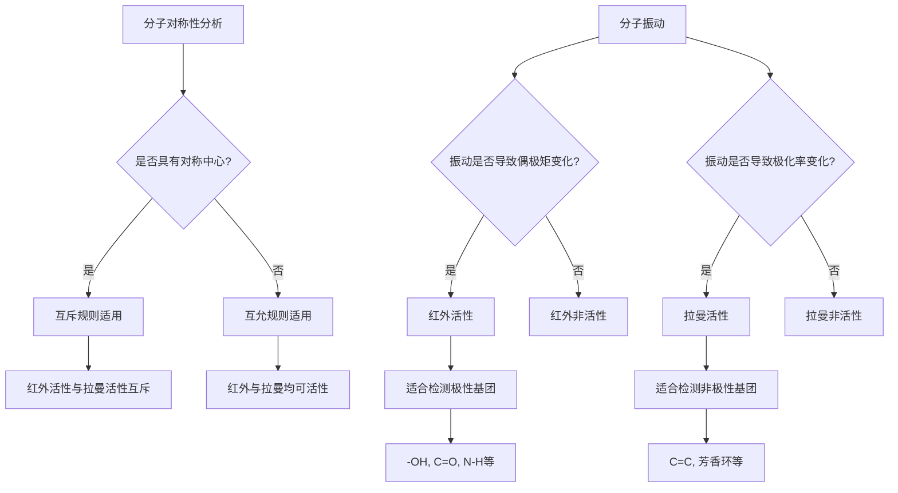
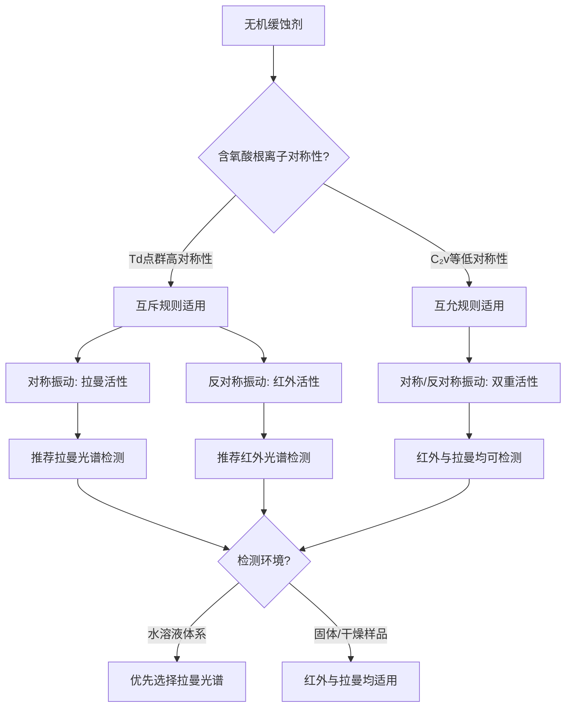
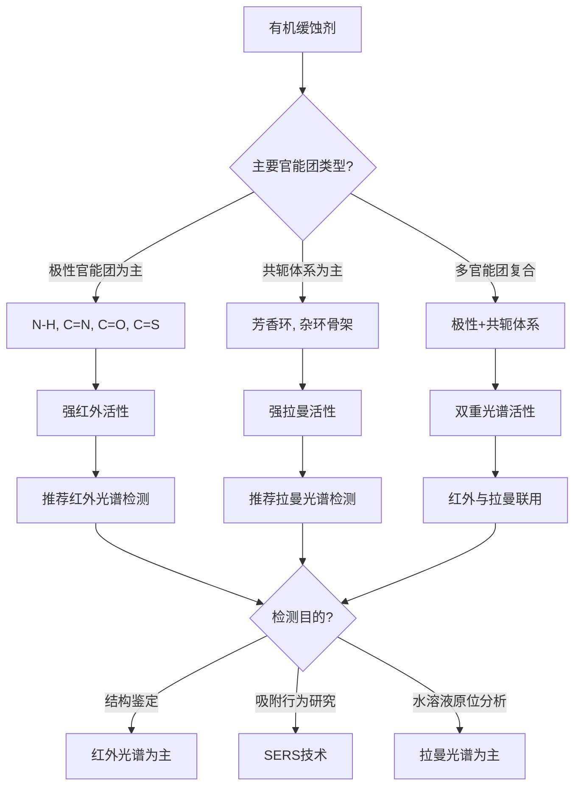
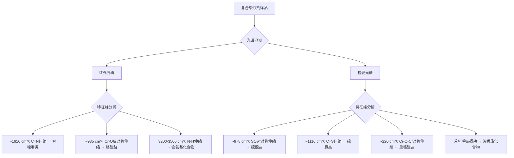
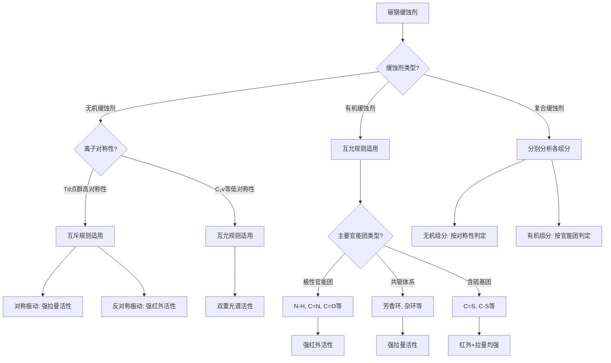

# 碳钢常用缓蚀剂种类及其拉曼-红外光谱活性分析
## 1 碳钢缓蚀剂分类体系

碳钢作为工业领域应用最广泛的金属材料之一，在石油化工、电力、水处理等行业中面临着严峻的腐蚀问题。缓蚀剂作为一种经济高效的防腐蚀手段，其用量虽小（通常仅为0.1%～1%），但效果显著[^1]。根据化学组成的不同，碳钢缓蚀剂可系统划分为**无机类、有机类及复合型**三大类别，各类缓蚀剂因其独特的化学结构而展现出差异化的防护机制与光谱响应特征。

### 1.1 无机缓蚀剂

无机缓蚀剂是碳钢腐蚀防护领域的传统主力，主要包括铬酸盐、钼酸盐、钨酸盐、硅酸盐、亚硝酸盐、硼酸盐、聚磷酸盐及锌盐等类型[^1]。这类缓蚀剂的化学结构核心为**含氧酸根离子**，其分子组成与几何构型决定了缓蚀机制及光谱活性特征。

**铬酸盐类**是无机缓蚀剂中研究最为深入的品种，典型代表包括铬酸钠（Na₂CrO₄·4H₂O）和重铬酸钾（K₂Cr₂O₇）[^2]。铬酸根离子（CrO₄²⁻）呈正四面体结构，而重铬酸根离子（Cr₂O₇²⁻）则由两个四面体通过共用氧原子桥联形成。这类缓蚀剂属于**钝化型/氧化膜型缓蚀剂**，通过释放CrO₄²⁻离子在金属表面直接氧化生成γ-Fe₂O₃与Cr₂O₃混合氧化物膜，该膜层致密度高且电子导电性强，厚度仅为0.003-0.02μm，可有效阻断腐蚀介质渗透[^2]。在密闭循环水系统中，投加浓度通常为0.04-0.1wt%时，可使碳钢设备腐蚀速率下降至0.025mm/a以下[^2]。然而，铬酸盐因六价铬的毒性问题，在开放系统中的应用受到严格限制[^2]。

**钼酸盐类**作为铬酸盐的环保型替代品，其缓蚀效率与铬酸盐相当[^2]。钼酸根离子（MoO₄²⁻）同样呈正四面体结构，其缓蚀机理与铬酸盐有所不同：MoO₄²⁻与Fe²⁺生成络合物中间体，经氧化后转化为不溶性的Fe₂(MoO₄)₃·8H₂O保护膜覆盖金属表面，该过程需要水中溶解氧的参与[^2]。钼酸盐的使用浓度通常较高（200-500ppm），工业应用中常与锌盐、有机膦酸复配使用以降低用量[^2]。

**其他无机缓蚀剂**的结构特征与功能定位各有侧重。钨酸盐（WO₄²⁻）与钼酸盐结构类似，同属低毒替代品[^2]。亚硝酸盐（NO₂⁻）为平面三角形结构，属于阳极型缓蚀剂，通过在金属表面生成氧化物或氢氧化物膜抑制金属溶解[^1]。硅酸盐可作为阴离子抑制剂，在氯离子浓度超过200ppm时配合使用以保护钝化膜[^2]。锌盐则通过生成碳酸盐、磷酸盐或氢氧化物沉淀在阴极区成膜，属于阴极型缓蚀剂[^1]。

下表汇总了主要无机缓蚀剂的结构特征与分类信息：

| 缓蚀剂类型 | 典型代表物质 | 核心离子结构 | 作用机理分类 |
|------------|--------------|--------------|--------------|
| 铬酸盐 | 铬酸钠、重铬酸钾 | CrO₄²⁻（正四面体）、Cr₂O₇²⁻（双四面体桥联） | 钝化型/阳极型 |
| 钼酸盐 | 钼酸钠 | MoO₄²⁻（正四面体） | 钝化型/阳极型 |
| 钨酸盐 | 钨酸钠 | WO₄²⁻（正四面体） | 钝化型/阳极型 |
| 亚硝酸盐 | 亚硝酸钠 | NO₂⁻（平面三角形） | 阳极型 |
| 硅酸盐 | 硅酸钠 | SiO₃²⁻/SiO₄⁴⁻（四面体聚合） | 阴极型/辅助型 |
| 锌盐 | 硫酸锌 | Zn²⁺ | 阴极型/沉淀膜型 |
| 聚磷酸盐 | 六偏磷酸钠 | (PO₃)ₙⁿ⁻（链状结构） | 阴极型 |

### 1.2 有机缓蚀剂

有机缓蚀剂因其结构多样性、环境友好性及优异的缓蚀性能，已成为现代防腐蚀技术的研究热点与应用主流[^3]。这类缓蚀剂的分子结构特征是含有**N、S、O等杂原子**及**π电子共轭体系**，可通过化学吸附或物理吸附在金属表面形成保护膜[^1]。

**咪唑啉类缓蚀剂**是有机缓蚀剂中应用最广泛的品种之一，其分子结构核心为五元杂环——咪唑啉环。以棕榈酸基咪唑啉为例，该化合物以棕榈酸和二乙烯三胺为主要原料合成，分子中含有较强的咪唑啉特征结构，氮原子上存在孤对电子，可与金属原子配位结合形成牢固的化学吸附层[^4]。研究表明，当浓度仅为500mg/L时，棕榈酸基咪唑啉对Q235碳钢在模拟气田水环境中的缓蚀率即可达到85%左右[^4]。咪唑啉类缓蚀剂属于混合型缓蚀剂，其分子在金属表面吸附成膜后，可阻止侵蚀性离子在金属表面吸附和氧原子的扩散[^4]。

**季铵盐类缓蚀剂**包括咪唑啉季铵盐和喹啉季铵盐等，属于阳离子表面活性剂[^5]。咪唑啉季铵盐以脂肪酸为起始原料，与多胺（如二乙基三胺或三乙基四胺）经酰化、闭环后用硫酸二甲酯进行季铵化制得，其起始原料大多采用动物油脂中的脂肪酸，最常用的是加氢牛油酸[^5]。喹啉季铵盐则以3-甲基喹啉和氯化苄为原料合成，具有优异的耐高温性能，在180℃高温环境下仍能有效抑制碳钢腐蚀[^6]。季铵盐类缓蚀剂分子中含有正电荷的氮原子，可通过静电作用吸附于带负电荷的金属表面，形成疏水保护层。

**有机胺类缓蚀剂**是最重要的缓蚀剂类别之一，可视为氨的烃基取代物，包含脂肪胺、脂环胺、芳香胺、杂环胺及季铵盐等类型[^7]。其缓蚀性能与烃基诱导效应强度直接相关：**烃基的诱导效应越强，氮原子的负电性越强，吸附能力也越强**，胺的缓蚀性越好[^7]。有机胺类缓蚀剂可分为水溶性、挥发性及油溶性三类，在油田注水系统中针对高矿化度、高HCO₃⁻和Ca²⁺环境展现出良好防护效果[^7]。实验表明，苯胺醛缩聚物及水溶性聚苯胺衍生物在1mol/L盐酸中对Q235碳钢的缓蚀效率超过90%，其O、N极性基团通过吸附形成疏水保护层[^7]。

**唑类缓蚀剂**主要包括苯并三唑（BTA）和巯基苯并噻唑（MBT），是有色金属及碳钢防护的重要品种[^1]。苯并三唑（C₆H₅N₃）分子中含有三个相邻的氮原子形成的三唑环与苯环稠合，可吸附在金属表面形成一层很薄的保护膜，保护金属免受大气及水中有害介质的腐蚀[^1]。巯基苯并噻唑（MBT）分子中同时含有硫原子和氮原子，其缓蚀作用依靠与金属表面活性原子或离子产生化学吸附或螯合作用形成保护膜[^1]。甲基苯并三唑（TTA）成膜更均匀，与MBT复合使用效果更佳[^1]。研究表明，苯并三唑（BTA）能在金属表面吸附成膜，阻止去极化物质向金属表面迁移，减缓金属的腐蚀速率，即使添加量较小时已表现出较好的缓蚀效果[^8]。

**硫脲类缓蚀剂**如邻位和对位的甲苯硫脲、丙硫醚等，主要用于酸洗缓蚀领域[^9]。其分子结构中含有C=S双键和N-H基团，硫原子的孤对电子可与金属表面形成强烈的化学吸附。

下表总结了主要有机缓蚀剂的结构特征：

| 缓蚀剂类型 | 典型代表物质 | 核心结构特征 | 关键官能团 |
|------------|--------------|--------------|------------|
| 咪唑啉类 | 棕榈酸基咪唑啉 | 五元含氮杂环 | C=N、N-H、长链烷基 |
| 季铵盐类 | 咪唑啉季铵盐、喹啉季铵盐 | 正电荷氮中心 | N⁺、芳环/杂环 |
| 有机胺类 | 脂肪胺、芳香胺、杂环胺 | 氨的烃基取代物 | -NH₂、-NHR、-NR₂ |
| 唑类 | 苯并三唑（BTA）、巯基苯并噻唑（MBT） | 稠合杂环体系 | N-N-N、C-S-H |
| 硫脲类 | 甲苯硫脲 | 硫代羰基结构 | C=S、N-H |

### 1.3 复合型缓蚀剂

复合型缓蚀剂通过将不同类型缓蚀剂进行科学配伍，利用各组分间的**协同效应**实现性能增强与成本优化[^1]。工业上应用的缓蚀剂配方大多含有一种主要活性成分，与表面活性剂、增强剂等化合物混合而成，也有多种缓蚀剂协同作用抑制腐蚀的研究报道[^3]。

**无机-有机复配体系**是复合缓蚀剂的主要形式之一。钼酸盐与有机膦酸的复配体系充分利用了钼酸盐的钝化成膜能力与有机膦酸的螯合吸附特性，常与锌盐联合使用以降低钼酸盐用量[^2]。多硫化钠与苯并三唑（BTA）的复配体系在反应流出物空冷器腐蚀系统中展现出优良的缓蚀性能，研究表明即使缓蚀剂添加量较小时已表现出较好的缓蚀效果[^8]。在该复配体系中，BTA能在金属表面吸附成膜，阻止去极化物质向金属表面迁移，与多硫化钠形成协同增效[^8]。

**多种有机缓蚀剂的协同配方**在高温环境下尤为重要。以耐高温盐酸酸化缓蚀剂GWS-G为例，该配方以喹啉季铵盐为主剂，加入表面活性剂GTS、炔醇衍生物TC和螯合剂YHT复配而成[^6]。在180℃高温、20%盐酸溶液的恶劣环境下，该复合缓蚀剂对N80钢表现出优异的防护效果[^6]。各组分在复合体系中发挥不同功能：喹啉季铵盐作为主剂提供核心缓蚀活性，表面活性剂改善分散性与润湿性，炔醇衍生物增强高温稳定性，螯合剂则通过络合金属离子提供辅助防护[^6]。

复合缓蚀剂的配方设计遵循**结构互补性原则**：阳极型与阴极型缓蚀剂复配可实现全面防护，成膜型与吸附型缓蚀剂复配可提高膜层稳定性，而不同分子量组分的复配则可优化在不同孔隙中的渗透与覆盖能力。值得注意的是，不同类型缓蚀剂共同使用时可能产生协同效应或拮抗效应：较低剂量的几种不同类缓蚀剂配合使用可获得较好的缓蚀效果称为协同效应，而若共同使用反而降低各自的缓蚀效率则称为拮抗效应[^1]。因此，复合缓蚀剂的开发需要系统的配方优化与性能验证。

## 2 拉曼活性与红外活性的判定原理

分子振动光谱技术是分析缓蚀剂化学结构与吸附行为的重要手段，而**红外光谱与拉曼光谱作为两种互补的分子振动光谱技术**，其活性判定原理的深入理解是准确表征各类碳钢缓蚀剂的理论前提。红外光谱属于吸收光谱，其活性取决于分子振动时偶极矩的变化；拉曼光谱属于散射光谱，其活性取决于分子振动时极化率的变化[^10]。这两种光谱技术基于不同的电磁作用机制，对分子振动模式的响应存在本质差异，因此在缓蚀剂结构鉴定中往往需要联合应用以获取完整的分子振动信息。

### 2.1 红外活性的物理本质：偶极矩变化机制

红外光谱的产生源于**光的吸收效应**，当电磁辐射与物质分子相互作用时，若红外光的能量与分子振动或转动能量差相匹配，分子将吸收该频率的光能发生能级跃迁[^11]。在光谱图上表现为特定波数位置出现吸收峰，反映了光被分子的振动模式所吸收的程度。通俗而言，**红外光谱检测的是"光没了多少"**[^12]。

分子振动产生红外活性的**必要条件是振动过程中偶极矩发生周期性变化**，且振动能量与红外光子能量匹配[^13]。偶极矩（μ）是描述分子内部电荷分布不对称性的物理量，当分子振动导致正负电荷中心的相对位置发生变化时，偶极矩随之改变，此时分子可与入射红外光的电场发生耦合作用而吸收光能。若振动未导致偶极矩变化（如某些对称性振动模式），则无法产生红外吸收峰，该振动模式为红外非活性[^13]。

红外活性与振动模式的类型密切相关，主要表现在以下两个方面：

**伸缩振动**是化学键长度发生周期性变化的振动模式，常见于高极性键（如C=O、N-H、O-H等），这类振动导致的偶极矩变化显著，因此在红外光谱中呈现**强吸收峰**[^13]。对于碳钢缓蚀剂而言，咪唑啉类分子中的C=N键、有机胺类中的N-H键、以及硫脲类中的N-H键等官能团均属于此类情况，其伸缩振动在红外光谱中产生特征性强信号。

**弯曲振动**是键角发生周期性改变的振动模式，其偶极矩变化幅度通常小于伸缩振动，因此红外吸收峰相对较弱[^13]。此外，分子对称性对红外活性具有重要影响——对称性高的振动模式可能因偶极矩相互抵消而降低活性，甚至导致吸收峰消失。例如，氧气分子（O₂）的对称伸缩振动因偶极矩无变化而无红外活性[^13]。

从化学键极性角度分析，**极性越大的化学键，振动时偶极矩变化越显著，红外吸收峰越强**[^13]。这解释了为何极性基团（如-OH、C=O、N-H等缓蚀剂常见官能团）在红外光谱中呈现强吸收信号[^10]。在缓蚀剂检测应用中，红外光谱特别适合识别含有这些极性官能团的有机缓蚀剂，通过特征频率区（4000-1330 cm⁻¹）的吸收峰可有效判定化学键类型[^13]。

### 2.2 拉曼活性的物理本质：极化率变化机制

拉曼光谱属于**散射光谱**，其物理机制与红外光谱截然不同。当单色光（通常为激光）照射样品时，大多数光子与分子发生弹性碰撞产生瑞利散射，散射光频率与入射光相同；然而，有一小部分光子（约百万分之一）与分子发生非弹性碰撞，光子与分子振动能级发生能量交换而改变频率，这种频率改变即为**拉曼散射**[^12][^11]。通俗而言，**拉曼光谱检测的是"光偏了多少"**[^12]。

拉曼活性的产生条件是**分子振动时极化率发生变化**[^10][^14]。极化率（α）描述了分子在外电场作用下电子云变形的难易程度，当入射光的电场诱导分子产生极化，若分子振动导致电子云分布发生各向异性变化，则极化率随之改变，此时散射光的频率将偏离入射光频率，产生拉曼信号[^15]。

拉曼散射可分为两种类型：**斯托克斯散射**和**反斯托克斯散射**。在斯托克斯散射中，光子将部分能量传递给分子，使分子从基态跃迁至振动激发态，散射光频率低于入射光；在反斯托克斯散射中，分子从振动激发态跃迁至基态，将能量传递给光子，散射光频率高于入射光[^11][^16]。由于室温下分子大多处于基态，斯托克斯散射强度通常高于反斯托克斯散射，因此实际检测中主要测量斯托克斯拉曼信号。

与红外活性的偶极矩变化要求不同，拉曼活性对分子振动的要求体现在极化率变化上。**对称振动模式往往在拉曼光谱中表现出强信号**，这是因为对称振动虽然可能不改变偶极矩，但会显著改变分子的极化率[^10]。例如，非极性基团如C=C双键、芳香环的对称伸缩振动在拉曼光谱中易于检测，而这些振动在红外光谱中可能信号较弱甚至不可见[^12]。

对于碳钢缓蚀剂的光谱分析而言，拉曼光谱在检测以下结构特征时具有优势：苯并三唑（BTA）和巯基苯并噻唑（MBT）等唑类缓蚀剂中的芳香环振动、咪唑啉类缓蚀剂中的C=C骨架振动，以及无机缓蚀剂中某些高对称性含氧酸根离子的对称伸缩振动。此外，拉曼光谱对水的干扰不敏感，特别适合水溶液体系中缓蚀剂的原位检测[^12]。

### 2.3 分子对称性与光谱活性的关联规律

分子对称性是决定振动模式光谱活性的核心因素，**红外吸收与拉曼散射的选择定则与分子振动的对称性密切相关**[^15]。运用群论方法，可通过分子点群分析系统预测各振动模式的光谱活性表现。

分子振动的对称性由其所属的**点群**描述，点群定义了分子在各种对称操作（如旋转、反射、反演等）下保持不变的性质。振动模式在对称操作下的变换行为决定了其光谱活性：**若对称操作下偶极矩变化不为零，则该振动为红外活性；若极化率变化不为零，则该振动为拉曼活性**[^15]。

偶极矩是**矢量**，在对称操作下遵循矢量变换规则；极化率是**张量**，在对称操作下遵循张量变换规则[^15]。这种数学性质的差异导致了两种光谱对振动模式的不同响应。对于具有对称中心的分子，偶极矩为奇宇称（在反演操作下变号），极化率为偶宇称（在反演操作下不变），这一性质直接导致了互斥规则的成立[^15]。

以缓蚀剂分子中的常见结构单元为例说明对称性分析的应用：

| 结构单元 | 点群对称性 | 对称伸缩振动 | 反对称伸缩振动 |
|----------|------------|--------------|----------------|
| CrO₄²⁻（正四面体） | Td | 拉曼活性 | 红外活性 |
| MoO₄²⁻（正四面体） | Td | 拉曼活性 | 红外活性 |
| NO₂⁻（平面三角形） | C₂v | 红外+拉曼活性 | 红外+拉曼活性 |
| 苯环 | D₆h | 拉曼活性为主 | 红外活性为主 |
| CO₂（线性） | D∞h | 拉曼活性 | 红外活性 |

上表展示了不同对称性结构单元的光谱活性特征。以CO₂分子为例，其对称伸缩振动因偶极矩无变化而无红外活性，但极化率发生变化因此具有拉曼活性；而反对称伸缩振动导致偶极矩变化，因此只在红外光谱中有活性[^10][^13]。这种互补性关系在缓蚀剂分子的结构鉴定中具有重要应用价值。

### 2.4 互斥规则与互允规则的应用依据

基于分子对称性与光谱活性的关联规律，光谱活性判定遵循三条核心规则，这些规则为缓蚀剂的光谱检测方法选择提供了理论依据。

**互斥规则**适用于具有对称中心的分子：凡具有对称中心的分子，若其分子振动是拉曼活性的，则其红外吸收是非活性的；反之，若为红外活性的，则拉曼为非活性的[^17][^11]。这一规则的物理基础在于，对称中心分子中偶极矩（奇宇称）与极化率（偶宇称）在反演操作下的变换行为相反，导致同一振动模式不可能同时满足两种活性条件[^15]。对于碳钢缓蚀剂而言，铬酸根（CrO₄²⁻）、钼酸根（MoO₄²⁻）等正四面体结构的无机缓蚀剂阴离子具有高度对称性，其振动模式基本遵循互斥规则。

**互允规则**适用于无对称中心的分子：没有对称中心的分子，其拉曼和红外光谱都是活性的（个别除外）[^11]。大多数有机缓蚀剂分子由于含有不对称的官能团组合和取代基分布，不具备对称中心，因此其振动模式通常同时具有红外活性和拉曼活性。例如，咪唑啉类、季铵盐类、硫脲类等有机缓蚀剂的分子结构不对称，其特征振动在两种光谱中均可检测，但信号强度可能存在差异。

**互禁规则**是一种特殊情况：对于少数分子的振动，其拉曼和红外都是非活性的[^11]。这种情况较为罕见，通常出现在某些高对称性分子的特定振动模式中，如乙烯分子的某些振动。在碳钢缓蚀剂分析中，这种情况较少遇到。

下表总结了三条规则的适用条件与典型示例：

| 规则类型 | 适用条件 | 红外活性 | 拉曼活性 | 缓蚀剂示例 |
|----------|----------|----------|----------|------------|
| 互斥规则 | 具有对称中心 | 与拉曼互斥 | 与红外互斥 | CrO₄²⁻、MoO₄²⁻的对称/反对称振动 |
| 互允规则 | 无对称中心 | 活性 | 活性 | 咪唑啉类、季铵盐类、硫脲类 |
| 互禁规则 | 特殊对称性 | 非活性 | 非活性 | 少数高对称分子特定振动 |

基于上述规则，**红外光谱与拉曼光谱在缓蚀剂检测中形成互补关系**[^10][^17]。红外光谱更适合检测极性官能团（如-OH、C=O、N-H等），这些基团在有机缓蚀剂中普遍存在，可提供丰富的结构信息；拉曼光谱则更适合检测非极性基团（如C=C、芳香环等）和高对称性无机离子的对称振动模式[^12]。在实际应用中，联合使用两种光谱技术可以更全面地"还原"缓蚀剂分子的振动全貌，实现准确的结构鉴定与吸附行为表征。

上图展示了光谱活性判定的逻辑流程。通过分析缓蚀剂分子的振动特征和对称性，可系统预测其红外活性与拉曼活性，进而选择最适合的光谱检测方法。这一理论框架将在后续章节中具体应用于各类碳钢缓蚀剂的光谱活性分析。

## 3 无机缓蚀剂的光谱活性分析

无机缓蚀剂作为碳钢腐蚀防护的传统主力，其核心结构为含氧酸根离子，这些离子的几何构型与对称性直接决定了其光谱响应特征。基于第二章阐述的光谱活性判定原理，本章将系统分析铬酸盐、钼酸盐、钨酸盐、亚硝酸盐、硅酸盐、锌盐及聚磷酸盐等主要无机缓蚀剂的分子/离子结构特征，运用分子对称性分析方法判定各类含氧酸根离子的振动模式及其拉曼活性与红外活性，为缓蚀剂光谱检测方法的选择提供理论依据。

### 3.1 铬酸盐类缓蚀剂的光谱活性

铬酸盐类缓蚀剂是无机缓蚀剂中研究最为深入的品种，其光谱活性分析需区分铬酸根离子（CrO₄²⁻）和重铬酸根离子（Cr₂O₇²⁻）两种结构形态，二者因分子对称性差异而表现出显著不同的光谱响应特征。

**铬酸根离子（CrO₄²⁻）的结构与光谱活性**

铬酸根离子呈**正四面体结构**，属于**Td点群对称性**，具有高度对称中心。根据群论分析，Td点群的正四面体XY₄型分子共有9个振动自由度，可分解为4种振动模式：ν₁（A₁对称伸缩）、ν₂（E弯曲）、ν₃（T₂反对称伸缩）和ν₄（T₂弯曲）。由于Td点群具有对称中心，其振动模式遵循**互斥规则**——对称振动具有拉曼活性而无红外活性，反对称振动具有红外活性而无拉曼活性。

实验光谱数据证实了上述理论预测。研究表明，CrO₄²⁻的**ν₁对称伸缩振动**特征峰位于**847 cm⁻¹**附近，该振动模式在拉曼光谱中表现为强信号，而在红外光谱中无吸收峰[^18]。相应地，CrO₄²⁻的**ν₃反对称伸缩振动**特征峰位于**884 cm⁻¹**附近，该振动模式在红外光谱中呈现强吸收，而在拉曼光谱中信号较弱或不可见[^18]。这种对称与反对称振动在两种光谱中的互补响应特征，是Td对称性分子遵循互斥规则的典型表现。

**重铬酸根离子（Cr₂O₇²⁻）的结构与光谱活性**

重铬酸根离子由两个四面体通过共用氧原子桥联形成**双四面体桥联结构**，其对称性较CrO₄²⁻显著降低。DFT模拟显示，Cr₂O₇²⁻形成桥连结构时，两个Cr原子通过O-O桥接形成六元环构象，该结构在层间受限环境中能量较CrO₄²⁻平面构型低约0.3 eV，因此在干燥状态下更为稳定[^18]。

重铬酸根离子的振动模式包括特征性的**δCr-O-Cr弯曲振动**和**νs Cr-O-Cr对称伸缩振动**。拉曼光谱研究显示，Cr₂O₇²⁻的δCr-O-Cr弯曲振动特征峰位于**89 cm⁻¹**，νs Cr-O-Cr对称伸缩振动位于**220 cm⁻¹**[^18]。红外光谱中，Cr₂O₇²⁻的反对称伸缩振动特征峰位于**935 cm⁻¹**附近[^18]。由于Cr₂O₇²⁻对称性降低，其部分振动模式同时具有红外活性和拉曼活性，体现了互允规则的特征。

**环境条件对铬酸盐光谱的影响**

铬酸盐类缓蚀剂的光谱响应具有显著的**湿度依赖性**。研究发现，在干燥状态下，Cr(VI)以铬酸根（CrO₄²⁻）和重铬酸根（Cr₂O₇²⁻）的复合形式存在；而在湿润或水溶液环境中，以铬酸根为主导形式[^18]。这一现象的物理机制在于层间水分子的动态调节作用——当样品干燥时，水分子配位数减少导致Cr₂O₇²⁻二聚体形成；重新分散于水溶液后，水分子的充分接触促进Cr₂O₇²⁻解离为CrO₄²⁻[^18]。

在实际检测应用中，这种环境依赖性意味着：**干燥样品的拉曼光谱中可同时观察到CrO₄²⁻和Cr₂O₇²⁻的特征峰**，需综合分析以判断铬酸盐的存在形态；而**水溶液体系的原位拉曼检测**则主要呈现CrO₄²⁻的特征信号。

下表汇总了铬酸盐类缓蚀剂的主要振动模式及光谱活性：

| 离子类型 | 振动模式 | 波数/cm⁻¹ | 拉曼活性 | 红外活性 | 判定依据 |
|----------|----------|------------|----------|----------|----------|
| CrO₄²⁻ | ν₁对称伸缩 | ~847 | **强** | 无 | 互斥规则（Td对称） |
| CrO₄²⁻ | ν₃反对称伸缩 | ~884 | 弱/无 | **强** | 互斥规则（Td对称） |
| Cr₂O₇²⁻ | δCr-O-Cr弯曲 | ~89 | **有** | 有 | 对称性降低 |
| Cr₂O₇²⁻ | νs Cr-O-Cr对称伸缩 | ~220 | **有** | 有 | 对称性降低 |
| Cr₂O₇²⁻ | 反对称伸缩 | ~935 | 有 | **强** | 极性键振动 |

### 3.2 钼酸盐与钨酸盐类缓蚀剂的光谱活性

钼酸盐和钨酸盐作为铬酸盐的环保型替代品，其含氧酸根离子MoO₄²⁻和WO₄²⁻同样呈正四面体结构，光谱活性特征与铬酸根离子具有相似的对称性规律，但阳离子效应对其光谱峰位和强度产生显著影响。

**MoO₄²⁻和WO₄²⁻的基本光谱活性**

钼酸根离子（MoO₄²⁻）和钨酸根离子（WO₄²⁻）均属于**Td点群正四面体结构**，其振动模式分类与CrO₄²⁻相同，包括A₁对称伸缩、E弯曲、T₂反对称伸缩和T₂弯曲四种类型。根据互斥规则，**对称伸缩振动（ν₁）主要表现为拉曼活性**，在拉曼光谱中产生强信号；**反对称伸缩振动（ν₃）主要表现为红外活性**，在红外光谱中产生强吸收峰。

由于Mo和W原子质量较Cr大，根据简谐振子模型，**相同结构类型的振动频率与原子质量的平方根成反比**，因此MoO₄²⁻和WO₄²⁻的特征振动频率较CrO₄²⁻有所降低。这一频率位移可作为区分不同含氧酸根离子的光谱指纹特征。

**阳离子效应对钼酸盐拉曼光谱的影响**

钼酸盐晶体的拉曼光谱不仅取决于MoO₄²⁻阴离子本身的振动特性，还受到配位阳离子的显著影响。研究表明，阳离子效应对拉曼光谱的影响可从**离子尺寸、电荷、质量和电负性**等多个维度进行分析[^19]。

**离子半径效应**主要影响光谱的形状、位置和强度。对于MRE(MoO₄)₂（M=Li,K；RE=Y,Bi,Gd,Eu）系列二钼酸盐，离子半径之比rion(M⁺)/rion(RE³⁺)与离子半径之差|rion(M⁺)-rion(RE³⁺)|决定了阳离子在晶体结构中的分布方式[^19]。当半径之比小于1.27时，两种阳离子呈统计分布；超过1.32时则为完全有序分布，这种分布差异直接影响拉曼光谱的峰形和分裂特征。

**电荷效应**表现为随着阳离子核电荷数的增加，[MoO₄]²⁻阴离子基团的偶极矩发生变化，Mo-O键上的电子云分布发生偏移，键能发生改变，从而导致拉曼光谱中**肩峰的出现**[^19]。此外，考虑到M⁺和RE³⁺离子间库仑力的相互作用，若阳离子有序排列形成M⁺层和RE³⁺层，会导致晶体对称性的降低和振动谱峰的分裂。

**质量效应**主要影响低波数的外部振动（晶格振动）模式。随着三价阳离子质量的增加，离子平移所需的能量增加；碱金属与三价阳离子质量之差越大，则低波数区的谱峰越分裂，并向有一定频谱差的两个包络峰方向演变[^19]。

这些阳离子效应规律为钼酸盐类缓蚀剂的光谱识别提供了重要参考——通过分析拉曼光谱中特征峰的位置、形状和分裂特征，不仅可以确认MoO₄²⁻的存在，还可以推断其配位环境和晶体结构类型。

**钼酸盐与钨酸盐的光谱检测方法选择**

基于上述分析，钼酸盐和钨酸盐类缓蚀剂的光谱检测具有以下特点：

- **拉曼光谱**适合检测MoO₄²⁻和WO₄²⁻的对称伸缩振动，可在水溶液中进行原位分析，且对阳离子环境敏感，可提供配位结构信息
- **红外光谱**适合检测反对称伸缩振动，对M-O键的极性变化敏感，但水溶液检测受限

| 缓蚀剂类型 | 核心离子 | 点群对称性 | 对称振动活性 | 反对称振动活性 | 推荐检测方法 |
|------------|----------|------------|--------------|----------------|--------------|
| 钼酸盐 | MoO₄²⁻ | Td | 拉曼活性 | 红外活性 | 拉曼为主，红外辅助 |
| 钨酸盐 | WO₄²⁻ | Td | 拉曼活性 | 红外活性 | 拉曼为主，红外辅助 |

### 3.3 亚硝酸盐与其他含氧酸盐的光谱活性

除高对称性的四面体型含氧酸根外，碳钢缓蚀剂中还包括亚硝酸盐、硅酸盐、聚磷酸盐等结构类型各异的无机物质，以及锌盐等阳离子型缓蚀剂，其光谱活性特征因分子对称性和化学键性质的差异而各具特点。

**亚硝酸根离子（NO₂⁻）的光谱活性**

亚硝酸根离子呈**平面三角形结构**，属于**C₂v点群对称性**。与Td点群的高对称性结构不同，C₂v点群**不具有对称中心**，因此其振动模式遵循**互允规则**——对称与反对称振动均同时具有红外活性和拉曼活性。

NO₂⁻的振动模式包括：
- **ν₁对称伸缩振动**：N-O键同相伸缩，同时具有红外活性和拉曼活性
- **ν₂弯曲振动**：O-N-O键角变化，同时具有红外活性和拉曼活性
- **ν₃反对称伸缩振动**：N-O键反相伸缩，同时具有红外活性和拉曼活性

这种双重光谱活性特征意味着亚硝酸盐类缓蚀剂可通过红外光谱和拉曼光谱两种方法进行检测，但由于N-O键具有较强极性，**红外光谱中的吸收信号通常较强**，更适合作为主要检测手段；拉曼光谱则可作为辅助验证方法。

**硅酸盐的光谱活性**

硅酸盐类缓蚀剂的结构较为复杂，其基本单元为**SiO₄四面体**，但在实际应用中常以聚合形式存在，如SiO₃²⁻链状结构或更复杂的硅氧骨架。单独的SiO₄⁴⁻四面体属于Td点群，遵循互斥规则；但聚合硅酸盐因对称性降低，其振动模式通常同时具有红外活性和拉曼活性。

硅酸盐的特征振动主要包括：
- **Si-O伸缩振动**：位于900-1100 cm⁻¹区间，红外和拉曼均可检测
- **Si-O-Si桥键振动**：位于较低波数区，反映硅氧骨架的聚合程度

由于硅酸盐在缓蚀应用中常作为辅助型缓蚀剂与其他组分复配使用，其光谱检测需注意与主剂特征峰的区分。

**聚磷酸盐的光谱活性**

聚磷酸盐如六偏磷酸钠的核心结构为**(PO₃)ₙⁿ⁻链状结构**，每个磷原子与四个氧原子配位形成四面体单元，通过共用氧原子桥联形成聚合链。这种链状结构的对称性较低，其振动模式包括：

- **P-O端基伸缩振动**：非桥氧的P-O键振动，红外和拉曼均有活性
- **P-O-P桥键振动**：桥氧相关振动，可用于判断聚合度
- **PO₄骨架变形振动**：低波数区的骨架振动模式

聚磷酸盐的光谱特征可用于区分不同聚合度的磷酸盐缓蚀剂，对于配方分析具有重要价值。

**锌盐的光谱检测特殊性**

锌盐（如硫酸锌ZnSO₄）作为阴极型缓蚀剂，其缓蚀作用主要通过Zn²⁺阳离子在阴极区形成沉淀膜实现。从光谱检测角度，锌盐的特征信号主要来源于配位阴离子而非Zn²⁺本身：

- **硫酸锌**：SO₄²⁻为Td对称性，对称伸缩振动具有拉曼活性，反对称伸缩振动具有红外活性
- **氯化锌**：Cl⁻为单原子离子，无分子内振动，光谱检测需依赖其他方法
- **锌的配位化合物**：Zn²⁺与缓蚀剂分子形成配合物后，可通过配位键振动进行检测

因此，锌盐类缓蚀剂的光谱检测通常需要**结合阴离子类型**进行分析，或通过检测锌与有机配体形成的配合物特征峰来间接确认其存在。

下表汇总了上述无机缓蚀剂的光谱活性特征：

| 缓蚀剂类型 | 核心结构 | 点群对称性 | 红外活性 | 拉曼活性 | 适用规则 |
|------------|----------|------------|----------|----------|----------|
| 亚硝酸盐 | NO₂⁻（平面三角形） | C₂v | **有** | **有** | 互允规则 |
| 硅酸盐 | SiO₄⁴⁻/聚合体 | Td/降低 | 有 | 有 | 视聚合度而定 |
| 聚磷酸盐 | (PO₃)ₙⁿ⁻（链状） | 低对称性 | **有** | **有** | 互允规则 |
| 锌盐 | Zn²⁺+阴离子 | 视阴离子而定 | 视阴离子而定 | 视阴离子而定 | 依阴离子判定 |

### 3.4 无机缓蚀剂光谱活性的共性规律

通过对铬酸盐、钼酸盐、钨酸盐、亚硝酸盐、硅酸盐、聚磷酸盐及锌盐等无机缓蚀剂的系统分析，可归纳出无机缓蚀剂光谱活性的**结构-活性关联规律**，为实际检测方法选择提供理论依据。

**高对称性含氧酸根离子遵循互斥规则**

以CrO₄²⁻、MoO₄²⁻、WO₄²⁻为代表的**Td点群正四面体结构**含氧酸根离子，其光谱活性严格遵循互斥规则：

- **对称伸缩振动（ν₁，A₁模式）**：极化率变化显著而偶极矩无变化，表现为**强拉曼活性、无红外活性**
- **反对称伸缩振动（ν₃，T₂模式）**：偶极矩变化显著而极化率变化较小，表现为**强红外活性、弱拉曼活性**

这一规律的物理本质在于Td点群具有对称中心，偶极矩（奇宇称）与极化率（偶宇称）在反演操作下的变换行为相反，导致同一振动模式不能同时满足两种活性条件[^20]。

**低对称性离子遵循互允规则**

以NO₂⁻（C₂v点群）为代表的**低对称性含氧酸根离子**，由于不具有对称中心，其振动模式同时具有红外活性和拉曼活性。聚合态的硅酸盐和聚磷酸盐因对称性降低，也表现出类似的双重光谱活性特征。这类缓蚀剂可通过红外光谱和拉曼光谱两种方法进行检测，方法选择可根据实际检测条件和干扰因素灵活确定。

**拉曼光谱与红外光谱的互补优势**

基于上述规律，两种光谱技术在无机缓蚀剂检测中各具优势[^21][^22][^23]：

**拉曼光谱的优势**：
- 适合检测高对称性含氧酸根离子的**对称振动模式**，如CrO₄²⁻、MoO₄²⁻、WO₄²⁻的ν₁对称伸缩振动
- **水分子的拉曼散射信号极弱**，不会干扰水溶液体系中缓蚀剂的检测，特别适合**原位在线分析**
- 可通过偏振拉曼光谱技术分析晶体取向和各向异性
- 对阳离子效应敏感，可提供配位环境信息

**红外光谱的优势**：
- 适合检测**极性M-O键的反对称振动**，对含氧酸根离子的极性变化敏感
- 技术成熟、成本可控，在常规实验室条件下易于实施
- 对低对称性离子（如NO₂⁻）的检测灵敏度高

下图展示了无机缓蚀剂光谱活性判定与检测方法选择的逻辑流程：

**无机缓蚀剂光谱活性总结表**

| 缓蚀剂类型 | 核心离子/结构 | 点群 | 对称振动 | 反对称振动 | 推荐主要检测方法 |
|------------|----------------|------|----------|------------|------------------|
| 铬酸盐 | CrO₄²⁻ | Td | 拉曼 | 红外 | 拉曼（对称）+红外（反对称） |
| 铬酸盐 | Cr₂O₇²⁻ | 低对称 | 拉曼+红外 | 拉曼+红外 | 拉曼为主 |
| 钼酸盐 | MoO₄²⁻ | Td | 拉曼 | 红外 | 拉曼（对称）+红外（反对称） |
| 钨酸盐 | WO₄²⁻ | Td | 拉曼 | 红外 | 拉曼（对称）+红外（反对称） |
| 亚硝酸盐 | NO₂⁻ | C₂v | 拉曼+红外 | 拉曼+红外 | 红外为主（极性强） |
| 硅酸盐 | SiO₄⁴⁻/聚合体 | Td/低对称 | 视结构而定 | 视结构而定 | 红外与拉曼联用 |
| 聚磷酸盐 | (PO₃)ₙⁿ⁻ | 低对称 | 拉曼+红外 | 拉曼+红外 | 红外与拉曼联用 |
| 锌盐 | Zn²⁺+阴离子 | 视阴离子 | 视阴离子 | 视阴离子 | 依阴离子类型选择 |

综上所述，无机缓蚀剂的光谱活性判定需综合考虑**分子对称性、化学键极性和检测环境**三个关键因素。对于高对称性含氧酸根离子，拉曼光谱是检测对称振动模式的首选方法，尤其在水溶液原位分析中具有不可替代的优势；红外光谱则更适合检测反对称振动和低对称性离子。在实际应用中，联合使用两种光谱技术可以获得更全面的结构信息，实现无机缓蚀剂的准确鉴定与定量分析。

## 4 有机缓蚀剂的光谱活性分析

有机缓蚀剂因其分子结构多样性和优异的缓蚀性能，已成为碳钢腐蚀防护领域的研究热点与应用主流。这类缓蚀剂的分子结构特征是含有**N、S、O等杂原子**及**π电子共轭体系**，这些结构特征不仅决定了缓蚀剂在金属表面的吸附能力，也直接影响其光谱响应特性。基于第二章阐述的偶极矩变化与极化率变化判定原理，本章将系统分析咪唑啉类、季铵盐类、硫脲类、有机胺类、唑类及席夫碱类等主要有机缓蚀剂的分子结构特征与光谱活性，为缓蚀剂检测方法选择与吸附行为表征提供理论依据。

### 4.1 咪唑啉类缓蚀剂的光谱活性

咪唑啉类缓蚀剂是有机缓蚀剂中应用最广泛的品种之一，其用量约占缓蚀剂总用量的90%左右[^24]。该类缓蚀剂的分子结构核心为**五元含氮杂环——咪唑啉环**，学名为间二氮杂环戊烯，其母体结构是咪唑，二氢取代咪唑后成为咪唑啉[^24]。咪唑啉环中含有C=N双键和N-H基团，氮原子上存在孤对电子，可与金属原子配位结合形成牢固的化学吸附层。

**咪唑啉类缓蚀剂的特征振动模式与光谱活性**

咪唑啉类缓蚀剂的光谱响应主要来源于以下几类特征振动：

**C=N伸缩振动**是咪唑啉环的核心特征振动模式。研究表明，咪唑啉类缓蚀剂的C=N伸缩振动特征峰位于**1616 cm⁻¹**附近[^25]。由于C=N双键具有较强的极性，振动过程中偶极矩变化显著，因此该振动模式表现出**强红外活性**，在红外光谱中产生明显的吸收峰。同时，C=N双键的伸缩振动也涉及分子极化率的变化，因此同时具有一定的**拉曼活性**。

**N-H振动模式**包括伸缩振动和弯曲振动两种类型。N-H伸缩振动通常出现在**3442、3318、3173 cm⁻¹**等高波数区域[^25]，由于N-H键的强极性特征，这类振动导致偶极矩发生显著变化，表现出**强红外活性**。N-H弯曲振动则出现在较低波数区域，同样具有红外活性。

**长链烷基的C-H振动**是咪唑啉衍生物的另一重要光谱特征。以月桂酸咪唑啉和棕榈酸基咪唑啉为例，分子中的长链烷基（如十二烷基、十六烷基）提供了丰富的C-H伸缩振动和变形振动信号。C-H伸缩振动通常位于2800-3000 cm⁻¹区间，在红外光谱中可检测到明显信号。

**咪唑啉环骨架振动**涉及整个五元杂环的变形和呼吸模式。由于咪唑啉环不具有高度对称中心，根据互允规则，其骨架振动**同时具有红外活性和拉曼活性**。研究表明，通过红外光谱法可以有效分析和评价不同官能团结构咪唑啉缓蚀剂的效果[^26]。

**官能团结构对光谱特征的影响**

咪唑啉缓蚀剂的官能团结构对其缓蚀性能和光谱特征均有显著影响。以苯甲酸咪唑啉和月桂酸咪唑啉为例，两者以苯甲酸、月桂酸为有机酸，二乙烯三胺为有机胺合成[^26]。不同有机酸引入的取代基（芳香环或长链烷基）会在光谱中产生不同的特征信号：苯甲酸咪唑啉的芳香环振动在拉曼光谱中信号较强，而月桂酸咪唑啉的长链烷基C-H振动在红外光谱中更为突出。

下表汇总了咪唑啉类缓蚀剂的主要振动模式及光谱活性：

| 振动模式 | 特征波数/cm⁻¹ | 红外活性 | 拉曼活性 | 判定依据 |
|----------|---------------|----------|----------|----------|
| C=N伸缩振动 | ~1616 | **强** | 有 | 极性双键，偶极矩变化显著 |
| N-H伸缩振动 | 3442, 3318, 3173 | **强** | 弱 | 强极性键 |
| C-H伸缩振动 | 2800-3000 | 有 | 有 | 烷基链振动 |
| 咪唑啉环骨架振动 | 指纹区 | 有 | 有 | 互允规则 |

### 4.2 季铵盐类缓蚀剂的光谱活性

季铵盐类缓蚀剂属于阳离子表面活性剂，其分子结构核心为**正电荷氮中心（N⁺）**。季铵盐型表面活性剂是含长链烷基的季铵盐类化合物，其水溶解度随碳链长度变化：C8~C14衍生物易溶于水，C16~C18衍生物难溶[^27]。该类缓蚀剂可溶于水和极性溶剂，难溶于非极性溶剂[^27]。

**典型季铵盐缓蚀剂的结构与光谱特征**

季铵盐类缓蚀剂的代表性品种包括**十二烷基三甲基溴化铵（DTAB）、十四烷基三甲基溴化铵（TTAB）、十六烷基三甲基溴化铵（CTAB）**以及**咪唑啉季铵盐和喹啉季铵盐**等[^28]。

**十六烷基三甲基溴化铵（CTAB）**的分子式为C₁₉H₄₂BrN，分子量为364.46[^29]。该化合物呈白色或浅黄色结晶体至粉末状，在酸性溶液中稳定，具有优良的渗透、柔化、乳化、抗静电、生物降解性及杀菌灭藻等性能[^29]。CTAB分子中的季铵基团（-N⁺(CH₃)₃）是主要的光谱活性中心。

**季铵基团的特征振动模式**主要包括：

**C-N⁺伸缩振动**：季铵氮原子与四个碳原子形成的四面体结构产生特征性的C-N伸缩振动。由于N⁺带正电荷，C-N键具有较强极性，振动时偶极矩变化显著，表现出**强红外活性**。

**甲基变形振动**：季铵盐中的甲基（-CH₃）产生对称和反对称变形振动，通常位于1350-1480 cm⁻¹区间，在红外光谱中可检测到明显信号。

**长链烷基振动**：十二烷基、十四烷基、十六烷基等长链烷基的C-H伸缩振动和骨架振动提供了丰富的光谱信息。

**咪唑啉季铵盐和喹啉季铵盐的光谱特征**

咪唑啉季铵盐（IAS）结合了咪唑啉环和季铵基团的双重结构特征，其光谱响应更为复杂。研究表明，在CO₂/H₂S腐蚀体系中，咪唑啉季铵盐与阳离子表面活性剂（DTAB、TTAB、CTAB）之间存在缓蚀协同效应[^28]。XPS分析显示，N1s谱图可分解为**402.3 eV**（归属于表面活性剂中的—N⁺(CH₃)₃及IAS季铵化N原子，记为N⁺峰）和**399.8 eV**（归属于IAS中的C—N=C）两个峰[^28]。这一光谱特征表明，季铵盐类缓蚀剂的氮原子存在不同的化学环境，可通过光谱分析进行区分。

**喹啉季铵盐**如十二烷基氯化吡啶（DDPC）和十二烷基氯化喹啉（DDQC）是另一类重要的季铵盐缓蚀剂[^30]。这类化合物含有芳香杂环结构，其光谱特征包括：

**芳香环/杂环振动**：喹啉环和吡啶环的骨架振动在拉曼光谱中表现出**强信号**，这是因为芳香环的对称呼吸振动主要涉及极化率变化。研究采用密度泛函理论（DFT）计算对这类缓蚀剂进行了几何优化和前沿分子轨道分析[^30]。

**C-H芳香环振动**：芳香环上的C-H伸缩振动位于3000-3100 cm⁻¹区间，在红外和拉曼光谱中均可检测。

下表汇总了季铵盐类缓蚀剂的主要振动模式及光谱活性：

| 缓蚀剂类型 | 特征振动模式 | 红外活性 | 拉曼活性 | 特征说明 |
|------------|--------------|----------|----------|----------|
| DTAB/TTAB/CTAB | C-N⁺伸缩振动 | **强** | 有 | 极性季铵基团 |
| DTAB/TTAB/CTAB | 甲基变形振动 | 有 | 有 | 1350-1480 cm⁻¹ |
| 咪唑啉季铵盐 | C=N伸缩振动 | **强** | 有 | 咪唑啉环特征 |
| 喹啉季铵盐 | 芳香环骨架振动 | 有 | **强** | 极化率变化显著 |

### 4.3 硫脲类缓蚀剂的光谱活性

硫脲类缓蚀剂的分子结构核心为**硫代羰基（C=S）**和**N-H基团**，主要用于酸洗缓蚀领域。硫脲类化合物主要是作为钢铁在酸性介质中的缓蚀剂，硫原子有空的d轨道，形成反馈π键把Fe的d电子反馈给硫原子，通过硫原子在Fe表面的吸附而降低Fe的电子云密度而起缓蚀作用[^31]。

**C=S双键的光谱活性特征**

C=S双键是硫脲类缓蚀剂的核心官能团，其伸缩振动特征峰位于**1110 cm⁻¹**附近[^25]。与C=O双键相比，C=S双键具有独特的光谱活性特征：

**红外活性**：C=S键虽然极性较C=O弱，但振动时仍导致偶极矩变化，因此具有**红外活性**。研究表明，水杨醛缩氨基硫脲的C=S伸缩振动在红外光谱中产生明显吸收峰[^25]。

**拉曼活性**：硫原子具有**大极化率**，C=S键的伸缩振动导致分子极化率发生显著变化，因此同时具有**强拉曼活性**。这一特征使得拉曼光谱成为检测硫脲类缓蚀剂的有效手段。

**N-H基团的光谱特征**

硫脲分子中的N-H基团产生特征性的伸缩振动和弯曲振动。N-H伸缩振动通常位于**3442、3318、3173 cm⁻¹**等高波数区域[^25]，由于N-H键的强极性，这类振动表现出**强红外活性**。

**SERS技术在硫脲吸附行为研究中的应用**

表面增强拉曼散射（SERS）光谱技术是研究硫脲类缓蚀剂在金属表面吸附行为的重要手段。研究表明，硫脲对铁的缓蚀作用具有**浓度极值现象**：低浓度的硫脲通过活性点吸附抑制铁的阳极溶解，高浓度的硫脲参与铁的阳极溶解反应，遵守Langmuir吸附等温式[^32]。

SERS研究进一步揭示了硫脲在金属表面的**吸附构型与浓度的关系**：**低浓度硫脲主要以平行吸附为主，高浓度硫脲则倾向于垂直吸附**[^32]。这种吸附构型的变化直接影响SERS光谱的信号强度和峰位：平行吸附时，分子的多个振动模式均可被增强；垂直吸附时，仅与表面垂直方向相关的振动模式被选择性增强。

**硫脲衍生物的光谱特征**

研究发现，苯基硫脲自组装膜的缓蚀效率最高，而硫脲分子对铜起到负保护作用[^31]。这说明**具有离域π电子的共轭体系对自组装膜的形成起着至关重要的作用**，同时决定对铜的缓蚀率[^31]。从光谱角度分析，苯基硫脲中芳香环的引入为分子提供了额外的拉曼活性振动模式（苯环呼吸振动），有利于通过拉曼光谱监测其吸附行为。

此外，硫脲及其衍生物对金属的缓蚀率与温度紧密相关，在低温时缓蚀效果很好，温度的升高会降低硫脲及其衍生物的缓蚀效果[^31]。这一温度依赖性可能与吸附膜的稳定性有关，可通过变温光谱实验进行深入研究。

| 振动模式 | 特征波数/cm⁻¹ | 红外活性 | 拉曼活性 | 吸附构型影响 |
|----------|---------------|----------|----------|--------------|
| C=S伸缩振动 | ~1110 | **有** | **强** | 垂直吸附时增强 |
| N-H伸缩振动 | 3442, 3318, 3173 | **强** | 弱 | 平行吸附时可见 |
| N-H弯曲振动 | 指纹区 | 有 | 有 | 与吸附构型相关 |

### 4.4 有机胺类缓蚀剂的光谱活性

有机胺类缓蚀剂是最重要的缓蚀剂类别之一，以氨的烃基取代物为基础结构的化学物质，包含**脂肪胺、脂环胺、芳香胺、杂环胺及季铵盐**等类型[^7]。其缓蚀性能与烃基诱导效应强度直接相关，**烃基的诱导效应越强，氮原子的负电性越强，吸附能力也越强**，胺的缓蚀性越好[^7]。

**氨基官能团的光谱活性**

有机胺类缓蚀剂的光谱响应主要来源于氨基官能团（-NH₂、-NHR、-NR₂）的振动模式：

**N-H伸缩振动**：伯胺（-NH₂）产生对称和反对称两种N-H伸缩振动，通常位于3300-3500 cm⁻¹区间；仲胺（-NHR）仅产生一个N-H伸缩振动峰。由于N-H键的强极性，这类振动导致偶极矩发生显著变化，表现出**强红外活性**。

**N-H弯曲振动**：伯胺的N-H弯曲振动（剪式振动）通常位于1550-1650 cm⁻¹区间，在红外光谱中产生中等强度吸收峰。

**C-N伸缩振动**：脂肪胺的C-N伸缩振动位于1000-1250 cm⁻¹区间，芳香胺的C-N伸缩振动则位于1250-1350 cm⁻¹区间。C-N键具有一定极性，其伸缩振动**同时具有红外活性和拉曼活性**。

**不同类型有机胺的光谱特征差异**

有机胺类缓蚀剂可分为水溶性、挥发性及油溶性三类[^7]。不同类型有机胺因分子结构差异而表现出不同的光谱特征：

**脂肪胺**：分子结构相对简单，主要光谱特征来源于N-H和C-N振动。长链脂肪胺的C-H伸缩振动和骨架振动提供了额外的光谱信息。

**芳香胺**：除氨基振动外，苯环的骨架振动在拉曼光谱中表现出强信号。研究表明，苯胺醛缩聚物及水溶性聚苯胺衍生物在1mol/L盐酸中对Q235碳钢的缓蚀效率超过90%，其O、N极性基团通过吸附形成疏水保护层[^7]。

**杂环胺**：如二乙烯三胺等多胺化合物，分子中含有多个氨基，产生多重N-H振动信号。发明专利中公开的枝状有机胺类缓蚀剂以二乙烯三胺、肉桂醛等为原料合成[^7]。

**烃基诱导效应对光谱特征的影响**

烃基诱导效应不仅影响有机胺的缓蚀性能，也对其光谱特征产生影响。**供电子烃基（如烷基）通过诱导效应增加氮原子的电子云密度**，这会导致：

- N-H键力常数略有变化，N-H伸缩振动频率发生微小位移
- C-N键极性增强，C-N伸缩振动的红外吸收强度增加
- 氮原子孤对电子活性增强，有利于与金属表面形成配位键

这些光谱特征变化虽然幅度较小，但通过高分辨率光谱仪器可以检测，为研究结构-活性关系提供了光谱学依据。

| 有机胺类型 | 特征振动模式 | 波数范围/cm⁻¹ | 红外活性 | 拉曼活性 |
|------------|--------------|---------------|----------|----------|
| 伯胺 | N-H伸缩（对称+反对称） | 3300-3500 | **强** | 弱 |
| 仲胺 | N-H伸缩 | 3300-3500 | **强** | 弱 |
| 伯胺 | N-H弯曲 | 1550-1650 | 有 | 有 |
| 脂肪胺 | C-N伸缩 | 1000-1250 | 有 | 有 |
| 芳香胺 | C-N伸缩 | 1250-1350 | 有 | 有 |
| 芳香胺 | 苯环骨架振动 | 指纹区 | 有 | **强** |

### 4.5 唑类缓蚀剂的光谱活性

唑类缓蚀剂主要包括**苯并三唑（BTA）和巯基苯并噻唑（MBT）**两类重要品种，是有色金属及碳钢防护的重要缓蚀剂。这类化合物的分子结构特征是含有稠合杂环体系，为光谱分析提供了丰富的振动模式信息。

**苯并三唑（BTA）的结构与光谱活性**

苯并三唑有两个稠环，其五元环可以存在于互变异构体中，位置1和2之间的键和位置2和3之间的键被证明具有相同的键性质，质子不与任何氮原子紧密结合，而是在位置1和3之间快速迁移[^33]。BTA可以失去一个质子作为弱酸（pKa=8.2）或者接受一个质子作为非常弱的布朗斯台德碱（pKa<0）[^33]。

BTA的光谱活性特征主要包括：

**三唑环N-N-N骨架振动**：三唑环的骨架变形振动涉及三个相邻氮原子的协同运动，这类振动模式在**拉曼光谱中表现出较强信号**，因为环状共轭体系的变形导致极化率发生显著变化。

**苯环呼吸振动**：BTA分子中的苯环产生特征性的呼吸振动模式，通常位于1000 cm⁻¹附近。苯环的对称呼吸振动主要涉及极化率变化，因此在**拉曼光谱中信号强烈**。

**N-H振动**：BTA分子中的N-H基团产生伸缩振动和弯曲振动，由于N-H键的强极性，这类振动具有**红外活性**。

研究表明，苯并三唑是铜及其合金的有效缓蚀剂，当铜浸入含有苯并三唑的溶液中时，会形成由铜和苯并三唑之间的络合物组成的钝化层[^33]。这种铜-BTA配合物的形成可通过光谱技术进行监测。

**巯基苯并噻唑（MBT）的结构与光谱活性**

巯基苯并噻唑（MBT）是一种含硫杂环化合物，分子式为C₇H₅NS₂，分子结构中含**巯基（-SH）官能团**，可与金属离子（如铜离子）形成配合物[^34]。MBT微溶于水，易溶于乙醇、氯仿等有机溶剂，硫原子在亲电反应中表现活性[^34]。

MBT同时含有硫原子和氮原子，其光谱活性特征包括：

**C-S-H基团振动**：巯基的S-H伸缩振动通常位于2500-2600 cm⁻¹区间，该振动模式**同时具有红外活性和拉曼活性**。C-S伸缩振动位于600-700 cm⁻¹区间，由于硫原子的大极化率，该振动在拉曼光谱中信号较强。

**噻唑环骨架振动**：噻唑环的骨架变形振动涉及C-N和C-S键的协同运动，这类振动模式在红外和拉曼光谱中均可检测。

**苯环振动**：与BTA类似，MBT分子中的苯环产生特征性的骨架振动和C-H振动。

MBT的锌盐衍生物（C₁₄H₈N₂S₄Zn）被应用于金属防腐处理，钠盐形态（C₇H₄NNaS₂）参与金属表面工艺[^34]。MBT还可作为缓蚀剂用于电化学储能设备液冷系统，有效降低金属部件腐蚀速率[^34]。

**电化学SERS技术在唑类缓蚀剂研究中的应用**

原位电化学表面增强拉曼光谱技术（EC-SERS）是研究唑类缓蚀剂在金属表面吸附行为的重要手段。研究利用EC-SERS技术研究了酸性溶液中苯并三氮唑（BTAH）、3-巯基-1-丙烷磺酸钠（MPS）及Cl⁻在铜电极表面的竞争吸附行为[^35]。

研究发现，在较正电位区间，**BTAH分子在铜电极表面的吸附主要是通过三唑环在铜电极表面形成[Cu(BTA)]ₙ聚合物膜**；随着电位负移，聚合物膜逐渐转化为BTAH分子形式吸附在铜电极表面[^35]。这种吸附形态的转变可通过SERS光谱的信号变化进行监测：聚合物膜和分子吸附态的拉曼光谱特征存在差异，尤其是在三唑环骨架振动区域。

当BTAH与MPS及Cl⁻复配时，是以BTAH在电极表面的强吸附性为主导，且随着电位的负移，BTAH的拉曼信号呈现出**先增强再减弱**的趋势[^35]。这一光谱行为反映了缓蚀剂分子在不同电位下吸附量和吸附构型的变化。

| 缓蚀剂 | 特征振动模式 | 红外活性 | 拉曼活性 | 应用特点 |
|--------|--------------|----------|----------|----------|
| BTA | 三唑环骨架振动 | 有 | **强** | EC-SERS可监测吸附形态 |
| BTA | 苯环呼吸振动 | 有 | **强** | ~1000 cm⁻¹特征峰 |
| BTA | N-H振动 | **强** | 弱 | 高波数区特征 |
| MBT | S-H伸缩振动 | 有 | **有** | 2500-2600 cm⁻¹ |
| MBT | C-S伸缩振动 | 有 | **强** | 硫原子大极化率 |
| MBT | 噻唑环骨架振动 | 有 | 有 | 指纹区特征 |

### 4.6 席夫碱类缓蚀剂的光谱活性

席夫碱类缓蚀剂的分子结构核心为**亚胺键（C=N）**，是N原子与C原子用双键连结形成的一类易于合成的化合物[^36]。分子中含有C=N基团，有望成为性能良好的缓蚀剂[^36]。席夫碱类缓蚀剂因其多活性中心结构特征，在碳钢酸洗缓蚀领域展现出优异性能。

**亚胺键（C=N）的光谱活性**

C=N双键是席夫碱分子的核心官能团，其伸缩振动特征峰位于**1616 cm⁻¹**附近[^25]。C=N键具有较强极性，振动过程中偶极矩变化显著，因此表现出**强红外活性**。同时，C=N双键的伸缩振动也涉及分子极化率的变化，因此同时具有**拉曼活性**。

**水杨醛缩氨基硫脲（ST）的光谱特征**

水杨醛缩氨基硫脲是一种典型的多官能团席夫碱缓蚀剂，其分子结构中同时含有**C=N亚胺键、C=S硫代羰基和N-H基团**等多个活性中心[^25]。研究表明，ST的合成产率为85.6%，熔点为220~221℃[^25]。

ST的红外光谱特征振动模式包括[^25]：
- **ν(C=N)**：1616 cm⁻¹，亚胺键伸缩振动，**强红外活性**
- **ν(C=S)**：1110 cm⁻¹，硫代羰基伸缩振动，**红外和拉曼均有活性**
- **ν(N-H)**：3442、3318、3173 cm⁻¹，N-H伸缩振动，**强红外活性**

缩氨基硫脲席夫碱分子中含有特殊的功能基团，具有**多个活性吸附中心**，能够有力地吸附在金属表面[^25]。这种多官能团结构为光谱分析提供了丰富的特征信号。

**席夫碱缓蚀剂的吸附行为与光谱表征**

研究表明，ST在碳钢表面的吸附符合**Langmuir吸附模型**，为物理吸附与化学吸附共同作用[^25]。计算得到的吸附自由能ΔG_ads为-35.93 kJ/mol，介于-40 kJ/mol和-20 kJ/mol之间，表明ST在碳钢表面的吸附属于**物理吸附和化学吸附的共同作用**[^25]。

动电位极化结果表明，ST的加入显著降低了阴极和阳极的自腐蚀电流密度，说明ST同时抑制了阳极金属的溶解和阴极析氢反应[^25]。ST主要抑制碳钢腐蚀的阴极过程，属于**以抑制阴极反应为主的混合型缓蚀剂**[^25]。

扫描电子显微镜观察表明，添加缓蚀剂之后，试片表面明显平整，只发生了轻微点蚀，说明**ST分子吸附在金属表面形成了保护膜**[^25]。这种吸附膜的形成过程可通过原位光谱技术进行监测，特别是通过SERS技术可以研究缓蚀剂分子在金属表面的吸附构型和化学状态。

**多官能团协同作用对光谱响应的影响**

席夫碱类缓蚀剂的多官能团结构导致其光谱响应具有复杂性和丰富性：

- **C=N亚胺键**提供了强红外吸收信号，是席夫碱类缓蚀剂的指纹特征
- **C=S硫代羰基**（如氨基硫脲衍生物）同时具有红外和拉曼活性，有利于双重光谱检测
- **N-H基团**提供了高波数区的红外特征峰，可用于确认分子结构
- **芳香环结构**（如水杨醛基）在拉曼光谱中产生强信号

这种多重光谱活性特征使得席夫碱类缓蚀剂可通过**红外光谱与拉曼光谱联用**进行全面表征，各官能团的特征信号相互补充，有助于准确鉴定缓蚀剂结构和监测吸附行为。

| 官能团 | 振动模式 | 波数/cm⁻¹ | 红外活性 | 拉曼活性 | 功能 |
|--------|----------|-----------|----------|----------|------|
| C=N | 伸缩振动 | ~1616 | **强** | 有 | 席夫碱核心特征 |
| C=S | 伸缩振动 | ~1110 | 有 | **有** | 氨基硫脲衍生物特征 |
| N-H | 伸缩振动 | 3442, 3318, 3173 | **强** | 弱 | 结构确认 |
| 芳香环 | 骨架振动 | 指纹区 | 有 | **强** | 水杨醛基特征 |

### 4.7 有机缓蚀剂光谱活性的共性规律

通过对咪唑啉类、季铵盐类、硫脲类、有机胺类、唑类及席夫碱类等主要有机缓蚀剂的系统分析，可归纳出有机缓蚀剂光谱活性的**结构-活性关联规律**，为缓蚀剂检测方法选择和吸附行为表征提供理论依据。

**极性官能团表现强红外活性**

有机缓蚀剂分子中的**极性官能团**（如C=O、N-H、C=N、C=S等）因振动过程中偶极矩变化显著，普遍表现出**强红外活性**。这一规律的物理本质在于：极性键的振动导致正负电荷中心的相对位置发生周期性变化，从而与入射红外光的电场发生强烈耦合作用。

具体表现为：
- **N-H伸缩振动**（3300-3500 cm⁻¹）：所有含氨基的有机缓蚀剂（咪唑啉类、有机胺类、硫脲类、席夫碱类）均表现出强红外吸收
- **C=N伸缩振动**（~1616 cm⁻¹）：咪唑啉类和席夫碱类缓蚀剂的核心特征峰
- **C=S伸缩振动**（~1110 cm⁻¹）：硫脲类和氨基硫脲席夫碱类缓蚀剂的特征峰

**非极性共轭体系表现强拉曼活性**

有机缓蚀剂分子中的**非极性共轭体系**（如芳香环、C=C骨架等）因振动过程中极化率变化显著，普遍表现出**强拉曼活性**。这一规律的物理本质在于：共轭体系的电子云分布具有较高的极化率，振动导致电子云各向异性变化显著。

具体表现为：
- **苯环呼吸振动**（~1000 cm⁻¹）：唑类缓蚀剂（BTA、MBT）和芳香胺类缓蚀剂的强拉曼信号
- **杂环骨架振动**：咪唑啉环、三唑环、噻唑环等杂环的骨架变形振动在拉曼光谱中信号较强
- **C-S振动**：由于硫原子的大极化率，含硫缓蚀剂（硫脲类、MBT）的C-S振动在拉曼光谱中表现突出

**含N、S、O杂原子的有机缓蚀剂遵循互允规则**

大多数有机缓蚀剂分子由于含有不对称的官能团组合和取代基分布，**不具备对称中心**，因此其振动模式遵循**互允规则**——同时具有红外活性和拉曼活性。这一特征使得有机缓蚀剂可通过两种光谱技术进行检测，但信号强度存在差异：

- 极性官能团振动在红外光谱中信号更强
- 非极性共轭体系振动在拉曼光谱中信号更强

**红外光谱与拉曼光谱在有机缓蚀剂检测中的互补应用策略**

基于上述规律，两种光谱技术在有机缓蚀剂检测中各具优势，形成互补关系：

**红外光谱的优势应用场景**：
- 检测**极性官能团**（N-H、C=N、C=O等）的特征振动
- 鉴定有机缓蚀剂的**官能团类型和分子结构**
- 适合固体、液体和气态样品的常规检测
- 技术成熟、成本可控、操作简便

**拉曼光谱的优势应用场景**：
- 检测**芳香环、杂环骨架和含硫基团**的特征振动
- **水溶液体系的原位在线分析**（水的拉曼散射信号极弱，不干扰检测）
- 通过**SERS技术**研究缓蚀剂在金属表面的吸附行为和构型
- 监测缓蚀剂膜层的形成过程和化学状态变化

下图展示了有机缓蚀剂光谱活性判定与检测方法选择的决策流程：

**有机缓蚀剂光谱活性总结表**

| 缓蚀剂类型 | 核心结构特征 | 主要红外活性振动 | 主要拉曼活性振动 | 推荐检测策略 |
|------------|--------------|------------------|------------------|--------------|
| 咪唑啉类 | C=N杂环 | C=N伸缩、N-H伸缩 | 杂环骨架振动 | 红外为主，拉曼辅助 |
| 季铵盐类 | N⁺阳离子中心 | C-N⁺伸缩、甲基变形 | 芳环骨架振动（喹啉型） | 红外与拉曼联用 |
| 硫脲类 | C=S硫代羰基 | N-H伸缩 | C=S伸缩、C-S振动 | SERS研究吸附行为 |
| 有机胺类 | -NH₂/-NHR/-NR₂ | N-H伸缩/弯曲 | 芳环振动（芳香胺） | 红外为主 |
| 唑类 | 稠合杂环 | N-H振动 | 环骨架振动、苯环呼吸 | EC-SERS原位分析 |
| 席夫碱类 | C=N亚胺键 | C=N伸缩、N-H伸缩 | 芳环振动、C=S振动 | 红外与拉曼联用 |

综上所述，有机缓蚀剂的光谱活性判定需综合考虑**官能团极性、共轭体系特征和分子对称性**三个关键因素。极性官能团提供强红外信号，非极性共轭体系提供强拉曼信号，而大多数有机缓蚀剂因不具备对称中心而同时具有双重光谱活性。在实际应用中，**红外光谱适合官能团鉴定和结构分析，拉曼光谱（特别是SERS技术）适合水溶液原位检测和吸附行为研究**，两种技术联用可以获得更全面的分子振动信息，实现有机缓蚀剂的准确鉴定与性能评价。

## 5 复合缓蚀剂的组分光谱活性解析

复合型缓蚀剂通过将不同类型缓蚀剂进行科学配伍，利用各组分间的**协同缓蚀效应**实现性能增强与成本优化。协同缓蚀效应是指两种或多种缓蚀剂共同使用时，其缓蚀效率超过各自单独使用效率之和的现象，即产生"1+1≥2"的相互促进效果，这是缓蚀剂复配应用的核心优势[^37]。从光谱分析角度而言，复合缓蚀剂体系的检测面临**多组分信号叠加与区分**的技术挑战，需要系统解析各组分的分子结构特征与光谱响应规律，方能实现准确的配方分析与质量控制。本章选取若丁、咪唑啉与硫脲复配体系、重铬酸钾与硫酸锌复配体系等典型复合缓蚀剂为研究对象，深入分析各组分的光谱活性特征及其在复合体系中的检测策略。

### 5.1 若丁缓蚀剂的组分结构与光谱活性

若丁是一种典型的复合型酸洗缓蚀剂，由多种组分按特定配比混合而成，广泛应用于黑色金属及铜在硫酸、盐酸、磷酸、氢氟酸、柠檬酸中的清洗过程[^38]。该缓蚀剂具有性能稳定、操作简单、用量小、效率高的特点，加入量为0.8%时，对碳钢、铜的缓蚀率大于95%[^39]。

**若丁的组分构成与配比**

若丁是由**二邻甲苯硫脲、锭粉、食盐、平平加**等组成的混合物，其有效成分是二邻甲苯硫脲[^38]。各组分的质量百分比配比如下：

| 组分名称 | 化学性质 | 质量百分比 | 功能定位 |
|----------|----------|------------|----------|
| 二邻甲苯硫脲 | 硫脲衍生物 | 26% | 主要活性成分 |
| 食盐（NaCl） | 无机盐 | 52% | 填充剂/阴极极化剂 |
| 锭粉（糊精） | 多糖类 | 17% | 吸附膜型辅助剂 |
| 平平加（烷基聚氧乙烯醚） | 非离子表面活性剂 | 5% | 润湿分散剂 |

从上表可见，若丁缓蚀剂的配方设计体现了**多种缓蚀剂复配产生协同效应**的原则。研究表明，若丁中的硫脲、糊精、皂角粉三种吸附膜型缓蚀剂复配使用产生了协同效应，氯化钠中的氯离子产生阴极极化效应，从而大大提高了缓蚀效率[^40]。

**二邻甲苯硫脲的分子结构与光谱活性**

二邻甲苯硫脲（N,N'-二邻甲苯基硫脲）是若丁缓蚀剂的核心活性成分，其分子式为C₁₅H₁₆N₂S，分子量256.37，CAS登录号137-97-3[^41]。该化合物外观为白色至极淡黄色粉末，熔点为157-159°C，溶于二甲基甲酰胺，微溶于二硫化碳、苯，不溶于二甲苯、四氯化碳、乙醇和水[^42]。

从分子结构角度分析，二邻甲苯硫脲含有以下关键官能团：

**C=S硫代羰基**是二邻甲苯硫脲的核心官能团。与普通硫脲类似，C=S双键的伸缩振动具有独特的光谱活性特征。由于硫原子具有**大极化率**，C=S键的伸缩振动导致分子极化率发生显著变化，因此表现出**强拉曼活性**。同时，C=S键虽然极性较C=O弱，但振动时仍导致偶极矩变化，因此也具有**红外活性**。

**N-H基团**产生特征性的伸缩振动和弯曲振动。红外光谱数据显示，二邻甲苯硫脲的N-H伸缩振动在高波数区域产生吸收峰。由于N-H键的强极性，这类振动表现出**强红外活性**[^43]。

**芳香环（邻甲苯基）**提供了额外的光谱特征信号。二邻甲苯硫脲分子中含有两个邻甲苯基取代基，其芳香环骨架振动和C-H振动在光谱中产生特征信号。芳香环的对称呼吸振动主要涉及极化率变化，因此在**拉曼光谱中信号强烈**；而芳香环的C-H伸缩振动在红外和拉曼光谱中均可检测。

红外光谱图谱数据证实了上述分析。二邻甲苯硫脲的红外光谱采用KBr压片法和石蜡糊法测定，其特征吸收峰与分子结构中的官能团振动模式相对应[^43]。

**辅助组分对整体光谱响应的影响**

若丁缓蚀剂中的辅助组分对整体光谱响应具有不同程度的影响：

**食盐（NaCl）**作为无机盐，其Na⁺和Cl⁻均为单原子离子，不存在分子内振动模式，因此**不产生红外或拉曼特征峰**。食盐的主要作用是通过氯离子产生阴极极化效应，在光谱检测中不会对二邻甲苯硫脲的特征信号产生干扰。

**锭粉（糊精）**是一种多糖类物质，其分子中含有大量的C-O-C醚键和O-H羟基。这些官能团在红外光谱中产生吸收峰，可能与二邻甲苯硫脲的某些特征峰发生部分重叠。然而，糊精的特征峰主要集中在1000-1200 cm⁻¹（C-O伸缩）和3200-3600 cm⁻¹（O-H伸缩）区域，与C=S伸缩振动（~1110 cm⁻¹）存在一定程度的重叠，需在光谱解析时予以注意。

**平平加（烷基聚氧乙烯醚）**是非离子表面活性剂，其分子中含有聚氧乙烯链（-CH₂-CH₂-O-）和烷基链。C-H伸缩振动和C-O-C振动在红外光谱中产生信号，但由于其在配方中含量较低（5%），对整体光谱响应的影响相对有限。

下表汇总了若丁各组分的光谱活性特征：

| 组分 | 主要振动模式 | 红外活性 | 拉曼活性 | 特征波数区域 |
|------|--------------|----------|----------|--------------|
| 二邻甲苯硫脲 | C=S伸缩 | **有** | **强** | ~1110 cm⁻¹ |
| 二邻甲苯硫脲 | N-H伸缩 | **强** | 弱 | 3200-3500 cm⁻¹ |
| 二邻甲苯硫脲 | 芳环骨架振动 | 有 | **强** | 指纹区 |
| 食盐 | 无分子内振动 | 无 | 无 | — |
| 锭粉 | C-O伸缩、O-H伸缩 | 有 | 有 | 1000-1200, 3200-3600 cm⁻¹ |
| 平平加 | C-H伸缩、C-O-C振动 | 有 | 有 | 2800-3000, 1000-1150 cm⁻¹ |

### 5.2 咪唑啉与硫脲复配体系的光谱活性解析

咪唑啉与硫脲的复配体系是一类重要的复合型缓蚀剂，通过将咪唑啉环结构与硫脲基团整合于同一分子中或进行物理复配，可实现缓蚀性能的协同增强。研究表明，复配缓蚀剂的协同效应与各组分外层电子轨道能量有关，电子转移能力强的组分间具有较好的协同效应[^37]。

**硫脲基咪唑啉的分子设计与结构特征**

硫脲基咪唑啉是一种将咪唑啉环与硫脲基团通过化学键连接的复合型缓蚀剂分子。研究依据**轨道能量理论**，结合多齿配体与金属离子形成的五元或六元环螯合物很稳定的特性，将多个具有缓蚀作用的官能团或结构连接到一个分子上，设计了具有缓蚀作用的硫脲基咪唑啉分子[^44]。

该缓蚀剂以油酸、多乙烯多胺、硫脲为原料合成，产物呈橙黄色，并用红外光谱进行了结构表征[^44]。以合成的硫脲基咪唑啉为缓蚀剂主剂，复配表面活性剂、吡啶、甲醛、丙炔醇等，得到防H₂S腐蚀的缓蚀剂XL-1。该缓蚀剂具有良好的缓蚀性能，在25℃、H₂S质量浓度2500 mg/L、XL-1加量0.25%时，碳钢腐蚀速率为0.013 mm/a，缓蚀率达95.3%[^44]。

另一研究采用硫脲、油酸、二乙烯三胺为原料合成硫脲基咪唑啉季铵盐缓蚀剂，通过傅里叶红外光谱分析对合成的缓蚀剂官能团进行表征，确认缓蚀剂的合成效果[^45]。当腐蚀介质中药剂含量升高，对金属的缓蚀作用增强，当浓度达到150 mg/L时，缓蚀能力最佳[^45]。

**咪唑啉环C=N振动的光谱活性**

咪唑啉环是该复配体系的核心结构单元之一，其C=N双键伸缩振动是最重要的特征振动模式。如前文所述，咪唑啉类缓蚀剂的C=N伸缩振动特征峰位于**~1616 cm⁻¹**附近。由于C=N双键具有较强的极性，振动过程中偶极矩变化显著，因此该振动模式表现出**强红外活性**。同时，C=N双键的伸缩振动也涉及分子极化率的变化，因此同时具有一定的**拉曼活性**。

红外光谱特征峰的归属分析表明，咪唑啉环上C-H伸缩振动在3000-3100 cm⁻¹有特征峰，咪唑基中N-H伸缩振动一般出现在3200-3400 cm⁻¹范围，C=N双键伸缩振动特征峰常处于1600-1650 cm⁻¹[^46]。

**硫脲C=S振动的光谱活性**

硫脲基团的C=S双键伸缩振动是该复配体系的另一重要特征振动模式。C=S伸缩振动特征峰位于**~1110 cm⁻¹**附近。由于硫原子具有大极化率，C=S键的伸缩振动导致分子极化率发生显著变化，因此表现出**强拉曼活性**；同时，C=S键振动时也导致偶极矩变化，因此具有**红外活性**。

这种C=S振动的双重光谱活性特征为硫脲基咪唑啉缓蚀剂的检测提供了多种技术选择——既可通过红外光谱检测，也可通过拉曼光谱检测，两种方法相互验证可提高分析准确性。

**N-H振动的光谱特征**

硫脲基咪唑啉分子中含有多个N-H基团，来源于咪唑啉环和硫脲基团。N-H伸缩振动通常出现在**3200-3500 cm⁻¹**高波数区域，由于N-H键的强极性，这类振动导致偶极矩发生显著变化，表现出**强红外活性**。N-H弯曲振动则出现在较低波数区域，同样具有红外活性。

**两类官能团在光谱中的信号叠加与区分**

在硫脲基咪唑啉复配体系中，咪唑啉环和硫脲基团的特征振动模式在光谱中产生叠加信号。为实现各组分的有效区分，需关注以下光谱特征：

| 振动模式 | 波数范围/cm⁻¹ | 归属组分 | 红外信号 | 拉曼信号 | 区分策略 |
|----------|---------------|----------|----------|----------|----------|
| C=N伸缩 | ~1616 | 咪唑啉环 | **强** | 中等 | 红外光谱主要检测 |
| C=S伸缩 | ~1110 | 硫脲基团 | 中等 | **强** | 拉曼光谱优势检测 |
| N-H伸缩 | 3200-3500 | 两者共有 | **强** | 弱 | 难以单独区分 |
| 咪唑啉环骨架 | 指纹区 | 咪唑啉环 | 有 | 有 | 指纹区特征峰 |

从上表可见，**C=N伸缩振动（~1616 cm⁻¹）在红外光谱中信号强烈，可作为咪唑啉环的特征标识**；而**C=S伸缩振动（~1110 cm⁻¹）在拉曼光谱中信号更强，可作为硫脲基团的特征标识**。通过红外光谱与拉曼光谱联用，可有效区分和定量分析复配体系中的两类官能团。

**复配体系的协同光谱响应特征**

研究表明，对金属表面进行微观形貌观察发现，含有硫脲基咪唑啉季铵盐药剂的金属表面形成了一层稳定的金属钝化膜，说明药剂起到了很好的缓蚀效果[^45]。这种吸附膜的形成过程可通过**表面增强拉曼光谱（SERS）技术**进行原位监测。

协同效应的微观作用机制包括复配缓蚀剂分子吸附后替换界面水分子，从而表现出较好的协同效应[^37]。选用获得电子能力较强的缓蚀剂组分与贡献电子能力较强的组分（如咪唑啉季铵盐与辛基酚聚氧乙烯醚复配）复配，可因增强电子转移与吸附而获得更好协同效应[^37]。

### 5.3 重铬酸钾与硫酸锌复配体系的光谱活性解析

重铬酸钾与硫酸锌的复配体系是一种经典的无机复合缓蚀剂配方，通过阳极型缓蚀剂（重铬酸钾）与阴极型缓蚀剂（硫酸锌）的协同作用，实现对碳钢的全面防护。研究表明，重铬酸钾是现在已知最有效的阳极抑制、钝化膜型缓蚀剂，能够在金属基体表面形成一层薄而致密的氧化膜；锌盐为阴极抑制、沉淀膜型缓蚀剂，同阳极抑制、氧化膜型缓蚀剂重铬酸钾复配使用能够产生协同效应，提高缓蚀效果，并使药品用量大大降低[^40]。

**重铬酸根离子（Cr₂O₇²⁻）的分子结构与光谱活性**

重铬酸钾（K₂Cr₂O₇）的分子式为Cr₂K₂O₇，分子量294.1846，CAS号7778-50-9[^47]。该化合物呈橙红色粉末状，熔点398°C，水溶解度为125 g/L（20°C）[^47]。

重铬酸根离子（Cr₂O₇²⁻）由两个四面体通过共用氧原子桥联形成**双四面体桥联结构**，其对称性较单独的CrO₄²⁻显著降低。如前文第三章所述，Cr₂O₷²⁻的特征振动模式包括：

- **δCr-O-Cr弯曲振动**：特征峰位于~89 cm⁻¹，具有拉曼活性和红外活性
- **νs Cr-O-Cr对称伸缩振动**：特征峰位于~220 cm⁻¹，具有拉曼活性和红外活性
- **反对称伸缩振动**：特征峰位于~935 cm⁻¹，在红外光谱中产生强吸收

由于Cr₂O₇²⁻对称性降低，不再具有高度对称中心，其部分振动模式**同时具有红外活性和拉曼活性**，体现了互允规则的特征。

表面增强拉曼散射（SERS）研究证实了重铬酸钾的拉曼光谱特征。研究对重铬酸钾进行了吸收实验和SERS实验，用测量其吸收谱的方法来监测胶体及样品的状态，对重铬酸钾的拉曼特征峰进行指认和归属，得到了一些重要信息[^48]。

**硫酸根离子（SO₄²⁻）的分子结构与光谱活性**

硫酸锌（ZnSO₄）中的硫酸根离子（SO₄²⁻）呈**正四面体结构**，属于**Td点群对称性**。根据群论分析，SO₄²⁻的振动模式包括：

- **ν₁对称伸缩振动**：特征峰位于~978 cm⁻¹，由于Td点群具有对称中心，该振动模式表现为**强拉曼活性、弱红外活性**
- **ν₃反对称伸缩振动**：表现为**强红外活性、弱拉曼活性**
- **ν₂和ν₄弯曲振动**：分别具有不同的光谱活性特征

共聚焦拉曼光谱研究证实了SO₄²⁻的拉曼光谱特征。研究表明，水合Zn²⁺在电解质中的拉曼信号较弱，而SO₄²⁻拉曼峰（978 cm⁻¹）强烈而尖锐，可用于探测Zn²⁺在电极界面上的电荷和质量空间分布[^49]。

原位拉曼光谱技术在水系电池研究中的应用进一步验证了SO₄²⁻的光谱检测特性。研究通过检测拉曼位移、峰强度和峰形变化，追踪电极表面与电解液中化学键的细微变化[^49]。

**两种含氧酸根离子的光谱信号区分**

在重铬酸钾与硫酸锌复配体系中，Cr₂O₷²⁻和SO₄²⁻的特征振动模式在光谱中产生不同位置的信号，为两种离子的区分检测提供了依据：

| 离子类型 | 振动模式 | 特征波数/cm⁻¹ | 红外活性 | 拉曼活性 | 检测优势方法 |
|----------|----------|---------------|----------|----------|--------------|
| Cr₂O₇²⁻ | δCr-O-Cr弯曲 | ~89 | 有 | **有** | 低波数拉曼 |
| Cr₂O₇²⁻ | νs Cr-O-Cr对称伸缩 | ~220 | 有 | **有** | 低波数拉曼 |
| Cr₂O₇²⁻ | 反对称伸缩 | ~935 | **强** | 有 | 红外光谱 |
| SO₄²⁻ | ν₁对称伸缩 | ~978 | 弱 | **强** | 拉曼光谱 |
| SO₄²⁻ | ν₃反对称伸缩 | ~1100 | **强** | 弱 | 红外光谱 |

从上表可见，**Cr₂O₇²⁻和SO₄²⁻的特征拉曼峰位置存在明显差异**（Cr₂O₷²⁻的对称伸缩振动位于~220 cm⁻¹，SO₄²⁻的对称伸缩振动位于~978 cm⁻¹），可通过拉曼光谱实现两种离子的同时检测与区分。在红外光谱中，两种离子的反对称伸缩振动峰位置也存在差异（Cr₂O₷²⁻约935 cm⁻¹，SO₄²⁻约1100 cm⁻¹），可作为辅助区分依据。

**复配体系的协同效应与光谱监测**

现场试验表明，对某炼油厂容量为30万m³的贮气柜，在起封闭作用的水介质中施加重铬酸钾+硫酸锌缓蚀剂后，气柜的使用寿命延长了10倍[^40]。测试结果表明，重铬酸钾和硫酸锌以7:1的重量比混合的混合剂缓蚀效果较单一缓蚀剂都高出许多，很少量的药品即可达到极大的极化电阻Rp值[^40]。

这种协同效应的产生机制在于：阴极型缓蚀剂（锌盐）和阳极型缓蚀剂（重铬酸钾）配合使用，锌盐在阴极区形成沉淀膜，重铬酸钾在阳极区形成钝化膜，两种保护膜相互配合实现全面防护[^40]。

从光谱监测角度，可通过以下策略评估复配体系的缓蚀效果：
- **拉曼光谱原位监测**：追踪SO₄²⁻和Cr₂O₇²⁻在金属表面的吸附与成膜过程
- **红外光谱分析**：检测复配体系中各组分的含量比例
- **SERS技术**：研究缓蚀剂分子在金属表面的吸附构型和化学状态

### 5.4 复合缓蚀剂光谱检测的组分识别策略

基于上述若丁、咪唑啉-硫脲复配体系、重铬酸钾-硫酸锌复配体系的光谱活性分析，可总结出复合缓蚀剂光谱检测的组分识别策略，为配方分析与质量控制提供方法指导。

**各组分光谱信号的叠加规律**

复合缓蚀剂体系的光谱响应是各组分光谱信号的叠加结果。在理想情况下，各组分的特征峰位置不重叠，可直接通过特征峰的有无和强度判定各组分的存在与含量。然而，实际复合体系中常存在以下信号叠加情况：

**有机组分间的信号叠加**：不同有机缓蚀剂可能含有相同类型的官能团（如N-H、C-H等），导致特征峰重叠。例如，咪唑啉和硫脲均含有N-H基团，其N-H伸缩振动峰在3200-3500 cm⁻¹区域重叠。

**有机与无机组分的信号叠加**：某些有机官能团的振动频率可能与无机离子的振动频率接近。例如，C=S伸缩振动（~1110 cm⁻¹）与SO₄²⁻的反对称伸缩振动（~1100 cm⁻¹）位置接近，需仔细区分。

**辅助组分的干扰**：如若丁中的糊精（锭粉）和平平加等辅助组分也会产生光谱信号，可能对主要活性成分的检测产生干扰。

**基于特征峰位置的组分识别**

通过选择各组分**独特的特征峰位置**，可实现复合体系中各组分的有效识别：

**基于强度比的定量分析**

在确定各组分特征峰位置后，可通过**特征峰强度比**进行定量分析。根据朗伯-比尔定律，吸光度（红外）或散射强度（拉曼）与物质浓度成正比，通过建立标准曲线可实现各组分的定量测定。

对于复合缓蚀剂配方分析，建议采用以下定量策略：
- **内标法**：选择不受其他组分干扰的特征峰作为内标，计算各组分的相对含量
- **外标法**：配制已知浓度的标准溶液，建立浓度-强度标准曲线
- **多元校正法**：针对信号重叠的情况，采用化学计量学方法进行多组分同时定量

**光谱技术联用策略**

由于红外光谱和拉曼光谱对不同类型振动模式的响应存在差异，**联合使用两种光谱技术**可获得更全面的组分信息：

| 组分类型 | 红外光谱优势 | 拉曼光谱优势 | 联用策略 |
|----------|--------------|--------------|----------|
| 咪唑啉类 | C=N、N-H伸缩强信号 | 杂环骨架振动 | 红外定性，拉曼辅助验证 |
| 硫脲类 | N-H伸缩强信号 | C=S伸缩强信号 | 拉曼检测C=S，红外检测N-H |
| 铬酸盐 | 反对称伸缩强信号 | 对称伸缩强信号 | 互补检测，相互验证 |
| 硫酸盐 | 反对称伸缩强信号 | 对称伸缩强信号 | 拉曼优势检测对称振动 |
| 芳香族 | C-H伸缩 | 环呼吸振动强信号 | 拉曼检测芳环特征 |

**复合缓蚀剂光谱检测的实践建议**

基于上述分析，提出以下复合缓蚀剂光谱检测的实践建议：

1. **预处理与样品制备**：对于水溶液样品，拉曼光谱可直接检测；红外光谱需采用ATR附件或蒸发制膜法。对于固体样品，红外光谱采用KBr压片法，拉曼光谱可直接测定粉末或晶体。

2. **检测方法选择**：
   - 水溶液体系优先选择**拉曼光谱**（水分子干扰小）
   - 极性官能团（N-H、C=N）检测优先选择**红外光谱**
   - 含硫化合物和芳香族化合物检测优先选择**拉曼光谱**
   - 高对称性无机离子的对称振动检测优先选择**拉曼光谱**

3. **组分识别流程**：
   - 首先通过红外光谱快速筛查主要官能团类型
   - 再通过拉曼光谱确认特定组分（如硫脲类、芳香族）
   - 最后通过特征峰强度比进行定量分析

4. **质量控制应用**：
   - 建立标准品光谱数据库
   - 制定各组分特征峰的允许波数偏差范围
   - 设定各组分含量的上下限控制指标

下表汇总了典型复合缓蚀剂的光谱检测策略：

| 复合缓蚀剂 | 主要组分 | 关键特征峰 | 推荐检测方法 | 组分区分要点 |
|------------|----------|------------|--------------|--------------|
| 若丁 | 二邻甲苯硫脲 | C=S ~1110 cm⁻¹（拉曼强）；N-H 3200-3500 cm⁻¹（红外强） | 拉曼+红外联用 | C=S峰区分硫脲；芳环峰确认取代基 |
| 咪唑啉-硫脲复配 | 咪唑啉环、硫脲基 | C=N ~1616 cm⁻¹（红外强）；C=S ~1110 cm⁻¹（拉曼强） | 红外检测C=N，拉曼检测C=S | 两类官能团峰位差异明显 |
| 重铬酸钾-硫酸锌 | Cr₂O₇²⁻、SO₄²⁻ | Cr-O-Cr ~220 cm⁻¹；SO₄²⁻ ~978 cm⁻¹ | 拉曼光谱为主 | 两种离子拉曼峰位差异大 |

综上所述，复合缓蚀剂的光谱活性分析需要**分别解析各组分的分子结构与振动模式**，在此基础上**综合评估信号叠加与区分策略**。通过选择合适的特征峰位置、采用红外与拉曼光谱联用技术、建立定量分析方法，可实现复合缓蚀剂的准确组分识别与配方分析，为缓蚀剂的质量控制与应用优化提供可靠的光谱学技术支撑。

## 6 碳钢缓蚀剂光谱活性总结与检测应用建议

基于前述章节对无机缓蚀剂、有机缓蚀剂及复合缓蚀剂的系统分析，本章将全面汇总各类碳钢缓蚀剂的拉曼活性与红外活性判定结果，建立缓蚀剂类型与光谱活性的完整对应关系，并结合实际检测需求提出针对性的方法选择策略与操作建议，为缓蚀剂的快速鉴定、质量控制及吸附行为研究提供系统性的光谱学技术指导。

### 6.1 各类缓蚀剂光谱活性判定结果汇总

为便于研究人员和工程技术人员快速查阅各类碳钢缓蚀剂的光谱活性特征，本节以表格形式系统汇总前述各章的分析结果，涵盖无机缓蚀剂、有机缓蚀剂及典型复合缓蚀剂三大类别。

**无机缓蚀剂光谱活性汇总**

无机缓蚀剂的光谱活性主要由其含氧酸根离子的几何构型与对称性决定。高对称性的正四面体结构（Td点群）遵循互斥规则，低对称性结构遵循互允规则。

| 缓蚀剂类型 | 核心离子/结构 | 点群对称性 | 特征振动模式 | 特征波数/cm⁻¹ | 红外活性 | 拉曼活性 | 适用规则 |
|------------|----------------|------------|--------------|---------------|----------|----------|----------|
| 铬酸盐 | CrO₄²⁻（正四面体） | Td | ν₁对称伸缩 | ~847 | 无 | **强** | 互斥规则 |
| 铬酸盐 | CrO₄²⁻ | Td | ν₃反对称伸缩 | ~884 | **强** | 弱/无 | 互斥规则 |
| 铬酸盐 | Cr₂O₇²⁻（双四面体桥联） | 低对称 | δCr-O-Cr弯曲 | ~89 | 有 | **有** | 互允规则 |
| 铬酸盐 | Cr₂O₇²⁻ | 低对称 | νs Cr-O-Cr对称伸缩 | ~220 | 有 | **有** | 互允规则 |
| 铬酸盐 | Cr₂O₇²⁻ | 低对称 | 反对称伸缩 | ~935 | **强** | 有 | 互允规则 |
| 钼酸盐 | MoO₄²⁻（正四面体） | Td | ν₁对称伸缩 | 低于CrO₄²⁻ | 无 | **强** | 互斥规则 |
| 钼酸盐 | MoO₄²⁻ | Td | ν₃反对称伸缩 | — | **强** | 弱/无 | 互斥规则 |
| 钨酸盐 | WO₄²⁻（正四面体） | Td | ν₁对称伸缩 | — | 无 | **强** | 互斥规则 |
| 钨酸盐 | WO₄²⁻ | Td | ν₃反对称伸缩 | — | **强** | 弱/无 | 互斥规则 |
| 亚硝酸盐 | NO₂⁻（平面三角形） | C₂v | 对称/反对称伸缩 | — | **有** | **有** | 互允规则 |
| 硅酸盐 | SiO₄⁴⁻/聚合体 | Td/低对称 | Si-O伸缩 | 900-1100 | 有 | 有 | 视聚合度 |
| 聚磷酸盐 | (PO₃)ₙⁿ⁻（链状） | 低对称 | P-O伸缩 | — | **有** | **有** | 互允规则 |
| 锌盐（硫酸锌） | SO₄²⁻（正四面体） | Td | ν₁对称伸缩 | ~978 | 弱 | **强** | 互斥规则 |
| 锌盐（硫酸锌） | SO₄²⁻ | Td | ν₃反对称伸缩 | ~1100 | **强** | 弱 | 互斥规则 |

**有机缓蚀剂光谱活性汇总**

有机缓蚀剂因分子结构不对称，普遍遵循互允规则，但极性官能团与非极性共轭体系的光谱响应强度存在显著差异。

| 缓蚀剂类型 | 核心结构特征 | 特征振动模式 | 特征波数/cm⁻¹ | 红外活性 | 拉曼活性 | 适用规则 |
|------------|--------------|--------------|---------------|----------|----------|----------|
| 咪唑啉类 | 五元含氮杂环（C=N） | C=N伸缩振动 | ~1616 | **强** | 有 | 互允规则 |
| 咪唑啉类 | N-H基团 | N-H伸缩振动 | 3173-3442 | **强** | 弱 | 互允规则 |
| 咪唑啉类 | 长链烷基 | C-H伸缩振动 | 2800-3000 | 有 | 有 | 互允规则 |
| 季铵盐类 | 正电荷氮中心（N⁺） | C-N⁺伸缩振动 | — | **强** | 有 | 互允规则 |
| 季铵盐类（喹啉型） | 芳香杂环 | 芳环骨架振动 | 指纹区 | 有 | **强** | 互允规则 |
| 硫脲类 | 硫代羰基（C=S） | C=S伸缩振动 | ~1110 | 有 | **强** | 互允规则 |
| 硫脲类 | N-H基团 | N-H伸缩振动 | 3173-3442 | **强** | 弱 | 互允规则 |
| 有机胺类（伯胺） | 氨基（-NH₂） | N-H伸缩振动 | 3300-3500 | **强** | 弱 | 互允规则 |
| 有机胺类 | C-N键 | C-N伸缩振动 | 1000-1350 | 有 | 有 | 互允规则 |
| 有机胺类（芳香胺） | 苯环 | 苯环骨架振动 | 指纹区 | 有 | **强** | 互允规则 |
| 唑类（BTA） | 三唑环+苯环稠合 | 三唑环骨架振动 | 指纹区 | 有 | **强** | 互允规则 |
| 唑类（BTA） | 苯环 | 苯环呼吸振动 | ~1000 | 有 | **强** | 互允规则 |
| 唑类（BTA） | N-H基团 | N-H伸缩振动 | 高波数区 | **强** | 弱 | 互允规则 |
| 唑类（MBT） | 巯基（-SH） | S-H伸缩振动 | 2500-2600 | 有 | **有** | 互允规则 |
| 唑类（MBT） | C-S键 | C-S伸缩振动 | 600-700 | 有 | **强** | 互允规则 |
| 席夫碱类 | 亚胺键（C=N） | C=N伸缩振动 | ~1616 | **强** | 有 | 互允规则 |
| 席夫碱类（氨基硫脲型） | C=S基团 | C=S伸缩振动 | ~1110 | 有 | **有** | 互允规则 |
| 席夫碱类 | 芳香环 | 芳环骨架振动 | 指纹区 | 有 | **强** | 互允规则 |

**典型复合缓蚀剂光谱活性汇总**

复合缓蚀剂的光谱响应为各组分信号的叠加，需分别识别各组分的特征峰以实现准确的配方分析。

| 复合缓蚀剂 | 组分名称 | 核心结构/官能团 | 特征波数/cm⁻¹ | 红外活性 | 拉曼活性 | 组分识别要点 |
|------------|----------|-----------------|---------------|----------|----------|--------------|
| **若丁** | 二邻甲苯硫脲（主剂） | C=S硫代羰基 | ~1110 | 有 | **强** | 拉曼检测C=S |
| 若丁 | 二邻甲苯硫脲 | N-H基团 | 3200-3500 | **强** | 弱 | 红外检测N-H |
| 若丁 | 二邻甲苯硫脲 | 芳香环（邻甲苯基） | 指纹区 | 有 | **强** | 拉曼检测芳环 |
| 若丁 | 食盐（NaCl） | 单原子离子 | — | 无 | 无 | 无特征峰干扰 |
| 若丁 | 锭粉（糊精） | C-O-C、O-H | 1000-1200, 3200-3600 | 有 | 有 | 与C=S峰部分重叠 |
| 若丁 | 平平加 | C-H、C-O-C | 2800-3000, 1000-1150 | 有 | 有 | 含量低，干扰有限 |
| **咪唑啉-硫脲复配** | 咪唑啉环 | C=N双键 | ~1616 | **强** | 有 | 红外检测C=N |
| 咪唑啉-硫脲复配 | 硫脲基团 | C=S双键 | ~1110 | 有 | **强** | 拉曼检测C=S |
| 咪唑啉-硫脲复配 | 两者共有 | N-H基团 | 3200-3500 | **强** | 弱 | 难以单独区分 |
| **重铬酸钾-硫酸锌** | Cr₂O₇²⁻ | Cr-O-Cr桥键 | ~220 | 有 | **有** | 低波数拉曼特征 |
| 重铬酸钾-硫酸锌 | Cr₂O₇²⁻ | 反对称伸缩 | ~935 | **强** | 有 | 红外强信号 |
| 重铬酸钾-硫酸锌 | SO₄²⁻ | ν₁对称伸缩 | ~978 | 弱 | **强** | 拉曼优势检测 |
| 重铬酸钾-硫酸锌 | SO₄²⁻ | ν₃反对称伸缩 | ~1100 | **强** | 弱 | 红外强信号 |

### 6.2 缓蚀剂类型与光谱活性的对应规律

通过对前述各类缓蚀剂光谱活性的系统分析，可归纳出**分子结构特征与光谱活性之间的内在关联规律**，这些规律为缓蚀剂检测方法的合理选择提供了理论依据。

**高对称性无机含氧酸根离子遵循互斥规则**

以CrO₄²⁻、MoO₄²⁻、WO₄²⁻、SO₄²⁻为代表的**Td点群正四面体结构**含氧酸根离子，其光谱活性严格遵循互斥规则。这一规则的物理本质在于：Td点群具有对称中心，**偶极矩为奇宇称**（在反演操作下变号），**极化率为偶宇称**（在反演操作下不变），导致同一振动模式不能同时满足两种活性条件。

具体表现为：
- **对称伸缩振动（A₁模式）**：极化率变化显著而偶极矩无变化，表现为**强拉曼活性、无红外活性**
- **反对称伸缩振动（T₂模式）**：偶极矩变化显著而极化率变化较小，表现为**强红外活性、弱拉曼活性**

这一规律意味着：对于高对称性无机缓蚀剂，**拉曼光谱是检测对称振动的首选方法，红外光谱是检测反对称振动的首选方法**，两种技术形成严格的互补关系。

**低对称性离子与有机分子遵循互允规则**

以NO₂⁻（C₂v点群）为代表的低对称性无机离子，以及几乎所有有机缓蚀剂分子，由于**不具备对称中心**，其振动模式遵循互允规则——同时具有红外活性和拉曼活性。这一规则的物理本质在于：无对称中心的分子中，偶极矩和极化率的变换行为不受反演操作的约束，同一振动模式可同时满足两种活性条件。

对于遵循互允规则的缓蚀剂，两种光谱技术均可用于检测，但**信号强度存在差异**，需根据官能团特性选择更敏感的检测方法。

**极性官能团偏向红外强信号**

有机缓蚀剂分子中的**极性官能团**（如N-H、C=N、C=O、C=S等）因振动过程中偶极矩变化显著，普遍表现出**强红外活性**。这一规律的物理本质在于：极性键的振动导致正负电荷中心的相对位置发生周期性变化，从而与入射红外光的电场发生强烈耦合作用。

典型表现包括：
- **N-H伸缩振动**（3200-3500 cm⁻¹）：所有含氨基有机缓蚀剂的强红外信号
- **C=N伸缩振动**（~1616 cm⁻¹）：咪唑啉类和席夫碱类缓蚀剂的核心红外特征
- **C=S伸缩振动**（~1110 cm⁻¹）：硫脲类缓蚀剂的红外特征（同时具有强拉曼活性）

**非极性共轭体系偏向拉曼强信号**

有机缓蚀剂分子中的**非极性共轭体系**（如芳香环、杂环骨架、C=C键等）因振动过程中极化率变化显著，普遍表现出**强拉曼活性**。这一规律的物理本质在于：共轭体系的电子云分布具有较高的极化率，振动导致电子云各向异性变化显著。

典型表现包括：
- **苯环呼吸振动**（~1000 cm⁻¹）：唑类、芳香胺类缓蚀剂的强拉曼信号
- **杂环骨架振动**：咪唑啉环、三唑环、噻唑环的拉曼特征
- **C-S伸缩振动**：由于硫原子的大极化率，含硫缓蚀剂在拉曼光谱中表现突出

下图以流程图形式展示了缓蚀剂光谱活性判定的决策逻辑：

### 6.3 光谱检测方法选择策略

基于上述光谱活性规律，针对不同缓蚀剂类型与检测目的，可制定系统的**红外光谱与拉曼光谱选择策略**，实现检测效率与准确性的最优化。

**红外光谱的优势应用场景**

红外光谱技术因其对偶极矩变化敏感的特性，在以下场景中具有明显优势：

1. **极性官能团鉴定**：N-H、C=N、C=O等极性键的伸缩振动在红外光谱中产生强吸收信号，适合快速判定有机缓蚀剂的官能团类型
2. **分子结构分析**：通过特征频率区（4000-1330 cm⁻¹）和指纹区（1330-400 cm⁻¹）的综合分析，可实现缓蚀剂分子结构的全面表征
3. **高对称性离子反对称振动检测**：CrO₄²⁻、MoO₄²⁻、SO₄²⁻等正四面体离子的反对称伸缩振动在红外光谱中信号强烈
4. **固体样品常规检测**：KBr压片法成熟可靠，适合实验室常规分析

**拉曼光谱的优势应用场景**

拉曼光谱技术因其对极化率变化敏感的特性，在以下场景中具有不可替代的优势：

1. **水溶液体系原位检测**：水分子的拉曼散射信号极弱，不干扰缓蚀剂检测，特别适合水基缓蚀剂的在线分析
2. **高对称性离子对称振动检测**：CrO₄²⁻、MoO₄²⁻、SO₄²⁻等正四面体离子的对称伸缩振动在拉曼光谱中信号强烈
3. **含硫化合物分析**：硫原子的大极化率使C=S、C-S振动在拉曼光谱中表现突出，适合硫脲类、MBT等含硫缓蚀剂的检测
4. **芳香族化合物检测**：苯环、杂环的骨架振动和呼吸模式在拉曼光谱中产生强信号
5. **表面吸附行为研究**：SERS和EC-SERS技术可实现缓蚀剂在金属表面吸附构型的原位监测

**两种技术联用的互补优势**

对于复杂缓蚀剂体系或需要全面结构表征的场景，**红外光谱与拉曼光谱联用**可发挥最大的互补优势：

- 红外光谱提供极性官能团信息，拉曼光谱提供非极性共轭体系信息
- 对于遵循互斥规则的高对称性离子，两种技术分别检测对称与反对称振动
- 对于遵循互允规则的有机分子，两种技术相互验证，提高分析可靠性

下表给出了各类碳钢缓蚀剂的**推荐光谱检测方案**：

| 缓蚀剂类型 | 首选检测方法 | 辅助检测方法 | 关键检测目标 | 特殊应用场景 |
|------------|--------------|--------------|--------------|--------------|
| 铬酸盐（CrO₄²⁻） | 拉曼光谱 | 红外光谱 | 对称伸缩~847 cm⁻¹（拉曼） | 水溶液原位监测 |
| 重铬酸盐（Cr₂O₇²⁻） | 拉曼光谱 | 红外光谱 | Cr-O-Cr振动~220 cm⁻¹ | 湿度依赖性分析 |
| 钼酸盐/钨酸盐 | 拉曼光谱 | 红外光谱 | 对称伸缩（拉曼） | 阳离子效应研究 |
| 亚硝酸盐 | 红外光谱 | 拉曼光谱 | N-O振动（红外强） | 常规分析 |
| 硅酸盐/聚磷酸盐 | 红外+拉曼联用 | — | Si-O/P-O伸缩 | 聚合度分析 |
| 锌盐（硫酸锌） | 拉曼光谱 | 红外光谱 | SO₄²⁻对称伸缩~978 cm⁻¹ | 电极界面分析 |
| 咪唑啉类 | 红外光谱 | 拉曼光谱 | C=N伸缩~1616 cm⁻¹ | 官能团结构评价 |
| 季铵盐类 | 红外+拉曼联用 | — | C-N⁺（红外）、芳环（拉曼） | 复合结构分析 |
| 硫脲类 | 拉曼光谱 | 红外光谱 | C=S伸缩~1110 cm⁻¹ | SERS吸附行为研究 |
| 有机胺类 | 红外光谱 | 拉曼光谱 | N-H伸缩3300-3500 cm⁻¹ | 胺类型鉴定 |
| 唑类（BTA、MBT） | 拉曼光谱 | 红外光谱 | 环骨架振动、C-S振动 | EC-SERS原位分析 |
| 席夫碱类 | 红外+拉曼联用 | — | C=N（红外）、芳环（拉曼） | 多官能团表征 |
| 复合缓蚀剂 | 红外+拉曼联用 | — | 各组分特征峰 | 配方分析与质量控制 |

### 6.4 实际应用中的操作建议与注意事项

缓蚀剂光谱检测的实际应用涉及样品制备、干扰排除、定量分析及原位监测等多个环节，需遵循规范的操作流程并注意潜在的影响因素。

**样品制备方法**

不同形态的缓蚀剂样品需采用相应的制备方法以获得最佳光谱质量：

**水溶液样品**：
- **拉曼光谱**：可直接测定，无需特殊处理；使用石英比色皿或专用液体池；注意避免荧光干扰
- **红外光谱**：采用ATR（衰减全反射）附件直接测定，或将溶液滴在KBr窗片上蒸发成膜后测定

**固体样品**：
- **红外光谱**：采用KBr压片法（样品与KBr按1:100~1:200比例研磨混合）或石蜡糊法
- **拉曼光谱**：可直接测定粉末或晶体，注意激光功率避免样品分解

**吸附膜样品**：
- **SERS检测**：需制备合适的增强基底（如粗糙化金属表面、金/银纳米颗粒等）
- **ATR-FTIR检测**：将金属基底直接置于ATR晶体上测定吸附层

**常见干扰因素排除**

光谱检测过程中需注意以下干扰因素的识别与排除：

**水分子干扰**：
- 红外光谱中水的O-H伸缩振动（~3400 cm⁻¹）和弯曲振动（~1640 cm⁻¹）可能与缓蚀剂特征峰重叠
- 解决方案：采用拉曼光谱检测水溶液样品，或对固体样品进行充分干燥

**辅助组分干扰**：
- 复合缓蚀剂中的表面活性剂、填充剂等辅助组分可能产生光谱信号
- 解决方案：建立辅助组分的光谱数据库，通过谱图减除或化学计量学方法进行校正

**基底信号干扰**：
- SERS检测中金属基底可能产生背景信号
- 解决方案：测定空白基底光谱进行扣除，选择合适的激发波长避免荧光

**定量分析方法**

缓蚀剂含量的定量测定可采用以下方法：

**内标法**：
- 选择不受其他组分干扰的特征峰作为内标
- 计算待测组分特征峰与内标峰的强度比
- 适用于复杂基质中单一组分的定量

**外标法**：
- 配制系列已知浓度的标准溶液
- 建立浓度-峰强度（或峰面积）标准曲线
- 通过标准曲线计算未知样品浓度
- 适用于简单体系的准确定量

**多元校正法**：
- 针对信号重叠的复杂体系
- 采用偏最小二乘法（PLS）、主成分回归（PCR）等化学计量学方法
- 可实现多组分同时定量
- 适用于复合缓蚀剂的配方分析

**原位在线监测技术要点**

**SERS技术应用要点**：
- 选择合适的增强基底（金、银、铜纳米结构）
- 控制激光功率避免样品光解或热分解
- 注意增强因子的重现性
- 可用于研究缓蚀剂在金属表面的吸附构型和化学状态

**EC-SERS技术应用要点**：
- 在电化学池中实现原位光谱采集
- 可追踪不同电位下缓蚀剂吸附形态的变化
- 适合研究缓蚀剂膜层的形成机理
- 需注意电解液对光谱的影响

**复合缓蚀剂组分识别的特殊注意事项**

复合缓蚀剂的光谱检测面临多组分信号叠加的挑战，需注意以下要点：

1. **建立组分特征峰数据库**：收集各单一组分的标准光谱，明确特征峰位置和强度
2. **选择非重叠特征峰**：优先选择各组分独有的特征峰进行识别，如咪唑啉的C=N峰（~1616 cm⁻¹）与硫脲的C=S峰（~1110 cm⁻¹）
3. **联用两种光谱技术**：利用红外与拉曼的互补性，分别检测不同类型官能团
4. **注意辅助组分干扰**：评估填充剂、表面活性剂等对主剂检测的影响
5. **采用化学计量学方法**：对于信号严重重叠的情况，借助多元校正方法实现组分分离

下表汇总了缓蚀剂光谱检测的**操作建议清单**：

| 检测环节 | 操作建议 | 注意事项 |
|----------|----------|----------|
| 样品制备 | 水溶液样品优选拉曼直接检测；固体样品红外采用KBr压片法 | 避免样品污染；注意干燥程度 |
| 仪器参数 | 红外分辨率4 cm⁻¹；拉曼激光功率适中 | 避免样品分解；注意荧光干扰 |
| 特征峰识别 | 参照标准品光谱；关注特征波数区域 | 注意峰位漂移；考虑环境影响 |
| 定量分析 | 简单体系用外标法；复杂体系用多元校正 | 标准曲线线性范围；重现性验证 |
| 原位监测 | SERS用于吸附行为研究；EC-SERS用于电化学过程 | 基底制备重现性；电位控制精度 |
| 复合体系 | 红外+拉曼联用；选择非重叠特征峰 | 组分间干扰评估；辅助组分扣除 |

综上所述，碳钢缓蚀剂的光谱活性判定与检测方法选择需综合考虑**分子对称性、官能团极性、共轭体系特征及实际检测条件**等多重因素。通过建立缓蚀剂类型与光谱活性的系统对应关系，合理选择红外光谱或拉曼光谱检测方法，并遵循规范的操作流程，可实现各类碳钢缓蚀剂的准确鉴定、定量分析及吸附行为表征，为缓蚀剂的研发、生产与应用提供可靠的光谱学技术支撑。

# 参考内容如下：
[^1]:[缓蚀剂](https://baike.baidu.com/item/缓蚀剂/4130416)
[^2]:[钝化型缓蚀剂](https://baike.baidu.com/item/钝化型缓蚀剂/19166327)
[^3]:[编辑推荐︱高温CO₂缓蚀剂的研究进展](https://mp.weixin.qq.com/s?__biz=MzAwMDE3Njk0OA==&mid=2649004501&idx=1&sn=e192bacfe7fb02d45b8539f0aed237c7&chksm=8376d36be44b1016dfd2114882a18c191cf05a72bf82a5e11b381e02a4aefb48a77ff33c2a82&scene=27)
[^4]:[棕榈酸基咪唑啉缓蚀剂的合成与缓蚀性能研究](http://cpfd.cnki.com.cn/Article/CPFDTOTAL-ZGHA201207001033.htm)
[^5]:[咪唑啉季铵盐](https://baike.baidu.com/item/咪唑啉季铵盐/22248925)
[^6]:[分享:耐高温盐酸酸化缓蚀剂的研制及其缓蚀行为](http://www.chinazbj.com/Mobile/MArticles/fxngwysshh.html)
[^7]:[有机胺类缓蚀剂](https://baike.baidu.com/item/有机胺类缓蚀剂/19184790)
[^8]:[复合型缓蚀剂对碳钢缓蚀性能的研究](https://journal.lnpu.edu.cn/syhg/EN/article/downloadArticleFile.do?attachType=PDF&id=1949)
[^9]:[常用的钢材缓蚀剂有哪些?](https://easylearn.baidu.com/edu-page/tiangong/questiondetail?id=1711655204094703471&fr=search)
[^10]:[形成拉曼光谱与红外光谱分子振动活性的区别?](https://easylearn.baidu.com/edu-page/tiangong/questiondetail?id=1831208385479618296&fr=search)
[^11]:[拉曼or红外光谱,你真的分清了吗?](https://www.cailiaoren.com/zl_detail.php?dbid=14)
[^12]:[红外光谱和拉曼光谱的区别](https://www.instrument.com.cn/netshow/SH104333/news_801325.htm)
[^13]:[红外活性](https://baike.baidu.com/item/红外活性/924532)
[^14]:[拉曼活性](https://baike.baidu.com/item/拉曼活性/62626106)
[^15]:[为什么说红外吸收与拉曼散射的选择定则与分子振动的对称性密切相关?](https://easylearn.baidu.com/edu-page/tiangong/questiondetail?id=1822057648407260751&fr=search)
[^16]:[红外拉曼光谱精品课件.ppt](https://www.renrendoc.com/paper/222775822.html)
[^17]:[拉曼光谱和红外光谱的关系是什么?](https://easylearn.baidu.com/edu-page/tiangong/questiondetail?id=1721962432413101749&fr=search)
[^18]:[中国南方花岗岩上由风化作用引起的锂矿物化现象:富锂白云母的积累及柯克石的新成作用](https://www.ebiotrade.com/newsf/2025-11/20251127093022129.htm)
[^19]:[阳离子效应对二钼酸盐晶体拉曼光谱的影响](http://kns.cnki.net/KCMS/detail/detail.aspx?dbcode=CPFD&filename=PIDD201911001101)
[^20]:[Raman | 拉曼光谱基础知识入门](https://mp.weixin.qq.com/s?__biz=MzI1OTExNzkzNw==&mid=2650481479&idx=3&sn=1bd01a650100c4091a84285b104d5b93&chksm=f35692c6b1dbfa1d9199feff2244b36683090f2bf8729e41e8ae5c17f5f27fd5749c50d032cd&scene=27)
[^21]:[拉曼光谱](https://baike.baidu.com/item/拉曼光谱/2641897)
[^22]:[拉曼光谱专题5 | 拉曼光谱 vs 红外吸收光谱:本文教你怎么选! ](https://m.elecfans.com/article/7628047.html)
[^23]:[简述红外光谱法和拉曼光谱法的区别。 ](https://easylearn.baidu.com/edu-page/tiangong/questiondetail?id=1819456735612216946&fr=search)
[^24]:[咪唑啉](https://baike.baidu.com/item/咪唑啉/7359384)
[^25]:[盐酸介质中水杨醛缩氨基硫脲对碳钢的缓蚀作用](http://yyhx.ciac.jl.cn/article/2015/1000-0518/1000-0518-32-6-720.html)
[^26]:[咪唑啉缓蚀剂官能团结构对20#碳钢缓蚀作用影响](http://qikan.cqvip.com/Qikan/Article/Detail?id=7106071345)
[^27]:[季铵盐型表面活性剂](https://baike.baidu.com/item/季铵盐型表面活性剂/22268481)
[^28]:[CO2/H2S腐蚀体系中咪唑啉季铵盐与3种阳离子表面活性剂间的缓蚀协同效应](https://www.corrdata.org.cn/dhTJDAOHANG/fhjs/jishuyingyong/2020-09-23/178014.html)
[^29]:[十六烷基三甲基溴化铵](https://baike.baidu.com/item/十六烷基三甲基溴化铵/10743907)
[^30]:[【Materials Studio应用实例】季铵盐在酸性环境中作为X65碳钢缓蚀剂的实验与计算研究 ](https://mp.weixin.qq.com/s?__biz=MzAwODU2MTEwNA==&mid=2654432599&idx=3&sn=967a39db3fa8a71c3ea740b0cffb07fc&chksm=80aec5e8b7d94cfea072c27c8f5aa8f15bde8674c22049b4e84e17371666fe8678e5ab6fc74c&scene=27)
[^31]:[硫脲及其他含硫化合物作为二氧化碳缓蚀剂的作用效果-楚博士科技-缓蚀剂专业生产商](https://www.whtrueboss.com/newsitem/276789465)
[^32]:[硫酸溶液中硫脲对铁缓蚀作用的电化学和SERS研究 ](https://xueshu.baidu.com/usercenter/paper/show?paperid=815abd0974b8359facf9f98c4ee63195)
[^33]:[苯并三唑](https://wuli.wiki/assets/sogou/509.苯并三唑%20-%20搜狗科学百科.html)
[^34]:[巯基苯并噻唑](https://baike.baidu.com/item/巯基苯并噻唑/56000944)
[^35]:[酸性溶液中苯并三氮唑和3-巯基-1-丙烷磺酸钠在铜电极表面的电化学SERS研究](https://jsitt.cczu.edu.cn/2023/0412/c20865a327074/page.htm)
[^36]:[席夫碱缓蚀剂的合成及其对碳钢材料缓蚀性能 ](http://www.doc88.com/p-486330365352.html)
[^37]:[协同缓蚀效应](https://baike.baidu.com/item/协同缓蚀效应/19177402)
[^38]:[若丁](https://baike.baidu.com/item/若丁/3249515)
[^39]:[若丁](https://www.chemicalbook.com/SupplyInfo_505126.htm)
[^40]:[缓蚀剂防腐及其在石油机械中的应用](https://supplier.alibaba.com/article/CTG20A5061X.htm)
[^41]:[二邻甲苯硫脲](https://baike.baidu.com/item/二邻甲苯硫脲/10487220)
[^42]:[二邻甲苯硫脲 ](https://www.chemicalbook.com/SupplyInfo_1444478.htm)
[^43]:[N,N'-二邻甲苯基硫脲(137-97-3)红外图谱(IR1)](https://www.chemicalbook.com/Spectrum_137-97-3_IR1.htm)
[^44]:[防H2S腐蚀的硫脲基咪唑啉缓蚀剂研究](http://ythx.scu.edu.cn/ythx/article/abstract/20140126)
[^45]:[硫脲基咪唑啉季铵盐缓蚀剂的合成及效果评价](http://www.cnki.com.cn/Article/CJFDTotal-HNKJ202407018.htm)
[^46]:[咪唑基红外光谱特征峰](https://m.wendangwang.com/doc/b3e0331cc3cde2857fb9392d3c62ab16d4becef7)
[^47]:[重铬酸钾](https://www.chemicalbook.com/chemicalproductproperty_cn_cb5854318.htm)
[^48]:[重铬酸钾在银胶中的表面增强Raman散射研究](http://www.wanfangdata.com.cn/details/detail.do?_type=perio&id=zgkjxx200513010)
[^49]:[顶刊团队都在用的表征方法:原位拉曼技术](https://baijiahao.baidu.com/s?id=1841031744156736344&wfr=spider&for=pc)
