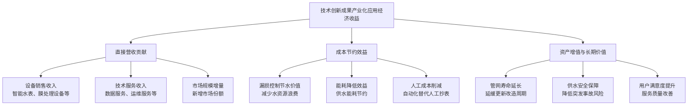
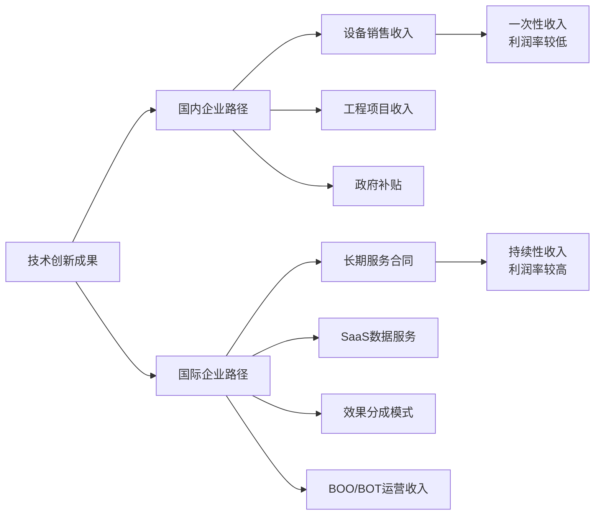
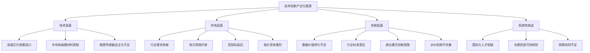
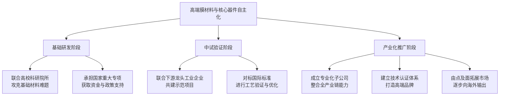
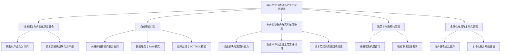
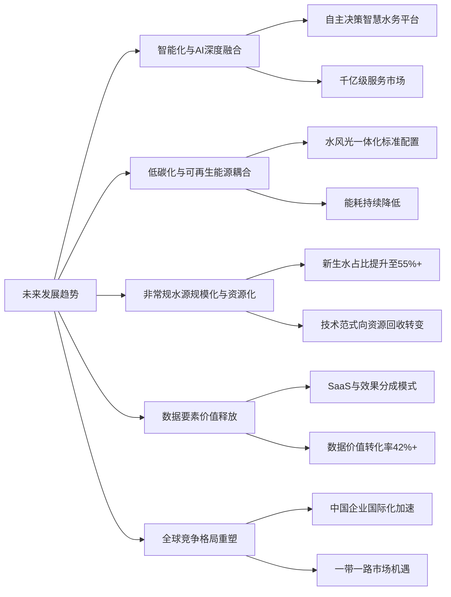

# 国际自来水企业技术创新成果产业化应用经济收益分析及国内水务企业技术攻关方向建议研究报告
## 1 研究背景与分析框架

### 1.1 国际自来水行业技术创新与产业化发展趋势

全球自来水行业正经历从传统基础设施运营向"智慧化、低碳化、集约化"方向的深刻转型，技术创新已成为推动行业高质量发展的核心引擎。近十年来，国际水务领域的技术创新呈现出多领域协同突破、产业化应用加速落地的鲜明特征，主要集中在以下核心方向：

**智能水表与物联网技术**是当前全球自来水行业技术创新最活跃、产业化规模最大的领域之一。智能水表通过集成物联网、传感器和通信技术，实现了用水数据的实时采集、远程传输和智能分析，从根本上改变了传统水务"重建设、轻管理"的模式[^1]。NB-IoT技术已成为智能水表的主流通信方案，其终端电池寿命可长达10年以上，目前全球NB-IoT智能水表出货量已占总出货量的65%以上[^1]。以欧洲为例，通过部署智能水表，部分国家的城市供水产销差率已从25%降至15%以下[^1]。全球智能水表市场规模已从2015年的32亿美元增长至2023年的92亿美元，年均复合增长率达16.3%，预计2025年将突破130亿美元[^1]。

**膜法水处理技术**被誉为水净化领域的"第三次革命"，其工作原理是运用超滤技术对原始水源进行初步净化，再通过反渗透与电渗析实现对水体中微小离子及有机物的深度去除[^2]。该技术凭借复合型净化策略展现出卓越的净化效能，在污水处理、市政给水净化处理、海水淡化等领域得到广泛应用。我国膜法水处理行业产值逐年增长，2024年产值达到3097.2亿元[^2]。在膜法水处理细分市场中，膜材料、膜设备规模占比分别为15%和27%，工程及应用规模占比28%，配套设备规模占比17%[^2]。

**管网漏损智能监测与控制技术**是应对全球城市供水管网"跑冒滴漏"挑战的关键创新方向。智能水表结合DMA分区计量技术构建漏损管控体系，通过实时流量监测和异常波动分析实现动态监测[^3]。深圳水务集团部署120万台NB-IoT智能水表，将产销差率从18%降至8.5%，年节约水资源1.2亿立方米[^1]。吉安市通过创新性地实施供水管网定期"体检"和合理布局压力监测装置，成功将公共供水管网漏损率从2022年的9.49%降至6.64%，每年可节约用水180余万立方米[^4]。

**非常规水源利用技术**是缓解全球水资源供需矛盾的重要战略举措。非常规水源包括再生水、集蓄雨水、海水及海水淡化水、微咸水、矿坑（井）水等[^5]。2022年全国非常规水源利用量达到175.8亿立方米，已占全国供水总量的2.9%[^5]。国际上，以色列70%的国土为沙漠，水资源极度贫乏，1987年已回用100%的生活污水和72%的市政污水；新加坡建立新生水厂，出水可达直接饮用要求，每天可提供120多万方新生水，占自来水供应量的20%左右[^6]。

从全球市场规模与增长动力来看，技术创新产业化应用呈现出政策驱动、资源约束与数字化转型三大关键趋势：

| 驱动因素 | 具体表现 | 产业化影响 |
|---------|---------|-----------|
| **政策驱动** | 中国"十四五"规划要求城市公共供水管网漏损率控制在9%以内；欧盟要求成员国在2025年前完成智能水表规模化部署[^1] | 推动智能水表安装量需新增超8000万台；加速漏损治理试点经验全国推广[^1][^7] |
| **资源约束** | 全球近40%人口面临水资源压力，预计2030年将攀升至50%以上；城市人口比例已突破57%[^1] | 倒逼水务企业提升用水效率，推动节水技术产业化应用 |
| **数字化转型** | 2025年水务行业政策体系构建"治理—技术—资金"全链条支撑框架；"人工智能+"上升为国家核心战略[^7] | 推动智慧水务平台建设，促进数据驱动的精细化管理 |

2025年，中国水务行业政策体系呈现"多维度协同、全链条覆盖"的特征，《关于全面推进江河保护治理的意见》明确以流域为单元统筹推进水灾害、水资源、水生态、水环境治理；住房城乡建设部印发的《城市公共供水管网漏损治理可复制政策机制清单（第二批）》梳理了50个城市和县城的成功经验[^7]。这一政策框架体现了从"单点治理"到"系统协同"的重大转变，为技术创新产业化应用提供了坚实的制度保障。

### 1.2 技术创新成果产业化应用经济收益的衡量维度

为系统评估国际自来水企业技术创新成果产业化应用的经济收益规模，本报告构建了涵盖**直接营收贡献、成本节约效益、资产增值与长期价值**三大核心维度的多维评估体系：

**直接营收贡献**是衡量技术创新产业化应用最直观的经济指标，主要包括：

- **设备销售收入**：以智能水表为例，2023年我国智能水表市场规模突破280亿元，2018-2023年年均复合增长率达24.3%[^3]。全球智能水表市场规模预计2025年将突破130亿美元[^1]。膜法水处理领域，2024年我国产值达到3097.2亿元[^2]。

- **技术服务收入**：商业模式从硬件销售向服务转型成为重要趋势。某企业通过收取数据服务费使单客户年均收入从280元提升至1200元[^1]。预计到2035年，我国智能水表及相关服务市场规模将突破千亿元[^3]。

**成本节约效益**是技术创新产业化应用的核心价值体现：

- **漏损控制节水价值**：深圳水务集团部署智能水表后年节约水资源1.2亿立方米[^1]；杭州水务安装1.2万块智能水表后漏损率从18.7%降至9.3%，年节水超800万立方米[^3]；吉安市每年可节约用水180余万立方米[^4]。

- **能耗降低效益**：深圳水务整合智能水表数据结合AI算法预测用水需求，供水能耗降低12%[^3]；吉安市锦源水厂通过压力调控，千吨水耗电降低约50千瓦时，每年节约电费80余万元[^4]。

- **人工成本削减**：智能水表使人工抄表成本降低85%以上，产销差率平均下降18-25%，漏损检测效率提升60%以上[^1]。

**资产增值与长期价值**反映技术创新对企业可持续发展能力的提升：

- **管网寿命延长**：通过智能监测及时发现管道内壁腐蚀、裂纹等"病灶"，将爆管风险扼杀在萌芽状态[^4]。汝城县自来水公司投资3000万元升级改造老城区管网后，管网漏损率稳定控制在3%以内，全省第一、全国领先[^8]。

- **供水安全保障**：管网突发性爆管事故发生率较治理前显著下降，因爆管导致的道路积水、交通中断、突发停水事件大幅减少[^4]。河南郑州暴雨期间某供水企业利用智能水表系统提前2小时启动应急供水车[^3]。

### 1.3 数据来源与筛选标准

本报告的数据来源渠道涵盖以下几个层面：

**国际水务行业协会统计与研究报告**：包括世界资源研究所（WRI）水资源压力统计数据、国际水协会（IWA）行业发展报告、亚洲漏损控制论坛案例分享等。汝城县作为中国唯一推荐的县级漏损控制成功案例，在第九届亚洲漏损线上论坛上分享经验，得到亚洲管网漏损控制专家关注[^8]。

**政府公报与政策文件**：包括中国水利部《中国水资源公报》、住房城乡建设部政策文件、国家"十四五"规划相关内容等。根据水利部数据，2003-2021年期间，我国非常规水源年利用量从22.2亿立方米增加到138.3亿立方米，非常规水源利用量占供水总量比重由0.42%增加到2.34%[^9]。

**上市公司财务披露与行业分析**：包括三川智慧、新天科技等龙头企业市场数据，行业CR5达58%，龙头企业占据超40%市场份额[^3]。跨界企业如华为推出"鸿蒙水表"，通过5G+AI算法将管网预警时间从24小时缩短至2小时[^3]。

**案例筛选标准**明确如下：

| 筛选维度 | 具体标准 | 说明 |
|---------|---------|------|
| **时间范围** | 2015-2025年 | 聚焦近10年技术创新成果 |
| **地域覆盖** | 全球主要水务市场 | 涵盖欧洲、北美、亚太及中国 |
| **技术成熟度** | 已实现规模化产业应用 | 排除实验室阶段技术 |
| **经济效益可量化** | 具备明确的营收/成本数据 | 确保收益规模可比较 |
| **代表性** | 行业公认的标杆案例 | 入选政府推广清单或国际论坛分享 |

### 1.4 自来水生产及销售企业的界定范围

本报告研究对象的边界界定遵循以下原则：

**业务环节覆盖范围**：自来水生产及销售企业涵盖从水源开发、净水处理、管网输配到终端供水服务的完整产业链。具体包括：

- **水源开发环节**：常规水源（地表水、地下水）开发利用，以及非常规水源（再生水、海水淡化水、集蓄雨水、微咸水、矿坑水）的开发利用[^9][^5]。

- **净水处理环节**：传统水处理工艺及膜法水处理技术应用，包括超滤、反渗透、电渗析等先进工艺[^2]。

- **管网输配环节**：供水管网建设、运维、漏损监测与控制，包括分区计量（DMA）、压力调控、智能监测等技术应用[^4][^10]。

- **终端供水服务环节**：智能水表计量、用户服务、数据分析与增值服务等[^1][^3]。

**企业类型分类**：

| 企业类型 | 业务特征 | 典型代表 |
|---------|---------|---------|
| **市政供水企业** | 承担城市公共供水职能，覆盖居民、商业用水 | 深圳水务集团、杭州水务、吉安水务集团 |
| **工业供水企业** | 为工业园区、大型企业提供专业供水服务 | 化工园区供水运营商 |
| **综合水务集团** | 覆盖供水、排水、污水处理全产业链 | 国际水务巨头及国内大型水务集团 |
| **技术设备供应商** | 提供智能水表、膜处理设备等核心产品 | 三川智慧、新天科技、华为等 |

**国际标杆与国内企业对标逻辑**：本报告选取国际上技术创新产业化应用经济收益规模居前的企业作为标杆，重点分析其技术突破路径、产业化推广模式与经济收益实现机制；同时对标国内同类型水务企业，识别技术差距与追赶方向。对标选择遵循"业务可比、规模相当、数据可得"原则，确保分析结论对国内水务企业具有实际参考价值。

## 2 国际自来水企业技术创新成果产业化应用经济收益前10分析

基于近十年国际自来水行业技术创新成果产业化应用的系统梳理，本章从智能水表与计量技术、膜处理与净水工艺、智慧水务平台、管网漏损控制、非常规水利用等重点技术领域中遴选出经济收益规模居前的10项代表性创新成果。以下逐一分析各项创新成果所属企业、技术创新内容与核心突破点、产业化应用场景与推广规模、经济收益实现路径与规模估算，为后续国内水务企业技术攻关方向提供国际标杆参照。

### 2.1 威立雅集团膜法水处理与海水淡化技术产业化应用

**企业概况与技术创新背景**

威立雅集团（Veolia）是全球水务、废弃物与能源管理领域的综合性龙头企业，其水务业务覆盖供水、污水处理、海水淡化等全产业链。在全球水资源短缺日益严峻的背景下，威立雅将海水淡化技术作为战略性增长领域，通过持续的技术创新与产业化应用，已成为全球领先的海水淡化服务提供商[^11]。

**核心技术创新内容**

威立雅在膜法水处理与海水淡化领域的技术创新呈现多维度突破：

- **高效反渗透膜技术**：通过最新膜技术的多种机制助力成本削减，高通量设计减少水通过所需能量，优化的表面特性减少结垢，提升的耐用性延长使用寿命。与传统膜相比，这些先进膜可实现节能10%~15%[^11]。威立雅可设计、建造并运营**单位能耗低于3kW·h/m³**的海水反渗透工厂，显著低于行业平均水平[^11]。

- **高效能源回收系统**：压力交换器从高压浓盐水流中捕获能源并将其转移至进水，大幅降低能源需求。威立雅在澳大利亚管理的海水淡化厂，从浓盐水流中实现了**高达97%的能源回收率**[^11]。

- **AI驱动的智能膜管理平台**：通过Hubgrade平台整合数字解决方案，人工智能驱动的监控系统提供实时状态更新与预测性维护洞察，使操作员能基于数据制定设备更换与维护计划，不仅延长膜寿命，还能确保最佳性能，同时降低能耗与运营成本[^11]。

- **可再生能源整合**：威立雅的库内尔海水反渗透工厂100%使用可再生电力，在太阳能发电高峰时段实现了近乎零碳排放[^11]。

**产业化应用规模**

威立雅深耕海水淡化领域，通过先进的膜技术，每天可在全球范围内产出**675万m³淡化水**[^11]。凭借在大规模海水淡化的丰富经验，威立雅在短短10年内将反渗透能耗降低了35%[^11]。其技术创新正改变人们对海水淡化"高能耗、高环境负担"的固有认知，并证明大规模推广可持续、低成本的替代方案已成为可能。

**经济收益实现路径与规模**

威立雅集团2024年取得强劲业绩，**营收稳健增长5.0%，达到446.92亿欧元**；运营业绩稳健，**息税折旧摊销前利润（EBITDA）有机增长5.8%，达到67.88亿欧元**；**当年集团净利润为15.30亿欧元，增长14.6%**[^12]。其中，水务业务增长5.6%，增长领域业务（包括水务技术、危险废弃物、生物能源等）增长6.6%[^12]。2025年第三季度，威立雅集团营收持续增长3.2%，达**323.23亿欧元**，水务业务增长3.4%[^13]。

威立雅的经济收益实现路径体现为：**通过提供大规模海水淡化工程与服务、运营效率提升（降耗）以及综合水务解决方案，实现规模化营收与利润**。其独特的"水务-能源-废弃物互补业务组合"与"多元化地理布局"构成了可持续增长的核心竞争优势。

### 2.2 宁水集团NB-IoT智能水表技术产业化应用

**企业概况与技术创新背景**

宁波水表（集团）股份有限公司（简称"宁水集团"）是中国水表行业的龙头企业，1964年成为中国首家专业生产水表的企业，1965年主导全国水表统一标准，结束了行业标准参差不齐的"万国表"时代[^14][^15]。进入21世纪后，宁水集团将智能水表作为支柱储备产业，引领行业智能化变革。

**核心技术创新内容**

宁水集团在智能水表领域的技术创新具有里程碑意义：

- **全球首个NB-IoT智能水表商用项目**：2017年，全国首个NB-IoT（窄带物联网）智慧水务项目投用，其应用的水表全部由宁水集团生产。宁水集团还将其起草的技术标准向业内无偿公开，推动了整个行业的技术进步[^14][^15]。

- **长寿命终端技术**：智能水表电池寿命超过10年，解决了传统智能水表频繁更换电池的痛点，大幅降低了运维成本。

- **智能管理平台产业化**：智能水表不仅能实现自动抄表，还能协助定位管网漏水位置，节约珍贵的水资源。宁水集团借助智能水表打造多个独居老人关怀系统项目，通过物联网、大数据采集和监测用水量，一旦出现长时间无用水、短时间大量用水等异常情况，后台便会发出预警[^14]。

**产业化应用规模**

宁水集团拥有1000多种水表产品，**服务全国2300余家自来水公司，产品远销全球80多个国家和地区**，已经成为全球重要的水表生产商之一[^14][^15]。2024年行业CR4不足20%，宁水集团以8.8%的市场份额位居行业首位[^16]。我国智能水表渗透率已由2019年的33.4%提升至2024年的约53%[^16]。

**经济收益实现路径与规模**

宁水集团的**年度营收突破15亿元人民币**[^14]。2025年度业绩预告显示，预计全年实现归属于母公司所有者的**净利润8500万元至1.02亿元，同比增长62.16%至94.59%**[^17]。2025年上半年，公司海外营收同比增长超25%，其中亚太地区增幅达115%，**智能表的海外营收同比增幅超过200%**[^17]。

宁水集团的经济收益实现路径体现为：**抓住全球水务数字化和智能计量升级机遇，通过产品销售（硬件+解决方案）直接获得营业收入，并凭借技术先发优势占领国内外市场份额**。公司正在完善"智能感知+数据驱动+工程闭环"三位一体的智慧水务服务体系，致力于成为业内领先的智慧水务综合服务商[^17]。

### 2.3 赛莱默数字计量解决方案与收入回收技术产业化应用

**企业概况与技术创新背景**

赛莱默（Xylem）是全球领先的水技术公司，专注于解决水资源管理中的关键挑战。其数字解决方案套件针对水务行业"表观漏损"（即水已被使用但未正确计量、抄表或付费）这一普遍痛点，开发了创新性的收入回收技术[^18]。

**核心技术创新内容**

赛莱默在数字计量与收入回收领域的技术创新具有显著的实用价值：

- **Hidden Revenue Locator云分析平台**：这款基于云的在线分析解决方案帮助找出系统内因水表性能下降而导致收入损失的用户水表并进行排序。采用这款智能解决方案后，可以持续发现潜在的水表问题，水务公司还可以通过在线仪表板查看重点问题，这些问题会按总数量和每个水表的收入差异来排序[^18]。

- **数据驱动型表观漏损量化**：传统更换水表的方法侧重于随机测试、使用时间和水漏损平衡审查等因素，通常每年进行一次，这种方法不准确。赛莱默的解决方案放弃了随机或按时间更换水表的方法，选择确定用户水表的精确度、量化表观水漏损并提高运营效率，同时不会提高水价[^18]。

**产业化应用案例——美国克莱顿县水务局**

美国乔治亚州克莱顿县水务局（CCWA）由于水表计量不准，每年的收入流失超过100万美元。CCWA与赛莱默携手制定水表管理计划，能够量化持续的表观水漏损情况[^18]。

**经济收益实现路径与规模**

在短短四年多的时间里，Hidden Revenue Locator发现因水表计量不准导致的**年收入损失超过100万美元**。自安装这款水表管理解决方案以来，按每台水表来算，CCWA**住宅用水表的平均收入损失每年减少6美元，非住宅水表减少67美元**[^18]。

除了表明未登记水表是表观水漏损的主要原因之外，这些数据还准确指出哪些水表没有登记。掌握了这些信息后，CCWA能够将资源集中用于解决这个问题、确定重点措施，从而挽回收入流失。与之前采用的随机水表测试相比，Hidden Revenue Locator找出水表登记的缺口，**应缴费水表数量增加4倍**，因此能够弥补更多的收入损失[^18]。

赛莱默的经济收益实现路径体现为：**以软件即服务（SaaS）或解决方案形式，帮助水务公司提高水费回收率，直接增加其现金流，赛莱默从中获得服务费用**。

### 2.4 栗田工业超纯水与水处理化学品技术产业化应用

**企业概况与技术创新背景**

栗田工业（Kurita Water Industries）是日本工业水处理领域的领导者，从战后经济恢复期的小型化学品供应商起步，通过技术创新和商业模式的持续演进，逐步成长为全球工业水处理领域的标杆企业[^19]。其发展路径不仅彰显了企业应如何在行业周期中穿越起伏，也为环保企业在新时代寻找突围之道提供了宝贵借鉴。

**核心技术创新内容**

栗田工业在工业水处理领域的技术创新具有深厚积累：

- **反渗透膜系统优化技术**：通过指导、优化膜系统和其他工艺流程，如过滤器的反洗和自动冲洗等，提高反渗透膜系统的回收率，从而实现节约用水[^20]。

- **Kurita Vitec系列阻垢剂**：通过切换该系列药剂，反渗透系统的回收率可从75%提高到85%，节省大量的水资源和能源，使能源成本平均减少13.9%[^20]。

- **半导体超纯水制备技术**：进入70年代，随着电子工业的兴起，芯片制造对超纯水的需求急剧增长。栗田工业通过技术引进的方式，迅速在国内推出反渗透膜和多级过滤设备，满足了这一高标准行业的需求[^19]。

**产业化应用案例——世界100强企业节水项目**

栗田工业帮助一家世界排名前100强的饮料企业完成5家生产工厂的节水目标。通过专业指导和系统优化，在完成节水目标的同时，还节省了能源，减少了浪费，降低了工厂的运行成本[^20]。

**经济收益实现路径与规模**

该项目取得了显著的经济效益：

| 效益维度 | 具体成效 |
|---------|---------|
| **水资源节约** | 5家工厂总计**年节水量近3.14亿升**，每家工厂年均节水超6050万升，其中一家达1.249亿升[^20] |
| **能源节约** | **能源成本平均减少13.9%**[^20] |
| **废弃物削减** | **膜更换频率减少63.3%**，每年节省331支膜的替换量[^20] |

栗田工业2023年实现**营收3848亿日元（约187亿人民币）**，其中**服务性质收入占比高达73.1%**。通过咨询性质的水处理化学品业务、长期合同服务及设备维护，栗田工业建立了高度稳定的收入基础[^19]。其营收近半来自海外市场，横跨亚洲、美洲、欧洲及中东地区，展现了极强的市场适应力。

### 2.5 苏伊士大型海水淡化BOT项目技术产业化应用

**企业概况与技术创新背景**

苏伊士（SUEZ）是全球水务领域的另一巨头，深耕海水淡化60年，在全球范围内建设了超过260个海水淡化项目，总处理规模超过500万吨/天[^21]。面对全球淡水短缺问题，尤其是阿拉伯地区天然水资源匮乏、人口增长迅速的挑战，苏伊士持续推进大型海水淡化项目的技术创新与产业化应用。

**核心技术创新内容**

苏伊士在约旦亚喀巴-安曼海水淡化项目中展示了多项核心技术突破：

- **大规模RO膜法海水淡化工艺**：该项目将在红海附近的约旦港口城市亚喀巴新建一座**日产水量85.1万吨/天**的海水淡化厂，是全球第二大海水淡化项目[^21]。

- **超长距离输水系统集成**：产水经过**450公里管网**送至约旦首都安曼地区，管网的高差超过1100米，还将包括大容量泵站和可再生能源设施[^21]。

- **可再生能源配套**：作为该合同的一部分，将建设一座**年发电量为724吉瓦时的太阳能发电厂**[^21]。

**产业化应用规模与商业模式**

该项目**总投资约40亿欧元**，将按照建设-运营-移交（BOT）合同模式进行。Meridiam和SUEZ联合体将在整个特许期内负责该系统的融资、设计、建造、运营和维护，**特许期涵盖建设和26年的运营**。在此期间之后，所有权将作为国家资产全部移交给水利和灌溉部[^21]。

**经济收益实现路径与规模**

一旦投入运营，该项目预计每年将提供**3亿立方米的饮用水**，满足大约**400万人**的需求，建成后其产出的饮用水将可满足**该国饮用水消费量的40%**，将有助于保障约旦的水资源安全，提升约旦人民的生活质量[^21]。

苏伊士的经济收益实现路径体现为：**作为工程总承包商和技术提供商，通过承建大型基础设施项目，获得巨额工程投资和长期运营收入**。约旦是世界上水资源最为紧张的国家之一，人均每年可利用的淡水不足100立方米，该项目对于国家水安全具有战略意义。

### 2.6 深圳环水集团智慧水务平台与自适应调度技术产业化应用

**企业概况与技术创新背景**

深圳环水集团是深圳市属国企，在智慧水务建设领域处于国内领先地位。2024年，住房和城乡建设部科技与产业化发展中心发布《关于发布2024年智慧水务典型案例的通知》，深圳环水集团报送的三个项目成功入选，体现了其在智慧水务建设上全面开花的实力[^22]。

**核心技术创新内容**

深圳环水集团在智慧水务领域的技术创新具有多项突破：

- **基于在线水力模型与AI的供水自适应调度系统**：该项目应用水量预测模型、在线水力模型、泵组寻优评价模型、人工智能算法和先进控制策略，实现用水需求的精益匹配，精准调控厂网压力，打造全国首创的**"无人干预、实时调度、秒级计算、智能优选、精准控压"**供水自适应调度模式[^22]。

- **排水-水环境数字化智能体**：首创排水-水环境数字化智能体，研发系列污涝协同治理保障技术，实现超大城市污涝协同智慧管控[^22]。

- **全要素智慧运营管控平台**：深入探究"源、厂、站、网、河、湖、海"水循环全要素的业务关联，通过智慧化引领搭建一张图，打造全要素智慧运营管控"全覆盖"[^22]。

**经济收益实现路径与规模**

通过自适应调度连续实际运行，该项目实现了**"三提升二降低一转变"**的显著效果：

| 效益类型 | 具体成效 |
|---------|---------|
| **提升调度运行效率** | 秒级方案计算，分钟级指令执行，自动决策与运行，实现无人干预 |
| **提升供水安全能力** | 降低管网压力波动，保障供水安全；精准计算设备参数，保障设备安全 |
| **提升科学调度水平** | 科学合理调节水厂配比，提高供水系统韧性；自动适应机泵状态变化，优化水泵组合 |
| **降低生产运行成本** | **配水能耗降低约5%，综合电耗降低约3.5%**[^22] |
| **降低人力投入成本** | 基于机器学习智能决策，自动运行，**人力成本下降35.6%**[^22] |
| **转变运营管理模式** | 实现由分散调度向集中调度转变，人工经验调度向实时在线自适应调度转变 |

### 2.7 江西水务城乡供水一体化漏损管控技术产业化应用

**企业概况与技术创新背景**

江西省水务集团有限公司（简称"江西水务"）是江西省城乡供水一体化的重要实施主体，下辖省内47家供水子公司，**服务人口2100余万**（其中农村人口超800万）。面对供水领域"点多面广、基础薄弱"的情况，江西水务立足集团化统筹优势，积极探索契合省情实际的城乡供水漏损管控新路径[^23]。

**核心技术创新内容**

江西水务在漏损管控领域的技术创新体现为系统性方法论突破：

- **"三级管控"模型**：依据漏损率、水厂产能利用率、月供水量与用户数等核心指标，将旗下供水子公司划分为管控一级、管控二级、管控三级，精准打出"控压力、强运维、精计量"的组合拳，实现差异化、高效化治漏[^23]。

- **精细化压力调控**：要求各水厂根据每日用水曲线与需水量，分季节、分时段调节出厂水压力，并在管网关键节点加装远传压力监测点，实现"按需调压、精准控压"[^23]。

- **"人工巡查+智慧监测+数据治理"三位一体运维体系**：建立常态化检漏机制，推进管网数字化改造，编制江西水务管网数据采集企业标准，将各个水司的管网资产进行数字化转化[^23]。

- **DMA分区计量体系**：以上高县为例，上高润泉通过分级建设DMA分区计量体系，成功锁定团结路右侧城中村区域管网隐蔽漏点，维修后夜间流量下降且实现时段归零，月供水量回归合理区间[^23]。

**产业化应用规模**

江西水务累计接入**GIS系统管网8300公里（DN50及以上），设备设施41万个点位**，实现管网资产可视化管控，辅助管网巡检维修提质增效[^23]。

**经济收益实现路径与规模**

以德安县为典型案例：针对德安县城区因管网压力失衡导致的频繁爆管问题，德安润泉在核心管网节点布设25处远传压力传感器，结合用水高峰动态调整压力参数与老旧小区改造项目，使**城区主管网爆管频率下降93%，管网运行寿命预计延长10年以上**[^23]。

江西水务的经济收益实现路径体现为：**通过管理体系创新与技术手段相结合，主动控制漏损，减少无收益水量，将节约的水资源转化为有效供水量和收入，同时延长管网资产使用寿命，降低更新改造投资**。

### 2.8 吉安水务智能漏损监测与压力调控技术产业化应用

**企业概况与技术创新背景**

吉安水务集团是江西省吉安市的供水主体，长期以来面临地下供水管网"跑冒滴漏"这一隐形成本与安全挑战。转变始于2017年，吉安水务集团将漏损控制列为城市精细化管理的重要课题，从被动抢修的"治已病"转向主动预防的"治未病"[^4]。

**核心技术创新内容**

吉安水务在漏损控制领域的技术创新具有鲜明的实践特色：

- **工业管道内窥镜带压检测技术**：技术人员可通过阀门井将高清摄像设备送入DN300以上关键管段内部，实现在不停水、不开挖条件下的带压运行检测。这项犹如"肠镜检查"的技术，能直观发现管道内壁腐蚀、裂纹等"病灶"，将爆管风险扼杀在萌芽状态[^4]。

- **分区计量漏损控制综合管理平台**：整合了全市布设的**460台漏水噪声自动监测设备和345个独立计量区**的流量数据。平台能进行夜间最小流量分析，自动预警，并实现从派单、复核到维修的全流程线上闭环管理。平台定期生成的"管网体检报告"，以热力图等形式清晰指引管网改造优先区，让决策从"凭经验"变为"看数据"[^4]。

- **智慧压力监测网**：针对吉安"两江三岸"复杂地形导致的水压失衡问题，在全市关键位置高密度布设**200个压力监测远传终端**，如同"神经元"，每分钟将压力数据传回调度中心，实现从"经验调度"到"数据驱动"的根本转变[^4]。

**经济收益实现路径与规模**

经过系统治理，吉安市供水管网漏损治理结出硕果：

| 效益维度 | 具体成效 |
|---------|---------|
| **漏损率下降** | 全市公共供水管网漏损率已从2022年的9.49%**降至6.64%**[^4] |
| **节水效益** | **每年可节约用水180余万立方米**[^4] |
| **节能效益** | 以锦源水厂为例，通过分析数据将出厂压力由0.40MPa科学下调至0.32MPa后，千吨水耗电降低约50千瓦时，**每年节约电费80余万元**[^4] |
| **综合经济效益** | 吉安水务通过漏损治理**年节约资金超千万元**[^4] |
| **社会效益** | 用户关于水压不足的投诉率下降58%以上，市民用水的便利性、稳定性和满意度显著提升[^4] |

### 2.9 新加坡公用事业局新生水与数字化水务技术产业化应用

**企业概况与技术创新背景**

新加坡公用事业局（PUB）是新加坡的国家水务机构，负责管理整个水循环系统。新加坡人均水资源量仅为211立方米，位于世界倒数第二，为了应对严峻的缺水情况，新加坡制定了长期应对计划，建立面对未来的水资源管理体系，其特点是"软路径"，即每一滴水都被精心收集、保护和利用[^24]。

**核心技术创新内容**

新加坡在非常规水利用与数字化转型领域的技术创新具有国际示范意义：

- **新生水（NEWater）工艺**：通过微过滤、反渗透和紫外线消毒，新加坡的处理过的废水被回收成超清洁、高等级、抗旱的新生水。新生水被用于工业和在降雨量低的时期补充水库。2022年再生水年售水量接近1.5亿立方米[^24][^25]。

- **SMART PUB数字化路线图**：2018年，PUB发布了"SMART PUB路线图"，旨在对新加坡整个水系统进行数字化升级。PUB提出了四个主要目标：数字化赋能创造价值、提高运营效率、提供更好的工作环境、改善客户体验[^24]。

- **智能化调度系统**：PUB与新加坡政府科技局携手开发了一套先进的水源和供水调度系统。该系统要求工作人员每日综合考虑水源状况、用水需求、天气条件、系统容量限制、水厂产能、成本因素以及潜在的需求波动和水厂运行异常等多重因素[^24]。

**产业化应用规模**

新加坡现有新生水厂**总产量超过70万m³/d**，包括勿洛、克兰芝、乌鲁班丹以及樟宜Ⅰ、Ⅱ期等5座水厂。目前新生水和淡化水处理规模已达到130万m³/d。未来计划到2060年，海水淡化和新生水要能够满足水资源需求量的80%，其中**新生水占55%**[^26]。

**经济收益实现路径与规模**

新加坡智能化调度系统投入使用之前，制定调度计划每天耗时2小时，系统启用后，**时间缩短至仅需15分钟，每年可节省64个人工工作量**，并优化了供水成本和效率[^24]。

新加坡新生水的生产成本是海水淡化的一半，价格比自来水便宜至少10%。自投产以来，新生水的价格还不断降低，最初是每立方米1元3角，2005年调低至1元1角5分，从2007年起再下调至1元[^25]。

### 2.10 碧水源膜技术与盐湖提锂技术产业化应用

**企业概况与技术创新背景**

北京碧水源科技股份有限公司是中国膜工业的龙头企业，依托全链条研发体系实现了产品向高端化、绿色化、数智化的转型升级。其创新产品与解决方案已广泛应用于长江大保护、黄河流域治理及"一带一路"建设项目，有力服务国家战略[^27]。

**核心技术创新内容**

碧水源在膜技术领域的创新成果具有多项国际领先突破：

- **振动MBR技术**：达国际领先水平，为膜生物反应器技术的能耗降低提供了创新解决方案[^27]。

- **聚烯烃反渗透/纳滤膜**：持续迭代，中试线入选工信部重点平台[^27]。

- **"吸附剂+特种膜"盐湖提锂技术**：实现盐湖提锂全链条国产化，解决了新能源产业关键材料的"卡脖子"问题[^27]。

- **海水淡化膜打破国外垄断**：在海水淡化领域，碧水源通过自身硬核技术，打破了国外反渗透膜的垄断局面，解决了海水淡化领域关键材料"卡脖子"问题[^28]。

**产业化应用规模与行业地位**

2024年我国膜工业总产值达**4822亿元**，约占全球29%，并持续保持高速增长，我国已成为全球膜产业规模最大的国家之一[^27]。碧水源作为行业标杆企业，通过持续自主创新推出的多项新产品，为行业发展注入了新动力。

**经济收益实现路径与规模**

碧水源的经济收益实现路径体现为：**通过膜技术与材料科学的深度融合，推动技术范式从"污染去除"向"资源回收"转变，使水处理设施成为水、能源与营养物质的生产工厂**。其膜技术与能源回收结合，绘制了"环保+能源"协同减碳的实践路径[^27]。

---

**国际自来水企业技术创新成果产业化应用经济收益前10汇总**

| 排名 | 企业/机构 | 所属领域 | 核心技术创新 | 产业化规模 | 经济收益规模 |
|:---:|:---|:---|:---|:---|:---|
| 1 | 威立雅集团 | 膜法水处理/海水淡化 | 高效反渗透膜、97%能源回收、AI智能膜管理 | 日产淡化水675万m³ | 2024年营收446.92亿欧元 |
| 2 | 苏伊士 | 海水淡化 | 大规模RO膜法、超长距离输水系统 | 全球260+项目、500万吨/天 | 约旦项目投资40亿欧元 |
| 3 | 宁水集团 | 智能水表 | NB-IoT智能水表、智能管理平台 | 服务2300+供水企业、出口80+国家 | 年营收突破15亿元 |
| 4 | 栗田工业 | 工业水处理 | 反渗透优化、阻垢剂、超纯水制备 | 全球工业客户服务 | 2023年营收3848亿日元 |
| 5 | 赛莱默 | 智慧计量 | Hidden Revenue Locator云分析平台 | 北美水务市场应用 | 帮助客户年挽回超100万美元 |
| 6 | 深圳环水集团 | 智慧水务平台 | AI自适应调度、数字化智能体 | 入选国家典型案例 | 能耗降5%、人力成本降35.6% |
| 7 | 吉安水务 | 漏损控制 | 内窥镜检测、分区计量平台、智慧压力网 | 460台监测设备、345个计量区 | 年节约资金超千万元 |
| 8 | 江西水务 | 漏损管控 | 三级管控模型、DMA分区、GIS数字化 | 服务2100万人口、8300公里管网 | 爆管频率降93%、管网延寿10年+ |
| 9 | 新加坡PUB | 新生水/数字化 | NEWater工艺、SMART路线图、智能调度 | 新生水日产70万m³+ | 调度效率提升87.5% |
| 10 | 碧水源 | 膜技术 | 振动MBR、盐湖提锂、海水淡化膜国产化 | 服务国家重大战略 | 行业总产值4822亿元背景下的龙头 |

上述10项技术创新成果涵盖了智能水表与计量技术、膜处理与净水工艺、智慧水务平台、管网漏损控制、非常规水利用等重点技术领域，代表了近十年国际自来水行业技术创新产业化应用的最高水平，为国内水务企业技术攻关方向提供了清晰的国际标杆参照。

## 3 国内水务企业技术创新与产业化应用现状对比分析

### 3.1 国内水务企业技术创新发展现状总览

国内水务行业技术创新已进入快速发展期，在智能计量、膜法水处理、智慧水务平台、漏损控制、非常规水利用等核心领域形成了较为完整的技术布局与产业化基础。从宏观数据来看，国内水务技术创新产业化应用呈现出"规模扩张快、覆盖领域广、龙头企业强"的鲜明特征。

**智能水表与计量技术领域**，我国智能水表渗透率已从2018年的35%提升至2023年的58%，2024年进一步攀升至约53%（按不同统计口径略有差异），市场规模突破280亿元，2018-2023年年均复合增长率达24.3%[^29]。NB-IoT技术凭借广覆盖、低功耗特性成为主流通信方案，信号接收成功率保持在95%以上，单节电池使用寿命可达6-10年[^29]。行业格局呈现"一超多强"态势，宁水集团以8.8%市场份额位居首位，三川智慧紧随其后，行业CR5达58%[^14][^30]。

**膜法水处理技术领域**，截至2024年底，全国涉膜企业超过2200家，实现**膜工业总产值4822亿元，约占全球膜工业总产值的29%**[^31]。我国已初步形成具有中国特色的膜科技创新体系，膜领域相关专利在全球范围内共22417件，2023年我国相关专利数占比高达**75.7%**[^31]。碧水源作为行业龙头，其MBR膜占中国膜法水处理市场份额的70%以上，膜技术所应用的水处理总规模已超过2200万吨/天，每年能够为国家新增高品质再生水超过70亿吨[^32][^33]。

**节水产业与漏损控制领域**，国家发展改革委、水利部等六部门于2024年6月联合印发《关于加快发展节水产业的指导意见》，提出到2027年实现万亿规模的阶段性目标。目前，**节水相关产业市场规模估算超7600亿元**，已形成以京津冀、长三角、粤港澳大湾区三大产业高地和成渝、山东、陕西等多个设备制造、科研创新集聚区为代表的"三地多区"节水产业集群发展格局[^34]。漏损控制技术方面，山科智能自主研发的DMA分区计量管理系统已助力福建省晋江自来水股份有限公司将管网漏损率稳定控制在6.5%以内[^35][^36]。

**非常规水利用领域**，2022年全国非常规水源利用量达到175.8亿立方米，占全国供水总量的2.9%，较2012年的44.6亿立方米提高了2.9倍[^37]。水处理膜作为水处理领域的核心材料，2020-2024年市场规模年均复合增长率达11.6%，应用场景覆盖市政供水、污水处理、海水淡化及高端制造配套等领域[^38]。

**代表性企业技术定位与市场份额**

| 企业名称 | 主营领域 | 技术定位 | 市场地位 |
|:---|:---|:---|:---|
| 宁水集团 | 智能水表 | NB-IoT智能水表、智慧水务综合服务 | 国内市场份额第一（8.8%），产品出口80+国家[^14][^39] |
| 三川智慧 | 智能水表 | 5G数智水表工厂、智慧水务服务 | 国内领先，全球首个5G数智水表工厂试运行[^30] |
| 碧水源 | 膜技术 | MBR膜、反渗透膜、盐湖提锂 | MBR膜国内市占率70%+，日处理规模超2200万吨[^32][^33] |
| 山科智能 | 漏损控制 | DMA分区计量、渗漏预警仪 | 漏损控制领域技术领先[^35][^36] |

### 3.2 技术自主化程度对比分析

从核心技术自主可控角度审视，国内水务企业在各关键技术领域的自主化程度呈现"应用层突破、核心层追赶"的结构性特征，与国际领先企业相比既有显著进步，也存在明显短板。

**智能水表领域**，国内企业在NB-IoT智能水表技术上已实现全球首商用突破。2017年，全国首个NB-IoT智慧水务项目投用，应用的水表全部由宁水集团生产，并将其起草的技术标准向业内无偿公开[^14]。三川智慧建成全球首个5G数智水表工厂，生产流程全自动化，整个生产链的自动化率超过95%[^30]。然而，**高端芯片、核心传感器等关键器件仍存在一定程度的进口依赖**，制约了产品向更高端攀升。智能水表硬件故障率主要集中在电池耗尽（占比42%）、通信模块失效（28%）和传感器精度漂移（23%），反映出核心器件可靠性仍需提升[^29]。

**膜技术领域**，碧水源已实现MBR膜、超滤膜、纳滤膜等产品的自主知识产权和规模化生产，MBR膜占中国膜法水处理市场份额的70%以上[^32][^33]。在海水淡化领域，碧水源通过自身硬核技术打破了国外反渗透膜的垄断局面，解决了海水淡化领域关键材料"卡脖子"问题[^33]。然而，**高端反渗透膜的国产化替代仍在推进中**，特别是在半导体超纯水等高端工业水处理领域，外资企业仍占据统治地位。当前行业呈现"国内主导、外资高端"格局，行业正积极向高端化转型升级[^38]。

**智慧水务平台领域**，深圳环水集团开发的基于在线水力模型与AI的供水自适应调度系统达到国内领先水平，实现了"无人干预、实时调度、秒级计算、智能优选、精准控压"的供水自适应调度模式。但与威立雅的AI驱动智能膜管理平台、赛莱默的Hidden Revenue Locator云分析平台等国际标杆相比，**国内智慧水务普遍存在"数据孤岛"现象，数据整合不足，高级分析决策功能受限，IT与OT融合深度不够**。

**各技术领域国产化率与"卡脖子"环节评估**

| 技术领域 | 国产化率 | 核心突破 | "卡脖子"环节 |
|:---|:---|:---|:---|
| NB-IoT智能水表 | 90%+ | 通信技术、整机制造 | 高端芯片、精密传感器 |
| MBR/超滤膜 | 80%+ | 膜材料、膜组件 | 高端原材料、长期稳定性 |
| 反渗透膜 | 60-70% | 海水淡化膜国产化 | 半导体级超纯水膜 |
| 智慧水务平台 | 70%+ | 调度系统、GIS应用 | AI深度分析、数据融合 |
| 漏损控制设备 | 85%+ | DMA计量、预警探头 | 高精度声学传感器 |

### 3.3 产业化应用规模对比分析

从市场覆盖与应用规模角度量化对比，国内水务企业与国际巨头之间存在显著的规模差距，呈现"点状突破"与"系统覆盖"的结构性差异。

**智能水表领域**，宁水集团年度营收突破15亿元人民币，服务全国2300余家自来水公司，产品远销全球80多个国家和地区[^14][^39]。2025年度业绩预告显示，预计全年实现归属于母公司所有者的净利润8500万元至1.02亿元，同比增长62.16%至94.59%[^39]。三川智慧2024年实现营业收入14.73亿元[^30]。然而，与国际巨头相比，**宁水集团15亿元营收与威立雅446.92亿欧元（约3500亿人民币）的规模差距超过200倍**。从全球水务公司排行榜来看，中国公司里排名第一的北控水务估算水务收入是33亿美元，相比威立雅的192亿美元，差距仍然非常明显[^40]。

**膜技术领域**，碧水源膜技术所应用的水处理总规模已超过2200万吨/天，自主运营项目总规模已超过600万吨/天[^32]。2024年公司实现营业收入约85.49亿元[^33]。然而，2024年公司归母净利润仅为0.59亿元，同比减少92.34%，主要受重要参股公司亏损拖累[^33][^41]。从产业规模结构来看，**威立雅每天在全球范围内产出675万m³淡化水，专注于高附加值的海水淡化运营服务；碧水源则以污水资源化为主，业务结构存在差异**。

**漏损控制领域**，国内试点城市漏损率已降至6%-9%的先进水平。山科智能的技术已助力福建省晋江自来水股份有限公司将管网漏损率稳定控制在6.5%以内[^35][^36]。吉安市公共供水管网漏损率从2022年的9.49%降至6.64%[^29]。然而，**全国平均漏损率水平与国际先进仍有差距**——国家要求到2025年全国城市公共供水管网漏损率控制在9%以内，而德国柏林通过统一EN13757通信标准，2022年漏损率已控制在5.8%以内[^29]。

**国内外企业产业化规模对比**

| 对比维度 | 国内代表企业 | 规模数据 | 国际标杆企业 | 规模数据 | 差距倍数 |
|:---|:---|:---|:---|:---|:---|
| 水务营收 | 北控水务 | 33亿美元 | 威立雅 | 192亿美元 | 约6倍 |
| 智能水表营收 | 宁水集团 | 15亿元人民币 | 国际综合水务 | 百亿级 | 10倍+ |
| 海水淡化产能 | 全国总计 | 285.55万吨/日 | 威立雅 | 675万m³/日 | 约2.4倍 |
| 膜工业产值 | 中国 | 4822亿元 | 全球 | 约1.66万亿元 | 占比29% |

### 3.4 经济收益转化效率对比分析

从技术创新向经济效益转化角度审视，国内外企业在商业模式与收益实现路径上存在根本性差异，国内企业以硬件销售为主的模式制约了经济收益转化效率的提升。

**商业模式差异**是造成收益转化效率差距的核心因素。国内企业收入仍以工程和设备销售为主，宁水集团主要通过智能水表销售获得营收，2024年智能水表收入833,515,104.27元，下滑22.17%；机械水表收入548,108,719.91元，下降8.02%[^42]。三川智慧同样以水表设备制造为核心业务[^30]。相比之下，**栗田工业服务性质收入占比高达73.1%**，通过咨询性质的水处理化学品业务、长期合同服务及设备维护，建立了高度稳定的收入基础。赛莱默的Hidden Revenue Locator平台以SaaS模式帮助水务公司提高水费回收率，直接增加其现金流，从中获得服务费用。

**数据价值转化效率**方面，智能水表数据应用经济效益测算显示，**数据价值转化率年均达42%，显著高于传统信息化项目25%的行业均值**[^29]。东部沿海某省会城市试点项目实施后，年漏损水量从2.8亿立方米降至1.7亿立方米，节水效益达4.95亿元；人工抄表成本从3800万元降至950万元；项目投资总额6.8亿元，静态投资回收期仅0.75年[^29]。然而，**国内智慧水务建设仍较多处于数据采集和可视化阶段，数据赋能运营决策、产生直接经济效益的高级应用不足**。

**收益实现路径对比**

**增值服务与长期运营收入差距**明显。国际企业已从设备销售转向提供集成的端到端解决方案和长期服务合同，盈利模式更稳定。苏伊士的约旦海水淡化项目采用BOT模式，特许期涵盖建设和26年的运营[^29]。宁水集团正在探索从"设备制造商"向"数据服务商"的转型，但**未来行业竞争的核心在于将产线及水表运行数据转化为运营洞察，比如为水务公司提供漏损分析、用水行为预测等增值服务**[^39]。

### 3.5 技术研发投入与成果转化机制差距分析

国内外企业在研发投入强度、创新体系建设、产学研协同等方面的差距，是造成技术创新产业化应用效益差异的深层原因。

**研发方向与原创性差距**显著。国际企业更注重基础材料研发和颠覆性技术创新，引领全球技术潮流。挪威浮洋公司的海底海水淡化技术获《时代》周刊2025年最佳发明，赛莱默为这项技术注资，按下全球商业化推广的"加速键"[^43]。国内企业虽在应用规模和专利数量上领先——膜领域专利全球占比75.7%[^31]，但**在原创性、引领性技术方面不足，研发更侧重于满足国内大规模市场需求和成本控制的应用技术集成**。

**创新体系建设**方面，"十四五"期间，膜行业承担了一大批国家及省部级科技计划项目，在高性能陶瓷膜、精准分离膜、智能响应仿生膜等领域取得了突破性进展。其中，44项具有自主知识产权的高水平膜核心技术获得国家和省部级科技奖，4篇膜行业科技论文在《科学》《自然》等国际顶刊发表[^31]。三川智慧截至报告期末，在智慧水务和智慧计量领域共计拥有有效专利519项，其中发明专利60项，主导或参与了56项国家标准、行业标准及技术规范的制定和修改[^30]。

然而，**"论文专利多、产业化少"的现象仍然存在**。国内在膜专利、智能水表出货量上具有数量优势，但未能像国际企业那样，在半导体超纯水、高端海水淡化运营等高价值细分市场形成统治地位和定价权。成果转化机制中存在以下制约因素：

- **标准滞后**：行业标准滞后制约规模化应用，联合中国计量协会制定《智慧水务数据交换规范》等工作仍在推进中[^29]
- **检测评估体系不完善**：膜行业产品质量检测和评估评价体系逐步完善但仍有提升空间[^31]
- **商业模式创新不足**：国内企业战略更多是市场驱动和响应式，国际领先企业则更注重技术驱动和长期战略布局

### 3.6 市场推广能力与国际化布局差距分析

从市场拓展与全球化能力角度，国内企业与国际领先企业的差距体现在国际化程度、品牌影响力和技术标准话语权等多个维度。

**国际化布局取得突破性进展**。宁水集团2025年持续推进"线下深耕+数字赋能"双轨制全球化战略，在产品出口80多个国家和地区的基础上，上半年海外营收同比增长超25%，其中亚太地区增幅达115%，美洲、非洲市场保持15%以上稳健增长。**智能表的海外营收同比增幅超过200%**[^39]。公司表示："东南亚、拉美等新兴市场的基础设施升级需求，以及欧美智能化项目的推进，为公司海外业务带来了广阔空间，未来我们还将聚焦共建'一带一路'市场，探索本地化布局的可能性。"

然而，**与国际巨头的全球化水平相比差距仍然显著**。威立雅、苏伊士等国际巨头海外营收占比显著，拥有全球服务网络和品牌溢价。中国头部水务企业国际化程度极低，严重依赖国内市场。从全球水务公司排行榜来看，全球前40的水务企业中，只有2家（威立雅和苏伊士）能够跻身《财富》500强排行榜[^40]。

**品牌影响力与技术标准话语权**方面，国内企业在国际标准制定中的参与度正在提升。宁水集团是国际水表标准制定的重要参与者[^14]。但整体而言，**以自主核心技术为支撑的成套解决方案、运营服务模式的海外输出成功案例较少**，国际化营收占比极低。

**国际化能力对比**

| 对比维度 | 国内企业现状 | 国际企业水平 | 差距表现 |
|:---|:---|:---|:---|
| 海外营收占比 | 宁水集团海外增长200%+但基数小 | 威立雅、苏伊士全球布局 | 海外收入占比悬殊 |
| 出口市场覆盖 | 80+国家 | 全球主要市场 | 高端市场渗透不足 |
| 品牌溢价能力 | 成本竞争为主 | 技术品牌溢价 | 利润率差距明显 |
| 标准话语权 | 参与制定 | 主导制定 | 影响力有限 |

### 3.7 国内水务企业技术创新产业化主要瓶颈与挑战

综合上述分析，国内水务企业技术创新产业化面临的核心瓶颈与挑战可归纳为技术层面、市场层面、机制层面和系统性挑战四个维度。

**技术层面瓶颈**主要体现为高端核心器件的"卡脖子"问题。高端膜原材料、智能水表高端芯片、精密传感器等关键器件仍存在进口依赖，制约了产品向高端攀升。碧水源虽然打破了国外反渗透膜的垄断局面，但**半导体级超纯水膜等高端产品市场仍由外资企业主导**[^33]。产业链关键环节存在"卡脖子"风险，制约了产品向高端攀升。

**市场层面压力**表现为行业需求收缩与周期性波动。宁水集团2024年实现营业收入15.01亿元，同比减少16.13%；净利润为5241.75万元，同比大幅下滑60.07%[^42]。公司解释称，**行业需求收缩是主因，公司主要客户为水务企业，其招投标与政府投资、基建进度相关，受房地产下行及地方财政因素影响，行业需求减少或滞缓，部分招投标延后，导致市场空间阶段性收窄**[^42]。碧水源2024年归母净利润仅为0.59亿元，同比暴跌92.34%[^41]。

**机制层面障碍**包括：

- **数据应用价值转化不足**：国内智慧水务建设多阶段并存，系统标准不一，历史数据整合难度大；缺乏跨领域复合型人才，将数据模型与水务运营深度结合的能力有待提升
- **行业标准滞后**：数据跨境流动监管趋严带来合规挑战；阶梯水价政策差异增加实施复杂性；行业标准滞后制约规模化应用[^29]
- **商业模式创新受限**：国内水价形成机制受政策调控较强，未能完全反映水资源价值和处理成本；水务市场传统商业模式惯性大，新商业模式需要与政策、金融、用户习惯等多方面协同创新

**系统性挑战**涵盖人才、资金、政策协同等多个层面。从人才角度，缺乏国际化运营经验和人才储备；从资金角度，长期运营资金可持续性面临挑战[^29]；从政策协同角度，需要加快制定相关团体标准，创新"节水碳汇"交易机制等[^29]。

**国内水务企业技术创新产业化瓶颈全景图**

上述瓶颈与挑战的系统性识别，为后续提出国内水务企业技术攻关方向建议奠定了问题导向基础。国内企业需在巩固制造和市场规模优势的基础上，着力突破基础研发、系统集成、高端品牌塑造和全球化运营等瓶颈，实现从"大"到"强"的跨越。

## 4 国内水务企业技术攻关方向建议

基于前述国际自来水企业技术创新成果产业化应用经济收益前10的系统分析，以及国内水务企业技术创新与产业化应用现状的深度对比，本章从**技术可行性、市场需求潜力、经济收益预期与产业化路径**四个维度，系统提出国内水务企业以实现技术创新成果产业化应用和经济收益最大化为目标的五大重点技术攻关方向。这些方向聚焦国内水务企业与国际领先企业的核心差距，旨在推动国内水务行业从"规模扩张"向"价值创造"转型，实现技术自主可控与经济效益双重突破。

### 4.1 高端膜材料与核心器件自主化攻关方向

**攻关背景与战略意义**

高端膜材料与核心器件是制约国内水务企业向高端价值链攀升的关键瓶颈。尽管国内膜工业总产值已达4822亿元，占全球约29%，但在**半导体级超纯水膜、高端反渗透膜原材料、智能水表高端芯片及精密传感器**等领域仍存在显著的"卡脖子"问题。威立雅、栗田工业等国际巨头凭借在高端工业水处理领域的技术垄断地位，获取了远高于行业平均水平的利润率。突破这一瓶颈，是国内水务企业实现从"大"到"强"跨越的必由之路。

**技术可行性分析**

国内在高端膜材料与核心器件自主化方面已具备坚实的技术基础与攻关条件：

- **膜技术积累深厚**：碧水源已实现MBR膜、超滤膜、纳滤膜等产品的自主知识产权和规模化生产，MBR膜占中国膜法水处理市场份额的70%以上。其振动MBR技术达国际领先水平，聚烯烃反渗透/纳滤膜持续迭代，中试线入选工信部重点平台。在海水淡化领域，碧水源已打破国外反渗透膜的垄断局面。

- **国家重大专项支撑**："十四五"期间，膜行业承担了一大批国家及省部级科技计划项目，在高性能陶瓷膜、精准分离膜、智能响应仿生膜等领域取得突破性进展。44项具有自主知识产权的高水平膜核心技术获得国家和省部级科技奖，4篇膜行业科技论文在《科学》《自然》等国际顶刊发表。

- **智能水表芯片与传感器攻关基础**：三川智慧已建成全球首个5G数智水表工厂，生产流程全自动化率超过95%。华为推出"鸿蒙水表"，通过5G+AI算法将管网预警时间从24小时缩短至2小时，展示了跨界技术融合的可行路径。

**市场需求潜力评估**

高端膜材料与核心器件的国产替代市场空间巨大且增长确定性高：

| 细分市场 | 当前国产化率 | 市场规模估算 | 增长驱动因素 |
|:---|:---|:---|:---|
| 半导体级超纯水膜 | <30% | 百亿级 | 集成电路产业高速发展，对稳定、可靠、高品质工业用水需求迫切 |
| 高端反渗透膜原材料 | 60-70% | 数百亿级 | 海水淡化、工业废水近零排放需求持续增长 |
| 智能水表高端芯片 | 70-80% | 50亿级 | 智能水表渗透率提升至53%，高端产品升级需求旺盛 |
| 精密传感器 | 60-70% | 30亿级 | 智慧水务平台建设加速，对高精度、长寿命传感器需求增加 |

随着国内集成电路、生物医药等战略性新兴产业高速发展，对稳定、可靠、高品质的工业用水和废水近零排放需求迫切，市场容量巨大且附加值高。

**经济收益预期分析**

突破高端膜材料与核心器件自主化后的经济收益预期显著：

- **成本优势与利润率提升**：当前高端膜材料进口价格是国产同类产品的2-3倍，实现国产替代后可大幅降低生产成本。参照碧水源海水淡化膜国产化经验，国产膜材料成本可降低40%-50%，同时企业毛利率有望提升10-15个百分点。

- **高端市场切入收益**：成功切入半导体超纯水、生物医药等高端工业水处理领域，可摆脱传统市政水务的低价竞争，获得高毛利率。栗田工业2023年营收3848亿日元（约187亿人民币），服务性质收入占比高达73.1%，利润率远高于国内设备销售模式。

- **进口替代市场规模**：保守估计，高端膜材料与核心器件国产替代市场规模超过500亿元，若国内龙头企业能够占据30%以上市场份额，将带来超过150亿元的增量营收。

**产业化路径设计**

高端膜材料与核心器件自主化攻关的产业化路径应遵循"产学研用"协同攻关模式：

具体实施步骤包括：

1. **联合攻关机制建设**：由碧水源、三川智慧等龙头企业牵头，联合中科院、清华大学等科研院所，组建高端膜材料与核心器件攻关联合体，承担国家重大科技专项。

2. **示范项目验证**：联合半导体、生物医药等下游龙头工业企业，在国内高端制造基地共建示范项目，进行工艺验证与优化，积累运营数据。

3. **标准体系构建**：对标国际标准（如SEMI标准），建立国产高端膜材料与核心器件的技术认证体系，打造高端品牌形象。

4. **市场推广策略**：从服务国内高端制造客户起步，逐步向海外市场拓展，通过提供长期运营服务或BOO模式，形成稳定、持续的现金流。

### 4.2 智慧水务平台与数据价值转化攻关方向

**攻关背景与战略意义**

国内智慧水务建设已在数据采集层实现规模化突破，智能水表渗透率达53%，但普遍存在"数据孤岛"现象，**数据深度分析、机理与AI融合模型、以及直接驱动决策与优化的应用开发**能力不足。与威立雅的AI驱动智能膜管理平台、赛莱默的Hidden Revenue Locator云分析平台等国际标杆相比，国内智慧水务从"看数据"到"用数据"创造价值的能力差距明显。推动智慧水务平台向高级分析与价值实现升级，是国内水务企业提升运营效率、实现商业模式转型的关键突破口。

**技术可行性分析**

国内在智慧水务平台与数据价值转化领域已具备良好的技术基础：

- **自适应调度系统成功经验**：深圳环水集团开发的基于在线水力模型与AI的供水自适应调度系统，实现了"无人干预、实时调度、秒级计算、智能优选、精准控压"的供水自适应调度模式，入选住建部2024年智慧水务典型案例，证明了国内企业在智慧水务高级应用领域的技术可行性。

- **数据采集基础扎实**：NB-IoT智能水表信号接收成功率保持在95%以上，单节电池使用寿命可达6-10年。江西水务累计接入GIS系统管网8300公里，设备设施41万个点位，实现管网资产可视化管控。

- **AI算法应用初见成效**：深圳水务整合智能水表数据结合AI算法预测用水需求，供水能耗降低12%。吉安水务分区计量漏损控制综合管理平台能进行夜间最小流量分析、自动预警，并实现从派单、复核到维修的全流程线上闭环管理。

**市场需求潜力评估**

智慧水务平台与数据价值转化的市场需求巨大且迫切：

- **降本增效刚性需求**：水务行业降本增效压力持续增大，对减少漏损、降低能耗、提升运营效率有刚性需求。智能水表数据应用经济效益测算显示，数据价值转化率年均达42%，显著高于传统信息化项目25%的行业均值。

- **政策驱动力强**：2025年水务行业政策体系构建"治理—技术—资金"全链条支撑框架，"人工智能+"上升为国家核心战略，推动智慧水务平台建设，促进数据驱动的精细化管理。

- **市场规模可观**：预计到2035年，我国智能水表及相关服务市场规模将突破千亿元。从"硬件销售"向"数据服务"转型，单客户年均收入可从280元提升至1200元，增值空间巨大。

**经济收益预期分析**

智慧水务平台与数据价值转化的经济收益明确且可量化：

| 收益类型 | 量化指标 | 参照案例 |
|:---|:---|:---|
| **漏损控制节水价值** | 年节水量可达千万至亿立方米级 | 深圳水务年节约水资源1.2亿立方米 |
| **能耗降低效益** | 供水能耗降低5%-12% | 深圳环水集团配水能耗降低约5% |
| **人工成本削减** | 人力成本下降35%-85% | 深圳环水集团人力成本下降35.6% |
| **水费回收增量** | 年挽回收入超百万美元级 | 赛莱默帮助CCWA年挽回超100万美元 |

通过平台应用，可直接帮助水务公司降低产销差、节约电耗和药剂费、延长资产寿命，平台提供商可通过SaaS服务费、节水效益分成等模式获利，实现从一次性硬件销售收入向持续性服务收入的转型。

**产业化路径设计**

智慧水务平台与数据价值转化攻关的产业化路径应遵循"验证-产品化-推广-标准化"的递进模式：

1. **核心算法模型验证**：选择有合作基础的水务公司，共同开发并验证管网水力模型与AI的耦合算法、漏损定位与预测性维护模型、水质风险预警与工艺优化模型等核心算法在真实场景下的有效性。

2. **软件产品化封装**：将验证后的模型产品化，封装为标准化软件模块或云服务，降低推广门槛，提升复制效率。

3. **商业模式创新**：推广"平台+服务"模式，先提供诊断报告和优化建议，再过渡到效果保证型合同。探索SaaS服务费、节水效益分成等多元化收费模式。

4. **行业标准制定**：联合中国计量协会等行业组织，加快制定《智慧水务数据交换规范》等团体标准，建立行业数据基准与效果评估标准，形成市场影响力和技术壁垒。

### 4.3 管网漏损智能监控与精准治理攻关方向

**攻关背景与战略意义**

管网漏损是全球城市供水面临的共同挑战，也是国内水务企业与国际先进水平差距最为直观的领域之一。国家要求到2025年全国城市公共供水管网漏损率控制在9%以内，而德国柏林2022年漏损率已控制在5.8%以内。尽管吉安、江西等地试点漏损率已降至6%-9%的先进水平，但**全国平均漏损率水平仍有提升空间，高精度声学传感器等设备自主化程度不足**。管网漏损智能监控与精准治理是国内水务企业实现节水效益与管网资产保值增值的重要攻关方向。

**技术可行性分析**

国内在管网漏损智能监控与精准治理领域已积累了丰富的成功经验：

- **吉安水务模式**：创新性地采用工业管道内窥镜带压检测技术，在不停水、不开挖条件下实现管道内部检测。建设分区计量漏损控制综合管理平台，整合460台漏水噪声自动监测设备和345个独立计量区的流量数据，实现夜间最小流量分析、自动预警和全流程线上闭环管理。

- **江西水务模式**：建立"三级管控"模型，依据漏损率、水厂产能利用率等核心指标，将旗下供水子公司分级管理，精准打出"控压力、强运维、精计量"组合拳。累计接入GIS系统管网8300公里，设备设施41万个点位。

- **技术设备基础**：山科智能自主研发的DMA分区计量管理系统已助力福建省晋江自来水股份有限公司将管网漏损率稳定控制在6.5%以内。国内漏损控制设备国产化率已达85%以上。

**市场需求潜力评估**

管网漏损智能监控与精准治理的市场需求具有政策驱动的刚性特征：

- **政策强制性目标**：住房城乡建设部印发的《城市公共供水管网漏损治理可复制政策机制清单（第二批）》梳理了50个城市和县城的成功经验，推动试点经验全国推广。国家要求智能水表安装量新增超8000万台。

- **基础设施老化压力**：国内大量水务基础设施进入老化期，爆管风险增加，被动维修成本高。水务公司亟需从"故障后维修"转向"预防性维护"，以保障安全、控制成本。

- **节水产业政策支持**：国家发展改革委、水利部等六部门于2024年6月联合印发《关于加快发展节水产业的指导意见》，提出到2027年实现万亿规模的阶段性目标，节水相关产业市场规模估算超7600亿元。

**经济收益预期分析**

管网漏损智能监控与精准治理的经济收益体现为节水价值与管网延寿的综合效益：

| 收益类型 | 量化案例 | 经济价值 |
|:---|:---|:---|
| **节水效益** | 吉安市每年节约用水180余万立方米 | 按水价2元/m³计算，年节约360万元 |
| **节能效益** | 锦源水厂千吨水耗电降低约50千瓦时 | 每年节约电费80余万元 |
| **管网延寿** | 德安县城区主管网爆管频率下降93% | 管网运行寿命预计延长10年以上 |
| **综合效益** | 吉安水务漏损治理综合效益 | 年节约资金超千万元 |

技术提供商可通过销售智能传感设备、提供资产健康管理云平台服务和预测性维护解决方案包获得收入。

**产业化路径设计**

管网漏损智能监控与精准治理攻关的产业化路径应遵循"试点验证-标准推广-服务输出"的递进模式：

1. **典型区域试点**：与管网规模大、资产老化问题突出的水务公司合作，选取典型管段或水厂进行试点，验证DMA分区计量、压力调控、智能监测等技术的综合效果。

2. **一体化产品开发**：开发硬件（声学传感器、压力监测终端）+软件（漏损管控平台）的一体化产品，提供从监测到诊断报告的全套服务。

3. **效果保证型合同探索**：探索基于维护效果的服务合同，如"保证漏损率下降X%"或"保证资产故障率下降X%"，实现从设备销售向效果服务的商业模式转型。

4. **技术服务输出**：在国内积累成熟经验后，依托"一带一路"倡议，向东南亚、中东等水资源压力大的地区输出漏损治理成套技术与运营服务。

### 4.4 非常规水源高效利用与资源化攻关方向

**攻关背景与战略意义**

非常规水源利用是缓解全球水资源供需矛盾的重要战略举措。2022年全国非常规水源利用量达到175.8亿立方米，占全国供水总量的2.9%，较2012年的44.6亿立方米提高了2.9倍，但**与新加坡新生水占供水量20%、以色列回用100%生活污水的国际先进水平相比，仍有较大提升空间**。在"双碳"目标和水资源刚性约束背景下，非常规水源高效利用与资源化是国内水务企业实现可持续发展的重要攻关方向。

**技术可行性分析**

国内在非常规水源高效利用与资源化领域已具备良好的技术基础：

- **新加坡经验可借鉴**：新加坡通过微过滤、反渗透和紫外线消毒，将处理过的废水回收成超清洁、高等级的新生水，现有新生水厂总产量超过70万m³/d。新生水的生产成本是海水淡化的一半，价格比自来水便宜至少10%。

- **碧水源膜技术积累**：碧水源膜技术所应用的水处理总规模已超过2200万吨/天，每年能够为国家新增高品质再生水超过70亿吨。其"吸附剂+特种膜"盐湖提锂技术实现盐湖提锂全链条国产化，展示了膜技术从"污染去除"向"资源回收"转变的技术范式。

- **海水淡化技术进步**：国内已具备大规模反渗透海水淡化工程能力，截至目前全国海水淡化产能达285.55万吨/日。威立雅在澳大利亚管理的海水淡化厂实现了高达97%的能源回收率，为国内技术升级提供了明确的技术路线参照。

**市场需求潜力评估**

非常规水源高效利用与资源化的市场需求具有长期战略性特征：

- **水资源刚性约束**：全球近40%人口面临水资源压力，预计2030年将攀升至50%以上。我国沿海缺水城市和内陆苦咸水地区水资源保障压力大，非常规水源开发利用是必然选择。

- **工业园区需求旺盛**：随着国内集成电路、生物医药等战略性新兴产业高速发展，工业园区对高品质再生水、超纯水的需求迫切，市场容量巨大且附加值高。

- **海外市场空间广阔**：中东、北非等地区淡水资源极度匮乏，海水淡化市场空间广阔。苏伊士约旦亚喀巴-安曼海水淡化项目总投资约40亿欧元，展示了大型项目的市场规模。

**经济收益预期分析**

非常规水源高效利用与资源化的经济收益预期体现在成本优势与市场定价两个层面：

- **成本优势显著**：新加坡新生水的生产成本是海水淡化的一半，价格比自来水便宜至少10%。威立雅通过最新膜技术可实现节能10%~15%，在短短10年内将反渗透能耗降低了35%。

- **低碳技术溢价**：在"双碳"目标下，低碳淡化技术是必然方向。降低能耗是淡化项目全生命周期成本的关键，低碳技术能大幅降低运营成本，提升项目经济性。掌握核心技术可提升EPC项目竞标优势和运营服务利润空间。

- **再生水定价机制完善预期**：随着水价形成机制改革推进，再生水定价将更加反映水资源价值和处理成本，为再生水项目提供更稳定的收益保障。

**产业化路径设计**

非常规水源高效利用与资源化攻关的产业化路径应遵循"技术验证-示范推广-标准输出"的递进模式：

1. **低碳淡化技术中试验证**：在国家科技项目支持下，开展百吨级/千吨级低碳淡化技术中试验证，攻关高效能量回收装置、太阳能/风能直接驱动或并网淡化技术、膜法/热法耦合工艺等。

2. **"水风光"一体化示范项目**：与能源企业（如国家电投、中广核等）合作，在具备新能源条件的地区建设"水风光"一体化示范项目，实现可再生能源与海水淡化的深度耦合。

3. **大型标杆项目建设**：以"技术+投资+运营"模式，在国内建设大型标杆项目，积累运营数据和品牌声誉，形成可复制的商业模式。

4. **海外市场拓展**：依托"一带一路"倡议，输出具有成本竞争力的低碳淡化成套技术与运营服务，重点开拓中东、北非、东南亚等水资源紧缺地区市场。

### 4.5 水务服务模式创新与国际化能力提升攻关方向

**攻关背景与战略意义**

国内水务企业商业模式以硬件销售为主、服务性收入占比低、国际化布局不足是制约经济收益转化效率的结构性问题。栗田工业服务性质收入占比高达73.1%，威立雅2024年营收达446.92亿欧元，而国内头部企业北控水务估算水务收入仅33亿美元，差距超过6倍。推动水务服务模式创新与国际化能力提升，是国内水务企业实现从"规模扩张"向"价值创造"转型、提升经济收益稳定性的关键攻关方向。

**技术可行性分析**

国内在水务服务模式创新与国际化能力提升方面已具备良好的基础条件：

- **栗田工业服务模式可借鉴**：栗田工业从战后经济恢复期的小型化学品供应商起步，通过技术创新和商业模式的持续演进，逐步成长为全球工业水处理领域的标杆企业。其服务性质收入占比高达73.1%，通过咨询性质的水处理化学品业务、长期合同服务及设备维护，建立了高度稳定的收入基础。

- **宁水集团海外拓展经验**：宁水集团2025年持续推进"线下深耕+数字赋能"双轨制全球化战略，产品出口80多个国家和地区，上半年海外营收同比增长超25%，其中亚太地区增幅达115%，智能表的海外营收同比增幅超过200%。

- **深圳环水集团服务转型实践**：深圳环水集团通过自适应调度系统实现"三提升二降低一转变"，配水能耗降低约5%，人力成本下降35.6%，展示了从"设备供应"向"运营服务"转型的可行路径。

**市场需求潜力评估**

水务服务模式创新与国际化能力提升的市场机遇广阔：

- **"一带一路"沿线国家需求**：东南亚、拉美等新兴市场的基础设施升级需求旺盛，欧美智能化项目持续推进。宁水集团表示："东南亚、拉美等新兴市场的基础设施升级需求，以及欧美智能化项目的推进，为公司海外业务带来了广阔空间。"

- **长期运营合同市场**：苏伊士约旦海水淡化项目采用BOT模式，特许期涵盖建设和26年的运营，总投资约40亿欧元。大型基础设施项目的长期运营合同市场规模巨大。

- **效果分成模式兴起**：赛莱默的Hidden Revenue Locator平台帮助水务公司年挽回超100万美元收入损失，以SaaS或效果分成模式获得服务费用，展示了新商业模式的市场接受度。

**经济收益预期分析**

水务服务模式创新与国际化能力提升的经济收益优势体现在稳定性与利润率两个层面：

| 商业模式 | 收入特征 | 利润率特征 | 代表案例 |
|:---|:---|:---|:---|
| **硬件销售** | 一次性收入，受周期波动影响大 | 毛利率20%-30% | 宁水集团智能水表销售 |
| **长期运营合同** | 持续性收入，现金流稳定 | 毛利率30%-40% | 苏伊士BOT项目26年运营 |
| **SaaS数据服务** | 订阅式收入，客户粘性高 | 毛利率50%-70% | 赛莱默Hidden Revenue Locator |
| **效果分成模式** | 与客户收益挂钩，激励相容 | 利润弹性大 | 节水效益分成合同 |

从硬件销售向长期运营合同、SaaS数据服务、效果分成模式转型，可显著提升收入稳定性和利润率水平。

**产业化路径设计**

水务服务模式创新与国际化能力提升攻关的产业化路径应遵循"能力建设-模式验证-规模复制"的递进模式：

1. **服务能力体系建设**：整合工艺设计、核心设备、智能控制与运营服务能力，完善"智能感知+数据驱动+工程闭环"三位一体的智慧水务服务体系，从"设备制造商"向"数据服务商"转型。

2. **长期合同模式验证**：选择有合作基础的水务公司，试点长期运营合同、效果保证型合同等新商业模式，积累运营数据和服务经验。

3. **品牌建设与标准输出**：参与国际标准制定，提升技术标准话语权；打造具有国际竞争力的水务服务品牌，建立技术认证体系。

4. **本地化运营布局**：聚焦共建"一带一路"市场，探索本地化布局的可能性，建立海外运营团队和服务网络，实现从产品出口向服务输出的跨越。

---

**国内水务企业五大技术攻关方向综合评估**

| 攻关方向 | 技术可行性 | 市场需求潜力 | 经济收益预期 | 产业化路径成熟度 | 优先级建议 |
|:---|:---|:---|:---|:---|:---|
| 高端膜材料与核心器件自主化 | 高（已有技术积累与国家专项支撑） | 极高（500亿+国产替代市场） | 高（利润率提升10-15个百分点） | 中（需产学研协同攻关） | ★★★★★ |
| 智慧水务平台与数据价值转化 | 高（深圳环水集团等成功案例） | 巨大（千亿级服务市场） | 明确可量化（能耗降5%+人力降35%） | 高（标准制定+商业模式创新） | ★★★★★ |
| 管网漏损智能监控与精准治理 | 高（吉安、江西等成熟模式） | 刚性（政策强制性目标） | 显著（年节约千万元级） | 高（可快速复制推广） | ★★★★☆ |
| 非常规水源高效利用与资源化 | 中高（需攻克低碳淡化技术） | 长期战略性（水资源刚性约束） | 中长期显著（成本优势+低碳溢价） | 中（需示范项目验证） | ★★★★☆ |
| 水务服务模式创新与国际化 | 中高（需能力体系建设） | 广阔（一带一路市场机遇） | 稳定性优势（长期合同+效果分成） | 中（需品牌建设与本地化布局） | ★★★★☆ |

上述五大技术攻关方向相互关联、协同推进：**高端膜材料与核心器件自主化**是技术基础，**智慧水务平台与数据价值转化**是能力升级，**管网漏损智能监控与精准治理**是短期见效的突破口，**非常规水源高效利用与资源化**是长期战略布局，**水务服务模式创新与国际化能力提升**是商业模式转型的关键。国内水务企业应根据自身资源禀赋和战略定位，有序推进各攻关方向，实现技术创新成果产业化应用与经济收益最大化的双重目标。

## 5 结论与展望

### 5.1 国际自来水企业技术创新成果产业化应用核心经验与成功要素

通过对威立雅、苏伊士、栗田工业、赛莱默、宁水集团、碧水源、深圳环水集团、吉安水务、江西水务、新加坡公用事业局等国际领先企业和机构技术创新成果产业化应用的系统分析，可以归纳出以下核心经验与成功要素：

**技术研发与产业化深度融合机制**

国际领先企业普遍建立了从基础研发到产业化应用的完整闭环机制，技术创新不再停留于实验室阶段，而是始终以产业化应用和经济收益实现为导向。威立雅通过持续的膜技术创新，在短短10年内将反渗透能耗降低了35%，并将技术突破迅速转化为日产675万m³淡化水的全球产能。栗田工业从战后小型化学品供应商起步，通过技术创新和商业模式的持续演进，逐步成长为全球工业水处理领域的标杆企业，其Kurita Vitec系列阻垢剂使反渗透系统回收率从75%提高到85%，直接为客户带来能源成本平均减少13.9%的经济效益。**技术研发与产业化的深度融合，使技术创新能够快速转化为可量化的经济收益**。

**从硬件销售向长期服务合同与数据服务的商业模式转型**

国际领先企业已完成从传统设备销售向"服务+数据"驱动的商业模式转型，这是其实现高利润率和稳定现金流的关键。栗田工业服务性质收入占比高达73.1%，通过咨询性质的水处理化学品业务、长期合同服务及设备维护，建立了高度稳定的收入基础。赛莱默的Hidden Revenue Locator云分析平台以SaaS模式帮助水务公司提高水费回收率，在短短四年多时间里帮助美国克莱顿县水务局发现因水表计量不准导致的年收入损失超过100万美元。苏伊士约旦亚喀巴-安曼海水淡化项目采用BOT模式，特许期涵盖建设和26年的运营，总投资约40亿欧元。**商业模式转型使企业从一次性硬件销售收入向持续性服务收入转变，显著提升了收入稳定性和利润率水平**。

**全产业链整合与高附加值领域聚焦**

国际领先企业通过全产业链整合能力，实现了从设备供应商向综合解决方案提供商的跨越。威立雅覆盖水务、废弃物与能源管理全产业链，其独特的"水务-能源-废弃物互补业务组合"与"多元化地理布局"构成了可持续增长的核心竞争优势，2024年营收达446.92亿欧元。碧水源通过膜技术与材料科学的深度融合，推动技术范式从"污染去除"向"资源回收"转变，其"吸附剂+特种膜"盐湖提锂技术实现盐湖提锂全链条国产化。**聚焦高附加值领域（如半导体超纯水、海水淡化运营、盐湖提锂等），是国际企业获取超额利润的重要策略**。

**政策与市场双轮驱动下的规模化推广策略**

国际领先企业善于把握政策机遇与市场需求的双重驱动力，实现技术创新成果的规模化推广。新加坡公用事业局在国家水安全战略驱动下，建立了覆盖新生水、海水淡化、雨水收集、进口水的"四大水喉"体系，新生水日产能超过70万m³，计划到2060年新生水占供水需求量的55%。深圳环水集团响应国家智慧水务政策导向，开发的供水自适应调度系统入选住建部2024年智慧水务典型案例。**政策驱动提供了市场准入和规模化推广的制度保障，市场需求则提供了持续的增长动力**。

**全球化布局与本地化运营能力建设**

国际领先企业通过全球化布局实现了市场风险分散和增长空间拓展。威立雅、苏伊士等国际巨头海外营收占比显著，拥有全球服务网络和品牌溢价。宁水集团产品出口80多个国家和地区，2025年上半年海外营收同比增长超25%，其中亚太地区增幅达115%，智能表的海外营收同比增幅超过200%。**全球化布局与本地化运营能力的结合，使企业能够在不同市场环境下实现稳定增长**。

### 5.2 对国内水务企业技术攻关与产业化应用的关键启示

基于前述国际经验与国内现状的深度对比分析，国内水务企业在技术攻关与产业化应用方面可获得以下关键启示：

**加快高端核心器件自主化突破以摆脱"卡脖子"制约**

国内水务企业在智能水表高端芯片、精密传感器、半导体级超纯水膜等领域仍存在进口依赖，这一"卡脖子"问题制约了产品向高端攀升和利润率提升。碧水源已在海水淡化膜领域打破国外垄断，但半导体级超纯水膜等高端产品市场仍由外资企业主导。**国内企业应以碧水源海水淡化膜国产化的成功经验为参照，联合高校科研院所组建攻关联合体，承担国家重大科技专项，加快高端膜原材料、核心芯片、精密传感器等关键器件的自主化突破**。保守估计，高端膜材料与核心器件国产替代市场规模超过500亿元，若国内龙头企业能够占据30%以上市场份额，将带来超过150亿元的增量营收，同时企业毛利率有望提升10-15个百分点。

**推动商业模式从设备销售向服务与数据价值转化升级**

国内企业收入仍以工程和设备销售为主，宁水集团2024年智能水表收入下滑22.17%，三川智慧同样以水表设备制造为核心业务。这种商业模式面临行业需求收缩、低价竞争激烈的挑战，收入稳定性和利润率均受制约。**国内企业应借鉴栗田工业服务性质收入占比73.1%、赛莱默SaaS数据服务的成功经验，加速从"设备制造商"向"数据服务商"转型**。深圳环水集团的实践表明，通过自适应调度系统可实现配水能耗降低约5%、人力成本下降35.6%，证明了数据价值转化的经济效益。未来行业竞争的核心在于将产线及水表运行数据转化为运营洞察，为水务公司提供漏损分析、用水行为预测等增值服务，实现从一次性硬件销售收入向持续性服务收入的转型。

**构建产学研用协同创新机制加速成果转化**

"十四五"期间，国内膜行业承担了一大批国家及省部级科技计划项目，44项高水平膜核心技术获得国家和省部级科技奖，膜领域专利全球占比高达75.7%。然而，"论文专利多、产业化少"的现象仍然存在，国内在半导体超纯水、高端海水淡化运营等高价值细分市场未能形成统治地位和定价权。**国内企业应建立更紧密的产学研用协同创新机制，由龙头企业牵头，联合科研院所和下游用户，围绕产业化目标开展联合攻关，缩短从实验室到市场的转化周期**。三川智慧截至报告期末在智慧水务和智慧计量领域共计拥有有效专利519项，其中发明专利60项，主导或参与了56项国家标准、行业标准及技术规范的制定和修改，为产学研用协同创新提供了良好基础。

**完善行业标准与检测评估体系提升产业化效率**

行业标准滞后是制约国内水务技术创新产业化应用的重要因素。智慧水务数据交换规范、膜产品质量检测和评估评价体系等标准体系仍在完善中，制约了规模化应用和市场推广效率。**国内企业应联合中国计量协会等行业组织，加快制定《智慧水务数据交换规范》等团体标准，建立行业数据基准与效果评估标准**。吉安水务分区计量漏损控制综合管理平台的成功经验表明，标准化的数据采集、分析和评估流程能够显著提升漏损治理效率。完善的标准体系不仅能够提升产业化效率，还能形成市场影响力和技术壁垒，增强国内企业在国际竞争中的话语权。

**强化国际化能力建设拓展海外市场空间**

国内头部水务企业国际化程度极低，严重依赖国内市场。北控水务估算水务收入33亿美元，与威立雅192亿美元的差距超过6倍。宁水集团虽然产品出口80多个国家和地区，但以自主核心技术为支撑的成套解决方案、运营服务模式的海外输出成功案例较少，国际化营收占比仍然较低。**国内企业应聚焦共建"一带一路"市场，探索本地化布局的可能性，建立海外运营团队和服务网络，实现从产品出口向服务输出的跨越**。东南亚、拉美等新兴市场的基础设施升级需求旺盛，中东、北非等地区淡水资源极度匮乏，海水淡化市场空间广阔，为国内企业国际化拓展提供了战略机遇。

| 关键启示 | 核心要点 | 参照经验 | 预期效果 |
|:---|:---|:---|:---|
| 高端核心器件自主化 | 突破芯片、传感器、高端膜材料 | 碧水源海水淡化膜国产化 | 150亿+增量营收，利润率提升10-15% |
| 商业模式转型 | 从设备销售转向服务与数据价值 | 栗田工业服务收入占比73.1% | 收入稳定性和利润率显著提升 |
| 产学研用协同创新 | 缩短实验室到市场转化周期 | 三川智慧519项专利、56项标准 | 加速成果产业化，占领高价值市场 |
| 完善标准体系 | 制定数据交换规范、评估标准 | 吉安水务标准化漏损治理流程 | 提升产业化效率，形成技术壁垒 |
| 国际化能力建设 | 本地化布局、服务输出 | 宁水集团海外增长200%+ | 拓展海外市场，分散经营风险 |

### 5.3 未来自来水行业技术创新与产业化应用发展趋势展望

展望未来，自来水行业技术创新与产业化应用将呈现以下主要发展趋势，为国内水务企业把握战略机遇提供方向指引：

**智能化与AI深度融合驱动运营效率持续提升**

人工智能与水务运营的深度融合将成为行业发展的核心驱动力。威立雅通过Hubgrade平台整合数字解决方案，人工智能驱动的监控系统提供实时状态更新与预测性维护洞察，使操作员能基于数据制定设备更换与维护计划。深圳环水集团开发的供水自适应调度系统应用水量预测模型、在线水力模型、泵组寻优评价模型、人工智能算法和先进控制策略，实现了"无人干预、实时调度、秒级计算、智能优选、精准控压"的供水自适应调度模式。**未来，AI将从辅助决策向自主决策演进，智慧水务平台将实现从"看数据"到"用数据"再到"数据自动驱动运营优化"的跨越**。预计到2035年，我国智能水表及相关服务市场规模将突破千亿元，数据价值转化将成为水务企业核心竞争力的关键来源。

**低碳化与可再生能源耦合成为技术演进主线**

在"双碳"目标和全球气候治理大背景下，低碳化将成为水务技术创新的主线。威立雅的库内尔海水反渗透工厂100%使用可再生电力，在太阳能发电高峰时段实现了近乎零碳排放。苏伊士约旦亚喀巴-安曼海水淡化项目将配套建设年发电量724吉瓦时的太阳能发电厂。**未来，"水风光"一体化将成为大型水务项目的标准配置，低碳淡化技术、高效能源回收系统、可再生能源直接驱动或并网淡化技术将获得快速发展**。威立雅在短短10年内将反渗透能耗降低了35%，其在澳大利亚管理的海水淡化厂从浓盐水流中实现了高达97%的能源回收率，展示了低碳技术演进的巨大潜力。掌握低碳核心技术的企业将获得项目竞标优势和运营服务利润空间的双重提升。

**非常规水源利用规模化与资源化转型加速**

全球水资源压力持续加大，非常规水源利用将从补充性水源向战略性水源转变。新加坡计划到2060年新生水和海水淡化满足水资源需求量的80%，其中新生水占55%。2022年全国非常规水源利用量达到175.8亿立方米，占全国供水总量的2.9%，较2012年提高了2.9倍，但与国际先进水平相比仍有较大提升空间。**未来，再生水、海水淡化水的利用规模将持续扩大，技术范式将从"污染去除"向"资源回收"转变**。碧水源的"吸附剂+特种膜"盐湖提锂技术展示了水处理设施成为水、能源与营养物质生产工厂的可能性。随着水价形成机制改革推进，再生水定价将更加反映水资源价值和处理成本，为再生水项目提供更稳定的收益保障。

**数据要素价值释放催生新商业模式**

数据作为新型生产要素，其价值释放将催生水务行业新商业模式。赛莱默的Hidden Revenue Locator平台通过云分析帮助水务公司量化表观水漏损，应缴费水表数量增加4倍，年挽回收入超过100万美元。深圳水务整合智能水表数据结合AI算法预测用水需求，供水能耗降低12%。**未来，"平台+服务"模式将成为主流，SaaS数据服务、效果保证型合同、节水效益分成等新商业模式将获得广泛应用**。智能水表数据应用经济效益测算显示，数据价值转化率年均达42%，显著高于传统信息化项目25%的行业均值。宁水集团借助智能水表打造多个独居老人关怀系统项目，展示了水务数据在社会服务领域的延伸应用价值。

**全球水务市场竞争格局重塑与中国企业崛起机遇**

全球水务市场正处于竞争格局重塑期，中国企业面临历史性崛起机遇。从全球水务公司排行榜来看，全球前40的水务企业中只有2家（威立雅和苏伊士）能够跻身《财富》500强排行榜，行业集中度有待提升。宁水集团2025年上半年海外营收同比增长超25%，智能表的海外营收同比增幅超过200%，展示了中国企业国际化拓展的强劲势头。**未来，随着国内企业在高端膜材料、智慧水务平台、低碳淡化技术等领域实现突破，中国水务企业有望在全球市场竞争中占据更重要地位**。"一带一路"沿线国家基础设施升级需求旺盛，为中国企业输出技术、设备和运营服务提供了广阔市场空间。

综上所述，国际自来水企业技术创新成果产业化应用的核心经验表明，**技术研发与产业化深度融合、商业模式从硬件销售向服务转型、全产业链整合与高附加值领域聚焦、政策与市场双轮驱动、全球化布局与本地化运营**是实现技术创新经济收益最大化的关键成功要素。国内水务企业应以此为鉴，加快高端核心器件自主化突破、推动商业模式升级、构建产学研用协同创新机制、完善行业标准体系、强化国际化能力建设，在智能化与AI深度融合、低碳化与可再生能源耦合、非常规水源规模化与资源化、数据要素价值释放等趋势中把握战略机遇，实现从"规模扩张"向"价值创造"的跨越式发展，在全球水务市场竞争格局重塑中赢得更重要的地位。

# 参考内容如下：
[^1]:[2025年智能水表智能水表技术趋势十年报告](https://www.renrendoc.com/paper/500643252.html)
[^2]:[2025年中国膜法水处理行业产业链、产值及发展趋势分析](https://baijiahao.baidu.com/s?id=1849838871867756164&wfr=spider&for=pc)
[^3]:[2025年智能水表智慧城市应用十年报告.docx - 人人文库](https://www.renrendoc.com/paper/501678372.html)
[^4]:[公共供水管网漏损治理:从“治漏”到 “智防”](https://www.jian.gov.cn/news-show-102851.html)
[^5]:[非常规水源 潜力大应用广(美丽中国)](http://zj.people.com.cn/n2/2023/1129/c186327-40658312.html)
[^6]:[几种非常规水资源应用现状及利用前景](https://huanbao.bjx.com.cn/news/20210108/1128186.shtml)
[^7]:[水务热点 | 从治理到智理,2025年度水务行业政策解读与趋势洞察](https://mp.weixin.qq.com/s?__biz=MzA4OTA2MjY1Nw==&mid=2655164225&idx=2&sn=b45fa286d30ef505ca884667ec11d388&chksm=8a7552b7fc5f9a3cca0dd0c81256dafba5dbd7b0b4de8bff4d3bfd42bdb2a6ba436d8ae0c9da&scene=27)
[^8]:[经典案例:汝城县自来水管网控漏](https://baijiahao.baidu.com/s?id=1844852624270825964&wfr=spider&for=pc)
[^9]:[我国非常规水源利用结构及空间分布研究](https://www.waterinfo.com.cn/xsyj/tszs/202306/t20230619_35711.html)
[^10]:[市住房城乡建设局:科技赋能管网漏损治理](https://www.jian.gov.cn/news-show-102106.html)
[^11]:[名企动态 | 威立雅:迈向更环保经济的海水淡化解决方案](https://www.thepaper.cn/newsDetail_forward_31437617)
[^12]:[2024年度业绩报告 ](https://www.veolia.cn/zh/媒体/新闻/2024年度业绩报告)
[^13]:[营收323.23亿欧元!威立雅集团2025年第三季度业绩报告发布](http://water.hczyw.com/detail/new/855516028250098)
[^14]:[【东南财金】远销全球80多个国家!“一滴水”折射宁波智造硬核力量](http://jxj.ningbo.gov.cn/art/2023/11/3/art_1229561617_58938153.html)
[^15]:[老字号掌门人访谈 | 宁波牌水表:让每一滴水创造价值](https://mp.weixin.qq.com/s?__biz=MzI1MzU4ODYxMg==&mid=2247662737&idx=1&sn=4ab09253d1a6805d0f27b516bbf92cae&chksm=e8a3c96eb7de78e9b1105e7f92fa17873831159821612a2439f61089dbc36ed6872807d55731&scene=27)
[^16]:[我国水表行业出口“量额齐升” 市场竞争格局分散 智能水表正崛起](https://baijiahao.baidu.com/s?id=1854301286045750927&wfr=spider&for=pc)
[^17]:[宁水集团锚定智慧水务综合服务商 2025年净利预增62.16%至94.59%](https://baijiahao.baidu.com/s?id=1855165974726381733&wfr=spider&for=pc)
[^18]:[赛莱默计量技术帮助水务局挽回100万美元收入流失 | Xylem China](https://www.xylem.com/zh-cn/making-waves/water-utilities-news/georgia-county-recovers-$1m-in-annual-lost-water-revenue-using-xylems-meter-management-solution/)
[^19]:[从锅炉防腐到全球水处理巨头,栗田工业的成长逻辑与启示 ](https://mp.weixin.qq.com/s?__biz=MjM5MzIzNjY0Mg==&mid=2651078994&idx=3&sn=2e0e472bb3585fceb7bbef2a3ab31d0b&chksm=bceebb1223149ad839269e305876b9b831bf7c0ce0de1927b51f25f1db12162ac30bc359d746&scene=27)
[^20]:[如何帮助一家世界100强企业,每年节水3.14亿升? ](https://mp.weixin.qq.com/s?__biz=MzAwNDAxNDUwMg==&mid=2649796604&idx=5&sn=7be542fa77b4f600f6be2556284bf516&chksm=8243fbf086f1eafb5fc32597a21bfdbff2a9299b8daeaa410493367ddf8734faeb96db348dcf&scene=27)
[^21]:[85.1万吨/天+电力成本占52%!苏伊士中标全球第二大海水淡化项目 ](https://business.sohu.com/a/923610978_100180709)
[^22]:[深圳环水集团这三个项目入选2024年智慧水务典型案例](http://gzw.sz.gov.cn/gkmlpt/content/11/11848/post_11848468.html)
[^23]:[城乡水务“一张网” 三年攻坚降漏损——江西水务探索漏损管控新路径](http://www.jx.xinhuanet.com/20260107/03be7948f324458a86494a4a1ddd1c8a/c.html)
[^24]:[数字化在水务管理中的创新与应用——新加坡案例 ](https://mp.weixin.qq.com/s?__biz=MzI4MzE3Njc5OQ==&mid=2247524245&idx=1&sn=8cfbfc81407af50309c3d6fd855e75fc&chksm=eb8c65a5dcfbecb35ca1e6b049a4ad46808d7ff5a796aecad8653ecb0a3c2d8a64a17258c1be&scene=27)
[^25]:[新加坡:“新生水”成为日益重要的水源](https://www.ndrc.gov.cn/fggz/hjyzy/sjyybh/201005/t20100507_1133810_ext.html)
[^26]:[揭开新加坡樟宜Ⅱ新生水项目的神秘面纱](https://mhuanbao.bjx.com.cn/mnews/20181225/951873.shtml)
[^27]:[碧水源2025新品盛会:中国膜工业与水务行业“新质力量”的耀眼呈现与未来邀约!](http://www.ce.cn/cysc/newmain/yc/jsxw/202511/t20251123_2596607.shtml)
[^28]:[膜技术,以新质生产力赋能行业高质量发展](http://www.chinadevelopment.com.cn/zxsd/2024/0425/1892343.shtml)
[^29]:[2025年智能水表数据应用五年经济效益分析报告.docx - 人人文库](https://www.renrendoc.com/paper/504299929.html)
[^30]:[三川智慧2024年营收14.73亿元 全球首个5G数智水表工厂试运行 ](https://t.10jqka.com.cn/pid_443620030.shtml)
[^31]:[膜产业:中国特色膜创新体系初步形成](http://baijiahao.baidu.com/s?id=1853493611906907549&wfr=spider&for=pc)
[^32]:[碧水源:膜技术所应用的水处理总规模已超2,200万吨/天](https://baijiahao.baidu.com/s?id=1808082280338269929&wfr=spider&for=pc)
[^33]:[主业韧性与业务结构优化 碧水源依托技术创新持续打造造血能力](https://baijiahao.baidu.com/s?id=1829337266606593400&wfr=spider&for=pc)
[^34]:[中国改革报:治水兴产节水惠民:万亿蓝图下的节水产业发展 ](http://www.mwr.gov.cn/xw/mtzs/qtmt/202511/t20251128_2091081.html)
[^35]:[水利部调研组考察山科智能 肯定其漏损控制技术助力节水成效](http://news.10jqka.com.cn/00000000/c674227604.shtml)
[^36]:[水利部调研组考察山科智能 肯定其漏损控制技术助力节水成效](http://news.10jqka.com.cn/20260122/c674227604.shtml)
[^37]:[2022年我国非常规水源利用量显著提升 2023年中国水资源利用行业发展现状分析](https://www.chinairn.com/news/20230830/162920501.shtml)
[^38]:[发展势头强劲!我国水处理膜行业积极向高端化转型升级](https://baijiahao.baidu.com/s?id=1852361592584322037&wfr=spider&for=pc)
[^39]:[宁水集团锚定智慧水务综合服务商 2025年净利预增62.16%至94.59%](https://baijiahao.baidu.com/s?id=1855169347698136618&wfr=spider&for=pc)
[^40]:[从国际视角,看中国水务行业的优势、短板和方向](https://www.hbzhan.com/news/detail/141481.html)
[^41]:[碧水源2024年财报:净利润暴跌92%,膜技术龙头遭遇寒冬 ](https://caifuhao.eastmoney.com/news/20250411084752082238380)
[^42]:[宁水集团2024年报解读:净利润下滑60.07%,现金流承压](https://baijiahao.baidu.com/s?id=1828922379353437664&wfr=spider&for=pc)
[^43]:[赛莱默注资全球首座海底海水淡化厂](http://www.zidonghua.com.cn/news/program/81819.html)
