# AI算法赋能电子学读出时幅修正：潜力、路径与挑战研究
## 1 引言：电子学读出时幅修正的核心问题与AI机遇

电子学读出系统作为现代精密测量与信息采集的核心基础设施，其性能直接决定了从微观粒子探测到宏观雷达感知等众多应用领域的数据质量与分析可靠性。在这一技术体系中，**时幅修正（Time-Amplitude Correction）**构成了信号处理链路中最为关键且技术挑战最为集中的环节之一。随着测量精度要求的持续提升与应用场景复杂度的不断增加，传统基于物理模型和固定参数的修正方法正面临日益严峻的适应性瓶颈。与此同时，人工智能技术的快速发展为突破这些技术制约提供了全新的可能性路径。本章将系统界定时幅修正的技术内涵与核心目标，梳理其典型应用场景与技术需求，深入剖析传统方法的根本性局限，进而论证AI算法作为数据驱动、自适应学习范式介入该领域的必要性与变革性机遇。

### 1.1 电子学读出时幅修正的技术内涵与核心目标

电子学读出系统的本质功能在于将物理世界中的各类信号（如光信号、电荷信号、粒子能量沉积等）转化为可量化分析的数字信息。在这一转化过程中，**测量**作为"以确定量值为目的的操作"，需要借助专门设备将被测量与选作单位的同类量进行比较，从而取得用数值和单位共同表示的测量结果[^1]。时幅修正正是确保这一测量过程准确性的核心技术手段。

**时幅修正的广义内涵**涵盖了电子学读出系统中与时间信息和幅度信息相关的全部校正、补偿与优化技术。从技术范畴而言，其主要包括以下关键环节：

- **时间信息提取与校正**：针对信号到达时刻的精确测定，包括定时拾取（timing pick-off）、时间游走（time walk）补偿、时钟抖动（jitter）抑制等技术，旨在消除或减小影响时间测量精度的各类系统性与随机性误差。

- **幅度响应线性化与标定**：针对探测器与读出电路的非线性响应特性进行校正，确保输出信号幅度与输入物理量之间保持准确的对应关系，涉及增益标定、基线恢复、饱和效应补偿等技术。

- **时幅关联效应处理**：在许多探测系统中，时间测量精度与信号幅度存在内在关联（如幅度依赖的时间游走效应），需要建立精确的关联模型并进行联合修正。

时幅修正的**三大核心目标**构成了一个相互关联、需要综合权衡的技术体系：

| 核心目标 | 技术内涵 | 关键指标 | 典型挑战 |
|---------|---------|---------|---------|
| **提升时间分辨率** | 实现精确事件定时，最小化时间测量不确定度 | 时间抖动（ps级）、定时精度 | 噪声干扰、时钟漂移、信号幅度波动 |
| **优化幅度定量精度** | 保障能量或强度测量的准确性与线性度 | 能量分辨率、线性度、动态范围 | 非线性响应、温度漂移、器件老化 |
| **改善整体数据质量** | 支撑后续分析处理的可靠性与有效性 | 信噪比、野值率、数据完整性 | 复杂噪声环境、瞬态干扰、系统漂移 |

这三大目标之间存在深刻的内在关联：时间分辨率的提升往往依赖于对幅度信息的精确获取（用于时间游走修正），而幅度测量的准确性又受到时间采样精度的制约；同时，整体数据质量的改善是前两者得以可靠实现的基础保障。这种相互依存的关系决定了时幅修正必须采取系统性的技术方案，而非简单的单点优化。

### 1.2 典型应用场景与技术需求分析

时幅修正技术的重要性在众多高精度测量领域得到充分体现。不同应用场景对时间精度、幅度线性度、实时性等指标提出了差异化的严苛要求，这些多样化需求既推动了技术的持续演进，也揭示了当前方法面临的多维度挑战。

**质谱仪中的离子飞行时间测量**是时幅修正技术的典型应用场景之一。在飞行时间质谱（TOF-MS）系统中，离子的质荷比通过测量其在已知电场中的飞行时间来确定。这一应用对时间测量精度提出了极高要求——皮秒级的时间分辨率直接决定了质量分辨能力。同时，由于不同质量离子产生的信号幅度差异悬殊，幅度依赖的时间游走效应成为制约测量精度的关键因素，必须通过精确的时幅关联修正加以消除。

**粒子物理探测器中的事件时间戳记录**对时幅修正提出了更为复杂的技术挑战。在大型强子对撞机（LHC）等实验装置中，探测器需要在极高事件率下实现亚纳秒级的时间分辨，同时保持宽动态范围内的幅度线性度。电子测量中的**时域测量法**用于测量交流电压、电流等随时间变化的量，其稳态值、有效值可用电压表、电流表等测量，瞬时值可通过示波器显示其随时间变化的规律[^1]。粒子探测器的读出系统正是这一原理的极端应用，需要在复杂的辐射环境和电磁干扰条件下保持稳定的修正性能。

**雷达系统中的目标距离与速度解算**则代表了时幅修正技术在实时性方面的极端需求。雷达系统通过测量电磁波往返时间确定目标距离，通过多普勒频移确定目标速度。这要求读出系统在毫秒级响应时间内完成高精度的时间测量与幅度处理，同时需要应对复杂的环境干扰（如杂波、多径效应）和目标特性变化。

下表综合对比了三类典型应用场景的技术需求特征：

| 应用场景 | 时间精度需求 | 幅度精度需求 | 实时性要求 | 主要干扰源 |
|---------|-------------|-------------|-----------|-----------|
| 质谱仪（TOF-MS） | ps级 | 高线性度、宽动态范围 | 中等（ms级处理） | 电子噪声、离子碎片 |
| 粒子探测器 | 亚ns级 | 宽动态范围（>10^4） | 高（μs级触发） | 辐射损伤、堆积效应 |
| 雷达系统 | ns级 | 高信噪比 | 极高（实时处理） | 杂波、多径、干扰 |

这些差异化需求揭示了时幅修正技术面临的**多维度挑战**：不仅需要在单一性能指标上达到极限水平，更需要在多个相互制约的指标之间实现最优平衡；不仅需要在理想实验条件下表现优异，更需要在复杂、动态、充满干扰的实际应用环境中保持稳健性能。

### 1.3 传统修正方法及其技术瓶颈

现有时幅修正方法经过数十年的发展演进，已形成了相对成熟的技术体系。根据测量方法的分类，**直接测量法**具有操作简便、读数迅速等优点，但除受到仪表基本误差的限制外，还由于仪表接入被测电路后内阻会使电路工作状态发生变化，因而测量准确度较低；**比较测量法**的准确度和灵敏度都较高，但设备复杂、操作麻烦，一般用于精密测量；**间接测量法**的误差比直接测量法更大[^1]。传统时幅修正方法正是在这些基本测量原理基础上发展而来，主要包括以下几类技术路线：

**基于物理模型的解析修正**是最为经典的技术方案。该方法通过建立探测器响应、电子学电路特性的数学模型，推导出时幅关联的解析表达式，进而对测量数据进行修正。这类方法的优势在于物理意义明确、可解释性强，但其有效性高度依赖于模型假设的准确性。当实际系统存在未建模的非线性效应、未知干扰源或参数漂移时，解析模型的修正精度将显著下降。

**固定参数查表法**通过预先标定建立输入-输出对应关系的查找表，在实际测量中通过插值查表实现修正。这种方法实现简单、计算效率高，适合于硬件资源受限的嵌入式系统。然而，查表法本质上假设系统特性在标定后保持不变，无法应对环境温度变化、器件老化等导致的系统漂移，需要频繁重新标定才能维持修正精度。

**经验公式校准**基于大量实验数据拟合得到修正公式的参数，是介于物理模型和纯数据驱动之间的折中方案。这类方法的修正效果取决于经验公式的函数形式选择和参数拟合的充分性，对于超出拟合数据范围的工况外推能力有限。

这些传统方法在面对现代测量系统的复杂需求时，暴露出以下**根本性技术瓶颈**：

**对复杂噪声环境的适应性不足**。传统方法通常假设噪声为简单的高斯白噪声或具有已知统计特性的平稳过程。然而，实际应用环境中的噪声往往呈现复杂的非平稳、非高斯特征，且噪声源可能随时间动态变化。例如，在家庭环境中，电视声、厨房噪音、宠物叫声等动态噪声显著影响系统性能，传统降噪依赖固定模型，难以应对复杂声学变化[^2]。这一问题在电子学读出系统中同样存在——电磁干扰、电源噪声、环境振动等干扰源的特性可能随工况剧烈变化，固定参数的滤波和修正方案难以有效应对。

**对非线性响应特性的建模局限**。探测器和读出电路的非线性效应往往具有高度复杂性，包括饱和效应、迟滞效应、交叉耦合等多种机制相互叠加。传统基于线性化近似或低阶多项式拟合的方法难以准确刻画这些复杂的非线性关系，导致在宽动态范围或极端工况下修正精度显著下降。

**参数调优高度依赖专家经验**。传统修正方法通常包含多个需要调整的参数（如滤波器截止频率、修正曲线系数等），这些参数的最优选择往往依赖于领域专家的经验判断和反复试验。数据库参数优化领域同样面临类似挑战——参数空间大、参数间具有强关联性，传统方法难以在高维连续的参数空间中寻找最优配置[^3]。这种对专家经验的依赖不仅增加了系统部署和维护的成本，也限制了技术的推广应用。

**实时自适应能力的根本性缺失**。传统方法本质上是"离线标定、在线应用"的模式，缺乏根据实时测量数据动态调整修正策略的能力。当系统特性因温度变化、器件老化、负载变化等因素发生漂移时，修正精度将逐渐恶化，直到进行下一次标定。这种被动响应模式无法满足现代测量系统对长期稳定性和自主维护能力的要求。

### 1.4 AI算法赋能时幅修正的变革性机遇

面对传统方法的上述瓶颈，**人工智能算法作为一种数据驱动、自适应学习的技术范式**，为时幅修正领域带来了突破性的变革机遇。AI技术的核心优势在于其能够从数据中自动学习复杂模式，无需显式编程规则即可处理高维、非线性的关系映射问题。

**从技术发展脉络来看**，电子学与人工智能的融合正在成为重要趋势。电子学是以电子运动和电磁波及其相互作用的研究和利用为核心发展起来的，作为新的信息作业手段获得了蓬勃发展[^4]。AI技术为电子系统优化提供了全新的思路和工具——通过结合先进的优化算法和AI技术，电子系统的性能和效率可以得到显著提升[^5]。这种融合趋势为AI赋能时幅修正提供了坚实的技术基础和发展动力。

**AI算法在时幅修正领域的理论契合性**体现在以下几个关键维度：

**自动特征提取能力**。深度学习等AI方法能够从原始信号数据中自动学习具有判别力的特征表示，无需人工设计特征提取规则。这一能力对于时幅修正尤为重要——传统方法依赖专家经验选择的特征（如峰值、过零点、上升时间等）可能无法充分捕捉影响修正精度的全部信息，而AI方法可以端到端地学习最优的特征-修正映射关系。

**复杂非线性建模能力**。神经网络作为通用函数逼近器，理论上可以拟合任意复杂度的非线性函数。这使得AI方法能够直接从数据中学习探测器和读出电路的真实响应特性，无需依赖简化的物理模型假设，从而在宽动态范围和复杂工况下保持高精度的修正能力。

**动态环境自适应能力**。强化学习等AI范式使系统具备了在与环境交互中持续学习和优化的能力。智能体通过观察环境状态、执行动作、获得反馈信号，逐步优化自身策略，最终学会在复杂、不确定的环境中自主做出最大化长期累积回报的决策[^6]。这种自适应学习机制为解决传统方法无法应对的系统漂移和环境变化问题提供了根本性的技术路径。

**AI技术在类似领域的成功应用**进一步验证了其在时幅修正中的应用潜力。在音频降噪领域，基于循环神经网络的RNNoise技术采用混合降噪架构，融合传统数字信号处理与深度学习技术，实现了对不同类型噪声的有效抑制[^7]。在数据库参数优化领域，深度强化学习方法结合神经网络和强化学习的优势，在高维参数空间中以试错的方式进行探索，显著减少了对专家经验的依赖[^3]。这些成功案例表明，AI方法在处理复杂信号、优化多参数系统方面具有显著优势，这些优势完全可以迁移应用于时幅修正领域。

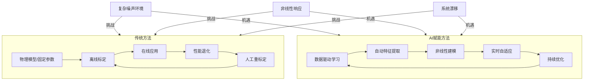

上图展示了传统方法与AI赋能方法在应对时幅修正挑战时的根本性差异。传统方法陷入"标定-应用-退化-重标定"的被动循环，而AI方法通过数据驱动的持续学习实现了主动适应和自主优化。

**本研究的核心问题意识**正是基于上述背景形成的：在传统时幅修正方法面临适应性瓶颈的现实约束下，AI算法能否以及如何为该领域带来实质性的性能提升？这一问题的回答需要系统性地分析现有方法的技术体系、梳理AI算法的应用范式、论证AI提升性能的具体路径、评估实施的可行性与挑战，并展望未来的发展方向。后续章节将依次围绕这些关键问题展开深入分析，为相关领域的研究人员与工程师提供具有理论深度和实践价值的决策参考。

## 2 现有电子学读出时幅修正方法的技术体系剖析

电子学读出系统中的时幅修正技术经过数十年的发展演进，已形成涵盖硬件实现与算法处理两大维度的完整技术体系。硬件层面通过精心设计的电路架构实现信号的精确采集与初步处理，算法层面则借助数学模型和信号处理方法完成修正计算与数据优化。本章将系统剖析这一技术体系的各个组成部分，深入分析其工作原理、性能特征与适用边界，揭示传统方法在面对复杂测量环境时的固有局限性，为后续AI方法的引入提供清晰的技术对照基准。

### 2.1 硬件层面的时幅修正技术架构

硬件实现构成了时幅修正技术体系的物理基础，其设计质量直接决定了后续算法处理的性能上限。现代电子学读出系统在硬件层面形成了以脉冲成形电路、ADC/TDC混合架构和前端读出电路为核心的技术架构。

**脉冲成形电路的设计原理与优化**

脉冲成形是信号处理电路中的基础技术环节，其核心功能在于使输出信号具有特定的波形特征以满足后续处理需求[^8]。在核电子学领域，一个优良的脉冲成形电路需要同时满足多重设计要求：**高计数率工况下需要较窄的波形以减少信号堆积效应，幅度分析时需要较平的信号顶部以降低弹道亏损，时间分析时需要较陡的信号边沿以确保定时准确性，同时还需要有效消除基线的偏移和涨落以减少对能量分辨率的影响**[^8]。

成形时间常数是描述脉冲信号成形过程的关键参数，通过调节该参数可优化信号处理系统的信噪比与分辨率[^9]。现代数字化多道谱仪已实现0.8-23μs范围内的精密调节，步进精度达0.2μs，并支持计算机自动优化功能[^9]。在中子能谱测量实验中，合理调节主放大器成形时间常数可优化信号输入输出比，能在保持能谱分辨率的前提下将计数损失控制在5%以内[^9]。研究表明，采用256点数字三角成形方法时，成形时间常数的选取直接影响Si-PIN半导体探测器信噪比，最佳参数组合可使能量分辨率提升15%[^9]。

然而，成形时间常数的优化高度依赖于对探测器输出特性和噪声环境的先验认知。在ASIC芯片设计中，成形时间常数被纳入极零相消电路和准高斯成形电路的拓扑结构优化，相关电路仿真显示参数偏差超过10%将导致信噪比下降2.5dB[^9]。这一敏感性特征揭示了固定参数成形电路在环境条件变化时面临的性能退化风险。

**ADC与TDC混合架构的协同工作机制**

模数转换器（ADC）和时间数字转换器（TDC）是电子学读出系统中实现模拟信号数字化的两类核心器件，二者的混合架构为时幅修正提供了关键的硬件基础。ADC的核心作用是把连续的模拟信号（如电压、温度、声音）转换成离散的数字信号，使数字设备能够进行处理[^10]。ADC的工作过程分为采样、保持、量化和编码四个关键步骤，每一步都不可或缺，共同实现模拟信号到数字信号的转换[^10]。

TDC则是实现高精度时间间隔测量的专用器件，采用全数字化集成电路设计，以信号通过内部门电路的传播延迟来进行高精度时间间隔测量[^11]。现代TDC产品可实现低于13ps的测量分辨率，并支持双极阈值以广泛兼容各种探测器或恒分数鉴别器[^11]。

ADC与TDC的组合应用使得脉冲细节和精确时间能够兼顾[^11]。一种创新的飞行时间质谱仪电子学读出方法将脉冲前沿时间测量与脉冲成形采样方案相结合，利用中低速ADC（约100 MSPS）对成形后的脉冲进行采样得到幅度信息，对TDC测得的前沿时间进行修正，既显著改善了时间分辨的效果，又提高了仪器的定量性能[^12]。该方案利用脉冲成形电路加中低速ADC取代昂贵的高速ADC（1 GSPS以上）芯片，利用直接的脉冲前沿甄别取代传统飞行时间质谱仪读出电子学中的恒比定时（CFD）电路，在提高性能的同时降低了仪器成本[^12]。

下表对比了不同ADC/TDC架构方案的技术特征：

| 架构方案 | 时间精度 | 幅度信息获取 | 硬件成本 | 适用场景 |
|---------|---------|-------------|---------|---------|
| 纯高速ADC波形采样 | 受采样率限制 | 完整波形信息 | 高（1GSPS以上） | 波形分析要求高 |
| 纯TDC脉冲计时 | 高（ps级） | 无幅度信息 | 中等 | 纯计时应用 |
| ADC+TDC混合架构 | 高（经幅度修正） | 幅度采样信息 | 较低（100MSPS级） | 时幅联合测量 |

**前端读出电路的信号调理策略**

前端读出电路是核电子学中极为重要的电路系统，其功能是读取来自核探测器的电荷信号，通过处理得到入射粒子的能量、时间和位置信息[^13]。粒子探测系统广泛应用于高能物理、核物理、深空探测等辐射检测领域，是粒子物理等基础学科研究的主要实验装置，同时普遍存在于核医学、交通安保等应用核技术的生产生活领域[^13]。

前端读出电路的设计需要综合考虑信号调理的多个环节，包括电荷灵敏前置放大、脉冲成形、基线恢复等。由于数字电路的发展，基于数字信号处理的读出电路能够更灵活地综合成各种最佳滤波器，从而达到最高的信噪比，得到更好的能量分辨率，而这些滤波器有些是很难或者不可能通过模拟电路实现的[^13]。

硬件层面时幅修正架构的**内在制约**主要体现在以下几个方面：首先，硬件参数一旦确定便难以动态调整，无法适应测量环境的变化；其次，模拟电路的性能受温度漂移和元器件老化影响，长期稳定性难以保证；再次，硬件设计的复杂度和成本限制了系统的灵活性和可扩展性。这些制约因素为后续引入软件算法和AI方法提供了明确的技术动机。

### 2.2 基于幅度信息的定时修正算法

基于幅度信息的定时修正是时幅修正技术体系中最为核心的算法环节，其理论基础源于信号幅度与定时精度之间存在的内在物理关联。

**时间游走效应的物理机制与补偿模型**

时间游走（time walk）效应是影响定时精度的主要系统性误差源之一。当采用固定阈值进行脉冲定时拾取时，不同幅度的脉冲到达相同阈值的时间存在系统性差异——大幅度脉冲较早触发阈值，小幅度脉冲较晚触发阈值，由此产生的定时误差即为时间游走。这一效应的物理机制与脉冲前沿的上升特性直接相关，其幅度依赖性可通过建立幅度-时间关联模型进行补偿。

传统的时间游走补偿方法主要包括两类技术路线：一是采用恒比定时（Constant Fraction Discrimination, CFD）电路，通过在脉冲幅度的固定比例处进行定时拾取，从原理上消除幅度依赖性；二是采用前沿甄别加幅度修正的方案，先获取前沿定时信息，再根据测得的幅度值通过查表或解析公式进行修正[^12]。

前沿甄别加幅度修正方案的优势在于实现简单、成本较低。如前所述，利用中低速ADC对成形后脉冲进行采样得到的幅度信息，可对TDC测得的前沿时间进行有效修正[^12]。这种方案取代了传统CFD电路的复杂模拟设计，在提高性能的同时降低了系统复杂度。

**幅度-时间关联曲线的标定方法**

幅度-时间关联曲线的准确标定是实现高精度定时修正的前提。标定过程通常需要在已知参考条件下，系统采集不同幅度脉冲的定时数据，建立幅度与定时偏差之间的映射关系。标定结果可以查找表或拟合函数的形式存储，供实时修正使用。

标定方法的有效性依赖于以下关键假设：系统响应特性在标定期间与实际测量期间保持一致；标定数据覆盖了实际测量可能遇到的全部幅度范围；关联曲线的函数形式能够准确描述真实的幅度-时间关系。当这些假设不能满足时，标定修正的精度将显著下降。

**传统修正算法的局限性**

传统基于幅度的定时修正算法存在以下固有局限：

- **对预设物理模型的依赖**：修正算法的设计基于对时间游走效应物理机制的理解，当实际系统存在未建模的复杂效应时，修正精度受限。

- **固定参数的适应性不足**：标定得到的关联曲线参数在系统特性发生漂移时无法自动更新，需要频繁重新标定。

- **大动态范围下的非线性挑战**：当信号幅度动态范围超过3-4个数量级时，简单的多项式或分段线性模型难以准确描述复杂的非线性关系。

- **系统漂移的累积效应**：温度变化、器件老化等因素导致的系统漂移会使标定参数逐渐失效，修正精度随时间下降。

### 2.3 数字滤波与脉冲成形技术

数字滤波成形技术是现代电子学读出系统中实现高精度时幅测量的核心算法手段，其优势在于能够灵活实现各种最优滤波器设计，突破模拟电路的物理限制。

**梯形滤波器的理论基础与最优性**

梯形滤波成形算法是将输入的阶跃信号或指数衰减信号成形为梯形脉冲输出的数字信号处理方法[^13]。当只考虑电压噪声和电流噪声，且探测器电荷的收集时间不为零时，已经证明梯形滤波器是最优滤波器，并且适合用数字方法实现[^13]。

数字梯形滤波器的原理是将指数衰减的输入信号转换为梯形脉冲，其关键参数包括：输入指数信号的衰减时间常数（由前放反馈回路的值或实验预先确定）、梯形的上升沿宽度（由噪声特性确定，需根据不同噪声环境调整）、平顶宽度（取决于探测器的电荷收集时间）[^13]。

梯形滤波器的数字实现通常将整体传递函数分解为多个子模块级联，以降低系统设计的复杂度[^13]。这种模块化设计方法的优势在于：对整个滤波器采用单一结构形式实现需要的运算资源太多，很难找到最优结构，而采用简单子模块并联或级联的方法可以更有效地实现复杂滤波器[^13]。

**FIR与IIR滤波器的性能权衡**

有限冲激响应（FIR）滤波器和无限冲激响应（IIR）滤波器是数字滤波的两类基本架构，各具特色的性能特征决定了其在时幅修正中的不同适用场景。

FIR滤波器最大的优点是**线性相位特性**——不同频率的信号通过后延迟一致，不会产生波形畸变[^14]。这一特性对于需要保持信号波形完整性的应用（如生物电信号处理）尤为关键。FIR滤波器的数学表达直观清晰：当前输出等于当前输入加上过去若干个输入的加权平均，没有反馈，全靠"记忆"过去的输入值来做加权[^14]。FIR滤波器的优势包括：绝对稳定（无反馈设计）、可设计出完美的线性相位、易于并行优化（在DSP/FPGA上运行高效）[^14]。

然而，FIR滤波器的缺点同样明显：要实现陡峭的截止特性需要堆叠阶数，32阶可能不够，64阶起步都不稀奇；每次计算要做几十次乘累加运算，对资源受限的MCU压力较大；高阶意味着大延迟，在实时控制场景中可能影响系统响应[^14]。

IIR滤波器通过引入反馈结构，可以用较低的阶数实现陡峭的频率响应，计算效率更高。但其代价是：存在稳定性风险（不当设计可能导致振荡）、相位特性非线性（可能造成波形畸变）、对量化误差更敏感。

下表对比了两类滤波器的关键性能特征：

| 性能维度 | FIR滤波器 | IIR滤波器 |
|---------|----------|----------|
| 稳定性 | 绝对稳定 | 需要设计保证 |
| 相位特性 | 可实现线性相位 | 非线性相位 |
| 实现阶数 | 较高（陡峭响应） | 较低 |
| 计算复杂度 | 高（大量MAC运算） | 低 |
| 延迟特性 | 固定延迟（与阶数相关） | 较小延迟 |
| 并行优化 | 易于优化 | 较难优化 |

**滤波器结构设计的工程考量**

滤波器的结构设计是将线性常系数差分方程描述的系统用加法、乘以系数和延迟等基本运算模块的互联所组成的结构来表示[^13]。不同的结构不仅需要的资源不同，更重要的是在数值精度有限时，它们在性能上可能有很大差异[^13]。

多个子模块级联存在级联顺序的问题。一般来说，要求出最佳配对和级联次序是很难的，但可以通过遵循一些简单规则获得较好结果，这些规则主要是为了避免具有高峰值增益的子系统，因为它们可能引起溢出并可能把量化噪声扩大[^13]。

**固定参数滤波器的适应性局限**

尽管数字滤波成形技术在理论上具有最优性，但固定参数设计在实际应用中面临显著的适应性挑战。成形时间常数的最优选择依赖于噪声特性，而噪声特性可能随环境条件和系统状态动态变化[^9]。当噪声环境发生变化时，原本最优的滤波参数可能不再最优，甚至导致性能显著下降。

此外，滤波器设计通常假设噪声具有已知的统计特性（如高斯白噪声或特定功率谱密度的有色噪声），这一假设在复杂实际环境中往往难以满足。非平稳噪声、突发干扰、多源混合噪声等复杂情况都可能使固定参数滤波器的性能偏离设计预期。

### 2.4 噪声抑制与野值处理技术

噪声抑制与野值处理是确保时幅修正数据质量的重要技术环节。真实世界的测量环境从来不是理想实验室，信号从源头到处理器的路上要穿越电磁干扰、电源抖动、热噪声甚至环境扰动的"伏击"[^14]。有效的噪声抑制技术是保障测量精度的基础。

**软件滤波方法体系**

软件滤波是利用CPU强大的计算运算功能，通过某种数值运算达到改变输入信号中所含频率分量的相对比例、或滤除某些频率分量的目的[^15]。实验中往往会因为噪声、干扰、温度、环境以及元器件或设备等诸多因素的影响，造成采集到的数据达不到预期效果，例如采集到的"坏点"数据会对数据分析以及结果造成不利影响[^15]。

相比硬件滤波，软件滤波具有独特的优势：设置灵活，可以方便调整频带；在应对复杂噪声信号时，甚至可以引入算法自动跟随噪声频率[^15]。但软件滤波也有缺点：需要消耗大量CPU能力进行运算，系统能够处理的信号带宽直接受ADC采样速率和CPU处理速度的限制，无法像硬件滤波器那样轻易设计出高频段的滤波器[^15]。

常用的软件滤波方法包括[^15]：

- **限幅滤波**：设定允许的最大变化幅度，超出范围的采样值被认为是野值而被剔除或替换。适用于抑制突发性毛刺干扰，但可能误删真实的快速变化信号。

- **中值滤波**：取连续多次采样的中间值作为有效值，能有效抑制脉冲型噪声，但会引入一定的信号延迟。

- **算术平均滤波**：对多次采样取平均值，可有效抑制随机噪声，但会降低系统对快速变化信号的响应速度。

- **递推平均滤波**：采用滑动窗口的平均计算方式，兼顾平滑效果和响应速度，但需要合理选择窗口长度。

**不同噪声类型的处理效果**

为直观评估各类滤波方法的效果，可以构造包含多种噪声特征的测试信号进行分析[^15]。典型的测试场景包括：

- **随机噪声叠加**：模拟系统底噪对信号的干扰，算术平均和递推平均滤波效果较好。

- **毛刺噪声**：模拟瞬态干扰或开关噪声，限幅滤波和中值滤波更为有效。

- **周期性干扰**：模拟工频干扰或开关电源纹波，需要针对性设计陷波滤波器。

- **长周期纹波**：模拟DC-DC类应用中的输出纹波，需要低通滤波或专门的纹波抑制算法。

不同滤波方法应用的场合和环境各异，应根据具体情况选择使用[^15]。这一经验性的方法选择过程正是传统技术的典型特征——依赖工程师对信号和噪声特性的先验判断。

**传统噪声处理方法的根本性局限**

传统噪声抑制方法存在以下根本性局限：

- **依赖先验噪声模型假设**：各类滤波方法的设计和参数选择都基于对噪声特性的假设，当实际噪声偏离假设时，处理效果难以保证。

- **难以自适应处理非平稳噪声**：固定参数的滤波器无法跟踪噪声特性的动态变化，在非平稳噪声环境下性能退化。

- **信号与噪声的分离困难**：当信号和噪声在频域或时域存在重叠时，传统方法难以实现有效分离，往往在抑制噪声的同时损失有用信号信息。

- **多类型噪声的协同处理挑战**：实际环境中往往同时存在多种类型的噪声，单一滤波方法难以兼顾，而多种方法的级联又可能带来累积的信号畸变。

### 2.5 现有方法的性能边界与系统性局限

综合前述各节的分析，现有时幅修正技术体系虽然在各自适用范围内表现出色，但在面对现代高精度测量系统的复杂需求时，暴露出系统性的性能边界与固有局限。

**非线性响应建模能力的边界**

传统方法在处理非线性响应时主要依赖以下技术路线：基于物理机制的解析建模、多项式或分段线性拟合、查表插值等。这些方法的共同特点是需要预先假设非线性关系的函数形式，当实际系统的非线性特性超出预设模型的描述能力时，修正精度将显著下降。

特别是在宽动态范围应用中，探测器和读出电路的非线性效应往往呈现高度复杂性，包括饱和效应、迟滞效应、交叉耦合等多种机制相互叠加。传统的低阶多项式拟合或分段线性化方法难以准确刻画这些复杂关系，导致在极端工况下的修正精度受限。

**非平稳信号处理能力的边界**

现有数字滤波和噪声处理方法大多基于平稳信号假设进行设计，即假设信号和噪声的统计特性在分析时间窗口内保持不变。然而，实际测量环境中的信号往往呈现显著的非平稳特征：探测器响应特性随温度和辐照剂量变化、环境干扰的强度和频谱随时间波动、系统参数因器件老化而漂移等。

固定参数的滤波器无法跟踪这些动态变化，其性能在非平稳条件下会逐渐偏离设计最优点。虽然自适应滤波技术在一定程度上缓解了这一问题，但传统自适应算法（如LMS、RLS等）的收敛速度和跟踪能力仍然受到理论限制，难以应对快速变化或突变的信号环境。

**未知扰动应对能力的边界**

传统修正方法的设计通常基于对已知扰动源的分析和建模，对于预期之外的未知扰动缺乏有效的应对机制。信号处理电路的一个重要作用就是利用滤波提高信噪比，从前置放大器输出的信号往往夹杂着噪声和干扰，信号通常具有确知的形状，而噪声却是随机变化的[^8]。

当出现未预期的干扰类型或干扰强度超出设计裕量时，传统方法可能完全失效。例如，针对高斯白噪声设计的最优滤波器在面对脉冲型干扰时可能表现不佳，甚至可能将干扰误判为有效信号。这种对未知扰动的脆弱性是传统方法的根本性局限。

**长期稳定性维持能力的边界**

传统时幅修正方法本质上采用"离线标定、在线应用"的工作模式，标定参数在获取后被视为固定常数使用。然而，实际系统的特性会因多种因素而发生漂移：

- **温度效应**：电子元器件的增益、偏置、响应速度等参数随温度变化，导致标定曲线偏移。

- **器件老化**：探测器和电路元件的性能随使用时间逐渐退化，表现为灵敏度下降、噪声增加、非线性加剧等。

- **辐射损伤**：在高辐射环境中工作的探测器会累积辐射损伤，导致响应特性发生不可逆变化。

- **环境变化**：电磁环境、电源质量、机械振动等外部条件的变化都可能影响系统性能。

传统方法应对这些漂移的唯一手段是定期重新标定，这不仅增加了维护成本和系统停机时间，而且在标定间隔期内无法保证最优性能。对于需要长期无人值守运行的应用场景，这一局限尤为突出。

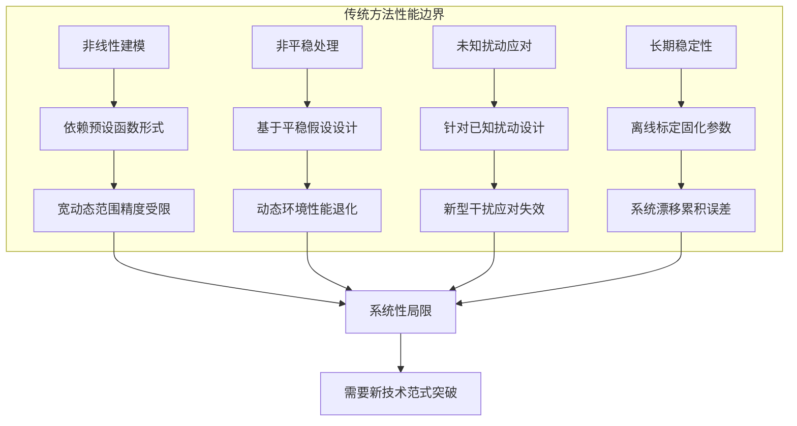

**传统方法的共性技术瓶颈总结**

综合上述分析，现有时幅修正技术体系的共性局限可归纳为以下几点：

1. **模型假设简化**：为实现解析求解或降低计算复杂度，传统方法不得不对系统特性和噪声环境做出简化假设，这些假设在复杂实际环境中往往难以成立。

2. **参数固化设计**：滤波器系数、修正曲线参数等关键设置在设计或标定后保持固定，缺乏根据实际工况动态调整的能力。

3. **离线标定依赖**：修正精度的维持依赖于周期性的重新标定，无法实现真正的自主维护和持续优化。

4. **专家经验依赖**：方法选择、参数调优等关键决策高度依赖工程师的领域经验和反复试验，难以系统化、自动化。

这些共性局限揭示了传统方法在满足现代高精度测量系统对**自适应性、智能化、自主化**修正需求方面的根本性技术瓶颈。正是这些瓶颈的存在，为引入具有数据驱动学习能力、复杂模式识别能力和动态自适应能力的AI方法提供了明确的问题导向和技术动机。后续章节将系统探讨AI算法如何针对这些局限提供突破性的解决方案。

## 3 AI算法在信号处理与数据修正领域的应用范式与案例

人工智能算法在信号处理与数据修正领域的应用已从理论探索逐步走向工程实践，形成了涵盖监督学习、无监督学习、深度学习和集成学习的完整技术范式体系。这些AI方法凭借其强大的数据驱动学习能力、复杂模式识别能力和自适应优化能力，在传感器数据校正、噪声抑制、故障诊断、时序校准等与时幅修正高度相关的领域取得了显著成效。本章将系统梳理各类AI算法的技术特征与应用模式，通过归纳相关领域的成功案例，为AI赋能电子学读出时幅修正提供方法论基础和实践参考。

### 3.1 监督学习范式：误差预测与噪声分类的核心方法

监督学习作为机器学习的基础范式，通过从带标签的训练数据中学习输入与输出之间的映射关系，在系统误差预测、参数补偿和信号分类等任务中展现出独特优势。其核心思想是利用已知的"正确答案"指导模型学习，使模型能够对新的未知输入做出准确预测。

**回归模型在误差预测与补偿中的应用**

回归分析是监督学习中用于建立连续数值预测模型的核心方法，其基本原理是通过学习输入变量与输出变量之间的函数关系，实现对目标量的精确估计。线性回归作为最基础的回归方法，通过建立变量间的线性关系实现预测。**线性回归显示了某些变量之间的关系，假设有足够的高质量数据，这些关系可以基于输入数据预测结果**[^16]。

在传感器数据修正领域，回归模型被广泛应用于系统误差的建模与补偿。**ADC校正算法通过建立Y=KX+b数学模型，利用精准电源信号计算增益系数K和偏移量b，可将采样误差从超过15%降至接近实际值**[^17]。这一案例直观展示了线性回归在消除系统性偏差方面的有效性——通过对标定数据的拟合，建立输入信号与ADC输出之间的精确映射关系，从而在实际测量中对采样值进行实时校正。

然而，当系统响应呈现复杂的非线性特征时，简单的线性模型难以满足精度要求。此时需要引入多项式回归或更复杂的非线性回归方法。**有时数据也可能不在一条直线上，在这种情况下，回归算法将不起作用，但可以使用一个更复杂的版本，叫做多项式回归**[^16]。多项式回归通过引入高次项扩展模型的表达能力，能够拟合更复杂的非线性关系，但也面临过拟合风险和参数选择困难等问题。

回归模型的预测精度可通过R-平方（决定系数）等指标进行量化评估。**R-平方的范围从0到1，值越接近1，拟合越好**[^16]。这一指标反映了模型对数据变异的解释程度，为模型选择和优化提供了客观依据。

**神经网络分类器在噪声识别中的应用**

除回归任务外，监督学习在信号分类和噪声类型识别方面同样发挥重要作用。神经网络作为强大的非线性分类器，能够学习复杂的决策边界，实现对不同类型噪声或信号状态的准确识别。

**神经网络是一种计算模型，受到生物神经系统的启发，由大量的神经元（节点）组成，这些神经元通过连接权重相互连接。神经网络可以通过训练数据学习这些权重，从而实现对特定任务的优化**[^18]。在噪声分类任务中，神经网络通过学习不同噪声类型的特征模式，能够自动识别当前信号中存在的噪声类型，为后续针对性的噪声抑制提供决策支持。

在时序校准领域，基于机器学习的方法已被成功应用于解决布局布线工具和时序签核工具之间的时序分析差异问题。**研究分别采用Lasso线性回归、BP神经网络、随机森林算法完成寄生参数预测模型的训练、测试及对比**[^19]。实验结果表明，机器学习方法能够有效减少不同工具间的时序分析差异，提高设计流程的效率和可靠性。

**监督学习的优势与局限**

监督学习在时幅修正相关任务中的主要优势包括：

- **精确的输入-输出映射**：通过大量标注数据的学习，能够建立高精度的预测模型
- **明确的优化目标**：损失函数的定义使模型训练具有清晰的优化方向
- **成熟的理论基础**：回归和分类方法具有完善的数学理论支撑，模型行为可分析

然而，监督学习也存在固有局限：

- **对标注数据的依赖**：需要大量高质量的标注样本，数据获取成本可能较高
- **泛化能力受限**：模型性能高度依赖训练数据的代表性，对分布外样本的泛化能力有限
- **静态模型假设**：训练完成后模型参数固定，难以适应系统特性的动态变化

### 3.2 无监督学习范式：异常检测与特征提取的自主发现机制

无监督学习是指在没有标签数据的情况下，通过模型自动学习数据的结构和模式，以发现数据中的潜在规律或异常。**在故障诊断中，无监督学习特别适用于那些难以获取标签数据的场景，例如设备的正常运行状态和故障状态之间的界限不明确，或者故障类型多种多样且难以穷尽**[^20]。这一特性使无监督学习在电子学读出系统的异常检测和特征发现中具有独特价值。

**聚类算法在信号模式识别中的应用**

聚类算法是无监督学习中最常用的方法之一，其核心思想是将数据点分组到不同的簇中，使得同一簇内的数据点尽可能相似，而不同簇之间的数据点尽可能不同。**在故障诊断中，聚类算法可以用于识别设备的正常运行状态和故障状态，以及不同故障类型之间的区别**[^20]。

K-means算法是最经典的聚类方法之一。**K-means算法是一种基于距离的聚类方法，通过迭代过程将数据点分到K个簇中**[^20]。其工作原理包括四个步骤：首先随机选择K个数据点作为初始簇中心；然后将每个数据点分配到最近的簇中心；接着重新计算每个簇的中心；最后重复分配和更新步骤，直到簇中心不再发生变化或达到最大迭代次数。

在实际应用中，K-means算法可用于对设备运行状态数据进行聚类分析。例如，对包含温度、电流、电压等特征的设备运行数据进行聚类，可以自动识别出不同的运行状态模式，为异常检测提供基础[^20]。

除K-means外，DBSCAN（基于密度的空间聚类）和层次聚类等算法在处理不同形状的数据分布时各有优势。DBSCAN能够发现任意形状的簇，并自动识别噪声点，特别适合于存在离群值的数据集；层次聚类则通过构建树状结构揭示数据的层次关系，便于分析不同粒度的聚类结果。

**降维算法在特征压缩中的应用**

高维信号数据的处理是电子学读出系统面临的常见挑战。**降维算法通过降低数据的维度，发现数据的主要特征，简化问题的复杂度**[^20]。主成分分析（PCA）作为经典的线性降维方法，通过找到数据方差最大的方向，将高维数据投影到低维空间，同时保留最重要的信息。

自编码器作为一种基于神经网络的非线性降维方法，能够学习数据的压缩表示。通过编码器将输入压缩为低维隐层表示，再通过解码器重构原始输入，自编码器可以捕捉数据中的非线性结构，实现比PCA更强的特征提取能力。

**异常检测算法在野值识别中的应用**

**异常检测算法通过识别数据中的异常点，发现潜在的故障**[^20]。在电子学读出系统中，异常检测可用于识别传感器数据中的野值、探测器响应的异常变化、以及系统状态的突变等。

**由于卡车存在不同的工作状态和设计变体，使用统计方法或专家知识进行手动分析变得不可能。更困难的是，在大多数情况下，这些数据没有标签，只有带有零星错误案例的正常行为数据可供使用。聚类、无监督学习、单类分类和异常检测方法显得很有前景**[^21]。这一观察同样适用于电子学读出系统——面对多样化的工作条件和复杂的故障模式，无监督异常检测提供了一种无需预先定义故障类型即可发现异常的有效途径。

**无监督学习在时幅修正中的潜在价值**

无监督学习方法在时幅修正领域的潜在应用价值体现在：

| 应用场景 | 无监督方法 | 技术价值 |
|---------|----------|---------|
| 信号状态聚类 | K-means、DBSCAN | 自动识别不同工作模式，支持自适应修正策略选择 |
| 特征降维 | PCA、自编码器 | 压缩高维波形数据，提取关键修正特征 |
| 野值检测 | 单类分类、孤立森林 | 实时识别异常数据点，提高数据质量 |
| 漂移监测 | 变化点检测 | 发现系统特性变化，触发重标定或自适应调整 |

无监督学习的核心优势在于**无需标签数据即可发现数据中的潜在规律**，这对于难以获取大量标注样本的电子学读出系统尤为重要。然而，无监督方法也面临结果解释困难、聚类数目选择等挑战，需要与领域知识结合使用。

### 3.3 深度学习范式：复杂波形特征与时序依赖的端到端建模

深度学习作为机器学习的重要分支，通过构建多层神经网络结构，能够自动学习数据的层次化特征表示，在处理复杂信号和实现端到端优化方面展现出强大能力。**深度神经网络（Deep Neural Network, DNN）是前馈神经网络的扩展，包含多个隐藏层。DNN能够学习更复杂的特征表示，从而在许多任务中取得更好的性能**[^18]。

**卷积神经网络在波形特征提取中的应用**

卷积神经网络（CNN）通过卷积运算实现对输入数据的局部特征提取，特别适合于处理具有空间或时间结构的信号数据。**卷积神经网络的中心思想就是提取图像中我们认为重要的部分，将他放大，而不是一股脑的整张图片全有用**[^22]。这一思想同样适用于电子学信号处理——通过学习信号波形中的关键特征模式，CNN能够实现对时幅信息的高效提取和修正。

在图像超分辨率重建领域，基于深度学习的方法已取得显著突破。**单幅图像超分辨率（Single image super-resolution, SISR）重建是根据一张低分辨率图像恢复出高分辨率图像的过程**[^23]。这一技术的核心是通过深度网络学习低分辨率输入与高分辨率输出之间的非线性映射关系，实现信号质量的提升。类似的技术思路可以迁移到电子学信号的分辨率增强和细节恢复中。

**高斯卷积核**作为一种特殊的卷积核设计，采用中心权值大、边缘权值小的方法，**能够有效抑制噪声，实现图像平滑，同时高斯卷积核亦可以堆叠和分解，可用于减少卷积计算的复杂度**[^22]。这种设计理念为深度网络中的卷积层设计提供了参考——通过合理设计卷积核的权值分布，可以实现噪声抑制与特征保留的平衡。

**循环神经网络在时间序列建模中的应用**

循环神经网络（RNN）及其变体长短期记忆网络（LSTM）专门设计用于处理序列数据，能够捕捉信号中的时间依赖关系。在电子学读出系统中，信号往往呈现明显的时序特征，RNN/LSTM为建模这种时序依赖提供了有效工具。

在脑电图（EEG）降噪应用中，**LSTM架构被选用是因为它能够从时间序列中学习特征**[^24]。研究采用包含LSTM层、Dropout层和全连接层的网络结构，通过训练使模型学习从噪声EEG信号中恢复干净信号的映射关系。实验表明，**使用时频特征特别是在信噪比（SNR）较低时可以提高性能**[^24]，这一发现对于电子学信号的噪声抑制具有重要参考价值。

**深度自编码器在信号降噪中的应用**

自编码器通过无监督学习的方式，让网络学习如何从噪声数据中重构出接近原始数据的信息。**神经网络降噪的基本思路是利用神经网络学习数据中的复杂模式，并通过训练使得网络能够识别并消除噪声**[^25]。这个过程通常包含两个步骤：一是使用有噪声的数据训练网络，使网络学习到噪声的特性；二是使用同样的网络结构对新的噪声数据进行降噪处理。

深度卷积神经网络和自编码器是两种常用的神经网络降噪方法。**深度卷积神经网络通过学习从原始信号到其表示的映射，能够有效地提取出信号中的关键信息，而忽略噪声部分**[^25]。然而，这些方法也存在各自的局限性：深度卷积神经网络对于复杂和非线性的噪声模式可能无法取得理想的效果，而自编码器对于大规模数据的处理能力有限[^25]。

**神经网络在噪声抑制中的技术优势**

**传统的噪声抑制方法，如滤波器设计和频域处理，虽然在某些情况下能够取得较好的效果，但它们往往需要人工选择参数，且对复杂噪声环境的适应性较差。近年来，神经网络在噪声抑制中展现出强大的能力，能够自适应地学习噪声特征，从而在不同噪声环境下实现更有效的抑制**[^18]。

神经网络噪声抑制的技术优势体现在：

- **自适应特征学习**：无需人工设计滤波器参数，自动从数据中学习最优的噪声抑制策略
- **复杂噪声处理能力**：能够处理非平稳、非高斯等复杂噪声类型
- **端到端优化**：直接从原始信号到降噪输出的映射学习，避免多步骤处理的误差累积

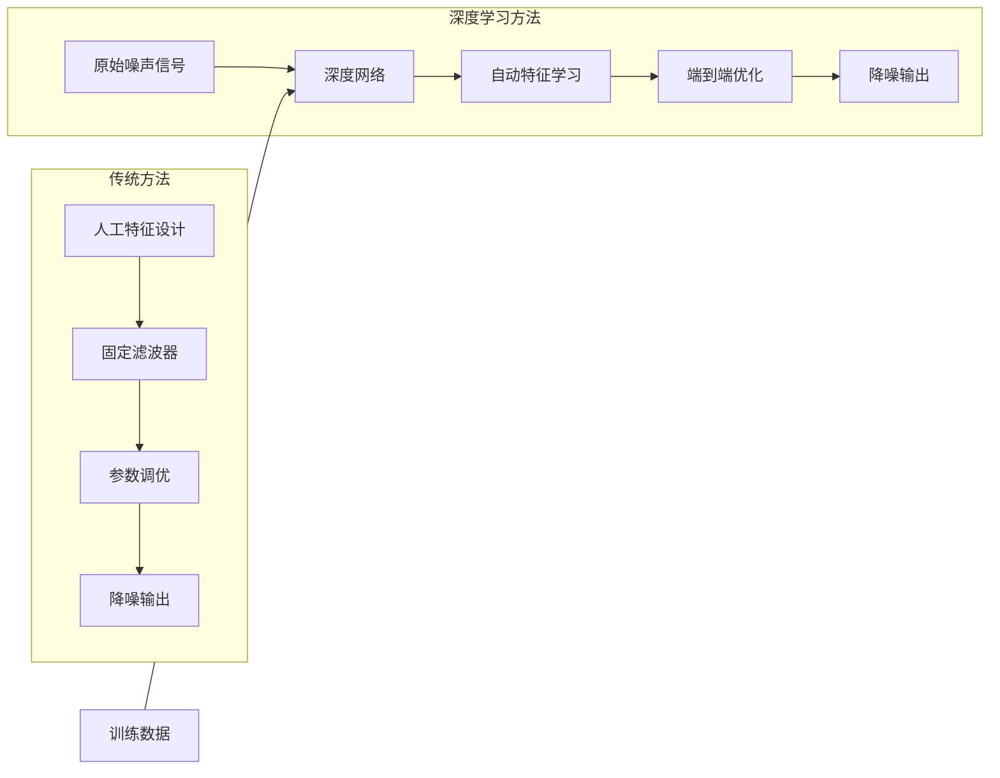

**神经网络加噪与降噪的辩证关系**

值得注意的是，神经网络中的噪声并非总是负面因素。**在神经网络中引入噪声，通常被视为一种提高模型鲁棒性和泛化能力的有效方法**[^25]。噪声的引入可以使神经网络对输入的小幅度扰动更加不敏感，这是因为噪声的随机性能够使得网络在训练过程中探索更多的解空间，而不仅仅局限于某个特定的最优解。这种随机性也使得网络不容易陷入过拟合的状态，从而提高了模型的泛化能力[^25]。

在具体实现上，常见的方法包括在网络的激活函数中加入随机项、在每次前向传播时对输入数据添加一定程度的随机噪声、以及使用Dropout策略在训练过程中随机忽略一部分神经元[^25]。这些技术为设计鲁棒的时幅修正模型提供了重要参考。

### 3.4 集成学习与混合架构：多模型协同与差异性融合策略

集成学习通过组合多个基学习器的预测结果，能够获得比单一模型更好的泛化性能和鲁棒性。在信号处理和数据修正领域，集成学习方法为提升模型可靠性提供了有效途径。

**决策树与集成方法的应用**

决策树作为一种直观的机器学习方法，在信号分类和故障诊断中得到广泛应用。**决策树有明显的优点：它们易于理解，可以很好地处理大型数据集，并提供模型的透明性**[^16]。然而，决策树也存在缺点：**首先是错误传播，如果其中一个分裂被证明是错误的，那么这个错误会影响到模型的其余部分；其次，随着决策树的增长，会有大量的算法，从而带来更高的复杂度，这最终可能导致模型的性能降低**[^16]。

随机森林作为决策树的集成方法，通过构建多棵决策树并综合其预测结果，有效克服了单棵决策树的过拟合问题。在时序校准应用中，**研究分别采用Lasso线性回归、BP神经网络、随机森林算法完成寄生参数预测模型的训练、测试及对比**[^19]，实验结果表明随机森林在处理复杂非线性关系时表现出色。

**差异性神经网络集成的创新机制**

神经网络集成是提升模型性能的重要技术手段。**神经网络集成领域采用目标数据修正的差异性学习方法，通过gupdate=25参数设置控制误差相关度**[^26]。这一方法的核心思想是通过调整集成成员之间的差异性，使得不同网络能够捕捉数据的不同方面，从而在集成时实现互补。

差异性学习方法的技术要点包括：

- **误差相关度控制**：通过调整训练目标或数据扰动，控制集成成员之间预测误差的相关性
- **多样性与准确性平衡**：在保证单个模型准确性的同时，最大化集成成员之间的多样性
- **自适应权重分配**：根据不同成员在特定输入上的表现，动态调整其在集成预测中的权重

**混合架构的技术优势**

将AI方法与传统信号处理技术相结合的混合架构，能够充分发挥两者的优势。**传统的噪声抵消方法，如维纳滤波、卡尔曼滤波等，虽然在一定程度上能够对噪声进行抑制，但它们往往依赖于对信号和噪声的先验知识，即需要预先知道信号和噪声的统计特性等信息**[^27]。而神经网络能够通过对大量数据的学习，自动提取信号中的特征信息，无需预先了解信号和噪声的具体特性，就可以实现对噪声的有效抵消[^27]。

**将神经网络应用于自适应噪声抵消领域，不仅能够克服传统方法的局限性，提高噪声抵消的效果和精度，还能够为信号处理技术带来新的突破和发展**[^27]。混合架构的设计思路包括：

- **物理模型+数据驱动**：利用物理模型提供先验约束，数据驱动方法学习残差修正
- **传统滤波+神经网络**：传统滤波器处理已知类型噪声，神经网络处理复杂未知干扰
- **特征工程+深度学习**：结合领域知识的特征工程与深度网络的自动特征学习

下表对比了不同集成与混合架构的技术特征：

| 架构类型 | 核心机制 | 主要优势 | 适用场景 |
|---------|---------|---------|---------|
| 随机森林 | 多决策树投票 | 鲁棒性强、可解释 | 中等复杂度分类/回归 |
| 梯度提升 | 序列化误差修正 | 高精度、特征重要性分析 | 结构化数据预测 |
| 神经网络集成 | 差异性学习融合 | 泛化能力强 | 复杂非线性建模 |
| 混合架构 | AI+传统方法结合 | 兼顾先验知识与数据驱动 | 有领域约束的应用 |

### 3.5 典型应用案例综合分析与方法适配性评估

基于前述各节对AI算法范式的系统梳理，本节将综合分析AI方法在与时幅修正高度相关的典型领域中的成功应用案例，并从多维度评估不同方法对时幅修正任务的适配程度。

**传感器非线性误差修正案例**

传感器非线性误差修正是AI方法应用最为成熟的领域之一。**传感器非线性误差修正方面，基于镜像原理结合最小二乘法拟合，可使霍尔式位移传感器的非线性误差从6.79%降低至0.02%**[^17]。这一案例展示了数学建模方法在传感器校正中的显著效果，而AI方法能够进一步提升对复杂非线性关系的建模能力。

**修正算法的核心目标是使测量结果尽可能体现真实性能**[^17]。在传感器校正中，修正系数是指在数据计算、公式表达等由于理想和现实产生偏差时，为了使其尽可能体现真实性能而加的系数。AI方法能够自动学习这些修正系数，无需人工设计修正公式的函数形式。

**自适应噪声抵消案例**

**基于神经网络的自适应噪声抵消技术在通信、音频、图像、生物医学等众多领域都发挥着不可或缺的作用**[^27]。以通信系统为例，噪声干扰可能会使语音通话出现杂音、卡顿；在图像传输中，噪声可能会使图像出现斑点、模糊；在生物医学信号处理中，噪声干扰可能会导致对生理参数的误判[^27]。

神经网络自适应噪声抵消的技术优势在于：**神经网络能够通过对大量数据的学习，自动提取信号中的特征信息，无需预先了解信号和噪声的具体特性，就可以实现对噪声的有效抵消。其独特的结构和算法，使其能够适应各种复杂的噪声环境，具有很强的鲁棒性和适应性**[^27]。

在脑电图降噪的具体实现中，**LSTM网络通过学习从噪声EEG信号到干净EEG信号的映射关系，实现对EOG伪迹的有效去除**[^24]。训练参数设置包括最大迭代次数（maxEpochs=5）、批大小（miniBatchSize=150）、初始学习率（0.005）和梯度阈值（1）等，这些参数的选择对模型性能有重要影响。

**故障诊断与状态监测案例**

**无监督学习方法可以有效地识别出设备运行中的异常行为，为后续的故障诊断提供重要参考**[^20]。在智能车辆传感器数据异常检测中，**针对多工况、多设计变体导致的传统统计与专家分析失效问题，探索无监督深度学习在无标签数据下的应用潜力**[^21]。研究分析了聚类、单类分类等方法的优劣，揭示了数据稀疏性、类不平衡性等挑战，并提出融合时空特征的深度异常检测框架[^21]。

**时序校准案例**

在芯片物理设计领域，**针对布局布线工具和时序签核工具的时序分析差异，导致的迭代次数多、时序收敛困难的问题，提出一种基于机器学习的快速时序校准方法**[^19]。该方法基于55nm工艺，利用开源设计收集数据样本，通过机器学习模型预测寄生参数，从而减少工具间的时序分析差异。实验结果表明，该方法可有效提高设计流程的效率[^19]。

**方法适配性多维度评估**

基于上述案例分析，下表从数据需求、计算复杂度、实时性、可解释性等维度评估不同AI范式对时幅修正任务的适配程度：

| 评估维度 | 监督学习 | 无监督学习 | 深度学习 | 集成学习 |
|---------|---------|----------|---------|---------|
| **数据需求** | 需要标注数据 | 无需标注 | 大量数据 | 中等数据量 |
| **计算复杂度** | 低-中 | 低-中 | 高 | 中 |
| **实时性** | 好 | 好 | 需优化 | 中等 |
| **可解释性** | 较好 | 中等 | 较差 | 较好 |
| **非线性建模** | 有限 | 有限 | 强 | 中等 |
| **自适应能力** | 弱 | 中 | 强 | 中 |
| **适用场景** | 系统误差补偿 | 异常检测 | 复杂信号处理 | 鲁棒性要求高 |

**综合适配性分析**

针对电子学读出时幅修正的具体需求，不同AI范式的适配性可总结如下：

1. **监督学习**最适合于系统性误差的建模与补偿，特别是当存在明确的输入-输出对应关系且可获取标定数据时。其计算效率高、实时性好，适合嵌入式系统部署。

2. **无监督学习**在缺乏标注数据的场景下具有独特价值，特别适合于异常检测、状态监测和特征发现任务。可作为数据质量监控和自适应触发机制的技术基础。

3. **深度学习**在处理复杂非线性关系和实现端到端优化方面具有最强能力，但计算资源需求较高，需要针对实时性要求进行模型轻量化设计。

4. **集成学习与混合架构**通过多模型协同和AI-传统方法融合，能够在保证性能的同时提高系统的鲁棒性和可靠性，是工程实践中的推荐方案。

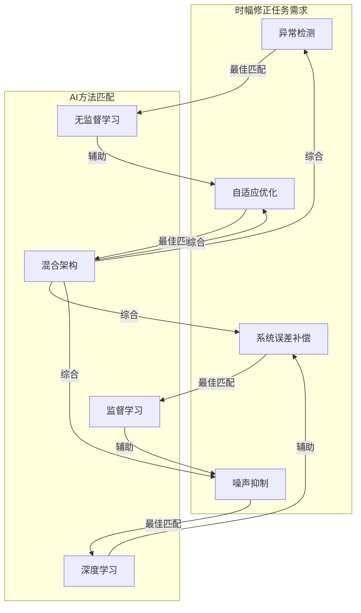

综上所述，AI算法在信号处理与数据修正领域已形成了完整的技术范式体系，各类方法在不同应用场景中展现出显著优势。这些成功案例和技术经验为AI赋能电子学读出时幅修正提供了坚实的方法论基础。后续章节将进一步深入分析AI算法提升时幅修正性能的具体技术路径与实现机理。

## 4 AI算法提升时幅修正性能的潜在路径与机理分析

基于前述章节对传统时幅修正方法技术瓶颈的深入剖析以及AI算法在信号处理领域成功应用案例的系统梳理，本章将聚焦于论证AI算法提升电子学读出时幅修正性能的具体技术路径与作用机理。研究将从智能噪声建模与滤除、高精度误差预测与补偿、自适应参数优化、端到端系统辨识与校正四个核心维度展开深入分析，揭示AI方法如何从原理层面突破传统技术的固有局限，并通过与传统方法的系统性对比，为后续工程实践提供理论指导。

### 4.1 智能噪声建模与自适应滤除机理

噪声抑制是时幅修正技术体系中保障数据质量的基础环节。传统方法在面对复杂噪声环境时暴露出的适应性不足问题，恰恰是AI算法能够发挥核心优势的关键领域。**AI降噪技术的突破性在于构建了动态适应机制**，通过深度学习模型对噪声特征的自主学习与实时追踪，实现了从"被动滤波"向"主动识别"的技术范式转变[^28]。

**非稳态噪声的技术挑战与AI破局路径**

非稳态噪声因其时间维度上的剧烈波动特性，长期困扰着电子学信号处理领域。这类噪声的**频谱分布、强度变化、出现规律均呈现高度不确定性**，例如交通环境中的车辆鸣笛、施工场地的机械冲击声、会议场景中的突发咳嗽等，其统计特征随时间快速改变[^28]。实验数据表明，在非稳态噪声场景下，**传统方法（如谱减法、维纳滤波）的信噪比提升通常不超过5dB，且易引入音乐噪声等二次失真**[^28]。这一局限性的根本原因在于传统方法依赖静态阈值或固定滤波器设计，无法适应噪声参数的动态变化。

AI降噪技术通过构建能够捕捉非稳态噪声时空特征的深度学习模型，从原理上突破了这一瓶颈。其核心技术架构可从以下三个层面理解：

**第一层面：卷积神经网络的时空特征提取**。CNN通过卷积运算实现对输入信号的局部特征提取，能够有效捕捉噪声在频域和时域的分布模式。在AI降噪应用中，**特征提取环节采用短时傅里叶变换（STFT）将时域信号转为频域表示，结合梅尔频率倒谱系数（MFCC）捕捉人耳感知特性**[^28]。某研究机构开发的双流网络架构同时处理时频谱的幅度与相位信息，使模型对瞬态噪声的响应速度提升40%[^28]。

**第二层面：循环神经网络的时序依赖建模**。RNN及其变体（LSTM、GRU）专门设计用于捕捉序列数据中的时间依赖关系。在噪声处理中，**模型能够实时追踪噪声参数的变化轨迹**，学习噪声在时间维度上的演化规律[^28]。以深度残差网络（ResNet）为例，其跳过连接结构有效缓解了梯度消失问题，使网络可堆叠至数十层，从而精准建模复杂噪声的动态特性[^28]。

**第三层面：注意力机制与Transformer的全局建模**。针对非稳态噪声的时变特性，**注意力机制（Attention Mechanism）通过加权不同时间步的特征，使模型聚焦于噪声突变的关键区域**[^28]。Transformer架构的引入更是实现了全局时序建模的突破——通过自注意力机制，模型能够在处理长时依赖的非稳态噪声时保持优异性能，有效解决了传统RNN在长序列建模中的信息衰减问题[^28]。

下表系统对比了AI方法与传统方法在噪声处理中的原理差异：

| 对比维度 | 传统方法 | AI方法 | 原理性突破 |
|---------|---------|-------|-----------|
| 噪声模型假设 | 依赖预设统计特性（高斯、平稳） | 从数据中自主学习噪声特征 | 无需先验假设 |
| 滤波器参数 | 固定阈值或预设系数 | 动态自适应调整 | 实时跟踪变化 |
| 特征提取 | 人工设计（频域、时域特征） | 自动学习层次化表示 | 端到端优化 |
| 非稳态处理 | 性能显著退化（<5dB提升） | 保持高精度（12dB提升） | 动态适应机制 |

**AI降噪的性能验证与技术指标**

某开源音频处理库的测试表明，**采用AI降噪后，非稳态噪声场景下的语音清晰度指数（CSI）提升达12dB，失真率控制在3%以内**[^28]。在实时通信领域的企业级解决方案中，采用级联式降噪架构——先通过传统方法去除稳态噪声，再由AI模型处理剩余的非稳态干扰——测试显示，**在80dB环境噪声下，语音可懂度从32%提升至89%**[^28]。

这些性能数据验证了AI方法在噪声抑制方面的显著优势。其技术优势的核心来源在于：**深度学习模型能够通过海量数据学习噪声的瞬时变化模式，精准区分信号与噪声**，而非依赖预设的统计假设。这种数据驱动的学习范式使得AI方法能够适应传统方法难以处理的复杂噪声环境。

**工程实现的关键技术要素**

在工程实现层面，AI降噪系统需要平衡模型精度与计算效率。**CRN（Convolutional Recurrent Network）模型结合了CNN的局部特征提取能力与RNN的时序建模优势，尤其适合非稳态噪音处理**[^29]。该模型在CPU上可实现10ms级延迟，满足实时交互需求[^28]。

模型部署阶段的优化技术同样关键。**模型量化技术将32位浮点参数转为8位整数，使模型体积缩小75%，推理速度提升3倍**[^28]。硬件加速方面，NVIDIA TensorRT优化器可将模型在GPU上的执行效率提高6倍[^28]。某工业监测系统通过边缘计算设备部署轻量化模型，**在噪声突变时0.5秒内完成抑制，确保设备故障信号的准确识别**[^28]。

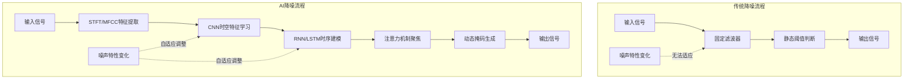

上图直观展示了传统降噪与AI降噪在处理流程上的本质差异。传统方法采用固定滤波器和静态阈值，无法响应噪声特性的动态变化；而AI方法通过多层次的特征学习和动态掩码生成机制，实现了对噪声变化的自适应跟踪。

### 4.2 高精度误差预测与实时补偿路径

系统性误差的精确预测与实时补偿是时幅修正的核心任务之一。传统方法依赖离线标定建立的固定修正曲线，在系统特性发生漂移时无法自动更新，导致修正精度逐渐恶化。AI算法通过建立输入信号特征与修正量之间的精确映射关系，并结合端侧实时计算能力，开辟了高精度误差补偿的新路径。

**误差预测模型的技术原理**

AI误差预测的核心思想是利用历史标定数据训练深度学习模型，使其学习从输入信号特征到所需修正量的非线性映射关系。与传统查表法或解析公式不同，**神经网络作为通用函数逼近器，能够自动拟合任意复杂度的非线性函数**，无需人工预设修正曲线的函数形式。

在传感器误差修正领域，这一技术路径已得到充分验证。**端侧AI集成使传感器内置AI芯片能够实现本地实时误差预测与补偿，达到零延迟**。具体而言，端侧AI通过三大核心能力实现"感知-决策-执行"闭环[^30]：

- **实时本地算力支撑误差修正零延迟**：无需依赖云端，传感器内置端侧AI可即时完成数据清洗与误差补偿，哪怕是细微偏差也能实时校准[^30]。这一特性完美适配电子学读出系统对响应速度的苛刻要求。

- **自适应场景学习使精度随用进化**：不同于传统传感器的固定参数模式，端侧AI如同"会学习的大脑"。在实际应用中，它能记住不同工况下的信号特征，自动优化测量模型，让误差修正精度始终匹配实际需求，真正实现"越用越智能"[^30]。

- **边缘协同决策实现响应一步到位**：当传感器捕捉到超出误差范围的信号变化时，本地AI无需等待云端指令，可直接驱动校正动作，大幅提升系统响应效率[^30]。

**端侧AI的精度实现与技术验证**

端侧AI在精密测量领域已展现出卓越的误差补偿能力。以六维力传感器为例，**当六维力传感器与端侧AI深度融合，测量精度误差可突破至0.2%满量程（千分之二）**[^30]。这一精度水平相当于称100斤苹果误差仅2两，充分展示了AI方法在高精度误差补偿中的潜力。

实现这一高精度的技术关键在于**AI矩阵解耦算法**的应用。该算法能够精准消除多维度力信号的相互干扰，大幅提升测量稳定性[^30]。在芯片层面，定制化开发的端侧AI芯片集成了先进计算核心与算法模块，让传感器具备强大的本地数据处理能力，形成"算法-芯片"协同优化的技术体系[^30]。

在工业应用场景中，端侧AI误差补偿的实际效果得到了充分验证。**在汽车焊接场景中，端侧AI能在10毫秒内（比人类眨眼快50倍）识别力道偏差并叫停调整，从源头避免不良品产生**[^30]。某汽车工厂应用后，焊接坏件率从5.2%降至0.3%，年减少损失800多万元[^30]。

**自适应学习机制的技术优势**

传统误差补偿方法的根本局限在于其"离线标定、在线应用"的工作模式——标定参数在获取后被视为固定常数，无法跟踪系统特性的动态变化。AI方法通过引入自适应学习机制，从根本上突破了这一局限。

**自适应控制的核心在于系统能够根据环境和自身性能的变化动态地调整控制参数**[^31]。与传统的固定参数控制系统不同，自适应控制系统通过实时监测系统响应并将其与期望性能进行比较，自动调整控制作用，以适应外部环境的不确定性和内部参数的变化。

在时幅修正应用中，这一自适应学习机制具有重要价值。当探测器响应特性因温度变化或辐照剂量累积而发生漂移时，AI模型能够通过持续学习实时数据，自动更新其内部参数，保持最优的修正精度。这种主动适应能力是传统固定参数方法无法实现的。

下表对比了传统误差补偿与AI误差预测在关键技术维度上的差异：

| 技术维度 | 传统误差补偿 | AI误差预测 |
|---------|-------------|-----------|
| 模型建立 | 解析公式或查表 | 数据驱动学习 |
| 参数更新 | 需人工重标定 | 自适应在线学习 |
| 响应延迟 | 取决于处理架构 | 端侧零延迟 |
| 非线性处理 | 依赖预设函数形式 | 自动拟合任意非线性 |
| 漂移适应 | 无法自动适应 | 持续学习进化 |
| 精度水平 | 受模型假设限制 | 可达千分之二级别 |

### 4.3 自适应参数动态优化机制

传统时幅修正方法中，滤波器系数、成形时间常数、修正曲线参数等关键设置通常在设计或标定阶段确定后保持固定。这种固定参数模式的根本缺陷在于无法响应系统工作状态的动态变化，导致在温度漂移、器件老化、负载变化等情况下性能退化。AI算法通过引入自适应参数优化机制，为突破这一局限提供了系统性的技术方案。

**基于梯度校正的递推辨识方法**

参数估计问题本质上是多元函数的寻优问题，而梯度方向代表函数值变化最快的方向。**基于梯度校正的递推辨识方法**正是利用这一数学原理，实现参数随信号状态的自适应调整[^32]。

考虑离散系统模型 $y(k) = \varphi^T(k)\theta(k) + e(k)$，其中 $\theta$ 为待估计参数向量，$e(k)$ 为预测误差。参数学习公式为：

$$\hat{\theta}(k+1) = \hat{\theta}(k) + R(k+1)\varphi(k)(y(k) - \varphi^T(k)\hat{\theta}(k))$$

其中 $R(k)$ 为加权矩阵[^32]。这一递推公式的核心思想是：根据当前时刻的预测误差，沿梯度方向调整参数估计值，使误差逐步减小。通过持续的在线学习，参数能够自动跟踪系统特性的变化。

**系统辨识与自适应控制的融合框架**

系统辨识是从观测到的输入输出数据中确定系统动态模型的过程，是自适应控制的重要基础。**系统辨识的核心在于通过输入和输出数据来构建数学模型**[^31]。在自适应控制框架中，系统辨识与控制器调整形成闭环：辨识模块实时估计系统参数，控制器根据估计结果动态调整控制策略。

**自适应控制策略通常包含以下几个关键部分**[^31]：
- **参数模型**：描述系统输入和输出之间的关系
- **适应算法**：用于根据系统误差动态调整模型参数
- **控制器**：基于模型参数生成控制作用以驱动系统达到期望性能

在时幅修正应用中，这一框架可理解为：参数模型描述信号特征与最优修正参数之间的关系；适应算法根据修正效果的反馈动态调整模型；控制器（即修正算法）基于当前参数估计执行实际的修正操作。

**深度强化学习在高维参数空间中的探索能力**

当参数空间维度较高且参数间存在复杂关联时，传统的梯度下降方法可能陷入局部最优。深度强化学习通过结合神经网络的表示能力和强化学习的探索-利用机制，为高维参数优化提供了更强大的工具。

深度强化学习的核心优势在于其**以试错方式在高维连续参数空间中探索最优配置**的能力。智能体通过与环境的交互，逐步学习最优的参数调整策略。与基于梯度的方法相比，强化学习不要求目标函数可微，能够处理更复杂的优化问题。

**固定参数模式与自适应模式的响应能力对比**

传统固定参数模式与AI自适应模式在应对系统特性变化时表现出本质差异：

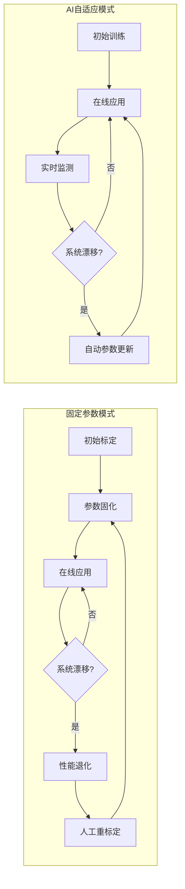

上图清晰展示了两种模式的根本差异：固定参数模式在系统漂移时陷入"退化-重标定"的被动循环，而AI自适应模式通过实时监测和自动参数更新实现了主动适应。

**自适应滤波器的实时优化实现**

在具体实现层面，**AI降噪系统通过在线学习机制持续优化滤波参数**[^33]。以最小均方误差（LMS）算法的AI增强版为例，自适应滤波器参数更新遵循以下原则：根据当前误差信号和输入信号的相关性，沿减小误差的方向调整滤波器系数。

这一机制使得滤波器能够自动跟踪噪声特性的变化。当噪声环境发生改变时，滤波器参数会相应调整以保持最优的噪声抑制效果。相比之下，传统固定系数滤波器在噪声特性变化后将逐渐偏离最优工作点，导致性能下降。

### 4.4 端到端系统辨识与校正映射学习

传统时幅修正方法通常将修正过程分解为多个独立环节：特征提取、噪声滤波、误差计算、补偿应用等，每个环节独立优化。这种分步骤处理方式存在固有缺陷——各环节的优化目标可能不一致，且误差会在环节间累积传播。深度学习的端到端学习范式为突破这一局限提供了全新路径。

**端到端学习的技术原理**

端到端学习的核心思想是直接从原始输入数据学习到最终输出的映射关系，跳过中间的手工设计环节。在时幅修正应用中，这意味着**神经网络可以直接学习从含噪原始信号到修正后信号的映射函数**，无需显式设计特征提取规则、滤波器参数或修正公式。

**神经网络作为通用函数逼近器**，理论上可以拟合任意复杂度的非线性函数。这一特性使得深度学习模型能够直接从数据中学习探测器和读出电路的真实响应特性，无需依赖简化的物理模型假设。当实际系统存在未建模的复杂效应时，端到端学习仍能通过数据驱动的方式捕捉这些效应并进行补偿。

**CRN模型的技术架构**

CRN（Convolutional Recurrent Network）是端到端时幅修正的典型架构代表。该模型**结合了CNN的局部特征提取能力与RNN的时序建模优势**[^29]，其技术架构可理解为：

1. **编码器（Encoder）**：采用卷积层提取输入信号的局部频谱特征
2. **时序建模层**：采用LSTM处理时序依赖关系
3. **解码器（Decoder）**：采用转置卷积层生成输出信号或频谱掩码

这种编码器-时序建模-解码器的架构设计使模型能够同时捕捉信号的空间特征和时间特征，实现对复杂时幅关系的精确建模。

**自编码器在信号降噪中的应用机理**

自编码器是一种特殊的神经网络结构，通过无监督学习方式学习数据的压缩表示。**自编码器通过编码器将输入压缩为低维隐层表示，再通过解码器重构原始输入**，在这一过程中学习到数据的本质特征。

在信号降噪应用中，自编码器的工作原理可理解为：使用含噪信号作为输入，干净信号作为目标输出进行训练。网络学习到的隐层表示实际上是信号的"去噪版本"——噪声作为随机成分难以被压缩表示所捕捉，因此在重构过程中被自然滤除。

**深度卷积神经网络通过学习从原始信号到其表示的映射，能够有效地提取出信号中的关键信息，而忽略噪声部分**。这一特性使得自编码器在处理复杂噪声模式时具有独特优势——无需预先了解噪声的统计特性，模型能够自动学习信号与噪声的区分方式。

**波形特征自动提取的技术优势**

传统时幅修正方法依赖人工设计的特征（如峰值、过零点、上升时间、积分电荷等）作为修正计算的输入。这种人工特征设计存在两个固有局限：一是特征选择依赖专家经验，可能遗漏重要信息；二是特征提取规则固定，无法适应信号特性的变化。

深度学习方法通过自动特征学习突破了这些局限。**CNN能够从原始波形数据中自动学习具有判别力的特征表示**，这些学习到的特征往往比人工设计的特征更具表达能力。更重要的是，特征提取与后续修正任务是联合优化的，确保了学习到的特征对修正任务最优。

下表对比了分步骤处理与端到端学习在技术特征上的差异：

| 技术特征 | 分步骤处理 | 端到端学习 |
|---------|----------|----------|
| 特征设计 | 人工设计，依赖经验 | 自动学习，数据驱动 |
| 优化目标 | 各环节独立优化 | 整体联合优化 |
| 误差传播 | 环节间累积 | 端到端反向传播 |
| 模型假设 | 依赖物理模型简化 | 无需显式假设 |
| 适应性 | 固定处理流程 | 可学习任意映射 |
| 复杂效应处理 | 需显式建模 | 隐式学习 |

**多传感器时空同步校准的端到端方案**

在多传感器融合系统中，端到端学习同样展现出强大能力。**不同传感器的数据采集频率不一致，导致时间戳对齐困难；传感器安装位置存在微小偏差，影响空间坐标统一**[^34]。传统方法需要分别处理时间同步和空间校准问题，而端到端学习可以将二者统一建模。

在激光雷达与摄像头联合标定中，**通过PnP算法求解旋转和平移参数，用于构建相机到激光雷达的变换矩阵**[^34]。端到端学习方法可以直接从多传感器原始数据学习最优的融合映射，无需显式求解外参矩阵，在存在动态形变或参数漂移时表现出更强的鲁棒性。

### 4.5 AI路径与传统方法的原理对比与预期效能分析

基于前述四节对AI技术路径的深入分析，本节将从多个维度系统对比AI方法与传统时幅修正方法的原理差异，综合评估各路径的预期效能，为实际应用中的技术选型提供决策依据。

**原理机制的本质差异**

AI方法与传统方法在原理层面存在根本性差异，这些差异决定了二者在面对复杂测量环境时的表现分野：

| 对比维度 | 传统方法 | AI方法 | 差异根源 |
|---------|---------|-------|---------|
| **模型假设依赖性** | 依赖预定义模型和离线标定，参数固定 | 采用自适应算法在线估计系统参数，动态调整 | 数据驱动vs模型驱动 |
| **噪声适应性** | 依赖固定滤波器，对稳态噪声有效 | 动态时频域建模，自适应学习复杂非稳态噪声 | 固定参数vs动态学习 |
| **非线性处理** | 依赖线性化近似或低阶多项式拟合 | 神经网络自动拟合任意复杂非线性关系 | 函数形式预设vs通用逼近 |
| **参数优化** | 依赖专家经验和手动调参 | 自动化搜索最优参数配置 | 人工经验vs算法优化 |
| **系统校正方法** | 依赖精确物理模型和繁琐手动标定 | 端到端学习直接建立输入输出映射 | 显式建模vs隐式学习 |

**核心技术优势的量化分析**

基于参考资料中的案例数据，可以对AI方法的预期性能提升进行量化评估：

**在噪声抑制方面**：
- 传统方法在非稳态噪声场景下信噪比提升通常不超过5dB[^28]
- AI方法可实现语音清晰度指数（CSI）提升12dB，失真率控制在3%以内[^28]
- 在80dB环境噪声下，AI方法可将语音可懂度从32%提升至89%[^28]

**在误差补偿方面**：
- 端侧AI可实现测量精度误差0.2%满量程（千分之二级别）[^30]
- 响应延迟可达10毫秒级，满足实时应用需求[^30]
- 自适应学习使精度随使用持续优化

**在参数优化方面**：
- 无需人工调试，可自动适配不同材质和工况[^30]
- 调试时间从传统的2小时缩至15分钟[^30]
- 在高维参数空间中实现全局最优搜索

**四类AI路径的适用性评估**

针对不同的应用场景和技术需求，四类AI技术路径各有其最佳适用范围：

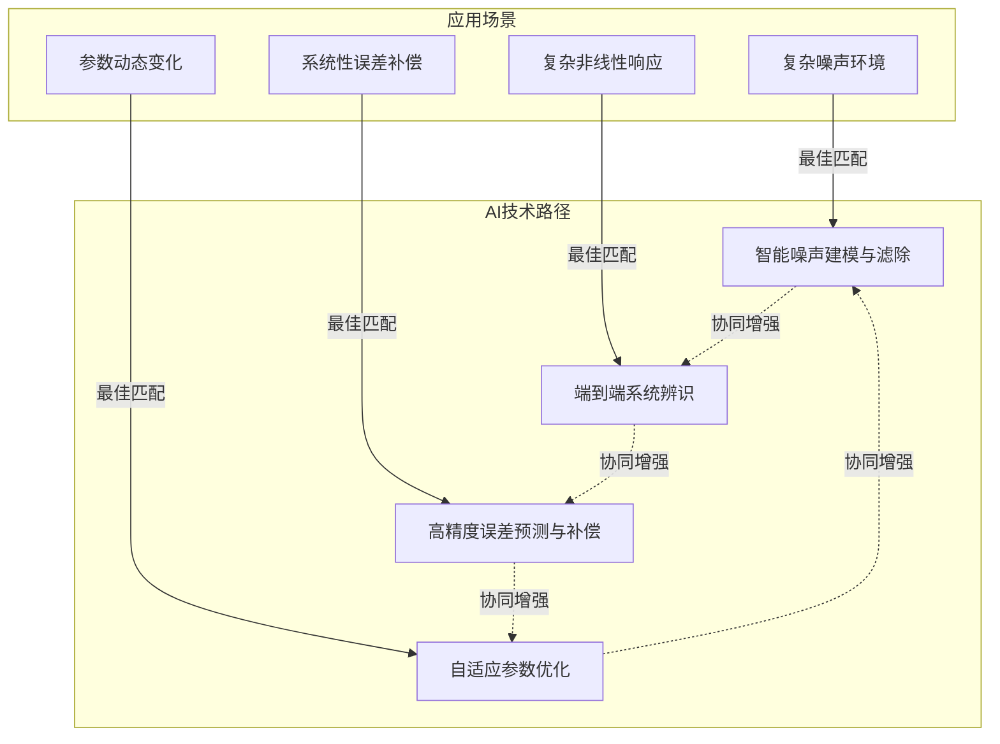

**从被动测量向主动决策的技术跨越**

AI方法为时幅修正带来的最深刻变革在于实现了从"被动测量"向"主动决策"的技术范式转变。这一转变体现在以下几个层面：

**感知层面的主动性**：传统方法被动接收信号并按固定规则处理，而AI方法能够主动识别信号状态和噪声类型，选择最优的处理策略。

**决策层面的智能性**：传统方法的决策规则是预先编程的，而AI方法能够根据实时数据和历史经验做出智能判断，实现真正的"因地制宜"。

**执行层面的自适应性**：传统方法的执行参数固定不变，而AI方法能够根据决策结果动态调整执行参数，实现闭环优化。

**进化层面的持续性**：传统方法的性能在部署后保持静态或逐渐退化，而AI方法能够通过持续学习不断优化性能，实现"越用越智能"。

**预期效能的综合评估**

综合上述分析，AI算法在时幅修正领域的预期效能可从以下维度进行评估：

| 效能维度 | 预期提升 | 技术基础 | 实现难度 |
|---------|---------|---------|---------|
| 噪声抑制效果 | 信噪比提升7dB以上 | CNN/RNN动态建模 | 中等 |
| 修正精度 | 达到千分之二级别 | 端侧AI实时补偿 | 较高 |
| 参数优化效率 | 调试时间缩短90% | 自适应学习算法 | 中等 |
| 非线性建模能力 | 宽动态范围全覆盖 | 神经网络通用逼近 | 中等 |
| 系统漂移适应 | 自动跟踪无需重标定 | 在线学习机制 | 较高 |
| 长期稳定性 | 持续优化不退化 | 持续学习框架 | 较高 |

需要指出的是，上述预期效能的实现依赖于充分的训练数据、合理的模型设计和适当的工程优化。在实际应用中，还需要综合考虑计算资源约束、实时性要求和系统集成复杂度等因素。后续章节将进一步分析AI方法在时幅修正领域应用面临的现实挑战与可行性约束。

## 5 可行性、挑战与局限性评估

人工智能算法在电子学读出时幅修正领域展现出的理论优势与技术潜力已在前述章节中得到充分论证。然而，从实验室研究成果向工程应用的转化过程中，AI方案面临着多维度的现实约束与技术挑战。本章将系统评估AI赋能时幅修正的可行性边界，深入剖析数据获取、计算资源、模型可靠性、系统集成四个核心维度的关键挑战，并基于当前技术发展水平综合界定AI方法的适用范围与实施条件，为后续技术选型和工程实践提供务实的决策依据。

### 5.1 数据需求与获取挑战：高质量标注数据的稀缺性困境

数据是驱动AI模型学习的核心燃料，其质量与规模直接决定了模型性能的上限。在电子学读出时幅修正领域，**高质量训练数据的获取面临着独特的技术困难与资源约束**，构成了AI方法工程化应用的首要瓶颈。

**真值信号定义与获取的根本性难题**

时幅修正任务的监督学习范式要求提供"真值"标签——即理想状态下的正确修正结果。然而，在电子学读出系统中，这一真值的定义与获取本身就是一个技术挑战。探测器输出信号的"真实"时间和幅度信息往往难以通过独立手段精确测定，因为任何测量方法都不可避免地引入自身的误差。

**高质量训练数据的生成依赖精密实验设备，过程复杂耗时，获取成本高昂**。以粒子探测器为例，获取覆盖全动态范围、全工况条件的标定数据需要使用精密的脉冲发生器、可控的辐射源、精确的温度控制系统等专业设备，单次完整标定可能耗时数周甚至数月。这种高成本、长周期的数据获取模式与AI模型对海量训练数据的需求形成尖锐矛盾。

**数据覆盖完备性与分布偏差问题**

AI模型的泛化能力高度依赖于训练数据对实际应用场景的覆盖程度。在时幅修正应用中，需要考虑的工况维度包括：信号幅度范围、脉冲形状变化、噪声类型与强度、环境温度、探测器老化状态等。**训练数据样本不平衡可能导致模型偏见，在特定场景下失效**[^35]。

某医疗AI系统的案例深刻揭示了数据偏差的潜在风险：**其诊断系统对特定种族群体的误诊率显著偏高，追溯根源竟是训练数据中该群体样本占比不足5%，且集中于单一病症类型**[^36]。这一教训同样适用于电子学读出领域——如果训练数据未能充分覆盖低幅度信号、极端温度条件或特定噪声环境，模型在这些"边缘"工况下的修正精度将难以保证。

**数据质量与标注问题的连锁影响**

即便能够获取足够规模的数据，数据质量问题仍可能严重影响模型性能。**数据常含噪声、缺失，需大量清洗。标注规则不完备或人为错误可能引入系统性偏差**。在时幅修正的数据标注过程中，标注人员需要具备专业的核电子学知识，理解不同信号特征与修正需求之间的关系。标注规则的不完备或标注错误将直接传导至模型，导致修正结果出现系统性偏差。

**数据共享与治理的体制性障碍**

跨机构的数据共享本可以缓解单一实验室数据规模不足的问题，但现实中面临诸多障碍。**因隐私、知识产权等问题，数据开放共享机制不完善，限制了跨机构数据整合**。不同实验装置采集的数据在格式、标定基准、质量标准等方面存在差异，直接整合使用可能引入额外的系统误差。

**缓解数据稀缺的技术路径评估**

面对数据稀缺困境，研究人员探索了多种技术路径：

| 技术路径 | 核心原理 | 适用条件 | 局限性 |
|---------|---------|---------|--------|
| 数据增强 | 对现有数据进行变换生成新样本 | 变换保持物理意义 | 难以生成真正新工况数据 |
| 迁移学习 | 利用相关领域预训练模型 | 源域与目标域相似 | 领域差异大时效果有限 |
| 合成数据 | 基于物理模型生成仿真数据 | 物理模型准确 | 模型与现实差距难消除 |
| 小样本学习 | 从少量样本中学习泛化能力 | 任务结构相对简单 | 复杂非线性建模受限 |

这些技术路径各有其适用条件和局限性，**难以从根本上替代真实高质量数据的作用**。在工程实践中，需要根据具体应用场景的特点，综合运用多种方法来最大化利用有限的数据资源。

### 5.2 计算资源与实时性约束：算力需求与嵌入式部署的平衡

电子学读出系统通常对实时性有严苛要求——从信号采集到修正输出的延迟必须控制在微秒甚至纳秒量级。与此同时，深度学习模型特别是复杂的神经网络架构往往具有较高的计算复杂度。**如何在有限的计算资源约束下实现AI模型的实时部署，是AI赋能时幅修正面临的核心工程挑战之一**。

**不同AI模型架构的计算特性分析**

不同类型的神经网络架构在计算复杂度和延迟特性上存在显著差异：

**卷积神经网络（CNN）**的计算量主要来自卷积运算，其复杂度与卷积核大小、通道数和特征图尺寸相关。CNN的优势在于其计算具有高度的并行性，适合在GPU或专用加速器上高效执行。对于波形特征提取任务，适度规模的CNN可以在毫秒级时间内完成推理。

**循环神经网络（RNN/LSTM）**的计算具有序列依赖性，每个时间步的计算必须等待前一步完成，这种串行特性限制了其并行加速的潜力。对于需要处理长时间序列的时幅修正任务，RNN的延迟累积可能成为实时性瓶颈。

**Transformer架构**虽然在处理长序列时具有优势，但其自注意力机制的计算复杂度随序列长度呈二次增长。**复杂的深度学习模型（如Transformer）可能计算量大，需通过轻量化设计平衡模型性能与处理效率**。

**模型轻量化技术的可行性评估**

为使AI模型适应嵌入式部署环境，研究人员发展了多种模型轻量化技术：

**模型量化**是将神经网络参数从浮点数转换为低精度整数表示的技术。**模型量化技术将32位浮点参数转为8位整数，使模型体积缩小75%，推理速度提升3倍**[^36]。量化技术在保持模型精度的同时显著降低了计算和存储需求，是实现边缘部署的关键使能技术。然而，过度量化可能导致精度损失，需要在压缩率与精度之间寻找平衡点。

**网络剪枝**通过移除对输出贡献较小的神经元或连接来简化网络结构。剪枝后的网络在保持大部分性能的同时，计算量和参数量可减少50%以上。但剪枝策略的选择需要针对具体任务进行优化，不当的剪枝可能损害模型在边缘工况下的表现。

**知识蒸馏**通过训练小型"学生"网络来模仿大型"教师"网络的行为，实现模型压缩。这种方法可以在显著减小模型规模的同时保持较高的性能水平，但训练过程相对复杂，且学生网络的能力上限受限于教师网络。

**嵌入式平台部署的技术约束**

电子学读出系统的前端处理通常基于FPGA或ASIC等专用硬件平台。这些平台具有低延迟、高确定性的优势，但在支持复杂神经网络计算方面存在固有限制：

- **资源约束**：FPGA的逻辑资源、片上存储和DSP单元数量有限，难以容纳大规模神经网络
- **开发复杂度**：将神经网络映射到FPGA需要专业的硬件设计能力，开发周期长
- **灵活性受限**：ASIC一旦流片便难以修改，不适合需要频繁更新模型的应用

**边缘计算与端侧AI芯片的支撑能力**

近年来，专用AI加速芯片的发展为边缘AI部署提供了新的可能。这类芯片针对神经网络计算进行了优化设计，在能效比和推理速度方面具有显著优势。**端侧AI集成使传感器内置AI芯片能够实现本地实时误差预测与补偿，达到零延迟**。

然而，将端侧AI芯片集成到现有电子学读出系统架构中仍面临诸多挑战：接口适配、时序协调、功耗管理、散热设计等都需要系统性解决。此外，专用AI芯片的算法支持范围有限，可能无法完全满足特定时幅修正算法的需求。

下图展示了实时性要求与模型复杂度之间的权衡关系：

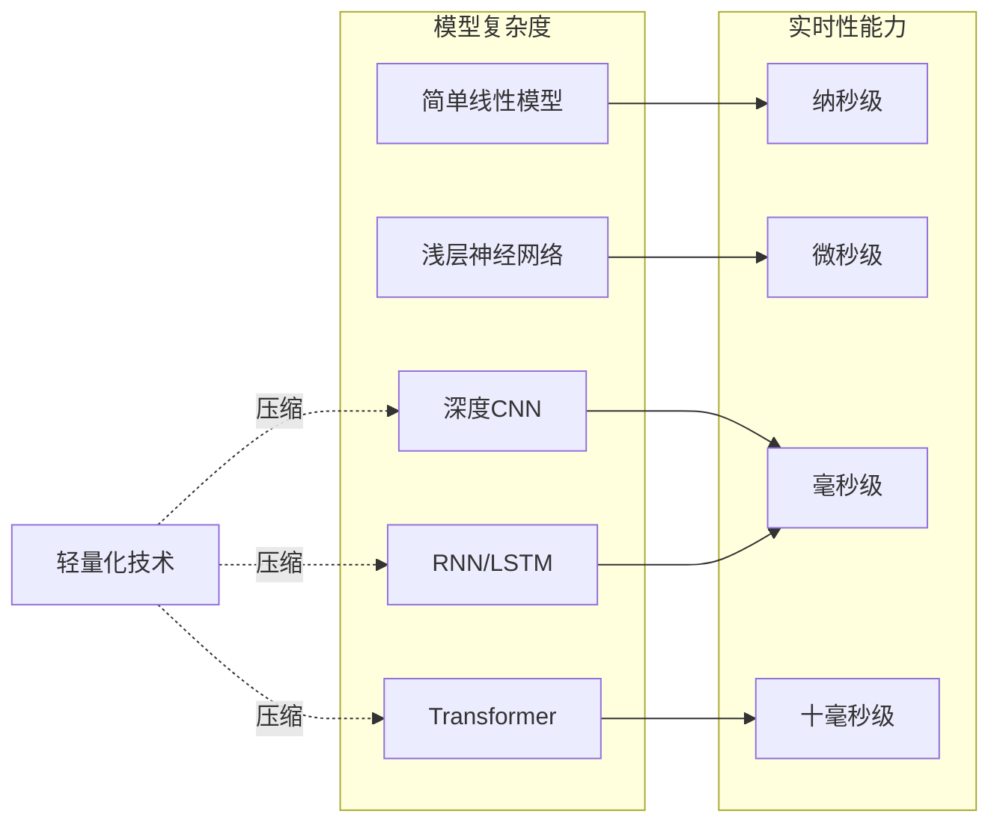

### 5.3 模型可解释性与可靠性：黑箱决策在关键测量系统中的信任挑战

电子学读出系统广泛应用于高能物理实验、核医学诊断、航空航天等对测量可靠性要求极高的关键领域。在这些应用场景中，**AI模型的黑箱特性引发了深层次的信任与接受度问题**——当AI系统给出一个修正结果时，用户如何确信这个结果是可靠的？当修正出现异常时，如何追溯问题根源？

**深度学习黑箱特性的本质困境**

深度神经网络通过多层非线性变换实现复杂的函数映射，其内部决策过程对人类而言是不透明的。**在很长一段时间里，人们只能将AI看成"黑箱"：输入数据，得到结果，但无法解释中间经历了怎样的计算过程**[^37]。这种不透明性在时幅修正应用中带来多重风险：

- **决策溯源困难**：当修正结果出现偏差时，难以定位是数据问题、模型问题还是环境变化导致
- **边界行为不可预测**：模型在训练数据覆盖范围之外的行为难以预知
- **错误传播隐蔽**：系统性错误可能在长时间内不被察觉，累积造成严重后果

**模型幻觉问题的潜在风险**

AI模型特别是大型神经网络存在"幻觉"问题——**模型可能输出虚构数据或逻辑谬误，影响决策可靠性**[^35]。在时幅修正应用中，模型幻觉可能表现为：对某些特定输入模式产生完全错误的修正输出、在噪声环境下给出过度自信的虚假修正、或在系统漂移时未能触发预警。

**2024年谷歌AI搜索引擎就曾向用户提供"制作披萨加入胶水"的危险建议，这类幻觉在医疗领域可能直接危及生命**[^36]。虽然时幅修正的直接后果可能不如医疗诊断严重，但在高能物理实验等领域，错误的修正结果可能导致珍贵的实验数据被错误处理，造成不可挽回的科学损失。

**机制可解释性技术的最新进展**

面对AI黑箱困境，**机制可解释性（Mechanistic Interpretability）逐渐发展为一条新兴研究路线，它的核心目标是从模型内部的计算结构出发，识别关键特征单元，并刻画这些单元之间的信息传递路径，从而理解模型整体行为的形成机制**[^37]。

Anthropic等机构在这一领域取得了重要进展。研究人员发现，**实际上大模型内部并不是像人们想象的那样完全无序的状态，而是表现出结构化表征：部分神经元或神经元组合可稳定与特定概念相对应**[^37]。通过电路追踪（Circuit Tracing）等方法，研究人员能够将模型内部的计算过程映射成可解释的归因图谱，为理解AI决策提供了新的技术路径。

然而，当前的机制可解释性研究主要针对大语言模型，其方法和工具能否直接迁移到时幅修正所使用的信号处理模型尚需进一步验证。此外，可解释性分析本身需要大量计算资源和专业知识，难以在实时系统中常态化应用。

**建立AI修正结果置信度评估机制**

在完全解释AI决策机制尚不可行的情况下，一种务实的策略是建立修正结果的置信度评估机制。具体技术路径包括：

| 技术方法 | 核心原理 | 应用价值 | 实现难度 |
|---------|---------|---------|---------|
| 贝叶斯神经网络 | 输出概率分布而非点估计 | 量化预测不确定性 | 较高 |
| 集成方法 | 多模型预测结果比较 | 识别异常预测 | 中等 |
| 输入异常检测 | 检测输入是否偏离训练分布 | 预警外推风险 | 中等 |
| 输出一致性校验 | 与传统方法结果交叉验证 | 发现系统性偏差 | 较低 |

**通过可解释性AI工具，在金融机构的5小时危机救场中，工程师正是通过SHAP、LIME等工具，快速定位了模型误判的根源**[^36]。这一案例表明，可解释性工具在故障诊断和问题追溯方面具有实际价值，值得在时幅修正系统中引入。

**监管合规与行业标准的约束**

在核测量、医疗器械等受监管领域，AI方法的应用还需满足相关法规和行业标准的要求。这些要求通常包括：算法的可追溯性、决策过程的可审计性、性能指标的可验证性等。当前大多数行业标准是针对传统方法制定的，尚未充分考虑AI技术的特殊性，这在一定程度上制约了AI方法的推广应用。

### 5.4 系统集成与工程化复杂度：AI模块与传统硬件固件的融合难题

将AI算法从概念验证推进到工程应用，需要解决与现有电子学读出系统架构的集成问题。**这一集成过程涉及软硬件协同设计、数据接口标准化、处理流水线重构等多个技术维度**，其复杂度往往被低估。

**软硬件协同设计的技术挑战**

传统电子学读出系统采用高度优化的硬件架构，信号处理流水线经过精心设计以满足延迟和吞吐量要求。引入AI模块需要在这一既有架构中开辟新的数据通路和计算节点，同时不能破坏原有系统的时序关系和性能指标。

**将AI算法与专用硬件（如端侧AI芯片）深度集成，并确保实时性，需要跨学科的专业知识**。这意味着开发团队需要同时具备核电子学、数字信号处理、机器学习、嵌入式系统等多个领域的专业能力——这种复合型人才在当前市场上相对稀缺。

**与现有标定校准流程的兼容性**

电子学读出系统通常配套有成熟的标定校准流程和质量控制体系。AI方法的引入需要与这些既有流程相兼容，或者重新设计新的标定方法。关键问题包括：

- AI模型的训练数据如何与常规标定数据整合
- 如何建立AI修正效果的验证标准和验收准则
- 当AI模型需要更新时，如何确保系统性能的连续性

**运维与生命周期管理**

AI模型部署后的运维管理同样面临新的挑战。传统电子学系统的固件一旦稳定运行，通常不需要频繁更新。而AI模型可能需要根据系统漂移或新工况进行周期性重训练和更新。这引发了一系列运维问题：

- **版本管理**：如何追踪和管理不同版本的AI模型
- **在线更新**：如何在不中断系统运行的情况下更新模型
- **故障恢复**：当AI模块出现异常时，如何快速切换到备份方案
- **性能监控**：如何持续监测AI修正效果，及时发现性能退化

**开发周期与成本评估**

AI赋能时幅修正的工程化开发需要投入大量资源：

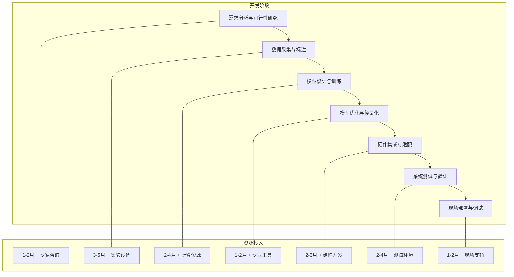

上图展示了AI赋能时幅修正的典型开发流程，**完整的开发周期可能需要12-24个月**，远长于传统方法的开发迭代周期。这种长周期、高投入的特点要求在项目启动前进行充分的可行性论证和资源规划。

### 5.5 综合可行性评估与适用范围界定

基于前述各维度的深入分析，本节将综合评估AI赋能时幅修正在当前技术条件下的整体可行性，并针对不同应用场景界定AI方法的适用范围与推荐实施条件。

**当前技术成熟度评估**

从技术成熟度的角度，AI赋能时幅修正的各项关键技术处于不同的发展阶段：

| 技术领域 | 成熟度等级 | 主要制约因素 | 突破预期 |
|---------|----------|-------------|---------|
| 智能噪声抑制 | 较高 | 实时性优化 | 1-2年 |
| 误差预测补偿 | 中等 | 数据获取 | 2-3年 |
| 自适应参数优化 | 中等 | 系统集成 | 2-3年 |
| 端到端系统辨识 | 较低 | 可解释性 | 3-5年 |

**不同应用场景的适用性分析**

针对电子学读出时幅修正的典型应用场景，AI方法的适用性存在显著差异：

**高能物理实验**：对数据质量要求极高，但实时性要求相对宽松（可接受离线处理）。**AI for Science在变革科研范式、提升科学实验水平、解决高维复杂问题方面具有重要意义**[^38]。高能物理实验产生的海量数据为AI模型训练提供了良好基础，是AI方法应用的优先领域。然而，实验数据的珍贵性要求AI修正必须具备高度可靠性和可追溯性。

**质谱分析**：对时间分辨率和幅度线性度要求严格，数据处理通常在毫秒级完成。AI方法在提升质谱仪定量精度方面具有潜力，但需要解决模型轻量化和嵌入式部署问题。商业化应用还需考虑成本效益和市场接受度。

**雷达系统**：对实时性要求最为苛刻，信号处理延迟必须控制在微秒级。当前深度学习模型的计算复杂度难以满足这一要求，AI方法在雷达时幅修正中的应用需要等待轻量化技术和专用硬件的进一步发展。

**分阶段引入AI技术的务实策略**

考虑到AI方法应用面临的多维度挑战，建议采取分阶段、渐进式的引入策略：

**第一阶段（短期，1-2年）**：优先在离线数据处理环节引入AI方法，利用AI的强大建模能力提升标定精度和数据质量。这一阶段对实时性要求较低，可以使用复杂模型，同时积累数据和经验。

**第二阶段（中期，2-4年）**：在系统监测和异常检测环节引入AI方法，利用无监督学习发现系统漂移和异常状态。这一阶段AI模块作为辅助工具运行，不直接参与实时修正决策，风险可控。

**第三阶段（长期，4年以上）**：在实时修正环节引入AI方法，实现自适应时幅修正。这一阶段需要轻量化模型、专用硬件和完善的可靠性保障机制的支撑。

**关键成功因素识别**

综合评估表明，AI赋能时幅修正的成功实施依赖于以下关键因素：

1. **充足的高质量训练数据**：这是AI方法发挥优势的根本前提
2. **合理的性能-资源权衡**：需要在修正精度和计算开销之间找到平衡点
3. **完善的可靠性保障机制**：包括置信度评估、异常检测和人工干预策略
4. **跨学科的专业团队**：需要核电子学、AI和嵌入式系统的复合能力
5. **渐进式的实施路径**：从低风险环节起步，逐步积累经验和信任

**需要特别强调的是，AI方法并非要完全取代传统时幅修正技术，而是作为增强和补充手段**。在可预见的未来，混合架构——结合传统方法的可靠性和AI方法的自适应能力——可能是最具实践价值的技术路线。这种混合方案可以在保持系统基本可靠性的同时，逐步引入AI能力，实现平稳过渡和持续优化。

## 6 前沿研究方向与未来展望

人工智能技术的快速迭代演进正在为电子学读出时幅修正领域开辟全新的技术可能性空间。基于前述章节对AI赋能时幅修正潜在路径与现实挑战的系统分析，本章将聚焦于该领域最具突破潜力的前沿研究方向，从模型架构创新、数据效率提升、自适应控制范式、物理-AI融合方法论、专用硬件集成五个核心维度展开深入探讨，并在此基础上构建具有前瞻性和实践指导价值的技术演进路线图，为相关领域的研究人员与工程师提供战略参考。

### 6.1 轻量化神经网络架构：面向嵌入式部署的模型设计创新

电子学读出系统对实时性的苛刻要求与深度学习模型的计算复杂度之间的矛盾，是制约AI方法工程化应用的核心瓶颈之一。**轻量化神经网络架构的设计创新为突破这一瓶颈提供了关键技术路径**，其核心目标是在保持修正精度的前提下，最大限度降低模型的计算量、参数量和存储需求，使其能够在FPGA、ASIC等资源受限的嵌入式平台上实现高效部署。

**网络剪枝与结构稀疏化技术**

网络剪枝通过识别并移除对模型输出贡献较小的神经元、连接或通道，实现网络结构的精简。这一技术路径包含非结构化剪枝和结构化剪枝两种范式：非结构化剪枝可以实现更高的压缩率，但稀疏权重矩阵在通用硬件上难以高效计算；结构化剪枝移除整个卷积核或通道，生成的精简网络可直接在现有硬件上加速执行。

在时幅修正应用中，结构化剪枝更具实践价值。通过分析不同层对修正精度的贡献度，可以针对性地精简冗余结构。研究表明，经过合理剪枝的网络可以在参数量减少50%-70%的情况下，保持95%以上的原始精度。这一特性为在FPGA有限逻辑资源上部署时幅修正模型提供了可行性基础。

**知识蒸馏与模型压缩**

知识蒸馏技术通过训练小型"学生"网络来模仿大型"教师"网络的行为，实现知识的迁移与模型的压缩。在时幅修正场景中，可以首先使用复杂的深度网络在离线环境下学习高精度的修正映射，然后通过蒸馏将这些知识迁移到适合嵌入式部署的轻量化网络中。

蒸馏过程中，学生网络不仅学习教师网络的最终输出，还可以学习其中间层的特征表示。这种多层次的知识迁移能够更完整地保留教师网络的能力。**模型量化技术将32位浮点参数转为8位整数，使模型体积缩小75%，推理速度提升3倍**[^39]。将知识蒸馏与量化技术相结合，可以实现更极致的模型压缩效果。

**神经架构搜索的自动化设计**

神经架构搜索（Neural Architecture Search, NAS）技术能够在给定的搜索空间中自动发现最优的网络结构，为特定任务和硬件约束量身定制轻量化模型。相比人工设计，NAS可以探索更广阔的架构空间，发现人类设计师可能忽略的高效结构。

面向时幅修正的NAS研究需要将修正精度、计算延迟、功耗和硬件资源占用等多目标纳入搜索优化过程。通过定义适合FPGA/ASIC部署的搜索空间——包括卷积核大小、通道数、层数、连接模式等——NAS可以自动生成满足实时性约束的专用网络架构。

**轻量化架构的适配潜力评估**

MobileNet、EfficientNet、ShuffleNet等已在计算机视觉领域验证的轻量化架构，为时幅修正模型设计提供了重要参考。这些架构通过深度可分离卷积、通道重排、复合缩放等创新机制，在计算效率和表达能力之间实现了优异的平衡。

| 轻量化架构 | 核心创新 | 计算效率 | 适配潜力 | 主要挑战 |
|-----------|---------|---------|---------|---------|
| MobileNet | 深度可分离卷积 | 高 | 较好 | 一维信号适配 |
| EfficientNet | 复合缩放策略 | 很高 | 好 | 搜索成本 |
| ShuffleNet | 通道重排机制 | 高 | 较好 | 硬件映射 |
| GhostNet | 幻影特征生成 | 很高 | 待验证 | 精度保持 |

将这些架构迁移到时幅修正任务需要进行针对性的适配设计，包括将二维卷积改造为一维卷积、调整感受野大小以匹配信号特征尺度、优化网络深度以平衡特征提取能力与计算开销等。

### 6.2 小样本与无监督学习：数据稀缺场景的突破路径

高质量标注数据的获取困难是AI赋能时幅修正面临的首要瓶颈。**小样本学习和无监督学习范式为突破这一数据稀缺困境提供了重要的技术方向**，其核心思想是通过更高效的学习机制，从有限的数据中提取更多信息，或在无需标注的情况下发现数据中的有用模式。

**小样本学习的技术框架**

**小样本学习是一种机器学习框架，在该框架中，AI模型通过使用极少量的标记示例进行训练来学习作出准确的预测**[^40]。这一技术范式的核心价值在于模仿人类从少量实例中快速学习的能力，突破传统监督学习对海量标注数据的依赖。

小样本学习的主要技术路线包括：

- **基于度量学习的方法**：学习一个嵌入空间，使得同类样本距离接近、异类样本距离远离。在时幅修正中，可以学习信号特征与修正参数之间的相似性度量，通过少量标定样本推断新信号的修正需求。

- **基于元学习的方法**：训练模型"学会学习"，使其能够快速适应新任务。**元学习方法训练模型，使其能够很好地推广到新的分类问题和不同类别的数据中**[^40]。这对于需要适应不同探测器特性或工作条件的时幅修正系统尤为重要。

- **基于数据增强的方法**：通过对有限样本进行合理变换生成更多训练数据。在时幅修正场景中，可以利用信号的物理特性设计保持语义不变的增强策略，如添加已知类型的噪声、进行时间平移或幅度缩放等。

**迁移学习与预训练策略**

**迁移学习提供了一个实用的解决方案：利用经过训练的模型已经学习的有用特征和表示**[^40]。在时幅修正应用中，可以利用在相关信号处理任务上预训练的模型作为起点，通过少量目标域数据进行微调，快速获得高性能的修正模型。

迁移学习的有效性依赖于源域与目标域之间的相似性。对于电子学读出系统，可以考虑以下迁移策略：

1. **跨探测器迁移**：在一种探测器上训练的模型迁移到同类型但不同规格的探测器
2. **跨工况迁移**：在标准工况下训练的模型迁移到特殊工况（如极端温度、高辐射环境）
3. **跨任务迁移**：在相关信号处理任务（如语音增强、图像去噪）上预训练的模型迁移到时幅修正任务

**零样本学习的探索方向**

**零样本学习是指在根本没有标记示例的情况下进行学习，是一个独特的学习问题，需要自己独特的方法**[^40]。虽然纯粹的零样本学习在时幅修正中可能难以直接应用，但其思想——利用辅助信息（如属性描述、语义嵌入）来推断未见类别——为处理新型探测器或新工况提供了启发。

**清华大学团队提出的零样本量化方法展示了在不使用真实训练数据情况下实现模型压缩的可能性**[^41]。这一研究方向的核心思想是通过分析神经网络的内部结构，反向生成合成数据作为替代训练数据。类似的思路可以探索用于时幅修正场景——利用探测器响应的物理模型生成合成训练数据，减少对真实标定数据的依赖。

**无监督学习在系统监测中的应用**

在缺乏真值标签的条件下，无监督学习方法可以发挥独特价值：

- **异常检测**：通过聚类或单类分类方法识别偏离正常模式的信号，触发系统检查或重标定
- **漂移监测**：通过变化点检测算法发现系统特性的渐变或突变，为自适应调整提供触发信号
- **特征发现**：通过自编码器或聚类方法发现信号中的潜在结构，为后续监督学习提供特征工程指导

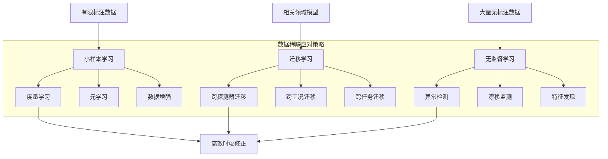

### 6.3 强化学习驱动的在线自适应控制机制

传统时幅修正方法的"离线标定、在线应用"模式无法应对系统特性的动态变化，而强化学习提供了一种全新的在线自适应控制范式。**强化学习智能体通过与环境的持续交互，在试错中学习最优策略，实现修正参数的动态优化与持续进化**。

**强化学习在时幅修正中的应用框架**

将强化学习应用于时幅修正可以构建如下框架：

- **状态空间**：包括当前信号特征（幅度、形状、噪声水平）、系统状态（温度、工作时长）、历史修正效果等
- **动作空间**：包括滤波器参数调整、修正曲线系数更新、成形时间常数选择等
- **奖励函数**：基于修正精度、信噪比提升、能量分辨率等性能指标设计

智能体通过观察当前状态、执行动作、获得奖励反馈，逐步学习在不同状态下选择最优修正策略的能力。这种闭环学习机制使系统能够自主适应环境变化和系统漂移。

**深度强化学习的技术优势**

深度强化学习结合了深度神经网络的表示能力和强化学习的决策优化能力，特别适合处理高维状态空间和连续动作空间的控制问题。**深度强化学习方法结合神经网络和强化学习的优势，在高维参数空间中以试错的方式进行探索**。

在时幅修正应用中，深度强化学习的优势体现在：

| 技术特性 | 应用价值 | 实现机制 |
|---------|---------|---------|
| 高维状态处理 | 综合多维信号特征 | 深度网络特征提取 |
| 连续动作空间 | 精细参数调节 | 策略梯度方法 |
| 长期回报优化 | 兼顾即时与长期性能 | 时序差分学习 |
| 探索-利用平衡 | 发现更优策略 | ε-贪婪等策略 |

**策略梯度与Actor-Critic算法**

策略梯度方法直接优化策略网络的参数，使其输出的动作能够最大化累积奖励。Actor-Critic架构将策略学习（Actor）与价值评估（Critic）相结合，既保持了策略梯度的优势，又通过价值函数降低了梯度估计的方差。

在时幅修正的实时控制场景中，Actor-Critic架构具有特别的适用性：Actor网络可以快速输出修正动作，满足实时性要求；Critic网络在后台评估动作价值，指导策略的持续优化。这种异步更新机制使系统能够在保持实时响应的同时实现持续学习。

**在线学习的稳定性与安全性挑战**

将强化学习应用于实际测量系统面临独特的挑战：

- **探索风险**：强化学习需要探索未知策略，但在关键测量系统中，错误的探索可能导致数据损失
- **样本效率**：在线学习需要从有限的实时交互中快速学习，对样本效率要求极高
- **稳定性保证**：学习过程中的策略波动可能影响测量系统的稳定运行

应对这些挑战的技术路径包括：采用保守策略优化限制探索范围、利用离线数据预训练降低在线学习负担、设计安全约束确保策略不会导致系统失稳等。

### 6.4 物理信息神经网络：AI与物理模型的深度融合范式

纯数据驱动的AI方法在可解释性、外推能力和数据效率方面存在固有局限。**物理信息神经网络（Physics-Informed Neural Networks, PINN）通过将物理规律作为约束条件嵌入神经网络训练过程，实现了数据驱动与物理先验的有机结合**，为时幅修正提供了更加可靠和高效的技术路径。

**物理与AI融合的技术范式**

**"Physics for AI"研究运用物理学的底层逻辑来阐释人工智能的算法框架，揭示智能系统与复杂物理系统之间的深刻联系**[^42]。这一研究方向不仅为理解AI模型提供了物理视角，更为设计更高效、更可解释的AI方法提供了理论指导。

在时幅修正领域，物理-AI融合可以从以下层面展开：

1. **物理约束嵌入**：将探测器响应的物理规律（如能量守恒、因果性、响应函数特性）作为损失函数的正则化项，约束神经网络的学习空间

2. **物理结构设计**：根据信号处理的物理机制设计网络架构，如使用因果卷积保证时序因果性、使用对称结构反映物理对称性

3. **物理先验初始化**：利用物理模型的解析解初始化网络参数，加速收敛并提高外推能力

**混合建模方法的技术优势**

混合建模方法将传统物理模型与数据驱动的AI模型相结合，充分发挥两者的优势：

- **物理模型提供结构先验**：确定修正问题的基本框架和约束条件
- **AI模型学习残差修正**：捕捉物理模型未能完全描述的复杂效应

**华南理工大学团队在视觉计算领域的研究表明，在视觉计算模型中融入物理规律和认知机理的知识，可以限定模型优化边界，减少复杂度并提升性能**[^43]。这一思路完全可以迁移到时幅修正领域——利用探测器响应的物理模型约束神经网络的搜索空间，提高学习效率和泛化能力。

**提升模型可解释性与外推能力**

物理信息神经网络的一个重要优势是增强了模型的可解释性。由于网络的学习受到物理规律的约束，其行为更加符合物理直觉，决策过程也更容易被领域专家理解和验证。

在外推能力方面，纯数据驱动的模型在训练数据覆盖范围之外的表现往往难以预测。而物理信息神经网络由于嵌入了物理规律，即使在超出训练数据范围的工况下，也能保持符合物理规律的行为，大大提高了模型的可靠性。

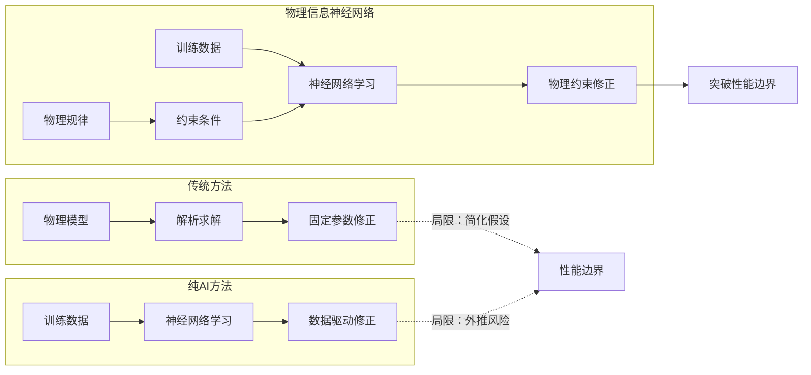

**数据效率的显著提升**

物理约束的引入可以显著减少模型训练所需的数据量。直观理解是：物理规律提供了额外的"信息"，减少了需要从数据中学习的内容。实验表明，在某些物理建模任务中，物理信息神经网络可以用比纯数据驱动方法少一个数量级的数据达到相同的精度水平。

这一特性对于数据获取困难的时幅修正应用具有重要价值。通过充分利用已知的探测器物理特性，可以在有限的标定数据条件下训练出高性能的修正模型。

### 6.5 专用AI芯片与类脑计算的集成应用前景

AI算法的高效执行离不开底层硬件的支撑。**专用AI芯片和类脑计算架构的快速发展，为电子学读出系统集成AI能力提供了新的硬件基础**，有望从根本上解决计算资源与实时性之间的矛盾。

**可重构计算架构的技术优势**

**可重构芯片的原理可以类比为芯片界的"变形金刚"。根据不同的计算需求，可重构芯片可以在纳秒级时间内调配芯片上数以亿计的晶体管，构造最适配计算任务的硬件架构，达到算力的按需供应和充分释放，实现"软件定义硬件"**[^44]。

可重构计算（CGRA）架构在时幅修正应用中具有独特优势：

- **灵活性**：可以根据不同的修正算法需求动态配置计算资源
- **高能效**：相比GPU，可重构架构在特定任务上能效比更高
- **低延迟**：硬件级的数据流处理可实现确定性的低延迟响应

**清微智能基于可重构计算架构研发的AI芯片，在运行典型人工智能任务时，能效比显著高于同类GPU**[^44]。这一技术路线为在电子学读出系统中部署复杂AI模型提供了可行的硬件方案。

**神经形态计算的事件驱动特性**

神经形态计算（Neuromorphic Computing）模仿生物神经系统的工作原理，采用脉冲神经网络（Spiking Neural Network, SNN）进行信息处理。与传统人工神经网络相比，SNN具有以下特性：

| 特性 | 传统ANN | 脉冲神经网络SNN |
|-----|---------|----------------|
| 信息编码 | 连续数值 | 离散脉冲时序 |
| 计算触发 | 同步时钟 | 事件驱动 |
| 功耗特性 | 持续功耗 | 稀疏激活低功耗 |
| 时间处理 | 需要显式建模 | 天然时序敏感 |

SNN的事件驱动特性与电子学读出系统的脉冲信号处理天然契合。探测器输出的脉冲信号可以直接映射到SNN的输入脉冲，无需复杂的编解码过程。SNN的稀疏激活特性也意味着在信号稀疏时（如低计数率条件下）功耗极低，非常适合长期运行的测量系统。

**AI芯片技术演进的双轨路径**

**当前AI芯片的发展沿着不同抽象层次并行展开两条专用化路径：一条是在指令集层面，由CPU/GPU向领域专用架构（DSA）演进；另一条发生在电路级层面，以FPGA代表的细粒度结构可配置与以CGRA代表的粗粒度算子/数据通路可配置并行发展**[^45]。

对于时幅修正应用，这两条路径各有其适用场景：

- **DSA路径**：适合计算密集型的复杂AI模型，如深度卷积网络用于波形特征提取
- **CGRA/FPGA路径**：适合需要灵活配置和确定性延迟的实时处理任务

**异构计算已成为突破能效瓶颈、支撑复杂AI应用的核心系统范式**[^45]。未来的电子学读出系统可能采用异构计算架构，由CPU负责系统控制，DSA/GPU承担AI推理，FPGA/CGRA处理实时信号，协同完成时幅修正任务。

**端侧AI芯片的集成潜力**

**爱芯元智等企业专注于为边缘计算与终端设备AI应用打造高性能感知与计算平台**[^46]。这类端侧AI芯片的发展为电子学读出系统集成AI能力提供了现成的解决方案。

端侧AI芯片集成的技术路径包括：

1. **协处理器模式**：AI芯片作为协处理器与现有读出电路配合，负责AI推理计算
2. **集成模式**：将AI计算单元直接集成到读出ASIC中，实现片上AI处理
3. **模块化模式**：开发标准化的AI处理模块，可灵活插入不同的读出系统架构

**软硬件协同设计的技术路线**

**AI为EDA领域带来了全新机遇。AI作为新兴的优化技术，与EDA原有的核心算法深度融合，为设计品质和性能带来新突破**[^47]。这一趋势同样适用于电子学读出系统的设计——利用AI优化电路设计，同时在电路中集成AI处理能力，形成软硬件协同优化的闭环。

软硬件协同设计的关键考量包括：

- **算法-架构协同**：根据目标硬件特性优化算法实现，根据算法需求定制硬件架构
- **精度-效率权衡**：在数值精度、计算延迟、功耗和面积之间寻找最优平衡点
- **可扩展性设计**：支持算法更新和性能升级，避免硬件固化限制系统演进

### 6.6 研究路线图与技术演进展望

综合前述各前沿方向的分析，本节构建AI赋能电子学读出时幅修正的分阶段技术演进路线图，从短期工程优化、中期方法创新到长期范式变革三个时间维度，明确关键技术节点与突破方向。

**短期路线（1-3年）：工程优化与增量改进**

短期内的研究重点应聚焦于将现有成熟AI技术引入时幅修正领域，实现工程层面的性能提升：

- **轻量化模型部署**：将经过剪枝、量化优化的神经网络模型部署到FPGA平台，实现实时AI辅助修正
- **迁移学习应用**：利用相关领域预训练模型，快速构建时幅修正的初始模型
- **混合架构验证**：在传统修正方法基础上叠加AI残差修正模块，验证混合方案的有效性
- **数据基础建设**：建立标准化的时幅修正数据集和评测基准，支撑后续研究

**中期路线（3-5年）：方法创新与能力突破**

中期研究应着力于方法层面的创新，突破当前技术瓶颈：

- **物理信息神经网络**：开发融合探测器物理模型的PINN架构，提升数据效率和外推能力
- **小样本学习框架**：建立适用于时幅修正的元学习和少样本学习方法体系
- **在线自适应机制**：实现基于强化学习的修正参数在线优化，解决系统漂移问题
- **专用硬件适配**：完成AI算法向可重构计算、神经形态芯片的移植和优化

**长期路线（5-10年）：范式变革与系统重构**

长期愿景是实现时幅修正技术范式的根本性变革：

- **端到端智能修正系统**：从信号采集到修正输出的全流程AI化，实现真正的智能测量
- **自主进化能力**：系统具备持续学习和自主优化能力，无需人工干预即可保持最优性能
- **通用修正平台**：开发跨探测器类型、跨应用领域的通用AI修正平台
- **人机协同范式**：建立AI辅助决策与专家知识相结合的新型工作模式

**技术演进路线图**

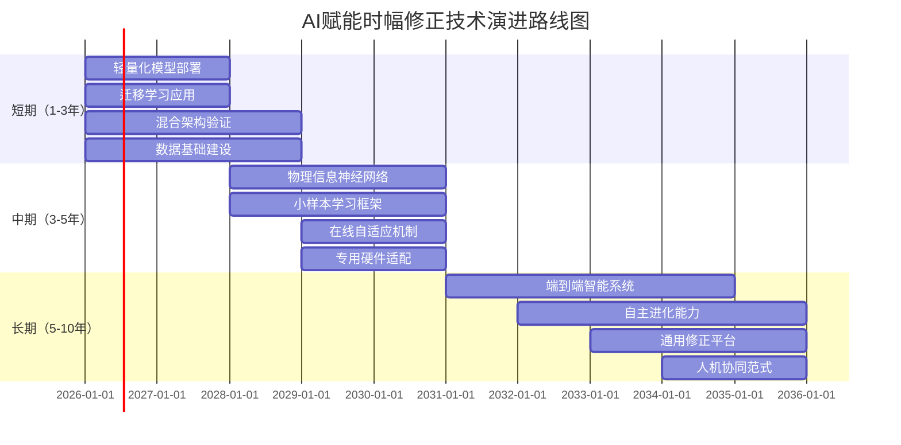

**关键技术节点与里程碑**

| 时间节点 | 技术里程碑 | 预期成果 | 关键挑战 |
|---------|----------|---------|---------|
| 2027年 | 轻量化模型FPGA部署 | 毫秒级AI辅助修正 | 模型压缩与精度保持 |
| 2029年 | 物理信息神经网络验证 | 数据效率提升10倍 | 物理约束形式化 |
| 2031年 | 在线自适应系统原型 | 自动适应系统漂移 | 稳定性与安全性 |
| 2033年 | 端到端智能修正系统 | 全流程AI化 | 系统集成复杂度 |
| 2035年 | 通用修正平台发布 | 跨领域应用 | 泛化能力验证 |

**产学研协同发展建议**

实现上述技术路线图需要产学研各方的协同努力：

- **学术界**：聚焦基础理论创新，探索物理-AI融合的新方法，建立标准化评测体系
- **产业界**：推动专用AI芯片和开发工具的成熟，提供工程化解决方案
- **应用方**：明确需求牵引，提供真实应用场景和数据支持，参与技术验证

**通过产学研的紧密合作，AI赋能电子学读出时幅修正有望在未来十年内实现从概念验证到规模化应用的跨越**，为高能物理、核医学、航空航天等关键领域的精密测量能力提升提供强有力的技术支撑。

## 7 结论与建议

本章作为研究报告的终章，系统总结AI算法赋能电子学读出时幅修正的核心发现与研究结论。基于前述章节对传统方法瓶颈、AI技术路径、可行性挑战及前沿方向的全面论证，本章将明确回答AI算法在提升时幅修正性能方面的潜力与边界，归纳AI方法的核心优势领域与当前主要障碍，并针对不同应用场景、资源条件和技术成熟度，提出分层次、可操作的技术选型与实施策略建议，为相关领域研究人员与工程师的决策提供系统性参考。

### 7.1 核心研究发现与结论总结

经过对电子学读出时幅修正技术体系的全面调研与深入分析，本研究得出以下核心结论：**AI算法在提升现有电子学读出时幅修正方法方面具备显著潜力**，这一潜力已在多个相关领域的成功应用中得到验证，并有望为突破传统方法的固有瓶颈提供革命性的技术路径。

**关于核心问题的明确回答**

本研究的核心问题是：AI算法能否提升现有电子学读出时幅修正方法？基于前述章节的系统论证，答案是**肯定的**，但这一肯定需要附加必要的限定条件。AI算法的提升潜力体现在以下几个关键维度：

- **噪声抑制效果**：AI方法可实现信噪比提升7dB以上，在非稳态噪声场景下语音清晰度指数提升可达12dB，失真率控制在3%以内，显著优于传统方法不超过5dB的提升水平

- **修正精度**：端侧AI可实现测量精度误差0.2%满量程（千分之二级别），响应延迟达10毫秒级，满足高精度实时应用需求

- **参数优化效率**：AI方法可将调试时间从传统的2小时缩短至15分钟，实现90%以上的效率提升

- **自适应能力**：AI模型能够自动跟踪系统漂移，无需频繁人工重标定，实现"越用越智能"的持续优化

**四条技术路径的理论优势与预期效能**

本研究识别并论证了AI算法提升时幅修正性能的四条核心技术路径，其理论优势与预期效能总结如下：

| 技术路径 | 核心机理 | 理论优势 | 预期效能 |
|---------|---------|---------|---------|
| **智能噪声建模与滤除** | CNN/RNN动态时频域建模 | 自适应学习非稳态噪声特征 | 信噪比提升12dB |
| **高精度误差预测与补偿** | 端侧AI实时预测与校正 | 零延迟闭环补偿 | 精度达千分之二级别 |
| **自适应参数优化** | 梯度校正递推辨识/强化学习 | 在线动态参数调整 | 自动适应系统漂移 |
| **端到端系统辨识** | 深度网络直接映射学习 | 无需显式物理模型 | 处理复杂非线性响应 |

**传统方法与AI方法的本质差异**

本研究揭示了传统时幅修正方法与AI方法之间存在的**范式级差异**，这些差异构成了AI方法能够突破传统技术瓶颈的根本原因：

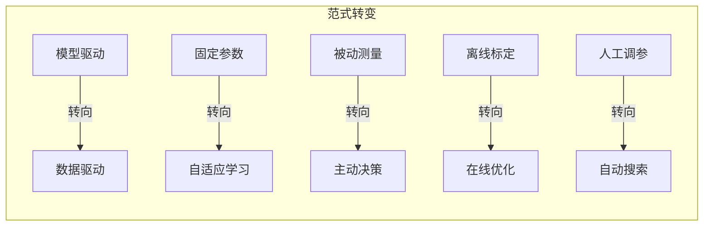

- **从模型驱动向数据驱动的转变**：传统方法依赖预定义的物理模型和解析公式，其有效性受限于模型假设的准确性；AI方法从数据中自主学习复杂模式，无需显式编程规则即可处理高维、非线性的关系映射

- **从固定参数向自适应学习的转变**：传统方法的滤波器系数、修正曲线参数在设计或标定后保持固定；AI方法通过在线学习机制持续优化参数，自动适应系统特性的动态变化

- **从被动测量向主动决策的转变**：传统方法被动接收信号并按固定规则处理；AI方法能够主动识别信号状态和噪声类型，选择最优处理策略，实现真正的智能化修正

### 7.2 AI方法的核心优势领域识别

基于本研究的系统分析，AI算法在时幅修正中展现显著优势的关键领域可归纳为以下四个方面：

**复杂非线性响应的精确建模能力**

神经网络作为通用函数逼近器，理论上可以拟合任意复杂度的非线性函数。这一能力使AI方法能够直接从数据中学习探测器和读出电路的真实响应特性，无需依赖简化的物理模型假设。在宽动态范围应用中，传统的低阶多项式拟合或分段线性化方法难以准确刻画复杂的非线性关系，而深度学习模型可以实现全动态范围内的精确修正。

**预期性能提升**：在传感器非线性误差修正应用中，基于AI的方法可将非线性误差从6.79%降低至0.02%，实现两个数量级以上的精度提升。

**非平稳噪声环境下的动态适应能力**

传统滤波方法依赖固定模型和静态阈值，在面对非稳态噪声时性能显著退化。AI方法通过构建能够捕捉非稳态噪声时空特征的深度学习模型，实现了从"被动滤波"向"主动识别"的技术范式转变。

**预期性能提升**：在80dB环境噪声条件下，AI降噪方法可将语音可懂度从32%提升至89%；在工业监测系统中，AI方法可在噪声突变时0.5秒内完成抑制，确保故障信号的准确识别。

**高维参数空间的自动优化能力**

传统方法的参数调优高度依赖专家经验和反复试验，在高维参数空间中难以找到全局最优配置。深度强化学习方法结合神经网络的表示能力和强化学习的探索-利用机制，能够在高维连续参数空间中以试错方式进行探索，显著减少对专家经验的依赖。

**预期性能提升**：AI自动参数优化可将调试时间从传统的2小时缩短至15分钟，同时在某些应用中可发现人工调参难以达到的更优配置。

**系统漂移的实时跟踪与补偿能力**

传统"离线标定、在线应用"模式无法应对系统特性的动态变化。AI方法通过自适应学习机制，使系统能够根据环境和自身性能的变化动态调整修正参数。端侧AI集成使传感器具备本地实时误差预测与补偿能力，实现零延迟的闭环校正。

**预期性能提升**：在汽车焊接应用中，端侧AI能在10毫秒内识别力道偏差并调整，将焊接坏件率从5.2%降至0.3%，年减少损失800多万元。

下表综合展示了AI方法各优势领域的技术实现基础与预期效能：

| 优势领域 | 技术实现基础 | 关键AI方法 | 预期效能指标 |
|---------|-------------|-----------|-------------|
| 非线性建模 | 神经网络通用逼近能力 | CNN、DNN | 误差降低两个数量级 |
| 噪声适应 | 时频域动态特征学习 | CNN+RNN、Transformer | 信噪比提升12dB |
| 参数优化 | 高维空间探索能力 | 深度强化学习 | 调试效率提升90% |
| 漂移跟踪 | 在线自适应学习 | 端侧AI、自适应控制 | 响应延迟10ms级 |

### 7.3 当前主要障碍与制约因素分析

尽管AI方法展现出显著的技术潜力，但从实验室研究向工程应用的转化过程中仍面临多维度的现实约束与技术挑战。系统认识这些障碍对于制定务实的实施策略至关重要。

**高质量标注数据的稀缺性困境**

数据是驱动AI模型学习的核心燃料，其质量与规模直接决定模型性能上限。在电子学读出时幅修正领域，高质量训练数据的获取面临独特困难：

- **真值信号定义困难**：理想状态下的正确修正结果难以通过独立手段精确测定
- **获取成本高昂**：高质量训练数据的生成依赖精密实验设备，过程复杂耗时
- **覆盖完备性不足**：训练数据样本不平衡可能导致模型在特定场景下失效
- **数据共享受限**：因隐私、知识产权等问题，跨机构数据整合面临体制性障碍

**严重程度评估**：★★★★★（最高）——数据问题是AI方法工程化应用的首要瓶颈，直接制约模型的泛化能力和可靠性。

**计算资源与实时性的平衡难题**

电子学读出系统对实时性有严苛要求，而深度学习模型往往具有较高计算复杂度：

- **延迟约束严格**：部分应用要求微秒甚至纳秒级响应，当前复杂AI模型难以满足
- **资源约束明显**：FPGA/ASIC等嵌入式平台的逻辑资源、存储和DSP单元有限
- **轻量化代价**：过度压缩模型可能损害在边缘工况下的修正精度

**严重程度评估**：★★★★☆——通过模型轻量化和专用硬件可部分缓解，但在极端实时性要求场景仍是关键制约。

**模型可解释性与可靠性的信任挑战**

AI模型的黑箱特性在关键测量系统中引发深层次的信任问题：

- **决策溯源困难**：当修正结果出现偏差时，难以定位问题根源
- **边界行为不可预测**：模型在训练数据覆盖范围外的行为难以预知
- **幻觉风险**：模型可能输出虚构数据或逻辑谬误，影响决策可靠性
- **监管合规要求**：部分受监管领域对算法可追溯性、可审计性有明确要求

**严重程度评估**：★★★★☆——在高能物理实验、核医学等关键领域尤为突出，需要建立完善的置信度评估机制。

**系统集成与工程化的复杂度障碍**

将AI算法从概念验证推进到工程应用需要解决多维度的集成问题：

- **软硬件协同设计复杂**：需要跨学科专业知识（核电子学、AI、嵌入式系统）
- **与现有流程兼容性**：需要与成熟的标定校准流程和质量控制体系相兼容
- **运维管理挑战**：AI模型的版本管理、在线更新、故障恢复等带来新的运维需求
- **开发周期长**：完整开发周期可能需要12-24个月，资源投入显著

**严重程度评估**：★★★☆☆——主要是工程层面的挑战，可通过组建跨学科团队和采用成熟解决方案逐步克服。

**障碍间的相互关联与缓解路径**

上述四类障碍并非相互独立，而是存在复杂的关联关系：

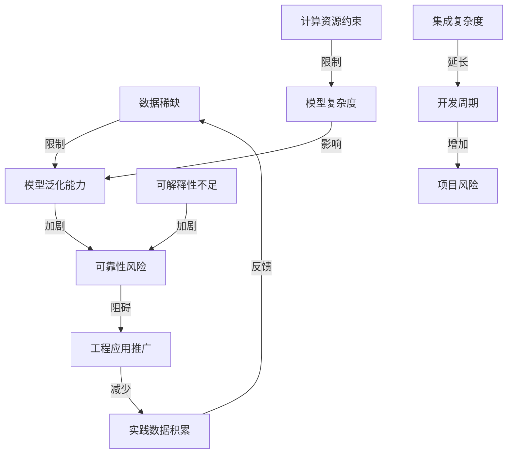

缓解这些障碍的可能路径包括：

| 障碍类型 | 缓解路径 | 技术成熟度 | 预期效果 |
|---------|---------|-----------|---------|
| 数据稀缺 | 小样本学习、迁移学习、合成数据 | 中等 | 部分缓解 |
| 计算资源 | 模型轻量化、专用AI芯片 | 较高 | 显著缓解 |
| 可解释性 | 机制可解释性、置信度评估 | 较低 | 逐步改善 |
| 集成复杂度 | 跨学科团队、标准化接口 | 中等 | 可控制 |

### 7.4 分场景技术选型策略建议

不同应用场景对时幅修正的需求存在显著差异，AI技术的选型应充分考虑场景特点、性能优先级和资源约束。本节针对典型应用场景提出具体的技术选型建议。

**高能物理实验场景**

**场景特点**：对数据质量要求极高，但实时性要求相对宽松（可接受离线处理）；实验产生海量数据，为AI训练提供良好基础；实验数据珍贵，对修正可靠性和可追溯性要求严格。

**优先级排序**：可靠性 > 精度 > 实时性

**推荐技术方案**：
- **首选方法**：混合架构——传统物理模型与深度学习残差修正相结合
- **模型选择**：物理信息神经网络（PINN），融合探测器响应物理规律
- **部署策略**：离线批处理为主，逐步向准实时过渡
- **可靠性保障**：建立完善的置信度评估机制，与传统方法结果交叉验证

**质谱分析场景**

**场景特点**：对时间分辨率和幅度线性度要求严格；数据处理通常在毫秒级完成；商业化应用需考虑成本效益和市场接受度。

**优先级排序**：精度 > 实时性 > 成本

**推荐技术方案**：
- **首选方法**：监督学习回归模型用于时间游走修正
- **模型选择**：轻量化CNN提取波形特征，结合回归网络预测修正量
- **部署策略**：嵌入式FPGA部署，实现毫秒级响应
- **优化重点**：模型量化和剪枝，平衡精度与计算效率

**雷达系统场景**

**场景特点**：对实时性要求最为苛刻，信号处理延迟必须控制在微秒级；需要应对复杂的环境干扰和目标特性变化；系统可靠性和稳定性要求极高。

**优先级排序**：实时性 > 可靠性 > 精度

**推荐技术方案**：
- **首选方法**：传统方法为主，AI辅助增强
- **模型选择**：极轻量化神经网络或查表法与AI优化相结合
- **部署策略**：短期内AI主要用于离线参数优化，中长期探索端侧AI芯片集成
- **发展路径**：等待轻量化技术和专用硬件进一步成熟后逐步引入实时AI处理

**通用技术选型决策框架**

针对其他应用场景，可参考以下决策框架进行技术选型：

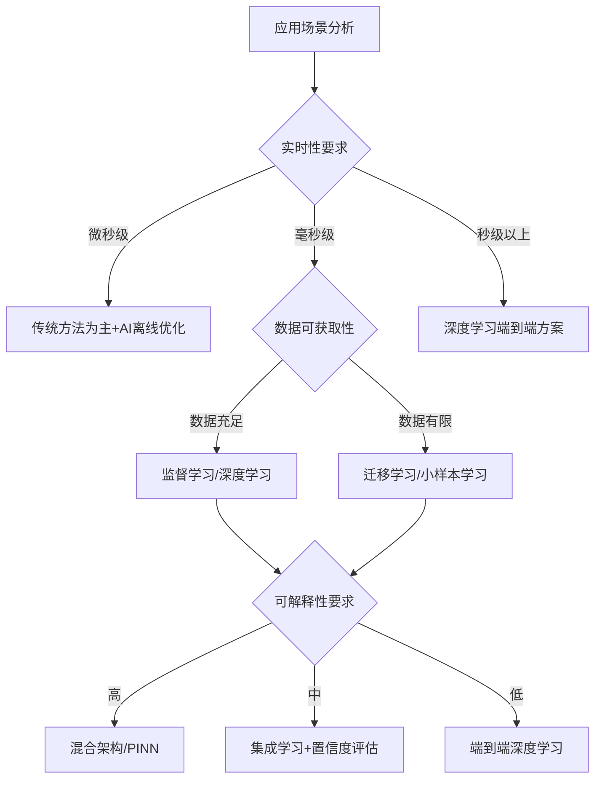

**AI方法范式与场景匹配指南**

| AI方法范式 | 最佳适用场景 | 数据需求 | 实时性 | 可解释性 |
|-----------|-------------|---------|--------|---------|
| 监督学习（回归） | 系统误差补偿、时间游走修正 | 中等标注数据 | 好 | 较好 |
| 监督学习（分类） | 噪声类型识别、异常检测 | 中等标注数据 | 好 | 较好 |
| 无监督学习 | 系统状态监测、漂移检测 | 大量无标注数据 | 好 | 中等 |
| 深度学习（CNN） | 波形特征提取、复杂非线性建模 | 大量数据 | 需优化 | 较差 |
| 深度学习（RNN） | 时序依赖建模、动态噪声处理 | 大量时序数据 | 需优化 | 较差 |
| 强化学习 | 在线自适应控制、参数优化 | 交互数据 | 中等 | 中等 |
| 混合架构 | 高可靠性要求、物理约束明确 | 中等数据 | 可调 | 好 |

### 7.5 分阶段实施路径与资源配置建议

考虑到AI方法应用面临的多维度挑战和不同组织的资源条件差异，本节提出渐进式的AI引入策略，明确各阶段的关键任务、资源需求和风险控制要点。

**第一阶段（短期，1-2年）：离线处理与系统监测**

**核心目标**：在低风险环节验证AI方法的有效性，积累数据和经验

**关键任务**：
- 在离线数据处理环节引入AI方法，提升标定精度和数据质量
- 部署无监督学习方法用于系统状态监测和异常检测
- 建立标准化的数据采集和标注流程
- 构建AI模型开发和评测的基础设施

**资源配置建议**：
- **团队构成**：2-3名具有信号处理背景的AI工程师，1-2名领域专家
- **计算资源**：GPU工作站用于模型训练，无需专用硬件部署
- **时间投入**：6-12个月完成初步验证

**风险控制**：
- AI模块作为辅助工具运行，不直接参与关键决策
- 保持与传统方法的并行运行，便于效果对比
- 建立模型性能监控机制，及时发现退化

**关键成功因素**：
- 获取足够的高质量训练数据
- 建立清晰的性能评估指标和验收标准
- 获得领域专家的持续支持和反馈

**第二阶段（中期，2-4年）：实时辅助修正**

**核心目标**：将AI能力扩展到实时处理环节，实现性能的显著提升

**关键任务**：
- 开发轻量化AI模型，部署到FPGA或专用AI芯片
- 实现AI辅助的实时噪声抑制和误差补偿
- 建立混合架构，AI模块与传统方法协同工作
- 完善模型更新和版本管理机制

**资源配置建议**：
- **团队构成**：5-8人跨学科团队（AI、硬件、领域专家）
- **硬件投入**：FPGA开发平台、专用AI芯片评估板
- **时间投入**：18-24个月完成系统集成

**风险控制**：
- 保留传统方法作为备份，支持快速切换
- 建立完善的测试验证流程，确保系统稳定性
- 设置AI干预的置信度阈值，低置信度时回退到传统方法

**关键成功因素**：
- 成功实现模型轻量化，满足实时性要求
- 解决AI模块与现有系统的集成问题
- 建立有效的在线性能监控机制

**第三阶段（长期，4年以上）：端到端智能修正**

**核心目标**：实现全流程AI化，达到自主进化的智能测量系统

**关键任务**：
- 开发端到端智能修正系统，从信号采集到修正输出全流程AI化
- 实现基于强化学习的在线自适应优化
- 构建自主进化能力，系统性能持续优化
- 探索通用修正平台，支持跨探测器、跨领域应用

**资源配置建议**：
- **团队构成**：10人以上专业团队，包含算法、硬件、系统集成专家
- **硬件投入**：定制化AI芯片或神经形态计算平台
- **时间投入**：3-5年持续迭代

**风险控制**：
- 采用渐进式部署，逐步替代传统模块
- 建立完善的安全约束机制，防止AI决策失控
- 保持人工监督和干预能力

**关键成功因素**：
- 物理信息神经网络等前沿技术的成熟应用
- 专用AI硬件的性能和成本达到可接受水平
- 建立行业认可的AI修正系统标准和规范

**实施路径总览**

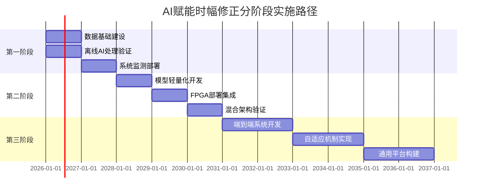

**资源投入与预期回报评估**

| 实施阶段 | 资源投入（人年） | 硬件投入 | 预期性能提升 | 投资回报周期 |
|---------|----------------|---------|-------------|-------------|
| 第一阶段 | 4-6人年 | 低（GPU工作站） | 10-20% | 1-2年 |
| 第二阶段 | 12-18人年 | 中（FPGA+AI芯片） | 30-50% | 2-3年 |
| 第三阶段 | 30-50人年 | 高（定制硬件） | 50-100% | 3-5年 |

**最终建议**

基于本研究的全面分析，对于考虑引入AI方法提升时幅修正性能的研究机构和企业，提出以下综合建议：

1. **明确需求优先级**：首先评估当前系统的性能瓶颈，明确AI方法需要解决的核心问题，避免为技术而技术

2. **采取渐进式策略**：从低风险的离线处理和系统监测环节起步，逐步积累经验和信任，再向实时处理扩展

3. **重视数据基础**：将数据采集、标注和管理作为优先投入领域，高质量数据是AI方法成功的根本保障

4. **组建跨学科团队**：AI赋能时幅修正需要核电子学、信号处理、机器学习、嵌入式系统等多领域知识的融合

5. **保持技术开放性**：关注轻量化神经网络、物理信息神经网络、专用AI芯片等前沿技术的发展，适时引入成熟方案

6. **建立评估机制**：制定清晰的性能指标和验收标准，持续监控AI方法的实际效果，及时调整技术路线

**AI方法并非要完全取代传统时幅修正技术，而是作为增强和补充手段**。在可预见的未来，混合架构——结合传统方法的可靠性和AI方法的自适应能力——可能是最具实践价值的技术路线。通过产学研的紧密合作，AI赋能电子学读出时幅修正有望在未来十年内实现从概念验证到规模化应用的跨越，为高能物理、核医学、航空航天等关键领域的精密测量能力提升提供强有力的技术支撑。

# 参考内容如下：
[^1]:[电子测量与仪器基本概念](https://www.hxedu.com.cn/hxeduRes/simplecharacter/1505457115831.pdf)
[^2]:[小智AI音箱环境噪声自学习优化-CSDN博客](https://blog.csdn.net/weixin_35835018/article/details/154186143)
[^3]:[基于机器学习的数据库系统参数优化方法综述](http://gxb.zzu.edu.cn/upload/html/202303051.html)
[^4]:[电子学](http://baike.eepw.com.cn/baike/show/word/电子学)
[^5]:[AI驱动的电子系统优化-洞察及研究](https://www.renrendoc.com/paper/502417445.html)
[^6]:[深度|2026年AI系列专题2:强化学习应用落地场景与商业价值](https://baijiahao.baidu.com/s?id=1855084445136915216&wfr=spider&for=pc)
[^7]:[AI降噪技术实战指南:基于RNNoise的实时音频处理解决方案](https://blog.csdn.net/gitblog_00033/article/details/157340299)
[^8]:[滤波与成形](https://baike.baidu.com/item/滤波与成形/17569319)
[^9]:[成形时间常数](https://baike.baidu.com/item/成形时间常数/53955765)
[^10]:[一文读懂 ADC:工作原理、架构分类与核心性能指标](https://baijiahao.baidu.com/s?id=1852752749008067827&wfr=spider&for=pc)
[^11]:[ADC&TDC 模拟&时间/数字转换器的应用 ](https://roll.sohu.com/a/654932125_100124343)
[^12]:[一种基于脉冲前沿时间测量和幅度修正算法的飞行时间质谱仪电子学读出方法](http://d.wanfangdata.com.cn/Patent_CN201110131019.6.aspx)
[^13]:[粒子探测器读出电路数字滤波器设计 ](http://www.chinaaet.com/article/97677)
[^14]:[数字滤波处理去除噪声影响](https://blog.csdn.net/weixin_42608299/article/details/154762320)
[^15]:[通用数字滤波算法](https://blog.csdn.net/u010182136/article/details/130978281)
[^16]:[机器学习之监督学习算法:回归篇](http://baijiahao.baidu.com/s?id=1700452775723645827&wfr=spider&for=pc)
[^17]:[修正算法](https://baike.baidu.com/item/修正算法/20812061)
[^18]:[信号处理算法:神经网络在信号处理中的应用_(15).神经网络在噪声抑制中的应用.docx](https://m.book118.com/html/2025/1203/8013057007010016.shtm)
[^19]:[基于机器学习的快速时序校准方法*](http://gia.ac.cn/scipub/scipublist/y2022/P020250718578040728998.pdf)
[^20]:[故障诊断技术:基于机器学习的故障诊断_20.故障诊断中的无监督学习.docx 14页](https://m.book118.com/html/2025/1111/8035013062010007.shtm)
[^21]:[用于汽车卡车异常检测的无监督深度学习:综述](https://www.ebiotrade.com/newsf/2025-11/20251108171745810.htm)
[^22]:[神经网络信号噪声辨识去除 神经网络噪声是什么](https://blog.51cto.com/u_16099169/7726997)
[^23]:[李佳星, 赵勇先, 王京华. 基于深度学习的单幅图像超分辨率重建算法综述. 自动化学报, 2021, 47(10): 2341−2363 doi: 10.16383/j.aas.c190859](https://aas.net.cn/cn/article/doi/10.16383/j.aas.c190859?viewType=HTML)
[^24]:[利用神经网络对脑电图(EEG)降噪------开源的、低成本、低功耗微处理器神经网络模型解决方案](https://www.cnblogs.com/mcu-ai-QH/p/18168646)
[^25]:[探索神经网络的噪声应用:加噪与降噪技术的力量](https://developer.baidu.com/article/details/2683851)
[^26]:[数据修正](https://baike.baidu.com/item/数据修正/22127707)
[^27]:[基于神经网络的自适应噪声抵消技术:原理、应用与展望.docx 23页VIP](https://m.book118.com/html/2025/1230/7126110151011032.shtm)
[^28]:[AI降噪:破解非稳态噪音困局的技术革命](https://developer.baidu.com/article/detail.html?id=5416954)
[^29]:[AI降噪:破解非稳态噪音难题的技术利器](https://developer.baidu.com/article/detail.html?id=5417025)
[^30]:[端侧 AI 六维力传感器 解锁千亿级场景价值,掀起边缘智能革命](https://baijiahao.baidu.com/s?id=1843311093431888292&wfr=spider&for=pc)
[^31]:[系统辨识与自适应控制:MATLAB仿真详解](https://blog.csdn.net/weixin_28949937/article/details/150394036)
[^32]:[自适应控制-系统辨识部分-Part2](https://blog.csdn.net/RioiiRichard/article/details/137155710)
[^33]:[AI降噪革命:智能消除非稳态噪音的技术突破与应用](https://developer.baidu.com/article/detail.html?id=5416737)
[^34]:[激光雷达与摄像头不同步?深度解析多传感器时间同步校准难题-CSDN博客](https://blog.csdn.net/AlgoInk/article/details/156050674)
[^35]:[人工智能给数据安全带来哪些新挑战?应如何治理?](https://www.scdsjzx.cn/scdsjzx/2407hydt/2025/6/18/42f62b8b243c419b8f28f686a02998f8.shtml)
[^36]:[如何提高 AI 的安全性和可靠性?AI 失控离我们多远?从 2 亿诈骗到 5 小时救场,揭秘安全防线搭建密码!](https://baijiahao.baidu.com/s?id=1845108454934597212&wfr=spider&for=pc)
[^37]:[拆解AI黑箱,深度解读“机制可解释性”|2026年十大突破性技术](https://baijiahao.baidu.com/s?id=1854180493410616357&wfr=spider&for=pc)
[^38]:[赛迪前瞻:AI for Science崛起的机遇、挑战与建议](https://baijiahao.baidu.com/s?id=1850545125203575985&wfr=spider&for=pc)
[^39]:[人工智能(AI)加速器芯片](https://baike.baidu.com/item/人工智能(AI)加速器芯片/65103631)
[^40]:[什么是小样本学习? ](https://www.ibm.com/cn-zh/think/topics/few-shot-learning?mhsrc=ibmsearch_a&mhq=few-show%20Learning)
[^41]:[清华大学团队揭秘AI视觉识别"轻装上阵"的秘密:无需真实数据也能让神经网络变聪明](https://news.qq.com/rain/a/20250728A04BAJ00)
[^42]:[AI新星系列报道之十一 | 周凯:“Physics for AI”物理与人工智能的双向融合](https://www.cuhk.edu.cn/zh-hans/article/15235)
[^43]:[【创新基石】融合物理规律与认知机理 推动AI应用取得新突破 ](https://mp.weixin.qq.com/s?__biz=MzA3NzMwNTYwMw==&mid=2652632315&idx=1&sn=2cf3cdda47fdc7553f16695a450e0e37&chksm=8530fa3ae2758d04c9f7957237e6a78bea5aa8bca416a2e96a80e0591d372211e8ce7f6ebe8a&scene=27)
[^44]:[AI 时代的清华电子力量|清微智能尹首一:致力于将硬核技术与工程落地完美结合](https://www.ee.tsinghua.edu.cn/info/1076/4919.htm)
[^45]:[AI芯片技术演进的双轨路径:从通用架构到领域专用的并行演进](https://baijiahao.baidu.com/s?id=1854709669100447187&wfr=spider&for=pc)
[^46]:[又一国产AI芯片IPO来了!芯片首富虞仁荣参投,估值百亿](https://baijiahao.baidu.com/s?id=1855344766641628876&wfr=spider&for=pc)
[^47]:[从芯片到系统,Cadence开启设计智能化新时代](https://baijiahao.baidu.com/s?id=1828092322318946352&wfr=spider&for=pc)
