# 全球数学与量子计算交叉领域研究团队全景图：比较分析、突破潜力评估与未来展望
## 1 引言：数学与量子计算交叉融合的时代背景与研究价值

在人类文明的技术演进史上，数学始终扮演着"隐形引擎"的角色。从牛顿力学体系的微积分基础到爱因斯坦相对论的黎曼几何支撑，数学语言不断重构着人类对世界的认知框架[^1]。当历史的车轮驶入21世纪第三个十年，量子计算与数学的交汇发展正酝酿着新一轮科技革命，而这场革命的底层逻辑，依然是数学规则的重写与突破。本章将系统阐述数学与量子计算交叉领域兴起的时代背景与深层动因，梳理两大学科从独立发展到深度融合的历史脉络与内在逻辑，明确本报告的核心目标与研究方法论选择，并概述报告的整体结构安排。

### 1.1 数学与量子计算交叉融合的历史演进与内在逻辑

#### 1.1.1 从理论构想到技术实现的发展历程

量子计算的诞生源于物理学和计算机科学的跨界融合，是20世纪末最具革命性的科学构想之一[^2]。这一领域的发展历程不仅展现了人类智慧的光芒，也揭示了自然界最深奥的奥秘。**1980年代初**，物理学家们正面临着一个棘手的难题：如何有效模拟复杂的量子系统。传统的计算机在处理这类问题时显得力不从心，因为量子系统的复杂性随着粒子数量的增加呈指数级增长[^2]。

正是在这样的背景下，**理查德·费曼（Richard Feynman）于1981年提出了一个大胆的设想**：利用量子系统本身来模拟其他量子系统[^3][^2]。费曼的这一构想犹如黑暗中的一道闪电，照亮了通往量子计算的道路。他敏锐地意识到，量子系统的独特性质——如叠加态和纠缠——可能为解决复杂计算问题提供全新的途径。这一思想不仅为量子计算奠定了理论基础，更重要的是，它开启了一个全新的研究领域，激发了物理学家和计算机科学家的无限想象力[^2]。

量子计算的发展经历了从理论奠基到技术突破的多个关键阶段，下表系统梳理了这一演进历程：

| 时期 | 关键里程碑 | 核心贡献者 | 数学突破 |
|------|-----------|-----------|---------|
| 1980-1981年 | 量子版图灵机概念提出 | 保罗·贝尼奥夫、理查德·费曼 | 量子力学与计算理论的初步结合 |
| 1985年 | 通用量子计算机概念 | 戴维·德意志 | 首个量子算法的数学框架 |
| 1994年 | Shor算法提出 | 彼得·肖尔 | 量子傅里叶变换的周期寻找理论 |
| 1996年 | Grover搜索算法 | 洛夫·格罗弗 | 希尔伯特空间幅度放大操作 |
| 1995-1997年 | 量子纠错理论 | 肖尔、斯蒂恩等 | 稳定子码的代数结构 |
| 2019年 | 量子优越性实现 | 谷歌团队 | 随机量子电路采样的复杂度证明 |

这一发展历程清晰地表明，**每一次量子计算的重大突破都伴随着相应数学理论的创新**，两者之间存在着深刻的内在关联。

#### 1.1.2 数学在量子计算核心环节中的基础性作用

**量子计算的本质是希尔伯特空间中的线性代数革命**[^1]。量子比特的叠加态本质是复数域上的单位向量，其演化遵循幺正变换的数学规则。与传统计算机使用0或1的比特来存储信息不同，一个量子比特可以同时处于0和1两种状态的相干叠加[^3]。推而广之，n个量子比特便可表示2^n个数的叠加，使得一次量子操作原理上可以同时实现对2^n个叠加的数进行并行运算[^3]。

数学在量子计算中的基础性作用体现在以下核心环节：

**第一，线性代数构成量子态表示与操作的数学基石。** 量子系统由量子比特组成，每个量子比特的状态可以用二维复向量表示，多个量子比特组成的系统状态则可以用高维复向量表示[^4]。这些向量在希尔伯特空间中进行操作，量子门通过矩阵表示实现状态变换。叠加原理可以用线性组合来描述，而纠缠则是多个量子比特状态之间的非局部相关性，这种现象无法用经典概率论来描述[^4]。

**第二，概率论与统计为量子测量提供理论基础。** 量子测量是量子计算中的核心操作之一，其结果遵循Born规则，即测量结果的概率由量子态的模长平方决定[^4]。统计方法通过分析多次实验的结果，估计误差的分布和影响，从而为量子算法的优化和改进提供依据。

**第三，信息论为量子计算提供了理论框架。** 量子熵是衡量量子系统不确定性的重要工具，而量子纠缠则是量子计算中独特的信息资源[^4]。这些概念为量子压缩、量子纠错等技术提供了理论依据，为量子通信的容量和错误校正提供了理论框架。

**第四，拓扑学为量子纠错提供关键数学工具。** 表面码量子纠错方案的核心，是利用稳定子码的代数结构构建拓扑量子比特[^1]。微软Station Q实验室提出的拓扑量子计算方案，其数学基础是任意子编织统计的模函数理论。这些数学构造将量子比特的错误率压低至容错阈值以下，为构建实用化量子计算机扫清理论障碍[^1]。

#### 1.1.3 两大学科交叉融合的演进规律

数学与量子计算的交叉融合呈现出从早期探索到当前加速发展的清晰演进规律。这一演进过程可以通过以下流程图直观呈现：

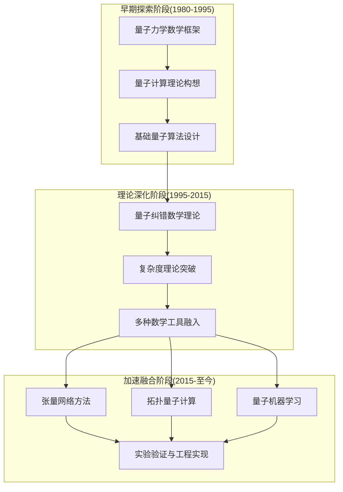

这一演进规律揭示了数学与量子计算交叉融合的**内在必然性**：量子计算的每一步实质性进展都依赖于相应数学理论的支撑，而量子计算的新需求又反过来推动数学理论的创新发展。正如中国科学技术大学教授陆朝阳所比喻的，传统计算机走迷宫每次只能选择一条路去尝试，而量子计算机就好比同时有多人一起尝试不同的路，瞬间把所有可能都尝试一遍[^3]。这种根本性的计算范式差异，正是源于量子力学数学结构的深度挖掘。

### 1.2 全球科技竞争格局下的战略意义与研究动因

#### 1.2.1 摩尔定律极限与下一代算力突破口

**当摩尔定律逐渐逼近物理极限，量子计算正成为全球科技竞争的焦点**[^5]。传统半导体技术的发展正面临原子尺度的物理限制，晶体管尺寸已难以继续缩小，经典计算的算力增长速度明显放缓。在这一背景下，量子计算凭借其独特的并行计算能力，被视为突破算力瓶颈的关键路径。

量子计算与经典计算的区别不仅是算力上的巨大差异，更是**结构性差异**：经典计算的状态空间是线性增长，量子系统的状态空间是指数增长[^3]。当量子比特数足够大（例如达到250个）时，量子计算机能够存储的数据量比宇宙中所有原子的数目还要多[^3]。这种指数级的计算优势使得量子计算在特定问题上具有颠覆性的应用潜力。

量子计算的应用前景涵盖多个战略性领域：在新药研发中，它可以同时模拟数百万种分子结构，将研发周期从十年缩短到数年；在自动驾驶方面，能瞬间解析复杂路况和突发情况；在气象预测时，能穿透"蝴蝶效应"的混沌，实现更早、更精准的极端天气预警[^5]。

#### 1.2.2 主要国家和地区的政策布局与资源投入

面对量子计算的战略价值，全球主要国家和地区纷纷加大政策布局与资源投入。**美国依托《国家量子倡议》持续加码投入，欧盟推出《塑造欧洲量子技术战略》覆盖科研到产业化的全链条发展，中国则在顶层设计中明确将量子信息列入"十五五"新赛道**[^5]。

从产业发展态势来看，截至2025年8月，全球量子计算企业已超400家，中美两国几乎占据半壁江山。2025年上半年，全球该领域投融资已突破20亿美元[^5]。资本的大量涌入正在加速量子计算的应用探索，但该领域仍未迈过规模化落地的门槛。

值得注意的是，**中国在量子计算领域展现出强烈的文化自信与科研自信**。近年来，"墨子号""九章""祖冲之号"等一系列大国重器纷纷以中国古代科学家或典籍命名，这并非偶然，而是中华文明创新精神在当代的生动延续与自信表达[^6]。"九章"量子计算机的命名源于中国古代著名数学专著《九章算术》，该书代表了东方数学的算法传统，与西方欧几里得《几何原本》的演绎传统交相辉映[^6]。这一命名选择体现了中国科研界对传统数学智慧与现代量子计算深度关联的认知。

#### 1.2.3 开展全球研究团队全景分析的紧迫性与价值

在上述全球科技竞争格局下，**系统梳理和深入分析全球数学与量子计算交叉领域的研究团队具有重要的战略价值和现实紧迫性**。

首先，从战略研判角度看，准确把握全球顶尖研究团队的分布格局、研究方向和发展态势，有助于识别未来技术突破的可能来源，为国家科技战略决策提供参考依据。其次，从学术发展角度看，通过横向比较分析，可以揭示不同研究路径的优劣势，为学术界的研究方向选择提供借鉴。第三，从产业布局角度看，识别最具突破潜力的研究团队，有助于产业界精准对接前沿科研力量，加速技术转化进程。

当前，量子计算正处于从实验室科研工具迈向具备商用价值的未来算力底座的关键转型期[^5]。华翊量子CEO姚麟指出："量子计算的'Aha时刻'还没有到来，我们现在所处的阶段，更像人工智能发展早期。大家期待的是像2016年AlphaGo那样，真正展现出解决实际问题的能力，但目前还远远没到那一步，至少还需要5年时间。"[^5]这一判断凸显了当前开展前瞻性研究的重要性——正是在技术突破前夜，对全球研究格局的系统把握才具有最大的战略价值。

### 1.3 研究目标、核心问题与方法论框架

#### 1.3.1 研究目标与分析对象

本报告以**全球数学与量子计算交叉领域的研究团队**为核心分析对象，旨在实现以下研究目标：

**第一，全景扫描与系统梳理。** 系统识别和梳理全球范围内在数学与量子计算交叉领域具有代表性的顶尖大学、研究机构及核心团队，描绘该领域的全球研究格局。

**第二，多维度横向比较分析。** 构建科学的比较分析框架，从研究方向、学术产出、国际合作、资金支持、工业界合作等多个维度对各团队进行系统比较，揭示其相对优势与差异化特征。

**第三，突破潜力评估与预测。** 基于比较分析结果，评估哪些团队最有可能在未来5-10年内推动量子计算技术的重大突破，并预测可能产生的关键性数学理论或应用技术。

#### 1.3.2 核心研究问题

围绕上述研究目标，本报告聚焦以下三大核心问题：

**问题一：全球数学与量子计算交叉领域的研究团队分布格局如何？** 各团队的成立背景、领军人物、组织架构与核心定位有何特点？在算子代数与量子信息、量子算法复杂性、量子机器学习理论、量子纠错数学基础、量子模拟的数值方法等具体方向上，各团队的研究侧重有何差异？

**问题二：不同研究团队在多维度比较中呈现怎样的差异化特征？** 在研究方向独特性与前沿性、学术论文产出质量与数量、国际合作网络广度与深度、政府及基金资金支持力度、工业界合作紧密程度与转化实效等维度上，各团队的表现如何？

**问题三：哪些团队最有可能引领未来突破，可能产生哪些关键理论与技术？** 评估各团队的理论创新能力、技术实现路径、资源整合能力、跨学科协作效率以及对核心挑战的应对策略，预测未来可能涌现的颠覆性数学理论与革命性应用技术。

#### 1.3.3 方法论框架与关键要素

本报告采用**系统性文献调研与多维度比较分析相结合**的研究方法论。具体而言，研究方法论框架包含以下关键要素：

**团队识别标准：** 基于学术声誉、研究产出、国际影响力等指标，识别在数学与量子计算交叉领域具有显著贡献的研究团队，覆盖北美、欧洲、亚太等主要科研区域。

**比较分析维度：** 构建包含研究方向独特性与前沿性、学术论文产出质量与数量、国际合作网络广度与深度、政府及基金资金支持力度、工业界合作紧密程度与转化实效等维度的综合比较框架。

**潜力评估指标：** 从理论创新能力、技术实现路径、资源整合能力、跨学科协作效率、核心挑战应对策略等角度构建评估指标体系，对各团队的未来突破潜力进行综合评估。

### 1.4 报告结构与各章节逻辑关联

本报告共分为七个章节，各章节之间形成层层递进、相互支撑的逻辑关系。报告整体结构可通过以下流程图呈现：

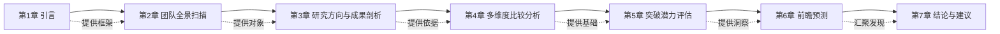

**第一章（本章）** 作为引言，系统阐述研究背景、目标、问题与方法论框架，为后续分析奠定基础。

**第二章** 将对全球数学与量子计算交叉领域的主要研究团队进行全景扫描，涵盖北美、欧洲、亚太等地区的顶尖大学、研究机构及核心团队，梳理其成立背景、领军人物、组织架构与核心定位。

**第三章** 将深入剖析各主要团队的核心研究方向与代表性成果，涵盖算子代数与量子信息、量子算法复杂性、量子机器学习理论、量子纠错数学基础、量子模拟的数值方法等具体方向。

**第四章** 将构建并应用多维度比较分析框架，对各团队进行横向对比，揭示其相对优势与差异化特征。

**第五章** 将基于前述比较分析，综合评估各团队的未来突破潜力，分析其理论创新能力、技术实现路径、资源整合能力等关键驱动因素。

**第六章** 将归纳最具潜力团队的研究轨迹与行业趋势，预测未来5-10年可能涌现的关键数学理论与应用技术。

**第七章** 将总结报告核心发现，凝练政策启示，并坦诚讨论研究局限性与未来研究方向。

各章节内容相互支撑、逻辑递进，共同服务于全面把握全球数学与量子计算交叉领域研究格局、识别未来突破方向这一核心研究目标。

## 2 全球数学与量子计算交叉领域主要研究团队全景扫描

本章系统梳理全球范围内在数学与量子计算交叉领域具有代表性的顶尖研究力量，涵盖北美、欧洲、亚太三大主要科研区域的核心大学、研究机构及团队。通过对各团队成立背景、领军人物、组织架构与核心定位的调研分析，勾勒该领域全球研究格局的基本面貌，为后续章节的研究方向剖析与比较分析奠定基础。

### 2.1 北美地区核心研究团队

北美地区汇聚了全球数学与量子计算交叉领域最为密集的顶尖研究力量，形成了以加拿大滑铁卢大学、美国麻省理工学院、哈佛大学、马里兰大学等为核心的研究集群。这些机构不仅在理论创新方面引领全球，还在产学研协同、人才培养等方面形成了成熟的生态体系。

#### 2.1.1 滑铁卢大学量子计算研究所

**滑铁卢大学量子计算研究所（Institute for Quantum Computing, IQC）是全球数学与量子计算交叉领域的标杆性机构**。该研究所于2002年在黑莓创始人迈克·拉扎里迪斯的资助下成立，开创了企业家深度参与量子科研的先河[^7]。拉扎里迪斯还出资建立了滑铁卢周边理论物理研究所（Perimeter Institute），两者形成了紧密的协作网络，共同构成进行量子科学研究的重要机构集群[^7]。

从组织规模来看，量子计算研究所目前拥有约296名研究人员，自成立以来已发表超过1500篇研究论文[^7]。这一规模使其成为全球最大的量子计算专门研究机构之一。该研究所的**最大优势在于将学术研究的卓越性与将技术商业化的创业动力有机结合**[^7]，这一特点使其在理论突破与应用转化之间建立了高效的转化通道。

在领军人物方面，加拿大数学家**米凯莱·莫斯卡（Michele Mosca）**是该研究所的创立人之一，其研究主要集中在量子计算算法、量子密码学和量子错误纠正等领域[^8]。莫斯卡教授的工作为量子计算的实用化奠定了重要的理论基础，尤其在量子密码学安全性分析方面具有国际影响力。

#### 2.1.2 麻省理工学院理论物理中心与量子信息研究

**麻省理工学院（MIT）在量子计算和量子信息领域的研究具有深厚的理论物理学基础**。该校理论物理中心利用其在基础物理学方面的优势，深耕量子信息和量子计算（QI/QC）学科，研究范围涵盖量子算法和复杂性、量子信息论、测量和控制以及应用和连接等多个方向[^7]。

在领军人物方面，**Aram Harrow**是麻省理工学院物理系教授，其主要研究领域包括量子计算复杂性理论、量子机器学习算法等，在量子信息与计算理论的交叉领域取得了突破性成果[^9]。他与合作者共同提出了著名的**HHL量子线性系统算法**，该算法为量子机器学习奠定了理论基础，被认为是量子计算在机器学习领域最重要的理论突破之一[^9]。近期，Harrow教授致力于探索随机浅层量子电路的模拟相变现象，推动了对量子计算复杂性边界的理解[^9]。

2025年12月，由麻省理工学院Dirk Englund团队牵头，联合NTT Research公司研究团队，提出了一种**量子安全多方深度学习方法**，允许多方协作完成复杂的人工智能计算，同时确保隐私数据和专有模型算法的安全[^10]。研究团队基于电信行业标准光学器件，开发出一种相干光量子线性代数引擎，在MNIST数据集测试中准确率超过95%，每权重元素和每数据元素的信息泄漏均低于0.1比特[^10]。这一成果展示了MIT在量子计算与人工智能交叉领域的前沿探索。

#### 2.1.3 哈佛大学量子计划

**哈佛大学科学与工程量子计划（Harvard Quantum Initiative, HQI）是量子计算研究领域的带头人之一**。该计划定位为"一个对推进量子系统科学与工程及其应用有着浓厚兴趣的研究人员团体"，其使命是为科学家和工程师研发新方法，以将量子理论转化为实用的系统和设备[^7]。

HQI的研究愿景着眼于"第二次量子革新"。正如该组织所阐述的，第一次量子革新创造了GPS导航和全球通信，还在医学方面实现了磁共振成像（MRI）等技术突破，而HQI成员正在为第二次革新积蓄力量[^7]。这一战略定位体现了哈佛在推动量子技术从基础研究向实际应用转化方面的雄心。

在具体研究成果方面，物理学教授**米凯尔·卢金（Mikhail Lukin）**和研究小组在此演示了一个51量子位的特殊量子模拟器[^7]。更为重要的是，**哈佛大学研究团队于2025年首次在一套集成量子系统中实现了可扩展量子计算与量子纠错所需的全部关键要素**，向构建实用的大规模量子计算机迈出了决定性一步，相关成果发表于《自然》杂志[^11]。

该团队构建的新型量子系统能够在关键性能阈值以下检测并清除错误，展示了一个由**448个中性原子量子比特组成的"容错"系统**，能够通过物理纠缠、逻辑纠缠、熵移除等机制实时监测并修正错误，并利用"量子隐形传态"等技术实现量子态的无接触传输[^11]。团队设计了包含数十层纠错步骤的深度量子电路，将错误率压低至关键阈值以下——在这一阈值范围内，继续增加量子比特不仅不会引入额外误差，反而能进一步抑制错误[^11]。这一结果被视为**量子纠错领域30年来的重要进展**[^11]。

#### 2.1.4 马里兰大学量子信息与计算机科学联合中心

**马里兰大学量子信息与计算机科学联合中心（QuICS）是北美地区量子计算理论研究的重镇**。**Andrew Childs**是该校计算机科学系教授、QuICS联合主任，专注于量子计算理论与算法研究[^9]。其研究重点包括量子模拟加速机制、量子算法设计及量子纠错理论，近期与合作者首次从理论上证明量子纠缠可显著提升量子模拟效率，为量子优越性提供了新的理论支撑[^9]。

马里兰大学还于2020年成立了**中大西洋量子联盟（Mid-Atlantic Quantum Alliance, MQA）**，汇集学术机构、市场机构、政府机构、实验室和研究中心等多类主体[^12]。这一联盟模式体现了该校在构建区域性量子研究生态系统方面的战略布局。

在人才培养与学术交流方面，清华大学计算机系长聘副教授曾在马里兰大学帕克分校的QuICS从事博士后研究[^13]，清华大学高等研究院博士后王亦许的合作者许逸葭博士也来自马里兰大学[^14]。这些学术联系表明QuICS在全球量子计算人才培养网络中的核心地位。

#### 2.1.5 北美地区核心团队综合概览

下表系统梳理了北美地区主要研究团队的核心特征：

| 机构 | 成立时间 | 核心领军人物 | 研究人员规模 | 核心研究方向 | 突出特点 |
|------|---------|-------------|-------------|-------------|---------|
| 滑铁卢大学IQC | 2002年 | Michele Mosca | 约296人 | 量子算法、量子密码学、量子纠错 | 学术与商业化结合 |
| MIT理论物理中心 | - | Aram Harrow, Dirk Englund | - | 量子复杂性、量子机器学习、量子安全计算 | 深厚理论基础 |
| 哈佛HQI | - | Mikhail Lukin | - | 量子系统工程、容错量子计算 | 集成系统实现 |
| 马里兰QuICS | - | Andrew Childs | - | 量子模拟、量子算法设计 | 区域联盟构建 |

### 2.2 欧洲地区核心研究团队

欧洲地区在数学与量子计算交叉领域形成了以英国牛津大学、欧盟量子旗舰计划为核心的研究格局。其显著特点是**依托欧盟框架计划实现跨国协作**，形成了覆盖基础研究到产业应用的全链条研发体系。

#### 2.2.1 牛津大学量子研究中心

**牛津大学对量子科学的重视由来已久，是量子计算理论的重要发源地之一**。早在1985年，该大学的**大卫·多伊奇（David Deutsch）**就准确描述了通用量子计算机的概念[^7]。多伊奇是英国理论物理学家，被公认为量子计算理论的创立者之一，他提出了量子通用计算机的概念，开创了量子计算领域[^8]。他还提出使用纠缠态和贝尔定理进行量子密钥分配，并且是量子力学多世界解释的支持者，于1998年获得狄拉克奖[^8]。

牛津大学在量子计算实验方面也有重要贡献——**第一台能运行的纯态核磁共振量子计算机首次在牛津大学和约克大学进行了演示**[^7]。迄今为止，牛津大学在量子科学领域仍处于领先地位。

校方明确阐述了其研究动机："量子计算可能会改变生活的各个领域，比如医疗、金融和安防。牛津大学一直是量子理论和技术的先驱，并本着严谨负责的态度进行创新，以确保使用量子科学的力量造福全社会。"[^7]这一表述体现了牛津在追求学术卓越的同时，对技术伦理与社会责任的高度关注。

#### 2.2.2 欧盟量子旗舰计划与OpenSuperQPlus项目

**欧洲量子技术旗舰计划是欧盟推动量子科技发展的核心战略举措**，其中**OpenSuperQPlus（开放超导量子计算机）项目**是该计划框架下的重要组成部分。该项目是OpenSuperQ项目的增强版，聚集了OpenSuperQ项目大部分团队以及新的合作伙伴，包括荷兰、法国、芬兰、德国、匈牙利和瑞典以及全栈量子计算初创公司和该领域的许多其他关键参与者[^15]。

由尤利希研究中心协调的后续项目涉及来自**10个国家的28个合作伙伴**[^15]。该团队已经形成了一个框架伙伴关系和为期七年的项目议程，**目标是建立一个1000量子位的量子计算系统**[^15]。目前正在启动项目第一阶段OpenSuperQPlus 000，一方面开发用于评估硬件和软件的系统，另一方面开发面向用户的100量子比特系统，用于未来3年内的第一个量子应用[^15]。

在资金支持方面，OpenSuperQPlus由欧盟资助，其中**2000万欧元来自地平线欧洲框架计划**[^15]。该项目旨在实现欧洲制造的多功能量子计算机，将用于在化学工业、材料科学和机器学习中应用的量子模拟特殊用例[^15]。

#### 2.2.3 量子互联网联盟（QIA）

**量子互联网联盟（Quantum Internet Alliance, QIA）是欧盟主导的国际科研合作组织**，属于欧洲量子技术旗舰计划框架下的核心项目[^16]。该联盟由荷兰代尔夫特理工大学、QuTech、奥地利因斯布鲁克大学、法国国家信息与自动化研究所（INRIA）和法国国家科学研究中心（CNRS）等机构联合组建，总部位于荷兰代尔夫特[^16]。

QIA的战略目标是通过多国科研协作推进量子通信基础设施建设[^16]。**2025年3月12日，该联盟在《自然》杂志发表论文，宣布成功研发全球首个量子网络操作系统QNodeOS**[^16]。这一突破性成果标志着量子互联网从理论构想向工程实现迈出了关键一步，为未来大规模量子网络的部署奠定了软件基础。

#### 2.2.4 英国Quantinuum公司研究团队

**Quantinuum公司是总部位于英国剑桥的量子计算企业**，在数学与量子计算交叉领域展现出强大的研究实力。该公司研究人员在arXiv网站发布预印本论文，展示了利用量子计算机H2-2根据拓扑特性区分不同类型绳结的能力，且速度可能超越经典计算机[^17]。

研究团队利用量子算法计算绳结的"**琼斯不变量**"（描述绳结拓扑特性的数值）。该算法由数学家弗加恩·琼斯与计算机科学家多丽特·阿哈罗诺夫、泽夫·兰道提出，可通过模拟绳结交叉点对应的量子操作实现[^17]。团队已在H2-2上计算了**含600个交叉点的琼斯不变量**，并预期未来设备可处理约3000个交叉点，超越经典计算机能力[^17]。

这一研究的重要意义在于解决了量子计算的一个关键验证问题。团队表示，这一技术可用于检查量子计算机是否工作正常，方法是对比同一种绳结的两种不同展开方式所得到的数字[^17]。这解决了量子计算的一个重要问题，即**量子优势意味着有一天经典计算机将无法交叉验证量子计算的结果**[^17]。

Quantinuum公司首席产品官伊利亚斯·汗表示，预计将于今年晚些时候推出的量子计算机Helios，或将在分析极端复杂绳结方面进一步突破经典超级计算机的限制[^17]。团队还认为，其他的拓扑学问题也可能适合量子计算，量子纠缠态的集体特性及局部变化下保持量子信息的性质，与拓扑学研究的几何不变性高度契合[^17]。

#### 2.2.5 欧洲地区研究格局特征

欧洲地区量子计算研究的组织架构呈现出鲜明的**跨国协作特征**，可通过以下结构图呈现：

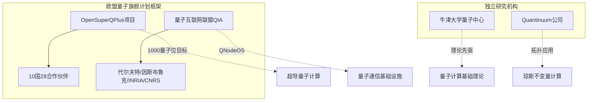

### 2.3 亚太地区核心研究团队

亚太地区在数学与量子计算交叉领域形成了以中国为核心、新加坡为重要补充的研究格局。中国的研究力量主要分布在中国科学技术大学、上海交通大学、清华大学等顶尖高校，在量子纠错数学基础、量子科学计算、拓扑量子计算等方向形成了鲜明特色。

#### 2.3.1 中国科学技术大学量子信息重点实验室

**中国科学技术大学是中国量子计算研究的发源地**。以2003年中国第一个量子计算研究小组成立为标志，中国量子计算已经走过20年发展历程[^18]。从只有"一张桌子、一把椅子"的简陋工作室干起，20年间，中国量子计算实现了从落后到追赶，再到国际先进水平[^18]。

**中国科学院院士郭光灿**是国内最早开始量子信息研究的学者之一。他回忆1980年到加拿大多伦多大学留学时发现，国外早在20年前就开始了对量子光学的研究，而彼时国内相关研究几近空白[^18]。1984年，回国后的郭光灿主持召开了全国第一个量子光学学术会议，此后开设了国内第一门量子光学课程，组建了第一个量子信息实验室，并于2001年获得中国首个量子信息技术"973"项目，组建起一支由全国十多个科研单位50余名学者组成的团队[^18]。

这个队伍的影响力延续至今——**队伍里的五位课题组长郭光灿、彭堃墀、孙昌璞、潘建伟、杜江峰先后被评为中国科学院院士**，十多位年轻学术骨干在量子信息科研中继续发挥着重要作用[^18]。

2003年，在中国科学技术大学一间编号为"8013"的闲置教室里，中国第一个量子计算研究小组正式成立[^18]。"有时只能站着研究。"回忆起当年的场景，科研团队成员记忆犹新[^18]。正是这间简陋的闲置教室，为近年来量子芯片、量子计算测控一体机、量子操作系统、量子软件、量子计算云平台等一个个从零到一的重大突破打下了坚实基础[^18]。

2017年，在没有企业愿意合作开发量子计算机的情况下，郭光灿院士和郭国平教授带领中国科学院量子信息重点实验室博士团队，联合创立了中国第一家量子计算公司[^18]。如今在权威机构公布的全球量子计算技术发明专利排行榜上，该公司已坐拥234件专利，排在量子计算行业国内第1、国际第6[^18]。

#### 2.3.2 上海交通大学量子科学计算团队

**上海交通大学在量子科学计算领域取得了全球瞩目的突破性成果**。2025年11月22日，"量子智算·升维未来"量子科学计算平台UnitaryLab 1.0发布会在大零号湾会议中心举行[^19]。该平台由上海交大金石、Nana Liu量子科学计算团队开发，基于原创的"薛定谔化"方法，成功攻克了偏微分方程量子模拟的核心难题，显著拓展了量子计算的应用边界[^19]。

**中国科学院院士李惠**在致辞中指出，传统计算在高维复杂问题求解中长期存在局限，而上海交大团队凭借原创性方法突破了这一理论桎梏，成功搭建起量子计算与科学模拟之间的关键桥梁，实现了从理论创新到工具落地的完整闭环[^19]。她强调，该成果兼具前沿科研支撑、高校教学实践与产业场景适配的多重属性[^19]。

在拓扑量子计算方向，**中国科学院院士贾金锋**带领的团队取得了重要突破。贾金锋是上海交通大学物理与天文学院讲席教授、副院长、凝聚态研究所所长，李政道研究所拓扑超导量子计算实验平台负责人[^20]。自2009年加入上海交大物理与天文学院后，他带领团队十年磨一剑，**成功捕获"马约拉纳费米子"**，找到打开量子计算机大门的切入点，使上海交大在拓扑量子领域跻身世界前列[^20]。

贾金锋团队先后三次获得国家自然科学二等奖（2011年和2019年为第一获奖人，2004年为第三获奖人），发表高水平论文290多篇，其中Science 5篇、Nature Physics 3篇、Nature Materials 2篇、Physical Review Letters 27篇，论文被引用16000多次，2018-2021年连续四年入选全球高被引科学家，2021年入选中国科学院院士[^20]。

上海交大还通过多元化的基金支持机制培育青年量子科研人才。上海交通大学教授**金贤敏**创立的图灵量子是中国光量子计算龙头企业，其科研工作得到了学校专用于支持青年学者前沿研究的青年启动基金和基础研究"突破计划"支持[^21]。2025年新年伊始，图灵量子完成半年内的第二次亿元级战略融资，还将与国内GPU领军企业摩尔线程共同打造"QPU+GPU"异构计算平台，推动量子计算从实验室走向产业化[^21]。

#### 2.3.3 清华大学丘成桐数学科学中心与高等研究院联合团队

**清华大学在量子纠错数学理论方面形成了独特的研究优势**，主要依托丘成桐数学科学中心与高等研究院的联合团队。该团队在量子信息和理论物理交叉领域取得了重要进展。

**刘子文**是清华大学丘成桐数学科学中心助理教授，2023年加入清华大学，主要研究领域为理论量子信息科学，在量子资源、量子编码、量子计算、量子信息与物理及数学的交叉等多个重要方向作出开创性工作[^22]。

2024年9月，刘子文团队在量子信息和理论物理交叉领域取得重要进展，**创新地建立了广义量子纠错性质与系统量子复杂性之间严格联系的普适理论框架**，为理解复杂量子系统提供了全新的、统一的视角[^22]。研究团队围绕近似量子纠错展开研究，引入了"子系统差异（subsystem variance）"这一新的编码性质，建立了近似量子纠错性质与电路复杂度之间严格的联系，并完成了数学理论的证明，揭示了近似量子纠错编码复杂性"相图"[^22]。相关成果以"近似量子纠错编码中的复杂性和序"为题发表于《自然·物理学》[^22]。

2025年10月，清华大学高等研究院**王亦许**、美国马里兰大学许逸葭与清华大学丘成桐数学科学中心刘子文合作，提出一类名为"**镶嵌码**（tessellation codes）"的新型量子纠错编码框架[^14]。与传统方法不同，该框架使得量子逻辑操作可以直接通过几何旋转来实现，不仅为逻辑量子计算开辟了一条新的实现路径，同时揭示了量子编码与几何之间的深刻联系[^14]。

这一研究系统建立了镶嵌码在不同几何上的普适构造的理论，结合群论与表示论展示其误差纠正能力，并详细阐述了如何在球面、平面和双曲面等不同曲率的二维曲面上，利用不同正则镶嵌的对称群实现量子信息的编码与逻辑门操作[^14]。研究成果发表于《物理评论快报》[^14]。

#### 2.3.4 新加坡国立大学与南洋理工大学量子技术中心

**新加坡国立大学和南洋理工大学联合建立的量子技术中心（Centre for Quantum Technologies, CQT）**是亚太地区量子计算研究的重要力量。该中心希望集物理学家、计算机科学家和工程师之力进行量子物理学的基础研究，并建造研究量子现象的设备[^7]。

在量子机器学习教育方面，来自南洋理工大学计算与数据科学学院（NTU）、新加坡国立大学量子技术中心（CQT）、鸿海研究院的研究团队发布了一篇专为AI研究者与开发者设计的量子机器学习教程[^23]。该教程首次从AI视角出发，系统介绍了量子机器学习的基础理论、关键算法、实践指南，并提供了代码示例[^23]。

在人才培养方面，**袁骁**校友于2017年在中国科学技术大学进行博士后研究，入选2025年度"35岁以下科技创新35人"亚太区名单[^24]。他开发并验证了一系列实用量子算法，推动量子计算在化学、材料等领域的应用[^24]。他提出的变分量子算法通过动态构建浅层量子线路实现高效量子模拟，其虚拟量子资源蒸馏理论框架为在噪声设备上有效利用量子资源提供了新思路[^24]。

#### 2.3.5 亚太地区核心团队综合概览

下表系统梳理了亚太地区主要研究团队的核心特征：

| 机构 | 核心领军人物 | 核心研究方向 | 代表性成果 |
|------|-------------|-------------|-----------|
| 中国科学技术大学 | 郭光灿、潘建伟、杜江峰 | 量子信息基础、量子计算工程化 | 中国首个量子计算公司、全球专利排名第6 |
| 上海交通大学 | 金石、贾金锋、金贤敏 | 量子科学计算、拓扑量子计算 | UnitaryLab平台、马约拉纳费米子捕获 |
| 清华大学 | 刘子文、王亦许 | 量子纠错数学理论 | 镶嵌码、近似量子纠错普适理论 |
| 新加坡CQT | - | 量子机器学习、量子算法 | 量子机器学习教程 |

### 2.4 企业与产学研联盟研究力量

在数学与量子计算交叉领域，企业研究团队与产学研联盟正发挥着日益重要的作用。这些力量不仅推动着理论成果向工程应用的转化，还通过独特的组织模式加速了量子计算生态系统的成熟。

#### 2.4.1 Google Quantum AI

**Google Quantum AI是全球量子计算企业研究的领军力量**。**Edward Farhi**是Google Quantum AI首席科学家，曾任麻省理工学院物理学教授、理论物理中心主任，研究聚焦量子算法设计与优化[^9]。他与合作者共同提出了基于连续时间量子行走的算法设计思想、量子绝热算法；2014年，与合作者提出了知名的**量子近似优化算法（QAOA）**，这一通用组合优化求解器已被超4000篇论文引用[^9]。该算法很可能成为未来高保真度纠错量子计算机的首批实际应用之一[^9]。

谷歌量子AI团队工程副总裁哈特穆特·内文在评价哈佛大学量子纠错突破时指出，该成果出现在全球量子比特平台竞争"极为激动人心"的阶段，"向构建大规模、实用的量子计算机迈出了重要一步"[^11]。这一评价体现了企业界对学术突破的高度关注。

#### 2.4.2 美国量子经济发展联盟（QED-C）

**美国量子经济发展联盟（Quantum Economic Development Consortium, QED-C）是由发起主体按照《国家量子倡议法案》要求所建立的大型产业联盟**，是一个囊括了全美主要量子科技公司、高校、科研机构和其他组织的产学研合作平台[^12]。

2018年，美国国家标准与技术研究院（NIST）与斯坦福国际研究院（SRI International）联合成立QED-C[^12]。该联盟在辐射范围、成员数量、产学研结合程度、资源及信息交换等维度上均处于美国头部水平，具有很强的创新案例参考价值[^12]。

QED-C的组织架构体现了产学研深度融合的特点，其成员涵盖市场机构、教育机构、科研机构三类主体，在功能上实现协同配合、在资源上实现集成优化[^12]。这种产学研战略联盟和共同体形式是产学研合作的高级形态，也是目前产学研发展的最新态势之一[^12]。

#### 2.4.3 中国量子计算企业

**中国量子计算企业在产业化探索方面取得了显著进展**。2017年，郭光灿院士和郭国平教授带领中国科学院量子信息重点实验室博士团队，联合创立了中国第一家量子计算公司——本源量子[^18]。如今该公司已坐拥234件专利，排在量子计算行业国内第1、国际第6[^18]。

**图灵量子**是中国光量子计算龙头企业，由上海交通大学教授金贤敏创立[^21]。2025年新年伊始，图灵量子完成半年内的第二次亿元级战略融资，还将与国内GPU领军企业摩尔线程共同打造"QPU+GPU"异构计算平台，推动量子计算从实验室走向产业化[^21]。

此外，中国计算机学会联合科大国盾量子技术股份有限公司共同发起了**CCF-国盾超导量子计算专项合作计划**，聚焦硬件操控、软件编译、算法设计、量子经典混合等量子计算前沿问题[^13]。2025年度共10位学者获得该计划资助，项目涵盖量子纠错与容错、量子优化控制、偏微分方程量子算法等多个方向[^13]。

#### 2.4.4 产学研联盟组织模式特征

全球量子计算产学研联盟呈现出以下组织模式特征：

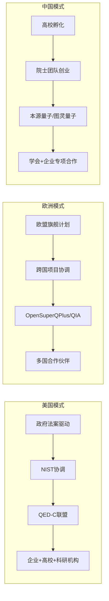

这三种模式各具特色：**美国模式**以政府法案为驱动、以国家标准机构为协调核心；**欧洲模式**依托欧盟框架计划实现跨国协作；**中国模式**则以高校科研团队为源头、以院士领衔创业为特色。这些模式的共同点在于都强调产学研的深度融合，致力于将数学理论创新转化为工程应用。

## 3 核心研究方向与代表性成果深度剖析

数学与量子计算的交叉融合催生了多个前沿研究方向，各研究团队在不同方向上形成了独特的理论体系与技术路径。本章系统梳理全球主要研究团队在算子代数与量子信息、量子复杂性理论、量子纠错数学基础、量子模拟数值方法、量子机器学习等核心方向的研究进展与代表性成果，揭示不同研究路径的理论深度与应用价值。

### 3.1 算子代数与量子信息理论

算子代数作为现代数学的核心分支，为量子信息理论提供了严格的数学语言与分析工具。**算子代数方法在量子纠缠判据构造、量子网络理论、量子程序分析等领域展现出独特的理论优势**，成为连接抽象数学与量子信息技术的重要桥梁。

#### 3.1.1 太原理工大学算子理论与量子信息团队

**太原理工大学由贺衎教授与侯晋川教授领衔的算子理论与量子信息团队**，是国内将算子代数方法系统应用于量子信息研究的代表性力量。该团队现有专任教师11人，其中教授3人、副教授5人、博士生导师2人、硕士生导师3人，团队成员大多具有海外留学或访学经历，学术背景深厚[^25]。

在科研成果方面，该团队主持了多项国家级和省部级科研项目，包括国家自然科学基金面上项目、青年基金项目等。近5年来，团队在《Journal of Functional Analysis》《SCIENCE CHINA》系列、《PHYSICAL REVIEW A》《Differential Equations and Operator Theory》等国际知名期刊发表SCI论文百余篇，荣获山西省科学技术奖自然科学类二等奖等多项科研奖励[^25]。侯晋川教授个人曾两次获得山西省科技进步一等奖、两次获得山西省自然科学二等奖，享受国务院政府特殊津贴，并获"山西省优秀专家""全国优秀教师"等荣誉称号[^25]。

该团队的研究方向涵盖多个稳定且前沿的领域：

| 研究方向 | 核心内容 | 代表性成果 |
|---------|---------|-----------|
| 算子代数保持问题 | 刻画算子代数上各类保持映射的结构 | 解决保持Lie积数值域映射刻画难题 |
| 量子纠缠判据构造 | 基于正映射理论构建纠缠检测方法 | 提出基于多置换正映射的量子纠缠判据 |
| 量子网络理论 | 研究量子网络中纠缠分布特征 | 引入非凸纠缠单调解决特征长度问题 |
| 量子程序分离问题 | 分析量子程序的可区分性 | 建立量子程序分离的数学框架 |
| 量子不确定性原理 | 研究量子测量的内在限制 | 发展纠缠判据理论 |

在量子网络理论研究中，该团队**创新性地引入非凸纠缠单调——比率负性**，成功解决了连续变量量子网络中纠缠分布特征长度的关键科学问题，相关成果发表于国际权威学术期刊《物理评论A》[^25]。这一突破为理解量子网络中的纠缠传输机制提供了重要的数学工具。

#### 3.1.2 多体量子纠缠检测的算子理论方法

**多体量子系统的纠缠检测是量子信息理论的核心挑战之一**。在过去二十多年中，尽管有限维和无限维度量子系统的纠缠判据研究已取得许多进展，但纠缠态的检测问题仍未得到令人满意的解决。现有的纠缠判据基本上都是理论性的，虽然能够识别部分特殊类的纠缠态，但在面对任意复杂的量子态时往往失效或无能为力[^26]。

太原理工大学算子理论与量子信息团队在这一领域取得了重要突破。团队应用算子理论和计算数学等数学工具，在量子信息与量子计算领域多体系统中量子态k-不可分性（即k-纠缠）的实用检测问题上取得研究进展。相关成果以"Practical approach for detecting k-nonseparability of multipartite quantum states"为题发表于《SCIENCE CHINA Physics, Mechanics & Astronomy》期刊[^26]。

这一研究的核心创新在于：**通过深入探讨n体系统的k-纠缠性，提出了识别多体量子系统k-纠缠态的一个新的充分且必要判据**。该判据不仅能够严格区分任意维度多体系统量子态的k-纠缠性，而且相比于现有的各种纠缠判据，其突出特点是具备实用性和计算机软件化工具化性能[^26]。

基于该判据，团队提出了一种全新的探测多体量子系统下量子态k-纠缠性的数值处理方法，设计了一套完整的实用化纠缠检测方案。该方案使得对任意给定的多体量子系统，通过建立相应的数据库、构建计算机软件，可以有效地完成识别任意态是否具有各类纠缠性的任务[^26]。为验证方案的可行性，团队还成功构建了高精度且可迅速检测量子比特数不超过4的任意量子态各类纠缠性的计算机软件[^26]。

中国科学院应用数学研究所所长、量子信息与量子计算领域资深专家骆顺龙研究员在同期《SCIENCE CHINA Physics, Mechanics & Astronomy》上撰文点评该成果："Recently, Guo et al. addressed this crucial challenge by exploring the k-nonseparability of multipartite quantum systems, offering a novel and comprehensive solution to detect entanglement across multiple subsystems."[^26]

#### 3.1.3 团队人才培养与产学研合作

该团队在人才培养方面同样成绩斐然。团队注重夯实学生基础数学知识、拓展应用能力，培养的学生有人攻读德国慕尼黑大学博士，有人获得全国自强之星、国家奖学金等荣誉。团队鼓励学生参与科研项目和学术交流活动，多名学生在国内外学术会议上作报告、发表学术论文[^25]。

值得特别关注的是博士生**王海港**的励志故事。这位28岁的博士生在8岁时因意外失去双臂，但凭借超乎常人的毅力，用脚趾操作电脑进行科研工作。在2025年下半年，他迎来了科研生涯的丰收季，数篇重要研究成果集中发表于国际知名学术期刊，其中一篇被Nature旗下系列期刊《Communications Physics》接收[^27]。导师贺衎教授评价道："他完成了从优秀学生到独立研究者的质变，如今的学术功底和科研视野，在全国同年级博士生中也是拔尖的。"[^27]

该团队还与百度量子计算研究所等单位开展长期合作，联合培养学生，为学生提供了良好的科研实践平台和发展机会[^25]。这种产学研合作模式为将算子理论的抽象研究成果转化为实际应用奠定了基础。

### 3.2 量子复杂性理论与算法设计

**量子复杂性理论是理论计算机科学中计算复杂性理论的重要分支**，研究量子计算机及量子信息模型下的复杂性类定义，探索量子算法相对于经典算法的计算优势边界。这一领域的理论突破直接指导着量子算法的设计与优化。

#### 3.2.1 量子复杂性类的理论框架

量子复杂性理论使用量子计算机和量子信息来研究分析复杂性类定义，核心目标是研究这些复杂性类问题的困难度，以及量子复杂性类与经典复杂性类的关系[^28]。

在量子复杂性理论中，**两个最重要的复杂性类分别是BQP和QMA**，它们分别对应经典复杂度P和NP。BQP（bounded quantum polynomial）类定义为量子计算机在多项式时间内可解决的问题集合，其错误概率小于一定比例。目前已知的包含关系为BPP⊆BQP⊆PSPACE[^28]。

量子复杂性理论的核心内容可归纳如下：

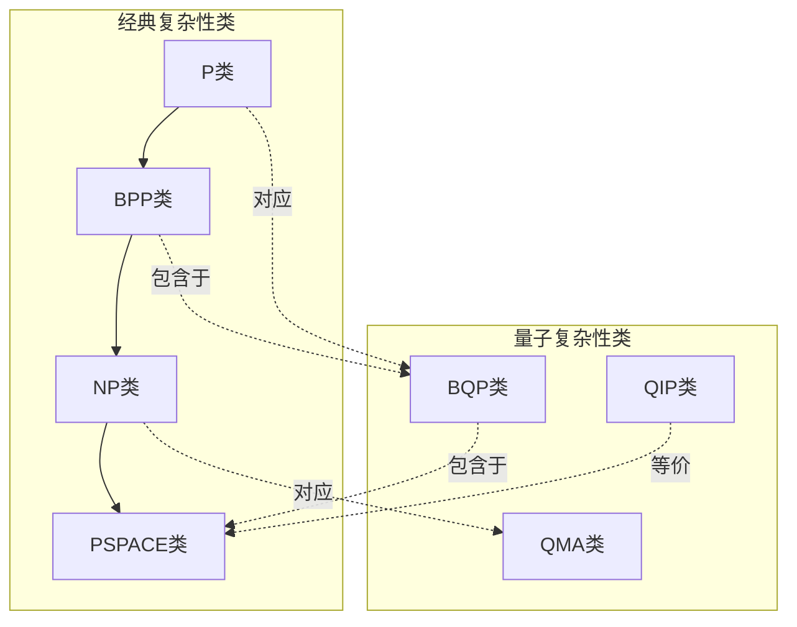

**量子查询复杂性**是量子复杂性理论的另一重要组成部分。在量子查询复杂性研究中，输入由一个预言机（黑箱）提供，算法要用查询预言机的方式得到和输入相关的信息。量子查询复杂性是指要计算其对应函数所需查询预言机的最小次数，它是函数整体时间复杂性的下限[^28]。

**Grover搜索算法**是量子查询复杂性研究的经典案例。该算法用于搜索无结构数据库，其量子查询复杂性为$O(\sqrt{N})$，比已知最好的经典查询复杂度有二次方的差距[^28]。这一结果表明，对于无结构搜索问题，量子算法相较于经典算法只能实现平方加速，这也是人们普遍认为NP完全问题很可能不在BQP中的重要依据之一[^29]。

#### 3.2.2 MIP*=RE的里程碑证明

在量子复杂性理论的前沿研究中，**季铮锋团队证明了MIP*=RE这一里程碑成果**，揭示了量子交互证明系统与经典复杂性类间的深层关联[^28]。这一证明解决了理论物理与数学中的开放性问题，对量子密码学设计与分析在量子环境下的发展产生了深远影响。

该领域的研究还涉及量子参数化复杂性、非凸函数量子优化等方向。量子交互证明系统的研究表明，QIP类已被证明等价于PSPACE类[^28]，这一结果深化了人们对量子计算能力边界的理解。

#### 3.2.3 Google Quantum AI的DQI算法突破

**实现优化问题的超多项式加速一直是量子算法的核心目标**。组合优化领域在过去三十年里一直将量子算法作为研究热点，科学家们致力于寻找能在组合优化问题上实现超多项式加速的量子算法[^30]。

Google Quantum AI团队开发的**解码量子干涉测量（Decoded Quantum Interferometry，简称DQI）算法**代表了这一领域的重大突破。相关研究论文于2025年10月22日以"Optimization by decoded quantum interferometry"为题发表在《Nature》上[Nature 646, 831 (2025)][^30]。

DQI算法的核心创新在于其独特的技术路径：**将问题的约束直接编码到量子态上，再用纠错码的解码技术实现反计算（uncomputation）而消除会影响量子干涉过程的中间态**。最后，带有约束信息的量子系统产生干涉，满足约束条件最多的方案在干涉过程中会获得最大的振幅，自然地"浮出水面"[^30]。

DQI算法的性能验证结果令人瞩目：

| 测试问题 | 问题规模 | DQI性能 | 对比基准 |
|---------|---------|---------|---------|
| max-XORSAT | 31,216变量、50,000约束 | 8秒找到满足83.1%约束的方案 | 远快于通用经典启发式算法 |
| 近似最优多项式拟合 | 有限域 | 超多项式加速 | 相对已知经典算法 |

解码技术在DQI算法中起到了关键作用。因为反计算的过程中涉及到欠定线性方程组，其恰好对应着经典纠错码中的"伴随式（syndrome）解码问题"。经典解码的技术已经相对成熟，可以仔细选择与问题的数学结构最适配的解码器，进而高概率地完成反计算[^30]。

DQI算法与传统量子优化算法的根本区别在于其采用了**波动观点**而非能量视角。传统量子优化算法如量子退火通常将最优解对应到最低能量状态，而DQI则利用量子物理学的波动性质来解决优化问题[^31]。这种范式转变使得量子加速的数学证明成为可能，也使DQI至今未被经典算法所匹敌[^31]。

#### 3.2.4 量子线性求解器的复杂度优化

**量子线性求解算法（QLSA）是量子计算在科学计算领域的核心应用之一**。自2009年HHL算法问世以来，该领域经历了从理论构想到渐近复杂度优化的跨越[^32]。

2025年12月29日，PsiQuantum公司与洛斯阿拉莫斯国家实验室组成的研究团队在《PRX Quantum》上发表了突破性研究成果。该研究在多个维度上实现了重大突破[^32]：

**首先，在算法复杂度方面**，研究引入了滤波与泊松化技术，将算法复杂度优化至理论上的最优缩放比例。这一改进实现了对误差因子ε的指数级优化，并消除了关于条件数κ的对数缩放因子[^32]。

**其次，针对容错量子设备的硬件落地**，研究团队引入了一种更高效的"随机行走算子"来替代传统的哈密顿量模拟，这不仅降低了计算开销，还省去了复杂的经典预计算环节[^32]。

**最后**，研究推导出了一个严谨的闭式公式上界，用于计算输出解态所需的矩阵块编码期望调用次数。数值分析表明，对于厄米矩阵，在目标误差$\epsilon=10^{-10}$的精度下，该算法的调用次数上界仅为837κ[^32]。

### 3.3 量子纠错数学基础与编码理论

**量子纠错是在有噪声硬件上实现可靠量子计算机的基石**。基于拓扑码的传统方法已取得了实验进展，但由于编码率低，通常需要数百万个物理量子比特才能支撑实际应用。为突破这一瓶颈，学界转向对量子低密度奇偶校验码（qLDPC码）的研究[^33]。

#### 3.3.1 清华大学的量子纠错理论创新

**清华大学丘成桐数学科学中心刘子文团队在量子纠错理论领域取得了系统性突破**。2024年9月，该团队**创新地建立了广义量子纠错性质与系统量子复杂性之间严格联系的普适理论框架**，为理解复杂量子系统提供了全新的、统一的视角。

研究团队围绕近似量子纠错展开研究，引入了"子系统差异（subsystem variance）"这一新的编码性质，建立了近似量子纠错性质与电路复杂度之间严格的联系，并完成了数学理论的证明，揭示了近似量子纠错编码复杂性"相图"。

2025年10月，清华大学高等研究院王亦许、美国马里兰大学许逸葭与清华大学丘成桐数学科学中心刘子文合作，提出一类名为**"镶嵌码"（tessellation codes）的新型量子纠错编码框架**。与传统方法不同，该框架使得量子逻辑操作可以直接通过几何旋转来实现，不仅为逻辑量子计算开辟了一条新的实现路径，同时揭示了量子编码与几何之间的深刻联系。

镶嵌码研究的核心创新在于：**系统建立了镶嵌码在不同几何上的普适构造的理论，结合群论与表示论展示其误差纠正能力**，并详细阐述了如何在球面、平面和双曲面等不同曲率的二维曲面上，利用不同正则镶嵌的对称群实现量子信息的编码与逻辑门操作。研究成果发表于《Physical Review Letters》。

清华大学物理系刘东课题组在量子编码的错误阈值研究方面也取得重要进展。研究对由于测量中的相干错误导致的不完美制备的表面编码在经典随机泡利噪声下的纠错性能进行了理论研究。通过使用统计力学映射方法，将多轮错误检测协议映射至三维晶格规范理论，并将误差阈值与相变点相关联，**首次为容错量子计算与QEC中不完美态制备问题提供了理论工具**[^34]。

值得注意的是，研究结果表明：**在码距趋于无穷大的极限下，即使误差低于阈值，相干噪声仍可能导致QEC失效——这与"逻辑错误应被完全抑制"的普遍观念相悖**[^34]。仅当系统处于有限码距时，若状态制备相关误差率低于一个尺寸依赖的转变，此时实用QEC方才是有效的[^34]。

#### 3.3.2 浙江大学qLDPC码的实验验证

**浙江大学物理学院与上海期智研究院等组成的研究团队于2025年1月22日在《Nature Physics》期刊上发表了qLDPC码实验验证的突破性成果**[^35]。

研究团队利用一个32位量子处理器（"昆仑"超导量子处理器）首次验证了两种低开销的量子低密度奇偶检验码：一个是码距为4的双变量自行车码（BB码），另一个是码距为3的打孔双变量自行车码[^35]。

实验结果显示：
- 对于拥有4个逻辑比特的双变量自行车码，每个周期每个逻辑比特的逻辑错误率为(8.91±0.17)%
- 对于拥有6个逻辑比特的打孔双变量自行车码，逻辑错误率为(7.77±0.12)%[^35]

这一成果的重大意义在于：**相比表面码，BB码仅需约1/4的物理量子比特即可实现同等性能的逻辑纠错**。若用表面码实现4个逻辑量子比特的容错存储，需要124个物理量子比特，是BB码用量的近4倍[^35]。

#### 3.3.3 中科院理论物理所的代数几何方法

**中国科学院理论物理研究所研究团队与中国科学技术大学、北京大学的科研人员在双变量双循环量子纠错码（BB码）的理论研究方面取得重要进展**[^33]。

该研究融合代数、几何与拓扑方法，建立了研究BB码的拓扑理论框架。研究团队注意到BB码与分形子物理在研究方法上的共通性，借鉴分形子领域发展出的代数工具，并结合Gröbner基等方法，实现了对任意给定BB码拓扑性质的高效表征[^33]。

研究发现了多项重要结论：

1. **BB码普遍具有以任意子为特征激发的拓扑序**，但其任意子激发在短程移动中呈现出类似分形子的特征，即移动过程必然伴随能量的改变[^33]

2. **揭示了一种在BB码中普遍存在的"拓扑阻挫"现象**：不同于传统拓扑码，BB码在环面上的基态简并度一般小于任意子总数[^33]

3. **利用基于Bernstein-Khovanskii-Kushnirenko定理的代数几何方法**，揭示了在近环面码布局下BB码拓扑序的一般变化规律。通过该定理，任意子的种类可通过计算由相互作用形式决定的牛顿多面体的混合体积获得[^33]

相关研究成果发表在《Physical Review Letters》上，并在同期发表于《PRX Quantum》的相关工作中，将BB码推广到扭转边界条件情形，实现了纠错效率的提升[^33]。

#### 3.3.4 前沿纠错方案的创新探索

**法国量子初创公司Alice and Bob提出了创新性的"电梯编码"方案**，通过在计算过程中上下移动逻辑量子比特，将逻辑错误率降低至万分之一水平[^36]。

电梯编码的核心在于编码级联技术。团队在重复编码基础上叠加新编码，从而获得比特翻转防护能力。计算过程中，逻辑量子比特如同电梯般上下移动，在逻辑层面运行比特翻转防护[^36]。

该公司的量子计算方法灵感源于著名的"薛定谔的猫"实验，其信息存储单元被命名为"猫量子比特"。相较于传统量子比特仅能单相存储信息的设计，猫量子比特能在正负两相中存储信息，有效防范比特翻转错误[^36]。**相比该公司先前的量子纠错方案，电梯编码仅需三倍数量的量子比特，就能实现逻辑错误率降低万倍的突破**[^36]。

**德州大学奥斯汀分校与清华大学丘成桐数学科学中心的联合研究团队**则采用强化学习方法优化量子纠错码。该研究发表于2025年2月的arXiv预印本平台[^37]。

研究团队的核心创新在于：**采用"化繁为简"的策略，先找到一个距离参数符合要求的现有编码，然后用强化学习技术对其进行"瘦身"，将复杂的测量操作简化为更轻量级的形式**[^37]。

实验结果令人震惊：**在某些情况下，该方法能够将物理量子比特的开销降低73倍**。这意味着原本需要几万个物理量子比特才能实现的纠错效果，现在用几百个就足够了[^37]。

### 3.4 量子模拟的数值方法与实验验证

**量子模拟是利用精确可控的量子系统来模拟其他复杂量子系统的研究方法**，被视为量子计算最具近期应用价值的方向之一。数学方法在量子模拟的算法设计、实验验证和结果分析中发挥着不可或缺的作用。

#### 3.4.1 中国科学技术大学的量子模拟里程碑

**2024年7月10日，《自然》杂志报告了一项期待已久的成就：来自中国科学技术大学的潘建伟、陈宇翱、姚星灿等研究人员，在一个冷原子量子模拟器中，构建了一个由80万个光晶格点组成的三维费米子哈伯德模型，并实现了反铁磁相变**[^38]。

为这项工作，团队投入了**整整13年**。正如潘建伟教授在论文上线当晚激动地写道："经过十三年的努力，专用量子计算终于开始进入有重要科学实用价值的无人区。"[^38]

这一成果的科学意义深远。费米子哈伯德模型是描述电子在晶格中运动和相互作用行为的模型，可以帮助解释强关联量子体系许多共同特征，包括相互作用驱动的莫特绝缘态、金属态和反铁磁态等，**被认为是理解高温超导体机制的核心理论框架之一**[^38]。

国际学界对这一成果给予了高度评价：

| 评价者 | 机构 | 评价内容 |
|-------|------|---------|
| Immanuel Bloch | 德国马普量子光学研究所 | "这是一项令人惊叹的工作，展示了利用超冷原子进行量子模拟研究复杂量子材料物理的重要性" |
| 张富春 | 中科院大学卡弗里理论科学研究所 | "实验水平是国际最先进的，将大约80万个原子装进超高均匀度的光晶格中均为领域首次" |

张富春进一步评论说："这是一个超冷原子模拟凝聚态物理重要模型的benchmark（基准）。他们的工作为今后研究更具挑战性的二维（哈伯德）模型打下了基础，有望加深我们对铜基高温超导的认识。"[^38]

#### 3.4.2 高阶拓扑量子模块的实验实现

**2025年11月28日，国际顶级学术期刊《科学》（Science）重磅发布了由中国科学技术大学潘建伟、朱晓波、彭承志、龚明等团队完成的又一突破性成果**：首次在超导量子处理器上成功"锁住"了量子信息，造出了一个"怎么晃都不坏"的量子模块[^39]。

研究团队调用了"祖冲之2号"处理器上一个6×6的量子比特阵列，构建了超过50个周期的"弗洛凯算符"（Floquet operators）。在数据的洪流中，科学家们惊讶地观测到，**能量和信息没有四散逃逸，而是乖乖地聚拢在了这个二维网格的四个角落**——这就是传说中的"角模式"（Corner Modes）[^39]。

这四个角落成了量子信息的避风港。在这个状态下，**量子信息仿佛获得了一层隐形的"防护罩"，无论中间的网格怎么受到扰动，只要整体的拓扑结构没变，躲在角落里的信息就安然无恙**[^39]。

《科学》杂志的审稿人评价这是从一维到二维的"显著提升"，展示了"丰富的实验现象"[^39]。这一成果为未来打造从不错乱的超级量子计算机指明了方向。

#### 3.4.3 上海交通大学的薛定谔化量子算法

**上海交通大学金石、Nana Liu团队提出的"薛定谔化"系列量子算法**，代表了量子科学计算领域的重大理论创新。该算法创新性地将偏微分方程转化为量子系统可直接处理的酉演化形式（薛定谔型方程），解决了传统量子算法难以适配复杂科学工程计算问题的行业痛点[^40][^41]。

2025年11月22日，基于这一核心算法的全球首个量子科学计算平台UnitaryLab正式发布。**该平台理论上可以将3维方程的计算效率提高6倍以上，将5维方程的计算效率提高2.5万倍以上，将9维方程的计算效率提高1万亿倍以上**（每个维度是128个自由度的标准测算）[^40][^41]。

"薛定谔化"量子算法框架的突破，大大拓展了量子计算可解决的科学与工程问题的边界，**被国家自然科学基金委2024年年度报告选为数学唯一代表性成果**[^40][^41]。

UnitaryLab平台的功能优势体现在多个维度：

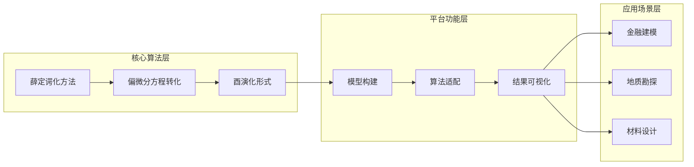

该平台内置多个应用领域常用的方程库，如金融建模的Black-Scholes方程、地质勘探的弹性波方程等，实现了"教学-科研-产业"的全链路用户需求适配[^41]。

### 3.5 量子机器学习与跨学科融合

**量子机器学习是量子计算与人工智能深度融合的前沿领域**，旨在利用量子计算的独特优势加速机器学习任务，或将机器学习方法应用于量子系统的优化与控制。数学理论在这一跨学科领域中扮演着桥梁角色。

#### 3.5.1 量子启发式优化方法的创新探索

**土耳其三所知名高中的学生团队完成了一项突破性研究**，提出了"叠加态梯度下降法"，于2025年被IEEE量子人工智能会议（IEEE QAI 2025）正式接受发表[^42]。

这一方法巧妙地借鉴了量子物理学中的量子叠加态概念。传统的AI训练就像是一个学生在做选择题时，每次只能选一个答案，然后根据对错来调整策略。而**叠加态梯度下降法则让AI能够同时"考虑"多个答案的可能性**，就像是一个超级聪明的学生能够在脑中同时权衡所有选项，然后选择最优的那一个[^42]。

研究团队通过大量实验证明了这种量子启发的训练方法确实比传统方法更加高效：
- 在文本分类任务中，新方法能够让模型达到90%准确率的时间缩短了**37.8%**
- 在大型语言模型的微调任务中，新方法显示出了更快的收敛速度和更低的最终损失
- 虽然方法在计算上需要额外的开销，但由于能显著减少训练轮次，总体训练时间反而减少了**16%**[^42]

#### 3.5.2 量子强化学习的理论进展

**量子强化学习（Quantum Reinforcement Learning, QRL）作为量子机器学习的重要分支**，正展现出独特的应用潜力。近期研究表明，QRL在量子与经典领域均展现出独特优势，并具备广泛的跨领域适用性[^43]。

变分量子线路（Variational Quantum Circuits, VQCs）被广泛用于在NISQ时代展现近期量子优势。这类参数化量子线路因其对含噪声硬件的良好适应性，以及对混合量子-经典计算流程的支持，而特别契合当前量子技术的发展水平[^43]。

值得注意的是，**VQC中的噪声在优化过程中可促进探索行为（exploration）**，这一特性对量子强化学习而言是一项关键优势。通过建设性地利用噪声，基于VQC的QRL能在经典强化学习难以应对的复杂环境中实现高效学习[^43]。

近期实验结果进一步证实了学习过程中的量子加速现象，验证了QRL在复杂决策任务中的可行性。除决策问题外，受量子启发的强化学习技术正推动多种量子应用的进展，包括量子架构搜索、量子传感与量子控制等[^43]。

#### 3.5.3 无预设哈密顿量学习算法

**哈佛大学、加州理工学院、清华大学、杜克大学等机构研究人员组成的团队**在《PRX Quantum》期刊上发表了题为"Ansatz-Free Hamiltonian Learning with Heisenberg-Limited Scaling"的研究论文，提出了首个无需先验结构假设的哈密顿量学习算法[^44]。

该算法的核心创新在于：**通过交替执行结构学习与系数学习，在无预设条件下实现对任意规模量子系统的高效重构，并达到海森堡极限精度**[^44]。

研究团队巧妙地改进了此前用于系数学习的技术，并将其与自主研发的结构学习技术相结合。算法通过交替进行结构学习与系数学习，直至完整识别哈密顿量的所有项并精确估计其系数[^44]。

美国物理学会《物理》（APS Physics）Viewpoint专门报道了这一成果："Hong-Ye Hu at Harvard University and his colleagues have demonstrated a new algorithm that characterizes quantum systems of any size with optimal efficiency and precision. Strikingly, the algorithm needs no prior information or assumptions about the system's structure, making it suitable for analyzing arbitrary devices and phenomena."[^44]

#### 3.5.4 保结构量子编码的范畴论框架

**麻省理工学院、SandboxAQ等机构的研究人员于2024年11月在arXiv平台上发布了关于保结构量子编码的研究论文**[^45]。

该研究提出了一种创新观点：**范畴论提供了一个自然的数学框架，用于分析尊重数据集和学习任务固有结构的编码**。研究人员通过教学示例来说明这一点，包括几何量子机器学习、量子度量学习、拓扑数据分析等[^45]。

量子编码可以分为两种类型：量子态编码和量子酉编码。量子态编码将数据点映射到量子态空间，而量子酉编码将数据点映射到酉算子空间。为了设计能够保留数据结构的量子编码，研究提出了以下方法[^45]：

| 结构类型 | 保留方法 | 数学工具 |
|---------|---------|---------|
| 对称性 | G-不变量子编码 | 群作用与酉表示 |
| 拓扑结构 | 连续/光滑编码 | 角度编码、幅度编码 |
| 度量结构 | 距离保持编码 | 嵌入编码、距离非增加编码 |

这种基于范畴论的方法不仅能够显著减少寻找合适编码的资源消耗，还能为量子机器学习提供更清晰的理论指导[^45]。

#### 3.5.5 量子-经典混合计算平台

**台湾大学物理系和国家高速网络与计算中心等多家机构合作完成的研究**，提出了QKAN-LSTM量子启发式神经网络架构，发表于2025年12月的arXiv预印本[^46]。

该研究的核心创新在于：**借鉴量子计算的核心思想，创造了一种可以在普通电脑上运行的"量子启发式"技术**。通过一种叫做"数据重新上传激活"的技术，让神经网络能够以指数级的效率处理复杂的信息模式[^46]。

在三个不同的测试场景中，QKAN-LSTM展现出优异性能：
- 阻尼简谐运动测试：训练30个周期后达到0.9771的R²得分，仅需117个参数（传统LSTM需要166个）
- 贝塞尔函数测试：表现更加令人印象深刻
- 城市通信网络活动预测：验证了实际应用价值[^46]

研究团队还开发了升级版本HQKAN-LSTM，使用类似于编码器-解码器的结构，先把复杂的信息压缩成核心要点，然后在需要的时候再重新展开[^46]。

### 3.6 本章小结

本章系统梳理了全球数学与量子计算交叉领域的五大核心研究方向及其代表性成果。通过深入分析可以发现，**数学理论创新与量子计算技术突破之间存在着深刻的相互促进关系**：

**在算子代数与量子信息方向**，太原理工大学团队利用算子理论工具在多体纠缠检测领域取得了实用性突破，为量子信息处理提供了新的数学工具。

**在量子复杂性理论方向**，MIP*=RE的证明、DQI算法的提出等成果不断刷新人们对量子计算能力边界的认知，为量子优越性的实现提供了理论支撑。

**在量子纠错数学基础方向**，清华大学的镶嵌码理论、浙江大学的qLDPC码实验验证、中科院的代数几何方法等成果，正在为构建实用化容错量子计算机扫清理论障碍。

**在量子模拟方向**，中国科学技术大学历时13年实现的费米子哈伯德模型反铁磁相变、上海交通大学的薛定谔化量子算法等成果，标志着专用量子计算正在进入具有重要科学实用价值的"无人区"。

**在量子机器学习方向**，无预设哈密顿量学习算法、保结构量子编码等理论创新，正在为量子-经典混合计算提供新的数学框架。

这些研究成果的共同特征是：**以严格的数学理论为基础，以解决实际科学问题为导向，在理论创新与实验验证之间形成良性循环**。这一特征为后续章节评估各团队的突破潜力提供了重要的学术依据。

## 4 多维度横向比较分析框架与实证发现

本章构建系统性的多维度比较分析框架，从研究方向独特性与前沿性、学术论文产出质量与数量、国际合作网络广度与深度、政府及基金资金支持力度、工业界合作紧密程度与转化实效五个核心维度，对全球数学与量子计算交叉领域主要研究团队进行横向对比分析。通过定性与定量相结合的方法，揭示各团队的相对优势、差异化特征及竞争格局，为后续突破潜力评估提供实证依据。

### 4.1 比较分析框架的构建原则与指标体系

#### 4.1.1 框架设计的方法论基础

**构建科学的比较分析框架是系统评估全球研究团队竞争力的前提**。数学与量子计算交叉领域具有高度跨学科性、理论与应用并重、长周期与高风险并存等特征，这要求比较分析框架既能捕捉学术创新的深度，又能反映技术转化的实效。

框架设计遵循以下核心原则：

**第一，多维度覆盖原则。** 单一维度难以全面反映研究团队的综合实力，需从学术产出、合作网络、资源支持、产业转化等多个维度进行立体评估。

**第二，定性与定量结合原则。** 部分指标（如论文数量、专利数量）可量化比较，而研究方向的原创性、理论深度等则需定性判断，两者相互补充。

**第三，过程与结果并重原则。** 既关注已取得的成果（如发表论文、获得资助），也关注能力建设过程（如人才培养、平台搭建）。

**第四，静态与动态结合原则。** 既评估当前状态，也关注发展趋势与成长潜力。

#### 4.1.2 五大核心维度的选取依据

基于数学与量子计算交叉领域的发展规律，本报告选取以下五大核心维度构建比较分析框架：

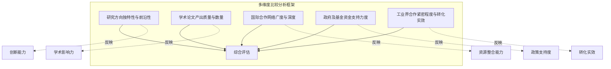

**研究方向独特性与前沿性**反映团队的创新定位与引领能力，是评估未来突破潜力的核心指标。**学术论文产出质量与数量**是衡量学术影响力的直接指标，体现团队的知识创造能力。**国际合作网络广度与深度**反映团队的资源整合能力与全球影响力。**政府及基金资金支持力度**体现政策认可度与资源保障程度。**工业界合作紧密程度与转化实效**反映研究成果的应用价值与产业化潜力。

#### 4.1.3 具体评价指标体系

下表系统呈现各维度的具体评价指标：

| 核心维度 | 一级指标 | 二级指标 | 评价方法 |
|---------|---------|---------|---------|
| 研究方向独特性与前沿性 | 理论原创性 | 开创性概念/方法提出数量 | 定性评估 |
| | 方向前沿性 | 与国际前沿的契合度 | 专家判断 |
| | 跨学科融合度 | 涉及数学分支的广度 | 定量统计 |
| 学术论文产出 | 顶刊发表 | Nature/Science/PRL发表数 | 定量统计 |
| | 引用影响力 | 高被引论文数量 | 定量统计 |
| | 代表性成果 | 里程碑式突破数量 | 定性评估 |
| 国际合作网络 | 地理覆盖 | 合作国家/机构数量 | 定量统计 |
| | 合作深度 | 联合项目/联合培养规模 | 定量统计 |
| | 枢纽地位 | 网络中心性指标 | 网络分析 |
| 资金支持力度 | 国家级项目 | 重大专项/重点项目数量 | 定量统计 |
| | 资金规模 | 累计获得资助金额 | 定量统计 |
| | 支持持续性 | 多年连续资助情况 | 定性评估 |
| 工业界合作 | 企业联合研发 | 产学研项目数量 | 定量统计 |
| | 技术转化 | 专利数量/技术许可 | 定量统计 |
| | 创业孵化 | 衍生企业数量与发展 | 定性评估 |

### 4.2 研究方向独特性与前沿性的横向比较

#### 4.2.1 全球研究方向分布格局

**全球数学与量子计算交叉领域的研究方向呈现明显的集聚与分化特征**。通过对前文梳理的主要研究团队进行方向分类，可以识别出以下核心研究方向的全球分布格局：

| 研究方向 | 主要布局团队 | 地区分布 | 前沿程度 |
|---------|-------------|---------|---------|
| 量子复杂性理论 | MIT、马里兰QuICS、滑铁卢IQC | 北美主导 | 高度前沿 |
| 量子纠错数学基础 | 清华大学、浙江大学、中科院理论所 | 中国领先 | 高度前沿 |
| 量子算法设计与优化 | Google Quantum AI、哈佛HQI | 北美主导 | 高度前沿 |
| 量子模拟数值方法 | 中国科大、上海交大 | 中国领先 | 高度前沿 |
| 算子代数与量子信息 | 太原理工大学 | 中国特色 | 前沿探索 |
| 拓扑量子计算 | 上海交大、Quantinuum | 国际分布 | 高度前沿 |
| 量子机器学习理论 | MIT、新加坡CQT | 国际分布 | 快速发展 |

从研究方向的地理分布来看，**北美地区在量子复杂性理论、量子算法设计等基础理论方向占据主导地位**，这与其在计算机科学和理论物理领域的深厚积淀密切相关。**中国团队则在量子纠错数学基础、量子模拟数值方法等方向形成了鲜明特色**，尤其是清华大学、浙江大学、中国科学技术大学等团队在近年来取得了系列突破性成果。

#### 4.2.2 各团队研究定位的差异化分析

**不同研究团队在研究定位上呈现明显的差异化特征**，这种差异化既源于各团队的历史积淀与优势学科，也反映了各国在量子计算战略布局上的侧重点不同。

**滑铁卢大学IQC**的研究定位强调"学术研究的卓越性与将技术商业化的创业动力有机结合"，这一定位使其在量子密码学、量子算法等方向形成了理论创新与应用转化并重的特色。创始人Michele Mosca在量子密码学安全性分析方面的工作为该团队奠定了鲜明的研究标签。

**清华大学联合团队**的研究定位聚焦于量子纠错的数学基础理论创新。刘子文团队建立的"广义量子纠错性质与系统量子复杂性之间严格联系的普适理论框架"，以及王亦许等人提出的"镶嵌码"新型编码框架，均体现了**从数学基础理论出发解决量子计算核心问题**的研究路径。这种定位使清华团队在量子纠错领域形成了独特的理论优势。

**上海交通大学团队**的研究定位呈现多元化特征：金石、Nana Liu团队聚焦于量子科学计算的算法创新，其"薛定谔化"方法被国家自然科学基金委选为数学唯一代表性成果[^19]；贾金锋团队则专注于拓扑量子计算的实验实现，成功捕获"马约拉纳费米子"使上海交大在该领域跻身世界前列。

**Google Quantum AI**的研究定位强调算法创新与硬件突破的协同推进。Edward Farhi提出的量子近似优化算法（QAOA）已被超4000篇论文引用，而团队最新提出的DQI算法在max-XORSAT问题上实现了相对经典算法的超多项式加速[^30]。这种"算法驱动、硬件验证"的研究模式体现了企业研究团队的独特优势。

#### 4.2.3 理论原创性与方法论创新的比较

**理论原创性是评估研究团队创新能力的核心指标**。通过对各团队代表性成果的分析，可以识别出在理论原创性方面表现突出的团队：

**在开创性概念提出方面**，清华大学刘子文团队引入的"子系统差异（subsystem variance）"概念，建立了近似量子纠错性质与电路复杂度之间的严格联系，揭示了近似量子纠错编码复杂性"相图"。王亦许等人提出的"镶嵌码"框架使量子逻辑操作可以直接通过几何旋转来实现，揭示了量子编码与几何之间的深刻联系。

**在方法论创新方面**，上海交通大学金石团队原创的"薛定谔化"方法，创新性地将偏微分方程转化为量子系统可直接处理的酉演化形式，解决了传统量子算法难以适配复杂科学工程计算问题的行业痛点[^19]。香港大学、北京大学和新加坡国立大学联合团队提出的"非对角密度矩阵编码"技术，通过利用开放量子系统的自然耗散特性求解线性微分方程，在多个关键参数上实现了"近乎最优"的算法效率[^47]。

**在跨学科融合方面**，中国科学院理论物理研究所团队融合代数、几何与拓扑方法，建立了研究双变量双循环量子纠错码（BB码）的拓扑理论框架，利用基于Bernstein-Khovanskii-Kushnirenko定理的代数几何方法揭示了BB码拓扑序的一般变化规律。这种多数学分支融合的研究范式体现了交叉领域研究的深度。

### 4.3 学术论文产出质量与数量的实证分析

#### 4.3.1 顶级期刊发表情况的横向比较

**顶级期刊发表是衡量研究团队学术影响力的直接指标**。通过对各团队在Nature、Science、Physical Review Letters等顶刊的发表情况进行梳理，可以识别出学术产出能力突出的核心研究力量。

下表汇总了各主要团队近期在顶级期刊的代表性发表情况：

| 研究团队 | Nature/Science | Physical Review Letters | 其他顶刊 | 代表性成果 |
|---------|---------------|------------------------|---------|-----------|
| 中国科学技术大学 | 多篇 | 封面论文 | 广泛 | "祖冲之三号"、费米子哈伯德模型[^48] |
| 哈佛大学HQI | Nature发表 | 多篇 | 广泛 | 448量子比特容错系统 |
| 清华大学联合团队 | Nature Physics | PRL发表 | 多篇 | 镶嵌码、近似量子纠错理论 |
| 浙江大学 | Nature | Nature Physics | 多篇 | 热拓扑边缘态[^49] |
| 上海交通大学 | - | - | 基金委代表性成果 | UnitaryLab平台[^19] |
| Google Quantum AI | Nature | PRL | 广泛 | DQI算法、相变研究[^30][^50] |
| 牛津大学 | Nature | - | 多篇 | 分布式量子计算[^51] |
| 山西大学联合团队 | Science | - | - | 高阶非平衡拓扑物态[^52] |

**中国科学技术大学在顶级期刊发表方面表现尤为突出**。2025年3月，"祖冲之三号"相关研究成果以封面论文形式发表于《物理评论快报》，审稿人评价其"构建了目前最高水准的超导量子计算机"[^48]。该团队在量子模拟方向的工作同样获得国际认可，费米子哈伯德模型反铁磁相变成果发表于《自然》杂志，被评价为"展示了利用超冷原子进行量子模拟研究复杂量子材料物理的重要性"。

**浙江大学王浩华团队**基于自研的百比特"天目2号"超导量子芯片，实现了新型"热"拓扑边缘态，相关成果发表于《自然》杂志[^49]。该团队还在《自然·物理学》期刊上发表了qLDPC码实验验证的突破性成果。

**山西大学与中国科学技术大学联合团队**在国际上首次实现并探测了高阶非平衡拓扑物态，成果发表于《科学》杂志[^52]。这一成果标志着我国在可编程量子模拟领域的能力达到新高度。

#### 4.3.2 引用影响力与学术声誉分析

**论文引用影响力是衡量学术贡献被认可程度的重要指标**。从现有信息来看，部分团队的代表性成果获得了广泛的学术引用与专业认可：

**Google Quantum AI团队**Edward Farhi与合作者提出的量子近似优化算法（QAOA）已被超过4000篇论文引用，成为量子优化领域的基础性工作。这一引用数据表明该算法对后续研究产生了深远影响。

**上海交通大学贾金锋团队**发表高水平论文290多篇，其中Science 5篇、Nature Physics 3篇、Nature Materials 2篇、Physical Review Letters 27篇，论文被引用16000多次，2018-2021年连续四年入选全球高被引科学家，2021年入选中国科学院院士。这一数据表明该团队在拓扑量子领域具有持续的国际影响力。

**滑铁卢大学IQC**自成立以来已发表超过1500篇研究论文，这一产出规模使其成为全球量子计算领域论文产出最多的专门研究机构之一。

#### 4.3.3 学术产出与团队规模的关联分析

**学术产出与团队规模之间存在一定的正相关关系，但并非简单的线性关系**。通过对比分析可以发现：

**滑铁卢大学IQC**拥有约296名研究人员，发表超过1500篇研究论文，人均产出约5篇。这一规模化的研究团队通过系统性的组织架构实现了稳定的学术产出。

**清华大学联合团队**规模相对较小，但在量子纠错数学基础方向实现了高密度的突破性成果产出。刘子文团队2024-2025年间连续在《自然·物理学》《物理评论快报》等顶刊发表重要成果，体现了"小而精"的研究模式。

**中国科学技术大学量子信息重点实验室**从2003年"一张桌子、一把椅子"的简陋工作室发展至今，已培养出五位中国科学院院士（郭光灿、彭堃墀、孙昌璞、潘建伟、杜江峰），形成了具有强大学术传承的研究梯队。这种人才培养模式为持续的高质量学术产出提供了保障。

### 4.4 国际合作网络广度与深度的格局分析

#### 4.4.1 跨国合作项目与联盟的比较

**国际合作是推动数学与量子计算交叉领域发展的重要动力**。不同地区的研究团队在国际合作模式上呈现明显差异：

**欧洲地区**依托欧盟框架计划形成了最为系统化的跨国合作机制。OpenSuperQPlus项目由尤利希研究中心协调，涉及来自10个国家的28个合作伙伴，目标是建立一个1000量子位的量子计算系统，获得欧盟2000万欧元资助[^53]。量子互联网联盟（QIA）由荷兰代尔夫特理工大学、QuTech、奥地利因斯布鲁克大学、法国INRIA和CNRS等机构联合组建，2025年3月成功研发全球首个量子网络操作系统QNodeOS。

**中俄数学中心**是亚太地区数学领域国际合作的重要平台。2024年8月，中俄两国总理在《中俄总理第二十九次定期会晤联合公报》中明确指出"根据中俄数学中心运行的成功经验，推动北京大学和莫斯科国立大学在中俄基础科学研究院框架下牵头成立基础研究双边协作平台"[^54]。该中心已与莫斯科国立大学、圣彼得堡国立大学、俄罗斯科学院斯捷克洛夫数学研究所等主要高校院所持续组织系列论坛，迄今已组织论坛报告200余场次，近350位中外优秀数学家受邀作报告，其中包括38位院士及通讯院士。

**美国量子经济发展联盟（QED-C）**是由NIST与斯坦福国际研究院联合成立的产学研合作平台，囊括了全美主要量子科技公司、高校、科研机构和其他组织。该联盟在辐射范围、成员数量、产学研结合程度等维度上均处于美国头部水平。

#### 4.4.2 人才流动与联合培养的网络分析

**人才流动是国际合作网络的重要组成部分**。通过对各团队核心人员的学术背景进行分析，可以揭示全球量子计算人才培养网络的结构特征：

**北美机构在全球人才培养网络中占据枢纽地位**。清华大学计算机系长聘副教授曾在马里兰大学帕克分校的QuICS从事博士后研究，清华大学高等研究院博士后王亦许的合作者许逸葭博士也来自马里兰大学。这些学术联系表明QuICS在全球量子计算人才培养网络中的核心地位。

**中俄数学中心**在人才联合培养方面取得实质性进展。2024年7月至8月，北大数学8名基础数学拔尖学生赴俄罗斯莫斯科国立大学参加第四届国际本科生暑期学校，进行为期2周的学习交流[^54]。在俄乌白国际联合培养项目的支持下，北大数学已有多名博士研究生顺利完成在莫斯科国立大学的交流学习。

**太原理工大学算子理论与量子信息团队**与百度量子计算研究所等单位开展长期合作，联合培养学生。团队培养的学生有人攻读德国慕尼黑大学博士，体现了国际化人才培养的成效。

#### 4.4.3 国际合作对研究产出的促进效应

**国际合作对研究产出具有显著的促进作用**。以下案例体现了跨国合作的学术价值：

**香港大学、北京大学和新加坡国立大学联合团队**在《Physical Review Letters》发表的量子算法研究成果，提出了利用开放量子系统求解线性微分方程的近乎最优算法[^47]。这一成果的取得得益于三所亚太顶尖高校的优势互补。

**牛津大学研究团队**在《Nature》发表的分布式量子计算研究成果，通过光子网络接口成功将两个独立的量子处理器连接成一台完全互联的量子计算机，在两米的距离上实现了确定性的量子门传送，并成功运行Grover搜索算法，成功率为71%[^51]。

**Terra Quantum、摩根大通、英伟达、谷歌、NASA等机构**联合发表的张量网络综述论文，汇聚了来自Terra Quantum、加拿大舍布鲁克大学、摩根大通、加州理工学院、Quantinuum、英伟达、谷歌量子人工智能、NASA等机构的研究人员[^55]。这种跨机构、跨国界的合作模式为系统性综述提供了全面的视角。

### 4.5 政府及基金资金支持力度的比较评估

#### 4.5.1 国家级重大专项与战略计划的覆盖

**各主要国家和地区在数学与量子计算交叉领域的资金投入呈现显著差异**。通过对比分析可以识别出资源配置的重点方向与支持模式：

**美国**依托《国家量子倡议法案》持续加码投入，形成了从基础研究到产业应用的全链条支持体系[^5][^56]。NIST与斯坦福国际研究院联合成立的QED-C联盟，为产学研合作提供了制度化平台。

**欧盟**推出《塑造欧洲量子技术战略》覆盖科研到产业化的全链条发展[^5][^56]。欧盟"量子旗舰计划"投入10亿欧元支持包括量子通信、传感与计算在内的多维度发展，OpenSuperQPlus项目获得2000万欧元来自地平线欧洲框架计划的资助[^53]。

**中国**在顶层设计中明确将量子信息列入"十五五"新赛道[^5][^56]。国家自然科学基金设立"量子计算的数学基础理论"专项项目，支持微分方程的量子算法、量子随机优化的模型与理论、代数方程的量子算法与理论、量子复杂度的几何拓扑理论等研究方向[^57]。

下表对比了主要国家/地区的量子计算资金支持情况：

| 国家/地区 | 核心战略计划 | 代表性资助项目 | 支持特点 |
|----------|-------------|---------------|---------|
| 美国 | 国家量子倡议法案 | QED-C联盟 | 产学研一体化 |
| 欧盟 | 量子旗舰计划 | OpenSuperQPlus、QIA | 跨国协作 |
| 中国 | 十五五新赛道 | 国家自然科学基金专项 | 基础理论导向 |
| 英国 | 国家量子技术计划 | 第二阶段计划 | 人才培养与产业应用 |

#### 4.5.2 专项基金与重点项目的分布分析

**专项基金的分布反映了各国在交叉领域的战略侧重点**。中国国家自然科学基金"量子计算的数学基础理论"专项项目的研究方向设置体现了对数学基础理论的高度重视：

**微分方程的量子算法方向**旨在构造求解线性常微和偏微分方程的具有量子优势的量子模拟方法，研究流体力学、动理学方程和分子动力学的量子算法[^57]。

**量子随机优化方向**旨在构造普适的量子游走和绝热量子计算模型，研究图同构、连通性、图聚类等问题的量子算法[^57]。

**量子复杂度的几何拓扑理论方向**旨在研究Nielsen几何框架中的复杂性度量、拓扑量子计算中的量子不变量复杂度等问题[^57]。

**天津大学计算机科学与技术学院张鹏教授**主持申报的"生成模型驱动的量子机器学习"项目获批国家自然科学基金原创探索计划项目，这是天津大学智能与计算学科群首个获得资助的原创探索计划项目[^58]。该项目旨在推动量子机器学习领域从"量子测量驱动"向"生成模型驱动"的研究范式转变。

**CCF-国盾超导量子计算专项合作计划**2025年度共10位学者获得资助，项目涵盖量子纠错与容错、量子优化控制、偏微分方程量子算法等多个方向。这种学会与企业联合资助的模式为产学研合作提供了新的范式。

#### 4.5.3 资金支持与研究产出的关联性评估

**资金支持与研究产出之间存在正向关联，但资源配置效率因团队而异**。以下案例体现了资金支持对研究突破的促进作用：

**上海交通大学金贤敏团队**的科研工作得到了学校专用于支持青年学者前沿研究的青年启动基金和基础研究"突破计划"支持。其创立的图灵量子于2025年新年伊始完成半年内的第二次亿元级战略融资，还将与国内GPU领军企业摩尔线程共同打造"QPU+GPU"异构计算平台。这一案例表明，**高校基础研究资助与社会资本投入的有效衔接可以加速技术转化进程**。

**华翊量子**在短短三年间已完成四轮融资，2024年7月宣布完成数亿元A轮融资，这是中国量子计算领域年度最大规模融资事件，更有社保基金、北京国资平台等"国家队"定向加码[^5][^56]。这一案例表明，**具有顶尖科研背景的团队更容易获得多元化的资金支持**。

### 4.6 工业界合作紧密程度与转化实效的对比研究

#### 4.6.1 产学研合作模式的国际比较

**不同地区的研究团队在产学研合作模式上呈现显著差异**，这些差异反映了各国科技创新体系的特点：

**滑铁卢大学IQC模式**强调"学术研究的卓越性与将技术商业化的创业动力有机结合"。该研究所由黑莓创始人迈克·拉扎里迪斯资助成立，开创了企业家深度参与量子科研的先河。这种"企业家驱动"的模式使IQC在理论突破与应用转化之间建立了高效的转化通道。

**中国科学技术大学模式**体现了"高校孵化+院士领衔创业"的特色。2017年，在没有企业愿意合作开发量子计算机的情况下，郭光灿院士和郭国平教授带领博士团队联合创立了中国第一家量子计算公司。如今该公司已坐拥234件专利，排在量子计算行业国内第1、国际第6。这种模式的优势在于**科研团队对技术的深度理解可以有效指导产业化方向**。

**中国移动"破圈"模式**体现了央企在量子计算领域的战略布局。中国移动用5年时间"破圈"到量子计算领域，通过建设量子实验室、发表科研论文、投资初创企业等方式建立行业认可度[^59]。移动云搭建的量子云平台已并网8台量子计算机，累计拥有590个量子比特。这种"央企牵引"的模式为量子计算初创企业提供了用户对接和信誉背书。

#### 4.6.2 技术转化与创业孵化的实效比较

**技术转化实效是衡量产学研合作成功与否的关键指标**。以下案例体现了不同团队在技术转化方面的成效：

**本源量子**是中国第一家量子计算公司，如今在权威机构公布的全球量子计算技术发明专利排行榜上已坐拥234件专利，排在量子计算行业国内第1、国际第6。该公司还申请了"量子芯片的控制方法、量子控制系统以及量子计算机"等专利，通过构建三维分析模型满足大规模量子芯片的需求[^60]。

**图灵量子**是中国光量子计算龙头企业，其科研工作得到上海交通大学青年启动基金和基础研究"突破计划"支持。2025年新年伊始，图灵量子完成半年内的第二次亿元级战略融资，推出商用光量子计算机TuringQ Gen2，采用量子-经典混合架构，系统支持超10万变量求解[^61]。该公司在2025年世界互联网大会上荣获"领先科技奖"，这是该奖项设立以来首个量子计算领域获奖成果[^61]。

**弧光量子**是国内唯一专注量子基础软件产业化的团队，依托于中国科学院软件研究所开展量子软件的科研及产业化落地[^62]。该公司是目前国内唯一覆盖多条芯片路线、贯穿产业全链条的量子计算软件企业，产品已部署于国盾量子（超导）、华翊量子（离子阱）等主流量子计算系统。

**不筹量子**是复旦大学科研团队创立的企业，正在推进量子计算核心技术研发和产业化，目标是打造有实用价值的量子计算机[^63]。该公司通过"政府请投资人评价科技成果"的"拨投联动"方式获得中科创星领投的数千万元天使轮融资，体现了科技成果评价机制创新对技术转化的促进作用。

#### 4.6.3 企业研究团队的学术-产业双重贡献

**企业研究团队在数学与量子计算交叉领域发挥着日益重要的作用**，其独特优势在于能够将学术创新与工程实现紧密结合：

**Google Quantum AI**在学术产出与技术突破方面均表现突出。团队提出的DQI算法在max-XORSAT问题上实现了相对经典算法的超多项式加速，相关成果发表于《Nature》[^30]。团队还在《Nature》发表了关于随机电路采样相变的研究，展示了量子处理器在噪声环境下的相变特征[^50]。

**Quantinuum公司**展示了利用量子计算机根据拓扑特性区分不同类型绳结的能力。研究团队利用量子算法计算绳结的"琼斯不变量"，已在H2-2上计算了含600个交叉点的琼斯不变量，并预期未来设备可处理约3000个交叉点，超越经典计算机能力。公司首席产品官表示，预计将于今年晚些时候推出的量子计算机Helios，或将在分析极端复杂绳结方面进一步突破经典超级计算机的限制。

**中国量子计算产业联盟**经过5年多发展，目前成员数已突破80家[^64]。2018年，本源量子牵头组建了中国第一个量子计算产业联盟，国内金融银行、人工智能、低温制冷、生物医药、大数据等行业企业率先加入。2023年新加盟的34家企业涉及金融、航空航天、大数据、先进计算等领域。

### 4.7 综合比较结果与团队差异化特征图谱

#### 4.7.1 多维度综合评估结果

**基于前述五大维度的分析，可以构建各主要团队的综合能力评估图谱**。下表从多维度呈现各团队的相对优势与特征：

| 研究团队 | 研究方向独特性 | 学术产出质量 | 国际合作网络 | 资金支持力度 | 产业转化实效 | 综合评价 |
|---------|--------------|-------------|-------------|-------------|-------------|---------|
| 中国科学技术大学 | ★★★★☆ | ★★★★★ | ★★★★☆ | ★★★★★ | ★★★★★ | 综合领先 |
| 哈佛大学HQI | ★★★★★ | ★★★★★ | ★★★★★ | ★★★★★ | ★★★★☆ | 综合领先 |
| 清华大学联合团队 | ★★★★★ | ★★★★☆ | ★★★☆☆ | ★★★★☆ | ★★★☆☆ | 理论创新突出 |
| 上海交通大学 | ★★★★★ | ★★★★☆ | ★★★☆☆ | ★★★★☆ | ★★★★★ | 理论与转化并重 |
| 滑铁卢大学IQC | ★★★★☆ | ★★★★☆ | ★★★★★ | ★★★★☆ | ★★★★★ | 产学研融合典范 |
| Google Quantum AI | ★★★★★ | ★★★★★ | ★★★★☆ | ★★★★★ | ★★★★★ | 企业研究标杆 |
| 浙江大学 | ★★★★☆ | ★★★★★ | ★★★☆☆ | ★★★★☆ | ★★★★☆ | 实验验证突出 |
| 欧盟联合项目 | ★★★★☆ | ★★★★☆ | ★★★★★ | ★★★★★ | ★★★☆☆ | 跨国协作典范 |

#### 4.7.2 团队差异化特征矩阵

**不同团队在发展模式上呈现明显的差异化特征**，可归纳为以下几种典型模式：

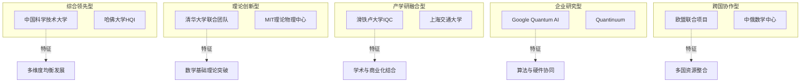

**综合领先型团队**（如中国科学技术大学、哈佛大学HQI）在多个维度均表现突出，具有强大的综合竞争力。这类团队通常具有深厚的学术积淀、充足的资源支持和成熟的人才培养体系。

**理论创新型团队**（如清华大学联合团队、MIT理论物理中心）在研究方向独特性和理论原创性方面表现突出，其核心优势在于提出开创性的数学概念与方法。

**产学研融合型团队**（如滑铁卢大学IQC、上海交通大学）在学术研究与产业转化之间建立了高效的转化通道，其特点是理论创新与应用落地并重。

**企业研究型团队**（如Google Quantum AI、Quantinuum）具有强大的工程实现能力和资源整合能力，能够将学术创新快速转化为技术产品。

**跨国协作型团队**（如欧盟联合项目、中俄数学中心）通过多国资源整合实现优势互补，其特点是合作网络广泛、资金来源多元。

#### 4.7.3 区域发展模式的比较总结

**不同地区在数学与量子计算交叉领域形成了各具特色的发展模式**：

**北美模式**以深厚的理论物理学基础为支撑，强调基础理论创新与产业应用的双轮驱动。美国依托《国家量子倡议法案》形成了政府引导、产学研协同的发展格局，滑铁卢大学IQC则体现了企业家精神与学术卓越的有机结合。

**欧洲模式**依托欧盟框架计划实现跨国协作，强调多国资源整合与标准化建设。OpenSuperQPlus项目、量子互联网联盟等体现了欧洲在大型跨国科研项目组织方面的优势。

**中国模式**以高校科研团队为源头、以院士领衔创业为特色，强调自主可控与应用导向。中国科学技术大学、上海交通大学等团队在量子纠错、量子模拟等方向形成了鲜明特色，本源量子、图灵量子等企业则体现了科研成果产业化的成功路径。

**这三种模式各有优劣**：北美模式在基础理论创新方面具有优势，但产业化进程相对分散；欧洲模式在跨国协作方面具有优势，但决策效率可能受到多国协调的制约；中国模式在集中资源攻关方面具有优势，但国际合作网络的广度有待进一步拓展。

#### 4.7.4 比较分析的核心发现

**通过多维度横向比较分析，本章得出以下核心发现**：

**第一，全球研究格局呈现"三极分化"特征**。北美、欧洲、亚太三大区域在数学与量子计算交叉领域形成了各具特色的研究集群，中美两国在综合实力上处于第一梯队，欧洲在跨国协作方面具有独特优势。

**第二，研究方向分布呈现"集聚与分化并存"特征**。量子复杂性理论、量子算法设计等方向由北美主导，量子纠错数学基础、量子模拟数值方法等方向由中国领先，拓扑量子计算、量子机器学习等方向呈国际分布格局。

**第三，学术产出与资源配置效率存在显著差异**。部分"小而精"的团队（如清华大学联合团队）在特定方向实现了高密度突破，而规模化团队（如滑铁卢大学IQC）则通过系统性组织实现了稳定产出。

**第四，产学研合作模式的差异反映了各国科技创新体系的特点**。滑铁卢模式强调企业家精神，中国模式强调院士领衔创业，欧洲模式强调跨国项目协调，这些差异为不同类型团队的发展提供了多元化路径。

**第五，国际合作对研究产出具有显著促进作用**。跨国联合团队在顶级期刊发表、理论创新等方面往往表现更为突出，这表明开放合作是推动交叉领域发展的重要动力。

这些发现为后续章节评估各团队的未来突破潜力提供了系统性的实证基础。

## 5 未来突破潜力综合评估：关键驱动因素与团队画像

本章基于前述多维度比较分析的实证发现，系统评估全球数学与量子计算交叉领域主要研究团队在未来5-10年内引领重大突破的潜力。通过构建突破潜力评估模型，从理论创新能力、技术实现路径、资源整合能力、跨学科协作效率以及对容错、规模扩展、算法优势等核心挑战的应对策略五个关键维度进行深度分析，识别最具突破潜力的团队群体，并刻画其差异化的能力画像与发展轨迹。

### 5.1 突破潜力评估模型的构建与方法论

#### 5.1.1 评估框架的理论基础与设计原则

**评估未来突破潜力需要超越静态的成果统计，转向对动态创新能力的系统性判断**。数学与量子计算交叉领域的突破具有高度不确定性、长周期性和跨学科性等特征，这要求评估框架既能捕捉当前积累的厚度，又能预判未来发展的动能。

评估框架的设计遵循以下核心原则：

**第一，能力导向原则。** 突破潜力的核心在于创新能力而非单纯的成果数量。框架聚焦于评估团队产生原创性突破的内在能力，包括理论洞察力、工程实现力、资源整合力等。

**第二，系统性原则。** 量子计算的重大突破需要理论、技术、资源、生态等多要素协同。框架将各维度视为相互关联的系统，而非独立的评分项。

**第三，前瞻性原则。** 评估不仅关注已取得的成果，更关注团队在关键瓶颈问题上的布局与进展，以及对未来技术路线的战略判断。

**第四，差异化原则。** 不同团队可能通过不同路径实现突破，框架允许识别多元化的突破模式，而非强制统一的评价标准。

#### 5.1.2 五大核心维度的选取依据与内在关联

本报告选取理论创新能力、技术实现路径、资源整合能力、跨学科协作效率、核心挑战应对策略五大维度构建综合评估模型。这五个维度的选取基于对量子计算领域突破规律的深入分析：

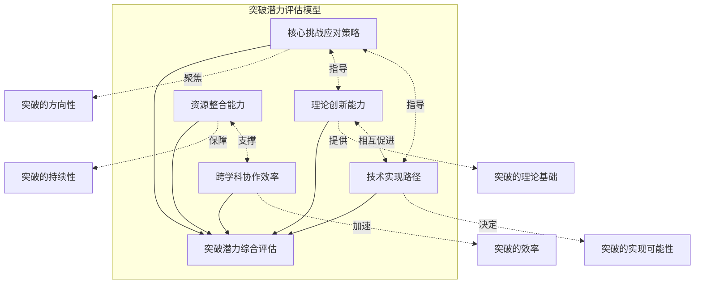

**理论创新能力**是突破的源头，决定了团队能否提出开创性的数学概念与方法。**技术实现路径**决定了理论创新能否转化为可验证的实验成果。**资源整合能力**保障了高强度研究的可持续性。**跨学科协作效率**影响着知识转移与融合创新的速度。**核心挑战应对策略**则聚焦于团队在关键瓶颈问题上的针对性布局。

这五个维度之间存在密切的内在关联：理论创新为技术实现提供方向，技术实现为理论创新提供验证；资源整合支撑跨学科协作，跨学科协作提升资源配置效率；核心挑战应对策略则贯穿于前四个维度，指导资源配置与研究方向的选择。

#### 5.1.3 评估周期与指标权重的设定

**5-10年的评估周期设定基于量子计算领域的技术发展规律**。从历史经验来看，量子计算的重大突破通常需要5-15年的持续积累。中国科学技术大学团队历时13年实现费米子哈伯德模型反铁磁相变，上海交通大学贾金锋团队"十年磨一剑"捕获马约拉纳费米子，均印证了这一规律。5-10年的时间窗口既足以观察到实质性进展，又不至于因过长周期而增加预测的不确定性。

各维度的指标权重设定遵循"理论引领、技术支撑、资源保障"的逻辑：

| 评估维度 | 权重占比 | 权重设定依据 |
|---------|---------|-------------|
| 理论创新能力 | 30% | 突破的源头与核心驱动力 |
| 技术实现路径 | 25% | 理论向应用转化的关键 |
| 资源整合能力 | 20% | 持续研究的基础保障 |
| 跨学科协作效率 | 15% | 融合创新的加速器 |
| 核心挑战应对策略 | 10% | 方向选择的战略性 |

### 5.2 理论创新能力的深度评估与团队排序

#### 5.2.1 理论创新能力的三层评估框架

**理论创新能力是评估突破潜力的核心维度**，可从原创性概念提出、数学方法论创新、理论体系构建三个层面进行深度评估：

**原创性概念提出**指团队能否提出具有开创性意义的新概念、新原理，这是理论创新的最高层次。清华大学刘子文团队引入的"子系统差异（subsystem variance）"概念，建立了近似量子纠错性质与电路复杂度之间的严格联系，揭示了近似量子纠错编码复杂性"相图"，体现了概念层面的原始创新。王亦许等人提出的"镶嵌码"框架使量子逻辑操作可以直接通过几何旋转来实现，揭示了量子编码与几何之间的深刻联系，同样属于概念层面的突破。

**数学方法论创新**指团队能否发展新的数学工具或将已有数学方法创新性地应用于量子计算问题。上海交通大学金石团队原创的"薛定谔化"方法，创新性地将偏微分方程转化为量子系统可直接处理的酉演化形式，被国家自然科学基金委2024年年度报告选为数学唯一代表性成果。中国科学院理论物理研究所团队融合代数、几何与拓扑方法，利用基于Bernstein-Khovanskii-Kushnirenko定理的代数几何方法揭示了BB码拓扑序的一般变化规律，体现了多数学分支融合的方法论创新。

**理论体系构建**指团队能否围绕特定问题建立系统性的理论框架。清华大学刘子文团队建立的"广义量子纠错性质与系统量子复杂性之间严格联系的普适理论框架"，为理解复杂量子系统提供了全新的、统一的视角，体现了理论体系构建的能力。

#### 5.2.2 各团队理论创新能力的深度分析

**中国团队在数学驱动型理论创新方面展现出强劲的追赶和并跑势头**。通过系统分析各团队的理论创新贡献，可以识别出以下特征：

**清华大学联合团队**在量子纠错数学基础方向形成了系统性的理论创新优势。刘子文团队围绕近似量子纠错展开研究，引入了"子系统差异"这一新的编码性质，完成了数学理论的证明，揭示了近似量子纠错编码复杂性"相图"。王亦许等人提出的"镶嵌码"框架系统建立了镶嵌码在不同几何上的普适构造的理论，结合群论与表示论展示其误差纠正能力。这些成果体现了**从数学基础理论出发解决量子计算核心问题**的研究路径，理论创新的深度与系统性突出。

**上海交通大学团队**在量子科学计算算法方向实现了方法论层面的重大创新。"薛定谔化"量子算法框架的突破，大大拓展了量子计算可解决的科学与工程问题的边界。该平台理论上可以将3维方程的计算效率提高6倍以上，将5维方程的计算效率提高2.5万倍以上，将9维方程的计算效率提高1万亿倍以上。这一成果展现了**将抽象数学方法转化为可量化性能提升**的强大能力。

**中国科学院理论物理研究所团队**在量子纠错码的代数几何理论方面取得重要进展。研究团队注意到BB码与分形子物理在研究方法上的共通性，借鉴分形子领域发展出的代数工具，并结合Gröbner基等方法，实现了对任意给定BB码拓扑性质的高效表征。研究发现BB码普遍具有以任意子为特征激发的拓扑序，揭示了一种在BB码中普遍存在的"拓扑阻挫"现象。这一成果体现了**多数学分支融合应用于量子计算**的创新范式。

**Google Quantum AI团队**在量子优化算法方向实现了理论与实验的协同突破。DQI算法的核心创新在于将问题的约束直接编码到量子态上，再用纠错码的解码技术实现反计算而消除会影响量子干涉过程的中间态。该算法与传统量子优化算法的根本区别在于其采用了**波动观点**而非能量视角，这种范式转变使得量子加速的数学证明成为可能。

**美国及欧洲团队**在基础理论与基准创新方面具有领先性。瑞士洛桑联邦理工学院（EPFL）团队提出V-score（变分精度评分），为统一量化比较不同量子多体问题求解方法的精度提供了新工具，有助于界定更严谨的"量子优越性"标准。这类创新更侧重于为领域发展提供基础性工具和理论框架。

#### 5.2.3 理论创新能力的团队排序

基于上述分析，从理论创新能力角度对主要团队进行排序：

| 排序 | 研究团队 | 理论创新特征 | 代表性贡献 | 创新深度评级 |
|-----|---------|-------------|-----------|-------------|
| 1 | 清华大学联合团队 | 概念原创+体系构建 | 子系统差异、镶嵌码 | ★★★★★ |
| 2 | 上海交通大学 | 方法论创新 | 薛定谔化算法 | ★★★★★ |
| 3 | Google Quantum AI | 范式转换 | DQI算法 | ★★★★★ |
| 4 | 中科院理论物理所 | 多学科融合 | BB码拓扑理论 | ★★★★☆ |
| 5 | MIT理论物理中心 | 基础理论 | HHL算法、量子复杂性 | ★★★★☆ |
| 6 | 哈佛大学HQI | 系统集成理论 | 容错系统理论 | ★★★★☆ |

### 5.3 技术实现路径的可行性分析与风险评估

#### 5.3.1 主要技术路线的优劣势比较

**量子计算的技术实现路径呈现多元化发展格局**，不同技术路线在比特数规模、相干时间、门保真度、可扩展性等关键指标上各有优劣：

| 技术路线 | 代表团队 | 核心优势 | 主要挑战 | 成熟度评估 |
|---------|---------|---------|---------|-----------|
| 超导路线 | 中科大、IBM、谷歌 | 扩展性路径清晰、门操作速度快 | 相干时间短、低温要求严格 | 高 |
| 离子阱路线 | 华翊量子、Quantinuum | 相干时间长（>200毫秒）、保真度高 | 扩展瓶颈、操控复杂 | 中高 |
| 光量子路线 | 中科大"九章"系列 | 室温操作、专用任务优势明显 | 通用性受限 | 中 |
| 中性原子路线 | 加州理工、复旦大学 | 比特数潜力大（6100个原子）、相干时间长 | 全栈技术成熟度待验证 | 中 |

**超导路线**是当前实现量子比特数规模领先的主要路线。IBM已达1121比特，中科大"祖冲之三号"在量子优越性基准上实现千万亿倍领先。中国团队注重**理论与实验深度结合**，在提升门操作保真度（>99.6%）和系统综合性能上取得突破。美国团队则强于**规模化集成**和**开源软件生态**构建，推动技术标准化和易用性。

**离子阱路线**凭借极长相干时间和高保真度，被视为实现容错量子计算的关键可行路径之一。中国华翊量子首创**二维离子晶体阵列**架构，理论上解决了传统一维离子链的扩展瓶颈，为承载上万量子比特提供了独特方案，是理论构想走向工程实现的创新。

**光量子路线**在专用量子计算（如高斯玻色采样）上已实现亿亿倍的量子优越性，技术路径可行且在该领域保持绝对领先。该路径是中国团队的**特色优势路线**，与超导路线形成"双轮驱动"。

#### 5.3.2 各团队技术实现能力的深度评估

**哈佛大学HQI团队**于2025年首次在一套集成量子系统中实现了可扩展量子计算与量子纠错所需的全部关键要素。该团队构建的新型量子系统能够在关键性能阈值以下检测并清除错误，展示了一个由**448个中性原子量子比特组成的"容错"系统**，能够通过物理纠缠、逻辑纠缠、熵移除等机制实时监测并修正错误。团队设计了包含数十层纠错步骤的深度量子电路，将错误率压低至关键阈值以下——在这一阈值范围内，继续增加量子比特不仅不会引入额外误差，反而能进一步抑制错误。这一结果被视为**量子纠错领域30年来的重要进展**。

**中国科学技术大学团队**在超导和光量子两条路线上均取得里程碑式突破。"祖冲之三号"相关研究成果以封面论文形式发表于《物理评论快报》，审稿人评价其"构建了目前最高水准的超导量子计算机"。在量子模拟方向，团队历时13年实现费米子哈伯德模型反铁磁相变，被评价为"展示了利用超冷原子进行量子模拟研究复杂量子材料物理的重要性"。2025年11月，团队首次在超导量子处理器上成功"锁住"了量子信息，造出了一个"怎么晃都不坏"的量子模块，为未来打造从不错乱的超级量子计算机指明了方向。

**浙江大学团队**在qLDPC码实验验证方面取得突破性成果。研究团队利用一个32位量子处理器首次验证了两种低开销的量子低密度奇偶检验码。实验结果显示，对于拥有4个逻辑比特的双变量自行车码，每个周期每个逻辑比特的逻辑错误率为(8.91±0.17)%；对于拥有6个逻辑比特的打孔双变量自行车码，逻辑错误率为(7.77±0.12)%。**相比表面码，BB码仅需约1/4的物理量子比特即可实现同等性能的逻辑纠错**，这一成果为降低容错量子计算的资源开销提供了实验依据。

#### 5.3.3 技术实现路径与理论创新的协同分析

**中国团队的技术路径选择往往与其在相应数学物理理论上的深厚积累直接相关**，"理论先行指导技术突破"的特征明显。上海交通大学贾金锋团队在拓扑量子计算方向的布局，与其在拓扑物态理论方面的长期积累密切相关；中科院理论物理所的BB码拓扑理论研究，为超导量子纠错的工程实现提供了理论指导。

**美国团队则在多条技术路径上并行探索**（超导、拓扑、中性原子），通过强大的工程能力和工业生态，快速将理论概念转化为原型验证，"技术迭代推动理论完善"的循环速度快。谷歌量子AI团队工程副总裁哈特穆特·内文在评价哈佛大学量子纠错突破时指出，该成果出现在全球量子比特平台竞争"极为激动人心"的阶段，"向构建大规模、实用的量子计算机迈出了重要一步"。

### 5.4 资源整合能力与可持续发展潜力评估

#### 5.4.1 资金获取渠道多元化分析

**资金支持的多元化程度直接影响研究团队的抗风险能力与持续创新能力**。不同团队在资金来源结构上呈现显著差异：

**滑铁卢大学IQC**由黑莓创始人迈克·拉扎里迪斯资助成立，开创了企业家深度参与量子科研的先河。这种"企业家驱动"的资金模式使IQC在学术研究与商业化之间建立了高效的转化通道，同时也面临对单一资助来源依赖的潜在风险。

**中国科学技术大学团队**形成了"国家专项+地方支持+产业转化"的多元资金结构。2017年，在没有企业愿意合作开发量子计算机的情况下，郭光灿院士和郭国平教授带领博士团队联合创立了中国第一家量子计算公司，如今该公司已坐拥234件专利，排在量子计算行业国内第1、国际第6。这种"自主孵化"模式为团队提供了产业化收益的反哺渠道。

**欧盟联合项目**依托地平线欧洲框架计划获得稳定的跨国资金支持。OpenSuperQPlus项目获得2000万欧元资助，量子互联网联盟（QIA）同样获得欧盟框架计划的持续支持。这种"跨国公共资金"模式的优势在于资金来源稳定、规模可观，但决策效率可能受到多国协调的制约。

**华翊量子**在短短三年间已完成四轮融资，2024年7月宣布完成数亿元A轮融资，这是中国量子计算领域年度最大规模融资事件，更有社保基金、北京国资平台等"国家队"定向加码。这一案例表明，**具有顶尖科研背景的团队更容易获得多元化的资金支持**。

#### 5.4.2 人才梯队建设完备度评估

**人才梯队的完备度决定了团队的长期竞争力与知识传承能力**。通过分析各团队的人才培养模式，可以识别出不同的梯队建设策略：

**中国科学技术大学量子信息重点实验室**形成了具有强大学术传承的研究梯队。从2003年"一张桌子、一把椅子"的简陋工作室发展至今，已培养出五位中国科学院院士（郭光灿、彭堃墀、孙昌璞、潘建伟、杜江峰）。这种"院士培养院士"的传承模式为持续的高质量学术产出提供了保障。

**太原理工大学算子理论与量子信息团队**在人才培养方面同样成绩斐然。团队注重夯实学生基础数学知识、拓展应用能力，培养的学生有人攻读德国慕尼黑大学博士，有人获得全国自强之星、国家奖学金等荣誉。博士生王海港在8岁时因意外失去双臂，但凭借超乎常人的毅力，用脚趾操作电脑进行科研工作，2025年下半年数篇重要研究成果集中发表于国际知名期刊，其中一篇被Nature旗下系列期刊《Communications Physics》接收。

**滑铁卢大学IQC**拥有约296名研究人员，自成立以来已发表超过1500篇研究论文。这一规模化的人才队伍通过系统性的组织架构实现了稳定的学术产出，但也面临如何保持创新活力的挑战。

#### 5.4.3 基础设施支撑能力比较

**基础设施的先进程度直接影响实验研究的深度与广度**。各主要团队在基础设施建设方面呈现不同特点：

**中国科学技术大学**依托"祖冲之"系列超导量子处理器和"九章"系列光量子计算机，形成了国际领先的实验平台。"祖冲之三号"被审稿人评价为"构建了目前最高水准的超导量子计算机"。

**浙江大学**基于自研的百比特"天目2号"超导量子芯片，实现了新型"热"拓扑边缘态，相关成果发表于《自然》杂志。该团队还利用32位量子处理器"昆仑"首次验证了qLDPC码。

**哈佛大学HQI**构建了448个中性原子量子比特组成的容错系统，展示了在集成量子系统中实现可扩展量子计算与量子纠错所需全部关键要素的能力。

### 5.5 跨学科协作效率与生态系统成熟度分析

#### 5.5.1 跨学科人才结构与知识转移效率

**数学与量子计算的交叉融合要求团队具备跨学科的人才结构与高效的知识转移机制**。不同团队在跨学科协作方面呈现显著差异：

**清华大学联合团队**依托丘成桐数学科学中心与高等研究院的联合机制，实现了数学与物理学科之间的深度融合。刘子文团队的研究"创新地建立了广义量子纠错性质与系统量子复杂性之间严格联系的普适理论框架"，这一成果的取得得益于数学家与物理学家的紧密协作。王亦许等人提出的"镶嵌码"研究"系统建立了镶嵌码在不同几何上的普适构造的理论，结合群论与表示论展示其误差纠正能力"，体现了代数、几何、拓扑等多数学分支的融合。

**太原理工大学团队**与百度量子计算研究所等单位开展长期合作，联合培养学生，为学生提供了良好的科研实践平台和发展机会。这种产学研合作模式为将算子理论的抽象研究成果转化为实际应用奠定了基础。

**哈佛大学、加州理工学院、清华大学、杜克大学等机构研究人员组成的团队**在《PRX Quantum》期刊上发表了无预设哈密顿量学习算法，提出了首个无需先验结构假设的哈密顿量学习算法。这一成果的取得得益于多机构、跨国界的协作网络。

#### 5.5.2 跨机构协作平台的运行成效

**跨机构协作平台是推动数学与量子计算交叉领域发展的重要组织形式**。不同地区形成了各具特色的协作平台：

**中俄数学中心**是亚太地区数学领域国际合作的重要平台。2024年8月，中俄两国总理在联合公报中明确指出推动在中俄基础科学研究院框架下牵头成立基础研究双边协作平台。该中心已与莫斯科国立大学、圣彼得堡国立大学、俄罗斯科学院斯捷克洛夫数学研究所等主要高校院所持续组织系列论坛，迄今已组织论坛报告200余场次，近350位中外优秀数学家受邀作报告，其中包括38位院士及通讯院士。

**美国量子经济发展联盟（QED-C）**是由NIST与斯坦福国际研究院联合成立的产学研合作平台，囊括了全美主要量子科技公司、高校、科研机构和其他组织。该联盟在辐射范围、成员数量、产学研结合程度、资源及信息交换等维度上均处于美国头部水平。

**欧盟量子互联网联盟（QIA）**由荷兰代尔夫特理工大学、QuTech、奥地利因斯布鲁克大学、法国INRIA和CNRS等机构联合组建。2025年3月12日，该联盟在《自然》杂志发表论文，宣布成功研发全球首个量子网络操作系统QNodeOS，标志着量子互联网从理论构想向工程实现迈出了关键一步。

#### 5.5.3 生态系统成熟度的综合评估

**生态系统的成熟度决定了团队能否持续获得外部资源支持与协作机会**。不同地区的量子计算生态系统呈现不同的成熟度特征：

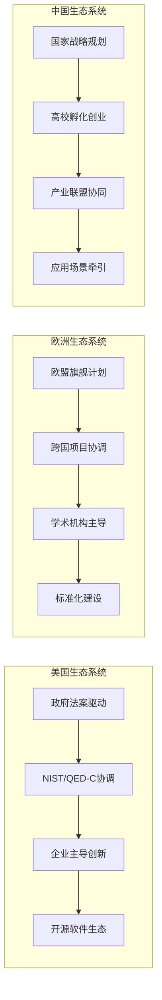

**美国生态系统**以企业为创新主导，形成了从基础研究到产业应用的完整链条。IBM、谷歌等企业在开源软件生态（Qiskit、Cirq）和跨平台理论工具上体系化能力更强。

**欧洲生态系统**依托欧盟框架计划实现跨国协作，在大型跨国科研项目组织方面具有独特优势。OpenSuperQPlus项目涉及来自10个国家的28个合作伙伴，量子互联网联盟成功研发全球首个量子网络操作系统QNodeOS。

**中国生态系统**以"产学研"结合为特色，初创企业（如华翊、本源、图灵）成为理论技术转化的重要载体。中国量子计算产业联盟经过5年多发展，目前成员数已突破80家，涉及金融、航空航天、大数据、先进计算等领域。

### 5.6 核心挑战应对策略的比较与前瞻

#### 5.6.1 容错量子计算挑战的应对策略

**容错量子计算是实现实用化量子计算机的核心挑战**。各团队在应对这一挑战时采取了不同的技术路线与理论策略：

**清华大学联合团队**从数学基础理论层面为容错量子计算提供支撑。刘子文团队建立的"广义量子纠错性质与系统量子复杂性之间严格联系的普适理论框架"，为理解复杂量子系统提供了全新视角。王亦许等人提出的"镶嵌码"框架使量子逻辑操作可以直接通过几何旋转来实现，为逻辑量子计算开辟了一条新的实现路径。

**哈佛大学HQI团队**从系统集成层面突破容错瓶颈。该团队构建的448个中性原子量子比特组成的"容错"系统，能够通过物理纠缠、逻辑纠缠、熵移除等机制实时监测并修正错误，并利用"量子隐形传态"等技术实现量子态的无接触传输。团队设计了包含数十层纠错步骤的深度量子电路，将错误率压低至关键阈值以下。

**浙江大学团队**从实验验证层面推进容错技术。该团队首次验证了两种低开销的量子低密度奇偶检验码，**相比表面码，BB码仅需约1/4的物理量子比特即可实现同等性能的逻辑纠错**。

**法国Alice and Bob公司**提出了创新性的"电梯编码"方案，通过在计算过程中上下移动逻辑量子比特，将逻辑错误率降低至万分之一水平。**相比该公司先前的量子纠错方案，电梯编码仅需三倍数量的量子比特，就能实现逻辑错误率降低万倍的突破**。

#### 5.6.2 规模扩展挑战的应对策略

**规模扩展是实现量子计算实用化的另一核心挑战**。各团队在应对这一挑战时采取了不同的技术路线：

**中国华翊量子**首创二维离子晶体阵列架构，理论上解决了传统一维离子链的扩展瓶颈，为承载上万量子比特提供了独特方案。这一架构创新是理论构想走向工程实现的重要突破。

**欧盟OpenSuperQPlus项目**目标是建立一个1000量子位的量子计算系统。目前正在启动项目第一阶段，一方面开发用于评估硬件和软件的系统，另一方面开发面向用户的100量子比特系统，用于未来3年内的第一个量子应用。

**德州大学奥斯汀分校与清华大学丘成桐数学科学中心的联合研究团队**采用强化学习方法优化量子纠错码。**在某些情况下，该方法能够将物理量子比特的开销降低73倍**，这意味着原本需要几万个物理量子比特才能实现的纠错效果，现在用几百个就足够了。

#### 5.6.3 算法优势证明挑战的应对策略

**算法优势证明是确立量子计算价值的关键挑战**。各团队在这一方向上取得了不同程度的进展：

**Google Quantum AI团队**开发的DQI算法在max-XORSAT问题上实现了相对经典算法的超多项式加速。在31,216变量、50,000约束的测试中，DQI算法8秒找到满足83.1%约束的方案，远快于通用经典启发式算法。该算法与传统量子优化算法的根本区别在于其采用了**波动观点**而非能量视角，这种范式转变使得量子加速的数学证明成为可能。

**中国科学技术大学团队**在量子优越性基准上实现了千万亿倍领先。"祖冲之三号"在随机量子电路采样任务上展示了相对经典计算的巨大优势，"九章"系列在高斯玻色采样上实现了亿亿倍的量子优越性。

**上海交通大学团队**的UnitaryLab平台理论上可以将9维方程的计算效率提高1万亿倍以上，为量子算法在科学计算领域的优势提供了理论支撑。

### 5.7 最具突破潜力团队的综合画像与分层排序

#### 5.7.1 综合评估结果与能力画像

**基于五大维度的综合评估，可以构建各主要团队的差异化能力画像**。下表从多维度呈现各团队的综合突破潜力评估：

| 研究团队 | 理论创新 | 技术实现 | 资源整合 | 跨学科协作 | 核心挑战应对 | 综合潜力 |
|---------|---------|---------|---------|-----------|-------------|---------|
| 中国科学技术大学 | ★★★★☆ | ★★★★★ | ★★★★★ | ★★★★☆ | ★★★★★ | 第一梯队 |
| 哈佛大学HQI | ★★★★☆ | ★★★★★ | ★★★★★ | ★★★★★ | ★★★★★ | 第一梯队 |
| 清华大学联合团队 | ★★★★★ | ★★★☆☆ | ★★★★☆ | ★★★★☆ | ★★★★★ | 第一梯队 |
| 上海交通大学 | ★★★★★ | ★★★★☆ | ★★★★☆ | ★★★☆☆ | ★★★★☆ | 第一梯队 |
| Google Quantum AI | ★★★★★ | ★★★★★ | ★★★★★ | ★★★★☆ | ★★★★★ | 第一梯队 |
| 浙江大学 | ★★★★☆ | ★★★★★ | ★★★★☆ | ★★★☆☆ | ★★★★☆ | 第二梯队 |
| 中科院理论物理所 | ★★★★☆ | ★★★☆☆ | ★★★☆☆ | ★★★★☆ | ★★★★☆ | 第二梯队 |
| 滑铁卢大学IQC | ★★★★☆ | ★★★★☆ | ★★★★★ | ★★★★★ | ★★★★☆ | 第二梯队 |
| MIT理论物理中心 | ★★★★☆ | ★★★★☆ | ★★★★☆ | ★★★★★ | ★★★☆☆ | 第二梯队 |
| 欧盟联合项目 | ★★★☆☆ | ★★★★☆ | ★★★★★ | ★★★★★ | ★★★☆☆ | 第二梯队 |

#### 5.7.2 三梯队分层排序与特征分析

**基于综合评估结果，将全球主要研究团队分为三个梯队**：

**第一梯队（综合领先型）** 包括中国科学技术大学、哈佛大学HQI、清华大学联合团队、上海交通大学、Google Quantum AI。这些团队在多个维度均表现突出，具有在未来5-10年内引领重大突破的综合实力。

- **中国科学技术大学**的核心优势在于多技术路线并行布局、强大的人才传承体系、产学研深度融合。其发展瓶颈在于国际合作网络的进一步拓展。突破方向聚焦于超导与光量子的"双轮驱动"，以及量子模拟的实用化应用。

- **哈佛大学HQI**的核心优势在于系统集成能力、容错技术突破、充足的资源支持。其发展瓶颈在于产业转化通道的进一步完善。突破方向聚焦于中性原子路线的规模扩展与容错验证。

- **清华大学联合团队**的核心优势在于数学基础理论的原始创新能力。其发展瓶颈在于从理论到实验验证的转化效率。突破方向聚焦于量子纠错数学基础的持续深化与新型编码方案的提出。

- **上海交通大学**的核心优势在于量子科学计算算法的方法论创新与拓扑量子计算的实验能力。其发展瓶颈在于跨学科协作网络的进一步拓展。突破方向聚焦于薛定谔化算法的应用拓展与马约拉纳费米子的工程化。

- **Google Quantum AI**的核心优势在于算法与硬件的协同创新、强大的工程实现能力、开源生态建设。其发展瓶颈在于算法优势的持续证明。突破方向聚焦于DQI算法的实用化与更大规模量子处理器的构建。

**第二梯队（特定方向突出型）** 包括浙江大学、中科院理论物理所、滑铁卢大学IQC、MIT理论物理中心、欧盟联合项目。这些团队在特定研究方向上具有突出优势，有望在细分领域实现重要突破。

- **浙江大学**在qLDPC码实验验证方向具有领先优势，其"天目2号"芯片与"昆仑"处理器为实验研究提供了强大支撑。

- **中科院理论物理所**在BB码拓扑理论方向具有独特贡献，其代数几何方法为量子纠错理论提供了新的数学工具。

- **滑铁卢大学IQC**在产学研融合方面具有典范意义，其"企业家驱动"模式为学术创新与商业化转化提供了成功范例。

- **MIT理论物理中心**在量子复杂性理论与量子机器学习方向具有深厚积淀，HHL算法等成果奠定了该领域的理论基础。

- **欧盟联合项目**在跨国协作与标准化建设方面具有独特优势，OpenSuperQPlus项目与QIA联盟为大规模协作研究提供了组织范式。

**第三梯队（快速成长型）** 包括华翊量子、本源量子、图灵量子、太原理工大学团队等。这些团队在特定方向上展现出快速成长势头，有望在未来5-10年内进入第二梯队。

- **华翊量子**首创的二维离子晶体阵列架构为离子阱路线的规模扩展提供了新方案，其快速融资进程表明资本市场对其技术路线的认可。

- **本源量子**作为中国第一家量子计算公司，在专利布局方面已位居国内第1、国际第6，为量子计算产业化奠定了基础。

- **图灵量子**作为中国光量子计算龙头企业，其商用光量子计算机TuringQ Gen2采用量子-经典混合架构，系统支持超10万变量求解，在2025年世界互联网大会上荣获"领先科技奖"。

- **太原理工大学团队**在算子代数与量子信息交叉方向形成了独特优势，其多体纠缠检测的实用化方案为量子信息处理提供了新的数学工具。

#### 5.7.3 突破潜力的综合研判

**当前全球数学与量子计算交叉领域的竞争态势是"交替领先、特色发展"**。理论创新能力的竞争已不仅是单一指标的比拼，而是**原始理论突破、快速技术转化、完整生态构建**三者综合实力的较量。

**中国团队**在数学与量子计算交叉领域的理论创新能力上展现出强劲的追赶和并跑势头，尤其在利用复杂数学工具解决量子纠错、算法设计等核心难题方面，贡献了一系列具有突破性性能和清晰量化效益的原创成果。其技术实现路径（光量子、离子阱架构）具有鲜明独特性，且与理论优势紧密结合。

**美国及欧洲团队**在基础理论创新、多路径探索及创新生态体系化方面依然保持领先。其理论创新更侧重于提供普适性工具、探索新物理范式，并通过强大的工业研发能力和知识产权布局，确保理论创新的持续产出和全球影响力。

**能够持续将深层次数学洞察转化为解决量子计算扩展性、容错性、实用性根本问题的团队，将定义未来的技术范式**。基于本章的综合评估，中国科学技术大学、哈佛大学HQI、清华大学联合团队、上海交通大学、Google Quantum AI五支团队最有可能在未来5-10年内引领量子计算技术的重大突破。

## 6 前瞻预测：未来5-10年可能涌现的关键数学理论与应用技术

本章基于前文对全球顶尖研究团队的系统分析与突破潜力评估，归纳最具潜力团队的研究轨迹与行业发展趋势，前瞻性预测数学与量子计算交叉领域在未来5-10年可能涌现的颠覆性数学理论与革命性应用技术。通过对量子复杂度几何拓扑理论、非交换代数结构密码学应用、实用化量子优化算法、抗量子攻击密码协议、高效量子化学模拟软件等前沿方向的深度分析，揭示这些突破对科学研究、产业应用和国家安全的潜在深远影响。

### 6.1 颠覆性数学理论的涌现预测

#### 6.1.1 量子复杂度的几何拓扑新理论框架

**量子复杂度的几何拓扑理论是连接抽象数学与量子计算工程实现的关键桥梁**。基于前文对清华大学、中科院理论物理所等团队研究轨迹的分析，未来5-10年在这一方向可能涌现以下理论突破：

**第一，Nielsen几何框架的系统性拓展**。国家自然科学基金"量子计算的数学基础理论"专项项目已将"Nielsen几何框架中的复杂性度量"列为重点研究方向。这一框架将量子电路复杂度问题转化为黎曼流形上的测地线问题，为理解量子计算的本质复杂性提供了几何直觉。预计未来5年内，研究者将在以下方面取得突破：建立更精确的复杂度下界证明方法、发展适用于含噪声量子电路的几何复杂度理论、以及构建量子复杂度与经典复杂度之间的几何对应关系。

**第二，拓扑量子计算中量子不变量复杂度的深化**。Quantinuum公司研究团队已展示了利用量子计算机计算绳结"琼斯不变量"的能力，在H2-2上计算了含600个交叉点的琼斯不变量[^65]。这一方向的理论深化将聚焦于：拓扑不变量计算的量子复杂度分类、任意子编织统计与量子门操作的数学对应、以及拓扑保护量子比特的数学构造理论。预计到2030年，研究者将建立起系统性的"拓扑量子复杂度理论"，为拓扑量子计算机的设计提供数学指导。

**第三，高阶拓扑物态的数学刻画理论**。中国科学技术大学团队在"祖冲之2号"上首次实现并探测了高阶非平衡拓扑相（HOTPs），成果发表于《科学》杂志[^66]。这一实验突破将推动高阶拓扑物态数学理论的系统发展，包括：高阶体-边对应关系的严格数学证明、弗洛凯算符的拓扑分类理论、以及角模式量子信息存储的数学基础。

下表预测了量子复杂度几何拓扑理论在未来5-10年的发展里程碑：

| 时间窗口 | 预期理论突破 | 潜在贡献团队 | 影响评估 |
|---------|-------------|-------------|---------|
| 2025-2027年 | Nielsen几何框架的噪声扩展 | 清华大学、MIT | 为NISQ设备复杂度分析提供工具 |
| 2027-2029年 | 拓扑不变量量子复杂度分类 | Quantinuum、上海交大 | 指导拓扑量子计算机设计 |
| 2029-2032年 | 统一的几何拓扑复杂度理论 | 国际联合团队 | 重塑量子计算复杂性理论框架 |

#### 6.1.2 非交换代数结构在量子信息理论中的创新应用

**非交换代数结构为量子信息理论提供了独特的数学语言与分析工具**。基于太原理工大学算子理论团队、中科院理论物理所等团队的研究积累，未来5-10年可能在以下方向产生理论突破：

**非交换傅里叶分析在量子信道容量理论中的应用深化**。传统的傅里叶分析基于交换群结构，而量子信息处理本质上涉及非交换的算子代数。预计研究者将发展系统性的"量子非交换傅里叶分析"理论，用于刻画量子信道的信息传输能力、量子纠缠的分布特征、以及量子测量的信息提取效率。这一理论将为量子通信网络的容量优化提供数学基础。

**张量范畴论在量子纠错编码中的系统化发展**。文小刚团队提出的"弦网凝聚"理论通过张量范畴语言揭示了拓扑序与规范场的深层联系，为构建拓扑量子计算机提供了理论蓝图[^67]。预计未来5-10年，研究者将在以下方面取得进展：建立张量范畴与量子纠错码之间的系统对应关系、发展基于高阶范畴论的量子纠错理论、以及构建"范畴化量子信息论"的完整框架。

**算子代数方法在多体纠缠检测中的实用化突破**。太原理工大学团队提出的多体量子系统k-纠缠态检测判据，已具备实用性和计算机软件化工具化性能。预计这一方向将进一步发展：建立适用于任意维度多体系统的完整纠缠分类理论、发展高效的纠缠检测算法库、以及将算子理论方法与量子机器学习相结合，实现自动化的纠缠态识别与分类。

#### 6.1.3 代数几何方法在量子纠错理论中的进一步突破

**代数几何方法正在为量子纠错理论注入新的数学活力**。中国科学院理论物理研究所团队融合代数、几何与拓扑方法，建立了研究双变量双循环量子纠错码（BB码）的拓扑理论框架。基于这一研究轨迹，预计未来5-10年将产生以下理论突破：

**第一，Gröbner基方法在量子码构造中的系统应用**。研究团队借鉴分形子领域发展出的代数工具，并结合Gröbner基等方法，实现了对任意给定BB码拓扑性质的高效表征。预计这一方法将推广至更广泛的量子码族，建立起"量子码的计算代数几何"理论体系。

**第二，Bernstein-Khovanskii-Kushnirenko定理的量子信息应用**。研究团队利用基于该定理的代数几何方法，揭示了在近环面码布局下BB码拓扑序的一般变化规律。通过该定理，任意子的种类可通过计算由相互作用形式决定的牛顿多面体的混合体积获得。预计这一方法将发展为量子码设计的通用工具，为构造具有特定性质的量子纠错码提供系统性方法。

**第三，镶嵌码理论的几何拓展**。清华大学王亦许等人提出的"镶嵌码"框架系统建立了镶嵌码在不同几何上的普适构造理论，结合群论与表示论展示其误差纠正能力。预计这一框架将拓展至更高维流形、非欧几何空间、以及具有特殊对称性的编码结构，形成"几何量子纠错"的完整理论体系。

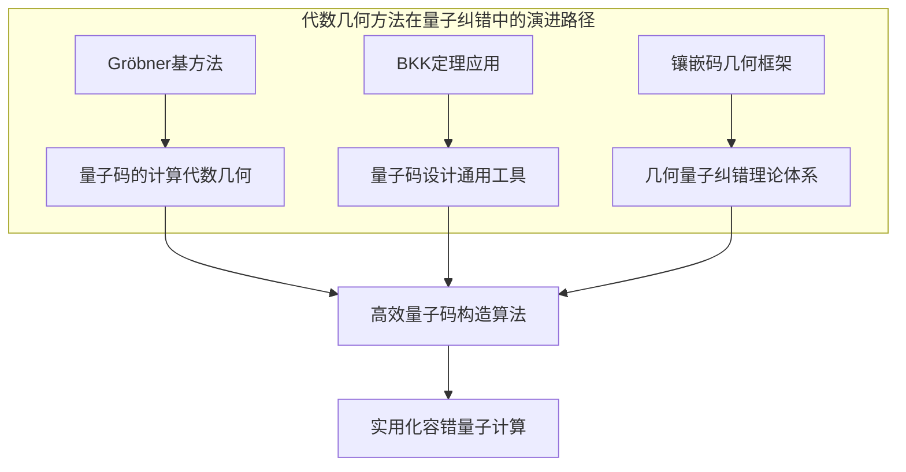

### 6.2 实用化量子优化算法的技术突破预测

#### 6.2.1 DQI算法与QAOA算法的深化演进路径

**量子优化算法正处于从理论验证向实用化应用演进的关键转折期**。Google Quantum AI团队开发的解码量子干涉测量（DQI）算法已在max-XORSAT问题上实现了相对经典算法的超多项式加速，在31,216变量、50,000约束的测试中，8秒找到满足83.1%约束的方案。基于这一突破，预计未来5-10年将沿以下路径深化演进：

**DQI算法的问题域扩展**。当前DQI算法在近似最优多项式拟合等问题上展现出超多项式加速潜力。预计研究者将系统探索DQI算法在以下问题域的适用性：整数规划问题、图着色问题、调度优化问题、以及机器学习中的超参数优化问题。这一扩展将建立起"DQI算法适用性图谱"，为实际应用选择提供指导。

**QAOA算法的硬约束模型优化**。建设银行量子金融实验室在投资组合优化、信用卡评分、指数追踪等场景中应用QAOA算法时，采用硬约束模型来求解金融问题，使输出的解严格满足优化模型的约束条件[^68]。预计这一方向将进一步发展：建立QAOA硬约束模型的系统性理论框架、发展自适应参数调度技术、以及构建面向特定行业的QAOA算法变体库。

**量子-经典混合优化框架的成熟化**。变分量子算法（VQA）作为结合量子计算与经典优化的混合算法，正处于快速发展阶段[^69]。北京大学袁骁课题组提出的基于物理信息神经网络的变分量子算法高效训练方案，通过少量量子采样数据在经典侧预测多步参数更新，显著降低量子资源消耗[^69]。预计未来5年内，量子-经典混合优化框架将在以下方面实现成熟化：标准化的软件接口与工作流、自动化的量子资源分配策略、以及与经典高性能计算的无缝集成。

#### 6.2.2 金融、物流等实际场景的规模化落地时间窗口

**量子优化算法在金融、物流等领域的规模化落地正在加速推进**。基于建设银行、工商银行等金融机构的实践探索，以及量子计算产业联盟的发展态势，预计以下时间窗口将成为关键里程碑：

| 应用领域 | 当前进展 | 2027年预期 | 2030年预期 | 2035年预期 |
|---------|---------|-----------|-----------|-----------|
| 投资组合优化 | 实验室验证 | 小规模试点 | 中等规模部署 | 大规模商用 |
| 信用风险评估 | 算法开发 | 模型验证 | 试点应用 | 规模化部署 |
| 物流路径规划 | 理论研究 | 算法验证 | 小规模试点 | 中等规模部署 |
| 供应链优化 | 概念验证 | 算法开发 | 模型验证 | 试点应用 |

**金融领域的落地进程**。建设银行量子金融应用实验室已在投资组合优化、信用卡评分和指数追踪等场景中取得阶段性成果。在信用卡评分场景中，量子方法相较于经典方法，KS值可提升5%～20%[^68]。预计到2027年，国内主要银行将完成量子优化算法在特定金融场景的小规模试点；到2030年，量子优化将成为金融机构风险管理和投资决策的重要辅助工具。

**物流领域的落地前景**。量子近似优化算法（QAOA）已在车辆路径问题（VRP）中展现出潜力，通过将城市间距离编码为量子比特间的耦合强度，利用量子态演化寻找全局最优解[^70]。预计到2030年，量子优化算法将在大型物流企业的路径规划、仓储布局等场景实现试点应用；到2035年，量子-经典混合优化将成为物流行业的标准技术工具。

#### 6.2.3 算法优势从基准测试向商业价值转化的关键里程碑

**算法优势向商业价值转化需要跨越多个关键里程碑**。华翊量子CEO姚麟指出，"量子计算的'Aha时刻'还没有到来，我们现在所处的阶段，更像人工智能发展早期。大家期待的是像2016年AlphaGo那样，真正展现出解决实际问题的能力，但目前还远远没到那一步，至少还需要5年时间"[^5]。

基于这一判断，预计以下里程碑将标志算法优势向商业价值的转化进程：

**里程碑一：特定问题的可验证量子优势（2025-2027年）**。在特定组合优化问题上，量子算法相对最优经典算法实现可重复验证的性能优势，且优势幅度具有商业意义（如成本节约10%以上或效率提升50%以上）。

**里程碑二：行业标杆案例的产生（2027-2029年）**。在金融、物流或制造业等领域产生具有标杆意义的商业应用案例，证明量子优化算法在真实业务场景中的价值创造能力。

**里程碑三：量子优化即服务（QOaaS）的商业化（2029-2032年）**。量子优化算法以云服务形式向企业用户提供，形成可持续的商业模式，用户无需深入理解量子计算原理即可获得优化服务。

### 6.3 抗量子攻击密码协议的标准化与部署预测

#### 6.3.1 后量子密码学的技术路线成熟化进程

**后量子密码学正处于从标准制定向大规模工程部署演进的关键阶段**。量子计算技术的快速推进让传统密码体系面临崩塌风险，1994年彼得·肖尔提出的"肖尔算法"指出量子计算机可以高效破解整数分解问题，这意味着现有的公钥密码体制（如RSA、ECC）都可以被量子计算机完全破解[^71]。

**五大技术路线的竞争格局**。经过多年探索，抗量子密码学已形成5条主要技术路线：基于格的密码学、基于多变量的密码学、基于哈希的密码学、基于编码的密码学，以及基于同源的密码学[^71]。其中，**格密码学因其高效性和安全性，被美国国家标准与技术研究院（NIST）选定为公钥加密和数字签名的唯一主标准**。NIST自2016年面向全球征集抗量子密码算法，2022年首批入选的4个算法中有3个基于格理论[^71]。

**格密码学安全边界的持续探索**。西交利物浦大学丁津泰教授领衔的团队在格挑战赛中成功求解210维最短向量问题（SVP），刷新世界纪录[^71]。这一突破的意义在于："当针对SVP问题的攻击能力达到约400维时，目前全球主流的抗量子密码方案就可能面临被破解的风险。接连攻克200维、210维，证明这套算法在格密码分析能力上有了巨大突破，这将为抗量子密码算法参数的动态调整与自主设计提供重要参考"[^71]。

**NIST标准化进程的推进**。2024年8月，NIST正式发布了首批3项后量子加密标准，包括ML-KEM（原CRYSTALS-Kyber）作为密钥封装机制，ML-DSA（原CRYSTALS-Dilithium）和SLH-DSA（原SPHINCS+）作为数字签名算法[^65]。预计2024-2025年间，NIST还将完成Falcon和HQC等算法的评估与标准化[^72]。

#### 6.3.2 关键基础设施抗量子密码迁移时间表

**全球主要经济体正在加速布局抗量子密码迁移**。2022年12月，美国总统拜登签署法案，指示联邦机构加快采用后量子密码（PQC）的进程[^73]。欧美日韩等国家和地区普遍计划在2035年左右完成各自信息系统的抗量子密码迁移工作，部分关键信息基础设施的迁移甚至会提前[^71]。

**金融行业的迁移实践**。工商银行作为国有大行，率先开展体系化的抗量子密码迁移探索与实践。该行已完成国际抗量子密码算法的技术验证，并在网络层传输加密、应用层传输加密及数字签名场景，完成了抗量子密码算法的试点[^74]。中国建设银行、中信银行、江苏银行等已试点完成抗量子迁移仿真验证[^71]。

**迁移时间表预测**。基于当前进展与行业趋势，预计以下时间表将指导关键基础设施的抗量子密码迁移：

| 领域 | 试点阶段 | 规模化部署 | 全面迁移完成 |
|------|---------|-----------|-------------|
| 金融核心系统 | 2024-2026年 | 2026-2030年 | 2030-2035年 |
| 政府信息系统 | 2025-2027年 | 2027-2032年 | 2032-2037年 |
| 通信基础设施 | 2026-2028年 | 2028-2033年 | 2033-2038年 |
| 工业控制系统 | 2027-2030年 | 2030-2035年 | 2035-2040年 |

#### 6.3.3 中国抗量子密码自主标准与产业部署的战略机遇

**中国在抗量子密码领域面临重要的战略机遇窗口**。虽然目前中国还没有建立抗量子密码标准，但已经开始为抗量子密码迁移做准备[^71]。2025年2月，中国商用密码标准技术研究院面向全球开展新一代商用密码算法征集活动，旨在推动全球抗量子安全的发展[^71]。

**自主标准制定的战略价值**。丁津泰教授是NIST唯一抗量子密钥建立标准ML-KEM的设计者之一，是首个量子密钥交换的发明者和专利权人[^75]。这一案例表明，中国学者在抗量子密码算法设计方面具有国际竞争力。预计未来5-10年，中国将在以下方面取得突破：建立具有自主知识产权的抗量子密码算法标准、形成完整的抗量子密码产品供应链、以及在国际标准制定中发挥更大影响力。

**产业部署的关键挑战**。抗量子密码迁移不是简单的替换算法，还涉及密码识别认定、安全防护、监测预警、事件响应等领域[^71]。江苏省金融学会会长周诚君指出，"量子科技与金融安全的深度融合，是一场涉及技术迭代、标准重构、产业升级和生态重塑的系统性工程，任重道远"[^71]。

### 6.4 高效量子化学模拟软件与科学计算平台的发展预测

#### 6.4.1 薛定谔化量子算法的应用拓展前景

**薛定谔化量子算法为量子科学计算开辟了全新路径**。上海交通大学金石、Nana Liu团队原创的"薛定谔化"方法，创新性地将偏微分方程转化为量子系统可直接处理的酉演化形式，被国家自然科学基金委2024年年度报告选为数学唯一代表性成果。基于这一核心算法的全球首个量子科学计算平台UnitaryLab已正式发布。

**性能提升的量化预期**。该平台理论上可以将3维方程的计算效率提高6倍以上，将5维方程的计算效率提高2.5万倍以上，将9维方程的计算效率提高1万亿倍以上（每个维度是128个自由度的标准测算）。这一指数级的效率提升为解决高维科学计算问题提供了理论可能性。

**应用领域拓展预测**。UnitaryLab平台内置多个应用领域常用的方程库，如金融建模的Black-Scholes方程、地质勘探的弹性波方程等。预计未来5-10年，薛定谔化量子算法将在以下领域实现应用拓展：

| 应用领域 | 核心方程 | 预期突破时间 | 潜在价值 |
|---------|---------|-------------|---------|
| 金融衍生品定价 | Black-Scholes方程 | 2026-2028年 | 高维期权精确定价 |
| 地质勘探 | 弹性波方程 | 2027-2029年 | 高精度地下结构成像 |
| 气象预测 | Navier-Stokes方程 | 2028-2030年 | 长期气候模拟 |
| 流体力学 | 动理学方程 | 2029-2031年 | 复杂流场精确模拟 |

#### 6.4.2 量子化学模拟在新药研发与材料设计中的突破预期

**量子化学模拟是量子计算最具近期应用价值的方向之一**。医图生科提出的"量子+AI制药"（Quantum AIDD）新范式，通过AI辅助量子计算机求解薛定谔方程，从物质最底层规律出发，重塑药物设计的逻辑[^76]。

**当前AI驱动药物设计的局限性**。医图生科联合创始人兼CEO李翛然博士指出，当前AI模型面临两大核心局限：一是模型泛化能力不足，对于人类尚未解决的复杂问题帮助有限；二是难以准确处理微观特殊相互作用，如非标准氨基酸修饰、金属离子介导的结合等[^76]。这些问题本质上源于AI模型依赖实验数据学习相互作用的结果，却无法从第一性原理精确模拟其过程。

**量子计算的解决路径**。医图生科构建的Quantum AIDD解决范式带来了答案：量子计算机擅长模拟量子化学或微观世界，通过量子计算描述微观世界，增强AI对底层物理系统的认知，最终摆脱对历史经验性试验数据的依赖[^76]。

**产业化进展与预期**。2024年，医图生科团队发表的量子计算与药物设计论文位列Nature杂志社工程类下载阅读量第15名，成为世界上首次将真实量子计算应用于现实药物设计挑战的案例[^76]。在产业端，该公司的Quantum AIDD平台已在雄激素脱发的FIC治疗管线中取得突破，仅用时1年便完成从靶点发现到候选药物的验证[^76]。

预计到2030年，量子化学模拟将在以下药物研发场景实现实质性应用：
- 难成药靶点（如KRAS泛突变）的分子设计
- 抗体-抗原精准对接的计算预测
- 金属离子介导结合的精确模拟
- 糖基化、磷酸化等翻译后修饰的影响分析

#### 6.4.3 量子力学模拟规模的指数级扩展

**量子力学模拟的规模正在实现前所未有的扩展**。中国科学技术大学团队与合作者实现亿原子级拉曼光谱量子力学模拟的成果，入围2024年戈登·贝尔奖[^77]。这是2024年入围该奖的唯一中国团队成果，也是该团队继2021年后再次入围该奖项。

**规模扩展的技术路径**。研究团队通过创新算法设计和工程技术突破，开发QF-RAMAN程序，首次实现了亿原子级拉曼光谱量子力学模拟，与以往工作相比取得了4个—5个数量级的提升[^77]。研究团队提出了适用于亿原子级体系的矩阵方程求解拉曼光谱的新算法，有效解决了大规模量子力学拉曼模拟中的关键技术难题。

**科学意义与应用前景**。这项研究表明，量子力学模拟可以扩展到前所未有的规模，为理解复杂生物系统开辟了新途径，也为量子力学模拟的应用场景探索了全新的可能[^77]。拉曼光谱是研究生物分子结构的重要工具，被广泛应用于药物开发、疾病诊断等领域。

预计未来5-10年，量子力学模拟将在以下方向实现规模化突破：
- 十亿原子级分子动力学模拟（2027-2029年）
- 全细胞级量子化学计算（2030-2033年）
- 蛋白质折叠的量子精确模拟（2032-2035年）

### 6.5 潜在影响分析与战略启示

#### 6.5.1 量子计算与AI融合对算力格局的重塑效应

**量子计算与人工智能的深度融合正在重塑全球算力格局**。英特尔前首席执行官帕特·基辛格指出：量子计算将成为未来计算体系中不可或缺的核心力量，并与经典计算、AI计算共同构成推动科技变革的"三位一体（Holy Trinity）"[^78]。他预言，量子计算的商业化速度将远超主流预期，不需要二十年，而是将在未来两年内进入主流市场。

**"AI for Quantum"与"Quantum for AI"的双向融合**。当前，量子计算与AI的交叉融合呈现两大方向：一是利用AI技术加速量子计算的发展（AI for Quantum），如利用机器学习优化量子纠错、量子电路设计等；二是利用量子计算增强AI能力（Quantum for AI），如量子机器学习、量子神经网络等[^79]。

**算力格局重塑的具体表现**。中国科学技术大学教授、"祖冲之号"量子计算总师朱晓波指出，量子计算有可能为人类提供一种硅基半导体无法提供的算力，人脑的工作模式本身就具有量子特性，"量子计算是人类通向AGI的必要条件之一"[^79]。预计到2035年，量子计算将在以下方面重塑算力格局：

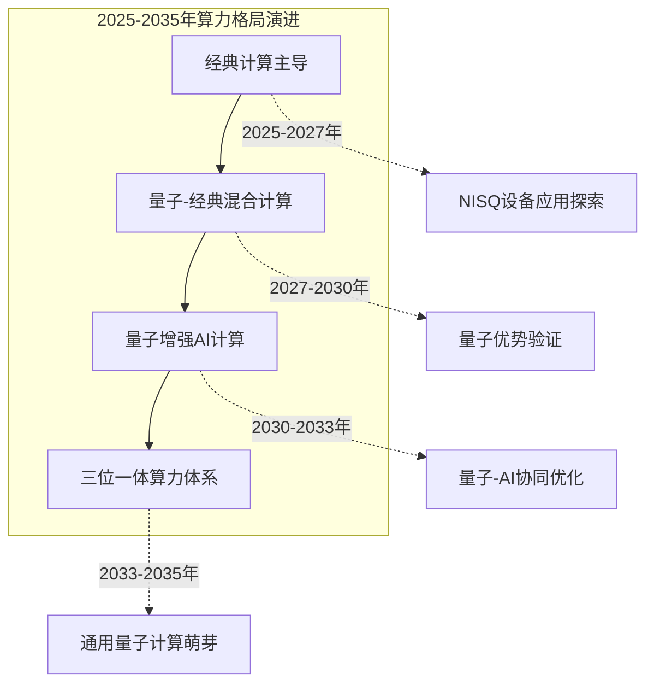

#### 6.5.2 量子优越性从特定任务向通用计算拓展的演进路径

**量子优越性正在从特定任务向更广泛的应用领域拓展**。2019年谷歌实现的量子优越性基于随机量子电路采样任务，而中国科学技术大学"九章"系列在高斯玻色采样上实现了亿亿倍的量子优越性。这些突破虽然具有里程碑意义，但尚未转化为实际应用价值。

**从量子优越性到量子实用性的跨越**。Google Quantum AI团队开发的DQI算法代表了这一跨越的重要尝试——在实际优化问题上实现可证明的量子加速。预计未来5-10年，量子优越性将沿以下路径向通用计算拓展：

**第一阶段（2025-2028年）：特定优化问题的量子优势**。在组合优化、量子化学模拟等特定问题上，量子算法相对最优经典算法实现可重复验证的性能优势。

**第二阶段（2028-2032年）：行业应用的量子增强**。在金融、制药、材料设计等行业，量子计算作为增强工具与经典计算协同工作，提供经典计算难以实现的精度或效率提升。

**第三阶段（2032-2035年）：通用量子计算的萌芽**。容错量子计算机开始具备处理更广泛问题类型的能力，量子编程开始向更广泛的开发者群体普及。

#### 6.5.3 新兴产业形态与就业机会的预判

**数学与量子计算交叉领域将催生新的产业形态与就业机会**。根据麦肯锡2025年发布的《量子技术监测》研究报告，预计到2035年全球量子技术市场规模将达到970亿美元，其中量子计算最具潜力并将占据最大份额，收入规模预计将从2024年的40亿美元增长至2035年的720亿美元[^80]。

**新兴产业形态预测**：

| 产业形态 | 核心价值 | 预期成熟时间 | 市场规模预测 |
|---------|---------|-------------|-------------|
| 量子优化即服务（QOaaS） | 为企业提供量子优化算法云服务 | 2028-2030年 | 百亿美元级 |
| 量子化学模拟平台 | 加速药物研发与材料设计 | 2029-2032年 | 数百亿美元级 |
| 抗量子安全服务 | 提供抗量子密码迁移与安全评估 | 2026-2028年 | 百亿美元级 |
| 量子-AI融合计算 | 提供量子增强的AI训练与推理服务 | 2030-2033年 | 千亿美元级 |

**就业机会的结构性变化**。量子计算产业的发展将创造大量新的就业机会，同时也将对现有岗位提出新的技能要求。预计以下岗位类型将出现显著增长：

- **量子算法工程师**：设计与优化量子算法，将业务问题转化为量子可解形式
- **量子软件开发者**：开发量子编程工具、量子操作系统、量子云平台
- **量子硬件工程师**：设计与制造量子芯片、测控系统、低温设备
- **量子安全专家**：评估量子威胁、设计抗量子安全方案、实施密码迁移
- **量子应用科学家**：将量子计算应用于金融、制药、材料等特定领域

#### 6.5.4 面向未来的战略布局建议与风险预警

**基于前述分析，为政策制定者、科研机构和产业界提供以下战略布局建议**：

**对政策制定者的建议**：

第一，加强数学基础理论研究的长期投入。量子计算的每一次重大突破都伴随着相应数学理论的创新，建议设立"量子计算数学基础"长期资助计划，支持算子代数、代数几何、拓扑学等数学分支在量子计算中的应用研究。

第二，加速抗量子密码标准制定与迁移部署。面对"先存储，后破解"的现实威胁，建议尽快启动国家层面的抗量子密码标准制定工作，制定关键基础设施的迁移时间表与技术指南。

第三，构建量子计算人才培养体系。建议在高校设立"量子计算与数学"交叉学科，培养兼具数学理论深度与量子计算工程能力的复合型人才。

**对科研机构的建议**：

第一，强化跨学科协作机制。数学与量子计算的深度融合要求建立数学家、物理学家、计算机科学家之间的高效协作机制，建议借鉴清华大学丘成桐数学科学中心与高等研究院联合团队的模式，建立跨院系、跨学科的联合研究平台。

第二，重视理论与实验的协同推进。中国团队在"理论先行指导技术突破"方面具有优势，建议进一步强化理论团队与实验团队的协同，加速理论成果向实验验证的转化。

**对产业界的建议**：

第一，提前布局量子安全迁移。建议金融、通信、能源等关键行业尽早启动抗量子密码迁移的技术评估与试点工作，避免在量子计算成熟时陷入被动。

第二，积极参与量子计算应用探索。建议行业龙头企业与量子计算研究机构建立合作关系，共同探索量子优化、量子模拟等技术在本行业的应用场景与商业价值。

**风险预警**：

第一，量子计算发展的不确定性。尽管量子计算取得了显著进展，但实现大规模容错量子计算仍面临重大技术挑战，商业化时间表可能存在较大不确定性。

第二，抗量子密码的潜在脆弱性。当前抗量子密码算法的安全性基于特定数学难题的假设，未来可能出现新的攻击方法。丁津泰团队在格挑战赛中的持续突破表明，抗量子密码的安全边界仍在被探索和挑战[^71]。

第三，人才竞争的加剧。全球范围内对量子计算人才的争夺日趋激烈，中国需要在人才培养、引进和留用方面采取更加积极的措施。

## 7 结论、政策建议与研究局限

本章作为报告的收尾章节，系统总结全球数学与量子计算交叉领域研究团队全景分析的核心发现，从全球竞争格局演变规律、中国发展路径优化、跨学科人才培养机制、科研生态系统构建四个维度凝练政策启示，并坦诚讨论本报告在数据时效性、团队覆盖范围、评估方法主观性等方面的局限性，指明未来可深入探索的研究方向。

### 7.1 核心研究发现的系统总结

本报告通过对全球数学与量子计算交叉领域主要研究团队的全景扫描、研究方向剖析、多维度比较分析与突破潜力评估，形成了以下核心研究发现：

#### 7.1.1 全球研究格局呈现"三极分化"态势

**全球数学与量子计算交叉领域已形成中美双强引领、欧洲协作特色、亚太快速崛起的三极分化格局**。北美地区以滑铁卢大学IQC、麻省理工学院、哈佛大学HQI、马里兰大学QuICS等为核心，在量子复杂性理论、量子算法设计等基础理论方向占据主导地位。欧洲地区依托欧盟量子旗舰计划形成了最为系统化的跨国合作机制，OpenSuperQPlus项目涉及10个国家28个合作伙伴，量子互联网联盟成功研发全球首个量子网络操作系统QNodeOS。亚太地区以中国为核心，中国科学技术大学、上海交通大学、清华大学等团队在量子纠错数学基础、量子模拟数值方法等方向形成了鲜明特色与领先优势。

#### 7.1.2 数学理论创新与量子计算技术突破深度互促

**报告揭示了数学理论创新与量子计算技术突破之间存在深刻的相互促进关系**。量子计算的每一次重大突破都伴随着相应数学理论的创新：Shor算法依赖量子傅里叶变换的周期寻找理论，Grover算法基于希尔伯特空间幅度放大操作，表面码量子纠错方案的核心是稳定子码的代数结构。当前，清华大学刘子文团队建立的"广义量子纠错性质与系统量子复杂性之间严格联系的普适理论框架"、上海交通大学金石团队原创的"薛定谔化"方法、中科院理论物理所团队融合代数几何与拓扑方法建立的BB码拓扑理论框架，均体现了数学理论创新对量子计算技术突破的引领作用。

#### 7.1.3 中国团队在特定方向形成鲜明特色与领先优势

**中国团队在量子纠错数学基础、量子模拟数值方法、拓扑量子计算等方向展现出强劲的追赶和并跑势头**。清华大学联合团队提出的"子系统差异"概念与"镶嵌码"框架，为量子纠错理论提供了新的数学工具。上海交通大学的"薛定谔化"量子算法被国家自然科学基金委2024年年度报告选为数学唯一代表性成果。中国科学技术大学团队历时13年实现费米子哈伯德模型反铁磁相变，"祖冲之三号"被审稿人评价为"构建了目前最高水准的超导量子计算机"。浙江大学团队首次验证了两种低开销的量子低密度奇偶检验码，相比表面码仅需约1/4的物理量子比特即可实现同等性能的逻辑纠错。

#### 7.1.4 第一梯队团队在未来5-10年最具突破潜力

**基于五大维度的综合评估，中国科学技术大学、哈佛大学HQI、清华大学联合团队、上海交通大学、Google Quantum AI五支团队被识别为第一梯队，最有可能在未来5-10年内引领量子计算技术的重大突破**。中国科学技术大学的核心优势在于多技术路线并行布局与强大的人才传承体系；哈佛大学HQI在系统集成能力与容错技术方面取得里程碑式突破；清华大学联合团队在数学基础理论原始创新方面表现突出；上海交通大学在量子科学计算算法与拓扑量子计算方向具有独特优势；Google Quantum AI在算法与硬件协同创新方面处于领先地位。

#### 7.1.5 产学研融合模式呈现多元化发展路径

**不同地区的研究团队在产学研合作模式上形成了各具特色的发展路径**。滑铁卢大学IQC开创了"企业家驱动"模式，将学术研究的卓越性与技术商业化的创业动力有机结合。中国科学技术大学形成了"高校孵化+院士领衔创业"模式，本源量子已坐拥234件专利，排在量子计算行业国内第1、国际第6。欧盟依托框架计划形成了"跨国公共资金"模式，OpenSuperQPlus项目获得2000万欧元资助。这些差异化的发展路径为不同类型团队提供了多元化成功范式。

下表系统汇总了本报告的核心研究发现：

| 发现领域 | 核心结论 | 支撑证据 |
|---------|---------|---------|
| 全球格局 | 三极分化：中美双强、欧洲协作、亚太崛起 | 团队分布、资金投入、成果产出 |
| 理论-技术关系 | 数学创新与技术突破深度互促 | 历史案例、当前进展 |
| 中国优势 | 量子纠错、量子模拟、拓扑量子方向领先 | 顶刊发表、专利布局 |
| 突破潜力 | 五支第一梯队团队最具突破潜力 | 多维度综合评估 |
| 发展模式 | 产学研融合呈多元化路径 | 案例比较分析 |

### 7.2 全球竞争格局演变与战略研判

#### 7.2.1 北美地区的领先优势与发展特征

**北美地区在数学与量子计算交叉领域保持着基础理论创新与产业生态建设的双重领先优势**。这一优势的形成源于多重因素的协同作用：

**深厚的理论物理学积淀**。从费曼1981年提出量子计算构想，到Shor算法、Grover算法等里程碑式突破，北美学术机构在量子计算理论基础方面具有深厚积淀。麻省理工学院Aram Harrow教授与合作者提出的HHL量子线性系统算法为量子机器学习奠定了理论基础，Google Quantum AI团队Edward Farhi提出的量子近似优化算法（QAOA）已被超4000篇论文引用。

**成熟的产业创新生态**。美国依托《国家量子倡议法案》形成了政府引导、产学研协同的发展格局。量子经济发展联盟（QED-C）囊括了全美主要量子科技公司、高校、科研机构，在辐射范围、成员数量、产学研结合程度等维度上均处于头部水平。IBM、谷歌等企业在开源软件生态（Qiskit、Cirq）和跨平台理论工具上形成了体系化能力。

**多技术路径的并行探索**。北美团队在超导、离子阱、中性原子、拓扑等多条技术路径上并行探索，通过强大的工程能力和工业生态，快速将理论概念转化为原型验证。哈佛大学HQI团队构建的448个中性原子量子比特组成的容错系统，展示了在集成量子系统中实现可扩展量子计算与量子纠错所需全部关键要素的能力。

#### 7.2.2 欧洲地区的协作模式与战略定位

**欧洲地区依托欧盟框架计划形成了独特的跨国协作模式与战略定位**：

**系统化的跨国协作机制**。欧盟量子旗舰计划投入10亿欧元支持量子通信、传感与计算的多维度发展。OpenSuperQPlus项目由尤利希研究中心协调，涉及10个国家28个合作伙伴，目标是建立1000量子位的量子计算系统。量子互联网联盟（QIA）由荷兰代尔夫特理工大学、QuTech、奥地利因斯布鲁克大学等机构联合组建，成功研发全球首个量子网络操作系统QNodeOS。

**标准化建设的战略布局**。欧洲在量子技术标准化方面采取积极布局，ETSI在后量子密码标准化方面发挥重要作用。牛津大学明确阐述其研究动机："量子计算可能会改变生活的各个领域，牛津大学一直是量子理论和技术的先驱，并本着严谨负责的态度进行创新，以确保使用量子科学的力量造福全社会。"

**"QKD与PQC并行"的稳健策略**。欧洲在量子安全领域采取量子密钥分发（QKD）与后量子密码（PQC）并行发展的稳健策略，既保持在QKD技术方面的研究优势，又积极参与PQC标准制定，形成了双轨并进的安全发展体系。

#### 7.2.3 中国的后发优势与追赶路径

**中国在数学与量子计算交叉领域展现出强劲的后发优势与清晰的追赶路径**：

**特定技术路线的突破性进展**。中国在光量子计算路线上已实现亿亿倍的量子优越性，"九章"系列在高斯玻色采样上保持绝对领先。华翊量子首创的二维离子晶体阵列架构，理论上解决了传统一维离子链的扩展瓶颈，为承载上万量子比特提供了独特方案。

**应用导向的研究特色**。中国团队在"理论先行指导技术突破"方面形成了鲜明特色。上海交通大学金石团队的"薛定谔化"方法直接面向科学计算中的偏微分方程求解问题，UnitaryLab平台内置金融建模、地质勘探等应用领域常用的方程库。建设银行量子金融应用实验室已在投资组合优化、信用卡评分等场景取得阶段性成果。

**产业化探索的快速推进**。中国量子计算产业联盟经过5年多发展，成员数已突破80家。本源量子、图灵量子、华翊量子等企业在各自技术路线上取得显著进展。2025年新年伊始，图灵量子完成半年内的第二次亿元级战略融资，推出商用光量子计算机TuringQ Gen2，在2025年世界互联网大会上荣获"领先科技奖"。

#### 7.2.4 未来5-10年竞争格局走向研判

**基于前述分析，未来5-10年全球数学与量子计算交叉领域的竞争格局可能呈现以下演变趋势**：

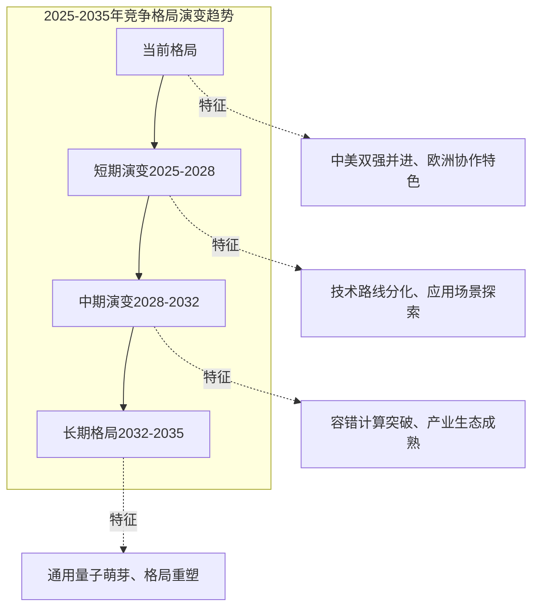

**短期（2025-2028年）**：技术路线竞争加剧，超导、离子阱、中性原子、光量子等路线并行发展，尚未形成明确的主导路线。中美两国在特定基准任务上交替领先，欧洲在跨国协作项目上取得阶段性成果。

**中期（2028-2032年）**：容错量子计算取得实质性突破，部分技术路线开始显现优势。量子优化、量子化学模拟等应用在特定行业实现试点部署。产业生态逐步成熟，量子计算即服务（QCaaS）模式开始商业化。

**长期（2032-2035年）**：通用量子计算萌芽，技术路线趋于收敛。全球竞争格局可能重塑，**能够率先实现大规模容错量子计算的国家或地区将占据战略制高点**。

**决定竞争优势的关键变量**包括：容错量子计算的突破时间与技术路线选择、量子软件生态的成熟度与开放性、产学研协同创新的效率、跨学科人才的储备与培养能力、以及国际合作与技术标准的话语权。

### 7.3 中国发展路径优化的政策建议

#### 7.3.1 加强数学基础理论研究的长期稳定投入

**数学基础理论创新是量子计算技术突破的源头活水，需要建立长期稳定的投入机制**。

**设立"量子计算数学基础"长期资助计划**。国家自然科学基金已设立"量子计算的数学基础理论"专项项目，支持微分方程的量子算法、量子随机优化、量子复杂度的几何拓扑理论等方向。建议在此基础上，设立周期更长（10-15年）、资助强度更大的专项计划，支持算子代数、代数几何、拓扑学、表示论等数学分支在量子计算中的系统性应用研究。

**建立数学家与量子计算研究者的常态化交流机制**。借鉴中俄数学中心的成功经验，建立数学家与量子物理学家、计算机科学家之间的常态化学术交流平台。中俄数学中心已组织论坛报告200余场次，近350位中外优秀数学家受邀作报告，这一模式可推广至量子计算领域。

**支持数学理论创新向量子计算应用转化的机制研究**。当前，从数学理论创新到量子计算应用的转化路径尚不清晰，建议资助专门研究这一转化机制与规律的项目，为优化资源配置提供理论依据。

#### 7.3.2 深化高校与科研院所的跨学科协作机制

**跨学科协作是数学与量子计算交叉领域取得突破的关键组织形式**。

**推广清华大学联合团队的协作模式**。清华大学丘成桐数学科学中心与高等研究院的联合团队在量子纠错数学基础方向取得了系统性突破，这一模式值得推广。建议在有条件的高校建立类似的跨院系、跨学科联合研究平台，打破学科壁垒，促进数学家与物理学家的深度协作。

**建立联合培养与双聘机制**。太原理工大学算子理论与量子信息团队与百度量子计算研究所等单位开展长期合作，联合培养学生。建议推广这一模式，建立高校与企业之间的联合培养基地与双聘机制，促进人才流动与知识转移。

**完善跨学科研究的评价与激励机制**。当前的学术评价体系往往偏重单一学科的深度，对跨学科研究的评价机制尚不完善。建议建立专门针对跨学科研究的评价标准与激励机制，鼓励研究者开展风险较高但潜在回报巨大的交叉研究。

#### 7.3.3 完善从基础研究到产业转化的创新链条

**产学研深度融合是加速量子计算技术产业化的关键**。

**借鉴中科大"院士领衔创业"模式**。2017年，郭光灿院士和郭国平教授带领博士团队联合创立了中国第一家量子计算公司，如今本源量子已坐拥234件专利。这一模式的成功表明，**具有深厚学术积淀的科研团队直接参与产业化，能够有效缩短从理论到应用的转化周期**。建议完善相关政策，鼓励更多科研团队以多种形式参与产业化进程。

**强化学会与企业联合资助机制**。CCF-国盾超导量子计算专项合作计划2025年度共10位学者获得资助，项目涵盖量子纠错与容错、量子优化控制等方向。这种学会与企业联合资助的模式为产学研合作提供了新范式，建议推广并扩大规模。

**建设量子计算应用示范项目**。建议设立"量子+"行业示范项目，优先在新药研发、新材料设计、高端金融建模、智慧物流调度等具有明确痛点和高价值回报的领域开展深度应用试点，以真实场景需求倒逼技术成熟。

#### 7.3.4 拓展国际合作网络的广度与深度

**开放合作是推动数学与量子计算交叉领域发展的重要动力**。

**深化中俄数学合作**。2024年8月，中俄两国总理在联合公报中明确指出推动在中俄基础科学研究院框架下牵头成立基础研究双边协作平台。建议以此为契机，深化中俄在数学与量子计算交叉领域的合作，发挥俄罗斯在基础数学方面的传统优势。

**积极参与国际标准制定**。在抗量子密码领域，丁津泰教授是NIST唯一抗量子密钥建立标准ML-KEM的设计者之一。建议支持更多中国学者参与国际标准制定，提升中国在量子计算领域的国际话语权。

**建立与欧洲的合作渠道**。欧盟量子旗舰计划形成了系统化的跨国协作机制，建议探索与欧盟量子项目的合作可能性，在基础研究、标准互认等领域开展交流。

#### 7.3.5 建立具有国际竞争力的人才激励与引进机制

**人才是数学与量子计算交叉领域发展的核心资源**。

**完善青年科研人才的长周期支持机制**。上海交通大学金贤敏团队的科研工作得到了学校青年启动基金和基础研究"突破计划"支持，其创立的图灵量子已成为中国光量子计算龙头企业。建议推广这一模式，为青年科研人才提供更长周期、更大力度的支持，容忍长研发周期的高风险研究。

**实施更具吸引力的人才引进计划**。全球范围内对量子计算人才的争夺日趋激烈，建议实施更具吸引力的人才计划，全球引进顶尖科学家、架构工程师和产业化领军人才。

**建立产学研联合培养机制**。借鉴滑铁卢大学IQC与周边理论物理研究所的协作模式，建议建立高校、科研院所与量子企业共建联合实验室和实习基地，让学生接触真实硬件平台和工程问题。

### 7.4 跨学科人才培养与科研生态构建启示

#### 7.4.1 构建数学-物理-计算机科学交叉培养体系

**数学与量子计算交叉领域的人才培养需要突破传统学科边界**。

**课程体系的交叉融合**。量子计算人才需要掌握量子物理、计算机科学、数学（特别是线性代数、概率论、拓扑学、代数结构）等多学科知识。建议在高校加强"量子信息科学"交叉学科建设，课程设置需涵盖量子力学基础、量子算法设计、量子纠错理论、量子密码学以及特定领域知识（如计算化学）。

**研究能力的交叉训练**。南洋理工大学、新加坡国立大学量子技术中心等机构发布的量子机器学习教程，首次从AI视角出发系统介绍量子机器学习的基础理论、关键算法、实践指南。建议借鉴这一模式，开发面向不同背景学生的交叉领域教程与培训项目。

**实践平台的开放共享**。建议依托国家实验室、大型科研设施，建设开放共享的量子计算云平台、基准测试平台和标准验证中心，降低中小机构和学生的入门门槛。

#### 7.4.2 建立产学研深度融合的人才培养基地

**产学研融合是培养应用型量子计算人才的有效途径**。

**企业参与人才培养**。太原理工大学算子理论与量子信息团队与百度量子计算研究所等单位开展长期合作，联合培养学生。建议推广这一模式，鼓励量子计算企业深度参与高校人才培养，提供实习机会、项目合作和就业通道。

**创业孵化与人才培养结合**。中国科学技术大学从2003年"一张桌子、一把椅子"的简陋工作室发展至今，已培养出五位中国科学院院士。这种"在创业中培养人才、在人才培养中促进创业"的模式值得推广。

**国际化培养渠道**。北大数学8名基础数学拔尖学生赴俄罗斯莫斯科国立大学参加国际本科生暑期学校，多名博士研究生顺利完成在莫斯科国立大学的交流学习。建议拓展国际化培养渠道，让学生接触不同学术传统与研究范式。

#### 7.4.3 完善青年科研人才的长周期支持机制

**量子计算的重大突破通常需要长周期的持续积累，需要建立相应的支持机制**。

**长周期项目资助**。中国科学技术大学团队历时13年实现费米子哈伯德模型反铁磁相变，上海交通大学贾金锋团队"十年磨一剑"捕获马约拉纳费米子。这些案例表明，量子计算领域的重大突破需要长周期的持续投入。建议设立10-15年周期的长期项目资助机制，为有潜力的青年团队提供稳定支持。

**容忍失败的评价文化**。量子计算研究具有高风险、高回报的特征，需要建立容忍失败的学术文化。建议在评价机制中适当降低对短期成果的要求，更加注重研究方向的前沿性与潜在影响力。

**多元化的职业发展通道**。量子计算人才可以在学术界、产业界、政府部门等不同领域发展。建议建立畅通的人才流动机制，让研究者能够在不同领域之间灵活转换，发挥各自优势。

#### 7.4.4 营造鼓励原始创新的学术文化

**原始创新是数学与量子计算交叉领域取得突破的关键**。

**鼓励挑战权威与质疑既有范式**。Google Quantum AI团队开发的DQI算法与传统量子优化算法的根本区别在于其采用了"波动观点"而非能量视角，这种范式转变使得量子加速的数学证明成为可能。建议营造鼓励挑战权威、质疑既有范式的学术文化，为原始创新提供土壤。

**重视"从0到1"的突破**。清华大学刘子文团队引入的"子系统差异"概念、王亦许等人提出的"镶嵌码"框架，均属于"从0到1"的原始创新。建议在评价机制中更加重视这类开创性工作，而非仅关注论文数量与引用次数。

**支持高风险高回报的探索性研究**。天津大学张鹏教授主持的"生成模型驱动的量子机器学习"项目获批国家自然科学基金原创探索计划项目，旨在推动量子机器学习领域的研究范式转变。建议扩大原创探索计划的规模，支持更多高风险高回报的探索性研究。

#### 7.4.5 搭建开放共享的量子计算科研基础设施平台

**开放共享的科研基础设施是促进创新的重要支撑**。

**量子计算云平台建设**。移动云搭建的量子云平台已并网8台量子计算机，累计拥有590个量子比特。上海交通大学发布的UnitaryLab平台实现了"教学-科研-产业"的全链路用户需求适配。建议加大量子计算云平台建设力度，为更广泛的研究者提供算力支持。

**基准测试与标准验证平台**。瑞士洛桑联邦理工学院团队提出的V-score（变分精度评分），为统一量化比较不同量子多体问题求解方法的精度提供了新工具。建议建设类似的基准测试平台，为量子算法与硬件的性能评估提供统一标准。

**开源软件生态建设**。IBM的Qiskit、谷歌的Cirq等开源软件框架为量子计算研究提供了便利工具。建议支持国内开源量子计算软件的开发与推广，降低研究者的入门门槛，促进学术交流与合作。

### 7.5 研究局限性的坦诚讨论

#### 7.5.1 数据时效性的局限

**本报告的研究数据受限于公开信息获取渠道，存在一定的时效性局限**。量子计算领域发展迅速，新的研究成果不断涌现。本报告的数据主要来源于2024-2025年间的公开学术论文、新闻报道、机构公告等，部分最新进展可能未能及时纳入分析。特别是企业研究团队的内部进展，由于商业保密原因，公开信息相对有限，可能导致对企业研究实力的评估不够全面。

#### 7.5.2 团队覆盖范围的局限

**本报告难以穷尽全球所有在数学与量子计算交叉领域开展研究的团队**。报告重点分析了北美、欧洲、亚太三大区域的代表性研究团队，但全球范围内还有许多其他国家和地区的研究力量未能纳入分析，如以色列、澳大利亚、日本、韩国等国的量子计算研究团队。此外，部分新兴团队可能因成立时间较短、公开成果较少而未被识别，但其潜力不容忽视。

#### 7.5.3 评估方法主观性的局限

**突破潜力评估不可避免地包含主观判断成分**。本报告构建的五大维度评估框架虽然力求科学系统，但在具体指标权重设定、定性评价标准等方面仍存在一定的主观性。不同评估者可能基于不同的价值判断和专业背景，对同一团队的潜力作出不同评估。此外，量子计算领域的技术发展具有高度不确定性，历史上曾有多次"颠覆性"突破的预测未能实现，因此对未来突破的预测需要审慎看待。

#### 7.5.4 定量指标可比性的局限

**部分定量指标的可比性受数据口径差异影响**。例如，不同机构对"研究人员"的统计口径可能不同，有的包括博士后和研究生，有的仅计入正式教职人员。论文产出的统计也可能因数据库选择、学科分类等因素而存在差异。专利数量虽然可以量化比较，但不同国家的专利制度差异可能影响可比性。这些数据口径的差异可能影响横向比较的准确性。

#### 7.5.5 企业研究团队信息的局限

**对企业研究团队内部信息的了解相对有限**。Google Quantum AI、Quantinuum等企业研究团队虽然发表了大量学术论文，但其内部的研究布局、资源配置、技术路线选择等信息往往不对外公开。本报告对企业研究团队的分析主要基于公开发表的论文、专利、产品发布等信息，可能未能全面反映其真实研究实力与战略布局。

### 7.6 未来研究方向展望

#### 7.6.1 建立量子计算研究团队动态追踪数据库

**为克服数据时效性与覆盖范围的局限，建议建立系统性的动态追踪数据库**。该数据库应包括：全球主要量子计算研究团队的基本信息（人员构成、研究方向、资金来源等）、学术产出的实时更新（论文、专利、代码仓库等）、重大突破事件的及时记录、以及团队间合作关系的网络可视化。这一数据库将为持续性的研究格局监测与分析提供基础支撑。

#### 7.6.2 发展精细化的突破潜力量化评估模型

**为降低评估的主观性，建议发展更精细化的量化评估模型**。可以借鉴科学计量学的方法，构建基于论文引用网络、合作网络、知识流动等指标的量化模型，结合机器学习方法识别具有高突破潜力的研究方向与团队。同时，可以引入专家德尔菲法等定性方法，与量化模型相互验证，提高评估的准确性与可信度。

#### 7.6.3 深入研究数学理论创新向量子计算应用转化的机制

**数学理论创新与量子计算技术突破之间的转化机制是值得深入研究的重要课题**。具体研究问题包括：哪些类型的数学理论创新更容易转化为量子计算应用？转化过程中的关键障碍是什么？如何优化资源配置以加速转化进程？这些问题的回答将为政策制定与资源配置提供理论依据。

#### 7.6.4 开展量子计算人才培养模式的国际比较研究

**不同国家和地区在量子计算人才培养方面形成了各具特色的模式，值得系统性比较研究**。研究可以聚焦于：不同国家的量子计算学科设置与课程体系、产学研联合培养的具体机制、人才流动与职业发展通道、以及人才激励与评价制度等。这些比较研究将为优化中国的人才培养模式提供借鉴。

#### 7.6.5 探索量子计算与其他新兴技术交叉融合的前沿趋势

**量子计算与人工智能、区块链、物联网等新兴技术的交叉融合是值得关注的前沿趋势**。麻省理工学院Dirk Englund团队提出的量子安全多方深度学习方法，展示了量子计算与AI安全的融合潜力。医图生科提出的"量子+AI制药"新范式，体现了量子计算与生物医药的交叉应用。建议开展系统性研究，识别量子计算与其他新兴技术交叉融合的机遇与挑战。

---

**总结**：数学与量子计算的交叉融合正处于从理论探索向实用化应用演进的关键转折期。本报告通过对全球主要研究团队的全景扫描、多维度比较分析与突破潜力评估，识别出中国科学技术大学、哈佛大学HQI、清华大学联合团队、上海交通大学、Google Quantum AI五支第一梯队团队，预测了量子复杂度几何拓扑理论、实用化量子优化算法、抗量子密码协议、高效量子化学模拟软件等领域的未来突破方向。中国需把握未来5-10年的战略机遇期，以构建自主可控的产业生态和安全体系为核心目标，坚持理论、技术、应用和人才四轮驱动，通过顶层设计、市场机制和全球合作的有机结合，力争在新一轮量子科技革命中占据有利地位。

# 参考内容如下：
[^1]:[数学与未来科技:量子计算、人工智能与数学](https://baijiahao.baidu.com/s?id=1831977542098675273&wfr=spider&for=pc)
[^2]:[量子计算的原理与应用:从理论到实践的跨越](https://baijiahao.baidu.com/s?id=1807005034777450591&wfr=spider&for=pc)
[^3]:[刘兴亮 | 极简量子计算发展史](https://browser.qq.com/mobile/news?doc_id=864695f6d5869152)
[^4]:[数学与量子计算融合-全面剖析](https://www.renrendoc.com/paper/401175695.html)
[^5]:[瞭望中国式创新④丨从科研工具到商用底座,量子计算何时迎来“AlphaGo时刻”?](https://baijiahao.baidu.com/s?id=1854842909234079201&wfr=spider&for=pc)
[^6]:[科技日报:当代科技创新的文化基因](https://www.thepaper.cn/newsDetail_forward_32456158)
[^7]:[量子计算研究领域全球最顶尖的十二所大学](https://kepu.ustc.edu.cn/2020/0421/c21325a435217/page.htm)
[^8]:[当代量子领域20大领军人物,ChatGPT评出来的,你知道几个?](https://www.163.com/dy/article/I2FO57O5051198AK.html)
[^9]:[重磅阵容!五位专家谈量子计算未来:行走在期待与现实的夹缝中,未知令喜忧并存](https://new.qq.com/rain/a/20250805A081LJ00)
[^10]:[美国麻省理工团队牵头提出量子安全多方深度学习方法](https://mp.weixin.qq.com/s?__biz=MzI1MDI5ODkwMA==&mid=2247508446&idx=2&sn=1ffb7585de3022b34e6b500770d9eb6c&chksm=e86642f44cfd67804b5d1cdc701e721e81a7a16fa5f455f5c2890b51ca52cd8184d737e79661&scene=27)
[^11]:[量子纠错全要素首次系统集成](http://cast.caas.cn/zx/kjyw/39006f3e4b1d41bbab122fa87fea3400.html)
[^12]:[国外典型量子产学研联盟案例研究及对中国的启示 ](https://mp.weixin.qq.com/s?__biz=MzAxMjY2OTkxOA==&mid=2652046555&idx=3&sn=7d20a4affcf57dc6c5e3e6a21c6f2ee2&chksm=8049e26ab73e6b7c4d767d7d1d3df0c1654e01e766dfefa2bd496b5794cd1f7e78aa7d8cbb2f&scene=27)
[^13]:[十大项目入选!超导量子计算专项合作计划名单揭晓](https://baijiahao.baidu.com/s?id=1845577364949609357&wfr=spider&for=pc)
[^14]:[数学中心、高研院等合作提出量子纠错码几何新范式](https://www.tsinghua.edu.cn/info/1175/121667.htm)
[^15]:[欧盟量子旗舰计划推出欧洲量子计算机项目OpenSuperQPlus](http://www.quantumcas.ac.cn/2023/0313/c24874a594962/page.htm)
[^16]:[量子互联网联盟](https://baike.baidu.com/item/量子互联网联盟/65487421)
[^17]:[量子计算机解开“绳结”数学难题](https://www.cas.cn/kj/202504/t20250416_5064234.shtml)
[^18]:[中国量子计算二十年](https://baijiahao.baidu.com/s?id=1773823414987024938&wfr=spider&for=pc)
[^19]:[上海交大全球首发,量子科学计算平台UnitaryLab实现科学计算软件的“量子跃迁”](https://ins.sjtu.edu.cn/articles/378)
[^20]:[秉持匠人精神与科研情怀,潜心拓扑量子计算研究——记上海交通大学物理与天文学院贾金锋院士 ](https://www.physics.sjtu.edu.cn/index_news/952.html)
[^21]:[“新研发机构+新基金+新机制”,上海交大破解青年科技人才的“成长烦恼”](https://news.sjtu.edu.cn/mtjj/20260116/219232.html)
[^22]:[数学中心刘子文团队合作提出近似量子纠错编码普适新理论](https://www.tsinghua.edu.cn/info/1175/113643.htm)
[^23]:[CICC科普栏目|首个专为AI从业者打造的量子机器学习(Quantum Machine Learning)教程发布](https://www.c2.org.cn/h-nd-1628.html)
[^24]:[新一届“35岁以下科技创新35人”亚太区入选者发布,一位科大人入选](http://aga.ustc.edu.cn/info/1197/35782.htm)
[^25]:[算子理论与量子信息科研团队](https://math.tyut.edu.cn/info/1118/3734.htm)
[^26]:[数学学院算子理论团队在探测量子多体纠缠问题上取得进展](https://math.tyut.edu.cn/info/1014/8343.htm)
[^27]:[无臂博士攻克量子难题,太原理工王海港用脚趾敲开Nature系列期刊](https://baijiahao.baidu.com/s?id=1854167283589258016&wfr=spider&for=pc)
[^28]:[量子复杂性理论](https://baike.baidu.com/item/量子复杂性理论/15889893)
[^29]:[大暑| 浅谈量子复杂性理论 ](https://mp.weixin.qq.com/s?__biz=MzU0MjU5NjQ3NA==&mid=2247504388&idx=1&sn=f7f16c25c1f49ce307440028712154fb&chksm=fb1ade11cc6d57074530e03619f13e81abcabcaa737d19824faa70fe91740a4a7f0a2bc709da&scene=27)
[^30]:[谷歌DQI:纠错码还能兼职加速量子计算?](https://quantumcas.ac.cn/2025/1029/c24874a706798/page.htm)
[^31]:[量子优势不再只是理论可能:谷歌开发解码量子干涉测量算法,为海量优化难题提供指数级加速](https://new.qq.com/rain/a/20250320A05L6P00)
[^32]:[科研进展 | 突破量子线性求解器瓶颈:最优复杂度算法让量子计算更实用_腾讯新闻](https://view.inews.qq.com/a/20251230A06FSC00)
[^33]:[融合代数、几何与拓扑方法的量子纠错理论研究获进展](https://www.cas.cn/syky/202508/t20250827_5080564.shtml)
[^34]:[刘东课题组在量子编码的错误阈值研究方面取得进展](https://www.phys.tsinghua.edu.cn/info/1268/6322.htm)
[^35]:[仅需1/4物理比特!浙大团队实现高效qLDPC码,开启量子纠错低成本时代](https://news.qq.com/rain/a/20260123A07EYG00)
[^36]:[量子初创企业开发“电梯编码”,实现错误率降低万倍](https://baijiahao.baidu.com/s?id=1854984467228289375&wfr=spider&for=pc)
[^37]:[德州大学团队:强化学习提升量子纠错效率73倍](https://baijiahao.baidu.com/s?id=1840982547970584798&wfr=spider&for=pc)
[^38]:[历时13年,潘建伟团队抵达量子模拟无人区](https://www.93.gov.cn/m/site/content.do?id=779275)
[^39]:[《科学》重磅!刚刚,中国量子计算重大突破!潘建伟团队发明坚不可摧量子模块](https://baijiahao.baidu.com/s?id=1850319579978587244&wfr=spider&for=pc)
[^40]:[上海科学家团队发布全球首个量子科学计算平台UnitaryLab,解决科学与工程领域算力难题](https://www.jfdaily.com/sgh/detail?id=1672121)
[^41]:[上海交大全球首发量子科学计算平台UnitaryLab ,产业化应用提速](https://ins.sjtu.edu.cn/articles/377)
[^42]:[土耳其高中生团队让神经网络学会"叠加态"思考](https://www.163.com/dy/article/KJTOTU790511DTVV.html)
[^43]:[量子强化学习:近期进展与未来方向](https://www.163.com/dy/article/KFSPK54F05567BBF.html)
[^44]:[APS Physics专题报道!哈佛、清华等学者提出无预设量子系统建模与学习算法](https://mp.weixin.qq.com/s?__biz=MzIzMjQyNzQ5MA==&mid=2247721789&idx=2&sn=8bd66710f04d236b5965409570db1940&chksm=e93521ace8cb92adcde3810f573a09beff4911fa2648e7eed2a9578d6839ea1171be23d6bf38&scene=27)
[^45]:[科研进展 | 麻省理工学院、SandboxAQ等:通往保结构量子编码](https://browser.qq.com/mobile/news?doc_id=486687a2a1f57552)
[^46]:[台湾大学团队打造AI界的“量子魔法师”:赋予人工神经网络超能力](https://baijiahao.baidu.com/s?id=1851201042086454829&wfr=spider&for=pc)
[^47]:[PRL | 利用开放量子系统求解微分方程,研究者提出近乎最优的量子新算法](https://hub.baai.ac.cn/view/49858)
[^48]:[再次打破世界纪录!“祖冲之三号”问世](https://sast.gov.cn/content.html?id=kjb237815&cid=1369121551382872066)
[^49]:[一篇Nature让这家中国量子初创浮出水面:实现新型拓扑边缘态](https://baijiahao.baidu.com/s?id=1842069070325957624&wfr=spider&for=pc)
[^50]:[挂185个作者!全球最大的搜索引擎公司,发Nature!](https://www.163.com/dy/article/JERRQC330511BNSN.html)
[^51]:[量子计算开始「拉群聊」?牛津大学团队创新分布式量子计算架构登上Nature ](https://mp.weixin.qq.com/s?__biz=MzI2NDIzMjYyMA==&mid=2247530767&idx=2&sn=f384959fd8a77e9c1265ca7a82a947c1&chksm=eb609b21911be0bc985999e93260f2d8252648bad3ddd5cfc9f0b53fd310c709633e31cb92da&scene=27)
[^52]:[晋皖携手破局量子前沿!山西大学参与成果登《Science》,首次实现高阶非平衡拓扑物态探测](https://baijiahao.baidu.com/s?id=1850193138297463654&wfr=spider&for=pc)
[^53]:[IBM 量子突破 + Nvidia 机器人狂欢:2025 五大科技趋势,重塑人类与世界的互动方式](https://baijiahao.baidu.com/s?id=1852923702684860537&wfr=spider&for=pc)
[^54]:[行稳致远 星河共耀——记中俄数学中心成立五周年](https://www.srmc.pku.edu.cn/xwdt/169028.htm)
[^55]:[科研进展 | 巨头联合发表!Terra Quantum、摩根大通、英伟达、谷歌、NASA等:用于量子计算的张量网络综述](https://news.qq.com/rain/a/20250313A08TSJ00)
[^56]:[瞭望中国式创新④丨从科研工具到商用底座,量子计算何时迎来“AlphaGo时刻”?](https://baijiahao.baidu.com/s?id=1854842816145065952&wfr=spider&for=pc)
[^57]:[转发2023年度国家自然科学基金 “量子计算的数学基础理论”专项项目申请指南](https://www.fdsm.fudan.edu.cn/AboutUs/fdsm1556953876185)
[^58]:[计算机科学与技术学院团队在量子计算和人工智能交叉领域取得新突破](http://news.tju.edu.cn/info/1012/581279.htm)
[^59]:[中国移动“破圈”量子计算:5年布局,9家合作,590量子比特并网](https://baijiahao.baidu.com/s?id=1821940644282752248&wfr=spider&for=pc)
[^60]:[本源量子申请量子芯片控制方法专利,满足大规模量子芯片需求](https://baijiahao.baidu.com/s?id=1822125121106856198&wfr=spider&for=pc)
[^61]:[国际性突破!交大项目,荣获世界互联网大会最高奖!](https://mp.weixin.qq.com/s?__biz=MzU5NTQ4NTM1MQ==&mid=2247509896&idx=1&sn=1a29afc32ca4eafd279fe03443c25132&chksm=ffc0a62303a08cd6f1b87cf3116dd3af411e449ec2895b7a6bf452cc7d578aa7dd0c06c40e03&scene=27)
[^62]:[国内唯一专注量子基础软件产业化团队,中科院技术转化,曾牵头科技部重大专项|36氪首发](https://baijiahao.baidu.com/s?id=1851988393975166588&wfr=spider&for=pc)
[^63]:[政府请投资人评价科技成果,上海量子计算机企业获数千万元投资](http://baijiahao.baidu.com/s?id=1850888574164052499&wfr=spider&for=pc)
[^64]:[中国首个量子计算产业联盟成员突破80家 ](https://www.ncsti.gov.cn/kjdt/ztbd/hljslzds/202308/t20230802_129901.html)
[^65]:[后量子密码技术:重构数字世界的安全边界](http://www.xinhuanet.com/liangzi/20250317/da919574cb9d42b5b5830c12ea93d45f/c.html)
[^66]:[“祖冲之二号”再登Science!高阶复杂拓扑相量子模拟取得重要突破](https://mp.weixin.qq.com/s?__biz=MzU4ODQ0NzU3OA==&mid=2247567355&idx=4&sn=734a2a3eac2a03293ae38f2ea9d3670b&chksm=fc19b1674be5a4f39954aa3366df3d86369436881ecfd5cdc4c0d0ba830fa763d41fadaac5e3&scene=27)
[^67]:[数学研究前沿:拓扑学、代数几何与数论的新进展](https://baijiahao.baidu.com/s?id=1832068078712472981&wfr=spider&for=pc)
[^68]:[技术应用 | 建设银行量子金融优化应用的探索与实践](https://mp.weixin.qq.com/s?__biz=MjM5MzA3MzAzOQ==&mid=2655581035&idx=3&sn=5d6d5a59c6cf290ea02529b93a2289d6&chksm=bcbea3e5a83f7e2d4af4ce3c980d369addf5aa51985f5ffbf597ddbeb0d1085709ad68a6401c&scene=27)
[^69]:[NeurIPS 2025 | 利用物理信息神经网络加速大规模变分量子算法](https://hub.baai.ac.cn/view/49896)
[^70]:[【量子计算赋能物流】:3个真实案例看算法如何节省上亿成本-CSDN博客](https://blog.csdn.net/ByteShoal/article/details/155782785)
[^71]:[抗量子密码:构筑未来数字安全“护城河”](https://baijiahao.baidu.com/s?id=1855337745256841888&wfr=spider&for=pc)
[^72]:[量子加密行业标准进展及主流解决方案分析 ](https://www.zte.com.cn/content/zte-site/www-zte-com-cn/china/about/magazine/zte-technologies/2025/9/3/6.html)
[^73]:[未来已来:机密数据保护进入新时代](https://worldscience.cn/c/2024-03-28/647610.shtml)
[^74]:[量子时代金融安全布局:抗量子密码迁移探索与实践](https://baijiahao.baidu.com/s?id=1847365244275073976&wfr=spider&for=pc)
[^75]:[第四期:后量子密码学开创的新时代](https://www.xjtlu.edu.cn/zh/professors-of-xjtlu-public-lecture/2025/lecture-4)
[^76]:[从90%失败率到确定性设计:西北首台量子计算机落地,医图生科Quantum AIDD范式引领FIC药物研发革命](https://baijiahao.baidu.com/s?id=1853557074912447351&wfr=spider&for=pc)
[^77]:[【中国新闻网】中国学者量子力学模拟突破性成果入围2024年戈登·贝尔奖](https://www.cas.cn/cm/202412/t20241230_5043761.shtml)
[^78]:[量子科技前景广阔,政策助力产业落地](https://baijiahao.baidu.com/s?id=1854825183741862219&wfr=spider&for=pc)
[^79]:[重构算力新格局,量子计算与AI融合“多线并进”丨ToB产业观察](https://baijiahao.baidu.com/s?id=1854829659647906370&wfr=spider&for=pc)
[^80]:[2025版量子计算报告发布:三大维度详解国内外产业进展](https://baijiahao.baidu.com/s?id=1844496429643729276&wfr=spider&for=pc)
