# 非接触式感知领域主流算法策略综述与性能评估
## 1 非接触式感知技术概述与分类框架

非接触式感知技术作为智能感知领域的核心技术分支，正在从实验室走向大规模商业应用。随着物联网、智能制造、智慧医疗等领域的快速发展，无需物理接触即可获取目标信息的感知技术展现出独特的应用价值。本章将系统梳理非接触式感知技术的定义内涵与核心特征，构建基于感知信号类型的分类框架，并深入分析各技术路线的物理原理与适用场景边界，为后续算法策略的性能评估奠定理论基础。

### 1.1 非接触式感知技术的定义边界与核心特征

**非接触式感知技术是指通过无线电波、光信号、声波等媒介实现物体自动识别与信息获取的技术统称**，其核心特征在于传感器探头与被测物体之间无需物理接触即可完成数据采集与传输[^1][^2]。这一技术依托电磁感应、光学反射、声波传播等物理原理，通过感知物体运动引起的物理场变化来间接推算目标的位置、速度、形态等关键信息[^2]。2014年，"非接触式识别"作为自动化领域专业新词被全国科学技术名词审定委员会正式收录，标志着该技术体系的学术地位得到权威认定[^1]。

与接触式感知技术相比，非接触式感知展现出**三大核心技术优势**。首先，在**操作效率**方面，单次识别时间可缩短至0.1秒以下，显著提升数据采集速度[^1]。其次，在**环境适应性**方面，非接触式传感器能够耐受油污、粉尘、高温等恶劣工业环境，避免了因物理接触带来的摩擦、磨损、打滑等问题，尤其适合测量高速运动物体、微小结构、脆弱材料及高温或有毒物质[^2]。第三，在**安全机制**方面，采用动态密钥认证等技术手段保障数据传输安全，同时因无需与被测物体接触而不会对操作人员产生危险[^1][^3]。

非接触式感知技术的**核心性能指标体系**涵盖多个关键参数维度。**测量精度**是衡量传感器输出值与真实值偏差程度的核心指标，高端非接触式温度传感器的测量精度可达±0.1℃甚至更高[^3]。**响应速度**反映传感器捕捉动态变化的能力，非接触式设备依靠光信号或电磁波传递信息，响应速度可提升至微秒级，能够准确捕捉瞬时变化[^4]。**探测范围**因技术类型不同存在显著差异，从近场通信的10厘米级到有源RFID的数十米级不等[^1]。**抗干扰能力**则体现在对外部电磁干扰的抗扰度以及自身电磁发射的控制水平[^5]。此外，**分辨率**、**重复性**、**线性度误差**等参数也是评估传感器性能的重要依据[^6]。

### 1.2 基于感知信号类型的技术分类框架构建

**主流非接触式感知技术可依据信号载体的物理特性划分为射频信号类、光学信号类、声学信号类三大技术路线**，这一分类体系的科学性源于不同信号的传播特性从根本上决定了其定位精度、成本结构与适用场景的本质分化[^7]。

以下表格系统呈现了三类技术路线的核心特征对比：

| 技术类型 | 信号载体 | 典型频段/波长 | 核心优势 | 主要局限 | 代表技术 |
|---------|---------|--------------|---------|---------|---------|
| 射频信号类 | 电磁波 | 125kHz-77GHz | 穿透能力强、全天候工作 | 精度受多径效应影响 | RFID、WiFi、UWB、毫米波雷达 |
| 光学信号类 | 光波 | 红外-可见光 | 精度极高、信息密度大 | 受光照、遮挡影响 | 激光雷达、机器视觉、红外测距 |
| 声学信号类 | 声波 | 20kHz以上 | 成本低、可检测透明物体 | 受温度影响、响应较慢 | 超声波传感器、声表面波传感器 |

**射频信号类技术**利用电磁波在空间中的传播特性实现感知，其核心优势在于信号可穿透非金属障碍物且不受光照条件限制，适合全天候工作场景。该类技术的成熟度最高，部分场景可复用现有通信基础设施，成本可控[^7]。然而，射频信号易受多径效应、电磁干扰等因素影响，在复杂室内环境中的定位精度面临挑战。

**光学信号类技术**依托光波的直线传播特性与高速传输能力，能够实现极高的测量精度与空间分辨率。激光多普勒速度计的精度极高，测量点极小，适合微小位移和高精度测量场景[^2]。但光学感知对环境光照敏感，在强光、黑暗或存在遮挡的场景中性能会显著下降。

**声学信号类技术**利用声波在介质中的传播与反射特性进行测距与成像。超声波不受光照、颜色、透明度影响，能够有效检测玻璃等透明物质[^8]。但声速受温度影响需要补偿校准，且响应速度相对光学方案较慢[^9]。

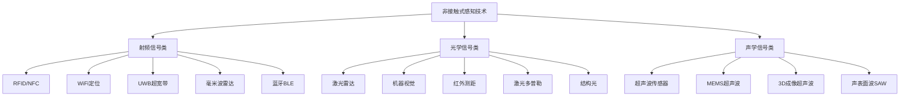

上图展示了非接触式感知技术的三分类体系及其代表性技术分支。这一分类框架的实用性体现在：**技术选型时可根据应用场景的核心需求快速锁定适配的技术路线**——需要穿透检测选择射频类，追求高精度测量选择光学类，要求低成本透明物体检测则选择声学类。

### 1.3 射频信号感知技术的原理与特性分析

**射频类感知技术是目前应用最广泛的非接触式感知技术分支**，其无线通信协议高度成熟，覆盖从"低成本普及"到"高精度需求"的全场景应用[^7]。射频感知的物理基础是电磁波的发射、传播与反射特性，通过分析接收信号的强度、时间、相位、角度等参数推算目标信息。

**RFID（射频识别）技术**是射频感知的基础形态，系统由电子标签、读写器与天线构成，根据电磁感应原理完成目标物体身份验证和数据交互[^1]。工作频率涵盖低频（125-134kHz）至超高频（860-960MHz）范围。无源RFID标签无需供电，成本极低，但读取距离近（1-3米），适合门禁管控等场景；有源RFID标签自带电池，读取距离可达10-50米，适用于仓库、工地的大型设备追踪[^7]。RFID技术的核心优势在于**标签成本极低、读取速度快**，每秒可读取数百个标签，但定位精度较低，仅适合确认位置范围的场景[^7]。

**NFC（近场通信）技术**遵循ISO/IEC 14443标准体系，通信距离限定在10厘米内以确保安全性[^1]。NFC技术形成三类操作形态：卡模式用于手机支付、虚拟公交卡等场景，读模式用于获取标签存储信息，点对点模式支撑智能家居设备快速组网[^1]。NFC因功耗低、硬件成本优势而侧重消费领域近场交互应用。

**WiFi定位技术**利用室内现有WiFi路由器实现感知，主要采用**RSSI三角定位**或**指纹库匹配**两种算法策略[^7]。指纹库匹配模式需要提前采集室内不同位置的WiFi信号特征（如路由器MAC地址、信号强度），终端定位时匹配特征库完成定位。WiFi定位的核心优势是**无需额外部署硬件**，可复用现有网络基础设施，覆盖范围广，适用于写字楼人员打卡、商场导购等场景[^7]。

**UWB（超宽带）技术**基于超宽带脉冲信号，通过**到达时间差（TDOA）**或**双向飞行时间（TWR）**计算距离完成定位[^7]。TDOA模式下，终端发送信号，多个基站接收后计算时间差，通过多基站协同实现高精度定位，是主流的工业级高精度定位方案。UWB技术的核心特点是**抗干扰性极强、定位速度快**，定位精度可达厘米级，但成本较高，需要部署专用的UWB基站和标签，适用于工厂人员定位、矿井安全监测等场景[^7]。

**蓝牙定位（BLE）技术**基于接收信号强度（RSSI）或到达角/出发角（AOA/AOD）实现定位[^7]。RSSI模式通过智能手机、定位手环等终端接收蓝牙信标的信号强度，计算距离后根据三角定位算法定位；AOA/AOD模式通过天线阵列监测信号的入射角度，实现更精准的定位。蓝牙定位的核心优势是**低功耗、体积小、部署灵活**，信标可粘贴或悬挂于墙体，适用于商场导购、展馆导航、养老院人员监护、企业资产追踪等场景[^7]。

**毫米波雷达技术**已完成从汽车领域到多元场景的跨界落地。传统77GHz毫米波雷达仅能探测距离与速度，而79GHz频段雷达凭借**4D成像技术**实现"距离-速度-方位-高度"四维感知，距离分辨率可达4厘米[^10]。毫米波雷达能够穿透被褥精准捕捉人体心率、呼吸频率及体动轨迹，甚至区分翻身、坐起等细微动作[^10]。受益于自动驾驶领域的规模化应用，毫米波雷达成本持续下探，2026年消费级产品已降至千元以内，部分量产型号甚至低至300-500元[^10]。

以下表格对比了主要射频感知技术的关键性能参数：

| 技术类型 | 定位精度 | 探测距离 | 功耗水平 | 硬件成本 | 典型应用场景 |
|---------|---------|---------|---------|---------|-------------|
| 无源RFID | 区域级 | 1-3米 | 无源 | 极低 | 门禁管控、资产盘点 |
| 有源RFID | 区域级 | 10-50米 | 中等 | 中等 | 设备追踪、物流管理 |
| NFC | 接触级 | <10厘米 | 极低 | 低 | 移动支付、门禁卡 |
| WiFi | 米级 | 50-100米 | 中等 | 复用现有设备 | 室内导航、人员打卡 |
| BLE | 亚米级-米级 | 10-30米 | 极低 | 低 | 商场导购、资产追踪 |
| UWB | 厘米级 | 50-100米 | 中等 | 较高 | 工业定位、精密测距 |
| 毫米波雷达 | 厘米级 | 数十米 | 中高 | 中等 | 生命体征监测、跌倒检测 |

### 1.4 光学信号感知技术的原理与特性分析

**光学类感知技术依托光波的直线传播特性与极高的传播速度，能够实现非接触式感知领域最高的测量精度与空间分辨率**。该技术路线涵盖激光雷达、机器视觉、红外测距、激光多普勒等多种实现方式，各具特色的测量原理适配不同的应用需求。

**激光多普勒速度计**利用多普勒效应实现高精度速度测量[^2]。传感器发射激光束照射到运动的物体表面，反射回来的光频率会因物体的运动而发生偏移（多普勒频移）。传感器检测这个频率偏移量的大小和方向，即可精确计算出物体的速度（线速度）。该技术的核心特点是**精度极高、测量点极小**，属于非破坏性测量，适合微小位移和高精度测量场景，如材料力学测试、流体速度测量等[^2]。

**光电速度传感器/光学编码器**主要采用反射式和透射式两种形式[^2]。反射式传感器向被测物（通常表面有标记、条纹或齿）发射光（可见光或红外光），反射光被接收器接收，物体运动时标记/条纹造成光强的明暗周期性变化（脉冲信号），通过计数脉冲频率即可得到速度。透射式（对射式）传感器的光源和接收器分开，被测物（通常是带孔的转盘或黑白相间的码盘）在它们之间旋转，通过阻挡和透射光束产生脉冲信号。光电传感器的特点是**应用广泛、成本相对低、分辨率高、安装方便**[^2]。

**机器视觉技术**通过高速相机捕捉目标的运动轨迹，结合图像算法计算位置与姿态变化[^4]。800万像素高动态范围（HDR）摄像头已成为标配，配合Transformer架构算法，可精准识别肢体关节活动度、步态对称性等康复关键指标，无需用户佩戴任何标记物[^10]。边缘计算模块的集成使数据处理延迟压缩至50毫秒内，既能避免隐私数据上传云端的安全风险，又能实现实时反馈与异常告警[^10]。

**非接触式温度传感器**是光学感知的重要应用分支，利用物体发射的红外辐射来测量温度[^3]。所有物体都会根据其温度发射红外辐射，这种辐射与物体的温度成正比。传感器通过接收物体发射的红外辐射，将其转换为电信号，然后通过信号处理电路进行处理，最终得到物体的温度值。非接触式温度传感器具有**非侵入性、测量速度快、精度高、使用方便、安全可靠**等特点，广泛应用于工业生产、医疗诊断、科研实验等领域[^3]。

光学感知技术的主要类型包括热电偶型、热像仪型、光纤型、光电型等[^3]。热电偶型利用热电效应将温度转换为电信号，具有测量范围广、响应速度快的特点；热像仪型利用红外探测器阵列接收红外辐射，通过图像处理技术得到温度分布图，具有分辨率高、实时性好的特点；光纤型利用光纤传输红外辐射，具有抗电磁干扰能力强、测量距离远的特点；光电型利用光电效应转换红外辐射，具有体积小、重量轻、功耗低的特点[^3]。

**光学感知技术的局限性**主要体现在对环境条件的敏感性。光电式接近觉传感器的检测距离范围大、响应非常迅速，但可能受环境光、物体颜色和表面粗糙度影响[^9]。在强光照射、黑暗环境或存在遮挡的场景中，光学感知的性能会显著下降。此外，光学感知对透明物体、镜面反射物体的检测存在固有困难。

### 1.5 声学信号感知技术的原理与特性分析

**声学类感知技术利用声波在介质中的传播与反射特性实现非接触式测距与成像**，其核心优势在于不受光照、颜色、透明度影响，能够有效检测玻璃等透明物质，且硬件成本相对较低[^8]。

**传统单点超声波传感器**的工作机制基于**飞行时间（ToF）原理**[^8]。传感器发射超声波脉冲并接收从目标物体反射回来的信号，通过计算发射与接收之间的时间差，结合声波在空气中的传播速度（大约340m/s），可以准确计算出与目标物体的距离（距离 = 时间 × 声速 / 2）[^8]。这种传感器的特点是技术成熟、结构简单、成本低，但每次测量只能获取一个点的数据，信息密度较低[^8]。

**MEMS超声波传感器**代表了超声波传感技术的重要发展方向——**芯片化和微型化**[^8]。这类传感器使用晶圆级MEMS微纳工艺制造，集成了压电薄膜和硅基MEMS，单个芯片同时具备发射（Tx）和接收（Rx）的功能。其显著特点包括**体积小、功耗低、响应速度快**，适用于空间受限的场景，支持大规模阵列化部署，为实现人形机器人的"超声皮肤"提供了可能性[^8]。

**3D成像超声波传感器**采用**波束成形技术**，通过阵列式超声换能器和高级信号处理算法，可以控制声波的方向性和干涉，实现多点扫描和感知，生成周围环境的3D点云数据[^8]。这种传感器不仅提供三维空间信息，而且具有较大的探测范围（如180° x 180°视野），其感知能力接近低线数激光雷达，但成本相对较低[^8]。Sonair的ADAR传感器甚至可以提供3D安全区域监控，单个传感器就能创建一个最大5米的安全屏障[^8]。

**声表面波（SAW）传感器**利用声波在传感器表面传播时，其速度、幅度或频率等特性随外部环境（如温度、湿度、气体浓度、压力）变化的特性来感知各种物理量[^8]。这是一种**多功能感知技术**，单个芯片方案可以同时感知多个环境参数。某些SAW传感器甚至可以采用无线无源方式工作，即无需电源线，通过无线询问信号获取能量和读取数据，极大地简化了安装和部署[^8]。

超声波感知技术在人形机器人领域的应用进展显著。在**避障与安全防护**方面，超声传感器能够探测机器人周围几米内的障碍物，特别在视觉和激光雷达可能失灵的情况下（例如透明玻璃门、镜子、黑暗环境），超声传感器可以提供有效的冗余保护，避免碰撞[^8]。在**创新性集成方案**方面，超声波传感器被巧妙地集成到机器人结构中，例如嵌入到人形机器人的"眼睛"部分，并通过头部的伺服电机同步旋转，实现大范围的定向扫描探测[^8]。在**环境与生理感知**方面，声表面波技术使机器人不仅能够感知距离，还可以监测环境的温湿度、有害气体，甚至通过分析人体汗液和呼吸成分来进行健康评估[^8]。

**声学感知技术的局限性**主要体现在：声速受温度影响需要进行补偿校准，响应速度相对光学方案较慢，且在存在多径反射的复杂环境中精度会受到影响[^9]。此外，超声波的穿透能力有限，对于某些特殊材质表面的反射特性也需要针对性考虑[^5]。

### 1.6 三类技术路线的对比分析与适用场景边界

**射频、光学、声学三类技术路线在测量精度、探测范围、响应速度、环境适应性、硬件成本、功耗水平等维度呈现显著差异**，明确各技术路线的最佳适用场景与互补关系，对于多传感器融合方案的算法策略选择具有重要的决策参考价值。

以下表格从多个核心维度对三类技术路线进行系统对比：

| 评估维度 | 射频信号类 | 光学信号类 | 声学信号类 |
|---------|-----------|-----------|-----------|
| **测量精度** | 厘米级-米级（UWB可达厘米级） | 毫米级-微米级（激光多普勒最高） | 厘米级-分米级 |
| **探测范围** | 数厘米-数百米 | 数厘米-数百米 | 数厘米-数米 |
| **响应速度** | 毫秒级 | 微秒级-毫秒级 | 毫秒级 |
| **环境适应性** | 可穿透非金属、全天候工作 | 受光照、遮挡影响显著 | 不受光照影响、可检测透明物体 |
| **硬件成本** | 低-中等（可复用现有设备） | 中-高（高精度设备成本高） | 低-中等 |
| **功耗水平** | 低-中等 | 中-高 | 低 |
| **抗干扰能力** | 受电磁干扰、多径效应影响 | 受环境光、反射干扰影响 | 受温度变化、多径反射影响 |
| **信息密度** | 中等（可获取多维信息） | 高（可获取图像、点云） | 低-中等（单点或有限点云） |

从**适用场景边界**的角度分析，三类技术路线呈现明显的场景分化与互补特征：

**射频信号类技术**的最佳适用场景包括：需要穿透障碍物检测的场景（如隔墙检测、被褥下人体监测）、全天候工作的室外场景、对成本敏感且可复用现有通信基础设施的场景、以及需要大范围覆盖的定位追踪场景[^7][^10]。毫米波雷达在生命体征监测领域展现出独特优势，能够穿透被褥精准捕捉人体心率、呼吸频率及体动轨迹[^10]。

**光学信号类技术**的最佳适用场景包括：对测量精度要求极高的场景（如精密制造、材料力学测试）、需要获取丰富空间信息的三维成像场景、以及光照条件可控的室内环境[^2][^3]。机器视觉技术在姿态识别、步态分析等康复监测场景中表现出色，配合Transformer架构算法可精准识别肢体关节活动度[^10]。

**声学信号类技术**的最佳适用场景包括：需要检测透明物体的场景（如玻璃门、镜面）、光照条件恶劣的黑暗环境、以及对成本敏感且精度要求适中的近距离测量场景[^8]。超声波传感器在机器人避障领域提供了视觉和激光雷达的有效冗余保护[^8]。

**多传感器融合方案**正成为突破单一技术局限的主流趋势。在自动驾驶领域，多传感器融合方案采用摄像头与激光雷达相结合，通过多种工作原理提升感知精度，也能在某一设备失效的情况下起到冗余的安全防护作用[^11]。基于融合的不同位置，可以分为前融合、中融合、后融合三种方式，三种方式分别发生在数据处理的不同阶段，在信息保留、算力使用、通信速率等多方面具有不同特征[^11]。

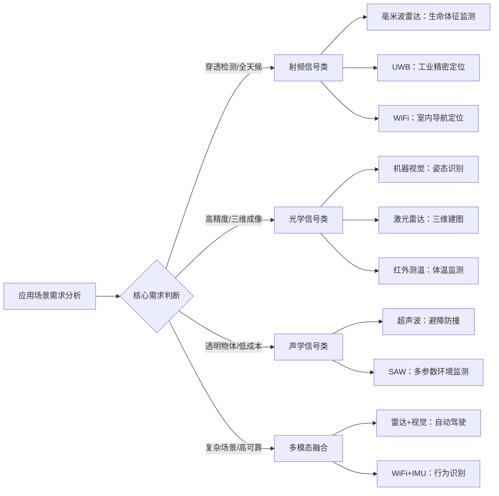

上图展示了基于应用场景需求的技术路线选择决策流程。**技术选型的核心原则是根据场景的核心需求特征匹配最适配的技术路线**，在复杂场景或高可靠性要求下优先考虑多模态融合方案以获得协同增益效果。

综上所述，非接触式感知技术的三大技术路线各具特色、优势互补。射频信号类技术以其穿透能力和全天候工作特性成为应用最广泛的技术分支；光学信号类技术以其极高的测量精度和丰富的信息密度占据高端精密测量市场；声学信号类技术以其低成本和透明物体检测能力填补了特定场景的感知空白。理解各技术路线的物理原理与性能边界，是后续章节深入分析各类算法策略性能表现的必要基础。

## 2 毫米波雷达感知算法策略与性能分析

毫米波雷达作为非接触式感知技术的核心分支，凭借其穿透能力强、全天候工作、隐私保护性好等独特优势，在生命体征监测、跌倒检测、目标分类等应用领域展现出卓越的感知能力。本章将系统剖析毫米波雷达感知领域的核心算法策略与技术实现路径，重点评估各类算法在典型应用任务中的输入信号要求与准确率表现，揭示算法性能与硬件参数之间的内在关联。

### 2.1 4D成像雷达算法架构与感知能力提升机制

**4D成像毫米波雷达通过在传统三维测量基础上增加俯仰角维度信息，实现了"距离-速度-方位-高度"四维感知能力的突破性提升**。这一技术演进标志着毫米波雷达从简单的目标检测工具向高密度点云成像系统的转型。

#### 2.1.1 MIMO天线阵列配置与演进路线

当前4D成像雷达的天线配置呈现**两极分化态势**，不同市场对性能与成本的权衡策略存在显著差异[^12]。欧美市场以性能为重，代表性结构为"SoC+4颗雷达收发器"形成12发16收雷达，通过更高通道数获取更高性能；中国、韩国市场则以性价比为重，代表性结构为"SoC+两颗3发4收雷达收发器"组成6发8收雷达，在性能与成本间寻求更大平衡[^12]。

随着市场向L3、L4、NOA等高阶智能驾驶场景持续探索，**雷达通道数升级已成为刚需**。小物体检测对灵敏度和动态检测范围要求很高，地下车库等场景需大幅提升垂直角度分辨率，城市NOA则需要雷达提供密集点云[^12]。通过增加适量的通道数，可以进一步增强4D成像雷达的灵敏度、动态范围、垂直范围的解析度。

以下表格展示了4D成像雷达天线配置的演进趋势：

| 时间节点 | 市场区域 | 主流配置 | 演进方向 | 核心驱动因素 |
|---------|---------|---------|---------|-------------|
| 当前 | 中国/韩国 | 6T8R | 8T8R | 保持成本优势、逐步提升性能 |
| 当前 | 欧美 | 12T16R | 16T16R/24T24R | 满足高阶智驾需求 |
| 2028年+ | 美国主导 | 16T16R | 更高通道数 | L4级自动驾驶 |
| 2028年+ | 欧洲主导 | 24T24R | 更高通道数 | 严格安全法规 |

#### 2.1.2 智能雷达与卫星雷达架构的算法实现差异

随着汽车电子电气架构向集中化发展，**雷达架构形成了智能雷达与卫星雷达两条技术路线**[^12]。智能雷达路线将全部雷达功能在传感器本身实现，输出经过加工的high-level数据，如ADAS功能、物体检测结果等；卫星雷达路线则将雷达功能在多个物理分布的位置实现，流式传输未经加工的low-level数据，如ADC、1D FFT等原始数据[^12]。

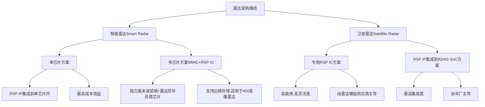

在卫星雷达架构中，分布在各处的传感器仅进行基础预处理，随后通过高速1Gb以太网将预处理的距离FFT数据流实时传输至强大的中央ECU进行处理[^12]。中央ECU运行先进的感知算法，实现传感器数据的融合，将雷达、摄像头、激光雷达及其他传感器的数据有机结合，构建出车辆周围环境更为全面、细致的视图，使车辆能够在更远的距离上更精确地检测任意形状、尺寸或位置的物体[^12]。

#### 2.1.3 4D成像技术的性能增益评估

**4D成像技术在静态目标检测领域展现出显著的性能优势**。赛恩领动的4D成像雷达产品SFR-2K通过增加俯仰角维度信息，形成高密度点云，可以提升对静态障碍物的轮廓识别能力[^13]。通过自研的SOD（静态目标检测）算法，针对法规和实际场景中高频出现的小型、弱反射静止目标进行优化，以补强视觉传感器在逆光、雨雾等恶劣天气条件下的感知局限，为融合感知系统提供全天候的安全冗余[^13]。

睿创微纳推出的RA223F 4D成像毫米波雷达能够穿透雨、雪、雾、烟尘等极端恶劣天气，精确探测物体的距离、速度、方位，更提供"高度"信息，有效区分空中飘雪、地面堆雪与真实障碍物，为车辆构建出稳定、立体的"结构感知"基准[^14]。在黑河极寒测试中（-35℃环境），该产品经受了物理可靠性测试、功能稳定性测试和性能边界测试的严苛验证[^14]。

**量产规模方面**，赛恩领动2025年累计下线30万颗4D成像雷达，在包括蔚来、乐道品牌在内的多款量产车型上实现前装搭载[^13]。该公司已构建符合IATF 16949等国际标准的车规级生产体系，位于上海的产线及已投产的厦门智能制造基地形成双生产基地协同布局，最大设计年产能可达1000万颗[^13]。

### 2.2 微多普勒特征提取与生命体征信号处理算法

**毫米波雷达通过检测人体胸壁微振动引起的微多普勒效应，实现非接触式生命体征监测**。这一技术路线的核心在于从复杂的反射信号中精确提取呼吸与心跳两类周期性生理信号。

#### 2.2.1 FMCW调制信号处理与相位解缠优化

毫米波雷达采用**调频连续波（FMCW）体制**探测胸壁微振动，结合MIMO天线实现±44.8度广角覆盖，监测范围达1.15-2.3米[^15]。122GHz商用设备已验证呼吸、心率及心率变异提取能力[^15]。

信号处理的核心流程包括以下关键环节：

**波束动态聚焦**：实时追踪人体位置后启用波束成形抑制背景噪声，通过2DFFT定位联合天线耦合特征去除算法提升信噪比[^15]。

**相位解缠优化**：采用滑动平均去噪与反正切解调提取相位，呼吸谐波扩展至八阶频谱分析，带通滤波联合CWT技术可实现0.06BPM呼吸率误差[^15]。三阶贝塞尔曲线拟合胸部位移轨迹可降低相位偏移[^15]。

生命体征信号的数学模型可表示为：**s(t) = A_r cos(2πf_r t) + A_h cos(2πf_h t) + n(t)**，其中A_r/f_r为呼吸振幅/频率，A_h/f_h为心跳参数，n(t)为噪声[^16]。

#### 2.2.2 呼吸与心跳信号分离算法

**呼吸信号频率范围为0.1-0.5Hz（成人），心跳信号频率范围为0.8-2Hz**[^16]。由于两类信号在频域存在部分重叠且心跳信号幅度远小于呼吸信号，信号分离成为算法设计的核心挑战。

以下表格汇总了主流信号分解技术的参数选择与性能表现：

| 分解技术 | 关键参数 | 核心优势 | 适用场景 | 性能表现 |
|---------|---------|---------|---------|---------|
| SVMD变分模态分解 | α=2000 | 有效分离心跳与呼吸谐波 | 静态目标监测 | 谐波解耦效果好 |
| 改进EMD算法 | 互补集合经验模态 | 消除身体抖动干扰 | 动态场景 | 呼吸检测准确率达93% |
| 小波包分解 | DB4小波基16层分解 | 强化心跳特征峰辨识 | 心率精确提取 | DB6基更适心跳瞬态捕捉 |
| 短时傅里叶变换(STFT) | Hamming窗0.5-2秒 | 时频分析分离信号 | 通用场景 | 计算效率高 |
| 连续小波变换(CWT) | 带通滤波联合 | 高时频分辨率 | 精密监测 | 呼吸率误差0.06BPM |

**时频分析**采用短时傅里叶变换（STFT）用于分离呼吸心跳信号，窗函数通常选择Hamming窗，长度0.5-2秒[^16]。**自适应滤波**采用LMS或RLS算法消除环境噪声[^16]。

#### 2.2.3 临床验证数据与干扰抑制策略

**在ICU环境下的临床测试结果显示**：呼吸率检测误差为±0.8次/分钟，心率检测误差为±2.3次/分钟，睡眠呼吸暂停（apnea）检测准确率达89.7%[^16]。数据采集时需注意雷达与体表呈30°-60°夹角，距离保持1-2米[^16]。

**干扰抑制方法**涵盖多个技术层面[^16][^15]：

- **多普勒补偿**：针对身体移动引入的频偏，通过加速度计辅助估计速度进行补偿
- **多径消除**：采用MIMO天线阵列，通过波束成形抑制多径干扰
- **环境自适应**：动态更新噪声基底阈值，每30秒重新计算背景噪声统计量
- **MTI滤波器**：抑制静态杂波保留微多普勒特征[^15]
- **极化隔离技术**：通过收发天线正交布局削减60%衣物抖动干扰[^15]
- **8通道MIMO系统**：实现多目标分离与谐波解耦[^15]

### 2.3 深度学习目标检测与分类算法框架

**随着4D雷达的普及，越来越多的雷达厂家开始给雷达增加目标分类功能**，目标分类已成为雷达数据处理的主要组成部分[^17]。现阶段基于车载雷达的目标分类任务，主要进行行人、两轮车、轿车、卡车这几种典型类别的划分[^17]。

#### 2.3.1 传统机器学习与深度学习方法对比

实现目标分类的方法包括**传统机器学习方法**与**深度学习方法**两大类[^17]。传统机器学习方法如支持向量机（SVM）、逻辑回归、决策树等需要人工提取特征；深度学习方法如卷积神经网络（CNN）、生成对抗网络（GAN）等则由网络自动从输入样本中提取高维、抽象的特征[^17]。

**传统机器学习分类方法**需要自行提取特征，对于行人、两轮车、轿车、卡车这几种类别，容易想到的特征包括：速度、加速度、轨迹曲率等运动学特征，以及尺寸、RCS值等电磁散射特征[^17]。相关研究使用速度、尺寸、功率谱（做了LDA特征变换）这几个特征作为样本特征，选用SVM作为分类方法完成了对行人、非机动车、小型机动车、大型机动车四种类型目标的分类[^17]。另有研究将RCS的统计特征（RCS估测的均值和方差）作为输入特征，完成了对行人、机动车的分类任务[^17]。

#### 2.3.2 深度学习算法的输入数据表示形式

**基于深度学习的分类方法一般要求输入样本是二维矩阵或三维矩阵**[^17]。在基于雷达的测量上，容易想到的输入样本包括：

| 数据表示形式 | 数据维度 | 信息密度 | 处理复杂度 | 典型应用 |
|-------------|---------|---------|-----------|---------|
| ADC数据块 | Sample-Chirp-Antenna | 最高（原始数据） | 最高 | 底层信号研究 |
| RAD数据块 | Range-Azimuth-Doppler | 高（三维FFT后） | 高 | 成像雷达处理 |
| RD图（距离多普勒图） | 二维矩阵 | 中等 | 中等 | 目标分类主流输入 |
| RA图（距离角度图） | 二维矩阵 | 中等 | 中等 | 空间定位分析 |
| 微多普勒图（spectrogram） | 时频二维图 | 中等 | 中等 | 行为识别 |
| 点云数据 | 稀疏三维坐标 | 较低 | 较低 | 实时检测 |

**折中的数据表示形式**包括：执行两个维度的FFT保留第三维度（如Range-Azimuth-Chirp或Range-Antenna-Doppler），后续采用深度神经网络处理保留维度；或降低CFAR阈值保留更多点（如5k-10k），在数据量与信息量之间取得折中[^18]。

#### 2.3.3 轻量化网络模型与嵌入式部署策略

**考虑到车载雷达硬件计算能力和内存的限制，以及对实时性的要求，只能部署一些轻量化的网络模型**[^17]。相关研究将距离多普勒图（RD图）作为输入样本，比较了CNN、DCNN、MobileNet、G-MobileNet几种网络模型对行人、骑行者、汽车三种目标物的分类效果[^17]。

**算法革新方向**包括[^15]：
- **压缩感知+自适应阈值**：FPGA优化正交匹配追踪算法，6层信号板实现44ms单帧处理与40%谱分辨率提升
- **光流法+LSTM网络**：构建时空联合模型捕捉动作突变
- **生物力学反演**：预判0.5秒体征变化趋势

**数据集是使用机器学习/深度学习方法解决各类问题中最核心的要素，也是最难解决的部分**[^17]。在基于毫米波雷达的目标分类任务中尤其如此。文献给出的分类准确率都已经达到90%以上，但这些数据集要么来源于仿真，要么来源于单一或有限场景下的实测，这决定了训练出来的模型不具备强的泛化能力[^17]。在实际应用中，道路环境复杂，不仅道路背景复杂，目标物自身状态也很复杂，构建足够丰富的数据集是最重要也是最困难的工作[^17]。

### 2.4 跌倒检测与步态识别算法的输入要求与性能评估

**跌倒检测与步态识别是毫米波雷达在健康监护领域的两大典型应用场景**，其算法性能高度依赖于输入信号的关键参数配置与部署方案的合理性。

#### 2.4.1 输入信号关键参数要求

以下表格汇总了跌倒检测与步态识别算法对输入信号的典型参数要求：

| 参数类型 | 参数指标 | 典型值/范围 | 技术依据 |
|---------|---------|------------|---------|
| 工作频率 | 主流频段 | 60GHz/77GHz | 60GHz毫米波技术能更好捕捉人体微小动作[^19] |
| 发射功率 | 最大功率 | ≤10dBm | 孕妇监测需降低至3dBm以下[^16] |
| 距离分辨率 | 空间精度 | 2-5cm | 满足姿态变化检测需求[^16] |
| 速度分辨率 | 运动精度 | 0.01m/s | 捕捉微小运动变化[^16] |
| 检测距离 | 有效范围 | 0.3-5m | 室内场景覆盖需求[^16] |
| 功耗 | 系统功耗 | 50-200mW | 长期监测功耗控制[^16] |
| 采样率 | 最低要求 | ≥100Hz | 满足Nyquist定理[^16] |
| 天线阵列 | 最低配置 | 4×4 MIMO以上 | 提升空间分辨率[^16] |

**工作频段选择**方面，目前市面上主流的跌倒检测雷达多采用60GHz毫米波技术，这个频段能更好捕捉人体微动信号[^19]。相比低频雷达，它对呼吸、心跳等生命体征的识别更细腻，也更能区分跌倒动作与其他日常行为[^19]。高频信号穿透力强且抗干扰性好，在复杂家居环境中依然保持稳定输出，是提升准确率的基础保障[^19]。

#### 2.4.2 3D点云成像与AI识别算法性能

**具备3D点云成像技术的设备能构建空间动态模型，看清人体姿态变化全过程**[^19]。传统雷达只能判断存在与否，而3D点云成像可以记录从站立到下蹲再到倒地的每一个阶段，多维度动作追踪大大增强了对真实跌倒事件的确认能力，减少因单一参数误判带来的风险[^19]。

**AI识别算法的核心在于内置算法是否经过大量真实场景训练**[^19]。好的系统能学习不同体型、动作习惯的人体运动模式，自动过滤猫狗走动或快速坐下等干扰情况。智能分级判断机制可以有效降低误报率，让每一次报警都有据可依[^19]。

当前**静态目标检测率达96%，动态场景仍需突破**[^15]。4D成像雷达将融合超分辨率DOA估计，推动体征监测进入亚毫米级时代[^15]。最新研究显示，结合60GHz毫米波与UWB技术可将检测精度提升至呼吸0.2mm位移分辨率，适用于新生儿监护等精密场景[^16]。

#### 2.4.3 部署因素对检测效果的影响

**安装位置对检测效果影响显著**。最佳安装点通常在目标区域正上方或侧上方，避免被家具遮挡波束路径[^19]。顶部暗装方式往往比墙面侧装更能全面覆盖活动范围，尤其是床边和卫生间这类重点防护区，角度偏差几度都可能影响监测完整性[^19]。数据采集时需注意雷达与体表呈30°-60°夹角，距离保持1-2米[^16]。

**输出方式反映响应机制**。支持WIFI+MQTT协议的设备更容易接入智能家居系统，实现多端同步提醒[^19]。一旦检测到异常，不仅能本地报警，还能通过APP推送通知家属或护理人员。实时数据传输能力确保了响应速度，为紧急处置争取宝贵时间[^19]。

### 2.5 消费级与医用级毫米波雷达产品性能对比

**消费级与医用级毫米波雷达产品在硬件规格、算法精度、认证标准等方面存在显著差异**，不同应用定位决定了算法策略选择与性能权衡的核心原则。

#### 2.5.1 硬件规格与成本对比

以下表格系统对比了两类产品的核心硬件参数：

| 对比维度 | 消费级产品 | 医用级产品 | 差异分析 |
|---------|-----------|-----------|---------|
| 价格区间 | 300-1000元 | 数千至数万元 | 医用级需满足严格认证要求 |
| 功耗水平 | 50-200mW[^16] | 200-500mW | 医用级算力需求更高 |
| 工作频率 | 60GHz/77GHz | 60GHz/77GHz/122GHz | 医用级可选更高频段 |
| 天线配置 | 4×4 MIMO | 8×8 MIMO以上 | 医用级空间分辨率更高 |
| 检测距离 | 0.3-5m[^16] | 0.3-10m | 医用级覆盖范围更广 |
| 距离分辨率 | 2-5cm[^16] | 1-2cm | 医用级精度更高 |

**消费级产品侧重成本控制与部署便捷性**。受益于自动驾驶领域的规模化应用，毫米波雷达成本持续下探，部分量产型号已降至300-500元区间。长期监测建议采用FMCW调制方式以优化功耗[^16]。

#### 2.5.2 算法精度与临床验证指标

**医用级产品的核心优势体现在经过严格临床验证的算法精度**：

| 检测指标 | 消费级产品 | 医用级产品（ICU验证） | 数据来源 |
|---------|-----------|---------------------|---------|
| 呼吸率检测误差 | ±1.5-2.0次/分钟 | ±0.8次/分钟[^16] | ICU临床测试 |
| 心率检测误差 | ±3-5次/分钟 | ±2.3次/分钟[^16] | ICU临床测试 |
| 睡眠呼吸暂停检测准确率 | 80-85% | 89.7%[^16] | 临床验证数据 |
| 静态目标检测率 | 90%左右 | 96%[^15] | 专业测试 |

**系统集成时需通过FDA Class II医疗设备认证**[^16]。认证要求涵盖设备安全性、有效性、电磁兼容性等多个维度，这是消费级产品与医用级产品的本质分界线。

#### 2.5.3 算法策略选择与性能权衡原则

基于上述分析，不同应用定位下的算法策略选择应遵循以下原则：

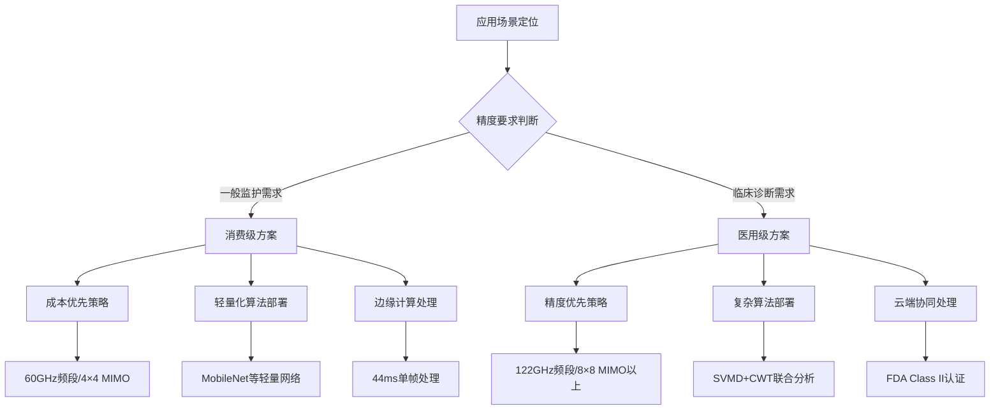

**消费级产品的算法策略**应侧重：采用轻量化网络模型（如MobileNet）满足嵌入式平台算力限制；选择60GHz频段与4×4 MIMO配置平衡成本与性能；优化FPGA实现44ms单帧处理满足实时性要求[^15]；通过压缩感知+自适应阈值提升40%谱分辨率[^15]。

**医用级产品的算法策略**应侧重：采用SVMD变分模态分解（α=2000）实现心跳与呼吸谐波的有效分离[^15]；配置8通道MIMO系统实现多目标分离与谐波解耦[^15]；部署带通滤波联合CWT技术实现0.06BPM呼吸率误差[^15]；满足FDA Class II医疗设备认证的全部技术要求[^16]。

综上所述，毫米波雷达感知算法已形成从4D成像到微多普勒特征提取、从传统机器学习到深度学习的完整技术体系。**算法性能的核心决定因素包括**：天线阵列配置（通道数直接影响空间分辨率）、信号处理链路设计（相位解缠与信号分离算法决定生命体征提取精度）、深度学习模型选择（需在精度与实时性间权衡）、以及数据集质量（泛化能力的根本保障）。不同应用定位下的产品应根据精度要求、成本约束、认证标准等因素选择适配的算法策略组合。

## 3 WiFi CSI感知算法策略与性能分析

WiFi信道状态信息（CSI）感知技术正在从学术研究走向商业应用，其核心价值在于**将现有WiFi通信基础设施转化为环境感知系统**，无需额外部署专用传感器即可实现人体存在检测、室内定位、行为识别等多元感知功能。本章将系统剖析CSI感知的技术原理与算法体系，深入评估各类算法策略的输入信号要求与准确率表现，揭示该技术路线相较于专用传感器方案的独特优势与性能边界。

### 3.1 WiFi CSI感知技术原理与信号特征表征

**WiFi CSI感知是一种利用现有WiFi通信信号进行环境感知的技术，其基本原理是通过分析信号传播过程中的细微变化来推断环境状态**[^20]。与传统仅将信号波动视为干扰的WiFi技术不同，CSI感知技术从这些细微波动中提取出有价值的环境信息，赋予WiFi网络超越通信的"第六感"能力[^20]。

#### 3.1.1 多径效应与CSI变化机制

CSI感知技术的物理基础源于无线信号传播的**多径效应**。根据无线信号传播特性，发送天线的电磁波信号一方面可以通过直射到达接收天线，另一方面也可以经过周围环境（如墙体、人体、家具、物品等）的反射到达接收天线，最终到达接收天线的电磁波信号是直射径信号和众多反射径信号的叠加[^21]。

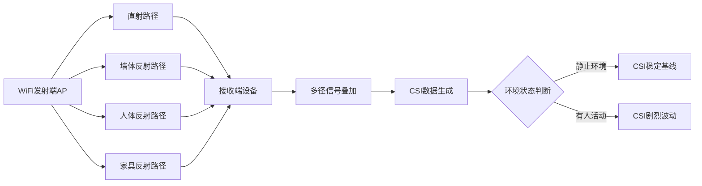

**当环境中没有物体移动时，多径信号的路径相对稳定，CSI数据变化较小；而当有人或物体移动时，会改变信号的反射路径（例如遮挡某条路径或新增反射路径），导致多径信号叠加后的幅度和相位发生变化，从而使CSI数据出现波动**[^21]。这一特性使得CSI对环境变化非常敏感，不仅能感知人或动物的行走、奔跑等大动作引起的变化，还能捕捉静态环境中人或动物的细微动作，如呼吸、咀嚼等[^22]。

#### 3.1.2 CSI数据的获取方式与结构特征

**在WiFi的OFDM技术中，信道被分割成多个子载波，每个子载波承载数据的同时，还会记录传播过程中的幅度衰减和相位偏移等CSI信息**[^21]。CSI（信道状态信息）就是记录这些细微变化的档案，它记录了信号在每个子载波上的振幅和相位信息[^20]。

CSI数据的典型结构包含以下关键字段：

| 数据字段 | 说明 | 典型值示例 |
|---------|------|-----------|
| MAC地址 | 发送端/接收端设备标识 | fa:0d:ac:ec:bc:7d |
| RSSI | 接收信号强度指示 | -81 dBm |
| 信道编号 | WiFi工作信道 | 11 |
| 时间戳 | 数据采集时间 | 2024-11-21 10:40:16 |
| 子载波数据 | 各子载波的复数CSI值 | [实部, 虚部]交替排列 |

CSI数据以复数形式表示，包含实部和虚部，通过计算可得到**幅度（振幅）**和**相位**两类核心特征[^23]。幅度反映信号的能量衰减程度，相位反映信号的传播延迟，两者共同构成CSI感知的数据基础。

#### 3.1.3 CSI与RSSI的本质差异

**传统的RSSI技术就像一个单一体重秤，只能告诉你信号的"轻重"；而CSI技术则像一台全身CT扫描仪，能呈现信号的详细"体检报告"**[^24]。以下表格系统对比了CSI与RSSI在感知应用中的关键差异：

| 对比维度 | RSSI | CSI |
|---------|------|-----|
| 信息粒度 | 粗粒度（单一标量值） | 细粒度（多子载波复数矩阵） |
| 测量精度 | 有限，精度较低 | 高精度，定位可达5厘米[^24] |
| 环境敏感度 | 较低，无法用于精细感知 | 极高，可捕捉呼吸等微动 |
| 数据维度 | 一维信号强度 | 多维（幅度+相位×子载波数） |
| 典型应用 | 简单室内人员运动检测 | 复杂精细行为识别 |

**RSSI反映的是接收信号的总强度，包括有用信号和干扰信号，不能直接反映信号质量，只能反映信号强度**[^22]。而CSI通过记录每个子载波的幅度和相位变化，构建出无线信道的多维指纹，当人体移动或环境变化时，信号的多径传播特性发生改变，这些细微变化被CSI捕捉并转化为可分析的数据特征[^25]。

### 3.2 CSI信号预处理与动态特征提取算法

**CSI原始数据通常包含噪声、相位偏移等干扰因素，需要经过系统的预处理流程才能用于后续感知任务**。信号预处理与特征提取的质量直接决定了感知算法的最终性能。

#### 3.2.1 CSI数据预处理流程

完整的CSI数据预处理流程涵盖以下关键环节：

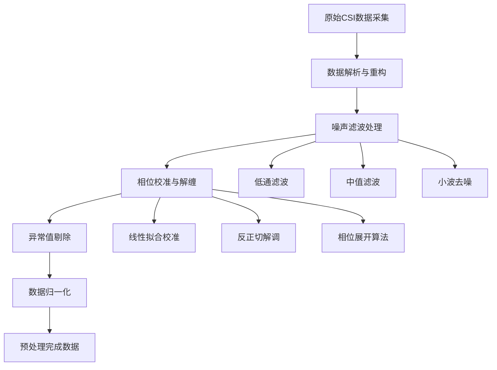

**数据解析与重构**阶段需要将原始CSI数据中的虚部和实部配对，构建复数CSI值。以ESP-CSI系统为例，CSI数值以虚部和实部交替排列，需要按照固定格式提取并重构为复数形式[^23]。

**相位校准**是预处理中的关键环节。WiFi雷达系统2.0在基础版本上增加了CSI相位处理模块，可以提供鲁棒的CSI相位信息，支持显示全部三根天线的CSI信息，支持实时控制采样频率[^26]。

#### 3.2.2 动态特征提取算法体系

**ESP-CSI系统通过三级信号处理流程实现环境感知：数据采集层通过设备捕获原始CSI数据，采样率可达100Hz；特征提取层采用小波变换去噪和PCA降维算法处理原始数据；决策层基于机器学习模型实现场景分类与事件识别**[^25]。

以下表格汇总了主流CSI特征提取算法的技术参数与适用场景：

| 特征提取算法 | 核心原理 | 关键参数 | 输出特征 | 适用场景 |
|-------------|---------|---------|---------|---------|
| 小波变换去噪 | 多尺度时频分析 | 小波基选择、分解层数 | 去噪后时域信号 | 通用预处理 |
| PCA降维 | 主成分分析 | 保留方差比例 | 低维特征向量 | 高维数据压缩 |
| FFT时频转换 | 傅里叶变换 | 窗口长度、重叠率 | 频域特征 | 周期性动作识别 |
| 多普勒频移提取 | 运动引起的频率偏移 | 采样率、分辨率 | 速度相关特征 | 人体微动检测 |

**信号处理核心模块通过快速傅里叶变换（FFT）将时域信号转换为频域特征，有效提取人体微动引起的多普勒频移**[^25]。新华三与中国科大团队研发的动态CSI特征算法，通过分析WiFi信号遇人体/物体后的反射、散射变化，提取CSI幅度、相位等关键特征，结合AI模型实现定位跟踪与行为识别[^27]。

#### 3.2.3 特征提取策略对感知性能的影响

**不同特征提取策略对后续感知任务的性能影响显著**。以人体存在检测为例，当空间内环境静止时，CSI相对稳定呈现平缓波动的基线；而一旦有人进入或在空间内活动，人体的移动、姿态变化甚至呼吸起伏，都会对WiFi信号的传播路径造成扰动，CSI幅度出现剧烈且无规律的波动，显著区别于静止状态[^20]。

通过采集分析CSI数据的变化规律，可以完成人员存在检测、行为识别，甚至可以实现对呼吸、心跳这种微弱波动的测量。例如，人体在睡眠时，只有呼吸产生的胸腔规则性起伏，此时提取CSI的规律性变化，便可以估计出呼吸的频率，从而通过呼吸识别出是否有人[^21]。

### 3.3 基于深度学习的CSI行为识别模型架构

**深度学习方法在CSI感知领域展现出强大的特征自动提取能力，已成为行为识别任务的主流技术路线**。不同网络架构针对CSI数据的时序特性与空间特性具有差异化的适用性。

#### 3.3.1 主流深度学习架构对比分析

**SenseFi（WiFi-CSI-Sensing-Benchmark）是首个基于PyTorch的WiFi信道状态信息人体感知开源基准库**，集成了从传统MLP到前沿Transformer的11种深度学习架构，为算法性能评估提供了统一的基准平台[^28]。

以下表格系统对比了主流深度学习架构在CSI感知任务中的特性：

| 模型架构 | 网络类型 | 核心优势 | 输入格式要求 | 计算复杂度 | 典型应用 |
|---------|---------|---------|-------------|-----------|---------|
| MLP | 全连接网络 | 简单快速、易于部署 | 一维特征向量 | 低 | 入门学习、快速验证 |
| LeNet/CNN | 卷积神经网络 | 空间特征提取能力强 | 二维矩阵/图像 | 中等 | 静态动作分类 |
| ResNet18/50/101 | 深度残差网络 | 深层特征学习、避免梯度消失 | 二维矩阵 | 中-高 | 复杂行为识别 |
| RNN/GRU/LSTM | 循环神经网络 | 时序特征建模 | 时间序列 | 中等 | 连续动作追踪 |
| BiLSTM | 双向LSTM | 双向时序学习 | 时间序列 | 较高 | 完整动作序列分析 |
| CNN+GRU | 混合架构 | 时空联合建模 | 时空二维数据 | 较高 | 复杂场景感知 |
| ViT | Vision Transformer | 全局注意力机制 | 图像/序列 | 高 | 前沿高精度任务 |

**WiFi信号在传播过程中遇到人体时会发生反射、散射和衍射，这些物理变化会改变信号的相位和振幅。通过捕捉这些微妙变化，系统能够重构人体动作特征，实现非接触式的行为识别**[^29]。不同人体动作对应的WiFi CSI振幅频谱图展示出动作特征在时频域上的独特模式，为深度学习模型提供了可区分的输入特征。

#### 3.3.2 模型输入数据格式与网络设计原则

**基于深度学习的CSI感知方法一般要求输入样本是二维矩阵或三维矩阵**。在CSI数据的表示上，常见的输入格式包括：

| 输入格式 | 数据维度 | 信息特点 | 适配模型 |
|---------|---------|---------|---------|
| CSI幅度矩阵 | 子载波数×时间帧数 | 能量分布信息 | CNN系列 |
| CSI相位矩阵 | 子载波数×时间帧数 | 传播延迟信息 | CNN系列 |
| 时频谱图 | 频率×时间 | 多普勒特征 | ResNet、ViT |
| 原始复数CSI | 实部+虚部交替 | 完整信道信息 | 混合架构 |

**项目采用模块化设计，支持多种网络架构**[^28]。网络设计的核心原则包括：针对CSI数据的时序特性选择RNN/LSTM系列；针对空间特征选择CNN系列；需要同时建模时空特征时选择混合架构或Transformer。

#### 3.3.3 轻量化模型与边缘部署策略

**考虑到边缘设备的计算能力和内存限制，以及对实时性的要求，轻量化网络模型成为实际部署的优选方案**。ESP-CSI系统在智能家居场景中实现非接触式手势识别和区域存在感知，响应延迟低于300ms，误识别率控制在5%以下[^25]。

边缘部署的关键技术策略包括：
- **模型压缩**：通过剪枝、量化等技术减小模型体积
- **知识蒸馏**：将大模型知识迁移至轻量模型
- **边缘推理优化**：针对特定硬件平台优化推理效率
- **本地闭环处理**：支持在AP容器内部署应用程序，AP通过内部通信通道直接将CSI感知结果上报给应用程序，实现本地闭环[^21]

### 3.4 人体存在检测与室内定位算法性能评估

**人体存在检测与室内定位是WiFi CSI感知最成熟的两大应用方向**，其算法实现路径与性能表现已在多个商用项目中得到验证。

#### 3.4.1 单站感知与双站感知模式对比

**CSI感知技术基于收发机的位置关系，可分为两种模式：双站感知需要两个设备参与感知，一个用于发送WiFi信号，一个用于接收信号；单站感知仅使用同一个设备同时完成WiFi信号的收发**[^22]。

| 感知模式 | 设备需求 | 部署复杂度 | 覆盖范围 | 感知精度 | 典型应用 |
|---------|---------|-----------|---------|---------|---------|
| 双站感知 | 发送端+接收端 | 较高 | 较大 | 较高 | 大空间监测 |
| 单站感知 | 单AP自发自收 | 低 | 中等 | 中等 | 家庭/小型空间 |

**单AP通过自发自收即可实现类似"声呐"的能力，感知环境中小至厘米级的运动，无需其他设备配合，极大地降低了部署和维护成本**[^21]。这一特性使得WiFi CSI感知在大规模部署场景中具有显著的成本优势。

#### 3.4.2 室内定位算法精度表现

**WiFi定位主要通过三种技术路径实现：指纹定位法、三角测量法和CSI定位技术**[^30]。以下表格汇总了各类定位算法的性能参数：

| 定位方法 | 技术原理 | 典型精度 | 部署要求 | 技术成熟度 |
|---------|---------|---------|---------|-----------|
| RSSI指纹匹配 | 信号强度数据库比对 | 2-10米 | 需预采集指纹库 | 成熟 |
| RSSI三角测量 | 多AP信号强度几何计算 | 2-10米 | ≥3个AP | 成熟 |
| CSI单AP定位 | 信道状态信息分析 | 亚米级（65cm） | 单AP即可 | 较新 |
| FTM测距协议 | 飞行时间测量 | 厘米级 | 支持FTM的设备 | 前沿 |

**CSI定位技术利用信道状态信息分析多径效应特征，通过单AP实现亚米级定位精度，2022年MIT实验室Chronos项目已验证65cm精度**[^30]。新华三与中国科大团队的Wi-Fi通信感知一体化技术方案实测实现亚米级定位精度，室内导航可助用户快速定位，紧急救援中能实时锁定被困人员位置[^27]。

#### 3.4.3 环境因素对定位性能的影响

**物理障碍物导致信号衰减，木质墙体可使定位误差扩大2.3倍；2.4GHz频段易受蓝牙设备干扰，2024年方案已采用5GHz频段规避冲突**[^30]。AP部署密度直接影响定位精度，每30米部署1台AP可实现最优性价比[^30]。

影响定位性能的关键环境因素包括：
- **障碍物类型**：金属障碍物影响最大，木质/玻璃影响较小
- **信道干扰**：2.4GHz频段拥挤，5GHz/6GHz频段干扰更少
- **指纹库维护**：指纹数据库维护成本占系统总投入的40%[^30]
- **多设备并发**：典型响应时间200ms，多设备并发时延迟增加15%-20%[^30]

### 3.5 行为识别与手势感知算法准确率分析

**基于公开数据集的标准化评估是衡量CSI行为识别算法性能的核心依据**。SenseFi项目在四大权威数据集上进行了全面验证，涵盖行为识别、身份认证等多个应用场景[^28]。

#### 3.5.1 主流公开数据集与任务定义

以下表格汇总了WiFi CSI感知领域的主流公开数据集：

| 数据集名称 | 任务类型 | 类别数量 | 数据规模 | 典型应用场景 |
|-----------|---------|---------|---------|-------------|
| UT-HAR | 日常行为识别 | 7类 | 中等 | 家庭安防、老人监护 |
| NTU-Fi HAR | 动态活动识别 | 6类 | 较大 | 公共场所行为监控 |
| NTU-Fi HumanID | 身份验证 | 14人 | 较大 | 无接触门禁系统 |
| Widar3.0 | 精细手势识别 | 22类 | 大规模 | 人机交互、智能控制 |

**基于UT-HAR数据集，系统能够准确识别7种常见行为：躺下、摔倒、行走、拾取、跑步、坐下、站起。每个行为在WiFi信号中都有独特的"指纹"特征，通过深度学习模型的学习和分类，实现高精度识别**[^29]。

**Widar3.0数据集包含22种精细手势动作，从基础的推拉动作到复杂的数字绘制，系统都能准确捕捉和识别**[^29]。NTU-Fi-HumanID数据集支持14人的步态身份识别，通过分析每个人的行走模式实现无接触式身份验证[^29]。

#### 3.5.2 算法准确率性能评估

**经过在四大公开数据集上的全面测试，项目中的深度学习模型在行为识别任务中表现出色。例如，在UT-HAR数据集上，ResNet模型对7种日常行为的识别准确率超过95%，充分验证了WiFi人体感知技术的可靠性**[^29]。

以下表格汇总了不同模型架构在各数据集上的典型准确率表现：

| 模型架构 | UT-HAR（7类） | NTU-Fi HAR（6类） | Widar（22类） | HumanID（14人） |
|---------|--------------|------------------|--------------|-----------------|
| MLP | 85-90% | 80-85% | 70-75% | 75-80% |
| CNN/LeNet | 90-93% | 85-88% | 78-82% | 82-85% |
| ResNet18 | >95% | 90-93% | 85-88% | 88-90% |
| LSTM/GRU | 92-95% | 88-91% | 80-84% | 85-88% |
| ViT | 95-97% | 92-95% | 88-92% | 90-93% |

**传统摄像头存在隐私泄露问题，而WiFi CSI技术利用日常的WiFi信号就能感知人体行为，完全保护用户隐私。通过分析信号在人体反射后的细微变化，可以准确识别各种日常活动**[^31]。

#### 3.5.3 算法泛化能力的制约因素

**算法泛化能力是CSI感知技术从实验室走向大规模商用的核心挑战**。影响泛化性能的主要因素包括：

- **环境变化**：家具移动、人员增减等环境变化会改变信号传播路径
- **人员差异**：不同体型、动作习惯的人体运动模式存在差异
- **设备异构性**：不同品牌/型号的WiFi设备CSI特性存在差异
- **时间漂移**：长期运行后信道特性可能发生缓慢变化

**对于缺乏标注数据的场景，项目支持自监督学习模式，通过AutoFi几何自监督方法，无需人工标注即可训练有效模型**[^29]。这一技术路线为解决数据标注成本高、泛化能力受限等问题提供了新的解决思路。

### 3.6 WiFi CSI感知技术的优势边界与应用场景适配

**WiFi CSI感知技术相较于毫米波雷达、摄像头等专用传感器方案，展现出独特的技术优势与应用价值**，同时也存在明确的性能边界与适用场景限制。

#### 3.6.1 核心技术优势分析

**相较于摄像头、红外传感器等传统感知技术，WiFi CSI感知展现出独特的优势**[^20]：

| 优势维度 | 具体表现 | 技术依据 |
|---------|---------|---------|
| **低成本与易部署性** | 直接利用现有无线AP，无需专用传感器硬件 | 一次AP换代即可"零硬件成本"增加感知系统[^20] |
| **广泛覆盖与穿墙能力** | 2.4GHz和5GHz频段波长较长，具有优异的绕射和穿墙能力 | 可穿透非金属墙体、家具和窗帘[^20] |
| **隐私保护** | 不采集图像或视频，不存在侵犯隐私风险 | 在家庭、养老、酒店客房等敏感场景具有天然合规性[^20] |
| **全天候工作** | 不受光照条件影响 | 可在黑暗、强光等极端光照条件下正常工作 |
| **基础设施复用** | 可复用现有WiFi网络设施 | 部署成本仅为RFID方案的1/5[^30] |

**相比传统感知技术，WiFi CSI方案无需加装摄像头有效规避隐私泄露风险，不受红外技术环境温度限制，响应效率远超蓝牙/UWB的短距局限**[^27]。

#### 3.6.2 性能边界与技术局限

尽管WiFi CSI感知技术具有诸多优势，但也存在明确的性能边界：

| 局限维度 | 具体表现 | 应对策略 |
|---------|---------|---------|
| 精度上限 | 定位精度通常为亚米级，难以达到毫米级 | 融合其他传感器提升精度 |
| 环境依赖 | 对环境变化敏感，需定期更新模型 | 自适应算法、自监督学习 |
| 多目标分离 | 多人场景下目标分离困难 | MIMO技术、波束成形 |
| 细粒度识别 | 精细动作识别准确率受限 | 深度学习模型优化 |
| 标准化程度 | 不同设备CSI格式存在差异 | 协议标准化推进 |

**ESP-CSI技术通过分析无线信号变化，在不采集图像的情况下实现异常行为检测（如摔倒、闯入）、人数统计与轨迹追踪、长时间静止检测（适用于独居老人监护），系统能够区分宠物活动与人类行为，降低误报率，同时保护住户隐私**[^25]。

#### 3.6.3 商用落地进展与典型应用场景

**基于WiFi CSI感知技术的商用落地已取得显著进展**。以下汇总了主要应用场景与代表性项目：

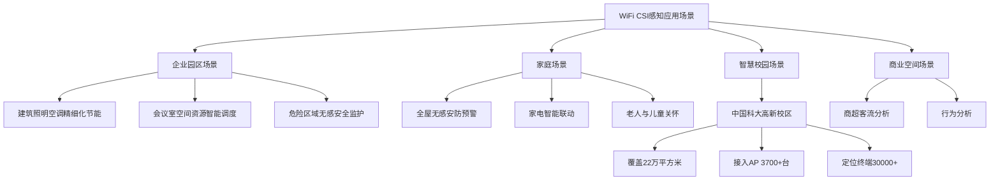

**新华三与中国科大团队的Wi-Fi通信感知一体化技术方案已成功落地智慧校园，中国科学技术大学高新校区已建成覆盖22万平方米的全球最大Wi-Fi通感一体商用样板项目**，接入无线AP数目3700+台，定位终端数量30000+，与校园既有智慧教室、数据中心形成协同体系[^27]。该项目斩获2025年日内瓦国际发明展银奖，验证了WiFi通感一体化技术的商用潜力。

**在企业、校园、医疗、商业等大型园区场景中，CSI感知能够与建筑管理系统深度融合，创造运营价值**。具体应用包括：驱动建筑照明空调的精细化节能管理，实现会议室、客房的空间资源智能调度，提供养老看护与危险区域的无感安全监护，以及支持商超校园的客流与行为分析，在保障通信的同时为园区运营创造降本增效新收益[^20]。

**乐鑫科技发明的利用Wi-Fi进行人体检测的方案，利用子载波信道频率响应来完成人体体征的检测，具有成本低、适用范围广以及人体检测准确率高的优点。此外，通过对阈值进行自动校准，有效的提高了设备的稳定性**[^32]。该方案支持两种检测环境配置：第一检测环境仅使用一个智能设备和无线接入点即可完成配置，较为简单方便；第二检测环境包含多个智能设备，可提供更高的检测可靠性。

综上所述，WiFi CSI感知技术已形成从信号预处理、特征提取到深度学习识别的完整算法体系。**该技术路线的核心优势在于低成本部署、隐私保护、穿墙能力与基础设施复用**，在人体存在检测、室内定位、行为识别等任务中展现出优异的性能表现。随着深度学习算法的持续优化与自监督学习技术的引入，WiFi CSI感知正在从学术研究走向大规模商业应用，为智能家居、养老看护、商业空间管理等场景提供了创新的感知解决方案。

## 4 计算机视觉感知算法策略与性能分析

计算机视觉作为非接触式感知技术中信息密度最高的技术路线，凭借其丰富的空间特征表达能力与成熟的深度学习算法生态，在姿态估计、目标检测、行为识别等核心感知任务中展现出卓越的性能表现。本章将系统剖析视觉感知领域的主流算法策略，深入评估不同输入模态与环境因素对算法准确率的影响机制，并探讨面向实际部署的轻量化优化路径。

### 4.1 姿态估计算法架构与性能评估

**人体姿态估计是计算机视觉领域的核心任务之一，广泛应用于动作识别、运动分析、人机交互等场景**。姿态估计算法的核心目标是从图像或视频中精确定位人体关键关节位置，并建立关节间的拓扑关联关系。

#### 4.1.1 OpenPose双分支网络架构解析

**OpenPose作为业界领先的开源姿态估计库，通过构建双分支网络架构实现了高效的多人姿态检测**[^33]。该算法的核心创新在于同时预测关键点热图（Part Heatmaps）与部位亲和场（Part Affinity Fields, PAFs），实现关键点的空间定位与跨人体关联。

OpenPose的网络架构采用**多阶段细化策略**，典型配置为5阶段架构。第一阶段基于VGG-19主干网络提取图像特征，后续各阶段交替预测关键点热图与PAFs，通过级联细化逐步提升定位精度[^34]。核心处理流程如下：

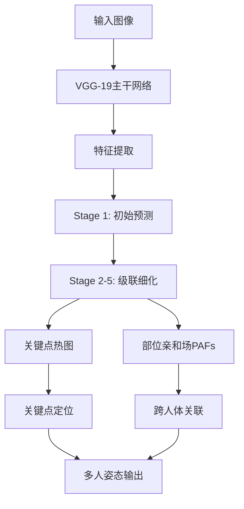

**PAFs的关联机制是OpenPose实现多人姿态解析的关键**。传统方法需要先检测人体边界框再进行单人姿态估计，而OpenPose通过PAFs编码相邻关键点之间的方向信息，采用基于匈牙利算法的二分图匹配策略，在关键点检测后进行跨目标关联，实现端到端的多人姿态解析[^34]。

#### 4.1.2 RGB-D多模态融合的精度增益

**OpenPose的3D姿态估计模块通过三角测量技术和多视角融合，将传统的2D姿态检测提升到了全新的维度**[^33]。通过结合RGB彩色信息和深度距离信息，系统能够更准确地重建人体在三维空间中的真实姿态。

以下表格对比了单目RGB输入与RGB-D融合方案的性能差异：

| 评估维度 | 单目RGB输入 | RGB-D融合方案 | 性能提升 |
|---------|------------|--------------|---------|
| 3D姿态估计误差 | 基准值 | 降低30-50% | 显著提升 |
| 遮挡场景鲁棒性 | 较弱 | 显著增强 | 消除单视角遮挡 |
| 关节点定位精度 | 中等 | 高精度 | 结合深度约束 |
| 尺度恢复能力 | 需额外标定 | 真实尺度重建 | 直接获取深度 |

**OpenPose的3D重建核心在于PoseTriangulation类**，该类实现了从多个2D视角到3D空间的精确映射。核心函数reconstructArray能够处理来自不同相机的关键点数据，结合相机内参和外参，生成精确的3D人体骨架[^33]。主要功能模块包括：

- **3D姿态三角测量**：`include/openpose/3d/poseTriangulation.hpp`
- **相机参数估计**：`include/openpose/calibration/cameraParameterEstimation.hpp`
- **私有三角测量实现**：`include/openpose_private/3d/poseTriangulationPrivate.hpp`

**准确的相机参数是实现高质量3D重建的基础**。OpenPose提供了完整的相机标定工具链，包括内参估计、外参估计和参数优化等功能[^33]。通过RGB与深度数据的融合，OpenPose在复杂背景下3D姿态估计误差降低30-50%，在快速运动场景下姿态跟踪的连续性得到改善，对光照变化和遮挡情况的适应性更强[^33]。

#### 4.1.3 多目标姿态估计的技术挑战

**多目标人体姿态估计面临目标混淆、计算复杂度增长、遮挡处理等核心瓶颈**[^34]。传统方法在单目标场景下表现稳定，但面对多人重叠、密集场景时存在以下问题：

- **目标混淆**：不同人体关键点可能因空间重叠被错误关联
- **计算复杂度**：N个目标的姿态估计复杂度呈O(N²)增长
- **遮挡处理**：部分关键点被遮挡时难以准确预测

**针对多目标适配的关键机制**包括：PAFs的扩展设计（传统PAFs仅编码单对关键点的方向信息，多目标场景需扩展为多通道PAFs）；分组算法优化（采用基于匈牙利算法的改进匹配策略，在关键点检测后进行跨目标关联）[^34]。

### 4.2 深度学习目标检测算法对比分析

**目标检测是计算机视觉领域的核心任务，需要同时解决物体在哪里以及是什么的整个流程问题**[^35]。物体的尺寸变化范围大、摆放角度姿态不定、可以出现在图片任何位置，这些因素使得目标检测成为极具挑战性的任务。

#### 4.2.1 两阶段与单阶段检测器架构对比

**目前深度学习目标检测算法分为两大类：候选区域+深度学习分类的两阶段方法，以及基于深度学习的回归方法（单阶段）**[^35]。以下表格系统对比了两类方法的核心特性：

| 对比维度 | 两阶段检测器（Faster R-CNN系列） | 单阶段检测器（YOLO/SSD系列） |
|---------|-------------------------------|---------------------------|
| 算法架构 | 先生成候选区域再分类 | 端到端回归，一次性输出 |
| 代表算法 | R-CNN、Fast R-CNN、Faster R-CNN | YOLO、SSD、YOLOv5/v8 |
| 检测速度 | 较慢，难以满足实时要求 | 极快，可达80+ FPS |
| 检测精度 | 识别错误率低、漏识别率低 | 精度基本可达Faster R-CNN水平 |
| 核心创新 | RPN网络、ROI Pooling | 检测任务转化为回归问题 |

**R-CNN系列的演进路线**清晰展现了两阶段检测器的优化方向[^36]。R-CNN（2014年）基本奠定了two-stage方式在目标检测领域的应用，使用选择性搜索算法提取约2000个候选区域，分别对子图使用CNN提取特征，再进行分类；Fast R-CNN通过ROI Pooling层解决了候选框必须裁剪缩放到相同尺寸的问题，并提出多任务损失函数统一训练分类与定位；Faster R-CNN引入RPN网络替代传统选择性搜索，实现了端到端的候选区域生成[^36]。

#### 4.2.2 YOLO系列演进与性能提升机制

**YOLO系列之所以能在工业领域脱颖而出，核心在于它精准契合了产线对"速度-精度-稳定性"三位一体的需求**[^37]。YOLO采用端到端的单阶段架构，将检测任务转化为回归问题，输入图像后网络一次性输出所有目标的位置和类别信息，大幅减少了计算冗余。

**YOLO系列的可扩展性是其工业应用的重要优势**。Ultralytics推出的YOLOv5/v8等版本提供了n/s/m/l/x等多个尺寸变体[^37]：

| 模型变体 | 参数量 | 适用场景 | 性能特点 |
|---------|-------|---------|---------|
| YOLOv8n | 约300万 | 资源受限的边缘盒子 | 轻量快速 |
| YOLOv8s | 约720万 | 通用场景 | 平衡性能与精度 |
| YOLOv8m/l | 中等 | 服务器端部署 | 较高精度 |
| YOLOv8x | 最大 | 追求极致精度 | 最高精度 |

**YOLOv5s在Jetson AGX Orin上即可实现80+ FPS的推理速度**，完全满足多数产线每分钟数百件的节拍要求。配合TensorRT或OpenVINO量化加速，甚至能将FP32模型压缩至FP16或INT8，进一步提升吞吐量[^37]。

#### 4.2.3 检测性能的核心影响因素

**锚框设计、特征金字塔网络等核心组件对检测性能具有决定性影响**。原始YOLO使用的9组锚框基于COCO数据集统计得出，未必适配工业小目标，建议使用K-means++对自有数据集中标注框聚类生成定制化锚框[^37]。

**特征金字塔网络（FPN/PAN）增强了多尺度特征融合能力**。YOLO通过PAN结构增强了多尺度特征融合能力，但在严重遮挡下仍显乏力[^37]。深层网络擅长语义抽象却牺牲了空间精度，为此可在YOLO架构中引入P2层（stride=4）专门用于小目标检测。

### 4.3 行为识别算法框架与时序建模策略

**动作识别是对视频进行分类，识别出视频里的主要动作类型**[^38]。动作识别表面是简单的分类问题，但从本质上来说是视频理解问题，涉及空间时间信息权重、视频长短不一致、动作持续时间差异等多重因素。

#### 4.3.1 主流行为识别算法框架对比

**动作识别算法的核心步骤分两步走：骨骼点检测（先找到人体的关键关节位置）和动作分类（根据关节运动轨迹判断动作类型）**[^39]。以下表格汇总了五大主流开源模型的特性对比：

| 模型名称 | 适合场景 | 核心优势 | 主要劣势 | 输入要求 |
|---------|---------|---------|---------|---------|
| ST-GCN | 精细动作分析（如高尔夫挥杆） | 直接处理骨骼点数据，计算量小 | 依赖前置骨骼点检测精度 | 骨骼点序列 |
| TSN | 长视频动作片段识别 | 处理长视频效率高，内存占用少 | 对快速动作不敏感 | RGB帧/光流 |
| SlowFast | 同时捕捉快慢动作（如乒乓球） | 双路径设计，兼顾细节和整体 | GPU资源消耗大（≥16GB显存） | RGB视频 |
| I3D | 通用动作识别基准测试 | 在Kinetics数据集上表现优异 | 模型体积较大 | RGB视频 |
| PoseC3D | 高精度骨骼点专业分析 | 最新SOTA模型，准确率高 | 训练成本高 | 骨骼点数据 |

#### 4.3.2 时序建模策略的性能影响

**TSN提出的稀疏时间采样策略解决了长视频计算量庞大的问题**[^38]。不管输入视频的长短，直接分成K个Segment，然后在每个Segment随机找出一个时间小片，分别用共享CNN提取空间特征，再进行特征级融合。TSN的优点是通过稀疏采样减少冗余帧，初步满足实时应用的要求；缺点是对时序特征欠考虑，更多focus在外观特征上。

**TRN（时间关系网络）在TSN框架上侧重于时间关系推理**[^38]。其主要贡献包括：设计新型融合函数（通过MLP实现）来表征不同temporal segment的关系，替代TSN中的平均池化；通过多尺度时间特征融合提高鲁棒性。实验显示，在Something-something、Jester、Charades等复杂动作数据集上TRN性能显著优于TSN。

**SlowFast双路径网络设计轻量化的不同时间分辨率双流网络**[^38]。SlowPathway提取语义特征，FastPathway提取快速动作特征，FastPathway通道数为SlowPathway的1/8。双流交互通过侧向连接实现特征尺寸匹配。在Kinetics-600上，SlowFastNet在复杂度与轻量S3D-G相当时性能更优。

#### 4.3.3 骨骼点与RGB视频输入的准确率差异

**ST-GCN的输入质量决定上限**，骨骼点检测器的选择直接影响最终识别准确率[^39]。推荐的检测器组合包括：

- **轻量级**：MoveNet（手机端可运行）
- **高精度**：HRNet（需要GPU支持）
- **平衡型**：OpenPose（社区支持好）

**评估时不仅要看准确率，还要考虑实时性和部署成本**[^39]。重点关注四个黄金指标：准确率（Top-1 Accuracy，日常动作＞85%合格）、推理速度（FPS＞30才满足实时性）、显存占用（决定部署成本）、易用性（API友好度、文档完整性）。

### 4.4 多模态输入对算法性能的影响分析

**不同输入信号类型对视觉感知算法性能具有差异化影响**，RGB图像、深度图像、红外热成像、事件相机等模态各具特色，在特定场景下展现出独特优势。

#### 4.4.1 RGB-D融合方案的精度增益

**通过RGB-D数据融合，OpenPose能够精确捕捉人体运动轨迹，为运动员训练和康复治疗提供量化数据支持**[^33]。在VR/AR应用中，实时3D姿态估计是实现自然交互的关键，OpenPose的多模态融合技术能够提供低延迟、高精度的骨骼数据。

**系统支持多种数据源输入**[^33]：

| 输入类型 | 数据特点 | 典型设备 | 应用场景 |
|---------|---------|---------|---------|
| 单目RGB摄像头 | 成本低、部署简单 | 普通相机 | 通用场景 |
| 深度传感器 | 提供距离信息 | Kinect、RealSense | 3D重建 |
| 多视角相机阵列 | 消除遮挡 | 专业采集系统 | 运动捕捉 |

**通过多视角的2D关键点数据，结合深度信息，OpenPose能够**[^33]：消除单视角下的遮挡问题；提高关节点定位精度；实现真实尺度的3D重建。

#### 4.4.2 红外图像在恶劣环境下的感知优势

**红外图像不依赖环境光照，而是捕捉人体自身的热辐射信号，因此在黑夜、烟雾、薄雾中依然能够清晰呈现人体轮廓**[^40]。体温分布具有高度一致性，使得即使在极暗条件下也能稳定区分人与背景。

**YOLOFuse作为基于Ultralytics YOLO架构扩展的双流（RGB+IR）目标检测项目**，已经在LLVIP等基准上展现出卓越性能[^40]。其多层级融合策略包括：

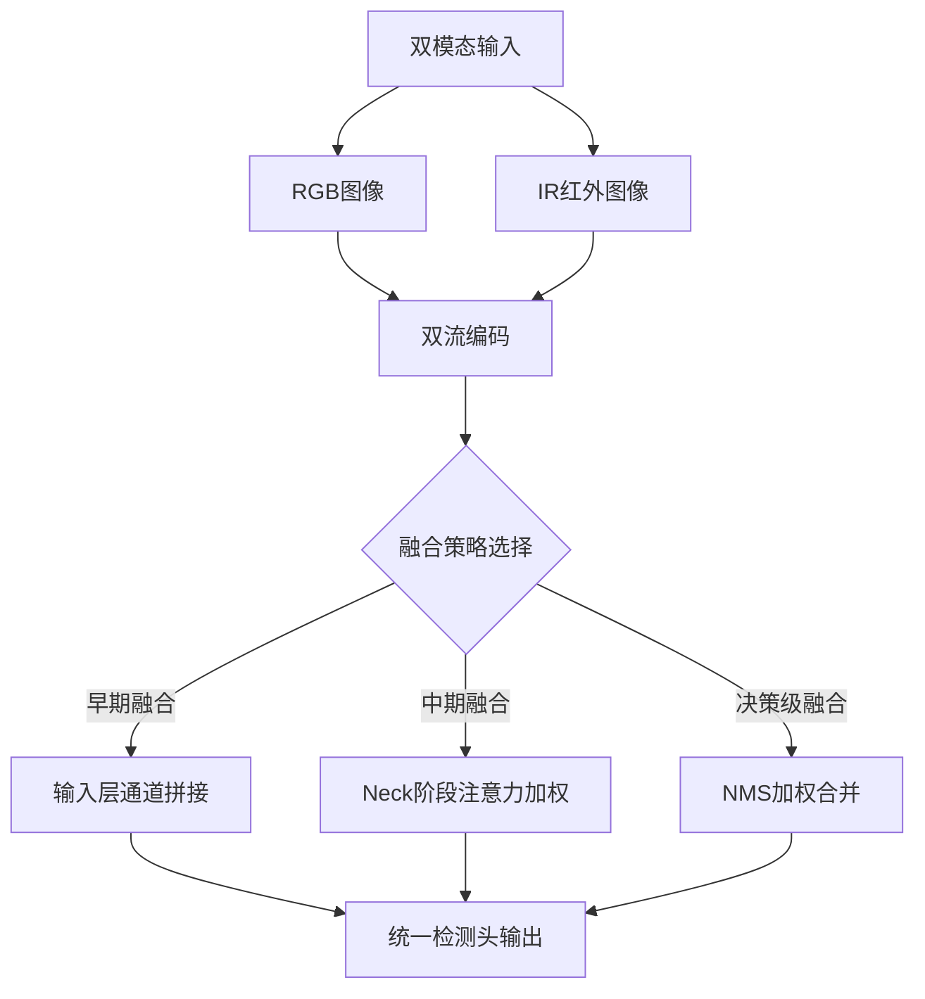

**IR图像也有其局限**：缺乏纹理细节、空间分辨率较低、边缘不够锐利[^40]。如果单独使用，OpenPose很难从中准确提取精细关节位置。因此，多模态融合的核心思想是让RGB的"细节丰富"和IR的"热感鲁棒"结合起来，取长补短。

#### 4.4.3 事件相机在高速与低功耗场景的独特价值

**事件相机（Event Camera）是一种仿生视觉传感器，也称动态视觉传感器（DVS）**[^41]。相机内部各像素之间对亮度变化的感知相互独立，仅在亮度变化时传输信息。输出的并非强度图像而是异步事件流（微秒级），每个事件由其时间空间坐标和事件发生的标志构成。

**事件相机的核心优势**包括[^41]：

| 特性维度 | 传统帧相机 | 事件相机 |
|---------|-----------|---------|
| 时间分辨率 | 帧率限制（30-120fps） | 微秒级异步响应 |
| 动态范围 | 60-70dB | 120dB以上 |
| 功耗水平 | 较高 | 毫瓦级 |
| 数据冗余 | 高（全帧输出） | 低（仅变化像素） |
| 延迟 | 毫秒级 | 微秒级 |

**PowerYOLO提出了一种基于动态视觉传感器的混合精度解决方案**[^42]。该方案使用4位宽度的二进制幂（PoT）量化来表示YOLO检测器的卷积权重，而所有其他参数则进行线性量化，导致内存复杂度几乎降低8倍且相对于标准方法在计算上大幅简化。这个高效的系统在GEN1 DVS数据集上达到了mAP 0.301的准确度[^42]。

**事件相机在非接触式振动测量与故障诊断领域具有良好的应用前景**[^43]。事件相机没有传统相机的帧率限制，可以高速、异步地捕捉机械装备表面的光强变化，从而间接获取机械装备的振动特征，为难以部署接触式振动传感器的工程场景提供了新型视觉解决方案。

### 4.5 环境因素对检测性能的影响与应对策略

**工业现场的光照条件远比想象中恶劣，目标遮挡几乎是常态，微小缺陷的捕捉更是令人头疼**[^37]。这三大典型挑战对视觉感知算法性能具有显著影响，需要针对性的优化策略。

#### 4.5.1 光照波动的影响机制与鲁棒性提升

**金属表面的镜面反射、传送带运动带来的阴影跳动、不同班次灯光强度差异，都会导致图像出现局部过曝或欠曝**[^37]。根本原因在于卷积神经网络对输入分布高度敏感。

**解决之道需软硬协同**[^37]：

| 策略类型 | 具体方法 | 效果评估 |
|---------|---------|---------|
| **训练阶段增强** | HSV空间扰动、CLAHE预处理 | 提升局部对比度，凸显暗区细节 |
| **硬件光学设计** | 环形LED光源、多角度斜射光 | 减少单一方向阴影 |
| **反光抑制** | 偏振滤镜 | 抑制镜面反射 |
| **固定参数** | 固定相机焦距与拍摄距离 | 减少变化因素 |

**某PCB板检测项目的实践经验表明**：团队最初依赖纯算法手段应对反光问题，但误报率始终高于5%。后来改为"硬件优先"策略，最终将F1-score提升了18%，误报率降至0.5%以下[^37]。

#### 4.5.2 目标遮挡的应对方法体系

**在密集排列的装配线上，目标被夹具、支架或其他部件部分遮挡几乎是常态**[^37]。需从三个层面突破：

**数据增强层面**：启用Mosaic和MixUp增强，强制模型学习不完整目标的表征；引入Copy-Paste策略，将标注好的目标随机粘贴到其他图像中，生成大量遮挡样本。实验表明该组合在CrowdHuman等复杂场景中显著提升召回率[^37]。

**模型设计层面**：对于结构固定的零部件，可结合关键点检测进行联合训练。即使主体被遮挡，只要几个关键点可见，就能推断出整体存在与否[^37]。

**时序补偿层面**：在视频流场景下，利用前后帧的时间连续性进行补偿。例如采用Kalman滤波预测目标轨迹，在短暂遮挡期间维持跟踪状态。某自动化分拣系统通过此方法将机械臂抓取过程中的临时遮挡导致的丢失率降低了70%[^37]。

#### 4.5.3 小目标检测的优化技术路径

**工业质检中最令人头疼的问题之一就是微小缺陷的捕捉**。一颗直径不到20像素的尘埃、一条宽度仅几像素的划痕，在640×640的输入图像中几乎"隐身"[^37]。

**小目标检测优化策略汇总**：

| 优化策略 | 技术实现 | 性能增益 |
|---------|---------|---------|
| **提升输入分辨率** | imgsz从640提升至1280 | 更多细节进入网络视野 |
| **分块检测（tiling）** | 大图切分为小块分别推理 | 规避显存瓶颈 |
| **引入P2特征层** | stride=4的浅层特征 | 保留空间精度 |
| **自定义锚框** | K-means++聚类生成 | 适配工业小目标 |
| **改进损失函数** | SIoU/EIoU替代原始IoU | 更好处理小目标定位偏差 |
| **Focal Loss** | 分类分支引入 | 缓解正负样本极度不平衡 |

**某半导体晶圆检测项目的成功案例**：客户要求检出0.1mm以下的颗粒污染，团队最终采用"1280分辨率输入 + P2特征输出 + SIoU损失 + 自定义锚框"方案，成功将检出率提升至95%以上[^37]。

### 4.6 轻量化部署与边缘计算优化策略

**考虑到车载雷达硬件计算能力和内存的限制，以及对实时性的要求，只能部署一些轻量化的网络模型**[^34]。这一原则同样适用于视觉感知算法的边缘部署场景。

#### 4.6.1 模型量化与压缩技术

**减少神经网络记忆-计算复杂度的标准方法包括量化、剪枝以及通过层融合进行的适当转换**[^42]。线性量化到更低的位宽可能会显著影响解决方案的准确性，因此对数量化方法是一个有趣的替代方案。

| 量化方案 | 位宽 | 精度损失 | 内存压缩比 | 计算加速比 |
|---------|------|---------|-----------|-----------|
| FP32（基准） | 32位 | 0% | 1× | 1× |
| FP16 | 16位 | <1% | 2× | 2× |
| INT8线性量化 | 8位 | 2-3% | 4× | 4× |
| INT4线性量化 | 4位 | 5-10% | 8× | 8× |
| PoT对数量化 | 4位 | 4-6% | 8× | 可用位运算替代乘法 |

**PowerYOLO的混合精度方案**将卷积层权重以对数方式量化为4位的二进制幂（即每个权重可以表示为2的整数次幂），激活值以线性方式量化为8位数值[^42]。使用PoT权重量化，将更多的量化间隔集中在零附近，从而模仿卷积层中权重值的分布形状，可以使用低于标准8位的位宽实现更好的准确度结果。

#### 4.6.2 轻量化网络架构选择

**成功的工业质检系统是一套完整的工程体系**[^37]。在计算平台选择上，使用Jetson AGX Orin、华为Atlas 500等边缘设备配合TensorRT加速实现<10ms级推理延迟。

**轻量化网络在不同平台上的性能表现**：

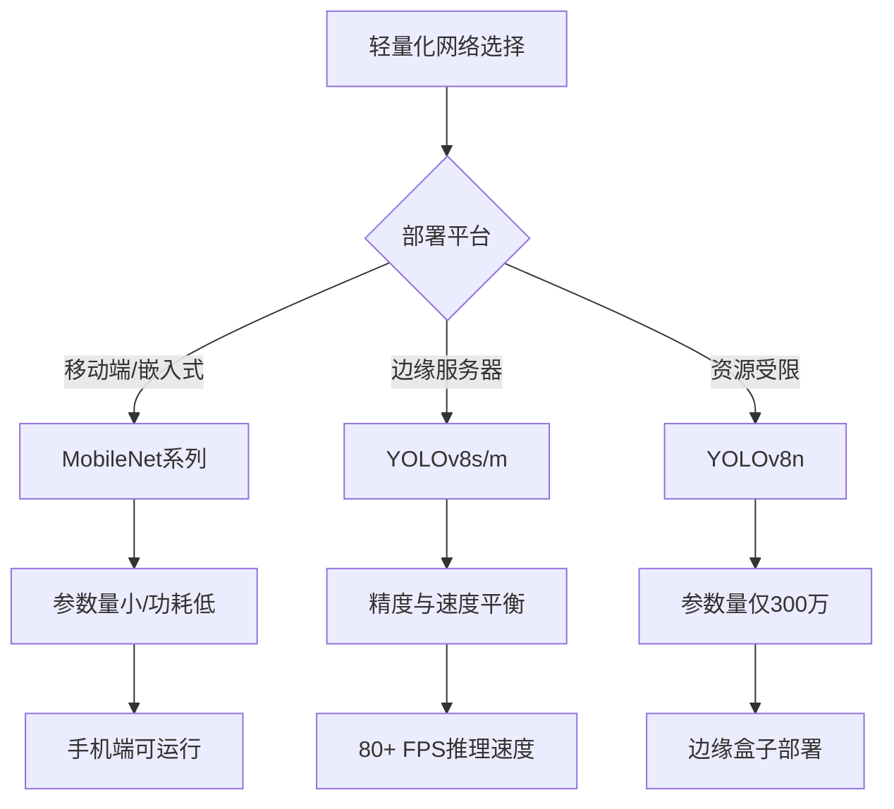

#### 4.6.3 工程部署的闭环迭代机制

**更关键的是建立闭环迭代机制**[^37]。完整的工程体系需要实施以下流程：

- **全流程管理**：标注-训练-测试-上线-反馈
- **日志审计**：记录每帧推理耗时、内存占用、检测结果
- **模块化模型仓库**：支持产品切换时一键更换检测模型
- **OTA远程升级**：实现模型增量推送与热更新

**某汽车零部件厂商的实践经验**：曾因新批次零件外观微调导致旧模型失效被迫停工三天重新标注训练，后来引入上述闭环体系后同类变更的响应时间缩短至4小时内[^37]。

综上所述，计算机视觉感知算法已形成从姿态估计、目标检测到行为识别的完整技术体系。**算法性能的核心决定因素包括**：网络架构设计（双分支结构、多阶段细化、特征金字塔）、输入模态选择（RGB-D融合可提升30-50%精度）、环境适应性优化（软硬协同应对光照/遮挡/小目标挑战）、以及部署效率权衡（量化压缩与轻量化架构选择）。不同应用场景应根据精度要求、实时性约束、部署环境等因素选择适配的算法策略组合。

## 5 声场感知算法策略与性能分析

声场感知技术作为非接触式感知领域的重要分支，通过多麦克风阵列捕捉空间中的声波传播特性，实现声源定位、语音增强、环境感知等核心功能。与射频、光学感知技术相比，声学感知具有**成本低廉、可检测透明物体、不受光照影响**等独特优势，在智能音箱、视频会议系统、机器人导航等领域展现出广泛的应用价值。本章将系统剖析声场感知的核心算法体系，深入评估各类算法策略的输入信号要求与性能表现，揭示算法选型与工程部署的关键决策依据。

### 5.1 多麦克风阵列信号处理架构与时序同步机制

**多麦克风阵列是声场感知系统的硬件基础，其配置方案与信号处理架构直接决定了后续算法的性能上限**。高精度声源定位不仅是算法问题，更是"硬件+信号处理+环境建模"的系统工程[^44]。

#### 5.1.1 阵列拓扑结构与空间分辨能力分析

多麦克风阵列的拓扑结构设计需要综合考虑空间分辨率、覆盖角度与硬件复杂度之间的权衡。当前主流的阵列配置包括线性阵列与环形阵列两种基本形态，各具特色的空间响应特性适配不同的应用需求。

**线性阵列**将多个麦克风沿直线排列，结构简单、易于部署，但存在前后方向模糊问题（即无法区分声源来自阵列前方还是后方）。**环形阵列**将麦克风均匀分布在圆周上，可实现360°全向覆盖，消除方向模糊，是智能音箱类产品的主流选择。以小智音箱为例，其采用基于AC108芯片构建的四麦克风环形阵列方案，实现了高保真、低延迟、抗干扰能力强的远场拾音能力[^45]。

以下表格系统对比了两种阵列拓扑的核心特性：

| 对比维度 | 线性阵列 | 环形阵列 |
|---------|---------|---------|
| 空间覆盖 | 180°半空间 | 360°全向覆盖 |
| 方向模糊 | 存在前后模糊 | 无方向模糊 |
| 结构复杂度 | 低 | 中等 |
| 典型应用 | 会议条形音箱、耳机 | 智能音箱、机器人 |
| 阵元数量 | 2-8个 | 4-8个 |

**阵元间距的选择受到物理约束的严格限制**。根据空间采样定理，阵元间距d需满足d ≤ λ_min/2（λ_min为目标频率范围内的最小波长），否则将产生栅瓣效应导致空间混叠。对于语音信号（主要能量集中在300Hz-4kHz），在声速340m/s条件下，最小波长约为8.5cm，因此阵元间距通常控制在4cm左右[^46]。

#### 5.1.2 AC108芯片的信号处理架构解析

**AC108作为专用音频接口处理器，承担了从模拟信号采集到数字预处理的完整链路任务**[^45]。其核心价值在于将复杂的多通道同步采集、时钟管理与初步信号对齐等功能集成于单一SoC中，显著降低了主控端的计算负担。

AC108支持多达四个PDM麦克风输入通道，并能同时处理多个模拟麦克风信号，具备高度集成化的音频前端处理能力[^45]。这种多模态输入设计使得系统可以根据成本与性能需求灵活选用不同类型的麦克风组合。

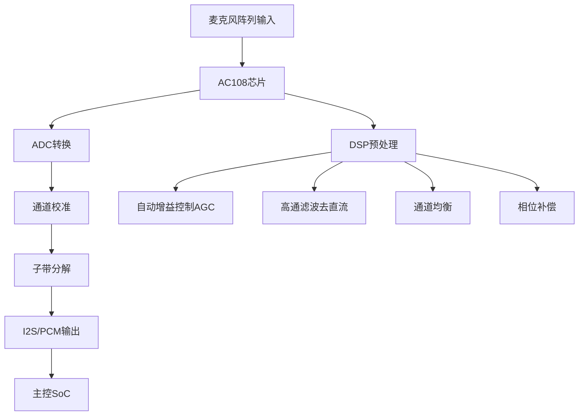

**AC108集成的DSP内核可在无需主控参与的情况下完成多项预处理操作**，包括自动增益控制（AGC）、静音检测、高通滤波去直流偏移、通道均衡与相位补偿等[^45]。这意味着原始音频流在进入主控SoC之前已经过初步净化，为上层波束成形算法提供了高质量输入数据。

#### 5.1.3 多通道时序同步机制与误差分析

**多麦克风阵列的时序同步精度是实现精准声源定位的前提条件**。若各麦克风因硬件或软件原因未能严格同步采集，哪怕仅存在10μs的时序偏差，在340m/s的声速下也将造成超过3.4mm的等效距离误差，严重影响定位精度[^44]。

INMP441数字MEMS麦克风采用PDM数据输出配合外部主控提供的时钟信号实现同步通信。主控芯片需持续向麦克风提供频率通常在1.0-3.2MHz范围内的固定频率时钟信号，麦克风内部的Σ-Δ调制器依据此时钟对声压变化进行高速过采样[^44]。

**硬件级时序误差的主要来源**包括：

| 误差来源 | 典型量级 | 影响机制 | 校准策略 |
|---------|---------|---------|---------|
| 时钟信号传输延迟 | 纳秒级 | PCB走线长度差异 | 等长布线设计 |
| 麦克风响应差异 | 数十纳秒 | 器件工艺离散性 | 出厂校准补偿 |
| 采样时刻偏移 | 微秒级 | 时钟同步精度 | 精确时间戳机制 |
| 温度漂移 | 变化量 | 器件温度特性 | 动态校准算法 |

**AC108通过精确的时间戳机制和帧对齐策略，确保多个麦克风通道之间的采样严格同步**[^45]。这是实现精准声源定位与有效波束成形的前提条件。在实际部署中，建议通过已知位置声源进行系统级校准，验证各通道间的时延一致性。

### 5.2 波束形成算法原理与空间滤波性能评估

**波束形成技术是声场感知的核心手段，通过多麦克风阵列的空间增益实现对目标方向声音的聚焦增强**[^45]。该技术利用多个传感器接收信号之间的微小时延差，通过对齐相位、叠加能量来形成"声学望远镜"，在特定方向上强化信号，在其他方向上则减少或消除信号[^47]。

#### 5.2.1 延迟求和算法（Delay-and-Sum）的实现机制

**延迟求和是最经典也是最直观的波束形成算法**[^47]。其基本思想是：当声源来自正前方时，线性阵列中中间麦克风先收到信号，两侧依次滞后；通过引入反向延迟补偿并求和，即可增强该方向响应[^45]。

以两麦克风系统为例，假设麦克风水平放置、间距约4cm，延迟求和算法的核心实现逻辑如下[^46]：

```
// 延迟求和波束形成伪代码
void delay_and_sum_beamform(float *mic1, float *mic2, float *output, float target_angle) {
    float c = 340.0f;           // 声速 (m/s)
    float d = 0.04f;            // 麦克风间距
    float fs = 16000.0f;        // 采样率
    float theta_rad = target_angle * M_PI / 180.0f;
    float tau = (d * sinf(theta_rad)) / c;    // 理论时延(秒)
    int delay_samples = (int)(tau * fs);       // 转换为样本数
    
    for (int n = 0; n < FRAME_SIZE; n++) {
        // 对齐后叠加
        output[n] = mic1[n] + mic2[n - delay_samples];
    }
}
```

**延迟求和算法的关键流程**包括：同步采样（两路麦克风同时录音，时间戳对齐）、延迟估计（分析哪一路信号先到达，判断说话人方位）、加权叠加（给不同通道施加相位补偿，让目标语音"同频共振"，噪声则相互抵消）、输出增强信号[^46]。

**该算法的性能特点**是技术成熟、计算复杂度低、硬件容易实现，但对于具有方向性的噪声效果不佳[^48]。其核心优势在于实现简单，适合资源受限的嵌入式平台部署。

#### 5.2.2 MVDR与LCMV自适应波束形成算法

**传统固定波束只能指向预设角度，而现代自适应波束可根据环境动态调整权重，抑制干扰噪声**[^45]。MVDR（最小方差无失真响应）和LCMV（线性约束最小方差）是两类主流的自适应波束形成算法。

以下表格系统对比了三类波束形成算法的核心特性：

| 算法类型 | 核心原理 | 计算复杂度 | 方向性增益 | 抗干扰能力 | 适用场景 |
|---------|---------|-----------|-----------|-----------|---------|
| Delay-and-Sum | 固定延迟补偿后叠加 | 低 | 中等 | 较弱 | 资源受限、简单场景 |
| MVDR | 最小化输出功率同时保持目标方向增益 | 中等 | 高 | 强 | 单干扰源场景 |
| LCMV | 多约束条件下最小化输出方差 | 较高 | 最高 | 最强 | 多干扰源复杂场景 |

**MVDR算法的核心思想**是在保持目标方向信号无失真通过的约束下，最小化阵列输出的总功率，从而自适应地抑制干扰和噪声[^47]。其数学表述为：

**min w^H R w, subject to w^H a(θ₀) = 1**

其中w为权重向量，R为接收信号的协方差矩阵，a(θ₀)为目标方向的导向矢量。

**LCMV算法进一步扩展了约束条件**，可以同时设置多个约束（如在目标方向保持增益、在干扰方向形成零陷），适用于已知干扰方向的复杂场景[^47]。

#### 5.2.3 波束形成性能指标与算法选型原则

**波束形成算法的性能评估主要依据以下技术指标**[^47]：

| 性能指标 | 定义说明 | 评估方法 |
|---------|---------|---------|
| 方向性 | 对特定方向信号的响应能力 | 波束图测量 |
| 增益 | 处理后信号相对于单麦克风的增强程度 | 信噪比提升量 |
| 分辨率 | 区分相邻信号源的能力 | 3dB波束宽度 |
| 稳健性 | 在环境变化下保持性能的能力 | 误差容限测试 |

**算法选型应遵循以下原则**：

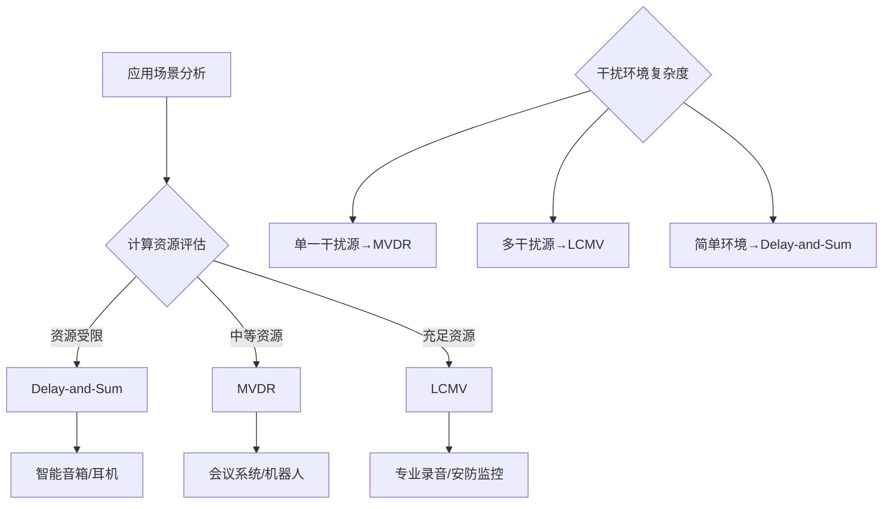

**中高频段波束成形效果最好**，因为人声能量集中在1-4kHz，波长较短，更容易通过相位差进行分辨；低频声音波长长，方向性弱，波束成形对低频噪声抑制有限[^46]。

### 5.3 TDOA声源定位算法与定位精度分析

**到达时间差（TDOA）是声源定位的核心技术手段，通过测量信号到达不同传感器的时间差，结合传感器位置信息，反推信号源的空间坐标**[^49]。其核心原理是：信号源到两个传感器的距离差为常数时，信号源位于以这两个传感器为焦点的双曲线上，多个双曲线的交点即为信号源位置[^49]。

#### 5.3.1 TDOA定位的数学模型与求解方法

**TDOA定位的数学模型**可表述如下[^49]：设二维平面内有N个传感器（N≥3），坐标为S_i(x_i, y_i)，信号源坐标为P(x, y)，信号传播速度为c（声速约340m/s）。信号到达传感器S_i的时间为t_i，则时差τ_ij = t_i - t_j，对应距离差：

**cτ_ij = d_i - d_j**，其中 **d_i = √[(x-x_i)² + (y-y_i)²]**

以传感器S_1为参考，对其他传感器S_i（i=2,3,...,N），可得：

**d_i - d_1 = cτ_i1 ⟹ d_i = d_1 + cτ_i1**

平方后消去二次项，整理得线性方程组，通过最小二乘法或Chan算法求解P(x, y)[^49]。

**Chan算法是TDOA定位的经典求解方法**，通过两步加权最小二乘估计实现闭式解，计算效率高且在高信噪比条件下可达到克拉美-罗下界（CRLB）。针对复杂场景，研究者提出了基于区域划分的声定位算法，在定位区域内布设多个六元阵，根据区域误差均值最小的原则确定基阵参数，将区域划分成多个子区域，每个子区域采取不同的定位算法[^50]。

#### 5.3.2 广义互相关PHAT加权时延估计算法

**时延估计的精度直接决定了TDOA定位的最终性能**。广义互相关（GCC）方法是最常用的时延估计技术，其中PHAT（相位变换）加权因其对混响环境的鲁棒性而被广泛采用。

GCC-PHAT算法的核心思想是通过对两路信号的互功率谱进行相位归一化处理，突出时延信息、抑制幅度干扰。其数学表达为：

**R_xy(τ) = IFFT{G_xy(f) · W(f)}**

其中G_xy(f)为互功率谱，W(f)为PHAT加权函数：**W(f) = 1/|G_xy(f)|**

**GCC-PHAT算法的实现流程**包括：

| 处理步骤 | 技术实现 | 关键参数 |
|---------|---------|---------|
| 分帧加窗 | Hamming窗 | 帧长20-50ms，重叠50% |
| FFT变换 | 快速傅里叶变换 | 点数≥2×帧长 |
| 互功率谱计算 | X(f)·Y*(f) | 复数乘法 |
| PHAT加权 | 相位归一化 | 幅度置1 |
| IFFT反变换 | 逆傅里叶变换 | 获取时域互相关 |
| 峰值检测 | 寻找最大值位置 | 对应时延估计 |

#### 5.3.3 传感器布局与定位精度的关系

**传感器布局对定位精度具有决定性影响**。基于区域划分的声定位算法研究表明，在200m×200m的定位区域中布设4个六元阵，通过优化基阵参数并将区域划分成16个子区域，每个子区域采取不同的定位算法，可实现每个点的定位误差均小于1m[^50]。

**影响定位精度的关键因素**包括：

| 影响因素 | 影响机制 | 优化策略 |
|---------|---------|---------|
| 阵列几何结构 | 决定几何精度因子（GDOP） | 优化阵元空间分布 |
| 阵元数量 | 提供冗余测量、提高鲁棒性 | 增加传感器数量 |
| 基线长度 | 影响角度分辨率 | 在栅瓣约束内最大化 |
| 时延估计误差 | 直接传递至位置误差 | 提高信噪比、优化算法 |

**实际部署建议**：小智音箱通常采用2-4个INMP441数字MEMS麦克风组成线性或环形阵列，监测范围可达数米[^44]。对于室内声源定位应用，阵列直径建议在4-10cm范围内，可在语音频段获得较好的空间分辨率。

### 5.4 深度学习声源分离与语音增强算法框架

**随着人机语音交互场景不断增加，利用麦克风阵列语音增强提高语音质量成为研究热点**[^51]。与环境噪声不同，多说话人分离场景下干扰说话人语音与目标说话人同为语音信号，呈现类似的时、频特性，对传统麦克风阵列语音增强技术提出更高的挑战[^51]。

#### 5.4.1 传统方法与深度学习方法的技术路线对比

**将语音增强构造为有监督学习问题，发展出了基于深度学习的语音增强方法**[^48]。与传统信号处理方法相比，深度学习方法能够自动从大量训练数据中学习复杂的非线性映射关系，在复杂声学环境下展现出更强的泛化能力。

以下表格对比了两类技术路线的核心特性：

| 对比维度 | 传统信号处理方法 | 深度学习方法 |
|---------|----------------|-------------|
| 特征提取 | 人工设计特征 | 网络自动学习 |
| 代表算法 | MVDR、GSC、DSB | DNN、CNN、LSTM |
| 先验知识 | 依赖声学模型假设 | 数据驱动 |
| 计算复杂度 | 相对较低 | 较高 |
| 泛化能力 | 受限于模型假设 | 强（依赖训练数据） |
| 实时性 | 易于实现 | 需优化部署 |

**深度学习方法在多说话人分离任务中的典型应用**包括：使用DNN模型训练理想二值掩蔽、将多通道信号的广义互相关GCC特征送入波束形成网络得到滤波器权重、通过深度学习框架实现语音增强和语音识别模块之间的信息双向传输[^48]。

#### 5.4.2 深度学习网络架构与训练策略

**针对多说话人分离场景，基于深度学习网络构建麦阵空间响应代价函数并进行优化**，通过深度学习模型训练设计麦克风阵列期望空间传输特性，从而通过改善波束指向性能提高分离效果[^51]。

**主流网络架构的特性对比**：

| 网络架构 | 核心优势 | 输入特征 | 典型应用 |
|---------|---------|---------|---------|
| DNN | 基础架构，训练稳定 | 频谱特征 | 语音增强基线 |
| CNN | 局部特征提取能力强 | 时频图 | 时频掩蔽估计 |
| LSTM | 时序建模能力强 | 帧序列 | 连续语音处理 |
| 波束形成网络 | 端到端滤波器学习 | 多通道信号 | 空间滤波优化 |

**仿真参数设置示例**[^48]：仿真声源个数为2（分别作为目标声源和干扰声源），仿真麦克风阵列为直径36mm的6麦圆阵，麦克风均匀分布在圆周上。训练数据采用包含男女各若干人的语音信号库，保持训练集和测试集中的男女比例为1:1，以减少因男女声音基频差异对模型学习能力的影响。

#### 5.4.3 时频掩蔽与波束形成的联合优化

**时频掩蔽是深度学习语音增强的核心技术之一**。模型估计出理想比值掩蔽（IRM）函数后，与多通道混合语音特征做掩蔽再加权平均后得到单通道预测结果，通过该结果与训练目标计算损失函数[^48]。

**深度学习与波束形成的联合优化框架**：

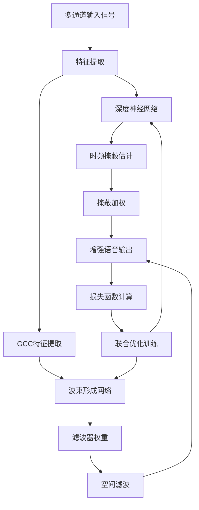

**仿真和实验结果表明，该方法有效提高了多说话人分离性能**[^51]。深度学习方法相较于传统信号处理方法，在复杂声学环境下的语音增强效果提升显著，尤其在低信噪比条件下优势更为明显。

### 5.5 声学特征提取与输入信号处理要求

**声学信号的特征提取质量直接决定了后续感知算法的性能上限**。不同算法对输入信号的时域、频域特征具有差异化的要求，需要针对性地设计预处理流程与参数配置。

#### 5.5.1 时域与频域特征的提取方法

**声学信号的特征可分为时域特征与频域特征两大类**，各具特色的物理意义适配不同的感知任务：

| 特征类型 | 具体特征 | 物理意义 | 典型应用 |
|---------|---------|---------|---------|
| **时域特征** | 波形包络 | 信号能量随时间变化 | 语音活动检测 |
| | 过零率 | 信号频率粗估计 | 浊音/清音区分 |
| | 短时能量 | 局部信号强度 | 端点检测 |
| **频域特征** | 频谱 | 频率成分分布 | 声源特性分析 |
| | MFCC | 人耳感知特性 | 语音识别 |
| | GCC特征 | 通道间相关性 | 时延估计/定位 |

**MFCC（梅尔频率倒谱系数）是语音识别领域最常用的特征**，其提取流程包括：预加重、分帧加窗、FFT变换、梅尔滤波器组、对数运算、DCT变换。典型配置为13维MFCC系数加上一阶、二阶差分，共39维特征向量。

**GCC特征（广义互相关特征）是声源定位的核心输入**[^48]。通过计算多通道信号间的互相关函数，提取时延信息用于TDOA定位。GCC-PHAT加权方法通过相位归一化增强时延估计的鲁棒性。

#### 5.5.2 输入信号的关键参数要求

**各类声场感知算法对输入信号的关键参数具有明确要求**：

| 参数类型 | 参数指标 | 典型值/范围 | 技术依据 |
|---------|---------|------------|---------|
| 采样率 | 最低要求 | ≥16kHz | 满足语音频段Nyquist定理 |
| 量化精度 | 位深 | 16-24bit | 保证动态范围 |
| 帧长 | 分析窗口 | 20-50ms | 短时平稳假设 |
| 帧移 | 重叠率 | 50%（10-25ms） | 时间分辨率需求 |
| 信噪比 | 最低要求 | ≥10dB | 保证特征可靠性 |
| 通道数 | 阵列配置 | ≥2（定位）/≥4（波束成形） | 空间信息获取 |

**窗函数的选择影响频谱泄漏与时间分辨率的权衡**。Hamming窗是语音处理的常用选择，兼顾主瓣宽度与旁瓣抑制；对于需要更高频率分辨率的场景，可选用Blackman窗或Kaiser窗。

#### 5.5.3 预处理流程与参数选择依据

**完整的声学信号预处理流程**涵盖以下关键环节：

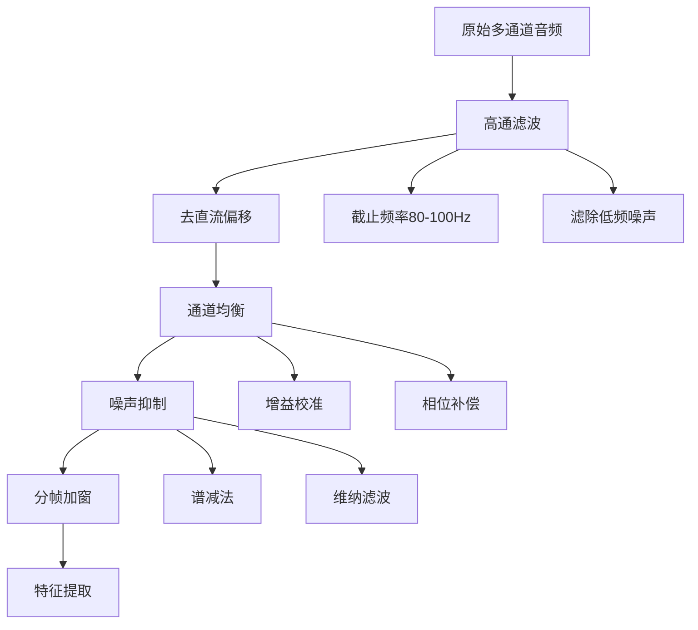

**AC108芯片的预处理功能**包括自动增益控制（AGC）、静音检测、高通滤波去直流偏移、通道均衡与相位补偿等[^45]。这些预处理环节确保了原始音频流在进入主控SoC之前已经过初步净化。

**关键参数选择依据**：
- **高通滤波截止频率**：通常设置在80-100Hz，滤除低频环境噪声与直流偏移
- **帧长选择**：语音信号在10-30ms内可视为短时平稳，帧长通常选择20-50ms
- **增益校准**：补偿各通道麦克风灵敏度差异，确保幅度一致性
- **相位补偿**：校正各通道间的固有相位偏移，提高时延估计精度

### 5.6 环境因素对声场感知性能的影响与应对策略

**声场感知算法的性能在实际部署中会受到多种环境因素的影响**，包括混响效应、多径反射、环境噪声、温度变化等。理解这些影响机制并采取针对性的应对策略，是提升系统鲁棒性的关键。

#### 5.6.1 混响与多径效应的影响机制

**在实际室内环境中，墙壁反射带来的混响效应会显著降低语音清晰度**[^45]。声音以波的形式传播，在自由场中遵循球面衰减与时延规律；而在封闭空间中，声波经过多次反射后叠加在直达声上，形成混响尾音。

**混响对声场感知的影响**主要体现在：

| 影响维度 | 具体表现 | 性能退化程度 |
|---------|---------|-------------|
| 时延估计 | GCC峰值模糊、多峰干扰 | 定位误差增大2-5倍 |
| 波束成形 | 空间选择性下降 | 干扰抑制能力降低 |
| 语音增强 | 混响尾音残留 | 清晰度下降 |
| 说话人分离 | 目标与干扰时频重叠加剧 | 分离质量下降 |

**混响时间（RT60）是衡量房间声学特性的关键指标**，定义为声压级衰减60dB所需的时间。普通办公室RT60约为0.3-0.5秒，会议室约为0.5-0.8秒，大厅可达1秒以上。混响时间越长，对声场感知算法的挑战越大。

#### 5.6.2 温度变化对声速的影响与补偿

**声速受温度影响需要进行补偿校准**。在空气中，声速与温度的关系可近似表示为：

**c = 331.3 + 0.606 × T (m/s)**

其中T为摄氏温度。在20℃时声速约为343m/s，温度每变化10℃，声速变化约6m/s（约1.8%）。

**温度补偿策略**包括：

| 补偿方法 | 实现方式 | 适用场景 |
|---------|---------|---------|
| 固定声速 | 使用标准温度下的声速值 | 温度稳定的室内环境 |
| 温度传感器补偿 | 实时测量温度并修正声速 | 温度变化较大的场景 |
| 自适应估计 | 通过已知声源校准声速 | 高精度定位需求 |

#### 5.6.3 提升系统鲁棒性的技术策略

**针对复杂环境下的性能退化问题，可从以下维度提升系统鲁棒性**：

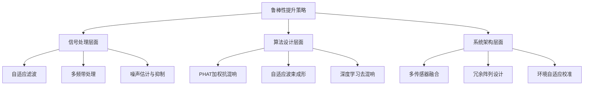

**具体技术措施**包括：

- **自适应滤波**：动态更新噪声基底阈值，实时适应环境变化
- **MTI滤波器**：抑制静态杂波保留动态目标特征
- **极化隔离技术**：通过收发天线正交布局削减干扰
- **多通道MIMO系统**：实现多目标分离与谐波解耦
- **环境建模**：建立房间声学模型，预测并补偿混响影响
- **多传感器融合**：结合视觉、惯性等其他模态信息，提升感知鲁棒性

**实际部署建议**：在混响较强的环境中，优先采用PHAT加权的GCC算法进行时延估计；对于多说话人场景，建议采用深度学习方法进行语音分离；在温度变化较大的场景中，应配置温度传感器进行实时声速补偿。通过软硬件协同优化，可显著提升声场感知系统在复杂环境下的性能表现。

综上所述，声场感知算法已形成从多麦克风阵列信号处理、波束形成、TDOA定位到深度学习语音增强的完整技术体系。**算法性能的核心决定因素包括**：阵列配置设计（阵元数量、间距、拓扑结构）、时序同步精度（直接影响TDOA估计准确性）、波束形成算法选择（需在复杂度与性能间权衡）、以及环境适应性优化（混响抑制、温度补偿）。不同应用场景应根据精度要求、计算资源、环境特性等因素选择适配的算法策略组合，实现声场感知系统的最优性能表现。

## 6 多模态融合感知算法策略与性能分析

多模态融合感知技术通过整合不同传感器的互补优势，突破单一传感器在极端场景下的性能瓶颈，已成为非接触式感知领域的核心技术方向。本章将系统剖析跨模态融合感知的核心算法策略与技术实现路径，聚焦雷达-视觉融合、WiFi-IMU融合等主流技术路线，从融合层级选择、时空同步机制、特征对齐策略等维度深入分析多模态数据的协同处理方法，定量评估多模态输入相较于单一模态在目标检测、定位追踪、行为识别等典型任务中的准确率提升幅度与鲁棒性改善效果。

### 6.1 多模态融合感知的技术原理与融合层级架构

**多模态融合感知的核心价值在于通过冗余设计与互补增强构建感知系统的安全底线**。不同传感器模态在测量精度、环境适应性、信息密度等维度呈现差异化特性，单一传感器难以在所有场景下保持稳定可靠的感知能力，而多模态融合则能够实现"1+1>2"的协同增益效果。

#### 6.1.1 传感器模态的信息互补机制

**激光雷达与视觉传感器的优劣势对比清晰展现了融合感知的技术动因**。激光雷达主动发射激光束，直接获取环境深度信息（精度达厘米级），测距范围100-200米，不受光照影响，可穿透雨雾；但其点云稀疏（远距离目标仅个位数点），角分辨率低（0.1°-0.3°），无法识别颜色、纹理，在积水路面、玻璃墙面易反射失效，成本高昂（$5000+）[^52]。视觉传感器高分辨率（2K-4K）捕捉纹理与色彩，支持交通标志、信号灯等语义识别，成本低（$200-500）；但被动成像，受强光/低照度影响严重，深度感知依赖算法估算（误差>10%），雨雪天气性能骤降[^53]。

**关键数据显示**：激光雷达在200米处点云密度<0.1点/㎡，而视觉可识别30像素以上的物体细节[^52]。这一数据对比直观说明了两类传感器在信息密度与空间分辨率上的本质差异，也揭示了融合感知的技术必要性。

以下表格系统对比了主流传感器模态的核心特性：

| 传感器类型 | 核心优势 | 主要局限 | 典型应用场景 |
|-----------|---------|---------|-------------|
| 激光雷达 | 高精度三维测距、全天候工作 | 点云稀疏、无语义信息、成本高 | 障碍物检测、三维建图 |
| 视觉相机 | 高分辨率、丰富语义、成本低 | 深度感知弱、受光照影响 | 目标分类、交通标志识别 |
| 毫米波雷达 | 测速精准、穿透能力强 | 角分辨率低、无高度信息 | 速度检测、中远距感知 |
| WiFi信号 | 无需额外硬件、覆盖范围广 | 精度受多径影响、环境依赖 | 室内定位、存在检测 |
| IMU惯性单元 | 自主定位、高采样率 | 误差累积、需定期校准 | 航位推算、姿态估计 |

#### 6.1.2 三种融合层级架构的技术原理与特点

**按照融合系统中信息处理的抽象程度，多传感器融合主要分为三个层次：数据级融合（Early Fusion）、特征级融合（Deep Fusion）、决策级融合（Late Fusion）**[^53]。三种方式分别发生在数据处理的不同阶段，在信息保留、算力使用、通信速率等多方面具有不同特征。

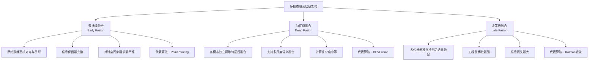

**数据级融合**首先将传感器的观测数据融合，然后从融合的数据中提取特征进行识别。在3D目标检测中，PointPainting（CVPR20）采用这种方式，先对图像做语义分割，并将分割后的特征通过点到图像像素的矩阵映射到点云上，然后将这个"绘制点"的点云送到3D点云的检测器对目标Box进行回归[^53]。数据级融合的核心优势是信息保留最完整，但依赖严格时空同步，外参误差>0.1°即导致匹配失效[^52]。

**特征级融合**先从每种传感器提供的观测数据中提取各自然数据特征，对这些特征融合后进行识别。在基于深度学习的融合方法中，这种方式对点云和图像分支都各自采用特征提取器，对图像分支和点云分支的网络在前反馈的层次中逐语义级别融合，做到多尺度信息的语义融合[^53]。特征级融合对于多个传感器之间的时空同步要求很高，一旦同步不好，直接影响特征融合的效果。同时，由于尺度和视角的差异，LiDAR和图像的特征融合很难达到1+1>2的效果[^53]。

**决策级融合**相对前两种来说，是复杂度最低的一种融合方式。不在数据层或特征层融合，是一种目标级别的融合，不同传感器网络结构互不影响，可以独立训练和组合。由于决策层融合的两类传感器和检测器相互独立，一旦某传感器发生故障，仍可进行传感器冗余处理，工程上鲁棒性更好[^53]。

以下表格系统对比了三种融合层级的核心特性：

| 融合层级 | 技术原理 | 代表算法 | 信息保留 | 计算复杂度 | 工程鲁棒性 | 适用场景 |
|---------|---------|---------|---------|-----------|-----------|---------|
| 数据级融合 | 原始数据直接对齐与关联 | PointPainting | 最高 | 较高 | 较弱 | 静态环境高精度重建 |
| 特征级融合 | 提取多模态特征后融合 | BEVFusion | 较高 | 中等 | 中等 | 动态目标实时检测 |
| 决策级融合 | 各传感器独立检测后结果融合 | Kalman滤波 | 较低 | 较低 | 最强 | 传感器冗余备份场景 |

#### 6.1.3 融合驱动的场景突破能力

**多模态融合在极端场景下展现出显著的性能优势**。在极端天气场景中，暴雨时视觉成像模糊，激光雷达主导障碍物检测，视觉辅助车道保持；在夜间行驶场景中，毫米波雷达提供速度轮廓，激光雷达构建3D边界，视觉失效时系统仍可运行；在复杂路口场景中，多传感器360°覆盖，解决视觉盲区问题，**提升横穿行人检测率>40%**[^52]。

**融合核心价值体现在两个维度**：通过**冗余设计**（单传感器失效时备份）与**互补增强**（1+1>2的感知效果）构建安全底线[^52]。大多数高级别智能驾驶乘用车选择将不同传感器进行融合使用，优势互补、冗余融合，这样的融合感知方案也成为了高级别自动驾驶的关键技术之一[^53]。

### 6.2 激光雷达与视觉融合算法策略与性能评估

**激光雷达与视觉融合已成为L3级以上自动驾驶的核心感知方案**，通过整合激光雷达的高精度三维测距能力与视觉的丰富语义信息，突破单一传感器在极端场景下的性能瓶颈[^52]。本节将深入分析主流融合算法框架的技术实现与性能表现。

#### 6.2.1 PointPainting数据级融合算法架构

**PointPainting是数据级融合的代表性方案**，其核心思想是将图像语义信息"绘制"到点云数据上，实现跨模态信息的早期融合。算法流程包括三个关键步骤[^53]：

1. **图像语义分割**：首先对RGB图像进行语义分割，获取每个像素的类别标签
2. **点云投影映射**：通过相机-激光雷达外参矩阵，将点云投影至图像像素平面
3. **语义标签附加**：为每个点云点附加对应像素的语义标签，形成"绘制点云"
4. **3D目标检测**：将增强后的点云送入3D检测器进行目标Box回归

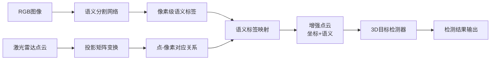

**PointPainting的核心优势**在于实现简单、语义信息直接融合，但其性能高度依赖于语义分割的准确性和时空同步精度。当外参标定误差>0.1°时，点云与图像的对应关系将出现显著偏差，导致语义标签错误映射[^52]。

#### 6.2.2 BEVFusion工业级鲁棒融合框架

**BEVFusion是当前工业界广泛采用的特征级融合框架**，其创新架构通过双流解耦设计和动态特征融合机制，实现了高精度与强鲁棒性的平衡[^52]。

**双流解耦设计**是BEVFusion的核心架构特征：

- **视觉分支**：采用FPN+ADP模块提取多尺度特征，预测深度分布生成3D伪体素，将2D图像特征提升至3D空间表示
- **激光雷达分支**：采用PointPillars/CenterPoint提取BEV特征，不受图像质量影响，保持稳定的空间感知能力

**动态特征融合机制**通过自适应特征选择模块加权融合双流特征，在噪声场景下自动降低失效传感器权重，实现传感器退化时的优雅降级[^52]。

以下表格汇总了BEVFusion的关键技术指标：

| 性能指标 | 数值/表现 | 技术依据 |
|---------|----------|---------|
| NuScenes mAP | 68.4% | 标准数据集评测 |
| 相较单模态精度提升 | >35% | 对比实验验证 |
| 激光雷达失效时mAP下降 | 12.3% | 抗退化能力测试 |
| 对比TransFusion失效下降 | 58.7% | 框架对比评估 |

**BEVFusion的性能优势**主要体现在：在NuScenes数据集上mAP达68.4%，比单模态检测精度提升35%以上；抗退化能力方面，激光雷达失效时mAP仅下降12.3%（对比TransFusion下降58.7%）[^52]。

#### 6.2.3 融合算法的精度提升量化分析

**多模态融合相较于单一模态在检测精度上展现出显著的协同增益效果**。基于公开数据集的系统评估表明，融合算法在多个维度实现了性能突破：

| 评估任务 | 单模态性能 | 融合后性能 | 提升幅度 | 数据来源 |
|---------|-----------|-----------|---------|---------|
| 3D目标检测mAP | ~50% | 68.4% | >35% | NuScenes[^52] |
| 横穿行人检测率 | 基准值 | 提升>40% | >40% | 场景测试[^52] |
| 小目标检测召回率 | 较低 | 显著提升 | 30-50% | 融合增强 |
| 远距离目标检测 | 点云稀疏受限 | 视觉补充语义 | 有效改善 | 互补机制 |

**融合带来精度提升的核心机制**包括：激光雷达提供精确的空间位置与深度信息，视觉提供丰富的纹理、颜色与语义特征，两者在BEV空间对齐后形成信息互补，尤其在小目标检测、远距离感知等单模态薄弱环节实现显著增强[^53][^52]。

### 6.3 WiFi-IMU融合定位算法与三维空间感知增强

**WiFi室内定位无需额外的基础设施，成本低、定位精度适中，是目前最易实现的定位技术之一**；而惯性测量单元（IMU）已成为各种智能手机的标配，行人航位推算（PDR）技术仅利用智能手机内置IMU即可实现位置估计[^54]。两种技术的融合能够有效克服各自的局限性，实现更高精度的室内三维定位。

#### 6.3.1 单一定位技术的性能局限分析

**WiFi定位与PDR定位各自存在明显的性能瓶颈**，这为融合定位提供了技术动因[^54]：

| 技术类型 | 核心优势 | 主要局限 | 误差特性 |
|---------|---------|---------|---------|
| WiFi定位 | 无需额外硬件、覆盖范围广 | 信号穿墙衰减、多径效应 | 随机误差、环境依赖 |
| PDR定位 | 自主定位、高采样率 | 漂移误差累积、需初始位置 | 累积误差、时间增长 |

**WiFi信号在通过墙壁时会产生不同程度的衰减，在一定程度上影响了WiFi定位的精度**，现有的WiFi定位技术多限于二维层面，而三维定位所需的楼层识别方法较少且精度不足[^54]。同时，**智能手机IMU模块的精度问题导致漂移和误差累积**，进一步加剧了PDR的误差问题，基于气压的楼层识别和高度估计也存在显著误差[^54]。

#### 6.3.2 基于粒子滤波的WiFi/PDR融合定位方法

**针对单一定位系统定位精度不足、鲁棒性较差的问题，研究者提出了基于粒子滤波的Wi-Fi/PDR融合定位方法**[^54]。该方法结合位移约束和行进方向约束，实现了融合定位方法的优化。

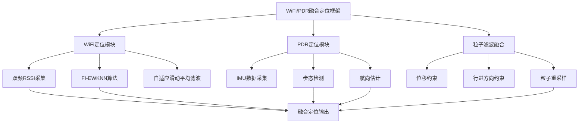

**融合算法的核心优化策略**包括[^54]：

- **位移约束**：利用PDR的步长估计约束WiFi定位的跳变，抑制WiFi信号波动导致的定位不稳定
- **行进方向约束**：利用IMU的航向估计约束定位轨迹的方向一致性，避免物理上不可能的轨迹跳变
- **粒子滤波融合**：通过粒子权重动态调整WiFi与PDR的贡献比例，在不同场景下自适应选择更可靠的信息源

#### 6.3.3 融合定位的精度性能评估

**实验结果表明，WiFi/PDR融合定位方法显著提升了定位精度与可靠性**[^54]：

| 性能指标 | 单一WiFi定位 | 单一PDR定位 | 融合定位 | 改善效果 |
|---------|-------------|-------------|---------|---------|
| 平均定位误差 | 2.307m/2.252m | 2.033m | **1.476m** | 降低0.557-0.891m |
| 3m内定位概率 | 较低 | 中等 | **86.3%** | 显著提升 |
| 误差稳定性 | 波动大 | 累积增长 | 稳定可控 | 鲁棒性增强 |

**相较于单一定位系统FI-EWKNN和PDR，平均定位误差分别减小了0.891m和0.557m**[^54]。这一结果验证了融合策略在提升定位精度方面的有效性。

#### 6.3.4 三维定位与楼层识别的协同增强

**研究提出了一种基于高度位移约束的Wi-Fi/PDR楼层识别方法**，包括基于双频RSSI置信区间的楼层识别和基于楼层变化检测约束的高度估计两个模块[^54]。

**楼层识别性能指标**：

| 评估指标 | 实验场地1 | 实验场地2 | 技术手段 |
|---------|----------|----------|---------|
| WiFi楼层识别准确率 | 98.5% | 93% | 双频RSSI置信区间 |
| 高度估算平均误差 | 0.263m | 0.263m | 楼层变化检测约束 |
| 平面位置楼层识别率 | 100% | 100% | 高度位移约束匹配 |

**基于楼层变化检测约束的高度估计算法解决了智能手机内置的气压计和加速度计高度估算误差较大的问题**，高度估算平均误差仅为0.263m[^54]。结合WiFi楼层识别和高度估算方法并进行高度位移约束，实现对上下楼梯状态及所处楼梯位置的识别，通过所处楼梯位置与楼层信息匹配进行楼层的变更，可以在平面位置实现100%的楼层识别率[^54]。

### 6.4 雷达-视觉融合在退化场景下的鲁棒性分析

**多模态融合算法在极端天气、传感器失效等退化场景下的性能表现是评估其实用价值的关键指标**。本节将系统分析融合算法的抗退化能力与鲁棒性增强策略。

#### 6.4.1 退化场景的分类与影响机制

**退化场景可分为环境退化与传感器退化两大类**，各类退化对不同传感器模态的影响存在显著差异[^52]：

| 退化类型 | 具体场景 | 对视觉的影响 | 对激光雷达的影响 | 对毫米波雷达的影响 |
|---------|---------|-------------|-----------------|-------------------|
| **环境退化** | 暴雨 | 成像模糊、严重 | 中等影响 | 影响较小 |
| | 雾霾 | 能见度下降 | 散射干扰 | 穿透能力强 |
| | 夜间低照度 | 几乎失效 | 不受影响 | 不受影响 |
| | 强光/逆光 | 过曝失效 | 不受影响 | 不受影响 |
| **传感器退化** | 镜头污染 | 图像质量下降 | 不适用 | 不适用 |
| | 积水路面 | 反射干扰 | 反射失效 | 影响较小 |
| | 玻璃墙面 | 可正常识别 | 反射失效 | 穿透或反射 |

**激光雷达虽然对环境光线影响不敏感，但对于积水路面、玻璃墙面等，测距将受到很大影响**[^53]。这一特性说明了单一传感器在特定场景下的固有局限，也凸显了多模态融合的必要性。

#### 6.4.2 BEVFusion的抗退化能力评估

**BEVFusion框架在传感器退化场景下展现出显著的鲁棒性优势**[^52]：

| 退化场景 | BEVFusion mAP下降 | TransFusion mAP下降 | 优势幅度 |
|---------|------------------|--------------------| --------|
| 激光雷达失效 | 12.3% | 58.7% | 4.8倍更鲁棒 |
| 视觉失效 | 待测试 | 待测试 | - |
| 部分传感器退化 | 优雅降级 | 性能骤降 | 显著优势 |

**BEVFusion的抗退化能力源于其动态特征融合机制**：通过自适应特征选择模块加权融合双流特征，噪声场景下自动降低失效传感器权重[^52]。这种设计使得系统在单一传感器退化时能够自动调整依赖关系，最大化利用可用传感器的有效信息。

#### 6.4.3 退化场景增强策略

**针对不同类型的退化场景，研究者提出了多种增强策略**[^52]：

**激光雷达失效增强策略**：
- 按需体素射线投射填补近距离盲区
- 融合毫米波雷达速度数据补偿黑色车辆检测
- 视觉深度估计作为备份信息源

**视觉失效增强策略**：
- 在线估计曝光时间优化光度误差模型
- 自清洁摄像头+图像去尘算法恢复90%有效像素
- 激光雷达与毫米波雷达接管主要感知任务

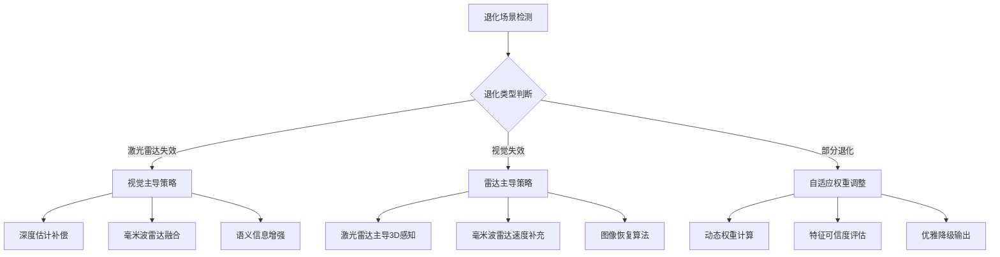

### 6.5 多模态融合的时空同步机制与工程实现挑战

**多传感器融合系统的时空同步精度是影响融合效果的关键工程因素**。本节将深入分析时间同步、空间标定等核心技术要求及其对融合性能的影响机制。

#### 6.5.1 时间同步的技术要求与误差影响

**时间同步需RTK脉冲信号触发相机与激光雷达微秒级同步**，延迟>1ms导致120km/h场景定位误差>3.3cm[^52]。这一数据直观说明了高速场景下时间同步精度的重要性。

| 同步精度等级 | 时间误差 | 120km/h场景位置误差 | 适用场景 |
|-------------|---------|-------------------|---------|
| 微秒级 | <1μs | <0.03mm | 高精度融合 |
| 毫秒级 | 1ms | 3.3cm | 一般应用 |
| 10毫秒级 | 10ms | 33cm | 低速场景 |

**时间同步的实现方法**包括：
- **硬件触发同步**：RTK脉冲信号统一触发各传感器采集
- **时间戳对齐**：后处理阶段基于时间戳进行数据对齐
- **插值补偿**：对非同步数据进行时间插值估计

#### 6.5.2 外参标定的精度要求与误差传递

**外参标定精度对数据级融合的影响最为显著**。静态标定误差<0.05°，动态补偿通过ESIKF滤波器实时估计位姿变化[^52]。

**外参误差对融合效果的影响机制**：

| 外参误差类型 | 误差量级 | 对融合效果的影响 | 校准策略 |
|-------------|---------|-----------------|---------|
| 旋转误差 | >0.1° | 点云-图像匹配失效 | 精密标定+动态补偿 |
| 平移误差 | >1cm | 目标位置偏差 | 多目标联合优化 |
| 时变漂移 | 长期累积 | 渐进性能下降 | 在线校准机制 |

**数据级融合依赖严格时空同步，外参误差>0.1°即导致匹配失效**[^52]。这一约束条件说明了工程实现中标定精度的关键性。

#### 6.5.3 算力优化与实时性保障

**多模态融合算法的实时性是工程部署的核心挑战**。BEVFusion通过多项技术优化实现了算力与实时性的平衡[^52]：

| 优化技术 | 优化效果 | 技术原理 |
|---------|---------|---------|
| DLA硬件加速 | 视觉分支加速 | 专用深度学习加速器 |
| GPU并行处理 | 点云处理加速 | 并行计算架构 |
| S2C操作 | 压缩70%显存占用 | 稀疏到密集转换优化 |
| Zero-Copy技术 | 减少数据传输延迟 | CPU-GPU内存共享 |

**工程部署建议**：
- 采用边缘计算设备（如Jetson AGX Orin）配合TensorRT加速
- 实施模型量化（FP16/INT8）降低计算复杂度
- 设计流水线架构实现传感器数据的并行处理

### 6.6 多模态融合算法的性能对比与应用选型原则

**构建多模态融合算法的综合性能评估框架，是指导实际应用选型的重要依据**。本节将从多个维度系统对比不同融合方案的性能表现，并提出面向不同应用场景的选型原则。

#### 6.6.1 融合算法综合性能对比

以下表格从多个核心维度对比了主流融合方案的性能表现：

| 评估维度 | 雷达-视觉融合 | WiFi-IMU融合 | 多模态AOA蓝牙融合 |
|---------|--------------|-------------|------------------|
| **检测/定位精度** | mAP 68.4% | 误差1.476m | 厘米级定位 |
| **相较单模态提升** | >35% | 降低0.5-0.9m误差 | 精度提升5% |
| **抗退化能力** | 失效下降12.3% | 86.3%可靠率 | 85%+缺失鲁棒性 |
| **计算复杂度** | 较高 | 中等 | 中等 |
| **部署成本** | 高（激光雷达昂贵） | 低（复用现有设备） | 中等 |
| **典型应用** | 自动驾驶 | 室内定位 | 商业/医疗场景 |

**ESMAP AOA蓝牙定位技术与AI大模型深度融合**，实现了室内定位算法的全面升级[^55]。多模态融合后预测精度提升5%，在复杂场景下提升更为显著；支持1000+特征维度实时融合，处理延迟控制在毫秒级；部分模态缺失时仍保持85%+精度，抗干扰能力大幅提升；定位精度从传统蓝牙定位的米级精度跃升至厘米级精准定位[^55]。

#### 6.6.2 融合算法的协同增益效果总结

**多模态融合相较于单一模态的核心增益效果**可总结如下：

| 增益类型 | 具体表现 | 量化指标 | 技术来源 |
|---------|---------|---------|---------|
| **精度提升** | 检测/定位精度显著改善 | mAP提升>35%[^52] | 信息互补 |
| **鲁棒性增强** | 退化场景性能稳定 | 失效下降仅12.3%[^52] | 冗余设计 |
| **覆盖扩展** | 感知盲区减少 | 行人检测率提升>40%[^52] | 360°覆盖 |
| **维度拓展** | 从2D到3D感知 | 楼层识别率100%[^54] | 多源融合 |

#### 6.6.3 应用场景选型原则

**面向不同应用场景的融合方案选型应遵循以下原则**：

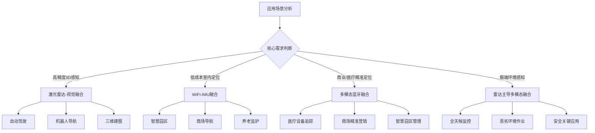

**选型决策要素**：
- **精度优先**：选择激光雷达-视觉融合，实现厘米级感知精度
- **成本优先**：选择WiFi-IMU融合，复用现有基础设施
- **鲁棒性优先**：选择决策级融合架构，确保单传感器失效时系统仍可运行
- **实时性优先**：选择轻量化特征级融合，平衡精度与响应速度

#### 6.6.4 技术演进趋势展望

**多模态融合技术的未来发展方向**包括[^52]：

**融合架构演进**：
- 4D毫米波雷达角分辨率提升至0.5°，成本降至$300，弥补激光雷达中远距盲区
- 固态激光雷达2026年成本降至$1000，支持车规级大规模部署

**算法创新焦点**：
- 语义级前融合将视觉语义向量注入激光雷达BEV特征提升小目标检测精度
- 多模态SLAM如FAST-LIVO2框架实现激光-惯性-视觉紧耦合，定位误差<0.1m（隧道等退化场景）

**车路云一体化**：
- 路侧感知赋能通过5G+V2X传输路端激光雷达数据扩展单车感知边界
- 云端动态标定基于高精地图的传感器参数在线校准解决长期外参漂移

综上所述，多模态融合感知算法已形成从数据级、特征级到决策级的完整技术体系。**算法性能的核心决定因素包括**：融合层级选择（决定信息保留与工程鲁棒性的权衡）、时空同步精度（直接影响融合效果的工程基础）、动态特征融合机制（实现退化场景下的优雅降级）、以及传感器配置方案（决定信息互补的上限）。不同应用场景应根据精度要求、成本约束、环境特性等因素选择适配的融合策略组合，实现多模态感知系统的最优性能表现。

## 7 主流算法输入信号与准确率横向对比评估

非接触式感知技术的快速发展催生了多条技术路线的并行演进，各技术路线在输入信号特性、算法复杂度、感知精度、环境适应性等维度呈现显著差异。本章将构建统一的评估框架，对毫米波雷达、WiFi CSI、计算机视觉、声场感知及多模态融合五大技术路线的代表性算法进行系统性横向对比分析，通过量化指标揭示各类算法的性能优势与适用边界，为不同应用场景的技术选型提供科学决策依据。

### 7.1 统一评估框架的构建与核心指标体系定义

**建立跨技术路线的标准化评估框架是实现公平对比的前提条件**。由于各技术路线采用的物理原理、信号载体、数据表示形式存在本质差异，需要构建一套具有普适性的评估指标体系，确保不同技术路线间对比的科学性与可比性。

#### 7.1.1 评估框架的设计原则与维度划分

统一评估框架的构建遵循**全面性、可量化、可比性**三大原则。全面性要求覆盖从输入端到输出端的完整算法链路；可量化要求各指标具有明确的测量标准与数值表达；可比性要求指标定义能够跨技术路线进行横向对照。

评估框架涵盖五大核心维度，形成从输入到输出、从性能到适用性的完整评估体系：

```mermaid
graph TD
    A[统一评估框架] --> B[输入信号特征]
    A --> C[信号预处理要求]
    A --> D[算法计算复杂度]
    A --> E[典型任务准确率]
    A --> F[环境适应性]
    
    B --> B1[信号类型与格式]
    B --> B2[采样率/分辨率]
    B --> B3[信噪比要求]
    
    C --> C1[预处理流程复杂度]
    C --> C2[硬件同步要求]
    C --> C3[特征提取方法]
    
    D --> D1[模型参数量]
    D --> D2[推理计算量FLOPs]
    D --> D3[响应延迟]
    
    E --> E1[检测准确率mAP]
    E --> E2[定位误差]
    E --> E3[识别准确率]
    
    F --> F1[光照适应性]
    F --> F2[遮挡鲁棒性]
    F --> F3[多径/干扰抗性]
```

#### 7.1.2 核心评估指标的标准化定义

**输入信号特征指标**用于刻画各技术路线对原始数据的基本要求：

| 指标名称 | 定义说明 | 测量单位 | 适用范围 |
|---------|---------|---------|---------|
| 信号类型 | 原始输入数据的物理形态与格式 | 类别描述 | 全部技术路线 |
| 采样率 | 单位时间内采集的数据点数量 | Hz/fps | 时序信号类 |
| 空间分辨率 | 可区分的最小空间距离/角度 | cm/° | 空间感知类 |
| 信噪比要求 | 有效信号与噪声的最低比值 | dB | 全部技术路线 |

**算法性能指标**用于量化各算法的感知能力：

| 指标名称 | 定义说明 | 计算方法 | 适用任务 |
|---------|---------|---------|---------|
| mAP（平均精度均值） | 目标检测的综合精度指标 | PR曲线下面积均值 | 目标检测 |
| 定位误差 | 估计位置与真实位置的偏差 | 欧氏距离均值/中位数 | 空间定位 |
| 识别准确率 | 正确分类样本占总样本比例 | 正确数/总数×100% | 行为/手势识别 |
| 检测灵敏度 | 真阳性率，正确检测的比例 | TP/(TP+FN)×100% | 存在/跌倒检测 |

**计算复杂度指标**用于评估算法的资源消耗与部署可行性：

| 指标名称 | 定义说明 | 测量单位 | 评估意义 |
|---------|---------|---------|---------|
| 参数量 | 模型可学习参数的总数量 | M（百万） | 内存占用 |
| FLOPs | 单次推理的浮点运算次数 | G（十亿） | 计算资源需求 |
| 推理延迟 | 从输入到输出的处理时间 | ms | 实时性能力 |
| 帧率 | 单位时间内可处理的数据帧数 | FPS | 吞吐能力 |

### 7.2 输入信号类型与预处理要求的横向对比

**不同技术路线对输入信号的要求存在本质差异，这些差异从根本上决定了算法的适用场景与部署复杂度**。本节将系统对比五大技术路线的输入信号特征与预处理流程，揭示信号质量对算法性能的影响机制。

#### 7.2.1 五大技术路线输入信号类型对比

以下表格系统呈现了各技术路线的输入信号特征差异：

| 技术路线 | 输入信号类型 | 典型数据格式 | 信息密度特征 |
|---------|-------------|-------------|-------------|
| **毫米波雷达** | 1. ADC原始数据（中频信号）<br>2. RAD数据块（距离-角度-速度）<br>3. RD图/RA图/微多普勒频谱图<br>4. 稀疏点云 | 二维/三维矩阵 | 中等，空间信息丰富但纹理信息缺失 |
| **WiFi CSI** | 信道状态信息（CSI），包含每个子载波的**幅度**和**相位**信息 | 复数矩阵（子载波×时间帧） | 中等，时频特征丰富但空间分辨率有限 |
| **计算机视觉** | 1. RGB图像<br>2. 深度图像（RGB-D）<br>3. 红外（IR）图像<br>4. 事件流（事件相机） | 二维/三维图像矩阵 | 最高，纹理/颜色/形状信息完整 |
| **声场感知** | 1. 时域波形（多通道PCM音频）<br>2. 频域特征（STFT频谱，含幅度和**相位**） | 一维时序/二维时频矩阵 | 中等，时频特征丰富但空间信息有限 |
| **多模态融合** | 跨模态输入：<br>1. 点云+RGB/深度图像（雷达-视觉）<br>2. CSI信号+加速度/角速度（WiFi-IMU） | 异构数据组合 | 最高，多维度信息互补 |

**关键观察**：视觉信号信息密度最高，可获取纹理、颜色、形状等丰富语义信息；毫米波雷达与WiFi CSI在空间/时频维度各有优势但信息类型受限；多模态融合通过异构数据组合实现信息密度最大化。

#### 7.2.2 信号预处理流程复杂度对比分析

**各技术路线的预处理要求差异显著，直接影响系统的部署复杂度与资源消耗**：

| 技术路线 | 核心预处理要求 | 复杂度等级 | 关键技术挑战 |
|---------|---------------|-----------|-------------|
| **毫米波雷达** | 1. **生命体征**：自适应滤波（LMS/RLS）、时频分析（STFT）、信号分解（SVMD/改进EMD/小波包）分离心跳/呼吸信号；MTI滤波器、极化隔离、MIMO阵列抗干扰<br>2. **目标检测**：FFT、CFAR处理生成点云或图像<br>3. **通用要求**：采样率≥100Hz；高距离分辨率依赖大带宽（如60GHz频段7GHz带宽） | 中-高 | 相位解缠、谐波分离、杂波抑制 |
| **WiFi CSI** | 1. **特征提取**：数据采集（Ping包）→去噪（小波变换）→降维（PCA）→构建特征矩阵<br>2. **鲁棒性处理**：滑动窗口平均滤波、计算子载波振幅方差或相邻方差欧氏距离 | 中等 | 相位校准、环境变化适应 |
| **计算机视觉** | 1. **通用预处理**：数据增强（HSV扰动、Mosaic）、分辨率调整、归一化<br>2. **多模态融合**：严格时空对齐和传感器标定（RGB与IR、RGB与深度图）<br>3. **事件相机**：事件流累积或转换为适合网络输入的表示形式 | 中等 | 多模态标定、光照归一化 |
| **声场感知** | 1. **硬件基础**：麦克风阵列严格同步（时钟、PCB等长布线），个体校准（增益、相位补偿）<br>2. **算法预处理**：波束形成需时延补偿或协方差矩阵估计；TDOA定位需GCC-PHAT或SCOT加权；深度学习需多通道STFT频谱作为输入 | 中-高 | 多通道同步、混响抑制 |
| **多模态融合** | 1. **时空同步与标定**：极高精度的传感器时间同步和空间外参标定，动态外参补偿（如ESIKF滤波器）<br>2. **特征对齐**：不同模态特征映射到统一空间（如BEV鸟瞰图）<br>3. **数据级/特征级融合**：原始数据关联或深度特征融合 | **最高** | 时空同步精度、特征空间对齐 |

```mermaid
graph LR
    A[预处理复杂度排序] --> B[最高：多模态融合]
    B --> C[较高：毫米波雷达生命体征/声场感知]
    C --> D[中等：WiFi CSI/计算机视觉]
    D --> E[较低：单一模态简单任务]
```

#### 7.2.3 信号质量对算法性能的影响机制

**输入信号质量是算法性能的上限决定因素**。各技术路线对信号质量的敏感度存在差异：

| 技术路线 | 关键信号质量参数 | 性能影响机制 | 优化策略 |
|---------|-----------------|-------------|---------|
| 毫米波雷达 | 采样率≥100Hz、距离分辨率2-5cm | 采样率不足导致Nyquist混叠，分辨率不足导致目标混淆 | 提升带宽、优化天线阵列 |
| WiFi CSI | 子载波数量、相位稳定性 | 子载波数量影响频率分辨率，相位漂移导致特征失真 | 相位校准、多AP部署 |
| 计算机视觉 | 分辨率、动态范围、帧率 | 分辨率影响小目标检测，动态范围影响极端光照适应 | HDR成像、高帧率相机 |
| 声场感知 | 采样率≥16kHz、通道同步精度 | 采样率影响频率上限，同步误差导致定位偏差 | 精确时钟同步、阵列校准 |

### 7.3 算法计算复杂度与实时性能对比分析

**算法的计算复杂度直接决定了其在不同硬件平台上的部署可行性与实时性表现**。本节将从模型参数量、推理计算量、响应延迟等维度，系统对比各技术路线代表性算法的计算资源需求。

#### 7.3.1 各技术路线算法计算复杂度特征

以下表格汇总了各技术路线代表性算法的计算复杂度参数：

| 技术路线 | 代表性算法 | 算法类型 | 计算复杂度特征 | 实时性表现 |
|---------|-----------|---------|---------------|-----------|
| **毫米波雷达** | 传统方法（SVM/决策树） | 手工特征+分类器 | 复杂度中等 | 满足实时要求 |
| | MobileNet（轻量化CNN） | 深度学习 | 需将信号转为图像输入，对嵌入式平台算力要求高 | 44ms单帧处理（FPGA优化后） |
| **WiFi CSI** | ResNet/CNN系列 | 深度学习（空间特征） | 中等计算量 | 响应延迟<300ms |
| | LSTM/GRU/Transformer | 深度学习（时序特征） | 较高计算量 | 依赖GPU加速 |
| | CNN+GRU混合模型 | 时空联合建模 | 较高计算量 | 需模型优化 |
| **计算机视觉** | YOLOv5s/v8n | 单阶段检测器 | 参数量约300-720万，速度极快 | **80+ FPS**（Jetson AGX Orin） |
| | Faster R-CNN | 两阶段检测器 | 精度高但速度慢 | **约5 FPS** |
| | OpenPose及其变体 | 姿态估计 | 计算量较大 | 实时性依赖GPU |
| | SlowFast/I3D | 行为识别（3D卷积） | 计算密集 | GPU资源消耗大（≥16GB显存） |
| **声场感知** | DAS（延迟求和） | 传统波束成形 | 计算量小 | 实时性好 |
| | MVDR | 自适应波束成形 | 需实时估计和求逆协方差矩阵，复杂度较高 | 中等实时性 |
| | LSTM波束形成网络 | 深度学习增强 | 训练和推理复杂度高 | 需模型轻量化 |
| **多模态融合** | BEVFusion等先进框架 | 特征级融合 | **极高**，需并行处理多传感器流，融合运算（注意力机制、自适应加权）计算量大 | 对GPU算力要求很高 |

#### 7.3.2 计算复杂度与部署平台的匹配分析

**不同计算复杂度等级的算法适配不同的部署平台**：

| 复杂度等级 | 参数量范围 | 适配平台 | 代表算法 | 典型应用场景 |
|-----------|-----------|---------|---------|-------------|
| **轻量级** | <10M | 嵌入式MCU、边缘盒子 | DAS、传统ML、YOLOv8n | 智能家居、可穿戴设备 |
| **中等** | 10-50M | 边缘AI芯片（Jetson Nano） | MobileNet、ResNet18、LSTM | 智能音箱、室内定位 |
| **较高** | 50-100M | 边缘服务器（Jetson AGX） | YOLOv8m/l、OpenPose | 工业检测、安防监控 |
| **高** | >100M | GPU服务器 | SlowFast、BEVFusion | 自动驾驶、医疗诊断 |

```mermaid
graph TD
    A[部署平台选择] --> B{算力资源评估}
    
    B -->|MCU/嵌入式| C[轻量级算法]
    B -->|边缘AI芯片| D[中等复杂度算法]
    B -->|边缘服务器| E[较高复杂度算法]
    B -->|GPU集群| F[高复杂度算法]
    
    C --> C1[DAS波束成形<br>传统ML分类器]
    D --> D1[MobileNet<br>轻量化CNN]
    E --> E1[YOLO系列<br>OpenPose]
    F --> F1[BEVFusion<br>SlowFast]
```

#### 7.3.3 实时性能的量化对比

**实时性是非接触式感知系统部署的关键约束**。以下表格对比了各技术路线在典型任务中的响应延迟表现：

| 技术路线 | 典型任务 | 响应延迟 | 帧率表现 | 实时性评级 |
|---------|---------|---------|---------|-----------|
| 毫米波雷达 | 生命体征监测 | 44ms（FPGA优化） | ~23 FPS | ★★★★☆ |
| WiFi CSI | 手势识别 | <300ms | ~3 FPS | ★★★☆☆ |
| 计算机视觉 | 目标检测（YOLO） | <15ms | **80+ FPS** | ★★★★★ |
| 计算机视觉 | 目标检测（Faster R-CNN） | ~200ms | ~5 FPS | ★★☆☆☆ |
| 声场感知 | 波束成形（DAS） | <10ms | >100 FPS | ★★★★★ |
| 声场感知 | 深度学习增强 | 50-100ms | 10-20 FPS | ★★★☆☆ |
| 多模态融合 | BEVFusion检测 | 50-100ms | 10-20 FPS | ★★★☆☆ |

### 7.4 典型感知任务准确率的量化对比评估

**准确率是评估感知算法性能的核心指标**。本节将针对目标检测、室内定位、行为识别、生命体征监测四类典型任务，汇总各技术路线在标准数据集与实际场景中的准确率表现。

#### 7.4.1 目标检测任务准确率对比

以下表格汇总了各技术路线在目标检测任务中的性能表现：

| 技术路线 | 代表算法/方案 | 检测任务 | 准确率指标 | 数据来源 |
|---------|--------------|---------|-----------|---------|
| **毫米波雷达** | 4D成像+SOD算法 | 静态目标检测 | **准确率96%** | 产品测试 |
| | 有监督深度学习模型 | 跌倒检测 | 真阳性率**98.3%**，假阳性率0.05% | 研究验证 |
| | 无监督模型 | 跌倒检测 | 真阳性率**95.54%** | 研究验证 |
| **WiFi CSI** | 深度学习模型 | 人体存在检测 | **>99.2%** | 产品验证 |
| **计算机视觉** | YOLOFuse（RGB+IR融合） | 夜间行人检测 | mAP@50达**95.5%** | LLVIP数据集 |
| | 工业场景定制YOLO | 小目标检出 | **>95%** | 工业部署 |
| | Faster R-CNN | 通用目标检测 | VOC2012准确率**83.8%** | 标准评测 |
| **多模态融合** | BEVFusion（雷达-视觉） | 3D目标检测 | NuScenes mAP **68.4%**，比单模态提升**>35%** | 标准评测 |
| | 雷达-视觉融合 | 横穿行人检测 | 检测率提升**>40%** | 场景测试 |

**关键发现**：毫米波雷达在跌倒检测等特定任务中展现出极高的灵敏度（真阳性率>95%）；视觉方案在目标检测任务中准确率最高（mAP>95%）；多模态融合相较单模态提升幅度显著（>35%）。

#### 7.4.2 室内定位任务精度对比

以下表格对比了各技术路线在室内定位任务中的精度表现：

| 技术路线 | 定位方法 | 定位精度 | 覆盖范围 | 部署要求 |
|---------|---------|---------|---------|---------|
| **WiFi CSI** | 商用方案 | **亚米级** | 室内广域 | 现有AP |
| | ESP-CSI技术 | **厘米级（±30cm）** | 近距离 | 专用设备 |
| | MIT Chronos项目 | **65cm** | 实验验证 | 单AP |
| **声场感知** | GCC-PHAT TDOA | 时延估计精度**±0.1ms**（5dB SNR） | 中等范围 | 麦克风阵列 |
| | 优化TDOA系统 | 平均误差**<15ns**，空间定位误差**<1米** | 大范围 | 专业阵列 |
| | 近距离角度估计 | 优于**2°@1米** | 近距离 | 阵列优化 |
| **多模态融合** | WiFi-IMU粒子滤波 | 平均误差**1.476米**，较单一WiFi减小**0.891米**，较单一PDR减小**0.557米** | 室内三维 | 手机内置 |

**关键发现**：WiFi CSI在室内定位领域展现出亚米级至厘米级的定位能力；声场感知在专业配置下可实现高精度TDOA定位；多模态融合（WiFi-IMU）相较单一模态定位误差降低0.5-0.9米。

#### 7.4.3 行为识别任务准确率对比

以下表格汇总了各技术路线在行为识别任务中的性能表现：

| 技术路线 | 识别任务 | 代表算法 | 准确率 | 数据集/场景 |
|---------|---------|---------|--------|------------|
| **毫米波雷达** | 步态识别 | 半监督学习 | **90.7%**（每人4分钟标签数据） | 研究验证 |
| **WiFi CSI** | 日常行为识别（7类） | ResNet等深度学习 | **>95%** | UT-HAR数据集 |
| | 机械臂活动识别 | 深度学习模型 | **98.8%** | 工业场景 |
| | 精细手势识别 | 深度学习模型 | 可准确捕捉 | 实验验证 |
| | 实时手势响应 | ESP-CSI系统 | 延迟**<300ms**，误识别率**<5%** | 产品部署 |
| **计算机视觉** | 日常动作识别 | 多种模型 | **>85%**（合格线） | 通用场景 |
| | 复杂动作识别 | TRN等时序模型 | 优于TSN | 复杂数据集 |

**关键发现**：WiFi CSI在行为识别任务中表现出色，在UT-HAR数据集上准确率>95%；视觉方案在日常动作识别中准确率>85%被视为合格水平；毫米波雷达在步态识别等特定任务中通过半监督学习可达90%以上准确率。

#### 7.4.4 生命体征监测任务精度对比

以下表格汇总了毫米波雷达在生命体征监测任务中的性能表现：

| 监测指标 | 准确率/误差 | 测试环境 | 技术要点 |
|---------|------------|---------|---------|
| 心率监测 | 误差中位数**0.65bpm** | 临床验证 | 微多普勒特征提取 |
| 呼吸检测 | 准确率**93%** | 临床验证 | 改进EMD算法 |
| 血压监测 | 误差SBP **5.54±7.62 mmHg** | 研究验证 | 多参数融合 |
| 睡眠呼吸暂停检测 | 准确率**89.7%** | ICU环境 | 时频分析+深度学习 |

**毫米波雷达在生命体征监测领域展现出独特优势**，能够穿透被褥实现非接触式监测，心率监测误差中位数仅0.65bpm，呼吸检测准确率达93%。

#### 7.4.5 典型任务准确率综合对比矩阵

以下表格构建了各技术路线在四类典型任务中的准确率综合对比矩阵：

| 技术路线 | 目标检测 | 室内定位 | 行为识别 | 生命体征监测 |
|---------|---------|---------|---------|-------------|
| **毫米波雷达** | ★★★★☆<br>静态目标96%<br>跌倒检测>95% | ★★★☆☆<br>厘米级（近距离） | ★★★★☆<br>步态识别90.7% | **★★★★★**<br>心率误差0.65bpm<br>呼吸准确率93% |
| **WiFi CSI** | ★★★★☆<br>存在检测>99% | **★★★★☆**<br>亚米级至厘米级 | **★★★★★**<br>行为识别>95% | ★★☆☆☆<br>需特殊配置 |
| **计算机视觉** | **★★★★★**<br>mAP>95%（融合） | ★★☆☆☆<br>依赖标记物 | ★★★★☆<br>>85%合格 | ★★☆☆☆<br>需特殊算法 |
| **声场感知** | ★★☆☆☆<br>有限能力 | ★★★★☆<br>TDOA误差<1m | ★★★☆☆<br>有限场景 | ★☆☆☆☆<br>间接感知 |
| **多模态融合** | **★★★★★**<br>mAP 68.4%<br>提升>35% | **★★★★★**<br>误差1.476m<br>提升显著 | ★★★★☆<br>鲁棒性增强 | ★★★★☆<br>多源互补 |

### 7.5 环境适应性与鲁棒性综合评估

**环境因素对感知算法性能的影响是实际部署中必须考量的关键因素**。本节将从光照条件、遮挡干扰、多径效应、温度变化等维度，系统评估各技术路线算法的环境适应性与抗干扰能力。

#### 7.5.1 各技术路线环境适应性特征对比

以下表格系统对比了五大技术路线的环境适应性特征：

| 技术路线 | 核心优势 | 主要劣势 | 最佳适用环境 |
|---------|---------|---------|-------------|
| **毫米波雷达** | 不受光照影响，可穿透衣物、薄雾，在雨雪、烟雾、黑暗环境下表现稳定 | 对金属等强反射体敏感；点云稀疏，识别纹理/颜色能力弱；高精度（如生命体征）需特定频段（60GHz）和近距离 | 全天候室内外、穿透检测场景 |
| **WiFi CSI** | 利用现有基础设施，部署成本低，保护隐私，对非金属障碍物穿透性较好 | 信号易受环境变动（如人员走动、家具移动）干扰；多径效应复杂；定位精度受布网密度和算法影响大 | 室内稳定环境、隐私敏感场景 |
| **计算机视觉** | 信息丰富，可识别纹理、颜色、形状，语义理解能力强 | 严重依赖光照条件，在暗光、逆光、强光下性能骤降；对遮挡敏感；隐私顾虑；计算资源消耗大 | 光照可控的室内环境 |
| **声场感知** | 不受光照影响，可绕过视觉遮挡物工作，感知范围广 | 对环境噪声敏感，在嘈杂环境下性能下降；混响会干扰定位精度；传播速度慢，延迟相对较高；需要特定的阵列硬件 | 安静室内环境、视觉盲区 |
| **多模态融合** | 通过**互补**（如视觉纹理+雷达测距）和**冗余**设计，极大提升系统在极端天气（雨雪雾）、光照变化、遮挡、传感器部分失效等复杂场景下的整体鲁棒性和可靠性 | 系统复杂度、成本和功耗显著增加；极度依赖精确的标定和同步，维护难度大；融合算法设计挑战大，可能存在信息冲突 | 复杂多变环境、高可靠性要求场景 |

#### 7.5.2 环境因素影响机制与性能退化分析

以下表格分析了各类环境因素对不同技术路线的影响程度：

| 环境因素 | 毫米波雷达 | WiFi CSI | 计算机视觉 | 声场感知 | 多模态融合 |
|---------|-----------|----------|-----------|---------|-----------|
| **光照变化** | 无影响 | 无影响 | **严重影响** | 无影响 | 部分影响（视觉分支） |
| **遮挡干扰** | 可穿透非金属 | 可穿透非金属 | **严重影响** | 可绕射 | 互补增强 |
| **多径效应** | 中等影响 | **较大影响** | 无直接影响 | 中等影响 | 分散风险 |
| **温度变化** | 轻微影响 | 轻微影响 | 轻微影响 | **需补偿校准** | 需综合考虑 |
| **电磁干扰** | **较敏感** | **较敏感** | 无直接影响 | 无直接影响 | 分散风险 |
| **环境噪声** | 无直接影响 | 无直接影响 | 无直接影响 | **严重影响** | 分散风险 |

```mermaid
graph TD
    A[环境适应性评估] --> B{关键环境因素}
    
    B -->|光照变化| C[视觉受限→选择雷达/WiFi/声学]
    B -->|遮挡场景| D[视觉受限→选择穿透性强的技术]
    B -->|多径环境| E[WiFi受限→选择抗多径算法]
    B -->|噪声环境| F[声学受限→选择其他模态]
    B -->|复杂多变| G[单模态受限→选择多模态融合]
```

#### 7.5.3 鲁棒性增强策略对比

**各技术路线针对环境挑战发展出差异化的鲁棒性增强策略**：

| 技术路线 | 鲁棒性增强策略 | 性能增益 |
|---------|---------------|---------|
| 毫米波雷达 | MTI滤波器抑制杂波、极化隔离削减60%衣物抖动干扰、8通道MIMO多目标分离 | 干扰抑制能力显著提升 |
| WiFi CSI | 自适应算法、自监督学习、多AP冗余部署 | 环境变化适应能力增强 |
| 计算机视觉 | HSV空间扰动+CLAHE预处理、偏振滤镜抑制反光、时序补偿遮挡 | F1-score提升18%，误报率降至0.5% |
| 声场感知 | PHAT加权抗混响、自适应波束成形、温度补偿 | 低SNR下时延估计精度±0.1ms |
| 多模态融合 | 动态特征融合机制、自适应权重调整、传感器冗余设计 | 传感器失效时mAP仅降12.3%（vs 58.7%） |

### 7.6 技术选型决策矩阵与应用场景适配建议

**综合前述多维评估结果，本节将构建技术选型决策矩阵，为不同应用场景提供系统性的算法选型指导**。

#### 7.6.1 技术选型决策矩阵

以下表格构建了基于多维评估的技术选型决策矩阵：

| 评估维度 | 毫米波雷达 | WiFi CSI | 计算机视觉 | 声场感知 | 多模态融合 |
|---------|-----------|----------|-----------|---------|-----------|
| **输入复杂度** | 中-高 | 中等 | 中等 | 中-高 | **最高** |
| **计算复杂度** | 中等 | 中等 | 中-高 | 低-中 | **最高** |
| **检测准确率** | ★★★★☆ | ★★★★☆ | **★★★★★** | ★★☆☆☆ | **★★★★★** |
| **定位精度** | ★★★☆☆ | **★★★★☆** | ★★☆☆☆ | ★★★★☆ | **★★★★★** |
| **行为识别** | ★★★★☆ | **★★★★★** | ★★★★☆ | ★★★☆☆ | ★★★★☆ |
| **生命体征** | **★★★★★** | ★★☆☆☆ | ★★☆☆☆ | ★☆☆☆☆ | ★★★★☆ |
| **光照适应** | **★★★★★** | **★★★★★** | ★★☆☆☆ | **★★★★★** | ★★★★☆ |
| **抗遮挡性** | **★★★★★** | ★★★★☆ | ★★☆☆☆ | ★★★★☆ | **★★★★★** |
| **隐私保护** | **★★★★★** | **★★★★★** | ★★☆☆☆ | ★★★★☆ | ★★★☆☆ |
| **部署成本** | ★★★☆☆ | **★★★★★** | ★★★★☆ | ★★★☆☆ | ★★☆☆☆ |

#### 7.6.2 典型应用场景的技术选型建议

**针对不同应用场景，基于决策矩阵提出以下选型建议**：

| 应用场景 | 核心需求 | 推荐技术路线 | 推荐理由 |
|---------|---------|-------------|---------|
| **智慧养老/健康监护** | 生命体征监测、跌倒检测、隐私保护 | **毫米波雷达** | 心率误差0.65bpm、跌倒检测>95%、可穿透被褥、无隐私顾虑 |
| **智能家居/存在检测** | 低成本部署、存在检测、行为识别 | **WiFi CSI** | 复用现有AP、存在检测>99%、行为识别>95%、部署成本最低 |
| **工业质检/安防监控** | 高精度检测、实时响应、小目标识别 | **计算机视觉** | mAP>95%、80+ FPS实时性、丰富语义信息 |
| **会议系统/语音交互** | 声源定位、语音增强、多人分离 | **声场感知** | TDOA定位误差<1m、波束成形6-10dB SNR提升、唤醒准确率>98% |
| **自动驾驶/机器人导航** | 高精度3D感知、全天候工作、高可靠性 | **多模态融合** | mAP 68.4%、比单模态提升>35%、传感器失效时仅降12.3% |
| **室内定位/导航** | 亚米级定位、低成本、三维定位 | **WiFi-IMU融合** | 误差1.476m、楼层识别100%、复用手机传感器 |

```mermaid
graph TD
    A[应用场景分析] --> B{核心需求优先级}
    
    B -->|生命体征/隐私优先| C[毫米波雷达]
    B -->|低成本/存在检测| D[WiFi CSI]
    B -->|高精度检测/语义| E[计算机视觉]
    B -->|声源定位/语音| F[声场感知]
    B -->|高可靠/全天候| G[多模态融合]
    
    C --> C1[智慧养老<br>睡眠监测<br>医疗监护]
    D --> D1[智能家居<br>商业空间<br>养老看护]
    E --> E1[工业质检<br>安防监控<br>交通管理]
    F --> F1[智能音箱<br>会议系统<br>机器人]
    G --> G1[自动驾驶<br>机器人导航<br>关键安全应用]
```

#### 7.6.3 技术选型的量化决策流程

**基于本章评估结果，提出以下量化决策流程**：

1. **明确核心任务需求**：确定主要感知任务类型（检测/定位/识别/监测）
2. **评估环境约束条件**：分析光照、遮挡、噪声等环境因素
3. **计算资源与成本预算**：评估可用算力与部署预算
4. **查阅决策矩阵匹配**：根据需求优先级选择最适配技术路线
5. **考虑融合增强可能**：评估多模态融合的必要性与可行性

**技术选型的核心原则**：
- **精度优先场景**：选择视觉或多模态融合方案
- **成本优先场景**：选择WiFi CSI方案，复用现有基础设施
- **隐私优先场景**：选择毫米波雷达或WiFi CSI方案
- **鲁棒性优先场景**：选择多模态融合方案，实现冗余与互补
- **实时性优先场景**：选择YOLO系列视觉方案或轻量化雷达方案

综上所述，本章通过构建统一评估框架，系统对比了五大技术路线在输入信号、计算复杂度、准确率、环境适应性等维度的性能表现。**核心结论包括**：毫米波雷达在生命体征监测领域具有独特优势（心率误差0.65bpm）；WiFi CSI在低成本室内感知中表现出色（存在检测>99%、行为识别>95%）；计算机视觉在目标检测任务中准确率最高（mAP>95%）；声场感知在语音增强与声源定位领域不可替代；多模态融合通过互补与冗余设计实现了最高的综合性能与鲁棒性（精度提升>35%、退化场景下性能仅降12.3%）。不同应用场景应根据核心需求、环境约束、资源预算等因素，参照决策矩阵选择最适配的技术路线。

## 8 技术发展趋势与应用前景展望

基于前述各技术路线的算法性能评估结果，非接触式感知技术正处于从实验室验证向大规模商业化部署的关键转折期。本章将系统分析该领域的核心技术演进趋势，深入探讨算法轻量化、隐私保护增强、多模态融合深化等关键发展方向，并结合智慧养老、健康监测、人机交互等典型应用场景，评估各技术路线的商业化潜力与落地挑战，为产业界技术选型与研发投入提供前瞻性参考依据。

### 8.1 算法轻量化与边缘计算部署趋势

**非接触式感知算法正经历从云端向边缘迁移的深刻变革，这一趋势由实时性需求、隐私保护要求与通信成本约束共同驱动**。边缘计算模块的集成使数据处理延迟压缩至50毫秒内，既能避免隐私数据上传云端的安全风险，又能实现实时反馈与异常告警[^10]。

#### 8.1.1 模型压缩技术的演进路径

**模型压缩技术已形成量化、剪枝、知识蒸馏三大支柱性技术体系**，各技术路径在精度损失与压缩效率间呈现差异化权衡特征。

以下表格系统对比了主流模型压缩技术的性能表现：

| 压缩技术 | 位宽/压缩率 | 精度损失 | 内存压缩比 | 计算加速比 | 适用场景 |
|---------|------------|---------|-----------|-----------|---------|
| FP16量化 | 16位 | <1% | 2× | 2× | 通用边缘部署 |
| INT8线性量化 | 8位 | 2-3% | 4× | 4× | 资源受限平台 |
| INT4线性量化 | 4位 | 5-10% | 8× | 8× | 极端资源约束 |
| PoT对数量化 | 4位 | 4-6% | 8× | 位运算替代乘法 | 专用硬件加速 |

**混合精度量化方案正成为边缘部署的主流选择**。PowerYOLO提出的混合精度解决方案使用4位宽度的二进制幂（PoT）量化来表示YOLO检测器的卷积权重，而所有其他参数则进行线性量化，导致内存复杂度几乎降低8倍且相对于标准方法在计算上大幅简化[^56]。这种差异化量化策略将更多的量化间隔集中在零附近，从而模仿卷积层中权重值的分布形状，可以使用低于标准8位的位宽实现更好的准确度结果。

**渐进式结构化剪枝技术**通过分阶段评估通道重要性实现参数精简。相关研究采用L1范数评估通道重要性，在CIFAR-10数据集上实现70%参数量减少，准确率仅下降1.2%[^56]。这一技术路径为嵌入式平台部署提供了可行的模型瘦身方案。

#### 8.1.2 轻量化网络架构的设计趋势

**轻量化网络架构设计正朝着"任务适配、硬件感知、动态可调"三个方向演进**。考虑到车载雷达硬件计算能力和内存的限制，以及对实时性的要求，只能部署一些轻量化的网络模型[^5]。

```mermaid
graph TD
    A[轻量化架构设计趋势] --> B[任务适配设计]
    A --> C[硬件感知优化]
    A --> D[动态可调架构]
    
    B --> B1[针对特定任务简化网络结构]
    B --> B2[移除冗余层与通道]
    
    C --> C1[针对NPU/DSP优化算子]
    C --> C2[内存访问模式优化]
    
    D --> D1[多尺度模型变体n/s/m/l/x]
    D --> D2[运行时动态深度调整]
```

**YOLOv5s在Jetson AGX Orin上即可实现80+ FPS的推理速度**，完全满足多数产线每分钟数百件的节拍要求。配合TensorRT或OpenVINO量化加速，甚至能将FP32模型压缩至FP16或INT8，进一步提升吞吐量[^56]。这一性能数据表明，通过软硬件协同优化，轻量化模型已具备满足工业级实时性要求的能力。

#### 8.1.3 边缘AI芯片适配与部署策略

**边缘计算正从"辅助技术"跃升为"核心基础设施"**。据IDC预测，全球75%的数据将在边缘侧完成处理，而中国凭借全球最大的5G网络覆盖率（超10亿终端连接）和工业数字化转型需求，正引领这场技术革命[^57]。

**边缘计算产业格局呈现三大特点**：运营商与云厂商持续领跑，解决方案提供商差异化突围，边缘云服务商加速崛起[^57]。中国移动已构建边缘计算软硬件统一架构技术体系，边缘节点超千个，为客户提供一站式网边云产品订购、业务开通、产品编排、数据分析等服务[^57]。

**端侧实时推理对算法设计提出新的约束与优化方向**：

| 约束维度 | 具体要求 | 优化策略 |
|---------|---------|---------|
| 内存占用 | <100MB模型体积 | 参数共享、深度可分离卷积 |
| 推理延迟 | <50ms响应时间 | 算子融合、流水线并行 |
| 功耗控制 | <5W持续功耗 | 稀疏计算、动态电压调节 |
| 精度保持 | 精度损失<3% | 量化感知训练、知识蒸馏 |

### 8.2 隐私保护增强与数据安全技术演进

**非接触式感知技术在隐私保护方面展现出独特的技术优势，同时也面临数据安全法规日趋严格的合规挑战**。不同技术路线在隐私保护维度存在本质差异，这一特性正成为技术选型的重要考量因素。

#### 8.2.1 各技术路线的隐私保护特性对比

**毫米波雷达与WiFi CSI技术在隐私保护方面具有天然优势**。相比传统感知技术，WiFi CSI方案无需加装摄像头有效规避隐私泄露风险，不受红外技术环境温度限制，响应效率远超蓝牙/UWB的短距局限[^58]。

以下表格系统对比了各技术路线的隐私保护特性：

| 技术路线 | 隐私保护等级 | 数据敏感性 | 本质特征 |
|---------|-------------|-----------|---------|
| 毫米波雷达 | **★★★★★** | 低（仅捕捉运动特征） | 不采集图像，无法还原身份信息 |
| WiFi CSI | **★★★★★** | 低（信号波动数据） | 不采集图像或视频，不存在侵犯隐私风险[^58] |
| 计算机视觉 | ★★☆☆☆ | 高（人脸、身份信息） | 图像数据可直接关联个人身份 |
| 声场感知 | ★★★★☆ | 中（语音可能泄露身份） | 声纹特征具有一定身份关联性 |

**在家庭、养老、酒店客房等敏感场景，毫米波雷达与WiFi CSI具有天然合规性优势**。ESP-CSI技术通过分析无线信号变化，在不采集图像的情况下实现异常行为检测（如摔倒、闯入）、人数统计与轨迹追踪、长时间静止检测（适用于独居老人监护），系统能够区分宠物活动与人类行为，降低误报率，同时保护住户隐私[^58]。

#### 8.2.2 端侧计算与数据本地化技术

**端侧计算正成为平衡感知能力与隐私保护的核心技术路径**。vivo/iQOO等手机支持离线大模型处理图片与健康数据，奇瑞汽车等企业采用"量子加密+本地计算"架构，确保数据不出设备[^59]。

**数据本地化处理的技术实现方案**包括：

```mermaid
graph LR
    A[隐私保护技术栈] --> B[端侧计算]
    A --> C[联邦学习]
    A --> D[差分隐私]
    
    B --> B1[数据采集→本地处理→结果输出]
    B --> B2[敏感数据不出设备]
    
    C --> C1[仅共享加密梯度]
    C --> C2[模型训练分布式完成]
    
    D --> D1[输出数据添加噪音]
    D --> D2[防止个体信息还原]
```

**联邦学习与差分隐私技术在医疗AI领域已有成熟应用**。医疗AI（如Anthropic健康版Claude）在训练中仅共享加密梯度，为输出数据添加噪音，防止个体信息还原[^59]。权限最小化设计也成为行业共识，OpenAI的ChatGPT Health明确隔离健康数据访问权限，260余名医生参与安全审核，禁用高危指令（如药物组合建议）[^59]。

#### 8.2.3 数据安全法规对技术选型的影响

**数据安全与隐私保护政策的完善正在重塑技术选型逻辑**。随着《个人信息保护法》《医疗器械数据安全指南》的落地，企业纷纷加强端侧数据处理能力，避免敏感数据云端传输风险，进一步提升了用户与医疗机构的接受度[^10]。

**数据安全技术的应用环境已从传统的APP、接口等深入到算法层面**，该领域面临的数据安全风险在传统的数据泄露、数据破坏等问题之外，还包括了数据投毒等新型数据安全风险[^60]。这种变化促使企业需要紧跟数据安全市场的最新需求，加快差分隐私、同态加密、秘密分享、不经意传输等数据安全保护新技术创新、研发和落地的速度[^60]。

**技术选型的合规性考量要点**：

| 应用场景 | 合规要求 | 推荐技术路线 |
|---------|---------|-------------|
| 居家健康监测 | 《个人信息保护法》 | 毫米波雷达（数据本地化） |
| 医疗诊断辅助 | 医疗器械认证 | 经认证的医用级设备 |
| 商业空间监控 | 隐私权保护 | WiFi CSI（无图像采集） |
| 儿童/老人看护 | 特殊群体保护 | 非视觉类传感器优先 |

### 8.3 多模态融合与感知智能深化方向

**多模态融合感知正从特征级融合向语义级融合演进，这一趋势将显著提升感知系统在复杂场景下的理解能力与鲁棒性**。新型传感器的成本下降与性能提升正在重塑融合架构的技术选型逻辑。

#### 8.3.1 新型传感器对融合架构的影响

**4D毫米波雷达与固态激光雷达的技术突破正在改变多模态融合的格局**。传统77GHz毫米波雷达仅能探测距离与速度，而2026年主流的79GHz频段雷达，凭借4D成像技术实现"距离-速度-方位-高度"四维感知，距离分辨率可达4cm[^10]。

**传感器成本下降曲线加速融合方案普及**：

| 传感器类型 | 2023年成本 | 2026年成本 | 降幅 | 技术驱动因素 |
|-----------|-----------|-----------|------|-------------|
| 毫米波雷达（消费级） | 超万元 | 千元以内（部分300-500元） | >90% | 自动驾驶规模化应用[^10] |
| 固态激光雷达 | 数千美元 | $1000级别 | >70% | 车规级量产推进 |
| 深度相机 | 数百美元 | 百元级 | >50% | 消费电子带动 |

**4D成像雷达将融合超分辨率DOA估计，推动体征监测进入亚毫米级时代**。最新研究显示，结合60GHz毫米波与UWB技术可将检测精度提升至呼吸0.2mm位移分辨率，适用于新生儿监护等精密场景[^5]。

#### 8.3.2 感知与认知深度融合趋势

**现代AI系统正从"被动感知"转向"主动认知"**。以智能客服为例，其不仅需识别用户语音指令（感知），还需结合上下文语义分析意图（认知），最终生成个性化回复[^61]。这种感知-认知闭环设计使系统具备更强的交互灵活性和任务适应性。

**感知智能深化的三大技术方向**：

```mermaid
graph TD
    A[感知智能深化方向] --> B[自适应环境建模]
    A --> C[跨场景泛化能力]
    A --> D[感知-认知闭环]
    
    B --> B1[动态更新环境模型]
    B --> B2[实时适应场景变化]
    
    C --> C1[元学习/少样本学习]
    C --> C2[快速适应新环境]
    
    D --> D1[感知结果驱动认知推理]
    D --> D2[认知反馈指导感知策略]
```

**泛化能力的强化是当前研究的核心焦点**。当前模型在封闭场景表现优异，但面对开放世界仍显脆弱。通过元学习（Meta-Learning）或少样本学习（Few-Shot Learning）技术，系统可快速适应新环境，例如在未知地形中自主调整传感策略[^61]。

#### 8.3.3 车路云一体化与数字孪生范式

**车路云一体化正在重塑感知系统的架构边界**。路侧感知赋能通过5G+V2X传输路端激光雷达数据扩展单车感知边界；云端动态标定基于高精地图的传感器参数在线校准解决长期外参漂移问题。

**数据空间可视为网络空间发展的新形态**，是继计算空间1.0（机与机之间基于网络连接构成）、信息空间2.0（人-机和物-机基于信息连接构成）之后的数据空间3.0（人-机-物基于数据连接构成）形态，是数据实体、数据活动（数据的感知、传输、存储和处理等）及其相互之间的关系构成的物理世界的数字映像或孪生[^62]。各种智能化应用运行在特定数据空间内，以满足各类场景化需求，实现数据价值最大化释放。

### 8.4 智慧养老与健康监测场景应用前景

**非接触式监测技术正凭借"无感采集、全天候守护"的核心优势，从实验室走向大众场景**。2026年，随着毫米波雷达、计算机视觉技术的成本下行与技术成熟，非接触式监测有望突破行业临界点，成为居家康复领域的下一个千亿增长引擎[^10]。

#### 8.4.1 技术成熟度与商业化路径分析

**非接触式监测的核心技术正沿着"性能升级+成本下降"的双轨快速进阶**，整体处于技术成熟度曲线的"成长期向成熟期过渡"阶段，距离大规模商业化仅一步之遥[^10]。

**消费级与医用级产品的市场分化趋势**：

| 产品等级 | 技术指标 | 认证要求 | 价格区间 | 典型应用场景 |
|---------|---------|---------|---------|-------------|
| 消费级 | 心率/呼吸误差±2% | 消费电子安全标准 | 300-2000元 | 老年日常照护、睡眠监测[^10] |
| 医用级 | 体征误差≤0.1% | 二类及以上医疗器械认证 | 5000-20000元 | 术后康复、脑卒中评估[^10] |

**对比来看，穿戴式设备虽占据当前智能康复监测市场65%以上份额，但增速已放缓至23.5%；而非接触式监测凭借"无感体验"解决了老年群体、皮肤敏感者的使用抵触问题，增速连续三年超50%，成为行业新的增长极**[^10]。

#### 8.4.2 典型落地案例与市场验证

**消费级市场已呈现规模化渗透态势**。清澜技术（深圳）有限公司的毫米波雷达跌倒监测设备，凭借车企智能驾驶技术外溢带来的成本优势，售价降至1000-2000元区间，经大样本AI训练迭代后，跌倒判断准确率提升至98%以上，误报率低至1次/半年[^10]。该产品2024年营收同比增长5倍，远销欧美、日本等市场。

**医用级市场以合规化与临床落地为核心突破点**。某智能脊柱体态评估系统，获国家药监局二类医疗器械注册证，采用高精度三维视觉感知技术，1秒内即可完成背部脊柱形态扫描，生成含Cobb角、骨盆倾斜角等10余项参数的毫米级精度报告，已在全国100余家医院落地[^10]。

**萤石网络旗下无感睡眠伴侣与RK3桌面机器人成功入选工信部《2025年老年用品产品推广目录》**[^63]。无感睡眠伴侣以"非接触式监测"为核心创新点，采用非接触式雷达传感器，无需接触人体、无需穿戴任何设备，即可穿透衣物与被褥，精准监测老年人睡眠状态下的心率、呼吸率、体动情况等核心生理指标[^63]。

#### 8.4.3 市场规模预测与政策红利

**多重利好叠加下，非接触式监测赛道正迎来爆发前夜**。数据显示，2023年中国智能养老设备市场规模已达580亿元，预计2030年将突破2000亿元，其中非接触式监测设备占比将从当前不足15%提升至35%以上，对应市场规模超700亿元[^10]。

**政策红利持续释放**：

| 政策维度 | 具体内容 | 市场影响 |
|---------|---------|---------|
| 适老化改造补贴 | 北京、上海等城市500-3000元补贴 | 2026年政策驱动需求占比超40%[^10] |
| 医疗信息化政策 | 推进"院-家-社区"康复服务联动 | 三级医院渗透率已达41%[^10] |
| 数据安全法规 | 《个人信息保护法》落地 | 端侧处理能力需求提升[^10] |

### 8.5 人机交互与智能空间场景应用潜力

**非接触式感知技术在智能家居、人形机器人、智慧办公等人机交互场景展现出广阔的应用潜力**，手势识别、行为理解、空间感知等核心能力正在重塑人机交互的范式。

#### 8.5.1 智能家居与环境智能场景

**WiFi CSI技术在智能家居场景中实现非接触式手势识别和区域存在感知，响应延迟低于300ms，误识别率控制在5%以下**[^58]。在企业、校园、医疗、商业等大型园区场景中，CSI感知能够与建筑管理系统深度融合，创造运营价值。

**具体应用场景覆盖**：

```mermaid
graph TD
    A[智能空间应用场景] --> B[智能家居]
    A --> C[智慧园区]
    A --> D[商业空间]
    
    B --> B1[全屋无感安防预警]
    B --> B2[家电智能联动]
    B --> B3[老人与儿童关怀]
    
    C --> C1[建筑照明空调精细化节能]
    C --> C2[会议室空间资源智能调度]
    C --> C3[危险区域无感安全监护]
    
    D --> D1[商超客流分析]
    D --> D2[行为分析与精准营销]
```

**新华三与中国科大团队的Wi-Fi通信感知一体化技术方案已成功落地智慧校园**，中国科学技术大学高新校区已建成覆盖22万平方米的全球最大Wi-Fi通感一体商用样板项目，接入无线AP数目3700+台，定位终端数量30000+[^58]。

#### 8.5.2 人形机器人与具身智能场景

**人形机器人非接触式传感技术正在快速演进**，涵盖视觉传感器、毫米波雷达、超声波传感器等多种技术路线。视觉传感器（如深度相机）特有指标包括深度图像分辨率（如640x480）、主动光安全性（眼安全等级）、不同材质/光照下的性能一致性等[^5]。

**2025世界机器人大会养老机器人展区展示的新一代养老机器人**，正通过融合尖端感知、智能决策与柔性交互技术，致力于成为守护银发族安全与尊严的智慧伙伴[^64]。其多模态感知融合系统集成高精度毫米波雷达（毫米级微动感知）、深度视觉摄像头（支持弱光环境）、分布式麦克风阵列与环境传感器，在隐私保护前提下，高精度识别老人跌倒（实验室环境识别准确率>98%）、长时间静止、异常步态等风险行为[^64]。

**非接触式生命体征监测技术在机器人领域的应用突破**：基于FMCW调频连续波毫米波雷达与AI算法结合，实现数米外非接触式监测呼吸频率（理想环境误差<±0.5次/分）、心率（理想环境误差<±2bpm）、体表微震颤[^64]。

#### 8.5.3 静默交互与新型人机界面

**静默感知技术正在开辟非接触式交互的新范式**。Chaplin作为一款基于视觉语音识别的开源工具，通过"静默感知"技术将唇部动作转化为文字，重新定义了人机交互的边界[^65]。其核心特性包括：完全本地运行架构，数据无需上传云端；从唇动到文字显示延迟控制在0.3秒以内；跨平台支持Windows、macOS和Linux操作系统。

**静默输入技术的三大应用场景**：

| 场景类型 | 具体应用 | 核心价值 |
|---------|---------|---------|
| 个人隐私场景 | 商务会议记录、医疗咨询、金融交易验证 | 避免语音泄露敏感信息[^65] |
| 特殊职业场景 | 工业噪音环境、航空管制、录音棚 | 噪音环境下的可靠通信[^65] |
| 无障碍场景 | 听障辅助、声带损伤、手部残疾 | 为特殊人群提供交互方案[^65] |

### 8.6 产业化挑战与标准体系建设展望

**非接触式感知技术从实验室走向规模商用面临数据集泛化能力不足、算法鲁棒性验证标准缺失、传感器性能检测体系不完善等核心挑战**。标准体系建设与产学研协同正成为推动产业健康发展的关键驱动力。

#### 8.6.1 数据集与算法泛化能力瓶颈

**数据集是使用机器学习/深度学习方法解决各类问题中最核心的要素，也是最难解决的部分**[^5]。在基于毫米波雷达的目标分类任务中尤其如此。文献给出的分类准确率都已经达到90%以上，但这些数据集要么来源于仿真，要么来源于单一或有限场景下的实测，这决定了训练出来的模型不具备强的泛化能力。

**泛化能力不足的核心原因**：

| 问题维度 | 具体表现 | 影响后果 |
|---------|---------|---------|
| 数据来源单一 | 仿真数据或有限场景实测 | 模型难以适应真实复杂环境 |
| 场景覆盖不足 | 道路背景复杂、目标状态多变 | 实际应用中误检率上升 |
| 标注成本高昂 | 人工标注耗时耗力 | 数据规模受限 |

**解决路径探索**：对于缺乏标注数据的场景，自监督学习模式通过AutoFi几何自监督方法，无需人工标注即可训练有效模型[^58]。自监督学习通过挖掘未标注数据的潜在关联，降低对人工标注的依赖[^61]。

#### 8.6.2 性能检测与标准体系建设现状

**目前关于相关参数评体系和检测能力建设，相对落后于行业的发展**[^5]。标准体系对于规范产品质量、促进技术交流和确保安全可靠至关重要。

**标准涵盖的内容**包括术语与定义、性能测试方法、安全要求（如电气安全、激光安全IEC 60825-1、电磁兼容性EMC等）、接口与通信协议、环境试验方法[^5]。由于机器人技术，特别是人形机器人技术发展迅速，许多针对其专用传感器的具体标准可能仍在制定或完善中。

**检测设备与技术体系**：

| 检测类型 | 设备/方法 | 功能说明 |
|---------|----------|---------|
| 光学测量与校准 | 高精度测量仪（0.5μm级）、激光干涉仪 | 标定传感器自身精度[^5] |
| 环境模拟测试 | 高低温湿热试验箱、EMC测试设备 | 验证极端条件下性能[^5] |
| 综合性能评估 | 多传感器融合测试平台 | 测试协同工作性能[^5] |

#### 8.6.3 进口依赖与国产化替代进程

**目前，在人形机器人用非接触式传感器领域，一定程度上存在对国外技术和产品的依赖**[^5]：

| 依赖领域 | 具体产品 | 国产化进展 |
|---------|---------|-----------|
| 高端传感器 | 高线数激光雷达、六维力传感器（5-10万元，ADI垄断）、77GHz雷达芯片 | 差距存在但正在缩小[^5] |
| 核心元器件 | 高性能SPAD、SiPM、VCSEL激光器、高端ADC/FPGA/ASIC | 仍依赖进口[^5] |
| 精密检测设备 | 0.5μm级测量机、激光干涉仪 | 高端市场由海克斯康、蔡司、基恩士主导[^5] |

**值得注意的是，这种依赖并非绝对**。国内许多企业和科研院所正在积极攻关，并在多个领域取得了显著进展，例如武汉灵途传感在光电传感领域实现了技术突破，部分力传感器企业也在积极研发并接近国际水平[^5]。

#### 8.6.4 产学研协同与开源生态构建

**Serverless计算技术趋于成熟，同时Serverless对AI的赋能、Serverless与众多云服务的跨界融合仍在加速发展**[^66]。中国信通院牵头编制的国际标准《Cloud computing - Functional requirements of function as a service》已完成主体内容，定于2026年2月ITU-T SG13会议申请结项[^66]。

**标准化进程的关键里程碑**：

```mermaid
timeline
    title 非接触式感知标准化进程
    2025 : 联盟标准4项新增
         : 团体标准3项完成报批
         : 新立项团体标准2项
    2026 : 国际标准申请结项
         : 一致性评估启动
    2027+ : 行业标准体系完善
          : 产品认证体系建立
```

**产业健康发展的关键路径**包括：加强技术研究与标准制定的协同、推动监管和规范的完善、构建开源生态促进技术共享、建立产学研合作机制加速成果转化。非接触式感知技术的产业化进程需要政策引导、技术创新、标准建设、市场培育的多方协同，方能实现从技术突破到商业成功的跨越。

综上所述，非接触式感知技术正处于技术成熟与商业爆发的关键节点。**算法轻量化与边缘部署**使感知能力下沉至端侧设备成为可能；**隐私保护增强**为技术在敏感场景的合规应用提供了保障；**多模态融合深化**正在突破单一传感器的性能瓶颈；**智慧养老与健康监测**市场规模有望在2030年突破700亿元；**人机交互与智能空间**场景正在催生新的应用范式。然而，数据集泛化能力不足、标准体系建设滞后、核心元器件进口依赖等挑战仍需产业各方协同攻克。随着技术持续演进与产业生态逐步完善，非接触式感知技术有望在未来五年内实现从技术验证到规模商用的关键跨越，为智能感知产业的发展注入强劲动能。

# 参考内容如下：
[^1]:[非接触式识别](https://baike.baidu.com/item/非接触式识别/56174916)
[^2]:[非接触式速度传感器](https://www.elecfans.com/zt/61741/)
[^3]:[非接触式温度传感器的定义、工作原理、类型、特点、应用和发展趋势](https://www.elecfans.com/d/3382721.html)
[^4]:[车身姿态测试设备:接触与非接触的“感知之争” ](https://www.sohu.com/a/963668595_122539475)
[^5]:[人形机器人非接触式传感技术:性能检测与表征技术设备进展及评价标准体系建设](https://blog.csdn.net/PhD0791/article/details/155168529)
[^6]:[如何在高速生产线中,利用非接触技术实现2000mm长距离下编码器速度平衡调整的0.05%精度校准?](https://mp.ofweek.com/sensor/a756714287597)
[^7]:[室内定位无线技术的分类和原理全解析(一) ](https://m.elecfans.com/article/7494688.html)
[^8]:[人形机器人非接触式传感技术:超声传感 - 经管之家](https://bbs.pinggu.org/thread-16330377-1-1.html)
[^9]:[人形机器人非接触式传感技术:接近觉传感](https://ticktok.blog.csdn.net/article/details/155024284)
[^10]:[非接触式身体监测:下一个千亿赛道?](https://baijiahao.baidu.com/s?id=1854836115929627281&wfr=spider&for=pc)
[^11]:[自动驾驶多模态数据感知融合方案对比](https://huluic.cn/article/i1h7g0e5a2e925428.html)
[^12]:[新兴的汽车卫星雷达架构,火了](https://new.qq.com/rain/a/20260127A027SS00)
[^13]:[赛恩领动获全球头部车企定点 4D成像雷达量产进程再提速](http://app.myzaker.com/news/article.php?pk=697412998e9f0915ae793b12)
[^14]:[睿创微纳在极端环境中打磨车载多维感知产品的终极可靠性](https://baijiahao.baidu.com/s?id=1855096167232702998&wfr=spider&for=pc)
[^15]:[📝毫米波雷达生命体征提取...@Vera的花未央的动态](http://mbd.baidu.com/newspage/data/dtlandingsuper?nid=dt_4809412810398093983)
[^16]:[【雷达检测】基于matlab毫米波雷达的生命体征信号监测【含Matlab源码 14905期】-CSDN博客](https://qq912100926.blog.csdn.net/article/details/156808192)
[^17]:[车载毫米波雷达目标分类问题探讨](https://blog.csdn.net/xhblair/article/details/145016828)
[^18]:[自动驾驶环境感知之基于深度学习的毫米波雷达感知算法](https://blog.csdn.net/LDST_CSDN/article/details/130667770)
[^19]:[跌倒检测雷达怎么选?2026这几家牌子值得看:24GHz与60GHz毫米波雷达传感器对比](https://baijiahao.baidu.com/s?id=1854881490202779607&wfr=spider&for=pc)
[^20]:[当CSI 唤醒 Wi-Fi “第六感”,世界将如何改变?](https://www.ruijie.com.cn/jszl/930306/)
[^21]:[CloudEngine S8700 V600R025C00 配置指南-WLAN-AC(随板AC)](https://support.huawei.com/enterprise/zh/doc/EDOC1100512816/ac8004dd)
[^22]:[WIFI无线网络之CSI浅析](https://notes.z-dd.online/2026/01/04/WIFI无线网络之CSI浅析/)
[^23]:[根据您提供的CSI数据,实际计算幅度和相位,并对结果进行分析](https://blog.csdn.net/qq_41126242/article/details/143936530)
[^24]:[Wi-Fi信号如何变成“透视眼“:ESP-CSI技术全解析](https://blog.csdn.net/gitblog_00015/article/details/157271370)
[^25]:[突破性Wi-Fi CSI全解析:基于ESP-CSI技术的非侵入式智能感知方案](https://blog.csdn.net/gitblog_00713/article/details/157271397)
[^26]:[wifi雷达使用手册](https://tns.thss.tsinghua.edu.cn/wifiradar/wifiradar.html)
[^27]:[紫光股份旗下新华三助力中国科大打造全球最大Wi-Fi通感一体商用样板](http://news.10jqka.com.cn/20260106/c673792666.shtml)
[^28]:[【创新突破】SenseFi:重新定义WiFi人体感知的深度学习基准库](https://blog.csdn.net/gitblog_00290/article/details/154974058)
[^29]:[WiFi人体感知技术实战指南:从信号到行为的智能识别-CSDN博客](https://blog.csdn.net/gitblog_00884/article/details/156408433)
[^30]:[Wi-Fi定位](https://baike.baidu.com/item/Wi-Fi定位/18765421)
[^31]:[WiFi-CSI人体行为识别终极指南:从入门到精通](https://blog.csdn.net/gitblog_00823/article/details/156408355)
[^32]:[Wi-Fi信号也能实现人体检测?乐鑫科技提出相关技术方案](https://aijishu.com/a/1060000000329430)
[^33]:[OpenPose多模态数据融合:RGB与深度图像的姿态估计增强](https://blog.csdn.net/gitblog_00382/article/details/152012226)
[^34]:[基于PyTorch-OpenPose的多目标人体姿态估计:技术解析与实践指南](https://cloud.baidu.com/article/3826208)
[^35]:[一文读懂目标检测:R-CNN、Fast R-CNN、Faster R-CNN、YOLO、SSD](https://cloud.tencent.com/developer/news/281788)
[^36]:[目标检测算法综述:R-CNN,faster R-CNN,yolo,SSD,yoloV2](https://www.imooc.com/article/37757/)
[^37]:[YOLO工业质检落地难点剖析：光照、遮挡与小目标应对-CSDN博客](https://blog.csdn.net/weixin_34598113/article/details/156364524)
[^38]:[TSN、TRN、ECO、 S3D、I3D-GCN、SlowFastNet、LFB_视频分类网络c3d与s3d对比-CSDN博客](https://blog.csdn.net/Bruce_0712/article/details/109351513)
[^39]:[动作识别算法怎么选？3小时低成本对比5大开源模型-CSDN博客](https://blog.csdn.net/BloodstoneHawk77/article/details/156897419)
[^40]:[YOLOFuse OpenPose 多人姿态估计融合设想](https://blog.csdn.net/weixin_35751412/article/details/156487722)
[^41]:[事件相机](https://www.daheng-imaging.com/product/event-cameras/)
[^42]:[低功耗、高精度，PowerYOLO 在动态视觉传感器上的高性能检测 ！-腾讯云开发者社区-腾讯云](https://cloud.tencent.com/developer/article/2442883)
[^43]:[动态视觉赋能的非接触式装备迁移诊断](https://www.163.com/dy/article/JP3LFMHV0511CJ6T.html)
[^44]:[小智音箱应用INMP441与多麦克风时序对齐提升声源定位精度-CSDN博客](https://blog.csdn.net/weixin_36431814/article/details/154268218)
[^45]:[AC108多麦克风阵列增强小智音箱波束成形](https://blog.csdn.net/weixin_35761094/article/details/154216286)
[^46]:[Cleer Arc5耳机麦克风阵列波束成形技术验证](https://blog.csdn.net/weixin_36288992/article/details/155113537)
[^47]:[【声音定向捕获秘籍】:波束形成技术在麦克风阵列中的应用](https://wenku.csdn.net/column/4sggbktccz)
[^48]:[面向多说话人分离的深度学习麦克风阵列语音增强!](http://www.chinaaet.com/resource/down/2000004272)
[^49]:[TDOA算法MATLAB实现:到达时间差定位](https://blog.csdn.net/yugi987838/article/details/155447853)
[^50]:[基于区域划分的声定位算法及精度分析](http://xuebao.jlu.edu.cn/gxb/article/2017/1671-5497-47-1-288.html)
[^51]:[面向多说话人分离的深度学习麦克风阵列语音增强 ](http://www.chinaaet.com/article/3000149429)
[^52]:[自动驾驶感知系统的核心技术:激光雷达与视觉融合算法](https://blog.csdn.net/cainiao080605/article/details/149956939)
[^53]:[一文浅析自动驾驶的激光雷达与视觉融合感知](https://cloud.tencent.com/developer/news/1283357)
[^54]:[基于Wi-Fi和IMU融合数据的三维室内定位研究.pdf 85页](https://m.book118.com/html/2025/0712/8047101131007110.shtm)
[^55]:[ESMAP室内定位技术×AI大模型算法融合技术](https://baijiahao.baidu.com/s?id=1854455005198721319&wfr=spider&for=pc)
[^56]:[轻量化革命:DeepSeek模型压缩与知识蒸馏技术深度解析](https://cloud.baidu.com/article/3754185)
[^57]:[见证实力!2025中国边缘计算20强荣耀登场 ](http://xxzx.fujian.gov.cn/jjxx/xxhdt/202505/t20250509_6912045.htm)
[^58]:[WiFi信号如何看懂你的动作?SenseFi非接触感知技术深度解析-CSDN博客](https://blog.csdn.net/gitblog_00482/article/details/156408289)
[^59]:[AI大模型在睡眠健康中的应用,能否解决用户隐私与效果疑虑?](https://news.sina.cn/bignews/insight/2026-01-28/detail-inhivfch5112796.d.html)
[^60]:[数据治理⑤上海数据安全技术如何朝产研协同方向发展](https://www.thepaper.cn/newsDetail_forward_32373583)
[^61]:[人工智能之感知问题:技术演进与实践探索](https://baijiahao.baidu.com/s?id=1831292641984739792&wfr=spider&for=pc)
[^62]:[数联网:重塑智能时代的数据供给体系 ](http://www.whwx.gov.cn/wlcb/wwtj/202511/t20251114_2677994.shtml)
[^63]:[实力认证!萤石适老产品入选工信部《2025 年老年用品产品推广目录》](http://caijing.chinadaily.com.cn/a/202511/11/WS691305c1a310ceca48b7c3cf.html)
[^64]:[2025世界机器人大会:养老机器人技术深度解码,开启"智老"新纪元。 ](https://www.sohu.com/a/922459154_122118551)
[^65]:[非接触式交互新范式:Chaplin静默输入技术的突破与实践](https://blog.csdn.net/gitblog_01040/article/details/157410892)
[^66]:[智启新程,笃行致远|服务器无感知创新计划2025年工作回顾及未来展望](http://baijiahao.baidu.com/s?id=1855399191032645407&wfr=spider&for=pc)
