# 低代码-无代码平台对传统软件开发流程的影响：效率提升与维护成本的深度权衡研究
## 1 引言：研究背景、问题价值与核心框架

### 1.1 低代码/无代码平台的行业兴起与驱动因素

软件开发行业正经历一场深刻的范式变革。**低代码/无代码平台的快速崛起**并非偶然现象，而是多重行业力量共同作用的必然结果。理解这一技术趋势的兴起背景，需要从宏观环境、人才结构与技术演进三个维度进行系统审视。

**数字化转型的全面加速**构成了低代码/无代码平台爆发的首要驱动力。当前，全球企业正面临前所未有的数字化压力——传统业务流程亟需线上化改造，客户触点需要快速数字化重构，内部运营效率提升依赖于信息系统的敏捷响应。这种转型需求的规模与速度，远远超出了传统软件开发模式的交付能力边界。企业发现，按照传统开发周期推进数字化项目，往往意味着错失市场窗口期，而低代码/无代码平台以其快速原型构建和迭代部署的能力，恰好填补了这一关键缺口。

**IT人才供需的结构性失衡**进一步放大了对替代性开发方式的需求。全球范围内，具备专业编程能力的开发者数量增长速度持续落后于数字化项目的扩张速度。这种人才缺口不仅体现在绝对数量上，更反映在技能结构的错配中——企业需要的往往是能够快速理解业务需求并转化为可用系统的复合型人才，而市场供给的更多是专注于特定技术栈的专业开发者。低代码/无代码平台通过降低技术门槛，使得业务人员能够直接参与应用构建，从而在一定程度上缓解了这一结构性矛盾。

**敏捷开发理念的深入普及**为低代码/无代码平台的发展提供了方法论基础。传统瀑布式开发模式的冗长周期与僵化流程，已难以适应快速变化的业务环境。敏捷宣言所倡导的"响应变化重于遵循计划"、"可工作的软件重于详尽的文档"等原则，与低代码/无代码平台的设计哲学高度契合。这些平台通过可视化界面、预置组件和自动化部署，将敏捷理念从方法论层面落实到工具层面，使得快速迭代、持续交付成为可操作的现实。

从技术演进的视角审视，低代码/无代码平台并非横空出世的全新概念，而是**可视化编程思想的现代化延续与升华**。早在20世纪80年代，第四代编程语言（4GL）就开始尝试通过更高层次的抽象来简化开发工作。90年代的快速应用开发（RAD）工具进一步推动了可视化编程的实践。进入21世纪，随着云计算基础设施的成熟、Web技术的标准化以及移动互联网的普及，现代低代码/无代码平台得以在更强大的技术底座上实现更广泛的应用场景覆盖。

当前，低代码/无代码平台在软件开发生态中的定位正日益清晰。**它们不再仅仅是边缘性的辅助工具，而是逐步成为企业应用开发的重要选项之一**。从市场格局来看，既有面向企业级复杂应用的专业低代码平台，也有针对特定垂直场景的无代码解决方案；既有国际巨头主导的综合性平台，也有聚焦细分领域的创新型产品。这种多元化的生态格局，既反映了市场需求的多样性，也预示着这一领域仍处于快速演进之中。

### 1.2 核心研究问题的界定与行业价值

本报告聚焦于一个对软件开发行业具有深远影响的核心问题：**低代码/无代码平台在提升开发效率与带来长期维护成本之间，究竟呈现怎样的权衡关系？**这一问题的提出，源于对当前行业实践中普遍存在的认知分歧与决策困境的深入观察。

从表面来看，低代码/无代码平台的价值主张清晰而诱人——通过可视化开发、预置组件和自动化部署，大幅缩短应用交付周期，降低开发技术门槛，从而实现"更快、更省、更易"的开发目标。然而，随着越来越多企业在实际项目中引入这些平台，一系列深层次问题开始浮现：

- **短期效率提升是否以长期维护成本为代价？** 快速构建的应用在后续迭代、功能扩展和系统集成时，是否会遭遇难以逾越的技术障碍？
- **平台依赖性如何影响企业的技术自主权？** 当业务需求超出平台能力边界时，企业是否面临高昂的迁移成本或被迫接受功能妥协？
- **"公民开发者"模式是否可持续？** 由非专业技术人员构建的应用，在安全性、合规性和长期可维护性方面能否达到企业级标准？

这些问题的答案，直接关系到企业技术选型决策的合理性。**对于正在评估或已经采用低代码/无代码平台的企业而言，准确理解效率与成本的权衡关系，是避免战略误判的关键前提**。盲目追逐短期效率提升而忽视长期维护成本，可能导致技术债务的快速积累；而过度担忧潜在风险而完全排斥新技术，则可能错失提升竞争力的重要机遇。

从更宏观的视角来看，这一研究问题的价值还体现在对软件开发模式变革方向的深度洞察上。**低代码/无代码平台的兴起，本质上是对"谁来开发软件、如何开发软件"这一根本性问题的重新回答**。它挑战了专业开发者对软件生产的传统垄断地位，重新定义了技术与业务之间的协作边界，并可能深刻改变软件开发行业的人才结构和价值分配格局。因此，对效率与成本权衡的深入分析，不仅具有微观层面的实践指导意义，更有助于把握行业演进的宏观趋势。

此外，**不同利益相关者对这一问题的认知差异**本身就构成了一个值得深入探讨的现象。企业管理者往往从成本控制和交付速度的角度看待低代码/无代码平台，倾向于强调其带来的效率增益；而专业开发者则更多从代码质量、系统架构和技术自由度的角度进行评估，往往对平台的局限性持更为审慎的态度。这种视角差异如果得不到有效弥合，可能导致组织内部的决策冲突和执行障碍。本报告通过系统性地呈现多方视角，旨在为建立共识性的评估框架提供基础。

### 1.3 研究框架、方法论与报告结构概述

为系统性地回答上述核心问题，本报告构建了一个**多维度、全周期的分析框架**，力求在复杂的技术与商业因素中识别关键变量，建立可操作的评估逻辑。

在分析维度上，本报告采用**"效率-成本-风险"三角框架**进行综合评估。效率维度关注开发周期缩短、人力资源节约、业务响应速度提升等正向收益；成本维度涵盖初始投入、持续运营、系统迁移、人员培训等全口径支出；风险维度则聚焦平台锁定、技术债务、安全合规、扩展瓶颈等潜在负面影响。三个维度相互关联、动态平衡，共同决定了低代码/无代码平台在特定场景下的净价值。

在时间跨度上，本报告强调**生命周期成本评估**的重要性。软件系统的真实成本绝非仅体现在初始开发阶段，而是分布在需求分析、设计开发、测试部署、运营维护、迭代升级乃至最终退役的完整生命周期中。低代码/无代码平台在各阶段的成本表现可能呈现显著差异——初期可能展现明显的效率优势，而后期则可能暴露维护成本上升的问题。因此，任何关于效率与成本权衡的结论，都必须建立在全周期视角的基础上。

在比较基准上，本报告将低代码/无代码平台与**传统编码开发方式**进行系统对比。这种对比并非简单的优劣判断，而是旨在识别各自的适用边界与最佳应用场景。传统开发方式在灵活性、可控性和深度定制方面的优势，与低代码/无代码平台在快速交付、降低门槛方面的优势，可能在不同场景下呈现不同的价值权重。

基于上述分析框架，本报告的章节结构安排如下：

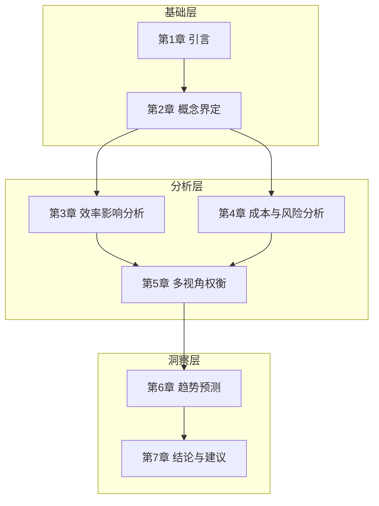

**第2章"概念界定"**将对低代码平台、无代码平台的核心定义、技术架构和关键特性进行精确界定，同时梳理传统软件开发流程的经典阶段与内在逻辑，为后续对比分析建立准确的概念基础。

**第3章"开发效率影响分析"**将通过整合行业数据、案例研究及定量对比，验证低代码/无代码平台在缩短开发周期、降低人力成本、赋能公民开发者等方面的效率提升主张，同时分析其效率增益的应用边界与潜在局限性。

**第4章"长期维护成本与风险分析"**将深入探查采用低代码/无代码平台后可能引发的长期维护成本，包括平台锁定风险、系统集成复杂度、定制化能力受限、性能优化瓶颈及技术债务积累等问题，并分析这些问题在不同场景下的具体表现。

**第5章"多利益相关者视角"**将比较并归纳开发者视角与业务管理者视角对低代码/无代码平台的不同诉求与评价，分析组织内部采纳的驱动因素、文化冲突及治理挑战。

**第6章"行业演进趋势预测"**将基于当前市场格局与技术融合态势，预测低代码/无代码平台在未来软件开发格局中的定位，分析其是完全替代传统开发还是形成互补共生的混合模式。

**第7章"结论与建议"**将总结核心发现，回答关键问题，并为企业管理者、技术决策者及开发团队提供基于场景的选型框架、风险规避策略及成功实施的关键建议。

需要特别说明的是，本报告的分析边界主要聚焦于**企业级应用开发场景**，对于面向消费者的移动应用开发、嵌入式系统开发等特殊领域，相关结论可能需要进行适当调整。同时，鉴于低代码/无代码平台仍处于快速演进之中，本报告的分析结论应被视为基于当前技术与市场状态的阶段性判断，而非一成不变的定论。

## 2 概念界定：低代码/无代码平台与传统开发流程解析

### 2.1 低代码平台的定义、技术架构与核心特性

#### 2.1.1 权威定义与内涵界定

低代码平台的概念界定需要从权威机构的标准定义出发，以确保分析的严谨性与可比性。**Forrester在2025年Q2发布的《Forrester Wave™：专业开发者低代码平台》报告中，将低代码平台定义为"通过可视化建模、组件化拖拽、AI辅助生成等方式，实现80%业务场景无需手工编码、20%复杂逻辑可通过代码扩展补充，支持从开发、部署、运维到治理全生命周期管理的企业级开发平台"**[^1]。这一定义明确了低代码平台的核心特征：并非完全消除编码，而是通过技术抽象大幅降低编码工作量，同时保留专业代码扩展能力以应对复杂场景。

中国信通院在此基础上进一步明确，合格的低代码平台须具备**"模型驱动、双向开发、全栈适配、生态开放"四大核心特征**[^1]。这一界定将低代码平台与传统无代码工具的轻量属性进行了明确区分——低代码平台定位于支撑企业核心业务系统的构建，而非仅限于简单的表单应用或流程自动化。

从Gartner的视角来看，低代码应用平台（Low-Code Application Platform, LCAP）是一套以**可视化开发、组件化封装、模型驱动设计**为底层逻辑的开发体系[^2]。其核心价值在于将底层操作（数据库连接、API调用、前端渲染等）封装成"拖拽组件+配置项"，从而使开发门槛大幅下降，但并不替代专业代码在复杂场景中的作用。

#### 2.1.2 技术架构体系解析

低代码平台的技术架构通常建立在**云原生、微服务和模型驱动**三大技术基石之上。以下从架构层次、核心引擎和集成能力三个维度进行系统解析：

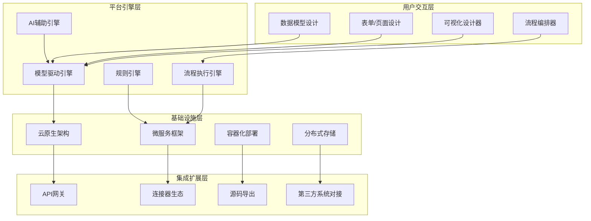

**模型驱动架构**是低代码平台的核心技术特征。通过将业务逻辑抽象为数据模型、流程模型和界面模型，平台能够自动生成可执行的应用代码。这种架构方式使得业务变更可以通过模型调整快速响应，而无需深入底层代码修改。企业级低代码平台如普元EOS Platform采用分布式架构，原生支持微服务开发、部署、监控全生命周期管理，其独有的分布聚合技术可降低部署和维护成本50%以上[^1]。

**双向开发兼容能力**是区分企业级低代码平台与轻量级工具的关键指标。优质平台支持可视化拖拽与专业代码扩展（Java、Node.js等）的混合模式，既降低业务人员使用门槛，又能通过源码导出、脚本编写满足复杂业务逻辑定制，从而规避"厂商锁定"风险[^3]。这种"高低代码融合"的架构设计，使得80%的日常需求可基于零代码拖拽实现，15%的复杂需求通过低代码逻辑编排完成，剩余5%的极端复杂需求则可平滑转化为高代码开发[^4]。

#### 2.1.3 2025-2026年平台演进的关键能力指标

进入2026年，低代码平台已从"业务敏捷开发工具"升级为企业数字化转型的核心基础设施。根据中国信息通信研究院及IDC相关报告，**AI增强能力、信创全栈适配、一体化治理**已成为驱动市场增长的三大核心要素[^1]。

| 能力维度 | 核心指标 | 行业影响 |
|:---|:---|:---|
| **AI原生赋能** | 自然语言转组件、智能流程优化、代码纠错 | 非技术人员可通过文字描述生成基础应用，专业开发者效率提升300%-500%[^1] |
| **信创全栈兼容** | 适配国产芯片（鲲鹏、海光）、操作系统（麒麟、统信）、数据库（高斯、阿里OB） | 满足国企、金融等强监管行业国产化替代需求，成为大型企业选型必备条件[^3] |
| **全生命周期治理** | 权限分级（字段级/记录级）、审计日志、版本管理、数据加密 | 解决低代码规模化应用后的"越做越乱"问题，实现从"快速开发"到"稳健运营"的落地[^3] |

**AI与低代码的深度融合**正在重构开发范式。在开发效率层面，AI能够理解业务需求并自动生成相应模块；在代码质量层面，AI智能检查与优化建议大幅降低了错误率；在业务适配层面，平台能根据用户行为数据分析主动建议流程优化方案[^5]。这种融合使得低代码平台从"能用手做"升级为"会用脑想"，显著扩展了平台的应用边界。

### 2.2 无代码平台的定义、功能特点与适用边界

#### 2.2.1 无代码平台的本质界定与核心特征

**无代码平台是一种无需编写传统代码，通过可视化界面和预设模块快速搭建应用的开发工具**[^6]。与低代码平台的关键区别在于：无代码平台完全消除了编程门槛，用户不需要精通编程语言，不需要深究代码背后的逻辑，只需拖拽功能组件并设置选项参数，即可构建出功能完备的应用系统。

无代码平台的核心特点可以从以下维度进行理解：

- **降低技术门槛**：无需专业编程知识，业务人员和非技术用户能够直接参与应用构建，实现业务与技术的无缝对接[^6]
- **简单友好的界面**：提供直观的可视化界面，用户通过拖拽功能组件实现所见即所得的开发体验[^7]
- **灵活匹配企业需求**：业务人员自己就是开发者，当需求变化时可自行完成功能调整，无需等待IT部门排期[^6]
- **极大降低成本**：减少对专业开发人员和高昂开发工具的依赖，降低软件开发和维护成本[^7]

**无代码的核心价值在于其普适性和包容性**——它让"开发"不再是遥不可及的词汇，而是每个人都能够掌握的技能[^6]。这种技术民主化的特征，使得一线业务人员能够根据对业务的需求和理解快速完成系统搭建，并第一时间投入使用验证系统匹配度。

#### 2.2.2 典型功能架构与核心组件

无代码平台通常基于**表单引擎、流程引擎、自动化引擎、报表引擎**四大核心引擎构建[^7]。这些引擎将线下常见的表格、纸质文档、人工流程，通过可视化设计转化为线上智能系统。

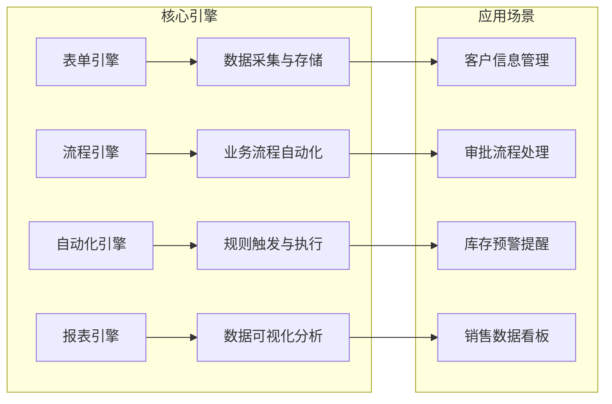

以表单引擎为例，原本需要人工统计的销售数据，通过拖拽配置即可生成自动填报页面；需要多部门协作的审批流程，借助流程引擎可实现自动流转[^7]。这种"业务人员能上手、企业需求能落地"的特性，使无代码平台成为中小企业数字化转型的理想选择。

无代码平台的典型应用场景包括：

| 应用类型 | 场景示例 | 核心价值 |
|:---|:---|:---|
| **内部管理类** | 考勤打卡、报销审批、公文流转、资产管理 | 直接解决办公效率低下痛点，快速提升内部协同效果[^8] |
| **业务运营类** | 客户管理（CRM）、销售线索跟踪、订单管理 | 直接对接业务场景，快速响应一线业务需求[^8] |
| **数据可视化类** | 销售报表、库存监控、绩效看板 | 实时数据呈现，支撑管理决策[^8] |

#### 2.2.3 功能局限性与适用边界

尽管无代码平台在降低开发门槛方面具有显著优势，但其功能边界同样需要清晰认知。**无代码平台并不适用于所有场景**，在以下情况下可能面临挑战：

- **高度定制化的系统开发**：如果应用需要非常特定的功能，或需要深入到操作系统级别进行定制，无代码平台可能无法满足这些高级定制需求[^6]
- **复杂的业务逻辑**：对于包含大量条件逻辑、循环处理或需要进行复杂数据处理的应用程序，无代码平台因需兼顾简便性和易用性，在逻辑处理上存在限制[^6]
- **需要深度集成的系统**：当需要与现有多个系统进行深度集成，特别是那些需要通过API进行复杂交互的系统时，无代码平台的集成能力可能受限[^6]
- **高性能需求场景**：无代码平台虽适合快速搭建简单应用或原型，但在处理高性能需求时可能显得力不从心[^9]

**无代码平台的最佳定位是作为企业数字化工具箱中的"轻量级武器"**，适合解决标准化程度高、变化频率高但复杂度中低的业务需求。对于核心交易系统、工业控制软件等需要极致性能和深度定制的场景，传统开发方式仍是更合适的选择。

### 2.3 传统软件开发流程的经典模型与阶段解析

#### 2.3.1 瀑布模型的线性阶段划分与核心逻辑

**瀑布模型（Waterfall Model）是软件工程中最早出现的开发模型**，由Winston Royce于1970年提出，其核心思想是按工序将问题化简，将功能的实现与设计分开，便于分工协作[^10]。瀑布模型将软件生命周期划分为制定计划、需求分析、软件设计、程序编写、软件测试和运行维护等六个基本活动，规定了它们自上而下、相互衔接的固定次序，如同瀑布流水逐级下落[^10]。

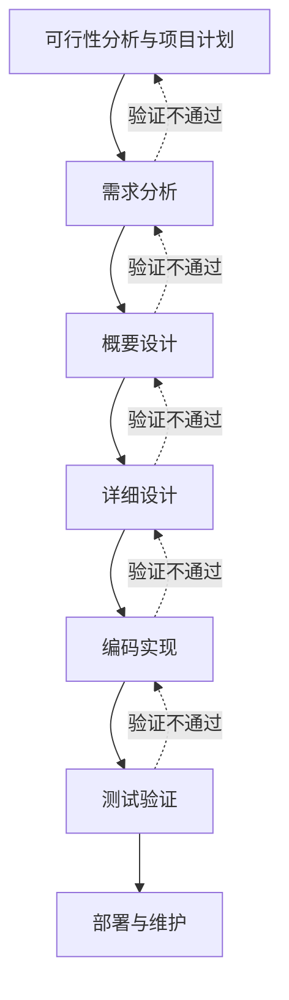

瀑布模型的各阶段具有明确的输入输出关系和验收标准：

| 阶段 | 核心任务 | 主要产出物 |
|:---|:---|:---|
| **需求分析** | 问题识别、分析与综合，导出软件逻辑模型 | 需求规格说明书（SRS）、数据流图（DFD）、数据字典（DD）[^11] |
| **概要设计** | 系统整体架构设计，模块划分 | 系统架构文档、模块接口定义[^11] |
| **详细设计** | 模块算法设计、数据结构设计、数据库物理设计 | 详细设计说明书[^11] |
| **编码实现** | 程序编写、调试、单元测试 | 可执行代码、单元测试报告[^11] |
| **测试验证** | 集成测试、系统测试 | 测试用例、测试报告[^11] |
| **部署维护** | 系统部署、用户培训、持续维护 | 用户文档、维护记录[^11] |

**瀑布模型的核心逻辑是文档驱动**——每个阶段都必须完成全部规定的任务（文档）后才能进入下一阶段[^11]。这意味着只有当所有系统模块全部开发完成之后，才进行系统集成。对于由上百个模块组成的复杂系统，这是一个非常艰巨而漫长的工作。

#### 2.3.2 瀑布模型的适用场景与固有局限

瀑布模型在特定条件下仍具有不可替代的价值。**其适用场景主要包括**[^12]：

- **需求明确且稳定的项目**：如果在项目开始前，客户或组织对需求有清晰的理解，且这些需求在开发过程中不会发生太大变动，瀑布模型可以很好地组织开发过程
- **开发周期较长的大型项目**：由于瀑布模型强调详细的计划和结构化的开发阶段，适用于周期长的大型项目，能够保持系统化的进度管理
- **质量和安全性要求极高的项目**：在航空软件、医疗设备控制系统等对安全性、可靠性要求极高的项目中，瀑布模型的严格审查流程和阶段性验收能确保开发质量

然而，瀑布模型也存在显著的**固有局限**[^10]：

- **各阶段划分完全固定，阶段之间产生大量文档，极大增加了工作量**
- **由于开发模型是线性的，用户只有等到整个过程末期才能见到开发成果，增加了开发风险**
- **突出缺点是不适应用户需求的变化**——对于经常变化的项目而言，瀑布模型毫无价值[^10]
- **后期集成复杂度高**——传统流程将整个开发过程划分为顺序相接的阶段，必须完成全部系统模块后才进行集成，对复杂系统而言是艰巨挑战[^11]

#### 2.3.3 迭代开发与敏捷开发的演进

针对瀑布模型的局限性，软件工程领域发展出了迭代开发和敏捷开发等演进模型。

**迭代开发**将开发工作分解为一系列短周期的迭代过程，每次迭代都产生一个可运行的产品版本[^13]。一次迭代包含计划、分析、设计、实施和测试等活动，依据迭代在开发周期中所处位置的不同，这些活动分别占不同比例。这种方式使得风险能够在早期被识别和控制，用户也能够更早地看到可工作的软件。

**敏捷开发**则进一步强调快速迭代和用户反馈。现代企业通常采用**DevOps模型**——一套用于加快更高质量应用程序与服务交付的实践、协议和技术[^14]。DevOps团队整合并自动完成软件开发与IT运营团队的工作，专注于持续集成和持续部署（CI/CD），通过自动化功能部署频繁的小型更新，持续提高软件性能。

这些演进模型的共同特征是**拥抱变化、缩短反馈周期、强调可工作的软件而非详尽的文档**。低代码/无代码平台在很大程度上将这些敏捷理念从方法论层面落实到了工具层面，使得快速迭代、持续交付成为更易操作的现实。

### 2.4 两种开发范式的比较维度与分析框架

#### 2.4.1 核心比较维度构建

为系统性地评估低代码/无代码平台与传统开发方式的差异，需要建立多维度的比较框架。基于前文的概念界定，以下从六个核心维度进行系统对比：

| 比较维度 | 低代码/无代码平台 | 传统开发流程 |
|:---|:---|:---|
| **开发主体** | 业务人员主导（无代码）或业务与技术人员协同（低代码），业务人员可直接通过可视化方式构建应用 | 专业技术人员（开发、测试、产品等）主导，业务人员主要提供需求，不直接参与构建 |
| **开发模式** | 模型驱动、可视化拖拽配置，通过封装好的组件和模型快速搭建，逻辑由平台引擎执行 | 代码驱动、手工编写，从需求文档到设计、编码、测试均需人工编写实现 |
| **交付周期** | 周级甚至天级迭代，外贸企业可在15天内完成供应链系统搭建[^1] | 月级或年级规划，复杂系统整体周期较长 |
| **过程与文档** | 轻文档、重即时呈现，可视化界面本身是"活"的文档 | 重文档、重过程管理，瀑布模型依赖严格的阶段文档 |
| **变更响应** | 高灵活性，业务逻辑或页面调整可通过配置快速完成，变更成本低 | 响应速度取决于模型，瀑布模型变更成本极高，敏捷模型仍需开发团队编码实现 |
| **产出物性质** | 可运行的应用系统及（部分平台）可导出的源码，资产可能部分依赖平台运行时 | 完整的、可独立部署的软件源码及配套文档，可脱离特定平台运行 |

#### 2.4.2 全生命周期对比视角

软件系统的真实价值与成本分布在从需求分析到运维退役的完整生命周期中。以下从各阶段的特征差异进行对比分析：

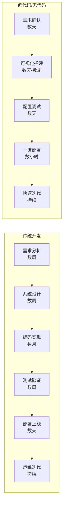

**在需求阶段**，传统开发需要将用户需求"翻译"为详细的软件需求规格说明书，包含每个操作步骤、输入规则、异常处理等细节[^15]。低代码/无代码平台则允许业务人员直接参与原型构建，通过快速可视化呈现验证需求理解的准确性，减少了需求传递过程中的信息损耗。

**在开发阶段**，传统开发的编码工作需要经历数周甚至数月，而低代码平台通过可视化建模和组件复用，可将开发时间缩短50%到80%[^9]。无代码平台在简单应用场景下，甚至可以在数小时内完成应用搭建。

**在运维阶段**，两种范式的差异更为复杂。低代码/无代码平台提供统一的运维监控与生命周期管理，应用部署、监控、升级可在平台内完成；而传统开发需要独立的DevOps体系与运维团队，涉及CI/CD流水线、容器化部署、监控告警等复杂基础设施的建设和维护。然而，当业务需求超出平台能力边界时，低代码/无代码应用可能面临扩展困难的挑战。

#### 2.4.3 适用性判断标准提炼

基于上述比较框架，可以提炼出指导企业技术选型的关键判断标准：

**第一，核心用户与协作模式**。判断标准是"业务人员是否需要及能够直接参与构建"。如果业务变化频繁且业务人员具备一定的逻辑思维能力，低代码/无代码平台可以显著缩短需求到实现的距离；如果需要专业开发者深度控制技术细节，则传统开发更为适合。

**第二，需求复杂度与稳定性**。判断标准是"业务逻辑的复杂性和变化速率"。逻辑简单、变化快的场景适合低代码/无代码；逻辑极其复杂、独特或需高性能计算的场景则必须采用传统开发。

**第三，交付速度与成本约束**。判断标准是"时间与金钱成本的优先级"。追求极速上线、降低显性开发成本，可选用低代码/无代码；对长期总拥有成本（TCO）和资产可控性有高要求，需综合评估传统开发的价值。

**第四，技术可控与集成深度**。判断标准是"对技术栈、架构和集成方式的控制程度要求"。需要完全自主的技术栈、深度定制集成和复杂架构设计，必须采用传统开发；满足于平台提供的技术边界和预置集成方案，则可选用低代码/无代码。

**第五，合规与战略安全**。判断标准是"行业监管要求与供应链安全战略"。在强监管或强调信创替代的领域，需选择具备全栈信创适配能力的企业级低代码平台或完全自主的传统开发[^16]。

**核心结论是：低代码/无代码平台与传统开发流程并非替代关系，而是互补与融合**。前者是"提升数字化产能和普及率"的利器，后者是"解决复杂核心问题"的基石。现代企业往往采用混合模式：使用低代码/无代码平台快速构建前端应用、流程自动化和创新试点；同时通过传统开发构建稳定、复杂的核心引擎与底层平台，两者通过API紧密集成，共同构成企业数字化能力体系。

## 3 开发效率影响的多维度验证与实证分析

低代码/无代码平台的核心价值主张之一是显著提升开发效率，这一主张是否经得起实证检验，是企业技术选型决策的关键依据。本章将从开发周期压缩、人力成本节约、公民开发者赋能三个核心维度进行系统性验证，同时深入剖析效率增益的应用边界与潜在局限性，为企业客观评估低代码/无代码平台的实际效率价值提供可靠依据。

### 3.1 开发周期压缩的实证验证与量化分析

#### 3.1.1 权威机构数据与行业基准

**开发周期的显著压缩是低代码/无代码平台最具说服力的效率主张**。根据Gartner 2025年Q4最新报告，采用低代码/无代码平台的企业，应用交付周期从传统开发的3-6个月缩短至2-4周，这意味着**周期压缩幅度达到60%-85%**[^17]。这一数据与葡萄城《企业级低代码技术及应用白皮书》的研究结论相互印证——中等复杂度应用开发周期可缩短60%以上[^18]。

从更细粒度的时间分布来看，不同复杂度的应用场景呈现差异化的周期压缩效果：

| 应用复杂度 | 传统开发周期 | 低代码/无代码周期 | 压缩比例 |
|:---|:---|:---|:---|
| **轻量级应用**（表单、简单工作流） | 2-4周 | 数小时至数天 | 80%-95% |
| **中等复杂度应用**（部门级业务系统） | 2-4个月 | 2-4周 | 60%-75% |
| **复杂企业级应用**（跨部门核心系统） | 6-12个月 | 2-4个月 | 50%-65% |

**周期压缩的核心机制源于开发范式的根本性转变**。传统开发需要经历需求分析、系统设计、编码实现、测试验证、部署上线等串行阶段，每个阶段都需要产出详尽的文档并通过评审。而低代码/无代码平台通过可视化建模、预置组件和自动化部署，将这些阶段高度压缩甚至并行化——业务人员可以在需求确认的同时进行原型搭建，系统配置完成后即可一键部署，无需等待传统开发中漫长的编码和测试周期[^19]。

#### 3.1.2 典型行业案例的交叉验证

**制造业案例**提供了周期压缩效果的有力佐证。某汽车零部件制造企业通过低代码平台搭建生产管理系统，传统开发预估需要6个月，实际仅用8周完成，**周期压缩达70%**[^18]。更具代表性的是某制造业MES系统开发案例——传统方式需要2年开发周期，采用低代码平台后缩短至4个月，效率提升超过4倍。

**零售业案例**同样验证了快速响应市场需求的能力。某零售企业利用低代码平台仅用3天时间搭建社区团购试点应用，快速验证业务模式可行性后再进行深化开发，避免了传统"大而全"开发模式可能带来的资源浪费[^18]。某零售企业通过低代码平台一周内完成库存管理系统开发，相比传统开发周期数月的预期，时间节省超过80%[^20]。

**金融业案例**则展示了在合规要求较高的行业中的周期优化效果。某金融企业通过低代码平台调整贷款审批流程，仅用3天完成系统迭代，而传统开发方式需要2周时间，**迭代周期缩短75%**[^18]。

#### 3.1.3 周期压缩的关键贡献因素

深入分析周期压缩的贡献机制，可以识别出以下关键因素：

**快速原型构建能力**是首要贡献因素。低代码/无代码平台通过拖拽式界面和预置模板，使得业务人员可以在数小时内构建出可演示的应用原型，快速验证需求理解的准确性。这种"所见即所得"的开发体验，大幅减少了传统开发中需求文档编写、评审、修订的往复周期[^21]。

**热更新与持续部署能力**是第二个关键因素。低代码平台支持无需停机即可完成功能迭代，传统开发每次迭代需要停机测试，每次迭代成本增加30%-50%[^18]。这种敏捷部署能力使得需求变更可以在小时级别内响应，而非传统开发的周级甚至月级响应周期。

**组件复用与模板库**是第三个关键因素。低代码平台的组件库、模板库可重复使用，覆盖80%的通用场景，避免了重复开发的时间消耗[^18]。例如，表单、报表、工作流等常见功能模块可直接调用预置组件，无需从零开始构建。

### 3.2 人力成本节约的结构性分析与ROI评估

#### 3.2.1 人力投入规模的量化对比

**人力成本的显著降低是低代码/无代码平台的第二大效率主张**。根据葡萄城《企业级低代码技术及应用白皮书》数据，低代码项目平均人力投入仅为传统开发的**30%-50%**[^18]。这一数据意味着，原本需要10人团队完成的项目，采用低代码平台后可能仅需3-5人即可交付。

具体到岗位配置层面，人力结构的变化更为显著。某物流企业开发库存预警系统的案例具有代表性：传统模式需要3名专业程序员，而采用低代码平台后仅需1名IT人员配合2名业务人员即可完成，**人力成本降低60%**[^18]。这种"业务人员+少量技术人员"的团队配置模式，正在成为低代码项目的典型组织形态。

从成本结构角度分析，人力成本节约主要体现在以下三个层面：

| 成本类型 | 传统开发模式 | 低代码/无代码模式 | 节约幅度 |
|:---|:---|:---|:---|
| **开发人员薪酬** | 需要专业开发团队，人均成本较高 | 业务人员可直接参与，减少专业开发者依赖 | 40%-60% |
| **外包开发费用** | 复杂项目常需外包，费用高昂 | 内部团队可自主完成大部分需求 | 50%-70% |
| **招聘与培训成本** | 专业人才稀缺，招聘周期长、成本高 | 业务人员培训周期短，上手快 | 30%-50% |

#### 3.2.2 运维成本与隐性成本的综合评估

**运维成本的优化是人力成本节约的重要组成部分**。传统开发的定制化代码导致运维难度大、成本高，而低代码平台通过标准化架构设计大幅降低了运维复杂度。某电商企业的订单管理系统案例显示，传统年运维成本20万元，采用低代码模式后降至6万元，**降幅达70%**[^18]。

运维效率提升的核心原因在于：低代码平台采用统一架构与可视化运维界面，漏洞修复、功能迭代无需深度解读定制代码，运维人员可以通过平台提供的标准化工具完成大部分维护工作。某制造企业通过低代码搭建"智造云"平台后，运营成本降低21.16%，运维人力减少50%[^18]。

**隐性成本的降低同样值得关注**。传统开发存在大量隐性成本，如需求沟通成本、跨部门协调成本、文档编写与维护成本等。低代码平台通过业务人员直接参与开发，减少了需求传递过程中的信息损耗。根据Gartner报告，通过低代码平台，企业在开发阶段的**沟通成本减少50%，跨部门协作效率提升60%**[^20]。

#### 3.2.3 全口径ROI评估框架

建立全口径的投资回报率（ROI）评估框架，需要综合考虑显性成本与隐性成本的变化：

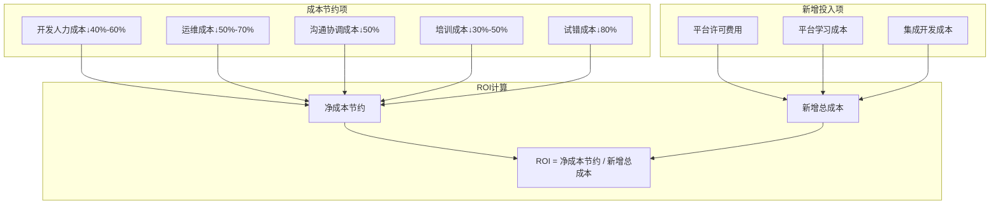

根据IDC调研数据，采用低代码平台的企业，综合成本节省幅度在**30%-80%**之间，具体数值取决于应用场景复杂度和平台选型的匹配度[^18]。对于标准化程度高、需求变化频繁的业务场景，ROI表现最为突出；而对于高度定制化的核心系统，ROI优势则相对有限。

### 3.3 公民开发者赋能效果与协作模式变革

#### 3.3.1 公民开发者的角色定位与能力边界

**公民开发者（Citizen Developer）是低代码/无代码平台催生的新型角色**，指那些不具备专业编程背景但能够利用低代码/无代码工具构建应用的业务人员。根据2025年行业趋势报告，主流低代码平台通过自然语言建模、智能调试、自动生成源码等AI原生功能，使得**非技术人员可以完成80%的基础开发工作**[^17]。

公民开发者的能力边界可以从以下维度进行界定：

| 能力层级 | 可独立完成的任务 | 需要技术人员支持的任务 |
|:---|:---|:---|
| **基础层** | 表单设计、数据采集、简单报表 | 复杂数据模型设计 |
| **流程层** | 审批流程配置、任务分派、自动提醒 | 复杂业务规则引擎配置 |
| **集成层** | 使用预置连接器对接常见系统 | 自定义API开发、深度系统集成 |
| **分析层** | 标准报表生成、数据可视化 | 复杂数据分析模型、预测算法 |

**公民开发者模式的核心价值在于缩短"需求到实现"的距离**。传统开发模式下，业务人员提出需求后需要等待IT部门排期、开发、测试、部署，整个周期可能长达数周甚至数月。而公民开发者可以直接将业务需求转化为可运行的应用，实现"需求即产品"的敏捷响应[^21]。

#### 3.3.2 业务与IT协作模式的变革

低代码/无代码平台正在重塑业务部门与IT部门的协作边界。**传统的"业务提需求、IT做开发"的串行模式，正在向"业务主导构建、IT提供支撑"的并行模式转变**。

这种协作模式变革带来了多重效益：

**需求传递准确性提升**。业务人员直接参与应用构建，减少了需求文档编写、评审、修订的往复过程，避免了需求在传递过程中的信息损耗和理解偏差。某金融企业的实践显示，业务部门在IT部门支持下自主开发客户管理系统，能够根据实际需求实时调整系统，使其更贴合业务流程，最终大幅提升了客户满意度和业务效率[^20]。

**业务响应速度提升**。当业务需求变化时，业务人员可以自行完成功能调整，无需等待IT部门排期。这种敏捷响应能力对于快速变化的市场环境尤为重要。据《中国企业数字化转型白皮书2023》数据，采用无代码工具的企业，业务应用平均上线周期由传统的2-6个月缩短至2-4周[^21]。

**IT资源释放**。IT部门从大量重复性的应用开发工作中解放出来，可以将精力集中在更具战略价值的核心系统建设、架构优化和技术创新上。这种分工优化使得企业整体的数字化能力得到提升。

#### 3.3.3 公民开发者模式的潜在挑战

尽管公民开发者模式带来了显著的效率提升，但也存在需要正视的潜在挑战：

**应用规范性问题**。由非专业技术人员构建的应用，在代码规范、架构设计、安全合规等方面可能存在不足。某制造企业的"全民开发"计划培养出200名公民开发者，但当核心开发人员离职后，系统陷入无人能维护的窘境——审计显示，**72%的业务流程存在未文档化的隐性逻辑**，这些通过可视化界面配置的规则成为只有平台能解读的"数字黑箱"[^22]。

**治理与管控挑战**。当公民开发者大量产出应用时，如何确保这些应用符合企业的安全策略、数据治理要求和合规标准，成为IT部门面临的新挑战。缺乏有效的治理机制，可能导致"影子IT"问题的蔓延。

**技能退化风险**。过度依赖低代码/无代码平台可能导致企业IT团队核心技术能力退化。某零售连锁企业IT部门技能评估显示，过度依赖无代码平台导致团队Java/Python技能退化率达47%，在需要深度集成AI能力时出现严重的技术断层[^22]。

### 3.4 效率增益的应用边界与场景适配性

#### 3.4.1 高效率场景的特征识别

**低代码/无代码平台的效率优势并非在所有场景下均能实现，识别高效率场景的特征是企业选型决策的关键**。基于行业实践和研究数据，高效率场景通常具备以下特征：

**标准化程度高**。业务流程遵循相对固定的规则和模式，如表单审批、数据采集、简单工作流等。这类场景与低代码/无代码平台的预置组件和模板高度匹配，可以直接复用平台能力，无需大量定制开发[^23]。

**需求变化频繁**。业务需求处于快速迭代状态，需要频繁调整和优化。低代码/无代码平台的可视化配置能力使得变更响应成本极低，可以快速适应业务变化。

**时效性要求高**。业务场景对上线速度有较高要求，需要在短时间内交付可用的应用。低代码/无代码平台的快速原型能力可以满足这类需求。

典型的高效率应用场景包括：

| 场景类型 | 具体应用 | 效率提升幅度 |
|:---|:---|:---|
| **行政办公** | 请假审批、报销流程、会议预约、资产管理 | 70%-90% |
| **客户管理** | 客户信息采集、商机跟进、活动报名 | 60%-80% |
| **项目管理** | 任务分解、进度跟踪、文档协作 | 50%-70% |
| **数据采集** | 问卷调研、订单采集、库存盘点 | 70%-85% |

#### 3.4.2 低效率场景的特征识别

与高效率场景相对应，**某些场景下低代码/无代码平台的效率优势会大幅削弱，甚至可能出现效率损失**。低效率场景通常具备以下特征：

**业务逻辑高度复杂**。涉及多层嵌套循环、复杂状态机、精密计算过程的业务逻辑，低代码平台的可视化设计器难以有效表达。例如，金融领域的实时风险控制系统，涉及大量数学模型、实时数据流处理和复杂算法，低代码平台提供的图形化逻辑设计器在处理这类场景时"简直就像用儿童积木去搭摩天大楼——不是完全不可能，但会非常别扭，而且效率极低"[^23]。

**性能要求极致**。对响应时间、并发处理能力有严苛要求的场景，如高并发电商秒杀系统、实时在线游戏服务器等。低代码平台为实现通用性在底层做了大量抽象和封装，难以进行精细的性能调控[^23]。

**深度集成需求**。需要与老旧传统系统、特定硬件设备或小众第三方服务进行深度集成的项目。例如，制造业工厂的MES系统需要直接与PLC控制器、数控机床通信，使用特定的工业协议如OPC UA、Modbus，平台提供的标准连接器往往不够用[^23]。

**核心知识产权相关**。涉及独特算法、创新业务流程或专利保护技术的功能，将其构建在低代码平台上存在战略风险——平台的标准化组件可能无法完美表达独特创意，且核心业务逻辑与平台深度耦合会增加未来迁移的难度[^23]。

#### 3.4.3 场景适配性评估矩阵

基于上述分析，可以建立一个**场景适配性评估矩阵**，帮助企业判断特定项目是否适合采用低代码/无代码平台：

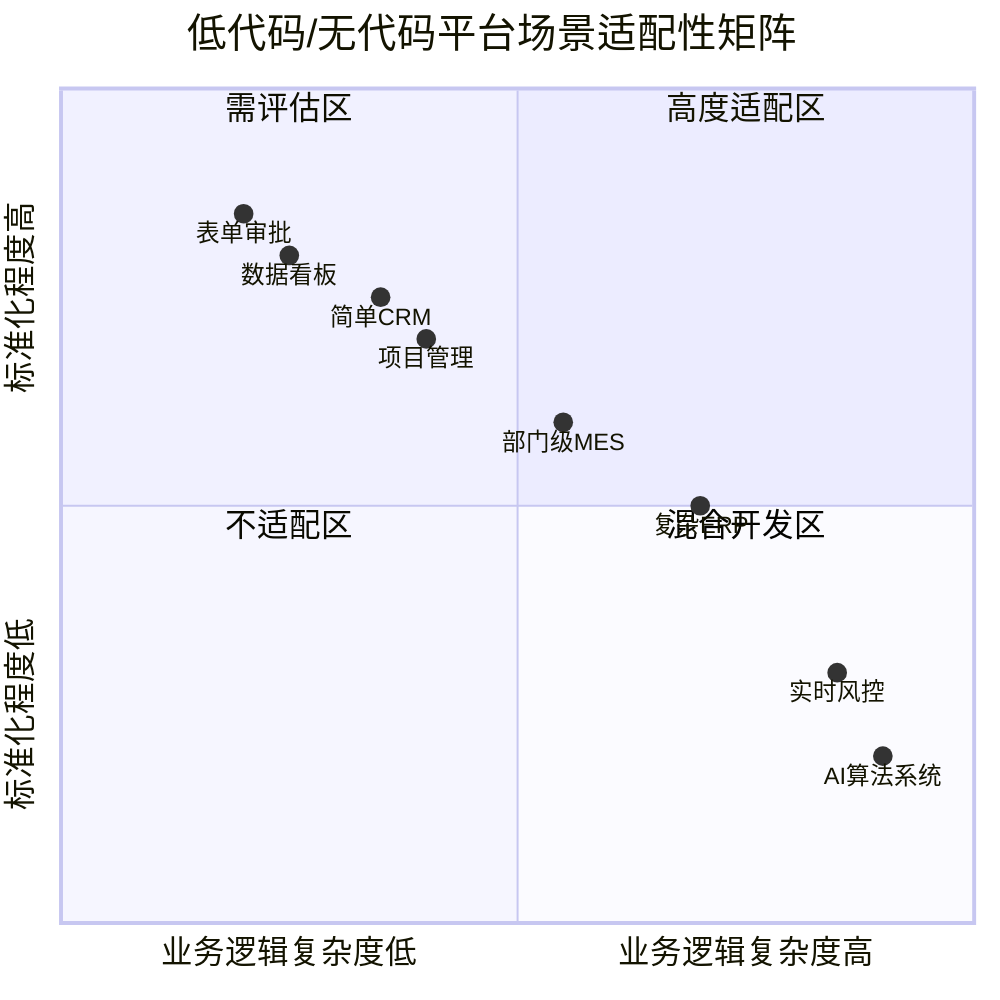

**高度适配区（第一象限）**：标准化程度高、业务逻辑复杂度低的场景，如表单审批、数据看板、简单CRM等，低代码/无代码平台可以发挥最大效率优势。

**混合开发区（第四象限）**：标准化程度较低但业务逻辑复杂度中等的场景，建议采用混合架构——使用低代码快速构建前端界面和业务流程，核心后端逻辑采用传统开发。

**需评估区（第二象限）**：标准化程度高但业务逻辑复杂度中等的场景，需要根据具体需求和平台能力进行详细评估。

**不适配区（第三象限）**：标准化程度低且业务逻辑高度复杂的场景，如实时风控系统、AI算法系统等，传统开发是更可靠的选择。

### 3.5 复杂业务逻辑与性能约束下的效率局限

#### 3.5.1 复杂业务逻辑的实现困境

**当业务逻辑超出一定复杂度阈值时，低代码/无代码平台的效率优势会急剧下降，甚至可能出现"越用越慢"的反效果**。这种效率局限主要体现在以下几个方面：

**可视化逻辑表达的天然限制**。低代码平台的图形化逻辑设计器在表达简单if-else条件时直观高效，但当涉及多层嵌套循环、复杂状态机、递归算法时，可视化流程图会变成难以理解和维护的"蜘蛛网"。更麻烦的是，这类平台通常会对逻辑的复杂度设限，当业务规则超过某个阈值，整个逻辑图就会变得混乱不堪[^23]。

**调试与维护的困难**。在简单应用中，拖拽界面直观易改；但逻辑复杂后，可视化流程图可能存在隐藏依赖，调试时容易遗漏关键节点。例如，一个多步骤审批流（如财务报销系统）若有异常分支（如金额超过阈值需人工干预），调试时可能遗漏这些边界情况[^24]。

**定制化能力的根本性限制**。低代码平台的预定义组件和有限的定制能力，难以精确满足高度复杂的业务逻辑需求。以信用评分模型为例，它需要综合考虑申请人的信用历史、收入水平、负债情况等众多因素，并根据不同权重进行复杂计算，低代码平台难以直接实现这种深度定制化的复杂逻辑[^25]。

Gartner报告指出，**约30%的低代码项目在复杂逻辑阶段停滞**，临时"补丁"代码增多，长期维护成本反而可能超过传统开发[^24]。

#### 3.5.2 性能调优的架构性约束

**低代码/无代码平台的底层架构封装，在带来开发便利的同时，也限制了性能调优的空间**。这种架构性约束在以下场景中表现尤为突出：

**数据库查询优化受限**。低代码平台通常会自动生成SQL语句，但这些自动生成的语句往往不是最优的，特别是在处理海量数据、多表关联查询时，性能瓶颈会非常明显。开发者无法像传统开发那样直接优化SQL语句、调整索引策略或重构数据模型[^23]。

**高并发处理能力不足**。当用户量突破一定规模时，低代码平台采用的通用数据库架构在处理高并发事务时可能产生严重延迟。某教育机构搭建的在线考试系统，在用户量突破5万时开始频繁崩溃，而**平台禁止直接访问数据库执行优化**，企业被迫通过购买更高级别套餐缓解问题[^22]。

**实时响应场景的延迟问题**。在IoT等实时响应场景中，架构限制尤为突出。某智慧园区项目接入2000个传感器后，平台的事件响应延迟从200ms激增至8s，运维团队发现无代码平台的消息队列机制存在硬编码限制，而底层架构的封闭性使性能调优无从下手[^22]。

#### 3.5.3 自动生成代码与手工优化代码的效率差距

**从执行效率角度看，低代码平台自动生成的代码与经过专业开发者手工优化的代码之间存在显著差距**。这种差距主要源于以下原因：

**通用性与优化性的固有矛盾**。低代码平台为了实现通用性，在底层做了大量的抽象和封装，这些抽象层在运行时会产生额外的性能开销。手工编写的代码可以针对特定场景进行精细优化，而自动生成的代码则倾向于采用"安全但不一定高效"的通用实现方式。

**算法复杂度的差异**。在大数据处理场景中，拖拽实现的循环操作可能效率较低（时间复杂度$O(n^2)$），而手动编码可以优化到$O(n \log n)$。实测中，复杂查询在低代码平台的响应时间可能飙升数倍[^24]。

**"黑盒"运行时环境的限制**。低代码平台的运行时环境对开发者而言是一个"黑盒"，无法进行底层性能调优，如直接操控数据库连接池、精细调整线程模型等。对于高并发电商秒杀系统、实时在线游戏服务器等对响应时间有严苛要求的应用，这种限制可能是致命的[^23]。

#### 3.5.4 效率-复杂度权衡模型

综合上述分析，可以建立一个**效率-复杂度权衡模型**，用于指导企业在不同复杂度场景下的技术选型：

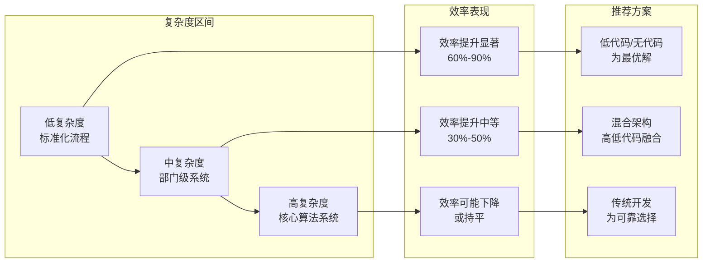

**核心结论是：低代码/无代码平台的效率提升与业务复杂度呈负相关**。在低复杂度区间，效率提升可达60%-90%；在中复杂度区间，效率提升降至30%-50%，且需要采用混合架构以平衡效率与灵活性；在高复杂度区间，平台限制成为主要瓶颈，效率可能不升反降，传统开发是更可靠的选择。

企业在评估低代码/无代码平台的效率价值时，必须基于对项目复杂度的清醒认知，在"开发速度/低成本"与"控制权/深度灵活性"之间进行权衡。对于大多数企业，采用**分层策略**——使用低代码/无代码处理敏捷、前端和流程类需求，保留传统开发用于核心、复杂、高性能的后端系统——是实现整体数字化效率最优化的关键路径。

## 4 长期维护成本、技术债务与可扩展性挑战

低代码/无代码平台在开发阶段展现的效率优势已在前文得到充分验证，然而，软件系统的真实成本远不止于初始构建阶段。**系统生命周期中的长期维护成本、技术债务积累以及可扩展性约束，往往是决定技术投资净价值的关键因素**。本章将系统剖析企业采用低代码/无代码平台后可能面临的深层风险，揭示效率收益与长期成本之间的复杂权衡关系，为企业技术决策提供风险预判依据。

### 4.1 平台锁定风险与技术自主权侵蚀

#### 4.1.1 供应商锁定的形成机制与表现形态

**平台锁定（Vendor Lock-in）是低代码/无代码平台最具战略性的长期风险**，其本质是企业在深度使用特定平台后，因技术依赖而丧失自由选择和迁移能力的状态。这种锁定效应并非一蹴而就，而是随着企业在平台上投入的资产、数据和业务逻辑的积累而逐渐加深。

供应商锁定的形成机制可从以下维度进行解析：

**专有技术栈依赖**是锁定效应的首要来源。低代码/无代码平台为实现"开箱即用"的便捷体验，往往采用专有的数据模型、流程引擎和组件体系。企业在平台上构建的应用，其业务逻辑、数据结构和界面设计都与平台的专有技术栈深度耦合。某企业使用闭源低代码平台后，发现其应用的核心逻辑完全依赖平台的专有表达式语言，当供应商停服时，**系统瘫痪导致的迁移成本超过50万元**[^26]。

**数据格式与存储绑定**构成第二层锁定。许多平台将企业数据存储在专有格式的数据库中，数据导出功能受限或需要额外付费。即便平台支持数据导出，导出的数据结构可能与通用数据库格式存在显著差异，重建数据关系和业务规则的成本高昂。

**应用资产的可移植性限制**是第三层锁定。通过可视化方式构建的应用，其"源代码"实际上是平台专有的配置文件或元数据，无法直接在其他环境中运行。部分平台虽然声称支持"源码导出"，但导出的代码往往依赖平台的运行时环境，脱离平台后难以独立运行。

| 锁定维度 | 具体表现 | 迁移难度 |
|:---|:---|:---|
| **技术栈锁定** | 专有表达式语言、流程引擎、组件体系 | 极高，需完全重写 |
| **数据锁定** | 专有数据格式、受限导出功能 | 高，需数据清洗与重构 |
| **应用锁定** | 配置文件无法跨平台运行 | 高，需重新开发 |
| **生态锁定** | 依赖平台特定的连接器和插件 | 中高，需寻找替代方案 |

#### 4.1.2 平台策略变更与业务连续性威胁

**企业对平台的依赖程度越深，面对供应商策略变更时的脆弱性就越高**。这种风险并非理论推演，而是已在多个实际案例中得到验证。

**定价策略调整**是最常见的策略变更风险。某企业因平台供应商大幅涨价，被迫重构整个系统，**损失超过300万元**[^26]。低代码/无代码平台通常采用订阅制收费模式，企业的年度IT支出直接受制于供应商的定价策略。当企业在平台上积累了大量业务应用后，供应商的议价能力显著增强，企业往往只能被动接受涨价。

**服务终止或功能下线**构成更严重的威胁。平台供应商可能因商业考量终止特定产品线或下线某些功能模块，而企业可能已经在这些功能上构建了关键业务流程。Gartner调研显示，**73%的企业低估了系统全生命周期成本**，其中供应商策略变更带来的被动支出是重要组成部分[^27]。

**技术路线图不透明**增加了战略规划的不确定性。企业无法预知平台未来的技术演进方向，当平台的技术路线与企业的数字化战略出现分歧时，企业可能面临"跟随平台转型"或"承担迁移成本"的两难抉择。

#### 4.1.3 迁移成本的量化评估与退出策略

**迁移成本是衡量锁定程度的核心指标**，也是企业评估平台选型风险时必须纳入考量的隐性成本。根据行业实践，迁移成本通常包括以下组成部分：

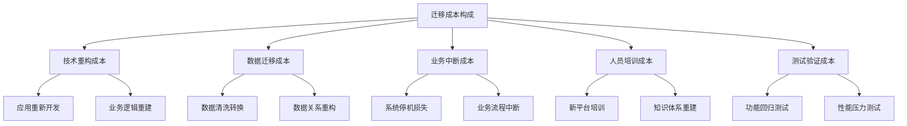

**技术重构成本**通常是迁移成本的主体，占比可达50%-70%。由于低代码/无代码平台构建的应用与平台深度耦合，迁移往往意味着"重新开发"而非简单的"移植"。某金融机构遗留系统改造时发现，5年前在低代码平台上开发的考勤逻辑已无法适配新劳动法条款，**重构成本相当于新建系统的70%**[^27]。

**业务中断成本**是最难量化但影响最大的隐性成本。某地产集团因供应商排期延误导致紧急上线疫情考勤政策失败，20家子公司停工核查，**单日损失超千万**[^27]。这种"机会成本"在传统的IT预算评估中往往被忽视，但对业务连续性的威胁却是实实在在的。

为降低锁定风险，企业应在平台选型阶段即制定**退出策略**：

- **优先选择支持源代码导出的开源或半开源平台**，如Appsmith、ToolJet等，或签订明确的数据迁移保障协议[^26]
- **选择支持多云部署、开放API的平台**，如微软Power Apps+Azure的组合，保持架构的灵活性[^26]
- **建立关键应用的"影子文档"**，记录核心业务逻辑和数据关系，为未来可能的迁移保留知识资产
- **定期评估平台依赖度**，对锁定程度进行量化监控，在锁定加深前及时调整策略

### 4.2 系统集成复杂度与数据孤岛困境

#### 4.2.1 异构系统集成的技术挑战

**企业IT环境通常由多套异构、历史悠久的系统构成，低代码/无代码平台与这些系统的集成是维护成本的重要来源**。根据行业数据，系统集成成本平均占企业数字化投入的35%，而低代码/无代码应用的集成挑战尤为突出[^28]。

**接口标准化不足**是集成困难的首要原因。不同系统采用的API标准、数据格式、通信协议各不相同，低代码/无代码平台提供的预置连接器往往只能覆盖主流系统的标准接口。当需要与老旧的遗留系统或小众的行业专用系统对接时，企业可能需要借助第三方集成服务或平台提供商的专业服务团队，**产生数万元的额外集成费用**[^28]。

**数据映射与转换困难**是第二个技术挑战。企业各系统之间的数据标准不统一，数据格式各异，使得数据在传输过程中容易出现丢失、错误等问题[^26]。例如，将低代码平台与企业的ERP系统进行深度集成时，需要处理复杂的字段映射、数据类型转换和业务规则校验，这些工作的复杂度往往超出预期。

**实时同步与一致性保障**构成第三个挑战。在复杂企业场景中，往往需要与ERP、CRM、BI等多个系统进行数据集成，但低代码平台在数据对接和同步方面存在较大挑战[^29]。某低代码平台因不支持分布式事务，导致订单系统出现**数据不一致**问题[^26]。

| 集成挑战类型 | 具体表现 | 成本影响 |
|:---|:---|:---|
| **接口标准化不足** | 预置连接器覆盖有限，需定制开发 | 单系统集成成本数万元 |
| **数据映射困难** | 字段对应、类型转换、规则校验复杂 | 开发周期延长30%-50% |
| **实时同步延迟** | 数据一致性难以保障 | 可能导致业务决策失误 |
| **版本兼容问题** | 被集成系统升级后连接器失效 | 持续维护成本增加 |

#### 4.2.2 集成维护成本的非线性增长

**随着系统规模的扩大和集成点的增加，集成维护成本呈现非线性上升趋势**。这种成本增长模式与简单的线性累加不同，其背后的机制值得深入分析。

**集成点的相互依赖**是非线性增长的核心原因。当企业在低代码平台上构建的应用数量增加时，应用之间、应用与外部系统之间的集成关系呈指数级增长。一个新应用的上线可能需要与多个现有系统建立数据交互，而每个集成点都可能成为潜在的故障源和维护负担。

**版本兼容性维护**是持续性的成本来源。被集成的外部系统（如ERP、CRM）会定期升级，每次升级都可能影响与低代码应用的接口兼容性。IDC《2023企业应用运维白皮书》指出，HR系统年均运维投入可达初始投资的**1.8倍**，其中集成维护占据重要比例[^27]。某制造业客户的真实成本清单显示，**年度第三方系统接口维护费约12万元**[^27]。

**问题排查的复杂度上升**进一步推高维护成本。当数据流经多个系统时，一旦出现问题，需要在多个系统间进行联合排查，定位故障根源的难度显著增加。这种"跨系统调试"的工作量往往远超单系统内部问题的处理。

#### 4.2.3 新型数据孤岛风险的形成

**低代码/无代码平台的快速扩张，可能在解决传统数据孤岛问题的同时，创造出新型的数据孤岛**。这一悖论现象值得企业高度警惕。

**多平台并存导致的数据分散**是新型孤岛的首要来源。部分企业通过无代码搭建多套独立系统后，因缺乏统一的数据治理规划，反而形成了新的数据孤岛[^30]。不同部门可能选用不同的低代码/无代码平台，各平台之间的数据互通同样面临集成挑战。

**平台内部的数据封闭**构成第二层孤岛。低代码/无代码平台为提升用户体验，往往将数据存储在平台专有的数据库中，企业难以直接访问和利用这些数据进行跨平台分析。某教育机构搭建的在线考试系统，**平台禁止直接访问数据库执行优化**，导致数据利用受限[^31]。

**业务逻辑的隐性封装**是第三层孤岛。通过可视化方式配置的业务规则，其逻辑存储在平台的元数据中，对于企业的数据治理团队而言是不透明的"黑箱"。这种"逻辑孤岛"可能导致企业对自身业务流程的理解出现断层。

### 4.3 定制化能力边界与业务适配瓶颈

#### 4.3.1 预置组件与模板的覆盖局限

**低代码/无代码平台的效率优势建立在"组件复用"和"模板预置"的基础上，但这种标准化设计同时也构成了定制化能力的天然边界**。当企业需求超出预置组件和模板的覆盖范围时，平台的价值主张将面临严峻考验。

**功能模块的覆盖缺口**是最直接的局限。尽管主流平台的组件库已相当丰富，但面对特定行业的专业需求时，往往显得力不从心。例如，制造业工厂的MES系统需要直接与PLC控制器、数控机床通信，使用特定的工业协议如OPC UA、Modbus，**平台提供的标准连接器往往不够用**[^31]。

**界面深度定制的约束**是第二个局限。低代码/无代码平台通常提供一套统一的UI组件库，企业可以调整颜色、布局等基础样式，但对于需要高度品牌化或创新交互设计的场景，平台的定制能力可能无法满足要求。某些企业希望打造差异化的用户体验，但受限于平台的UI框架，**定制化UI成为慎用场景之一**[^26]。

**业务规则表达的复杂度限制**是第三个局限。平台的规则引擎在处理简单的条件判断时直观高效，但面对多层嵌套、复杂状态机、递归算法等高级逻辑时，可视化表达方式的局限性便会显现。某金融企业的信用评分模型需要综合考虑申请人的信用历史、收入水平、负债情况等众多因素，并根据不同权重进行复杂计算，**低代码平台难以直接实现这种深度定制化的复杂逻辑**[^31]。

#### 4.3.2 业务需求超出平台边界时的抉择困境

**当业务需求超出平台能力边界时，企业往往面临"功能妥协"或"架构重构"的两难抉择**。这种困境在业务快速发展的企业中尤为突出。

**功能妥协**意味着企业需要调整业务需求以适应平台能力，这可能导致业务流程的次优化或创新受阻。某些企业在引入低代码平台时，初期确实实现了快速上线，但当业务发展需要更复杂的功能时，发现平台无法支撑，**陷入"改不动又换不掉"的困境**[^31]。

**架构重构**意味着企业需要将部分或全部功能从低代码平台迁移到传统开发环境，这将带来高昂的迁移成本和业务中断风险。某企业在低代码平台上搭建的CRM系统，初期运行良好，但当需要集成AI推荐算法时，发现平台的扩展能力不足，被迫进行架构重构，**额外投入远超最初预算**。

**混合开发模式**是折中方案，即在低代码平台上处理标准化流程，将复杂逻辑通过传统代码实现。某制造企业采用低代码开发前端，传统代码处理业务逻辑，**减少70%重复开发**[^26]。但这种模式增加了系统架构的复杂度，需要同时维护两套技术栈，对团队的技术能力提出了更高要求。

#### 4.3.3 定制化受限对核心业务系统的影响

**对于企业的核心业务系统，定制化能力的限制可能产生战略层面的深远影响**。核心系统承载着企业的关键业务流程和核心竞争力，其灵活性和可控性直接关系到企业的长期发展。

**业务创新受阻**是首要影响。当企业希望通过技术创新打造差异化竞争优势时，低代码平台的标准化组件可能无法完美表达独特创意。涉及独特算法、创新业务流程或专利保护技术的功能，将其构建在低代码平台上存在战略风险[^31]。

**长期演进能力受限**是第二个影响。核心业务系统需要伴随企业战略调整和市场变化持续演进，但低代码平台的架构约束可能限制系统的演进空间。某能源集团在2022年上线新绩效系统时，初期开发预算仅380万元，但两年内因流程调整产生的二次开发费用高达**210万元**[^27]。

**合规与安全风险**是第三个影响。对于金融、医疗等强监管行业，核心系统需要满足严格的合规要求。低代码平台的"黑盒"特性可能导致合规审计困难，某低代码平台因未加密用户数据**被罚200万元**[^26]。

### 4.4 性能优化瓶颈与可扩展性约束

#### 4.4.1 底层封装对精细化调优的阻碍

**低代码/无代码平台的底层架构封装，在带来开发便利的同时，也严重限制了性能调优的空间**。这种架构性约束在高性能需求场景下表现尤为突出。

**数据库查询优化受限**是最常见的性能瓶颈。低代码平台通常会自动生成SQL语句，但这些自动生成的语句往往不是最优的，特别是在处理海量数据、多表关联查询时。开发者无法像传统开发那样直接优化SQL语句、调整索引策略或重构数据模型[^29]。在大数据处理场景中，拖拽实现的循环操作可能效率较低（时间复杂度$O(n^2)$），而手动编码可以优化到$O(n \log n)$[^31]。

**缓存策略调整困难**是第二个瓶颈。高性能系统通常需要精细的缓存策略来提升响应速度，但低代码平台的缓存机制往往是预设的，企业难以根据具体业务场景进行定制化调整。

**资源弹性伸缩受限**是第三个瓶颈。云原生架构强调资源的弹性伸缩能力，但低代码平台的资源管理往往由平台统一控制，企业无法进行精细的资源调配。某教育机构搭建的在线考试系统，在用户量突破5万时开始频繁崩溃，而**平台禁止直接访问数据库执行优化**，企业被迫通过购买更高级别套餐缓解问题[^31]。

| 性能调优维度 | 传统开发能力 | 低代码平台能力 | 差距影响 |
|:---|:---|:---|:---|
| **SQL优化** | 完全可控，可深度调优 | 自动生成，优化空间有限 | 复杂查询响应时间可能飙升数倍 |
| **缓存策略** | 灵活配置，按需定制 | 预设机制，调整困难 | 高频访问场景性能受限 |
| **资源伸缩** | 精细控制，弹性部署 | 平台统一管理 | 突发流量应对能力不足 |
| **线程模型** | 可定制优化 | 封装在运行时环境中 | 高并发处理能力受限 |

#### 4.4.2 高并发与大数据场景的架构性限制

**零代码平台由于封装较多，易出现性能瓶颈，尤其在高并发、数据量大的场景中表现明显**，如响应延迟、页面卡顿甚至系统崩溃[^29]。这种架构性限制源于平台设计时的通用性考量与特定场景性能需求之间的固有矛盾。

**高并发事务处理能力不足**是首要限制。当用户量突破一定规模时，低代码平台采用的通用数据库架构在处理高并发事务时可能产生严重延迟。某智慧园区项目接入2000个传感器后，**平台的事件响应延迟从200ms激增至8s**，运维团队发现无代码平台的消息队列机制存在硬编码限制[^31]。

**大数据量处理的性能衰减**是第二个限制。随着数据量的增长，低代码应用的性能可能呈现非线性下降。平台的数据处理引擎针对中小数据量进行了优化，但在面对TB级数据时，查询响应时间和系统资源消耗都会急剧上升。

**实时响应场景的延迟问题**是第三个限制。在IoT、实时风控等需要毫秒级响应的场景中，低代码平台的架构抽象层会引入额外的处理延迟，这种延迟在传统开发中可以通过底层优化消除，但在低代码平台上却难以规避。

#### 4.4.3 系统横向扩展能力的根本性制约

**低代码/无代码平台的架构设计对系统的横向扩展能力存在根本性制约**。这种制约在系统需要支撑业务快速增长时尤为明显。

**平台架构受限**是横向扩展困难的根本原因。底层架构封闭，难以深度优化，资源管理不当可能导致内存泄漏、线程池配置不合理等问题[^29]。企业无法像传统开发那样通过微服务拆分、数据库分片、负载均衡等手段实现系统的横向扩展。

**扩展成本的非线性增长**是实际影响。由于平台限制了精细化调优的空间，企业在面对性能瓶颈时，往往只能通过"购买更高配置"或"升级更高级别套餐"来缓解问题，这种扩展方式的成本效率远低于架构优化。

**业务增长与系统能力的错配风险**是战略层面的影响。当业务规模快速扩张时，系统能力可能无法同步跟进，导致用户体验下降、业务机会流失。某企业的低代码应用在业务高峰期频繁出现性能问题，**严重影响了客户满意度和业务转化率**。

### 4.5 技术债务的隐性积累与治理挑战

#### 4.5.1 可视化开发模式下技术债务的独特形态

**技术债务在低代码/无代码平台上呈现出与传统开发不同的独特形态**。这些债务往往更加隐蔽，更难识别，也更难偿还。

**未文档化的隐性业务逻辑**是最普遍的债务形态。通过可视化界面配置的业务规则，其逻辑存储在平台的元数据中，对于后续维护人员而言是不透明的"黑箱"。某制造企业的"全民开发"计划培养出200名公民开发者，但当核心开发人员离职后，系统陷入无人能维护的窘境——审计显示，**72%的业务流程存在未文档化的隐性逻辑**[^31]。

**组件版本混乱与依赖冲突**是第二种债务形态。企业在低代码平台上推行"全民开发"后，可能堆积起大量"自定义小组件"，其中不少组件无统一接口、无稳定版本号、缺乏充分测试，版本更新时互相冲突[^32]。

**冗余配置与废弃流程**是第三种债务形态。随着业务演进，早期配置的流程和组件可能已不再使用，但由于缺乏有效的生命周期管理，这些"僵尸配置"仍然存在于系统中，增加了系统的复杂度和维护负担。技术债务可视化看板的关键指标包括：**未使用的字段/表单占比、重复工作流数量**等[^33]。

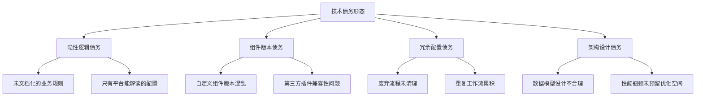

#### 4.5.2 公民开发者产出应用的规范性缺失

**由非专业技术人员构建的应用，在代码规范、架构设计、安全合规等方面往往存在显著不足**。这种规范性缺失是技术债务快速积累的重要来源。

**架构设计缺失**是首要问题。公民开发者通常缺乏系统架构的专业知识，其构建的应用可能存在数据模型设计不合理、流程逻辑冗余、性能瓶颈等问题。流程节点强制校验的缺失可能导致创建无主键的数据表、单表字段数过多等低效设计[^33]。

**安全意识薄弱**是第二个问题。公民开发者可能忽视数据加密、权限控制、输入校验等安全细节。零代码平台在便捷性与安全性之间往往难以平衡，特别是在数据传输、存储和访问控制方面存在较大隐患[^29]。某低代码平台在对外开放接口处缺乏跨域控制与输入校验，存在注入、越权及数据泄露风险[^32]。

**测试覆盖不足**是第三个问题。公民开发者构建的应用往往缺乏充分的测试验证，边界条件、异常场景的处理可能存在漏洞。这些隐患在应用初期可能不会暴露，但随着使用规模扩大和业务场景复杂化，问题会逐渐显现。

#### 4.5.3 技术债务的爆发式显现与清偿困境

**技术债务在应用规模扩张后往往呈现爆发式显现的特征**。这种"债务爆炸"现象使得企业在短时间内面临巨大的维护压力。

**债务显现的触发条件**通常包括：核心开发人员离职、业务需求重大变更、系统需要与新系统集成、性能瓶颈突破临界点等。某零售企业IT部门技能评估显示，过度依赖无代码平台导致团队Java/Python技能退化率达**47%**，在需要深度集成AI能力时出现严重的技术断层[^31]。

**债务清偿的困难**源于多重因素。首先，债务的识别本身就是挑战——隐藏在可视化配置中的问题难以通过传统的代码审查发现。其次，债务的清偿需要专业技术能力，而过度依赖低代码平台可能导致企业内部技术能力退化。最后，债务清偿可能需要对系统进行大规模重构，其成本和风险都很高。

**治理体系的缺失**加剧了债务清偿的困难。良好的治理能将技术债务发生率降低60%[^33]，但许多企业在引入低代码/无代码平台时，未能同步建立相应的治理机制。设立低代码项目委员会，某集团通过此机制避免了**12个"重复造轮子"项目**[^26]。

### 4.6 场景差异化分析：核心系统与敏捷业务的不同挑战

#### 4.6.1 大型企业核心系统场景的风险特征

**大型企业的核心系统（如HR、财务、供应链管理）对稳定性、合规性和长期演进能力有严苛要求**，这些要求与低代码/无代码平台的特性之间存在潜在冲突。

**稳定性要求与平台依赖的矛盾**是首要风险。核心系统的任何故障都可能对企业运营造成重大影响，但平台依赖意味着系统稳定性部分受制于供应商。某能源集团在上线新绩效系统后，两年内因流程调整产生的二次开发费用高达210万元，运维团队扩编至**15人**[^27]。

**合规审计与"黑盒"特性的冲突**是第二个风险。强监管行业的核心系统需要满足严格的合规要求，包括数据加密、权限管理、等保认证、GDPR合规等**12项安全指标**[^26]。低代码平台的封装特性可能导致合规审计困难，企业难以证明系统符合监管要求。

**长期演进需求与定制化限制的矛盾**是第三个风险。核心系统需要伴随企业战略调整持续演进，但低代码平台的定制化限制可能制约系统的演进空间。当传统编码式开发遭遇高频业务变更，企业往往陷入"开发-滞后-再开发"的恶性循环[^27]。

| 风险维度 | 核心系统需求 | 低代码平台特性 | 潜在冲突 |
|:---|:---|:---|:---|
| **稳定性** | 7×24高可用，故障影响重大 | 依赖平台运行时环境 | 单点故障风险 |
| **合规性** | 严格审计要求，数据主权 | 封装特性，数据存储受限 | 审计困难，合规风险 |
| **演进性** | 持续适应业务变化 | 定制化能力有边界 | 演进空间受限 |
| **可控性** | 完全自主可控 | 供应商依赖 | 技术自主权受损 |

#### 4.6.2 快速迭代业务场景的成本权衡

**快速迭代业务场景（如营销活动、试点项目、创新实验）对上线速度有极高要求**，低代码/无代码平台在这类场景中通常能发挥显著优势，但长期成本权衡仍需审慎考量。

**短期效率收益**是这类场景采用低代码/无代码平台的主要驱动力。某零售企业利用低代码平台仅用3天时间搭建社区团购试点应用，快速验证业务模式可行性[^31]。这种"快速试错、低成本验证"的能力对于业务创新至关重要。

**长期技术债务积累**是需要警惕的隐性成本。快速迭代场景往往强调"能用就行"，对系统架构和代码规范的要求相对宽松，这种取向容易导致技术债务的快速积累。某企业落地审批流搭建工具时，初期以"能跑就行"为目标，忽视了流程的可读性与可维护性，结果大多数流程仅能跑通基本路径，**运维人员需要花大量时间追踪日志、修复分支**[^32]。

**应用生命周期管理**是第三个考量因素。快速迭代场景中构建的应用，其预期生命周期可能较短，但实际运行中可能因业务需要而不断延长。这种"临时应用长期化"的现象，使得初期忽视的技术债务问题逐渐放大。

#### 4.6.3 不同场景下的风险识别与成本控制要点

基于上述分析，可以提炼出不同场景下风险识别与成本控制的关键要点：

**大型企业核心系统场景的要点**：

- **选型阶段**：优先选择具备全栈信创适配能力的企业级低代码平台，确保满足合规要求；评估平台的开放性和可迁移性，签订明确的数据主权和迁移支持条款
- **实施阶段**：建立严格的开发规范和审批流程，设立低代码项目委员会进行统一管控；保留核心业务逻辑的传统开发能力，采用混合架构降低风险
- **运维阶段**：建立技术债务可视化监控机制，定期评估系统健康度；制定应急预案和退出策略，确保业务连续性

**快速迭代业务场景的要点**：

- **选型阶段**：优先考虑上线速度和易用性，但需评估应用可能的生命周期延长风险
- **实施阶段**：即便是"快速试点"项目，也应保持基本的架构规范和文档记录；明确应用的预期生命周期和退出条件
- **运维阶段**：建立应用生命周期管理机制，定期清理废弃应用；对于需要长期运行的应用，及时进行架构优化和技术债务清偿

**综合成本评估框架**应涵盖以下维度：

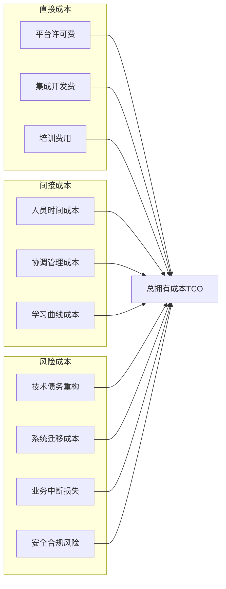

**核心结论是：长期维护成本的管控关键在于"预防优于治疗"**。企业应在平台选型阶段即采用系统化评估框架，全面审视长期总拥有成本（TCO）；在运营中明确平台边界，建立预防性的技术债务与治理体系；并根据企业自身规模与场景特性，制定差异化的平台应用与风险管理策略。通过主动管理，方能最大化平台效率红利，确保系统长期健康与可控。

## 5 多利益相关者视角：开发者、业务与组织的权衡

低代码/无代码平台的价值评估从来不是一个纯粹的技术问题，而是深度嵌入组织利益格局与权力结构的复杂命题。**不同利益相关者基于各自的专业背景、绩效目标和风险偏好，对同一平台形成截然不同的认知与评价**。这种视角差异如果得不到有效识别和弥合，可能导致组织内部的决策冲突、执行障碍乃至项目失败。本章将系统剖析开发者、业务管理者和组织治理层三个核心视角的诉求差异，揭示跨部门张力的深层根源，并探讨构建多方共识的协调机制。

### 5.1 开发者视角：技术自由度、代码质量与职业发展的关切

#### 5.1.1 技术自主权与控制力的核心诉求

**专业开发者对低代码/无代码平台的首要关切集中在技术自主权的维护上**。这种关切并非出于对新技术的抵触，而是源于对软件系统长期健康运行的专业判断。开发者深知，技术选型决策的影响远不止于初始开发阶段，而是贯穿系统的整个生命周期。

**供应商锁定风险**是开发者最为警惕的问题之一。当企业在低代码平台上积累了大量业务应用后，其核心业务逻辑与平台深度耦合，未来的技术演进路径将受制于供应商的产品策略。开发者推崇支持源码导出、开放生态的平台架构，认为封闭平台是重大战略风险[^34]。某能源企业CTO的实践印证了这一诉求："我们最初只需要物联网中台，随着业务发展逐步增加了数字孪生和移动应用需求。平台让我们可以从一个点开始逐步扩展，而不是推倒重来"——这种渐进式演进能力正是开发者所看重的技术自主性体现[^34]。

**技术栈选择的灵活性**是第二个核心诉求。传统开发允许开发者根据项目需求选择最适合的编程语言、框架和工具，而低代码平台的预设技术栈可能与特定场景的最优解存在偏差。开发者担忧，平台的标准化组件虽然降低了入门门槛，但也限制了技术创新的空间[^35]。

| 开发者核心诉求 | 具体表现 | 对平台的评价标准 |
|:---|:---|:---|
| **技术自主权** | 避免供应商锁定，保障源码可导出 | 开放性、可迁移性 |
| **技术栈灵活性** | 根据场景选择最优技术方案 | 扩展能力、定制深度 |
| **架构控制力** | 主导系统架构设计与演进 | 底层可访问性、优化空间 |

#### 5.1.2 代码质量与系统可维护性的深层担忧

**开发者对低代码/无代码平台生成代码的质量持审慎态度**。这种担忧并非空穴来风，而是基于对软件工程基本原则的专业坚守。

**自动生成代码的可维护性**是首要担忧。低代码平台为实现通用性，在底层做了大量抽象和封装，自动生成的代码往往采用"安全但不一定高效"的通用实现方式。开发者指出，这类代码在后期迭代、功能扩展和问题排查时，可能遭遇难以逾越的技术障碍[^36]。技术债务积累速度可能是传统系统的2.3倍这一数据，印证了开发者对长期可维护性的担忧。

**调试与性能优化能力的约束**是第二个担忧。低代码平台的"黑盒"特性使得开发者无法像传统开发那样直接访问底层代码进行精细调优。当系统出现性能瓶颈或异常行为时，开发者可能缺乏有效的诊断工具和优化手段[^37]。某金融企业的实践显示，低代码平台在处理复杂业务逻辑时"简直就像用儿童积木去搭摩天大楼——不是完全不可能，但会非常别扭，而且效率极低"。

**安全漏洞的识别与修复**是第三个担忧。开发者需要审计AI生成代码的安全漏洞，某电商平台修复AI代码中的SQL注入风险点达137个[^38]。这种安全审计工作的复杂性，使得开发者对"无需编码即可构建安全应用"的宣传持保留态度。

#### 5.1.3 职业发展路径与技能价值的焦虑

**低代码/无代码平台的普及对专业开发者的职业前景产生了深远影响**。这种影响既包含挑战，也蕴含机遇，关键在于开发者如何重新定位自身价值。

**编程技能贬值的焦虑**是开发者群体普遍存在的心理压力。随着低代码工具能够自动生成60%-80%的基础代码，单纯的手写代码能力已不足以构成核心竞争优势[^39]。初级开发岗位的需求下降趋势尤为明显——重复性编码岗位（如CRUD开发）需求预计下降60%[^38]。

**职业路径变窄的担忧**同样困扰着开发者。传统的职业成长路径是从初级开发者逐渐成长为高级开发者、架构师乃至技术管理者。但低代码平台的出现可能压缩这一成长通道，使得部分开发者的职业发展陷入瓶颈[^40]。

然而，**角色转型也带来了新的机遇**。开发者正在从"代码编写者"向"系统设计者"和"AI协作者"转型[^39]。未来的顶尖开发者需要成为"懂AI的技术架构师"与"通业务的解决方案专家"的结合体。掌握AI工具集成、理解模型逻辑、具备评估生成代码质量的能力，正在成为新的核心竞争力[^41]。

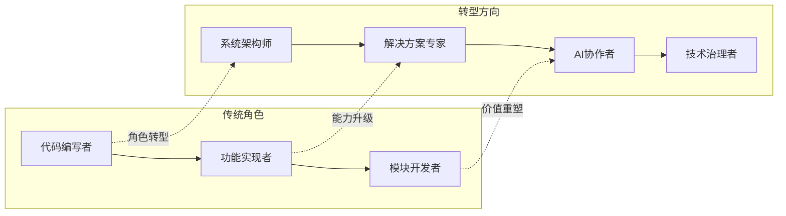

### 5.2 业务管理者视角：交付速度、成本控制与业务敏捷性的诉求

#### 5.2.1 快速交付与市场响应的核心期望

**业务管理者将低代码/无代码平台视为实现业务敏捷的战略工具**，其核心期望聚焦于缩短从需求提出到产品上线的响应周期。在竞争激烈的市场环境中，时间就是竞争力，快速验证业务创意、抢占市场窗口期的能力至关重要。

**交付周期的显著压缩**是业务管理者最为看重的价值主张。传统开发模式下，一个业务需求从提出到上线可能需要数月甚至更长时间，而低代码/无代码平台能够将这一周期缩短至周级甚至天级[^42][^2]。某零售企业利用低代码平台仅用3天时间搭建社区团购试点应用，快速验证业务模式可行性的案例，充分体现了业务管理者所追求的敏捷响应能力。

**业务试错成本的降低**是第二个核心期望。在不确定性日益增加的商业环境中，快速试错、小步快跑的能力成为企业的核心竞争力。低代码/无代码平台使得业务部门能够以较低成本验证业务假设，失败的代价也相对可控[^43][^36]。

**减少对IT部门的依赖**是第三个期望。传统模式下，业务部门的数字化需求需要排队等待IT部门排期，这种"需求积压"现象严重制约了业务创新的速度。低代码/无代码平台通过赋能业务人员直接参与应用构建，打破了这一瓶颈[^36][^37]。

| 业务管理者核心诉求 | 量化期望 | 实现路径 |
|:---|:---|:---|
| **交付速度** | 周期缩短60%-85% | 可视化开发、预置组件 |
| **成本控制** | IT投入降低30%-80% | 减少专业开发者依赖 |
| **业务敏捷** | 需求响应从月级到周级 | 业务人员直接参与开发 |

#### 5.2.2 成本控制与资源优化的商业逻辑

**从商业角度审视，低代码/无代码平台的成本优势是业务管理者推动采纳的重要驱动力**。这种成本优势体现在多个维度。

**人力成本的显著降低**是最直观的收益。业务管理者认识到，无需雇用庞大的开发团队，只要一个懂业务逻辑的运营人员稍加培训，就能搞定日常的应用开发工作。这种省下的人力和开发成本，直接转化为企业的竞争力[^36]。某物流企业的案例显示，采用低代码平台后人力成本降低60%。

**项目周期缩短带来的机会成本节约**是第二个维度。更快的交付意味着更早的市场进入，这种时间价值在快速变化的市场环境中尤为重要。业务管理者倾向于从ROI（投资回报率）角度评估平台价值，关注开发效率提升（3-5倍）、成本节约（30%-80% IT预算）等量化指标[^2][^44]。

**运维成本的优化**是第三个维度。低代码平台提供统一的架构和管理模式，使得应用的维护更加容易。某电商企业的订单管理系统案例显示，采用低代码模式后年运维成本从20万元降至6万元，降幅达70%[^36]。

#### 5.2.3 技术风险认知的盲区与潜在冲突

**业务管理者对低代码/无代码平台的热情，往往伴随着对技术风险认知的不足**。这种认知盲区可能导致决策偏差，并在后期引发与技术团队的冲突。

**对长期维护成本的低估**是首要盲区。业务管理者往往聚焦于初始开发阶段的效率提升和成本节约，而对系统生命周期中的维护成本、技术债务积累、迁移风险等因素关注不足。Gartner调研显示，73%的企业低估了系统全生命周期成本[^36]。

**对技术债务影响的认知不足**是第二个盲区。业务管理者可能不理解"技术债务"这一概念的深层含义，也难以预见快速开发模式下债务积累对系统长期健康的影响。当技术债务在后期爆发式显现时，可能产生超出预期的重构成本。

**对平台能力边界的过度乐观**是第三个盲区。业务管理者可能希望将低代码平台用于更广泛甚至核心的业务场景，以最大化投资价值。然而，开发者基于技术判断，往往倾向于将其限定在轻量级、非核心的应用范围[^45]。这种期望差距是IT部门与业务部门冲突的重要来源。

### 5.3 视角冲突与认知鸿沟：IT部门与业务部门的张力分析

#### 5.3.1 "成功"定义的系统性分歧

**开发者与业务管理者对"项目成功"的定义存在根本性差异**，这种分歧是跨部门张力的深层根源。

**业务管理者的成功标准**侧重于交付速度、功能完整性和业务价值实现。一个项目如果能够按时上线、满足业务需求、产生预期的商业回报，在业务视角下即为成功。这种评价标准强调短期可见的成果。

**开发者的成功标准**则更加关注系统的技术质量、架构合理性和长期可维护性。一个技术上"成功"的项目，应当具备清晰的架构设计、高质量的代码实现、完善的文档记录和良好的扩展性。即便项目按时交付，如果技术债务累积严重，在开发者看来也难言成功。

这种定义差异导致了评价标准的错位。业务部门可能认为某个低代码项目"大获成功"，而技术团队却在为其埋下的隐患忧心忡忡。某制造企业的案例具有代表性：200名公民开发者快速产出了大量应用，业务部门欢欣鼓舞，但当核心开发人员离职后，系统陷入无人能维护的窘境——审计显示72%的业务流程存在未文档化的隐性逻辑[^46]。

#### 5.3.2 风险容忍度与时间视野的错位

**两类角色在风险偏好和时间视野上的差异，进一步加剧了认知鸿沟**。

**时间视野的差异**是核心矛盾之一。业务管理者往往关注季度或年度的业绩目标，追求短期内可见的成果；而开发者更倾向于从系统全生命周期的角度思考问题，关注3-5年甚至更长时间跨度内的技术演进。这种时间视野的错位，导致双方对"当下决策的合理性"产生不同判断。

**风险容忍度的差异**同样显著。业务管理者在市场压力下可能愿意承担一定的技术风险以换取速度优势，认为"先上线再优化"是务实的选择；而开发者基于专业判断，可能认为某些技术妥协会埋下严重隐患，主张"宁可慢一点也要做对"。

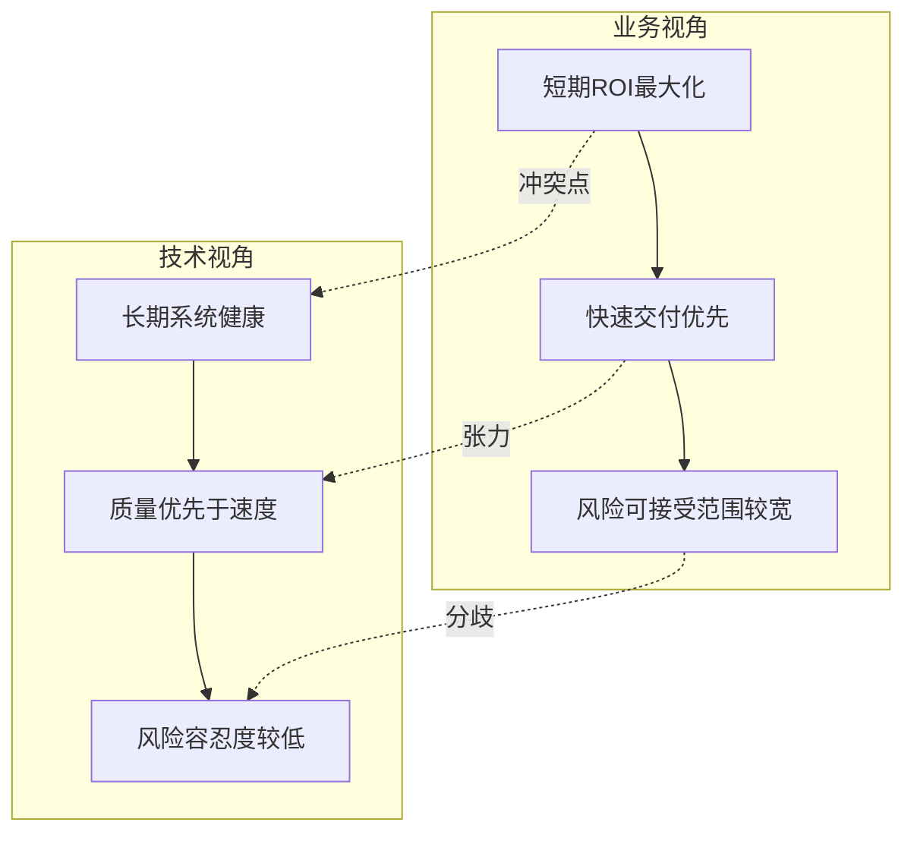

#### 5.3.3 话语体系对立与沟通障碍

**"技术债务"与"业务价值"两套话语体系的对立，加剧了跨部门沟通的障碍**。

**专业术语的理解鸿沟**是沟通障碍的首要来源。当开发者谈论"技术债务"、"架构耦合"、"性能瓶颈"时，业务管理者可能难以理解这些概念的实际影响和严重程度。反之，当业务管理者强调"市场窗口期"、"竞争态势"、"客户体验"时，开发者也可能低估这些商业因素的紧迫性。

**信息不对称**进一步加剧了沟通困难。开发者掌握着系统内部的技术细节，能够识别潜在的风险和隐患；但这些信息如果不能有效传递给业务决策者，可能导致决策失误。某地产集团因供应商排期延误导致紧急上线疫情考勤政策失败，20家子公司停工核查，单日损失超千万的案例，部分原因就在于技术风险未能在决策层面得到充分重视[^36]。

**价值判断的差异**是最深层的沟通障碍。开发者可能认为"技术质量"本身就是价值，而业务管理者可能认为只有转化为商业成果的技术才有价值。这种价值观层面的差异，很难通过简单的信息传递来弥合。

### 5.4 组织采纳的驱动因素与决策博弈机制

#### 5.4.1 外部环境驱动因素分析

**企业引入低代码/无代码平台的决策，受到多重外部环境因素的驱动**。这些因素构成了组织变革的宏观背景。

**数字化转型的战略压力**是首要驱动因素。在数字化竞争卷到极致的当下，企业不想被流程拖死，也不想被IT人手短缺卡脖子，低代码平台直接成为标配武器[^2]。这种战略压力来自竞争对手的数字化进程、客户对数字化体验的期望，以及行业整体的技术演进趋势。

**IT人才供需的结构性失衡**是第二个驱动因素。2024年低代码开发岗位缺口达56万，具备全栈能力的复合型人才仅占12%[^47]。这种人才短缺迫使企业寻找降低技术门槛的替代方案。

**敏捷响应市场需求的竞争压力**是第三个驱动因素。市场变化日益加快，企业需要快速响应客户需求、政策变动和竞争态势。传统开发模式的冗长周期已难以适应这种快节奏的商业环境[^48]。

| 外部驱动因素 | 具体表现 | 对采纳决策的影响 |
|:---|:---|:---|
| **数字化转型压力** | 竞争对手数字化进程加速 | 战略层面的紧迫感 |
| **人才短缺** | 专业开发者供不应求 | 寻找替代性解决方案 |
| **市场响应要求** | 需求变化周期缩短 | 对敏捷交付能力的需求 |
| **成本控制目标** | IT预算约束趋紧 | 寻求更具成本效益的方案 |

#### 5.4.2 内部利益相关者的诉求博弈

**组织内部不同层级的决策者，基于各自的利益诉求和影响力，在平台选型与推广过程中形成复杂的博弈格局**。

**高管层**通常从战略高度审视低代码/无代码平台的价值。其核心关切包括：数字化转型目标的达成、IT投资的回报率、企业竞争力的提升。高管层倾向于支持能够快速见效、降低成本的技术方案，但可能对技术细节和长期风险关注不足。

**IT负责人**处于技术与业务的交汇点，承担着平衡多方诉求的责任。其核心关切包括：系统的技术质量与安全性、IT团队的能力建设与角色定位、技术架构的长期演进。IT负责人需要在支持业务敏捷与维护技术标准之间寻找平衡点。

**业务负责人**是低代码/无代码平台的主要受益者和推动者。其核心关切包括：业务需求的快速响应、部门数字化能力的提升、对IT资源的自主掌控。业务负责人往往是平台采纳的积极倡导者。

这种多方博弈的结果，决定了平台选型的方向、推广的范围和治理的模式。成功的采纳决策需要在不同利益诉求之间找到最大公约数。

#### 5.4.3 决策过程中的组织政治动态

**平台选型与推广过程中的组织政治动态，往往对最终结果产生重要影响**。这种政治动态包括权力博弈、资源争夺和话语权竞争。

**IT部门与业务部门的权力边界重划**是核心政治议题。低代码/无代码平台的引入，意味着应用开发能力从IT部门向业务部门的部分转移。这种权力再分配可能引发IT部门的抵触，也可能激发业务部门的热情。如何在赋能业务的同时维护IT部门的专业地位，是组织需要妥善处理的政治问题。

**预算与资源的分配**是另一个政治焦点。低代码/无代码平台的采购、实施和运维需要资源投入，这些资源的来源和归属涉及部门利益。平台是作为IT基础设施统一管理，还是由各业务部门分散采购，不同的模式对应着不同的权力格局。

**成功案例的归属与失败责任的界定**同样具有政治意涵。当低代码项目取得成功时，业务部门和IT部门可能都希望获得功劳认定；而当项目出现问题时，责任归属的模糊性可能引发相互推诿。

### 5.5 公民开发者模式的文化冲突与边界管理

#### 5.5.1 开发权力下放引发的质量控制担忧

**公民开发者模式将应用开发能力从专业IT人员扩展到业务人员，这种权力下放在带来敏捷性的同时，也引发了严重的质量控制担忧**。

**专业规范的缺失**是首要担忧。公民开发者通常缺乏软件工程的专业训练，其构建的应用可能在架构设计、安全合规、性能优化等方面存在不足。流程节点强制校验的缺失可能导致创建无主键的数据表、单表字段数过多等低效设计[^46]。

**测试覆盖的不足**是第二个担忧。公民开发者构建的应用往往缺乏充分的测试验证，边界条件、异常场景的处理可能存在漏洞。这些隐患在应用初期可能不会暴露，但随着使用规模扩大和业务场景复杂化，问题会逐渐显现。

**文档记录的欠缺**是第三个担忧。公民开发者可能不习惯编写技术文档，导致应用的业务逻辑和配置细节只存在于开发者的脑中。当开发者离职或调岗时，应用可能陷入无人能维护的困境。某制造企业的案例显示，72%的业务流程存在未文档化的隐性逻辑，这些通过可视化界面配置的规则成为只有平台能解读的"数字黑箱"[^46]。

#### 5.5.2 "影子IT"风险的蔓延与管控

**公民开发者模式的推广，可能加剧"影子IT"（Shadow IT）现象的蔓延**。影子IT指的是未经IT部门批准或监管的技术应用，其风险在低代码/无代码时代呈现新的形态。

**应用资产的失控**是影子IT的首要风险。当业务部门可以自主构建应用时，IT部门可能失去对企业应用资产的全面掌控。大量未经审批的应用可能散布在组织各处，形成难以管理的"应用丛林"。

**安全合规的漏洞**是第二个风险。影子IT应用可能绕过企业的安全策略和合规审查，成为数据泄露或安全攻击的薄弱环节。某低代码平台在对外开放接口处缺乏跨域控制与输入校验，存在注入、越权及数据泄露风险[^45]。

**数据孤岛的形成**是第三个风险。各业务部门独立构建的应用可能形成新的数据孤岛，数据无法在组织层面有效整合和利用。

#### 5.5.3 赋能与管控的平衡机制设计

**在公民开发者模式下，如何在赋能业务创新与维护系统规范之间建立有效的平衡机制，是组织治理的核心挑战**。

**分级授权机制**是平衡的基础。根据应用的复杂度、重要性和风险等级，设定不同的开发权限和审批流程。简单的表单应用可以由业务人员自主开发；涉及敏感数据或复杂集成的应用则需要IT部门的参与和审批。

**标准化模板与组件库**是质量保障的手段。IT部门可以预先构建符合企业规范的模板和组件，公民开发者在此基础上进行配置和组合，从而在保持灵活性的同时确保基本的质量标准。

**定期审计与清理机制**是风险控制的保障。建立应用资产的定期审计制度，识别和清理废弃应用、重复应用和不合规应用，防止技术债务的无序积累。技术债务可视化看板的关键指标包括：未使用的字段/表单占比、重复工作流数量等[^46]。

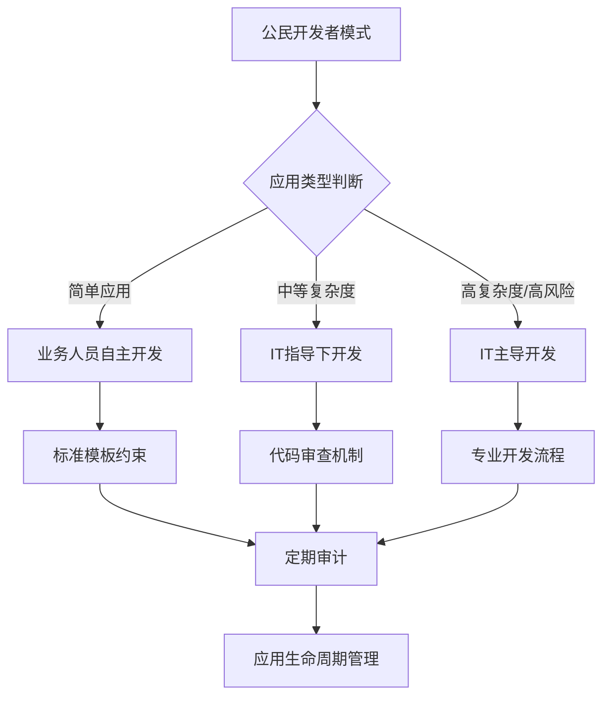

### 5.6 规模化应用的治理挑战与协调机制构建

#### 5.6.1 规模化应用后的系统性治理难题

**当低代码/无代码平台在组织内规模化应用后，一系列系统性的治理难题开始浮现**。这些难题的复杂度远超单个项目层面的技术问题。

**应用资产的统一管理**是首要难题。随着应用数量的增长，如何建立统一的应用目录、版本管理和生命周期管理机制，成为迫切需求。某集团通过设立低代码项目委员会，避免了12个"重复造轮子"项目[^46]。

**安全合规的集中管控**是第二个难题。分散开发的应用需要纳入统一的安全策略框架，确保满足数据加密、权限管理、等保认证、GDPR合规等12项安全指标[^2]。这种集中管控与分散开发之间的张力，需要精心设计的治理机制来平衡。

**技术债务的组织级监控**是第三个难题。技术债务不再是单个项目的问题，而是组织层面需要系统管理的资产负债。良好的治理能将技术债务发生率降低60%[^46]。

**跨部门标准的协调统一**是第四个难题。不同业务部门可能形成各自的开发规范和最佳实践，这些标准的差异可能导致应用之间的集成困难和维护复杂度上升。

| 治理难题 | 具体表现 | 管理复杂度 |
|:---|:---|:---|
| **应用资产管理** | 应用数量激增，目录混乱 | 高 |
| **安全合规管控** | 分散开发难以统一审计 | 极高 |
| **技术债务监控** | 债务分散在各部门应用中 | 高 |
| **标准协调统一** | 部门间规范差异大 | 中高 |

#### 5.6.2 低代码卓越中心（CoE）的建设路径

**建立低代码卓越中心（Center of Excellence, CoE）是应对规模化治理挑战的有效组织形式**。CoE作为跨部门的协调机构，承担着标准制定、能力建设、质量保障和知识管理等多重职能。

**CoE的核心职能**包括：

- **标准与规范制定**：建立统一的开发规范、安全策略、命名规则和文档标准，确保分散开发的应用符合组织级的质量要求
- **能力建设与培训**：为公民开发者提供系统化的培训，提升其开发能力和规范意识；同时为专业开发者提供平台深度使用的进阶培训
- **质量保障与审计**：建立应用审核机制，对关键应用进行技术评审；定期开展应用资产审计，识别和清理风险应用
- **知识管理与复用**：建立组件库、模板库和最佳实践库，促进开发经验的沉淀和复用；管理平台相关的技术文档和案例库

**CoE的组织定位**需要在IT部门与业务部门之间找到平衡点。CoE既不能完全隶属于IT部门（否则可能被视为"管控机构"而遭到业务部门抵触），也不能完全脱离IT部门（否则可能缺乏技术权威性）。理想的模式是由IT部门和业务部门共同组建、联合治理。

#### 5.6.3 多方利益平衡的长效协调框架

**构建多方利益平衡的长效协调框架，是低代码/无代码平台成功实施的组织保障**。这一框架需要在制度设计、沟通机制和激励体系三个层面进行系统构建。

**制度设计层面**，需要明确各方的权责边界和协作规则。IT部门负责平台选型、架构设计、安全合规和技术支持；业务部门负责需求定义、应用开发和业务运营；CoE负责标准制定、质量保障和知识管理。清晰的权责划分是避免推诿和冲突的基础。

**沟通机制层面**，需要建立常态化的跨部门沟通渠道。定期召开技术与业务的联席会议，分享项目进展、讨论问题挑战、协调资源配置。建立问题升级机制，确保重大分歧能够及时上报并得到决策。

**激励体系层面**，需要设计兼顾技术质量与业务价值的考核指标。单纯考核交付速度可能导致质量下滑；单纯考核技术指标可能导致业务响应迟缓。理想的考核体系应当将短期交付效率与长期系统健康纳入统一框架。

**核心结论是：低代码/无代码平台的成功实施，不仅是技术问题，更是组织治理问题**。开发者与业务管理者的视角差异本质上是技术理性与商业理性的张力。成功的实践并非一方说服另一方，而是通过有效沟通、明确规则、选择合适工具，将两者的诉求融合，最终共同实现在保障系统长期健康的前提下加速业务价值交付的目标。建立涵盖制度、沟通和激励的多层次协调框架，培育技术与业务相互理解、相互尊重的组织文化，是释放低代码/无代码平台价值潜力的关键所在。

## 6 行业演进趋势、市场格局与未来发展方向预测

低代码/无代码平台正处于从"高速扩张"向"深度渗透"转变的关键阶段。基于前文对效率增益与长期成本的系统分析，本章将从市场规模、技术演进、竞争格局、行业适配等多维度，预测该领域在未来软件开发格局中的战略定位，并系统研判低代码/无代码平台与传统开发之间将形成何种关系模式，为企业制定中长期技术战略提供前瞻性洞察。

### 6.1 市场规模增长态势与竞争格局演变

#### 6.1.1 市场规模持续扩张的量化预测

**低代码/无代码市场正处于高速增长轨道，未来五年将保持强劲的扩张态势**。根据IDC近日发布的《2024下半年中国低代码与零代码软件市场跟踪报告》，2024年全年中国低代码与零代码软件市场规模为40.3亿元人民币，同比增速为20.2%[^49]。IDC预计，到2029年市场规模将达到129.8亿元人民币，未来5年市场年复合增长率（CAGR）高达26.4%[^49]。

从全球视角来看，Gartner预测2025年全球低代码市场规模将突破200亿美元，其中AI驱动的智能开发工具将贡献超过60%的市场份额[^50]。这一增长态势的驱动力来自多重因素的叠加：

| 驱动因素 | 具体表现 | 市场影响 |
|:---|:---|:---|
| **数字化转型加速** | 企业数字化需求激增，IT产能供给不足 | 低代码成为填补产能缺口的核心工具 |
| **AI技术融合** | 大模型能力深度嵌入开发平台 | 开发效率倍增，应用场景扩展 |
| **信创政策驱动** | 国产化替代要求全栈适配 | 头部国产平台市场份额提升 |
| **人才结构性短缺** | 专业开发者供需失衡加剧 | 公民开发者模式加速普及 |

**从细分市场结构来看**，2024年低代码子市场的规模占比为85.6%，零代码子市场规模占比14.4%[^49]。这一结构反映出企业对"可配置+可扩展"混合能力的偏好——纯零代码工具虽然入门门槛更低，但企业级复杂场景仍需低代码平台的代码扩展能力支撑。

#### 6.1.2 竞争格局的三大阵营分化

**当前市场竞争格局呈现"三大阵营分化、头部集中与细分深耕并存"的特征**。根据计世咨询研究院、Forrester等权威机构评分，主流低代码开发平台可分为国内企业级、国内生态集成型、国际主流三大类别，其中国内企业级平台因契合信创政策与复杂业务需求，占据58%的市场份额，成为核心类别[^17][^51]。

**国内企业级平台**以"全栈信创+复杂场景支撑"为核心优势，聚焦央企、金融、能源等大型企业的核心业务系统搭建。普元低代码在Forrester 2025年评估中位列国内厂商第一，深度覆盖金融、制造、军工、教育等关键领域，积累了8000+大中型客户实践经验[^17]。奥哲再次荣膺中国低零代码软件市场独立厂商第一，自2020年以来已连续多年稳居榜首[^52]。金蝶以15.7%的市场占有率连续五年蝉联中国低零代码市场占有率第一[^53]。

**国内生态集成型平台**依托主流互联网生态，以"轻量化、高集成"为特点。钉钉宜搭服务超2000万企业用户，接入DeepSeek大模型后表单生成效率提升60%[^17]。腾讯云微搭聚焦微信生态，内置AI Copilot功能可自动生成代码片段与测试用例，开发周期缩短70%[^17]。简道云以33.0%的市场占有率蝉联中国零代码平台整体市场第一[^54]。

**国际主流平台**在全球化部署、跨行业集成方面具备优势。OutSystems连续9年入选Gartner魔力象限领导者，在Forrester 2025年报告中位列全球领导者象限第一，集成AI代理工作台，自动化测试覆盖率达95%[^17]。

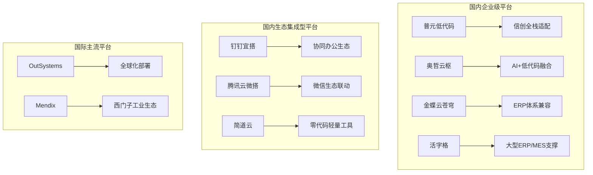

#### 6.1.3 市场结构演进的关键趋势

**市场正从"功能竞争"转向"综合生态竞争"**，竞争重点将从单一的产品功能，转向技术实力（尤其是AI能力）、行业解决方案深度、生态开放性与合作伙伴网络的综合比拼。IDC在报告中特别指出，整合生成式AI能力已成为低零代码产品发展的重要方向[^53]。

**低代码与零代码的融合趋势愈发明显**。为满足企业IT部门和业务部门的全面需求，平台正在打破"低代码"与"零代码"的传统边界，提供从简单表单到复杂系统的全谱系开发能力[^49]。这种融合使得平台既能满足业务人员的快速搭建需求，也能支撑专业开发者的深度定制场景。

### 6.2 AI原生融合重构开发范式的技术演进

#### 6.2.1 AI从"辅助功能"升级为"底层架构"

**2025-2026年低代码平台的核心变革是AI从"辅助功能"升级为"底层架构"，实现从"代码片段生成"到"领域模型驱动"的跨越**。Forrester在2025年Q2发布的报告中，明确将AI增强能力列为低代码开发平台竞争力的首要核心指标[^17]。

主流低代码开发平台均已集成多模态大模型，通过自然语言建模、智能调试、自动生成源码等功能，使开发效率提升300%-500%[^17]。部分平台可实现"自然语言转领域模型"准确率超80%，非技术人员也能完成80%的基础开发工作[^17]。这种AI原生能力让低代码开发平台彻底摆脱"代码生成工具"定位，成为"智能开发中枢"[^17]。

AI赋能低代码平台的关键功能涵盖开发全生命周期：

| 开发阶段 | AI赋能能力 | 效率提升效果 |
|:---|:---|:---|
| **需求理解** | NLP算法自动解析业务文档，生成初始数据模型 | 需求转化准确率提升 |
| **逻辑设计** | 机器学习推荐最优业务流，预测节点配置 | 设计效率提升50%+ |
| **代码生成** | 基于Transformer架构输出符合企业规范的代码片段，准确率达92% | 编码工作量降低70%+ |
| **智能调试** | AI诊断引擎自动识别潜在风险，提供修复建议 | 代码缺陷率降低40% |
| **界面优化** | 基于用户设备特征和操作习惯动态调整布局 | 用户体验显著提升 |

#### 6.2.2 自然语言编程与智能体开发的深度耦合

**自然语言编程（NLP-to-Code）正在成为低代码平台的标配能力**。用户可通过自然语言描述需求，系统自动生成可执行代码。例如，输入"创建一个客户管理模块，包含姓名、电话、订单记录字段，支持按金额排序"，平台即可生成包含前端页面、后端API和数据库表的完整解决方案[^55]。技术实现依赖预训练语言模型与领域知识图谱的结合，某开源项目已实现90%常见业务场景的覆盖[^55]。

**AI Agent与低代码平台的深度融合是下一阶段的重要演进方向**。IDC报告强调，随着生成式AI和大模型能力的跃升，低零代码平台正成为开发和部署AI智能体（AI Agent）的首选平台[^52]。奥哲于2025年10月全面升级AI战略，推出企业级AI平台，将AI、数据与低代码进行融合，助力企业迈向AI原生[^52]。金蝶积极探索AI Agent的应用路径，在2025年全面升级苍穹Agent平台2.0和五大智能体，涵盖财报分析、企业问数、招聘、差旅、企业知识等多个场景[^53]。

#### 6.2.3 AI驱动下平台角色的战略跃迁

**AI的深度融合正在重新定义低代码平台的战略定位**——从"提升开发效率的工具"跃迁为"驱动业务创新的智能中枢"。这种角色跃迁体现在以下维度：

**开发民主化的深化**：AI原生能力进一步降低了开发门槛，使得更多非技术人员能够参与应用构建。中国信通院《中国低代码平台发展白皮书》明确指出，AI原生赋能已成为2026年平台竞争力核心指标，非技术人员可通过文字描述生成基础应用，专业开发者效率提升300%-500%[^1]。

**从"交付工具"到"创新平台"的升级**：AI不仅能够加速已知需求的实现，还能够通过数据分析和模式识别，主动发现业务优化机会、预测潜在风险、推荐创新方案。这种主动性使得低代码平台从被动响应需求的工具，转变为主动赋能业务创新的平台。

**生态协同的智能化**：AI能力正在渗透到平台生态的各个环节——从组件推荐、模板匹配到合作伙伴对接，智能化的生态协同将显著提升企业在平台上构建解决方案的效率。

### 6.3 高低代码融合与混合开发模式的主流化

#### 6.3.1 混合模式成为行业主流的必然性

**"可视化配置+全量源码生成+异构系统集成"的混合模式，已成为低代码开发平台解决"定制化不足""性能瓶颈"的核心方案**[^17]。Gartner预测，2026年将有85%的企业级低代码开发平台采用这种混合架构[^17]。

这种混合模式的主流化源于企业需求的内在结构特征。企业的应用需求天然呈现"80%标准化场景+20%核心复杂场景"的分布格局[^17]。标准化场景（如表单审批、数据看板、简单工作流）适合通过零代码或低代码的可视化配置快速实现；而核心复杂场景（如金融风控算法、工业控制逻辑、深度系统集成）则需要专业代码的精细控制。混合模式恰好能够高效覆盖这两类需求，既保留低代码开发平台的效率优势，又通过源码扩展满足复杂业务需求[^17]。

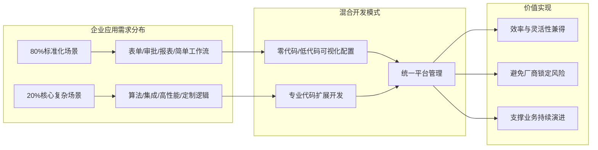

#### 6.3.2 混合模式解决传统低代码固有局限

**混合模式的核心价值在于突破传统低代码平台的两大固有局限**：

**定制化不足的突破**：纯低代码平台的预置组件和模板虽然能够覆盖大部分通用场景，但面对企业的独特业务逻辑时往往力不从心。混合模式通过支持专业代码扩展（Java、Node.js等），使得开发者能够在平台框架内实现任意复杂度的业务逻辑，不再受制于平台预设的功能边界。中国信通院明确指出，双向开发兼容是合格低代码平台的四大核心特征之一，既降低业务人员使用门槛，又能通过源码导出、脚本编写满足复杂业务逻辑定制，规避"厂商锁定"风险[^1]。

**性能瓶颈的化解**：传统低代码平台的底层封装在带来开发便利的同时，也限制了性能调优的空间。混合模式允许开发者针对性能敏感的核心模块采用传统代码实现，并进行精细化优化，从而在整体系统中实现效率与性能的平衡。

#### 6.3.3 源码导出与技术自主权保障

**源码导出能力是混合模式的关键支撑，也是企业规避平台锁定风险的核心保障**。普元低代码开发平台EOS Platform能100%生成源码资产，满足大型企业高并发场景性能需求与安全审计要求[^1]。这种源码级的资产可控性，使得企业在平台上的投资不会因供应商策略变更而贬值，也为未来可能的技术迁移保留了退路。

高低代码融合的趋势，让低代码开发平台既能满足中小企业快速搭建轻量应用的需求，也能支撑大型企业核心业务系统的复杂开发场景，进一步拓宽了低代码开发平台的应用边界[^17]。

### 6.4 垂直行业解决方案深化与场景适配演进

#### 6.4.1 从"通用化工具"向"行业化基建"转型

**低代码/无代码平台正在经历从"通用化工具"向"行业化数字基建"的深刻转型**。IDC数据显示，2025年政企客户复杂核心系统开发需求占比超65%，金融风控、工业MES、政务审批等复杂场景需求成为市场增长的主要驱动力[^16][^17]。

这种转型趋势体现在平台能力建设的重心转移上：

| 能力维度 | 通用化工具阶段 | 行业化基建阶段 |
|:---|:---|:---|
| **组件设计** | 通用表单、流程、报表组件 | 行业专属组件（如金融风控模型、MES生产排程） |
| **模板库** | 通用业务模板 | 深度行业解决方案模板 |
| **集成能力** | 标准API连接器 | 行业专用系统深度集成（ERP、MES、核心银行） |
| **合规适配** | 基础安全能力 | 行业监管合规全覆盖（等保、GDPR、金融审计） |

从中小企业的轻量管理工具到大型企业的核心业务系统，低代码开发平台正融入金融、制造、政务等80%以上的重点行业，成为驱动数字经济发展的重要引擎[^17][^51]。

#### 6.4.2 信创全栈适配成为刚性门槛

**在国产化替代政策推动下，信创全栈适配能力已从"加分项"升级为"刚性门槛"**。国企、金融、军工等关键行业对低代码开发平台的信创要求从"部分兼容"升级为"全栈适配"[^17]。

信创适配的完整性要求覆盖从芯片到应用的全链路：

- **芯片层**：适配鲲鹏、海光、龙芯、飞腾等国产芯片
- **操作系统层**：兼容麒麟、统信UOS等国产操作系统
- **数据库层**：支持达梦、人大金仓、高斯、阿里OB等国产数据库
- **中间件层**：适配国产消息队列、缓存、应用服务器

普元低代码是首批通过中国信通院"先进级"认定的产品，全栈适配鲲鹏、海光芯片及麒麟、统信操作系统，全面兼容8大国产芯片、6大操作系统、5大国产数据库，通过12项国家级信创认证，在金融、政务等关键行业的信创项目中市场占有率超60%[^1][^17]。

中国信通院最新评估结果显示，仅15%的头部平台能完成从芯片到数据库的全链路信创适配[^16]。这意味着信创适配能力正在成为筛选企业级低代码平台的关键门槛，也是头部厂商构建竞争壁垒的核心要素。

#### 6.4.3 垂直行业解决方案的成熟度演进

**垂直行业解决方案的成熟度正在成为平台竞争力的决定性因素**。以下是主要行业的解决方案演进态势：

**制造业**：低代码平台在制造业的应用正从边缘场景向核心系统延伸。某制造企业利用低代码平台在3个月内完成ERP系统重构，覆盖采购、生产、物流全流程，通过组件市场复用80%通用模块，利用AI代码生成器完成20%定制化开发[^55]。织信Informat在山东建筑大学的案例中实现88%的零代码配置率[^17]。

**金融业**：保险行业通过低代码平台构建"智能核保"系统，将传统2周的核保流程缩短至2小时，规则引擎可视化配置支持条件组合、权重分配，AI模型自动评估风险等级准确率91%[^55]。金融风控、核心银行系统现代化改造成为低代码平台的重要应用场景。

**证券行业**：国泰海通证券创新性地使用低代码技术提高数据的协同效率，平台累计用户突破2500人，月活用户数超1000人，报表开发周期较传统方法下降40%[^56]。

### 6.5 传统开发与低代码/无代码的关系模式研判

#### 6.5.1 互补融合而非替代的核心判断

**基于前文对效率增益与长期成本的系统分析，本报告的核心判断是：低代码/无代码平台与传统开发并非替代关系，而是互补与融合**。这一判断基于以下三个层面的论证：

**需求结构的客观分化**：企业的软件开发需求天然呈现分层结构——从简单的表单审批到复杂的核心算法系统，不同复杂度的需求对开发方式有不同的最优匹配。低代码/无代码平台在标准化、高频变化的场景中具有显著优势，而传统开发在高复杂度、高性能、深度定制的场景中仍是不可替代的选择。

**技术能力的互补特性**：低代码/无代码平台的核心价值在于"提升数字化产能和普及率"，而传统开发的核心价值在于"解决复杂核心问题"。两者在技术能力上形成互补——低代码/无代码平台擅长快速响应、降低门槛、缩短周期；传统开发擅长精细控制、深度优化、复杂逻辑实现。

**实践验证的趋势确认**：行业实践已经验证，"高低代码融合"的混合模式正在成为主流。Gartner预测2026年85%的企业级低代码平台将采用混合架构[^17]，这一预测本身就是对"互补融合"关系模式的确认。

#### 6.5.2 分层协作的最优组合策略

**在互补融合的关系模式下，企业应当采用"分层协作、API集成"的最优组合策略**：

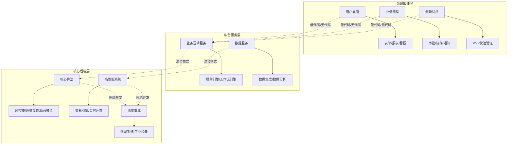

**前端敏捷层**：使用低代码/无代码平台快速构建用户界面、业务流程和创新试点应用。这一层的特点是需求变化频繁、标准化程度高、对响应速度要求高，正是低代码/无代码平台的最佳适用场景。

**中台服务层**：采用高低代码融合的混合模式，将业务逻辑和数据服务进行模块化封装。这一层既需要一定的灵活性以适应业务变化，也需要足够的稳定性以支撑上层应用。

**核心后端层**：使用传统开发方式构建核心算法、高性能系统和深度集成模块。这一层对性能、安全、可控性有严苛要求，需要专业开发者的精细控制。

各层之间通过标准化的API进行集成，形成松耦合的架构。这种分层协作的模式，既发挥了低代码/无代码平台的效率优势，又保障了核心系统的技术质量和可控性。

#### 6.5.3 混合架构成为企业数字化能力体系的主流形态

**"分层协作、API集成"的混合架构将成为企业数字化能力体系的主流形态**。这种架构的核心优势在于：

**敏捷性与稳定性的平衡**：前端敏捷层可以快速响应业务变化，核心后端层保持稳定可靠，两者相互独立又协同工作。

**效率与质量的兼顾**：标准化场景通过低代码/无代码平台高效交付，复杂场景通过传统开发保障质量，整体数字化效率得到最优化。

**风险的分散与可控**：关键业务逻辑保持技术自主，避免对单一平台的过度依赖；同时通过低代码/无代码平台降低非核心场景的开发成本。

### 6.6 不同规模企业的差异化适用路径预测

#### 6.6.1 大型企业：企业级AI平台与全栈信创适配

**大型企业（尤其是央企、金融、能源等关键行业）的低代码/无代码平台应用将聚焦于企业级AI平台与全栈信创适配**。这类企业的核心诉求包括：

- **复杂业务系统支撑**：需要平台能够支撑核心业务系统的构建和演进，而非仅限于边缘应用
- **信创合规要求**：必须满足国产化替代的政策要求，通过相关认证
- **安全与治理能力**：需要完善的权限管理、审计日志、数据加密等企业级治理能力
- **生态集成能力**：需要与现有ERP、CRM、MES等系统深度集成

**大型企业将构建"少量IT+多名业务开发者"的高效协作模式**。低代码平台的核心价值在于破解"IT产能不足与业务需求激增"的矛盾。一方面，将业务人员转化为"业务开发者"，承接80%高频标准化需求，让IT团队聚焦集成、安全、数据治理等核心工作；另一方面，通过周级迭代速度与MVP交付理念，缩短系统上线周期[^1]。

**选型重点**：优先选择具备全栈信创适配能力、复杂逻辑支撑能力、高安全高可用保障的企业级平台，如普元、奥哲、金蝶等头部厂商[^57]。

#### 6.6.2 中型企业：高低代码融合与行业解决方案快速落地

**中型企业的低代码/无代码平台应用将侧重于高低代码融合与行业解决方案的快速落地**。这类企业的核心诉求包括：

- **快速数字化转型**：希望以较低成本快速实现核心业务流程的数字化
- **行业最佳实践复用**：期望借助平台的行业模板和解决方案，避免"从零开始"
- **灵活扩展能力**：既需要快速上线的敏捷性，也需要后续扩展的灵活性

**中型企业应当采用"行业模板+定制扩展"的实施路径**。首先基于平台提供的行业解决方案模板快速搭建基础系统，然后根据自身业务特点进行定制化扩展。这种路径能够在保证交付速度的同时，满足企业的个性化需求。

**选型重点**：关注平台的行业解决方案成熟度、高低代码融合能力、性价比，可考虑活字格、织信Informat等具备行业深度的平台[^17]。

#### 6.6.3 小微企业：轻量级零代码工具实现低成本数字化

**小微企业的低代码/无代码平台应用将依托轻量级零代码工具实现低成本数字化转型**。这类企业的核心诉求包括：

- **极低的入门门槛**：无专业IT人员，需要业务人员能够直接上手
- **最小化的成本投入**：预算有限，需要高性价比的解决方案
- **快速见效**：希望在短时间内解决具体的业务痛点

**零代码平台是小微企业数字化转型的理想选择**。无代码平台完全消除了编程门槛，用户不需要精通编程语言，只需拖拽功能组件并设置选项参数，即可构建出功能完备的应用系统。零代码平台的标准化程度很高，开发周期比较短，往往在一个月之内甚至一周之内便可以开发完成，且能迅速验证业务模式，大大降低试错成本，适合预算有限的中小企业[^58]。

**选型重点**：优先考虑易用性、成本和生态集成能力，可选择简道云、钉钉宜搭等轻量级平台[^17][^59]。

| 企业规模 | 核心诉求 | 推荐平台类型 | 实施重点 |
|:---|:---|:---|:---|
| **大型企业** | 复杂系统支撑、信创合规、安全治理 | 企业级AI平台 | 全栈信创适配、CoE治理体系 |
| **中型企业** | 快速转型、行业方案、灵活扩展 | 高低代码融合平台 | 行业模板复用、定制扩展 |
| **小微企业** | 低门槛、低成本、快速见效 | 轻量级零代码工具 | 即开即用、场景化应用 |

### 6.7 生态体系成熟与开发者角色转型展望

#### 6.7.1 平台生态体系的成熟化趋势

**低代码/无代码平台的生态体系正在走向成熟，组件市场、模板库、合作伙伴网络与开发者社区的完善将成为平台竞争力的关键要素**。

**组件市场与模板库的丰富化**：头部平台正在构建日益丰富的组件市场和行业模板库。钉钉宜搭提供500+行业模板[^17]，华为云Astro Zero提供应用资产的开发标准和微服务框架，助力企业不断沉淀可复制的套件[^58]。这些预置资产使得企业能够以"搭积木"的方式快速构建应用，大幅缩短开发周期。

**合作伙伴网络的扩展**：除了平台提供商，市场上出现了众多的咨询公司、系统集成商、独立软件开发商等合作伙伴，他们与平台提供商合作，为企业提供全方位的解决方案和服务，形成了较为完善的生态体系[^60]。

**开发者社区的活跃化**：活跃的开发者社区是平台生态健康的重要标志。社区不仅是技术交流和问题解答的平台，更是创新思想和最佳实践的发源地。具备强大连接器、开放API、插件化架构、活跃开发者社区及广泛ISV/集成商伙伴的平台，将获得更高的客户粘性和市场渗透率。

#### 6.7.2 专业开发者的角色转型路径

**低代码/无代码平台的普及正在深刻改变专业开发者的角色定位，推动其从"代码编写者"向"系统架构师"与"AI协作者"转型**。

**从"代码编写者"到"系统架构师"**：随着低代码工具能够自动生成60%-80%的基础代码，单纯的手写代码能力已不足以构成核心竞争优势。开发者的工作重心将从编写基础CRUD代码，转向业务需求分析、领域模型设计、系统架构集成、以及利用低代码平台进行高效交付和运维[^61]。

**从"技术执行者"到"AI协作者"**：AI技术的深度融合要求开发者具备与AI工具协作的能力。开发者需要学会如何有效地向AI描述需求、如何评估和优化AI生成的代码、如何将AI能力嵌入业务系统。Gartner预测，到2028年75%的企业软件工程师将使用AI编码助手[^61]。

**核心能力的重新定义**：未来的顶尖开发者需要成为"懂AI的技术架构师"与"通业务的解决方案专家"的结合体。掌握AI工具集成、理解模型逻辑、具备评估生成代码质量的能力，正在成为新的核心竞争力。

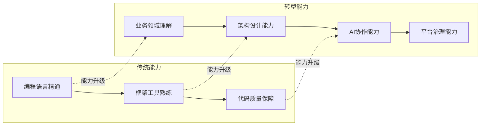

#### 6.7.3 公民开发者群体扩大与组织结构变革

**公民开发者群体的持续扩大将对企业IT组织结构和人才培养模式产生深远影响**。

**IT组织结构的重塑**：传统的"业务提需求、IT做开发"的串行模式，正在向"业务主导构建、IT提供支撑"的并行模式转变。某零售企业培训非技术员工使用低代码工具，6个月内自主开发了12个业务应用，包括门店巡检系统、会员画像分析等。实践表明，经过20小时培训的业务人员可独立完成简单应用开发，其产出质量达到专业团队的85%[^55]。

**人才培养模式的变革**：企业需要建立面向公民开发者的系统化培训体系，同时也需要为专业开发者提供向架构师、AI协作者转型的成长路径。畅捷通通过开放AI原生低代码/零代码开发平台与丰富的应用市场，赋能合作伙伴低成本、高效率地响应客户的个性化、行业化需求[^62]。

**卓越中心（CoE）治理模式的普及**：随着低代码/无代码平台在组织内规模化应用，建立低代码卓越中心（Center of Excellence, CoE）将成为普遍的治理模式。CoE作为跨部门的协调机构，承担着标准制定、能力建设、质量保障和知识管理等多重职能，是确保平台价值最大化的组织保障。

**核心结论是：低代码/无代码平台正从"提升效率的工具"演进为"驱动业务创新和数字化转型的核心引擎"**。其发展将由**AI与混合开发技术**驱动，沿着**深化行业应用与信创适配**的路径，最终走向以**生态协同和价值创造**为主导的新阶段。企业需根据自身所处阶段和发展战略，动态调整对低代码/无代码平台的定位与选型策略，在效率提升与风险管控之间找到最优平衡点。

## 7 结论与建议：面向企业的战略选择与实践指南

本章作为研究报告的总结与收束，将系统回答低代码/无代码平台对传统软件开发流程的影响程度、效率提升与维护成本的净效应等核心问题，凝练全文的关键发现与核心洞察，并为企业决策者提供基于场景特征的技术选型框架、风险识别与规避策略，以及确保平台实施成功的关键行动建议。

### 7.1 核心研究问题的系统性回答

#### 7.1.1 低代码/无代码平台对传统开发流程的实际影响程度

**低代码/无代码平台已对传统软件开发流程产生了深刻而多维的影响，但这种影响呈现显著的场景差异化特征**。基于本报告的系统性分析，可以从以下三个层面给出明确回答：

**在开发模式层面**，低代码/无代码平台实现了从"代码驱动"向"模型驱动"的范式转变。传统开发流程中严格的需求分析、系统设计、编码实现、测试验证等串行阶段，在低代码/无代码平台上被高度压缩甚至并行化。业务人员可以在需求确认的同时进行原型搭建，系统配置完成后即可一键部署，这种开发模式的变革使得应用交付周期从传统的3-6个月缩短至2-4周，**周期压缩幅度达到60%-85%**。

**在参与主体层面**，低代码/无代码平台打破了专业开发者对软件生产的传统垄断。公民开发者（Citizen Developer）作为新型角色崛起，非技术人员可以完成80%的基础开发工作。这种"开发民主化"趋势重新定义了业务部门与IT部门的协作边界，传统的"业务提需求、IT做开发"的串行模式正在向"业务主导构建、IT提供支撑"的并行模式转变。

**在应用范围层面**，低代码/无代码平台的影响边界已从最初的轻量级应用扩展至部门级业务系统，并正在向企业核心系统延伸。2024年中国低代码与零代码软件市场规模达40.3亿元人民币，政企客户复杂核心系统开发需求占比超65%，金融风控、工业MES、政务审批等复杂场景需求成为市场增长的主要驱动力。

然而，**这种影响并非对传统开发流程的完全替代，而是形成了互补融合的关系格局**。企业的软件开发需求天然呈现"80%标准化场景+20%核心复杂场景"的分布结构，低代码/无代码平台在前者中展现显著优势，而传统开发在后者中仍是不可替代的选择。

#### 7.1.2 效率提升与长期维护成本的净效应判断

**效率提升与长期维护成本之间的净效应并非一个简单的正负判断，而是呈现出显著的条件依赖性**。本报告的核心结论是：**在适配场景下净效应显著为正，在不适配场景下净效应可能为负**。

**在适配场景下的正向净效应**：

| 效益维度 | 量化表现 | 实现条件 |
|:---|:---|:---|
| 开发周期压缩 | 60%-85% | 标准化程度高、需求变化频繁的场景 |
| 人力成本节约 | 30%-60% | 业务人员可参与开发、减少专业开发者依赖 |
| 运维成本降低 | 50%-70% | 平台统一架构、标准化运维模式 |
| 试错成本降低 | 80%以上 | 快速原型验证、低成本迭代 |

对于表单审批、数据看板、简单CRM、项目管理等标准化程度高、业务逻辑复杂度低的场景，低代码/无代码平台的效率提升可达60%-90%，长期维护成本也因平台的统一架构和可视化管理而保持可控。在这类场景下，**净效应显著为正**，企业可获得可观的投资回报。

**在不适配场景下的负向净效应**：

当业务需求超出平台能力边界时，情况发生逆转。约30%的低代码项目在复杂逻辑阶段停滞，临时"补丁"代码增多，技术债务积累速度可能是传统系统的2.3倍。某金融机构遗留系统改造时发现，5年前在低代码平台上开发的考勤逻辑已无法适配新劳动法条款，重构成本相当于新建系统的70%。在高复杂度、高性能需求、深度集成的场景下，**净效应可能为负**，企业不仅无法获得预期的效率提升，还可能面临高昂的迁移和重构成本。

#### 7.1.3 天平倾斜的边界条件识别

**决定净效应正负的关键边界条件可以归纳为以下五个维度**：

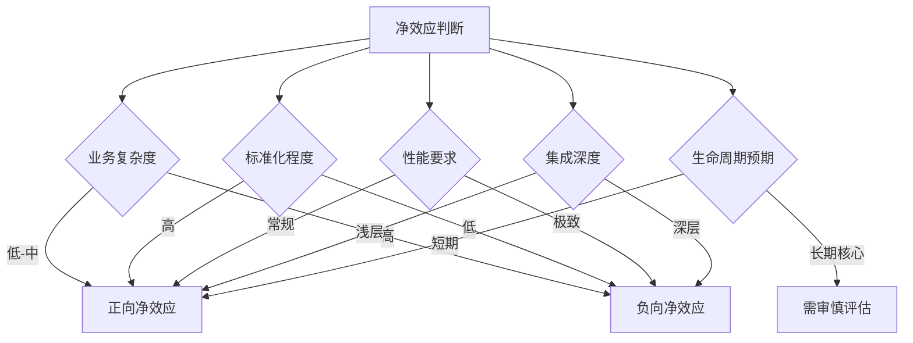

**第一，业务逻辑复杂度**。低复杂度场景（简单条件判断、线性流程）净效应显著为正；高复杂度场景（多层嵌套、复杂状态机、递归算法）净效应可能为负。

**第二，需求标准化程度**。高标准化场景（通用表单、标准审批流程）净效应为正；高度定制化场景（独特算法、创新业务模式）净效应存疑。

**第三，性能要求等级**。常规性能要求场景净效应为正；极致性能要求场景（高并发秒杀、实时风控）净效应可能为负。

**第四，系统集成深度**。浅层集成（标准API对接）净效应为正；深层集成（遗留系统、工业设备、特定协议）净效应可能为负。

**第五，应用生命周期预期**。短期试点应用净效应通常为正；长期核心系统需要综合评估平台锁定风险和技术债务影响。

### 7.2 关键发现与核心洞察的凝练总结

#### 7.2.1 效率增益的真实边界

**本报告的首要发现是：低代码/无代码平台的效率增益是真实存在的，但存在明确的应用边界**。

效率增益的真实性已通过多维度实证验证：开发周期压缩60%-85%、人力投入降低30%-50%、运维成本降低50%-70%。这些数据来自权威机构报告和实际案例，具有较高的可信度。某制造业MES系统开发案例显示，传统方式需要2年开发周期，采用低代码平台后缩短至4个月，效率提升超过4倍。

然而，**效率增益与业务复杂度呈负相关**。在低复杂度区间，效率提升可达60%-90%；在中复杂度区间，效率提升降至30%-50%；在高复杂度区间，效率可能不升反降。这一规律揭示了低代码/无代码平台的本质定位——它是"提升数字化产能和普及率"的利器，而非"解决一切问题"的万能工具。

#### 7.2.2 技术债务的积累规律

**本报告的第二个关键发现是：低代码/无代码平台上的技术债务呈现独特的积累形态和爆发式显现特征**。

技术债务在低代码/无代码平台上的独特形态包括：未文档化的隐性业务逻辑（72%的业务流程存在此问题）、组件版本混乱与依赖冲突、冗余配置与废弃流程等。这些债务往往更加隐蔽，更难识别，也更难偿还。

**债务积累呈现"温水煮青蛙"特征**——初期快速开发的便利掩盖了债务积累的事实，当核心开发人员离职、业务需求重大变更或系统需要扩展时，债务才会爆发式显现。良好的治理机制能将技术债务发生率降低60%，这意味着**主动治理是控制债务积累的关键**。

#### 7.2.3 平台锁定的形成机制

**本报告的第三个关键发现是：平台锁定风险是低代码/无代码平台最具战略性的长期风险，其形成遵循"渐进加深"的机制**。

平台锁定通过专有技术栈依赖、数据格式绑定、应用资产可移植性限制三层机制逐步形成。企业在平台上投入的资产、数据和业务逻辑越多，锁定程度越深，迁移成本越高。某企业使用闭源低代码平台后，当供应商停服时，系统瘫痪导致的迁移成本超过50万元。

**锁定风险的核心对策是"预防优于治疗"**——在选型阶段即优先选择支持源码导出、开放生态的平台，签订明确的数据迁移保障协议，建立关键应用的"影子文档"，定期评估平台依赖度。

#### 7.2.4 混合架构的必然性

**本报告的第四个关键发现是：高低代码融合的混合架构将成为企业数字化能力体系的主流形态**。

这一判断基于三重论证：需求结构的客观分化（80%标准化+20%核心复杂）、技术能力的互补特性、实践验证的趋势确认（Gartner预测2026年85%的企业级低代码平台将采用混合架构）。

**最优组合策略是"分层协作、API集成"**：前端敏捷层使用低代码/无代码快速构建；中台服务层采用混合模式实现业务逻辑封装；核心后端层使用传统开发保障性能和可控性。各层通过标准化API集成，形成松耦合架构。

#### 7.2.5 多方视角协调的必要性

**本报告的第五个关键发现是：低代码/无代码平台的成功实施不仅是技术问题，更是组织治理问题**。

开发者关注技术自由度、代码质量和职业发展，业务管理者关注交付速度、成本控制和业务敏捷性，两类角色对"项目成功"的定义存在根本性差异。73%的企业低估了系统全生命周期成本，部分原因就在于技术风险未能在决策层面得到充分重视。

**成功的实践需要建立涵盖制度、沟通和激励的多层次协调框架**，培育技术与业务相互理解、相互尊重的组织文化。设立低代码项目委员会（CoE）是有效的治理机制，某集团通过此机制避免了12个"重复造轮子"项目。

### 7.3 基于场景特征的技术选型决策框架

#### 7.3.1 选型决策的核心维度体系

**构建结构化的选型评估框架，需要从五个核心维度进行系统评估**：

| 评估维度 | 关键问题 | 评估指标 |
|:---|:---|:---|
| **业务复杂度** | 业务逻辑的嵌套深度和计算复杂性如何？ | 条件分支数、状态转换复杂度、算法复杂度 |
| **需求稳定性** | 需求变化的频率和幅度如何？ | 月均需求变更次数、变更影响范围 |
| **性能要求** | 并发量、响应时间、数据处理量的要求如何？ | 峰值并发数、响应时间SLA、日数据处理量 |
| **集成深度** | 需要与哪些系统集成？集成方式如何？ | 集成系统数量、接口标准化程度、数据同步要求 |
| **团队能力** | 团队的技术能力和学习意愿如何？ | 专业开发者比例、业务人员IT素养、培训投入意愿 |

#### 7.3.2 决策树逻辑与选型路径

**基于上述维度，可以构建清晰的决策树逻辑**：

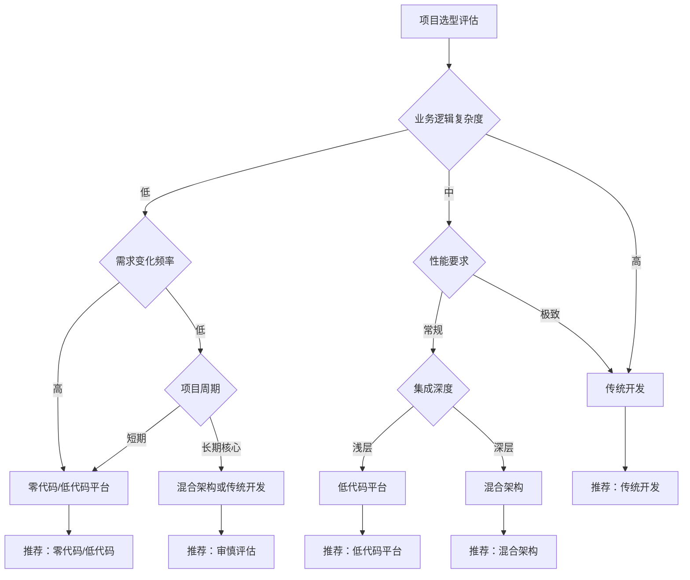

**决策路径一：零代码/低代码优先**
- 业务逻辑复杂度低
- 需求变化频率高或项目周期短
- 适用场景：表单审批、数据看板、营销活动页面、内部管理工具

**决策路径二：低代码平台**
- 业务逻辑复杂度中等
- 性能要求常规
- 集成深度浅层
- 适用场景：部门级业务系统、CRM、项目管理、简单MES

**决策路径三：混合架构**
- 业务逻辑复杂度中等
- 集成深度较深
- 需要平衡效率与灵活性
- 适用场景：企业级应用、需要与核心系统对接的业务系统

**决策路径四：传统开发**
- 业务逻辑高度复杂
- 性能要求极致
- 涉及核心算法或知识产权
- 适用场景：核心交易系统、实时风控、工业控制、AI算法系统

#### 7.3.3 选型评估检查清单

**为确保选型决策的系统性，提供以下评估检查清单**：

**平台能力评估**：
- [ ] 平台是否支持企业所需的核心功能组件？
- [ ] 平台的代码扩展能力是否满足定制化需求？
- [ ] 平台是否支持源码导出，避免供应商锁定？
- [ ] 平台的安全合规能力是否满足行业监管要求？
- [ ] 平台的信创适配能力是否满足国产化要求（如适用）？

**项目匹配度评估**：
- [ ] 项目的业务复杂度是否在平台能力边界内？
- [ ] 项目的性能要求是否在平台支撑范围内？
- [ ] 项目的集成需求是否有成熟的连接器支持？
- [ ] 项目的生命周期预期与平台定位是否匹配？

**组织准备度评估**：
- [ ] 是否有足够的业务人员可培养为公民开发者？
- [ ] IT团队是否具备平台治理和支持能力？
- [ ] 是否建立了跨部门协作的沟通机制？
- [ ] 是否有明确的治理规范和审批流程？

### 7.4 风险识别、预防与规避的策略体系

#### 7.4.1 核心风险清单与预警指标

**基于本报告的分析，识别出低代码/无代码平台实施的五大核心风险**：

| 风险类型 | 风险描述 | 预警指标 | 风险等级 |
|:---|:---|:---|:---|
| **平台锁定** | 业务逻辑与平台深度耦合，迁移成本高昂 | 核心应用数量、数据量、定制化程度 | 高 |
| **技术债务** | 未文档化逻辑、版本混乱、冗余配置积累 | 未使用字段占比、重复工作流数量 | 高 |
| **质量失控** | 公民开发者产出应用规范性不足 | 无主键表比例、安全漏洞数量 | 中高 |
| **集成复杂化** | 异构系统集成成本非线性增长 | 集成点数量、接口维护工作量 | 中 |
| **性能瓶颈** | 高并发/大数据场景下系统性能下降 | 响应时间、系统崩溃频率 | 中 |

#### 7.4.2 选型阶段的风险评估要点

**在平台选型阶段，应重点评估以下风险要素**：

**供应商稳定性评估**：
- 供应商的市场地位和财务健康状况
- 产品路线图的透明度和持续性
- 客户支持体系的完善程度
- 生态伙伴网络的丰富度

**技术开放性评估**：
- 源码导出能力的完整性
- API开放程度和标准化水平
- 数据迁移工具的可用性
- 第三方集成的便利性

**合规适配性评估**：
- 安全认证的完备性（等保、GDPR等）
- 数据存储位置和主权保障
- 审计日志和追溯能力
- 信创适配的完整性（如适用）

#### 7.4.3 实施阶段的治理机制设计

**在平台实施阶段，应建立系统化的治理机制**：

**分级授权机制**：
```mermaid
flowchart TD
    A[应用分级] --> B{风险等级评估}
    
    B -->|低风险| C[业务人员自主开发]
    B -->|中风险| D[IT指导下开发]
    B -->|高风险| E[IT主导开发]
    
    C --> F[标准模板约束]
    D --> G[代码审查机制]
    E --> H[专业开发流程]
    
    F --> I[定期审计]
    G --> I
    H --> I
```

**开发规范体系**：
- 命名规范：统一的表单、字段、流程命名规则
- 架构规范：数据模型设计标准、流程设计原则
- 安全规范：权限设置要求、数据加密标准
- 文档规范：业务逻辑说明、变更记录要求

**审批与发布流程**：
- 新应用创建需经过需求评审
- 涉及敏感数据的应用需安全审核
- 上线前需完成测试验证
- 重大变更需变更管理委员会审批

#### 7.4.4 运营阶段的监控预警体系

**在平台运营阶段，应建立持续的监控预警体系**：

**技术债务监控看板**：
- 未使用的字段/表单占比
- 重复工作流数量
- 无文档应用比例
- 组件版本分布

**性能健康度监控**：
- 应用响应时间趋势
- 系统资源使用率
- 异常错误发生频率
- 用户并发峰值

**安全合规监控**：
- 权限配置合规性
- 数据访问审计日志
- 安全漏洞扫描结果
- 合规检查通过率

**定期审计机制**：
- 季度应用资产盘点
- 半年度技术债务评估
- 年度平台依赖度评估
- 持续的安全渗透测试

### 7.5 成功实施的关键行动建议与路线图

#### 7.5.1 面向企业管理者的战略建议

**企业管理者在低代码/无代码平台战略决策中应把握以下要点**：

**明确战略定位**：低代码/无代码平台应被定位为"提升数字化产能的工具"而非"替代传统开发的方案"。合理的预期是：通过平台解决80%的标准化需求，释放IT资源聚焦20%的核心复杂场景。

**建立全口径成本视角**：决策时不应仅关注初始开发成本节约，而应采用全生命周期成本（TCO）视角，将平台许可费、集成成本、培训成本、维护成本、潜在迁移成本纳入综合评估。73%的企业低估了系统全生命周期成本，这一教训值得警醒。

**投资治理能力建设**：平台的成功实施需要配套的治理能力。建议投资建立低代码卓越中心（CoE），配备专职人员负责标准制定、能力培训、质量保障和知识管理。良好的治理能将技术债务发生率降低60%。

**制定退出策略**：在平台选型时即应考虑退出方案，优先选择支持源码导出的开放平台，签订明确的数据迁移保障条款，避免在单一平台上形成过度依赖。

#### 7.5.2 面向IT负责人的实施指引

**IT负责人在平台实施过程中应关注以下关键领域**：

**架构规划**：
- 明确低代码/无代码平台在企业IT架构中的定位
- 设计与现有系统的集成方案和数据流转路径
- 制定混合架构下各层的技术标准和接口规范
- 规划平台扩展和演进的技术路线图

**团队能力建设**：
- 培养IT团队的平台治理和支持能力
- 建立公民开发者的培训和认证体系
- 推动专业开发者向架构师和AI协作者转型
- 构建技术与业务融合的复合型人才梯队

**治理体系构建**：
- 建立分级授权和审批流程
- 制定开发规范和安全标准
- 设计技术债务监控和预警机制
- 建立应用生命周期管理制度

**风险管控**：
- 定期评估平台依赖度和锁定风险
- 建立关键应用的备份和恢复机制
- 制定供应商策略变更的应急预案
- 持续监控安全合规状态

#### 7.5.3 面向业务部门的协作建议

**业务部门在平台应用过程中应注意以下要点**：

**合理设定预期**：低代码/无代码平台能够显著提升简单应用的交付速度，但对于复杂业务需求仍需IT部门的专业支持。理解平台的能力边界，避免将不适合的需求强行在平台上实现。

**积极参与治理**：业务部门是应用的主要使用者和需求来源，应积极参与平台治理，包括需求评审、应用测试、问题反馈等环节。业务与IT的紧密协作是平台成功的关键。

**重视文档记录**：即便是业务人员自主开发的应用，也应保持基本的文档记录，包括业务逻辑说明、配置参数含义、变更历史等。这些文档是避免"人走系统瘫"的重要保障。

**持续学习提升**：业务人员应将低代码/无代码平台视为提升个人数字化能力的机会，积极参与培训，掌握平台使用技能，逐步成长为合格的公民开发者。

#### 7.5.4 面向开发团队的转型路径

**专业开发团队应把握以下转型方向**：

**从"代码编写者"到"系统架构师"**：随着基础代码生成的自动化，开发者的工作重心应从编写基础CRUD代码，转向业务需求分析、领域模型设计、系统架构集成。

**从"技术执行者"到"AI协作者"**：AI与低代码的深度融合要求开发者具备与AI工具协作的能力，包括有效描述需求、评估和优化AI生成的代码、将AI能力嵌入业务系统。

**从"项目交付者"到"平台治理者"**：在公民开发者模式下，专业开发者的角色从直接交付项目，转向制定规范、审核质量、提供支持、管理技术债务。

**持续学习新技能**：掌握主流低代码平台的高级功能、学习AI辅助开发工具、提升业务领域知识、培养架构设计能力，是保持职业竞争力的关键。

#### 7.5.5 分阶段实施路线图

**企业引入低代码/无代码平台建议采用分阶段实施路径**：

```mermaid
flowchart LR
    subgraph 第一阶段-试点验证
        A1[选定试点场景] --> A2[平台选型评估]
        A2 --> A3[小范围试点]
        A3 --> A4[效果评估总结]
    end
    
    subgraph 第二阶段-规范建立
        B1[制定开发规范] --> B2[建立治理流程]
        B2 --> B3[培训种子用户]
        B3 --> B4[完善支持体系]
    end
    
    subgraph 第三阶段-规模推广
        C1[扩大应用范围] --> C2[培养公民开发者]
        C2 --> C3[建立CoE组织]
        C3 --> C4[持续优化治理]
    end
    
    subgraph 第四阶段-深化应用
        D1[向核心系统延伸] --> D2[构建混合架构]
        D2 --> D3[深化行业方案]
        D3 --> D4[持续创新演进]
    end
    
    A4 --> B1
    B4 --> C1
    C4 --> D1
```

**第一阶段：试点验证（1-3个月）**
- 选定2-3个低风险、高价值的试点场景
- 完成平台选型评估和采购
- 在小范围内完成试点项目
- 评估效果，总结经验教训

**第二阶段：规范建立（3-6个月）**
- 基于试点经验制定开发规范
- 建立审批流程和治理机制
- 培训首批种子用户
- 完善技术支持和问题响应体系

**第三阶段：规模推广（6-12个月）**
- 扩大平台应用范围至更多部门
- 系统化培养公民开发者队伍
- 建立低代码卓越中心（CoE）
- 持续优化治理机制和规范体系

**第四阶段：深化应用（12个月以上）**
- 评估向核心业务系统延伸的可行性
- 构建高低代码融合的混合架构
- 深化行业解决方案的落地应用
- 持续跟踪技术演进，保持创新活力

#### 7.5.6 关键成功因素与常见陷阱规避

**关键成功因素**：

- **高层支持**：获得管理层对平台战略定位和资源投入的认可
- **业务IT协同**：建立业务与IT紧密协作的组织机制和文化氛围
- **治理先行**：在规模化推广前建立完善的治理体系
- **渐进推进**：从低风险场景起步，逐步积累经验后再扩展
- **持续学习**：保持对技术演进的关注，及时调整策略

**常见陷阱规避**：

- **避免"一刀切"**：不同场景需要不同的开发方式，不应强制所有项目使用低代码平台
- **避免"重速度轻质量"**：快速交付不应以牺牲系统质量为代价
- **避免"重建设轻治理"**：平台建设与治理能力建设应同步推进
- **避免"过度依赖单一平台"**：保持技术选择的灵活性，避免深度锁定
- **避免"忽视长期成本"**：决策时应采用全生命周期成本视角

---

**结语**

低代码/无代码平台正在深刻改变软件开发行业的格局，但这种改变并非简单的"替代"，而是"融合与互补"。**对于企业而言，关键不在于是否采用低代码/无代码平台，而在于如何基于自身的业务特点、技术能力和战略目标，在"效率提升"与"风险管控"之间找到最优平衡点**。

本报告的核心结论是：**低代码/无代码平台在适配场景下能够带来显著的效率提升和成本节约，但其价值的充分释放需要清醒的边界认知、系统的治理机制和持续的能力建设**。企业应当将低代码/无代码平台视为数字化能力体系的重要组成部分，而非替代传统开发的"银弹"。通过"分层协作、API集成"的混合架构，既发挥低代码/无代码平台的效率优势，又保障核心系统的技术质量和可控性，是实现整体数字化效率最优化的关键路径。

面向未来，随着AI技术的深度融合和行业解决方案的持续成熟，低代码/无代码平台将从"提升效率的工具"演进为"驱动业务创新的智能中枢"。企业需要保持对技术演进的敏锐关注，动态调整平台战略，在数字化转型的浪潮中把握先机、行稳致远。

# 参考内容如下：
[^1]:[一文认识低代码开发平台:低代码平台定义与选型指南(2026版)](https://baijiahao.baidu.com/s?id=1853736601476096261&wfr=spider&for=pc)
[^2]:[低代码平台定义解析与企业选型指南(2025版)](https://baijiahao.baidu.com/s?id=1849468942627297035&wfr=spider&for=pc)
[^3]:[什么是低代码平台?2026年主流低代码平台盘点](https://baijiahao.baidu.com/s?id=1854454224971808615&wfr=spider&for=pc)
[^4]:[低代码](https://baike.baidu.com/item/低代码/60863339)
[^5]:[AI时代下,中国低代码市场发展的如何了?附行业研究报告](https://cloud.tencent.com/developer/article/2576443)
[^6]:[什么是无代码?以草料二维码平台为例说明无代码的特点](https://cloud.tencent.com/developer/article/2446261)
[^7]:[什么是无代码平台?它能为企业解决什么问题?](https://baijiahao.baidu.com/s?id=1852468434407955493&wfr=spider&for=pc)
[^8]:[无代码:数字化转型的轻量化革命与实践路径](https://cloud.tencent.com/developer/article/2609796)
[^9]:[无代码开发的时间成本分析,如何实现快速上线](https://www.jiandaoyun.com/news/article/6891c12b229b892d520efea7)
[^10]:[瀑布模型](https://baike.baidu.com/item/瀑布模型/9817778)
[^11]:[传统软件开发流程](https://baike.baidu.com/item/传统软件开发流程/4470279)
[^12]:[瀑布模型大揭秘:如何用分段式开发轻松搞定软件项目?](https://developer.aliyun.com/article/1628973)
[^13]:[软件开发流程](https://baike.baidu.com/item/软件开发流程/3430246)
[^14]:[什么是软件开发? ](https://www.ibm.com/cn-zh/topics/software-development)
[^15]:[软件开发那些基础事儿:需求、模型与生命周期](https://blog.csdn.net/A1546553960/article/details/149283593)
[^16]:[2025低代码开发平台排行榜:国内外主流平台全景解析与选型指南](https://baijiahao.baidu.com/s?id=1849638605152591449&wfr=spider&for=pc)
[^17]:[2025低代码开发平台:行业趋势、品牌解析与企业选型指南](https://baijiahao.baidu.com/s?id=1850911322786085291&wfr=spider&for=pc)
[^18]:[低代码 VS 传统开发:成本节省核心对比与技术深度解析](https://www.grapecity.com.cn/blogs/low-code-vs-traditional-development-core)
[^19]:[2025年低代码开发平台行业研究报告：普元引领，众商竞逐凤凰网海南_凤凰网](https://hainan.ifeng.com/c/8nUc90NYCJx)
[^20]:[零代码平台案例的独特优势,推动业务增长](https://www.jiandaoyun.com/news/article/6891c90d229b892d520fd6e7)
[^21]:[如何通过无代码平台快速响应市场需求,案例分享](https://www.jiandaoyun.com/news/article/68ea242521e6c1b4df78682b)
[^22]:[无代码平台暗藏的五大短板,数字化转型中的隐形陷阱](https://info.iyunbiao.com/4258.html)
[^23]:[低代码平台的局限性:哪些场景不适合使用](https://blog.csdn.net/2509_93946281/article/details/155179951)
[^24]:[低代码陷阱:当拖拽式开发遇到复杂业务逻辑](https://blog.csdn.net/2501_93892916/article/details/154242736)
[^25]:[低代码为何不能做?探究低代码存在的局限性](https://www.huoban.com/yx-jiaocheng/8lZwqoor5eR7qn2o.html)
[^26]:[低代码开发:是银弹还是陷阱?企业选型与避坑指南](https://baijiahao.baidu.com/s?id=1844045744905583290&wfr=spider&for=pc)
[^27]:[大型企业低代码平台采购价格:定制化开发费用+后续运维成本解析](https://www.hr-soft.cn/info/2026012238177.html)
[^28]:[无代码平台成本包含哪些?一文带你全解析](https://www.huoban.com/yx-jiaocheng/vN2dXLL0YNdwAB2E.html)
[^29]:[零代码开发平台的技术瓶颈与破局之道:避坑指南](https://blog.csdn.net/lgf228/article/details/145659306)
[^30]:[无代码：业务驱动型数字化的降本增效实践指南-腾讯云开发者社区-腾讯云](https://cloud.tencent.com/developer/article/2601285)
[^31]:[2026年,低代码还跑得动吗?](https://baijiahao.baidu.com/s?id=1855069631634539166&wfr=spider&for=pc)
[^32]:[低代码案例警示录](https://wenku.baidu.com/view/0862c81672c66137ee06eff9aef8941ea76e4bfb.html)
[^33]:[无代码平台普及后,如何避免非技术人员开发导致的技术债务?](https://info.iyunbiao.com/info/ask/11967.html)
[^34]:[低代码选型指南:告别封闭与绑定,定义开放灵活新标准](https://baijiahao.baidu.com/s?id=1845675353219589714&wfr=spider&for=pc)
[^35]:[低代码评价:《低代码平台评价》](https://www.informat.cn/qa/367853)
[^36]:[低代码平台使用效果评价:《低代码平台效果评价》](https://www.informat.cn/qa/368411)
[^37]:[低代码开发好不好:《低代码开发的评价》](https://www.informat.cn/qa/368036)
[^38]:[AI低代码/无代码席卷而来,五年后,我们还需要那么多传统程序员吗](https://baijiahao.baidu.com/s?id=1854429892077331901&wfr=spider&for=pc)
[^39]:[AI编程时代:程序员的转型之路与全新机遇](http://k.sina.com.cn/article_7879848900_1d5acf3c401902n3go.html)
[^40]:[低代码对程序员的威胁:挑战与机遇并存的新时代](https://www.huoban.com/yx-jiaocheng/PyQeRww1V3dDK7Zp.html)
[^41]:[低代码平台该给谁用:从技术管理者到业务决策者的全方位解析](https://blog.csdn.net/wenzhangli/article/details/149826422)
[^42]:[低代码是什么?2025低代码技术详解:平台分类、用户群体与发展趋势分析](https://developer.aliyun.com/article/1664943)
[^43]:[独自研发产品的工具选择:低代码平台的崛起与应用_开发_用户_自由度](https://news.sohu.com/a/820337622_121798711)
[^44]:[低代码平台全面解析:2026企业数字化转型必选工具](https://www.163.com/dy/article/KIUSKC2M0518CPJB.html)
[^45]:[低代码/无代码工具的普及争议:是解放生产力,还是威胁职业未来?](https://blog.csdn.net/nmgwap/article/details/146084287)
[^46]:[最适合外包交付的 6 个开源无代码与低代码 - 知乎](https://zhuanlan.zhihu.com/p/1986745607633774063)
[^47]:[无代码思维编程发展前景与实践应用研究报告](https://blog.csdn.net/m0_66483734/article/details/156342168)
[^48]:[应对“变”:低代码如何成为企业敏捷创新的数字底座?解析核心能力与实践逻辑](http://www.cniteyes.com/archives/39927)
[^49]:[IDC近日发布的《2024下半年中国低代码与零代码软件市场跟踪报告》显示,2024下半年中国低代码与零代码软件市场规模为22.9亿元人民币,同比增速为20.2%。2024年全年市场规模为40.3亿人民币,预计到2029年市场规模将达到129.8亿人民币,未来5年市场年复合增长率为26.4%。当前,为满足企业IT部门和业务部门的全面需求,低代码与零代码的融合趋势愈发明显。从细分市场来看,2024年低代码子市场的规模占比为85.6%,零代码子市场规模占比14.4%。 - 中国金融信息网](https://www.cnfin.com/kx/detail/20250703/4261774_1.html)
[^50]:[不会低代码的开发者会被淘汰吗?一文看懂趋势](https://dy.163.com/article/KJIV1Q9U0518CPJB.html)
[^51]:[2025低代码开发平台:行业趋势、品牌解析与企业选型指南](https://baijiahao.baidu.com/s?id=1850915612763825728&wfr=spider&for=pc)
[^52]:[IDC:奥哲,2025H1蝉联第一!](https://baijiahao.baidu.com/s?id=1851932288624584688&wfr=spider&for=pc)
[^53]:[金蝶五连冠!2024年中国低零代码软件市场排名出炉](https://www.kingdee.com/resources/articles/1407059441823530977)
[^54]:[IDC发布最新零代码软件市场报告,简道云蝉联第一](https://baijiahao.baidu.com/s?id=1801804051332356271&wfr=spider&for=pc)
[^55]:[云端微光,AI启航:低代码开发的智造未来](http://k.sina.com.cn/article_7879848900_1d5acf3c401902nzbc.html)
[^56]:[技术应用 | 低代码技术提升数据协同效率的研究与实践](https://mp.weixin.qq.com/s?__biz=MjM5MzA3MzAzOQ==&mid=2655576220&idx=3&sn=865abc48700eea9f929b2743ef2940e1&chksm=bc0e8fce16343c0008cbad1e510d2d07fb7f3cce9e578c5d75650888d31945402342cb8f0d0f&scene=27)
[^57]:[2026年1月低代码平台推荐,AI赋能与多场景适配多维度测评及选型指南](http://www.gongkong.com/industrynews/202601/3281.html)
[^58]:[2025年4月最新!国内外70家低代码零代码平台厂商](https://baijiahao.baidu.com/s?id=1828726023035958420&wfr=spider&for=pc)
[^59]:[零代码开发场景应用:不同行业的最佳实践案例](https://www.jiandaoyun.com/news/article/68ea26c421e6c1b4df78e3d5)
[^60]:[2024即将过去,整个低代码行业与各家低代码产品都发展如何了?](https://cloud.tencent.com/developer/article/2453643)
[^61]:[2024年AI与低代码技术发展4大趋势预测](https://www.thinkphp.cn/news/323)
[^62]:[AI驱动小微企业数智化跃迁,畅捷通携手伙伴共筑智能生态新格局](http://news.10jqka.com.cn/20260126/c674309261.shtml)
