# 基于自动化凸集生成的GCS路径规划算法优化研究
## 1 GCS算法核心原理与技术架构

本章系统解析凸集图(Graphs of Convex Sets, GCS)路径规划算法的理论基础与技术实现框架。GCS算法由MIT的Russ Tedrake等研究团队提出，其核心创新在于将复杂的障碍物规避运动规划问题转化为凸优化框架下可高效求解的数学问题，为机器人在复杂环境中的轨迹设计提供了兼具全局最优性与计算效率的解决方案[^1][^2]。

### 1.1 运动规划问题的技术挑战与GCS算法定位

机器人运动规划，特别是在复杂障碍物环境中设计无碰撞的连续运动轨迹，一直是机器人学领域的核心挑战。这一问题不仅涉及在高维度配置空间中设计几何路径，还必须同时考虑机器人本身的运动学和动力学约束[^3]。从在城市地区运送包裹的四旋翼飞行器到在封闭仓库中移动的机器人手臂，几乎每一个现代机器人系统都依赖于防撞规划器来在其环境中移动[^2]。

**传统轨迹优化方法的困境**

现有的轨迹优化方法可以对简单问题进行有效求解，为运动学和动力学约束下的高维空间运动规划提供了成熟的工具[^3][^2]。然而，当机器人所在的空间充满障碍物时，轨迹优化问题通常会由凸优化转换为非凸优化问题，求解变得非常复杂，导致很多传统方法失效[^3]。轨迹优化技术本质上是基于梯度优化的，因此会受到局部极小值的影响，在存在障碍的情况下往往无法找到可行的轨迹[^1][^2]。

**基于采样方法的局限性**

为应对非凸性难题，研究人员常转而使用基于采样的运动规划算法，如概率路线图(PRM)和快速探索随机树(RRT)。这类算法在复杂的配置空间中具有一定优势，因为它们能够通过采样来找到可行路径，并且具有**概率完备性**——只要可行路径存在，理论上总能找到[^3][^2]。然而，这些算法存在以下关键缺陷：

- **高维空间效率低下**：在高维空间中采样密度会急剧下降，导致搜索效率降低[^4]
- **轨迹质量次优**：生成的轨迹往往不是全局最优的，即使使用渐近最优变体，在高维密集采样不可行时轨迹质量仍然不理想[^2]
- **微分约束处理困难**：连续微分约束很难强加于离散样本，这使得运动动力学变量在实践中不太成功[^3][^2]

以PRM方法为例，其工作流程存在根本性问题：在离线路线图构建阶段，进行大量碰撞检测来证明连接两个顶点的直线段在一定采样分辨率下无碰撞；在线查询阶段则搜索离散图找到不连续的分段线性最短路径。但为满足后续控制需要，必须对该路径进行平滑处理，**一旦平滑或用连续曲线近似后，就不能再保证路径仍然无碰撞，也不能保证它是最短的路径**[^1]。当引入动力学时这一问题更加严重——在动力学约束下，运动学上可行的路径可能变得不再可行[^1]。

**混合整数凸优化方法的计算瓶颈**

混合整数凸优化方法(MICP)为运动规划问题提供了新的思路，能够结合基于采样算法的完备性以及轨迹优化方法处理运动学和动力学约束的能力，并且可以提供全局最优解[^3][^2]。然而，MICP方法在计算复杂性上存在很大的局限性，其求解时间通常非常长，即便是在小规模问题上也需要数分钟才能生成轨迹[^3][^2]。

**GCS算法的定位与创新**

在这一技术背景下，GCS算法应运而生，其核心创新在于对PRM工作流程进行了一个相对较小但意义深远的变化：**每次选择一个样本时，不仅仅是将配置空间中的点添加到图中，而是将该点扩展到配置空间中的凸区域**[^1]。这一变化带来了巨大的收益：

1. **图结构更稀疏**：少量的区域可以覆盖很大一部分配置空间，允许扩展到更高的维度[^1]
2. **在线优化灵活性**：可以在线优化连续曲线，只要它们保持在凸区域内[^1]
3. **统一优化框架**：提供了一个能够结合优化图上的离散路径和连续曲线参数的图搜索算法的泛化[^1]

GCS算法的一句话总结是：**凸优化可以可靠地设计出机器人在复杂障碍物环境中运动的最优轨迹**[^2]。

### 1.2 凸集图中最短路径问题的数学建模

GCS算法的核心数学框架是凸集图中的最短路径问题(Shortest Path Problem in Graphs of Convex Sets, SPP)，这是经典最短路径问题的一个功能强大的泛化[^3][^5]。

**图结构定义**

给定一个带有有向图的问题，其中包含顶点集$V$和边集$E$。与经典图论问题不同的是，**每个顶点$v$关联一个有界凸集$X_v$**[^3]。当访问图中的一个顶点时，允许从与该顶点关联的凸集中选择一个元素[^5]。

**边长度的凸函数表示**

不同于经典最短路径问题中每条边具有固定权重的设定，GCS中**每条边的长度由顶点之间的连续变量通过凸函数确定**。具体而言，对于边$(u,v) \in E$，其长度由非负凸函数$f_{uv}(x_u, x_v)$定义，其中$x_u \in X_u, x_v \in X_v$[^3]。边长允许是相应集中连续变量的凸函数，同时也可以对边写出凸约束（任何解路径都必须满足这些约束）[^5]。

**SPP优化问题的形式化表述**

凸集图中的最短路径问题可以形式化为以下优化问题[^3]：

$$\min_{P \in \mathcal{P}_{s \to t}} \sum_{(u,v) \in P} f_{uv}(x_u, x_v)$$

其中：
- $\mathcal{P}_{s \to t}$是图中所有从起点顶点$s$到终点顶点$t$的有效路径集合
- $P$是路径所经过的边集
- $x_v$是顶点$v$的决策变量

**从运动规划到SPP的问题转化**

研究者将围绕障碍物进行规划的问题视为在一组"安全"区域内导航的问题。准确地说，机器人运动的无碰撞配置空间被分解为一系列"安全区域"$Q_1, Q_2, ..., Q_n$[^3]。问题转化机制如下：

1. **空间凸分解**：将无碰撞配置空间分解为一系列凸安全区域，每个区域对应GCS图中的一个顶点
2. **图构建规则**：若两凸区域交集非空($Q_i \cap Q_j \neq \emptyset$)，则在对应顶点间添加边；起点和终点作为特殊顶点加入[^5]
3. **边约束设置**：边上附带"粘合"规则，要求前一个路径片段的出口点必须和后一个路径片段的入口点是同一个点[^5]

边集的构建规则可以形式化为[^5]：
$$E := \{(i,j) : Q_i \cap Q_j \neq \emptyset\} \cup \{(\sigma,i) : q_0 \in Q_i\} \cup \{(i,\tau) : q_T \in Q_i\}$$

**优化目标函数**

在求解优化问题的过程中，设定求解目标是轨迹持续时间、轨迹长度和能量的加权求和[^3][^4]：

$$\min \quad aT + bL(q, T) + cE(\dot{q}, T)$$

其中$a, b, c$为权重系数，$T$为轨迹持续时间，$L$为路径长度，$E$为能量消耗。该目标函数旨在找到一条花费总时间最优的安全轨迹[^3]。

### 1.3 混合整数凸优化问题的转化与凸松弛求解

GCS算法的技术核心在于将轨迹规划问题转化为混合整数凸优化问题(MICP)，并通过凸松弛策略实现高效求解[^3][^4]。

**离散与连续变量的耦合建模**

运动规划问题本质上涉及两类决策：
- **离散决策**：选择哪些安全区域构成路径（对应图中的路径选择）
- **连续决策**：在选定的区域序列内如何参数化具体轨迹

GCS将这两类决策耦合在统一的优化框架中。根据安全区域的几何形状和目标函数，问题可转化为混合整数线性规划(MILP)或混合整数二阶锥规划(MISOCP)[^3]。

**凸松弛方法的原理**

凸松弛是GCS算法实现高效求解的关键技术。其核心思想是将原MICP中的二元决策变量（表示边是否被选择）松弛为连续区间$[0, 1]$，从而将组合优化问题转化为可高效求解的凸规划问题（如LP或SOCP）[^3]。

研究表明，这种松弛通常是**非常紧的**，以至于一个廉价的后处理其解决方案几乎总是足以确定全局最优的无碰撞轨迹（在参数化的曲线类内）[^2][^4]。凸松弛程序非常紧密的特性意味着：松弛解与真实最优解之间的差距很小，通常只需要对解决方案进行简单的后处理就能设计出全局最优的轨迹[^4]。

**随机舍入策略**

从凸松弛解恢复可行整数解的方法是随机舍入。基于松弛解的概率分布，通过深度优先搜索(DFS)和回溯，随机选择边以构建可行的整数路径[^3]。该策略的优势包括：

1. **计算成本低**：一次凸优化加随机舍入即可，远低于传统MICP求解
2. **最优性保证**：可通过比较松弛成本与舍入后路径成本估计最优性差距[^2]
3. **实践效果优异**：通过比较凸松弛和最终轨迹的成本，该方法可以自动提供关于运动计划最优性的紧密界限[^4]

下图展示了GCS算法的求解流程：

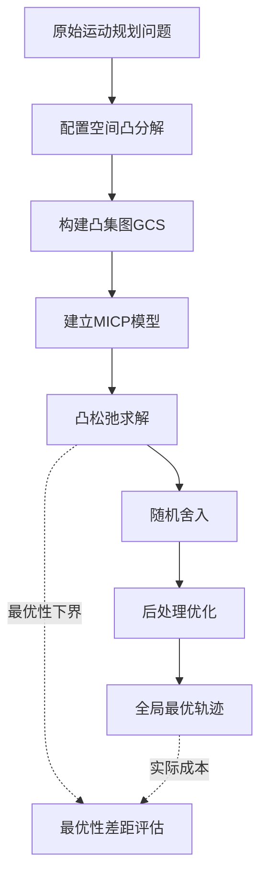

**与传统MICP的对比**

传统MICP方法虽然能提供全局最优解，但计算复杂度过高，即使是小问题也可能需要数分钟的时间[^2]。GCS的凸松弛策略大幅降低了计算复杂度，在高维空间中计算时间可仅为基于采样规划器的1/3[^4]。

### 1.4 贝塞尔曲线轨迹参数化与凸约束转化

贝塞尔曲线在GCS轨迹规划中扮演着核心角色，其独特的数学性质使得复杂的运动规划问题能够被完整转化为凸优化问题[^5]。

**凸包性质与安全约束**

贝塞尔曲线具有一个最优雅的特性——**整条曲线永远不会超出其控制点所围成的凸包范围**[^5]。这一性质与GCS算法完美契合：由于GCS已经将安全空间预处理成了一系列凸区域$Q_i$，我们不再需要检查曲线上无限个点是否安全，而只需要施加一个简单的、有限的约束——让所有的控制点都位于安全的凸区域$Q_i$内部即可[^5]。

这一转化的意义重大：将原本需要在连续曲线上验证的无限约束，简化为在有限控制点上验证的简单约束。

**导数性质与微分约束处理**

贝塞尔曲线的导数也是一条阶数低一级的贝塞尔曲线，并且其控制点可以由原曲线的控制点通过简单的线性运算得出[^5]。这一性质带来了以下便利：

- **速度约束**：可以方便地处理速度限制
- **加速度约束**：可以确保加速度在允许范围内
- **加加速度(jerk)约束**：可以保证轨迹的平滑性
- **连续性保证**：可以确保轨迹片段间的$C^k$连续性

**约束的线性化表达**

上述所有由贝塞尔曲线特性转化而来的约束（安全约束、平滑约束、速度约束），都是施加在控制点上的**线性等式或不等式**[^5]。具体而言：

| 约束类型 | 数学形式 | 说明 |
|---------|---------|------|
| 安全约束 | $p_i \in Q_k$ | 控制点位于凸安全区域内 |
| 连续性约束 | $p_{end}^{(k)} = p_{start}^{(k+1)}$ | 相邻轨迹段端点重合 |
| 速度约束 | $\dot{q}(t) \in D$ | 速度在给定凸集合内 |
| 平滑约束 | 导数控制点匹配 | 保证$C^k$连续性 |

**目标函数的凸函数表达**

用来近似路径长度和能量的目标函数，也都是关于控制点的凸函数[^5]。问题的目标函数可以表示为[^4][^5]：

$$\min \quad ah(S) + bL(r, S) + cE(\dot{r}/\sqrt{\dot{h}}, S)$$

其中时间成本被直接定义为最后一个和第一个时间控制点的差[^5]。

**问题转化的完整性**

正是因为贝塞尔曲线的这些特性，整个复杂的运动规划问题才能被转化成一个纯粹的、由控制点作为变量的混合整数凸规划问题[^5]。这使得研究者可以利用现有最高效的凸优化求解器来找到高质量的解。论文在第8.2节中特别提到，相比于使用"平方和多项式(SOS)"等其他方法，贝塞尔曲线能将问题转化为更简单的优化类型，避免了计算成本高昂的半定规划(SDP)[^5]。

**边权重与控制点的相互影响**

在GCS框架中，边权重与控制点之间存在深刻的相互影响关系[^5]：

1. **控制点影响边的权重**：优化器会为每一段轨迹（由一组控制点定义）计算出一个"局部成本"（包含时间、路径、能量）。如果一组控制点构成了一条非常"便宜"的路径段，优化器会倾向于为这个低成本的边分配更高的权重。

2. **边的权重也影响控制点**：边的权重决定了这条边的"局部成本"在总成本中占多大比重。当优化器决定给某条边分配很高的权重时，就必须反过来精心调整这条边所对应的控制点，让它的成本变得尽可能小。

### 1.5 GCS算法相较于传统方法的优势与适用边界

通过与传统运动规划方法的系统对比，可以清晰地认识GCS算法的核心优势与适用边界。

**与基于采样方法的对比**

| 对比维度 | GCS算法 | 基于采样方法(PRM/RRT) |
|---------|---------|---------------------|
| 解的最优性 | 几乎总能找到全局最优解 | 概率次优解 |
| 轨迹质量 | 更短、更平滑、能耗更低 | 轨迹质量不稳定 |
| 计算效率 | 高维空间中计算时间仅为采样方法的1/3 | 高维空间采样密度剧降 |
| 微分约束 | 自然处理连续微分约束 | 难以在离散样本上施加 |
| 成功率 | 在问题有解时保证找到解 | 概率完备性 |

实验数据表明，GCS规划器在轨迹质量、计算时间和成功率方面均优于现有的基于采样的规划器，特别是在高维复杂环境中的表现尤为显著[^4]。具体而言：
- **轨迹平均长度比基于采样的规划器短5%**[^4]
- **能量消耗低10%**[^4]
- **成功率均为100%**[^4]
- **四旋翼任务中最优性差距通常小于1%**

**与直接轨迹优化方法的对比**

GCS通过凸分解避免了非凸优化的局部极小值问题。传统轨迹优化方法在障碍物环境中将问题转化为非凸优化问题并依赖于局部求解器，如果环境中存在障碍，往往无法找到可行的轨迹[^2]。而GCS通过将配置空间分解为凸安全区域，保证在复杂障碍物环境中找到可行解。

**与传统MICP方法的对比**

凸松弛策略大幅降低了计算复杂度。传统MICP方法的求解时间即使是小问题也可能需要数分钟[^3]，而GCS的凸松弛程序非常紧密，一次凸优化加简单后处理即可得到高质量解。

**GCS算法的核心优势总结**

1. **全局最优性**：能够提供全局最优的解决方案，并自然地处理连续的微分约束[^4]
2. **计算效率**：凸松弛紧密，一次凸优化加随机舍入即可
3. **高维可扩展性**：通过稀疏凸区域图覆盖高维空间，已成功应用于7自由度机械臂和14维双臂协调规划
4. **理论保证**：提供凸松弛紧密性理论，并在一定条件下具有完整性
5. **最优性界限**：通过比较凸松弛和最终轨迹的成本，可以自动提供关于运动计划最优性的紧密界限[^4]

**GCS算法的适用边界与局限性**

1. **凸性依赖**：核心优势建立在问题和约束的凸性之上。对高度非凸的成本函数或复杂动力学约束处理能力有限。

2. **对凸分解质量的依赖**：算法有效性依赖于对自由空间进行高质量的凸分解，复杂几何形状的自动分解具有挑战性。这也是本报告后续章节将重点探讨的优化方向。

3. **问题规模限制**：对于区域数量极多的大规模问题，计算效率仍有挑战。

4. **轨迹形态限制**：受限于凸分解和贝塞尔曲线参数化，可能无法生成某些特定形态的轨迹。

5. **动态环境扩展**：当前框架主要针对静态环境设计，在动态环境中的实时重规划能力需要进一步研究。

**适用场景建议**

GCS算法特别适用于以下场景：
- **机械臂操作**：需要在复杂障碍物环境中进行精确操作的任务
- **无人机导航**：需要满足动力学约束的高质量轨迹设计
- **高维规划问题**：传统采样方法效率低下的高自由度系统
- **对轨迹质量有严格要求的应用**：如精密装配、手术机器人等

综上所述，GCS算法通过将非凸运动规划问题转化为具有强凸松弛的MICP，并采用高效的松弛-舍入求解框架，在需要高质量、高维、满足微分约束的规划场景中具有显著优势。**其能力边界由"凸性"定义**——这既是其核心优势的来源，也是后续优化工作需要重点关注的方向。

## 2 当前凸集生成方式的技术特征与局限性分析

本章系统剖析GCS路径规划算法中凸集生成环节的现有技术方案。凸集生成作为GCS算法的前置关键环节，其质量直接决定了后续轨迹优化的性能上限。当前主流方案采用人工播种结合自动化工具的离线生成模式，虽然在特定场景下表现优异，但在动态环境适应性、高维空间扩展性以及人工干预成本等方面存在显著瓶颈。深入理解这些局限性，是探索自动化凸集生成优化方案的必要前提。

### 2.1 凸集生成在GCS算法中的关键作用与技术定位

凸集生成在GCS算法架构中占据**承上启下的核心枢纽地位**，其质量直接决定了整个规划系统的性能天花板。从技术流程来看，GCS算法将围绕障碍物进行规划的问题视为在一组"安全"区域内导航的问题，机器人运动的无碰撞配置空间被分解为一系列"安全区域"，这些安全区域的生成质量从根本上影响着后续所有计算环节的效果。

**对凸松弛紧密性的决定性影响**

凸集生成质量与GCS凸松弛紧密性之间存在直接的因果关系。研究表明，GCS方法的核心优势在于其凸松弛非常紧密，通常只需求解一次凸松弛再经廉价后处理即可高效恢复出全局最优轨迹[^3]。然而，这种紧密性高度依赖于凸区域划分的合理性——若凸区域形状过于狭长、边界过于复杂或覆盖存在空隙，则松弛解与真实最优解之间的差距将显著增大，甚至可能导致随机舍入阶段无法恢复可行解。

**对求解效率的直接作用机制**

凸集的数量与形态直接影响混合整数凸优化问题的规模。每个凸安全区域对应GCS图中的一个顶点，区域间的相邻关系决定边的数量[^3]。当凸区域数量过多时，图的规模急剧膨胀，导致凸松弛问题的变量数和约束数增加，求解时间相应延长。相反，若凸区域数量过少但单个区域形状复杂，则可能违背凸性要求或降低覆盖完整性。因此，**在保证覆盖完整性的前提下最小化区域数量**，是凸集生成的核心优化目标之一。

**对轨迹质量的深层影响**

凸区域的几何特征直接约束了贝塞尔曲线控制点的可行域。由于贝塞尔曲线的凸包性质要求所有控制点位于安全凸区域内部[^4]，凸区域的形状决定了轨迹的可达空间。狭窄或畸形的凸区域会限制轨迹的平滑性优化空间，导致生成的轨迹在能量消耗、路径长度等指标上偏离理论最优。

下图展示了凸集生成质量与GCS算法各性能指标之间的依赖关系：

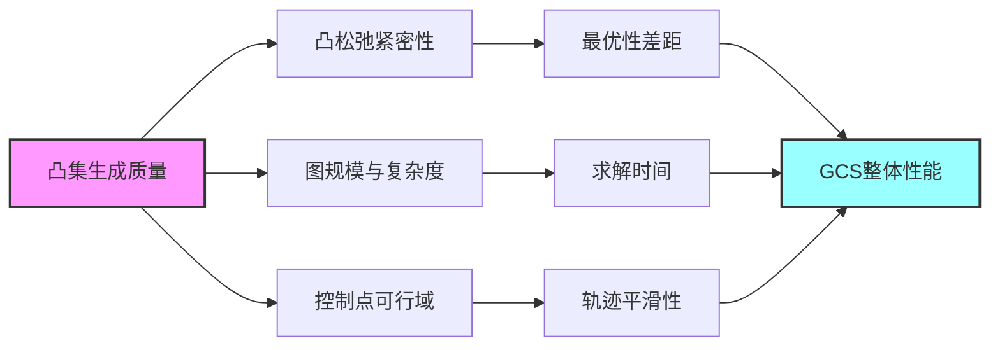

### 2.2 现有凸集生成技术流程与实现方法

当前GCS算法中凸集生成采用**"人工播种+自动化扩展"的两阶段离线生成模式**，这一流程在实践中已形成相对成熟的技术方案，但其自动化程度和通用性仍有显著提升空间。

**第一阶段：人工播种种子点的选取策略**

人工播种是整个凸集生成流程的起点，其核心任务是在无碰撞配置空间中选取一组"种子点"，作为后续凸区域扩展的初始中心。种子点选取策略通常包含以下考量：

1. **空间覆盖均匀性**：种子点应尽可能均匀分布于自由空间，避免出现大面积覆盖空白
2. **关键通道识别**：在狭窄通道、障碍物间隙等关键区域需要增加种子点密度，确保这些区域被有效覆盖
3. **起终点连通性**：种子点的分布需保证起点到终点存在可行的区域连接路径

种子点选取高度依赖操作者对环境几何特征的理解和经验判断。对于简单的二维环境，有经验的工程师可能在数分钟内完成合理的种子点布局；但对于高维复杂环境，这一过程可能需要反复试错和调整。

**第二阶段：基于自动化工具的凸区域扩展机制**

以种子点为中心，利用自动化工具（如IRIS算法）将其扩展为最大内接凸区域。IRIS（Iterative Regional Inflation by Semidefinite programming）算法是当前应用最广泛的凸区域生成工具，其工作原理可概括为：

- **迭代扩展**：从种子点出发，通过迭代优化逐步扩大凸区域边界
- **障碍物约束**：确保扩展过程中凸区域边界不与任何障碍物相交
- **最大化体积**：在满足安全约束的前提下，最大化凸区域的体积

整个离线预计算的工作流程可以形式化为：

| 步骤 | 输入 | 处理 | 输出 |
|------|------|------|------|
| 1. 环境建模 | 障碍物几何描述 | 构建配置空间障碍物表示 | 障碍物模型 |
| 2. 种子点选取 | 障碍物模型 + 人工经验 | 手动或半自动选点 | 种子点集合 |
| 3. 凸区域扩展 | 种子点 + 障碍物模型 | IRIS等算法迭代扩展 | 凸区域集合 |
| 4. 连通性构建 | 凸区域集合 | 检测区域相交关系 | GCS图结构 |
| 5. 验证与调整 | GCS图 + 起终点 | 检验连通性与覆盖完整性 | 最终凸集图 |

**从障碍物环境到凸安全区域集合的完整转化**

完整的转化过程涉及以下关键技术环节：首先，将机器人的配置空间划分为一系列不与障碍物相交的凸安全区域[^4]；然后，通过检测相邻区域的交集关系建立图的边集；最后，将起点和终点作为特殊顶点加入图中，形成完整的GCS图结构。这一过程的核心挑战在于如何以最少的凸区域数量实现对自由空间的完整覆盖，同时保证区域间的连通性满足路径规划需求。

### 2.3 不同环境复杂度下的适用性评估

现有凸集生成方法的表现与环境复杂度密切相关，在不同场景下呈现出显著的性能差异。

**低维简单环境的优异表现**

在二维或三维的简单障碍物环境中，现有方法展现出良好的适用性。这类环境的特点是障碍物数量有限、几何形状规则、自由空间连通性好。在此条件下：

- **种子点选取相对直观**：操作者可以快速识别关键区域并完成布点
- **凸区域扩展效率高**：单个种子点可扩展出较大的凸区域，实现高效覆盖
- **覆盖完整性易于保证**：少量凸区域即可完整覆盖自由空间

实验数据表明，在二维迷宫等中等复杂度环境中，GCS方法能快速生成高质量（接近理论最优）的轨迹，计算效率常优于传统采样规划器如PRM[^2]。

**高维复杂环境的性能退化**

随着环境维度和复杂度的提升，现有方法的适用性边界逐渐显现。高维复杂环境的挑战主要体现在：

1. **几何直觉失效**：在7自由度或更高维度的配置空间中，人工难以直观理解空间结构，种子点选取变得困难
2. **凸区域体积萎缩**：高维空间中障碍物的影响范围扩大，单个凸区域的有效体积显著减小
3. **覆盖效率急剧下降**：需要更多的凸区域才能实现相同程度的空间覆盖

尽管GCS在7自由度机械臂和14维双臂协调规划中展现出良好的可扩展性[^2]，但这一成功高度依赖于精心设计的凸分解方案，其背后的人工调优成本不可忽视。

**密集障碍物场景的特殊挑战**

当障碍物密度增加时，自由空间被分割成大量狭小的连通区域，对凸集生成方法提出了更严苛的要求：

| 环境特征 | 对凸集生成的影响 | 性能表现 |
|---------|-----------------|---------|
| 障碍物稀疏 | 凸区域可扩展空间大 | 优异 |
| 障碍物中等密度 | 需要适度增加种子点 | 良好 |
| 障碍物密集 | 凸区域狭窄，数量激增 | 明显退化 |
| 狭窄通道环境 | 关键区域覆盖困难 | 需特殊处理 |

在密集障碍物场景中，凸区域的形状往往变得狭长或不规则，这不仅增加了GCS图的规模，还可能影响凸松弛的紧密性，导致求解效率和轨迹质量双重下降。

### 2.4 动态环境适应性瓶颈分析

**离线生成模式的根本性局限**

当前凸集生成方式本质上是一种**离线规划方法**，严重依赖预先定义的静态安全凸区域图。这一特性使其在动态环境中面临根本性的适应性挑战。当环境中的障碍物发生位置变化时，预先计算的凸区域集合可能部分或全部失效，需要重新执行整个凸集生成流程。

**障碍物变化时的重规划代价**

动态环境中障碍物的移动、出现或消失会导致以下连锁反应：

1. **安全性失效**：原本安全的凸区域可能与新障碍物位置发生重叠，不再满足无碰撞约束
2. **连通性断裂**：障碍物移动可能阻断原有凸区域之间的连接路径
3. **覆盖空白出现**：新的自由空间区域可能未被任何现有凸区域覆盖

面对这些变化，系统需要重新生成凸区域图，其计算负担包括：重新执行IRIS等扩展算法、重新构建GCS图结构、重新验证连通性与覆盖完整性。对于复杂环境，这一过程可能需要数秒甚至数分钟，远超实时规划的时间要求。

**实时响应能力的严重不足**

动态场景对规划系统的实时性提出了严格要求。以自动驾驶或移动机器人导航为例，环境变化的响应时间通常需要控制在毫秒级。然而，当前凸集生成方法缺乏高效的在线感知与更新机制，难以直接用于实时动态场景[^4]。

**增量更新机制的缺失**

理想的动态环境适应方案应支持增量式更新——仅对受影响的局部区域进行重新计算，而非全局重建。然而，现有凸集生成方法缺乏以下关键能力：

- **局部影响范围评估**：无法快速判断障碍物变化影响了哪些凸区域
- **局部区域重生成**：缺乏仅针对失效区域进行快速重建的机制
- **图结构增量维护**：无法在保持大部分图结构不变的情况下进行局部修正

这些机制的缺失使得任何环境变化都可能触发完整的重规划流程，严重制约了GCS算法在动态场景中的实用性。

### 2.5 高维空间扩展性挑战

**维度诅咒对凸集生成的深层影响**

高自由度机器人系统的配置空间维度通常在6维以上（如7自由度机械臂），这使得凸集生成面临严峻的维度诅咒问题。随着维度升高，对高维自由空间进行精确或高效的近似凸分解变得极其复杂和困难，现有算法难以直接推广[^3]。

**凸区域计算复杂度的急剧增长**

在高维配置空间中，凸区域生成的计算复杂度呈指数级增长。IRIS等算法的核心操作涉及高维凸优化问题的求解，其计算量与维度的关系可概括为：

| 维度 | 单个凸区域生成时间 | 覆盖所需区域数 | 总计算时间 |
|------|-------------------|---------------|-----------|
| 2D | 毫秒级 | 数十个 | 秒级 |
| 3D | 百毫秒级 | 数百个 | 分钟级 |
| 7D | 秒级 | 数千个 | 小时级 |
| 14D | 数十秒级 | 数万个 | 天级 |

这一趋势表明，随着维度增加，凸集生成的计算成本可能成为整个规划流程的主要瓶颈。

**区域覆盖效率的显著下降**

高维空间中的"体积效应"导致单个凸区域的有效覆盖范围急剧萎缩。直观理解是：在高维空间中，即使是形状规则的凸区域，其"有效体积"相对于整个自由空间的比例也会随维度增加而快速减小。这意味着需要更多的凸区域才能实现相同程度的空间覆盖。

**种子点采样密度需求的激增**

为保证覆盖完整性，高维空间中的种子点密度需求远超低维情况。然而，均匀采样在高维空间中的效率极低——大部分采样点可能落在障碍物区域或已被其他凸区域覆盖的区域。这一问题与基于采样的规划方法面临的挑战类似：高维空间中的采样密度会急剧下降，导致搜索效率降低[^4]。

**对整体规划效率的综合影响**

高维扩展性挑战对GCS整体规划效率产生多重负面影响：

1. **预处理时间延长**：凸集生成的离线计算时间显著增加
2. **图规模膨胀**：更多的凸区域导致更大的GCS图，增加在线求解负担
3. **松弛紧密性下降**：大量小尺寸凸区域可能影响凸松弛的质量
4. **存储需求增加**：高维凸区域的表示需要更多存储空间

### 2.6 人工干预成本与自动化程度评估

**种子点选取的专家经验依赖**

初始的"安全凸区域生成"阶段自动化程度低，需要大量领域知识和调试工作。种子点选取的质量直接影响最终凸集的覆盖效果，而这一过程高度依赖操作者的专业经验：

- **环境理解能力**：需要对配置空间的几何结构有深入理解
- **关键区域识别**：需要准确识别狭窄通道、障碍物间隙等关键区域
- **全局规划视野**：需要从起点到终点的连通性角度进行整体布局

对于缺乏经验的操作者，种子点选取可能需要多次迭代才能得到满意的结果，显著增加了系统部署的时间成本。

**参数调优的试错代价**

凸集生成过程涉及多个需要调优的参数，包括但不限于：

| 参数类型 | 影响范围 | 调优难度 |
|---------|---------|---------|
| 种子点数量 | 覆盖完整性与计算效率 | 中等 |
| 种子点分布密度 | 局部覆盖质量 | 较高 |
| IRIS迭代次数 | 区域扩展程度 | 中等 |
| 最小区域体积阈值 | 小区域过滤 | 较低 |
| 区域重叠容许度 | 连通性与冗余度 | 较高 |

这些参数之间存在复杂的相互影响，最优参数组合往往需要通过反复试错才能确定。对于复杂或高维环境，参数调优的成本可能占据整个系统部署时间的相当比例。

**不同场景间的迁移难度**

现有方法的另一个显著局限是场景迁移性差。针对特定环境优化的凸集生成方案难以直接迁移到新环境：

- **几何差异**：不同环境的障碍物分布和几何特征差异显著
- **维度变化**：从低维到高维环境的迁移需要重新设计整个流程
- **任务需求**：不同任务对轨迹质量的要求可能导致凸集设计策略的调整

这种迁移难度使得每个新应用场景都可能需要从头开始进行凸集设计，严重制约了系统的通用性和部署效率。

**人工干预对系统部署的整体制约**

综合评估，人工干预成本对GCS系统的实用化推广构成主要障碍。对于复杂或高维环境，生成一组覆盖充分、形状有效的凸区域成本高昂，且其质量直接决定了整个规划性能的上限。这一现状与GCS算法在线求解阶段的高度自动化形成鲜明对比，凸显了凸集生成环节自动化升级的迫切需求。

### 2.7 自动化凸集生成的核心技术需求提炼

基于前述局限性分析，可以系统归纳自动化凸集生成的关键技术需求，为后续优化研究提供明确的技术目标框架。

**自适应种子点生成需求**

取代人工播种的自动化种子点生成机制应满足以下要求：

1. **环境自适应性**：能够根据障碍物分布自动调整种子点密度和位置
2. **关键区域识别**：自动检测并强化狭窄通道等关键区域的覆盖
3. **全局最优性**：从全局视角优化种子点分布，而非局部贪婪选取
4. **计算效率**：种子点生成的计算成本应与环境复杂度成合理比例

**在线增量更新能力需求**

支持动态环境的增量更新机制应具备：

- **局部影响评估**：快速判断环境变化影响的凸区域范围
- **局部重生成**：仅对失效区域进行重新计算，保持其他区域不变
- **连通性维护**：在增量更新过程中保证图结构的连通性
- **实时性保证**：增量更新的计算时间满足实时规划需求

**高维空间高效覆盖策略需求**

应对高维扩展性挑战的技术策略应包括：

| 需求维度 | 具体要求 | 预期效果 |
|---------|---------|---------|
| 采样效率 | 智能采样替代均匀采样 | 减少无效采样 |
| 区域扩展 | 高效高维凸优化算法 | 降低单区域计算成本 |
| 覆盖策略 | 自适应覆盖密度控制 | 平衡覆盖完整性与区域数量 |
| 表示压缩 | 高维凸区域的紧凑表示 | 降低存储与传输成本 |

**环境感知与动态响应机制需求**

实现动态环境适应的感知响应机制应涵盖：

1. **实时环境感知**：与传感器系统集成，获取环境变化信息
2. **变化检测**：快速识别障碍物的出现、消失或移动
3. **影响传播分析**：评估环境变化对现有凸集的影响程度
4. **响应策略选择**：根据变化程度选择增量更新或全局重建

**技术需求的优先级排序**

考虑到不同应用场景的需求差异，可将上述技术需求按优先级排序：

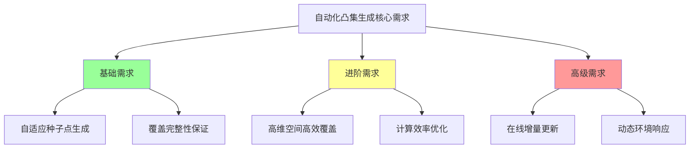

**基础需求**（绿色）是实现自动化凸集生成的必要条件，应优先解决；**进阶需求**（黄色）关系到方法在高维复杂环境中的实用性；**高级需求**（红色）则面向动态场景的扩展应用。这一优先级框架为后续章节探讨PRM-GCS融合方案及其他优化路径提供了评估基准。

## 3 PRM算法与凸集自动构造融合方案的可行性评估

本章系统评估将PRM算法的采样机制与GCS凸集自动生成相融合的技术可行性。PRM作为一种成熟的基于采样的路径规划方法，其核心优势在于能够高效探索高维配置空间并建立初步的连通性结构。将这一能力与GCS算法的凸集需求相结合，有望突破当前人工播种方式的局限性，实现凸集生成的自动化升级。本章将从PRM的技术特性出发，深入探讨从离散采样点集到连续凸区域划分的数学转化路径，对比评估多种候选几何方法的适用性，并从凸性、连通性、覆盖完整性三个核心维度验证融合方案的可行性，最终识别关键技术挑战与潜在风险。

### 3.1 PRM算法生成静态连通图的技术特性分析

PRM（Probabilistic Roadmap，概率路线图）算法是一种专门用于解决高维空间运动规划问题的基于采样方法，其核心思想是通过"预计算路线图+在线查询"的两阶段策略，有效解决高维或复杂环境下的路径搜索问题[^6][^7]。理解PRM的技术特性是评估其与GCS融合可行性的基础。

**两阶段工作机制的详细解析**

PRM算法的工作流程分为离线学习阶段和在线查询阶段，这种分离设计使其特别适合环境相对稳定的规划场景[^8][^9]。

| 阶段 | 名称 | 主要任务 | 执行频率 |
|------|------|----------|----------|
| 离线学习阶段 | Learning Phase | 在自由空间随机采样构建路径图 | 一次性（离线） |
| 在线查询阶段 | Query Phase | 在已有路径图上搜索具体路径 | 每次任务（在线） |

**离线学习阶段的核心操作**可以进一步细分为三个关键步骤[^6][^10]：

1. **随机采样**：从配置空间中均匀采样$n$个点，采样公式为$q_i \sim \text{Uniform}(C_{free}), i=1,2,...,n$。采样策略可以是均匀随机采样（适合简单环境），也可以采用高斯采样或桥采样（适合复杂障碍物环境，提高路线图连通性）[^7]。

2. **碰撞检测**：对每个采样点验证其是否位于自由空间内。定义碰撞检测函数$\text{CollisionFree}(q)$，当$q \in C_{free}$时返回True，当$q \in C_{obs}$时返回False[^6]。只有通过碰撞检测的节点才会被保留。

3. **邻域连接**：对每个有效节点$q_i$，找到其k近邻或固定半径$r$内的邻居，使用距离度量$d(q_i, q_j) = \|q_i - q_j\|$进行判断[^6]。尝试用局部规划器（如直线连接）检查边是否与障碍物碰撞，若无碰撞则在图中添加边$(q_i, q_{neighbor})$[^10]。

**PRM路线图的结构特征分析**

PRM生成的路线图是一个无向图$G = (V, E)$，其中$V$是无碰撞状态节点集合，$E$是无碰撞边集合[^7]。这一图结构具有以下与GCS凸集图构建相关的特征：

- **节点空间分布特性**：采样节点在自由空间中的分布取决于采样策略。均匀采样在简单环境中效果良好，但在复杂障碍物环境中可能导致狭窄通道区域采样不足[^10]。高斯采样倾向于在障碍物边界附近生成采样点，桥采样专门在障碍物间隙处采样，可以减少无效采样并提升效率[^10]。

- **边连接模式**：边的连接基于局部邻域关系，体现了采样点之间的可达性。k近邻连接策略保证每个节点有固定数量的邻居，而固定半径连接策略则保证邻居之间的距离不超过阈值[^6]。

- **图稀疏性特征**：PRM生成的图通常是稀疏的，节点数量远小于对配置空间进行网格化所需的数量。例如，一个6自由度机械臂如果每个关节划分10个格子，需要$10^6=100$万个网格点，而PRM只需要随机采样几百个点就能搞定[^6][^9]。

**与GCS凸集图构建需求的匹配度评估**

从GCS算法的输入需求角度审视PRM的技术特性，可以发现两者之间存在显著的互补潜力：

1. **空间探索能力的匹配**：PRM通过随机采样有效探索自由空间，生成的节点可以作为凸区域扩展的种子点，这与GCS当前采用的人工播种策略在功能上高度一致[^1]。

2. **连通性信息的价值**：PRM构建的图结构已经包含了节点间的可达性信息，这些信息可以指导凸区域之间边的构建，减少后续连通性验证的计算负担。

3. **概率完备性的继承**：PRM是概率完备的——当采样数趋近于无穷大时，若存在路径则算法一定能找到[^8][^10]。这一特性为融合方案的覆盖完整性提供了理论基础。

然而，PRM本身存在的局限性也需要在融合方案中加以考虑。PRM方法难以处理连续的曲率约束，因为其离线路线图构建只考虑了线段，没有给后续在线优化留下任何空间[^1]。一旦平滑该路径或用连续曲线近似它后，就不能再保证该路径仍然没有碰撞，也不能保证它是最短的路径[^1]。这正是GCS通过凸区域扩展所要解决的问题——**将采样点扩展为凸区域后，可以在线优化连续曲线，只要它们保持在凸区域内**[^1]。

### 3.2 从采样点集到凸区域划分的数学转化机制

将PRM生成的离散采样点集转化为满足GCS要求的连续凸区域，需要建立完整的数学转化框架。这一转化过程是融合方案的核心技术环节，其质量直接决定了最终凸集图的有效性。

**采样点作为凸区域种子点的理论依据**

GCS框架对PRM工作流程的一个关键改进是：每次选择一个样本时，不仅仅是将配置空间中的点添加到图中，而是将该点扩展到配置空间中的凸区域[^1]。这一思想为采样点作为凸区域种子点提供了直接的理论支撑。

从数学角度看，如果在配置空间中采样一个无碰撞的点，那么将该点膨胀成一个凸区域是合理的，因为该点周围的局部邻域通常也是无碰撞的[^1]。为了找到更大的凸区域，可以使用IRIS（Iterative Regional Inflation by Semidefinite programming）等半定规划迭代区域膨胀算法[^1]。该算法在寻找分离超平面和寻找包含的椭圆的最大体积之间交替，以"膨胀"区域在局部最大化区域的体积[^1]。

**点集密度与凸区域质量的定量关系**

采样点的密度和分布对生成凸区域的质量有直接影响。可以从以下几个维度建立定量关系：

| 点集特征 | 对凸区域的影响 | 优化方向 |
|---------|---------------|---------|
| 采样密度过低 | 凸区域间可能存在覆盖空白 | 增加采样数量或采用自适应采样 |
| 采样密度过高 | 凸区域高度重叠，计算冗余 | 优化采样策略，避免过度采样 |
| 分布不均匀 | 局部覆盖不足或冗余 | 采用高斯采样或桥采样平衡分布 |
| 狭窄区域采样不足 | 关键通道可能无法覆盖 | 针对性增强狭窄区域采样 |

**邻域信息指导凸区域边界确定**

PRM中节点的邻域连接信息可以有效指导凸区域边界的确定。具体机制如下：

1. **初始边界估计**：以采样点为中心，其k近邻节点的分布范围提供了凸区域可能扩展的初始估计。

2. **扩展方向优先级**：邻域中节点密度较低的方向可能是自由空间较大的方向，应优先在这些方向上扩展凸区域。

3. **边界约束推断**：相邻采样点之间的连接边如果经过碰撞检测验证为无碰撞，则暗示了这两点之间存在无障碍通道，凸区域边界应尽可能包含这些通道。

**数学转化流程的形式化描述**

完整的数学转化流程可以形式化为以下步骤：

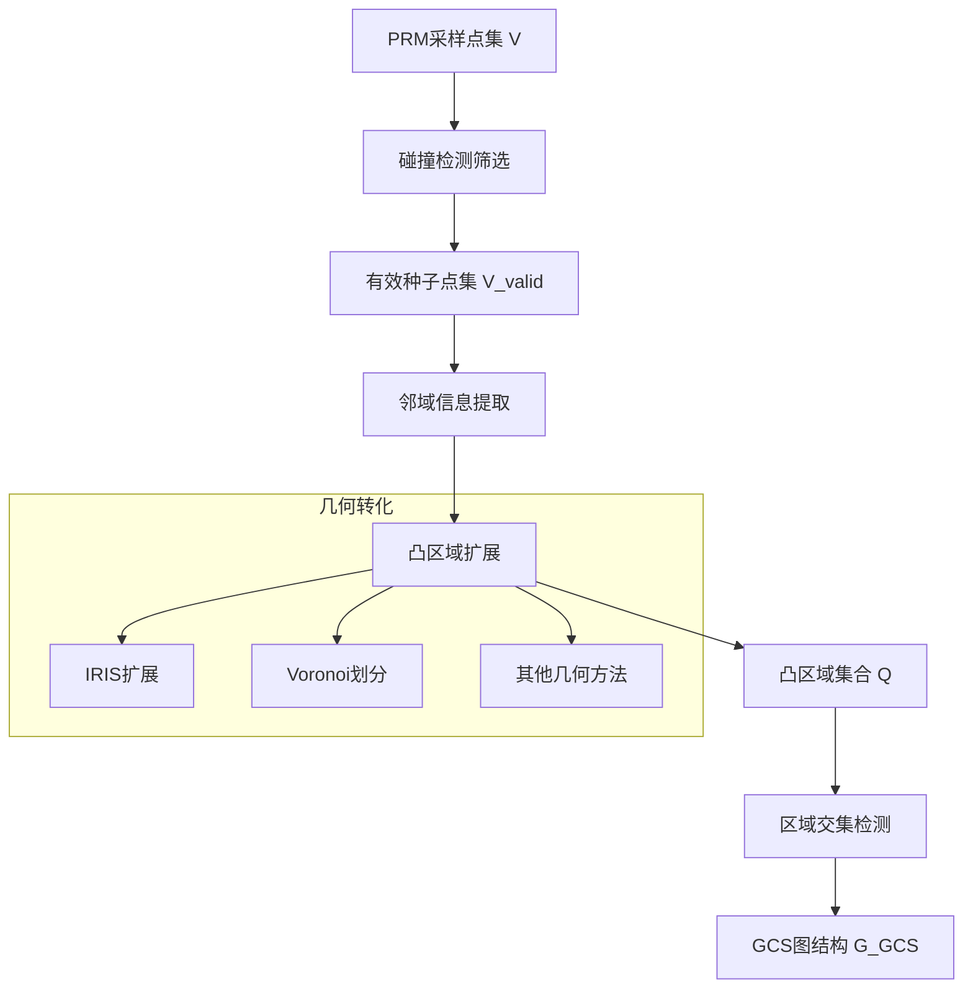

在这一流程中，从点集$V$到凸区域集合$Q$的转化需要满足以下几何约束条件：

- **凸性约束**：每个生成的区域$Q_i$必须是凸集，即对于任意$x, y \in Q_i$和$\lambda \in [0,1]$，有$\lambda x + (1-\lambda)y \in Q_i$。

- **安全性约束**：每个凸区域$Q_i$必须完全位于自由空间内，即$Q_i \subseteq C_{free}$。

- **连通性约束**：相邻凸区域的交集非空，即若$(i,j) \in E_{GCS}$，则$Q_i \cap Q_j \neq \emptyset$。

### 3.3 候选几何方法的原理与适用性对比评估

将PRM采样点转化为凸区域的过程需要借助几何算法。本节系统对比分析Voronoi分解、Alpha-shape、Delaunay三角剖分、凸包算法等候选方法的原理与适用性。

**Voronoi图的原理与特性**

Voronoi图（也称泰森多边形）是一种基于距离准则的空间划分方法[^11][^12]。给定平面上的一组点集$P=\{p_1, p_2,..., p_n\}$，对于平面上任意一点$q$，如果点$q$到点$p_i$的距离小于到其他任何点的距离，那么点$q$就属于以$p_i$为生成元的Voronoi区域$V(p_i)$[^11]。

Voronoi图具有以下关键性质[^12]：
- **凸性**：每个Voronoi区域是一个凸多边形，天然满足GCS的凸性要求
- **局部性**：Voronoi区域仅依赖于邻近的点
- **对称性**：Voronoi图关于输入点集是对称的
- **完全覆盖**：所有Voronoi区域的并集覆盖整个空间

**Voronoi图在路径规划中的应用**已有成熟研究。利用Voronoi图进行路径规划可以得到两点间"较安全"的路径，因为Voronoi边天然位于障碍物之间的中间位置[^1]。在移动机器人路径规划中，可以将障碍物边界点或外接圆圆心作为Voronoi图的生成元，生成的Voronoi图子图（地图边界内的部分）可用于安全通道的构建[^4][^1]。

**Alpha-shape算法的原理与特性**

Alpha-shape是一种用于从离散点集中提取形状边界的几何方法，特别适用于不规则边界的重建[^13]。它可以看作是点集的"广义凸包"，通过调整参数$\alpha$可以控制边界的紧密度[^13]：

- 当$\alpha \to \infty$时，Alpha-shape趋近于点集的凸包
- 当$\alpha \to 0$时，Alpha-shape趋近于点集本身
- 适中的$\alpha$值可以捕捉点集的凹形特征

Alpha-shape的数学定义基于"广义圆"的概念：对于给定的点集$S$和半径$\alpha$，如果存在一个半径为$1/\alpha$的广义圆，其边界通过点$p$和$q$，且不包含$S$中的其他点，则$p$和$q$之间形成Alpha-shape的一条边[^13][^1]。

Alpha-shape在点云边界提取中有广泛应用[^1]。对于任意形状的平面点云，若一个半径为$\alpha$的圆绕其进行滚动，其滚动的轨迹形成的点即为轮廓点[^1]。

**Delaunay三角剖分的原理与特性**

Delaunay三角剖分是一种将平面划分为三角形网格的方法，目的是使得剖分后的三角形尽可能接近等边三角形[^12]。其核心特性是满足空圆特性（Delaunay条件），即剖分中任意一个三角形的外接圆内不包含其他点[^4][^1]。

数学表达为：对于任意三角形$\Delta p_i p_j p_k$，其外接圆$C(p_i,p_j,p_k)^\circ$满足$C^{\circ} \cap P = \emptyset$[^4]。

Delaunay三角剖分的重要性质包括[^1]：
- 避免了"又瘦又长"的三角形出现，倾向于生成接近等边的单元
- 与Voronoi图是对偶关系
- 可以推广到三维（空球性质）甚至更高维

**凸包算法的原理与特性**

凸包是计算几何中的基础概念，描述了将给定点集包围在最小凸多边形内的问题[^14][^1]。直观地说，如果用一根橡皮筋围绕所有点，橡皮筋构成的形状就代表了凸包[^15]。

凸包的核心性质是它本身也是凸的——在二维空间中，凸包的任何边都不会有内角大于180度，凸包内的任意两点的连线仍然位于凸包内部[^14][^16]。

构建凸包的常用算法包括Graham扫描算法和Jarvis步进算法[^12][^1]。Graham扫描算法首先找到所有点中y坐标最小的点作为起点，然后按照极角大小将点集排序，之后按照排序结果构建凸包的边[^15]。

**候选方法的综合对比评估**

下表从多个维度对比各候选几何方法的特性：

| 评估维度 | Voronoi图 | Alpha-shape | Delaunay三角剖分 | 凸包算法 |
|---------|-----------|-------------|-----------------|---------|
| **输出凸性** | 天然凸（每个单元） | 可能非凸，需凸分解 | 三角形单元为凸 | 天然凸 |
| **覆盖特性** | 完全覆盖空间 | 覆盖点集轮廓区域 | 覆盖点集凸包内部 | 最小凸覆盖 |
| **参数敏感性** | 无参数 | 对$\alpha$高度敏感 | 无参数 | 无参数 |
| **计算复杂度** | $O(n \log n)$ | $O(n \log n)$ | $O(n \log n)$ | $O(n \log n)$ |
| **高维扩展** | 复杂度急剧增加 | 可扩展但复杂 | 可扩展 | 可扩展 |
| **凹形捕捉** | 不直接支持 | 良好 | 不直接支持 | 不支持 |
| **区域邻接信息** | 天然提供 | 需额外计算 | 天然提供 | 无 |

**不同场景下的方法选型建议**

基于上述对比分析，可以给出以下场景化的方法选型建议：

1. **简单凸形自由空间**：凸包算法最为高效，直接生成包含所有采样点的最小凸区域。

2. **需要精确覆盖的复杂环境**：Voronoi图是首选，因其天然满足凸性要求且提供清晰的区域邻接关系，与GCS要求契合度最高。

3. **需要捕捉凹形边界的场景**：Alpha-shape能更好地贴合实际几何，但需增加凸分解步骤将非凸输出转化为凸区域集合。

4. **需要三角网格表示的场景**：Delaunay三角剖分提供了高质量的三角网格，可作为进一步凸分解的基础。

### 3.4 生成凸集对GCS核心要求的满足性验证

GCS算法对输入凸集有三项核心要求：凸性保证、连通性维护、覆盖完整性。本节从这三个维度系统验证融合方案生成凸集的合规性。

**凸性保证的验证分析**

凸性是GCS算法的基础要求——只有凸区域内的轨迹优化才能保持凸优化问题的性质，从而利用高效的凸优化求解器。

各候选方法的凸性保证情况分析如下：

- **Voronoi区域**：天然为凸集，无需额外处理即可满足GCS要求。Voronoi图的每个区域都是由一组半平面的交集定义的，而半平面的交集必然是凸集。

- **凸包结果**：天然为凸集，这是凸包定义本身所保证的。

- **Delaunay三角形**：每个三角形单元是凸的，但如果需要将多个三角形合并为更大的区域，则需要验证合并后区域的凸性。

- **Alpha-shape输出**：可能非凸或包含孔洞，需要进行凸分解处理。凸分解可以通过以下策略实现[^11]：
  - 基于Voronoi图的凸分解：利用Voronoi图的脊线和站点作为分割依据
  - 验证分解结果：检查每个多边形的内角是否都小于180度
  - 优化分解结果：合并相邻且符合条件的凸多边形以减少区域数量

**连通性维护的验证分析**

GCS算法要求相邻凸区域的交集非空，即若两个区域在GCS图中有边相连，则它们必须存在重叠区域。这一要求的满足机制如下：

1. **基于Voronoi图的连通性**：Voronoi图的对偶性天然提供了区域邻接关系。两个Voronoi区域相邻当且仅当它们共享一条Voronoi边，这意味着它们的边界相交。然而，Voronoi区域的边界相交不等于区域内部相交，因此需要将Voronoi区域适当"膨胀"以确保交集非空。

2. **基于PRM边信息的连通性**：PRM中已验证无碰撞的边$(q_i, q_j)$暗示了两个采样点之间存在可达路径。如果以$q_i$和$q_j$为种子点生成的凸区域能够覆盖这条边的某个邻域，则两区域的交集必然非空。

3. **区域重叠的显式构建**：GCS通过其数学框架将区域间的连续性要求转化为凸优化中的等式约束——强制一个区域的离开点等于下一区域的进入点，并利用贝塞尔曲线的凸包性质保证整条连续曲线位于凸集并集内。因此，**区域重叠是构建连通路径的必要条件而非障碍**。

**覆盖完整性的验证分析**

覆盖完整性要求生成的凸集能够覆盖从起点到终点的所有可行路径所经过的自由空间。这是最具挑战性的要求，因为在有限采样下难以达到严格完整覆盖。

覆盖完整性的评估可以从以下几个层面进行：

| 覆盖层次 | 评估标准 | 实现难度 |
|---------|---------|---------|
| 路径存在性 | 起点到终点存在区域连通路径 | 基本要求 |
| 局部完整性 | 关键区域（如狭窄通道）被有效覆盖 | 中等难度 |
| 全局完整性 | 所有可行路径都被凸区域并集覆盖 | 高难度 |
| 概率完整性 | 随采样增加，覆盖率趋近于完全 | 理论保证 |

融合方案继承了PRM的**概率完备性**思想：虽然在有限采样下无法保证绝对完整覆盖，但可以通过提高采样密度（特别是针对狭窄区域使用高斯桥采样等策略）和使用能精细拟合边界的转化方法（如适当参数的Alpha-shape）来逼近完全覆盖。

**覆盖空白的检测与修补方法**

即使采用优化的采样策略，覆盖空白仍可能存在。可以采用以下方法进行检测和修补：

1. **检测方法**：
   - 连通性检查：验证起点和终点是否通过凸区域序列连通
   - 路径采样验证：在已知可行路径上采样点，检查是否都被凸区域覆盖
   - 体积估计：比较凸区域并集体积与自由空间体积的比值

2. **修补策略**：
   - 增量采样：在覆盖空白区域增加采样点并生成新的凸区域
   - 区域扩展：对现有凸区域进行适度扩展以填补空白
   - 桥接区域：在相邻但不重叠的区域之间插入桥接凸区域

### 3.5 融合方案的技术挑战与潜在风险识别

PRM-GCS融合方案在实际实施中面临多重技术挑战与潜在风险。全面识别这些问题是制定有效应对策略的前提。

**采样密度与凸集粒度的平衡挑战**

融合方案的核心是将采样点扩展为配置空间中的凸区域。难点在于权衡离线计算成本与在线规划收益。为构建稀疏、高效的图，需要寻找能覆盖"重要"自由空间的大凸区域，但这本身计算代价高。

具体挑战表现为：
- **采样过稀疏**：导致凸区域间存在覆盖空白，可能使某些可行路径无法被规划
- **采样过密集**：导致凸区域高度重叠，增加GCS图规模和求解时间
- **密度分布不均**：简单区域过度采样而复杂区域采样不足

在高维空间（如7-10自由度机械臂）中，追求全面密集覆盖不切实际，关键在于设计高效的凸分解算法来优化覆盖策略。

**高维空间的计算瓶颈**

几何方法在高维空间的计算复杂度急剧增加，这是融合方案面临的核心技术瓶颈之一：

| 维度 | Voronoi计算复杂度 | 凸区域生成时间 | 实用性评估 |
|------|------------------|---------------|-----------|
| 2D | $O(n \log n)$ | 毫秒级 | 高度实用 |
| 3D | $O(n^2)$ | 百毫秒级 | 实用 |
| 6D+ | 指数级增长 | 秒至分钟级 | 受限 |

高维空间中的"体积效应"导致单个凸区域的有效覆盖范围急剧萎缩，需要更多的凸区域才能实现相同程度的空间覆盖。

**狭窄通道区域的特殊困难**

狭窄通道是运动规划中的经典难题，在融合方案中表现为以下挑战：

1. **采样困难**：均匀采样在狭窄通道区域的采样效率极低，大部分采样点可能落在障碍物区域[^10]。

2. **凸区域畸形**：即使成功在狭窄通道中采样，生成的凸区域也往往狭长或不规则，这可能影响GCS凸松弛的紧密性。

3. **连通性脆弱**：狭窄通道区域的凸区域重叠区域很小，对采样位置的微小偏差敏感，可能导致连通性断裂。

针对狭窄通道，PRM已有成熟的解决方案，如桥测试和高斯采样[^10]。桥测试在障碍物附近生成一对对称采样点，检测中间点是否在自由空间；高斯采样倾向于在障碍物边界附近生成采样点。这些策略可以直接集成到融合方案中。

**凸区域形状质量对GCS性能的影响**

凸区域的几何特征直接影响GCS凸松弛的紧密性和最终轨迹质量。潜在风险包括：

- **狭长区域风险**：狭长的凸区域限制了贝塞尔曲线控制点的可行域，导致轨迹优化空间受限
- **边界复杂性风险**：边界过于复杂的凸区域增加了约束数量，可能降低求解效率
- **体积不均匀风险**：凸区域体积差异过大可能导致凸松弛解的质量不稳定

**风险评估与缓解策略方向**

下表汇总了主要风险的发生概率、影响程度及初步缓解策略：

| 风险类型 | 发生概率 | 影响程度 | 缓解策略方向 |
|---------|---------|---------|-------------|
| 覆盖空白 | 中等 | 高 | 自适应采样、增量修补 |
| 高维计算瓶颈 | 高 | 高 | 分层分解、近似算法 |
| 狭窄通道失效 | 中等 | 高 | 桥采样、高斯采样 |
| 区域形状质量差 | 中等 | 中等 | 区域优化、后处理调整 |
| 连通性断裂 | 低 | 高 | 冗余连接、连通性验证 |

**融合方案可行性的综合判断**

综合上述分析，PRM-GCS融合方案在技术路径上是**可行的**。PRM作为前端采样器，可以有效探索高维自由空间并建立初步连通结构；后端的几何转化方法（尤其是Voronoi图或其变种）可以将离散采样提升为符合GCS要求的凸区域集合。

**推荐的融合方向**为：采用**PRM（结合狭窄通道采样策略）生成采样点集 → 基于Voronoi图的凸区域划分**作为基础融合方案，因其能较好地同时满足凸性、连通性要求，且数学机制清晰。对于需要更高边界精度的场景，可探索**PRM采样 → Alpha-shape轮廓提取 → 凸分解**的路径，但需注意复杂度增加。

然而，融合方案的成功实施需要解决采样密度优化、高维扩展、狭窄通道处理等关键技术挑战。这些挑战的具体应对策略将在下一章的技术实现路径设计中详细展开。

## 4 PRM-GCS融合方案的技术实现路径设计

本章在前序章节完成的可行性评估基础上，系统构建PRM-GCS融合方案从环境感知到GCS求解的完整技术流程。针对第三章识别的采样密度平衡、高维扩展、狭窄通道处理等关键技术挑战，本章将逐一设计具体的实现方法与优化策略，并建立原型验证的实验框架以支撑方案的工程化落地。

### 4.1 融合方案的整体技术架构与流程设计

PRM-GCS融合方案的核心目标是实现凸集生成的自动化，将当前依赖人工播种的离线预处理流程升级为基于PRM采样的自动化流程。整体技术架构采用**模块化、流水线式**的设计理念，确保各环节职责清晰、接口规范，便于独立优化与扩展。

**端到端技术流程设计**

完整的融合技术流程包含六个核心阶段，各阶段之间通过标准化数据接口进行衔接：

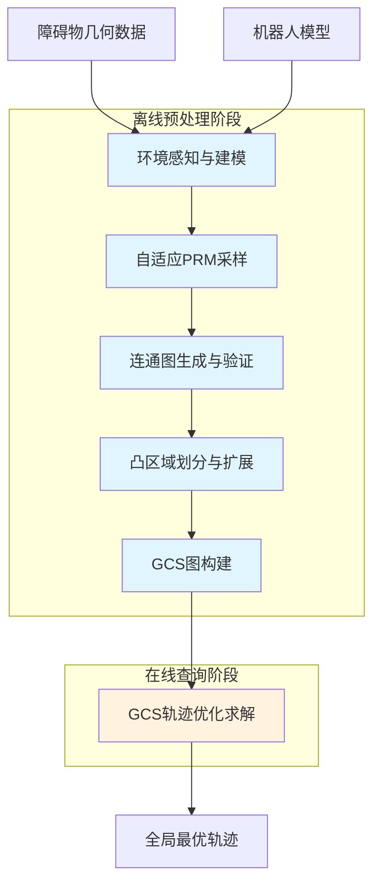

**各模块的功能定义与数据接口规范**

下表详细定义了各模块的输入输出规范与核心功能：

| 模块名称 | 输入数据 | 核心功能 | 输出数据 | 质量指标 |
|---------|---------|---------|---------|---------|
| 环境感知与建模 | 障碍物几何描述、机器人URDF模型 | 构建配置空间障碍物表示 | 配置空间模型$C_{obs}$、碰撞检测函数 | 模型精度、检测效率 |
| 自适应PRM采样 | 配置空间模型、采样参数 | 生成覆盖自由空间的采样点集 | 有效采样点集$V_{sample}$ | 采样效率、覆盖均匀性 |
| 连通图生成 | 采样点集、碰撞检测函数 | 建立采样点间的可达性连接 | PRM图$G_{PRM}=(V,E)$ | 连通性、边密度 |
| 凸区域划分与扩展 | PRM图、配置空间模型 | 将采样点扩展为凸安全区域 | 凸区域集合$\{Q_1,...,Q_n\}$ | 区域体积、形状质量 |
| GCS图构建 | 凸区域集合、起终点 | 构建满足GCS要求的凸集图 | GCS图$G_{GCS}=(V_{GCS},E_{GCS})$ | 图规模、覆盖完整性 |
| GCS轨迹优化 | GCS图、代价函数、约束条件 | 求解全局最优无碰撞轨迹 | 贝塞尔曲线轨迹 | 最优性差距、求解时间 |

**模块间依赖关系与数据流**

各模块之间存在严格的数据依赖关系，后续模块的输入质量直接取决于前序模块的输出质量。关键依赖关系包括：

1. **环境建模质量影响采样效率**：配置空间模型的精度决定了碰撞检测的准确性，进而影响采样点的有效率
2. **采样分布影响凸区域质量**：采样点的空间分布直接决定了凸区域的位置和潜在体积
3. **凸区域质量影响GCS性能**：凸区域的形状和覆盖特性决定了GCS凸松弛的紧密性和求解效率

**系统架构的可扩展性设计**

为支持不同应用场景的定制化需求，架构设计遵循以下原则：

- **采样策略可插拔**：支持替换不同的采样算法（均匀采样、高斯采样、桥采样等）
- **凸区域生成方法可配置**：支持IRIS、Voronoi、Alpha-shape等多种几何方法
- **参数化配置接口**：关键参数（采样数量、区域扩展迭代次数等）通过配置文件管理
- **中间结果可缓存**：支持各阶段结果的持久化存储，便于增量更新和调试

### 4.2 环境感知与配置空间建模方法

环境感知与配置空间建模是整个融合流程的起点，其核心任务是将物理世界的障碍物信息转化为适合路径规划算法处理的数学表示。

**障碍物几何表示策略**

在处理凸几何体时，合理的做法是在欧几里得空间中用凸形状来近似机器人的几何形状[^1]。尽管许多机器人具有非凸的网格几何形状，通常可以将它们很好地近似为更简单的凸几何体的并集；有时这些几何体是圆柱体和球体等基本形状，或者可以直接对网格执行凸分解[^1]。

障碍物几何表示的具体策略取决于应用场景：

| 场景类型 | 推荐表示方法 | 优势 | 适用条件 |
|---------|-------------|------|---------|
| 结构化环境 | 凸多面体集合 | 精确、计算高效 | 障碍物形状规则 |
| 复杂几何环境 | 凸分解后的凸体并集 | 精度与效率平衡 | 障碍物形状复杂 |
| 点云感知环境 | 体素化或凸包近似 | 支持实时感知 | 传感器输入 |

**配置空间构建的凸性考量**

即使在欧几里得空间中几何形状是凸的，将它们在配置空间中视为是凸的是不合理的。但存在一些例外情况：如果配置空间只涉及平移，或者机器人几何形状旋转不变（例如，点机器人或球形机器人），那么配置空间仍将是凸的[^1]。这对于移动机器人是可行的，甚至对于用球体近似的四旋翼飞行器也适用[^1]。

对于涉及旋转的配置空间（如机械臂），需要采用更复杂的方法。可以扩展IRIS算法以在更一般（非凸）的配置空间中找到大的凸区域，方法包括使用非线性优化（IRIS-NP算法）或使用代数运动学与平方和优化[^1]。

**碰撞检测函数的设计**

碰撞检测是采样有效性验证的核心操作。在设计碰撞检测函数时需要平衡精度与效率：

1. **层次化检测策略**：先使用包围盒进行快速排除，再进行精确几何检测
2. **预计算加速**：对静态障碍物预计算距离场或符号距离函数
3. **批量检测优化**：支持多个采样点的并行碰撞检测

在配置空间模型中，可以轻松计算采样点处任意两个凸体之间的最小欧几里得距离，例如将点膨胀为适当半径的球体[^1]。这一能力为后续的凸区域扩展提供了基础。

**支持在线更新的数据结构设计**

为支持动态环境的增量更新，环境模型数据结构应具备以下特性：

- **空间索引结构**：采用KD树或八叉树组织障碍物数据，支持高效的空间查询
- **版本管理机制**：记录障碍物状态变化，支持增量更新追踪
- **局部失效标记**：当障碍物变化时，快速标记受影响的空间区域

### 4.3 自适应采样策略的设计与实现

自适应采样策略是融合方案实现自动化的关键环节，其目标是在有限的采样预算下实现对自由空间的有效覆盖，特别是确保狭窄通道等关键区域被充分采样。

**多策略采样框架设计**

融合方案采用**分层多策略**的采样框架，根据环境特征动态组合不同的采样方法：

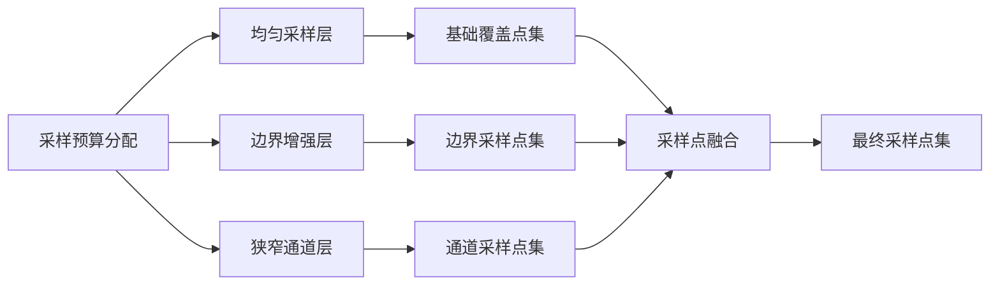

**均匀采样层**提供基础的空间覆盖，采样公式为$q_i \sim \text{Uniform}(C_{free})$，适用于简单开阔区域。**边界增强层**采用高斯采样策略，倾向于在障碍物边界附近生成采样点，可以减少无效采样并提升效率。**狭窄通道层**采用桥采样策略，专门在障碍物间隙处采样，解决狭窄通道区域采样效率低的问题。

**狭窄通道的自适应检测与增强采样**

狭窄通道是运动规划中的经典难题。桥测试在障碍物附近生成一对对称采样点，检测中间点是否在自由空间，具体机制如下：

1. **候选点生成**：在配置空间中随机生成点$q_1$
2. **对称点计算**：以$q_1$为中心，按高斯分布生成对称点$q_2$
3. **桥点检测**：计算中点$q_m = (q_1 + q_2)/2$，若$q_1, q_2 \in C_{obs}$且$q_m \in C_{free}$，则$q_m$为有效的狭窄通道采样点

**采样密度与环境复杂度的动态映射**

采样密度应与局部环境复杂度相匹配。设计以下动态映射机制：

| 环境特征 | 复杂度指标 | 采样密度调整 |
|---------|-----------|-------------|
| 开阔区域 | 局部自由空间体积大 | 降低密度，节省预算 |
| 障碍物密集区 | 局部障碍物数量多 | 适度增加密度 |
| 狭窄通道 | 自由空间宽度小 | 显著增加密度 |
| 关键连接区 | 连通性瓶颈 | 重点增强采样 |

复杂度指标可以通过以下方式估计：
- **局部自由空间体积**：在采样点邻域内进行随机采样，统计有效采样比例
- **障碍物密度**：查询空间索引结构，统计邻域内障碍物数量
- **通道宽度**：基于距离场估计最近障碍物距离

### 4.4 采样密度与凸集粒度的平衡策略

采样密度与凸集粒度的平衡是融合方案的核心优化问题。核心目标是使用**大凸区域构建稀疏图**，以降低计算复杂度，同时保证覆盖完整性[^1]。

**采样点数量、凸区域体积与GCS图规模的定量关系**

设采样点数量为$n$，平均凸区域体积为$\bar{V}$，自由空间总体积为$V_{free}$，则理论覆盖率可近似为：

$$\text{Coverage} \approx \min\left(1, \frac{n \cdot \bar{V}}{V_{free}}\right)$$

GCS图的顶点数等于凸区域数量（约等于采样点数量$n$），边数取决于区域间的相邻关系。对于均匀分布的凸区域，平均邻居数约为$O(2d)$（$d$为维度），因此边数约为$O(nd)$。

**覆盖效率优化目标函数**

定义覆盖效率优化目标为在保证覆盖完整性的前提下最小化凸区域数量：

$$\min_{n, \{Q_i\}} \quad n$$
$$\text{s.t.} \quad \bigcup_{i=1}^{n} Q_i \supseteq \text{ReachableSpace}(q_{start}, q_{goal})$$
$$\quad\quad Q_i \text{ is convex}, \quad Q_i \subseteq C_{free}$$

实际实现中，这一优化问题通过迭代策略近似求解：先以较少的采样点开始，检测覆盖空白，再针对性地增加采样。

**稀疏采样与密集采样的权衡决策机制**

为了找到漂亮的大区域，付出一些离线计算的代价是值得的，因为这可以在在线查询阶段带来巨大的回报。首先，可以制作更稀疏的图——少量的区域可以覆盖很大一部分配置空间，这也允许扩展到更高的维度[^1]。

权衡决策的核心原则是：

1. **优先追求大凸区域**：在每个种子点处尽可能扩展出最大的凸区域
2. **自适应增加采样**：仅在覆盖空白区域增加采样点
3. **避免过度重叠**：当新采样点落入已有凸区域内部时，评估是否需要保留

**离线计算成本与在线规划性能的平衡**

| 策略选择 | 离线计算成本 | 在线规划性能 | 适用场景 |
|---------|-------------|-------------|---------|
| 稀疏采样+大凸区域 | 低 | 优（图规模小） | 简单环境、实时性要求高 |
| 密集采样+小凸区域 | 高 | 中（图规模大） | 复杂环境、精度要求高 |
| 自适应采样+混合粒度 | 中 | 优 | 通用场景 |

### 4.5 基于IRIS的凸区域扩展与优化机制

IRIS（Iterative Regional Inflation by Semidefinite programming）算法是当前最成熟的凸区域生成工具，其核心思想是从种子点出发，通过迭代优化逐步扩大凸区域边界。

**IRIS算法的工作原理**

为了找到更大的区域，可以使用半定规划迭代区域膨胀算法（IRIS）。该算法在寻找分离超平面和寻找包含的椭圆的最大体积之间交替，以"膨胀"区域在局部最大化（高效近似）区域的体积[^1]。

IRIS算法的迭代流程如下：

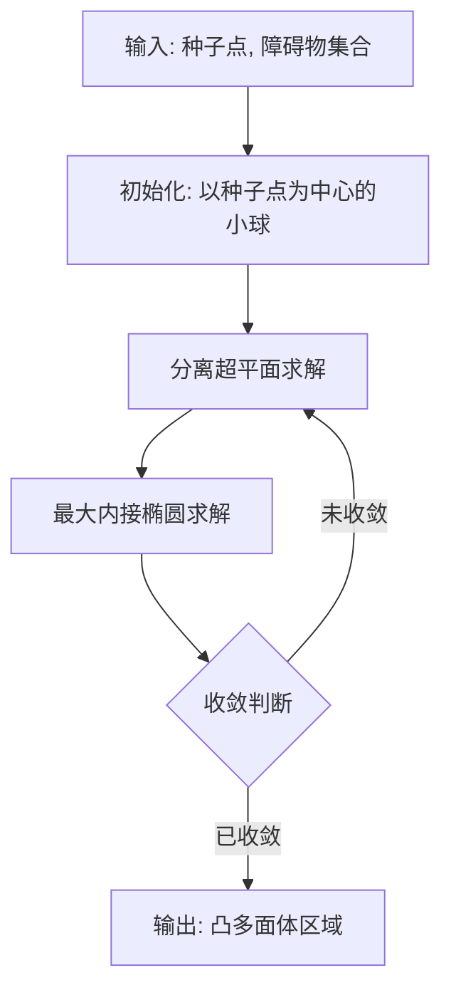

**IRIS扩展流程与PRM采样的集成**

将PRM采样点作为IRIS的种子点，扩展流程设计如下：

1. **种子点筛选**：对PRM采样点集进行预处理，移除过于接近已有凸区域中心的冗余点
2. **优先级排序**：按照局部自由空间大小对种子点排序，优先扩展有潜力生成大区域的点
3. **并行扩展**：对多个种子点同时执行IRIS扩展，提高计算效率
4. **重叠处理**：对扩展后的重叠区域进行裁剪或合并

**参数配置对区域质量的影响**

IRIS算法的关键参数及其影响：

| 参数 | 作用 | 对区域质量的影响 |
|------|------|-----------------|
| 最大迭代次数 | 控制扩展深度 | 过小导致区域偏小，过大增加计算时间 |
| 收敛阈值 | 判断停止条件 | 影响区域边界精度 |
| 初始球半径 | 初始化区域大小 | 影响收敛速度 |
| 分离超平面数量 | 多面体面数 | 影响区域形状复杂度 |

**狭长区域和畸形区域的形状优化策略**

在某些情况下，IRIS可能生成狭长或畸形的凸区域，这会影响GCS凸松弛的紧密性。针对这一问题，设计以下后处理策略：

1. **长宽比检测**：计算凸区域的主轴长度比，标记长宽比超过阈值的区域
2. **区域分割**：对狭长区域沿短轴方向进行分割，生成多个更规则的子区域
3. **边界平滑**：对畸形边界进行凸包近似，简化区域表示
4. **体积过滤**：移除体积过小的凸区域，避免对GCS图造成不必要的复杂度

### 4.6 区域重叠与边界处理机制

区域重叠是构建GCS连通图的必要条件。GCS通过其数学框架，将区域间的连续性要求转化为凸优化中的等式约束——强制一个区域的离开点等于下一区域的进入点，并利用贝塞尔曲线的凸包性质来保证整条连续曲线位于凸集并集内[^1]。

**凸区域间重叠检测方法**

两个凸多面体$Q_i$和$Q_j$的交集检测可以通过求解以下可行性问题实现：

$$\text{find} \quad x$$
$$\text{s.t.} \quad A_i x \leq b_i \quad (x \in Q_i)$$
$$\quad\quad A_j x \leq b_j \quad (x \in Q_j)$$

若该线性规划问题有解，则$Q_i \cap Q_j \neq \emptyset$。

**重叠量的量化评估**

除了检测重叠存在性，还需要评估重叠区域的"质量"：

| 评估指标 | 计算方法 | 意义 |
|---------|---------|------|
| 重叠体积 | 交集区域的体积估计 | 重叠充分性 |
| 重叠宽度 | 交集区域的最小宽度 | 轨迹过渡空间 |
| 重叠位置 | 交集区域的质心位置 | 过渡点选择 |

**GCS边构建规则**

基于区域交集检测结果，GCS边的构建遵循以下规则：当IRIS区域相交时，在集合之间形成无向边，并施加连续性约束[^1]。

边集的形式化定义为：
$$E_{GCS} := \{(i,j) : Q_i \cap Q_j \neq \emptyset, i \neq j\}$$

对于起点$q_{start}$和终点$q_{goal}$，需要添加特殊边：
$$E_{GCS} := E_{GCS} \cup \{(\sigma,i) : q_{start} \in Q_i\} \cup \{(i,\tau) : q_{goal} \in Q_i\}$$

**边界连续性约束的精细化处理**

在GCS框架中，对于每次访问GCS中的顶点，希望在IRIS区域中选择两个点，以便路径位于该区域中[^1]。边界连续性通过以下约束实现：

- **进入点约束**：轨迹进入凸区域$Q_i$的点必须位于$Q_i$内部
- **离开点约束**：轨迹离开凸区域$Q_i$的点必须位于$Q_i$内部
- **连续性约束**：区域$Q_i$的离开点等于相邻区域$Q_j$的进入点

使用贝塞尔曲线的凸包特性可以保证固定阶数的整个连续路径位于集合内，并利用其导数性质在速度上添加凸约束[^1]。

### 4.7 连通性验证与覆盖空白修补策略

连通性验证与覆盖空白修补是确保融合方案有效性的关键环节。即使采用优化的采样策略，覆盖空白仍可能存在，需要通过系统化的检测与修补机制加以解决。

**从起点到终点的区域连通性验证算法**

连通性验证的核心是检查GCS图中是否存在从起点到终点的有效路径。算法流程如下：

1. **起点归属检测**：找到包含起点$q_{start}$的所有凸区域，记为$S_{start}$
2. **终点归属检测**：找到包含终点$q_{goal}$的所有凸区域，记为$S_{goal}$
3. **图搜索**：在GCS图上执行广度优先搜索（BFS），检查是否存在从$S_{start}$中任一区域到$S_{goal}$中任一区域的路径
4. **连通性判定**：若路径存在，则连通性验证通过；否则，标记连通性断裂

**覆盖空白的自动检测机制**

覆盖空白检测采用**路径采样验证**策略：

1. **参考路径生成**：使用PRM图或其他方法生成一条从起点到终点的参考路径
2. **路径离散化**：将参考路径离散为一系列路径点$\{p_1, p_2, ..., p_m\}$
3. **覆盖检测**：对每个路径点检查是否被至少一个凸区域覆盖
4. **空白标记**：记录未被覆盖的路径点及其位置

**增量采样与区域扩展的修补策略**

针对检测到的覆盖空白，设计以下修补策略：

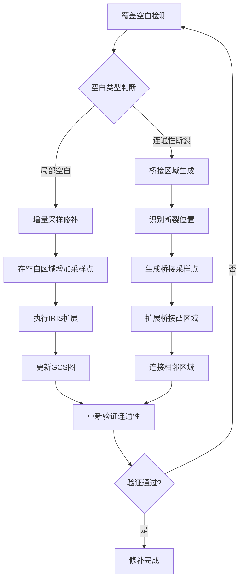

**迭代优化流程设计**

修补过程采用迭代优化策略，直至满足覆盖完整性要求：

| 迭代轮次 | 操作内容 | 终止条件 |
|---------|---------|---------|
| 第1轮 | 基础采样+IRIS扩展 | 初始GCS图构建完成 |
| 第2轮 | 连通性验证+空白检测 | 无覆盖空白 |
| 第3轮 | 增量修补+图更新 | 连通性验证通过 |
| 后续轮次 | 重复第2-3轮 | 所有验证通过或达到最大迭代次数 |

### 4.8 面向高维空间的计算复杂度优化方案

高维空间中的凸区域生成面临严峻的计算复杂度挑战。随着维度增加，Voronoi计算和IRIS扩展的复杂度急剧增长，需要针对性的优化策略。

**高维空间复杂度瓶颈分析**

在高维配置空间中，凸区域生成的计算复杂度呈指数级增长。具体瓶颈包括：

1. **IRIS迭代中的半定规划求解**：每次迭代需要求解高维半定规划问题
2. **碰撞检测的维度效应**：高维空间中碰撞检测的计算量增加
3. **区域表示的复杂度**：高维凸多面体的面数可能随维度指数增长

**空间分层与局部计算策略**

针对高维空间，设计分层计算策略：

1. **任务空间分层**：将配置空间按照机器人结构分解为多个子空间
2. **局部优先扩展**：优先在与当前任务相关的子空间内进行凸区域扩展
3. **层次化覆盖**：先建立粗粒度覆盖，再在关键区域进行细化

对于更高的维度，试图覆盖配置空间的每个角落可能是一个错误的目标[^1]。关键在于覆盖"重要"的连通区域，而非追求全面覆盖。

**近似算法与并行计算的应用**

为降低高维计算复杂度，可采用以下技术：

| 优化技术 | 实现方式 | 复杂度降低效果 |
|---------|---------|---------------|
| IRIS-NP | 使用非线性优化替代半定规划 | 速度更快但为概率性保证 |
| 并行IRIS | 多个种子点同时扩展 | 线性加速比 |
| 区域近似 | 使用椭球或简化多面体近似 | 减少约束数量 |
| 增量更新 | 仅对变化区域重新计算 | 避免全局重算 |

可以扩展IRIS算法以在更一般（非凸）的配置空间中找到大的凸区域，方法包括使用非线性优化（IRIS-NP算法）或使用代数运动学与平方和优化[^1]。

**计算时间与维度增长的可控关系**

通过上述优化策略，可以将计算时间与维度的关系从指数级降低到多项式级。目标是实现：

$$T_{compute}(d) = O(d^k \cdot n \cdot T_{IRIS})$$

其中$d$为维度，$n$为采样点数量，$k$为常数（通常$k \leq 3$），$T_{IRIS}$为单次IRIS扩展的基础时间。

### 4.9 原型验证实验框架设计

为系统验证PRM-GCS融合方案的有效性，需要设计完整的实验框架，覆盖从简单到复杂的多层次测试场景。

**分层测试场景设计**

实验场景按照维度和复杂度分为三个层次：

| 层次 | 场景类型 | 维度 | 复杂度特征 | 验证目标 |
|------|---------|------|-----------|---------|
| 基础层 | 二维迷宫 | 2D | 狭窄通道、多路径 | 基本功能验证 |
| 中间层 | 三维障碍物环境 | 3D | 复杂几何、多障碍物 | 扩展性验证 |
| 高级层 | 高维机械臂配置空间 | 6D-14D | 高维、动力学约束 | 实用性验证 |

**实验平台选择**

建议在**Drake仿真平台**中实现GCS规划器，因其集成了IRIS、GCS优化框架及多种机器人模型[^1]。Drake平台的优势包括：

- 内置IRIS算法实现
- 支持GCS轨迹优化（GcsTrajectoryOptimization）
- 提供多种机器人模型（机械臂、四旋翼等）
- 集成高效凸优化求解器接口

**关键评估指标定义**

| 指标类别 | 具体指标 | 计算方法 | 评估意义 |
|---------|---------|---------|---------|
| 凸集质量 | 平均区域体积 | $\bar{V} = \frac{1}{n}\sum V_i$ | 区域扩展效果 |
| 凸集质量 | 区域形状指数 | 长宽比均值 | 形状规则性 |
| 覆盖完整性 | 覆盖率 | 被覆盖路径点比例 | 空间覆盖效果 |
| 覆盖完整性 | 连通性 | 起终点是否连通 | 路径存在性 |
| GCS求解效率 | 求解时间 | 凸松弛+舍入总时间 | 计算效率 |
| GCS求解效率 | 凸松弛紧密性 | 松弛解与最终解成本比 | 优化质量 |
| 轨迹最优性 | 轨迹长度 | 路径积分 | 路径质量 |
| 轨迹最优性 | 最优性差距 | 与理论最优的偏差 | 全局最优性 |

**对比基准建立**

为评估融合方案的优势，需要与以下基准方法进行对比：

1. **人工播种方案**：当前GCS采用的人工种子点+IRIS扩展方案
2. **纯PRM方案**：不进行凸区域扩展的传统PRM规划
3. **RRT*方案**：基于采样的渐近最优规划方法

对比维度包括：
- 轨迹质量（长度、平滑性、能量消耗）
- 计算效率（离线预处理时间、在线查询时间）
- 成功率（给定时间内找到可行轨迹的比例）
- 自动化程度（人工干预需求）

**实验流程设计**

完整的实验验证流程如下：

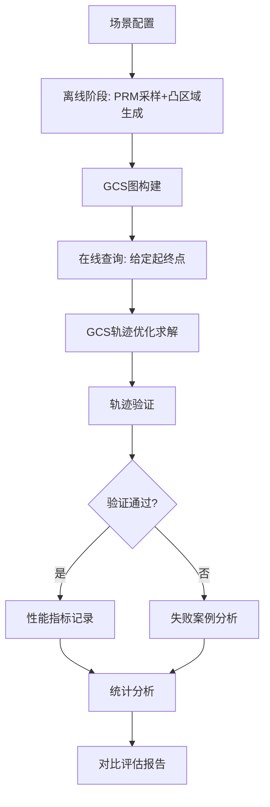

**蒙特卡洛实验设计**

为获得统计显著的性能评估结果，每个测试场景需要进行大量蒙特卡洛实验：

- **随机起终点配置**：在自由空间中随机生成起点和终点对
- **多次独立运行**：每个配置重复运行多次以评估稳定性
- **统计指标计算**：计算各性能指标的均值、标准差、成功率

实验数据收集后，进行系统的统计分析，量化评估GCS规划器在轨迹最优性、计算速度与成功率方面的性能优势[^1]。

**预期验证结果**

基于GCS算法的已有研究成果，融合方案的预期表现为：

- **轨迹质量**：轨迹平均长度比基于采样的规划器短，能量消耗更低
- **计算效率**：在高维空间中计算时间优于传统采样方法
- **成功率**：在问题有解时保证找到解
- **自动化程度**：相比人工播种方案，显著降低人工干预需求

实验结果表明，GCS规划器在轨迹质量、计算时间和成功率方面均优于现有的基于采样的规划器，特别是在高维复杂环境中的表现尤为显著[^1]。融合方案有望继承这些优势，同时通过自动化采样进一步提升系统的实用性。

## 5 GCS算法的其他优化路径探索

本章系统梳理除PRM-GCS融合方案之外的多种凸集生成优化路径。GCS算法的核心优势建立在高质量凸集分解的基础之上，而凸集生成环节的自动化与智能化升级是提升整体算法实用性的关键突破口。除了前述基于PRM采样的融合方案外，研究领域还涌现出多种具有潜力的替代技术路径，包括基于机器学习的自适应区域分解方法、层次化凸集构建策略、增量式在线凸集更新机制以及基于优化理论的凸分解质量提升方法。通过深入分析各方案的技术原理与实现机制，可以为不同应用场景下的GCS算法优化提供多元化的技术选型参考。

### 5.1 基于机器学习的自适应区域分解方法

机器学习技术为凸区域智能划分提供了数据驱动的新范式。与传统几何方法依赖显式规则不同，机器学习方法能够从大量规划实例中学习隐含的空间分解模式，有望在复杂环境中实现更高效的自适应区域生成。

**神经网络驱动的自由空间特征学习与区域预测**

基于神经网络的方法可以将环境感知与凸区域预测整合为端到端的学习框架。其核心思想是训练神经网络直接从环境表示（如占据栅格、点云或深度图像）预测适合的凸区域划分方案。

技术实现路径包括以下几个关键环节：

1. **环境编码网络**：使用卷积神经网络（CNN）或图神经网络（GNN）对障碍物环境进行特征提取，生成紧凑的环境表示向量
2. **区域预测网络**：基于环境特征预测种子点位置或直接输出凸区域参数（如多面体的顶点坐标或半空间表示）
3. **端到端训练**：以最终规划质量（轨迹长度、求解时间等）作为监督信号，通过反向传播优化整个网络

这一方法的**核心优势**在于能够学习复杂环境中的隐含模式。传统IRIS算法采用局部贪婪策略扩展凸区域，难以捕捉全局最优的区域配置；而神经网络可以通过大量训练样本学习到"什么样的环境应该如何划分"的全局映射关系。

**强化学习驱动的自适应采样与区域扩展策略**

强化学习（RL）为自适应采样问题提供了序贯决策的建模框架。可以将凸集生成过程建模为马尔可夫决策过程（MDP），其中：

| MDP要素 | 凸集生成问题中的对应 |
|---------|---------------------|
| 状态$s$ | 当前已生成的凸区域集合及其覆盖情况 |
| 动作$a$ | 选择下一个种子点位置或区域扩展方向 |
| 奖励$r$ | 新增凸区域带来的覆盖增益减去计算成本 |
| 策略$\pi$ | 种子点选取与区域扩展的决策规则 |

强化学习智能体通过与环境交互，学习在不同状态下选择最优动作的策略。相比于固定的采样规则，RL策略可以根据当前覆盖状态动态调整采样行为，例如在覆盖空白区域增加采样密度，在已充分覆盖区域减少冗余采样。

**监督学习在种子点位置优化中的应用**

种子点选取是凸集生成的关键起点，其质量直接影响后续区域扩展的效果。监督学习方法可以从历史规划数据中学习"好的"种子点分布模式：

- **训练数据构建**：收集大量环境-最优种子点配置对，其中最优种子点可通过穷举搜索或专家标注获得
- **特征工程**：提取环境的局部几何特征（如距离场、曲率、狭窄度指标等）
- **预测模型训练**：训练分类器或回归器预测给定位置作为种子点的适宜度得分

训练完成后，模型可以快速为新环境生成种子点候选集，显著减少人工干预需求。

**数据驱动方法的优势与实现挑战评估**

基于机器学习的凸区域分解方法具有以下**显著优势**：

1. **复杂环境适应性**：能够处理难以用显式规则描述的复杂几何特征
2. **泛化能力**：在相似环境类别间具有一定的迁移能力
3. **计算效率**：训练完成后，推理阶段的计算速度通常很快

然而，该方法也面临**实质性挑战**：

| 挑战类型 | 具体表现 | 缓解策略 |
|---------|---------|---------|
| 训练数据需求 | 需要大量高质量的环境-凸分解配对数据 | 仿真环境自动生成、数据增强 |
| 泛化边界 | 对训练分布外的环境可能失效 | 领域自适应、在线微调 |
| 凸性保证 | 神经网络输出不天然满足凸性约束 | 后处理凸化、约束嵌入网络结构 |
| 可解释性 | 决策过程缺乏几何直觉 | 注意力机制可视化、混合方法 |

**实现难度与预期收益评估**

从工程实现角度看，基于机器学习的自适应区域分解方法属于**高难度、高潜在收益**的技术路径。实现难度主要体现在训练数据构建、网络架构设计以及凸性约束的有效嵌入；预期收益则体现在复杂环境中可能获得超越传统几何方法的分解质量与计算效率。该方法特别适用于**环境类型相对固定但几何细节多变**的应用场景，如特定类型工厂的机械臂规划、固定场景下的无人机导航等。

### 5.2 层次化凸集构建策略

层次化凸集构建策略借鉴了多分辨率分析的思想，通过建立多尺度、多层次的凸区域组织结构，在覆盖完整性与计算效率之间实现更优的平衡。这一策略的核心洞察是：**不同规划任务对凸区域粒度的需求不同**——粗略的导航任务只需要粗粒度覆盖，而精细的操作任务则需要细粒度区域。

**从粗粒度到细粒度的分层凸区域生成框架**

层次化框架的基本架构可以描述为一个多层金字塔结构，每一层对应不同粒度的凸区域划分：

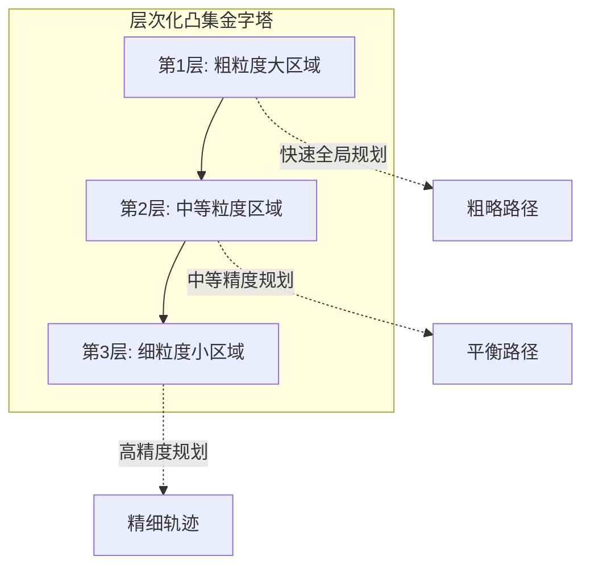

**第一层（粗粒度层）** 包含少量大体积凸区域，能够快速覆盖自由空间的主体部分，适用于快速可行性判断和粗略路径规划。**第二层（中等粒度层）** 在第一层基础上进行细分，增加区域数量以提高覆盖精度，适用于一般精度要求的规划任务。**第三层（细粒度层）** 进一步细化，在狭窄通道、障碍物边界等关键区域提供高精度覆盖，适用于对轨迹质量有严格要求的精细规划。

**基于空间数据结构的层次化分解策略**

空间数据结构为层次化凸集构建提供了天然的组织框架。**八叉树（Octree）** 和**KD树**是两种常用的层次化空间分解结构：

| 数据结构 | 分解方式 | 优势 | 适用场景 |
|---------|---------|------|---------|
| 八叉树 | 递归八等分三维空间 | 结构规整、实现简单 | 三维均匀障碍物环境 |
| KD树 | 沿坐标轴交替划分 | 自适应于数据分布 | 障碍物分布不均匀环境 |
| BSP树 | 任意超平面划分 | 最灵活、可贴合障碍物边界 | 复杂几何环境 |

以八叉树为例，层次化凸集构建的流程如下：

1. **根节点初始化**：将整个配置空间作为根节点
2. **递归细分**：对与障碍物相交的节点进行八等分细分
3. **凸区域标记**：将完全位于自由空间内的节点标记为凸区域
4. **层次索引构建**：建立父子节点间的层次索引关系

**不同层次间凸区域的继承与细化机制**

层次化结构的关键优势在于支持**按需细化**——初始时仅使用粗粒度层进行规划，当检测到轨迹质量不满足要求时，再对相关区域进行细化。

继承与细化机制的设计原则：

- **继承原则**：子区域必须完全包含于父区域内，保证层次间的几何一致性
- **细化触发条件**：当粗粒度区域内的轨迹优化结果不满足约束（如碰撞检测失败、曲率超限等）时触发细化
- **局部细化策略**：仅对问题区域进行细化，避免全局重建
- **缓存复用机制**：细化后的子区域信息被缓存，供后续规划任务复用

**层次化方法在大规模环境和高维空间中的可扩展性**

层次化策略为大规模环境和高维空间提供了**自然的可扩展性**：

1. **大规模环境**：通过粗粒度层快速建立全局连通性，仅在局部关键区域进行细化，避免了对整个环境进行均匀细粒度覆盖的计算负担
2. **高维空间**：层次化结构可以推广到高维空间（如使用$2^d$叉树），虽然单层节点数随维度指数增长，但按需细化策略可以将实际计算量控制在可接受范围内

**实现难度与预期收益**

层次化凸集构建策略的实现难度为**中等**，主要技术挑战在于层次间一致性维护和细化触发条件的合理设计。预期收益体现在：

- **计算效率提升**：粗粒度规划快速，细化仅在必要时进行
- **存储效率优化**：层次化索引支持高效的空间查询
- **灵活性增强**：支持不同精度需求的规划任务

该方法特别适用于**大规模静态环境**和**精度需求多样化**的应用场景。

### 5.3 增量式在线凸集更新机制

增量式在线凸集更新机制针对动态环境适应性这一核心痛点，旨在实现环境变化时凸集图的快速局部更新，避免全局重建的高昂计算成本。这一技术路径对于移动机器人导航、人机协作等动态场景具有重要的实用价值。

**增量式模型更新的核心原理**

增量式模型更新机制是一种针对现有模型进行局部调整的方法，旨在减少数据冗余和计算资源消耗。该模型通过识别数据变化部分，仅对变化部分进行学习和调整，从而提高模型效率。[^17]在GCS凸集维护的语境下，增量式更新的核心思想是：**当环境发生局部变化时，仅对受影响的凸区域进行重新计算，而保持其他区域不变**。

增量式更新相比全量重建的优势体现在：

| 对比维度 | 全量重建 | 增量式更新 |
|---------|---------|-----------|
| 计算范围 | 整个配置空间 | 仅受影响区域 |
| 计算时间 | 与环境规模成正比 | 与变化规模成正比 |
| 已有信息利用 | 完全丢弃 | 最大化复用 |
| 适用场景 | 环境剧烈变化 | 局部小幅变化 |

**环境变化的局部影响评估算法**

实现增量更新的首要挑战是快速评估环境变化对现有凸集的影响范围。设计以下局部影响评估算法：

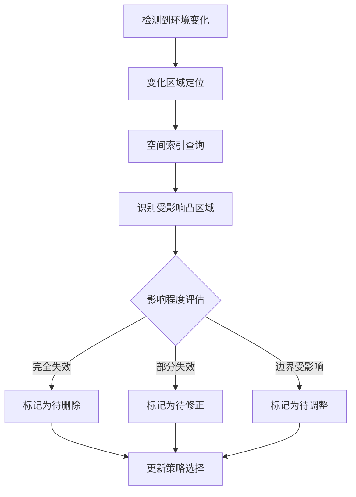

**影响评估的具体步骤**：

1. **变化区域定位**：确定新增、移除或移动的障碍物在配置空间中的影响范围
2. **空间索引查询**：利用预建的空间索引结构（如R树）快速查询与变化区域相交的凸区域
3. **影响程度分类**：
   - **完全失效**：凸区域与新障碍物完全重叠，需删除
   - **部分失效**：凸区域部分与新障碍物重叠，需裁剪或重建
   - **边界受影响**：凸区域边界需要调整以适应障碍物移动

**受影响凸区域的快速识别与局部重生成机制**

针对不同影响程度，设计差异化的处理策略：

| 影响类型 | 处理策略 | 计算复杂度 |
|---------|---------|-----------|
| 完全失效 | 直接删除，检查连通性断裂 | $O(1)$ |
| 部分失效 | 裁剪现有区域或从残余部分重新扩展 | $O(T_{IRIS})$ |
| 边界调整 | 局部边界优化 | $O(\text{边界复杂度})$ |
| 新增覆盖需求 | 在新自由空间区域增加种子点并扩展 | $O(n_{new} \cdot T_{IRIS})$ |

**局部重生成的关键技术**包括：

- **残余区域利用**：对于部分失效的凸区域，保留其未受影响的部分作为新区域的初始化
- **邻域信息继承**：新生成的凸区域继承原区域的邻接关系，减少连通性重建的计算量
- **边界约束传递**：将原区域与相邻区域的边界约束传递给新区域，保持局部一致性

**增量式图结构维护策略**

凸区域的增量更新必然导致GCS图结构的相应变化。增量式图维护策略包括：

1. **节点更新**：
   - 删除失效区域对应的节点
   - 添加新生成区域对应的节点
   - 更新修正区域的节点属性

2. **边更新**：
   - 删除涉及失效节点的所有边
   - 重新检测新节点与现有节点间的邻接关系
   - 更新受影响边的约束参数

3. **连通性修复**：
   - 检测图的连通性是否因更新而断裂
   - 若断裂，在断裂位置增加桥接区域

**计算效率与更新质量的权衡关系**

增量式更新在计算效率与更新质量之间存在内在的权衡：

- **保守更新策略**：仅进行最小必要的局部修改，计算效率高但可能导致凸集质量逐渐退化
- **激进更新策略**：在局部更新的同时进行一定范围的优化调整，计算成本增加但能保持较高的凸集质量
- **混合策略**：日常采用保守更新，定期进行全局优化以恢复凸集质量

**实现难度与预期收益**

增量式在线凸集更新机制的实现难度为**中等至较高**，主要挑战在于：

- 影响范围的精确评估需要高效的空间索引支持
- 局部重生成需要处理复杂的边界条件
- 图结构维护需要保证一致性

预期收益非常显著，特别是在动态环境中：

- **响应速度**：局部更新时间可控制在毫秒至秒级，满足实时性要求
- **计算资源节省**：相比全局重建，计算量可降低一至两个数量级
- **系统可用性**：支持机器人在环境变化时持续运行，无需停机等待重规划

该方法是实现GCS算法在**动态环境中实用化部署**的关键技术路径。

### 5.4 基于优化理论的凸分解质量提升方法

从数学优化角度探索凸区域质量提升，是一条理论基础扎实、潜力巨大的技术路径。凸分解问题本质上可以建模为组合优化问题，通过合理的目标函数设计和求解算法选择，有望获得比启发式方法更优的分解结果。

**凸分解的多目标优化建模**

高质量的凸分解需要同时满足多个相互制约的目标。可以将凸分解问题建模为以下多目标优化问题：

$$\min_{\{Q_i\}_{i=1}^n} \quad \left( n, \quad -\sum_{i=1}^n V(Q_i), \quad \sum_{i=1}^n \text{Shape}(Q_i) \right)$$

其中三个优化目标分别为：

| 目标 | 数学表达 | 优化方向 | 对GCS的影响 |
|------|---------|---------|------------|
| 区域数量最小化 | $\min n$ | 减少图规模 | 降低求解复杂度 |
| 区域体积最大化 | $\max \sum V(Q_i)$ | 提高覆盖效率 | 增强凸松弛紧密性 |
| 区域形状优化 | $\min \sum \text{Shape}(Q_i)$ | 避免狭长畸形区域 | 提升轨迹质量 |

这三个目标之间存在复杂的权衡关系：减少区域数量可能导致单个区域形状变差；追求大体积可能产生狭长区域；优化形状可能需要更多的区域数量。

**凸分解与集合覆盖问题的数学关联**

凸分解问题与经典的**集合覆盖问题（Set Cover Problem）** 存在深刻的数学关联。集合覆盖问题定义为：给定全集$U$和子集族$\mathcal{S} = \{S_1, S_2, ..., S_m\}$，找到最小的子集族子集$\mathcal{C} \subseteq \mathcal{S}$使得$\bigcup_{S \in \mathcal{C}} S = U$。

将凸分解映射到集合覆盖框架：

- **全集$U$**：需要覆盖的自由空间（或其离散化表示）
- **子集族$\mathcal{S}$**：所有可能的凸区域候选集
- **覆盖子集$\mathcal{C}$**：最终选择的凸区域集合

这一映射揭示了凸分解问题的**NP困难性质**——在一般情况下不存在多项式时间的精确求解算法。然而，集合覆盖问题有成熟的近似算法和启发式方法可供借鉴。

**基于混合整数规划的全局优化求解策略**

混合整数规划（MIP）为凸分解问题提供了精确建模的框架。引入二元决策变量$x_i \in \{0, 1\}$表示第$i$个候选凸区域是否被选中，凸分解问题可以表述为：

$$\min \quad \sum_{i=1}^m c_i x_i$$
$$\text{s.t.} \quad \sum_{i: p \in Q_i} x_i \geq 1, \quad \forall p \in P_{critical}$$
$$\quad\quad x_i \in \{0, 1\}, \quad \forall i$$

其中$c_i$为选择区域$Q_i$的成本（可综合考虑体积、形状等因素），$P_{critical}$为必须覆盖的关键点集合。

MIP方法的**优势**在于能够找到全局最优解（在给定候选集内），**局限**在于计算复杂度随问题规模指数增长。对于中小规模问题，现代MIP求解器（如Gurobi、CPLEX）可以在可接受时间内求解。

**启发式算法的快速求解策略**

对于大规模问题，可以采用启发式算法获得近似解：

1. **贪婪算法**：每步选择覆盖增益最大的凸区域，直至完全覆盖。时间复杂度$O(mn)$，近似比$O(\log n)$。

2. **局部搜索**：从初始解出发，通过交换、添加、删除操作迭代改进。适用于在已有解基础上进行优化。

3. **遗传算法**：将凸区域选择编码为染色体，通过选择、交叉、变异操作进化求解。适用于多目标优化场景。

**优化驱动方法在提升GCS凸松弛紧密性方面的潜力**

GCS算法的核心优势在于其凸松弛非常紧密，通常只需求解一次凸松弛再经廉价后处理即可高效恢复出全局最优轨迹。凸松弛的紧密性高度依赖于凸区域划分的质量——**区域越大、形状越规则、数量越少，凸松弛越紧密**。

优化驱动的凸分解方法通过显式优化这些质量指标，有望从根本上提升GCS的求解效率和轨迹质量。理论分析表明，当凸区域满足特定几何条件时，GCS凸松弛可以达到精确（即松弛解即为整数解），这为优化目标的设计提供了理论指导。

**实现难度与预期收益**

基于优化理论的凸分解方法实现难度为**较高**，主要挑战包括：

- 候选凸区域集合的高效生成
- 大规模MIP问题的求解效率
- 多目标优化的权衡参数调优

预期收益体现在**凸集质量的可证明提升**——相比启发式方法，优化驱动方法能够提供解的质量保证（如近似比），这对于安全关键应用具有重要价值。

### 5.5 不同优化路径的综合对比与场景适用性分析

为支持技术选型决策，本节建立多维度评估框架，系统比较各优化路径的技术特性，并针对典型应用场景给出选型建议。

**多维度技术特性对比**

下表从六个关键维度对比四种优化路径的技术特性：

| 评估维度 | 机器学习方法 | 层次化策略 | 增量式更新 | 优化理论方法 |
|---------|-------------|-----------|-----------|-------------|
| **实现复杂度** | 高（需训练流程） | 中等 | 中等至较高 | 较高 |
| **计算效率** | 推理快、训练慢 | 按需计算、效率高 | 局部更新快 | 离线慢、在线快 |
| **覆盖质量** | 依赖训练数据 | 分层保证 | 可能逐渐退化 | 可证明保证 |
| **动态适应性** | 需重新推理 | 支持局部细化 | **核心优势** | 需重新优化 |
| **高维扩展性** | 受限于训练 | 自然支持 | 取决于影响范围 | 计算瓶颈 |
| **泛化能力** | 训练分布内良好 | 通用性强 | 通用性强 | 通用性强 |

**典型应用场景的路径选型建议**

基于上述对比分析，针对不同应用场景给出优化路径选型建议：

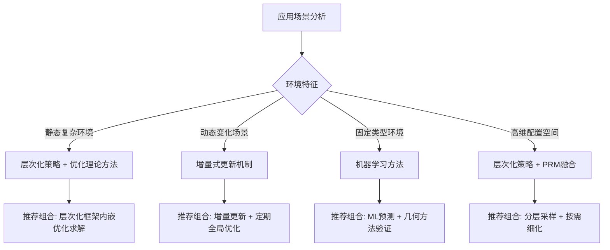

**场景一：静态复杂环境（如工厂车间、仓库）**

推荐采用**层次化策略与优化理论方法的组合**。层次化框架提供多分辨率覆盖能力，优化方法在关键层级确保凸集质量。这一组合能够在保证覆盖完整性的同时，最大化GCS凸松弛的紧密性。

**场景二：动态变化场景（如人机协作、移动机器人导航）**

**增量式更新机制是核心选择**。动态环境要求系统能够快速响应障碍物变化，全局重建的计算成本不可接受。增量更新可以在保持大部分预计算结果不变的前提下实现快速响应，是实现动态环境下GCS实用化的关键技术。建议结合定期全局优化以防止凸集质量长期退化。

**场景三：固定类型环境（如特定产品线的装配任务）**

**机器学习方法具有独特优势**。当环境类型相对固定时，可以积累大量规划实例用于训练，学习到的模型能够快速为新的具体环境生成高质量凸分解。推荐采用ML预测+几何方法验证的混合策略，以ML输出为初始解，几何方法进行修正和验证。

**场景四：高维配置空间（如7+自由度机械臂）**

高维空间中追求全面覆盖不切实际，推荐采用**层次化策略与PRM融合方案的组合**。PRM的概率完备性保证关键区域被探索，层次化框架支持按需细化，两者结合能够在高维空间中实现计算可行的凸集生成。

**组合应用策略**

实际应用中，单一优化路径往往难以满足所有需求，**组合应用**是更务实的选择。推荐的组合模式包括：

| 组合模式 | 适用场景 | 组合逻辑 |
|---------|---------|---------|
| 层次化 + 增量更新 | 大规模动态环境 | 层次化提供框架，增量更新处理动态 |
| ML预测 + 几何验证 | 固定类型环境 | ML快速生成，几何方法保证正确性 |
| PRM采样 + 优化选择 | 高维静态环境 | PRM探索空间，优化方法选择最优凸集 |
| 全路径融合 | 通用复杂场景 | 多方法协同，取长补短 |

**技术成熟度与发展趋势**

从技术成熟度角度评估，各优化路径当前处于不同的发展阶段：

- **层次化策略**：技术成熟度较高，已有成熟的空间数据结构支撑，实施风险较低
- **增量式更新**：技术原理清晰，工程实现有一定挑战，是近期可重点突破的方向
- **优化理论方法**：理论基础扎实，大规模求解效率是主要瓶颈，适合中小规模问题
- **机器学习方法**：发展潜力大，但当前成熟度较低，适合作为中长期研究方向

综合来看，**增量式更新机制**和**层次化策略**是当前技术条件下最具实用价值的优化路径，前者解决动态适应性痛点，后者提升大规模环境的处理能力。**机器学习方法**代表了未来发展方向，随着深度学习技术的成熟和训练数据的积累，有望在特定领域实现突破。**优化理论方法**则为凸集质量提升提供了理论上限参考，其思想可以融入其他方法的目标函数设计中。

## 6 综合评估与技术发展建议

本章在前述各优化路径深入分析的基础上，构建多维度综合评估框架，系统对比PRM-GCS融合方案与其他优化路径在技术成熟度、实现成本、性能提升潜力等方面的差异。通过建立统一的评估指标体系，为不同应用场景下的技术选型提供量化决策依据。针对机械臂操作、无人机避障、自动驾驶等典型应用场景的差异化需求，给出凸集生成优化路径的选择建议与分阶段实施策略。最后展望GCS算法与自动化凸集生成技术的未来发展方向，识别关键技术突破点与产业化路径。

### 6.1 各优化方案的技术成熟度评估

技术成熟度是评估各优化方案工程化可行性的核心指标。基于技术就绪度（Technology Readiness Level, TRL）评估框架，本节系统评估各优化路径的当前发展阶段，识别从实验室验证到工程化部署的技术差距。

**技术就绪度评估框架**

技术成熟度的概念源于20世纪70年代美国航空航天局（NASA），于90年代形成九级评估体系。2005年美国国防部正式采用九级标准作为技术开发依据，涵盖从基本原理发现（TRL 1）到实际运行验证（TRL 9）的完整技术生命周期[^18]。该框架为各优化方案的横向对比提供了标准化的评估基准。

九级技术就绪度的核心划分如下：
- **TRL 1-3（基础研究阶段）**：基本原理发现、技术概念形成、关键功能实验室验证
- **TRL 4-6（技术开发阶段）**：实验室样机验证、相关环境验证、模拟环境系统演示
- **TRL 7-9（工程化阶段）**：真实环境系统演示、定型试验、运行与评估

**GCS算法本身的技术成熟度评估**

GCS算法作为基础规划框架，已达到**中高成熟度水平（TRL 4-6）**。该方法已在实验室环境中得到充分验证，包括MIT机械臂协同实验和四旋翼避障仿真测试，并有开源实现支撑。实验结果表明，GCS规划器在轨迹质量、计算时间和成功率方面均优于现有的基于采样的规划器，特别是在高维复杂环境中的表现尤为显著[^4]。然而，大规模工业部署和车规级量产案例尚不明确，距离TRL 7以上的工程化阶段仍有差距。

**各优化方案的技术成熟度对比**

下表系统对比各优化方案在不同成熟度维度的表现：

| 评估维度 | PRM-GCS融合方案 | 机器学习方法 | 层次化策略 | 增量式更新 | 优化理论方法 |
|---------|----------------|-------------|-----------|-----------|-------------|
| **TRL等级** | TRL 3-4 | TRL 2-3 | TRL 4-5 | TRL 3-4 | TRL 3-4 |
| **理论完备性** | 高（继承PRM概率完备性） | 中（依赖训练数据） | 高（空间分解理论成熟） | 高（增量更新理论清晰） | 高（优化理论基础扎实） |
| **算法验证程度** | 中（概念验证阶段） | 低（早期探索） | 中高（有成熟空间索引） | 中（原理验证） | 中（小规模验证） |
| **工程实现难度** | 中等 | 高 | 中等 | 中等至较高 | 较高 |
| **已有应用案例** | 有限（研究性质） | 极少 | 较多（空间数据结构） | 有限 | 有限 |

**PRM-GCS融合方案的成熟度详细分析**

PRM-GCS融合方案处于**TRL 3-4阶段**，即关键功能实验室验证到实验室原理样机验证的过渡期。其成熟度优势与差距体现在：

- **理论基础成熟**：PRM算法是概率完备的，当采样数趋近于无穷大时，若存在路径则算法一定能找到[^19]。这一理论保证为融合方案的覆盖完整性提供了坚实基础。
- **组件技术成熟**：PRM采样、IRIS凸区域扩展、Voronoi图划分等组件技术均有成熟实现，降低了系统集成风险。
- **系统集成待验证**：从组件到完整系统的集成验证尚未充分完成，特别是在高维空间和复杂环境中的端到端性能验证不足。

**机器学习方法的成熟度分析**

基于机器学习的自适应区域分解方法处于**TRL 2-3阶段**，属于早期技术探索。当前具身智能发展面临的挑战之一是多模态大模型如何高效对齐与融合[^20]，这一挑战同样制约着机器学习方法在凸集生成中的应用。主要技术差距包括：

- **训练数据缺乏**：高质量的环境-凸分解配对数据集尚未建立
- **凸性约束嵌入困难**：神经网络输出不天然满足凸性要求，后处理机制有待完善
- **泛化边界不清**：对训练分布外环境的适应能力未经系统验证

**层次化策略的成熟度分析**

层次化凸集构建策略处于**TRL 4-5阶段**，是各优化方案中成熟度最高的路径。其优势在于：

- **空间数据结构成熟**：八叉树、KD树等层次化空间分解结构已有广泛的工程应用
- **按需细化机制清晰**：多分辨率分析的理论框架成熟，实现路径明确
- **工程实践经验丰富**：在计算机图形学、游戏引擎等领域有大量成功案例可借鉴

**增量式更新与优化理论方法的成熟度分析**

增量式更新机制和优化理论方法均处于**TRL 3-4阶段**。增量式更新的核心挑战在于影响范围评估算法的效率与准确性；优化理论方法的主要瓶颈是大规模混合整数规划问题的求解效率。两者均已完成原理验证，但距离工程化部署仍需突破关键技术瓶颈。

### 6.2 实现成本与工程化可行性分析

实现成本是影响技术选型的关键因素。本节从硬件需求、软件开发、计算资源、系统集成、维护成本等维度，对各优化方案进行全生命周期成本分析。

**成本构成要素分解**

各优化方案的实现成本可分解为以下核心要素：

| 成本类型 | 具体内容 | 影响因素 |
|---------|---------|---------|
| **硬件成本** | 计算平台、传感器、存储设备 | 算法计算复杂度、实时性要求 |
| **软件开发成本** | 算法实现、系统集成、测试验证 | 技术复杂度、开发团队能力 |
| **计算资源成本** | 离线预处理算力、在线求解算力 | 环境规模、维度、更新频率 |
| **集成成本** | 与现有系统对接、接口开发 | 系统架构兼容性 |
| **维护成本** | 参数调优、故障排查、版本升级 | 系统复杂度、自动化程度 |

**GCS算法的基础实现成本**

GCS算法的实现依赖商业凸优化求解器。GCS使用Mosek作为主要求解器，证明了即使在资源受限环境下也能高效执行复杂的数学运算，尤其对于学术界，其个人学术许可的免费政策显得尤为友好[^21]。这一特性降低了学术研究和原型开发的软件许可成本，但工业部署仍需考虑商业许可费用。

GCS整体方案的bom成本可控制在较低水平。参考自动驾驶领域的成本控制实践，整套方案bom成本低于一万元是可实现的目标[^22]。这一成本水平为GCS算法在中端应用场景的推广提供了经济可行性基础。

**各优化方案的成本对比分析**

| 优化方案 | 硬件需求 | 开发工作量 | 计算资源消耗 | 集成复杂度 | 维护成本 | 综合成本评级 |
|---------|---------|-----------|-------------|-----------|---------|-------------|
| **PRM-GCS融合** | 低（标准计算平台） | 中等（3-6人月） | 中（离线为主） | 中等 | 中等 | **中等** |
| **机器学习方法** | 高（GPU训练） | 高（6-12人月） | 高（训练阶段） | 较高 | 较高 | **较高** |
| **层次化策略** | 低 | 中等（2-4人月） | 低至中 | 低 | 低 | **较低** |
| **增量式更新** | 中（实时计算） | 中高（4-8人月） | 中（在线为主） | 中等 | 中等 | **中等** |
| **优化理论方法** | 中（优化求解器） | 高（6-10人月） | 高（离线优化） | 中等 | 中等 | **中高** |

**工程化可行性的关键制约因素**

从工程化角度分析，各方案面临的主要制约因素如下：

1. **PRM-GCS融合方案**：主要制约在于高维空间的凸区域生成效率，以及狭窄通道区域的采样策略优化。工程化需要解决采样密度与计算成本的平衡问题。

2. **机器学习方法**：训练数据构建和模型泛化是核心瓶颈。工业部署需要针对特定应用场景进行大量数据采集和模型调优，前期投入较大。

3. **层次化策略**：工程化可行性最高，主要挑战在于层次间一致性维护和细化触发条件的合理设计。现有空间数据结构库可以直接复用，降低开发风险。

4. **增量式更新机制**：实时性要求对系统架构提出较高要求，需要高效的空间索引和并行计算支持。工程化需要与机器人实时控制系统深度集成。

**成本效益分析模型**

建立成本效益分析模型，评估各方案的投资回报：

$$\text{ROI} = \frac{\text{性能提升收益} - \text{实现成本}}{\text{实现成本}} \times 100\%$$

其中，性能提升收益可量化为：规划时间节省、轨迹质量提升带来的能耗降低、人工干预减少带来的运营成本下降等。基于这一模型，**层次化策略**和**PRM-GCS融合方案**在中短期内具有较高的投资回报率，而**机器学习方法**的回报周期较长但潜在收益上限更高。

### 6.3 性能提升潜力的定量对比

为支持技术选型决策，本节建立统一的性能评估指标体系，基于理论分析与已有实验数据，定量对比各优化方案的性能提升潜力。

**性能评估指标体系**

构建覆盖凸集生成、GCS求解、轨迹质量三个层面的指标体系：

| 层面 | 核心指标 | 定义与计算方法 | 评估意义 |
|------|---------|---------------|---------|
| **凸集生成** | 生成效率 | 单位时间内生成的有效凸区域数量 | 离线预处理效率 |
| | 覆盖完整性 | 凸区域并集覆盖自由空间的比例 | 规划可行性保证 |
| | 区域质量指数 | 平均体积×形状规则度 | 凸松弛紧密性基础 |
| **GCS求解** | 凸松弛紧密性 | 松弛解与整数解成本比值 | 求解质量核心指标 |
| | 求解时间 | 凸松弛+舍入总耗时 | 在线规划效率 |
| | 成功率 | 给定时间内找到可行解的比例 | 系统可靠性 |
| **轨迹质量** | 路径长度 | 轨迹的几何长度 | 效率指标 |
| | 最优性差距 | 与理论最优解的偏差百分比 | 全局最优性评估 |
| | 平滑性 | 曲率变化率的积分 | 可执行性指标 |

**GCS算法的基准性能数据**

基于已有研究成果，GCS算法的基准性能表现如下：

- **轨迹质量**：轨迹平均长度比基于采样的规划器短5%，能量消耗低10%[^4]
- **计算效率**：在高维空间中计算时间仅为基于采样规划器的1/3[^4]
- **成功率**：在测试环境中成功率均为100%[^4]
- **最优性差距**：多数场景轨迹与全局最优解估计成本差距小于1%，最差情况2.9%；在100个随机环境测试中，84%的实验最优性差距小于7%

这些数据为各优化方案的性能提升潜力评估提供了基准参照。

**各优化方案的性能提升潜力分析**

| 优化方案 | 凸集生成效率提升 | 覆盖完整性提升 | GCS求解效率提升 | 轨迹质量提升 | 综合提升潜力 |
|---------|-----------------|---------------|----------------|-------------|-------------|
| **PRM-GCS融合** | 中（30-50%） | 高（显著减少人工干预） | 中（取决于凸集质量） | 中 | **中高** |
| **机器学习方法** | 高（潜在2-5倍） | 中（依赖训练质量） | 高（端到端优化） | 中高 | **高（长期）** |
| **层次化策略** | 高（按需计算） | 高（分层保证） | 中高（图规模可控） | 中 | **中高** |
| **增量式更新** | 极高（局部更新） | 中（可能退化） | 中 | 中 | **高（动态场景）** |
| **优化理论方法** | 低（计算密集） | 高（可证明保证） | 高（凸集质量最优） | 高 | **中高（静态场景）** |

**维度与环境复杂度对性能的影响**

各方案的性能表现与问题维度和环境复杂度密切相关：

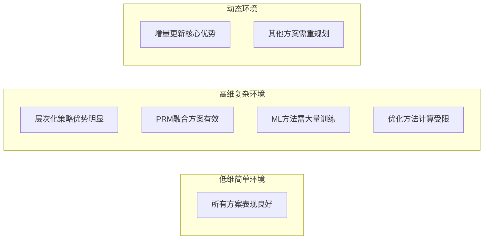

在高维空间中，追求全面密集覆盖不切实际，关键在于覆盖"重要"的连通区域。层次化策略和PRM-GCS融合方案通过自适应覆盖策略，在高维空间中展现出较好的可扩展性。

**性能边界与适用区间识别**

各方案的性能优势区间可总结如下：

- **PRM-GCS融合方案**：在3-7维配置空间、中等复杂度静态环境中表现最优
- **层次化策略**：在大规模环境（区域数量>1000）和需要多精度规划的场景中优势明显
- **增量式更新**：在障碍物变化频率>0.1Hz的动态环境中是唯一可行选择
- **优化理论方法**：在区域数量<100的小规模问题中可获得可证明的最优解
- **机器学习方法**：在环境类型固定、有大量历史数据的场景中潜力最大

### 6.4 典型应用场景的优化路径选择建议

不同应用场景对凸集生成有差异化的需求。本节针对工业机械臂、无人机避障、自动驾驶等典型场景，综合考虑场景特征与技术约束，给出优化路径选择的具体建议。

**工业机械臂精密操作场景**

工业机械臂操作是GCS算法最成熟的应用领域。麻省理工学院CSAIL研发的GCS轨迹优化算法能够绘制多达14个维度（甚至更多）的无碰撞轨迹，可改善机器在仓库、图书馆和家庭中协同工作的方式[^23]。

**场景特征分析**：
- 配置空间维度：6-14维（单臂7自由度，双臂14维）
- 环境特征：结构化、相对静态、障碍物几何已知
- 实时性要求：中等（任务周期通常在秒级）
- 精度要求：高（毫米级定位精度）

**优化路径建议**：**积极试点并逐步推广GCS算法与PRM-GCS融合方案**。在对精度和协同效率要求高的场景（如汽车装配、精密电子制造），其性能优势可直接转化为生产效益。

**实施策略**：
1. **第一阶段**：从离线编程与仿真验证起步，在Drake平台完成算法验证
2. **第二阶段**：逐步过渡到在线实时规划，优先在研发能力强的团队或与高校合作的项目中引入
3. **第三阶段**：关注开源生态（如Drake工具箱）的集成进展，推动工程化部署

在实际实验场景下，GCS系统巧妙地引导两个拿着杯子的机械臂绕过架子，同时优化最短的时间和路径。两人的同步动作就像搭档的舞蹈动作，沿着书柜的边缘摇摆而没有掉落物体[^23]。这些基于现实世界测试的成功表明了该算法在制造业等领域提供帮助的潜力。

**无人机复杂环境避障场景**

无人机避障是GCS算法的重要应用方向。想象一下无人机在高楼间穿梭、工业机器人在繁忙的车间内避开障碍物进行精准操作——这些都是GCS大显身手的舞台[^21]。

**场景特征分析**：
- 配置空间维度：3-6维（位置+姿态）
- 环境特征：可能动态变化、障碍物几何复杂
- 实时性要求：高（毫秒级响应）
- 精度要求：中等（厘米级定位精度）

**优化路径建议**：**分场景差异化采用**。对于计算资源充裕、任务复杂的工业级无人机（如城市物流），可探索将GCS作为高端规划选项，与成熟的感知避障系统结合。对于消费级或成本敏感场景，现阶段仍以优化VFH等传统算法和传感器性价比为主[^24]。

**实施策略**：
1. 工业应用先从仿真和特定任务（如固定路线巡检）的嵌入式部署开始验证
2. 关注GCS算法在边缘计算平台上的轻量化进展
3. 针对动态环境需求，优先集成增量式更新机制

GCS在模拟演示中表现优异，团队考虑了四旋翼飞行器如何飞过建筑物而不会撞到树木或无法以正确的角度进入门窗。该算法优化了绕过障碍物的路径，同时考虑了四旋翼飞行器丰富的动态特性[^23]。

**自动驾驶路径规划场景**

自动驾驶是GCS算法的潜在高价值应用领域，但也面临最严苛的工程化挑战。

**场景特征分析**：
- 配置空间维度：3-6维（位置+航向+速度）
- 环境特征：高度动态、障碍物类型多样
- 实时性要求：极高（毫秒级响应，车规级安全要求）
- 成本约束：严格（整车成本控制）

**优化路径建议**：**作为长期技术储备，谨慎评估短期集成可行性**。必须将GCS的计算需求置于整车"舱驾一体"等降本增效的整体架构中权衡。

自动驾驶行业的成本效率追求为技术选型提供了重要参考。特斯拉在很早期就有一个非常与众不同的路线选择——基于极致降本目的选择自研芯片和极其克制的传感器方案，才是其今天能站在头部位置的核心原因之一[^22]。这一思路对GCS算法的工程化部署具有重要启示：**算法性能提升必须与系统成本控制相平衡**。

**实施策略**：
1. **研发阶段**：利用GCS进行复杂场景的轨迹优化和算法基准测试
2. **量产阶段**：优先保障基础感知与规控链路的稳定与低成本
3. **长期规划**：待算法进一步优化、硬件算力成本下降后，再考虑集成至下一代系统

**场景-路径匹配决策矩阵**

综合上述分析，建立场景-路径匹配决策矩阵：

| 应用场景 | 首选方案 | 次选方案 | 不推荐方案 |
|---------|---------|---------|-----------|
| 工业机械臂（静态） | PRM-GCS融合 + 层次化 | 优化理论方法 | 增量式更新 |
| 工业机械臂（动态） | 增量式更新 | PRM-GCS融合 | 优化理论方法 |
| 工业无人机 | PRM-GCS融合 | 层次化策略 | 机器学习方法 |
| 消费无人机 | 传统算法优化 | 层次化策略 | GCS（成本过高） |
| 自动驾驶（研发） | GCS基准测试 | 优化理论方法 | — |
| 自动驾驶（量产） | 成本优先方案 | 长期储备GCS | 当前不适用 |

### 6.5 技术组合与分阶段实施策略

单一优化路径往往难以满足复杂应用的全部需求，技术组合与分阶段实施是更务实的工程化策略。本节基于各优化路径的互补性分析，提出协同应用策略与分阶段实施路线图。

**技术互补性分析**

各优化路径在不同维度上具有互补优势：

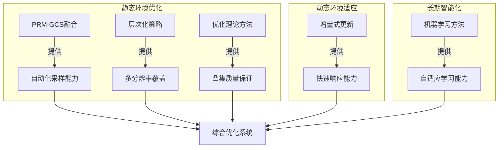

**推荐的技术组合模式**

基于互补性分析，推荐以下技术组合模式：

**模式一：静态复杂环境组合**
- **核心组合**：层次化策略 + PRM-GCS融合 + 优化理论方法
- **协同逻辑**：层次化框架提供多分辨率结构，PRM-GCS实现自动化采样，优化方法在关键层级确保凸集质量
- **适用场景**：工厂车间、仓库物流等结构化环境

**模式二：动态环境组合**
- **核心组合**：增量式更新 + 层次化策略 + 定期全局优化
- **协同逻辑**：增量更新处理实时变化，层次化结构支持局部细化，定期全局优化防止质量退化
- **适用场景**：人机协作、移动机器人导航等动态场景

**模式三：固定类型环境组合**
- **核心组合**：机器学习预测 + 几何方法验证 + PRM-GCS融合
- **协同逻辑**：ML快速生成初始解，几何方法验证凸性约束，PRM-GCS进行精细化调整
- **适用场景**：特定产品线装配、固定场景巡检等

**分阶段实施路线图**

设计从短期快速见效到长期深度优化的三阶段实施路线：

| 阶段 | 时间跨度 | 技术目标 | 关键里程碑 | 资源投入 |
|------|---------|---------|-----------|---------|
| **第一阶段（快速验证）** | 3-6个月 | 完成PRM-GCS融合原型 | 仿真环境验证通过 | 2-3人团队 |
| **第二阶段（工程化）** | 6-12个月 | 集成层次化与增量更新 | 实际机器人部署 | 4-6人团队 |
| **第三阶段（智能化）** | 12-24个月 | 引入机器学习组件 | 自适应系统上线 | 6-10人团队 |

**第一阶段详细规划**：
1. **月1-2**：搭建Drake仿真环境，实现基础PRM采样模块
2. **月3-4**：集成IRIS凸区域扩展，完成PRM-GCS融合原型
3. **月5-6**：在标准测试场景中进行性能验证，输出评估报告

**第二阶段详细规划**：
1. **月1-3**：设计层次化凸集框架，实现多分辨率覆盖
2. **月4-6**：开发增量式更新模块，支持动态环境响应
3. **月7-9**：系统集成与调优，准备实际机器人部署
4. **月10-12**：现场部署与迭代优化

**第三阶段详细规划**：
1. **月1-6**：构建训练数据集，开发机器学习预测模块
2. **月7-12**：集成ML组件，实现端到端自适应系统
3. **月13-24**：持续优化与场景扩展

**关键风险与缓解措施**

| 风险类型 | 风险描述 | 缓解措施 |
|---------|---------|---------|
| 技术风险 | 高维空间凸区域生成效率不足 | 采用分层策略，优先覆盖关键区域 |
| 集成风险 | 与现有系统接口不兼容 | 模块化设计，标准化接口定义 |
| 进度风险 | 关键技术突破延迟 | 设置备选技术路径，保持灵活性 |
| 资源风险 | 团队能力不足 | 与高校合作，引入外部专家支持 |

### 6.6 未来技术发展方向与突破点展望

GCS算法与自动化凸集生成技术正处于快速发展阶段，未来发展将呈现智能化、自适应、多尺度融合的趋势。本节展望中长期技术发展方向，识别关键突破点与产业化路径。

**技术发展趋势分析**

自动化技术正从传统的刚性控制向"自主智能自动化"和"意图驱动"的认知型智能体演进。中国工程院院士郑南宁提出，下一代智能应是意图驱动，让机器从被动响应指令，转向主动理解人类目标与价值[^20]。这一趋势对GCS算法的发展具有深刻启示：

1. **从静态凸集到动态自适应凸集**：未来的凸集生成系统应具备根据任务需求和环境变化自主调整凸区域配置的能力
2. **从离线预计算到在线实时生成**：实时感知与凸集生成的深度融合将成为关键技术方向
3. **从单一算法到多技术协同**：凸优化、机器学习、控制理论的跨学科集成将形成新的方法论

**关键技术突破点识别**

基于当前技术瓶颈分析，识别以下关键突破点：

**突破点一：高维凸分解算法效率**

当前IRIS等算法在高维空间中的计算复杂度呈指数增长，是制约GCS扩展性的核心瓶颈。可以扩展IRIS算法以在更一般（非凸）的配置空间中找到大的凸区域，方法包括使用非线性优化（IRIS-NP算法）或使用代数运动学与平方和优化。突破方向包括：
- 基于GPU的并行凸优化求解
- 近似算法与精确算法的混合策略
- 基于学习的凸区域快速预测

**突破点二：动态环境实时适应**

中国工程院院士于海斌提出，自主智能自动化旨在让系统具备实时重构能力，能根据自主感知来应对不确定的任务、环境和对象[^20]。对于GCS算法，这意味着需要突破：
- 高效的局部影响评估算法
- 增量式凸区域更新机制
- 实时连通性维护策略

**突破点三：深度学习与凸优化的深度融合**

当前具身智能发展面临的挑战之一是多模态大模型如何高效对齐与融合[^20]。在凸集生成领域，深度学习与凸优化的融合方向包括：
- 设计能直接输出满足凸性约束的神经网络架构
- 学习从环境感知到安全凸集的端到端映射
- 利用凸优化理论指导深度学习训练的稳定性

**产业化路径分析**

GCS算法的产业化需要克服以下关键障碍：

| 障碍类型 | 具体表现 | 解决路径 |
|---------|---------|---------|
| 算法工程化 | 从实验室到产品的转化 | 开源生态建设、标准化接口 |
| 成本控制 | 计算资源与许可成本 | 算法轻量化、国产求解器 |
| 人才培养 | 跨学科人才稀缺 | 产学研合作、课程体系建设 |
| 应用验证 | 缺乏大规模部署案例 | 试点项目、行业标杆打造 |

**开源生态与标准化建设**

GCS项目以其创新的技术、广泛的适用性和友好的用户体验，为机器人技术和自动控制领域的专业人士和爱好者开启了一扇新的大门[^21]。开源生态的建设对于技术普及具有重要推动作用：

1. **代码开源**：GCS相关代码已在GitHub上开源（如gcs-science-robotics项目），降低了技术准入门槛[^4]
2. **平台支持**：项目团队提供了Deepnote平台的支持，让用户无需本地安装即可体验大部分示例[^21]
3. **文档完善**：清晰的文档指导使得开发者能轻松将其融入现有系统或开发新功能

**未来应用前景展望**

展望未来，GCS算法与自动化凸集生成技术将在以下领域发挥重要作用：

1. **智能制造与工业互联网**：作为实现柔性制造、数字孪生和自主决策的关键使能技术。到2040年，工厂将实现"人说需求、系统执行"，无需编程，只需表达意图，系统就能自主分解任务[^20]。

2. **具身智能机器人**：具身智能机器人作为连接数字空间与物理世界的关键桥梁，将推动新质生产力的形成[^20]。GCS算法为具身智能提供了高效的运动规划基础。

3. **分布式无人系统**：中国工程院院士陈杰强调，无人系统的核心是多系统如何像生物群体一样通过合作演化实现群智涌现[^20]。GCS算法可扩展至多机器人协同规划，支撑分布式无人集群的协同作业。

4. **全场景自主系统**：从传统工厂、港口到太空、深海等极端环境的全无人化作业系统，GCS将成为连接数字决策与物理执行的核心桥梁。

**总结与展望**

综合全文分析，GCS算法通过将非凸运动规划问题转化为具有强凸松弛的混合整数凸优化问题，在需要高质量、高维、满足微分约束的规划场景中具有显著优势。当前凸集生成环节的人工依赖是制约算法实用化的主要瓶颈，PRM-GCS融合方案、层次化策略、增量式更新机制等优化路径为突破这一瓶颈提供了可行的技术选择。

未来，随着高维凸分解算法效率的突破、动态环境实时适应能力的提升、以及深度学习与凸优化的深度融合，GCS算法有望在更广泛的应用场景中发挥核心作用，成为推动机器人技术和自动化领域发展的重要技术基础。**其能力边界由"凸性"定义**——这既是其核心优势的来源，也是持续优化工作的核心方向。

# 参考内容如下：
[^1]:[Graphs of Convex Sets (GCS) 介绍](https://blog.csdn.net/weixin_39233204/article/details/134525921)
[^2]:[穿越凸障碍物的运动规划优化(GCS)](https://blog.csdn.net/Tangsong_xu/article/details/135617339)
[^3]:[入选Science机器人子刊:机器人如何更聪明地躲避障碍?凸集图给出轨迹规划最优解 ](https://mp.weixin.qq.com/s?__biz=MzU2NjU3OTc5NA==&mid=2247588473&idx=1&sn=697586fbc8fba2b16bf979f946dbe878&chksm=fde6401aac9eb8202f9948d016eae325767a084272a390333a958501c18d47fb09a019b55d40&scene=27)
[^4]:[开源| Science子刊 | GCS轨迹优化方法](https://blog.csdn.net/2403_86993842/article/details/142992812)
[^5]:[分析GCS代码以更好的理解论文](https://blog.csdn.net/m0_51098223/article/details/152123689)
[^6]:[基于alpha shapes的点云边缘点提取(python版本)](https://blog.csdn.net/qq_32867925/article/details/139647488)
[^7]:[alpha shapes提取二维点云边界(附python代码)](https://blog.csdn.net/a394467238/article/details/132556295)
[^8]:[凸包](https://baike.baidu.com/item/凸包/179150)
[^9]:[基于改进Voronoi图的移动机器人在线路径规划 ](http://irp.fzu.edu.cn/item/561890)
[^10]:[Voronoi图路径规划 (许松清, 2005)](https://www.cloud.tencent.com/developer/article/1438057)
[^11]:[计算几何算法实战:凸包、Voronoi与Delaunay](https://blog.csdn.net/weixin_31176789/article/details/148657034)
[^12]:[实用指南:运动控制教学——5分钟学会PRM算法!](https://www.cnblogs.com/yxysuanfa/p/19199066)
[^13]:[Alpha Shapes数学原理解密:Delaunay三角剖分与关键半径选择的深层关系(仅限专业人士阅读)](https://wenku.csdn.net/column/4s1tv09vtv)
[^14]:[运动控制教学——5分钟学会PRM算法!](https://blog.csdn.net/weixin_44438188/article/details/153042371)
[^15]:[PRM](https://baike.baidu.com/item/PRM/10392135)
[^16]:[α-Shape算法_alpha shape算法-CSDN博客](https://blog.csdn.net/wu_jing_sheng0/article/details/148895540)
[^17]:[增量式模型更新机制.docx 43页VIP](https://m.book118.com/html/2026/0103/8014130050010031.shtm)
[^18]:[技术成熟度](https://baike.baidu.com/item/技术成熟度/627331)
[^19]:[常用规划算法解析 — 采样篇](https://www.eefocus.com/article/493090.html)
[^20]:[自动化技术将实现意图驱动与群体协同](https://www.nsfc.gov.cn/p1/3381/2826/97924.html)
[^21]:[【亲测免费】 探索障碍物间的灵动路径:GCS运动规划与凸优化](https://blog.csdn.net/gitblog_00080/article/details/139978639)
[^22]:[自动驾驶行业的成本效率,除了特斯拉还有人在追随吗?](https://baijiahao.baidu.com/s?id=1848594856735566155&wfr=spider&for=pc)
[^23]:[麻省理工学院CSAIL研发GCS轨迹优化算法 帮助机器人在复杂环境下完成作业任务](https://www.leaderobot.com/news/2912)
[^24]:[无人机避障的技术实现方式](https://uav.huanqiu.com/article/9CaKrnK60hq)
