# Prometheus高流失率问题深度剖析：影响、系统解决方案与云厂商实践
## 1 引言：研究背景与核心问题界定

### 1.1 云原生监控演进与Prometheus的核心地位

Prometheus作为一款系统监控与报警工具套件，其发展历程深刻映射了云原生技术生态的演进轨迹。**Prometheus最初由SoundCloud于2012年开始构建，并于2015年正式开源**[^1]。这一开源举措标志着其从企业内部工具向行业通用解决方案的关键转型。2016年，Prometheus被捐赠给云原生计算基金会（CNCF），**成为继Kubernetes之后第二个在CNCF正式毕业的项目**，这一里程碑事件奠定了其作为云原生监控领域事实标准的核心地位[^1]。

Prometheus之所以能够在云原生生态中确立主导地位，源于其针对动态环境的独特设计优势。与传统监控方案依赖静态主机绑定或单一应用视角不同，**Prometheus通过其拉取式（Pull-based）架构、多维度数据模型（基于时间序列的标签系统）和服务发现机制**，能够原生适配Kubernetes的弹性伸缩特性[^2]。具体而言，Prometheus支持通过ServiceMonitor、PodMonitor等自定义资源定义（CRD）自动发现监控目标，无需手动配置；其强大的查询语言PromQL支持聚合、过滤、数学运算等操作，能够高效检索和处理时间序列数据[^2]。此外，**Prometheus与Kubernetes形成了双向原生支持关系**：Prometheus可对Kubernetes中的目标进行动态发现，而Kubernetes各组件内置Prometheus指标暴露机制，无需引入额外的导出工具[^3]。

然而，随着AI技术的迅猛发展，**大语言模型和智能驾驶等新兴领域对监控系统提出了前所未有的挑战**[^1]。以大模型训练为例，其可能涉及大量的Kubernetes Job，部分任务的生命周期甚至只有几分钟；智能驾驶领域同样面临类似的动态性挑战[^1]。这些场景的共同特征是监控目标的高度动态性——Pod频繁创建与销毁，导致pod_name等标签值快速变化。**目前，Prometheus被广泛应用于AI大模型和智能驾驶领域的可观测任务，用于实现最佳性能及减少故障**[^1]，但动态基础设施环境下的规模化压力与性能瓶颈日益凸显。

从技术架构层面审视，Prometheus用良好的用户接口掩盖了内部复杂实现。**深入其中，会发现时序数据存储、大规模数据采集、时间线高基数、数据搅动、长周期查询、历史数据归档等问题如同潜藏在宁静湖面下的暗礁**[^4]。云原生的到来让这些问题变得更加显著且难以回避，想要解决这些问题需要投入大量人力、物力和精力。正是在这一背景下，高流失率问题的研究具有重要的现实紧迫性——它不仅关乎监控系统自身的稳定性与效率，更直接影响业务质量和用户体验。

### 1.2 高流失率的技术定义与概念辨析

在深入分析高流失率问题之前，有必要对Prometheus监控体系中的核心概念进行系统性梳理与辨析。

**时间序列（Time Series）是Prometheus数据模型的基础单元**，定义为按时间戳排序的一系列（timestamp, value）对。每个时间序列的数据点数量可以是任意的，时间戳具有毫秒精度，而值是64位浮点数[^5]。每个时间序列都由其名称和一组标签唯一标识，例如`temperature{city="NY"}`、`temperature{city="SF"}`和`temperature{city="SF", unit="Celsius"}`分别代表三条不同的时间序列[^5]。这种基于标签的多维数据模型赋予了Prometheus强大的灵活性，但也为高基数问题埋下了伏笔。

**基数（Cardinality）用于描述存储在时间序列数据库（TSDB）中唯一时间序列的数量**[^5]。以一个典型的HTTP请求指标为例：`http_request_total`用于记录一个应用中某个服务的某个endpoint的请求数量。假设该应用分布在2个cluster，每个集群有5个service，每个服务有200个endpoint，支持POST和GET两种method，且resp_code有5种可能，那么这个指标的理论基数就是`2 × 5 × 200 × 2 × 5 = 20000`[^1]。在实际场景中，基数可能低于理论值（如resp_code始终为200），也可能高于理论值（如新增微服务）。

**活跃时间序列（Active Time Series）是指Prometheus最近为其抓取了新数据的时间序列**[^5]。Prometheus提供了`prometheus_tsdb_head_series`指标来显示活跃时间序列的数量。关键的是，**Prometheus在RAM中保存最近添加的活跃时间序列样本，因此其内存使用率在很大程度上取决于活跃时间序列的数量**[^5]。这一设计特性意味着活跃时间序列的管理直接关系到系统的资源消耗与稳定性。

在上述概念基础上，**高流失率（High Churn Rate）可以精确定义为：活跃时间序列被新时间序列替代的速率**[^5]。当活跃时间序列停止接收新样本时，它将变为非活动状态；与此同时，新的时间序列可能因标签值变化而产生，替代旧的时间序列。这种新旧更替的速率即为流失率。**在Kubernetes环境中，每次部署后pod_name标签值可能会针对大量时间序列发生变化，旧时间序列被新时间序列替代的速率就构成了典型的高流失率场景**[^5]。

下表系统梳理了上述核心概念及其相互关系：

| 核心概念 | 技术定义 | 与高流失率的关系 |
|---------|---------|-----------------|
| 时间序列 | 由名称和标签组合唯一标识的（timestamp, value）对序列 | 流失率的基本计量单位 |
| 基数 | TSDB中唯一时间序列的总数量 | 高流失率导致基数持续累积增长 |
| 活跃时间序列 | 最近被抓取到新数据的时间序列 | 流失率描述其新旧更替速度 |
| 标签组合 | 构成时间序列唯一标识的label=value集合 | 标签值变化是流失率的直接诱因 |

**大模型和智能驾驶领域出现高流失率问题的一个常见原因正是这种高流失率现象**[^1]。不同于将用户ID、URL等不可枚举的业务label作为标签导致的高基数问题，这两个领域常见的高基数label是pod name——因为模型训练可能涉及大量的任务（Kubernetes Job），部分任务的生命周期甚至只有几分钟，大量任务的频繁创建导致pod name label的变化非常频繁，从而产生了高基数[^1]。

### 1.3 高流失率与高基数问题的关联机制

高流失率与高基数问题之间存在着紧密的因果关系与相互强化效应，理解这一关联机制对于制定有效的治理策略至关重要。

**从因果关系角度分析，高流失率是导致高基数的重要路径之一**。频繁的标签值变化持续产生新的时间序列，而旧的时间序列虽然不再活跃，但在数据保留期内仍然存储在TSDB中。这种累积效应最终形成基数爆炸。以实际案例说明：某团队曾在用户行为分析功能中将user_id作为标签，当用户量从100万增长到300万时，结合200个接口、4种HTTP方法和50种状态码，理论时间序列数达到惊人的1200亿条[^6]。虽然实际活跃时间序列不会达到这个数量，但即便是5000万条活跃时间序列，按照每个时间序列约占3-5KB内存计算，也需要150-250GB内存[^6]。

**高流失率对监控系统的影响是全方位的**，具体表现在以下几个层面：

**第一，监控系统成本显著上升**。监控系统会为指标创建索引和缓存，指标基数越大，相应的索引、缓存所占用的磁盘空间和内存就越大，建立索引和缓存的过程也会消耗更多的CPU[^1]。这种资源消耗的增长往往呈非线性特征，意味着硬件扩容的收益远低于线性比例。

**第二，指标读写响应时间受到严重影响**。建立索引的过程会延长写入请求的响应时间；对于读请求而言，相同的查询语句会命中更多的指标，进而增加读请求的响应时间[^1]。**当大量时间序列存储在TSDB中时，系统可能开始工作缓慢或在摄取、查询或压缩期间使用大量RAM、CPU或磁盘IO**[^5]。Prometheus的高基数问题通常从几百万个时间序列开始显现[^5]。

**第三，容易超出监控系统分配的读写quota上限**。监控系统通常为多租户系统，为保障系统的稳定性，一般会为不同租户分配一定的指标quota，具有高基数的指标更易触及该quota[^1]。这可能导致写入限流或样本丢弃，表现为数据丢失和查询异常。

**第四，威胁监控系统自身的可靠性**。最严重的后果是高流失率可能导致Prometheus因内存耗尽（OOM）而崩溃。有实践案例表明，**真正的P0故障发生时，监控系统居然没有告警，等到发现问题时用户已经在社交媒体上投诉**[^6]。监控系统在关键时刻不可用，使排障陷入"盲飞"状态，这是高流失率问题最具破坏性的影响。

下图展示了高流失率导致系统问题的连锁反应机制：

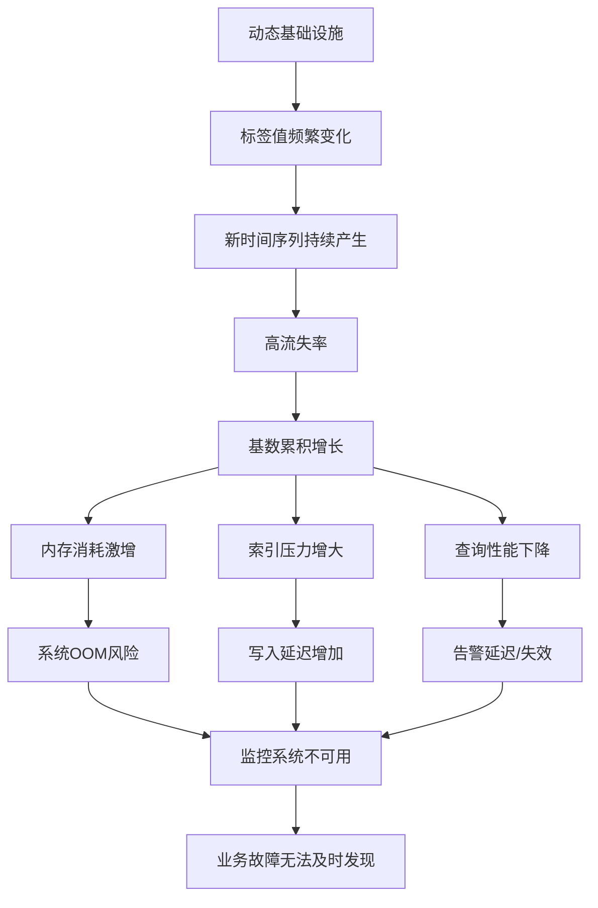

上图清晰展示了从动态基础设施特性到最终业务影响的完整传导路径。**高流失率问题的核心挑战在于它对系统资源的非线性消耗以及对监控系统自身可靠性的直接威胁**，使得管理高流失率成为保障云原生监控体系稳定性的关键任务。

### 1.4 研究范围、目标与分析框架

基于上述背景分析与问题界定，本报告明确以下研究边界与目标。

**研究范围方面**，本报告聚焦于Prometheus高流失率问题的三个核心维度：一是高流失率的影响机制，系统评估其对Prometheus服务器性能、资源消耗、数据准确性及告警体系的具体冲击；二是系统性解决方案，涵盖从指标设计、配置优化到架构演进的完整技术栈；三是云厂商实践经验，分析主流云服务商针对高基数与高流失率挑战所提供的增强功能与最佳实践。研究将重点关注Kubernetes等动态基础设施环境，以及AI大模型、智能驾驶等新兴应用场景。

**研究目标方面**，本报告旨在为企业提供可落地的高流失率治理策略。具体而言，包括：帮助技术团队准确诊断高流失率问题的根源与影响程度；提供经过验证的系统性解决方案组合；评估不同云厂商托管服务的能力与适用场景；为构建稳健的Prometheus监控体系提供方法论指导。

**分析框架方面**，本报告采用"问题诊断—影响评估—解决方案—实践验证"的四维分析结构：

| 分析维度 | 核心内容 | 对应章节 |
|---------|---------|---------|
| 问题诊断 | 技术根源剖析、形成机制解析 | 第2章 |
| 影响评估 | 性能冲击验证、连锁影响分析 | 第3章 |
| 解决方案 | 预防策略、缓解措施、架构演进 | 第4章 |
| 实践验证 | 云厂商方案对比、最佳实践总结 | 第5章、第6章 |

这一框架确保研究的系统性与完整性，从理论分析到实践指导形成闭环。**值得强调的是，关于标签较为合理的基数，业界已有相关最佳实践可供参考**[^1]，本报告将在解决方案章节中详细阐述。

综上所述，本章通过回顾Prometheus的发展历程与核心地位，精确界定高流失率的技术内涵，深入分析其与高基数问题的关联机制，为后续章节的深度剖析奠定了坚实的概念基础与清晰的逻辑起点。随着云原生技术的持续演进和AI应用的快速扩展，高流失率问题的有效治理将成为保障可观测体系稳定性的关键能力。

## 2 Prometheus高流失率的技术根源与形成机制

高流失率问题的有效治理必须建立在对其技术根源的深刻理解之上。本章将从动态基础设施特性、应用生命周期模式、指标与标签设计缺陷三个核心维度系统剖析高流失率的形成机制，并深入分析其在数据采集链路和TSDB存储层面的具体表现，为后续解决方案的制定提供坚实的技术基础。

### 2.1 动态标签值的频繁变更机制

**动态标签值的频繁变更是Prometheus高流失率最直接、最普遍的技术诱因**。在Kubernetes等动态基础设施环境中，Pod名称、实例ID、容器ID等标签值随着工作负载的生命周期变化而持续更替，每一次标签值的变化都会触发全新时间序列的创建。

#### 2.1.1 Kubernetes环境下的标签动态性

在Kubernetes架构中，**Pod是最小的可调度单元，而Pod名称（pod_name）通常包含随机生成的后缀**，这一设计确保了Pod的唯一性，但也为监控系统带来了挑战。以典型的Deployment滚动更新为例：当应用版本升级时，Kubernetes会逐步创建新Pod并销毁旧Pod，每个新Pod都会获得一个全新的名称（如`nginx-deployment-7fb96c846b-x2j4k`变为`nginx-deployment-8dc97d957c-y3l5m`），导致所有包含pod_name标签的指标都会产生新的时间序列。

**标签动态性的触发场景涵盖多种运维操作**：

| 触发场景 | 标签变化类型 | 流失率影响程度 |
|---------|-------------|---------------|
| 滚动更新（Rolling Update） | pod_name、container_id完全更替 | 高 |
| 自动扩缩容（HPA/VPA） | 新增/减少pod_name实例 | 中高 |
| 节点故障重调度 | pod_name、node_name变更 | 中 |
| ConfigMap/Secret更新触发重启 | pod_name、container_id更替 | 高 |
| 镜像拉取策略触发重建 | container_id变更 | 中 |

**在Kubernetes中每次部署后，pod_name标签值可能会针对大量时间序列发生变化**[^5]。假设一个微服务应用有100个Pod，每个Pod暴露50个指标，每个指标平均有5个标签组合，那么单次滚动更新就可能产生`100 × 50 × 5 = 25,000`条新时间序列。如果该应用每天部署3次，仅此一项就会在数据保留期内累积大量"已死亡"的时间序列。

#### 2.1.2 标签值变化触发新时间序列的机制

**每个时间序列都由其名称和一组标签唯一标识**[^5]。这一设计原则意味着，即使是同一个指标名称，只要任何一个标签值发生变化，Prometheus就会将其视为一条全新的时间序列。以下示例清晰展示了这一机制：

```
# 原时间序列
http_requests_total{pod="nginx-abc123", method="GET", status="200"} 1500

# Pod重建后的新时间序列（完全独立的数据序列）
http_requests_total{pod="nginx-def456", method="GET", status="200"} 0
```

**旧时间序列被新时间序列替代的速率称为流失率**[^5]。从技术层面分析，当旧Pod被销毁后，其对应的时间序列不再接收新的数据点，变为非活跃状态；但这些时间序列并不会立即从存储中删除，而是会在整个数据保留期（默认15天）内持续占用存储空间和索引资源。与此同时，新Pod的启动会触发全新时间序列的创建，这些新序列需要在内存中建立索引和缓存。

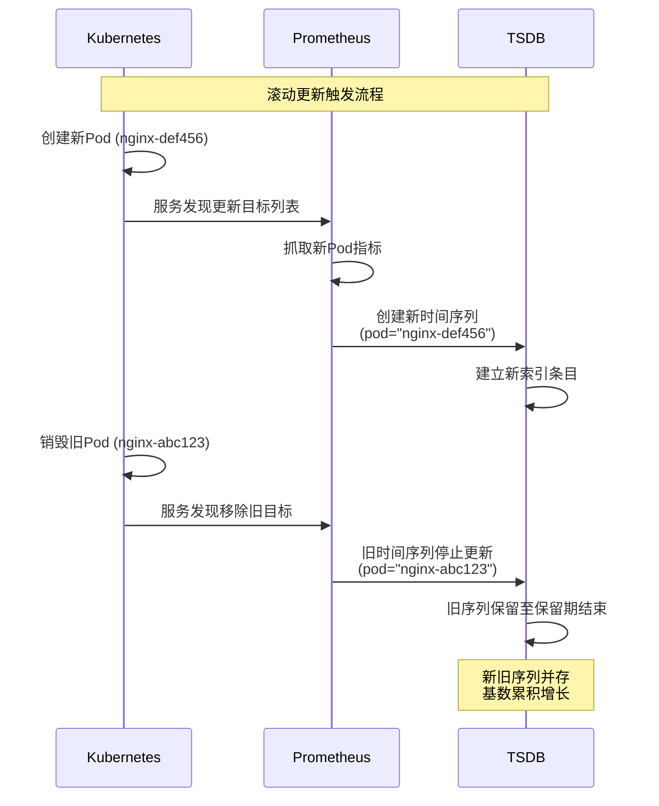

上图展示了滚动更新场景下时间序列的完整生命周期，清晰呈现了新旧序列并存导致基数累积的技术机制。

### 2.2 应用生命周期短暂化的影响

**应用生命周期的短暂化是高流失率问题在新兴技术领域尤为突出的核心原因**。随着AI大模型训练、智能驾驶数据处理、无服务器计算等场景的广泛应用，短生命周期工作负载已成为云原生环境中的常态，这类工作负载的特性与传统长期运行服务截然不同，对监控系统造成了前所未有的压力。

#### 2.2.1 AI大模型与智能驾驶场景的特殊性

**大模型和智能驾驶领域出现高流失率问题的一个常见原因是高流失率，这两个领域常见的高基数label是pod name，因为模型训练可能涉及大量的任务（Kubernetes Job），部分任务的生命周期甚至只有几分钟**[^1]。这一特性与传统Web服务形成鲜明对比——传统服务的Pod可能运行数天甚至数周，而AI训练任务的Pod可能仅存活几分钟。

以大模型训练场景为例，其工作负载特征表现为：

- **任务并发度高**：大规模训练可能同时启动数百甚至数千个Worker Pod
- **任务周期短**：数据预处理、特征工程等子任务可能在分钟级完成
- **任务频率密集**：持续的模型迭代导致任务频繁提交
- **资源弹性大**：根据训练阶段动态调整计算资源

**火山引擎托管Prometheus服务VMP与火山方舟大模型服务平台、火山引擎智能驾驶数据服务的深度合作实践表明**[^1]，这些场景下的监控挑战主要来源于大量任务的频繁创建导致pod name label的变化非常频繁。假设一个AI训练平台每小时提交100个Job，每个Job包含10个Pod，每个Pod暴露30个指标，那么每小时就会产生`100 × 10 × 30 = 30,000`条新时间序列。按照默认15天的数据保留期计算，仅此一项就会累积超过1000万条时间序列。

#### 2.2.2 短暂工作负载的类型与影响分析

除AI场景外，多种短暂工作负载类型同样是高流失率的重要来源：

| 工作负载类型 | 典型生命周期 | 流失率特征 | 典型应用场景 |
|-------------|-------------|-----------|-------------|
| Kubernetes Job | 分钟至小时级 | 任务完成即销毁，Pod名称一次性 | 数据处理、模型训练 |
| CronJob | 周期性短暂存活 | 定时触发，高频重复创建 | 定时报表、数据同步 |
| Serverless函数 | 秒至分钟级 | 按需创建，冷启动频繁 | API网关、事件处理 |
| Spark/Flink任务 | 分钟至小时级 | 大量Executor Pod并发 | 批处理、流计算 |
| CI/CD Pipeline | 分钟级 | 构建完成即清理 | 持续集成、自动化测试 |

**这些短暂工作负载的共同特征是：监控目标的创建-运行-销毁周期远短于Prometheus的数据保留期**。这意味着在任何给定时刻，TSDB中存储的大量时间序列实际上已经"死亡"——它们不再接收新数据，但仍然占用存储空间、消耗索引资源、影响查询性能。

### 2.3 不当的指标与标签设计策略

**不当的指标与标签设计是导致高基数和高流失率的人为根源**，这类问题往往源于对Prometheus数据模型理解不足或业务需求与监控能力的错配。与动态基础设施带来的"被动"流失不同，设计缺陷导致的问题通常更为严重且更难修复。

#### 2.3.1 不可枚举标签的危害分析

**将user_id、session_id、订单号、含参数的URL全路径等高基数、无界值作为标签，是引发高流失率和基数问题的常见人为根源**。这类设计缺陷会直接导致时间序列组合数量爆炸式增长。

以HTTP请求监控为例，分析不同标签设计策略的基数影响：

```
# 危险设计：将用户ID作为标签
http_request_duration_seconds{user_id="12345678", endpoint="/api/order"}
# 假设100万用户 × 50个接口 = 5000万时间序列

# 危险设计：将完整URL路径（含参数）作为标签  
http_request_total{url="/api/order?id=abc123&token=xyz789"}
# URL参数组合近乎无穷，基数无法估算

# 合理设计：使用可枚举的标签值
http_request_total{endpoint="/api/order", method="POST", status_code="200"}
# 50个接口 × 4种方法 × 5种状态码 = 1000时间序列
```

**一个典型的高基数案例是http_request_duration_seconds_bucket指标**[^7]：假设该指标有instance标签对应100个实例、le标签对应10个bucket、url标签对应400个URL、http_method标签对应5种方法，即使在小规模场景下也会产生`100 × 10 × 400 × 5 = 2,000,000`（200万）个时间序列。**如果大规模场景下url近乎无穷，那么基数根本无法计算出来**[^7]。

#### 2.3.2 合理标签基数的行业最佳实践

**关于标签较为合理的基数，行业已有明确的最佳实践指导**[^1]。Grafana提出的基数分级标准如下[^7]：

| 基数级别 | 标签值比率 | 风险评估 | 典型示例 |
|---------|-----------|---------|---------|
| 较低基数 | 1:5 | 安全 | status_code (200/400/500等) |
| 标准基数 | 1:80 | 可接受 | endpoint (API路径枚举) |
| 高基数 | 1:10000 | 危险 | pod_name (动态生成) |
| 超高基数 | 1:无穷 | 灾难性 | user_id、session_id |

**合理的标签设计应遵循以下原则**：

1. **可枚举性**：标签值应来自有限的、可预知的集合
2. **稳定性**：标签值在监控目标生命周期内应保持稳定
3. **业务相关性**：标签应服务于聚合和过滤需求，而非唯一标识
4. **基数可控**：单个标签的基数应控制在合理范围内

对于确实需要记录高基数信息的场景，应采用替代方案：将user_id等信息记录到日志系统而非指标标签；使用Exemplar机制关联少量采样的trace_id；通过直方图聚合而非逐用户记录延迟分布。

### 2.4 数据采集链路的流失率表现

**高流失率在Prometheus数据采集链路中有明确的技术表现和量化指标**，理解这些表现机制对于问题诊断和治理策略制定至关重要。

#### 2.4.1 流失率的量化评估方法

**Prometheus公开了prometheus_tsdb_head_series_created_total指标，可用于估算流失率**[^5]。通过以下PromQL查询可以量化评估系统的流失率水平：

```promql
# 计算整体流失率（每秒新增时间序列数）
rate(prometheus_tsdb_head_series_created_total[5m])

# 按Job维度分析流失率来源
sum(sum_over_time(scrape_series_added[5m])) by (job)
```

**从Prometheus v2.10版本开始，每个采集目标都会暴露scrape_series_added指标**[^5]，该指标可用于确定高流失率的具体来源。通过分析该指标的分布，运维团队可以快速定位哪些Job或服务是流失率的主要贡献者。

此外，**摄取率（Ingestion Rate）也是评估系统压力的重要指标**[^5]，可通过以下方式计算：

```promql
# 基于scrape_samples_scraped计算摄取率
sum_over_time(scrape_samples_scraped[5m]) / 300

# 理论摄取率估算公式
# ingestion_rate = targets_count × metrics_per_target / scrape_interval
# ingestion_rate = active_time_series / scrape_interval
```

#### 2.4.2 采集端的流失率传导机制

**Prometheus采集端主要包含四个组件，用于实现采集目标的发现和调度、采集操作的执行、采集集群和用户集群之间的通信等功能**[^8]：

| 组件名称 | 核心功能 | 与流失率的关系 |
|---------|---------|---------------|
| tmp-operator | 采集目标发现与调度，采集分片管理 | 感知目标变化，触发配置更新 |
| tmp-agent | 执行实际采集操作，推送指标数据 | 处理新增/消失的采集目标 |
| proxy-server | 为采集组件提供代理功能 | 承载高流失场景下的通信压力 |
| proxy-agent | 与proxy-server配合提供代理 | 安装在用户集群中 |

**在高流失率场景下，服务发现机制需要频繁更新目标列表**，这会导致：

1. **配置重载频繁**：ServiceMonitor/PodMonitor的变更触发Prometheus配置热重载
2. **目标列表震荡**：targets频繁出现和消失，可能导致采集断点
3. **网络压力增大**：大量短生命周期目标的发现和采集增加网络开销

**Prometheus的Pull模型在目标状态极快变化时，可能抓取到已不存在的目标，产生数据断点**，这种情况在实例诊断中可能表现为采集目标因timeout而处于down状态[^8]。

### 2.5 TSDB存储索引层面的累积效应

**高流失率对Prometheus本地TSDB的影响是系统性的，涉及内存、索引、WAL和磁盘存储等多个层面**，这些影响相互关联、逐级放大，最终可能导致系统性能严重下降甚至崩溃。

#### 2.5.1 Head Block与内存压力

**Prometheus在RAM中保存最近添加的活跃时间序列样本，因此其RAM使用率在很大程度上取决于活跃时间序列的数量**[^5]。Prometheus提供的`prometheus_tsdb_head_series`指标显示了当前活跃时间序列的数量，这是评估内存压力的关键指标。

Head Block是Prometheus TSDB中用于存储最近2小时数据的内存结构，其内存占用主要包括：

- **时间序列元数据**：每个时间序列的标签集合、索引信息
- **样本缓存**：最近采集的数据点
- **倒排索引**：用于加速查询的标签到时间序列的映射

**当大量时间序列存储在TSDB中时，系统可能开始工作缓慢或在摄取、查询或压缩期间使用大量RAM、CPU或磁盘IO。Prometheus的高基数问题通常从几百万个时间序列开始显现**[^5]。

#### 2.5.2 倒排索引的持续膨胀

**监控系统会为指标创建索引和缓存，指标基数越大，相应的索引、缓存所占用的磁盘空间和内存就越大，建立索引和缓存的过程也会消耗更多的CPU**[^1]。

倒排索引的膨胀机制可通过以下流程图说明：

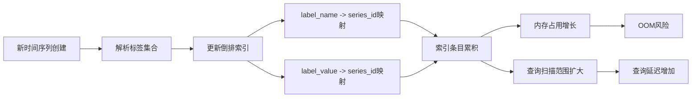

**高流失率导致索引项（series）数量剧增且频繁变动**。即使旧时间序列不再活跃，其索引条目在数据保留期内仍然存在，这意味着查询时需要扫描的索引范围持续扩大。

#### 2.5.3 WAL写入压力与数据保留期的累积效应

Write-Ahead Log（WAL）是Prometheus保证数据持久性的关键机制。在高流失率场景下，WAL面临的压力包括：

- **写入频率增加**：新时间序列的创建需要写入WAL
- **日志体积膨胀**：大量短生命周期序列的元数据记录
- **重放时间延长**：Prometheus重启时需要重放WAL恢复状态

**更为关键的是数据保留期内的累积效应**。Prometheus默认的数据保留期为15天[^5]，这意味着：

1. 所有在过去15天内创建的时间序列都会保留在存储中
2. 即使某个时间序列只存活了5分钟，其数据也会保留15天
3. 高流失率场景下，15天内累积的"死亡"序列数量可能远超活跃序列

**当series数量超过存储上限时，会触发写入限流或样本丢弃，表现为数据丢失和查询异常**，形成恶性循环。**最严重的后果是高流失率可能导致Prometheus因内存耗尽（OOM）而崩溃**[^5]。

下表总结了高流失率在TSDB各层面的累积效应：

| 存储层面 | 累积效应 | 性能影响 | 风险等级 |
|---------|---------|---------|---------|
| Head Block | 活跃序列内存占用线性增长 | 内存压力增大 | 高 |
| 倒排索引 | 索引条目持续累积 | 查询延迟增加 | 高 |
| WAL | 写入量增加，重放时间延长 | 启动时间延长 | 中 |
| 磁盘存储 | 数据保留期内序列累积 | 存储成本上升 | 中 |
| 压缩过程 | 需处理更多序列 | CPU消耗增加 | 中 |

综上所述，**Prometheus高流失率的技术根源是一个由动态基础设施特性和不当的指标设计所引发，经由数据采集链路传导，最终在存储索引层表现为资源耗尽和性能崩溃的连锁反应**。理解这一完整的形成机制，是制定有效解决方案的必要前提。

## 3 高流失率对Prometheus系统与监控体系的负面影响评估

高流失率问题的严重性在于其对Prometheus系统的影响是多维度、相互关联且具有放大效应的。本章将从资源消耗、查询性能、存储成本、数据准确性和告警体系五个核心维度，系统验证高流失率对Prometheus服务器造成的具体性能冲击，为后续解决方案的制定提供量化评估依据。

### 3.1 内存与CPU资源的非线性消耗机制

**高流失率场景下，Prometheus服务器的内存与CPU资源消耗呈现显著的非线性增长特征**，这种非线性特性意味着随着时间序列数量的增加，资源消耗的增速会逐渐加快，最终可能导致系统崩溃。

#### 3.1.1 内存消耗的核心来源与增长模式

Prometheus的内存占用主要来自三个关键领域。**首先是时间序列数据本身**，Prometheus将采集到的监控样本存储在内存中，直到达到一定大小或时间间隔后才会持久化到磁盘，大量的时间序列会导致内存占用急剧增加[^9]。**其次是索引数据**，为了快速查询时间序列，Prometheus维护了一系列索引结构，这些结构也会占用大量内存[^9]。**第三是WAL（预写日志）**，Prometheus使用WAL来保证数据的持久性，WAL在重放过程中会消耗大量内存[^9]。

**标签结构是内存消耗的最大单一来源**。根据Grafana Labs工程师Bryan Boreham在KubeCon大会上的分析，在Prometheus内部，标签几乎占据了所有内存的三分之一（约31%）[^10]。每个时间序列都通过名称-值对集合进行唯一标识，这些标签信息需要在内存中维护完整的索引映射关系。

下表展示了内存消耗与时间序列数量的关系模式：

| 活跃时间序列数量 | 预估内存占用 | 系统状态 | 风险等级 |
|-----------------|-------------|---------|---------|
| 10万以下 | < 2GB | 正常运行 | 低 |
| 10万-100万 | 2-10GB | 需关注 | 中 |
| 100万-500万 | 10-50GB | 性能下降 | 高 |
| 500万以上 | > 50GB | OOM风险 | 极高 |

**内存消耗的非线性特征源于多重因素的叠加效应**。随着时间序列数量增加，倒排索引的复杂度呈超线性增长——每新增一个标签值，都需要更新多个索引映射；同时，Go语言运行时的垃圾回收压力也会随内存使用量增加而加剧，形成所谓的"锯齿效应"[^10]。

#### 3.1.2 CPU消耗的主要驱动因素

**CPU瓶颈通常由数据采集、数据压缩和查询处理三个因素引起**[^9]。在高流失率场景下，这三个因素的压力都会显著放大：

**数据采集层面**，Prometheus需要定期从目标服务拉取监控指标，这个过程涉及网络IO、指标解析等操作，会消耗CPU资源[^9]。当采集目标频繁变化时，服务发现机制需要持续更新配置，增加了额外的CPU开销。

**数据压缩层面**，Prometheus对持久化到磁盘的数据进行压缩，压缩过程需要大量CPU计算[^9]。高流失率意味着更多的时间序列需要进行压缩处理，且由于大量短生命周期序列的存在，压缩效率可能下降。

**查询处理层面**，复杂的PromQL查询会导致CPU使用率飙升，特别是涉及大范围时间序列聚合和复杂函数计算的查询[^9]。高流失率导致需要扫描的时间序列数量增加，直接推高了查询的CPU消耗。

#### 3.1.3 OOM崩溃的风险阈值与触发机制

**在监控Kubernetes集群时，Prometheus服务器频繁卡顿、内存占用飙升至90%以上，甚至因OOM（内存溢出）崩溃的情况并不罕见**[^9]。这些问题不仅影响监控系统本身的稳定性，还可能导致关键业务指标监控中断，给故障排查带来困难。

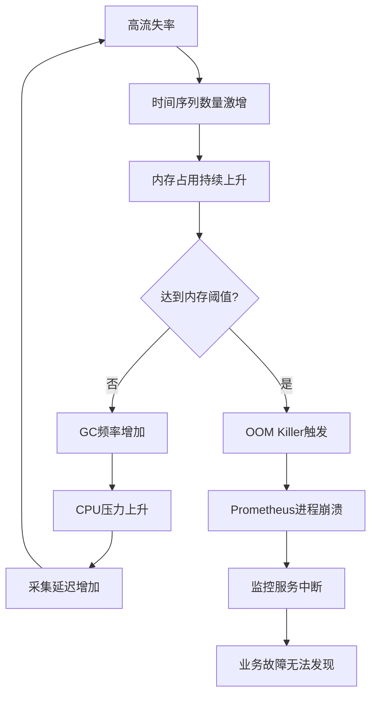

上图展示了高流失率导致OOM崩溃的恶性循环机制。**当内存压力持续增大时，Go运行时会增加垃圾回收频率以释放内存，但这会消耗更多CPU资源，进而影响数据采集的及时性，形成负反馈循环**。当这一循环无法自我调节时，最终会触发操作系统的OOM Killer，导致Prometheus进程被强制终止。

### 3.2 查询响应延迟与性能劣化分析

**高流失率对PromQL查询性能的影响是多层次的，涉及时间序列选择、样本扫描、索引查找等多个环节**，这些因素共同作用导致查询延迟显著加剧。

#### 3.2.1 影响查询性能的核心因素

**PromQL查询性能取决于查询本身以外的多个关键因素**[^11]：

**第一，查询选择的时间序列数量**。如果查询选择数百万个时间序列，那么在执行过程中可能需要GB级的RAM、大量的磁盘IOPS和大量的CPU时间[^11]。高流失率场景下，即使看似简单的查询也可能匹配到大量"已死亡"的时间序列。

**第二，查询需要扫描的原始样本数量**。该数字等于所选时间范围内所有匹配时间序列的原始样本总和[^11]。样本数量还取决于存储在数据库中的样本之间的间隔（scrape_interval）——间隔越短意味着样本数量越多。

**第三，Grafana中用于构建图形的时间范围**。更长的时间范围意味着必须从数据库中读取更多的数据[^11]。**关键的是，如果旧时间序列随着时间的推移被新时间序列替换（即高流失率场景），较长的时间范围可能会同时增加要扫描的样本数量和匹配时间序列的数量**[^11]。

**第四，所选时间范围内数据库中的时间序列总数**。更多的时间序列通常意味着匹配序列的查找速度较慢[^11]。在高流失率环境下，活跃时间序列的数量可能远小于给定时间范围内的序列总数，但查询仍需遍历所有相关索引。

下表对比了不同查询场景下的性能表现：

| 查询场景 | 匹配序列数 | 扫描样本数 | 预期延迟 | 资源消耗 |
|---------|-----------|-----------|---------|---------|
| 简单查询（低流失率） | 数十条 | 数千个 | 毫秒级 | 低 |
| 简单查询（高流失率） | 数万条 | 数十万个 | 秒级 | 中高 |
| 复杂聚合（低流失率） | 数百条 | 数万个 | 百毫秒级 | 中 |
| 复杂聚合（高流失率） | 数十万条 | 数百万个 | 数十秒级 | 极高 |

#### 3.2.2 不同函数类型的性能差异

**MetricsQL和PromQL具有不同类型的函数，它们的性能表现差异显著**[^11]：

**标签操作函数**（如label_replace、label_join、label_set）是最轻量级的函数，尽管在查询中使用时看起来很复杂[^11]。这类函数主要进行字符串操作，对高流失率场景相对不敏感。

**转换函数**（如abs、round、time）大多是快速函数。但存在例外，**histogram_quantile、prometheus_buckets和其他与直方图相关的函数在执行过程中需要更多时间和资源**[^11]。在高基数场景下，这些函数需要处理的bucket数量可能急剧增加。

**聚合函数**（如sum、count、avg、min、max）大多数也是轻量级的，除了一些非常规的聚合函数如count_values、quantile或histogram[^11]。高流失率会增加聚合操作需要处理的时间序列数量。

**滚动函数**（如rate、increase、min_over_time、quantile_over_time）是最昂贵的函数[^11]。滚动函数使用存储在数据库中的原始样本，而其他函数则使用从滚动函数返回的计算结果。每个滚动函数都接受方括号中的lookbehind窗口，**较大的窗口意味着需要处理更多原始样本**[^11]。

#### 3.2.3 Instant Queries的特殊性能影响

**Prometheus Instant queries是一种实时的查询接口，在高流失率场景下面临特殊的性能挑战**[^12]：

**性能影响方面**，Instant queries可能会对Prometheus服务器的性能产生影响，特别是在处理大量的并发查询时。因为实时查询需要即时计算时间序列数据，可能会增加服务器的负载，导致性能下降[^12]。

**资源消耗方面**，Instant queries需要消耗服务器的资源，包括CPU和内存等。如果频繁进行大量的实时查询，可能会消耗大量的资源，影响Prometheus服务器的稳定性和可用性[^12]。

**实时性限制方面**，虽然Instant queries提供了实时查询的功能，但并不是所有的查询结果都是实时更新的。在高负载或复杂查询情况下，查询结果可能会有一定的延迟，不够及时[^12]。

### 3.3 存储成本的累积增长与资源压力

**高流失率导致的存储成本攀升是一个渐进但持续的过程**，其影响在数据保留期内逐步显现，最终可能触及系统容量上限。

#### 3.3.1 存储成本的增长模式

存储成本的增长主要体现在以下几个方面：

**磁盘空间占用**方面，每个时间序列的每个样本都需要占用存储空间。在高流失率场景下，虽然单个时间序列可能只存活几分钟，但其数据会在整个保留期内持续占用磁盘空间。假设默认15天保留期，一个每小时产生10,000条新时间序列的系统，在保留期内将累积超过360万条时间序列的历史数据。

**索引存储开销**方面，Prometheus需要为每个时间序列维护索引信息，包括标签到序列ID的映射、序列ID到数据块的映射等。高流失率导致索引条目持续累积，即使对应的时间序列已不再活跃。

**数据保留期内的累积效应**可通过以下模型量化：

| 流失率（序列/小时） | 15天累积序列数 | 预估存储增量 | 年化存储成本影响 |
|-------------------|---------------|-------------|-----------------|
| 1,000 | 36万 | ~10GB | 低 |
| 10,000 | 360万 | ~100GB | 中 |
| 100,000 | 3,600万 | ~1TB | 高 |
| 1,000,000 | 3.6亿 | ~10TB | 极高 |

#### 3.3.2 TSDB压缩与磁盘IO压力

**TSDB压缩过程是CPU和磁盘IO的重要消耗者**。Prometheus会定期将内存中的数据块压缩并持久化到磁盘，这一过程在高流失率场景下面临更大压力：

**压缩效率下降**：大量短生命周期时间序列的存在降低了压缩算法的效率，因为这些序列缺乏足够的连续数据点来实现高效压缩。

**压缩频率增加**：为了释放内存压力，系统可能需要更频繁地触发压缩操作，这会增加CPU和磁盘IO的持续负载。

**磁盘IO争用**：压缩操作与正常的数据写入、查询读取争用磁盘IO资源，可能导致整体系统响应变慢。

#### 3.3.3 多租户环境下的Quota超限问题

**监控系统通常为多租户系统，为保障系统的稳定性，一般会为不同租户分配一定的指标quota**。高流失率场景下，租户更容易触及quota上限：

**写入限流触发**：当时间序列数量超过配额时，系统会触发写入限流，导致新的监控数据无法正常采集。

**样本丢弃**：在极端情况下，系统可能直接丢弃超出配额的样本，造成监控数据的不完整。

**连锁故障**：数据丢失和查询异常可能进一步影响基于这些数据的告警规则和仪表盘，形成连锁故障。

### 3.4 数据准确性与rate函数计算风险

**Prometheus不一定保证数据准确，这里的不准确一是指rate、histogram_quantile等函数会做统计和推断，产生一些反直觉的结果**[^13]。在高流失率场景下，这种数据准确性风险被进一步放大。

#### 3.4.1 rate与increase函数的计算机制

**rate()函数是专门搭配counter数据类型使用的函数，功能是取counter在这个时间段中平均每秒的增量**[^14]。**increase()函数表示某段时间内数据的增量**[^14]。这两个函数是Prometheus中最常用的滚动函数，但它们的计算依赖于时间序列的连续性。

理解这两个函数的适用场景对于选择合适的查询策略至关重要：**当获取数据比较精细的时候（类似于1m取样）推荐使用rate()；当获取数据比较粗糙的时候（类似于5m、10m甚至更长时间取样）推荐使用increase()**[^14]。

#### 3.4.2 高流失率场景下的计算偏差

高流失率场景下，rate和increase函数面临以下计算准确性风险：

**计数器重置误判**：当时间序列因Pod重建而中断时，新序列的计数器从零开始。如果查询窗口跨越了新旧序列的边界，rate函数可能将正常的序列更替误判为计数器重置，导致计算结果异常。

**采样间隙导致的推断误差**：rate函数通过线性插值推断时间窗口边界处的值。当时间序列生命周期短于查询窗口时，可用的采样点不足，推断误差会显著增大。

**查询范围过长的降采样问题**：**查询范围过长要做降采样，势必会造成数据精度丢失，不过这是时序数据的特点，也是不同于日志系统的地方**[^13]。

下表总结了不同场景下的计算准确性风险：

| 场景 | 风险类型 | 影响程度 | 缓解策略 |
|-----|---------|---------|---------|
| 序列生命周期 < 查询窗口 | 采样点不足 | 高 | 缩短查询窗口 |
| 频繁Pod重建 | 计数器重置误判 | 中高 | 使用记录规则预聚合 |
| 长时间范围查询 | 降采样精度丢失 | 中 | 分段查询后聚合 |
| histogram指标高基数 | quantile计算偏差 | 中 | 控制bucket数量 |

#### 3.4.3 histogram_quantile的准确性下降

**histogram类型用于反映统计分布的情况，是为分段统计准备的直方图**[^15]。在高流失率场景下，histogram_quantile函数面临特殊挑战：

**bucket累积的不连续性**：histogram的bucket是累积的（le标签表示"小于等于"），当时间序列频繁中断时，bucket之间的累积关系可能被破坏。

**分位数计算的采样偏差**：histogram_quantile通过线性插值估算分位数值，当样本分布在bucket之间不均匀时（高流失率场景下更常见），估算结果可能与实际值存在较大偏差。

### 3.5 告警体系的及时性与准确性连锁影响

**高流失率对告警体系的影响是最具业务破坏性的**，因为告警是监控系统与业务运维的关键接口，告警体系的失效直接影响故障发现和响应能力。

#### 3.5.1 告警规则评估延迟

**告警规则的评估依赖于PromQL查询**，而高流失率导致的查询性能下降会直接传导到告警评估环节：

**评估周期延长**：当单次告警规则评估耗时超过评估间隔时，会出现评估堆积，导致告警延迟。

**规则超时失败**：在极端情况下，复杂的告警规则可能因查询超时而评估失败，造成告警漏报。

**资源争用**：告警评估与用户查询、数据采集争用系统资源，在高负载时可能被降级处理。

#### 3.5.2 时间序列断裂导致的告警失效

**高流失率的核心特征是时间序列的频繁中断和重建**，这对依赖序列连续性的告警规则造成严重影响：

**基于rate的告警失效**：例如`rate(http_errors_total[5m]) > 0.1`这类告警规则，当http_errors_total对应的时间序列在5分钟内发生中断和重建时，rate计算可能返回异常值或无数据，导致告警条件无法正确评估。

**for持续时间无法满足**：许多告警规则使用`for`子句要求条件持续一段时间才触发告警。当时间序列频繁断裂时，条件的持续性被打断，可能导致本应触发的告警无法触发。

**absent()告警的误报**：用于检测目标消失的absent()函数在高流失率场景下可能频繁触发，产生大量噪音告警。

#### 3.5.3 监控系统不可用的致命影响

**最严重的后果是高流失率可能导致Prometheus因内存耗尽（OOM）而崩溃**，使监控系统在关键时刻不可用。这种情况的业务影响是灾难性的：

**故障发现延迟**：当监控系统崩溃时，业务系统的故障无法被及时发现，可能导致故障影响范围扩大。

**排障能力丧失**：没有监控数据支撑，运维团队在排查问题时陷入"盲飞"状态，只能依赖日志和经验判断。

**信任危机**：监控系统的不可靠会导致团队对监控数据失去信任，可能形成"告警疲劳"或"忽视告警"的恶性循环。

**需要处理的告警才发出来，发出来的告警必须得到处理**[^13]。这一原则在高流失率场景下尤为重要——告警体系的可靠性是监控系统价值的核心体现。

下图展示了高流失率对告警体系的完整影响链路：

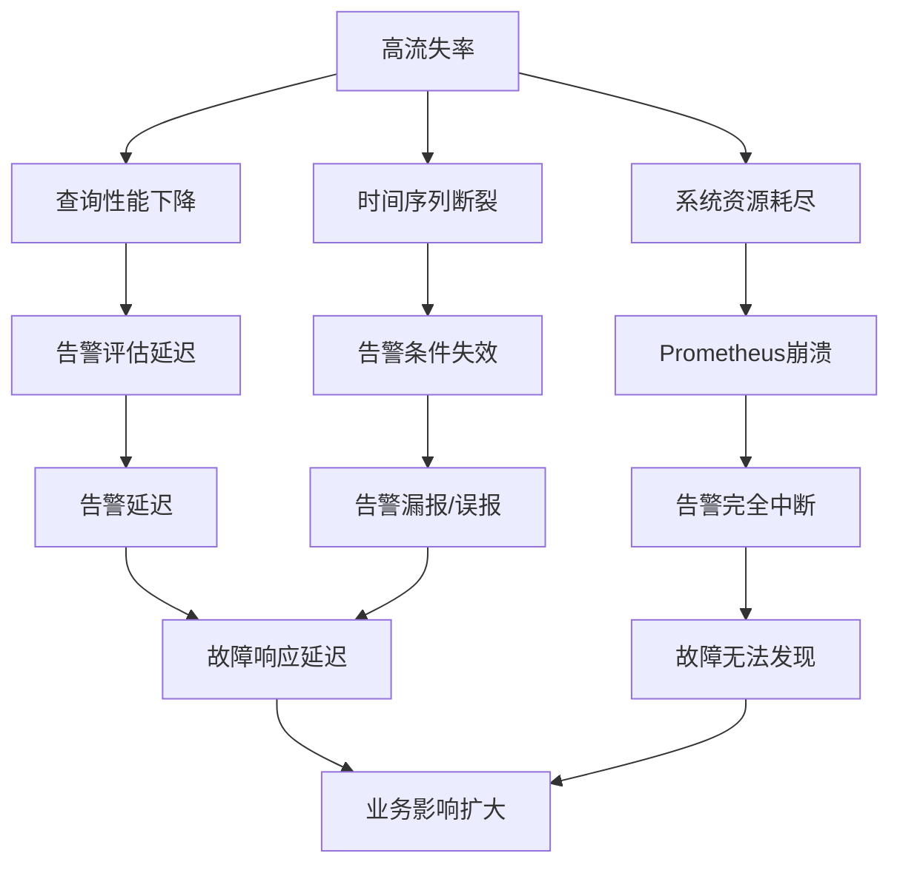

#### 3.5.4 严重性评估与优先级排序

基于上述分析，高流失率对Prometheus系统的负面影响可按严重性进行如下排序：

| 优先级 | 影响维度 | 严重性 | 核心风险 | 业务影响 |
|-------|---------|-------|---------|---------|
| P0 | 系统稳定性 | 极高 | OOM崩溃导致监控中断 | 故障无法发现，排障盲飞 |
| P1 | 告警可靠性 | 高 | 告警延迟、漏报、误报 | 故障响应延迟，影响扩大 |
| P1 | 查询性能 | 高 | 仪表盘加载缓慢，分析受阻 | 运维效率下降 |
| P2 | 存储成本 | 中 | 存储资源持续消耗 | 运营成本上升 |
| P2 | 数据准确性 | 中 | rate等函数计算偏差 | 决策依据不可靠 |

**解决方案应优先解决由高流失率直接引发的系统稳定性危机和核心监控功能（查询、告警）失效问题**，随后处理资源成本与长期扩展性挑战。数据准确性风险可通过优化查询实践同步缓解。

综上所述，高流失率对Prometheus系统的影响是全方位的，从底层的资源消耗到上层的业务告警形成完整的影响传导链。**监控系统一般情况下可用性大于一致性，容忍部分副本数据丢失，保证查询请求成功**[^13]。这一设计原则提示我们，在治理高流失率问题时，应优先保障系统的可用性和告警的可靠性，这是监控系统存在价值的根本所在。

## 4 系统性解决方案架构：从预防、缓解到架构演进

基于前文对Prometheus高流失率技术根源与负面影响的深入分析，本章将系统性地归纳并评估应对这一挑战的完整技术方案体系。解决方案的设计遵循"标本兼治、预防优先、分层治理、持续迭代"的核心原则，从源头预防的指标设计规范出发，经由采集链路的配置优化，到查询层的预聚合策略，再到存储层的参数调优，最终延伸至面向大规模动态环境的分布式架构演进。这一分层框架旨在帮助技术团队根据自身业务规模、技术成熟度和资源约束，选择最适合的治理策略组合，实现从轻量级配置调整到重量级架构升级的平滑过渡。

### 4.1 指标与标签设计的最佳实践：从源头预防高流失率

**从指标设计源头避免高流失率标签的产生，是治理该问题最根本、最有效的策略**。相较于事后补救，在指标埋点阶段就遵循最佳实践，不仅能从根本上杜绝问题的发生，还能显著降低后续运维和优化的复杂度。

#### 4.1.1 标签设计的核心原则

**合理的标签设计应遵循稳定性、有限性和可聚合性三大核心原则**，这些原则共同构成了预防高流失率的第一道防线。

**稳定性原则**要求标签值在监控目标的生命周期内应保持稳定，不应随着应用重启、Pod重建等常规运维操作而发生变化。**严禁将Pod名称、容器ID、用户ID、会话ID、含参数的URL等动态、高基数值作为指标标签**。此类信息虽然在故障排查时可能有价值，但应通过日志系统或分布式追踪系统记录，而非嵌入Prometheus指标标签。

**有限性原则**强调标签值应来自有限的、可预知的集合。**单个指标的标签数建议不超过5个**，每个标签的基数应控制在合理范围内。根据Grafana提出的基数分级标准，标签值比率在1:5（如status_code）属于较低基数，1:80（如endpoint枚举）属于标准基数，而1:10000以上（如动态pod_name）则属于危险的高基数区间[^1]。

**可聚合性原则**要求标签值应可枚举，且同一维度的数据单位统一，便于服务端进行聚合计算。**指标名称是全局的，携带命名空间可以有效避免命名冲突**，如`process_xxx`表示进程指标，`rpc_xxx`表示RPC指标，`followsys_xxx`表示关注系统业务指标[^16]。

下表系统梳理了标签设计的正反实践对比：

| 设计维度 | 危险实践 | 推荐实践 | 原因说明 |
|---------|---------|---------|---------|
| 实例标识 | `pod="nginx-abc123"` | `deployment="nginx"` | Pod名称动态变化，Deployment名称稳定 |
| 用户标识 | `user_id="12345678"` | 通过日志记录 | 用户ID无界，不适合作为标签 |
| 请求路径 | `url="/api/order?id=xxx"` | `endpoint="/api/order"` | 含参数URL组合无穷 |
| 会话信息 | `session_id="sess_xyz"` | 通过Exemplar关联 | 会话ID高基数且短暂 |
| 容器标识 | `container_id="abc123"` | `container_name="app"` | 容器ID每次重建都变化 |

#### 4.1.2 指标命名的规范化实践

**指标命名的整体结构是name_unit_suffix，符合正则`[a-zA-Z_][a-zA-Z0-9_]*`**[^16]。良好的命名规范不仅提升指标的可读性，还能有效避免命名冲突和混淆。

**name部分**要做到望文生义，类似变量名，应具有良好的可读性。如`http_requests_total`、`process_resident_memory_bytes`、`queue_size`、`queue_limit`等。**指标名称不要带环境名/应用名，这些元信息适合用label承载**，Prometheus在抓取指标时会自动附加，不需要在埋点代码中定义[^16]。

**unit部分**可以带上单位，如`request_bytes_total`、`request_latency_seconds`。**值总是使用基本单位，如秒/米/字节，单位展示可读性的事情则交给Grafana等展示UI来处理**[^16]。

**suffix部分**遵循OpenMetrics规范定义：**counter必须以`_total`为后缀，信息类指标以`_info`为后缀**[^16]。

#### 4.1.3 高动态场景的标签设计替代方案

**针对AI大模型和智能驾驶等高动态场景，应采用更高层级的稳定标识符替代动态的Pod名称**。这些场景的共同特征是任务生命周期短暂、Pod频繁创建销毁，传统的以Pod为粒度的监控策略会导致严重的高流失率问题。

**使用层级化稳定标识符**是核心解决思路。在Kubernetes环境中，可以使用以下替代方案：

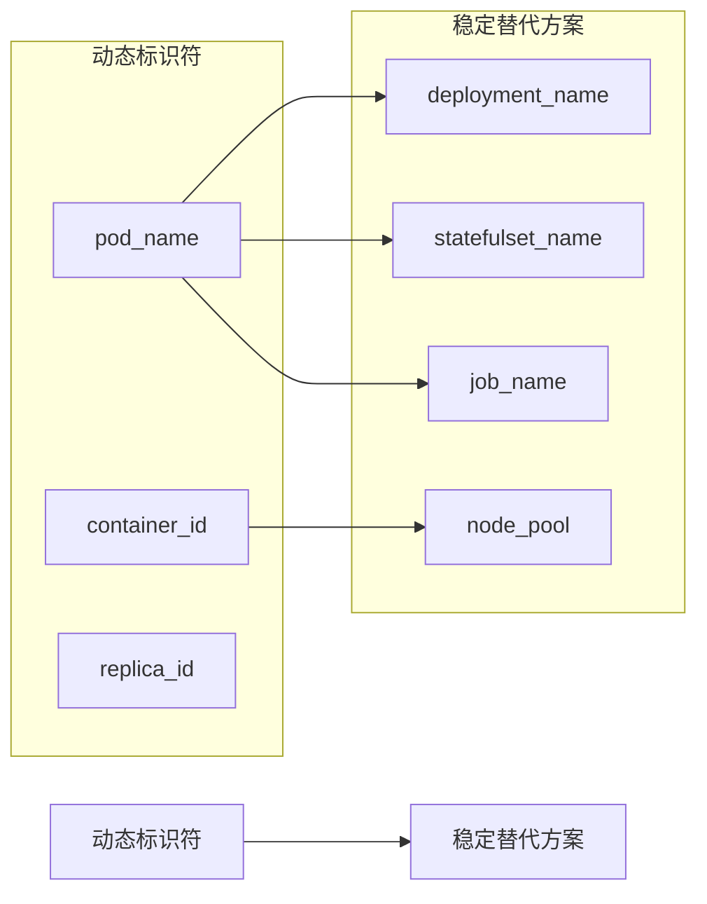

**在采集端对高流失率标签进行聚合，仅生成并存储业务关心的聚合维度的指标**。例如，对于AI训练任务，可以按`job_name`或`node_pool`维度聚合，而非记录每个Worker Pod的独立指标。这种设计在保留业务洞察能力的同时，有效控制了时间序列的基数。

**使用CounterVec、GaugeVec等向量类型替代创建大量独立指标**，这是Prometheus客户端库推荐的建模方式[^17]。Vector类型允许使用Label做区分，Prometheus实际会为每个Label组合创建一个Metric，但这种方式比创建独立指标更易于管理和维护。

#### 4.1.4 埋点思路与方法论

**最好将原始指标暴露给Prometheus，而不是在应用程序端进行计算**。如不需要在应用程序端计算错误率，而应该埋点总量和错误量两个counter，查询时用PromQL处理原始数据，相除得到错误率[^16]。

针对不同类型的服务，业界已形成成熟的埋点方法论：

**在线服务采用RED方法**：Requests（请求量）、Errors（错误量）、Duration（耗时）[^16]。这三个维度覆盖了在线服务最核心的健康指标，且天然适合使用Counter和Histogram类型实现。

**离线服务采用USE方法**：Utilisation（使用率，如满载程度）、Saturation（饱和度，如排队任务数）、Errors（错误量）[^16]。这一方法论特别适用于AI训练任务、批处理作业等离线工作负载的监控。

### 4.2 Relabel配置优化：采集链路的流失率控制

**当源头预防无法完全覆盖（如使用第三方Exporter或历史系统）时，Relabel配置是在采集链路层面控制流失率的关键技术手段**。Prometheus的relabel_config机制提供了强大的指标过滤、标签重写和聚合能力，能够在数据进入存储之前进行有效的流量控制。

#### 4.2.1 Relabel配置的应用场景与语法

**Prometheus的relabel_config配置对象允许选择一个或多个源标签值，可以使用separator参数将其连接起来，然后可以使用regex对结果进行匹配，如果出现匹配，可以执行action操作**[^18]。

relabel_config主要应用于两个关键位置：

| 配置位置 | 作用时机 | 典型用途 |
|---------|---------|---------|
| `relabel_configs` | 采集目标发现后、采集前 | 过滤采集目标、修改目标标签 |
| `metric_relabel_configs` | 采集完成后、存储前 | 过滤指标、修改指标标签 |
| `write_relabel_configs` | 远程写入前 | 控制写入远程存储的数据范围 |

**在metric_relabel_configs中配置过滤规则是控制流失率的最常用手段**，因为它作用于采集完成后的指标数据，可以精确控制哪些指标进入本地存储。

#### 4.2.2 Allowlisting与Denylisting策略

**可以通过两种方式减少发送到存储的活动系列数量：Allowlisting（允许清单）和Denylisting（拒绝清单）**[^18]。

**Allowlisting策略**涉及保留一套明确定义的"重要"度量和标签，并放弃其他一切。要在Prometheus中启用允许列表，**使用keep和labelkeep动作与relabel配置**[^18]。这种策略适用于已明确核心监控需求的场景，能够最大程度地精简指标数量。

```yaml
# Allowlisting示例：仅保留特定指标
metric_relabel_configs:
  - source_labels: [__name__]
    regex: (http_requests_total|process_cpu_seconds_total|go_goroutines)
    action: keep
```

**Denylisting策略**涉及放弃一组明确定义的"不重要"指标，而保留其他一切。**使用drop和labeldrop动作与relabel配置**[^18]。这种策略适用于需要快速排除已知高基数指标的场景。

```yaml
# Denylisting示例：丢弃高基数指标
metric_relabel_configs:
  - source_labels: [__name__]
    regex: (go_gc_duration_seconds_bucket|prometheus_http_request_duration_seconds_bucket)
    action: drop
```

#### 4.2.3 动态标签的重写与聚合

**通过relabel_config的replace动作，可以将动态标签值重写为更稳定的聚合维度**。这是在无法修改Exporter源码的情况下控制流失率的有效手段。

```yaml
# 将pod_name重写为deployment_name
metric_relabel_configs:
  - source_labels: [pod]
    regex: '(.+)-[a-z0-9]+-[a-z0-9]+'
    target_label: deployment
    replacement: '${1}'
  - regex: 'pod'
    action: labeldrop
```

上述配置通过正则表达式从Pod名称中提取Deployment名称，创建新的稳定标签，然后丢弃原始的高基数pod标签。**这种方法在Kubernetes环境中特别有效，因为Pod名称通常遵循`<deployment>-<replicaset-hash>-<pod-hash>`的命名模式**。

#### 4.2.4 利用Mimirtool分析实际使用指标

**Grafana Mimirtool是Mimir发布的一个实用工具，可单独使用，支持从多个方面提取指标以精简采集范围**[^19]。

Mimirtool支持从以下来源提取实际使用的指标：
- **Grafana实例中的Grafana Dashboards**（通过Grafana API）
- **Mimir实例中的Prometheus alerting和recording rules**
- **Grafana Dashboards JSON文件**
- **Prometheus alerting和recording rules的YAML文件**[^19]

**Mimirtool可以将这些提取的指标与Prometheus或Cloud Prometheus实例中的活动series进行比较，并输出一个used指标和unused指标的列表**[^19]。基于这一分析结果，可以精确配置Allowlisting规则，仅保留实际使用的指标。

**实际案例显示，通过这种方法可以实现显著的精简效果**：精简前270,336活动series，精简后61,055活动series，**将近5倍的精简率**[^19]。

实施思路可归纳为以下步骤：

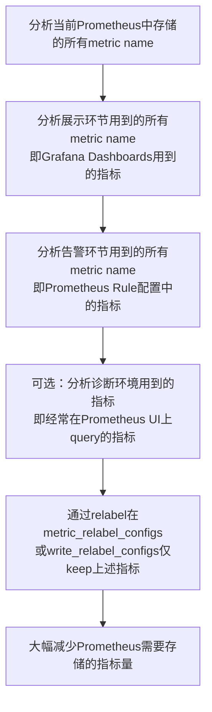

### 4.3 记录规则与预聚合：降低查询压力与存储开销

**预聚合（Recording Rule）可以对落地的指标数据做二次开发，将计算过程提前到写入端，减少查询端资源占用**[^20]。这一机制在高流失率场景下尤为重要，能够有效解决Dashboard查询慢和告警规则评估延迟的问题。

#### 4.3.1 预聚合的技术原理与核心价值

**某些查询可能需要在查询端进行大量的计算，导致查询端压力过大。预聚合规则可以将计算过程提前到写入端，尤其在大规模集群和复杂业务场景下可以有效降低PromQL的复杂度，从而提高查询性能**[^20]。

预聚合的核心价值体现在三个方面：

**第一，降低查询复杂度**。对于高流失率场景，直接查询原始指标可能需要扫描大量已"死亡"的时间序列。通过预聚合生成的新指标，查询时只需访问聚合后的低基数序列。

**第二，提升查询性能**。预聚合将复杂的PromQL计算（如rate、sum等）前置到写入阶段，查询时直接读取计算结果，显著缩短响应时间。

**第三，保障告警及时性**。告警规则可以直接引用预聚合指标，避免因复杂查询导致的评估延迟或超时。

#### 4.3.2 预聚合规则的命名规范

**预聚合规则命名的推荐格式：level:metric:operations**[^20][^21]。这一命名规范清晰表达了聚合的层级、原始指标和应用的操作，便于理解和维护。

| 命名组成 | 含义说明 | 示例 |
|---------|---------|------|
| level | 聚合级别，以及规则的输出标签 | `job`、`instance`、`path` |
| metric | 原始指标的名称 | `requests`、`apiserver_request` |
| operations | 应用于指标的操作列表，最新的操作在前面 | `rate5m`、`sum_rate10m` |

示例命名：
- `job_instance_mode:apiserver_request_total:avg_rate5m`
- `job:apiserver_request_total:sum_rate10m`
- `instance_path:requests:rate5m`[^20][^21]

#### 4.3.3 针对高基数指标的聚合降维策略

**Recording Rule的配置与开源Prometheus相同，以规则组（Rule Group）的形式存在，每个规则组可以有多条规则（Rules），聚合规则的名称必须符合Prometheus指标名称规范**[^20]。

以下是针对高流失率场景的预聚合规则配置示例：

```yaml
groups:
  - name: high_churn_aggregation
    interval: 60s
    rules:
      # 按deployment聚合，消除pod维度的高流失率
      - record: deployment:http_requests_total:sum_rate5m
        expr: sum by (deployment, method, status) (rate(http_requests_total[5m]))
        labels:
          aggregation_level: deployment
      
      # 按job聚合API服务器请求
      - record: job:apiserver_request_total:sum_rate10m
        expr: sum by (job)(rate(apiserver_request_total[10m]))
        labels:
          team: operations
      
      # 按namespace聚合容器资源使用
      - record: namespace:container_cpu_usage_seconds:sum_rate5m
        expr: sum by (namespace) (rate(container_cpu_usage_seconds_total[5m]))
```

**规则组的执行周期（interval）默认为60秒**，可根据业务需求调整。相同组中的规则以一定的间隔顺序执行，预聚合后的指标按照新的规则名字存入远端数据库[^20]。

#### 4.3.4 预聚合解决Dashboard与告警延迟的实践

**预聚合对于Dashboard场景非常适用，可以解决用户配置以及查询慢的问题**[^21]。在实际应用中，可以按以下步骤实施：

**步骤一：识别高频查询**。通过分析Grafana Dashboard的查询模式和Prometheus的查询日志，识别执行频繁且耗时较长的查询。

**步骤二：设计预聚合规则**。针对识别出的高频查询，设计对应的Recording Rule，将复杂计算前置。

**步骤三：更新Dashboard和告警规则**。将Dashboard和告警规则中的原始查询替换为预聚合指标的查询。

**步骤四：验证效果**。对比优化前后的查询响应时间和资源消耗，确认预聚合效果。

通过这一流程，**可以将原本需要扫描数万条时间序列的复杂查询，转化为仅需访问数十条预聚合序列的简单查询**，查询性能可提升数个数量级。

### 4.4 采集与存储层的调优策略

**当源头预防和采集链路优化仍无法完全解决问题时，从Prometheus服务器配置层面进行调优是进一步缓解高流失率影响的有效手段**。这些调优策略能够在不改变架构的前提下，最大化单机Prometheus的承载能力。

#### 4.4.1 采集端优化策略

**采集端优化的核心目标是控制数据摄入速率和采集目标规模**，主要包括以下几个维度：

**scrape_interval调整**：采集间隔直接影响数据摄入速率。**摄取率可通过公式`ingestion_rate = active_time_series / scrape_interval`计算**。适当延长scrape_interval（如从15秒调整为30秒）可以将摄取率减半，但需权衡监控精度的损失。

**sample_limit与series_limit配置**：Prometheus支持为每个采集目标配置样本数量和时间序列数量上限。当某个目标暴露的指标超过限制时，该次采集会被丢弃，从而防止单个异常目标拖垮整个系统。

```yaml
scrape_configs:
  - job_name: 'high_churn_service'
    scrape_interval: 30s
    sample_limit: 10000
    series_limit: 5000
    # ... 其他配置
```

**采集目标分片**：对于大规模采集场景，可以部署多个Prometheus实例，通过hashmod relabel动作将采集目标分散到不同实例：

```yaml
relabel_configs:
  - source_labels: [__address__]
    modulus: 3
    target_label: __tmp_hash
    action: hashmod
  - source_labels: [__tmp_hash]
    regex: 0
    action: keep
```

#### 4.4.2 存储层优化策略

**存储层优化的核心目标是平衡数据保留需求与资源消耗**，主要涉及以下参数：

**数据保留期调整**：Prometheus默认的数据保留期为15天。在高流失率场景下，缩短保留期可以加速"死亡"时间序列的清理，减少存储压力。但这需要与业务的历史数据查询需求进行权衡。

**TSDB压缩参数配置**：Prometheus TSDB支持配置块大小、压缩级别等参数。适当的压缩配置可以减少磁盘占用，但会增加CPU消耗。

**WAL配置优化**：WAL（预写日志）是保证数据持久性的关键机制。在高流失率场景下，可以通过调整WAL段大小和压缩参数来平衡持久性和性能。

下表总结了关键存储参数的调优建议：

| 参数 | 默认值 | 高流失率场景建议 | 影响说明 |
|-----|-------|-----------------|---------|
| `--storage.tsdb.retention.time` | 15d | 根据需求缩短至7d或更短 | 缩短可加速清理，但影响历史查询 |
| `--storage.tsdb.min-block-duration` | 2h | 保持默认或适当延长 | 延长可减少压缩频率 |
| `--storage.tsdb.max-block-duration` | 31d | 根据保留期调整 | 不应超过保留期的10% |
| `--storage.tsdb.wal-compression` | false | 建议启用 | 减少WAL磁盘占用 |

#### 4.4.3 资源配置与垃圾回收优化

**Prometheus在RAM中保存最近添加的活跃时间序列样本，因此其RAM使用率在很大程度上取决于活跃时间序列的数量**。合理的资源规划是保障系统稳定运行的基础。

**内存规划**：建议为Prometheus分配的内存至少为`活跃时间序列数 × 5KB`。例如，100万活跃时间序列需要至少5GB内存。考虑到GC开销和查询缓存，实际分配应在此基础上增加30-50%的余量。

**CPU规划**：CPU消耗主要来自数据采集、压缩和查询处理。**每秒接收80万个数据点算较健康的上限**[^22]。超过此阈值应考虑分片或架构升级。

**垃圾回收调优**：Go运行时的GC行为对Prometheus性能有显著影响。**启用内存自动限制功能（`--enable-feature=auto-gomemlimit`）可以让Prometheus根据容器内存限制自动调整GC行为**，避免因内存压力导致的频繁GC。

#### 4.4.4 多租户环境下的Quota管理

**监控系统通常为多租户系统，为保障系统的稳定性，一般会为不同租户分配一定的指标quota**[^1]。在托管Prometheus服务中，Quota管理是防止单个租户影响整体系统稳定性的关键机制。

有效的Quota管理策略包括：

**写入Quota**：限制每个租户的时间序列写入速率和总量，防止高流失率租户耗尽系统资源。

**查询Quota**：限制每个租户的查询并发数和单次查询扫描的样本数量，防止复杂查询影响其他租户。

**存储Quota**：限制每个租户的存储空间占用，确保资源公平分配。

### 4.5 面向大规模动态环境的架构演进方案

**当单机Prometheus无法满足需求时，分布式架构演进成为必然选择**。业界已形成多种成熟的扩展方案，各有其架构特点和适用场景。本节将系统评估三大主流方案——Thanos、Cortex和VictoriaMetrics，为企业提供架构选型指导。

#### 4.5.1 单机Prometheus的容量边界

**Prometheus单机容量上限为每秒接收80万个数据点，这算较健康的上限**[^22]。在评估是否需要架构升级前，应首先确认是否已充分利用单机优化手段。

**大部分场景其实不需要扩展，因为一般的数据量压根达不到Prometheus容量上限**[^22]。以机器监控为例：每台机器每个周期大概采集200个系统级指标，假设采集频率是10秒，平均每秒上报20个数据点，按80万数据点/秒计算，可以支持同时监控的机器量是4万台[^22]。

**若单个Prometheus真扛不住，也可拆成多个Prometheus，根据业务或地域拆都可以**[^22]。这种垂直分片是扩展Prometheus的最佳方式，也是架构演进的第一步。

#### 4.5.2 Prometheus联邦机制

**Prometheus内置支持的集群方式是联邦机制，即Prometheus数据的级联抓取**[^22]。联邦架构通过中心Prometheus从边缘Prometheus拉取数据，实现数据的统一视图。

**联邦机制中，中心端的Prometheus去抓取边缘Prometheus数据时，不应该把所有数据都抓取到中心，而是只抓取那些需要做聚合计算或其他团队也关注的指标**[^22]。这一原则对于高流失率场景尤为重要——边缘Prometheus消化本地的高基数数据，仅将聚合后的低基数指标上报中心。

```yaml
# 中心Prometheus的联邦抓取配置
scrape_configs:
  - job_name: 'federate'
    scrape_interval: 30s
    honor_labels: true
    metrics_path: '/federate'
    params:
      'match[]':
        # 通过正则匹配过滤出所有aggr:打头的指标
        # 这类指标都是通过Recording Rules聚合出来的关键指标
        - '{__name__=~"aggr:.*"}'
    static_configs:
      - targets:
          - '10.1.2.3:9090'
          - '10.1.2.4:9090'
```

**但中心Prometheus仍是瓶颈**[^22]，当规模进一步增长时，需要采用更强大的分布式方案。

#### 4.5.3 三大主流扩展方案对比

**Thanos、Cortex、VictoriaMetrics是目前最主流的Prometheus扩展方案**，它们从不同角度解决了Prometheus的扩展性问题。

| 方案 | 核心定位 | 架构特点 | 适用规模 | 复杂度 |
|-----|---------|---------|---------|-------|
| **Thanos** | Prometheus的"黄金外挂" | 边车模式，对象存储，全局查询 | 中大型，云上/混合环境 | 中等 |
| **Cortex** | 云原生横向扩展TSDB | 微服务架构，水平扩展，多租户 | 超大型，SaaS，百万实例级 | 高 |
| **VictoriaMetrics** | 高性能监控引擎 | 高压缩率存储，高性能写入 | 高写入量，极致性能场景 | 低 |

**Thanos最容易上手，最贴近原生Prometheus**[^23]。它通过Sidecar组件与现有Prometheus实例集成，将数据上传到对象存储实现长期保存，并通过Query组件提供全局查询能力。对于已有Prometheus部署且希望实现长期存储和跨集群查询的场景，Thanos是最自然的选择。

**Cortex最云原生，要依赖对象存储+微服务架构**[^23]。它将Prometheus的各个功能拆分为独立的微服务组件，每个组件都可以独立扩展。Cortex特别适合需要强大多租户能力的SaaS监控平台，但部署和运维复杂度较高。

**VictoriaMetrics是最性能怪兽**[^23]。它针对Prometheus的存储痛点进行了架构革新，**核心优势在于分布式集群设计与高压缩率存储引擎，能够以更低的资源消耗处理更大规模的指标数据**[^24]。VictoriaMetrics可以作为Prometheus的远程存储后端，也可以完全替代Prometheus。

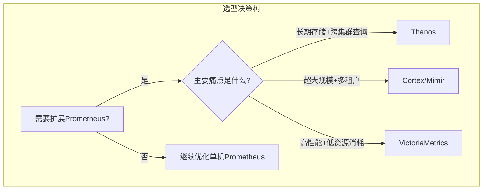

#### 4.5.4 高流失率场景的架构选型指导

**针对AI大模型和智能驾驶等高流失率典型场景，架构选型应重点考虑以下因素**：

**数据摄入能力**：高流失率意味着大量新时间序列的持续创建，需要架构具备高效的索引创建和数据写入能力。VictoriaMetrics在这方面表现突出，其存储引擎针对高基数场景进行了专门优化。

**存储效率**：短生命周期时间序列会产生大量"稀疏"数据，传统压缩算法效率下降。**VictoriaMetrics的高压缩率存储引擎能够以更低的资源消耗处理更大规模的指标数据**[^24]。

**查询性能**：高流失率场景下，查询需要扫描更多的时间序列。Thanos和VictoriaMetrics都支持查询时的降采样，可以显著提升长时间范围查询的性能。

**运维复杂度**：AI大模型和智能驾驶团队通常专注于业务开发，监控系统的运维投入有限。**VictoriaMetrics部署简单，可以作为单机或集群模式运行**，是降低运维负担的理想选择。

**火山引擎托管Prometheus服务VMP与火山方舟大模型服务平台、火山引擎智能驾驶数据服务的深度合作实践表明**[^1]，托管服务是解决高流失率问题的另一条路径——将底层架构的复杂性交给云厂商处理，业务团队专注于指标设计和告警配置。

#### 4.5.5 实施优先级与路径建议

基于上述分析，针对高流失率问题的解决方案实施应遵循以下优先级：

**P0（紧急止血）**：立即实施缓解策略，特别是Relabeling过滤和记录规则，以快速恢复系统稳定性和查询性能。这些措施见效快、风险低，可在数小时内完成部署。

**P1（中期根治）**：推行预防策略，建立指标设计规范和评审流程，从源头杜绝问题。这需要跨团队协作，通常需要数周到数月的持续推进。

**P2（长期规划）**：根据业务增长，评估并实施架构演进策略，选择适合的扩展方案，保障系统的可持续性。架构升级涉及较大的技术投入和风险，应在充分评估后谨慎实施。

**监控是基础设施，目的是为了解决问题，不要只朝着大而全去做，尤其是不必要的指标采集，浪费人力和存储资源**[^13]。这一原则应贯穿于解决方案的整个实施过程——每一项优化措施都应以解决实际问题为导向，避免过度设计。

## 5 云厂商托管Prometheus服务方案对比分析

随着云原生技术的普及和AI应用的快速扩展，企业在自建Prometheus集群时面临的高流失率挑战日益严峻。**主流云服务商针对这一痛点推出了托管Prometheus服务，通过底层架构优化、弹性扩展能力和专项功能增强，为企业提供了"开箱即用"的解决方案**。本章将以阿里云Prometheus服务为核心，系统对比AWS Managed Service for Prometheus和Google Cloud Managed Service for Prometheus，从架构设计、性能表现、成本模型和适用场景等维度进行深入评估，为企业选择合适的托管方案提供决策依据。

### 5.1 阿里云Prometheus服务的架构与高基数优化能力

阿里云作为国内领先的云服务提供商，其Prometheus服务在高基数与高流失率场景的优化方面积累了丰富的实践经验。**相比于开源版本Prometheus，阿里云的Prometheus服务无论是易用性、扩展性、性能均有大幅度提升**[^25]。

#### 5.1.1 核心架构与技术优势

阿里云Prometheus服务采用了深度优化的分布式架构，针对云原生监控的核心痛点进行了系统性增强。其技术优势主要体现在以下几个方面：

**水平分片能力**是阿里云Prometheus服务应对大规模数据的核心机制。通过将采集和存储负载分散到多个实例，系统能够突破单机Prometheus的容量瓶颈，支持更大规模的时间序列管理[^26]。

**深度查询优化**是另一项关键技术。阿里云Prometheus服务实现了算子下推、降采样等查询优化策略，能够显著提升长周期、大范围查询的性能[^26]。这对于高流失率场景尤为重要——当需要扫描大量"已死亡"时间序列时，查询优化能够有效降低响应延迟。

**弹性扩展机制**确保了系统在负载波动时的稳定性。与开源Prometheus需要手动扩容不同，托管服务能够根据数据摄入量和查询负载自动调整资源配置，避免因突发流量导致的性能劣化或OOM风险。

#### 5.1.2 高搅动率场景的专项优化

**在模拟的高搅动率场景下，阿里云Prometheus服务展现出显著优于开源版本的承载能力**。根据基准测试数据，阿里云服务承载的时间线数量最高可达约1434万条，且表现稳定；而同场景下自建开源Prometheus在约2300万条时间线时即出现内存耗尽问题，且资源消耗呈非线性增长，垂直扩容效率低下。

针对高流失率场景，阿里云Prometheus服务提供了一套完整的诊断与优化工具链：

| 优化策略 | 具体方法 | 适用场景 |
|---------|---------|---------|
| **诊断分析** | 利用UI或API识别高基数标签 | 问题定位阶段 |
| **数据精简** | 通过写入重配置丢弃不必要指标 | 快速止血 |
| **预聚合** | 使用Recording Rules聚合数据后丢弃原始高基数指标 | 中期优化 |
| **配置调优** | 增大抓取间隔，配置external_labels | 持续优化 |

**预聚合/预计算功能是阿里云Prometheus服务区别于开源版本的重要增强**。开源版本中并没有提供完整预聚合/预计算功能[^25]，而阿里云服务支持在写入侧对高基数指标进行聚合降维，从根本上减少存储的时间序列数量。

#### 5.1.3 查询性能的量化提升

**在长周期、并发查询场景下，阿里云Prometheus服务相较于开源版本展现出显著的性能优势**。以7天跨度的10个并发查询为例，阿里云服务的总体耗时约为开源版本的1/4（13秒 vs 53秒）。这一性能提升对于Dashboard加载、告警规则评估等高频查询场景具有重要的实际价值。

性能优势的来源可归纳为以下几点：

- **分布式查询引擎**：支持跨多个存储节点并行执行查询，充分利用集群计算能力
- **智能缓存机制**：对高频查询结果进行缓存，减少重复计算开销
- **索引优化**：针对高基数场景优化了倒排索引结构，加速时间序列匹配

### 5.2 AWS Managed Service for Prometheus的功能特性与扩展机制

**Amazon Managed Service for Prometheus（AMP）是一项高度可用且安全的托管式容器化系统监控服务**[^27]，专为大规模部署的容器环境提供指标数据和深入洞察。AWS在设计AMP时特别考虑了高基数数据的监控需求，使其成为处理动态基础设施监控挑战的有力选择。

#### 5.2.1 核心优势与架构特点

AWS AMP的核心优势体现在以下几个方面：

**自动扩展能力**是AMP最突出的特性之一。**在摄取和查询需求增长时自动扩展，并在大型容器部署中保持一致的响应时间**[^27]。这意味着用户无需关心底层资源的配置和扩容，服务会根据实际负载自动调整，有效应对高流失率场景下时间序列数量的剧烈波动。

**高基数指标监控**是AMP的设计重点之一。**AMP专门支持监控高基数数据并相应发出提醒——例如视频流、网络应用程序和来自IoT设备的时间序列数据**[^27]。这些场景天然具有标签值动态变化、时间序列生命周期短暂的特征，与AI大模型和智能驾驶领域的监控需求高度契合。

**安全性与合规性**方面，AMP与AWS安全服务深度集成，满足企业级安全性和合规性要求[^27]。这对于处理敏感业务数据的企业尤为重要。

**运营成本降低**是选择托管服务的重要考量。AMP显著降低了配置、升级和扩展独立Prometheus服务器的运营成本[^27]，使技术团队能够专注于业务监控策略而非基础设施运维。

#### 5.2.2 成本模型与优化策略

**AMP采用灵活的按需付费模型，无需前期投资或长期承诺**[^28]。其成本构成主要包括：

| 成本组成 | 计费方式 | 成本占比 |
|---------|---------|---------|
| 托管采集器（可选） | 按运行小时数和收集样本数量 | 较低 |
| 指标摄入 | 按摄入的指标样本数量 | **最高** |
| 存储费用 | 按存储的指标数据量 | 中等 |
| 查询费用 | 按执行查询时处理的样本数量 | 较低 |

**根据实践经验，指标摄入通常占据AMP总成本的最大比重，因此优化指标摄入策略成为控制AMP成本的关键**[^28]。

AWS提供了一套成本导向的优化方法论：

**识别并过滤未使用的指标**是最直接有效的优化手段。通过分析Prometheus告警规则配置和Grafana仪表板可视化中实际使用的指标，可以识别出大量被采集但从未被查询的"僵尸指标"。**实际案例显示，通过这种方法可以实现显著的成本节约——实验中成功减少了64%的AMP费用**[^28]。

**源头控制策略**包括调整抓取间隔和禁用不必要的Exporter收集器。适当延长scrape_interval可以直接减少样本摄入量，而精简Exporter配置则能从根本上减少暴露的指标数量。

#### 5.2.3 典型应用场景

基于AMP的架构特点和功能优势，其最适合以下场景：

**IoT设备监控**：大量设备产生的时间序列数据具有高度动态性，设备上下线频繁导致时间序列的持续创建和消亡。AMP的自动扩展能力和高基数支持使其能够从容应对这一挑战。

**视频流应用**：视频流服务的监控指标通常包含会话ID、流ID等高基数标签，且用户会话的生命周期短暂。AMP专门针对此类场景进行了优化。

**电商平台**：促销活动期间的流量峰值会导致监控数据量剧增，AMP的弹性扩展能力确保了监控系统在高峰期的稳定性。

### 5.3 Google Cloud Managed Service for Prometheus的成本控制与集成能力

**Google Cloud Managed Service for Prometheus作为Cloud Monitoring的重要组成部分，其最显著的特点是将成本控制机制与监控优化目标强绑定**[^29]。通过独特的计费模型设计，Google Cloud激励用户从源头优化指标采集策略。

#### 5.3.1 计费模型的独特设计

**Google Cloud托管Prometheus服务按样本摄入量计费，摄入的样本数量是成本的主要贡献者**[^29]。这一计费模型的设计哲学是：**高基数问题直接反映在账单上，优化行为能立即产生可见的成本收益**。

与AWS AMP的多维度计费相比，Google Cloud的计费模型更加简洁直接：

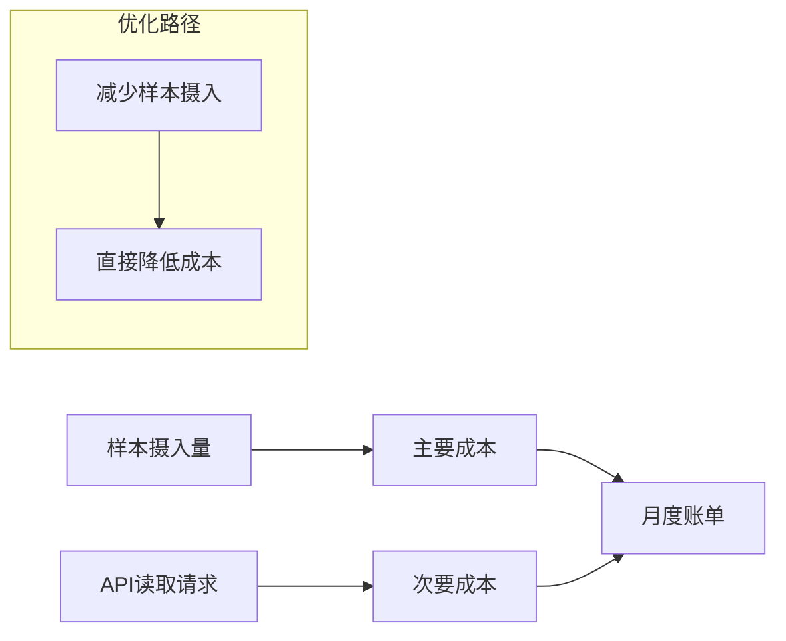

**这种计费模型的优势在于成本透明度极高**。技术团队可以清晰地将每一项指标优化措施与成本节约直接关联，便于量化优化效果和制定预算。

#### 5.3.2 成本控制机制

Google Cloud提供了多层次的成本控制机制[^30]：

**使用量监控与预警**：用户可以设置成本阈值，当样本摄入量接近预算上限时触发告警，避免意外的成本超支。

**免费额度**：Google Cloud Observability产品按数据量或使用量定价，用户可以使用免费数据使用配额开始使用，无需前期费用或承诺[^30]。这为小规模项目和概念验证提供了低门槛的入门途径。

**精细化计费报告**：详细的计费报告帮助用户识别成本热点，定位需要优化的高基数指标来源。

#### 5.3.3 与Cloud Monitoring的深度集成

作为Google Cloud可观测性解决方案的一部分，托管Prometheus服务与Cloud Monitoring实现了深度集成：

**统一的数据存储**：Prometheus指标与其他Cloud Monitoring数据存储在同一后端，便于跨数据源的关联分析。

**一致的查询体验**：用户可以使用PromQL查询Prometheus指标，同时利用Cloud Monitoring的原生查询能力进行补充分析。

**集成的告警管理**：告警规则可以统一配置和管理，无需在多个系统间切换。

#### 5.3.4 适用场景与局限性

**Google Cloud托管Prometheus服务最适合已深度使用Google Cloud生态、且对监控成本敏感的用户**。其计费模型迫使团队持续优化指标摄入，适合追求精细化运营的场景。

然而，这种成本驱动的模型也存在一定局限性：

- **对于需要采集大量高基数指标的场景，成本可能快速攀升**
- **计费模型的简单性意味着缺乏更细粒度的成本控制选项**
- **与非Google Cloud环境的集成可能需要额外的配置工作**

### 5.4 三大云厂商方案的综合对比与选型指导

基于前述分析，本节将从多个关键维度对三大云厂商的托管Prometheus服务进行系统性对比，并结合不同业务场景提供选型建议。

#### 5.4.1 核心能力对比

下表从高流失率处理能力、性能表现、成本模型等维度对三大方案进行综合对比：

| 对比维度 | 阿里云Prometheus | AWS AMP | Google Cloud |
|---------|-----------------|---------|--------------|
| **高流失率优化** | 水平分片、预聚合、深度查询优化 | 自动扩展、专为高基数设计 | 计费模型驱动优化 |
| **承载能力** | 基准测试显示可达1434万时间线 | 自动扩展，无明确上限 | 按使用量计费，弹性扩展 |
| **查询性能** | 7天并发查询耗时约为开源1/4 | 大型部署保持一致响应时间 | 与Cloud Monitoring集成 |
| **成本模型** | 基于存储、读写等资源使用量 | 按摄入、存储、查询分别计费 | **按样本摄入量计费** |
| **预聚合支持** | 完整支持 | 需用户自行配置 | 需用户自行配置 |
| **运维复杂度** | 低（托管服务） | 低（托管服务） | 低（托管服务） |
| **生态集成** | 阿里云生态 | AWS生态（Grafana、OpenTelemetry） | Google Cloud生态 |

#### 5.4.2 高流失率场景的方案匹配

**针对AI大模型、智能驾驶等高流失率典型场景，不同云厂商方案的适用性存在差异**：

**阿里云Prometheus服务**最适合以下场景：
- 对查询性能、大规模集群监控稳定性要求极高的场景
- 存在大量Pod频繁创建销毁（高流失率）的Kubernetes环境
- 需要进行复杂、长期历史数据分析和告警的企业
- **火山引擎托管Prometheus服务VMP与火山方舟大模型服务平台、火山引擎智能驾驶数据服务的深度合作实践证明了托管服务在这些场景的有效性**[^1]

**AWS AMP**最适合以下场景：
- IoT、视频流、电商等天生具有高基数监控数据的业务
- 工作负载波动大、需要服务自动弹性扩展的应用
- 已深度使用AWS生态、希望统一监控方案的企业

**Google Cloud托管Prometheus服务**最适合以下场景：
- 已深度使用Google Cloud生态的用户
- 对监控成本敏感、希望成本与用量清晰挂钩的场景
- 追求精细化运营、愿意为成本优化调整监控实践的团队

#### 5.4.3 成本效益分析

**三大云厂商的成本效益模型各有侧重**：

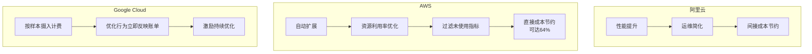

**阿里云**的成本效益主要来自性能提升和运维简化。通过技术手段减少数据量间接控制成本，同时避免了自建所需的高规格硬件投入和运维人力成本。

**AWS AMP**的成本效益来自自动扩展带来的资源利用率优化。**通过识别并过滤未使用指标可大幅降低成本**，调整采集频率也能实现直接的成本节约。

**Google Cloud**的成本效益模型最直接——成本与高基数问题直接挂钩，优化行为能立即反映在账单上，激励团队从源头控制指标设计和采集。

#### 5.4.4 选型决策框架

基于上述分析，为企业提供以下选型决策框架：

**步骤一：评估业务场景特征**
- 时间序列规模：百万级以下可考虑单机优化，百万级以上建议托管服务
- 流失率水平：高流失率场景优先考虑阿里云或AWS
- 成本敏感度：高度成本敏感可考虑Google Cloud的透明计费模型

**步骤二：考量技术栈匹配度**
- 已使用阿里云：优先考虑阿里云Prometheus服务
- 已使用AWS：优先考虑AWS AMP
- 已使用Google Cloud：优先考虑Google Cloud托管服务

**步骤三：评估运维能力与预算**
- 运维团队规模有限：托管服务是最佳选择
- 有专业SRE团队：可考虑自建方案配合云厂商存储后端

**综合建议**：
- 若**性能与稳定性**是首要考量，且业务负载复杂多变，阿里云是强有力的选择
- 若业务属于**原生高基数领域**（如IoT），且希望服务能无缝弹性扩展，AWS AMP更具针对性
- 若团队追求**极致的成本透明度和控制力**，并愿意为此调整监控实践，Google Cloud的模型可能带来更大的长期效益

**无论选择哪家云厂商，成功的关键都在于：遵循合理设计指标、按需采集、定期聚合与清理等通用最佳实践，并结合服务商提供的特有工具进行持续优化**。对于AI训练、智能驾驶等极端高流失率场景，可借鉴写入侧预聚合、查询下推等高级架构方案，充分发挥托管服务的技术优势。

## 6 总结与展望：构建稳健的Prometheus监控体系

本章作为研究报告的收尾章节，将系统性总结应对Prometheus高流失率问题的核心原则与关键策略，为不同场景的企业提供差异化的方案组合建议，并基于云原生技术演进趋势和AI驱动的智能运维发展方向，对未来监控体系的发展提出前瞻性见解，帮助企业在技术选型和架构规划中把握长期方向。

### 6.1 高流失率治理的核心原则与关键策略总结

**高流失率问题的有效治理需要建立系统化的方法论框架**，贯穿从问题诊断到持续优化的完整生命周期。基于本报告的深入分析，可将治理原则归纳为"标本兼治、预防优先、分层治理、持续迭代"四大核心要素。

#### 6.1.1 方法论框架的核心要素

**"标本兼治"强调同时解决表面症状与根本原因**。高流失率的表面症状包括内存消耗激增、查询性能下降、告警延迟等，而根本原因则是动态标签值的频繁变更和不当的指标设计。治理策略应同时覆盖紧急止血措施（如Relabel过滤）和长期根治方案（如指标设计规范化）。

**"预防优先"要求将治理重心前移至源头**。相较于事后补救，在指标埋点阶段就遵循最佳实践，不仅能从根本上杜绝问题的发生，还能显著降低后续运维和优化的复杂度。**从指标设计源头避免高流失率标签的产生，是治理该问题最根本、最有效的策略**。

**"分层治理"确保策略的精准匹配**。不同层级的问题需要对应层级的解决方案：源头层面的指标设计规范、采集层面的Relabel配置、查询层面的预聚合策略、存储层面的参数调优、架构层面的分布式演进。

**"持续迭代"保障治理效果的可持续性**。监控系统的负载和业务需求持续演变，治理策略需要定期评估和调整，形成闭环优化机制。

#### 6.1.2 完整技术策略体系总结

下表系统梳理了本报告涵盖的完整技术策略体系：

| 策略层级 | 核心策略 | 适用场景 | 实施优先级 | 预期效果 |
|---------|---------|---------|-----------|---------|
| **源头预防** | 指标与标签设计规范 | 新系统建设、指标埋点阶段 | P1（中期根治） | 从根本上杜绝高流失率问题 |
| **采集链路** | Relabel配置优化（Allowlisting/Denylisting） | 使用第三方Exporter、历史系统 | P0（紧急止血） | 快速减少不必要指标摄入 |
| **查询优化** | 记录规则与预聚合 | Dashboard查询慢、告警评估延迟 | P0（紧急止血） | 显著提升查询性能，保障告警及时性 |
| **存储调优** | 数据保留期、压缩参数、资源配置 | 单机Prometheus优化 | P2（持续优化） | 平衡资源消耗与数据保留需求 |
| **架构演进** | Thanos/Cortex/VictoriaMetrics | 大规模动态环境、超出单机容量 | P2（长期规划） | 突破单机瓶颈，实现水平扩展 |
| **托管服务** | 云厂商Prometheus服务 | 运维资源有限、追求开箱即用 | 视具体情况 | 将架构复杂性交给云厂商 |

#### 6.1.3 关键策略的实施要点

**指标设计规范的核心要点**包括：严禁将Pod名称、容器ID、用户ID等动态高基数值作为标签；单个指标的标签数建议不超过5个；使用层级化稳定标识符替代动态的Pod名称。

**Relabel配置的实施要点**包括：利用Mimirtool等工具分析实际使用的指标，精确配置Allowlisting规则；**实际案例显示，通过这种方法可以实现将近5倍的精简率**[^31]。

**预聚合策略的实施要点**包括：遵循`level:metric:operations`的命名规范；按deployment、namespace等稳定维度聚合，消除pod维度的高流失率；规则组执行周期根据业务需求调整。

### 6.2 面向不同场景的推荐方案组合与实施路径

**不同业务规模、技术成熟度和资源约束的企业，应选择差异化的方案组合**。本节将针对三类典型场景提供具体的方案建议和实施路径。

#### 6.2.1 中小规模场景的轻量级优化方案

**适用条件**：活跃时间序列数量在百万级以下，流失率问题尚未导致系统性风险，运维团队规模有限。

**推荐方案组合**：

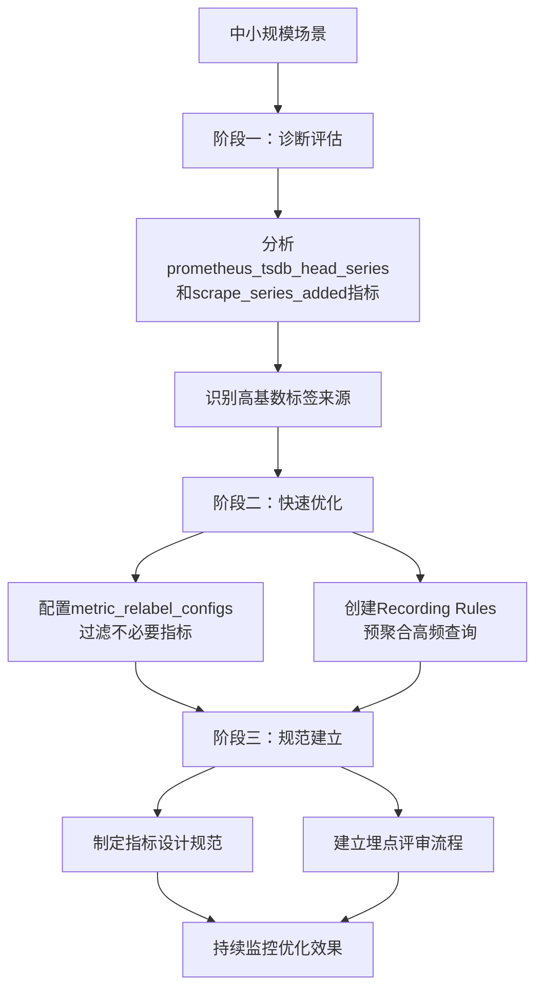

**实施路径与里程碑**：
- **第1周**：完成诊断评估，输出高基数标签分析报告
- **第2-3周**：实施Relabel配置和预聚合规则，预期减少30-50%的时间序列
- **第4周及以后**：建立指标设计规范，纳入开发流程

#### 6.2.2 大规模动态环境的分布式架构方案

**适用条件**：活跃时间序列数量在百万级以上，单机Prometheus已接近容量上限，存在跨集群、跨地域的监控需求。

**推荐方案组合**：

| 阶段 | 核心任务 | 技术选型建议 | 关键里程碑 |
|-----|---------|-------------|-----------|
| **阶段一** | 垂直分片 | 按业务或地域拆分为多个Prometheus实例 | 单实例负载降至安全阈值 |
| **阶段二** | 联邦聚合 | 配置联邦抓取，仅上报聚合后的关键指标 | 实现跨集群统一视图 |
| **阶段三** | 长期存储 | 部署Thanos或VictoriaMetrics | 突破本地存储限制 |
| **阶段四** | 全局查询 | 配置全局查询层，实现跨集群关联分析 | 完整分布式架构落地 |

**架构选型指导**：
- **Thanos**最适合已有Prometheus部署、希望实现长期存储和跨集群查询的场景，**最容易上手，最贴近原生Prometheus**[^32]
- **VictoriaMetrics**最适合高写入量、追求极致性能的场景，**核心优势在于分布式集群设计与高压缩率存储引擎**[^33]
- **Cortex/Mimir**最适合需要强大多租户能力的SaaS监控平台

#### 6.2.3 AI大模型与智能驾驶的专项治理方案

**适用条件**：存在大量短生命周期任务（Kubernetes Job），Pod名称等标签变化极为频繁，传统优化手段效果有限。

**专项治理策略**：

**第一，采集端聚合降维**。**在采集端对高流失率标签进行聚合，仅生成并存储业务关心的聚合维度的指标**。例如，对于AI训练任务，按`job_name`或`node_pool`维度聚合，而非记录每个Worker Pod的独立指标。

**第二，使用稳定标识符替代动态标签**。将`pod_name`替换为`deployment_name`、`statefulset_name`或`job_name`等更高层级的稳定标识符。

**第三，托管服务加速落地**。**火山引擎托管Prometheus服务VMP与火山方舟大模型服务平台、火山引擎智能驾驶数据服务的深度合作实践表明**，托管服务能够有效解决这些场景下的监控挑战，将底层架构的复杂性交给云厂商处理。

**第四，GPU监控专项优化**。针对AI场景的GPU监控需求，**腾讯云可观测平台Prometheus推出的GPU无缝集成方案，具备自动化配置、智能指标发现及全链路监控能力，能够彻底消除手动操作的高门槛与低效率问题**[^34]。

### 6.3 可观测性融合与统一监控体系的发展趋势

**监控体系正从单一的指标监控向整合日志、指标、追踪的全栈可观测性演进**。这一趋势对于高流失率问题的治理具有深远影响，因为融合的可观测性平台能够提供更全面的诊断能力和更灵活的数据处理策略。

#### 6.3.1 三大可观测性支柱的融合趋势

**Prometheus生态正深度集成至新一代可观测性平台，提供PB级存储、全局视图及增强的关联分析能力**[^35]。这种融合体现在以下几个层面：

**数据层融合**：指标、日志、链路追踪数据存储在统一的后端，支持跨数据源的关联查询。例如，当告警触发时，可以自动关联相关的日志条目和追踪链路，加速故障定位。

**查询层融合**：统一的查询接口支持同时检索多种类型的可观测性数据。**观测云作为新一代可观测性平台，通过全面兼容Prometheus生态，实现了从数据采集、存储、查询到可视化的全链路无缝对接**[^35]。

**分析层融合**：基于多源数据的智能分析能力，如服务拓扑自动发现、异常模式识别、根因推断等，为运维决策提供更全面的依据。

#### 6.3.2 OpenTelemetry与开放标准的发展

**OpenTelemetry作为CNCF的重要项目，正在成为可观测性数据采集的事实标准**。其对Prometheus生态的影响包括：

**数据格式标准化**：OpenTelemetry定义了统一的指标、日志、追踪数据模型，便于不同系统间的数据交换和集成。

**采集器统一**：OpenTelemetry Collector可以同时采集多种类型的可观测性数据，并支持多种后端存储，包括Prometheus兼容的存储系统。

**生态互通**：基于开放标准，企业可以更灵活地选择和组合不同厂商的可观测性工具，避免厂商锁定。

#### 6.3.3 统一可观测性平台对高流失率治理的影响

**统一可观测性平台为高流失率问题提供了新的治理思路**：

**高基数信息分流**：将用户ID、会话ID等高基数信息从指标标签中剥离，转而记录到日志系统或通过Exemplar机制关联到追踪系统。这种分流策略能够在保留诊断信息的同时，有效控制指标的基数。

**跨数据源关联分析**：当指标数据因高流失率而存在断点时，可以通过关联日志和追踪数据补充上下文信息，提升故障诊断的完整性。

**智能数据治理**：统一平台能够基于数据使用情况自动识别低价值指标，并提供优化建议，实现数据治理的智能化。

### 6.4 AI驱动的智能运维与监控体系革新展望

**大模型技术正在重构运维领域的工作方式，从根本上改变运维人员与监控系统的交互模式**[^31]。这一趋势将对Prometheus监控体系产生深远影响，推动监控从"被动响应"向"主动预测与自愈"转型。

#### 6.4.1 大模型驱动的智能运维核心能力

**典型的大模型运维系统由三层构成**[^31]：
- **数据层**：融合日志、指标、链路追踪等异构数据，通过向量数据库实现结构化存储
- **模型层**：基于预训练大模型微调的运维专用模型，支持自然语言查询、异常检测和自动化修复
- **应用层**：提供可视化平台（如Grafana+LLM插件）、API接口和低代码工具，覆盖监控、告警、根因分析等场景

**智能异常检测与根因分析**是大模型在运维领域的核心应用。**大模型通过分析历史故障模式，结合实时数据流，实现"无监督学习+因果推理"**[^31]。例如，模型可识别CPU使用率、内存泄漏、网络延迟三者间的隐性关联，提供超越传统阈值告警的智能诊断能力。

**自动化修复与预案生成**进一步提升了运维效率。**大模型可生成可执行的修复脚本（如Kubernetes配置调整、SQL优化），并通过合成数据验证其有效性**[^31]。这种能力对于高流失率场景尤为重要——当系统因资源压力出现性能劣化时，智能运维系统可以自动触发扩容或配置调整。

#### 6.4.2 自然语言运维（Vibe Ops）的兴起

**MCP（Model Context Protocol）作为近期最火的技术之一，正在重新定义运维领域的工作方式**[^36]。通过MCP，运维人员可以使用自然语言直接与监控系统交互，无需记忆复杂的PromQL语法或命令行操作。

**Vibe Ops（氛围运维）的核心价值**包括[^36]：
- **真正的智能化运维**：通过自然语言直接操作监控系统，无需记忆复杂命令
- **统一运维入口**：一个对话界面搞定数据库管理、监控查询、故障诊断
- **知识零门槛**：新手也能快速上手，老手效率倍增
- **实时智能分析**：基于监控数据的智能问答，快速定位问题根因

**AutoGPT与Prometheus监控集成**是这一趋势的典型实践。**通过在AutoGPT内部埋入轻量级的Prometheus指标，可以实现对任务流、工具调用、错误率等维度的实时洞察**[^37]。例如，在Grafana仪表盘上看到`aigent_active_steps`在过去十分钟内几乎没有变化，立刻提示代理可能卡住了。

#### 6.4.3 AI对高流失率问题治理的影响

**AI技术为高流失率问题的治理提供了新的可能性**：

**智能指标优化建议**：基于大模型的指标分析能力，可以自动识别高基数标签来源，并生成优化建议。例如，分析指标使用模式后，推荐哪些指标可以通过预聚合降维，哪些标签应该移除。

**预测性容量规划**：**结合时间序列预测与大模型的上下文理解能力，实现动态资源分配**[^31]。模型可以根据历史流量和业务活动预测未来的时间序列增长趋势，提前进行容量规划。

**自适应告警阈值**：**传统阈值告警容易产生误报或漏报，大模型通过分析历史数据模式自动识别异常**[^38]。这种动态阈值比固定阈值更精准，能够有效减少告警噪音。

#### 6.4.4 从"人工响应式运维"向"AI主动式运维"的转型

**2024年是大模型与运维深度融合的关键年**[^31]。企业需从数据治理、模型选型、组织协同三方面系统推进，实现运维范式的根本转型：


**这一转型对Prometheus监控体系的影响**包括：监控系统将从单纯的数据采集和存储平台，演进为具备AI洞察力的智能运维中枢；运维人员的角色将从"告警响应者"转变为"AI运维策略制定者"；监控数据的价值将从"故障发现"延伸到"业务洞察"和"决策支持"。

### 6.5 企业构建稳健监控体系的行动建议

基于本报告的系统分析，为企业技术决策者和运维团队提供以下可操作的行动建议，帮助构建稳健、可扩展的Prometheus监控体系。

#### 6.5.1 建立指标设计评审机制

**指标设计是监控体系的源头，建立规范化的评审机制是预防高流失率问题的关键**。

**评审流程建议**：
1. **设计阶段**：开发团队在埋点前提交指标设计文档，包括指标名称、标签定义、预期基数
2. **评审阶段**：SRE或监控团队审核设计是否符合规范，特别关注标签的稳定性和基数控制
3. **验证阶段**：在测试环境验证实际产生的时间序列数量，确认与预期一致
4. **上线阶段**：灰度发布后监控新增指标的基数变化，及时发现异常

**评审清单要点**：
- 是否存在动态标签值（如Pod名称、用户ID）？
- 单个指标的标签数是否超过5个？
- 标签值是否可枚举且基数可控？
- 是否有更稳定的标识符可以替代动态标签？

#### 6.5.2 制定监控成本优化策略

**监控成本与高基数问题直接相关，建立成本意识是推动优化的重要驱动力**。

**成本优化策略框架**：

| 优化维度 | 具体措施 | 预期效果 |
|---------|---------|---------|
| **指标精简** | 定期分析并清理未使用指标 | 减少存储和查询成本 |
| **采集优化** | 调整scrape_interval，精简Exporter配置 | 降低数据摄入量 |
| **预聚合** | 对高频查询创建Recording Rules | 减少查询资源消耗 |
| **保留期管理** | 根据业务需求调整数据保留期 | 控制存储成本 |
| **架构选型** | 评估自建vs托管服务的总体拥有成本 | 优化长期投入 |

**成本监控指标**：建议将监控系统自身的成本指标（如时间序列数量、存储使用量、查询资源消耗）纳入常规监控范围，实现成本的可视化和趋势分析。

#### 6.5.3 规划架构演进路线图

**监控架构需要与业务增长同步演进，提前规划能够避免被动应对**。

**架构演进路线图建议**：

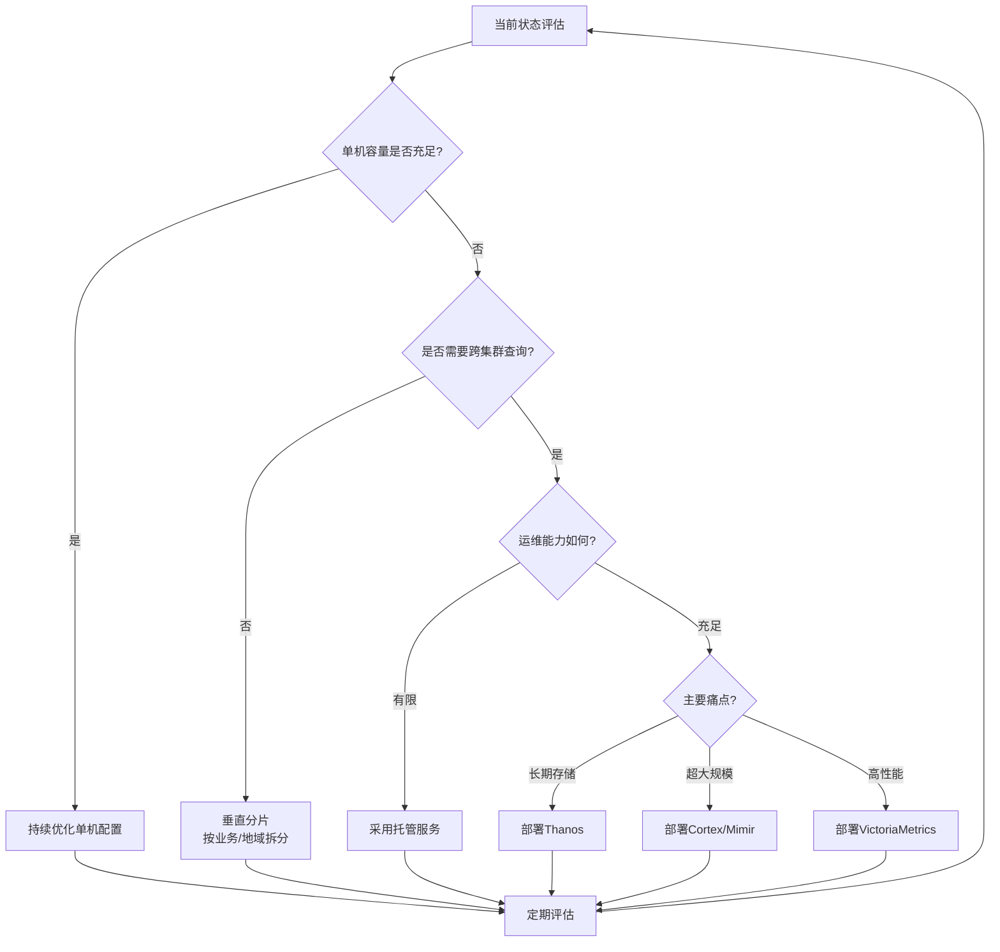

**关键决策点**：
- **单机容量阈值**：每秒80万数据点是较健康的上限，接近此阈值时应启动架构评估
- **跨集群需求**：当存在多集群、多地域监控需求时，应考虑分布式方案
- **运维投入**：运维资源有限时，托管服务是降低复杂度的有效选择

#### 6.5.4 培养监控运维专业能力

**监控系统的有效运营需要专业的技术能力支撑**。

**能力建设建议**：
- **PromQL深度掌握**：运维团队应深入理解PromQL的查询优化技巧，特别是rate、histogram_quantile等函数的使用场景和性能影响
- **TSDB原理理解**：了解Prometheus TSDB的存储机制，有助于制定更有效的优化策略
- **云厂商服务熟悉**：掌握主流云厂商托管服务的功能特性和最佳实践，便于技术选型和问题排查
- **可观测性全局视野**：理解指标、日志、追踪的融合趋势，为监控体系的长期演进做好准备

#### 6.5.5 持续优化迭代的重要性

**监控是基础设施，目的是为了解决问题，不要只朝着大而全去做，尤其是不必要的指标采集，浪费人力和存储资源**。这一原则应贯穿于监控体系建设的全过程。

**持续优化机制建议**：
1. **定期健康检查**：每月评估监控系统的资源使用情况、查询性能和告警有效性
2. **指标生命周期管理**：建立指标的创建、使用、清理全流程管理机制
3. **反馈闭环**：收集业务团队对监控数据的使用反馈，持续改进指标设计
4. **技术跟踪**：关注Prometheus生态和可观测性领域的技术发展，适时引入新技术

**监控系统作为基础设施的核心定位**意味着其稳定性和可靠性直接影响业务系统的可观测能力。**需要处理的告警才发出来，发出来的告警必须得到处理**——这一原则不仅适用于业务告警，也适用于监控系统自身的运维。构建稳健的Prometheus监控体系，需要技术团队在架构设计、日常运维和持续优化三个层面形成系统化的能力，才能在云原生时代的复杂环境中保障可观测性的有效性和可持续性。

# 参考内容如下：
[^1]:[Prometheus 性能调优:大模型和智能驾驶可观测的高基数问题](https://developer.volcengine.com/articles/7490493002389929996)
[^2]:[使用Prometheus 高效监控 Kubernetes 应用:从部署到实战指南](https://developer.baidu.com/article/detail.html?id=4067630)
[^3]:[Kubernetes 排障实战:用 Prometheus 提升集群可用性和排障效率](https://cloud.tencent.com/developer/article/2495420)
[^4]:[对比开源丨Prometheus 服务多场景存储压测全解析](https://developer.aliyun.com/article/1165145)
[^5]:[【博客645】prometheus监控体系中的重要概念](https://blog.csdn.net/qq_43684922/article/details/131095243)
[^6]:[Prometheus用了几年,这些坑你注意过没?](http://www.live400.com/newsdetail/id/68.html)
[^7]:[Prometheus 性能调优 - 什么是高基数问题以及如何解决?](https://developer.aliyun.com/article/1436635)
[^8]:[使用实例诊断分析 Prometheus 问题](https://cloud.tencent.com/document/practice/1416/109057)
[^9]:[Prometheus性能调优:内存和CPU的资源优化](https://blog.csdn.net/gitblog_00685/article/details/152349426)
[^10]:[30次PR实现Prometheus内存使用减半-腾讯云开发者社区-腾讯云](https://cloud.tencent.com/developer/article/2402331)
[^11]:[【博客644】How to optimize PromQL and MetricsQL queries](https://blog.csdn.net/qq_43684922/article/details/131095135)
[^12]:[prometheus的查询接口Instant queries 的缺点 ](https://developer.aliyun.com/article/1506563)
[^13]:[监控神器Prometheus用不对,也就是把新手村的剑](https://www.cloud.tencent.com/developer/article/1660745)
[^14]:[Prometheus的函数和计算公式](https://blog.csdn.net/wc1695040842/article/details/107013799/)
[^15]:[prometheus实战之二:使用常见指标](https://cloud.tencent.com/developer/article/2278054)
[^16]:[开源监控系统 Prometheus 最佳实践](https://cloud.tencent.com/developer/article/1902178)
[^17]:[深度好文:Prometheus Metrics 设计的最佳实践和应用实例!](http://baijiahao.baidu.com/s?id=1709256859922616647&wfr=spider&for=pc)
[^18]:[「译文」通过 Relabel 减少 Prometheus 指标的使用量](https://developer.aliyun.com/article/1436633)
[^19]:[如何精简 Prometheus 的指标和存储占用](https://cloud.tencent.com/developer/article/2183178)
[^20]:[配置RecordingRule.yaml设置预聚合规则-可观测监控 Prometheus 版-阿里云](https://help.aliyun.com/document_detail/356529.html)
[^21]:[预聚合概述](https://cloud.tencent.com/document/product/1416/56005)
[^22]:[Prometheus监控系统存储容量优化攻略,让你的数据安心保存!](https://cloud.tencent.com/developer/article/2278068)
[^23]:[Prometheus 撑不住了?上 Thanos、Cortex、M3!一篇给你讲明白大规模监控的江湖-腾讯云开发者社区-腾讯云](https://cloud.tencent.com/developer/article/2596059)
[^24]:[突破Prometheus存储瓶颈:VictoriaMetrics高性能替代方案全解析](https://blog.csdn.net/gitblog_01046/article/details/152350544)
[^25]:[对比开源丨Prometheus 服务多场景存储压测全解析](https://developer.aliyun.com/article/1153027)
[^26]:[可观测监控 Prometheus 版性能调优-阿里云](https://www.aliyun.com/sswb/869294.html)
[^27]:[Amazon Managed Service for Prometheus](https://aws.amazon.com/cn/prometheus/)
[^28]:[优化Amazon EKS 集群的 Amazon Managed Service for Prometheus 成本 | 亚马逊AWS官方博客](https://aws.amazon.com/cn/blogs/china/taking-control-of-amp-spending-on-amazon-eks-clusters-strategies-for-cost-optimization/)
[^29]:[Learner Reviews & Feedback for Reduce Costs for the Managed Service for Prometheus Course | Coursera](https://pt.coursera.org/learn/googlecloud-reduce-costs-for-the-managed-service-for-prometheus-81tr5/reviews)
[^30]:[Pricing | Google Cloud Observability | Google Cloud](https://cloud.google.com/stackdriver/pricing?authuser=1&hl=de)
[^31]:[2024大模型时代：智能运维的革新路径与实践指南](https://cloud.baidu.com/article/3826438)
[^32]:[深度解析:Prometheus云原生监控体系构建与最佳实践](https://cloud.baidu.com/article/3823268)
[^33]:[2025运维监控系统选型指南:6大主流IT运维监控系统核心特性与场景适配](https://cloud.tencent.com/developer/article/2571372)
[^34]:[赋能AI 运维革新:Prometheus 容器化 GPU 监控一站式解决方案](https://cloud.tencent.com/developer/article/2516486)
[^35]:[观测云与Prometheus生态深度融合:可观测性方案的全面升级](https://cloud.baidu.com/article/4067702)
[^36]:[未来已来！基于 MCP 打造 Milvus 智能运维新范式，一文带你体验氛围运维(Vibe Ops)的效率革命！-腾讯云开发者社区-腾讯云](https://cloud.tencent.com/developer/article/2532725)
[^37]:[AutoGPT与Prometheus监控集成：可观测性增强-CSDN博客](https://blog.csdn.net/weixin_33506815/article/details/155925521)
[^38]:[如何用Prometheus和AI优化你的监控系统](https://blog.csdn.net/GoldenleafRaven13/article/details/156635051)
