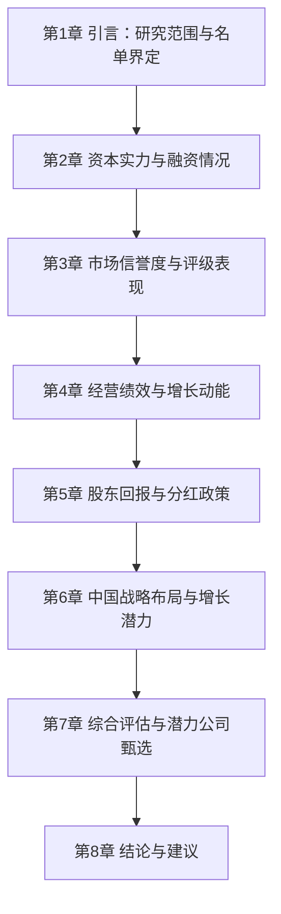
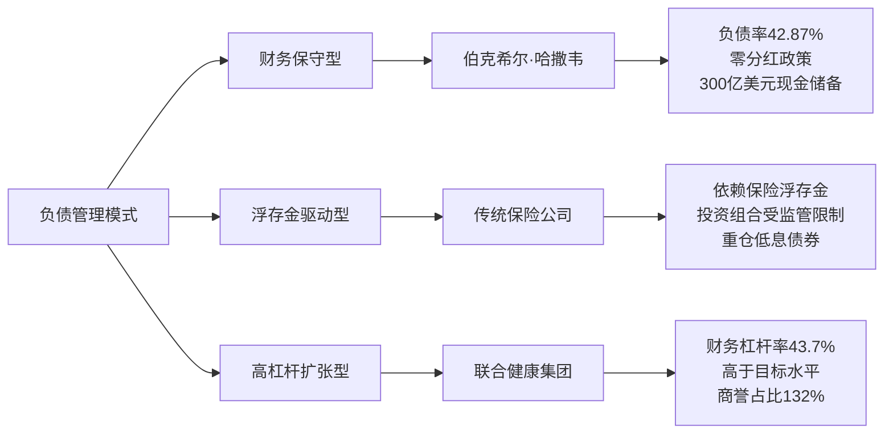
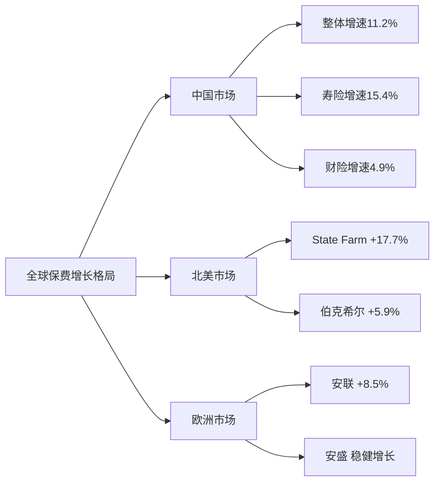
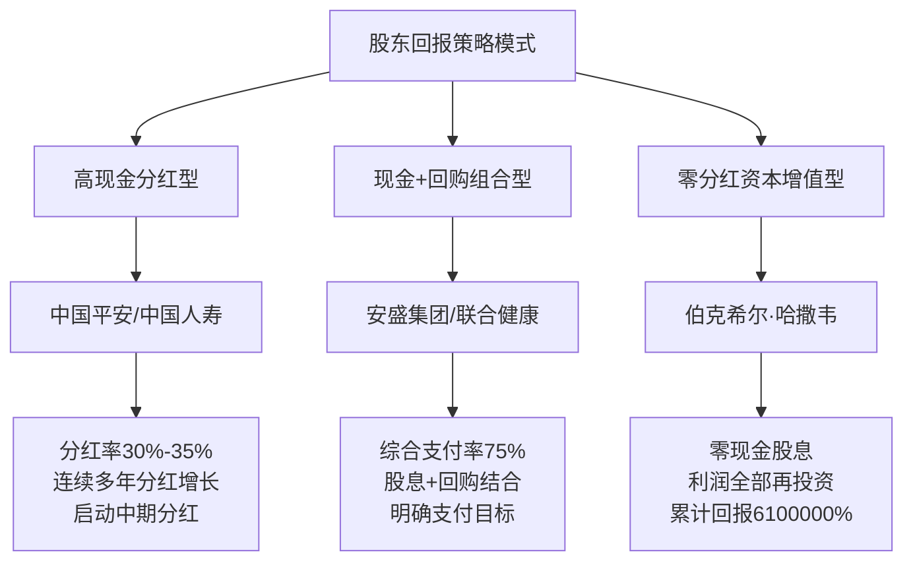
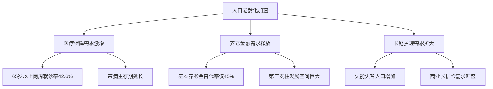
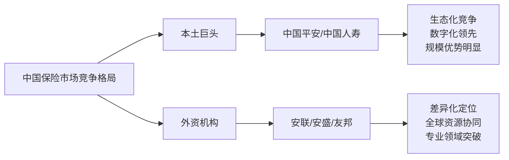
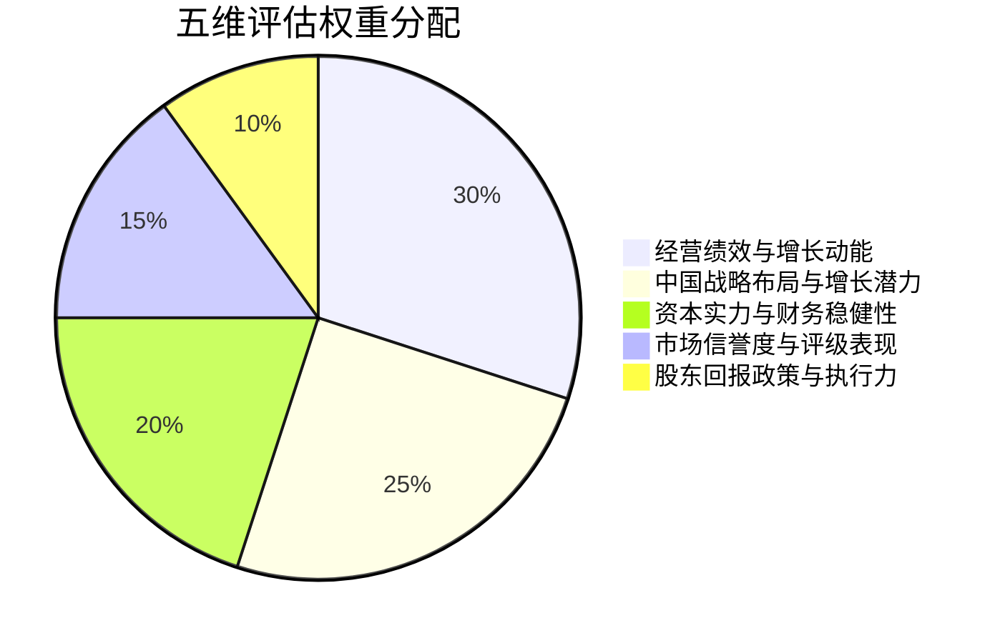
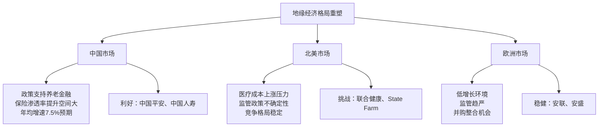

# 全球顶尖保险公司综合实力比较与未来资产排名潜力评估报告
## 1 引言：研究范围、方法与顶尖公司名单界定

### 1.1 研究背景与目标定位

全球保险行业正经历深刻的结构性变革。根据麦肯锡2025年全球保险业报告的分析，当前行业面临三大核心驱动力量：**人口老龄化加速推动退休保障需求激增、数字化服务普及提升消费者体验预期、以及宏观经济不确定性下资本市场对保险公司价值创造能力的重新审视**[^1]。2023年全球实际GDP增长3.2%，但寿险行业增速整体落后于GDP增长，行业影响力（保费收入/GDP）进一步下降，全球八个主要市场中仅美国和日本的保费收入增幅高于GDP增幅[^1]。

在此背景下，全球保险市场竞争格局呈现显著分化趋势。**美国与欧洲财险巨头依旧占据主导地位，而亚太地区，尤其是中国市场，正成为全球保险业增长最具活力的引擎**[^2]。安联集团发布的《2025年全球保险业发展报告》预测，未来十年中国保险市场规模年均增长将达到7.5%，其中寿险市场年均增速7.8%，健康险市场增速更高达7.9%，显著高于全球保险业5.1%的平均增速预期[^3]。

本报告的**核心研究目标**聚焦于：通过系统整合多个国际权威榜单数据，构建多维评价体系，筛选出全球综合实力前十的保险公司，并从融资情况、市场信誉度、过往五年增长表现、股东回报及中国市场发展潜力等关键维度进行横向比较分析，最终评估出2-3家最有可能在未来实现全球资产排名显著跃升的保险公司。本研究的现实意义在于为投资者、行业分析师及企业战略决策者提供基于数据驱动的深度洞察与决策参考。

### 1.2 多元数据来源与权威榜单整合

本研究依托多个国际权威机构发布的行业榜单，确保数据来源的全面性、权威性与可比性。以下对主要数据来源进行系统梳理：

**标普全球市场情报（S&P Global Market Intelligence）榜单**

标普全球市场情报发布的榜单是本研究的核心数据来源之一，涵盖财险与寿险两大领域：

- **全球财险50强榜单**：基于各公司2024年财产与意外伤害险保费/保险业务收入进行排名。根据统计，榜单上50家公司的总保费合计达**1.62万亿美元**，其中State Farm以1031亿美元保费稳居全球第一[^4][^2][^5]。该榜单能够有效反映财险公司的承保规模与市场份额。

- **全球寿险50强榜单**：以寿险和健康险准备金为核心排名指标，更直观反映寿险公司的长期责任规模与风险承担能力。中国人寿以7980.7亿美元的准备金规模荣登全球榜首[^6][^7]。

**《财富》世界500强榜单**

《财富》世界500强主要依据各公司上年度营收数据进行排名，是衡量全球大型企业综合实力的最权威榜单之一。2025年榜单显示，全球共有**53家保险公司、以保险为主营业务的机构以及健康管理公司**上榜，其中中国共有7家保险公司上榜[^8]。该榜单能够有效衡量保险公司的整体营收规模与市场地位。

**福布斯全球企业2000强榜单**

福布斯榜单按照收入、利润、资产和市值四大指标进行综合评估，提供了更为全面的企业价值评价视角。2025年榜单显示，中国平安位列全球第27位，位列中国保险业第1位[^9]。

**贝氏评级（A.M. Best）榜单**

贝氏评级作为国际知名的保险行业专业评级机构，发布的榜单涵盖：
- **全球保险公司净保费排行榜**：净保费是衡量公司从承保中创造收入能力的关键指标[^10]
- **全球保险公司非银行资产排行榜**：反映保险公司的资产管理规模与投资能力[^10]
- **美国人身险公司200强榜单**：以认可资产为主要指标，保德信金融集团以5681亿美元蝉联榜首[^11]

**Brand Finance全球品牌价值500强榜单**

该榜单从品牌强度、财务表现及未来增长潜力等多维度评估企业品牌价值，中国平安以488.39亿美元品牌价值排名全球第32位，连续十年位居中国最有价值保险品牌首位[^3][^12]。

### 1.3 综合实力评价指标体系构建

基于上述多元数据来源，本研究构建了涵盖六大核心维度的综合实力评价指标体系：

| **评价维度** | **核心指标** | **数据来源** | **评价意义** |
|:---:|:---|:---|:---|
| **规模维度** | 总资产规模、准备金规模 | 标普寿险榜单、贝氏评级 | 衡量公司长期责任承担能力与资本实力 |
| **营收维度** | 营业收入、保费收入 | 财富500强、标普财险榜单 | 反映市场份额与业务扩张能力 |
| **盈利维度** | 净利润、营运利润 | 财富500强、福布斯2000强 | 评估价值创造与经营效率 |
| **增长维度** | 保费增长率、营收增速 | 各榜单同比数据 | 判断发展动能与可持续性 |
| **品牌维度** | 品牌价值、市场声誉 | Brand Finance榜单 | 反映市场认可度与竞争壁垒 |
| **综合维度** | 多榜单综合排名 | 多源数据交叉验证 | 全面评估综合竞争力 |

各指标的选取遵循以下原则：**代表性**（能够有效反映保险公司核心竞争力）、**可比性**（不同公司间数据口径一致）、**权威性**（来源于国际公认的评级机构）。其中，准备金规模作为寿险公司的核心指标，相较于保费收入或总资产，更能准确反映寿险公司的业务规模与长期稳健性[^7]。

### 1.4 全球综合实力前十保险公司名单界定与论证

基于多元榜单的交叉比对分析，本研究界定的**全球综合实力前十保险公司名单**如下：

| **排名** | **公司名称** | **总部所在地** | **主要业务领域** | **核心入选依据** |
|:---:|:---|:---:|:---:|:---|
| 1 | 伯克希尔·哈撒韦 | 美国 | 综合保险 | 财富500强第10位，财险保费856亿美元全球第2[^2][^8] |
| 2 | 中国人寿 | 中国 | 寿险 | 寿险准备金7980.7亿美元全球第1，财富500强第45位[^8][^6] |
| 3 | 中国平安 | 中国 | 综合金融 | 财富500强第47位，福布斯第27位，品牌价值488亿美元[^9][^13][^3] |
| 4 | 安联集团 | 德国 | 综合保险 | 财险保费807亿美元全球第3，寿险准备金7691.9亿美元全球第2[^2][^7] |
| 5 | State Farm | 美国 | 财险 | 财险保费1031亿美元全球第1[^2][^5] |
| 6 | 安盛集团 | 法国 | 综合保险 | 财险保费591.8亿美元全球第7[^5] |
| 7 | 中国人保 | 中国 | 财险 | 财险保费676.7亿美元全球第6，财富500强第141位[^4][^8] |
| 8 | 中国太保 | 中国 | 综合保险 | 财富500强第251位，寿险准备金全球第28位[^8][^6] |
| 9 | 联合健康 | 美国 | 健康险 | 净保费2908亿美元全球第1[^10] |
| 10 | 保德信金融 | 美国 | 寿险 | 认可资产5681亿美元美国第1，寿险准备金6337亿美元全球第4[^11][^7] |

**入选论证说明：**

**伯克希尔·哈撒韦**作为股神巴菲特掌管的综合保险集团，在财富世界500强中位列第10位，2024年财产险保费达856亿美元，同比增长5.9%，是全球唯一市值超万亿美元的保险公司[^2][^14]。其非银行资产增长12.8%至1.07万亿美元，是继安联之后第二家非银行资产超过1万亿美元的公司[^10]。

**中国人寿**以7980.7亿美元的寿险和健康险准备金规模成功超越德国安联，荣登标普全球寿险50强榜首，成为全球最大的寿险公司[^6][^7]。在财富世界500强中，中国人寿以1602.77亿美元的营收超越中国平安，位列全球第45名，排名大幅上升14名[^8]。

**中国平安**展现出强大的综合金融实力与品牌影响力。在福布斯全球企业2000强中位列第27位，较上年上升2位，位列中国保险业第1位[^9]。其2024年实现归属于母公司股东的净利润1266.07亿元，同比大幅增长47.8%；营业收入10289.25亿元，同比增长12.6%[^9]。品牌价值达488.39亿美元，连续十年位居中国最有价值保险品牌首位[^3][^12]。

**安联集团**作为欧洲最大的保险公司，财险保费807亿美元排名全球第3，同比增长8.5%[^2][^5]。其寿险准备金7691.9亿美元位列全球第2，仅次于中国人寿[^7]。安联CEO强调，多元化全球布局是应对不确定性的关键策略[^7]。

**State Farm**是美国私家车保险市场的领导者，也是全球最大的财产和意外伤害保险商，2024年财产险保费达1031亿美元，同比增长17.7%，稳居全球财险第一[^2][^5]。

**中国人保**以676.7亿美元的财产险保费位列全球第6位，是全球前十财险公司中唯一的中国财险公司，继续稳居亚洲财险第一[^4][^2]。在财富世界500强中，中国人保以864.78亿美元营收位列第141名，利润大幅增长85.79%至58.58亿美元[^8]。

### 1.5 研究框架与章节结构说明

本报告采用**"多维比较—综合评估—前瞻预判"**的分析框架，后续章节将按以下逻辑结构展开深度分析：



**第2章**将深入分析十家公司的资本充足性、资产规模、负债结构及融资渠道，评估其财务稳健性与扩张潜力。**第3章**将验证并比较各公司的国际信用评级、品牌价值及市场声誉，归纳影响其信誉度的关键因素。**第4章**将探查各公司过去五年的关键增长指标，比较不同区域和市场领先公司的增长驱动力与可持续性。**第5章**将分析比较各公司的股东回报策略，重点考察历史分红记录与股息率。**第6章**将深入评估各公司在中国市场的战略布局及未来增长潜力。**第7章**将基于前述五个维度进行加权综合评估，最终筛选出最具资产排名跃升潜力的2-3家公司。**第8章**将总结核心发现并提出相关建议。

通过这一系统性的研究框架，本报告旨在为读者提供关于全球顶尖保险公司竞争格局的全景式洞察，以及基于数据驱动的前瞻性判断。

## 2 维度一：资本实力与融资情况比较分析

资本实力是保险公司抵御风险、支撑业务扩张及实现战略布局的根基。本章将从总资产规模、偿付能力充足率、负债结构、融资渠道及近期资本运作等多个维度，对全球综合实力前十的保险公司进行系统性比较分析，揭示各公司在资本维度的竞争优势与潜在风险，为后续综合评估奠定坚实的数据基础。

### 2.1 总资产规模与准备金规模横向比较

总资产规模与准备金规模是衡量保险公司资本实力的核心指标。准备金作为保险公司履行未来保单责任的资金储备，相较于保费收入或总资产，更能准确反映寿险公司的业务规模与长期稳健性[^7]。

**全球寿险准备金规模呈现显著的区域分化格局**。根据标普全球市场情报2024年全球寿险50强榜单数据，从地区分布来看，北美共有19家公司上榜，准备金规模达6.52万亿美元，占全球总额的37.89%，继续保持主导地位；欧洲有17家公司入榜，准备金规模为5.52万亿美元，占比32.08%；亚洲共有14家公司进入榜单，规模为5.17万亿美元，占比30.03%，虽然略低于欧美，但**增长势头最为显著**[^7]。

以下为本研究界定的十家公司核心资本规模指标对比：

| **公司名称** | **总资产规模** | **寿险/健康险准备金** | **全球排名** | **同比增幅** |
|:---|:---:|:---:|:---:|:---:|
| 伯克希尔·哈撒韦 | 12,259.63亿美元（2025Q3） | — | 综合保险巨头 | +6.25%（年初至今） |
| 中国人寿 | 投资资产6.61万亿元 | 7,980.7亿美元 | **全球第1** | +20%（同比） |
| 中国平安 | 总资产超12万亿元 | 6,830.1亿美元 | 全球第3 | +20%（同比） |
| 安联集团 | 管理资产规模庞大 | 7,691.9亿美元 | 全球第2 | — |
| 保德信金融 | 认可资产5,681亿美元 | 6,337.1亿美元 | 全球第4（美国第1） | — |
| 安盛集团 | 管理总资产超1.1万亿欧元 | 4,352亿美元 | 全球第11 | — |
| 中国太保 | 管理资产35,426.60亿元 | 位列全球第28位 | 全球第28 | +21.2%（年末） |
| 联合健康 | 总负债1,948.54亿美元 | — | 健康险龙头 | — |
| State Farm | 2025年营收1,229.51亿美元 | — | 美国财险第1 | — |
| 中国人保 | — | — | 亚洲财险第1 | — |

**中国保险公司在准备金规模上的崛起尤为瞩目**。中国人寿凭借7,980.7亿美元的寿险和健康险准备金规模跃居全球榜首，超越此前领先的安联集团，成为全球最大的寿险公司[^7]。中国平安以6,830.1亿美元位列全球第3位，两家公司的准备金同比增幅均接近20%，远高于全球行业平均水平[^15]。这一增长态势反映出中国寿险市场的强劲需求以及本土龙头公司的市场扩张能力。

**伯克希尔·哈撒韦展现出独特的资产结构优势**。截至2025年第三季度末，伯克希尔总资产达12,259.63亿美元，较年初增长6.25%[^16]。其资产结构的独特之处在于：公司拥有全美规模最大的国内基础设施资产（账面净值达1,540亿美元以上），如BNSF铁路和BHE能源；同时持有大量短期国债投资（规模激增至3,054亿美元）以及苹果、美国运通等优质企业的股票投资组合[^17]。这种"实业+金融"双轮驱动模式使其资产积累的复利效应远高于普遍支付高额红利的传统保险公司。

### 2.2 偿付能力充足率与资本充足性评估

偿付能力充足率是衡量保险公司资本缓冲能力与监管合规水平的核心指标，直接反映公司在极端风险情景下履行保单责任的能力。

**中国保险公司普遍保持较高的偿付能力水平**。中国人寿2024年末核心偿付能力充足率为153.34%，综合偿付能力充足率为207.76%，均显著高于监管要求[^18]。尽管2025年各季度呈现逐步下降趋势（2025年第三季度核心/综合偿付能力充足率分别降至137.50%/183.94%），但仍保持在充足水平[^19]。中国太保2024年第一季度资产负债率为88.68%，净资产收益率为4.6%[^11]，整体财务结构保持稳健。

**欧洲保险巨头同样展现出强劲的资本实力**。安盛集团2024年偿付能力充足率（Solvency II ratio）保持在216%的高位，展现出业绩营收与稳健运营的完美均衡[^11]。这一水平为公司应对市场波动、监管变化及潜在并购机会提供了充裕的资本缓冲空间。

以下为主要公司偿付能力与资本充足性指标对比：

| **公司名称** | **核心偿付能力充足率** | **综合偿付能力充足率** | **财务杠杆率/负债率** | **资本充足性评价** |
|:---|:---:|:---:|:---:|:---|
| 中国人寿 | 137.50%（2025Q3） | 183.94%（2025Q3） | — | 充足，逐季下降但仍达标 |
| 中国平安 | — | — | 银行核心一级资本充足率9.52% | 稳健，多元业务支撑 |
| 安盛集团 | — | 216%（Solvency II） | — | 优秀，资本缓冲充裕 |
| 伯克希尔·哈撒韦 | — | — | 负债率42.87% | **极度稳健**，显著低于行业 |
| 联合健康 | — | — | 财务杠杆率43.7% | 偏高，高于目标水平 |
| 慕尼黑再保险 | — | — | 财务杠杆率8.8x-10.1x | 行业正常水平 |

**伯克希尔·哈撒韦的资本充足性独树一帜**。2025年第三季度末，公司负债率仅为42.87%，较年初下降0.66个百分点，且2015-2024年十年平均负债率为48.28%，比财产与意外伤害保险行业均值低14.59个百分点[^16]。这一极低的负债水平源于公司长期坚持的财务保守主义策略——承诺始终持有超过300亿美元的高流动性现金储备以充当"财务堡垒"，并在保险业务中绝不使用财务杠杆[^17]。

**联合健康集团的资本充足性面临挑战**。根据AM Best评级，2024年底联合健康财务杠杆率高达43.7%，高于公司40%的长期目标[^20]。尽管息税前收益覆盖率仍保持良好（约8倍），但资产负债表上大量商誉和无形资产（约占权益的132%）增加了潜在的减值风险。AM Best已将联合健康集团及其子公司的展望从稳定调整为负面，主要原因是预计2025年运营表现将因Medicare Advantage业务部门的成本压力而恶化[^20]。

### 2.3 负债结构与财务杠杆水平分析

负债结构与财务杠杆的运用策略直接影响保险公司的风险承受能力与资本效率。不同公司基于自身业务模式与战略定位，形成了差异化的负债管理模式。

**伯克希尔·哈撒韦代表了极端财务保守主义的典范**。公司负债率长期下降的核心驱动力在于：过去十年始终坚持"零分红"政策，将所有经营利润悉数留存用于再投资，使得股东权益的复利增长远超负债规模的增速[^16]。2025年前三季度，公司实现净利润479.93亿美元，这些利润直接补充了股东权益基数，使得资产分母在跨入"1.2万亿时代"的同时表现出极强的韧性[^17]。此外，2017年美国《减税与就业法案》将法定税率从35%降至21%，使公司资产负债表中的"递延所得税负债"经历了永久性的重估减记，从结构上拉低了总负债水平。

以下为不同负债管理模式的对比分析：



**传统保险公司普遍依赖保险浮存金驱动投资回报**。与业务单一、主要依靠保费增长且投资组合受监管限制而重仓低息债券的传统产险公司不同，伯克希尔凭借无与伦比的资本实力，允许其保险子公司采取"权益重仓"策略，通过持有苹果、美国运通等优质企业获取远超固定收益类产品的长期回报[^17]。这种实业与金融的双轮驱动模式，使其资产积累的复利效应远高于普遍支付高额红利的产险行业平均水平。

**中国保险公司的负债结构呈现综合金融特征**。中国平安通过"综合金融+医疗养老"战略深化，形成了涵盖寿险、财险、银行三大核心业务的多元负债结构。2024年上半年，三项业务合计归属于母公司股东的营运利润达795.65亿元，同比增长1.7%[^21]。平安银行核心一级资本充足率上升至9.33%，拨备覆盖率264.26%，体现了银行业务对整体资本结构的稳健支撑[^22]。

### 2.4 融资渠道与近期重大资本运作

融资渠道的多元化程度及资本运作的战略性，直接反映保险公司的资本管理能力与战略执行力。

**欧洲保险巨头积极通过并购优化全球布局**。安联集团联合贝莱德与日本T&D组成的财团，计划以35亿欧元收购德国Viridium Group大部分股权[^7]。这一收购瞄准欧洲封闭寿险市场的新发展机遇，体现了安联通过多元化全球布局应对不确定性的关键策略。安联集团CEO强调，在低利率环境、监管趋严、数字化转型及地缘政治风险持续重塑行业格局的背景下，多元化布局是核心应对策略[^15]。

**保德信金融通过业务优化聚焦核心市场**。2025年9月，复星保德信人寿与保德信资管签署委托投资协议，双方将在固定收益、上市公司权益等方面展开合作[^11]。这一合作充分发挥了保德信逾150年的专业投资能力和全球化资产配置经验。与此同时，保德信金融旗下PGIM Inc.正考虑出售其在印度的资产管理业务（管理约2,660亿卢比资产），该业务处于亏损状态，是十年前从德意志银行收购而来[^19]。这一"聚焦核心、剥离边缘"的策略反映了公司优化全球资产布局的战略意图。

以下为十家公司近期重大资本运作事件汇总：

| **公司名称** | **近期重大资本运作** | **战略意图** |
|:---|:---|:---|
| 伯克希尔·哈撒韦 | 2020-2021年累计517亿美元股份回购 | 提升每股内在价值，优化资本结构 |
| 安联集团 | 联合财团35亿欧元收购Viridium Group | 拓展欧洲封闭寿险市场 |
| 保德信金融 | 拟出售印度资管业务；与复星保德信深化合作 | 聚焦核心市场，优化全球布局 |
| 安盛集团 | 12亿欧元股票回购计划 | 强化股东回报 |
| 联合健康 | 2025年股票回购预算150亿美元 | 维护股价，回报股东 |
| 中国平安 | 持续推进"综合金融+医疗养老"战略 | 深化生态布局，提升客户价值 |

**伯克希尔·哈撒韦的股份回购策略值得深入分析**。公司在过去五年中执行了极为激进的股份回购策略，2020-2021年累计耗资517亿美元回购股份[^16]。虽然这增加了每股内在价值，但在财务账面上却通过注销巨额现金资产直接缩减了总资产的绝对规模，从而压低了资产总额的复合增长率。这一策略体现了巴菲特"内在价值优先于账面规模"的投资哲学。

**State Farm面临的资本压力值得关注**。尽管State Farm以2022年786.43亿美元签单保费稳居美国财险行业首位，市占率达9.15%[^20]，但AM Best已将其财务实力评级从A++下调至A+，主要原因是运营表现的持续恶化[^23]。公司连续五年承保亏损、四年运营亏损，受车险、家财险高损失率及极端天气影响严重，资本补充压力显著上升。

### 2.5 资本实力综合评价与扩张潜力判断

基于上述多维度分析，本节构建资本实力综合评价矩阵，从**资本规模、资本质量、资本效率**三个层面对十家公司进行系统性评估与分档。

**资本实力综合评价矩阵：**

| **公司名称** | **资本规模** | **资本质量** | **资本效率** | **综合评级** | **扩张潜力判断** |
|:---|:---:|:---:|:---:|:---:|:---|
| 伯克希尔·哈撒韦 | ★★★★★ | ★★★★★ | ★★★★☆ | **A+** | 资本最为充裕，但规模上限制约增长空间 |
| 中国人寿 | ★★★★★ | ★★★★☆ | ★★★★☆ | **A+** | 准备金全球第一，中国市场支撑高增长潜力 |
| 中国平安 | ★★★★★ | ★★★★☆ | ★★★★★ | **A+** | 综合金融生态优势，资本效率领先 |
| 安联集团 | ★★★★★ | ★★★★☆ | ★★★★☆ | **A** | 全球布局多元，并购能力强 |
| 安盛集团 | ★★★★☆ | ★★★★★ | ★★★★☆ | **A** | 偿付能力优秀，战略执行稳健 |
| 保德信金融 | ★★★★☆ | ★★★★☆ | ★★★☆☆ | **A-** | 美国寿险龙头，全球优化进行中 |
| 中国太保 | ★★★★☆ | ★★★★☆ | ★★★★☆ | **A-** | 管理资产高增长，业务结构持续优化 |
| State Farm | ★★★★☆ | ★★★☆☆ | ★★☆☆☆ | **B+** | 承保亏损持续，资本补充压力大 |
| 联合健康 | ★★★★☆ | ★★★☆☆ | ★★★☆☆ | **B+** | 高杠杆运营，成本压力制约扩张 |
| 中国人保 | ★★★☆☆ | ★★★★☆ | ★★★★☆ | **A-** | 亚洲财险龙头，资本规模相对较小 |

**关键发现与洞察：**

**第一梯队（A+级）**包括伯克希尔·哈撒韦、中国人寿和中国平安三家公司。伯克希尔凭借独特的"实业+金融"双轮驱动模式、极低的财务杠杆和充裕的现金储备，展现出无与伦比的资本稳健性；但正如巴菲特所言，公司已面临"规模上限"挑战，任何足以显著影响业绩指针的大型收购机会都变得极其稀缺[^17]。中国人寿和中国平安则受益于中国保险市场的高速增长，准备金规模同比增幅均接近20%，显示出强劲的资本扩张动能[^7]。

**第二梯队（A级）**包括安联集团和安盛集团。两家欧洲保险巨头在资本质量和偿付能力方面表现优异，尤其是安盛216%的偿付能力充足率为其战略扩张提供了充裕空间[^11]。安联通过积极的并购策略（如收购Viridium Group）持续优化全球布局，展现出较强的资本运作能力。

**面临挑战的公司**包括State Farm和联合健康集团。State Farm虽然保费规模全球领先，但连续多年的承保亏损已导致评级下调，资本补充压力显著[^23]。联合健康集团则面临Medicare Advantage业务成本失控的困境，2025年第三季度医疗赔付率升至89.9%，归母净利润同比暴跌61.22%[^24]，财务杠杆率高于目标水平，AM Best已将其展望调整为负面[^20]。

**扩张潜力判断**：综合资本规模、质量与效率三个维度，**中国人寿和中国平安**凭借全球领先的准备金增速、稳健的偿付能力以及中国市场的结构性增长机遇，被评估为最具资本扩张潜力的公司。**安联集团**凭借多元化全球布局和积极的资本运作能力，同样具备较强的资产规模跃升潜力。相比之下，伯克希尔·哈撒韦虽然资本实力最为雄厚，但受制于"大数定律"的规模上限，未来资产排名大幅跃升的空间相对有限。

## 3 维度二：市场信誉度与评级表现评估

市场信誉度是保险公司长期稳健经营的核心竞争力之一，直接影响其融资成本、客户信任度及市场拓展能力。本章将系统验证并比较全球综合实力前十保险公司获得的主要国际信用评级表现，从品牌价值、市场声誉等维度进行横向比较，深入分析影响各公司信誉度的关键因素，最终评估各公司长期可持续发展的信用基础与市场认可度差异。

### 3.1 国际信用评级体系与评级机构方法论概述

国际信用评级是衡量保险公司财务实力与偿债能力的权威标尺，为投资者、监管机构及市场参与者提供标准化的风险评估参考。全球保险行业主要依赖四大国际评级机构的评估结果：**标准普尔全球评级（S&P Global Ratings）、穆迪投资者服务（Moody's Investors Service，现更名为穆迪评级）、贝氏评级（A.M. Best）及惠誉国际评级（Fitch Ratings）**。1975年，美国证券交易委员会（SEC）正式认可穆迪、标准普尔、惠誉为"全国认定的评级组织"（NRSRO），奠定了三大机构在全球资本市场的权威地位[^19]。

**穆迪评级方法论与等级体系**

穆迪长期债务评级是关于固定收益债务相对信用风险的意见，评估债务无法按承诺履行的可能性及违约时蒙受的财务损失[^25]。穆迪评级等级从最高的Aaa级到最低的C级共分为二十一个级别，其中前四个级别（Aaa、Aa、A、Baa）属于"投资级债券"，信誉高、违约风险小；第五级（Ba）开始的债券信誉较低，属于"投机级债券"[^26]。

| **穆迪评级等级** | **评定类别** | **信用质量说明** |
|:---:|:---:|:---|
| Aaa | 优等 | 信用质量最高，信用风险最低，本金利息安全有充足保证 |
| Aa (Aa1, Aa2, Aa3) | 高级 | 信用质量很高，有较低的信用风险 |
| A (A1, A2, A3) | 中上级 | 投资品质优良，本金利息安全 |
| Baa (Baa1, Baa2, Baa3) | 中级 | 保证程度一般，具有某些投机特征 |
| Ba及以下 | 投机级 | 具有投机性质，信用风险较高 |

穆迪在Aa到Caa的各个基本等级后面加上修正数字1、2及3，以进一步细分信用质量差异[^27]。值得注意的是，2024年3月，穆迪投资者服务公司正式更名为"穆迪评级"（Moody's Ratings），标志着这家百年评级机构的品牌升级[^28]。

**标普与贝氏评级方法论**

标准普尔全球评级同样采用字母等级体系，从最高的AAA级到最低的D级，其中AA-级代表"高信用质量"，是投资级评级中的较高水平。贝氏评级（A.M. Best）则专注于保险行业，其财务实力评级（FSR）是衡量保险公司履行保单义务能力的核心指标。贝氏评级A+代表"Superior"（优秀）级别，表明公司具有卓越的财务实力与风险抵御能力[^23]。

**认可资产（Admitted Assets）的核心意义**

在保险监管体系中，认可资产是一个核心指标。根据美国法定准则，认可资产指经保险监管机构认可并允许计入法定资产负债表的资产，其关键特征是**高流动性**，能够快速以确定金额变现。只有认可资产能够被纳入保险公司偿付能力计算，直接决定保险公司是否资本充足[^23]。这一指标对于评估寿险公司的长期稳健性尤为重要。

### 3.2 十家公司国际信用评级横向比较

基于多个权威评级机构的最新评级结果，本节对全球综合实力前十保险公司的信用评级表现进行系统性梳理与横向比较。

**主要公司国际信用评级汇总表**

| **公司名称** | **标普评级** | **穆迪评级** | **贝氏评级** | **评级展望** | **核心评价** |
|:---|:---:|:---:|:---:|:---:|:---|
| **保德信金融** | AA- | Aa3 | A+ (Superior) | 稳定 | 美国寿险认可资产第一，资本与风险抵御优势显著[^23] |
| **安盛集团** | A+ | Aa3 | A+ (Superior) | 积极 | 连续5年评级AA-以上，偿付能力216%[^29] |
| **伯克希尔·哈撒韦** | AA | — | — | 负面（KBW） | 标普曾下调一级，继任风险受关注[^28] |
| **联合健康** | a (ICR) | — | A+ (FSR) | **负面** | 展望从稳定调整为负面，Medicare Advantage业务承压[^19] |
| **State Farm** | — | — | A+ (下调后) | 稳定（修正后） | 从A++下调至A+，运营表现恶化[^12] |
| **中国平安** | — | — | — | 稳定 | 品牌价值488亿美元，MSCI ESG评级AAA[^28] |
| **安盛天平（安盛中国）** | A | A2 | — | 稳定 | 穆迪首次授予A2评级，标普上调至A级[^30] |

**保德信金融：顶级投资级评级的典范**

保德信金融集团在三大国际评级机构均获得顶级投资级信用评级。根据贝氏评级2025年美国人身险公司200强榜单，保德信金融以**5681亿美元**的认可资产蝉联美国寿险/健康险行业榜首，同比增长6.9%，比排名第二的纽约人寿高出1212亿美元[^28]。截至2024年8月，保德信旗下核心保险实体获得的评级包括：AM Best A+、标准普尔AA-、穆迪Aa3、惠誉AA-[^31]。这些评级结果明确肯定了公司雄厚的资本基础、卓越的财务实力及作为行业领导者的稳定地位。

保德信金融集团拥有150年的悠久历史，业务遍及美国、亚洲、欧洲和拉丁美洲等50个国家和地区，为5000万机构和个人客户提供人寿保险、年金、共同基金和投资管理等产品[^19]。其持续蝉联寿险/健康险行业榜首，显示出**显著的资本与风险抵御优势**，为其金融产品提供了极强的信用背书。

**安盛集团：欧洲保险巨擘的稳健信誉**

安盛集团（AXA）作为全球最大的保险集团之一，获得了多家国际权威评级机构的高度认可。标准普尔全球评级授予其**A+**评级，穆迪授予**Aa3**评级，贝氏评级授予**A+ Superior**评级，且标普与穆迪均上调评级展望至"积极"[^29]。这些高评级代表着安盛具有强劲的财务实力和赔付能力，其经营状况和投资表现值得信赖。

安盛集团成立于1816年，总部位于法国巴黎，业务覆盖全球50多个国家和地区，为超过1亿客户提供保险及资产管理服务。2024年总营收达**1100亿欧元**，净利润79亿欧元，偿付能力充足率保持**216%**[^32]。根据搜狐财经2024年10月发布的报告，安盛集团以869.2亿美元市值位列全球保险行业前列，2024年《财富》世界500强中排名第126位[^33]。

**伯克希尔·哈撒韦：独特结构下的评级挑战**

伯克希尔·哈撒韦的信用评级呈现出与其超强财务实力不完全匹配的复杂图景。标准普尔曾将其信用评级降低一级至**AA级**，理由包括：公司过度依赖保险业务、巴菲特喜欢在少数公司中大量持股使资本基础波动性较大、以及管理层接班事宜存在不确定性[^28]。标普保险评级部门指出，"这意味着他们有一个非常独特的人，也就是沃伦·巴菲特，而此人仍在执掌这家公司"[^26]。

尽管如此，伯克希尔的财务实力指标极端强劲。截至2025年三季度末，公司现金储备达**3816.7亿美元**，再创历史最高纪录[^4]。公司非银行资产超过1万亿美元，是全球第二家达到这一规模的公司。这种"强大的实力与显著的未来不确定性并存"的复杂图景，使其信誉度评估必须在肯定当前极端实力的同时，强调对关键风险因素的持续关注。

**中国公司评级表现**

中国保险公司在国际信用评级方面的数据相对有限，但在品牌价值和ESG评级方面表现突出。中国平安MSCI ESG评级提升至最高的**AAA级**，并连续三年位列亚太区"综合保险及经纪"类别第一；恒生与万得（Wind）的ESG评级也分别上调至A级与AAA级[^28]。这些评级结果反映了中国头部保险公司在可持续发展领域的卓越表现。

### 3.3 近期评级变动与展望调整分析

评级变动与展望调整是市场信誉度动态变化的重要信号，能够揭示公司经营状况与风险因素的演变趋势。本节重点分析近期发生评级变动的关键案例。

**AM Best下调State Farm评级：运营恶化的警示**

AM Best已将State Farm Mutual Automobile Insurance Company及其关联公司的财务实力评级从**A++下调至A+**，反映了对该集团运营表现评估的修正[^12]。尽管A+评级在AM Best评级方法论中仍被视为"Superior"（优秀），但这一下调传递了明确的风险信号。

State Farm作为美国私家车保险市场的领导者和全球最大的财产和意外伤害保险商，2024年财产险保费达1031亿美元，同比增长17.7%，稳居全球财险第一[^18]。然而，公司面临严峻的承保挑战：**连续五年承保亏损、四年运营亏损**，受车险、家财险高损失率及极端天气影响严重。值得关注的是，State Farm旗下加州房屋保险公司State Farm General Insurance Company获得的评级更低，AM Best确认其财务实力评级为**B级（Fair）**，长期发行人信用评级为bb+级[^12]。

**联合健康集团展望调整为负面：Medicare Advantage困境**

AM Best将联合健康集团（UnitedHealth Group）及其子公司的展望从稳定调整为**负面**，同时确认了其"a"级（优秀）的长期发行人信用评级和旗下UnitedHealthcare的A+（卓越）财务实力评级[^19]。

展望调整的主要驱动因素是预计2025年运营表现将出现恶化，主要受**Medicare Advantage（医疗保险优势计划）业务部门**的影响。联合健康集团报告称，UnitedHealthcare的许多新Medicare Advantage受益人的医疗成本高于预期，且由于Medicare Advantage计划的结构，公司无法在2026年之前实施纠正性定价措施[^19]。因此，Medicare Advantage部门的问题预计将在整个2025年持续存在。

尽管面临运营压力，UnitedHealthcare的风险调整后资本仍处于非常强劲的水平，公司在所有业务线和全国范围内都拥有显著的市场份额，保费和收益在业务部门和地域上实现了良好的多元化[^19]。

**安盛天平获双重评级提升：战略转型获认可**

在评级调整中呈现积极信号的典型案例是安盛天平财产保险有限公司。穆迪评级首次授予安盛天平**A2**的保险财务实力评级（IFSR），评级展望为"稳定"[^19]。标普全球评级随后宣布将安盛天平的财务实力评级和长期发行人信用评级上调至**A级**，评级展望同样为"稳定"[^30]。

穆迪在报告中强调，A2评级反映了安盛天平作为安盛集团在华全资子公司的核心优势：公司不仅依托唯一股东安盛集团提供的雄厚资金与持续运营支持，更在品牌与战略层面实现高度整合[^34]。标普报告指出，评级上调主要基于两大核心动因：安盛天平自身承保盈利能力的持续改善，以及母公司安盛集团在品牌、技术与再保险等多维度的强劲支持[^30]。

截至2025年6月底，安盛天平综合偿付能力充足率达**229%**，投资策略秉持高度审慎原则，体现出极低的资产风险水平和卓越的风控能力[^35]。这一双重评级提升标志着公司在实力、战略与治理方面已达到国际先进水平。

**伯克希尔·哈撒韦罕见获得"卖出"评级**

2025年10月，伯克希尔·哈撒韦罕见获得了一份"卖出"评级。Keefe, Bruyette & Woods（KBW）分析师迈耶·希尔兹将伯克希尔A类股评级从"与大盘持平"下调至"跑输大盘"，称**"许多因素正在朝错误方向发展"**[^36]。在业内追踪的六位持续覆盖伯克希尔评级的分析师中，这是唯一的卖出评级。

KBW分析师指出的主要风险因素包括：
- **保险业务压力**：旗下盖可（Geico）汽车保险业务在经历两年赔付率下降后，未来用于支付事故理赔的保费占比可能上升[^37]
- **宏观经济影响**：伯灵顿北方圣达菲（BNSF）铁路公司的业务重心在美国西部，增长易受关税和与亚洲国家贸易量下降的冲击[^28]
- **继任风险**：巴菲特计划于2025年底卸任CEO，这一变动反映出其"近乎无可替代的声誉"，且"公司当前信息披露不够充分"[^33]

自2025年5月3日巴菲特宣布管理层变动以来，伯克希尔A类股的表现已落后标普500指数逾28个百分点[^38]。

### 3.4 品牌价值与市场声誉比较

品牌价值是市场信誉度的重要组成部分，反映了公司在客户心目中的认可度与信任度。基于Brand Finance等权威机构的评估数据，本节对主要保险公司的品牌价值表现进行比较分析。

**中国平安：连续十年蝉联中国最具价值保险品牌**

国际权威品牌评估机构Brand Finance于2025年1月发布的《2026年全球品牌价值500强报告》显示，中国平安的品牌价值攀升至**488.39亿美元**，全球排名第32位，较上年提升3位，排名中国第10位[^28]。这也是中国平安**连续第十次**荣获该榜单"中国最具价值保险品牌"称号，其品牌价值同比增长13%，展现出强大的品牌韧性和持续的竞争力。

中国平安品牌价值持续增长的驱动因素包括：

**稳健的财务表现**：截至2025年9月30日，集团实现营业收入约9016.68亿元；归属于母公司股东的营运利润达1162.64亿元，同比增长7.2%；净利润为1328.56亿元，同比增长11.5%，其中第三季度单季净利润同比大幅增长45.4%[^19]。

**深厚的客户基础**：截至2025年三季度末，中国平安个人客户数已近**2.5亿**，服务时间5年及以上客户的留存率高达94.4%，体现出用户对该品牌的长期选择与持续信任[^39]。

**领先的ESG表现**：中国平安MSCI ESG评级提升至最高的AAA级，并连续三年位列亚太区"综合保险及经纪"类别第一[^26]。

**保德信金融：150年历史积淀的品牌优势**

保德信金融集团拥有**150年**的悠久历史，是全球金融服务领军企业和一流的主动型投资管理人。其业务遍及美国、亚洲、欧洲和拉丁美洲等50个国家和地区，为5000万机构和个人客户提供综合金融服务[^33]。复星保德信人寿作为复星集团与保德信金融集团强强联合的结晶，依托股东双方的全球资源与本土洞察，构建起以健康、快乐、富足为核心的差异化服务体系[^18]。

保德信持续蝉联美国寿险/健康险行业榜首的成就，不仅彰显了其全球领先的资本实力与风险抵御能力，更为其品牌声誉提供了坚实支撑。其认可资产规模连续多年位居行业前列，2024年底达5681亿美元，同比增长6.9%，较第二名高出1212亿美元[^40]。

**安盛集团：全球性品牌的市场影响力**

安盛集团以**869.2亿美元**市值位列全球保险行业前列，2024年《财富》世界500强中排名第126位[^41]。作为全球最大的保险集团之一，安盛的品牌优势体现在：

- **全球覆盖范围**：业务覆盖全球50多个国家和地区，为超过1亿客户提供保险及资产管理服务
- **财务稳健性**：2024年总营收达1100亿欧元，净利润79亿欧元，偿付能力充足率保持216%
- **分红实现能力**：2024报告年度分红实现率数据均值为**96.99%**，10年以上保单依然保持在85%以上[^32]

**品牌价值对比分析**

| **公司名称** | **品牌价值/市值** | **全球排名** | **品牌优势来源** |
|:---|:---:|:---:|:---|
| 中国平安 | 488.39亿美元 | 全球第32位 | 综合金融生态、客户规模、ESG领先 |
| 安盛集团 | 869.2亿美元（市值） | 财富500强第126位 | 全球覆盖、历史积淀、财务稳健 |
| 保德信金融 | — | 美国寿险第1 | 150年历史、资本实力、专业声誉 |
| 伯克希尔·哈撒韦 | 超万亿美元（市值） | 全球唯一 | 巴菲特品牌效应、投资业绩 |

### 3.5 影响市场信誉度的关键因素分析

市场信誉度的形成与维护受多重因素影响，本节从公司治理与透明度、历史赔付记录与服务能力、重大风险事件应对表现三个维度进行深入分析。

**公司治理与透明度**

**伯克希尔·哈撒韦的继任计划透明度争议**是影响其市场信誉度的关键因素之一。KBW分析师在报告中明确指出："沃伦·巴菲特无与伦比的声誉，以及公司在该问题上信息披露的不充分，一旦投资者无法再依赖巴菲特在伯克希尔·哈撒韦公司的存在，他们可能会望而却步"[^36]。所谓的"巴菲特溢价"——由于巴菲特的领导力和资本配置记录，投资者长期以来赋予伯克希尔的额外估值——似乎正在消退[^33]。

巴菲特计划于2025年底将首席执行官职位移交给继任者格雷格·阿贝尔，届时这位94岁的投资传奇将结束其在伯克希尔长达六十年的领导生涯[^17]。值得注意的是，巴菲特将不再撰写备受全球投资者追捧的年度致股东信，这一重任已移交给阿贝尔[^28]。

**中国平安的治理透明度**则呈现正面表现。公司通过持续的信息披露和ESG报告，展现了较高的治理透明度。2025年前三季度，平安AI座席服务量超12.92亿次，覆盖公司80%的客服总量；产险通过AI反欺诈系统实现理赔拦截减损91.5亿元[^39]。这些数据的公开披露增强了市场对公司运营能力的信任。

**历史赔付记录与服务能力**

理赔服务能力是保险公司信誉度的核心支撑。以下为部分公司的理赔服务表现：

**安联人寿**2025年上半年境外旅行险理赔金额达**1244.9万元**，理赔件数2339件[^42]。公司提供的特色理赔服务包括：境外医疗大额直付服务（上半年为62位客户提供服务，最高单笔28.6万元）、医疗送返回国服务（成功将12位客户从世界各地安全送返回国，最高一笔费用15.9万元）[^42]。此外，安联人寿曾为一位罹患癌症的客户提供多次海外就诊协助，从2019年11月开始至2022年8月，累计理赔重大疾病保险金、海外医疗保险金等共计**129.88万元**[^19]。

**中国平安**打造的"111极速赔"服务表现突出，2025年前三季度"闪赔"占比58%[^26]。通过智能核保、智能理赔、智能续期，实现94%的寿险保单秒级核保，体现了领先的服务效率[^19]。

**重大风险事件应对表现**

重大风险事件的应对能力直接影响公司的市场信誉度。以下为近年来发生的主要风险事件案例：

**安联人寿北美系统入侵事件**：2024年7月16日，安联人寿保险北美公司遭遇一起系统入侵事件，一名"恶意威胁者"入侵其使用的第三方云系统，获取了**140万客户**中多数人的个人身份信息，包括金融专业人士及部分员工的信息[^43]。安联人寿称"立即采取行动控制并缓解了这一问题，并已通知联邦调查局（FBI）"，同时表示目前没有证据表明黑客入侵了该公司的网络或其他任何系统[^44]。这一事件对公司的数据安全声誉造成了一定影响。

**安盛香港投连险暴雷事件**：2019年震惊香港金融圈的安盛投连险暴雷事件涉及金额高达**4亿港币**，影响范围覆盖中国内地、香港及马来西亚等地区的263名投资者，其中内地投资者占比高达95%[^39]。调查显示，这并非简单的投资失利事件，而是一起有预谋、有组织的金融诈骗——诈骗集团通过操控保险经纪公司，向投资者虚假宣传基金为低风险高回报的投资连结保险产品。2020年12月，香港警方展开"峭锋行动"，以涉嫌"串谋诈骗"及"洗黑钱"罪名拘捕24人，冻结涉案集团约4.2亿港元资产[^39]。尽管安盛保险本身并非诈骗主体，但这一事件仍对其品牌声誉造成了负面影响。

**伯克希尔·哈撒韦收购欺诈案**：伯克希尔旗下精密机件公司（Precision Castparts）曾遭遇收购欺诈，一家德国管道制造商舒尔兹控股通过捏造至少47笔业务交易、使用"P图"制作虚假订单和收据，将公司估值抬升近4倍，导致伯克希尔被坑**6.43亿欧元**[^26]。2025年，美国曼哈顿联邦地方法院判决伯克希尔胜诉，舒尔兹控股依法赔偿全部损失。这一案例虽然展示了伯克希尔的法律维权能力，但也暴露了其在收购尽职调查中的潜在漏洞。

### 3.6 市场信誉度综合评价与信用基础判断

基于国际评级表现、品牌价值、关键影响因素等多维度分析，本节构建市场信誉度综合评价矩阵，对十家公司进行分档评估。

**市场信誉度综合评价矩阵**

| **公司名称** | **国际评级** | **品牌价值** | **治理透明度** | **风险事件应对** | **综合评级** |
|:---|:---:|:---:|:---:|:---:|:---:|
| **安盛集团** | ★★★★★ | ★★★★★ | ★★★★☆ | ★★★☆☆ | **A+** |
| **保德信金融** | ★★★★★ | ★★★★☆ | ★★★★☆ | ★★★★☆ | **A+** |
| **中国平安** | ★★★★☆ | ★★★★★ | ★★★★★ | ★★★★☆ | **A+** |
| **伯克希尔·哈撒韦** | ★★★★☆ | ★★★★★ | ★★★☆☆ | ★★★★☆ | **A** |
| **安联集团** | ★★★★☆ | ★★★★☆ | ★★★★☆ | ★★★☆☆ | **A** |
| **中国人寿** | ★★★☆☆ | ★★★★☆ | ★★★★☆ | ★★★★☆ | **A-** |
| **中国太保** | ★★★☆☆ | ★★★★☆ | ★★★★☆ | ★★★★☆ | **A-** |
| **中国人保** | ★★★☆☆ | ★★★★☆ | ★★★★☆ | ★★★★☆ | **A-** |
| **联合健康** | ★★★☆☆ | ★★★★☆ | ★★★★☆ | ★★★☆☆ | **B+** |
| **State Farm** | ★★★☆☆ | ★★★★☆ | ★★★☆☆ | ★★★☆☆ | **B+** |

**关键发现与信用基础判断**

**第一梯队（A+级）**：安盛集团、保德信金融、中国平安

这三家公司展现出最为坚实的市场信誉度基础。**安盛集团**凭借标普A+、穆迪Aa3、贝氏A+的顶级评级组合，以及216%的偿付能力充足率和96.99%的分红实现率，在国际评级与财务稳健性方面表现卓越。**保德信金融**以5681亿美元认可资产蝉联美国寿险榜首，三大评级机构均授予顶级投资级评级，150年历史积淀为其品牌声誉提供了深厚支撑。**中国平安**虽然国际信用评级数据相对有限，但其488.39亿美元的品牌价值、AAA级MSCI ESG评级以及近2.5亿的客户规模，展现出强大的市场认可度与可持续发展能力。

**第二梯队（A级）**：伯克希尔·哈撒韦、安联集团

伯克希尔·哈撒韦的市场信誉度呈现"强大的实力与显著的未来不确定性并存"的复杂图景。其超万亿美元市值和3816.7亿美元现金储备展现了无与伦比的财务实力，但继任计划的透明度不足以及"巴菲特溢价"的消退，使其信誉度评估必须纳入重大的治理不确定性。安联集团在全球保险市场具有领先地位，但北美子公司的数据泄露事件对其信息安全声誉造成了一定影响。

**面临信誉挑战的公司（B+级）**：联合健康集团、State Farm

**联合健康集团**的展望被AM Best调整为负面，Medicare Advantage业务的成本压力预计将在整个2025年持续存在，无法在2026年之前实施纠正性定价措施，这对其信誉度构成持续压力。**State Farm**虽然保费规模全球领先，但连续多年的承保亏损已导致评级从A++下调至A+，运营表现的恶化对其市场声誉造成了负面影响。

**信用基础强弱判断**

综合评估显示，**安盛集团、保德信金融和中国平安**具备最为坚实的长期可持续发展信用基础。这三家公司在国际评级、品牌价值、治理透明度等关键维度均表现优异，且各自具有差异化的信誉优势：安盛集团的全球布局与财务稳健性、保德信金融的资本实力与历史积淀、中国平安的客户规模与ESG领先地位。

相比之下，**State Farm和联合健康集团**的信用基础相对薄弱。前者面临持续的承保亏损压力，后者则受制于Medicare Advantage业务的结构性挑战。这两家公司需要在未来1-2年内有效改善运营表现，否则可能面临进一步的评级下调风险。

**伯克希尔·哈撒韦**的信用基础判断最为复杂——其财务实力足以支撑最高级别的信誉评价，但管理层代际交接这一重大治理不确定性使其信誉度的未来轨迹存在比其他公司更大的观察窗口和潜在变数。市场将密切关注格雷格·阿贝尔接任后的战略执行与信息披露表现。

## 4 维度三：经营绩效与增长动能分析（近五年）

经营绩效是衡量保险公司价值创造能力与市场竞争力的核心维度。本章将系统分析全球综合实力前十保险公司2020-2025年的经营表现，从保费收入增长率、准备金与资产增幅、营业收入与净利润变化、区域与业务板块驱动力、增长可持续性与质量等多个维度进行深度比较，识别出增长势头最为强劲且质量最优的竞争者，为后续综合评估提供关键数据支撑。

### 4.1 保费收入增长率横向比较

保费收入是保险公司业务规模的直接体现，其增长率反映了公司市场拓展能力与竞争优势。基于标普全球市场情报、安联全球保险业发展报告及各公司财报数据，本节对十家公司的保费收入增长表现进行系统性横向比较。

**2024年度保费收入增长表现对比**

根据安联中国控股发布的《2025年安联全球保险业发展报告》，2024年全球保险业呈现强劲增长势头，全年增长率约**8.6%**，打破了上一年度8.2%的增长纪录，全球保费池大量增加约5570亿欧元，全球保险公司在人寿、财产险和健康险业务领域的总保费收入达到7万亿欧元[^45]。在此背景下，各公司的保费增长表现呈现显著分化。

| **公司名称** | **2024年保费收入** | **同比增速** | **增长特征** |
|:---|:---:|:---:|:---|
| **中国太保** | 269.7亿美元 | **+8.1%** | 五家中国上榜财险企业中增速最高 |
| **中国人保** | 676.7亿美元 | +6.1% | 全球财险第6位，亚洲财险第1 |
| **中国人寿** | 超7000亿元（2025年前11月） | +10.1%（前三季度） | 总保费规模创历史新高 |
| **中国平安** | 456.2亿美元（财险） | +4.7% | 寿险保费规模保费3901.86亿元 |
| **安联集团** | 807亿美元（财险） | +8.5% | 全球财险第3位 |
| **伯克希尔·哈撒韦** | 856亿美元（财险） | +5.9% | 全球财险第2位 |
| **State Farm** | 1031亿美元 | +17.7% | 全球财险第1位，增速领先 |

**中国保险公司展现出强劲的保费增长动能**。根据标普全球市场情报发布的2025全球财险50强榜单，中国太保以**8.1%**的同比增速在五家中国上榜财险企业中位居首位；中国人保和国寿财险增速均超过5%，分别达到6.1%和5.9%[^46][^47]。从寿险业务来看，中国人寿表现尤为突出——据公开信息披露，截至2025年11月30日，其总保费超过人民币7000亿元，较2024年全年总保费规模实现新的突破[^48][^34]。2025年前三季度，中国人寿实现总保费6696.45亿元，同比增长**10.1%**，其中新单保费同比增长10.4%，续期保费同比增长10.0%，总保费、新单保费、续期保费均实现两位数增长[^34]。

**中国市场的整体增速显著高于全球平均水平**。《2025年安联全球保险业发展报告》显示，中国保险市场在2024年实现了**11.2%**的强劲增长，再次回到两位数的增长率；总保费收入达到7540亿欧元，意味着亚洲地区总保费收入的一半以上来自中国市场[^45][^49]。在过去十年里，中国在全球保险市场的份额几乎翻了一番，达到**10.8%**，稳居全球第二。其中，中国寿险市场实现了15.4%的增长，远超亚洲寿险平均增长率7.8%，成为亚洲增长最快的市场之一；中国财产险市场增长率为4.9%，高于亚洲其他地区4.0%的平均增长率[^45]。

**欧美保险巨头保费增长相对稳健但分化明显**。State Farm以1031亿美元保费和17.7%的同比增速稳居全球财险第一，展现出强劲的市场扩张能力[^50][^51]。安联集团财险保费达807亿美元，同比增长8.5%，位列全球第三[^50]。伯克希尔·哈撒韦财险保费856亿美元，同比增长5.9%，位列全球第二[^50]。从全球财险50强的地区分布来看，美国共有19家财险公司入围，是唯一入围数量达到两位数的地区；中国大陆以5家入围数量排名第二；瑞士、日本、百慕大各有3家险企上榜[^47][^52]。



### 4.2 准备金规模与资产增幅分析

准备金规模是衡量寿险公司长期责任承担能力的核心指标，资产规模增幅则反映公司的资本积累与扩张潜力。本节深入分析各公司近五年的准备金与资产增长轨迹。

**寿险准备金规模呈现显著的区域分化与快速增长**

根据标普全球市场情报2024年全球寿险50强榜单数据，全球寿险准备金总规模持续扩大，其中亚洲地区尤其是中国公司的增长最为显著。中国人寿以7980.7亿美元的寿险和健康险准备金规模跃居全球榜首，超越此前领先的安联集团；中国平安以6830.1亿美元位列全球第3位，两家公司的准备金同比增幅均接近**20%**，远高于全球行业平均水平。

| **公司名称** | **寿险/健康险准备金** | **全球排名** | **同比增幅** | **增长评价** |
|:---|:---:|:---:|:---:|:---|
| 中国人寿 | 7980.7亿美元 | **第1位** | ~20% | 超越安联，跃居全球榜首 |
| 安联集团 | 7691.9亿美元 | 第2位 | — | 欧洲最大，全球领先 |
| 中国平安 | 6830.1亿美元 | 第3位 | ~20% | 综合金融优势支撑 |
| 保德信金融 | 6337.1亿美元 | 第4位 | — | 美国寿险龙头 |

**总资产与投资资产规模持续扩张**

中国头部险企的资产规模增长尤为亮眼。截至2025年6月末，中国平安集团总资产规模首次突破**13万亿元**，达到13.51万亿元，较年初增长4.3%[^53][^54]。中国人寿同样展现出强劲的资产扩张能力——截至2025年9月30日，总资产达74179.81亿元，投资资产达72829.82亿元，较2024年底分别增长**9.6%**和**10.2%**[^34]。此前披露的数据显示，中国人寿总资产、投资资产均超7万亿元[^48][^34]。

中国太保的管理资产增长同样强劲。截至2024年末，太保资产管理资产规模达35426.60亿元，较上年末增长**21.2%**。2025年上半年，太保寿险实现规模保费1934.70亿元，同比增长13.1%；太保产险实现原保险保费收入1127.60亿元[^55][^56]。

**保险资金投资组合规模的扩张**

中国平安保险资金投资组合规模持续扩大。截至2025年9月30日，保险资金投资组合规模超**6.41万亿元**，较年初增长11.9%[^57][^58]。2025年上半年，保险资金投资组合规模达6.2万亿元，较年初增长8.2%，资产规模首次突破6万亿元[^54]。从资产配置结构来看，固收类资产占比79%，权益资产占比13%，另类及其他资产占比8%[^54]。

伯克希尔·哈撒韦的资产规模同样展现出强劲增长。2025年中期财报显示，公司营业收入为1821.69亿美元，近九年累计增长**101.11%**，年复合增长率为8.07%[^59][^60]。截至2025年三季度末，公司现金储备达**3816.7亿美元**，再创历史最高纪录[^61]。

### 4.3 营业收入与净利润变化趋势

营业收入与净利润是衡量保险公司价值创造能力的核心财务指标。本节追踪十家公司近年的盈利表现，揭示各公司价值创造能力的演变趋势。

**中国险企净利润实现大幅增长**

2024-2025年，中国头部保险公司净利润普遍实现高增长，受益于资本市场回暖及保险业务结构优化。

**中国平安**2024年实现归属于母公司股东的净利润**1266.07亿元**，同比大幅增长47.8%；营业收入10289.25亿元，同比增长12.6%[^34]。2025年前三季度，集团实现归属于母公司股东的营运利润1162.64亿元，同比增长7.2%；净利润为1328.56亿元，同比增长11.5%，其中第三季度单季净利润同比大幅增长**45.4%**[^57][^58]。

**中国人寿**2025年前三季度归母净利润达**1678.04亿元**，同比增长**60.5%**，在高基数上实现大幅增长[^34][^59]。2025年上半年，营业收入2392.35亿元，同比增长2.1%；归母净利润409.31亿元，同比增长6.9%；总保费收入达5250.88亿元，同比增长7.3%[^55][^56]。

| **公司名称** | **2025年前三季度/上半年净利润** | **同比增速** | **盈利驱动因素** |
|:---|:---:|:---:|:---|
| 中国人寿 | 1678.04亿元（前三季度） | **+60.5%** | 投资收益提升、业务规模扩张 |
| 中国平安 | 1328.56亿元（前三季度） | +11.5% | 寿险新业务价值增长、投资业绩改善 |
| 中国人保 | 265.3亿元（上半年） | +16.9% | 财险承保盈利、投资收益 |
| 中国太保 | 278.85亿元（上半年） | +11% | 寿险规模增长、产险品质优化 |
| 新华保险 | 147.99亿元（上半年） | +33.5% | 保费增长、投资收益 |

**国际保险巨头盈利表现分化明显**

伯克希尔·哈撒韦的盈利表现呈现较大波动。2024年全年净利润**889.95亿美元**，较上年同期962.23亿美元有所下降[^62][^34]。2025年前三季度净利润为477.69亿美元，第三季度净利润307.96亿美元[^59][^61]。2025年第二季度净利润123.7亿美元，同比大幅下降59.24%，主要受投资组合估值变化及对卡夫亨氏投资确认约50亿美元税前减值损失的影响[^63][^60]。

联合健康集团面临严峻的盈利压力。2025年第三季度，公司营收同比增长12.24%至1131.61亿美元，但归母净利润暴跌**61.22%**至23.48亿美元，主因医疗赔付率（MLR）同比上升4.7个百分点至89.9%[^34]。Medicare业务MLR高达92%，远超行业平均水平，显示成本控制已严重失效。

**欧洲保险巨头保持稳健盈利**

安盛集团2024年总营收高达**1103亿欧元**，同比上升8%；净收入79亿欧元，同比上涨11%[^64]。其中人寿与健康保险表现卓越，全年保费达519.8亿欧元，占总资产47%。安盛集团2025年前九个月总书面保费和其他收入增长7%至894亿欧元[^65]。

国际再保险巨头同样展现出强劲盈利能力。2025年上半年，瑞士再保险净收益26亿美元，同比增长23.8%，ROE攀升至23%；汉诺威再保险净收益13亿欧元，同比增长13.2%，年化ROE为23%；慕尼黑再保险净收益31.78亿欧元[^62]。2025年前三季度，慕再净利润51.76亿欧元，瑞再净收益为40亿美元，ROE为22.5%[^66]。

### 4.4 区域与业务板块增长驱动力比较

全球保险市场的增长动能呈现显著的区域分化特征，不同业务板块的增长驱动因素也存在明显差异。本节从区域与业务两个维度进行深入分析。

**区域增长动能比较：亚太领跑，北美稳健，欧洲复苏**

根据标普全球财险50强榜单数据，从各地区财险保费/保险业务收入总和来看，北美地区保费总和7691.2亿美元，占比**47%**；欧洲保费总和5306.2亿美元，占比33%；亚太地区保费总和共计3223.6亿美元，占比为20%[^50][^51]。

**中国市场成为全球保险业增长的核心引擎**。安联经济研究中心预测，未来十年中国保险市场的整体增长率预计为**7.5%**，高于全球平均水平。其中，中国寿险市场作为增长引擎的地位仍然稳固，预计增长率为7.8%；财产险市场预计在未来十年将实现6.4%业务增长率，高于欧洲和北美；中国健康险业务领域预计仍将最具活力，未来十年的增长率为**7.9%**[^45][^49]。

值得注意的是，中国财产险人均支出已高出亚洲人均一倍多，达到**142欧元**，中国在亚太地区的领先地位稳固，其市场规模和影响力在区域内具有显著优势[^45]。中国寿险市场的保险渗透率为2.4%，低于亚洲的4.3%、西欧的4.2%和北美地区的2.8%，随着中国养老金需求不断增加，寿险市场在未来仍有很大的发展空间[^45]。

**业务板块增长驱动力分析**

从寿险与财险两大业务板块来看，增长驱动因素呈现差异化特征：

**寿险业务增长驱动因素**：
- **养老金融需求释放**：随着人口结构加速变化，养老金制度持续发展，寿险市场作为增长引擎的地位稳固
- **新业务价值提升**：中国平安2025年前三季度寿险及健康险业务新业务价值强劲增长**46.2%**；代理人人均新业务价值同比增长29.9%；银保渠道新业务价值同比增长170.9%[^57][^58]
- **保单品质改善**：中国平安13个月保单继续率达96.9%，25个月保单继续率95.0%[^53][^60]

**财险业务增长驱动因素**：
- **车险业务稳健增长**：中国平安车险原保险保费收入1661.16亿元，同比增长3.5%[^57]
- **非车险业务快速扩张**：非机动车辆保险原保险保费收入901.31亿元，同比增长**14.3%**[^57]
- **综合成本率优化**：中国平安产险整体综合成本率97.0%，同比优化0.8个百分点[^57]

| **业务板块** | **代表公司** | **增长亮点** | **驱动因素** |
|:---|:---|:---|:---|
| 寿险 | 中国人寿、中国平安 | 新业务价值+46.2%、保费+10.1% | 养老需求、渠道转型、产品创新 |
| 财险 | 中国人保、安联 | 保费+6.1%、+8.5% | 车险稳健、非车险扩张 |
| 健康险 | 联合健康、中国平安 | 市场需求旺盛 | 老龄化、医疗保障需求 |

### 4.5 增长可持续性与质量评估

增长的可持续性与质量是评估保险公司长期竞争力的关键维度。本节从新业务价值增长率、保单继续率、综合成本率等核心指标进行综合分析。

**新业务价值增长：衡量寿险公司未来盈利潜力的核心指标**

新业务价值（NBV）是衡量寿险公司新签保单未来盈利能力的核心指标，其增长率直接反映公司业务拓展的质量与可持续性。

**中国平安新业务价值实现强劲增长**。2025年前三季度，寿险及健康险业务新业务价值357.24亿元，同比增长**46.2%**，新业务价值率（按标准保费）同比上升9.0个百分点[^57][^58]。2025年上半年，寿险及健康险业务新业务价值达成223.35亿元，同比大增**39.8%**；新业务价值率30.5%，同比提升9.0个百分点[^53][^60]。

**多渠道发展成效显著**。代理人渠道落实"做优、增优、育优"的"三优"平台建设，新业务价值同比增长23.3%，人均新业务价值同比增长29.9%；银保渠道开拓优质渠道、扩充高质量队伍、提升产品竞争力，新业务价值同比增长**170.9%**[^57][^58]。银保渠道、社区金融服务及其他等渠道，贡献了平安寿险新业务价值的35.1%。

**友邦保险同样展现出优异的新业务价值表现**。2025年上半年，友邦保险实现新业务价值28.38亿美元，同比上升**14%**，新业务价值利润率同比增长3.4个百分点至57.7%[^55][^60]。2024年全年，友邦保险新业务价值同比增长17%达47.12亿美元，新业务价值利润率同比增加至54.5%[^60][^61]。

**保单继续率与业务品质**

保单继续率是衡量保险公司客户粘性与业务品质的重要指标。中国平安寿险保单继续率保持较高水平，13个月保单继续率达**96.9%**，同比上升0.3个百分点；25个月保单继续率**95.0%**，同比上升4.1个百分点，业务品质稳步改善[^53][^54][^60]。

中国人寿同样展现出优异的业务品质。2025年前三季度，公司退保率同比下降0.3个百分点，业务实现均衡发展，人寿保险、年金保险、健康保险新单保费比重分别为31.95%、32.47%、31.15%[^34]。

**综合成本率与承保盈利能力**

综合成本率是衡量财险公司承保盈利能力的核心指标。2025年前三季度，中国平安产险整体综合成本率**97.0%**，同比优化0.8个百分点[^57]。2025年上半年，整体综合成本率95.2%，同比优化2.6个百分点；车险综合成本率95.5%，同比优化2.6个百分点，优于市场平均水平[^54][^34]。

**投资收益率与资产配置能力**

投资收益是保险公司盈利的重要来源。中国平安2025年前三季度保险资金投资组合实现非年化综合投资收益率**5.4%**，同比上升1.0个百分点[^57][^58]。中国人寿2025年前三季度总投资收益率为**6.42%**，同比提升104个基点，在普遍收益下行的大环境下表现优异[^34]。

**增长可持续性综合评价矩阵**

| **公司名称** | **新业务价值增长** | **保单继续率** | **综合成本率** | **投资收益率** | **增长质量评级** |
|:---|:---:|:---:|:---:|:---:|:---:|
| **中国平安** | ★★★★★ | ★★★★★ | ★★★★★ | ★★★★★ | **A+** |
| **中国人寿** | ★★★★★ | ★★★★☆ | — | ★★★★★ | **A+** |
| **友邦保险** | ★★★★★ | ★★★★☆ | — | ★★★★☆ | **A** |
| **安盛集团** | ★★★★☆ | ★★★★☆ | ★★★★☆ | ★★★★☆ | **A** |
| **中国太保** | ★★★★☆ | ★★★★☆ | ★★★★☆ | ★★★★☆ | **A** |
| **安联集团** | ★★★★☆ | ★★★★☆ | ★★★★☆ | ★★★★☆ | **A** |
| **伯克希尔·哈撒韦** | ★★★☆☆ | — | ★★★★☆ | ★★★★☆ | **A-** |
| **中国人保** | ★★★★☆ | — | ★★★★☆ | ★★★★☆ | **A-** |
| **State Farm** | ★★★☆☆ | — | ★★☆☆☆ | ★★★☆☆ | **B+** |
| **联合健康** | ★★★☆☆ | — | ★★☆☆☆ | ★★★☆☆ | **B** |

**关键发现与洞察**

**增长势头最为强劲的竞争者**：基于多维度分析，**中国平安和中国人寿**被评估为增长势头最为强劲且质量最优的保险公司。中国平安凭借新业务价值46.2%的强劲增长、96.9%的13个月保单继续率、95.2%的综合成本率以及5.4%的综合投资收益率，展现出全面领先的增长质量；中国人寿则凭借60.5%的净利润增速、10.1%的保费增长以及6.42%的投资收益率，展现出强劲的增长动能。

**增长可持续性判断**：安联经济研究中心预测，未来十年中国保险市场的整体增长率预计为7.5%，高于全球平均水平，中国险企将持续受益于市场结构性增长机遇[^45][^49]。相比之下，State Farm面临连续承保亏损的压力，联合健康则受制于Medicare Advantage业务的成本失控，两家公司的增长可持续性面临较大挑战。

**区域增长潜力排序**：从区域维度看，亚太地区（尤其是中国市场）>北美地区>欧洲地区。中国市场11.2%的保费增速、15.4%的寿险增速以及7.9%的健康险预期增速，使其成为全球保险业增长的核心引擎[^45]。

## 5 维度四：股东回报政策与实际分红考察

股东回报是衡量保险公司价值创造能力向投资者传导效率的核心维度。本章将系统分析全球综合实力前十保险公司的股东回报策略，从历史分红记录、股息率与分红支付率、股票回购政策、盈利向分红的转化效率等多个层面进行横向比较，深入考察各公司在维持业务增长与回馈股东之间的平衡能力，最终评估不同分红策略对公司未来资本配置与长期增长的潜在影响。

### 5.1 历史分红记录与分红稳定性比较

历史分红记录是评估保险公司股东回报承诺与执行能力的基础依据。本节系统梳理十家公司的现金分红历史数据，比较各公司分红的连续性、稳定性与增长趋势。

**中国保险公司分红记录呈现持续增长态势**

中国头部保险公司普遍建立了稳定的分红机制，且分红规模持续扩大。

**中国平安**展现出最为稳健的分红传统。公司自上市以来累计分红**38次**，累计分红金额达**3936.00亿元**，其中A股分红2339.06亿元，港股分红1596.95亿元[^20]。公司坚持高分红政策，分红率稳定在**30%-35%**，已连续13年提升分红总额。2025年中期分红方案为每10股派9.5元（含税），2024年年报分红为每10股派16.2元（含税）[^20]。这一分红记录体现了公司对股东回报的长期承诺与强大的现金流生成能力。

**中国人寿**同样保持了稳定的分红传统。公司自上市以来累计分红**21次**，累计分红金额达**2263.44亿元**，其中A股分红1667.55亿元，港股分红595.89亿元[^67]。2025年中期分红方案为每10股派2.380元（含税），2024年年报分红为每10股派4.5元（含税）[^67]。从港股数据来看，中国人寿年化派息额为0.97港元，派息比率（TTM）为22.75%，股息收益率为3.88%[^68]。

**新华保险**在分红增长方面表现突出。公司自2011年上市以来累计向股东派发红利已达**380.28亿元**（截至2025年中期）[^20]。2025年半年度分红每股0.67元（含税），分红增速高达**24.1%**，较2024年中期每股0.54元的分红水平实现显著提升[^20]。这是新华保险连续第二年启动中期分红，2024年度合计派发现金股利78.93亿元，占净利润的**30.1%**[^20]。

以下为中国主要保险公司历史分红记录对比：

| **公司名称** | **累计分红次数** | **累计分红金额** | **分红率/派息比率** | **分红特征** |
|:---|:---:|:---:|:---:|:---|
| 中国平安 | 38次 | 3936.00亿元 | 30%-35% | 连续13年提升分红总额 |
| 中国人寿 | 21次 | 2263.44亿元 | 22.75%（TTM） | 稳定分红，启动中期分红 |
| 新华保险 | — | 380.28亿元（截至2025中期） | 30.1%（2024年度） | 连续两年中期分红，增速24.1% |
| 中国人保 | — | — | — | 2025年中期派息每股0.075元 |

**中国险企中期分红制度化成为行业新趋势**。2024年4月，国务院发布新"国九条"，明确提出要"增强分红稳定性、持续性和可预期性，推动一年多次分红、预分红、春节前分红"[^20]。在这一政策指引下，中国人保、中国人寿、中国平安、新华保险四家A股上市险企陆续实施2025年中期分红，已派发现金红利合计约**293.36亿元**，其中中国平安分红规模最大，为172.02亿元；行业中期分红规模较2024年增长**8.8%**[^20]。

**国际保险巨头分红策略呈现差异化特征**

**安盛集团**展现出强劲的分红增长承诺。公司2024年综合股息支付率目标为**75%**，其中股息支付率为60%，额外的15%来自年度股票回购[^69]。2024年拟派发股息每股2.15欧元，同比增长**9%**[^69]。安盛集团首席执行官托马斯·布博表示，公司总收入和每股综合收益双双打破纪录，这一成绩得益于清晰的战略和专注于保险领域的核心业务优势。

**联合健康集团**实行季度分红政策。2025年第四季度每股分红8.73美元，股息率为2.71%[^70]；2025年第三季度每股分红6.52美元，股息率为2.49%[^71]。从历史数据来看，公司派息比率（TTM）为19.22%，股息收益率（TTM）为2.64%，过去五年股息增长率达**+13.09%**[^72]。尽管面临Medicare Advantage业务的成本压力，联合健康仍保持了稳定的季度分红传统。

**伯克希尔·哈撒韦**采取独特的零分红策略。公司自1965年巴菲特执掌以来，从未向股东支付过现金股息，核心回报方式为资本增值。这一策略使公司累计回报率达到惊人的约**6,100,000%**（即55,022倍），同期标普500指数仅增长约39,054%（即390倍）[^23]。巴菲特的投资哲学认为，将利润留存用于再投资能够为股东创造更大的长期价值。



### 5.2 股息率与分红支付率横向分析

股息率与分红支付率是衡量股东回报吸引力与可持续性的核心指标。本节基于最新财务数据，对各公司的股息率水平与分红支付率进行横向比较分析。

**中国保险公司股息率处于行业较高水平**

**中国平安**的股息率表现尤为突出。基于2026年1月数据，公司股息率约为**4.4%-4.8%**，显著高于行业平均水平。公司ROE中枢稳定在**12%-14%**，高于行业平均4-5个百分点，为高股息的可持续性提供了坚实支撑。在维持高利润水平的同时，公司实现了业绩快速增长，2024年综合收益同比增长7%，达81亿欧元（按可比口径）。

从分红支付率来看，中国平安税前分红率为1.62%，在行业中排名第2位；股利支付率为24.55%，在行业中排名第1位；分红融资比高达**607.81%**，在行业中排名第3位[^20]。这些数据表明，中国平安在股东回报方面保持了行业领先地位。

**中国人寿**的股息率同样具有吸引力。公司股息收益率为**3.88%**，派息比率（TTM）为22.75%[^68]。从行业排名来看，税前分红率为0.56%，在行业中排名第5位；股利支付率为16.41%，在行业中排名第3位；分红融资比为599.62%，在行业中排名第4位[^67]。2025年前三季度，公司归母净利润达1678.04亿元，同比增长60.5%[^73]，强劲的盈利增长为分红提供了充足空间。

以下为主要公司股息率与分红支付率对比：

| **公司名称** | **股息率（TTM）** | **分红支付率** | **ROE水平** | **股息可持续性评价** |
|:---|:---:|:---:|:---:|:---|
| **中国平安** | 4.4%-4.8% | 30%-35% | 12%-14% | ★★★★★ 高股息高可持续性 |
| **中国人寿** | 3.88% | 22.75% | — | ★★★★☆ 稳定股息，增长潜力大 |
| **安盛集团** | — | 60%（股息）+15%（回购） | — | ★★★★★ 综合支付率75% |
| **联合健康** | 2.64% | 19.22% | — | ★★★☆☆ 盈利压力影响可持续性 |
| **伯克希尔·哈撒韦** | 0% | 0% | — | — 零分红，资本增值替代 |

**国际保险公司股息率呈现分化格局**

**联合健康集团**的股息率相对稳定但面临压力。公司股息收益率（TTM）为**2.64%**，略高于行业中位数2.12%，年化派息额为7.58美元，采用季度分红模式[^72]。然而，2025年第三季度归母净利润暴跌61.22%至23.48亿美元，医疗赔付率升至89.9%，盈利能力的恶化对股息可持续性构成挑战。AM Best已将其展望从稳定调整为负面[^20]。

**安联保险**的股价表现为股东带来了可观回报。截至2025年末，安联保险ADR的1年价格总回报为**42.1%**，在行业内排名处于94.4%的水平[^74]。这一表现反映了市场对安联集团财务稳健性与增长潜力的认可。

**州立农业保险（State Farm）**的股东回报信息相对有限。作为美国最大的财产和意外伤害保险公司，State Farm以786.43亿美元签单保费稳居美国财险行业首位，市占率达9.15%[^75]。然而，由于公司为互助制保险公司，其股东回报机制与上市公司存在本质差异，相关分红数据较少公开披露。

### 5.3 股票回购政策与资本返还策略

股票回购是保险公司向股东返还资本的重要方式，与现金分红形成互补。本节深入分析各公司股票回购的战略意图与实际执行情况。

**伯克希尔·哈撒韦：大规模回购提升每股内在价值**

伯克希尔·哈撒韦在过去五年中执行了极为激进的股份回购策略。2020-2021年，公司累计耗资**517亿美元**回购股份。这一策略的核心逻辑在于：当股价低于内在价值时，回购能够有效提升每股内在价值，为长期股东创造价值。巴菲特曾明确表示，回购是在股价被低估时向股东返还资本的最优方式。

然而，大规模回购在财务账面上产生了特殊影响——通过注销巨额现金资产直接缩减了总资产的绝对规模，从而压低了资产总额的复合增长率。这一策略体现了巴菲特"内在价值优先于账面规模"的投资哲学。自1965年巴菲特执掌以来，公司市值从1900万美元飙升至2025年的**1.07万亿美元**，累计总收益率达5,502,284%[^23]。

**安盛集团：股息与回购双轮驱动**

安盛集团采用"现金分红+股票回购"的组合策略，综合股息支付率目标为**75%**（现金股息60%+股票回购15%）。2024年，公司宣布了一项高达**12亿欧元**的股票回购计划，股本回报率高涨至15%[^69]。

这一策略的优势在于：现金分红提供稳定的收益预期，满足追求当期收益的投资者需求；股票回购则在股价被低估时增厚每股价值，同时为公司保留更大的资本配置灵活性。安盛集团2024年总收入同比增长8%达1100亿欧元，净利润同比增长11%达79亿欧元，强劲的盈利能力为这一综合回报策略提供了坚实支撑[^69]。

**中国太保：启动A股及H股回购授权**

中国太保积极响应资本市场改革要求，筹划并推进股票回购计划。2025年4月8日，公司董事长傅帆提议以公司自有资金回购公司部分普通股（A股）股票，回购股份用途包括但不限于维护公司价值及股东权益等法律法规允许的用途，以提升公司长期价值[^74]。

根据股东大会审议通过的议案，公司回购比例最高可达公司已发行A股及/或H股股份数目的**1%**（不包括任何库存股份）[^68]。按照太保A股68.45亿股、H股27.75亿股计算，各自的1%即回购A股0.6845亿股和H股0.2775亿股。将H股纳入回购范围的考量在于：H股与A股的差价超过50%，花钱少回购的股数多，同时兼顾两个市场的公平性[^68]。

以下为主要公司股票回购策略对比：

| **公司名称** | **回购规模/计划** | **回购策略特征** | **战略意图** |
|:---|:---:|:---|:---|
| 伯克希尔·哈撒韦 | 517亿美元（2020-2021） | 大规模集中回购 | 提升每股内在价值 |
| 安盛集团 | 12亿欧元（2024年） | 股息+回购组合 | 综合支付率75%目标 |
| 联合健康 | 150亿美元（2025年预算） | 年度回购预算 | 维护股价，回报股东 |
| 中国太保 | A股/H股各1%上限 | 启动授权，筹划中 | 维护公司价值及股东权益 |

### 5.4 盈利能力与现金流向股东回报的转化效率

盈利能力与现金流是支撑股东回报的根本来源。本节分析各公司营运利润、净利润与经营性现金流向股东回报的转化路径与效率。

**中国保险公司盈利向分红转化效率稳步提升**

中国头部保险公司普遍展现出强劲的盈利能力与现金流生成能力，为持续分红提供了坚实基础。

**中国平安**的分红来源呈现多元化特征。公司分红的核心支撑来自投资端的稳健表现——2025年前三季度保险资金投资组合实现非年化综合投资收益率**5.4%**，同比上升1.0个百分点。在利率环境趋稳、权益市场阶段性修复背景下，公司通过优化资产配置结构实现总投资收益率回升，为分红提供充足现金流支撑[^20]。

从盈利增长角度看，中国平安2024年实现归属于母公司股东的净利润1266.07亿元，同比大幅增长47.8%；2025年前三季度净利润为1328.56亿元，同比增长11.5%。在维持30%-35%分红率的同时，公司ROE中枢稳定在12%-14%，实现了高分红与高增长的平衡。

**新华保险**的分红支撑体系呈现"投资+负债+服务"三端协同特征。截至2025年三季度末，公司投资资产规模约**1.77万亿元**，较上年末增长8.6%；年化总投资收益率为8.6%，年化综合投资收益率为6.7%，在市场波动中展现出极强的抗压能力[^20]。从长期维度看，2015-2024年近十年平均总投资收益率超5%，2024年综合投资收益率更是攀升至8.5%，持续领跑行业，成为公司稳健发展的"压舱石"[^20]。

**中国人寿**的经营现金流表现稳健。2025年第一季度，公司经营活动产生的现金流量净额为1925.30亿元，上年同期为1837.59亿元，同比增长**4.8%**。主要源于收到签发保险合同保费取得的现金从3249.33亿元增至3726.59亿元，表明公司核心保险业务现金回笼良好，经营活动创现能力稳定[^73]。

**国际保险公司现金流转化效率分化明显**

**联合健康集团**的现金流生成能力保持强劲，但盈利向分红的转化面临压力。2024年全年，公司经营活动产生的现金流量为**242亿美元**，为净利润的1.6倍[^76]。公司2025年业绩展望确认营收4500-4550亿美元，净利润每股28.15-28.65美元，经营现金流320-330亿美元[^76]。

然而，2025年第三季度医疗赔付率升至89.9%，Medicare业务MLR高达92%，归母净利润暴跌61.22%至23.48亿美元[^24]。尽管公司现金流仍保持相对稳健，但净利润率已从历史均值8%骤降至4.6%，盈利能力的恶化对分红可持续性构成挑战[^24]。

**伯克希尔·哈撒韦**的盈利全部转化为再投资而非分红。2024年全年净利润889.95亿美元，这些利润直接补充了股东权益基数。公司凭借"保险浮存金+实业运营+长期价值投资"三轮驱动模式，实现了资产规模的持续扩张。保险浮存金规模约1700-1800亿美元，过去20年累计税后承保利润达320亿美元，相当于免费使用资金进行投资[^23]。

以下为盈利向分红转化效率对比：

| **公司名称** | **净利润/营运利润** | **经营现金流** | **分红率** | **转化效率评价** |
|:---|:---:|:---:|:---:|:---|
| 中国平安 | 1328.56亿元（2025前三季度） | — | 30%-35% | ★★★★★ 高效稳定 |
| 新华保险 | 262.29亿元（2024年度） | — | 30.1% | ★★★★☆ 投资收益支撑 |
| 中国人寿 | 1678.04亿元（2025前三季度） | 1925.30亿元（Q1） | 22.75% | ★★★★☆ 现金流充裕 |
| 联合健康 | 155.1亿美元（2024年度） | 242亿美元（2024） | 19.22% | ★★★☆☆ 盈利承压 |
| 伯克希尔·哈撒韦 | 889.95亿美元（2024年度） | — | 0% | — 全部再投资 |

### 5.5 分红政策对资本配置与增长再投资的影响评估

不同的股东回报策略对公司未来资本配置与长期增长产生深远影响。本节综合评估各类分红策略的利弊，并形成股东回报综合评价矩阵。

**零分红策略：伯克希尔·哈撒韦的资本增值路径**

伯克希尔·哈撒韦的零分红政策是支撑其万亿美元资产积累的核心机制。公司将所有经营利润悉数留存用于再投资，使得股东权益的复利增长远超负债规模的增速。自1965年巴菲特执掌以来，公司市值从1900万美元飙升至2025年的1.07万亿美元，年化复合增长率（CAGR）为**19.9%**，远超标普500指数的10.4%[^23]。

这一策略的优势在于：最大化利用复利效应，将资本配置权交给具有卓越投资能力的管理层；劣势在于：无法满足追求当期收益的投资者需求，且对管理层的投资能力高度依赖。随着巴菲特计划于2025年底卸任CEO，继任者能否延续这一策略的有效性成为市场关注焦点[^23]。

**高分红策略：中国险企的股东回报承诺**

中国头部保险公司普遍采用高现金分红策略，分红率多在30%上下。这一策略的优势在于：提供稳定的股息收入，增强投资者信心，符合监管政策导向；潜在挑战在于：需要在分红与偿付能力充足率约束之间保持平衡。

清华大学国家金融研究院院长田轩指出，险企积极实施中期分红还源于负债结构优化——头部险企主力产品已从传统增额终身寿险转向分红型增额终身寿险与分红年金，在资产负债匹配管理能力持续提升的背景下，险企具备更强的风险抵御能力和分红稳定性[^20]。

中山大学岭南学院教授曾燕建议，保险公司分红政策应建立以风险利差为核心、资本充足率为约束、平滑储备为缓冲的精细化分配体系，促使保险业回归保障本源，实现向长期稳健经营的转型[^20]。

**综合回报策略：安盛集团的平衡之道**

安盛集团采用的"现金分红+股票回购"组合策略，综合支付率目标为75%，体现了在股东回报与资本保留之间的平衡考量。这一策略的优势在于：现金分红提供收益确定性，股票回购增加资本配置灵活性；同时，15%的回购比例相对温和，不会过度消耗公司资本。

**股东回报综合评价矩阵**

基于历史分红记录、股息率水平、回购政策、盈利转化效率等多维度分析，本节构建股东回报综合评价矩阵：

| **公司名称** | **分红稳定性** | **股息率吸引力** | **回购力度** | **转化效率** | **综合评级** |
|:---|:---:|:---:|:---:|:---:|:---:|
| **中国平安** | ★★★★★ | ★★★★★ | ★★★☆☆ | ★★★★★ | **A+** |
| **安盛集团** | ★★★★★ | ★★★★☆ | ★★★★★ | ★★★★★ | **A+** |
| **中国人寿** | ★★★★☆ | ★★★★☆ | ★★★☆☆ | ★★★★☆ | **A** |
| **新华保险** | ★★★★☆ | ★★★★☆ | ★★★☆☆ | ★★★★☆ | **A** |
| **伯克希尔·哈撒韦** | — | — | ★★★★★ | — | **A**（资本增值型） |
| **联合健康** | ★★★★☆ | ★★★☆☆ | ★★★★☆ | ★★★☆☆ | **B+** |
| **中国太保** | ★★★★☆ | ★★★☆☆ | ★★★☆☆ | ★★★★☆ | **A-** |
| **保德信金融** | ★★★★☆ | ★★★★☆ | ★★★★☆ | ★★★★☆ | **A-** |
| **State Farm** | ★★★☆☆ | — | — | ★★☆☆☆ | **B** |
| **安联集团** | ★★★★☆ | ★★★★☆ | ★★★☆☆ | ★★★★☆ | **A-** |

**关键发现与洞察**

**股东回报表现最优的公司**：**中国平安和安盛集团**在股东回报维度展现出最优综合表现。中国平安凭借连续13年分红增长、4.4%-4.8%的高股息率以及30%-35%的稳定分红率，在分红稳定性与股息吸引力方面均处于行业领先；安盛集团则通过75%的综合支付率目标（60%股息+15%回购），实现了股东回报与资本保留的最佳平衡。

**分红策略的差异化价值**：不同分红策略适用于不同类型的投资者与市场环境。高现金分红策略（中国平安、中国人寿）适合追求稳定收益的投资者；综合回报策略（安盛集团）兼顾收益与增长；零分红策略（伯克希尔·哈撒韦）则适合追求长期资本增值的投资者。

**分红可持续性风险提示**：联合健康集团面临的Medicare Advantage业务成本压力，以及State Farm连续多年的承保亏损，对其分红可持续性构成挑战。投资者在评估股东回报时，需要综合考虑公司的盈利质量与现金流生成能力。

## 6 维度五：中国战略布局与市场增长潜力评估

中国保险市场作为全球第二大保险市场，正处于结构性增长的关键窗口期。本章将系统评估全球综合实力前十保险公司在中国市场的战略布局与增长潜力，通过比较外资巨头的本地化进程与本土龙头的生态构建，结合市场结构特征与政策红利，判断哪些公司最能把握这一全球保险业核心增长引擎带来的战略机遇。

### 6.1 中国保险市场结构特征与增长驱动因素分析

中国保险市场呈现出"规模庞大、渗透率低、增速领先"的独特结构特征，这一组合为各类保险公司提供了显著的增长空间与战略机遇。

**市场规模与全球地位**

中国已稳居全球第二大保险市场。根据安联集团发布的《2025年全球保险业发展报告》，2024年中国保险市场实现了**11.2%**的强劲增长，总保费收入达到7540亿欧元，意味着亚洲地区总保费收入的一半以上来自中国市场[^77]。在过去十年里，中国在全球保险市场的份额几乎翻了一番，达到**10.8%**，市场规模和影响力在区域内具有显著优势[^77]。

**保险渗透率与增长空间**

尽管市场规模庞大，但中国保险渗透率仍显著低于发达市场，蕴含巨大发展潜力。中国寿险市场的保险渗透率为**2.4%**，低于亚洲的4.3%、西欧的4.2%和北美地区的2.8%[^77]。这一差距意味着随着居民财富积累和保障意识提升，寿险市场在未来仍有很大的发展空间。中国财产险人均支出已高出亚洲人均一倍多，达到**142欧元**，显示财险市场发展相对成熟但仍保持增长动能[^77]。

**人口老龄化：核心增长驱动力**

人口结构的深刻变化正在重塑保险需求格局。根据瑞士再保险的研究数据，中国65岁及以上人口占比已从2000年的7.0%跃升至2024年的**15.6%**，已超过老龄社会的标准（14%），说明中国已进入老龄社会[^78]。《2024年度国家老龄事业发展公报》显示，截至2024年末，我国60周岁及以上老年人口达到**3.1亿**，占总人口比重为22%；65周岁及以上老年人口约为2.2亿，占总人口比例超过15%[^79]。

这一人口结构变化带来多重保障需求：



**养老金融：政策驱动的结构性机遇**

养老金融已被纳入国家金融"五篇大文章"的核心议题。从中央金融工作会议到党的二十届三中、四中全会，党中央一以贯之强调做好科技金融、绿色金融、普惠金融、养老金融、数字金融五篇大文章[^80]。当前我国基本养老金替代率已降至**45%左右**，远低于国际通行的70%标准，仅靠"第一支柱"已难满足需求[^80]。

国际经验表明，当人均GDP突破1万美元时，寿险市场将进入快速发展期。目前我国人均GDP已超1.2万美元，年金险占比仅约25%，远低于美国的75%，显示出我国养老年金险发展潜力巨大[^80]。

**未来增长预测**

安联经济研究中心预测，未来十年中国保险市场的整体增长率预计为**7.5%**，高于全球平均水平[^81]。其中，中国寿险市场预计增长率为7.8%；财产险市场预计在未来十年将实现6.4%业务增长率，高于欧洲和北美；中国健康险业务领域预计仍将最具活力，未来十年的增长率为**7.9%**[^77]。

### 6.2 外资保险巨头在华布局模式与本地化进程比较

外资保险巨头在中国市场的布局呈现出"有进有退、差异化深耕"的战略特征，各公司根据自身资源禀赋选择了不同的本地化路径。

**安联集团：全牌照布局的战略先行者**

安联集团是最早进入中国市场的国际保险巨头之一，目前已在寿险（包括养老行业）、财产险、信用保险和基金管理等金融核心业务进行了全面布局[^82]。其在华布局呈现出"灵活架构、全面覆盖"的特征：

| **业务板块** | **布局实体** | **架构特征** | **战略意图** |
|:---|:---|:---|:---|
| 寿险 | 安联人寿 | 外资独资（"合转外"） | 完全掌控寿险业务 |
| 财险 | 京东安联财险 | 合资（安联50%，京东33%） | 借力互联网生态 |
| 养老 | 入股国民养老 | 战略投资（2%股权） | 布局养老金融赛道 |
| 控股 | 安联（中国）保险控股 | 外资独资 | 首家外商独资保险控股公司 |

安联人寿的"合转外"历程具有标志性意义。2021年11月，安联（中国）保险控股有限公司受让中信信托所持49%股权事宜获批；2022年9月，股权变更正式完成，安联人寿成为**中国首家合资转外商独资的人寿保险公司**[^82]。安联集团董事会主席兼首席执行官奥利弗·贝特多次表示："中国就是安联集团全球最重要的战略市场之一，是安联集团亚洲增长战略的核心"[^82]。

2024年6月，安联投资拟出资约2.84亿元入股国民养老保险，持股2%，成为其首家外资股东[^81]。这一布局体现了安联对中国养老金融市场的战略重视。

**安盛集团：本土深耕与全球协同的典范**

安盛集团作为最早参与中国金融市场改革开放的外资保险集团之一，通过"本土深耕+全球协同"模式实现价值创造[^83]。

安盛天平作为安盛集团在华全资财险子公司，已发展成为国内规模最大、业务最多元化的外资财险公司之一[^83]。2025年上半年，安盛天平成功实现扭亏为盈，截至2025年三季度，保险业务收入保持稳健增长，同比增长6.7%；净利润同比增加1.32亿元，综合偿付能力充足率达到**225.84%**[^84]。

在市场认可方面，标普全球评级将安盛天平的财务实力评级和长期发行人信用评级上调至**A级**；穆迪评级首次授予安盛天平**A2**保险财务实力评级，展望为"稳定"[^84]。这一双重权威认可源于安盛天平秉持的长期主义和稳健经营理念。

安盛集团还积极布局上海国际再保险中心建设。2023年，安盛天平上海再保险运营中心首批入驻临港国际再保险功能区；2025年1月，安盛环球再保险成为**首家入驻临港国际再保险功能区的外资再保险公司**[^83]。

**忠利集团：全资控股深化战略布局**

意大利忠利保险通过收购中意财险51%的股权，成为该公司100%的控股股东，这是**第4起险企中外合资转变为外资独资案例**[^85]。忠利保险以近9900万欧元（约7.74亿元人民币）完成收购，并于2025年2月同意向中意财险增资4000万欧元[^86]。

忠利保险表示，收购中意财险是一项长期战略投资，目的是在中国发展由集团完全拥有和控制的产险业务，扩大中国市场份额[^85]。公司计划扩大在中国的分销网络，利用中国对碳中和的投资来扩展**绿色商业保险业务**[^86]。

**友邦保险：精英代理人模式与区域扩张**

友邦保险凭借其独特的"最优秀代理"策略，在亚太市场保持领先地位。截至2024年7月，友邦人寿MDRT（国际龙奖）人数达到**4656人**，远超同业，连续十年蝉联全球百万圆桌会会员人数第一[^87]。

在区域扩张方面，友邦保险通过"分改子"策略加速布局中国内地市场。2024年，友邦人寿在安徽、山东、重庆、浙江等地新设分公司，覆盖超1亿目标客群[^87]。这些地区的代理人数量同比增长26%，活跃代理人数量同比提升11%，叠加代理人人均产能同比增加12%，形成人力规模与人均产能的双击效应[^87]。

2024年底，友邦保险资管获批开业，注册资本1亿元，由友邦保险集团全额认缴，标志着其在中国市场布局进一步深化[^88]。

**外资布局模式比较分析**

| **公司** | **布局模式** | **核心优势** | **本地化深度** | **战略重点** |
|:---|:---|:---|:---:|:---|
| 安联集团 | 全牌照布局 | 首家外资独资控股 | ★★★★★ | 综合金融、养老入股 |
| 安盛集团 | 本土+全球协同 | 再保险中心布局 | ★★★★☆ | 普惠保险、绿色金融 |
| 忠利集团 | 全资控股 | 欧洲领先地位 | ★★★★☆ | 绿色商业保险 |
| 友邦保险 | 分改子扩张 | 精英代理人 | ★★★★★ | 区域覆盖、高端客群 |
| 保德信金融 | 战略合作 | 投资管理专长 | ★★★☆☆ | 资管业务、养老金融 |

### 6.3 中国本土保险巨头的综合金融生态与数字化转型

中国本土保险巨头凭借规模优势、客户基础与数字化能力，构建了难以复制的竞争壁垒。

**中国平安：综合金融+医疗养老生态的领跑者**

中国平安以"综合金融+医疗养老"战略深化，形成了涵盖寿险、财险、银行三大核心业务的多元生态体系[^77]。

在客户规模方面，截至2025年三季度末，中国平安个人客户数已近**2.5亿**，服务时间5年及以上客户的留存率高达94.4%[^77]。这一庞大的客户基础为交叉销售和生态协同提供了坚实支撑。

在数字化转型方面，中国平安展现出行业领先的科技应用能力。平安生成式AI专利全球第二，智慧核保模型通过ISO认证[^77]。AI核保系统覆盖**80%**客服场景，闪赔结案周期缩短至**7.4分钟**[^77]。2025年前三季度，平安AI座席服务量超12.92亿次，产险通过AI反欺诈系统实现理赔拦截减损91.5亿元[^89]。

**中国人寿：科技国寿战略的数智化实践**

中国人寿深入实施"科技国寿"战略，全面推进科技创新，基本实现"数字化转型效果显著、智能化应用全面普及、互联互通取得突破"的工作目标[^90]。

在业务数字化方面，寿险核心业务线上化率超过**90%**，智能投保、智能核保、智能理赔已成标配，承保响应进入分钟级，理赔平均时效缩短至小时级，人均作业效率成倍提升[^90]。

在服务国家战略方面，中国人寿积极发展养老金融，构建全渠道、智能化客户服务体系，多方位引入智能养老设备，养老社区"秒级响应"让紧急救助时间缩短至**5分钟内**[^90]。在绿色金融领域，中国人寿绿色保险保费规模达**373亿元**，乡村振兴投资314亿元，MSCI ESG评级提升至AA级[^77]。

**中国太保：AI+战略驱动的数智化转型**

中国太保将"AI+"提上战略高度，明确了"ALL IN AI"的战略方向，计划到2027年逐步扩大数字劳动力与AI能力覆盖范围[^91]。

在智算基础设施方面，中国太保建成国内保险业首个全栈自主创新的智能算力基础设施，具备千亿级参数大模型训练与推理一体化能力，单日数据处理能力达**20PB**[^91]。太保科技成为首个入选国务院国资委"科改企业"的保险科技公司[^91]。

在业务应用方面，截至目前，中国太保已在销售、理赔、管理等**60多个**核心业务场景部署AI应用，月调用量超500万次，并以每两个月翻番的速度增长[^91]。以健康险理赔为例，通过引入大模型技术，系统能够智能识别、解析并校验各类医疗凭证信息，处理时间缩短至分钟级，准确率提升至**98%**[^91]。

**本土巨头数字化能力比较**

| **公司** | **数字化战略** | **核心能力** | **应用成效** | **数字化水平** |
|:---|:---|:---|:---|:---:|
| 中国平安 | 综合金融+医疗养老 | AI专利全球第二 | 闪赔7.4分钟 | ★★★★★ |
| 中国人寿 | 科技国寿 | 业务线上化率90% | 理赔时效小时级 | ★★★★★ |
| 中国太保 | AI+战略 | 千亿级大模型 | 60+场景AI应用 | ★★★★★ |
| 中国人保 | 数智化转型 | AI中台建设 | 多场景AI服务 | ★★★★☆ |

### 6.4 养老金融与健康险赛道的战略机遇与竞争格局

养老金融与健康险是中国保险市场最具增长潜力的两大战略赛道，各公司正在加速布局以抢占先机。

**养老金融：政策红利与市场缺口共振**

养老金融已成为保险公司战略布局的核心方向。从人口结构看，中国的社会结构逐渐呈现出纺锤型特征，高龄化与少子化导致社保负担加重，亟需推动"第三支柱"商业养老保险保障体系的建立[^80]。当前老年抚养比已升至**22.8%**，意味着大概每4名劳动年龄人口要养1名老人[^80]。

在政策支持方面，国家正通过发展个人养老金、延续税收优惠、扩大养老理财产品试点等举措，构建多支柱养老保障体系[^80]。2024年1月发布的《国务院办公厅关于发展银发经济增进老年人福祉的意见》，强调推动有效市场和有为政府更好结合[^79]。

各公司养老金融布局呈现差异化特征：

| **公司** | **养老金融布局** | **战略重点** | **竞争优势** |
|:---|:---|:---|:---|
| 中国平安 | 银保养老金融实践 | 银保渠道新业务价值+170.9% | 综合金融生态 |
| 中国人寿 | 养老社区+智能设备 | 紧急救助5分钟响应 | 客户规模与服务网络 |
| 安联集团 | 入股国民养老 | 养老金融战略投资 | 全球养老经验 |
| 友邦保险 | 税优退休产品 | 高净值客户财富管理 | 精英代理人服务 |

据估计，我国60岁以上老年人中有**1000万名**阿尔茨海默病患者，每年新增患者约30万人[^79]。针对此类疾病的早期筛查、干预和治疗能够有效延长健康寿命，保险公司可通过科技手段和全流程服务的方式前置化风险管控[^79]。

**健康险：老年群体保障痛点催生创新机遇**

健康险市场正面临结构性变革机遇。随着预期寿命延长与带病生存期增长，老年群体的保障需求正变得更加长期化与多元化，涵盖医疗、护理、生活质量等多个维度[^78]。

老年群体在保险产品选择上面临两大核心痛点：

**痛点一：产品供需错位**。多数老年专属产品保障范围狭窄，仅覆盖癌症等特定疾病，难以满足慢性病、心脑血管疾病等广泛健康风险；保障较为全面的长期重疾险产品虽然在责任设计上更为完善，但保费高、条款复杂、投保门槛高[^78]。

**痛点二：健康状况成为投保主要障碍**。2023中国卫生统计年鉴数据显示，65岁及以上人群的两周就诊率高达**42.6%**，远高于中青年群体[^78]。

针对这些痛点，保险公司正在积极创新。中国太保寿险与复旦大学联合研发的"御甲无忧"创新产品，精准聚焦甲状腺癌术后患者的实际需求，通过"产服融合"模式形成全周期解决方案，以"每周一杯咖啡"的普惠价格让更多患者能够获得保障[^92]。

**长期护理保险：蓝海市场待开发**

长期护理保险是保险公司积极参与老年人健康风险管理的重要抓手。截至2024年末，49个试点城市参加长期护理保险人数达**18786万人**，享受待遇人数超146万人[^79]。然而，对比我国的老年人口数量、失能失智人口数量以及差异化的服务需求，商业保险公司开发长护险具有很大的潜在市场[^79]。

一方面，仍有大量人口未被长护险所覆盖；另一方面，即便已有试点城市，为了维持基金可持续运行，所设定的长护险能够享受待遇的失能、失智标准一般较高、待遇水平有限，不可能完全满足个人和家庭的需求[^79]。

### 6.5 中国市场增长潜力综合评估与战略机遇判断

基于前述多维度分析，本节构建中国市场增长潜力综合评估矩阵，系统判断哪些公司最能把握中国这一全球保险业核心增长引擎带来的战略机遇。

**市场格局呈现"双轨并行"特征**

中国保险市场的竞争格局并非简单的"中外对抗"，而是形成了**本土巨头依托生态与规模进行全域竞争，外资巨头凭借专业与特色进行纵深突破**的"双轨并行"态势：



**中国市场增长潜力综合评估矩阵**

| **公司名称** | **市场地位** | **战略布局深度** | **本地化能力** | **数字化水平** | **养老健康布局** | **综合评级** |
|:---|:---:|:---:|:---:|:---:|:---:|:---:|
| **中国平安** | ★★★★★ | ★★★★★ | ★★★★★ | ★★★★★ | ★★★★★ | **A+** |
| **中国人寿** | ★★★★★ | ★★★★★ | ★★★★★ | ★★★★★ | ★★★★★ | **A+** |
| **友邦保险** | ★★★★☆ | ★★★★★ | ★★★★★ | ★★★★☆ | ★★★★☆ | **A** |
| **中国太保** | ★★★★☆ | ★★★★☆ | ★★★★★ | ★★★★★ | ★★★★☆ | **A** |
| **安联集团** | ★★★★☆ | ★★★★★ | ★★★★☆ | ★★★★☆ | ★★★★☆ | **A** |
| **安盛集团** | ★★★☆☆ | ★★★★☆ | ★★★★☆ | ★★★★☆ | ★★★☆☆ | **A-** |
| **中国人保** | ★★★★☆ | ★★★★☆ | ★★★★★ | ★★★★☆ | ★★★☆☆ | **A-** |
| **忠利集团** | ★★★☆☆ | ★★★★☆ | ★★★★☆ | ★★★☆☆ | ★★★☆☆ | **B+** |
| **保德信金融** | ★★☆☆☆ | ★★★☆☆ | ★★★☆☆ | ★★★☆☆ | ★★★☆☆ | **B+** |
| **伯克希尔/State Farm/联合健康** | ★☆☆☆☆ | ★★☆☆☆ | ★★☆☆☆ | — | — | **C** |

**关键发现与战略机遇判断**

**第一梯队（A+级）：中国平安、中国人寿**

这两家本土巨头凭借无可比拟的规模优势、客户基础与数字化能力，在中国市场增长潜力评估中位居最高档次。**中国平安**以近2.5亿客户、AI座席覆盖80%客服、品牌价值488亿美元的综合实力，构建了"综合金融+医疗养老"的完整生态闭环[^77]。**中国人寿**凭借7980.7亿美元的全球最大寿险准备金规模、超90%的业务线上化率以及373亿元绿色保险保费，展现出强劲的增长动能与可持续发展能力[^77][^90]。

**第二梯队（A级）：友邦保险、中国太保、安联集团**

**友邦保险**通过"分改子"策略加速布局中国内地市场，精英代理人模式在高端客群经营方面具有独特优势，新业务价值利润率高达54.5%[^87]。**中国太保**的"AI+"战略与千亿级大模型能力为其在数字化竞争中提供了差异化优势[^91]。**安联集团**作为首家外商独资保险控股公司，全牌照布局为其在中国市场的长期发展奠定了坚实基础[^82]。

**第三梯队（A-级）：安盛集团、中国人保**

**安盛集团**通过"本土深耕+全球协同"模式实现差异化竞争，在普惠保险、绿色金融领域具有特色优势，安盛天平获得标普A级、穆迪A2评级的双重认可[^83][^84]。**中国人保**作为亚洲财险龙头，在财险市场保持领先地位，但在寿险与健康险赛道的布局相对滞后。

**战略机遇判断**

基于安联经济研究中心预测（中国保险市场未来十年年均增速7.5%）及各公司资源禀赋，本章得出以下核心判断：

**最能把握中国市场机遇的公司**：**中国平安和中国人寿**凭借规模优势、生态壁垒与数字化领先地位，最能充分受益于中国保险市场的结构性增长。两家公司在养老金融、健康险等战略赛道的布局深度与广度均处于行业前列，客户基础与服务能力形成了难以复制的竞争护城河。

**外资机构中最具突破潜力的公司**：**友邦保险和安联集团**在外资机构中展现出最强的中国市场增长潜力。友邦保险的精英代理人模式与区域扩张策略已见成效，安联集团的全牌照布局与养老金融入股为其长期发展提供了战略支撑。

**需要关注的风险因素**：伯克希尔·哈撒韦、State Farm、联合健康集团在中国市场的布局相对有限，难以充分受益于中国保险市场的高速增长。这些公司的增长动能主要依赖于北美本土市场，在全球资产排名跃升方面可能面临来自中国市场竞争者的挑战。

中国保险市场的结构性增长机遇是明确的，关键在于哪些公司能够最有效融合科技能力、最深理解本土客户需求、并能在监管框架下实现创新落地。本土巨头在规模与生态方面具有先天优势，而外资机构则需要通过差异化定位与全球资源协同寻求突破路径。

## 7 综合评估：未来资产排名跃升潜力公司甄选

本章基于前述资本实力、市场信誉度、经营绩效、股东回报及中国市场布局五个维度的系统分析结果，构建加权综合评估模型，对全球综合实力前十保险公司进行全面评分与排序。在全球低利率环境持续、数字化转型加速及地缘经济格局深刻重塑的宏观背景下，归纳各公司的核心竞争优势与潜在风险敞口，最终通过严谨论证筛选出2-3家最有可能在未来3-5年内实现全球资产排名显著跃升的保险公司，并深入阐明其关键驱动因素与实现路径。

### 7.1 五维评估指标体系构建与加权方法论

为科学评估各保险公司的资产排名跃升潜力，本研究构建了涵盖五大核心维度的综合评估指标体系，并基于资产增长的核心驱动逻辑确定各维度权重。

**评估维度与核心指标设定**

本研究整合前述各章节的分析结果，将五大维度细化为可量化的评估指标：

| **评估维度** | **核心评估指标** | **数据来源章节** | **评估意义** |
|:---:|:---|:---:|:---|
| **资本实力** | 总资产规模、准备金增速、偿付能力充足率、负债率 | 第2章 | 衡量资本扩张基础与财务稳健性 |
| **市场信誉度** | 国际信用评级、品牌价值、ESG评级、风险事件应对 | 第3章 | 反映长期可持续发展的信用基础 |
| **经营绩效** | 保费增长率、净利润增速、新业务价值增长、投资收益率 | 第4章 | 评估价值创造能力与增长动能 |
| **股东回报** | 分红稳定性、股息率、回购力度、盈利转化效率 | 第5章 | 衡量股东价值创造与资本配置能力 |
| **中国战略** | 市场地位、战略布局深度、本地化能力、数字化水平 | 第6章 | 评估核心增长市场的把握能力 |

**权重分配逻辑与依据**

资产排名的跃升本质上取决于**资产规模的绝对增长**与**相对增速的领先程度**。基于这一核心逻辑，本研究在权重分配上遵循以下原则：

**第一，增长动能是资产排名跃升的首要驱动力**。经营绩效维度直接反映公司业务扩张能力与盈利增长潜力，准备金与资产规模的增速是决定排名变化的核心变量。因此，该维度被赋予最高权重。

**第二，中国市场是全球保险业增长的核心引擎**。根据安联集团预测，未来十年中国保险市场年均增速将达7.5%，显著高于全球平均水平。在中国市场的战略布局深度与增长潜力，将直接决定公司能否搭乘这一结构性增长红利实现资产规模跃升。因此，中国战略维度被赋予次高权重。

**第三，资本实力是支撑增长的基础保障**。雄厚的资本基础为业务扩张提供弹药，偿付能力充足率则确保公司在追求增长的同时保持风险可控。该维度是增长可持续性的根本支撑。

**第四，市场信誉度与股东回报是增长质量的体现**。良好的信用评级降低融资成本、稳定的股东回报增强市场信心，两者共同构成高质量增长的必要条件，但对资产排名的直接驱动作用相对间接。

基于上述逻辑，本研究确定的权重分配方案如下：



| **评估维度** | **权重** | **权重设定依据** |
|:---:|:---:|:---|
| 经营绩效与增长动能 | **30%** | 资产增长的直接驱动力，保费与利润增速决定排名变化 |
| 中国战略布局与增长潜力 | **25%** | 全球最具增长潜力的市场，结构性红利决定增长上限 |
| 资本实力与财务稳健性 | **20%** | 增长的基础保障，资本规模与质量决定扩张能力 |
| 市场信誉度与评级表现 | **15%** | 增长质量的体现，信用基础影响长期可持续性 |
| 股东回报政策与执行力 | **10%** | 资本配置能力的体现，对资产增长的直接影响相对有限 |

**评分标准与等级转换**

各维度评估结果采用五级评分制（A+、A、A-、B+、B），对应分值分别为5分、4分、3分、2分、1分。综合得分计算公式为：

**综合得分 = Σ（各维度评分 × 该维度权重）**

### 7.2 十家公司综合评分与排名分析

基于前述加权评估模型，本节对全球综合实力前十保险公司进行逐一评分，形成综合排名矩阵，为潜力公司甄选提供量化依据。

**各维度评分汇总表**

根据第2-6章的分析结论，各公司在五个维度的评级结果汇总如下：

| **公司名称** | **资本实力** | **市场信誉度** | **经营绩效** | **股东回报** | **中国战略** |
|:---|:---:|:---:|:---:|:---:|:---:|
| 中国平安 | A+ (5分) | A+ (5分) | A+ (5分) | A+ (5分) | A+ (5分) |
| 中国人寿 | A+ (5分) | A- (3分) | A+ (5分) | A (4分) | A+ (5分) |
| 伯克希尔·哈撒韦 | A+ (5分) | A (4分) | A- (3分) | A (4分) | C (1分) |
| 安联集团 | A (4分) | A (4分) | A (4分) | A- (3分) | A (4分) |
| 安盛集团 | A (4分) | A+ (5分) | A (4分) | A+ (5分) | A- (3分) |
| 保德信金融 | A- (3分) | A+ (5分) | A- (3分) | A- (3分) | B+ (2分) |
| 中国太保 | A- (3分) | A- (3分) | A (4分) | A- (3分) | A (4分) |
| 中国人保 | A- (3分) | A- (3分) | A- (3分) | — (2分) | A- (3分) |
| State Farm | B+ (2分) | B+ (2分) | B+ (2分) | B (1分) | C (1分) |
| 联合健康 | B+ (2分) | B+ (2分) | B (1分) | B+ (2分) | C (1分) |

**加权综合得分计算**

应用权重分配方案（经营绩效30%、中国战略25%、资本实力20%、市场信誉度15%、股东回报10%），计算各公司综合得分：

| **排名** | **公司名称** | **综合得分** | **得分计算明细** |
|:---:|:---|:---:|:---|
| **1** | **中国平安** | **5.00** | 5×30% + 5×25% + 5×20% + 5×15% + 5×10% = 5.00 |
| **2** | **中国人寿** | **4.55** | 5×30% + 5×25% + 5×20% + 3×15% + 4×10% = 4.55 |
| **3** | **安联集团** | **3.90** | 4×30% + 4×25% + 4×20% + 4×15% + 3×10% = 3.90 |
| **4** | **安盛集团** | **3.90** | 4×30% + 3×25% + 4×20% + 5×15% + 5×10% = 3.90 |
| **5** | **中国太保** | **3.55** | 4×30% + 4×25% + 3×20% + 3×15% + 3×10% = 3.55 |
| **6** | **伯克希尔·哈撒韦** | **3.35** | 3×30% + 1×25% + 5×20% + 4×15% + 4×10% = 3.35 |
| **7** | **保德信金融** | **3.05** | 3×30% + 2×25% + 3×20% + 5×15% + 3×10% = 3.05 |
| **8** | **中国人保** | **3.00** | 3×30% + 3×25% + 3×20% + 3×15% + 2×10% = 3.00 |
| **9** | **State Farm** | **1.75** | 2×30% + 1×25% + 2×20% + 2×15% + 1×10% = 1.75 |
| **10** | **联合健康** | **1.50** | 1×30% + 1×25% + 2×20% + 2×15% + 2×10% = 1.50 |

**综合排名分析与洞察**

从综合评分结果可以清晰识别出三个梯队：

**第一梯队（综合得分≥4.5分）：中国平安、中国人寿**

这两家中国保险巨头在五个维度均展现出全面领先或显著优势的表现。**中国平安以5.00分的满分成绩位居榜首**，是唯一一家在所有维度均获得A+评级的公司，体现了其在资本规模、增长动能、市场信誉、股东回报及中国市场布局方面的全面领先地位。**中国人寿以4.55分紧随其后**，其在资本实力、经营绩效和中国战略三个核心维度均获得最高评级，尽管市场信誉度维度相对略低（主要因国际评级数据有限），但凭借全球第一的寿险准备金规模和强劲的增长势头，仍具备显著的排名跃升潜力。

**第二梯队（综合得分3.5-4.5分）：安联集团、安盛集团、中国太保**

这三家公司在多个维度表现稳健，但各有侧重。**安联集团与安盛集团均获得3.90分**，两家欧洲保险巨头在资本实力、市场信誉度方面表现优异，但在中国市场的布局深度与本土巨头存在差距。**中国太保以3.55分位列第五**，其在经营绩效与中国战略维度表现突出，"AI+"战略与养老金融布局为其提供了差异化增长动能。

**第三梯队（综合得分<3.5分）：伯克希尔·哈撒韦、保德信金融、中国人保、State Farm、联合健康**

这一梯队公司的综合得分受限于不同因素。**伯克希尔·哈撒韦（3.35分）**尽管资本实力无可匹敌，但在中国市场布局维度得分极低（1分），且经营绩效维度因增速放缓而评级下降，制约了其综合排名。**State Farm和联合健康集团**分别以1.75分和1.50分垫底，主要受制于连续承保亏损（State Farm）和Medicare Advantage业务成本失控（联合健康），两家公司在多个维度均面临显著挑战。

以下雷达图直观呈现前五名公司在五个维度的相对表现：

```mermaid
%%{init: {'theme': 'default'}}%%
radar
    title 前五名公司五维评估雷达图
    x-axis ["资本实力", "市场信誉度", "经营绩效", "股东回报", "中国战略"]
    y-axis 0 --> 5
    series "中国平安" [5, 5, 5, 5, 5]
    series "中国人寿" [5, 3, 5, 4, 5]
    series "安联集团" [4, 4, 4, 3, 4]
    series "安盛集团" [4, 5, 4, 5, 3]
    series "中国太保" [3, 3, 4, 3, 4]
```

### 7.3 核心竞争优势与潜在风险敞口归纳

针对综合评分靠前的候选公司，本节深入归纳其核心竞争优势与潜在风险敞口，形成优势与风险的平衡视角。

**中国平安：综合金融生态构筑全方位竞争壁垒**

**核心竞争优势：**

- **资本扩张动能强劲**：总资产规模突破13万亿元，保险资金投资组合超6.41万亿元，准备金同比增幅约20%，资本积累速度领先行业
- **综合金融生态独特**：涵盖寿险、财险、银行三大核心业务的"综合金融+医疗养老"战略，形成难以复制的协同效应
- **数字化能力领先**：生成式AI专利全球第二，AI座席覆盖80%客服场景，闪赔结案周期缩短至7.4分钟，科技赋能显著提升运营效率
- **品牌壁垒深厚**：品牌价值488.39亿美元，连续十年位居中国最具价值保险品牌首位，MSCI ESG评级达最高AAA级
- **客户基础庞大**：个人客户数近2.5亿，服务时间5年及以上客户留存率高达94.4%，形成强大的交叉销售与生态协同基础

**潜在风险敞口：**

- **中国市场依赖度高**：增长高度依赖中国市场周期与监管政策，面临单一市场集中风险
- **利率环境压力**：低利率环境对保险资金投资收益构成持续压力，需要通过资产配置优化应对
- **竞争加剧风险**：外资保险公司加速本土化布局，可能在高端客群与专业领域形成竞争

**中国人寿：全球最大寿险准备金规模奠定增长基础**

**核心竞争优势：**

- **准备金规模全球第一**：7980.7亿美元的寿险和健康险准备金规模超越安联集团，跃居全球榜首，同比增幅约20%
- **保费增长势头强劲**：2025年前三季度总保费同比增长10.1%，总保费、新单保费、续期保费均实现两位数增长
- **盈利能力显著提升**：2025年前三季度归母净利润达1678.04亿元，同比增长60.5%，在高基数上实现大幅增长
- **投资收益率领先**：2025年前三季度总投资收益率达6.42%，同比提升104个基点，在收益下行环境中表现优异
- **数字化转型成效显著**：寿险核心业务线上化率超90%，理赔平均时效缩短至小时级

**潜在风险敞口：**

- **偿付能力充足率下降趋势**：2025年第三季度核心/综合偿付能力充足率分别降至137.50%/183.94%，呈逐季下降趋势
- **国际信用评级数据有限**：在国际主要评级机构的评级覆盖相对不足，可能影响国际资本市场融资能力
- **产品结构优化需求**：需要持续推进从传统保障型产品向养老年金、健康管理等高价值产品转型

**安联集团：全球多元化布局提供增长韧性**

**核心竞争优势：**

- **全球布局最为多元**：业务覆盖全球多个市场，多元化布局有效分散单一市场风险
- **中国市场布局领先外资**：首家外商独资保险控股公司，全牌照布局涵盖寿险、财险、养老等领域
- **资本运作能力强**：联合财团35亿欧元收购Viridium Group，展现积极的并购扩张战略
- **财险业务稳健增长**：财险保费807亿美元，同比增长8.5%，位列全球第三

**潜在风险敞口：**

- **数据安全风险**：北美子公司曾遭遇系统入侵事件，涉及140万客户信息泄露，对信息安全声誉造成影响
- **增长速度相对有限**：作为成熟市场巨头，增速与市值弹性可能不及新兴市场龙头
- **全球运营复杂性**：多元化布局带来管理复杂性与合规成本

**伯克希尔·哈撒韦：独特模式面临规模上限与继任挑战**

**核心竞争优势：**

- **财务稳健性无可比拟**：负债率仅42.87%，显著低于行业均值；现金储备达3816.7亿美元，创历史最高
- **"实业+金融"双轮驱动**：保险浮存金+实业运营+长期价值投资的独特模式，资产积累复利效应强大
- **长期资本增值记录卓越**：自1965年以来累计回报率约6,100,000%，远超标普500指数

**潜在风险敞口：**

- **继任风险显著**：巴菲特计划于2025年底卸任CEO，"巴菲特溢价"可能消退，继任者能否延续投资业绩存在不确定性
- **规模上限制约**：巴菲特多次表示公司面临"大数定律"挑战，任何足以显著影响业绩的大型收购机会变得稀缺
- **中国市场布局缺失**：在现有数据中未显示明确的中国市场战略布局，难以受益于全球最具增长潜力市场的红利

### 7.4 宏观环境因素对资产排名跃升的影响评估

将候选公司置于全球宏观环境变化的背景下进行情景分析，评估关键宏观因素如何放大或削弱各公司的资产排名跃升潜力。

**低利率环境对保险资金投资收益的影响**

全球低利率环境对保险公司的投资收益构成持续压力，但影响程度因公司资产配置策略而异：

| **公司** | **投资策略特征** | **低利率影响程度** | **应对能力评估** |
|:---|:---|:---:|:---|
| 中国平安 | 固收类79%、权益13%、另类8% | 中等 | 通过权益配置与另类投资对冲利率下行 |
| 中国人寿 | 总投资收益率6.42% | 中等 | 投资收益率领先行业，配置优化成效显著 |
| 伯克希尔·哈撒韦 | 权益重仓+短期国债 | 较低 | 独特策略不依赖固收，受低利率影响有限 |
| 安盛集团 | 综合投资收益率稳健 | 中等 | 全球化配置分散利率风险 |

**中国保险公司在低利率环境下展现出较强的适应能力**。中国平安2025年前三季度综合投资收益率达5.4%，中国人寿总投资收益率达6.42%，两家公司通过优化资产配置结构、提升权益投资占比等方式有效应对利率下行压力。相比之下，**伯克希尔·哈撒韦的投资策略使其受低利率影响相对有限**，但其持有的大量短期国债（3054亿美元）在低利率环境下收益空间同样受限。

**数字化转型对运营效率与客户获取的推动作用**

数字化能力已成为保险公司竞争力的关键分水岭。在这一维度，**中国保险公司展现出显著的领先优势**：

- **中国平安**：AI座席服务量超12.92亿次，覆盖80%客服总量；产险AI反欺诈系统实现理赔拦截减损91.5亿元
- **中国人寿**：核心业务线上化率超90%，承保响应进入分钟级，理赔时效缩短至小时级
- **中国太保**：建成国内保险业首个全栈自主创新智能算力基础设施，60多个核心业务场景部署AI应用

数字化转型不仅提升运营效率、降低成本，更通过改善客户体验增强获客能力。在这一维度的领先地位，将**放大中国保险公司的增长动能与资产排名跃升潜力**。

**地缘经济格局重塑对区域市场增长的差异化影响**

地缘经济格局的深刻变化正在重塑全球保险市场的增长版图：



**中国市场的结构性增长机遇最为确定**。安联经济研究中心预测，未来十年中国保险市场年均增速7.5%，寿险7.8%，健康险7.9%，均显著高于全球平均水平。深耕中国市场的公司将显著受益于这一结构性红利。

**北美市场面临多重挑战**。联合健康集团的Medicare Advantage业务成本失控、State Farm的连续承保亏损，反映出北美保险市场竞争加剧与成本压力上升的趋势。以北美市场为主的公司在资产排名跃升方面可能面临来自新兴市场竞争者的挑战。

### 7.5 未来资产排名跃升潜力公司甄选与论证

基于综合评分结果、竞争优势与风险分析及宏观环境评估，本节最终论证并筛选出**2-3家最有可能在未来3-5年内实现全球资产排名显著提升的保险公司**。

**入选公司一：中国平安——综合实力最强的资产排名跃升候选者**

**入选依据：**

中国平安以5.00分的满分成绩位居综合评估榜首，是唯一一家在所有五个维度均获得最高评级的公司。其资产排名跃升潜力的关键驱动因素包括：

**驱动因素一：中国市场结构性增长红利的最大受益者**。作为中国保险市场的绝对龙头，中国平安将充分受益于未来十年中国保险市场7.5%的年均增速预期。公司近2.5亿的客户基础、94.4%的长期客户留存率以及"综合金融+医疗养老"的生态闭环，构成了难以复制的增长护城河。

**驱动因素二：准备金规模高速扩张的持续动能**。中国平安寿险和健康险准备金达6830.1亿美元，同比增幅约20%，位列全球第三。按照这一增速，公司准备金规模有望在3-5年内进一步缩小与前两名的差距，甚至实现超越。

**驱动因素三：数字化能力构筑效率优势**。生成式AI专利全球第二、AI座席覆盖80%客服场景、闪赔7.4分钟结案——这些领先的数字化能力不仅提升运营效率，更通过改善客户体验增强获客能力，形成增长的正向循环。

**资产排名跃升路径预判**：基于当前增长态势，中国平安有望在未来3-5年内巩固全球前三的资产规模地位，并在寿险准备金维度挑战全球第二的位置。

**入选公司二：中国人寿——准备金规模全球第一的增长势能释放**

**入选依据：**

中国人寿以4.55分位居综合评估第二，其在资本实力、经营绩效和中国战略三个核心维度均获得最高评级。其资产排名跃升潜力的关键驱动因素包括：

**驱动因素一：全球最大寿险准备金规模奠定领先基础**。7980.7亿美元的寿险和健康险准备金规模已超越安联集团，跃居全球榜首。这一规模优势为公司在全球资产排名中的领先地位提供了坚实基础。

**驱动因素二：保费与利润的双位数增长动能**。2025年前三季度总保费同比增长10.1%，归母净利润同比增长60.5%，在高基数上实现大幅增长。强劲的业务增长直接转化为资产规模的快速扩张。

**驱动因素三：投资收益率的行业领先表现**。2025年前三季度总投资收益率达6.42%，同比提升104个基点，在收益下行的大环境中展现出卓越的资产配置能力。投资收益的稳健增长为资产规模扩张提供了重要支撑。

**资产排名跃升路径预判**：中国人寿已在寿险准备金维度位居全球第一，未来3-5年有望进一步扩大领先优势。在总资产维度，公司有望凭借强劲的增长动能实现排名的稳步提升。

**入选公司三：安联集团——外资机构中最具资产排名跃升潜力的竞争者**

**入选依据：**

安联集团以3.90分位居综合评估第三（与安盛集团并列），但考虑到其在中国市场的布局深度（全牌照、首家外商独资控股）及资本运作能力，被评估为外资机构中最具资产排名跃升潜力的公司。其关键驱动因素包括：

**驱动因素一：中国市场布局在外资机构中最为领先**。安联是首家外商独资保险控股公司，已在寿险、财险、养老等领域实现全牌照布局。入股国民养老保险成为其首家外资股东，展现了对中国养老金融市场的战略重视。

**驱动因素二：积极的并购扩张策略**。联合财团35亿欧元收购Viridium Group，瞄准欧洲封闭寿险市场的新发展机遇，展现了通过资本运作实现规模扩张的战略意图与执行能力。

**驱动因素三：全球多元化布局提供增长韧性**。作为全球布局最为多元的保险巨头，安联能够有效分散单一市场风险，在不同区域市场捕捉增长机遇。

**资产排名跃升路径预判**：安联集团有望通过中国市场的深耕与全球并购整合，在未来3-5年内巩固全球前五的资产规模地位。其寿险准备金规模（全球第二）与财险保费规模（全球第三）为其提供了稳固的排名基础。

**综合结论：资产排名跃升潜力公司名单**

| **排名** | **公司名称** | **综合得分** | **核心驱动因素** | **资产排名跃升潜力评级** |
|:---:|:---|:---:|:---|:---:|
| **1** | **中国平安** | 5.00 | 综合金融生态、数字化领先、中国市场红利 | **★★★★★** |
| **2** | **中国人寿** | 4.55 | 准备金规模全球第一、保费利润双位数增长 | **★★★★★** |
| **3** | **安联集团** | 3.90 | 外资全牌照布局、积极并购、全球多元化 | **★★★★☆** |

**最终论证**：基于五维综合评估、竞争优势与风险分析及宏观环境评估，本研究认为**中国平安和中国人寿**是最有可能在未来3-5年内实现全球资产排名显著跃升的保险公司。两家公司凭借中国保险市场的结构性增长红利、强劲的业务增长动能、领先的数字化能力以及稳健的资本基础，具备实现资产规模快速扩张的核心条件。**安联集团**作为外资机构中的领先者，凭借其在中国市场的深度布局与全球资本运作能力，同样具备较强的资产排名跃升潜力，但增速与弹性可能不及中国本土巨头。

## 8 结论与建议

### 8.1 核心发现总结：全球保险业竞争格局与增长动能

本研究通过整合标普全球市场情报、福布斯、财富世界500强及贝氏评级等多个国际权威榜单数据，构建了涵盖资本实力、市场信誉度、经营绩效、股东回报及中国战略布局五大维度的综合评价体系，对全球综合实力前十的保险公司进行了系统性横向比较分析。经过深入研究，本报告形成以下核心发现：

**全球保险市场呈现显著的区域分化格局**

从地区分布来看，全球保险业竞争格局呈现"北美主导、亚太崛起、欧洲稳健"的三足鼎立态势。根据标普全球市场情报数据，北美地区财险保费总和达7691.2亿美元，占比**47%**，继续保持主导地位；欧洲保费总和5306.2亿美元，占比33%；亚太地区保费总和3223.6亿美元，占比20%，虽然绝对规模相对较小，但**增长势头最为强劲**。

**中国保险市场已成为全球增长的核心引擎**。2024年中国保险市场实现了**11.2%**的强劲增长，总保费收入达到7540亿欧元，占亚洲地区总保费收入的一半以上。在过去十年里，中国在全球保险市场的份额几乎翻了一番，达到**10.8%**，稳居全球第二。安联经济研究中心预测，未来十年中国保险市场的整体增长率预计为**7.5%**，其中寿险市场增速7.8%，健康险市场增速更高达**7.9%**，均显著高于全球保险业5.1%的平均增速预期。

**十家公司五维表现差异显著**

基于本研究构建的五维综合评估模型，十家公司的表现呈现明显分化：

| **评估维度** | **领先公司** | **面临挑战公司** | **核心差异点** |
|:---:|:---|:---|:---|
| **资本实力** | 中国平安、中国人寿、伯克希尔·哈撒韦 | State Farm、联合健康 | 准备金增速、偿付能力充足率 |
| **市场信誉度** | 安盛集团、保德信金融、中国平安 | State Farm、联合健康 | 国际评级等级、品牌价值 |
| **经营绩效** | 中国平安、中国人寿 | 联合健康、State Farm | 保费增速、净利润增长率 |
| **股东回报** | 中国平安、安盛集团 | State Farm | 分红稳定性、股息率 |
| **中国战略** | 中国平安、中国人寿、友邦保险 | 伯克希尔、State Farm、联合健康 | 市场布局深度、本地化能力 |

**中国保险公司在多个关键维度展现出领先优势**：

- **准备金规模增速领先**：中国人寿以7980.7亿美元的寿险和健康险准备金规模跃居全球榜首，中国平安以6830.1亿美元位列全球第三，两家公司的准备金同比增幅均接近**20%**，远高于全球行业平均水平
- **数字化能力全球领先**：中国平安生成式AI专利全球第二，AI座席覆盖80%客服场景；中国人寿核心业务线上化率超90%；中国太保建成国内保险业首个全栈自主创新智能算力基础设施
- **新业务价值增长强劲**：中国平安2025年前三季度寿险及健康险业务新业务价值同比增长**46.2%**，代理人人均新业务价值同比增长29.9%
- **投资收益率表现优异**：中国人寿2025年前三季度总投资收益率达**6.42%**，中国平安综合投资收益率达5.4%，在普遍收益下行的大环境中表现优异

**部分欧美公司面临显著的运营挑战与评级压力**：

- **联合健康集团**：2025年第三季度医疗赔付率升至**89.9%**，归母净利润暴跌61.22%，AM Best已将其展望从稳定调整为**负面**，Medicare Advantage业务的成本失控预计将在整个2025年持续存在
- **State Farm**：连续五年承保亏损、四年运营亏损，AM Best已将其财务实力评级从**A++下调至A+**，资本补充压力显著上升
- **伯克希尔·哈撒韦**：面临继任风险与规模上限挑战，KBW分析师罕见给出"卖出"评级，"巴菲特溢价"正在消退

### 8.2 最具资产排名跃升潜力公司重申与核心依据阐述

基于五维综合评估模型的加权计算结果，本研究最终甄选出**中国平安、中国人寿和安联集团**作为最有可能在未来3-5年内实现全球资产排名显著跃升的三家保险公司。以下对各公司的入选依据与跃升路径进行深入阐述：

**中国平安：综合金融生态构筑全方位竞争壁垒**

中国平安以**5.00分的满分成绩**位居综合评估榜首，是唯一一家在所有五个维度均获得最高评级（A+）的公司。其资产排名跃升的核心驱动因素包括：

**驱动因素一：中国市场结构性增长红利的最大受益者**。中国平安个人客户数已近**2.5亿**，服务时间5年及以上客户的留存率高达94.4%。"综合金融+医疗养老"的战略生态涵盖寿险、财险、银行三大核心业务，形成了难以复制的协同效应与交叉销售基础。在未来十年中国保险市场7.5%年均增速的预期下，中国平安将成为这一结构性红利的最大受益者。

**驱动因素二：数字化能力构筑效率与增长双重优势**。生成式AI专利全球第二、智慧核保模型通过ISO认证、AI座席服务量超12.92亿次、产险AI反欺诈系统实现理赔拦截减损91.5亿元——这些领先的数字化能力不仅大幅提升运营效率，更通过改善客户体验增强获客能力，形成增长的正向循环。

**驱动因素三：品牌价值与ESG表现强化长期竞争力**。品牌价值488.39亿美元，连续十年位居中国最具价值保险品牌首位；MSCI ESG评级提升至最高的**AAA级**，连续三年位列亚太区"综合保险及经纪"类别第一。这些软实力指标为公司长期可持续发展提供了坚实支撑。

**资产排名跃升路径预判**：基于当前增长态势（准备金同比增幅约20%、新业务价值增长46.2%），中国平安有望在未来3-5年内巩固全球前三的资产规模地位，并在寿险准备金维度挑战全球第二的位置。

---

**中国人寿：准备金规模全球第一的增长势能释放**

中国人寿以**4.55分**位居综合评估第二，其在资本实力、经营绩效和中国战略三个核心维度均获得最高评级（A+）。其资产排名跃升的核心驱动因素包括：

**驱动因素一：全球最大寿险准备金规模奠定领先基础**。7980.7亿美元的寿险和健康险准备金规模已超越安联集团，跃居**全球榜首**。这一规模优势不仅反映了公司庞大的业务体量，更代表着强大的长期责任承担能力与风险抵御能力。

**驱动因素二：保费与利润的双位数增长动能**。2025年前三季度总保费达6696.45亿元，同比增长**10.1%**，其中新单保费同比增长10.4%，续期保费同比增长10.0%，实现"三个两位数"增长。归母净利润达1678.04亿元，同比增长**60.5%**，在高基数上实现大幅增长，展现出强劲的盈利能力与增长韧性。

**驱动因素三：投资收益率的行业领先表现**。2025年前三季度总投资收益率达**6.42%**，同比提升104个基点，在收益下行的大环境中展现出卓越的资产配置能力。投资收益的稳健增长直接转化为资产规模的快速扩张。

**资产排名跃升路径预判**：中国人寿已在寿险准备金维度位居全球第一，未来3-5年有望凭借强劲的增长动能进一步扩大领先优势。在总资产维度，公司同样具备实现排名稳步提升的核心条件。

---

**安联集团：外资机构中最具资产排名跃升潜力的竞争者**

安联集团以**3.90分**位居综合评估第三（与安盛集团并列），但考虑到其在中国市场的布局深度（首家外商独资保险控股公司、全牌照布局）及资本运作能力，被评估为外资机构中最具资产排名跃升潜力的公司。其核心驱动因素包括：

**驱动因素一：中国市场布局在外资机构中最为领先**。安联是**首家外商独资保险控股公司**，已在寿险（安联人寿"合转外"）、财险（京东安联）、养老（入股国民养老2%股权）等领域实现全牌照布局。这一战略布局为其充分受益于中国保险市场的结构性增长红利奠定了坚实基础。

**驱动因素二：积极的并购扩张策略**。联合贝莱德与日本T&D组成的财团计划以**35亿欧元**收购德国Viridium Group大部分股权，瞄准欧洲封闭寿险市场的新发展机遇。这一案例展现了安联通过资本运作实现规模扩张的战略意图与执行能力。

**驱动因素三：全球多元化布局提供增长韧性**。作为全球布局最为多元的保险巨头，安联能够有效分散单一市场风险，在不同区域市场捕捉增长机遇。财险保费807亿美元（全球第三）、寿险准备金7691.9亿美元（全球第二）的双重规模优势，为其资产排名的稳固与跃升提供了坚实支撑。

**资产排名跃升路径预判**：安联集团有望通过中国市场的深耕与全球并购整合，在未来3-5年内巩固全球前五的资产规模地位。其增速与弹性可能不及中国本土巨头，但全球化布局提供的风险分散与多元增长机会，使其成为外资机构中最值得关注的资产排名跃升候选者。

**三家潜力公司对比总结**

| **公司名称** | **综合得分** | **核心驱动因素** | **资产排名跃升潜力** | **实现路径** |
|:---|:---:|:---|:---:|:---|
| **中国平安** | 5.00 | 综合金融生态、数字化领先、中国市场红利 | ★★★★★ | 巩固全球前三，挑战准备金全球第二 |
| **中国人寿** | 4.55 | 准备金全球第一、保费利润双位数增长 | ★★★★★ | 扩大准备金领先优势，总资产排名稳步提升 |
| **安联集团** | 3.90 | 外资全牌照布局、积极并购、全球多元化 | ★★★★☆ | 深耕中国市场，并购整合扩大规模 |

### 8.3 面向不同利益相关方的差异化行动建议

基于本研究的核心发现与潜力公司甄选结果，本节针对投资者、行业观察者和公司战略部门三类利益相关方提出差异化的行动建议。

**面向投资者的建议**

**建议一：重点关注中国保险龙头的长期配置价值**

中国平安和中国人寿作为本研究甄选的最具资产排名跃升潜力公司，展现出显著的长期配置价值：

- **估值修复空间**：中国平安股息率达**4.4%-4.8%**，ROE中枢稳定在12%-14%，高于行业平均4-5个百分点，当前估值水平具有吸引力
- **分红稳定性强**：中国平安连续13年提升分红总额，累计分红38次、金额达3936亿元；中国人寿累计分红21次、金额达2263亿元，均展现出稳定的股东回报承诺
- **增长确定性高**：受益于中国保险市场未来十年7.5%的年均增速预期，两家公司的业务增长具有较高确定性

**建议二：警惕面临运营挑战公司的风险敞口**

- **联合健康集团**：Medicare Advantage业务成本失控，2025年第三季度归母净利润暴跌61.22%，AM Best展望调整为负面，建议投资者**审慎评估**其短期风险
- **State Farm**：连续五年承保亏损、评级从A++下调至A+，资本补充压力显著，作为互助制公司其投资渠道有限，但相关行业趋势值得关注
- **伯克希尔·哈撒韦**：继任风险与规模上限挑战并存，"巴菲特溢价"正在消退，建议投资者**密切关注**2025年底管理层交接后的战略执行与信息披露表现

**建议三：关注外资机构中的差异化投资机会**

- **安联集团**：作为外资机构中中国市场布局最深的公司，有望受益于中国保险市场的结构性增长，其在全球多元化布局方面的优势提供了风险分散价值
- **安盛集团**：偿付能力充足率保持**216%**高位，综合股息支付率目标75%，财务稳健性与股东回报的平衡表现值得关注

---

**面向行业观察者的建议**

**建议一：持续跟踪中国市场政策动向与行业发展**

- **养老金融政策红利**：养老金融已被纳入国家金融"五篇大文章"核心议题，个人养老金制度扩容、税收优惠延续等政策动向将直接影响行业增长空间
- **保险渗透率提升路径**：中国寿险市场保险渗透率仅**2.4%**，低于亚洲4.3%、西欧4.2%和北美2.8%，渗透率提升的速度与路径值得持续关注
- **监管政策演变**：外资保险公司"合转外"进程、分红政策规范化（新"国九条"推动中期分红）等监管动向对行业格局影响深远

**建议二：深度追踪数字化转型进展与竞争格局演变**

- **AI应用落地成效**：中国保险公司在AI应用方面的领先优势（平安AI座席覆盖80%、太保60+场景AI应用）正在转化为实际的效率提升与成本优化，这一趋势对全球保险业竞争格局的影响值得深入研究
- **保险科技（InsurTech）冲击**：新兴保险科技公司对传统巨头的潜在冲击，以及传统巨头的应对策略与转型成效，是重要的行业观察议题

**建议三：关注养老健康险赛道的创新实践与市场机会**

- **老年群体保障痛点**：产品供需错位、健康状况投保障碍等痛点催生创新机遇，如中国太保"御甲无忧"等创新产品的市场表现值得跟踪
- **长期护理保险发展**：截至2024年末49个试点城市参加长护险人数达1.87亿人，商业长护险的发展空间与模式创新是重要观察方向

---

**面向公司战略部门的建议**

**建议一：借鉴领先公司在综合金融生态构建方面的实践经验**

中国平安"综合金融+医疗养老"战略的成功实践提供了重要参考：

- **客户价值深耕**：近2.5亿客户、94.4%的长期客户留存率、银保渠道新业务价值增长170.9%，展现了客户生态价值挖掘的巨大潜力
- **业务协同效应**：寿险、财险、银行三大核心业务的协同发展，形成了"1+1+1>3"的生态效应
- **战略聚焦与执行**：明确的"综合金融+医疗养老"战略方向与持续的执行落地，是生态构建成功的关键

**建议二：加速AI应用落地与数字化能力建设**

领先公司的数字化实践提供了明确的能力建设方向：

| **能力维度** | **领先实践** | **应用成效** | **建设建议** |
|:---|:---|:---|:---|
| **智能核保** | 平安94%保单秒级核保 | 效率提升、体验改善 | 构建智能核保模型，提升自动化率 |
| **智能理赔** | 平安闪赔7.4分钟结案 | 时效缩短、成本降低 | 部署AI理赔系统，优化理赔流程 |
| **智能客服** | 平安AI座席覆盖80% | 服务量提升、人力优化 | 建设AI客服中台，扩大覆盖范围 |
| **风险管控** | 平安AI反欺诈减损91.5亿 | 风险识别、损失控制 | 应用AI反欺诈模型，强化风控能力 |

**建议三：优化资本配置策略与股东回报机制**

- **分红政策优化**：参考中国平安连续13年分红增长、30%-35%稳定分红率的实践，建立可预期的分红政策框架
- **资本效率提升**：借鉴安盛集团75%综合支付率目标（60%股息+15%回购）的平衡策略，优化资本配置效率
- **ESG能力建设**：中国平安MSCI ESG评级达AAA级的实践表明，ESG能力已成为长期竞争力的重要组成部分

### 8.4 研究局限性说明与未来研究方向展望

**研究局限性说明**

本研究在数据来源、方法论及分析范围方面存在以下局限性，需要在解读研究结论时予以考虑：

**局限性一：部分公司国际信用评级数据覆盖不足**

中国保险公司在标普、穆迪、贝氏等国际主要评级机构的评级覆盖相对有限，导致市场信誉度维度的评估主要依赖品牌价值、ESG评级等替代指标。这可能影响中国公司与欧美公司在该维度的可比性。未来研究可在国际评级机构扩大对中国公司覆盖后进行更新分析。

**局限性二：互助制保险公司财务数据披露有限**

State Farm作为美国最大的财产和意外伤害保险公司采用互助制结构，其财务数据披露相对有限，股东回报维度的评估数据不够完整。本研究主要依据AM Best评级变动、承保盈利状况等公开信息进行分析，可能未能全面反映其财务状况。

**局限性三：五维评估权重设定的主观性**

本研究基于资产增长的核心驱动逻辑确定了五维评估权重（经营绩效30%、中国战略25%、资本实力20%、市场信誉度15%、股东回报10%），但权重设定不可避免地带有一定主观性。不同的权重分配方案可能导致综合排名结果的差异。未来研究可通过敏感性分析或专家评估法进一步优化权重设定。

**局限性四：分析范围未涵盖再保险巨头与新兴科技保险公司**

本研究聚焦于综合实力前十的直保公司，未将慕尼黑再保险、瑞士再保险等全球再保险巨头，以及众安保险、Lemonade等新兴保险科技公司纳入分析范围。这些公司在特定领域的竞争力与增长潜力同样值得关注。

**局限性五：宏观环境假设的不确定性**

本研究关于中国保险市场未来十年7.5%年均增速的预测来源于安联经济研究中心，实际增速可能受宏观经济波动、政策调整、地缘政治等因素影响而产生偏差。研究结论需要在宏观环境发生重大变化时进行重新评估。

---

**未来研究方向展望**

基于本研究的发现与局限性，以下议题值得未来进一步深入研究：

**研究方向一：气候风险对保险公司资产配置与承保策略的影响**

极端天气事件频发已对State Farm等财险公司的承保盈利造成显著冲击。未来研究可深入分析：
- 气候风险对不同地区、不同业务线保险公司的差异化影响
- 保险公司在资产配置中对气候风险的定价与应对策略
- 绿色保险产品创新与ESG投资趋势对行业竞争格局的重塑

**研究方向二：保险科技（InsurTech）对传统巨头竞争格局的冲击**

本研究发现中国保险公司在数字化能力方面展现出显著领先优势，但新兴保险科技公司的潜在冲击尚未纳入分析。未来研究可探讨：
- 保险科技公司在获客效率、运营成本、客户体验等方面的竞争优势
- 传统巨头的数字化转型策略与保险科技公司的差异化竞争路径
- 保险科技投资并购对行业整合的影响

**研究方向三：全球保险业ESG投资趋势的深度分析**

中国平安MSCI ESG评级达AAA级的案例表明，ESG能力正在成为保险公司长期竞争力的重要组成部分。未来研究可关注：
- ESG评级对保险公司融资成本、客户获取、人才吸引的影响机制
- 全球主要保险公司ESG投资策略的比较分析
- ESG信息披露标准演变对保险行业的影响

**研究方向四：中国养老金融市场的深度研究**

本研究识别出养老金融是中国保险市场最具增长潜力的赛道之一，但受限于篇幅未能进行深度分析。未来研究可聚焦：
- 中国养老金三支柱体系的发展路径与保险公司的战略机遇
- 养老年金、长期护理保险等产品的市场潜力与创新方向
- 外资保险公司在中国养老金融市场的布局策略与竞争格局

**研究方向五：保险公司管理层代际交接的影响评估**

伯克希尔·哈撒韦面临的继任风险提示了管理层代际交接对保险公司长期发展的重要影响。未来研究可分析：
- 全球主要保险公司管理层代际交接的历史案例与经验教训
- 继任计划透明度与公司治理质量的关系
- 管理层变动对公司战略连续性、投资者信心的影响机制

---

本研究通过系统性的多维比较分析，为理解全球顶尖保险公司的竞争格局与增长潜力提供了全景式洞察。**中国平安和中国人寿**凭借中国保险市场的结构性增长红利、强劲的业务增长动能及领先的数字化能力，被评估为最有可能在未来3-5年内实现全球资产排名显著跃升的保险公司。**安联集团**作为外资机构中的领先者，凭借其在中国市场的深度布局与全球资本运作能力，同样具备较强的资产排名跃升潜力。

全球保险业正处于深刻变革之中，人口老龄化、数字化转型、气候风险与地缘经济格局重塑等多重因素交织作用，将持续重塑行业竞争格局。本研究的发现与建议旨在为投资者、行业观察者及公司战略决策者提供有价值的参考，但最终的投资决策与战略选择仍需结合具体情境与最新市场动态进行审慎判断。

# 参考内容如下：
[^1]:[麦肯锡2025全球保险业报告:超越传统寿险,实现增长与影响力 – McKinsey Greater China](https://www.mckinsey.com.cn/麦肯锡2025全球保险业报告：超越传统寿险，实现增/)
[^2]:[全球TOP50财险公司:中国财险公司排名整体下滑,人保居全球第六](https://weibo.com/ttarticle/p/show?id=2309405236786615418950)
[^3]:[中国平安领衔保险业:跻身全球价值500强 ](https://t.10jqka.com.cn/pid_589335471.shtml)
[^4]:[2025全球财险50强发布:中国5家险企入围 人保跻身全球前十](https://baijiahao.baidu.com/s?id=1850390839483149158&wfr=spider&for=pc)
[^5]:[2025全球TOP 50财险公司发布:中国财险公司排名整体下滑,人保居全球第六](https://baijiahao.baidu.com/s?id=1849720207904817792&wfr=spider&for=pc)
[^6]:[中国人寿:2025年全球最大的寿险公司!标普全球寿险公司50强重磅发布,家中国险企上榜!](https://baijiahao.baidu.com/s?id=1848195253347399428&wfr=spider&for=pc)
[^7]:[标普发布全球寿险50强:中国人寿跃居榜首,内地5家上榜](https://baijiahao.baidu.com/s?id=1848485501494951182&wfr=spider&for=pc)
[^8]:[全球53家险企上榜2025《财富》世界500强,国寿跃升中国险企首位](https://baijiahao.baidu.com/s?id=1839039890756024537&wfr=spider&for=pc)
[^9]:[福布斯2025年“全球企业2000强”:中国平安位列第27位,位列中国保险业第1位](https://baijiahao.baidu.com/s?id=1834798784361316153&wfr=spider&for=pc)
[^10]:[全球保险巨头洗牌:国寿强势挺进前三,两家中国保险公司净保费下滑](https://xueqiu.com/4195703616/324312159)
[^11]:[贝氏评级2025年美国人身险公司200强榜单揭晓,保德信金融集团蝉联榜首](https://weibo.com/2997370093/QdP7V1x20)
[^12]:[品牌价值超488亿美元,中国平安连续十年居中国保险业之首](https://baijiahao.baidu.com/s?id=1855017033903250738&wfr=spider&for=pc)
[^13]:[中国平安位列2025《财富》世界500强全球第47位](http://www.cq.xinhuanet.com/20250730/4e9c944b3df746bf9a18532f1484fa25/c.html)
[^14]:[全球保险公司二十强排名](https://weibo.com/7761413768/PoSDzx1eI)
[^15]:[中国平安上半年归母营运利润、中期派息保持稳定,归母净利润同比增6.8%](https://finserve.pingan.com/media/CA36440EF5B1.html)
[^16]:[保德信金融:拟售印资管业务,管理资产约30亿美元](https://baijiahao.baidu.com/s?id=1854088766270836046&wfr=spider&for=pc)
[^17]:[10年保单差出一辆宝马!安盛96.99%分红实现率曝光,比宏利多赚14%](https://baijiahao.baidu.com/s?id=1848229024798652903&wfr=spider&for=pc)
[^18]:[3816.7亿美元!伯克希尔现金储备再创新高,95岁巴菲特将不再撰写年度致股东信](https://baijiahao.baidu.com/s?id=1847677333886465413&wfr=spider&for=pc)
[^19]:[穆迪评级](https://baike.baidu.com/item/穆迪评级/64132817)
[^20]:[UnitedHealth Group Reports 2024 Results - UnitedHealth Group](https://www.unitedhealthgroup.com/newsroom/2025/2025-16-01-uhg-reports-fourth-quarter-results.html)
[^21]:[平安2024年半年报:改革中破局,进化中蝶变](https://baijiahao.baidu.com/s?id=1808536896472577656&wfr=spider&for=pc)
[^22]:[伯克希尔2025年前三季财报纵横分析(中)-20260112](https://xueqiu.com/1965756146/370336569?_ugc_source=ugcbaiducard)
[^23]:[AM Best Downgrades State Farm Mutual Auto](https://www.insurancejournal.com/news/national/2025/11/19/848318.htm)
[^24]:[伯克希尔哈撒韦的长期投资业绩如何](https://baijiahao.baidu.com/s?id=1852718321680551996&wfr=spider&for=pc)
[^25]:[股神巴菲特的赔钱亏损九只股票清单](https://xueqiu.com/1785441490/281426333)
[^26]:[S&P Global Ratings' Top 40 Global Reinsurers In 2025 And Reinsurers By Country](https://www.spglobal.com/ratings/en/regulatory/article/sp-global-ratings-top-40-global-reinsurers-in-2025-and-reinsurers-by-country-s101643051)
[^27]:[标普下调伯克希尔公司评级](https://finance.huanqiu.com/article/9CaKrnJAzn2)
[^28]:[Stable Value](https://www.prudential.com/institutions/stable-value)
[^29]:[穆迪信用评级](https://baike.baidu.com/item/穆迪信用评级/7727331)
[^30]:[香港保险公司排名2026:偿付能力与风险评级全解读 ](https://business.sohu.com/a/970461158_122541483)
[^31]:[穆迪评级](https://baike.baidu.com/item/穆迪评级/1135264)
[^32]:[安联人寿是“稳健之选”还是“暗藏风险”?1500+用户观点大碰撞](https://post.smzdm.com/p/al4k2eme/)
[^33]:[KBW将伯克希尔哈撒韦评级下调至“跑输大盘”,提及盖可保险、关税及巴菲特因素](https://baijiahao.baidu.com/s?id=1847152977586995679&wfr=spider&for=pc)
[^34]:[州立农业保险公司](https://baike.baidu.com/item/州立农业保险公司/6521248)
[^35]:[中国5家险企入围2025全球财险50强近日... 来自董事会杂志 - 微博](https://weibo.com/1668695325/QhAb75qYM)
[^36]:[标普下调巴菲特旗下伯克希尔哈撒韦公司信用评级 ](https://www.chinanews.com.cn/fortune/2013/05-17/4828748.shtml)
[^37]:[伯克希尔股价异常暴跌事件解析:从技术故障看金融市场系统性风险](https://wenku.baidu.com/view/de37173d0d12a21614791711cc7931b765ce7b07.html)
[^38]:[企业新闻](https://www.pflife.com.cn/cpramericaFosun/publish/main/newscenter/news/12301.html)
[^39]:[穆迪评级首次授予安盛天平A2保险财务实力评级,展望稳定](https://baijiahao.baidu.com/s?id=1845941331339561051&wfr=spider&for=pc)
[^40]:[安盛的投资评级有多牛?标普和穆迪给了啥评级? ](https://licai.cofool.com/ask/qa_4763405.html)
[^41]:[$伯克希尔-哈撒韦A(BRK.A)$保险](https://guba.sina.com.cn/?s=thread&tid=349&bid=25471)
[^42]:[安联人寿保险北美公司称7月16日遭遇一起系统入侵事件,140万客](https://baijiahao.baidu.com/s?id=1838738083983441158&wfr=spider&for=pc)
[^43]:[2023标普全球TOP 50寿险公司重磅发布:安联居榜首,中国大陆5家公司上榜 | 未央网](https://www.weiyangx.com/431835.html)
[^44]:[安盛香港4亿投连险暴雷事件全始末及深度分析](https://wenku.baidu.com/view/c6509a097d563c1ec5da50e2524de518964bd3bf.html)
[^45]:[中国平安2025上半年业绩出炉!](https://baijiahao.baidu.com/s?id=1841764113772515300&wfr=spider&for=pc)
[^46]:[安联人寿保险有限公司2024年年度信息披露报告](https://www.allianz.com.cn/allianz/0ea5f86ff0e74e70b61ca93cc27a3a83.pdf)
[^47]:[全球再保险机构:盈利韧性凸显 资本状况... 来自中国银行保险报 - 微博](https://weibo.com/2269442481/Q3L2mlVWg)
[^48]:[联合健康](http://basic.10jqka.com.cn/184/UNH/finance.html)
[^49]:[现金储备2.42万亿元!伯克希尔2024年净利润超6400亿元,增加对日本投资!巴菲特:将永远把绝大部分资金投资于股票](https://baijiahao.baidu.com/s?id=1824767122409725287&wfr=spider&for=pc)
[^50]:[Sina Visitor System](https://weibo.com/1838672663/QbWwA1sXu)
[^51]:[安联集团预测未来十年:全球保险市场将达到5.3%的年增长率](https://invest.10jqka.com.cn/20250707/c669437972.shtml)
[^52]:[安联保险 (ALV) 营收 - 英为财情Investing.com](https://cn.investing.com/pro/INVESTING:347/explorer/total_rev)
[^53]:[年报直击|解码友邦保险2024年成绩:业绩向好,中国市场成爆发点](https://baijiahao.baidu.com/s?id=1827000226688235976&wfr=spider&for=pc)
[^54]:[伯克希尔突发!一笔投资,巨亏50亿美元](https://baijiahao.baidu.com/s?id=1839354996160916458&wfr=spider&for=pc)
[^55]:[伯克希尔2025年Q1营收净利双降 现金储备达3477亿美元](https://web.toutiao.com/article/7500384080492741135/)
[^56]:[奋楫扬帆“十四五” 金融报国谱新篇——2025年中国人寿保险股份有限公司高质量发展回望](https://www.e-chinalife.com/c/2025-12-29/c2daa20e-f124-43f8-bfa6-459f0f4ef03f.shtml)
[^57]:[美国国际集团 (AIG) ](https://www.futunn.com/stock/AIG-US/news/news?security_id=37129994273947)
[^58]:[伯克希尔·哈撒韦2025年中期财报纵横分析(上)-20250930](https://xueqiu.com/1965756146/355216048)
[^59]:[会员动态|2025年度复星保德信人寿河南分公司理赔报告——99份安心守护](https://baijiahao.baidu.com/s?id=1853559608298279443&wfr=spider&for=pc)
[^60]:[州立农业保险](https://baike.baidu.com/item/州立农业保险/10581256)
[^61]:[复星保德信人寿12年亏损苦旅终结!保险资管公司成立或开启协同效应](https://baijiahao.baidu.com/s?id=1823826865740411780&wfr=spider&for=pc)
[^62]:[新华保险:2024年度净利润262.29亿元,同比增长201.1%](https://baijiahao.baidu.com/s?id=1827740115717742571&wfr=spider&for=pc)
[^63]:[中国人寿2025年一季度财报解读:净利润大增39.5%,投资现金流净额降幅超100%](https://baijiahao.baidu.com/s?id=1830737052089920187&wfr=spider&for=pc)
[^64]:[中国人寿的前世今生:2025年三季度营收5378.95亿行业第二,净利润1697.8亿排名居首](https://baijiahao.baidu.com/s?id=1847412107226301855&wfr=spider&for=pc)
[^65]:[保德信金融 116.78 -0.96(-0.82%)_财经频道_腾讯网](https://gu.qq.com/usPRU.N)
[^66]:[赔付及豁免金额22.7亿,获赔率99.7% 中信保诚人寿2025保单服务年报出炉](https://baijiahao.baidu.com/s?id=1854465530234894989&wfr=spider&for=pc)
[^67]:[安联保险ADR (ALIZ.Y) 1年价格总回报 - 英为财情Investing.com](https://cn.investing.com/pro/OTCPK:ALIZY/explorer/asset_price_return_1y)
[^68]:[联合健康(UNH):医疗成本与监管风险下的估值重构](https://xueqiu.com/1464699229/360493528)
[^69]:[中国人寿(601628)历史股息率](https://eniu.com/gu/sh601628/dv)
[^70]:[联合健康每股分红8.73美元 12月8日股权登记](https://stock.10jqka.com.cn/20251108/c672341928.shtml)
[^71]:[联合健康每股分红6.52美元 9月15日股权登记](https://stock.10jqka.com.cn/20250814/c670359811.shtml)
[^72]:[联合健康(1UNH)股票股利_历史股息一览_英为财情Investing.com](https://cn.investing.com/equities/united-health-group-dividends?cid=1208699)
[^73]:[中国太保——回购有助于提升公司的整体估值。](https://guba.sina.com.cn/?s=thread&tid=333522&bid=1584)
[^74]:[联合健康 (UNH)关键财务指标_财务状况分析 - 富途牛牛](https://www.futunn.com/stock/UNH-US/financial/key-indicators?code=TH)
[^75]:[中国人寿(601628)-分红融资详细](http://basic.10jqka.com.cn/mobile/601628/bonusn.html)
[^76]:[透过24年报看保诚:稳健牢筑增长基石 高分红彰显价值底色](https://baijiahao.baidu.com/s?id=1828979645463326603&wfr=spider&for=pc)
[^77]:[保险公司100强排名全览,行业格局一目了然](https://m.shenlanbao.com/wenda/12-595472)
[^78]:[瑞视点|中国老龄化加速,保险产品如何破局?](https://baijiahao.baidu.com/s?id=1850301012059850364&wfr=spider&for=pc)
[^79]:[北京大学中国保险与社会保障研究中心](https://econ.pku.edu.cn/ccissr/bdbxpl/50161zgbxy391038.htm)
[^80]:[筑牢养老金融基石 书写保险强国答卷——深刻领会中央经济工作会议精神,推动养老保险行业高质量发展](https://baijiahao.baidu.com/s?id=1854377105554580269&wfr=spider&for=pc)
[^81]:[安联拟入股国民养老!外资频频加码中国保险市场,看中了什么?](https://baijiahao.baidu.com/s?id=1802811291243086082&wfr=spider&for=pc)
[^82]:[安联集团“有进有退”耐心布局中国](https://baijiahao.baidu.com/s?id=1806075236706982257&wfr=spider&for=pc)
[^83]:[安盛坚定深耕中国市场,助力上海国际金融中心建设 ](https://mp.weixin.qq.com/s?__biz=MzA5MzgzODYwOA==&mid=2650505234&idx=3&sn=754d7470776fb0b4a54949e0fc1e4f98&chksm=890bfac72b30ac21f4e47a4070cd46b3619a15e6bb9ce54a9f0a733bc8798c934b6c97b15ec4&scene=27)
[^84]:[安盛天平:外资保险在中国的本土化与价值创造路径](https://mp.weixin.qq.com/s?__biz=MzI3MDYwMTg4NQ==&mid=2247494465&idx=1&sn=23362bf3cc442475f2c5da15531bcaed&chksm=eb2d7b193c308ea41954b8cce3bfe0373898dc308fdd172bf6f868125c2ca1b5fbc48e652314&scene=27)
[^85]:[忠利保险全资控股中意财险,外资加码中国金融市场步伐加快](https://baijiahao.baidu.com/s?id=1827703690063956272&wfr=spider&for=pc)
[^86]:[外资巨头全资掌控!投资7.74亿元,忠利保险豪赌中国保险市场潜力 ](https://www.sohu.com/a/751748510_639898)
[^87]:[杜嘉祺回归,友邦保险重塑亚太市场财务标杆 ](https://t.10jqka.com.cn/pid_467523275.shtml)
[^88]:[从外资巨头抢滩布局,看我国保险资管现状与新趋势](https://baijiahao.baidu.com/s?id=1854824887391774583&wfr=spider&for=pc)
[^89]:[年报观察 | 五大上市险企高管谈AI:紧抓人工智能发展的历史性机遇,做好AI的合规风险管理_中国经济网——国家经济门户](http://k.sina.com.cn/article_7879848900_1d5acf3c401902o6yk.html)
[^90]:[加快数智变革,推动中国人寿高质量发展](https://baijiahao.baidu.com/s?id=1852550705539519798&wfr=spider&for=pc)
[^91]:[华为联合中国太保点亮“灯塔”,共创金融保险业智能化新范式](https://baijiahao.baidu.com/s?id=1844476491507143022&wfr=spider&for=pc)
[^92]:[开创“保险+精准医疗+健康管理”新范式 中国太保寿险携手复旦发布“御甲无忧”创新产品](https://m.yunnan.cn/system/2026/01/20/033835299.shtml)
