# 人工智能与教育双向赋能研究：应用现状、落地场景、挑战与人才培养体系
## 1 人工智能与教育融合的时代背景与政策环境

人工智能与教育的深度融合已成为全球教育变革的核心议题。2025年，全球教育在人工智能全面赋能与公平诉求持续深化的双重驱动下，迈入系统性转型的关键阶段[^1]。这一变革不仅是技术层面的迭代升级，更是教育理念、教学模式与治理体系的全方位重构。理解这一融合进程的时代背景与政策环境，是把握AI教育应用现状、识别落地场景、分析面临挑战以及探索人才培养路径的必要前提。

### 1.1 技术演进与社会需求：AI教育融合的双重驱动力

人工智能与教育的深度融合并非偶然，而是技术突破与社会需求双重驱动的必然结果。从技术演进脉络看，人工智能经历了从机器学习、深度学习到大模型的递进式发展，其核心能力实现了质的飞跃。

**技术演进的三阶段跃迁**

人工智能技术的演进呈现出清晰的层级递进关系：**机器学习**是实现人工智能目标的主流路径，核心是让机器从数据中学习规律；**深度学习**是机器学习中的强大分支，通过模拟人脑神经网络实现更强的自动学习能力；**大模型**则是深度学习在规模化（海量数据、巨大模型）上取得突破性进展的产物，代表当前AI技术的最前沿[^2]。

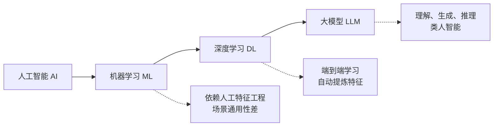

这一技术演进为教育场景应用提供了全新可能。**机器学习阶段**，AI高度依赖人工"特征工程"，需要人类专家明确告诉机器关注哪些数据特征，场景通用性差，一个训练好的模型只能用于特定任务[^3]。**深度学习阶段**实现了"端到端"学习的革命性进步，极大减少了对人工特征工程的依赖，机器能够自动分层次学习重要特征[^2]。**大模型阶段**则使机器具备了理解、生成与推理的"类人智能"能力，通用性显著增强，为破解教育长期面临的规模化与个性化矛盾提供了技术路径[^4]。

**社会需求的多维驱动**

技术进步为AI教育应用创造了条件，而社会需求的深刻变化则提供了强劲动力。

首先，**数字化转型加速**推动教育系统必须适应新的技术环境。新一轮科技革命和产业变革快速演进，数字教育已成为当今世界教育发展的时代浪潮[^5]。产业转型与就业不确定性要求教育培养学生的数字胜任力、批判性思维与创新能力。

其次，**个性化学习需求增长**使传统标准化教学模式面临挑战。经济合作与发展组织发布的《数字技术对学生学习的影响》报告指出，AI能有效支持个性化学习[^1]。尽管不同区域、不同学校、不同个体具有很大差异性，人工智能的出现让大规模因材施教成为可能[^5]。

第三，**教育公平诉求深化**从"机会公平"转向"学习结果公平"。全球教育焦点正在发生转变，基础读写算能力不足成为"学习贫困"的核心表征[^1]。教育公平的内涵扩展至确保每个学生在主流教育中获得有效支持，AI技术被寄予缩小教育差距的期望。

**教育数字化目标的本质回归**

值得关注的是，人工智能技术对教育带来的最大影响不在技术层面，而在哲学层面——它倒逼教育系统反思并重构教育价值观，**由关注知识传递回归关注育人本质**[^5]。教育数字化是有温度的，人工智能将教师从知识灌输、批改作业中解放出来，更多地转向情感育人；教育数字化是有精度的，借助人工智能，教师能够更加充分掌握学生情况和需求，精准实施教学；教育数字化是有生命的，智能时代的教育不是机器替代人的教育，而是让教育充满生命力[^5]。

### 1.2 全球视野：国际组织与主要国家的AI教育政策导向

在全球范围内，国际组织与主要国家正积极构建AI教育政策框架，形成了既有共识又有差异的多元发展格局。

**国际组织的倡议与引领**

联合国教科文组织（UNESCO）和经济合作与发展组织（OECD）在AI教育政策领域发挥着重要的引领作用。联合国教科文组织发布《人工智能与教育的未来》报告，**倡导开发"可解释、可审查"的AI工具，并将伦理规范嵌入技术设计**[^1]。这一倡议明确了AI教育应用的基本原则，强调技术透明性与伦理嵌入的重要性。

经济合作与发展组织发布《数字技术对学生学习的影响》报告，在肯定AI支持个性化学习效能的同时，指出其面临**认知负荷、设备鸿沟、网络欺凌、算法偏见以及教师准备度不足**等多重挑战[^1]。这一分析为各国政策制定提供了风险预警与应对参考。

国际组织还积极推动全球教育治理协同。2025世界教师峰会聚焦"全球教师短缺"问题，指出到2030年全球需新增5000万名教师，呼吁提高薪酬、保障编制、持续专业发展，加强教师队伍建设[^1]。联合国《塞维利亚承诺》强调教育投资对国家发展的长期回报，提出每投入1美元于教育，可带来10-15美元的国内生产总值增长[^1]。

**主要国家的战略布局**

各国根据自身发展阶段与战略需求，形成了差异化的AI教育政策路径：

| 国家/地区 | 政策重点 | 特色举措 |
|-----------|----------|----------|
| 美国 | 国家战略与技术治理 | 出台国家战略或指南，推进教师培训、课程整合与技术治理[^1] |
| 英国 | 教师减负与AI工具开发 | 投资开发AI批改与反馈工具以减轻教师负担[^1] |
| 澳大利亚 | 国家战略制定 | 相继出台国家战略，推进教师培训与课程整合[^1] |
| 阿根廷 | 算法思维与伦理教育 | 推出国家AI教育计划(PaideIA)，注重从小学开始的算法思维与伦理教育[^1] |
| 新西兰 | 教师供给保障 | 简化教师移民流程，应对教师短缺问题[^1] |
| 巴西 | 国际议程推动 | 推动"教师培养与价值提升"写入G20教育优先领域[^1] |

**全球AI教育发展的核心议题**

综合国际组织与各国政策实践，全球AI教育发展呈现出以下共性议题：

**第一，效率与伦理的平衡**。核心议题是如何在提升效率的同时，建立可操作的伦理与公平框架，平衡"提效"与"守正"[^1]。各国政策普遍强调AI工具的可解释性、可审查性，以及伦理规范的嵌入。

**第二，教师发展的系统支持**。全球教师短缺问题加剧，各国政策重点从扩大招聘转向改善留任、减轻负担与促进专业持续发展[^1]。构建更具吸引力与可持续性的教师生态系统成为共同目标。

**第三，教育筹资的结构优化**。在财政压力与多重危机叠加的背景下，教育筹资的重点转向资金的稳定性、结构优化与跨层级协同[^1]。保证教育领域获得可持续资金支持被视为关键。

### 1.3 中国战略：国家教育数字化战略与AI赋能教育政策框架

中国高度重视人工智能与教育的融合发展，形成了从顶层设计到具体实施的系统性政策框架。

**顶层设计的战略定位**

习近平总书记指出，教育数字化是我国开辟教育发展新赛道和塑造教育发展新优势的重要突破口[^6]。党的二十大首次将"推进教育数字化"写入报告，提出推进教育数字化，建设全民终身学习的学习型社会、学习型大国[^6]。《教育强国建设规划纲要(2024-2035年)》对实施国家教育数字化战略做出具体部署，提出促进AI助力教育变革的系列举措[^1]。

2025年全国两会上，习近平总书记强调："要实施国家教育数字化战略，建设学习型社会，推动各类型各层次人才竞相涌现。"[^7]这一指示为AI教育融合发展指明了方向。

**核心政策的实施路径**

教育部自2024年启动实施人工智能赋能教育行动以来，取得了显著进展。2025年，教育部启动实施国家教育数字化战略行动2.0，**将智能化作为战略方向之一**，深化推进人工智能在教育领域的全方位应用[^8]。

在政策规范层面，教育部印发了多项指导性文件：

- **《中小学人工智能通识教育指南》**：指导中小学科学组织AI教育
- **《中小学生成式人工智能使用指南》**：规范学生使用生成式AI
- **《职业院校人工智能应用指引》**：指导职业院校AI应用
- **《教师生成式人工智能应用指引》**：规范教师使用生成式AI[^8]

在2025世界数字教育大会上发布的《中国智慧教育白皮书》，系统诠释中国成效经验，提出**未来教师、未来课堂、未来学校、未来学习中心的"四个未来"构想**[^8]。这一构想为AI教育融合发展描绘了远景蓝图。

**国家智慧教育公共服务平台建设**

国家智慧教育公共服务平台是中国教育数字化的核心基础设施。该平台已汇集**13万余条中小学优质资源、1.25万余门职业教育精品课程、14.5万门高等教育优质课程**，形成了涵盖从学前教育到研究生教育全过程，包含德智体美劳各方面的教育资源中心[^6]。

平台用户总量突破1.78亿、覆盖200多个国家和地区，日均访问量达5200万，总访问量累计突破726亿[^6]。近日，平台新增学前教育板块、研究生教育板块，**实现了国家平台服务对象的全覆盖**。作为国家级教育"数据基座"的大数据中心和国家平台智能化运行中枢的智能中台正式上线，实现教育数据共享融通和国家平台智能升级[^6]。

在AI应用层面，平台上线"AI试验场"，汇聚14个AI智能工具；上线"育小苗"智能体，辅助中小学教师和学生高效获取平台资源；上线思政教育智能体，涵盖新生入学、党团建设等7大应用场景[^8]。平台还汇聚基础教育、职业教育、高等教育、终身教育人工智能精品课程超1000门，满足不同学段人群的学习需求[^8]。

**大规模师资培训与试点推进**

为支撑AI教育应用落地，教育部组织了大规模师资培训。怀进鹏部长为全国校长局长、高校辅导员亲自讲授AI大课，通过线上线下相结合的方式，覆盖超40万人[^8]。组织高校教职工参加人工智能赋能高等教育人才培养的线上培训，覆盖全国2000余所高校的50万名师生；组织普通高校本科毕业生参加人工智能综合应用能力的线上培训，参训学生达131万[^8]。

在试点探索方面，教育部开展人工智能赋能教育行动试点，遴选东部地区7个省份、中西部地区20个地市、18所高校，一体推进人工智能教学应用、课程工具开发和安全体系构建[^8]。同时，分两批设立509所中小学人工智能教育基地校，鼓励先行先试[^9]。

### 1.4 地方实践：省市层面AI教育政策的探索与特色

在国家战略指引下，各地方政府结合区域实际，形成了各具特色的AI教育政策实践。

**江苏省：系统化三年行动方案**

江苏省教育厅制定了《人工智能赋能教育高质量发展行动方案(2025—2027年)》，提出了明确的三年行动目标：到2027年，在全国率先普及中小学人工智能教育，高质量建成60个左右基础教育省级人工智能实验区和实验校；打造高校一流人工智能学科专业集群，建设15个省级人工智能学院；建成国内一流的数据、算法、算力要素支撑体系，形成国内一流、江苏特色的人工智能赋能教育实践模式[^10]。

该方案的特色在于**"四级联动"推进机制**，构建"省、市、县、校"联动的教研体系，积极构建"人工智能+学科教学"深度融合的教学样态[^10]。同时，方案注重普惠性，针对农村学校和特殊教育实施"AI教育普惠计划"，推动人工智能基础教育优质均衡发展[^10]。

**北京市：全学段AI赋能教育部署**

2025年北京市政府工作报告首次提到"加强全学段人工智能赋能教育"[^11]。在重点任务清单中明确提出："要促进首都教育数字化转型升级，动态更新北京智慧教育平台内容供给""推动人工智能深度融入教育教学全要素、全过程，推进教育大模型创新应用，培育新域新质'人工智能+教育'典型应用场景"[^11]。

北京市的政策特色体现在**服务购买机制创新**。北京市政协委员余胜泉建议建立教育领域"人工智能服务购买机制"，在财政体系中明确"人工智能教育服务"经费类别，推动教育系统从"采购设备"转向"购买服务"[^11]。这一建议直指当前AI教育应用中"硬件采购易、服务购买难"的制度瓶颈。

北京市还将建设国家"人工智能+教育"应用中试基地，布局不同学段的人工智能产品，同时更新发布《北京市教育领域人工智能应用指南》，指导学校科学应用人工智能[^11]。

**广东省：终身教育服务网络建设**

广东省通过数字化转型与制度建设，构建了覆盖省、市、县、镇、村的**五级终身教育服务网络**。通过实施资历框架标准，推动各类学习成果的认证、积累和转换，为人才成长搭建立交桥[^12]。

目前，广东省学分银行已整合超过8000门线上课程，覆盖全省129所院校，建立终身学习账户153万个，存储学习成果1460万个，初步形成了"人人皆学、处处能学、时时可学"的智慧学习环境[^12]。

**县域实践：甘肃合水县的探索**

即便在欠发达地区，AI教育应用也在积极推进。甘肃省合水县制定了《加快推进人工智能赋能教育行动的实施方案》，提出到2026年7月，推动6所试点校形成"一校一品牌、一校一特色"的AI教育应用场景；实现全县中心校以上学校AI教学工具全学科全年级覆盖、课后服务AI项目全覆盖[^13]。

该方案的特色在于**分层培养机制**，计划搭建县级人工智能应用专家人才库（50人），培育县级AI教学能手200人以上、校级500人以上，成立1至2个县级AI教育名师工作室[^13]。这一实践为欠发达地区推进AI教育提供了可参考的路径。

### 1.5 阶段特征与演进趋势：从数字化转型迈向智能化升级

基于全球发展态势与中国实践进程，当前AI教育发展呈现出鲜明的阶段特征，并展现出清晰的演进趋势。

**当前发展的阶段特征**

**第一，从"量的扩增"迈向"质的飞跃"**。教育部教育数字化专家咨询委员会主任杨宗凯指出，"十四五"时期，中国的教育数字化发展已经从单点探索、局部应用迈向了系统集成和全面深化的"智慧教育"阶段[^12]。具体表现为：优质资源供给从局部稀缺走向全域共享，教与学组织模式从标准化、统一化走向个性化、多元化，智能技术应用从工具辅助走向场景融合，教育治理决策从经验判断走向数据驱动[^12]。

**第二，全球排名显著跃升**。根据《全球数字教育发展指数报告》，中国整体水平已经从2023年的第24位、2024年的第9位跃升至2025年的第6位，**跻身全球数字教育发展的第一方阵**[^12]。这一跃升反映了中国教育数字化战略的显著成效。

**第三，应用从试点进入规模化推广期**。教育部组织教育专用大模型应用示范行动，建设23个教育专用大模型和13个学科领域垂类模型[^8]。全国中小学人工智能教育联盟正式成立，设立七大区域协作中心，推动我国中小学人工智能教育从"点状突破"迈入"全域协同"的新阶段[^9]。

**演进趋势的核心方向**

展望未来，AI与教育融合发展呈现以下关键趋势：

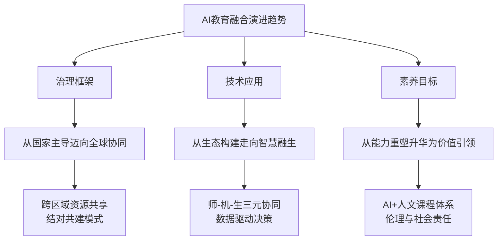

**趋势一：治理框架从国家主导迈向全球协同**。2025全球智慧教育大会指出，应进一步推动治理框架从国家主导迈向全球协同，探索跨区域资源共享机制与结对共建模式[^14]。

**趋势二：技术应用从生态构建走向智慧融生**。教育数字化的重点任务由为了教学的基础设施建设转向为了高质量发展的治理能力提升[^5]。高等教育推动学科专业数字化升级和科研范式变革，职业教育推进产教深度融合，基础教育以课程、教材和教学变革为突破口[^5]。

**趋势三：素养目标从能力重塑升华为价值引领**。政策超越技术能力培训，强调构建"AI+人文"课程体系，嵌入伦理教育与社会责任感培养，引导"智能向善"[^14]。教育数字化的师生角色由师生学会使用辅助工具转向师生数字素养培育，人工智能的发展推动教育教学由"教师—学生"二元结构向"人工智能—教师—学生"三元结构转变[^5]。

**关键挑战与应对方向**

尽管发展势头强劲，AI教育融合仍面临深层挑战。**技术迭代速度与教育系统适应能力存在"剪刀差"**，AI技术快速演进与教育长周期、重规范的特性存在根本矛盾。**赋能公平的愿景与加剧分化的风险并存**，硬件、软件、师资、数据的"数字鸿沟"可能导致优势群体更早、更深享受技术红利。**效率提升诉求与育人本质坚守存在张力**，若过度追求效率，可能导致教学功利化、师生主体性削弱。

面对这些挑战，成功的融合依赖于系统化的顶层设计与生态协同、教师角色的成功转型与系统性赋能、深度且数据驱动的产教融合机制，以及分层、融合、贯通的课程体系设计。最终竞争力在于能否构建一个兼具政策连贯性、资源流动性、机制灵活性、师资成长性和文化包容性的智慧教育生态，从而系统性地吸纳技术红利、缓冲转型冲击并持续进化。

## 2 人工智能在教育领域的应用现状与典型场景

人工智能与教育的深度融合已从理念倡导进入规模化实践阶段。2025年，AI在教育领域的应用呈现出"四维并进"的格局——智能教学、智能学伴、智能评测、智能管理四大核心场景相互支撑、协同演进，共同构建起覆盖"教、学、管、评、研"全链条的智能教育生态。本章将系统梳理各场景的技术实现路径与实际应用效果，比较不同学段的应用特点与成熟度差异，识别已实现规模化落地的成熟应用与仍处探索阶段的前沿方向。

### 2.1 智能教学：AI赋能教学设计与课堂实施

智能教学是AI教育应用的核心场景，其本质是通过技术手段重构教学全流程，实现从辅助工具向教学范式变革的跃迁。

**技术实现路径与应用场景**

智能教学的技术架构覆盖课前、课中、课后全环节，形成了较为完整的应用矩阵：

| 教学环节 | 应用场景 | 技术支撑 | 典型功能 |
|----------|----------|----------|----------|
| 课前备课 | 智能教案设计 | 生成式AI、知识图谱 | 根据教学主题、学情信息生成或优化教案建议 |
| 课前备课 | 课件自动制作 | AIGC、多模态生成 | 自动生成图片、视频、习题等课件素材 |
| 课中实施 | 课堂互动增强 | 智能助教、实时分析 | 创设互动情境、设计问题链、引导探究学习 |
| 课中实施 | 学情实时诊断 | 数据采集、行为分析 | 动态捕捉学生知识薄弱点，调整教学策略 |
| 课后反馈 | 个性化作业设计 | 自适应算法、分层推荐 | 根据学生水平推送差异化练习任务 |

教育部发布的《教师生成式人工智能应用指引（第一版）》明确指出，教师可应用生成式人工智能优化教学设计、实施与反馈环节，探索大规模因材施教和人机协同教学的有效路径[^15]。在教案设计场景中，教师通过上传教学主题、教材内容、学情信息与方法偏好等，由生成式人工智能生成或优化教案建议，提升备课质量与效率[^15]。

**创新教学模式的实践探索**

在技术赋能下，多种创新教学模式正在涌现。**AI创思课堂**成为教学范式变革的典型代表，其核心理念是"数据驱动+探究式学习"。海亮科服推出的AI创思课堂围绕"自主学习、合作学习、小老师制、课课达标、精准作业推送"五大要素，构建起"三阶六环"教学流程——课前以导学案为引导让学生自主学习和探究，课中以小组学习为牵引进行深度问题探讨，课后以全员掌握为标准实现个性化学习[^16]。这一模式的关键在于借助智能终端动态采集课堂互动、作业完成、学情反馈等多维度数据，生成学生成长画像，使教师能够精准掌握每位学生的学习状态[^16]。

天津职业技术师范大学的实践案例入选天津市首批"人工智能+高等教育"典型应用场景。《大模型赋能的智能教学助手》涵盖资源重构、知识图谱、AI实践教学与沉浸式互动四大方向，通过智能助学、助教、助管三大核心模块协同工作，共同构建立体、智能、互动的教学生态系统[^17]。该案例在实现教学全过程数字化转型的同时，以学生为中心，为学生量身定制个性化、高效能学习路径[^17]。

**从"会用AI"到"善用AI"的转型进展**

截至2025年底，北京市中小学AI应用率达87.7%，每校至少有一个场景应用，较年初提升近20个百分点[^18][^19]。教师助教、学情诊断、智能学伴等已成为教学"必需品"，教师正从"会用AI"向"善用AI"转变，自建语料、自创智能体的"微创新"蔚然成风[^18]。

然而，这一转型仍面临挑战。北京市政协委员程乐松指出，"全学段人工智能赋能教育"首先要让老师理解什么是人工智能，并形成共识——"人工智能对传统的教育方式是一个巨大挑战"，要转变授课方式，充分迎接技术带来的转变[^20]。教师角色正在从知识传授者向"学习设计师、引导者、成长教练"转型，这需要配套的场景化培训体系与系统性支持[^21]。

### 2.2 智能学伴：个性化学习支持与AI辅导系统

智能学伴是AI教育应用中产品形态最为丰富、市场化程度最高的领域，其核心价值在于实现规模化因材施教，破解教育领域长期存在的"个性化、高质量、大规模"不可能三角。

**产品形态与技术架构**

当前智能学伴产品主要包括AI学习机、智能答疑系统、自适应学习平台等形态，技术架构普遍采用"大模型+知识图谱+多模态交互"的组合方案：

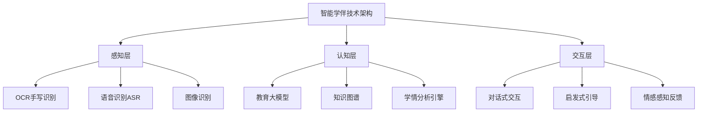

**代表性产品的技术特征分析**

**科大讯飞AI学习机**搭载"AI 1对1精准学"功能，只需完成少量题目，就能快速定位知识薄弱点，生成专属学习路径，避免盲目刷题[^22]。其核心技术包括中高考同源技术，听力发音、语速与真题完全一致，还原真实考试场景；支持KET口语模拟考，虚拟考官实时互动，发音错误及时纠正[^22]。

**学而思学习机**依托九章大模型与DeepSeek双核引擎打造的1对1 AI老师，颠覆传统被动响应模式，以苏格拉底式对话主动引导学习[^23]。该产品能精准识别手写步骤、实时反馈对错，通过多轮追问激发主动思考，还具备情绪感知技术提供个性化鼓励[^23]。学而思始终将教研内容的系统性与专业性作为核心竞争力，九章大模型针对K12教育场景深度优化，与覆盖全学科、全学段的题库、课程资源深度融合[^23]。

**智大蓝图小蓝学习本X1**采用全球首创的双屏墨水屏设计，以"小蓝老师"AI模型为内核，通过"投喂"教师教案、课件、试题及学科知识图谱等海量高质量教育数据集，发挥懂知识、懂教学的教育大模型优势，以引导式知识讲解提升学生自主思考能力[^24]。该产品在深圳市龙岗区科创实验学校已投入实际应用，学生在左屏看课本、习题，在右屏同步记笔记、做作业，老师可通过设备发放习题并快速完成智能批改[^24]。

**从"助手级"到"教师级"的能力跃迁**

对标自动驾驶L1-L5的分级路径，好未来CTO田密提出的"AI教师L1-L5分级"理论为教育AI的进化路径提供了清晰标准[^23]。当前行业发展方向是从L2级别的"能干活的助手"向L3级别"AI老师"演进。

学而思"小思AI 1对1超级教育智能体V3.0"通过中国信通院首批教育智能体评估，斩获4+级最高评级，入选工信部工业文化发展中心"AI产业创新场景应用案例"[^23]。依托自然语言处理与知识图谱技术，该智能体实现了从L2（助手级）到L3（教师级）的能力跃迁，不仅能完成AI作业批改、难题解析等基础功能，更能通过分步讲解、逻辑引导等方式培养学生的思维能力[^23]。

**高途集团**在2025年全面推进"AI+教育"深度融合，构建了覆盖全学习旅程的AI教育产品矩阵。"毛豆爱学AI课堂"开创了真人教师与AI协同教学的新范式，AI不仅能辅助主讲教师进行知识点强化，还能根据学生实时反馈动态调整教学节奏[^25]。"名师定制学"推出了"真人级"AI名师分身，融合语音、板书与动态演示等多模态能力，可精准诊断学生手写试卷，生成包含错因分析、能力图谱与个性化学习路径的详尽报告[^25]。

### 2.3 智能评测：AI驱动的教育评价与反馈机制

智能评测是AI教育应用中技术成熟度较高、应用效果最为显著的领域之一，其核心价值在于突破传统"单一分数"评价模式，构建"过程+结果"的立体评价体系。

**技术实现路径**

AI智能评测系统综合运用多种技术手段，形成了较为完整的技术栈：

| 技术类型 | 应用场景 | 核心功能 |
|----------|----------|----------|
| OCR光学字符识别 | 手写试卷数字化 | 将纸质答案转化为数字内容 |
| 自然语言处理NLP | 主观题评阅 | 语义分析、论证逻辑评估 |
| 知识图谱 | 学业诊断 | 精准定位知识薄弱点 |
| 多模态分析 | 综合素质评价 | 整合文本、图像、音视频数据 |
| 机器学习 | 评分模型优化 | 通过历史数据持续提升准确性 |

AI智能阅卷系统通过深度学习、自然语言处理、图像识别等技术，能够模拟人类阅卷过程，自动判分，减少人为干扰，提高批改效率[^26]。针对主观题，系统通过语义分析算法理解学生的答案是否符合题意，并根据标准答案或评分规则给出合理的评分，能够识别学生是否对问题进行了充分论证、是否使用了正确的概念、答案结构是否清晰[^26]。

**从"单一分数"向"过程性评价"的转变**

《教师生成式人工智能应用指引》明确提出，教师可应用生成式人工智能改革评价工具与方法，通过人机协同实施作业批改、学业诊断、试题命制与量规设计，提升评价的客观性、时效性与育人价值[^15]。

在课堂评价场景中，利用生成式人工智能自动批改客观题与结构化主观题，批量分析作业、测验中的共性错误，快速生成班级得分分布图与知识薄弱点，减轻教师重复劳动[^15]。在作业反馈场景中，AI对作文、论述、报告等主观类作业进行初步批阅，快速生成分析建议，教师在AI辅助评分基础上重点聚焦学生思维水平、创意表达等高阶能力，开展深度点评与指导，实现人机协同反馈[^15]。

**多模态评价体系的构建**

基于AI的教育智能评测方案正在构建"过程+结果"的立体评价体系。该方案整合文本（作业、作文）、图像（手写答题、实验报告）、音频（口语表达）、视频（课堂互动、实操过程）等多模态数据[^27]。在英语听说评测中，系统通过ASR分析发音准确度，结合NLP理解语义逻辑，同时利用情感分析捕捉学生的表达自信度，使评价维度从"语音正确"扩展到"语言素养"[^27]。

融合项目反应理论（IRT）与深度学习算法，评测系统可根据学生实时表现动态调整题目难度与类型，通过"诊断-反馈-提升"的闭环机制，使评测效率提升3倍，学习投入度提高25%[^27]。

**职业教育技能评价的精准化**

在职业教育领域，AI评测系统实现了"毫米级"的技能评价精度。针对护理专业的实操考核，AI评测系统通过计算机视觉识别"静脉穿刺"的进针角度、消毒范围等20余项操作指标，结合压力传感器捕捉手法力度[^27]。这种客观化评测方式将考核效率提升5倍，且评分一致性达98%，远高于人工评测[^27]。

职业教育实训AI即时反馈系统的评估指标体系正在构建，涵盖"党建引领、技术效能、教学适配、育人成效"四维架构，其中技术效能维度包括"操作反馈延迟≤5秒""技能操作识别准确率≥95%"等量化标准[^28]。

### 2.4 智能管理：教育治理与校园运营的数字化升级

智能管理是AI教育应用的重要支撑，其核心价值在于打通数据孤岛，实现从"经验管理"向"数据治理"的转型升级。

**智慧校园管理平台架构**

智能校园数字化管理系统以数据为核心，构建起分层式技术架构[^29]：

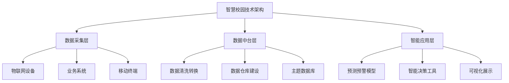

**数据采集层**通过物联网设备、校园业务系统、师生移动终端等多元渠道，实时采集教学、科研、管理、生活等场景数据，覆盖课堂考勤、实验设备运行、图书借阅记录、校园能耗监测等数据[^29]。**数据中台层**运用ETL技术对分散在教务、人事、财务、后勤等系统的数据进行清洗、转换与整合，建立标准化的数据仓库，通过数据建模构建师生数字画像、教学质量分析、资产动态管理等主题数据库[^29]。**智能应用层**基于机器学习、人工智能算法对数据进行深度挖掘与分析，开发预测预警模型、智能决策工具等应用[^29]。

**国家级基础设施建设进展**

教育部"职教大脑"数据质量监测评价体系已建立运行。该体系从前置检测、数据质量、应用场景等多个维度进行评价，对整个学期上报数据、数据对接情况进行监测与分析[^30]。随着"职教大脑"的数据标准从1.0版本的31张表发展到3.0版本的98张表，数据覆盖范围不断扩大，标准不断细化[^30]。

北京市建设AI应用超市，搭建企业产品与教育场景的对接桥梁，汇聚30余款产品40余个工具，让校企协同更具实效[^19]。通过"揭榜挂帅"机制打造的"京娃"系列智能体中，"京小健"已建成并投入应用[^19]。北京市还打造AI创新社区，围绕"学、用、研、赛、创"一体化融合发展，深化与高校学分认证、科研管理、创业扶持等政策体系衔接，形成覆盖多学段、贯通全链条的AI创新生态[^19]。

**数据驱动决策的实践应用**

在教学科研管理领域，智能教务管理系统整合课程安排、教师授课、学生选课等数据，通过算法优化排课方案，提高教室、师资等教学资源的利用率[^29]。科研项目全周期管理系统建立科研项目大数据看板，对项目申报、立项、执行、验收等各环节数据进行跟踪分析，通过数据挖掘识别科研项目的潜在风险[^29]。

在资产后勤管理领域，固定资产全生命周期管理通过RFID、二维码等技术实现资产的标识与追踪，结合资产使用、维修、报废等数据构建资产动态管理模型[^29]。能耗智能监控与管理系统采集水、电、气等能耗数据，结合环境传感器数据分析能耗规律，通过智能调控设备实现能源的合理分配与节约使用[^29]。

### 2.5 学段应用差异：K12、高等教育与职业教育的AI应用比较

AI教育应用在不同学段呈现出显著的差异化特征，这既源于各学段教育目标与教学模式的本质差异，也反映了技术成熟度与市场发展的阶段性特点。

**K12教育：个性化学习与减负增效**

K12教育是AI应用最为活跃、产品形态最为丰富的领域，核心聚焦于**个性化学习与规模化因材施教**。

北京市启动首批50所人工智能应用场景标杆学校培育，涵盖北京市第二中学、清华大学附属小学等42所中小学[^19][^31]。这些学校在课程改革、个性化学习等领域形成可推广经验。北京市广渠门中学以"守正创新、人机协同"为核心，构建"BASE+"AI教育新生态；北京市第八中学以"数据驱动、精准教学、个性成长"为核心理念，构建了以学习者为中心的"1+1+7+N"智慧校园建设框架[^31]。

自2025年秋季学期开始，北京市全市中小学校全面普及人工智能通识教育，每学年不少于8课时，学校将人工智能课程独立设置或与信息科技、通用技术、科学、综合实践活动等融合开展[^19]。北京市精心研制了50节具备基础性、示范性和实用性的高质量中小学人工智能通识教育课程，涵盖人工智能领域多个关键主题内容[^19]。

深圳市在AI教育应用方面同样走在前列。深教AI平台学习资源覆盖全市897所学校，"每周半天"社会实践课让学生在真实场景中探寻兴趣[^32]。深圳市龙岗区科创实验学校已将双屏墨水屏AI学习终端应用于4-6年级的语文、数学、英语课堂[^24]。

**高等教育：科研范式变革与拔尖人才培养**

高等教育的AI应用侧重于**拔尖创新人才培养与AI for Science前沿探索**。

北京市第二批20所高等教育人工智能典型应用场景已遴选完成，包括北京第二外国语学院"多语种影视翻译垂类模型构建与应用实践"、北京工业大学"基于星空教育垂类大模型的高校教学质量智慧评价场景"、北京电影学院"人工智能赋能家校社协同育人创新实践"等[^19][^31]。艺术类院校成为亮点——中国戏曲学院构建戏曲AI数据集，北京舞蹈学院建设多模态舞蹈语料库，彰显AI与人文艺术的创新碰撞[^31]。

北京高校目前建设了11个智能科学与技术一级学科、36个人工智能本科专业，支持48所高校成立人工智能学院（系）和研究院，推动开设45个微专业、29个辅修专业，构建了多层次的人才培养体系[^18][^19]。高校聚焦拔尖创新人才培养、AI for Science、AI for Technology等前沿领域，深耕"AI+产业"，目前已有25项创新应用入选教育部人工智能典型场景[^18]。

清华大学在教师教育改革中强化科技教育与AI融合课程建设。在"教育大数据与学习行为分析"课上，学生一边学习教育大数据知识和数据挖掘技术，一边自主设计面向未来教与学的智能系统，如学生课堂注意力监测系统、中考体育实心球运动智能训练系统等[^33]。

**职业教育：产教融合与技能实训**

职业教育的AI应用强调**产教融合深化与技能培养精准化**，呈现出鲜明的产业导向特征。

天津推出职业教育"人工智能+"行动十项措施，在优化专业布局、创新人才培养、深化产教融合等方面持续发力[^17]。2025年，天津电子信息职业技术学院人工智能学院王亚丽团队采用国产化芯片自主研发AI边缘计算服务器系统，实现从硬件到软件完全国产化，经过两年时间300余家单位深度应用验证，创造经济效益超2000万元[^17]。

天津电子信息职业技术学院与阿里云计算有限公司签署校企合作协议，预研国内首个面向职业教育的AIGC大模型实践教学平台，首批面向天津高职院校师生发放1万张300元无门槛优惠券，开放免费轻量应用服务器资源[^17]。天津职业大学人工智能技术专业群联合麒麟、飞腾等龙头企业建成PK体系信创实训基地，打造人工智能大模型实训室、网络安全攻防靶场，年培训超5000人次，校企联合技术攻关年创效超千万元[^17]。

深圳信息职业技术大学人工智能学院联合百度、阿里云、科大讯飞等头部企业共建产业学院，围绕"十共"探索校企双主体办学模式，以产品交付为导向开设了AIAgent、AIGC短剧等实践课程[^34]。学院构建了"底层共享、中层分立、高层互选、顶层融合"的课程体系，将数理基础与编程实践、跨界创新有机贯通[^34]。

**三大学段AI应用特点比较**

| 维度 | K12教育 | 高等教育 | 职业教育 |
|------|---------|----------|----------|
| **核心目标** | 个性化学习、减负增效 | 拔尖创新人才培养、科研范式变革 | 产教融合、技能精准培养 |
| **应用重心** | 智能学伴、自适应学习 | 课程创新、科研赋能 | 实训平台、技能评价 |
| **产品形态** | AI学习机、学习本 | 教育大模型、智能体 | 实训系统、认证平台 |
| **市场特征** | 产品丰富、市场成熟 | 探索深入、场景培育中 | 产业结合紧密、经济效益显著 |
| **成熟度** | 较高（规模化落地） | 中等（探索期） | 较高（特色化发展） |

### 2.6 应用成熟度评估：规模化落地与探索阶段的场景识别

基于前述场景分析，可以对AI教育应用的成熟度进行系统评估，识别已实现规模化落地的成熟应用与仍处探索阶段的前沿方向。

**已实现规模化落地的成熟应用**

**第一类：智能批改与学情诊断**。这是当前成熟度最高的应用领域，技术路径清晰、产品形态成熟、用户接受度高。截至2025年底，北京市中小学AI应用率达87.7%，教师助教、学情诊断等已成为教学"必需品"[^18][^19]。AI作业批改系统能够自动批改客观题与结构化主观题，批量分析共性错误，快速生成班级得分分布图与知识薄弱点[^15]。

**第二类：个性化资源推荐与自适应学习**。以科大讯飞、学而思为代表的AI学习机产品已形成成熟的商业模式，"AI 1对1精准学"功能能够快速定位知识薄弱点，生成专属学习路径[^22][^23]。有着AI学习机"新国标"之称的《信息技术学习、教育和培训移动学习终端功能要求》国家标准已正式发布，标志着行业进入标准化发展阶段[^23]。

**第三类：智能教务与资源调度**。智能排课、教室资源优化等应用已在多数学校落地，通过算法优化提高教学资源利用率[^29]。教育部"职教大脑"数据质量监测体系已建立运行，数据标准从1.0版本发展到3.0版本[^30]。

**仍处探索阶段的前沿方向**

**第一类：AI教师分身与深度人机协同**。虽然学而思"小思AI 1对1"已实现从L2到L3的能力跃迁[^23]，但真正具备完整教学能力的"AI教师分身"仍处于探索阶段。高途推出的"真人级"AI名师分身融合语音、板书与动态演示等多模态能力，但其讲解效果"接近"而非"达到"线下一对一辅导水平[^25]。

**第二类：跨学科智能体与项目式学习支持**。《教师生成式人工智能应用指引》提出应用生成式人工智能整合多学科知识素材，辅助设计与实施跨学科项目式学习[^15]，但目前此类应用仍以场景示例形式存在，尚未形成成熟产品。

**第三类：情感计算与全人关怀**。学而思学习机已具备情绪感知技术[^23]，但真正理解学习情境、识别学生情感状态并提供适应性情感支持的"情感智能"技术，仍是未来突破方向。

**影响应用成熟度的关键因素**

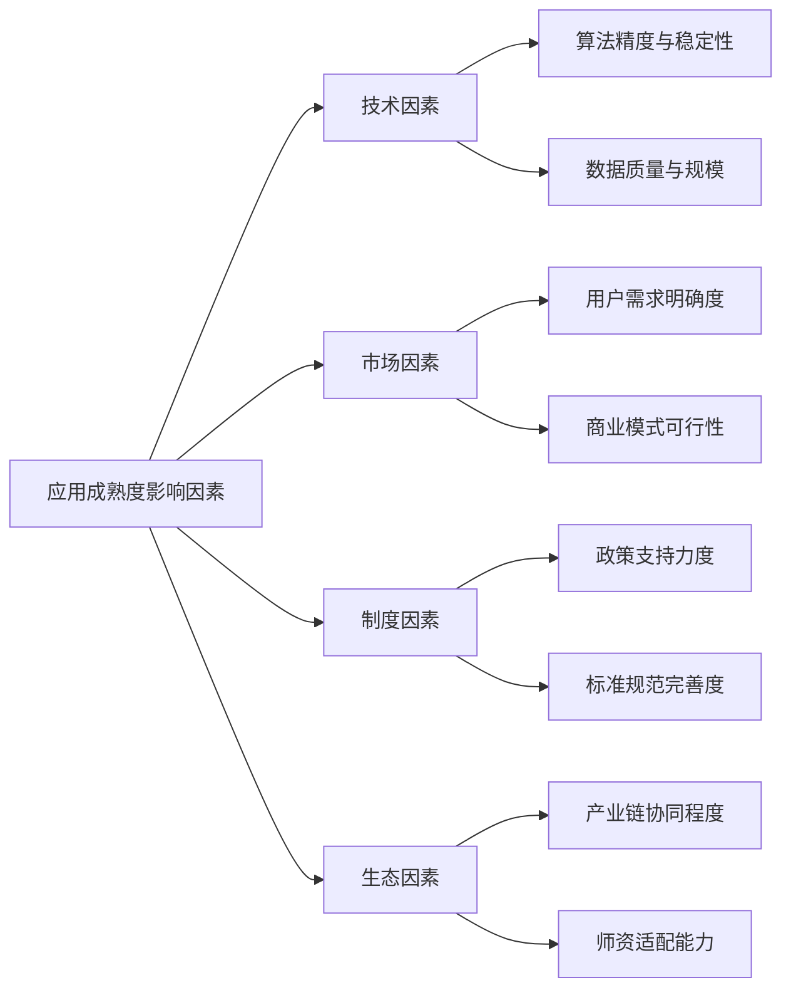

**技术因素**方面，算法精度与稳定性、数据质量与规模是基础。当前职业教育技能评价中AI系统评分一致性达98%[^27]，验证了技术在特定场景的成熟度。**市场因素**方面，用户需求明确度与商业模式可行性决定了产品能否规模化。K12领域AI学习机市场成熟正是因为"提分"需求明确、付费意愿强烈。**制度因素**方面，政策支持与标准规范为应用落地提供保障。北京市政协委员建议建立"人工智能服务购买机制"，解决"硬件采购易、服务购买难"的制度瓶颈[^20]。**生态因素**方面，产业链协同与师资适配能力是规模化落地的关键。天津职业院校与头部企业的深度合作模式，为产教融合提供了可复制经验[^17]。

综上所述，AI在教育领域的应用已形成智能教学、智能学伴、智能评测、智能管理四大核心场景，并在K12、高等教育、职业教育等学段呈现出差异化、深层次的发展态势。当前正处于从规模化落地向深度融合与价值创造转型的关键期，未来的成功取决于可持续服务模式构建、技术与教育规律的深度互构，以及始终以学生成长为中心的价值坚守。

## 3 人工智能赋能教育的实践案例与成效分析

人工智能与教育融合的价值最终体现在实践层面。从政策倡导到课堂落地，从技术工具到教学范式变革，AI赋能教育的成效需要通过具体案例来验证与呈现。本章将聚焦基础教育、高等教育、职业教育三大领域的代表性实践，深度剖析其创新做法与实施路径，提炼可复制的成功经验，并基于实证数据评估AI赋能在教学质量提升、学习效率改善、教育公平促进等维度的实际成效，为后续规模化推广提供循证参考。

### 3.1 基础教育领域的AI应用实践案例

基础教育是AI教育应用最为活跃的领域，各地标杆学校在智能学伴应用、个性化学习路径构建、AI融合学科教学等方面形成了丰富的实践经验。

**成都青羊区：生成式AI赋能传统文化教学的系统性探索**

成都市青羊区在AI融合教学领域的探索获得了国家级权威认可。由青羊区教育科学研究院教研员黄莺老师带领成都市同辉（国际）学校黄颖俐老师、成都市泡桐树小学西区分校陈萌萌老师设计并执教的教学案例《智能互动，粽香传情：生成式AI赋能传统文化教学新生态教学案例》荣获教育部教育技术与资源发展中心"融合创新应用教学案例"创新作品最高荣誉[^35]。

该案例的成功路径体现了**从区域到全国的"四级跨越"**——历经青羊区一等奖、成都市一等奖、四川省一等奖，最终挺进全国赛场并斩获最高荣誉，充分展现了青羊区在"AI+教育"融合创新方面的扎实功底与领先实力[^35]。

青羊区的创新实践具有鲜明的**系统性教研特征**。该区坚持"始于问题、成于体系、凝于范式"的教研路径，构建了"研—创—用—思"闭环教研新生态[^35]：

| 教研环节 | 具体做法 | 成效产出 |
|----------|----------|----------|
| 研（研究） | 精准把脉教师的真实困惑 | 识别教学痛点 |
| 创（创造） | 教研员率先垂范开发样章，跨校集群共创 | 69节AI赋能课例 |
| 用（应用） | 专项攻坚循证迭代 | 可复制推广的教学范式 |
| 思（反思） | 跨区域协同开阔视野 | 持续优化的区域教研机制 |

该获奖案例以"生成式AI赋能传统文化教学"为核心，将智能工具深度融入教学设计，构建了**技术赋能与文化传承双向激活**的教学新生态，体现了"素养导向、技术融合、育人为本"的区域课改方向[^35]。这一实践表明，AI应用的成功不仅在于技术本身，更在于与学科特点、育人目标的深度契合。

**北京贵阳附中：数智深耕的"三层次推进"框架**

北京师范大学贵阳附属中学在AI赋能教学方面擘画了清晰的"三层次推进"行动框架，为基础教育学校提供了可操作的实施路径[^36]。

**第一阶段：普及层——从"工具"到"本能"**。学校通过"知行大讲堂"定期"充电"，教师掌握了六大提问框架（如T-A-G、C-A-R-E等交互逻辑），让AI生成教学设计的效率直接提升了40%[^36]。学生层面，AI通识课已纳入校本选修，从基础原理到编程实践，让学生沉浸式体验技术带来的学习快感。

**第二阶段：融合层——从"加法"到"乘法"**。学校推动AI与学科的深度融合，形成了多个创新案例[^36]：
- **历史课**：利用AI解析历史纪录片，几秒钟内自动提取时间线、核心人物关系图，原本枯燥抽象的古代制度演变在动态图谱中变得直观易懂
- **生物课**：细胞分裂的微观过程通过AI模拟变得立体鲜活，学生不再对着静态插图"死记硬背"

目前，学校已孵化出十余个涵盖文、理、艺、体的AI教学示范案例，真正实现了"AI+学科"的深度融合[^36]。

**第三阶段：实践层——从"课堂"到"赛场"**。依托学校AI中心搭建的平台，学生开发了"基于AI手势识别的人机交互控制系统"等参赛作品，在各类科技创新竞赛中屡获佳绩[^36]。教师的科研成果也在井喷——"生成式AI在学科教学中的应用研究"等6个课题已成功立项，致力于探索可复制、可推广的"北附经验"。

**江苏吴江实验小学：智能体评改作文的创新实践**

江苏省苏州市吴江实验小学探索利用AI智能体来评改作文，形成了可操作的四步流程[^37]：

**第一步：写好草稿**。教师利用习作任务单上好作前指导课，要求学生书写认真、用铅笔书写便于修改，提前告知学生要拍照"投喂"以倒逼书写工整。

**第二步：智能评改**。教师一次性把全班作文拍照"投喂"给智能体，输入专业、具体的指令。例如《写信》作文的评改指令包括：评价标准（写信六要素齐全、格式正确；用第二人称写、多用问句；分享"我"的近况）、评改要求（真实赋分、3个优点、3处修改点、指出错字别字、文字让四年级孩子一读就懂、总字数控制在500字内）[^37]。

**第三步：学生修改**。学生拿到智能体评改意见后进行修改。针对学困生，学校成立修改小组，以强带弱，组长帮助修改，学困生在边上观看学习，三五次下来也能自主修改[^37]。

**第四步：智能体二次赋分**。教师再次上传作文，要求智能体调取上次作文进行比对，以激励为原则进行二次赋分，仅提出一条修改意见，让学生都能看到进步、产生写作信心[^37]。

这一实践展现了智能体评改作文的**四大优势**[^37]：
- **精准量规**：统一指令实现标准统一，减少人为主观影响
- **为教师减负**：相当于配备全天候"数智作文老师"，大幅减轻负担
- **反馈及时**：当天作文、当天反馈、当天修改，快捷高效
- **大数据指导**：对学生个体表达有记忆，能进行前后对比与分析

### 3.2 高等教育领域的AI创新实践案例

高等教育领域的AI应用呈现出更强的学术性与前沿性特征，既包括智能教学系统的构建，也涉及对生成式AI的学术诚信划界。

**天津职业技术师范大学：智能教学系统的典型案例**

天津职业技术师范大学的两个案例入选天津市首批"人工智能+高等教育"典型应用场景案例，代表了高校AI教学创新的前沿方向[^17]。

**案例一：《大模型赋能的智能教学助手》**由信息技术工程学院教师张丽霞主持实施，涵盖资源重构、知识图谱、AI实践教学与沉浸式互动四大方向，通过智能助学、助教、助管三大核心模块协同工作，共同构建立体、智能、互动的教学生态系统[^17]。该案例在实现教学全过程数字化转型、引领教学内容与教学模式双重革新的同时，以学生为中心，为学生量身定制个性化、高效能学习路径。

**案例二：《AI赋能课程智能助学模式创新实践》**以智谱清言智能体、AI助学机器人、学习通为助学赋能平台，打造了**课前智能导学、课中智能促学、课后智能伴学**的伴随式智能助学新范式[^17]。汽车与交通学院教师王少华指出，"这一模式有效解决了高等工程教育教学过程中存在的课程应用特色不鲜明、教学模式吸引力不强、个性化伴随学习支撑不足等典型问题"。

**美国一流大学：生成式AI应用的政策划界**

美国一流大学对ChatGPT等生成式AI的应用态度与政策划界，为全球高等教育提供了重要参考。根据对84所美国一流大学的调查研究，各校对ChatGPT的应用态度呈现出差异化分布[^38]：

| 态度类型 | 高校数量 | 占比 | 典型代表 |
|----------|----------|------|----------|
| 禁止使用 | 9所 | 10.7% | 哈佛大学（部分场景） |
| 有条件使用 | 54所 | 64.3% | 多数高校 |
| 允许使用 | 4所 | 4.8% | 普林斯顿大学 |
| 未有指导意见 | 17所 | 20.2% | 观望态度 |

美国一流大学从**知识生产和人才培养双重逻辑**出发划界ChatGPT应用[^38]：

**知识生产维度**坚持学术产出的原创性、真实性和学科性原则。在原创性方面，ChatGPT不具备原创内容能力，可能无意中抄袭文本，《科学》和《自然》杂志禁止将ChatGPT列为论文合著者[^38]。哈佛大学、哥伦比亚大学、斯坦福大学、宾夕法尼亚大学和布朗大学均有具体规定，强调学术产出的原创性。在真实性方面，ChatGPT可能生成不正确或无意义的"幻觉"答案，康奈尔大学、罗切斯特大学要求学生标记AI生成内容并正确引用[^38]。

**人才培养维度**考量学生思维发展成熟度与学业任务属性。美国部分高校禁止大一新生写作课使用AI工具，并改革作业设计以鼓励个性化表达[^38]。杜克大学、加州大学伯克利分校允许使用ChatGPT检查语法和研究，但禁止完成作业和考试；塔夫茨大学建议教师修改课程任务；约翰霍普金斯大学要求提交提纲和草稿[^38]。

**海外高校AI战略规划的共性特征**

美国高等教育信息化协会发布的《2024年人工智能图景研究》分析了人工智能对美国高等教育的影响[^39]。研究指出，教育机构制定AI相关战略规划的主要动机包括：学生使用AI情况增加、对不当使用的担忧、对技术落后的担忧。其中，**学生体验成为教育政策制定时的侧重点**，主要目标是为学生提供就业准备以及探索新的教学与学习方法[^39]。

值得关注的是，**关于人工智能的限制性政策并不常见**。在学术诚信方面，高校之间态度不同：杜克大学对学生使用AI完成作业的态度相对乐观，在"金融技术新兴趋势"课程中要求学生使用AI聊天机器人辅助创建执行摘要的初稿；哈佛大学则保持相对谨慎的态度[^39]。牛津大学商学院在学生手册中明确提出使用AI的规范——学生在使用AI时需要保护机密数据，使用AI生成材料时应对内容负责[^39]。

总体来看，高等教育界对AI的未来持**谨慎乐观态度**。大多数受访者预计未来AI会被更多用于学习分析（69%），同时认为学术不诚实将会增加（64%），学生会过度依赖AI（60%）[^39]。

### 3.3 职业教育领域的AI深度融合案例

职业教育与产业技术联系最为紧密，AI赋能职业教育呈现出鲜明的产教融合特征与直接经济效益。

**天津：AI赋能职业教育的系统性探索**

天津推出职业教育"人工智能+"行动十项措施，在优化专业布局、创新人才培养、深化产教融合等方面持续发力，走出了一条AI赋能职业教育的新路径[^17]。

**案例一：AI边缘计算服务器系统自主研发**。2025年，天津电子信息职业技术学院人工智能学院王亚丽团队采用国产化芯片自主研发AI边缘计算服务器系统，实现从硬件到软件完全国产化[^17]。该系统依托人工智能开放型产教融合实践中心平台优势，具备数据处理能力强、可扩展性强、通用性强、功耗低的特点，产品功能涵盖从烟火检测到人脸识别等多种应用场景。经过两年时间300余家单位深度应用验证，**创造经济效益超2000万元**，为职业教育与产业需求深度融合提供创新样本。

**案例二：AIGC大模型实践教学平台建设**。天津电子信息职业技术学院与阿里云计算有限公司签署校企合作协议，预研国内首个面向职业教育的AIGC大模型实践教学平台[^17]。该平台建立面向"园区+院校"的"算力补贴券"普惠服务机制，首批面向天津高职院校师生发放1万张300元无门槛优惠券，开放免费轻量应用服务器资源，适用于网站搭建、Web应用、容器环境等，为师生提供全链路模型服务工具、多元高性能模型调用与智能体应用开发服务。

**案例三：数字教材开发与应用**。天津现代职业技术学院牵头开发的《人工智能通识教程》数字教材是天津市人工智能赋能职业教育创新发展联盟的首个重要成果，包含课件、案例库、实训项目等多个模块[^17]。目前该教材已在天津多所职业院校推广使用，其"人工智能+实战讲解+模块化实训"架构提升教育教学效果，深受学生欢迎。"数字教材学起来非常有意思，好理解、能互动。自己进行线上学习时，感觉老师就在身边。这种体验非常奇妙。"天津现代职业技术学院物联网专业学生高梦怡如是评价。

**案例四：智慧校园AI融合生态构建**。天津现代职业技术学院同步推进智慧校园建设，将DeepSeek大模型全面接入融合门户，构建PC端与移动端同步运行的智能助手平台，打造"教学改革+管理升级"双线并进的AI融合应用新生态[^17]。

**深化产教融合的多元路径**

天津多所职业院校与人工智能领域企业开展深度合作[^17]：

| 院校 | 合作企业 | 合作内容 | 成效 |
|------|----------|----------|------|
| 天津职业大学 | 麒麟、飞腾 | PK体系信创实训基地、大模型实训室、网络安全攻防靶场 | 年培训超5000人次，校企联合技术攻关年创效超千万元 |
| 天津交通职业学院 | 华为、联想、科大讯飞 | "AI+产业学院"、校企联合课程与认证体系 | 交通物流、智能制造、绿色化工等领域AI实训基地建设 |

天津职业大学人工智能技术专业群锚定天津市信创产业链岗位人才培养需求，推动新形态课程教学资源建设项目，依托深度校企合作，联合开发涵盖人工智能等8个技术方向的活页式教材，将企业技术攻关案例转化为教学素材，实现人才培养与产业需求"零时差"衔接[^17]。

**全球职业教育领域AIGC应用的典型场景**

从全球视野来看，AIGC在职业教育领域的应用场景日益呈现出拓展与深入化的趋势，体现出"多维"的技术导向与教学形式变革[^40]：

**智能文本处理与沟通升级**。诸多职业院校将AIGC视作"办公室"职业（如会计师、物流分析师、社会服务顾问等）的技能辅助工具。德国柏林技术大学开展研讨会，培训学生掌握ChatGPT的使用方法，要求他们能够提出准确"指令"，以帮助简化文本语言、凝练文本内容[^40]。芬兰赫尔辛基职业技术学院专为商务专业人士量身定制综合课程，教授学员如何制作清晰简洁的"指令"，有效利用ChatGPT进行营销和销售。

**医疗诊断与个性化护理**。美国麻省理工学院职业培训部门为数据科学家、软件工程师以及来自保险、制药、电子健康记录等相关专业的学生及在职人员开展ChatGPT应用课程，教授如何利用大语言模型整合医疗数据、识别疾病和确定有效治疗方案、预测和改善患者健康状况、制定个性化护理和精准医学方案[^40]。

**编程教育与应用程序开发**。瑞士苏黎世联邦理工学院为全校师生制作科普网页，呈现"ChatGPT可以编程吗？""如何使用ChatGPT进行编程？"等搜索词条及详细操作步骤[^40]。英国牛津大学继续教育学院为业务分析师、技术架构师、数据分析师等创建了为期8周的在线课程，教授如何与大语言模型协作创建人工智能应用程序。

**图像处理与产品设计支持**。英国剑桥大学为图像编辑师及设计师等相关专业编制了AIGC使用指南，强调可以利用DALL.E和Midjourney等工具对照片进行纠正和轻微编辑，使其更易用而无需改变照片的原有主题和构造[^40]。

### 3.4 成功案例的关键要素与可复制经验提炼

基于前述案例的横向比较与纵向分析，可以归纳出AI赋能教育成功实践的共性要素与可复制经验。

**关键成功要素的多维分析**

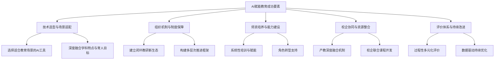

**要素一：技术选型与场景适配**。成功案例普遍体现了技术与教育场景的深度契合。成都青羊区的案例以"生成式AI赋能传统文化教学"为核心，将智能工具深度融入教学设计，构建了技术赋能与文化传承双向激活的教学新生态[^35]。这表明，**AI应用的成功不在于技术的先进性，而在于与学科特点、育人目标的深度匹配**。

**要素二：组织机制与制度保障**。青羊区构建的"研—创—用—思"闭环教研新生态，从精准把脉教师困惑到理论武装形成共识，从教研员率先垂范到跨校集群共创，每一步都扎实稳健，最终凝结为可复制、可推广的区域教研范式[^35]。北师大贵阳附中的"三层次推进"框架同样体现了系统化的组织设计[^36]。

**要素三：师资培养与能力建设**。优质AI教育的推广终究要靠一支专业过硬的教师队伍。全国中小学人工智能教育联盟可以搭建"高校+企业+基地校"的协同培训网络，利用高校的理论资源、企业的技术优势、基地校的实践经验，为全国中小学教师提供系统性、常态化的培训[^41]。教师角色正在从知识传授者向"学习设计师、引导者、成长教练"转型。

**要素四：校企协同与资源整合**。天津职业院校的实践表明，深度产教融合是职业教育AI应用成功的关键。天津电子信息职业技术学院与阿里云的合作、天津职业大学与麒麟、飞腾的合作，均实现了技术研发、人才培养、经济效益的多重产出[^17]。

**要素五：评价体系与持续改进**。吴江实验小学的智能体评改作文实践建立了"写作—评改—修改—二次赋分"的闭环机制，通过数据驱动实现持续优化[^37]。美国高校对生成式AI的政策划界则体现了在学术诚信与技术赋能之间寻求平衡的评价智慧[^38]。

**可复制经验的系统性框架**

基于上述分析，形成可供不同类型学校参考借鉴的实施框架：

| 实施阶段 | 核心任务 | 关键行动 | 成功标志 |
|----------|----------|----------|----------|
| 启动期 | 需求识别与技术选型 | 精准把脉教师困惑，选择适配场景的AI工具 | 明确应用场景与预期目标 |
| 试点期 | 小范围验证与迭代 | 教研员率先垂范开发样章，建立反馈机制 | 形成可验证的初步成效 |
| 推广期 | 规模化应用与优化 | 跨校集群共创，建立培训体系 | 覆盖率与使用率显著提升 |
| 深化期 | 范式固化与持续创新 | 凝练可复制范式，探索新场景 | 形成区域特色与品牌 |

### 3.5 AI赋能教育的实际成效评估

基于实证数据与案例分析，可以从教学质量、学习效率、教育公平三个维度系统评估AI赋能教育的实际成效。

**教学质量维度：教师减负增效与教学精准化**

AI赋能显著提升了教师的工作效率与教学精准度。在批改作业场景中，智能体评改实现了**当天作文、当天反馈、当天修改**，而传统教师评改一般需要1-2周才能反馈给学生[^37]。在备课场景中，北师大贵阳附中教师使用AI生成教学设计，**效率直接提升了40%**[^36]。

AI课堂教学评价技术解决了许多过去人工听评课解决不了的问题[^42]。在"看得清"方面，AI系统通过多模态数据采集，能够实现人类观察难以企及的精细度，清晰呈现师生发言时间、教师板书和行走、师生互动时间等细节。在"判得准"方面，通过对教师教学数据长期跟踪分析，AI能够识别教师个人的教学风格特点和专业发展短板，精准推送个性化资源。在"跟得全"方面，AI系统可以为每位教师建立专属的专业发展电子档案，持续记录不同时期的教学视频、评价报告、改进成果等数据[^42]。

**学习效率维度：个性化学习与即时反馈的成效**

AI赋能显著改善了学生的学习效率与学业表现。研究表明，**AI个性化学习可使学业成绩平均提升8%–12%，效应量达中等以上**[^43]。

在即时反馈方面，智能体评改作文的实践表明，学生能够在当天拿到修改意见并进行修改，这种及时性显著提升了学习效果[^37]。智能体对学生个体的表达是有记忆的，只要要求智能体调动前期数据，就能对学生作文进行前后对比与分析，生成具有连贯性、针对性的评改意见。

在个性化学习路径方面，AI学习机能够快速定位知识薄弱点，生成专属学习路径，避免盲目刷题。学而思学习机依托九章大模型与DeepSeek双核引擎打造的1对1 AI老师，能精准识别手写步骤、实时反馈对错，通过多轮追问激发主动思考[^43]。

**教育公平维度：从"盆景"到"风景"的普惠性挑战**

AI技术被寄予缩小教育差距的期望，但实现这一目标面临显著的普惠性挑战。

**从"盆景"到"风景"的核心矛盾**。人工智能教育的目标是培养适应智能时代的人才，这需要的不是少数学校的"一枝独秀"，而是全体学校的"百花齐放"[^41]。然而，实现这一跨越并非一蹴而就，必须准确把握制约中小学人工智能教育普惠均衡发展的难点和堵点：

- **区域分布不均**：一线城市学校比较容易接触到优质AI教育资源，而欠发达地区和农村学校受限于新型数字基础设施薄弱等制约，AI赋能教育的场景应用较慢[^41]
- **资源流动不畅**：各地各校关于中小学人工智能教育的探索依然处于起步阶段，课程体系、教学模式缺乏标准化提炼与共享机制，部分学校的成熟个案难以快速复制到其他地区[^41]
- **师资支撑不足**：能胜任AI教育的"专家型"教师本就稀缺，欠发达地区教师相对缺乏系统培训，也缺少优质教研资源支撑，较难开展高质量AI教学[^41]

**促进教育公平的路径探索**。全国中小学人工智能教育联盟正式成立，并设立了七大区域协作中心，旨在落实国家战略，构建协同发展新生态，为"人工智能+教育"进入组织化、网络化协同发展新阶段提供实施路径和制度保障[^41]。依托七大区域协作中心，可以建立跨区域的师资帮扶机制，推动基地校的优秀AI教师通过线上教研、实地指导、结对帮扶等方式，带动欠发达和农村地区教师能力提升。

将"盆景"变为"风景"不仅是量的扩张，更是质的跃升，最终实现全域覆盖基础上的公平优质。这需要构建政府、学校、企业、家庭等多方参与的人工智能教育新生态，形成同向而行、同频共振的育人合力[^41]。政府要将人工智能教育纳入区域教育发展规划，加强顶层设计和资源统筹；中小学校要制定个性化方案，聚焦教学创新与常态应用；鼓励企业深化产教融合，联合学校开发人工智能通识教育课程；家庭要协同拓展育人场景，共同营造健康、安全、理性的人工智能应用氛围。

**经济社会效益的综合评估**

职业教育领域的AI应用产生了显著的经济效益。天津电子信息职业技术学院自主研发的AI边缘计算服务器系统创造经济效益超2000万元[^17]；天津职业大学校企联合技术攻关年创效超千万元。这些数据验证了产教融合模式的可行性与可持续性。

综上所述，AI赋能教育的实践案例展现了从基础教育到高等教育、从职业教育到终身学习的全域覆盖态势。成功案例的共性要素包括技术与场景的深度适配、系统化的组织机制、教师角色的成功转型、深度的产教融合以及持续改进的评价体系。在成效层面，AI赋能显著提升了教学质量与学习效率，但在促进教育公平方面仍面临从"盆景"到"风景"的普惠性挑战。未来的关键在于构建多方参与的协同生态，让人工智能教育的阳光照亮每一所学校、惠及每一名学生。

## 4 人工智能在教育领域应用面临的挑战与困境

人工智能与教育的深度融合在展现广阔前景的同时，也面临着多维度的现实挑战。技术迭代速度与教育系统适应能力之间存在显著的"剪刀差"，AI技术的快速演进与教育长周期、重规范的特性形成根本性矛盾。本章将从技术适配、资源配置、师资能力、伦理安全、制度规范五个维度系统剖析AI教育应用面临的核心挑战，并深入分析不同利益相关方的差异化困境与诉求冲突，为构建科学有效的应对策略提供问题诊断基础。

### 4.1 技术适配困境：AI产品与教学实际的脱节问题

当前教育AI产品虽然数量众多、功能丰富，但与真正的教育教学需求之间存在显著的适配鸿沟。这种脱节不仅体现在功能设计层面，更深层次地反映了技术逻辑与教育规律之间的张力。

**"三重困境"：功能性代差的本质剖析**

猿辅导集团副总裁王向东明确指出，目前"AI+教育"存在三重困境[^44]：

| 困境类型 | 核心表现 | 实质问题 |
|----------|----------|----------|
| **功能性代差** | 陪伴聊天不等于教育 | AI的对话能力与教育引导能力存在本质区别 |
| **教育适配断层** | 网络信息不等于专业知识 | 通用信息与学科知识体系的深度差距 |
| **安全防线失守** | 成人工具不等于儿童工具 | 产品设计未充分考虑未成年人特殊需求 |

这三重困境揭示了当前教育AI产品的根本性缺陷。**功能性代差**意味着AI虽然能够与学生进行流畅的对话交流，但这种交流往往停留在信息传递层面，缺乏真正的教育引导功能。真正的教育需要根据学生的认知水平、情感状态和学习进度进行动态调整，而当前多数AI产品尚不具备这种深度适应能力。**教育适配断层**则反映了AI产品对学科知识体系、教学方法及认知规律缺乏深度优化，网络上的碎片化信息难以替代系统化的专业知识传授[^45]。**安全防线失守**更是直接威胁到未成年人的身心健康，成人工具的设计逻辑与儿童的认知特点和保护需求存在根本冲突。

**"覆盖有余而精准不足"的痛点**

北京市政协委员、清华大学附属小学校长窦桂梅在北京市政协十四届四次会议上指出，当前市场的教育类人工智能产品大都用于学生解题等训练及考试辅导，虽然能够部分提升学生分数或减轻教师重复劳动，但也加剧了**"重工具使用、轻素养培育"的失衡**，存在"覆盖有余而精准不足"的痛点[^46]。

这种失衡的具体表现包括：

- **应用场景窄化**：AI产品功能集中于文本生成、作业批改等浅层辅助功能，而在跨学科项目、数据驱动教学决策、个性化学习路径规划等核心教学场景中，尚未形成有效技术应用范式[^47]
- **产品与教学脱节**：这种泛化、散点应用模式致使产品与师生课堂教学实际脱节，难以满足各学段、各学科高质量育人需求[^46]
- **"千校一面"问题**：缺乏针对不同学校、不同学科的垂直模型，导致AI应用呈现同质化特征，无法体现学校特色和学科特点

**能力匹配悖论：AI教学助手的新发现**

复旦大学、上海人工智能实验室等机构联合完成的研究发现了一个令人意外的现象：**在AI的世界里，最强的老师并不一定能教出最好的学生**[^48]。研究团队通过大规模实验证实，当一个超级强大的AI模型试图教一个相对较弱的AI学生时，效果往往不尽如人意。这就像让大学教授去教小学生数学一样，知识的差距太大，反而可能产生沟通障碍。

研究发现，问题的核心在于**"信息匹配度"**。当老师的教学内容对学生来说过于复杂或过于简单时，学习效果都不理想。过于复杂的内容会让学生"消化不良"，而过于简单的内容又提供不了足够的新信息。只有那些既包含新知识又在学生理解范围内的教学内容，才能产生最佳的学习效果[^48]。这一发现对个性化学习系统设计提出了新的要求——AI教学助手的能力需要精准匹配学生水平，而非一味追求模型的绝对能力。

### 4.2 数字鸿沟与教育公平：区域差异下的资源配置失衡

数字鸿沟是AI教育应用面临的深层结构性挑战，它不仅涉及硬件设备的可及性问题，更深刻地影响着教育公平的实现。

**数字鸿沟的多维内涵**

数字鸿沟指不同群体在信息技术接入、使用和效果上的差距，包含设备接入、网络覆盖、数字素养三个维度，核心是技术资源分布差异[^49][^50]。在教育领域，数字鸿沟对公平的影响体现在多个层面：

```mermaid
graph TB
    A[数字鸿沟的教育公平影响] --> B[资源获取不均]
    A --> C[数字技能差异]
    A --> D[区域发展失衡]
    
    B --> B1[欠发达地区学生缺乏终端设备]
    B --> B2[部分学生无法负担网络服务]
    
    C --> C1[弱势群体数字应用能力不足]
    C --> C2[影响在线学习效果]
    
    D --> D1[发达地区数字化教学迭代更快]
    D --> D2[形成"马太效应"]
```

**"马太效应"的形成机制**

依托数据分析与算法推荐等数字技术，人工智能可以为学生定制学习计划，推送个性化教育资源，形成普惠教育的新样态。然而，目前仍有部分无法负担智能设备与网络服务的学生被隔离在智能教育资源之外，并且**企业的数据采集多偏向信息化程度高的地区，导致算法训练数据偏差，形成强者愈强的"马太效应"**[^51]。

这种效应的具体表现包括：

- **技术接入层面**：城市名师可利用AI进行大规模创新教学，而乡村教师可能仅用于基础事务
- **数据层面**：优势地区贡献更多训练数据，AI系统更能适应这些地区的教学需求，进一步拉大差距
- **能力层面**：优势群体更快享受技术红利，弱势学生被进一步边缘化

**城乡与区域差距的实证数据**

清华大学面向全国31个省份开展的大规模调研显示，**区域间发展差距较大，上海、浙江等东部地区教师在"知道与理解""分析与评价"维度的得分显著高于新疆、吉林等地区**[^52]。此外，城乡和区域间教育机构的数字化基础也存在明显差距，乡村学校在设备更新、平台运维、师资培训等方面往往相对滞后，进一步加剧了智能教育资源分配的不均衡[^51]。

在职业教育领域，AI工具供给也呈现明显的层级差异。调研数据显示，**中职学校"AI个性化学习平台"提供率仅为23.9%，"虚拟助教"供给率为12.4%**[^52]，远低于高职院校水平。办学层次之间也存在差距，高职院校教师在AI素养四个维度的正确率平均高出中职教师约2%[^52]。

**弥合数字鸿沟的路径探索**

为破解"数字鸿沟"问题，部分地区已开展积极探索。北京市顺义区从"数字鸿沟"到"数字赋能"的老年教育服务实践表明，通过构建多层次服务队伍、系统性课程资源、智能化学习平台和协同化合作机制，可以有效帮助弱势群体跨越数字鸿沟[^53]。这一经验对于解决教育领域的数字鸿沟问题具有借鉴意义——需要从硬件供给、能力培训、资源共享、机制协同等多维度系统施策。

### 4.3 师资能力瓶颈：教师AI素养不足与角色转型困难

教师是AI教育应用落地的关键节点，但当前教师群体普遍面临AI素养不足与角色转型双重压力，成为制约技术与教学深度融合的核心瓶颈。

**教师AI素养现状的实证分析**

清华大学面向全国31个省份开展大规模调研，覆盖998所职业院校、12.8万名教师及130万名学生，系统梳理了职业院校教师AI素养的发展成效与现实挑战[^52]。调研数据呈现出"基础尚可、高阶不足"的特征：

| 评估维度 | 正确率/得分 | 问题诊断 |
|----------|-------------|----------|
| 生成式AI知识测评 | 74.36% | 基础知识掌握较好 |
| AI伦理规范常识 | 92% | 伦理认知表现突出 |
| "应用与分析"维度 | 中职83.52%、高职85.53% | 表现最佳 |
| "知道与理解"维度 | 中职58.08%、高职60.35% | 相对薄弱 |
| AI基本知识掌握度 | 教师59%、学生69% | **教师低于学生** |

值得警惕的是，**教师对AI基本知识的掌握程度（59%）低于学生群体（69%），知识体系较为零散**[^52]。高阶应用场景渗透率偏低，精准化学情分析、个性化教学评价、智能化实训等场景的应用率仅为25%左右[^52]。这反映出教师在AI赋能教学的深度理解与创新能力方面仍有明显不足。

**"技能焦虑"与"应用迷茫"的双重压力**

在国家深入推进教育数字化战略行动和生成式人工智能迅猛发展的背景下，教师群体存在"技能焦虑"与"应用迷茫"，这成为阻碍人工智能与教学深度融合的关键瓶颈之一[^47]。

**技能焦虑**的突出表现是部分教师对AI技术的快速迭代产生职业角色认同危机，担忧其对传统教师职能的替代性冲击，同时对AI应用潜在的伦理风险、安全隐患和教学效果的不确定性表现出深度忧虑[^47]。一线教师普遍反映："尽管知道AI能做什么，但还是感觉课堂上使用AI准备不足。""参加了AI的培训，但更需要其他技术和教学法知识，才能在课堂上有意义地应用人工智能。"[^47]

**应用迷茫**则体现在技术应用场景的模糊性加剧了教师的执行困境。作为教学实践终端的一线教师，承受着技术赋能与教学创新的双重压力[^47]。调研显示，教师在利用AI升级课程时，面临能力与方法上的不足：应用多集中于课程内容优化（48.56%），对教学方法与评价体系的改造不够充分；技术应用以知识图谱为主（39.74%），多元化技术融合应用不足[^52]。

**角色转型的深层挑战**

2026年1月，俞敏洪在崇礼论坛上表示，基于"未来老师需成为学生潜能激发者和人格塑造者"的新标准，当前中国中小学教师中约一半不合格，主要因其知识传递能力不足且缺乏情感陪伴角色[^43]。他指出，**未来教师的核心功能不应再是单纯传授知识，而是要成为激发学生潜能、塑造健全人格的"灵魂唤醒者"和成长引路人**。培养学生的内驱力、好奇心、坚韧与合作精神，是技术无法替代的[^43]。

这一观点直击AI时代教育面临的客观现实——目前90%的老师还是在传递知识，但日渐成熟的AI很快就会取代老师传递知识的功能。**AI能替代知识灌输，却替代不了情感陪伴和人格塑造**，因此，老师该从教书匠变成成长同行者[^43]。然而，这种角色转型面临多重困难：

- **观念转变困难**：教师对于传统教学方法产生了深厚的情感依赖，对新技术的引入表现出一定的抗拒心理[^54]
- **能力准备不足**：多数教师停留在工具使用层面，缺乏将AI深度融入教学设计的能力
- **支持体系缺失**：仅6.5%的院校制订了明确的教师AI教学胜任力发展计划，36.6%的教师认为"能方便获得有实质性帮助的AI培训"[^52]

**培训体系的针对性不足**

尽管超半数院校已开展教师AI素养评估（高职71.6%、中职63.53%），82.97%的院校通过培训普及AI知识[^52]，但培训内容针对性不强的问题依然突出。当前智能学伴应用面临师资培训不足的挑战：许多教师对人工智能技术理解不深，难以有效运用智能学伴工具[^55]。培训多为基础普及，缺乏针对高阶需求（如跨场景融合、伦理应对）的场景化、项目式支持。

市人大代表徐岚指出，目前部分高校教师应用AI技术的意识淡薄、观念更新迟缓，高校教师的AI知识储备和技术能力水平良莠不齐，服务高校教师AI素养提升的平台建设相对匮乏[^56]。她建议要充分认识高校教师AI素养提升的重要性与紧迫性，将其纳入各级各类高等教育发展规划；充分挖掘高校的AI资源，强化院校联盟协同建设；加强专业教师AI素养体系建设，注重交流展示与宣传[^56]。

### 4.4 伦理安全风险：数据隐私、算法偏见与内容安全

AI教育应用伴生的伦理安全风险日益凸显，涉及数据隐私、算法公平、内容安全等多个维度，尤其对未成年人群体构成特殊威胁。

**数据隐私泄露的多重风险**

大数据时代，未成年网民在我国网民总数中占比日益增高，个人信息暴露于网络的情况增多，导致其遭受网络性侵害、诈骗等问题多发[^57]。《第5次全国未成年人互联网使用情况调查报告》显示，2018年至2022年，未成年网民规模从1.69亿增长到1.93亿，互联网普及率从93.7%增长到97.2%[^57]。

未成年人面临的数据安全风险尤为突出，原因在于其行为模式具有高度规律性——活动轨迹集中在学校、家庭等固定场所，日常内容多为学习、娱乐等同质化活动，这种可预测性让他们的个人信息成为"易识别目标"[^57]。通过数据挖掘技术，不法分子能轻易整合未成年人的身份特征、行为偏好甚至性格特质，构建精准画像，敏感信息泄露风险极高。**14岁以下未成年人的信息与人格权、人身安全权直接关联，泄露可能造成不可逆伤害**[^57]。

在高校层面，数据安全保护同样面临挑战。高校数据安全防护的难点和挑战在于对便利性和安全性的平衡上，网络安全需要采取技术和管理上的防护和限制措施，一定程度上会影响使用的便利性和运行的效率[^58]。当前国内高校数据安全防护最核心的问题是网络安全意识和素养的不足，安全体系建设不完备，缺乏专业人才[^58]。

**算法偏见的成因与影响**

算法偏见是教育人工智能面临的核心伦理问题。算法偏见指计算机执行计算或解决问题指令时，因初始算法、样本数据和歧视模仿等造成的思维处理惯性，导致人工智能系统运行出现偏向性的举措或选择[^59]。在教育领域，算法偏见以性别偏见、种族偏见和地域差异等最为常见[^59]。

算法偏见引发的教育公平问题，是技术异化在教育领域的集中表现[^51]：

**数据层面的偏见来源**：在教育领域的数据获取和训练环节，数据样本缺失或采集不全，容易导致算法无法真实反映学生学习特点与需求，形成算法偏见。数据偏差与算法自主学习融合，使得算法偏见被反复强化，对部分学生产生不利影响。它将社会群体差异、文化偏见等因素耦合，转化为看似公平的技术信息，实则以数据技术的名义掩盖了教育资源的分配不均[^51]。

**设计层面的偏见来源**：算法设计者的主观价值介入也会加剧算法偏见。算法设计中难免掺杂个人偏见或误解。基于个人主观偏见的算法设计，会在数据采集、处理与分析环节影响数据模型的精准性。然而，教师在使用智能教育系统时难以察觉算法设计偏见，缺乏有效的沟通反馈机制，导致算法设计中的错误无法及时被纠正[^51]。

**儿童AI产品的特殊风险**

北京市人大代表黄乐平关注"AI原住民"问题，指出儿童智能产品AI应用存在多重风险[^60]：

| 风险类型 | 具体表现 | 潜在危害 |
|----------|----------|----------|
| **隐私信息泄露** | 恶意程序可在不知情情况下获取位置、人脸图像、语音对话等 | 身份盗用、人身安全威胁 |
| **过度依赖** | 儿童对智能产品过度信任和强技术依赖 | 丧失自主学习能力、认知错乱 |
| **诱导消费** | 弹窗广告、内置小游戏、皮肤商店、红包积分等 | 大额充值消费、家庭资产风险 |
| **价值观扭曲** | 部分智能手表回答突破文化底线 | 扭曲儿童价值观、毒害心灵 |

黄乐平观察到，曾发生过儿童沉迷于智能手表社交圈导致睡眠不足的案例，有儿童过度信任AI导致认知错乱的案例，还有儿童使用AI学习机形成依赖导致丧失自主学习能力的案例[^60]。这些案例说明，**儿童过度依赖AI技术及其衍生产品，学习资源系统过度迎合未成年人的个性化需求，会助长儿童惰性思维，造成意识封闭、认知茧房和主体性缺失**[^60]。

**"知识幻觉"与内容安全问题**

AI生成内容的准确性问题同样值得关注。窦桂梅委员建议，要避免知识幻觉的"护城河"，在学科教学垂直模型研发方面，其使用标准要尊重学科本质和儿童学习规律[^46]。教师在使用AI工具时需要明确人机协同的边界，对AI产出进行筛选与修正，确保人在人机协同中的主导地位[^61]。

### 4.5 制度规范缺失：标准体系与监管机制的滞后

AI教育应用的健康发展需要完善的制度规范作为保障，但当前标准体系与监管机制明显滞后于技术发展速度，形成了"有工具无方法、有设备无场景"的实践断层。

**标准缺位的多维表现**

窦桂梅委员明确指出，**目前AI产品在教学适配性、内容专业性、伦理安全性、应用规范性等方面缺乏明确统一标准，各类产品无序进入教育市场**，急需理清秩序，通过标准化建设破解困局，引导AI回归立德树人的教育本质[^46]。

标准缺位的具体表现包括：

- **准入标准缺失**：缺乏对进入教育市场AI产品的伦理安全标准、产品准入标准、教学应用标准
- **评价标准模糊**：如何衡量AI教育产品的教学效果、如何评估其对学生发展的影响，缺乏科学的评价框架
- **应用规范不明**：AI在课堂教学中的应用边界不清晰，师生在AI场景中缺乏"有标可依、依规使用"的指引

**"有工具无方法、有设备无场景"的实践断层**

造成教师"技能焦虑"与"应用迷茫"的深层原因在于技术适配与专业支持双重维度的缺失[^47]。在技术供给侧，现有大多数教育人工智能工具多以通用功能为主，缺乏针对学科知识体系、教学方法及认知规律的深度适配与优化。更深层次的原因则在于面对教学模式转型，教师缺乏系统性、专业化的指导与培训，导致教师难以构建技术与教学融合的深度认知，进而陷入"技术应用浅表化"的困境[^47]。

如DeepSeek火爆出圈后，尽管其在教育领域迅速普及，但在教学实践中呈现出功能应用窄化与场景渗透不足的特征。一些教师仅将其用于文本生成、作业批改等浅层辅助功能，而在跨学科项目、数据驱动教学决策、个性化学习路径规划等核心教学场景中，尚未形成有效技术应用范式[^47]。

**服务购买机制的制度瓶颈**

当前教育领域存在**"硬件采购易、服务购买难"的制度瓶颈**。传统财政体系对"设备采购"有明确的经费类别和流程，但对"人工智能教育服务"的购买缺乏制度支撑。这导致学校在引入AI教育服务时面临预算编列困难、采购流程不畅等问题，制约了优质AI教育服务的规模化应用。

**监管体系的分散与乏力**

我国对网络平台的监管涉及网信、公安、市场监管、文旅等多个部门，监管分散[^57]。在教育AI领域，同样面临多头监管、职责交叉的问题。此外，惩戒乏力也是突出问题——个人信息保护法未明确执法边界、处罚幅度等量化标准[^57]，对造成数据泄露或算法偏见的行为难以有效追责。

**全链条治理的战略方向**

加强AI治理，必须立足长远、系统谋划，从法治、政策、标准、伦理、监管五个维度协同发力，形成覆盖AI全生命周期、激励和约束并重的治理网络[^62]：

```mermaid
graph TB
    A[AI教育治理五维框架] --> B[法治保障]
    A --> C[政策协同]
    A --> D[标准引领]
    A --> E[伦理规范]
    A --> F[监管创新]
    
    B --> B1[明确数据产权、算法问责、产品责任]
    C --> C1[建立跨部门协同机制]
    D --> D1[建立全链条国家标准体系]
    E --> E1[将"以人为本"贯穿全过程]
    F --> F1[探索沙盒监管、分级分类监管]
```

窦桂梅委员建议，各级部门联动"教、学、管、评、研"全链条，从"各项不准"转向"标准引领"，加快构建完备的校园AI教育标准体系，明确应用边界与路径，使师生在AI场景中"有标可依、依规使用"[^46]。在准入方面，要重点制定伦理安全标准、产品准入标准、教学应用标准。组建由教育专家、一线教师、监管人员组成的审核团队，对进入教育市场的AI产品进行严格审核与动态评估，杜绝不合规产品流入校园[^46]。

### 4.6 利益相关方的差异化困境与诉求冲突

AI教育应用涉及政府、学校、教师、学生、家长、企业等多元主体，各方面临的困境与诉求存在显著差异，甚至相互冲突，协调难度较大。

**学校层面：资源配置压力与标准化建设需求**

学校作为AI教育应用的主要承载主体，面临多重压力：

- **资源配置压力**：需要在有限条件下推动数字化转型，包括硬件采购、平台运维、师资培训等多方面投入
- **数据安全责任**：作为数据管理主体，需承担学生信息保护的主体责任，但往往缺乏专业技术力量
- **标准化需求**：急需明确的应用指南和评价标准，以规范校内AI应用

学校层面的支持体系尚未健全：AI工具供给相对滞后，培训内容针对性不强，仅6.5%的院校制订了明确的教师AI教学胜任力发展计划[^52]。

**教师层面：减负诉求与能力提升焦虑**

教师群体面临的核心矛盾是**减负诉求与能力提升焦虑的并存**。一方面，教师期望AI工具能够减轻重复性劳动负担；另一方面，又担忧技术迭代带来的职业角色认同危机。

教师的具体诉求包括：

- **减负增效**：62.74%的高职教师和60.56%的中职教师希望提升AI教学资源制作能力，61.91%的高职教师和61.34%的中职教师愿意学习AI教学设计技能[^52]
- **系统培训**：需要针对高阶需求的场景化、项目式培训支持
- **明确指引**：需要清晰的人机协同边界指导，避免"效率陷阱"

教师需要明确人机协同的层次性以明确边界[^61]：第一层次为信息处理层，AI作为认知延伸工具；第二层次为创意产出层，AI根据人提供的设计意图进行多模态创意生成；第三层次为核心思维层，在解决复杂问题时必须由人类亲自经历不可替代的认知过程。

**学生层面：个性化学习需求与过度依赖风险**

学生既是AI教育的受益者，也是潜在的风险承受者。其核心矛盾是**个性化学习需求与过度依赖风险的并存**。

学生面临的主要风险包括：

- **思维惰性**：师生很可能为了追求效率，导致思维惰性、认知浅化等问题[^61]
- **主体性缺失**：学习资源系统过度迎合个性化需求，可能造成意识封闭、认知茧房[^60]
- **隐私泄露**：作为数据的提供者和AI服务的直接使用者，是隐私泄露风险的主要承受者

教师对AI可能带来的"减少师生情感交流""学生批判思维能力下降"等风险存在担忧[^52]。如何在享受AI赋能个性化学习便利的同时，避免学生过度依赖、保持主体性和批判思维，是需要平衡的关键问题。

**家长层面：教育期望与安全担忧**

家长群体面临**教育期望与安全担忧的双重张力**。一方面，家长期望AI工具能够帮助孩子提升学习效果；另一方面，又担忧AI产品可能带来的安全风险。

调查显示，53.96%的家长在短视频平台分享孩子的内容[^57]，这本身就构成了儿童隐私泄露的风险来源。家长往往缺乏相关知识与指导，易陷入放任或过度限制的困境。黄乐平代表建议，家庭和学校教育要加强正向引导，学校需要构建系统化课程体系，将隐私保护和网络安全纳入其中[^60]。

**企业层面：商业利益与教育规律的张力**

企业作为AI教育产品的主要供给方，面临**商业利益与教育规律之间的张力**：

- **市场驱动倾向**：当前市场的教育类AI产品大都用于学生解题等训练及考试辅导，因为这类产品需求明确、付费意愿强
- **教育适配不足**：产品开发更多遵循技术逻辑而非教育规律，导致"覆盖有余而精准不足"
- **同质化竞争**：缺乏学科垂直模型，产品呈现"千校一面"特征

企业需平衡商业利益与社会责任，开发真正贴合教学深度需求、符合伦理安全要求的产品，并面临市场产品同质化（集中于浅层应用）与教育场景复杂性的矛盾。

**诉求冲突的协调难点**

不同主体间的诉求冲突主要体现在以下方面：

| 冲突维度 | 冲突双方 | 具体表现 |
|----------|----------|----------|
| **效率vs育人** | 学校/家长 vs 教育规律 | 追求分数提升与素养培育的失衡 |
| **便利vs安全** | 用户需求 vs 隐私保护 | 功能丰富性与数据安全的矛盾 |
| **创新vs规范** | 企业发展 vs 监管要求 | 快速迭代与标准滞后的张力 |
| **减负vs成长** | 教师诉求 vs 学生发展 | AI替代与能力培养的平衡 |

协调这些冲突需要构建多方参与的协同治理机制。中国与东盟专家在AI治理合作研讨中强调，推动包容性合作、构建公平公正的AI治理体系，已成为各国必须共同应对的议题[^63]。在教育领域，同样需要政府、学校、企业、家庭等多方协同，形成同向而行、同频共振的育人合力。

综上所述，AI教育应用面临的挑战是系统性、多维度和深层次的，根源在于**技术迭代速度远超教育系统的消化、适应与规范能力**。应对之策必须坚持"育人为本、技术为用"的原则，确保技术应用服务于育人本质。通过构建分层能力标准、完善协同治理机制、深化评价改革等系统工程，推动AI从效率工具向教育赋能者转变，最终实现技术与教育的深度融合与良性互动。

## 5 教育体系对AI高尖端人才培养的支撑作用强化路径

人工智能与教育的双向赋能关系中，教育体系不仅是AI技术的应用载体，更是AI人才培养的战略主阵地。在全球科技竞争日趋激烈的背景下，AI高尖端人才已成为国家核心竞争力的关键要素。然而，当前教育体系在支撑AI人才培养方面仍存在显著的结构性短板与机制性瓶颈，亟需系统性变革以适应智能时代的人才需求。本章将从反向视角审视教育体系的角色功能，深入诊断制约人才培养的深层原因，并从课程体系重构、产教融合深化、创新能力培育、跨学科素养提升、贯通培养链条构建等维度，提出强化教育支撑作用的系统性解决方案。

### 5.1 教育体系在AI人才培养中的角色定位与功能重构

教育体系是国家AI人才培养战略的核心实施载体，承担着从普及通识教育到培养高端创新人才的全链条任务。在智能时代背景下，教育体系的角色定位与功能内涵正在经历深刻重构。

**战略角色的三重定位**

从国家战略高度审视，教育体系在AI人才培养中承担着**政策引领与标准制定、资源投入与基地建设、课程体系构建与教学实施**三重核心功能。2026年全国教育工作会议明确提出，要持续深化教育综合改革，深化评价改革，扎实推进人工智能赋能教育，加快普及全学段的人工智能通识教育，激发教育强国建设活力和动力[^9]。这一战略部署明确了教育体系作为AI人才"自我造血"主阵地的核心价值。

天津市政协香港委员施俊匡指出，人工智能的竞争归根结底是人才与教育生态的竞争[^64]。面对人才供给结构性错配、优质教育资源分布不均衡等挑战，教育体系有必要从"被动适应"转向"主动塑造"，从"外部引进"转向"自我造血、塑造人才"的新模式。

**不同学段的差异化功能定位**

基础教育、高等教育、职业教育在AI人才培养链条中承担着差异化的功能定位：

| 教育层次 | 核心功能 | 培养重点 | 关键任务 |
|----------|----------|----------|----------|
| **基础教育** | 素养奠基与兴趣启蒙 | AI通识素养、计算思维 | 普及AI认知、激发创新潜质 |
| **高等教育** | 专业深造与创新引领 | 理论研究、技术突破 | 培养高端人才、推动科研创新 |
| **职业教育** | 技能培养与产业对接 | 应用能力、实操技能 | 服务产业需求、输送技术人才 |

《教育部办公厅关于加强中小学人工智能教育的通知》明确了各学段的培养侧重：小学低年级段侧重感知和体验人工智能技术，小学高年级段和初中阶段侧重理解和应用人工智能技术，高中阶段侧重项目创作和前沿应用[^65]。这种分层递进的设计体现了对人才成长规律的尊重。

**功能转型的核心方向**

教育体系正在经历从知识传授向创新能力培育、从分段培养向贯通培养的功能转型。同济大学郑庆华院士团队指出，教育的根本目的是培养学生具备研究真问题、探究真方法、产出真成果的意识和能力[^66]。这一认知的转变要求教育体系重新审视自身功能，从单纯的知识传递者转变为创新能力的培育者、问题解决能力的塑造者。

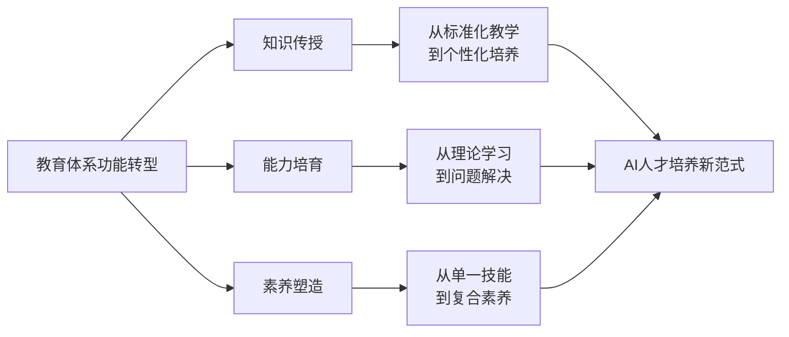

### 5.2 当前教育体系培养AI高尖端人才的短板与瓶颈诊断

尽管教育体系在AI人才培养方面已取得显著进展，但仍面临多重结构性难题，制约着高尖端人才培养的质量与效率。

**核心矛盾：教育慢变量与技术快迭代的"剪刀差"**

同济大学郑庆华院士团队调研发现，教育慢变量与科技创新的快节奏之间存在明显的"剪刀差"——**人工智能技术迭代周期以月为单位，而教育体系更新需5~10年**[^66]。这种时间尺度的根本性差异导致了多重问题的产生。

清华《中国人工智能发展报告》揭示，尽管近五年博士生导师数量增长40%，但**具备产业背景的导师不足四分之一，七成企业反映毕业生动手能力欠缺**[^67]。当前高校AI教育存在"学用脱节"现象，学科壁垒导致交叉创新不足，教材更新难追技术迭代速度。

**关键短板的系统性诊断**

当前教育体系在AI人才培养中存在以下关键短板：

**第一，产教融合深度不足**。郑庆华院士团队指出，多数"AI+教育"合作仍停留在项目层面，缺乏系统性、长期性与可持续的利益闭环[^66]。企业多将合作视为公益投入而非共赢机制，加之知识产权归属、技术评估与利益分配等问题长期悬而未决，制约了合作的深度与广度。高校科技成果转化率偏低，根据国家知识产权局《2022年中国专利调查报告》，我国高校发明专利产业化率仅为3.9%，远低于发达国家水平[^66]。

**第二，师资队伍工程经验缺乏**。工信部专项调研发现，**近70%企业认为高校毕业生难以快速适应实际项目需求**[^67]。"实验室里的AI"与"工厂里的AI"存在显著落差，教师队伍普遍缺乏工程经验，学生面对真实场景常感无所适从。市人大代表徐岚指出，目前部分高校教师应用AI技术的意识淡薄、观念更新迟缓，高校教师的AI知识储备和技术能力水平良莠不齐[^56]。

**第三，评价体系相互割裂**。高校侧重科研与教学指标，企业多注重绩效与市场价值等短期回报，缺乏兼顾科技创新与产业贡献的综合评价机制，致使产学研融合成果在绩效评价体系中难以获得正向激励[^66]。

**第四，人才流动机制存在壁垒**。高校在人员编制、职称评定、科研考核等方面仍以传统学术导向为主，对产业化成果与跨界创新认可度低；企业人才进入高校体系则受学历、科研成果等"门槛"限制，导致既懂教育又通技术产业的"双师型""跨界型"人才成长路径不畅[^66]。

**供需错位的深层原因**

教育与产业供需错位的深层原因在于校企双方不同的需求牵引与目标导向。以AI+教育领域为例，企业侧拥有算力与工程能力，但缺乏前沿技术研发能力和教育应用场景；高校则刚好相反，缺乏大规模算力设施与真实问题来源[^66]。同时，高校的教学与研究需求未能有效牵引技术研发，企业的产品设计也缺乏教育人才支撑。其结果是，高校的科研成果难以支撑产业关键突破，企业的技术创新亦难以赋能高校创新发展。

### 5.3 课程体系重构：构建动态更新与产业适配的课程矩阵

课程体系是人才培养的核心载体，面向AI人才培养的课程改革需要实现内容动态更新与产业需求精准适配的双重目标。

**校企联合的课程开发机制**

全国政协委员、同济大学党委书记方守恩提出，应建立覆盖基础研究、技术开发、场景应用的分类培养体系，通过成立**校企联合教学指导委员会**，动态更新教材课程，加强跨学科设计[^67]。这一机制的核心在于打破高校课程更新的封闭循环，引入产业视角实现课程内容的持续进化。

《AIGC数字创意领域产教融合人才培养成都倡议》提出了课程重构的具体路径：组建数字媒体类课程虚拟教研室，开发"科幻IP AIGC设计""传统文化数字转化"等特色项目库，确保课程内容与产业前沿同步进化[^68]。同时，推广动态更新、协同开发的教材建设模式，整合最新产业案例，打造适应AIGC技术快速迭代的新型教材体系。

**"通用+特色"分层课程体系**

面向AI人才培养的课程体系应构建"通—专—融"的三级架构：

| 课程层级 | 目标定位 | 内容特征 | 适用对象 |
|----------|----------|----------|----------|
| **通识层** | 基础普及 | AI概念、发展进程、伦理规范 | 全体学生 |
| **专业层** | 分类精准 | 学科垂直知识、专业技能 | 相关专业学生 |
| **融合层** | 跨界创新 | AI+X交叉应用、复合能力 | 拔尖创新人才 |

成都大学许志强教授主编的《数字媒体技术导论（第三版）》构建了"基础层-进阶层-前沿层"三级弹性知识体系，**基础理论与伦理规范占50%，产业级案例占30%，AIGC提示工程、元宇宙传播等前沿技术占20%**，确保知识体系与产业变革同频共振[^68]。

**项目式与问题导向的教学模式**

郑庆华院士团队提出探索以**问题导向、任务驱动**为目标的创新人才培养试点，突破传统四年制本科"招生—培养—就业"模式，创建"针对性的教、个性化的学、多元化的评、探索性的研、弹性化的管"五位一体的未来人才培养模式[^66]。

具体而言，不拘泥于四年学制，按照"问题导向、任务驱动、目标达成、成效为据"的原则，突破传统的"培养方案—课程体系—学分考核"模式开展教学，由校企导师共同出题，在导师的指导和AI辅助下，以自主学为主，辅之以导师引导指导、师生互动研讨、知行合一实践等方式，完成一系列学习和课题研究任务，并以实际成效为考核评价依据。

### 5.4 产教融合深化：破解校企协同的机制性障碍

产教融合是提升AI人才培养质量的关键路径，但当前面临供需错位、转化机制滞后、利益共享缺失等结构性难题，亟需系统性破解。

**供需对接的多元出题机制**

郑庆华院士团队建议建立**多元需求导向的出题机制**——出什么样的题决定了学生学什么、研什么，为此需要建立高校、企业、第三方专业机构甚至学生共同参与的多维"出题"机制，综合运用揭榜挂帅、定向委托、稳定支持与适度竞争等方式，提升科研项目的针对性与实用性[^66]。

天津在深化产教融合方面提供了有益探索。天津市教委支持天津交通职业学院等深化产学合作协同育人，在交通物流、智能制造、绿色化工等重点领域建设AI实训基地，引入企业真实生产数据开发教学案例[^17]。联合华为、联想、科大讯飞等企业共建"AI+产业学院"，开发校企联合课程与认证体系，推广实施人工智能领域产学合作协同育人项目，以产业技术发展的最新成果推动人才培养改革。

**校企共建数字化融合平台**

协同推进基础设施建设与"招—考—教—学—评—研"全链条智能工具研发，促进科研成果快速转化与应用。同济大学联合中国电信开发CivilGPT大模型，既服务于土木工程人才培养，也拓展了企业市场应用，构建了"学校搭平台、学科提需求、校企共攻关、工具智能化、教学精细化"的新范式[^66]。

天津电子信息职业技术学院与阿里云计算有限公司的合作提供了另一个典范。双方依托天津市人工智能开放型产教融合实践中心建设，预研国内首个面向职业教育的AIGC大模型实践教学平台，建立面向"园区+院校"的"算力补贴券"普惠服务机制，首批面向天津高职院校师生发放1万张300元无门槛优惠券[^17]。

**打通成果转化"最后一公里"**

郑庆华院士团队建议建设专业化的技术转移机构与中介平台，培育技术经理人队伍，并与知识产权服务机构和技术交易市场合作，推动专利开放许可、先使用后付费等灵活机制，降低企业获取技术的门槛与风险[^66]。

天津电子信息职业技术学院人工智能学院王亚丽团队的实践证明了这一路径的可行性。该团队采用国产化芯片自主研发AI边缘计算服务器系统，实现从硬件到软件完全国产化，经过两年时间300余家单位深度应用验证，**创造经济效益超2000万元**，为职业教育与产业需求深度融合提供创新样本[^17]。

**"双导师制"协同育人模式**

方守恩委员提出拟建产教融合实验室，企业工程师深度参与教学，实施青年教师"带薪实训"制度，**要求新入职教师赴头部企业实践6-12个月**[^67]。企业技术骨干将定期进校授课，把车间里的技术难题转化为课堂案例。

"成都倡议"进一步创新了"四师协同"开发模式：**学术导师把握理论脉络，企业导师注入实战经验，AI导师提供个性化学习路径，思政导师嵌入浸润式案例**，形成"思想+文化+技术+传播"四重赋能体系[^68]。

### 5.5 创新能力培育：从知识传授到问题解决的范式转换

AI高尖端人才的核心特征是解决复杂问题的能力，这要求教育体系实现从知识传授到问题解决的范式转换。

**"问题导向、任务驱动"的培养试点**

郑庆华院士团队提出的培养模式改革核心在于：弱化绩点与考试评价，强化"任务—成果—成效"导向，推动从"量化分数"转向"实际成效"、从"知识传授"向"问题解决"、从"学科本位"向"跨界融合"的转型[^66]。

上海大学在2026年1月开展的AI实训冬令营提供了生动案例。这场名为"零延迟时代"的冬令营彻底打破常规：**教材被顶尖工业级AI工具取代，作业换成真实商业命题，师生关系因技术平权实现重塑**[^69]。无任何编程基础的高一学生，仅用3小时就开发出包含六款游戏的"智能游戏盒"，一名初中旁听生更在半小时内搭建出可运行的"捉虫游戏"，生动诠释了技术平权的力量。

**产业级实践平台与创新竞赛体系**

方守恩委员建议推动企业将核心设备、关键技术引入教学环节，建立设备使用有偿机制，计划创办全国性AI创新大赛，设置中小学生专项赛道，构建贯通式培养体系[^67]。同时为校企合作开辟专利审批"绿色通道"，将授权周期压缩至6个月，加速成果转化。

"成都倡议"发布后，商汤科技、成都夏尔天逸等企业在合作高校设立"AI创意工坊"，全国"人工智能+"行业应用大赛为学生作品提供孵化平台，**学生作品商业转化率已接近10%**[^68]。成都大学联合本地企业开发"智慧文旅AIGC教学案例库"，涵盖宽窄巷子数字孪生、大熊猫IP AIGC衍生设计等12个特色项目，近两年数字媒体技术专业学生获国家级、省级学科竞赛奖项185项。

**评价机制的根本性变革**

传统评价体系是制约创新人才培养的重要瓶颈。郑庆华院士团队明确指出，高校侧重科研与教学指标，企业多注重绩效与市场价值等短期回报，缺乏兼顾科技创新与产业贡献的综合评价机制[^66]。

改革方向包括：允许用产品研发、算法创新等成果替代传统学位论文；建立多元主体参与的评价机制，引入产业评价主体；突出实践能力与创新素养考核，基于真实产业情境与项目任务开展评价。方守恩委员建议重点扩大"强基计划"AI专业覆盖面，打通本硕博培养通道[^67]。

### 5.6 跨学科素养提升：打破学科壁垒的融合培养机制

AI技术的跨学科属性决定了高尖端人才培养必须打破传统学科壁垒，构建融合培养机制。

**"人工智能+X"交叉学科专业建设**

市人大代表徐岚建议着眼跨学科交叉融合，通过**双学位/微专业、课程体系重构、产学研协同**等模式，培养兼具AI技术与行业场景应用能力的创新人才[^56]。同时，高校面向全校师生开设人工智能通识课程，提升全校师生的人工智能素养。

北京高校在这方面已取得显著进展。目前建设了11个智能科学与技术一级学科、36个人工智能本科专业，支持48所高校成立人工智能学院（系）和研究院，推动开设**45个微专业、29个辅修专业**，构建了多层次的人才培养体系[^19]。

清华大学在教师教育改革中强化科技教育与AI融合课程建设。学校构建了科技教育与AI深度融合的课程矩阵，将相关课程纳入教师教育必修课组，同步开设"未来教育与学习前沿""未来教育与学习评价"等交叉创新选修课，形成"必修+选修+实践"模块化结构[^70]。

**跨学科项目式学习的实践探索**

《教师生成式人工智能应用指引（第一版）》明确提出，教师可应用生成式人工智能整合多学科知识素材，创设真实情境，辅助设计与实施跨学科项目式学习或主题学习活动，拓展学生认知边界，提升综合素养[^15]。

深圳的AI赋能小学数学跨学科实践教学案例提供了具体范例。《班级运动场地规划》课程以真实问题驱动，引导学生用数学等学科知识解决校园体育空间不足的问题，引入AI仿真平台将"空间优化策略"等抽象概念具象为可视数据。学生需要综合体育项目规则、数学参数计算与信息技术工具，在小组协作中体验"需求分析—建模—验证—迭代"的工程思维闭环[^71]。实际教学中，**学生把学校操场的空间利用率从62%提升到91%**，实现了数学知识的现实应用[^71]。

**"技术+人文+伦理"三维素养框架**

AI人才培养不能仅关注技术能力，还需重视人文素养与伦理意识的培育。《教师生成式人工智能应用指引》强调基本原则包括：**强化价值引领，把牢育人方向；遵循教育规律，促进学生发展；恪守伦理规范，倡导技术向善；加强协同共治，推动均衡发展**[^15]。

"成都倡议"精准锚定价值导向、课程重构、教材范式、共享生态、区域特色五大核心维度，将社会主义核心价值观、中华优秀传统文化与AIGC科技伦理教育深度融合，构建"价值引领、文化传承、技术赋能、创新实践"四维体系[^68]。

### 5.7 大中小幼贯通培养：构建全学段衔接的AI人才成长链条

构建从基础教育到高等教育的贯通培养链条，是提升AI人才培养体系系统性的核心任务。

**学段衔接断层问题的诊断**

"小学的兴趣培养与初中的课程衔接断层，高中的专项学习与大学的专业深造脱节"，这是长期困扰创新人才培养的突出问题[^72]。各学段在AI教育方面的探索相对独立，缺乏系统性的衔接设计，导致人才培养的连续性不足。

从区域分布看，一线城市学校比较容易接触到优质AI教育资源，而欠发达地区和农村学校受限于新型数字基础设施薄弱等制约，AI赋能教育的场景应用较慢，从而导致区域间AI教育的不均衡[^9]。从资源流动看，各地各校关于中小学人工智能教育的探索依然处于起步阶段，课程体系、教学模式缺乏标准化提炼与共享机制，部分学校的成熟个案难以快速复制到其他地区。

**"四阶梯"培养模式设计**

中国人民大学附属中学发布的人工智能行动计划为打破学段壁垒提供了系统性解决方案。该计划以"价值引领与智能素养双螺旋"为内核，打造**"大中小幼一体化四阶梯"培养路径**[^72]：

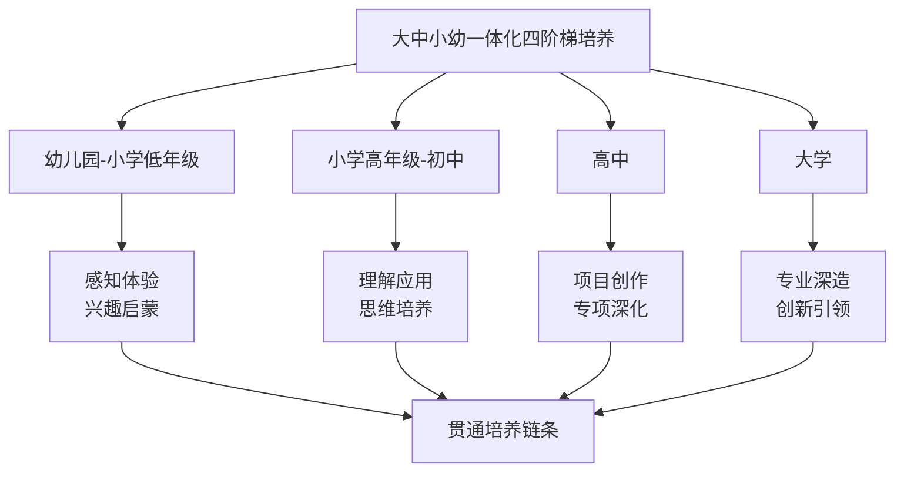

该计划构建"RDFZ"四维驱动引擎，即"双重赋能的学科研究（Research）、智能助力的工程开发（Development）、以价值引领通向未来（Future）和提质增效的持续优化（optimiZe）"，系统推进涵盖价值引领、战略课程、共生课堂、未来教师、数智治理及学习中心的六大行动，共18项具体措施。

**全域协同的组织机制**

全国中小学人工智能教育联盟正式成立，并设立了七大区域协作中心，旨在落实国家战略，构建协同发展新生态，为"人工智能+教育"进入组织化、网络化协同发展新阶段提供实施路径和制度保障[^41]。联盟的成立将推动我国中小学人工智能教育从"点状突破"迈入"全域协同"的新阶段。

依托七大区域协作中心，可以建立跨区域的师资帮扶机制，推动基地校的优秀AI教师通过线上教研、实地指导、结对帮扶等方式，带动欠发达和农村地区教师能力提升，让每所学校都有能挑起AI教育大梁的教师[^41]。

**"大中企"深度融合模式**

上海大学率先跑通AI时代拔尖创新人才培养的"大中企"贯通新路径。上海大学基础教育处处长陈然将其定义为钱伟长教育思想的当代实践，"我们着力拆除学校与社会、教学与科研、教与学、大学与中学的'四堵墙'，通过'大中企'贯通渠道，把大学科研势能、企业实战动能精准输送给基础教育"[^69]。

这一模式的核心特征包括：大学提供理论资源与科研势能，中学提供教育场景与学生基础，企业提供实战动能与产业需求。通过三方深度协同，构建起覆盖"教学-创作-转化"的一体化平台，实现人才培养的全链条贯通。

**系统性生态构建路径**

天津市政协委员施俊匡建议系统构建覆盖全龄段、贯穿全链条的"AI赋能教育"新生态，力争在未来五到十年内，将天津建设成为全国知名的未来人才培育标杆城市[^64]。他具体建议实施多维度工程：

- **"沃土工程"**（基础教育层面）：于中小学课程中系统融入AI通识内容，侧重从体验兴趣到实践创造的不同层次能力培养；建设示范校、打造精品研学路线，实施"AI种子教师"培养计划
- **"深根工程"**（高等教育层面）：支持高校开设"人工智能+"微专业与辅修学位，推广"项目制"教学；由政府引导共建"AI创新实践开放平台"，探索设立校企深度融合的"AI未来技术学院"
- **"雨林工程"**（社会层面）：通过社区学院、在线平台提供普惠课程与技能认证，打造具有影响力的系列创新赛事，探索将AI素养实践纳入人才评价体系

九江学院牵头构建的首个"全学段衔接、全学生覆盖、全社会辐射"人工智能教育贯通培养新体系，已在国内外多个国家和地区落地见效。该体系率先提出"场景贯通、资源融创、人智协同、师育链生"四位一体人工智能教育新样态理论框架，创新推出"智科创飞"四级课程矩阵，系统性破解行业发展瓶颈[^73]。目前，这一贯通培养体系已在江西、广东、山西等省份的136所中小学、28家科普场馆、7个研学基地规模化推广，26.5万师生核心素养得到有效提升。

综上所述，强化教育体系对AI高尖端人才培养的支撑作用，是一个从顶层设计到基层实践、从破解瓶颈到构建生态的系统工程。以**动态课程体系**为内容核心，以**深度产教融合**为机制关键，以**创新能力培育**为目标导向，以**跨学科素养提升**为素质要求，以**贯通培养链条**为组织保障，形成支撑国家AI人才战略可持续发展的强大教育生态系统。将"盆景"变为"风景"不仅是量的扩张，更是质的跃升，最终实现全域覆盖基础上的公平优质[^41]。

## 6 学校AI人才培养体系的构建模式与实践路径

人工智能人才培养是教育体系支撑国家科技战略的核心任务，不同层级学校基于各自的功能定位与资源禀赋，形成了差异化的培养模式与实践路径。从中小学的通识启蒙到高等院校的专业深造，从职业院校的技能培养到产教融合的协同育人，各类学校正在构建覆盖全学段、贯通培养链的AI人才培养体系。本章将系统梳理不同层级学校的培养模式，深入分析课程设置、实践教学、协同育人等关键环节，比较各模式的优劣势与适用条件，为构建科学有效的AI人才培养体系提供系统性参考。

### 6.1 中小学AI通识教育与兴趣启蒙的课程体系构建

中小学阶段是AI人才培养的"播种期"，承担着素养奠基与兴趣启蒙的基础性功能。当前，全国各地正加速推进中小学AI通识教育的课程化、系统化建设，形成了多元化的实施路径。

**分层递进的课程目标设计**

《西安市推进中小学人工智能教育专项行动方案(2025—2027年)》明确提出，2027年前全市70%以上中小学要开设人工智能课程，保障每学年不少于8课时教学[^74]。这一政策部署体现了中小学AI教育从"选修拓展"向"必修普及"的战略转型。

中小学AI教育的课程目标呈现**分层递进**的设计特征，各学段侧重点明显不同：

| 学段 | 培养目标 | 课程侧重 | 能力要求 |
|------|----------|----------|----------|
| 小学低年级 | 感知体验 | 实物编程、兴趣启蒙 | 认识AI基本概念，体验智能设备 |
| 小学高年级 | 理解应用 | 图形化编程、简单项目 | 理解AI工作原理，完成简单任务 |
| 初中阶段 | 综合实践 | 算法基础、项目实践 | 掌握基础算法，开展综合项目 |
| 高中阶段 | 项目创作 | Python编程、前沿应用 | 独立设计项目，探索前沿技术 |

西安市碑林区铁五小学的实践案例充分体现了这种分层设计的有效性。学校初步构建了"通识、赋能、社团"三位一体的课程架构，实现了全学段覆盖。**低年级侧重实物编程与兴趣启蒙，中高年级则引入图形化编程及Python学习**。这种循序渐进的梯度设计，让抽象的程序逻辑转化为直观的创新成果[^74]。

**"从乐高积木到智能代码"的启蒙路径**

西安市西影路小学的实践展示了AI启蒙教育的有效切入点。该校副校长刘海鹏介绍，学校将人工智能学习从孩子们最熟悉的乐高积木切入，打破了冰冷的代码门槛。通过**"搭建—编程—测试—优化"的完整工程闭环**，学生们在亲手组装小车、机械臂的过程中，悄然构建起对传感器、执行器与程序控制的认知基石。仅一年时间，该校学生就在各类比赛中获奖近百项[^74]。

铁五小学四年级学生衡韵涵的体验印证了这一路径的有效性："看，我的机器人会跳武术操了！"她兴奋地按下启动键，演示着如何通过指令让机器人完成转体、劈叉等复杂动作。这种"亲手赋予机器灵魂"的成就感激发了学生对科技的浓厚兴趣[^74]。

**多元化的课程实施路径**

杭州市上城区推出的"AI研学地图"为中小学AI教育提供了创新范式。该区串联浙江大学、中国美术学院、浙江传媒学院等7所高校资源，设计涵盖AI编程、虚拟现实、机器人操作、科学探索等多主题研学路线，在沉浸式体验中提升学生人工智能素养[^75]。

杭州市胜利小学党委书记郭荣强指出，AI时代已至，但在中小学教学实践中，**场景缺失仍是一个普遍难题**。VR空间搭建、机器人互动等教学环节的实现，往往依赖于较大的硬件投入，而中小学在师资与设备方面常显不足。相比之下，众多高校已建成规模可观、技术先进的人工智能与虚拟现实实验室。"若能将这条通道有效打通，将真正推动大中小学在科技人才培养上的衔接与落地。"[^75]

上城区教育局党委书记、局长项海刚介绍，该区校内将AI通识教育全面纳入课程计划，开发AI与生活课程资源，建成68个教学实验创作展示一体化的学习空间；校外则借助"淘活动"平台，搭建"假日童玩圈"，推动学校、社区、科技馆、企业等资源密切联动，常态化开展"科学家进校园"，推动AI教育融入课后服务与社团活动[^75]。

**系统化推进的政策保障**

浙江省在顶层设计方面将"推动人工智能助力教育变革"纳入《浙江省加快建设教育强省规划纲要》，制发《浙江省推进"人工智能+教育"行动方案(2025—2029年)》，形成跨部门协同的强大合力。在关键环节，浙江坚持"全省一盘棋"，通过前瞻布局数字底座、分层分类开展人工智能通识教育、启动实施"人工智能+教师队伍"行动等，系统构建支撑人工智能教育的基础设施与发展体系[^75]。

### 6.2 高等院校AI专业人才培养的学科布局与课程架构

高等院校是AI专业人才培养的主阵地，承担着从理论研究到技术突破、从专业深造到创新引领的核心功能。当前，高校AI人才培养正在形成多层次、差异化的学科专业布局与课程体系。

**多层次的学科专业布局**

高等院校AI人才培养呈现**"一级学科+本科专业+微专业/辅修"**的多层次布局特征。以人工智能专业为核心，各类院校根据自身定位形成了差异化的培养路径：

- **人工智能"A类"、"B类"院校**：目标定位侧重为培养具有国际先进水平和国内领先水平的人工智能产业高端人才，在"人工智能+X"方向上具有从事国内外领先水平科学研究和独立担负专门技术工作的能力，兼顾选拔和培养能够领跑国际的人工智能拔尖创新人才[^76]
- **人工智能"C类"、"D类"院校**：侧重培养在"人工智能+X"方向上具备专业能力的人才，在掌握基本理论知识和专业技术方法的基础上，能够与时俱进地对智能时代相关问题有科学的认识，在产业应用中能够独立承担专门性技术工作并掌握产业应用基本技能[^76]
- **人工智能"E类"院校**：侧重培养在"人工智能+X"方向上具备专门技能的人才，能够应用所掌握的基本理论知识和专门技能，参与人工智能产业中的专门性工作[^76]

**"通用+特色"分层课程体系**

2025年4月，教育部等九部门在《关于加快推进教育数字化的意见》中明确提出建设"通用+特色"高校人工智能通识课程。该课程旨在面向各专业学生普及AI基础知识，培养与AI协同工作的能力，使其成为懂AI的跨领域人才[^77]。

高校AI通识课程体系采用**模块化设计**，涵盖以下板块：

| 模块类型 | 内容定位 | 具体内容 |
|----------|----------|----------|
| 基础通识 | 面向全校 | AI基本概念、发展历程、技术原理与社会影响 |
| 学科融合 | 结合专业 | 针对性AI应用教学单元 |
| 产业应用 | 围绕区域 | 地方主导产业相关实践案例 |

国内外已有成熟模式可供借鉴，如南京大学"1+X+Y"体系、复旦大学"AI-BEST"框架及北京高校"一校一品"模式。课程内容应遵循**"基础理论—综合素养—前沿拓展—实践实训"**的递进结构，帮助学生系统建立认知与方法体系[^77]。

**核心专业课程的深度覆盖**

拔尖创新型人才培养（A、B类院校）的课程设置体现了"融"与"新"的特征，突出"人工智能+X"的学科融合。课程体系强调人工智能专业知识与各行业领域的交叉与融合，注重知识累积的循序渐进，既强调基础理论课程的系统性，又突出学科最新交叉应用成果和发展动向[^76]。

典型的核心课程设置包括：

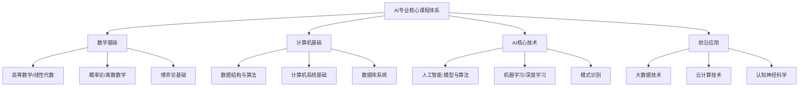

浙江大学吴飞教授主讲的《人工智能:模型与算法》、北京大学曹健教授的《人工智能实践:Tensorflow笔记》等课程，代表了国内顶尖高校AI课程建设的前沿水平[^76]。

**以学生为中心的教学模式创新**

高校AI课程建设强调改变传统讲授模式，采用多元教学方法。具体包括：**"理论讲授+案例演示+实践训练+项目驱动"模式**，理论通俗化，案例贴近实际（如解析自动驾驶系统），实践依托低代码平台，项目鼓励小组解决现实问题[^77]。

北京信息科技大学的AI课程建设实践具有示范意义。学校共建设15门AI课程，每门课程以"问题图谱-能力图谱-思政图谱"为骨架，以AI助教与智能任务引擎为双翼，正在重塑"教、学、评、管"全链条，让智慧教育从理念走向全景落地[^78]。

以张芳、厉虹老师的《电机与拖动》课程为例，该课程构建了包含159个资源量的课程学习章节和包含433个节点的知识图谱体系，为学生自主学习提供丰富而强大的资源支撑。课程采取线上线下融合模式，通过AI实践中的思维阶梯练习模式，为学生构建了适合自主练习的AI陪练环境[^78]。

### 6.3 职业院校AI技能型人才培养的特色模式

职业院校AI人才培养以产业需求为导向，以技能培养为核心，形成了鲜明的产教融合特征与直接经济效益。

**专业群建设与岗位能力对接**

天津推出职业教育"人工智能+"行动十项措施，在优化专业布局、创新人才培养、深化产教融合等方面持续发力，走出了一条AI赋能职业教育的新路径[^17]。

天津职业大学人工智能技术专业群联合麒麟、飞腾等龙头企业建成PK体系信创实训基地，打造人工智能大模型实训室、网络安全攻防靶场，**年培训超5000人次，校企联合技术攻关年创效超千万元**[^17]。这一实践充分体现了职业教育与产业需求的精准对接。

**数字教材开发与教学资源建设**

天津现代职业技术学院牵头开发的数字教材代表了职业教育AI课程资源建设的创新方向。"数字教材学起来非常有意思，好理解、能互动。自己进行线上学习时，感觉老师就在身边。这种体验非常奇妙。"天津现代职业技术学院物联网专业学生高梦怡如是评价[^17]。

**"AI+产业学院"共建模式**

天津市教委支持天津交通职业学院等深化产学合作协同育人，在交通物流、智能制造、绿色化工等重点领域建设AI实训基地，引入企业真实生产数据开发教学案例。联合华为、联想、科大讯飞等企业共建"AI+产业学院"，开发校企联合课程与认证体系。推广实施人工智能领域产学合作协同育人项目，以产业技术发展的最新成果推动人才培养改革[^17]。

**技术成果转化与经济效益创造**

2025年，天津电子信息职业技术学院人工智能学院王亚丽团队采用国产化芯片自主研发AI边缘计算服务器系统，实现从硬件到软件完全国产化。该系统依托人工智能开放型产教融合实践中心平台优势，具备数据处理能力强、可扩展性强、通用性强、功耗低的特点，产品功能涵盖从烟火检测到人脸识别等多种应用场景。经过两年时间300余家单位深度应用验证，**创造经济效益超2000万元**，为职业教育与产业需求深度融合提供创新样本[^17]。

**AIGC大模型实践教学平台建设**

天津电子信息职业技术学院与阿里云计算有限公司签署校企合作协议，预研国内首个面向职业教育的AIGC大模型实践教学平台。该平台建立面向"园区+院校"的"算力补贴券"普惠服务机制，首批面向天津高职院校师生发放1万张300元无门槛优惠券，开放免费轻量应用服务器资源，适用于网站搭建、Web应用、容器环境等，为天津高职院校师生提供全链路模型服务工具、多元高性能模型调用与智能体应用开发服务[^17]。

### 6.4 实践教学体系设计与创新能力培养机制

实践教学是AI人才培养的关键环节，各层级学校正在构建多元化的实践平台与递进式的能力培养机制。

**中小学实践教学的场景化设计**

西安市航天城第一中学作为教育部首批全国中小学科学教育实验校，其探索具有典型意义。课程发展研究中心副主任李云海指出："AI教育绝非单向传授技术知识，而是培养学生知识、技能、思维与价值观四位一体的素养。"[^74]

学校坚持"目标引领、保障托底、按需配置"的原则。2025年，学校争取上级资金200万元对青少年科学院进行提升。同时，学校构建了"资源—协同—评价"三位一体的保障机制。在评价端，学校将AI教育成效纳入年度考核，将教师的AI课例开发、应用成果纳入职称评定，极大地激发了师生的内生动力[^74]。

更值得关注的是，西安市航天城第一中学并非孤军奋战。学校与陕西师范大学、西安电子科技大学、国家超算中心等建立了深度合作关系，形成了"大学—中学—企业"协同育人的新格局[^74]。

**高等院校实践教学的体系化构建**

高校AI实践教学强调**"课程设计—小型项目—毕业设计"的递进式能力培养**。北京信息科技大学张利老师主讲的《电力电子技术》课程，围绕知识学习和能力培养的课程目标，构建了以多层级、属性化的知识点为骨架，知识关联为脉络的精细化知识图谱，建设了包含67个视频、293道试题、53项工程案例的多元资源库。通过任务引擎的方式，引导学生借助AI工具，逐步完成开关电源的设计，实现对基础知识的学习与应用[^78]。

胡欢老师教授的《机电程序设计实践(双语)》课程，以"专业+英语+AI"三重融合为特色，构建了包含50个教学章节、10个精讲视频(总长270分钟)及131道阶梯式试题的立体化资源体系。课程依托92个结构化知识点图谱，实现双语教学内容的智能导航与精准推送。AI助教已完成专业化训练，可实时进行跨语言答疑与代码调试指导[^78]。

**竞赛驱动的创新能力培养**

以赛促学是AI人才培养的重要路径。中国石油大学(华东)的"中国石油大学(华东)-百度飞桨AI创新创业人才培养实践"入选中国高等教育学会"校企合作 双百计划"典型案例。该项目聚焦新形势下国家对AI人才的新需求，与百度飞桨深度融合，培养"意识浓、方法新、能力强"的AI双创人才[^79]。

项目确立了**"学科基础积淀、综合科研锤炼、创新创业实践"递进式培养路径**，建立全链式质量监控机制与能力评价方法。近三年，本科生参与竞赛率为82%，获得国家级学科竞赛奖项94项，本科生以第一作者在中科院一区期刊发表SCI论文2篇，在2021年中国国际"互联网+"大学生创新创业大赛获全国金奖。项目得到全国20余所高校认可及推广应用，为校企合作培养AI双创人才提供了典型范式[^79]。

**虚拟仿真与AI工坊的平台支撑**

利用云端实训平台支持远程实验，涵盖智能体构建、RAG应用等工作任务，同时引入智能助教系统提供个性化指导，已成为实践教学的重要支撑[^77]。江苏省靖江高级中学在已建成的基础学科教学中心、智能化教学中心、智能化项目活动中心、智能化创新实践中心基础上，新建大模型与学科融合应用中心，为开展跨学科AI实践教学提供了有力支撑[^80]。

### 6.5 校企合作与产教融合的协同育人机制

校企合作是AI人才培养的关键机制，当前正在从项目合作向利益共同体、从单向输出向双向赋能转型升级。

**校企协同育人的逻辑重塑**

人工智能技术正在重塑校企协同育人的核心逻辑。传统产学研合作主要存在三个方面的问题：高校人才培养计划难以及时反映产业发展的要求，致使人才与产业需求严重不匹配；实训基地资源分配不能均衡地反映社会需求，导致人才培养的实践教学难以得到较大提升；产学研合作关系松散，不能实现合作关系长效运作[^81]。

人工智能技术能通过新的信息传递方式、资源配置方式、价值创造方式重新组织信息传递链、资源配置链与价值创造链解决上述问题。具体而言，可**依托自然语言处理、大数据挖掘分析等技术，从行业研究报告、用工信息、企业需求中实时抽取分析岗位核心能力素质需求信息，实现人才培养需求与产业结构布局的动态匹配**[^81]。

**"双导师制"协同育人模式**

校企智能共育模式创新，体现在合作内涵上正由"单向输出"向"双向赋能"、由"经验决定"向"数据决定"方向变化。过去多是企业单方面为高校输送实习机会，如今则借助AI技术为企业将现有生产过程、技术痛点转变成教学课题，高校为企业提供定制化的人才培养和产品研发支持，做到"教学—实践—研发"相互循环[^81]。

中国人民大学高瓴人工智能学院与深圳指数科技有限公司设立卓越人才培养基金，旨在构建校企协同育人平台，共育人工智能领域卓越人才。学院执行院长文继荣表示，面对人工智能行业"按周迭代"的发展速度与人才培养周期较长之间的矛盾，学院积极探索育人新路径。此次设立"卓越人才培养基金"，旨在**搭建起连接学术前沿与产业实践的桥梁**[^82]。

双方共同为"AI人才培养共建实践中心"揭牌，该基金重点支持学院学生开展科研创新、实习实践及创新创业项目，助力学院在交叉领域人才培养方面取得新突破[^82]。

**校企共建学院的创新实践**

中国石油大学(华东)"校企共建'石大山能新能源学院'的探索与实践"入选中国高等教育学会"校企合作 双百计划"典型案例。校企双方根据"协同创新、资源共享、互利共赢"的原则，深化"产教融合、学科融合、科教融合"，构建**"五协同"工程教育育人模式**，联合开展科研攻关，新建"山能新能源大厦"和"高端化工与能源材料研究中心"，加强校企党建和文化交流，打造"共建、共管、共享"的校企利益共同体[^79]。

**虚拟仿真与个性化培养**

依托虚拟现实、虚拟仿真实验等技术构建虚拟实训空间，突破实体实训设备、训练场地的限制，增强学生安全可控情境下的高频次实训体验；依托智能协同平台实现校企在课程建设、技术研发、人才培养等环节的无缝对接，实现"高校研发—企业转化—产业运用"的良性循环[^81]。

基于智能匹配算法对学生能力标签与企业岗位进行智能匹配，不仅能帮助学生确定正确的专业方向，也为企业储备了熟练人才，为提升人才培养供给和需求间的契合度提供了可能。具体而言，可利用人工智能技术，建立学生能力标签和职业岗位标签，为学生进行个性化的人才培养设计[^81]。

### 6.6 科教融合与跨学科培养的创新路径

科教融合是培养AI拔尖创新人才的重要路径，跨学科培养则是适应AI技术交叉属性的必然选择。

**"AI+X"跨学科专业建设**

江苏省靖江高级中学的实践展示了AI与学科融合的多元路径。学校基于对"未来素养"的育见，从德、智、体、美、劳五个维度，必修、选择性必修和选修三个课程类别，整体架构"五维三类"课程，赋能学生全面发展。从课程设置视角补齐AI短板，以实现**"人人懂AI、部分精AI、少数创AI"**的新追寻[^80]。

学校AI课程分为三个层次：
- **AI必修课程**：以智能素养提升为立足点，面向全体学生，主要有信息技术必修、数学必修、物理必修
- **AI选择性必修课程**：为学生进一步开展与人工智能相关方向的学习以及应用人工智能进行创新提供基础，主要包括程序设计基础、人工智能程序设计、人工智能导论
- **AI选修课程**：重点面向具有创新潜质、学有余力且有兴趣的学生，为将来进入高校有志于人工智能专业发展的学生服务[^80]

**跨学科融合教学的课堂实践**

关于AI走进课堂的落地，靖江高级中学形成了丰富的实践案例：

| 学科 | 融合方式 | 具体应用 |
|------|----------|----------|
| 语文 | 文生图功能 | 借助AI工具设置"绘制景点图"学习任务，引导学生赏析《故都的秋》 |
| 英语 | 对话与批改 | 引导学生和AI对话，利用AI撰写范文并批改学生作文 |
| 物理 | 三维动画 | 利用DeepSeek+Python制作三维动画，将抽象概念形象化 |
| 地理 | 数字人讲解 | 利用即梦AI生成数字人"小嫦娥"为学生讲解月相基础知识 |
| 政治 | 沉浸式学习 | 学生借助大模型参与课堂讨论，构建虚实融合的沉浸式学习场景[^80] |

**高校科研资源向教学转化**

高校AI人才培养强调科教融合，将科研资源转化为教学资源。课程内容应融入伦理教育，系统探讨隐私保护、算法公平、人机协作等社会议题，体现"以人为本的智能社会公民素养"理念；突出学科交叉，通过"人工智能+专业"典型案例，展现AI在医学、人文、工程等领域的融合应用[^77]。

南洋理工大学与卡内基梅隆大学的课程体系比较显示，两校在专业要求的知识和能力方面存在差异：**卡内基梅隆大学偏重人工智能领域知识的系统构建和深入学习，南洋理工大学则更注重大数据统计、处理和分析领域的知识学习**[^83]。但两校都注重实践，面向应用，通过研究项目、实习实践将知识整合应用于不同行业领域，培养学生的解决问题能力、伦理道德和其他核心素养，促进学生全面发展[^83]。

### 6.7 不同培养模式的比较分析与适用条件

不同层级学校的AI人才培养模式各有特色，需要根据自身定位与资源条件选择适合的发展路径。

**三类培养模式的系统比较**

| 比较维度 | 中小学模式 | 高等院校模式 | 职业院校模式 |
|----------|------------|--------------|--------------|
| **培养目标** | 素养奠基、兴趣启蒙 | 专业深造、创新引领 | 技能培养、产业对接 |
| **课程体系** | 分层递进、跨学科融合 | 通用+特色、模块化设计 | 岗位导向、项目驱动 |
| **实践环节** | 体验式、项目式 | 科研训练、竞赛驱动 | 实训基地、真实项目 |
| **师资配置** | 跨学科教师、外聘专家 | 学术导师、企业导师 | 双师型教师、企业技师 |
| **资源投入** | 设备采购、平台建设 | 实验室、算力资源 | 实训基地、产业学院 |
| **核心优势** | 普及性强、激发兴趣 | 理论深度、创新能力 | 产业适配、就业导向 |
| **主要局限** | 师资不足、场景缺失 | 学用脱节、更新滞后 | 基础薄弱、发展受限 |

**AI技术对不同类型本科教育的差异化影响**

研究表明，AI技术为各类本科教育带来了诸多机遇，但同时也提出了新的挑战和要求[^84]。

**研究型本科教育**：AI技术的引入为教学模式带来了革新性的变化。传统的研究型教学往往依赖于教师的经验和学生的自主学习能力，而AI技术的智能教学系统则能够根据学生的学习情况和兴趣偏好，提供个性化的学习路径和资源推荐。同时，AI技术在科研数据分析和处理方面的应用也大大提升了科研效率。然而，这也对教师的AI素养提出了更高要求[^84]。

**应用型本科教育**：AI技术为其提供了更多实践教学机会。通过虚拟现实(VR)和增强现实(AR)技术，学生可以在虚拟环境中进行实践操作，增强实践技能[^84]。

**技能型本科教育**：AI技术能够帮助学生更快地掌握专业技能，通过智能实训系统进行反复练习和即时反馈，提升技能熟练度。

**适用条件与边界识别**

不同培养模式的选择需要考虑以下关键因素：

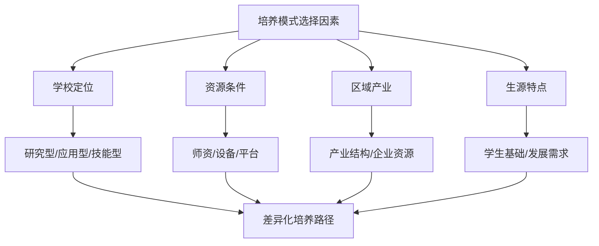

**中小学模式的适用条件**：需要政策支持、师资培训、设备投入的系统保障。在资源充足的地区可系统复制，但在资源匮乏地区需先解决基础设施、师资培训与普惠课程包供给问题。

**高等院校模式的适用条件**：需要明确的学校定位、充足的科研资源、活跃的产业生态。研究型高校应侧重理论深度与创新能力培养，应用型高校应强化工程实践与产业对接。

**职业院校模式的适用条件**：需要紧密的产业联系、深度的校企合作、真实的项目资源。其"分类培养+产教融合"内核具有广泛可复制性，成功复制依赖于学校明确的自身定位、区域内活跃的产业生态、校企间制度化的合作平台。

**模式优化与融合发展建议**

构建有效的学校AI人才培养体系，需遵循**"基础教育素养化、高等教育分类化、协同育人智能化"**的总体原则。

**第一，强化学段衔接**。全国中小学人工智能教育联盟的成立，为"人工智能+教育"进入组织化、网络化协同发展新阶段提供了实施路径和制度保障，推动我国中小学人工智能教育从"点状突破"迈入"全域协同"的新阶段。

**第二，深化产教融合**。充分运用人工智能手段建立课程的弹性调节系统，课程研发时通过大模型对海量的问卷调研、行业协会论坛进行智能抽取，获得具体岗位主要能力需求、课程可优化建议；课程运行时通过项目化教学进行课程实践[^81]。

**第三，完善评价机制**。建立多元评估机制，整合学生反馈、同行评议、专家评审及行业评价，利用大数据实现教学过程智能监测，形成"评估—反馈—优化"闭环，推动课程持续改进[^77]。

**第四，促进区域均衡**。将"盆景"变为"风景"不仅是量的扩张，更是质的跃升，最终实现全域覆盖基础上的公平优质。这需要构建政府、学校、企业、家庭等多方参与的人工智能教育新生态，形成同向而行、同频共振的育人合力。

综上所述，学校AI人才培养体系的构建是一个涉及课程设计、实践教学、协同育人、科教融合等多维度的系统工程。不同层级学校应根据自身定位与资源条件，选择适合的培养模式，同时注重学段衔接与区域协同，最终形成覆盖全学段、贯通培养链、适应智能时代需求的AI人才培养新生态。

## 7 研究结论与发展建议

人工智能与教育的深度融合是一场复杂深刻的系统性变革，既涉及技术对教育的全方位赋能，也关乎教育对AI人才的战略性支撑。通过前述六章的系统研究，本章将综合提炼核心发现与关键规律，针对不同利益相关方提出差异化的行动建议，并展望未来发展趋势与潜在突破方向，为推动AI与教育的良性互动提供系统性参考。

### 7.1 核心研究发现与规律总结

基于对人工智能与教育双向赋能的全面研究，可以归纳出以下核心发现与演进规律。

**AI赋能教育的阶段性特征与演进路径**

AI在教育领域的应用呈现出清晰的演进脉络，从早期的效率工具向深度融合的智能生态持续跃迁。当前发展已从"量的扩增"迈向"质的飞跃"，从单点探索、局部应用迈向系统集成和全面深化的"智慧教育"阶段。

| 演进阶段 | 核心特征 | 典型应用 | 价值体现 |
|----------|----------|----------|----------|
| **工具辅助期** | 效率提升、减负增效 | 智能批改、资源推荐 | 替代重复性劳动 |
| **场景融合期** | 深度适配、精准教学 | 个性化学习、学情诊断 | 实现因材施教 |
| **范式变革期** | 系统重构、生态进化 | 师-机-生三元协同 | 重塑教育形态 |

研究发现，**技术适配与教育规律存在深层互构逻辑**——技术的有效应用必须尊重教育的长周期、重规范特性，而教育的变革需求也在持续牵引技术的迭代方向。成功的融合案例普遍体现了技术与学科特点、育人目标的深度契合，而非简单的技术叠加。

**教育体系支撑AI人才培养的核心机制**

教育体系在AI人才培养中承担着从普及通识到培养高端创新人才的全链条任务，其核心支撑机制包括：

- **课程体系动态更新机制**：通过校企联合教学指导委员会、产业需求数据分析等方式，实现课程内容与技术前沿的同步进化
- **产教融合深度协同机制**：从项目合作升级为利益共同体，推行"双导师制"，实现"教学—实践—研发"的良性循环
- **贯通培养链条构建机制**：打破学段壁垒，形成"大中小幼一体化"的递进式培养路径

**双向赋能的本质内涵**

人工智能与教育的双向赋能本质上是**技术服务育人本质、教育培育技术人才的良性循环**。这一循环的核心规律可概括为：

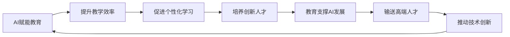

最深刻的变革发生在角色层面——教育赋能AI，要求培养兼具技术、伦理与跨学科能力的"新人才"；AI赋能教育，则要求教师转变为"人机协同"生态中的设计者与引导者。**成功与否取决于"人"的认知、能力与角色转型的速度和深度**。

### 7.2 AI与教育双向赋能的关键成功要素

基于对国内外实践案例的深入分析，可以从五个维度提炼双向赋能的关键成功要素。

**政策环境：顶层设计与基层创新相结合**

成功的实践均依赖于"政府-学校-企业-高校-家庭"多元共治的生态。强有力的政策引导为规模化落地提供了方向与框架，而基层的创新探索则为政策优化提供了实证依据。国家智慧教育公共服务平台的建设、全国中小学人工智能教育联盟的成立、七大区域协作中心的设立，均体现了"政策引领—试点探索—规模推广"的有效路径。

**技术适配：深度契合学科特点与育人目标**

技术应用的成功不在于先进性本身，而在于与教育场景的深度适配。成都青羊区"生成式AI赋能传统文化教学"案例的成功，正是因为将智能工具深度融入教学设计，构建了技术赋能与文化传承双向激活的教学新生态。**从"功能性代差"到"教育适配断层"的困境表明，通用AI工具难以直接满足教育的专业化需求**。

**组织机制：闭环教研与持续改进**

成功案例普遍建立了系统化的组织机制。青羊区构建的"研—创—用—思"闭环教研新生态、北师大贵阳附中的"三层次推进"框架，均体现了从需求识别到范式固化的完整闭环。这种机制确保了技术应用能够持续迭代优化，而非一次性的项目投入。

**师资能力：系统培训与角色转型并重**

教师是融合落地的关键节点。研究发现，教师对AI基本知识的掌握程度（59%）低于学生群体（69%），高阶应用场景渗透率仅为25%左右。成功的实践配套了场景化的培训体系、具体的应用指引以及减轻事务性负担的支持，帮助教师从"会用AI"向"善用AI"转变。

**生态协同：多方参与形成育人合力**

将"盆景"变为"风景"需要构建政府、学校、企业、家庭等多方参与的人工智能教育新生态。全国中小学人工智能教育联盟搭建的"高校+企业+基地校"协同培训网络，为师资培养提供了系统性支持；天津职业院校与头部企业的深度合作，则为产教融合提供了可复制经验。

**成功的核心：坚持"育人为本、技术为用"**

所有成功要素的根本指向是**坚持"育人为本、技术为用"的价值取向**。人工智能技术对教育带来的最大影响不在技术层面，而在哲学层面——它倒逼教育系统反思并重构教育价值观，由关注知识传递回归关注育人本质。政策与实践均强调超越工具效率，聚焦学生高阶思维、创新能力、人文素养与伦理责任感的培养，确保技术发展符合教育规律和社会价值导向。

### 7.3 面向政府部门的政策优化建议

政府部门在AI教育融合发展中承担着顶层设计、资源配置、标准制定与监管治理的核心职能。针对当前面临的制度性瓶颈与治理挑战，提出以下系统性政策建议。

**完善标准体系与准入机制**

当前AI产品在教学适配性、内容专业性、伦理安全性、应用规范性等方面缺乏明确统一标准，各类产品无序进入教育市场。建议：

- **建立分级分类的产品准入标准**：重点制定伦理安全标准、产品准入标准、教学应用标准，组建由教育专家、一线教师、监管人员组成的审核团队，对进入教育市场的AI产品进行严格审核与动态评估
- **构建全链条国家标准体系**：从"各项不准"转向"标准引领"，联动"教、学、管、评、研"全链条，明确应用边界与路径，使师生在AI场景中"有标可依、依规使用"
- **推动行业标准的制定与实施**：《信息技术学习、教育和培训移动学习终端功能要求》国家标准的发布为AI学习机行业提供了规范参考，应加快推广至更多细分领域

**建立"人工智能服务购买"财政制度**

当前教育领域存在"硬件采购易、服务购买难"的制度瓶颈。建议：

- **在财政体系中明确"人工智能教育服务"经费类别**：推动教育系统从"采购设备"转向"购买服务"，为优质AI教育服务的规模化应用提供制度保障
- **建立服务效果评估与付费挂钩机制**：确保财政资金的使用效益，避免"重投入、轻效果"
- **探索"算力补贴券"等普惠服务机制**：参考天津电子信息职业技术学院与阿里云的合作模式，降低学校使用AI服务的成本门槛

**构建跨部门协同的监管治理框架**

AI教育应用涉及网信、公安、市场监管、教育等多个部门，监管分散、职责交叉。建议：

- **建立教育领域AI治理的部门协同机制**：明确各部门职责边界，形成监管合力
- **探索"敏捷治理"模式**：在坚守伦理底线的同时，通过沙盒机制、动态标准、多元共治等方式，为有益创新留出空间
- **完善数据安全与隐私保护的执法机制**：明确执法边界、处罚幅度等量化标准，对造成数据泄露或算法偏见的行为有效追责

**加大对欠发达地区的专项支持**

数字鸿沟是AI教育应用面临的深层结构性挑战。建议：

- **实施"AI教育普惠计划"**：针对农村学校和特殊教育实施专项支持，推动人工智能基础教育优质均衡发展
- **建立跨区域的师资帮扶机制**：依托七大区域协作中心，推动基地校的优秀AI教师通过线上教研、实地指导、结对帮扶等方式，带动欠发达地区教师能力提升
- **优化数据采集与算法训练的区域覆盖**：避免因数据偏差导致的"马太效应"

**推动贯通培养的制度通道建设**

学段衔接断层是长期困扰创新人才培养的突出问题。建议：

- **建立大中小学一体化的AI教育衔接机制**：参考中国人民大学附属中学"大中小幼一体化四阶梯"培养路径，构建制度化的贯通通道
- **扩大"强基计划"AI专业覆盖面**：打通本硕博培养通道，为拔尖创新人才提供连续培养路径
- **建立学习成果的认证、积累和转换机制**：参考广东省学分银行的经验，推动各类学习成果的互认互通

**完善教师AI素养提升的系统性支持政策**

教师群体面临"技能焦虑"与"应用迷茫"的双重压力。建议：

- **将教师AI素养提升纳入各级教育发展规划**：明确培训目标、内容标准与考核要求
- **建立场景化、项目式的培训体系**：针对高阶需求（如跨场景融合、伦理应对）提供专项支持
- **完善激励机制**：将教师的AI课例开发、应用成果纳入职称评定，激发内生动力

### 7.4 面向各级各类学校的实践指引

不同层级学校基于各自的功能定位与资源禀赋，需要采取差异化的AI教育实践策略。

**中小学：聚焦通识普及与兴趣启蒙**

中小学阶段是AI人才培养的"播种期"，核心任务是素养奠基与兴趣启蒙。

**课程体系构建**：
- 构建"通识、赋能、社团"三位一体的课程架构，实现全学段覆盖
- 遵循分层递进原则：低年级侧重感知体验与兴趣启蒙，高年级侧重理解应用与项目实践
- 保障每学年不少于8课时的AI教育，可独立设置或与信息科技、综合实践活动等融合开展

**实施路径建议**：
- **从熟悉事物切入**：如西影路小学从乐高积木切入，通过"搭建—编程—测试—优化"的工程闭环，让学生在动手实践中构建认知基石
- **注重跨学科融合**：将AI工具融入语文、英语、物理、地理等学科教学，让抽象概念具象化
- **构建多元场景**：借助"AI研学地图"等方式，串联高校、科技馆、企业等资源，弥补校内场景不足

**保障机制建设**：
- 建立"资源—协同—评价"三位一体的保障机制
- 将AI教育成效纳入年度考核，将教师AI课例开发纳入职称评定
- 与高校、企业建立深度合作关系，形成"大学—中学—企业"协同育人格局

**高等院校：深化课程建设与科教融合**

高等院校是AI专业人才培养的主阵地，核心任务是专业深造与创新引领。

**课程体系优化**：
- 建设"通用+特色"分层课程体系：基础通识面向全校，学科融合结合专业，产业应用围绕区域
- 遵循"基础理论—综合素养—前沿拓展—实践实训"的递进结构
- 推动"AI+X"跨学科专业建设：开设微专业、辅修学位，培养复合型人才

**教学模式创新**：
- 采用"理论讲授+案例演示+实践训练+项目驱动"模式
- 探索"问题导向、任务驱动"的培养试点，突破传统"培养方案—课程体系—学分考核"模式
- 构建以知识图谱为骨架、AI助教为支撑的智能化教学环境

**产教协同深化**：
- 成立校企联合教学指导委员会，动态更新教材课程
- 实施青年教师"带薪实训"制度，要求新入职教师赴头部企业实践6-12个月
- 建设校企共建数字化融合平台，推动"学校搭平台、学科提需求、校企共攻关"

**评价机制改革**：
- 弱化绩点与考试评价，强化"任务—成果—成效"导向
- 允许用产品研发、算法创新等成果替代传统学位论文
- 建立多元主体参与的评价机制，引入产业评价主体

**职业院校：紧密对接产业需求**

职业院校AI人才培养以产业需求为导向，核心任务是技能培养与产业对接。

**专业群建设**：
- 紧密对接区域产业结构，建设与岗位能力精准对接的专业群
- 联合龙头企业建设实训基地，引入企业真实生产数据开发教学案例
- 开发"人工智能+实战讲解+模块化实训"架构的数字教材

**校企共建模式**：
- 共建"AI+产业学院"，开发校企联合课程与认证体系
- 推广"双导师制"：学术导师把握理论脉络，企业导师注入实战经验
- 建立面向"园区+院校"的普惠服务机制，降低AI教学成本

**成果转化机制**：
- 依托产教融合实践中心平台，推动技术成果的产业化应用
- 建立技术转移机构，推动专利开放许可、先使用后付费等灵活机制
- 将技术攻关成果转化为教学素材，实现人才培养与产业需求"零时差"衔接

**各类学校的共性要求**

无论何种层级的学校，均需重视以下共性要求：

- **师资培训与教研机制建设**：建立常态化的AI素养培训机制，构建"研—创—用—思"闭环教研体系
- **数据安全与伦理规范**：明确数据采集、存储、使用的规范要求，将伦理教育融入课程体系
- **评价体系改革**：从"单一分数"向"过程+结果"的立体评价转变，重视创新能力与实践成果

### 7.5 面向企业机构的协同发展建议

企业是AI教育产品与服务的主要供给方，在双向赋能中承担着技术创新与产业支撑的重要角色。

**深度理解教育规律与学科特点**

当前教育AI产品存在"功能性代差""教育适配断层"等问题，根源在于产品开发更多遵循技术逻辑而非教育规律。建议：

- **开发真正适配教学需求的垂直化产品**：针对不同学校、不同学科开发垂直模型，避免"千校一面"的同质化
- **深度融合学科知识体系与认知规律**：从"网络信息"向"专业知识"升级，从"陪伴聊天"向"教育引导"进化
- **重视"信息匹配度"设计**：根据学生水平精准适配教学内容，避免过于复杂或过于简单导致的学习效果不佳

**建立长效的校企合作机制**

多数"AI+教育"合作仍停留在项目层面，缺乏系统性、长期性与可持续的利益闭环。建议：

- **从项目合作转向利益共同体构建**：明确知识产权归属、技术评估与利益分配机制，实现校企共赢
- **建立"双向赋能"的合作模式**：企业为高校输送实习机会与技术资源，高校为企业提供定制化人才培养和产品研发支持
- **深度参与人才培养全过程**：从课程开发、实践教学到就业对接，形成完整的协同育人链条

**重视产品的伦理安全设计**

儿童智能产品存在隐私泄露、过度依赖、诱导消费、价值观扭曲等多重风险。建议：

- **建立面向未成年人的专项安全标准**：充分考虑儿童的认知特点和保护需求，杜绝"成人工具儿童化"
- **完善数据安全与隐私保护机制**：明确数据采集边界，建立数据脱敏与加密机制
- **嵌入"智能向善"的伦理设计**：在产品设计中融入伦理规范，避免算法偏见与内容安全问题

**积极参与标准制定与人才培养**

企业应在行业发展中承担更多社会责任。建议：

- **积极参与教育AI产品标准的制定**：贡献产业经验，推动行业规范化发展
- **设立人才培养专项基金**：如中国人民大学高瓴人工智能学院与深圳指数科技设立的"卓越人才培养基金"，支持学生科研创新与实习实践
- **开放技术资源与平台能力**：如阿里云向职业院校开放算力资源，降低教育机构使用AI技术的门槛

### 7.6 面向教师群体的能力发展路径

教师是AI教育应用落地的关键节点，其能力转型与角色重塑直接决定融合成效。

**明确人机协同的层次边界**

教师需要清晰认知人机协同的不同层次，避免陷入"效率陷阱"：

| 协同层次 | 核心特征 | AI角色 | 教师角色 |
|----------|----------|--------|----------|
| **信息处理层** | 认知延伸 | 辅助工具 | 主导决策 |
| **创意产出层** | 多模态生成 | 执行者 | 设计者 |
| **核心思维层** | 复杂问题解决 | 支持者 | 不可替代 |

教师应对AI产出进行筛选与修正，确保人在人机协同中的主导地位，避免因追求效率导致思维惰性、认知浅化等问题。

**从"会用AI"向"善用AI"转型**

当前教师AI应用多集中于浅层辅助功能，高阶应用能力不足。建议：

- **积极参与系统性培训**：从基础普及向场景化、项目式培训深化，重点提升跨场景融合、伦理应对等高阶能力
- **主动探索AI融合学科教学的创新实践**：参考成都青羊区"研—创—用—思"闭环教研模式，形成可复制的教学范式
- **建立个人AI应用的持续学习机制**：跟踪技术发展动态，不断更新知识结构

**实现角色转型与价值重塑**

AI时代对教师角色提出了新要求。建议：

- **从知识传授者向学习设计师转变**：利用AI工具优化教学设计，创设个性化学习路径
- **从课堂主导者向成长引导者转变**：激发学生潜能、塑造健全人格，成为"灵魂唤醒者"
- **坚守育人本质与情感陪伴的不可替代价值**：AI能替代知识灌输，却替代不了情感陪伴和人格塑造

**教师能力发展的具体路径**

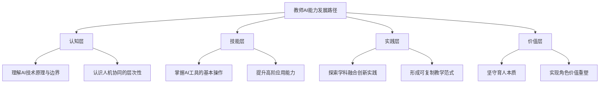

### 7.7 未来发展趋势与潜在突破方向

展望未来，AI与教育的融合发展将呈现多维度的深化趋势，同时也面临需要持续关注的关键议题。

**技术演进趋势：从生成式AI向更高阶智能演进**

当前教育AI应用主要依托生成式AI技术，未来将向以下方向演进：

- **具身智能**：AI将从"虚拟对话"向"物理交互"延伸，机器人教师、智能实验设备等将进入教育场景
- **情感计算**：理解学习情境、识别学生情感状态并提供适应性情感支持的"情感智能"技术，将成为破解人机交互深度、实现全人关怀的关键突破点
- **多模态融合**：整合文本、图像、音频、视频等多模态数据的AI系统，将提供更加丰富的教学交互体验

**应用深化趋势：从效率提升向教育范式重构**

AI教育应用将从工具层面的效率提升，深化为教育范式的系统性重构：

- **"师—机—生"三元协同**：传统的"教师—学生"二元结构将转变为"人工智能—教师—学生"三元结构，形成新的教学生态
- **数据驱动的精准教育**：教育治理进入数据驱动新阶段，从经验主导转向数据决策
- **"四个未来"构想的逐步实现**：未来教师、未来课堂、未来学校、未来学习中心的蓝图将逐步落地

**治理拓展趋势：从国家主导向全球协同**

AI教育治理将从国家主导迈向全球协同：

- **跨区域资源共享机制**：探索国际间的教育资源互通与经验分享
- **全球性伦理标准构建**：推动"可解释、可审查"的AI工具开发，建立国际认可的伦理规范
- **多边治理框架完善**：在保障国家教育主权的同时，参与全球教育治理协同

**潜在突破方向**

| 突破领域 | 当前状态 | 突破方向 | 预期影响 |
|----------|----------|----------|----------|
| **AI教师分身** | L2助手级 | L3-L4教师级 | 实现真正的大规模因材施教 |
| **跨学科智能体** | 场景示例 | 成熟应用 | 支撑复杂项目式学习 |
| **情感智能** | 初步感知 | 深度理解与响应 | 实现全人关怀 |
| **教育数据共享** | 孤岛状态 | 安全互通 | 释放数据价值 |

**需要持续关注的关键议题**

**第一，技术迭代与教育适应的协调**。AI技术以月为单位迭代，而教育体系更新需5-10年，这一"剪刀差"将长期存在。需要建立动态适应机制，在保持教育稳定性的同时，提升对技术变革的响应能力。

**第二，效率提升与育人本质的平衡**。AI在提升管理、评测效率方面效果显著，但若过度追求效率，可能导致教学功利化、师生主体性削弱。需要始终坚守"育人为本"的价值取向，确保技术服务于人的全面发展。

**第三，普惠应用与公平实现的推进**。技术本可促进资源均衡，但数字鸿沟可能导致"马太效应"。需要持续加大对欠发达地区的支持力度，确保AI教育红利惠及每一名学生。

**第四，创新探索与风险防范的统一**。实践先行，但伦理规范与监管标准尚不健全。需要构建"敏捷治理"框架，在鼓励创新的同时有效防范风险，尤其是对未成年人的特殊保护。

**结语**

人工智能与教育的双向赋能是一场深刻的系统性变革，其核心规律是向生态化、人本化演进。成功依赖于系统设计、教师转型、深度融合与评价改革的协同推进；深层矛盾源于技术、教育与社会三者节奏的差异。未来的关键在于，**坚持以"育人"为中心，通过构建韧性生态和敏捷治理，引导技术与社会价值协同发展**。

最终竞争力在于能否构建一个兼具**政策连贯性、资源流动性、机制灵活性、师资成长性和文化包容性**的智慧教育生态，从而系统性地吸纳技术红利、缓冲转型冲击并持续进化。让人工智能教育的阳光照亮每一所学校、惠及每一名学生，实现规模化因材施教和高质量创新人才培养的双重目标，是这场变革的终极愿景。

# 参考内容如下：
[^1]:[2025全球教育关键词:AI赋能与公平驱动下的系统性转型](http://creativity.china.com.cn/2026-01/21/content_43338755.htm)
[^2]:[一文理清AI、机器学习、深度学习到大模型的演进关系,小白也能秒懂!](https://blog.csdn.net/weixin_55154866/article/details/152129644)
[^3]:[AI技术核心通识:机器学习、深度学习与大模型的底层逻辑(通俗版)](https://www.woshipm.com/?p=6319733)
[^4]:[一场技术范式的持续演进:快速掌握大模型基础](https://blog.csdn.net/xiaofeng10330111/article/details/156517550)
[^5]:[把握教育数字化转型的五个关键点](https://baijiahao.baidu.com/s?id=1855455137497925563&wfr=spider&for=pc)
[^6]:[介绍“十四五”期间教育数字化进展成效](http://www.moe.gov.cn/fbh/live/2025/77791/twwd/202512/t20251230_1425181.html)
[^7]:[探寻人工智能时代的教育变革之路 ](http://www.chisa.edu.cn/education/202512/t20251230_2111431911.html)
[^8]:[人工智能赋能教育5大进展,教育部发布会带你看](http://fx.xwapp.moe.gov.cn/article/202512/6953884199a3b1624de3eb3a.html)
[^9]:[推动人工智能教育从“盆景”到“风景”](https://baijiahao.baidu.com/s?id=1855526734462646586&wfr=spider&for=pc)
[^10]:[省教育厅关于印发《人工智能赋能教育高质量发展行动方案(2025—2027年)》的通知](http://dds.jscj.edu.cn/2025/0922/c2164a81418/page.htm)
[^11]:[人工智能赋能教育,教师精准因材施教](https://edu.sina.com.cn/l/2026-01-27/doc-inhitxiw5624387.shtml)
[^12]:[智改课堂 育见新篇](https://baijiahao.baidu.com/s?id=1854975703675972627&wfr=spider&for=pc)
[^13]:[加快推进人工智能赋能教育行动的 实施方案 ](https://www.hsxzf.gov.cn/jkj/xxgk/zfwj/content_26437)
[^14]:[人工智能 | 智能时代高等教育的前沿探索与未来图景——2025全球智慧教育大会“人工智能引领高等教育高质量发展”平行会议综述 | 庄腾腾 尚兴娟 秦甜帆](https://ghc.shnu.edu.cn/de/95/c28783a843413/page.htm)
[^15]:[教师生成式人工智能应用指引(第一版)](https://caet.njau.edu.cn/info/1410/1511.htm)
[^16]:[海亮科服连获三项大奖,以“科技+服务”引领教育新未来](https://baijiahao.baidu.com/s?id=1855459420537996229&wfr=spider&for=pc)
[^17]:[「职教实践进行时」AI赋能,拓宽职教新路径](https://baijiahao.baidu.com/s?id=1855517154714941021&wfr=spider&for=pc)
[^18]:[首批50所!北京启动人工智能应用场景标杆学校培育](https://baijiahao.baidu.com/s?id=1855540834998791192&wfr=spider&for=pc)
[^19]:[北京首批50所人工智能应用场景标杆学校启动培育](https://baijiahao.baidu.com/s?id=1855538621996160625&wfr=spider&for=pc)
[^20]:[多名市政协委员建言献策全学段人工智能教育](https://baijiahao.baidu.com/s?id=1855412495390150133&wfr=spider&for=pc)
[^21]:[AI时代教师角色大洗牌:当马云说‘教孩子提问比给答案重要’,传统课堂该如何重构?](https://news.sina.cn/bignews/insight/2026-01-28/detail-inhivfch5097241.d.html)
[^22]:[学习机排行榜前十名:款款质量好,教学效果优质!](https://baijiahao.baidu.com/s?id=1855560588123649984&wfr=spider&for=pc)
[^23]:[从“助手级”到“教师级”:学而思学习机如何实现AI教育能力跃迁?](https://baijiahao.baidu.com/s?id=1852987426918138159&wfr=spider&for=pc)
[^24]:[智大蓝图首创双屏墨水屏AI学习终端,推动人工智能与教育教学深度融合 ](https://gaokao.eol.cn/gzxy/yxdt/202601/t20260122_2717160.shtml)
[^25]:[高途深化AI战略,打造有温度的智能教育新范式](https://baijiahao.baidu.com/s?id=1855445768882670797&wfr=spider&for=pc)
[^26]:[AI智能高校阅卷系统的算法原理及其优化研究 ](http://www.guandingyun.com/articles/aizngxyj263326870010510.html)
[^27]:[基于AI的教育智能评测方案.docx - 人人文库](https://www.renrendoc.com/paper/500929882.html)
[^28]:[基于党建引领的职业教育实训AI即时反馈系统评估指标体系构建](https://www.scdjw.com.cn/article/151358)
[^29]:[智能校园数字化管理系统基于大数据提升校园管理能力](https://wap.seeyon.com/News/desc/id/7444/typeid/公文管理系统.html)
[^30]:[我校在教育部职教大脑数据质量监测等级评估中获评“A”级](https://www.hzpt.edu.cn/News/83/6b/c1328a99179/page.htm)
[^31]:[北京首批50所人工智能应用场景标杆学校公布!石景山的在这](https://baijiahao.baidu.com/s?id=1855554571329708578&wfr=spider&for=pc)
[^32]:[近200个创新案例,AI教育的“深圳方案”出炉!](http://news.10jqka.com.cn/20260127/c674343997.shtml)
[^33]:[培养面向未来的教师,清华这样做](https://baijiahao.baidu.com/s?id=1855472058154169100&wfr=spider&for=pc)
[^34]:[学术探讨|人工智能助力高职计算机类专业项目化教学研究](http://k.sina.com.cn/article_5953466437_162dab04506709z44c.html)
[^35]:[成都青羊教师的AI融合教学案例斩获教育部“创新作品”最高荣誉](https://baijiahao.baidu.com/s?id=1855456197192565442&wfr=spider&for=pc)
[^36]:[数智深耕,育人焕新!北师大贵阳附中AI赋能课堂正当时](https://baijiahao.baidu.com/s?id=1855173237725472395&wfr=spider&for=pc)
[^37]:[教师评改作文周期长、效率低?智能体的正确打开方式来了](https://baijiahao.baidu.com/s?id=1855560663776865570&wfr=spider&for=pc)
[^38]:[刘盛:美国一流大学在教育教学实践中应用ChatGPT的划界及其启示](https://fgc.zjnu.edu.cn/2024/0328/c16734a462953/page.htm)
[^39]:[AI浪潮下的高校回应:人工智能如何触动海外高等教育的政策与实践?](https://baijiahao.baidu.com/s?id=1802269376628342601&wfr=spider&for=pc)
[^40]:[全球职业教育领域生成式人工智能的应用场景、风险挑战及对策](https://www.sdcet.edu.cn/zjyj/2025/0424/c1618a43046/pagem.htm)
[^41]:[推动人工智能教育从“盆景”到“风景”](https://baijiahao.baidu.com/s?id=1855522970889518319&wfr=spider&for=pc)
[^42]:[如何利用AI评价改进教学?](https://itc.jnmc.edu.cn/2025/1117/c5154a176308/page.htm)
[^43]:[毋庸置疑,AI将改变未来教育模式](https://baijiahao.baidu.com/s?id=1855459637893306257&wfr=spider&for=pc)
[^44]:[猿辅导集团副总裁王向东:“AI+教育”存在三重困境](https://baijiahao.baidu.com/s?id=1829454570061582014&wfr=spider&for=pc)
[^45]:[当前,AI应用于教育领域的主要问题 ](https://mp.weixin.qq.com/s?__biz=MzA4OTYwNzk0NA==&mid=2649728854&idx=1&sn=89172e7937c9cdd2da4ae8134ca5e7be&chksm=8943fc0ff7cc75c72dc427fbeb47877aeada19d1c5be1fec97296c86a20848869ad0eff8c09a&scene=27)
[^46]:[北京两会|市政协委员窦桂梅:破解“千校一面”,构建校园AI教育标准体系](https://baijiahao.baidu.com/s?id=1855440108060333784&wfr=spider&for=pc)
[^47]:[如何缓解教师“数字压力”](https://baijiahao.baidu.com/s?id=1833254286359412996&wfr=spider&for=pc)
[^48]:[复旦团队发现:AI教学助手能力需精准匹配学生水平](https://baijiahao.baidu.com/s?id=1855266841916527084&wfr=spider&for=pc)
[^49]:[解释“数字鸿沟”的概念,并谈谈其对教育公平的影响。(2分)](https://easylearn.baidu.com/edu-page/tiangong/questiondetail?id=1833108516740890011&fr=search)
[^50]:[解释什么是数字鸿沟,并说明其对教育的影响。](https://easylearn.baidu.com/edu-page/tiangong/questiondetail?id=1832482469518629186&fr=search)
[^51]:[破除算法偏见,促进教育公平](http://tw.hnfnu.edu.cn/info/1063/14233.htm)
[^52]:[准备好与AI共舞了吗——职业院校教师人工智能素养及发展调研报告|教学|中职|职业教育|教育部党组会议_网易订阅](https://www.163.com/dy/article/KKCCBATP05169UJP.html)
[^53]:[北京:顺义区从“数字鸿沟”到“数字赋能”老年教育服务助力银发经济发展](https://www.ndrc.gov.cn/xwdt/ztzl/ylyx/dxjy/202511/t20251114_1401631.html)
[^54]:[高职院校教师人工智能技能培训的现实困境与对策.docx 24页](https://m.book118.com/html/2025/1207/5030214313013030.shtm)
[^55]:[人工智能+教育新范式：智能学伴与智能教师如何重塑未来教学|宇宙_网易订阅](https://www.163.com/dy/article/KK99TD7C0556BLS2.html)
[^56]:[市人大代表徐岚:打造智能教育底座,培养“人工智能+”复合型人才 ](http://news.enorth.com.cn/system/2026/01/28/059112224.shtml)
[^57]:[强化数字赋能,优化未成年人个人信息网络保护 ](https://www.hengyangzh.jcy.gov.cn/xxyd/202509/t20250911_7134407.shtml)
[^58]:[众议:高校数据隐私保护挑战与规划](https://www.edu.cn/info/ji_shu_ju_le_bu/wlaq/202103/t20210331_2091082.shtml)
[^59]:[算法公平:教育人工智能算法偏见的逻辑与治理](https://openedu.sou.edu.cn/upload/qikanfile/202309211433101495.pdf)
[^60]:[北京市人大代表黄乐平关注“AI原住民”,提出需警惕儿童AI产品应用风险 推动儿童AI产品监管法治化标准化](https://baijiahao.baidu.com/s?id=1855316984725426920&wfr=spider&for=pc)
[^61]:[如何拥抱AI,成为更具创造力的教师?](https://www.thepaper.cn/newsDetail_forward_32456159)
[^62]:[以全链条治理把握AI发展战略主动](https://baijiahao.baidu.com/s?id=1855529980808800937&wfr=spider&for=pc)
[^63]:[安全可控 普惠共享——中国与东盟专家探索AI治理合作新路径](https://baijiahao.baidu.com/s?id=1855275964207990272&wfr=spider&for=pc)
[^64]:[天津政协香港委员施俊匡建言:系统构建“AI+教育”新生态](https://baijiahao.baidu.com/s?id=1855561313208339723&wfr=spider&for=pc)
[^65]:[《教育部办公厅关于加强中小学人工智能教育的通知》](http://jcjy.hust.edu.cn/info/1117/2594.htm)
[^66]:[郑庆华:我国人工智能领域教育、科技、人才协同发展难点亟须破解](https://news.tongji.edu.cn/info/1003/92433.htm)
[^67]:[深化校企合作破解AI人才短缺困局 三管齐下培养实战型创新人才](https://content-static.cctvnews.cctv.com/snow-book/index.html?item_id=7538561610651205639&track_id=2E63DCCE-E12B-4271-B85B-34F10E2F0671_762949109561)
[^68]:[破局数字创意人才短缺困境 AIGC产教融合“成都倡议”正式发布](http://sc.people.com.cn/n2/2025/1101/c345167-41398396.html)
[^69]:[上海大学率先跑通AI时代拔尖创新人才培养的“大中企”贯通新路径](https://baijiahao.baidu.com/s?id=1855553513698274383&wfr=spider&for=pc)
[^70]:[清华大学强化科技教育与AI教育课程建设推动教师教育改革 培养面向未来的教师](https://baijiahao.baidu.com/s?id=1855435302254397132&wfr=spider&for=pc)
[^71]:[AI赋能小学数学跨学科实践教学的创新探索](http://jky.sneducloud.com/webArticleAction/toNewsInformPage.jhtml?uuid=29f51dbf6b5847059422)
[^72]:[人大附中及联合学校总校发布人工智能行动计划 用AI赋能大中小幼贯通培养](https://baijiahao.baidu.com/s?id=1854726726334066852&wfr=spider&for=pc)
[^73]:[九江学院构建人工智能教育贯通培养体系](https://baijiahao.baidu.com/s?id=1854251193502365600&wfr=spider&for=pc)
[^74]:[政策护航 实践破题:人工智能重塑基础教育新生态](https://www.sanqin.com/2026-01/28/content_11499887.html)
[^75]:[浙江教育观察:中小学如何落地AI应用场景?](https://baijiahao.baidu.com/s?id=1854844318376272107&wfr=spider&for=pc)
[^76]:[人工智能专业培养方案](https://wmooc.icourses.cn/rgzn.html)
[^77]:[高校如何建设人工智能通识课程](http://portal.smu.edu.cn/ctd/info/3391/36189.htm)
[^78]:[匠心筑课 数智领航--北京信息科技大学十五门AI课程体系化亮相,勾勒教育创新全景图](https://jxgl.bistu.edu.cn/xwzx/jxdt/e91a2555e7c34ca1b619bf9c421be8df.htm)
[^79]:[两个案例获评中国高等教育学会“校企合作 双百计划”典型案例](https://news.upc.edu.cn/info/1432/112440.htm)
[^80]:[【2024年度江苏省教育数字化十大创新案例(基教组)】江苏省靖江高级中学:智育未来:AI与学科融合教学的实践建构](https://www.jse.edu.cn/index.php?r=portal/content/view&id=17930&cid=11759)
[^81]:[人工智能重塑校企协同育人逻辑](https://baijiahao.baidu.com/s?id=1854779490660698670&wfr=spider&for=pc)
[^82]:[高瓴人工智能学院卓越人才培养基金(指数科技) 捐赠仪式举办](https://news.ruc.edu.cn/2015972298725715970.html)
[^83]:[高校人工智能本科专业课程体系的对比](https://gdjy.axhu.edu.cn/contents/3427/190001.html)
[^84]:[职言之语 | AI对三种类型本科教育的影响分析 ](https://mp.weixin.qq.com/s?__biz=MzA3NDE5MzAxNg==&mid=2651008091&idx=1&sn=c85ff13724f83b1ce7e71cf7f1e731ff&chksm=84f40d4cb383845aa96c5de0a3843d191ceec1642455d4b49753a1f7c35a9b14559f8b6b09c5&scene=27)
