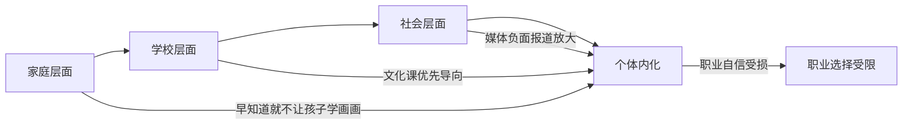
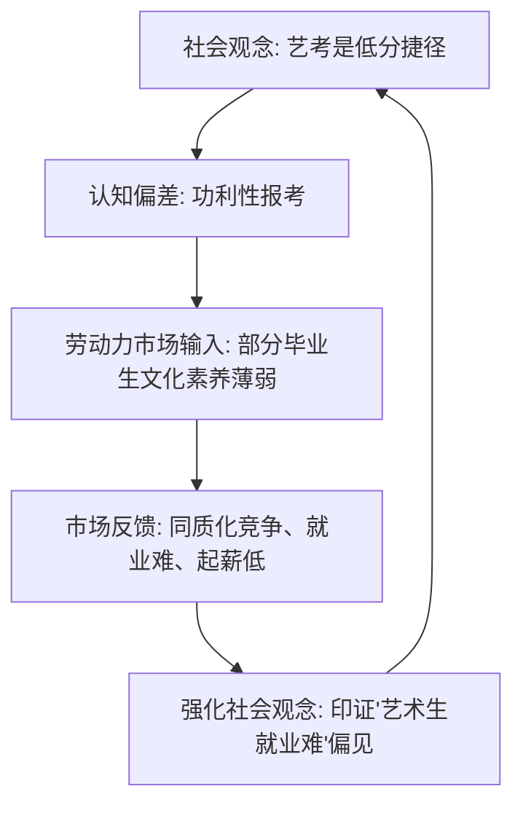
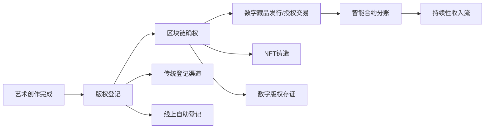
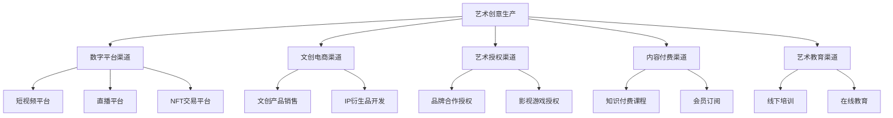
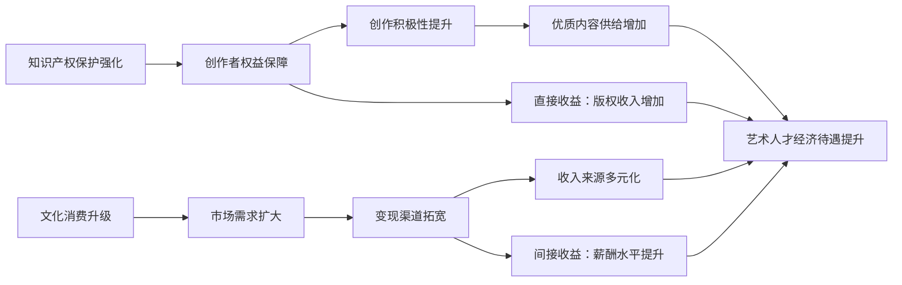
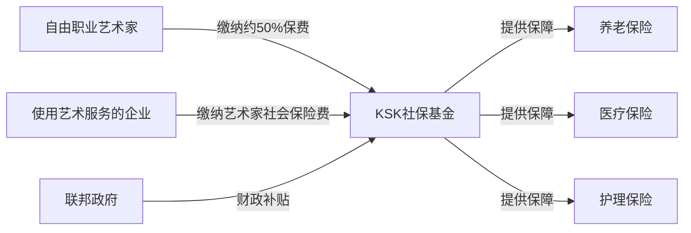
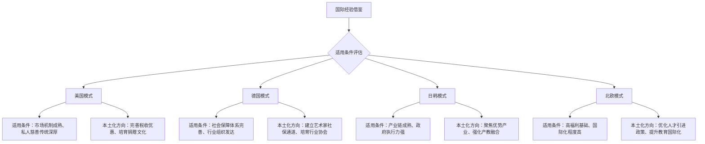
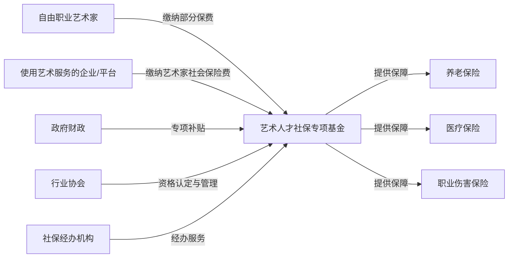
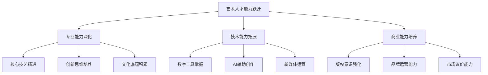
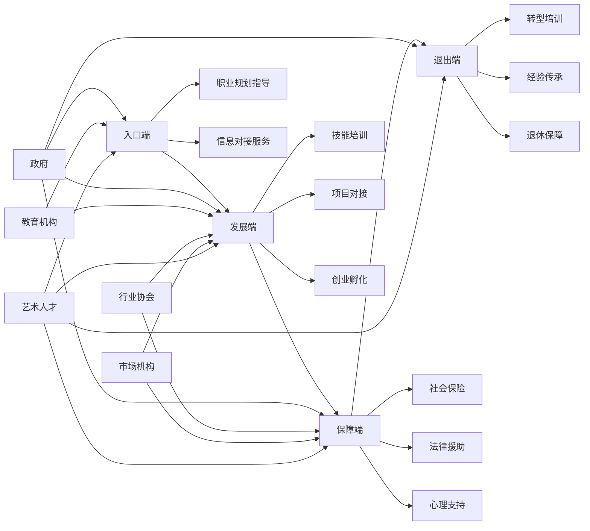

# 破壁与赋能：艺术生多元化职业发展路径、制约机制与提升策略研究
## 1 现状图景：艺术生多元化职业发展的路径、模式与内在逻辑

艺术生的职业发展格局正经历深刻的结构性变革。**传统观念中"艺术生只能当老师"或"收入不稳定"的刻板印象已难以准确描述当下现实**，随着社会经济发展、科技进步与文化消费升级的多重驱动，艺术人才的职业边界持续拓展，从教育、文化机构等传统领域延伸至数字媒体、科技融合、文化创意等新兴赛道，并在跨界融合与自主创业中开辟出多元化的发展路径[^1]。本章将从传统赛道的转型升级、新兴领域的机遇涌现、跨界模式的创新实践、高校人才培养的改革探索以及职业生态的结构特征五个维度，系统呈现艺术生多元化职业发展的立体全景图，揭示"艺术+"跨界融合的内在逻辑与成功要素。

### 1.1 传统赛道的深耕与转型：教育、文化机构与设计行业

传统就业领域依然是艺术生职业发展的重要基石，但其内部结构与能力要求正发生显著变化。**教育、文化机构与设计行业在稳定需求的基础上，呈现出数字化转型与专业化升级的双重特征**。

**教育行业**作为艺术生就业的"压舱石"，展现出持续扩大的人才缺口与多层次的岗位结构。根据政策要求，中小学美育课程覆盖率2025年需达到100%，这一目标直接催生了大量艺术教师需求，艺术教师岗位缺口持续扩大[^2]。与此同时，少儿美术培训市场规模已超过500亿元，舞蹈教育在艺术教育领域占比达48.14%，为艺术生提供了灵活多样的就业选择[^2]。值得关注的是，教育领域正涌现出音乐治疗师、艺术疗愈顾问等新兴岗位，企业美育课程也逐渐成为互联网大厂的标配，反映出艺术教育从基础技能传授向心理疗愈、企业文化建设等方向延伸的趋势[^2]。在职业发展路径上，公立学校编制内岗位因其稳定性和寒暑假福利仍是毕业生首选，但竞争日趋激烈；深造后进入高校或从事艺术史论研究则是追求学术发展者的进阶选择[^1]。

**文化机构**为偏好安静创作环境的艺术生提供了独特的职业空间。美术馆、博物馆、剧院等机构的策展与艺术管理岗位，要求从业者兼具艺术鉴赏能力与项目组织管理技能[^1]。当前，策展人年薪区间约为15万至25万元，但岗位能力要求已发生质变——从业者需掌握数字化展览技术与版权管理能力，以适应文博机构的数字化转型需求[^2]。此外，乐团、合唱团、舞蹈团等文艺团体为表演类艺术生提供了演出与创作的专业平台[^1]。

**设计行业**是艺术生就业面最广、市场需求最为旺盛的传统领域。视觉传达、环境设计、产品设计等专业方向与商业需求紧密结合，成为就业市场的"硬通货"[^3]。具体而言，广告公司的平面设计师、品牌视觉策划岗位需求量大，但工作强度高、竞争激烈；建筑与室内设计师可参与商业空间规划、样板间设计等项目；工业设计师则覆盖从手机壳到汽车造型的广泛产品领域，技术门槛较高但薪资回报丰厚[^1]。从薪资水平看，视觉传达设计毕业生起薪约为7721元/月，进入广告公司或互联网大厂后薪资区间可达8K-15K/月[^2]。

传统赛道的核心变化在于**数字化能力已成为基本门槛**。无论是教育领域的在线教学工具应用、文化机构的数字化策展，还是设计行业的软件技能迭代，都要求艺术生在深耕专业的同时，主动拥抱技术变革。

### 1.2 新兴赛道的崛起：数字媒体、科技融合与文化创意产业

**新兴赛道的爆发式增长是当前艺术生职业生态最显著的结构性变化**。互联网、人工智能、虚拟现实等技术与艺术的深度融合，催生了大量高薪岗位与全新职业形态，为艺术生开辟了"第二职业春天"[^1]。

**数字媒体艺术领域**已成为艺术生就业的高薪聚集区。游戏设计方向的原画师、场景建模师、特效动画师等岗位，因游戏产业的持续繁荣而需求激增，毕业生进入腾讯、网易等头部公司后起薪可达12K-20K/月[^2]。影视与动画领域同样前景广阔，随着《黑神话：悟空》《哪吒2》等作品引爆全球市场，动画专业已从"小众选择"升级为"国家文化工程"，预计2029年我国动漫产业市场规模将突破4700亿元，角色设计师、特效合成师等岗位需求年增25%[^4]。数字媒体技术专业因其"技术+艺术"的复合特征，被视为面向未来数字经济的"黄金赛道"，毕业生可从事影视特效师、游戏开发工程师、VR开发师、多媒体内容制作师等多元岗位[^5]。

**科技融合领域**代表着艺术职业发展的前沿方向。AI技术的发展为艺术生提供了新工具，也带来了职业转型的压力与机遇。一方面，AI绘画工具（如Midjourney、Stable Diffusion）可快速生成高质量图像，游戏公司引入AI后原画师岗位缩减约50%，基础设计工作面临被替代风险[^2]。另一方面，**AI辅助创作效率提升约30%**，设计师正转向创意策划与艺术指导角色，AI艺术策展、数字藏品开发、虚拟演出设计等新兴领域需求激增，复合型人才极度稀缺[^2]。AIGC工程师、元宇宙空间架构师、数字策展人等新兴岗位，覆盖游戏、影视、文旅等领域，AI辅助设计岗位年薪可达30万元以上[^2]。此外，结合编程与艺术的智能设计方向，如交互装置开发、智能家居设计（如音乐感应灯光、变色墙面）等，也为艺术生提供了技术赋能的创新空间[^1]。

**文化创意产业**是艺术生将创意转化为商业价值的重要阵地。文创IP开发已从"小众"走向"大众"，博物馆文创、非遗衍生品（如故宫文创的胶带、盲盒）展现出巨大市场潜力[^1]。时尚与潮流领域的服装设计、潮玩设计（如泡泡玛特）则要求艺术生具备敏锐的潮流嗅觉与商业头脑[^1]。以敦煌文创公司为例，其依托丰富的艺术资源，研发了敦煌壁画盲盒、九色鹿奇幻冷暖杯等产品，并与抖音仔仔、中国航天博物馆进行创意联动，实现百万次曝光；2022年上半年累计发售数字藏品13期，发行金额超1300万元，充分展现了"艺术+商业+科技"的融合潜力[^6]。

以下表格汇总了主要新兴岗位的特征与薪资水平：

| 专业方向 | 核心岗位 | 典型企业/机构 | 起薪范围 |
|---|---|---|---|
| 视觉传达设计 | 平面设计师、品牌策划 | 广告公司、互联网大厂 | 8K-15K/月 |
| 数字媒体艺术 | 动态视觉设计师、游戏原画师 | 腾讯、网易、游戏开发公司 | 12K-20K/月 |
| 舞蹈学 | 艺术院校教师、舞蹈治疗师 | 文艺团体、康复机构 | 6K-12K/月 |
| 音乐学 | 演出策划、音乐数据分析 | 演出公司、音乐平台 | 8K-18K/月 |
| 科技融合领域 | AIGC工程师、元宇宙空间架构师 | 科技公司、文旅企业 | 年薪30万+ |

*数据来源：2025年行业统计[^2]*

### 1.3 跨界融合与自由职业："艺术+"模式的多元实践

**突破专业边界的跨界发展与灵活自主的自由职业，构成了艺术生职业生态的重要补充维度**。约36.66%的艺术生选择自由职业路径，这一比例显著高于其他专业群体[^1]。

**艺术管理**是连接艺术与商业的典型跨界方向。艺术管理专业毕业生可成为画廊经纪人、艺术节策展人，或进入拍卖行、艺术品投资公司，需要同时具备艺术鉴赏能力与商业运营思维[^1]。**艺术治疗**则是心理学与艺术结合的新兴交叉领域，通过绘画、音乐帮助自闭症儿童或抑郁症患者，医院、康复中心、学校均有相关需求[^1]。**品牌与营销**领域为艺术生提供了"审美变现"的广阔空间，品牌视觉设计师为企业设计LOGO、包装、广告（如苹果的极简风格、喜茶的国潮风），社交媒体运营者则用艺术思维打造小红书插画账号、抖音创意短视频，实现流量变现[^1]。

**自由职业**模式的优势在于时间自由与创作自主，但也面临收入不稳定、客户拓展困难等挑战，需要极强的自律性与市场开拓能力[^1]。独立插画师、自由音乐人、设计师工作室是常见的自由职业形态。南京艺术学院2024届毕业生数据显示，46.25%选择自由职业，通过设计接单、艺术培训等方式实现收入多元化[^3]。

**"非遗+"模式**是跨界融合的创新典范。以徐州非遗为例，马庄香包跨界戏剧圈、徐州剪纸跨界音乐圈（如歌手张艺兴单曲《大花轿》封面采用徐州剪纸作品），更多非遗项目跨界文旅圈，非遗已从展柜中的静默展品转型为活跃在生活前沿的"潮品"[^7]。这种跨界融合的本质是**艺术核心价值（审美、情感表达、文化叙事）在不同产业场景中的创新性释放与增值**——通过产品化、服务化、体验化或数字化等方式，重构艺术价值的呈现与交付模式。

跨界成功的关键要素可归纳为**"专业技能+技术工具+商业思维"的复合能力组合**。以段荣勋（武汉大学艺术学院）为例，其通过辅修金融、参与人民日报实习，最终入职工商银行云南省分行，薪资水平远超纯艺术岗位，印证了"专业+技能"复合模式显著提升收入天花板的可行性[^3]。

### 1.4 "艺术+技术"复合型人才培养：高校实践与产教融合探索

**高校在艺术生多元化职业能力培养方面的改革实践，是支撑职业生态转型的关键制度基础**。通过课程体系创新、产教融合深化与"招培就"协同机制建设，高校正努力弥合人才培养与市场需求之间的结构性缺口。

**交叉课程设置**是培养复合型人才的基础路径。清华大学增设"科技与艺术"交叉课程，复旦大学推出"艺术管理"双学位项目，均在强化人文与产业的联结[^3]。数字媒体艺术专业的课程设置紧扣数字时代需求，涵盖空间结构与造型、数字建模、AI虚拟制片、数字虚拟演播、智能交互系统设计等内容，培养学生从概念策划到技术实现的完整数字内容生产链能力[^8]。

**产教融合与校企共建**是提升实践能力的核心机制。以四川城市职业学院数字媒体技术专业为例，其与椿烽科技共建流媒体校内实训室，开设"流媒体订单班"，学生全程参与真实项目，实现"干中学、学中干"的实践教学模式[^5]。学生可参与黄鹤楼光影秀、万达御湖汉印、《哪吒》《王者荣耀》等优质项目制作，毕业后可从事影视特效师、游戏开发工程师、UI设计师、VR开发师等岗位[^5][^8]。黑龙江某艺术学院成立文化创意产业学院，引入企业项目和非遗大师进课堂，累计服务客户28家，合同金额超120万元，推动学生"作品"向"产品"转化[^9]。

**"招培就"协同机制**的成效体现在就业质量的提升上。2025年艺术生平均起薪高于全国平均水平，设计类专业如视觉传达设计、环境设计因与商业需求紧密结合，成为就业"硬通货"[^2]。数字媒体艺术专业毕业生在全国普通高校大学生学科竞赛中获得国家级奖项50余项，学生作品在武汉K11购物艺术中心、北京中轴线数字馆等地展出，超60%专业教师具有海外留学背景或行业经验[^8]。

文化和旅游部、教育部联合印发的《关于促进新时代文化艺术职业教育高质量发展的指导意见》明确提出，到2025年重点支持建设10所左右全国文化艺术特色中职学校、1-2所特色高水平文化艺术高职专科院校，培育开发不少于10项文化艺术及相关领域职业技能等级证书[^10]。这一政策框架为高校的人才培养改革提供了方向指引与资源支持。

### 1.5 职业生态的结构特征：供需格局、薪资分布与地域差异

**当前艺术生职业生态呈现出"传统+科技"双轨并行、供需结构分化、地域差异显著的整体特征**[^2]。

从**供需格局**看，教育、设计领域需求稳定，但竞争日趋激烈；新兴领域人才缺口巨大，复合型人才供不应求。艺术史论专业就业率达74.3%，但对口就业率仅58%，反映出就业方向多元化与专业匹配度下降并存的结构性特征[^3]。设计类岗位"僧多粥少"，尤其在热门城市，需要作品集"卷"出特色；而AI辅助设计、元宇宙空间架构等新兴岗位则面临人才稀缺的困境[^1]。

从**薪资分布**看，不同专业方向与岗位层级之间存在显著差异。艺术与科技专业薪酬区间为3-30K，其中49.8%的岗位薪资在4.5-8K/月区间，应届生起薪约6.1K[^11]。北京电影学院毕业生平均月薪超11000元，南京艺术学院月薪5637元，TOP200所艺术类院校平均月薪9000元[^3]。文博机构薪资中位数5000-8000元，但头部机构如故宫博物院硕士起薪可达1.2万元/月；互联网大厂"文化IP开发"岗位起薪甚至超过传统金融行业[^3]。

从**地域差异**看，一线城市与二三线城市在资源集聚与薪资水平上差距明显。上海、北京薪资高于二三线城市20%-30%，成都地区岗位薪资普遍比二三线城市高出50%-70%，且岗位需求数量是二三线城市的3-5倍[^2][^5]。长三角地区文博机构招聘量占全国43%，北京、上海、杭州等城市因文化产业生态完整，成为艺术生职业起点优选地[^3]。对于二三线城市的艺术生而言，深耕本地文旅项目（如博物馆策展、非遗数字化传播）是可行的发展路径[^2]。

从**市场趋势**看，Z世代消费与银发经济为艺术人才创造了新的需求空间。国潮艺术营销、短视频艺术IP开发成为新增长点，相关岗位起薪高于传统行业20%[^2]。中老年艺术教育市场规模超500亿元，书法、声乐课程需求旺盛，为艺术教育领域开辟了新的蓝海[^2]。

综合来看，艺术生职业发展正从单一的"专业对口"模式转向"能力适配"模式。**行业未来属于既能坚守创意初心、又能灵活应对变革的跨界人才**[^2]。艺术生需强化核心技能、深耕专业领域、考取行业认证，同时拥抱技术变革、掌握AI工具、探索人机协作模式，并拓展跨界视野、关注文旅、教育、科技交叉领域，提前布局新兴赛道[^2]。

## 2 机制探析：社会评价体系如何形塑艺术人才的发展空间与收入预期

艺术人才的职业发展空间与经济回报并非仅由个人能力和市场供需决定，**社会评价体系作为一套复杂的制度性与观念性框架，从教育选拔入口、职业路径选择到薪酬定价机制，全链条地形塑着艺术人才的发展轨迹与收入预期**。这一体系包含教育选拔评价、职业社会评价与市场价值评价三大相互交织的维度，通过筛选机制、观念传导与价值认定，共同构建起艺术人才发展的"无形边界"。理解这些机制的运作逻辑，是突破传统限制、实现多元化职业发展的认知前提。本章将系统剖析"艺考捷径论"等认知偏差的形成与后果、艺考改革对人才结构的重塑效应、社会刻板印象对职业选择的制约、市场定价逻辑对收入天花板的影响，以及三大评价维度的交互作用机制，揭示制约或拓展艺术人才职业天花板与经济回报的深层逻辑。

### 2.1 教育选拔评价的双重效应：艺考改革如何重塑生源结构与人才质量

教育选拔评价体系是艺术人才发展的"第一道闸门"，其标准设定与制度安排从源头上决定了艺术人才队伍的基本素质结构。**长期以来形成的"艺考是升学捷径"认知偏差，以及由此催生的功利化报考倾向，已对艺术教育的育人本质造成深刻侵蚀**[^12]。

#### 2.1.1 "艺考捷径论"的形成机制与制度根源

"艺考是低分上名校的捷径"这一认知偏差并非空穴来风，而是特定制度安排与社会环境共同作用的产物。从历史背景看，艺术类招生文化成绩要求长期低于普通专业考生，部分省份艺考文化线仅为二本线的65%至70%，这一制度设计为"曲线升学"提供了客观空间[^12]。数据显示，艺术类文科本科录取率曾接近42%，高于普通文科本科录取率近10个百分点，而艺术类理科本科录取率则明显低于普通理科，这种文理科间的录取率差异使艺考成为文科生进入大学的"相对捷径"[^13]。

从社会动力看，多重因素共同推动了功利化报考倾向的形成：

| 驱动因素 | 具体表现 | 影响机制 |
|---|---|---|
| 家长升学焦虑 | 将艺术视为"低分上名校"的划算投资 | 强化"捷径"预期，忽视艺术学习的严肃性 |
| 学校升学率压力 | 艺考生人数成为"办学成果展示" | 鼓励文化课薄弱学生转向艺考 |
| 培训机构商业化 | 靠"速成神话"售卖"焦虑解药" | 将艺术学习碾成可批量生产的应试技巧 |
| 明星效应渲染 | 过度宣传演艺界成名早、赚钱快 | 吸引考生盲目跟风，忽视专业积累 |

这种功利化取向导致"考生对自己的发展缺乏规划和考虑，往往不是根据自己的兴趣或特长投身艺术，而是在教师、家长的建议下被动地选择艺考"[^13]。更值得警惕的是，文化成绩优秀的学生在外界压力下很难从兴趣出发"弃文从艺"，高分段中艺考生寥寥无几，形成了"文化课不好的学生才学艺术"的社会认知固化[^13]。

#### 2.1.2 艺考改革的政策转向与人才结构重塑

针对上述问题，教育部自2021年启动新一轮艺考改革，至2024年基本建立"分类考试、综合评价、多元录取"的艺术类专业考试招生制度[^12][^14]。改革的核心举措包括：

**文化课要求系统性提升**。各省艺术类专业高考文化课成绩录取最低控制分数线逐步提高，高考文化课成绩所占比例原则上不低于50%[^15]。以湖南省为例，音乐类、美术与设计类、书法类文化线由普通类本科最低控制分数线的75%提高至80%，舞蹈类、表(导)演类由70%提高至更高比例[^15]。艺术史论、戏剧影视文学、广播电视编导等专业直接纳入普通类批次录取，依据高考文化成绩择优录取[^15]。

**省级统考地位全面强化**。省级统考范围扩大，考试科类基本实现全覆盖，科目设置与评分标准充分体现各艺术门类专业的突出特色[^14]。以表(导)演类为例，戏剧影视表演方向的文学作品朗诵、自选曲目演唱、形体技能展现和命题即兴表演四个科目，实现了省级统考与校考的关联性[^14]。

**校考规模大幅压缩**。进一步控制和降低校考学校数量和考生规模，减轻考生备考、应考负担，同时压缩人为操纵空间[^12][^16]。2026年新规要求落实"三随机"机制（考生、考场、评委随机）、省外校外评委超50%、考评全程录音录像[^16]。

这些改革措施引发了学生素质的结构性变化。一方面，**学生的文化素质得到大幅提升**，"重专业轻文化"的现象得到扭转[^17]。另一方面，**学生的专业能力出现一定程度下滑**，因专业成绩所占比例下降，学生投入专业能力培训的时间和成本降低，加上省级统考专业成绩区分度较小，导致专业能力培养面临新挑战[^17]。

#### 2.1.3 "重技巧轻素养"对艺术教育育人本质的侵蚀

即便在改革推进过程中，艺术教育领域"重技巧轻素养"的功利化倾向仍未根本扭转。开学季的课堂成为"质检场"：有学生能炫技般弹出艺考高难度曲目，却弹不好《渔舟唱晚》这样的初级曲目；熟悉D调音阶，却在转调练习中频频卡壳；面对乐谱上的节奏变化，需要老师逐拍示范[^18]。

这种现象的根源在于艺考突击培训的应试导向。有学生坦言："老师，我只要弹好考试那首D调曲子就行，转调这辈子可能都用不上。"[^18]培训机构让学生对着考试曲目反复打磨指法，而不重视基础乐理、视唱练耳，最终把学生训练成"指尖机器"——手指形成了肌肉记忆，大脑却不懂旋律为何起伏[^18]。

**艺术教育的本质被悄然侵蚀**。正如音乐教育家所言："艺术教育不是培养艺术家，而是培养懂得用艺术表达自我、理解世界的人。"[^18]但当"速成艺考"的学生带着薄弱的基本功走进大学，美育本该有的育人本质正被"捷径思维"替代。更令人担忧的是，这些学生中不少将成为艺术教师，若他们自身带着"重技巧轻素养"的思维，未来的美育课堂只会更功利、更浮躁[^18]。

从人才选拔层面看，艺术类高校校考范围和规模缩小后，招生自主权降低，人才选拔标准趋于统一化、标准化，容易导致生源同质化现象，**特色、多元、创新型拔尖艺术人才选拔面临难题**[^17]。高校之间艺术人才选拔竞争加剧，部分专业由艺术类提前批次调整为统考平行志愿批次录取，失去了优先录取的优势，面临与综合性大学竞争生源的压力[^17]。

### 2.2 职业社会评价的观念枷锁：刻板印象与信任危机对职业选择的制约

社会观念层面的评价体系构成了艺术人才职业发展的"隐性天花板"。**"艺术生只能当老师""收入不稳定""毕业即失业"等刻板印象，以及艺术招生领域的信任危机，共同形成了制约艺术人才职业选择与发展信心的观念枷锁**。

#### 2.2.1 刻板印象的形成根源与传播路径

"艺术生毕业就失业"的负面标签在社会舆论中广泛传播。数据显示，近三年艺术类应届本科毕业生初次就业率约为60%，总体就业状况与其他专业存在差距[^12]。这一统计数据被放大解读，加之部分媒体渲染"投了30多份简历，只收到2个回复"等个案，强化了公众对艺术专业就业难的认知[^19]。

然而，这种认知存在显著偏差。**"初次就业率"指的是毕业三个月内的签约情况，很多艺术生走的是自由职业、接单、创业或跨行路径，根本不在传统统计里**[^19]。南京艺术学院2024届毕业生就业率达90.39%，其中46.25%选择自由职业，13.8%通过就业协议进入企业[^3]。这些数据表明，艺术生就业的多元化路径被传统统计口径所遮蔽。

刻板印象的传播路径呈现出"家庭-学校-社会"的链式传导特征：

家长的焦虑情绪直接影响学生的职业信心。有家长叹息："为了考级证书，孩子练琴练到哭，现在上了大学，古筝蒙着布放在角落，再也没碰过。"[^18]这种将艺术学习异化为痛苦记忆的经历，使艺术本应成为一生精神滋养的价值被彻底消解。

#### 2.2.2 艺术院校招生的信任危机与公信力损害

艺术院校专项招生领域的信任危机进一步损害了艺术教育的社会公信力。近期舆论热议的事件折射出公众对招生公平性的深层质疑：专项计划本是为教育资源薄弱地区艺术人才设计的扶持通道，名额稀缺，若被不符合条件者占用，不仅挤占真正需要帮扶考生的机会，更直接冲击高考公平的信仰基石[^16]。

信任危机的核心根源在于**监督缺位与程序不透明**。尽管教育部要求严审特殊类型招生资格，但部分事件曝光后相关院校未能及时做出具体说明[^16]。类似"往届生改应届"等前车之鉴表明，若缺乏透明公开的监督机制和违规追责力度，招生腐败极易滋生[^16]。

#### 2.2.3 专业评价体系的封闭性与公众认知鸿沟

艺术类招生强调专业能力考核，但其评判标准高度依赖专家主观评价，**专业性与公众认知之间存在难以逾越的鸿沟**[^16]。普通公众难以理解"专业满分但文化课落榜"与"专业零分但文化课高分录取"的合理性，尤其当出现"学生压腿都压不下去却因文化成绩被录取"的极端案例时，专业门槛反被视为"黑箱操作"的掩护[^16]。

这种认知鸿沟在文化课与专业课权重失衡争议中表现得尤为突出。从小投入专业训练的艺考生，文化课学习时间被压缩，在现行"文化课门槛逐步提高"的政策下，面临专业能力被文化成绩"一刀切"碾压的风险[^20]。而社会长期将艺考视为"升学捷径"，忽视艺术人才需"台下十年功"的专业积累，当文化课降分政策与明星家庭资源叠加时，更易触发"资源特权"的负面联想[^20]。

#### 2.2.4 职称评审壁垒对非体制内人才的晋升制约

传统职称评审体系对艺术人才的职业晋升构成制度性制约。**学历、资历等硬性壁垒使非体制内艺术人才难以获得体制认可的职业地位**。艺术职称仍保留阶梯式年限要求（如专科需10年评二级编剧），与"破格"理念形成张力，被质疑变相鼓励"熬资历"[^21]。

值得关注的是，职称评审改革正在推动从"单点破格"到"系统重构"的转变。国家层面明确要求畅通民营机构、自由职业者的职称评审渠道，确保其与国有单位同等待遇，并允许对推动文化繁荣有重大贡献者放宽学历年限、直接申报高级职称[^21]。地方实践加速落地：北京规定本科工作满10年可直评副高，博士7年可认正高；郑州率先为自由职业画家开通职称评审，朱倩雯凭国家级获奖作品跳过初、中级直接获评副高[^21]。

然而，**破格晋升依赖"重大贡献""行业影响力"等主观标准，且需省级以上奖项或权威背书，实际覆盖率有限，尚未成为普惠性机制**[^21]。草根艺术家若无奖项加持，仍难突破职称体系，政策惠及面待扩大[^21]。

### 2.3 市场价值评价的定价逻辑：岗位设置与薪酬机制对职业天花板的形塑

劳动力市场的价值评价体系通过薪酬差异和岗位需求，对艺术人才的经济回报进行量化反馈。**市场定价逻辑正在经历深刻变革，从追求"技巧娴熟度"转向认可"创新能力""技术融合能力"和"市场影响力"**，这一转变深刻影响着艺术人才的职业天花板与收入预期。

#### 2.3.1 专业方向与行业领域的薪酬分化格局

不同艺术专业方向之间存在显著的收入鸿沟，其背后是市场对不同技能组合的差异化估值：

| 专业类型 | 代表专业 | 典型岗位 | 应届生起薪 | 市场定价逻辑 |
|---|---|---|---|---|
| 设计类（最热门） | 视觉传达、UI/UX | 平面设计师、UI设计师 | 6K-12K | 对接商业需求广，岗位供需平衡 |
| 数字艺术类（新风口） | 数字媒体艺术、动画 | 游戏原画师、特效动画师 | 8K-15K | 踩互联网风口，技术溢价高 |
| 传统艺术类（稳重型） | 油画、国画、雕塑 | 美术老师、策展人 | 4K-8K | 岗位稀缺，市场化程度低 |
| 教育类（求稳首选） | 美术学（师范） | 中小学美术老师 | 5K-9K | 编制稳定，薪资涨幅慢 |

*数据来源：2025年行业统计*[^22]

这种分化格局的形成机制在于**市场对"创新性、技术融合度及市场适配度"的差异化估值**。设计类专业因与商业需求紧密结合，成为就业市场的"硬通货"；数字艺术类因对接互联网、影视等高速增长行业，获得显著的技术溢价；而传统纯艺术类因市场化程度低、岗位稀缺，收入天花板相对较低[^22]。

从院校层面看，薪酬差异同样显著。北京电影学院毕业生平均月薪超11000元，南京艺术学院月薪5637元，TOP200所艺术类院校平均月薪9000元[^23]。7所艺术类院校（中央美术学院、北京电影学院、中央戏剧学院、上海戏剧学院、中国美术学院、广州美术学院、北京服装学院）平均月薪过万[^23]。

#### 2.3.2 地域差异与机构层级对薪资的结构性影响

地域因素对艺术人才薪资水平产生显著的结构性影响。**一线城市与二三线城市在资源集聚与薪资水平上差距明显**：上海、北京薪资高于二三线城市20%-30%，成都地区岗位薪资普遍比二三线城市高出50%-70%，且岗位需求数量是二三线城市的3-5倍[^3]。

机构层级差异同样显著。文博机构薪资中位数5000-8000元，但头部机构如故宫博物院硕士起薪可达1.2万元/月；互联网大厂"文化IP开发"岗位起薪甚至超过传统金融行业[^3]。以美术教师、室内装饰设计师、网页与动画设计师为例，月薪参考分别约为6000元、8000元、12000元，反映出不同岗位的市场价值差异[^24]。

#### 2.3.3 "专业+技能"复合能力对收入天花板的突破

**"专业+技能"的复合模式能显著提升收入天花板**，这一规律在实证案例中得到充分验证。段荣勋（武汉大学艺术学院）通过辅修金融、参与人民日报实习，最终入职工商银行云南省分行，薪资水平远超纯艺术岗位[^3]。他的经历证明：复合型人才在劳动力市场中具有更强的议价能力。

市场对"商业思维""技术能力"的隐性要求正在重新定义艺术人才的价值评估标准。某快消品牌去年招的市场专员里，三分之一有美术或设计背景，"他们要的不是只会画画的人，而是懂审美、会表达、能共情的复合型人才"[^19]。问题不在于"艺术类专业能不能就业"，而在于"你怎么用你的艺术能力去解决问题"——会不会把想法变成别人愿意买单的东西，能不能在沟通中让人感受到独特视角[^19]。

#### 2.3.4 AI技术冲击下的岗位替代风险与复合型人才溢价

AI技术的发展正在重塑艺术人才的市场价值评估标准。一方面，**基础设计岗位面临替代风险**：游戏公司引入AI后原画师岗位缩减约50%，AI绘画工具可快速生成高质量图像，基础设计工作面临被替代压力。另一方面，**复合型人才获得显著溢价**：AI辅助创作效率提升约30%，设计师正转向创意策划与艺术指导角色，AI艺术策展、数字藏品开发、虚拟演出设计等新兴领域需求激增[^1]。

AIGC工程师、元宇宙空间架构师、数字策展人等新兴岗位覆盖游戏、影视、文旅等领域，AI辅助设计岗位年薪可达30万元以上[^22]。这一格局印证了市场评价标准的转变：从单一的"技巧娴熟度"转向包含"创新能力""技术融合能力""市场影响力"的多元体系。

### 2.4 评价体系的交互作用：多维制约与发展空间的动态博弈

教育选拔评价、职业社会评价与市场价值评价三大维度并非孤立运作，而是通过复杂的交互机制共同形塑艺术人才的发展空间。**这种交互作用既可能形成制约循环，也可能在改革推动下转向拓展循环**，理解其动态博弈逻辑对于制定有效的提升策略至关重要。

#### 2.4.1 制约循环：功利化观念的传导链条

在改革前的主要模式中，三大评价维度形成了相互强化的制约循环：

这一循环的传导机制表现为：功利化艺考观念导致生源质量参差不齐，部分学生"重技巧轻素养"，进入劳动力市场后缺乏创新后劲和跨界能力，难以适应产业升级需求，就业表现不佳反过来强化了社会对艺术专业的负面认知，进一步固化"艺术生就业难""收入不稳定"的刻板印象[^12][^18]。

从初次就业情况看，近三年艺术类应届本科毕业生初次就业率约为60%，总体就业状况与其他专业存在差距[^12]。这一数据被放大解读后，进一步强化了制约循环。一些高校盲目设置和扩招艺术专业，2020年艺术类本科专业招生人数占全国本科招生总数的占比仅次于工学和管理学，位居第三，但培养质量与社会需求脱节的问题日益突出[^12]。

#### 2.4.2 拓展循环：改革推动下的价值重估

艺考改革与职业评价转变正在推动从制约循环向拓展循环的转变：

**政策改革的源头干预**。艺考提高文化分、强化综合评估的制度设计，从源头上扭转"重专业轻文化"的认知偏差，选拔更全面的学生[^12][^14]。更高的文化素养有助于艺术人才更好地理解社会、进行跨学科创新，从而在职业发展中获得更广阔的视野和更强的适应能力。

**市场需求的价值牵引**。文化产业升级和数字经济发展创造了对创新复合型艺术人才的强劲需求。腾讯、字节跳动等企业2025年校招中，"文化内容运营""艺术IP开发"等岗位明确要求艺术史、文化研究背景，部分企业甚至与高校合作开设定向培养项目[^3]。市场用高薪酬认可新价值，为艺术人才开辟了新的高价值赛道。

**成功案例的示范效应**。多元化的成功案例正在重塑社会观念。"00后美术生刮腻子年入百万"的案例引发全网热议，被网友称为"狼尾兄弟"的创业搭档凭借融合美术设计与传统工艺的浮雕壁画，2025年完成66单业务，工作室营收突破100万元[^25]。网友评价："打破'唯学历论'，证明把手艺练到极致就是铁饭碗，00后太会盘活传统行业了。"[^25]

#### 2.4.3 制度变革对传统评价壁垒的松动

破格晋升机制、自由职业通道拓展等制度变革正在松动传统评价壁垒。职称评审改革的核心在于打破学历、资历等硬性壁垒，以实际业绩和创新能力为评价标准[^21]。

**评价标准转向实效导向**。破除"唯论文"倾向，艺术、表演等实践性强的系列，代表作范围扩大至18类成果，如导演可用舞台设计、编剧可用剧本、演员可用经典角色影像替代论文[^21]。专利转化效益、作品传播量（如网络剧点击量）纳入评价体系，商业价值获得制度认可[^21]。

**非体制内通道逐步畅通**。郑州率先为自由职业画家开通职称评审，北京、江苏向61家重点民企下放高级职称评审权，企业可定制"技术攻关""专利转化"等评价指标[^21]。这些变革为自由职业艺术人才提供了制度化的职业晋升通道。

#### 2.4.4 跨界能力在新评价体系中的价值重估

**"艺术+技术""艺术+商业"等跨界能力正在新评价体系中获得价值重估**。这种重估体现在三个层面：

**教育层面**：清华大学增设"科技与艺术"交叉课程，复旦大学推出"艺术管理"双学位项目，辅修数字媒体技术的艺术史论学生可从事文化遗产数字化工作[^3]。高校的课程改革反映了对跨界能力培养的制度性重视。

**市场层面**：掌握"艺术+技术/商业"复合技能的人才，在互联网大厂、游戏公司等支付能力强的平台能获得显著更高的经济回报[^3]。市场定价直接体现了对跨界能力的价值认可。

**职业晋升层面**：数字技能成新门槛，舞台技术人员需熟练CAD/BIM软件，职称评审中对技术融合能力的要求日益明确[^21]。制度设计正在将跨界能力纳入正式评价标准。

综合来看，社会评价体系对艺术人才发展空间与收入预期的影响机制正在经历深刻变革。**当前的艺考改革和职业评价转变是关键干预变量，正致力于打破旧有的制约循环，通过提升人才综合素质、对接新兴市场价值，系统性地拓展艺术人才的职业发展空间与经济回报潜力**。这一转变的深度与广度，将直接决定艺术人才能否真正突破传统限制，实现多元化职业发展。

## 3 驱动因素：知识产权保护与文化消费升级对艺术人才经济待遇的提升效能评估

艺术人才经济待遇的提升并非仅依赖于个人能力与市场供需的简单匹配，**法律保障与市场需求构成了支撑艺术创意价值实现的两大制度性与结构性基础**。知识产权保护机制的完善为艺术创作提供了权益确认与收益保障的法律框架，而文化消费市场的升级迭代则从需求侧拓宽了艺术创意的变现渠道与价值认可空间。本章将从制度效能、实践挑战、市场驱动、传导机制与优化路径五个维度，系统评估这两大驱动因素对艺术人才经济待遇的实际提升效能，揭示其作用机制与关键瓶颈，论证提升艺术人才经济待遇的可行策略。

### 3.1 知识产权保护机制的完善进程与制度效能

**知识产权保护是将艺术创意转化为可持续经济回报的制度基石**。近年来，我国艺术领域知识产权法律体系经历了系统性完善，从立法层面到司法实践均展现出显著的制度创新与效能提升。

#### 3.1.1 法律体系的演进脉络与核心突破

我国知识产权保护制度已基本形成并趋于完善，构建起全方位、立体化的法律保护体系[^26]。这一体系以《著作权法》《商标法》《专利法》《反不正当竞争法》为核心支柱，针对艺术市场的特殊需求提供了多层次的权益保障[^27]。

**著作权法的修订完善**是艺术领域知识产权保护的核心进展。《中华人民共和国著作权法》明确保护文学、艺术和科学作品创作者的合法权益，涵盖复制权、发行权、展览权等财产权内容[^27]。在艺术市场中，著作权尤为重要，因为它直接关系到艺术作品的创作、复制、发行、展览等方面的权益。以吴冠中著作权案为例，该案充分体现了著作权法对艺术家及其继承人权益的保护力度——艺术家去世后，其作品的著作权依法转移给合法继承人，家属有权对侵权行为提起诉讼[^27]。

**知识产权司法保护体系的专业化建设**是制度创新的重要标志。2019年成立的最高人民法院知识产权法庭，建立了国家层面知识产权案件上诉审理机制，对健全我国知识产权专业化审判体系具有里程碑意义[^28]。截至目前，知识产权法庭共受理案件21939件，审结19923件，充分发挥了集中审理优势[^28]。在具体判例中，"新能源汽车底盘"技术秘密侵权案适用惩罚性赔偿判赔6.4亿余元，创国内知识产权侵权诉讼判赔数额历史新高，彰显了严格保护的司法导向[^28]。

#### 3.1.2 制度效能的多维体现

知识产权保护制度的完善对艺术人才经济待遇产生了多维度的积极效应：

| 效能维度 | 具体表现 | 对艺术人才的影响 |
|---|---|---|
| 激励创新 | 确保创新者从创新活动中获得经济回报 | 增强艺术创作的积极性与持续性 |
| 吸引投资 | 增强企业创新收益预期，吸引资本投入 | 提升文创企业效益，间接提高人才薪酬 |
| 维护公平竞争 | 防止未经许可使用他人知识产权 | 保障原创作品的市场价值与定价能力 |
| 提升人才素质 | 引导人才关注和尊重知识产权 | 培养专业素养与道德素质 |

*数据来源：知识产权保护政策分析[^29]*

**从经济效应角度看**，知识产权保护通过多重路径提升艺术人才的经济回报。首先，通过提高侵权成本（如适用惩罚性赔偿）和保障独占收益，直接增加了艺术人才从其核心创意中获得的合法收入。其次，强有力的知识产权保护增强了文创企业的创新收益预期，吸引资本投入，提升企业生产率和市场竞争力，经济效益的增长促使企业为争夺和留住高价值的艺术与创意人才而提高薪酬待遇。据经合组织统计，发达国家GDP中的60%以上来自知识产权密集型产业[^29]，这一数据印证了知识产权保护对经济发展的关键支撑作用。

#### 3.1.3 执法环节的强化与挑战

**执法环节是知识产权保护效能转化的关键瓶颈**。业内人士指出，从意识层面看，近年来知识产权保护意识不断提升，知识付费已成为主流认识，影视作品盗版泛滥问题已大为改善，电视付费的消费习惯也已形成[^26]。然而，在执法层面仍存在明显短板：知识产权类犯罪的查处尚未成为公安机关的重点对象，执法力度需要加强；相关的技术手段还不够规范，在取证环节出现瑕疵会导致案件无法推进[^26]。

在侵权案件的惩罚力度方面，专利侵权案例的判罚目前国内还没有普遍适用惩罚性赔偿，往往以一般性赔偿为主[^26]。主要的裁量标准包括按照侵权的非法所得比例进行判罚，但在举证上存在造假的可能，销售价格和销量难以取证，会降低对侵权的判罚力度。如果存在上述情况，法院的裁量范围是500万元以内，而在国外，涉嫌侵权即可做出高额判罚[^26]。

**专业化保护机构的建设**是提升执法效能的重要方向。要真正形成知识产权的法律保护，需要有专门的保护部门和专业人员，设立专门的知识产权法院，对应的公安部门也设立相应的执法机构，保证知识产权的保护效果[^26]。中央财政自2020年起新增"知识产权法庭工作经费"项目并安排专门经费共计约1.43亿元，为国家层面知识产权案件上诉审理机制改革提供了有力保障[^28]。

### 3.2 数字艺术与文创IP领域的版权确权、授权与维权实践

**数字艺术与文创IP是当前艺术人才经济待遇提升最具潜力的领域**，但也是版权保护面临最复杂挑战的前沿阵地。技术创新为版权确权提供了新工具，同时也带来了新的侵权风险与维权难题。

#### 3.2.1 数字艺术市场的发展现状与版权困境

随着数字技术的飞速发展，数字艺术市场呈现出蓬勃发展的态势。数字艺术作品形式多样，包括数字绘画、数字雕塑、数字音乐、数字影视等[^30]。然而，由于数字艺术作品的复制和传播成本极低，版权侵权现象层出不穷，严重影响了艺术人才的经济收益[^30]。

**版权保护机制创新的重要性日益凸显**。数字艺术作品的版权保护面临独特挑战：作品易于复制传播、侵权行为难以追踪、权属证明困难等问题制约着艺术人才从其创作中获得应有回报[^31]。为更好地推动数字艺术市场的健康发展，版权保护机制的创新实践正在多个维度展开[^30]。

#### 3.2.2 技术创新驱动的版权确权新模式

**区块链技术与NFT数字藏品**为数字艺术版权确权提供了革命性的解决方案。区块链技术在艺术品追溯、版权保护方面展现出广阔的应用前景[^32]。通过区块链确权，数字艺术作品可以获得可验证的所有权证明，每一次转售都可以通过智能合约设置版税，为艺术家创造持续性收入流。

以敦煌文创公司为例，其2022年上半年累计发售数字藏品13期，发行金额超1300万元，充分展现了"艺术+商业+科技"的融合潜力。这种新型变现模式使艺术家能够从每一次作品流转中获益，打破了传统艺术品交易"一次性买断"的收益模式。

**版权登记制度的便捷化**是确权体系完善的重要方向。数字艺术作品版权登记制度在我国已逐步完善，著作权人可以通过国家版权局进行作品登记，取得著作权登记证书[^33]。随着互联网的普及，版权登记方式逐渐多元化，除了传统的线下登记，线上登记、自助登记等方式也逐渐兴起，提高了登记效率[^33]。

#### 3.2.3 授权交易模式的多元化发展

**版权交易市场的构建与运营**是实现艺术创意商业价值的关键环节。数字艺术版权交易市场模式正在经历创新，交易市场的生态构建日趋完善[^30]。授权交易模式从传统的一次性买断向多元化方向发展，包括：

- **独家授权与非独家授权的灵活组合**：艺术家可根据作品特性选择不同授权模式
- **分层授权机制**：按使用场景、地域范围、时间期限等维度进行差异化定价
- **版权共享模式**：通过版权众筹、合作开发等方式分散风险、共享收益[^31]

然而，**专业中介与市场机制的不健全**仍是制约授权交易效率的瓶颈。数字版权交易市场、IP价值评估与交易体系尚不成熟，影响了艺术资产的高效流转和公允定价，限制了艺术人才的经济收益最大化。

#### 3.2.4 维权实践中的现实挑战

**维权难度大、成本高**是数字艺术领域版权保护的核心痛点。数字艺术作品维权难度较大，由于数字艺术作品的复制和传播具有便捷性，侵权行为较为普遍，维权成本较高，维权成功率较低[^33]。维权途径相对有限，目前主要依靠著作权人自行维权、委托律师维权和寻求第三方机构协助维权等方式[^33]。

具体挑战包括：

| 挑战类型 | 具体表现 | 对艺术人才的影响 |
|---|---|---|
| 举证困难 | 侵权行为难以追踪，证据易被销毁 | 维权成功率低，挫伤维权积极性 |
| 赔偿标准低 | 以一般性赔偿为主，难以覆盖实际损失 | 侵权违法成本低，难以形成有效威慑 |
| 维权成本高 | 诉讼周期长、律师费用高 | 中小创作者难以承担，放弃维权 |
| 跨境侵权 | 网络传播无国界，管辖权复杂 | 国际维权难度大，权益难以保障 |

**版权意识普及不足**是另一重要制约因素。部分著作权人登记意识不足，公众版权意识有待提高[^33]。侵权盗版现象仍较普遍，部分市场参与者对知识产权尊重不足，影响了健康付费生态的完全建立。

### 3.3 文化消费升级的市场特征与艺术价值重估

**文化消费市场的升级迭代是驱动艺术人才经济待遇提升的需求侧核心力量**。消费者从"物质占有"转向"体验获取"、从"功能满足"转向"情感共鸣"的消费观念转变，为艺术创意提供了更广阔的变现空间与更高的价值认可。

#### 3.3.1 消费升级的结构性特征

2025年，中国文旅消费正从资源依附走向心智联结，一场以"人的体验"为核心的重构运动悄然兴起[^34]。传统景区与商业空间不再满足于功能供给，而是转向成为**情绪容器、文化转译器与游戏叙事场**[^34]。这一转变的核心特征包括：

**从"空间消费"到"意义消费"的迭代**。文旅消费正经历从"空间消费"到"意义消费"的迭代路径，以"情绪价值+参与设计"为核心竞争力的行业新战线正在形成[^34]。消费者购买的不仅是产品或服务本身，更是其承载的情感体验、文化认同与社交价值。

**Z世代与银发经济的双轮驱动**。年轻一代消费者对艺术的偏好变化明显，个性化、体验式、可社交的文化消费成为主流[^32]。国潮艺术营销、短视频艺术IP开发成为新增长点，相关岗位起薪高于传统行业20%。同时，中老年艺术教育市场规模超500亿元，书法、声乐课程需求旺盛，为艺术人才开辟了新的蓝海。

#### 3.3.2 新消费场景的价值创造

**文旅融合与场景创新**为艺术创意提供了丰富的变现场景。文旅消费新场景的创新实践指向三大坐标系：重构物理边界、打破文化壁垒、设计游戏剧本[^34]。

以下案例展示了新消费场景如何创造艺术价值：

- **安吉瀑布咖啡**：将精品咖啡馆植入野性十足的瀑布、矿坑与山洞之中，消费者购买的不仅是饮品，更是通往"荒野奇观"的视觉门票和社交货币，重新定义乡村休闲的价值维度[^34]
- **达那也·金华山小冰岛**：将废弃矿坑转化为集潜水、露营、艺术装置与文创消费于一体的非标度假综合体，完成了对"废墟美学"的价值重估与商业化开发[^34]
- **长春"这有山"**：将购物中心重塑为国家4A级旅游景区，以"室内登山"的探索叙事，完成了从消费场到目的地的华丽转身[^34]

这些案例印证了**"场景即产品"**的新消费逻辑——通过将标准化业态与稀缺性资源进行创造性嫁接，可以轻量化地打造出具有强大传播力和吸引力的目的地，为艺术人才提供了更广阔的实践舞台和变现空间[^34]。

#### 3.3.3 国潮文化与IP经济的崛起

**国潮文化的兴起**为艺术创意的商业化提供了强大的市场支撑。博物馆文创、非遗衍生品展现出巨大市场潜力。以敦煌文创公司为例，其依托丰富的艺术资源，研发了敦煌壁画盲盒、九色鹿奇幻冷暖杯等产品，并与抖音仔仔、中国航天博物馆进行创意联动，实现百万次曝光。

**文创IP系统化开发**将单一艺术符号转化为覆盖内容、商品、空间体验的生态体系。根据全球市场研究机构的数据，到2025年，全球文化创意产业市场规模将超过6万亿美元，到2030年有望达到7.5万亿美元[^32]。这一增长主要得益于新兴技术的应用、消费者对个性化和体验式消费的追求以及全球文化多样性的融合[^32]。

艺术人才作为IP源头，可通过长期授权、合作开发分成等模式获得持续的经济回报。成功的IP运营模式为艺术人才创造了从"一次性创作收益"向"持续性版权收益"转变的可能。

#### 3.3.4 技术赋能下的消费体验升级

**数字化技术的应用**为艺术价值的呈现与变现提供了新工具。虚拟现实（VR）、增强现实（AR）和区块链技术的应用，使艺术家和创作者能够以更创新的方式展示和销售作品[^32]。社交媒体和直播平台的兴起也为艺术家提供了直接与粉丝互动、推广作品的机会[^32]。

**人工智能在艺术营销中的应用**正在优化内容生成、提高广告投放精准度以及增强用户体验，帮助艺术人才更高效地实现艺术变现与品牌影响力的双重提升[^32]。

### 3.4 变现渠道拓宽与艺术人才经济待遇提升的传导机制

**变现渠道的多元化是知识产权保护与文化消费升级转化为艺术人才实际收入的关键传导环节**。从创意生产到商业变现的价值链条正在重构，不同类型艺术人才的收入结构与水平呈现差异化特征。

#### 3.4.1 多元变现渠道的发展格局

当前艺术人才的变现渠道已形成多层次、多形态的格局：

**数字平台成为关键推动力**。通过虚拟现实、增强现实和区块链技术的应用，艺术家能够以更创新的方式展示和销售作品[^32]。NFT市场的发展为艺术家提供了一种全新的版权保护和收入来源方式[^32]。社交媒体和直播平台为艺术家提供了直接与粉丝互动、推广作品的机会，实现流量变现[^32]。

**艺术授权模式的成熟化**拓宽了收入来源。品牌视觉设计、文创IP合作、影视游戏授权等模式为艺术人才提供了作品授权、IP合作、项目策划、沉浸式内容创作等多元化变现渠道，显著拓宽了收入来源，提升了单位创意产出的经济价值。

#### 3.4.2 价值链条与利益分配机制

从创意生产到商业变现的价值链条中，利益分配机制直接影响艺术人才的实际收入。当前的分配格局呈现以下特征：

| 变现渠道 | 艺术人才分成比例 | 主要制约因素 |
|---|---|---|
| NFT数字藏品 | 首次销售85-95%，二次销售5-10%版税 | 市场波动大，流动性不足 |
| 短视频平台 | 广告分成30-50% | 平台算法主导，流量不稳定 |
| 内容付费 | 50-70% | 用户付费意愿培育不足 |
| 品牌授权 | 一次性买断或5-15%销售分成 | 议价能力取决于个人影响力 |
| 文创电商 | 自营70-90%，平台入驻50-70% | 运营成本高，竞争激烈 |

**平台分成比例失衡**是当前利益分配机制的突出问题。部分平台对创作者的分成比例较低，且算法推荐机制使流量分配高度集中，中小创作者难以获得稳定收入。

#### 3.4.3 不同类型艺术人才的收入差异

变现渠道多元化对不同类型艺术人才的收入影响呈现显著差异：

**自由职业者**是变现渠道多元化的主要受益群体。约36.66%的艺术生选择自由职业路径，通过设计接单、艺术培训、内容创作等方式实现收入多元化。南京艺术学院2024届毕业生数据显示，46.25%选择自由职业。自由职业模式的优势在于时间自由与创作自主，但也面临收入不稳定、客户拓展困难等挑战。

**平台创作者**的收入高度依赖平台生态与流量分配。头部创作者可获得可观收入，但中腰部创作者面临"流量焦虑"与收入波动。平台经济的"赢家通吃"特征使收入分配呈现显著的马太效应。

**机构从业者**的收入相对稳定，但增长空间受限于薪酬体系。文博机构薪资中位数5000-8000元，互联网大厂"文化IP开发"岗位起薪可超过传统金融行业。机构从业者可通过兼职创作、副业变现等方式补充收入。

#### 3.4.4 经济待遇提升的传导路径与效率

知识产权保护与文化消费升级对艺术人才经济待遇的提升，通过以下路径实现传导：

**传导效率受多重因素制约**。从知识产权保护到收入增加的传导，受制于维权成本、赔偿标准、执法力度等因素；从消费升级到收入提升的传导，受制于平台分成机制、市场定价透明度、竞争格局等因素。这些制约因素的存在，使得制度红利与市场机遇尚未充分转化为艺术人才的实际收入增长。

### 3.5 关键瓶颈与可行路径：法律保障与市场需求的协同优化

**知识产权保护与文化消费升级双重驱动下，艺术人才经济待遇提升仍面临系统性瓶颈**。这些瓶颈的突破需要法律制度、市场机制、行业生态与人才能力的协同优化。

#### 3.5.1 核心瓶颈的系统性分析

当前制约艺术人才经济待遇提升的核心瓶颈可归纳为四大类：

**法律执行层面的瓶颈**：
- 维权成本高、周期长：针对广泛存在的侵权行为，个体艺术人才面临举证难、诉讼成本高的困境
- 赔偿额与实际损失不匹配：以一般性赔偿为主，侵权违法成本低，难以形成有效威慑[^26]
- 执法力度与覆盖面不足：知识产权类犯罪查处尚未成为执法重点[^26]

**市场机制层面的瓶颈**：
- 专业中介与市场机制不健全：数字版权交易市场、IP价值评估与交易体系尚不成熟
- 平台分成比例失衡：部分平台对创作者的分成比例较低，中小创作者收入受限
- 市场定价机制不透明：艺术创意的价值评估缺乏统一标准，议价能力取决于个人影响力

**企业与行业层面的瓶颈**：
- 企业知识产权管理能力薄弱：大量中小微文创企业缺乏专职知识产权管理人才[^35]
- 行业自律机制不完善：侵权盗版行为缺乏有效的行业约束

**人才与意识层面的瓶颈**：
- 复合型人才短缺：兼具艺术创作、知识产权管理、市场运营能力的复合型人才供给不足
- 版权意识普及不足：部分创作者登记意识不足，公众付费意愿培育不充分[^33]

#### 3.5.2 法律制度完善的优化路径

**强化执法与降低维权门槛**是法律制度优化的首要方向：
- 推广利用人工智能、大数据进行侵权监测与取证，发展在线纠纷解决机制[^31]
- 进一步细化惩罚性赔偿适用标准，提高侵权违法成本
- 完善行政与司法保护衔接机制，设立专门的知识产权执法机构[^26]

**健全数字版权登记与交易制度**：
- 推动建立国家主导、具有法律效力的便捷化数字作品版权登记平台[^33]
- 探索制定数字资产（包括NFT）交易的相关规则，保障交易安全与创作者权益[^31]
- 将知识产权深度融入信用体系，扩大对严重侵权失信行为的联合惩戒范围[^26]

#### 3.5.3 行业自律与平台责任的强化

**行业自律规则的制定**是完善保护生态的重要环节。行业组织应制定行业自律规则、建立版权纠纷调解机制、开展版权保护宣传和培训[^31]。具体措施包括：
- 建立行业版权保护公约，明确侵权行为的认定标准与处罚机制
- 搭建行业版权纠纷调解平台，降低维权成本
- 定期发布版权保护典型案例，形成示范效应

**平台责任的明确与落实**：
- 要求平台建立健全版权审核机制，对明显侵权内容承担连带责任
- 推动平台优化创作者分成机制，保障中小创作者的合理收益
- 鼓励平台提供版权登记、维权支持等增值服务

#### 3.5.4 版权教育与人才培养的推进

**版权意识的全社会普及**是构建健康生态的基础：
- 政府可以通过加强知识产权教育，提高公众对知识产权的认知水平，使其深刻理解知识产权保护的重要性[^26]
- 企业应当建立知识产权保护文化，培养员工的法治观念，共同构建尊重知识产权的企业氛围[^26]
- 开展版权保护宣传教育活动，加强对数字艺术创作者的版权培训[^31]

**复合型人才的培养**是提升整体效能的关键：
- 在高校艺术、设计、传媒等专业中强化知识产权法律、IP运营、数字资产管理等课程
- 推动校企合作建立实践基地，培养兼具艺术创作与商业运营能力的复合型人才
- 加大对中小微企业的扶持与培训，政府或行业协会可提供知识产权托管、咨询服务和专项培训[^35]

#### 3.5.5 协同优化的政策着力点

综合上述分析，提升艺术人才经济待遇的政策着力点应聚焦于**"法律、技术、市场、人才"四轮驱动**：

| 驱动维度 | 核心举措 | 预期效果 |
|---|---|---|
| 法律驱动 | 强化执法、提高赔偿、降低维权成本 | 保障创作者权益，增强创作信心 |
| 技术驱动 | 区块链确权、AI监测、在线维权 | 提升确权效率，降低侵权成本 |
| 市场驱动 | 健全交易体系、优化分成机制、培育付费习惯 | 拓宽变现渠道，提升收入水平 |
| 人才驱动 | 培养复合型人才、普及版权意识 | 提升运营能力，增强议价能力 |

**结论**：知识产权保护与文化消费升级对提升艺术人才经济待遇具有显著且多维的积极效能，其作用路径从保障直接收益、驱动市场需求到创造新兴模式。当前效能释放的主要瓶颈在于法律执行的"最后一公里"、市场机制的成熟度以及人才供给的结构性短缺。未来需坚持法律、技术、市场、人才四轮驱动，通过强化执行、创新模式、健全市场、培育人才等系统性举措，方能将保护与升级的潜力充分转化为艺术人才实实在在的经济待遇提升和职业发展动力。

## 4 国际镜鉴：不同国家提升艺术人才社会地位与经济保障的经验模式比较

艺术人才的社会地位与经济保障并非单一因素所能决定，而是由教育体系、政策工具、市场机制与社会保障制度共同构建的系统性生态所支撑。**不同国家基于各自的文化传统、政治体制与经济发展阶段，形成了差异化的艺术人才支持模式**，这些模式在理念取向、运作机制与实际效能上各具特色。本章通过比较研究视角，系统梳理美国、德国、日本、韩国及北欧国家在艺术人才培养、社会地位提升与经济保障方面的制度安排与政策实践，归纳其形成逻辑与运作效能，为我国艺术人才发展生态的优化提供国际镜鉴。

### 4.1 美国模式：市场主导与多元资助体系的协同运作

美国艺术资助体系的核心特征在于**"间接引导+多元共治"**，政府不直接主导文化事业，而是通过法定机构、税收杠杆与私人慈善的协同作用，构建起权力分散、来源多样的资助格局。这一模式深刻影响着艺术人才的职业发展空间与收入结构。

#### 4.1.1 三大支柱的协同机制

美国艺术体系中最重要的三大资助来源分别来自政府直接拨款、间接补助和私人领域[^36]。这三大支柱的协同运作形成了独特的资助生态：

| 资助支柱 | 核心机制 | 主要特征 |
|---|---|---|
| **政府直接拨款** | 以国家艺术基金会（NEA）为核心 | 财源来自国会财政拨款，需定期接受国会授权审查 |
| **间接税收优惠** | 慈善捐赠抵税政策 | 激励企业与个人向非营利艺术机构捐赠 |
| **私人领域** | 个人、企业与基金会捐赠 | 构成艺术资助的主要来源，体现市场化导向 |

**国家艺术基金会（NEA）**作为依据1965年《国家艺术与人文基金会法案》成立的独立联邦政府机构，是美国国内最大的单一艺术补助机构[^36]。然而，NEA的运作始终处于微妙的政治环境中。作为行政机关，NEA必须受到国会监督，每两年到五年不等需举行听证会，由国会投票确定是否对其法定地位进行重新授权[^36]。更为关键的是，国会掌管着财政的生杀大权——每年春季参众两院拨款委员会下设的小组委员会都要举行听证会，决定NEA的年度预算[^36]。

1989年围绕NEA补助的争议性作品而爆发的"文化战争"，第一次将该机构拖入政治漩涡，此后授权期从5年缩短为2年，不稳定的政治环境限制了NEA进行长期规划的能力[^36]。这一历史经验揭示了**政府直接资助艺术所面临的政治风险与制度脆弱性**。

#### 4.1.2 市场化导向下的多元变现渠道

美国艺术政策的显著特点在于强调通过市场机制自由发展文化艺术事业，与以法德为代表的国家福利性文化资助体系形成鲜明对比[^36]。然而，美国的艺术环境并没有因为政府的"不作为"态度而受到影响，反而呈现出欣欣向荣的局面[^36]。这得益于私人领域（个人、企业和基金会）的广泛介入，以及政府在税收、版权、法规条例及其他政策杠杆的施行[^36]。

在此背景下，艺术人才的变现渠道呈现高度多元化特征。以奥巴马政府时期的"艺术新政"为例，联邦政府在经济刺激计划中特意为国家艺术资助计划拨出5000万美元，重点支持少数族裔及女性艺术家[^37]。这一政策取向反映了美国艺术资助体系对多元化与包容性的重视。

#### 4.1.3 艺术教育的通用技能培养理念

美国艺术教育体系的核心理念在于**强调通用技能与社会包容**，而非单一的职业技能训练。研究表明，参与艺术教育的学生在学业表现上普遍优于未参与的同龄人，辍学率也显著降低[^38]。更重要的是，艺术教育在培养批判性思维、沟通能力和创造力等通用技能方面具有不可替代的价值，这些技能在职场中至关重要[^38]。

利伯缇山学院艺术与人文学科院长Michael Vines强调，企业在招聘时更看重学生的通用技能，如批判性思维、沟通能力和团队合作，而非单一的职业技能[^38]。这一观点得到了就业数据的印证：根据美国艺术与科学学院2024年的报告，只有44%的2012届艺术与人文学科毕业生在毕业七年后仍在与其专业"高度相关"的领域工作[^38]。这表明艺术与人文学科的教育培养了学生广泛的、定性的技能，使他们能够在多样化的职业道路中游刃有余[^38]。

此外，美国艺术教育注重提升艺术活动的可及性，以马里兰大学和普拉特学院为例，通过创新项目促进边缘化群体的文化参与，提升社会包容性与多样性[^38]。杜克大学的艺术参与计划也印证了艺术教育对职业发展和个人成长的积极作用[^38]。

### 4.2 欧洲模式：国家福利型文化资助与社会保障制度

欧洲国家在艺术人才支持方面形成了与美国截然不同的模式，其核心特征在于**国家福利体系的深度介入与制度化的社会保障**。德国作为这一模式的典型代表，为自由职业艺术家提供了系统性的经济安全网。

#### 4.2.1 德国艺术家社会保险制度（KSK）的运作机制

德国的艺术家社会保障机构（Künstlersozialkasse，简称KSK）是**体系化经济保障的典范**，为自由职业艺术家提供制度化的养老、医疗等保障[^39]。KSK的独特之处在于其三方共担的社保模式：

这一制度设计的核心价值在于**解决了自由职业艺术家的后顾之忧**。不同于传统雇佣关系下的社会保障，自由职业者往往面临社保覆盖的制度空白，KSK通过将艺术家纳入强制性社会保险体系，使其享有与普通雇员相当的社会保障水平。

#### 4.2.2 行业协会在权益保护与市场规范中的作用

德国联邦画廊和艺术商人联合会（BVDG）是德国艺术领域最大的行业协会，成立于1975年，由309间德国画廊和艺术品经纪行组成[^40]。BVDG的功能定位涵盖多个维度：

- **权益保护**：在文化政治领域发挥影响力，向联邦议会提交议案，为艺术市场参与者争取政策支持[^40]
- **市场规范**：保护文化艺术、保障艺术市场参与者权益、促进艺术品贸易、打击非法艺术品交易[^40]
- **行业服务**：为画廊主和艺术商人提供基础性支持，包括税务、法律、参展等全方位服务[^40]

BVDG总监Birgit Maria Sturm女士不仅担任协会管理职务，还在德国文化委员会和德国艺术家事务局任职[^40]，这种人事交叉反映了德国艺术生态中政府、行业协会与艺术家支持机构之间的紧密联结。

1975年，BVDG举办德国艺术交易从业者大会，奠定了今天的形态。此后，BVDG几乎参与了德国艺术市场上所有的重大事件，包括1988年创立科隆艺术展大奖、1992年成立德国艺术市场文献档案馆（ZADIK）、2001年支持和资助德国画廊参加境外艺术展、2018年发起有一千多家成员参与的"文化保护倡议"[^40]。这些实践表明，**成熟的行业协会能够成为连接政府、市场与艺术家的有效纽带**。

#### 4.2.3 欧盟层面的文化政策框架

欧盟通过超国家层面的政策框架，为成员国艺术人才的跨境流动与职业发展提供支持。欧盟致力于保护欧洲共享的文化遗产，支持和推广欧洲的艺术与创意产业[^41]。

**Creative Europe项目**是欧盟支持欧洲电影、艺术和创意产业的核心计划，旨在创造欧洲就业和经济增长，同时开拓新的国际机会、市场和受众[^41]。此外，欧盟与联合国教科文组织合作推进"创意政策制定"项目，该项目已进入第三阶段（2023-2026年），持续为文化创意产业发展提供政策支持[^42]。

欧盟的文化政策覆盖面广泛，涉及教育、研究、社会政策、区域发展和对外关系等多个领域[^41]。每年两个欧洲城市被选为"欧洲文化之都"，为当地经济提供额外推动力，并将聚光灯投向当地艺术家和每个城市独特的文化财富[^41]。

### 4.3 日本模式：匠人精神传承与产业链深度融合

日本艺术教育与人才培养模式的核心特征在于**"产业导向+精准扶持"**，政府将艺术人才视为文化产业与国际竞争的核心资产，教育体系与产业链实现高度渗透与深度融合。

#### 4.3.1 艺术教育的产教融合特色

日本艺术教育以**"传统与创新融合"**模式著称，在设计、动漫、摄影、影视等领域具有独特优势[^43]。东京艺术大学、京都市立艺术大学等知名院校注重基础理论与实践结合，培养学生的独立创作能力[^43]。

日本艺术教育的核心特点包括：

| 特色维度 | 具体表现 | 对人才培养的影响 |
|---|---|---|
| **教授工坊制** | 学生从大二开始加入特定教授的研究室 | 在沉浸式创作环境中塑造个人艺术风格[^44] |
| **产业链渗透** | 教育体系对产业链的渗透率高达70%[^45] | 毕业生直接输送至头部企业 |
| **匠人精神训练** | 东京艺术大学金工专业需完成100小时金箔锻造实训[^45] | 培养精益求精的工艺水准 |
| **提案能力培养** | 重视运用视觉语言解决社会问题的创新思维[^44] | 增强毕业生的职场竞争力 |

以动漫与游戏设计为例，日本作为全球动漫产业中心，其教育体系与产业的紧密对接使毕业生具有显著就业优势。东京工艺大学漫画研究科独创的"故事板分镜工作坊"，要求学生参与商业动画项目制作，毕业生直接输送至集英社、骨头社等头部企业[^45]。以《鬼灭之刃》制作团队为例，核心成员中超过40%毕业于日本专门院校的动画专业[^45]。

#### 4.3.2 文化创意产业的就业吸纳与薪酬结构

根据日本2023年的统计数据，文创产业规模已达到120万亿日元，形成了三个主要发展领域：数字内容产业（包括动画、游戏、VR/AR开发）、生活美学领域（涵盖家居设计、品牌视觉、艺术疗愈）、以及文化遗产创新（涉及古建修复、传统工艺现代化）[^44]。

**文化创意产业吸纳了近半数艺术专业毕业生**。宝可梦公司、世嘉游戏等企业常年招聘日本高校艺术生，资深原画师年薪可达800万日元[^45]。日本动画协会数据显示，具备中日双语能力的动画师薪资比单语者高出30%[^45]。

早稻田大学文化构想学部的调研结果显示，78%的艺术专业毕业生选择加入索尼、任天堂、无印良品等知名企业担任设计师，15%的毕业生选择创立个人工作室承接政府文化项目，而剩余的7%则选择进入东京国立博物馆、根津美术馆等文化机构工作[^44]。

#### 4.3.3 传统工艺复兴与现代商业模式

**传统工艺复兴浪潮**为艺术人才开辟了独特的职业路径。金泽美术工艺大学的漆艺专业保留"莳绘"技法教学，学生作品被三越百货、伊势丹等老牌百货纳入限定商品线[^45]。京都艺术大学的陶艺学科与有田烧协会合作，毕业生自主创业率高达65%，部分人通过Etsy等平台将作品销往欧美市场[^45]。

这种模式的成功关键在于**将传统技艺与现代商业渠道有效对接**，使艺术人才能够在传承文化的同时实现经济价值。金泽21世纪美术馆的策展人坦言："我们更倾向选用受过日本传统工艺淬炼的外国艺术家。"[^45]

#### 4.3.4 日本艺术留学生的就业路径与启示

对于中国艺术生而言，日本留学后的就业路径呈现多元化特征。日本艺术生凭借国际化视野、精湛的工艺能力和语言优势，在回国后的创意产业中具有竞争力[^43]。

**国际化视野**：日本艺术教育注重培养学生的全球视野和跨文化思维，回国后在创意领域（如动漫设计、影视制作等）能够带来新的思维方式和创意视角[^43]。

**精湛工艺能力**：日本艺术教育强调细节和工艺，学生在设计、动漫制作等方面的技艺通常精湛，在对作品质量要求较高的行业中更具竞争力[^43]。

**语言优势**：对于跨国公司或与日本市场有合作的企业，日语能力是重要加分项，日资企业在中国的分支机构、动漫及文化产业中的日语能力需求，为回国艺术生提供了更多就业机会[^43]。

### 4.4 韩国模式：政府主导的文化产业战略与人才扶持

韩国在艺术人才培养与文化产业发展方面采取了**政府主导、目标明确、财政投入持续加大**的战略模式，将文化艺术视为国家竞争力的核心组成部分。

#### 4.4.1 漫画网漫产业的系统性扶持政策

韩国文化体育观光部发布的《漫画、网络漫画产业发展方向》，明确了对相关产业的系统性扶持力度[^46]。政策目标与财政投入呈现以下特征：

| 指标维度 | 2022年基准 | 2027年目标 | 增长幅度 |
|---|---|---|---|
| 产业规模 | 2.6万亿韩元 | 4万亿韩元（约215亿元人民币） | +54% |
| 出口规模 | 1.07亿美元 | 2.5亿美元 | +134% |
| 帮扶预算 | 200亿韩元（2019年起连续5年） | 1000亿韩元 | +400% |

*数据来源：韩国文化体育观光部[^46]*

为实现上述目标，韩国政府制定了三大战略：K-漫画、网漫引领世界市场；奠定创新型增长基础；构建良性循环生态系统[^46]。政策工具包括为相关企业建立知识产权（IP）服务供需对接桥梁，体现了**"产业导向+精准扶持"**的政策思路。

此外，韩国政府可能推出新一轮财政刺激政策，文化艺术等领域有望获得扶持[^47]。花旗集团报告指出，韩国最早可能于3月推出规模约10万亿韩元（合68亿美元）的新一轮财政刺激政策，以应对经济增长不均衡的问题[^47]。

#### 4.4.2 艺术留学政策调整与国际人才吸引

韩国近期对艺术留学政策进行了系统性调整，旨在提升对国际艺术人才的吸引力[^48]。政策调整涵盖三个关键领域：

**申请流程简化**：必备材料从11项缩减至6项，语言成绩有效期从2年延长，提升了申请便利性[^48]。

**审核周期缩短**：审核时间压缩32%，大部分申请可在4周内获得结果，对于材料齐全的优质申请，最快可实现6个工作日内完成审核[^48]。

**奖学金扩展**：新增6项专门针对国际学生的奖学金项目，覆盖率达到申请者的25%，其中全额奖学金名额增加32%[^48]。财力证明金额要求从15万元调整至13万元，有效减轻学生家庭经济负担[^48]。

政策公布后各方反应积极。韩国教育部长表示："新政策旨在吸引更多优秀国际学生，提升韩国教育的全球影响力。"首尔大学国际处处长预计："明年申请量将增长28%。"[^48]业内专家预计，短期内（未来6个月）申请量将增长21%，中期（1-3年）将促进高校国际化，长期（3-5年）将增强韩国教育的国际品牌形象和核心竞争力[^48]。

#### 4.4.3 K-文化全球化战略下的人才机遇

韩国文化产业的全球化战略为艺术人才创造了广阔的职业机遇。数据显示，过去五年韩国国际学生数量从36834人增长至57513人，总体增长率达94%，中国学生始终是主要生源群体，占比超过46%[^48]。

这一增长趋势反映了多重驱动因素：韩国政府持续推行高等教育国际化战略，通过政策倾斜支持高校吸引国际学生；中韩两国在经贸、文化领域的合作不断深化；韩国在商科、工科等学科拥有专业优势[^48]。与其他主要留学国家相比，韩国在政策支持力度和成本效益方面具有竞争优势[^48]。

### 4.5 北欧模式：高福利体系与艺术人才长期居留政策

北欧国家在全球收紧留学政策的背景下反其道而行之，**通过放宽永居政策吸引和留住国际艺术人才**，形成了独特的"高福利+开放移民"模式。

#### 4.5.1 芬兰与瑞典的永居政策创新

芬兰和瑞典近期几乎同步更新永居相关政策，核心指向高度一致：明确支持国际学生毕业后长期留在本国[^49]。

**芬兰的"直通车模式"**：芬兰移民局的新规允许持有芬兰学签的国际学生，毕业后只要有意愿留下工作或生活，可直接申请最长五年的连续型居留许可[^49]。这一政策的创新之处在于：
- 毕业前就能申请，不用等待工作offer
- 家属政策同步优化，配偶和孩子可以一起申请
- 永居路径更清晰，连续许可是申请芬兰永居的必要前提[^49]

**瑞典的"透明化流程"**：瑞典新政策明确了学签→工作居留→永居的完整路径，无需等待雇主担保，完成高等教育课程后直接进入毕业工作居留阶段；持有连续许可达4年即可符合申请永久居留的最低条件；专业限制取消，只要合法就业或自雇都算"社会整合"成功[^49]。

这些政策创新对艺术设计专业的学生尤为利好。**艺术设计专业在国际移民体系中一直处于相对弱势地位**——不像STEM专业能走"技术移民"快车道，甚至UX/Product Designer这类热门职位在很多国家的优先职业清单里都找不到[^49]。但芬兰和瑞典的新政完全没有设置专业门槛，只要愿意留下、能正常就业，就可以纳入长期居留和永居评估体系[^49]。

#### 4.5.2 顶尖设计院校的人才培养特色

北欧拥有世界顶级的设计教育资源，为艺术人才提供了优质的培养平台。

**阿尔托大学（Aalto University）**：QS艺术设计排名北欧第1、世界第8，是设计界的顶流院校[^49]。推荐专业包括建筑学硕士、视觉传达设计、协作与工业设计等。阿尔托最大的特色是强设计+强产业合作，课程设置相当灵活，追求跨学科创新，大部分硕士课程都是英语授课，对国际学生非常友好[^49]。

**赫尔辛基艺术大学（Uniarts Helsinki）**：芬兰唯一的综合艺术大学，涵盖美术、音乐、戏剧等多个艺术领域，很多项目支持英语完成学位，特别适合进行当代艺术实践和理论研究的学生[^49]。

**LAB应用科技大学**：应用型大学的代表，以高就业率和强实践能力著称，推荐专业包括"文化艺术硕士——为地球而设计"等创新方向[^49]。

#### 4.5.3 高福利社会保障体系的支撑作用

北欧国家的高福利社会保障体系为艺术人才提供了稳定的创作环境与职业发展空间。**芬兰本身就是世界顶级的设计强国，瑞典在可持续设计和服务设计领域也是独步全球**[^49]。对于全球艺术留学生来说，北欧的新政策与优质教育资源、完善社会保障的结合，形成了"天时地利人和"的综合优势。

这种模式的核心价值在于**通过制度设计降低艺术人才的生存焦虑**，使其能够专注于创作与职业发展，而非为基本生活保障而奔波。高福利体系与开放的移民政策相结合，形成了对国际艺术人才的强大吸引力。

### 4.6 经验提炼：可借鉴的制度设计与政策工具

基于上述国别比较，各国在提升艺术人才社会地位与经济保障方面形成了差异化的经验模式，其核心差异体现在政府角色、教育体系、市场机制与社会保障的结合方式上。

#### 4.6.1 各国模式的差异化特点比较

| 比较维度 | **欧美模式（以美、德为代表）** | **亚洲模式（以日、韩为代表）** |
|---|---|---|
| **核心理念与政府角色** | "间接引导+多元共治"。政府不直接主导，通过法定机构、税收杠杆、超国家项目进行战略引导，高度依赖市场机制与私人慈善 | "产业导向+精准扶持"。政府将艺术人才视为文化产业与国际竞争的核心资产，进行目标明确的产业规划和直接财政投入 |
| **教育体系特点** | 强调通识能力与社会包容。重在培养批判性思维、沟通协作等通用技能，注重提升艺术活动的可及性 | 强调产教融合与匠人精神。专业设置紧密对接产业链，普遍实行"教授工坊制"，注重实践与精湛技艺的淬炼 |
| **政策支持与市场机制** | 资助体系分散多元；成熟的市场中介组织；政策易受政治风向影响 | 聚焦核心产业的财政扶持；设定具体规模与出口目标；积极的国际人才政策 |
| **经济保障与社会支持** | 存在专门的社会保障制度（如德国KSK），为自由职业艺术家提供制度化保障 | 经济保障更多隐含于产业就业之中，通过进入大型文创企业获得稳定职位和福利 |

#### 4.6.2 可适应我国国情的借鉴要点

综合比较，我国可考虑融合不同模式的长处，构建符合自身发展阶段的支持体系：

**一、制度设计：构建"分层引导、多元参与"的支撑体系**

- **强化战略引导与稳定投入**：借鉴欧盟和韩国经验，在国家层面制定清晰的文创产业发展中长期规划，并建立相对稳定的财政投入增长机制，避免支持政策的大起大落
- **激活社会与市场力量**：借鉴美国模式，完善并大力推广针对企业、个人向非营利艺术机构捐赠的税收优惠政策，鼓励设立艺术类基金会，形成政府资金、市场投资、社会捐赠多元互补的资助格局
- **发展专业行业组织**：借鉴德国BVDG经验，大力培育和支持艺术领域的行业协会、经纪人组织，赋予其行业自律、权益维护、专业培训、市场拓展等职能

**二、政策工具：实施"精准滴灌"与"基础托底"相结合**

- **产业端精准扶持**：针对动漫、游戏、设计等我国具有优势或潜力的重点领域，借鉴日韩做法，设定可量化的阶段性目标，配套以项目资助、出口奖励、技术研发支持等"精准滴灌"式政策包
- **人才端基础保障**：借鉴德国KSK制度，探索建立适用于自由职业艺术工作者（如独立画家、音乐人、舞者）的专项社会保障计划或参保通道，解决其养老、医疗的后顾之忧

**三、社会支持与教育模式：推动"产教深度融合"与"社会价值认同"**

- **深化艺术教育改革**：推动艺术院校与龙头文化企业、重点园区建立"产教融合共同体"，推广工作室制、项目制教学，将产业真实课题引入课堂，培养学生的实践能力与创新思维
- **提升艺术教育通识价值**：在综合性大学和基础教育中，强化艺术教育对于培养创新思维、审美素养和跨学科能力的重要作用，改变其"非主流"或"纯技能"的片面认知
- **营造包容性艺术生态**：鼓励艺术机构、场馆提升服务的包容性与可及性，举办更多公共艺术活动，使艺术更深入地融入社区生活，增强公众参与感和认同感

#### 4.6.3 不同模式的适用条件与本土化方向

各国模式的有效性与其特定的制度环境、文化传统和发展阶段密切相关。在借鉴过程中，需充分考虑适用条件与本土化改造方向：

综合来看，**我国艺术人才支持体系的优化应坚持"政府引导、市场驱动、社会参与、制度保障"的基本原则**，在借鉴国际经验的基础上，结合国情实际进行创造性转化。关键在于：建立稳定的政策支持预期，激活市场与社会力量的参与活力，完善艺术人才的社会保障制度，深化艺术教育与产业发展的融合机制。唯有多维度协同推进，方能系统性地提升艺术人才的社会地位与经济保障水平。

## 5 策略构建：面向多元主体的艺术人才发展生态优化路径与未来展望

前述四章分别从现状图景、机制探析、驱动因素与国际镜鉴四个维度，系统揭示了艺术人才多元化职业发展的路径格局、社会评价体系的形塑机制、知识产权保护与文化消费升级的提升效能，以及不同国家的差异化经验模式。**综合分析表明，艺术人才发展生态的优化是一项系统工程，需要政府、教育机构、行业协会、市场机构及艺术人才自身等多元主体协同发力，方能突破传统限制、释放多元化职业潜能**。本章将基于前述分析成果，从五大主体视角出发构建多层次、协同联动的策略体系，并对科技融合与产业升级背景下艺术人才职业发展的未来趋势进行前瞻性展望。

### 5.1 政府层面：评价体系改革与制度保障优化

政府作为制度供给与政策引导的核心主体，在艺术人才发展生态优化中承担着不可替代的顶层设计责任。**当前制约艺术人才发展的核心问题——评价体系僵化、知识产权执法薄弱、自由职业者社会保障缺失——均需要政府层面的制度性突破**。

#### 5.1.1 推动评价体系从"资历导向"向"能力导向"转型

前述分析揭示，传统职称评审体系中的学历、资历等硬性壁垒，使非体制内艺术人才难以获得制度认可的职业地位。尽管国家层面已明确要求畅通民营机构、自由职业者的职称评审渠道，但破格晋升依赖"重大贡献""行业影响力"等主观标准，实际覆盖率有限。

**评价体系改革的核心方向应包括**：

| 改革维度 | 具体举措 | 预期效果 |
|---|---|---|
| **破除唯学历倾向** | 扩大代表作认定范围，将舞台设计、剧本、经典角色影像、作品传播量等纳入评价体系 | 使实践性强的艺术人才获得公允评价 |
| **畅通自由职业通道** | 借鉴郑州为自由职业画家开通职称评审的经验，在更多地区推广 | 覆盖约36.66%选择自由职业路径的艺术生 |
| **完善破格机制** | 细化"重大贡献"认定标准，降低省级以上奖项的硬性要求 | 扩大政策惠及面，使草根艺术家也能受益 |
| **数字技能纳入评价** | 将CAD/BIM软件操作、AI辅助创作等技术能力纳入职称评审考量 | 适应产业数字化转型的能力需求 |

#### 5.1.2 强化知识产权执法与维权机制建设

第三章分析表明，知识产权保护是将艺术创意转化为可持续经济回报的制度基石，但"最后一公里"的执法瓶颈制约了制度效能的充分释放。维权成本高、赔偿标准低、执法力度不均等问题亟待破解。

**知识产权执法强化的政策着力点**：

- **提升执法优先级**：将知识产权类犯罪纳入公安机关重点查处对象，建立专门的知识产权执法机构，配备专业人员
- **降低维权门槛**：推广利用人工智能、大数据进行侵权监测与取证，发展在线纠纷解决机制，缩短诉讼周期
- **提高侵权成本**：进一步细化惩罚性赔偿适用标准，改变以一般性赔偿为主的现状，形成有效威慑
- **完善新业态法规**：加快制定数字版权、NFT交易等新业态的法律界定，填补规则空白
- **强化信用惩戒**：将知识产权深度融入信用体系，扩大对严重侵权失信行为的联合惩戒范围

#### 5.1.3 探索建立艺术人才专项社会保障制度

国际镜鉴章节揭示，德国艺术家社会保障机构（KSK）通过"艺术家、企业、政府"三方共担的社保模式，为自由职业艺术家提供了制度化的养老、医疗、护理保障。这一制度设计的核心价值在于解决了自由职业者的后顾之忧，使其能够专注于创作。

**我国可借鉴的制度设计方向**：

**具体实施建议**：

- **试点先行**：选择文化产业发达、自由职业艺术家集聚的城市（如北京、上海、杭州）开展试点
- **明确覆盖范围**：将独立画家、音乐人、舞者、自由设计师、内容创作者等纳入保障范围
- **建立费用分担机制**：参照德国KSK模式，由艺术家、使用其服务的企业/平台、政府财政三方共同承担保费
- **发挥行业协会作用**：委托行业协会进行艺术家资格认定与日常管理，降低行政成本

#### 5.1.4 完善财税政策与稳定投入机制

借鉴欧盟和韩国经验，政府应在国家层面制定清晰的文化艺术与创意产业中长期发展规划，建立相对稳定的财政投入增长机制。

**政策工具组合**：

- **税收优惠**：完善并大力推广针对企业、个人向非营利艺术机构捐赠的税收优惠政策，激活社会资本参与
- **设立专项基金**：借鉴美国NEA模式，设立国家级艺术发展基金，但应建立更稳定的授权与拨款机制，避免政策大起大落
- **产业精准扶持**：针对动漫、游戏、数字媒体等重点领域，设定可量化的阶段性目标，配套项目资助、出口奖励等政策包
- **金融支持**：鼓励金融机构开发面向文创企业和艺术人才的普惠金融产品，解决轻资产企业融资难问题

### 5.2 教育机构层面：人才培养模式的创新重构

第一章和第二章的分析揭示，高校艺术教育与市场需求之间存在结构性错配，"重技巧轻素养"的功利化倾向侵蚀了艺术教育的育人本质，而复合型人才的短缺已成为制约产业发展的关键瓶颈。**教育机构作为人才供给的源头，承担着培养模式创新重构的核心责任**。

#### 5.2.1 深化产教融合与实践教学机制

日本艺术教育的经验表明，教育体系对产业链的高渗透率（达70%）是确保毕业生就业竞争力的关键。我国应借鉴"教授工坊制"与项目制教学模式，将产业真实课题引入课堂。

**产教融合的深化路径**：

| 融合层次 | 具体举措 | 实践案例参照 |
|---|---|---|
| **课程层面** | 引入企业真实项目作为教学案例，由行业导师参与授课 | 四川城市职业学院与椿烽科技共建"流媒体订单班" |
| **平台层面** | 与龙头企业共建产业学院、实训基地 | 黑龙江某艺术学院成立文化创意产业学院 |
| **项目层面** | 学生参与商业项目制作，实现"作品"向"产品"转化 | 学生参与《哪吒》《王者荣耀》等项目制作 |
| **就业层面** | 建立"订单式"培养与定向输送机制 | 日本动画专业毕业生直接输送至集英社等企业 |

#### 5.2.2 强化"艺术+技术+商业"复合型人才培养

市场评价体系正在从单一的"技巧娴熟度"转向包含"创新能力""技术融合能力""市场影响力"的多元体系。高校应主动适应这一变化，强化复合型人才培养。

**课程体系优化方向**：

- **技术融合课程**：增设数字建模、AI虚拟制片、智能交互系统设计、区块链与数字资产等课程模块
- **商业素养课程**：强化知识产权法律、项目管理、品牌运营、创业基础等课程
- **交叉学科建设**：借鉴清华大学"科技与艺术"交叉课程、复旦大学"艺术管理"双学位项目的经验
- **实践能力培养**：建立以创新能力和实践成果为核心的评价标准，而非单纯以技巧考核为导向

#### 5.2.3 扭转"重技巧轻素养"的功利化倾向

第二章揭示的"指尖机器"现象——学生能炫技般弹出艺考高难度曲目，却弹不好初级曲目、不懂基础乐理——深刻反映了艺术教育育人本质被侵蚀的问题。

**回归育人本质的改革方向**：

- **强化基础素养**：重视基础乐理、视唱练耳、艺术史论等课程，而非仅围绕考试曲目进行应试训练
- **培养文化底蕴**：提升文化课在培养方案中的权重，培养学生理解社会、进行跨学科创新的能力
- **激发创作热情**：改变将艺术学习异化为痛苦记忆的做法，使艺术成为学生一生的精神滋养
- **前置职业教育**：将职业规划教育前置，提供跨界发展指导，帮助学生建立清晰的职业发展预期

#### 5.2.4 加强创业孵化与职业生涯服务

约36.66%的艺术生选择自由职业路径，高校应为这一群体提供系统性的创业支持与职业服务。

**服务体系建设**：

- **创业基金与孵化平台**：设立专项创业基金，支持学生进行文创IP开发和跨界创业实践
- **校友网络建设**：搭建校友资源对接平台，为在校生提供行业导师指导与项目合作机会
- **职业信息服务**：建立艺术人才就业信息数据库，提供精准的岗位匹配与市场趋势分析
- **心理支持服务**：针对艺术生就业焦虑问题，提供专业的心理咨询与职业信心建设服务

### 5.3 行业协会与市场机构层面：生态构建与服务升级

行业协会与市场机构是连接政府、企业与艺术人才的重要纽带，在行业自律、权益维护、市场规范与服务供给方面发挥着不可替代的作用。**德国BVDG的经验表明，成熟的行业组织能够成为推动艺术生态健康发展的关键力量**。

#### 5.3.1 强化行业协会的自律与桥梁功能

**行业协会应承担的核心职能**：

| 职能维度 | 具体内容 | 参照经验 |
|---|---|---|
| **行业自律** | 制定行业标准与自律规则，建立版权保护公约，明确侵权行为认定标准与处罚机制 | 德国BVDG的行业自律实践 |
| **权益维护** | 代表行业与政府沟通，向立法机构提交议案，为艺术市场参与者争取政策支持 | BVDG向联邦议会提交议案 |
| **纠纷调解** | 搭建行业版权纠纷调解平台，降低艺术人才维权成本 | 行业调解机制建设 |
| **专业培训** | 组织版权保护、商业运营、数字技能等专业培训 | 提升艺术人才综合能力 |
| **信用体系** | 建立行业信用评价体系，对严重失信行为进行行业惩戒 | 规范市场秩序 |

#### 5.3.2 健全市场中介与交易服务体系

第三章分析指出，专业中介与市场机制的不健全是制约艺术资产高效流转和艺术人才收益最大化的重要瓶颈。

**市场服务体系建设方向**：

- **版权经纪服务**：大力发展专业的版权经纪机构，为艺术人才提供版权登记、授权谈判、维权支持等一站式服务
- **IP价值评估**：建立科学的IP价值评估标准与体系，解决艺术创意价值认定缺乏统一标准的问题
- **数字版权交易**：推动建立规范的数字版权交易市场，制定数字资产（包括NFT）交易规则
- **法律咨询服务**：发展面向艺术人才的专业法律咨询服务，降低维权的信息与成本门槛

#### 5.3.3 优化平台分成机制与创作者权益保障

数字平台已成为艺术人才变现的重要渠道，但平台分成比例失衡、算法推荐机制使流量分配高度集中等问题，制约了中小创作者的收入水平。

**平台责任与机制优化**：

- **优化分成比例**：推动平台提高创作者分成比例，建立更公平的收益分配机制
- **透明化算法**：要求平台提升推荐算法的透明度，避免流量过度集中于头部创作者
- **版权审核机制**：要求平台建立健全版权审核机制，对明显侵权内容承担连带责任
- **增值服务供给**：鼓励平台提供版权登记、维权支持、数据分析等增值服务

#### 5.3.4 引导健康的文化消费生态

文化消费升级是驱动艺术人才经济待遇提升的需求侧核心力量。行业协会与市场机构应在培育健康消费生态方面发挥引导作用。

**消费生态培育方向**：

- **付费习惯培育**：通过宣传教育、优质内容供给等方式，培育公众对优质艺术内容的付费意愿
- **版权意识普及**：加强面向公众的版权保护宣传，提升社会对知识产权的尊重程度
- **消费场景创新**：引导文旅融合、沉浸式体验等新消费场景的健康发展
- **行业标准制定**：制定文创产品质量标准、服务规范等，保障消费者权益

### 5.4 艺术人才自身层面：能力跃迁与轻量化创业支持

在多主体协同的生态体系中，艺术人才自身的能力提升与主动适应是实现职业发展突破的内生动力。**行业未来属于既能坚守创意初心、又能灵活应对变革的跨界人才**。

#### 5.4.1 构建"专业+技术+商业"的复合能力组合

第一章揭示的"专业+技能"复合模式能显著提升收入天花板的规律，为艺术人才的能力建设指明了方向。

**能力跃迁的核心路径**：

**具体行动建议**：

- **深耕专业领域**：在核心技艺上持续精进，建立不可替代的专业壁垒
- **主动拥抱技术**：学习AI绘画、数字建模、新媒体运营等技术工具，提升创作效率
- **培养商业思维**：学习知识产权基础知识，提升个人品牌运营与市场议价能力
- **保持终身学习**：密切关注科技与市场趋势，主动寻找艺术与其他领域的融合创新点

#### 5.4.2 支持"一人公司"等轻量化创业模式

约46.25%的南京艺术学院2024届毕业生选择自由职业，通过设计接单、艺术培训等方式实现收入多元化。轻量化创业模式为艺术人才提供了低门槛、高灵活性的职业发展路径。

**轻量化创业的支持策略**：

| 支持维度 | 具体举措 | 预期效果 |
|---|---|---|
| **降低注册门槛** | 简化个体工商户、个人独资企业注册流程 | 降低创业启动成本 |
| **税收优惠** | 对小微文创企业、个体创作者给予税收减免 | 提升创业积极性 |
| **孵化服务** | 提供共享工作空间、法律财务咨询、项目对接等服务 | 降低运营难度 |
| **融资支持** | 发展面向轻资产创业者的小额信贷、众筹等融资渠道 | 解决资金瓶颈 |

#### 5.4.3 强化版权意识与IP运营能力

第三章分析表明，版权意识普及不足、部分创作者登记意识薄弱是制约其权益保护的重要因素。艺术人才应主动提升版权保护与IP运营能力。

**版权意识与运营能力提升**：

- **学习版权基础知识**：了解著作权法的基本规定，明确自身权利与维权途径
- **养成登记习惯**：及时进行作品版权登记，利用区块链等技术手段进行确权存证
- **善用法律工具**：在遭遇侵权时，积极运用法律手段维护自身权益
- **探索IP化运营**：将单一作品转化为可持续开发的IP资产，通过授权、衍生品开发等方式获得持续收益

#### 5.4.4 拓展跨界视野与多元变现渠道

跨界融合是艺术人才突破传统限制的重要路径。"00后美术生刮腻子年入百万"的案例表明，将艺术技能与传统行业结合同样能创造高价值。

**跨界发展的方向选择**：

- **艺术+科技**：AI艺术策展、数字藏品开发、虚拟演出设计等新兴领域
- **艺术+商业**：品牌视觉设计、文创IP开发、艺术营销策划等
- **艺术+教育**：少儿美术培训、企业美育课程、艺术疗愈服务等
- **艺术+文旅**：沉浸式体验设计、非遗活化、文旅IP运营等

### 5.5 全周期职业支持服务体系的构建

艺术人才的职业发展是一个动态演进的过程，需要覆盖全生命周期的支持服务体系。**构建"入口端-发展端-保障端-退出端"全链条服务网络，形成"招培就"协同与"政产学研"联动的闭环生态，是优化艺术人才发展环境的系统性工程**。

#### 5.5.1 入口端：职业规划指导与信息对接服务

**服务内容**：

- **职业规划教育前置**：在高校低年级阶段即开展职业规划教育，帮助学生建立清晰的发展预期
- **行业信息服务**：建立艺术人才就业信息数据库，提供岗位需求、薪酬水平、市场趋势等精准信息
- **校企对接平台**：搭建高校与企业的常态化对接机制，促进供需双方的有效匹配
- **实习实践机会**：为在校生提供丰富的实习实践机会，帮助其提前了解行业、积累经验

#### 5.5.2 发展端：技能培训、项目对接与创业孵化

**服务内容**：

- **持续性技能培训**：针对产业发展趋势，提供数字技能、商业运营、版权管理等持续性培训
- **项目对接服务**：搭建艺术人才与项目需求方的对接平台，促进合作机会的有效匹配
- **创业孵化支持**：提供创业辅导、场地支持、融资对接等孵化服务，降低创业失败风险
- **职业发展指导**：为不同发展阶段的艺术人才提供个性化的职业发展建议

#### 5.5.3 保障端：社会保险、法律援助与心理支持

**服务内容**：

- **社会保险保障**：推动建立艺术人才专项社会保障制度，解决自由职业者的后顾之忧
- **法律援助服务**：提供版权维权、合同审核、劳动争议等法律援助服务
- **心理支持服务**：针对艺术人才面临的职业焦虑、创作压力等问题，提供专业心理咨询
- **健康保障服务**：关注艺术人才的职业健康问题，提供针对性的健康管理服务

#### 5.5.4 退出端：职业转型支持机制

**服务内容**：

- **转型培训服务**：为需要职业转型的艺术人才提供新技能培训与职业指导
- **经验传承机制**：建立资深艺术人才向新人传授经验的机制，实现知识与技能的代际传承
- **退休保障完善**：确保艺术人才在职业生涯结束后能够获得应有的养老保障
- **荣誉表彰体系**：建立艺术人才终身成就认可机制，提升其社会荣誉感

### 5.6 未来展望：科技融合与产业升级背景下的趋势前瞻

在AI技术突破、元宇宙概念兴起、文化消费持续升级的背景下，艺术人才的职业发展将迎来深刻变革。**前瞻性地把握未来趋势，是制定当前策略、规划长期发展的重要基础**。

#### 5.6.1 AI技术重塑艺术创作流程与岗位结构

AI技术的发展正在深刻改变艺术创作的方式与艺术人才的角色定位。

**趋势特征**：

- **人机协作成为新常态**：AI将成为基础性生产工具和灵感协同伙伴，艺术创作进入"人机共生"时代
- **岗位结构分化加剧**：基础设计岗位面临替代压力，而创意策划、艺术指导等高阶岗位需求增加
- **效率与创意的再平衡**：AI辅助创作效率提升约30%，艺术人才的独特价值将更集中于情感、批判性思维、文化洞察与跨界整合
- **新兴岗位持续涌现**：AIGC工程师、AI艺术策展人、数字藏品开发师等新岗位将成为高薪聚集区

**应对策略**：艺术人才应主动学习AI工具，将其作为提升创作效率的助手，同时强化AI难以替代的创意策划、情感表达与文化叙事能力。

#### 5.6.2 元宇宙与数字藏品开辟全新职业赛道

虚拟现实、增强现实与区块链技术的融合，正在创造全新的艺术创作与变现场景。

**趋势特征**：

- **虚拟空间成为新舞台**：元宇宙空间架构师、虚拟演出设计师等岗位需求将持续增长
- **数字资产交易规范化**：随着法律法规完善，数字藏品将成为艺术人才重要的收入来源
- **沉浸式体验需求爆发**：VR/AR技术的成熟将推动沉浸式艺术体验的大规模普及
- **创作工具持续迭代**：新一代创作工具将降低数字艺术的创作门槛，同时提升作品质量

**应对策略**：艺术人才应关注元宇宙与数字藏品领域的发展动态，探索将传统艺术技能与新技术结合的创新路径。

#### 5.6.3 文化消费升级与国潮复兴提供广阔变现空间

消费者从"物质占有"转向"体验获取"、从"功能满足"转向"情感共鸣"的消费观念转变，为艺术创意提供了更广阔的变现空间。

**趋势特征**：

- **体验经济持续深化**：沉浸式、参与式、社交化的文化消费将成为主流
- **国潮文化持续升温**：博物馆文创、非遗衍生品、国潮设计将继续保持高增长
- **个性化需求凸显**：消费者对个性化、定制化艺术产品的需求将持续增加
- **银发经济潜力释放**：中老年艺术教育、文化休闲市场规模将进一步扩大

**应对策略**：艺术人才应敏锐把握消费趋势变化，将创作方向与市场需求有效对接，同时坚守艺术品质与文化内涵。

#### 5.6.4 全球化背景下的跨境流动与国际竞争

随着中国文化产业"走出去"和国际艺术交流深化，艺术人才的竞争力将越来越多地在全球范围内被衡量。

**趋势特征**：

- **国际化视野成为刚需**：艺术人才需要兼具本土文化底蕴与国际视野
- **跨境合作机会增多**：中外合拍、国际授权、跨境电商等合作模式将更加普遍
- **人才流动更加频繁**：北欧等地区放宽艺术人才永居政策，国际人才竞争加剧
- **标准与规则趋于国际化**：知识产权保护、数字资产交易等领域的国际规则将深刻影响国内市场

**应对策略**：艺术人才应注重国际化能力培养，包括语言能力、跨文化沟通能力、国际市场理解等，同时深耕本土文化，形成差异化竞争优势。

#### 5.6.5 发展生态趋于平台化与社群化

去中心化的创作平台、分布式协作网络和垂直社群将在艺术人才的成长、合作与价值实现中发挥越来越重要的作用。

**趋势特征**：

- **平台成为核心基础设施**：创作、展示、交易、社交等功能将更多地依托平台实现
- **社群连接价值凸显**：垂直领域的艺术社群将成为人才成长与合作的重要载体
- **协作模式更加灵活**：基于项目的临时性协作、跨地域远程协作将更加普遍
- **个人品牌重要性提升**：在平台化生态中，个人品牌将成为艺术人才的核心资产

**应对策略**：艺术人才应善于利用平台资源，积极参与专业社群，建立个人品牌，构建可持续的职业发展网络。

---

**结论**：优化艺术人才发展生态是一项需要多主体协同、多维度发力的系统工程。政府应承担评价体系改革与制度保障优化的顶层设计责任；教育机构应深化产教融合、培养复合型人才；行业协会与市场机构应强化自律功能、健全服务体系；艺术人才自身应主动构建复合能力、拥抱技术变革。在此基础上，构建覆盖全生命周期的职业支持服务体系，形成"招培就"协同与"政产学研"联动的闭环生态。展望未来，AI技术、元宇宙、文化消费升级与全球化将深刻重塑艺术人才的职业发展格局，**唯有坚守创意初心、主动拥抱变革、构建复合能力的跨界人才，方能在新时代的艺术生态中行稳致远**。

# 参考内容如下：
[^1]:[艺术生就业方向和前景:传统与新兴交织的多元选择](https://baijiahao.baidu.com/s?id=1842110530345695385&wfr=spider&for=pc)
[^2]:[艺术生就业方向与前景:2025年行业趋势与职业路径解析](https://baijiahao.baidu.com/s?id=1845588193599741272&wfr=spider&for=pc)
[^3]:[学艺术有前途吗?——从行业现状到个人发展的全面解析](https://baijiahao.baidu.com/s?id=1842137282400762147&wfr=spider&for=pc)
[^4]:[美术生最吃香的三个专业:在艺术与科技的交汇点破局](https://baijiahao.baidu.com/s?id=1846330370660777298&wfr=spider&for=pc)
[^5]:[城院• 专业 | 数字媒体技术:技术+艺术复合岗,影视游戏行业高需求](https://mp.weixin.qq.com/s?__biz=MzIzNDIxNjYyMA==&mid=2247595285&idx=1&sn=5415b35d1f00d56310316e7f7bc95d16&chksm=e9991e1c9ebaa4416a354bf1d8e1a0fdf7831a15968511e625e08cf364e4a27710915dde8134&scene=27)
[^6]:[大美敦煌 文创破圈](https://www.mct.gov.cn/whzx/qgwhxxlb/gs/202302/t20230206_938923.htm)
[^7]:[香包入戏,剪纸成歌 | 徐州非遗跨界破圈的“非遗+”模式 ](https://cul.sohu.com/a/979887052_121106832)
[^8]:[推介| 设计学院2025年数字媒体艺术专业简介](http://sjxy.whmc.edu.cn/info/1289/11794.htm)
[^9]:[【一院一品】​服务区域经济发展培养多元化艺术人才——艺术学院应用型人才培养路径改革实践](https://www.hfu.edu.cn/2024/0829/c1041a40864/page.htm)
[^10]:[文化和旅游部 教育部关于印发 《关于促进新时代文化艺术职业教育高质量发展的指导意见》的通知 ](https://www.mbu.cn/zjlm/article/405/23083)
[^11]:[艺术与科技专业就业前景](https://edu.jobui.com/m/major/yishuyukeji/company/)
[^12]:[建立艺术人才全面发展的选拔评价体系](http://baijiahao.baidu.com/s?id=1712012237542035558&wfr=spider&for=pc)
[^13]:[艺术类招考制度的理性思考与变革,教育社会学论文.docx - 人人文库](https://www.renrendoc.com/paper/259470116.html)
[^14]:[科学公正的艺术人才选拔评价机制助力高质量艺术人才培养](http://www.moe.gov.cn/jyb_xwfb/moe_2082/2023/2023_zl20/202311/t20231113_1090435.html)
[^15]:[2024年新艺考:各地艺考改革政策一览](https://edu.cctv.com/2023/11/24/ARTIMsNSubvPvE6wkvDL8VSa231124.shtml)
[^16]:[艺术院校专项招生为何总陷信任危机,专业壁垒是否加剧了公众误解?](https://news.sina.cn/bignews/insight/2026-01-11/detail-inhfxzzq0617584.d.html?subid=465)
[^17]:[艺考改革背景下艺术类高校生源质量提升策略研究.docx 7页VIP](https://m.book118.com/html/2025/1222/7145101004011030.shtm)
[^18]:[艺术教育不能重技巧轻素养](https://baijiahao.baidu.com/s?id=1840918148054165736&wfr=spider&for=pc)
[^19]:[艺术生毕业就失业?别急,真相没你想的那么糟](https://baijiahao.baidu.com/s?id=1854955952718138661&wfr=spider&for=pc)
[^20]:[艺考难还是高考难?一场没有终点的“双重赛道”较量,这个角度也许你没考虑到](https://baijiahao.baidu.com/s?id=1845477659393140771&wfr=spider&for=pc)
[^21]:[破格晋升成为常态?职称评审改革对年轻艺术人才的深远影响是什么?](https://news.sina.cn/bignews/insight/2026-01-24/detail-inhimhet9973956.d.html)
[^22]:[艺术生就业前景咋样?别只盯画画!这些新赛道薪资超香](https://baijiahao.baidu.com/s?id=1844207211596511440&wfr=spider&for=pc)
[^23]:[这些艺术院校月薪超万元!2024年毕业生薪酬榜出炉! ](https://mp.weixin.qq.com/s?__biz=MzU0ODgyODM0MQ==&mid=2247729989&idx=1&sn=c03f2c61d047c2ddec590dd69136f5f7&chksm=fa892399c12565a735e151856916ad42fb234b551e14828682c3a5bc3d41239799a3cad0c514&scene=27)
[^24]:[考研艺术生的就业方向](https://news.koolearn.com/kaopei/kyzx/193536/)
[^25]:[网爆百万人围观:00后美术生刮腻子一年营收100多万](https://baijiahao.baidu.com/s?id=1855357703605880550&wfr=spider&for=pc)
[^26]:[保护知识产权就是保护创新、保护人才——完善知识产权保护制度,构建知识产权保护生态](https://www.163.com/dy/article/IUAFTLVJ05199DKK.html)
[^27]:[艺术市场的监管:对中国知识产权相关法律的分析 ](https://mp.weixin.qq.com/s?__biz=MzAwMTgxNjE1Nw==&mid=2650097616&idx=1&sn=5e4ab94edeb10483a6af0c2ff9a7470c&chksm=82d204e2b5a58df461448130eb81f484d26e76cd42b75ce5fbae145ae8f04b3fc34d11936a79&scene=27)
[^28]:[加强知识产权司法保护 推动经济高质量发展——中央财政支持最高人民法院知识产权法庭建设综述](https://enipc.court.gov.cn/zh-cn/news/view-4154.html)
[^29]:[知识产权保护对行业人才供需影响](https://www.renrendoc.com/paper/304957531.html)
[^30]:[2025年数字艺术市场版权保护机制创新实践.docx 16页VIP](https://m.book118.com/html/2026/0117/6123044112012050.shtm)
[^31]:[2026年数字艺术市场版权保护机制行业实践案例.docx 22页](https://m.book118.com/html/2026/0116/8071025136010035.shtm)
[^32]:[2025-2030文化创意产业艺术变现渠道拓宽计划与品牌影响力提升策略研究](https://www.renrendoc.com/paper/504532813.html)
[^33]:[数字艺术作品版权登记与维权流程优化报告](https://www.renrendoc.com/paper/452458025.html)
[^34]:[龙雀年鉴|2025文旅消费新场景十二案例深度解码](https://baijiahao.baidu.com/s?id=1851465043480086945&wfr=spider&for=pc)
[^35]:[信息速递第35期(中小微企业知识产权政策需求的实证调研分析)](https://www.cnipa.gov.cn/art/2015/5/25/art_1415_133115.html)
[^36]:[美国艺术补助政策的困境和突围 ——以国家艺术基金会为视角](https://www.cafamuseum.org/exhibit/newsdetail/2398)
[^37]:[艺术新政](https://baike.baidu.com/item/艺术新政/6873875)
[^38]:[艺术教育的挑战与机遇:2024-2025年展望与社会责任 ](https://www.forwardpathway.com/177045)
[^39]:[在德国,自由艺术家们的“生存保镖”:KSK(Künstlersozialkasse)](https://zhuanlan.zhihu.com/p/1994679593383258016)
[^40]:[解密德国最大的艺术行业协会BDVG│40年陪伴德国艺术市场共同发展](https://weibo.com/ttarticle/p/show?id=2309404446543737389619)
[^41]:[Culture](https://european-union.europa.eu/priorities-and-actions/actions-topic/culture_en)
[^42]:[EU/UNESCO Programme : Policy elaboration for creativity](https://www.unesco.org/creativity/en/programmes/eu)
[^43]:[日本留学艺术生回国好找工作吗?分析就业前景](https://baijiahao.baidu.com/s?id=1819721531784553053&wfr=spider&for=pc)
[^44]:[东瀛寻艺 匠心筑梦——金苹果日高助力艺术生叩响日本顶级学府之门 ](http://www.sohu.com/a/867059125_121799043)
[^45]:[日本留学艺术类留学爆火!中国艺术生可选择的专业与就业前景](https://baijiahao.baidu.com/s?id=1830621260646656431&wfr=spider&for=pc)
[^46]:[韩国政府:将对漫画网漫产业加大扶持力度,目标到2027年产业规模升至4万亿韩元](https://m.jiemian.com/article/10714796.html)
[^47]:[花旗:韩国可能推出68亿美元的新刺激计划](https://baijiahao.baidu.com/s?id=1854989715473962034&wfr=spider&for=pc)
[^48]:[韩国艺术留学政策调整,申请人数预计增长 ](http://cq.yuloo.com/cglx/2026-01/64803.shtml)
[^49]:[北欧留学黄金时代?芬兰瑞典放宽永居,艺术生别错过这波红利](https://mp.weixin.qq.com/s?__biz=MzUyOTc4NTk1NQ==&mid=2247530539&idx=1&sn=83a76409a15101882cc6f8a2df476d50&chksm=fb22733da3711336fcfc8aa1e75ee51abe0ce246b3cacbf1e7ca36c4d5f86df5b57425e07dbe&scene=27)
