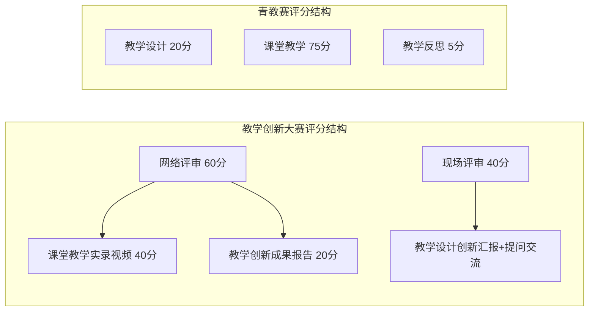
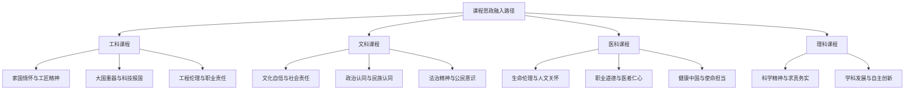
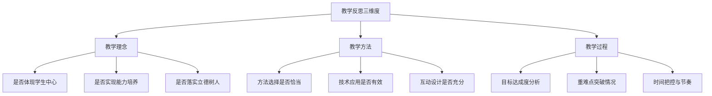
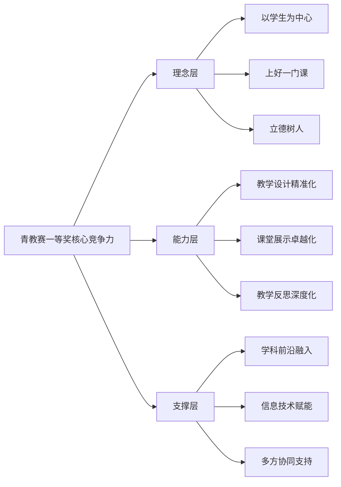
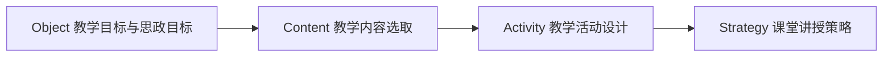
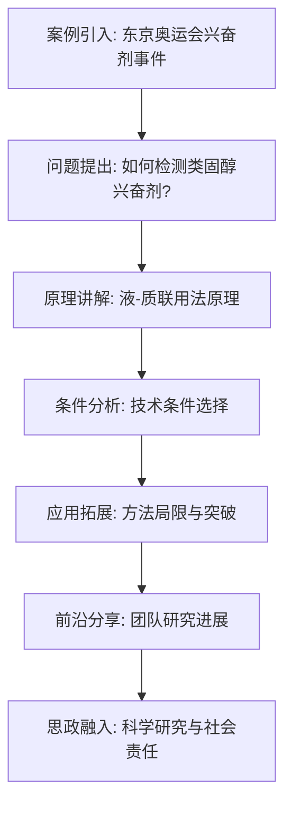
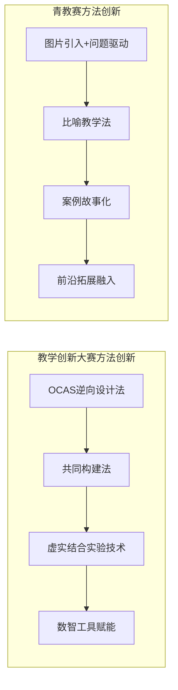
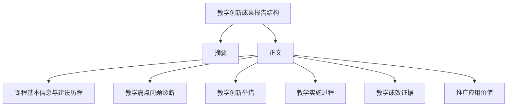
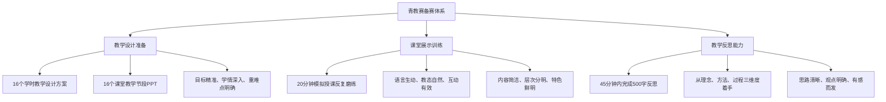

# 全国高校教师教学创新大赛与青年教师教学竞赛一等奖课程研究报告
## 1 两类国家级教学竞赛概述

全国高校教师教学创新大赛（以下简称"创新赛"）与全国高校青年教师教学竞赛（以下简称"青教赛"）是我国高等教育领域最具影响力的两大国家级教学竞赛，分别承担着推动教学改革创新与锤炼教师教学基本功的重要使命。本章将从赛事定位、组织架构、竞赛组别、评审标准及参赛规模等维度对两类竞赛进行系统梳理，并比较其核心异同，为后续一等奖课程分析提供背景框架。

### 1.1 全国高校教师教学创新大赛基本情况

**全国高校教师教学创新大赛**是2020年启动的由教育部高等教育司指导、中国高等教育学会主办的全国性高校教师教学竞赛活动，是经教育部批准**唯一一项入选《教育部直属单位三评一竞赛保留项目清单》的高校教师教学竞赛活动**[^1]。大赛以"推动教学创新、培养一流人才"为主题，旨在深入学习贯彻全国教育大会精神，落实立德树人根本任务，以"新工科、新农科、新医科、新文科"建设理念为引领，聚焦教学创新、掀起学习革命，打造高校教学改革的风向标[^2]。

**组别设置方面**，大赛按照"四新"建设、基础课程、课程思政、产教融合等领域设置7个大组，每组按参赛教师专业技术职务等级分组，每组下设正高、副高、中级及以下3个小组，共计21个小组[^1]。具体组别包括：新工科组、新医科组、新农科组、新文科组、基础课程组、课程思政组、产教融合组[^1]。近年来，大赛紧跟高等教育改革前沿，持续扩展赛道设置，第六届大赛新增了人工智能赛道、实验教学赛道、新教师赛道等[^3]，体现了大赛组别动态演变、紧跟改革热点的特征。

**竞赛流程方面**，大赛采用校赛、省赛、国赛三级赛制[^1]。省赛和国赛均包括预赛和决赛两个阶段，其中预赛成绩为网络评审环节成绩，决赛成绩包括网络评审和现场评审环节成绩[^1]。网络评审阶段，参赛教师需在规定时间内将课堂教学实录视频、教学创新成果报告（或课程思政创新报告/产教融合创新报告）等相关材料上传到大赛官网[^1]。现场评审阶段，参赛教师结合教学大纲与教学实践，进行不超过15分钟的教学设计创新汇报，专家评委依据选手的汇报进行10分钟的提问交流[^1]。

**参赛材料要求**方面，参赛教师需提交申报书、教学创新成果报告（或课程思政创新报告/产教融合创新报告）、课堂教学实录视频及相关材料[^1]。其中，教学创新成果报告应基于参赛课程的教学实践经验与反思，体现教学创新成效，聚焦教学实践的"真实问题"，通过课程内容的重构、教学方法的创新、教学环境的创设、教学评价的改革等，采用教学实验研究的范式解决教学问题，明确教学成效及其推广价值，报告包括摘要、正文，字数4000字左右为宜[^1]。课堂教学实录视频为参赛课程中两个1学时的完整教学实录[^1]。

### 1.2 全国高校青年教师教学竞赛基本情况

**全国高校青年教师教学竞赛**是由中华全国总工会、教育部联合主办的全国性教学赛事，创办于2012年，每两年举办一届，截至2024年已连续举办七届[^4]。竞赛由中国教科文卫体工会与教育部教师工作司联合承办，旨在打造一个服务教育改革、助力教师教学能力提升的建功立业品牌[^5]。赛事被纳入全国总工会"十四五"全国引领性劳动和技能竞赛，通过以赛促训、以赛促学、以赛促教，为广大青年教师提供了实践历练、成长成才的广阔舞台[^5]。

**竞赛宗旨**是围绕立德树人根本任务，以加强师德师风建设、锤炼教学基本功为着力点，充分发挥教学竞赛在提高教师队伍素质中的示范引领作用，进一步激发广大青年教师更新教育理念和掌握现代教学方法的热情，努力造就一支有理想信念、有道德情操、有扎实学识、有仁爱之心的高素质、专业化教师队伍[^5]。

**组别设置方面**，竞赛设立五个组别，分别为文科、理科、工科、医科和思想政治课专项[^5]。具体学科划分为：文科组含哲学、经济学、法学、教育学、文学、历史学、管理学、艺术学；理科组含理学；工科组含工学、农学；医科组含医学[^6]。这一组别设置结构相对稳定，侧重基础学科覆盖。

**竞赛内容方面**，青教赛以**"上好一门课"为核心理念**，设置教学设计、课堂教学和教学反思三大模块[^4]。参赛选手须提交16个学时的教学设计方案及对应课堂教学节段PPT，决赛现场随机抽取教学节段进行20分钟模拟授课并撰写教学反思[^4]。

以下为青教赛三大竞赛模块的具体内容说明：

| 竞赛模块 | 内容要求 | 分值权重 |
|---------|---------|---------|
| **教学设计** | 以1个学时为基本单位，对教学活动的设想与安排，包括课程名称、学情分析、教学目标、教学思想、课程资源、教学内容、教学重点与难点、教学方法与工具、教学安排、教学评价、预习任务与课后作业等 | 20% |
| **课堂教学** | 规定时间为15-20分钟，评委从教学内容、教学组织、教学语言与教态、教学特色四个方面进行评审 | 75% |
| **教学反思** | 结束课堂教学环节后，在45分钟内完成对本讲课节段的教学反思书面材料（500字以内），从教学理念、教学方法和教学过程三方面着手 | 5% |

[^5]

**参赛对象方面**，青教赛主要面向40岁及以下的在编在岗专任教师（以1985年或1986年8月31日后出生为界），要求近3学年持续从事一线教学工作[^5]。选拔标准包括师德师风、教学能力、创新潜力等维度，获校级及以上教学竞赛类奖项者优先推荐[^5]。

**激励机制方面**，获得各组别第一名且符合条件的选手，可按照中华全国总工会有关规定，按程序申报"全国五一劳动奖章"[^4][^6]，这一激励措施体现了青教赛强烈的劳动竞赛和建功立业属性。

### 1.3 两类竞赛目标导向与考核重点比较

两类竞赛虽然都致力于提升高校教学质量，但在**目标导向**上存在显著差异。

**教学创新大赛**以"推动教学创新、培养一流人才"为主题，目标定位于**推动教学改革，引领"质量革命"**。大赛旨在打造高校教学改革的风向标，引导教师进行系统性、深层次的教学创新[^7]。其核心关注点在于从"形式创新"转向"效果落地"，从"技术展示"转向"问题解决"，课程思政从"附加项"变为"必选项"[^8]。大赛强调教学创新的实证支撑、推广应用价值及解决实际教学问题的效果。

**青年教师教学竞赛**以"上好一门课"为核心理念，目标定位于**锤炼教学基本功，助力教师成长**[^4]。竞赛着力于加强师德师风建设、提升青年教师课堂教学能力与水平，核心是帮助青年教师夯实教学基本功、提升教学能力水平[^5]。

在**考核重点**方面，两类竞赛的侧重点也明显不同：

**教学创新大赛**聚焦于**系统性教学创新与改革成效**。考核内容强调从理念、内容、方法、评价到技术应用的全方位创新，评审维度包括教学理念创新（15%）、内容重构优化（20%）、教学方法创新（25%）、评价体系改革（15%）等[^8]。大赛特别注重创新成果的实证支撑，要求参赛教师用学生的学习效果数据证明理念的有效性，明确教学成效及其推广价值[^8]。

**青年教师教学竞赛**聚焦于**课堂教学基本功与临场表现**。考核核心是现场教学节段的展示，重点考察教学内容、教学组织、教学语言与教态、教学特色以及即时的教学反思能力[^5]。评委主要从教学内容的科学性、逻辑性、互动性与教师感染力等维度进行评审。

简言之，**创新赛考核的是一个完整教学周期或项目的创新设计与成效证据，是成果导向；青教赛考核的是特定教学节段的现场讲授水平与即时反思，是过程与表现导向**。

### 1.4 两类竞赛赛制设计与评审标准比较

**参赛对象要求方面**，两类竞赛存在明显差异。教学创新大赛面向全体高校在职教师，主讲教师须近5年对所参赛的本科课程讲授2轮及以上，可以个人或团队形式参赛，若以团队形式参赛，团队成员包括1名主讲教师和不超过3名团队教师[^1]。青年教师教学竞赛则主要面向40周岁以下青年教师，要求近3学年持续从事一线教学工作[^5]。

**评分结构方面**，两类竞赛的权重分配体现了不同的评审侧重点：

**教学创新大赛**采用网评60分与现场40分的评分结构[^1]。网评满分为60分，其中课堂教学实录视频成绩占40分、教学创新成果报告成绩占20分；现场评审满分为40分，进入现场评审阶段的选手，网络评审成绩与现场评审成绩之和为参赛教师（团队）的最终成绩[^1]。

**青年教师教学竞赛**采用教学设计20分、课堂教学75分、教学反思5分的评分结构[^5]。课堂教学占据绝对主导地位（75%），体现了青教赛对现场教学表现的高度重视。评委评分实行实名制，每部分得分为去掉一个最高分和一个最低分后的平均分[^9]。

**材料提交要求方面**，教学创新大赛要求提交课堂教学实录视频（两个1学时的完整教学实录）、教学创新成果报告（4000字左右）、教学大纲、教案和课件等[^1]。青年教师教学竞赛要求提交16个学时的教学设计方案及对应的16个课堂教学节段PPT，教学大纲等[^4][^9]。

**评审标准侧重点方面**，教学创新大赛的评审是**对一项教学改革项目的"结题验收"式评价**，重深度与证据，强调是否真正体现"以学生为中心"、是否体现产出导向教育理念、是否解决了教学内容陈旧的问题等[^8]。青教赛的评审是**对一次课堂教学的"技能比武"式评价**，重规范与现场表现，强调教学内容的科学性、逻辑性、互动性与教师感染力[^5]。

### 1.5 两类竞赛参赛规模与影响力概况

两类竞赛均已发展成为我国高等教育领域具有重大影响力的国家级赛事，参赛规模持续扩大，覆盖范围不断拓展。

**教学创新大赛参赛规模**呈现爆发式增长态势。第四届大赛共有来自全国32个赛区1249所高校的104686名教师参加校赛，25761名教师参加了大赛省（区、市）赛，覆盖全部学科门类[^7]。相比第三届，校赛规模增长25.8%，省赛规模增长11.6%[^7]。第四届比赛首次吸引了27所军队院校和国家开放大学体系内17所学校教师参赛[^7]。**第五届大赛**于2025年3月正式启动，共设32个赛区，覆盖所有本科高校、所有学科门类，**12.7万名教师参加校赛，3.4万名教师参加省赛**，最终588门课程的2253位教师（含团队教师）入围全国现场赛，共评选出教师（团队）一等奖88项、二等奖205项、三等奖295项[^10]。

**青年教师教学竞赛参赛规模**同样十分庞大。青教赛已成为**参与面最广、学科门类最全、组织规模最大的全国性高水平教学类竞赛**[^4]。第七届全国高校青年教师教学竞赛决赛于2024年8月26日至30日在上海交通大学举办，来自31个省（区、市）和新疆生产建设兵团130所学校的159名选手进入全国决赛[^4]。据统计，全国2028所高校的30余万名青年教师参与各级选拔，高校参赛率达到65%[^11]。赛事直播点击量突破1000万人次，充分展现了社会对高等教育质量的关注[^11]。

**赛事影响力方面**，两类竞赛在高等教育领域发挥着重要的示范引领作用：

| 竞赛类型 | 赛事定位与影响力 |
|---------|----------------|
| **教学创新大赛** | 经教育部批准唯一入选《教育部直属单位三评一竞赛保留项目清单》，是国家层面推动本科教学"质量革命"的政策性、引领性平台，已成为推动教学改革的引擎、促进教师交流的纽带、展示育人风采的舞台[^10] |
| **青年教师教学竞赛** | 被纳入全国总工会"十四五"全国引领性劳动和技能竞赛，具有强烈的劳动竞赛和建功立业属性，为一大批青年教师提供了展示教学水平、提高教学能力、交流教学理念的平台[^4] |

综上所述，**教学创新大赛与青年教师教学竞赛共同构成了推动高校教学质量提升的"双引擎"**。创新赛是"改革探索与成果孵化器"，引导教师面向未来进行系统性教学变革；青教赛是"教学基本功与卓越课堂训练营"，夯实青年教师的教学实践根基。两类竞赛定位互补、功能各异，共同服务于我国高等教育高质量发展的战略目标。

## 2 教学创新大赛一等奖课程情况

全国高校教师教学创新大赛作为推动高等教育教学改革的标杆性赛事，其一等奖课程代表了当前高校教学创新的最高水平。本章将从获奖课程的分布特征、教学理念与模式创新、课程思政融合路径、数字化技术应用以及典型特征归纳等维度，系统呈现一等奖课程的整体面貌与成功要素，为高校教师的教学改革与参赛备赛提供参考借鉴。

### 2.1 一等奖课程分布特征分析

教学创新大赛一等奖课程呈现出学科覆盖广泛、类型多元、院校层次丰富的分布格局，充分体现了大赛对高等教育各领域教学创新的全面引领作用。

**学科门类分布方面**，一等奖课程覆盖了大赛设置的全部组别赛道。根据第五届大赛获奖数据，各主要赛道的一等奖分布情况如下[^12]：

| 赛道类别 | 一等奖数量 | 二等奖数量 | 三等奖数量 |
|---------|-----------|-----------|-----------|
| 新工科 | 15 | 32 | 48 |
| 新医科 | 12 | 26 | 39 |
| 新农科 | 10 | 22 | 33 |
| 新文科 | 14 | 30 | 45 |
| 基础课程 | 13 | 28 | 42 |
| 课程思政 | 12 | 27 | 41 |
| 产教融合 | 12 | 40 | 47 |

从上表可以看出，**新工科组一等奖数量最多（15项）**，体现了工程教育改革在教学创新领域的活跃态势；新文科组紧随其后（14项），反映出人文社科类课程在教学创新方面的积极探索；基础课程组获奖13项，表明数学、物理等基础学科的教学改革同样成效显著。

**课程类型分布方面**，一等奖课程涵盖了专业核心课、专业基础课、公共基础课、通识课程等多种类型。从历届获奖情况来看，专业核心课占据较大比重，如《燃烧学》《宪法学》《口腔正畸学》等均为所在专业的核心必修课程[^13][^14][^15]；专业基础课如《量子力学》《概率论与数理统计》《材料科学基础》等也有突出表现[^13][^16][^17]；公共基础课中，思政类课程如《马克思主义基本原理》、《毛泽东思想和中国特色社会主义理论体系概论》等在课程思政组别表现亮眼[^18][^19]。

**院校分布特征方面**，一等奖课程来源呈现出"部属高校领跑、地方高校突破"的格局。部属高校凭借雄厚的教学资源和师资力量，在各组别中占据优势地位，如中国矿业大学、西安交通大学、四川大学、南京航空航天大学等均有课程斩获一等奖[^13][^15][^12]。地方高校同样展现出强劲的创新活力，如河北农业大学的《概率论与数理统计》、江西理工大学的《化工原理》等课程分别在相应组别获得佳绩[^13][^12]。**值得关注的是，军队院校表现突出**，陆军军医大学、火箭军工程大学等单位的获奖课程展现出军民融合的教学创新成果[^12]。

### 2.2 教学理念与模式创新实践

一等奖课程在教学理念革新与模式改革方面呈现出系统性、深层次的创新特征，普遍实现了从"教师中心"向"学习者中心"的根本性转变。

**教学理念层面**，获奖课程普遍确立并践行了以学生发展为中心的现代教育观。中国矿业大学《普通物理》课程秉承"德育为先、学生中心、研学融合、持续改进"的教育理念，基于"建构性教学观"构建师生学习共同体[^13]。西安交通大学《燃烧学》课程采用"共同构建法"引导学生进行自组织学习、主动构建案例，学生的创新成果又纳入课程内容，形成教学迭代优化的良性循环[^13]。**产出导向（OBE）理念**在获奖课程中得到广泛应用，如《宪法学》课程以目标为导向，使用逆向设计法从"教学目标"向"教学活动"各环节逆序推进，形成OCAS（Object-Content-Activity-Strategy）教学设计流程[^14]。

**教学模式层面**，线上线下混合式教学已成为一等奖课程的标配。获奖课程普遍构建了"课前-课中-课后"的完整教学闭环，实现了教学时空的有效拓展。具体而言：

- **课前阶段**：依托在线平台发布预习任务、微课视频、前测题目，引导学生自主学习
- **课中阶段**：运用翻转课堂、案例研讨、小组讨论等方式深化知识理解与应用
- **课后阶段**：通过在线答疑、拓展资源、学习社区等持续支持学生学习

陕西高校课堂教学创新大赛一等奖课程《材料科学基础》构建了"一中心-两驱动-三目标-四融合"的混合教学模式，实现了线上与线下、传统与信息化、理论与实践的深度融合[^16]。该课程发挥教学团队合作共建优势，课后合理安排任课教师轮流与学生交流互动，有效解决了学生遇到困难不能得到及时有效支持的问题[^16]。

**探究式与项目式学习**在获奖课程中得到广泛应用。四川大学《生物大数据》课程构建了"双案例线上线下混合式"5E教学法，通过工程案例和科研成果的融入，培养学生解决实际问题的能力[^15]。《宪法学》课程创设了QDSR学习流程，要求学生具备明晰问题（Question）、理性辩论（Debating）、观点分享（Sharing）、反思总结（Rethinking）四种能力素养，通过主题辩论、角色扮演、学术沙龙等活动提升学生的宪法能力[^14]。

**针对具体教学痛点的系统性改革**是获奖课程的共同特征。《宪法学》课程针对"政治性强导致学习兴趣低、理论性强导致学以致用能力弱、规范性强导致宪法思维难培养"三大痛点，创设了"三联四合五步"教学法，实现了从问题诊断到方案设计再到效果验证的完整改革闭环[^14]。《电能质量及其控制技术》课程针对"教学内容与学科发展脱节、理论教学与工程实践结合困难、课程思政教育薄弱"的痛点，构建了产学协同、研教融合的教学模式[^15]。

### 2.3 课程思政融合创新路径

一等奖课程在课程思政建设方面实现了"如盐入水"式的有机融合，形成了知识传授、能力培养与价值塑造同向同行的育人格局。

**融合路径的自然化**是获奖课程课程思政建设的显著特征。优秀课程深入挖掘专业课程本身蕴含的思政元素，而非生硬嫁接。西安交通大学《燃烧学》课程贯穿全课程的人文元素建立文化自信，实现思政内容与专业内容的协调，使用"共同构建法"将学生的创新成果纳入课程内容[^13]。河北农业大学《概率论与数理统计》课程实施"概率统计+课程思政"结合教学育人，深化特色思政建设，实现了概率统计与专业教育、特色育人、实践创新的紧密联系[^13]。

**情境化教学方法**在课程思政融入中发挥了重要作用。云南大学《工程伦理与职业道德》课程以"知-情-意-行"为路径，通过情感体验式教学的创新实践，使学生"动之以情""促之以意""导之以行"[^20]。该课程让学生化身工程伦理情境中的"决策者"，通过模拟专家论证会、举办工程伦理辩论赛等活动，让学生沉浸式体验工程师面临的伦理冲突与抉择，在思辨的逻辑推演和观点碰撞中厘清伦理边界，在真实的工程问题中激发同理心和责任感[^20]。

**不同学科门类形成了各具特色的思政融入路径**：

**工科课程**注重家国情怀与工匠精神的培育。《电能质量及其控制技术》课程深入挖掘电气学科作出突出历史贡献的"大国匠人"以及他们所创造的"大国重器"，培育具有崇高理想信念、扎实专业知识、强烈创新意识和宽广国际视野的国家栋梁和电力行业精英[^15]。

**文科课程**强调文化自信与社会责任的塑造。福建师范大学在新文科组的获奖课程创新性地构建了"政治认同-文化认同-民族认同"的三阶教学模型，为文科类课程如何服务国家战略需求提供了示范样本[^12]。《宪法学》课程让学生感受到宪法无处不在、宪法是我们共同的生活方式，激发学生对宪法的热爱和学习兴趣，培养学生具备宪法爱国主义情怀[^14]。

**医科课程**聚焦生命伦理与职业道德教育。四川大学《急危重症护理学》课程通过显性及隐性相结合的课程思政引导学生，培养"知识体系深、评估与处置能力强、职业价值高"的急危重症护理人才[^15]。

### 2.4 数字化技术赋能教学应用

一等奖课程将数字化、智能化技术从辅助工具提升为驱动教学变革的核心引擎，在破解教学难点、实现精准教学、拓展学科边界等方面发挥了重要作用。

**虚拟仿真技术破解教学难点**是获奖课程的重要创新方向。江西理工大学《化工原理》课程立足稀土战略产业需求，利用虚拟仿真技术破解高危场景教学限制，将企业生产案例转化为教学素材库，建立"课堂-实验室-生产基地"的协同育人机制[^12]。南京航空航天大学的飞行器设计课程运用数字孪生技术，显著提升了教学交互性和实效性[^12]。这些技术的应用有效解决了传统教学中高危、高成本或微观抽象实验难以开展的问题。

**智慧教学平台支撑精准教学**在获奖课程中得到广泛应用。《材料科学基础》课程借助多元化的教学方法和手段，灵活运用成果展示、分组讨论、归纳总结、抢答投票、随堂测试等互动形式加强师生互动[^16]。四川大学《生物大数据》课程建设的两个数字化教学平台均获批省级一流课程，线上资源辐射受益超过27000人次[^15]。

**数字化教学资源建设**成效显著。获奖课程普遍建设了丰富的数字化教学资源库，包括微课视频、案例数据库、虚拟仿真实验等。《宪法学》课程重构了教学内容，建设了立宪史料数据库、理论前沿数据库、经典文献数据库、疑难案例数据库、重要讲话数据库五大资源库[^14]。袁航老师的教学实践表明，播音教育数字化可以做得很好，从在知乎答疑到通过荔枝FM与喜马拉雅FM讲授知识点，再到利用抖音、小红书等平台创新，持续探索教育数字化的深层价值[^21]。

**人工智能技术的探索应用**开始在获奖课程中崭露头角。第五届大赛78%的工科类项目建立了校企联合开发机制，虚拟仿真（VR）、人工智能（AI）、大数据分析等技术广泛应用[^12]。袁航老师在有声语言应用教学中引入AI，对比AI创作与学生创作的差异性，引导学生既要掌握技术，更要坚守艺术灵魂，体现了人机协同的教学探索[^21]。

### 2.5 一等奖课程典型特征归纳

基于前述分析，教学创新大赛一等奖课程呈现出以下共性特征与成功要素：

**特征一：问题导向的创新设计**

一等奖课程普遍遵循"诊断问题-设计方案-实施验证-迭代优化"的改革逻辑。获奖课程聚焦教学实践的"真实问题"，通过课程内容的重构、教学方法的创新、教学环境的创设、教学评价的改革等，采用教学实验研究的范式解决教学问题[^13]。《宪法学》课程针对三大痛点问题创设了系统性解决方案[^14]，《电能质量及其控制技术》课程针对三个痛点构建了产学协同、研教融合的教学模式[^15]，体现了从"形式创新"到"问题解决"的转变。

**特征二：实证支撑的成效证明**

获奖课程注重用数据和证据证明教学创新的有效性。《急危重症护理学》课程经过5年教学改革，学生的综合平均成绩由75.03分提升至90.42分，课程学生评教成绩由90.87分提升至97.72分[^15]。吉林大学微积分教学创新实践使抽象数学概念的学习效率提升40%，相关成果已推广至全国23所高校[^12]。这种实证导向的成效呈现是获奖的关键要素。

**特征三：多元融合的教学体系**

获奖课程构建了多维度融合的教学体系，体现为：

| 融合维度 | 具体表现 |
|---------|---------|
| 线上线下融合 | 混合式教学模式，拓展教学时空 |
| 理论实践融合 | 项目式学习、案例教学、产教协同 |
| 知识价值融合 | 课程思政有机嵌入，实现三全育人 |
| 技术教学融合 | 数字化技术深度赋能教学创新 |

四川大学《文物保护概论》课程形成了文理交叉融合、教学实践融合、学界业界融合和思政育人融合的"四融合"人才培养机制[^15]。

**特征四：持续改进的迭代优化**

获奖课程建立了基于学生反馈和教学数据的动态调整机制。《燃烧学》课程使用"共同构建法"，学生的创新成果纳入课程内容，促进教学迭代优化[^13]。《文物保护概论》课程10年建设历程，从无到有、从1人到文理交叉的教师共同体、从单一学院必修到全校选修的学生共同体，每一步跨越都是一次成长[^15]。

**参赛材料呈现的优秀做法**方面，一等奖课程在以下环节表现突出：

- **教学创新成果报告**：结构清晰、逻辑严密，聚焦"真实问题"，明确呈现创新举措与实证成效，4000字左右的篇幅内实现问题-方案-成效的完整闭环
- **课堂教学实录视频**：真实呈现教学创新的落地实施，体现师生互动、学生参与、技术应用等创新要素
- **现场汇报答辩**：能够清晰阐述创新理念、准确回应专家提问、展现对教学改革的深度思考

综上所述，**教学创新大赛一等奖课程的成功并非单一维度的突破，而是系统性的教学创新**。其典型特征可概括为：**理念先进、目标清晰；模式重构、学生为本；思政融合、价值内嵌；技术赋能、精准高效**。这些课程共同指向从"知识传授"到"素养与能力培养"的根本转变，形成了可借鉴、可推广的创新实践体系，为高校教师的教学改革与参赛备赛提供了宝贵的经验启示。

## 3 青年教师教学竞赛一等奖课程情况

全国高校青年教师教学竞赛作为锤炼青年教师教学基本功的国家级赛事，其一等奖课程代表了青年教师课堂教学的最高水平。本章将从获奖分布特征、教学设计方法、课堂教学展示、教学反思能力等维度，系统梳理一等奖课程的表现特点，提炼其核心竞争力要素，为青年教师参赛备赛提供参考借鉴。

### 3.1 一等奖课程获奖分布特征

青教赛设立文科、理科、工科、医科、思想政治课专项五个组别，历届一等奖课程呈现出学科覆盖全面、院校类型多元的分布格局。

**组别设置与学科覆盖方面**，五个组别的学科划分具有明确的边界：文科组涵盖哲学、经济学、法学、教育学、文学、历史学、管理学、艺术学；理科组对应理学；工科组包含工学、农学；医科组对应医学；思想政治课专项则聚焦思政类课程[^22]。这一组别结构相对稳定，侧重基础学科的全面覆盖，确保了不同学科领域青年教师均有展示平台。

**第七届青教赛一等奖获奖情况**显示，各组别均产生了优秀的一等奖获得者。以下为部分获奖信息：

| 组别 | 获奖教师 | 所属院校 | 参赛课程 |
|-----|---------|---------|---------|
| 文科组一等奖第一名 | 郭璐 | 清华大学 | 《中国古代城市规划》 |
| 理科组一等奖第一名 | 赵维殳 | 上海交通大学 | 《极端生物学》 |
| 工科组一等奖第一名 | 程楠 | 中国农业大学 | 《食品卫生与安全控制》 |
| 医科组一等奖第一名 | 叶枫 | 上海交通大学医学院 | 《普通外科学》 |
| 思政组一等奖第一名 | 徐嘉鸿 | 武汉大学 | 《中国近现代史纲要》 |
| 思政组一等奖 | 张青子衿 | 上海大学 | 《习近平新时代中国特色社会主义思想概论》 |
| 文科组一等奖 | 杨伊 | — | — |

[^23][^24][^25]

**院校分布特征方面**，一等奖获奖院校呈现出"顶尖高校引领、多元院校突破"的格局。清华大学、上海交通大学、中国农业大学、武汉大学等部属重点高校在各组别中表现突出。**值得关注的是上海大学的突破性表现**——第七届青教赛中，上海大学马克思主义学院青年教师张青子衿荣获思想政治课专项组一等奖，这是上海大学参赛选手**首次入围国赛、首次获得国赛一等奖**，创造了该校参加历届青年教师教学竞赛的最好战绩[^24]。地方高校在青教赛中同样展现出强劲的竞争力，如河套学院刘丽秋老师经过多届省赛历练，最终在第七届全国高校青年教师教学竞赛中获得三等奖[^26]。

**参赛课程类型方面**，一等奖课程涵盖了专业核心课、专业基础课、公共基础课等多种类型。从获奖课程来看，《中国古代城市规划》《极端生物学》《食品卫生与安全控制》《普通外科学》等均为所在专业的核心或特色课程，体现了参赛教师在专业领域的深厚积淀。思政组获奖课程如《中国近现代史纲要》《习近平新时代中国特色社会主义思想概论》则是思想政治理论课的核心课程[^23][^24]。

### 3.2 教学设计的精准化策略

教学设计在青教赛评分体系中占比20%，是参赛材料的重要组成部分。一等奖课程在教学设计方面呈现出**精准、系统与创新融合**的显著特征[^27]。

**教学目标的精准定位**是一等奖课程教学设计的核心特征。在撰写教学设计时，教学目标是整个设计的基石，它决定了教学内容的选择、教学方法的应用以及教学活动的安排[^27]。评委在评审教学设计时，会以教学目标为主线贯穿整个设计，因为教学目标直接决定所使用的教学安排。一等奖课程在目标设定上确保了准确性和可实现性，使设计的教学过程、教学安排、教学活动都服务于教学目标的达成。

**学情分析的深入全面**是目标设定的重要前提。一等奖课程对学生特征进行深入分析，包括学生的知识背景、学习风格、兴趣点以及能力水平等，确保教学目标既具有挑战性，又在学生的能力范围内[^27]。以《检测与传感技术》课程为例，针对学生对抽象模型理解困难、兴趣集中于应用案例的特点，教师采用"案例拆解—原理剖析—实践验证"模式进行教学设计[^26]。

**教学内容的合理选择与组织**体现了一等奖课程的专业水准。教学内容的选择应基于教学目标，教师应首先通过学情分析确定教学目标，然后根据这些目标挑选合适的教学内容和教材[^27]。一等奖课程在内容选择时综合考虑了教学目标的匹配性、教材的适用性、内容的深度和广度、教学资源的丰富性以及教材的创新性等因素。

以下为青教赛教学设计的核心要素与一等奖课程的应对策略：

| 设计要素 | 评价要求 | 一等奖课程策略 |
|---------|---------|---------------|
| 教学目标 | 准确、可实现 | 精准定位，与学情匹配 |
| 学情分析 | 深入、全面 | 多维度分析学生特征 |
| 内容选择 | 服务目标、适度创新 | 基于目标逆向设计 |
| 重难点 | 明确区分、有效突破 | 结合学情精准把握 |
| 教学方法 | 灵活恰当 | 问题链与技术融合 |

[^27][^28]

**重难点的明确突出**是一等奖课程教学设计的关键环节。重点内容是教学目标中必须实现的核心部分，而难点则是学生在学习过程中可能遇到的挑战[^27]。教师在设定重难点时，需要回顾学情分析，确保这些点与学生的实际需求和能力相匹配。通过明确区分和处理重点与难点，教师能够更有针对性地设计教学活动，帮助学生克服学习障碍。

**问题链设计实现"思维爬坡"**是一等奖课程教学设计的创新亮点。问题导向是教学创新的核心驱动力，通过问题链设计能够引导学生逐步深入思考，将零散的知识串联成系统的认知体系[^26]。以"温度传感器及其应用"章节为例，围绕"本地温室大棚智能温度监测系统的设计"构建递进式问题链，通过适度认知冲突激发探究欲望，引导学生主动学习，在解决问题的过程中将相关知识内化迁移。

### 3.3 课堂教学展示的卓越表现

课堂教学是青教赛的核心环节，占据75%的评分权重，评委从**教学内容、教学组织、语言教态、教学特色**四个维度进行评审[^29]。一等奖课程在20分钟模拟授课中展现出卓越的教学能力与鲜明的教学风格。

**教学内容维度**，一等奖课程普遍做到了"简洁、通透、有层次"。在评分细则中，明确指出教学内容需"重点突出""内容充实"[^30]。以第七届青教赛文科组一等奖第一名《中国古代城市规划史》课程为例，教师以"游牧文明与中原礼制的交融创新"为单一主线，将北魏都城洛阳规划这一复杂的城市要素归为"内城礼制骨架""外郭里方实践""整体模式突破"三个模块，清晰地构建了教学框架，锚定了核心要点[^30]。

一等奖课程在教学内容呈现上的共性特征可概括为：

- **突出课程思政**：将立德树人根本任务自然融入教学。工科组一等奖第一名《食品卫生与安全控制》课程在开始就点出食品安全的重要性，引导学生认识到作为食品专业工作人员的责任与使命，通过介绍金华火腿的制作，将亚硝酸盐的使用与中华民族的智慧联系起来，有效增强学生的文化自信与民族自信[^29]
- **理论联系实际**：通过引入真实案例将抽象概念具象化。程楠老师引入《舌尖上的中国》纪录片中关于金华火腿的例子，通过对比两块肉的色泽，直观展现亚硝酸盐护色、抑菌的作用[^29]
- **反映学科三新**：体现学科发展的新思想、新概念、新成果。《食品卫生与安全控制》课程介绍了亚硝酸盐检测技术从1.0到4.0的迭代，展示了学科发展的前沿动态[^29]
- **结构清晰递进**：由浅入深，由易到难，层层递进地构建知识框架[^29]

**教学组织维度**，一等奖课程展现出"启发性强、教学过程安排合理"的特点[^30]。评分细则明确指出教学组织要"启发性强""教学过程安排合理"，要求课堂教学有层次，设置认知梯度，激发探究动力。《中国古代城市规划史》课程以"游牧政权如何在中原建立都城"这一矛盾开题，逐层展开：从基础矛盾（内城礼制严谨但空间不足）到制度创新（里方制的引入）再到文化升华（交融创新对文明演进的推动），形成递进式的教学结构[^30]。

**"留白引思"**是一等奖课程教学组织的重要策略。评分细则指出教学组织要"给予学生自主探索时间""课堂应变灵活"[^30]。在讲解北魏洛阳外郭的四通市时，教师暂停讲解，抛出问题："若你是北魏规划师，如何设计外来人口聚居区？"这种内容留白的方式为学生提供了自主思考的空间，培养学生的创新思维和实践能力。

**语言教态维度**，一等奖获奖教师展现出自然流畅、富有感染力的教学风采。教师语言生动准确，善用比喻、举例等方法讲解复杂知识；教态自然大方，能够有效调动学生的学习积极性[^31]。

**教学特色维度**，一等奖课程均形成了鲜明的个人教学风格。医科组一等奖第一名叶枫老师的《普通外科学》课程在结尾环节表现精彩：按照"2345"的顺序（两大要素、三要素概念、四型分类、五句话治疗原则）对整节课内容进行概括，并强调腹外疝的修补不仅是腹壁的重塑，更是对患者生活质量的改善，融入了重视患者生活质量的人文精神与关怀[^23]。

### 3.4 教学反思的深度与实效

教学反思在青教赛评分体系中占比5%，要求参赛教师在结束课堂教学环节后，在45分钟内完成500字以内的教学反思材料，从教学理念、教学方法和教学过程三方面着手[^32]。一等奖获奖教师在教学反思环节展现出深刻的教学洞察力和持续改进的专业精神。

**基于理念转变的深度剖析**是高质量教学反思的核心特征。一等奖获奖教师的反思触及教学理念的升级，从关注"教知识"转向审视是否真正以学生为中心，培养了学生的实践与创新能力[^26]。青教赛"以学生为中心""能力导向""立德树人"的多维要求，与传统课堂评价形成鲜明对比，这种理念层面的反思深度是获奖的关键要素。

**关联竞赛与常态课的共生循环**是一等奖获奖教师反思的重要维度。将青教赛20分钟高密度教学设计直接应用于90分钟常态课，易出现节奏失衡、知识覆盖不全等问题[^26]。竞赛强调"以点带面"凸显亮点，而常态课注重"循序渐进"兼顾完整性，需采用"模块化分解+弹性组合"策略，对竞赛精华进行适应性改造。

**构建"实践—反思—迭代"的闭环**是一等奖获奖教师的共同特点。为实现竞赛与常态课共生，获奖教师从教学目标达成度、学生反馈、自身教学行为三个维度进行反思，对比竞赛与常态课效果差异，了解学生接受程度，优化教学环节衔接与互动设计，形成"以赛促教、以教验赛"的良性生态[^26]。

高质量教学反思的撰写策略可归纳为以下路径：

**思政课教师的反思特点**值得关注。上海大学张青子衿老师在备赛过程中深刻体会到，"讲好思政课，要超越简单的知识传授，走向知识育人、思政育人、立德树人"[^24]。她指出，大学生思想政治教育必须要关注到大学生群体的认知特点、心理特征和实际需求，增强精准性、互动性和亲和力。这种对教学本质的深度反思，体现了一等奖获奖教师的专业素养。

### 3.5 一等奖课程核心竞争力要素归纳

综合前述分析，青教赛一等奖课程的成功并非单一维度的突破，而是**教学设计、课堂展示、教学反思三位一体的系统性卓越**。其核心竞争力要素可归纳为以下模型：

**要素一："上好一门课"理念的深度践行**

青教赛以"上好一门课"为核心理念，一等奖课程深刻理解并创造性落实这一要求。获奖教师将"以学生为中心"的理念贯通于教学全流程，实现了从知识传授向综合素养、价值塑造与创新能力培养的系统性转变[^26]。上海大学张青子衿老师的获奖经验表明，课程团队一直在探索用具有时代性、感召力、共情力的方式，帮助当代大学生全面认知课程内容，始终用项目驱动和高挑战性问题牵引来开展教学改革和打造课程内容[^24]。

**要素二：教学基本功的扎实呈现**

一等奖课程展现出过硬的教学基本功，体现在：

| 基本功维度 | 具体表现 |
|-----------|---------|
| 教学设计功 | 目标精准、学情深入、内容简洁、层次分明 |
| 课堂讲授功 | 语言生动、逻辑清晰、重点突出、互动有效 |
| 教态表达功 | 自然大方、富有感染力、应变灵活 |
| 反思改进功 | 思路清晰、观点明确、联系实际、有感而发 |

第七届青教赛医科组一等奖作品充分展现了对传统教学资源的深度挖掘与创新运用，以经典医学教材为根基，对不同版本、不同学制的教材进行精心整合与重新加工，构建出既系统又具针对性的知识框架[^31]。

**要素三：课程思政的自然融入**

一等奖课程实现了课程思政"如盐入水"式的有机融合。《食品卫生与安全控制》课程通过科学的数据和模型分析，引导学生理解"不能脱离剂量去谈毒性"的道理，在讲授食品安全知识的同时，培养学生的科学精神和批判性思维[^29]。《中国古代城市规划史》课程通过对比北京中轴线申遗案例，以"中轴对称"这一简洁符号，既点明儒家礼制内核，又自然融入文化自信的思政元素，体现"简而有味"的教学智慧[^30]。

**要素四：学科前沿的有效反映**

一等奖课程注重反映或联系学科发展的新思想、新概念、新成果。《食品卫生与安全控制》课程从传统的分光光度法检测（1.0）的"准"，到快速检测试纸（2.0）的"快"，磁吸式数字传感装置（3.0）的"又准又快"，以及对智能化、人工智能、大数据生物传感（4.0）的展望，展示了检测技术的最新研究成果[^29]。《普通外科学》课程介绍了生物适应性补片的研发背景、材料特性及其在临床应用中的优势，引导学生思考疝治疗领域的未来研究方向[^33]。

**要素五：信息技术与教学的深度融合**

响应青教赛技术应用要求，一等奖获奖教师积极探索虚拟仿真等技术与教学的融合。针对高压环境下传感器测试等危险、高成本实验，利用虚拟仿真平台让学生安全模拟实验过程，观察工况变化，拓展教学场景，增强学习体验，为教学创新注入活力[^26]。课件制作兼具学术性与美感，每一页PPT都图文并茂，既展示经典理论知识，又巧妙融入最新研究成果和临床案例[^31]。

**要素六：多方协同的备赛支持体系**

一等奖获奖背后是系统性的备赛支持。上海大学为准备青教赛，由学校工会和教务部牵头，协同校内各职能部门和学院，组织校内外专家进行校赛评审、市赛选拔和国赛磨课等各个阶段的评选和系列培训，**先后60余次进行集体磨课、一对一磨课等**，为参赛选手提供专业的备赛辅导[^24]。从材料准备、课程节段、内容磨课以及讲课演绎等不同角度，为参赛教师提供全方位的竞赛支持。

**一等奖课程核心竞争力模型**可概括为：

综上所述，**青教赛一等奖课程的成功是理念引领、能力支撑、系统保障三者有机统一的结果**。其典型特征可概括为：**理念先进、学生为本；基本功扎实、表现卓越；思政融合、价值引领；前沿反映、技术赋能**。青教赛作为"教学基本功与卓越课堂训练营"，能产生持续赋能教师成长的"长尾效应"[^26]，为广大青年教师提供了实践历练、成长成才的广阔舞台。

## 4 一等奖课程典型案例分析

本章选取教学创新大赛与青年教师教学竞赛中具有代表性的一等奖课程进行深度剖析，通过具体案例解构获奖课程的成功要素。教学创新大赛案例侧重分析系统性教学改革的设计逻辑与成效证据，青教赛案例聚焦课堂教学展示的精湛技艺与教学基本功呈现，最终提炼跨赛事的共性成功经验与可迁移的教学创新策略。

### 4.1 教学创新大赛典型案例：《燃烧学》课程创新实践解析

西安交通大学周屈兰、李娜团队主讲的《燃烧学》课程荣获教学创新大赛部属高校正高组一等奖，该课程以培养能源动力工程领域的高端工程和科研人才为目标，构建了系统性的教学创新体系[^34]。

**课程定位与目标设定**

燃烧与发电厂、内燃机、航空发动机、火箭发动机等"国之重器"直接相关，对我国建设社会主义现代化强国至关重要[^34]。该课程精准定位于服务国家战略需求，以培养能源动力工程领域的高端工程和科研人才为核心目标，体现了**教学目标与国家战略的深度对接**。这种目标设定方式为课程内容选择、教学方法设计提供了清晰的方向指引。

**OCAS逆向设计法的创新应用**

课程采用**OCAS逆向设计法**作为教学设计思路，这是该课程的核心创新之一。以目标为导向，从"教学目标"向"教学活动"各个环节逆序推进，形成Object（目标）- Content（内容）- Activity（活动）- Strategy（策略）的教学设计流程：先确定教学目标和思政目标，然后为之选取教学内容，针对教学内容设计教学活动，围绕教学活动确定课堂讲授策略[^34]。

这种逆向设计方法确保了教学各环节的高度一致性，避免了传统教学设计中目标与实施脱节的问题。

**"6+2教学资源"组织策略**

课程组织了"6+2教学资源"，构建了丰富的教学支持体系[^34]。其中，虚实结合的实验技术培养学生动手能力，引进国际高水平教学资源开阔学生视野。这种资源组织策略体现了**全方位提供教学支持**的理念，确保学生在理论学习与实践操作中都能获得充分的资源保障。

**共同构建法与教学迭代优化**

该课程最具特色的创新是**"共同构建法"**的应用。使用"共同构建法"引导学生进行自组织学习、主动构建案例，而学生的创新成果又纳入课程内容，促进教学迭代优化[^34]。这种方法打破了传统的单向知识传递模式，实现了师生共创、教学相长的良性循环。学生不再是被动的知识接受者，而是课程内容的共同建设者，其创新成果成为课程资源的有机组成部分。

**课程思政的自然融入**

课程在思政融入方面表现突出，学情分析全面深入，思政课程融入巧妙落实；方案设计实现理工人文交融，认知均衡强化[^34]。贯穿全课程的人文元素建立文化自信，实现思政内容与专业内容的协调。这种"如盐入水"式的思政融入方式，避免了生硬嫁接，使价值引领与知识传授自然统一。

**应用成效与推广价值**

该课程的教学成果应用效果显著，主要表现在三个方面：形成积极创新氛围，学科竞赛成绩优异；学生综合素养全面提高，提升了参与各种科技创新活动的积极性；课程思政建设进度加快[^34]。这些实证成效为课程获得一等奖提供了有力支撑。

### 4.2 教学创新大赛典型案例：《交通仿真技术》课程创新实践解析

同济大学交通学院倪颖老师主讲的《交通仿真技术》课程在第五届全国高校教师教学创新大赛中荣获一等奖，该课程以培养服务"交通强国"战略的科技人才为目标，构建了数智化教学创新体系[^35]。

**"创数智工具、贯进阶实验、育迁移能力"的教学思路**

课程提出了**"创数智工具、贯进阶实验、育迁移能力"**的教学思路，依托自主研发的仿真工具与平台，培育学生的迁移能力[^35]。这一思路体现了**技术赋能教学**的核心理念，将数字化工具从辅助手段提升为驱动教学创新的核心引擎。

该课程的教学创新路径可概括为：

| 创新维度 | 具体内涵 | 实现路径 |
|---------|---------|---------|
| 创数智工具 | 自主研发仿真工具与平台 | 解决教学工具依赖进口的瓶颈 |
| 贯进阶实验 | 构建递进式实验体系 | 从基础验证到综合创新 |
| 育迁移能力 | 培养知识迁移与应用能力 | 面向真实工程问题的能力训练 |

**自主研发工具的广泛推广**

课程中自主研发的交通仿真工具和主编的实验教材，已经推广至国内80%有交通学科的高校；设计的自动驾驶测试平台应用于国内外80余所高校，支持了220万次算法测试[^35]。这一推广数据充分证明了课程成果的**高度可复制性与广泛适用性**，体现了教学创新从"单点突破"到"系统辐射"的价值延伸。

**数字化教学成果的示范效应**

课程成果入选全国首届数字教育优秀案例，课程入选上海市一流本科课程；主讲老师以第一完成人获省部级高校教师教学创新大赛特等奖以及省部级课程思政教学设计展示活动特等奖等[^35]。这些荣誉表明该课程在数字化教学创新领域具有标杆示范作用。

**产教融合的典型路径**

《交通仿真技术》课程展现了**产教融合与技术赋能教学**的典型路径。课程紧密对接"交通强国"战略需求，将学术研究成果转化为教学资源，将行业前沿技术融入课程内容，实现了科研反哺教学、教学服务行业的良性互动。自主研发的仿真平台不仅解决了教学中的工具依赖问题，更为学生提供了接触前沿技术的实践机会。

### 4.3 青年教师教学竞赛典型案例：《普通外科学》课堂教学展示解析

第七届全国高校青年教师教学竞赛医科组一等奖第一名由上海交通大学医学院附属瑞金医院叶枫老师获得，其参赛课程为《普通外科学》，随机抽取展示的章节为"腹外疝概论"[^33][^36]。这一案例深刻诠释了青教赛"上好一门课"的核心理念。

**教学引入的生动性设计**

叶枫老师以一张特殊患者（巨大腹外疝患者）的图片开场，引入主题"腹外疝"，并提出两个核心问题：为什么腹外疝那么多？又是什么原因导致了腹外疝？[^33]这种**图片引入+问题驱动**的方式迅速抓住学生注意力，激发学习兴趣，为后续知识展开奠定了良好基础。

**概念讲解的层次递进**

在概念讲解环节，叶枫老师展示三张疝的图片，引导学生观察图片，思考疝的共性；提出疝的广义概念后，结合图片案例和板书，讲解疝形成的三要素；通过展示更多的案例图片，引导学生观察腹外疝的特点；通过案例、板书以及疝的英文及特点，通俗易懂地得出腹外疝的概念[^33]。这种**由浅入深、层层递进**的讲解方式，符合学生的认知规律，有效降低了学习难度。

**病因分型的案例融合**

课程通过板书讲解疝形成的四个主要结构：疝囊、内容物、疝外被盖、疝环；结合实际讲解触诊疝环的临床操作，引出疝的命名方式及分类[^33]。在临床分型讲解中，叶枫老师创造性地运用**比喻教学法**：通过狐狸比喻讲解易复性疝，通过肠管、肠鸣讲解难复性疝，通过搬重物的例子讲解嵌顿性疝[^33]。这种将抽象医学概念具象化的教学策略，显著提升了知识的可理解性和记忆效果。

**治疗原则的系统梳理**

由四型相互关联，引出5大类治疗方法：疝托、手法复位、择期手术、急诊手术和等待观察；详细讲解各治疗方法的适用条件和操作要点；讨论不同类型疝的治疗原则和时机[^33]。这种系统化的知识梳理，帮助学生建立了完整的临床决策框架。

**手术发展史的人文融入**

在疝治疗手术的发展环节，叶枫老师讲述林则徐与疝的故事，强调手术一定要及时；介绍1559年最早将腹外疝视为包块进行切除的历史，引入Bassini的修补术，分析其局限性，引出李金斯坦的修复重建理念；介绍生物适应性补片的研发背景、材料特性及临床应用优势，引导学生思考疝治疗领域的未来研究方向[^33]。

教学既回顾了腹外疝手术的发展历程，又有对疝修补补片前沿进展的延伸，并结合祖国医学中对疝的生动记录，在加深学生对腹外疝临床特点认识的同时，体现了外科学探索创新的专业精神和科技进步对学科发展的促进作用[^36]。

**"站在前辈肩膀上"的传承创新**

叶枫老师谦虚地表示："瑞金有着深厚的教学底蕴，我有幸能站在国赛的讲台上，是因为站在了前辈们的肩膀上。"[^36]外科教研室有着非常光荣的教学传统，以教材为基础，有着完善的知识框架、搭建了核心理论体系，有助于年轻教师对不同版本、不同学制的教材重新加工、精心总结。课程PPT不仅要图文并茂，还兼具学术性和美感，每一页PPT都是守正创新的艺术[^36]。

**精益求精的教学准备**

叶枫老师前前后后上了有一百多轮的课，正是这些反复的磨练，让他的教学内容更加贴近实际，课堂表现更加自如[^36]。他的课件每一个图、表、数据都力求有确切的引用或自主版权，并且尽量选用最新的学术资料，体现学术严谨性。他的教学设计文稿多达十几万字，反复修改，力求完美[^36]。这种**精益求精的专业态度**是获得全国第一名的重要保障。

### 4.4 青年教师教学竞赛典型案例：《分析化学》课堂教学展示解析

第七届全国高校青年教师教学竞赛理科组一等奖（全国第二名）由南京理工大学化学与化工学院高如如老师获得，其参赛课程为《分析化学》[^37]。这一案例展现了青年教师快速成长的典型路径。

**"讲好一个故事"的教学核心理念**

讲好一个故事，从知识传递到情感共鸣，逐渐成为高如如老师教学中的核心理念。她意识到，知识的传授不仅仅是信息的堆砌，这种方式往往容易陷入灌输式课堂，导致学生的认可度下降。因此，她努力将每堂课都视为一个完整的故事，通过生动的案例引入课堂，引发学生的思考和讨论[^37]。

高如如老师将知识点巧妙地融入故事中，打破传统教学的框架，将人类对自然过程的认知作为逻辑主线，引导学生在情感共鸣中深入理解知识。通过这种方式，她不仅传递了知识，更培养了学生的思维能力和对科学的热情，激发了他们对学习的主动性和参与感[^37]。

**主线串联实现知识融会贯通**

高如如老师认为，要上好这门课，最具挑战的是将分散的知识点用一条主线串联起来，融会贯通。她认为这正是教学创新的第一步[^37]。在上课的第一年，她几乎将所有精力投入到备课和PPT调整中，认真梳理教材的知识点。在课堂上，她在黑板上逐步推理公式的推导过程，帮助学生理清知识主线，并用通俗易懂的语言传达复杂的概念[^37]。

**液-质联用法章节的教学设计范例**

在讲授液-质联用法这一章节时，高如如老师以东京奥运会的兴奋剂事件作为引入案例，激发学生的兴趣。她随后提出问题：如何检测尿液中的类固醇兴奋剂？这个问题自然而然地引导学生进入液-质联用法的原理知识点[^37]。

高如如老师结合兴奋剂的结构和性质，鼓励学生总结出所需的技术条件。她强调，尽管方法的原理是固定的，但根据具体的分析对象，选择合适的技术条件至关重要。在课堂的最后，高如如老师进行了应用拓展，讨论该方法的适用性和局限性，以及如何突破这些局限。她分享了前沿研究的最新进展，并介绍了她所在团队所做的努力，激励学生思考未来的研究方向，鼓励他们积极探索。在这一过程中，她还巧妙地融入思政教育，引导学生认识科学研究与社会责任之间的联系[^37]。

该章节的教学设计体现了**案例引入-问题驱动-原理讲解-前沿拓展-思政融入**的完整教学闭环：

**"以赛促教"的成长路径**

高如如老师的讲课竞赛之路始于2020年参加江苏省高校微课教学比赛。整个暑假，近两个月的时间，她几乎将所有精力投入到视频制作中，经过无数次的推翻重来，努力寻找将课程内容和学科重要性浓缩到八分钟内的最佳呈现方式[^37]。

2024年，经过两年的沉淀与学习，高如如再次备战省青教赛。这一次，她彻底推翻了首次参赛时的课程主线，甚至没有保留任何一个PPT。与第一次参赛时的迷茫相比，这次她的思路更加清晰，心态也更为从容[^37]。

高如如老师深刻体会到，优秀的教学设计是比赛成功的关键。每节课的知识点如何精心选取、如何通过故事化的讲解增强内容的吸引力，以及如何在短时间内让专家评委获得启发，这些都需要经过反复推敲和不断优化[^37]。

高如如老师表示："通过这次挑战，我真正体会到'以赛促教'的深远意义。比赛的压力让我不得不重新审视每一节课的细节，从多个维度探讨更加有效和生动的教学方式。比赛只是形式，而真正的目标是更好地服务教学，提升教育质量。"[^37]

### 4.5 两类竞赛一等奖课程成功要素比较与经验提炼

基于前述四个典型案例的深度剖析，可以系统比较教学创新大赛与青教赛一等奖课程在关键维度的异同特征，并提炼跨赛事的共性成功经验。

**教学目标设定的比较分析**

两类竞赛一等奖课程在教学目标设定上均表现出**聚焦高阶能力与真实问题**的共同特征，但侧重点有所不同：

| 比较维度 | 教学创新大赛 | 青年教师教学竞赛 |
|---------|-------------|-----------------|
| 目标定位 | 系统性教学改革，解决真实教学痛点 | 单次课堂教学的精准呈现 |
| 战略对接 | 强调服务国家战略需求（如交通强国、能源安全） | 强调学科核心素养培养 |
| 能力培养 | 注重迁移能力、创新能力的系统培育 | 注重知识理解、思维启发的即时达成 |
| 典型案例 | 《燃烧学》培养能源动力领域高端人才[^34] | 《分析化学》培养学生思维能力和科学热情[^37] |

**教学内容重构策略的比较分析**

两类竞赛一等奖课程均打破传统知识罗列，以逻辑主线或故事线索对内容进行深度重构：

- **教学创新大赛**：强调内容的系统性重构与资源整合。《燃烧学》组织"6+2教学资源"，《交通仿真技术》自主研发仿真工具和平台[^34][^35]
- **青教赛**：强调单次课堂内容的精炼与层次。《普通外科学》将腹外疝概论设计为"概念-病因-分型-治疗-发展"的递进结构[^33]；《分析化学》将分散知识点用主线串联融会贯通[^37]

**教学方法创新的比较分析**

- **教学创新大赛**侧重**技术赋能与模式驱动**。《燃烧学》使用"共同构建法"引导学生自组织学习[^34]；《交通仿真技术》依托自主研发平台培育迁移能力[^35]
- **青教赛**侧重**课堂教学技巧与互动设计**。《普通外科学》运用比喻、历史故事等方法增强教学生动性[^33]；《分析化学》通过案例引入实现从知识传递到情感共鸣[^37]

**师生互动设计的比较分析**

两类竞赛一等奖课程均注重引导学生参与、思考与共鸣：

- **教学创新大赛**强调**学生作为共建者**的深度参与。《燃烧学》学生的创新成果纳入课程内容，促进教学迭代优化[^34]
- **青教赛**强调**课堂即时互动**的有效性。《普通外科学》通过问题引导学生思考病因分析[^33]；《分析化学》鼓励学生总结技术条件，激励学生思考未来研究方向[^37]

**课程思政融入的比较分析**

两类竞赛一等奖课程均实现了课程思政的自然融入，但路径各有特色：

| 融入路径 | 教学创新大赛 | 青年教师教学竞赛 |
|---------|-------------|-----------------|
| 人文元素 | 贯穿全课程建立文化自信[^34] | 结合祖国医学记载、历史人物故事[^33][^36] |
| 专业精神 | 实现思政内容与专业内容协调[^34] | 体现外科学探索创新的专业精神[^36] |
| 社会责任 | 服务国家战略（交通强国）[^35] | 引导学生认识科学研究与社会责任的联系[^37] |

**跨赛事共性成功经验提炼**

基于上述比较分析，可提炼出以下**可供高校教师借鉴的教学创新实践指南**：

**经验一：学生中心理念的深度践行**

无论是教学创新大赛还是青教赛，一等奖课程均将"以学生为中心"的理念贯穿于教学全流程。《燃烧学》通过共同构建法让学生成为课程共建者[^34]；《分析化学》通过故事化教学激发学生的主动性和参与感[^37]；《普通外科学》长期临床带教让教师意识到学生是学习的主体[^36]。

**经验二：教学内容的精准重构**

一等奖课程均实现了教学内容的深度重构，而非简单的知识罗列。关键策略包括：
- 建立清晰的逻辑主线或生动的叙事线索
- 连接新旧知识促进自主思考
- 融入学科前沿与历史发展
- 理论与实践深度融合

**经验三：专业特色与思政元素的有机融合**

一等奖课程实现了"如盐入水"式的思政融入，将价值引领自然嵌入专业知识传授。《燃烧学》贯穿人文元素建立文化自信[^34]；《普通外科学》体现外科学探索创新的专业精神[^36]；《分析化学》引导学生认识科学研究与社会责任的联系[^37]。

**经验四：实证支撑与现场表现的双重保障**

- **教学创新大赛**强调用数据和证据证明教学创新的有效性。《交通仿真技术》推广至国内80%有交通学科的高校，支持220万次算法测试[^35]
- **青教赛**强调现场教学展示的精湛表现。《普通外科学》教学设计文稿多达十几万字，反复修改力求完美[^36]；《分析化学》经历多轮备赛，彻底推翻重建课程主线[^37]

**经验五：持续改进与迭代优化**

一等奖课程均建立了基于反馈的动态调整机制：
- 《燃烧学》学生创新成果纳入课程内容促进教学迭代优化[^34]
- 《分析化学》通过"以赛促教"不断重新审视教学细节[^37]
- 《普通外科学》前前后后上了一百多轮课，反复磨练[^36]

**两类竞赛成功要素对照总结**

| 成功要素 | 教学创新大赛侧重 | 青教赛侧重 | 共性特征 |
|---------|-----------------|-----------|---------|
| 理念层 | 系统性教学改革 | 上好一门课 | 学生中心、立德树人 |
| 设计层 | OCAS逆向设计、资源整合 | 教学节段精准设计 | 目标精准、内容重构 |
| 方法层 | 技术赋能、模式创新 | 课堂技巧、互动设计 | 问题驱动、案例融入 |
| 思政层 | 全课程人文元素贯穿 | 即时自然嵌入 | 如盐入水、价值引领 |
| 成效层 | 实证数据、推广应用 | 现场表现、即时反思 | 持续改进、精益求精 |

综上所述，**教学创新大赛与青教赛一等奖课程的成功是理念引领、内容重构、方法创新、思政融入、持续改进五位一体的系统性卓越**。两类竞赛虽然在考核重点上有所侧重——创新赛强调系统性改革与成效证据，青教赛强调课堂基本功与现场表现——但其核心成功要素具有高度一致性：**以学生发展为中心、以真实问题为导向、以持续改进为路径**。这些经验为高校教师的教学改革与参赛备赛提供了可借鉴、可迁移的实践指南。

## 5 获奖课程资料获取途径与学习建议

一等奖课程的优质资源是高校教师提升教学能力、备战教学竞赛的宝贵财富。本章系统梳理教学创新大赛与青年教师教学竞赛一等奖课程相关资料的获取渠道，涵盖官方平台、教学实录视频、设计文本、社群资源等核心类型，并针对不同学科背景与参赛目标的教师，提出分层次、可操作的借鉴学习路径与竞赛备赛实践建议。

### 5.1 官方平台资源获取渠道

**国家高等教育智慧教育平台**是教学创新大赛获奖课程的首发官方渠道，为高校教师提供了权威、系统的学习资源库。

**平台访问与资源定位方式**如下：登录"国家高等教育智慧教育平台"（网址：https://higher.smartedu.cn/teacher），点击"教师教研"模块即可进入获奖课程专区[^38][^39][^40]。该平台在教育部高等教育司指导下运营，由中国高等教育学会主办的全国高校教师教学创新大赛已连续举办5届，累计吸引全国43万余名教师参赛，积累了60余万个课堂教学实录视频[^38][^40][^41]。

**资源筛选功能**十分完善，教师可按多维度精准定位所需资源：

| 筛选维度 | 可选项 |
|---------|--------|
| 届次 | 第五届（首批上线） |
| 获奖等级 | 一等奖、二等奖、三等奖 |
| 赛道 | 新工科、新医科、新农科、新文科、基础课程、课程思政、产教融合 |
| 学校归属类型 | 部属高校（含部省合建高校）、地方高校 |
| 职称 | 正高、副高、中级及以下 |

**首批上线资源规模**方面，为充分发挥优质课程的示范辐射效应，推动优质教学资源广泛共享，学会将分批次在国家高等教育智慧教育平台发布历届国赛获奖课程的完整课堂实录视频，打造一个可观摩、可借鉴、可推广的教学创新资源库。**首批上线115门课程视频**，涵盖文、理、工、医、农等多个学科门类，集中展示了问题导向教学、混合式教学设计、课程思政有机融合、智慧教学工具应用等多元创新实践[^38][^40][^41]。

**青教赛官方资源渠道**方面，全国青年教师教学竞赛活动视频可通过中华全国总工会相关专区获取[^42]。该渠道提供历届青教赛决赛视频资源，是青年教师学习借鉴的权威来源。

### 5.2 教学实录视频资源汇总

教学实录视频是最直观、最有价值的学习资源，能够完整呈现获奖教师的教学设计实施过程与课堂教学风采。

**教学创新大赛实录视频**方面，第五届大赛获奖课程的教学实录视频已在国家高等教育智慧教育平台上线[^43][^44]。每门获奖课程提供两个1学时的完整教学实录（第1讲、第2讲），教师可通过平台直接观看。以下为部分一等奖课程示例：

| 课程名称 | 主讲教师 | 所属院校 | 赛道 |
|---------|---------|---------|------|
| 机械原理 | 于靖军 | 北京航空航天大学 | 新工科 |
| 数字电子技术 | 张丽 | 河南理工大学 | 基础课程 |
| 化工原理 | 陈喜蓉 | 江西理工大学 | 产教融合 |
| 中医诊断学 | 梁文娜 | 福建中医药大学 | 新医科 |
| 金融工程学（I） | 邓弋威 | 浙江工商大学 | 新文科 |
| 人工智能 | 刘海波 | 哈尔滨工程大学 | 课程思政 |
| 概率论与数理统计 | 张萌 | 长安大学 | 基础课程 |
| AI时代的教育：原理与方法 | 杨婷 | 上海师范大学 | 基础课程 |

**青教赛一等奖视频资源**汇总情况十分丰富。历届（第三、四、五、六、七届）全国高校青年教师教学竞赛一等奖获奖课程实录视频已有系统汇总，共计约100个视频资源[^45][^46]。这些视频按组别分类，覆盖文科、理科、工科、医科、思政课专项五个组别[^47]。

**第七届青教赛各组第一名获奖视频**已公开发布，具体包括[^48]：

- **文科组一等奖第一名**：清华大学郭璐，《中国古代城市规划史》
- **理科组一等奖第一名**：上海交通大学赵维殳，《极端生物学》
- **工科组一等奖第一名**：中国农业大学程楠，《食品卫生与安全控制》
- **医科组一等奖第一名**：上海交通大学医学院叶枫，《普通外科学 腹外疝概论》
- **思政组一等奖第一名**：武汉大学徐嘉鸿，《中国近现代史纲要》

**历届青教赛视频获取渠道**方面，山东工商学院教务处等高校网站发布了历届全国高校青年教师教学竞赛决赛视频汇总链接，包括第三届至第七届各组别一等奖、二等奖获奖课程实录视频[^49]。

### 5.3 教学设计与成果报告文本资源

教学设计文本与成果报告是理解获奖课程教学理念与创新逻辑的核心材料，对深度学习与备赛具有重要参考价值。

**教学创新大赛成果报告资源**方面，全国高校教师教学创新大赛教学创新成果报告（国一等奖）等文本资源可通过教育类专业平台获取[^50]。以合肥工业大学《矿床学》国赛一等奖混合式教学设计为例，该成果报告完整呈现了课程建设发展历程、教学整体思路、"理论-实验-实践"三位一体的教学模式、课程思政融入路径等核心内容[^51]。

成果报告的典型结构包括：

**青教赛教学设计与教案资源**方面，青教赛获奖教师教案摘选提供了多学科的教学设计范例，包括《磷酸戊糖途径》《辛亥革命与中华民国的建立》《龋病病因与发病机制》《运球掩护配合教案》《唐律疏议》《Your College Years》《共价键的分类及应用》《分析化学》《神话（上）：基本问题》等9份获奖教师教案[^52]。

**说课稿范文资源**方面，国赛一等奖说课逐字稿范文提供了说课环节的完整模板，包括说教材（地位与作用）、说教学目标（知识与技能、过程与方法、情感与价值观）、说教学重难点、说教法（直观演示法、活动探究法、集体讨论法）、说学法等核心环节的撰写指导[^53]。

**教学设计解析资源**方面，第七届青教赛医科组一等奖第一名叶枫老师的《普通外科学 腹外疝概论》课程教学设计已有详细的逐环节解析，包括图片引入、概念讲解、病因分析、临床分型、治疗原则、手术发展史、课程总结等七个环节的设计逻辑与实施策略[^54]。

### 5.4 高校教师发展中心与学术社群资源

各高校教师发展中心与教育类学术社群是获取一等奖课程资源与备赛辅导信息的重要渠道。

**高校教师发展中心资源聚合**方面，华南农业大学教师发展中心在"教学资源"或"教学视频"栏目汇总了竞赛获奖视频链接，包括国赛一等奖获奖视频、教学创新大赛国赛一等奖现场汇报PPT分享、教学创新成果报告等资源[^50][^55]。郑州商学院教师教学发展中心在"教赛资源"栏目列出了历届青教赛一等奖课程实录视频汇总链接，以及AI赋能教学创新、备赛建议等培训资源[^42]。

**教育类微信公众号资源**方面，"高校教师发展工作室""机工教育""中国高等教育培训中心"等公众号持续发布获奖课程资源汇总与备赛经验分享。这些公众号提供的资源类型包括：

| 资源类型 | 具体内容 |
|---------|---------|
| 获奖视频汇总 | 历届青教赛、教创赛一等奖视频链接 |
| 教学设计分享 | 获奖教师教案、PPT、说课稿 |
| 备赛经验 | 获奖教师心得、专家指导建议 |
| 政策解读 | 竞赛通知、评审标准解析 |
| 培训资源 | AI赋能教学创新、数智化课程建设等专题 |

**综合资料包资源**方面，全国教学创新大赛、青教赛、混合式教学设计大赛三大赛资料汇总包含课件、实施报告、案例、教学设计等多类型资源[^56]。教师在使用此类资源时需注意甄别来源的有效性与权威性。

**学术论文检索建议**方面，建议通过中国知网（CNKI）、万方等数据库，以"教学创新大赛""青教赛"及学科关键词检索相关教学研究论文，获取更深层次的理论支撑与案例分析。

### 5.5 不同学科教师的借鉴学习路径

针对不同学科背景的教师，结合各组别一等奖课程的典型特征，提出差异化的学习借鉴策略。

**工科类教师学习路径**

工科类教师应重点研究教学创新大赛新工科赛道与青教赛工科组一等奖课程，学习其问题导向、项目式学习及混合式教学的设计与实施。

- **重点观摩课程**：《机械原理》（北京航空航天大学于靖军）、《化工原理》（江西理工大学陈喜蓉）、《金属材料强韧化》（江苏大学罗锐）等[^57][^44]
- **关注创新维度**：虚拟仿真技术破解高危场景教学限制、校企联合开发机制、产教融合育人路径
- **可迁移方法**：将企业生产案例转化为教学素材库、建立"课堂-实验室-生产基地"协同育人机制
- **备赛建议**：教学创新成果报告应突出解决复杂工程问题的能力培养、信息技术与教学的深度融合及实验实践环节的创新

**文科类教师学习路径**

文科类教师应重点关注青教赛文科组一等奖课程与教学创新大赛新文科赛道获奖课程，学习其如何将理论阐述与案例分析、课堂讨论深度融合。

- **重点观摩课程**：《中国古代城市规划史》（清华大学郭璐）、《金融工程学（I）》（浙江工商大学邓弋威）、《漆工艺》（齐鲁工业大学朵一凡）等[^57][^48][^44]
- **关注创新维度**：故事化教学、问题链设计、文化自信与社会责任塑造
- **可迁移方法**：以"游牧文明与中原礼制的交融创新"等单一主线构建教学框架，将复杂内容模块化呈现
- **备赛建议**：精心打磨说课环节，突出课程的高阶性及对学生批判性思维的培养

**理科类教师学习路径**

理科类教师应重点研究青教赛理科组一等奖课程，学习其如何将抽象理论知识具象化、生动化。

- **重点观摩课程**：《极端生物学》（上海交通大学赵维殳）、《植物学》（安庆师范大学项小燕）、《概率论与数理统计》（长安大学张萌）等[^57][^48][^44]
- **关注创新维度**：主线串联实现知识融会贯通、案例引入激发学习兴趣、前沿研究拓展
- **可迁移方法**：将分散知识点用逻辑主线串联，通过生动案例引入课堂引发思考
- **备赛建议**：注重教学内容的科学性与逻辑性，突出学科发展的新思想、新概念、新成果

**医科类教师学习路径**

医科类教师应深入分析青教赛医科组一等奖课程与教学创新大赛新医科赛道获奖课程，学习其如何将临床案例、医学伦理与基础知识讲授有机结合。

- **重点观摩课程**：《普通外科学》（上海交通大学医学院叶枫）、《中医诊断学》（福建中医药大学梁文娜）、《方剂学》（黑龙江中医药大学付强）、《临床技能学》（吉林大学杜建时）等[^57][^48][^44]
- **关注创新维度**：比喻教学法、手术发展史融入、生物适应性补片等前沿技术介绍
- **可迁移方法**：通过狐狸比喻讲解易复性疝、通过历史人物故事强调治疗时机
- **备赛建议**：强调临床思维训练与人文关怀的融入，注重利用视频、模型等辅助手段清晰呈现抽象医学概念或操作流程

**思政课教师学习路径**

思政课教师应重点观摩青教赛思政组一等奖课程与教学创新大赛课程思政赛道获奖课程，学习如何将理论讲透、讲活。

- **重点观摩课程**：《中国近现代史纲要》（武汉大学徐嘉鸿、河北工业大学苑帅民）、《毛泽东思想和中国特色社会主义理论体系概论》（常州大学周本卫）、《人工智能》课程思政（哈尔滨工程大学刘海波）等[^57][^48][^44]
- **关注创新维度**：时事与社会现实紧密联系、创新教学话语体系、提升针对性和亲和力
- **可迁移方法**：关注大学生群体的认知特点、心理特征和实际需求，增强精准性、互动性
- **备赛建议**：教学设计需实现价值引领与知识传授的统一，用项目驱动和高挑战性问题牵引开展教学改革

### 5.6 竞赛备赛的实践建议

基于一等奖课程的成功经验，分别针对教学创新大赛与青教赛的不同考核重点，提出系统性备赛建议。

**教学创新大赛备赛要点**

教学创新大赛考核的是一个完整教学周期或项目的创新设计与成效证据，备赛应围绕"问题诊断-方案设计-实施验证-成效证明"的完整闭环展开：

| 备赛环节 | 核心要点 | 操作建议 |
|---------|---------|---------|
| 问题诊断 | 聚焦教学实践的"真实问题" | 梳理课程教学中的痛点难点，明确改革切入点 |
| 方案设计 | 系统性创新举措 | 从理念、内容、方法、评价、技术等维度综合设计 |
| 材料准备 | 成果报告4000字左右 | 结构清晰、逻辑严密、证据充分 |
| 视频录制 | 两个1学时完整教学实录 | 真实呈现创新落地，体现师生互动 |
| 现场汇报 | 15分钟设计创新汇报+10分钟答辩 | 清晰阐述创新理念，准确回应专家提问 |

**青教赛备赛要点**

青教赛考核的是特定教学节段的现场讲授水平与即时反思，备赛应围绕"上好一门课"的核心理念展开：

**磨课迭代方法**

一等奖获奖教师的经验表明，反复磨课是成功的关键保障。上海交通大学医学院叶枫老师"前前后后上了有一百多轮的课"，上海大学为张青子衿老师"先后60余次进行集体磨课、一对一磨课等"。建议的磨课迭代路径包括：

1. **初稿打磨**：完成教学设计初稿，进行首轮试讲
2. **专家指导**：邀请校内外专家进行评审与指导
3. **同行观摩**：组织同行教师观摩，收集反馈意见
4. **反复修改**：根据反馈持续优化教学设计与课件
5. **模拟竞赛**：按照正式比赛流程进行模拟演练
6. **精益求精**：对每个细节进行最终打磨

**团队协作与组织保障**

系统性的备赛支持体系是获奖的重要保障。建议高校层面建立以下支持机制：

- **组织架构**：由学校工会和教务部牵头，协同校内各职能部门和学院
- **专家团队**：组织校内外专家进行校赛评审、省赛选拔和国赛磨课
- **培训体系**：从材料准备、课程节段、内容磨课以及讲课演绎等角度提供全方位辅导
- **资源保障**：提供录课设备、场地支持、资料查阅等条件保障

**"以赛促教、以教验赛"的长效成长路径**

竞赛不是终点，而是教学能力提升的催化剂。建议教师建立"实践—反思—迭代"的长效成长机制：

- **以赛促教**：将竞赛准备过程中的教学创新成果应用于日常教学
- **以教验赛**：在常态课中检验竞赛设计的有效性，持续优化改进
- **持续学习**：定期观摩获奖课程视频，研读优秀教学设计文本
- **交流分享**：参与教学沙龙、研讨会，与同行交流教学创新经验

正如南京理工大学高如如老师所言："通过这次挑战，我真正体会到'以赛促教'的深远意义。比赛的压力让我不得不重新审视每一节课的细节，从多个维度探讨更加有效和生动的教学方式。比赛只是形式，而真正的目标是更好地服务教学，提升教育质量。"

**资源利用的核心建议**

综合以上分析，高校教师利用一等奖课程资源的核心建议可归纳为：

1. **建立资源库**：首要收藏并熟悉国家高等教育智慧教育平台的教师教研页面，作为核心学习资源库
2. **深度研读而非模仿**：重点研读官方发布的完整教学创新报告和教学设计解析，理解其教育理念与设计逻辑，避免简单形式模仿
3. **跨学科观摩**：鼓励观摩不同学科的获奖课程，汲取通用的教学创新方法、课堂互动技巧与课程思政融合策略
4. **系统性学习**：选取1-2份同领域或教学方法可迁移的获奖教学创新报告或教案进行深度剖析，作为自身教学设计的重要参考
5. **持续关注更新**：全国高校教师教学创新大赛获奖课程资源库将持续更新[^38][^40]，教师应定期关注平台动态

# 参考内容如下：
[^1]:[全国高校教师教学创新大赛介绍](https://jwc.whsu.edu.cn/info/1672/15071.htm)
[^2]:[全国高校教师教学创新大赛](https://baike.baidu.com/item/全国高校教师教学创新大赛/56958863)
[^3]:[关于举办第六届全国高校教师教学创新大赛深圳大学校赛的通知](http://teacher.szu.edu.cn/info/1007/2398.htm)
[^4]:[全国高校青年教师教学竞赛](https://baike.baidu.com/item/全国高校青年教师教学竞赛/62928939)
[^5]:[关于举办2025年江西科技师范大学青年教师教学竞赛暨第七届江西省高校青年教师教学竞赛培育工作的通知](https://jwc.jxstnu.edu.cn/info/1020/22321.htm)
[^6]:[直播来了!第七届全国高校青年教师教学竞赛决赛开赛! ](https://mp.weixin.qq.com/s?__biz=MzU0NTAzNDcyOA==&mid=2247576894&idx=2&sn=e8ce80232559a394acae182f4b67a673&chksm=fa0c758d9fd7b68d04059fc4189052b96fb40f79e7f673996804cf922090c6064ce9813f9fe0&scene=27)
[^7]:[第四届全国高校教师教学创新大赛](https://baike.baidu.com/item/第四届全国高校教师教学创新大赛/63846648)
[^8]:[第六届全国高校教师教学创新大赛超详细备赛攻略](https://mp.weixin.qq.com/s?__biz=MzA5NTEwNTM3NA==&mid=2247528598&idx=2&sn=d77c539f8ea9ab71157b04b8d8e01135&chksm=9193d1cf29fba9125c715e234883a042b3a53c280f4d2c05745531fbd761c587c38e45b013b3&scene=27)
[^9]:[关于组织参加中华第六届全国高校青年教师 教学竞赛的通知](https://www.sjzkg.edu.cn/c/jwc/tzgg/10427)
[^10]:[第五届全国高校教师教学创新大赛全国现场赛举行](https://baijiahao.baidu.com/s?id=1840919269711804797&wfr=spider&for=pc)
[^11]:[第七届全国高校青年教师教学竞赛文科组全景解析](https://wenku.baidu.com/view/9953de2ca72d7375a417866fb84ae45c3b35c2dd.html)
[^12]:[第五届全国高校教师教学创新大赛获奖全景解读](https://wenku.baidu.com/view/067014c6320cba1aa8114431b90d6c85ec3a8844.html)
[^13]:[全国高校教师教学创新大赛教学创新成果报告(国一等奖)](https://mp.weixin.qq.com/s?__biz=MzU2MTU3NjAwMQ==&mid=2247709779&idx=3&sn=dbd4a3cf41dc3808211ccb561c23de1c&chksm=fdf77120c84f12478c02aa914de51d2ad452233d3c2854fa7097b9012049346b44b8f1e3cf50&scene=27)
[^14]:[这个教学创新大赛一等奖案例值得围观](https://mp.weixin.qq.com/s?__biz=MzA5NTEwNTM3NA==&mid=2247525489&idx=1&sn=0967f3dbecd65b8220ce7b04e8de36de&chksm=919b8b328a6120522c846883b032ec350a0f8a48ee424fc23149f8a689f22ca71db8dc184f6f&scene=27)
[^15]:[案例分享 | 10个教学创新大赛获奖课程展示](https://mp.weixin.qq.com/s?__biz=MzA5NTEwNTM3NA==&mid=2247508718&idx=1&sn=e0b35ac805f81d0bbb788925b339c5ca&chksm=90469adfa73113c9cc6ed40fded54fa789345caf8120b5c38413646ef6fa8abf79d39fc5fe73&scene=27)
[^16]:[高校课堂教学创新大赛一等奖课件:混合教学模式创新实践.pptx 31页VIP](https://max.book118.com/html/2025/0120/8026061016007024.shtm)
[^17]:[「教学创新大赛」国赛获奖混合式教学设计范例](https://baijiahao.baidu.com/s?id=1791051236713653384&wfr=spider&for=pc)
[^18]:[公示(2024年教师教学创新大赛获奖名单)](https://jwc.njts.edu.cn/2024/1111/c1435a86023/page.htm)
[^19]:[第三届教学创新大赛经验分享(26位一等奖获奖教师) ](https://mp.weixin.qq.com/s?__biz=MzAxMDU5NDMwOA==&mid=2650200548&idx=1&sn=d98edb4e4a1c505e3724bfbfce10ff3f&chksm=825891f1b5b1a397ac645cd9a82575c1ecc5d3c3cd368e531148d8d0d753560857a0fe49be55&scene=27)
[^20]:[云南大学《工程伦理与职业道德》课程情感体验式教学让课程思政“入心入行”](http://education.news.cn/20260127/1140f42060fb4fbca2bc531569d87730/c.html)
[^21]:[以教育家精神铸魂,用数字技术赋能——袁航老师的教育实践与成长之路 ](https://ysxy.scmc.edu.cn/2025_10/13_09/content-49930.html)
[^22]:[2023年青教赛 ](https://ctld.sjtu.edu.cn/prize/competition/detail/169)
[^23]:[难怪能拿青教赛一等奖第一名,课堂结尾做得太精彩了!(也可借鉴一下) ](https://mp.weixin.qq.com/s?__biz=MzI1MjA3NjMwNA==&mid=2247536314&idx=1&sn=bad321930de846e0e1c0353566e858a2&chksm=e82b9e972f0bef8cd0b39f61597ba37ce20f97a7303d875d158968bdefb28d0306927d057454&scene=27)
[^24]:[喜报!创造历史!上大选手荣获全国高校青年教师教学竞赛思政专项组一等奖!](https://jwb.shu.edu.cn/info/1569/312354.htm)
[^25]:[第七届全国高校青年教师教学竞赛我校获奖名单(2024年)](https://gonghui.shnu.edu.cn/7b/9a/c29790a818074/page.htm)
[^26]:[以赛促教 破茧成蝶——青教赛对青年教师教学创新的三重启示](https://mp.weixin.qq.com/s?__biz=Mzg5MDU2MTM1NQ==&mid=2247508726&idx=4&sn=66cb19ae64c84887d3b8d77b85c9cc1a&chksm=ce8a7f9b4acf887553f5ba47c0d34635a3c02f6dbee8f88359277fe65f910c5dd68ec525ac46&scene=27)
[^27]:[青教赛一等奖的教学设计 ](https://mp.weixin.qq.com/s?__biz=MzA5NTEwNTM3NA==&mid=2247511937&idx=1&sn=5e475b09e1a72f5cb7dc8fdb280cc4a7&chksm=91827e7cdb9a1733b583e202eef80d2e5b10e6bc73b22bf7754bd30109ab3da8ca9f691e8473&scene=27)
[^28]:[公共管理学院2024年青年教师教学竞赛通知](https://ggxy.hzau.edu.cn/info/1045/6931.htm)
[^29]:[青教赛一等奖好在哪里?详细拆解“课堂教学”环节](http://jky.sneducloud.com/webArticleAction/toNewsInformPage.jhtml?uuid=68f7e0d238994cdd80eb)
[^30]:[干货分享 | 青教赛国一等奖的课堂教学内容设计](https://mp.weixin.qq.com/s?__biz=MzA4MjU5NzkyNA==&mid=2688799918&idx=1&sn=79e74dd6e92f29727150fe838a517f98&chksm=bb8cbff79dbddd17f5807dbad7a0f73a13d79cac5b418cbe06cb29123b69179df4379964a562&scene=27)
[^31]:[从青教赛一等奖作品中学习教学设计 ](https://mp.weixin.qq.com/s?__biz=MzU2MTU3NjAwMQ==&mid=2247688534&idx=3&sn=863cca4bafdee0a720362f114ede4fe3&chksm=fc7b0078cb0c896e5c2d7bb0e801846d66288e38f046726d74677c82b0dd15e2cb688f52a6c5&scene=27)
[^32]:[教师发展](https://ls.zju.edu.cn/jsfz/list.htm)
[^33]:[【教学比赛】青教赛“国赛一等奖”的教学设计 ](https://mp.weixin.qq.com/s?__biz=MzAxMDU5NDMwOA==&mid=2650202730&idx=2&sn=3cc5452544e8307eb56e956bf93834d9&chksm=8261fe6555996168864ec9525c9cd3812e10d0fb939b60fddb90405ff4b016aecc217a3254ee&scene=27)
[^34]:[教学创新大赛获奖教学创新成果报告案例分享 ](https://mp.weixin.qq.com/s?__biz=MzU2MTU3NjAwMQ==&mid=2247695838&idx=3&sn=c4785a66eb5a9b539f8e8cf5cb4d9663&chksm=fc7b1cf0cb0c95e6b305d1169e72c4ee4ffb5d2c38f9831da76369940001a0e6459c8d10764e&scene=27)
[^35]:[一等奖!我院在全国高校教师教学创新大赛获佳绩](https://tjjt.tongji.edu.cn/info/1101/11553.htm)
[^36]:[青教赛“全国第一”是如何炼成的?](https://baijiahao.baidu.com/s?id=1809168902693697209&wfr=spider&for=pc)
[^37]:[【人物特写】这是一场心态与耐力的“持久挑战”](https://zs.njust.edu.cn/2f/44/c4621a339780/page.htm)
[^38]:[重磅发布!全国高校教师教学创新大赛获奖课程正式上线国家高等教育智慧教育平台](https://m.cahe.edu.cn/site/content/19294.html)
[^39]:[全国高校教师教学创新大赛获奖课程正式上线](https://mp.weixin.qq.com/s?__biz=MzA5NTEwNTM3NA==&mid=2247529199&idx=1&sn=3ef060b21ce59f5379725e607272a73e&chksm=91e6e90c100bbfd80193789958da6749f9942aad7f742a3bf1aa6367086e668d32d1d50bf080&scene=27)
[^40]:[重磅发布!全国高校教师教学创新大赛获奖课程正式上线国家高等教育智慧教育平台](https://mp.weixin.qq.com/s?__biz=MzIxNTI3NjQ1OA==&mid=2653225239&idx=1&sn=c3206be7645fa1724ef4f8f11a7114ae&chksm=8d87ebf467f129c1749b2f8b46706a674a40329b31f5aa17a330e85c2910b5307677e1da1cb5&scene=27)
[^41]:[重磅发布！全国高校教师教学创新大赛获奖课程正式上线国家高等教育智慧教育平台_中国高等教育学会](https://www.cahe.edu.cn/site/content/19294.html)
[^42]:[教赛资源](https://www.zbu.edu.cn/jsfzzx/xbpxs/list.psp)
[^43]:[第五届教学创新大赛获奖教学实录(全)](https://mp.weixin.qq.com/s?__biz=MzIzNDI0Njg2MQ==&mid=2651433016&idx=1&sn=5ee1a3f06f72648c290e8cd5145d38f4&chksm=f272c9cefea0b566d38c7a3d72ab5235ecebd43fe3f4afbdcdcde8eb9e8fa777236b1c16dfce&scene=27)
[^44]:[教师教研 - 国家高等教育智慧教育平台](https://higher.smartedu.cn/teacher#%E6%95%99%E5%88%9B%E8%B5%9B%E8%8E%B7%E5%A5%96%E8%AF%BE%E7%A8%8B)
[^45]:[100个!历届全国青教赛一等奖参赛视频汇总](https://mp.weixin.qq.com/s?__biz=MzU4NTA2MTYwMA==&mid=2247709996&idx=1&sn=103ece8b0bc21411ab60a009290526d5&chksm=fcdaad4cc7a1093a89c5f1401fd21383251dce96ed093f4ecb9277b4cb28c9638b1deb158758&scene=27)
[^46]:[汇总分享 | 全国高校青教赛（第三、四、五、六、七届）一等奖获奖课程实录视频（共89个）](https://mp.weixin.qq.com/s/bolxs93Cp_G1P5ZPqFvYGA)
[^47]:[全国高校青年教师教学竞赛(青教赛)一等奖、二等奖获奖视频! ](https://mp.weixin.qq.com/s?__biz=MzA5NTEwNTM3NA==&mid=2247522759&idx=1&sn=645bf9107be767d1723a1617b2979345&chksm=9142c890a5984d82c198ae0a1efbb69a0623d32546b3b724fc1bda052179ac74eafedbf96769&scene=27)
[^48]:[国赛一等奖获奖视频 | 第七届全国青教赛各组第一（文、理、工、医、思政组）](https://mp.weixin.qq.com/s/3iN-YUrx4JW57YtEEfwypw)
[^49]:[历届全国高校青年教师教学竞赛决赛视频](https://jwc.sdtbu.edu.cn/info/2044/9421.htm)
[^50]:[教学资源](https://cfd.scau.edu.cn/jxzy/list.htm)
[^51]:[「教学创新大赛」国赛一等奖教学创新案例](https://baijiahao.baidu.com/s?id=1793473066868357874&wfr=spider&for=pc)
[^52]:[教案分享||青教赛获奖教师教案摘选9份 ](https://mp.weixin.qq.com/s?__biz=MzA4MjU5NzkyNA==&mid=2688779360&idx=2&sn=cb1d0d4bce5708504ee830390c4c4a65&chksm=bbd3d4460d892a2cf3d34c10f4ca304e701899be9a266b70aca569755c82e3bbe72b3e37dde3&scene=27)
[^53]:[「教学创新大赛」国赛一等奖说课逐字稿范文](https://baijiahao.baidu.com/s?id=1808689090688280106&wfr=spider&for=pc)
[^54]:[第七届青教赛“国赛一等奖”教学设计分享 ](https://mp.weixin.qq.com/s?__biz=MzA5NTEwNTM3NA==&mid=2247512041&idx=2&sn=9d7bdecf10de2e3663de7c15183a144f&chksm=91fa741c6662549ba19339ce311954aca55147e55e63c21735289d7ec2d05cb9b6bf7a8780ec&scene=27)
[^55]:[教学视频](https://cfd.scau.edu.cn/jxsp_8529/list.htm)
[^56]:[B0010 全国教学创新大赛、青教赛、混合式教学设计大赛三大赛资料大全 免费下载!!!](https://zhuanlan.zhihu.com/p/17483487658)
[^57]:[教师教研 - 国家高等教育智慧教育平台](https://higher.smartedu.cn/teacher)
