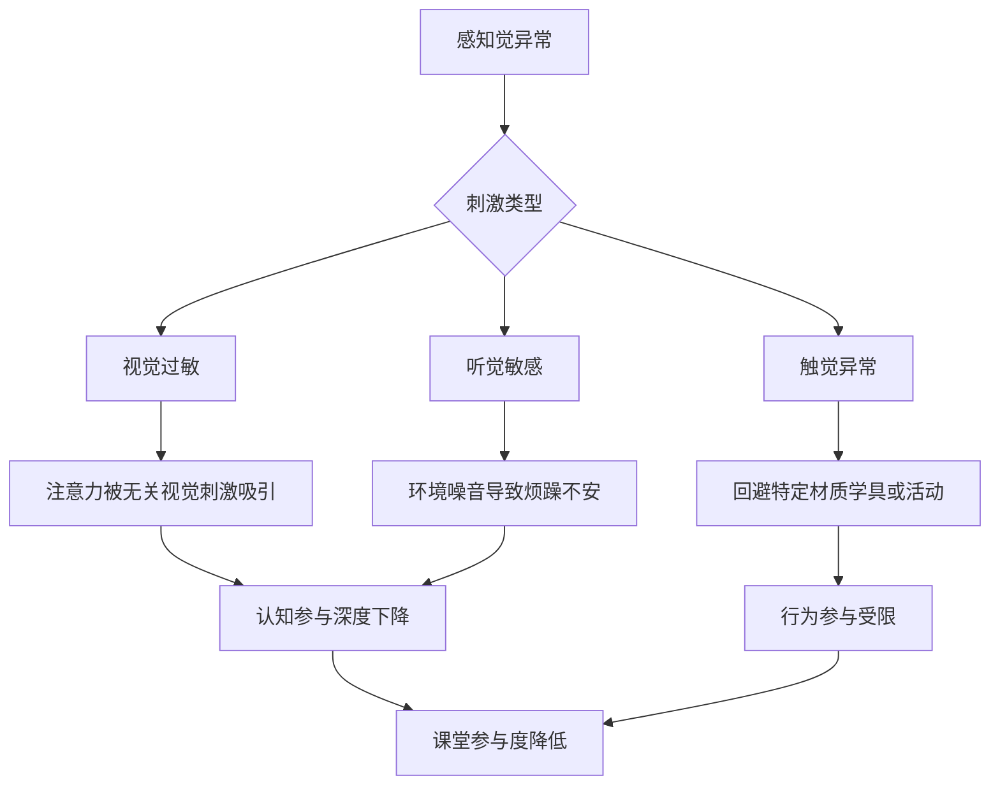
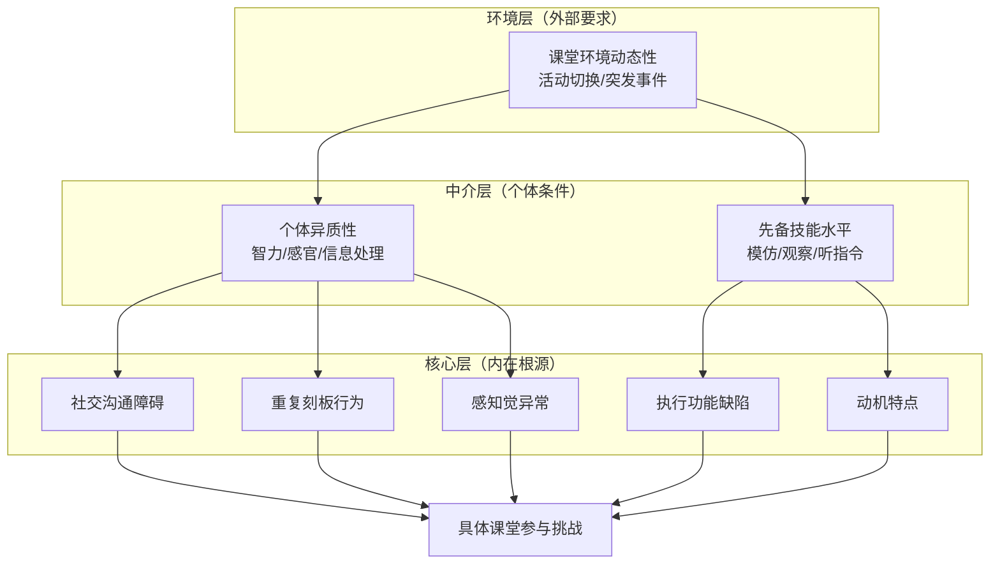
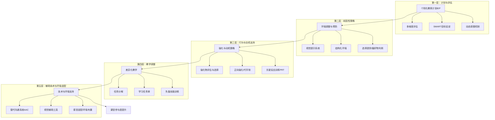
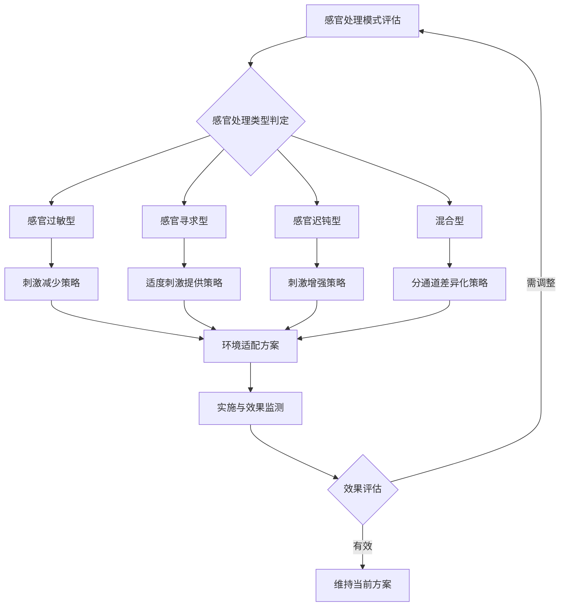
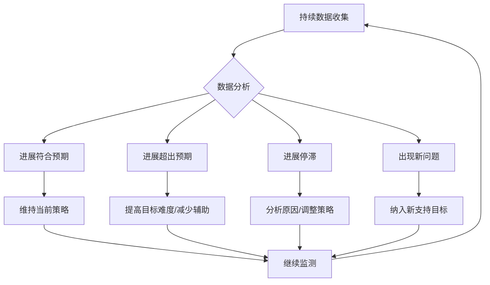
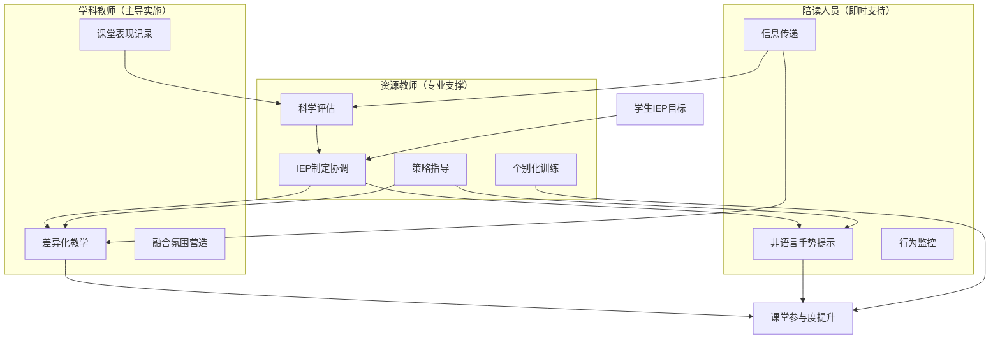
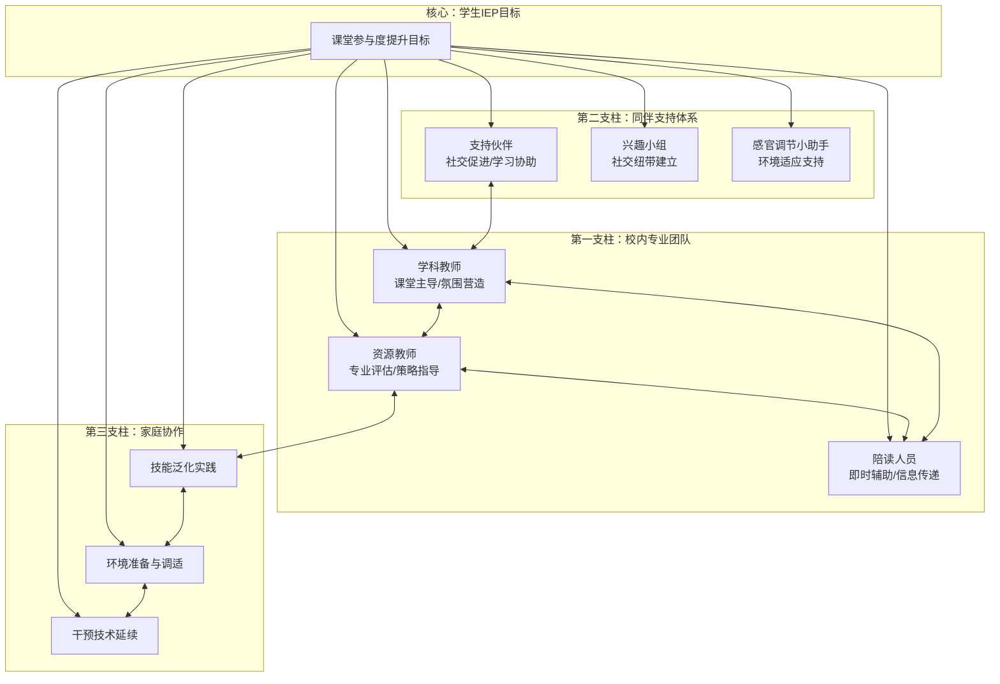
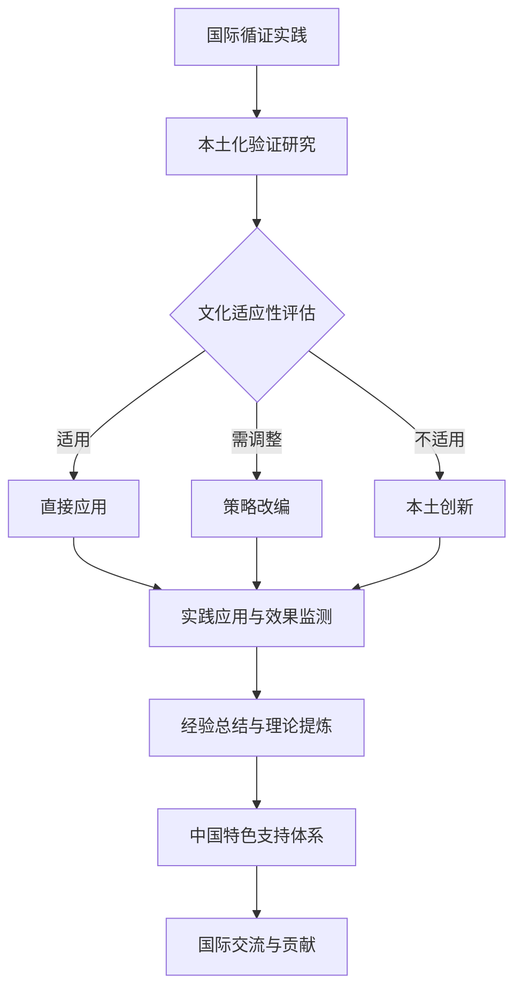

# 自闭症学生课堂参与度的提升路径与有效支持策略研究
## 1 自闭症学生课堂参与度的概念界定与多维衡量

课堂参与度作为衡量学生在教学活动中投入程度的关键指标，对于自闭症谱系障碍学生而言具有特殊的理论意义与实践价值。作为随班就读中的显著人群，孤独症谱系障碍学生的课堂参与质量直接关系到融合教育的实效性[^1]。本章节将从理论框架构建、特殊表现分析、评估工具梳理及工具比较四个层面，系统阐述自闭症学生课堂参与度的概念内涵与评估方法，为后续支持策略的设计与效果评估奠定科学基础。

### 1.1 课堂参与度的多维概念框架

课堂参与度并非单一维度的概念，而是一个包含**行为、情感与认知**三个相互关联成分的多维结构。研究表明，参与是学生积极成果的最佳预测因素之一，对于早期儿童而言，高质量的环境参与是幼儿学习的中介变量[^2]。理解这一多维框架对于准确评估自闭症学生的课堂表现至关重要。

**行为参与**是课堂参与度最直观、可观察的层面，指学生加入或参与与任务行为有关的学习活动[^2]。在课堂情境中，行为参与的具体表现包括：

- 安静听讲与保持适当坐姿
- 遵循教师指令完成学习任务
- 主动参与课堂互动与集体活动
- 使用学具、翻开书本等任务相关行为

值得注意的是，行为参与不仅包括积极投入的表现，还涉及对问题行为的识别与理解。随班就读自闭症学生在课堂上经常表现出与课堂要求和规则不符合的行为，诸如走神、拍手、离座、游走、丢文具和书本、自说自话、哭叫，和同学打闹等[^3]。这些行为表现直接影响教师对学生参与度的判断，但需要结合具体情境进行解读，因为某些刻板行为可能是学生独特的自我调节方式。

**情感参与**指儿童对活动的兴趣与情感投入程度[^2]。这一维度关注学生在学习过程中的情绪状态与动机水平。情感参与是驱动行为参与的内在动力，体现于学生对学习内容的好奇心、对课堂活动的积极态度以及面对挑战时的情绪反应。对于自闭症学生而言，情感参与具有独特的特征：此类学生的学习动机往往较弱，尤其对社会性强化物不敏感而更依赖于实体强化物[^1]。这意味着教师常用的口头表扬可能难以有效激发自闭症学生的学习热情，而需要探索与其特殊兴趣相关联的动机激发方式。

**认知参与**可以描述为儿童获得和完成新技能和知识的渴望或意愿，与目标导向的行为和自我调节的学习有关[^2]。认知参与涉及学生在学习过程中的注意力分配、信息处理、理解深度与思维投入程度。这是课堂学习的核心层面，反映学生是否真正在进行有意义的学习。认知参与要求学生能够：

- 将注意力集中于学习内容
- 理解并处理教师传递的信息
- 主动思考并建立知识联结
- 运用自我调节策略完成学习任务

三个维度之间存在密切的内在关联与相互影响机制。情感参与作为内在动力，驱动学生表现出积极的行为参与；行为参与为认知参与提供必要的外部条件；而认知参与的深度又反过来影响学生的学习体验与情感状态。对于自闭症学生而言，由于其核心障碍特征的影响，这三个维度的发展往往呈现不均衡状态，需要针对性的支持策略加以促进。

### 1.2 自闭症学生课堂参与的特殊表现特征

自闭症谱系障碍学生的课堂参与呈现出与普通学生显著不同的特征，这些特征根植于该群体的核心障碍表现。深入理解这些特殊表现，是制定有效支持策略的前提。

**社交沟通困难导致的集体互动参与受限**是自闭症学生课堂参与面临的首要挑战。孤独症谱系障碍学生的核心障碍表现为社会交往困难，具体包括语言理解和表达障碍、对话维持能力弱、难以理解他人意图等，在课堂指令遵循和集体互动参与等方面存在显著困难[^1]。这意味着当教师发出集体指令或组织小组讨论时，自闭症学生可能无法准确理解要求，也难以与同伴进行有效的协作交流。研究案例显示，某随班就读孤独症学生小亮语言发育迟缓，仅能表达自己的需求，在有限的课堂参与时间里，相关活动都在陪读人员的帮助下完成[^1]。

**重复刻板行为对课堂秩序与个人学习的干扰**是另一突出特征。此类学生具有明显的重复刻板行为特征，主要表现为固执于特定仪式、抗拒变化、兴趣狭窄等，容易因预期外事件引发情绪和行为问题，导致对课堂秩序和个人学习产生干扰[^1]。课堂环境本身充满变化——教学内容的转换、活动形式的调整、突发事件的发生——这些都可能触发自闭症学生的焦虑反应，进而影响其参与状态。

**学习动机弱化与强化物敏感性差异**显著影响情感参与层面。孤独症谱系障碍学生的学习动机和参与活动的内部动机较弱，需要调动外部动机促进他们参与学习活动[^1]。与普通学生不同，自闭症学生对教师的口头表扬、同伴认可等社会性强化物反应不敏感，更多依赖于实体强化物的激励。这要求教师重新思考动机激发策略，而非简单套用适用于普通学生的方法。

**注意力分散与技能泛化困难**制约认知参与的深度与广度。此类学生普遍存在注意力分散、技能泛化困难等问题，进一步制约了课堂参与效果[^1]。自闭症学生可能在特定情境下习得某项技能，却难以将其迁移到新的学习场景中；他们的注意力容易被无关刺激吸引，难以持续聚焦于学习任务。

**先备技能不足**影响课堂学习行为的建立与维持。先备技能（如模仿、观察学习等）不足，影响其课堂学习行为的建立和维持[^1]。模仿是课堂学习的重要途径，观察学习使学生能够从同伴的行为中获取信息，而这些对于自闭症学生而言往往是需要专门训练的能力。

**个体异质性**使得自闭症学生的课堂参与表现呈现极大差异。孤独症谱系障碍学生在学习中表现出极大的异质性，包括智力功能、感官调节、信息处理风格的多样性[^1]。有些学生可能在某些学科领域展现出超常能力，而在其他方面面临严重困难；有些学生对特定感官刺激高度敏感，而另一些学生则表现出感觉寻求行为。这种异质性要求评估与干预必须高度个别化。

实证研究数据揭示了自闭症学生课堂参与度的具体差距。数据显示，小亮的课堂参与有效时间低于班级普通学生的平均值，能够安静听讲的时间仅为课堂开始的前5分钟，"完成指令的活动"仅为简单地拿出学具、翻开书，其余时间小亮会拿出纸笔画画[^1]。这一案例生动说明了自闭症学生在行为参与层面的典型困难——参与时间短、参与形式单一、参与深度有限。

此外，与没有特殊需求的儿童相比，有发育障碍的儿童与成年人和同伴积极互动的时间更少，熟练掌握材料的时间也更少。然而，自闭症儿童比其他特殊需求类型的同龄人更被动，不参与的程度更高。当他们投入时，他们更有可能以自我为中心，或者专注于物体而不是人[^2]。这种低水平的参与，特别是与社会世界的互动较少，限制了他们在与环境中的物体和人互动时学习和练习新技能的机会。低参与度和有限的学习和实践机会的累积效应会对儿童的发展产生严重的后果[^2]。

### 1.3 主流观察与评估工具体系

科学评估是实施教育和支持策略的基础，因此对随班就读学生的课堂参与进行支持需要了解学生的课堂参与情况[^1]。当前用于评估自闭症学生课堂参与度的工具体系涵盖标准化量表、行为分析方法与定性观察技术等多种类型，各有其独特的功能定位与应用价值。

**参与质量测量系统第三版（EQMS III）** 是一种专门用于评估儿童参与质量的精细化工具。该系统确定了九个层次的参与，从无参与到更复杂的参与形式，即差异化和象征性行为[^2]。这种等级化的评定方式能够捕捉参与质量的细微差异，为研究者和临床工作者提供关于参与深度与类型的详细信息。EQMS III的九级参与层次可以帮助评估者区分学生是处于完全脱离状态、被动接受状态，还是主动投入的高质量参与状态。

**ABC行为分析法**是一种广泛使用的行为观察工具，通过记录行为的前因（Antecedent）、行为本身（Behavior）和后果（Consequence），帮助系统性地分析儿童行为发生的模式和原因[^4]。该方法的三个核心组成部分包括：

- **前因（A）**：指行为发生之前的事件或情境。例如，在家长要求儿童停止玩游戏的情境中，这一请求就是行为的前因。前因的记录帮助观察员发现引发问题行为的潜在原因[^4]。
- **行为（B）**：指儿童表现出的具体行为，例如大叫等。明确记录行为的特征和表现形式有助于分析其频率、强度和变化情况[^4]。
- **后果（C）**：指行为之后的反应或行动，例如家长重复要求、数数威胁等。通过分析行为的后果，可以了解后续行为是如何影响行为的维持或消失的[^4]。

ABC行为分析法的核心作用在于帮助观察员识别问题行为的动机，从而为行为干预提供科学依据。通过分析可以发现，学生的行为可能由多种原因驱动，例如逃避（不愿意停止游戏）、获得注意（家长多次反复威胁）或感官满足（沉浸在游戏中的乐趣）。了解这些动机后，干预策略可以更有针对性[^4]。

**自闭症行为检查表（ABC量表）** 是由美国心理学家Krug等编制的专业评估工具，主要用于评估儿童自闭症相关症状的严重程度，通过对儿童特定行为表现进行量化评分来辅助判断自闭症状况[^5]。该量表包含57个评估项目，涵盖5个核心维度：

| 维度 | 评估内容 | 典型项目示例 |
|:---|:---|:---|
| 感觉维度 | 对视觉、听觉、触觉等刺激的反应 | 对某些声音特别恐惧或无反应 |
| 交往维度 | 与他人的互动交流状况 | 很少主动与他人进行目光交流 |
| 身体运动与姿势维度 | 躯体运动与姿势表现 | 行走时身体姿势异常 |
| 语言维度 | 语言表达和理解能力 | 语言表达混乱、难以理解 |
| 生活自理维度 | 自我照顾能力 | 不能独立完成简单的进食动作 |

每个项目按0-2分计分，0分表示无该行为，1分表示有时出现该行为，2分表示经常出现该行为。总分范围具有不同提示意义：一般总分0-14分提示无自闭症倾向；15-31分提示可能存在自闭症倾向；32分及以上高度提示患有自闭症[^5]。

**定性评估方法**在课堂参与度评估中同样发挥重要作用。非参与式观察与半结构化访谈是常用的定性评估技术。研究者采用非参与式观察的方法，对授课教师进行半结构化访谈，从而了解学生的课堂参与情况[^1]。这些方法能够获取量化工具难以捕捉的情境性信息与质性描述。

在访谈形式方面，非正式访谈往往比正式访谈更能获取教师的真实感受。研究发现，在小组座谈时，个别教师擅长发言，其他教师无法充分表达自己的观点；教师表现出"从众效应"，即1名教师发表自己观点后，大部分教师附和其观点；在个别访谈时，教师似乎在试探研究者对他们观点的评价，在表述时不断"修复"答案[^3]。因此，非正式访谈能够消除正式访谈给教师带来的不适感，获取更真实的信息。

### 1.4 评估工具的适用性与局限性比较

不同评估工具在目的、优势、局限及课堂适用性上各有侧重，需根据评估目标与资源条件审慎选择。以下从多个维度对主要工具进行比较分析。

**参与质量测量系统（EQMS）** 的核心优势在于提供关于参与深度和类型的详细、等级化信息，能够精细量化行为参与的质量与层次。然而，这些评级系统是复杂的，需要大量深入的培训使评级员成为可靠的使用者[^2]。高专业门槛与实施耗时的特点使其更适用于深入研究或需精确评估参与质量的特定项目，对日常快速评估的支持相对有限。

**ABC行为分析法**的优势在于系统化数据收集，直接支持个体化干预设计，且具有较强的灵活性，适用于各种课堂行为问题。通过ABC行为分析法准确收集到足够的信息后，行为干预就可以更加科学和高效。根据行为的具体动机，观察员可以选择不同的干预策略[^4]。然而，该方法也面临显著挑战：数据收集的有效性依赖于数据收集的一致性，团队成员在收集数据时应遵循统一的记录规范，确保数据的准确性和可靠性[^4]。持续记录带来的时间人力成本较高，记录一致性难以保持，且存在解读偏差的可能。

**ABC评定量表**作为标准化工具，维度清晰，有助于整体了解学生的障碍轮廓。但该量表在实际应用中存在一些不足：量表的评估结果可能会受到评估者主观判断的影响，不同的人可能会给出不同的评分，导致结果的不一致性；量表的设计可能无法全面覆盖孤独症儿童的所有行为特征，特别是对于那些行为表现较为隐蔽或复杂的孩子，量表可能无法准确捕捉到他们的行为变化；量表的评估结果可能会受到孩子当天情绪状态的影响，导致结果的波动性较大[^6]。因此，该量表更多用于初期评估和制定IEP的参考，而非衡量动态"课堂参与度"变化的日常工具。

下表综合比较了主要评估工具的特点：

| 比较维度 | EQMS | ABC行为分析法 | ABC评定量表 | 定性观察访谈 |
|:---|:---|:---|:---|:---|
| **核心功能** | 量化参与质量层次 | 分析问题行为功能 | 评估症状严重程度 | 获取情境性信息 |
| **专业要求** | 高（需深入培训） | 中（需统一规范） | 中（需专业操作） | 低至中 |
| **时间成本** | 高 | 高（持续记录） | 中 | 中 |
| **信度保障** | 依赖培训质量 | 依赖记录一致性 | 受主观判断影响 | 依赖访谈技巧 |
| **课堂适用性** | 研究项目为主 | 针对具体问题行为 | 初期评估参考 | 日常了解情况 |

**单一工具的局限性**是评估实践中必须正视的问题。自闭症儿童在学习中表现出的极大异质性，包括智力功能、感官调节、信息处理风格的多样性[^1]，使得任何单一工具都难以全面捕捉其复杂的参与表现。对于孤独症行为量表的评估结果，应该保持客观的态度。高分并不一定意味着孩子的情况严重，低分也不代表孩子没有孤独症的行为特征。评估结果只是一个参考，需要结合孩子的实际情况和其他评估手段来综合判断[^6]。

**提高评估可靠性的实践建议**包括多个方面。首先，**环境调整**至关重要：测试应在安静、无干扰环境进行，避免噪音、陌生装饰等干扰，可布置熟悉元素，如孩子喜欢的玩具、海报，增加安全感[^7]。其次，**建立关系**能够提高学生配合度：测试者要与孩子建立良好互动，提前熟悉、游戏，让孩子放松，友好态度和鼓励能提高配合度[^7]。第三，**工具调整**应根据学生特点进行：根据孩子特点修改测试，如增加时间、用简单语言和图像解释题目，对语言理解困难孩子，用图片代替文字指令[^7]。第四，**关注情绪行为**：测试中密切关注孩子情绪行为，出现紧张、困惑等异常及时处理，如暂停休息、安抚情绪，确保安全舒适[^7]。

**多元评估相结合**是应对上述局限的核心策略。不能仅依赖测试结果，要结合日常观察（生活自理、学习能力、社交表现等）、家长教师反馈等综合判断。多次测试取平均值也可提高准确性[^7]。在使用孤独症行为量表时，应确保评估者接受过专业培训，以减少主观判断的影响；结合其他评估工具和方法，如观察记录、家长访谈等，以更全面地了解孩子的行为特征；注意评估结果的波动性，避免仅凭一次评估结果做出决策[^6]。

综上所述，有效评估自闭症学生课堂参与度需要建立在行为、情感、认知三维概念框架之上，并根据实际评估需求与条件，审慎选择并合理应用多种工具，最终将评估信息有效转化为促进其参与和学习的教学实践。这一科学评估基础为后续章节探讨的各类支持策略提供了效果评估的方法论依据。

## 2 影响自闭症学生课堂参与的核心障碍与内在机制

自闭症谱系障碍学生的课堂参与困难并非源于单一因素，而是由核心障碍特征、个体条件与环境要求三者动态交互所致。深入理解这些障碍如何转化为具体的课堂参与挑战，是制定有效支持策略的理论前提。本章节将系统剖析社交沟通困难、重复刻板行为、感知觉异常、执行功能缺陷及动机特点等核心特征的作用机制，并验证个体异质性、先备技能不足及课堂环境动态性等因素的交互影响，为后续策略设计提供科学依据。

### 2.1 社交沟通障碍对课堂互动参与的制约机制

社交沟通困难是孤独症谱系障碍学生的核心障碍表现，直接制约其在课堂情境中的多种互动参与形式[^1]。这一障碍并非表现为"不想社交"，而是**"不会社交"**——学生难以理解非语言沟通信号（如眼神、表情、肢体动作）、不会把握对话节奏、缺乏换位思考能力[^8]。

**语言理解与表达障碍导致指令遵循困难**是社交沟通障碍的首要表现。孤独症学生具体表现为语言理解和表达障碍、对话维持能力弱、难以理解他人意图等，在课堂指令遵循和集体互动参与等方面存在显著困难[^1]。当教师发出复杂的多步骤指令或使用隐喻、幽默等非字面语言时，学生可能无法准确解读要求，导致无法执行相应的学习任务。对于抽象的知识概念，自闭症青少年理解起来尤为困难，在语文学习中，对文章的隐喻、象征等修辞手法，以及深层次的思想内涵，常常一知半解[^9]。

**集体讨论与同伴协作参与受限**是社交障碍的另一重要后果。在学校的社交场景中，自闭症青少年很少主动发起社交行为，当有同学主动邀请时，可能也会因不知如何回应而拒绝，或者只是机械地参与，不与他人进行真正的互动交流[^9]。他们难以理解同学的肢体语言、面部表情和语气变化所传达的信息，例如当同学皱着眉头、语气不耐烦地说"别烦我"时，他们可能意识不到对方已经生气，还继续纠缠[^9]。这种社交信号的误读严重影响了小组合作学习的效果。

以下表格系统呈现社交沟通障碍的具体表现及其对课堂参与的影响：

| 社交沟通障碍表现 | 课堂情境中的具体影响 | 参与维度受损 |
|:---|:---|:---|
| 语言理解障碍 | 难以理解复杂指令、抽象概念、隐喻表达 | 认知参与 |
| 语言表达困难 | 无法清晰回答问题、参与课堂讨论 | 行为参与 |
| 对话维持能力弱 | 难以进行持续的师生或同伴交流 | 社交参与 |
| 非语言信号解读困难 | 误读同伴表情意图，影响协作学习 | 情感参与 |
| 社交主动性不足 | 很少主动发起互动，被动参与集体活动 | 行为参与 |

### 2.2 重复刻板行为与课堂适应性的冲突分析

重复刻板行为是自闭症谱系障碍的另一核心特征，与课堂环境固有的变化性形成直接冲突。此类学生具有明显的重复刻板行为特征，主要表现为固执于特定仪式、抗拒变化、兴趣狭窄等，容易因预期外事件引发情绪和行为问题，导致对课堂秩序和个人学习产生干扰[^1]。

**固执于特定仪式导致课堂流程适应困难**。自闭症学生可能坚持固定的日常程序，对环境细微变化感到极度痛苦[^10]。例如，必须走同一条路线回家、物品必须摆在固定位置，一旦改变就崩溃[^11]。当课堂教学流程因各种原因发生调整时——如临时更换教室、调整课程顺序、更换授课教师——学生可能表现出强烈的焦虑和抗拒反应，严重影响后续学习的参与状态。

**抗拒变化引发的情绪行为问题**是刻板行为特征的重要后果。当学生在课堂出现大喊大叫、拍打头、不停哭闹等突发行为时，教师往往不知如何处理[^1]。这些情绪行为问题不仅干扰学生本人的学习，也可能影响整个班级的课堂秩序。研究指出，这些行为旨在获得感官刺激或减轻焦虑[^10]，理解其功能对于制定应对策略至关重要。

**兴趣狭窄造成的学习内容参与选择性**同样值得关注。自闭症学生可能对车轮、井盖、天气预报等有超乎寻常的兴趣，并能记住大量细节[^11]。这种兴趣范围狭窄且强度异常的特点，使得学生在感兴趣的领域可能表现出高度投入，而对其他学习内容则缺乏参与动力。

然而，刻板行为也具有**自我调节的积极功能**。教育者需首先学会"区分与尊重"——只要不影响自身安全、不干扰他人，适度的刻板行为应被包容，而非强行制止[^8]。这些行为能帮助学生在变化莫测的环境中获得安全感，因此在干预时需要在尊重与引导之间寻求平衡。

### 2.3 感知觉异常与课堂环境适应的挑战

感知觉异常是影响自闭症学生课堂参与的重要生理基础因素。超过70%的自闭症儿童存在感官敏感问题，他们的视觉、听觉、触觉、嗅觉等感官系统可能"过度反应"或"反应不足"[^8]。这些感官问题若得不到重视，会严重影响学生的学习状态和情绪稳定。

**视觉刺激是最常见的干扰源**。自闭症儿童可能会被教师放在桌子上的铅笔吸引，无法将注意力投放在学习任务中；或者被走廊里的某个物品吸引并脱离队伍去仔细观察那个物品[^12]。一些强烈色彩碰撞的视觉刺激也会让他们分神或产生高度兴趣。对视觉敏感的孩子，教室布置应简洁，避免过多装饰和强光照射[^8]。

**听觉敏感引发的环境适应困难**同样普遍。有的孩子会因空调声、脚步声等轻微噪音感到痛苦[^8]。一些普通人能接受的声音在孩子听来却非常刺耳和不舒服，这种对周围声音的敏感导致其不能专注学习[^12]。孤独症儿童并不能很好地解读这些刺激，也很难对所处环境中的各个刺激物做出重要性的排序[^12]。

**触觉异常对学具使用和身体接触活动的影响**也不容忽视。有的孩子会抵触毛衣、化纤等特定材质的衣物[^8]，可能非常讨厌某些质感（如沙、黏土）或对疼痛反应迟钝[^11]。这些触觉特点可能影响学生参与需要使用特定材质学具或涉及身体接触的课堂活动。

以下流程图展示了感知觉异常影响课堂参与的作用路径：

### 2.4 执行功能缺陷对学习任务完成的影响

执行功能障碍是自闭症学生在认知参与层面面临的核心挑战。执行功能包括计划、组织、自我监控等能力，而自闭症青少年在这些方面存在明显缺陷[^9]。这些缺陷直接制约了学生完成学习任务的效率与质量。

**注意力调控困难导致任务聚焦问题**。自闭症儿童的注意力非常容易被干扰，但有时又高度集中于某一样事物或活动，没有办法有效地转换注意力[^12]。课堂上，普通孩子能够跟随老师的节奏专注于教学内容，但自闭症青少年却常常难以集中注意力，容易被周围的细微声响吸引，或是自己的小动作[^9]。当老师在讲解重要知识点时，他们可能眼神飘忽，思绪早已飘远，导致错过关键内容。

**计划与组织能力不足造成复杂任务完成障碍**。面对复杂的学习任务，如撰写作文、完成项目作业，自闭症学生很难制定合理的计划，不知道从何入手[^9]。在学习过程中，也缺乏自我监督和调整的能力，常常出现拖延、丢三落四等问题，导致作业无法按时完成，学习效率低下[^9]。

**认知灵活性不足对教学方法变化的适应困难**也是重要表现。自闭症青少年习惯采用固定的学习方式，难以适应灵活多变的教学方法。例如，他们可能只接受通过图片、实物展示来学习新知识，对于文字讲解、小组讨论等方式则难以接受[^9]。一旦学习内容或方式发生变化，就会感到无所适从，学习效果大打折扣。

执行功能缺陷的各个方面相互关联，共同制约认知参与：

| 执行功能缺陷类型 | 课堂表现 | 学习影响 |
|:---|:---|:---|
| 注意力调控困难 | 易分心、难以持续聚焦 | 错过关键教学内容 |
| 计划组织能力不足 | 不知如何开始复杂任务 | 作业完成困难 |
| 自我监控能力弱 | 难以发现并纠正错误 | 学习效率低下 |
| 认知灵活性不足 | 难以适应教学方法变化 | 学习方式刻板受限 |
| 工作记忆困难 | 难以同时处理多项信息 | 多步骤任务执行困难 |

### 2.5 学习动机特点与情感参与的特殊机制

学习动机的独特性是影响自闭症学生情感参与的关键因素。孤独症谱系障碍学生的学习动机和参与活动的内部动机较弱，需要调动外部动机促进他们参与学习活动[^1]。这种动机特点与普通学生存在本质差异，使得传统的激励方式往往难以奏效。

**对社会性强化物不敏感导致传统激励方式失效**。普通儿童对于学习带来的关注与认可具有高度的敏感性，然而孤独症儿童并非总能像普通发展的同伴那样保持着较高的学习动机[^12]。此类学生尤其对社会性强化物不敏感而更依赖于实体强化物[^1]。这意味着教师常用的口头表扬、微笑鼓励等社会性奖励对自闭症学生的激励效果有限。

**内部动机薄弱造成主动参与意愿不足**。一般情况下，自闭症儿童兴趣狭窄、模仿能力较弱并常以自我为中心，他们对普通儿童有兴趣的事物（如玩具或口头夸奖等）不感兴趣，难以构成学习动机[^13]。因此，自闭症儿童往往对参与课堂活动毫无兴趣，即使参与，在学习过程中也处在被动状态，有时还会做出与实际情境不符的行为[^13]。

**特殊兴趣领域的高度投入与其他内容的参与落差**是动机特点的另一表现。自闭症学生可能对特定领域（如数学、编程、绘画、记忆力等）展现出超常能力和高度热情[^8]，而对其他学习内容则缺乏参与动力。这种兴趣的高度聚焦性既是挑战也是机遇——可以利用孩子的兴趣点搭建学习桥梁。

**外部动机调动策略**对于促进情感参与至关重要。在学习过程中，有时他们的兴趣更在于学习活动后的实物强化，因此干预者需要使用实物强化来调动孤独症儿童的内在参与动机，并且注重教学活动的趣味性设计[^12]。当学生的强化物为物质性强化物时，教师在给予强化物时应配合社会性赞美，从而调动学生的内部动机，推动其主动参与课堂活动[^1]。

### 2.6 先备技能不足与课堂学习行为建立的障碍

先备技能是课堂学习的基础"入场券"，其不足对自闭症学生的课堂参与构成根本性制约。先备技能（如模仿、观察学习等）不足，影响其课堂学习行为的建立和维持[^1]。这些技能的缺失与核心特征相互强化，形成恶性循环。

**模仿能力不足影响示范教学效果**。模仿是课堂学习的重要途径，教师的示范讲解、同伴的正确操作都需要通过模仿来学习。自闭症儿童对社会刺激很少做出反应，缺乏社会性观察和学习的能力[^12]。当他们长期迷恋物品或重复摆弄物品时，就失去了习得关键性技能的机会，这些使得他们缺乏一些参与学习的重要先备技能，如模仿能力、听人声音的能力、社会性观察学习的能力等[^12]。

**观察学习能力弱限制同伴学习机会**。观察学习使学生能够从同伴的行为中获取信息，这对于融合教育环境中的自闭症学生尤为重要。然而，由于社交动机弱和注意力分配的特点，自闭症学生难以有效利用观察同伴学习的机会。

**听从指令能力不足导致集体活动参与困难**。基本的听从指令能力是参与集体教学的前提。部分自闭症学生对呼唤名字反应迟钝，仿佛听不见[^11]，这种"不应"的表现直接影响了他们响应教师指令、参与集体活动的能力。

**先备技能与课堂学习行为之间存在因果循环关系**。技能不足限制学习机会，而核心特征又阻碍技能发展，使得学生在起点上就处于严重劣势，难以接入常规教学流程。因此，对于先备技能不足的学生，需要从基础能力训练入手，逐步建立课堂学习所需的行为基础。

### 2.7 个体异质性与课堂环境动态性的交互影响

课堂参与障碍并非由单一特征孤立导致，而是核心特征与个体及环境因素动态交互的结果。孤独症谱系障碍学生在学习中表现出极大的异质性，包括智力功能、感官调节、信息处理风格的多样性[^1]。这种异质性决定了相同的核心特征在不同个体身上表现为不同性质与强度的课堂挑战。

**个体差异对支持策略有效性的调节作用**十分显著。自闭症谱系障碍患儿的智力表现存在较大异质性，约半数伴有智力障碍，但部分患儿在特定领域如记忆、计算等方面展现超凡能力[^10]。智力水平与社交障碍严重程度不一定相关，高功能自闭症患者可能智力正常但社交适应困难[^10]。这意味着针对不同能力水平学生的支持策略需要差异化设计。

**课堂环境的动态性**是激发障碍的关键外部因素。课堂固有的不可预测性——活动切换、突发噪音、社交需求变化——与自闭症学生对确定性、可预测性的核心需求直接冲突。环境动态性会急剧放大核心特征带来的挑战：变化触发焦虑与行为问题，社交不确定性加剧沟通困难，多任务要求暴露执行功能缺陷。

以下框架图展示了多因素交互影响的障碍形成机制：

**障碍形成的核心路径**可以概括为：环境层的动态要求作用于中介层的个体条件（技能不足、异质性特质），激化或凸显核心层的特定特征，从而转化为具体的课堂参与挑战。例如，环境嘈杂（环境层）对一名听觉敏感（异质性）且情绪调节技能弱（先备技能）的学生，会迅速引发感官过载（核心特征），导致注意力崩溃或情绪行为问题（具体挑战）。

**技能泛化困难**是个体因素与环境因素交互的另一重要表现。自闭症儿童一旦获得新的技能，技能的维持和泛化通常来说比较困难，需要进一步的复习和练习支持[^12]。有些儿童不能在新场景下使用新习得的技能，比如他们可能在学校对教师的呼名做出反应，但是在商场或者超市这些环境较为嘈杂的地方，对自己名字的反应不敏感[^12]。这种泛化困难意味着在一个课堂情境中习得的技能可能无法自动迁移到其他教学场景。

综上所述，提升自闭症学生课堂参与度的关键，在于通过精准的个体评估，理解其独特的核心特征表现、先备技能短板及环境敏感点，进而系统性地调整环境（减少不可预测性、降低感官干扰）、进行技能补足教学，并采用高度个性化的沟通与教学策略，在学生的特质与课堂要求之间构建支持性桥梁。这一障碍机制分析为后续章节探讨的各类支持策略提供了理论依据与靶向指引。

## 3 增强课堂参与度的支持策略体系：基于证据的归纳与分类

在深入理解自闭症学生课堂参与障碍的形成机制后，构建系统化、有证据支持的支持策略体系成为提升融合教育实效性的核心任务。本章节将从科学评估与个别化计划制定、前因性环境调整、行为与动机强化、教学方法适配以及辅助技术应用五大维度，系统归纳并分类经实证验证的有效策略，深入分析各类策略的理论依据、作用机制与实践要点，为教育者提供基于证据的策略选择框架与实施指南。

### 3.1 基于科学评估的个别化教育计划制定

**科学评估是实施教育和支持策略的基础**，因此对随班就读学生的课堂参与进行支持需要首先了解学生的课堂参与情况[^1]。个别化教育计划（IEP）作为连接评估、课程与教学的枢纽工具，其核心理念在于**"以人为本"**——承认并尊重每个自闭症儿童都是独一无二的个体，他们的认知方式、学习特点、兴趣爱好、发展优势以及面临的挑战各不相同[^14]。

#### 3.1.1 多维度评估内容与信息整合

一份专业、严谨的IEP方案必须建立在对儿童现有发展水平的全面、客观评估基础之上。评估内容应涵盖以下核心维度[^14]：

- **认知能力与学业表现**：包括注意力、记忆力、逻辑思维能力，以及在各学科领域的掌握情况
- **沟通与语言能力**：涵盖语言理解、语言表达（口语、非口语）、社交沟通技能等
- **社会交往能力**：如与同伴、成人的互动方式，情绪识别与表达，共情能力，遵守社交规则等
- **行为表现与情绪管理**：识别可能存在的挑战性行为及其功能，了解儿童的情绪特点及自我调节能力
- **日常生活自理能力**：如进食、穿衣、洗漱、如厕等基本生活技能
- **感知觉与运动能力**：包括视、听、触等感知觉反应，大肌肉与精细动作发展水平
- **兴趣特长与优势领域**：关注并挖掘儿童的潜能和闪光点，这是激励学习和建立自信的重要基础

评估信息的来源应多样化，包括标准化评估工具、非正式观察记录、教师及家长的访谈、以往的教育资料等[^14]。例如，在实际操作中，研究者采用非参与式观察的方法，对授课教师进行半结构化访谈，从而了解学生的课堂参与情况[^1]。

#### 3.1.2 IEP目标设定的SMART原则与阶梯式分解

基于评估结果，IEP团队需共同商议并制定具有挑战性且可实现的年度教育目标。目标的设定需遵循**"SMART原则"**[^14]：

| 原则 | 含义 | 实践要点 |
|:---|:---|:---|
| **S**pecific（具体的） | 明确指出要达成的具体技能或行为 | 避免模糊表述，如"提高社交能力"应具体化为"主动与同学进行一次问候" |
| **M**easurable（可测量的） | 目标成果应是可观察、可量化的 | 设定可记录的行为指标，如"每天课间与同学进行2次轮流对话" |
| **A**chievable（可实现的） | 目标应具有一定挑战性，但通过合理支持能够达成 | 基于学生现有能力水平设定"跳一跳够得着"的目标 |
| **R**elevant（相关的） | 与儿童当前需求及长远发展方向紧密相关 | 确保目标对学生实际生活和学习有意义 |
| **T**ime-bound（有时限的） | 明确目标达成的时间范围 | 通常为一学年，并分解为学期、月度、周度目标 |

**阶梯式分解方法**是确保目标可操作性的关键技术。例如，某学生的学期目标是"在没有任何提示下安静坐20秒"，这一目标经过拆解、细化被分为不同的阶段。通过评估发现，该学生已经实现了"在提示下安静坐20个数"的目标，因此训练目标被定为"安静坐20个数"，即每个目标完成后都走向更高的目标，直至完成学期目标[^1]。

#### 3.1.3 IEP的枢纽作用与动态调整机制

IEP的重要性体现在多个层面：首先，它为教育者提供了清晰的教育目标和行动指南，确保教育干预的系统性和有效性；其次，它保障了自闭症儿童接受适切教育的权利；再次，它促进了家庭、学校及相关专业人士之间的有效沟通与协作，形成教育合力；最后，它为儿童的进步提供了可测量的标准，便于及时评估教育效果并进行反馈调整[^14]。

IEP的拟定有助于达成以下三项功能[^15]：
- **促进有效率、有组织的教学**，使教学活动不致散漫无结构
- **作为教学管理的工具**，促使学生以进行自我评价或被评价
- **促使家长成为与教师平行的计划参与者和监督者**，整合教师及家长对学生的评估和期望，促进彼此的沟通

IEP并非一份静态的文件，而是一个持续循环的动态过程——评估、计划、实施、监控、调整、再评估[^14]。至少每学期应对IEP的实施情况进行一次正式review，如发现儿童进展显著超出或未达预期，或出现新的需求，应及时召开IEP团队会议，对目标、服务等进行必要的调整和修订[^14]。

### 3.2 前因性策略：环境调整与预防性支持

前因性策略的核心理念是**通过调整行为发生前的环境条件来预防参与障碍的产生**，而非在问题行为发生后被动应对。这类策略主要利用自闭症儿童对"文字/图片"的接受度高于"语言"的特点，通过提供清晰的视觉提示和可预测的环境结构，帮助学生预判接下来要做的事，减少因"不确定性"带来的焦虑[^16]。

#### 3.2.1 视觉提示系统的设计与应用

视觉提示系统是前因性策略中应用最广泛、效果最显著的方法之一。采用视觉日程表、任务分解等工具帮助儿童理解活动流程，减少焦虑[^17]。主要类型包括：

**图片时间表**：通过"图片时间表"（比如"起床→吃饭→上课→玩玩具"的图片序列）帮助孩子预判接下来要做的事，减少因"不确定性"带来的焦虑[^16]。例如，早晨流程用牙刷图→衣服图→书包图串联[^18]。

**任务流程图**：用图片序列展示具体任务的操作步骤，如刷牙步骤，将复杂任务拆解为可执行的小单元[^17]。结构化环境能提升预测性，适合处理刻板行为。

**环境分区标识**：通过"环境分区"（比如教室划分为"学习区""游戏区"）帮助孩子理解不同空间的功能与行为要求[^16]。

#### 3.2.2 结构化教学环境设计原则

结构化教学（TEACCH）是专门为自闭症人群开发的教学框架，其核心在于创建**可预测、一致、感官适配**的学习环境[^16]。设计原则包括：

- **可预测性**：为儿童提供清晰可预测的日常安排，使用视觉提示如图片或时间表，帮助其理解活动顺序和预期变化[^19]
- **一致性**：环境调整应注重一致性，避免突然变动，逐步引入微小变化以培养灵活性[^19]
- **感官适配**：对视觉敏感的孩子，教室布置应简洁，避免过多装饰和强光照射[^18]；控制室内亮度在200-300勒克斯，避免荧光灯，改用暖光LED灯

#### 3.2.3 选择提供策略与偏好物利用

**提供选择机会**是提升学生控制感与自主性的有效策略。PRT动机程序的干预包括孩子的选择（遵重孩子的选择，只有跟着孩子的兴趣进行教学，才能让孩子更有动力学习）[^20]。当给孩子选择的机会时（例如，"你要玩飞机还是火车？"），孩子更有可能说话，也可以适当给予奖励，以此扩展语言[^21]。

**偏好物利用策略**基于学生的特殊兴趣创设学习情境。教师可利用孩子的兴趣点搭建社交桥梁——兴趣是最好的"社交催化剂"[^8]。例如，孩子喜欢恐龙，就用恐龙玩具引导互动——"你想玩恐龙吗？要先说'我要玩恐龙'哦"[^16]。通过观察孩子在家庭/诊室的日常行为（比如对玩具的兴趣、与家长的互动模式），找到"容易切入的干预点"[^16]。

### 3.3 行为与动机支持策略：强化机制与关键反应训练

鉴于孤独症谱系障碍学生的学习动机和参与活动的内部动机较弱，需要调动外部动机促进他们参与学习活动[^1]。行为与动机支持策略旨在通过科学的强化机制和针对关键领域的训练，系统提升学生的课堂参与动机与行为表现。

#### 3.3.1 强化物评估与个性化选择

有效实施强化策略的前提是**对学生进行强化物评估，找到能调动其参与动机的强化物**[^1]。由于自闭症学生对社会性强化物不敏感而更依赖于实体强化物，因此强化物的选择需要高度个性化[^1]。

强化物评估应关注：
- 学生对不同类型强化物（食物、玩具、活动、社会性赞美）的反应强度
- 强化物的偏好排序与饱和效应
- 强化物与目标行为的自然关联性

#### 3.3.2 正向强化的即时性原则与代币制设计

**应用行为分析（ABA）** 通过正向强化塑造目标行为，是干预的"基石"方法。通过"分解任务→辅助完成→强化奖励"的循环，帮助孩子建立正确行为[^16]。正向强化的实施要点包括：

- **即时性**：当孩子做出所预期的反应时要马上给予强化，并且做到语气、动作、表情夸张，用强调的口气，大声说如"哇！真棒呀！"，以及做出拥抱和抚摸等动作[^22]
- **具体性**：用"描述性表扬"强化好行为——不说"你好棒"，而是"你刚才和小朋友分享了汽车，真不错！"——明确告诉孩子"哪些行为是对的"[^16]

**代币制**是一种有效的延迟强化系统。设置奖励机制推动学生参与课堂：针对能力较强的学生可以适当延长给予强化物的时间，采取代币制等方法；针对能力较弱的学生可以先频繁奖励，行为稳定后再采取代币制等方法[^1]。例如，集满5个星星可兑换15分钟IPAD游戏时间[^18]。

**社会性强化与实物强化的配合使用**是逐步过渡的关键策略。当学生的强化物为物质性强化物时，教师在给予强化物时应配合社会性赞美，从而调动学生的内部动机，推动其主动参与课堂活动[^1]。

#### 3.3.3 关键反应训练（PRT）的核心理念与实施

**关键反应训练（PRT）** 是被科学认证的14种有效自闭症干预方法之一，超过200多篇发表在核心期刊上的相关论文可以证明PRT在提高自闭症个体的语言发展、社交性、学习动机、自我管理能力，以及生活自理技能上的有效性[^20]。

PRT的核心理念在于：之所以被称为"关键反应训练"是因为其技术的核心概念——**关键领域**，指的是那些一旦得到针对性干预后，就可以获得其他（经常是那些未被针对的）领域在功能和反馈上的巨大连带性改变[^21]。通过针对这些关键领域，其他未被具体针对的社交、沟通以及行为领域都能够被广泛带动，干预效率得到最大程度的提升[^20]。

PRT的五大关键领域及其干预要点[^20]：

| 关键领域 | 核心内容 | 干预策略要点 |
|:---|:---|:---|
| **动机** | 提升学习参与的内在驱动力 | 遵重孩子的选择、任务变化避免厌倦、简单与困难任务混合、强化努力、使用自然和直接的强化 |
| **社交主动发起** | 主动与他人沟通的能力 | 从提要求、主动问问题、主动发表评论、主动发起游戏、发起社交对话等方面进行干预 |
| **自我管理** | 观察和调节自我行为的能力 | 观察目标行为、设定可行性目标、选择记录工具、确定强化物、从容易改善的目标开始 |
| **多重线索反应** | 关注环境中多个相关刺激 | 采取直接教学和刺激内提示策略，在自然环境中给孩子不同刺激 |
| **同理心** | 理解和表达情感的能力 | 帮助学生学会恰当表达自己的情感，建立和维持亲密关系 |

PRT的独特优势在于其**自然情境教学**的特点。PRT是在自然环境中执行的，使用自然的强化来帮助谱系孩子理解反应-强化的联系（例如，我说"球"之后就能够玩球 vs. 我说"球"却得到一个不相关的奖励），并且强调对父母的教育，希望家庭能够在日常活动中对孩子的学习进行支持[^20]。研究表明，通过有效的PRT干预，5岁之前无言语的自闭症儿童获得功能性语言的比例高达90%[^20]。

### 3.4 教学调整策略：任务分解与差异化设计

**个性化是高功能自闭症儿童教育的核心关键词**[^8]。教学调整策略的核心在于根据学生的能力现况与学习特点，对教学内容、方法、材料进行适配性调整，确保学生能够成功参与学习活动。

#### 3.4.1 任务分解技术的原理与应用

任务分解是将复杂技能拆解为简单、连续的步骤进行教学的核心技术。例如教"叫妈妈"，会拆解为"眼神对视→发出'妈'的音→完整说'妈妈'"，每完成一步就用孩子喜欢的玩具/零食奖励，逐渐让行为"自动化"[^16]。这种方法对"建立基本生活技能"（比如自己吃饭、穿衣服）特别有效。

任务分解的实施要点：
- **分解先备技能尤为重要**：将学期目标分解为月目标、周目标[^1]
- **阶梯式递进**：每个目标完成后都走向更高的目标，直至完成学期目标
- **辅助逐步撤除**：从全辅助到部分辅助再到独立完成

#### 3.4.2 学习任务单的设计原则

学习任务单是帮助随班就读学生结构化参与课堂学习的有效工具。学习任务单的设置既要考虑学生的身心发展特点，又要结合学科核心素养[^1]。设置学习任务单应当遵循以下原则[^1]：

- **以生为本原则**：基于学生的能力水平与学习特点设计
- **多样性原则**：提供多种形式的任务呈现方式
- **趣味性原则**：融入学生感兴趣的元素，提升参与动机
- **一致性原则**：与课堂教学内容保持一致，与IEP目标相衔接

#### 3.4.3 差异化教学方法的实施

差异化教学是实施IEP和高功能自闭症儿童教育的核心策略。制定IEP时，需遵循"扬长避短、阶梯递进"的原则：对于孩子的优势领域（如数学、编程、绘画、记忆力等），应提供拓展性支持，鼓励深入探索；对于短板领域（如社交沟通、情绪管理），则需拆解为具体、可量化的小目标，避免"一步到位"的过高期待[^8]。

差异化教学的具体策略包括：

- **内容调整**：以加深、拓宽、重整、简化、减量、分解或替代等方式弹性调整课程目标[^15]
- **难度改编**：根据学生能力水平调整任务难度
- **材料简化**：用简单语言和图像解释题目，对语言理解困难的孩子，用图片代替文字指令[^18]
- **多感官通道呈现**：综合运用视觉、听觉、触觉等多种感官通道呈现学习内容

#### 3.4.4 先备技能的针对性训练

先备技能的补足训练是确保学生能够接入常规教学流程的基础工作。根据资源教室课程计划，可从语言理解与表达、视觉模仿、自我控制等方面对学生进行个别化训练[^1]。

先备技能训练的重点领域：
- **模仿能力**：通过视频示范法，将抽象社交规则具象化[^17]
- **观察学习**：训练学生关注同伴行为并从中学习
- **听从指令**：从简单的单步指令开始，逐步过渡到多步骤指令

### 3.5 辅助技术与环境适配策略

辅助技术与环境适配策略旨在通过技术工具和环境改造，弥补自闭症学生的核心障碍，降低参与门槛，促进独立参与。

#### 3.5.1 替代沟通系统（AAC）的应用

对于无语言或语言有限的学生，替代沟通系统提供了表达需求与参与互动的重要途径。主要类型包括[^18]：

**PECS（图片交换系统）**：训练孩子用图片卡表达需求（如食物、玩具）[^18]。通过图片交换系统，学生可以用图片序列表达复杂需求，实现功能性沟通。

**语音生成设备**：iPad安装ProLoQuo2Go等APP，支持触屏选择短语发声[^18]。这类设备使无语言学生能够通过触摸屏幕选择图片或符号来生成语音输出。

IEP中应明确辅助技术与支持的需求——如是否需要辅助沟通设备、视觉提示系统、时间管理工具等，以帮助儿童克服障碍，有效参与学习[^14]。

#### 3.5.2 视觉辅助工具的类型与功能

视觉辅助工具是支持自闭症学生课堂参与的重要资源。主要类型包括：

- **时间管理工具**：帮助学生理解时间流逝和活动转换
- **情绪调节提示**：通过情绪量表、深呼吸图示等帮助学生识别和调节情绪
- **行为提示卡**：提供关于适当行为的视觉提醒

#### 3.5.3 感官适配措施的实施

针对自闭症学生普遍存在的感官敏感问题，感官适配措施是确保学生能够在课堂环境中保持稳定状态的重要保障。具体措施包括[^18]：

- **降噪设备**：配备降噪耳机，减少环境噪音对听觉敏感学生的干扰
- **光线调节**：避免荧光灯，改用暖光LED灯，控制室内亮度
- **触觉友好材料**：选择学生能够接受的材质制作学具和教具
- **减压玩具**：提供捏捏乐等感官调节工具

#### 3.5.4 物理环境布置原则

物理环境的合理布置能够从源头上减少环境刺激对学生的干扰。设置"安静角"：配备豆袋椅、降噪耳机、减压玩具（如捏捏乐）[^18]。环境布置的核心原则包括：

- **减少干扰**：教室布置应简洁，避免过多装饰
- **设置安静角**：为学生提供情绪调节和感官休息的空间
- **明确功能分区**：通过视觉标识清晰划分不同功能区域

在教学场景选择上，小班制课堂或资源教室更具优势。这类场景能减少环境刺激（如过多的人群、嘈杂的声音）对孩子的干扰，同时让教师有足够精力关注孩子的实时状态，及时调整教学节奏或提供支持，避免孩子因需求未被满足而产生焦虑或抵触情绪[^8]。

### 3.6 策略体系的整合框架与选择指南

综合上述五大类策略，下图呈现了增强课堂参与度支持策略的整合框架：

**策略选择的核心原则**在于：任何策略的应用都必须始于对学生的全面、科学评估，并严格遵循其IEP目标[^14]。五层策略应协同使用而非孤立实施。例如，在IEP框架下（第一层），为一个感官敏感的学生调整教室照明（第五层），同时使用视觉时间表（第二层）和任务分解法（第四层）进行教学，并对其正确反应给予代币奖励（第三层）。

值得注意的是，我国自闭症儿童的教育干预还处在模仿国外已有的教育干预方法的阶段，对于如何在我国特定的文化和教育背景中选择、安排和使用这些方法，即自闭症教育干预的具体策略，还缺乏相关的研究[^23]。因此，教育者在应用上述策略时，需要结合本土实际情况进行适应性调整，并通过持续的数据收集与效果评估，不断优化策略组合与实施方式。

## 4 策略的个别化应用与动态调整：匹配学生特征与需求

有效的课堂参与支持策略必须建立在对学生个体差异的深刻理解与精准响应之上。孤独症谱系障碍学生在学习中表现出极大的异质性，包括智力功能、感官调节、信息处理风格的多样性[^24]，这意味着任何"一刀切"的策略应用都难以取得理想效果。本章节将系统探讨如何根据学生的感官处理模式、能力水平、兴趣偏好等个体特征进行策略的精准选择与组合，建立基于数据驱动的动态调整机制，并设计促进技能泛化的系统路径，最终通过典型案例展示个别化应用的整合实施过程。

### 4.1 基于感官处理模式的策略精准适配

感官处理模式的差异是自闭症学生个体异质性的重要体现，直接影响学生在课堂环境中的舒适度与参与能力。超过70%的自闭症儿童存在感官敏感问题，他们的视觉、听觉、触觉、嗅觉等感官系统可能"过度反应"或"反应不足"。这些感官问题若得不到重视，会严重影响学生的学习状态和情绪稳定。因此，**基于感官处理模式的策略适配是个别化应用的首要环节**。

#### 4.1.1 感官处理模式的评估与分类

在制定感官适配策略前，需要系统评估学生的感官处理特点。感官能力涵盖视、听、触、味、嗅五大感觉的注意、追踪、辨别、记忆等维度[^25]。评估方法应结合专业仪器测验与传统量表，包括：

- **电生理信号测验**：利用专业仪器对学生进行皮肤温度、肌电图、呼吸信号、血流量脉冲、皮肤电反应等测验，初步掌握学生感官生理发展数据[^25]
- **感官能力现状评估**：使用传统量表对学生进行感官能力评估，采用五级计分——"达成"记4分、"提示下达成"记3分、"未达成"记2分、"提示下未达成"记1分、"无反应"记0分[^25]
- **行为观察记录**：记录学生在不同感官刺激下的行为反应，识别敏感源与耐受阈值

综合电生理测验和感官能力评估对学生感官能力现状进行综合描述，为评估结果提供科学解释，为某些外显行为找到生理依据，让教师更全面、客观了解学生的感官发展现状、优弱势能力、学习需求等[^25]。

根据评估结果，学生的感官处理模式通常可分为以下类型：

| 感官处理类型 | 核心特征 | 课堂表现 |
|:---|:---|:---|
| **感官过敏型** | 对特定感官刺激反应过度 | 被轻微噪音干扰、回避特定材质、对强光敏感 |
| **感官寻求型** | 主动寻求感官刺激 | 频繁触摸物品、喜欢旋转、寻求深压觉刺激 |
| **感官迟钝型** | 对感官刺激反应不足 | 对疼痛反应迟钝、需要强刺激才能注意 |
| **混合型** | 不同感官通道表现不一 | 听觉敏感但触觉寻求 |

#### 4.1.2 感官过敏学生的刺激减少策略

针对感官过敏学生，核心策略是**系统性减少环境中的干扰性刺激**，创建感官友好的学习环境。

**视觉适配措施**：
- 对视觉敏感的孩子，教室布置应简洁，避免过多装饰和强光照射
- 控制室内亮度在200-300勒克斯，避免荧光灯，改用暖光LED灯
- 减少教室墙面的视觉干扰物，采用中性色调
- 为学生提供视觉屏障或分隔板，减少周边视觉干扰

**听觉适配措施**：
- 嘈杂场所佩戴降噪耳机
- 控制教室环境噪音，必要时使用吸音材料
- 提前告知可能的噪音事件（如铃声、广播）
- 允许学生在需要时使用耳塞或降噪设备

**触觉适配措施**：
- 选择学生能够接受的材质制作学具和教具
- 避免强制要求学生使用引发不适的材料
- 在需要身体接触的活动中提供替代选择
- 尊重学生对个人空间的需求

#### 4.1.3 感官寻求学生的适度刺激提供策略

感官寻求型学生需要**通过提供适度、可控的感官刺激来满足其感官需求**，从而减少因感官需求未被满足而产生的问题行为。

**运动与本体觉支持**：
- 通过蹦床、平衡车、触觉球等训练，帮孩子"适应感官刺激"[^16]
- 允许学生在座位上使用弹力带或坐垫
- 安排课间进行适度的大肌肉运动
- 提供重物背心或压力毯（需专业评估后使用）

**触觉调节工具**：
- 设置"安静角"，配备豆袋椅、降噪耳机、减压玩具（如捏捏乐）
- 提供各种质感的感官调节工具供学生选择
- 用触觉球轻轻滚过孩子的手臂，逐渐降低对"触摸"的排斥[^16]

#### 4.1.4 感官适配策略的个别化匹配流程

### 4.2 依据能力水平的策略分层与组合设计

自闭症学生的能力水平差异巨大，从智力功能到语言能力、从先备技能到执行功能，均呈现显著的个体差异。**策略的分层设计与组合配置必须与学生的能力现况精准匹配**，才能确保干预的适宜性与有效性。

#### 4.2.1 能力评估维度与分层依据

制定IEP时，需遵循"扬长避短、阶梯递进"的原则：对于孩子的优势领域（如数学、编程、绘画、记忆力等），应提供拓展性支持，鼓励深入探索；对于短板领域（如社交沟通、情绪管理），则需拆解为具体、可量化的小目标，避免"一步到位"的过高期待[^8]。

能力评估应涵盖以下核心维度：

- **智力功能水平**：通过标准化测验评估认知能力
- **语言理解与表达能力**：评估接受性语言与表达性语言水平
- **先备技能水平**：包括模仿、观察学习、听从指令等基础能力
- **执行功能水平**：注意力调控、计划组织、自我监控能力
- **社交沟通能力**：社交主动性、互动技巧、情感理解能力
- **生活自理能力**：基本生活技能的独立程度

#### 4.2.2 不同能力层级的策略配置方案

基于能力评估结果，可将学生大致分为不同能力层级，并配置相应的策略组合：

| 能力层级 | 学生特征 | 任务分解精细度 | 辅助程度 | 强化策略 | IEP目标特点 |
|:---|:---|:---|:---|:---|:---|
| **高功能层** | 智力正常、语言基本完整、先备技能具备 | 中等分解 | 提示性辅助为主 | 社会性强化+代币制 | 聚焦社交技巧与情绪管理 |
| **中等功能层** | 轻度智力障碍、语言有限、部分先备技能 | 精细分解 | 示范+部分身体辅助 | 实物强化+社会性强化配合 | 平衡生活技能与学业目标 |
| **低功能层** | 中重度智力障碍、语言极有限、先备技能不足 | 极精细分解 | 全辅助逐步撤除 | 即时实物强化为主 | 优先基础沟通与生活自理 |

#### 4.2.3 任务分解精细度的个别化调整

任务分解是核心教学技术，其精细度需根据学生能力水平进行调整。分解先备技能尤为重要——例如，某学生的学期目标是"在没有任何提示下安静坐20秒"，这一目标经过拆解、细化被分为不同的阶段。通过评估发现，该学生已经实现了"在提示下安静坐20个数"的目标，因此训练目标被定为"安静坐20个数"，即每个目标完成后都走向更高的目标，直至完成学期目标[^24]。

**任务分解精细度调整原则**：
- **能力越低，分解越细**：确保每个步骤在学生能力范围内
- **保持高成功率**：研究建议维持70%-80%的成功率以保持学习动机
- **逐步增加复杂度**：在当前步骤稳定后再引入下一步骤
- **不要持续在一个已经掌握了的项目上让孩子感到厌烦**[^26]

#### 4.2.4 辅助程度的设定与撤除策略

辅助程度应根据学生能力水平进行个别化设定，并遵循"最少辅助原则"——提供学生成功完成任务所需的最少辅助量，以促进独立性发展。

**辅助类型的层级结构**（从最多到最少）：
1. 全身体辅助：手把手引导完成
2. 部分身体辅助：轻触提示
3. 示范辅助：教师示范正确反应
4. 手势辅助：指向或动作提示
5. 口语辅助：语言提示或指令
6. 视觉辅助：图片或文字提示
7. 独立完成：无需辅助

辅助撤除应遵循**渐进式撤除原则**：有时候孩子在机构已经学会的技能不会在生活情境中使用，这时候应该给予辅助。比如别人帮助了孩子，但孩子没有说"谢谢"，家长就可以用口型辅助说"谢谢"来提醒孩子，孩子要是说出"谢谢"，就及时给予强化。过程中辅助需要慢慢撤销，直到可以独立说出感谢[^27]。

#### 4.2.5 强化频率与类型的能力匹配

强化策略的配置需要考虑学生的能力水平与动机特点：

**针对能力较强的学生**：
- 可以适当延长给予强化物的时间，采取代币制等方法[^24]
- 逐步从实物强化过渡到社会性强化
- 使用自然和直接的强化物

**针对能力较弱的学生**：
- 先频繁奖励，行为稳定后再采取代币制等方法[^24]
- 当孩子做出所预期的反应时要马上给予强化
- 优先使用实物强化物，同时配合社会性赞美

### 4.3 利用兴趣偏好提升策略实施效能

自闭症学生往往具有独特而强烈的兴趣领域，这些特殊兴趣既是其个体特征的重要组成部分，也是**提升策略实施效能的关键资源**。科学利用学生的兴趣偏好，能够有效调动其内在参与动机，显著提升干预效果。

#### 4.3.1 兴趣偏好的系统评估方法

了解学生的兴趣偏好是个别化策略应用的重要基础。评估方法包括：

**直接观察法**：
- 医生会观察孩子在家庭/诊室的日常行为（比如对玩具的兴趣、与家长的互动模式），找到"容易切入的干预点"[^16]
- 记录学生在自由活动时间自发选择的活动与物品
- 观察学生对不同刺激的情绪反应与投入程度

**访谈与问卷法**：
- 通过家长访谈了解学生在家庭环境中的兴趣表现
- 使用偏好物评估量表系统排序学生的兴趣优先级
- 定期更新兴趣评估，因为偏好可能随时间变化

**强化物评估**：
- 对学生进行强化物评估，找到能调动其参与动机的强化物[^24]
- 评估不同强化物的相对偏好程度
- 识别可能的饱和效应与替代强化物

#### 4.3.2 兴趣点融入动机激发与强化系统

兴趣是最好的"社交催化剂"[^8]，将学生的兴趣点有机融入动机激发与强化系统，能够显著提升参与效果。

**作为强化物使用**：
- 使用孩子喜欢的东西，哪怕自我刺激性的物品也可以作为强化物[^26]
- 将学生喜欢的活动作为完成任务后的奖励
- 建立兴趣活动与目标行为之间的自然联结

**融入教学内容**：
- 比如孩子喜欢汽车，就用汽车引导社交[^16]
- 将学习材料与学生的兴趣主题相结合
- 在数学题目中使用学生感兴趣的情境

**创设教学情境**：
- 若孩子喜欢拼图，可组织2-3人的拼图小组，在合作完成拼图的过程中练习"轮流""等待""分享"等社交技能[^8]
- 利用学生的兴趣创设自然的社交练习机会

#### 4.3.3 关键反应训练中的兴趣利用

关键反应训练（PRT）特别强调遵重孩子的选择，只有跟着孩子的兴趣进行教学，才能让孩子更有动力学习[^28]。兴趣利用在PRT中的具体应用包括：

**提供选择机会**：
- 当给孩子选择的机会时（例如，"你要玩飞机还是火车？"），孩子更有可能说话
- 选择应基于学生的真实偏好，而非教师的预设

**利用兴趣引导沟通**：
- 聚焦孩子的兴趣点（比如孩子喜欢恐龙），用"恐龙玩具"引导互动——"你想玩恐龙吗？要先说'我要玩恐龙'哦"，帮孩子学会"用语言表达需求"[^16]
- 在自然情境中创造基于兴趣的沟通机会

**任务与兴趣的自然联结**：
- PRT使用自然的强化来帮助谱系孩子理解反应-强化的联系（例如，我说"球"之后就能够玩球 vs. 我说"球"却得到一个不相关的奖励）
- 确保强化物与目标行为之间存在逻辑关联

#### 4.3.4 兴趣偏好利用的注意事项

在利用学生兴趣时，需要注意以下关键点：

- **避免兴趣饱和**：不要持续在一个已经掌握了的项目上让孩子感到厌烦[^26]
- **保持兴趣的功能性**：将兴趣作为学习的桥梁，而非学习的终点
- **尊重兴趣的独特性**：即使是看似"小众"的领域也应被尊重和利用[^8]
- **动态更新兴趣评估**：学生的兴趣可能随发展阶段变化

### 4.4 基于持续行为观察与数据收集的动态调整机制

IEP并非一份静态的文件，而是一个持续循环的动态过程——评估、计划、实施、监控、调整、再评估。**建立基于数据驱动的动态调整机制**，是确保策略持续有效的关键保障。

#### 4.4.1 行为观察与数据收集的方法体系

持续的行为观察与数据收集是动态调整的基础。数据收集的有效性依赖于数据收集的一致性，团队成员在收集数据时应遵循统一的记录规范，确保数据的准确性和可靠性。

**观察记录的规范化流程**：
1. **确定观察目标**：明确需要追踪的具体行为
2. **选择记录方法**：根据行为特点选择频率记录、持续时间记录或事件记录
3. **统一操作定义**：确保所有观察者对目标行为有一致的理解
4. **设定观察时间**：选择具有代表性的观察时段
5. **建立记录模板**：使用标准化的数据记录表格

**关键行为指标的选取**：

| 指标类型 | 具体内容 | 记录方法 |
|:---|:---|:---|
| **参与时间** | 有效参与课堂的时长 | 持续时间记录 |
| **任务完成率** | 完成指定任务的比例 | 正确率计算 |
| **主动行为频率** | 主动发起互动的次数 | 频率记录 |
| **问题行为发生率** | 干扰行为出现的频次 | 事件记录 |
| **辅助需求程度** | 完成任务所需的辅助水平 | 等级评定 |

**数据收集工具**：
- 传统纸笔记录表
- 电子数据采集系统
- 视频录像分析
- AI辅助评估工具——例如，通过AI辅助评估工具+专家面诊，为每个孩子建立"发育档案"——从"眼神对视时长"到"对声音的反应"，每一项都有数据支撑[^16]

#### 4.4.2 数据分析与效果评估的周期设定

教学评价着眼于学生，从学生的学习起点、学习兴趣、学习参与和学习成效四个方面展开。教师、学生、家长都参与其中[^25]。

**评估周期的层级设置**：
- **日常监测**：每日记录关键行为数据
- **周度回顾**：每周汇总数据，识别趋势
- **月度评估**：每月进行阶段性效果分析
- **学期评估**：每3-6个月由多学科团队进行正式评估
- **年度IEP会议**：至少每学年召开一次正式IEP会议，回顾目标达成度

**效果评估的核心问题**：
- 学生是否在向目标方向进步？
- 进步速度是否符合预期？
- 当前策略是否仍然适宜？
- 是否出现新的需求或问题？

#### 4.4.3 策略调整的决策路径与时机判断

基于数据反馈，需要建立清晰的策略调整决策路径。关注孩子情绪与技能泛化，家庭延续干预技巧，定期与康复团队沟通，发现目标脱离实际或进展停滞及时复诊[^29]。

**调整触发点识别**：

**策略调整的具体方向**：
- **进展超出预期时**：提高训练目标难度、减少辅助程度、延长强化间隔
- **进展停滞时**：降低目标难度、增加辅助、更换强化物、调整教学策略
- **出现新问题时**：分析问题功能、纳入新的支持目标、调整环境适配
- **强化物失效时**：重新进行强化物评估、更新强化系统

**调整时机的判断原则**：
- 连续3-5次数据显示同一趋势时考虑调整
- 出现安全相关问题时立即调整
- 学生情绪状态持续不佳时及时评估
- 环境发生重大变化时主动评估调整需求

#### 4.4.4 团队协作与沟通机制

动态调整需要多方协作支持。IEP非常重视家长的参与，包括儿童的评定、教学目标的制定、评价等等。通过个别化教育计划，家长、教师以及其他为学生提供服务的人员得以共同参与计划的制定与执行[^30]。

**团队沟通机制**：
- 建立日常沟通渠道（如家校联系本、微信群）
- 定期召开案例讨论会
- 遇重大变化随时召开紧急会议
- 确保信息在团队成员间及时共享

### 4.5 泛化设计的原则与多维度实施路径

泛化是指在某一情境下学到的技能或行为，也能够在其他情境下展现出来。通俗一点讲，就是举一反三[^27]。自闭症儿童一旦获得新的技能，技能的维持和泛化通常来说比较困难，需要进一步的复习和练习支持。**泛化设计是确保干预效果能够迁移到自然生活情境的关键环节**。

#### 4.5.1 泛化困难的成因分析

理解泛化困难的成因是设计有效泛化策略的前提。自闭症学生泛化困难的主要原因包括：

- **刺激过度选择性**：学生可能只关注训练情境中的特定刺激，而忽略其他相关线索
- **情境依赖性强**：技能表现高度依赖于习得时的特定情境
- **缺乏自发迁移能力**：难以主动将已学技能应用于新情境
- **社会性学习能力弱**：难以通过观察他人在不同情境中的表现来学习泛化

例如，有些儿童不能在新场景下使用新习得的技能，比如他们可能在学校对教师的呼名做出反应，但是在商场或者超市这些环境较为嘈杂的地方，对自己名字的反应不敏感。

#### 4.5.2 泛化设计的核心原则

泛化本身就是行为的基本原理之一，但泛化的前提在于有一定的分化基础[^26]。有效的泛化设计应遵循以下核心原则：

**多样性原则**：
- 变化的背景
- 变化的指令
- 有趣、喜欢、有功能性的材料
- 变化的并且是自然的强化物[^26]

**自然性原则**：
- 语言应当尽可能自然
- 尽可能去结构化（如有些时候选择在地板上而非椅子上工作）[^26]
- 使用自然情境中的强化物

**系统性原则**：
- 从教学设计之初就纳入泛化考量
- 制定明确的泛化目标与评估标准
- 建立泛化训练的阶梯式路径

#### 4.5.3 多维度泛化的实施路径

泛化设计需要从多个维度系统规划与实施：

**跨情境泛化**：

泛化的最终目的是让孩子把技能灵活运用到生活中去，因此可以反向推导，用生活场景和常见物品进行学习[^27]。

- **紧抓生活场景进行泛化**：用事物代替卡片，比如把一堆蔬菜摆在孩子面前，他们可以通过触摸感受蔬菜的形状，也可以闻一闻蔬菜散发的气味[^27]
- **情景模拟教学**：有的场景并不能随便让孩子进行学习，比如教孩子去市场买菜，可以在家中进行情景模拟教学，这些流程先在情景教学中练习至熟练，再带孩子到菜市场买菜[^27]
- **社区实践活动**：设计需在真实社区场景（如超市、医院）中完成的任务

**跨人员泛化**：

许多家长经常反馈，同一件事情，孩子只能在老师那完成，在家根本就不听。学习新的技能时，当孩子与老师可以进行游戏时，爸爸妈妈在家也可以和孩子进行相同的游戏[^27]。

- 安排不同人员参与训练
- 逐步引入新的互动对象
- 确保家庭成员掌握一致的干预技术

**跨材料泛化**：

如果每天都是拿着同一张香蕉的图片教授孩子香蕉的概念，那么孩子就不会产生香蕉的概念[^27]。

- 使用多种材料呈现同一概念
- 变换材料的颜色、大小、形状等特征
- 从图片到实物、从模型到真实情境逐步过渡

**跨指令泛化**：

比如询问孩子"你叫什么名字？"，他可以回答，但如果问"你是谁"，他可能就不会了。再比如你说"吃饭"，他就过来吃饭，但如果你说"过来吃晚饭"，他可能就茫然了。所以，学习的时候，应该考虑到各种情况，变换不同的指令，从不同角度去干预孩子[^27]。

**跨时间维持**：
- 在技能习得后安排定期复习
- 逐步延长复习间隔
- 在自然情境中创造使用机会

#### 4.5.4 自然情境中的泛化机会创造

PRT是在自然环境中执行的，使用自然的强化来帮助谱系孩子理解反应-强化的联系，并且强调对父母的教育，希望家庭能够在日常活动中对孩子的学习进行支持。

**自然情境泛化的实施策略**：

| 泛化阶段 | 实施要点 | 具体方法 |
|:---|:---|:---|
| **结构化习得阶段** | 在控制环境中建立基础技能 | 个训课程、资源教室教学 |
| **半结构化练习阶段** | 逐步引入自然元素 | 情景模拟、角色扮演 |
| **自然情境应用阶段** | 在真实环境中实践 | 社区活动、家庭任务 |
| **独立维持阶段** | 减少支持，促进自发使用 | 定期评估、必要时强化 |

#### 4.5.5 家庭与学校协同支持泛化

自闭症干预的效果，80%取决于家庭——孩子每天24小时，只有1-2小时在机构，剩下的时间都在家庭中[^16]。家庭是干预的重要场景，机构学到的方法需要在家中反复练习[^28]。

**家校协同泛化策略**：
- **技术转移**：确保家长掌握与教师一致的干预技术
- **目标一致**：家庭泛化目标与学校IEP目标保持一致
- **信息共享**：建立家校沟通机制，及时反馈泛化进展
- **环境协调**：家庭环境适配与学校环境保持一定一致性

**家长在泛化中的具体角色**：
- 用"描述性表扬"强化好行为——不说"你好棒"，而是"你刚才和小朋友分享了汽车，真不错！"——明确告诉孩子"哪些行为是对的"[^16]
- 创造"低压力社交场景"：带孩子去小区等熟悉环境练习社交技能
- 在日常生活中创造技能使用机会

### 4.6 个别化应用的典型案例与实践启示

通过具体案例展示感官适配、能力分层、兴趣利用、动态调整及泛化设计的整合实施过程，能够为教育实践提供可操作的参考框架。

#### 4.6.1 案例一：感官敏感学生的策略适配

**学生背景**：某一年级学生，诊断为自闭症，存在明显的听觉敏感和触觉回避，在嘈杂环境中容易出现情绪崩溃，拒绝触摸黏土、沙子等材质。

**评估结果**：
- 听觉敏感度：高（对突发声音反应强烈）
- 触觉特点：回避型（拒绝特定材质）
- 智力功能：正常范围
- 语言能力：基本完整

**个别化策略配置**：
- **环境适配**：座位安排在教室安静角落，配备降噪耳机供需要时使用
- **提前预告**：使用视觉日程表预告可能的噪音事件
- **材料替代**：美术课提供替代材料（如彩纸代替黏土）
- **渐进脱敏**：在资源教室进行触觉脱敏训练，从可接受材质逐步过渡

**动态调整过程**：
- 第1-2周：观察记录触发情绪问题的具体情境
- 第3-4周：实施环境适配，监测情绪稳定性变化
- 第5-8周：根据数据反馈调整降噪设备使用时机
- 第9周起：逐步减少对降噪设备的依赖，评估泛化效果

**实施效果**：经过一学期干预，该学生的课堂情绪稳定性显著提升，能够在大多数课堂活动中保持参与，触觉敏感程度有所降低。

#### 4.6.2 案例二：能力分层与兴趣利用的整合应用

**学生背景**：根据实际案例改编——小宇是一名一年级新生，确诊为自闭症，曾在专业康复机构接受训练。小宇表现出明显的行为特征：极度好动、刻板行为明显、语言交流障碍[^31]。

**评估结果**：
- 自我照顾能力发展最好，沟通和休闲娱乐次之，适应性学科和使用社区能力最弱[^31]
- 存在特殊兴趣：对汽车高度关注

**IEP目标设定**（基于评估确定四大重点领域）：
- 适应性学科：以读、写、数为主
- 沟通：语言表达、理解、运用
- 自我照顾：饮食常识、穿着能力、清洁保持
- 自我管理：自我意识培养、安静保持[^31]

**个别化策略实施**：
- **兴趣利用**：将汽车主题融入各领域教学——数学课用汽车计数，语言课描述汽车特征
- **能力分层**：课堂教学采用差异教学与个别化教学相结合[^31]
- **辅助配置**：配备助教进行协同教学[^31]
- **家校沟通**：建立家校沟通机制（"老师的话"与"家长的话"）[^31]

**动态调整机制**：
- 利用"时间差"进行分组教学[^31]
- 根据每周数据反馈调整任务难度
- 定期与家长沟通，确保家庭延续干预

**实施效果**：经过一学期的IEP实施，小宇在课堂参与度、指令服从性等方面均有明显改善[^31]。

#### 4.6.3 案例三：泛化设计的系统实施

**学生背景**：某学生在机构已学会"看牙医"的相关技能（如躺在治疗椅上、张嘴配合检查），但面对真实的口腔医院环境时出现严重焦虑。

**泛化困难分析**：
- 情境依赖性强：仅在熟悉的训练环境中能够完成
- 感官过载：真实医院的声音、气味、陌生人等造成感官压力
- 缺乏预期：对真实就医流程缺乏了解

**分阶段泛化设计**（参考实际教学案例[^32]）：

**脱敏组阶段**（针对惧怕口腔医院环境的情况）：
- 目标1：能够在老师辅助下进入口腔医院的大厅，保持情绪稳定
- 目标2：能够在老师辅助下参观口腔医院的各部分环境
- 目标3：能够在口腔医院环境中停留超过10分钟[^32]

**辅助组阶段**：
- 目标4：能够在辅助下接近医生，有简单互动
- 目标5：能够在辅助下愿意配合医生的简单检查
- 目标6：在过程中认知简单物品以及功能：躺椅-躺下看牙，大照灯-照牙齿[^32]

**独立组阶段**：
- 目标7：根据老师引导进入医院候诊区等候
- 目标8：能够在老师引导下回答医生问题
- 目标9：回到教室或家中可以根据图册进行分享[^32]

**实施效果**：通过系统的泛化设计，该学生能够在真实口腔医院环境中完成基本的检查流程，且情绪保持相对稳定。

#### 4.6.4 个别化策略应用的关键成功要素

综合上述案例，个别化策略应用的关键成功要素包括：

- **精准评估是基础**：只有全面、客观地评估学生感官能力现有水平，才能定向干预，提供针对每位学生具体情况的精准教学[^25]
- **多方协作是保障**：成功的IEP需要家校密切配合、专业评估支持以及灵活的教学策略调整[^31]
- **数据驱动是核心**：基于持续的数据收集进行动态调整，而非依赖主观判断
- **泛化设计是关键**：从教学设计之初就纳入泛化考量，确保技能能够迁移到自然情境
- **家庭参与是延伸**：家庭是干预的重要场景，需要确保家长掌握一致的干预技术

#### 4.6.5 常见实施误区与规避建议

在个别化策略应用过程中，需要注意规避以下常见误区：

| 常见误区 | 问题表现 | 规避建议 |
|:---|:---|:---|
| **评估不充分** | 仅凭经验判断，缺乏系统评估 | 使用多维度评估工具，综合多方信息 |
| **策略单一化** | 对所有学生使用相同策略 | 基于个体差异进行策略组合设计 |
| **忽视动态调整** | 制定计划后长期不修订 | 建立定期评估与调整机制 |
| **泛化设计缺失** | 仅关注技能习得，忽视泛化 | 从设计之初纳入泛化目标 |
| **家校脱节** | 机构与家庭干预不一致 | 建立有效的家校沟通与技术转移机制 |
| **强化物固化** | 长期使用同一强化物 | 定期评估强化物效能，及时更新 |

综上所述，策略的个别化应用与动态调整是一个"评估—计划—实施—监测—调整"的螺旋式上升过程。其有效性依赖于始于精准评估的策略个体化适配，续于数据驱动的动态调整机制，终于系统设计的技能泛化路径，需要教育者、治疗师与家长形成合作联盟共同执行。只有将个别化理念贯穿于策略应用的全过程，才能真正实现对每一位自闭症学生课堂参与度的有效提升。

## 5 构建协同支持系统：教师、同伴、家庭与专业人员的角色整合

提升自闭症学生课堂参与度并非单一主体所能完成的任务，而是需要构建一个**多元协同、分工明确、动态协调**的支持系统。正如特殊教育专家陈云英所言："没有个性化的教育，就没有真正的特殊教育。"[^33]而个性化教育的实现，离不开学科教师、资源教师、陪读人员、普通同伴及家庭成员等各方力量的有机整合。本章节将系统探讨如何围绕学生的个别化教育计划（IEP），构建协同支持网络，确保策略实施的一致性与技能泛化的有效性，最终形成"无断点的成长支持生态"。

### 5.1 校内多元团队的角色定位与协作机制

在融合教育环境中，校内专业团队是自闭症学生课堂参与支持的核心力量。学科教师、资源教师与陪读人员三方各有其独特的角色定位与核心职责，需要通过有效的协作机制形成教育合力。

#### 5.1.1 学科教师（班主任）：课堂支持的第一责任人

学科教师在自闭症学生课堂参与支持中承担着**主导性角色**，其职责涵盖课堂教学调整与融合氛围营造两大核心领域。

**课堂教学调整职责**：

学科教师需要根据自闭症学生的学习特点，实施差异化教学策略。特殊儿童在课堂上常因教学内容、节奏与自身能力不匹配而失去参与感，对此可采用"三层教学法"：一是基础层，针对特殊儿童设计最简单任务，如数学课上用实物计数器学习10以内加减法；二是发展层，面向中等水平学生的常规任务；三是提高层，为能力较强学生设计拓展任务。[^33]

在教学语言方面，教师需要特别注意**简洁明确的指令表达**。建议在课堂上对自闭症儿童说话，尤其是希望他们执行学习任务指令时，教师要用简洁的语言，明确提示学生要做什么。提示语用肯定句式更合适，如果用太多否定句，尤其是双重否定句，比如"你不能不早读"、"你不做课堂作业不可以"等，也会造成自闭症儿童的理解困难。[^34]

**融合氛围营造职责**：

班主任在构建包容的班级文化中发挥着关键作用。集体的接纳是特殊儿童融入校园的关键。[^33]具体策略包括：

- 开展"班级小天使"活动，让每名学生认领一项帮助特殊同伴的任务：有的负责提醒自闭症同学排队，有的协助智力障碍同学整理文具，有的在游戏时主动邀请特殊同学参与[^33]
- 定期召开"我们都一样"主题班会，通过角色扮演让普通学生体验特殊儿童的困难[^33]
- 引导学生将"残疾"看成是人与人之间的差异，帮助学生从积极的角度看待差异[^34]

#### 5.1.2 资源教师：专业评估与策略指导的核心支撑

资源教师在自闭症学生支持体系中承担着**专业评估者、间接支持提供者与策略指导者**的多重角色。

**专业评估与IEP协调职责**：

科学评估是实施教育和支持策略的基础，因此对随班就读学生的课堂参与进行支持需要了解学生的课堂参与情况。[^35]资源教师主导评估工作，采用非参与式观察的方法，对授课教师进行半结构化访谈，从而了解学生的课堂参与情况。[^35]

在IEP制定方面，资源教师需要牵头协调各方，将评估结果转化为可操作的教育目标与支持措施。例如，针对课堂参与困难、参与度低、参与形式单一的情况，资源教师团队需要为学生制订个别化教育学科课堂支持计划。[^35]

**资源教室个别化训练职责**：

根据资源教室课程计划，资源教师从语言理解与表达、视觉模仿、自我控制等方面对学生进行个别化训练，同时将学期目标分解为月目标、周目标。[^35]这种先备技能的补足训练，为学生参与普通课堂奠定能力基础。

**策略指导与技术转移职责**：

资源教师还需要为学科教师和陪读人员提供专业策略指导，包括学习任务单的设计方法、代币制的使用规范、行为功能分析的基本技术等。学习任务单的设置既要考虑学生的身心发展特点，又要结合学科核心素养。设置学习任务单应当遵循以生为本、多样性、趣味性和一致性原则。[^35]

#### 5.1.3 陪读人员：学生与环境关系的协调者

陪读人员（家长或专业辅助人员）在课堂支持中扮演着**桥梁角色**，其核心定位是协调孩子与环境的关系，在和睦相处的大前提下，促进孩子社会性的发展。[^36]

**陪读目的的正确理解**：

陪读通过家长对孩子的个别控制，减少孩子对环境的干扰，从而缓和孩子与环境的矛盾，使教师能够容易接纳孩子；另外一方面，家长陪读也是给孩子提供一个心理支持，同时，在孩子能力不足的时候，可以提供随时的辅助。[^36]

**课堂辅助的操作规范**：

陪读人员需要接受培训，明确辅助形式和程度，依据辅助支持计划在课堂上使用约定的非语言手势进行适时、适度提示。一位陪读妈妈制定的手势提示系统包括[^36]：

| 手势动作 | 提示含义 |
|:---|:---|
| 碰一下胳膊 | 看我，我要提醒你 |
| 大拇指 | 做得好，继续努力 |
| 手掌胸前下压 | 忍一忍，别着急 |
| 食指挡嘴 | 别说话 |
| 小臂相叠 | 坐好，别动 |
| 指耳 | 注意听老师讲 |
| 指黑板/老师 | 看黑板、看老师 |

**渐进式辅助策略**：

陪读人员在处理课堂问题时应采取渐进式策略[^36]：
1. 尽量提前与老师交流，预知下一课环节；提前告知孩子，使其有思想准备
2. 鼓励，包括提前表扬，给他打气
3. 替代内容，如画一幅画，写下想写的内容，休息一段时间
4. 警告，如取消原定的奖励
5. 带出教室（作为最后手段）

#### 5.1.4 三方协作的沟通机制与分工协调

校内团队的有效协作需要建立清晰的沟通机制与分工协调原则。

**以IEP为中心的闭环协作**：

资源教师主导评估并起草IEP，学科教师提供课堂表现信息，陪读人员反馈即时状态，三方会议共同确定学期目标及支持措施。各科教师还要与资源教师密切合作，围绕自闭症儿童的个别化教育计划，开展有效教学。[^34]

**信息共享与动态调整机制**：

通过"家校联系本"、定期案例讨论会等机制，学科教师和陪读人员记录学生表现，资源教师根据数据动态调整策略，形成"评估-计划-实施-反思"循环。

下图展示了校内团队协作的角色分工与信息流动：

### 5.2 同伴支持体系的建立与实施指南

同伴支持策略（Peer Support Strategies）是指在融合教育环境中，通过培训普通学生成为"支持伙伴"，帮助有特殊教育需求的学生更好地参与课堂、社交和校园生活。它强调平等、互助和自然支持，而非单方面的"照顾"。[^37]

#### 5.2.1 孤独症儿童更需要同伴支持的理论依据

传统的成人支持模式存在固有局限，使得同伴支持成为不可或缺的补充力量。

**传统成人支持的局限性**：

使用传统的一对一助教提供支持是最为常见的安排，这种安排当然可以帮助儿童参与普教课堂，但是它也存在诸多局限性。成人的介入往往会减少儿童与其同伴之间的社交互动，而这种互动对于儿童的发展是极为珍贵的。[^38]

**同伴支持的独特价值**：

孤独症儿童的核心挑战在于社交沟通与适应性行为。传统教学中，教师一对多的支持往往不足。同伴支持能创造"自然干预场"：普通孩子作为"同龄桥梁"，用更易接受的方式帮助孤独症儿童融入课堂与社会。[^37]

一般发展的同伴是社交技能的"专家"，他们提供的帮助并不会像成人在旁提供协助那样显得非常"另类"。他们很擅长解决问题，是很容易接触得到的资源，可以在所有时刻提供支持，也可以在未来提供支持。[^38]

#### 5.2.2 同伴支持体系的建立步骤

建立有效的同伴支持体系需要遵循系统化的步骤流程。

**安排同伴支持的基本步骤**[^38]：

1. 确定哪位有特殊需求的学生在参与课堂活动时需要他人的协助
2. 明确需要执行干预的课程有哪几节
3. 确定需要参与整个过程的学校管理人士有哪些
4. 寻找与该学生上同一节课的同伴帮助提供支持，安排这些同伴与该学生坐在一起
5. 为每位需要支持的学生制定个别化同伴支持计划
6. 给同伴分配任务，解释他们参与背后的意义，展示基本的支持策略
7. 将助教提供的一对一支持转换成范围更广的支持角色，成为整个教室的协调者

**支持伙伴的选拔标准**：

选择社交能力强、有爱心的普通学生作为"伙伴"，经过专业培训后与孤独症儿童一对一或小组结对。[^39]一般来说，两到三人的陪伴会比较理想。[^38]

**培训内容与方法**：

同伴培训应涵盖以下核心内容：

| 培训模块 | 具体内容 | 培训方法 |
|:---|:---|:---|
| 认知教育 | 了解孤独症的基本特征，理解行为背后的原因 | 绘本阅读、视频观看、体验活动 |
| 沟通技巧 | 使用简洁语言、图片提示卡、手势替代语言指令 | 示范演练、角色扮演 |
| 支持策略 | 如何提醒、协助、鼓励特殊同伴 | 情境模拟、实操练习 |
| 边界意识 | 支持而非代劳，尊重同伴独立性 | 案例讨论、反思分享 |

学校可通过《不可思议的朋友》等绘本阅读、孤独症主题视频观看，让孩子们了解孤独症的基本特征。还能设计模拟感官敏感、刻板行为限制等体验活动，让学生设身处地感受孤独症儿童的困难，从"陌生恐惧"变成"主动包容"。[^39]

#### 5.2.3 同伴支持的具体形式与操作策略

同伴支持可以采取多种形式，针对不同需求提供差异化支持。

**策略一：建立可视化伙伴系统**[^37]

针对孤独症儿童对抽象社交规则的理解困难，操作步骤包括：

1. 制作"伙伴提示卡"：
   - 社交卡：用照片+短句示范"如何加入游戏"（例：排队图片+"我可以一起玩吗？"）
   - 情绪卡：绘制表情图谱帮助识别同学情绪（生气脸+"需要安静"）
2. 培训"视觉伙伴"：普通学生学习用卡片/手势替代语言指令（如指向"排队卡"而非喊"快站好"）

**策略二：搭建兴趣小组**[^37]

利用孤独症儿童的特殊兴趣建立社交纽带，操作步骤包括：

1. 调查班级兴趣点（如恐龙、地铁、天文）
2. 组建3人微小组：1名孤独症儿童+2名普通生
3. 围绕兴趣设计任务："恐龙资料搜索组""地铁线路图画队"

**策略三：培养感官调节小助手**[^37]

基于40%孤独症儿童存在感官超载或感官寻求的特点，伙伴需要具备以下能力：

1. 识别信号：捂耳朵—声音敏感、晃身体—焦虑
2. 动作支持：轻拍肩膀问："要去安静角吗？"；提供减压工具（握力球、隔音耳机）
3. 使用安全区角：感官加油站—帐篷、软垫

**同伴可以提供的具体支持**[^38]：

- 协助个体参与课堂活动
- 频繁提供反馈以及鼓励
- 示范沟通以及其他技能
- 促进个体与其他同学的互动
- 帮助个体整理作业以及学习材料
- 提醒个体如何遵守课堂规则及常规
- 阐述课程内容或者重申中心思想
- 为回答问题或者贡献想法而提供辅助或指导
- 陪伴个体从一个教室转衔到另一间教室内

#### 5.2.4 同伴支持的指导原则与注意事项

**核心指导原则**：

- **平等互助原则**：同伴支持不是单方面的付出，而是在双向奔赴中，让所有孩子理解：世界的丰富，恰恰在于不同的光芒如何交相辉映。[^37]
- **培训先行原则**：伙伴们需经过专业培训后才能提供有效支持
- **成人角色转变原则**：教师/助教从直接辅助者转变为系统的协调者与教练，负责培训同伴、提供反馈、必要时介入[^38]

**促进同伴间互动的策略**[^38]：

1. **示范互动的方法**：举例说明"如果你能愿意给他看怎么样搭配卡片，小红就能玩得更好"
2. **创造合作机会**：设计需要两人协作完成的任务
3. **及时正向反馈**：对同伴的支持行为给予肯定和鼓励

**注意事项**：

- 定期轮换支持伙伴，避免单一同伴负担过重
- 关注支持伙伴的情绪状态，必要时提供心理支持
- 确保支持关系不演变为依赖关系，始终以促进独立性为目标

### 5.3 家庭在技能巩固与泛化中的关键作用

自闭症干预的效果，80%取决于家庭——孩子每天24小时，只有1-2小时在机构，剩下的时间都在家庭中。[^40]家庭作为干预延伸场景具有不可替代性，是巩固课堂学习成果、促进技能跨情境泛化的核心阵地。

#### 5.3.1 家庭作为干预延伸场景的独特价值

**泛化训练的核心定位**：

"泛化，不是把课堂搬回家，而是把家变成课堂。"泛化是"学习技能在不同环境、不同人物、不同刺激条件下的可持续表现"。用大白话翻译，就是"把学会的招数，搬到任何需要它的战场上"。[^40]

**家庭环境的独特优势**：

孤独症儿童的神经通路像一条刚修好的乡间小路，路面窄、标志少，只要换场景，就容易"迷路"。泛化训练，就是给这条小路加铺柏油、增设路牌，让它变成高速公路。[^40]家庭环境提供了丰富的自然情境和多样化的泛化机会。

#### 5.3.2 家长在泛化训练中的具体角色与任务

**环境准备角色**：

"环境不是背景，而是无声的助教。"视觉提示是孤独症儿童的"外挂大脑"，家长最容易犯的错误是"过度语言指令"，而忽视"图像锚点"。[^40]

家长需要重新审视、利用"家"这个最熟悉的环境，把"家"变成孩子们的第二个康复机构[^40]：

- 厨房里，锅碗瓢盆的清脆交响是绝佳的听觉刺激
- 浴室中，水流划过肌肤的触感与毛巾的柔软，是丰富的感官教材
- 客厅地板上不同材质的地毯，成为孩子脚底下的"触觉乐园"

**多维度泛化实施者角色**：

家长需要在以下维度实施泛化训练[^41]：

| 泛化类型 | 训练方法 | 实施要点 |
|:---|:---|:---|
| **指令泛化** | 在不同情境下，用相似但不完全相同的指令引导孩子做事情 | 确保指令清晰简洁，逐渐增加指令的难度和复杂度 |
| **人物泛化** | 组织孩子与不同的家人、亲戚、朋友等进行互动 | 提醒孩子不同的人可能会有不同的需求和期待 |
| **教具泛化** | 引导孩子逐渐熟练掌握各种教具的使用方法 | 鼓励孩子在不同的情境下灵活运用教具 |
| **场合泛化** | 安排孩子参与各种各样的活动，包括家庭活动、社交活动等 | 帮助孩子逐渐适应和应对不同场合下的行为要求 |
| **情绪行为泛化** | 鼓励孩子在不同情绪状态下表达自己的感受 | 提供情绪调节的方法，如深呼吸、冥想等 |

#### 5.3.3 家长需掌握的核心干预技术

**描述性表扬技术**：

用"描述性表扬"强化好行为——不说"你好棒"，而是"你刚才和小朋友分享了汽车，真不错！"——明确告诉孩子"哪些行为是对的"。[^39]

**一致性强化技术**：

家长需要与学校保持一致的强化策略。有时候孩子在机构已经学会的技能不会在生活情境中使用，这时候应该给予辅助。比如别人帮助了孩子，但孩子没有说"谢谢"，家长就可以用口型辅助说"谢谢"来提醒孩子，孩子要是说出"谢谢"，就及时给予强化。过程中辅助需要慢慢撤销，直到可以独立说出感谢。[^41]

**低压力社交场景创设**：

家长需要创造"低压力社交场景"：带孩子去小区等熟悉环境练习社交技能。泛化的最高境界，是忘却"训练"二字，全然投入于生活之中。这些看似微不足道的日常碎片，正是泛化的最好方法。在这里，技能不再是被考核的项目，而是孩子与这个世界建立连接、表达自我的自然方式。[^40]

### 5.4 家校协同合作模式与沟通机制

家校合作对自闭症谱系障碍儿童生活自理能力的提高，情绪管理能力的发展，社交能力的提升和学业的进步具有积极作用，在自闭症谱系障碍儿童融合教育的开展过程中扮演重要角色。[^42]

#### 5.4.1 家校协同的核心构成要素

融合教育中自闭症谱系障碍儿童家校合作主要包括**合作动机、合作行为和合作结果**三大要素[^42]：

- **合作动机**：家校持有合作目标，认同合作价值，期望发挥合作的优势以实现合作目标
- **合作行为**：家校提供人员支持，利用合作平台，采取具体的合作行动
- **合作结果**：家校评估合作目标、合作价值认同、合作人员、合作平台、具体行动

#### 5.4.2 全流程联动的家校协同模式

有效的家校协同需要贯穿"课前-课中-课后"全流程[^43]：

**课前联动**：
- 通过问卷或家访明确家长沟通偏好，建立专属通道
- 邀请家长参与个别化教育计划（IEP）制定，让家长从"被动告知者"转变为"目标共创者"

**课中联动**：
- 以"超市购物"主题课程为例，家长提供实物道具、录制教学微视频、辅助角色扮演
- 实现深度协作，拉近与学生距离，强化知识应用

**课后联动**：
- 教师设计生活化作业，家长记录孩子实践过程并分享，教师点评反馈
- 形成"家庭实践-教师点评"闭环

#### 5.4.3 家校合作中常见障碍与化解策略

**常见障碍类型**[^43]：

| 障碍类型 | 具体表现 | 化解策略 |
|:---|:---|:---|
| **目标不一致** | 家校对学生发展方向有分歧 | 通过IEP会议充分沟通，建立共同愿景 |
| **专业能力差异** | 家长缺乏干预技术知识 | 降低任务门槛、赋能家长、提供培训支持 |
| **角色边界模糊** | 家长过度干预课堂或代劳 | 耐心共情沟通，明确各自角色定位 |
| **沟通不畅** | 信息传递不及时或失真 | 建立多元沟通渠道，规范沟通频率 |

**典型冲突情境与应对**[^43]：

**情境一**：家长坚持留在教室陪读并替孩子回答问题
- 背后原因：家长的分离焦虑、过度保护欲及对教师的不信任
- 应对策略：短期陪读可安抚孩子情绪，但需逐步引导家长理解过度保护会强化依赖，剥夺孩子学习沟通、社交及独立应对问题的机会

**情境二**：家长急于代劳学生的自理任务
- 背后原因：家长过度包办与教师培养学生自理能力的理念冲突
- 应对策略：通过耐心指导、逐步放手，让孩子在尝试中提升能力，让家长从"课堂保姆"转变为"教育合伙人"

#### 5.4.4 动态反馈机制的建立

家校合作的核心机制是**反馈机制**，反馈机制推动家校合作实现动态的自我循环，即家校根据合作结果，不断地沟通协商与自我反思，调适合作动机，改进合作行为，取得更加满意的合作结果，使合作要素不断地发展、变化、完善，促进家校合作长效的进行。[^42]

**数据共享与动态调整**[^43]：
- 家校共同制定干预计划，涵盖前因策略、行为教学与后果处理，确保干预方法统一
- 建立数据共享机制，记录行为频次、效果反馈等，动态调整干预方案，保障精准性
- 重视"微小成功"激励，肯定孩子进步与家校努力，持续激活合作动力

### 5.5 协同支持系统的整合运作与保障条件

从系统视角整合校内团队、同伴支持与家庭协作三大支持维度，需要构建围绕学生IEP目标的协同支持网络框架，并建立有效的保障机制。

#### 5.5.1 协同支持网络的整合框架

以下框架图展示了协同支持系统的整体结构与运作逻辑：

**整合运作的核心原则**：

- **以IEP为中心**：所有支持主体围绕学生的个别化教育计划目标开展工作
- **角色明确、专业互补**：各方职责清晰，发挥各自专业优势
- **信息共享、动态协调**：建立有效的沟通机制，确保信息无缝流动
- **一致性与连贯性**：各方采用一致的策略与方法，确保支持的连贯性

#### 5.5.2 协同支持系统的外部保障机制

**制度支持**：

外部保障机制包括提供制度支持，以促进家校内部反馈机制的良好运行。[^42]具体包括：

- 建立随班就读工作领导小组，明确各方职责
- 制定协同支持工作规范与流程
- 建立定期评估与反馈制度

**培训保障**：

提供培训保障，提高人员的专业素养。[^42]培训内容应涵盖：

- 学科教师：特殊教育基础知识、差异化教学策略、行为管理技术
- 陪读人员：辅助规范、沟通技巧、问题行为应对
- 支持伙伴：孤独症认知、支持策略、互动技巧
- 家长：干预技术、泛化方法、家校沟通技巧

**多方人员资源整合**：

提供多方人员支持，整合各类资源。[^42]包括：

- 区特殊教育指导中心巡回指导教师的专业支持
- 心理咨询师的情绪支持
- 社区资源的整合利用

#### 5.5.3 协同支持系统的效果评估与持续改进

**效果评估维度**：

协同支持系统的效果评估应涵盖以下维度：

- **学生层面**：课堂参与度变化、技能习得与泛化情况、社交互动质量
- **团队层面**：协作效率、沟通顺畅度、策略一致性
- **系统层面**：资源配置合理性、制度运行有效性

**持续改进路径**：

根据评估结果，通过以下路径持续改进：

1. 定期召开多方协调会议，回顾合作效果
2. 识别协作中的障碍与瓶颈，制定改进措施
3. 更新培训内容，提升各方专业能力
4. 优化沟通机制，提高信息流动效率
5. 调整资源配置，确保支持的可持续性

**成功的关键要素**：

成功的关键在于将上述角色与模式从文本转化为**协调一致的行动**，构建无断点的成长支持生态。正如教育工作者所言："所谓的'泛化'，最终泛化的是我们作为父母的爱、耐心与智慧。它让我们坚信，每一颗独特的星星，都能在生活的夜空中，找到属于自己的轨道，发出温柔而坚定的光芒。"[^40]

综上所述，构建协同支持系统是提升自闭症学生课堂参与度的系统工程，需要校内专业团队的紧密协作、同伴支持体系的有效运作、家庭力量的充分发挥，以及三者之间的有机整合。只有当各方力量围绕学生的个别化教育目标形成合力，才能真正实现从"学会"到"能用"的跨越，帮助每一位自闭症学生在融合教育环境中获得有意义的成长与发展。

## 6 实践展望、挑战与未来研究方向

在系统构建自闭症学生课堂参与度提升策略体系的基础上，如何将这些经过验证的有效策略从研究成果转化为广泛的教育实践，成为当前融合教育发展面临的关键课题。本章节将深入剖析策略推广过程中遭遇的核心挑战，提出针对性的解决路径与政策建议，并基于现有研究的局限性，系统梳理未来研究的重点方向，为推动自闭症学生课堂参与支持的科学化、系统化与可持续发展提供理论指引与实践路径。

### 6.1 当前策略推广面临的核心挑战

有效策略从研究成果向教育实践转化的过程中，面临着多层面、结构性的障碍。这些挑战相互交织、彼此强化，构成了制约融合教育质量提升的系统性瓶颈。

#### 6.1.1 师资专业化水平的结构性短缺

**专业教师数量严重不足**是当前最突出的挑战之一。目前，针对孤独症学生的高素质专业化教师仍然数量不足，而且专业素养在一定程度上存在缺失[^44]。与其他类型学生相比，孤独症学生的情绪行为问题更为复杂，日常教学需要更多教师。但现实是，部分学校教师编制不足、大量聘用编外教师[^44]。

**职前培养体系存在明显空白**。目前全国范围内仅有南京特殊教育师范学院设有孤独症儿童教育专业，职前阶段缺乏专门的培养[^44]。这意味着绝大多数进入融合教育领域的教师缺乏系统的孤独症教育专业训练，难以有效应对实践中的复杂挑战。

**职后培训缺乏系统性与针对性**。大部分教师是被动安排或"临危受命"，缺乏系统性、针对性培训，难以为孤独症儿童提供高质量的教育[^44]。调研发现，教师及学校管理者普遍反映自身对孤独症学生的专业评估、对学生严重情绪行为问题的有效应对能力以及开展高水平课题研究等方面能力较为薄弱[^44]。

**核心能力缺失的具体表现**：

| 能力短板领域 | 具体表现 | 实践影响 |
|:---|:---|:---|
| 专业评估能力 | 难以准确识别学生需求与能力水平 | IEP目标设定不精准 |
| 行为功能分析 | 不能有效分析问题行为的功能 | 干预策略缺乏针对性 |
| 突发行为应对 | 当学生出现大喊大叫、拍打头、不停哭闹等突发行为时，教师不知如何处理[^1] | 课堂秩序受干扰、学生需求未被满足 |
| 循证实践应用 | 难以将研究成果转化为教学实践 | 策略实施效果不理想 |

#### 6.1.2 教育资源配置的区域失衡

**专门学校建设严重滞后于需求**。公开数据显示，我国现有独立建制的公立孤独症学校7所，其中6所位于经济较发达的东部地区[^44]。全国0—14岁孤独症儿童约200万，且每年新增约16万[^44]，但全国独立建制的公立孤独症学校只有7所，不论是学校的建设、师资的培养都远远跟不上需求[^44]。

**课程与教材标准的缺失**制约了教学质量的提升。由于我国目前没有专门针对孤独症学校的课程设置方案和标准，承担孤独症儿童教育的各学校主要参照培智学校的相关规定开设课程，难以满足孤独症学生的独特教育需求[^44]。大部分学校教师均使用自主设计和编写的教学材料作为补充，但校本材料缺乏规范性和系统性，对于孤独症儿童社交技能、语言发展、刻板行为等核心障碍的关照不足，整体质量有待提高[^44]。

**硬件环境与安全保障不足**。孤独症学生独特的行为特征和偏好使其对学校硬件环境有独特的需求，例如环境的结构化、可预测性、一致性等。但是部分学校办学条件明显不足，有些学校的环境创设、区域设计等并不完全符合孤独症儿童的认知和行为特征，甚至存在一定安全隐患[^44]。

#### 6.1.3 策略实施保真度的保障困境

**策略实施的一致性难以维持**。数据收集的有效性依赖于数据收集的一致性，团队成员在收集数据时应遵循统一的记录规范，确保数据的准确性和可靠性。然而在实践中，由于缺乏有效的监督机制和质量控制体系，策略实施的保真度难以得到保障。

**个体异质性对策略适配提出挑战**。孤独症谱系障碍学生在学习中表现出极大的异质性，包括智力功能、感官调节、信息处理风格的多样性[^1]。这种高度的个体差异要求策略应用必须高度个别化，但在实际操作中，教师往往缺乏足够的时间和专业能力进行精准适配。

**评估工具本土化不足**。现有的评估工具多源自西方国家，在我国文化背景下的适用性有待验证。我国自闭症儿童的教育干预还处在模仿国外已有的教育干预方法的阶段，对于如何在我国特定的文化和教育背景中选择、安排和使用这些方法，即自闭症教育干预的具体策略，还缺乏相关的研究。

#### 6.1.4 社会支持系统的薄弱环节

**社会偏见与污名化问题依然严峻**。中国家长表现出强烈的附属污名，将孩子症状归因于自身"不良基因"或孕期过失。公开场合中，68%的家长遭遇过直接言语侮辱，如被指责"不会教育孩子"[^45]。值得注意的是，83%的家长选择隐瞒诊断，甚至放弃残疾补助以避免标签效应[^45]。

**家庭支持资源严重匮乏**。全职照护导致严重社交剥夺，某家长描述"每天24小时看护，连感到孤独都是奢侈"。家族关系紧张尤为突出，75%的案例存在教养方式冲突[^45]。医疗康复费用占家庭收入35-60%，所有家长都担忧"我们去世后孩子怎么办"[^45]。

**学校定位与发展方向存在争议**。由于孤独症儿童具有显著的社会交往技能障碍，将其集中安置会大幅限制其社交机会，甚至会加重其社交技能障碍。因此，这类学校如何发展并进一步厘清定位，还有待探索[^44]。部分学校管理者和教师对专门建设孤独症学校的必要性仍持怀疑态度。一部分人依旧认为，孤独症学校只是阶段性方案[^44]。

### 6.2 突破实践困境的可行路径与政策建议

针对上述多层面挑战，需要从顶层设计、能力建设、资源配置与协同机制等维度构建系统性的解决方案。

#### 6.2.1 构建分层递进的师资培养体系

**改革职前教育课程体系**是根本性举措。面向未来，立足特殊教育改革发展的实际需求，应进一步调整特殊教育教师职前培养方案，开设相关专业课程；可考虑在不同层次师范院校试点设立孤独症儿童教育专业，培养一批教育骨干力量[^44]。

**系统化、常态化开展职后培训**。同时，要系统化、常态化开展孤独症学校教师职后培训，包括鼓励一部分有能力的教师学习国际孤独症儿童教育与康复的最新理念和技术，逐步探索和开发符合我国国情的孤独症儿童教育教学模式和循证实践[^44]。

**分层培训内容设计**：

| 培训层级 | 目标群体 | 核心内容 | 预期成效 |
|:---|:---|:---|:---|
| 基础层 | 全体普通教师 | 孤独症基础知识、融合理念、基本沟通技巧 | 建立正确认知与接纳态度 |
| 进阶层 | 随班就读任课教师 | 差异化教学、行为管理、IEP参与 | 具备基本支持能力 |
| 专业层 | 资源教师、特教教师 | 专业评估、行为功能分析、循证干预 | 能够主导专业支持 |
| 骨干层 | 区域指导教师 | 课题研究、培训指导、政策转化 | 发挥专业引领作用 |

#### 6.2.2 优化特殊教育资源配置机制

**加强顶层设计与区域统筹**。结合调研我们认为，当下我国孤独症学校建设需要解决的首要问题是加强顶层设计，立足区域特殊教育发展实际，合理布局，明确发展定位[^44]。

**差异化的区域发展策略**：
- **发达地区**：对于教育发展水平较高、孤独症儿童入学率已经得到较好保障的地区，孤独症学校应重点接收那些在普通学校就读存在困难、但仍具备较强认知能力和发展潜力的孤独症儿童，并逐渐构建区域孤独症儿童多层次教育安置体系[^44]
- **欠发达地区**：对于孤独症儿童入学机会保障仍较为薄弱的偏远、落后地区，孤独症学校应首先解决"有学上"的问题，以更有效地保障他们的平等受教育机会[^44]

**推动国家层面的课程与教学规范建设**。应尽快组织国家层面的科研力量，围绕课程体系、教学形式、教育评估等孤独症儿童教育的痛点、难点开展系统研究，借鉴国际先进经验，研究出台孤独症儿童教育教学指南，规范并引领教学实践[^44]。

**加强硬件保障与经费投入**。在推进孤独症学校标准化建设方面，也需加强硬件保障和经费投入，尤其是对即将在盲校、聋校基础上改建的孤独症学校提供充足经费支持，确保改造后的硬件环境达到相关要求，避免安全隐患，以及可能引发孤独症学生适应不良的潜在因素[^44]。

#### 6.2.3 建立策略实施的质量保障机制

**鼓励一线教师开展实践研究**。要鼓励一线教师开展教育教学实践研究，总结和提炼孤独症儿童课程设计、行为支持、环境创设、职业能力培养、家校社协同等方面的有益经验，在一定范围内发挥示范引领作用[^44]。

**建立数据驱动的效果监测体系**：
- 制定统一的数据收集规范与操作流程
- 建立定期评估与反馈机制
- 开发本土化的评估工具与操作指南
- 构建策略实施保真度的监控指标体系

**秉持开放融合的办学理念**。秉持开放融合的办学理念，整合力量，加强与周边普通学校、社区、当地特殊教育学校等机构的沟通交流，为孤独症学生提供多样化社交环境[^44]。

#### 6.2.4 完善家校社协同支持的制度框架

**推动医康教一体化服务体系建设**。2026年1月24日正式实施的《孤独症儿童医康教一体化服务指南》，确立了"医疗-康复-教育"无缝衔接的核心框架，由专科医师、康复治疗师、特教老师、社工组成多学科团队，提供"评估-计划-干预-反馈-调整"的动态闭环服务[^46]。从早期诊断、学龄前康复，到学龄期融合教育支持，再到青春期职业技能培训与就业帮扶，全程覆盖诊断、教育、就业全流程[^46]。

**建立家庭支持与赋能机制**：
- 为家长提供关于孤独症儿童教育和支持的培训[^47]
- 建立家长互助网络与心理支持体系
- 完善经济支持政策，减轻家庭负担
- 推动社会意识提升，减少污名化

### 6.3 未来研究方向：长期效果追踪与循证实践深化

当前研究在策略长期效果验证方面存在显著空白，建立纵向追踪研究体系是推动循证实践发展的关键。

#### 6.3.1 长期效果追踪研究的必要性与价值

**现有研究的局限性**。当前，国内外关于自闭症儿童音乐治疗的研究已取得一定进展，多数研究证实其在改善社交互动、减少刻板行为、提升情绪调节能力等方面的短期效果。然而，这些研究普遍存在样本量小、追踪周期短、评估维度单一等局限，难以揭示干预效果的长期变化规律和作用机制[^48]。

**长期追踪的核心价值**。事实上，自闭症儿童的神经发育具有长期性和复杂性，干预效果的维持、泛化及发展轨迹的动态变化，才是衡量干预价值的核心指标。长期效果追踪不仅能填补现有研究的空白，更能为临床实践提供循证依据——哪些干预策略能持续发挥作用？哪些因素会影响效果的稳定性？如何根据儿童的发展阶段调整干预方案？这些问题的解答，对优化自闭症儿童的支持体系至关重要[^48]。

#### 6.3.2 纵向追踪研究的方法学要点

**研究设计的类型选择**。长期随访研究根据研究目的可分为三类：前瞻性队列研究（如从确诊开始追踪）、回顾性队列研究（基于历史数据反推发展轨迹）及混合方法研究（结合定量数据与定性访谈）。其中，前瞻性队列研究因能控制混杂变量、动态采集数据，成为ASD长期研究的"金标准"[^49]。

**样本选择与代表性保障**。长期随访面临的首要挑战是样本流失。ASD家庭常因经济压力、干预负担或对研究疲劳退出，导致最终样本可能偏向"高功能、高家庭支持"群体，影响结论外推性[^49]。应对措施包括：
- 建立"家庭-研究者"定期沟通机制，每季度推送个性化发展报告增强参与感
- 提供交通补贴、远程评估等便利服务
- 对失访者进行电话随访，分析失访原因
- 采用"多中心合作"模式，通过跨地区样本扩大代表性

**核心评估指标的多维度设计**：

| 评估维度 | 具体指标 | 追踪价值 |
|:---|:---|:---|
| 核心症状变化 | 社交沟通、重复刻板行为严重程度 | 评估干预的症状改善效果 |
| 功能适应水平 | 学业表现、生活自理、社会适应 | 反映实际生活能力发展 |
| 技能维持与泛化 | 习得技能在不同情境的保持与应用 | 验证干预的迁移效果 |
| 生活质量指标 | 主观幸福感、社会参与度、家庭功能 | 评估整体发展质量 |
| 共病演变情况 | 焦虑、抑郁、注意力问题等 | 监测心理健康状态 |

#### 6.3.3 重点追踪研究议题

**早期干预的远期效应**。研究证实，在1-3岁黄金干预期内启动干预，儿童社交沟通能力提升幅度是3岁后干预的2倍，且部分核心症状改善可持续至青春期[^46]。需要进一步追踪验证早期干预对成年期社会适应与独立生活能力的长期影响。

**不同策略的长期效果比较**。系统比较各类干预策略（如ABA、PRT、结构化教学、社交技能训练等）的长期效果差异，识别对不同亚型学生最有效的干预组合。

**发展轨迹的个体差异**。探索影响长期发展轨迹的关键因素，包括个体特征（如智力水平、语言能力、共病情况）、干预特征（如强度、持续时间、策略组合）以及环境因素（如家庭支持、学校资源、社会融合程度）。

### 6.4 技术辅助干预的创新应用与发展前景

前沿技术的快速发展为自闭症课堂参与支持带来了新的可能性，人工智能、虚拟现实、脑机接口等技术正在重塑传统干预模式。

#### 6.4.1 人工智能驱动的个性化支持系统

**AI在评估与方案制定中的应用**。AI技术通过对学生学习数据的深入分析，能够为每个学生量身定制个性化的学习计划。这意味着，特殊儿童可以按照自己最舒适的节奏学习，不再受限于传统教育中"一刀切"的教学模式。例如，对于自闭症儿童来说，AI可以分析他们的行为模式，帮助教师更好地理解他们的需求，从而提供更精确的支持[^50]。

**AI智能体的干预管理应用**。适用于2-16岁各年龄段自闭症儿童的AI智能工具可基于儿童的诊断亚型、发育水平、症状特点，自动生成个性化干预方案，涵盖日常行为训练、社交场景模拟、情绪管理指导等内容。其核心优势在于实时监测干预进展，通过数据分析调整训练强度与方向，同时为家长和老师提供可视化报告与居家训练指导，大幅减轻了干预计划制定与效果跟踪的负担[^46]。

**情感计算与行为分析**。AI不仅关注学习本身，还关注孩子的情感变化和行为模式。通过智能算法，教育者可以实时跟踪学生的情绪变化，及时调整教学方法。比如，当AI检测到某个孩子在学习过程中出现焦虑情绪时，它会建议教师暂停当前的学习任务，转而进行一些轻松愉快的互动活动，帮助孩子缓解压力[^50]。

#### 6.4.2 虚拟现实技术的沉浸式训练

**VR社交技能训练的独特优势**。在传统教室环境下，特殊儿童可能面临着被排斥、隔离或者无法融入的困境。而通过VR技术，学生可以在虚拟现实的环境中与他人进行互动，学习和实践社交技能。这种沉浸式的社交体验不仅能够帮助学生建立自信和自尊，还能提高他们的社交能力和团队协作能力[^50]。

**VR在自闭症干预中的具体应用**：
- **社交场景模拟**：模拟真实生活场景，如超市购物、医院就诊、公共交通等，帮助学生在安全环境中练习社交技能[^51]
- **情绪识别训练**：通过虚拟角色展示各种面部表情和情绪状态，帮助学生学习情绪识别
- **生活技能训练**：模拟日常生活任务，提供反复练习的机会

**千丘智能VR系统案例**。千丘智能基于虚拟现实技术研发了一套针对孤独谱系障碍及其他心智障碍、发育障碍患者医疗、教育需求的康复训练系统，该系统集合沉浸式、交互式特点的虚拟现实教学和康复训练系统，模拟真实生活场景，能够帮助学龄期患者提升认知能力和锻炼生活技能[^51]。

#### 6.4.3 脑机接口与神经调控技术

**脑机接口在孤独症康复中的应用**。BrainCo强脑科技自主研发的StarKids开星果脑机接口社交沟通训练系统，通过捕捉儿童大脑中与社交相关的脑电信号，结合人工智能算法，进行实时闭环反馈训练，以促进大脑神经可塑性，并提高传统行为训练的效率[^51]。

**个性化无创脑刺激治疗**。对于2-8岁存在语言发育迟缓的自闭症儿童，个性化无创脑刺激治疗是优选方案。通过适配儿童的轻量化脑机接口设备，针对异常神经环路进行靶向电刺激，可显著提升神经连接效率。临床实践表明，干预4周后，患儿的社交沟通能力改善幅度是传统语言训练组的2倍，部分儿童可从无语言状态发展出简单指令回应[^46]。

#### 6.4.4 技术应用的挑战与伦理考量

**技术可及性与公平性问题**。先进技术设备往往价格昂贵，可能加剧教育资源的不平等。需要探索降低成本、提高可及性的路径，确保技术红利惠及更广泛的群体。

**技术与传统干预的整合**。技术辅助工具应作为传统干预手段的补充而非替代，需要探索两者有机整合的最佳模式。

**效果验证与循证支持**。新兴技术的应用效果需要通过严格的研究设计进行验证，建立循证基础。

**伦理与隐私保护**。涉及脑电信号采集、行为数据分析等技术应用，需要建立完善的伦理审查与隐私保护机制。

### 6.5 跨文化适应性与本土化实践的深化探索

基于我国自闭症教育干预尚处于模仿国外方法阶段的现实，策略本土化研究具有紧迫性与重要性。

#### 6.5.1 文化背景对干预效果的影响机制

**中西方文化差异对自闭症认知的影响**。英国作为神经多样性运动的发源地，将ASD视为神经发育差异；而中国更倾向于医学模式，将ASD与智力残疾等共病症状关联。这种认知差异导致自闭症儿童家长在不同文化背景下承受着截然不同的社会压力[^45]。

**社会规范差异对干预策略的影响**。在集体主义文化盛行的日本，社会规范对非言语沟通（如眼神接触）的要求与西方迥异，这是否会影响心理化能力的评估？[^52]研究发现，日本样本中未观察到心理化能力的群体差异，可能与日本文化中对拟人化刺激的高接受度有关[^52]。

**跨文化研究的重要发现**：
- 英国样本中存在双向心理化差异，日本样本无差异，提示需关注文化敏感性诊断工具开发[^52]
- 运动学相似性与心理化准确性的关联在不同文化中表现不同[^52]
- 社会污名的表现形式与应对策略存在显著文化差异[^45]

#### 6.5.2 国际循证实践的本土化验证

**远程评估工具的跨文化适配案例**。CHATA（儿童自闭症技术赋能评估）系统的研究为跨文化适配提供了范例。该系统专业翻译的问卷配合可视化辅助（如针对低识字家长的图片版量表），使非英语家庭的完成率达92%。音频描述功能显著提升SUS评分，非英语组平均得分仅比英语组低4.2分[^53]。

**本土化验证的核心议题**：
- 国际标准化评估工具在中国文化背景下的信效度验证
- 源自西方的干预策略（如ABA、PRT）在中国教育体制中的适用性
- 符合中国家庭文化特点的家校协同模式开发
- 适应中国课堂教学特点的策略实施指南编制

#### 6.5.3 建立具有中国特色的支持体系

**区域差异化的实践模式探索**。我国幅员辽阔，不同地区的经济发展水平、教育资源配置、文化传统存在显著差异，需要探索适应不同区域特点的支持模式。

**多民族文化背景下的策略适应**。在少数民族聚居地区，需要考虑语言、文化传统、家庭结构等因素对干预策略的影响，开发文化敏感的干预方案。

**构建本土化理论框架的长远目标**：

#### 6.5.4 未来本土化研究的重点领域

**评估工具的本土化开发**：
- 开发适合中国文化背景的孤独症筛查与诊断工具
- 建立本土化的课堂参与度评估量表
- 开发符合中国教育体制的IEP模板与实施指南

**干预策略的本土化适配**：
- 验证国际循证策略在中国课堂环境中的有效性
- 开发符合中国教师专业发展特点的培训课程
- 探索适应中国家庭文化的家校协同模式

**政策转化与制度建设**：
- 推动孤独症教育相关法律法规的完善
- 建立国家层面的课程标准与质量监控体系
- 完善特殊教育教师资格认证与职业发展通道

### 6.6 本章小结与展望

自闭症学生课堂参与度的提升是一项系统工程，需要在理论研究、实践探索与政策支持三个层面协同推进。当前面临的师资短缺、资源失衡、策略保真度不足等挑战，需要通过顶层设计、能力建设、资源优化与协同机制的系统性改革加以突破。

未来研究应重点关注以下方向：
- **长期效果追踪**：建立纵向研究体系，验证干预策略的长期效能与发展轨迹
- **技术创新应用**：探索AI、VR、脑机接口等前沿技术的整合应用路径
- **跨文化适应**：深化本土化研究，建立具有中国特色的支持理论与实践体系
- **精准干预**：基于生物学亚型分类，发展个体化的靶向干预方案

正如研究所揭示的，自闭症干预正从"广谱对症"向"靶向精准"转变[^46]。这一转变不仅体现在医学层面，更应贯穿于教育支持的全过程。通过持续的研究积累、实践创新与政策完善，我们有理由相信，每一位"星星的孩子"都能在课堂中找到属于自己的参与方式，在融合教育环境中获得有意义的成长与发展。

# 参考内容如下：
[^1]:[心理中国论坛丨基于孤独症谱系障碍学生心理特征的课堂参与支持策略研究](http://psy.china.com.cn/2025-09/24/content_43236051.htm)
[^2]:[如何衡量干预是否有效?看孩子的参与度!](https://www.asd-home.cn/wzdetail_60127.html)
[^3]:[教师对自闭症学生课堂问题行为认知的案例研究](https://www.asd-home.cn/ArticleDlist/id/3378.html)
[^4]:[观察和管理孤独症儿童行为的科学方法——ABC行为分析法](https://baijiahao.baidu.com/s?id=1815407626967478821&wfr=spider&for=pc)
[^5]:[自闭症abc评定量表是什么](https://www.mfk.com/ask/19501984.shtml)
[^6]:[孤独症行为量表的缺点](https://m.39.net/xl/a_r8ackjv.html)
[^7]:[​自闭症儿童智力测试可靠吗?专家解读评估的注意事项 ](https://www.haodf.com/neirong/wenzhang/9394340696.html)
[^8]:[高功能自闭症儿童的科学教育:扬长避短,赋能成长](https://baijiahao.baidu.com/s?id=1854810001960699065&wfr=spider&for=pc)
[^9]:[自闭症青少年在学校适应困难?识别学习障碍与社交症状 ](https://m.haodf.com/neirong/wenzhang/9394301913.html)
[^10]:[自闭症谱系障碍是什么-专家文章-博禾医生](https://www.bohe.cn/article/view/1376iio5gkx2hmc.html)
[^11]:[【认识“星星的孩子”】关于孤独症,我们应该知道的事 ](https://baobao.sohu.com/a/979405003_121106869)
[^12]:[孤独症儿童有什么学习特点? ](https://mp.weixin.qq.com/s?__biz=MzIwODIyMTYzNA==&mid=2667087874&idx=1&sn=b6f74356b5f3ea3d30211f2eb0cb17aa&chksm=8c0a4cafbb7dc5b9e0eb4ad95800de841b6f4c62d9caa1e40f68d35a31178c2476a64b29cd07&scene=27)
[^13]:[【特教专题】自闭症儿童的集体课怎么上?教学建议来了! ](https://mp.weixin.qq.com/s?__biz=MzA3Njk0NzY0Mw==&mid=2666620586&idx=4&sn=b37cfe3b99fee4828b47bcb5c099920c&chksm=85fe1b3955e61e2d81f1812727cfb75e6db68515fe985ff6a10fc2b4ee60b3007e7b820aa485&scene=27)
[^14]:[自闭症儿童个别化教育计划方案](https://www.renrendoc.com/paper/480897558.html)
[^15]:[【家校共育】孤独症儿童个别化教育计划(IEP)如何制定与评估 ?超详细讲解!](https://mp.weixin.qq.com/s?__biz=MzIxMTIwNDI2Mg==&mid=2649754654&idx=1&sn=44e2d990cdefcc98978c7ce10ca2e029&chksm=8e0b5b5c5f826a776a0689333281fe195a74ccc99c3705bb78f0860ae9898b6a18e75e95487e&scene=27)
[^16]:[重庆小米熊儿童医院:儿童自闭症干预全流程解析,从评估到康复的科学路径](https://disease.39.net/cqxmxek/260124/a6wdf7g.html)
[^17]:[自闭症小孩怎么教-专家文章-博禾医生](https://www.bohe.cn/article/view/uq5kv0vxmkfnoik.html)
[^18]:[如何科学关爱自闭症儿童:多维度支持策略指南](https://baijiahao.baidu.com/s?id=1827902468143019898&wfr=spider&for=pc)
[^19]:[自闭症儿童固执怎么改善](https://m-mip.39.net/askar/mipso_a99p8sn.html)
[^20]:[关键反应训练](https://baike.baidu.com/item/关键反应训练/23205465)
[^21]:[融爱科普|什么是孤独症的PRT疗法?](https://baijiahao.baidu.com/s?id=1770483212103760852&wfr=spider&for=pc)
[^22]:[打开孤独症孩子的壳,这2个“拥抱”应贯穿终身训练](https://www.thepaper.cn/newsDetail_forward_32433115)
[^23]:[​自闭症儿童教育干预策略实证调查研究](https://www.asd-home.cn/paperdetail_5792.html)
[^24]:[基于孤独症谱系障碍学生心理特征的课堂参与支持策略研究](http://www.jyb.cn/rmtzgjsb/202509/t20250924_2111394675.html)
[^25]:[2023年智慧教育优秀案例232|双师混融 全线贯通——基于技术赋能的特殊教育多感官智慧课堂教学模式 ](https://mp.weixin.qq.com/s?__biz=MzA5MjEyMzM4Ng==&mid=2650632839&idx=4&sn=08b0b9e6ab0b43cfa1ef819a80e47163&chksm=89681d4920909c3a2a70636f7d69ab62c00c0340a5da10a9ef3fd0c521ea5e28d77cc462c86e&scene=27)
[^26]:[孤独症儿童教学中泛化训练策略 ](https://mp.weixin.qq.com/s?__biz=MzAxMjU2ODQzNQ==&mid=2651156987&idx=2&sn=03e1a8bd97cab96f8218fa682cfe6fa9&chksm=805e03e7b7298af16d1124fa37a3fc5c438bea6101b9e020aeb63b89cd448bbf4d2e8b81c6ef&scene=27)
[^27]:[简单5个方法,提高自闭症孩子泛化训练效果～](https://baijiahao.baidu.com/s?id=1802459867026471757&wfr=spider&for=pc)
[^28]:[重庆家长警惕!孩子 “五不” 信号非内向,6 岁前错过干预 + 医院科室,恐难融入社会!附专业指南](https://disease.39.net/cqxmxek/260105/h9wbezg.html)
[^29]:[孩子自闭症,康复目标制定调整怎么办](https://m.iiyiyi.com/detail/mip/a08679311d395ccf.html)
[^30]:[【部门动态】精准康复——IEP(个别化教育计划)的制定 ](https://mp.weixin.qq.com/s?__biz=MzAxMDAxMTQyOA==&mid=2692955783&idx=1&sn=083e47d7b4b69a3a4765d893fb58c78d&chksm=be2148cc8956c1da58635b87ae77b9b9124da1fbfa9912f64f21e63b3abd906bcb46f96a8bb6&scene=27)
[^31]:[个别化教育计划案例深度解析](https://wenku.baidu.com/view/c2103e6d8a9951e79b89680203d8ce2f0066652f.html)
[^32]:[自闭症自然情景泛化教学应该怎么做?真实场景实操供你参考～](https://baijiahao.baidu.com/s?id=1785760180191103256&wfr=spider&for=pc)
[^33]:[搭建成长的阶梯:随班就读特殊儿童的支持性教育策略](https://baijiahao.baidu.com/s?id=1842313922549643931&wfr=spider&for=pc)
[^34]:[特殊儿童随班就读支持策略 ——以自闭症儿童为例](https://mp.weixin.qq.com/s?__biz=MzU5NjAxMTc2Mg==&mid=2247494202&idx=1&sn=1a3061da9f47315195551b79d909d3c4&chksm=fe6b95a7c91c1cb139a0da7c0e03a503f4020d1a204974799c0ef5bad7fa2fef6d0159acf180&scene=27)
[^35]:[基于孤独症谱系障碍学生心理特征的课堂参与支持策略研究](http://m.jyb.cn/rmtzgjsb/202509/t20250924_2111394675_wap.html)
[^36]:[开学了啦!自闭症孩子学校陪读的小策略 ](https://mp.weixin.qq.com/s?__biz=MjM5MjQwMDgxOA==&mid=2650336004&idx=1&sn=cccaa5e1aede94ece7a93cd175ce4905&chksm=beaa9fd989dd16cfa684c9d60dcc363213ec3fef9d917442804b04b4b29e53920dbb47880bc6&scene=27)
[^37]:[伙伴的力量:融合教育中不可或缺的“同伴支持策略”](https://mp.weixin.qq.com/s?__biz=MzU5NTU2NTkyNw==&mid=2247531992&idx=4&sn=8f8e7a06231cc5af956645dfd8f120b2&chksm=ffbbecf5ea7c715815b42c19ed503e54e7933ef08d079b122673249ae388d57a9751e2247f49&scene=27)
[^38]:[提高儿童社交能力的关键环节:同伴支持](https://www.asd-home.cn/ArticleDlist/id/8021.html)
[^39]:[让每颗星星不孤单:融合教育里,孤独症孩子的同伴之桥](https://mp.weixin.qq.com/s?__biz=MzU2OTI1MDUwOA==&mid=2247519566&idx=1&sn=55a14296acbc414f24e369e26ef7f2a8&chksm=fd1615c06a2a07b48687a82965b206e26df7e66c8cecbdec726e35f082db59f11c1a496f46cd&scene=27)
[^40]:[文明实践丨孤独症儿童在家的泛化训练](https://mp.weixin.qq.com/s?__biz=MzA5NDYyMDI5Ng==&mid=2247635698&idx=2&sn=75e9b7a9b1ff8135a95d96f4a6fbe7df&chksm=91b5e941bf3d39e649ecc842611adad51bc70479665f6058210ccd789e376559add531020aee&scene=27)
[^41]:[家长应如何在家给孩子做泛化训练呢? ](https://mp.weixin.qq.com/s?__biz=MzU2NjkzNTU4OQ==&mid=2247512156&idx=1&sn=c60f66e614bdbd42dee321b365021d52&chksm=fca61916cbd19000280922b35184aaa49fc0f260593d5cfaf51bf626f8b31c7cd3d0c54faa19&scene=27)
[^42]:[融合教育中自闭症谱系障碍儿童家校合作模型研究](http://cdmd.cnki.com.cn/Article/CDMD-10718-1020131747.htm)
[^43]:[探索特殊教育家校协同之道,点亮孩子成长之路](https://baijiahao.baidu.com/s?id=1844293032353485047&wfr=spider&for=pc)
[^44]:[突破教材课程师资瓶颈，为“星星的孩子”提供更高质量教育](https://baijiahao.baidu.com/s?id=1829700000145022622&wfr=spider&for=pc)
[^45]:[中英自闭症儿童家长社会体验比较研究:污名化、关系挑战与应对策略的跨文化视角](https://www.ebiotrade.com/newsf/2025-8/20250825002053634.htm)
[^46]:[自闭症儿童最新研究进展（2025-2026）——家长/从业者速览](https://baijiahao.baidu.com/s?id=1854816758971522052&wfr=spider&for=pc)
[^47]:[儿童自闭症的家庭支持与教育策略有哪些](https://www.youlai.cn/yyk/article/1012340.html)
[^48]:[自闭症儿童音乐治疗干预效果的长期效果追踪研究教学研究课题报告](https://www.renrendoc.com/paper/498615195.html)
[^49]:[孤独症谱系障碍的长期随访研究数据](https://www.renrendoc.com/paper/496929612.html)
[^50]:[特殊教育中,如何运用技术辅助工具(如AI、VR)来提升教学效果?](https://baijiahao.baidu.com/s?id=1816466273958733654&wfr=spider&for=pc)
[^51]:[世界孤独症日:看机器人、脑机接口、AI、VR等前沿技术如何照亮“星星的孩子”? ](https://mp.weixin.qq.com/s?__biz=MzUzMzAzNDQ5Ng==&mid=2247517265&idx=1&sn=775ca06f7ac06cc5e0b6e99fb3d14367&chksm=fb15be5cff241ff48460b5d948d727d288f4257dbba3ddac5f330e5b7f45f170fe9ab5926907&scene=27)
[^52]:[跨文化视角下自闭症与非自闭症成人双向心理化能力的研究](https://www.ebiotrade.com/newsf/2025-5/20250515060211124.htm)
[^53]:[基于远程医疗的儿童自闭症在线评估新路径:一项针对文化多样性人群的混合方法研究](https://www.ebiotrade.com/newsf/2025-6/20250606135154443.htm)
