# 脑缺血进程中中性粒细胞的功能异质性、细胞互作网络与临床结局预测研究
## 1 脑缺血病理分期与中性粒细胞浸润的时空动力学基础

脑缺血作为一种高致残、高致死的脑血管疾病，其病理进程呈现出明确的阶段性特征，而中性粒细胞作为固有免疫系统的核心效应细胞，在这一进程中扮演着复杂且动态变化的角色。理解中性粒细胞浸润的时空规律及其与血脑屏障状态的相互关系，是揭示其功能异质性、阐明其在脑缺血损伤与修复中双重角色的关键前提。本章节将系统构建脑缺血病理分期的时空框架，并在此基础上深入解析中性粒细胞募集、分布及迁移的动力学特征。

### 1.1 脑缺血病理分期的标准界定与各期特征

脑缺血的临床分期主要依据发病时间、病理生理变化及影像学特征进行综合界定。根据2023年《中国急性缺血性卒中诊治指南》及最新病理生理学研究证据，脑缺血可划分为**超急性期、急性期、亚急性期（坏死软化期）及慢性恢复期**四个阶段，各阶段具有独特的病理特征与临床干预重点[^1][^2]。

**超急性期（发病<6小时）** 是脑缺血治疗的"黄金救治期"。此阶段脑组织虽已发生缺血缺氧，但尚未完全坏死，**缺血半暗带（ischemic penumbra）** 作为可逆性损伤区域仍然存在[^1][^3]。病理学上，缺血核心区细胞开始出现细胞毒性水肿，但周围组织仍保持一定的代谢活性。影像学表现上，CT可能无明显异常或仅显示早期低密度灶（如豆状核模糊），而MRI-DWI序列可敏感检测细胞毒性水肿呈现高信号[^2]。此期的核心治疗目标是**血流再通**，包括发病4.5小时内的静脉溶栓（如阿替普酶）以及针对大血管闭塞患者的血管内机械取栓治疗[^1][^3]。

**急性期（6小时-7天）** 标志着病情可能继续进展的关键阶段。此期缺血核心区脑细胞发生不可逆坏死，缺血半暗带逐渐缩小，而**脑水肿在发病后24-72小时达到高峰**，可能引发颅内压升高甚至脑疝等严重并发症[^1][^3][^2]。炎性反应在此阶段显著加重，出血转化风险增加。影像学上，CT可见梗死灶显影更为清晰，水肿占位效应明显；MRI-T2/FLAIR序列呈高信号提示血管源性水肿[^2]。治疗重点转向**控制脑水肿**（使用甘露醇、高渗盐水等脱水药物）、神经保护、预防并发症（如肺部感染、深静脉血栓）以及启动抗血小板或抗凝等二级预防措施[^1][^3]。

**亚急性期/坏死软化期（1-6周）** 代表着病情从急性损伤向组织修复的过渡阶段。此期坏死组织逐步液化吸收，**胶质细胞增生启动修复过程**，侧支循环逐渐建立[^1][^2]。病理学上，病灶边界趋于清晰，水肿逐渐消退，部分病灶在增强扫描中可见强化表现。临床管理重点转向**早期康复训练**（包括肢体功能训练、言语治疗、吞咽功能评估）以及系统性的病因筛查与二级预防方案调整[^3][^2]。

**慢性恢复期（>6周）** 进入后遗症阶段，脑组织损伤趋于稳定。坏死区域被胶质瘢痕替代，形成**软化灶**，伴随局部脑萎缩[^2]。影像学上，CT/MRI显示边界清晰的低信号软化灶及囊性病变。此期患者可能遗留不同程度的神经功能缺损（如偏瘫、失语），临床管理目标聚焦于**长期康复**（运动、认知、语言训练）、危险因素控制（血压、血糖、血脂管理）以及心理干预（缓解卒中后抑郁、焦虑等情绪障碍）[^1][^3][^2]。

以下表格系统总结了各病理分期的核心特征：

| 病理分期 | 时间窗口 | 核心病理特征 | 影像学表现 | 临床干预重点 |
|---------|---------|-------------|-----------|-------------|
| 超急性期 | <6小时 | 缺血半暗带存在，细胞毒性水肿 | CT可能阴性；MRI-DWI高信号 | 血流再通（溶栓/取栓） |
| 急性期 | 6小时-7天 | 核心区坏死，脑水肿高峰（24-72h） | CT低密度灶；T2/FLAIR高信号 | 控制脑水肿、神经保护 |
| 亚急性期 | 1-6周 | 坏死组织液化，胶质增生修复 | 病灶边界清晰，增强可见强化 | 早期康复、二级预防 |
| 慢性期 | >6周 | 软化灶形成，胶质瘢痕替代 | 边界清晰低信号，脑萎缩 | 长期康复、危险因素控制 |

### 1.2 中性粒细胞募集的双相动力学模式

中性粒细胞作为固有免疫系统的"第一响应者"，在脑缺血后的浸润并非呈现单一的线性模式，而是表现出**显著的双相动力学特征**。这一发现对于理解中性粒细胞在不同病理阶段的功能差异具有重要意义。

研究表明，脑缺血后中性粒细胞浸润呈现**两个明确的高峰期**：**第一个高峰出现在损伤后第1天，第二个高峰出现在第7天左右**[^4]。在其他时间点（如损伤后半天、3天或10天），受损脑组织与正常脑组织中的中性粒细胞数量差异并不显著。这种双相浸润模式打破了传统认知中中性粒细胞仅在急性期发挥作用的观点，揭示了其在脑缺血不同阶段可能承担截然不同的生物学功能。

**早期浸润（第1天高峰）** 与超急性期至急性期早期的病理进程密切相关。此阶段，损伤相关分子模式（DAMPs）的大量释放触发局部和全身的免疫反应[^5]。脑内固有的小胶质细胞在缺血发生后数分钟内即可感知并响应损伤信号，而外源性骨髓来源的中性粒细胞则在数小时至数天内浸润至脑损伤区域[^5]。趋化因子梯度的形成是驱动中性粒细胞募集的关键分子机制，包括CXCL1、CXCL2等趋化因子的上调表达引导中性粒细胞向损伤部位定向迁移。

**晚期浸润（第7天高峰）** 则对应于急性期后期至亚急性期的过渡阶段。这一时期的中性粒细胞浸润可能与组织修复和血管重塑过程相关，其功能特征与早期浸润的中性粒细胞存在本质差异[^4]。

值得特别关注的是，**颅骨骨髓（cranial bone marrow, CBM）已被证实是卒中后颅内多种髓系免疫细胞的重要来源**[^5]。王伊龙教授团队通过对卒中后24小时脑组织、颅骨骨髓、股骨骨髓及外周血单核细胞的单细胞转录组分析，成功鉴定了16种不同的免疫细胞类型，并首次发现脑内存在高表达Cd14基因的中性粒细胞亚型（Neut_Cd14）[^5]。转录组学相似性及拟时分析提示，这一特殊亚型可能起源于颅骨骨髓的前体中性粒细胞，而非传统认为的外周循环来源。这一发现为理解中性粒细胞的异质性来源提供了全新视角，也提示颅骨骨髓可能在脑缺血后的免疫应答中发挥比既往认知更为重要的作用。

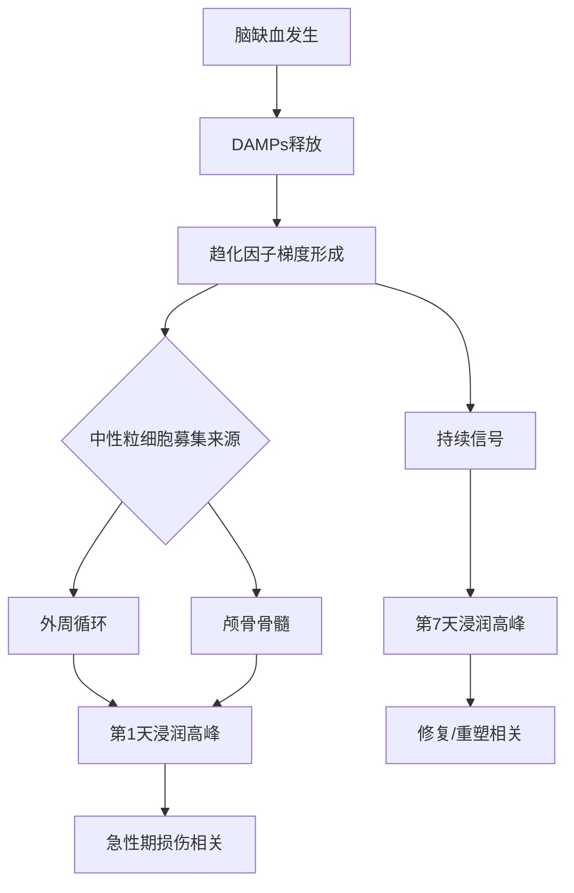
```mermaid
flowchart TD
    A[脑缺血发生] --> B[DAMPs释放]
    B --> C[趋化因子梯度形成]
    C --> D{中性粒细胞募集来源}
    D --> E[外周循环]
    D --> F[颅骨骨髓]
    E --> G[第1天浸润高峰]
    F --> G
    G --> H[急性期损伤相关]
    C --> I[持续信号]
    I --> J[第7天浸润高峰]
    J --> K[修复/重塑相关]
```

### 1.3 中性粒细胞在脑组织内的空间分布演变

中性粒细胞在脑缺血后的空间分布并非静态固定，而是随病理进程呈现**动态演变的特征**。这种空间分布的变化与其功能转换密切相关，为理解中性粒细胞在不同脑区发挥的差异化作用提供了重要线索。

**早期浸润的中性粒细胞主要聚集于损伤核心区及其周围**。研究显示，在损伤后第1天，中性粒细胞大量聚集的区域与神经元丢失严重的区域高度重合，特别是在**丘脑等缺血损伤的核心区域**[^4]。这种空间相关性提示早期浸润的中性粒细胞可能通过释放促炎介质、活性氧等机制直接参与神经元损伤过程。正如研究者所观察到的，"第1天进来的中性粒细胞多的地方，神经元就少，说明它们可能在'搞破坏'"[^4]。

**晚期浸润的中性粒细胞则表现出不同的空间分布模式**。到第7天时，中性粒细胞与神经元损伤之间的负相关关系不再显著，取而代之的是中性粒细胞向**海马等与学习记忆相关的区域**迁移分布[^4]。与此同时，丘脑等早期高密度聚集区域的中性粒细胞数量相对减少。这种空间分布的转变可能反映了晚期中性粒细胞参与组织修复和功能重塑的潜在角色。

从**微观空间定位**角度分析，中性粒细胞的迁移路径也呈现阶段性变化。早期阶段，中性粒细胞主要通过血液循环经血管进入脑组织，同时也可能从颅骨骨髓或脑膜直接迁移[^4]。到第7天时，大多数中性粒细胞已经**穿过血管壁，真正进入脑实质内部**，且其分布位置更靠近血管[^4]。这种从血管周围向脑实质内部的迁移路径提示晚期中性粒细胞可能在血管修复和血脑屏障重建过程中发挥作用。

### 1.4 血脑屏障动态变化与中性粒细胞浸润的相互关系

血脑屏障（blood-brain barrier, BBB）作为维持中枢神经系统内环境稳态的关键结构，其完整性在脑缺血后发生显著改变，与中性粒细胞浸润之间存在**复杂的双向调控关系**。

**血脑屏障结构与功能特征**方面，BBB由脑毛细血管内皮细胞、周细胞与神经胶质细胞伪足共同构成，能够选择性透过营养物质并阻止血液中有害物质进入大脑[^6]。衰老过程中血脑屏障通透性会逐步增加，而血脑屏障功能紊乱与缺血性卒中、阿尔茨海默症等多种神经系统疾病密切相关[^6]。研究发现，CX43-PARP1-NAD+通路在血脑屏障相关血管细胞衰老中发挥重要作用，NAD+水平的下降与血脑屏障完整性破坏密切相关[^6]。

**中性粒细胞对血脑屏障的损伤机制**是一个多途径、多层次的病理过程。中性粒细胞可通过以下机制加剧血脑屏障损伤：

首先，**中性粒细胞胞外陷阱（NETs）的形成**是重要的损伤机制。NETs的主要成分包括DNA支架和多种有害蛋白，其释放的蛋白酶和染色质可加剧神经毒性和炎症级联反应[^7][^8]。此外，网状DNA可充当微血栓骨架，捕获其他血细胞形成免疫血栓，进一步加重缺血再灌注损伤[^7]。清除血管内NETs可减轻对内皮细胞的持续破坏，减少免疫血栓的募集[^8]。

其次，**蛋白酶释放**直接损伤血脑屏障的结构完整性。中性粒细胞弹性蛋白酶（NE）等蛋白酶可降解血脑屏障的基底膜成分和紧密连接蛋白，增加血脑屏障通透性[^7]。

**血脑屏障通透性变化对中性粒细胞迁移的影响**同样显著。血脑屏障的破坏为中性粒细胞的跨屏障迁移提供了通道，使得更多中性粒细胞能够进入脑实质[^8]。这种正反馈循环可能在急性期加剧炎症损伤，但在恢复期也可能促进修复性免疫细胞的进入。

**硬脑膜-脑组织界面的调控机制**是近年来的重要发现。2025年发表于Cell的研究揭示，肥大细胞特异性受体Mrgprb2/MRGPRX2通过硬脑膜-大脑信号轴介导卒中后的脑部炎症反应[^9]。具体而言，Mrgprb2引起卒中后脑膜肥大细胞的脱颗粒反应，释放免疫介质，将颅骨骨髓中的中性粒细胞招募至硬脑膜，并通过**切割semaphorin 3a蛋白进一步促进中性粒细胞从硬脑膜向脑组织的迁移**[^9]。这一发现揭示了Mrgprb2作为颅骨骨髓免疫细胞向大脑内迁移的关键脑膜"守门人"角色，为理解中性粒细胞跨屏障迁移的调控机制提供了新的分子靶点。

抑制Mrgprb2可减轻小鼠卒中后的脑部炎症、改善神经功能预后并提高存活率[^9]，这一发现提示靶向调控中性粒细胞跨血脑屏障迁移可能成为脑缺血治疗的新策略。

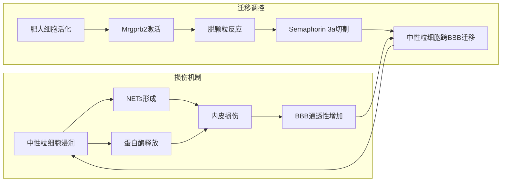
```mermaid
flowchart LR
    subgraph 损伤机制
        A[中性粒细胞浸润] --> B[NETs形成]
        A --> C[蛋白酶释放]
        B --> D[内皮损伤]
        C --> D
        D --> E[BBB通透性增加]
    end
    
    subgraph 迁移调控
        F[肥大细胞活化] --> G[Mrgprb2激活]
        G --> H[脱颗粒反应]
        H --> I[Semaphorin 3a切割]
        I --> J[中性粒细胞跨BBB迁移]
    end
    
    E --> J
    J --> A
```

综上所述，脑缺血病理分期为理解中性粒细胞功能异质性提供了明确的时间框架，而中性粒细胞浸润的双相动力学模式、空间分布演变及其与血脑屏障的双向调控关系，共同构成了中性粒细胞在脑缺血损伤与修复中发挥双重角色的时空动力学基础。这一框架为后续章节深入探讨中性粒细胞的功能谱系演变、异质亚群鉴定及其与其他细胞类型的相互作用网络奠定了坚实的理论基础。

## 2 中性粒细胞在脑缺血急性期与慢性期的功能谱系演变

基于第一章建立的中性粒细胞双相浸润时空框架，本章节将深入解析中性粒细胞在脑缺血不同病理阶段的功能动态转换机制。越来越多的证据表明，中性粒细胞并非传统认知中仅作为造成组织损伤的短命细胞，而是具有显著的**功能异质性和时序依赖性可塑性**[^4]。急性期（第1天高峰）浸润的中性粒细胞表现为高度活化的促炎损伤表型，而慢性期（第7天高峰）出现的中性粒细胞则呈现促血管生成和促修复特征。这种从"损伤加剧者"到"修复促进者"的功能谱系演变，受到复杂的分子调控网络、代谢重编程及微环境信号的精密调控。

### 2.1 急性期中性粒细胞的促炎损伤表型特征

脑缺血后第1天浸润高峰期的中性粒细胞表现出**高度活化的促炎表型**，这一特征与其在损伤核心区及周围区域的空间聚集密切相关[^4]。研究显示，早期浸润的中性粒细胞数量与神经元丢失程度呈显著正相关，提示其直接参与急性期神经损伤过程。

**促炎细胞因子的爆发性释放**是急性期中性粒细胞促炎表型的核心特征。脑组织发生缺血时，坏死细胞释放大量损伤相关分子模式（DAMPs），包括ATP、高迁移率组蛋白1（HMGB1）和热休克蛋白60（HSP60）等，这些信号迅速激活浸润的中性粒细胞[^10]。活化的中性粒细胞通过髓样分化初级反应基因88（MyD88）依赖的信号通路，触发核因子-κB（NF-κB）和激活蛋白-1（AP-1）介导的促炎因子基因表达，大量释放**TNF-α、IL-1β、IL-6**等促炎介质[^10]。临床研究证实，这些炎症因子在脑缺血患者中显著增加，并与疾病严重程度密切相关[^11]。

**活性氧（ROS）的爆发性产生**是急性期中性粒细胞造成组织损伤的另一重要机制。脑缺血再灌注过程中，中性粒细胞发生呼吸暴发（respiratory burst），通过NADPH氧化酶系统产生大量超氧阴离子（O₂⁻）、过氧化氢（H₂O₂）和羟自由基（·OH）等活性氧物质[^10]。过量的ROS可诱导脑组织中细胞膜及细胞器膜的脂质过氧化，导致DNA、RNA等大分子交联失活，损伤内皮细胞并破坏血脑屏障完整性[^10]。这一过程与代谢重编程框架中提出的**急性期"糖酵解风暴遭遇脂质风暴"**的病理机制高度吻合，酶促脂质过氧化与中性粒细胞ROS产生共同点燃了神经炎症和早期神经功能缺损[^12]。

**蛋白酶的分泌**进一步加剧了急性期损伤。中性粒细胞弹性蛋白酶（NE）等蛋白酶的释放可直接降解血脑屏障的基底膜成分和紧密连接蛋白，增加血脑屏障通透性，形成"中性粒细胞浸润-屏障破坏-更多中性粒细胞浸润"的正反馈损伤循环[^7]。

动物实验为急性期中性粒细胞的损伤作用提供了直接证据。**在急性期清除中性粒细胞可有效减轻神经细胞死亡**，并与青少年期动物的多动行为减少相关[^4]。这一发现确证了早期中性粒细胞在加剧组织损伤中的关键作用，也为时序特异性治疗策略提供了实验基础。

### 2.2 慢性期中性粒细胞的促修复表型转换

与急性期形成鲜明对比，脑缺血后第7天浸润高峰期的中性粒细胞呈现出**截然不同的促修复表型特征**[^4]。这一发现彻底颠覆了中性粒细胞仅作为损伤性细胞的传统观点，揭示了其在组织修复中的积极作用。

**促血管生成表型**是慢性期中性粒细胞的核心功能特征。研究发现，第7天浸润的中性粒细胞高表达**Siglec-F**（唾液酸结合免疫球蛋白样凝集素F），这一表面标志物的高表达与促血管生成功能密切相关[^4]。Siglec-F高表达的中性粒细胞亚群可能通过分泌血管内皮生长因子（VEGF）等促血管生成因子，参与缺血区域的血管再生过程。

**空间分布的转变**进一步支持了慢性期中性粒细胞的修复功能。到第7天时，中性粒细胞更多出现在**海马**等与学习记忆相关的区域，而丘脑等早期高密度聚集区域的中性粒细胞数量相对减少[^4]。更重要的是，此阶段大多数中性粒细胞已穿过血管壁进入脑实质内部，且分布位置更靠近血管，这种空间定位特征提示其可能在**血管修复和血脑屏障重建**过程中发挥积极作用。

**功能验证实验**提供了慢性期中性粒细胞促修复作用的关键证据。**在延迟期（第7天）清除中性粒细胞会损害血管和少突胶质细胞的再生**，导致焦虑相关行为异常加重以及髓鞘形成缺陷[^4]。具体而言，晚期清除中性粒细胞虽不影响多动行为，却明显加重了焦虑样行为异常，并导致更严重的脑损伤和髓鞘相关基因及蛋白表达下降。这一发现表明，慢性期中性粒细胞在**少突胶质细胞再生和髓鞘形成**中发挥不可或缺的支持作用。

以下表格系统对比了急性期与慢性期中性粒细胞的功能特征差异：

| 特征维度 | 急性期（第1天） | 慢性期（第7天） |
|---------|----------------|----------------|
| 表型特征 | 高度活化、促炎型 | 促血管生成、促修复型 |
| 标志物表达 | CD14高表达 | Siglec-F高表达 |
| 空间分布 | 丘脑等损伤核心区 | 海马等修复相关区域 |
| 主要功能 | 加剧神经元死亡、炎症放大 | 促进血管再生、髓鞘修复 |
| 清除效应 | 减轻损伤、改善预后 | 损害修复、加重行为障碍 |

### 2.3 中性粒细胞寿命调控与凋亡抵抗机制

传统观念认为中性粒细胞是短命的免疫细胞，循环中的半衰期仅为6-8小时，然而越来越多的证据表明，脑缺血微环境中的中性粒细胞表现出**显著的寿命延长和凋亡抵抗特征**[^11][^13]。这种寿命调控机制的改变对于理解中性粒细胞在急性期持续炎症和慢性期修复功能中的作用至关重要。

**凋亡抵抗信号通路的激活**是中性粒细胞寿命延长的核心机制。急性缺血性脑卒中（AIS）后，外周免疫细胞中性粒细胞被激活并迁移到缺血的脑实质，**这些被激活的中性粒细胞寿命延长，导致持续的炎症反应**，造成血脑屏障破坏、脑水肿和神经功能缺损[^13]。FOXO1转录因子在这一过程中发挥关键调控作用，其通过转录激活下游靶基因增强中性粒细胞的抗凋亡能力[^11]。

**缺血缺氧环境对中性粒细胞存活的影响**是另一重要调控因素。脑缺血区域的低氧环境可通过HIF-1α（缺氧诱导因子-1α）依赖的信号通路抑制中性粒细胞凋亡，延长其在损伤部位的存活时间。这种寿命延长在急性期可能加剧炎症损伤，但在慢性期则可能为修复功能的发挥提供时间窗口。

**颅内中性粒细胞的多种死亡方式**及其清除机制是近年来的研究热点。研究发现，颅内中性粒细胞可以发生**NETosis、凋亡和焦亡**等多种死亡方式[^13]：

- **NETosis**：中性粒细胞释放中性粒细胞胞外陷阱（NETs）的特殊死亡形式，在急性期可加剧炎症和血栓形成
- **凋亡**：程序性细胞死亡，凋亡的中性粒细胞可被巨噬细胞/小胶质细胞通过胞葬（efferocytosis）机制清除
- **焦亡**：炎症性细胞死亡，伴随炎症因子的释放，可能加重局部炎症反应

**胞葬机制**在中性粒细胞清除中发挥核心作用。凋亡的中性粒细胞被巨噬细胞/小胶质细胞吞噬清除的过程称为胞葬，这一过程不仅清除死亡细胞，还可诱导吞噬细胞向抗炎表型极化，促进炎症消退[^13]。此外，中性粒细胞还可以通过**反向跨内皮迁移（reverse transendothelial migration）**离开局部炎症组织，返回循环系统，这一机制可能参与炎症消退的调控[^13]。

### 2.4 中性粒细胞代谢重编程与功能可塑性

代谢重编程（Metabolic Reprogramming in Ischemic Stroke, MRIS）已被确认为脑缺血损伤-恢复连续统中的核心驱动因素[^12]。中性粒细胞作为高度活跃的免疫细胞，其代谢状态的动态变化与功能表型转换密切相关，代谢重编程为理解中性粒细胞从促炎向促修复转换提供了新的视角。

**急性期糖酵解代谢的增强**是中性粒细胞促炎功能的代谢基础。脑缺血急性期，中性粒细胞表现出显著增强的糖酵解代谢特征，这与其呼吸暴发和ROS产生的高能量需求相适应。研究表明，急性期的代偿性糖酵解加速（"糖酵解狂飙"）与酶促脂质过氧化"风暴"相互碰撞，共同驱动神经炎症和早期神经功能缺损[^12]。乳酸脱氢酶A（LDHA）在这一过程中发挥关键作用，**在超急性期抑制LDHA可以减轻酸中毒**，提示代谢干预可能成为急性期治疗的新策略[^12]。

**亚急性期至慢性期的代谢转变**与中性粒细胞功能表型的转换同步发生。随着病理进程从急性期向恢复期过渡，中性粒细胞的代谢模式从以糖酵解为主逐渐向有氧氧化转变。这一代谢转变可能受到**AMPK（腺苷酸活化蛋白激酶）与mTOR（雷帕霉素机制靶点）**之间相互作用的调控[^12]。AMPK的激活可促进线粒体生物合成和氧化磷酸化，而mTOR信号的适度抑制则有利于细胞从合成代谢向分解代谢转换。

**NAD⁺代谢与线粒体功能的动态变化**是代谢重编程的关键环节。急性期的糖酵解-兴奋毒性危机伴随NAD⁺耗竭，触发神经免疫功能障碍[^12]。而在慢性期，**去乙酰化酶（Sirtuin）介导的线粒体生物合成**对于神经功能恢复至关重要。优化NAD⁺补救途径有助于恢复线粒体可塑性，这一发现为代谢靶向治疗提供了时间依赖性的干预窗口[^12]。

代谢组学分析进一步证实了中性粒细胞代谢重编程的存在。对小鼠假手术组和脑损伤组骨髓来源中性粒细胞的代谢组学分析显示，58个显著差异代谢物的KEGG分析揭示**FOXO信号通路显著激活**[^11]，这一发现将代谢重编程与转录调控网络联系起来，提示代谢信号可能通过调控关键转录因子的活性来驱动中性粒细胞的功能可塑性转换。

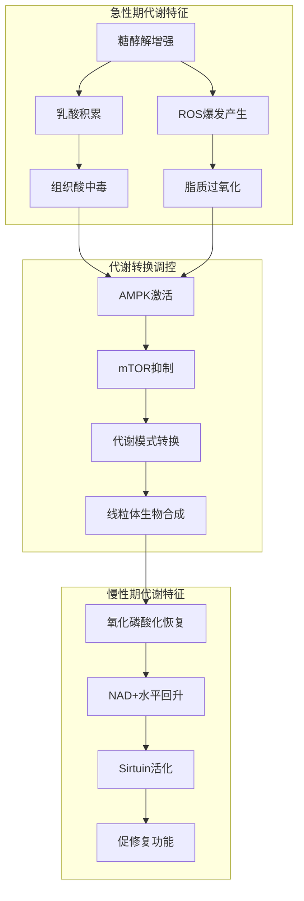
```mermaid
flowchart TD
    subgraph 急性期代谢特征
        A[糖酵解增强] --> B[乳酸积累]
        A --> C[ROS爆发产生]
        B --> D[组织酸中毒]
        C --> E[脂质过氧化]
    end
    
    subgraph 代谢转换调控
        F[AMPK激活] --> G[mTOR抑制]
        G --> H[代谢模式转换]
        H --> I[线粒体生物合成]
    end
    
    subgraph 慢性期代谢特征
        I --> J[氧化磷酸化恢复]
        J --> K[NAD+水平回升]
        K --> L[Sirtuin活化]
        L --> M[促修复功能]
    end
    
    D --> F
    E --> F
```

### 2.5 中性粒细胞胞外陷阱（NETs）的双重效应

中性粒细胞胞外陷阱（Neutrophil Extracellular Traps, NETs）是中性粒细胞在特定刺激下释放的由DNA支架和多种蛋白质组成的网状结构，其在脑缺血损伤与修复中表现出**显著的双重效应**[^7][^13]。深入理解NETs的形成机制及其在不同病理阶段的作用，对于开发靶向治疗策略具有重要意义。

**NETs的形成机制与主要成分**已得到较为清晰的阐明。NETs的主要成分包括**DNA支架、蛋白酶（如中性粒细胞弹性蛋白酶NE、髓过氧化物酶MPO）和组蛋白**等[^7]。NETosis是中性粒细胞释放NETs的特殊死亡形式，可由多种因素触发，包括病原体感染、炎症因子刺激、缺氧环境等。在脑缺血再灌注损伤中，NETs的形成与中性粒细胞的过度激活密切相关。

**急性期NETs的损伤效应**是其在脑缺血中最为人知的作用。研究表明，NETs在介导溶栓耐药、加剧缺血再灌注损伤、诱导出血转化和复发方面发挥着不可或缺的作用[^7]。具体而言，NETs的损伤机制包括：

- **内皮细胞损伤**：释放的蛋白酶和染色质可加剧神经毒性和炎症级联反应，直接损伤血管内皮细胞
- **免疫血栓形成**：网状DNA充当微血栓骨架，捕获其他血细胞（红细胞、血小板）形成免疫血栓，加重缺血程度
- **血脑屏障破坏**：NETs成分可降解血脑屏障的结构蛋白，增加屏障通透性

**DNase I介导的NETs清除策略**展现出显著的神经保护潜力。DNase I可降解NETs的DNA骨架结构，从而瓦解NETs的网状结构[^7]。研究开发了一种**DNase I介导的NETs靶向纳米粒**，整合DNase I的催化和趋化功能，实现神经血管单元（NVU）内部和外部微环境的协同调节[^7]。具体而言，DNase I将纳米颗粒靶向至病灶部位，通过受损的血脑屏障在大脑中积累；**清除血管内NETs减轻了内皮的持续破坏，减少了免疫血栓的募集**[^7]。在小鼠大脑中动脉闭塞/再灌注（MCAO）模型中，该策略显示出梗死面积减小和微环境稳态重塑的治疗效果[^7]。

这一策略的创新之处在于利用酶的趋化性实现靶向递送。**由酶趋化性介导的靶向性首次得到验证**，展示了通用趋化靶向递送策略的潜力[^7]。考虑到NETs在炎症和肿瘤等多种疾病发展过程中的重要作用，这一策略有望成为一种通用的纳米药物靶向策略。

值得注意的是，NETs在慢性期可能存在尚未充分阐明的作用。虽然急性期NETs的损伤效应已得到广泛证实，但其在组织修复阶段是否存在潜在的积极作用（如促进碎片清除、调节免疫微环境）仍需进一步研究。

### 2.6 FOXO1等关键转录因子的调控网络

转录因子调控网络是驱动中性粒细胞功能谱系演变的核心分子机制。近年来的研究揭示，**FOXO1（叉头框蛋白O1）**在中性粒细胞的表型重塑中发挥关键调控作用，其信号通路贯穿急性期损伤和慢性期并发症的全过程[^11]。

**FOXO1在急性期中性粒细胞重塑中的关键作用**已通过多组学整合分析得到证实。通过对健康人和脑损伤患者外周血中性粒细胞的单细胞RNA测序（scRNA-seq），研究者识别出3种不同的中性粒细胞亚型，发现每类中性粒细胞前10位差异基因大多数是**转录因子FOXO1的靶基因**[^11]。GO分析进一步表明，FOXO1是在急性期调节脑损伤患者中性粒细胞转录和蛋白质代谢过程的唯一分子，提示**FOXO1相关基因谱是脑损伤患者中性粒细胞的显著特征**[^11]。

**FOXO1高表达中性粒细胞亚群的特征与功能**是近年来的重要发现。研究发现，脑损伤后骨髓及脑内中性粒细胞的FOXO1蛋白水平特异性升高，形成一类新型的**FOXO1高表达中性粒细胞亚群**[^11]。这些细胞在急性和慢性阶段持续存在，但其功能效应因阶段而异。在急性期，FOXO1通过转录激活**VCAN（多功能蛋白聚糖）基因**，增强中性粒细胞抗凋亡能力（延长寿命），并促进IL-6释放，从而加剧急性炎症与损伤[^11]。髓系细胞特异性FOXO1敲除实验验证了其在急性期的损伤作用。

**FOXO1-TFRC通路介导的少突胶质细胞铁稳态失衡机制**揭示了FOXO1在慢性期并发症中的作用。研究发现，FOXO1高表达的中性粒细胞在慢性期通过**"FOXO1-TFRC"轴**破坏铁稳态，诱导中性粒细胞铁死亡，进而导致少突胶质细胞髓鞘蛋白表达降低[^11]。这一机制与脑损伤后抑郁症的发生密切相关，临床研究表明TNF-α、IL-1和IL-6等炎症因子在脑损伤后抑郁症患者中显著增加[^11]。

**转录因子调节网络的顺序激活模式**为理解中性粒细胞表型转换提供了分子基础。单细胞转录组分析揭示，在脑缺血过程中，中性粒细胞内转录因子的调节网络呈**顺序激活状态**[^14]。特别是在卒中急性期脑内存在的高表达Cd14基因的中性粒细胞亚型（Neut_Cd14）中，多个转录因子呈特异性表达模式[^14]。拟时序分析显示，在脑缺血模型中，颅骨骨髓与股骨骨髓来源中性粒细胞的分化平衡被打破，**颅骨骨髓中的中性粒细胞更早地开始迁移和分化**，提示其成熟分化模式有所不同[^14]。

以下流程图展示了FOXO1调控网络在中性粒细胞功能演变中的作用：

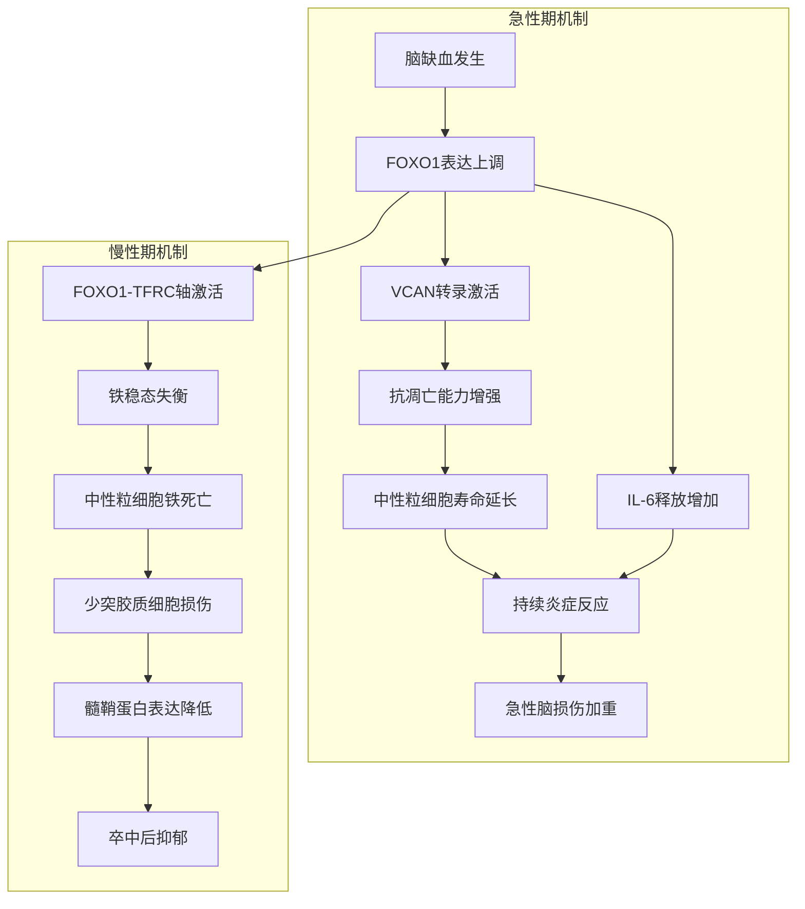
```mermaid
flowchart TD
    subgraph 急性期机制
        A[脑缺血发生] --> B[FOXO1表达上调]
        B --> C[VCAN转录激活]
        C --> D[抗凋亡能力增强]
        D --> E[中性粒细胞寿命延长]
        B --> F[IL-6释放增加]
        E --> G[持续炎症反应]
        F --> G
        G --> H[急性脑损伤加重]
    end
    
    subgraph 慢性期机制
        B --> I[FOXO1-TFRC轴激活]
        I --> J[铁稳态失衡]
        J --> K[中性粒细胞铁死亡]
        K --> L[少突胶质细胞损伤]
        L --> M[髓鞘蛋白表达降低]
        M --> N[卒中后抑郁]
    end
```

综上所述，中性粒细胞在脑缺血急性期与慢性期表现出截然不同的功能谱系特征，这种时序依赖性的功能演变受到寿命调控、代谢重编程、NETs释放及FOXO1等转录因子调控网络的精密调控。**这种疾病阶段依赖性的中性粒细胞多样性为识别特定疾病阶段的治疗靶点提供了新的可能性**[^4]，也为后续章节探讨中性粒细胞异质亚群的鉴定及其与其他细胞类型的相互作用网络奠定了功能机制基础。

## 3 脑缺血相关中性粒细胞的异质亚群鉴定与特征解析

基于前两章建立的中性粒细胞浸润时空框架与功能谱系演变机制，本章节将深入解析脑缺血进程中中性粒细胞异质亚群的鉴定方法、分子特征及其临床意义。传统观点长期将中性粒细胞视为功能单一的急性炎症效应细胞，然而近年来单细胞组学技术的迅速发展彻底颠覆了这一认知，揭示了该细胞谱系在表型与功能上的**高度异质性**[^15]。这种异质性不仅体现在不同成熟阶段的细胞群体差异，更表现为疾病状态下特定功能亚群的出现与动态变化。系统鉴定和解析这些亚群的分子特征，对于理解中性粒细胞在脑缺血损伤与修复中的双重角色、开发亚群特异性治疗策略具有重要意义。

### 3.1 中性粒细胞异质亚群鉴定的多组学技术平台与分析策略

中性粒细胞异质性研究长期面临独特的技术挑战。与其他血液和免疫细胞类型相比，中性粒细胞中**基因表达的数量和水平较低**，从技术层面对RNA的捕获更加困难[^15]。此外，由于中性粒细胞的半衰期只有15-20小时，对实验操作细节也提出了更高的要求[^15]。这些技术瓶颈的突破为系统解析中性粒细胞异质性奠定了基础。

**单细胞RNA测序技术的优化与应用**是中性粒细胞亚群鉴定的核心技术平台。2020年发表于《Nature Immunology》的研究首次从单细胞尺度系统性地描绘了中性粒细胞在稳态和炎症状态下成熟、分化和命运决定过程中的异质性群体和转录组动态变化[^15]。研究者通过优化实验条件，分别对小鼠稳态下的骨髓、外周血和脾脏进行中性粒细胞分离和单细胞RNA测序，并结合生物信息学方法建立了稳态条件下的中性粒单细胞图谱[^15]。这一图谱整合了领域内已有的关于中性粒细胞异质性分类，为进一步研究中性粒细胞提供了有价值的参考数据资源[^15]。

**多解剖区室的系统采样策略**对于全面揭示脑缺血后中性粒细胞异质性至关重要。王伊龙团队的研究对分选后的CD45+细胞进行了单细胞RNA测序，这些细胞来源包括**颅骨骨髓（CBM）、股骨骨髓（FBM）和外周血单核细胞（PBMCs）**[^16]。对永久性大脑中动脉闭塞（p-MCAO）小鼠和假手术小鼠均进行了分析，无监督聚类分析识别出了16种由典型标志物标记的细胞类型[^16]。虽然UMAP图显示p-MCAO组和假手术组的免疫细胞之间区分有限，但两组之间的相对细胞密度差异显著，这表明中风后细胞比例可能发生了变化[^16]。

**生物信息学分析方法的整合应用**为亚群鉴定提供了强大的分析工具。主要分析策略包括：

| 分析方法 | 应用目的 | 关键发现 |
|---------|---------|---------|
| 无监督聚类 | 识别细胞类型与亚群 | 鉴定16种免疫细胞类型及中性粒细胞亚群 |
| RNA速度分析 | 预测细胞分化轨迹 | 揭示成熟群体的骨髓来源与转化关系 |
| 拟时序分析 | 重建发育连续性 | 阐明分化平衡的打破与迁移模式变化 |
| SPOTLIGHT算法 | 时空分布分析 | 明确亚群在不同时间点的空间定位 |
| 转录调控网络分析 | 鉴定关键调控因子 | 发现中性粒细胞发育过程中特异上调的新转录因子 |

研究发现，虽然单细胞RNA测序定义的异质性细胞群体与经典形态学分群整体具有较高相关性，但是**单细胞测序技术能辨别出形态学相同、而转录组有差异的细胞群体**，增加了对骨髓成熟粒细胞异质性的认识[^15]。这一发现强调了多组学技术在揭示功能异质性方面相较于传统方法的独特优势。

### 3.2 CD14+中性粒细胞亚群的发现与颅骨骨髓起源特征

脑缺血后大脑内新发现的**CD14高表达中性粒细胞亚群（Neut_Cd14）**是近年来中性粒细胞异质性研究的重要突破。这一亚群的发现不仅丰富了对中性粒细胞功能多样性的认识，更揭示了疾病状态下特异性细胞亚群的存在及其独特的组织来源。

**Neut_Cd14亚群的分子特征**表现出显著的疾病相关性。王伊龙团队通过分析中风后来自多个解剖区室的免疫细胞的单细胞转录组，发现了这一新的CD14+中性粒细胞亚群，其转录组特征与颅骨骨髓中性粒细胞相似[^16]。该分析揭示了中风后大脑髓系细胞和脑内固有免疫细胞在转录组上存在不同的细胞群，其中包括这一新的CD14+中性粒细胞亚群[^16]。通过与外部数据集整合分析，发现Neut_Cd14与最成熟中性粒细胞亚群相关性较弱，且主要位于缺血性大脑中，推测其在中风免疫中起关键作用[^16]。

**转录因子调控网络的顺序激活**是Neut_Cd14亚群获得特异功能的分子基础。研究揭示了中风进展过程中中性粒细胞中转录因子调控网络的顺序激活，其中**许多是CD14+细胞群所特有的**，这些调控网络是它们获得趋化性和颗粒释放能力的基础[^16]。这一发现表明，Neut_Cd14亚群并非简单的成熟度差异，而是通过特异性转录程序获得了独特的功能特征。

**颅骨骨髓起源的证据**为理解Neut_Cd14亚群的来源提供了新视角。研究确定了中风后疾病相关免疫细胞亚型的两个不同来源[^16]。分析显示，与假手术组相比，缺血性中风后的颅骨骨髓和股骨骨髓组中，造血干细胞（HSCs）、粒细胞-单核祖细胞（GMPs）等细胞的比例均有所增加，这表明在缺血性损伤后，颅骨骨髓和股骨骨髓中的这些细胞均发生了增殖和激活[^16]。然而，中风后颅骨骨髓和股骨骨髓中中性粒细胞的比例变化不同，**颅骨骨髓中中性粒细胞比例从47.9%降至44.3%，而股骨骨髓中的中性粒细胞比例略有增加**[^16]。这一差异提示颅骨骨髓中的中性粒细胞可能更快地被动员并迁移至脑组织。

**组织特异性基因表达谱**进一步证实了颅骨骨髓与股骨骨髓来源中性粒细胞的功能差异。中风后，颅骨骨髓中性粒细胞的**Cxcl2、Prok2**等基因表达上升，与能量代谢和髓系细胞迁移有关；而股骨骨髓中性粒细胞的**Fgl2、Ccl6**等基因高表达，与炎症消退等有关[^16]。纳入假手术组后的分析发现，中风后颅骨骨髓和股骨骨髓中性粒细胞转录组变化不同，颅骨骨髓中特异性上调165个基因、下调299个基因，股骨骨髓中上调122个、下调127个，两者共享的上调或下调基因较少，说明**中性粒细胞对中风存在组织特异性反应**[^16]。

### 3.3 FOXO1high中性粒细胞亚群的分子特征与功能倾向

FOXO1高表达中性粒细胞亚群的发现为理解脑缺血后中性粒细胞功能异质性提供了关键的分子基础。如第二章所述，FOXO1作为核心转录因子，其高表达亚群在急性期和慢性期均发挥重要但截然不同的作用。

**FOXO1作为中性粒细胞重塑的核心调控因子**的地位已通过多组学整合分析得到确证。通过对健康人和脑损伤患者外周血中性粒细胞的单细胞RNA测序，研究者识别出3种不同的中性粒细胞亚型，发现每类中性粒细胞前10位差异基因大多数是**转录因子FOXO1的靶基因**。GO分析进一步表明，FOXO1是在急性期调节脑损伤患者中性粒细胞转录和蛋白质代谢过程的唯一分子，提示**FOXO1相关基因谱是脑损伤患者中性粒细胞的显著特征**。

**FOXO1high亚群的双重功能效应**体现了中性粒细胞功能的时序依赖性：

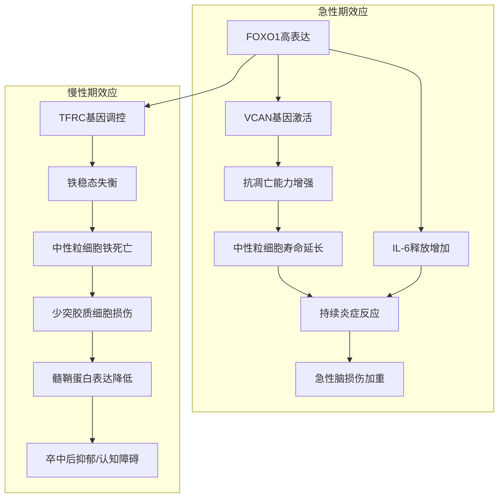
```mermaid
flowchart TD
    subgraph 急性期效应
        A[FOXO1高表达] --> B[VCAN基因激活]
        B --> C[抗凋亡能力增强]
        C --> D[中性粒细胞寿命延长]
        A --> E[IL-6释放增加]
        D --> F[持续炎症反应]
        E --> F
        F --> G[急性脑损伤加重]
    end
    
    subgraph 慢性期效应
        A --> H[TFRC基因调控]
        H --> I[铁稳态失衡]
        I --> J[中性粒细胞铁死亡]
        J --> K[少突胶质细胞损伤]
        K --> L[髓鞘蛋白表达降低]
        L --> M[卒中后抑郁/认知障碍]
    end
```

在急性期，FOXO1通过转录激活**VCAN（多功能蛋白聚糖）基因**，增强中性粒细胞抗凋亡能力，并促进IL-6释放，从而加剧急性炎症与损伤。在慢性期，FOXO1high亚群通过**"FOXO1-TFRC"轴**破坏铁稳态，诱导中性粒细胞铁死亡，进而导致少突胶质细胞髓鞘蛋白表达降低，与脑损伤后抑郁症的发生密切相关。

**代谢组学分析**为FOXO1high亚群的功能特征提供了代谢层面的支持。对小鼠假手术组和脑损伤组骨髓来源中性粒细胞的代谢组学分析显示，58个显著差异代谢物的KEGG分析揭示**FOXO信号通路显著激活**，这一发现将代谢重编程与转录调控网络联系起来。

### 3.4 Siglec-F+促修复亚群与其他功能亚群的比较分析

脑缺血不同阶段出现的功能异质亚群呈现出系统性的表型差异，其中**Siglec-F高表达中性粒细胞亚群**代表了慢性期促修复表型的典型特征。系统比较不同功能亚群的分子特征，有助于建立基于功能倾向的中性粒细胞分类框架。

**Siglec-F+亚群的促血管生成特征**是其最显著的功能标签。如第二章所述，第7天浸润高峰期的中性粒细胞高表达Siglec-F（唾液酸结合免疫球蛋白样凝集素F），这一表面标志物的高表达与促血管生成功能密切相关。该亚群可能通过分泌血管内皮生长因子（VEGF）等促血管生成因子，参与缺血区域的血管再生过程。

**稳态条件下中性粒细胞异质性的参考框架**为疾病相关亚群的定位提供了基准。研究发现，按照发育成熟的顺序，骨髓中的中性粒细胞可以分为5群，包括**3个处于分裂阶段的亚群（G0、G1、G2）和2个分裂后的较成熟亚群（G3、G4）**[^15]。研究者针对颗粒蛋白、细胞周期、杀菌功能等方面，详细解析了每个群体的特征[^15]。外周器官中主要存在3群具有不同转录组特征的成熟中性粒细胞**PMNa、PMNb和PMNc**[^15]。RNA速度分析揭示了这些成熟群体有不同的骨髓来源和复杂的群体间相互转化关系：PMNa和PMNb主要分别由骨髓的G3和G4发育而来；PMNa和PMNb均可发育成PMNc，但是PMNa和PMNb之间很少有转化发生[^15]。

以下表格系统比较了脑缺血相关主要中性粒细胞亚群的特征差异：

| 亚群类型 | 标志物特征 | 主要出现时相 | 空间分布 | 功能倾向 | 临床关联 |
|---------|-----------|-------------|---------|---------|---------|
| Neut_Cd14 | CD14高表达 | 急性期（24h峰值） | 梗死核心区 | 趋化性、颗粒释放 | 急性损伤加重 |
| FOXO1high | FOXO1高表达 | 急性期至慢性期持续 | 骨髓、外周血、脑 | 抗凋亡、促炎/铁死亡 | 急性损伤、卒中后抑郁 |
| Siglec-F+ | Siglec-F高表达 | 慢性期（第7天） | 海马、血管周围 | 促血管生成、修复 | 神经功能恢复 |
| N1型 | 促炎标志物组合 | 急性期早期 | 损伤核心区 | 促炎、ROS产生 | 梗死体积扩大 |
| N2型 | 抗炎标志物组合 | 亚急性期/干预后 | 修复区域 | 吞噬、抗炎 | 预后改善 |

**干扰素刺激相关基因高表达的成熟中性粒细胞（PMNb）**展现出独特的功能特征。利用免疫荧光成像技术，研究者验证了高表达干扰素刺激相关基因的成熟中性粒细胞（PMNb）在脾脏中独特的空间分布，提示该亚群可能具有不同于其他亚群的宿主防御功能[^15]。这一发现提示，即使在稳态条件下，中性粒细胞亚群也存在组织特异性的功能分化。

### 3.5 中性粒细胞亚群的时相分布规律与空间定位特征

不同中性粒细胞亚群在脑缺血病理进程中呈现出**高度有序的时空动态变化模式**，这种时空协调性与其在不同阶段发挥的差异化功能密切相关。

**急性期亚群的时空特征**以Neut_Cd14为代表。通过SPOTLIGHT算法分析三种细胞亚群的时空分布，发现**Neut_Cd14在中风后24小时于梗死核心区数量达到峰值，随后迅速减少**，参与急性期免疫反应[^16]。这一时相特征与第一章描述的中性粒细胞第1天浸润高峰高度吻合，提示Neut_Cd14可能是急性期浸润中性粒细胞的主要组成部分。

**疾病炎性巨噬细胞（DIMs）的时空分布**为理解髓系细胞亚群的协调作用提供了参照。研究发现，**DIMs在中风后3天占比最大**[^16]。这一时相特征提示，在中性粒细胞急性期高峰之后，单核细胞/巨噬细胞亚群接替发挥炎症调控作用。

**疾病相关小胶质细胞（DAM）的时空特征**则与慢性期修复过程相关。**DAM在中风后3天和7天细胞数量较高，与慢性组织修复或胶质化有关**[^16]。这一发现强调了免疫细胞亚群在中风炎症和恢复不同阶段的时空协调作用[^16]。

**炎症状态对中性粒细胞异质性的影响**已通过感染模型得到验证。为研究细菌感染对中性粒细胞发育及亚群的影响，研究者分离了急性腹膜炎小鼠的骨髓、外周血、脾脏及感染部位的中性粒细胞进行单细胞RNA测序和分析。发现在炎症状态下的中性粒细胞的**异质性群体没有改变，但各群体的数目比例、功能特征、转录因子表达和群体转化路径等发生了明显变化**[^15]。分析和实验结果共同表明，急性髓系造血主要通过**增强早期中性粒细胞分裂活动和缩短分裂后中性粒细胞成熟时间**来共同完成[^15]。这一发现对于理解脑缺血后中性粒细胞动员和分化的加速机制具有重要参考价值。

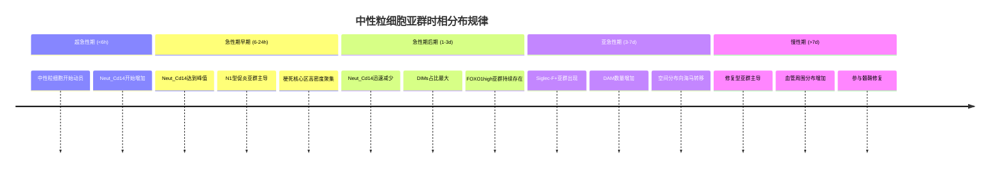
```mermaid
timeline
    title 中性粒细胞亚群时相分布规律
    section 超急性期 (<6h)
        中性粒细胞开始动员
        Neut_Cd14开始增加
    section 急性期早期 (6-24h)
        Neut_Cd14达到峰值
        N1型促炎亚群主导
        梗死核心区高密度聚集
    section 急性期后期 (1-3d)
        Neut_Cd14迅速减少
        DIMs占比最大
        FOXO1high亚群持续存在
    section 亚急性期 (3-7d)
        Siglec-F+亚群出现
        DAM数量增加
        空间分布向海马转移
    section 慢性期 (>7d)
        修复型亚群主导
        血管周围分布增加
        参与髓鞘修复
```

### 3.6 临床样本与动物模型中亚群存在的验证及疾病关联

中性粒细胞亚群与脑缺血疾病严重度的关联研究是将基础发现转化为临床应用的关键环节。综合临床研究与动物实验证据，特定亚群的存在及其动态变化已被证实与疾病进展和预后密切相关。

**脑缺血后免疫细胞比例的系统性变化**为亚群研究提供了宏观背景。在大脑中中风后24小时，**CD45+小胶质细胞从88.6%降至57.2%**。相反，中性粒细胞群体急剧增加，同时单核细胞/巨噬细胞比例也适度增加[^16]。髓系细胞，如中性粒细胞和单核细胞/巨噬细胞，是最早浸润缺血性大脑的细胞之一[^16]。在外周血单核细胞数据集里，缺血性中风后，**B细胞的百分比从43.2%明显降至10.9%**，而中风后外周血单核细胞中的髓系细胞增加，这表明更多的髓系细胞从远处骨髓被激活并动员到外周血中[^16]。

**N1/N2极化比例与疾病严重度的强相关性**是目前最具临床转化潜力的发现之一。脑脊液或外周血中N1型与N2型中性粒细胞的比例或绝对数量是动态的功能性指标，比单纯的总数更能反映免疫环境的平衡状态。**高N1/N2比值**与更严重的急性损伤和更差的预后强烈相关。动物模型中，N1型优势与更大的梗死体积和更差的神经功能评分相关。相反，实验性诱导N1向N2转化或扩增N2群体，能显著减少梗死体积、改善神经功能预后。

**CD14+中性粒细胞的动态变化**作为急性期损伤标志物具有潜在价值。在卒中后24小时左右，于外周血或通过影像学/生物标志物间接评估的脑内CD14+中性粒细胞数量或活性，其早期峰值可能是一个敏感的**急性期损伤标志物**。针对其特异性通路（如独特的转录因子网络）的干预，可能为超急性期治疗提供新窗口。

**中性粒细胞分类的统一共识框架**为临床应用提供了标准化基础。2025年8月发表于《Immunity》的观点性文章提出了一套系统性的中性粒细胞分类框架[^17]。该文章凝聚了全球众多学者的研究与见解，针对当前中性粒细胞亚群定义中存在的模糊与混乱问题，旨在为基础研究和临床实践提供统一的分类标准[^17]。论文指出，由于缺乏统一的命名体系，现有研究对中性粒细胞亚群的界定常出现**重叠、矛盾甚至模糊不清**的情况，既妨碍了不同研究间的横向比较，也限制了对其生物学本质的深入认知[^17]。

**中性粒细胞的动态可塑性**是理解亚群-疾病关联的关键概念。论文强调，稳态下，骨髓产生的细胞进入外周后处于高可塑性的过渡状态，受昼夜节律、系统性因子及血管壁信号等多重因素的调控；抵达组织后，又被局部细胞因子与代谢物驱动，**转化为炎症消除、组织修复或免疫调节等多种效应表型**[^17]。本质上，这一细胞谱系体现了"表型异质—功能同质"的免疫学规律：虽然单细胞测序可将肿瘤浸润中性粒细胞划分为四至九个转录亚群，但这些亚群多为不同成熟程度或重编程进程中的过渡性细胞，最终在微环境信号的驱动下分化为终末功能状态[^17]。

以下表格总结了主要亚群特征与疾病严重度的关联强度：

| 亚群/指标 | 与疾病严重度关联 | 证据强度 | 临床应用潜力 |
|----------|-----------------|---------|-------------|
| 中性粒细胞总数（急性期峰值） | 强正相关 | 高（多项临床研究验证） | 预后预测指标 |
| N1/N2比值 | 强相关（N1↑=预后差） | 高（动物模型+临床初步验证） | 治疗靶点+预后指标 |
| Neut_Cd14动态变化 | 中-强正相关（推测） | 中（动物模型验证） | 急性期生物标志物 |
| FOXO1high亚群 | 急性期正相关、慢性期并发症相关 | 中-高 | 阶段特异性干预靶点 |
| Siglec-F+亚群 | 负相关（存在=修复进行） | 中 | 修复进程评估 |

综上所述，多组学技术的整合应用已成功鉴定出脑缺血相关的多种中性粒细胞功能亚群，包括急性期特异的Neut_Cd14亚群、贯穿急慢性期的FOXO1high亚群以及慢性期促修复的Siglec-F+亚群。这些亚群在基因表达谱、表面标志物、功能倾向及时空分布上呈现系统性差异，与疾病严重度存在明确关联。**建立统一的中性粒细胞分类框架**和**开发可区分这些亚群的流式或分子检测面板**，是实现临床转化的关键步骤。这些发现为后续章节探讨中性粒细胞亚群与其他细胞类型的相互作用网络奠定了分子基础。

## 4 中性粒细胞亚群与中枢神经系统细胞的相互作用网络预测

基于前三章建立的中性粒细胞双相浸润时空框架、功能谱系演变机制及异质亚群分子特征，本章节将系统构建不同功能表型中性粒细胞亚群与脑内关键细胞类型之间的多层次相互作用网络。中性粒细胞并非孤立地发挥作用，而是通过与小胶质细胞、星形胶质细胞、神经元、少突胶质细胞及血管细胞形成复杂的信号对话网络，共同决定脑缺血的病理进程与临床转归。这种细胞间相互作用具有显著的**时序依赖性和亚群特异性**，急性期以促炎损伤网络为主导，慢性期则逐渐向修复支持网络转换。深入解析这些相互作用的分子机制，对于理解脑缺血病理生理过程、识别关键调控节点及开发精准治疗策略具有重要意义。

### 4.1 中性粒细胞-小胶质细胞/巨噬细胞双向调控轴的分子机制

中性粒细胞与小胶质细胞作为介导神经炎症的两大主要免疫细胞群体，在脑缺血后形成了密集的**双向调控网络**[^18]。这一调控轴不仅决定了急性期炎症的强度和持续时间，更深刻影响着组织修复的启动和进程。

**小胶质细胞对中性粒细胞募集与活化的调控**构成了这一双向轴的上游信号。小胶质细胞作为中枢神经系统的常驻免疫哨兵，在感知缺血损伤后迅速激活并释放一系列趋化因子和细胞因子。研究表明，小胶质细胞通过释放**IL-8/CXCL8**等趋化因子，有效调控中性粒细胞的募集与活化[^18]。此外，小胶质细胞衍生的**组织蛋白酶C（Cathepsin C）**可促进中性粒细胞胞外陷阱（NETs）的形成，这一发现揭示了小胶质细胞在调控中性粒细胞效应功能中的关键作用[^18]。CXCR2作为介导中性粒细胞浸润的重要受体，其信号通路的激活直接受到小胶质细胞来源趋化因子的调控[^18]。

**中性粒细胞对小胶质细胞极化的差异化影响**则构成了这一调控轴的下游效应。不同功能状态的中性粒细胞亚群对小胶质细胞极化产生截然不同的调控作用：

| 中性粒细胞状态 | 释放介质 | 对小胶质细胞的影响 | 信号通路 |
|--------------|---------|-------------------|---------|
| 急性期活化型（N1/Neut_Cd14） | NE、MMP-9、IL-1β、TNF-α | 诱导M1促炎极化 | TLR4/NF-κB、IFN-γ/STAT1 |
| 凋亡中性粒细胞 | 磷脂酰丝氨酸暴露 | 促进M2抗炎极化 | 胞葬机制、IL-10/STAT3 |

研究证实，中性粒细胞弹性蛋白酶（NE）和基质金属蛋白酶-9（MMP-9）可诱导小胶质细胞向M1表型极化[^18]。M1型小胶质细胞随后释放更多促炎细胞因子（如TNFα、IL-6），这些细胞因子又能"激活"循环中的中性粒细胞，触发NETs的释放，形成**炎症正反馈放大环路**[^19]。这种正反馈机制在急性期可迅速放大炎症反应，但若持续不受控制，则会加剧继发性脑损伤。

值得注意的是，凋亡的中性粒细胞可能通过**胞葬（efferocytosis）机制**促进小胶质细胞向M2表型转化，增强其吞噬功能[^18]。这一发现提示，中性粒细胞的程序性死亡可能是炎症消退的重要触发因素。M2型小胶质细胞通过分泌IL-10等抗炎因子，进一步抑制炎症反应并促进组织修复。**IL-10/STAT3通路**的激活是促进M2极化的关键信号[^18]。

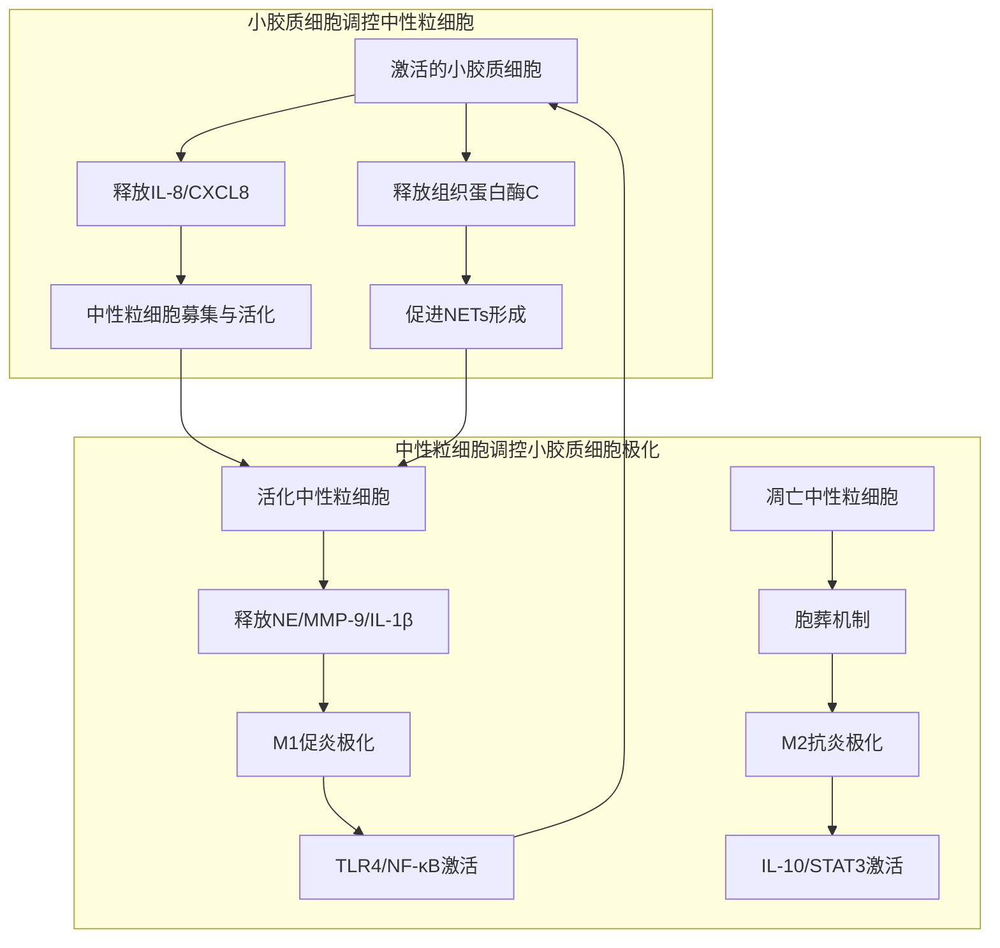
```mermaid
flowchart TD
    subgraph 小胶质细胞调控中性粒细胞
        A[激活的小胶质细胞] --> B[释放IL-8/CXCL8]
        A --> C[释放组织蛋白酶C]
        B --> D[中性粒细胞募集与活化]
        C --> E[促进NETs形成]
    end
    
    subgraph 中性粒细胞调控小胶质细胞极化
        F[活化中性粒细胞] --> G[释放NE/MMP-9/IL-1β]
        G --> H[M1促炎极化]
        H --> I[TLR4/NF-κB激活]
        
        J[凋亡中性粒细胞] --> K[胞葬机制]
        K --> L[M2抗炎极化]
        L --> M[IL-10/STAT3激活]
    end
    
    D --> F
    E --> F
    I --> A
```

这一双向调控轴的**时序转换意义**在于：急性期以中性粒细胞-M1小胶质细胞的促炎环路为主导，驱动炎症放大和组织损伤；随着中性粒细胞凋亡增加和微环境信号变化，系统逐渐向中性粒细胞凋亡-M2小胶质细胞的抗炎修复模式转换。根据卒中后不同缺血时间和细胞激活状态，**动态调控中性粒细胞与小胶质细胞的相互作用可能是一种理想的抗炎治疗策略**[^18]。

### 4.2 星形胶质细胞介导的中性粒细胞趋化与突触损伤网络

星形胶质细胞作为中枢神经系统中数量最多的胶质细胞，在脑缺血后与中性粒细胞形成了独特的**趋化信号轴**，这一互作网络在特定脑区的中性粒细胞募集及其导致的突触损伤中发挥关键作用。

**CCL5-CCR5信号通路**是星形胶质细胞驱动中性粒细胞向特定脑区浸润的核心机制。2025年发表于Science Advances的研究揭示，慢性应激条件下，**海马区星形胶质细胞来源的CCL5表达显著增多**，而小胶质细胞或神经元来源的CCL5表达并不增多[^20]。这种细胞类型特异性的CCL5表达提示星形胶质细胞在特定病理条件下成为中性粒细胞趋化的主要驱动者。

研究进一步证实，在抑郁样小鼠大脑中，中性粒细胞表达显著增多的趋化因子受体为**CCR5**[^20]。CCL5-CCR5信号轴的激活导致中性粒细胞特异性地向海马脑区浸润，而在皮层、中脑、丘脑、下丘脑、小脑等区域未见类似变化[^20]。这种区域特异性的浸润模式与海马作为学习记忆和情绪调控关键区域的功能密切相关。

**中性粒细胞对突触的直接吞噬作用**是这一互作网络导致神经功能损伤的核心效应机制。单细胞测序实验发现，抑郁症患者血液中性粒细胞活化、吞噬作用和趋化性相关信号通路增强[^20]。免疫荧光实验进一步证实，**Ly6G标记的中性粒细胞可吞噬兴奋性突触后标志物PSD95**[^20]。这一发现首次在分子水平揭示了中性粒细胞对突触结构的直接破坏作用。

中性粒细胞介导的突触损伤产生了一系列级联效应：

- **突触蛋白表达降低**：慢性应激可显著降低海马脑区突触蛋白表达，给予抗Ly6G抗体消耗中性粒细胞后可显著增加突触蛋白的表达[^20]
- **树突棘密度减少**：中性粒细胞浸润导致树突棘密度降低，通过病毒工具特异性敲低海马星形胶质细胞CCL5后可增加树突棘密度[^20]
- **兴奋性突触后电流减弱**：中性粒细胞吞噬突触增多导致兴奋性突触后电流减弱，抑制CCR5可增强兴奋性突触后电流[^20]

**功能验证实验**提供了这一互作网络与行为学结局之间因果关系的关键证据。在CSDS（慢性挫败社交应激）应激过程中，使用抗Ly6G抗体消耗中性粒细胞后，显著减少小鼠在悬尾实验和强迫游泳实验中的不动时间，增加社会接触时间和糖水消耗行为，表明**改善抑郁样行为**[^20]。更重要的是，海马脑区注射抗Ly6G抗体后也能显著改善慢性应激诱发的抑郁样行为，而内侧前额叶皮层注射抗Ly6G抗体并不发挥类似的抗抑郁作用[^20]。这一发现强调了星形胶质细胞-中性粒细胞互作的**脑区特异性功能意义**。

特异性敲除星形胶质细胞CCL5后可显著减少小鼠大脑中性粒细胞的浸润，并能显著改善抑郁样行为；相比之下，敲除小胶质细胞CCL5并不发挥类似抗抑郁作用[^20]。CCR5拮抗剂也可显著改善慢性应激诱发的抑郁样行为[^20]。这些证据共同表明，**CCL5-CCR5轴是星形胶质细胞-中性粒细胞互作导致突触损伤和神经精神并发症的关键治疗靶点**。

### 4.3 中性粒细胞亚群对神经元存活与损伤的直接效应

中性粒细胞与神经元之间的直接相互作用是决定脑缺血后神经元命运的关键因素。不同功能状态的中性粒细胞亚群对神经元产生截然不同的效应，这种差异化作用具有显著的**时序和空间特异性**。

**急性期中性粒细胞对神经元的损伤效应**已得到充分证实。中性粒细胞是最早浸润到缺血脑区的免疫细胞，通过释放炎症因子、活性氧（ROS）和蛋白酶加剧脑损伤[^18]。研究显示，在损伤后第1天，**中性粒细胞大量聚集的区域与神经元丢失严重的区域高度重合**，特别是在丘脑等缺血损伤的核心区域[^21]。这种空间相关性提示早期浸润的中性粒细胞通过多种机制直接参与神经元损伤过程。

急性期中性粒细胞损伤神经元的分子机制包括：

| 损伤机制 | 效应分子 | 对神经元的作用 |
|---------|---------|---------------|
| 促炎因子释放 | TNF-α、IL-1β、IL-6 | 激活神经元凋亡信号、诱导兴奋毒性 |
| 氧化应激 | ROS（O₂⁻、H₂O₂、·OH） | 脂质过氧化、DNA损伤、线粒体功能障碍 |
| 蛋白酶释放 | NE、MMP-9 | 细胞外基质降解、直接细胞毒性 |
| NETs形成 | DNA支架、组蛋白、蛋白酶 | 神经毒性、微血栓形成加重缺血 |

NETs的主要成分包括DNA支架和多种有害蛋白，其释放的蛋白酶和染色质可**加剧神经毒性和炎症级联反应**[^22]。网状DNA可充当微血栓骨架，捕获其他血细胞形成免疫血栓，进一步加重缺血再灌注损伤[^22]。

**慢性期修复型亚群对神经元的潜在保护作用**则代表了中性粒细胞-神经元互作的另一面向。到第7天时，中性粒细胞与神经元损伤之间的负相关关系不再显著，中性粒细胞更多出现在**海马等与学习记忆相关的区域**[^21]。这种空间分布的转变提示晚期中性粒细胞可能参与神经功能重塑而非损伤加剧。

Siglec-F高表达的修复型中性粒细胞亚群可能通过以下机制发挥神经保护作用：

- **促血管生成**：通过分泌VEGF等因子改善缺血区域血供，间接支持神经元存活[^21]
- **微环境调节**：调节局部炎症状态，减少持续的神经毒性刺激
- **物质传递潜能**：基于药物递送研究的启示，修复型中性粒细胞可能与受损神经元建立直接物理接触，进行物质交换

**功能验证实验**为时序特异性效应提供了关键证据。在急性期清除中性粒细胞可有效减轻神经细胞死亡，并与青少年期动物的多动行为减少相关；而在延迟期清除中性粒细胞则会损害血管和少突胶质细胞的再生，导致焦虑相关行为异常加重[^21]。这些结果表明，中性粒细胞在不同疾病阶段对神经元存活具有**截然相反的功能效应**：早期中性粒细胞加剧神经元损伤，而晚期中性粒细胞则可能促进神经功能恢复[^21]。

### 4.4 FOXO1high亚群-少突胶质细胞铁代谢互作与髓鞘损伤

FOXO1高表达中性粒细胞亚群与少突胶质细胞之间存在一条独特的**铁代谢互作通路**，这一通路的异常激活是脑缺血后髓鞘损伤和白质病变的重要机制。

**FOXO1-TFRC轴介导的铁稳态失衡**是这一互作的核心分子机制。如第二章所述，FOXO1高表达的中性粒细胞在慢性期通过**"FOXO1-TFRC"轴**破坏铁稳态，诱导中性粒细胞铁死亡。TFRC（转铁蛋白受体）是细胞摄取铁的关键分子，其表达上调导致中性粒细胞内铁过载，触发脂质过氧化和铁死亡程序。

铁死亡的中性粒细胞释放的铁离子和脂质过氧化产物对周围少突胶质细胞产生**继发性损伤效应**：

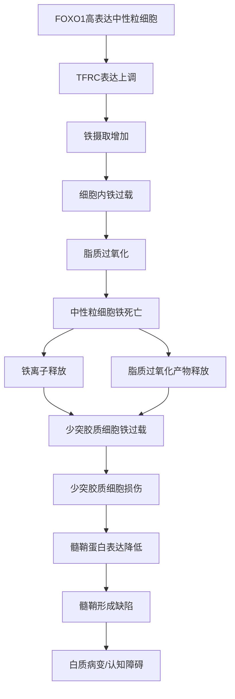
```mermaid
flowchart TD
    A[FOXO1高表达中性粒细胞] --> B[TFRC表达上调]
    B --> C[铁摄取增加]
    C --> D[细胞内铁过载]
    D --> E[脂质过氧化]
    E --> F[中性粒细胞铁死亡]
    F --> G[铁离子释放]
    F --> H[脂质过氧化产物释放]
    G --> I[少突胶质细胞铁过载]
    H --> I
    I --> J[少突胶质细胞损伤]
    J --> K[髓鞘蛋白表达降低]
    K --> L[髓鞘形成缺陷]
    L --> M[白质病变/认知障碍]
```

**髓鞘损伤的功能后果**已通过实验证据得到验证。研究发现，FOXO1high亚群介导的铁代谢紊乱导致**少突胶质细胞髓鞘蛋白表达降低**，这与脑损伤后抑郁症的发生密切相关。临床研究表明TNF-α、IL-1和IL-6等炎症因子在脑损伤后抑郁症患者中显著增加，而这些炎症因子正是FOXO1high亚群在急性期大量释放的效应分子。

**晚期中性粒细胞在少突胶质细胞再生中的支持作用**提示了这一互作的复杂性。在延迟期（第7天）清除中性粒细胞会**损害血管和少突胶质细胞的再生**，导致更严重的脑损伤和髓鞘相关基因及蛋白表达下降[^21]。这一发现看似与FOXO1-TFRC轴的损伤效应矛盾，但可能反映了不同中性粒细胞亚群的差异化功能：

- **FOXO1high亚群**：通过铁死亡机制对少突胶质细胞产生损伤效应
- **Siglec-F+修复亚群**：可能通过促进血管再生、改善局部微环境等机制支持少突胶质细胞存活和髓鞘修复

这种亚群功能的差异化提示，在开发治疗策略时需要**精准区分不同功能亚群**，选择性抑制损伤性亚群（如FOXO1high）同时保护或增强修复性亚群（如Siglec-F+）的功能。

### 4.5 中性粒细胞-血管单元互作与血脑屏障动态调控

中性粒细胞与神经血管单元（内皮细胞、周细胞）之间的互作是决定血脑屏障完整性和脑组织灌注的关键因素。这一互作网络呈现出显著的**时序依赖性双向调控特征**。

**急性期中性粒细胞对血脑屏障的损伤机制**是一个多途径、多层次的病理过程。中性粒细胞通过以下机制加剧血脑屏障破坏：

| 损伤途径 | 效应机制 | 病理后果 |
|---------|---------|---------|
| NETs形成 | 蛋白酶和染色质释放 | 内皮细胞持续破坏 |
| 蛋白酶释放 | NE、MMP-9降解紧密连接和基底膜 | 屏障通透性增加 |
| ROS产生 | 氧化应激损伤内皮细胞 | 内皮功能障碍 |
| 免疫血栓形成 | NETs捕获血细胞形成微血栓 | 微循环障碍加重缺血 |

研究表明，激活的M1型小胶质细胞是MMP-9的重要来源之一[^19]。MMP-9可降解血脑屏障的基底膜成分和紧密连接蛋白，与中性粒细胞释放的蛋白酶**协同破坏血脑屏障**[^18]。清除血管内NETs可减轻对内皮细胞的持续破坏，减少免疫血栓的募集[^22]。

**肥大细胞Mrgprb2-Semaphorin 3a通路**在调控中性粒细胞跨屏障迁移中发挥关键的"守门人"功能。2025年发表于Cell的研究揭示，Mrgprb2引起卒中后脑膜肥大细胞的脱颗粒反应，释放免疫介质，将颅骨骨髓中的中性粒细胞招募至硬脑膜，并通过**切割semaphorin 3a蛋白进一步促进中性粒细胞从硬脑膜向脑组织的迁移**。抑制Mrgprb2可减轻小鼠卒中后的脑部炎症、改善神经功能预后并提高存活率。

**慢性期修复型中性粒细胞对血管再生的促进作用**代表了这一互作的另一面向。Siglec-F+亚群呈现促血管生成表型，可能通过分泌**VEGF等促血管生成因子**参与缺血区域的血管再生过程[^21]。到第7天时，大多数中性粒细胞已经穿过血管壁进入脑实质内部，且其分布位置**更靠近血管**[^21]。这种空间定位特征提示晚期中性粒细胞可能在血管修复和血脑屏障重建过程中发挥积极作用。

**颅骨骨髓作为脑内免疫细胞的近端来源**为理解中性粒细胞-血管单元互作提供了新维度。研究发现，在颅骨骨髓和脑膜之间存在成千上万条微小的"颅骨-脑膜通道"（SMCs），允许颅骨骨髓中的免疫细胞在不经过外周血液循环的情况下，**直接迁移到脑膜**，监视并响应大脑的免疫状态[^23]。这一解剖学发现为开发靶向中性粒细胞迁移的治疗策略提供了新的干预窗口。

### 4.6 旁分泌信号与细胞外基质介导的间接调控网络

除直接细胞接触外，中性粒细胞还通过可溶性介质和细胞外基质成分与CNS细胞形成广泛的**间接调控网络**。这一网络的复杂性体现在多种信号分子的协同作用和级联放大效应。

**关键细胞因子的信号传递网络**是间接调控的核心组成部分。IL-6、TNF-α、IL-1β等促炎细胞因子在中性粒细胞与多种CNS细胞类型之间形成复杂的信号传递网络：

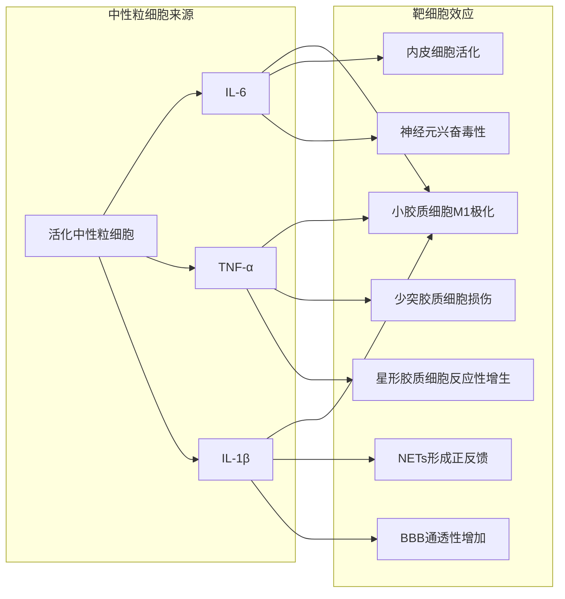
```mermaid
flowchart LR
    subgraph 中性粒细胞来源
        A[活化中性粒细胞] --> B[IL-6]
        A --> C[TNF-α]
        A --> D[IL-1β]
    end
    
    subgraph 靶细胞效应
        B --> E[小胶质细胞M1极化]
        B --> F[内皮细胞活化]
        B --> G[神经元兴奋毒性]
        
        C --> E
        C --> H[少突胶质细胞损伤]
        C --> I[星形胶质细胞反应性增生]
        
        D --> E
        D --> J[NETs形成正反馈]
        D --> K[BBB通透性增加]
    end
```

研究表明，小胶质细胞释放的促炎细胞因子（如TNFα、IL-6）可"激活"循环中的中性粒细胞，触发NETs的释放[^19]。这些NETs又会阻塞微血管，导致继发性血栓形成和扩展的缺血半暗带[^19]。这种正反馈环路是急性期炎症放大的重要机制。

**VCAN（多功能蛋白聚糖）介导的细胞外基质调控**是FOXO1high亚群发挥功能的重要途径。如第二章所述，FOXO1通过转录激活**VCAN基因**，增强中性粒细胞抗凋亡能力并促进IL-6释放。VCAN作为细胞外基质的重要组成部分，可能在以下方面介导中性粒细胞与周围细胞的互作：

- **迁移调控**：VCAN可调节中性粒细胞在组织中的迁移和定位
- **信号传递**：作为细胞因子和生长因子的储库，调控局部信号浓度
- **细胞黏附**：影响中性粒细胞与其他细胞类型的黏附相互作用

**代谢物交换**在中性粒细胞-CNS细胞代谢交流中发挥潜在作用。急性期的代偿性糖酵解加速导致乳酸大量产生和组织酸中毒，这一代谢变化可能影响周围细胞的功能状态。NAD+水平的动态变化与血脑屏障完整性密切相关，研究发现CX43-PARP1-NAD+通路在血脑屏障相关血管细胞功能中发挥重要作用。

**脂质介质**是另一类重要的间接调控分子。中性粒细胞在急性期产生的脂质过氧化产物可能通过旁分泌方式影响周围细胞，参与"糖酵解风暴遭遇脂质风暴"的病理过程。

### 4.7 时序依赖性细胞互作网络的整合模型与功能预测

基于前述各节分析，本节构建中性粒细胞亚群与CNS细胞相互作用的**时序依赖性整合模型**，并预测关键调控节点和潜在治疗靶点。

**急性期互作网络**以促炎损伤为核心特征，形成多个正反馈放大环路：

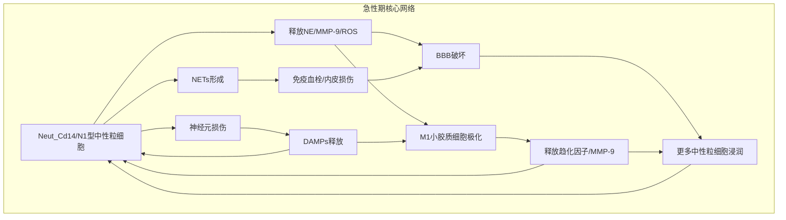
```mermaid
flowchart TD
    subgraph 急性期核心网络
        A[Neut_Cd14/N1型中性粒细胞] --> B[释放NE/MMP-9/ROS]
        B --> C[BBB破坏]
        C --> D[更多中性粒细胞浸润]
        D --> A
        
        B --> E[M1小胶质细胞极化]
        E --> F[释放趋化因子/MMP-9]
        F --> D
        F --> A
        
        A --> G[NETs形成]
        G --> H[免疫血栓/内皮损伤]
        H --> C
        
        A --> I[神经元损伤]
        I --> J[DAMPs释放]
        J --> E
        J --> A
    end
```

**慢性期互作网络**则以修复支持为主导特征：

| 核心互作 | 主要参与者 | 功能效应 |
|---------|-----------|---------|
| 血管修复轴 | Siglec-F+亚群 ↔ 内皮细胞 | VEGF分泌、血管再生 |
| 髓鞘支持轴 | 修复型中性粒细胞 ↔ 少突胶质细胞 | 髓鞘再生、白质修复 |
| 炎症消退轴 | 凋亡中性粒细胞 → M2小胶质细胞 | 胞葬、抗炎因子分泌 |
| 铁代谢紊乱轴 | FOXO1high亚群 → 少突胶质细胞 | 铁死亡、髓鞘损伤（负面效应） |

**关键调控节点的预测**基于网络拓扑分析：

1. **小胶质细胞极化平衡**：作为急性期和慢性期网络的核心枢纽，M1/M2极化状态决定了整体炎症走向
2. **MMP-9活性**：同时受中性粒细胞和小胶质细胞调控，直接影响BBB完整性
3. **CCL5-CCR5轴**：星形胶质细胞-中性粒细胞互作的关键信号，与突触损伤和神经精神并发症密切相关
4. **FOXO1-TFRC轴**：连接中性粒细胞代谢重编程与少突胶质细胞损伤的关键通路

**具有治疗干预潜力的配体-受体对及信号通路**包括：

| 靶点/通路 | 干预策略 | 预期效应 | 适用时相 |
|----------|---------|---------|---------|
| CXCR2 | 抗CXCR2抗体 | 抑制中性粒细胞浸润 | 急性期 |
| PAD4 | PAD4抑制剂 | 阻断NETs形成 | 急性期 |
| TLR4/NF-κB | TLR4拮抗剂 | 抑制促炎反应 | 急性期 |
| CCL5-CCR5 | CCR5拮抗剂 | 减少海马中性粒细胞浸润 | 慢性期 |
| FOXO1 | 选择性抑制剂 | 阻断铁死亡通路 | 慢性期 |
| Mrgprb2 | Mrgprb2抑制剂 | 阻断跨BBB迁移 | 急性期 |

现有药物包括传统抗炎药（如米诺环素）和天然产物（如白藜芦醇、姜黄素），它们通过多靶点调节免疫反应和炎症通路发挥保护作用[^18]。**根据卒中后不同缺血时间和细胞激活状态，动态调控中性粒细胞与CNS细胞的相互作用可能是一种理想的抗炎治疗策略**[^18]。靶向相关信号通路和分子靶点有望改善卒中预后，为开发**时序性、精准免疫治疗**提供新方向[^18]。

综上所述，中性粒细胞亚群与CNS细胞之间形成了复杂的、时序依赖性的相互作用网络。急性期以Neut_Cd14/N1型-M1小胶质细胞促炎环路、中性粒细胞-神经元损伤轴及血脑屏障破坏为核心特征；慢性期则以Siglec-F+亚群-血管修复、中性粒细胞-少突胶质细胞髓鞘支持及凋亡中性粒细胞-M2极化促进为主导。这一整合模型为理解脑缺血病理机制、预测临床结局及开发精准治疗策略提供了细胞互作层面的理论框架。

## 5 细胞互作网络导向不同临床结局的机制与路径分析

基于前四章构建的中性粒细胞双相浸润时空框架、功能谱系演变机制、异质亚群分子特征及细胞互作网络预测模型，本章节将系统阐释这些复杂的细胞互作如何通过调控关键病理生理环节，最终导向差异化的临床结局谱。脑缺血后的临床转归并非单一因素决定，而是由中性粒细胞亚群与中枢神经系统细胞之间形成的多层次、时序依赖性互作网络共同塑造。理解从细胞互作机制到临床结局的因果链条，对于建立精准预后预测模型、识别关键治疗靶点及开发时序特异性干预策略具有重要意义。

### 5.1 神经炎症强度与急性神经功能缺损恶化的关联路径

急性期神经炎症的强度是决定脑缺血早期功能预后的核心因素，而中性粒细胞-小胶质细胞促炎环路的激活程度直接决定了炎症反应的烈度和持续时间。

**中性粒细胞-小胶质细胞促炎环路的级联放大机制**构成了急性期神经炎症的核心驱动力。脑缺血发生后，损伤相关分子模式（DAMPs）的释放触发局部和全身的免疫反应，脑内固有的小胶质细胞在缺血发生后数分钟内即可感知并响应损伤信号，而外源性骨髓来源的中性粒细胞则在数小时至数天内浸润至脑损伤区域[^14]。活化的中性粒细胞通过释放**弹性蛋白酶（NE）、髓过氧化物酶（MPO）及活性氧（ROS）**等毒性介质，直接损伤神经元和胶质细胞，同时激活NLRP3炎症小体，形成并放大促炎微环境。M1型小胶质细胞随后释放更多促炎细胞因子（如TNF-α、IL-6），这些细胞因子又能"激活"循环中的中性粒细胞，触发中性粒细胞胞外陷阱（NETs）的释放，形成**炎症正反馈放大环路**[^24]。

**NETs在急性期炎症放大中的关键作用**已得到充分阐明。NETs的主要成分包括DNA支架和多种有害蛋白，其释放的蛋白酶和染色质可加剧神经毒性和炎症级联反应。更重要的是，网状DNA可充当微血栓骨架，捕获其他血细胞形成免疫血栓，进一步加重缺血再灌注损伤。研究证实，NETs在介导溶栓耐药、加剧缺血再灌注损伤、诱导出血转化和复发方面发挥着不可或缺的作用。

**中性粒细胞与淋巴细胞比值（NLR）作为炎症强度的系统性标志物**，已被证实与急性期功能预后存在强烈关联。对817例急性缺血性卒中患者的回顾性队列研究显示，NLR水平与患者出院时的功能状态显著相关——预后不良组（mRS>2）的NLR中位数高达4.53，显著高于良好预后组的2.62[^25]。经多因素回归分析调整混杂因素后，**NLR仍保持独立预测价值（OR=1.092，95%CI 1.006-1.185，p=0.036）**，提示系统性炎症反应可能通过影响脑缺血再灌注损伤的进程，导致功能恢复受限[^25]。

以下表格系统总结了神经炎症强度与急性功能结局的关联证据：

| 炎症指标 | 临床关联 | 机制解释 | 证据强度 |
|---------|---------|---------|---------|
| NLR升高 | mRS>2风险增加（OR=1.092） | 系统性炎症影响再灌注损伤进程 | 高（多因素回归验证）[^25] |
| NLR>3.66 | 颅内出血风险增加近3倍 | 炎症介导血脑屏障破坏 | 高[^25] |
| 高NLR | 院内死亡率显著升高 | 多器官功能衰竭及继发感染风险增加 | 高[^25] |
| NLR与NIHSS | 正向相关（r=0.298，p<0.001） | 炎症强度与神经功能缺损程度平行 | 高[^25] |

研究机制分析指出，中性粒细胞浸润可释放基质金属蛋白酶-9（MMP-9）等炎症因子，导致血脑屏障破坏和神经细胞凋亡。而淋巴细胞通过分泌抗炎细胞因子（如IL-10）和促进神经修复，其相对减少（NLR升高）可能加剧再灌注损伤[^25]。这种动态平衡的打破直接体现在NLR与NIHSS评分的正向相关性。

**N1型中性粒细胞主导的炎症网络**通过以下路径导致急性功能缺损恶化：

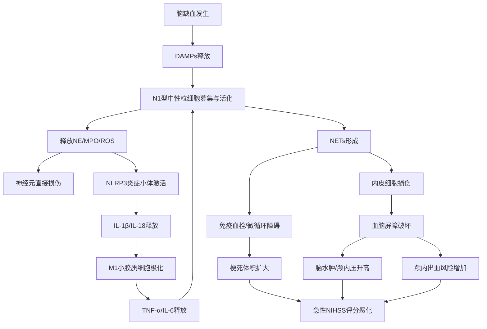
```mermaid
flowchart TD
    A[脑缺血发生] --> B[DAMPs释放]
    B --> C[N1型中性粒细胞募集与活化]
    C --> D[释放NE/MPO/ROS]
    D --> E[神经元直接损伤]
    D --> F[NLRP3炎症小体激活]
    F --> G[IL-1β/IL-18释放]
    G --> H[M1小胶质细胞极化]
    H --> I[TNF-α/IL-6释放]
    I --> C
    C --> J[NETs形成]
    J --> K[免疫血栓/微循环障碍]
    K --> L[梗死体积扩大]
    J --> M[内皮细胞损伤]
    M --> N[血脑屏障破坏]
    N --> O[脑水肿/颅内压升高]
    L --> P[急性NIHSS评分恶化]
    O --> P
    N --> Q[颅内出血风险增加]
    Q --> P
```

### 5.2 氧化应激-铁死亡轴与神经元损伤级联的机制网络

氧化应激与铁死亡之间的因果级联是脑缺血后神经元不可逆损伤的关键病理机制，中性粒细胞在这一过程中扮演着重要的驱动角色。

**中性粒细胞ROS爆发与脂质过氧化的触发机制**构成了铁死亡级联的起始环节。脑缺血再灌注过程中，中性粒细胞发生呼吸暴发（respiratory burst），通过NADPH氧化酶系统产生大量超氧阴离子（O₂⁻）、过氧化氢（H₂O₂）和羟自由基（·OH）等活性氧物质[^26]。这些过量的ROS可诱导脑组织中细胞膜及细胞器膜的脂质过氧化，导致DNA、RNA等大分子交联失活。研究表明，在脑卒中小鼠模型中，Fe²⁺的水平会明显上升，且转铁蛋白的含量也会增加[^26]。脑缺血再灌注损伤产生过量的ROS与不稳定Fe²⁺通过**Fenton反应**引起脂质过氧化，促进铁死亡加重脑损伤[^26]。

**铁死亡的核心病理特征**已在脑缺血再灌注损伤模型中得到系统描述。铁死亡在形态学上主要表现为线粒体体积缩小、膜密度增加、线粒体嵴减少或消失、线粒体外膜破裂，而细胞核保持正常；其特征主要为**铁的积累、氨基酸代谢异常以及脂质过氧化物增多**[^26]。Fe²⁺的过量累积及谷胱甘肽过氧化物酶4（GPX4）作用减弱是铁死亡发生的初始信号，脂质过氧化的发生是铁死亡的中间环节，细胞膜及细胞器膜的破坏是铁死亡发生的主要结果[^26]。

**FOXO1-TFRC轴介导的铁稳态失衡**将中性粒细胞代谢重编程与神经元/少突胶质细胞损伤直接联系起来。如前述章节所述，FOXO1高表达的中性粒细胞在慢性期通过"FOXO1-TFRC"轴破坏铁稳态，诱导中性粒细胞铁死亡。TFRC（转铁蛋白受体）是细胞摄取铁的关键分子，其表达上调导致中性粒细胞内铁过载，触发脂质过氧化和铁死亡程序。铁死亡的中性粒细胞释放的铁离子和脂质过氧化产物对周围神经元和少突胶质细胞产生**继发性损伤效应**。

**急性期"糖酵解风暴遭遇脂质风暴"的代谢互作模型**为理解氧化应激-铁死亡级联提供了代谢层面的解释框架。研究表明，急性期的代偿性糖酵解加速与酶促脂质过氧化"风暴"相互碰撞，共同点燃神经炎症和早期神经功能缺损[^27]。由脑动脉闭塞引起的急性缺血性中风导致严重的继发性脑损伤，而氧化应激诱导的神经元铁死亡在该过程中发挥重要作用[^27]。

以下流程图展示了氧化应激-铁死亡轴的完整级联路径：

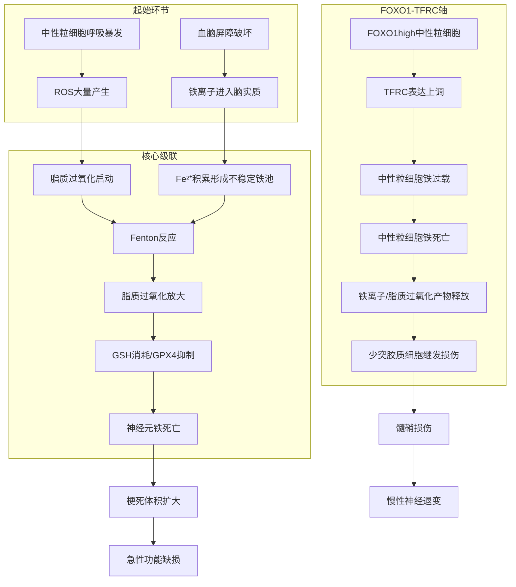
```mermaid
flowchart TD
    subgraph 起始环节
        A[中性粒细胞呼吸暴发] --> B[ROS大量产生]
        C[血脑屏障破坏] --> D[铁离子进入脑实质]
    end
    
    subgraph 核心级联
        B --> E[脂质过氧化启动]
        D --> F[Fe²⁺积累形成不稳定铁池]
        E --> G[Fenton反应]
        F --> G
        G --> H[脂质过氧化放大]
        H --> I[GSH消耗/GPX4抑制]
        I --> J[神经元铁死亡]
    end
    
    subgraph FOXO1-TFRC轴
        K[FOXO1high中性粒细胞] --> L[TFRC表达上调]
        L --> M[中性粒细胞铁过载]
        M --> N[中性粒细胞铁死亡]
        N --> O[铁离子/脂质过氧化产物释放]
        O --> P[少突胶质细胞继发损伤]
    end
    
    J --> Q[梗死体积扩大]
    P --> R[髓鞘损伤]
    Q --> S[急性功能缺损]
    R --> T[慢性神经退变]
```

**干预铁死亡对神经系统的保护作用**已在多项研究中得到验证。电针通过调节铁代谢和氧化应激、抑制铁死亡，可有效缓解脑缺血再灌注损伤[^28]。研究人员开发的ROS响应型病灶靶向载艾地苯醌（Idebenone）聚合物胶束，可以增加多效性治疗药物在缺血半暗带的蓄积，进而抑制神经元铁死亡及胶质细胞的过度激活，系统调控病灶微环境[^27]。这些证据表明，**铁死亡通路是影响神经功能恢复的关键环节，干预铁死亡可缩小梗死体积并改善预后**。

### 5.3 血脑屏障动态调控与疾病进展转归的双向影响

血脑屏障（BBB）的完整性是维持中枢神经系统内环境稳态的关键，其动态变化与脑缺血的疾病进展和转归存在密切的双向调控关系。

**中性粒细胞对血脑屏障的多途径破坏机制**是急性期病理进展的核心环节。研究表明，血脑屏障主要由血管内皮细胞、基底膜、周细胞和星形胶质细胞组成，它们共同构成神经血管单元，有助于维持其功能性[^29]。中性粒细胞通过以下机制加剧血脑屏障损伤：

| 损伤机制 | 效应分子/过程 | 病理后果 |
|---------|--------------|---------|
| NETs形成 | DNA支架、组蛋白、蛋白酶释放 | 内皮细胞持续破坏、免疫血栓形成 |
| 蛋白酶释放 | MMP-9降解紧密连接蛋白和基底膜 | 屏障通透性增加 |
| 氧化应激 | ROS损伤内皮细胞 | 内皮功能障碍 |
| 炎症因子 | TNF-α、IL-1β诱导内皮活化 | 黏附分子表达增加、通透性升高 |

研究证实，中性粒细胞是首个通过血脑屏障从循环血液中进入病变部位的免疫细胞，也是在神经炎症中发挥主要功能的免疫细胞之一[^24]。血脑屏障的破坏容易导致中枢神经系统的退行性改变，这被认为是多种神经退行性疾病的基础[^29]。它的破裂会导致离子的失调和免疫细胞进入中枢神经系统，导致神经元损伤[^29]。

**中性粒细胞浸润-屏障破坏-炎症放大的正反馈环路**是急性期病理恶化的重要机制。血脑屏障的渗透性可能会增强外周免疫细胞和毒素进入大脑。微胶质细胞被激活可能对大脑产生负面影响，导致一氧化氮、细胞因子和活性氧自由基的产生，进而导致脑中易受损区域的细胞死亡。这些产物本身就会进一步增加血脑屏障的渗透性，从而导致**脑功能和损伤不断增加的恶性循环**[^29]。

**Mrgprb2-Semaphorin 3a通路**在调控中性粒细胞跨屏障迁移中发挥关键的"守门人"功能。如前章所述，Mrgprb2引起卒中后脑膜肥大细胞的脱颗粒反应，释放免疫介质，将颅骨骨髓中的中性粒细胞招募至硬脑膜，并通过切割semaphorin 3a蛋白进一步促进中性粒细胞从硬脑膜向脑组织的迁移。**抑制Mrgprb2可减轻小鼠卒中后的脑部炎症、改善神经功能预后并提高存活率**。

**慢性期修复型中性粒细胞亚群对血管再生的促进作用**代表了血脑屏障调控的另一面向。Siglec-F+亚群呈现促血管生成表型，可能通过分泌VEGF等促血管生成因子参与缺血区域的血管再生过程。研究显示，在延迟期（第7天）清除中性粒细胞会损害血管和少突胶质细胞的再生，这一发现提示修复型中性粒细胞在血脑屏障重建中发挥积极作用。

**颅骨骨髓作为脑内免疫细胞的近端来源**为血脑屏障调控提供了新的解剖学视角。研究发现，在颅骨骨髓和脑膜之间存在成千上万条微小的"颅骨-脑膜通道"（SMCs），允许颅骨骨髓中的免疫细胞在不经过外周血液循环的情况下，直接迁移到脑膜，监视并响应大脑的免疫状态[^23]。在稳态条件下，头骨骨髓每小时可向脑膜输送约5000个单核细胞和中性粒细胞；而当脑部发生炎症或缺血时，这一输送速度可在30分钟内提升3倍[^30]。这一发现为开发靶向中性粒细胞迁移的治疗策略提供了新的干预窗口。

### 5.4 髓鞘损伤-修复失衡与慢性神经退行性变的路径

髓鞘的完整性对于神经信号传导效率至关重要，中性粒细胞亚群与少突胶质细胞之间的互作动态平衡决定了慢性期白质病变的进展程度。

**FOXO1high中性粒细胞亚群对少突胶质细胞的继发性损伤机制**是髓鞘损伤的核心通路。如前述章节详细阐述，FOXO1高表达的中性粒细胞通过"FOXO1-TFRC"轴破坏铁稳态，诱导中性粒细胞铁死亡，进而导致**少突胶质细胞髓鞘蛋白表达降低**。这一机制与脑损伤后抑郁症的发生密切相关，临床研究表明TNF-α、IL-1和IL-6等炎症因子在脑损伤后抑郁症患者中显著增加。

铁死亡的中性粒细胞释放的铁离子和脂质过氧化产物对周围少突胶质细胞产生级联损伤效应：

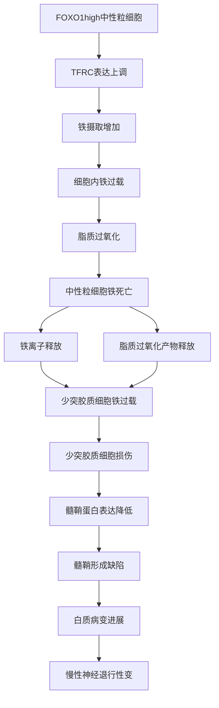
```mermaid
flowchart TD
    A[FOXO1high中性粒细胞] --> B[TFRC表达上调]
    B --> C[铁摄取增加]
    C --> D[细胞内铁过载]
    D --> E[脂质过氧化]
    E --> F[中性粒细胞铁死亡]
    F --> G[铁离子释放]
    F --> H[脂质过氧化产物释放]
    G --> I[少突胶质细胞铁过载]
    H --> I
    I --> J[少突胶质细胞损伤]
    J --> K[髓鞘蛋白表达降低]
    K --> L[髓鞘形成缺陷]
    L --> M[白质病变进展]
    M --> N[慢性神经退行性变]
```

**Siglec-F+修复型亚群在少突胶质细胞再生中的支持作用**提示了髓鞘修复的潜在机制。功能验证实验提供了关键证据：**在延迟期（第7天）清除中性粒细胞会损害血管和少突胶质细胞的再生**，导致焦虑相关行为异常加重以及髓鞘形成缺陷。具体而言，晚期清除中性粒细胞虽不影响多动行为，却明显加重了焦虑样行为异常，并导致更严重的脑损伤和髓鞘相关基因及蛋白表达下降。这一发现表明，慢性期中性粒细胞在**少突胶质细胞再生和髓鞘形成**中发挥不可或缺的支持作用。

**髓鞘损伤-修复动态平衡**受到多种因素调控，其失衡程度决定了慢性期神经退行性变的进展速度。脑缺血后突触可塑性与神经胶质细胞相互调控在神经修复中发挥重要作用[^31]。小胶质细胞可调节突触可塑性，调节神经的发育和稳定，促进神经功能修复，协调突触形成和最终促进记忆形成[^31]。然而，脑缺血过程中，小胶质细胞的过度活化和增生会干预突触可塑性和神经递质的传达，释放神经毒性物质损伤神经细胞[^31]。

### 5.5 突触可塑性受损与认知功能障碍的细胞互作基础

突触可塑性是神经元的基本功能，其受损是脑缺血后认知功能障碍的核心病理基础。中性粒细胞与星形胶质细胞、小胶质细胞之间的复杂互作网络共同决定了突触损伤的程度和范围。

**星形胶质细胞CCL5-CCR5轴驱动的中性粒细胞海马浸润机制**是突触损伤的关键上游信号。研究揭示，慢性应激条件下，**海马区星形胶质细胞来源的CCL5表达显著增多**，而小胶质细胞或神经元来源的CCL5表达并不增多。这种细胞类型特异性的CCL5表达提示星形胶质细胞在特定病理条件下成为中性粒细胞趋化的主要驱动者。中性粒细胞表达显著增多的趋化因子受体为CCR5，CCL5-CCR5信号轴的激活导致中性粒细胞特异性地向海马脑区浸润，而在皮层、中脑、丘脑、下丘脑、小脑等区域未见类似变化。

**中性粒细胞对突触的直接吞噬作用**是这一互作网络导致认知功能损伤的核心效应机制。单细胞测序实验发现，抑郁症患者血液中性粒细胞活化、吞噬作用和趋化性相关信号通路增强。免疫荧光实验进一步证实，**Ly6G标记的中性粒细胞可吞噬兴奋性突触后标志物PSD95**。这一发现首次在分子水平揭示了中性粒细胞对突触结构的直接破坏作用。

中性粒细胞介导的突触损伤产生了一系列级联效应：

| 损伤类型 | 具体表现 | 干预效果 |
|---------|---------|---------|
| 突触蛋白表达 | 慢性应激显著降低海马突触蛋白表达 | 抗Ly6G抗体消耗中性粒细胞后显著增加 |
| 树突棘密度 | 中性粒细胞浸润导致树突棘密度降低 | 敲低星形胶质细胞CCL5后可增加 |
| 兴奋性突触后电流 | 中性粒细胞吞噬突触导致电流减弱 | 抑制CCR5可增强 |

**小胶质细胞过度激活通过补体系统介导的突触修剪**加剧了认知障碍的协同作用网络。研究表明，中性粒细胞释放的炎症因子（如IL-1α、TNF-α、C1q）可驱动小胶质细胞/星形胶质细胞过度活化，活化的胶质细胞异常吞噬尚存功能的突触，导致突触网络破坏[^32]。临床数据显示，卒中后每小时损失2.3亿突触，相当于加速衰老8.7小时[^32]。每例脑卒中患者约损失1.2亿神经元和8.3万亿突触，相当于加速衰老36年[^32]。

**功能验证实验**提供了这一互作网络与行为学结局之间因果关系的关键证据。在CSDS（慢性挫败社交应激）应激过程中，使用抗Ly6G抗体消耗中性粒细胞后，显著减少小鼠在悬尾实验和强迫游泳实验中的不动时间，增加社会接触时间和糖水消耗行为，表明**改善抑郁样行为**。更重要的是，海马脑区注射抗Ly6G抗体后也能显著改善慢性应激诱发的抑郁样行为，而内侧前额叶皮层注射抗Ly6G抗体并不发挥类似的抗抑郁作用。

### 5.6 神经免疫-情绪调控轴与卒中后抑郁的发生机制

卒中后抑郁（Post-Stroke Depression, PSD）是脑缺血最常见的神经精神并发症之一，中性粒细胞介导的神经炎症和铁代谢紊乱在其发生发展中扮演关键角色。

**促炎因子与卒中后抑郁的临床关联证据**已得到多项研究支持。临床研究表明，**TNF-α、IL-1和IL-6等炎症因子在脑损伤后抑郁症患者中显著增加**。这些炎症因子正是活化的中性粒细胞在急性期大量释放的效应分子。持续的神经炎症反应可能通过影响神经递质代谢、下丘脑-垂体-肾上腺轴功能及神经可塑性，参与抑郁症状的发生。

**FOXO1-TFRC轴介导的铁代谢紊乱与情绪调控神经环路损伤**的关联已在机制层面得到阐明。FOXO1高表达的中性粒细胞通过"FOXO1-TFRC"轴破坏铁稳态，诱导中性粒细胞铁死亡，进而导致**少突胶质细胞髓鞘蛋白表达降低**。髓鞘完整性对于情绪调控相关神经环路（如前额叶-边缘系统连接）的正常功能至关重要，髓鞘损伤可能导致这些环路的信号传导效率下降，从而参与抑郁症状的发生。

**海马区中性粒细胞浸润的双重损伤机制**为理解卒中后抑郁提供了细胞互作层面的解释：

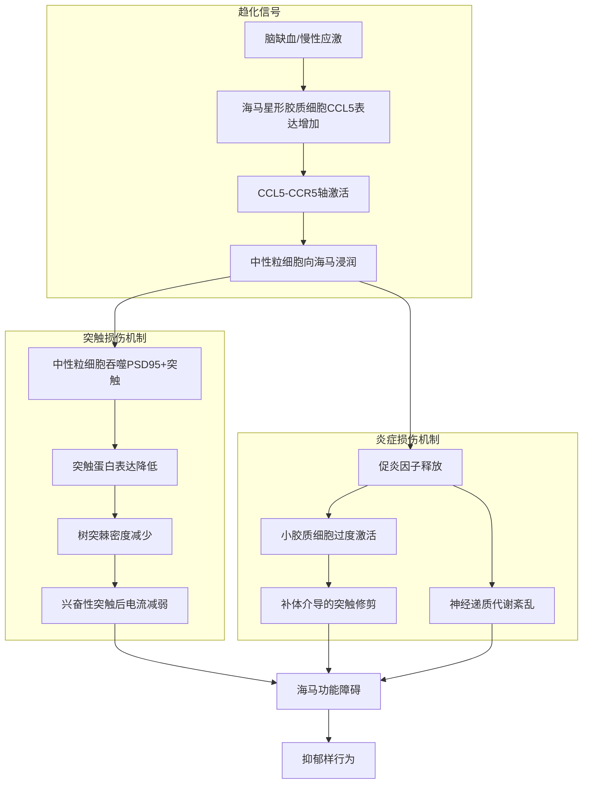
```mermaid
flowchart TD
    subgraph 趋化信号
        A[脑缺血/慢性应激] --> B[海马星形胶质细胞CCL5表达增加]
        B --> C[CCL5-CCR5轴激活]
        C --> D[中性粒细胞向海马浸润]
    end
    
    subgraph 突触损伤机制
        D --> E[中性粒细胞吞噬PSD95+突触]
        E --> F[突触蛋白表达降低]
        F --> G[树突棘密度减少]
        G --> H[兴奋性突触后电流减弱]
    end
    
    subgraph 炎症损伤机制
        D --> I[促炎因子释放]
        I --> J[小胶质细胞过度激活]
        J --> K[补体介导的突触修剪]
        I --> L[神经递质代谢紊乱]
    end
    
    H --> M[海马功能障碍]
    K --> M
    L --> M
    M --> N[抑郁样行为]
```

**功能验证实验**证实了这一机制路径的因果关系。特异性敲除星形胶质细胞CCL5后可显著减少小鼠大脑中性粒细胞的浸润，并能显著改善抑郁样行为；相比之下，敲除小胶质细胞CCL5并不发挥类似抗抑郁作用。CCR5拮抗剂也可显著改善慢性应激诱发的抑郁样行为。这些证据共同表明，**CCL5-CCR5轴是星形胶质细胞-中性粒细胞互作导致突触损伤和神经精神并发症的关键治疗靶点**。

### 5.7 细胞互作网络-临床结局的整合预测模型与关键节点

基于前述各节分析，本节构建中性粒细胞亚群-CNS细胞互作网络与多维临床结局谱之间的**整合因果模型**，识别具有预后预测价值的关键调控节点，并提出基于细胞互作网络特征的患者分层策略。

**细胞互作网络-临床结局的整合因果模型**揭示了从分子机制到临床表现的完整路径：

| 互作网络模块 | 核心机制 | 关键调控节点 | 导向的临床结局 |
|-------------|---------|-------------|---------------|
| 神经炎症放大环路 | N1中性粒细胞-M1小胶质细胞正反馈 | NLR、NLRP3、NETs | 急性NIHSS恶化、梗死扩大、颅内出血 |
| 氧化应激-铁死亡轴 | ROS爆发-脂质过氧化-GPX4抑制 | 铁死亡通路、GPX4 | 神经元不可逆死亡、功能恢复受限 |
| 血脑屏障破坏环路 | NETs-MMP-9-紧密连接降解 | MMP-9、Mrgprb2 | 脑水肿、出血转化、死亡风险 |
| 髓鞘损伤-修复失衡 | FOXO1-TFRC轴-少突胶质细胞损伤 | FOXO1、铁稳态 | 白质病变、慢性神经退变 |
| 突触可塑性损伤 | CCL5-CCR5轴-突触吞噬 | CCL5-CCR5、补体C1q | 认知功能障碍 |
| 神经免疫-情绪轴 | 炎症因子-神经递质-髓鞘损伤 | TNF-α、IL-6、海马浸润 | 卒中后抑郁 |

**具有预后预测价值的关键调控节点**已通过临床研究得到验证：

1. **中性粒细胞与淋巴细胞比值（NLR）**：作为连接外周中性粒细胞反应与脑内损伤的关键桥梁，NLR是急性缺血性卒中患者不良短期功能结局（mRS>2）、死亡及颅内出血风险的强效独立预测指标[^25]。NLR与基线NIHSS评分联用可提升预后预测效能（AUC=0.849）[^25]。

2. **NETs形成水平**：NETs作为多效性损伤放大器，其形成与更严重的神经损伤、出血转化风险增加相关。抑制NETs形成具有神经保护作用。

3. **MMP-9活性**：作为血脑屏障破坏的核心效应分子，MMP-9水平与屏障通透性和预后密切相关。

4. **铁死亡通路标志物**：GPX4、ACSL4等铁死亡相关分子可能成为评估神经元损伤程度的生物标志物。

**基于细胞互作网络特征的患者分层策略**可指导个体化治疗决策：

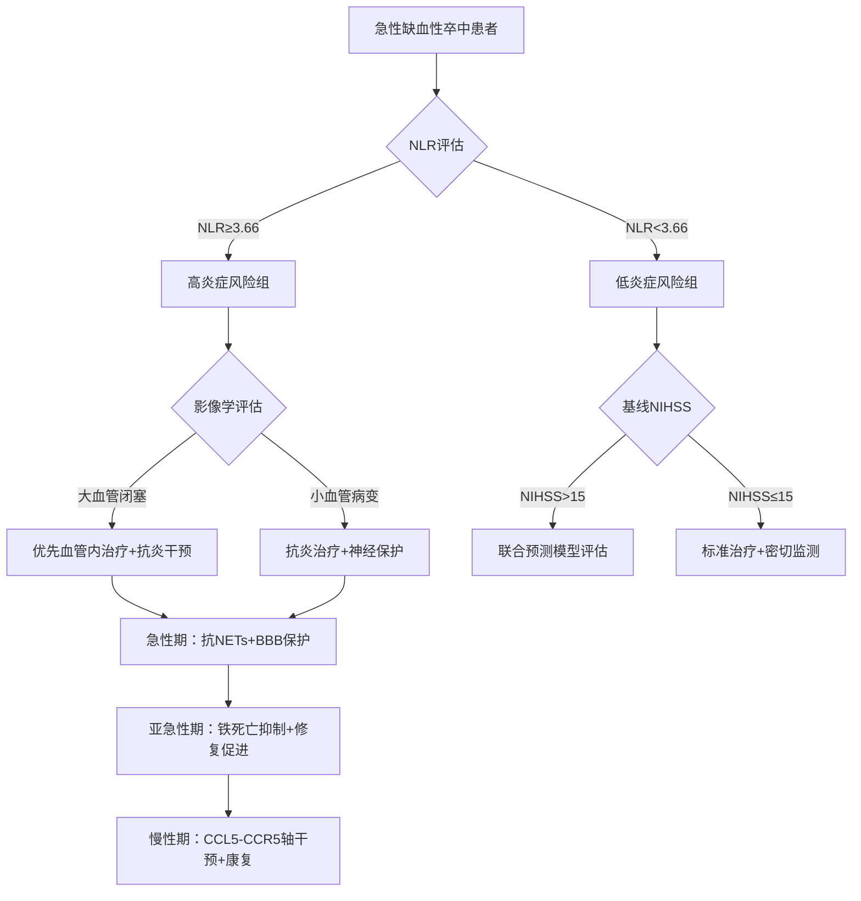
```mermaid
flowchart TD
    A[急性缺血性卒中患者] --> B{NLR评估}
    B -->|NLR≥3.66| C[高炎症风险组]
    B -->|NLR<3.66| D[低炎症风险组]
    
    C --> E{影像学评估}
    E -->|大血管闭塞| F[优先血管内治疗+抗炎干预]
    E -->|小血管病变| G[抗炎治疗+神经保护]
    
    D --> H{基线NIHSS}
    H -->|NIHSS>15| I[联合预测模型评估]
    H -->|NIHSS≤15| J[标准治疗+密切监测]
    
    F --> K[急性期：抗NETs+BBB保护]
    G --> K
    K --> L[亚急性期：铁死亡抑制+修复促进]
    L --> M[慢性期：CCL5-CCR5轴干预+康复]
```

**时序特异性治疗干预窗口**的识别对于优化治疗策略至关重要：

| 病理阶段 | 时间窗口 | 主导互作网络 | 优先干预靶点 | 预期效应 |
|---------|---------|-------------|-------------|---------|
| 超急性期 | <6小时 | 中性粒细胞募集启动 | Mrgprb2、CXCR2 | 减少浸润、缩小梗死 |
| 急性期 | 6小时-3天 | 炎症放大环路 | NETs（PAD4/DNase I）、NF-κB | 抑制炎症、保护BBB |
| 亚急性期 | 3天-2周 | 氧化应激-铁死亡 | GPX4激活剂、铁螯合剂 | 减少神经元死亡 |
| 慢性期 | >2周 | 修复-损伤平衡 | CCL5-CCR5、FOXO1 | 促进修复、预防并发症 |

综上所述，中性粒细胞亚群与CNS细胞之间的多层次互作网络通过调控神经炎症、氧化应激-铁死亡、血脑屏障完整性、髓鞘修复及突触可塑性等关键病理生理环节，最终导向急性神经功能缺损恶化、慢性神经退行性变、认知障碍及卒中后抑郁等差异化的临床结局谱。**NLR、NETs、MMP-9、铁死亡通路及CCL5-CCR5轴**是导向不良临床结局的关键调控节点。基于这些节点的精准预测和时序特异性干预，有望实现脑缺血患者的个体化治疗和预后改善。

## 6 研究局限、挑战与未来工作方向展望

脑缺血进程中中性粒细胞功能异质性的研究在过去几年取得了突破性进展，从双相浸润时空框架的建立、功能谱系演变机制的阐明，到异质亚群的多组学鉴定及细胞互作网络的预测，这一领域已形成较为系统的知识体系。然而，正如任何快速发展的研究领域一样，新发现在解答既有问题的同时也揭示了更多的认知空白与方法学挑战。本章节将系统梳理当前研究的核心局限，深入剖析从基础发现向临床转化过程中面临的多重障碍，并基于前述研究成果提出未来需优先推进的研究方向与策略建议，为推动该领域的持续发展提供路线图。

### 6.1 当前研究的认知空白与核心局限

尽管近年来的研究极大地丰富了对中性粒细胞在脑缺血中作用的认识，但多个关键科学问题仍悬而未决，现有研究在深度、广度和标准化程度方面存在显著不足。

**中性粒细胞亚群功能机制的认知空白**是制约领域发展的首要问题。虽然单细胞测序技术已成功鉴定出Neut_Cd14、FOXO1high、Siglec-F+等功能亚群，但这些亚群在脑缺血不同阶段发挥差异化功能的**完整分子机制尚未完全阐明**。例如，Siglec-F+亚群被认为具有促血管生成功能，但其分泌VEGF等促血管生成因子的具体信号通路、与内皮细胞相互作用的分子基础仍缺乏系统研究。同样，FOXO1-TFRC轴如何在时间维度上从急性期的抗凋亡保护作用转变为慢性期的铁死亡诱导作用，其中涉及的上游调控信号和下游效应网络仍有待深入解析。

**时序转换调控网络的关键节点识别不足**限制了精准干预策略的开发。中性粒细胞从促炎损伤表型向促修复表型的转换是一个连续的动态过程，但驱动这一转换的**关键"开关"分子或信号事件**尚未被明确识别。现有研究多聚焦于描述不同时间点的表型差异，而对转换过程中的中间状态、触发因素及调控层级的认识仍然有限。这种认知空白直接影响了时序特异性治疗窗口的精准界定。

**细胞互作因果关系的验证深度不够**是另一核心局限。第四章构建的中性粒细胞-CNS细胞互作网络主要基于单细胞测序数据的生物信息学预测和文献整合，**大部分预测的配体-受体对及信号通路尚未通过功能实验进行因果验证**。例如，中性粒细胞对小胶质细胞M1/M2极化的调控作用虽有间接证据支持，但缺乏利用条件性敲除或化学遗传学工具进行的直接功能验证。

**亚群定义标准化的缺失**严重阻碍了跨研究比较和知识整合。2025年发表于《Immunity》的观点性文章明确指出，由于缺乏统一的命名体系，现有研究对中性粒细胞亚群的界定常出现**重叠、矛盾甚至模糊不清**的情况[^14]。不同研究团队使用不同的标志物组合和分析策略定义亚群，导致"N1/N2"、"促炎/抗炎"、"成熟/未成熟"等分类体系之间难以对应，既妨碍了不同研究间的横向比较，也限制了对其生物学本质的深入认知。

**临床样本验证的广度和深度不足**制约了基础发现的转化价值。多数关键发现（如Neut_Cd14亚群、双相浸润模式）主要来源于小鼠模型研究，在人类脑缺血患者中的验证仍然有限[^14]。即使有临床样本研究，也多局限于外周血检测，对脑组织或脑脊液中中性粒细胞亚群的直接分析因取材困难而极为稀少。

以下表格系统总结了当前研究的主要认知空白：

| 认知空白领域 | 具体问题 | 影响 |
|-------------|---------|------|
| 亚群功能机制 | Siglec-F+促血管生成、FOXO1时序转换的完整分子通路不明 | 靶向治疗策略缺乏分子基础 |
| 时序调控网络 | 表型转换的关键"开关"分子未识别 | 干预时间窗难以精准界定 |
| 互作因果关系 | 大部分预测的配体-受体对缺乏功能验证 | 治疗靶点优先级难以确定 |
| 标准化定义 | 亚群命名体系混乱、标志物组合无共识 | 跨研究比较和知识整合受阻 |
| 临床验证 | 人类样本研究有限、脑组织直接分析稀少 | 基础发现转化价值待验证 |

### 6.2 动物模型到人体研究的转化鸿沟

从啮齿类动物模型向人类疾病的转化是脑缺血免疫研究面临的根本性挑战，种属差异、模型局限及临床复杂性共同构成了难以逾越的转化鸿沟。

**啮齿类与人类中性粒细胞的种属差异**是转化研究的首要障碍。虽然小鼠和人类中性粒细胞在基本功能上具有相似性，但在**表面标志物表达谱、寿命特征、亚群组成及功能响应模式**等方面存在显著差异。例如，小鼠中性粒细胞的Ly6G标志物在人类中没有直接对应物；人类中性粒细胞的循环寿命（约5.4天）远长于小鼠（约12.5小时），这种寿命差异可能导致两者在脑缺血后的功能动态存在本质不同。此外，人类中性粒细胞亚群的多样性可能比小鼠更为复杂，现有在小鼠中鉴定的亚群（如Neut_Cd14）是否在人类中存在功能对应物仍需系统验证[^14]。

**脑缺血模型的病理生理局限**进一步加剧了转化困难。大脑中动脉闭塞（MCAO）模型是研究缺血性卒中最常用的动物模型，但其与人类卒中存在多方面差异[^33]。首先，**模型通常使用年轻、健康的动物**，而人类卒中患者多为老年人，常伴有高血压、糖尿病、动脉粥样硬化等多种合并症。亚美尼亚研究显示，84.6%的老年卒中患者合并高血压，53.8%伴房颤，51.9%患瓣膜性心脏病[^33]。这些合并症对中性粒细胞功能和免疫微环境的影响在标准动物模型中无法体现。其次，**模型的缺血-再灌注时间高度可控**，而人类卒中的发病时间、就诊延迟和再灌注时机存在巨大个体差异。中国卒中医疗质量评估研究显示，仅21.3%的患者能在3小时内到达医院，接受溶栓率不足1.9%[^33]。

**性别和年龄因素的系统性忽视**是现有研究的另一重要局限。大多数动物研究使用年轻雄性小鼠，而临床数据显示老年患者和女性患者的卒中特征和预后存在显著差异。80岁以上高龄卒中患者占比持续上升，该群体具有独特的病理生理特征，包括更高的合并症负担、更差的功能恢复能力以及更高的姑息治疗需求[^33]。这些因素在标准动物模型中几乎完全缺失。

**免疫反应时序的种属差异**可能导致治疗时间窗的错误推断。小鼠中性粒细胞浸润的双相高峰（第1天和第7天）是否在人类中以相同的时间尺度出现尚不确定[^4]。人类更长的中性粒细胞寿命和更复杂的免疫调控网络可能导致浸润动力学和功能转换的时序特征与小鼠存在显著差异。这种差异对于确定临床干预的最佳时机具有关键意义。

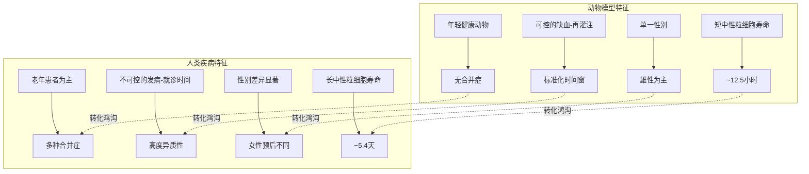
```mermaid
flowchart TD
    subgraph 动物模型特征
        A[年轻健康动物] --> B[无合并症]
        C[可控的缺血-再灌注] --> D[标准化时间窗]
        E[单一性别] --> F[雄性为主]
        G[短中性粒细胞寿命] --> H[~12.5小时]
    end
    
    subgraph 人类疾病特征
        I[老年患者为主] --> J[多种合并症]
        K[不可控的发病-就诊时间] --> L[高度异质性]
        M[性别差异显著] --> N[女性预后不同]
        O[长中性粒细胞寿命] --> P[~5.4天]
    end
    
    B -.->|转化鸿沟| J
    D -.->|转化鸿沟| L
    F -.->|转化鸿沟| N
    H -.->|转化鸿沟| P
```

**缩小转化鸿沟的策略思路**需要多管齐下。首先，应开发更接近人类疾病特征的**老年动物模型和合并症模型**，如自发性高血压大鼠或糖尿病小鼠的脑缺血模型。其次，应加强**非人灵长类动物研究**，其免疫系统与人类更为接近。第三，应推动**人类样本的系统性收集和分析**，包括外周血纵向采样、脑脊液分析以及尸检脑组织研究。最后，应建立**人类脑缺血类器官或芯片模型**，在体外重建人类神经血管单元和免疫微环境。

### 6.3 相关性发现向因果机制验证的方法学挑战

单细胞测序和生物信息学分析的快速发展为中性粒细胞异质性研究提供了前所未有的分辨率，但从相关性发现走向因果机制验证仍面临多重技术瓶颈。

**体内功能验证工具的缺乏**是制约因果研究的首要障碍。当前研究主要依赖抗Ly6G抗体进行中性粒细胞整体清除，但这种方法**无法区分不同功能亚群**，可能同时消除损伤性和保护性亚群[^4]。如前述章节所示，急性期清除中性粒细胞可减轻损伤，而延迟期清除则损害修复，这种时序依赖性效应强调了亚群特异性干预的必要性[^4]。然而，目前缺乏能够选择性靶向特定亚群（如Neut_Cd14、FOXO1high或Siglec-F+）的遗传学或药理学工具。

**时序特异性干预手段的有限性**进一步增加了功能验证的难度。理想的因果验证需要在精确的时间窗口内选择性操纵特定细胞亚群或信号通路，但现有技术手段难以实现这种精度。诱导型基因敲除系统（如他莫昔芬诱导的Cre-loxP系统）虽然提供了时间控制的可能，但其**诱导效率、渗漏表达和组织特异性**等问题限制了其在快速动态变化的脑缺血模型中的应用。化学遗传学（如DREADD系统）和光遗传学工具为时序控制提供了新选择，但其在中性粒细胞中的应用仍处于探索阶段。

**多细胞互作的解耦难度**是因果验证面临的另一核心挑战。如第四章所述，中性粒细胞与小胶质细胞、星形胶质细胞、神经元等多种细胞类型形成复杂的互作网络，这些互作往往相互交织、彼此影响[^14]。例如，中性粒细胞对神经元的损伤效应可能部分通过激活小胶质细胞间接实现，而小胶质细胞的激活又可能反馈调控中性粒细胞的功能状态。在这种多层次、多节点的网络中，**分离单一互作的独立贡献**极为困难。

**验证策略的适用性与局限**需要根据具体问题进行评估：

| 验证策略 | 优势 | 局限 | 适用场景 |
|---------|------|------|---------|
| 遗传学工具（条件性敲除） | 特异性高、可追溯 | 代偿效应、发育影响、效率问题 | 关键基因功能验证 |
| 化学生物学（小分子抑制剂） | 时序可控、剂量可调 | 脱靶效应、特异性有限 | 信号通路功能验证 |
| 抗体介导清除/阻断 | 操作简便、临床转化潜力 | 亚群特异性差、Fc效应干扰 | 整体细胞功能评估 |
| 过继转移实验 | 可追踪特定细胞群体 | 体外操作影响细胞状态 | 亚群迁移和归巢研究 |
| 类器官/芯片模型 | 人源化、可控微环境 | 缺乏系统性免疫背景 | 细胞互作机制研究 |

**类器官和器官芯片模型**为克服上述挑战提供了新的可能。这些体外系统可以在可控条件下重建神经血管单元和免疫微环境，允许研究者**系统性地操纵单一变量**并观察其对整体系统的影响。然而，这些模型目前仍缺乏完整的免疫细胞组分，特别是中性粒细胞的整合仍面临技术挑战（如中性粒细胞的短寿命和高活化倾向）。

### 6.4 单细胞与空间组学技术的精度边界与整合难题

单细胞RNA测序和空间转录组学技术的应用极大地推动了中性粒细胞异质性研究，但这些技术本身存在的精度边界和数据整合难题仍需正视。

**中性粒细胞特有的技术挑战**是单细胞测序面临的首要问题。与其他血液和免疫细胞类型相比，中性粒细胞中**基因表达的数量和水平较低**，从技术层面对RNA的捕获更加困难[^34][^35]。此外，由于中性粒细胞的半衰期只有15-20小时，对实验操作细节也提出了更高的要求。样本处理过程中的延迟或不当操作可能导致中性粒细胞激活或死亡，从而引入系统性偏差。这些技术限制可能导致**中性粒细胞在单细胞数据集中被低估或其转录组特征被扭曲**。

**单细胞测序的技术噪音与生物学信号的区分**是数据分析面临的核心挑战[^36]。单细胞测序技术固有的dropout现象（即基因表达的随机丢失）在低表达基因中尤为严重，而中性粒细胞恰恰以低RNA含量为特征。如何有效区分技术噪音与真实的生物学异质性，是准确鉴定中性粒细胞亚群的关键。不同的归一化方法、降维算法和聚类策略可能产生不同的亚群划分结果，这种方法学敏感性增加了结果解释的不确定性。

**空间转录组技术的分辨率限制**影响了细胞互作的精准定位。虽然空间转录组学技术能可视化和量化转录组，但检测精度仍需提高[^36]。当前主流的空间转录组平台（如10x Visium）的空间分辨率约为55微米，相当于包含多个细胞的"点"，无法实现真正的单细胞空间定位。这种分辨率限制对于研究中性粒细胞与周围细胞的直接接触互作尤为不利。新一代亚细胞分辨率技术（如Xenium、MERFISH）虽有望改善这一问题，但其在脑缺血模型中的应用仍处于起步阶段。

**多组学数据整合的方法学障碍**是另一重要挑战。转录组学、单细胞RNA测序和空间转录组学各有局限性，多组学整合策略可有效弥补这些不足[^36]。然而，不同组学数据的整合面临多重技术问题：

- **批次效应校正**：不同实验批次、不同技术平台产生的数据存在系统性差异，校正不当可能消除真实的生物学信号
- **数据类型匹配**：单细胞转录组数据与空间转录组数据的整合需要解决细胞类型注释和空间定位的对应问题
- **时间序列整合**：脑缺血是一个高度动态的过程，如何整合不同时间点的组学数据以重建连续的时序变化仍缺乏成熟方法

**动态时序采样的实际困难**限制了对中性粒细胞功能演变的完整刻画。理想的研究设计应在脑缺血后的多个时间点（如6小时、1天、3天、7天、14天等）进行系统采样，但这种设计在动物实验中需要大量动物，在临床研究中则面临伦理和操作限制。现有研究多聚焦于少数几个时间点，可能遗漏关键的转换节点。

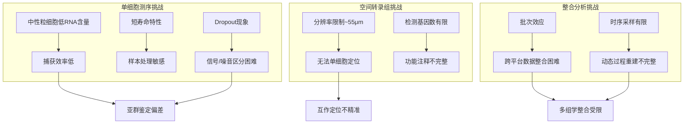
```mermaid
flowchart TD
    subgraph 单细胞测序挑战
        A[中性粒细胞低RNA含量] --> B[捕获效率低]
        C[短寿命特性] --> D[样本处理敏感]
        E[Dropout现象] --> F[信号/噪音区分困难]
    end
    
    subgraph 空间转录组挑战
        G[分辨率限制~55μm] --> H[无法单细胞定位]
        I[检测基因数有限] --> J[功能注释不完整]
    end
    
    subgraph 整合分析挑战
        K[批次效应] --> L[跨平台数据整合困难]
        M[时序采样有限] --> N[动态过程重建不完整]
    end
    
    B --> O[亚群鉴定偏差]
    F --> O
    H --> P[互作定位不精准]
    L --> Q[多组学整合受限]
    N --> Q
```

### 6.5 中性粒细胞亚群分类标准化与临床检测转化

将基础研究发现的中性粒细胞亚群转化为临床可用的检测工具和治疗靶点，需要克服分类标准化和检测技术转化两方面的障碍。

**亚群命名体系的混乱现状**严重阻碍了领域发展。如前所述，2025年《Immunity》发表的观点性文章明确指出当前中性粒细胞亚群定义中存在的模糊与混乱问题[^14]。不同研究团队基于不同的标志物组合、分析方法和功能定义来划分亚群，导致"N1/N2"、"促炎/抗炎"、"成熟/未成熟"、"高密度/低密度"等多套分类体系并存且相互重叠。例如，一项研究中定义的"促炎型"中性粒细胞可能与另一项研究中的"N1型"或"成熟活化型"部分重合但不完全一致。这种混乱状态使得**跨研究比较几乎不可能**，也阻碍了对中性粒细胞生物学本质的深入认知。

**建立统一分类框架的必要性与可行路径**已成为领域共识。该观点性文章强调，稳态下，骨髓产生的细胞进入外周后处于高可塑性的过渡状态，受昼夜节律、系统性因子及血管壁信号等多重因素的调控；抵达组织后，又被局部细胞因子与代谢物驱动，转化为炎症消除、组织修复或免疫调节等多种效应表型[^14]。本质上，这一细胞谱系体现了"表型异质—功能同质"的免疫学规律。基于这一认识，未来的分类框架应：

1. **区分发育阶段与功能状态**：明确哪些异质性来源于成熟度差异，哪些来源于功能极化
2. **建立核心标志物组合**：确定能够跨物种、跨平台稳定识别主要亚群的最小标志物集
3. **统一命名规则**：采用类似免疫细胞命名的层级系统，避免重复和混淆
4. **建立参考数据集**：创建经过严格质控的标准化单细胞数据集供社区参考

**从多组学定义到临床检测的转化障碍**是实现临床应用的关键瓶颈。单细胞测序定义的亚群通常基于数十甚至数百个基因的表达模式，这种高维特征难以直接转化为临床检测。临床可行的检测方法需要满足**快速、经济、标准化**的要求，目前主要依赖流式细胞术和免疫组化等技术。然而，将单细胞测序定义的亚群转化为流式检测面板面临多重挑战：

| 转化障碍 | 具体问题 | 可能的解决策略 |
|---------|---------|---------------|
| 标志物可及性 | 部分转录组标志物无对应的流式抗体 | 筛选具有商业化抗体的替代标志物 |
| 表面vs胞内标志物 | 关键标志物可能为胞内蛋白或转录因子 | 开发固定/透化流程或寻找表面代理标志物 |
| 检测灵敏度 | 中性粒细胞低蛋白表达可能低于检测阈值 | 优化染色方案、使用信号放大技术 |
| 成本效益 | 多色流式检测成本高、操作复杂 | 筛选最小有效标志物组合 |
| 标准化 | 不同实验室结果难以比较 | 建立标准化操作规程和质控标准 |

**NLR（中性粒细胞与淋巴细胞比值）作为成功转化案例**提供了重要启示。NLR虽然是一个简单的比值指标，无法区分中性粒细胞亚群，但其**易于获取、成本低廉、临床关联强**的特点使其成为广泛应用的预后指标。未来亚群特异性检测的开发应借鉴这一经验，在追求精准度的同时兼顾临床可行性。

### 6.6 未来优先研究方向与策略建议

基于前述局限与挑战的系统分析，本节提出未来需优先推进的研究方向与策略建议，为领域发展提供路线图参考。

**开发亚群特异性遗传示踪与条件性敲除工具**是实现功能解析的基础性工作。当前研究的一个核心瓶颈是缺乏能够选择性标记和操纵特定中性粒细胞亚群的遗传学工具。未来应优先开发：

- **基于亚群特异性启动子的Cre驱动系统**：利用Neut_Cd14、FOXO1high或Siglec-F+亚群的特异性基因（如Cd14、Foxo1、Siglecf）启动子驱动Cre重组酶表达，实现亚群特异性基因操纵
- **双重组酶系统**：结合中性粒细胞谱系标志物（如S100a8-Cre）和亚群特异性标志物（如Foxo1-Flp），实现更精准的亚群靶向
- **诱导型系统的优化**：开发快速响应、低渗漏的诱导型Cre系统，适应脑缺血快速动态变化的研究需求

**开展纵向多时间点多组学临床队列研究**是验证动物模型发现、推动临床转化的关键步骤。建议建立以下研究框架：

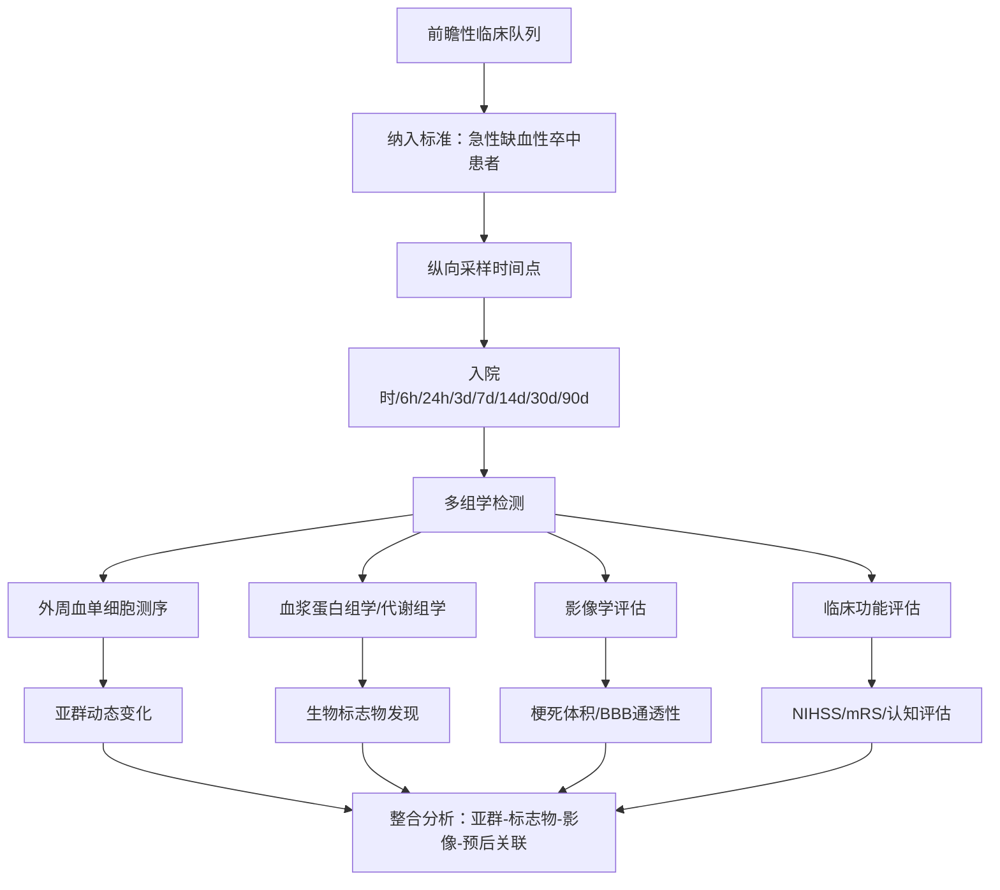
```mermaid
flowchart TD
    A[前瞻性临床队列] --> B[纳入标准：急性缺血性卒中患者]
    B --> C[纵向采样时间点]
    C --> D[入院时/6h/24h/3d/7d/14d/30d/90d]
    D --> E[多组学检测]
    E --> F[外周血单细胞测序]
    E --> G[血浆蛋白组学/代谢组学]
    E --> H[影像学评估]
    E --> I[临床功能评估]
    F --> J[亚群动态变化]
    G --> K[生物标志物发现]
    H --> L[梗死体积/BBB通透性]
    I --> M[NIHSS/mRS/认知评估]
    J --> N[整合分析：亚群-标志物-影像-预后关联]
    K --> N
    L --> N
    M --> N
```

这种纵向多组学设计可以：验证小鼠中发现的双相浸润模式在人类中的存在性；识别与临床预后相关的亚群动态变化特征；发现可用于临床检测的生物标志物组合。

**探索基于关键互作节点的时序特异性联合治疗策略**是将基础发现转化为临床获益的最终目标。基于前述章节识别的关键调控节点，建议优先评估以下治疗策略：

| 靶点/通路 | 干预策略 | 适用时相 | 预期效应 | 开发优先级 |
|----------|---------|---------|---------|-----------|
| Mrgprb2 | 小分子抑制剂 | 超急性期-急性期 | 阻断中性粒细胞跨BBB迁移 | 高 |
| NETs/PAD4 | PAD4抑制剂/DNase I | 急性期 | 减少NETs形成/清除已形成NETs | 高 |
| CCL5-CCR5 | CCR5拮抗剂（如马拉维若） | 亚急性期-慢性期 | 减少海马中性粒细胞浸润 | 中-高 |
| FOXO1-TFRC | FOXO1抑制剂/铁螯合剂 | 慢性期 | 阻断铁死亡通路 | 中 |
| 铁死亡通路 | GPX4激活剂/脂质过氧化抑制剂 | 急性期-亚急性期 | 保护神经元 | 中 |

**推动中性粒细胞靶向纳米药物递送系统的临床前评价**是利用中性粒细胞天然特性实现精准治疗的创新方向。中性粒细胞纳米药物递送系统的主要优势在于穿透血脑屏障并将药物特异性递送至缺血病灶的能力。纳米药物可模拟中性粒细胞形态或被中性粒细胞主动吞噬结合，随后利用中性粒细胞在缺血损伤后向大脑炎症部位迁移的天性，将纳米药物运送穿过血脑屏障。与依赖被动扩散或单受体靶向的传统纳米药物相比，该机制的穿透效率可提高50%以上[^37]。未来应重点推进：

- **中性粒细胞膜包被纳米粒的优化**：提高药物装载效率和释放可控性
- **时序响应型递送系统**：设计能够在特定病理阶段响应释放的智能纳米系统
- **联合递送策略**：同时递送抗炎药物和神经保护剂，实现多靶点协同治疗

**建立脑缺血免疫微环境的标准化研究范式与数据共享平台**是促进领域协作、加速知识积累的基础设施建设。建议推动以下工作：

1. **标准化实验方案**：制定脑缺血模型建立、中性粒细胞分离、单细胞测序样本处理的标准化操作规程
2. **参考数据集建设**：建立经过严格质控的小鼠和人类脑缺血单细胞转录组参考数据集
3. **数据共享平台**：建立开放获取的数据库，整合已发表研究的原始数据和分析结果
4. **分析工具标准化**：开发针对中性粒细胞特性优化的生物信息学分析流程

以下流程图展示了未来研究的整体路线图：

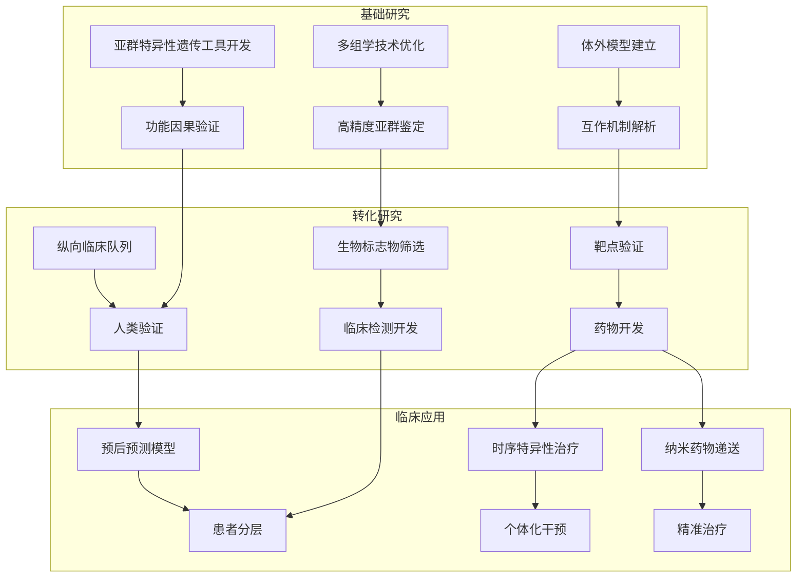
```mermaid
flowchart TD
    subgraph 基础研究
        A[亚群特异性遗传工具开发] --> B[功能因果验证]
        C[多组学技术优化] --> D[高精度亚群鉴定]
        E[体外模型建立] --> F[互作机制解析]
    end
    
    subgraph 转化研究
        G[纵向临床队列] --> H[人类验证]
        I[生物标志物筛选] --> J[临床检测开发]
        K[靶点验证] --> L[药物开发]
    end
    
    subgraph 临床应用
        M[预后预测模型] --> N[患者分层]
        O[时序特异性治疗] --> P[个体化干预]
        Q[纳米药物递送] --> R[精准治疗]
    end
    
    B --> H
    D --> I
    F --> K
    H --> M
    J --> N
    L --> O
    L --> Q
```

综上所述，脑缺血进程中中性粒细胞功能异质性研究虽已取得重要进展，但仍面临**认知空白、转化鸿沟、方法学挑战和标准化缺失**等多重障碍。克服这些障碍需要基础研究与临床研究的紧密结合，需要技术创新与范式建设的同步推进，更需要领域内外的广泛协作。通过开发亚群特异性工具、开展纵向临床研究、探索时序特异性治疗策略、推动纳米药物递送系统开发以及建立标准化研究平台，有望在未来5-10年内实现该领域从基础发现向临床获益的实质性转化，最终改善脑缺血患者的预后和生活质量。

# 参考内容如下：
[^1]:[脑梗塞临床分期的最新标准 | 百度健康·医学科普](https://health.baidu.com/m/detail/ar_6412135748233820053)
[^2]:[脑梗塞分期的最新标准](https://health.baidu.com/m/detail/ar_5224953628542419137)
[^3]:[脑梗阶段分期](https://health.baidu.com/m/detail/ar_6005268376463277467)
[^4]:[Nat Commun:免疫细胞是敌是友?Josephine Herz团队揭示中性粒细胞时序性功能转换机制](https://www.163.com/dy/article/KDKBPOVG0552HAAJ.html)
[^5]:[附属北京天坛医院王伊龙教授团队发现颅骨骨髓是卒中后颅内多种髓系免疫细胞亚型的重要起源](https://news.ccmu.edu.cn/syyw_12977/f8f491e0332f4244a000f4cb926f1fe2.htm)
[^6]:[Neuron | 郑乐民联合团队发现NAD+调控血脑屏障功能新机制 ](https://www.bjmu.edu.cn/yjcg/da5f6082afed4e0994d01dc01eda5783.htm)
[^7]:[新闻资讯 ](http://smartdds.fudan.edu.cn/jiangchen/WebContent_NewsInfo.aspx?BID=5&ShowID=347&SID=0)
[^8]:[精准打击缺血性脑卒中新疗法!复旦大学蒋晨团队揭示NETs清除联合微环境重塑协同机制](http://www.360doc.com/content/25/0623/18/75422431_1156075859.shtml)
[^9]:[Cell背靠背:华人团队揭示中风后大脑炎症机制,并提出治疗新靶点](https://browser.qq.com/mobile/news?doc_id=29168859b2b28352)
[^10]:[【协和医学杂志】间充质干细胞对脑缺血性再灌注损伤的保护作用 ](https://mp.weixin.qq.com/s?__biz=MzI3MzYzNTAwOA==&mid=2247551479&idx=3&sn=a88189b2a8407a3ecb83aa28ac3eefe6&chksm=eb220a58dc55834e1d3fc9f48eff42c30045702c7f0f42f57b364e3d23dc75e46e2ac0d89c9c&scene=27)
[^11]:[FOXO1通过重塑中性粒细胞加重颅脑创伤急性脑损伤,并促进晚期抑郁发生 ](https://mp.weixin.qq.com/s?__biz=MzIzMjQ0NjczNw==&mid=2247507976&idx=1&sn=3eafac9277c3d57b1d480b82b31d65aa&chksm=e8962e76dfe1a760777c2e30a2768499ce1695adfaa293f0d6e76390bb7c2ba63c757da2493b&scene=27)
[^12]:[缺血性脑卒中代谢重编程:当糖酵解风暴遭遇脂质风暴——从神经元中心论到全身性能量危机的新范式](https://m.ebiotrade.com/newsf/2025-11/202511040222534792.htm)
[^13]:[急性脑卒中后颅内中性粒细胞的死亡和清除](http://sjssygncj.chmed.net/ch/reader/view_abstract.aspx?file_no=20250708)
[^14]:[Advanced Science | 基础医学院李明锋团队联合北京天坛医院王伊龙团队揭示卒中后免疫细胞异质性及髓系细胞亚型新图谱](http://jcyxy.tjmu.edu.cn/info/1524/9037.htm)
[^15]:[粒细胞研究取得重要突破:首次通过单细胞转录组解析中性粒细胞的异质性](https://www.chinablood.com.cn/jyb/hospital_news/1330.html)
[^16]:[Adv Sci丨窥一斑而见全豹!北京天坛医院王伊龙团队发现中风后免疫细胞新类型](https://www.thepaper.cn/newsDetail_forward_30146843)
[^17]:[Immunity观点 | Lai Guan Ng与合作者为中性粒细胞分类建立统一共识](https://m.163.com/dy/article/K66GUQ9C0532BT7X.html)
[^18]:[综述:靶向中性粒细胞与小胶质细胞相互作用:卒中抗炎治疗新策略](https://m.ebiotrade.com/newsf/2025-10/20251003020840247.htm)
[^19]:[综述:小胶质细胞极化与卒中后神经炎症的治疗策略](https://www.ebiotrade.com/newsf/2025-9/20250920011411802.htm)
[^20]:[鲁明团队揭示星形胶质细胞CCL5-CCR5信号驱动中性粒细胞浸润诱发抑郁样行为](https://view.inews.qq.com/a/20250523A09VUZ00)
[^21]:[Nat Commun:免疫细胞是敌是友?Josephine Herz团队揭示中性粒细胞时序性功能转换机制](http://www.360doc.com/content/25/1105/17/75422431_1164381656.shtml)
[^22]:[中性粒细胞在缺血性脑卒中的作用研究进展](http://sjssygncj.chmed.net/ch/reader/create_pdf.aspx?file_no=20231107&year_id=2023&quarter_id=11)
[^23]:[Cell | 攻破大脑“绝对防线”:利用颅骨骨髓“策反”免疫细胞,这一巧妙策略如何改写脑病治疗格局?](https://new.qq.com/rain/a/20260120A0572I00)
[^24]:[中性粒-脑细胞互作介导“血-脑crosstalk”影响神经炎症疾病及药物干预作用](https://www.ebiotrade.com/newsf/2025-6/20250630072726744.htm)
[^25]:[中性粒细胞与淋巴细胞比值作为急性缺血性中风再灌注治疗后不良短期功能结局的独立预测指标](https://www.ebiotrade.com/newsf/2025-12/20251212000259469.htm)
[^26]:[铁死亡在脑缺血再灌注损伤病理生理机制中的作用 ](http://www.cem.org.cn/rhtml/20230731/index.htm)
[^27]:[新闻资讯 ](http://smartdds.fudan.edu.cn/jiangchen/WebContent_NewsInfo.aspx?BID=5&ShowID=293&SID=0)
[^28]:[电针调控铁代谢与氧化应激抑制铁死亡,缓解脑缺血再灌注损伤:为缺血性脑卒中治疗带来新曙光](https://www.ebiotrade.com/newsf/2025-5/20250504050831355.htm)
[^29]:[缺血性中风中的血脑屏障通透性:最新进展 ](https://mp.weixin.qq.com/s?__biz=MzIzMTEzNzU3Mw==&mid=2247512440&idx=2&sn=486ad3c4ad117247aef8459b270c48f8&chksm=e9d9205c953eedc762b8f446a2fa1699f0a98f35989d61a3a6350954f00852cfac4de13af9ec&scene=27)
[^30]:[突破血脑屏障难题!清华团队首创免疫细胞快递疗法,中风治疗效率提升15倍](https://new.qq.com/rain/a/20260122A0186100)
[^31]:[脑缺血后突触可塑性与神经胶质细胞相互调控在神经修复中的作用 ](https://news.medlive.cn/ns/info-progress/show-201179_181.html)
[^32]:[综述:揭秘脑卒中后的脑可塑性:从损伤到通过通路激活、药物靶点和治疗干预实现大脑重塑](https://www.ebiotrade.com/newsf/2025-5/20250522115202288.htm)
[^33]:[缺血性脑卒中管理的未满足需求与治疗新突破:从再灌注局限到神经再生创新](https://www.cmtopdr.com/post/detail/02fed012-fd49-4946-82a2-e0490b5260bf)
[^34]:[单细胞测序技术:原理、挑战与应用前景](https://www.biomart.cn/news/16/3251084.htm)
[^35]:[单细胞测序在疾病研究中的深入应用与挑战](https://www.u-labex.com/article-32757.html)
[^36]:[转录组学、单细胞测序和空间测序助力脑缺血研究:揭示机制,开拓治疗新方向](https://www.ebiotrade.com/newsf/2025-4/20250425053113288.htm)
[^37]:[综述:中性粒细胞靶向纳米药物用于缺血性脑卒中治疗](https://www.ebiotrade.com/newsf/2026-1/202601050002536302.htm)
