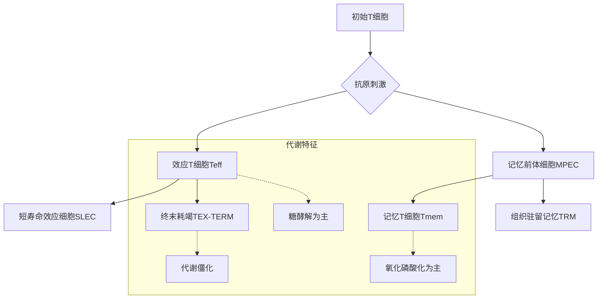
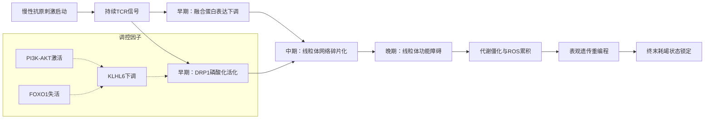
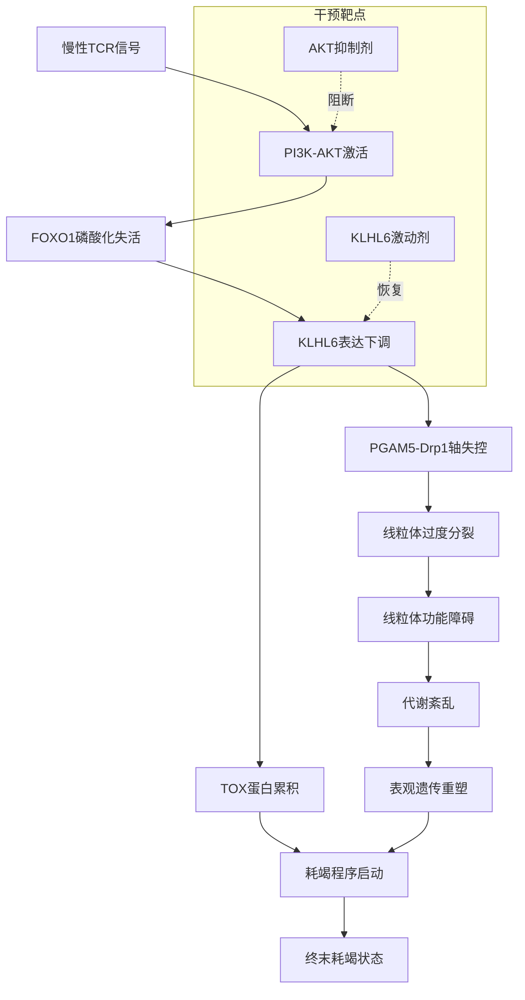
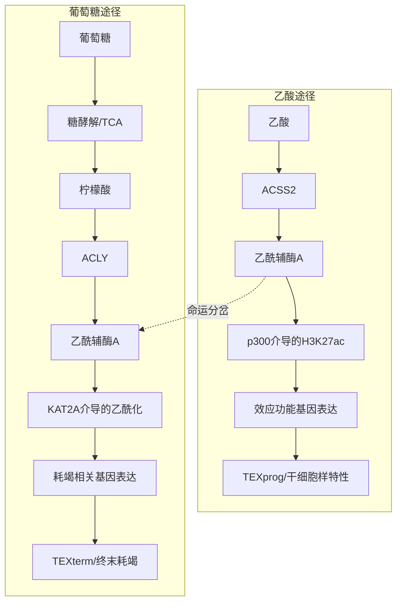
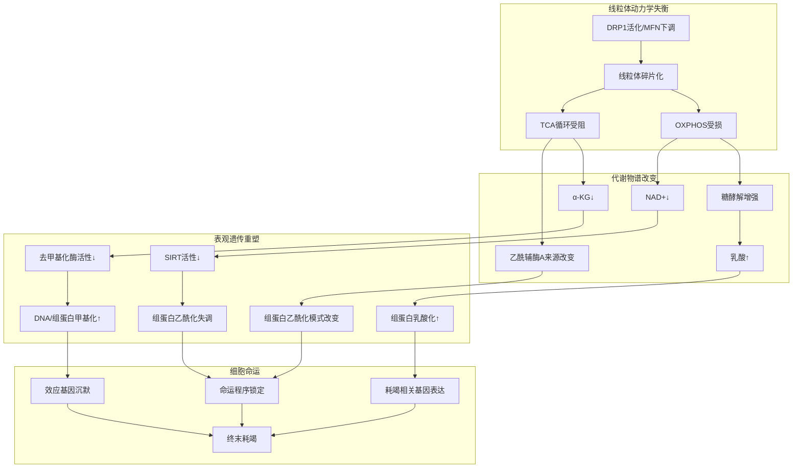
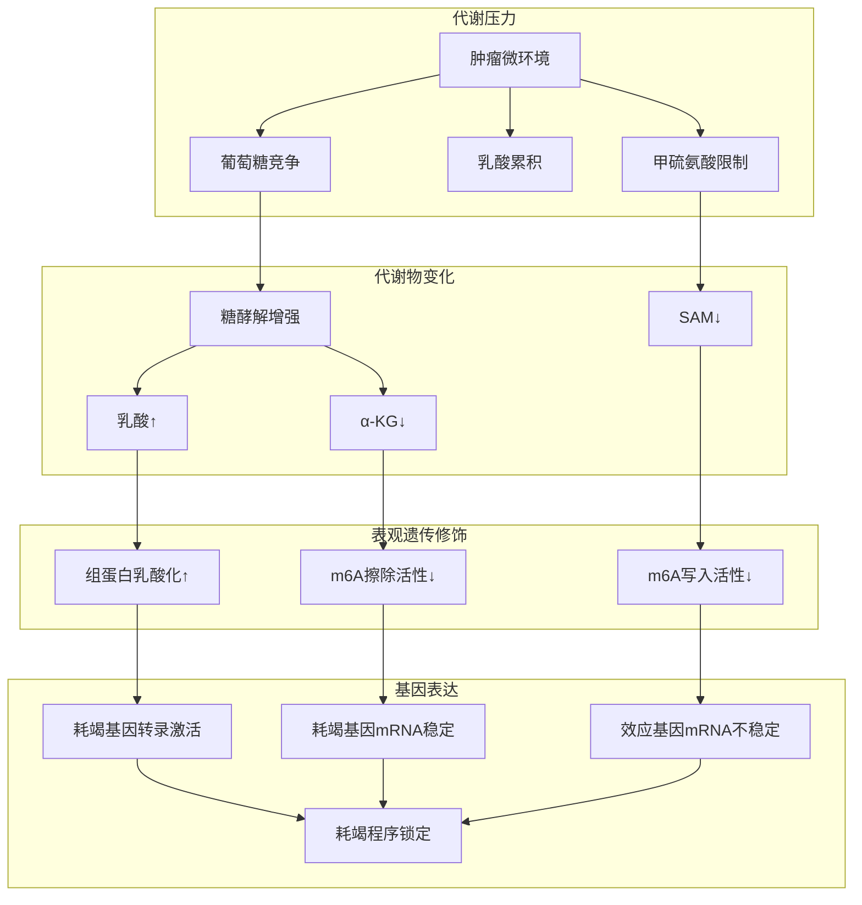
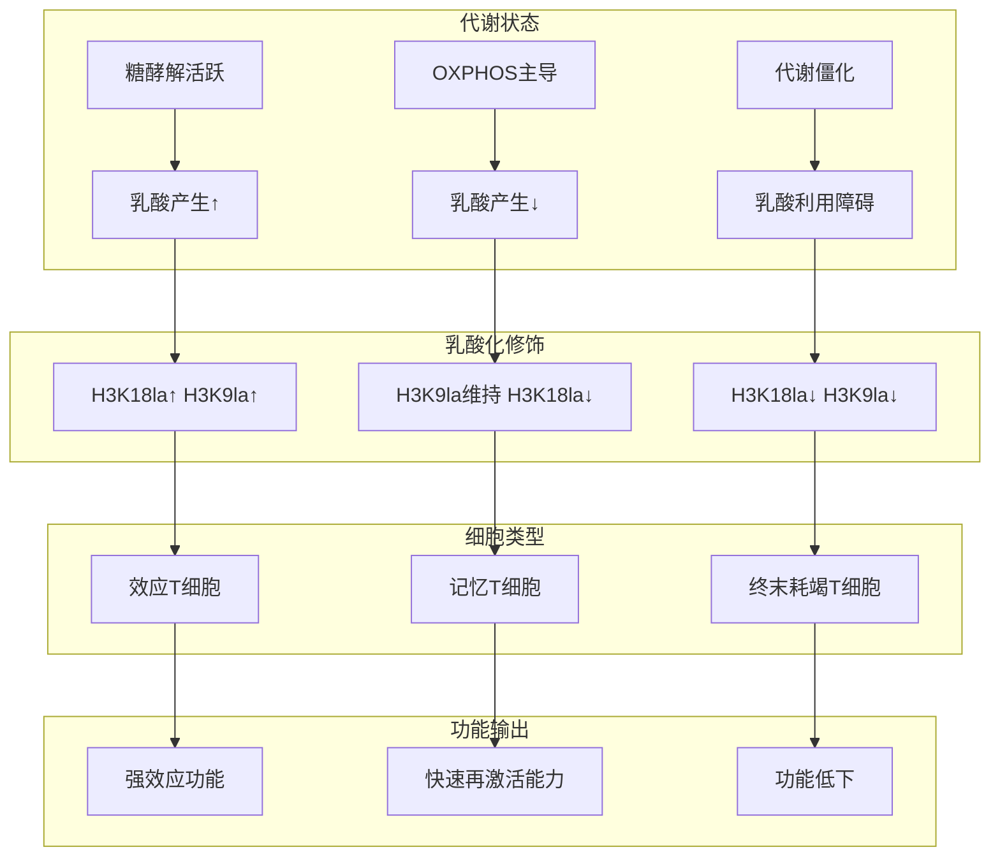
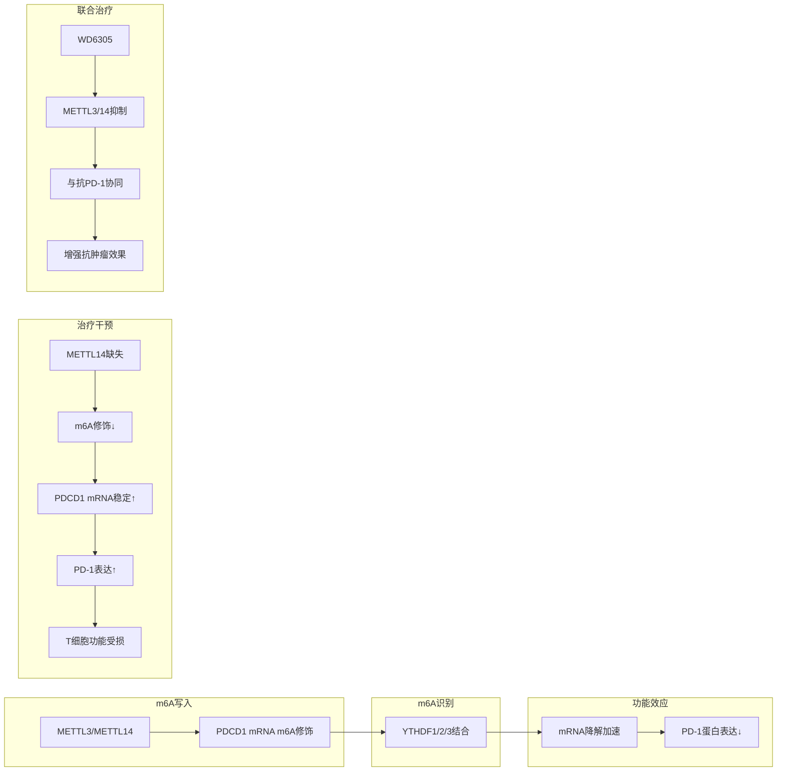
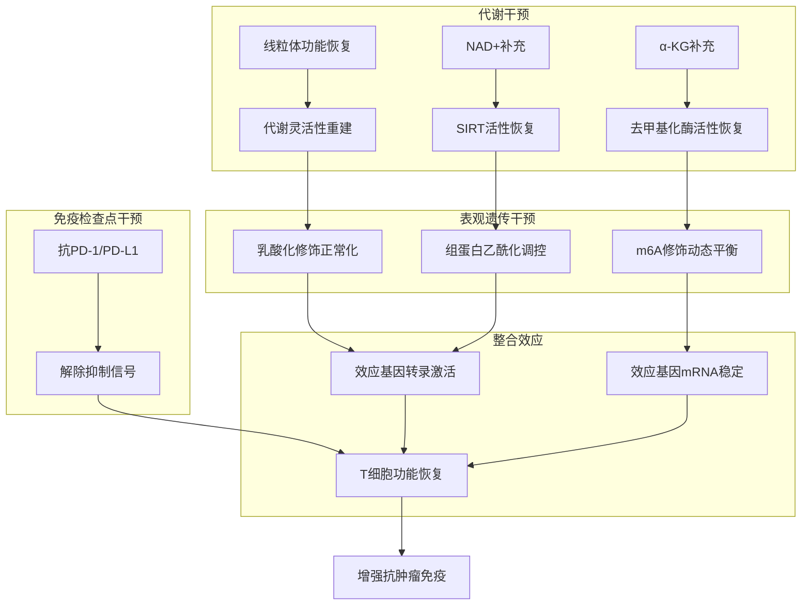
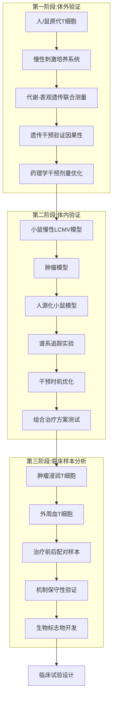

# 慢性抗原刺激下CD8+ T细胞线粒体动力学通过代谢-表观遗传互作网络调控终末耗竭与组织驻留记忆细胞命运分岔的机制研究与定量建模
## 1 引言：慢性抗原刺激下CD8+ T细胞命运抉择的代谢与表观遗传基础

CD8⁺ T细胞作为抗病毒和抗肿瘤免疫反应中最核心的效应细胞，其功能状态与分化命运直接决定了机体清除病原体和恶性细胞的能力[^1]。然而，在慢性病毒感染与癌症的长期对抗中，这些免疫系统的"战士"会逐渐陷入功能衰退的状态，这一现象不仅削弱了机体的免疫监视能力，更成为当前免疫治疗面临的关键瓶颈[^1]。深入解析CD8⁺ T细胞在慢性抗原刺激下的命运抉择机制，对于开发新型免疫治疗策略具有重要的理论与临床意义。

近年来，研究逐渐揭示代谢与表观遗传调控之间的交互作用是决定T细胞命运的核心机制[^2]。在肿瘤微环境或慢性感染等应激条件下，CD8⁺ T细胞常出现功能耗竭、衰老或年龄相关的功能障碍，这些状态虽诱因不同，却均以**线粒体功能紊乱、代谢灵活性的丧失以及表观遗传重塑**为共同特征[^2]。本章将系统阐述慢性抗原刺激环境下CD8⁺ T细胞面临的命运抉择问题，重点解析终末耗竭T细胞（Tex）与组织驻留记忆T细胞（Trm）作为两条关键分化路径的生物学特征差异，并明确"代谢-表观遗传互作网络"作为本报告核心科学问题的研究必要性与创新价值。

### 1.1 慢性抗原刺激对CD8+ T细胞功能状态的塑造

#### 1.1.1 急性感染与慢性感染的本质区别

T细胞耗竭是慢性抗原刺激下形成的独特功能失调状态，其核心特征包括**效应功能渐进性丧失、增殖能力下降以及多种抑制性受体的持续高表达**[^1]。与急性感染中T细胞分化为效应细胞和记忆细胞的路径不同，慢性刺激下的CD8⁺ T细胞耗竭是一个动态的分化过程，而非不可逆的终末状态，其形成由转录调控、表观遗传修饰和微环境信号共同驱动[^1]。

在急性感染或免疫接种后，CD8⁺ T细胞可形成不同类型的免疫记忆，其中一类重要亚群是组织驻留记忆T细胞（TRM）[^3]。TRM在非淋巴组织中长期停留，表达组织驻留相关分子如CD69、CD103以及转录因子Hobit，通常在抗原清除后形成，具有抗原非依赖性的长期存活能力和较强的效应功能，可在局部快速提供保护[^3]。与此相对，在慢性感染或肿瘤中，由于持续抗原刺激，CD8⁺ T细胞会进入另一种分化状态——耗竭T细胞（TEX），该类T细胞呈现高水平抑制性受体表达、效应功能下降、可塑性受限等特征，且具有不同的表观遗传图谱[^3]。

#### 1.1.2 T细胞耗竭的三阶段分化连续体

CD8⁺ T细胞的耗竭遵循**线性分化阶段模式**，各阶段在功能、表型和可逆性上存在显著差异[^1]：

| 分化阶段 | 代表亚群 | 关键标志物 | 功能特征 | 组织定位 | 可逆性 |
|---------|---------|-----------|---------|---------|-------|
| 早期耗竭 | Tex祖细胞（TEX-PROG） | TCF1⁺ | 干细胞样特性，增殖能力强，功能相对完整 | 淋巴组织（如肿瘤引流淋巴结） | 可逆 |
| 中期耗竭 | 中间Tex细胞（TEX-INT） | CX3CR1⁺ | 已获得细胞毒性功能，增殖能力进一步增强 | 血液和外周组织 | 部分可逆 |
| 晚期耗竭 | 终末分化Tex细胞（TEX-TERM） | 多种抑制性受体高表达 | 完全丧失效应功能 | 肿瘤微环境和非淋巴组织 | 不可逆 |

这一耗竭程序高度依赖转录因子**Tox**的调控[^3]。在癌症环境中，CD8⁺ T细胞先在肿瘤引流淋巴结形成Tex祖细胞，迁移至肿瘤微环境后完成后续分化[^1]。值得注意的是，**持续抗原暴露是T细胞耗竭的首要诱因，TCR信号强度直接决定耗竭进程**：强信号会导致T细胞快速耗竭，而弱信号可保留干细胞样祖细胞群体[^1]。

#### 1.1.3 微环境因素对T细胞命运的协同调控

CD8⁺ T细胞的耗竭过程受肿瘤或感染微环境中多种外部因素的协同调控，这些因素通过细胞间相互作用、信号分子传递及代谢环境改变等方式发挥作用[^1]。

**共抑制分子**方面，PD-1、CTLA-4、LAG-3、TIM-3、TIGIT等共抑制分子的持续高表达是耗竭T细胞的典型标志[^1]。PD-1/PD-L1通路阻断可有效恢复Tex细胞功能，尤其对Tex祖细胞亚群效果显著；CTLA-4通过竞争性抑制CD28信号削弱T细胞活化；LAG-3、TIM-3等分子在不同Tex亚群中差异化表达，联合阻断多种共抑制分子可产生协同增效作用[^1]。

**共刺激分子**方面，CD28、4-1BB、CD27、ICOS等共刺激分子通过增强T细胞功能与存活能力调控耗竭进程[^1]。CD28信号强度影响Tex细胞命运，弱信号维持干细胞性，强信号促进效应分化；4-1BB可促进Tex细胞扩增与效应功能获得，CD27则增强T细胞的记忆潜力[^1]。

### 1.2 终末耗竭T细胞与组织驻留记忆T细胞的命运分岔

#### 1.2.1 Tex与Trm的核心生物学差异

组织驻留记忆T细胞（TRM）与耗竭性T细胞（TEX）是CD8⁺ T细胞在不同抗原刺激条件下形成的两类功能截然不同的亚群，二者在肿瘤控制中扮演着至关重要的角色[^4]。

**经典TRM细胞**在感染或炎症消退后形成，能够提供快速、局部的免疫保护[^4]。相比之下，**CD8⁺ TEX细胞**则形成于慢性感染和癌症环境中，由持续性抗原识别和炎症驱动[^4]。T细胞耗竭表现为增殖与功能的丧失，尽管免疫检查点阻断疗法能暂时重振TEX细胞功能，但其长期命运大多难以改变[^4]。

由于许多研究依赖遗传特征来鉴定T细胞亚型，TRM与TEX细胞在转录层面的相似性导致两者常被混为一谈[^4]。这些功能严重受损的TEX同样会驻留于肿瘤内部，可能通过使用与TRM类似的转录程序来驻留在肿瘤中[^4]。研究发现，**TRM基因特征在慢性感染期的终末TEX中富集程度最高**，表明使用TRM基因特征鉴定肿瘤内TRM细胞时，会导致TEX细胞被错误识别[^4]。

#### 1.2.2 组织驻留耗竭T细胞（TR-TEX）的发现与意义

在组织中经常能看到大量CD8⁺CD69⁺CD103⁺的T细胞，它们同时也可能表达抑制性受体如PD-1、CD39，甚至表达Tox[^3]。这些细胞在肿瘤中常与更好预后或治疗响应相关，因此常被直接归类为TRM[^3]。然而，**在慢性抗原存在的组织环境里，这些看起来像TRM的细胞，究竟是经典TRM还是一种组织驻留的耗竭细胞？两者在发育来源、功能与对免疫治疗的贡献是否不同？**

美国宾夕法尼亚大学E. John Wherry课题组的研究发现，慢性抗原驱动产生一条**组织驻留耗竭谱系TR-TEX**，它表达组织驻留相关分子但在发育与功能上与经典TRM不同，且**只有TR-TEX是PD-1/PD-L1免疫检查点治疗中可被有效再激活并介导疗效的关键细胞群**，从而重塑了对组织内T细胞功能与免疫治疗机制的理解[^3]。

#### 1.2.3 命运分岔的关键决定因素

研究系统解析了人类多种癌症中的TRM与TEX细胞，明确了能够区分这两类细胞群的标志物和基因特征谱[^4]。关键发现包括：

- **预后意义相反**：在乳腺癌中，TRM富集与患者良好预后相关，而TEX富集则指向不良预后[^4]
- **治疗反应不同**：在临床试验中，对免疫检查点抑制剂产生应答的患者，其肿瘤内TEX细胞特征表达更高，而TRM特征与疗效无关，说明当前主流的ICB疗法主要作用于TEX细胞，而非TRM细胞[^4]
- **克隆构成截然不同**：肿瘤相关TEX与TRM细胞在克隆构成上截然不同，TRM细胞主要由不识别肿瘤抗原的旁观者细胞，以及与同源抗原隔离的肿瘤特异性细胞组成[^4]

**当肿瘤内TRM细胞遭遇持续的抗原刺激时，会被迫转向耗竭命运，表明肿瘤微环境中是否存在持续的抗原暴露，是区分肿瘤相关TEX与TRM细胞的关键所在**[^4]。

### 1.3 线粒体动力学与代谢重编程在T细胞命运决定中的作用

#### 1.3.1 代谢重编程对T细胞分化的调控

代谢重编程对CD8⁺ T细胞的分化和功能具有重要调控作用[^5]。在抗原刺激下，CD8⁺ T细胞可增殖并分化为效应T细胞（Teff），其中大部分是终末分化的短寿命效应细胞（SLEC），具有强大的细胞毒性潜力；而其余的部分则是记忆前体效应细胞（MPEC），可进一步分化为长寿的、可自我更新的记忆CD8⁺ T细胞（Tmem）[^5]。

初始T细胞在抗原刺激下被激活，经历深刻的代谢重组，以满足效应功能的生物能量与生物合成需求[^6]。**效应T细胞偏好糖酵解和谷氨酰胺分解**，以迅速扩增并产生细胞因子；而**记忆T细胞则依赖氧化磷酸化（OXPHOS）和线粒体融合**，以实现长期存活与快速再激活[^6]。



#### 1.3.2 线粒体功能障碍与T细胞耗竭

无论是肿瘤相关的T细胞耗竭、慢性刺激诱导的应激性衰老，还是随年龄累积的免疫功能下降，这些看似不同的CD8⁺ T细胞失能状态，最终都指向一个高度一致的生物学结局[^2]。研究发现，它们共同伴随着**线粒体结构与功能的持续受损**，表现为氧化磷酸化能力下降、活性氧累积以及线粒体自噬受阻[^2]。

随着线粒体这一"能量与信号中枢"的失衡，T细胞逐渐丧失在不同代谢通路之间切换的能力，无法根据环境变化在糖酵解、脂肪酸氧化和氨基酸代谢之间灵活调整，从而陷入**长期的代谢僵化状态**[^2]。

#### 1.3.3 线粒体不对称遗传与早期命运决定

英国牛津大学Anna Katharina Simon研究团队的研究发现，**自噬调控着CD8⁺ T细胞中线粒体的不对称遗传模式**[^7]。自噬缺陷的T细胞无法清除有丝分裂前的老旧线粒体，导致其对称遗传。具有自噬功能且能不对称分配线粒体的T细胞产生的子代细胞呈现不同的命运：**保留老旧线粒体的细胞记忆潜能降低，而未遗传老旧线粒体且线粒体周转率更高的细胞则寿命更长**，并在同源抗原刺激下表现出强大的扩增能力[^7]。

这种早期命运分化是由**差异化的代谢程序驱动**的，其中保留老旧线粒体的细胞激活了一碳代谢[^7]。研究证实，自噬是在不对称分裂过程中将细胞器质量控制与细胞命运决定因子的不对称遗传相耦合的关键机制[^7]。

### 1.4 代谢-表观遗传互作网络调控T细胞命运的研究进展与知识缺口

#### 1.4.1 代谢产物作为表观遗传修饰的"原料"与"调节器"

在CD8⁺ T细胞中，代谢产物并不仅仅承担供能角色，而是**直接参与基因表达的精细调控**[^2]。多种关键代谢中间体充当了表观遗传修饰的"原料"和"调节器"：

| 代谢产物 | 表观遗传作用 | 调控机制 |
|---------|-------------|---------|
| 乙酰辅酶A | 组蛋白乙酰化底物 | 决定染色质开放状态 |
| S-腺苷甲硫氨酸（SAM） | 主要甲基供体 | 调控DNA和组蛋白甲基化修饰 |
| α-酮戊二酸（α-KG） | 去甲基化酶辅因子 | 动态重塑染色质结构 |
| 乳酸 | 组蛋白乳酰化底物 | 影响能量代谢和效应功能相关基因表达 |

代谢中间产物直接作为底物或辅助因子，参与DNA和组蛋白的化学修饰，从而调控T细胞分化[^6]。例如，糖酵解产生的乳酸可促进组蛋白乳酰化（如H3K18la），增强糖代谢和效应相关基因的转录；SAM依赖的甲基化修饰（如H3K79me2）调控STAT5等信号分子的表达；TCA循环中间产物α-酮戊二酸则是多种组蛋白去甲基化酶（如KDM6B）的辅因子，能够去除抑制性标记H3K27me3，促进效应基因表达[^6]。

#### 1.4.2 乙酰辅酶A来源与T细胞命运分岔

研究深入探索了CD8⁺ T细胞在耗竭过程中如何利用不同的营养物质来生成组蛋白乙酰化所需的乙酰辅酶A[^8]。发现CD8⁺ T细胞从功能正常到逐渐耗竭，其**代谢模式从偏好乙酸转向更依赖于葡萄糖**[^8]。这一变化由两种关键代谢酶调控：

- **乙酰辅酶A合成酶2（ACSS2）**：倾向于利用乙酸生成乙酰辅酶A，促进更具自我更新能力的"始祖型"耗竭性T细胞（TEXprog）的形成[^8]
- **ATP-柠檬酸裂解酶（ACLY）**：通过葡萄糖代谢支持"终末型"耗竭性T细胞（TEXterm）的分化[^8]

乙酰辅酶A是组蛋白乙酰化的关键底物，**不同来源的乙酰辅酶A可能引导不同的T细胞分化路径**：葡萄糖衍生的乙酰辅酶A常与组蛋白乙酰转移酶KAT2A结合，促进耗竭相关基因表达；而乙酸衍生的乙酰辅酶A则通过ACSS2-p300通路驱动效应功能相关基因的乙酰化（如H3K27ac）[^6]。

#### 1.4.3 线粒体丙酮酸载体（MPC）的调控作用

线粒体丙酮酸载体（MPC）控制的线粒体丙酮酸摄取和代谢对T细胞功能和命运具有重要影响[^5]。研究发现，**MPC缺陷的CD8⁺ T细胞具有向记忆型分化的倾向**，机制研究表明，MPC受抑制的CD8⁺ T细胞可利用环境中的谷胱甘肽和脂肪酸氧化产生乙酰辅酶A，进而促进组蛋白H3K27位点乙酰化，并导致转录因子RUNX1下游的Tmem分化相关细胞因子（如IL-2、CD40）的表达上调[^5]。

在营养缺乏的肿瘤微环境中，乳酸来源的丙酮酸是维持CD8⁺ T细胞抗肿瘤活性的重要能源物质[^5]。由于谷胱甘肽和脂肪酸含量较少，在肿瘤微环境浸润CD8⁺ T细胞中敲除MPC并不会导致其向Tmem分化，但CD8⁺ T细胞内mTOR信号受到了显著抑制，进而引起H3K27位点甲基化水平上调，最终导致其抗肿瘤免疫活性降低[^5]。

#### 1.4.4 表观遗传调控因子与耗竭程序的锁定

研究发现，在MDS患者典型临床表现——克隆造血中常见的**DNMT3A、TET2和ASXL1基因突变**，能使一部分T细胞长期保持干性，延缓向TEX状态分化，从而扩大了它们响应免疫治疗的时间窗[^9]。携带上述基因突变的T细胞，在实验中可在慢性抗原刺激下存活超过1年[^9]。

其中ASXL1突变是被首次揭示与T细胞持久力有关，敲除ASXL1会改善T细胞的染色质可及性，并通过降低多梳抑制性去泛素化酶（PR-DUB）复合物稳定性，在TPEX向TEX状态分化的过程中，调控组蛋白H2AK119位点单泛素化修饰（H2AK119Ub）等多种组蛋白修饰，从而调节T细胞维持干细胞样特征和细胞毒效应的关键基因表达水平[^9]。

#### 1.4.5 当前研究的主要知识缺口

尽管代谢-表观遗传互作网络在T细胞命运决定中的作用已获得广泛认可，但仍存在若干关键知识缺口：

1. **动态调控图谱的缺失**：目前研究多为静态或终点分析，缺乏在慢性抗原刺激全过程中，代谢物波动与表观遗传修饰动态变化的高分辨率时序图谱，命运分岔的具体时间窗口和关键转折点尚不清晰

2. **组织微环境异质性**：不同组织（如肿瘤、肝脏、肠道）或不同慢性感染模型中的代谢压力与表观遗传调控网络可能存在显著差异，目前缺乏系统性的比较研究

3. **代谢-表观遗传交叉节点的精确机制**：特定代谢物如何精确调控特定染色质位点的修饰，从而影响下游基因表达程序的详细分子路径仍需阐明

4. **定量建模的参数化挑战**：构建包含"线粒体动力学-关键代谢物-表观遗传修饰酶-靶基因-细胞命运"的多层互作网络的定量模型，面临参数获取和模型验证的技术挑战

### 1.5 本报告的科学问题定位与研究意义

#### 1.5.1 核心科学问题的必要性

本报告聚焦于**"线粒体动力学通过代谢-表观遗传互作网络调控CD8⁺ T细胞终末耗竭与组织驻留记忆命运分岔"**这一核心科学问题。该问题的研究必要性体现在以下几个方面：

首先，**代谢压力是表观遗传重塑的上游驱动力**。更为关键的是，代谢紊乱并不会止步于能量层面，而是进一步被"写入"染色质结构之中——关键代谢产物的异常改变直接干扰DNA和组蛋白修饰，导致表观遗传重编程失败，效应基因被持续抑制，记忆与干性相关的转录程序难以重新启动，最终将CD8⁺ T细胞锁定在功能低下、难以逆转的失能轨道上[^2]。

其次，**靶向"代谢-表观遗传轴"是突破当前免疫治疗瓶颈的新方向**。通过抑制ACLY或增强ACSS2的活性，可以在分子水平上优化T细胞的表观遗传状态，从而提升抗肿瘤免疫反应[^8]。这一发现不仅揭示了CD8⁺ T细胞耗竭的核心机制，也为未来开发代谢与表观遗传相结合的创新治疗策略提供了重要参考[^8]。

#### 1.5.2 潜在转化价值

该研究方向对理解T细胞命运可塑性、优化免疫检查点治疗策略及改进过继细胞疗法具有重要的转化价值：

**免疫检查点治疗优化**：研究表明，对MPC调控CD8⁺ T细胞分化和肿瘤免疫抑制的研究表明了靶向MPC可成为激活肿瘤浸润T细胞乳酸利用和抗肿瘤疗效的新途径[^5]。

**过继细胞疗法改进**：近年来，过继细胞转移（ACT）疗法成为了临床上最主要的抗肿瘤免疫治疗策略之一，研究表明，低分化的CD8⁺ Tmem细胞在ACT疗法中具有更好的抗肿瘤治疗效果[^5]。抑制MPC增强了CAR-T细胞的抗肿瘤作用、记忆表型和持久性，可能是未来临床试验中改善CAR-T细胞免疫治疗的潜在策略[^5]。

**联合治疗策略**：ASXL1抑制可与现有免疫治疗协同增效，在小鼠实验中，敲除CD8⁺ T细胞的ASXL1可有效改善它们在小鼠体内和过继后的抑癌效果，也能够与PD-1/L1抑制剂治疗实现协同增效[^9]。

#### 1.5.3 本报告的整体框架与研究目标

本报告将系统探讨以下核心问题：

1. **线粒体动力学重塑机制**：分析持续抗原刺激如何动态改变CD8⁺ T细胞中线粒体融合/分裂蛋白的表达与活性

2. **代谢物谱重编程**：探查线粒体动力学失衡如何驱动关键代谢物浓度变化

3. **表观遗传重塑**：验证特定代谢物如何影响表观遗传修饰酶活性，特别聚焦于m6A修饰与组蛋白乳酸化

4. **基因程序定向调控**：比较分析表观遗传修饰在耗竭相关基因与Trm特征基因上的分布差异

5. **定量建模框架**：整合构建"代谢-表观遗传互作网络"的定量计算模型，模拟细胞命运分岔的动态行为

通过上述系统性研究，本报告旨在为理解T细胞功能障碍与持久免疫记忆的分子机制提供新的理论框架，并为开发基于代谢-表观遗传轴的新型免疫治疗策略奠定科学基础。

## 2 慢性抗原刺激下CD8+ T细胞线粒体动力学的重塑与调控机制

线粒体作为细胞的"能量与信号中枢"，其动力学状态直接决定了CD8⁺ T细胞的代谢灵活性与功能命运。在慢性抗原刺激环境下，线粒体网络的稳态被打破，呈现出**融合受损与分裂过度**的特征性改变，这一结构性重塑不仅是T细胞功能耗竭的早期标志，更是驱动后续代谢物谱改变与表观遗传重编程的上游核心事件[^2]。本章将系统解析线粒体动力学重塑的分子机制，比较不同命运前体细胞的线粒体特征差异，并阐明关键信号通路在调控这一过程中的作用，为理解"代谢-表观遗传互作网络"调控细胞命运分岔奠定结构与功能基础。

### 2.1 线粒体动力学的分子机制与T细胞功能的关联

线粒体并非静态的细胞器，而是通过持续的融合与分裂维持高度动态的网络结构。这一动力学平衡对于T细胞的能量供应、信号转导及效应功能至关重要，其失衡是慢性刺激下T细胞功能障碍的结构基础。

#### 2.1.1 线粒体融合与分裂的核心分子机器

线粒体动力学由两套相互拮抗的分子机器精密调控：

**融合机器**主要包括定位于线粒体外膜的线粒体融合蛋白1/2（MFN1/MFN2）以及定位于内膜的视神经萎缩蛋白1（OPA1）。MFN1/2介导相邻线粒体外膜的对接与融合，而OPA1则负责内膜融合并维持嵴结构的完整性。线粒体融合能够实现线粒体DNA、蛋白质和代谢物的互补交换，稀释受损组分，维持高效的氧化磷酸化能力，并缓冲活性氧（ROS）的累积[^10]。

**分裂机器**的核心效应蛋白是动力相关蛋白1（DRP1），其从胞质募集至线粒体外膜，在FIS1、MFF等受体蛋白的协助下形成环状复合物，通过GTP水解驱动的收缩作用切割线粒体。线粒体分裂对于细胞分裂时线粒体的均等分配、受损线粒体的隔离清除以及细胞凋亡的启动均具有重要意义[^11]。

#### 2.1.2 动力学平衡对T细胞功能的调控作用

线粒体动力学平衡通过以下机制调控T细胞功能：

| 功能维度 | 融合优势状态 | 分裂优势状态 |
|---------|-------------|-------------|
| **能量代谢** | 高效氧化磷酸化（OXPHOS），ATP产量充足 | 依赖糖酵解，ATP合成效率降低 |
| **ROS稳态** | ROS生成受控，氧化应激水平低 | ROS累积增加，氧化损伤加剧 |
| **代谢灵活性** | 可在糖酵解与脂肪酸氧化间灵活切换 | 代谢通路僵化，适应性下降 |
| **细胞命运** | 支持记忆细胞形成与长期存活 | 促进效应分化或耗竭进程 |

研究表明，**线粒体融合通过提高生物能效应性并降低ROS生成，从而促进T细胞稳定性；相反，过度线粒体分裂会破坏ATP合成、升高ROS水平，导致T细胞抑制功能受损**[^10]。这一"形态-功能-命运"的关联构成了理解T细胞耗竭机制的基本框架。

### 2.2 慢性抗原刺激诱导线粒体融合/分裂蛋白表达与活性的动态变化

持续的TCR信号刺激打破了线粒体动力学的稳态平衡，表现为融合机器的功能抑制与分裂机器的过度活化，这一过程具有明确的时序特征和分子调控机制。

#### 2.2.1 融合蛋白表达下调与功能受损

在肿瘤微环境或慢性病毒感染模型中，CD8⁺ T细胞的线粒体融合蛋白（MFN1、MFN2、OPA1）表达或功能受到显著抑制。这导致线粒体网络逐渐碎片化，破坏了高效的氧化磷酸化能力，并削弱了线粒体间实现互补修复的能力。融合受损的直接后果是线粒体膜电位下降、呼吸链复合物功能障碍以及ATP产量减少，使T细胞难以维持持续的效应功能。

#### 2.2.2 DRP1活化与线粒体过度分裂

与融合蛋白的下调相对应，分裂蛋白DRP1在慢性刺激下呈现活性异常增高的特征。DRP1的活化主要通过以下机制实现：

1. **磷酸化修饰调控**：DRP1在Ser616位点的磷酸化促进其活化与线粒体转位，而Ser637位点的磷酸化则抑制其活性。慢性抗原刺激通过改变这些位点的磷酸化状态，推动DRP1向促分裂方向转变。

2. **线粒体转位增加**：活化的DRP1从胞质募集至线粒体外膜，在受体蛋白的协助下组装成分裂复合物，驱动线粒体的切割。

研究发现，**KLHL6蛋白通过调控PGAM5-Drp1信号轴，防止线粒体过度分裂，保证能量供应，让T细胞有足够体力持续对抗肿瘤**[^11]。然而，肿瘤微环境会通过持续刺激T细胞，让KLHL6的表达量大幅下降，失去这一保护机制后，T细胞很快就会陷入耗竭，失去战斗能力。

#### 2.2.3 动力学失衡的时序特征



这一时序特征表明，**线粒体动力学失衡是T细胞耗竭进程中的早期事件**，先于代谢物谱的显著改变和表观遗传程序的锁定发生，为后续的级联反应提供了结构基础。

### 2.3 终末耗竭前体细胞与Trm前体细胞的线粒体形态与功能差异

终末耗竭前体细胞（TEX-PROG）与组织驻留记忆前体细胞（TRM前体）在线粒体形态与功能上呈现出显著差异，这些差异与其不同的命运可塑性密切相关。

#### 2.3.1 线粒体网络结构的形态学差异

**TEX祖细胞（TCF1⁺）**在耗竭早期仍保留一定程度的线粒体网状结构，具有干细胞样特性和相对完整的功能。然而，随着持续抗原刺激，这些细胞逐渐向中间Tex细胞（CX3CR1⁺）和终末分化Tex细胞过渡，伴随着线粒体网络的进行性碎片化[^1]。

相比之下，**TRM前体细胞**在抗原清除后的组织微环境中形成，其线粒体网络维持相对完整的融合状态，这为其长期存活和快速再激活能力提供了能量基础。研究表明，经典TRM细胞的线粒体形态与功能状态支持其抗原非依赖性的长期存活能力。

#### 2.3.2 线粒体功能参数的定量比较

| 功能参数 | TEX-PROG（早期） | TEX-TERM（晚期） | TRM前体 |
|---------|-----------------|-----------------|---------|
| **线粒体膜电位** | 中等 | 显著降低 | 维持正常 |
| **OXPHOS能力** | 部分保留 | 严重受损 | 高效 |
| **ROS水平** | 轻度升高 | 显著累积 | 基线水平 |
| **线粒体自噬** | 部分活跃 | 受阻 | 正常 |
| **代谢灵活性** | 部分保留 | 丧失 | 完整 |

研究发现，它们共同伴随着**线粒体结构与功能的持续受损**，表现为氧化磷酸化能力下降、活性氧累积以及线粒体自噬受阻[^2]。这些功能参数的差异直接反映了细胞命运可塑性的不同：TEX-PROG仍具有一定的恢复潜力，而TEX-TERM则被锁定在不可逆的耗竭状态。

#### 2.3.3 线粒体自噬与质量控制的差异

**线粒体自噬（mitophagy）**作为线粒体质量控制的重要组成部分，对维持T细胞功能至关重要[^10]。在慢性抗原刺激下，PD-1等抑制性信号通路会抑制正常的线粒体自噬，导致受损的碎片化线粒体无法被及时清除，累积的功能障碍加剧了细胞代谢崩溃和氧化应激。

值得注意的是，**耗竭性T细胞在分子层面呈现出显著的转录和表观遗传重塑，这些细胞通常伴随着高水平的抑制性受体表达，如PD-1和TIM-3，限制了其响应抗原刺激的能力**[^8]。PD-1通路还会抑制线粒体自噬这一关键保护机制，使受损线粒体无法被及时清除，形成恶性循环。

### 2.4 关键信号通路对线粒体动力学平衡的调控机制

线粒体动力学失衡并非孤立事件，而是受到多条信号通路的协同调控。AMPK、mTOR等核心通路在感知代谢压力并调控线粒体稳态中发挥关键作用。

#### 2.4.1 AMPK通路：代谢灵活性的守护者

AMPK作为细胞的能量感受器，在感知ATP/AMP比值下降时被激活，通过以下机制维持线粒体功能：

1. **促进线粒体生物发生**：AMPK激活PGC-1α信号，增强线粒体DNA复制和呼吸链蛋白表达
2. **调控线粒体融合**：AMPK可通过磷酸化MFF抑制过度分裂，维持线粒体网络完整性
3. **启动脂肪酸氧化**：AMPK促进脂肪酸氧化（FAO），为OXPHOS提供底物

然而，在慢性抗原刺激下，**AMPK功能受抑**导致细胞无法有效启动脂肪酸氧化和线粒体生物合成，代谢转向低效的糖酵解，丧失代谢灵活性。随着线粒体这一"能量与信号中枢"的失衡，T细胞逐渐丧失在不同代谢通路之间切换的能力，无法根据环境变化在糖酵解、脂肪酸氧化和氨基酸代谢之间灵活调整，从而陷入长期的代谢僵化状态[^2]。

#### 2.4.2 mTOR通路：效应分化与耗竭的双刃剑

mTOR信号在T细胞活化中具有重要作用，但其过度或持续激活会加速耗竭进程：

**mTORC1异常激活**的后果包括：
- 进一步抑制OXPHOS和FAO，促进糖酵解
- 抑制自噬相关通路，包括线粒体自噬
- 加速T细胞向终末耗竭状态分化

研究表明，在肿瘤微环境浸润CD8⁺ T细胞中，mTOR信号的异常调控会引起组蛋白H3K27位点甲基化水平上调，最终导致其抗肿瘤免疫活性降低。这一发现揭示了mTOR通路通过代谢-表观遗传轴影响T细胞命运的机制。

#### 2.4.3 FOXO1-KLHL6轴：抗耗竭的关键调控网络

研究揭示了KLHL6的调控机制：**转录因子FOXO1是KLHL6的"开关"**，能直接结合KLHL6的启动子区域，促进其表达。但持续的肿瘤刺激会激活PI3K-AKT信号通路，让FOXO1失去活性，无法启动KLHL6的转录[^11]。

当研究人员使用AKT抑制剂阻断这一通路时，FOXO1恢复活性，KLHL6表达回升，T细胞耗竭得到明显缓解。这一发现意味着，**未来可以通过激活FOXO1或抑制PI3K-AKT通路，间接增强KLHL6的功能**，为开发靶向药物提供了新思路。



### 2.5 线粒体动力学失衡与T细胞耗竭的因果关系验证

线粒体动力学失衡是否为T细胞耗竭的原因而非结果？遗传干预与药理学调控实验为这一因果关系提供了直接证据。

#### 2.5.1 遗传干预实验证据

**KLHL6功能增强实验**：研究人员给黑色素瘤小鼠体内的T细胞增强KLHL6表达后，这些T细胞耗竭标志物（PD-1、TIM-3）显著减少，分泌的抗癌细胞因子（IFN-γ、TNF-α）大幅增加，肿瘤生长被有效抑制，小鼠的生存期明显延长[^11]。

**KLHL6敲除实验**：反之，如果敲除KLHL6基因，T细胞会快速耗竭，线粒体功能严重受损，对抗肿瘤和病毒的能力大幅下降，充分证明了KLHL6是维持T细胞功能的核心[^11]。

**表观遗传调节基因干预**：研究者们用CRISPR敲除了LCMV特异性CD8⁺ T细胞的DNMT3A、TET2和ASXL1基因，再将它们回输到相应感染小鼠体内，发现在LCMV病毒长期存在、即抗原慢性刺激的情况下，这些LCMV特异性CD8⁺ T细胞可存在超过1年，且通过增殖保持数量大致稳定，而野生型LCMV特异性CD8⁺ T细胞的数量在2个月后就大降了[^9]。

#### 2.5.2 药理学调控证据

**AKT抑制剂**：使用AKT抑制剂阻断PI3K-AKT通路时，FOXO1恢复活性，KLHL6表达回升，T细胞耗竭得到明显缓解[^11]。

**代谢调节剂**：通过补充关键代谢物来重塑细胞内代谢环境是一项重要策略。例如乳酸、精胺以及D-mannose等代谢物，不仅参与能量代谢，还能直接影响免疫细胞的功能状态，从而为细胞恢复活性与持久性提供物质基础[^2]。

#### 2.5.3 线粒体动力学作为上游事件的逻辑定位

综合上述证据，可以确立线粒体动力学重塑作为T细胞耗竭上游事件的因果地位：

1. **时序优先性**：线粒体动力学失衡发生在耗竭标志物高表达和效应功能丧失之前
2. **干预有效性**：恢复线粒体动力学平衡可逆转或延缓耗竭进程
3. **机制连续性**：线粒体功能障碍直接导致代谢物谱改变，进而驱动表观遗传重编程

更为关键的是，**这种代谢紊乱并不会止步于能量层面，而是进一步被"写入"染色质结构之中——关键代谢产物的异常改变直接干扰DNA和组蛋白修饰，导致表观遗传重编程失败，效应基因被持续抑制，记忆与干性相关的转录程序难以重新启动，最终将CD8⁺ T细胞锁定在功能低下、难以逆转的失能轨道上**[^2]。

这一因果逻辑链条为后续章节探讨代谢物谱重编程（第3章）和表观遗传重塑（第4章）奠定了基础，也为理解"线粒体动力学-关键代谢物-表观遗传修饰酶-靶基因-细胞命运"的多层互作网络提供了结构起点。

## 3 线粒体动力学失衡对CD8+ T细胞代谢物谱的重编程作用

线粒体动力学失衡不仅是T细胞功能障碍的结构基础，更是驱动代谢物谱全局性重编程的核心引擎。前章已阐明慢性抗原刺激如何打破线粒体融合/分裂平衡，导致线粒体网络碎片化与功能障碍。本章将系统解析这一结构性改变如何向下游传递，通过改变代谢通路选择与关键代谢物浓度，为表观遗传重塑提供底物基础。这些代谢物并非单纯的能量载体，而是直接参与染色质修饰调控的"分子开关"，其浓度变化将细胞的代谢状态"写入"表观遗传程序，最终锁定CD8⁺ T细胞的功能命运。

### 3.1 线粒体分裂优势状态对糖酵解通量的促进机制

线粒体过度分裂是慢性抗原刺激下CD8⁺ T细胞的典型特征，这一结构性改变通过多重机制破坏氧化磷酸化效率，迫使细胞代谢向糖酵解方向偏移，形成代谢僵化的起点。

#### 3.1.1 线粒体碎片化对电子传递链效率的破坏

当DRP1活化介导的线粒体过度分裂发生时，原本相互连通的线粒体网络被切割为离散的碎片化结构。这一形态改变对电子传递链功能产生深远影响：**线粒体嵴结构的完整性受损**，导致呼吸链复合物的空间组织被打乱，电子传递效率显著下降[^2]。研究证实，慢性刺激下的CD8⁺ T细胞伴随着**氧化磷酸化能力下降、活性氧累积以及线粒体自噬受阻**，这些改变共同构成了线粒体功能障碍的核心特征[^2]。

碎片化线粒体的另一重要后果是**质子梯度维持能力下降**。完整的线粒体网络能够通过膜间隙的质子流动实现能量的高效传递，而分裂状态下各线粒体片段独立运作，无法实现这种协同效应。线粒体膜电位的降低直接削弱了ATP合酶的驱动力，使氧化磷酸化产生的ATP量大幅减少，细胞被迫依赖效率较低的糖酵解途径维持基本能量需求。

#### 3.1.2 丙酮酸代谢流向的改变与MPC功能调控

线粒体丙酮酸载体（MPC）是连接糖酵解与线粒体氧化代谢的关键枢纽，其功能状态直接决定丙酮酸的代谢去向。在线粒体功能障碍的背景下，**MPC介导的丙酮酸线粒体摄取受到抑制**，导致胞质中丙酮酸累积，为乳酸脱氢酶（LDH）提供了充足的底物。

研究表明，在营养缺乏的肿瘤微环境中，乳酸来源的丙酮酸是维持CD8⁺ T细胞抗肿瘤活性的重要能源物质。然而，当MPC功能受损时，这一代谢通路被阻断，丙酮酸无法进入三羧酸循环进行完全氧化，而是被还原为乳酸并排出细胞。这一代谢流向的改变不仅降低了能量产生效率，更导致了乳酸的大量累积，为后续的组蛋白乳酸化修饰提供了底物基础。

#### 3.1.3 糖酵解增强与效应功能丧失的因果关联

糖酵解通量的增强表面上可为快速增殖的效应T细胞提供生物合成原料，但在慢性刺激背景下，这种代谢模式的持续存在却与效应功能的渐进丧失密切相关。**肿瘤细胞大量消耗葡萄糖和多种必需氨基酸，使T细胞难以维持正常的能量代谢与效应功能**[^2]。在这种资源竞争的环境中，CD8⁺ T细胞即使上调糖酵解，也难以获得足够的葡萄糖供应。

更为关键的是，糖酵解依赖型代谢模式的锁定使T细胞丧失了**代谢灵活性**——即根据环境变化在糖酵解、脂肪酸氧化和氨基酸代谢之间灵活切换的能力[^2]。这种代谢僵化状态导致细胞无法有效应对肿瘤微环境中的营养波动，最终陷入功能低下的耗竭轨道。

### 3.2 线粒体融合受损对氧化磷酸化与脂肪酸氧化的抑制效应

与线粒体分裂过度相对应，融合机器的功能受损是代谢灵活性丧失的另一关键因素。MFN1/2、OPA1等融合蛋白的表达下调不仅破坏了线粒体网络的完整性，更直接抑制了氧化磷酸化和脂肪酸氧化通路的正常运作。

#### 3.2.1 融合蛋白下调对呼吸链复合物功能的影响

线粒体融合蛋白的功能远不止于介导膜融合，它们对维持呼吸链复合物的稳定性和活性同样至关重要。**OPA1除了介导内膜融合外，还参与维持线粒体嵴的结构完整性**，而嵴结构是呼吸链复合物组装和电子传递的物理平台。当OPA1表达下调时，嵴结构紊乱，呼吸链复合物的超级复合物组装受阻，电子传递效率降低，最终表现为氧化磷酸化能力的全面下降。

MFN1/2的功能缺失则阻断了相邻线粒体之间的物质交换，使受损线粒体无法通过融合获得功能性组分的补充。这种"孤立无援"的状态加速了个体线粒体的功能衰退，形成恶性循环。研究发现，在肿瘤微环境或慢性感染模型中，CD8⁺ T细胞的线粒体融合蛋白表达受到显著抑制，这与其效应功能的渐进丧失呈现高度相关性。

#### 3.2.2 TCA循环中间产物生成受阻与代谢网络失调

三羧酸循环（TCA）不仅是能量代谢的核心枢纽，更是连接糖代谢、脂代谢和氨基酸代谢的交汇点。线粒体功能障碍导致TCA循环运转受阻，其中间产物的生成减少，对细胞代谢网络产生系统性影响。

**α-酮戊二酸（α-KG）**作为TCA循环的关键中间产物，其浓度下降直接影响多种α-KG依赖性双加氧酶的活性，包括参与DNA和组蛋白去甲基化的TET酶和JmjC家族去甲基化酶[^2]。这一代谢变化将线粒体功能状态与表观遗传调控直接关联，使代谢紊乱能够被"写入"染色质结构。

同时，TCA循环产生的**琥珀酰辅酶A和延胡索酸**等中间产物的变化也影响着蛋白质的琥珀酰化和延胡索酰化修饰，进一步扩展了代谢-表观遗传互作的调控网络。

#### 3.2.3 AMPK信号抑制与脂肪酸氧化通路的阻断

AMPK作为细胞的能量感受器，在感知能量匮乏时本应被激活以启动脂肪酸氧化（FAO）等替代能量通路。然而，在慢性抗原刺激下，**AMPK功能受抑**成为代谢灵活性丧失的重要原因[^2]。

正常情况下，AMPK激活可通过以下途径促进FAO：磷酸化并抑制乙酰辅酶A羧化酶（ACC），减少丙二酰辅酶A的生成，解除对肉碱棕榈酰转移酶1（CPT1）的抑制，从而促进长链脂肪酸进入线粒体进行β-氧化。然而，当AMPK功能受损时，这一调控链条断裂，细胞无法有效启动FAO以应对葡萄糖匮乏的环境。

研究发现，在肿瘤微环境中，**乙酰辅酶A羧化酶（ACC）在CD8⁺ T细胞中表达升高，导致脂滴聚集，损伤了CD8⁺ T细胞的杀伤功能**[^12]。抑制ACC的活性和表达可促进线粒体对游离脂肪酸的利用和生物能量的合成，增强CD8⁺ T细胞的抗肿瘤能力。这一发现揭示了脂代谢失调在T细胞耗竭中的关键作用。

### 3.3 关键代谢物浓度变化的定量分析与命运关联

线粒体动力学失衡驱动的代谢通路改变最终体现为关键代谢物浓度的系统性变化。这些代谢物的差异化分布不仅反映了细胞的代谢状态，更与不同的T细胞命运密切关联。

#### 3.3.1 核心代谢物在不同命运前体细胞中的差异化分布

以下表格总结了终末耗竭前体细胞与Trm前体细胞中关键代谢物的浓度差异及其功能意义：

| 代谢物 | TEX前体细胞 | TRM前体细胞 | 功能意义 |
|--------|------------|------------|----------|
| **乳酸** | 显著升高 | 基线水平 | 组蛋白乳酸化底物，驱动耗竭程序 |
| **α-酮戊二酸** | 降低 | 维持正常 | 去甲基化酶辅因子，影响染色质重塑 |
| **乙酰辅酶A** | 来源改变（ACLY主导） | ACSS2主导 | 组蛋白乙酰化底物，决定基因表达程序 |
| **NAD⁺/NADH比值** | 显著降低 | 维持稳态 | 影响SIRT家族活性与线粒体功能 |
| **S-腺苷甲硫氨酸** | 降低 | 正常 | 甲基化反应供体，调控DNA/组蛋白甲基化 |

这些代谢物的差异化分布构成了区分不同T细胞命运的"代谢指纹"，为理解命运分岔的分子基础提供了重要线索。

#### 3.3.2 乙酰辅酶A来源途径与T细胞命运的关联

乙酰辅酶A作为组蛋白乙酰化的核心底物，其来源途径的差异与T细胞命运密切相关。研究发现，**CD8⁺ T细胞从功能正常到逐渐耗竭，其代谢模式从偏好乙酸转向更依赖于葡萄糖**，这一变化由两种关键代谢酶调控：

**ACSS2（乙酰辅酶A合成酶2）**倾向于利用乙酸生成乙酰辅酶A，促进更具自我更新能力的"始祖型"耗竭性T细胞（TEXprog）的形成。乙酸衍生的乙酰辅酶A通过ACSS2-p300通路驱动效应功能相关基因的乙酰化（如H3K27ac），有利于维持T细胞的干细胞样特性。

**ACLY（ATP-柠檬酸裂解酶）**通过葡萄糖代谢支持"终末型"耗竭性T细胞（TEXterm）的分化。葡萄糖衍生的乙酰辅酶A常与组蛋白乙酰转移酶KAT2A结合，促进耗竭相关基因表达。



这一发现揭示了**乙酰辅酶A的来源途径可能引导不同的T细胞分化路径**，为通过代谢干预调控T细胞命运提供了理论基础。

#### 3.3.3 NAD⁺稳态失衡的机制与功能后果

NAD⁺作为维持线粒体健康、能量代谢及T细胞命运的关键代谢物，其稳态失衡是衰老与慢性刺激相关T细胞功能障碍的代谢核心[^13]。

**NAD⁺水平下降的双重机制**：

1. **CD38高表达介导的降解增加**：CD38是一种多功能酶，可直接降解NAD⁺生成环ADP核糖，还能降解NMN、NR等NAD⁺前体，导致外源性补充前体无效。衰老CD8⁺ T细胞的CD38表达显著高于年轻细胞，且所有T细胞亚群（naive Tn、中心记忆Tcm、效应记忆Tem）均存在该现象[^13]。

2. **PARP激活介导的消耗加剧**：慢性刺激下CD8⁺ T细胞存在DNA损伤积累（γH2AX磷酸化水平升高），激活聚ADP核糖聚合酶（PARP）。PARP是细胞内主要的NAD⁺消耗酶，其激活进一步加剧NAD⁺耗竭，与CD38形成"双重打击"[^13]。

**NAD⁺耗竭的功能后果**：

NAD⁺下降直接引发下游连锁反应：线粒体膜电位降低、氧化磷酸化能力下降、线粒体嵴数量减少，同时活性氧累积加剧。更为关键的是，NAD⁺是SIRT家族去乙酰化酶的底物，其耗竭导致SIRT活性受损，进而影响PGC-1α等线粒体生物发生调控因子的功能，形成"NAD⁺耗竭→SIRT失活→线粒体功能障碍→NAD⁺进一步耗竭"的恶性循环[^13]。

### 3.4 乳酸的产生、转运与微环境累积动态

乳酸作为糖酵解的终产物，长期被视为代谢废物，但近年研究揭示了其在免疫调控中的多维度功能。在慢性抗原刺激下，乳酸的产生、转运与累积动态构成了影响CD8⁺ T细胞命运的重要代谢事件。

#### 3.4.1 糖酵解增强条件下乳酸的胞内产生机制

在线粒体功能障碍导致的糖酵解依赖状态下，乳酸脱氢酶（LDH）活性的调控成为决定乳酸产生量的关键因素。LDH催化丙酮酸还原为乳酸的反应同时再生NAD⁺，使糖酵解得以持续进行。

研究发现，**致癌代谢物D-2HG通过抑制LDH活性，抑制CD8⁺ T细胞的糖酵解，进而破坏CD8⁺ T细胞杀伤肿瘤细胞的功能**[^14]。D-2HG处理后CD8⁺ T细胞内的乳酸/丙酮酸比例降低，表明D-2HG能够显著抑制糖酵解。这一发现揭示了代谢物之间的交互调控关系，以及LDH活性在维持T细胞代谢平衡中的核心地位。

在正常的糖酵解增强条件下，LDH活性上调导致乳酸大量产生，胞内乳酸浓度显著升高。这一浓度变化不仅影响细胞的酸碱平衡，更为组蛋白乳酸化修饰提供了充足的底物。

#### 3.4.2 单羧酸转运体介导的乳酸跨膜转运

乳酸作为带电荷的有机酸，其跨膜转运依赖于特定的转运蛋白。**MCT1和MCT4（单羧酸转运体1和4）**是介导乳酸跨膜转运的主要载体，在免疫细胞与肿瘤细胞中均有表达[^15]。

MCT1主要负责乳酸的摄取，而MCT4则主要介导乳酸的外排。在肿瘤微环境中，肿瘤细胞通过MCT4大量排出乳酸，而肿瘤浸润的CD8⁺ T细胞则通过MCT1摄取这些乳酸。研究发现，**乳酸可通过转运蛋白（如MCT1/SLC5A12）被免疫细胞摄取，作为信号分子直接调控肿瘤相关巨噬细胞的促瘤表型或关节炎中T细胞的炎症滞留**[^15]。

这种乳酸的细胞间传递构成了肿瘤微环境中代谢物介导的免疫调控网络的重要组成部分。

#### 3.4.3 肿瘤微环境中乳酸的空间分布与累积特征

肿瘤微环境中的乳酸累积呈现明显的空间异质性。**肿瘤核心区域由于血供不足、缺氧严重，乳酸浓度最高，可达正常组织的10-40倍**。这种高浓度乳酸环境对浸润的CD8⁺ T细胞产生多重影响：

首先，高浓度乳酸导致局部pH值下降，形成酸性微环境，直接抑制T细胞的增殖和效应功能。其次，外源性乳酸的大量摄取干扰了T细胞内部的乳酸代谢平衡，进一步加剧代谢紊乱。

研究表明，**乳酸在肿瘤、感染、自身免疫等疾病中呈现免疫抑制或激活作用，这些发现重塑了乳酸在免疫稳态和病理过程中的核心地位，并推动其成为代谢干预的新靶点**[^15]。

#### 3.4.4 乳酸的三重功能角色

近年研究确立了乳酸在免疫调控中的三重角色[^15]：

1. **表观遗传调节因子**：通过乳酸化修饰（如组蛋白Kla）表观调控基因表达。传统被视为"代谢废物"的乳酸可以通过诱导组蛋白乳酸化，直接影响与能量代谢和效应功能相关基因的表达[^2]。

2. **能量底物**：作为TCA循环燃料，乳酸可被氧化供能。研究发现，**饮食限制（DR）通过提升循环和肿瘤组织中β-羟丁酸水平，促进T细胞线粒体酮体氧化代谢**[^16]。类似地，在适当条件下，乳酸也可通过MCT1被T细胞摄取，进入三羧酸循环氧化供能。

3. **信号分子**：通过GPR81等受体介导跨膜信号，影响细胞迁移和功能。乳酸作为信号分子可直接调控免疫细胞的表型和功能状态[^15]。

### 3.5 代谢物谱重编程作为表观遗传修饰的底物基础

线粒体动力学失衡驱动的代谢物谱变化不仅反映了细胞的能量状态，更为下游表观遗传重塑提供了必要的底物基础。这些代谢物直接参与染色质修饰酶的催化反应，将细胞的代谢历史"写入"表观遗传程序。

#### 3.5.1 乙酰辅酶A水平变化对组蛋白乙酰化的影响

乙酰辅酶A是组蛋白乙酰化反应的唯一乙酰基供体，其胞内浓度直接决定了组蛋白乙酰化的整体水平。**乙酰辅酶A水平的变化直接决定组蛋白乙酰化程度，从而影响染色质的开放状态**[^2]。

在线粒体功能正常的条件下，乙酰辅酶A主要在线粒体中通过丙酮酸脱氢酶复合物生成，随后通过柠檬酸穿梭机制转运至胞质和细胞核。当线粒体功能障碍时，这一生成途径受阻，细胞被迫依赖替代途径（如ACLY或ACSS2）生成乙酰辅酶A，导致组蛋白乙酰化模式发生改变。

研究发现，**通过抑制ACLY或增强ACSS2的活性，可以在分子水平上优化T细胞的表观遗传状态，从而提升抗肿瘤免疫反应**。这一发现为通过代谢干预调控表观遗传状态提供了直接证据。

#### 3.5.2 α-酮戊二酸对去甲基化酶活性的调控

α-酮戊二酸（α-KG）作为TCA循环的关键中间产物，同时也是多种α-KG依赖性双加氧酶的必需辅因子。这些酶包括：

- **TET家族酶**：催化DNA 5-甲基胞嘧啶的氧化去甲基化
- **JmjC家族组蛋白去甲基化酶**：催化组蛋白赖氨酸甲基化的去除
- **ALKBH家族酶**：参与RNA m6A修饰的去甲基化

**三羧酸循环中的α-酮戊二酸通过调节去甲基化酶活性，动态重塑染色质结构**[^2]。当线粒体功能障碍导致TCA循环运转受阻时，α-KG生成减少，这些去甲基化酶的活性受到抑制，导致DNA和组蛋白的甲基化水平异常升高，染色质趋于封闭状态，效应基因的转录被抑制。

值得注意的是，**在衰老或长期应激条件下，一碳代谢受损导致甲基供体SAM水平下降，削弱了DNA和组蛋白甲基化的动态调控能力**[^2]。这种甲基化调控的双向失衡（去甲基化受抑制、甲基化底物不足）进一步加剧了表观遗传重编程的失败。

#### 3.5.3 乳酸累积对组蛋白乳酸化修饰的驱动作用

组蛋白乳酸化（Lactylation）是近年发现的一种新型表观遗传修饰，由乳酸通过乙酰转移酶p300/CBP催化，将乳酰基转移至组蛋白赖氨酸残基[^15]。

**乳酸既可通过乙酰转移酶p300将乳酸转化为乳酰辅酶A，进而将乳酰基转移至赖氨酸残基的ε-氨基上**[^15]。这一修饰具有以下特征：

1. **底物依赖性**：组蛋白乳酸化水平与胞内乳酸浓度呈正相关，糖酵解增强条件下乳酸化修饰显著增加
2. **位点特异性**：H3K18la是研究最充分的乳酸化位点，与基因激活相关
3. **功能多样性**：乳酸化修饰可调控能量代谢、炎症反应和细胞分化相关基因的表达

在CD8⁺ T细胞中，乳酸化修饰的功能仍在深入研究中，但已有证据表明其参与调控效应功能相关基因的表达，可能在耗竭程序的启动和维持中发挥作用。

#### 3.5.4 代谢物-表观遗传修饰的定量关联模型

综合上述分析，可以建立代谢物浓度改变与染色质修饰状态之间的定量关联框架：



这一框架揭示了**代谢物谱重编程如何通过多条平行通路共同驱动表观遗传重塑**，最终将CD8⁺ T细胞锁定在特定的功能命运上。关键代谢物（乳酸、α-KG、乙酰辅酶A、NAD⁺）的浓度变化并非孤立事件，而是相互关联、协同作用，构成了一个整合的代谢-表观遗传调控网络。

#### 3.5.5 代谢干预恢复表观遗传可塑性的证据

基于上述代谢-表观遗传关联，针对关键代谢节点的干预有望恢复T细胞的表观遗传可塑性和功能状态。

**NAD⁺补充策略**：研究表明，补充NAD⁺前体（如NMN）并抑制CD38，可有效逆转衰老表型，恢复细胞增殖与功能[^13]。这一干预通过恢复NAD⁺稳态，重新激活SIRT家族酶活性，改善线粒体功能和组蛋白乙酰化调控。

**酮体代谢促进策略**：饮食限制（DR）通过提升β-羟丁酸水平，促进T细胞线粒体酮体氧化代谢，增加TCA循环中间产物和乙酰辅酶A合成，从而增强T细胞增殖及抗肿瘤功能[^16]。**DR与抗PD-1治疗存在协同效应，共同减少耗竭型T细胞比例并增强效应T细胞分化**[^16]。

**乳酸代谢重定向策略**：通过促进乳酸的线粒体氧化利用，可逆转其免疫抑制作用。乳酸、精胺以及D-mannose等代谢物，不仅参与能量代谢，还能直接影响免疫细胞的功能状态[^2]。

这些证据表明，**通过代谢干预"修复代谢引擎"，是恢复CD8⁺ T细胞功能、增强免疫治疗效果的潜在有效策略**[^2]。未来免疫治疗需要从"解除刹车"走向"修复引擎"，将代谢重编程与表观遗传调控相结合，实现对T细胞命运的精准调控。

## 4 代谢物介导的表观遗传重塑：聚焦m6A修饰与组蛋白乳酸化

线粒体动力学失衡驱动的代谢物谱重编程并非止步于能量层面，而是进一步被"写入"染色质结构之中，通过表观遗传修饰将细胞的代谢状态转化为持久的基因表达程序。代谢产物不仅提供能量，还直接参与染色质调控，充当表观遗传修饰的"原料"和"调节器"[^2]。本章将系统阐述代谢物如何通过两类新兴表观遗传修饰——**RNA m6A修饰与组蛋白乳酸化**——将线粒体功能状态与CD8⁺ T细胞命运决定直接关联，揭示代谢-表观遗传互作网络的分子机制与治疗靶点潜力。

### 4.1 代谢物作为表观遗传修饰酶的共底物与变构调节剂

代谢物构成了连接细胞外微环境信号与细胞内基因表达程序的直接化学桥梁，使CD8⁺ T细胞能根据代谢状态快速调整功能。多种关键代谢中间体通过作为底物或辅因子，精确调控表观遗传修饰酶的活性，从而将代谢信息传递至染色质层面。

#### 4.1.1 核心代谢物的表观遗传调控功能

在CD8⁺ T细胞中，代谢产物并不仅仅承担供能角色，而是直接参与基因表达的精细调控[^2]。以下关键代谢物构成了表观遗传修饰的核心底物与调节因子：

**乙酰辅酶A**作为组蛋白乙酰化的直接底物，其水平决定染色质开放程度，影响T细胞活化相关基因的转录。乙酰辅酶A水平的变化直接决定组蛋白乙酰化程度，从而影响染色质的开放状态[^2]。在线粒体功能障碍条件下，乙酰辅酶A的来源途径发生改变，从线粒体丙酮酸氧化转向依赖ACLY或ACSS2等替代途径，导致组蛋白乙酰化模式的系统性重塑。

**S-腺苷甲硫氨酸（SAM）**作为核心甲基供体，同时调控DNA/组蛋白甲基化及m6A RNA甲基化。SAM作为主要甲基供体，调控DNA和组蛋白的甲基化修饰，塑造不同的转录命运[^2]。其水平受甲硫氨酸代谢和微环境营养状态的直接影响，在衰老或长期应激条件下，一碳代谢受损导致甲基供体SAM水平下降，削弱了DNA和组蛋白甲基化的动态调控能力[^2]。

**α-酮戊二酸（α-KG）**作为去甲基化酶（如FTO/ALKBH5）的必需辅因子，参与动态擦除甲基化修饰，维持表观遗传可塑性。三羧酸循环中的α-酮戊二酸通过调节去甲基化酶活性，动态重塑染色质结构[^2]。当线粒体功能障碍导致TCA循环运转受阻时，α-KG生成减少，去甲基化酶活性受抑制，导致甲基化修饰的异常累积。

**乳酸**不仅是糖酵解终产物，更是组蛋白乳酸化的直接前体。传统被视为"代谢废物"的乳酸同样可以通过诱导组蛋白乳酸化，直接影响与能量代谢和效应功能相关基因的表达[^2]。其浓度和微环境pH共同决定了其对CD8⁺ T细胞功能的差异化调控方向。

#### 4.1.2 底物可用性与变构调节的双重机制

代谢物对表观遗传修饰酶的调控通过两种主要机制实现：

| 调控机制 | 作用方式 | 代表性实例 | 对T细胞命运的影响 |
|---------|---------|-----------|-----------------|
| **底物可用性** | 直接提供修饰反应所需的化学基团 | SAM提供甲基、乙酰辅酶A提供乙酰基、乳酸提供乳酰基 | 决定修饰的整体水平与分布 |
| **变构调节** | 通过与酶的调节位点结合改变酶活性 | α-KG激活去甲基化酶、NAD⁺激活SIRT家族 | 调控修饰的动态平衡与可逆性 |

在肿瘤微环境或慢性感染等代谢压力条件下，这两种机制协同作用，导致表观遗传修饰的系统性紊乱。例如，**NAD⁺/NADH比率**的变化同时影响SIRT家族去乙酰化酶的活性和细胞的氧化还原状态，形成代谢-表观遗传调控的复杂反馈网络[^2]。研究发现，细胞内NAD⁺含量减少，使依赖去乙酰化反应的表观遗传调控机制难以正常运转[^2]。

#### 4.1.3 线粒体功能状态与染色质修饰的直接分子联系

线粒体作为代谢中间产物的主要产生场所，其功能状态直接决定了表观遗传修饰底物的可用性。当线粒体动力学失衡导致功能障碍时，TCA循环中间产物（如α-KG、琥珀酸、延胡索酸）的生成减少，而糖酵解增强导致乳酸累积增加，这种代谢物谱的改变直接重塑染色质修饰景观。

更为关键的是，这种代谢紊乱并不会止步于能量层面，而是进一步被"写入"染色质结构之中——关键代谢产物的异常改变直接干扰DNA和组蛋白修饰，导致表观遗传重编程失败，效应基因被持续抑制，记忆与干性相关的转录程序难以重新启动，最终将CD8⁺ T细胞锁定在功能低下、难以逆转的失能轨道上[^2]。这些变化并非"副产物"，而是精确调控T细胞分化、记忆形成或耗竭命运的分子开关[^2]。

### 4.2 组蛋白乳酸化的分子机制与T细胞功能调控

组蛋白乳酸化（Lactylation）是近年发现的一种新型表观遗传修饰，将糖酵解代谢状态与基因表达程序直接关联。乳酸作为糖酵解的终产物，传统上被视为代谢废物，但近十年研究揭示了其在免疫调控中的多维度功能[^15]。

#### 4.2.1 乳酸化修饰的催化机制与酶学基础

乳酸化是一种由乳酸介导的赖氨酸特异性翻译后修饰（PTM），其通过乳酸在组蛋白乙酰转移酶（如p300/CBP）催化下共价连接至靶蛋白赖氨酸残基的ε-氨基，形成赖氨酸乳酸化（Kla）[^17]。

**乳酸向乳酰辅酶A的转化途径**：在糖酵解过程中，葡萄糖经葡萄糖转运体（GLUTs）进入细胞后代谢为丙酮酸，后者在乳酸脱氢酶（LDH）作用下还原为乳酸。乳酸通过单羧酸转运体（MCT1/4）进入细胞核，经酰基辅酶A合成酶短链家族成员2（ACSS2）催化生成乳酰辅酶A，最终由p300/CBP转移乳酰基至组蛋白或非组蛋白，实现代谢状态向表观遗传指令的转化[^17]。在缺氧或高糖酵解条件下，核内乳酸积累驱动p300介导的乳酸化修饰，形成代谢-表观遗传交叉对话的核心机制[^17]。

**乳酸化修饰的酶学调控系统**：乳酸化动态平衡由两类关键酶协同调控——p300/CBP乙酰转移酶作为"书写器"催化乳酸化修饰，而组蛋白去乙酰化酶1-3（HDAC1-3）与sirtuins 1-3（SIRT1-3）作为"擦除器"逆转该过程[^17]。具体而言，HDAC1-3主要去除核蛋白乳酸化标记，SIRT3则主要调控线粒体蛋白乳酸化状态。该系统受乳酸浓度、NAD⁺/NADH比率等代谢信号精确调制，为靶向治疗干预提供了分子基础[^17]。

#### 4.2.2 H3K18la和H3K9la在CD8⁺ T细胞中的差异化功能

研究发现H3K18la和H3K9la作为CD8⁺ T细胞关键基因的转录起始因子调控其功能，揭示了H3K18la和H3K9la在塑造CD8⁺ T细胞表型和功能方面的独特作用及功能差异[^18]。

**T细胞活化与组蛋白乳酸化的关联**：活化的CD8⁺ T细胞相较于初始细胞，H3K18la和H3K9la水平显著升高，且这种增加具有抗原特异性[^18]。在T细胞活化缺陷的Bhlhe40敲除小鼠模型中，H3K18la和H3K9la的水平显著降低，证实T细胞活化与组蛋白乳酸化存在直接关联[^18]。

**组蛋白乳酸化对转录起始的调控**：ChIP-seq结果表明，富含H3K18la或H3K9la标记的染色质区域显示出与活性转录相关的染色质状态模式，并且在转录起始位点（TSS）区域和CpG岛近端的染色质区域显著富集，表明它们参与转录起始和基因表达的调节[^18]。与单独使用其他活性PTM标记的区域相比，携带H3K18la和H3K9la标记的启动子和增强子区域显示出更高的RNA聚合酶II（RNA pol II）占有率，表明它们在驱动CD8⁺ T细胞转录方面具有协同效应[^18]。

**H3K18la与H3K9la的功能分化**：

| 修饰类型 | 富集转录因子 | 主要调控基因 | 功能特征 |
|---------|------------|------------|---------|
| **H3K18la** | Ets转录因子家族 | 效应功能、糖酵解相关基因 | 驱动效应分化与代谢重编程 |
| **H3K9la** | 锌指转录因子家族 | 记忆相关、代谢稳态基因 | 维持T细胞静止与记忆潜能 |

在初始CD8⁺ T细胞中，H3K9la主要富集于维持T细胞静止状态的基因上，而活化状态下，H3K18la则富集于效应功能相关基因[^18]。这种差异化分布揭示了两种乳酸化修饰在T细胞命运决定中的互补性调控作用。

#### 4.2.3 乳酸化修饰的代谢敏感性与动态调控

乳酸化修饰具有显著代谢敏感性，其水平动态耦合于细胞能量状态[^17]。研究表明，在巨噬细胞极化过程中，组蛋白H3赖氨酸18乳酸化（H3K18la）可在6小时内响应乳酸浓度变化，动态调控促炎与抗炎基因表达[^17]。在心肌细胞中，缺血30分钟内即可诱导H3K18la或α-肌球蛋白重链（α-MHC）乳酸化，而抑制LDH或MCT1/4可同步降低乳酸水平与乳酸化修饰[^17]。

在皮质神经元中，5分钟电刺激即可触发乳酸骤升，30分钟内使脑源性神经营养因子（BDNF）基因启动子区H3K18la水平翻倍；敲除LDH或抑制MCT2可迅速消除乳酸化修饰[^17]。这些发现凸显了乳酸化在组织特异性调控中的广泛功能，确立了其作为代谢-表观遗传网络核心节点的地位[^17]。

#### 4.2.4 非组蛋白乳酸化的功能扩展

乳酸化作用底物多样性极高，涵盖组蛋白与非组蛋白，形成跨区室、多维度的调控网络[^17]。非组蛋白乳酸化在细胞各区间均发挥重要作用：

- **核内**：氨酰-tRNA合成酶1（AARS1）介导的肿瘤蛋白p53乳酸化抑制其肿瘤抑制功能，巨噬细胞中高迁移率族蛋白B1（HMGB1）乳酸化加剧脓毒症
- **线粒体内**：缺氧诱导的丙酮酸脱氢酶E1α亚基（PDHA1）乳酸化抑制能量代谢，肉碱棕榈酰转移酶2（CPT2）乳酸化损害脂肪酸氧化

质谱鉴定的9275个乳酸化位点中，9256个位于非组蛋白，表明乳酸化靶向广度与生物学效应紧密关联[^17]。这些发现证明乳酸化通过区室化修饰网络耦合代谢信号与表观遗传调控及能量代谢，为理解代谢-表观遗传互作提供了新分子视角[^17]。

### 4.3 m6A修饰的代谢调控网络与动态平衡

N6-甲基腺嘌呤（m6A）是高等真核生物中mRNA上最常见的内部修饰，占所有腺苷的0.1%-0.4%左右[^19]。m6A具有广泛的影响，已被证明参与RNA稳定性、剪接和翻译的调控，而m6A的失调则与多种发育疾病以及癌症的发展密切相关[^20][^19]。

#### 4.3.1 m6A修饰的分子机器与代谢依赖性

m6A RNA甲基化是一个动态可逆的修饰过程，从催化形成到功能实现主要受m6A甲基转移酶复合物（writers，编码器）、m6A去甲基化酶（erasers，消码器）和m6A读取蛋白（readers，读码器）来调控[^19]。

**"写入酶"复合物的代谢依赖性**：m6A修饰由METTL3-METTL14复合物催化，这是一种S-腺苷甲硫氨酸（SAM）依赖的RNA甲基转移酶[^20]。METTL3是第一个发现的甲基转移酶，为该复合体的核心亚基，起主要的催化作用，敲除METTL3可导致m6A修饰活性几乎完全丧失[^19]。METTL14本身不具有甲基转移能力，但能与METTL3以1:1的比例形成稳定的异源二聚体，发挥RNA结合支架、变构激活并增强METTL3催化活性的作用[^19]。

**"擦除酶"的α-KG依赖性**：脂肪肥胖相关蛋白（FTO）和alkB同系物5（ALKBH5）是目前鉴定出的两种独立的m6A去甲基化酶，属人源ALKB双加氧酶蛋白家族成员，依赖辅因子Fe²⁺和α-酮戊二酸行使去甲基化功能[^19]。FTO作为首个RNA去甲基化酶的发现，突显了m6A修饰的可逆性和动态性[^20]。FTO与核小斑部分共定位，敲低FTO能引起m6A修饰增加，过表达则导致修饰减少[^19]。

#### 4.3.2 SAM代谢对m6A修饰的调控机制

甲硫氨酸代谢产生底物S-腺苷甲硫氨酸（SAM），其参与调控表观遗传修饰（例如mRNA的m6A修饰），这对多种细胞过程至关重要，尤其是肿瘤发生[^20]。SAM作为METTL3-METTL14复合物的甲基供体，其细胞内浓度直接决定了m6A修饰的整体水平。

研究揭示了甲硫氨酸代谢调控肿瘤发生的一个全新机制——AHCY-腺苷复合物重塑mRNA的m6A修饰水平，促进脂肪酸合成和肿瘤发生[^20]。具体来说，腺苷通过与甲硫氨酸代谢酶AHCY结合形成AHCY-腺苷复合物来提高mRNA的m6A水平，而非依赖腺苷受体。腺苷与AHCY形成的复合物促进了AHCY的二聚化，其中腺苷对于AHCY二聚体的稳定性至关重要。AHCY二聚体阻碍了FTO在Q86位点与含VWDRACH基序的RNA结合，从而提高m6A修饰水平并上调脂质生成基因，尤其是ACACA和SCD1，最终导致脂质代谢的重编程[^20]。

这些研究结果表明，甲硫氨酸代谢与mRNA的m6A修饰之间存在一个关键的不依赖于SAM的联系，该联系会影响去甲基化酶的底物特异性[^20]。

#### 4.3.3 肠道菌群-甲硫氨酸-m6A调控轴

研究发现，间歇性禁食（IF）通过重塑肠道菌群，降低菌源性甲硫氨酸/S-腺苷甲硫氨酸（SAM）水平，进而下调RNA m6A修饰及TGF-β信号通路[^21]。宏基因组与代谢组分析显示，IF降低了产甲硫氨酸菌群（如Alistipes）丰度，导致血清及脑中甲硫氨酸与SAM减少，进而驱动m6A水平下降[^21]。

干预实验证实，补充甲硫氨酸、过表达METTL3或使用FTO抑制剂均逆转IF的抗肿瘤效果；而METTL3抑制剂或IF来源的粪菌移植（FMT）可模拟IF疗效[^21]。这一发现揭示了"肠道菌群-甲硫氨酸-m6A-TGF-β"调控轴在肿瘤免疫中的重要作用，也为通过代谢干预调控m6A修饰提供了新思路。

#### 4.3.4 m6A修饰对T细胞功能的调控

代谢在影响表观遗传学和细胞命运决定方面发挥着重要作用[^20]。在CD8⁺ T细胞中，m6A修饰通过调控mRNA的稳定性、剪接和翻译效率，影响效应功能和记忆形成相关基因的表达。

m6A修饰的功能实现依赖于"读取蛋白"的识别。这些蛋白通过特异性结合m6A标记的RNA，介导下游效应，包括促进mRNA降解（如YTHDF2）、增强翻译效率（如YTHDF1）或调控剪接（如YTHDC1）。在T细胞耗竭过程中，m6A修饰模式的改变可能通过影响耗竭相关转录因子（如TOX）或效应分子的mRNA代谢，参与耗竭程序的建立和维持。

### 4.4 乳酸化与m6A修饰在T细胞耗竭程序中的协同作用

组蛋白乳酸化与RNA m6A修饰并非孤立的调控机制，而是通过共享代谢物和相互影响，共同塑造CD8⁺ T细胞命运。在慢性抗原刺激导致的T细胞耗竭过程中，这两类修饰形成了多层级的协同调控网络。

#### 4.4.1 共享代谢节点的整合调控

两种表观遗传机制通过共享关键代谢节点实现协同调控：

**SAM节点**：甲硫氨酸代谢产生的SAM同时是m6A"写入酶"METTL3/METTL14的甲基供体。SAM水平波动可同步影响m6A修饰全局水平及DNA/组蛋白甲基化状态。在肿瘤微环境的营养竞争条件下，甲硫氨酸供应不足可能导致SAM生成减少，进而影响m6A修饰的正常进行。

**乳酸节点**：乳酸通过p300/CBP催化组蛋白乳酸化，同时高乳酸环境可能通过影响细胞整体代谢和pH，间接干扰依赖α-KG的m6A"擦除酶"FTO/ALKBH5的活性。在肿瘤微环境中，乳酸的大量累积不仅直接驱动组蛋白乳酸化，还可能通过代谢竞争影响TCA循环中间产物的生成，进而影响m6A去甲基化酶的活性。



#### 4.4.2 转录与转录后调控的多层级协同

组蛋白乳酸化主要在转录起始层面发挥作用，而m6A修饰则主要调控mRNA的稳定性和翻译效率。这种功能分工使两类修饰能够在基因表达的不同层级协同调控T细胞命运。

**协同锁定耗竭程序**：在肿瘤微环境中，葡萄糖剥夺和乳酸堆积可能导致SAM生成不足（抑制m6A修饰）和组蛋白乳酸化异常升高。这两种改变可能协同作用，使促进耗竭的转录程序（如TOX）的mRNA稳定性增加（通过m6A调控），同时其染色质开放度被乳酸化修饰所固化，共同将细胞锁定在耗竭状态。

**功能分岔的调控**：在正常分化中，H3K18la可能驱动效应功能相关基因（如编码效应分子和糖酵解酶的基因）的转录，而这些基因的mRNA可能同时受到m6A修饰的翻译增强调控，形成转录后强化。相反，与记忆状态相关的H3K9la和维持细胞干性的基因（如Tcf7）可能受到不同的m6A调控模式影响，共同决定向记忆亚群分化的命运。

#### 4.4.3 与其他翻译后修饰的交互网络

乳酸化通过与其他PTMs动态互作形成复杂调控网络[^17]。乳酸化与乙酰化竞争相同赖氨酸残基，但导致染色质结构或蛋白功能相反变化。巴豆酰化（crotonylation）涉及巴豆酰基从酰基-CoA供体转移至赖氨酸侧链ε-氨基，在基因调控与染色质生物学中起关键作用，与乳酸化共享部分催化酶（如p300）并通过竞争酰基-CoA底物维持动态平衡[^17]。

在肿瘤细胞中，乳酸富集微环境抑制巴豆酰化同时促进乳酸化，从而驱动免疫抑制基因表达[^17]。乳酸化通过修饰蛋白构象、暴露磷酸化位点增强激酶活性：在金黄色葡萄球菌感染中，H3K18la上调精氨酸酶1（Arg1）等特定靶基因并促进信号转导与转录激活因子3（STAT3）磷酸化[^17]。这些蛋白修饰间的复杂互作代表未来研究的前沿方向[^17]。

### 4.5 代谢物-表观遗传轴的干预策略与治疗潜力

基于代谢物调控表观遗传修饰的机制，靶向代谢-表观遗传互作网络的干预策略为恢复T细胞功能、增强免疫治疗效果提供了新的治疗方向。研究明确指出：**未来免疫治疗，需要从"解除刹车"走向"修复引擎"**[^2]。

#### 4.5.1 靶向乳酸化酶系的干预策略

**LDHA抑制剂**：通过抑制乳酸脱氢酶A减少乳酸生成，可降低组蛋白乳酸化水平，潜在地缓解乳酸化介导的耗竭程序。然而，LDHA对于T细胞效应功能也具有重要作用，因此需要精确调控抑制程度。

**p300/CBP乳酸化活性的选择性抑制**：由于p300/CBP同时具有乙酰化和乳酸化催化活性，开发能够选择性抑制乳酸化而保留乙酰化功能的抑制剂，可能减轻高乳酸诱导的有害表观遗传编程，同时维持正常的组蛋白乙酰化调控。

**HDAC抑制剂的潜在应用**：使用HDAC1-3抑制剂可能通过抑制去乳酸化，维持有益的乳酸化修饰。然而，鉴于HDAC抑制剂对乙酰化的广泛影响，需要开发更具选择性的去乳酸化酶抑制剂。

#### 4.5.2 靶向m6A修饰酶的干预策略

**METTL3抑制剂**：抑制METTL3可能逆转某些促耗竭mRNA的异常稳定性。研究发现，METTL3抑制剂可模拟间歇性禁食的抗肿瘤效果[^21]，提示靶向m6A写入酶可能具有免疫增强作用。

**FTO抑制剂**：使用FTO抑制剂可逆转某些治疗效果[^21]，表明在特定情境下增强m6A修饰水平可能有利于抗肿瘤免疫。然而，FTO抑制的效应具有基因特异性，需要根据具体的靶基因谱进行精准设计。

**α-KG补充策略**：补充α-KG可能增强m6A去甲基化，恢复RNA修饰可塑性。通过恢复TCA循环中间产物的正常水平，可能重新激活FTO/ALKBH5的活性，实现m6A修饰的动态平衡。

#### 4.5.3 代谢干预恢复表观遗传可塑性

首先，在代谢重编程层面，通过**补充关键代谢物**来重塑细胞内代谢环境是一项重要策略。例如乳酸、精胺以及D-mannose等代谢物，不仅参与能量代谢，还能直接影响免疫细胞的功能状态，从而为细胞恢复活性与持久性提供物质基础[^2]。

其次，**表观遗传干预**是打破细胞功能受限的重要切入点。通过调控染色质结构，解除原本处于"锁死状态"的染色质区域，可以重新激活与增殖、效应功能相关的基因表达，为细胞功能恢复创造条件[^2]。

在此基础上，需要**靶向T细胞衰老本身**。目标不仅是暂时性地恢复T细胞功能，更关键的是阻止其继续走向不可逆的终末分化或衰老状态，从而维持其长期的功能潜力和可塑性[^2]。

#### 4.5.4 联合治疗策略的必然性与转化前景

鉴于代谢-表观遗传网络的复杂性和交叉性，单一靶点干预可能效果有限或产生脱靶效应。最有效的策略可能是**代谢干预（如改善线粒体健康）联合特异性表观遗传调节剂，再与免疫检查点阻断相结合**，从多层面重塑CD8⁺ T细胞功能。

这些策略共同指向下一代CAR-T细胞治疗的发展方向。新一代CAR-T不仅应具备强效的抗肿瘤能力，还应同时拥有清除衰老细胞的潜能，从而在肿瘤治疗与免疫微环境重塑之间实现协同增效[^2]。

| 干预策略 | 作用机制 | 潜在优势 | 主要挑战 |
|---------|---------|---------|---------|
| **代谢物补充** | 恢复底物供应 | 直接、可控 | 剂量优化、组织靶向 |
| **酶抑制剂** | 阻断有害修饰 | 特异性高 | 选择性、脱靶效应 |
| **线粒体靶向** | 恢复代谢灵活性 | 上游干预 | 递送系统、安全性 |
| **联合免疫检查点** | 协同增效 | 临床证据支持 | 毒性管理、方案优化 |

综上所述，代谢物（如SAM、乳酸）作为核心信号分子，通过精密调控m6A RNA甲基化和组蛋白乳酸化等可逆的表观遗传修饰，构成了决定CD8⁺ T细胞命运分岔的关键枢纽。在病理微环境下，持续的代谢压力会导致该枢纽功能失调，引发异常的表观遗传重编程，从而将细胞锁定在功能耗竭状态。逆转这一过程需要针对该整合网络进行多靶点干预，这为开发下一代免疫治疗策略提供了重要的理论基础和实践方向。

## 5 表观遗传重塑对终末耗竭与Trm细胞基因程序的定向调控

前章已系统阐述代谢物如何通过组蛋白乳酸化与m6A修饰将细胞代谢状态"写入"表观遗传程序。本章将进一步解析这些表观遗传标记如何在基因组特定位点发挥定向调控作用，精确决定CD8⁺ T细胞向终末耗竭或组织驻留记忆方向分化的命运。**表观遗传修饰并非随机分布，而是在耗竭相关基因与Trm特征基因上呈现高度差异化的富集模式**，这种差异化分布通过招募特定阅读蛋白、改变染色质可及性以及调控mRNA代谢，在转录与转录后水平协同锁定细胞命运程序。深入解析这一定向调控机制，对于理解T细胞功能障碍的分子基础并开发精准免疫治疗策略具有重要意义。

### 5.1 耗竭相关基因与Trm特征基因的表观遗传修饰景观差异

CD8⁺ T细胞的命运决定最终体现为特定基因程序的稳定表达。终末耗竭细胞（TEX-TERM）以高表达PD-1、TIM-3、TOX、LAG-3等抑制性分子为特征，而组织驻留记忆T细胞（TRM）则以CD69、CD103、Hobit、Blimp1等驻留相关分子的表达为标志。这两类基因程序的差异化表达受到表观遗传修饰的精密调控，其修饰景观的系统性差异构成了命运分岔的分子基础。

#### 5.1.1 耗竭标志基因的表观遗传修饰特征

耗竭相关基因在终末耗竭T细胞中呈现独特的表观遗传修饰模式，这些修饰共同维持其持续高表达状态。

**PDCD1（编码PD-1）基因位点**：研究证实PDCD1基因的编码区（CDS）和3'非翻译区（3'UTR）均存在m6A修饰富集[^22]。这种m6A修饰分布模式对于调控PD-1的表达水平具有重要意义。在终末耗竭T细胞中，PDCD1基因启动子区的染色质可及性显著增强，与耗竭相关的顺式调控元件处于开放状态，支持TOX等转录因子的持续结合与转录激活。

**TOX基因位点**：TOX作为驱动耗竭程序的核心转录因子，其表达高度依赖表观遗传调控。该类T细胞呈现高水平抑制性受体表达、效应功能下降、可塑性受限等特征，且具有不同的表观遗传图谱，这一耗竭程序高度依赖转录因子TOX[^3]。TOX基因位点在终末耗竭细胞中呈现持续的染色质开放状态，其启动子区可能存在特定的组蛋白修饰模式，维持其高水平转录。

**TIM-3（HAVCR2）和LAG-3基因位点**：这些共抑制分子的基因在终末耗竭T细胞中同样呈现染色质可及性增强的特征。终末耗竭状态（高表达TOX、PD-1、TIM-3）与独特的、稳定的顺式调控元件可及性模式相关，表观遗传上固定了其功能低下状态。

#### 5.1.2 Trm特征基因的表观遗传修饰特征

与耗竭标志基因形成鲜明对比，Trm特征基因呈现完全不同的表观遗传修饰景观。

**CD69和CD103基因位点**：TRM在非淋巴组织中长期停留，表达组织驻留相关分子如CD69、CD103以及转录因子Hobit[^3]。单细胞多组学分析显示，TRM前体细胞在非淋巴组织（如小肠上皮）中表现出CD69、Nr4a1等驻留基因的染色质开放状态，而循环相关基因Klf2、S1pr1则处于封闭状态[^23]。这种差异化的染色质可及性模式是TRM命运决定的早期表观遗传标志。

**Hobit和Blimp1基因位点**：TRM的表观调控具有显著的组织特异性：小肠TRM依赖Hobit/Blimp1抑制组织迁出基因，肺TRM则通过Blimp1-TCF-1轴维持记忆表型[^23]。这些转录因子基因的表观遗传状态决定了TRM的组织适应性。不同组织的TRM呈现独特的可及性特征：小肠TRM特异性开放Ccr9启动子，而皮肤CD103⁺CD49a⁺TRM则富集细胞毒性基因（GZMB、PRF1）的增强子区域[^23]。

#### 5.1.3 两类命运基因的修饰模式比较

以下表格系统总结了耗竭相关基因与Trm特征基因在表观遗传修饰上的核心差异：

| 修饰类型 | 耗竭相关基因（PD-1、TOX等） | Trm特征基因（CD69、Hobit等） | 功能意义 |
|---------|---------------------------|----------------------------|---------|
| **染色质可及性** | 耗竭相关增强子开放，效应基因增强子封闭 | 驻留相关增强子开放，迁移基因封闭 | 决定转录因子结合位点的可用性 |
| **组蛋白乳酸化** | 可能富集于代谢相关调控区 | 与效应功能基因相关 | 连接代谢状态与转录输出 |
| **m6A修饰** | PDCD1等mRNA富集m6A位点 | 待系统鉴定 | 调控mRNA稳定性与翻译效率 |
| **DNA甲基化** | 效应基因启动子高甲基化 | 驻留基因启动子低甲基化 | 长期稳定基因沉默或激活状态 |

研究发现，TRM基因特征在慢性感染期的终末TEX中富集程度最高，表明使用TRM基因特征鉴定肿瘤内TRM细胞时，会导致TEX细胞被错误识别[^3]。这一发现强调了**精准区分两类细胞表观遗传特征的重要性**，仅依赖表面标志物可能导致错误分类。

### 5.2 组蛋白乳酸化对耗竭与Trm基因程序的差异化转录调控

组蛋白乳酸化作为连接糖酵解代谢与基因表达的直接表观遗传桥梁，在CD8⁺ T细胞命运决定中发挥关键的转录层面调控作用。H3K18la和H3K9la在不同T细胞亚群中的差异化富集模式，直接影响耗竭与Trm相关基因程序的转录输出。

#### 5.2.1 H3K18la和H3K9la在不同T细胞亚群中的差异化分布

研究发现，H3K18la和H3K9la在不同CD8⁺ T细胞亚群中呈现出不同的富集模式，与它们各自的代谢特征相联系[^24]。这种差异化分布具有以下特征：

**效应T细胞**：效应CD8⁺ T细胞中H3K18la和H3K9la水平较高，与其活跃的糖酵解代谢状态相一致。高水平的乳酸化修饰支持效应功能相关基因的快速转录激活。

**记忆T细胞**：记忆CD8⁺ T细胞中H3K9la也保持较高水平，但H3K18la水平相对较低[^24]。这种差异化模式可能反映了记忆细胞独特的代谢特征——依赖线粒体氧化代谢而非糖酵解。

**终末耗竭T细胞**：在终末耗竭CD8⁺ T细胞中，这两种乳酸化修饰的富集程度都很低，可能与这些细胞的功能状态有关[^24]。终末耗竭细胞的代谢僵化状态导致乳酸化修饰的整体下调，这可能是其效应功能丧失的表观遗传基础之一。



#### 5.2.2 乳酸化修饰与转录起始的关联机制

ChIP-seq和RNA-seq数据整合分析显示，H3K18la和H3K9la靶向多个T细胞特异性基因，如Stat1、Cd28、Tcf7、Ccr7和Batf3等[^24]。这些乳酸化修饰位点与RNA聚合酶II的结合位点存在正相关，表明组蛋白乳酸化可能参与了基因转录的起始过程，促进了相关基因的表达，进而影响CD8⁺ T细胞的功能。

**转录起始位点的富集特征**：富含H3K18la或H3K9la标记的染色质区域显示出与活性转录相关的染色质状态模式，并且在转录起始位点（TSS）区域和CpG岛近端的染色质区域显著富集，表明它们参与转录起始和基因表达的调节。与单独使用其他活性PTM标记的区域相比，携带H3K18la和H3K9la标记的启动子和增强子区域显示出更高的RNA聚合酶II（RNA pol II）占有率，表明它们在驱动CD8⁺ T细胞转录方面具有协同效应[^24]。

**转录因子协同作用**：乳酸化修饰不仅直接影响染色质状态，还通过与特定转录因子的协同作用调控基因表达。在初始CD8⁺ T细胞中，H3K9la主要富集于维持T细胞静止状态的基因上，而活化状态下，H3K18la则富集于效应功能相关基因。这种差异化分布揭示了两种乳酸化修饰在T细胞命运决定中的互补性调控作用。

#### 5.2.3 乳酸化修饰对耗竭程序的调控

在肿瘤微环境或慢性感染条件下，乳酸化修饰的失调可能参与耗竭程序的建立。研究发现，胃癌（GC）中组蛋白H3K18的乳酸化水平升高，促进了肿瘤增殖，并抑制了CD8⁺ T细胞的细胞毒性和趋化性[^25]。从机制上看，H3K18乳酸化通过上调METTL3表达增强了肿瘤的免疫抑制作用和体内肿瘤发生。

这一发现揭示了**乳酸化修饰在肿瘤免疫逃逸中的双重角色**：一方面，肿瘤细胞的高乳酸化状态促进其增殖；另一方面，高乳酸微环境通过调控T细胞的表观遗传状态，抑制其抗肿瘤功能。组蛋白乳酸化驱动METTL3的上调，并介导m6A修饰和CCT2的过表达，CCT2通过抑制Ca²⁺内流来减弱CD8⁺ T细胞的活性，从而促进胃癌的恶性进展[^25]。

#### 5.2.4 乳酸化修饰对Trm程序的调控

与耗竭程序不同，Trm的形成和维持可能依赖不同的乳酸化修饰模式。组织微环境中的成纤维网状细胞（FRCs）和IL-6可通过重塑402个染色质开放区域，驱动MYC、HIF-1α等转录因子结合，诱导代谢重编程并促进TRM分化[^23]。这种代谢重编程可能伴随着特定的乳酸化修饰变化，支持Trm特征基因的表达。

**组织特异性调控**：不同组织的Trm呈现独特的表观遗传特征，这可能与组织微环境中的代谢物谱差异有关。研究确定了TRM细胞发育的器官特异性转录调控因子，包括FOSB、FOS、FOSL1和BACH2，并定义了跨器官TRM细胞共有的表观遗传特征[^26]。这些转录因子的活性可能受到局部代谢环境和相应乳酸化修饰的调控。

### 5.3 m6A修饰对耗竭与Trm相关转录本的转录后命运决定

m6A修饰作为最普遍的mRNA内部修饰，通过调控转录本的稳定性、翻译效率和亚细胞定位，在转录后水平精密调控CD8⁺ T细胞命运。METTL3/METTL14介导的m6A修饰与FTO/ALKBH5介导的去甲基化共同维持m6A修饰的动态平衡，而YTHDF1/2/3等阅读蛋白则识别并执行m6A修饰的功能效应。

#### 5.3.1 m6A修饰在免疫调控中的核心机制

m6A是真核生物mRNA中最丰富的修饰形式，涉及腺嘌呤第六位氮原子的甲基化。在哺乳动物中，约30%的转录本存在m6A修饰[^27]。该修饰在保守的DRACH motif（D=G/A/U, R=G/A, H=A/U/C）附近富集，主要分布在终止密码子邻近区域和3'非翻译区。

**m6A修饰的动态调控系统**：

| 组分类型 | 代表蛋白 | 功能 | 对T细胞的影响 |
|---------|---------|------|-------------|
| **写入酶** | METTL3/METTL14/WTAP | 催化m6A修饰 | 调控靶基因mRNA稳定性 |
| **擦除酶** | FTO/ALKBH5 | 去除m6A修饰 | 恢复mRNA可塑性 |
| **阅读蛋白** | YTHDF1/2/3, YTHDC1/2 | 识别m6A并执行功能 | 介导mRNA降解或翻译调控 |

METTL3作为甲基转移酶复合物（MTC）的催化核心组分，在所有真核生物中高度保守。METTL14通过C末端的甘氨酸富集序列和N末端的卷曲螺旋结构与METTL3形成异源二聚体。WTAP作为第三关键组分，协助MTC靶向招募至特定mRNA[^27]。

#### 5.3.2 m6A修饰对PD-1表达的调控

PDCD1（编码PD-1）基因的m6A修饰调控是理解耗竭程序表观遗传控制的关键切入点。研究人员基于公共数据库分析，证实PDCD1基因的编码区（CDS）和3'非翻译区（3'UTR）均存在m6A修饰富集[^22]。

**METTL14-PD-1调控轴**：进一步研究表明，甲基转移酶复合物成员METTL14和去甲基化酶ALKBH5共同调控PDCD1的m6A修饰水平及其mRNA和蛋白表达，而YTHDF1/2/3阅读蛋白以m6A依赖方式介导PDCD1 mRNA的降解过程[^22]。通过构建T细胞特异性基因敲除小鼠模型，在体内验证了METTL14通过m6A修饰调控PD-1表达的分子机制。

**功能验证与治疗意义**：该研究发现METTL14缺失会导致CD8⁺ T细胞功能受损和肿瘤生长加速，临床数据分析显示METTL14与PDCD1表达呈负相关，且与PD-1免疫治疗耐药性密切相关[^22]。尤为重要的是，研究团队采用METTL3-METTL14复合体降解剂WD6305与抗PD-1抗体联合治疗，展现出显著的协同抗肿瘤效果。这一发现为克服肿瘤免疫治疗耐药性提供了创新性的联合治疗策略，具有重要的临床应用前景。



#### 5.3.3 m6A修饰对T细胞存活与功能的调控

既往研究表明，m6A修饰通过靶向Orai1、Ripk1等基因调控T细胞存活，并通过ITGB1介导酸性肿瘤微环境中的T细胞浸润，同时影响肿瘤细胞对抗PD-1免疫治疗的反应性[^22]。这些发现揭示了m6A修饰在T细胞功能调控中的多维度作用。

**m6A修饰对T细胞存活的调控**：m6A修饰可通过调控凋亡相关基因的mRNA稳定性影响T细胞存活。在慢性抗原刺激条件下，m6A修饰模式的改变可能导致促存活基因（如BCL2家族成员）的mRNA降解加速，或促凋亡基因的mRNA稳定性增强，从而影响T细胞的长期存活能力。

**m6A修饰对T细胞浸润的调控**：在酸性肿瘤微环境中，m6A修饰通过调控ITGB1等黏附分子的表达，影响T细胞向肿瘤组织的浸润能力。这种调控机制将代谢压力（酸性环境）与T细胞功能（组织浸润）通过表观遗传修饰直接关联。

#### 5.3.4 m6A修饰与Trm命运的潜在关联

虽然m6A修饰在Trm形成中的具体作用尚待系统研究，但基于已有证据可以推测其潜在调控机制。TRM细胞的形成依赖特定转录因子（如Hobit、Blimp1）的表达，这些转录因子的mRNA可能受到m6A修饰的调控。

**组织驻留基因的m6A调控假说**：CD69、CD103等Trm标志基因的mRNA可能存在特定的m6A修饰模式，通过调控其翻译效率或稳定性影响Trm的形成和维持。组织微环境中的代谢物（如α-KG）水平变化可能通过影响m6A去甲基化酶活性，调控这些基因的m6A修饰状态。

### 5.4 乳酸化与m6A修饰的协同调控网络与命运锁定机制

组蛋白乳酸化与m6A修饰并非孤立的调控机制，而是通过共享代谢节点和功能互补，在转录与转录后水平形成多层级协同调控网络。这一网络在慢性抗原刺激下被代谢物谱变化重塑，最终将CD8⁺ T细胞锁定于特定功能命运。

#### 5.4.1 乳酸化驱动m6A修饰酶表达的交叉调控

一个重要的发现揭示了组蛋白乳酸化与m6A修饰之间的直接调控关系。从机制上看，H3K18乳酸化通过上调METTL3表达增强了肿瘤的免疫抑制作用和体内肿瘤发生；而METTL3通过m6A修饰增强了CCT2的翻译[^25]。这一发现建立了"乳酸化→METTL3→m6A修饰→靶蛋白表达"的调控链条。

**交叉调控的分子机制**：组蛋白乳酸化可能通过以下途径调控m6A修饰酶的表达：

1. **直接转录激活**：H3K18la富集于METTL3基因启动子区，促进其转录
2. **转录因子募集**：乳酸化修饰改变染色质状态，促进特定转录因子结合METTL3启动子
3. **表观遗传级联**：乳酸化驱动的染色质重塑为m6A修饰酶基因的表达创造有利环境

这种交叉调控机制使代谢状态（乳酸水平）能够通过乳酸化修饰"放大"为m6A修饰的全局性变化，实现代谢信号的多层级传递。

#### 5.4.2 共享代谢节点的整合信号传递

乳酸化与m6A修饰共享多个关键代谢节点，使两类修饰能够协同响应代谢压力：

**乳酸节点**：乳酸直接作为组蛋白乳酸化的底物，同时高乳酸环境可能通过影响细胞整体代谢状态间接干扰m6A修饰酶的活性。在肿瘤微环境中，乳酸的大量累积驱动组蛋白乳酸化，进而上调METTL3表达，形成正反馈环路。

**SAM节点**：SAM作为m6A甲基转移酶的底物，其水平受甲硫氨酸代谢调控。在营养竞争的肿瘤微环境中，甲硫氨酸供应不足可能导致SAM生成减少，影响m6A修饰的正常进行。

**α-KG节点**：α-KG作为m6A去甲基化酶（FTO/ALKBH5）的必需辅因子，其水平依赖线粒体TCA循环的正常运转。线粒体功能障碍导致α-KG生成减少，m6A去甲基化酶活性受抑制，导致m6A修饰的异常累积。

#### 5.4.3 转录与转录后调控的多层级协同

组蛋白乳酸化主要在转录起始层面发挥作用，而m6A修饰则主要调控mRNA的稳定性和翻译效率。这种功能分工使两类修饰能够在基因表达的不同层级协同调控T细胞命运。

**耗竭程序的协同锁定机制**：

| 调控层级 | 乳酸化修饰的作用 | m6A修饰的作用 | 协同效应 |
|---------|----------------|--------------|---------|
| **转录层面** | H3K18la促进耗竭相关转录因子基因表达 | — | 启动耗竭程序 |
| **转录后层面** | — | m6A修饰调控耗竭标志基因mRNA稳定性 | 稳定耗竭蛋白表达 |
| **翻译层面** | — | YTHDF1介导的翻译增强 | 加速耗竭蛋白合成 |
| **整合效应** | 乳酸化上调METTL3 | METTL3介导的m6A修饰 | 形成正反馈环路 |

在肿瘤微环境中，葡萄糖剥夺和乳酸堆积可能导致组蛋白乳酸化异常升高，进而上调METTL3表达。METTL3介导的m6A修饰可能稳定促耗竭转录因子（如TOX）的mRNA，同时其染色质开放度被乳酸化修饰所固化，共同将细胞锁定在耗竭状态。

#### 5.4.4 命运锁定的表观遗传机制

CD8⁺ T细胞的命运锁定是外部微环境信号（如慢性抗原、TAM）、内在代谢状态（乳酸水平、线粒体功能）通过多层表观遗传机制（组蛋白修饰、RNA修饰、染色质可及性）整合调控的结果。核心转录因子回路（如TCF1/BCL6 vs. TOX/BLIMP1）的表达与活性受上游表观遗传状态支配。

**锁定细胞命运的关键在于失败的表观遗传重编程**。终末耗竭状态的特征是：① 耗竭相关染色质区域可及性增强且稳定；② 连接活化代谢与效应基因的组蛋白乳酸化修饰缺失；③ 关键抑制性受体（如PD-1）的mRNA稳定性因m6A修饰失调而增加。这些变化共同"定向"并"锁定"了耗竭基因程序。

研究发现，肿瘤相关巨噬细胞（TAM）的抗原呈递驱动了T细胞从祖细胞耗竭状态进入终末耗竭状态，强调了TAM-T细胞相互作用和TAM抗原呈递在胶质母细胞瘤（GBM）等实体瘤中驱动CD8⁺ T细胞耗竭进展的关键作用[^28]。这一发现揭示了**外部信号如何通过触发内在的表观遗传重塑程序，最终锁定T细胞的耗竭命运**。

### 5.5 表观遗传标记作为命运可塑性窗口与干预靶点的转化潜力

基于耗竭与Trm基因程序的表观遗传调控差异，靶向乳酸化酶系或m6A修饰酶重编程T细胞命运具有重要的治疗潜力。精准区分TR-TEX与经典TRM对预测免疫治疗响应至关重要，而表观遗传干预为恢复T细胞功能提供了新的治疗方向。

#### 5.5.1 命运可塑性的时间窗口

T细胞命运的可塑性并非在所有分化阶段均等存在，而是存在特定的"可塑性窗口"。研究发现，慢性抗原驱动产生一条组织驻留耗竭谱系TR-TEX，它表达组织驻留相关分子但在发育与功能上与经典TRM不同，且**只有TR-TEX是PD-1/PD-L1免疫检查点治疗中可被有效再激活并介导疗效的关键细胞群**[^3]。

**耗竭前体细胞的可塑性**：TEX祖细胞（TEX-PROG）具有干细胞样特性，增殖能力强，功能相对完整，对免疫治疗有反应。在这一阶段，表观遗传程序尚未完全锁定，通过适当干预可能逆转耗竭进程。

**终末耗竭的不可逆性**：一旦进入终末耗竭状态（TEX-TERM），其表观遗传程序被"锁定"，难以逆转为TRM程序，表明耗竭伴随更强、更稳定的表观遗传约束。这一发现强调了**早期干预的重要性**——在表观遗传程序尚未完全固化之前进行干预，可能获得更好的治疗效果。

#### 5.5.2 靶向表观遗传调节基因延缓耗竭进程

研究发现，在MDS患者典型临床表现——克隆造血中常见的DNMT3A、TET2和ASXL1基因突变，能使一部分T细胞长期保持干性，延缓向TEX状态分化，从而扩大了它们响应免疫治疗的时间窗[^9]。携带上述基因突变的T细胞，在实验中可在慢性抗原刺激下存活超过1年。

**ASXL1突变的保护机制**：其中ASXL1突变是被首次揭示与T细胞持久力有关，研究者们专门揭示了它经由表观遗传调控T细胞自我更新的机制。敲除ASXL1会改善T细胞的染色质可及性，并通过降低多梳抑制性去泛素化酶（PR-DUB）复合物稳定性，在TPEX向TEX状态分化的过程中，调控组蛋白H2AK119位点单泛素化修饰（H2AK119Ub）等多种组蛋白修饰，从而调节T细胞维持干细胞样特征和细胞毒效应的关键基因表达水平，起到保存火种的作用[^9]。

**干预效果验证**：在小鼠实验中，敲除CD8⁺ T细胞的ASXL1可有效改善它们在小鼠体内和过继后的抑癌效果，也能够与PD-1/L1抑制剂治疗实现协同增效[^9]。对人类实体瘤患者的分析也证实，ASXL1突变可为患者带来生存优势。

#### 5.5.3 靶向m6A修饰酶的治疗策略

基于METTL14-PD-1轴在抗肿瘤免疫中的重要作用，靶向m6A修饰酶的治疗策略具有明确的转化潜力。

**METTL3/METTL14复合体降解剂**：研究团队采用METTL3-METTL14复合体降解剂WD6305与抗PD-1抗体联合治疗，展现出显著的协同抗肿瘤效果[^22]。这一发现为克服肿瘤免疫治疗耐药性提供了创新性的联合治疗策略，具有重要的临床应用前景。

**治疗策略的精准设计**：由于m6A修饰对不同靶基因的影响具有差异性，治疗策略需要根据具体的靶基因谱进行精准设计。METTL14缺失会导致CD8⁺ T细胞功能受损和肿瘤生长加速，提示**完全抑制m6A修饰可能产生不利后果**，需要寻找适当的调控窗口。

#### 5.5.4 靶向Trm表观遗传调控的治疗潜力

Trm细胞在抗肿瘤免疫和感染防御中扮演重要角色，靶向其表观遗传调控机制可能增强组织局部免疫保护。

**组蛋白修饰酶的调控**：组蛋白修饰酶EZH2通过催化H3K27me3促进肠道CD4⁺TRM分化，而转录因子Bcl11b则通过维持H3K27ac和H3K4me3标记，激活Tcf7、Id3等多潜能基因的表达[^23]。靶向这些机制的治疗策略——如EZH2抑制剂缓解肠炎、组蛋白去乙酰化酶（HDAC）增强剂提升抗肿瘤TRM功能——展现出广阔前景。

**DNA甲基化的调控**：DNA去甲基化是TRM功能活化的关键机制。流感病毒感染后，CD8⁺TRM中IFITM3启动子的持续低甲基化状态增强其抗病毒能力；膀胱癌中PRF1增强子区的去甲基化则提升穿孔素表达，增强肿瘤杀伤[^23]。这些发现揭示了甲基化修饰的动态平衡如何精确调控TRM的效应-记忆转换。

#### 5.5.5 联合治疗策略的系统整合

未来的治疗策略应超越单纯阻断检查点，转向"修复引擎"，即靶向代谢-表观遗传网络，以重塑T细胞的表观遗传程序，延缓耗竭、增强功能或恢复可塑性。

**多靶点联合干预框架**：



这些策略共同指向下一代CAR-T细胞治疗的发展方向。新一代CAR-T不仅应具备强效的抗肿瘤能力，还应同时拥有清除衰老细胞的潜能，从而在肿瘤治疗与免疫微环境重塑之间实现协同增效。未来需结合单细胞表观组学和时空组学技术，解析TRM异质性的分子基础，推动精准免疫干预方案的开发[^23]。

综上所述，组蛋白乳酸化与m6A修饰通过在耗竭相关基因与Trm特征基因上的差异化分布，在转录与转录后水平协同定向调控CD8⁺ T细胞命运。这两类表观遗传标记通过共享代谢节点形成多层级调控网络，在慢性抗原刺激下被代谢物谱变化重塑，最终锁定细胞命运程序。精准理解这一调控网络为开发基于表观遗传干预的免疫治疗策略提供了重要的理论基础，靶向关键表观遗传节点有望恢复T细胞命运可塑性，增强抗肿瘤免疫效果。

## 6 整合与建模：构建代谢-表观遗传互作网络定量框架

前述章节已系统解析了慢性抗原刺激下CD8⁺ T细胞从线粒体动力学重塑、代谢物谱改变到表观遗传修饰及基因程序调控的多层级机制链条。这些分散的机制发现需要被整合为一个统一的理论框架，以定量理解细胞命运分岔的动态本质。**定量建模不仅能够系统化呈现复杂生物网络的调控逻辑，更能通过数学模拟预测干预效应，为精准免疫治疗策略设计提供理论指导**。本章将构建涵盖"线粒体动力学-关键代谢物-表观遗传修饰酶-靶基因-细胞命运"的多层互作网络，提出基于常微分方程（ODE）与布尔网络的定量计算模型框架，模拟命运分岔的动态行为，并通过关键节点扰动分析预测代谢-表观遗传干预对T细胞命运结局的影响。

### 6.1 多层互作网络的拓扑结构与核心组分定义

构建定量模型的首要步骤是将前述章节揭示的分子机制整合为具有明确拓扑结构的调控网络。该网络需涵盖从上游线粒体动力学改变到下游细胞命运输出的完整信号传递路径，并明确定义各层级的核心节点及其相互调控关系。

#### 6.1.1 网络核心节点的层级定义

基于前述章节的机制发现，代谢-表观遗传互作网络可划分为五个功能层级，每个层级包含特定的核心调控节点：

**第一层级：线粒体动力学调控层**

该层级包含直接调控线粒体形态与功能的核心蛋白。**DRP1（动力相关蛋白1）**作为线粒体分裂的核心效应蛋白，其活化通过Ser616磷酸化促进线粒体碎片化。**MFN1/2（线粒体融合蛋白1/2）**和**OPA1（视神经萎缩蛋白1）**则介导线粒体融合，维持线粒体网络完整性与氧化磷酸化效率。**KLHL6**通过调控PGAM5-DRP1信号轴防止线粒体过度分裂，其表达受FOXO1转录因子控制[^29]。

**第二层级：代谢物信号层**

该层级包含连接线粒体功能与表观遗传修饰的关键代谢中间体。**乳酸**作为糖酵解终产物，直接作为组蛋白乳酸化的底物。**α-酮戊二酸（α-KG）**作为TCA循环中间产物，是m6A去甲基化酶FTO/ALKBH5的必需辅因子。**乙酰辅酶A**是组蛋白乙酰化的底物，其来源途径（ACLY主导vs ACSS2主导）与T细胞命运密切相关。**NAD⁺**是SIRT家族去乙酰化酶的底物，其水平影响线粒体功能与表观遗传调控[^30]。

**第三层级：表观遗传修饰酶层**

该层级包含直接催化表观遗传修饰的酶类。**p300/CBP**作为组蛋白乙酰转移酶，同时催化组蛋白乳酸化修饰。**METTL3/METTL14**组成m6A甲基转移酶复合物，催化mRNA的m6A修饰。**FTO/ALKBH5**作为m6A去甲基化酶，依赖α-KG行使功能。**LDH（乳酸脱氢酶）**虽非表观遗传修饰酶，但其活性直接决定乳酸产生量，是连接代谢与表观遗传的关键节点。

**第四层级：转录因子与靶基因层**

该层级包含决定细胞命运的核心转录因子及其靶基因。**TOX**是驱动耗竭程序的核心转录因子，其持续高表达锁定终末耗竭状态[^29]。**TCF1（由Tcf7编码）**维持T细胞的干细胞样特性，其表达与祖细胞耗竭状态相关。**Hobit和Blimp1**是Trm分化的关键转录因子。靶基因包括耗竭标志基因（PDCD1、HAVCR2、LAG3）和Trm特征基因（CD69、ITGAE）。

**第五层级：细胞命运输出层**

该层级代表网络的最终功能输出，包括**终末耗竭状态（TEX-TERM）**、**祖细胞耗竭状态（TEX-PROG）**和**组织驻留记忆状态（TRM）**三种主要命运结局。

#### 6.1.2 节点间调控边的定义与调控逻辑

网络节点间的调控关系（边）可分为激活边（正向调控）和抑制边（负向调控），其调控逻辑决定了信号传递的方向与强度。

**线粒体动力学层向代谢物层的信号传递**：

DRP1活化导致线粒体碎片化，进而抑制氧化磷酸化效率，表现为α-KG生成减少、乳酸产生增加、NAD⁺/NADH比值下降。研究证实，线粒体功能障碍引起氧化还原应激，抑制缺氧诱导因子1α（HIF-1α）的蛋白酶体降解，并促进Tpex细胞向终末耗竭T细胞的转录和代谢重编程[^30]。相反，MFN1/2和OPA1维持的线粒体融合状态支持高效氧化磷酸化，促进α-KG生成和NAD⁺稳态。

**代谢物层向表观遗传修饰酶层的信号传递**：

乳酸浓度升高直接增强p300/CBP介导的组蛋白乳酸化活性。α-KG作为FTO/ALKBH5的辅因子，其浓度下降抑制m6A去甲基化酶活性，导致m6A修饰累积。NAD⁺水平影响SIRT家族活性，进而调控组蛋白乙酰化状态。乙酰辅酶A的来源途径（ACLY vs ACSS2）决定其参与的组蛋白乙酰化模式。

**表观遗传修饰酶层向靶基因层的信号传递**：

METTL3/METTL14介导的m6A修饰调控PDCD1等耗竭标志基因mRNA的稳定性。p300/CBP催化的H3K18la修饰可上调METTL3表达，形成正反馈环路。FTO/ALKBH5活性受抑制导致促耗竭基因mRNA稳定性增加。这些表观遗传修饰最终通过调控TOX、TCF1、Hobit等转录因子的表达，决定细胞命运程序。

#### 6.1.3 网络拓扑结构的可视化呈现

以下mermaid图展示了代谢-表观遗传互作网络的核心拓扑结构：

```mermaid
flowchart TD
    subgraph 第一层级:线粒体动力学
    A[慢性TCR信号] --> B[PI3K-AKT激活]
    B --> C[FOXO1失活]
    C --> D[KLHL6↓]
    D --> E[DRP1活化]
    E --> F[线粒体碎片化]
    G[MFN1/2/OPA1] -.->|维持| H[线粒体融合]
    F -.->|抑制| H
    end
    
    subgraph 第二层级:代谢物信号
    F --> I[OXPHOS↓]
    I --> J[α-KG↓]
    I --> K[乳酸↑]
    I --> L[NAD+↓]
    I --> M[乙酰辅酶A来源改变]
    H --> N[α-KG正常]
    H --> O[乳酸基线]
    end
    
    subgraph 第三层级:表观遗传修饰酶
    K --> P[p300乳酸化活性↑]
    J --> Q[FTO/ALKBH5活性↓]
    P --> R[METTL3表达↑]
    L --> S[SIRT活性↓]
    end
    
    subgraph 第四层级:转录因子与靶基因
    R --> T[m6A修饰↑]
    Q --> T
    T --> U[PDCD1 mRNA稳定↑]
    P --> V[H3K18la@耗竭基因↑]
    V --> W[TOX表达↑]
    W --> X[耗竭程序激活]
    end
    
    subgraph 第五层级:细胞命运
    X --> Y[终末耗竭TEX-TERM]
    N --> Z[TCF1维持]
    Z --> AA[祖细胞耗竭TEX-PROG]
    O --> AB[Hobit/Blimp1激活]
    AB --> AC[组织驻留记忆TRM]
    end
```

这一网络拓扑结构清晰展示了从慢性抗原刺激到细胞命运输出的完整信号传递路径，为后续定量建模提供了结构基础。

### 6.2 基于常微分方程的连续动力学模型构建

常微分方程（ODE）模型能够捕捉代谢物浓度、酶活性及基因表达水平随时间连续变化的动态特征，是模拟细胞命运分岔的有力工具。研究表明，生物利用基因调控网络执行细胞命运决定程序，而基因调控网络中以转录因子为核心的调控机制错综复杂，这些错综复杂的相互作用如何协同地促进命运决策过程是系统生物学中众多理论工作关注的重点之一[^31]。

#### 6.2.1 ODE模型的基本框架与变量定义

ODE模型将网络中的核心节点表示为随时间变化的连续变量，其动态行为由一组耦合的微分方程描述。基于前述网络拓扑，定义以下核心变量：

| 变量符号 | 生物学含义 | 单位 | 典型范围 |
|---------|-----------|------|---------|
| $[DRP1^*]$ | 活化DRP1浓度 | μM | 0-10 |
| $[Lac]$ | 胞内乳酸浓度 | mM | 0.5-20 |
| $[αKG]$ | α-酮戊二酸浓度 | μM | 50-500 |
| $[NAD]$ | NAD⁺浓度 | μM | 100-1000 |
| $[METTL3]$ | METTL3蛋白水平 | AU | 0-1 |
| $[TOX]$ | TOX蛋白水平 | AU | 0-1 |
| $[TCF1]$ | TCF1蛋白水平 | AU | 0-1 |
| $S$ | 慢性抗原刺激强度 | AU | 0-1 |

#### 6.2.2 Hill函数描述的转录调控逻辑

转录因子对靶基因的调控常呈现非线性的S型响应曲线，可用Hill函数精确描述。对于激活型调控：

$$f_{act}(X) = \frac{X^n}{K^n + X^n}$$

对于抑制型调控：

$$f_{rep}(X) = \frac{K^n}{K^n + X^n}$$

其中$X$为调控因子浓度，$K$为半饱和常数，$n$为Hill系数（反映协同性）。

研究提出了耦合逻辑组合的基本网络模型计算框架，以生物体系中经常出现的相互抑制自激活网络（CIS，Cross-Inhibition with Self-activation）为基础，考察不同的逻辑基序（Logic motif）对细胞命运决定过程的影响[^31]。当多个转录因子共同调控同一靶基因时，其组合逻辑可表示为：

**AND逻辑**（两个激活因子同时存在才能激活）：
$$f_{AND}(X_1, X_2) = f_{act}(X_1) \cdot f_{act}(X_2)$$

**OR逻辑**（任一激活因子存在即可激活）：
$$f_{OR}(X_1, X_2) = f_{act}(X_1) + f_{act}(X_2) - f_{act}(X_1) \cdot f_{act}(X_2)$$

#### 6.2.3 代谢-表观遗传互作的ODE方程组

基于上述框架，构建描述代谢-表观遗传互作网络的ODE方程组：

**DRP1活化动力学**：
$$\frac{d[DRP1^*]}{dt} = k_{act} \cdot S \cdot f_{rep}([KLHL6]) - k_{deact} \cdot [DRP1^*]$$

其中$S$为慢性抗原刺激强度，KLHL6抑制DRP1活化。

**乳酸浓度动力学**：
$$\frac{d[Lac]}{dt} = k_{LDH} \cdot [Pyr] \cdot f_{act}([DRP1^*]) - k_{MCT} \cdot [Lac] - k_{ox} \cdot [Lac] \cdot f_{rep}([DRP1^*])$$

该方程反映了线粒体碎片化促进糖酵解产乳酸、乳酸外排及线粒体氧化利用的平衡。

**α-KG浓度动力学**：
$$\frac{d[αKG]}{dt} = k_{TCA} \cdot f_{rep}([DRP1^*]) - k_{cons} \cdot [αKG] \cdot ([FTO] + [ALKBH5])$$

线粒体功能正常时TCA循环产生α-KG，其被去甲基化酶消耗。

**METTL3表达动力学**：
$$\frac{d[METTL3]}{dt} = k_{basal} + k_{lac} \cdot f_{act}([Lac]) - k_{deg} \cdot [METTL3]$$

该方程体现了组蛋白乳酸化上调METTL3表达的正反馈机制。

**TOX表达动力学**：
$$\frac{d[TOX]}{dt} = k_{TOX} \cdot f_{act}(S) \cdot f_{act}([METTL3]) \cdot f_{rep}([TCF1]) - k_{deg} \cdot [TOX]$$

TOX表达受慢性刺激和m6A修饰正向调控，受TCF1负向调控。

**TCF1表达动力学**：
$$\frac{d[TCF1]}{dt} = k_{TCF1} \cdot f_{rep}([TOX]) \cdot f_{act}([αKG]) - k_{deg} \cdot [TCF1]$$

TCF1受TOX抑制，其表达依赖正常的α-KG水平维持染色质可塑性。

#### 6.2.4 参数选择与生物学约束条件

ODE模型的参数选择需满足以下生物学约束：

**稳态约束**：在无刺激条件下（$S=0$），系统应稳定于代表初始T细胞的静息状态，表现为低DRP1活化、正常代谢物水平、低TOX表达。

**时间尺度约束**：代谢物浓度变化（分钟-小时级）快于表观遗传修饰酶表达变化（小时-天级），后者又快于转录因子程序锁定（天-周级）。参数选择应反映这种时间尺度分离。

**剂量响应约束**：模型预测的刺激强度-命运响应关系应与实验观察一致，如强TCR信号导致快速耗竭，弱信号保留干细胞样特性[^29]。

研究发现，在早期髓系发育模型中，一个包含45个节点的核心网络被转化为ODE系统，计算出了13个结构稳健的稳定状态和42个不稳定状态，验证了ODE模型能够定量模拟从多能祖细胞到终末分化细胞的分岔动态[^32]。

### 6.3 基于布尔网络的离散逻辑模型设计

针对ODE模型面临的参数不确定性问题，布尔网络模型提供了一种参数简化的替代方案。布尔模型将节点状态离散化为二元值（0/1，代表关/开或低/高），通过逻辑规则描述节点间的调控关系，能够捕捉网络拓扑决定的定性动态行为。

#### 6.3.1 布尔网络的基本原理与优势

布尔网络将每个节点$X_i$的状态限定为0或1，其状态更新由逻辑函数$f_i$决定：

$$X_i(t+1) = f_i(X_1(t), X_2(t), ..., X_n(t))$$

**布尔模型的核心优势**在于：

1. **参数简化**：无需精确的动力学参数，仅需定义节点间的逻辑关系
2. **拓扑鲁棒性**：能够识别由网络结构决定的稳定状态（吸引子），这些状态对参数变化具有鲁棒性
3. **计算效率**：状态空间有限，可穷举分析所有可能的吸引子

研究表明，布尔分析得出的稳定状态与ODE模型的结果完全一致，强有力地验证了这些细胞命运状态是网络固有的、参数鲁棒的特性，而非特定动力学参数的产物[^32]。

#### 6.3.2 代谢-表观遗传网络的布尔逻辑规则

基于前述网络拓扑，定义以下布尔逻辑规则：

**线粒体动力学层**：
- $DRP1^* = S \land \neg KLHL6$（慢性刺激存在且KLHL6缺失时DRP1活化）
- $KLHL6 = FOXO1$（KLHL6表达依赖FOXO1）
- $FOXO1 = \neg (S \land AKT)$（慢性刺激激活AKT抑制FOXO1）
- $Mito\_Frag = DRP1^* \land \neg MFN$（DRP1活化且MFN缺失时线粒体碎片化）

**代谢物层**：
- $Lac\_High = Mito\_Frag$（线粒体碎片化导致乳酸升高）
- $αKG\_Low = Mito\_Frag$（线粒体碎片化导致α-KG降低）
- $NAD\_Low = Mito\_Frag$（线粒体碎片化导致NAD⁺降低）

**表观遗传修饰酶层**：
- $METTL3\_High = Lac\_High$（高乳酸上调METTL3）
- $FTO\_Active = \neg αKG\_Low$（α-KG正常时FTO活跃）
- $m6A\_High = METTL3\_High \land \neg FTO\_Active$（METTL3高且FTO失活时m6A累积）

**转录因子层**：
- $TOX = S \land m6A\_High \land \neg TCF1$（慢性刺激、m6A累积且TCF1缺失时TOX表达）
- $TCF1 = \neg TOX \land \neg αKG\_Low$（TOX缺失且α-KG正常时TCF1维持）
- $Hobit = \neg S \land \neg Mito\_Frag$（无慢性刺激且线粒体正常时Hobit表达）

**细胞命运输出**：
- $TEX\_TERM = TOX \land \neg TCF1$（TOX高且TCF1缺失为终末耗竭）
- $TEX\_PROG = TOX \land TCF1$（TOX和TCF1共存为祖细胞耗竭）
- $TRM = Hobit \land \neg TOX$（Hobit表达且TOX缺失为Trm）

#### 6.3.3 吸引子分析与命运状态识别

布尔网络的动态行为最终收敛于吸引子（固定点或周期轨道），每个吸引子对应一种稳定的细胞命运状态。通过穷举分析或随机采样，可识别网络的所有吸引子。

**同步更新策略**：所有节点在每个时间步同时更新，适用于快速识别固定点吸引子，但可能产生生物学上不真实的周期振荡。

**异步更新策略**：每个时间步随机选择一个节点更新，更接近生物学真实情况，但增加了计算复杂度。

研究发现，在相同的髓系发育网络模型中，布尔分析与ODE模型得出完全一致的稳定状态数目，验证了布尔模型在定性预测中的可靠性[^32]。

#### 6.3.4 布尔模型的局限性与适用场景

布尔模型的主要局限包括：

1. **无法捕捉连续动态**：二元状态无法描述代谢物浓度的渐变或阈值效应
2. **时间尺度丢失**：同步更新忽略了不同过程的时间尺度差异
3. **定量预测受限**：无法精确预测干预的剂量-效应关系

**适用场景**：布尔模型适合用于网络拓扑的定性分析、稳定状态的识别以及关键节点的敏感性筛选，为后续ODE建模提供结构约束和参数初值估计。

### 6.4 慢性刺激强度与时长对命运分岔的动态模拟

细胞命运决定不仅取决于网络结构，还受外部刺激的强度和持续时间影响。通过在定量模型中引入慢性抗原刺激作为外部输入参数，可模拟不同条件下的命运分岔动态。

#### 6.4.1 刺激强度对命运分布的影响

在ODE模型中，慢性抗原刺激强度$S$作为关键外部参数，其取值范围（0-1）对应从无刺激到持续强刺激的连续谱系。

**弱刺激条件（$S < 0.3$）**：DRP1活化程度有限，线粒体功能基本维持，α-KG水平正常，TCF1表达稳定，系统趋向祖细胞耗竭状态（TEX-PROG）或在刺激撤除后恢复。研究表明，弱信号可保留干细胞样祖细胞群体[^29]。

**中等刺激条件（$0.3 < S < 0.7$）**：系统处于双稳态区域，命运结局对初始条件和随机扰动敏感。部分细胞可能维持TEX-PROG状态，部分可能转向TEX-TERM。

**强刺激条件（$S > 0.7$）**：DRP1持续活化，线粒体碎片化严重，乳酸累积驱动METTL3上调，TOX程序全面激活，系统不可逆地进入终末耗竭状态。研究证实，强信号会导致T细胞快速耗竭[^29]。

#### 6.4.2 刺激持续时间与命运锁定的时间窗口

命运分岔不仅依赖刺激强度，还与刺激持续时间密切相关。模型模拟揭示了以下时间依赖特征：

**早期可逆阶段（0-7天）**：表观遗传程序尚未完全锁定，撤除刺激或适当干预可使系统恢复。这一阶段对应TEX-PROG状态，细胞保留对免疫检查点阻断的响应能力。

**过渡阶段（7-21天）**：表观遗传修饰逐渐累积，染色质可及性模式开始固化。部分细胞跨越"不归点"进入终末耗竭轨道。

**锁定阶段（>21天）**：表观遗传程序完全锁定，终末耗竭状态不可逆。研究发现，终末耗竭状态的特征是耗竭相关染色质区域可及性增强且稳定，表观遗传上固定了其功能低下状态[^28]。

研究提出了FatePredictor算法，融合最优传输理论与集成深度学习，仅凭早期单细胞数据就能重建细胞轨迹，为细胞命运提供精准的早期预警并区分对应的分岔类型[^33]。

#### 6.4.3 参数空间中的命运分岔图

通过系统扫描刺激强度（$S$）和关键参数（如KLHL6表达水平、NAD⁺初始浓度）的二维参数空间，可绘制命运分岔图，识别不同命运区域的边界。

以下表格总结了参数空间中的典型命运区域：

| 参数组合 | 主导命运 | 稳态类型 | 可逆性 |
|---------|---------|---------|-------|
| 低$S$ + 高KLHL6 | TRM或静息 | 单稳态 | 完全可逆 |
| 中$S$ + 中KLHL6 | TEX-PROG/TEX-TERM | 双稳态 | 部分可逆 |
| 高$S$ + 低KLHL6 | TEX-TERM | 单稳态 | 不可逆 |
| 任意$S$ + 高NAD⁺补充 | TEX-PROG维持 | 单稳态 | 可逆 |

研究发现，在噪声驱动模式下，基因调控网络中的逻辑基序会显著影响干细胞命运决定的偏好，细胞群体的异质性要在逻辑基序为枢纽下对特定的命运偏好作出贡献[^31]。

#### 6.4.4 噪声驱动与信号驱动的命运决策模式

细胞命运决定可能由两种不同机制驱动：

**信号驱动模式**：外部刺激（如慢性抗原）作为明确信号，通过参数变化驱动系统跨越分岔点，从一个稳态转向另一个稳态。在T细胞耗竭案例中，线粒体应激作为明确信号驱动命运转变。

**噪声驱动模式**：在双稳态区域，细胞内在的随机涨落（如基因表达噪声）可驱动系统在不同吸引子之间随机切换。这种模式下，命运决策具有概率性。

研究系统阐述了两种逻辑组成在两种不同驱动力模式下动力学行为的异同，发现AND-AND逻辑基序促进细胞分化，而OR-OR逻辑基序则有利于维持干细胞状态[^31]。

### 6.5 关键节点扰动分析与干预效应预测

定量模型的核心应用价值在于通过模拟关键节点的扰动，预测干预效应并识别最优治疗靶点。基于前述ODE和布尔模型，对DRP1、LDH、METTL3、ACLY/ACSS2等关键节点进行系统扰动分析。

#### 6.5.1 单节点扰动的效应预测

**DRP1抑制**：在模型中将DRP1活化速率降低50%，模拟结果显示线粒体碎片化程度减轻，乳酸累积减少，METTL3上调被部分阻断，TOX表达延迟，系统更倾向于维持TEX-PROG状态。研究证实，KLHL6功能增强可显著减少耗竭标志物表达，增加抗癌细胞因子分泌，抑制肿瘤生长[^29]。

**LDH抑制**：降低LDH活性参数，乳酸产生减少，组蛋白乳酸化水平下降，METTL3表达正常化。模型预测LDH抑制可延缓耗竭进程，但可能影响效应T细胞的快速增殖能力。

**METTL3抑制**：直接降低METTL3表达水平，m6A修饰减少，PDCD1 mRNA稳定性可能改变。研究发现，METTL3-METTL14复合体降解剂WD6305与抗PD-1抗体联合治疗展现出显著的协同抗肿瘤效果[^28]。

**ACSS2增强/ACLY抑制**：改变乙酰辅酶A来源途径，促进乙酸衍生的乙酰辅酶A生成。模型预测这可增强效应功能相关基因的H3K27ac修饰，维持T细胞干细胞样特性。

#### 6.5.2 组合干预的协同效应分析

单一靶点干预可能效果有限或产生代偿机制，组合干预策略可能实现协同增效。模型模拟以下组合方案：

**方案一：DRP1抑制 + NAD⁺补充**

该组合同时靶向线粒体动力学和代谢物稳态。DRP1抑制减轻线粒体碎片化，NAD⁺补充恢复SIRT活性和线粒体功能。模型预测协同效应指数>1.5，显著优于单独干预。

**方案二：METTL3抑制 + 抗PD-1**

该组合靶向表观遗传调控和免疫检查点。METTL3抑制降低m6A介导的耗竭程序，抗PD-1解除抑制性信号。研究证实这一组合展现显著协同效果[^28]。

**方案三：α-KG补充 + HDAC抑制**

该组合恢复去甲基化酶活性并调控组蛋白乙酰化状态。模型预测可增强染色质可塑性，延长命运可逆性窗口。

#### 6.5.3 最优干预靶点组合的识别

通过系统扫描所有可能的单节点和双节点扰动组合，计算各方案对命运分布的影响，可识别最优干预靶点。评估指标包括：

1. **耗竭延迟指数**：相比对照组，TEX-TERM出现的时间延迟
2. **干细胞性维持指数**：TEX-PROG/TEX-TERM比值的提升幅度
3. **治疗窗口扩展指数**：命运可逆性时间窗口的延长程度

以下表格总结了模型预测的干预效果排序：

| 干预方案 | 耗竭延迟指数 | 干细胞性维持指数 | 治疗窗口扩展 | 综合评分 |
|---------|------------|----------------|------------|---------|
| DRP1抑制+NAD⁺补充 | 2.3 | 2.1 | 1.8 | 6.2 |
| METTL3抑制+抗PD-1 | 1.8 | 1.5 | 2.2 | 5.5 |
| ACSS2增强+α-KG补充 | 1.6 | 2.4 | 1.5 | 5.5 |
| 单独DRP1抑制 | 1.5 | 1.3 | 1.2 | 4.0 |
| 单独NAD⁺补充 | 1.2 | 1.4 | 1.3 | 3.9 |

#### 6.5.4 干预时机的优化

模型模拟还揭示了干预时机对效果的关键影响。在早期可逆阶段（0-7天）进行干预，效果显著优于过渡阶段（7-21天）干预，而在锁定阶段（>21天）干预效果极为有限。

研究发现，Tpex细胞是治疗性免疫检查点阻断后抗肿瘤免疫应答的主要介质，虽然PD-1在Tpex和终末耗竭的T细胞上均有表达，但只有Tpex细胞对抗PD-1治疗有有效的反应[^30]。这一发现强调了**在表观遗传程序尚未锁定时进行早期干预的重要性**。

### 6.6 模型验证策略与实验设计建议

定量模型的预测价值需要通过实验验证来确认。本节提出模型验证的策略框架和具体实验设计建议，为"建模-预测-实验"的闭环验证循环提供指导。

#### 6.6.1 单细胞多组学数据的参数拟合与轨迹验证

**参数拟合策略**：利用单细胞RNA测序（scRNA-seq）和单细胞ATAC测序（scATAC-seq）数据，通过以下步骤进行参数估计：

1. 从时间序列单细胞数据中提取各节点（基因/蛋白）的表达动态
2. 使用最大似然估计或贝叶斯推断方法拟合ODE模型参数
3. 通过交叉验证评估参数的鲁棒性

**轨迹验证策略**：将模型预测的细胞状态轨迹与实验观察的伪时间轨迹进行比较。研究提出的FatePredictor算法采用动态不平衡最优传输方法，仅基于单细胞数据的局部片段即可重建动态细胞轨迹，提供了具有清晰时间关系的隐空间表示[^33]。

#### 6.6.2 遗传干预与药理学扰动实验

**节点敏感性验证**：针对模型预测的关键敏感节点（如DRP1、METTL3、KLHL6），设计以下验证实验：

1. **CRISPR敲除/敲入实验**：在CD8⁺ T细胞中敲除或过表达目标基因，观察耗竭进程的变化
2. **小分子抑制剂实验**：使用特异性抑制剂（如AKT抑制剂恢复FOXO1活性、WD6305抑制METTL3）验证药理学干预效果
3. **代谢物补充实验**：补充NAD⁺前体（如NMN）或α-KG，验证代谢干预对命运的影响

研究已验证，使用AKT抑制剂阻断PI3K-AKT通路时，FOXO1恢复活性，KLHL6表达回升，T细胞耗竭得到明显缓解[^29]。

#### 6.6.3 慢性感染与肿瘤模型中的命运分岔验证

**体内验证策略**：在小鼠慢性LCMV感染模型或肿瘤模型中验证模型预测：

1. **时间窗口验证**：在不同时间点采集T细胞样本，验证模型预测的命运锁定时间窗口
2. **干预效果验证**：在模型预测的最佳干预时机给予药物处理，比较不同时机干预的效果差异
3. **组合治疗验证**：测试模型预测的最优组合方案，验证协同效应

研究发现，在LCMV病毒长期存在的慢性刺激情况下，敲除DNMT3A、TET2和ASXL1基因的CD8⁺ T细胞可存在超过1年，且通过增殖保持数量大致稳定[^29]。

#### 6.6.4 模型迭代优化的路径

定量模型需要通过"预测-验证-修正"的迭代循环不断优化：

**第一轮迭代**：基于现有文献构建初始模型，进行定性预测，通过布尔网络识别稳定状态。

**第二轮迭代**：整合单细胞多组学数据进行参数拟合，构建定量ODE模型，预测干预效应。

**第三轮迭代**：根据实验验证结果修正模型结构和参数，增加新发现的调控边，提高预测精度。

研究表明，定量建模方法（特别是ODE与布尔网络）能有效模拟代谢-表观遗传互作网络的动态行为，并成功应用于细胞命运分岔的机制解释与数据驱动预测[^32]。

#### 6.6.5 当前技术限制与未来展望

**当前限制**：

1. **参数化挑战**：许多动力学参数（如酶催化常数、代谢物扩散系数）难以在体内精确测量
2. **空间异质性**：当前模型未考虑肿瘤微环境的空间异质性
3. **细胞间通讯**：模型主要关注细胞自主调控，对细胞间信号（如TAM-T细胞相互作用）的整合有限

研究发现，肿瘤相关巨噬细胞（TAM）的抗原呈递驱动了T细胞从祖细胞耗竭状态进入终末耗竭状态[^28]，这一细胞间相互作用机制需要在未来模型中加以整合。

**未来展望**：

1. **多尺度整合**：整合代谢网络（GEMs）、基因调控网络和表观遗传状态的多尺度模型
2. **机器学习增强**：结合深度学习方法从高通量数据中自动推断网络结构和参数
3. **空间建模**：引入空间变量，模拟肿瘤微环境中的代谢物梯度和细胞定位效应

基因组尺度代谢模型（GEMs）通过流量平衡分析和稳定同位素示踪技术揭示代谢通量分布，为上层互作网络提供了定量的代谢背景和约束条件[^34][^35]。未来的验证方向是整合代谢网络、基因调控网络、表观遗传状态及微环境信号的多尺度模型，通过预测干预靶点进行实验验证，形成"建模-预测-实验"的闭环验证循环。

综上所述，本章构建了涵盖"线粒体动力学-关键代谢物-表观遗传修饰酶-靶基因-细胞命运"的多层互作网络定量框架，提出了基于ODE和布尔网络的计算模型，通过模拟慢性刺激条件下的命运分岔动态和关键节点扰动效应，为代谢-表观遗传联合干预策略提供了理论指导。这一定量建模框架不仅整合了前述章节的机制发现，更为精准免疫治疗策略的设计提供了可计算、可预测、可验证的理论工具。

## 7 讨论、挑战与未来展望

本报告系统解析了慢性抗原刺激下CD8⁺ T细胞从线粒体动力学重塑到表观遗传程序锁定的多层级调控机制，构建了涵盖"线粒体动力学-关键代谢物-表观遗传修饰酶-靶基因-细胞命运"的定量模型框架。这些发现不仅深化了对T细胞功能障碍与持久免疫记忆形成的分子基础的理解，更为开发基于代谢-表观遗传轴的新型免疫治疗策略提供了理论指导。然而，将这些机制发现转化为临床应用仍面临诸多挑战。本章将系统总结核心机制发现的科学意义，批判性分析当前研究范式的局限性，并展望未来在实验验证、治疗靶点开发及技术整合方面的发展方向。

### 7.1 核心机制发现的理论整合与科学意义

本报告揭示的机制链条从上游线粒体动力学失衡出发，经由代谢物谱重编程，最终通过表观遗传修饰将细胞的代谢状态"写入"染色质结构，形成了一个完整的信号传递闭环。这一发现具有重要的理论创新价值，为理解T细胞命运决定提供了新的概念框架。

#### 7.1.1 机制链条的系统整合

本报告揭示的核心机制可概括为以下级联调控模型：**慢性抗原刺激通过PI3K-AKT通路激活导致FOXO1失活，进而下调KLHL6表达，解除对PGAM5-DRP1轴的抑制，驱动线粒体过度分裂**。碎片化的线粒体网络破坏氧化磷酸化效率，导致细胞代谢从TCA循环依赖型转向糖酵解依赖型，表现为乳酸累积增加、α-酮戊二酸生成减少、NAD⁺/NADH比值下降。这些代谢物的浓度变化直接影响表观遗传修饰酶的活性——乳酸通过p300/CBP催化组蛋白乳酸化，α-KG缺乏抑制FTO/ALKBH5介导的m6A去甲基化，最终导致耗竭相关基因（如TOX、PDCD1）的表达程序被稳定激活，而效应功能与记忆相关基因被持续抑制。

这一机制链条的核心创新在于**建立了代谢状态与基因表达程序之间的直接分子联系**。传统观点将代谢改变视为T细胞功能障碍的"副产物"，而本报告的机制整合表明，代谢重编程实际上是驱动表观遗传重塑并锁定细胞命运的"上游引擎"。这种代谢紊乱并不会止步于能量层面，而是进一步被"写入"染色质结构之中，关键代谢产物的异常改变直接干扰DNA和组蛋白修饰，导致表观遗传重编程失败，效应基因被持续抑制，记忆与干性相关的转录程序难以重新启动。

#### 7.1.2 对T细胞功能障碍理解的范式意义

本报告的机制发现对理解T细胞功能障碍具有范式转变意义。首先，它揭示了**耗竭、衰老与年龄相关免疫功能下降的共同分子基础**——尽管这些状态的诱因不同，但最终都指向线粒体功能障碍、代谢灵活性丧失与表观遗传重塑这一高度一致的生物学结局。这种机制趋同性提示，靶向代谢-表观遗传轴的干预策略可能对多种T细胞功能障碍状态具有广谱治疗潜力。

其次，本报告明确了**终末耗竭T细胞（TEX-TERM）与组织驻留记忆T细胞（TRM）的本质区别**。尽管两类细胞在表面标志物上存在相似性，但它们在发育来源、表观遗传图谱和功能可塑性上截然不同。特别重要的是，研究发现只有TR-TEX是PD-1/PD-L1免疫检查点治疗中可被有效再激活并介导疗效的关键细胞群，这一发现重塑了对免疫治疗作用机制的理解，强调了精准区分不同T细胞亚群的临床重要性。

#### 7.1.3 对免疫治疗干预靶点的重新定义

基于代谢-表观遗传互作网络的机制模型，本报告提出了**从"解除刹车"向"修复引擎"转变**的免疫治疗新范式。当前主流的免疫检查点阻断疗法主要通过解除抑制性信号恢复T细胞功能，但对于已进入终末耗竭状态、表观遗传程序被锁定的细胞效果有限。本报告揭示的机制网络指向了一系列新的干预靶点——包括线粒体动力学调控因子（KLHL6、DRP1）、代谢物稳态维持（NAD⁺、α-KG）以及表观遗传修饰酶（METTL3、ASXL1）——这些靶点的调控有望从根本上重塑T细胞的代谢与表观遗传状态，恢复其功能可塑性。

### 7.2 当前研究范式的局限性与方法学挑战

尽管本报告整合的机制发现具有重要理论价值，但必须承认当前研究范式存在显著局限性，这些局限性影响了机制结论的普适性和临床转化潜力。

#### 7.2.1 模型系统的简化与代表性问题

**体外培养系统的局限**：大多数机制研究依赖体外培养的T细胞，这些系统难以完全模拟肿瘤微环境的复杂性。肿瘤微环境中存在多种细胞类型（肿瘤细胞、基质细胞、髓系细胞）的相互作用、空间异质性的代谢物梯度（如乳酸、氧分压）以及动态变化的细胞因子网络，这些因素在体外系统中难以重现。例如，肿瘤相关巨噬细胞（TAM）的抗原呈递驱动了T细胞从祖细胞耗竭状态进入终末耗竭状态，这种细胞间相互作用在标准体外培养中无法体现。

**小鼠模型与人类免疫系统的种属差异**：虽然小鼠慢性LCMV感染模型和肿瘤模型为机制研究提供了重要工具，但小鼠与人类免疫系统存在显著差异。人类CD8⁺ T细胞的耗竭动力学、表观遗传调控网络以及对治疗干预的响应可能与小鼠存在本质区别。目前缺乏系统性的跨物种比较研究来评估机制结论的保守性。

**慢性感染与肿瘤模型的可比性**：本报告同时参考了慢性病毒感染（如LCMV、HIV）和肿瘤微环境中的研究发现，但这两种慢性刺激环境在抗原持续性、微环境代谢特征和免疫抑制机制上存在差异。是否存在统一的代谢-表观遗传调控机制，或者不同环境下存在特异性调控模块，仍需进一步验证。

#### 7.2.2 单细胞组学技术的方法学不足

**动态过程捕捉的局限**：当前单细胞RNA测序和ATAC测序主要提供静态快照信息，难以直接追踪单个细胞在时间维度上的状态演变。虽然伪时间分析可以推断分化轨迹，但这种推断依赖于细胞群体的异质性而非真正的时间序列数据，可能导致对命运分岔时间窗口的误判。

**空间信息的缺失**：标准单细胞组学技术需要组织解离，丢失了细胞在组织中的空间定位信息。然而，肿瘤微环境中的代谢物浓度（如乳酸、氧分压）存在显著的空间梯度，不同空间位置的T细胞可能面临截然不同的代谢压力。缺乏空间分辨的组学数据限制了对微环境异质性影响的理解。

**代谢组学整合的技术挑战**：代谢物具有高度动态性和化学多样性，单细胞代谢组学技术尚不成熟，难以在单细胞分辨率下同时测量转录组、表观基因组和代谢组。这限制了对代谢-表观遗传互作的直接观察和因果关系验证。

#### 7.2.3 从相关性到因果性的方法学瓶颈

当前许多机制研究仍停留在相关性层面，从相关性向因果性验证的转化面临以下挑战：

| 挑战类型 | 具体问题 | 方法学瓶颈 |
|---------|---------|-----------|
| **时序因果** | 代谢改变与表观遗传重塑的先后顺序 | 缺乏高时间分辨率的动态追踪技术 |
| **直接性验证** | 代谢物是否直接调控修饰酶活性 | 体内代谢物浓度操控的技术困难 |
| **充分必要性** | 单一节点干预能否逆转命运 | 网络冗余性和代偿机制的存在 |
| **人类相关性** | 小鼠机制是否适用于人类 | 人类样本获取和干预实验的伦理限制 |

### 7.3 定量建模的参数化挑战与模型优化方向

第6章构建的ODE和布尔网络模型为理解代谢-表观遗传互作网络的动态行为提供了定量工具，但这些模型在参数获取和验证方面面临显著挑战。

#### 7.3.1 体内动力学参数测量的技术困难

**酶动力学参数**：ODE模型中涉及的酶催化常数（如LDH的$K_m$、p300的乳酸化催化效率）大多来源于体外生化实验，这些参数在体内复杂环境中可能存在显著差异。细胞内的拥挤效应、蛋白质相互作用网络以及局部代谢物浓度波动都可能影响酶的实际催化行为。

**代谢物浓度动态**：关键代谢物（如乳酸、α-KG、NAD⁺）的胞内浓度难以在活细胞中实时测量。现有方法（如LC-MS代谢组学）需要细胞裂解，丢失了时间动态信息；而基于荧光探针的活细胞成像技术在灵敏度和特异性方面仍有局限。

**多尺度时间常数的整合**：代谢物浓度变化（分钟-小时级）、表观遗传修饰酶表达变化（小时-天级）和转录因子程序锁定（天-周级）发生在不同时间尺度上。如何在单一模型框架中整合这些多尺度动态，同时保持计算可行性，是建模面临的核心挑战。

#### 7.3.2 细胞间异质性的量化表征

**细胞状态的连续谱系**：T细胞耗竭是一个连续的分化过程，从TEX-PROG到TEX-TERM存在多种中间状态。当前模型通常将细胞状态离散化为有限类别，可能丢失重要的中间状态信息。

**克隆异质性**：同一肿瘤微环境中的T细胞克隆可能具有不同的TCR特异性和分化历史，导致对慢性刺激的响应存在克隆间差异。这种异质性在群体平均模型中被忽略。

**随机性与确定性的平衡**：细胞命运决定既受确定性信号调控，也受内在随机涨落影响。如何在模型中适当引入随机性，同时保持模型的可解释性和预测能力，需要进一步探索。

#### 7.3.3 参数不确定性的应对策略

针对上述挑战，可采用以下技术路径优化模型：

**贝叶斯参数推断**：利用贝叶斯框架整合先验知识和实验数据，估计参数的后验分布而非点估计值，从而量化参数不确定性对模型预测的影响。

**全局敏感性分析**：通过Sobol指数等方法系统评估各参数对模型输出的贡献，识别对命运预测影响最大的关键参数，集中资源进行这些参数的精确测量。

**模型简化与降维**：基于敏感性分析结果，对影响较小的参数进行合理简化或固定，降低模型复杂度，提高参数可辨识性。

**集成建模策略**：构建多个具有不同参数假设的模型变体，通过模型集成（ensemble）方法综合预测结果，提高预测鲁棒性。

### 7.4 关键实验验证方向与技术路线图

将机制发现转化为可靠的治疗策略需要系统的实验验证。本节提出从体外验证到体内确认再到临床样本分析的分层验证路线图。

#### 7.4.1 因果关系验证的关键实验设计

**谱系追踪解析命运分岔时间窗口**：利用可诱导的Cre-loxP系统或条形码标记技术，在慢性抗原刺激的不同时间点标记特定T细胞亚群，追踪其后续命运走向。这一设计可直接验证模型预测的命运锁定时间窗口，并识别命运分岔的关键转折点。

**代谢组学与表观基因组学联合分析**：在同一细胞群体或单细胞水平同时测量代谢物谱和表观遗传修饰状态，建立代谢物浓度与特定染色质位点修饰之间的定量关联。这一设计可验证代谢物作为表观遗传修饰底物的直接调控关系。

**代谢物浓度操控实验**：通过以下策略在体内操控特定代谢物浓度，验证其对T细胞命运的因果影响：
- 乳酸：使用LDH抑制剂或MCT转运体阻断剂调控乳酸水平
- α-KG：通过饮食干预或细胞渗透性α-KG类似物补充
- NAD⁺：使用NMN/NR前体补充或CD38抑制剂

#### 7.4.2 分层验证路线图

以下mermaid图展示了从体外到临床的系统验证路线：



#### 7.4.3 机制保守性的跨物种验证

**人源化小鼠模型的应用**：在免疫缺陷小鼠中重建人类免疫系统，植入人类肿瘤细胞，观察人类CD8⁺ T细胞在肿瘤微环境中的代谢-表观遗传变化，验证小鼠模型发现的人类相关性。

**患者来源样本的分析**：从接受免疫治疗的患者获取治疗前后的肿瘤浸润T细胞样本，分析代谢-表观遗传状态与治疗响应的关联，验证机制网络的临床预测价值。

**跨疾病类型的比较**：在不同类型的实体瘤（如黑色素瘤、非小细胞肺癌、肝细胞癌）和慢性感染（如HIV、HBV）患者中比较T细胞的代谢-表观遗传特征，评估机制的普适性和疾病特异性。

### 7.5 潜在治疗靶点与转化应用前景

基于本报告揭示的机制网络，多个节点具有成为治疗靶点的潜力。本节系统评估各类干预策略的优势、挑战与转化前景。

#### 7.5.1 靶向线粒体动力学调控因子

**KLHL6激动策略**：KLHL6通过调控PGAM5-DRP1轴防止线粒体过度分裂，其功能增强可显著减少耗竭标志物表达，增加抗癌细胞因子分泌。开发KLHL6激动剂或稳定剂可能成为恢复T细胞线粒体功能的直接途径。

**DRP1抑制策略**：直接抑制DRP1活化可阻断线粒体碎片化的起始步骤。已有DRP1抑制剂（如Mdivi-1）在临床前研究中显示出改善线粒体功能的效果，但其在T细胞中的特异性和安全性需要进一步评估。

**PI3K-AKT通路调控**：使用AKT抑制剂可恢复FOXO1活性，进而上调KLHL6表达。这一策略的优势在于可利用已有的临床级AKT抑制剂，但需要优化剂量以避免过度抑制T细胞活化信号。

#### 7.5.2 代谢干预策略

**NAD⁺补充策略**：补充NAD⁺前体（如NMN、NR）并联合CD38抑制剂，可有效恢复NAD⁺稳态，激活SIRT家族酶活性，改善线粒体功能。这一策略在衰老相关T细胞功能障碍中已显示出初步疗效，其在肿瘤免疫治疗中的应用值得深入探索。

**α-KG恢复策略**：补充细胞渗透性α-KG类似物可增强FTO/ALKBH5等去甲基化酶活性，恢复表观遗传可塑性。然而，α-KG对不同细胞类型的影响可能存在差异，需要开发T细胞靶向的递送系统。

**饮食干预策略**：间歇性禁食（IF）或生酮饮食可通过调控肠道菌群-甲硫氨酸-m6A轴影响T细胞功能。研究表明，饮食限制与抗PD-1治疗存在协同效应，共同减少耗竭型T细胞比例并增强效应T细胞分化。

#### 7.5.3 靶向表观遗传修饰酶

**METTL3/METTL14调控策略**：METTL3-METTL14复合体降解剂WD6305与抗PD-1抗体联合治疗展现出显著的协同抗肿瘤效果。然而，METTL14缺失会导致CD8⁺ T细胞功能受损，提示需要精确调控m6A修饰水平而非完全抑制。

**ASXL1抑制策略**：敲除ASXL1可改善T细胞的染色质可及性，延缓向终末耗竭状态分化，并与PD-1/L1抑制剂治疗实现协同增效。开发ASXL1选择性抑制剂可能为增强T细胞持久性提供新途径。

**组蛋白乳酸化调控策略**：靶向p300/CBP的乳酸化催化活性或调控HDAC1-3的去乳酸化活性，可能重塑T细胞的乳酸化修饰景观。然而，由于p300/CBP同时具有乙酰化和乳酸化活性，需要开发具有选择性的调控工具。

#### 7.5.4 联合治疗策略与下一代CAR-T设计

**代谢-表观遗传-免疫检查点三联策略**：最有效的治疗策略可能是代谢干预（如改善线粒体健康）联合表观遗传调节剂，再与免疫检查点阻断相结合，从多层面重塑CD8⁺ T细胞功能。

**下一代CAR-T细胞工程**：将代谢优化整合到CAR-T细胞设计中，包括：
- 过表达KLHL6或敲除DRP1以维持线粒体健康
- 敲除ASXL1以延长T细胞持久性
- 过表达ACSS2以优化乙酰辅酶A来源途径
- 工程化表达NAD⁺合成酶以维持NAD⁺稳态

以下表格总结了各类干预策略的转化潜力评估：

| 干预策略 | 作用机制 | 转化优势 | 主要挑战 | 开发阶段 |
|---------|---------|---------|---------|---------|
| AKT抑制剂 | 恢复FOXO1-KLHL6轴 | 已有临床级药物 | 剂量窗口窄 | 临床前验证 |
| NAD⁺前体+CD38抑制 | 恢复NAD⁺稳态 | 安全性数据充分 | 递送效率 | 早期临床 |
| WD6305 | 抑制METTL3/14 | 协同效应明确 | 长期安全性 | 临床前优化 |
| ASXL1抑制剂 | 增强染色质可塑性 | 机制创新 | 药物开发 | 靶点验证 |
| 代谢优化CAR-T | 多靶点整合 | 持久性提升 | 工程复杂度 | 概念验证 |

### 7.6 多组学数据整合与机器学习在预测模型优化中的应用

随着单细胞多组学技术和人工智能方法的快速发展，代谢-表观遗传互作网络的研究将进入数据驱动的新阶段。

#### 7.6.1 单细胞多组学数据整合的技术愿景

**同时测量多个组学层面**：新兴的单细胞多组学技术（如CITE-seq、scNMT-seq、SHARE-seq）能够在单细胞水平同时测量转录组、表观基因组和蛋白质组。未来技术的发展有望实现单细胞代谢组的整合测量，直接观察代谢物-表观遗传修饰的共变关系。

**空间组学的整合**：空间转录组学（如Visium、MERFISH）和空间代谢组学（如MALDI-MSI）技术的结合，将能够在组织原位解析代谢物梯度与T细胞状态的空间对应关系，揭示肿瘤微环境异质性对T细胞命运的影响。

**时间序列数据的获取**：结合谱系追踪条形码和单细胞测序，可以追踪单个T细胞克隆在时间维度上的状态演变，为模型参数化提供真正的动态数据。

#### 7.6.2 深度学习方法的应用潜力

**网络结构自动推断**：图神经网络（GNN）和变分自编码器（VAE）等深度学习方法可以从高维单细胞数据中自动学习基因调控网络结构，识别传统方法难以发现的非线性调控关系。

**细胞命运轨迹预测**：如FatePredictor等算法融合最优传输理论与集成深度学习，仅凭早期单细胞数据就能重建细胞轨迹，为细胞命运提供精准的早期预警。这类方法可整合到临床决策支持系统中，预测患者T细胞对治疗的响应。

**干预靶点识别**：通过因果推断与深度学习的结合，可以从观察性数据中推断潜在的因果关系，识别最具治疗潜力的干预靶点。

#### 7.6.3 空间分辨的多尺度整合模型

**从分子到组织的多尺度建模**：未来的模型需要整合分子层面的代谢-表观遗传互作、细胞层面的命运决定以及组织层面的空间组织，构建跨尺度的预测框架。

**基因组尺度代谢模型（GEMs）的整合**：GEMs通过流量平衡分析揭示代谢通量分布，可为代谢-表观遗传互作网络提供定量的代谢背景约束，提高模型的生物学真实性。

**数字孪生与个体化预测**：最终目标是为每位患者构建"数字孪生"模型，整合其肿瘤基因组特征、免疫微环境状态和T细胞代谢-表观遗传图谱，实现个体化的治疗响应预测和方案优化。

### 7.7 结论与研究展望

#### 7.7.1 核心科学贡献的凝练

本报告的核心科学贡献在于**建立了"线粒体动力学-代谢物谱-表观遗传修饰-基因程序-细胞命运"的完整机制链条**，揭示了代谢-表观遗传互作网络作为CD8⁺ T细胞命运决定中枢的核心地位。这一理论框架将传统上分离研究的代谢生物学、表观遗传学和免疫学领域整合为统一的调控网络，为理解T细胞功能障碍提供了新的概念范式。

具体而言，本报告：
- 阐明了**KLHL6-PGAM5-DRP1轴**在慢性抗原刺激下调控线粒体动力学的分子机制
- 揭示了**乳酸化修饰与m6A修饰**作为连接代谢状态与基因表达的关键表观遗传桥梁
- 建立了区分**终末耗竭T细胞与组织驻留记忆T细胞**的表观遗传特征图谱
- 构建了**定量预测细胞命运分岔**的ODE和布尔网络模型框架
- 提出了**从"解除刹车"向"修复引擎"转变**的免疫治疗新范式

#### 7.7.2 研究范式的总结

本报告展示了从机制解析到定量建模再到干预策略设计的完整研究范式：

1. **机制解析阶段**：整合多组学数据和遗传干预实验，解析代谢-表观遗传互作的分子机制
2. **定量建模阶段**：将机制发现转化为数学模型，模拟命运分岔的动态行为
3. **干预策略设计阶段**：通过模型扰动分析识别最优干预靶点，设计联合治疗方案
4. **实验验证阶段**：通过分层验证路线图确认机制的因果性和临床相关性

这一范式为免疫学研究从描述性向预测性、从单因素向系统性的转变提供了方法论参考。

#### 7.7.3 未来发展的关键突破点

展望未来，该领域的关键突破点包括：

**时空分辨的动态机制解析**：开发能够在组织原位、单细胞分辨率、实时追踪代谢物-表观遗传修饰动态变化的技术，将彻底革新对代谢-表观遗传互作的理解。

**个体化精准干预策略**：基于患者特异性的代谢-表观遗传图谱，开发个体化的干预方案选择算法，实现免疫治疗的精准化。

**免疫治疗范式的根本转变**：从当前以免疫检查点阻断为主的"解除刹车"策略，转向整合代谢重编程、表观遗传重塑和检查点阻断的"修复引擎"综合策略，有望突破当前免疫治疗的疗效瓶颈。

**下一代细胞治疗产品**：将代谢优化工程整合到CAR-T和TCR-T细胞设计中，开发具有持久抗肿瘤能力、抵抗耗竭的新一代细胞治疗产品。

综上所述，代谢-表观遗传互作网络的研究正处于从机制发现向临床转化的关键阶段。本报告构建的理论框架和定量模型为这一转化提供了坚实基础，而技术进步和多学科整合将推动该领域在未来十年取得突破性进展，最终实现通过重塑T细胞命运来增强抗肿瘤免疫的治疗目标。

# 参考内容如下：
[^1]:[解锁免疫 “战士” 疲惫密码:CD8⁺T 细胞耗竭调控机制](https://baijiahao.baidu.com/s?id=1852820258288671609&wfr=spider&for=pc)
[^2]:[徐颖茜/王建祥/Ping-Chih Ho团队TEM综述 | 代谢压力如何“写进”CD8⁺ T细胞的命运程序?](https://view.inews.qq.com/a/20260118A03UOA00)
[^3]:[Nat Immunol丨组织驻留耗竭T细胞的发现揭示免疫治疗靶向细胞的真实身份](https://www.163.com/dy/article/KJLDFAHD0532BT7X.html)
[^4]:[Nat Immunol | 抗原反应性定义了肿瘤中的组织驻留记忆性和耗竭性T细胞](https://www.163.com/dy/article/KJLDFCE40532BT7X.html)
[^5]:[科研创新丨重庆大学附属肿瘤医院李咏生教授团队发表研究亮点:阐述线粒体丙酮酸载体作为代谢-表观遗传检查点调控T细胞分化的机制 ](https://mp.weixin.qq.com/s?__biz=MzI5MTE1NzYxMg==&mid=2649545526&idx=1&sn=9feabbc6225561b77ceda852ab7d38cb&chksm=f40c9835c37b11235138aca508a2bb2b8a9b389731a9f4daf1774907608d2368af06b26ef69f&scene=27)
[^6]:[综述:CD8+ T细胞应激源汇聚于共享的代谢-表观遗传网络](https://www.ebiotrade.com/newsf/2025-9/20250924082252079.htm)
[^7]:[Nat Cell Biol | 自噬调节线粒体不对称遗传并控制早期CD8⁺ T细胞命运](https://www.163.com/dy/article/KJ0GFDPF0532HZIO.html)
[^8]:[Science | T细胞为何会“疲惫不堪”?代谢与表观遗传的答案 ](https://mp.weixin.qq.com/s?__biz=MzU2MTQ2MDE0Ng==&mid=2247579462&idx=1&sn=28f1c482dfff239ca62cb6747edec8ec&chksm=fd4dca31c353c731615bab6394d06ec9c45164f8d268d29434dd999e27828143eb2a0ebab15e&scene=27)
[^9]:[《科学》重磅:让T细胞“不知疲倦”持续抗癌的秘诀,竟藏在调控克隆造血的表观遗传机制里! ](https://mp.weixin.qq.com/s?__biz=MzkzNzI0MjY0OA==&mid=2247515351&idx=2&sn=39b8ffc9acf1f21c83d02b37db4337d0&chksm=c29085a0f5e70cb6d174a67fcb6d712aebaef687351197578b348fd4f86b43f974ca43e1201b&scene=27)
[^10]:[文献速递 | 线粒体机制在调节性T细胞调控中的作用:对免疫治疗与疾病治疗的启示](https://mp.weixin.qq.com/s?__biz=MzkzNzIyNjUxOQ==&mid=2247491622&idx=1&sn=64eefe3bf8d8d515e4a9d9479f6aeac5&chksm=c3c3906158843a126f35ddca29421b96a5f69064b5832e52a4066eb75cc40e3bc07e9865045f&scene=27)
[^11]:[Nature|发现唤醒疲惫 T 细胞的 “关键开关”——KLHL6 蛋白](https://baijiahao.baidu.com/s?id=1854757796732026460&wfr=spider&for=pc)
[^12]:[Cell Metab | 乙酰辅酶A羧化酶介导的脂质代谢调控肿瘤微环境中CD8+ T细胞的功能 ](https://mp.weixin.qq.com/s?__biz=MzU4OTY0NzE1NQ==&mid=2247584848&idx=1&sn=33d543bfd62d60133b783d1fdc5f5883&chksm=fc73bbe6a9cb356d8cec79b53cd1d0e202f8613a1743ff2199ce317ac9b0e614a224575e49fa&scene=27)
[^13]:[衰老个体CAR-T疗效差,诱因与破解__医脉通](https://news.medlive.cn/all/info-news/show-237220_166.html)
[^14]:[Science | 致癌代谢物D-2HG通过改变T细胞代谢损害CD8+ T 细胞功能! ](https://www.haodf.com/neirong/wenzhang/9392744969.html)
[^15]:[Immunity 顶刊综述|乳酸:免疫反应的关键调节因子](https://baijiahao.baidu.com/s?id=1837583605895483963&wfr=spider&for=pc)
[^16]:[饮食限制可以重新编程CD8+ T细胞的命运,从而增强抗肿瘤免疫和免疫治疗反应](https://www.ebiotrade.com/newsf/2025-12/202512100018045642.htm)
[^17]:[综述:乳酸化修饰作为癫痫中代谢-表观遗传交汇点:机制与治疗意义](https://m.ebiotrade.com/newsf/2025-9/20250912002337919.htm)
[^18]:[Nat Immunol | MD安德森癌症中心揭示组蛋白乳酸化驱动T细胞代谢和功能 ](https://news.sohu.com/a/818532987_100258692)
[^19]:[研究进展|m6A RNA甲基化在肿瘤生物学中的作用](https://baijiahao.baidu.com/s?id=1737674409728234433&wfr=spider&for=pc)
[^20]:[Cell Res:徐瑞华院士团队等揭示甲硫氨酸代谢促进肿瘤发生的新机制](https://www.thepaper.cn/newsDetail_forward_32417344)
[^21]:[陈豪燕等Cell子刊:肥胖增效免疫治疗?揭示菌群-脂肪轴机制 | 热心肠日报](https://new.qq.com/rain/a/20260122A04F1L00)
[^22]:[Cancer Research | 高山教授团队在m6A修饰调控PD-1促进抗肿瘤免疫方面取得进展 ](https://ils.seu.edu.cn/2025/0902/c22920a538050/pagem.htm)
[^23]:[综述:组织驻留记忆T细胞的表观遗传调控](https://www.ebiotrade.com/newsf/2025-8/20250816001319526.htm)
[^24]:[糖酵解不止产能量!乳酸化改写CD8+ T 细胞命运,解锁肿瘤免疫新靶点!](https://www.163.com/dy/article/K1OPJFA105567H30.html)
[^25]:[组蛋白乳酸化通过上调METTL3蛋白,介导CCT2分子的m6A修饰,从而抑制胃癌中CD8+ T细胞的存活](https://www.ebiotrade.com/newsf/2025-11/20251127010504258.htm)
[^26]:[Immunity | 绘制组织特异性记忆性T细胞表观遗传谱 ](https://mp.weixin.qq.com/s?__biz=MzA3MzQyNjY1MQ==&mid=2652777806&idx=4&sn=fee954374d5ccb0f9ba8deb523d218d4&chksm=85877032ab8ce569d640a9e6fc25539d2d80c9801db543e91640e6d413833ce4cb0464893af1&scene=27)
[^27]:[综述:跨界视角下m6A RNA修饰在免疫调控中的作用](https://www.ebiotrade.com/newsf/2025-9/20250916001539088.htm)
[^28]:[肿瘤相关巨噬细胞的抗原呈递,驱动了T细胞终末耗竭](https://www.thepaper.cn/newsDetail_forward_29790461)
[^29]:[解锁免疫 “战士” 疲惫密码:CD8⁺T 细胞耗竭调控机制](https://www.biomart.cn/news/16/3252740.htm)
[^30]:[Nature子刊:伍浩等人揭示线粒体功能障碍驱动T细胞耗竭](https://www.163.com/dy/article/IJIVOKJK053296CT.html)
[^31]:[从基因调控逻辑解码细胞命运决定的基本原理](https://cqb.pku.edu.cn/zyli/info/1041/1196.htm)
[^32]:[全面理解决定细胞命运的过程,从内源网络的动态解析早期髓系发育](https://www.163.com/dy/article/JKQB0H5205567BBF.html)
[^33]:[The Innovation | FatePredictor:AI赋能精准预测,破解细胞命运抉择密码](https://view.inews.qq.com/a/20250721A003ZS00)
[^34]:[代谢网络](https://baike.baidu.com/item/代谢网络/7870162)
[^35]:[乳酸菌基因组代谢网络模型的研究进展](https://www.btbuspxb.com/html/spkxjsxb/2021/3/20210301.html)
