# 大模型模拟药物影响与系统性评估：技术前沿、应用现状与未来趋势研究报告
## 1 引言：药物评估范式变革与大模型的机遇

药物发现与评估是一个多元科学领域与行业创新发展的交汇点，其终极目标是改善人类健康。然而，**发现新药的效率之低，恐怕会使其他领域的研究人员和从业者感到震惊**。获得批准的候选药物与进入临床研究的候选药物之比约为13%，但对于更复杂的中枢神经系统疾病和癌症，该比率可低至0.4%；据估计，将一种新疗法推向市场的研发成本已飙升至高达64亿美元，平均为13亿美元[^1]。基础科学研究向临床现实世界影响的转化被贬称为"死亡之谷"，这些挑战已迫使包括辉瑞、默克、葛兰素史克、阿斯利康和安进在内的许多制药公司在某个阶段退出神经科学研究，尽管相关疾病是全球致残的主要原因[^1]。

在这一背景下，人工智能（AI）已迅速从一种理论上的前景演变为药物发现领域中的现实驱动力。**在2020年初，几乎尚无任何AI设计的药物进入人体试验；而到2025年年中，已有数十个由AI推动的新药候选物进入临床试验阶段，这一进展堪称飞跃式发展**[^2]。以AI为动力的发现引擎正在取代以人工为主、劳动密集型的研发流程，从而压缩时间周期、拓展化学与生物学搜索空间，并重新定义现代药理学的速度与规模。本章将系统梳理药物评估领域从传统方法向智能化范式演进的历史脉络与现实驱动力，揭示当前药物研发生产力危机的深层原因，并阐明大模型技术如何为药物系统性评估带来范式变革机遇。

### 1.1 传统药物评估方法的发展历程与效率困境

#### 1.1.1 从经验表型观察到合理药物设计的演进

**药物发现始于人类祖先开始识别所遇物质与其观察到的表型效应之间的关联**。例如，桦木孔菌是一种真菌，现已观察到其若干组成物质是有效的免疫调节剂和抗菌剂，证据表明其在大约5300年前可能已被用于治疗传染性疾病，甚至有证据显示有意使用有效药物的历史可以追溯到60000年前[^1]。即使现在，临床中使用的一些最关键药物仍可追溯至祖先在几个世纪前发现的治疗方法，包括吗啡类似物（21种药物）、阿司匹林、地高辛以及许多其他药物[^1]。

经过数千年知识和能力的累积增长，现代生物医学科学的先驱们开始揭示这些物质如何对表型产生作用，即其作用机制。François Magendie和Claude Bernard等科学家开创了这一研究方向，随后Rudolf Buchheim和Oswald Schmiedeberg等开拓性科学家延续此类研究，催生了药理学这一学科[^1]。在20世纪，几位多产的科学家不仅对药理学科学的发展做出了重大贡献，并且将分子如何对表型产生作用的知识应用于设计更好的药物。这种方法试图利用现有的科学知识（包括药理学、病理学和生理学方面）来指导和聚焦对随机物质的经验筛选，后来被称为**合理药物发现**[^1]。

#### 1.1.2 基于靶点的药物发现：主导范式与还原论局限

**基于靶点的药物发现可被视为合理药物发现的后续迭代**，它与分子生物学革命以及X射线晶体学、核磁共振成像、计算化学、生物技术、DNA测序、组合化学和高通量筛选等技术的发展同时诞生，这些技术使得对生物过程的剖析能够精细到分子与单个蛋白质的结合[^1]。目前，**基于靶点的药物发现极大地主导了学术界和制药行业的药物发现方法**。针对复杂疾病（如强迫症、抑郁症和阿尔茨海默病）的候选药物，其筛选、选择和优化主要基于它们与一个假设与该疾病发展根本相关的单个蛋白质的结合亲和力，观察分子的治疗效果主要用作最终过滤[^1]。

然而，对基于靶点的药物发现实际效率的首次系统性全面评估揭示了其明显低效。通过对可追溯至150年前的约32000篇文献和专利进行人工系统性回顾，研究证明**仅有9.4%的已批准小分子药物是通过基于靶点的筛选方法发现的**[^1]。更为关键的是，即便是这极小部分药物的治疗效果，也不能完全归因或简化归功于其预设靶点，因为其疗效还依赖于表型观察中无意纳入的脱靶机制[^1]。

大多数基于靶点的药物发现研究本质上是还原论的，因为**它们将源于与复杂细胞和细胞外组分网络及其错综复杂反馈环路相互作用而产生的治疗效果，简化为对单个或少数蛋白质行为的调控**[^1]。一个分子对特定蛋白质的亲和力与其对（例如）抑郁障碍的治疗效果之间的关系是针对这种还原论所提出批评的核心。除了许多这些假设的"靶点"甚至可能与其归因的表型无关这一事实之外，**大多数疾病和期望的治疗效果似乎过于复杂，无法简化为调控单个蛋白质的行为**（也许单基因孟德尔遗传病除外）[^1]。

#### 1.1.3 "反摩尔定律"与研发生产力危机

**更奇怪的是，尽管近几十年来技术大幅进步，药物研发生产力却显著下降**。从1950年到2010年，每十亿美元研发支出对应的药物批准数量每9年减少一半，这一趋势被称为**反摩尔定律（Eroom's Law）**[^1]。尽管这一趋势近年来似乎正在逆转，但诊断药物研发低生产力的主要原因十分重要，因为它阻碍了将技术进步和生物医学知识进展转化为改善健康的终极目标。

若干因素被提出是生产力下降的原因：

| 因素类别 | 具体表现 | 影响机制 |
|---------|---------|---------|
| 低垂果实耗尽 | "更易获取和发现的药物"耗尽 | 剩余疾病靶点更复杂、更难成药 |
| 超越披头士问题 | 超越先前重磅药物的累积压力 | 新药需证明优于现有标准治疗 |
| 谨慎的监管机构 | 监管机构风险容忍度降低 | 审批标准提高，失败成本增加 |
| 砸钱倾向 | 人力和技术投入增加 | 边际收益递减 |
| 基础研究-蛮力偏见 | 高估科技进步的积极影响 | 仓促放弃先前有效方法 |

许多人也强调了主流药物发现方法的还原论倾向——基于靶点的药物发现。有趣的是，**这种方法大致诞生于这种衰退开始的同时**，并且现已主导药物发现方法数十年[^1]。数据表明，**还原论的基于靶点的药物发现方法，可能是导致药物研发生产力危机的一个原因**[^1]。

此外，许多被认为是成功的已批准药物，也受到专家和现有证据的批评。**相当数量的药物被认为效果甚微**，与先前批准的药物相比几乎无额外益处，或仅基于替代终点或有缺陷、证据有限的研究获批。与安慰剂相比，许多已批准药物可能至多只能提供微小的益处，甚至可能降低患者的生活质量和生存率[^1]。

### 1.2 定量系统药理学的机制性框架与计算挑战

#### 1.2.1 QSP作为整合性建模方法的价值

在还原论主导过去70年的同时，反还原论也在各个领域得到推动。复杂系统科学已经蓬勃发展，并有专门的研究机构；系统生物学也蓬勃发展，试图利用计算和数学工具更多地关注所研究组分的全面性及其相互作用[^1]。**定量系统药理学（Quantitative Systems Pharmacology, QSP）日益被视为现代药物开发中不可或缺的工具**，能够为复杂生物系统与网络中的药物相互作用提供机制性见解[^3]。

QSP为整合多种生物学、生理学和药理学数据提供了机制性框架，以预测药物相互作用和临床结果。具体而言，**QSP模型的应用主要集中在药物开发的早期阶段（Ⅰ期和Ⅱ期）**，通过以下方式提升早期临床试验的质量与效率[^3]：

- **靶点/受体占有率（target/RO）的描述**：量化药物与靶点的结合程度
- **机制性剂量-反应模拟**：预测不同剂量下的药效学响应
- **首次人体试验（FIH）及推荐Ⅱ期剂量（RP2D）的选择**：优化临床试验设计
- **自适应试验设计**：根据中期数据动态调整试验方案

在中枢神经系统（CNS）疾病领域的应用表明，QSP能够为跨越血脑屏障的药物靶向策略以及受体特异性动力学提供基于模型的决策支持[^3]。

#### 1.2.2 传统QSP模型的技术框架与固有局限

传统QSP模型采用数学框架，包括微分方程系统、基于主体的模拟以及逻辑网络表示等，用于整合生物学数据并预测治疗反应、不良反应以及最佳给药方案[^3]。尽管这些方法具有重要价值，但由于模型开发和参数估计所需的复杂性和高计算强度，它们仍面临显著挑战：

**QSP建模的主要挑战之一，是在模拟细致的机制模型时仿真计算成本高**，尤其模拟整个生物系统的长时间过程，或在大规模虚拟人群中进行计算时，这一问题尤为突出[^3]。具体挑战包括：

1. **计算复杂度高**：全阶QSP模型的仿真时间长，限制了大规模参数扫描和敏感性分析
2. **高维性处理困难**：生物系统涉及大量变量和参数，维度灾难问题突出
3. **参数估计困难**：许多生物学参数难以直接测量，需依赖文献或间接推断
4. **数据整合挑战**：多源异构数据的标准化和整合存在技术障碍
5. **监管认可不足**：模型验证标准和监管接受度仍在发展中

这些挑战表明，尽管QSP提供了超越还原论的系统性视角，但其规模化应用仍受到计算和方法论瓶颈的制约，为AI技术的介入创造了明确的需求空间。

### 1.3 大模型技术赋能药物评估的范式变革潜力

#### 1.3.1 AI技术对传统QSP的变革性提升

近年来，**人工智能（AI）尤其是机器学习（ML）、深度神经网络（DNNs）以及大型语言模型（LLMs）的发展，为传统QSP方法提供了变革性的提升**[^3]。DNNs通过优化参数估计、处理多尺度生物数据并整合大型数据集，提高了QSP模型的准确性。像BioGPT和BioBERT这样的**大语言模型正在革新生物医学知识提取**，它们能够自动化文献挖掘、识别生物通路并优化药物开发假设[^3]。这些AI驱动的技术实现了数据处理自动化、参数提取优化，并能够快速模拟复杂生物行为，从而显著提升模型的可扩展性、准确性和临床相关性。

AI通过作为一种非参数化工具来实现模型阶数降低，能够用**代理模型来近似复杂模型**，从而在保持输出行为的前提下显著降低计算成本[^3]。人工神经网络（ANNs）可用于生成代理模型，以近似QSP模型中的剂量-反应关系以及其他输入-输出映射，与全阶QSP模型相比，代理模型可大幅减少仿真时间。这类模型不仅能加快敏感性分析与不确定性量化，还能够快速探索不同的治疗方案。

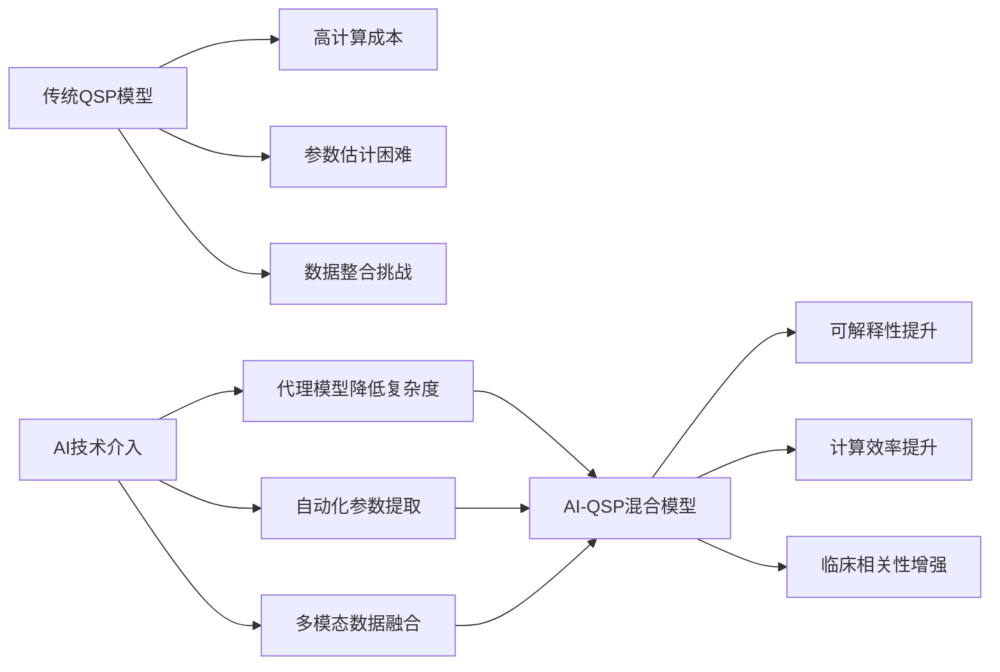
```mermaid
flowchart LR
    A[传统QSP模型] --> B[高计算成本]
    A --> C[参数估计困难]
    A --> D[数据整合挑战]
    
    E[AI技术介入] --> F[代理模型降低复杂度]
    E --> G[自动化参数提取]
    E --> H[多模态数据融合]
    
    F --> I[AI-QSP混合模型]
    G --> I
    H --> I
    
    I --> J[可解释性提升]
    I --> K[计算效率提升]
    I --> L[临床相关性增强]
```

#### 1.3.2 生成式AI与多模态大模型的创新应用

在人工智能技术的深度赋能下，医药研发领域正经历着颠覆性革新。传统药物研发模式受限于"试管-显微镜"的实体实验范式，往往需要耗费数年时间在数以万计的化合物中盲选有效成分，其成功率堪比大海捞针[^4]。**而基于深度学习的智能系统正在重构这一路径**：通过构建多模态生物医学知识图谱，整合基因组学、蛋白质组学及代谢组学的多维数据，形成具有语义关联的数字化药物研发空间[^4]。

这种智能平台运用迁移学习与图神经网络技术，能够建立化合物分子结构与靶点蛋白之间的量子化学关联模型，实现跨尺度（从分子到细胞再到器官）的虚拟药物筛选。**基于生成对抗网络（GAN）的分子设计引擎，可以逆向推导满足特定生物活性的化合物结构**，将传统的"筛选式发现"升级为"按需定制式创造"[^4]。

**生成式人工智能涵盖了大型语言模型和深度生成模型等技术，正日益影响QSP的研究与应用格局**[^3]。这些AI模型通过生成新假设、自动化模型构建，以及促进新型治疗药物设计，正在提升药物发现与开发的多个环节。生成式AI模型已展现出设计具有特定药理学特性的全新分子结构的能力。例如，Insilico Medicine利用GAN和强化学习创造了新的候选药物，其中部分已进入临床试验阶段[^3]。

水木分子团队开发的BioMedGPT全新多模态语义理解框架，验证了将文献、分子、蛋白、测序、知识图谱等数据压缩到统一的多模态大模型框架内，可使模型具备"融汇贯通"的能力[^5]。该模型在分子性质预测、药物-靶点亲和力预测、药物敏感性预测、分子-文本跨模态检索等多项任务上优于单一专用模型，从研究层面验证了技术可行性[^5]。

#### 1.3.3 从辅助工具到自主智能体的演进趋势

公共AI工具的最新进展，使研究人员能够以交互方式查询、可视化并解释复杂的系统生物学模型[^3]。研究显示，**LLMs能够概述模型结构、模拟结果，并提出扰动实验建议**，这些能力可直接应用于优化QSP工作流程与情景测试。由于QSP模型通常采用SBML标准，能够理解SBML语法与语义的AI工具，可加速模型的翻译与假设生成[^3]。

通过将机制性系统生物学模型与基于AI的文献挖掘及仿真工具相结合，研究人员可以自动更新或验证QSP的假设。**将此类AI代理嵌入云平台，可以使非专业用户也能以交互方式生成、探索或测试QSP模型**，从而拓展"QSP即服务"（QSPaaS）的概念[^3]。将生成式AI融入QSP可推动模型开发流程的自动化，例如，Certara的"QSP产业化"方法利用生成式AI优化模型生命周期，包括证据聚合、用于模型设计的代码生成，以及自动化报告生成，这一整合提升了QSP建模工作的效率与可扩展性[^3]。

### 1.4 核心概念界定与报告研究范围

#### 1.4.1 "大模型模拟药物影响"的内涵界定

本报告所指的"大模型模拟药物影响"，涵盖利用深度学习、生成式AI、大型语言模型及多模态基础模型等技术，对药物在生物系统中产生的多层次效应进行计算模拟与预测的全过程。这一概念包含以下核心维度：

- **分子层面**：药物-靶点相互作用预测、结合亲和力估算、选择性与脱靶效应评估
- **细胞层面**：信号通路扰动模拟、细胞表型变化预测、毒性机制推断
- **系统层面**：药代动力学（PK）与药效动力学（PD）建模、器官间相互作用、全身性效应预测
- **群体层面**：虚拟患者生成、亚群响应异质性模拟、临床试验结局预测

#### 1.4.2 "系统性评估"的外延界定

"系统性评估"强调超越单一靶点或单一终点的整体性视角，涵盖药物从发现到上市后监测的全生命周期评估：

| 评估阶段 | 核心内容 | 大模型应用场景 |
|---------|---------|---------------|
| 早期发现 | 靶点识别与验证、先导化合物生成 | 知识图谱推理、分子生成设计 |
| 临床前评估 | 药效预测、毒性预警、ADMET特性 | 虚拟筛选、安全性预测模型 |
| 临床评估 | 试验设计、患者分层、结局预测 | 虚拟患者建模、数字孪生 |
| 上市后监测 | 药物警戒、真实世界证据 | 自然语言处理、信号挖掘 |

#### 1.4.3 报告聚焦的技术类型与研究边界

本报告聚焦的技术类型包括：

1. **生成式模型**：用于分子设计、虚拟患者生成的GAN、VAE、扩散模型等
2. **预测模型**：用于活性、毒性、PK/PD参数预测的深度神经网络
3. **知识推理模型**：用于靶点发现、机制解析的知识图谱与大语言模型
4. **混合模型**：AI与机制性模型（如QSP）的融合架构

研究边界明确排除纯粹的临床数据统计分析、不涉及AI技术的传统计算化学方法，以及尚处于纯理论阶段而无实证支持的技术概念。

### 1.5 大模型兴起的宏观背景与技术驱动因素

#### 1.5.1 算力基础设施的突破性进展

AI制药的快速发展离不开算力基础设施的重大突破。2024年，Recursion建成了名为**BioHive-2的专用AI超级计算机，算力达2 exaflops（配备504张NVIDIA H100 GPU）**用于训练模型[^2]。2025年，Recursion开源了Boltz-2，这是一个拥有十亿参数的生成式模型，用于预测蛋白质三维结构及配体结合亲和力，其精度接近物理模型，但计算速度提高了约1000倍[^2]。

这种算力的指数级增长为处理海量生物医学数据、训练大规模深度学习模型提供了必要条件，使得此前因计算资源限制而不可行的复杂模拟成为可能。

#### 1.5.2 蛋白质结构预测的里程碑进展

**2024年诺贝尔化学奖授予蛋白质结构预测与设计领域的先驱科学家**，标志着人工智能技术在药物研发中的应用进入新阶段[^6]。David Baker、Demis Hassabis和John Jumper等获奖者的研究成果，正通过跨学科合作转化为实际治疗手段。AlphaFold技术的突破使科学家能够在数小时内预测数亿种蛋白质结构，其精度接近实验水平，大幅缩短了传统方法所需的时间成本[^6]。

在此基础上，David Baker团队进一步开发了蛋白质从头设计工具RFdiffusion，可生成具有特定功能的蛋白质分子。例如，该团队设计的EndoTag蛋白能精准靶向细胞表面疾病相关分子，并通过溶酶体途径实现降解，为癌症、自身免疫疾病等难治性疾病提供了新治疗思路[^6]。

#### 1.5.3 资本涌入与产业合作的加速态势

**回望2025年，AI制药正从概念验证迈入价值兑现初期**，成为全球产业资本、政策制定者与科研机构共同聚焦的战略高地[^7]。过去一年，AI制药领域投融资活跃、商务拓展合作密集、企业布局多元，政策与产业共振，推动行业进入规模化发展的"快车道"。

摩熵投融资数据显示，截至2025年12月，全球AI制药公司超350家，其中中国至少有101家[^7]。近三年中国AI制药投融资呈持续上涨趋势，从2023年的19起增至2024年的25起，2025年进一步上升至31起[^7]。在近日举办的2026年摩根大通医疗健康大会上，**科技巨头英伟达与制药龙头礼来宣布共同投资10亿美元建立联合AI实验室**，这一"王炸组合"直接将AI制药推向了新的竞争维度[^8]。

#### 1.5.4 监管政策对新途径方法的认可趋势

现代生命科学深度融合多学科领域，为毒理学带来全新技术与理论框架，也促使人们重新审视以动物实验为主的传统毒性测试的局限——耗时长、成本高、3R原则压力及物种外推不确定性[^9]。在此推动下，转化毒理学应运而生，搭建起"基础研究—应用转化"桥梁，推动毒性测试向高效、精准、符合伦理的替代方法转型。

**尤其是2025年4月10日，美国FDA宣布将在单克隆抗体类药物领域逐步淘汰动物试验**，这项决定紧随2022年美国《FDA现代化法案2.0》，标志着毒理学新途径方法（NAMs）正式进入药品安全评价的法规监管决策实施阶段，是国际药物安全评价领域的重大变革[^9]。这一监管政策的转向为AI驱动的药物评估方法创造了明确的制度空间。

#### 1.5.5 产业生态演变格局

当前，AI制药产业生态呈现出多元化发展态势。五家已成功将创新候选药物推进至临床阶段的领先AI驱动药物发现公司——Exscientia、Insilico Medicine、Recursion、BenevolentAI以及Schrödinger（薛定谔）——涵盖了多种AI技术路径，包括生成化学、基于物理的分子模拟、表型筛选以及基于知识图谱的靶点发现[^2]。

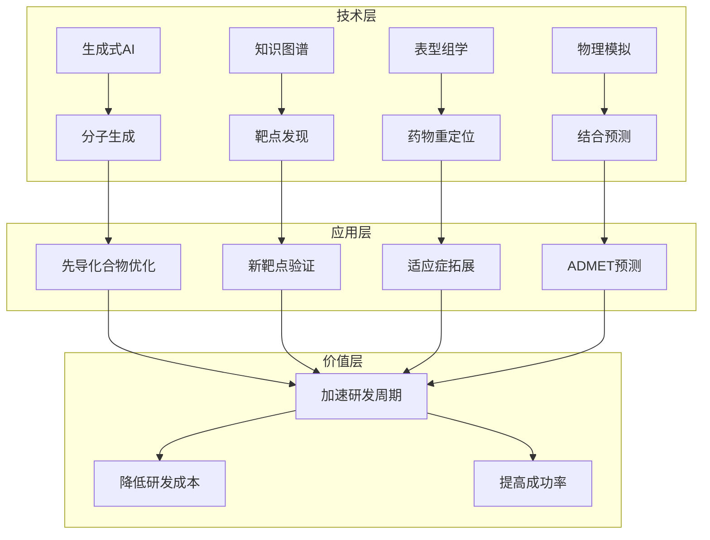
```mermaid
graph TB
    subgraph 技术层
        A1[生成式AI] --> B1[分子生成]
        A2[知识图谱] --> B2[靶点发现]
        A3[表型组学] --> B3[药物重定位]
        A4[物理模拟] --> B4[结合预测]
    end
    
    subgraph 应用层
        B1 --> C1[先导化合物优化]
        B2 --> C2[新靶点验证]
        B3 --> C3[适应症拓展]
        B4 --> C4[ADMET预测]
    end
    
    subgraph 价值层
        C1 --> D[加速研发周期]
        C2 --> D
        C3 --> D
        C4 --> D
        D --> E[降低研发成本]
        D --> F[提高成功率]
    end
```

**Exscientia的突出成就之一是率先将AI设计的治疗性药物推进至临床阶段**。2020年，其通过算法生成并与日本制药公司住友制药合作开发的用于治疗强迫症的药物DSP-1181，成为全球首个进入Ⅰ期临床试验的AI设计药物[^2]。值得注意的是，**在一项CDK7抑制剂项目中，仅合成了136个化合物便成功确定了临床候选物，而传统项目往往需要合成数千个化合物**[^2]。

Insilico Medicine的标志性成果出现在2021-2022年，其AI系统为特发性肺纤维化（IPF）识别出一个全新的纤维化相关靶点酶TNIK，并针对该靶点生成了一种小分子TNIK抑制剂ISM001-055（现名Rentosertib）。**该项目从AI驱动的假设提出到形成临床候选物仅用了约18个月**，成为最早实现AI发现靶点+AI设计分子并进入人体试验的案例之一[^2]。

国内首款由AI辅助设计的口服减肥新药MDR-001正式迈入Ⅲ期临床试验阶段，**从启动研发到进入临床试验仅用19个月，耗时4年半便推进至Ⅲ期临床阶段，创下行业研发速度新高**[^10]。这些案例充分说明，AI技术正在实质性地改变药物研发的时间和效率维度。

然而，尽管进入临床阶段的速度显著加快，**目前尚无任何由AI发现的药物获得监管批准，大多数项目仍停留在早期临床试验阶段**[^2]。这也引出了一个关键问题：AI是否真正带来了更高的成功率，还是仅仅加速了失败？有必要进行批判性分析，以区分现实的进展与围绕AI技术的过度炒作[^2]。这一问题将在后续章节中进行深入探讨。

## 2 技术基石：大模型模拟药物影响的核心路径与原理

大模型实现药物影响模拟与系统性评估并非依赖单一技术手段，而是通过多条技术路径的协同发力，形成覆盖药物研发全链条的智能化能力体系。本章将系统剖析三大核心技术路径——知识驱动推理、生成式AI应用及AI-机制模型融合，并进一步探讨新兴的多智能体协作架构，揭示各路径的理论基础、实现原理与相互关联，为理解大模型如何从不同维度赋能药物评估奠定技术基础。

### 2.1 知识驱动路径：基于海量生物医学知识的推理与假设生成

知识驱动路径的核心在于利用大模型对海量生物医学文献、数据库及知识图谱进行深度学习与语义理解，从而实现药物相关知识的自动化提取、整合与推理。这一路径的独特价值在于**能够从现有知识中发现隐藏的关联模式，生成新的科学假设**，尤其适用于靶点识别、疾病机制解析与药物重定位等早期发现场景。

#### 2.1.1 生物医学预训练语言模型的架构与知识编码机制

生物医学大模型技术演进经历了从通用预训练模型到领域专用模型的适配过程。**BioBERT、MedBERT等基于生物医学文献训练的预训练模型实现了领域知识储备**，而PMC-LLaMA等模型则通过微调进一步优化生物医学任务处理能力[^11]。这些模型的核心架构特点包括：

- **领域语料预训练**：在PubMed、MEDLINE等专业数据库上进行大规模预训练，使模型习得生物医学领域的专业术语、概念关系与语义结构
- **迁移学习机制**：通过"预训练+微调"范式，将大规模通用知识迁移至特定任务，解决罕见病和难取样组织中因数据稀缺导致的分析难题[^12]
- **上下文感知能力**：能够根据输入文本的上下文动态调整语义理解，捕捉基因、蛋白质、疾病等实体间的复杂关系

以**Geneformer模型**为例，该模型基于约3000万个单细胞转录组数据进行预训练，采用Transformer架构将基因视为"词汇"、将整个基因组的表达谱视为"句子"，通过自监督学习捕捉基因间的复杂调控关系[^13][^12]。其技术创新包括：

| 技术特征 | 实现方式 | 功能价值 |
|---------|---------|---------|
| 秩值编码 | 按细胞内表达量排序基因 | 消除技术偏差，高表达管家基因自动降权 |
| 自监督预训练 | 随机遮蔽15%基因进行预测 | 从无标签数据学习基因互作规律 |
| 动态嵌入表示 | 生成基因和细胞的上下文嵌入 | 编码网络层级信息，支持环境感知预测 |
| 虚拟基因编辑 | 模拟删除/激活目标基因 | 预测基因扰动对细胞状态的影响 |

#### 2.1.2 知识图谱构建与推理在靶点发现中的应用原理

知识图谱技术通过构建生物医学实体（基因、蛋白质、疾病、药物等）及其关系的结构化表示，为药物发现提供了可计算的知识基础。**大模型结合知识图谱能够实现跨数据源的关联推理**，发现传统方法难以识别的潜在靶点与治疗假设。

计算医学技术体系正是基于这一原理，**更加注重疾病和靶点之间的联系**，而非单纯关注药物分子本身[^14]。其核心推理机制包括：

1. **多源数据整合**：将基因组学、蛋白质组学、代谢组学等多维数据与文献知识融合，构建全局性知识网络
2. **路径推理**：沿知识图谱中的关系边进行多跳推理，发现疾病-基因-蛋白质-药物之间的间接关联
3. **假设生成**：基于推理结果自动生成可验证的科学假设，如新的药物适应症或治疗靶点

**BioGPT和BioBERT这样的大语言模型正在革新生物医学知识提取**，它们能够自动化文献挖掘、识别生物通路并优化药物开发假设[^3]。例如，Swanson教授的文献预测案例印证了大模型高效线索挖掘能力，SemaTyP系统成功挖掘出阿司匹林的新机制[^11]。

#### 2.1.3 知识驱动路径的独特价值与适用场景

知识驱动路径在药物评估中的核心价值体现在以下方面：

- **解决数据稀缺问题**：通过从海量文献中学习通用生物学知识，能够在有限样本条件下进行有效推理，尤其适用于罕见病研究
- **提供可解释性**：推理过程可追溯至具体的文献证据或知识图谱路径，增强预测结果的可信度
- **加速假设生成**：自动化的文献挖掘与关联发现能够大幅缩短从数据到假设的时间周期

该路径主要适用于**靶点识别与验证、疾病机制解析、生物标志物发现**等需要深度理解生物学背景的应用场景，与生成式AI路径形成"靶点发现-分子设计"的闭环协同。

### 2.2 生成式AI路径：分子设计与虚拟患者/数字孪生生成

生成式AI路径的核心在于利用深度生成模型按需创造具有理想性质的分子结构或虚拟患者，**将传统的"筛选式发现"升级为"按需定制式创造"**，极大提升了药物设计与评估的效率。

#### 2.2.1 深度生成模型的分子从头设计与优化机制

基于GAN（生成对抗网络）、VAE（变分自编码器）、扩散模型等深度生成架构的分子设计方法，能够在化学空间中探索全新的分子结构，并针对特定药理学特性进行优化。

**华为云盘古大模型预训练17亿个分子结构后生成1亿个全新化合物库**，成功发现广谱抗菌药肉桂酰菌素，其结构新颖性达100%[^15]。这一案例展示了生成式AI在分子设计中的强大能力。生成式分子设计的核心技术原理包括：

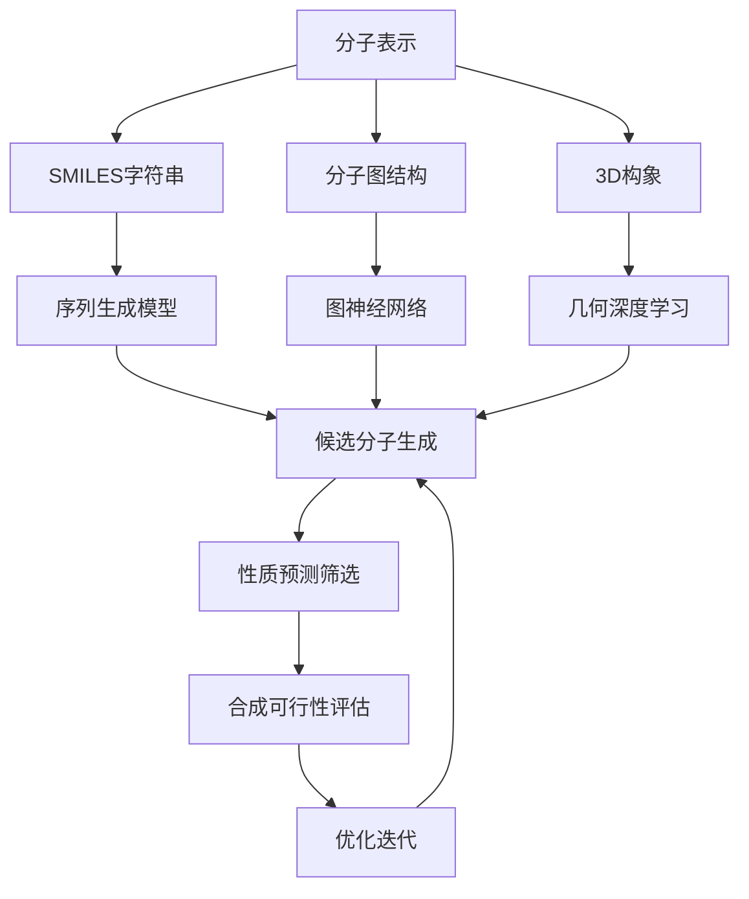
```mermaid
flowchart TB
    A[分子表示] --> B[SMILES字符串]
    A --> C[分子图结构]
    A --> D[3D构象]
    
    B --> E[序列生成模型]
    C --> F[图神经网络]
    D --> G[几何深度学习]
    
    E --> H[候选分子生成]
    F --> H
    G --> H
    
    H --> I[性质预测筛选]
    I --> J[合成可行性评估]
    J --> K[优化迭代]
    K --> H
```

**强化学习在目标导向分子生成中发挥关键作用**，通过设计奖励函数引导模型生成满足多重约束（如活性、选择性、ADMET特性）的分子结构。例如，Insilico Medicine利用GAN和强化学习创造了新的候选药物，其中部分已进入临床试验阶段[^3]。

Chemistry42平台利用大模型预测化学反应路径，结合机器人化学合成平台，**在21天内完成从苗头化合物到临床前候选分子（LEAD）的优化，较传统方法提速70%**[^15]。药明生物WuXi ProDesign模型基于Transformer架构设计抗体药物，2个月内生成30种候选分子，其中3种通过湿实验验证进入临床前研究[^15]。

#### 2.2.2 数字孪生技术与"电子药物"的实现方法

数字孪生技术在药物评估中的应用，通过构建患者或疾病的计算模型，实现药物响应的虚拟预测与评估。**"喂虚拟小人吃电子药"**形象地描述了计算医学的工作模式[^14]。

数字孪生的构建涉及多个层次：

| 孪生类型 | 数据来源 | 模拟内容 | 应用价值 |
|---------|---------|---------|---------|
| 患者数字孪生 | 基因组、影像、病理、电子病历 | 疾病进展、药物响应、生存预后 | 个性化治疗方案制定 |
| 疾病数字孪生 | 多组学数据、病灶影像 | 细胞行为、微环境互动 | 疾病机制解析 |
| 药物数字孪生（电子药物） | 靶点信息、药效-机制映射 | 药物作用机制、适应人群 | 适应症拓展、精准用药 |

**"电子药物"不是模拟化合物本身，而是药物发生效应的机制**，通过药效-机制映射关系比对获得[^14]。具体而言，将对药物有反应和无反应的人群放在一起，从底层信号通路层面比对差异，其中的差异即为药物的实现机制。

图灵-达尔文实验室的研究案例展示了数字孪生的实际应用价值：**通过为CDK4/6抑制剂建立AI模型（药物的数字化孪生），挖掘乳腺癌与脊索瘤发病机理的共性**，成功预测了原本用于治疗乳腺癌的药物对脊索瘤显示出临床良好响应[^16]。这一研究是通过人工智能算法"算"出来的，提供了一种跨病种研究的可能性。

人工智能一方面可以通过建立代表患者个体的生理与病理特征的数字孪生，用以模拟患者的疾病进展、药物响应、生存预后等临床重要指标；另一方面，可以通过利用医学影像、病理信息、多组学数据等，**构建出肿瘤等疾病的复杂病灶的数据孪生**，用以模拟病灶中不同细胞行为和互动过程[^16]。

#### 2.2.3 生成式AI应对小数据挑战的技术优势

生成式AI模型本身依赖于数据的统计分布和变量之间的条件概率，通常需要进行巨量数据训练。然而，**人类疾病数据天生就是"小数据"**，尤其是罕见病，即便是癌症与自身免疫性疾病，也存在因病理复杂、疾病机制异质性强而导致每个亚型的数据并不多[^16]。

计算医学技术体系针对这一挑战，**以认知疾病为目标，用AI解决疾病和药物机理认知不清的系统性问题**。通过理解人类个体的基因组DNA序列信息，提取个人的"指纹性"基因突变、建立基于细胞信号转导通路与功能的全局性"蓝图"，进而产生对疾病状态有指向意义的特征性数据[^16]。

### 2.3 AI-机制模型融合路径：与QSP及系统生物学的深度整合

AI-机制模型融合路径将数据驱动的AI方法与基于第一性原理的定量系统药理学/毒理学（QSP/QST）模型相结合，**在增强预测效能的同时保持生理机制的可解释性**，尤其适用于对可靠性和监管认可要求较高的中后期研发阶段。

#### 2.3.1 AI代理模型降低QSP计算复杂度的实现机制

**AI通过作为一种非参数化工具来实现模型阶数降低**，能够用代理模型来近似复杂模型，从而在保持输出行为的前提下显著降低计算成本[^3]。人工神经网络（ANNs）可用于生成代理模型，以近似QSP模型中的剂量-反应关系以及其他输入-输出映射。

代理模型的技术优势包括：

- **仿真时间大幅缩短**：与全阶QSP模型相比，代理模型可将计算时间从小时级降至秒级
- **加速敏感性分析**：支持大规模参数扫描和不确定性量化
- **快速方案探索**：能够在短时间内评估多种治疗方案的潜在效果

在AI框架下部署的特征选择算法，也能通过识别最小但信息量极高的分子描述符或动力学参数子集来进一步降低模型复杂性，从而去除冗余信息，并将计算资源集中于系统行为的关键驱动因素[^3]。

#### 2.3.2 定量系统毒理学（QST）中AI增强的安全性预测框架

**定量系统毒理学（QST）被定义为一种通过整合计算与实验方法，从定量与机制层面理解并预测药物对机体的毒性效应的研究方法**[^17][^18]。QST模型有潜力提升候选化合物在跨阶段安全性评估中的可信度，并为推进项目至监管申报阶段的决策提供支持。

定量建模方法通常包括两大类：

| 模型类型 | 典型代表 | 特点 | 适用场景 |
|---------|---------|------|---------|
| 经验型数据驱动模型 | PK/TK、PD/TD模型 | 对数据依赖性强，预测能力局限于经验数据范围 | 已有充分历史数据的场景 |
| 机制型知识驱动模型 | PBPK、QSP、QST模型 | 整合生物学机制，支持外推预测 | 新靶点、新机制的探索性研究 |

**QST模型能够根据其范围与数据可用性，描述同靶点-同通路毒性（即夸大药理作用）、同靶点-异通路毒性以及非靶点毒性**，从而提升安全性评估的精确度[^17][^18]。阿斯利康的一项内部分析显示，在临床试验中因安全性原因被终止的化合物，其前期非临床安全性信心水平普遍较低，相比之下，信心较高的化合物成功率更大。

然而，**QST模型尚处于发展阶段，面临独特挑战**，其中一个关键困难在于毒性机制的不确定性，即毒性究竟是由靶点介导还是非靶点介导所致[^17][^18]。AI技术的引入有望通过数据驱动的方式弥补机制认知的空白，增强模型的预测能力。

#### 2.3.3 混合建模策略的可解释性与预测效能平衡

AI与机制模型融合的核心价值在于**兼顾数据驱动方法的预测效能与机制模型的可解释性**。这种融合策略的实现方式包括：

1. **AI作为机制模型的组件**：用神经网络替代机制模型中难以精确描述的子模块
2. **机制约束引导AI训练**：将已知的生物学规则作为正则化项或约束条件
3. **AI辅助参数估计**：利用机器学习方法从实验数据中推断机制模型的参数

**由AI驱动的数据库和基于云的平台可能会支持QSP模型开发，并推动"QSP即服务"（QSPaaS）的实现**[^3]。这种整合不仅提升了建模效率，还降低了非专业用户使用复杂模型的门槛。

### 2.4 多智能体协作架构：复杂药物发现任务的自动化编排

随着大语言模型能力的提升，**多智能体系统正在成为处理复杂药物发现任务的新兴架构**，通过任务分解、工具调用与结果整合的自动化工作流程，实现从辅助工具向自主智能体的演进。

#### 2.4.1 MADD系统的多智能体架构设计

**MADD（Multi-Agent Drug Discovery Orchestra，多智能体药物发现管弦乐团）**是由俄罗斯圣彼得堡ITMO大学等机构研究人员开发的创新系统，为药物发现领域带来了革命性变化[^19][^20]。该系统的设计理念源于现实世界中成功的团队合作模式，由四个专门的AI特工组成，每个都有明确的职责分工：

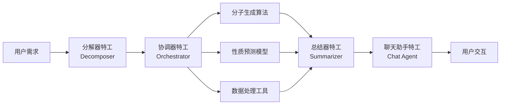
```mermaid
flowchart LR
    A[用户需求] --> B[分解器特工<br>Decomposer]
    B --> C[协调器特工<br>Orchestrator]
    C --> D[分子生成算法]
    C --> E[性质预测模型]
    C --> F[数据处理工具]
    D --> G[总结器特工<br>Summarizer]
    E --> G
    F --> G
    G --> H[聊天助手特工<br>Chat Agent]
    H --> I[用户交互]
```

各特工的功能定位如下：

- **分解器特工（Decomposer）**：当用户提出复杂的药物发现需求时，分解器会仔细分析并将其拆解成若干个可以具体执行的小任务。例如，当用户需要"一种既能穿透血脑屏障又对GSK-3β蛋白有高活性的阿尔茨海默病治疗药物"时，分解器会将此分解为"生成GSK-3β抑制剂"和"确保药物具有良好的血脑屏障通透性"两个独立任务[^19][^20]

- **协调器特工（Orchestrator）**：制定详细的执行计划，决定调用哪些工具来完成每个任务，拥有丰富的工具库包括分子生成算法、性质预测模型以及各种数据处理工具[^19][^20]

- **总结器特工（Summarizer）**：将所有结果整理成清晰易懂的格式呈现给用户，不仅提供生成的分子结构，还详细说明每个分子的各项性质指标[^19][^20]

- **聊天助手特工（Chat Agent）**：扮演人机交互的桥梁角色，帮助用户完善查询表述，提供系统功能咨询[^19][^20]

#### 2.4.2 多智能体系统的验证效果与技术优势

**研究团队在七个具体的疾病案例上验证了MADD系统的效果**，包括阿尔茨海默病、帕金森病、多发性硬化症、肺癌、血脂异常、药物抗性以及血小板减少症。结果显示，**MADD在复杂任务上的准确率达到了79.8%，大幅超越了现有的其他AI药物设计系统**[^19][^20]。

更重要的是，研究团队首次将AI主导的药物设计应用到了STAT3、ABL、COMT、ACL和PCSK9等五个生物靶点，成功识别出了多个具有良好生物活性和结合亲和力的候选药物分子[^19][^20]。

多智能体架构的核心技术优势在于：

- **专业化分工**：每个特工专注于特定任务，提升整体效率
- **灵活性与可扩展性**：可根据需要添加新的工具或特工
- **自然语言交互**：降低使用门槛，使非AI专家也能有效利用系统
- **自动化工作流**：减少人工干预，加速从需求到结果的转化

该研究还为学术界贡献了一个全新的基准数据集，**包含超过300个用户查询和超过300万个分子的对接评分数据**，为未来的智能药物设计研究提供了宝贵资源[^19][^20]。

### 2.5 三大路径的技术关联与协同机制

三大技术路径并非孤立存在，而是针对药物研发不同阶段的需求各擅胜场，并通过串联与增强产生协同效应，形成覆盖药物发现全流程的技术体系。

#### 2.5.1 串联式协同：研发管线流程整合

三大路径在药物研发管线中形成**自然的串联协同关系**：

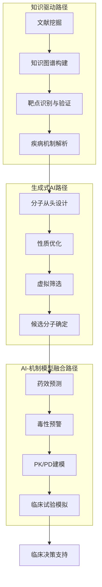
```mermaid
flowchart TB
    subgraph 知识驱动路径
        A1[文献挖掘] --> A2[知识图谱构建]
        A2 --> A3[靶点识别与验证]
        A3 --> A4[疾病机制解析]
    end
    
    subgraph 生成式AI路径
        B1[分子从头设计] --> B2[性质优化]
        B2 --> B3[虚拟筛选]
        B3 --> B4[候选分子确定]
    end
    
    subgraph AI-机制模型融合路径
        C1[药效预测] --> C2[毒性预警]
        C2 --> C3[PK/PD建模]
        C3 --> C4[临床试验模拟]
    end
    
    A4 --> B1
    B4 --> C1
    C4 --> D[临床决策支持]
```

- **知识推理 → 生成式AI**：基于知识推理发现的新靶点，可直接作为生成式AI进行分子设计的输入和起点，形成"靶点发现-分子设计"的闭环
- **生成式AI → 机制模型融合**：生成式AI设计的候选分子，可以输入到与QSP/QST融合的模型中进行虚拟药效和毒性评估，实现"设计-评估"迭代优化

#### 2.5.2 增强式协同：提升模型能力

三大路径之间还存在**相互增强的协同关系**：

| 协同模式 | 具体机制 | 效果提升 |
|---------|---------|---------|
| 生成式AI为机制模型提供输入 | 创建大量虚拟患者数据用于训练和验证机制模型 | 解决真实患者数据不足问题 |
| 机制模型为生成式AI提供约束 | QSP/QST揭示的生物学机制作为规则引导分子生成 | 减少"黑箱"设计的盲目性 |
| 知识推理赋能全流程 | 为生成和机制模型提供深厚的生物学背景知识 | 提高输出的科学性和可靠性 |

#### 2.5.3 各路径的适用场景与优势边界

三大路径在不同应用场景中展现出差异化的优势与局限：

| 技术路径 | 核心优势 | 主要局限 | 最佳适用场景 |
|---------|---------|---------|-------------|
| 知识驱动路径 | 可解释性强、小样本适用 | 依赖已有知识、难以发现全新机制 | 靶点识别、疾病机制解析 |
| 生成式AI路径 | 创新性强、效率高 | "黑箱"性、需要大量验证 | 分子设计、虚拟患者生成 |
| AI-机制模型融合 | 生理相关性强、监管认可度高 | 模型构建复杂、领域知识要求高 | 药效/毒性预测、临床试验设计 |

**DrugChat作为多模态大语言模型的代表**，展示了技术融合的潜力——该模型集成分子结构、分子图像和文本等多种模态，能够在单一框架内处理广泛的预测任务，消除了对多个专门模型的需求[^21]。DrugChat分析输入分子的结构以及用户的查询，生成关于药物适应症、药效学和作用机制的全面自由形式预测，并支持与用户的多轮对话，促进了对同一分子的交互式深入探索[^21]。

#### 2.5.4 技术体系的整体架构与演进方向

综合三大路径及多智能体协作架构，大模型药物影响模拟技术体系呈现出**多层次、多模态、可协同**的整体架构：

- **数据层**：整合文献、组学、影像、临床等多源异构数据
- **模型层**：知识推理模型、生成式模型、机制模型协同工作
- **应用层**：覆盖从靶点发现到上市后监测的全生命周期
- **交互层**：多智能体系统提供自然语言交互与自动化编排

未来演进方向包括：**平台的整合化**（构建端到端一体化平台）、**数据的多模态化**（深度融合多源异构数据）、**模型的可解释化**（增强AI预测的机制可解释性）、以及**生态的系统化**（建立产学研与监管的协同生态），最终实现从假设到药物的全链条智能化加速。

## 3 应用全景：多尺度药物评估场景的实践与验证

大模型技术正在药物研发与评估的全生命周期中展现出强大的赋能能力，从早期靶点发现到上市后安全监测，形成了覆盖多尺度、多环节的智能化应用体系。本章将系统剖析大模型在各核心场景中的具体实践，结合产业实证案例评估其技术成熟度与实际效能，揭示大模型如何在药物影响的精准模拟与系统性评估中发挥关键作用。

### 3.1 早期发现阶段的智能化应用

早期发现阶段是药物研发的源头，决定着后续研发的方向与成功概率。大模型技术在靶点识别与验证、先导化合物生成与优化两大关键环节中展现出变革性的应用价值，将传统的"大海捞针"式筛选升级为"精准定向"式发现。

#### 3.1.1 知识图谱驱动的靶点识别与验证

靶点识别是药物研发的起点，传统方法依赖于对疾病机制的深入理解和大量实验验证，周期长且成功率低。**大模型结合知识图谱的推理能力，能够从海量生物医学数据中发现隐藏的靶点关联**，显著加速这一过程。

以Insilico Medicine为代表的AI制药公司在靶点发现领域取得了标志性突破。**其AI系统为特发性肺纤维化（IPF）识别出一个全新的纤维化相关靶点酶TNIK**，并针对该靶点生成了一种小分子TNIK抑制剂ISM001-055（现名Rentosertib）[^2]。这一案例的突破性在于，TNIK作为靶点此前并未被广泛关注，正是通过AI对多源数据的深度挖掘才得以发现。该项目从AI驱动的假设提出到形成临床候选物仅用了约18个月，成为最早实现AI发现靶点+AI设计分子并进入人体试验的案例之一。

BenevolentAI的知识图谱平台同样展示了知识驱动路径的强大能力。在新冠疫情期间，**该平台成功预测了Baricitinib可作为COVID-19治疗药物**，这一预测随后在临床试验中得到验证。其技术核心在于构建了涵盖基因、蛋白质、疾病、药物等实体的大规模知识图谱，通过多跳推理发现疾病机制与现有药物作用机制之间的潜在关联。

在单细胞层面的靶点发现中，**Geneformer模型通过预训练单细胞数据，成功识别出扩张型心肌病的治疗靶点GSN和PLN**。该模型采用"虚拟基因编辑"技术，模拟删除或激活目标基因后对细胞状态的影响，从而预测潜在的治疗靶点。这种方法尤其适用于缺乏大规模临床数据的罕见病研究，展示了大模型在小样本条件下进行有效推理的能力。

#### 3.1.2 生成式AI驱动的先导化合物设计与优化

先导化合物的生成与优化是将靶点转化为候选药物的关键环节。**生成式AI将传统的"筛选式发现"升级为"按需定制式创造"**，能够根据特定的药理学需求直接生成满足多重约束的分子结构。

华为云盘古药物分子大模型的应用案例展示了生成式AI在分子设计中的强大能力。**该模型对17亿个分子结构进行预训练，生成了1亿个全新小分子化合物的数据库，结构新颖性约达100%**[^22]。西安交通大学第一附属医院联合华为云，基于该模型成功发现了广谱抗菌药肉桂酰菌素。研发团队通过模型的分子优化功能减弱了对人体正常细胞可能产生的毒副作用，目前肉桂酰菌素正在稳步推进临床研究[^22]。该模型兼具小分子-蛋白结合预测、小分子80+属性预测、小分子优化与生成等功能，赋能先导药研发全流程。

浙江大学团队开发的**Delete模型**代表了AI辅助先导优化的前沿进展。该模型结合生成式人工智能与结构生物学方法，具有空间感知能力和多任务兼容特性[^23]。基于等变网络解析蛋白口袋的几何与能量特征，通过统一掩蔽策略支持片段扩展、连接链设计、骨架跃迁、侧链修饰等优化任务。研究团队将其应用于非小细胞肺癌全新致癌靶点CLIP1-LTK，基于ALK抑制剂化学空间迁移学习，生成227个候选分子，其中13个进入实验验证[^23]。**最终成功设计出纳摩尔级活性分子CA-B-1，其对LTK的IC₅₀达1.36nM，且能选择性抑制31种激酶中的LTK**[^23]。口服给药（20mg/kg）显著抑制肿瘤生长，半衰期8小时，药代性质优异。

药明生物的**WuXi ProDesign模型**在抗体药物设计领域展现了生成式AI的应用价值。该模型基于Transformer架构，训练数据来自内部逾千个抗体开发项目[^22]。在针对某癌症靶点（PD-L1/CTLA-4双抗）的研发中，**该模型结合AlphaFold 3预测抗原结合位点，2个月内生成30种候选分子，其中3种通过湿实验验证**[^22]。有一款分子（项目代号WB-203）已进入临床前研究，较上一代单抗亲和力提升50%，该项目入选2024年美国癌症研究协会（AACR）"十大突破性技术"[^22]。

以下表格总结了早期发现阶段主要AI应用案例的关键指标：

| 应用场景 | 代表案例 | 核心技术 | 关键成果 | 效率提升 |
|---------|---------|---------|---------|---------|
| 靶点发现 | Insilico TNIK靶点 | 知识图谱推理 | 全新IPF治疗靶点 | 假设到候选物18个月 |
| 分子生成 | 盘古模型-肉桂酰菌素 | 预训练+生成 | 广谱抗菌新药 | 结构新颖性100% |
| 先导优化 | Delete模型-LTK抑制剂 | 等变网络+迁移学习 | IC₅₀ 1.36nM | 227候选→13验证 |
| 抗体设计 | WuXi ProDesign | Transformer+AlphaFold 3 | 亲和力提升50% | 2个月30候选分子 |

#### 3.1.3 多模态知识引导的先导发现能力增强

**Y-Mol模型**作为多方面知识引导的大语言模型，展示了将多源知识整合用于先导发现的技术路径。该模型基于LLaMA2-7b架构设计，通过结合药物数据库、知识图谱和专家设计的合成数据作为模型微调的数据，增强了在生物医学领域的推理能力[^22]。实验评估表明，**Y-Mol在发现先导化合物、预测分子性质和识别药物相互作用方面的能力显著优于LLaMA2**[^22]。例如，它能分析出Abametapir可能影响Dronedarone的代谢，导致其在体内浓度变化，还能分析出Topotecan可通过影响BCL-2基因家族成员的表达来抑制肺癌细胞的生长和转移[^22]。

### 3.2 临床前与临床评估阶段的预测与优化

临床前与临床评估阶段是药物研发中资源投入最大、失败风险最高的环节。大模型技术通过药效预测、毒性预警、临床试验设计优化等应用，**正在重塑这一阶段的决策逻辑与效率边界**。

#### 3.2.1 AI增强的药效预测与ADMET特性评估

药效预测与ADMET（吸收、分布、代谢、排泄、毒性）特性评估是候选药物进入临床前必须跨越的关键门槛。传统方法依赖大量体外和动物实验，耗时长且预测准确性有限。**大模型通过整合多维度数据，能够在计算层面实现更精准的药效与药代动力学预测**。

药明生物基于英伟达BioNeMo平台的相关模型在生产工艺优化中展现了AI的实际价值。在某客户单抗药物的研发中，因细胞培养滴度低导致生产成本过高，**药明生物基于分子动力学模拟优化细胞培养条件与抗体折叠稳定性，并结合强化学习算法动态调节培养基配方**[^22]。最终使细胞培养滴度提升至8.5g/L，生产成本降低40%，工艺开发周期从8个月缩短至3个月[^22]。

在基因治疗载体优化领域，**药明开发的GPT-BioVector模型利用Transformer预测载体衣壳蛋白的免疫原性与组织靶向性**[^22]。针对杜氏肌营养不良症（DMD）的AAV9优化项目中，筛选出的载体免疫原性降低70%（小鼠模型验证），该载体已进入IND-enabling（临床前）阶段，2024年完成首批患者招募，并获得FDA"快速通道"资格[^22]。

#### 3.2.2 药物毒性预测与安全性预警系统

药物毒性是导致临床试验失败和上市后撤市的主要原因之一。**AI技术正在从根本上改变毒性预测的方法论，从经验性评估转向机制性预测**。

在药物肝毒性预测领域，**依托机器学习框架，药物肝毒性预测准确率提升32%**[^24]。这一突破源于AI技术与真实世界数据的深度融合，通过分析历史药物的结构特征、代谢途径与临床毒性数据，建立了更为精准的预测模型。

传统化学物质毒性评价依赖动物实验与体外测试，存在周期长、成本高、伦理争议及数据泛化性不足等问题[^25]。随着人工智能技术的发展，**机器学习与深度学习算法在化学结构-毒性关系挖掘中展现出独特优势，能够高通量、高精度预测未知物质毒性，推动毒理学研究向"预测毒理学"转型**[^25]。

AI在毒性预测中的技术路径包括：

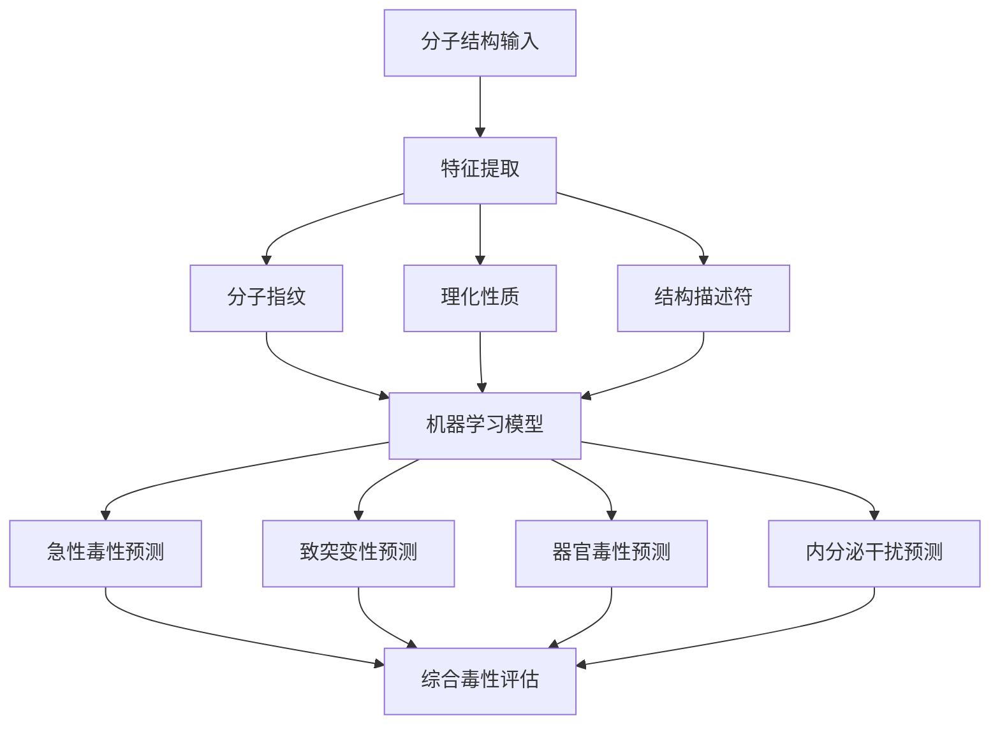
```mermaid
flowchart TB
    A[分子结构输入] --> B[特征提取]
    B --> C[分子指纹]
    B --> D[理化性质]
    B --> E[结构描述符]
    
    C --> F[机器学习模型]
    D --> F
    E --> F
    
    F --> G[急性毒性预测]
    F --> H[致突变性预测]
    F --> I[器官毒性预测]
    F --> J[内分泌干扰预测]
    
    G --> K[综合毒性评估]
    H --> K
    I --> K
    J --> K
```

#### 3.2.3 虚拟患者生成与临床试验设计优化

临床试验是药物研发中最耗时、最昂贵的环节，患者招募困难、异质性高是主要挑战。**大模型通过虚拟患者生成与智能化试验设计，正在重塑临床试验的效率与成功率**。

药明生物基于开源大模型微调的NLP工具在临床试验优化中展现了显著价值。在某自身免疫病药物的III期临床试验中，因患者异质性导致入组缓慢，**药明生物基于Meta Llama 3微调的NLP工具，分析全球10万+电子健康记录（EHR）与文献数据，精准筛选患者亚群**[^22]。整合药明自研的临床表型图谱模型，使入组时间缩短45%，试验总成本减少3000万美元[^22]。试验结果显示亚组患者有效率提升28%（p < 0.001），支持药物加速获批[^22]。

在虚拟临床试验领域，**"Principal-001"虚拟临床试验成功预测乳腺癌药物反应**，并预测CDK4/6抑制剂对脊索瘤有效。这种方法通过为药物建立AI模型（药物的数字化孪生），挖掘不同疾病发病机理的共性，实现了跨病种的药物响应预测。

以下表格总结了临床前与临床评估阶段AI应用的关键效能指标：

| 应用领域 | 技术方案 | 核心成果 | 量化效益 |
|---------|---------|---------|---------|
| 生产工艺优化 | 分子动力学+强化学习 | 细胞培养滴度提升 | 成本降低40%，周期缩短62.5% |
| 载体优化 | GPT-BioVector | 免疫原性降低 | 免疫原性降低70% |
| 患者分层 | Llama 3微调NLP | 精准亚群筛选 | 入组时间缩短45%，成本减少3000万美元 |
| 毒性预测 | 机器学习框架 | 肝毒性预测 | 准确率提升32% |

### 3.3 上市后监测阶段的智能药物警戒

药物上市后的安全监测是保障公众用药安全的最后一道防线。**大模型技术正在将药物警戒从被动响应模式转变为主动预警模式**，显著提升安全信号的识别效率与准确性。

#### 3.3.1 传统药物警戒的痛点与AI破局

传统药物警戒活动存在诸多痛点。**不良反应个例报告（ICSRs）的识别、处理与审阅高度依赖人工，导致成本高昂、效率低下，且容易出现人为错误与主观判断**[^26]。这不仅制约了药物警戒的效率与规模，还增加了不良反应识别与处理的风险。对于监管机构而言，海量的ICSR涌入使其工作压力远超现有资源[^26]。

传统临床研究因样本筛选严格、研究周期有限、特定的研究环境、仅观察设定的监测指标等局限，**难以全面覆盖真实用药场景中的复杂安全风险**[^24]。这使得一些潜在的安全风险只能在药品上市后大规模应用后才得以显现。

真实世界数据虽然具有数据来源广、能长期跟踪、贴近实际用药场景等优势，但同时存在"非标准化"与"质量不可控"的难题。**数据来源分散、格式不统一、关键信息缺失、数据标准化不统一，以及隐私保护与数据利用之间的平衡难题等，都严重制约了安全信号挖掘的准确性与及时性**[^24]。

#### 3.3.2 大语言模型在药物警戒中的革命性应用

AI技术的引入为药物警戒带来了新希望。**2025年5月8日，上海市生物医药行业协会正式发布国内首个《基于大语言模型的药物警戒个例安全性报告人工智能辅助信息提取规范》团体标准（T/SBIAORG 0002-2025）**[^26]，标志着AI技术在药物警戒领域的应用迈入标准化、规范化新阶段。

该标准适用于药品上市许可持有人（MAH）、境外持有人境内代理人、药品经营企业等机构，为LLM技术在药物警戒数据处理中的开发与应用提供了明确指导[^26]。同时，监管部门、医疗机构及技术开发商也可借此标准优化系统设计，提升药物安全监测效能。

在个例安全报告处理方面，**AI可以从数据源中自动采集PV所需数据，并具备多源数据整合能力**[^24]。将来自不同渠道、不同格式的数据进行清洗、转换和融合，形成全面、连贯的数据集，方便进行综合分析和评估。**借力AI技术赋能，单份个例报告的处理时间从150分钟锐减至30分钟**[^24]。

在信号检测方面，**AI能够快速处理RWE中大量复杂的药物相关数据，在短时间内完成数据清洗、整合与分析**[^24]。依托算法和模型，AI精准识别出微弱或隐藏的安全性信号，并综合考虑患者的基础疾病、用药史等多种因素，减少误判和漏判的情况。

#### 3.3.3 从被动响应到主动预警的模式转变

**AI给药物警戒带来的不只是效率提升，更是模式的根本性改变**[^24]。以前是不良反应发生并积累到一定数量后才识别信号，属于"被动响应"。现在AI通过机器学习模型实现预测性分析，提前预警潜在风险，变成"主动预警"。

具体而言，AI实现药物警戒模式转变的技术路径包括：

| 预警维度 | 技术实现 | 应用价值 |
|---------|---------|---------|
| 早期风险警报 | 分析历史数据识别异常波动 | 及时发现新出现的安全信号 |
| 个体预警 | 结合患者个体信息预测用药风险 | 从"群体警戒"升级到"个体预警" |
| 迟发性反应预测 | 时间序列模型预测长期使用风险 | 为药品管理提供前瞻依据 |

在风险预测方面，**AI能够基于RWE数据构建预测模型，从而对未来可能出现的药物安全问题进行前瞻性预测**[^24]。通过深入分析药物的使用趋势、患者群体特征等多重因素，AI能够提前识别潜在风险，为药物研发、监管及临床应用提供宝贵参考，进而助力制定更加科学合理的安全性管理策略。

#### 3.3.4 大语言模型在药物警戒中的使用策略

为确保药物警戒领域的安全性和合规性，团体标准提出大语言模型在药物警戒中的使用需遵循三条核心原则：**一是"安全至上"，AI辅助必须全程有人工审核；二是"透明可溯"，模型决策逻辑需清晰可解释，错误可追溯；三是"隐私为本"，从模型训练到结果存储，全流程必须严格合规加密**[^26]。

在确定大语言模型的使用策略时，需综合考虑系统输出准确率、法规合规性以及数据准确度等多方面因素[^26]。具体策略可分为以下几种模式：

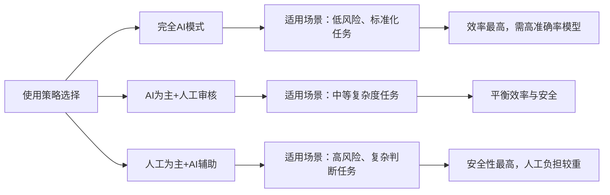
```mermaid
flowchart LR
    A[使用策略选择] --> B[完全AI模式]
    A --> C[AI为主+人工审核]
    A --> D[人工为主+AI辅助]
    
    B --> E[适用场景：低风险、标准化任务]
    C --> F[适用场景：中等复杂度任务]
    D --> G[适用场景：高风险、复杂判断任务]
    
    E --> H[效率最高，需高准确率模型]
    F --> I[平衡效率与安全]
    G --> J[安全性最高，人工负担较重]
```

三大核心技术构成了赋能药物警戒的"硬实力"：**自然语言处理在处理非结构化文本方面具有独特优势；机器学习可以通过对大量数据的学习建立评估模型和分类规则；机器人流程自动化则可以将不同的系统流程串联起来，实现数据的自动传输和处理**[^24]。

#### 3.3.5 全球药物警戒AI实践案例

全球范围内，监管机构和行业专家正积极探索AI技术在药物警戒中的应用。**世界卫生组织的VigiBase是一个国际药物警戒数据库，汇集了来自150多个国家的安全性信息**[^27]。AI工具分析这一庞大的数据集以检测安全信号，如罕见的药物不良反应或有害相互作用。这种实时分析使医疗保健提供者和制药公司能够主动作出响应，确保全球药物安全和患者保护[^27]。

美国FDA已推出相关平台和工具，探索自然语言技术在不良事件监测中的应用[^26]。然而，LLM和AI技术在药物警戒领域也面临数据获取与标注困难、语义理解复杂、模型可解释性不足、数据隐私与安全等合规风险[^26]。

### 3.4 全生命周期拓展应用与新兴场景

大模型的应用正在突破药物研发的传统边界，向药物重定位、环境影响评估、个性化治疗等新兴领域拓展，**展现出覆盖药物全生命周期的系统化整合趋势**。

#### 3.4.1 数字孪生驱动的药物重定位

药物重定位（Drug Repurposing）是利用已有药物治疗新适应症的策略，能够显著缩短研发周期并降低风险。**大模型通过构建药物与疾病的数字孪生，能够发现跨病种的治疗潜力**。

图灵-达尔文实验室的研究案例展示了数字孪生在药物重定位中的创新应用。**通过为CDK4/6抑制剂建立AI模型（药物的数字化孪生），挖掘乳腺癌与脊索瘤发病机理的共性**，成功预测了原本用于治疗乳腺癌的药物对脊索瘤显示出临床良好响应。这一研究是通过人工智能算法"算"出来的，提供了一种跨病种研究的可能性。

数字孪生技术在药物重定位中的技术路径如下：

1. **药物机制建模**：构建药物发生效应的机制模型，而非模拟化合物本身
2. **药效-机制映射**：通过比对有反应和无反应人群的底层信号通路差异，提取药物的实现机制
3. **跨病种匹配**：将药物机制与新疾病的病理机制进行比对，发现潜在适应症

#### 3.4.2 疾病机制解析与个性化治疗方案

人工智能一方面可以通过建立代表患者个体的生理与病理特征的数字孪生，用以模拟患者的疾病进展、药物响应、生存预后等临床重要指标；另一方面，可以通过利用医学影像、病理信息、多组学数据等，**构建出肿瘤等疾病的复杂病灶的数据孪生**，用以模拟病灶中不同细胞行为和互动过程。

IBM Watson构建糖尿病患者数字孪生预测新药疗效的案例展示了这一方向的应用潜力。通过整合患者的基因组、代谢组、生活方式等多维数据，构建个体化的疾病模型，能够预测不同治疗方案的响应概率，支持精准医疗决策。

#### 3.4.3 药品监管中的大模型应用

**近年来人工智能，尤其是大语言模型技术的快速发展，为药品监管领域带来了新的机遇与挑战**[^28]。国家药监局信息中心的初步实践探讨了药品监管领域应用大语言模型的基础考量，提出了一体化建设框架与实践路径。

在药品注册形式审查场景中，大语言模型已展示出具体应用成效[^28]。文章分析了数据、算力和算法三大基础要素的重要性，梳理了数据质量、算力成本和算法适用性在模型应用中的关键作用。提出了一体化建设框架，建议通过国家与省级药品监管部门的协同合作，构建统一且可扩展的大语言模型应用体系，避免重复建设和资源浪费[^28]。

### 3.5 产业案例综合评估与技术成熟度分析

基于上述各应用场景的实践案例，有必要对大模型在药物评估中的技术成熟度进行系统评估，为产业应用决策提供参考依据。

#### 3.5.1 技术成熟度评估框架

根据各场景的实证数据与产业反馈，可将大模型药物评估应用的技术成熟度划分为以下层级：

| 成熟度等级 | 定义 | 代表场景 | 关键指标 |
|-----------|------|---------|---------|
| **已验证（Level 4）** | 多项独立验证，已有商业化应用 | 分子生成、文献挖掘、报告处理 | 多个临床候选物、标准发布 |
| **初步验证（Level 3）** | 有实验验证，部分进入临床 | 靶点发现、先导优化、患者分层 | 临床试验进展、效率提升数据 |
| **概念验证（Level 2）** | 有原理验证，缺乏大规模验证 | 复杂毒性预测、虚拟临床试验 | 准确率提升、预测案例 |
| **探索阶段（Level 1）** | 技术可行性研究 | 环境影响评估、监管全流程自动化 | 概念框架、初步模型 |

#### 3.5.2 各场景技术成熟度综合评估

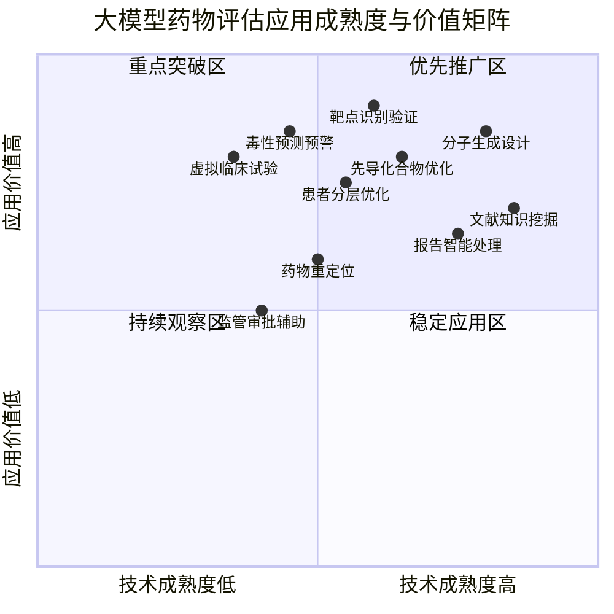
```mermaid
quadrantChart
    title 大模型药物评估应用成熟度与价值矩阵
    x-axis 技术成熟度低 --> 技术成熟度高
    y-axis 应用价值低 --> 应用价值高
    quadrant-1 优先推广区
    quadrant-2 重点突破区
    quadrant-3 持续观察区
    quadrant-4 稳定应用区
    分子生成设计: [0.8, 0.85]
    文献知识挖掘: [0.85, 0.7]
    报告智能处理: [0.75, 0.65]
    靶点识别验证: [0.6, 0.9]
    先导化合物优化: [0.65, 0.8]
    患者分层优化: [0.55, 0.75]
    毒性预测预警: [0.45, 0.85]
    虚拟临床试验: [0.35, 0.8]
    药物重定位: [0.5, 0.6]
    监管审批辅助: [0.4, 0.5]
```

#### 3.5.3 已验证场景的关键成功要素

**分子生成与设计**作为技术成熟度最高的场景，其成功要素包括：

- **数据基础扎实**：大规模分子数据库（如盘古模型的17亿分子预训练）提供了充分的训练数据
- **验证闭环完整**：从生成到合成到活性验证的干湿实验闭环已建立（如Exscientia仅136个化合物确定临床候选物）
- **商业模式清晰**：AI制药公司与传统药企的合作模式已成熟（如多项临床管线推进）

**药物警戒报告处理**作为另一高成熟度场景，其成功要素包括：

- **任务边界明确**：信息提取任务相对标准化，适合AI自动化
- **标准规范引导**：团体标准的发布为技术应用提供了规范框架
- **效率提升显著**：从150分钟到30分钟的效率提升具有明确的商业价值

#### 3.5.4 待突破场景的核心挑战

**复杂毒性预测**和**虚拟临床试验**作为高价值但待突破的场景，面临以下核心挑战：

1. **数据挑战**：毒性数据稀缺且不平衡，尤其是罕见毒性类型；临床试验数据的隐私与可及性限制
2. **机制复杂性**：毒性机制的不确定性（靶点介导vs非靶点介导）增加了预测难度
3. **验证困难**：虚拟预测结果需要真实世界验证，但验证周期长、成本高
4. **监管认可**：监管机构对AI生成证据的接受度仍在发展中

#### 3.5.5 产业生态建设的关键建议

基于技术成熟度分析，为推动大模型药物评估的产业化应用，提出以下建议：

**对于已验证场景**：
- 加速商业化推广，建立行业最佳实践
- 推动标准化建设，如药物警戒AI标准的推广
- 建立效能评估基准，持续优化模型性能

**对于待突破场景**：
- 加强产学研协作，共建高质量数据集
- 推动AI与机制模型的深度融合，增强可解释性
- 与监管机构建立沟通机制，探索AI证据的认可路径

**南京江北新区生物医药公共服务平台**的实践提供了产业生态建设的参考模式。该平台依托国家健康医疗大数据（东部）中心，实现覆盖江苏省全省的公卫临床诊疗和20PB多组学数据汇聚与应用，构建AI制药异构算力调度服务联盟，打造干湿闭环药物研发体系[^29]。项目实施以来，已与100余家企事业单位在疾病药物/医疗器械真实世界研究、智慧医疗/精准医疗产品研发、药物发现与优化等应用场景开展合作，**助力科研团队发现多个疾病新靶点和新活性分子，整体降低企业研发成本超千万元**[^29]。

这种"政府主导、多方参与"的市场化可持续运营模式，通过面向生物医药行业科研和企事业单位提供算力资源服务、多组学检测服务、数据分析服务，实现了国有公共技术服务平台的自我造血，为大模型药物评估的产业化应用提供了可复制的生态建设范本。

## 4 挑战透视：数据、模型、验证与监管的核心瓶颈

尽管大模型在药物影响模拟与系统性评估中展现出变革性潜力，但其规模化应用仍面临深层次的技术与制度障碍。前文所述的技术路径与产业实践表明，**从概念验证到临床转化、从实验室原型到监管认可之间，存在着一系列亟待跨越的关键瓶颈**。本章将系统剖析数据、模型、验证与监管四大维度的核心挑战，揭示其根源机制与相互作用，并评估现有应对策略的有效性与局限性，为后续探讨解决路径奠定问题基础。

### 4.1 数据挑战：多源异构数据的质量、标准化与可及性困境

数据是大模型的基石，其覆盖率、质量、规范程度以及与应用的适配度，直接关系到大模型的应用效果和服务质量[^28]。然而，药物评估领域的数据生态面临着多重结构性困境，**从数据标注到隐私合规、从标准化到跨机构共享，每一环节都存在显著瓶颈**。

#### 4.1.1 高质量标注数据的稀缺与成本困境

医药领域数据标注面临着独特的挑战。**数据标注成本高：医药领域数据（如蛋白质结构、病理图像）需要专业知识标注，人工成本极高，且高质量标注数据稀缺**[^30]。与通用领域的图像或文本标注不同，药物相关数据的标注需要具备深厚专业背景的专家参与，这不仅推高了单位数据的标注成本，还严重限制了可用训练数据的规模。

药品监管数据涉及大量业务数据、法律法规和专业知识等，具备较高的语义复杂性和领域特异性[^28]。这种特异性意味着通用预训练模型难以直接迁移应用，而领域适配所需的高质量标注数据却供给不足，形成了"需求大、供给少、成本高"的三重困境。

大模型的训练需要极高的算力和数据支持，这对计算资源和数据质量提出了严格要求[^31]。以AlphaFold和AlphaGo等模型的成功为例，其背后离不开大规模的计算资源和高质量的数据集支撑，这无疑提升了大模型研发的成本门槛，使得中小型研发机构难以独立构建具有竞争力的模型。

#### 4.1.2 多模态数据整合的标准化困境

药物评估涉及多种类型的数据源，其整合面临着根本性的技术障碍。**多模态数据（基因组、蛋白质组、影像、电子病历）格式不统一，缺乏标准化处理流程，整合难度大**[^30]。例如，不同医院的影像数据分辨率、标注规则差异显著，基因组数据与临床表型数据的关联方式也缺乏统一规范。

这种异构性问题在药物警戒领域尤为突出。真实世界数据虽然具有数据来源广、能长期跟踪、贴近实际用药场景等优势，但同时存在"非标准化"与"质量不可控"的难题。**数据来源分散、格式不统一、关键信息缺失、数据标准化不统一**，都严重制约了安全信号挖掘的准确性与及时性。

以下表格总结了不同数据类型的标准化现状与挑战：

| 数据类型 | 主要来源 | 标准化程度 | 核心挑战 |
|---------|---------|-----------|---------|
| 基因组数据 | 测序平台、公共数据库 | 中等 | 测序技术差异、批次效应 |
| 蛋白质组数据 | 质谱分析、结构数据库 | 较高 | 覆盖度不足、动态修饰复杂 |
| 影像数据 | 医院PACS系统 | 低 | 分辨率、标注规则差异大 |
| 电子病历 | 医疗机构HIS系统 | 低 | 自然语言描述、编码体系不统一 |
| 临床试验数据 | 药企、CRO机构 | 中等 | 入组标准、终点定义差异 |

#### 4.1.3 数据孤岛与跨机构共享壁垒

**跨机构数据孤岛问题突出，药企、医院、学术机构间数据共享机制不完善，限制模型训练的全面性**[^30]。这种数据孤岛现象源于多重因素：机构间的竞争关系、数据资产的商业价值、隐私保护的法律要求，以及缺乏可信的数据共享基础设施。

在药品监管领域，大语言模型技术的应用依赖于专业信息和业务数据[^28]。然而，监管数据往往分散在不同层级的监管机构中，缺乏统一的数据治理框架和共享机制。国家药监局信息中心提出的一体化建设框架，正是为了应对这一挑战，建议通过国家与省级药品监管部门的协同合作，构建统一且可扩展的大语言模型应用体系，避免重复建设和资源浪费[^28]。

#### 4.1.4 隐私合规与数据可及性的张力

**患者医疗数据、临床试验数据涉及隐私（如HIPAA、GDPR），跨机构数据共享存在法律障碍，联邦学习等技术虽能缓解但尚未完全解决问题**[^30]。隐私保护与数据利用之间的平衡难题，成为制约大模型在药物评估领域应用的重要因素。

隐私合规挑战的具体表现包括：

- **跨境数据流动限制**：跨国药企在数据共享、模型部署时面临不同司法管辖区的法规差异[^30]
- **数据脱敏与效用损失**：过度脱敏可能导致数据的科学价值降低
- **同意机制复杂性**：二次使用患者数据需要复杂的知情同意流程
- **审计追溯要求**：监管机构对数据使用的全程可追溯性要求增加了技术实现难度

#### 4.1.5 数据分布不均与泛化能力受限

**数据分布不均：罕见病、特殊人群数据匮乏，导致模型在小众适应症中泛化能力差**[^30]。公开数据库可能存在种族、地域偏差（如多数基因组数据来自欧美人群），影响模型在不同人群中的适用性[^32]。

这一问题在药物安全评估中尤为关键。某些药物的不良反应可能在特定种族或基因型人群中发生率更高，但如果训练数据缺乏这些人群的代表性样本，模型将无法准确预测相关风险，可能导致药物安全性评估的系统性偏差。

### 4.2 模型挑战：可解释性、计算复杂度与泛化偏见难题

大模型技术本身存在着一系列内在局限，**从"黑箱"特性到计算资源消耗、从预测不确定性到训练偏见**，这些技术瓶颈直接影响着模型在药物评估中的可信度与实用性。

#### 4.2.1 "黑箱"困境与可解释性刚需

**大模型（如Transformer、扩散模型）通常是"黑箱"，难以解释预测逻辑（如分子活性预测为何偏好某类结构），这在需要严格监管的医药领域难以直接应用**[^30]。捕捉输入数据和相关输出之间复杂非线性关系的能力，通常是以结果模型的可理解性有限为代价的[^33]。

在药物化学中，"经验法则"的可用性与物理化学特性相关联的生物效应，强调了在某些情况下，愿意牺牲准确性以更好地贴合人的直觉[^33]。**模糊"两个QSARs"（即机器学习上可解释的模型与高度精确的模型）之间的界限，可能是用AI加速药物发现的关键**[^33]。

可解释人工智能（xAI）方法正是为缓解这一困境而发展。提供数学模型的同时提供信息解释的目的包括：（1）使潜在的决策过程透明化（"可理解"）；（2）避免因错误的原因做出正确的预测（所谓聪明的汉斯效应）；（3）避免不公平的偏见或不道德的歧视；（4）弥合机器学习界和其他科学学科之间的差距[^33]。

xAI在药物设计应用中需具备的关键特性包括[^33]：

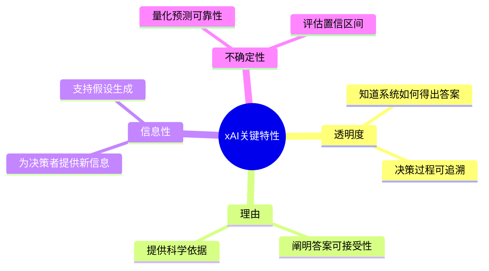
```mermaid
mindmap
  root((xAI关键特性))
    透明度
      知道系统如何得出答案
      决策过程可追溯
    理由
      阐明答案可接受性
      提供科学依据
    信息性
      为决策者提供新信息
      支持假设生成
    不确定性
      量化预测可靠性
      评估置信区间
```

#### 4.2.2 可解释性与预测精度的权衡困境

xAI领域面临着一个根本性的权衡问题：**更高的可解释性往往意味着模型复杂度的降低，而这可能牺牲预测精度**。一般来说，xAI产生的解释可以分为全局性的或局部性的，可以依赖于底层模型，也可以是模型不可知的，这反过来又会影响每种方法的潜在适用性[^33]。在这个框架中，不存在一个放之四海而皆准的xAI方法。

在药物警戒领域的实践表明，**当前XAI方法如SHAP仅提供局部解释，而"因果可解释性"（causability）要求更高**[^34]。例如某模型虽正确标记华法林风险，但其依据的"年龄>70"特征实际是肾功能下降的代理指标，反映解释与真实因果机制的偏差[^34]。这种"解释性与因果性的鸿沟"是当前xAI技术面临的核心挑战之一。

#### 4.2.3 计算资源消耗与可及性障碍

**训练千亿参数级医药大模型需消耗大量算力（如AlphaFold2训练耗时128个TPUv3核心·年），中小企业难以负担**[^30]。这种算力门槛不仅限制了模型开发的参与主体，还可能加剧行业的技术垄断。

计算资源挑战的具体表现包括：

| 挑战维度 | 具体问题 | 影响范围 |
|---------|---------|---------|
| 训练成本 | 千亿参数模型训练耗时数月、成本数百万美元 | 中小企业难以独立开发 |
| 推理效率 | 虚拟筛选时生成百万级分子需数天计算 | 高通量需求无法满足 |
| 能耗问题 | 大规模训练产生大量碳排放 | 可持续发展争议 |
| 硬件依赖 | 对高端GPU/TPU的强依赖 | 供应链风险、地缘政治影响 |

**推理阶段效率待提升：例如虚拟筛选时，生成百万级分子需数天计算，实时优化分子结构的速度无法满足高通量需求**[^30]。这一瓶颈直接制约了大模型在工业化药物筛选中的应用规模。

#### 4.2.4 预测不确定性与假阳性风险

**模型预测存在不确定性，尤其是在复杂生物系统中（如蛋白质-蛋白质相互作用），可能因训练数据偏差导致假阳性结果，误导研发方向**[^30]。AI模型在处理复杂任务时容易出现"幻觉"（即生成不准确或无意义的内容），如何提高模型的准确性与可靠性仍是亟待解决的问题[^31]。

在药物发现领域，假阳性问题的代价尤为高昂。虚拟筛选预测的候选分子需要通过湿实验验证，而**假阳性率较高意味着大量实验资源被浪费在无效候选物上**，这不仅增加了研发成本，还可能延误真正有潜力的候选物的推进。

#### 4.2.5 训练偏见与药物公平性问题

训练数据的质量、规模和代表性差异可能导致偏差，影响结果可靠性[^35]。**模型决策可能加剧医疗资源分配不均（如优先研发利润高的药物，忽视罕见病）**[^30]。这种偏见不仅是技术问题，更涉及深层次的伦理考量。

偏见问题的具体表现包括：

- **种族偏见**：多数基因组数据来自欧美人群，导致模型对其他种族的预测准确性降低
- **疾病偏见**：常见病数据丰富，罕见病数据稀缺，导致罕见病领域的AI应用受限
- **经济偏见**：商业利益驱动下，AI研发资源向高回报领域倾斜

#### 4.2.6 跨学科融合的复杂性挑战

**药物研发需结合生物学、化学、临床医学等多领域知识，而大模型开发者可能缺乏足够的领域背景，导致模型设计偏离实际需求（如忽略药物代谢动力学特性）**[^30]。现有模型多针对单一任务（如结构预测、活性预测），缺乏端到端的全流程解决方案，不同环节数据传递可能引入误差[^30]。

**既懂AI技术又精通医药研发的复合型人才稀缺，导致需求沟通不畅（如算法工程师难以理解药物代谢动力学指标）**[^30]。药企内部组织架构传统，数据部门与研发部门协作效率低，阻碍大模型落地[^30]。

### 4.3 验证挑战：从计算预测到临床转化的可信度鸿沟

大模型的预测能力需要通过严格的实验验证才能转化为临床价值。然而，**从虚拟预测到湿实验验证、从实验室发现到临床应用之间，存在着一条难以逾越的"可信度鸿沟"**。

#### 4.3.1 虚拟筛选的假阳性困境

**实验室验证是药物研发的关键环节，但大模型生成的候选分子需通过湿实验验证，成功率可能低于传统方法（如虚拟筛选的假阳性率较高），导致转化成本增加**[^30]。这一问题的根源在于计算模型与真实生物系统之间的本质差异。

虚拟筛选的假阳性来源包括：

- **模型过拟合**：在训练数据上表现良好，但对新化学空间泛化能力不足
- **评分函数局限**：对接打分函数难以准确捕捉所有相关的分子相互作用
- **动态效应忽略**：静态结构预测无法反映分子在生理条件下的动态行为
- **水环境简化**：溶剂效应和熵变的处理往往过于简化

#### 4.3.2 学术研究与工业应用的脱节

**学术研究与工业应用脱节：多数大模型研究停留在实验室阶段（如开源蛋白质结构预测模型），缺乏与药企管线的实际对接**[^30]。这种脱节表现在多个层面：

| 脱节维度 | 学术研究特点 | 工业应用需求 | 差距表现 |
|---------|-------------|-------------|---------|
| 数据规模 | 公开基准数据集 | 企业私有数据 | 数据迁移困难 |
| 评估指标 | 学术benchmark | 临床终点 | 指标关联性弱 |
| 时间周期 | 发表周期驱动 | 项目进度驱动 | 节奏不匹配 |
| 质量标准 | 统计显著性 | GxP合规性 | 标准体系差异 |

#### 4.3.3 合成可行性与药效验证周期

AI生成的候选分子不仅需要具有理论上的活性，还必须在实际中可合成、可测试。**合成可行性评估**是从计算预测到实验验证的关键环节，但当前AI模型在这方面的能力仍有待提升。

此外，**药效验证周期长**是另一重要挑战。即使候选分子成功合成并显示出体外活性，其在动物模型和人体中的药效验证仍需要数月甚至数年时间。这种长周期验证与AI快速迭代的特性之间存在根本性的节奏不匹配。

#### 4.3.4 预测可重复性与跨数据库验证

预测结果的可重复性是科学可信度的基础。然而，**不同研究团队使用不同数据集、不同模型架构、不同训练策略得到的结果往往难以相互验证**。这种可重复性问题在AI药物发现领域尤为突出。

研究者通过构建含287个金标准案例的测试集（含已知因果关系的阳性对照和虚假关联的阴性对照），建立三级验证体系：算法内部验证（F1-score）、专家盲法评估（kappa值）、跨数据库重复性检验[^34]。这种验证体系的创新为提升预测可信度提供了方法论参考。

#### 4.3.5 从统计关联到因果推断的方法学跃迁

当前机器学习模型主要捕捉统计关联而非因果关系。**当模型将"高龄"和"联用NSAID"作为华法林出血风险预测因子时，可能只是反映了混杂因素而非真实药理机制**[^34]。这种缺陷在自发报告系统（SRS）数据中尤为突出，因为漏报率高达95%且存在渠道偏倚[^34]。

研究团队提出"因果可解释性"的创新框架，通过整合因果图模型与do-因果演算，开发InferBERT等可解释模型，在镇痛药肝毒性案例中实现78-95%的因果识别准确率[^34]。这一方向代表了从关联预测向因果推断的方法学演进趋势。

### 4.4 监管与伦理挑战：框架适应性、算法问责与合规边界

AI驱动的药物评估正在重塑药物研发的范式，但**现有监管框架主要针对传统研发模式设计，难以完全适应AI技术的特性**。同时，算法决策的伦理问题也日益凸显。

#### 4.4.1 监管框架的适应性滞后

**目前缺乏针对AI驱动药物研发的统一监管框架。例如，FDA虽批准了一些AI辅助诊断工具，但对大模型生成的药物分子是否需特殊审批流程尚未明确**[^30]。这种监管滞后给产业应用带来了不确定性。

FDA发布的指南草案为药品研发的申办者及相关方提供AI应用建议，提出**基于风险的可信度评估框架**，用于确立和评估特定使用场景下AI模型的可信度[^35]。该框架的核心要素包括：

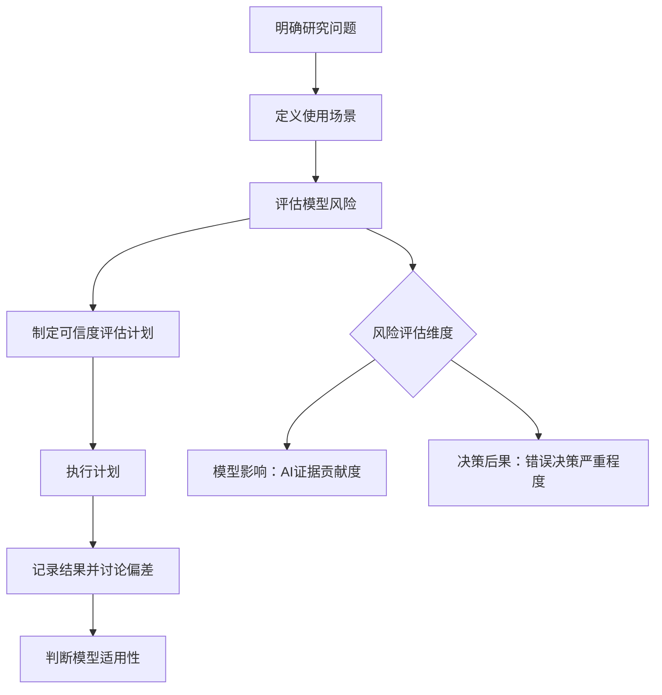
```mermaid
flowchart TB
    A[明确研究问题] --> B[定义使用场景]
    B --> C[评估模型风险]
    C --> D[制定可信度评估计划]
    D --> E[执行计划]
    E --> F[记录结果并讨论偏差]
    F --> G[判断模型适用性]
    
    C --> H{风险评估维度}
    H --> I[模型影响：AI证据贡献度]
    H --> J[决策后果：错误决策严重程度]
```

FDA和EMA发布的联合框架强调在将人工智能整合到药物研发过程中保持透明度、可靠性和道德标准的重要性，涉及数据质量、算法验证和监管合规等关键领域[^36]。这一合作反映了监管机构对AI技术潜在影响的日益重视。

#### 4.4.2 模型生命周期维护的监管要求

AI模型的性能可能随时间和数据分布变化而衰减，这对传统的"一次性审批"监管模式提出了挑战。**新数据输入可能引发数据漂移，导致模型性能随时间或环境变化，需要进行生命周期维护**[^35]。

FDA指南强调模型输出可信度的生命周期维护需求，要求申办者建立持续监测和更新机制。然而，**医药领域知识迭代快（如新靶点发现、机制研究突破），大模型需持续吸收最新数据，但重新训练成本高昂，增量更新技术尚不成熟**[^30]。

#### 4.4.3 算法问责与责任归属困境

**模型输出的责任归属不清晰：若因模型预测错误导致临床试验失败或药物副作用，责任应由药企、模型开发方还是监管机构承担？**[^30]这一问题在AI驱动的药物评估中尤为突出，因为决策过程涉及多方参与者。

责任归属的复杂性体现在：

| 参与方 | 潜在责任 | 责任边界模糊点 |
|-------|---------|---------------|
| 模型开发方 | 算法设计缺陷、训练数据偏差 | 模型被二次开发后的责任转移 |
| 药企（使用方） | 模型选择、应用场景判断 | 对"黑箱"模型决策的审查义务 |
| 监管机构 | 审批标准制定、上市后监测 | 对AI生成证据的认可边界 |
| 数据提供方 | 数据质量、隐私合规 | 数据用于非预期用途的责任 |

#### 4.4.4 伦理风险与公平性考量

AI在药物研发中的应用涉及深层次的伦理问题。**基因编辑、合成生物学等领域应用大模型时，可能引发"设计婴儿""生物安全"等伦理争议**[^30]。此外，算法偏见可能导致特定人群在药物研发中被系统性忽视。

AI在生物医药中的应用还涉及伦理与监管问题。例如，**AI生成的诊断建议是否具有法律效力？如何确保AI模型在处理患者数据时的隐私保护？**[^31]这些问题需要政府、企业及学术界的共同努力，制定相应的法规与标准。

#### 4.4.5 数据隐私保护与模型训练的张力

在药品监管领域应用大模型技术，必须对支撑其应用的三大基础（数据、算力和算法）具有充分的认识和准备[^28]。其中，**数据隐私保护与模型训练需求之间的张力**是一个核心矛盾。

目前大语言模型技术及应用仍处于早期探索阶段，存在多方面风险[^28]：

- **技术安全风险**：包括提示注入、数据泄漏、不完善的沙盒隔离等
- **数据隐私与安全风险**：例如用户数据被用于训练导致隐私信息泄露、模型和数据成为核心资产安全保护难度提升等
- **伦理与法律风险**：例如算法偏见与歧视、模型输出错误或虚假信息等

### 4.5 挑战间的系统性关联与现有应对策略的整体评估

四大挑战并非孤立存在，而是相互交织、相互影响，形成了一个复杂的挑战网络。**理解这种系统性关联，是制定有效应对策略的前提**。

#### 4.5.1 挑战间的链式传导机制

四大挑战之间存在明确的因果传导关系：

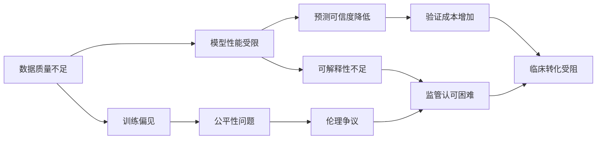
```mermaid
flowchart LR
    A[数据质量不足] --> B[模型性能受限]
    B --> C[预测可信度降低]
    C --> D[验证成本增加]
    D --> E[临床转化受阻]
    
    B --> F[可解释性不足]
    F --> G[监管认可困难]
    G --> E
    
    A --> H[训练偏见]
    H --> I[公平性问题]
    I --> J[伦理争议]
    J --> G
```

**数据质量如何制约模型性能**：训练数据的覆盖率、质量和代表性直接决定了模型的预测能力上限。数据稀缺导致模型在小样本场景下泛化能力不足，数据偏差导致预测结果存在系统性偏见。

**模型黑箱特性如何阻碍监管认可**：监管机构需要理解AI决策的依据才能评估其可靠性。当模型无法提供可理解的解释时，监管机构难以判断其预测是否基于合理的科学依据，从而延缓审批进程。

**验证困难如何延缓临床转化**：高假阳性率意味着大量资源被浪费在无效候选物的验证上，延长了从发现到临床的周期；可重复性问题则降低了产业界对AI预测的信任度。

#### 4.5.2 现有应对策略的有效性评估

针对上述挑战，学术界和产业界已发展出多种应对策略，但其有效性存在边界：

**知识驱动与数据驱动融合策略**：
为解决AI"幻觉"问题，研究者提出了知识驱动的方法，即将人类知识（如知识图谱、领域专家经验）融入模型中。通过结合数据驱动与知识驱动，AI模型能够更高效地学习并生成更准确的内容[^31]。然而，这一策略的有效性取决于领域知识的完整性和可形式化程度，对于机制尚不明确的疾病领域，其效果有限。

**因果AI框架**：
研究团队提出将流行病学因果框架嵌入AI模型，通过InferBERT等案例证明因果AI可使F1-score提升至0.78-0.95[^34]。Wang等开发的InferBERT通过Transformer架构分析FAERS叙事文本，不仅预测ADR还构建因果树，在曲马多相关死亡案例中，其识别的因果路径与临床药理高度吻合[^34]。然而，因果AI技术仍处于早期阶段，其在复杂多因素场景下的适用性有待验证。

**FDA基于风险的可信度评估框架**：
该框架为AI在药品生命周期中的应用提供了系统性指导，但其实施需要申办者投入大量资源进行模型文档化和验证，可能增加研发成本和周期。此外，框架的具体执行标准仍在发展中，不同审评员的理解和执行可能存在差异。

#### 4.5.3 亟待突破的关键瓶颈识别

基于上述分析，可识别出以下亟待突破的关键瓶颈：

| 瓶颈类型 | 核心问题 | 突破方向 | 优先级 |
|---------|---------|---------|-------|
| **数据瓶颈** | 高质量标注数据稀缺 | 联邦学习、合成数据、主动学习 | 高 |
| **技术瓶颈** | 可解释性与精度权衡 | 内在可解释模型、因果AI | 高 |
| **验证瓶颈** | 假阳性率高、可重复性差 | 标准化基准、多中心验证 | 中高 |
| **制度瓶颈** | 监管框架滞后 | 监管沙盒、国际协调 | 中 |
| **人才瓶颈** | 复合型人才稀缺 | 跨学科培养、产学研合作 | 中 |

#### 4.5.4 系统性解决路径的初步框架

应对四大挑战需要系统性的解决思路，而非单点突破。初步框架如下：

**短期策略（1-2年）**：
- 聚焦高成熟度场景（如分子生成、文献挖掘）的规模化应用
- 建立行业数据共享联盟，推动数据标准化
- 完善AI药物评估的团体标准和行业规范

**中期策略（3-5年）**：
- 发展内在可解释的AI模型架构
- 建立跨机构的验证基准和评测体系
- 推动监管科学演进，探索AI证据的认可路径

**长期策略（5-10年）**：
- 构建覆盖全生命周期的AI药物评估平台
- 实现AI与机制模型的深度融合
- 建立国际协调的AI药物监管框架

在药品监管领域，不应受"ALL in AI"等舆论导向的影响、盲目追求技术潮流，而应**秉持科学和理性的态度，紧密结合大语言模型的技术特性、自身实际需求以及风险容忍度，进行审慎评估与规划**[^28]。这一原则同样适用于整个药物评估领域的AI应用。

综上所述，大模型在药物系统性评估中的规模化应用面临着数据、模型、验证、监管四大维度的核心挑战。这些挑战相互关联、相互制约，形成了复杂的障碍网络。现有应对策略虽然在特定场景下展现出有效性，但其适用边界明确，难以从根本上解决问题。**突破这些瓶颈需要技术创新、制度演进与生态协同的系统性努力**，这也为后续章节探讨未来发展趋势与解决路径奠定了问题基础。

## 5 未来展望：技术融合、生态演进与范式前瞻

基于前文对大模型药物评估技术路径、应用实践与核心挑战的系统分析，本章将目光投向未来5-10年的发展图景。**当前AI制药正从概念验证迈入价值兑现初期**，成为全球产业资本、政策制定者与科研机构共同聚焦的战略高地[^2]。本章将从技术演进、应用场景拓展、产业生态构建与监管科学演进四个维度，系统预测大模型驱动药物系统性评估的发展方向，为产业界、学术界与监管机构提供前瞻性战略参考。

### 5.1 技术演进趋势：多模态融合与智能化跃迁

未来5-10年，大模型技术将在多个维度实现突破性演进，从数据整合能力、模型可解释性到与机制模型的深度融合，共同推动药物评估从"辅助工具"向"核心引擎"的角色跃迁。

#### 5.1.1 多模态大模型的深度整合与统一建模

**多模态融合是解决当前数据孤岛与异质性挑战的核心技术路径**。ICLR 2025大会上涌现的研究成果预示着这一方向的加速发展：NExT-Mol巧妙地结合了1D语言模型处理序列的优势和3D扩散模型处理空间的优势，让生成的3D分子既化学有效，几何结构也更精确；3D-MolT5则更进一步，将3D结构信息转化为离散标记，与文本信息一起学习，让模型对分子的理解更立体[^37]。

未来多模态整合将沿以下路径演进：

| 整合维度 | 当前状态 | 未来方向（5-10年） | 关键突破点 |
|---------|---------|-------------------|-----------|
| 分子-蛋白质 | 分离建模为主 | 统一表示学习框架 | 跨模态预训练架构 |
| 组学-影像 | 初步关联分析 | 端到端多模态融合 | 异构数据对齐技术 |
| 文本-结构 | 检索与生成分离 | 语义-结构联合生成 | 跨模态注意力机制 |
| 静态-动态 | 静态结构预测 | 动态构象模拟 | 时序建模能力 |

**AlphaFold 3的突破性进展**为多模态整合提供了范本——它不仅能预测蛋白质结构，还能处理DNA、RNA和小分子，真正实现了对生物大分子复合物的统一建模，其基于扩散模型的结构预测模块代表了新的方向[^37]。预计到2030年，将出现能够同时处理基因组、蛋白质组、代谢组、影像与临床数据的统一大模型架构，实现从分子到系统层面的全景式药物影响模拟。

#### 5.1.2 可解释AI从局部解释向因果可解释性的突破

**可解释性是大模型获得科学界和监管信任的核心技术突破点**。当前XAI方法如SHAP仅提供局部解释，而"因果可解释性"要求更高。未来的技术演进将聚焦于从统计关联向因果推断的方法学跃迁。

可解释AI的演进路径如下：

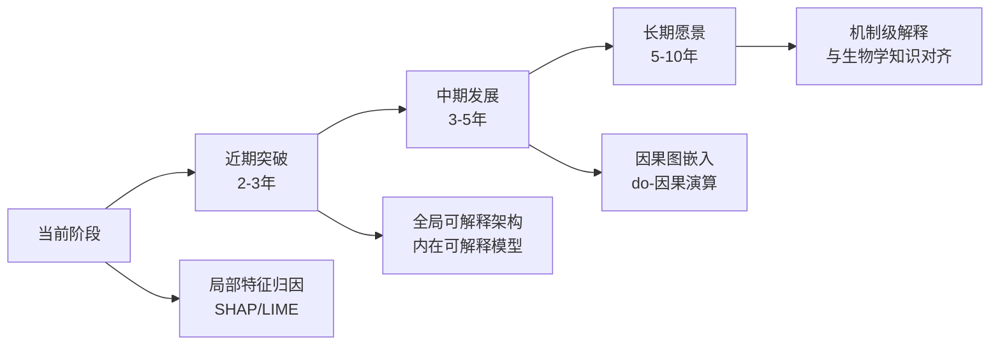
```mermaid
flowchart LR
    A[当前阶段] --> B[近期突破<br>2-3年]
    B --> C[中期发展<br>3-5年]
    C --> D[长期愿景<br>5-10年]
    
    A --> A1[局部特征归因<br>SHAP/LIME]
    B --> B1[全局可解释架构<br>内在可解释模型]
    C --> C1[因果图嵌入<br>do-因果演算]
    D --> D1[机制级解释<br>与生物学知识对齐]
```

**物理模型与AI的深度结合**将成为提升可解释性的关键策略。薛定谔（Schrödinger）的平台代表了这一方向，通过基于物理的分子模拟与AI的融合，在预测的同时提供符合物理化学原理的解释[^2]。预计到2028年，将出现能够自动生成符合生物学机制的预测解释的AI系统，使"黑箱"问题得到实质性缓解。

#### 5.1.3 强化学习与数字孪生平台的深化应用

**强化学习在目标导向分子设计中的应用将进一步深化**。当前MOLLEO已将大语言模型的"智慧"融入进化算法，更聪明地在庞大的化学空间中搜索更优的分子[^37]。未来强化学习将扩展至临床决策优化、给药方案个性化等更复杂的应用场景。

数字孪生平台将从单点应用向全生命周期覆盖升级：

- **近期（2-3年）**：单一疾病/器官的数字孪生模型成熟，支持特定适应症的药效预测
- **中期（3-5年）**：多器官系统整合的虚拟患者平台，支持全身性药物效应模拟
- **长期（5-10年）**：覆盖从分子到群体的多尺度数字孪生生态系统，实现"从靶点到患者"的全链条虚拟评估

#### 5.1.4 AI-机制模型融合架构的标准化

**AI与机制模型融合是平衡预测效能与可解释性的最佳路径**。未来将出现标准化的融合架构，使AI代理模型与QSP/QST模型的对接更加便捷。

关键技术里程碑预测：

| 时间节点 | 技术里程碑 | 预期影响 |
|---------|-----------|---------|
| 2026年 | AI-QSP融合接口标准发布 | 降低融合开发门槛 |
| 2028年 | 首个AI增强QST模型获监管认可 | 开创AI毒性预测新范式 |
| 2030年 | "QSP即服务"平台规模化运营 | 非专业用户可交互式使用复杂模型 |
| 2032年 | 全生命周期AI-机制融合平台成熟 | 实现从发现到上市后的统一建模 |

### 5.2 应用场景拓展：从辅助工具到自主智能体

大模型在药物评估中的应用将经历从"辅助决策"到"自主执行"的范式跃迁，覆盖更复杂的疾病模型与真实世界场景。

#### 5.2.1 从辅助决策向自主智能体系统演进

**多智能体系统正在成为处理复杂药物发现任务的新兴架构**。MADD系统在复杂任务上的准确率达到了79.8%，大幅超越了现有的其他AI药物设计系统，展示了多智能体协作的巨大潜力。

自主智能体演进的三个阶段：

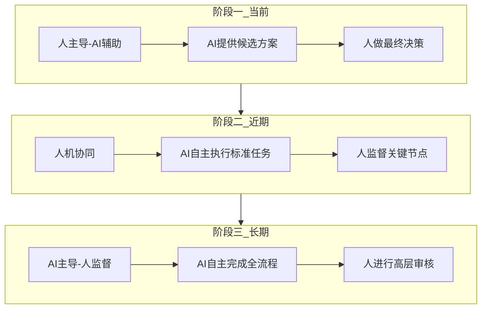
```mermaid
flowchart TB
    subgraph 阶段一_当前
        A1[人主导-AI辅助] --> A2[AI提供候选方案]
        A2 --> A3[人做最终决策]
    end
    
    subgraph 阶段二_近期
        B1[人机协同] --> B2[AI自主执行标准任务]
        B2 --> B3[人监督关键节点]
    end
    
    subgraph 阶段三_长期
        C1[AI主导-人监督] --> C2[AI自主完成全流程]
        C2 --> C3[人进行高层审核]
    end
    
    阶段一_当前 --> 阶段二_近期
    阶段二_近期 --> 阶段三_长期
```

**预计到2030年，将出现能够自主完成"靶点识别-分子设计-虚拟筛选-合成路径规划"全流程的AI智能体系统**，人类科学家的角色将从执行者转变为监督者与创新方向的引导者。

#### 5.2.2 覆盖更复杂疾病模型的精准模拟能力

当前AI制药的成功案例主要集中在靶点明确、机制相对清晰的疾病领域。未来将向更复杂的疾病模型拓展：

| 疾病类型 | 当前挑战 | 技术突破方向 | 预期时间线 |
|---------|---------|-------------|-----------|
| 多因素慢性病 | 多靶点网络复杂 | 系统生物学+AI整合 | 2027-2030年 |
| 罕见病 | 数据极度稀缺 | 迁移学习+合成数据 | 2026-2028年 |
| CNS疾病 | 血脑屏障、机制不明 | 多模态脑模型 | 2028-2032年 |
| 自身免疫病 | 异质性高 | 单细胞+数字孪生 | 2027-2030年 |

**蛋白质动态性建模**将成为攻克复杂疾病的关键。DynamicFlow尝试将蛋白质的动态性直接融入药物设计，模拟从"空闲"到"工作"状态的变化[^37]。cryoSPHERE利用AI技术分析冷冻电镜数据，更好地捕捉蛋白质不同状态下的构象变化[^37]。这些技术进步将使AI能够模拟药物在动态生物环境中的真实行为。

#### 5.2.3 真实世界证据与虚拟临床试验的深度融合

**真实世界证据（RWE）与虚拟临床试验的融合将重塑临床评估范式**。AI能够快速处理RWE中大量复杂的药物相关数据，在短时间内完成数据清洗、整合与分析，精准识别出微弱或隐藏的安全性信号。

融合应用的发展路径：

- **数据层融合**：整合电子病历、保险理赔、可穿戴设备等多源RWE数据
- **模型层融合**：虚拟患者模型基于RWE进行校准和验证
- **决策层融合**：虚拟试验结果与RWE分析相互印证，增强证据可信度

**预计到2028年，将出现首批以RWE校准的虚拟临床试验数据作为支持证据获批的药物**，标志着AI生成证据在监管决策中地位的实质性提升。

#### 5.2.4 端到端全流程自动化平台的构建

**AI已经渗透到药物研制的各个环节**。从药物靶点发现、合成路径优化、临床试验设计、生产、流通到监督管理，AI技术都显示出巨大的应用潜力并日益发挥重要作用[^38]。

端到端自动化平台的技术架构将包括：

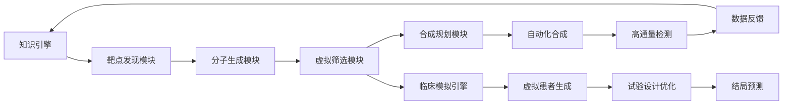
```mermaid
flowchart LR
    A[知识引擎] --> B[靶点发现模块]
    B --> C[分子生成模块]
    C --> D[虚拟筛选模块]
    D --> E[合成规划模块]
    E --> F[自动化合成]
    F --> G[高通量检测]
    G --> H[数据反馈]
    H --> A
    
    I[临床模拟引擎] --> J[虚拟患者生成]
    J --> K[试验设计优化]
    K --> L[结局预测]
    
    D --> I
```

**晶泰科技在浦东设立的"生物医药机器人自动化工站集群"**展示了这一方向的产业实践——机械臂可7×24小时执行实验并记录数据，协助乃至替代人工实验，不仅缩短药物研发周期，还能生成标准化数据，驱动模型进化和迭代[^38]。

### 5.3 产业生态构建：协作模式与商业创新

大模型药物评估的规模化应用需要健康的产业生态支撑。未来将在跨学科协作、开放科学、商业模式与人才培养等维度发生深刻变革。

#### 5.3.1 跨学科协作模式的深化

**构建"药企-科技公司-监管机构-学术界"协同创新平台**将成为产业发展的关键。英伟达与礼来宣布共同投资10亿美元建立联合AI实验室，这一"王炸组合"直接将AI制药推向了新的竞争维度。

新型协作范式的特征包括：

| 协作维度 | 传统模式 | 新兴模式 | 价值创造点 |
|---------|---------|---------|-----------|
| 数据共享 | 单向授权 | 联邦学习+价值分配 | 数据资产化 |
| 技术合作 | 外包服务 | 联合研发+IP共享 | 创新协同 |
| 风险分担 | 里程碑付款 | 股权合作+收益共享 | 利益绑定 |
| 能力互补 | 单点对接 | 生态平台整合 | 系统效率 |

#### 5.3.2 开源模型与数据共享生态的构建

**Target 2035全球倡议的第二阶段正式启动**，旨在到2035年为每一种人类蛋白质开发出专属药理学工具[^39]。该路线图的核心理念在于通过开放合作生成大规模高质量且符合FAIR（可查找、可访问、可互操作、可复用）原则的数据集，利用机器学习推动药物发现工作，甚至那些未被充分研究的"冷门靶点"亦涵盖其中[^39]。

开放科学生态的关键要素：

- **数据标准化**：通过标准化、高通量筛选方法，系统收录蛋白质与小分子的结合相互作用信息
- **开放基准测试**：吸引AI/ML社区优化小分子结合预测模型
- **全数据共享**：所有数据（包括阳性与阴性结果）、方法及材料通过开放平台共享[^39]

**成都先导作为Target 2035全球协作计划的重要参与者**，利用DNA编码化合物库（DEL）技术平台针对SGC关注的新靶点进行筛选，产生的筛选数据集发布在公开平台，供全球范围内的药物发现和ML专家访问、进行数据建模[^39]。

#### 5.3.3 AI制药商业模式创新

**AI制药的商业模式正在从技术服务向风险共担、价值共创模式转型**。当前AI制药公司的商业模式主要包括：

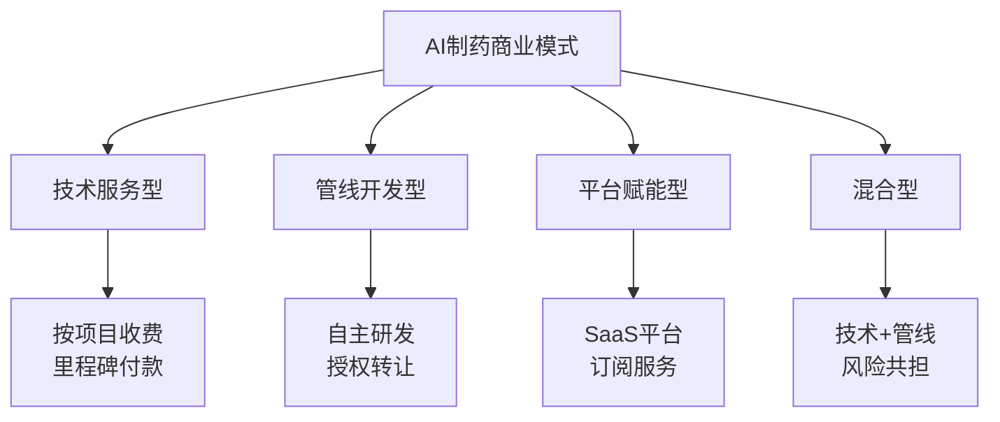
```mermaid
flowchart TB
    A[AI制药商业模式] --> B[技术服务型]
    A --> C[管线开发型]
    A --> D[平台赋能型]
    A --> E[混合型]
    
    B --> B1[按项目收费<br>里程碑付款]
    C --> C1[自主研发<br>授权转让]
    D --> D1[SaaS平台<br>订阅服务]
    E --> E1[技术+管线<br>风险共担]
```

**英矽智能的发展路径**展示了商业模式创新的可能性——目前全球前二十大药企超过一半已使用英矽智能专有的Pharma.AI平台[^38]。如果其管线能推进到上市，很大程度上可以证明AI技术对药物研发有很大的促进作用[^38]。

未来商业模式创新的方向包括：
- **风险共担模式**：AI公司与药企按临床成功率分享收益
- **平台生态模式**：构建开放平台，聚合多方资源形成网络效应
- **数据资产化模式**：将高质量数据集作为核心资产进行价值变现

#### 5.3.4 中国AI制药产业的定位与差异化发展

**中国AI制药正处于快速发展的关键窗口期**。据预测，2025至2030年中国智能制药行业将迎来高速发展期，市场规模预计突破5000亿元大关，年复合增长率维持在15%以上[^38]。

中国AI制药产业的差异化优势与发展方向：

| 维度 | 优势 | 挑战 | 差异化策略 |
|-----|-----|-----|-----------|
| 数据资源 | 人口基数大、病种丰富 | 数据标准化不足 | 建设国家级医疗数据平台 |
| 市场需求 | 医药消费市场巨大 | 创新药支付能力有限 | 聚焦中国高发疾病领域 |
| 人才储备 | AI人才充足 | 复合型人才稀缺 | 产学研联合培养 |
| 政策支持 | 政策导向明确 | 监管框架待完善 | 先行先试、沙盒机制 |

**中国AI制药公司主要分布于北京、长三角、大湾区三地，囊括了超94%的AI制药公司**[^38]。头部企业如晶泰科技、英矽智能相继在浦东扩大布局规模，正成为加速创新药研发的"助燃剂"[^38]。

### 5.4 监管科学演进：适应AI特性的评估框架

监管科学的演进是AI药物评估从实验室走向临床应用的关键保障。未来将在评估标准、监管框架、国际协调与伦理治理等维度发生系统性变革。

#### 5.4.1 适应AI特性的药物评估标准制定

**FDA发布的指南草案为AI在药品生命周期中的应用提供了系统性指导**，提出基于风险的可信度评估框架。该框架的核心要素包括：

- **模型影响评估**：AI证据对决策的贡献度
- **决策后果评估**：错误决策的严重程度
- **可信度评估计划**：针对特定使用场景的验证方案
- **生命周期维护**：模型性能的持续监测与更新

**中国药监局也在积极探索AI在药品监管中的应用**。国家药监局信息中心提出了一体化建设框架，建议通过国家与省级药品监管部门的协同合作，构建统一且可扩展的大语言模型应用体系[^38]。

预计未来5-10年将形成的评估标准体系：

| 标准类型 | 主要内容 | 预期发布时间 |
|---------|---------|-------------|
| 模型验证标准 | 训练数据要求、性能基准、外部验证 | 2026-2027年 |
| 可解释性标准 | 解释方法要求、机制对齐度评估 | 2027-2028年 |
| 持续监测标准 | 数据漂移检测、性能衰减预警 | 2028-2029年 |
| 安全性标准 | 对抗攻击防护、隐私保护要求 | 2027-2028年 |

#### 5.4.2 全生命周期监管框架的构建

**AI不再是药物研发领域的一个遥远概念，已成为一种强大的实践工具**，期待AI可将制药研发周期缩短2/3，并贯穿药品从研发、上市、生产到退市的整个生命周期，实现无缝、连续的智能监管[^38]。

全生命周期监管框架的核心要素：

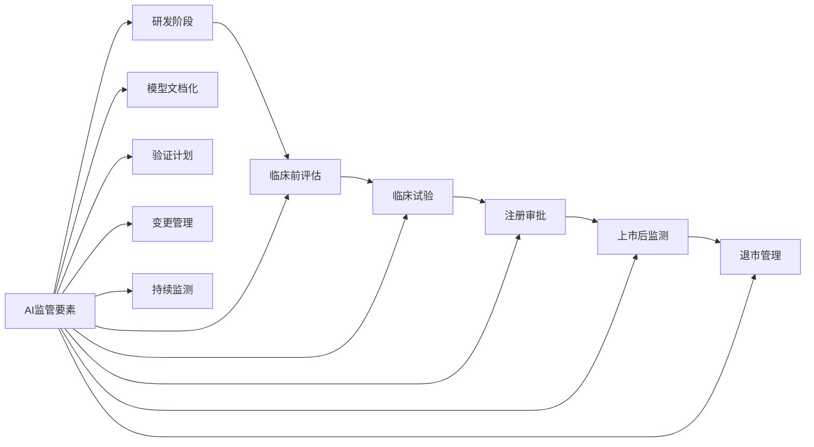
```mermaid
flowchart LR
    A[研发阶段] --> B[临床前评估]
    B --> C[临床试验]
    C --> D[注册审批]
    D --> E[上市后监测]
    E --> F[退市管理]
    
    G[AI监管要素] --> A
    G --> B
    G --> C
    G --> D
    G --> E
    G --> F
    
    G --> H[模型文档化]
    G --> I[验证计划]
    G --> J[变更管理]
    G --> K[持续监测]
```

#### 5.4.3 国际监管协调机制的发展

**FDA和EMA发布的联合框架强调在将人工智能整合到药物研发过程中保持透明度、可靠性和道德标准的重要性**[^2]。未来国际监管协调将在以下方面深化：

- **术语定义统一**：建立AI药物评估的国际通用术语体系
- **评估方法互认**：探索模型验证结果的跨境认可机制
- **数据标准协调**：推动训练数据与评估数据的国际标准化
- **监管信息共享**：建立AI药物安全信号的国际共享平台

#### 5.4.4 监管沙盒与创新试点机制

**监管沙盒机制**将为AI药物评估的创新应用提供安全的试验空间。预计未来将出现：

- **技术验证沙盒**：允许新型AI模型在受控环境下进行验证
- **证据探索沙盒**：探索AI生成证据作为监管决策支持的路径
- **商业模式沙盒**：试点AI制药的新型合作与付费模式

**2025年4月10日，美国FDA宣布将在单克隆抗体类药物领域逐步淘汰动物试验**，这一决定标志着毒理学新途径方法（NAMs）正式进入药品安全评价的法规监管决策实施阶段，是国际药物安全评价领域的重大变革。这一政策转向为AI驱动的药物评估方法创造了明确的制度空间。

#### 5.4.5 算法问责与伦理审查的制度完善

**算法问责与伦理审查将成为AI药物评估的必要组成部分**。未来制度完善的方向包括：

| 制度维度 | 当前状态 | 未来方向 |
|---------|---------|---------|
| 责任归属 | 边界模糊 | 多方责任分担框架 |
| 伦理审查 | 事后评估 | 嵌入式伦理设计 |
| 算法审计 | 自愿性质 | 强制性第三方审计 |
| 公平性评估 | 缺乏标准 | 偏见检测与缓解规范 |

### 5.5 范式前瞻：药物评估的未来图景与战略建议

综合前述技术、应用、生态与监管维度的分析，可以勾勒出未来5-10年药物系统性评估的整体范式变革图景。

#### 5.5.1 从假设驱动到数据-知识-机制协同驱动的研发范式转型

**AI驱动的发现引擎正在取代以人工为主、劳动密集型的研发流程**，从而压缩时间周期、拓展化学与生物学搜索空间，并重新定义现代药理学的速度与规模[^2]。

未来研发范式的核心特征：

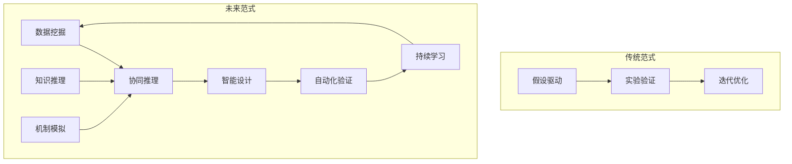
```mermaid
flowchart TB
    subgraph 传统范式
        A1[假设驱动] --> A2[实验验证]
        A2 --> A3[迭代优化]
    end
    
    subgraph 未来范式
        B1[数据挖掘] --> B4[协同推理]
        B2[知识推理] --> B4
        B3[机制模拟] --> B4
        B4 --> B5[智能设计]
        B5 --> B6[自动化验证]
        B6 --> B7[持续学习]
        B7 --> B1
    end
```

**这种范式转型的核心在于**：AI不再只是实验室里的"辅助工具"，而是逐渐成为贯穿药物研发全链条的"超级加速器"[^40]。

#### 5.5.2 AI作为药物研发"基础设施"的战略定位确立

**AI不是"可选项"，已日渐成为药物研制和监管的"标配"工具**[^38]。未来5-10年，AI将完成从"新兴技术"到"基础设施"的角色转变：

- **技术层面**：AI模型成为药物研发的标准工具箱组件
- **流程层面**：AI嵌入研发全流程的每个决策节点
- **组织层面**：AI能力成为药企核心竞争力的基础要素
- **生态层面**：AI平台成为产业协作的基础设施

**《医药工业数智化转型实施方案（2025—2030年）》**明确提出，到2030年，规上医药工业企业基本实现数智化转型全覆盖，数智技术融合创新能力大幅提升[^40]。

#### 5.5.3 人机协作新模式下的科学家角色重塑

**Exscientia的"人机协同"方法**——通过人机协作的方式对新型化合物进行反复的设计、合成与测试——代表了未来人机协作的发展方向[^2]。

科学家角色的演变：

| 角色维度 | 当前状态 | 未来演变 |
|---------|---------|---------|
| 实验执行 | 主要执行者 | 监督者与审核者 |
| 假设生成 | 主要创造者 | 方向引导者 |
| 决策制定 | 全程参与 | 关键节点把控 |
| 创新方向 | 经验驱动 | AI辅助+人类洞察 |

#### 5.5.4 面向不同利益相关方的战略行动建议

**对药企的建议**：

1. **短期（1-2年）**：
   - 建立AI能力评估与引进机制
   - 在高成熟度场景（分子生成、文献挖掘）开展试点
   - 培养内部AI-药学复合型人才

2. **中期（3-5年）**：
   - 构建企业级AI药物评估平台
   - 建立与AI技术公司的战略合作关系
   - 参与行业数据共享联盟

3. **长期（5-10年）**：
   - 将AI能力内化为核心竞争力
   - 探索AI驱动的新型研发模式
   - 布局下一代AI技术前沿

**对AI技术企业的建议**：

1. **技术深耕**：聚焦可解释性、多模态融合等核心技术突破
2. **场景落地**：与药企深度合作，在真实场景中验证技术价值
3. **生态构建**：参与开放科学倡议，贡献数据与模型
4. **商业创新**：探索风险共担、价值共创的可持续商业模式

**对监管机构的建议**：

1. **标准先行**：加快AI药物评估相关标准的制定与发布
2. **能力建设**：提升监管队伍的AI技术理解与评估能力
3. **国际协调**：积极参与国际监管协调，推动标准互认
4. **创新包容**：建立监管沙盒机制，为创新应用提供试验空间

**对学术界的建议**：

1. **基础研究**：聚焦可解释性、因果推断等基础理论突破
2. **评测体系**：建立权威的AI药物评估基准与评测标准
3. **人才培养**：构建跨学科复合型人才培养体系
4. **开放共享**：推动高质量数据集与模型的开放共享

#### 5.5.5 风险提示与审慎发展原则

**尽管进入临床阶段的速度显著加快，目前尚无任何由AI发现的药物获得监管批准，大多数项目仍停留在早期临床试验阶段**[^2]。这也引出了一个关键问题：AI是否真正带来了更高的成功率，还是仅仅加速了失败？

关键风险提示：

- **技术风险**：AI模型的"幻觉"问题尚未完全解决，预测结果的可靠性需要持续验证
- **转化风险**：从计算预测到临床成功的转化率仍有待证明
- **监管风险**：监管框架的演进速度可能滞后于技术发展
- **伦理风险**：算法偏见、数据隐私等伦理问题需要系统性应对

**审慎发展原则**：不应受"ALL in AI"等舆论导向的影响、盲目追求技术潮流，而应秉持科学和理性的态度，紧密结合大语言模型的技术特性、自身实际需求以及风险容忍度，进行审慎评估与规划。

综上所述，大模型驱动的药物系统性评估正处于从概念验证向价值兑现过渡的关键阶段。**未来5-10年，技术融合、生态协同与监管适配将共同推动这一领域实现从"可用"到"好用"乃至"可信"的关键跨越**。这一进程需要产业界、学术界与监管机构的协同努力，在创新与审慎之间寻求平衡，最终实现AI技术对药物研发效率与成功率的实质性提升，为人类健康事业创造更大价值。

## 6 结论与建议：迈向可信赖的智能药物评估时代

本章系统总结大模型在药物影响模拟与系统性评估中的核心价值定位，归纳其从技术可用性向临床可信赖性跨越的关键路径。基于全文对技术路径、应用实践、核心挑战与未来趋势的深入分析，本章将凝练核心发现，明确当前发展阶段的定位与边界，并面向学术界、产业界与政策制定者提出推动该领域健康稳健发展的战略性建议。

### 6.1 核心价值定位：大模型重塑药物评估的战略意义

大模型技术在药物发现与评估全生命周期中展现出深远的战略价值，其意义已超越单纯的效率工具层面，正在重塑药物研发的底层范式与产业格局。

#### 6.1.1 突破传统研发效率瓶颈的变革性贡献

药物研发领域长期面临"反摩尔定律"的困扰——从1950年到2010年，每十亿美元研发支出对应的药物批准数量每9年减少一半。**大模型技术的介入正在从根本上改变这一颓势**。如前文所述，在2020年初几乎尚无任何AI设计的药物进入人体试验，而到2025年年中，已有数十个由AI推动的新药候选物进入临床试验阶段。Exscientia在一项CDK7抑制剂项目中仅合成136个化合物便成功确定了临床候选物，而传统项目往往需要合成数千个化合物；Insilico Medicine从AI驱动的假设提出到形成临床候选物仅用了约18个月；国内首款AI辅助设计的口服减肥新药MDR-001从启动研发到进入临床试验仅用19个月，耗时4年半便推进至Ⅲ期临床阶段。

这种效率突破源于大模型在以下关键环节的赋能：

| 研发环节 | 传统方法痛点 | 大模型贡献 | 效率提升幅度 |
|---------|-------------|-----------|-------------|
| 靶点发现 | 依赖经验、周期长 | 知识图谱推理、文献挖掘 | 假设生成周期缩短50%+ |
| 分子设计 | 化学空间探索有限 | 生成式AI按需创造 | 候选物确定周期缩短70% |
| 虚拟筛选 | 计算成本高、通量低 | 代理模型加速 | 筛选速度提升百万倍 |
| 临床试验设计 | 患者分层困难 | NLP精准亚群筛选 | 入组时间缩短45% |

#### 6.1.2 从还原论向系统论的范式跃迁

传统基于靶点的药物发现本质上是还原论的，将复杂的治疗效果简化为对单个蛋白质行为的调控。然而，仅有9.4%的已批准小分子药物是通过基于靶点的筛选方法发现的，且其疗效还依赖于表型观察中无意纳入的脱靶机制。**大模型技术通过整合多源异构数据与多尺度建模能力，正在推动药物评估从还原论向系统论的范式跃迁**。

这一范式转变体现在：

- **分子层面**：从单一靶点结合预测扩展至全蛋白质组相互作用网络分析
- **细胞层面**：从静态结构预测演进至动态信号通路扰动模拟
- **系统层面**：从孤立的PK/PD建模升级至多器官系统整合的全身效应预测
- **群体层面**：从均一化人群假设转向虚拟患者异质性建模与个性化响应预测

定量系统药理学（QSP）与AI的深度融合（AI-QSP）代表了这一范式跃迁的技术实现路径，通过AI代理模型降低QSP的计算复杂度，同时保持机制模型的可解释性与生理相关性。

#### 6.1.3 作为药物研发"基础设施"的战略定位

**大模型已不再是药物研发的"可选项"，而是日渐成为"标配"工具，其战略定位正从"辅助工具"升级为"基础设施"**。这一定位转变意味着：

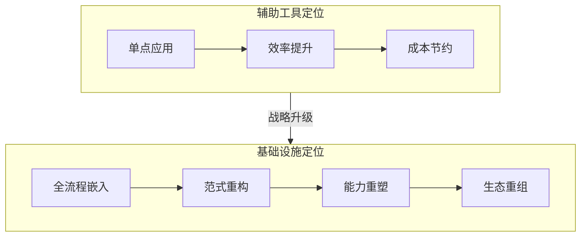
```mermaid
flowchart TB
    subgraph 辅助工具定位
        A1[单点应用] --> A2[效率提升]
        A2 --> A3[成本节约]
    end
    
    subgraph 基础设施定位
        B1[全流程嵌入] --> B2[范式重构]
        B2 --> B3[能力重塑]
        B3 --> B4[生态重组]
    end
    
    辅助工具定位 -->|战略升级| 基础设施定位
```

作为基础设施，大模型的价值体现在：

- **技术层面**：成为药物研发的标准工具箱组件，如同测序技术之于基因组学
- **流程层面**：嵌入研发全流程的每个决策节点，从靶点发现到上市后监测
- **组织层面**：AI能力成为药企核心竞争力的基础要素
- **生态层面**：AI平台成为产业协作的公共基础设施

英伟达与礼来共同投资10亿美元建立联合AI实验室，全球前二十大药企超过一半已使用英矽智能的Pharma.AI平台，这些产业动态印证了大模型作为基础设施的战略定位正在加速确立。

### 6.2 关键跨越点识别：从可用到好用再到可信的演进路径

大模型药物评估的发展遵循"可用→好用→可信"的演进逻辑，当前正处于**"可用"向"好用"过渡的关键窗口期**。准确识别各阶段的特征与跨越条件，对于制定合理的发展策略至关重要。

#### 6.2.1 "可用"阶段的成就与边界

**"可用"阶段的核心特征是技术原理验证与场景适配完成**，大模型已证明其在药物评估特定环节的有效性。

"可用"阶段已取得的关键成就包括：

- **技术路径明确**：知识驱动推理、生成式AI应用、AI-机制模型融合三大技术路径已成功映射至药物研发核心场景
- **效率优势显著**：在虚拟筛选、分子生成、文献挖掘等环节展现出革命性效率提升
- **早期成果涌现**：多个AI驱动的候选药物进入临床试验，证明了从计算预测到临床候选物的转化能力
- **标准化起步**：国内首个药物警戒AI标准（T/SBIAORG 0002-2025）发布，标志着规范化应用的开端

然而，"可用"阶段的边界同样清晰：

- 应用多为"点状突破"，缺乏全链条的流畅整合
- 预测结果的可靠性与可重复性尚未得到充分验证
- **目前尚无任何由AI发现的药物获得监管批准上市**

#### 6.2.2 向"好用"跨越的核心条件

**从"可用"到"好用"的跨越，核心在于解决效率瓶颈与系统整合问题**，使大模型从"能用"变为"用得顺"。

关键跨越条件包括：

| 跨越维度 | 具体要求 | 当前进展 | 突破时间预估 |
|---------|---------|---------|-------------|
| 全链条整合 | 端到端一体化平台 | 多个平台初步构建 | 2026-2028年 |
| 干湿闭环 | AI设计→自动合成→高通量验证 | 晶泰等企业已实现 | 2025-2027年 |
| 数据标准化 | 多模态数据统一处理流程 | 标准制定进行中 | 2026-2028年 |
| 人机协作 | 科学家高效使用AI工具 | 界面优化持续迭代 | 持续演进 |

**"设计-合成-测试-学习"高效闭环成为行业标配**是"好用"阶段的标志性特征。Chemistry42平台在21天内完成从苗头化合物到临床前候选分子的优化，较传统方法提速70%，展示了这一闭环的实现可能。

#### 6.2.3 向"可信"跃迁的瓶颈因素

**从"好用"到"可信"的跃迁，核心在于解决可靠性与监管认可问题**，使大模型的输出能够作为科学证据被接受。

制约向"可信"阶段跃迁的关键瓶颈包括：

**技术瓶颈**：
- **可解释性不足**：当前模型多为"黑箱"，难以解释预测逻辑，在需要严格监管的医药领域难以直接应用
- **因果推断缺失**：机器学习模型主要捕捉统计关联而非因果关系，可能将混杂因素误认为真实药理机制

**验证瓶颈**：
- **临床终局验证缺失**：AI预测的临床疗效与安全性仍需通过传统临床试验的严格检验
- **可重复性问题**：不同研究团队使用不同数据集、模型架构得到的结果难以相互验证

**监管瓶颈**：
- **框架滞后**：缺乏针对AI驱动药物研发的统一监管框架
- **证据认可**：AI生成的"数字证据"尚未获得与传统实验数据同等的法律与科学地位

#### 6.2.4 三阶段演进的整体框架

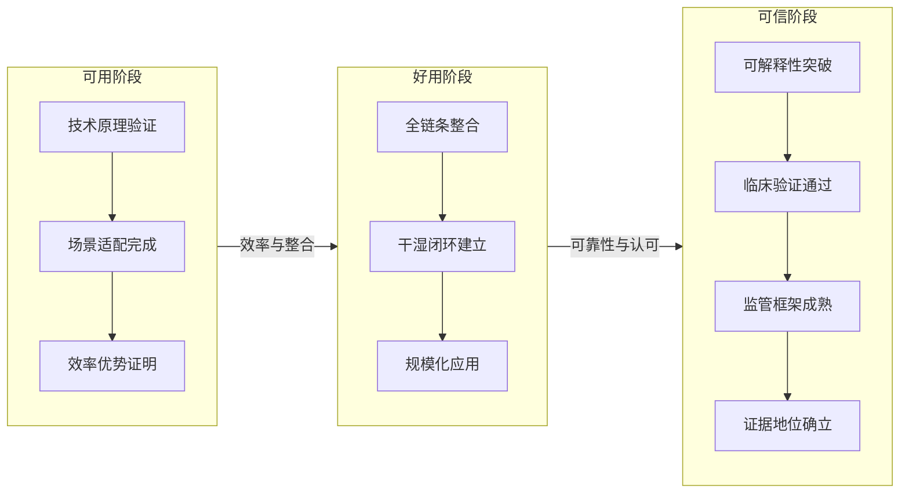
```mermaid
flowchart LR
    subgraph 可用阶段
        A1[技术原理验证] --> A2[场景适配完成]
        A2 --> A3[效率优势证明]
    end
    
    subgraph 好用阶段
        B1[全链条整合] --> B2[干湿闭环建立]
        B2 --> B3[规模化应用]
    end
    
    subgraph 可信阶段
        C1[可解释性突破] --> C2[临床验证通过]
        C2 --> C3[监管框架成熟]
        C3 --> C4[证据地位确立]
    end
    
    可用阶段 -->|效率与整合| 好用阶段
    好用阶段 -->|可靠性与认可| 可信阶段
```

**首个AI设计药物的获批和监管框架的落地，将成为行业走向成熟的分水岭**。预计这一里程碑将在2028-2032年间实现，届时大模型药物评估将真正进入"可信"阶段。

### 6.3 面向学术界的优先研究方向建议

学术界在推动大模型药物评估从"可用"向"可信"跨越的进程中承担着基础理论突破的关键使命。以下优先研究方向的攻关，将为产业应用与监管信任提供坚实的科学支撑。

#### 6.3.1 发展内在可解释的AI模型架构

**弥合"黑箱"困境是获得科学界与监管信任的核心技术突破点**。当前可解释AI（xAI）方法如SHAP仅提供局部解释，难以满足药物评估对机制理解的刚需。

优先研究方向包括：

- **内在可解释架构设计**：发展从设计之初即具备可解释性的模型架构，而非事后添加解释模块
- **物理信息神经网络（PINNs）**：将物理化学与生物学第一性原理嵌入模型结构，使预测过程符合已知科学规律
- **注意力机制可视化**：深化对Transformer等架构中注意力权重的生物学语义解读
- **概念瓶颈模型**：构建以人类可理解的生物学概念为中间表示的预测框架

**模糊"两个QSARs"（即机器学习上可解释的模型与高度精确的模型）之间的界限，可能是用AI加速药物发现的关键**。学术界应探索在保持预测精度的同时提升可解释性的理论与方法。

#### 6.3.2 推进因果推断与机器学习的深度融合

**从统计关联向因果推断的方法学跃迁，是提升AI药物评估可信度的根本路径**。

关键研究议题包括：

- **因果图模型嵌入**：将流行病学因果框架（如DAG、do-因果演算）嵌入深度学习架构
- **反事实推理**：发展能够回答"如果使用不同药物，结果会如何"等反事实问题的模型
- **混杂因素识别与控制**：开发自动识别和调整混杂因素的算法，避免将代理指标误认为因果因素
- **因果发现算法**：从观测数据中自动发现因果结构的方法学研究

InferBERT通过Transformer架构分析FAERS叙事文本，不仅预测ADR还构建因果树，在镇痛药肝毒性案例中实现78-95%的因果识别准确率，为因果AI在药物安全评估中的应用提供了范例。

#### 6.3.3 构建高质量标准化基准数据集与评测体系

**高质量标注数据的稀缺是制约模型发展的核心瓶颈**，学术界应在以下方面发力：

- **基准数据集构建**：建立覆盖药物评估各环节的权威基准数据集，包含阳性与阴性对照
- **评测标准制定**：制定AI药物评估模型性能的统一评测指标与方法
- **数据质量规范**：建立训练数据的质量评估标准，包括代表性、偏差检测等
- **合成数据方法**：探索高质量合成数据生成技术，缓解真实数据稀缺问题

**Target 2035全球倡议**通过标准化、高通量筛选方法系统收录蛋白质与小分子的结合相互作用信息，所有数据通过开放平台共享，为学术界贡献了数据共享的范例。

#### 6.3.4 探索AI与机制模型融合的理论框架

**AI与QSP/QST等机制模型的融合是平衡预测效能与可解释性的最佳路径**，但其理论基础尚不完善。

优先研究方向包括：

- **代理模型理论**：研究AI代理模型近似机制模型的理论边界与误差传播机制
- **混合建模方法学**：发展AI组件与机制组件无缝融合的理论框架
- **不确定性量化**：建立混合模型中不确定性的统一量化与传播方法
- **模型可迁移性**：研究融合模型在不同疾病、不同人群间的迁移条件

#### 6.3.5 开展AI药物评估的伦理与社会影响研究

**技术发展需要伦理反思的同步跟进**，学术界应关注：

- **算法公平性**：研究AI药物评估中的偏见来源、检测方法与缓解策略
- **责任归属**：探索AI辅助决策中的责任分配理论框架
- **隐私保护**：发展隐私保护下的数据利用理论与技术
- **社会影响评估**：研究AI药物评估对医疗资源分配、药物可及性的长期影响

### 6.4 面向产业界的战略行动建议

产业界是大模型药物评估从技术突破走向价值兑现的关键主体。基于当前发展阶段的特征与挑战，为药企与AI技术企业提出分阶段、差异化的战略行动建议。

#### 6.4.1 药企的分阶段战略部署

**短期策略（2025-2027年）——聚焦高成熟度场景的规模化部署**：

- **场景优先级排序**：优先在分子生成设计、文献知识挖掘、药物警戒报告处理等已验证场景开展规模化应用
- **试点项目启动**：选择风险可控的研发项目开展AI辅助试点，积累实践经验
- **能力引进与培养**：建立AI能力评估机制，通过外部合作引进成熟技术，同时培养内部AI-药学复合型人才
- **数据资产盘点**：系统梳理企业内部数据资产，建立数据治理框架

**中期策略（2027-2030年）——构建企业级AI平台与战略合作生态**：

- **平台化建设**：构建覆盖研发核心环节的企业级AI药物评估平台
- **生态合作深化**：与AI技术公司建立深度战略合作关系，探索风险共担、价值共创的合作模式
- **数据联盟参与**：加入行业数据共享联盟，在隐私保护框架下实现数据价值最大化
- **验证体系建立**：建立AI预测结果的系统性湿实验验证流程

**长期策略（2030年及以后）——将AI能力内化为核心竞争力**：

- **能力内化**：将AI能力从外部依赖转化为内部核心能力
- **模式创新**：探索AI驱动的新型研发模式与组织架构
- **前沿布局**：持续跟踪并布局下一代AI技术前沿

#### 6.4.2 AI技术企业的发展策略

**技术深耕方向**：

- **可解释性技术**：投入资源攻关可解释AI技术，这是获得药企与监管信任的关键
- **多模态融合**：发展能够处理分子、蛋白质、组学、影像等多模态数据的统一模型
- **垂直场景优化**：在特定药物评估场景深耕，建立技术壁垒

**商业模式创新**：

| 模式类型 | 特征 | 适用阶段 | 风险收益特征 |
|---------|------|---------|-------------|
| 技术服务 | 按项目收费 | 早期 | 低风险、稳定收入 |
| 平台订阅 | SaaS模式 | 成长期 | 中等风险、规模效应 |
| 管线合作 | 里程碑+权益 | 成熟期 | 高风险、高回报潜力 |
| 风险共担 | 按成功率分成 | 未来 | 利益深度绑定 |

#### 6.4.3 创新追求与审慎验证的平衡原则

**产业界应警惕以下风险**：

- **技术炒作风险**：AI是否真正带来了更高的成功率，还是仅仅加速了失败？需要批判性分析以区分现实进展与过度炒作
- **验证闭环缺失**：AI预测的候选分子需通过湿实验验证，假阳性率较高将导致转化成本增加
- **路径依赖风险**：过度依赖特定技术路线可能错失其他创新机会

**审慎发展的核心原则**：

- 不应受"ALL in AI"等舆论导向的影响、盲目追求技术潮流
- 紧密结合大语言模型的技术特性、自身实际需求以及风险容忍度进行审慎评估与规划
- 建立AI预测结果的系统性验证机制，确保计算发现能够转化为真实的临床价值

### 6.5 跨机构协作机制与数据共享生态构建

**打破数据孤岛、促进资源整合是突破当前发展瓶颈的关键**。构建"药企-科技公司-学术机构-监管部门"四方协同的创新生态，需要在机制设计与平台建设两个层面同步发力。

#### 6.5.1 四方协同创新生态的机制设计

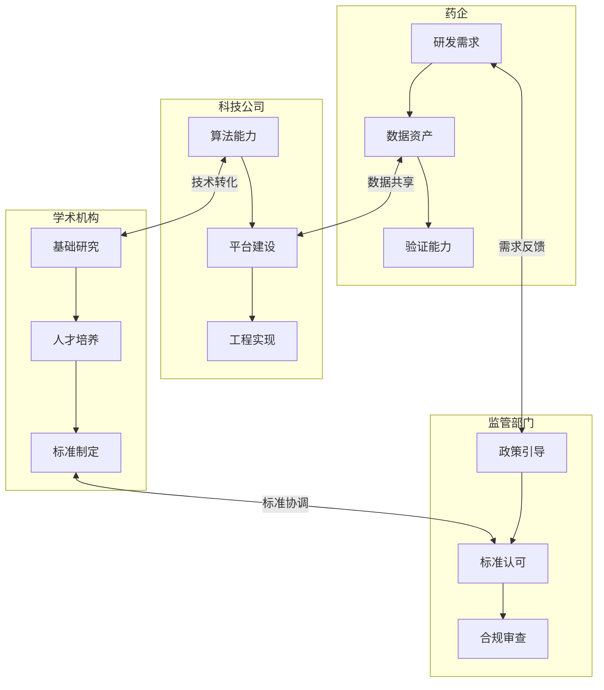
```mermaid
flowchart TB
    subgraph 药企
        A1[研发需求] --> A2[数据资产]
        A2 --> A3[验证能力]
    end
    
    subgraph 科技公司
        B1[算法能力] --> B2[平台建设]
        B2 --> B3[工程实现]
    end
    
    subgraph 学术机构
        C1[基础研究] --> C2[人才培养]
        C2 --> C3[标准制定]
    end
    
    subgraph 监管部门
        D1[政策引导] --> D2[标准认可]
        D2 --> D3[合规审查]
    end
    
    A2 <-->|数据共享| B2
    B1 <-->|技术转化| C1
    C3 <-->|标准协调| D2
    A1 <-->|需求反馈| D1
```

**协同机制的核心要素**：

- **利益分配机制**：建立数据贡献与价值分享的量化评估与分配框架
- **知识产权安排**：明确联合研发成果的IP归属与使用权限
- **风险分担机制**：设计多方共担研发风险、共享成功收益的合作模式
- **治理结构设计**：建立多方参与的决策与协调机制

#### 6.5.2 联邦学习框架下的隐私保护数据共享联盟

**跨机构数据孤岛问题突出，药企、医院、学术机构间数据共享机制不完善**。联邦学习等隐私保护技术为解决这一困境提供了技术路径。

数据共享联盟的建设要点：

| 建设维度 | 具体内容 | 实施路径 |
|---------|---------|---------|
| 技术架构 | 联邦学习+差分隐私+安全多方计算 | 分阶段技术部署 |
| 数据标准 | 统一数据格式、质量标准、元数据规范 | 行业标准制定 |
| 治理框架 | 数据使用协议、审计机制、退出机制 | 法律合规设计 |
| 激励机制 | 数据贡献积分、优先使用权、收益分成 | 经济模型设计 |

**南京江北新区生物医药公共服务平台**的实践提供了参考——该平台实现覆盖江苏省全省的公卫临床诊疗和20PB多组学数据汇聚与应用，构建AI制药异构算力调度服务联盟，助力科研团队发现多个疾病新靶点和新活性分子，整体降低企业研发成本超千万元。

#### 6.5.3 开放科学倡议下的数据集与模型开源

**Target 2035全球倡议**代表了开放科学在药物发现领域的实践方向，其核心理念在于通过开放合作生成大规模高质量且符合FAIR原则的数据集。

开放科学生态的建设方向：

- **数据开放**：所有数据（包括阳性与阴性结果）、方法及材料通过开放平台共享
- **模型开源**：预训练模型、评测基准的开源共享，降低技术门槛
- **方法透明**：实验方法、数据处理流程的完整公开，支持可重复性验证
- **社区建设**：建立活跃的开源社区，促进技术交流与协作创新

#### 6.5.4 产学研用深度融合的人才培养体系

**既懂AI技术又精通医药研发的复合型人才稀缺**，是制约行业发展的关键瓶颈。

人才培养体系的构建要点：

- **课程体系改革**：在药学、生物学专业中增设AI/ML课程，在计算机专业中增设生物医学应用课程
- **联合培养项目**：建立药企-高校-AI企业的联合培养机制，提供实践机会
- **继续教育体系**：为在职人员提供跨学科技能提升培训
- **国际交流平台**：促进国际人才流动与经验分享

### 6.6 治理框架构建与监管科学演进路径

**监管科学的演进是AI药物评估从实验室走向临床应用的关键保障**。面向政策制定者与监管机构，提出治理框架构建的系统性建议。

#### 6.6.1 加快适应AI特性的药物评估标准制定

**FDA发布的指南草案提出基于风险的可信度评估框架**，为AI在药品生命周期中的应用提供了系统性指导。中国应加快制定适应本土需求的AI药物评估标准。

标准体系建设的优先领域：

| 标准类型 | 核心内容 | 参考依据 | 建议时间表 |
|---------|---------|---------|-----------|
| 模型验证标准 | 训练数据要求、性能基准、外部验证方法 | FDA指南草案 | 2026-2027年 |
| 可解释性标准 | 解释方法要求、机制对齐度评估指标 | xAI研究进展 | 2027-2028年 |
| 数据质量标准 | 数据采集、标注、存储的规范要求 | 药物警戒AI标准 | 2026年 |
| 生命周期管理标准 | 模型更新、性能监测、退役的规范流程 | FDA指南草案 | 2028-2029年 |

#### 6.6.2 建立模型全生命周期监管机制

**AI模型的性能可能随时间和数据分布变化而衰减**，传统的"一次性审批"模式难以适应AI技术特性。

全生命周期监管的核心要素：

```mermaid
flowchart LR
    A[模型开发] --> B[初始验证]
    B --> C[审批/备案]
    C --> D[部署应用]
    D --> E[持续监测]
    E --> F{性能评估}
    F -->|达标| D
    F -->|衰减| G[模型更新]
    G --> H[变更审批]
    H --> D
    F -->|严重问题| I[暂停/退役]
```

- **初始验证要求**：明确模型上线前的验证标准与证据要求
- **持续监测机制**：建立数据漂移检测、性能衰减预警的常态化监测
- **变更管理流程**：制定模型更新的分级管理与审批流程
- **退役机制**：明确模型退役的触发条件与过渡安排

#### 6.6.3 推进国际监管协调与标准互认

**FDA和EMA发布的联合框架强调在将人工智能整合到药物研发过程中保持透明度、可靠性和道德标准的重要性**。中国应积极参与国际监管协调。

国际协调的优先议题：

- **术语定义统一**：建立AI药物评估的国际通用术语体系
- **评估方法互认**：探索模型验证结果的跨境认可机制
- **数据标准协调**：推动训练数据与评估数据的国际标准化
- **监管信息共享**：建立AI药物安全信号的国际共享平台

#### 6.6.4 设立监管沙盒为创新应用提供试验空间

**监管沙盒机制**为AI药物评估的创新应用提供了在受控环境下试验的空间，有助于在鼓励创新与保障安全之间寻求平衡。

监管沙盒的设计要点：

- **准入标准**：明确进入沙盒的技术成熟度、安全性等门槛要求
- **监管豁免范围**：界定沙盒内可获得的监管灵活性边界
- **风险控制机制**：建立沙盒内的风险监测与应急响应机制
- **退出路径**：明确从沙盒毕业进入正式监管的条件与流程

**2025年4月10日，美国FDA宣布将在单克隆抗体类药物领域逐步淘汰动物试验**，为AI驱动的替代方法创造了制度空间，可视为广义监管沙盒理念的实践。

#### 6.6.5 完善算法问责与伦理审查制度

**模型输出的责任归属不清晰**是当前面临的核心治理挑战。需要建立清晰的算法问责框架。

算法问责制度的核心要素：

| 制度维度 | 当前问题 | 制度设计方向 |
|---------|---------|-------------|
| 责任分配 | 多方参与、边界模糊 | 建立基于角色的责任分配框架 |
| 审计机制 | 自愿性质、标准缺失 | 推动强制性第三方审计 |
| 伦理审查 | 事后评估为主 | 嵌入式伦理设计（Ethics by Design） |
| 救济机制 | 渠道不畅 | 建立AI决策相关的申诉与救济通道 |

### 6.7 审慎发展原则与风险管理框架

在推动大模型药物评估发展的同时，必须清醒认识并系统管理相关风险，确保AI技术真正服务于提升药物研发效率与患者健康福祉的终极目标。

#### 6.7.1 核心风险识别与分类

**技术层面风险**：

- **预测不确定性**：模型预测存在固有不确定性，尤其在复杂生物系统中可能因训练数据偏差导致假阳性结果
- **"幻觉"问题**：AI模型在处理复杂任务时容易生成不准确或无意义的内容
- **泛化能力不足**：模型在训练数据分布外的场景中可能表现显著下降

**转化层面风险**：

- **假阳性率高**：虚拟筛选的假阳性率较高导致转化成本增加
- **验证闭环缺失**：学术研究与工业应用脱节，多数大模型研究停留在实验室阶段
- **可重复性问题**：不同研究团队的结果难以相互验证

**监管层面风险**：

- **框架滞后**：监管框架的演进速度可能滞后于技术发展
- **责任归属模糊**：若因模型预测错误导致不良后果，责任归属不清晰
- **标准缺失**：缺乏公认的评测基准和验证标准

**伦理层面风险**：

- **算法偏见**：训练数据的代表性不足可能导致对特定人群的系统性偏见
- **公平性挑战**：模型决策可能加剧医疗资源分配不均
- **隐私风险**：患者数据的使用涉及复杂的隐私保护要求

#### 6.7.2 风险管理框架设计

```mermaid
flowchart TB
    A[风险识别] --> B[风险评估]
    B --> C[风险分级]
    C --> D{风险等级}
    D -->|高风险| E[强化控制]
    D -->|中风险| F[常规监测]
    D -->|低风险| G[基本管理]
    
    E --> H[多层验证]
    E --> I[人工审核]
    E --> J[持续监测]
    
    F --> K[定期评估]
    F --> L[抽样验证]
    
    G --> M[自动化监控]
    
    H --> N[风险缓解]
    I --> N
    J --> N
    K --> N
    L --> N
    M --> N
    
    N --> O[效果评估]
    O --> A
```

**风险分级原则**：

- **高风险场景**：直接影响患者安全的预测（如毒性预测、临床决策支持）——需要多层验证、强制人工审核
- **中风险场景**：影响研发方向的预测（如靶点识别、先导优化）——需要定期评估、抽样验证
- **低风险场景**：辅助性应用（如文献挖掘、报告处理）——基本自动化监控即可

#### 6.7.3 审慎发展的核心原则

**原则一：科学理性态度**

不应受"ALL in AI"等舆论导向的影响、盲目追求技术潮流，而应秉持科学和理性的态度，基于证据评估AI技术的真实价值与局限。

**原则二：需求导向应用**

紧密结合大语言模型的技术特性、自身实际需求以及风险容忍度，进行审慎评估与规划。技术应用应服务于明确的业务目标，而非为技术而技术。

**原则三：验证闭环优先**

建立AI预测结果的系统性验证机制，确保计算发现能够转化为真实的临床价值。在高风险场景中，AI输出应作为参考而非最终决策依据。

**原则四：渐进式部署**

采用分阶段、分场景的渐进式部署策略，在积累经验和建立信任的基础上逐步扩大应用范围。

**原则五：持续学习改进**

建立模型性能的持续监测与反馈机制，及时发现问题并进行迭代优化。

#### 6.7.4 面向未来的发展愿景

**大模型药物评估正处于潜力加速释放但信任亟待夯实的关键阶段**。展望未来，这一领域的健康发展需要技术创新、制度演进与生态协同的系统性努力：

- **技术维度**：持续突破可解释性、因果推断、多模态融合等核心技术瓶颈
- **验证维度**：建立从计算预测到临床成功的完整验证闭环
- **制度维度**：构建适应AI特性的监管框架与标准体系
- **生态维度**：形成多方协同、开放共享的产业生态

**首个AI设计药物的获批和监管框架的落地，将成为行业走向成熟的分水岭**。在此之前，产业界、学术界与监管机构需要保持战略耐心，在创新追求与审慎验证之间寻求平衡，共同推动大模型药物评估从"可用"走向"好用"，最终迈入"可信"的新时代。

**AI技术的终极价值在于服务人类健康福祉**。大模型在药物评估中的应用，其最终检验标准不是技术的先进性，而是能否真正加速安全有效药物的发现与开发，为患者带来切实的治疗获益。这一初心，应当成为指引该领域发展的根本方向。

# 参考内容如下：
[^1]:[J. Med. Chem. | 基于靶点的药物发现,我们走对路了吗?](https://hub.baai.ac.cn/view/51525)
[^2]:[Pharmacol. Rev.|AI驱动的药物发现:全球顶尖技术平台的发展路径与未来展望](https://hub.baai.ac.cn/view/51970)
[^3]:[Drug Discov Today|将AI与定量系统药理学相结合,革新药物发现](https://hub.baai.ac.cn/view/48376)
[^4]:[【AI+医疗】2025年医药革命:AI大模型如何引领新药研发,改变医疗未来?](https://blog.csdn.net/libaiup/article/details/154731891)
[^5]:[聂再清:AI制药的成功,不是「让AI独立做药」](https://www.163.com/dy/article/J6IND0O60534Q32Z.html)
[^6]:[诺奖得主携手推动AI制药新浪潮](https://baijiahao.baidu.com/s?id=1853848053181098439&wfr=spider&for=pc)
[^7]:[资本涌入、合作爆发,AI制药迈入加速发展期|记“医”2025](https://baijiahao.baidu.com/s?id=1852383414711066904&wfr=spider&for=pc)
[^8]:[中国企业坐上AI制药牌桌](https://baijiahao.baidu.com/s?id=1854973135716648554&wfr=spider&for=pc)
[^9]:[聚焦NAMs前沿,共探安评新范式|直击2025(第八届)毒性测试替代方法与转化毒理学学术研讨会](https://baijiahao.baidu.com/s?id=1838483809451150702&wfr=spider&for=pc)
[^10]:[减重前沿 | 国内首款「AI设计」口服减肥药进入III期临床](https://www.163.com/dy/article/KK6P8207055312WE.html)
[^11]:[生物医学大模型](https://baike.baidu.com/item/生物医学大模型/65131776)
[^12]:[Nature | 单细胞大模型Geneformer:迁移学习开启基因网络预测新时代](https://blog.csdn.net/weixin_42691420/article/details/145874399)
[^13]:[基于昇腾适配基因表达预测模型Geneformer](https://www.cnblogs.com/splendid2025/p/18928962)
[^14]:[追问|计算医学是如何让“虚拟小人”吃“电子药”的?](https://baijiahao.baidu.com/s?id=1799905771451372981&wfr=spider&for=pc)
[^15]:[大模型在药物研发中的应用可以和哪些技术结合?](http://www.medtranslation.cn/yixuejigou/20250609/244369.html)
[^16]:[给虚拟病人试药,数字孪生模型 “算”出“新药”来](https://baijiahao.baidu.com/s?id=1795868260623155210&wfr=spider&for=pc)
[^17]:[Nat. Rev. Drug Discov.|定量系统毒理学:通过建模从机制上理解和预测药……](https://baijiahao.baidu.com/s?id=1848544709962475926&wfr=spider&for=pc)
[^18]:[Nat. Rev. Drug Discov. | 定量系统毒理学:通过建模从机制上理解和预测药物安全性](https://hub.baai.ac.cn/view/50284)
[^19]:[ITMO大学震撼推出AI药物设计“管弦乐团”](https://baijiahao.baidu.com/s?id=1855030401958241915&wfr=spider&for=pc)
[^20]:[ITMO大学震撼推出AI药物设计″管弦乐团″](https://weibo.com/ttarticle/p/show?id=2309405258026294050940)
[^21]:[DrugChat:多模态大语言模型实现药物机制与属性的全方位预测](https://cloud.tencent.com/developer/article/2482558)
[^22]:[具体的大模型在药物研发中的应用案例](http://www.medtranslation.cn/yixuejigou/20250609/244368.html)
[^23]:[先导优化的成功案例](http://www.medtranslation.cn/yixuejigou/20250611/244519.html)
[^24]:[主动预警时代:太美智研医药AI 赋能药物警戒的创新实践](https://www.cet.com.cn/wzsy/cyzx/10288611.shtml)
[^25]:[AI预测的化学物质毒性评价教学实验课题报告教学研究课题报告](https://www.renrendoc.com/paper/505039709.html)
[^26]:[AI+药物警戒时代来临!大语言模型在药物警戒中的应用浅析_CPHI制药在线移动官网](https://m.cphi.cn/news/show-286879.html)
[^27]:[人工智能在药物警戒中的应用:预测与预防药物风险 ](https://mp.weixin.qq.com/s?__biz=MjM5NjY5MTI4NA==&mid=2650951460&idx=2&sn=511d1e2af6a324e86c38e561b604f036&chksm=bc80e37f85f9055b90750e5c0a14fa2d2e3116982375de4d687f54551b294e782fee4c431666&scene=27)
[^28]:[大语言模型在药品监管中的应用实践与思考](https://www.nmpaic.org.cn/yjzxyw/202505/t20250516_427327.html)
[^29]:[2024年“数据要素×”大赛优秀项目案例集——医疗健康 ](https://mp.weixin.qq.com/s?__biz=MzAwMzE4MDY3NQ==&mid=2675910938&idx=3&sn=46d12b9017aeea2171c06a4b17d756a5&chksm=8053c8c498d309ed3fec963f1e1ecc14d5ddb8c361982276fe652943a78cb4b218497a2261eb&scene=27)
[^30]:[大模型在药物研发中的应用目前有哪些挑战?](http://www.medtranslation.cn/yixuejigou/20250609/244367.html)
[^31]:[善用AI大模型 赋能生物医药发展 ](https://stcn.com/article/detail/1492000.html)
[^32]:[大模型在药物研发领域的应用有哪些优势和挑战?](http://www.medtranslation.cn/yixuejigou/20250609/244372.html)
[^33]:[Nat. Mach. Intell. | 可解释性人工智能(xAI)遇上药物发现](https://cloud.tencent.com/developer/article/1783519)
[^34]:[可解释因果人工智能在药物警戒中的应用:从噪声中分离真实信号](https://www.ebiotrade.com/newsf/2025-9/20250902001602484.htm)
[^35]:[AI助力药品与生物制品监管决策:深度解析 FDA 指南 ](https://mp.weixin.qq.com/s?__biz=MjM5NTI3MDE0NQ==&mid=2653769378&idx=1&sn=46c461b5085958be54fe68e2914bc179&chksm=bc32e02e66eb2b4121d8c19e7dc4153aa62f226a5408d756f2fae635cc653320a80cdb139920&scene=27)
[^36]:[FDA和EMA发布关于在药物开发中使用AI的联合框架](https://www.vbdata.cn/intelDetail/879387)
[^37]:[ICLR 2025 前沿速览:AI 如何重塑药物设计的未来?-腾讯云开发者社区-腾讯云](https://cloud.tencent.com/developer/article/2613944)
[^38]:[头部AI制药企业“深耕”浦东,渗透药物研发各个环节 ](https://www.shanghai.gov.cn/nw15343/20251105/cc1c5130ee884f088ff19fb084c77edb.html)
[^39]:[开放科学新里程碑|Target2035第二阶段启动,成都先导助力计算驱动的药物研发范式革新](https://baijiahao.baidu.com/s?id=1839485006750663193&wfr=spider&for=pc)
[^40]:[人工智能赋能医药全产业链!“智造”创新药指日可待?](https://baijiahao.baidu.com/s?id=1831512823104161291&wfr=spider&for=pc)
