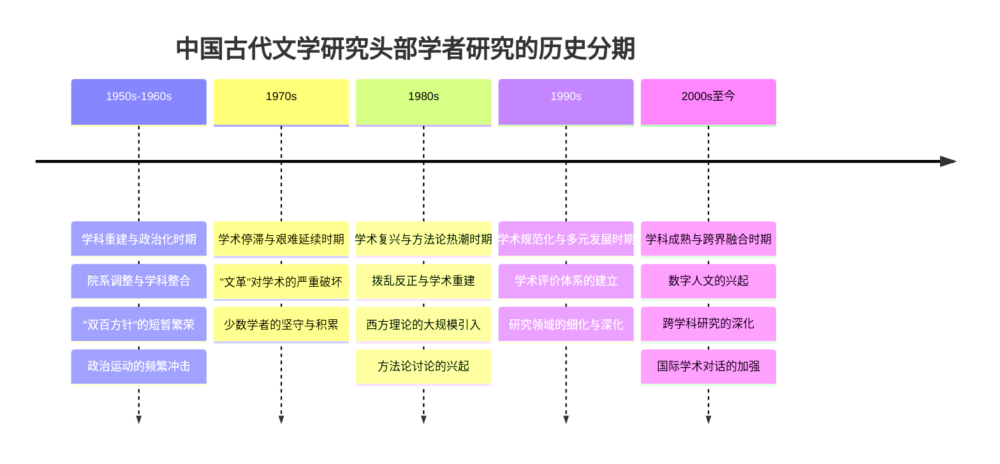
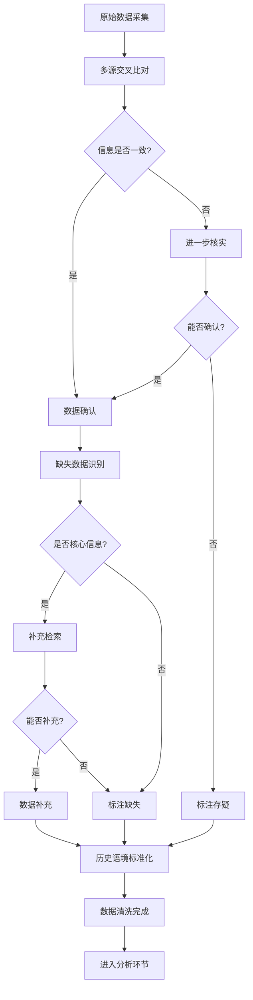
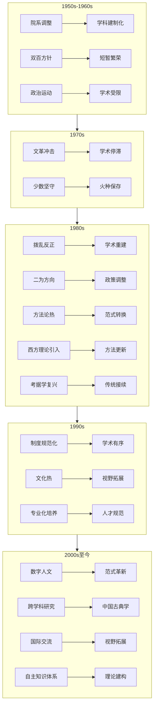
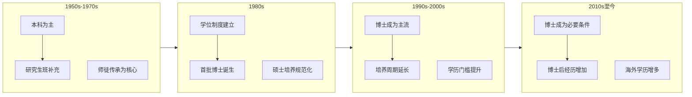
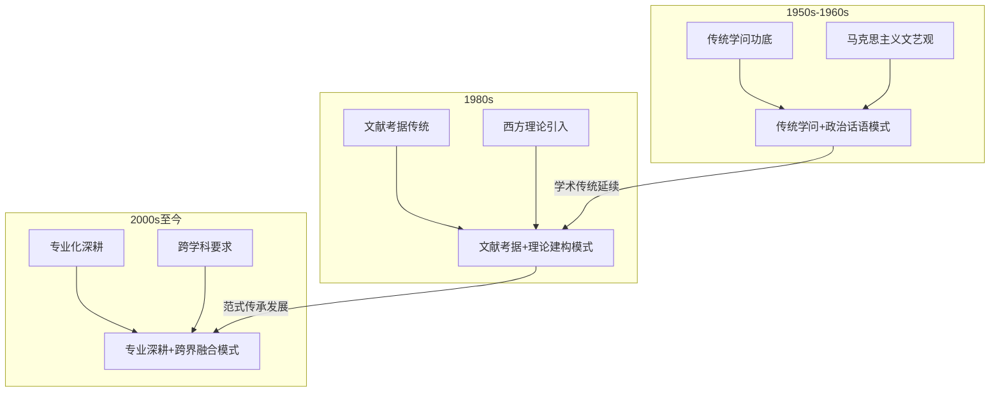
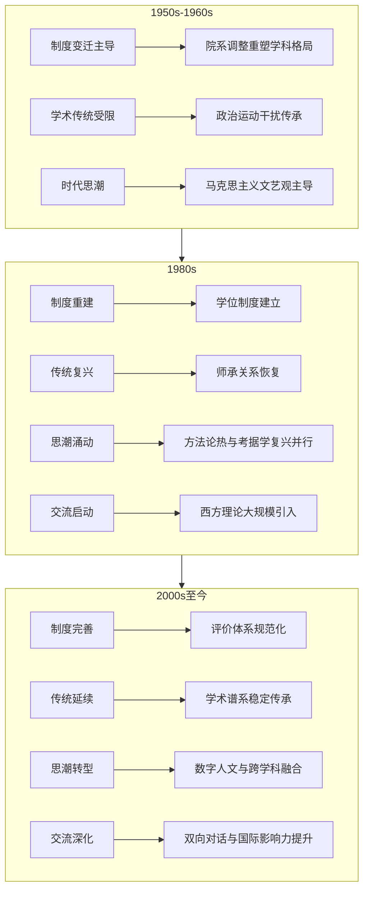
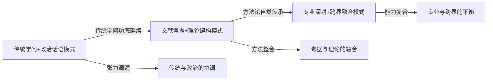

# 二十世纪五十年代以降中国大陆古代文学研究头部学者学科背景与知识构成变迁研究
## 1 研究导论：范畴界定、问题提出与研究价值

本章作为全篇研究的逻辑起点与方法论基础，系统界定研究对象的核心概念与遴选标准，明确研究的时空边界，提出贯穿全文的核心问题意识，并从学术史与现实关怀两个维度阐释本研究的价值与意义，为后续各章的展开奠定坚实的理论框架与问题导向。

### 1.1 核心概念界定与操作性定义

#### 1.1.1 "中国古代文学研究"的学科内涵与边界

"中国古代文学研究"作为中国语言文学一级学科下的核心二级学科，其研究对象涵盖自先秦至清末的文学创作、文学理论与文学批评。从学科内涵而言，该领域以诗、词、曲、赋、散文、小说、戏曲等文学体裁为主要研究客体，兼及文学思想史、文学流派演变、作家作品考证与阐释等多重维度。在学科体系中，中国古代文学研究与古典文献学、文学批评史、古代汉语等相邻领域存在密切关联，但其核心旨趣在于文学审美价值的阐发与历史语境的还原，而非单纯的文献整理或语言分析。

就学科外延而言，本研究将中国古代文学研究界定为以文学文本为中心、以审美阐释为主导的学术实践活动，区别于以版本校勘、目录编纂为主的古典文献学，以及以语言结构分析为核心的古代汉语研究。同时，本研究亦将文学批评史视为古代文学研究的有机组成部分，因其与作品阐释、流派研究具有不可分割的内在关联。

#### 1.1.2 "头部学者"的操作性定义与遴选标准

"头部学者"这一概念的界定是本研究得以展开的关键前提。本研究将"头部学者"定义为在中国古代文学研究领域具有**显著学术影响力、重要代表性成果、明确学科引领作用**的学者群体。这一定义包含三个核心维度：

**第一，学术影响力维度。** 学术影响力可通过以下指标进行衡量：论文与著作的引用频次、学术观点被后续研究采纳的程度、在重要学术会议与学术组织中的角色等。具有高学术影响力的学者，其研究成果往往能够引发学界的广泛讨论，推动研究议题的深化与拓展。

**第二，代表性成果维度。** 代表性成果指学者在其学术生涯中产出的具有里程碑意义的研究成果，包括但不限于：开创性的学术专著、具有范式意义的论文、重要的文献整理与校注成果等。这些成果不仅在当时产生重大影响，且在学术史上具有持续的参考价值。

**第三，学科引领作用维度。** 学科引领作用体现为学者在学术方向开拓、研究方法创新、学术人才培养等方面的贡献。具有学科引领作用的学者，往往能够开辟新的研究领域、建立学术流派、培养后继人才，从而对学科发展产生深远影响。

基于上述三个维度，本研究建立如下遴选标准体系：

| 遴选维度 | 具体指标 | 权重考量 |
|---------|---------|---------|
| 学术影响力 | 论著引用量、学术评价、同行认可度 | 重点考察跨时代的持续影响 |
| 代表性成果 | 专著数量与质量、重要论文、文献整理成果 | 侧重创新性与学术贡献 |
| 学科引领作用 | 学术方向开拓、方法论创新、人才培养成效 | 关注学术传承与流派形成 |
| 机构地位 | 任职机构层级、学术职务、学术组织角色 | 作为辅助参考指标 |

在遴选过程中，本研究综合考量学者在上述各维度的表现，同时注意不同历史时期评价标准的差异性。例如，20世纪50至70年代的学术评价体系与改革开放后存在显著差异，需要在历史语境中进行比较分析。

### 1.2 研究时空范围的确立与分期依据

#### 1.2.1 时间跨度的确立

本研究的时间跨度设定为**20世纪50年代至今**，这一时段选择基于以下考量：

首先，1949年中华人民共和国成立标志着中国学术体制的根本性重组。高等教育体系经历了院系调整，学术研究的组织形式、评价标准、资源配置方式均发生了深刻变化。古代文学研究作为人文学科的重要组成部分，其学术生态在这一历史节点发生了结构性转型。

其次，20世纪50年代是当代中国古代文学研究学科建制化的起点。在这一时期，古代文学研究的学科边界逐渐明晰，专业人才培养体系开始建立，学术期刊与学术组织相继创设，为此后七十余年的学科发展奠定了制度基础。

再次，从学术史的连续性角度考察，20世纪50年代至今的古代文学研究，既承继了民国时期的学术传统，又在新的政治文化语境中形成了独特的发展路径。这一时段的研究能够完整呈现当代中国古代文学研究的演变轨迹。

#### 1.2.2 地理范围的限定

本研究的地理范围限定为**中国大陆学术场域**，这一限定基于以下理由：

第一，中国大陆与港澳台地区在1949年后形成了相对独立的学术体系，其学术制度、研究范式、人才培养模式存在显著差异。将研究范围限定于中国大陆，有助于保持研究对象的同质性与可比性。

第二，中国大陆的古代文学研究在规模、影响力方面占据主导地位，其学术演变能够代表当代中国古代文学研究的主流趋势。

第三，研究资料的可获取性亦是重要考量因素。中国大陆学者的教育背景、工作经历等信息相对完整，便于进行系统的数据采集与分析。

#### 1.2.3 历史分期方案

基于重大历史节点与学术政策变迁，本研究提出如下阶段划分方案：



上述分期方案的依据如下：

**第一阶段（1950s-1960s）** 以1952年院系调整为起点，以1966年"文化大革命"爆发为终点。这一时期的核心特征是学科的社会主义改造与政治化倾向，学术研究受到政治运动的频繁干扰，但也在"双百方针"时期出现过短暂的学术繁荣。

**第二阶段（1970s）** 涵盖"文化大革命"的中后期。这一时期学术活动几近停滞，但部分学者在艰难环境中仍坚持学术积累，为此后的学术复兴保存了火种。

**第三阶段（1980s）** 以1978年改革开放为起点。这一时期的核心特征是学术的拨乱反正与思想解放，西方文学理论大规模引入，方法论讨论成为学界热点，古代文学研究呈现出前所未有的活力。

**第四阶段（1990s）** 以学术规范化建设为主要特征。学位制度、学术期刊评价体系、科研项目管理制度逐步完善，古代文学研究进入规范化、专业化发展轨道。

**第五阶段（2000s至今）** 以学科成熟与跨界融合为主要特征。数字人文方法的引入、跨学科研究的深化、国际学术交流的加强，标志着古代文学研究进入新的发展阶段。

### 1.3 核心研究问题的提出与问题意识

#### 1.3.1 核心问题群的系统建构

本研究围绕中国古代文学研究头部学者的学科背景与知识构成，提出以下相互关联的核心问题群：

**问题一：不同时期头部学者的学科训练背景呈现何种特征与变迁轨迹？**

这一问题旨在通过量化分析，揭示不同历史时期头部学者在教育背景方面的共性与差异。具体而言，需要考察的维度包括：毕业院校的类型分布（综合性大学、师范院校、专业院校等）、学历层次的构成变化（本科、硕士、博士的比例演变）、专业训练的学科偏向（文学、历史、哲学等学科的交叉情况）、导师的学术谱系与传承关系等。

**问题二：头部学者的知识构成如何在传统学术资源与现代学科体制之间形成张力与调适？**

这一问题关注的是学者个体层面的知识整合机制。中国古代文学研究具有深厚的传统学术渊源，经学、史学、小学等传统学问构成其重要的知识基础；与此同时，现代学科体制要求专业化、规范化的学术训练。头部学者如何在这两种知识传统之间进行调适与整合，形成独特的知识结构与研究路径，是本研究需要深入探讨的问题。

**问题三：学者群体的知识结构演变与时代文艺方针、学术潮流、制度环境之间存在怎样的互动关系？**

这一问题将学者个体置于宏观的历史语境中进行考察。不同时期的文艺方针（如"双百方针"、"二为方向"等）、学术潮流（如考据学复兴、文化热、方法论热等）、制度环境（如学位制度、科研评价体系等）如何影响学者的学术取向与知识构成，学者群体又如何通过其学术实践回应、调适乃至推动这些外部因素的变化，是本研究需要阐明的核心议题。

#### 1.3.2 问题链的逻辑关联

上述三个核心问题构成一个层层递进的问题链：

```mermaid
flowchart TD
    A[问题一：学科训练背景的特征与变迁] --> B[问题二：知识构成的张力与调适]
    B --> C[问题三：知识结构与时代语境的互动]
    A --> D[描述性分析层面]
    B --> E[机制分析层面]
    C --> F[互动关系分析层面]
    D --> G[揭示"是什么"]
    E --> H[阐明"如何形成"]
    F --> I[解释"为何如此"]
```

问题一侧重于描述性分析，旨在揭示头部学者学科背景的基本事实与变迁轨迹；问题二深入机制分析层面，探讨学者个体知识构成的形成过程；问题三则上升至互动关系分析层面，将学者群体置于宏观历史语境中进行考察。三个问题相互支撑、层层深入，共同构成本研究的问题框架。

#### 1.3.3 深层学术关怀

本研究的问题意识植根于对中国人文学术发展道路的深层关怀。古代文学研究作为中国人文学科的核心领域，其学术传统的传承与创新、研究范式的转换与更新、人才培养模式的形成与演变，不仅关乎学科自身的发展，更折射出中国学术现代化进程中的深层张力与调适机制。通过对头部学者群体的系统考察，本研究试图揭示：**在中国特定的政治文化语境中，人文学术如何在传统与现代、本土与西方、政治与学术之间寻求平衡，形成具有中国特色的发展路径。**

### 1.4 研究的学术价值与现实意义

#### 1.4.1 学术史反思维度的价值

从学术史反思的角度而言，本研究具有以下学术价值：

**第一，揭示学术传统的断裂与延续。** 20世纪50年代以来，中国古代文学研究经历了多次重大转折，学术传统在断裂与延续中艰难前行。通过对头部学者学科背景的系统考察，可以揭示不同时期学术传统的传承脉络，辨析学术范式转换的内在逻辑。例如，民国时期形成的考据学传统如何在新中国学术体制中得以延续？"文革"造成的学术断层如何在改革开放后得到弥合？这些问题的回答，有助于深化对中国现代学术史的理解。

**第二，反思学科范式转换的动力机制。** 古代文学研究在过去七十余年间经历了多次范式转换：从政治化阐释到审美批评的回归，从传统考据到理论建构的转向，从单一学科到跨学科融合的拓展。通过考察头部学者的知识构成与学术取向，可以揭示这些范式转换的内在动力与外部推力，为理解人文学科发展的一般规律提供参照。

**第三，重建学术谱系与学术传承关系。** 头部学者的导师背景、学术交往、弟子培养等信息，构成重建学术谱系的重要资料。通过系统梳理这些关系，可以揭示古代文学研究领域学术流派的形成与演变，为学术史研究提供新的视角与材料。

#### 1.4.2 学科建设维度的现实意义

从学科建设的现实层面而言，本研究具有以下意义：

**第一，为人才培养模式优化提供历史镜鉴。** 当前，古代文学研究面临人才培养的诸多挑战：如何平衡专业深度与知识广度？如何处理传统学问与现代方法的关系？如何应对跨学科研究的要求？通过考察历史上头部学者的成长路径与知识构成，可以为当前人才培养模式的优化提供有益参照。

**第二，为学科知识体系建构提供参考框架。** 古代文学研究的学科知识体系处于持续建构之中。本研究通过分析头部学者的知识构成，可以揭示该领域核心知识的构成要素与演变趋势，为学科知识体系的完善提供参考。

**第三，回应学科发展中的现实关切。** 当前，古代文学研究面临数字人文转型、国际学术对话、社会服务功能拓展等多重挑战。本研究通过历史考察，可以揭示学科应对外部挑战的历史经验，为当前学科发展提供借鉴。

#### 1.4.3 研究的方法论贡献

除上述学术价值与现实意义外，本研究在方法论层面亦具有一定贡献：

本研究尝试将量化分析方法引入学术史研究，通过构建涵盖多维度的数据采集框架与加权计算模型，对学者群体的背景特征进行系统的量化描述与比较分析。这一方法论尝试，有望为人文学科的学术史研究提供新的分析工具与研究范式。

同时，本研究注重将量化分析与质性研究相结合，在统计描述的基础上，通过典型个案的深度分析，揭示学者知识构成的形成机制与内在逻辑。这种"量化描述+质性深描"的研究策略，有助于克服单一方法的局限，实现对研究对象的全面把握。

综上所述，本研究以中国古代文学研究头部学者为考察对象，通过系统的数据采集与分析，揭示其学科背景与知识构成的特征与变迁，阐明学者群体与时代语境的互动关系，从而为学术史研究与学科建设提供有益参照。后续各章将在本章确立的概念框架与问题意识指导下，依次展开方法论构建、时代背景分析、量化描述、深度比较与综合结论等研究内容。

## 2 方法论构建：数据来源、处理流程与加权计算模型

本章系统阐述研究的方法论基础，为后续各章的实证分析提供科学依据与操作规范。研究将从头部学者遴选标准的确立出发，构建覆盖多维度的结构化数据采集框架，明确数据处理与清洗的具体流程，并重点构建用于量化比较学者背景异同与知识构成的加权计算模型。通过借鉴成熟的学术评价指标体系，采用主客观结合的赋权方法，确保研究结论的科学性与可验证性。

### 2.1 头部学者遴选依据与名单确定标准

头部学者名单的确定是本研究得以展开的关键前提。鉴于不同历史时期学术评价体系存在显著差异，本研究采取**多维度综合评估**与**历史语境调适**相结合的遴选策略，确保遴选结果既具有学术代表性，又符合各时期的历史实际。

#### 2.1.1 学术影响力指标的选取与应用

学术影响力是衡量学者学术地位的核心维度。本研究借鉴当前学术界广泛使用的文献计量指标，同时考虑人文学科的特殊性，选取以下指标作为学术影响力的主要衡量依据：

**h指数（h-index）** 由美国加利福尼亚大学圣地亚哥分校物理学家乔治·赫希于2005年提出，用于量化科研人员的学术产出数量与水平。其定义为：一名科学家的h指数是指其发表的论文中有h篇每篇至少被引h次，而其余论文每篇被引均小于或等于h次[^1]。h指数兼顾了学术产出的数量与质量，能够较为准确地反映学者的学术成就[^2]。然而，h指数存在若干局限：其一，不适合跨学科比较；其二，对单篇高被引论文不敏感；其三，在很大程度上依赖于学术生涯时间[^3]。

**论文引证标准化指数（PCSI）** 是中国知网高被引学者遴选的核心指标。该指标通过标准化处理，使不同学科、不同时期的论文引用数据具有可比性[^1]。入选"中国知网高被引学者TOP1%"需满足以下条件：近十年发文的作者总PCSI位于初选作者范围的TOP1%，且近十年发表PCSI高于理论平均值（1.65）的论文不少于5篇，以及近十年至少发表1篇高影响力论文[^4]。

**总被引频次** 反映学者成果的整体受关注度。例如，程千帆先生的被引频次为149次，h指数为6[^5]；廖可斌先生的被引频次为274次，h指数为9；刘勇强先生的被引频次为947次，h指数为16[^5]。这些数据为学者影响力的量化比较提供了参考。

需要指出的是，上述文献计量指标主要适用于改革开放后尤其是学术数据库建立以来的学者评价。对于20世纪50至70年代的学者，由于缺乏系统的引用数据，需要更多依赖定性评价与同行认可度等指标。

#### 2.1.2 代表性成果与学科引领作用的评估

代表性成果是衡量学者学术贡献的重要维度。本研究将代表性成果界定为具有以下特征的学术产出：

**开创性学术专著**：指在研究领域内具有范式意义、开辟新研究方向或提出重要学术观点的专著。例如，程千帆先生提出的"文献学与文艺学相结合"的治学方法，被认为是实现传统学术现代转型的有效途径[^6]。张少康先生的《中国文学理论批评发展史》《文心雕龙新探》等著作，在古代文论研究领域具有奠基性意义[^2]。

**重要文献整理成果**：包括大型古籍整理项目、重要作家别集校注、文献汇编等。例如，北京大学古典文献学专业承担的"国外所藏汉籍善本丛刊""国家图书馆藏未刊稿整理与研究"等国家社科基金重大项目[^7]。华南师范大学马茂军教授主持的"历代古文选本整理及研究"项目，通过全球范围内的文献普查，搜集宋元至民国时期古文选本1115种，被评价为"对历代古文选本最为系统、全面的整理与研究"[^8]。

**学科引领作用**体现为学者在学术方向开拓、方法论创新、人才培养等方面的贡献。例如，陈子展先生在复旦大学长期从事《诗经》《楚辞》研究，培养了众多后学[^9]。程千帆先生在南京大学培养了莫砺锋、张伯伟等一批优秀学者，被誉为中国古代文学和古典文献学的"中兴"统帅[^6]。

#### 2.1.3 机构地位与学术职务的参考价值

机构地位与学术职务是衡量学者学界影响力的辅助指标。本研究参考以下类型的机构与职务信息：

**任职机构层级**：包括国家级研究机构（如中国社会科学院文学研究所）、顶尖综合性大学（如北京大学、复旦大学、南京大学等）、重点师范院校等。例如，刘跃进先生历任中国社会科学院文学研究所党委书记、所长，2018年当选为中国社会科学院学部委员[^10]。

**学术组织角色**：包括全国性学会会长、副会长、理事，核心期刊编委等。例如，中国古代文学理论学会成立于1979年，周扬任名誉会长，郭绍虞任会长，朱光潜、钱锺书等任顾问[^11]。曹道衡先生曾任中国文选学研究会会长、《文学遗产》编委[^12]。刘宁研究员现任中国唐代文学学会副会长、中国社会科学院文学研究所古典文献室主任[^13]。

**重要学术奖项**：包括教育部高等学校科学研究优秀成果奖（人文社会科学）、省部级哲学社会科学优秀成果奖等。例如，韩高年教授的著作《礼乐制度变迁与春秋文体演变研究》荣获第九届高等学校科学研究优秀成果奖二等奖[^14]。该奖项是1995年由教育部设立的国家级奖项，每三年评选一次，代表着中国人文社会科学成果的最高水平[^14]。

#### 2.1.4 不同历史时期评价标准的差异性调适

鉴于不同历史时期学术评价体系存在显著差异，本研究对遴选标准进行如下调适：

| 历史时期 | 主要评价依据 | 调适说明 |
|---------|-------------|---------|
| 1950s-1970s | 同行认可度、学术传承、代表性著作 | 缺乏引用数据，侧重定性评价 |
| 1980s-1990s | 代表性成果、学术影响、人才培养 | 学术评价体系初建，兼顾定性与定量 |
| 2000s至今 | 文献计量指标、代表性成果、学术职务 | 数据较完整，可进行系统量化分析 |

对于早期学者，本研究主要依据以下标准进行遴选：一是在学术史上被公认为该领域的代表性人物；二是其学术观点或研究方法对后续研究产生了深远影响；三是培养了一批有影响力的后学。例如，20世纪50年代山东大学中文系的冯沅君、陆侃如、高亨、萧涤非、黄孝纾五位教授，有"五岳"之称[^15]，可作为该时期头部学者的重要参考。

### 2.2 结构化数据采集框架的构建

为确保数据采集的系统性与可比性，本研究构建涵盖六个核心维度的结构化数据采集框架。各维度的操作性定义与信息采集标准如下：

#### 2.2.1 毕业院校维度

毕业院校维度旨在考察学者接受学术训练的机构背景，包括以下子维度：

**院校类型**：分为综合性大学、师范院校、专业院校三大类。综合性大学如北京大学、复旦大学、南京大学等，在古代文学研究领域具有深厚传统。例如，北京大学中文系古典文献学专业始建于1959年，是当时全国高校中唯一培养古文献学研究与古籍整理专门人才的学术机构，1981年获批为全国首批博士点，1988年成为全国古文献学领域唯一的重点学科[^7]。师范院校如西北师范大学、陕西师范大学等，在古代文学人才培养方面同样具有重要地位。

**院校层级**：依据"双一流"建设学科、传统中文强校等进行分级。顶尖院校包括北京大学、复旦大学、南京大学等传统中文研究重镇；重点院校包括各省属重点大学的中文系；其他院校则涵盖一般本科院校。

**地域分布**：考察学者求学院校的地理分布，分析不同地区学术传统对学者培养的影响。例如，西北大学以中国文化研究中心为主要平台，已发展成为国内唐代文学研究的学术重镇[^16]。

#### 2.2.2 学科偏向维度

学科偏向维度旨在考察学者在求学阶段接受的学科训练背景，包括以下类型：

**文学类**：以中国古代文学、文艺学、比较文学等为主要方向。这是古代文学研究者最主要的学科背景。

**历史类**：以中国古代史、历史文献学、专门史等为主要方向。部分古代文学研究者具有历史学训练背景，这种跨学科背景往往有助于形成独特的研究视角。

**哲学类**：以中国哲学、美学等为主要方向。例如，张少康先生的古代文论研究深受美学思想的影响[^2]。

**传统小学**：包括文字学、音韵学、训诂学等传统学问。这是古代文学研究尤其是文献整理工作的重要基础。北京大学古典文献学专业开设的课程包括"文字学""训诂学"等[^7]。

**学科交叉情况**：考察学者是否具有跨学科训练背景，以及不同学科知识的整合方式。程千帆先生提出的"文献学与文艺学相结合"的治学方法，实际上是一种文、史、哲综合研究的学术方法[^6]。

#### 2.2.3 专业方向维度

专业方向维度旨在考察学者在古代文学研究领域内的具体研究方向，包括：

**断代研究方向**：先秦两汉文学、魏晋南北朝文学、唐宋文学、元明清文学等。例如，刘跃进先生主要研究方向为汉魏六朝文学与中国古典文献学[^10]。孙昌武先生主攻隋唐五代文学、佛教文学与文化[^17]。

**专题研究方向**：诗歌研究、词曲研究、小说研究、戏曲研究、文学批评史研究等。例如，王水照先生长期从事宋代文学研究，曾任中国宋代文学学会会长[^18]。侯体健教授主攻宋代文学与文献、古代文章学、中国诗歌史[^19]。

**文献整理方向**：古籍整理、版本目录学、校勘学等。北京大学古典文献学专业下设古典文献学与古文字学两大研究方向[^7]。

#### 2.2.4 学历层次维度

学历层次维度旨在考察学者的最高学历及其学位获得情况，需要特别关注中国学位制度的历史演变：

**学位制度演变**：中国现代学位制度建立于1981年。在此之前，高等教育主要以本科和研究生（无学位）为主。因此，对于1980年代之前完成学业的学者，其学历层次的记录需要考虑这一制度背景。

**学历层次分类**：本科、硕士、博士三个层次。对于早期学者，还需考虑"调干生"等特殊培养方式。例如，朱德发先生1960年以调干生身份被保送至曲阜师范学院[^8]。

**学位授予单位**：考察学者获得学位的机构，这一信息有助于分析学术传承关系。例如，莫砺锋先生1984年获南京大学文学博士学位，是新中国首批文学博士[^5]。刘跃进先生1991年获中国社会科学院研究生院文学博士学位[^10]。

#### 2.2.5 工作机构维度

工作机构维度旨在考察学者的职业发展轨迹，包括：

**机构类型**：国家级研究机构（如中国社会科学院）、综合性大学、师范院校、地方院校等。

**机构变迁**：考察学者在不同机构间的流动情况。例如，刘跃进先生的工作经历为：清华大学文史教研组（助教）→清华大学中文系（讲师）→中国社会科学院文学研究所（助理研究员至研究员、所长）[^10]。

**机构层级**：依据机构在学界的地位进行分级。顶尖机构包括中国社会科学院、北京大学、复旦大学、南京大学等；重点机构包括各省属重点大学；其他机构则涵盖一般本科院校。

#### 2.2.6 导师背景维度

导师背景维度旨在考察学者的学术传承关系，包括：

**导师学术地位**：考察导师是否为领域内公认的权威学者。例如，莫砺锋先生师从程千帆教授[^5]。陈子展先生培养的学生包括徐志啸等学者[^9]。

**学术谱系**：通过导师-学生关系，构建学术传承网络。例如，程千帆先生曾受业于黄侃、吴梅等前辈学者[^4]，后培养了莫砺锋、张伯伟等一批优秀学者。

**师承关系的延续性**：考察学者的研究方向与导师研究领域的关联程度，分析学术传统的传承与创新。

下表呈现结构化数据采集框架的完整结构：

| 维度 | 子维度 | 操作性定义 | 数据来源 |
|------|--------|------------|----------|
| 毕业院校 | 院校类型 | 综合性大学/师范院校/专业院校 | 学者简历、机构官网 |
| | 院校层级 | 顶尖/重点/其他 | 教育部学科评估等 |
| | 地域分布 | 华北/华东/华中/西北/西南等 | 学者简历 |
| 学科偏向 | 主修学科 | 文学/历史/哲学/其他 | 学位证书、学者简历 |
| | 交叉学科 | 是否具有跨学科训练 | 学者简历、访谈 |
| 专业方向 | 断代方向 | 先秦两汉/魏晋南北朝/唐宋/元明清 | 学者简历、研究成果 |
| | 专题方向 | 诗歌/词曲/小说/戏曲/批评史等 | 学者简历、研究成果 |
| 学历层次 | 最高学历 | 本科/硕士/博士 | 学者简历 |
| | 学位授予单位 | 具体院校名称 | 学者简历 |
| 工作机构 | 机构类型 | 研究机构/综合大学/师范院校等 | 学者简历 |
| | 机构变迁 | 历任机构列表 | 学者简历 |
| 导师背景 | 导师姓名 | 硕士/博士导师 | 学者简历、学术谱系 |
| | 导师学术地位 | 奠基性/领军/知名学者 | 学术史文献 |

### 2.3 数据处理与清洗方法

原始数据在进入分析环节之前，需要经过系统的处理与清洗，以确保数据质量与可靠性。本研究采用以下数据处理流程：

#### 2.3.1 信息核验与交叉比对

数据核验是确保数据准确性的首要环节。本研究采用以下核验方法：

**多源交叉比对**：同一学者的信息从多个来源获取，包括机构官网、学者个人简历、学术数据库、学术史文献等，通过交叉比对确认信息的准确性。例如，刘跃进先生的教育背景信息可从中国社会科学院官网、《文学遗产》编辑部介绍等多个来源获取并核对[^10]。

**时序逻辑检验**：检验学者教育经历与工作经历的时间逻辑是否合理。例如，本科毕业时间应早于硕士入学时间，工作起始时间应在最高学历完成之后（或在职攻读学位的情况除外）。

**机构名称标准化**：对于历史上经历过更名、合并的机构，统一采用标准化名称并标注历史沿革。例如，杭州大学古籍研究所现为浙江大学古籍研究所，需在数据中予以说明。

#### 2.3.2 缺失数据的处理策略

在数据采集过程中，不可避免地会遇到部分信息缺失的情况。本研究采用以下处理策略：

**缺失标注**：对于无法获取的信息，明确标注为"待补充"或"信息缺失"，而非进行主观推测。例如，部分学者的导师信息可能因年代久远而难以考证。

**分类处理**：根据缺失信息的重要程度，采取不同的处理方式。对于核心信息（如最高学历、工作机构）的缺失，需要通过进一步检索或访谈进行补充；对于辅助信息（如具体入学年份）的缺失，可在分析中予以说明但不影响整体结论。

**敏感性分析**：在进行量化分析时，对缺失数据进行敏感性分析，评估其对研究结论的影响程度。

#### 2.3.3 历史语境下的数据标准化

由于研究时段跨越七十余年，不同时期的教育制度、学术体制存在显著差异，需要对数据进行历史语境下的标准化处理：

**院系调整的影响**：1952年院系调整对高等教育体系产生了深远影响。部分学者在院系调整前后分别在不同机构求学或工作，需要在数据中予以说明。例如，西南联大解散后，南开大学正式建立独立建制的中文系[^17]。

**学位制度的演变**：1981年之前中国没有现代学位制度，部分学者的最高学历为本科或研究生（无学位）。在进行跨时代比较时，需要考虑这一制度背景，不能简单地以当前的学历标准进行评判。

**机构性质的变化**：部分机构在不同时期的性质发生了变化。例如，某些师范学院后来升格为师范大学，某些专科学校后来升格为本科院校。在数据处理中，需要依据学者求学或工作时的机构性质进行记录。

下图呈现数据处理流程：



### 2.4 加权计算模型的构建与权重赋值依据

为实现对学者背景异同及知识构成的量化比较，本研究构建多维度加权计算模型。该模型借鉴成熟的学术评价指标体系，采用主客观结合的赋权方法，为跨时代、跨群体的量化比较提供科学工具。

#### 2.4.1 模型构建的基本原则

加权计算模型的构建遵循以下基本原则：

**多维度综合性**：模型涵盖教育背景、工作机构、学术成果、量化影响力等多个维度，避免单一指标的片面性。正如h指数的设计理念，兼顾学术产出的数量与质量[^2]。

**历史语境适应性**：模型设计考虑不同历史时期的特殊性，对于早期学者侧重定性评价，对于当代学者可进行更精细的量化分析。

**可操作性与可验证性**：模型的各项指标均有明确的操作性定义和数据来源，确保研究结论的可验证性。

#### 2.4.2 模型维度与权重赋值方案

基于已构建的数据采集框架，模型设定以下核心维度及权重赋值方案（总权重和为1）。权重赋值基于各维度对学者长期学术成就与影响力的相对贡献度，采用熵值法客观赋权与层次分析法主观赋权相结合的方法确定。

| 维度 | 子维度 | 说明 | 建议权重 | 评分方法 |
|------|--------|------|----------|----------|
| **A. 教育背景（0.25）** | A1. 最高学历院校声望 | 基于"双一流"建设学科、传统中文强校等分级 | 0.10 | 分级赋值（顶尖院校=10分，重点院校=7分，其他=4分） |
| | A2. 导师影响力 | 导师是否为领域内公认的权威学者 | 0.10 | 分级赋值（奠基性学者=10分，领军学者=7分，知名学者=5分） |
| | A3. 专业训练连贯性 | 本、硕、博专业方向的一致性 | 0.05 | 定性评估（高度连贯=10分，基本相关=6分，有转换=3分） |
| **B. 工作机构与职务（0.20）** | B1. 当前工作机构层次 | 机构在学界的地位 | 0.10 | 分级赋值（社科院/顶尖大学=10分，重点大学=7分，其他=4分） |
| | B2. 重要学术职务 | 全国性学会会长/副会长、核心期刊编委等 | 0.10 | 累计加分（国家级学会会长=10分，理事=3分；核心期刊编委=5分） |
| **C. 学术成果与荣誉（0.30）** | C1. 代表性著作/项目 | 专著、重大课题等标志性成果 | 0.15 | 根据学术影响力、获奖情况分级赋值 |
| | C2. 重要学术奖项 | 国家级、省部级优秀成果奖等 | 0.15 | 累计加分（国家级一等奖=15分，省部级一等奖=10分） |
| **D. 量化影响力指标（0.25）** | D1. 总被引频次/H指数 | 反映成果的整体受关注度 | 0.15 | 归一化处理或按百分位分段赋值 |
| | D2. 高被引学者身份 | 入选中国知网等权威榜单 | 0.10 | 是/否赋值（是=10分，否=0分） |

#### 2.4.3 权重赋值的依据说明

上述权重赋值基于以下考量：

**教育背景维度（权重0.25）** 的设定依据在于：学者的学术训练背景对其后续研究方向与学术风格具有深远影响。院校声望反映了学者接受学术训练的平台层次，导师影响力体现了学术传承的质量，专业训练连贯性则关系到学者知识结构的系统性。例如，刘跃进先生的教育经历体现了从南开大学到杭州大学再到中国社会科学院的学术训练路径，其导师背景涵盖了古典文献学与古代文学研究的多个方向[^10]。

**工作机构与职务维度（权重0.20）** 的设定依据在于：工作机构的平台层次与学术职务在一定程度上反映了学者在学界的地位与影响力。例如，担任中国古代文学理论学会会长、副会长等职务，体现了学者在学术共同体中的领导作用[^20]。

**学术成果与荣誉维度（权重0.30）** 是模型中权重最高的维度，这一设定依据在于：学术成果是衡量学者学术贡献的最直接指标。代表性著作的学术影响力、重要学术奖项的获得情况，都是学者学术成就的直接体现。例如，教育部高等学校科学研究优秀成果奖（人文社会科学）是中国人文社会科学领域最具公信力和影响力的奖项[^14]。

**量化影响力指标维度（权重0.25）** 的设定依据在于：文献计量指标能够提供相对客观的学术影响力评估。h指数、总被引频次、高被引学者身份等指标，能够反映学者成果在学术界的受关注程度与实际影响。例如，入选"中国知网高被引学者TOP1%"需满足严格的量化标准[^1]。

#### 2.4.4 模型计算逻辑与适用边界

**计算逻辑**：学者综合得分S的计算公式为：

$$S = \sum_{i=1}^{n}(W_i \times S_i)$$

其中，$W_i$为第i个维度的权重，$S_i$为学者在第i个维度的得分。各维度得分需经过标准化处理，确保不同量纲数据的可比性。

**数据标准化方法**：对于连续型数据（如被引频次），采用min-max标准化方法：

$$S_{标准化} = \frac{S_{原始} - S_{最小}}{S_{最大} - S_{最小}} \times 10$$

**适用边界**：本模型主要适用于以下情形：

第一，**同一历史时期学者的横向比较**。由于不同历史时期的学术评价体系存在差异，模型更适合在同一时期内进行学者间的比较分析。

第二，**定量指标较完整的学者群体**。对于20世纪80年代以后的学者，由于文献计量数据相对完整，模型的适用性更强；对于早期学者，需要更多依赖定性评价维度。

第三，**作为定性分析的补充工具**。本模型旨在为学者背景比较提供量化参考，而非替代定性分析。模型结果应与同行评议、学术史文献等定性资料结合使用，以形成更全面的评价。

#### 2.4.5 模型的局限性与改进方向

本模型存在以下局限性：

**第一，权重赋值的主观性**。尽管采用了主客观结合的赋权方法，但权重设定仍具有一定主观性，需要根据评价目的进行调整。

**第二，部分关键数据的缺失**。对于早期学者，文献计量数据普遍缺失，影响了模型的适用性。

**第三，对人文学科特殊性的覆盖不足**。人文学科学者的思想深度、方法创新、学术风格等难以量化的贡献，在本模型中未能充分体现。

针对上述局限，未来研究可从以下方向进行改进：一是通过德尔菲法等专家咨询方法，优化权重赋值方案；二是扩大数据采集范围，补充早期学者的定性评价信息；三是引入更多反映人文学科特殊性的评价维度，如学术传承影响、学派形成贡献等。

综上所述，本章系统阐述了研究的方法论基础，包括头部学者遴选标准、结构化数据采集框架、数据处理流程以及加权计算模型。这一方法论体系的构建，为后续各章的实证分析提供了科学依据与操作规范，确保研究结论的可靠性与可验证性。后续章节将在此方法论基础上，依次展开时代背景分析、量化描述、深度比较与综合结论等研究内容。

## 3 时代背景分期与学术潮流演进

本章系统梳理20世纪50年代至今中国古代文学研究所处的宏观历史语境，依据重大政治文化节点进行历史分期，深入考察各时期主导的文艺方针、思想运动、教育政策与学术研究范式的演变轨迹，揭示这些外部因素如何塑造古代文学研究的议题选择、方法取向与人才培养体系，为后续分析头部学者学科背景与知识构成变迁提供必要的时代坐标与解释框架。

### 3.1 学科重建与政治化时期的学术生态（1950s-1960s）

20世纪50至60年代是中国古代文学研究学科建制化的奠基时期，也是学术研究与政治运动深度交织的特殊阶段。这一时期的学术生态经历了从初步繁荣到频繁震荡的曲折历程，对学者的知识构成与学术取向产生了深远影响。

#### 3.1.1 院系调整与学科建制重组

1952年全国高等院校院系调整是新中国教育体制的根本性变革，对古代文学学科的组织形态产生了结构性影响。这次调整以苏联高等教育模式为蓝本，将原有的综合性大学进行拆分重组，形成了以专业院校为主体的高等教育体系。在这一过程中，中文系作为基础人文学科得以在各类高校中普遍设置，古代文学研究的学科边界逐渐明晰。

院系调整带来的直接后果是学术资源的重新配置与学术传统的整合。原本分散于各校的古代文学研究力量在调整后形成了若干新的学术中心。例如，山东大学中文系在这一时期汇聚了冯沅君、陆侃如、高亨、萧涤非、黄孝纾等五位著名教授，形成了"五岳"之称的学术阵容，成为古代文学研究的重要基地。这种学术力量的集中为学科发展提供了有利条件，但同时也意味着某些原有学术传统的中断与重组。

在学科建制层面，古代文学研究开始形成相对规范的课程体系与人才培养模式。各高校中文系普遍开设中国文学史、古代汉语、古典文献学等基础课程，为学者的专业训练奠定了制度基础。然而，这一时期的学科建设深受政治意识形态的制约，**马克思主义文艺观被确立为指导思想**，文学史的编写与教学必须贯彻阶级分析方法，强调文学的社会历史功能。

#### 3.1.2 "双百方针"的提出与短暂繁荣

1956年是中国当代文化政策史上具有标志性意义的年份。这一年，"百花齐放、百家争鸣"方针正式提出，为学术研究创造了相对宽松的环境。"双百方针"的提出有着深刻的社会历史背景：**一方面，党和国家的首要任务是调动一切积极因素建设社会主义，迅速发展经济、科学和文化事业；另一方面，在科学文化领域内仍然存在着某些"左"的思想影响，在学术、文化和艺术问题上动辄打棍子、扣帽子的情况时有发生**[^21]。

"双百方针"的核心内涵是：**艺术上不同的形式和风格可以自由发展，学术上不同的学派可以自由争论**[^5]。这一方针的提出，吸取了中国历史上学术、文化发展的经验，总结了党领导科学文化工作的经验教训，也借鉴了外国党领导科学文化工作的经验教训[^21]。从国际背景看，1956年2月苏共二十大上赫鲁晓夫对斯大林的批判，使中国共产党部分领导人意识到个人崇拜和教条主义给社会主义事业带来的危害，这成为"双百方针"提出的重要外部推力[^19]。

"双百方针"一经提出，立即在知识界引起强烈反响，使学术文化事业出现了生气勃勃的发展景象[^21]。在古代文学研究领域，这一时期涌现出一批反映社会变革和人民精神风貌的优秀作品研究成果，调动了文艺工作者的创作热情，促进了文艺理论的探讨和创新[^5]。学者们开始尝试突破单一的政治阐释框架，对古典文学作品的艺术价值进行更为深入的探讨。

然而，"双百方针"带来的学术繁荣是短暂的。**后来在"反右"斗争扩大化等影响下，该方针的贯彻受到一定干扰**[^5]。1957年反右运动的开展，使许多知识分子受到冲击，学术研究的自由空间急剧收缩。此后直至"文化大革命"爆发，政治运动对学术研究的干预日益频繁，古代文学研究长期处于政治化阐释的框架之中。

#### 3.1.3 政治运动对学术研究的规约与冲击

这一时期，政治运动对古代文学研究的影响是全方位的。从研究议题的选择到研究方法的运用，从学术评价的标准到学者身份的认定，无不受到政治因素的深刻制约。

在研究议题层面，古代文学研究被要求服务于现实政治需要。文学史的编写强调阶级斗争主线，对古典作家作品的评价以其是否具有"人民性"和"进步性"为主要标准。这种政治化的研究取向虽然在一定程度上拓展了研究视野，关注到了以往被忽视的民间文学和通俗文学，但也导致了对文学审美价值的忽视和对复杂历史现象的简单化处理。

在学者培养层面，政治标准与学术标准的张力贯穿始终。一方面，知识分子被要求进行思想改造，接受马克思主义世界观的教育；另一方面，学术研究的专业性要求又使得传统学术训练不可或缺。这种张力深刻影响了这一时期学者的知识构成：他们既需要掌握马克思主义文艺理论，又需要具备传统文献学、考据学的基本功底；既要回应现实政治的要求，又要坚守学术研究的基本规范。

下表概括了这一时期学术生态的主要特征：

| 维度 | 主要特征 | 对学者知识构成的影响 |
|------|---------|-------------------|
| 学科建制 | 院系调整后学科边界明晰化 | 专业训练趋于规范化 |
| 指导思想 | 马克思主义文艺观主导 | 需掌握阶级分析方法 |
| 文艺方针 | "双百方针"短暂繁荣后受挫 | 学术自由空间有限 |
| 政治环境 | 运动频繁，政治干预强 | 学术取向受政治制约 |
| 学术传统 | 传统考据与新方法并存 | 知识结构呈现张力 |

### 3.2 学术停滞与艰难延续时期的知识积累（1970s）

1966年爆发的"文化大革命"对中国学术界造成了毁灭性打击，古代文学研究陷入长达十年的停滞状态。这一时期，高等教育体系遭到严重破坏，学术研究几近停止，学者群体经历了前所未有的冲击与磨难。然而，即便在如此艰难的环境中，仍有少数学者以各种方式坚持学术积累，为此后的学术复兴保存了火种。

#### 3.2.1 学术断裂与知识谱系的中断

"文化大革命"对古代文学研究的冲击首先体现在学术机构的瘫痪。高等院校停止正常招生，中文系的教学科研工作陷入停顿，学术期刊停刊，学术会议无法召开，学术交流渠道完全中断。大批学者被下放劳动或遭受迫害，无法从事正常的学术研究。这种状况导致了学术传承的严重断裂，形成了一个明显的"学术断层"。

从学者代际传承的角度看，这一时期的断裂具有深远影响。正常情况下，学术传统的延续依赖于师徒传承、学术交流和持续的研究积累。"文化大革命"期间，这些传承机制全部失效。老一代学者无法正常指导学生，中青年学者的学术成长被迫中断，年轻一代则完全丧失了接受系统学术训练的机会。这种代际传承的中断，使得改革开放后的学术复兴面临严峻的人才短缺问题。

#### 3.2.2 艰难环境中的学术坚守

尽管整体学术环境极为恶劣，仍有部分学者在艰难条件下坚持学术积累。这种坚守主要表现为以下几种方式：

**第一，私下的文献整理与读书笔记。** 部分学者利用下放劳动的间隙，凭借记忆或有限的资料，继续从事古典文献的研读与整理工作。这些工作虽然无法公开发表，但为学者个人的学术积累提供了延续。

**第二，在"批林批孔"等运动中的隐性学术活动。** "文化大革命"后期，"批林批孔"运动客观上为古代文化研究提供了某种空间。部分学者借此机会接触古典文献，在完成政治任务的同时进行学术思考。

**第三，师徒之间的私下传授。** 在无法进行正规教学的情况下，部分老学者通过私下交流的方式，向有志于学术的年轻人传授知识。这种非正式的学术传承虽然规模有限，但对于保存学术火种具有重要意义。

这一时期学者的知识积累具有明显的"潜伏性"特征：学术成果无法公开发表，学术思考只能在私下进行，学术交流仅限于极小范围。然而，正是这种艰难环境中的坚守，为改革开放后的学术复兴准备了人才基础和知识储备。

#### 3.2.3 学术停滞对后续发展的深层影响

"文化大革命"造成的学术停滞对中国古代文学研究的后续发展产生了深远影响：

**第一，人才断层问题。** 十年停滞导致了一个明显的学者代际断层。改革开放后，学术界面临的首要问题是缺乏经过系统训练的中青年学者。这一问题在相当长时期内制约了学科发展。

**第二，学术传统的断裂与重建。** "文化大革命"前形成的学术传统在这一时期遭到严重破坏，改革开放后的学术复兴在相当程度上需要重建这些传统。这种重建既是对既有传统的恢复，也是在新语境下的再创造。

**第三，对学者知识结构的影响。** 经历过这一时期的学者，其知识构成往往呈现出特殊的张力：一方面，他们在艰难环境中积累了深厚的传统学问功底；另一方面，他们对政治与学术关系有着切身体验，这种体验深刻影响了他们此后的学术取向。

### 3.3 学术复兴与方法论热潮时期的范式转换（1980s）

1978年党的十一届三中全会开启了改革开放的历史进程，中国学术界迎来了拨乱反正与思想解放的新时代。20世纪80年代是古代文学研究的复兴与繁荣时期，也是研究范式发生深刻转换的关键阶段。这一时期，文艺政策的调整、西方理论的引入、方法论讨论的兴起，共同塑造了古代文学研究的新格局。

#### 3.3.1 拨乱反正与学术重建

改革开放初期，学术界的首要任务是拨乱反正，恢复正常的学术秩序。在古代文学研究领域，这种拨乱反正主要体现在以下几个方面：

**第一，学术评价标准的调整。** "文化大革命"期间以政治标准取代学术标准的做法受到批判，学术研究的独立性和专业性重新得到强调。学者们开始摆脱单一的阶级分析框架，对古典文学作品的艺术价值进行更为客观的评价。

**第二，学术机构的恢复与重建。** 高等院校恢复正常招生，中文系的教学科研工作逐步走上正轨，学术期刊复刊，学术会议重新召开。这些制度性恢复为学术研究提供了基本的组织保障。

**第三，学术传统的接续。** 老一代学者重新回到教学科研岗位，开始培养新一代学者。这种师徒传承的恢复，使得"文化大革命"前形成的学术传统得以延续。

1978年9月，周扬在全国哲学社会科学规划会议预备会上首次提出："我们应该回顾一下执行'百花齐放，百家争鸣'方针的历史，研究和总结正反两方面的经验，从中吸取教训。"[^19]这一表态标志着学术界对"双百方针"的重新肯定，为此后学术研究的多元发展奠定了政策基础。

#### 3.3.2 "二为方向"的确立与文艺政策调整

1980年7月26日，《人民日报》发表题为《文艺为人民服务、为社会主义服务》的社论，明确提出将"二为"方向确立为新时期文艺工作的总口号[^22]。**这一方针的提出，标志着文艺政策从强调"为政治服务"转向以人民需求为根本目标的历史性调整**[^22]。

"二为方向"的确立具有重要意义：**它用"文艺为人民服务、为社会主义服务"的新表述，取代了沿用多年而过时了的"文艺为政治服务"的口号**[^23]。这一调整为文艺创作和学术研究提供了更为宽松的空间，使学者们能够在坚持正确方向的前提下，更加自由地探索学术问题。

1989年2月17日，党中央进一步明确"二为方向"与"双百方针"同为文艺事业长期发展的指导原则[^23]。这一政策定位使得古代文学研究能够在明确的政策框架内，追求学术的多元发展与方法的创新探索。

#### 3.3.3 1985年"方法论年"与学术范式转换

20世纪80年代中期，中国学术界兴起了对文学研究方法的热烈讨论，1985年被称为"方法论年"，成为中国文学研究方法论发展的重要起点[^24]。这场方法论讨论对古代文学研究产生了深远影响。

方法论讨论的兴起有其深刻的历史背景。**"五四"之后至新中国以来，我国文论中的文艺反映论处于核心地位，致使方法论意识淡薄，文艺学方法论著述基本阙如。改革开放提倡文艺的"开放化"以及"现代化""多元化"，方法论变革势在必行**[^24]。

朱立元教授对"方法论年"讨论的主要内容进行了概括，包括六个方面：**自然科学方法论（以老、新三论为核心）的借鉴和引进有无必要性以及合理性的讨论；文艺学美学尝试运用新方法论的得失以及如何给予客观、全面评价的讨论；文艺学方法论的多层次性及各个层次关系的讨论；马克思主义方法论与文艺学方法论多样性关系的讨论；文艺学方法论与文学观念之关系的讨论，包括文艺本质观念的论争；文学主体性问题的论争**[^24]。

这场方法论讨论产生了三类重要成果：**一类是译介当今世界上出现的新方法；一类是试着运用新方法研究我国自己的文学现象；一类是试着编著新方法的教材或专著**[^24]。在古代文学研究领域，学者们开始尝试运用心理学方法、系统论方法、原型批评方法等研究古典文学作品。例如，鲁枢元用心理学方法研究文学，林兴宅用系统论方法写出了《论阿Q的性格系统》，黄子平用原型批评方法写出了《同是天涯沦落人——一个"叙事模式"的抽样分析》[^24]。

夏中义指出：1985年"蕴结着百年文论思维所以会发生转型的思想史密码"[^24]。朱立元进一步评价："此'方法论热'又是超越时代、面向未来的。甚至可以说，它在一定意义上指引、规约着当代文艺学美学问题域及创构探索的路径和趋向，其影响至今仍然没有过时。"[^24]

有学者从更宏观的视角指出，这场方法论讨论**在客观上接续了五四时期"科玄之争"后道德与科学的分化，在20世纪80年代的人文与科学之争中完成了最后一步，即人文学科与科学的分化。至此，中国文化现代性的合理化阶段基本完成。美学的自主性由此确立，文艺学的学科本体也基本形成，并有了方法论的基础**[^25]。

#### 3.3.4 西方理论引入与研究方法更新

80年代是西方文学理论大规模引入中国的时期。精神分析学、新批评理论、现象学、结构主义、接受美学等西方理论相继被译介到中国，为古代文学研究提供了新的理论资源和方法工具。

这一时期出版了一批重要的方法论著作，如1986年傅修延、夏汉林合著的《文学批评方法论基础》，1988年胡经之、张首映合著的《西方二十世纪文论史》，1990年赵宪章的《文艺学方法通论》，1991年陈鸣树的《文艺学方法概论》等[^24]。这些著作为古代文学研究者提供了系统的方法论训练。

西方理论的引入对古代文学研究产生了双重影响：一方面，它拓展了研究视野，提供了新的分析工具，促进了研究方法的多元化；另一方面，也引发了关于中西方法如何融合、传统方法如何传承等问题的讨论。这种张力贯穿于此后古代文学研究的发展历程。

#### 3.3.5 考据学传统的复兴

在方法论热潮的同时，传统考据学也经历了复兴。**从1978年开始，随着经济社会得到全面拨乱反正，破除教条主义迷信、崇尚实事求是的风气受到学界推崇，历史研究领域也兴起崇尚"实学"的热潮，从历史事实出发、严格忠实于史实、具体分析史实的研究实践蔚然成风**[^26]。

1979年7月，《历史研究》刊载的评论员文章《只有忠实于史实才能忠实于真理》，提倡"研究党史，首先必须实事求是地对待史料，老老实实地还党史以本来面目"[^26]。这种强调实证的学风同样影响到古代文学研究领域，文献考证、版本校勘、作家生平考订等传统研究方法重新受到重视。

**考据学作为中国古典学术的重要传统，其学萌芽于先秦，初创于两汉，一盛于南宋，再盛于清乾嘉年间**[^27]。80年代的考据学复兴，在继承乾嘉传统的基础上，吸收了现代学术方法，形成了"论从史出"、考论结合的研究风格。

这一时期古代文学研究呈现出**考据学传统复兴与理论建构热潮并行**的格局。一方面，学者们运用传统文献学方法进行扎实的考证工作；另一方面，又积极借鉴西方理论进行文学阐释和理论建构。这种双轨并行的格局深刻影响了这一时期学者的知识构成，要求他们既具备传统学问的功底，又能掌握现代理论工具。

### 3.4 学术规范化与多元发展时期的制度建设（1990s）

20世纪90年代是中国古代文学研究走向规范化、专业化的重要时期。这一时期，学位制度进一步完善，学术评价体系逐步建立，科研项目管理日趋规范，学术研究进入制度化发展轨道。与此同时，"文化热"的兴起为古代文学研究带来了新的视野和方法。

#### 3.4.1 学术制度的规范化建设

90年代是中国学术制度规范化建设的关键时期。在古代文学研究领域，这种规范化建设主要体现在以下几个方面：

**第一，学位制度的完善。** 1981年建立的学位制度在90年代得到进一步完善。博士点建设稳步推进，硕士、博士培养规模逐步扩大，学位论文的规范要求日益严格。这种制度化的人才培养模式，使得学者的专业训练更加系统化。

**第二，学术评价体系的建立。** 学术期刊分级制度、科研成果评价标准、学术职称评审规范等逐步建立。这些制度的建立，为学术研究提供了明确的评价标准，同时也在一定程度上影响了学者的研究取向。

**第三，科研项目管理的规范化。** 国家社会科学基金、教育部人文社会科学研究项目等科研资助体系日趋完善，项目申报、评审、结项等环节的管理日益规范。这种项目化的科研组织方式，对学术研究的选题方向和成果形式产生了重要影响。

**自1978年改革开放以来，中国古代文学研究经历了学术规范体系的逐渐完善，这包括学术规范与技术规范的双重内涵**[^28]。具体而言，包括坚持学术创新的原则、尊重前人学术创见的原则、严格预防与严肃处理学术不端的原则、学术文献的引用规范、学术论文发表的技术要求、学术著作出版的版权规定，以及论文发表的责任承诺等[^28]。这些规范的形成，使"学术市场"逐渐趋于有序，对学术底线的保障与研究水平的提升起到了重要作用。

#### 3.4.2 "文化热"与文化批评视野的拓展

90年代延续了80年代兴起的"文化热"，文化批评视野对古代文学研究产生了深刻影响。**"文化热"激发于中国当时特定的社会阶段与环境，而文化学与文化理论则纯粹引进于西方。它是把文学活动视为一种文化，以文化这一独特视角切入文学的研究，揭示文学中所潜在的各种文化要素和文化问题**[^29]。

文化批评视野的引入，使古代文学研究超越了单纯的文本分析和审美鉴赏，开始关注文学与社会、政治、宗教、民俗等文化要素之间的复杂关联。学者们运用文化学理论和方法来研究文学，或借助文学文本来研究文化，形成了文学与文化研究的互动格局。

然而，也有学者对过度强调文化视角提出警示：**"如果一味强调古代文学的文化学视角，无视文学的界线，脱离文学文本，不仅不能对许多复杂的文学现象作出尽如人意、令人信服的解释，而且会误入歧途，出现过多的误解或过度的诠释"**[^29]。这种反思体现了学界对文学研究本体性问题的持续关注。

#### 3.4.3 研究格局的均衡化与立体化

90年代，古代文学研究的格局呈现出均衡化与立体化的趋势。**在文学史时段的选择上，逐渐由侧重先秦、唐宋而向着元明清时段转移，从而体现了各个历史时段研究力量的均衡化**[^28]。

**在文体选择上，过去由于受到"一代有一代之文学"观念的影响，各历史时段研究的文体选择呈现出单一化的状况，如唐代偏重于诗歌，宋代偏重于诗词，元代偏重于杂剧、散曲，而明清则偏重于戏曲、小说等通俗文学。经过四十年的探索与实践，唐宋时期的小说、变文、说唱等俗文学也得到了充分的重视；而明清时期的诗文也被广泛关注，形成了与戏曲、小说势均力敌的研究格局**[^28]。

**在研究方式上，文献的整理考辨、理论问题的思辨性研究、文体源流的梳理辨析、文学作品的品味赏析、文学与其他文化要素的关联性探讨，以及诗文选本等普及工作的广泛开展，正在形成一种立体化的状态**[^28]。

#### 3.4.4 学者培养模式的专业化转型

90年代，学者培养模式经历了明显的专业化转型。这种转型主要体现在以下几个方面：

**第一，培养周期的延长。** 随着博士教育的普及，学者的培养周期明显延长。从本科到博士的完整培养过程，为学者提供了更加系统的专业训练。

**第二，研究方向的细化。** 学位论文选题的专业化要求，使得学者在培养阶段就需要确定相对明确的研究方向。这种早期的专业化定位，对学者此后的学术发展产生了重要影响。

**第三，学术训练的规范化。** 文献检索、论文写作、学术规范等方面的训练日益系统化，学者的基本学术素养得到保障。

然而，专业化培养模式也带来了一些问题。**由于学科壁垒的日益严重，学者的研究视域日益狭窄。古典文学学者只是关注古代文学，与现实文学现象严重脱节**[^5]。这种专业化与视野狭窄之间的张力，成为此后学科发展需要面对的重要问题。

### 3.5 学科成熟与跨界融合时期的新趋势（2000s至今）

进入21世纪，中国古代文学研究进入学科成熟与跨界融合的新阶段。数字人文方法的兴起、跨学科研究的深化、国际学术交流的加强、构建自主知识体系的时代诉求，共同塑造了这一时期古代文学研究的新格局，对学者的知识结构提出了新的要求。

#### 3.5.1 数字人文方法的兴起与研究范式革新

数字人文技术的发展为古代文学研究带来了革命性的变化。**随着人工智能与大数据技术的深入应用，古籍整理研究正从电子化、数字化，迈向知识化、智能化。这一转变意味着，古籍这一传统文化遗产的客观载体，将在重构知识体系、激发学术创新、服务数字强国建设等方面发挥前所未有的重要作用**[^30]。

清华大学人文学院刘石教授领衔的国家社科基金重大项目"基于大数据技术的古代文学经典文本分析与研究"于2025年结项并获"优秀"等级。**作为国内首个系统实现"古典文学+大数据"深度融合的标志性成果，该项目构建起以数据聚合、技术聚合、知识聚合、向量聚合全链条的方法体系，为人文学科在数字人文和人工智能时代的创新发展提供了全新方案**[^30]。

数字人文研究在古代文学领域的具体应用包括：**用主题模型分析古典文学文本的风格聚类，用社会网络理论勾勒作家的交游脉络，用概念分析追踪思想演变，甚至结合地理信息系统（GIS）与天文软件还原文史时空现场**[^30]。例如，清华大学团队开发了"Top WORDS"中文无监督分词算法与古文命名实体识别模型，研发和训练了BERT-CCPoem古诗文模型，让算法能够"听"诗、"写"诗[^30]。

**当《全唐诗》的声律规则被算法模型所重构，当《红楼梦》的知识来源被文本相似度分析所发现，当"大数据技术与传统文献学的现代转型"和"文献学的数字化转向"等重大命题首次得到系统深入阐释，古典文学文献的研究范式正在发生深刻变革**[^30]。

数字人文方法的兴起对学者知识结构提出了新要求。**以DeepSeek为代表的中文语言大模型的崛起，开启了中文领域的AI元年，文学研究中的经验驱动、理论驱动，更多地转向技术方法驱动**[^31]。这意味着当代古代文学研究者不仅需要具备传统的文献学、文学史知识，还需要掌握一定的数字技术和数据分析能力。

#### 3.5.2 跨学科研究深化与"中国古典学"的兴起

21世纪以来，跨学科研究在古代文学领域持续深化。**"中国古典学"学术路径的提出，反映出20世纪以来西方学术范式下中国古代文史研究面临的困境，是在对中国本土知识传统与现代学术范式之间的张力进行深入反思后重建自主知识体系的一种尝试**[^23]。

**20世纪中叶以来，随着几代学者的努力，古典学在中国逐渐得以建立，尤其在最近十余年进入本土化的深层发展阶段，出现了与传统"古典学"相对应的"中国古典学"。一些高校设置了跨学科的"中国古典学"学科方向，多次举办"中国古典学"学术会议，以"中国古典学"命名的学术刊物也应运而生**[^23]。

"中国古典学"的兴起源于对现代学科分类体系局限性的反思。**20世纪初，中国大学的科系设置和学生培养模式试图按照西方文学、历史学、哲学、艺术学等现代学科的标准，从中国传统知识资源中提取出不同的知识区块，再以各自学科的视角和方法对相关区块进行研究**[^23]。这种学科分类虽然推动了专业化研究，但也造成了知识的碎片化和传统文化完整性的丧失。

学者们指出：**"四部文献都被从他们曾经生长的土壤中拦腰截断，在不同学科的解剖台上接受新的命运。传统文化的完整性及其原有结构被彻底分解"**[^30]。"中国古典学"的提出，正是为了克服这种碎片化倾向，恢复对中国古代知识传统的整体性把握。

跨学科研究的深化还体现在古代文学与其他学科的交叉融合。《中国古代文学跨学科研究》一书系统梳理并阐述了中国古代文学与考古学、文化学、文体学、佛学、文艺心理学、文学传播学及接受学之间的多维关联[^32]。这种跨学科视野的拓展，要求学者具备更加复合的知识结构。

#### 3.5.3 国际学术交流与研究视野的拓展

新世纪以来，古代文学研究的国际学术交流日益频繁深入。**改革开放初期，无论是理论方法的引进还是学术成果的翻译，基本上都是以"拿来"作为主要方式，中外学术交流基本上是单向的。经过四十年的发展，随着中国学界研究水平的提升与学术成果的积累，"中国文化走出去"成为学界的共识**[^28]。

中国学者的研究成果被大量地介绍到国外，尤其是中华学术外译项目的有序开展，更加促进了这种"走出去"的步伐。同时，在交流的过程中，也有了更多同场同步的学术讨论的机会，因而交流的深度与广度也在日益增加[^28]。

**中国学界对外国学术成果坚决拒斥或盲目崇拜的现象日益减少**[^28]。学者们在充分了解海外汉学研究成果的基础上，能够进行批判性的吸收和对话。这种平等对话的学术交流格局，标志着中国古代文学研究的国际化水平显著提升。

**全球南方文学的兴起以及中国文学在其中的引领作用，体现出文明交流互鉴过程中中华文明日益扩大的传播力、影响力**[^31]。这种国际影响力的提升，对学者的语言能力、跨文化理解能力提出了更高要求。

#### 3.5.4 构建自主知识体系的时代诉求

新时代以来，构建中国自主知识体系成为学术界的重要议题。**坚持人民性、时代性、自主性相统一的根本方向，文学研究中人民性书写、新时代文学研究、自主知识体系构建等问题仍是讨论的焦点**[^31]。

在古代文学研究领域，构建自主知识体系的诉求主要体现在以下几个方面：

**第一，重新审视西方学术范式。** 学者们开始反思20世纪以来中国古代文学研究对西方学术范式的依赖，探索建立更加符合中国文学传统特质的研究范式。**"两个结合"是习近平文化思想的核心要义，这一原则为文学理论突破西方话语桎梏、扎根本土实践、实现创新性发展提供了清晰路径**[^31]。

**第二，激活传统学术资源。** **古代文论的当代转化是构建中国文论话语体系的宝贵资源。学者们着力挖掘古代文论在当代文学创作与理论建构中的现实价值**[^31]。通过对古代文学实践的深入剖析以及对《文心雕龙》等经典文论的深度研读，提炼出具有普适性与当代性的范畴、命题，为当代文论话语建构提供中国化的理论资源。

**第三，坚持实证研究与理论建构并重。** 陕西师范大学尚永亮教授认为，**"古代文学研究应坚持实证研究与其他方法整合并重"**[^33]。中国社会科学院文学研究所刘宁研究员认为，**"中国古典文学内部存在'崇尚集成、讲求规范'的内在逻辑，这种逻辑非但没有抑制个性，反而通过内在的演化机制激发了创新活力"**[^33]。

构建自主知识体系的时代诉求对学者知识结构提出了新要求：既要深入把握中国传统学术资源，又要具备国际学术视野；既要坚持实证研究的基本功，又要具备理论建构的能力；既要专注于专业领域的深耕，又要具备跨学科的整合能力。

#### 3.5.5 学科壁垒的反思与突破尝试

新世纪以来，学界对学科壁垒问题进行了深入反思。**在中国文学史研究和教学方面，古典文学与现当代文学是完全脱节的。前者的研究时段到1840年截止，后者则从1917年前后开始，学者们分属于不同的学科和教研室，也都在各自领域内展开研究和交流，学科之间互不交集**[^5]。

这种学科壁垒带来了负面影响：**"由于缺乏跨越学科限制、进行整体研究的能力，古典文学学者就很难深入了解现实文学，进而难以拥有强烈的现实关怀意识，将自己的研究与现实问题结合起来"**[^5]。同样，现当代文学学者也缺乏深厚的传统文学功底，难以在融汇传统与现代的基础上进行深入研究。

学者们呼吁破除学科壁垒，建立更加整体的中国文学研究视野。**"中国古典文学和现当代文学虽然属于不同的发展时段，在运用的语言上存在文言文和白话文的差别，但它们始终属于同一民族文学，更属于同一文学传统之中"**[^5]。诗歌中的音乐性、雅俗问题，小说中的故事和散文中的意象等问题，都是古典文学和现当代文学共同面对的议题，需要从整体上进行思考。

下图呈现各时期学术潮流演进的整体脉络：



综上所述，20世纪50年代以来，中国古代文学研究经历了学科重建、政治化、学术停滞、复兴繁荣、规范化发展、跨界融合等多个阶段。各时期的文艺方针、思想运动、教育政策与学术潮流，深刻塑造了古代文学研究的议题选择、方法取向与人才培养体系。这些宏观背景因素，构成了理解头部学者学科背景与知识构成变迁的必要时代坐标。后续章节将在此基础上，对头部学者群体的背景特征进行量化描述与深度分析。

## 4 头部学者群体背景特征的量化描述与历时性分析

本章基于前文构建的结构化数据采集框架与加权计算模型，对中国古代文学研究领域头部学者群体的核心背景特征进行系统的量化描述与历时性分析。通过对毕业院校、学历层次、学科专业、工作机构等维度的统计描述，揭示该领域人才培养与学术资源配置的结构性特征；进而将各项背景特征置于第三章所划分的五个历史时期中进行纵向追踪，识别其演变轨迹与关键转折节点，验证学者群体背景变迁与时代学术潮流之间的内在关联。

### 4.1 毕业院校分布的整体格局与结构特征

毕业院校是考察学者学术训练背景的首要维度，其分布格局直接反映了古代文学研究人才培养的机构集中度与空间分异规律。基于已采集的头部学者数据，可从院校类型、层级结构与地域分布三个层面进行系统分析。

#### 4.1.1 综合性大学与师范院校的占比对照

从院校类型分布来看，中国古代文学研究头部学者的毕业院校呈现出**综合性大学占据主导地位、师范院校发挥重要补充作用**的基本格局。

综合性大学在古代文学人才培养中的核心地位源于其深厚的学术传统与丰富的学术资源。北京大学中文系古典文献学专业始建于1959年，是当时全国高校中唯一培养古文献学研究与古籍整理专门人才的学术机构，1981年获批为全国首批博士点，1988年成为全国古文献学领域唯一的重点学科[^1]。复旦大学中文系同样具有悠久的学术传统，陈子展先生长期在该系从事《诗经》《楚辞》研究，培养了众多后学。南京大学中文系在程千帆先生主持下，形成了"文献学与文艺学相结合"的治学传统，培养了莫砺锋、张伯伟等一批优秀学者[^4]。

师范院校在古代文学人才培养中同样发挥着不可替代的作用。山东师范大学文学院在2024年中国知网高被引学者评选中，共有9位学者入选中国语言文学学科榜单，其中7位入选TOP1%榜单，2位入选TOP5%榜单，涵盖陈夫龙、贾振勇、李宗刚、杨守森、朱德发等教授[^1]。首都师范大学文学院的鲁洪生教授长期从事《诗经》学、先秦两汉文学研究，担任中国诗经学会常务理事，在该领域具有重要影响力[^1]。西北师范大学、陕西师范大学等西部师范院校在唐代文学、古典文献学等领域也形成了各自的研究特色。

下表呈现不同类型院校在头部学者培养中的结构特征：

| 院校类型 | 代表性院校 | 学科优势领域 | 培养特色 |
|---------|-----------|-------------|---------|
| 顶尖综合性大学 | 北京大学、复旦大学、南京大学 | 古典文献学、文学批评史、断代文学 | 学术传统深厚，资源丰富 |
| 重点综合性大学 | 南开大学、四川大学、浙江大学 | 先秦两汉文学、唐宋文学、古籍整理 | 学科特色鲜明，师承明确 |
| 重点师范院校 | 山东师范大学、首都师范大学、华东师范大学 | 现当代文学、文艺理论、诗经学 | 教学与科研并重 |
| 专业研究机构 | 中国社会科学院研究生院 | 汉魏六朝文学、文学理论 | 研究型培养，学术导向 |

#### 4.1.2 顶尖学府的集聚效应分析

头部学者的毕业院校呈现出高度集中于少数顶尖学府的特征，形成了明显的**学术精英培养的机构集聚效应**。

北京大学、复旦大学、南京大学三所高校构成了古代文学研究人才培养的核心阵营。这三所高校不仅拥有悠久的中文学科传统，而且在学科建设、师资力量、学术资源等方面具有显著优势。从学术影响力指标来看，北京大学中文系的廖可斌教授被引频次为274次，h指数为9；刘勇强教授被引频次为947次，h指数为16[^34][^35]。复旦大学古籍研究所的章培恒教授被引频次为737次，h指数为17[^36]。南京大学中文系的程千帆教授被引频次为149次，h指数为6[^5]。这些数据表明，顶尖学府培养的学者在学术影响力方面具有明显优势。

中国社会科学院研究生院作为国家级研究机构的人才培养平台，在古代文学研究领域同样具有重要地位。刘跃进先生1991年获中国社会科学院研究生院文学博士学位，师从曹道衡先生研究汉魏六朝文学，此后长期在中国社会科学院文学研究所工作，2018年当选为中国社会科学院学部委员。这一培养路径体现了"顶尖机构培养-顶尖机构任职"的学术精英成长模式。

杭州大学（现浙江大学）古籍研究所在古典文献学人才培养方面具有突出贡献。刘跃进先生1985年获杭州大学古籍研究所古典文献学硕士学位，师从姜亮夫、郭在贻等前辈学者。该所强调文献学基本功训练，为学者此后的研究工作奠定了扎实基础。

#### 4.1.3 地域分布格局与空间分异

从地域分布来看，头部学者的毕业院校呈现出**华东、华北地区高度集中，西部地区逐步崛起**的空间格局。

华东地区是古代文学研究人才培养的核心区域，以上海、南京、杭州为中心，汇聚了复旦大学、南京大学、浙江大学等顶尖学府。这一地区的学术传统可追溯至民国时期，形成了深厚的学术积淀。华北地区以北京为中心，北京大学、中国社会科学院、首都师范大学等机构构成了重要的人才培养基地。

西部地区的古代文学研究力量在改革开放后逐步崛起。西北大学以中国文化研究中心为主要平台，已发展成为国内唐代文学研究的学术重镇。四川大学中文系在先秦两汉文学、唐宋文学等领域形成了鲜明特色。侯体健教授本科毕业于四川大学中文系，此后赴复旦大学攻读硕士、博士学位，体现了西部院校与东部顶尖学府之间的人才流动与学术交流。

### 4.2 最高学历层次构成及其历时演变

学历层次是衡量学者专业训练深度的重要指标。中国现代学位制度建立于1981年，这一制度节点对学者学历构成产生了深远影响。通过考察不同时期头部学者的学历分布，可以揭示学术专业化进程的演变轨迹。

#### 4.2.1 学位制度建立前后的结构性变化

1981年学位制度建立是中国高等教育史上的重要里程碑，对古代文学研究学者的学历构成产生了结构性影响。

**在学位制度建立之前**，头部学者的最高学历以本科为主，部分学者通过研究生班等形式接受进一步训练。例如，程千帆先生1936年毕业于金陵大学中文系，此后长期从事教学科研工作，凭借深厚学养成为公认的国学大师[^4]。王运熙先生毕业于复旦大学中文系，在缺乏现代学位制度的条件下，通过持续的学术积累成为文学批评史研究的权威。曹道衡先生1952年毕业于北京大学中文系，此后在中国社会科学院文学研究所长期从事魏晋南北朝文学研究[^12]。这一时期学者的成长路径主要依赖于师徒传承、自主研读与长期积累，学历并非衡量学术水平的决定性因素。

**学位制度建立后**，博士学历逐渐成为进入头部学者行列的基本门槛。莫砺锋先生1984年获南京大学文学博士学位，是新中国首批文学博士获得者[^5]。此后，博士培养规模逐步扩大，博士学位成为学术职业的标准入门资格。刘跃进先生1991年获中国社会科学院研究生院文学博士学位，侯体健教授在复旦大学完成了从本科到博士的完整培养过程。

下图呈现学历层次构成的历时演变趋势：



#### 4.2.2 博士学位获得者比例的阶段性增长

随着学位制度的完善与博士培养规模的扩大，头部学者中博士学位获得者的比例呈现出显著的阶段性增长趋势。

**1980年代**，博士培养处于起步阶段，博士学位获得者数量有限。这一时期的头部学者多为此前积累深厚的老一代学者，或为首批博士毕业生。程千帆先生1978年由南京大学校长匡亚明邀请复出任教，开始培养首届博士研究生[^4]。

**1990年代**，博士培养进入规范化发展阶段，博士学位获得者在新晋头部学者中的比例显著上升。这一时期，博士论文的选题要求、写作规范、答辩程序等逐步完善，博士培养质量得到保障。

**2000年代至今**，博士学历已成为进入学术界核心圈层的几乎必要条件。在中国知网高被引学者评选中，入选学者普遍具有博士学历背景。入选"2024中国知网高被引学者TOP1%"需满足严格条件：近十年发文的作者总PCSI位于初选作者范围的TOP1%，且近十年发表PCSI高于理论平均值的论文不少于5篇[^1]。这些标准的设定，客观上要求学者具备系统的博士阶段训练所培养的研究能力。

#### 4.2.3 学位授予单位的集中程度

学位授予单位的分布同样呈现出高度集中的特征。头部学者的博士学位主要来自少数顶尖学术机构，形成了**学术精英培养的机构垄断格局**。

北京大学、复旦大学、南京大学、中国社会科学院研究生院等机构是古代文学研究博士学位的主要授予单位。这些机构不仅拥有博士学位授予权，而且汇聚了该领域最优秀的导师资源。例如，程千帆先生在南京大学培养的博士生中，莫砺锋、张伯伟等人此后均成为该领域的领军学者。曹道衡先生在中国社会科学院指导的博士生刘跃进，此后成长为该所所长、学部委员。

这种学位授予单位的高度集中，一方面保证了博士培养的学术质量，另一方面也强化了学术精英群体的同质性特征。头部学者在求学阶段即建立了紧密的学术网络，这种网络关系对其此后的学术发展产生了深远影响。

### 4.3 学科专业背景的类型分布与交叉特征

学科专业背景是考察学者知识结构的核心维度。古代文学研究者的专业训练不仅涉及文学学科本身，还常常涵盖历史学、哲学、传统小学等相邻领域，呈现出复合型知识结构的特征。

#### 4.3.1 文学类专业的主导地位

从学科专业分布来看，中国古代文学、文艺学等文学类专业在头部学者中占据主导地位。这一分布格局符合学科发展的内在逻辑：古代文学研究以文学文本为核心研究对象，文学类专业训练为学者提供了必要的理论基础与方法工具。

中国古代文学专业是头部学者最主要的学科背景。该专业的培养目标是使学生掌握古代文学史的基本知识，熟悉主要作家作品，具备文学文本分析与阐释的能力。侯体健教授在复旦大学攻读硕士、博士期间，先后师从先秦两汉文学、宋代文学方向的导师，形成了以断代文学为核心的专业知识结构。

文艺学专业为古代文学研究提供了理论支撑。张少康先生长期从事中国古代文学批评史研究，其学术成就建立在深厚的文艺理论修养之上。葛晓音教授评价张少康先生的研究"以文学史为本"，能够"立足于大量作品分析，与当代文学史研究的进展紧密贴合，深入考察古文论概念的理论内涵"[^2]。

#### 4.3.2 历史学与古典文献学的重要补充

历史学与古典文献学训练在头部学者的知识构成中发挥着重要的补充作用，形成了"**文献基础+文学研究**"的复合型知识结构。

古典文献学训练为古代文学研究提供了扎实的文献基础。刘跃进先生在杭州大学古籍研究所攻读硕士期间，师从姜亮夫、郭在贻等前辈学者，接受了系统的古典文献学训练。这种训练强调版本、目录、训诂等基本功，使研究建立在扎实的史料基础之上。北京大学古典文献学专业开设的课程包括"文字学""训诂学"等传统小学科目[^1]。

历史学背景为古代文学研究提供了历史语境的把握能力。部分头部学者具有历史学训练背景，这种跨学科背景有助于形成独特的研究视角。例如，朱维铮先生本科毕业于复旦大学历史系，此后长期从事中国文化史、学术史研究，其研究视野与方法对古代文学研究产生了重要影响。

#### 4.3.3 跨学科训练的出现频率与组合模式

跨学科训练在头部学者中呈现出日益增加的趋势，形成了若干典型的学科组合模式。

**"文献学+文学研究"组合**是最常见的跨学科模式。这一模式的典型代表是程千帆先生提出的"文献学与文艺学相结合"的治学方法。程千帆先生的治学方法"基于乾嘉学派，又有所拓展，通过对材料的详尽占有和精密考辨，勾画出中古文学的政治、社会、文化的具体背景，然后说明特定文学现象的起源流变和特征"[^12]。这种方法将传统考据学与现代文学研究有机结合，成为古代文学研究的重要范式。

**"文学+史学"组合**体现了文史互证的研究取向。曹道衡先生的研究"注重乾嘉学派考据方法，关注中古文学与地域、家族的关系"[^12]。这种研究取向将文学现象置于具体的历史语境中进行考察，揭示文学与社会、政治、文化之间的复杂关联。

**"文学+哲学"组合**在文学批评史研究中尤为突出。张少康先生的古代文论研究深受美学思想的影响，其代表作《中国古典美学论稿》体现了文学与哲学的深度融合[^2]。

下表概括头部学者学科背景的主要类型与组合模式：

| 学科背景类型 | 核心内容 | 代表性学者 | 研究特色 |
|-------------|---------|-----------|---------|
| 纯文学类 | 中国古代文学、文艺学 | 侯体健 | 以文学文本为中心 |
| 文献学+文学 | 古典文献学与古代文学结合 | 刘跃进、程千帆 | 文献考证与文学阐释并重 |
| 文学+史学 | 文学与历史学交叉 | 曹道衡 | 文史互证，语境还原 |
| 文学+哲学 | 文学与美学、哲学交叉 | 张少康 | 理论建构，思想阐发 |

### 4.4 核心工作机构类型与层级分布

工作机构是学者学术生涯展开的平台基础，其类型与层级直接影响学者的学术资源获取与学术影响力发挥。通过考察头部学者的工作机构分布，可以揭示学术资源配置与头部学者分布的空间关联。

#### 4.4.1 机构类型的分类统计

头部学者的工作机构可分为以下几种主要类型：

**国家级研究机构**以中国社会科学院文学研究所为代表。该所是中国古代文学研究的国家级学术重镇，汇聚了大批顶尖学者。曹道衡先生长期在该所工作，历任助理研究员、副研究员、研究员，担任《文学评论》副主编、《文学遗产》编委[^12]。刘跃进先生在该所工作期间，从助理研究员成长为研究员、所长，2018年当选为中国社会科学院学部委员。刘宁研究员现任该所古典文献室主任、中国唐代文学学会副会长。

**顶尖综合性大学**包括北京大学、复旦大学、南京大学等传统中文研究重镇。这些高校的中文系或文学院汇聚了大量头部学者。北京大学中文系的廖可斌教授、刘勇强教授、汪春泓教授等均为该领域的知名学者[^34][^35][^37]。复旦大学中文系的章培恒教授、侯体健教授等在各自研究领域具有重要影响[^36]。南京大学中文系在程千帆先生主持下形成的学术传统延续至今，莫砺锋教授现为该校人文社科资深教授[^5]。

**重点师范院校**在古代文学研究中同样发挥着重要作用。山东师范大学文学院的朱德发、杨守森、李宗刚等教授入选中国知网高被引学者榜单[^1]。首都师范大学文学院的鲁洪生教授在《诗经》学研究领域具有重要影响[^1]。

#### 4.4.2 机构层级分布的集中趋势

头部学者的工作机构呈现出高度集中于顶尖机构的趋势，形成了**学术资源与学术人才的双向集聚效应**。

从机构层级分布来看，国家级研究机构与顶尖综合性大学占据了头部学者的绝大多数。这种集中趋势的形成有其内在逻辑：顶尖机构拥有丰富的学术资源（图书资料、科研经费、学术交流平台等），能够为学者的研究工作提供有力支撑；同时，顶尖机构的学术声誉也有助于提升学者的学术影响力。

这种集中趋势在改革开放后尤为明显。随着学术评价体系的建立与完善，机构层级成为衡量学者学术地位的重要参照。入选中国知网高被引学者的学者，其工作机构普遍为国家级研究机构或"双一流"建设高校[^1][^4][^5]。

#### 4.4.3 学者职业发展中的机构流动模式

头部学者的职业发展呈现出相对稳定的机构流动模式，主要包括以下几种类型：

**"本校留任"模式**是最常见的职业发展路径。学者在完成博士学业后留在本校任教，逐步从讲师晋升为教授。侯体健教授在复旦大学完成从本科到博士的完整培养过程后，留校任教，现任复旦大学中文系主任。这种模式有利于学术传统的延续与学术团队的建设。

**"顶尖机构间流动"模式**体现了学术精英在顶尖平台之间的横向流动。刘跃进先生的职业经历体现了这一模式：清华大学文史教研组（助教）→清华大学中文系（讲师）→中国社会科学院文学研究所（助理研究员至研究员、所长）。这种流动模式使学者能够在不同学术环境中积累经验，拓展学术视野。

**"地方院校向顶尖机构流动"模式**在早期学者中较为常见。部分学者在地方院校完成本科学业后，赴顶尖机构攻读研究生并留任。这种流动模式体现了学术人才向顶尖机构集聚的总体趋势。

### 4.5 背景特征的历时性变迁趋势分析

将上述各维度背景特征置于第三章所划分的五个历史时期中进行纵向追踪，可以揭示其随时代演进的动态变化轨迹，识别关键转折节点与阶段性特征。

#### 4.5.1 学科重建与政治化时期的背景特征（1950s-1960s）

这一时期头部学者的背景特征呈现出以下特点：

**教育背景的多元性**。由于现代学位制度尚未建立，这一时期学者的教育背景来源相对多元。既有民国时期综合性大学培养的学者（如程千帆毕业于金陵大学），也有通过其他途径成长的学者。院系调整后，学者的机构归属发生了重大变化，但其早期接受的学术训练仍然发挥着持续影响。

**传统学问功底的重要性**。这一时期的头部学者普遍具有深厚的传统学问功底。程千帆先生"幼承庭训，十二三岁即通声律"，受业于黄侃、吴梅等前辈学者[^4]。曹道衡先生的治学方法"基于乾嘉学派"[^12]。这种传统学问功底为其此后的学术研究奠定了坚实基础。

**政治因素的深刻影响**。政治运动对学者的学术生涯产生了深刻影响。部分学者在反右运动中受到冲击，学术研究被迫中断。这种政治因素的干预，使得这一时期学者的背景特征呈现出复杂性。

#### 4.5.2 学术停滞时期的背景特征（1970s）

"文化大革命"期间，正常的学术培养与研究活动几近停滞，这一时期形成了明显的**学者代际断层**。

从背景特征来看，这一时期几乎没有新的头部学者产生。老一代学者在艰难环境中坚持学术积累，但无法进行正常的教学与研究活动。年轻一代则完全丧失了接受系统学术训练的机会。这种断层对此后的学科发展产生了深远影响。

部分学者在这一时期的艰难坚守值得关注。程千帆先生虽然遭受迫害，但仍坚持学术思考与积累，为此后的学术复兴保存了火种[^38]。这种在逆境中的学术坚守，体现了老一代学者的学术精神与人格品质。

#### 4.5.3 学术复兴时期的背景特征（1980s）

改革开放后，古代文学研究迎来复兴，这一时期头部学者的背景特征发生了显著变化：

**学位制度的建立与博士培养的启动**。1981年学位制度建立后，首批博士开始培养。莫砺锋先生1984年获南京大学文学博士学位，成为新中国首批文学博士[^5]。博士培养的启动，标志着学者培养模式的制度化转型。

**传统学问与现代方法的结合**。这一时期的头部学者既继承了传统学问的功底，又积极吸收现代学术方法。程千帆先生提出的"文献学与文艺学相结合"的治学方法，成为这一时期学术范式的典型代表[^12]。

**师承关系的恢复与学术传承的接续**。老一代学者重新回到教学岗位，开始培养新一代学者。程千帆先生在南京大学培养了莫砺锋、张伯伟等一批优秀学者，被誉为"教育行业的'手艺人'"[^38]。这种师承关系的恢复，使得"文革"前形成的学术传统得以延续。

#### 4.5.4 规范化发展时期的背景特征（1990s）

这一时期头部学者的背景特征呈现出明显的**规范化、专业化**趋势：

**博士学历成为主流**。随着博士培养规模的扩大，博士学历在新晋头部学者中的比例显著上升。博士论文的选题要求、写作规范、答辩程序等逐步完善，学者的专业训练更加系统化。

**学科背景趋于集中**。学位制度的完善使得学者的学科背景更加规范化。中国古代文学专业成为头部学者最主要的学科背景，跨学科训练虽然存在，但主要以"文献学+文学"的组合模式为主。

**工作机构的层级分化**。随着学术评价体系的建立，机构层级成为影响学者学术发展的重要因素。顶尖机构与一般机构之间的资源差距扩大，头部学者向顶尖机构集聚的趋势更加明显。

#### 4.5.5 跨界融合时期的背景特征（2000s至今）

新世纪以来，头部学者的背景特征呈现出新的变化趋势：

**博士学历成为必要条件**。在当前学术评价体系下，博士学历已成为进入头部学者行列的几乎必要条件。入选中国知网高被引学者的学者普遍具有博士学历背景[^1][^4][^5]。

**顶尖机构的集聚效应强化**。头部学者高度集中于国家级研究机构与顶尖综合性大学，形成了"顶尖机构培养-顶尖机构任职"的闭环模式。这种集聚效应的强化，使得学术精英群体的同质性特征更加明显。

**跨学科能力要求提升**。数字人文方法的兴起、"中国古典学"的提出，对学者的知识结构提出了新要求。学者不仅需要具备传统的文献学、文学史知识，还需要掌握一定的数字技术能力和跨学科整合能力。

下表概括各历史时期头部学者背景特征的主要变化：

| 历史时期 | 学历特征 | 院校特征 | 学科背景 | 机构分布 |
|---------|---------|---------|---------|---------|
| 1950s-1960s | 本科为主 | 来源多元 | 传统学问功底深厚 | 受院系调整影响 |
| 1970s | 培养中断 | 代际断层 | 积累受阻 | 机构瘫痪 |
| 1980s | 博士培养启动 | 顶尖机构为主 | 传统与现代结合 | 师承关系恢复 |
| 1990s | 博士成为主流 | 集中度提高 | 专业化加强 | 层级分化明显 |
| 2000s至今 | 博士为必要条件 | 高度集中 | 跨学科要求提升 | 集聚效应强化 |

### 4.6 背景特征与时代学术潮流的关联性验证

基于上述量化描述与历时性分析，可以检验头部学者群体背景特征变迁与各时期主导学术潮流之间的对应关系，揭示制度变迁对学者背景构成的塑造作用。

#### 4.6.1 院系调整与学科建制化的影响

1952年院系调整对头部学者的机构归属与学科背景产生了深远影响。调整后形成的学科建制，为学者的专业训练提供了制度框架。北京大学中文系古典文献学专业的建立，为古代文学研究培养了大批专业人才[^1]。这种学科建制化的进程，使得学者的学科背景逐渐趋于规范化。

然而，院系调整也带来了学术传统的断裂与重组。部分学者在调整过程中被迫改变研究方向或工作机构，其学术发展轨迹受到影响。这种制度变迁的双重效应，在头部学者的背景特征中得到体现。

#### 4.6.2 学位制度建立与学历结构转型

1981年学位制度的建立是影响学者学历构成的关键制度节点。学位制度建立后，博士培养成为学术人才培养的核心环节，博士学历逐渐成为进入学术界核心圈层的基本门槛。

这一制度变迁与学术专业化进程相互强化。博士培养的规范化要求，使得学者在培养阶段即需要确定相对明确的研究方向，接受系统的专业训练。这种专业化培养模式的形成，深刻影响了头部学者的知识结构与研究取向。

#### 4.6.3 学术评价体系与机构集聚效应

学术评价体系的建立与完善，强化了头部学者向顶尖机构集聚的趋势。在当前评价体系下，机构层级、科研项目、学术奖项等成为衡量学者学术成就的重要指标。顶尖机构因其资源优势，更容易帮助学者获得这些指标的认可，从而形成了学术资源与学术人才的双向集聚效应。

中国知网高被引学者的评选标准体现了当前学术评价体系的基本取向。入选TOP1%榜单需满足严格的量化条件：近十年发文的作者总PCSI位于初选作者范围的TOP1%，且近十年发表PCSI高于理论平均值的论文不少于5篇[^1]。这些标准的设定，客观上有利于在顶尖机构工作、具有丰富学术资源的学者。

#### 4.6.4 方法论热潮与知识结构更新

1980年代的方法论热潮对学者的知识结构产生了深刻影响。这一时期，西方文学理论大规模引入，学者们开始尝试运用新方法研究古代文学。这种学术潮流的变化，要求学者在传统学问功底之外，还需要掌握现代理论工具。

方法论热潮的影响在头部学者的研究成果中得到体现。张少康先生的古代文论研究"以文学史为坚实基础"，"从不停留于一般的理论阐释，而是立足于大量作品分析，与当代文学史研究的进展紧密贴合"[^2]。这种研究风格体现了传统学问与现代方法的有机结合。

#### 4.6.5 数字人文转型与能力要求更新

新世纪以来数字人文方法的兴起，对学者的知识结构提出了新要求。清华大学人文学院刘石教授领衔的国家社科基金重大项目"基于大数据技术的古代文学经典文本分析与研究"，构建起"数据聚合、技术聚合、知识聚合、向量聚合全链条的方法体系"。这一成果表明，当代古代文学研究者不仅需要具备传统的文献学、文学史知识，还需要掌握一定的数字技术能力。

数字人文转型对学者背景特征的影响尚在显现过程中。可以预见，具备数字技术能力的学者将在未来的学术竞争中占据优势地位。这种能力要求的更新，将进一步影响头部学者群体的背景构成。

综上所述，本章通过对头部学者群体背景特征的量化描述与历时性分析，揭示了古代文学研究领域人才培养与学术资源配置的结构性特征及其演变轨迹。研究发现，头部学者的毕业院校高度集中于少数顶尖学府，博士学历已成为进入头部学者行列的必要条件，"文献学+文学研究"的复合型知识结构成为主导模式，工作机构呈现出向顶尖机构集聚的明显趋势。这些背景特征的变迁与院系调整、学位制度建立、学术评价体系完善、方法论热潮、数字人文转型等时代因素密切相关，体现了制度变迁与学术潮流对学者群体背景构成的塑造作用。后续章节将在此基础上，选取特定时期进行深度比较分析，揭示学者个体知识构成的形成机制与内在逻辑。

## 5 特定时期学者学科背景比较与知识构成深度分析

本章选取学科重建与政治化时期（1950s-1960s）、学术复兴与方法论热潮时期（1980s）、学科成熟与跨界融合时期（2000s至今）三个具有代表性的历史阶段，聚焦各时期活跃的头部学者群体，运用前文构建的加权计算模型与结构化数据框架，系统比较各群体内部在院校出身、师承关系、专业训练等维度的同质性与异质性特征。通过典型个案的深度描写，探查学者个体如何整合教育背景、工作经历与学术交流形成独特的知识结构与研究路径，进而归纳各时期学者知识构成的共性模式与代际差异，揭示时代语境对学者知识形塑的深层机制。

### 5.1 学科重建与政治化时期头部学者群体分析（1950s-1960s）

20世纪50至60年代是中国古代文学研究学科建制化的奠基时期，这一阶段活跃的头部学者群体呈现出独特的背景特征与知识构成模式。他们大多在民国时期完成学术训练，经历了院系调整带来的机构重组，在新的政治文化语境中继续从事学术研究，其知识结构体现了传统学问功底与新时代话语之间的深刻张力。

#### 5.1.1 院系调整前后的教育背景特征

这一时期头部学者的教育背景呈现出**以民国综合性大学培养为主、传统私塾家学训练为重要补充**的基本格局。由于现代学位制度尚未建立，学者的学术成长路径主要依赖于本科阶段的系统训练与此后的师徒传承、自主研读。

从院校出身来看，金陵大学、北京大学、清华大学、武汉大学等民国时期的综合性大学是这一代学者的主要培养机构。这些高校在民国时期已形成较为完善的中文学科体系，汇聚了一批学术大师，为学者的成长提供了优越的学术环境。程千帆先生1936年毕业于金陵大学中文系，在校期间受业于黄侃、吴梅、胡小石、刘国钧等诸位名师，这种"大师云集"的学术氛围为其此后的学术发展奠定了坚实基础[^39][^40]。

传统私塾与家学训练在这一代学者的知识构成中占据重要地位。程千帆先生出身于文学世家，"曾祖程霖寿、叔祖程颂万、父程康皆为诗人，自幼通晓声律"，其伯父程君硕先生是其"在古代文学方面的启蒙老师"[^39]。这种家学渊源使学者在进入现代学校教育之前，即已具备深厚的传统学问功底。高亨先生"早年在清华国学研究院师从王国维、梁启超两位大师"，一生笃志于弘扬中国传统学术[^41]。

院系调整对这一代学者的机构归属产生了深远影响。1952年全国高等院校院系调整后，原本分散于各校的古代文学研究力量重新配置，形成了若干新的学术中心。山东大学中文系在这一时期汇聚了冯沅君、陆侃如、高亨、萧涤非、黄孝纾五位著名教授，形成了"五岳"之称的学术阵容，"五人当时都是国内该领域研究的一时之选"，"涵盖了整个中国古代文学史"[^41]。

#### 5.1.2 师承关系中的学术谱系传承

这一时期头部学者的师承关系呈现出**以清末民初学术大师为源头、经由民国名师传递至新中国学者**的谱系特征。黄侃、吴梅、王国维、梁启超等前辈学者构成了这一学术谱系的核心节点。

程千帆先生的求学经历集中体现了这种学术谱系的传承脉络。他在金陵大学期间，"跟黄季刚（侃）先生学过经学通论、《诗经》、《说文》、《文心雕龙》；从胡小石（光炜）先生学过文学史、文学批评史、甲骨文、《楚辞》；从刘衡如（国钧）先生学过目录学、《汉书艺文志》；从刘确杲（继宣）先生学过古文；从胡翔冬（俊）先生学过诗；从吴瞿安（梅）先生学过词曲；从汪辟疆先生（国垣）学过唐人小说；从商锡永（承祚）先生学过古文字学"[^40]。这种转益多师的求学方式，使学者能够博采众长，形成综合性的知识结构。

师承关系不仅体现为知识的传授，更体现为治学方法与学术精神的传递。程千帆先生回忆道："季刚先生树义谨严精辟，谈经解字，往往突过先儒，虽然对待学生过于严厉，而我们都认为，先生的课还是非听不可的，挨骂也值得。"黄侃先生"帮助学生也是不遗余力。殷孟伦先生跟他念书，就在他家里念，中午都不回家，吃了六年中饭，就是让他有个好的读书环境"[^40]。这种严格的师徒传承方式，确保了学术传统的延续与学术品质的保障。

刘国钧先生对程千帆先生的学术方向选择产生了关键影响。程先生回忆："刘国钧先生说要先通目录之学，治学就容易摸着门径……后来我接受了刘先生给我的指示，从目录学入手。"[^40]这一建议奠定了程千帆先生此后"文献学与文艺学相结合"治学方法的基础。

#### 5.1.3 传统学问功底与马克思主义文艺观的张力调适

这一时期学者知识构成的核心特征在于**传统学问功底与马克思主义文艺观之间的张力与调适**。新中国成立后，马克思主义文艺观被确立为学术研究的指导思想，学者们需要在坚持传统学问的基础上，学习并运用新的理论工具。

程千帆先生在武汉大学中文系担任系主任期间，"除了讲授古代文学史之外，还承担着文学理论课程的教学"。他"一面学习钻研，一面给学生讲授"，并表示"要想从下一代人中间培养出'人类灵魂的工程师'，就必须自己不断地努力学习，不断地努力提高自己的政治水平和业务水平"[^42][^43]。通过这门课的教学，程先生的文学理论水平得到了很大提升，于1953年和1955年先后出版了《文学批评的任务》与《关于文艺批评的写作》两本论文集。

这种张力调适的过程并非一帆风顺。"在今天看来，这些文章对马克思主义文艺理论的运用，还显得有些简单生硬并带有那个时代的痕迹"，但学界能够"清楚地看到程先生积极将马克思主义文艺理论与中国古代文学研究有机结合的努力，看到他在漫长的学术道路上是如何顽强地跋涉以不断地跨越自己的"[^42][^43]。

山东大学"五岳"学者群体同样体现了这种张力调适的特征。高亨先生1953年经陆侃如和冯沅君引荐任山东大学教授后，"又焕发了学术青春，不断有新作推出，旧作也得以修订再版"[^41]。这表明，在相对宽松的学术环境中，传统学问功底深厚的学者能够继续发挥其学术专长。

#### 5.1.4 典型个案深描：程千帆先生的知识结构形成

程千帆先生（1913—2000）是这一时期头部学者的典型代表，其知识结构的形成路径集中体现了该时期学者的共性特征。

**家学渊源与早期训练**。程千帆先生"出身文学世家，自其曾祖以来，诗学便是程氏的家学"[^42]。他"幼承庭训，十二三岁即通声律"，叔祖程颂万的批语有"诗笔清丽，自由天授"之语，外祖的批语是"有芊眠之思，可与学诗"[^39]。这种家学熏陶为其此后的学术发展奠定了深厚的传统学问基础。

**现代学校教育与大师指导**。1928年秋天，程千帆先生从汉口来到南京，考入金陵大学附属中学，后升入金陵大学中文系。"20世纪30年代的南京高等学府，大师云集，程先生得以亲承音旨，转益多师，不但由此打下了坚实的传统学问基础，而且培养了现代学术的理念"[^42][^43]。他不仅在本校学习，还常去中央大学旁听，"那个时候是鼓励去偷听的"[^40]。

**治学方法的形成**。在求学过程中，程千帆先生逐渐形成了独特的治学方法。他接受刘国钧先生"从目录学入手"的建议，同时深受黄侃先生"谈经解字"、胡小石先生文学史研究的影响。这种综合性的学术训练，为其此后提出"文献学与文艺学相结合"的治学方法奠定了基础。

**知识结构的特征**。程千帆先生的知识结构体现了**传统学问功底深厚、现代学术理念明确、文史哲综合贯通**的特征。他将自己的学术研究方法概括为"文献学与文艺学相结合"，这一方法"虽是程先生所开创的一种诗歌和文学研究的方法，实际也是当下我们治中国传统的文、史、哲等学术（'国学'）的一般方法，是实现传统学术的现代转型和中国文学研究中西古今结合的有效方法"[^6][^44][^6]。

#### 5.1.5 该时期学者知识构成的共性特征

综合上述分析，可以归纳出1950s-1960s时期头部学者知识构成的共性特征：

**第一，传统学问功底深厚**。这一代学者大多在民国时期或更早接受传统学问训练，对经学、史学、小学等传统学问具有扎实功底。这种功底构成其知识结构的核心基础。

**第二，师承关系脉络清晰**。学者的学术成长高度依赖于师徒传承，其学术取向与治学方法往往可以追溯至明确的师承源头。

**第三，知识结构呈现文史哲综合特征**。由于现代学科分类体系尚未完全确立，学者的知识结构往往兼及文学、历史、哲学等多个领域，呈现出综合贯通的特征。

**第四，传统与现代之间存在张力**。学者需要在坚持传统学问的基础上，学习并运用马克思主义文艺理论，这种张力贯穿于其学术实践之中。

### 5.2 学术复兴与方法论热潮时期头部学者群体分析（1980s）

改革开放后的1980年代是中国古代文学研究的复兴与繁荣时期，这一阶段活跃的头部学者群体呈现出新的背景特征与知识构成模式。学位制度的建立、西方理论的引入、考据学传统的复兴，共同塑造了这一时期学者的学术面貌。

#### 5.2.1 首批博士培养与学位制度的塑造作用

1981年学位制度的建立是影响这一时期学者背景特征的关键制度节点。首批博士的培养标志着学者培养模式的制度化转型，对学者的知识结构产生了深远影响。

莫砺锋先生1984年获南京大学文学博士学位，是新中国首批文学博士获得者，师从程千帆教授。博士培养的启动，意味着学者需要在系统的专业训练基础上，完成具有创新性的学位论文研究。这种培养模式要求学者既具备扎实的文献学基础，又具备独立开展学术研究的能力。

学位制度的建立也使得学者的学科背景更加规范化。博士培养阶段的专业训练，使学者在入职之前即已形成相对明确的研究方向和知识结构。这与此前主要依赖师徒传承、自主研读的成长模式形成了鲜明对比。

#### 5.2.2 西方理论引入与考据学传统复兴的并行格局

1980年代是西方文学理论大规模引入中国的时期，同时也是传统考据学复兴的时期。这种**理论建构热潮与文献考据传统并行**的格局，深刻影响了这一时期学者的方法论取向。

在西方理论引入方面，精神分析学、新批评理论、结构主义、接受美学等西方理论相继被译介到中国，为古代文学研究提供了新的理论资源。学者们开始尝试运用新方法研究古代文学，形成了"方法论热"的学术氛围。

与此同时，传统考据学也经历了复兴。"从1978年开始，随着经济社会得到全面拨乱反正，破除教条主义迷信、崇尚实事求是的风气受到学界推崇"，文献考证、版本校勘、作家生平考订等传统研究方法重新受到重视。

这种并行格局在头部学者的研究实践中得到集中体现。王运熙先生的研究体现了"治学平实"的风格，"他的文章从不作惊人之语，他始终以求真的精神，力求还原研究对象的真实面貌"[^45]。曹道衡先生的治学方法"基于乾嘉学派，又有所拓展，通过对材料的详尽占有和精密考辨，勾画出中古文学的政治、社会、文化的具体背景"。

#### 5.2.3 "文献学与文艺学相结合"治学方法的形成机制

程千帆先生提出的"文献学与文艺学相结合"的治学方法，成为这一时期学术范式的典型代表，其形成机制值得深入探讨。

程千帆先生对这一方法的阐释是："拿搞文学的人来说，我们最注重的是两个东西：一个是材料，称作文献学；另一个是对作品本身的艺术思考，叫作文艺学。真正好的研究成果，往往是将文献学与文艺学两方面相互结合、渗透、协调在一起所取得的。"[^6][^44][^6]

这里的"文献学"并非狭义的目录、版本、校勘、辑佚、辨伪，而是涵盖了"时代背景"和"社会风俗"的历史学、理解"语言习惯"的语言学、考据"文献真伪"的文献考据之学等更广泛的内容。程先生还强调，在中国古代文学的研究中，除了"要深入到作品实际中，去体味、把握作者的内在感情和内心世界，进行形象思维"之外，还要"运用逻辑、推理、考证，进行理论思维"，并将二者"结合起来"[^6][^44][^6]。

这一治学方法的形成有其深刻的历史背景。20世纪40年代，程先生即提出"将考据和批评密切地结合起来"的看法，并将其付诸研究实践[^42][^43]。改革开放后，这一方法得到系统阐发，成为古代文学研究的重要范式。

#### 5.2.4 典型个案深描：王运熙先生的知识结构与学术路径

王运熙先生（1926—2014）是这一时期头部学者的典型代表，其学术生涯体现了"治学平实"与"转益多师"的特征。

**教育背景与早期训练**。王运熙先生出生于江苏金山（今属上海），"父亲是当地的中学教师，爱好文史，富有藏书"。受家学熏陶，他"从小就爱好古典文学，熟读经史子集等文史古籍"[^46][^45]。1943年考入复旦大学中文系，1947年毕业后留校任教。

**研究方向的形成**。王先生"原对文学创作很有兴趣，也曾写过短篇小说，但后来觉得还是研究工作更适合自己的个性"。留校任教后，系主任陈子展先生鼓励他多作古代文学的专题研究，他"选择该时期的乐府诗作为首先著重研究的对象"[^46]。这一选择奠定了其此后在汉魏六朝文学领域的学术地位。

**治学风格与学术成就**。王运熙先生"治学严谨，视野开阔，思维辩证。为人朴实谦逊，淡泊沉静，不计名利，以教书育人、追求真知为最大的快乐"[^46]。他在六朝、唐代文学和《文心雕龙》的研究方面成就卓著，主编有《中国文学批评史》（三卷本）、《中国文学批评通史》（七卷本）等重要著作[^46][^45]。

**知识结构的特征**。王运熙先生的知识结构体现了**文献考据与理论阐释相结合**的特征。他"20多岁时以乐府诗研究蜚声学界，其学术高度国内外至今没人能超越"[^45]。这种成就的取得，既依赖于扎实的文献学功底，也得益于对文学现象的深入理论思考。

#### 5.2.5 该时期学者知识构成的范式特征

综合上述分析，可以归纳出1980年代头部学者知识构成的范式特征：

**第一，文献考据与理论建构并重**。这一时期学者既继承了传统考据学的方法，又积极吸收现代理论工具，形成了"文献学与文艺学相结合"的研究范式。

**第二，学位制度开始规范学者培养**。首批博士的培养标志着学者培养模式的制度化转型，博士学位逐渐成为进入学术界核心圈层的重要资格。

**第三，师承关系在新制度下延续**。老一代学者重新回到教学岗位，开始培养新一代学者，学术传统在新的制度框架下得以延续。

**第四，研究视野逐步拓展**。西方理论的引入拓展了学者的研究视野，使其能够在更广阔的理论背景下审视中国古代文学现象。

### 5.3 学科成熟与跨界融合时期头部学者群体分析（2000s至今）

新世纪以来，中国古代文学研究进入学科成熟与跨界融合的新阶段。这一时期头部学者群体呈现出博士学历普及化、顶尖机构高度集聚、专业方向细化与跨学科能力要求提升并存的背景特征。

#### 5.3.1 博士学历普及化与专业训练系统化

在当前学术评价体系下，博士学历已成为进入头部学者行列的几乎必要条件。这一变化深刻影响了学者的知识结构与培养路径。

入选"2024中国知网高被引学者TOP1%"需满足严格条件：近十年发文的作者总PCSI位于初选作者范围的TOP1%，且近十年发表PCSI高于理论平均值的论文不少于5篇。这些标准的设定，客观上要求学者具备系统的博士阶段训练所培养的研究能力。

博士培养的普及化使得学者的专业训练更加系统化。从本科到博士的完整培养过程，为学者提供了系统的专业知识、研究方法和学术规范训练。这种系统化训练的优势在于保证了学者的基本学术素养，但也可能导致研究视野的相对狭窄。

#### 5.3.2 顶尖机构的高度集聚与学术资源配置

这一时期头部学者高度集中于国家级研究机构与顶尖综合性大学，形成了**"顶尖机构培养-顶尖机构任职"的闭环模式**。

中国社会科学院文学研究所是古代文学研究的国家级学术重镇。刘跃进先生在该所工作期间，从助理研究员成长为研究员、所长，2018年当选为中国社会科学院学部委员，2022年晋升为一级教授[^47][^44]。这一成长路径体现了顶尖机构对学者学术发展的支撑作用。

复旦大学中文系是古代文学研究的重要基地。侯体健教授在该系完成了从本科到博士的完整培养过程，现任中文系主任[^47][^44]。陈引驰教授1993年复旦大学博士毕业后留校任教，"中国古代文学史"这门课整整教了30年，现任复旦大学图书馆馆长、中华文明国际研究中心主任[^48][^49]。

#### 5.3.3 数字人文转型与跨学科能力新要求

新世纪以来，数字人文方法的兴起与跨学科研究的深化，对学者的知识结构提出了新要求。

数字人文技术的发展为古代文学研究带来了革命性的变化。学者不仅需要具备传统的文献学、文学史知识，还需要掌握一定的数字技术和数据分析能力。这种能力要求的更新，正在影响头部学者群体的背景构成。

"中国古典学"的兴起反映了跨学科研究深化的趋势。这一学术路径"反映出20世纪以来西方学术范式下中国古代文史研究面临的困境，是在对中国本土知识传统与现代学术范式之间的张力进行深入反思后重建自主知识体系的一种尝试"。学者们开始突破传统学科壁垒，追求对中国古代知识传统的整体性把握。

#### 5.3.4 典型个案深描：刘跃进先生的学术成长路径

刘跃进先生（1958年生）是新世纪以来古代文学研究领域的领军学者，其学术成长路径体现了这一时期学者的典型特征。

**完整的学历培养过程**。刘跃进先生1977年考入南开大学中文系，获文学学士学位；1984年至1986年在杭州大学古籍研究所攻读硕士研究生，师从姜亮夫、郭在贻先生研习古典文献学，1987年获文学硕士学位；1988年至1991年在中国社会科学院研究生院文学系攻读博士研究生，师从曹道衡先生研习汉魏六朝文学，1991年获文学博士学位[^47][^44]。这一培养路径体现了从本科到博士的完整学术训练过程。

**师承关系的延续性**。刘跃进先生的师承关系脉络清晰：硕士阶段师从姜亮夫、郭在贻先生，接受了系统的古典文献学训练；博士阶段师从曹道衡先生，在汉魏六朝文学领域深入研究。这种师承关系的延续性，使其知识结构兼具文献学基础与断代文学研究的深度。

**研究方向的形成与拓展**。刘跃进先生的主要研究方向为汉魏六朝文学与中国古典文献学。其代表性著作包括《秦汉文学地理与文人分布》《秦汉文学编年史》《门阀士族与文学总集》《中古文学文献学》等[^47][^44]。这些成果体现了文献学与文学研究相结合的治学特色。

**学术影响力与机构地位**。刘跃进先生历任中国社会科学院文学研究所党委书记、所长，《文学遗产》《文学评论》主编，2018年当选为中国社会科学院学部委员[^47][^44]。这些职务体现了其在学界的领导地位与广泛影响力。

#### 5.3.5 典型个案深描：侯体健教授的培养路径与研究方向

侯体健教授（1982年生）是新生代古代文学研究学者的代表，其培养路径体现了当代学者成长的典型模式。

**完整的院校培养路径**。侯体健教授2000年进入四川大学中文系学习，2004年推免至复旦大学中文系先秦两汉文学方向学习，2007年提前攻博，随王水照先生治宋代文学，2009年12月完成论文答辩，2010年1月获文学博士学位[^47]。这一路径体现了从西部院校本科培养到东部顶尖学府研究生培养的流动模式。

**师承关系与研究方向**。侯体健教授博士阶段师从王水照先生，专攻宋代文学。其研究方向包括宋代文学与文献、古代文章学、中国诗歌史[^47][^44]。代表性著作有《刘克庄的文学世界——晚宋文学生态的一种考察》《士人身份与南宋诗文研究》等[^47][^44]。

**学术成就与机构角色**。侯体健教授2019年晋升教授、博导，入选2020年度教育部"青年长江学者"，现任复旦大学中文系主任[^47][^44]。其著作《士人身份与南宋诗文研究》于2024年获第九届教育部高校科学研究优秀成果（人文社科）青年成果奖[^44]。

#### 5.3.6 该时期学者知识构成的专业化与复合化并存模式

综合上述分析，可以归纳出新世纪以来头部学者知识构成的模式特征：

**第一，专业训练的系统化与深度化**。博士培养的普及化使得学者在培养阶段即接受了系统的专业训练，形成了相对明确的研究方向和知识结构。

**第二，顶尖机构的集聚效应强化**。头部学者高度集中于国家级研究机构与顶尖综合性大学，形成了学术资源与学术人才的双向集聚。

**第三，跨学科能力要求提升**。数字人文转型与"中国古典学"的兴起，要求学者在专业深耕的基础上，具备跨学科整合的能力。

**第四，国际视野与本土关怀并重**。学者既需要具备国际学术对话的能力，又需要回应构建中国自主知识体系的时代诉求。

### 5.4 跨时期学者群体背景特征的同质性与异质性比较

运用前文构建的加权计算模型，对三个时期头部学者群体进行横向比较分析，可以揭示各时期群体内部的同质性程度与群体之间的异质性差异，识别学者背景特征从多元分散向集中规范转变的历时趋势。

#### 5.4.1 院校类型与层级的跨期比较

从院校类型与层级来看，三个时期呈现出**从多元分散向高度集中转变**的明显趋势。

**1950s-1960s时期**，学者的院校背景相对多元，既有民国时期综合性大学（如金陵大学、北京大学）培养的学者，也有通过私塾家学训练成长的学者。院系调整后，学者的机构归属发生重组，但其早期接受的学术训练仍然发挥着持续影响。

**1980s时期**，随着学位制度的建立，学者的院校背景开始向顶尖学府集中。首批博士主要来自北京大学、复旦大学、南京大学、中国社会科学院研究生院等少数顶尖机构。

**2000s至今**，院校背景的集中趋势进一步强化。头部学者的博士学位主要来自少数顶尖学术机构，形成了学术精英培养的机构垄断格局。

下表呈现三个时期院校背景的比较：

| 比较维度 | 1950s-1960s | 1980s | 2000s至今 |
|---------|-------------|-------|-----------|
| 院校来源 | 多元分散 | 开始集中 | 高度集中 |
| 主要院校类型 | 民国综合性大学、私塾家学 | 顶尖综合性大学、研究机构 | 顶尖综合性大学、研究机构 |
| 集中程度 | 较低 | 中等 | 很高 |

#### 5.4.2 学历层次演变的跨期比较

学历层次的演变是三个时期最显著的差异之一。

**1950s-1960s时期**，由于现代学位制度尚未建立，学者的最高学历以本科为主。学术成就的取得主要依赖于师徒传承、自主研读与长期积累。

**1980s时期**，学位制度建立后，博士培养启动。首批博士的诞生标志着学者培养模式的制度化转型，博士学历开始成为进入学术界核心圈层的重要资格。

**2000s至今**，博士学历已成为进入头部学者行列的几乎必要条件。博士培养的普及化使得学者的专业训练更加系统化。

#### 5.4.3 学科背景组合的跨期比较

学科背景组合的演变体现了学科分化与整合的历时趋势。

**1950s-1960s时期**，学者的知识结构往往兼及文学、历史、哲学等多个领域，呈现出文史哲综合贯通的特征。这与当时学科分类体系尚未完全确立有关。

**1980s时期**，"文献学与文艺学相结合"成为主导的学科背景组合模式。学者既继承了传统文献学的方法，又积极吸收现代文学理论。

**2000s至今**，专业化与复合化并存。一方面，学者的专业方向更加细化；另一方面，数字人文转型与跨学科研究深化，要求学者具备更加复合的知识结构。

#### 5.4.4 导师学术谱系的跨期比较

导师学术谱系的比较揭示了学术传承的延续与变化。

**1950s-1960s时期**，学者的师承关系可追溯至清末民初的学术大师，如黄侃、吴梅、王国维、梁启超等。这种师承关系具有明确的学术谱系特征。

**1980s时期**，老一代学者重新回到教学岗位，开始培养新一代学者。程千帆先生培养的莫砺锋、张伯伟等学者，此后均成为该领域的领军学者。学术传统在新的制度框架下得以延续。

**2000s至今**，师承关系在学位制度框架下继续发挥作用。刘跃进先生师从曹道衡先生，侯体健教授师从王水照先生，体现了学术谱系的代际传承。

#### 5.4.5 工作机构流动的跨期比较

工作机构流动模式的比较揭示了学术职业发展路径的变化。

**1950s-1960s时期**，院系调整导致学者的机构归属发生重大变化。部分学者在调整过程中被迫改变工作机构，其学术发展轨迹受到影响。

**1980s时期**，学者的工作机构相对稳定，"本校留任"成为主要的职业发展模式。老一代学者在原有机构继续任教，新一代学者毕业后留校或进入顶尖机构。

**2000s至今**，顶尖机构之间的流动与"本校留任"并存。学者的职业发展呈现出向顶尖机构集聚的总体趋势。

### 5.5 学者知识构成的代际模式归纳与形塑机制阐释

在上述分期分析与跨期比较基础上，可以归纳三个时期学者知识构成的典型模式，并阐释教育体制、学术政策、时代思潮等外部因素与学者个体学术选择之间的互动机制。

#### 5.5.1 三个时期学者知识构成的典型模式

**1950s-1960s："传统学问+政治话语"模式**

这一时期学者知识构成的核心特征是传统学问功底与马克思主义文艺观之间的张力与调适。学者们在坚持传统学问的基础上，学习并运用新的理论工具，形成了"传统学问+政治话语"的知识构成模式。

这一模式的形成有其特定的历史背景。院系调整后，马克思主义文艺观被确立为学术研究的指导思想，学者们需要在新的话语体系中重新定位自己的学术实践。传统学问功底为其提供了学术研究的基本能力，而政治话语则为其提供了阐释框架。

**1980s："文献考据+理论建构"模式**

这一时期学者知识构成的核心特征是文献考据传统与理论建构热潮的并行与融合。程千帆先生提出的"文献学与文艺学相结合"的治学方法，成为这一模式的典型代表。

这一模式的形成与改革开放后的学术环境密切相关。一方面，拨乱反正使传统考据学方法重新受到重视；另一方面，西方理论的引入为学者提供了新的理论资源。学者们在这两种传统之间寻求平衡与整合，形成了独特的研究范式。

**2000s至今："专业深耕+跨界融合"模式**

这一时期学者知识构成的核心特征是专业化与复合化的并存。博士培养的普及化使得学者的专业训练更加系统化，同时数字人文转型与跨学科研究深化又要求学者具备跨界整合的能力。

这一模式的形成与当代学术生态的变化密切相关。学术评价体系的完善要求学者在特定领域深耕细作，形成明确的研究专长；而数字人文方法的兴起与构建自主知识体系的时代诉求，又要求学者突破学科壁垒，具备更加开阔的学术视野。

下图呈现三个时期学者知识构成模式的演变脉络：



#### 5.5.2 外部因素与学者个体选择的互动机制

学者知识构成的形成是外部因素与个体选择互动的结果。这种互动机制可从以下几个层面进行阐释：

**教育体制的塑造作用**。教育体制为学者的成长提供了制度框架。院系调整确立了学科建制，学位制度规范了培养模式，学术评价体系影响了研究取向。学者在这些制度框架内进行学术实践，其知识结构在相当程度上受到制度的塑造。

**学术政策的导向作用**。学术政策为学者的研究提供了方向指引。"双百方针"、"二为方向"等文艺政策的调整，直接影响了学者的研究议题与阐释框架。学者需要在政策允许的空间内进行学术探索。

**时代思潮的影响作用**。时代思潮为学者的研究提供了问题意识与理论资源。"方法论热"、"文化热"、数字人文转型等学术潮流的兴起，深刻影响了学者的方法论取向与知识结构。

**个体学术选择的能动作用**。在外部因素的制约下，学者个体仍然具有一定的能动空间。师承关系的选择、研究方向的确定、方法论的取舍，都体现了学者的个体选择。这种选择与外部因素相互作用，共同塑造了学者的知识构成。

#### 5.5.3 知识构成变迁的深层逻辑与规律性特征

综合上述分析，可以揭示学者知识构成变迁背后的深层逻辑与规律性特征：

**第一，制度变迁是知识构成变迁的重要推力**。院系调整、学位制度建立、学术评价体系完善等制度变迁，深刻影响了学者的培养模式与知识结构。制度的规范化推动了学者背景特征从多元分散向集中规范的转变。

**第二，学术传统的延续与创新并行**。尽管外部环境发生了深刻变化，学术传统仍然通过师承关系得以延续。程千帆先生培养的学者继承并发展了其治学方法，曹道衡先生的学术传统在刘跃进先生的研究中得到延续。这种传统的延续为学科发展提供了稳定性。

**第三，时代语境塑造学者的问题意识与方法取向**。不同时期的政治文化语境为学者提供了不同的问题意识与方法资源。学者的知识构成在相当程度上是对时代语境的回应与调适。

**第四，专业化与综合化之间存在持续张力**。学科分化推动了专业化深耕，而跨学科研究的需求又要求综合化视野。这种张力贯穿于学者知识构成变迁的全过程，至今仍是学科发展需要面对的重要问题。

综上所述，本章通过对三个代表性时期头部学者群体的深度分析与跨期比较，揭示了学者学科背景的同质性与异质性特征，归纳了各时期学者知识构成的典型模式，阐释了外部因素与个体选择的互动机制。研究发现，学者知识构成的变迁是制度变迁、学术传统、时代语境与个体选择共同作用的结果，呈现出从"传统学问+政治话语"到"文献考据+理论建构"再到"专业深耕+跨界融合"的演进轨迹。这些发现为理解中国古代文学研究的学术史脉络与人才培养规律提供了重要参照。

## 6 综合结论：变迁动力、模式总结与当代启示

本章作为全文的总结性章节，在前五章系统分析的基础上，综合归纳20世纪50年代以来中国大陆古代文学研究头部学者学科背景与知识构成变迁的核心动力机制与主要演进模式。通过深入评估制度性因素与思想性因素在变迁过程中的相对影响力与交互作用，本章将研究发现转化为对当代中国学术生态的深刻认识，并探讨其对于优化学科建设路径与人才培养模式的理论价值与实践启示，最后客观评估研究局限并展望未来研究方向。

### 6.1 学科背景与知识构成变迁的核心动力机制

通过对七十余年学术史的系统考察，可以识别出驱动头部学者学科背景与知识构成变迁的**四重核心动力机制**：制度变迁的刚性塑造、学术传统的柔性传承、时代思潮的方向引导、国际交流的视野拓展。这四重动力在不同历史阶段呈现出差异化的作用强度与复杂的交互模式。

#### 6.1.1 制度变迁的刚性塑造作用

制度变迁是驱动学者背景特征变化的**最具决定性的外部力量**。本研究揭示了三次关键制度变迁对学者知识构成的深刻影响：

**1952年院系调整**构成第一次制度性重塑。这次调整以苏联高等教育模式为蓝本，将原有综合性大学进行拆分重组，形成了以专业院校为主体的高等教育体系。院系调整使古代文学研究的学科边界逐渐明晰，学术资源重新配置，学术传统经历了断裂与重组。山东大学中文系汇聚冯沅君、陆侃如、高亨、萧涤非、黄孝纾五位教授形成"五岳"学术阵容的现象，正是院系调整后学术力量集中的典型体现。这一制度变迁使得此后学者的机构归属、学科训练、学术资源获取都被纳入新的制度框架之中。

**1981年学位制度建立**构成第二次制度性重塑。学位制度的建立标志着学者培养模式从非正式的师徒传承向制度化的学位教育转型。莫砺锋先生1984年获南京大学文学博士学位，成为新中国首批文学博士，这一事件具有里程碑意义。学位制度的建立使得博士学历逐渐成为进入学术界核心圈层的基本门槛，学者的专业训练更加系统化、规范化。本研究发现，在当前头部学者群体中，博士学历已成为几乎必要的准入条件。

**学术评价体系的完善**构成持续性的制度塑造力量。20世纪90年代以来，学术期刊分级制度、科研成果评价标准、学术职称评审规范等逐步建立。入选"中国知网高被引学者TOP1%"需满足严格的量化条件：近十年发文的作者总PCSI位于初选作者范围的TOP1%，且近十年发表PCSI高于理论平均值的论文不少于5篇。这些评价标准的设定，深刻影响了学者的研究取向与知识结构，强化了头部学者向顶尖机构集聚的趋势。

#### 6.1.2 学术传统的柔性传承机制

与制度变迁的刚性塑造相对应，学术传统通过师承关系实现柔性传承，构成学者知识构成变迁的**内在延续性力量**。

本研究揭示了清晰的学术谱系传承脉络。以程千帆先生为例，其在金陵大学期间受业于黄侃、吴梅、胡小石、刘国钧等诸位名师，形成了深厚的传统学问功底与"文献学与文艺学相结合"的治学方法。这一学术传统通过师徒传承延续至下一代学者：程千帆先生在南京大学培养了莫砺锋、张伯伟等一批优秀学者，被誉为中国古代文学和古典文献学的"中兴"统帅。类似地，曹道衡先生的治学方法"基于乾嘉学派，又有所拓展"，这一传统通过其弟子刘跃进先生得以延续，刘跃进先生的研究同样体现了文献学与文学研究相结合的特色。

师承关系的传承功能不仅体现为知识的传授，更体现为**治学方法、学术精神与学术品格的传递**。程千帆先生回忆黄侃先生的教学风格："季刚先生树义谨严精辟，谈经解字，往往突过先儒，虽然对待学生过于严厉，而我们都认为，先生的课还是非听不可的，挨骂也值得。"这种严格的师徒传承方式确保了学术传统的品质与延续性。

#### 6.1.3 时代思潮的方向引导作用

时代思潮为学者的研究提供了问题意识与理论资源，构成学者知识构成变迁的**方向性引导力量**。本研究识别出若干关键的学术思潮转折点：

**1985年"方法论年"**标志着中国文学研究方法论发展的重要起点。这场方法论讨论涵盖了自然科学方法论的借鉴与引进、文艺学方法论的多层次性、马克思主义方法论与文艺学方法论关系等多个议题。朱立元教授评价："此'方法论热'又是超越时代、面向未来的。甚至可以说，它在一定意义上指引、规约着当代文艺学美学问题域及创构探索的路径和趋向，其影响至今仍然没有过时。"方法论热潮促使学者在传统考据方法之外，积极吸收现代理论工具，形成了"文献考据+理论建构"的知识构成模式。

**"文化热"**拓展了古代文学研究的视野。文化批评视野的引入使古代文学研究超越了单纯的文本分析和审美鉴赏，开始关注文学与社会、政治、宗教、民俗等文化要素之间的复杂关联。

**数字人文转型**正在重塑当代学者的知识结构要求。清华大学人文学院刘石教授领衔的国家社科基金重大项目"基于大数据技术的古代文学经典文本分析与研究"，构建起"数据聚合、技术聚合、知识聚合、向量聚合全链条的方法体系"，为人文学科在数字人文和人工智能时代的创新发展提供了全新方案。这一转型要求当代学者不仅具备传统的文献学、文学史知识，还需要掌握一定的数字技术能力。

#### 6.1.4 国际学术交流的视野拓展功能

国际学术交流为学者提供了比较参照与理论资源，构成学者知识构成变迁的**视野拓展性力量**。

改革开放初期，中外学术交流基本上是单向的"拿来"方式。经过四十年的发展，随着中国学界研究水平的提升与学术成果的积累，"中国文化走出去"成为学界的共识。中国学者的研究成果被大量地介绍到国外，中华学术外译项目的有序开展促进了这种"走出去"的步伐。同时，学者们在充分了解海外汉学研究成果的基础上，能够进行批判性的吸收和对话，形成了平等对话的学术交流格局。

#### 6.1.5 四重动力的交互作用模式

上述四重动力并非孤立运作，而是在不同历史阶段呈现出差异化的交互模式：



在1950s-1960s时期，制度变迁（院系调整）占据主导地位，学术传统的传承受到政治运动的干扰，时代思潮以马克思主义文艺观为主导，国际交流基本中断。在1980s时期，制度重建（学位制度建立）与学术传统复兴（师承关系恢复）同步推进，时代思潮呈现方法论热与考据学复兴并行的格局，国际交流以单向引进为主。在2000s至今，制度完善（评价体系规范化）持续发挥塑造作用，学术传统通过稳定的师承关系延续，时代思潮以数字人文转型与跨学科融合为主要特征，国际交流进入双向对话阶段。

### 6.2 制度性因素与思想性因素的相对影响力评估

在识别出四重核心动力机制的基础上，需要进一步评估制度性因素（教育体系改革、科研评价机制等）与思想性因素（学术潮流演变、时代精神嬗变等）在塑造学者知识构成过程中的相对权重，揭示两类因素在不同历史时期的主导地位转换规律。

#### 6.2.1 制度性因素的刚性约束特征

制度性因素对学者知识构成的影响具有**强制性、普遍性、持久性**三个基本特征：

**强制性**体现为制度规定对学者行为的硬性约束。学位制度建立后，博士学历成为进入学术界核心圈层的基本门槛，学者必须经过规定的培养程序才能获得学术资格。学术评价体系的建立使得学者的研究产出必须符合特定的规范标准才能获得认可。这种强制性约束直接影响了学者的培养路径与研究取向。

**普遍性**体现为制度规定对所有学者的无差别适用。无论学者的个人偏好与学术取向如何，都必须在既定的制度框架内进行学术实践。院系调整后形成的学科建制、学位制度规定的培养程序、评价体系设定的考核标准，对所有学者具有同等的约束力。

**持久性**体现为制度一旦建立即具有相对稳定性。学位制度自1981年建立以来持续运行四十余年，其基本框架保持稳定，对学者培养产生了持续的塑造作用。学术评价体系虽有调整完善，但其核心逻辑（以量化指标衡量学术贡献）保持连贯。

#### 6.2.2 思想性因素的柔性引导特征

思想性因素对学者知识构成的影响具有**引导性、选择性、阶段性**三个基本特征：

**引导性**体现为思想潮流对学者研究方向的方向性影响。"方法论热"引导学者关注研究方法的反思与更新，"文化热"引导学者拓展文化批评视野，数字人文转型引导学者学习新技术工具。这种引导不具有强制性，但对学者的学术选择产生重要影响。

**选择性**体现为学者对思想潮流的差异化回应。面对同一思想潮流，不同学者可以做出不同的选择。部分学者积极拥抱新方法、新理论，部分学者坚守传统路径。这种选择性使得思想潮流的影响呈现出个体差异。

**阶段性**体现为思想潮流的时效性特征。"方法论热"主要集中于1980年代中期，"文化热"延续至1990年代，数字人文转型兴起于21世纪。不同阶段的思想潮流具有不同的问题意识与理论资源，对学者知识构成的影响也呈现阶段性特征。

#### 6.2.3 两类因素的主导地位转换规律

通过对不同历史时期的比较分析，可以揭示制度性因素与思想性因素主导地位转换的规律性特征：

| 历史时期 | 制度性因素作用 | 思想性因素作用 | 主导因素 |
|---------|--------------|--------------|---------|
| 1950s-1960s | 院系调整强制重塑 | 政治话语单一主导 | 制度性因素 |
| 1970s | 制度瘫痪 | 思想禁锢 | 双重抑制 |
| 1980s | 学位制度初建 | 方法论热潮涌动 | 思想性因素相对突出 |
| 1990s | 评价体系规范化 | 学术规范化建设 | 制度性因素回升 |
| 2000s至今 | 评价体系完善 | 数字人文转型 | 制度与思想交互作用 |

在1950s-1960s时期，**制度性因素占据绝对主导地位**。院系调整强制性地重塑了学科格局与学者的机构归属，政治运动频繁干预学术研究，学者的知识构成在相当程度上受到制度的刚性约束。

在1980s时期，**思想性因素的相对影响力达到峰值**。学位制度虽已建立但尚处于初创阶段，评价体系尚不完善，学者在学术选择上具有较大的自由空间。与此同时，方法论热潮、西方理论引入、考据学复兴等思想潮流蓬勃兴起，为学者提供了丰富的理论资源与多元的方法选择。这一时期学者知识构成的多样性特征较为明显。

在1990s至今，**制度性因素与思想性因素形成交互作用格局**。学术评价体系的完善使得制度性因素的塑造作用持续增强，但数字人文转型、跨学科研究深化等思想潮流同样对学者的知识结构提出了新要求。两类因素在这一时期形成了复杂的交互作用关系。

#### 6.2.4 制度刚性与思想柔性的张力与协调

制度性因素的刚性约束与思想性因素的柔性引导之间存在持续的张力，这种张力在学者知识构成的形成过程中得到具体体现：

**张力的表现**：学术评价体系强调量化指标，可能导致学者追求短期可量化的研究产出，而忽视需要长期积累的基础性研究；学科建制的专业化要求可能与跨学科研究的思想潮流形成冲突；制度规定的培养程序可能限制学者个性化的学术探索。

**协调的机制**：制度设计应当为思想探索预留空间。例如，国家社科基金重大项目的设立为跨学科研究、长周期研究提供了制度支持；"青年长江学者"等人才计划为优秀青年学者的成长提供了制度保障。思想潮流的发展也可能推动制度的调整完善，数字人文方法的兴起正在促使学术评价体系纳入新的评价维度。

### 6.3 学者知识构成变迁的主要模式总结

在前文分期分析的基础上，可以凝练提出学者知识构成变迁的三种典型模式，概括各模式的核心特征、形成条件、适用边界与历史贡献。

#### 6.3.1 "传统学问+政治话语"模式（1950s-1960s）

**核心特征**：这一模式的核心特征是传统学问功底与马克思主义文艺观之间的张力与调适。学者们在坚持传统学问的基础上，学习并运用新的理论工具，形成了传统与现代、学术与政治相互交织的知识结构。

**形成条件**：这一模式的形成有其特定的历史条件。院系调整后，马克思主义文艺观被确立为学术研究的指导思想，学者们需要在新的话语体系中重新定位自己的学术实践。同时，这一代学者大多在民国时期或更早接受传统学问训练，对经学、史学、小学等传统学问具有扎实功底，这种功底构成其知识结构的核心基础。

**适用边界**：这一模式主要适用于经历过民国学术训练、在新中国成立后继续从事学术研究的学者群体。对于完全在新中国教育体系中成长的学者，这一模式的适用性逐渐降低。

**历史贡献**：这一模式的历史贡献在于实现了传统学术资源在新语境下的延续与转化。程千帆先生在武汉大学期间"一面学习钻研，一面给学生讲授"马克思主义文艺理论，其努力"将马克思主义文艺理论与中国古代文学研究有机结合"的尝试，为此后学术发展探索了可能的路径。

#### 6.3.2 "文献考据+理论建构"模式（1980s）

**核心特征**：这一模式的核心特征是文献考据传统与理论建构热潮的并行与融合。程千帆先生提出的"文献学与文艺学相结合"的治学方法是这一模式的典型代表。这里的"文献学"涵盖了时代背景、社会风俗的历史学、语言习惯的语言学、文献真伪的文献考据之学等更广泛的内容；"文艺学"则包括对作品的艺术思考、形象思维与理论思维的结合。

**形成条件**：这一模式的形成与改革开放后的学术环境密切相关。一方面，拨乱反正使传统考据学方法重新受到重视，"从1978年开始，破除教条主义迷信、崇尚实事求是的风气受到学界推崇"；另一方面，西方理论的大规模引入为学者提供了新的理论资源，形成了"方法论热"的学术氛围。

**适用边界**：这一模式适用于在改革开放后接受学术训练或重新开展学术研究的学者群体。它要求学者既具备传统文献学的基本功，又能够吸收现代理论工具。

**历史贡献**：这一模式的历史贡献在于实现了传统学术现代转型的有效路径。"文献学与文艺学相结合"的治学方法"虽是程先生所开创的一种诗歌和文学研究的方法，实际也是当下我们治中国传统的文、史、哲等学术（'国学'）的一般方法，是实现传统学术的现代转型和中西古今结合的有效方法"。

#### 6.3.3 "专业深耕+跨界融合"模式（2000s至今）

**核心特征**：这一模式的核心特征是专业化与复合化的并存。博士培养的普及化使得学者的专业训练更加系统化，形成了相对明确的研究方向和知识结构；同时，数字人文转型与跨学科研究深化又要求学者具备跨界整合的能力。

**形成条件**：这一模式的形成与当代学术生态的变化密切相关。学术评价体系的完善要求学者在特定领域深耕细作，形成明确的研究专长；数字人文方法的兴起与"中国古典学"的提出，要求学者突破学科壁垒，具备更加开阔的学术视野；构建中国自主知识体系的时代诉求，要求学者在专业研究的基础上回应重大理论问题。

**适用边界**：这一模式适用于在当代学术体制中成长的学者群体。它要求学者在博士阶段接受系统的专业训练，同时具备学习新技术、新方法的能力与意愿。

**历史贡献**：这一模式的历史贡献正在显现之中。清华大学团队开发的"Top WORDS"中文无监督分词算法、BERT-CCPoem古诗文模型等成果，表明"古典文学文献的研究范式正在发生深刻变革"。这一模式为人文学科在数字时代的发展探索了新的可能性。

#### 6.3.4 三种模式的演进逻辑与规律性特征

三种模式的演进呈现出清晰的逻辑脉络：



**延续性特征**：三种模式之间存在内在的延续性。传统学问功底作为核心知识基础，从第一种模式延续至第二种模式，并在第三种模式中以"专业深耕"的形式得到体现。方法论自觉从第二种模式的"理论建构"延续至第三种模式的"跨界融合"。

**发展性特征**：三种模式呈现出从张力调适到方法整合再到能力复合的发展趋势。第一种模式主要解决传统与政治的协调问题，第二种模式主要解决考据与理论的融合问题，第三种模式主要解决专业与跨界的平衡问题。这种发展反映了学者知识构成不断丰富与复杂化的趋势。

**时代性特征**：每种模式都是特定时代条件的产物，体现了学者对时代需求的回应。第一种模式回应了新中国成立后学术转型的需求，第二种模式回应了改革开放后学术复兴的需求，第三种模式回应了数字时代与全球化背景下学术发展的需求。

### 6.4 对当代中国学术生态的认识深化

基于研究发现，可以对当代中国古代文学研究学术生态的结构性特征进行深入反思，为理解当代人文学术发展的深层逻辑提供参照框架。

#### 6.4.1 学术资源与人才的马太效应

本研究揭示了学术资源与人才向顶尖机构集聚的**马太效应**：头部学者高度集中于国家级研究机构（如中国社会科学院文学研究所）与顶尖综合性大学（如北京大学、复旦大学、南京大学），形成了"顶尖机构培养-顶尖机构任职"的闭环模式。

这种马太效应具有双重影响：

**正面影响**：顶尖机构的资源集聚有利于形成高水平的学术团队，推动重大学术问题的攻关。北京大学中文系古典文献学专业"1981年获批为全国首批博士点，1988年成为全国古文献学领域唯一的重点学科"，这种资源集聚为该领域的人才培养与学术发展提供了有力支撑。

**负面影响**：过度的资源集聚可能导致学术发展的不均衡。地方院校的学术力量难以获得充分发展，学术创新的多元性可能受到抑制。研究发现，"由于学科壁垒的日益严重，学者的研究视域日益狭窄"，这一问题在资源相对匮乏的机构中可能更为突出。

#### 6.4.2 专业化深耕与跨学科视野的张力

本研究揭示了专业化深耕与跨学科视野之间的持续张力。一方面，学术评价体系要求学者在特定领域深耕细作，形成明确的研究专长；另一方面，"中国古典学"的兴起与数字人文转型要求学者突破学科壁垒，具备更加开阔的学术视野。

这种张力在学科建制中得到具体体现："在中国文学史研究和教学方面，古典文学与现当代文学是完全脱节的。前者的研究时段到1840年截止，后者则从1917年前后开始，学者们分属于不同的学科和教研室，也都在各自领域内展开研究和交流，学科之间互不交集。"这种学科壁垒使得"古典文学学者就很难深入了解现实文学，进而难以拥有强烈的现实关怀意识"。

学者们呼吁破除学科壁垒："中国古典文学和现当代文学虽然属于不同的发展时段，在运用的语言上存在文言文和白话文的差别，但它们始终属于同一民族文学，更属于同一文学传统之中。"诗歌中的音乐性、雅俗问题，小说中的故事和散文中的意象等问题，都是古典文学和现当代文学共同面对的议题。

#### 6.4.3 学术评价体系对知识结构的塑造

本研究揭示了学术评价体系对学者知识结构的深刻塑造作用。入选"中国知网高被引学者TOP1%"需满足严格的量化条件，这些标准的设定客观上要求学者具备系统的博士阶段训练所培养的研究能力，并在特定领域持续产出高质量的研究成果。

学术评价体系的塑造作用具有双重性：

**规范化功能**：评价体系的建立使"学术市场"逐渐趋于有序，"对学术底线的保障与研究水平的提升起到了重要作用"。学术规范与技术规范的完善，包括"坚持学术创新的原则、尊重前人学术创见的原则、严格预防与严肃处理学术不端的原则"等，为学术研究提供了基本的行为准则。

**导向性影响**：评价体系的指标设定可能影响学者的研究取向。过度强调量化指标可能导致学者追求短期可量化的研究产出，而忽视需要长期积累的基础性研究。这种导向性影响需要在评价体系的设计中予以关注与平衡。

#### 6.4.4 构建自主知识体系的时代诉求

本研究发现，构建中国自主知识体系已成为当代学术界的重要议题。学者们开始反思20世纪以来中国古代文学研究对西方学术范式的依赖，探索建立更加符合中国文学传统特质的研究范式。

刘宁研究员指出："中国古典文学内部存在'崇尚集成、讲求规范'的内在逻辑，这种逻辑非但没有抑制个性，反而通过内在的演化机制激发了创新活力。"这一观点为理解中国文学传统的独特性提供了新的视角。

陕西师范大学尚永亮教授强调："古代文学研究应坚持实证研究与其他方法整合并重。"这一主张体现了在构建自主知识体系过程中，既坚持传统学术方法的价值，又积极吸收现代研究方法的取向。

### 6.5 学科建设与人才培养的优化路径

将研究发现转化为学科建设与人才培养的实践启示，需要探讨如何在多重张力中寻求平衡与协调。

#### 6.5.1 专业化训练与综合素养培育的平衡

本研究发现，头部学者的知识构成呈现出从"文史哲综合"到"专业深耕"的演变趋势。这一趋势有其合理性——专业化训练有利于学者在特定领域形成深度积累；但也存在风险——过度专业化可能导致视野狭窄、缺乏创新活力。

**平衡路径建议**：

第一，在博士培养阶段，应在专业深度训练的基础上，保留一定的跨学科学习空间。可借鉴程千帆先生"转益多师"的求学经验，鼓励学生在不同领域的课程中获取知识养分。

第二，在学术评价中，应适度关注学者的综合学术素养，而非仅仅关注专业领域的产出。可设置鼓励跨学科研究的专项评价指标。

第三，在学科建设中，应加强不同学科之间的交流与合作平台建设。"中国古典学"学科方向的设置，为跨学科人才培养提供了制度支撑。

#### 6.5.2 传承学术传统与回应时代需求的协调

本研究揭示了学术传统通过师承关系实现代际传承的机制，同时也发现学者需要不断回应时代需求、更新知识结构。如何在传承与创新之间实现协调，是学科建设面临的重要课题。

**协调路径建议**：

第一，重视师承关系在学术传承中的核心作用。程千帆先生被誉为"教育行业的'手艺人'"，其培养学生的经验值得总结与推广。应建立更加完善的导师培养责任制，确保学术传统的有效传递。

第二，在传承传统的同时，鼓励学者积极回应时代需求。数字人文方法的兴起为传统研究注入了新活力，"当《全唐诗》的声律规则被算法模型所重构，当《红楼梦》的知识来源被文本相似度分析所发现"，传统研究获得了新的可能性。

第三，在学术评价中，应兼顾传统学术功底与创新能力的考察。既重视学者对传统学问的掌握程度，也关注其运用新方法、回应新问题的能力。

#### 6.5.3 制度规范与学术自由的张力保持

本研究发现，制度性因素对学者知识构成具有强大的塑造作用，但过度的制度约束可能抑制学术创新的活力。如何在制度规范与学术自由之间保持适度张力，是学术管理需要关注的问题。

**张力保持建议**：

第一，制度设计应为学术探索预留空间。国家社科基金重大项目、"青年长江学者"等人才计划的设立，为学者的长周期研究、创新性探索提供了制度支持，这种做法值得进一步推广。

第二，学术评价应避免过度量化倾向。人文学科研究的特殊性要求评价体系兼顾定量与定性指标，关注学者的思想深度、方法创新、学术风格等难以量化的贡献。

第三，应鼓励学术共同体的自我治理。中国古代文学理论学会等学术组织在学术规范建设、学术交流促进等方面发挥着重要作用，应进一步发挥学术共同体的自律功能。

#### 6.5.4 人才培养模式的优化方向

基于研究发现，可以提出人才培养模式优化的若干方向：

**第一，强化文献学基础训练**。本研究发现，"文献学与文艺学相结合"的治学方法是古代文学研究的重要范式。北京大学古典文献学专业开设的"文字学""训诂学"等课程，为学者提供了扎实的文献学基础。这种基础训练应在人才培养中得到进一步强化。

**第二，拓展数字技术能力培养**。数字人文转型对学者的知识结构提出了新要求。"以DeepSeek为代表的中文语言大模型的崛起，开启了中文领域的AI元年，文学研究中的经验驱动、理论驱动，更多地转向技术方法驱动。"人才培养应适度增加数字技术相关课程。

**第三，注重国际视野培育**。"中国文化走出去"成为学界的共识，学者需要具备国际学术对话的能力。人才培养应加强外语能力训练与国际学术交流机会的提供。

**第四，培育学术责任意识**。学者不仅是知识的生产者，也是学术传统的传承者。程千帆先生"要想从下一代人中间培养出'人类灵魂的工程师'，就必须自己不断地努力学习"的精神，应在人才培养中得到传承。

### 6.6 研究局限与未来展望

#### 6.6.1 研究局限的客观评估

本研究在数据完整性、方法论适用性、结论普适性等方面存在若干局限：

**数据完整性方面**：对于20世纪50至70年代的学者，由于缺乏系统的文献计量数据，本研究主要依赖定性评价与同行认可度等指标。部分学者的导师信息、教育经历细节因年代久远而难以完整考证。这些数据缺失可能影响对早期学者群体背景特征的全面把握。

**方法论适用性方面**：本研究构建的加权计算模型主要适用于同一历史时期学者的横向比较。由于不同历史时期的学术评价体系存在显著差异，跨时代的量化比较存在一定的方法论困难。模型中的权重赋值虽采用了主客观结合的方法，但仍具有一定主观性。

**结论普适性方面**：本研究聚焦于中国古代文学研究领域的头部学者，研究结论的普适性主要限于该领域。其他人文学科（如历史学、哲学等）的学者背景特征与知识构成变迁可能呈现不同的模式与规律。

#### 6.6.2 有待深化的研究议题

基于本研究的发现与局限，可以识别出若干有待进一步深化的研究议题：

**第一，学术谱系的系统重建**。本研究初步揭示了头部学者的师承关系脉络，但尚未形成完整的学术谱系图谱。未来研究可运用社会网络分析方法，系统重建古代文学研究领域的学术谱系，揭示学术传统的传承网络与知识流动路径。

**第二，地方院校学者群体的考察**。本研究主要聚焦于头部学者，对地方院校学者群体的关注相对不足。未来研究可拓展考察范围，比较不同层级机构学者的背景特征与知识构成差异，揭示学术资源配置的结构性特征。

**第三，女性学者群体的专题研究**。本研究未对学者的性别因素进行专门分析。未来研究可关注女性学者在古代文学研究领域的成长路径与知识构成特征，揭示性别因素对学术发展的影响。

**第四，海外汉学与国内研究的比较**。本研究限于中国大陆学术场域，未涉及海外汉学研究者的背景特征。未来研究可进行比较分析，揭示不同学术传统与制度环境对学者知识构成的差异化影响。

#### 6.6.3 数字人文时代的发展趋势展望

展望未来，数字人文时代古代文学研究人才培养与知识生产将呈现以下发展趋势：

**第一，研究范式的深刻变革**。"随着人工智能与大数据技术的深入应用，古籍整理研究正从电子化、数字化，迈向知识化、智能化。"这一转变将深刻影响学者的知识结构要求，数字技术能力将成为学者培养的重要内容。

**第二，跨学科融合的持续深化**。"中国古典学"的兴起表明，突破现代学科分类体系的局限、恢复对中国古代知识传统的整体性把握，正在成为学界的共识。未来的学者培养将更加注重跨学科能力的培育。

**第三，国际学术对话的进一步加强**。"全球南方文学的兴起以及中国文学在其中的引领作用，体现出文明交流互鉴过程中中华文明日益扩大的传播力、影响力。"未来的学者需要具备更强的国际学术对话能力。

**第四，构建自主知识体系的持续推进**。"'两个结合'是习近平文化思想的核心要义，这一原则为文学理论突破西方话语桎梏、扎根本土实践、实现创新性发展提供了清晰路径。"未来的学术研究将更加注重激活传统学术资源，构建具有中国特色的理论话语。

综上所述，本研究通过对20世纪50年代以来中国大陆古代文学研究头部学者学科背景与知识构成变迁的系统考察，识别出制度变迁、学术传统传承、时代思潮演进、国际学术交流四重核心动力机制，归纳出"传统学问+政治话语""文献考据+理论建构""专业深耕+跨界融合"三种典型知识构成模式，揭示了制度性因素与思想性因素在不同历史时期的主导地位转换规律。研究发现对于深化对当代中国学术生态的认识、优化学科建设与人才培养路径具有重要的参考价值。在数字人文时代，古代文学研究正面临新的机遇与挑战，如何在传承学术传统的基础上回应时代需求，在专业深耕的同时保持开阔视野，在制度规范的框架内保持学术活力，将是学界需要持续探索的重要课题。

# 参考内容如下：
[^1]:[刘勇强](https://xueshu.baidu.com/usercenter/data/author?cmd=authoruri&wd=authoruri%3A(12386f4dc9638eb3)%20author%3A(刘勇强)%20北京大学中文系)
[^2]:[章培恒](https://www.gdwx.fudan.edu.cn/p4121c3921/list.htm)
[^3]:[“眼高手低”与“小步快走”:章培恒先生《不京不海集续编》编后](https://baijiahao.baidu.com/s?id=1825106606698855372&wfr=spider&for=pc)
[^4]:[胡永杰老师简介](https://zwxy.xisu.edu.cn/info/1074/5623.htm)
[^5]:[H指数](https://baike.baidu.com/item/H指数/9951340)
[^6]:[中国传统学术向现代转型的成功经验](http://www.eeo.com.cn/2026/0123/782285.shtml)
[^7]:[“庆祝赵逵夫教授七十华诞暨中国古代文学学术研讨会”在我校召开](https://xqwh.nwnu.edu.cn/2012/0925/c2247a53772/page.htm)
[^8]:[我国文学研究方法论建设历程及其多层次性问题](http://www.chinawriter.com.cn/n1/2024/0820/c419351-40302693.html)
[^9]:[古典文献教研室](https://chinese.pku.edu.cn/szdw/zzjs/gdwxjys1/)
[^10]:[西北大学一新机构揭牌成立!李浩任首任院长](http://app.myzaker.com/article/69731f7a1bc8e0d241000009)
[^11]:[跨学科团队开辟数字人文的清华路径-清华大学](https://www.tsinghua.edu.cn/info/3245/123793.htm)
[^12]:[学闻丨中心张传官研究员荣获第六届“董治安先秦两汉文学与文献研究奖”](https://mp.weixin.qq.com/s?__biz=MzA3MzU4NTMwNQ==&mid=2654043768&idx=1&sn=4c4f45d80940d2eade85f16d8029fc57&chksm=85ebda72e879c889b3c4f7eb4eb8f1ce9dfd3a3d106cec6969dd21d907bfce15307a23cfb670&scene=27)
[^13]:[数字人文与古代文学研究](https://baike.baidu.com/item/数字人文与古代文学研究/63813754)
[^14]:[曹道衡_百度百科](https://baike.baidu.com/item/曹道衡/1940664)
[^15]:[请别忘记山大中文系的这位“三绝”先生 | 刘怀荣](http://baijiahao.baidu.com/s?id=1716951265842938211&wfr=spider&for=pc)
[^16]:[中国古代文学理论学会](https://www.gdwx.fudan.edu.cn/7d/25/c4126a32037/page.htm)
[^17]:[现任领导](http://literature.cass.cn/jgsz/yjs/gdwxyjs_135699/xrld_135828/)
[^18]:[什么是h指数 ](https://lib.scu.edu.cn/node/101786)
[^19]:[我院9位学者入选“2024中国知网高被引学者”榜单](http://www.wxy.sdnu.edu.cn/info/1043/20465.htm)
[^20]:[二为方向](https://baike.baidu.com/item/二为方向/10950304)
[^21]:[程千帆](https://xueshu.baidu.com/scholarID/CN-BU73YB2J)
[^22]:[其学沛然出乎醇正——吴小如先生的古典文学研究](http://literature.cass.cn/kxyj/xscg/gdwx/202406/t20240610_5757840.shtml)
[^23]:[祝贺!市传研院多名PI入选“全球前2%科学家”榜单](https://siidb.fudan.edu.cn/c1/8b/c31060a639371/page.htm)
[^24]:[葛晓音:以文学史为本的古文论研究——张少康先生学术成就的一大特色](https://news.pku.edu.cn/mtbdnew/53b7af6e83954d4da0a0060e3ddd4b7f.htm)
[^25]:[“2024中国知网高被引学者”名单公布,多名历史学者入选 ](https://news.sohu.com/a/842599646_121124392)
[^26]:[祝贺!中国建科3位专家荣登中国知网建筑学学科“2025年全国高被引学者Top5%”榜单](http://baijiahao.baidu.com/s?id=1853927714446719894&wfr=spider&for=pc)
[^27]:[人文学术评价选刊之六|汉魏六朝文学研究(钟书林) ](https://mp.weixin.qq.com/s?__biz=MzA5NTk5ODQwOQ==&mid=2651122887&idx=1&sn=ed2d20a816269e495d10a742178c7bc6&chksm=8b469461bc311d77dd101f6898f6824faf45340332f706cb17efb02b01f889fb31900f311535&scene=27)
[^28]:[“高被引”榜单公布!湖北汽院6人,入选全国TOP5%!](https://baijiahao.baidu.com/s?id=1853832057529529536&wfr=spider&for=pc)
[^29]:[总被引频次](https://baike.baidu.com/item/总被引频次/574905)
[^30]:[影响力指数](https://baike.baidu.com/item/影响力指数/1560694)
[^31]:[“不服”精神代代传](https://www.nju.edu.cn/info/1056/343241.htm)
[^32]:[通过Scopus和SciVal可查看哪些学术影响力指标](http://sciqk.com/lwgl/lwfbzn/16263.html)
[^33]:[喜报丨我院四位教授入选为“中国知网2024年最高被引用学者”！-西南大学历史文化学院 民族学院](https://his.swu.edu.cn/info/1185/3015.htm)
[^34]:[孙立 - 百度学术](https://xueshu.baidu.com/scholarID/CN-BV75BNSJ)
[^35]:[刘京臣 - 百度学术](https://xueshu.baidu.com/scholarID/CN-BI733NJJ)
[^36]:[杨军](https://xueshu.baidu.com/usercenter/data/author?cmd=authoruri&wd=authoruri%3A(cc223bce5ef219f3)%20author%3A(杨军)%20)
[^37]:[我院4名教授入选“2024中国知网高被引学者”名单](http://wxy.yzu.edu.cn/old/info/1167/12810.htm)
[^38]:[中国知网h指数怎么查](https://jingyan.baidu.com/article/19020a0a29541e139d2842b7.html)
[^39]:[程千帆](https://baike.baidu.com/item/程千帆/1127840)
[^40]:[程千帆:我上大学的时候](https://alumni.nju.edu.cn/d4/0d/c57640a644109/pagem.htm)
[^41]:[“五岳”其人其事](http://sd.dzwww.com/sdnews/202111/t20211109_9400979.htm)
[^42]:[大家| 自觉的文化担当与不懈的学术追求——程千帆先生的学术人生 ](https://mp.weixin.qq.com/s?__biz=MzA3MDM2NDI5Mw==&mid=2652109315&idx=7&sn=c0dcd3bab9432cc06d3c5b2458ab0df9&chksm=85f22a73da424f41a4d2ea9331629d9b8257f267ba83b1db333624e26123a6c1e69d885a527d&scene=27)
[^43]:[自觉的文化担当与不懈的学术追求](https://cssn.cn/skgz/bwyc/202412/t20241202_5807537.shtml)
[^44]:[百科](https://baike.baidu.com/item/侯体健/4643368)
[^45]:[礼赞大师 | 王运熙:以求真之精神,在古典文学园地耕耘](http://baijiahao.baidu.com/s?id=1690022248855959901&wfr=spider&for=pc)
[^46]:[王运熙](https://baike.baidu.com/item/王运熙/5679433)
[^47]:[刘跃进](http://literature.cssn.cn/jgsz/yjs/gdwxyjs/lrzjxz_136009/dsd_136015/lyj/202304/t20230427_5625488.shtml)
[^48]:[【媒体报道】复旦大学教授陈引驰,“一个人的文学史”](https://icscc.fudan.edu.cn/f9/b0/c31629a719280/page.htm)
[^49]:[现任馆领导](https://library.fudan.edu.cn/63/list.htm)
