# 中国金融行业未来发展趋势与细分领域投资价值研究
## 1 中国金融行业发展环境与政策导向分析

### 1.1 宏观经济形势与金融发展基本面

2025年，中国经济在复杂多变的全球环境中交出了一份**稳中有进**的答卷。全年GDP总量首次跃上140万亿元新台阶，顺利实现5.0%的增长目标，为"十四五"规划画上圆满句号[^1]。这一成绩的取得殊为不易，尤其是面对美欧日货币政策分化、特朗普政府单边关税政策引发全球金融市场剧烈震荡等外部变量带来的多重挑战。

从经济结构特征来看，当前中国正处于**新旧动能转换的攻坚期**，呈现出鲜明的转型特征。供给端优化升级成效显著，2025年7月以来，多部委通过调研座谈、协会倡议等方式，推动光伏、新能源汽车、互联网平台等领域"反内卷"，有效带动制造业景气度回升。制造业PMI生产指数升至51.7%的扩张区间，新订单指数时隔半年重回扩张区间[^1]。上游行业价格修复同样亮眼，在产能治理、规范价格竞争等措施作用下，2025年12月上游采掘业、原材料PPI同比降幅较7月分别收窄9.3和2.8个百分点，带动规模以上工业企业利润连续四个月保持正增长，企业"增收不增利"的困境得到缓解[^1]。

然而，**供强需弱的矛盾仍未根本解决**。需求端的结构优化态势愈发清晰，消费市场呈现"商品弱、服务强"的格局，2025年下半年社会消费品零售总额同比增速回落至0.9%，但服务消费呈现较强韧性，服务零售额同比增长5.5%，连续4个月回升且快于商品零售[^1]。投资领域虽整体放缓，但高技术产业逆势突围，信息服务业、航空航天器及设备制造业投资表现突出。

这一宏观经济背景对金融行业产生了深刻的传导效应。从金融数据来看，2025年12月末，社会融资规模存量同比增长8.3%，广义货币（M2）同比增长8.5%，人民币贷款余额同比增长6.4%[^2]。货币信贷呈现**"总量增长、结构优化"**的特征，2025年企（事）业单位贷款增加15.47万亿元，是信贷增长主体，其中中长期贷款是企（事）业单位贷款增加的主要构成，表明金融持续为实体经济提供稳定的资金来源[^2]。

| 指标 | 2025年数据 | 同比变化 | 核心特征 |
|------|-----------|----------|----------|
| GDP总量 | 140万亿元+ | 增长5.0% | 首次跃上新台阶 |
| 社会融资规模存量 | - | 增长8.3% | 总量较快增长 |
| M2 | - | 增长8.5% | 流动性充裕 |
| 企业贷款新增 | 15.47万亿元 | - | 中长期贷款为主 |
| 新发放企业贷款利率 | 约3.1% | 较2018年下降2.5个百分点 | 融资成本持续下降 |

从区域实践来看，金融服务实体经济的效果明显。以四川省为例，截至2025年11月末，本外币各项贷款余额达12.9万亿元，持续满足实体经济融资需求，存款余额稳定在14.5万亿元，信贷结构持续优化[^3]。浙江省2025年金融机构本外币贷款新增1.91万亿元，增量居全国第二位；社会融资规模新增2.90万亿元，同比多增2552亿元[^4]。这些数据表明，金融资源配置效率显著提升，有力支撑了经济大省"挑大梁"的作用。

### 1.2 金融"五篇大文章"政策体系与战略定位

金融"五篇大文章"——科技金融、绿色金融、普惠金融、养老金融、数字金融——已成为新时代中国金融服务实体经济高质量发展的**根本遵循和行动指南**。党的二十届四中全会审议通过的"十五五"规划建议明确提出"加快建设金融强国"战略目标，将服务实体经济作为金融工作的出发点和落脚点，重点部署这五大领域[^5]。

2025年，国务院办公厅印发《关于做好金融"五篇大文章"的指导意见》（国办发〔2025〕8号），为政策体系的顶层设计提供了纲领性文件。该意见明确提出，要**深化金融供给侧结构性改革，强化金融政策和科技、产业、财税等政策衔接配合**，切实加强对重大战略、重点领域和薄弱环节的优质金融服务，支持因地制宜发展新质生产力[^6]。

根据政策规划，到2027年的发展目标清晰明确：

```mermaid
graph TD
    A[金融"五篇大文章"2027年目标] --> B[科技金融]
    A --> C[绿色金融]
    A --> D[普惠金融]
    A --> E[养老金融]
    A --> F[数字金融]
    
    B --> B1[科技金融体系与高水平科技自立自强目标需求更相适应]
    C --> C1[金融支持绿色低碳发展和美丽中国建设质效进一步提升]
    D --> D1[普惠金融体系持续完善]
    E --> E1[养老金融产品和服务更加丰富]
    F --> F1[金融机构数字化转型取得积极进展]
```

国家金融监督管理总局于2024年5月印发的《关于银行业保险业做好金融"五篇大文章"的指导意见》（金发〔2024〕11号）进一步细化了各领域目标[^7]：

**科技金融**方面，要求针对科技型企业全生命周期的金融服务进一步增强，对研发活动和科技成果转移转化的资金和保险保障水平明显提升，科技金融风险分担机制持续优化，努力形成"科技—产业—金融"良性循环[^7]。政策明确提出发挥多层次资本市场支持科技创新关键枢纽作用，着力**投早、投小、投长期、投硬科技**，壮大耐心资本，支持培育发展科技领军企业、独角兽企业和专精特新中小企业[^6]。

**绿色金融**方面，要求绿色金融标准和评价体系更加完善，对绿色、低碳、循环经济的金融支持不断加强，绿色保险覆盖面进一步扩大，银行保险机构ESG表现持续提升[^7]。政策强调坚持"先立后破"，完善绿色金融体系，统筹对绿色发展和低碳转型的支持，为确保国家能源安全、助力碳达峰碳中和形成有力支撑[^6]。

**普惠金融**方面，目标是基本建成高质量普惠金融体系，助力共同富裕迈上新台阶，普惠金融服务体系持续优化，普惠信贷体系巩固完善，普惠保险体系逐步健全[^7]。政策要求深入开展中小微企业金融服务能力提升工程，持续推进"信易贷"工作、"一链一策一批"中小微企业融资促进行动[^6]。

**养老金融**方面，要求第三支柱养老保险规范发展，养老金融产品更加丰富，对银发经济、健康和养老产业的金融支持力度持续加大[^7]。政策提出服务多层次、多支柱养老保险体系发展，加强养老资金投资管理，推动实现养老金稳健增值[^6]。

**数字金融**方面，目标是银行业保险业数字化转型成效明显，数字化经营管理体系基本建成，数字化服务广泛普及，对数字经济发展提供有效助力[^7]。

从战略定位来看，金融"五篇大文章"不仅是国家交给金融业的任务清单，也是金融机构自身实现高质量发展的内在需要。正如招银理财董事长吴涧兵所言，银行理财作为连接居民财富与实体经济的关键载体，"一端连着千家万户的财富保值增值需求，一端直达实体经济的血脉经络"[^8]。

### 1.3 金融供给侧结构性改革的推进路径与成效

2025年，中国实施**适度宽松的货币政策**，在执行好存量货币政策基础上，及时推出新的一揽子货币政策措施，为经济稳定增长和高质量发展创造了适宜的货币金融环境。中国人民银行综合运用降低存款准备金率、公开市场操作等多种货币政策工具，保持流动性充裕；下调政策利率、结构性货币政策工具利率和个人住房公积金贷款利率，促进降低社会综合融资成本[^9]。

从融资成本来看，政策传导效果显著。2025年12月新发放企业贷款加权平均利率和新发放个人住房贷款加权平均利率在3.1%左右，自2018年下半年以来，分别下降了2.5个和2.6个百分点[^2]。浙江省12月份新发放企业贷款利率为3.17%，处于历史低位[^4]。

**结构性货币政策工具的创新运用**是本轮改革的重要特征。中国人民银行等七部门于2025年8月联合印发《关于金融支持新型工业化的指导意见》，明确发挥结构性货币政策工具激励作用，为制造业高端化、智能化、绿色化发展提供中长期融资支持[^10]。在具体工具层面：

- **科技创新和技术改造再贷款**：额度增至1.2万亿元，支持"两新"工作落实落地[^2]
- **服务消费与养老再贷款**：截至2025年末，已向金融机构发放1184亿元[^2]
- **支农支小再贷款**：额度增加5000亿元，并从现有额度中拿出5000亿元组成民营企业再贷款的1万亿元额度[^2]

以四川省为例，中国人民银行四川省分行多措并举推动科技创新和技术改造再贷款政策落地：强化政策宣传，联合相关部门深入省内10余个地区开展政策宣讲和政银企对接；强化部门协同，联合有关部门制定印发《四川省金融支持大规模设备更新工作方案》；强化通报督导；强化融资服务[^11]。浙江省则创设"三个200亿"共计600亿的支农支小再贷款专项额度，开展"稳外贸、促消费、强科创"专项行动，带动发放相关贷款超2000亿元，惠及市场主体超100万户[^4]。

展望2026年，货币政策实施有两点较大变化值得关注。一是政策目标表述微调，促进社会综合融资成本从此前的"稳中有降"调整为"低位运行"，并明确提出"把促进经济稳定增长、物价合理回升作为货币政策的重要考量"。二是对降准降息等工具运用要求"灵活高效"，表明将根据内外部环境变化和经济发展需要，适时运用货币政策工具[^9]。目前，金融机构的法定存款准备金率平均为6.3%，降准仍有空间；人民币汇率比较稳定，银行净息差也出现企稳迹象，为降息创造了一定空间[^2]。

### 1.4 重点领域信贷结构优化与政策传导

在金融"五篇大文章"领域，信贷总量增长较快，融资成本明显下降。截至2025年11月末，金融"五篇大文章"贷款余额107.7万亿元，同比增长12.8%；当年11月新发放贷款利率比上年同期低0.42个百分点[^2]。科技、绿色、普惠、养老产业和数字经济产业等重点领域贷款均保持**两位数增长**，明显高于全部贷款增速[^2]。

以下通过各省市数据，具体分析重点领域的信贷结构优化情况：

| 领域 | 省份 | 2025年末余额/增速 | 核心特征 |
|------|------|------------------|----------|
| **科技金融** | 湖南 | 1.44万亿元，同比增长19.3% | 科技型中小企业贷款户数和余额增速均超28%[^12] |
| **科技金融** | 河南 | 10726.98亿元，同比增长13.5% | 103家科技特色支行，120款专属产品[^13] |
| **绿色金融** | 湖南 | 1.35万亿元，同比增长24.3% | 节能降碳产业贷款增长34.7%[^12] |
| **绿色金融** | 重庆（兴业银行） | 近180亿元 | 服务绿色客户超2500户[^5] |
| **普惠金融** | 湖南 | 9742.4亿元，同比增长12.4% | 新发放贷款利率下降0.53个百分点至4.01%[^12] |
| **养老金融** | 湖南 | 178.9亿元，同比增长40.9% | 个人养老金开户707.4万户，缴存201.6亿元[^12] |
| **数字金融** | 湖南 | 1689.3亿元，同比增长17.6% | 数字经济核心产业贷款快速增长[^12] |

**科技金融**领域的政策传导尤为突出。湖南省2025年末科技贷款余额1.44万亿元，同比增长19.3%，其中科技型中小企业贷款户数和余额同比增速均超过28%[^12]。四川省在制度机制方面，大型银行均建立了相对独立的科技金融业务管理机制，建设银行等多家银行推行"技术+信用"双画像评价机制，将企业创新能力纳入授信评审重要参考；在金融产品方面，成都银行等多家银行推出创新积分贷、研发贷、科技人才贷、知识产权贷等信贷产品[^11]。河南省则通过设立103家科技特色支行，针对性开发积分贷、人才贷等120款专属产品，精准匹配科技型企业差异化融资需求[^13]。

**绿色金融**领域同样表现亮眼。湖南省2025年末绿色信贷余额1.35万亿元，同比增长24.3%，其中节能降碳产业、能源绿色低碳转型、基础设施绿色升级等重点领域贷款余额同比分别增长34.7%、20%、22.3%[^12]。兴业银行重庆分行作为国内绿色金融的先行者，截至2025年11月末绿色贷款余额近180亿元，服务绿色客户超2500户；在绿色交通领域落地了渭沱物流城产业项目一期保税物流多式联运枢纽项目等；在新能源领域与赛力斯汽车、深蓝汽车、阿维塔汽车合作，2025年绿色融资板块规模已近百亿元[^5]。

**普惠金融**领域持续深化。湖南省普惠型小微企业贷款余额9742.4亿元、同比增长12.4%，新发放贷款利率下降0.53个百分点至4.01%；持续推进支持小微企业融资协调机制走深走实，全年累计走访530.3万户次、累放贷款2410.5亿元，超2万户小微企业从银行获得"首贷"665.5亿元[^12]。

**养老金融**领域增长迅猛。湖南省养老产业贷款余额178.9亿元，同比增长40.9%；针对不同年龄、收入群体的养老保障需求，丰富金融产品供给，辖内银行机构个人养老金业务累计开户707.4万户，缴存金额201.6亿元[^12]。

### 1.5 监管框架演进与金融机构战略适配

金融监管政策的演进遵循**"坚持问题导向、分类施策""坚持市场主导、惠企利民""坚持守正创新、风险可控""坚持系统观念、形成合力"**四项基本原则[^7]。这一框架要求打通束缚新质生产力和"五篇大文章"发展的堵点卡点，引导银行保险机构结合自身定位和优势，针对性优化发展战略，同时尊重经济社会发展规律，发挥市场在资源配置中的决定性作用。

在**组织架构调整**方面，金融机构积极响应政策导向。兴业银行重庆分行成立了科技金融工作领导小组，落实"一把手"责任制，形成科技金融工作的"大脑"；2025年以来已设立两家总行级科技特色支行，下设科技专营团队，打好科技金融阵地战[^5]。招银理财以系统化思维，从战略、组织、机制三个层面一体推进：在战略层面，将做好金融"五篇大文章"确立为"十五五"期间的战略核心；在组织层面，构建了"领导小组+专项小组"的双层架构；在机制层面，建立了常态化的跨部门协同机制，并配套专项激励与考核[^8]。

在**产品创新**方面，金融机构围绕政策导向积极探索。兴业银行重庆分行依托"长江渝融通"大数据系统，精准对接初创期、成长期科技型企业，成功落地全行首笔五年期研发流动资金贷款；创设"挂钩类"灵活利率定价的金融产品，先后落地全行首笔"知识产权挂钩贷款""经营成果挂钩贷款"；作为首批科技企业并购贷款试点，成功落地重庆市首批暨股份制银行首单科技企业并购贷款试点业务[^5]。四川省银行与证券、保险等机构加强合作，推出"贷款+远期权益""贷款+外部直投""五科联动"等业务模式，有效平衡贷款风险与收益，助力科技创新[^11]。

在**风险分担机制**方面，政策激励约束机制不断完善。河南省科技厅推出"科技贷"，设立科技信贷准备金；省工业和信息化厅推出"专精特新贷"，统筹使用省级融资担保代偿补偿资金池；省知识产权局设立省级知识产权质押融资风险补偿资金池，推动金融资源向科技创新领域精准滴灌[^13]。四川省会同财政厅优化实施财金互动政策，对投资科技型中小企业的股权投资机构，发放科技型企业贷款、承销科技创新债券的金融机构，按规定给予奖励，2025年已向62家（次）银行机构兑现奖励4500余万元[^11]。

在**政策协同机制**方面，《关于金融支持新型工业化的指导意见》构建起跨部门、跨层级的协同机制。在横向协同上，建立跨部门协同推进、政策激励约束、地方配套、风险防控四大机制，打通人民银行货币政策工具、工业和信息化部门产业清单、财政部门贴息政策、监管部门风险补偿的政策链路[^10]。2026年中国人民银行工作会议进一步提出，要完善结构性货币政策工具体系，优化工具设计和管理，加强对扩大内需、科技创新、中小微企业等重点领域的金融支持[^9]。

综合来看，当前中国金融行业正处于政策红利释放与结构性转型的关键窗口期。以"金融五篇大文章"为核心的政策体系，不仅为金融机构指明了战略方向，也为各细分领域的差异化发展提供了制度保障。在适度宽松货币政策的支持下，金融资源正加速向科技创新、绿色发展、普惠民生等重点领域倾斜，为后续章节分析各细分领域的投资价值与上升空间奠定了坚实的政策逻辑基础。

## 2 驱动中国金融行业变革的核心因素识别

在第一章政策环境分析的基础上，本章将系统识别并深入剖析推动中国金融行业未来发展变革的四大核心驱动力。技术革新、需求升级、制度改革与竞争重塑正以前所未有的深度和广度交织作用，共同塑造着中国金融行业的未来格局。理解这些驱动因素的演进路径、作用机制及其对各细分领域的差异化影响，是准确研判行业发展趋势与投资价值的关键前提。

### 2.1 技术驱动：金融科技深度渗透与数智化转型加速

**技术驱动已成为重塑中国金融行业竞争格局的核心变量**。2025年，随着DeepSeek R1等大模型的发布推动通用模型推理能力跃迁与成本锐减，金融机构本地化部署AI迎来行业拐点，"AI+金融"进入加速发展阶段[^14]。金融监管总局发布的《银行业保险业数字金融高质量发展实施方案》明确要求金融机构充分发挥人工智能等新技术创新引领作用，"人工智能+"的提出标志着AI技术代际演进赋能金融行业的必然趋势[^14]。

#### 银行业：从规模扩张转向效能提升

银行业科技投入呈现**增速放缓但结构优化**的特征。据统计，六家国有大行2024年金融科技投入共计1254.59亿元，较2023年的1228.22亿元增长2.15%，同比增幅较上年的5.38%有所放缓，但总投入金额继续增加[^15]。在银行业整体降本增效的大背景下，科技投入从规模扩张转向效能提升，驱动数字化转型向以AI技术深度融合为特征的**数智化新阶段**演进。

人工智能、大模型、算力、算法和数据体系等关键词在银行年报和业绩发布会中频频出现，AI技术已突破银行外围服务，正在向银行核心业务延伸[^15]。国家金融与发展实验室副主任杨涛指出，"十五五"期间国家层面对于发展数字金融、推动金融业数字化转型，总体呈现鼓励和支持倾向，也将设置部分指导或约束性指标，这为金融机构维持或增加科技投入提供了政策支撑[^15]。

#### 保险业与证券业：差异化转型路径

保险业正加大科技投入以更好发挥功能。艾瑞咨询发布的《2025年保险行业AI应用全景洞察报告》认为，依托AI、云计算、大数据、生成式模型等技术，将重构保险价值链，从效率工具升级为战略中枢。**2025年科技投入将突破670亿元**，推动保险业迈向数智化时代[^15]。

证券业机构则逐渐加大投入，强化技术追赶力度。据2024年报数据，约有20家券商披露信息技术领域的资金投入情况，投入金额超过10亿元的有8家。目前行业**96家券商将数字化转型列为公司战略任务**，75家券商通过成立实体部门、横向组织、专项小组等方式负责数字化战略统筹和推进[^15]。展望未来，对于已建成数字化基座的头部券商，投入重点从"量"转向"质"；对于中小券商来说，如果收缩投入，则可能在新业务竞争中掉队。

#### AI智能体：核心场景的创新突破

**AI智能体正从执行工具进化为决策核心**，在风控、投顾、财务管理等场景实现深度应用。

在**智能风控**领域，中信百信银行携手百度启动"AIphaMo"智慧风控项目，首次将"自我演化"的超级智能体引入金融风控。项目构建了覆盖风控全链路的智能体矩阵："挖掘智能体"自主探寻风险特征；"模型智能体"自动化完成建模；"策略智能体"则优化风险决策。应用后，风险特征挖掘效率提升100%，初级工程师需3天的建模任务，智能体仅需0.5天即可完成[^16][^17]。

在**智能投顾**领域，某头部券商与恒生联合打造"全账户资产配置智能体"，聚焦财富管理全流程，以深度智能客户洞察为基础，无缝整合专业策略，满足千人千面的客户配置需求。该智能体涵盖资产配置智能问答与账户诊断智能问答两大核心功能，通过多轮引导性对话厘清客户投资目标与风险偏好，实时对接总部投研策略库，秒级生成个性化配置方案[^18]。

在**企业财务管理**领域，华润万家通过建设"RPA智汇流水线"，构建了超过400种可复用的RPA业务组件，上线后财务流程综合处理效率提升65%，业务与财务数据准确率均达到99.96%[^17]。

| 应用场景 | 代表案例 | 核心技术 | 效能提升 |
|---------|---------|---------|---------|
| 智能风控 | 中信百信银行"AIphaMo" | 自我演化智能体矩阵 | 风险特征挖掘效率提升100% |
| 智能投顾 | 头部券商资产配置智能体 | 多轮对话+策略库对接 | 秒级生成个性化方案 |
| 财务管理 | 华润万家RPA智汇流水线 | 400+可复用组件 | 处理效率提升65% |

#### 金融基础设施的技术升级

金融基础设施也将成为科技投入的重要主体。中国人民银行、中国证监会印发的《金融基础设施监督管理办法》自2025年10月1日起施行，覆盖金融资产登记存管系统、清算结算系统、交易设施、重要支付系统、基础征信系统等[^15]。金融基础设施不断尝试运用新技术，金融科技与金融基础设施发展呈现出加速融合的趋势。为实现"自主可控安全高效"的发展目标，预计各类金融基础设施运营机构将加大科技投入[^15]。

### 2.2 需求驱动：居民财富管理升级与企业融资结构转型

**需求端的深刻变革正在重塑金融服务的供给逻辑**。居民财富管理需求的多元化升级与企业融资结构的转型，共同构成推动金融行业变革的强劲内生动力。

#### 居民财富管理需求的结构性变革

中国居民可投资资产规模持续扩大，财富管理市场迎来历史性发展机遇。中信金控发布的报告显示，截至2025年6月末，**我国居民可投资资产总量已超过300万亿元**，而同期全国资产管理总规模约为170万亿元[^19]。截至2025年三季度末，我国资产管理行业总规模达**179.33万亿元**，较2024年末增长8.21%，稳居全球第二大市场[^20]。

市场需求结构正发生深刻变革，传统单一资产增值诉求逐渐弱化，**多元化综合需求体系加速形成**。财富保全、跨代传承、风险分散对冲、税务规划及教育、养老等场景化服务需求日益凸显，推动行业服务模式从产品销售向精准客户需求匹配迭代[^20]。

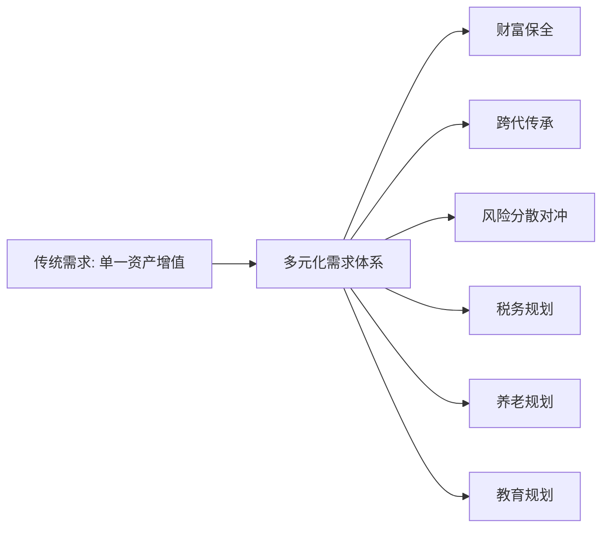

#### "存款搬家"浪潮与资金流向变化

2025年，存款利息下调、高息产品停售等因素助推"存款搬家"浪潮，居民资产配置呈现历史性转变，三大变化勾勒出全年配置新图景[^20]：

**权益市场活跃度显著提升**。受益于2024年9月监管组合政策出台，市场活力持续释放。上交所数据显示，2024年10月至2025年9月平均月新开户数达290万户，较2023年增长48%；2024年第四季度及2025年前三季度日均股基交易量分别达20388亿元和18723亿元，单日交易量峰值突破3.6万亿元，创历史新高[^20]。

**理财市场投资者队伍持续壮大**。截至2025年三季度末，全市场理财产品投资者数量达**1.39亿个**，同比增长12.70%；存续产品4.39万只，存续规模32.13万亿元，同比增长9.42%。风险偏好方面呈现两极分化特征，稳健型投资者仍占主流（33.56%），而保守型与进取型投资者占比同比分别增加1.03和1.25个百分点[^20]。

**公募基金规模屡创新高**，成为大众间接入市的优选渠道。截至2025年9月底，公募基金规模持续攀升，为投资者提供专业分散化投资服务[^20]。

据相关券商研报测算，2026年1年期以上定期存款到期量接近70万亿元，比2025年高出约10万亿元。大量高息存款集中到期，有望为银行财富管理市场带来持续的资金增量，创造出结构性机遇[^19]。

#### 金融机构的战略响应

面对需求端的深刻变革，金融机构纷纷推进财富管理转型。2025年以来，银行业财富管理变革步伐明显加快，多家银行推动财富管理架构变革。中国邮政储蓄银行研究员娄飞鹏指出，财富管理部门的设立与整合，其积极意义在于推动银行从"产品驱动"转向"客户驱动"，在提升服务一致性与专业度的同时，增强客户黏性与长期价值挖掘能力[^19]。

光大证券明确提出：财富管理不是卖产品，而是做配置；不是赚快钱，而是管长远。公司坚持以投资者适当性为基础，以资产配置为核心，以长期陪伴为纽带，构建覆盖全生命周期、全风险等级、全资产类别的服务体系[^21]。在产品端，构建"基础层-优选层-场景层"全品类分层货架；在服务端，构建了"投前教育-投中建议-投后管理"的全流程陪伴机制[^21]。

#### 企业融资需求的结构性转型

企业融资需求正从传统信贷向直接融资转型。在经济结构转型的大背景下，传统制造业在全球产业链分工中附加值低，亟需发展创新型产业来推动产业链升级。我国长期以来以银行为主导的间接融资体系主要支持中大型、成熟型企业，与创新产业的高风险、低抵押属性不符，发展与产业升级相配套的权益资本市场刻不容缓[^22]。

科技型、绿色型企业的差异化融资需求对金融供给侧形成倒逼作用。这些企业具有轻资产、高成长、研发投入大等特征，传统的抵押担保贷款模式难以满足其融资需求，推动金融机构创新"技术+信用"双画像评价机制、知识产权质押融资等新型金融服务模式。

### 2.3 制度驱动：注册制深化与金融高水平开放扩大

**制度改革是推动中国金融行业变革的根本性力量**。全面注册制的深化实施与金融高水平开放的持续扩大，正在从根本上重塑资本市场生态与竞争格局。

#### 全面注册制改革的里程碑意义

2023年2月17日，全面实行股票发行注册制相关制度规则正式发布实施，标志着A股正式进入"全面注册制"新时代。自股权分置改革以来，**全面注册制的落地实施成为我国资本市场改革中又一里程碑事件**[^23]。

全面注册制大幅优化了发行上市条件。新证券法将发行条件中"财务状况良好"和"具有持续盈利能力"的要求调整为具有"持续经营能力"，注册制仅保留了企业公开发行股票必要的资格条件、合规条件，将核准制下的实质性门槛尽可能转化为信息披露要求，监管部门不再对投资价值作判断[^24]。

| 维度 | 审批制 | 核准制 | 注册制 |
|------|--------|--------|--------|
| 审核原则 | 行政审批 | 实质性管理 | 信息公开原则 |
| 审核主体 | 政府 | 证监会发审委 | 交易所实质审核 |
| 上市标准 | 政府计划 | 财务指标为主 | 多元化指标体系 |
| 市场化程度 | 低 | 中等 | 高 |
| 发行效率 | 低 | 中等 | 高 |

#### 注册制对市场生态的重塑效应

全面注册制改革是资本市场基础制度的改变，其将引发整个资本市场生态的重构[^24]。

**发行定价市场化**是核心变革之一。主板23倍市盈率隐性红线退出历史舞台，发行价格将更加反映发行人的价值。对于优质公司，有望能募集到更多的资金；资质平庸甚至基本面较差的企业，会被边缘化，甚至可能面临发行认购不足进而出现发行失败的情况[^25]。

**市场资源分化加速**。目前A股上市公司总数已超过5000家，市场的分化已经初步显现：低市值公司缺乏分析师覆盖追踪和机构调研，公募基金持仓比例超过1%的个股仅占四成，市值前25%的公司占A股六成以上总交易量和近八成市场总市值[^22]。全面注册制施行后，上市企业数量的增加势必导致二级市场资金和注意力资源变得更为稀缺，也会更倾向于向优质龙头企业集中。

**退市常态化与新陈代谢加速**。全面注册制和退市常态化是"一体两面"，将促进A股的"新陈代谢"，优化市场资源配置效率。未来，投资者面对的是一个优胜劣汰更为严酷的市场，也是一个上市公司股价表现与基本面紧密关联的市场[^24]。

#### 金融高水平开放的政策突破

2025陆家嘴论坛上，中国人民银行行长潘功胜宣布在上海实施**八项金融开放举措**[^26]：

在**数字人民币国际化**方面，设立数字人民币国际运营中心，推进数字人民币的国际化运营与金融市场业务发展。提升数字人民币在跨境金融中的使用率，能够简化跨境交易流程、减少交易成本，为跨境支付和国际贸易提供更安全便捷的支付方式，同时增强人民币的国际影响力[^26]。

在**深化金融市场开放**方面，发展自贸离岸债、优化升级自由贸易账户功能等新举措，可以进一步拓展"一带一路"企业的融资渠道，提升跨境资金的融通效率。在中美贸易政策尚不明朗的背景下，通过进一步深化跨境金融政策和服务，将为跨境企业提供更多金融支持[^26]。

在**产品创新和风险防控**方面，设立银行间市场交易报告库、设立个人征信机构等措施，可为金融机构服务实体经济和个人提供更多的数据支持，金融机构可更好地创设差异化的、个性化的金融产品；通过汇集金融交易数据，可进一步提升交易数据的透明度，提升宏观调控和金融市场监管的针对性[^26]。

#### 数字人民币试点的制度创新

数字人民币试点工作全面迈入2.0时代。截至2025年11月末，全国数字人民币累计处理交易34.8亿笔，累计交易金额**16.7万亿元**。通过数字人民币App开立个人钱包2.3亿个，单位钱包已开立1884万个[^27][^28]。

各试点地区形成差异化推进路径。江苏省将数字人民币试点与实体经济发展、营商环境优化深度绑定，截至2025年末累计交易**15万亿元**，交易规模位居全国前列；累计开立数字人民币钱包7805万个，受理商户404万户[^27][^28]。数字人民币从基础支付场景，向精准监管、生态赋能等多元场景延伸，通过智能合约、离线支付、硬钱包等技术破解民生服务、产业发展中的痛点难点。

### 2.4 竞争驱动：外资机构入场与跨界竞争格局重塑

**竞争格局的深刻变化正在倒逼金融行业加速变革**。外资机构的加速布局与跨界力量的持续渗透，共同重塑着中国金融市场的竞争生态。

#### 外资保险资管加速布局

2025年最后一个工作日，经上海金融监管局批复，同意友邦保险资管与荷全保险资管正式开业。这是继安联保险资管及保德信资管之后，我国又两家由境外金融机构直接发起设立的保险资管公司落地，意味着我国**外商独资保险资管公司总数达到4家**，保险资管公司总数量扩容至37家[^29]。

外资"跑步入场"背后有深层逻辑。**市场层面**，中国保险资管行业管理资金总规模已超过33万亿元，从2015年到2024年，保险资管规模稳步增长，年复合增速达11.65%，为资管公司提供了广阔的业务基础[^29]。养老金融、财富管理等需求集中释放，人口老龄化加速催生了庞大的养老投资和长期储蓄需求，这与保险资金长期、稳定的"耐心资本"特性高度契合。

**政策层面**，2022年《保险资产管理公司管理规定》明确不再限制外资持股比例上限，实现了内外资股东资质的统一管理，为外商布局我国保险资管市场扫清了障碍[^29]。友邦保险资管与荷全保险资管从获批筹建到开业仅用了半年时间，速度之快体现了外资加速布局的急迫之心。

#### 行业竞争格局的演变趋势

《2026-2030年金融科技产业现状及未来发展趋势分析报告》认为，市场格局将呈现**"马太效应"与"长尾创新"并存**的场景，头部平台型机构与垂直领域"专精特新"企业将找到各自的生态位[^14]。

在银行业财富管理领域，不同体量、不同规模的银行在财富管理赛道上的优势各不相同。**客户资源的天然禀赋、综合金融的协同优势、风险管理的专业能力**将是银行机构角逐财富管理市场的三大"法宝"[^19]。中国银行提出加快建设"全集团+全市场"的开放式财富管理平台；中信银行则将"打造特色优势领先的财富管理银行"列为"五个领先银行"战略的重要内容[^19]。

在证券业领域，头部券商与中小券商的分化加剧。对于已建成数字化基座的头部券商，投入重点从"量"转向"质"；对于中小券商来说，如果收缩投入，则可能在新业务竞争中掉队，需保证科技投入[^15]。

#### 跨界竞争与行业边界模糊化

金融科技公司、互联网平台等跨界力量对传统金融业务的渗透持续深化。随着金融数字化深入，金融IT不再局限于传统技术应用，开始引入AI、云计算等前沿技术优化内部流程；金融科技企业也需搭建稳定的IT架构保障业务合规运行，二者在技术应用、业务场景上形成深度融合[^30]。

2025年中国金融IT行业整体保持稳健增长态势。根据中国信息通信研究院发布的数据，截至2024年底，中国金融IT市场规模已达3860亿元人民币，预计到2025年将突破**4300亿元**，年复合增长率维持在12.3%左右[^30]。金融信创成为2025年的重要增长点，市场规模预计逼近2500亿元，年增速达35%[^30]。

### 2.5 多重驱动因素的交互作用与细分领域影响差异

四大驱动因素并非孤立作用，而是相互交织、协同增强，共同推动中国金融行业的深层变革。理解这些因素之间的交互关系及其对各细分领域的差异化影响，是准确研判行业发展趋势的关键。

#### 驱动因素的协同与制约关系

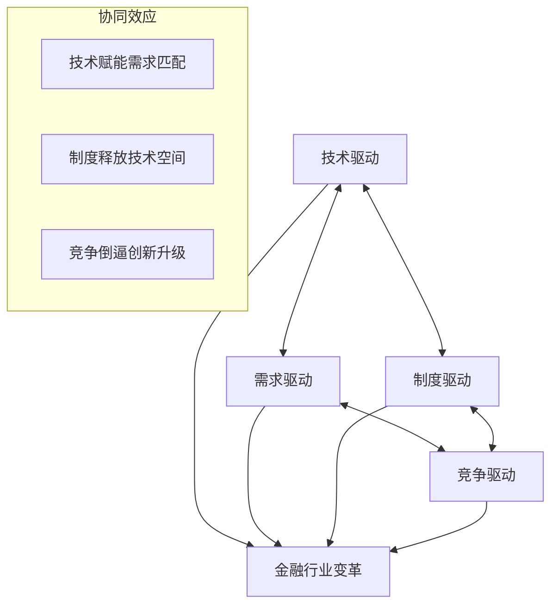

**技术与需求的协同**：技术进步为满足多元化财富管理需求提供了可能，AI智能体、大数据分析等技术使"千人千面"的个性化服务成为现实；反过来，需求升级也为技术应用提供了场景和动力。

**制度与技术的协同**：制度改革为技术创新释放空间，如数字人民币试点为区块链、智能合约等技术提供了应用场景；技术进步也为制度创新提供支撑，如监管科技提升了穿透式监管的可行性。

**竞争与创新的协同**：外资机构入场和跨界竞争倒逼国内金融机构加速创新，提升服务效率和客户体验；竞争加剧也推动行业整合，促进资源向优势机构集中。

#### 各细分领域的影响差异评估

以下从四大驱动因素对银行业、保险业、证券业、资产管理业的影响强度进行对比分析：

| 细分领域 | 技术驱动 | 需求驱动 | 制度驱动 | 竞争驱动 | 综合影响 |
|---------|---------|---------|---------|---------|---------|
| **银行业** | 高（数智化转型深入） | 高（财富管理转型） | 中（利率市场化深化） | 中（跨界竞争加剧） | 全面重塑 |
| **保险业** | 高（科技投入突破670亿） | 高（养老需求释放） | 高（外资准入放开） | 高（外资加速布局） | 快速变革 |
| **证券业** | 高（投顾智能化） | 中（交易需求活跃） | 高（注册制深化） | 高（头部集中加剧） | 结构分化 |
| **资管业** | 中（投研智能化） | 高（配置需求升级） | 高（净值化转型） | 中（产品竞争加剧） | 稳步升级 |

**银行业**面临全面重塑。技术驱动下，银行业科技投入从规模扩张转向效能提升，AI技术向核心业务延伸；需求驱动下，财富管理转型成为战略重点，从"产品驱动"转向"客户驱动"；竞争驱动下，跨界竞争倒逼服务升级。银行业的核心挑战在于如何在降本增效的同时保持创新投入强度。

**保险业**正经历快速变革。四大驱动因素均对保险业产生强烈影响：技术层面科技投入突破670亿元，推动价值链重构；需求层面养老金融需求集中释放；制度层面外资准入全面放开；竞争层面外资巨头加速布局。保险业的核心机遇在于养老金融与保险科技的深度融合。

**证券业**呈现结构分化。注册制深化对证券业影响最为直接，投行业务迎来结构性机会；技术驱动下智能投顾重塑财富管理模式；竞争加剧导致头部集中趋势明显。证券业的核心挑战在于中小机构如何在头部集中趋势下找到差异化定位。

**资管业**稳步升级。需求驱动是资管业变革的核心动力，居民财富管理需求升级推动产品创新和服务升级；制度驱动下净值化转型持续深化；技术驱动下投研智能化提升效率。资管业的核心机遇在于把握居民资产配置结构性转变带来的增量空间。

#### 核心机遇与挑战识别

综合四大驱动因素的交互作用，各细分领域面临的核心机遇与挑战如下：

**核心机遇**：
- 技术赋能带来的效率提升与服务创新空间
- 居民财富管理需求升级释放的巨大市场增量
- 注册制深化带来的直接融资市场扩容机会
- 金融开放带来的国际化发展机遇

**核心挑战**：
- 技术投入的持续性与投入产出效率的平衡
- 需求多元化背景下的差异化竞争能力构建
- 制度变革过程中的合规风险与转型成本
- 竞争加剧背景下的市场份额保持与盈利压力

这些驱动因素的深度分析为后续章节各细分领域的发展趋势研判与投资价值评估提供了系统性分析基础。在技术、需求、制度、竞争四重驱动下，中国金融行业正处于深刻变革期，各细分领域的上升空间与投资价值将在后续章节进行详细比较分析。

## 3 投资银行业务发展态势与增长空间评估

### 3.1 投行业务市场规模与业务结构演变

2025年，中国投资银行业务迎来**强劲复苏与结构性增长**的关键年份。在注册制全面深化、资本市场回暖的双重驱动下，券商投行业务规模实现历史性突破，业务结构呈现显著的优化升级特征。

#### 股权承销规模突破万亿元大关

Wind资讯数据显示，按发行日统计，2025年券商A股股权承销金额合计为**10222.68亿元**，同比增长226.1%，首次突破万亿元大关[^31]。这一增幅远超市场预期，标志着中国投行业务正式迈入新的发展阶段。

从业务板块结构来看，各细分领域均呈现不同程度的增长态势：

| 业务板块 | 2025年规模 | 同比增速 | 市场特征 |
|---------|-----------|---------|---------|
| **IPO承销** | 1308.35亿元 | +97.4% | 稳步复苏，科创板贡献突出 |
| **定增项目** | 8267.2亿元 | +300.05% | 核心增长引擎 |
| **可转债** | 647.13亿元 | +66.97% | 竞争白热化 |

**再融资业务成为推动股权承销规模增长的核心引擎**。2025年券商承销定增项目规模合计达8267.2亿元，同比激增300.05%，占股权承销总规模的80%以上[^31][^32]。这一结构性变化反映出资本市场从"重首发"向"重持续融资"的功能转变，上市公司通过再融资支持业务扩张、并购整合的需求显著释放。

IPO业务方面，2025年全年券商承销金额合计1308.35亿元，同比增长97.4%[^31][^32]。相较于2024年的低基数，IPO市场呈现明显复苏态势。截至2025年12月24日，34家券商合计承销1250.44亿元，相较于2024年的673.53亿元已近乎翻倍[^33]。这一增长主要得益于市场行情改善带动的IPO募资规模提升，而非单纯的上市企业数量增加。

#### 投行业务收入端企稳回升

业务规模的大幅增长直接带动收入端改善。2025年前三季度上市券商投行业务净收入同比增长23%，企稳回升态势明确，为全年业绩增长奠定基础[^31][^32]。业内分析师普遍预判，2026年券商投行业务收入有望保持加速上升态势。

广发证券非银首席分析师陈福预计，随着市场回暖，投行业务将提速增量，2026年券商投行业务收入保持加速上升[^32]。这一判断基于以下逻辑：一是注册制深化带来的制度红利持续释放；二是并购重组市场活跃度提升；三是科创企业融资需求的结构性释放。

#### 业务模式从单一通道向全链条服务转型

投行业务正经历从**单一IPO通道向全链条综合服务**的深刻转型。申万宏源证券总经理张剑指出，企业对再融资、并购重组的需求上升，将推动投行业务从单一IPO向全链条服务转型[^34]。这一转型体现在多个维度：

首先，**服务链条延伸**。券商投行不再局限于保荐承销的单一角色，而是向战略咨询、交易设计、融资安排等上下游延伸，为客户提供一站式解决方案。中信证券等头部机构已主动突破单一财务顾问角色，构建全流程服务能力[^35]。

其次，**业务协同深化**。投行业务与投资、投研业务的协同效应日益凸显，"三投联动"模式成为头部券商的核心竞争优势。通过研究所锁定高景气赛道、直投子公司提前入股、投行部门完成上市和再融资，券商能够全程参与企业价值创造与实现过程[^31]。

最后，**产品矩阵丰富**。投行业务产品从传统的IPO、再融资向重大资产重组、市场化并购、重组上市、上市公司私有化、债务重组与破产重整、跨境并购等多元化方向拓展[^35]。

### 3.2 注册制深化与科创板扩容的制度红利释放

**全面注册制的落地实施是我国资本市场改革中的里程碑事件**，对投行业务生态产生了深远的重塑效应。2023年2月17日全面注册制正式实施以来，制度红利持续释放，为投行业务发展注入强劲动力[^23]。

#### 注册制改革的核心制度变革

从审核制度演进来看，我国股票发行经历了从审批制到核准制、再到注册制的渐进式改革。审批制是注重政府管制的计划发行模式，核准制是从计划的审批制向市场化的注册制过渡的中间形态，注册制是目前成熟市场普遍采用的市场化股票发行制度[^23]。

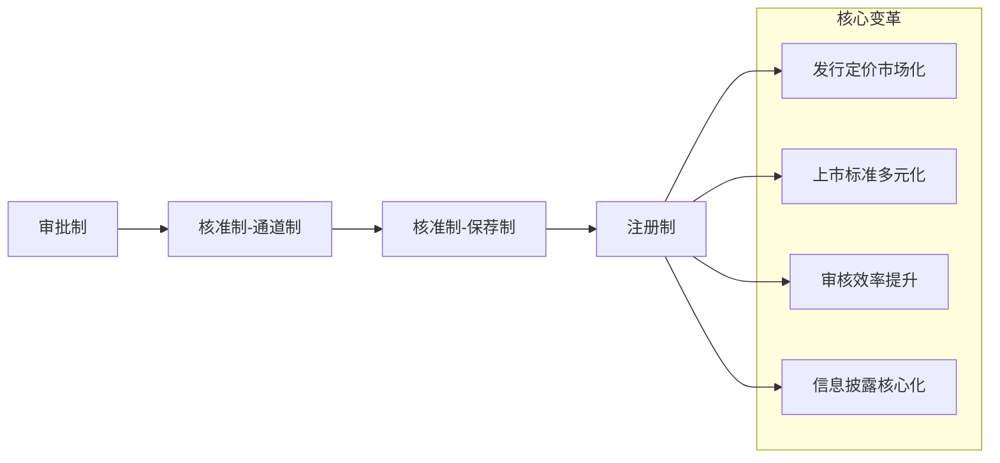

全面注册制改革带来四项核心制度变革：

**发行定价市场化**是最关键的变革。注册制取消了23倍发行市盈率的窗口指导，主板也像科创板和创业板一样进行询价定价，随行就市[^36]。这意味着优质公司有望募集到更多资金，而资质平庸的企业则面临发行认购不足甚至发行失败的风险。

**上市标准多元化**显著提升了制度包容性。上市标准由审批制的政府计划演变成注册制的兼顾财务指标、市场指标和非量化指标的多元标准，将核准制下的实质性门槛尽可能转化为信息披露要求，监管部门不再对企业的投资价值作出判断[^23]。

**审核效率大幅提升**。审核主体和方式演变到由交易所进行实质性审核，审核时间显著缩短，发行效率得到提升。上市过程的透明度、市场化程度逐步提升，审核注册的标准、程序、内容、过程、结果全部向社会公开[^23]。

**信息披露成为核心**。注册制仅保留企业公开发行股票必要的资格条件、合规条件，将核准制下的实质性门槛尽可能转化为信息披露要求。这对投行的尽职调查能力、信息披露质量提出了更高要求。

#### 科创板"1+6"政策组合的增量效应

2025年6月，证监会正式发布《关于在科创板设置科创成长层增强制度包容性适应性的意见》，推出"1+6"政策组合，进一步增强科创板制度包容性与适应性[^37]。这一政策组合包括：

- **设置科创成长层**：为处于早期发展阶段的科创企业提供专属通道
- **重启未盈利企业适用第五套上市标准**：打破传统盈利门槛限制
- **扩大第五套标准适用范围**：覆盖更多硬科技领域

张剑认为，创业板启用第三套上市标准、科创板重启第五套上市标准并设立"科创成长层"，不仅为科创企业上市创造条件，也为证券公司带来新的业务机会[^34]。

科创板的持续扩容为投行业务带来显著增量。截至2024年底，科创板上市公司已超500家，总市值逾6万亿元，研发投入占营业收入比例中位数超过10%，有效引导了社会资本向国家战略科技领域集聚[^38]。公募基金持有科创板公司的持仓总市值超过7600亿元，是2019年公募"科创板投资元年"的30多倍[^39]。

#### 制度红利对投行业务的传导机制

制度改革对投行业务的促进作用通过以下机制传导：

**拓展投行服务空间**。注册制改革和科创板扩容为证券公司带来丰富的项目资源和业务机会。同时，企业对再融资、并购重组的需求上升，推动投行业务从单一IPO向全链条服务转型[^34]。

**推动提升专业研究能力**。证券公司将持续加强对人工智能、机器人、生物医药、新能源等产业链的深度研究，在提供定制化综合融资服务方案上进行更多系统性研究；同时，还将提升对硬科技企业的识别、判断、挖掘能力，有效发挥企业信息披露在发行定价中的作用，提高科创企业定价的合理性[^34]。

**对综合金融服务能力提出更高要求**。券商投行、投资、研究等部门需高效协同，为企业提供全周期服务；同时，券商也要为专业投资机构提供交易撮合、流动性管理等多元化服务，助力长期资金配置优质资产[^34]。

### 3.3 并购重组市场活跃度与财务顾问业务机遇

**"并购六条"实施以来，A股并购重组市场持续活跃**，财务顾问业务成为券商投行收入增长的重要引擎。并购重组业务凭借其高附加值、强专业性以及长服务链条的独特优势，已成为券商打造差异化核心竞争力的重要战略突破口。

#### 并购重组市场量价齐升态势

2025年上半年，中国并购市场呈现"量减价增"的显著特征。公开数据显示，1493家A股上市公司共计筹划1984单并购重组计划，其中构成重大资产重组的有102单，**同比增长121.74%**[^40]。全市场共披露3531起并购事件，交易规模约7983亿元，同比上升约1.86%[^40]。

2025年前三季度，中国并购市场（包含中国企业境内并购、出境并购和入境并购）共披露5870起并购事件，交易规模14981亿元，百亿元规模以上的并购事件共19起[^35]。战略性新兴产业正成为本轮上市公司并购重组的主战场，以半导体为代表的"硬科技"板块是此轮并购潮的核心阵地。在今年以来A股市场的259起并购重组事件中，半导体领域相关的并购就有超过45家，占比接近20%[^41]。

#### 财务顾问业务竞争格局演变

并购市场的回温使得券商的财务顾问业务迎来发展机遇。伦敦证券交易所集团发布的《中国投资银行费用报告》显示，2025年上半年，中国投行业务费用估计达到76亿美元，同比上涨35%，创下自2023年同期以来又一高值。其中已完成的并购财务顾问费用为4.14亿美元，**同比上涨47%**[^40]。

从财务顾问参与并购事件的规模来看，头部券商优势明显：

| 统计口径 | 第一名 | 第二名 | 第三名 |
|---------|--------|--------|--------|
| 首次公告日（上半年） | 中信证券 1981.98亿元 | 中金公司 1189.77亿元 | 中邮证券 1159.67亿元 |
| 完成日（上半年） | 东方证券 990.42亿元 | 嘉林资本 976.28亿元 | 浩德融资/中银证券 976.15亿元 |
| 首次公告日（前三季度） | 中金公司 2410.04亿元 | 中信证券 2400.85亿元 | 中邮证券 1163.67亿元 |

值得关注的是，中邮证券凭借单笔高达1159.67亿元的海光信息吸收合并中科曙光案，一举冲至FA榜第三，成为上半年最大"黑马"[^40]。这表明在超大型并购项目中，中小机构同样存在突围机会。

#### 跨界并购与产业整合新机遇

在此轮并购重组热潮中，**跨界并购的案例显著增多**。仅近一个月内，就有韩建河山、延江股份、星华新材、美克家居等公司筹划跨界并购的案例，其中多为传统制造业公司向半导体、AI算力等方向转型[^41]。

监管层对上市公司并购重组的信披合规性保持高度重视。近期，多起上市公司并购重组项目因信息披露不充分、估值合理性等问题被交易所下发问询函或关注函[^41]。信息披露真实性、估值合理性、标的业务的可持续性是监管问询的核心聚焦点。

并购重组业务激活有望带动券商多方面业务增长。中信证券金融产业首席分析师田良表示，并购重组业务有望成为券商投行业务未来重点发展方向。2024年前十大券商财务顾问业务收入同比增长1.9%，显著高于同期投行业务整体表现[^35]。

### 3.4 头部集中趋势与竞争格局重塑

**投行业务"马太效应"持续加剧**，行业竞争格局正经历深刻重塑。头部券商通过并购整合、业务协同、资本优势等多重手段，不断巩固和扩大市场领先地位，行业集中度持续攀升。

#### 五家头部券商掌控七成市场

2025年股权承销市场呈现高度集中态势。具体来看，共有5家券商的承销规模突破1000亿元：

| 排名 | 券商 | 承销金额 | 市场特征 |
|-----|------|---------|---------|
| 1 | 中信证券 | 2416.68亿元 | "券业一哥"地位稳固 |
| 2 | 国泰海通 | 1506.59亿元 | 合并协同效能显现 |
| 3 | 中金公司 | 1374.87亿元 | 强势回归前三 |
| 4 | 中银证券 | 1175.92亿元 | 银行系券商崛起 |
| 5 | 中信建投 | 1139.46亿元 | 头部地位稳固 |

**仅这五家券商的股权承销合计金额就占据全市场74.5%的份额**，头部集聚效应愈发凸显[^31][^32]。

在IPO细分领域，头部集中趋势同样明显。中信证券以246.54亿元的承销金额领跑，国泰海通、中信建投分别以195.35亿元、187.75亿元紧随其后，中金公司、华泰联合证券则以177.93亿元、162.6亿元位居第四位、第五位[^31][^32]。

#### 行业并购重塑竞争格局

证券行业的并购重组浪潮正以前所未有的力度重构投行业务逻辑。以国泰海通证券与国联民生证券为代表的整合案例表明，头部券商的强强联合与区域券商的特色突围，已从规模扩张升级为能力跃迁[^42]。

**国泰海通合并**是本轮行业整合的标志性事件。合并后的国泰海通凭借重组协同效能跃升至行业第二名[^31]。国泰海通合并的节奏快得惊人——2024年9月传闻，年初批文，三月退市，四月新公司上市。国泰海通上半年净利润157亿元，刚超过中信，但三季度就被中信反超[^43]。

**中金整合东兴、信达**则是系内重构的典型案例。中金宣布"三合一"，东兴一股换0.4373股中金，信达一股换0.5188股，中央汇金握着四成多的股份，整合后继续做绝对控股[^43]。这不是市场自发整合，而是把散碎的力量揽成拳头再出拳。

**中小券商的并购整合**同样活跃。西部证券花38亿元拿下国融，国融在内蒙古和宁夏网点多，补的是地域短板，合并后营收冲到78亿元，暂时能排到中游[^43]。国信用51亿元买下万和，深圳国资委牵线，地方国资主导的并购比跨省跨市的省事。

#### "三投联动"模式强化竞争优势

**"三投联动"（投资+投行+投研）机制成为头部券商的核心竞争优势**。招商证券非银金融首席分析师郑积沙认为，金融作为"国之重器"，在支持实体经济发展、推动经济结构转型升级方面发挥着重要作用；就投行业务而言，资本实力强劲、具备产业链前瞻、"三投联动"机制成熟的券商领先优势将持续扩大[^31][^32]。

萨摩耶云科技集团首席经济学家郑磊详细阐述了"三投联动"的核心逻辑：**"三投联动"的核心在于将"发现价值（投研）、创造及放大价值（投资）、兑现价值（投行）"串成一条闭环**。研究所先锁定高景气赛道并给出定价锚；直投及另类子公司用自有资金或基金提前入股，把"纸面价值"变成股东身份；投行部门再进场做保荐、再融资、并购等，把股权价值在公开市场兑现，同时直投部门分享资本增值[^31]。

这种闭环运作模式，让券商能够全程参与企业的价值创造与实现过程，为客户提供更具价值的服务，从而在市场竞争中脱颖而出。业内分析师普遍预判，具备"三投联动"机制的券商领先优势将持续扩大[^31][^32]。

### 3.5 中小券商差异化竞争策略与生存空间

在头部集中趋势持续加剧的背景下，**中小券商正积极探索差异化竞争路径**，通过区域深耕、赛道聚焦、轻资本协同等策略寻求生存与发展空间。

#### 差异化竞争路径的战略选择

对于未来投行业务的竞争走向，郑磊指出："头部券商凭借资本与平台优势，将在全赛道继续领跑；中小券商唯有'**区域深耕+赛道聚焦+轻资本协同**'，才能把'三投联动'做成'小而美'版本，在细分赛道里实现错位超车。"[^31][^32]

具体而言，中小券商的差异化路径包括：

**区域深耕策略**。以国联民生证券为例，其选择"区域深耕+产业绑定"的差异化战略。国联民生证券2025年一季度实现营收15.62亿元，北交所项目储备量增长40%，并以9单IPO受理量跻身行业前列[^42]。西部证券则通过收购国融证券补齐西北地区网点短板，实现区域市场的深度覆盖[^43]。

**赛道聚焦策略**。在服务科技创新的核心赛道上，中小券商针对性布局成效显著。北交所IPO承销赛道上，华泰联合证券以14.78亿元位居首位，招商证券、浙商证券分别以7.92亿元、6.82亿元跻身前三，**中小券商在细分赛道的差异化竞争优势初步显现**[^31][^32]。

**轻资本协同策略**。中小券商通过整合区域性资源、构建特色行业团队，在有限资本投入下实现业务突破。这种模式强调专业能力而非资本规模，更适合中小机构的资源禀赋。

#### 细分赛道的竞争优势显现

在不同板块和细分领域，中小券商的竞争格局呈现差异化特征：

| 板块/领域 | 领先机构 | 中小券商表现 |
|----------|---------|-------------|
| 科创板IPO | 中信证券168.95亿元领跑 | 华泰联合45.63亿元跻身前四 |
| 创业板IPO | 国泰海通57.61亿元领跑 | 招商证券45.46亿元位居第二 |
| 北交所IPO | 华泰联合14.78亿元居首 | 浙商证券6.82亿元跻身前三 |

创业板IPO承销呈现不同格局，国泰海通以57.61亿元的承销金额领跑，招商证券、中金公司分别以45.46亿元、20.94亿元位居第二位、第三位[^31][^32]。这表明在特定板块，具备专业优势的中型券商同样能够占据重要市场份额。

#### 政策东风与弯道超车机会

随着注册制全链条深化、北交所改革持续推进及新质生产力企业加速上市，同时具备特色行业团队与区域性资源的券商正抓住政策东风寻求"弯道超车"[^42]。

在强监管的背景下，项目经验丰富、风控体系完备的大型券商在承揽优质企业项目时具备天然优势。但政策对新兴产业融资的持续倾斜，也为部分中小券商创造了空间[^42]。中小机构的破局路径在于以**资金撮合×产业洞察×数字工具**构建"三角能力"，在新能源、跨境并购等细分赛道构筑护城河，与头部机构形成"生态竞合"[^40]。

### 3.6 投行业务盈利模式变迁与收费理性化

**投行高利润时代已成过去**，行业正步入收费更趋理性、业务布局更为均衡的新阶段。这一转型既是市场竞争加剧的结果，也是行业回归服务本源的必然趋势。

#### 承销保荐费率下行趋势

尽管募资规模回升，但投行收费水平已大远不及往日。一个募资规模30多亿的大项目，承销保荐费可能仅有5000万元；而作为行业标杆的中信证券，其收入过亿的"王牌项目"数量也大幅缩水[^33]。

这一变化反映出多重市场逻辑：

**竞争加剧导致费率下行**。随着注册制全面实施，投行业务的"牌照红利"逐渐消退，市场化竞争加剧推动费率向合理水平回归。头部券商为抢占市场份额，在大型项目上主动让利；中小券商则通过价格竞争争取项目机会。

**市场化定价机制成熟**。发行定价市场化后，投行的定价能力和销售能力成为核心竞争力，单纯依靠通道收费的模式难以为继。投行需要通过提供增值服务来获取合理回报。

**客户议价能力增强**。优质发行人在选择保荐机构时拥有更多选择权，能够在服务质量和费率之间进行权衡，推动行业收费向合理区间收敛。

#### 从通道收费向价值创造转型

投行业务正从单一通道收费向综合服务价值创造的模式转变。这一转型体现在多个层面：

**服务内涵深化**。投行不再仅仅是上市通道，而是企业全生命周期的资本运作伙伴。从前期的战略规划、股权架构设计，到中期的上市辅导、发行承销，再到后期的再融资、并购重组，投行服务贯穿企业成长全过程。

**收入结构多元化**。除传统的保荐承销收入外，财务顾问费、跟投收益、持续督导费等收入来源日益重要。2024年前十大券商财务顾问业务收入同比增长1.9%，显示出并购重组业务对收入结构的补充作用[^35]。

**跟投机制的双刃剑效应**。科创板、创业板的跟投制度为投行带来了分享企业成长收益的机会，但也增加了资本占用和投资风险。直投、跟投优化券商盈利模式，资本介入一级市场分享经济增长蛋糕，带动长期ROE上行[^36]。

#### 业务布局均衡化趋势

面对收费理性化的市场环境，投行业务布局呈现均衡化趋势：

**板块布局均衡**。头部券商在科创板、创业板、主板、北交所等各板块均有布局，避免对单一板块的过度依赖。中金公司IPO排名的回升，部分得益于其加强其他板块布局[^33]。

**业务类型均衡**。从IPO为主向IPO、再融资、并购重组并重转型。再融资业务成为核心增长引擎，并购重组业务成为差异化竞争的重要领域。

**区域布局均衡**。头部券商加强区域覆盖，中小券商深耕优势区域，形成差异化的区域竞争格局。

### 3.7 投行业务未来五年增长潜力与结构性机会研判

综合政策红利、市场需求、竞争格局等多重因素，**投行业务未来五年有望保持稳健增长态势**，并在特定领域呈现显著的结构性机会。

#### 增长潜力的核心支撑因素

**政策红利持续释放**。投融资综合改革持续深化，2025年12月召开的中央经济工作会议进一步提出"提升直接融资比重，强化投资者权益保护，构建长钱长投市场生态"[^38]。"持续深化资本市场投融资综合改革"是建设金融强国、服务高质量发展的核心任务。

科创板"1+6"政策组合的实施，为投行服务科创企业提供了更大空间。张剑建议，建立多维度科创企业估值定价体系，打破按行业属性"贴标签"的估值惯性，鼓励发展适应不同类别企业在不同生命周期的估值体系及定价标准；全面提升科创企业信息披露质量，强化核心技术、研发投入等关键信息的披露；打通多层次融资渠道和退出机制[^34]。

**市场需求结构性释放**。科技创新企业的融资需求持续旺盛。我国拥有全球领先的科技企业资源禀赋，在新一代信息技术、生物医药、高端装备制造等战略性新兴产业领域，聚集了大量具备核心技术和市场竞争力的优质企业，这为资本市场提供了丰富的服务标的[^34]。

**直接融资比重提升空间广阔**。我国长期以来以银行为主导的间接融资体系主要支持中大型、成熟型企业，与创新产业的高风险、低抵押属性不符，发展与产业升级相配套的权益资本市场刻不容缓[^38]。

#### 结构性机会领域识别

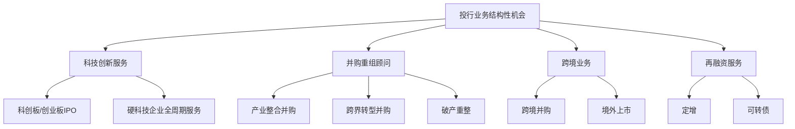

**科技创新服务领域**是最具确定性的增长方向。从国家战略规划到具体制度安排，从引导中长期资金入市到优化配套政策，监管部门正致力于构建从天使投资、创业投资到公开市场融资的全链条金融服务生态，为科技创新注入源源不断的资本"活水"[^34]。

**并购重组顾问业务**有望成为投行业务未来重点发展方向。中国证券业协会发布28条措施力促证券业高质量发展，明确"鼓励引导证券公司加大对并购重组财务顾问业务的投入，加强并购重组估值定价等问题研究，促进证券公司更好发挥交易撮合和专业服务作用"[^35]。

**跨境业务**将随着金融开放深化而获得更大发展空间。头部券商目标放得很高，想学高盛、摩根士丹利那套国际投行套路，这有野心也有风险[^43]。跨境并购、混业经营或有试点，这意味着机会也意味着政策风险并存。

#### 行业发展趋势研判

展望未来五年，投行业务发展将呈现以下趋势：

**头部集中与差异化并存**。证监会主席吴清提出走"头部国际化+中小特色化"路，强调"一流投行不是头部专属"[^43]。但马太效应越来越明显，2024年前十家券商占行业六成利润，集中度在跑步上升。

**能力建设成为核心竞争力**。投行由上市通道向"三投联动"模式转型，研究、定价、承销能力成胜负手，强者更强加剧行业分化[^36]。证券公司需培养既懂技术又懂资本的复合型人才队伍，提升对科创企业的专业判断能力和投资管理水平[^34]。

**风险管控要求持续提升**。注册制压实券商责任，投行在保荐过程中不能再有"闯关"心态，而要对企业进行实质性判断，确保招股说明书等信息披露文件成为投资者决策的可靠依据[^38]。

综合来看，投行业务作为资本市场的核心中介功能，在服务实体经济、支持科技创新、推动产业整合等方面将持续发挥重要作用。虽然行业竞争加剧、收费理性化对盈利能力形成压力，但政策红利释放、市场需求结构性增长为行业发展提供了坚实支撑。具备综合服务能力、专业研究能力和风险管控能力的机构，将在未来五年的行业变革中占据有利位置。

## 4 私募股权与创业投资行业前景深度分析

### 4.1 PE/VC行业募投管退全链条现状与结构性回暖特征

2025年，中国私募股权投资市场迎来**重要转折点**，在经历三年深度调整期后呈现全面回暖态势。这一复苏不仅体现在规模指标的全面增长上，更反映在市场结构的深层优化中，标志着行业正式进入新发展周期。

#### 市场规模创历史新高

根据中国证券投资基金业协会最新数据，截至2025年10月末，私募基金总规模达到**22.05万亿元**，环比9月跳增1.31万亿元，创下历史新高[^44]。这一增长不仅体现在总量上，更反映在结构优化上，其中私募股权投资基金存续规模**11.18万亿元**，创业投资基金**3.56万亿元**，两类基金在10月的新备案规模分别为126.74亿元、114.16亿元[^44]。

从基金设立情况看，市场活跃度显著提升。2025年前三季度，中基协存续备案的股权投资类基金共计58,217只，较2024年底增加1,050只；新备案股权投资基金3,551只，同比上升14.8%[^44]。其中，创业投资基金表现尤为突出，新备案2,243只，占比65.2%，显示市场对早期创新的信心正在快速恢复。

#### 募资端呈现"止跌回稳"态势

据投中数据统计，2025年中国VC、PE市场新成立基金数量共计**6,127只**，较上一年同期增加1,293只，同比增加27%；募资规模合计**3.09万亿元**，同比增加26%[^45]。另一口径数据显示，2025年前三季度，我国股权投资市场共有3,501只基金完成新一轮募集，同比上升18.3%；募集金额为11,614.35亿元人民币，同比上升8.0%[^44]。

| 指标 | 2025年数据 | 同比变化 | 核心特征 |
|------|-----------|----------|----------|
| 新成立基金数量 | 6,127只 | +27% | 创近年新高 |
| 募资规模 | 3.09万亿元 | +26% | 明显提升 |
| 新备案股权基金 | 3,551只 | +14.8% | 活跃度提升 |
| 创投基金新备案占比 | 65.2% | - | 早期投资信心恢复 |

值得注意的是，**大额基金募资节奏有所放缓**，共22只基金新募集规模在50亿元及以上，较2024年前三季度减少9只，同比下降29%；大额基金募集金额为1,438.21亿元，同比下滑45.4%，占比12.4%，较去年同期下滑12.1个百分点[^44]。这一变化反映出市场正从追求规模向注重质量转变。

#### 投资端结束近三年回落态势

投资端的回暖更为明显，结束了近三年的回落态势。据投中数据统计，2025年国内的投资案例数量达**1.1万起**，同比上涨30.6%；投资规模**1.34万亿元**，同比上升23.43%；投资均值1.22亿元，较上一年小幅回落[^45]。这是继2021年投资数量超万起之后，又一年达到万起以上。

Wind最新数据显示，截至2025年12月底，国内一级市场全年共发生投融资事件**9,004起**（不含并购、上市及上市后融资），投融资金额合计**8,044.17亿元**[^46]。分季度来看，一季度至四季度的投融资事件数量分别为1,868起、2,085起、2,467起、2,584起，呈现稳步攀升的态势[^46]。

另一统计口径显示，2025年全年融资事件10,849起，同比增长11.79%；金额7,719.61亿元，同比增长14.37%，投资规模创近两年新高[^47]。

#### 结构性回暖的深层特征

本轮回暖呈现鲜明的**结构性特征**，主要体现在以下几个方面：

**LP结构深刻变革**。企业投资者成为最活跃的LP群体，出手次数占比达37.3%，比国资类平台出资占比的31.1%高出近6个百分点[^45]。这在一向以政府引导资金灌输创投市场前端募资的生态里并不常见。市场正朝着"产业资本领衔、金融资本发力、国资精准调控"的方向发展。

**上市公司股权投资活跃**。从2025年的上市公司股权投资动向来看，许多公司都在纷纷设立私募股权投资基金，不仅是一些热门科技行业，例如AIGC、创新药等，就连传统化工、有色以及消费行业等，都有许多公司设立新的私募基金，或参与并购投资，或间接参股其他外延资产[^45]。

**早期投资明显复苏**。天使轮、种子轮金额分别增长61%和97%，显示资金向早期项目倾斜的趋势明显[^47]。在市场给予高估值的项目中，TOP10榜单中6家公司最新融资轮次在B轮以下，相较此前高估值属于成熟项目的旧模式，新观念下的资金更加倾向于投早投小[^45]。

### 4.2 国资主导格局与耐心资本政策创新的深远影响

**国资主导格局的持续强化**是2025年中国PE/VC市场最显著的结构性特征之一。在政策引导与市场选择的双重作用下，国资已成为一级市场最重要的资金来源，并通过制度创新深刻重塑行业生态。

#### 国资主导格局的演变路径

从出资金额来看，国资类平台依然占据绝对主导地位。数据显示，国资LP占比达**55%**，国资控股比例从2015年的27%增长至2025年的**81%**，政府资金占机构LP出资比例从40.8%飙升至**68.3%**[^44]。2025年政府引导基金、产业资本、国有属性资金的出资规模分别同比上涨23.9%、26.7%和59.7%[^48]。

在投融资数量前十的机构中，有**7家具有国资背景**[^49]。国资机构坚持"投早、投小、投长期、投硬科技"的导向，在资源配置中扮演了关键角色。例如，深创投在先进制造领域出手80次，毅达资本和合肥创新投资也分别在该领域投资了76起和76起[^49]。

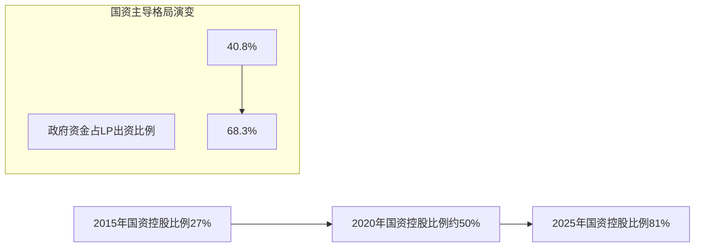

#### 重磅政策推动行业高质量发展

2025年1月7日，国务院办公厅印发《关于促进政府投资基金高质量发展的指导意见》，明确从严控新设基金、优化出资比例及返投政策等关键方向，推动政府投资基金实现从规模扩张向质量提升的战略转型[^48]。

为切实落实该文件精神，2025年7月，国家发改委面向社会公开征求《政府投资基金布局规划和投向工作指引》与《加强政府投资基金投向指导评价管理办法》意见：前者聚焦基金投资方向与核心目的，作出系统性规范与引导；后者构建科学全面的评价指标体系，并明确评价结果应用路径，为全国政府投资基金形成布局合理、提质增效的发展格局筑牢制度基础[^48]。

自国办一号文出台以来，各地积极响应政策号召，广东、上海、成都、山西等多地密集跟进出台配套政策文件，从地方层面进一步规范政府投资基金运作，合力推动行业高质量发展[^48]。

#### 千亿级国家创投引导基金的颠覆性创新

2025年12月26日，千亿级国家创业投资引导基金正式启动，标志着中国以"耐心资本"系统培育新质生产力的顶层设计进入实施阶段[^50]。这只承载着"投早、投小、投长期、投硬科技"使命的"航母级"基金，以其颠覆性制度创新引发市场强烈关注。

**20年超长存续期**是最核心的制度突破。国投基金将基金存续期设定为20年，这一超长时间周期彻底打破了传统VC/PE基金10年左右的期限束缚，向市场传递了强烈的信号：国家资本做好了长期陪伴硬科技企业"长跑"的准备[^50]。

**取消返投限制**进一步释放资本配置效率。国投基金明确不设机械的地域返投要求，打破长期以来困扰国投基金的"地域画地为牢"难题。这意味着获得支持的GP可以完全基于科技创新的规律和项目的优劣，在全国范围内自由寻找并投资最优秀的企业，而无需为了凑足返投比例去进行低效的资本配置[^51]。

| 制度创新 | 传统模式 | 国投基金新模式 | 创新意义 |
|---------|---------|---------------|---------|
| 存续期 | 7-10年 | 20年 | 匹配硬科技长周期 |
| 返投要求 | 强制地域返投 | 取消机械限制 | 提升配置效率 |
| 投资导向 | 追求短期回报 | 投早投小投硬科技 | 服务国家战略 |

#### 银行AIC与专项债拓宽资金来源

**银行AIC加速入局一级市场**成为2025年的重要突破。自2024年9月《国家金融监督管理总局办公厅关于扩大金融资产投资公司股权投资试点范围的通知》发布，银行系金融资产投资公司布局一级市场的步伐显著提速[^48]。

2025年3月，监管层再度发文加码支持——明确符合条件的银行可设立AIC，并进一步扩大股权投资试点范围[^47]。截至目前，6家国有大行AIC已全部配齐，3家全国性股份制银行AIC也成功落地，标志着银行AIC已从大行试点阶段正式迈入扩围试点的新阶段[^48]。执中数据显示，自上述政策发布以来，银行AIC累计出资达452.72亿元，同比增长约37.7%[^48]。

**地方专项债投向政府引导基金**打破惯例。2025年以来，多地财政加大支持力度，打破专项债不能投向股权投资的惯例，将部分资金注入政府引导基金。据中国债券信息网披露，北京、江苏、广州、浙江、宁波等9个省市今年已合计发行**520亿元**专项债券，定向投向当地政府引导基金，进一步充实了创投行业的资金池[^48]。

#### "长续航版"政府引导基金频频出现

一直以来，人民币创投基金的存续期通常不超过10年，多数仅有7年至8年，导致很多基金不得不在企业尚未迎来爆发式增长就退出市场。2025年以来，包括北京、上海、江苏、广东等省市新设的多只引导基金存续期均在10年以上，有的甚至长达20年[^48]。

例如，近期杭州推出"润苗基金"，存续期长达20年；上海未来产业基金的期限长达15年，还可根据情况申请延长3年；江苏省战略性新兴产业母基金的存续期也有15年[^48]。这些"长续航版"引导基金的出现，为耐心资本培育硬科技企业提供了制度保障。

### 4.3 不同投资阶段的回报表现与策略分化

**天使投资、VC、PE三个阶段看似仅是投资时点的差异，实则本质不同**，对应着截然不同的能力建设要求与风险收益特征。2025年，在"投早投小投硬科技"政策导向下，各阶段投资呈现显著的策略分化态势。

#### 天使投资与其他股权投资的本质差异

天使投资是企业成立之初就进行的首轮机构规模化投资，此时创业公司一般只有2、3个创始团队成员和一份简单的BP，公司尚未组建，产品仅有雏形或者样品，没有完整的客户验证，商业模式没有成型[^52]。

投资这个阶段的创业公司，投资机构的项目判断基本没有财务尽职调查的内容，只有基础的法务尽职调查；也无法进行客户尽职调查，甚至客户也未使用过类似产品和服务，还需要双方在市场上创新共创。因此，**天使阶段的投资判断个性而非标，更加需要对实业的深刻理解和对未来机会的洞察**，需要天使机构与创始人共同看见未来，因为相信而看见[^52]。

相比之下，在PE投资的项目判断中，大部分基于相对完善的业务和经营情况，投资机构可以进行客户访谈、供应商访谈，可以进行充分的财务和法务尽职调查，包括订单、收入、成本、毛利，甚至进行详细BOM分析，进行比较可靠的销售预测[^52]。

| 维度 | 天使投资 | VC | PE |
|------|---------|----|----|
| **投资时点** | 企业成立之初 | 成长期 | 成熟期 |
| **项目特征** | 仅有BP和团队 | 产品验证中 | 商业模式成熟 |
| **尽调方式** | 基础法务 | 初步财务法务 | 完整尽调 |
| **核心能力** | 实业洞察 | 行业判断 | 金融分析 |
| **业务属性** | 实业属性 | 介于两者之间 | 金融属性 |

#### 早期投资明显复苏态势

募资改善背景下，投资端的变化在显现，**体现在投资早期项目的资金更加舍得"掏钱"**。统计数据显示，天使+轮次的项目"中科第五纪"在2025年内获得4次投资，年内投资规模数亿元，跻身全年估值前十序列[^45]。

2025年早期投资明显回暖，天使轮、种子轮金额分别增长**61%**和**97%**[^47]。在市场给予高估值的项目中，TOP10榜单中6家公司最新融资轮次在B轮以下，相较此前高估值属于成熟项目的旧模式，新观念下的资金更加倾向于投早投小，对一些核心优质赛道内企业愿意给出高估值[^45]。

#### 不同阶段的能力建设差异

因为投资与投后的明显差异，PE与天使的机构能力建设呈现出极其明显的不同。**天使阶段投资机构需要的是八分实业能力，两分金融能力**。天使投资的盈利模式核心不是企业股权交易，不是一二级市场获利，而是企业从零到一的创造，乃至长期的持续成长增值[^52]。

与之对应，天使投资人往往不是会计师，不是律师，不是投行和研究员；而是具有实业背景的类企业家、高管，有着长期从事实业运营的经历和经验，能够深刻理解实业运营实务。天使投资机构需要做的不仅仅是投资人，更是了解实业企业运作普遍规律，能够帮助初创公司缩短学习曲线，提高创业效率的董事会层面创业合伙人[^52]。

这也解释了为什么很多在阶段上转型的机构很难短期获得成功——**从PE转型做天使，不是简单的投资阶段前移，而是需要重构整个能力体系**。

#### 投后工作的阶段差异

投资之后，不同阶段投资的投后工作内容也有较大差异。天使投资人其实是换个角度干实业，与创始人共同面对产品是否能研发成功、是否能被客户验证通过、是否能稳定量产，同时面对租厂房、建产线、扩团队，发展一段时间还需要建设组织、设立流程等[^52]。

特别是在市场不断变化的今天，天使投资人通常还要与创始团队共同面对创业早期的剧烈战略调整优化，商业模式打造甚至重塑等重大方向性选择问题。PE投资人更多是在企业财务进一步规范，融资和资源对接，资本运作上市等方面提供支持[^52]。

### 4.4 硬科技赛道投资集中度与细分领域潜力评估

**硬科技已成为PE/VC投资的绝对主导方向**。2025年，资金高度集中于半导体、人工智能、生物医药、机械制造等战略性新兴产业，投资集中度持续攀升，细分赛道呈现差异化的增长潜力。

#### 四大行业投资集中度超70%

从投资结构看，半导体、人工智能、生物医药、机械制造四大行业投资集中度超**70%**[^44]。资金高度集中于硬科技领域：电子信息、先进制造、医疗健康合计占比**56.42%**，其中半导体、新材料、生物医药为细分赛道核心[^47]。

从2025年内的热点行业来看，电子信息以**3,485起**投资交易、**3,532.82亿元**融资规模持续领先，先进制造和医疗健康行业作为第二梯队，分别以1,983起、1,594起交易数量位列第二、第三[^45]。

Wind数据显示，投融资数量位居前十的行业分别为人工智能（1,539起）、医疗健康（1,455起）、集成电路（1,032起）、新材料（726起）、机器人（722起）、新能源（619起）等[^46]。创投资金加速流向人工智能、医疗健康、集成电路等"硬科技"赛道。

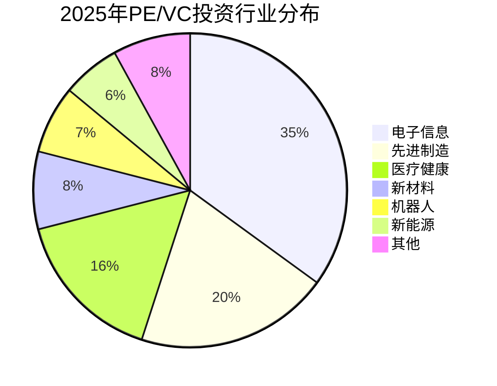

#### 半导体与人工智能领跑细分领域

从细分领域来看，半导体、人工智能领域大幅领跑，获投数量分别为**1,434起**、**891起**[^45]。从近10年细分领域在市场占比情况来看，新材料、机器人、航空航天、新能源领域更为突出[^45]。

**半导体领域**是此轮投资热潮的核心阵地。以半导体为代表的"硬科技"板块是并购潮的核心阵地，在今年以来A股市场的259起并购重组事件中，半导体领域相关的并购就有超过45家，占比接近20%。

**人工智能领域**持续吸引大量资本。纪源资本管理合伙人符绩勋指出，人工智能依旧是2026年的投资核心主题，尤其是"AI+硬件"在国内市场潜力巨大，尽管具身智能存在局部泡沫，但在仓储机器人、手术机器人等具体应用领域，机会依然可观[^49]。

#### 医疗健康领域的复苏态势

2025年是医疗健康投资从量的扩张到质的聚焦的转折点。全球医疗健康领域一级市场投资2,353笔，累计融资**604亿美元**，融资总额相对2024年上涨约4个百分点[^53]。

国内部分，2025年医疗健康产业一级市场共达成861笔融资交易，累计融资约合**96亿美元**。在经历2022年至2024年连续3年的下滑后，终于迎来上涨，相较于2024年，国内融资总额同比上涨**32%**，融资事件数量亦同比增加约6%[^53]。

活跃机构方面，启明创投以37次出手断档领先，龙磐资本、元生创投投资次数实现翻倍增长，而以北京市医药健康基金为代表的国资连续两年进入活跃机构TOP5，显示国资的崛起，他们开始成为左右定价的重要力量[^53]。

#### 细分领域潜力对比评估

| 细分领域 | 投资热度 | 增长潜力 | 核心驱动 | 风险因素 |
|---------|---------|---------|---------|---------|
| **半导体** | 极高 | 高 | 国产替代、自主可控 | 技术迭代、资本密集 |
| **人工智能** | 极高 | 极高 | 技术突破、应用落地 | 估值泡沫、商业化验证 |
| **医疗健康** | 高 | 高 | 老龄化、创新药 | 政策风险、研发失败 |
| **新材料** | 中高 | 高 | 产业升级、技术突破 | 周期性、下游需求 |
| **机器人** | 高 | 极高 | 具身智能、制造升级 | 技术成熟度、成本 |
| **航空航天** | 中 | 高 | 商业航天、国家战略 | 准入门槛、周期长 |

在估值体系重构、退出渠道收窄、政策使命增强的多重压力下，**唯有具备清晰商业化路径、硬核技术壁垒、产业战略协同等多重因素汇集的项目，方能穿越周期获得资本青睐**[^53]。

### 4.5 退出渠道多元化趋势与并购退出崛起

**退出端的向好预期是2025年创投市场回暖的重要支撑**。在IPO放缓的背景下，并购退出强势崛起，退出渠道多元化趋势持续强化，有效改善了行业流动性。

#### 退出项目数量激增

2025年退出端呈现显著改善态势。全年**6,056项**投资退出，同比激增**65.83%**[^47]。从退出端来看，2025年创投机构的账面退出回报规模约**4,318亿元**，据投中数据统计，与2024年账面回报1,999亿元相比上涨1.16倍[^45]。

退出渠道明显拓宽，流动性显著改善。IPO案例数**1,002笔**，同比增长37.8%；并购退出**352笔**，同比激增84.3%[^44]。这一数据表明，在IPO节奏放缓的背景下，并购正在成为越来越重要的退出渠道。

#### 并购取代IPO成为主导退出方式

**并购超越IPO成为主导退出方式**是2025年退出端最显著的结构性变化。并购退出占比升至**64.70%**，IPO降至**25.54%**[^47]。电子信息行业退出项目最多（2,319项，同比增长122.34%），广东（1,038项）、江苏（579项）、浙江（524项）为最活跃区域[^47]。

在IPO放缓背景下，年内创投领域再次关注并购市场交易。年内的并购交易再现大单交易，即**买方注重向头部后期且资方集聚的成熟项目倾斜，单笔交易规模显著扩大**[^45]。但从年内预披露的并购交易数量来看，同比出现明显回落，表明并购市场呈现"量减价增"的特征。

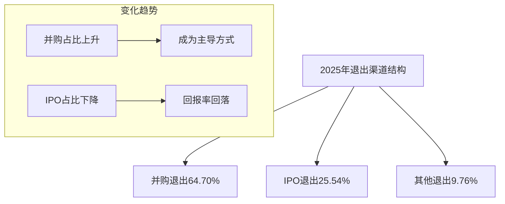

#### IPO回报率回落与估值理性化

虽然IPO案例数同比增长，但**平均回报率回落至20.79%**[^47]。这一变化反映出几个重要趋势：

一是**估值理性化**。注册制全面实施后，发行定价市场化程度提高，一二级市场价差收窄，单纯依靠IPO套利的空间被压缩。

二是**投资阶段前移**。随着"投早投小"成为主流，早期投资的持有周期更长，虽然潜在回报倍数更高，但也面临更大的不确定性。

三是**退出预期调整**。创投机构对退出回报的预期正在从追求高倍数向追求确定性转变，并购退出虽然回报倍数可能低于IPO，但确定性更高、周期更短。

#### 退出渠道创新与S基金发展

除IPO和并购外，S基金（二手份额交易基金）等创新退出渠道也在快速发展，为行业流动性改善提供新的支撑。S基金通过受让存量基金份额，为LP提供流动性解决方案，同时为新投资者提供参与优质项目的机会。

退出渠道的多元化对PE/VC行业的可持续发展具有重要意义。它不仅缓解了IPO通道收窄带来的退出压力，也推动投资机构更加注重被投企业的内在价值创造，而非单纯依赖资本市场套利。

### 4.6 行业发展趋势研判与投资价值评估

综合募投管退全链条的分析，中国PE/VC行业正处于**结构性转型与高质量发展的关键窗口期**。在政策红利持续释放、市场生态持续优化的背景下，行业未来发展前景值得期待。

#### 市场规模增长预期

展望未来，预计2026-2030年市场规模将维持**8%-15%**的复合增长率，到2030年总管理规模有望达到**28-30万亿元**[^44]。这一预期基于以下支撑因素：

**政策红利持续释放**。国家创业投资引导基金的启动、银行AIC试点扩围、地方专项债投向引导基金等政策创新，为行业发展注入持续动力。

**产业升级需求旺盛**。科技创新、产业升级对股权资本的需求持续增长，硬科技领域的投资机会远未饱和。

**退出渠道持续拓宽**。并购市场活跃度提升、S基金等创新渠道发展，为资本循环提供更多出口。

#### 市场格局演变方向

市场格局将朝着**"产业资本领衔、金融资本发力、国资精准调控"**的方向发展[^45]。具体表现为：

**国资引领与市场化并重**。国资在发挥战略引领作用的同时，通过优化考核机制、延长存续期、取消返投限制等方式，提升市场化运作水平。

**头部集中与专精特新并存**。市场格局将呈现"马太效应"与"长尾创新"并存的场景，头部平台型机构与垂直领域"专精特新"企业将找到各自的生态位。

**LP结构持续优化**。企业投资者活跃度提升、银行AIC入场、保险资金参与等，推动LP结构多元化，增强市场韧性。

#### 头部机构与专业化机构的竞争格局

头部机构出手频率明显加快。纪源资本管理合伙人符绩勋透露，2025年其机构投资节奏明显加快，预计全年投资规模将达到2024年的两倍多[^46]。投资数量"十强"机构在2025年的一级市场投融资事件数量，均较2024年出现明显增长，合计增长385起[^46]。

与此同时，**专业化、垂直化机构也在特定领域建立竞争优势**。2025年出手大于等于5次的机构近130家，同比增长近50%，资本正在以前所未有的决心，将资金集中于那些真正具备辨别价值能力的头部机构[^53]。

#### 投资策略建议

针对不同类型投资者参与PE/VC市场，提出以下策略建议：

**机构投资者**：
- 关注国资背景的头部GP，分享政策红利与优质项目资源
- 重点配置硬科技赛道，尤其是半导体、人工智能、医疗健康等领域
- 适当参与早期投资，把握"投早投小"带来的超额收益机会
- 关注S基金等创新产品，获取流动性溢价

**产业投资者**：
- 围绕产业链上下游进行战略性布局，实现产融协同
- 通过设立CVC或参与产业基金，获取前沿技术和创新项目资源
- 关注并购整合机会，通过资本手段加速产业整合

**高净值个人投资者**：
- 通过FOF或专业化GP参与一级市场，降低单一项目风险
- 关注具有明确退出预期的成长期项目
- 注意流动性管理，合理配置一级市场投资比例

#### 风险提示

尽管行业前景向好，投资者仍需关注以下风险因素：

**政策执行风险**。20年超长存续期、取消返投限制等创新机制在落地执行中可能面临挑战，如长期资金与专业管理能力的匹配问题、区域资源协同性减弱等[^50]。

**估值泡沫风险**。部分热门赛道可能存在估值泡沫，需要审慎评估项目的内在价值与商业化前景。

**退出不确定性**。虽然退出渠道趋于多元化，但IPO政策、并购市场活跃度等仍存在不确定性。

**周期性风险**。一级市场投资具有较强的周期性特征，需要做好长期持有的准备。

综合来看，中国PE/VC行业在经历三年调整后已进入新的发展周期，在国资主导、耐心资本、硬科技聚焦等结构性特征下，行业正朝着高质量发展方向演进。对于具备专业能力、长期视角的投资者而言，当前正是布局一级市场的重要窗口期。

## 5 固定收益业务市场格局与发展趋势研判

2025年，中国固定收益市场在低利率环境与资产荒的双重压力下经历深刻变革。债券市场从前几年的单边牛市进入震荡分化的新格局，传统依赖票息收入的盈利模式面临根本性挑战，"固收+"策略与多资产配置成为机构突围的核心方向。银行理财规模突破33万亿元，固收类产品占比超97%，凸显出市场对稳健收益的强烈需求，同时也暴露出产品结构单一、权益投研能力薄弱等深层问题。本章将系统分析固收市场的规模结构、收益率走势、竞争格局演变，深入探讨低利率环境下固收业务的转型路径与核心竞争能力，研判固收业务在各类资产配置主体中的地位变化与未来增长空间。

### 5.1 固收市场规模结构与收益率走势分析

2025年，中国固定收益市场在规模持续扩张的同时，呈现出**收益率中枢下移、波动加剧、结构分化**的显著特征。债券市场从过去四年的强势行情进入新的调整周期，投资者面临的市场环境发生根本性变化。

#### 债券市场整体规模与发行态势

2025年债券市场一级发行延续高增态势。根据市场数据，ABS市场全年发行**2.28万亿元**，同比增长15%，净融资规模连续9个月为正，创4年新高[^54]。交易所ABS仍是市场主力板块，2025年发行1.4万亿元，同比增长20%；ABN和信贷ABS分别发行5726亿元、2915亿元，同比增长9%、8%[^54]。

从基础资产结构来看，**泛消金成为绝对主力，占比约三成**。泛消金发行约6200亿元，同比增长31%，是市场的绝对增长力量[^54]。持有型不动产ABS（机构间REITs）凭借监管支持与供需双旺的多重利好快速崛起，发行538亿元，同比增长**407%**，成为年度最具边际变化的资产类型[^54]。NPL（不良资产）、保单质押贷款等小众资产同样实现亮眼的边际增长，分别发行约820亿元、490亿元，同比增长61%、70%[^54]。

| 资产类别 | 2025年发行规模 | 同比增速 | 市场特征 |
|---------|---------------|---------|---------|
| 泛消金ABS | 约6200亿元 | +31% | 绝对主力，占比约三成 |
| 持有型不动产ABS | 538亿元 | +407% | 年度最大边际增量 |
| NPL ABS | 约820亿元 | +61% | 小众资产边际增长亮眼 |
| 保单质押贷款ABS | 约490亿元 | +70% | 新兴资产类型 |

#### 收益率中枢下移与波动加剧

2025年债券市场收益率走势呈现**前低后高、波动加剧**的特征。十年期国债收益率上半年在底部来回震荡，从1.59%震荡回升至1.85%[^55]。这一走势标志着债市的黄金时代已经结束，进入"乱纪元"阶段，天天"收蛋"的欢乐时光已成为过去[^55]。

从各类固收产品的表现来看，**中长期纯债基金的表现甚至不如短债基金，回撤也明显更大**[^55]。短债基金的收益率也并不比货币基金好多少，债市的夏普比和卡玛比全面下滑——这意味着风险调整后收益的系统性下降[^55]。纯债在2025年的表现也不如2014-2024这10年的平均收益率，进一步印证了黄金时代的终结[^55]。

中金公司研究指出，**过去两年资产荒是支撑债市走强的一大核心逻辑**，而今年以来供给端债市净融资虽然持续高增，但利率化趋势继续显现且波动加剧[^56]。需求端方面，去年固收资管在手工补息的加持下有极大的债券配置需求，大量冗余资金在缺少高收益资产的市场环境中被动"卷"向交易；今年各类固收资管的配置强度则有明显弱化，银行、货基、保险等稳健配置盘以及央行为代表的政策力量成为需求端主要增量[^56]。市场供需特征的变化最终导致债市利率整体呈现偏弱震荡的格局，趋势下行机会寥寥[^56]。

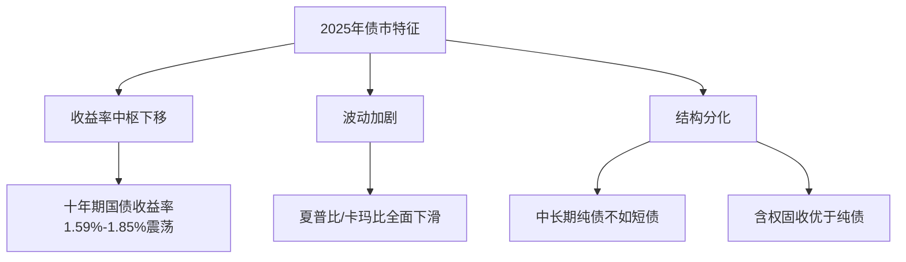

#### 国债期货市场量质双升

作为利率风险管理的核心市场，国债期货市场在2025年实现了量质双升。截至2025年12月18日，2年、5年、10年、30年期四个关键期限国债期货全品种日均持仓量达**63.64万手**，较2024年上升29.46%；全品种日均成交量达**32.47万手**，同比大幅增长41.88%[^57]。

**超长期品种的活跃度尤为引人注目**。30年期国债期货日均成交量达到12.55万手，持仓量稳定在14.43万手的高位[^57]。这充分反映了在市场长期利率预期分化和"资产荒"背景下，机构对超长期限利率风险管理工具的迫切需求。各期限国债期货与对应现券的价格相关性均保持在99%以上的极高水平，市场有效性显著[^57]。

从市场结构来看，2025年11月国债期货市场机构成交占比约八成，持仓占比约九成，专业投资者主导的格局极为稳固[^57]。公募基金、保险、养老金等中长期资金入市进一步深化，国债期货已从早期的部分机构试探性参与，转变为各类主流资管机构进行资产负债管理和资产配置的标配工具[^57]。

### 5.2 低利率环境下固收业务的挑战与转型方向

中国银行业已全面步入低利率经营环境，这一转变不仅是金融市场化改革的必然结果，也是宏观经济结构调整的客观反映。低利率环境对以固收资产配置为主的资管机构形成系统性挑战，**多资产、多策略成为重要突破口**[^58]。

#### 低利率环境的形成与持续性

回顾历史，我国利率体系的变革经历了三个重要阶段。2019年8月贷款市场报价利率（LPR）改革强化政策利率传导效能，截至2025年5月，1年期LPR从4.25%降至3.00%（累计降125基点），5年期以上LPR从4.85%降至3.50%（累计降135基点）[^59]。国有六大行1年期定期存款利率已降至1.5%左右，活期存款利率仅0.05%，正式进入"0"开头的利率时代[^59]。

**低利率环境呈现趋势性而非阶段性或周期性特征**。清华大学五道口金融学院金融发展与监管科技研究中心主任张健华指出，随着中国经济增速放缓，且长期来看通胀压力较小，可能会限制利率上升的空间，使得低利率呈现趋势性现象[^60]。利率水平主要取决于供需，名义利率与资金供需直接相关，自然利率与未来经济增长率高度正相关[^60]。

#### 传统固收业务面临的核心挑战

低利率环境对固收业务的冲击体现在多个层面：

**净息差持续收窄**。商业银行净息差从2021年的2.08%持续降至2025年一季度的1.43%，突破1.8%的监管合意水平[^59]。2025年一季度我国商业银行净息差约1.43%，处于较低水平[^60]。在低利率时期，商业银行依靠传统的存贷利差盈利模式面临严峻挑战，尤其是中小银行，比大银行更依赖息差收入，盈利空间被进一步压缩[^60]。

**票息收入"安全垫"变薄**。随着市场步入低利率时代，理财产品中的票息"保护垫"在变薄，投资者对波动的感受也更加明显[^61]。在当前低利率的市场环境下，票息收入的安全垫相对有限，单纯依靠债券票息并不容易达到投资者对理财产品的收益预期[^61]。

**资产荒与配置压力加剧**。在市场给予高收益资产日益稀缺的背景下，机构面临"缺资产"难题。国股大行在实体经济中承担更强的信贷投放职能，存贷供需失衡的问题尚不明显，而小行在趋弱的宏观环境中在贷款定价、辐射客群上均存劣势，面临更大的缺资产难题[^56]。

| 挑战维度 | 具体表现 | 影响程度 |
|---------|---------|---------|
| 净息差收窄 | 从2.08%降至1.43% | 极高 |
| 票息收入下降 | "保护垫"变薄 | 高 |
| 资产荒加剧 | 高收益资产稀缺 | 高 |
| 波动率上升 | 净值波动加大 | 中高 |

#### 固收业务转型方向与创新路径

面对低利率困境，固收业务正从**"持有到期"向"交易驱动"**转型，多资产多策略成为突围的核心方向。

**多资产多策略产品体系加速构建**。多家理财公司推出多资产多策略产品体系，如中邮理财的"鑫鑫族"，苏银理财的"恒源鑫安"系列，招银理财的"全福"系列，光大理财"光盈"系列，兴银理财"加利略"多资产多策略体系，宁银理财"权星优选体系"，徽银理财"星徽"多资产多策略产品体系等[^58]。

多资产多策略是一种获取长期稳健投资收益的多元化投资方法，**核心思想是通过投资于相关性不同的多资产类别，并适时采取多样化的投资策略来降低波动率，实现收益与风险的平衡**[^58]。南银理财安远、致远、明远三个固收+系列中均有多资产策略，分别对应低、中、高的风险资产中枢，产品均配置80%以上比例固收资产，以国内信用债实现打底收益，并通过股票、商品ETF等多种资产增厚收益[^58]。

**"固收+"产品发行放量**。2025年前三季度，"固收+"产品发行放量，理财公司主导市场。其中，理财公司发行的"固收+"产品数量最多，2025年3季度为3849款，占比71.57%，且发行量仍在持续增长[^62]。从最直接的收益成绩单来看，含权债基相较于纯债基金的优势显著。2025年以来，截至12月22日，一级债基、二级债基、偏债混合型基金收益率中位数分别为1.9%、4.3%、5.2%，**95%以上的含权债基均获得了正收益**[^63]。同期，短期纯债基金、中长期纯债基金收益率分别为1.5%、1.0%[^63]。

**另类资产配置拓展**。资产配置的多元化创新成为主动"固收+"产品提升收益弹性的关键支撑。在传统债券与权益资产相关性上升的背景下，**REITs、衍生品、商品等另类资产因低相关性、收益增强属性，成为机构布局的重点领域**[^64]。第一创业资管作为业内首批布局公募REITs投资的机构，2022年便发行"公募REITs+"策略产品，依托REITs的稳定现金流与增值潜力，为产品收益提供额外保障[^64]。

### 5.3 固收业务核心竞争能力评估与机构分化

在低利率环境与市场竞争加剧的双重压力下，固收业务的核心竞争能力正在发生深刻变化。**信用研究能力、交易定价能力、产品创新能力**三大要素成为决定机构竞争力的关键因素，不同类型机构呈现显著的能力分化与策略差异。

#### 信用研究能力：风险定价的基础

信用研究能力是固收业务的基础竞争力，直接决定了机构在信用债投资中的风险识别与定价能力。在信用分化加剧的市场环境下，**精准的信用研究能力成为获取超额收益的核心来源**。

信达澳亚基金在固收领域将风险控制视为核心竞争力，以系统性、前瞻性的风控体系构筑投资安全屏障。公司构建了严谨的信用评级体系与证券入库管理流程，通过多维穿透式评估，对信用风险实施动态监控；同时，对市场风险、流动性风险进行全流程预判与管理[^65]。

国金资管已建立起覆盖广泛资产类别的投研支撑体系，研究团队不仅深耕于股票、债券、可转债等传统领域，更将研究触角延伸至REITs、商品、海外资产及衍生品等类别，保持前瞻性的研究储备[^66]。**多资产配置并非资产的简单堆砌，其核心在于通过深入理解各类资产的风险收益特征及彼此间的相关性，使其在组合中扮演不同的角色，实现风险的分散**[^66]。

#### 交易定价能力：从持有到交易的转型

交易能力正在成为固收业务的核心竞争力。在票息收入下降的背景下，**通过交易获取资本利得成为增厚收益的重要手段**。

民生证券在固收做市领域开辟了一条极具竞争力的新赛道。自2018年转型开始，民生证券在银行间市场交易量累计近**40万亿元**，日均交易量近300亿元，市场活跃度和知名度逐年提升，并且在利率债、地方债和部分信用债交易中具有较高的市场占有率[^67]。2018年以来民生证券6年间固收业务的年化收益率平均超过**20%**，70个自然月度中，91%的月度实现盈利，所有自然季度均实现盈利，夏普比例长期超过5[^67]。

做市利润的核心来自于买卖的价差和成交量：价差过宽，定价效果差则难以成交；价差过窄，覆盖不了交易成本，得不偿失[^67]。民生证券固收业务聚焦超高等级的信用债和利率债领域，以金融科技赋能，专注做市交易，放弃传统的自营投资+撮合类中间业务模式[^67]。

平安理财的"启元系列"是固收系列的核心代表，是一款具有强交易能力的固收理财。投资团队自主研发了固收机器量化模型，通过"人机结合+多元策略"在波动交易中创造产品收益，同时叠加机器模型计算选择最优质期限和券种进行配置[^61]。截至11月20日，启元系列产品业绩表现稳健，已兑付198期且业绩达标率100%，平均年化收益率为**3.98%**[^61]。

#### 产品创新能力：差异化竞争的关键

产品创新能力决定了机构能否满足投资者多元化的配置需求，是实现差异化竞争的关键。

**市场化理财机构的产品定位明显更加进取**，普遍采取"多资产多策略"的配置思路。这类机构以股份制银行理财子公司和部分头部城商行理财子公司为代表，它们正在从"以资产为中心"的传统模式转向"以策略为中心"的新型投资范式[^58]。这些机构主要通过三大类产品满足不同风险偏好客户的需求：一是"固收+"产品，作为稳健型客户的基础配置，占比约40%-50%；二是混合类产品，通过增加权益类资产（如REITs、转债、国债期货等）提升收益弹性，占比约20%-30%；三是主题型产品（如绿色金融、科技创新等），瞄准特定风险偏好的客户群体，占比约10%-15%[^58]。

**非市场化理财机构则仍以"稳规模、稳净值"为主要诉求**，产品定位相对保守。这些机构的产品结构中，开放式固收类产品占比普遍高达80%-90%，是理财规模的"压舱石"[^58]。

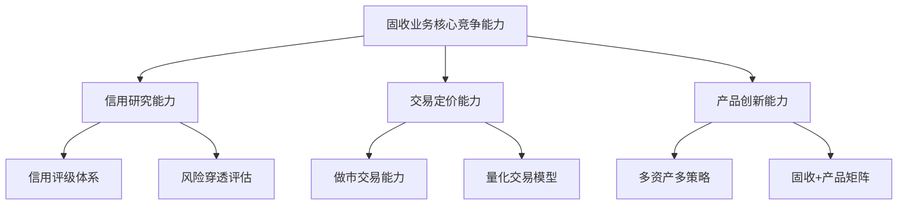

#### 机构分化与竞争格局演变

不同类型机构在固收领域呈现显著的能力分化与策略差异。

**银行理财**凭借渠道优势和客户基础，在固收领域占据主导地位。理财公司已成为绝对主导力量，32家理财公司存续规模同比增长16.72%，显著高于市场整体增速，市场份额已达**92.25%**[^68]。

**公募基金**在固收领域具备专业投研优势。固收类基金产品中，货币基金目前市场规模更大，而债券基金负债客群更多对接机构资金[^56]。公募固收产品仍是银行理财市场主要构成，负债端依托于庞大的银行渠道，主要对接低风险偏好的存款客群[^56]。

**券商资管**在交易能力和产品创新方面具有差异化优势。券商资管向主动管理转型，围绕策略细分、场景适配、资产多元化的创新持续涌现[^62]。第一创业资管明确将中低波动"固收+"作为核心赛道，重点打造ESG固收、聚善公益系列等特色产品线[^64]。

**保险资管**凭借长期资金属性，在固收配置中具有独特优势。保险是目前资管市场唯一一类保持较高增速、稳定增长的资管产品[^56]。

### 5.4 银行理财固收业务发展态势与产品创新

2025年，银行理财市场规模突破33万亿元大关，固收类产品占据绝对主导地位。在低利率环境下，理财公司积极推进产品创新与策略升级，"固收+"产品放量发行，多资产多策略体系加速构建。

#### 理财市场规模与结构特征

银行业理财登记托管中心发布的《中国银行业理财市场年度报告(2025)》显示，截至2025年末，理财市场存续规模达**33.29万亿元**，较年初增加11.15%，产品结构延续固收为主格局[^69]。全国共有159家银行机构和32家理财公司有存续的理财产品，共存续产品4.63万只，较年初增加14.89%[^69]。

从全年规模走势看，呈现"V"形上涨特征。2025年初理财产品存续规模29.95万亿元；3月底产品存续规模29.14万亿元，降低2.7%；此后每季度逐步上涨，年底攀升至33.29万亿元[^68]。中金公司研究表示，理财2025年收官33.3万亿元，全年规模增长3.3万亿元、同比增速11.2%；全年走势前低后高，下半年理财规模净增2.6万亿元[^69]。

**产品结构呈现高度集中的"单极主导"特征**。普益标准的数据显示，固收类产品规模占比连续四个季度超过74%。截至12月26日，固收类产品存续规模24.22万亿元，在全市场总规模中占比超7成，产品数量占比超过8成[^70]。现金管理类产品作为流动性工具，规模稳定在6.5-6.6万亿元区间，占比约两成。相比之下，**混合类、权益类、商品及金融衍生品类等其他类型产品合计占比不足3%**，显示理财市场仍以稳健型资产为主[^70]。

| 产品类型 | 存续规模 | 占比 | 特征 |
|---------|---------|-----|------|
| 固收类 | 24.22万亿元 | 超70% | 绝对主导 |
| 现金管理类 | 6.5-6.6万亿元 | 约20% | 流动性工具 |
| 混合类+权益类+其他 | - | 不足3% | 占比极低 |

#### 收益率表现与业绩基准走势

2025年理财产品整体收益稳健，累计为投资者创造收益**7303亿元**，较去年增长2.87%。其中，银行机构累计为投资者创造收益1132亿元；理财公司累计为投资者创造收益6171亿元[^69]。2025年理财产品平均收益率为**1.98%**[^69]。

**收益率持续下行态势明显**。数据显示，2025年银行理财产品平均收益率为1.98%，较2024年的2.65%下降0.67个百分点，且收益率连续3年下降[^68]。光大证券研究表示，理财实际收益率中枢虽有下行，但相较存款仍有较好相对收益。普益数据显示，截至2025年12月，固定收益类产品近1年年化收益率中枢在2%左右[^69]。

展望2026年，中信建投证券银行业首席分析师马鲲鹏预计，平均业绩比较基准将止跌企稳，预计回升**30bps**左右，达到**2.7%**[^58]。预计2026年理财规模同比增速为10%左右，达38万亿[^58]。

#### "固收+"产品放量与策略创新

**"固收+"规模的持续扩张，本质上是低利率环境下资金供需两端共振的结果**[^64]。从资金需求端来看，无风险收益率持续下行，银行存款利率维持低位运行，叠加权益市场波动加剧，投资者对"稳健打底、适度增强"的资产配置需求日益迫切[^64]。从供给端来看，资管机构的战略聚焦进一步推动了赛道扩容，银行理财子公司为实现规模冲量目标，持续加大"固收+"产品发行力度[^64]。

2026年初，国内资管市场"固收+"赛道延续强势增长态势。中信证券最新测算数据显示，2025年12月末银行理财规模收于33.3万亿元，仅较11月回撤5000亿元，回撤幅度1.48%，显著低于历史同期8000亿元的平均跌幅，**背后核心支撑正是"固收+"产品的规模突围与业绩稳健表现**[^64]。展望2026年，机构普遍预测"固收+"产品规模增量将至少达到**1.2万亿元**，带动全年理财规模突破36万亿元关口[^64]。

主动管理型"固收+"产品成为市场热点核心，机构围绕策略细分与产品梯度构建展开激烈角逐。不同于传统被动型产品，主动管理类"固收+"更强调投研能力对收益的提升作用，通过灵活调整大类资产配置比例、精选细分赛道标的，实现风险与收益的精准匹配[^64]。财通资管深化"固收+"策略的场景应用，构建"低波—中波—高波"的完整产品梯度，同时加快权益类、量化指增类产品的储备迭代，通过浮动费率模式提升投资者与管理人的利益绑定[^64]。

#### 理财公司投研能力建设与转型

**理财公司权益投研能力尚不足是制约产品结构优化的关键瓶颈**。普益标准首席经济学家王鹏指出，这种"结构失衡"背后，是投资者对低风险产品的强烈偏好与理财公司权益投研能力尚不足的双重现实。他警示，过于集中的风险偏好，可能在市场波动时引发集中赎回，影响整体稳定性[^70]。

浙银理财党委书记、董事长武国元表示，"从理财公司'受人之托、代客理财'的功能定位出发，我们要切实为老百姓理好财，为了实现这个目标，一要打造核心竞争力，也就是以大类资产配置为核心的投资研究能力和赋能稳健经营的风险防控能力，其核心都在于人才"[^71]。开业初期，浙银理财在投资研究、风险防控方面的人员占比已超过50%[^71]。

在低利率的市场环境下，理财公司需要提升多方面能力：**一是提升固定收益类资产的交易能力**，票息收入的安全垫相对有限，要提升债券波段操作能力，提高交易胜率，以资本利得弥补票息不足；**二要拥抱权益投资机会**，高股息资产在低利率环境下具有较强的吸引力；**三是拓展其他资产的投资机会**，如商品类资产、另类资产等[^71]。

平安理财构建了**"工业化+平台化"的投资管理模式**。这种生产模式就好比高效生产的车间，每一种策略就像是零部件，底层负责策略的模块化生产，由专业团队负责持续追踪信用债、存单、REITs等不同策略模块；上层投资经理则根据投资组合目标进行科学封装[^61]。这一模式能够高效地整合公司内外部的优质资源和投资策略，形成全量、全覆盖的策略工具池[^61]。

### 5.5 固收业务在机构资产配置中的地位变化与增长空间

固定收益业务在各类机构资产配置中占据核心地位，尤其在保险资金、养老金、银行理财等中长期资金配置中发挥着"压舱石"作用。在低利率环境与资产荒背景下，固收业务的配置逻辑与增长空间正在发生深刻变化。

#### 固收业务在大资管格局中的核心地位

从大资管行业整体格局来看，固收类资产仍是各类机构配置的核心。中信证券研究估算，截至2025年上半年，各体系产品合计AUM接近**150万亿元**。分机构观察，保险、公募基金、银行理财分列目前资管市场AUM规模前三位[^56]。

**银行理财**方面，固收类产品规模占比高达**97.09%**，固定收益类产品规模占比连续四个季度超过74%[^70]。债券类资产占理财产品总投资资产的51.93%，虽然债券投资比例已从2024年年末的57.89%下降至51.93%，减少6个百分点，但仍是最主要的配置方向[^68]。

**保险资管**是目前资管市场唯一一类保持较高增速、稳定增长的资管产品[^56]。保险资金的长期、稳定的"耐心资本"特性与固收资产的久期匹配需求高度契合。中国保险资管行业管理资金总规模已超过**33万亿元**，从2015年到2024年，保险资管规模稳步增长，年复合增速达11.65%。

**公募基金**中，固收类基金产品规模持续扩大。货币基金目前市场规模更大，而债券基金负债客群更多对接机构资金[^56]。截至2025年三季度末，全市场含权债基总规模为2.44万亿，逼近2021年历史高点2.45万亿[^63]。

#### 资产荒背景下的配置需求变化

在资产荒背景下，机构对各类固收资产的配置需求呈现结构性变化。

**信用债配置需求分化**。在信用分化加剧的环境下，机构对高等级信用债的配置需求持续旺盛，而对中低等级信用债的风险偏好有所下降。ABS品种利差整体稳定，以相对有代表性的AAA企业ABS 1年期利差为例，上半年供需力量相对均衡，品种利差整体稳定在15-20bp；四季度以来配置需求释放，利差有小幅收窄[^54]。

**ABS与REITs配置需求上升**。2025年ABS市场在低利率与资产荒背景下继续扩容，一级发行创4年新高。从投资端看，在市场波动加大的环境下，**ABS更以资产韧性、低波特性及另类收益成为分散风险、优化组合的重要多元配置选项**[^54]。持有型不动产ABS凭借监管支持与供需双旺的多重利好快速崛起，成为年度最具边际变化的资产类型[^54]。

展望2026年，ABS市场将在量的稳步扩张中呈现分化。不动产、消金和NPL是核心看点。投资机会将更多来自结构设计优化、优质资产筛选、交易条款博弈和投资者行为分析，而非简单的久期或者利差博弈。**在利率中枢下移和风偏分化的环境下，ABS有望成为链接固定收益、防御属性与另类收益的重要枢纽，在多资产配置中的价值有望进一步提升**[^54]。

#### 固收业务增长空间与结构性机会

**规模增长预期**方面，预计2026年存款"脱媒"仍有支撑，但理财规模增势未必"一帆风顺"[^69]。光大证券研究指出，存款"脱媒"大趋势下，理财规模增长节奏或偶有颠簸，主要基于以下考虑：一是随着理财估值整改有序完成，"真净值"运作模式下，理财净值潜在波动压力加大或影响负债稳定性；二是"打榜"产品打开后，随实际收益下降规模或有回落压力[^69]。此外，储蓄型保险产品等竞品或对潜在"脱媒"资金有局部分流[^69]。

展望2026年，多家研究机构表示，行业规模增长仍将受到"脱媒"效应支撑，**固收+、股混类理财产品或将迎来快速扩容**[^69]。中信建投预计2026年理财规模同比增速为10%左右，达38万亿；资产配置上，非标和债券占比下降、流动性资产占比回升，公募和权益资产占比回升，预计腾挪空间在5%左右[^58]。产品结构中混合类规模和数量将显著提高，占比回升，预计占比提升2%左右[^58]。

**结构性机会**主要集中在以下领域：

| 机会领域 | 增长逻辑 | 发展前景 |
|---------|---------|---------|
| "固收+"产品 | 低利率下收益增强需求 | 规模增量至少1.2万亿 |
| 多资产多策略 | 风险分散与收益平衡 | 占比持续提升 |
| REITs配置 | 稳定现金流与低相关性 | 快速扩容 |
| ABS投资 | 资产韧性与另类收益 | 结构升级 |

#### 不同类型机构的固收业务发展策略建议

基于上述分析，针对不同类型机构提出固收业务发展策略建议：

**银行理财公司**应着力提升三方面能力：一是强化交易能力建设，在票息收入下降背景下，通过波段操作获取资本利得；二是加快权益投研能力建设，提升含权产品的收益增强能力；三是构建多资产多策略产品体系，满足投资者多元化配置需求。同时，需关注净值波动管理，在"真净值"运作模式下保持负债稳定性。

**公募基金**应发挥专业投研优势，在信用研究、交易定价等方面建立差异化竞争力。固收类基金需要在纯债策略收益下降的背景下，加强"固收+"策略的创新与应用，通过多元资产配置提升风险调整后收益。

**券商资管**应继续推进向主动管理转型，在做市交易、量化策略等领域建立特色优势。可借鉴民生证券在固收做市领域的成功经验，聚焦细分领域建立专业化竞争力。

**保险资管**应发挥长期资金优势，加强对REITs、ABS等另类资产的配置研究，在久期匹配与收益增强之间寻求平衡。同时，可发挥保险资金的"耐心资本"属性，在长期限固收资产配置中获取期限溢价。

综合来看，固定收益业务在低利率环境下面临收益率下行、波动加剧等挑战，但作为各类机构资产配置的核心，其市场地位依然稳固。**从"持有到期"向"交易驱动"转型、从单一债券配置向多资产多策略演进**，是固收业务应对挑战、把握机遇的核心方向。具备强交易能力、深厚信用研究功底、丰富产品创新能力的机构，将在未来竞争中占据有利位置。

## 6 财富管理与资产管理行业机遇与挑战

财富管理与资产管理行业正处于中国金融业变革的核心地带。2025年，资管行业总规模突破170万亿元，银行理财、公募基金、保险资管等主要业态规模均创历史新高，共同印证了中国财富管理市场全业态扩容、规模化进阶的发展新图景[^72]。在居民财富持续积累、低利率环境深化、人口老龄化加速的多重背景下，财富管理行业正经历从"产品销售"向"客户价值创造"的深刻转型。本章将系统分析居民财富配置需求的结构性变迁、各类资管业态的竞争格局演变、产品创新与服务模式升级的核心方向，研判行业市场空间与头部机构竞争优势的关键来源。

### 6.1 中国居民财富增长趋势与资产配置需求结构性变迁

中国居民可投资资产规模的持续扩大，为财富管理行业发展奠定了坚实的需求基础。**居民财富配置正经历从储蓄存款向多元化金融资产转移的历史性变革**，这一结构性变迁构成推动行业发展的核心内生动力。

#### 居民财富规模与高净值人群扩张态势

中国居民财富总量已达到全球领先水平。截至2025年上半年，**我国居民可投资资产总量已超过300万亿元**，而同期全国资产管理总规模约为170万亿元，两者之间存在巨大的转化空间[^73]。这一数据揭示出财富管理市场的广阔发展前景——大量居民财富尚未进入专业资产管理渠道，市场渗透率仍有显著提升空间。

高净值人群规模的快速扩张为私人银行等高端财富管理业务提供了充沛的客户基础。截至2025年上半年，中国高净值人群（可投资资产超1000万元）已**突破300万人**，私人银行资产管理规模（AUM）达24.6万亿元，预计到2030年将增长至42万亿元，年复合增长率达9.5%[^73]。中国内地净资产超1000万美元的高净值人群已达47万人，占全球总量的20%，仅次于美国[^74]。

| 财富指标 | 2025年数据 | 增长预期 | 市场含义 |
|---------|-----------|---------|---------|
| 居民可投资资产总量 | 超300万亿元 | 持续增长 | 财富管理需求基础雄厚 |
| 高净值人群数量 | 突破300万人 | 年均增长12%+ | 高端服务需求旺盛 |
| 私人银行AUM | 24.6万亿元 | 2030年达42万亿 | 年复合增速9.5% |
| 资管行业总规模 | 约170万亿元 | 持续扩容 | 渗透率提升空间大 |

#### "存款搬家"浪潮与资产配置结构性转移

低利率环境深刻改变了居民的资产配置行为。**居民资产配置正从储蓄存款大规模转向多元化金融资产**，这一"存款搬家"现象在2025年呈现加速态势[^72]。随着银行存款利率持续下调、高息产品停售，传统储蓄的吸引力显著下降，居民主动寻求收益更高的理财渠道。

这一转变体现在多个维度：**权益市场活跃度显著提升**，2024年10月至2025年9月平均月新开户数达290万户，较2023年增长48%；**理财市场投资者队伍持续壮大**，截至2025年三季度末，全市场理财产品投资者数量达1.39亿个，同比增长12.70%[^72]。据相关研报测算，2026年1年期以上定期存款到期量接近70万亿元，比2025年高出约10万亿元，大量高息存款集中到期有望为财富管理市场带来持续的资金增量[^75]。

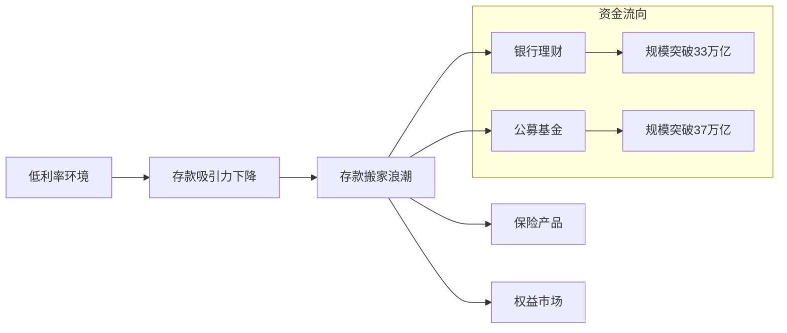

#### 多元化需求体系的形成与深化

居民理财需求正从传统单一的资产增值诉求，向**多元化综合需求体系**加速转变。财富保全、跨代传承、风险分散对冲、税务规划及教育、养老等场景化服务需求日益凸显[^74]。

高净值人群的投资偏好呈现**稳健与多元化并重**的特点。当前资产配置中，银行理财/货币基金占比25%，保险19%，股票14%。未来一年计划增配的前三类资产分别是保险（47%）、黄金（42%）和股票（34%）[^73]。值得关注的是，**45%的受访高净值人群已配置境外金融产品**，境外资产平均占其总资产的20%，中国香港、新加坡、美国为首选目的地[^73]。

这一需求升级趋势对财富管理机构提出了更高要求：不再满足于单一产品销售，而是**迫切需要专业资产配置方案实现财富保值增值**[^72]。庞大且不断升级的财富管理需求，为行业规模扩张提供了充沛动能。

### 6.2 大资管行业竞争格局与各业态规模演变

2025年，中国资产管理行业实现系统化跃升，各主要资管子行业规模均创历史新高。**银行理财、公募基金、保险资管形成三足鼎立格局**，同时各业态在目标客群、产品结构、渠道优势等方面呈现差异化定位特征。

#### 各资管子行业规模突破与增长态势

截至2025年末，各主要资管子行业规模均实现历史性突破：**银行理财市场存续规模首次突破33万亿元大关，达到33.29万亿元**，刷新历史峰值；**公募基金规模突破37万亿元**；**信托规模超过32万亿元**；**私募基金规模站上22万亿元**[^72]。

从增长态势来看，保险资管是目前资管市场唯一一类保持较高增速、稳定增长的资管产品。中国保险资管行业管理资金总规模已超过33万亿元，从2015年到2024年，保险资管规模稳步增长，年复合增速达11.65%[^76]。银行理财规模全年增长11.15%，产品结构延续固收为主格局[^72]。

| 资管子行业 | 2025年末规模 | 同比增速 | 市场地位 |
|-----------|-------------|---------|---------|
| 公募基金 | 37万亿元+ | 16%+ | 规模最大 |
| 银行理财 | 33.29万亿元 | 11.15% | 个人投资者主力 |
| 保险资管 | 33万亿元+ | 11.65%（复合） | 稳定增长 |
| 信托 | 32万亿元+ | 回升态势 | 转型发展 |
| 私募基金 | 22万亿元+ | 创新高 | 专业化发展 |

#### 银行理财与公募基金的"一哥"之争

2023年以来，银行理财与公募基金在规模上的竞争引发市场广泛关注。**从总规模来看，公募基金已超越银行理财**，但深入分析产品结构与投资者构成后，两者的市场定位存在本质差异[^77]。

拆解产品结构发现，公募基金规模中**仅货币市场基金一品类就占比超40%**，而银行理财受限于现金管理产品新规，规模有所收缩。如剔除货币基金和现金理财，银行理财的产品规模仍比公募基金高出近2万亿元[^77]。

更关键的差异体现在投资者结构上：**公募基金市场近半的规模为机构投资者所持有；而银行理财的规模中，个人投资者保有占比高达90%**。仅考量个人投资者持有金额，银行理财市场规模约23万亿元，而公募基金市场约为15万亿元，显著低于银行理财[^77]。因此，**从居民财富管理的视角看，银行理财依然站在市场C位，是名副其实的"资管一哥"**[^77]。

#### 差异化定位与竞争格局特征

各资管机构在目标客户、产品、服务等方面各具特点，形成**"头部集中、特色突围"**的竞争格局[^76]。

**目标客群与门槛差异**：私人银行、家族信托、私募基金、传统第三方财富机构服务于高净值及以上客户；券商资管主要服务中高端人群；银行理财、公募基金、保险、互联网财富管理平台定位普惠人群，门槛较低[^76]。

**机构属性差异**：银行和券商兼具财富管理机构和资产管理机构属性，公募基金、私募基金、信托、保险都以资产管理机构属性为主，传统第三方理财和互联网财富管理平台以财富管理机构属性为主[^76]。

**核心优势差异**：银行具有广阔的渠道和雄厚的客户基础，公募基金和券商投研能力较强、专业度高，私募基金和第三方理财高收益高风险，互联网财富管理平台方便透明[^76]。

随着资管新规落地，资管行业打破刚性兑付，回归"受人之托、代人理财"本源。各资管子行业立足自身核心禀赋深化差异化布局：**银行理财筑牢"固收+"稳健底盘，公募基金发挥权益投资专业优势，私募基金深耕股权创投与证券投资赛道，信托聚焦服务信托与财富传承领域**[^72]。

### 6.3 银行理财净值化转型深化与产品创新方向

银行理财净值化转型是近年来金融领域的重要变革，对银行、投资者和金融市场都产生了深远影响。**2025年，理财公司已成为市场绝对主导力量**，但固收类产品占比过高、权益投研能力不足等结构性问题仍待突破。

#### 净值化转型的阶段性成效与深层挑战

净值化转型带来了多方面的深刻变化。**对于银行而言**，净值化转型促使银行提升自身的专业能力和市场竞争力，银行可以通过推出更具特色和个性化的理财产品吸引更多投资者，净值化产品的透明度更高，有助于银行树立良好的品牌形象[^78]。

**对于投资者而言**，净值化转型后需要更加关注理财产品的净值波动和底层资产情况，要求投资者具备一定的金融知识和风险意识，学会根据自己的风险承受能力和投资目标选择合适的理财产品[^78][^79]。投资决策的复杂性有所增加，投资者需要学会分析产品的历史净值走势、业绩比较基准等指标，评估产品的风险收益特征[^79]。

**理财公司已成为绝对主导力量**。32家理财公司存续规模同比增长16.72%，显著高于市场整体增速，市场份额已达**92.25%**[^80]。全国共有159家银行机构和32家理财公司有存续的理财产品，共存续产品4.63万只[^72]。

然而，产品结构呈现高度集中的"单极主导"特征，**固收类产品规模占比连续四个季度超过74%，混合类、权益类、商品及金融衍生品类等其他类型产品合计占比不足3%**[^80]。这种"结构失衡"背后，是投资者对低风险产品的强烈偏好与理财公司权益投研能力尚不足的双重现实。

#### 产品创新方向：多资产多策略与"固收+"放量

面对低利率环境下票息收入"安全垫"变薄的挑战，**多资产多策略成为重要突破口**。多家理财公司推出多资产多策略产品体系，如中邮理财的"鑫鑫族"，苏银理财的"恒源鑫安"系列，招银理财的"全福"系列，光大理财"光盈"系列，兴银理财"加利略"多资产多策略体系等[^80]。

**"固收+"产品发行持续放量**。2025年前三季度，理财公司发行的"固收+"产品数量最多，占比71.57%，且发行量仍在持续增长[^80]。展望2026年，机构普遍预测"固收+"产品规模增量将至少达到**1.2万亿元**，带动全年理财规模突破36万亿元关口。

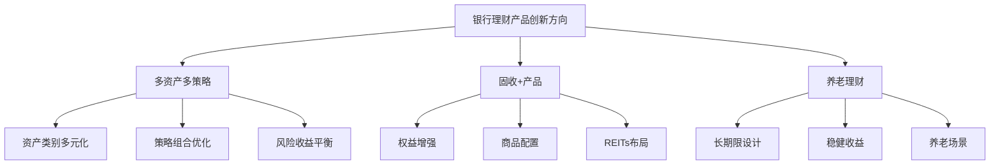

#### 从"产品驱动"向"客户驱动"转型

银行理财正经历从"产品驱动"向"客户驱动"的深刻转型。**银行理财子公司继承了母行的渠道资源和禀赋优势，与C端客户离得近，天然对负债端的客户群体有较为清晰深刻的理解，这是他们区别于其它资管机构最大的优势所在**[^77]。

对于银行理财子来说，**"资产管理"和"财富管理"双轮驱动或许是未来发展方向的最优解**，应把成为"离老百姓最近的资管机构"作为战略定位和目标[^77]。财富管理部门的设立与整合，其积极意义在于推动银行从"产品驱动"转向"客户驱动"，在提升服务一致性与专业度的同时，增强客户黏性与长期价值挖掘能力[^75]。

能力建设重点包括：**一是提升固定收益类资产的交易能力**，在票息收入安全垫相对有限的背景下，提升债券波段操作能力；**二是拥抱权益投资机会**，高股息资产在低利率环境下具有较强吸引力；**三是拓展其他资产的投资机会**，如商品类资产、另类资产等[^81]。

### 6.4 公募基金与银行理财的差异化竞争与协同发展

公募基金与银行理财作为大资管生态链中不可或缺的两大主体，在资源禀赋、客群基础、风格偏好、定位方向上存在本质差异。**两者完全可以优势互补、有机竞合，共同引领行业格局，实现共赢局面**[^77]。

#### 核心差异：投资者结构与产品特征

公募基金与银行理财的核心差异体现在多个维度：

**投资者结构差异显著**。银行理财的规模中，个人投资者保有占比高达90%；而公募基金市场近半的规模为机构投资者所持有[^77]。这一差异决定了两类机构在产品设计、风险偏好、服务模式等方面的根本性分野。

**产品定位差异明显**。公募基金基于其投资属性，大都定位相对收益策略，以跑赢业绩基准指数为目标，产品不直接关注客户收益，更接近纯粹的投资工具，可称之为**"工具型产品"**。银行理财基于银行客群特点，通常定位绝对收益策略，以达到某个既定收益率为目标，可称之为**"解决方案型产品"**[^77]。

**客户风险偏好差异**。银行理财客户群体的风险偏好及对波动的承受能力普遍较低，产品净值波动大了就容易追涨杀跌，导致盈利不佳[^77]。因此银行理财更强调在绝对收益策略上的优势，为客户提供收益体验更好的产品。

| 对比维度 | 公募基金 | 银行理财 |
|---------|---------|---------|
| 个人投资者占比 | 约50% | 约90% |
| 产品定位 | 相对收益/工具型 | 绝对收益/解决方案型 |
| 核心优势 | 权益投研能力 | 渠道资源、客户触达 |
| 风险偏好匹配 | 可承受较高波动 | 低波动偏好 |

#### 差异化竞争优势与发展路径

**公募基金的核心优势在于投研能力**。公募基金是借鉴海外共同基金模式设立的市场化公司，从出生时就具备较成熟的运作机制，又经历了数十年的发展，已形成较完善的治理制度[^77]。在权益投资领域，公募基金数十年的耕耘积累了深厚的投研机制和实力、卖方资源支持、人才考核激励、系统化运作等方面的能力。

**银行理财的核心优势在于渠道与客户资源**。银行理财除了可投资现金及存款、标准化债券和股票、公募基金外，还可配置非标债权、未上市公司股权、各类资管计划等特殊资产，而这类稀缺资源是公募基金无法投配的，无疑是银行理财在资产端独有的优势[^77]。

银行理财子应探索独立化运作的发展道路，不光在财务报表上从母行分离，更要在治理机制上对标优秀的公募基金公司，更市场化运营[^77]。同时，银行理财子应充分结合母行的渠道资源，大力推进投资者教育和陪伴工作。

#### 委外合作与FOF产品的协同模式

**通过委外、FOF等形式与公募基金合作，是银行理财拓展权益配置的重要路径**。与其从零开始打造权益直投队伍，银行理财子不如通过委外、FOF等形式与公募基金合作，拓展权益投配方案。通过底层标的的多元化配置，进一步分散风险，匹配银行理财客群的需求[^77]。

这种协同模式的优势在于：公募基金提供专业的权益投资能力，银行理财提供渠道资源和客户触达能力，两者优势互补，共同为投资者创造价值。**银行理财和公募基金在规模上竞争谁是"一哥"并不重要，真正从投资者利益出发、切实帮老百姓赚到钱，才是当之无愧的"一哥"**[^77]。

### 6.5 私人银行业务发展态势与高净值客群服务升级

中国私人银行业正经历从"规模扩张"向"价值深耕"的历史性转折。**2025年行业发展呈现高质量增长态势**，资产管理规模与客户数量保持两位数增长，服务内涵从传统"保值增值"向多元化综合服务升级。

#### 规模增长与市场格局

中国私人银行业在2025年继续保持强劲增长势头。截至2025年上半年末，12家主要私人银行管理资产余额（AUM）达到**18.8万亿元**，较2024年末增长1.6万亿元，增幅达9.3%；16家银行客户数达**164.9万户**，较2024年底增长19.19万户，同比增长13.17%[^73][^74]。

市场格局呈现**"头部集中、特色突围"**的双重趋势。四大国有银行凭借综合金融优势占据主导地位，农业银行以3.5万亿元AUM位居行业首位，工商银行、中国银行、建设银行紧随其后，四家银行AUM合计超过13万亿元，占12家主要私人银行总AUM的近70%[^73]。招商银行、平安银行、中信银行、兴业银行等股份制银行通过差异化策略快速追赶。

私人银行发展空间仍广阔。高净值人群服务渗透率（接受私人银行服务的高净值人群占比）提升至42%，较2020年提升18个百分点[^74]。这意味着近一半的高净值人群已成为私人银行客户，市场渗透率的快速提升反映了私人银行服务模式的广泛认可。

#### 高净值客群需求的多元化转变

高净值人群的需求正从传统的"保值增值"向**"财富传承+跨境配置+另类投资"**的多元化需求转变[^74]。

**财富传承需求快速释放**。家族信托、保险金信托等传承工具规模快速增长，截至2025年第三季度，全行业家族信托存续规模突破**9500亿元**，保险金信托规模达**4200亿元**，较2024年分别增长5.6%和19.1%[^73]。

**跨境资产配置需求持续增长**。45%的受访高净值人群已开始配置境外金融产品，境外资产平均占其总资产的20%[^73]。中国香港、新加坡、美国为首选目的地，反映出高净值人群全球化资产配置的强烈意愿。

**另类投资配置比例提升**。另类投资正成为中国私人银行业务增长的新引擎，资产配置呈现"多元化、低波动"特征，另类投资配置比例从2020年的12%提升至2025年的22%[^74]。

#### 与国际成熟市场的差距与提升方向

与国际成熟市场相比，**中国私人银行在组织架构独立性、服务深度、客户黏性等方面仍存在显著差距**[^73]。中国私人银行客户黏性指数显著低于新加坡、瑞士等成熟市场水平[^73]。

提升方向包括：**一是强化组织架构独立性**，提升专业化运作水平；**二是深化服务内涵**，从产品销售向综合财富解决方案转型；**三是提升客户黏性**，通过全生命周期服务增强客户粘性。

业务创新方面，60%的私人银行机构已采用AI驱动投顾系统，技术投入规模突破48亿元，年复合增长率27.3%[^73]。数字化转型成为提升服务效率和客户体验的重要抓手。

### 6.6 投顾业务发展与财富管理服务模式变革

基金投顾业务试点的推出是回归财富管理本源的重要一环。**从"产品销售导向"向"综合财富解决方案导向"转型**，已成为财富管理行业的核心趋势。

#### 基金投顾业务的政策意义与市场价值

基金投顾业务试点具有多方面的重要意义[^82]。**首先，引导和培育居民金融资产配置习惯**。基金投顾业务的重点不仅在"投"，也在于"顾"。服务机构与投资者的深度沟通与长期同行，有助于避免投资者盲目选择、频繁申赎、短期持有等行为。

**其次，有益于资本市场投资者结构的调整与长期资金的入市**。在我国A股市场，个人投资者在流动市值中的占比虽从70%下降到53%，但仍贡献了市场84%的交易额，远高于机构投资者的12.3%。通过基金投顾业务引导大众投资者以选择优秀资产管理机构的方式进入市场，即"投资者机构化"，将更有利于市场结构优化[^82]。

市场上投资者对于投资体验的反馈存在明显反差：约39%的投资者在过去一年内陷入不同程度亏损，但同期95%公募基金取得了正收益[^82]。这两种表现的背离同时也导致投资者对后续继续追加投资的犹豫和减少。**基金投顾业务正是解决这一困境的重要途径**。

#### "以顾带投"服务模式的价值创造机制

**业内常说，投顾其实是"三分投七分顾"**，这恰恰与银行理财子提供解决方案的定位不谋而合[^77]。解决方案=产品+服务，产品是要"投"好，服务是要"顾"好，以"顾"带"投"。

无论建议型投顾还是管理型投顾，核心要义都是以财富管理引领资产管理。关注各年龄、各圈层客户的诉求，切实从投资者利益出发，通过专业的顾问服务引导客户建立合理的收益预期，并在对的时间做出对的投资决策，避免频繁交易、追涨杀跌[^77]。

**如果说公募基金的优势在投研，那么银行理财的优势就在投顾**。银行理财子应充分结合母行的渠道资源，大力推进投资者教育和陪伴工作，和银行端携手积极发力投顾业务，真正为守护投资者的钱袋子出谋划策[^77]。

#### 各类机构在投顾领域的竞争格局

当前受限于监管要求，仅部分公募基金公司可开展投顾业务，但投顾牌照的广泛化是大势所趋，未来银行理财子在这一领域很有机会大放异彩[^77]。

**银行理财子的投顾优势**在于：因与母行间的紧密纽带和渊源，天生拥有其它资管机构无法比拟的资源禀赋；银行又是市场上规模最大的财富管理机构，所以银行理财子是最适合提供投资顾问服务的专业机构[^77]。

银行理财子应发力解决方案型产品，积极开拓投顾业务。银行理财子应更强化在绝对收益策略上的优势，不断做深做透，为客户提供收益体验更好的产品。银行理财子要真正从投资者利益出发，以让客户赚到钱为核心目标，通过专业的投顾服务正向引导投资者预期和申赎行为[^77]。

### 6.7 养老金融需求释放与养老理财市场机遇

在居民养老需求日益多元化的时代背景下，养老金融领域迎来了新的发展机遇。**养老理财作为创新性产品，以"平衡感"为核心优势**，正成为居民长期可靠的养老财富管理工具。

#### 养老金融产品体系与差异化特征

当前，养老金融产品体系主要涵盖**养老储蓄、养老基金、养老保险及养老理财**四类，各具差异化特征，共同构建起多层次养老保障格局[^83]。

**养老理财有效整合了前三类产品的优点**，成为覆盖广泛、适配性强的"中间层"养老金融产品。其核心特征包括[^83][^84]：

- **风险收益水平居中**：采用"固收+"策略，权益类资产配置比例较低，并通过设置平滑基金有效控制净值波动，年化收益率普遍具备较高市场竞争力
- **期限设计兼顾长期性与灵活性**：封闭运作期通常为5至10年，同时支持重大疾病、购房等特殊情形下的提前赎回，显著提升资金流动性
- **产品普惠性突出**：1元起投，管理费及托管费低于养老基金与商业养老保险，覆盖更广泛的普通投资者群体
- **服务模式创新**：依托商业银行遍布全国的网点资源，积极探索"咨询+产品+服务"一体化衔接，并联动康养、医疗等生态资源

#### 养老理财试点成效与典型实践

养老理财试点启动后，全行业产品整体收益表现稳健，市场认可度持续提升，投资者认购踊跃[^83]。在政策引导与机构实践的协同推动下，养老理财逐步树立起稳健、可信的市场形象。

以光大理财为例，作为首批参与试点的理财公司之一，早在2020年便提出银行理财参与养老保障体系建设的相关建议，多项建议被监管部门采纳。2021年9月，光大理财等四家理财公司率先在四个城市开展养老理财产品试点；2022年3月，试点范围扩大至"十地十机构"[^83]。

在产品方面，光大理财推出**"颐享阳光"养老理财专属品牌**。截至2025年10月末，累计发行10只养老理财产品，涵盖封闭式与开放式等多类形态，管理规模突破100亿元，服务客户超4万户，并在行业内首创"1+5"期限结构产品，丰富了养老理财的形态选择[^83][^84]。

#### 养老金融发展方向与政策支持

上海金融监管局发布的《上海银行业保险业养老金融高质量发展行动方案》明确提出，未来五年要形成具有上海特色的养老金管理体系、商业养老金融体系、养老产业融资和保险保障体系[^85]。

**政策支持方向包括**[^85]：
- 升级基本养老保险服务，提升服务体验
- 提升企业年金和职业年金服务能力
- 推进个人养老金制度发展，实现账户数与资金缴存规模双提升
- 积极探索商业养老金融改革，鼓励丰富养老理财产品供给

为全面激发养老理财市场活力，未来可重点聚焦以下方向[^83]：一是丰富产品供给，夯实市场基础；二是拓宽投资边界，提升配置效能，包括拓宽海外布局、扩容另类投资、提高权益上限；三是创新服务模式，优化投资体验，如探索账户落地、发展顾问服务、打造陪伴体系。

### 6.8 财富管理行业市场空间与头部机构竞争优势研判

综合前述分析，财富管理行业正处于**量质齐升的高质量发展新阶段**。在居民财富持续积累、资产配置需求升级、政策红利持续释放的多重驱动下，行业未来发展前景广阔。

#### 市场规模增长预期与结构性机会

展望未来五年，财富管理行业市场规模有望保持稳健增长。预计到2030年，私人银行AUM将从当前的24.6万亿元增长至42万亿元，年复合增长率达9.5%[^73]。银行理财规模预计2026年同比增速为10%左右，达38万亿元[^80]。

**结构性机会主要集中在以下领域**：

| 机会领域 | 增长逻辑 | 市场前景 |
|---------|---------|---------|
| 养老金融 | 人口老龄化加速 | 需求持续释放 |
| 财富传承 | 代际财富转移 | 家族信托规模快速增长 |
| "固收+"产品 | 低利率下收益增强需求 | 规模持续扩容 |
| 投顾服务 | 从产品销售向服务转型 | 牌照有望扩围 |
| 跨境配置 | 高净值人群全球化需求 | 45%已配置境外资产 |

我国资管行业集体扩容的逻辑脉络清晰可见——**依托于经济高质量发展带来的优质资产供给，顺应了居民财富管理需求升级的时代趋势，得益于资管机构在深化转型中实现的专业能力跃升**[^72]。

#### 头部机构竞争优势的关键要素

头部机构构建竞争优势的关键要素包括**客户资源禀赋、综合金融协同、投研能力建设、数字化转型**等多个维度[^81][^76]。

**客户资源的天然禀赋**是银行机构角逐财富管理市场的首要"法宝"。银行拥有广阔的渠道和雄厚的客户基础，与C端客户离得近，天然对负债端的客户群体有较为清晰深刻的理解[^76]。

**综合金融的协同优势**体现在跨业务条线的资源整合能力。中国银行提出加快建设"全集团+全市场"的开放式财富管理平台；中信银行则将"打造特色优势领先的财富管理银行"列为"五个领先银行"战略的重要内容[^81]。

**投研能力建设**是提升产品竞争力的核心。在低利率环境下，理财公司需要提升多方面能力：提升固定收益类资产的交易能力、拥抱权益投资机会、拓展其他资产的投资机会[^81]。

**数字化转型**成为提升服务效率的重要抓手。60%的私人银行机构已采用AI驱动投顾系统，技术投入规模突破48亿元[^73]。

#### 差异化突围路径与战略选择

不同类型机构应根据自身禀赋选择差异化突围路径：

**银行理财子公司**应把成为"离老百姓最近的资管机构"作为战略定位，推动"资产管理"和"财富管理"双轮驱动。在资产端，应针对客户需求，发挥差异化优势设计和管理偏绝对收益策略的解决方案型产品；在资金端，应挑起大梁主动引领资管行业向财富管理靠拢[^77]。

**公募基金**应发挥权益投资专业优势，在投研能力建设上持续深耕，同时通过与银行理财的委外合作、FOF产品等模式拓展渠道触达能力。

**私人银行**应聚焦高净值客群的多元化需求，在财富传承、跨境配置、另类投资等领域构建专业服务能力，提升客户黏性与服务深度。

#### 行业高质量发展趋势展望

站在"十五五"规划开局之年的新起点，随着金融供给侧结构性改革的纵深推进，**我国资管行业有望更好地发挥连接实体经济与居民财富的核心枢纽作用**，以更加精准的资源配置能力，将庞大的居民储蓄有效转化为长期资本、耐心资本，为培育新质生产力、推动经济高质量发展注入源源不断的金融活水[^72]。

财富管理不是卖产品，而是做配置；不是赚快钱，而是管长远。**商业回报也许会迟到，但绝不会缺席**。对于能够真正从投资者利益出发、切实帮老百姓赚到钱的机构而言，规模和收入都是为投资者提供价值后的自然结果[^77]。这对财富管理机构来说是难而正确的事——很难做到，但很有价值，很令人期待。

## 7 金融科技赛道细分领域投资价值比较

金融科技作为驱动中国金融行业变革的核心引擎，正处于技术深度渗透与商业化加速的关键阶段。2025年，在AI大模型能力跃迁、数字人民币试点深化、金融信创政策强驱动等多重因素叠加下，金融科技各细分领域呈现差异化的发展态势与投资价值。本章将系统分析支付清算、智能风控、智能投研、保险科技、监管科技、数字人民币六大赛道的技术成熟度、市场规模、竞争格局与投资机会，深入探查AI大模型、隐私计算等新技术对行业格局的重塑作用，为投资者提供赛道选择的决策参考。

### 7.1 金融科技行业整体规模与细分领域结构分布

2025年，中国金融科技行业延续高速增长态势，市场规模与结构分布呈现显著的层次化特征。**金融科技已从单纯的技术应用演进为驱动金融行业变革的核心引擎**，在政策支持与技术突破的双重推动下，各细分领域展现出差异化的增长潜力。

#### 市场整体规模与增长态势

根据中研普华最新发布的报告，2024年中国金融科技市场规模已达**2.8万亿元**，预计2025年将突破**3.3万亿元**，年复合增长率保持在**18%以上**[^86]。这一增长速度显著高于金融行业整体增速，反映出科技对金融业务的深度赋能效应。

从另一统计口径来看，中国信息通信研究院数据显示，截至2024年底，中国金融IT市场规模已达**3860亿元**，预计到2025年将突破**4300亿元**，年复合增长率维持在**12.3%**左右[^30]。两组数据的差异主要源于统计口径的不同——前者涵盖更广泛的金融科技业态，后者聚焦于传统金融IT领域。

| 统计口径 | 2024年规模 | 2025年预测 | 年复合增速 | 数据来源 |
|---------|-----------|-----------|-----------|---------|
| 金融科技（广义） | 2.8万亿元 | 3.3万亿元 | 18%+ | 中研普华 |
| 金融IT（狭义） | 3860亿元 | 4300亿元 | 12.3% | 信通院 |
| 金融信创 | - | 约2500亿元 | 35% | 行业报告 |

#### 细分领域市场份额与增速表现

从细分市场结构来看，2024年各领域呈现差异化的规模与增速特征[^86]：

**支付科技**以**1.12万亿元**的规模占据市场**40%**份额，是金融科技领域的绝对主力。移动支付渗透率已达**98%**，第三方支付牌照数量稳定在230张，头部企业垄断格局显著[^87]。

**信贷科技**规模达**0.84万亿元**，增速**25%**，受益于智能风控技术的广泛应用与普惠金融政策的持续推动。助贷平台与银行合作比例达**75%**，中小微企业贷款覆盖率提升至**50%**[^87]。

**财富科技**规模**0.56万亿元**，增速**35%**，是增长最快的细分领域之一。智能投顾管理规模突破**5万亿元**，渗透率提升至**18%**[^86][^87]。

**保险科技**规模**0.28万亿元**，增速高达**45%**，在各细分领域中增速领先。技术驱动下保险价值链正经历深度重构[^86]。

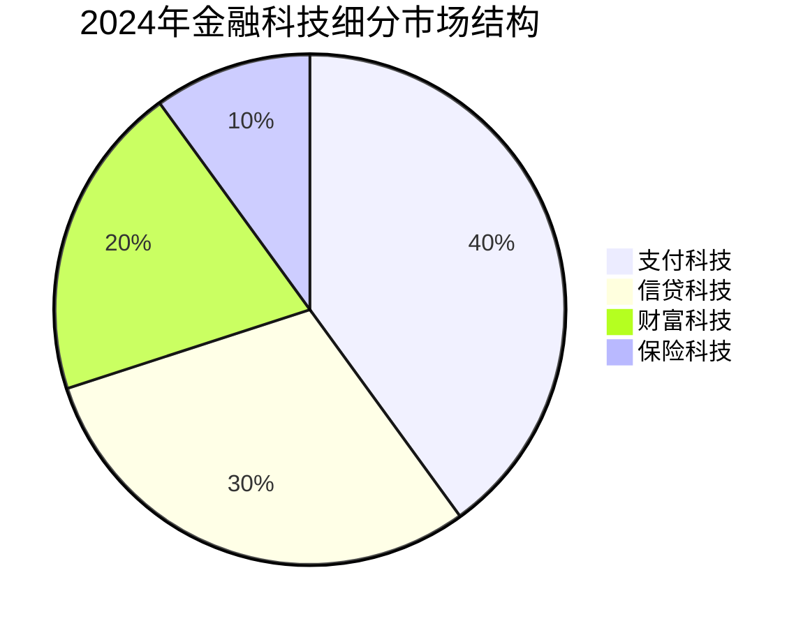

#### 金融机构IT投入结构分布

从金融机构IT投入的行业分布来看，银行业占据绝对主导地位。2025年预计银行业IT投入规模达**3118.5亿元**，约占金融机构科技总投入的**71.94%**；保险业科技投入规模**672.8亿元**，约占**15.52%**；证券业科技投入规模**543.4亿元**，约占**12.54%**[^30]。

这种结构分布反映了银行业在数字化转型方面的领先地位，同时也显示出**保险业和证券业的巨大增长潜力**。六家国有大行2024年金融科技投入共计**1254.59亿元**，较2023年增长2.15%，在银行业整体降本增效的大背景下，科技投入从规模扩张转向效能提升。

#### 金融信创：重要增长极

**金融信创成为2025年最重要的增长点**。根据最新报告，2025年金融信创市场规模预计逼近**2500亿元**，年增速达**35%**[^30]。在"2027年完成全系统信创替代"的政策强驱动下，金融行业正经历一场由底层芯片到上层应用的全栈式技术革命。

从替代进程来看，分布式数据库国产化率已超**60%**，金融级云计算通过率达**85%**[^86]。从国有大行到中小金融机构，从核心系统到办公生态，信创替代成为行业发展的重要主线，为国产金融IT厂商创造了确定性的增长空间。

### 7.2 支付清算与数字人民币领域发展态势与投资机会

支付清算是金融科技领域规模最大、技术最成熟的细分赛道，数字人民币的深化推进正为这一领域注入新的发展动能。**2026年数字人民币正式迈入2.0时代**，标志着从试点探索向规模化发展的战略转型。

#### 支付科技市场格局与头部集中态势

支付科技领域呈现**高度集中的"双寡头"格局**。移动支付（支付宝、微信支付）占市场份额**92%**，跨境支付增速达**25%**[^87]。第三方支付牌照数量稳定在230张，头部企业凭借生态优势构筑了深厚的竞争壁垒。

从技术演进来看，支付领域正经历从"工具化"向"生态化"的转变。蚂蚁集团"智能风控大脑"3.0版本将信贷审批时间缩短至**3分钟**，不良率控制在**1%以下**[^86]，展现了技术赋能对支付业务效率与风险管控的显著提升。

#### 数字人民币试点成效与规模化突破

数字人民币试点工作取得突破性进展。截至2025年11月末，数字人民币累计处理交易达**34.8亿笔**，累计交易金额突破**16.7万亿元**，这一规模相当于2024年我国社会消费品零售总额的近三成[^88]。用户基础同样扎实，数字人民币App已开立个人钱包**2.3亿个**，单位钱包**1884万个**，相当于每6个中国人就有1个数字人民币钱包。

**江苏省在数字人民币应用推广方面成效突出**。截至2025年末，江苏省数字人民币累计交易**15万亿元**，其中消费金额1769亿元，累计交易金额、消费金额均居全国第一；累计开立数字人民币钱包7805万个，受理商户404万户，落地具有示范性、影响力的全国首创场景、技术产品百余项[^89]。

| 试点指标 | 全国数据 | 江苏省数据 | 市场特征 |
|---------|---------|-----------|---------|
| 累计交易金额 | 16.7万亿元 | 15万亿元 | 江苏占比90%+ |
| 个人钱包数量 | 2.3亿个 | 7805万个 | 渗透率领先 |
| 受理商户 | - | 404万户 | 场景全覆盖 |
| 首创场景 | - | 100余项 | 创新引领 |

#### 2.0时代制度创新与产业链机遇

2026年1月1日，新一代数字人民币计量框架、管理体系、运行机制和生态体系启动实施，标志着**数字人民币正式迈入2.0时代**[^89][^88]。核心制度创新体现在三个方面：

**准备金制度落地**。银行类运营机构的数字人民币纳入准备金框架，非银行支付机构实施100%保证金管理，从根本上化解了金融脱媒风险，为大规模推广扫清了障碍[^88]。

**跨境支付场景扩容**。多边央行数字货币桥（mBridge）项目累计处理跨境支付业务4047笔，交易金额折合人民币**3872亿元**，而数字人民币在各币种交易额中占比高达**95.3%**[^88]。企业汇款时间从原来的5-6小时缩短至约40分钟，大幅降低了跨境贸易的资金占用成本。

**计息功能落地**。商业银行数字人民币钱包余额将可计付利息并纳入存款保险范畴，这一变化将推动数字人民币从单纯的支付工具向储蓄工具转型，预计带动个人钱包活跃度提升**300%以上**[^88]。

#### 三大投资主线与受益逻辑

数字人民币的全面升级为资本市场带来确定性的产业链投资机会，**三大主线已清晰浮现**[^88]：

**第一主线：金融IT服务商**。作为银行系统改造的核心参与者，直接承接万亿级技术升级订单。这类企业主要负责数字人民币清算系统、账户体系、跨境支付系统等核心模块的开发与适配，头部企业已为国有大行提供清算系统改造服务，订单金额同比增长显著。

**第二主线：硬件终端与安全厂商**。支付终端改造和安全防护需求将迎来爆发式增长。数字人民币的规模化应用需要大量适配机具支持，包括ATM机、智能POS机、硬件钱包等，目前部分龙头企业的数字人民币适配机具市占率已超40%。

**第三主线：场景应用与运营服务商**。享受生态扩张带来的流量红利。数字人民币已从日常消费场景延伸至政务服务、跨境贸易等多元领域，场景运营商有望持续受益于生态扩容。

### 7.3 智能风控与信贷科技领域技术演进与竞争格局

智能风控是金融科技领域技术密度最高、价值创造最直接的细分赛道。**2025年智能风控渗透率预计超60%**，头部机构不良率已压降至1.8%以下，显著优于行业均值3.2%[^90]。技术驱动下，风控业务正从"经验判断"向"数据决策"深度转型。

#### 智能风控技术迭代路径

智能风控技术经历了**数据维度扩展、模型精准量化、全域实时监控**三大核心迭代[^90]：

**数据维度扩展**。整合征信、消费、社交等**200+变量**，虚假申请识别率从80%提升至**92%**。数据来源从传统征信扩展至替代数据（如水电费缴纳、社交行为等），为信用薄弱群体（新市民、自由职业者）的风险评估提供了新的维度。

**模型精准量化**。深度学习算法将信用评估准确率从85%提升至**95%**。中原消费金融贷后预警系统拦截风险贷款**1.2亿元**，展现了模型优化对资产质量的直接贡献[^90]。

**全域实时监控**。AI系统捕捉异常交易响应时效**<1秒**，传统人工巡检需2-3天。实时监控能力的提升使风险识别从"事后追溯"转变为"事前预防"。

#### AI风控效率优势与应用成效

智能风控在效率提升与成本压缩方面展现出显著优势[^90]：

**审核时效大幅缩短**。AI模型实现分钟级响应，传统人工审核需数小时至1天。中原消费金融AI风控系统使初级工程师需3天的建模任务，智能体仅需**0.5天**即可完成，风险特征挖掘效率提升**100%**。

**运营成本显著压缩**。单位贷款运营成本降至**2.3%**（传统模式4.8%），中原消费金融AI风控系统节省人力成本超**60%**[^90]。

**覆盖率与服务能力提升**。头部机构AI风控覆盖超**60%**助贷业务，支持7×24小时服务，显著提升了金融服务的可及性与便捷性。

| 效率指标 | 智能风控 | 传统人工 | 提升幅度 |
|---------|---------|---------|---------|
| 审核时效 | 分钟级 | 数小时-1天 | 90%+ |
| 单位运营成本 | 2.3% | 4.8% | 52% |
| 建模效率 | 0.5天 | 3天 | 83% |
| 服务时间 | 7×24小时 | 工作时间 | 全覆盖 |

#### 人机协同模式与场景适配

**人工审核在特定场景仍具不可替代性**[^90]。在大额信贷、争议处理、特殊客群等场景中，人机协同模式展现出独特价值：

**大额信贷场景**。南银法巴消费金融线下大额贷款（单笔20万+）人工核验率**100%**，不良率低于行业均值2.14%。大额交易的复杂性要求人工介入进行综合判断。

**争议处理场景**。人工介入解决模型误判案例占比约**3%-5%**，哈银消费金融客诉率同比下降**40%**。模型的不可解释性在争议处理中需要人工进行专业判断与沟通。

**人机协同创新模式**。南银法巴消金采用"AI初筛+人工终审"模式，大额贷款审批效率提升**30%**；配备智能核验设备（如OCR识别、生物特征比对），单笔审核时间缩短**40%**[^90]。

#### 头部与中小机构的技术投入差异

市场分化加剧，**技术投入强度成为竞争分水岭**[^90]：

**头部机构**：招联/兴业/马上消金数字化业务占比超**90%**，净利润增速超**40%**。头部机构通过持续的技术投入构建了显著的竞争壁垒。

**中小机构**：62%已部署智能合规系统，监管处罚金额同比下降37%，但技术投入强度不足（仅**3%-5%**），与头部机构的差距有扩大趋势[^90]。

未来竞争壁垒将取决于**技术投入强度、数据治理水平、合规成本转化**三大核心能力。具备这三方面优势的机构将在智能风控赛道持续领先。

### 7.4 智能投研领域市场空间与技术应用深化

智能投研是金融科技领域增长最快、技术创新最活跃的细分赛道之一。**2024年中国智能投研市场规模预计增至310亿元**，机构用户覆盖率超过**60%**[^91]。在AI技术持续突破的推动下，智能投研正从"辅助工具"向"决策核心"演进。

#### 市场规模增长与驱动因素

智能投研的兴起直接回应了传统投研的痛点：人工分析耗时费力、信息处理碎片化、市场响应滞后等。2023年中国智能投研市场规模已达**240亿元**，2024年预计增至**310亿元**，增长动力主要来自三方面[^91][^92]：

**政策支持**。2024年《金融科技发展规划》明确鼓励AI在风险管理、投研决策等场景的应用，推动行业标准化建设。

**技术突破**。自然语言处理技术可实时解析财报、新闻及社交媒体情绪；知识图谱构建跨市场关联关系，提升预测准确性。

**需求激增**。资管新规下，机构需提升投研效率以应对净值化转型，而个人投资者则寻求低门槛、高透明度的智能工具。

#### 核心应用场景与技术突破

技术应用场景持续深化，**三大核心应用展现出显著的效率提升与价值创造**[^91]：

**自动化报告生成**。利用GPT-4等大模型，可将数据处理时间从数天缩短至**分钟级**，错误率降低至**1%以下**。这一应用显著提升了投研产出效率，释放了人力进行更高价值的分析工作。

**事件驱动型投资**。如俄乌冲突期间，智能系统实时追踪大宗商品供应链扰动，为对冲基金提供套利策略。实时响应能力成为机构获取超额收益的重要来源。

**ESG投研**。通过舆情监控与碳排放数据建模，头部机构已实现ESG因子量化评分，响应监管与投资者偏好。绿色金融科技解决方案市场规模突破**2000亿元**，同比增长**80%**[^86]。

#### 三足鼎立的竞争格局

当前市场呈现**"三足鼎立"格局**[^91]：

**传统金融IT巨头**（如恒生电子、金证股份）：依托客户资源加速AI模块嵌入现有系统，凭借深厚的行业积累与客户关系占据优势地位。

**垂直科技公司**（如文因互联、犀语科技）：专注于NLP与知识图谱，在另类数据处理上占据优势。某头部券商2024年收购AI数据分析公司"数库科技"，补足产业链洞察能力。

**互联网平台**（如蚂蚁财富、腾讯金融云）：通过生态流量切入智能投顾赛道，延伸至投研服务。

2023年行业CR5（市场集中度）达**52%**，头部企业通过并购整合技术资源，行业集中度有进一步提升趋势[^91]。

#### 未来趋势与投资机会

**多模态AI与垂直化场景下沉**是智能投研领域的核心发展趋势[^91]：

**技术融合：多模态AI开启"升维竞争"**。2024年，多模态模型（如视频财报解析、卫星图像分析）成为新焦点。例如，Kensho通过卫星监测沃尔玛停车场车辆数，预判季度营收。预测到2027年，多模态数据将占智能投研数据源的**40%**。

**垂直化与场景下沉**。新能源、半导体等产业链复杂度高的领域，定制化投研工具需求迫切。如"庖丁科技"为光伏企业提供供应链风险预警模型。智能投研平台向中小券商及个人投资者渗透，某平台推出"研报助手"功能可一键生成行业对比分析。

**全球化与生态共建**。2024年沪深港交易所联合试点跨境智能投研数据池，为跨境投研提供数据基础设施支撑。

然而，智能投研仍面临多重挑战：金融数据的碎片化与孤岛问题突出，非结构化文本处理误差可能引发模型偏差；深度学习模型的不可解释性使部分机构对AI决策持审慎态度，调研显示仅**37%**的基金经理完全信任智能信号[^91]。

### 7.5 保险科技领域创新突破与全周期保障体系构建

保险科技（InsurTech）是金融科技领域增速最快的细分赛道，**2025年科技投入预计突破670亿元**[^93]。在AI、大数据、区块链、物联网等技术的深度赋能下，保险行业正经历从"产品销售"向"风险管理"的根本性转变。

#### 技术应用全面渗透保险价值链

保险科技的核心技术正全面渗透保险业务链条，推动保险行业向智能化、高效化、个性化方向转型[^93]：

**人工智能**在保险营销、承保管理、客户服务、风险防控等环节发挥关键作用。在营销环节，智能分析工具可精准定位潜在客户群体，根据客户行为数据、消费偏好等信息，推荐个性化保险产品；在承保管理方面，自然语言处理和机器学习算法能自动分析客户健康状况、信用记录等资料，快速做出核保决策，提高核保准确性和效率；智能客服系统利用自然语言处理和对话生成技术，提供**24小时不间断服务**，提升客户满意度。

**大数据技术**为保险行业带来深刻变革。在产品开发上，通过对海量市场数据的分析，能精准把握消费者需求差异，开发出更符合市场需求的定制化保险产品。在客户管理方面，收集分析客户个人信息、购买历史、理赔记录等数据，构建详细客户画像，实现客户分群和精准营销。

**区块链技术**保障保险合同智能执行与理赔透明化。其不可篡改、可追溯的特性，确保保险交易数据的安全性和完整性，使保险理赔流程更加公开透明。在跨境再保险业务中，区块链搭建的数字化平台实现再保合约线上签署、账单处理和资金清算**全流程自动化**[^93]。

**物联网技术**拓展保险风险评估维度。在车险领域，车载设备实时采集驾驶行为数据（如加速、制动、行驶时间、行驶距离等），使险企能精准区分驾驶风险等级，实现精准定价；在健康险领域，可穿戴设备监测用户步数、心率、睡眠等数据，为健康险产品定价和风险评估提供更丰富依据[^93]。

#### 科技保险政策体系与全生命周期保障

**科技保险发展驶入快车道**。据工业和信息化部数据，截至目前，我国已累计培育科技和创新型中小企业超**60万家**，专精特新中小企业超**14万家**。科技创新与产业创新的深度融合，催生了对风险保障的迫切需求[^94]。

国家金融监督管理总局数据显示，2025年前三季度，我国科技保险保费收入同比增长**30%**，显著跑赢行业平均水平。这一高增长标志着科技保险对传统风险管理体系的全面升级[^94]。

从七部门出台新政构建科技企业全生命周期保险体系，到多地试点共保体、"沪科积分"等创新模式，**科技保险正在政策和产业的双重驱动下，逐步破解长期制约行业发展的定价难、风险评估难等核心痛点**[^94][^95]。

保险产品体系不断丰富，基本建立起覆盖科技企业全生命周期的保险产品体系。从科技研发阶段的人员意外险、财产损失险、研发责任险，到成果转化阶段的知识产权险、贷款保证险，再到产业化推广阶段的产品责任险、数据安全与隐私保险等，现有的科技保险产品体系已能初步满足科技企业的保险需求[^95]。

#### 保险科技细分赛道投资价值

保险科技市场主体呈现多元化特征，包括传统保险公司科技部门、专注细分领域的初创企业以及跨界科技巨头[^93]。各类机构的差异化定位为投资者提供了多元化的选择：

**传统保险公司科技部门**：积极拥抱科技变革，设立科技子公司或部门，加大科技投入，推动自身数字化转型。

**初创企业**：凭借创新技术和灵活机制，聚焦特定细分领域（如智能核保、理赔、健康管理等），为市场带来新活力和创新解决方案。

**跨界科技巨头**：凭借技术优势和庞大用户基础，通过技术输出和平台整合，推动保险业务模式创新。

### 7.6 监管科技与隐私计算领域发展现状与应用前景

监管科技（RegTech）与隐私计算是金融科技领域的"基础设施型"赛道，**在数据安全与合规要求日益严格的背景下，其战略价值持续凸显**。

#### 监管科技应用进展

监管科技在合规风控、数据安全、算法审计等领域取得显著进展。政府对金融科技发展高度重视，出台一系列政策法规，规范和引导行业健康发展。监管部门加强数据安全监管，要求险企建立覆盖数据采集、存储、使用的全流程安全体系，保障客户数据安全和隐私[^93]。

**合规风控系统市场规模达1200亿元**，监管沙盒试点覆盖**30个城市**[^87]。62%机构建立可解释性风控框架（SHAP值分析），监管沙盒试点机构不良率低于行业均值1.8%[^90]。

2024年10月，中国人民银行宣布启动金融科技伦理委员会，标志着监管科技从"事后监管"向"事前治理"转变[^86]。监管科技的应用不仅提升了监管效率，也为金融机构合规经营提供了技术支撑。

#### 隐私计算技术与平台互联挑战

隐私计算是实现**"数据可用不可见"**的核心技术。随着数据要素被确认为国家最新的生产要素，保障数据安全与隐私保护是数据流通与应用的底线要求，隐私计算成为在保护隐私的基础上进行多方数据协同的关键技术之一[^96]。

隐私计算按照当前行业的主流思想可以分为**三类技术**：安全多方计算（MPC）、联邦学习（FL）和可信执行环境（TEE）。随着隐私计算技术的蓬勃发展，通过数据加密、参数共享代替数据共享等模式，实现了"数据孤岛"的有效连接[^96]。

然而，隐私计算平台繁荣发展的同时，逐渐形成了以隐私计算平台为核心的**"平台孤岛"现象**。不同数据持有方采用不同的隐私计算平台进行联合建模或联合计算时，因计算框架或采用的计算工具不同进一步导致"平台孤岛"。如何实现不同隐私计算框架的互联成为业界关注和亟待解决的难题[^96]。

#### 金融行业隐私计算互联生态

中国的研究机构、互联网行业、金融行业都开始探索隐私计算框架的互联互通，从代码开源角度可分为开源互联和闭源互联。从互联的推动主体视角，主要包括三类[^96]：

**金融行业闭源互联**。北京金融产业科技联盟是在中国人民银行指导下，由中国金融电子化集团发起的综合性金融科技联合创新工作平台，该联盟牵头开展了金融领域隐私计算数据流通平台的互联互通模式探索，成为金融行业的主流互联互通标准。

**互联网企业开源生态**。微众银行开源的FATE 2.0开放开源异构系统互联互通开发指南，意图推动异构系统的互联互通。蚂蚁集团开源的隐语框架，在隐私计算联盟的组织下，制定系列隐私计算跨平台互联互通开放协议。

**自研平台闭源互联**。中国电信和中国银联金融科技研究院的隐私计算平台构建"插拔式"算法组件的互联互通实践。

隐私计算平台与区块链技术的结合逐渐成为主流，在遵循安全协议的基础上，通过区块链进行身份认证、对计算参与方的行为数据进行上链和以智能合约实现协议自动化等方式，进一步保障计算参与者的身份可信和行为可追溯[^96]。

### 7.7 AI大模型对金融科技格局的重塑作用与影响评估

**AI对金融行业的影响在长期来看一定是颠覆性的**。与以往的数字化转型或互联网浪潮不同，AI的核心不在于流程优化，而更多体现在认知和决策层面的智能提升[^97]。2025年，随着DeepSeek R1等大模型的发布推动通用模型推理能力跃迁与成本锐减，金融机构本地化部署AI迎来行业拐点。

#### "可规模化的定制化"突破金融不可能三角

长江商学院金融学助理教授梅丹青指出，AI在金融领域带来的最大变化，在于**打破了过去长期存在的一个"不可能三角"**：一是服务大量客户，二是提供高度定制化服务，三是成本可控。传统金融体系下，这三者很难同时实现，定制化往往意味着更高的成本[^97]。

而在AI时代，这一"不可能三角"正在变得可能。**如果用一句话概括AI时代金融服务的核心特征，是"可规模化的定制化"（customization is scalable）**。这不仅是技术层面的进步，更是金融服务模式的根本变化[^97]。

具体应用场景包括：在风险识别和反金融欺诈方面，AI可以支持更高频、更实时的决策；在资产定价、资产管理等领域，AI也开始辅助投资和配置决策。

#### 工程化能力建设的关键作用

梅丹青强调，**真正关键的投入，并不是买了多少显卡、训练了多大的模型，而是企业是否认真思考过：如何将自身的业务流程与AI有机结合、如何评估AI的风险边界与效率提升、在什么情况下必须引入人工介入**。这些问题，才是AI在金融企业内部长期可用、可控的基础[^97]。

在金融行业，这种工程能力本质上对应的是安全。也就是说，如何通过工程化手段，确保AI能够在企业内部稳定、可靠地运行，同时具备可回溯、可评估、可持续演进的能力。当前正处在一个非常重要的窗口期，去认真讨论AI在企业内部如何通过工程化方式实现稳健运行[^97]。

#### AI智能体在金融核心场景的应用突破

AI智能体正从执行工具进化为决策核心，在风控、投顾、财务管理等场景实现深度应用：

**智能风控领域**。中信百信银行携手百度启动"AIphaMo"智慧风控项目，首次将"自我演化"的超级智能体引入金融风控。项目构建了覆盖风控全链路的智能体矩阵："挖掘智能体"自主探寻风险特征；"模型智能体"自动化完成建模；"策略智能体"则优化风险决策。应用后，风险特征挖掘效率提升**100%**。

**智能投顾领域**。某头部券商与恒生联合打造"全账户资产配置智能体"，聚焦财富管理全流程，以深度智能客户洞察为基础，无缝整合专业策略，满足千人千面的客户配置需求。该智能体涵盖资产配置智能问答与账户诊断智能问答两大核心功能，通过多轮引导性对话厘清客户投资目标与风险偏好，实时对接总部投研策略库，**秒级生成个性化配置方案**。

#### 大模型对各细分领域的差异化影响

AI大模型技术代际演进对金融科技各细分领域产生差异化影响：

| 细分领域 | 影响程度 | 核心应用 | 竞争格局变化 |
|---------|---------|---------|-------------|
| 智能风控 | 极高 | 自我演化风控模型 | 技术壁垒提升 |
| 智能投研 | 极高 | 自动化报告、多模态分析 | 效率革命 |
| 智能投顾 | 高 | 个性化配置方案 | 服务模式重塑 |
| 保险科技 | 高 | 智能核保、理赔 | 价值链重构 |
| 支付清算 | 中 | 风险监测、反欺诈 | 效率提升 |
| 监管科技 | 中 | 合规审计、风险预警 | 监管效能提升 |

### 7.8 金融科技细分领域投资价值综合评估与风险提示

基于前述各细分领域的深入分析，本节构建金融科技细分领域投资价值评估框架，从技术成熟度、市场空间、竞争壁垒、政策支持、盈利模式等维度进行横向比较，识别各赛道的核心投资机会与潜在风险因素。

#### 细分领域投资价值多维度比较

以下从五个核心维度对金融科技六大细分领域进行综合评估：

| 细分领域 | 技术成熟度 | 市场空间 | 竞争壁垒 | 政策支持 | 盈利确定性 | 综合评级 |
|---------|-----------|---------|---------|---------|-----------|---------|
| **数字人民币** | 高 | 极高 | 高 | 极高 | 高 | ★★★★★ |
| **智能风控** | 高 | 高 | 高 | 高 | 高 | ★★★★☆ |
| **保险科技** | 中高 | 高 | 中 | 高 | 中高 | ★★★★☆ |
| **智能投研** | 中 | 中高 | 中 | 中 | 中 | ★★★☆☆ |
| **支付清算** | 极高 | 成熟 | 极高 | 中 | 高 | ★★★☆☆ |
| **隐私计算** | 中 | 中 | 中高 | 高 | 中 | ★★★☆☆ |

#### 各赛道核心投资机会识别

**数字人民币产业链**：2.0时代制度创新带来确定性投资机会。金融IT服务商承接系统改造订单，硬件终端厂商受益于终端改造需求，场景运营商享受生态扩张红利。跨境支付突破（mBridge项目）与计息功能落地进一步拓展应用场景。

**智能风控领域**：AI渗透率提升（预计超60%）带来持续增长动能。头部机构技术优势持续强化，"人机协同"模式在特定场景展现差异化价值。关注具备数据优势与模型迭代能力的领先企业。

**保险科技领域**：增速领先（45%）且政策支持力度大。科技保险政策体系构建为行业发展提供制度保障，AI、物联网等技术在产品设计、风险评估、理赔服务等环节的深度应用创造增量空间。

**智能投研领域**：多模态AI与垂直化场景下沉带来结构性机会。关注具备NLP、知识图谱等核心技术能力的垂直科技公司，以及在特定行业（如新能源、半导体）具备深度研究能力的专业机构。

#### 潜在风险因素与投资注意事项

**技术风险**。AI大模型的不可解释性可能引发监管审慎态度，调研显示仅37%的基金经理完全信任智能信号[^91]。金融数据的碎片化与孤岛问题突出，非结构化文本处理误差可能引发模型偏差。

**监管风险**。现行《证券基金投资咨询业务管理办法》尚未明确AI投研的责任归属，算法备案与审计机制缺失可能滋生操纵市场风险[^91]。跨境数据流动与隐私保护（如GDPR）增加合规成本。

**竞争风险**。支付清算领域头部垄断格局显著，新进入者面临较高壁垒。智能投研、保险科技等领域竞争加剧，行业CR5持续提升，中小机构生存空间受挤压。

**估值风险**。部分热门赛道（如AI应用）可能存在估值泡沫，需审慎评估技术商业化进程与盈利兑现节奏。

#### 投资策略建议与节奏把握

**短期（1-2年）**：重点关注数字人民币产业链（金融IT服务商、硬件终端厂商）的确定性机会，以及智能风控领域头部企业的业绩兑现。

**中期（3-5年）**：关注保险科技领域的结构性增长机会，以及智能投研领域多模态AI技术突破带来的效率革命。隐私计算领域随着互联互通标准的完善，市场空间有望加速释放。

**长期视角**：AI大模型对金融服务模式的颠覆性重塑将持续深化，"可规模化的定制化"将成为金融科技发展的核心方向。具备工程化能力、数据治理能力与合规能力的机构将在长期竞争中胜出。

综合来看，金融科技赛道整体处于**技术深化与商业化加速的黄金期**，各细分领域呈现差异化的投资价值与风险特征。投资者应根据自身风险偏好与投资期限，选择匹配的细分赛道与投资标的，在把握确定性机会的同时，审慎评估技术、监管、竞争等多维度风险因素。

## 8 细分领域上升空间多维度综合比较

在前述章节对投资银行、私募股权与创业投资、固定收益、财富管理与资产管理、金融科技五大细分领域进行深度剖析的基础上，本章将构建系统性的多维度比较框架，通过横向对比分析各领域的核心竞争要素、关键驱动因子与潜在风险点，形成细分领域上升空间的综合排序与投资优先级建议。这一比较分析旨在为投资者把握中国金融行业结构性机遇提供科学、系统的决策参考。

### 8.1 多维度比较框架的构建逻辑与评估方法论

构建科学、可比的跨领域评估框架，是准确研判各细分领域上升空间的方法论基础。本节将阐述比较框架的构建逻辑、维度选取依据与评估方法，确保后续分析的严谨性与可操作性。

#### 比较框架的理论基础与构建逻辑

金融行业细分领域的上升空间受多重因素共同驱动，单一维度的分析难以全面捕捉各领域的发展潜力与投资价值。基于前述章节的深度研究，本章构建**"五维度综合评估框架"**，系统整合影响细分领域发展的核心变量：

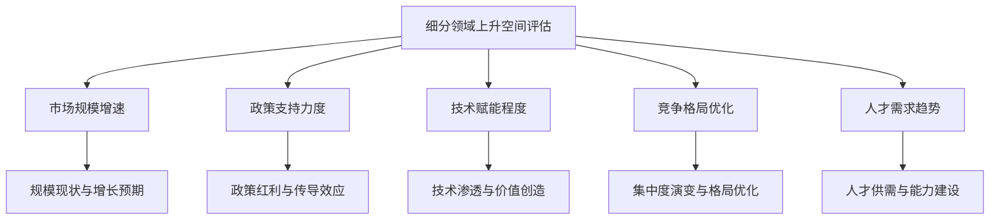

这一框架的构建逻辑基于以下考量：**市场规模增速**反映领域的成长性与天花板高度；**政策支持力度**决定制度红利的释放节奏与持续性；**技术赋能程度**影响效率提升与模式创新空间；**竞争格局优化**关系到超额收益获取的可能性；**人才需求趋势**体现领域发展的要素支撑与可持续性。五大维度相互关联、协同作用，共同决定细分领域的综合上升空间。

#### 各维度的指标体系与评分标准

为确保跨领域比较的科学性与可比性，本章建立以下量化评分体系：

| 评估维度 | 核心指标 | 评分标准（1-5分） | 权重 |
|---------|---------|------------------|------|
| **市场规模增速** | 年复合增长率、市场渗透率、规模天花板 | 5分：增速>20%；4分：15-20%；3分：10-15%；2分：5-10%；1分：<5% | 25% |
| **政策支持力度** | 政策明确度、资金支持、制度创新 | 5分：战略级支持；4分：重点支持；3分：一般支持；2分：中性；1分：限制 | 20% |
| **技术赋能程度** | 技术渗透率、效率提升幅度、模式创新 | 5分：颠覆性赋能；4分：深度赋能；3分：中度赋能；2分：初步应用；1分：有限应用 | 20% |
| **竞争格局优化** | 集中度趋势、壁垒高度、超额收益空间 | 5分：格局显著优化；4分：稳步优化；3分：基本稳定；2分：竞争加剧；1分：恶性竞争 | 20% |
| **人才需求趋势** | 人才缺口、薪酬增速、能力升级需求 | 5分：极度紧缺；4分：较为紧缺；3分：供需平衡；2分：供给充足；1分：供给过剩 | 15% |

权重设定综合考虑了各维度对领域上升空间的影响程度。**市场规模增速**作为最直接的成长性指标，赋予最高权重（25%）；**政策支持、技术赋能、竞争格局**三个维度对领域发展具有同等重要的驱动作用，各赋予20%权重；**人才需求**作为支撑性因素，赋予15%权重。

#### 评估方法与数据来源

本章评估采用**"定量数据+定性判断"**相结合的方法：定量数据主要来源于前述章节引用的权威机构统计（如中基协、银行业理财登记托管中心、中研普华、信通院等）；定性判断则基于行业专家观点、政策文件解读与市场趋势研判。通过交叉验证确保评估结果的客观性与准确性。

### 8.2 市场规模增速维度的横向比较分析

市场规模增速是衡量细分领域成长性的核心指标，直接反映领域的发展动能与投资吸引力。本节将系统比较五大领域的规模现状、增长轨迹与未来预期。

#### 各领域市场规模现状与增长态势

基于前述章节的深度分析，五大细分领域的市场规模与增速呈现显著差异：

| 细分领域 | 2025年市场规模 | 年增速/复合增速 | 增长驱动因子 |
|---------|---------------|----------------|-------------|
| **投资银行** | 股权承销1.02万亿元 | 226.1%（同比） | 注册制深化、再融资放量、并购活跃 |
| **PE/VC** | 募资3.09万亿元 | 26%（同比） | 耐心资本政策、硬科技投资、退出改善 |
| **固定收益** | 理财33.29万亿元 | 11.15%（同比） | 存款搬家、低利率环境、固收+创新 |
| **财富管理** | 资管近150万亿元 | 8-10%（预期） | 居民财富增长、配置需求升级 |
| **金融科技** | 市场规模3.3万亿元 | 18%+（复合） | AI赋能、数字人民币、金融信创 |

**投资银行业务**在2025年实现爆发式增长，股权承销规模同比激增226.1%，这一增速远超其他领域。但需注意，这一高增长建立在2024年的低基数之上，且主要由再融资业务（定增同比增长300%）驱动，IPO业务增速相对温和（同比增长97.4%）。

**PE/VC行业**在经历三年调整后全面回暖，募资规模同比增长26%，投资案例数同比上涨30.6%，显示出强劲的复苏动能。更值得关注的是结构性变化——早期投资明显复苏，天使轮、种子轮金额分别增长61%和97%，"投早投小投硬科技"的政策导向正在落地见效。

**固定收益业务**保持稳健增长态势，银行理财规模突破33万亿元，年增长11.15%。虽然增速不及前两者，但规模体量庞大，且在低利率环境下展现出较强的韧性。

**财富管理行业**整体规模接近150万亿元，增速维持在8-10%区间，属于稳健增长型领域。居民可投资资产超300万亿元的庞大基数，为行业持续扩容提供了坚实基础。

**金融科技领域**保持18%以上的高复合增速，市场规模预计突破3.3万亿元。其中，金融信创以35%的增速成为最重要的增长极，数字人民币累计交易金额突破16.7万亿元，展现出强劲的发展势头。

#### 市场天花板与渗透率分析

从市场天花板与渗透率角度评估各领域的增长空间：

**投资银行**：直接融资占社会融资规模比重仍有较大提升空间，注册制深化与科创企业融资需求释放为投行业务提供持续增量。但行业高度集中（CR5达74.5%），增量主要由头部机构获取。

**PE/VC**：国资控股比例已达81%，政府资金占LP出资比例升至68.3%，市场格局趋于稳定。但退出渠道多元化（并购占比升至64.7%）与S基金发展拓展了行业容量。

**固定收益**：固收类产品占银行理财比重超97%，结构高度集中。低利率环境下票息收入下降，但"固收+"、多资产多策略等创新方向打开新增长空间。

**财富管理**：居民可投资资产超300万亿元，而资管规模约170万亿元，渗透率仅56%左右，存在巨大的转化空间。高净值人群服务渗透率提升至42%，仍有提升潜力。

**金融科技**：AI渗透率、数字化转型深度仍有较大提升空间。智能风控渗透率预计超60%，智能投顾管理规模突破5万亿元，渗透率提升至18%，均显示出广阔的增长前景。

#### 市场规模增速维度评分

基于上述分析，各领域在市场规模增速维度的评分如下：

| 细分领域 | 评分（1-5分） | 评分依据 |
|---------|--------------|---------|
| **投资银行** | 4.5 | 爆发式增长，但高基数效应后增速将回归常态 |
| **PE/VC** | 4.0 | 全面回暖，结构性增长特征明显 |
| **金融科技** | 4.0 | 高复合增速，多细分赛道高速发展 |
| **财富管理** | 3.5 | 稳健增长，渗透率提升空间大 |
| **固定收益** | 3.0 | 规模庞大但增速平稳，结构创新驱动 |

### 8.3 政策支持力度维度的横向比较分析

政策支持是决定细分领域发展空间的关键外部变量。本节将梳理各领域面临的政策环境，评估政策红利的释放强度与持续性。

#### 各领域政策环境与支持强度对比

**投资银行**领域享受**强力制度驱动**的政策红利。全面注册制改革是核心制度变革，审核重心从实质性判断转向信息披露，旨在提升直接融资比重、服务科技创新。科创板"1+6"政策组合进一步增强制度包容性，为科创企业上市创造条件。2025年12月中央经济工作会议明确提出"提升直接融资比重"，政策导向清晰明确。

**PE/VC行业**获得**战略级政策引导与资金扶持**。国家创业投资引导基金正式启动，千亿级规模、20年超长存续期、取消返投限制等制度创新颠覆传统模式。银行AIC试点扩围、地方专项债投向引导基金（已发行520亿元）等政策拓宽资金来源。"投早、投小、投长期、投硬科技"成为明确的政策导向。

**固定收益业务**处于**规范发展、结构引导**的政策环境。资管新规推动净值化转型，政策鼓励发展"固收+"、ESG主题产品，引导资金支持绿色金融、养老金融。但相较于其他领域，固收业务并非政策重点扶持方向。

**财富管理行业**被纳入**"金融五篇大文章"**政策框架。监管推动从"卖方销售"向"买方投顾"转型，规范养老金融、家族信托等业务发展。上海金融监管局发布的养老金融高质量发展行动方案等区域政策为行业发展提供指引。

**金融科技领域**享受**规划引领、预算倾斜**的政策支持。《金融科技发展规划（2022-2025年）》指明发展方向，"五篇大文章"直接带动金融机构IT预算结构性倾斜。金融信创政策明确"2027年完成全系统信创替代"目标，为国产金融IT厂商创造确定性增长空间。数字人民币进入2.0时代，制度框架全面升级。

#### 政策红利释放节奏与持续性评估

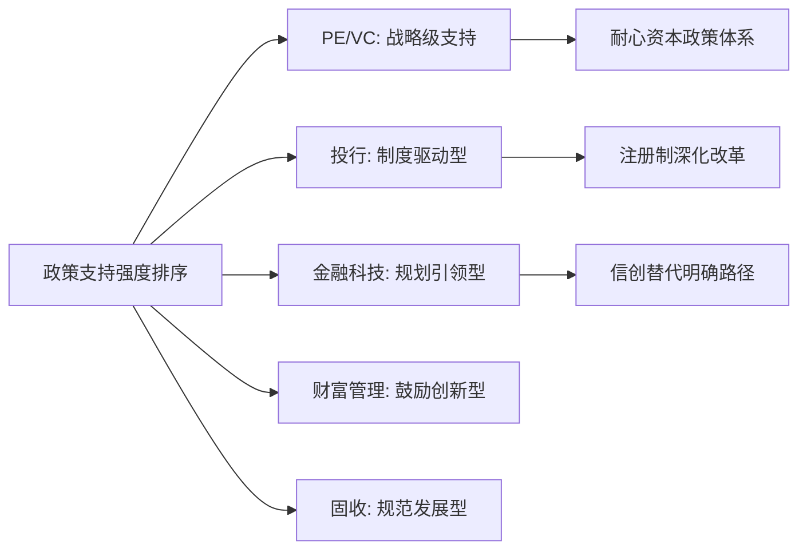

从政策红利的释放节奏来看：**PE/VC**政策红利正处于集中释放期，国投基金启动、AIC扩围等重大政策密集落地；**投行**政策红利持续释放，注册制改革效应逐步显现；**金融科技**政策红利具有明确的时间表（信创2027年目标），确定性强；**财富管理**政策红利释放相对平缓；**固收**政策以规范为主，红利相对有限。

#### 政策支持力度维度评分

| 细分领域 | 评分（1-5分） | 评分依据 |
|---------|--------------|---------|
| **PE/VC** | 5.0 | 国家战略级支持，耐心资本政策体系全面启动 |
| **投资银行** | 4.5 | 注册制改革核心制度红利，直接融资比重提升明确导向 |
| **金融科技** | 4.0 | 发展规划明确，信创替代提供确定性路径 |
| **财富管理** | 3.5 | 纳入五篇大文章，投顾转型获政策鼓励 |
| **固定收益** | 3.0 | 以规范发展为主，结构引导型政策 |

### 8.4 技术赋能程度维度的横向比较分析

技术赋能是驱动金融行业变革的核心引擎。本节将评估AI大模型、数字化转型对各细分领域的渗透深度与价值创造效应。

#### 各领域技术渗透深度与应用成熟度

基于前述章节分析，各领域的技术赋能程度呈现显著差异：

**金融科技**作为技术驱动的**原生领域**，技术赋能程度最高。AI大模型、区块链、云计算、隐私计算等前沿技术深度融合，是业务创新、效率提升和风险防控的核心引擎。智能风控渗透率预计超60%，头部机构不良率压降至1.8%以下；智能投研市场规模增至310亿元；数字人民币累计交易金额突破16.7万亿元。

**财富管理**领域技术赋能程度**较高**，正在重塑服务模式。AI驱动智能投顾、客户画像与资产配置，数字化平台实现全流程服务。60%的私人银行机构已采用AI驱动投顾系统，技术投入规模突破48亿元。平安理财构建"工业化+平台化"投资管理模式，实现策略模块化生产与科学封装。

**固定收益业务**技术赋能程度**较高**，驱动交易与风控变革。金融科技深度应用于量化交易、智能做市、信用风险模型构建。民生证券固收做市业务年化收益率平均超20%，91%的月度实现盈利。平安理财"启元系列"通过"人机结合+多元策略"在波动交易中创造收益。

**投资银行**领域技术赋能程度**中高**，赋能核心能力建设。AI与大数据用于智能投研、风险筛查，数字化转型提升尽职调查与信息披露效率。但投行业务的核心价值判断仍高度依赖人工专业能力，技术更多发挥辅助作用。

**PE/VC行业**技术赋能程度**中等**，主要辅助决策与投后管理。数据平台用于项目筛选与行业研究，AI辅助投后监控与赋能。但投资决策高度依赖人的产业洞察与经验，技术赋能的边际效益相对有限。

#### 技术驱动的业务模式变革与效率提升

| 细分领域 | 核心技术应用 | 效率提升幅度 | 模式变革程度 |
|---------|-------------|-------------|-------------|
| **金融科技** | AI大模型、区块链、隐私计算 | 颠覆性 | 原生驱动 |
| **财富管理** | 智能投顾、客户画像、数字化平台 | 显著 | 服务模式重塑 |
| **固定收益** | 量化交易、智能做市、风险模型 | 显著 | 从持有到交易转型 |
| **投资银行** | 智能投研、尽调数字化、风险筛查 | 中等 | 能力增强型 |
| **PE/VC** | 数据平台、投后监控、行业研究 | 中等 | 辅助决策型 |

#### 技术赋能程度维度评分

| 细分领域 | 评分（1-5分） | 评分依据 |
|---------|--------------|---------|
| **金融科技** | 5.0 | 技术原生驱动，颠覆性赋能 |
| **财富管理** | 4.0 | 重塑服务模式，智能投顾广泛应用 |
| **固定收益** | 4.0 | 驱动交易与风控变革，量化能力关键 |
| **投资银行** | 3.5 | 赋能核心能力，但人工判断仍为主导 |
| **PE/VC** | 3.0 | 辅助决策与投后，核心依赖人的洞察 |

### 8.5 竞争格局优化维度的横向比较分析

竞争格局的演变直接影响行业参与者的盈利能力与超额收益获取空间。本节将分析各领域的集中度趋势、壁垒高度与格局优化方向。

#### 各领域市场集中度与竞争态势

**投资银行**领域呈现**头部极度集中**的竞争格局。CR5市场份额达74.5%，马太效应显著。中信证券以2416.68亿元承销金额稳居"券业一哥"，国泰海通、中金公司、中银证券、中信建投分列其后。行业并购整合加速（国泰海通合并、中金整合东兴信达），头部优势持续强化。中小券商聚焦区域、产业或北交所等细分赛道寻求差异化生存。

**PE/VC行业**呈现**国资主导、专业化发展**的格局。国资背景管理人管理规模占比达64.5%，国资控股比例从2015年的27%增长至2025年的81%。市场从Pre-IPO套利转向硬科技价值投资，专业化GP空间扩大。头部机构出手频率明显加快，2025年出手大于等于5次的机构近130家，同比增长近50%。

**固定收益业务**呈现**理财公司主导、机构分化**的格局。理财公司市场份额达92.25%，32家理财公司存续规模同比增长16.72%。大型机构向多资产多策略转型，中小机构面临数字鸿沟与盈利压力。民生证券等具备强交易能力的机构在细分领域建立差异化优势。

**财富管理行业**呈现**多元竞合、头部稳固**的格局。银行、公募、券商、第三方等多方参与，私人银行CR4近70%。竞争从产品销售转向综合解决方案能力，客户资源禀赋、综合金融协同、投研能力成为核心竞争要素。

**金融科技领域**呈现**生态化竞争、三足鼎立**的格局。科技巨头、金融机构科技子公司、专业金融科技企业三分天下。竞争焦点从单点技术转向生态构建与深度融合。支付领域"双寡头"格局显著，智能投研CR5达52%。

#### 竞争格局优化方向与超额收益空间

从竞争格局优化角度评估各领域的投资价值：

**投资银行**：头部集中趋势明确，但"三投联动"模式为具备综合能力的机构创造超额收益空间。中小机构通过区域深耕、赛道聚焦实现差异化突围。

**PE/VC**：国资主导格局下，专业化、垂直化机构在细分领域建立竞争优势。退出渠道多元化（并购占比升至64.7%）改善行业生态。

**固定收益**：理财公司主导格局稳固，但具备强交易能力、信用研究能力的机构可获取超额收益。"固收+"策略创新打开差异化竞争空间。

**财富管理**：多元竞合格局下，具备客户资源禀赋与综合服务能力的机构优势明显。从产品销售向投顾服务转型创造新的竞争维度。

**金融科技**：头部平台型机构与垂直领域"专精特新"企业各有生态位，技术壁垒与生态壁垒共同决定竞争优势。

#### 竞争格局优化维度评分

| 细分领域 | 评分（1-5分） | 评分依据 |
|---------|--------------|---------|
| **PE/VC** | 4.0 | 格局稳步优化，专业化机构空间扩大 |
| **财富管理** | 3.5 | 多元竞合，服务能力成为新竞争维度 |
| **固定收益** | 3.5 | 理财公司主导，策略创新打开差异化空间 |
| **金融科技** | 3.5 | 三足鼎立，生态化竞争格局形成 |
| **投资银行** | 3.0 | 头部极度集中，中小机构空间受限 |

### 8.6 人才需求趋势维度的横向比较分析

人才是金融行业发展的核心要素，人才供需状况与能力升级需求直接影响领域的可持续发展能力。本节将比较各领域的人才需求特征与趋势。

#### 各领域人才需求特征与核心岗位

**投资银行**领域人才需求**从通道型转向价值发现型**。急需具备产业深度研究、市场化定价、销售能力及跨业务协同经验的复合型人才。注册制下风控合规要求空前提高，"看门人"责任压实对执业质量提出更高要求。投行由上市通道向"三投联动"模式转型，研究、定价、承销能力成为核心胜负手。

**PE/VC行业**人才需求**从财务投资转向产业赋能**。硬科技赛道投资需要具备深厚产业背景、技术理解能力和投后赋能经验的"专家型"投资人。天使投资需要"八分实业能力，两分金融能力"，与创始人共同看见未来、赋能成长。

**固定收益业务**人才需求**从持有到期转向多策略交易**。急需量化分析、衍生品定价、多资产配置及科技系统开发的复合型人才。信用研究精细化要求提升，在"资产荒"背景下精准识别信用阿尔法的能力至关重要。

**财富管理行业**人才需求**从销售导向转向投顾导向**。急需具备资产配置能力、客户陪伴能力、税务法律知识及数字化服务工具的"买方投顾"和专家团队。浙银理财开业初期投资研究、风险防控人员占比已超50%。

**金融科技领域**人才需求**持续旺盛，聚焦尖端与融合**。急需AI算法工程师、数据科学家、隐私计算专家、区块链开发者，以及懂技术又懂业务的复合型产品人才。技术迭代快速，持续学习能力成为核心要求。

#### 人才供需状况与薪酬趋势

| 细分领域 | 人才缺口程度 | 核心岗位 | 薪酬竞争力 |
|---------|-------------|---------|-----------|
| **金融科技** | 极度紧缺 | AI工程师、数据科学家 | 极高 |
| **PE/VC** | 较为紧缺 | 硬科技投资人、投后专家 | 高 |
| **财富管理** | 较为紧缺 | 买方投顾、资产配置专家 | 中高 |
| **投资银行** | 结构性紧缺 | 产业研究、定价销售 | 高 |
| **固定收益** | 结构性紧缺 | 量化分析、交易员 | 中高 |

#### 人才需求趋势维度评分

| 细分领域 | 评分（1-5分） | 评分依据 |
|---------|--------------|---------|
| **金融科技** | 5.0 | 人才极度紧缺，薪酬竞争力最高 |
| **PE/VC** | 4.0 | 专家型投资人稀缺，产业背景要求高 |
| **财富管理** | 4.0 | 投顾转型催生大量人才需求 |
| **投资银行** | 3.5 | 复合型人才需求强劲，但供给相对充足 |
| **固定收益** | 3.5 | 量化与交易人才需求提升 |

### 8.7 细分领域上升空间综合评估与排序

基于前述五大维度的系统分析，本节将形成各细分领域上升空间的综合评分与排序，并通过可视化工具呈现各领域的优劣势分布。

#### 综合评分计算与排序结果

根据各维度评分与权重设定，计算各领域综合得分：

| 细分领域 | 市场增速(25%) | 政策支持(20%) | 技术赋能(20%) | 竞争格局(20%) | 人才需求(15%) | **综合得分** |
|---------|--------------|--------------|--------------|--------------|--------------|-------------|
| **金融科技** | 4.0×0.25=1.00 | 4.0×0.20=0.80 | 5.0×0.20=1.00 | 3.5×0.20=0.70 | 5.0×0.15=0.75 | **4.25** |
| **PE/VC** | 4.0×0.25=1.00 | 5.0×0.20=1.00 | 3.0×0.20=0.60 | 4.0×0.20=0.80 | 4.0×0.15=0.60 | **4.00** |
| **投资银行** | 4.5×0.25=1.125 | 4.5×0.20=0.90 | 3.5×0.20=0.70 | 3.0×0.20=0.60 | 3.5×0.15=0.525 | **3.85** |
| **财富管理** | 3.5×0.25=0.875 | 3.5×0.20=0.70 | 4.0×0.20=0.80 | 3.5×0.20=0.70 | 4.0×0.15=0.60 | **3.675** |
| **固定收益** | 3.0×0.25=0.75 | 3.0×0.20=0.60 | 4.0×0.20=0.80 | 3.5×0.20=0.70 | 3.5×0.15=0.525 | **3.375** |

**综合排序结果**：金融科技（4.25）> PE/VC（4.00）> 投资银行（3.85）> 财富管理（3.675）> 固定收益（3.375）

#### 各领域优劣势雷达图分析

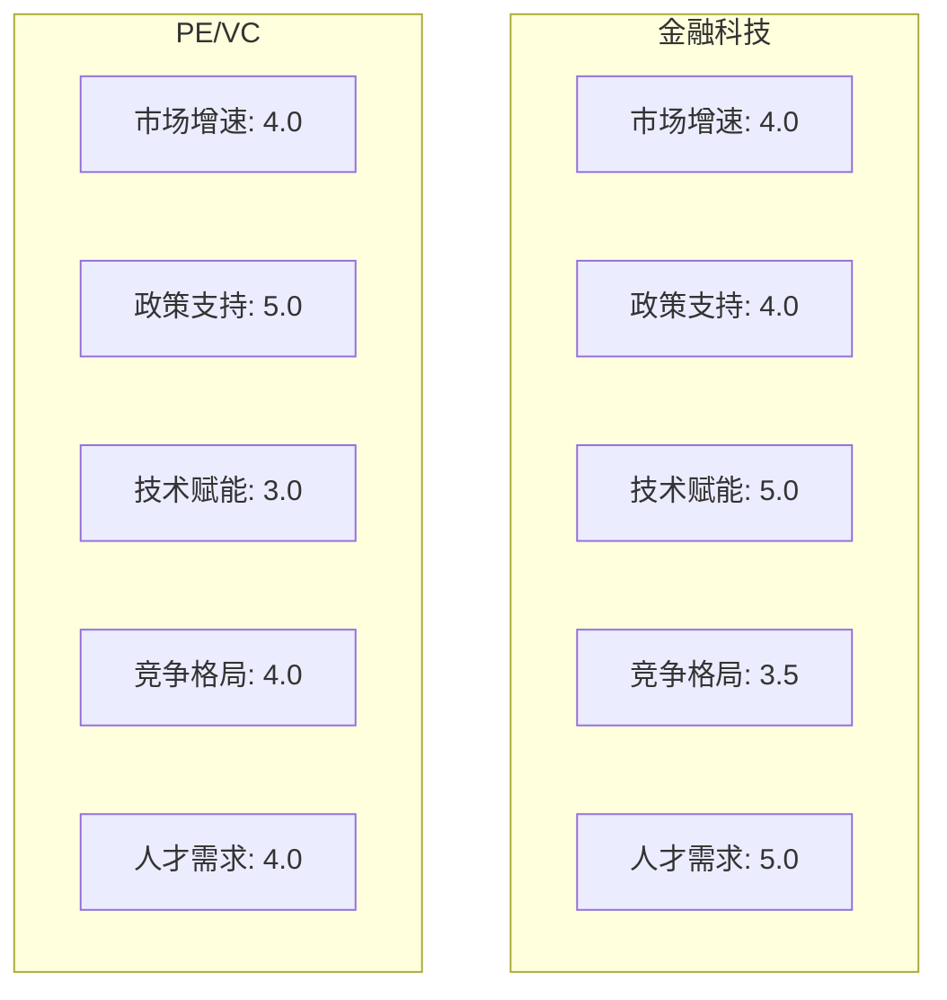

**金融科技**的核心优势在于**技术赋能与人才需求**两个维度的满分表现，反映出该领域作为技术原生驱动型赛道的独特价值。其相对短板在于竞争格局维度，头部集中与生态化竞争加剧了市场进入难度。

**PE/VC**的核心优势在于**政策支持**维度的满分表现，国家创业投资引导基金启动、耐心资本政策体系全面落地为行业发展提供了战略级支撑。其相对短板在于技术赋能维度，投资决策仍高度依赖人的产业洞察。

**投资银行**在**市场增速**维度表现最优，但受制于头部极度集中的竞争格局，中小机构的上升空间受限。

**财富管理**各维度表现相对均衡，没有明显短板，但也缺乏突出优势，属于稳健型发展领域。

**固定收益**在**技术赋能**维度表现较好，但市场增速与政策支持维度相对较弱，整体上升空间有限。

#### 核心投资逻辑与关键观察指标

| 细分领域 | 核心投资逻辑 | 关键观察指标 |
|---------|-------------|-------------|
| **金融科技** | 技术驱动+政策确定性+人才红利 | AI渗透率、信创替代进度、数字人民币交易量 |
| **PE/VC** | 政策红利释放+结构性回暖+硬科技聚焦 | 国投基金落地节奏、早期投资占比、退出渠道多元化程度 |
| **投资银行** | 注册制深化+再融资放量+并购活跃 | IPO/再融资规模、并购交易金额、头部机构市占率 |
| **财富管理** | 居民财富增长+配置需求升级+投顾转型 | AUM增速、投顾渗透率、高净值客户增长 |
| **固定收益** | 存款搬家+固收+创新+交易能力提升 | 理财规模增速、固收+产品占比、净值波动控制 |

### 8.8 投资优先级建议与风险收益匹配策略

基于综合评估结果，本节将针对不同风险偏好与投资期限的投资者，提出差异化的领域配置建议与投资优先级排序。

#### 不同风险偏好的领域配置建议

**进取型投资者**（高风险偏好、追求高回报）：

**首选金融科技与PE/VC领域**。金融科技领域的数字人民币产业链、智能风控、保险科技等赛道具备高增长潜力与技术壁垒；PE/VC领域的硬科技投资（半导体、人工智能、医疗健康）在政策红利与产业升级双重驱动下具备显著的超额收益空间。建议配置比例：金融科技40%、PE/VC35%、投行15%、其他10%。

**稳健型投资者**（中等风险偏好、追求稳定增长）：

**首选财富管理与投资银行领域**。财富管理行业受益于居民财富持续积累与配置需求升级，增长确定性较高；投资银行业务在注册制深化背景下保持稳健增长，头部机构盈利能力强。建议配置比例：财富管理35%、投行30%、金融科技20%、固收15%。

**保守型投资者**（低风险偏好、追求稳健收益）：

**首选固定收益与财富管理领域**。固定收益业务规模庞大、增长稳定，"固收+"策略在低利率环境下提供相对稳健的收益；财富管理行业的银行理财产品风险可控、收益稳定。建议配置比例：固收40%、财富管理35%、金融科技15%、其他10%。

#### 投资期限与领域匹配策略

| 投资期限 | 优先领域 | 配置逻辑 |
|---------|---------|---------|
| **短期（1-2年）** | 金融科技（数字人民币、信创）、投行 | 政策红利集中释放，业绩兑现确定性高 |
| **中期（3-5年）** | PE/VC、财富管理 | 结构性增长显现，规模效应释放 |
| **长期（5年以上）** | 金融科技（AI应用）、PE/VC（硬科技） | 技术变革与产业升级的长期受益者 |

#### 核心风险因素与对冲策略

各细分领域面临的核心风险因素与建议的对冲策略如下：

| 细分领域 | 核心风险 | 对冲策略 |
|---------|---------|---------|
| **金融科技** | 技术迭代风险、监管不确定性、估值泡沫 | 分散配置不同技术路线、关注合规进展、审慎评估估值 |
| **PE/VC** | 估值泡沫、退出压力、政策执行风险 | 聚焦硬科技赛道、关注并购退出、选择头部GP |
| **投资银行** | 执业风险、市场波动、行业集中 | 关注合规记录、分散板块配置、优选头部机构 |
| **财富管理** | 净值波动、能力建设滞后、竞争加剧 | 关注投顾能力、选择差异化定位机构 |
| **固定收益** | 利率风险、信用风险、盈利压力 | 关注久期管理、信用研究能力、策略创新能力 |

#### 投资决策框架总结

综合本章分析，形成以下投资决策框架：

**第一梯队（强烈推荐）**：金融科技、PE/VC
- 金融科技：技术赋能+政策确定性+人才红利，综合得分最高
- PE/VC：政策红利集中释放+结构性回暖+硬科技聚焦

**第二梯队（积极关注）**：投资银行
- 注册制深化+再融资放量+并购活跃，但头部集中限制中小机构空间

**第三梯队（稳健配置）**：财富管理、固定收益
- 财富管理：稳健增长+渗透率提升空间+投顾转型机遇
- 固定收益：规模庞大+策略创新+交易能力提升

**核心结论**：在中国金融行业结构性变革的大背景下，**金融科技与PE/VC两大领域具备最大的上升空间**，前者受益于技术驱动与政策确定性，后者受益于战略级政策支持与硬科技投资机遇。投资者应根据自身风险偏好与投资期限，在上述框架指导下进行差异化配置，把握中国金融行业高质量发展带来的结构性投资机会。

## 9 研究结论与战略建议

本章作为全篇研究的收官之作，将系统整合前述八章的核心发现与分析成果，从行业趋势、细分领域投资价值、战略布局三个层面形成完整的结论体系。通过归纳中国金融行业未来发展的主要趋势与结构性变化特征，明确最具上升空间的细分领域及其核心投资逻辑，并针对金融机构、投资者、从业者三类主体提出差异化的战略建议，为决策者提供科学、系统的参考依据。

### 9.1 中国金融行业未来发展主要趋势与结构性变化归纳

基于前述八章的深度分析，中国金融行业正处于**深刻变革与结构性转型的关键窗口期**。在政策红利释放、技术革新加速、需求结构升级、竞争格局重塑的多重驱动下，行业发展呈现出五大核心趋势与若干关键结构性变化特征。

#### 五大核心发展趋势

**趋势一：政策驱动下金融服务实体经济功能深化，"金融五篇大文章"成为行业发展主线**

金融"五篇大文章"——科技金融、绿色金融、普惠金融、养老金融、数字金融——已成为新时代中国金融服务实体经济高质量发展的根本遵循。2025年国务院办公厅印发的《关于做好金融"五篇大文章"的指导意见》明确了到2027年的发展目标，各领域信贷均保持**两位数增长**，显著高于全部贷款增速。截至2025年11月末，金融"五篇大文章"贷款余额达107.7万亿元，同比增长12.8%。这一趋势将持续深化，推动金融资源向科技创新、绿色发展、普惠民生等重点领域加速倾斜。

**趋势二：技术驱动加速数智化转型，AI大模型重塑业务模式与竞争格局**

技术驱动已成为重塑中国金融行业竞争格局的核心变量。2025年随着DeepSeek R1等大模型的发布推动通用模型推理能力跃迁与成本锐减，金融机构本地化部署AI迎来行业拐点。六家国有大行2024年金融科技投入共计1254.59亿元，保险业2025年科技投入预计突破670亿元。**AI智能体正从执行工具进化为决策核心**，在风控、投顾、财务管理等场景实现深度应用，智能风控渗透率预计超60%，头部机构不良率压降至1.8%以下。

**趋势三：直接融资比重持续提升，资本市场功能定位强化**

全面注册制的落地实施标志着我国资本市场改革进入新阶段。2025年券商A股股权承销金额合计达10222.68亿元，同比增长226.1%，首次突破万亿元大关。中央经济工作会议明确提出"提升直接融资比重，强化投资者权益保护，构建长钱长投市场生态"。科创板"1+6"政策组合进一步增强制度包容性，为科创企业融资创造更大空间。这一趋势反映出资本市场从"重首发"向"重持续融资"的功能转变。

**趋势四：居民财富配置结构性转移，从储蓄存款向多元化金融资产迁移**

居民资产配置正经历历史性变革。截至2025年上半年，我国居民可投资资产总量已超过300万亿元，而同期资产管理总规模约为170万亿元，存在巨大的转化空间。"存款搬家"浪潮在2025年呈现加速态势，银行理财市场存续规模首次突破33万亿元，理财产品投资者数量达1.39亿个，同比增长12.70%。2026年1年期以上定期存款到期量接近70万亿元，有望为财富管理市场带来持续的资金增量。

**趋势五：行业竞争格局分化加剧，头部集中与专业化并存成为常态**

各细分领域竞争格局呈现显著分化特征。投行业务CR5市场份额达74.5%，马太效应显著；银行理财市场理财公司份额达92.25%；PE/VC领域国资控股比例从2015年的27%增长至2025年的81%。与此同时，**专业化、垂直化机构在细分领域建立差异化竞争优势**，市场呈现"马太效应"与"长尾创新"并存的格局。

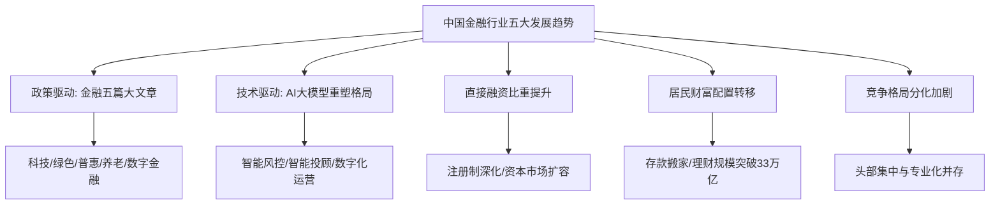

#### 关键结构性变化特征

**国资主导格局持续强化**。PE/VC领域国资LP占比达55%，政府资金占机构LP出资比例从40.8%飙升至68.3%。千亿级国家创业投资引导基金正式启动，以20年超长存续期、取消返投限制等颠覆性制度创新引领行业发展。银行AIC加速入局一级市场，自政策发布以来累计出资达452.72亿元，同比增长约37.7%。

**耐心资本政策体系全面落地**。从国家创投引导基金到地方"长续航版"引导基金，存续期普遍延长至10年以上，有的甚至长达20年。这一制度创新彻底打破了传统VC/PE基金7-10年的期限束缚，向市场传递了国家资本做好长期陪伴硬科技企业"长跑"的强烈信号。

**净值化转型深化推动产品创新**。银行理财净值化转型基本完成，固收类产品规模占比超97%，但"固收+"产品发行放量，多资产多策略体系加速构建。低利率环境下票息收入"安全垫"变薄，推动固收业务从"持有到期"向"交易驱动"转型。

**数字人民币进入2.0时代**。截至2025年11月末，数字人民币累计交易金额突破16.7万亿元，个人钱包2.3亿个。2026年新一代数字人民币计量框架、管理体系正式启动实施，准备金制度落地、跨境支付场景扩容、计息功能落地三大制度创新为行业发展注入新动能。

### 9.2 最具上升空间细分领域识别与核心投资逻辑阐释

基于第八章构建的多维度综合评估框架，通过市场规模增速、政策支持力度、技术赋能程度、竞争格局优化、人才需求趋势五大维度的量化分析，形成各细分领域上升空间的综合排序与投资优先级建议。

#### 综合评估结果与梯队划分

| 梯队 | 细分领域 | 综合得分 | 核心定位 |
|------|---------|---------|---------|
| **第一梯队** | 金融科技 | 4.25 | 最具上升空间，强烈推荐 |
| **第一梯队** | PE/VC | 4.00 | 最具上升空间，强烈推荐 |
| **第二梯队** | 投资银行 | 3.85 | 积极关注 |
| **第三梯队** | 财富管理 | 3.675 | 稳健配置 |
| **第三梯队** | 固定收益 | 3.375 | 稳健配置 |

#### 金融科技：技术原生驱动的第一优选

**核心投资逻辑**：金融科技作为技术驱动的原生领域，在五大评估维度中**技术赋能与人才需求两个维度获得满分**，反映出该领域作为技术原生驱动型赛道的独特价值。其核心投资逻辑体现为**"技术驱动+政策确定性+人才红利"三重叠加**。

**政策确定性**是金融科技领域最重要的投资支撑。金融信创政策明确"2027年完成全系统信创替代"目标，市场规模预计逼近2500亿元，年增速达35%，为国产金融IT厂商创造了确定性的增长空间。数字人民币进入2.0时代，累计交易金额突破16.7万亿元，制度框架全面升级带来产业链投资机会。

**技术突破**为行业发展注入强劲动能。AI大模型能力跃迁与成本锐减推动金融机构本地化部署AI迎来拐点，智能风控、智能投顾、智能投研等应用场景快速落地。中信百信银行"AIphaMo"智慧风控项目使风险特征挖掘效率提升100%，展现了技术赋能的显著成效。

**关键观察指标**：AI渗透率、信创替代进度、数字人民币交易量、金融机构IT投入增速。

**投资节奏建议**：短期（1-2年）重点关注数字人民币产业链（金融IT服务商、硬件终端厂商）的确定性机会；中期（3-5年）关注智能风控、保险科技领域的结构性增长；长期关注AI大模型对金融服务模式的颠覆性重塑。

#### PE/VC：政策红利集中释放的战略机遇

**核心投资逻辑**：PE/VC行业在政策支持维度获得**满分评价**，国家战略级政策支持力度前所未有。其核心投资逻辑体现为**"政策红利释放+结构性回暖+硬科技聚焦"三重驱动**。

**政策红利**是PE/VC领域最核心的投资支撑。千亿级国家创业投资引导基金正式启动，以20年超长存续期、取消返投限制等颠覆性制度创新引领行业发展。银行AIC试点扩围、地方专项债投向引导基金（已发行520亿元）等政策拓宽资金来源。"投早、投小、投长期、投硬科技"成为明确的政策导向。

**结构性回暖**特征明显。2025年PE/VC市场募资规模同比增长26%，投资案例数同比上涨30.6%，退出项目数同比激增65.83%。更值得关注的是早期投资明显复苏，天使轮、种子轮金额分别增长61%和97%。

**硬科技聚焦**成为投资主线。半导体、人工智能、生物医药、机械制造四大行业投资集中度超70%，电子信息、先进制造、医疗健康合计占比56.42%。并购退出占比升至64.70%，超越IPO成为主导退出方式。

**关键观察指标**：国投基金落地节奏、早期投资占比、退出渠道多元化程度、硬科技赛道估值水平。

**投资节奏建议**：当前正是布局一级市场的重要窗口期，建议关注国资背景的头部GP、硬科技赛道的专业化机构、S基金等创新产品。

#### 投资银行：注册制红利下的结构性机会

**核心投资逻辑**：投资银行业务在市场规模增速维度表现最优（4.5分），2025年股权承销规模同比增长226.1%，展现出强劲的增长动能。其核心投资逻辑体现为**"注册制深化+再融资放量+并购活跃"**。

注册制改革是核心制度红利，发行定价市场化、上市标准多元化、审核效率提升为投行业务发展提供制度支撑。再融资业务成为核心增长引擎，2025年定增项目规模同比激增300%。并购重组市场持续活跃，重大资产重组同比增长121.74%，财务顾问费用同比上涨47%。

但需关注的风险是**头部极度集中的竞争格局**（CR5达74.5%），增量主要由头部机构获取，中小券商需通过区域深耕、赛道聚焦实现差异化突围。

**关键观察指标**：IPO/再融资规模、并购交易金额、头部机构市占率、科创板/北交所项目储备。

#### 财富管理与固定收益：稳健配置的基石领域

**财富管理**各维度表现相对均衡，综合得分3.675。其核心投资逻辑在于居民财富持续增长（可投资资产超300万亿元）与配置需求升级，"存款搬家"浪潮为行业带来持续资金增量。关键观察指标包括AUM增速、投顾渗透率、高净值客户增长。

**固定收益**综合得分3.375，规模庞大（银行理财33.29万亿元）但增速平稳。其核心投资逻辑在于低利率环境下"固收+"策略创新与交易能力提升。关键观察指标包括理财规模增速、固收+产品占比、净值波动控制。

### 9.3 金融机构战略布局与能力建设建议

基于前述行业趋势与细分领域分析，针对不同类型金融机构提出差异化的战略布局与能力建设建议。

#### 银行机构：财富管理转型与数智化升级并重

**战略布局建议**：

**深化财富管理转型**。银行理财子公司应把成为"离老百姓最近的资管机构"作为战略定位，推动"资产管理"和"财富管理"双轮驱动。在资产端，针对客户需求设计和管理偏绝对收益策略的解决方案型产品；在资金端，主动引领资管行业向财富管理靠拢。

**构建多资产多策略产品体系**。面对低利率环境下票息收入"安全垫"变薄的挑战，积极发展"固收+"产品，拓展权益、商品、REITs等多元资产配置，构建"低波—中波—高波"的完整产品梯度。

**强化投顾服务能力**。从"产品驱动"转向"客户驱动"，以"顾"带"投"，通过专业的顾问服务引导客户建立合理的收益预期，避免频繁交易、追涨杀跌。

**加大金融科技投入**。在银行业整体降本增效的大背景下，科技投入应从规模扩张转向效能提升，重点投向AI大模型、智能风控、数字化运营等领域。

#### 证券机构：三投联动与专业能力提升

**战略布局建议**：

**强化"三投联动"机制**。将"发现价值（投研）、创造及放大价值（投资）、兑现价值（投行）"串成闭环，研究所锁定高景气赛道、直投子公司提前入股、投行部门完成上市和再融资，全程参与企业价值创造与实现过程。

**提升科技企业服务能力**。建立多维度科创企业估值定价体系，打破按行业属性"贴标签"的估值惯性；培养既懂技术又懂资本的复合型人才队伍，提升对硬科技企业的识别、判断、挖掘能力。

**推进并购重组业务布局**。把握"并购六条"政策红利，加大财务顾问业务投入，加强并购重组估值定价等问题研究，发挥交易撮合和专业服务作用。

**差异化竞争策略**。头部券商应强化全赛道领跑优势；中小券商应聚焦"区域深耕+赛道聚焦+轻资本协同"，在细分赛道实现错位超车。

#### 保险机构：养老金融与科技保险双轮驱动

**战略布局建议**：

**把握养老金融机遇**。发挥保险资金长期、稳定的"耐心资本"特性，深度参与养老保障体系建设，丰富养老理财产品供给，探索"咨询+产品+服务"一体化衔接模式。

**深耕科技保险赛道**。构建覆盖科技企业全生命周期的保险产品体系，从研发阶段的人员意外险、财产损失险，到成果转化阶段的知识产权险，再到产业化推广阶段的产品责任险，形成完整的风险保障方案。

**加速数智化转型**。2025年保险业科技投入预计突破670亿元，应重点投向AI核保理赔、物联网风险评估、区块链合约执行等领域，推动保险价值链重构。

#### 资管机构：投研能力与客户陪伴能力双提升

**战略布局建议**：

**提升权益投研能力**。银行理财子公司权益投研能力尚不足是制约产品结构优化的关键瓶颈，应通过委外、FOF等形式与公募基金合作，或自建权益投研团队，提升含权产品的收益增强能力。

**拓展另类资产配置**。在传统债券与权益资产相关性上升的背景下，REITs、衍生品、商品等另类资产因低相关性、收益增强属性，应成为机构布局的重点领域。

**深化客户陪伴服务**。真正从投资者利益出发，以让客户赚到钱为核心目标，通过专业的投顾服务正向引导投资者预期和申赎行为，提升客户投资体验。

#### 核心能力建设方向

| 能力维度 | 建设重点 | 关键举措 |
|---------|---------|---------|
| **技术赋能能力** | AI大模型应用、数字化运营 | 加大科技投入、引进技术人才、推进系统升级 |
| **专业研究能力** | 产业研究、信用研究、量化分析 | 建设研究团队、完善研究体系、强化数据能力 |
| **风险管控能力** | 合规风控、信用风险、市场风险 | 完善风控体系、提升模型精度、强化压力测试 |
| **人才队伍建设** | 复合型人才、专家型人才 | 优化激励机制、加强培训培养、引进高端人才 |

### 9.4 投资者资产配置策略与风险管理建议

针对不同风险偏好与投资期限的投资者，提出差异化的资产配置策略与风险管理建议。

#### 不同风险偏好的配置策略

**进取型投资者**（高风险偏好、追求高回报）：

建议重点配置**金融科技与PE/VC领域**，把握技术变革与政策红利带来的超额收益机会。金融科技领域重点关注数字人民币产业链、智能风控、保险科技等赛道；PE/VC领域重点关注硬科技投资（半导体、人工智能、医疗健康）。

**建议配置比例**：金融科技40%、PE/VC35%、投行15%、其他10%。

**稳健型投资者**（中等风险偏好、追求稳定增长）：

建议均衡配置**财富管理与投资银行领域**，关注头部机构的确定性增长。财富管理领域重点关注银行理财、公募基金等稳健产品；投资银行领域重点关注头部券商的投行业务增长。

**建议配置比例**：财富管理35%、投行30%、金融科技20%、固收15%。

**保守型投资者**（低风险偏好、追求稳健收益）：

建议以**固定收益与银行理财为主**，关注"固收+"策略创新产品。固定收益领域重点关注低波动、稳健收益的理财产品；适当配置金融科技领域的确定性机会（如金融信创）。

**建议配置比例**：固收40%、财富管理35%、金融科技15%、其他10%。

#### 投资期限与领域匹配

| 投资期限 | 优先领域 | 配置逻辑 |
|---------|---------|---------|
| **短期（1-2年）** | 金融科技（数字人民币、信创）、投行 | 政策红利集中释放，业绩兑现确定性高 |
| **中期（3-5年）** | PE/VC、财富管理 | 结构性增长显现，规模效应释放 |
| **长期（5年以上）** | 金融科技（AI应用）、PE/VC（硬科技） | 技术变革与产业升级的长期受益者 |

#### 风险管理建议

**核心风险识别与对冲策略**：

| 风险类型 | 具体表现 | 对冲策略 |
|---------|---------|---------|
| **估值泡沫风险** | 部分热门赛道估值偏高 | 审慎评估估值、关注商业化进程、分批建仓 |
| **政策执行风险** | 创新机制落地存在不确定性 | 跟踪政策进展、关注执行效果、动态调整 |
| **技术迭代风险** | 技术路线变化可能导致投资失误 | 分散配置不同技术路线、关注技术演进趋势 |
| **市场波动风险** | 资本市场波动影响投资收益 | 分散配置、动态再平衡、控制仓位 |
| **流动性风险** | 一级市场投资流动性较差 | 合理配置一级市场比例、关注退出渠道 |

**风险管理核心原则**：

- **分散配置**：跨领域、跨策略、跨周期分散，降低单一风险敞口
- **审慎估值**：基于基本面进行价值评估，避免追高热门赛道
- **动态调整**：根据市场环境变化及时调整配置策略
- **长期视角**：以长期投资心态应对短期波动，把握结构性机遇

### 9.5 从业者职业发展方向与能力升级路径

基于各细分领域人才需求趋势分析，为金融从业者提出职业发展方向与能力升级建议。

#### 各领域人才需求特征与职业机会

**金融科技领域**：人才极度紧缺，薪酬竞争力最高。急需AI算法工程师、数据科学家、隐私计算专家、区块链开发者，以及懂技术又懂业务的复合型产品人才。技术迭代快速，持续学习能力成为核心要求。

**PE/VC领域**：急需具备深厚产业背景、技术理解能力和投后赋能经验的"专家型"投资人。天使投资需要"八分实业能力，两分金融能力"，与创始人共同看见未来、赋能成长。硬科技赛道投资尤其需要产业专家型人才。

**财富管理领域**：从销售导向转向投顾导向，急需具备资产配置能力、客户陪伴能力、税务法律知识及数字化服务工具的"买方投顾"和专家团队。浙银理财开业初期投资研究、风险防控人员占比已超50%，显示出对专业人才的重视。

**投资银行领域**：需要从通道型向价值发现型转变，急需具备产业深度研究、市场化定价、销售能力及跨业务协同经验的复合型人才。注册制下风控合规要求空前提高，"看门人"责任压实对执业质量提出更高要求。

**固定收益领域**：从持有到期转向多策略交易，急需量化分析、衍生品定价、多资产配置及科技系统开发的复合型人才。信用研究精细化要求提升，精准识别信用阿尔法的能力至关重要。

#### 能力升级路径建议

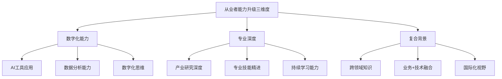

**数字化能力**：掌握AI工具应用能力，提升数据分析与处理能力，培养数字化思维与创新意识。在AI大模型重塑金融业务模式的背景下，数字化能力成为各岗位的基础要求。

**专业深度**：深耕特定领域的专业知识，建立差异化竞争优势。无论是产业研究、信用分析、量化交易还是客户服务，都需要持续精进专业技能，成为细分领域的专家。

**复合背景**：培养跨领域知识储备，实现业务与技术的融合。金融行业的复合型人才需求日益旺盛，具备"金融+科技"、"金融+产业"背景的人才将获得更大的职业发展空间。

#### 职业发展建议

**短期（1-2年）**：聚焦当前岗位的专业能力提升，同时关注行业变革趋势，主动学习新技术、新业务知识，为职业转型做好准备。

**中期（3-5年）**：根据个人优势与行业趋势，选择深耕方向或跨领域发展路径。深耕方向应成为细分领域专家；跨领域发展应培养复合型能力。

**长期视角**：把握行业变革带来的职业机遇，在金融科技、硬科技投资、买方投顾等高增长领域建立竞争优势，实现职业价值最大化。

### 9.6 研究局限性与持续关注的不确定性因素

本研究在系统分析中国金融行业发展趋势与细分领域投资价值的同时，也需客观指出研究的局限性与需持续关注的不确定性因素，为读者提供更全面的决策参考。

#### 研究局限性

**研究时点的局限性**。金融行业受政策与市场环境影响较大，行业格局与发展趋势处于动态变化之中。本研究基于2025年12月的市场数据与政策环境进行分析，研究结论需根据后续政策调整与市场变化进行动态更新。

**数据可得性的局限性**。部分细分领域（如PE/VC、金融科技）的数据披露不够充分，不同数据来源的统计口径存在差异，可能影响分析精度。研究中尽可能采用权威机构数据并进行交叉验证，但数据偏差仍可能存在。

**预测方法的局限性**。行业发展受多重不确定性因素影响，包括宏观经济波动、政策调整、技术迭代、市场情绪等，量化预测存在偏差可能。研究中的综合评分与排序结果应作为决策参考而非绝对依据。

#### 需持续关注的不确定性因素

**宏观经济与政策环境变化**。中国经济正处于新旧动能转换的攻坚期，供强需弱的矛盾尚未根本解决。货币政策从"稳中有降"调整为"低位运行"，政策取向的变化可能影响各细分领域的发展节奏。

**中美关系与外部冲击**。美欧日货币政策分化、特朗普政府单边关税政策等外部变量带来多重挑战，可能影响跨境业务发展与市场情绪。数字人民币的国际化进程、跨境投融资等领域需关注外部环境变化。

**技术迭代节奏与商业化进程**。AI大模型等技术的迭代速度与商业化进程存在不确定性。技术路线的变化可能导致投资方向调整，部分热门赛道可能存在估值泡沫风险。

**监管政策调整与执行力度**。金融监管政策持续完善，部分创新机制（如千亿国投基金的20年存续期、取消返投限制）在落地执行中可能面临挑战。监管政策的调整与执行力度将直接影响行业发展节奏。

**市场情绪与估值波动**。资本市场情绪波动可能影响投资收益与退出节奏。PE/VC领域的IPO政策、并购市场活跃度等仍存在不确定性，可能影响投资回报预期。

#### 研究结论的应用建议

本研究结论应作为战略决策的参考依据而非绝对指南。建议读者：

- **保持动态跟踪**：持续关注政策环境、市场格局、技术演进等关键变量的变化
- **审慎决策**：结合自身实际情况与风险承受能力，制定差异化的战略方案
- **灵活调整**：根据市场环境变化及时调整投资策略与业务布局
- **长期视角**：以长期投资心态应对短期波动，把握行业变革带来的结构性机遇

---

**核心结论**：在中国金融行业深刻变革与结构性转型的大背景下，**金融科技与PE/VC两大领域具备最大的上升空间**。金融科技受益于技术原生驱动、政策确定性与人才红利三重叠加；PE/VC受益于国家战略级政策支持与硬科技投资机遇。投资银行业务在注册制深化背景下保持稳健增长，但受制于头部集中格局。财富管理与固定收益领域属于稳健配置型选择。

无论是金融机构的战略布局、投资者的资产配置，还是从业者的职业发展，都应把握行业变革的核心方向，在技术赋能、专业深度、复合能力三个维度持续提升，方能在中国金融行业高质量发展的新征程中赢得先机。

# 参考内容如下：
[^1]:[社科院金融所:2025年四季度中国经济稳中有进显活力](https://baijiahao.baidu.com/s?id=1855444460901491489&wfr=spider&for=pc)
[^2]:[成绩单再“刷新”!2025年全国生态环境质量持续改善](https://www.xinxing.gov.cn/yfxxsjj/gkmlpt/content/1/1981/post_1981042.html)
[^3]:[四川金融业集中展示年度服务成果
以“五篇大文章”为抓手 助推高质量发展](https://baijiahao.baidu.com/s?id=1855528892972117359&wfr=spider&for=pc)
[^4]:[浙江2025年贷款增量全国第二,将开展“科技金融深化年”行动](https://baijiahao.baidu.com/s?id=1855462255094766982&wfr=spider&for=pc)
[^5]:[奋笔书写金融“五篇大文章” 开创高质量发展新局面](http://finance.sina.com.cn/jjxw/2026-01-28/doc-inhivfck4041395.shtml)
[^6]:[国务院办公厅关于做好金融](https://www.gov.cn/gongbao/2025/issue_11926/202503/content_7014001.html)
[^7]:[国家金融监督管理总局关于银行业保险业做好金融“五篇大文章”的指导意见](https://www.gov.cn/zhengce/zhengceku/202405/content_6950223.htm)
[^8]:[以金融“五篇大文章”为战略支点提升价值创造 助力金融强国建设——对话招银理财董事长吴涧兵](https://baijiahao.baidu.com/s?id=1855342363729899225&wfr=spider&for=pc)
[^9]:[扩内需、优供给,防风险、稳预期 持续营造良好货币金融环境](https://jrj.wuhan.gov.cn/ztzl_57/xyrd/yxy/202601/t20260119_2713485.shtml)
[^10]:[金融赋能新型工业化高质量发展](https://new.qq.com/rain/a/20260127A02Y8F00)
[^11]:[四川:做好科技金融大文章 服务更高水平科技强省建设](http://news.10jqka.com.cn/20260128/c674379289.shtml)
[^12]:[多项信贷指标双位数增长,2025年湖南写好金融“五篇大文章”](https://baijiahao.baidu.com/s?id=1855554306842221517&wfr=spider&for=pc)
[^13]:[河南部署科技金融提质增效专项行动,全链条服务赋能新质生产力|“报”出河南2026](https://baijiahao.baidu.com/s?id=1855389441373219447&wfr=spider&for=pc)
[^14]:[人工智能赋能金融行业:趋势与预测|前瞻2026](https://baijiahao.baidu.com/s?id=1852793317230435178&wfr=spider&for=pc)
[^15]:[【奋力实现“十五五”良好开局】国家金融与发展实验室副主任杨涛:场景+智能体将成为大模型金融应用落地关键](https://www.financialnews.com.cn/2026-01/27/content_442309.html)
[^16]:[企业智能体应用:当AI从执行工具进化为决策核心](https://baijiahao.baidu.com/s?id=1855546688857946606&wfr=spider&for=pc)
[^17]:[智能化浪潮之下,企业如何用智能体重塑风险管理?](https://baijiahao.baidu.com/s?id=1855530365846888239&wfr=spider&for=pc)
[^18]:[AI时代投顾新引擎!恒生助力头部券商打造资产配置智能体](https://baijiahao.baidu.com/s?id=1855377606729664397&wfr=spider&for=pc)
[^19]:[银行财富管理赛道换挡升级](https://baijiahao.baidu.com/s?id=1855473104718324482&wfr=spider&for=pc)
[^20]:[2025年中国财富管理市场: 规模达179.33万亿 资产配置开启多元化转型](https://stock.10jqka.com.cn/20251126/c672737588.shtml)
[^21]:[坚守金融为民初心 深化财富管理转型 ](https://www.cs.com.cn/qs/202511/t20251118_6523752.html)
[^22]:[黄生:全面注册制的中长期影响](https://cn.ceibs.edu/media/press-clippings/faculty/22839)
[^23]:[全面注册制改革的影响解读:资本市场及投行业务生态面临重塑](https://baijiahao.baidu.com/s?id=1762209377695245232&wfr=spider&for=pc)
[^24]:[全面注册制更考验投资者能力](https://sd.mof.gov.cn/zt/dcyj/202303/t20230328_3875270.htm)
[^25]:[全面注册制正式实施十问十答:如何影响A股生态和投资者?](https://jrj.sh.gov.cn/CJWD143/20230220/2edd36cb705a446285fbe9bba197e75d.html)
[^26]:[央行八项金融开放举措有何影响?专家解读](https://content-static.cctvnews.cctv.com/snow-book/index.html?item_id=17014670870367305651&track_id=f2ace9cc-381d-49fa-b756-275c15d25dc2)
[^27]:[多地公布数字人民币最新“成绩单”,江苏领跑,差异化格局成形](https://baijiahao.baidu.com/s?id=1855563137077545926&wfr=spider&for=pc)
[^28]:[多地公布数字人民币最新“成绩单”,江苏领跑,差异化格局成形](https://www.bbtnews.com.cn/2026/0128/583401.shtml)
[^29]:[从外资巨头抢滩布局,看我国保险资管现状与新趋势](https://baijiahao.baidu.com/s?id=1854824887391774583&wfr=spider&for=pc)
[^30]:[中国金融IT行业2025年发展现状及未来趋势展望](https://baijiahao.baidu.com/s?id=1853792438700206324&wfr=spider&for=pc)
[^31]:[券商投行业务竞争格局重塑](https://baijiahao.baidu.com/s?id=1853495660249728993&wfr=spider&for=pc)
[^32]:[券商投行业务竞争格局重塑](http://finance.cnr.cn/cjtt/yw/20260106/t20260106_527484411.shtml)
[^33]:[一单赚3.9亿!2025券商激战IPO:中信登顶 巨头洗牌](https://baijiahao.baidu.com/s?id=1852478656561819282&wfr=spider&for=pc)
[^34]:[申万宏源证券总经理张剑:深化科创板创业板改革为拓展投行服务开辟新空间](https://baijiahao.baidu.com/s?id=1853118437796251689&wfr=spider&for=pc)
[^35]:[并购市场持续活跃凸显券商差异化竞争力](https://baijiahao.baidu.com/s?id=1845912077004101867&wfr=spider&for=pc)
[^36]:[全面注册制对投行意味着什么?投行人士预期IPO数量不会暴增,取消23倍PE定价,主板破发或常态化](https://m.cls.cn/detail/1254264)
[^37]:[智见|科创板持续扩容背景下商业银行投行业务的机遇与挑战](https://mp.weixin.qq.com/s?__biz=MzI2MTE2ODAxMw==&mid=2247594003&idx=2&sn=573975880a38cfe4434ad547d3a1c52f&chksm=ebb9834581624684a42878c3d277f0f61fbd3da8f360a504a1b8c1a483949fde0d2e8583bcb5&scene=27)
[^38]:[深化资本市场投融资综合改革，提升投资者回报_腾讯新闻](https://new.qq.com/rain/a/20260128A01WXS00)
[^39]:[“硬科技”!投资激增30倍](https://baijiahao.baidu.com/s?id=1802012811703815994&wfr=spider&for=pc)
[^40]:[并购重组日趋活跃 券商争抢财务顾问“蛋糕”](https://baijiahao.baidu.com/s?id=1837377273627935276&wfr=spider&for=pc)
[^41]:[上市公司跨界并购持续活跃 监管聚焦信披合规、估值合理](https://baijiahao.baidu.com/s?id=1855300922162302205&wfr=spider&for=pc)
[^42]:[并购重组潮起!重塑投行生态,推动业务转型](http://www.csrc.gov.cn/shanxi/c106408/c7570778/content.shtml)
[^43]:[头部券商疯狂合并,中小券商抱团求生,投行格局大变?](https://baijiahao.baidu.com/s?id=1853334831214773724&wfr=spider&for=pc)
[^44]:[中国私募股权投资市场2025年发展现状及未来趋势展望](https://baijiahao.baidu.com/s?id=1853702102146564150&wfr=spider&for=pc)
[^45]:[2025年国内一级市场募投状况升温](https://baijiahao.baidu.com/s?id=1855387967639711467&wfr=spider&for=pc)
[^46]:[一级市场投融资超9000起 “耐心资本”涌向“硬科技”](https://baijiahao.baidu.com/s?id=1853721596967196407&wfr=spider&for=pc)
[^47]:[中信建投 | 2025年私募股权市场年度综述:耐心资本助力科技产业升级](https://new.qq.com/rain/a/20260118A06DJM00)
[^48]:[年度盘点丨2025年中国创投:重拾向上动能,奔赴投资新程](https://baijiahao.baidu.com/s?id=1853023321349497540&wfr=spider&for=pc)
[^49]:[创投圈强势回暖,硬科技成“耐心资本”宠儿](https://baijiahao.baidu.com/s?id=1853740349257191608&wfr=spider&for=pc)
[^50]:[万亿“耐心资本”启航重塑中国创投生态](https://baijiahao.baidu.com/s?id=1853720150321004729&wfr=spider&for=pc)
[^51]:[万亿“耐心资本”启航 重塑中国创投生态](https://baijiahao.baidu.com/s?id=1853714930279251549&wfr=spider&for=pc)
[^52]:[天使投资与其他股权投资:看似阶段不同,实则本质不同](https://www.chinaventure.com.cn/news/108-20250506-386158.html)
[^53]:[600亿+美元涌入、2000+次出手,2025全球医疗健康投融资一览](https://www.jiemian.com/article/13944905.html)
[^54]:[不在涨跌里,不在规模里,在结构里:2025年ABS盘点和思考](https://baijiahao.baidu.com/s?id=1855064842283302430&wfr=spider&for=pc)
[^55]:[债市乱纪元元年,优秀固收类基金的表现盘点](https://baijiahao.baidu.com/s?id=1854384406392322883&wfr=spider&for=pc)
[^56]:[资管|破局重构,韧性生长:2026年策略](https://baijiahao.baidu.com/s?id=1848471839210591965&wfr=spider&for=pc)
[^57]:[量质双升、固本强基 国债期货2025年“压舱石”功能持续凸显](https://baijiahao.baidu.com/s?id=1854818552935858061&wfr=spider&for=pc)
[^58]:[“突围”低利率困境,理财行业多策略转型加速,2026年业绩基准预计回升30bp至2.7%](https://cloud.oceanguide.org.cn/pindo/27708_1288.shtml)
[^59]:[中国外汇 | 低利率环境对我国银行业的挑战与应对策略](https://mp.weixin.qq.com/s?__biz=MjM5NDg1Nzk3NA==&mid=2652586862&idx=1&sn=f4f31cc18f223b077fa5aa121dd4721c&chksm=bce74c0dd667e2c0d1788eca4e919164f9a5062abdbb02f80979a462fac97a45c82f2bb4bb97&scene=27)
[^60]:[低利率不是终点,金融机构转型才是关键](https://www.ifabchina.com/news/inner/7614)
[^61]:[资管机构竞争力之产品案例:震荡行情下“固收+”为何备受青睐?](https://baijiahao.baidu.com/s?id=1850932972105152565&wfr=spider&for=pc)
[^62]:[2025财富管理市场全景解读:六大领域提质,四大维度解码行业未来 ](https://www.nbd.com.cn/articles/2025-11-08/4135539.html)
[^63]:[2025“固收+”年度盘点](https://finance.eastmoney.com/a/202512263602455625.html)
[^64]:[众赢财富通:固收+规模突围 主动产品成配置核心](https://www.163.com/dy/article/KK1LJIT50530MV8T.html)
[^65]:[权益、固收、量化三驾马车齐驱 信达澳亚锻造投研核心竞争力](https://baijiahao.baidu.com/s?id=1839420488200276092&wfr=spider&for=pc)
[^66]:[国金资管:以专业体系与全资产供给 锻造多资产配置核心竞争力](http://news.10jqka.com.cn/20260127/c674336887.shtml)
[^67]:[如何打造固收做市领域核心竞争力,民生证券给出了答案!](https://www.163.com/dy/article/INU3CR8O05199DKK.html)
[^68]:[规模稳步攀升至33.29万亿元!银行理财出现新变化→](https://baijiahao.baidu.com/s?id=1855449664278804079&wfr=spider&for=pc)
[^69]:[理财市场规模站上33万亿元 固收产品仍占主导 ](https://www.cs.com.cn/yh/04/202601/t20260127_6535269.html)
[^70]:[银行理财2025年度盘点:规模破33万亿,固收占比七成,权益投研能力待提升](https://baijiahao.baidu.com/s?id=1852719160032580350&wfr=spider&for=pc)
[^71]:[提升商业银行理财公司核心竞争力](https://baijiahao.baidu.com/s?id=1824527008746796214&wfr=spider&for=pc)
[^72]:[三大引擎驱动我国资管行业系统化跃升](https://baijiahao.baidu.com/s?id=1855424505873569904&wfr=spider&for=pc)
[^73]:[金融行研系列:17 中国私人银行业2025发展报告](https://baijiahao.baidu.com/s?id=1855238147909141454&wfr=spider&for=pc)
[^74]:[中国私人银行业2025年发展现状及未来趋势展望](https://baijiahao.baidu.com/s?id=1853792722259635642&wfr=spider&for=pc)
[^75]:[对话连平:楼市分化、利率走低,中国居民财富会流向哪里?](https://baijiahao.baidu.com/s?id=1855549170150548248&wfr=spider&for=pc)
[^76]:[财富管理师|中国财富管理竞争格局:群雄逐鹿,财富管理大时代](https://baijiahao.baidu.com/s?id=1835052372500426638&wfr=spider&for=pc)
[^77]:[“资管一哥”易主,银行理财PK公募基金进入下半场?](https://baijiahao.baidu.com/s?id=1777352669407122146&wfr=spider&for=pc)
[^78]:[银行理财产品净值化转型有何影响?](https://bank.hexun.com/2025-11-17/222347092.html)
[^79]:[银行理财“净值化”转型对投资者的影响?](https://bank.hexun.com/2025-11-10/222222990.html)
[^80]:[2024资管机构竞争力总榜发布:5类机构赛道领跑者揭晓!](https://baijiahao.baidu.com/s?id=1849667003549095246&wfr=spider&for=pc)
[^81]:[专家观点|银行理财与公募基金差异化竞争](https://dy.163.com/article/GHQ8EVUK05158BFB.html)
[^82]:[把握基金投顾业务 助力财富管理转型](http://baijiahao.baidu.com/s?id=1684384597356632864&wfr=spider&for=pc)
[^83]:[光大理财以创新与服务,推动养老理财高质量发展](https://baijiahao.baidu.com/s?id=1855479758217384143&wfr=spider&for=pc)
[^84]:[光大理财深耕养老理财领域,为养老金融发展注入动力](https://baijiahao.baidu.com/s?id=1855456877058013880&wfr=spider&for=pc)
[^85]:[上海金融监管局:加大养老产业融资供给](https://baijiahao.baidu.com/s?id=1855017290288068788&wfr=spider&for=pc)
[^86]:[2025年中国金融科技行业发展现状规模、产业链分析](https://www.chinairn.com/news/20250331/11561385.shtml)
[^87]:[2025年金融科技行业深度调研:技术深化、监管趋严、全球化竞争](https://www.chinairn.com/hyzx/20250416/175733768.shtml)
[^88]:[数字人民币2026年升级!16.7万亿交易,资本市场的新变化](https://baijiahao.baidu.com/s?id=1852820377368940014&wfr=spider&for=pc)
[^89]:[试点成效突出数字人民币应用迈入2.0时代](https://baijiahao.baidu.com/s?id=1855486770317799253&wfr=spider&for=pc)
[^90]:[「智能风控」VS「人工审核」:科技如何重塑消费金融竞争壁垒?](https://www.chinairn.com/news/20250327/161818500.shtml)
[^91]:[2025智能投研行业发展现状:从萌芽到高速增长](https://www.chinairn.com/hyzx/20250321/173213619.shtml)
[^92]:[2025年智能投研行业市场分析及发展前景预测](https://www.chinairn.com/hyzx/20250312/175400452.shtml)
[^93]:[2025年保险科技行业:现状洞察、前景展望与趋势前瞻](https://www.chinairn.com/hyzx/20251205/175357789.shtml)
[^94]:[科技保险驶入快车道:前三季度保费激增30%,全周期保障体系加速成型](https://baijiahao.baidu.com/s?id=1848407677464680108&wfr=spider&for=pc)
[^95]:[专家观点丨科技保险赋能新质生产力发展的现状与政策建议 ](https://mp.weixin.qq.com/s?__biz=MjM5MDg1NDQ0Nw==&mid=2650546523&idx=2&sn=327880f28f045e18333f26b5b161d701&chksm=bf4d48c048078175a06000bb59b7762e9c92ae2bcdb3245f95c11e069fff0cac7e93de8d3e0d&scene=27)
[^96]:[拆掉“墙”,连成“桥”:隐私计算的互联之路](https://baijiahao.baidu.com/s?id=1855473084364232866&wfr=spider&for=pc)
[^97]:[对话长江商学院梅丹青:AI时代金融服务的核心特征在于“可规模化的定制化”](https://baijiahao.baidu.com/s?id=1855434193298355023&wfr=spider&for=pc)
