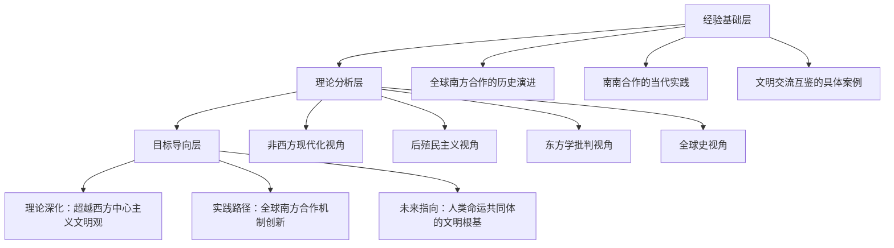
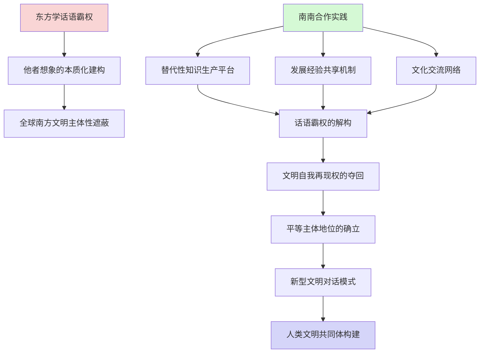
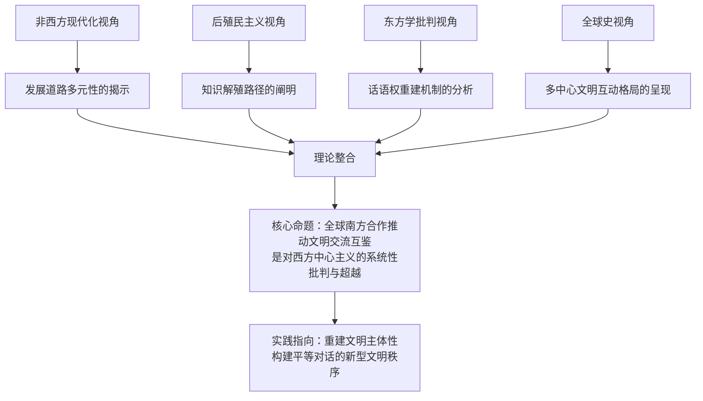

# 全球南方合作推动文明交流互鉴的理论分析：非西方现代化、后殖民主义、东方学与全球史视角
## 1 导论：全球南方合作与文明交流互鉴的理论问题域

全球南方的群体性崛起已成为世界百年未有之大变局的鲜明标志，这一历史性转变不仅重塑着国际政治经济格局，更深刻影响着人类文明的互动方式与发展走向。2024年10月，习近平主席在"金砖+"领导人对话会上指出，"全球南方"国家共同迈向现代化是世界历史上一件大事，也是人类文明进程中史无前例的壮举[^1]。这一论断将全球南方合作提升至文明史的高度，揭示了南南合作与文明交流互鉴之间深刻的内在关联。然而，如何从理论层面系统阐释这一关联，如何突破西方中心主义的认知框架来理解全球南方合作的文明意涵，仍是当代国际关系研究与文明研究亟待回应的重大学术课题。

本研究旨在构建一个整合性的理论分析框架，从非西方现代化、后殖民主义、东方学批判与全球史四个维度，深入探究全球南方合作推动文明交流互鉴的内在机制与理论创新。这一研究不仅具有重要的学术价值，更关乎国际秩序重塑与人类命运共同体构建的实践指向。

### 1.1 核心概念的学术谱系与内涵界定

**"全球南方"概念的历史演变与当代内涵**

"全球南方"概念的形成经历了从地理隐喻到政治经济范畴的深刻演变。1926年，意大利政治哲学家安东尼奥·葛兰西在《南方问题的某些方面》一文中首次系统提出"南方"概念，通过分析意大利国内南北格局的不平等关系，揭示了"南方"所蕴含的反殖民、反剥削、求发展等特性，这构成了"全球南方"概念的思想底色[^2]。1969年，美国新左派活动家卡尔·奥格尔斯比在关于越南战争的文章中正式提出"全球南方"一词，他指出"几个世纪以来，北方对全球南方的统治已经高度趋同，产生了一种无法容忍的社会秩序"[^2][^1]。这一概念的提出直接指向对西方殖民统治秩序的批判。

从历史脉络看，全球南方的集体身份认同经历了若干关键节点的建构过程。1955年万隆会议的召开标志着南方国家作为一个集体正式走入世界政治舞台，向世界展现了其推动建立公正合理国际秩序的智慧、信念与行动[^2]。1961年不结盟运动的正式形成反映了广大南方国家主张国际关系民主化的强烈诉求[^2]。1963年第18届联合国大会上《发展中国家联合宣言》的发表以及在此基础上形成的"77国集团"，进一步强化了南方国家的集体行动能力[^2]。1974年联合国大会通过《建立新的国际经济秩序宣言》，标志着全球南方国家在世界经济发展中的作用逐渐凸显[^2]。冷战结束后，两极格局的瓦解使得"第三世界"一词的使用量迅速下降，更为温和中性的"全球南方"作为替代术语热度逐渐上升[^2]。

当代语境下，"全球南方"并非单纯的地理概念或经济概念，而是**兼具地理属性和政治经济属性的综合性概念**[^1]。南南合作金融中心将"全球南方"范围划定为"77国集团和中国"，涵盖广大亚非拉地区[^1]。从政治意义上看，这一概念凸显了"南方国家"与"北方国家"之间系统性的不平等，表征了南方国家团结共进的期望[^1]。2024年3月，中国外交部长王毅明确指出，独立自主是"全球南方"的底色，团结自强是"全球南方"的传统，"全球南方已经成为国际秩序变革的关键力量"[^2]。

**"南南合作"的理念演进与实践拓展**

南南合作的理念可追溯至1955年的万隆会议，其合作模式具体形成于1978年[^3]。当年在阿根廷布宜诺斯艾利斯举行的全球南南技术合作会议通过了《促进和实施发展中国家间技术合作的布宜诺斯艾利斯行动计划》，成为南南合作的主要支柱之一[^4]。南南合作的实质是**通过联合自强应对南北经济不平衡**，重点涵盖技术交流、基础设施、气候变化、粮食安全等领域的多边合作[^3]。

值得关注的是，当代南南合作正在经历革命性变化。上海财经大学校长刘元春从马克思主义政治经济学的结构视角指出，全球南方正在发生三个层面的深刻转型：**一是从单纯的政治声援转向务实的能力建设与合作；二是区域化联动体系正在兴起；三是关注点从道义公平转向全球公共品供给与治理参与**[^5][^6]。这一转型意味着南南合作已超越传统的政治团结层面，进入更为深层的发展经验共享与文明互动阶段。

**"文明交流互鉴"的理论内涵与时代意义**

文明交流互鉴是中国提出的重要理论命题，其核心主张是**不同文明多元共生的客观要求，通过平等对话、传承创新推动文明多样性发展，强调多样性对世界文明的基础性作用**[^7]。全球文明倡议明确了文明平等、互鉴、对话、包容的核心准则，提出以交流超越隔阂、以互鉴化解冲突的实践路径[^7]。

从理论渊源看，文明交流互鉴以马克思主义世界历史观与中华和合观念为根基[^7]。中华民族历来重视"协和万邦"的国际交往之道，把文明交流互鉴视为处理世界关系、增进民族感情的重要渠道[^8]。这一理念旨在以文安民、以教化人，通过传播、交流先进文明，增强自身文化的吸引力与辐射力[^8]。

文明交流互鉴的历史实践可追溯至5000年前中华文明与世界早期互动，汉代张骞出使西域开辟丝绸之路，促进青铜文化、琥珀之路等跨区域交流，唐代玄奘取经、明代郑和下西洋推动中外文化交融，敦煌文化成为多元文明交汇的范例[^7]。这些历史实践表明，**文明互鉴意味着每一种文明在其发展过程中都离不开与其他文明的交流，文明的价值和生命力体现在对外开放和包容互鉴的能力上**[^9]。

### 1.2 全球南方合作推动文明交流互鉴的理论张力

全球南方合作推动文明交流互鉴这一研究命题蕴含着深刻的理论张力，这些张力构成了本研究需要深入探讨的核心问题域。

**第一重张力：内部多样性与共同发展目标之间的辩证关系**

全球南方是一个包含多样化价值观念、文化传统、发展水平和多元化利益诉求的国家集合体[^1]。这些国家既有资本主义政体、君主立宪政体，也有社会主义国家；既有资本主义市场经济体、社会主义市场经济体，也有非市场经济体；既有世界第二大经济体，也有世界最不发达国家[^1]。这种多样性在"全球南方"整体框架下如何和谐共处，如何在维护各自文明特性的同时实现共同发展目标，构成了理论分析的首要张力。

复旦大学黄仁伟教授指出，当前区域国别研究存在对全球南方内部结构与经济脆弱性了解不足的问题[^5][^6]。这一不足恰恰反映了理论界对全球南方内部多样性的认识尚不充分。然而，正如有学者所言，尽管全球南方各国处在不同发展阶段，文化传统和风俗习惯各具特色，但**在维护自身权益、实现经济社会发展、推动国际秩序更加公平合理和国际关系民主化等方面，内部分歧远小于共同利益，容易凝聚共识**[^1]。这种"和而不同"的共存状态本身就构成了一种独特的文明对话模式。

**第二重张力：合作形态转型带来的文明互动新形态**

南南合作从政治声援向能力建设、从道义公平向全球公共品供给的转型[^5][^6]，带来了文明互动的新形态。传统的南南合作主要体现为政治层面的相互支持与道义声援，而当代南南合作则深入到发展经验共享、治国理政交流、技术能力转移等更为实质性的层面。这一转型使得不同文明之间的对话从抽象的价值认同深入到具体的实践互鉴。

2025年3月成立的"全球南方"研究中心将聚焦发展融资、贸易投资、技术创新、绿色发展、粮食和能源安全等重大问题[^1]。这些议题领域正是当代南南合作推动文明互鉴的具体载体。通过在这些领域的务实合作，不同文明背景的国家得以在实践中相互学习、彼此借鉴，形成超越抽象理念的实质性文明对话。

**第三重张力：对西方主导文明话语体系的理论挑战**

文明交流互鉴理念对西方主导的文明等级论、文明冲突论构成了根本性的理论挑战。人类命运共同体理念倡导平等公正、多彩丰富、兼容并包的新文明观，尊重每种文明的独特性、自主性[^8]。与"文明冲突论"相比，以"文明交流互鉴"为内核的新文明观承认所有文明是人类创造的结果，以整体思维看待人类文明的历史和未来，将各种文明看作人类命运共同体的组成部分；**反对以高低优劣来区分文明，把各种文明置于平等、尊重、互鉴的认知框架中**[^8]。

亨廷顿的"文明冲突论"虽然以独特的视角看待文明，但其论调谬误颇多。他立足西方文明的立场，视儒家文明和伊斯兰文明为西方文明的威胁和挑战，认为世界和平的最大威胁源于文化文明的冲突[^8]。这种观点源于"欧洲中心论"，将西方文明作为人类文明的最高形态、资本主义制度作为人类制度的历史终极[^8]。全球南方合作推动的文明交流互鉴实践，正是对这种西方中心主义文明观的有力回应与超越。

**理论建构与实践命题的统一**

这一研究命题既是理论建构问题，更是关乎国际秩序重塑的实践命题。理论层面，它涉及如何构建超越西方中心主义的文明对话理论框架；实践层面，它关乎全球南方国家如何通过合作机制实现共同现代化、如何为人类命运共同体构建提供文明根基。正如学者所言，中国与全球南方共同现代化，在理念层面彰显了中国式现代化理论体系的思想伟力，在实践层面展现了积极应对全球性挑战的中国主张，在未来层面蕴含着推动世界百年未有之大变局加速演进的强大历史动力[^10]。

### 1.3 四重理论视角的整合必要性

理解全球南方合作推动文明交流互鉴这一复杂命题，需要整合多元理论视角进行分析。刘元春校长强调，**理解全球南方不能仅靠单一国家分析，而应回归马克思主义经典理论，从资本运动、国际分工、技术进步驱动的世界经济运行逻辑切入**[^5][^6]。这一方法论启示表明，单一理论视角难以充分揭示全球南方合作的文明意涵，需要构建整合性的理论分析框架。

**非西方现代化视角的理论贡献**

非西方现代化视角揭示发展道路的多元性，打破西方现代化模式的普世性神话。中国式现代化世界观立足历史唯物主义的基本立场，将现代化理解为世界各国人民普遍享有的发展权利[^10]。这一立场强调，现代化的发展权是普遍的、平等的、不可剥夺的，不以国家大小、经济强弱、历史长短、制度类型为转移，也不能被任何国家或利益集团所垄断[^10]。

更为重要的是，中国式现代化世界观立足多样文明的基本立场，强调不同社会历史条件下各国自主探索现代化道路的合理性和必然性[^10]。早在19世纪，马克思和恩格斯就敏锐洞察到资本主义并非人类社会现代化的普遍前提，更不是历史进步的唯一通道[^10]。全球南方国家的现代化实践正在验证这一理论判断，为"多元现代性"理论提供了丰富的经验素材。

**后殖民主义视角的批判功能**

后殖民主义视角解构殖民知识体系对南方国家的认知霸权与文化他者化。从意识形态视角看，近代以来为了合理化白人统治，政治化或意识形态化的文明观念应运而生。在文明与野蛮的二分法之下，西方被视为进化、现代的代表，而东方/他者则被归为未进化、传统的范畴；西方被贴上基督教、进步、开放、民主、科学等标签，而东方/他者则被贴上异教、落后、停滞、封闭、专制、愚昧等标签[^9]。

印度学者阿希斯·南迪深刻指出："如果从殖民主义中减去文明使命，殖民主义就根本不存在了。"[^9]只有确立欧洲文明的优越性和独特性，才能证明殖民统治的合法性，并从思想、法理和实践上维护殖民帝国的存在。后殖民主义视角为分析全球南方合作如何实现知识生产的"去中心化"、如何重建文明主体性提供了重要的理论工具。

**东方学批判视角的解构力量**

东方学批判视角揭示西方关于"东方/他者"的知识生产机制及其对文明平等对话的阻碍。种族主义文明观将白人和他者视为具有不同本质的存在，为殖民体系提供依据，并粉饰其合法性[^9]。这种文明/野蛮的二分法虽然遭到一些持公正观点的欧洲学者的批评，殖民地人民也对这种不公平的划分及由此产生的社会秩序表达了愤慨并进行了抵制，但其影响至今仍未完全消除[^9]。

全球南方合作为解构这种他者想象、夺回文明自我再现的话语权提供了实践路径。通过南南合作框架，全球南方国家得以在平等主体地位上开展真正的文明对话与相互理解，而非被动接受西方的文明定义与评判。

**全球史视角的重构功能**

全球史视角超越民族国家中心叙事，呈现文明互鉴的历史常态与跨区域联动。李安山教授指出，人类历史是不同文明相互学习、彼此借鉴的历史，文明的形成发展和交流互鉴与全球史密不可分[^9]。从全球史视角看，"文明"概念源于法国，随后在欧洲传播，最后在全球流行，这一概念本身就是跨文明交流的产物[^9]。

全球史视角还揭示了文明互鉴的历史常态。人类历史是不同民族的迁徙与不同文明接触的历史，大致经历接触并共处、产生偏见后拒绝或接受他者文明这样一个阶段[^9]。**相通性与互补性是文明互鉴的突出特点**，不同民族习惯于保持自身价值观和行为方式，容易对他者文明产生偏见甚至恐惧，但通过包容理解可以产生文明互鉴[^9]。全球南方合作正是为这种包容理解提供了制度化的平台与机制。

**四重视角的互补性与整合创新**

四重理论视角具有内在的互补性。非西方现代化视角从发展实践层面提供经验基础，后殖民主义视角从知识生产层面提供批判工具，东方学批判视角从话语权力层面提供解构路径，全球史视角从历史纵深层面提供宏观框架。四者的整合能够形成对全球南方合作推动文明交流互鉴的立体化、多维度理解。

南开大学副校长盛斌指出，全球南方研究与区域国别学属于典型的交叉学科，涉及经济、政治、历史、文化等多维图景，应构建"全球—区域—国家—国内"加多学科视角的矩阵式研究框架[^5]。他特别强调，**中国的研究视角应区别于西方强调冲突对立的范式，更注重探寻共存与融合之道**[^5]。这一方法论主张与本研究整合四重视角的学术取向高度契合。

### 1.4 研究的分析框架与论证逻辑

**整体分析框架的构建**

本研究构建的整体分析框架以全球南方合作的历史实践为经验基础，以四重理论视角为分析工具，以文明交流互鉴的理论深化与实践路径为研究目标。这一框架可以概括为以下三个层次：

在经验基础层，研究将系统梳理全球南方合作的历史演进脉络，分析南南合作的当代实践形态，考察文明交流互鉴的具体案例。在理论分析层，研究将分别运用非西方现代化、后殖民主义、东方学批判与全球史四重视角，对全球南方合作推动文明交流互鉴的内在机制进行深入剖析。在目标导向层，研究将致力于实现理论深化（超越西方中心主义文明观）、实践路径探索（全球南方合作机制创新）与未来指向明确（人类命运共同体的文明根基）三重目标。

**各章节的逻辑关联**

本研究的论证逻辑遵循从理论批判到理论建构、再到实践指向的递进路径。

第二章从非西方现代化视角出发，分析全球南方合作如何挑战单一线性现代化叙事，探究"多元现代性"理论如何为全球南方国家的发展经验提供阐释框架。这一章节的核心任务是揭示发展道路的多元性，为后续分析奠定"多元现代性"的理论基础。

第三章运用后殖民主义视角，分析全球南方合作如何实现知识生产的"去中心化"，探究南南合作中的文化协商与身份重构，考察全球南方国家如何通过合作机制重建文明主体性。这一章节的核心任务是解构殖民知识体系的认知霸权，为文明主体性重建提供理论支撑。

第四章基于东方学批判理论，分析全球南方合作如何解构西方对"非西方文明"的本质化想象与话语建构，探究南南合作框架下全球南方国家如何夺回文明自我再现的话语权。这一章节的核心任务是揭示西方他者想象的建构机制，为文明平等对话扫清话语障碍。

第五章从全球史的"去欧洲中心主义"方法论出发，分析全球南方合作如何重新发现和激活历史上被边缘化的跨区域文明联系，探究南南合作如何重构以多中心、网络化为特征的文明互动格局。这一章节的核心任务是超越民族国家中心叙事，呈现文明互鉴的历史常态与当代重构。

第六章作为结论，将整合四个理论维度的分析结论，归纳全球南方合作推动文明交流互鉴的核心机制与理论创新，评估其对国际关系理论与文明研究范式的挑战与贡献，探讨全球南方合作实践对构建更具包容性的文明对话理论框架的启示与前瞻。

**学术定位与知识贡献**

本研究在区域国别学学科建设与中国自主知识体系构建中具有明确的学术定位。上海国际问题研究院杨洁勉主任指出，当前全球与区域治理研究面临紧迫形势，学科建设需加强特色，应在发挥原有学科优势的基础上实现跨界、跨国创新[^5][^6]。与会专家普遍认为，区域国别学学科建设需打破西方理论依赖，建构中国自主知识体系[^5]。

本研究正是回应这一学术需求的尝试。通过整合四重理论视角分析全球南方合作推动文明交流互鉴的内在机制，研究旨在为构建超越西方中心主义的文明对话理论框架提供学理支撑，为中国参与全球治理、推动人类命运共同体构建提供知识基础。正如学者所言，**人类需要的是一个平等互鉴、对话包容和互相尊重的文明世界**[^9]，全球南方合作正在为实现这一愿景开辟新的可能性空间。

## 2 非西方现代化视角：多元现代性与发展道路的文明对话

全球南方的群体性崛起不仅是国际政治经济格局的重大变革，更是对西方主导的现代化理论范式的深刻挑战。长期以来，西方现代化理论将欧美发展路径视为普世标准，将非西方社会置于"落后—追赶"的等级化叙事之中。然而，全球南方国家的现代化实践正在打破这一单一线性叙事，展现出基于各自文明传统的多元发展路径。从非西方现代化理论视角审视全球南方合作，不仅能够揭示发展道路多元性的内在逻辑，更能阐明南南合作框架下不同现代化路径的相互借鉴如何构成一种超越"文明冲突"范式的新型对话模式。本章将系统分析全球南方合作对西方中心主义现代化叙事的理论挑战与实践超越，探究全球南方合作是否正在生成一套兼具普遍性与特殊性的非西方现代化知识体系。

### 2.1 单一线性现代化叙事的理论批判与历史解构

西方现代化理论的形成与其对"东方"的认知建构密切相关。**东方道路理论作为关于非西方国家如何走向现代化社会的理论总和，是随着西方现代化进程及世界现代化进程而产生、发展起来的**[^11]。这一理论谱系的形成过程本身就揭示了西方中心主义现代化叙事的历史建构性质。

**"东方停滞论"的历史建构与权力逻辑**

15世纪末，当西方人来到印度时，他们面对的是一个高度文明的世界，这些在东方物质文明前自愧不如的冒险家最初对东方文明充满敬畏[^11]。然而，随着军事技术优势的显现，西方人发现"东方人怕他们的大炮"，此后两个世纪，来到东方的西方人越来越多，他们眼看着自己国家日新月异的进步，而东方国家（当时主要指土耳其、印度等）却不断衰落下去，遂逐渐产生了"东方停滞、西方进步"的思想[^11]。到18世纪后期，这种观念已经在西方知识界广泛传播，并逐渐演化为系统性的理论建构。

这一历史过程揭示了几个关键问题：**首先，"东方停滞论"并非对历史事实的客观描述，而是特定历史情境下的认知建构**；其次，这种认知建构与西方殖民扩张的权力逻辑密切相关，为殖民统治提供了意识形态合法性；再次，这种叙事将复杂多样的非西方社会本质化为单一的"停滞"形象，遮蔽了各文明内部的动态发展与变革能力。

**"亚细亚生产方式"命题的理论张力**

在西方现代化理论的形成过程中，"亚细亚生产方式"成为解释东方社会特殊性的核心概念。这一概念涉及高度集权、专制制度、私有制等关键要素，试图从生产方式层面解释东方社会的"停滞"特征[^11]。然而，这一命题本身充满理论张力：一方面，它承认了东方社会与西方社会的结构性差异，暗示了发展道路的多样性可能；另一方面，它又将这种差异置于进步—落后的等级框架之中，强化了西方现代化模式的普世性地位。

马克思主义者对这一命题进行了深入反思与批判性继承。正如相关研究所指出的，**关于非西方国家现代化道路的理论探讨涉及多线论与依附论等多种理论取向**[^11]。多线论强调不同社会可能沿着不同路径实现现代化，挑战了单一线性发展观；依附论则揭示了世界资本主义体系中核心—边缘的结构性不平等，批判了将"落后"归因于非西方社会内部因素的解释模式。

**依附论与世界体系论的批判性贡献**

拉丁美洲学者在探索本地区现代化道路的过程中，发展出了依附论这一重要的批判性理论[^11]。依附论的核心洞见在于：**非西方国家的"落后"并非源于其内部的文化或制度缺陷，而是世界资本主义体系中结构性不平等的产物**。这一理论视角根本性地挑战了西方现代化理论的基本预设，即非西方国家只要模仿西方的制度与政策就能实现现代化。

世界体系论进一步发展了这一批判性视角，将现代世界理解为一个由核心、半边缘、边缘构成的等级化体系。在这一体系中，边缘地区的"落后"是核心地区"发达"的结构性条件，而非可以通过单纯模仿来克服的暂时状态。这些批判性理论为理解全球南方合作的理论意义奠定了重要基础：**南南合作的实质不仅是技术与资源的共享，更是对不平等世界体系的结构性挑战**。

**单一现代化模式背后的知识霸权**

单一线性现代化叙事不仅是一种理论建构，更是一种知识霸权的体现。这种知识霸权表现为：将西方的特殊经验普遍化为人类发展的一般规律；将非西方社会的多样性简化为"传统"与"落后"的同质化形象；将现代化等同于西方化，否定其他发展路径的合法性。正如学者所指出的，**西方发展道路与本土因素之间的接触、碰撞或融合的现状和前景，以及冷战终结和新自由主义信条对这些地区的影响，都是理解非西方现代化进程的关键问题**[^12]。

全球南方合作的理论意义正在于对这种知识霸权的挑战。通过南南合作框架，全球南方国家得以在平等基础上交流发展经验，而非被动接受西方的发展处方。这种实践本身就构成了对单一现代化叙事的解构，为多元发展道路的理论阐释开辟了空间。

### 2.2 多元现代性理论的学术谱系与核心命题

对单一线性现代化叙事的批判，催生了"多元现代性"这一重要的理论范式。这一理论范式的形成与发展，为理解全球南方国家的发展经验提供了新的阐释框架。

**艾森斯塔特与多元现代性理论的奠基**

以色列社会学家S.N.艾森斯塔特（1923-2010）是多元现代性理论最具影响力的奠基者之一。**艾森斯塔特以结构功能主义为方法论基础，通过对古埃及、中国等古代帝国的政治体系比较研究，确立了文明分析的学术范式**[^13]。他的学术贡献不仅在于具体的历史研究，更在于提出了一套超越西方中心主义的理论框架。

艾森斯塔特提出的**"多元现代性"理论突破了西方中心主义框架，强调不同文明基于自身传统发展出独特现代性形态**[^13]。这一理论的核心命题包括：现代性并非西方文明的专属产物，而是可以在不同文明传统中生成的普遍历史进程；不同文明进入现代性的路径各有特色，形成了多元而非单一的现代性形态；传统与现代并非截然对立，各文明的传统资源可以成为其现代化的内在动力。

**从"轴心时代"到"多元现代性"**

艾森斯塔特的多元现代性理论建立在雅斯贝尔斯"轴心时代"理论的基础之上。**在雅斯贝尔斯"轴心时代"理论基础上，艾森斯塔特提出不同文明可基于自身文化传统发展出独特的现代性路径，该理论成为批判"东方主义"解释框架的重要工具**[^13]。这一理论视角意味着：各大文明在轴心时代形成的核心价值与制度传统，并非现代化的障碍，而是各自现代性形态的文化根基。

以犹太文明为例，艾森斯塔特论证了宗教改革运动中形成的"人人皆祭司"传统如何塑造了独特的现代化路径[^13]。在其代表作《犹太文明》中，他创新性地将犹太群体定义为"文明承担者"，通过比较希腊、罗马等古代文明特征，系统阐释了犹太教全民教育传统与跨国商业网络形成的互动机制[^13]。这种研究方法为分析其他文明的现代化路径提供了重要参照。

**多元现代性理论的方法论创新**

艾森斯塔特创建了**政治—经济—文化三维分析框架**，通过对20余个古代帝国的官僚制度比较，发现层级制行政体系与法律标准化等现代性要素的早期形态[^13]。这一方法论创新具有重要意义：它打破了将现代性要素视为西方独有发明的偏见，揭示了现代性在不同文明中的多元起源；它强调了文明比较研究的重要性，为理解发展道路多样性提供了方法论工具。

此外，艾森斯塔特还提出了**"制度弹性"概念，强调社会结构在吸纳新技术时必须保持与传统价值体系的衔接度**[^13]。以19世纪美国犹太改革运动为案例，他分析了少数族群在现代化进程中如何平衡文化传承与社会融入。这一概念对于理解全球南方国家如何在现代化进程中保持文明主体性具有重要启示。

**多元现代性理论的阐释效力与局限**

多元现代性理论为理解全球南方国家的发展经验提供了重要的阐释框架。它承认了各文明现代化路径的合法性，挑战了西方现代化模式的普世性神话；它强调了传统资源在现代化进程中的积极作用，为全球南方国家探索符合本国国情的发展道路提供了理论支撑。

然而，这一理论也存在一定局限。**有评价认为，相关研究"缺乏比较"，在叙述各地区的过程中，没有能够很好地截取几个可供比较的节点，也缺少针对不同文化造成的结果的横向比较**[^12]。此外，多元现代性理论虽然承认了现代性形态的多样性，但对于不同现代性形态之间的互动关系、对于全球南方国家如何通过合作实现相互借鉴等问题，尚未给予充分关注。全球南方合作的实践正在为这些理论问题提供新的经验素材与分析视角。

### 2.3 全球南方现代化实践的多元路径与文明根基

多元现代性理论的核心命题在全球南方国家的现代化实践中得到了充分验证。东亚、南亚、拉美、非洲、中东等地区在本土文化传统与外来发展模式的碰撞中，探索出了各具特色的现代化道路，展现了发展路径多样性背后的文明逻辑与历史必然性。

**东亚：儒家传统与现代化进程的互动**

东亚地区的现代化经验是多元现代性理论最有力的经验证据之一。**《非西方发展理论：地区模式与全球趋势》分章阐述了儒家传统与现代化进程的关系**[^12]，揭示了儒家文化传统如何在东亚现代化进程中发挥独特作用。与早期西方学者将儒家传统视为现代化障碍的观点不同，东亚的发展经验表明：儒家强调的教育传统、勤劳节俭美德、家庭与社会和谐等价值观念，可以与现代化进程形成积极互动，成为推动经济发展与社会进步的文化资源。

东亚现代化模式的另一重要特征是**国家在经济发展中的积极作用**。这与西方新自由主义强调的"小政府、大市场"形成鲜明对比。东亚发展型国家的成功经验表明，现代化并不必然意味着国家职能的弱化，有效的国家能力可以成为推动现代化的关键力量。这一经验为其他全球南方国家提供了重要借鉴。

**南亚：印度发展理论对西方范式的挑战**

南亚地区，特别是印度的发展经验，为非西方现代化理论提供了独特的思想资源。**该书探讨了印度发展理论对西方范式的挑战**[^12]，揭示了印度知识分子如何在批判性地吸收西方现代化理论的同时，发展出基于本土传统的发展思想。甘地主义强调的乡村自治、手工业保护、非暴力抵抗等理念，虽然与西方主导的工业化现代化模式存在张力，但反映了印度文明传统对现代化道路的独特理解。

印度独立后的发展实践也展现了本土因素与外来模式之间的复杂互动。从尼赫鲁时期的混合经济模式，到1991年后的经济自由化改革，印度的发展道路既受到西方发展理论的影响，又保持了鲜明的本土特色。这种"选择性吸收"的发展策略，体现了多元现代性理论所强调的文明主体性。

**拉美：依附论的诞生地与发展道路的探索**

拉丁美洲是依附论的诞生地，也是全球南方国家探索独立发展道路的重要实验场。**拉丁美洲国家对现代化道路的探索**构成了非西方现代化理论的重要组成部分[^11]。从进口替代工业化战略到新自由主义改革，再到21世纪初的"粉红浪潮"，拉美国家的发展实践展现了对不同发展模式的持续探索与反思。

拉美的发展经验揭示了几个重要问题：首先，简单模仿西方发展模式未必能够实现预期效果，发展战略必须与本国具体条件相适应；其次，世界经济体系中的结构性不平等是制约发展中国家现代化的重要因素，需要通过国际合作加以应对；再次，社会公平与经济增长之间的平衡是发展中国家面临的共同挑战，需要探索超越西方模式的解决方案。

**非洲与中东：本土传统与现代化的复杂互动**

非洲和中东地区的现代化进程同样展现了本土因素与外来模式之间的复杂互动。**《非西方发展理论》将东亚、南亚、拉美、非洲、中东、东欧及俄罗斯等非西方地区概况囊括其中，通过介绍本土因素与来自西方的模式之间的碰撞变化与结果，勾勒出各种不同版本的本土发展过程**[^12]。

在非洲，殖民遗产与本土传统的张力构成了现代化进程的核心议题。非洲国家在独立后面临着如何处理殖民时期形成的制度遗产、如何整合多元的族群与文化传统、如何在全球化进程中保持发展自主性等一系列挑战。南南合作为非洲国家提供了超越传统南北关系的发展选项，中非合作的快速发展就是这一趋势的突出体现。

在中东地区，**伊斯兰文明的特殊发展路径**是理解该地区现代化进程的关键[^12]。伊斯兰传统与现代化之间的关系是一个复杂而敏感的议题。一方面，伊斯兰传统中的某些要素（如对商业活动的肯定、对知识追求的重视）可以与现代化形成积极互动；另一方面，如何在现代化进程中保持伊斯兰文明的核心价值与身份认同，是中东国家面临的重要挑战。

**发展道路多样性的文明逻辑**

全球南方各地区的现代化实践共同揭示了发展道路多样性背后的文明逻辑：**现代化并非单一的西方化过程，而是各文明基于自身传统与现实条件进行的创造性转化**。这种创造性转化既涉及对外来发展模式的选择性吸收，也涉及对本土传统资源的重新诠释与激活。

正如相关研究所指出的，**本书试图回答一系列重要问题：西方发展道路与本土因素是如何接触的，碰撞或融合的现状和前景怎样？冷战的终结以及新自由主义信条对这些地区有什么影响？**[^12]这些问题的答案因地区而异，但共同指向一个核心结论：发展道路的多样性是历史的必然，而非暂时的偏离。全球南方合作的意义正在于为这种多样性提供相互学习、彼此借鉴的制度化平台。

### 2.4 南南合作中的发展经验互鉴与新型文明对话

全球南方合作不仅是经济技术层面的合作，更是不同现代化路径之间的相互借鉴与文明对话。这种基于实践的文明互鉴正在构成一种超越"文明冲突"范式的新型对话模式。

**发展经验共享的机制创新**

南南合作框架下的发展经验共享具有独特的机制特征。与传统的南北发展援助不同，南南合作强调的是平等互利、相互学习，而非单向的知识与资源转移。全球南方国家在现代化进程中面临的许多挑战具有相似性——如何实现经济增长与社会公平的平衡、如何在全球化进程中保持发展自主性、如何处理传统与现代的关系等。这种相似性为发展经验的相互借鉴提供了基础。

**中国式现代化与全球南方的经验对话**

中国式现代化为全球南方国家提供了重要的参照与借鉴。**中国式现代化指标体系的构建，体现了从理论到实践的系统性探索**[^14]。中国的发展经验表明：现代化可以在保持社会稳定的前提下实现快速经济增长；国家能力的建设可以成为推动现代化的关键力量；本土文化传统可以与现代化进程形成积极互动。这些经验对于其他全球南方国家具有重要的借鉴意义。

中国与其他发展中国家在治国理政、技术转移、能力建设等领域的经验共享，构成了一种新型的文明对话模式。这种对话不是抽象的价值观念交流，而是基于具体发展实践的相互学习。通过分享减贫经验、基础设施建设经验、产业发展经验等，中国与其他全球南方国家形成了超越传统南北关系的新型合作模式。

**超越"文明冲突"的平等对话**

南南合作框架下的发展经验互鉴，从根本上挑战了"文明冲突"的理论范式。亨廷顿的"文明冲突论"将不同文明之间的关系理解为本质性的对立与冲突，而南南合作的实践表明：**不同文明背景的国家完全可以在平等基础上进行建设性的对话与合作**。这种对话不以文明的同质化为前提，而是尊重各文明的独特性，在差异中寻求共识，在多元中实现互鉴。

南南合作中的文明对话具有几个突出特征：首先，它是基于实践的对话，而非纯粹的理念交流，发展经验的共享使对话具有实质性内容；其次，它是平等主体之间的对话，全球南方国家作为发展中国家，在现代化进程中面临相似挑战，这种共同处境为平等对话提供了基础；再次，它是开放包容的对话，南南合作并不排斥与北方国家的合作，而是在南北合作之外开辟了新的合作空间。

**制度化平台与文明互鉴的深化**

全球南方合作正在形成日益完善的制度化平台，为发展经验互鉴与文明对话提供了机制保障。金砖国家合作机制、"一带一路"倡议、中非合作论坛等多边合作框架，为全球南方国家的相互学习与合作提供了重要平台。这些制度化平台的建立与完善，使得南南合作中的文明互鉴从偶发性的交流转变为持续性的制度化进程。

**对传统文明对话理论的拓展**

南南合作中的发展经验互鉴对传统文明对话理论具有重要的拓展意义。传统的文明对话理论往往聚焦于宗教、哲学、艺术等"高级文化"层面的交流，而南南合作中的文明互鉴则将对话延伸到发展实践层面。这种拓展意味着：**文明对话不仅是精英层面的理念交流，更是普通民众日常生活改善的实践互动**；文明互鉴不仅体现在文化产品的交流上，更体现在发展经验、治理模式、技术能力的相互借鉴上。

这种基于实践的文明互鉴具有更为深远的意义。它使文明对话从抽象的价值认同深入到具体的发展路径选择，使不同文明之间的相互理解建立在共同发展实践的基础之上。这种实践性的文明互鉴，可能比纯粹的文化交流更能促进不同文明之间的深层理解与相互尊重。

### 2.5 超越二元对立：非西方现代化知识体系的生成逻辑

全球南方合作的深入发展，正在催生一套超越"西方—非西方"二元对立的现代化知识体系。这一知识体系的生成，不仅具有重要的理论意义，更将深刻影响国际发展话语体系的未来走向。

**非西方现代化知识体系的核心特征**

正在生成的非西方现代化知识体系具有几个核心特征：

**第一，承认发展道路的多元性**。与西方主导的现代化理论将西方经验普遍化不同，非西方现代化知识体系承认不同国家可以根据自身条件选择适合的发展道路。这种多元性不是相对主义的"怎样都行"，而是基于对各国具体条件的深入分析，承认发展路径选择的合理多样性。

**第二，强调文明传统的积极作用**。非西方现代化知识体系不将传统视为现代化的障碍，而是强调各文明传统中蕴含的发展资源。正如多元现代性理论所揭示的，不同文明的传统资源可以成为其现代化的内在动力，而非需要克服的"落后"因素。

**第三，关注发展的社会维度**。与新自由主义片面强调市场效率不同，非西方现代化知识体系更加关注发展的社会维度，包括社会公平、文化认同、环境可持续等议题。**中国式现代化强调的共同富裕、人与自然和谐共生等理念**[^14]，就是这种关注的具体体现。

**理论要素与方法论创新**

非西方现代化知识体系的理论要素包括：对西方现代化理论的批判性反思，对本土发展经验的系统总结，对不同发展模式的比较分析，以及对发展道路选择的规范性思考。这些理论要素的整合，正在形成一套区别于西方主流发展理论的知识框架。

在方法论上，非西方现代化知识体系强调：**历史比较的方法**，通过对不同文明现代化进程的比较研究，揭示发展道路的多样性；**实践导向的方法**，从具体的发展实践中提炼理论，而非将抽象理论强加于实践；**对话性的方法**，通过不同发展经验之间的对话，形成更具包容性的理论框架。

**重新定义现代化的内涵与评价标准**

全球南方国家通过合作实践，正在重新定义现代化的内涵与评价标准。传统的现代化理论往往以西方国家的发展水平作为衡量标准，将非西方国家置于"追赶"的位置。非西方现代化知识体系则强调：**现代化的评价标准应当是多元的，不能简单以西方国家的现状作为唯一参照**。

这种重新定义涉及几个关键维度：在经济维度上，强调发展质量而非单纯的经济增长速度；在社会维度上，强调发展成果的公平分享而非少数群体的财富积累；在文化维度上，强调文明多样性的保持而非文化的同质化；在环境维度上，强调可持续发展而非对自然资源的掠夺性开发。

**对国际发展话语体系的挑战与贡献**

非西方现代化知识体系的生成，对西方主导的国际发展话语体系构成了重要挑战。**"别现代"与"正现代"的概念辨析，揭示了中国现代性的历史、实践与理论逻辑**[^15]，为理解非西方现代化提供了新的概念工具。这种理论创新不仅是学术层面的贡献，更具有重要的实践意义：它为全球南方国家探索符合本国国情的发展道路提供了理论支撑，挑战了西方发展模式的霸权地位。

同时，非西方现代化知识体系也为国际发展话语体系做出了积极贡献。它丰富了人类对现代化的理解，提供了超越西方中心主义的分析视角，为构建更具包容性的全球发展共识奠定了知识基础。

**人类现代化理论创新的潜在影响**

展望未来，非西方现代化知识体系的发展可能对人类现代化理论产生深远影响。**首先，它可能推动现代化理论从"单一模式"向"多元路径"的范式转换**，使发展道路多样性成为理论共识而非需要辩护的"例外"。其次，它可能促进不同文明发展经验的深度对话，形成真正具有普遍性的发展理论，而非将特定文明的经验强加于其他文明。再次，它可能为应对人类共同面临的发展挑战——如气候变化、贫富分化、技术伦理等——提供更为多元的解决方案。

全球南方合作正在为这一知识体系的生成提供持续的实践动力。通过南南合作框架下的发展经验共享与相互借鉴，全球南方国家不仅在探索各自的现代化道路，更在共同建构一套超越西方中心主义的现代化知识体系。这一进程的深入发展，将为人类文明的多元共生与和谐发展提供重要的理论支撑与实践路径。

## 3 后殖民主义视角：知识解殖与文明主体性的重建

后殖民主义理论的兴起为理解全球南方在国际知识体系中的边缘化处境提供了深刻的批判性视角。自20世纪80年代以来，以萨义德、斯皮瓦克、霍米·巴巴等理论家为先驱的后殖民理论，在英语世界的文学、哲学和社会科学等领域掀起了新的方法论范式革命[^16]。这一理论传统揭示了殖民主义不仅是政治经济层面的统治与剥削，更是一种深入知识生产、文化再现与主体建构的系统性权力运作。全球南方国家在争取政治独立之后，仍然面临着殖民知识体系的持续影响——西方主导的发展话语、文明等级观念与他者想象，构成了一种"没有殖民者的殖民主义"。

全球南方合作的深入发展为打破这种知识霸权提供了历史性机遇。南南合作不仅是经济技术层面的互助，更是一种认识论层面的变革实践——它为全球南方国家提供了绕过西方中介、直接进行经验交流与知识共享的制度化平台。本章将运用后殖民主义理论的核心概念，系统分析全球南方合作如何实现知识生产的"去中心化"，如何在文化协商与身份重构中打破殖民知识体系的认知霸权，以及如何通过合作机制重建文明主体性、摆脱文化依附关系。

### 3.1 后殖民主义理论的学术谱系与核心命题

后殖民主义理论的形成是对西方殖民主义及其知识遗产进行系统性批判的产物。这一理论传统虽然内部存在多元取向，但共享着对殖民知识体系的批判立场与对被殖民主体能动性的关注。理解后殖民主义的学术谱系与核心命题，是分析全球南方合作知识解殖意涵的理论前提。

**后殖民主义的理论渊源与问题意识**

后殖民主义理论的形成汲取了多重思想资源。从反殖民斗争的实践经验中，法农等思想家揭示了殖民主义对被殖民者心理与文化的深层伤害；从马克思主义传统中，后殖民理论继承了对资本主义世界体系不平等结构的批判；从后结构主义理论中，后殖民学者借鉴了对话语权力与知识生产的分析方法。这些思想资源的汇聚，使后殖民主义形成了独特的问题意识：**殖民主义如何通过知识生产建构关于"东方/他者"的系统性想象？这种知识霸权如何在殖民统治结束后继续发挥作用？被殖民主体如何在这种权力结构中寻求自我表达与主体性重建？**

后殖民主义理论的代表人物形成了被称为"圣三位一体"的学术格局。霍米·巴巴（1949年生于印度孟买）与爱德华·萨义德、佳亚特里·斯皮瓦克并称后殖民理论的三大代表人物[^17]。这三位学者虽然研究取向各有侧重，但共同构成了后殖民批判的理论基础：萨义德着眼于西方对中东与远东的话语建构，斯皮瓦克关注被殖民主体特别是底层女性的发声困境，巴巴则探索文化混杂与身份重构的可能性空间。

**萨义德的东方主义批判与知识霸权揭示**

萨义德的《东方学》（1978）奠定了后殖民批判的理论基石。他揭示了"东方"并非一个客观存在的地理或文化实体，而是西方通过学术研究、文学创作、政治话语等知识生产实践建构出来的想象产物。这种建构服务于殖民统治的合法化需要：通过将"东方"本质化为停滞、专制、非理性的他者，西方得以确立自身的进步、民主、理性形象，并为殖民扩张提供意识形态依据。

萨义德的理论贡献在于揭示了知识与权力的内在关联。**后殖民批评旨在揭露以下三种"社会病理"：一是在争夺现代世界的政治权威与社会权威的斗争中，文化表象之间不平等和不均衡的力量对比关系；二是现代性的意识形态话语是如何为不同的国家、种族和民族设定一个霸权主义规范的；三是揭露现代性的"理性化"过程是如何掩盖和压抑其内在矛盾与冲突的**[^17]。这一批判路径为理解全球南方在国际知识体系中的边缘化处境提供了重要的分析工具。

**斯皮瓦克的属下研究与认知暴力概念**

印度裔美国学者斯皮瓦克将后殖民批判推向了更为激进的方向。她的论文《属下阶层能说话吗？》是后殖民主义研究领域最具影响力的文本之一[^18]。斯皮瓦克的核心关切在于：**本土民族是否有机会讲述属于自己版本的历史？他们的声音是否能够被听到？**[^18]这一追问直指殖民知识体系对被殖民主体自我表述能力的系统性压制。

斯皮瓦克对"属下阶层"（subaltern）概念进行了独特的理论阐发。这一概念源自葛兰西，但在斯皮瓦克的使用中获得了新的内涵。**"属下阶层"具体包含的是那些不论在社会上、政治上还是地理上，都与霸权权力结构（法制、教育和司法体系）疏远的群体**[^18]。这一概念不能与"被压迫者"或"少数族裔"简单等同，因为后两者指的是生活在西方世界中的人，而"属下阶层"特指那些处于西方霸权结构之外、缺乏进入主流话语渠道的群体。

斯皮瓦克引入"认知暴力"（epistemic violence）这一关键概念，用来描述属下阶层是如何受压于西方或欧洲的权力结构的[^18]。**基于这一理论，斯皮瓦克解释说，历史是从西方的视角来叙述的。由于帝国主义历史叙事的存在，属下阶层的讲述是被抑制的**[^18]。认知暴力不是物理意义上的暴力，而是通过知识生产、话语建构、制度安排等方式，系统性地压制、扭曲、抹杀被殖民主体的自我表述能力。

**霍米·巴巴的第三空间与文化混杂性理论**

霍米·巴巴从精神分析角度解析殖民话语，提出了"文化混杂"与"第三空间"两个核心概念[^17]。与萨义德侧重揭示殖民话语的压制性、斯皮瓦克关注底层主体的失声困境不同，巴巴更强调文化接触中的能动性与创造性可能。

**"第三空间"是文化混杂与身份重构的场所，既非西方中心，也非本土传统，而是文化间性（in-betweenness）的动态空间**[^19]。这一概念挑战了殖民者/被殖民者、西方/东方、传统/现代等二元对立的思维框架，揭示了文化接触中生成新意义的可能性空间。巴巴强调，**此第三空间置换了建构它的历史，树立起新的权威解构和新的政治动因**[^17]。

"文化杂糅"（hybridity）是巴巴理论的另一核心概念。**"文化杂糅"指不同文化碰撞后生成兼具多元性的新形态，而非简单混合或对立**[^19]。巴巴提出了一种解构主义的"文化杂交"理论，认为不同文化的相互影响不是融合而总是杂交[^17]。**混杂性之重要不在于追溯两种本原，而在于令其他各种立场得以出现的"第三空间"**[^17]。这一理论视角为理解全球南方合作中的文化协商与身份重构提供了重要的分析工具。

**后殖民理论对全球南方研究的方法论启示**

后殖民主义理论为分析全球南方合作的知识解殖意涵提供了多重方法论启示。首先，它提醒我们关注知识生产中的权力关系——谁在生产关于发展、现代化、文明的知识？谁的声音被听到，谁的经验被边缘化？其次，它强调被殖民主体的能动性——全球南方国家不是被动的知识接受者，而是具有自我表述能力与文化创造力的主体。再次，它揭示了文化接触中的复杂动态——文化交流不是简单的同化或对抗，而是在"第三空间"中生成新意义的创造性过程。

### 3.2 "底层能否发言"：全球南方的话语困境与突围路径

斯皮瓦克的"底层能否发言"命题，为理解全球南方在国际话语体系中的边缘化处境提供了深刻的理论框架。这一命题不仅是对殖民历史的批判性反思，更是对当代国际知识秩序不平等结构的尖锐揭示。全球南方国家长期面临的话语失声困境，正是认知暴力在后殖民时代的延续与变形。

**认知暴力的结构性根源与当代表现**

斯皮瓦克指出，**让我们现在再来思考这种认知暴力所制定的范围的边缘（也可以说是沉默的或是"被沉默的"中心），他们属于未受教育的农民阶层、部落、城市无产阶级的最底层民众**[^18]。这一分析揭示了认知暴力的结构性特征：它不是偶发的压制行为，而是嵌入知识生产体系、教育制度、媒体话语等社会结构之中的系统性力量。

在当代国际体系中，认知暴力表现为多重形式。在发展话语领域，西方主导的发展经济学、现代化理论设定了何为"发展"、何为"落后"的标准，全球南方国家被置于需要"追赶"的位置，其本土发展经验被边缘化或贬低。在文明话语领域，西方中心主义的文明等级观念将非西方文明定位为"传统"、"前现代"，否定其与西方文明平等对话的资格。在国际传播领域，西方媒体垄断着关于全球南方的叙事权，全球南方国家往往只能作为被报道的客体，而非自我表述的主体。

**属下发声的双重困境**

斯皮瓦克的分析揭示了属下发声面临的双重困境。**为了让真正的属下阶层拥有自己的发言权，他们必须采用盛行的或是"支配性的"西方势力的语言和程序。因此，为了让属下阶层批评帝国政体并发起反抗，他们必须采用西方的意识形态和政治。简单来说，为了能够让声音被听见，属下阶层必须向外踏出自己的社群或部落，服从西方的各种结构**[^18]。

这一困境的实质在于：属下要获得发声的渠道，就必须采用霸权话语的语言与规则；但一旦采用这些语言与规则，属下的独特经验与视角就可能被扭曲或稀释。**就算让原住民得到了发言权，他们也必须要认识到，社会等级存在于这些叙述中，包含在表面上真实可信的本土记述的历史版本里，事实上也将会是中产阶级创造出来的，其原因在于中产阶级和富裕农民更有能力发表他们的观点**[^18]。

这一分析对于理解全球南方在国际话语体系中的处境具有重要启示。全球南方国家要在国际舞台上发出自己的声音，往往需要借助西方主导的国际组织、学术期刊、媒体平台等渠道；但这些渠道本身就嵌入了特定的话语规则与价值预设，可能对全球南方的自我表述形成限制与扭曲。

**南南合作：集体发声的制度化平台**

面对属下发声的双重困境，南南合作提供了一种突围路径。**南南合作（英文名：south-south cooperation），即联合国南南合作，是指发展中国家间的经济技术合作，是促进发展的国际多边合作不可或缺的重要组成部分**[^3]。南南合作的意义不仅在于经济技术层面的互助，更在于为全球南方国家提供了绕过西方中介、直接进行经验交流与话语建构的制度化平台。

南南合作框架下的集体发声具有几个突出特征。**首先，它创造了平等对话的制度空间**。与传统的南北关系中全球南方作为"受援方"的被动地位不同，南南合作强调平等互利、相互尊重，为全球南方国家提供了作为平等主体进行对话的制度保障。**其次，它实现了话语资源的汇聚与放大**。单个全球南方国家在国际话语体系中的声音可能微弱，但通过南南合作机制的集体行动，全球南方得以形成更具影响力的共同声音。**再次，它提供了替代性的知识生产渠道**。通过南南合作框架下的经验交流、政策对话、学术合作，全球南方国家得以在西方主导的知识生产体系之外，发展出基于自身经验的发展知识与文明叙事。

**从"被代言"到"自我表述"的转变**

斯皮瓦克对西方知识分子"代言"第三世界的做法提出了尖锐批评。她指出，**对斯皮瓦克论点的主要批评之一，是认为它没有涉及内容。正如我们所看到的那样，斯皮瓦克采取了一种高雅的学术格调，这意味着她的作品往往会被认为是不可企及的。这一点非常具有讽刺性，因为尽管她提出了充分的理由让失声者必须采取西方的语言格式，她自己的文章却与她想要辩护的群体之间产生了疏离感**[^18]。这一批评提醒我们，即使是出于善意的"代言"，也可能复制知识霸权的逻辑，剥夺被代言者的主体性。

南南合作为实现从"被代言"到"自我表述"的转变提供了实践路径。**南南合作建立在相互尊重、共同目标和深刻团结的基础上，是全球南方国家在政治、经济、社会、文化、环境和技术领域开展广泛合作的框架，是各个国家、国际组织、学术界、民间组织和私营部门共享不同领域知识、技能和资源的重要途径**[^3]。这一框架的核心特征在于：全球南方国家不是作为被研究、被代言的客体，而是作为知识生产与经验分享的主体参与合作。

具体而言，南南合作推动了全球南方国家在多个层面实现自我表述能力的提升。在发展经验层面，全球南方国家通过相互借鉴，发展出基于本土实践的发展知识，而非被动接受西方的发展处方。在治理模式层面，全球南方国家通过政策对话与经验交流，探索符合自身国情的治理方案，而非简单移植西方制度。在文明叙事层面，全球南方国家通过文化交流与学术合作，重新讲述自身的文明故事，而非接受西方的他者想象。

### 3.3 "第三空间"与"混杂性"：南南合作中的文化协商与身份重构

霍米·巴巴的"第三空间"与"文化混杂性"理论，为理解南南合作中的文化动态提供了独特的分析视角。这一理论框架超越了殖民者/被殖民者、西方/非西方的二元对立思维，揭示了文化接触中生成新意义、重构身份的创造性可能。

**第三空间：超越二元对立的文化协商场域**

巴巴提出的"第三空间"概念挑战了本质主义的文化理解。**霍米·巴巴提出"第三空间"理论，强调文化在跨界中产生不可还原的创造性**[^19]。这一空间既非纯粹的西方，也非纯粹的本土传统，而是文化碰撞与协商的动态场域。在第三空间中，固定的文化身份被置于悬置状态，新的意义与认同得以生成。

**巴巴主张通过"第三空间"消解文化霸权**[^17]。这一主张的理论基础在于：文化霸权的维系依赖于二元对立的逻辑——西方/东方、文明/野蛮、进步/落后等对立范畴构成了殖民知识体系的基本框架。第三空间通过打破这些二元对立，瓦解了文化霸权的认识论基础。**在后殖民和后现代语境中，真正的学者必须永远质疑的是：自己的文化身份，自己的阶级民族立场，甚至性别为何？自己究竟是用什么样的思维方式、话语方式、言说方式来展示自己声音的？**[^17]

南南合作为全球南方国家创造了一种独特的"第三空间"。这一空间不同于传统的南北关系——在南北关系中，全球南方往往被置于"学习者"、"受援者"的位置，文化交流呈现出不对等的特征。南南合作框架下的文化互动则建立在平等基础之上，各方都是知识与经验的贡献者，也都是学习者。这种平等互动的格局，为超越西方中心主义的文化协商提供了制度化的空间。

**文化混杂性：创造性融合而非简单同化**

巴巴的"文化混杂性"概念揭示了文化接触的复杂动态。**文化的所有形式都持续不断处在混杂性过程中，第三空间引发意义和表征谈判的新时代**[^17]。这一理论视角意味着：文化交流不是一方对另一方的单向影响或同化，而是双向的、创造性的互动过程，在这一过程中生成的新文化形态既不同于任何一方的原初状态。

**两个概念的关联性：霍米·巴巴的"第三空间"与"文化杂糅"是互构关系而非同一理论。"第三空间"是文化碰撞的场域，而"文化杂糅"是该场域中生成的新形态。前者强调跨界流动的场域性，后者侧重文化融合的创造性**[^19]。这一区分对于理解南南合作中的文化动态具有重要意义：南南合作机制提供了文化碰撞的"第三空间"，而在这一空间中发生的文化互动则产生了具有混杂性特征的新文化形态。

南南合作中的文化混杂性表现在多个层面。在发展理念层面，全球南方国家在相互借鉴中形成了既不同于西方新自由主义、也不同于任何单一国家模式的发展思想，这种发展思想具有鲜明的混杂性特征——它汲取了多元来源的养分，但又形成了独特的整体。在治理实践层面，全球南方国家在政策交流中相互学习，形成了兼具多元特色的治理经验。在文化表达层面，南南合作促进了不同文明之间的艺术、文学、思想交流，催生了具有跨文化特征的新文化产品。

**身份重构：从被定义到自我建构**

巴巴的理论为理解全球南方国家的身份重构提供了重要视角。**巴巴声援后殖民论争独树一帜的黑人英国传统，探索建构一种新的身份，避免黑人国家主义的本质主义和多元平等的文化相对主义**[^17]。这一立场既拒绝了殖民主义的他者化定义，也警惕了本土主义的本质化倾向，而是在"第三空间"中寻求身份的创造性重构。

全球南方国家通过南南合作正在经历深刻的身份重构过程。这一重构表现为几个方面：**首先，从被动接受西方定义转向主动进行自我建构**。在殖民知识体系中，全球南方国家的身份是由西方来定义的——"落后"、"传统"、"需要发展"等标签构成了其被动接受的身份。南南合作为全球南方国家提供了相互确认、共同建构集体身份的平台。**其次，从单一的国家身份认同扩展为多层次的身份结构**。通过南南合作，全球南方国家在保持各自国家认同的同时，发展出作为"全球南方"成员的共同身份认同。**再次，从对立性的身份定位转向建设性的身份表达**。全球南方的身份不再仅仅通过与"北方"的对立来界定，而是通过积极的合作实践与共同价值来建构。

**案例分析：文化混杂性的具体呈现**

巴巴的理论在具体文化实践中得到了生动呈现。以当代文化创作为例，**《哪吒之魔童闹海》通过玉虚宫的空间重构与符号杂糅，展现了文化碰撞中"非传统亦非西方"的叙事可能，以创造性融合挑战传统叙事权力逻辑**[^19]。这一案例表明，文化混杂性不是文化纯粹性的丧失，而是文化创造力的体现。

在全球南方合作的实践中，类似的文化混杂性案例比比皆是。中非文化交流中涌现的融合非洲与亚洲元素的艺术创作、拉美与亚洲之间的文学翻译与思想对话、南亚与东南亚之间的宗教文化互动，都展现了"第三空间"中文化创造性融合的可能。这些文化实践表明：**全球南方合作不仅是经济技术层面的互助，更是文化层面的创造性对话，在这一对话中生成的新文化形态，既不同于西方中心主义的文化霸权，也不同于封闭的本土主义，而是开放、包容、具有混杂性特征的新文化形态**。

### 3.4 知识生产的"去中心化"：南南合作的认识论变革

后殖民理论的核心关切之一是知识生产中的权力关系。西方不仅在政治经济层面主导着世界秩序，更在知识生产层面垄断着关于发展、现代化、文明的话语权。全球南方合作正在推动知识生产的"去中心化"进程，挑战这种认识论霸权。

**西方知识霸权的结构与运作**

斯皮瓦克的"认知暴力"概念揭示了西方知识霸权的运作机制。**斯皮瓦克采用"认知"（episteme）来表示这些霸权的权力结构**[^18]。这一概念借鉴了福柯的知识考古学方法，强调知识生产不是价值中立的认知活动，而是嵌入权力关系之中的社会实践。西方的知识霸权表现为：设定何为"科学"、何为"迷信"的标准；界定何为"发展"、何为"落后"的尺度；规定何为"文明"、何为"野蛮"的边界。

**后殖民理论对社会研究实证范式进行严肃的反思**[^16]。这一反思揭示了西方社会科学的内在偏见：它以西方社会为默认的研究对象与理论来源，将非西方社会视为需要用西方理论来解释的"例外"或"偏差"。这种认识论结构使得非西方社会的经验被边缘化，本土知识被贬低，而西方的特殊经验则被普遍化为"一般规律"。

**南南合作对知识霸权的挑战**

南南合作从多个层面挑战西方的知识霸权。**首先，它提供了替代性的知识生产平台**。通过南南合作框架下的学术交流、政策对话、经验分享，全球南方国家得以在西方主导的学术体系之外，发展出基于自身经验的知识生产网络。**其次，它重新定义了"有效知识"的标准**。在南南合作框架中，知识的价值不是由其与西方理论的契合度来衡量，而是由其对发展实践的指导意义来评判。**再次，它激活了被边缘化的本土知识**。南南合作为全球南方国家的本土知识——包括传统农业技术、本土医学、社区治理经验等——提供了交流与传播的渠道。

**后殖民主义将认识论的重心放置于对经验对象的社会表征上，从而试图在实证层面进一步具象化底层所处的社会结构不平衡和不对称**[^16]。这一方法论转向对于理解南南合作的知识解殖意涵具有重要启示：南南合作不仅是经验的交流，更是对经验的重新表征——它使得全球南方国家的发展经验得以在平等的框架中被呈现、被讨论、被相互借鉴，而非被置于西方理论的评判之下。

**发展知识的多元化与本土化**

南南合作推动了发展知识的多元化与本土化进程。传统的发展知识生产呈现出明显的"北方—南方"单向流动特征：发展理论在北方的大学与研究机构中生产，然后通过国际组织、发展援助项目等渠道向南方传播。南南合作打破了这种单向流动的格局，形成了多向的、网络化的知识流动模式。

在农业发展领域，全球南方国家之间的农业技术交流与经验分享，形成了基于热带、亚热带农业条件的本土化发展知识，而非简单移植温带农业的技术方案。在公共卫生领域，全球南方国家之间的疫病防控经验交流，发展出适应资源约束条件的公共卫生策略。在社会治理领域，全球南方国家之间的政策对话，探索出符合各自社会文化条件的治理模式。

**认识论变革的深层意义**

南南合作推动的知识生产"去中心化"具有深层的认识论意义。**后殖民主义社会学强调对社会实体间的关系构成（relational constitution）的探索，为社会研究的方法论基础开辟了新的可能**[^16]。这一方法论创新意味着：知识不是由某一中心单向生产并向边缘传播的，而是在多元主体的互动关系中共同建构的。

南南合作正在实践这种关系性的知识生产模式。在这一模式中，全球南方国家不是知识的被动接受者，而是知识生产的平等参与者；发展知识不是普遍化的抽象理论，而是在具体实践中生成、在相互借鉴中丰富的实践智慧；知识的有效性不是由其与某一"标准"的契合度来衡量，而是由其对具体问题的解决能力来检验。

这种认识论变革对于全球南方国家的发展实践具有重要意义。它使全球南方国家得以摆脱"知识依附"的困境——不再需要依赖西方的理论来理解自身的处境、规划自身的发展；它为全球南方国家的本土知识提供了合法性——这些知识不再被视为需要被"现代化"的"传统"，而是具有独立价值的认知资源；它促进了发展知识的多元化——不同发展经验的相互借鉴，丰富了人类对发展问题的理解。

### 3.5 文明主体性的重建：从文化依附走向自主表达

后殖民理论的终极关切是被殖民主体的能动性与主体性重建。全球南方国家在争取政治独立之后，仍然面临着文化依附的困境——其文明身份被西方定义，其发展道路被西方规范，其文化表达被西方评判。南南合作为打破这种文化依附、重建文明主体性提供了历史性机遇。

**文化依附的后殖民延续**

殖民主义的文化遗产在政治独立之后并未消失，而是以更为隐蔽的形式延续。**后殖民主义研究探讨的是殖民统治的后果，以及本土民族如何尝试在文化中重新置入他们的声音，哪怕这种文化在某种程度上已经被消灭了**[^18]。这一观察揭示了后殖民时代文化依附的复杂性：殖民统治虽然结束，但殖民时期形成的知识体系、价值标准、文化等级观念仍然深刻影响着被殖民社会。

**有人认为，当殖民帝国的势力离开后，被殖民的国家一开始会进入"后殖民健忘症"阶段，这就意味着压迫和剥削的历史创伤是如此巨大，以至于它们无法被本土民族再次提及**[^18]。这种"后殖民健忘症"是文化依附的一种表现：被殖民社会为了融入西方主导的国际秩序，往往压抑对殖民历史的记忆与批判，接受西方设定的文化标准与发展规范。

**文化自觉与文明主体性觉醒**

全球南方国家正在经历群体性的"文化自觉"进程。非洲学者深刻认识到殖民主义对非洲大陆的深远影响，并致力于批判殖民主义遗产及其对当代社会、政治和经济结构的负面影响[^20]。他们强调知识生产和知识实践的去殖民化，主张将非洲的观点和经验纳入全球讨论中，以打破西方中心主义的叙事[^20]。

**恩古吉·瓦·提安哥强调文化和语言的"去殖民化"，认为殖民主义不仅掠夺资源，还深刻侵蚀了非洲的文化认同**[^20]。他主张，非洲要实现真正的解放，就必须摒弃西方中心的思维框架，重建自身的文化归属。在《思想的去殖民化：非洲文学中的语言政治》中，他指出使用殖民语言强化了殖民叙事，压制了非洲的声音，因此提倡以本土语言写作，将语言视作反抗和文化认同的重要工具[^20]。

这种文化自觉不仅发生在非洲，而是全球南方的普遍趋势。**阿里·马兹鲁伊主张"以非洲为中心"的视角，鼓励非洲学者和领导人从自身角度看待问题，帮助非洲在全球化中找到独立位置**[^20]。这一立场同样适用于其他全球南方地区：各国都在探索如何在全球化进程中保持文明主体性，如何在与西方的互动中坚持自我表达的权利。

**南南合作与文明主体性重建**

南南合作为全球南方国家重建文明主体性提供了制度化的支撑。**首先，南南合作提供了文明相互确认的平台**。在南南合作框架中，全球南方国家的文明不是被西方评判的客体，而是相互尊重、平等对话的主体。这种相互确认对于文明主体性的重建具有重要意义——它使全球南方国家得以在西方评判体系之外获得文明身份的认可。

**其次，南南合作促进了发展经验的自主表述**。**非洲学者指出全球南方国家的欠发达问题不仅是西方剥削的结果，还与这些国家自身的政治经济结构和发展模式相关。他们主张探索更适合当地、可持续的发展模式，而不是单纯套用西方框架**[^20]。南南合作为这种自主探索提供了经验交流与相互借鉴的渠道。

**再次，南南合作推动了"伟大复兴"叙事的形成**。全球南方国家正在积极建构各自的"伟大复兴"叙事，重新讲述自身的文明故事。这种叙事建构不是对西方叙事的简单反驳，而是基于本土历史与文化传统的主动表达。南南合作为这些叙事的交流与相互激励提供了平台——各国在分享彼此的复兴故事中，共同强化了作为"全球南方"的集体认同与文明自信。

**跨国主义：超越对立的前进之路**

后殖民理论家提出"跨国主义"作为超越殖民者/被殖民者对立的前进之路。**跨国主义为后殖民主义的争论提供了一条前进之路。它并没有对西方势力的专横统治进行回顾，而是试图质问和处理西方与非西方国家之间的关系。它走出被殖民者与殖民者、受害者与作恶者之类的悲观含义，迈向了乐观的展望**[^18]。

南南合作正是这种跨国主义的实践体现。它不是简单的反西方联盟，而是在承认历史不平等的基础上，寻求建设性的合作与对话。**并不是说这些过去的苦难已经不再有意义了，因为它们依然是我们国家身份和外交关系的核心部分。然而，在今天这个数字时代，新科技与互联网给那些曾经一度被噤声的人们一个发声并且能够被听到的平台**[^18]。南南合作正是利用这一历史机遇，为全球南方国家的自主表达与文明对话开辟新的空间。

**文明主体性重建的深远意义**

文明主体性的重建对于国际文化秩序的变革具有深远意义。**首先，它挑战了西方主导的文明等级观念**。当全球南方国家以平等主体的身份进行文明对话时，西方文明的"普世性"地位就受到了质疑，文明多元共生的格局得以形成。**其次，它丰富了人类文明的整体图景**。全球南方国家的文明叙事不再被边缘化或扭曲，而是作为人类文明遗产的重要组成部分得到承认与尊重。**再次，它为构建更加公正的国际秩序奠定了文化基础**。文明主体性的重建意味着全球南方国家不再是国际秩序的被动接受者，而是参与塑造国际秩序的能动主体。

**跨国主义标志着一条向前的道路。这是一种离开国家主义的、孤立主义姿态的方式，它打破了东西方的二元对立**[^18]。南南合作正在实践这种跨国主义的愿景，为全球南方国家的文明主体性重建与平等的文明对话开辟了历史性的可能空间。

## 4 东方学批判视角：他者想象的解构与文明再现的自主权

爱德华·萨义德1978年出版的《东方学》是战后知识史上最具影响力的作品之一，其出版标志着后殖民主义研究领域的正式出现[^21]。这部著作系统批判了西方学术界构建的"东方主义"知识体系，揭示了这种学术范式如何成为殖民主义权力运作的工具[^22]。萨义德的理论贡献不仅在于揭示了西方对"东方"的话语建构机制，更在于为被他者化的文明主体提供了批判性反思与自我解放的理论武器。

全球南方国家长期处于东方学话语的笼罩之下，其多元文明被简化为西方自我确认的"他者"镜像。这种话语建构不仅扭曲了全球南方文明的真实面貌，更阻碍了不同文明之间基于平等地位的真正对话。南南合作的深入发展为打破这种话语霸权、夺回文明自我再现的权利提供了历史性机遇。本章将运用萨义德东方学批判理论的核心概念与分析方法，系统剖析西方他者想象的建构机制，探究全球南方合作如何实现对这种话语霸权的解构，以及如何在平等主体地位上开展真正的文明对话。

### 4.1 萨义德东方学批判的理论内核与方法论贡献

萨义德的东方学批判构成了理解西方对非西方文明认知模式的关键理论框架。要深入分析全球南方合作对东方学话语霸权的挑战，必须首先系统把握萨义德理论的核心内涵、思想渊源与方法论创新。

**东方学的三重内涵界定**

萨义德赋予"东方主义"多种相互联系的含义，包括**作为学术研究的一个学科、一种思想方式以及一种权力制度**[^21]。这三重内涵的界定揭示了东方学作为知识体系的复杂性质：它既是关于东方语言、历史、文化的学术研究，又是一种将东方本质化的认知模式，更是服务于殖民统治的权力话语。

作为学术学科，东方学研究东方（亚洲、东北非洲）各国的语言文字、社会历史、艺术、宗教以及其他物质、精神文化诸学科的总称[^23]。这一学科在18世纪的欧洲得以确立和迅速发展，19世纪达到巅峰，20世纪进入现代东方学的兴起和发展时期[^23]。然而，萨义德的批判指出，这种学术研究从来不是价值中立的知识活动，而是深深嵌入权力关系之中的话语实践。

作为思维方式，东方学是**基于对"东方"和"西方"在本体论和认识论层面进行区分的一种思想方式**[^21]。这种思维方式预设了东方与西方之间的本质性差异，并将这种差异置于进步/落后、文明/野蛮、理性/非理性等二元对立的等级框架之中。萨义德在论述中区分了隐伏的和显在的东方学，揭示了这种思维方式如何在显性的学术话语与隐性的文化假设两个层面同时运作[^21]。

作为权力制度，东方学本质上是**西方文化控制东方的一种方式**[^21]。萨义德认为，"东方"并非一个客观存在的文化整体，而是西方依靠其文化霸权建构起来的话语概念，是西方生产出来用以代表和替代真正东方的一整套知识体系，一个被建构的"他者"形象[^21]。这一论断揭示了东方学的政治本质：它不是对东方的客观认识，而是西方确立自我优越性的话语工具。

**"权力-知识"理论的借鉴与创新**

萨义德在《东方主义》一书中提出的理论主要借鉴了米歇尔·福柯的"话语"与"权力"理论、安东尼奥·葛兰西的"文化霸权"理论以及雅克·德里达的"解构主义"[^21]。其中，福柯的"权力-知识"理论构成了萨义德分析的核心方法论基础。

受福柯话语与权力理论影响，萨义德将东方主义视为一种**"权力—知识"的话语系统，是西方社会内部建立的一个庞大复杂的知识与权力体系，强者用以描述弱者的话语**[^21]。这一理论视角意味着：西方的东方研究并非纯粹学术，而是为殖民统治服务的工具，知识生产与政治控制密不可分[^21]。萨义德通过分析18世纪末至20世纪的文献材料，论证了"东方"概念是西方为确立自我优越性而建构的他者形象[^22]。

萨义德的东方主义批判也是一种**镜像理论**，认为西方知识体系中的东方是虚构的想象镜像，这一分析明显受到了福柯知识考古学的影响[^21]。通过这种镜像分析，萨义德揭示了东方学的双重功能：一方面，它建构了关于东方的系统性想象；另一方面，它通过这种他者建构确立了西方的自我认同。正如学者所指出的，**东方成为了欧洲物质文明和文化的内在组成部分，是欧洲自我得以建立的他者**[^23]。

**创作目的与理论旨趣**

萨义德创作《东方学》的目的并非为了论证东方学是否真实反映了东方，而是旨在**揭示东方学如何从一个学科演变为一种"主义"，从学术边缘向中心移动，最终成为一种话语和意识形态，并剖析这种话语如何与权力"合谋"**[^21]。这一理论旨趣决定了萨义德分析的批判性取向：他关注的不是东方学知识的真假问题，而是这种知识生产的权力效应问题。

萨义德在方法论上运用"理论旅行"的概念来解释东方主义具体的形成过程[^21]。现象学和解构主义为东方主义作为一种批评对象的出现提供了哲学层面上的方法论[^21]。这种方法论创新使萨义德得以揭示东方学话语的历史建构性质——它不是对东方的客观发现，而是在特定历史情境中、服务于特定权力需要而生产出来的知识体系。

**理论的当代适用性与局限性**

萨义德的东方学批判理论在当代语境下仍具有重要的分析效力。**东方主义话语通过教育、媒体和留学生等途径渗透到一些国家的政治、经济、社会、文化等各个领域，并潜移默化地培植了大批"代言人"**[^21]。在当代，需警惕数字景观、好莱坞电影等领域中"东方主义"的再现[^21]。萨义德在1995年《东方不是东方》一文中曾预言东方主义终结的指日可待，但其影响至今仍在[^21]。

然而，萨义德的理论也存在一定局限性。**也存在批评声音，认为萨义德的理论具有二重性：反殖民主义和新殖民主义**[^21]。有学者指出，受福柯话语理论的影响，萨义德事实上造成了双重话语规训：一方面，他批评东方主义者无视东方的差异性；另一方面，他本人亦无视东方主义的差异性，将其规训到自己的东方主义理论话语中[^21]。此外，学界也持续探讨其理论对东方等地区适用性的局限性[^22]。

尽管存在这些局限，萨义德的理论对于理解全球南方文明被他者化的处境仍具有重要的方法论启示。它提醒我们关注知识生产中的权力关系，警惕将特定文明的经验普遍化为评判其他文明的标准，并为被他者化的文明主体提供了批判性反思与自我解放的理论资源。

### 4.2 他者想象的话语机制：全球南方文明的本质化建构

萨义德揭示的东方学话语机制，在全球南方文明的认知建构中有着深刻的体现。西方通过一系列二元对立的概念框架，将全球南方的多元文明本质化为静态、落后、需要被"开化"的他者形象。这种本质化想象从近代殖民时期延续至当代国际话语体系，构成了阻碍文明平等对话的深层认知障碍。

**二元对立框架与他者本质化**

东方主义的核心运作机制是通过一系列二元对立建构东方的他者形象。**东方主义作品通常将东方描绘成落后和原始之地，从而为帝国主义的"开化"行为进行辩护**[^23]。这种描绘不是对东方现实的客观反映，而是服务于殖民扩张的意识形态建构。无论其强调的是野蛮还是高贵的一面，东方的形象往往在西方遭受道德的质询[^23]。

这种二元对立框架包括多重维度：文明/野蛮、进步/停滞、理性/非理性、动态/静态、主动/被动等。**萨义德认为，东方主义属于西方建构产物，旨在为东西建立一个明显的分界，从而突出西方文化的优越性**[^23]。通过这种分界，西方将自身定位为进步、理性、文明的代表，而将东方/全球南方定位为需要被启蒙、被改造的对象。

值得注意的是，这种本质化想象具有深刻的历史根源。**15世纪末，西方人来到印度时，他们面对的是一个高度文明的世界。但曾几何时，这些在东方物质文明前自愧不如的冒险家就发现：东方人怕他们的大炮**[^11]。此后两个世纪，来到东方的西方人越来越多，他们眼看着自己国家日新月异的进步，东方国家却不断衰落下去，遂逐渐产生了东方停滞、西方进步的思想[^11]。这一历史过程表明，东方学话语的形成与西方殖民扩张的权力逻辑密切相关。

**从殖民时期到当代的话语延续**

东方学话语并未随着殖民统治的结束而消失，而是以更为隐蔽的形式延续至当代。**第二次世界大战后美国取代英国成了世界的霸主，而东方主义逐渐发展成为一种权力话语方式**[^23]。萨义德的分析表明，东方学的发展与美国取代英法在世界舞台上的地位相应，但核心策略保持不变[^24]。

在当代国际话语体系中，东方学式的他者想象表现为多种形式：

**在发展话语领域**，西方主导的发展经济学将全球南方国家定位为"欠发达"、"发展中"的范畴，预设了西方发展路径的普世性与规范性。这种话语将全球南方的多元发展经验边缘化，将其视为需要用西方理论来解释的"例外"或"偏差"。

**在国际传播领域**，西方媒体长期垄断着关于全球南方的叙事权。正如学者所指出的，**长期以来，西方媒体关于非洲的叙事在很大程度上偏离现实，将由54个多元国家构成的非洲大陆，压缩为一个被"贫困、冲突与疾病"三重危机所永久定义的整体**[^25]。更有甚者，它常常运作于一种居高临下的父权式范式之中，将非洲描绘为西方援助的被动接受者，或人道主义干预的"舞台"，而非自身未来的积极塑造者[^25]。这些扭曲并非只是认知层面的误读，它们深刻影响着全球政策取向、投资者认知，甚至塑造着非洲社会内部对自身发展可能性的想象[^25]。

**在学术研究领域**，西方学术体系仍然主导着关于全球南方的知识生产。全球南方国家的学者往往需要借助西方的学术期刊、研究机构、理论框架来获得学术合法性，这种结构性依附延续了东方学式的知识霸权。

**"文明等级制"的当代延续**

东方学话语的深层逻辑是一种"文明等级制"的观念。学者深刻指出，**西方从帝国时期以来的国际影响力拓展，都嵌入了"文明等级制"这一核心逻辑。文明被分为野蛮、蒙昧（未开化）、半开化、文明和发达五种等级，显然最先进的是西方发达国家，最边缘的是现在更多被西方定义为"失败国家"的国际行为体**[^26]。

这种文明等级观念在当代以更为隐蔽的形式延续。**在西方叙事中，非洲的发展不足常被简单归因于民主薄弱与腐败问题，仿佛贫困是在殖民统治结束之后才出现的。这种叙事刻意回避了更为深层的历史与结构性因素，包括殖民时期遗留下来的持续性资源掠夺，以及由外部强加的经济与治理模式——这些模式在客观上压制了非洲的价值链延伸能力与长期增长空间**[^25]。

更为重要的是，这种叙事忽视了独立后长期存在的"血钻"问题、矿产非法外流以及资本持续外逃的现实[^25]。相反，亲西方的媒体叙事却倾向于将非洲面临的困境描述为"自我造成"的结果，或者归咎于中国因素的"人为制造"[^25]。由此产生了明显的双重标准：长期在非洲运营的西方矿业企业，几乎从未在公共舆论中被要求承担修建道路、学校、医院或电力基础设施的责任；而中国企业却往往被置于持续的道德与发展责任审视之下[^25]。

**全球南方文明主体性的长期遮蔽**

东方学话语的长期运作导致了全球南方文明主体性的系统性遮蔽。**长期的文明等级制遮蔽了文明主体性**[^26]。对文明维度不够重视，相当程度上是"全球南方"国家囿于发展阶段的局限性对政治自主和经济发展更为关注，而对自冷战以来被遮蔽起来的始于殖民时期的文明等级制，以及在苏联解体后经全球化包装更加隐性的西方文明中心主义，没能保持足够的警惕[^26]。

这种遮蔽表现为几个层面：**首先，全球南方国家的文明叙事被边缘化**。在西方主导的国际话语体系中，全球南方国家往往只能作为被研究、被报道的客体，而非自我表述的主体。**其次，全球南方国家的发展经验被贬低**。本土的发展知识与治理智慧被视为"前现代"的残余，需要被西方的"科学"知识所取代。**再次，全球南方国家之间的文明联系被忽视**。历史上丰富的跨区域文明交流被边缘化，全球南方国家被孤立地置于与西方的二元关系之中。

正如学者所言，**从文明维度上来说，"全球南方"当前基本处于文明失声状态**[^26]。这种"失声"不是因为全球南方国家没有自己的文明故事可讲，而是因为东方学话语体系系统性地压制了这些故事的表达与传播。打破这种话语霸权、重建文明主体性，是全球南方合作的重要使命。

### 4.3 南南合作对东方学话语霸权的解构实践

面对东方学话语霸权的长期笼罩，全球南方国家正在通过南南合作的实践探索突围之路。南南合作不仅是经济技术层面的互助，更是对西方主导的话语体系的实践性解构。通过建立替代性的知识生产平台、发展经验共享机制与文化交流网络，全球南方国家正在绕过西方中介，实现对东方学式他者想象的有效挑战。

**替代性知识生产平台的建立**

南南合作为全球南方国家提供了在西方主导的知识体系之外进行知识生产与交流的制度化平台。**金砖国家合作机制、"一带一路"倡议、中非合作论坛等多边合作框架**，为全球南方国家的相互学习与合作提供了重要平台。这些平台的建立与完善，使得南南合作中的知识交流从偶发性的互动转变为持续性的制度化进程。

以中非合作为例，中非合作论坛自2000年成立以来，已发展成为中非集体对话与务实合作的重要平台。这一机制不仅促进了经济技术合作，更为中非之间的知识交流与相互认知提供了制度化渠道。**2026年是"中非人文交流年"。人民友好是中非关系发展的重要基石，人文交流是中非世代友好的动力源泉**[^25]。在中非开启外交关系迎来70周年之际，以人民性、交融性、共享性为导向，着眼文化、科技、民生、绿色发展等各领域交流，汇聚青年、妇女、媒体等各方面力量，推动中非对话合作有着重要意义[^25]。

这些替代性平台的意义在于：它们为全球南方国家提供了不经由西方中介即可进行经验交流的渠道，打破了西方对国际知识流动的垄断。在这些平台上，全球南方国家不是被研究的客体，而是知识生产与分享的平等主体。

**发展经验共享对西方话语的挑战**

南南合作框架下的发展经验共享，从实践层面挑战了西方主导的发展话语。**中国式现代化的成功证明，现代化可以有不同路径——通过自主创新实现工业化，通过乡村振兴推进城市化，通过全过程人民民主保障社会活力**[^27]。这种成功挑战了传统现代化理论的基本预设，即工业化必须经历殖民掠夺，城市化必然伴随贫民窟，民主化等同于多党制[^27]。

更为重要的是，中国的发展经验正在为其他全球南方国家提供借鉴。**当埃塞俄比亚用中国标准修建铁路，当东南亚国家借鉴浙江共同富裕经验，当阿拉伯国家采用中国数字治理模式，意味着非西方文明正在探索出自己的发展道路**[^27]。这种探索动摇了"历史终结论"的根基，解构了西方文明的普世性神话[^27]。

中巴合作的深化是南南合作挑战西方话语的又一典型案例。**中国、巴西分别作为东西半球最大的发展中国家，双方长期坚持发展导向务实合作，通过密切沟通、扩大贸易、增加投资、尊重彼此意识形态等方式，成功打造了"发展中大国关系"典范**[^28]。2024年，中巴将双边关系定位由全面战略伙伴关系提升为"携手构建更公正世界和更可持续星球的中巴命运共同体"[^28]。这一关系定位直接将全球治理体系改革和建设目标置于双边关系的定位之中，在世界范围也属罕见[^28]。

**"全球南方叙事"的建构**

南南合作正在推动"全球南方叙事"的形成，挑战西方垄断的国际话语秩序。**构建"南方叙事网络"并非以一种宣传体系取代另一种，而是要打造一个多元、开放、以平台为基础的叙事生态，使双方能够平等、自主地讲述自身故事**[^25]。其中的基石，是更加公平、深入的媒体合作机制。这意味着超越简单的内容互换，转向纪录片、调查性新闻与文化节目的联合制作，真实呈现中非合作的完整面貌，既呈现成就，也不回避挑战[^25]。

这种叙事建构的核心在于**用中非实践成果对冲西方"普适"叙事**[^25]。西方叙事长期以来将全球南方国家的发展困境归因于其内部因素，而回避殖民历史与不平等国际秩序的结构性影响。全球南方叙事则强调：发展困境的根源在于历史上的殖民剥削与当代的不平等国际体系，而非全球南方国家自身的"落后"。

**从"债务陷阱"叙事看话语解构的实践**

"债务陷阱"叙事是西方针对中国与全球南方合作的典型话语攻击。然而，这种叙事正在被全球南方国家的实践所解构。**所谓"债务陷阱"的指责几乎只针对中国投资展开，这种做法有意制造了一种缺乏事实支撑的虚假叙事。事实上，在2010年中国加大与非洲合作之前的40-50年间，非洲国家主要依赖成本高昂的西方贷款，但发展成效有限。同时，大规模援助资金在很大程度上固化了依附结构，而非真正消除贫困**[^25]。

相比之下，尽管并非所有项目都取得了完全成功，但中国资金在多数情况下转化为看得见、摸得着的发展成果[^25]。例如，与中国相关的约40亿美元融资，对应一系列正在运转的实体资产，包括万基电站7、8号机组扩建项目（新增装机容量600兆瓦），卡里巴南岸扩建项目（新增300兆瓦），以及主要机场升级、道路和工业项目等[^25]。

这一案例表明：南南合作的实践成效本身就是对西方话语攻击的最有力回应。当全球南方国家的民众切实感受到合作带来的发展红利时，西方的话语攻击就显得苍白无力。

**解构实践面临的挑战**

尽管南南合作在解构东方学话语霸权方面取得了重要进展，但这一进程仍面临诸多挑战。**首先，西方仍然主导着国际传播的主要渠道**。全球主要通讯社、国际主流媒体仍以西方为主导，全球南方国家的声音在国际舆论场中仍处于相对弱势地位。**其次，学术知识生产的不平等结构尚未根本改变**。国际顶级学术期刊、学术评价体系仍以西方为中心，全球南方国家的学术成果在国际学术界的影响力有待提升。**再次，话语解构需要长期的、系统性的努力**。东方学话语经过几个世纪的积累，已深深嵌入国际知识体系的各个层面，其解构不可能一蹴而就。

面对这些挑战，全球南方国家需要在南南合作框架下持续深化合作，不断完善替代性的知识生产与传播平台，提升集体发声的能力与影响力。正如学者所言，**联合培训、共同举办电影与文学节，以及多语种新闻合作社的建设，可以使这一共同声音制度化、机制化**[^25]。

### 4.4 文明自我再现权的夺回：从被定义到自主叙事

东方学话语霸权的核心在于剥夺了全球南方国家自我再现的权利。在这种话语体系中，全球南方文明的形象是由西方来定义、描述与评判的，全球南方国家自身的声音被系统性地边缘化或扭曲。南南合作为全球南方国家夺回文明自我再现的权利提供了历史性机遇。

**从被定义到自我建构的范式转换**

长期以来，全球南方文明处于"被定义"的状态。**《东方学》揭示东方形象建构机制：通过文本系统将东方固化为神秘、落后的永恒他者**[^22]。这种建构机制的运作意味着：关于全球南方文明的"知识"是在西方的学术机构、媒体平台、文化产业中生产出来的，全球南方国家只是被研究、被描述的客体，而非知识生产的主体。

南南合作推动了从"被定义"到"自我建构"的范式转换。在南南合作框架中，全球南方国家不再是被动接受西方定义的客体，而是积极进行自我表述的主体。这种转换表现在几个层面：

**第一，发展叙事的自主权**。全球南方国家通过相互交流发展经验，发展出基于本土实践的发展叙事，而非被动接受西方的发展话语。中国式现代化的理论建构就是这种自主叙事的典型体现。**中国式现代化指标体系的构建，体现了从理论到实践的系统性探索**，为全球南方国家提供了超越西方发展范式的理论参照。

**第二，文明故事的自主讲述**。全球南方国家正在积极讲述自身的文明故事，重新发掘被边缘化的历史记忆与文化传统。**全球南方国家的古代文明大多处于失语状态**[^26]，而南南合作为这些文明故事的重新讲述与相互分享提供了平台。

**第三，相互认知的自主建构**。通过南南合作框架下的人文交流，全球南方国家得以绕过西方中介，直接建构对彼此的认知。这种直接的相互认知打破了西方作为"认知中介"的垄断地位。

**"全球南方叙事"的理论建构**

全球南方国家正在共同建构一种新的文明叙事——"全球南方叙事"。这种叙事不是对西方叙事的简单反驳，而是基于全球南方国家共同的历史经验与发展诉求的主动建构。

**全球南方叙事的核心要素包括**：对殖民历史及其当代延续的批判性反思；对发展道路多元性的肯定；对文明平等与相互尊重的强调；对南南团结与合作的倡导。这些要素共同构成了一种区别于西方中心主义叙事的新型文明观。

**今天讨论全球南方是与中国的发展倡议和全球治理倡议高度吻合的，如何通过一种不干涉的手段，通过国际互助的方式，真正意义上实现国际秩序从形式平等向实质平等的转变，因此，对于全球南方的讨论是一个面向未来的理论以及面向自主发展、实现自主发展能力现代化的实践**[^29]。这一论述表明，全球南方叙事不仅是对过去的反思，更是面向未来的理论建构与实践指引。

**文明复兴叙事的兴起**

全球南方国家正在积极建构各自的"文明复兴"叙事。这些叙事强调：全球南方国家拥有悠久而辉煌的文明历史，近代的衰落是殖民侵略与不平等国际秩序的产物，当代的发展是文明复兴的历史进程。

中国的"中华民族伟大复兴"叙事是这种文明复兴叙事的典型代表。**习近平深刻指出："落后就要挨打，贫穷就要挨饿，失语就要挨骂。"党成立以来，领导人民经过长期不懈奋斗，已在根本上解决了"挨打"与"挨饿"的问题。在世界百年未有之大变局加速演进、中西力量对比发生历史性变化的今天，如何系统性解决"挨骂"的问题，已成为关乎中华民族伟大复兴战略全局的重大课题**[^30]。这一论述将话语权问题提升到民族复兴的战略高度，揭示了文明自我再现权的重要意义。

类似的文明复兴叙事也在其他全球南方国家兴起。非洲学者强调非洲文明的悠久历史与丰富遗产，拉美学者重新发掘前哥伦布时代的文明成就，南亚学者彰显古印度文明的辉煌。这些叙事共同挑战了西方中心主义的文明等级观念，重建了全球南方国家的文明自信。

**自主叙事能力提升的深远意义**

文明自我再现权的夺回对于重塑国际文化权力格局具有深远意义。**首先，它挑战了西方的话语霸权**。当全球南方国家能够自主讲述自身的文明故事时，西方作为"文明定义者"的垄断地位就受到了动摇。**其次，它丰富了人类文明的整体叙事**。全球南方国家的文明故事不再被边缘化或扭曲，而是作为人类文明遗产的重要组成部分得到呈现。**再次，它为构建更加公正的国际秩序奠定了文化基础**。话语权的平等是国际秩序平等的重要维度，文明自我再现权的夺回是实现国际秩序实质平等的重要一步。

正如学者所言，**关于全球南方的讨论，第一层面是实践性，第二个层面是认识论层面**[^29]。从认识论层面看，全球南方叙事的建构意味着一种新的认识世界的方式——不再以西方为中心、以西方标准为尺度，而是承认文明的多元性与平等性，在相互尊重的基础上进行文明对话与交流。

### 4.5 平等主体地位上的文明对话：超越东方学范式的新型互动

东方学范式的核心特征是认知关系的不对等：西方作为认知主体，东方/全球南方作为被认知的客体。这种不对等关系使得真正意义上的文明对话无从发生——对话预设了主体之间的平等地位，而东方学范式恰恰否定了非西方文明的主体地位。南南合作为超越这种不对等范式、实现基于平等主体地位的文明对话创造了条件。

**东方学范式的不对等认知结构**

萨义德的分析揭示了东方学范式中认知关系的根本不对等。**萨义德批判东方学的本质化想象，强调再现的意识形态性，并呼吁一种非支配性、非本质主义的知识生产**[^24]。在东方学范式中，西方拥有定义、描述、评判东方的权力，而东方只能作为被定义、被描述、被评判的对象。这种权力关系使得所谓的"文明对话"实际上是西方的独白——东方的声音要么被忽视，要么被扭曲，要么只有在符合西方预期的情况下才被听到。

**萨义德主张知识分子应"对权力说真话"，通过"忘学"固有的支配模式，推动东西方二元对立的消解**[^24]。这一主张指向了超越东方学范式的可能方向：打破支配性的知识生产模式，实现认知主体之间的平等关系。

**南南合作：平等对话的制度化空间**

南南合作为实现平等主体地位上的文明对话提供了制度化空间。与传统的南北关系不同，南南合作建立在平等互利、相互尊重的基础之上。在南南合作框架中，各方都是对话的主体，而非一方定义另一方的不对等关系。

这种平等对话的制度化表现在多个层面：

**在政治层面**，南南合作强调主权平等、不干涉内政原则，尊重各国自主选择发展道路的权利。**独立自主是"全球南方"的底色，团结自强是"全球南方"的传统**[^2]。这种政治原则为文明对话提供了平等的制度前提。

**在经济层面**，南南合作强调互利共赢，而非单向的援助或依附关系。**中国—巴西关系超越双边，增强了南南国家合作信心，推动了全球治理多元包容，捍卫了"全球南方"在国际关键议题中的立场，提出了符合南方国家利益的全球治理观**[^28]。这种经济合作模式为文明对话提供了平等的物质基础。

**在文化层面**，南南合作推动了不同文明之间的直接交流，绕过了西方作为"文化中介"的传统角色。全球南方国家通过人文交流、学术合作、媒体对话等渠道，直接建构对彼此的认知，而非依赖西方的"转述"。

**新型文明互动模式的特征**

南南合作框架下的文明互动呈现出区别于东方学范式的新特征：

**第一，主体性的相互承认**。在南南合作中，各方都被承认为具有独立文明传统与发展经验的主体，而非需要被"启蒙"或"改造"的客体。这种相互承认是平等对话的前提。

**第二，差异性的相互尊重**。南南合作承认各国文明传统、发展道路、价值观念的差异，将这种差异视为相互学习的资源而非需要消除的障碍。**中国始终明确强调，发展的不平等造成了今天的南北分裂，而中国希望推动更加平等公正的国际秩序，去探索建设更平等秩序的现实途径**[^29]。

**第三，经验性的相互借鉴**。南南合作强调发展经验的相互分享与借鉴，而非一方向另一方单向输出"先进"模式。这种双向的经验交流打破了东方学范式中的知识单向流动。

**第四，发展性的共同追求**。南南合作以共同发展为导向，将文明对话置于推动人类共同进步的实践框架之中。**今天全球南方本质上是与上世纪50年代的亚非团结运动以及上世纪60年代的第三世界运动密切联系在一起的**[^29]。这种历史延续性表明，南南合作中的文明对话具有深厚的历史根基与明确的实践指向。

**文明对话促进相互理解与消解偏见**

南南合作框架下的平等对话正在促进全球南方国家之间的相互理解，消解历史上形成的偏见与误解。**推动文明之间的"互识"，是全球治理新秩序构建的关键，也是"全球南方"获得真正的主体性的要义所在**[^26]。

这种相互理解的深化表现在多个方面：**首先，历史认知的相互丰富**。通过南南合作框架下的学术交流与文化对话，全球南方国家得以重新发现历史上被边缘化的跨区域文明联系，丰富对彼此历史的认知。**其次，发展经验的相互借鉴**。全球南方国家在相互学习中发现，彼此的发展经验具有重要的借鉴价值，这种发现打破了"只有西方模式可学"的认知定式。**再次，文化价值的相互欣赏**。通过人文交流，全球南方国家得以深入了解彼此的文化传统与价值观念，在差异中发现共鸣，在交流中增进理解。

**构建人类文明共同体的理论启示**

南南合作框架下的平等文明对话为构建更具包容性的人类文明共同体提供了重要的理论启示与实践经验。

**首先，它表明平等的文明对话是可能的**。东方学范式将文明关系理解为本质性的不平等，而南南合作的实践证明：不同文明完全可以在平等基础上进行建设性的对话与合作。

**其次，它揭示了超越二元对立的路径**。南南合作不是简单的反西方联盟，而是在承认文明多元性的基础上寻求共同发展。**新秩序不意味着对旧秩序的全盘否定，而是在旧秩序的基础上不断推进，将人类共同的国际秩序推向更好的方向**[^29]。

**再次，它为人类文明的未来指明了方向**。**文明范式的转型不可逆转**[^27]。**未来的人类文明，将是多元现代性并存的共同体，就像中华文明兼容并蓄的特质，各种文明正在平等对话中创造新的可能**[^27]。

南南合作正在为这一愿景的实现开辟实践路径。通过在平等主体地位上开展文明对话，全球南方国家不仅在解构东方学话语霸权，更在共同探索人类文明和谐共生的新范式。这种探索的意义超越了全球南方本身，为整个人类文明的未来发展提供了重要的启示与借鉴。

上图展示了从东方学话语霸权到人类文明共同体构建的转化路径。南南合作通过建立替代性平台、共享发展经验、深化文化交流，实现对话语霸权的解构，进而推动文明自我再现权的夺回、平等主体地位的确立，最终指向新型文明对话模式与人类文明共同体的构建。这一转化过程既是理论层面的范式超越，更是实践层面的历史进程。

## 5 全球史视角：去中心化叙事与文明互动网络的重构

全球史作为20世纪中期以来兴起的重要史学范式，为理解全球南方合作推动文明交流互鉴提供了独特的理论视角与方法论工具。与前述非西方现代化、后殖民主义、东方学批判三重视角不同，全球史视角的核心贡献在于从历史纵深维度揭示文明互动的常态性与网络化特征，打破西方中心主义史学将文明交流理解为"中心向边缘单向扩散"的叙事模式。全球史研究在发掘各种地理空间和多重社会交流网络的基础上，探讨人类各种群体之间的互动和交往，扩展了史学研究的地理空间范畴和社会空间层次，为历史学与其他学科的合作提供了更多可能性[^31]。

全球南方合作的深入发展与全球史研究的方法论创新形成了深刻的理论共振。一方面，全球史的"去欧洲中心主义"取向为理解全球南方国家之间历史上被边缘化的文明联系提供了分析框架；另一方面，当代南南合作的实践正在重构以多中心、网络化为特征的文明互动格局，为全球史研究提供了新的经验素材与理论问题。本章将系统梳理全球史的学术谱系与核心方法论，重新发现被殖民主义史学所遮蔽的全球南方跨区域文明联系，分析南南合作如何在实践中重构多中心文明互动格局，探讨"自下而上"书写全球文明交流史的理论意涵，并批判性反思全球史视角的贡献与局限。

### 5.1 全球史的学术谱系与"去欧洲中心主义"方法论

全球史的兴起是对西方传统世界史研究中"欧洲中心论"的系统性反思与批判。这一学术范式的形成与发展，为理解全球南方文明互动提供了新的认识论基础与方法论工具。

**全球史兴起的历史背景与思想动因**

直到20世纪中期以前，西方很多普遍史或世界史著作仍然受到"欧洲中心论"的束缚，无视甚至否认西欧北美以外国家和地区的历史[^31]。这种史学偏见的形成与西方殖民扩张的历史进程密切相关——殖民统治不仅是政治经济层面的控制，更是知识生产层面的霸权，历史书写成为确立西方文明优越性的重要工具。

随着殖民体系的崩溃，在日益加快的经济全球化进程推动下，"欧洲中心论"无法解释全球各种复杂进程的演变，西方一系列历史学传统观念受到反思和批判[^31]。相应地，历史研究全球视野的建立，获得了物质条件和思想观念等方面的切实支撑，其表现就是全球史的兴起。这一学术演变表明：**全球史的兴起不仅是学术范式的内部革新，更是国际政治格局变迁在知识生产领域的反映**。

卡尔·雅斯贝斯曾指出："世界历史在时空上囊括全球。"[^31]然而，将这一理念转化为具体的研究实践，需要经历漫长的学术探索过程。全球史作为全球化时代的世界史，从20世纪中期兴起以来，在众多学者的努力下，从国际范围来看，已经发展为广受瞩目和重视的历史学研究实践[^31]。

**世界通史编撰的早期探索与理论困境**

西方全球史兴起之初，努力将长期被西方历史学忽视的世界其他地区和国家的历史纳入研究视野，这突出体现在对世界通史的重视上[^31]。20世纪六七十年代，斯塔夫里阿诺斯、麦克尼尔、巴勒克拉夫、约翰·A.加拉第等人都在通史编撰方面进行了探索。联合国教科文组织的《人类史》也属于此类尝试。

学界很快意识到，世界通史编撰面临两个主要问题：**首先，通史编撰需要依靠坚实的实证研究提供丰富的专业基础知识；其次，如何将专业基础知识组织在一个适当的体系内，则需要通史理论框架**[^31]。这两个问题的提出，推动了全球史研究从宏观通史编撰向专题性研究的转向。在此背景下，专题性的全球史研究在20世纪七八十年代迅速涌现。例如，现代世界体系、跨文化贸易、"哥伦布交流"、生态帝国主义、技术转移等主题成为全球史学者关注的重点[^31]。

麦克尼尔的《西方的兴起：人类共同体史》是早期全球史研究的代表作。在这部著作中，由中国、印度、希腊和中东四个主要文明中心构成的欧亚大陆生存圈是其关注的中心[^31]。这种将多个文明中心并置的叙事框架，已经开始挑战传统世界史以西欧为唯一中心的叙事模式。

**跨文化互动：全球史的核心方法论**

全球史研究最重要的方法论创新是确立了"跨文化互动"作为理解世界历史的核心视角。这种强调从西方全球史的首倡者巴勒克拉夫提出的"建立各大洲之间的历史联系"开始，到杰里·本特利将之明确为"跨文化互动"，也就是将地球上不同人群接触后发生的多种交往视为世界历史的主要内容和发展动力[^31]。

在《新全球史：文明的传承与交流》中，杰里·本特利把不同社会或文化之间交流与融合的机制视为全球历史发展的根本机制[^31]。这一理论视角意味着：**世界历史不是各个孤立文明的并列展示，而是文明之间互动、交流、融合的动态过程**。文明的发展不是封闭的内部演化，而是在与其他文明的接触中不断获得新的动力与资源。

德国学者尤尔根·奥斯特哈梅尔甚至进一步提出：全球史是一项理论性的事业，叙事是理论整合的有效媒介[^31]。这一论断强调了全球史研究的理论自觉——它不仅是经验材料的汇集，更是对人类历史发展规律的理论探索。

**《全球史杂志》与研究领域的拓展**

西方学界专门的《全球史杂志》创刊于2006年，从这本面向全球学界的杂志的发展之中，可以管窥全球史学的演变[^31]。创刊之初，该杂志提倡克服史学的碎片化，以体现更完整的历史知识图景，倾向于认为全球化是一个现实演变的过程，既认为西方史学家从其他史学传统中获取了思想和经验，也认为西方的历史仍然有助于构建全球对比和解释[^31]。

2006—2019年，《全球史杂志》刊发文章的主题覆盖了贸易史、经济史、商品史、金融史、帝国史、殖民史、冷战史、宗教传播史、世界人口史、国际移民史、国际组织机构史、食物史、植物学史、矿业史、教育史、概念史、知识传播史、电信发展史、性别史、体育史、时尚发展史等各分支领域，以及社会政策及问题的全球动力研究、国际卫生法规研究、全球公民社会研究、1945年后的发展与全球不平等研究、生活标准研究、能源研究、船舶运输研究、海事研究、"大分流"研究等各种专题领域[^31]。

更为重要的是，全球史研究不仅对经济全球化本身的进程、核心技术、关键节点、对不同地区产生的影响进行了探讨，而且在全球化连通世界的背景下挖掘不同层次的历史空间内的人类历史[^31]。例如，作为全球史的伊斯兰历史、拉丁美洲史、大加勒比地区史、资本主义史，以及置于全球化进程中的非洲史、早期现代太平洋区域史、印度洋贸易网络史、法西斯帝国主义史等[^31]。

**从2012年开始，《全球史杂志》提出鼓励刊发社会文化史方面的论文，鼓励把研究时限推到1800年之前，历史研究的文化转向的核心主题如认同、表现、差异的构建等问题也受到关注**[^31]。这是在切实拓展了历史研究的空间层次的基础上，进一步挖掘研究主题更深远的历史背景。这可以说是21世纪以来全球史的学术发展的基本特点[^31]。

**"去欧洲中心主义"的理论贡献与实践意义**

全球史的跨文化互动研究方法，为克服世界史研究和编撰中的"欧洲中心论"做出了积极努力[^31]。皮特·N.斯特恩斯曾经统计指出，1910年在美国大学的历史课程里，45%是欧洲史，16%是英国史，37%是美国史，只有2%是关于世界其他地区的历史[^31]。帕特里克·奥布莱恩也指出，拉维斯和朗波编撰的12卷《世界通史》，只为西方以外的世界留出十几页的叙述空间[^31]。

此类情况不仅出现在西方学界，日本学者羽田正指出：日本世界史的大多数早期文本都把注意力集中在现代西洋史上，分给东洋史的空间很小[^31]。这充分说明了"欧洲中心论"在哲学社会科学中影响的广度和深度。全球史将包括西方在内的各地区和国家的联系与互动作为主要研究对象，自然提高了非西方世界在历史研究和书写中的地位，与西方传统世界史研究相比，全球史的包容性已经明显扩大[^31]。

可以说，**经过半个多世纪的发展，西方全球史已经建立了一种更加整体化的世界史研究与编撰视角**[^31]。这种视角对于理解全球南方合作推动文明交流互鉴具有重要的方法论启示：它提醒我们关注文明互动的历史常态，重新发现被边缘化的跨区域联系，以多中心而非单一中心的视角理解人类文明的发展进程。

### 5.2 被边缘化的历史联系：全球南方跨区域文明交流的重新发现

全球史的"去欧洲中心主义"方法论为重新发现历史上被边缘化的全球南方跨区域文明联系提供了理论工具。殖民主义史学长期以来将世界历史叙述为西方向非西方单向扩散的过程，系统性地遮蔽了全球南方国家之间丰富的历史交往。南南合作的深入发展正在激活这些历史记忆与文明纽带，为当代合作提供历史正当性与文明根基。

**殖民主义史学对全球南方历史联系的遮蔽**

西方殖民主义史学的核心叙事策略是将世界历史理解为"西方—非西方"的二元结构，在这一结构中，非西方世界被呈现为彼此孤立、缺乏内在联系的碎片化存在。这种叙事遮蔽了全球南方国家之间历史上丰富的跨区域交往，使得非西方文明之间的互动被边缘化甚至被抹杀。

全球史研究揭示了这种遮蔽的知识政治意涵。**"欧洲中心论"无法解释全球各种复杂进程的演变**[^31]，其根本原因在于：它预设了西方作为唯一的文明中心，将非西方世界视为被动接受西方影响的"边缘"，从而无法理解非西方文明之间的主动交往与相互影响。这种认识论偏见不仅扭曲了历史真相，更为殖民统治提供了意识形态合法性——如果非西方世界在殖民者到来之前是彼此孤立的，那么殖民扩张就可以被美化为"连接世界"的文明使命。

**印度洋贸易网络：被遗忘的文明交汇地带**

印度洋贸易网络是全球史研究重新发现的重要跨区域文明联系。在欧洲殖民者到来之前，印度洋已经是连接东非、阿拉伯半岛、南亚、东南亚乃至中国的重要商贸通道。这一贸易网络不仅促进了商品的流通，更推动了宗教、语言、技术、艺术的跨区域传播。

《全球史杂志》将印度洋贸易网络史列为重要研究主题[^31]，这一研究取向揭示了：**在西方主导的大西洋贸易体系形成之前，印度洋世界已经是一个高度整合的经济文化共同体**。阿拉伯商人、印度商人、马来商人、中国商人在这一网络中活跃往来，形成了独特的跨文化交流模式。伊斯兰教在东南亚的传播、印度文化对东南亚的影响、中国瓷器在非洲的发现，都是这一贸易网络文明交流功能的历史见证。

当代南南合作正在激活这一历史联系。中国与东南亚国家的海上丝绸之路合作、中国与东非国家的经贸往来、印度与非洲国家的关系深化，都可以在印度洋贸易网络的历史脉络中找到文明根基。这种历史联系的重新发现，为当代合作提供了超越殖民主义叙事的历史正当性。

**丝绸之路南线与亚非文明走廊**

丝绸之路的研究长期聚焦于连接中国与地中海世界的陆上通道，而丝绸之路南线——连接中国、东南亚、南亚、中东乃至东非的海上通道——则相对被忽视。全球史研究正在重新发现这条"海上丝绸之路"的历史重要性。

这条文明走廊不仅是商品贸易的通道，更是文明交流的纽带。佛教从印度向东南亚、中国的传播，伊斯兰教从阿拉伯半岛向东南亚的扩展，中国的造纸术、火药、指南针向西方的传播，都与这条海上通道密切相关。**早期现代太平洋区域史**被纳入全球史研究的重要主题[^31]，表明学界对这一区域历史联系的重新关注。

"一带一路"倡议的提出，正是对这一历史联系的当代激活。通过重建海上丝绸之路，中国与沿线国家的合作不仅是经济层面的互联互通，更是文明层面的历史回响。这种合作将当代发展需求与历史文明纽带相结合，为南南合作提供了深厚的历史根基。

**非洲—亚洲联系的历史深度**

非洲与亚洲之间的历史联系是被殖民主义史学严重遮蔽的领域。在西方中心主义叙事中，非洲被呈现为孤立于世界历史主流之外的"黑暗大陆"，其与亚洲的历史交往被系统性地忽视。然而，全球史研究揭示了非洲与亚洲之间丰富的历史联系。

东非沿海的斯瓦希里文明是非洲—亚洲文明交汇的典型案例。斯瓦希里语融合了班图语与阿拉伯语的元素，斯瓦希里城市的建筑风格体现了非洲与阿拉伯文化的交融。中国瓷器在东非考古遗址中的大量发现，证明了中非之间跨越印度洋的历史联系。郑和下西洋抵达东非海岸的历史，更是中非文明交流的重要篇章。

当代中非合作的深化，正在重新激活这一历史联系。**2026年是"中非人文交流年"。人民友好是中非关系发展的重要基石，人文交流是中非世代友好的动力源泉**[^32]。在中非开启外交关系迎来70周年之际，以人民性、交融性、共享性为导向的人文交流，正是对历史上中非文明交往的当代延续与深化。

**拉美与亚洲的太平洋联系**

拉丁美洲与亚洲之间的历史联系同样是被边缘化的研究领域。在殖民主义史学中，拉美被纳入"大西洋世界"的框架，其与太平洋彼岸亚洲的联系被忽视。然而，历史上的"马尼拉大帆船贸易"（1565-1815年）连接了墨西哥与菲律宾，形成了跨越太平洋的商贸与文化交流网络。

这一贸易网络不仅促进了中国丝绸、瓷器向美洲的流通，也推动了美洲白银向亚洲的流动，对全球经济格局产生了深远影响。更重要的是，这一网络促进了人员的跨太平洋流动与文化的相互影响。墨西哥的"中国风"艺术、菲律宾的西班牙文化遗产，都是这一跨太平洋联系的历史见证。

当代拉美与亚洲国家的合作深化，正在重新发现这一历史联系。中国与拉美国家的经贸合作、人文交流，可以在这一历史脉络中找到文明根基。**地方状况对构想和研究全球史至关重要。譬如，巴西或阿根廷的全球史研究方向与美国或法国的不同**[^33]。这种差异性恰恰反映了不同地区在全球文明互动网络中的独特位置与历史经验。

**历史联系的当代激活：南南合作的文明根基**

全球南方跨区域文明联系的重新发现，为当代南南合作提供了历史正当性与文明根基。这种历史联系的激活具有多重意义：

**首先，它挑战了殖民主义史学的叙事霸权**。通过揭示全球南方国家之间丰富的历史交往，全球史研究打破了西方作为"文明连接者"的自我神话，表明非西方世界在殖民者到来之前已经形成了广泛的跨区域联系网络。

**其次，它为当代合作提供了历史正当性**。南南合作不是凭空产生的新事物，而是对历史上全球南方文明交往的当代延续与深化。这种历史延续性使当代合作具有了超越功利计算的文明意涵。

**再次，它为构建全球南方共同身份认同提供了历史资源**。通过重新发现共同的历史联系，全球南方国家得以建构超越殖民历史创伤的积极身份认同，在共同的文明记忆中找到团结合作的精神纽带。

### 5.3 多中心文明互动格局的理论建构与实践重构

传统世界史研究中"中心—边缘"的叙事模式，将文明交流理解为从西方中心向非西方边缘的单向扩散过程。全球史研究揭示了这一叙事模式的历史局限性，提出了多中心、网络化的文明互动格局理论。南南合作的深入发展正在实践中重构这种多中心格局，推动全球南方国家从"边缘"走向"多中心"。

**"中心—边缘"叙事模式的理论批判**

"中心—边缘"叙事模式是西方中心主义史学的核心框架。在这一框架中，西欧（后来扩展到北美）被定位为世界历史的"中心"，是文明创新的源头与扩散的起点；非西方世界被定位为"边缘"，是被动接受西方影响的对象。这种叙事模式预设了文明发展的单一方向性——从"先进"的中心向"落后"的边缘流动。

全球史研究对这一叙事模式进行了系统性批判。**全球史研究在发掘各种地理空间和多重社会交流网络的基础上，探讨人类各种群体之间的互动和交往，扩展了史学研究的地理空间范畴和社会空间层次**[^31]。这种研究取向意味着：文明交流不是单向的扩散，而是多向的互动；世界历史不是单一中心的演化，而是多个中心的共振与竞争。

**西方全球史在实证研究上的进展，确立了世界史研究的全球视野，扩展了世界史研究的范畴内容，相应地提出了解释历史的新方法，即强调研究对象之间、研究对象与背景之间的相互联系**[^31]。这种方法论创新为理解多中心文明互动格局提供了理论工具。

**多中心文明互动的历史实证**

全球史研究通过大量实证研究揭示了历史上多中心文明互动的格局。麦克尼尔在《西方的兴起》中将中国、印度、希腊和中东四个主要文明中心并置，表明在欧洲崛起之前，世界历史是多个文明中心共存与互动的格局[^31]。这种多中心格局在不同历史时期呈现出不同的形态：

在古典时代，地中海世界、印度次大陆、中国形成了相对独立又相互联系的文明中心。丝绸之路、印度洋贸易网络、草原通道构成了连接这些文明中心的交流网络。在这一格局中，没有哪一个文明中心占据绝对的主导地位，文明交流呈现出多向互动的特征。

在中世纪，伊斯兰文明的崛起形成了新的文明中心，连接了地中海世界与印度洋世界，成为东西方文明交流的重要中介。与此同时，中国在宋元时期达到了经济文化的高峰，成为东亚世界的文明中心。这一时期的世界历史呈现出更为复杂的多中心格局。

**只是在近代以来，随着西方殖民扩张与工业革命，西方才逐渐确立了相对于其他文明中心的优势地位**。然而，这种优势地位是历史的产物，而非文明的本质。全球史研究表明，多中心格局是人类文明发展的常态，西方中心地位是特定历史条件下的暂时现象。

**南南合作：多中心格局的当代重构**

当代南南合作正在实践中重构多中心文明互动格局。随着全球南方国家的群体性崛起，西方主导的单一中心格局正在向多中心格局转变。这一转变表现在多个层面：

**在经济层面**，全球南方国家在世界经济中的份额持续上升，形成了新的经济增长极。中国已成为世界第二大经济体，印度、巴西、南非等国家的经济影响力不断增强。这些经济中心的形成，打破了西方对世界经济的垄断地位。

**在政治层面**，全球南方国家在国际事务中的发言权不断提升。**"全球南方"为推动《海洋生物多样性协定》谈判和最终达成一致发挥了重要作用，在其他全球治理的事务领域，"全球南方"也展现出了越发主动的姿态，并积累了丰富的实践成果**[^34]。这表明全球南方正在从国际规则的被动接受者转变为积极塑造者。

**在文明层面**，全球南方国家正在重建各自的文明自信与话语权。**全球南方多在做这件事，构建本国复兴叙事**[^35]。这种文明复兴叙事的兴起，标志着全球南方国家正在从"文明边缘"走向"文明中心"，重新确立自身在人类文明格局中的地位。

**多边合作平台：新的文明互动节点**

南南合作的制度化发展形成了新的文明互动节点。金砖国家合作机制、"一带一路"倡议、中非合作论坛、中国—拉美论坛等多边合作平台，正在成为全球南方国家文明交流的重要载体。

这些平台的意义不仅在于促进经济合作，更在于构建新的文明互动网络。**全球史必须进行全球对话，必须进行思想交流**[^33]。南南合作的多边平台正是为这种全球对话提供了制度化空间。在这些平台上，全球南方国家得以绕过西方中介，直接进行发展经验的交流与文明智慧的分享。

**以金砖国家合作机制为例**，这一机制汇聚了来自不同大洲、具有不同文明传统的新兴大国，形成了一个独特的跨文明对话平台。金砖国家之间的合作不仅是经济利益的结合，更是不同文明传统的相互借鉴与共同探索。这种合作模式本身就是对西方中心主义的挑战——它表明，不同文明背景的国家完全可以在平等基础上进行建设性的合作与对话。

**从"边缘"到"多中心"的历史进程**

全球南方国家从"边缘"走向"多中心"是一个正在进行的历史进程。这一进程的推进需要多重条件的支撑：

**首先，经济实力的提升是基础**。只有具备了相应的经济实力，全球南方国家才能在国际事务中拥有实质性的发言权，才能支撑起文明中心的地位。

**其次，制度能力的建设是关键**。全球南方国家需要建立有效的合作机制，将分散的力量整合为集体行动的能力。**"全球南方"作为一个政治共同体参与国际海洋治理事务，更加主动地运用协作机制来协调立场，凝聚共识**[^34]。

**再次，文明自信的重建是灵魂**。全球南方国家需要摆脱文化依附心理，重建对自身文明传统的自信，才能真正成为人类文明格局中的平等主体。

**最后，话语能力的提升是保障**。全球南方国家需要发展出自己的话语体系，讲述自己的文明故事，才能在国际舆论场中占据应有的位置。

### 5.4 书写"自下而上"的全球文明交流史

全球史研究的另一重要方法论转向是从精英叙事向民间交往、从宏大结构向日常生活的视角转换。这种"自下而上"的研究取向揭示了文明交流的真实面貌，为理解南南合作推动文明交流互鉴提供了新的分析维度。

**从精英叙事到民间交往的方法论转向**

传统的世界史研究往往聚焦于帝王将相、战争征服、条约签订等"大事件"，而忽视了普通民众在文明交流中的作用。全球史研究推动了从精英叙事向民间交往的方法论转向。**该杂志提倡研究物质生活与知识、宗教、政治和军事力量的关系，例如商品、消费文化、劳动文化及性别研究等问题；提倡对不同社会之间的互动区域的研究，关注相互联系、跨越传统地区界限的比较研究、跨学科交流**[^31]。

这种方法论转向具有重要的理论意义。它表明：**文明交流不仅发生在国家层面的外交与战争中，更发生在商人的贸易、移民的迁徙、工匠的技术传播、宗教人士的传教活动等民间层面**。这些"自下而上"的交流往往比"自上而下"的官方交往更为持久、更为深入，构成了文明互鉴的真正基础。

**商品流通与文明交流的日常维度**

全球史研究特别关注商品流通在文明交流中的作用。**《全球史杂志》刊发文章的主题覆盖了贸易史、经济史、商品史、金融史**等领域[^31]，表明学界对物质文化交流的重视。商品不仅是经济交换的对象，更是文化意义的载体。丝绸、瓷器、茶叶、香料等商品的跨区域流通，同时也是审美观念、生活方式、技术知识的传播过程。

以瓷器为例，中国瓷器通过海上丝绸之路传播到东南亚、中东、非洲乃至欧洲，不仅满足了当地的实用需求，更影响了当地的审美观念与工艺传统。各地在接受中国瓷器的同时，也发展出了具有本土特色的仿制品与创新产品，形成了文化交流的双向互动。

当代南南合作中的经贸往来同样具有文明交流的维度。中国商品在非洲、拉美、东南亚的流通，不仅是经济现象，更是文化交流的载体。与此同时，全球南方国家的特色产品也通过南南合作渠道进入中国市场，形成了双向的文化交流。

**人员流动与文明互鉴的微观基础**

人员的跨区域流动是文明交流最直接的形式。**《全球史杂志》关注国际移民史**[^31]，表明学界对人员流动在文明交流中作用的重视。移民、留学生、商人、工匠、宗教人士的跨区域流动，构成了文明互鉴的微观基础。

当代南南合作中的人员流动日益频繁。中国与非洲之间的留学生交流、中国与东南亚之间的劳务合作、中国与拉美之间的商业往来，都涉及大量人员的跨国流动。这些流动的人员成为文明交流的直接载体——他们在异国他乡的生活经历、与当地人的日常互动、对异文化的观察与理解，都构成了文明互鉴的鲜活内容。

**全球史必须进行全球对话，必须进行思想交流，这是我们这个项目的关键设想之一。唯有西方学者才能拥有全球视角的时代已经过去**[^33]。这一论断不仅适用于学术研究，也适用于更广泛的文明交流——全球南方国家的普通民众正在通过各种渠道参与跨文化交流，成为文明对话的主体。

**知识流动与认识论的多元化**

知识的跨区域流动是文明交流的核心内容之一。**《全球史杂志》关注知识传播史**[^31]，表明学界对知识流动在文明交流中作用的关注。知识的流动不仅包括科学技术知识，也包括治理经验、发展理念、文化观念等广义的知识形态。

南南合作正在推动知识流动的新模式。**通常的情况是，一位中国的中国史学者，或者一位印度的印度史学者，会留意与其研究相关的英国、美国或其他西方出版物。然而这种信息流动是不对称的**[^33]。正如学者所指出的，一位研究世界经济的日本历史学家，如果不熟悉伊曼纽尔·沃勒斯坦的作品，几乎是不可接受的，但是欧洲和北美的历史学家忽略日本学者的"世界体系"研究著作则是完全合情合理的[^33]。**解释世界的权力一直以来并且继续呈现根本不均衡的分配方式**[^33]。

南南合作正在挑战这种知识流动的不对称格局。通过南南合作框架下的学术交流、政策对话、经验分享，全球南方国家之间的知识流动日益频繁，形成了绑过西方中介的直接知识交流网络。这种知识流动模式的转变，对于打破西方的认识论霸权具有重要意义。

**民间交往与官方合作的互动关系**

"自下而上"的民间交往与"自上而下"的官方合作之间存在密切的互动关系。一方面，官方合作为民间交往提供了制度化的框架与政策支持；另一方面，民间交往为官方合作提供了社会基础与民意支撑。

**人民友好是中非关系发展的重要基石，人文交流是中非世代友好的动力源泉**[^32]。这一论述表明，民间层面的人文交流对于国家间关系的重要性。在中非开启外交关系迎来70周年之际，以人民性、交融性、共享性为导向，着眼文化、科技、民生、绿色发展等各领域交流，汇聚青年、妇女、媒体等各方面力量，推动中非对话合作有着重要意义[^32]。

这种官方合作与民间交往的良性互动，是南南合作推动文明交流互鉴的重要机制。官方层面的合作框架为民间交往创造了有利条件，而民间层面的广泛交流又为官方合作提供了持续的动力与深厚的基础。

**书写不同于西方主导叙事的文明交流史**

全球南方国家正在通过南南合作的实践，书写不同于西方主导叙事的全球文明交流史。这种新的历史书写具有几个突出特征：

**第一，它是多主体的叙事**。不同于西方中心主义史学将西方作为唯一的叙事主体，全球南方国家的文明交流史承认多元主体的存在，每个文明都是历史的创造者与参与者。

**第二，它是双向互动的叙事**。不同于"中心—边缘"模式将文明交流理解为单向扩散，全球南方国家的文明交流史强调交流的双向性与互动性，每个文明既是给予者也是接受者。

**第三，它是"自下而上"的叙事**。不同于精英史学聚焦于帝王将相，全球南方国家的文明交流史关注普通民众在文明交流中的作用，呈现文明互鉴的日常维度。

**第四，它是面向未来的叙事**。不同于将历史仅仅理解为对过去的记录，全球南方国家的文明交流史将历史书写与当代实践、未来愿景相结合，为构建人类命运共同体提供历史智慧。

### 5.5 全球史视角的理论贡献与范式局限

全球史视角为理解全球南方合作推动文明交流互鉴提供了独特的理论贡献，但这一研究范式也存在需要批判性反思的局限性。在唯物史观的理论框架中进一步深化全球史研究，是构建更具包容性的文明对话理论的重要方向。

**全球史视角的理论贡献**

全球史视角对理解全球南方合作推动文明交流互鉴的理论贡献主要体现在以下几个方面：

**第一，打破欧洲中心论的认知框架**。全球史研究通过大量实证研究，揭示了非西方文明在世界历史中的重要地位，挑战了西方作为文明中心的自我神话。这一理论贡献为理解全球南方文明的主体性提供了历史依据。

**第二，呈现文明互动的历史常态**。全球史研究表明，文明之间的交流互鉴是人类历史的常态，而非例外。这一认识为当代南南合作推动文明交流互鉴提供了历史正当性——当代的文明对话是对历史常态的回归与延续，而非人为的创新。

**第三，揭示跨区域联系的多样性**。全球史研究发现了历史上丰富的跨区域文明联系，包括印度洋贸易网络、丝绸之路、太平洋联系等。这些发现为当代南南合作提供了历史根基，表明全球南方国家之间的合作具有深厚的历史渊源。

**第四，提供多中心分析框架**。全球史研究提出的多中心、网络化文明互动格局理论，为理解当代国际格局的变迁提供了分析工具。这一框架有助于理解全球南方国家从"边缘"走向"多中心"的历史进程。

**第五，强调"自下而上"的研究取向**。全球史研究对民间交往、日常生活、商品流通等微观层面的关注，为理解文明交流的真实面貌提供了新的视角。这一取向有助于理解南南合作中人文交流、民间往来的文明意涵。

**全球史研究的范式局限**

尽管全球史视角做出了重要的理论贡献，但这一研究范式也存在需要批判性反思的局限性。

**首先，在帝国史与殖民史研究中可能模糊历史定性问题**。全球史的跨文化互动研究虽然迈出了否定"欧洲中心论"偏见的关键一步，但也引出了新的问题，这就是如何界定发生互动的双方或多方主体的历史作用。这个问题在帝国史和殖民史研究中表现得尤其明显，**一些全球史著作将帝国视为竞争性的社会组织，将帝国主义、殖民主义视为人类社会不同群体的互动途径，将宗主国与殖民地互动的各方主体均做相对化的处理，将侵略与被侵略的关系模糊为相互竞争的关系，将剥削与被剥削的关系简单化为相互接触的关系，实际后果就是回避或消解了历史定性的重大问题**[^31]。这已经成为全球史研究中的一种新形式的局限。

**其次，单纯强调交往可能忽视生产的基础性作用**。当今世界一体化的加速发展，使得人类社会演化的两种基本动力日益清晰地显现出来，即人本身的生产和交往。显然，生产和交往互为前提，但更加具有基础性作用的是生产而非交往[^31]。全球史所强调的人类交往，应当放在与生产的对应关系中来理解。**事实上，生产和交往在每一阶段的发展总和，都构成了人类能动的生活过程的一种形态，同时也意味着世界历史演进中的一个特定阶段**[^31]。

**再次，全球史研究的"全球性"仍存在不足**。尽管全球史研究旨在克服欧洲中心论，但其研究实践仍主要集中在西方学术界。**东亚或拉丁美洲等地区较早地且更持续地关注全球史，但这并没有使其在全球观念市场拥有更多的存在感。正如本书表明的那样，情况恰好相反，北大西洋学术圈完全忽略了世界其他地方富有活力的研究**[^33]。这种学术生产的不平等结构，限制了全球史研究真正实现其"全球性"愿景。

**在唯物史观框架中深化全球史研究**

面对全球史研究的局限性，需要在唯物史观的理论框架中进行进一步的深化与拓展。**根据唯物史观的基本原理，"整个所谓世界历史不外是人通过人的劳动而诞生的过程"。这个过程在生产和交往两种基本动力的推动下不断演化**[^31]。各种地方社会的具体化情境，实际上就是生产和交往在各个时空结合点上达到的水平和程度，而这些具体化情境则是各种社会关系网络与交流空间范畴得以存在的现实基础。

**全球史强调的多重社会交流网络之间的互动，以及不同社会空间层次之间的互动，唯有在这个现实基础上才能得到充分的说明**[^31]。这意味着：理解文明交流互鉴不能仅仅停留在交往层面，还需要深入分析交往得以发生的物质生产条件；理解全球南方合作不能仅仅关注文化交流，还需要分析经济合作的基础性作用。

**综上所述，虽然全球史在深入挖掘人类社会交往实践的基础上扩展了对世界历史的认识，但毕竟无法彻底摆脱"欧洲中心论"的束缚。而要解决这个问题，则只有在新的时代条件下，在唯物史观的理论框架中做出进一步的探索，即在生产和交往的相互关系中阐明人类社会整体性和多样性的辩证统一**[^31]。

**方法论启示：构建更具包容性的文明对话理论**

全球史视角的理论贡献与范式局限为构建更具包容性的文明对话理论提供了重要的方法论启示：

**第一，坚持历史唯物主义的基本立场**。在分析文明交流互鉴时，既要关注文化层面的交往与对话，也要分析这种交往得以发生的物质生产条件与社会结构基础。

**第二，正视历史上的不平等关系**。在肯定文明交流的积极意义的同时，不能回避殖民主义、帝国主义对非西方文明造成的历史伤害，不能将侵略与被侵略的关系简单化为"相互接触"。

**第三，推动学术生产的真正全球化**。**全球史学家共同体需要不断地努力，去改变历史思维及其潜在的互动模式。最为重要的是，这一领域的讨论和交流需要越过那种"西方—其余"的坐标轴，而时至今日此坐标轴仍然是这一领域的特征。全球史需要变得更富多边性，为学者创造更多的机会参与富有批判精神的全球对话**[^33]。

**第四，将学术研究与实践关怀相结合**。全球史研究不应仅仅是对过去的学术探究，还应关注当代全球南方合作的实践需求，为构建更加公正合理的国际秩序提供历史智慧与理论支撑。

**如果全球史做到这些，全球史将有丰富的可能性**[^33]。同样，如果全球南方合作能够在全球史视角的启示下深化文明交流互鉴，也将为人类文明的共同繁荣开辟新的可能性空间。

| 维度 | 全球史的理论贡献 | 范式局限 | 深化方向 |
|------|------------------|----------|----------|
| 认识论 | 打破欧洲中心论 | 学术生产仍以西方为中心 | 推动学术生产的真正全球化 |
| 方法论 | 跨文化互动研究 | 可能模糊历史定性问题 | 坚持历史唯物主义立场 |
| 历史观 | 多中心文明互动格局 | 忽视生产的基础性作用 | 在生产与交往关系中理解交流 |
| 价值取向 | "自下而上"的研究取向 | 与实践关怀结合不足 | 服务于当代南南合作需求 |

上表总结了全球史视角的理论贡献、范式局限与深化方向。全球史视角为理解全球南方合作推动文明交流互鉴提供了重要的理论资源，但需要在唯物史观的框架中进行批判性继承与创造性发展，才能更好地服务于构建人类命运共同体的实践需要。

## 6 结论：理论整合与范式超越

全球南方的群体性崛起正在深刻重塑人类文明的互动格局与发展走向。通过非西方现代化、后殖民主义、东方学批判与全球史四重理论视角的系统分析，本研究揭示了全球南方合作推动文明交流互鉴的内在机制、理论创新与范式意义。这一研究表明：**全球南方合作不仅是经济技术层面的互助，更是一场深刻的认识论变革与文明秩序重构**——它正在挑战西方中心主义的知识霸权，重建全球南方国家的文明主体性，并为人类文明的多元共生开辟新的可能性空间。

本章作为全文的理论总结与升华，将系统整合四重理论视角的分析结论，归纳全球南方合作推动文明交流互鉴的核心机制与理论创新，评估其对西方中心主义理论范式的挑战与贡献，探讨构建更具包容性的文明对话理论框架的路径，并对全球南方文明互鉴的未来走向进行前瞻性分析。

### 6.1 四重理论视角的整合性发现与核心命题

四重理论视角的分析揭示了全球南方合作推动文明交流互鉴的多维面向与内在逻辑。这些视角并非彼此孤立，而是形成了一个互补性的分析框架，共同指向对西方中心主义文明观的系统性批判与超越。

**非西方现代化视角的核心发现**

非西方现代化视角从根本上挑战了"现代化=西方化"的线性史观。艾森斯塔特提出的**"多元现代性"理论突破了西方中心主义框架，强调不同文明基于自身传统发展出独特现代性形态**。这一理论视角揭示了几个关键命题：

首先，现代化道路是多元的。全球南方国家基于各自的文化传统与社会结构，发展出了各具特色的现代化模式。东亚的儒家传统与现代化进程的互动、印度发展理论对西方范式的挑战、拉美国家对依附论的探索、非洲与中东本土传统与现代化的复杂互动，共同证明了发展路径的多样性是历史的必然。

其次，成功的现代化必须根植于本土，实现外部现代要素与内部传统的创造性转化。艾森斯塔特提出的**"制度弹性"概念强调社会结构在吸纳新技术时必须保持与传统价值体系的衔接度**，这对于理解全球南方国家如何在现代化进程中保持文明主体性具有重要启示。

再次，南南合作成为分享多元化发展经验、共同探索新路径的关键平台。通过在南南合作框架下交流发展经验，全球南方国家正在共同建构超越西方指标的本土化评价体系与发展知识。

**后殖民主义视角的核心发现**

后殖民主义视角深刻剖析了殖民历史遗留的知识权力结构与文化表征暴力。斯皮瓦克对"底层能否发言"的拷问，揭示了全球南方主体在西方话语体系下的"失声"机制与认知暴力。她引入的**"认知暴力"概念用来描述属下阶层是如何受压于西方或欧洲的权力结构的**，这一概念对于理解全球南方在国际知识体系中的边缘化处境具有重要的分析效力。

霍米·巴巴的"第三空间"与"文化混杂性"理论，则为超越东西方二元对立、在文化碰撞中生成新意义提供了蓝图。**"第三空间"是文化混杂与身份重构的场所，既非西方中心，也非本土传统，而是文化间性的动态空间**。这一理论视角意味着：全球南方合作不仅是资源交换，更是一场深刻的知识解殖与文明主体性重建运动，必须警惕合作中对本地声音的遮蔽，转向尊重本地知识体系与能力共建。

**东方学批判视角的核心发现**

东方学批判视角解构了西方通过话语霸权将非西方文明"他者化"、本质化的权力机制。萨义德揭示了**"东方"并非一个客观存在的地理或文化实体，而是西方通过学术研究、文学创作、政治话语等知识生产实践建构出来的想象产物**。这种建构服务于殖民统治的合法化需要，通过将"东方"本质化为停滞、专制、非理性的他者，西方得以确立自身的进步、民主、理性形象。

全球南方的兴起，正是对这种话语霸权的直接回应与反抗。其核心结论在于：非西方文明必须实现"自我再现"，掌握对自身历史、文化和发展道路的定义权与叙述权。这体现为各国探索本土现代化路径与构建"文明复兴"叙事的实践努力。

**全球史视角的核心发现**

全球史视角通过"跨文化互动"方法论，打破了"欧洲中心论"的历史叙事，揭示了前现代时期已存在的多中心、网络化的文明互动格局。**全球史研究在发掘各种地理空间和多重社会交流网络的基础上，探讨人类各种群体之间的互动和交往**，证明了全球化并非始于西方，非西方世界曾深度参与并塑造全球联系。

基于此，全球南方合作旨在构建平等的文明叙事网络与多边治理实践，推动国际秩序向更加公正合理的方向转型。印度洋贸易网络、丝绸之路南线、非洲—亚洲联系、拉美与亚洲的太平洋联系等历史上被边缘化的跨区域文明联系的重新发现，为当代南南合作提供了深厚的历史根基与文明正当性。

**四重视角的互补性与整合逻辑**

四重理论视角形成了一个互补性的分析框架，其整合逻辑可以概括如下：

上图展示了四重理论视角的互补关系与整合逻辑。**非西方现代化视角从发展实践层面提供经验基础**，揭示了发展道路的多元性；**后殖民主义视角从知识生产层面提供批判工具**，阐明了知识解殖的路径；**东方学批判视角从话语权力层面提供解构路径**，分析了话语权重建的机制；**全球史视角从历史纵深层面提供宏观框架**，呈现了多中心文明互动的历史常态。四者的整合形成了对全球南方合作推动文明交流互鉴的立体化、多维度理解，共同指向一个核心命题：全球南方合作是对西方中心主义的系统性批判与超越，其实践指向是重建文明主体性、构建平等对话的新型文明秩序。

### 6.2 全球南方合作推动文明交流互鉴的核心机制

基于四重理论视角的整合分析，可以归纳出全球南方合作推动文明交流互鉴的五大核心机制。这些机制相互关联、协同作用，共同推动南南合作从经济技术层面向文明互鉴层面的深化。

**机制一：主体性重建与话语权争夺机制**

这是最根本的机制。全球南方合作首先是对殖民遗产和西方中心主义话语霸权的集体回应。通过**知识解殖**（批判西方中心论、复兴本土知识）、**文明自觉**（构建"文明复兴"叙事）和**叙事共建**（联合塑造"全球南方叙事"），合作旨在夺回文明定义与发展的主动权，打破"文明等级制"，实现从"被言说的他者"向"自我叙述的主体"转变。

正如学者所深刻指出的，**"全球南方"当前基本处于文明失声状态，长期的文明等级制遮蔽了文明主体性**。全球南方合作正是要打破这种失声状态，通过集体行动重建各国的文明主体性。这一机制的运作表现为：全球南方国家积极建构各自的"文明复兴"叙事，重新讲述自身的文明故事；通过南南合作平台联合塑造"全球南方叙事"，形成对西方主导叙事的有力挑战；在国际舞台上协调立场，以集体力量争取文明定义权与话语权。

**机制二：多元路径探索与经验互鉴机制**

基于多元现代性认知，合作的核心内容是**分享多样化、本土化的现代化与发展经验**。这超越了单纯的技术或资金转移，强调对发展理念、治理模式、以及平衡发展与稳定等"软性"经验的交流。南南合作平台成为这种经验互鉴的枢纽，共同探索超越西方传统模式的、更强调独立自主与包容性发展的新路径。

中国式现代化为这一机制提供了典型案例。**中国式现代化的成功证明，现代化可以有不同路径——通过自主创新实现工业化，通过乡村振兴推进城市化，通过全过程人民民主保障社会活力**。这种成功挑战了传统现代化理论的基本预设，为其他全球南方国家提供了重要借鉴。当埃塞俄比亚用中国标准修建铁路，当东南亚国家借鉴浙江共同富裕经验，当阿拉伯国家采用中国数字治理模式，意味着非西方文明正在探索出自己的发展道路。

**机制三：平等协商与创造性转化机制**

受"第三空间"和全球史互动观启发，合作强调在平等尊重基础上进行**文化协商与创造性转化**。这体现在：政治上的相互尊重与不干涉内政；经济上的互补互助与减少对传统中心货币的依赖；人文交流中的双向互动与青年共创。合作不是单向移植，而是在"间隙"与"混杂"中，生成兼具双方特色、解决共同问题的新方案、新技术与新文化形态。

霍米·巴巴的理论为理解这一机制提供了重要视角：**"文化杂糅"指不同文化碰撞后生成兼具多元性的新形态，而非简单混合或对立**。南南合作正是这种创造性转化的实践场域。在这一场域中，不同文明背景的国家在平等基础上进行对话与协商，在相互借鉴中生成既不同于任何一方原初状态、又兼具多元特色的新文化形态与发展方案。

**机制四：知识生产去中心化机制**

南南合作正在推动知识生产的"去中心化"进程，挑战西方的认识论霸权。通过南南合作框架下的学术交流、政策对话、经验分享，全球南方国家得以在西方主导的学术体系之外，发展出基于自身经验的知识生产网络。这种知识流动模式的转变，对于打破西方的知识霸权具有重要意义。

这一机制的运作表现为：**替代性知识生产平台的建立**——金砖国家合作机制、"一带一路"倡议、中非合作论坛等为全球南方国家的知识交流提供了制度化渠道；**"有效知识"标准的重新定义**——在南南合作框架中，知识的价值不是由其与西方理论的契合度来衡量，而是由其对发展实践的指导意义来评判；**被边缘化的本土知识的激活**——南南合作为全球南方国家的本土知识提供了交流与传播的渠道。

**机制五：网络化联动与多边治理机制**

全球史视角下的多中心网络观，塑造了合作的**结构化形态**。全球南方国家通过构建**多边合作网络**（如77国集团、非盟、上合组织）和**新型金融机构**（如金砖新开发银行），增强集体行动能力。在国际治理议题上，它们协同立场，以集体力量推动规则制定，挑战由北方国家主导的治理体系，致力于建立更加平等、普惠的全球秩序。

**"全球南方"为推动《海洋生物多样性协定》谈判和最终达成一致发挥了重要作用**，这一案例表明全球南方国家正在从国际规则的被动接受者转变为积极塑造者。通过多边合作网络的联动，全球南方国家得以整合分散的力量，形成集体行动的能力，在国际舞台上发出更加有力的声音。

**五大机制的协同效应**

| 机制类型 | 核心功能 | 理论依据 | 实践表现 |
|----------|----------|----------|----------|
| 主体性重建与话语权争夺 | 夺回文明定义权 | 后殖民主义、东方学批判 | 文明复兴叙事、全球南方叙事建构 |
| 多元路径探索与经验互鉴 | 分享发展经验 | 多元现代性理论 | 中国式现代化经验的国际分享 |
| 平等协商与创造性转化 | 生成新文化形态 | 第三空间、文化混杂性理论 | 人文交流、文化创新合作 |
| 知识生产去中心化 | 打破认识论霸权 | 后殖民主义知识批判 | 替代性学术平台、本土知识激活 |
| 网络化联动与多边治理 | 增强集体行动能力 | 全球史多中心观 | 金砖机制、国际规则制定参与 |

上表总结了五大核心机制的类型、功能、理论依据与实践表现。这五大机制相互关联、协同作用：主体性重建为其他机制提供了价值导向，多元路径探索提供了实质内容，平等协商提供了互动模式，知识生产去中心化提供了认识论基础，网络化联动提供了组织形态。它们共同推动南南合作从经济技术层面向文明互鉴层面的深化，形成了一个有机整体。

### 6.3 对西方中心主义理论范式的挑战与超越

全球南方合作的实践及其理论阐释，对西方中心主义的国际关系理论与文明研究范式构成了深刻的挑战，并推动着从"西方—非西方"二元对立向多元共生范式的转换。

**对国际关系理论的挑战与贡献**

全球南方合作对西方主流国际关系理论的三大范式——现实主义、自由主义、建构主义——都构成了不同程度的挑战，同时也提供了重要的理论贡献。

**对现实主义的挑战与贡献**。现实主义以国家为单一理性行为体，强调权力政治与安全困境，其理论底色是"欧洲中心"的威斯特伐利亚体系经验。全球南方合作实践凸显了**发展权、生存权、文化主权**等"低政治"议题的极端重要性，这些是南方国家的核心关切，但常被传统现实主义边缘化。全球南方合作的理论贡献在于：推动了国际关系理论关注点的"南移"与多元化，揭示了在无政府状态下，国家间除了竞争与制衡，还存在基于共同历史遭遇与发展诉求的**实质性团结与合作**。

**对自由主义的挑战与贡献**。自由主义推崇民主和平、经济相互依赖与制度合作，但其预设的"自由民主"政体与"市场化"经济模式常被视为普世终点。全球南方合作展示了**非自由主义政体间深度合作的可能性与有效性**，以及**超越西方主导的多边制度**的替代性制度实践。其理论贡献在于：丰富了制度主义理论，展示了**制度形式的多样性与本土适应性**，强调了**发展导向的合作**与**务实的功能性协作**在国际关系中的核心作用。

**对建构主义的挑战与贡献**。建构主义关注观念、身份与规范，但主流论述仍常以西方规范的扩散为中心。全球南方合作实践是**集体身份（"全球南方"）与新型规范（如"发展权优先"、"共商共建共享"）的主动建构过程**，其动力源于对殖民历史、不公正秩序的集体记忆与反抗，而非对西方规范的被动内化。其理论贡献在于：提供了非西方行为体**主体性规范生成与传播**的鲜活案例，凸显了**历史记忆、文明自觉与知识解殖**在身份塑造中的关键作用。

**对文明研究范式的挑战与贡献**

全球南方合作对西方主导的文明研究范式，特别是"文明冲突论"与传统"文明对话论"，都构成了重要挑战。

**对文明冲突论的挑战与贡献**。文明冲突论将文明视为封闭、本质化且必然冲突的实体。全球南方合作实践直接否定了这一逻辑。不同文明背景的南方国家基于共同的发展诉求与对平等秩序的追求，开展了广泛合作，证明了**文明间关系的主导逻辑可以是合作与互鉴，而非必然冲突**。其理论贡献在于：以实践证据有力地驳斥了文明冲突的宿命论，推动了文明研究从"冲突范式"向"互动范式"转型，展示了在**超越西方中心叙事的共同目标下**，多元文明可以形成强大的合作凝聚力。

**对传统文明对话论的挑战与贡献**。传统文明对话论倡导文明间交流，但有时流于精英化、形式化，且可能在不平等权力结构下进行。全球南方合作将文明对话**实质化、机制化与发展议题深度绑定**。对话不仅是文化展览与哲学讨论，更是围绕基础设施、贸易、科技、减贫等具体发展项目的务实协作，是在共同创造中实现的深度对话。其理论贡献在于：创新并深化了文明对话的路径与内涵，提出了"**通过合作实现对话，通过发展深化互鉴**"的实践路径。

**推动范式转换的理论意义**

全球南方合作实践及其理论阐释正在推动从"西方—非西方"二元对立向多元共生范式的转换。这一范式转换具有深刻的理论意义：

**首先，挑战了理论的西方中心根基**。全球南方合作的实践表明，国际关系与文明研究的理论必须真正实现"全球转向"，将非西方世界的经验纳入理论建构的核心，而非将其视为需要用西方理论来解释的"例外"。

**其次，强调"发展"与"正义"的核心地位**。传统西方国际关系理论将"安全"与"权力"置于分析中心，而全球南方合作的实践表明，"发展"与"正义"同样是国际关系的核心议题，需要在理论分析中给予同等重要的地位。

**再次，倡导一种关系性、过程性和网络化的世界观**。全球南方合作的实践超越了静态的文明本质论与二元对立的国际结构观，展示了文明意义在持续的**关系与过程**中生成的动态特征。文明交流互鉴是一个共同创造、动态协商的"第三空间"，而非固定实体之间的机械互动。

**最后，为构想多极共生的全球秩序提供了理论基础**。全球南方合作的最终理论指向是推动国际秩序从单一中心霸权向**多中心、网络化、平等互鉴的文明共同体**转型。这不仅是权力结构的调整，更是文明观念和知识生产体系的根本性变革。

### 6.4 构建包容性文明对话理论框架的路径探索

基于全球南方合作的实践经验与理论创新，可以探索构建更具包容性的文明对话理论框架的可能路径。这一理论框架的构建需要在认识论基础、理论体系、知识生产模式与文明互动理论四个层面进行系统性的创新。

**确立文明平等对话的认识论基础**

构建包容性文明对话理论框架的首要任务是确立文明平等对话的认识论基础。这一认识论基础包括以下核心要素：

**第一，承认文明的多元性与平等性**。不同文明都是人类创造的结果，具有同等的尊严与价值，不存在"高级"与"低级"、"先进"与"落后"之分。这一认识论立场从根本上否定了西方中心主义的文明等级观念。

**第二，承认知识生产的多元主体性**。关于发展、现代化、文明的知识不应由某一文明垄断生产，而应是多元主体共同参与、平等对话的产物。这一立场挑战了西方的认识论霸权，为全球南方国家的知识生产提供了合法性基础。

**第三，承认文明意义的关系性生成**。文明的意义不是固定的本质属性，而是在与其他文明的关系与互动中不断生成的。这一认识论视角超越了本质主义的文明理解，为文明对话中的创造性转化提供了理论空间。

**建构多元现代性的理论体系**

在认识论基础之上，需要建构多元现代性的理论体系。这一理论体系应包括：

**对单一线性现代化叙事的系统批判**。揭示西方现代化理论的历史建构性质与权力逻辑，批判其将西方经验普遍化的认识论偏见，为多元发展道路的合法性提供理论论证。

**对各文明现代化经验的系统总结**。深入研究全球南方各地区的现代化实践，提炼其成功经验与教训，形成基于多元经验的现代化理论知识。正如学者所指出的，**中国式现代化指标体系的构建，体现了从理论到实践的系统性探索**，为多元现代性理论体系的建构提供了重要参照。

**对发展道路选择的规范性思考**。在承认发展道路多元性的基础上，探讨不同发展模式的价值取向与伦理基础，为全球南方国家的发展道路选择提供规范性指引。

**发展去殖民化的知识生产模式**

构建包容性文明对话理论框架还需要发展去殖民化的知识生产模式。这一模式应具有以下特征：

**知识生产主体的多元化**。打破西方对知识生产的垄断，使全球南方国家成为知识生产的平等参与者。这需要建立替代性的学术平台、出版渠道与评价体系，为全球南方国家的学术成果提供传播与认可的渠道。

**知识流动方向的多向化**。改变知识从"北方"向"南方"单向流动的格局，形成多向的、网络化的知识流动模式。南南合作框架下的学术交流、政策对话、经验分享，正是这种多向知识流动的实践探索。

**本土知识的合法化与激活**。承认全球南方国家本土知识的独立价值，将其纳入知识生产与传播的体系之中。这些知识不应被视为需要被"现代化"的"传统"，而应被视为人类知识遗产的重要组成部分。

**形成多中心网络化的文明互动理论**

在上述基础上，需要形成多中心网络化的文明互动理论。这一理论应包括：

**对多中心文明格局的历史阐释**。基于全球史研究的成果，揭示人类历史上多中心文明互动的常态，批判西方中心主义史学将文明交流理解为"中心向边缘单向扩散"的叙事模式。

**对当代多中心格局重构的理论分析**。分析全球南方国家群体性崛起如何重构世界文明格局，探讨从"边缘"走向"多中心"的历史进程与实现条件。

**对文明互动网络的动态建模**。发展能够描述多中心、网络化文明互动的理论模型，揭示文明交流的多向性、创造性与动态性特征。

**中国倡导的文明交流互鉴理念的理论贡献**

在构建包容性文明对话理论框架的过程中，中国倡导的文明交流互鉴理念做出了重要贡献。这一理念的核心主张是**不同文明多元共生的客观要求，通过平等对话、传承创新推动文明多样性发展，强调多样性对世界文明的基础性作用**。

文明交流互鉴理念的理论贡献体现在：**首先，它确立了文明平等对话的价值原则**，强调"以交流超越隔阂、以互鉴化解冲突"；**其次，它提供了文明对话的实践路径**，将文明交流与发展合作、人文交流相结合；**再次，它指向了人类命运共同体的愿景**，将文明对话置于构建更加公正合理的国际秩序的宏观框架之中。

### 6.5 全球南方文明互鉴的未来走向与历史意义

全球南方合作推动文明交流互鉴是一个正在进行的历史进程。展望未来，这一进程将面临机遇与挑战并存的复杂局面，其深远的历史意义将在实践中不断展现。

**未来发展趋势的前瞻分析**

全球南方合作推动文明交流互鉴的未来发展呈现出几个值得关注的趋势：

**第一，制度化程度将持续深化**。随着金砖国家合作机制的扩员与深化、"一带一路"倡议的持续推进、中非合作论坛等平台的完善，全球南方合作的制度化程度将不断提升，为文明交流互鉴提供更加稳定的机制保障。

**第二，合作领域将从经济技术向人文交流延伸**。**2026年是"中非人文交流年"**，这一安排表明全球南方合作正在从经济技术层面向人文交流层面深化。未来，文化、教育、科技、媒体等领域的交流合作将成为南南合作的重要内容。

**第三，全球南方的集体身份认同将进一步强化**。通过持续的合作实践与话语建构，"全球南方"作为一个集体身份将得到更广泛的认同。这种身份认同将为文明交流互鉴提供更加坚实的主体基础。

**第四，与全球治理体系改革的联动将更加紧密**。全球南方合作将与国际秩序重塑的进程深度联动，在气候变化、数字治理、海洋治理等全球性议题上，全球南方国家将以更加协调的立场参与规则制定，推动全球治理体系向更加公正合理的方向转型。

**面临的挑战与应对策略**

全球南方合作推动文明交流互鉴也面临诸多挑战：

**内部多样性带来的协调挑战**。全球南方是一个包含多样化价值观念、文化传统、发展水平的国家集合体，如何在维护各自文明特性的同时实现共同发展目标，是需要持续探索的课题。应对策略在于坚持"和而不同"的原则，在尊重差异的基础上寻求共识。

**西方话语霸权的持续压力**。尽管全球南方国家正在积极争取话语权，但西方仍然主导着国际传播的主要渠道与学术知识生产体系。应对策略在于持续深化南南合作，完善替代性的知识生产与传播平台，提升集体发声的能力与影响力。

**合作机制的效能提升挑战**。随着合作规模的扩大与领域的拓展，如何提升合作机制的效能、确保合作成果的公平分享，是需要不断完善的问题。应对策略在于加强机制建设，完善合作的规则与程序，确保合作的可持续性。

**深远的历史意义**

全球南方合作推动文明交流互鉴具有深远的历史意义，这一意义体现在国际秩序重塑、人类命运共同体构建与人类文明多元共生三个层面。

**对国际秩序重塑的意义**。全球南方合作正在推动国际秩序从西方主导的单一中心格局向多中心格局转型。这一转型不仅是权力结构的调整，更是国际关系原则与规范的变革。**独立自主是"全球南方"的底色，团结自强是"全球南方"的传统，"全球南方已经成为国际秩序变革的关键力量"**。

**对人类命运共同体构建的意义**。全球南方合作推动的文明交流互鉴，为人类命运共同体的构建提供了文明根基。通过在平等基础上开展文明对话，不同文明得以相互理解、相互借鉴，形成超越文明隔阂的共同价值与共同利益，为人类命运共同体的构建奠定了文化基础。

**对人类文明多元共生的意义**。全球南方合作的实践证明，不同文明完全可以在平等基础上和谐共存、相互借鉴。这一实践为超越"文明冲突"范式、开创人类文明新形态提供了重要启示。**未来的人类文明，将是多元现代性并存的共同体，各种文明正在平等对话中创造新的可能**。

**理论启示与实践价值**

全球南方合作推动文明交流互鉴的实践，为人类文明的未来发展提供了重要的理论启示与实践价值：

**理论启示方面**，这一实践表明：文明关系的主导逻辑可以是合作与互鉴，而非冲突与对抗；发展道路的多元性是历史的必然，而非需要纠正的"偏差"；知识生产可以是多元主体平等参与的过程，而非某一中心的垄断；国际秩序可以建立在平等互利的基础上，而非霸权主导的等级结构。

**实践价值方面**，全球南方合作为全球南方国家提供了相互学习、共同发展的制度化平台；为打破西方话语霸权、重建文明主体性提供了实践路径；为构建更加公正合理的国际秩序积累了经验；为人类文明的多元共生开辟了可能性空间。

综上所述，全球南方合作通过一套复合机制，正在实践一条从批判霸权、重建主体，到探索多元路径、平等协商，最终推动全球体系结构性变革的文明交流互鉴新路。这一进程的深入发展，将为人类文明的共同繁荣与和谐发展做出历史性贡献。正如本研究所揭示的，**人类需要的是一个平等互鉴、对话包容和互相尊重的文明世界**，全球南方合作正在为实现这一愿景开辟新的可能性空间，书写人类文明新形态的历史篇章。

# 参考内容如下：
[^1]:[点亮“全球南方”的现代化之路](http://www1.rmhb.com.cn/zw2018/bktg/202506/t20250604_800403715.html)
[^2]:[全球南方](https://baike.baidu.com/item/全球南方/63306788)
[^3]:[南南合作](https://baike.baidu.com/item/南南合作/1063449)
[^4]:[联合国南南合作日9月12日](https://www.un.org/sw/node/89485)
[^5]:[专家:理解全球南方不能仅靠单一国家分析,而应回归马克思主义经典理论](http://baijiahao.baidu.com/s?id=1855057859555993615&wfr=spider&for=pc)
[^6]:[理解全球南方要回到马克思主义](https://baijiahao.baidu.com/s?id=1855350824095056941&wfr=spider&for=pc)
[^7]:[文明交流互鉴](https://baike.baidu.com/item/文明交流互鉴/66708064)
[^8]:[强化文明交流互鉴:人类命运共同体理念的“文明”之维](https://baijiahao.baidu.com/s?id=1853374460372372090&wfr=spider&for=pc)
[^9]:[李安山:全球史视角下文明互鉴的价值、内涵与路径](https://mp.weixin.qq.com/s?__biz=MzI2NTE0NDI1OQ==&mid=2650053113&idx=1&sn=999a74a27ede7fa446b2cd8471454b59&chksm=f38e7f5438d5c1c0386def16a2a244f545f7cb555cd023894724d3a96fccdc5c137ef7c30add&scene=27)
[^10]:[中国与全球南方共同现代化:理念、实践与未来](https://baijiahao.baidu.com/s?id=1854985783934320903&wfr=spider&for=pc)
[^11]:[关于东方道路理论的问题——论非西方国家现代化道路 ](https://ccj.pku.edu.cn/Article/info?aid=271014886)
[^12]:[非西方发展理论:地区模式与全球趋势](https://baike.baidu.com/item/非西方发展理论：地区模式与全球趋势/420393)
[^13]:[艾森斯塔特](https://baike.baidu.com/item/艾森斯塔特/66385)
[^14]:[中国式现代化指标体系:从理论到实践](https://img-rs.zysy.org.cn/dp/api/files/1750042885_196_中央社会主义学院学报2024年第1期.pdf)
[^15]:["别现代"与"正现代" ——中国现代性的历史,实践与理论逻辑论纲](http://img-rs.zysy.org.cn/dp/api/files/1750044315_188_中央社会主义学院学报2024年第6期.pdf)
[^16]:[何以实证底层?——后殖民理论下社会科学实证的表征转向](http://www.zhangqiaokeyan.com/academic-journal-cn_detail_thesis/02012163020299.html)
[^17]:[霍米·巴巴_百度百科](https://baike.baidu.com/item/霍米·巴巴/4813232)
[^18]:[《属下阶层能说话吗?》](https://book.douban.com/annotation/96364617/)
[^19]:[783理论术语1:霍米·巴巴“第三空间”与“文化杂糅”(附详细写作示例与点评) ](https://mp.weixin.qq.com/s?__biz=MzIxMzE0NzI4NQ==&mid=2248018580&idx=2&sn=9072935050d08d9380ef7e70dcd1d844&chksm=9635cd2302b3af0b47ccd4c18e109c89fd3aaa1e90ffc72177cf42164a29e3c01b5a30d5cd63&scene=27)
[^20]:[非洲学者视角下的全球南方：理论与实践_澎湃号·政务_澎湃新闻-The Paper](https://www.thepaper.cn/newsDetail_forward_29472236)
[^21]:[Orientalism](https://baike.baidu.com/item/Orientalism/57762016)
[^22]:[东方学](https://baike.baidu.com/item/东方学/64618294)
[^23]:[东方主义](https://baike.baidu.com/item/东方主义/3953950)
[^24]:[四十多年过去，萨义德的《东方学》仍然诉说着当下|哲学家|语言学_网易订阅](https://www.163.com/dy/article/G2D1NM6B051284DV.html)
[^25]:[推动中非文明对话,构建“全球南方叙事”](https://baijiahao.baidu.com/s?id=1852794340864598920&wfr=spider&for=pc)
[^26]:[从文明维度切入,全球南方展开复兴叙事](https://www.shobserver.com/journal/getMobileArticle.htm?id=446314)
[^27]:[文明范式的转型:非西方现代化道路的兴起](https://baijiahao.baidu.com/s?id=1826557884054330545&wfr=spider&for=pc)
[^28]:[巴西对华免签,万字文深度剖析中巴的合作新机遇与新挑战_腾讯新闻](https://new.qq.com/rain/a/20260126A05L8P00)
[^29]:[全球南方:推进国际秩序从形式平等向实质平等发展 | 社会科学报](https://www.163.com/dy/article/KK1NK3D20521LU6F.html)
[^30]:[构建文明新叙事的国际话语体系——以中国式现代化为例](https://www.dswxyjy.org.cn/n1/2026/0106/c427152-40640035.html)
[^31]:[全球史研究打破“欧洲中心论”](http://baijiahao.baidu.com/s?id=1648621122946940428&wfr=spider&for=pc)
[^32]:[推动中非文明对话,构建“全球南方叙事”](http://www.china.com.cn/opinion2020/2025-12/29/content_118250798.shtml)
[^33]:[周末荐书 | 重新审视欧洲中心论和传统民族史观](https://www.thepaper.cn/newsDetail_forward_29971013)
[^34]:[国际海洋治理中的“全球南方”——以《海洋生物多样性协定》谈判为例](http://aoc.ouc.edu.cn/2025/0709/c9824a503066/pagem.htm)
[^35]:[杨成:全球南方多在做这件事,构建本国复兴叙事 | 讲堂176-4①](https://web.shobserver.com/staticsg/res/html/web/newsDetail.html?id=939213&sid=300)
