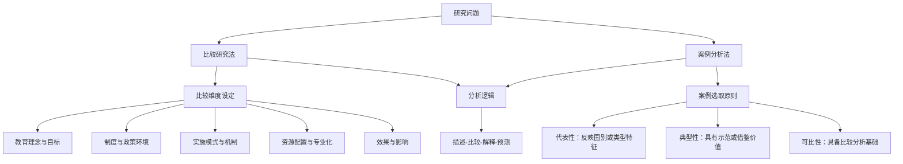
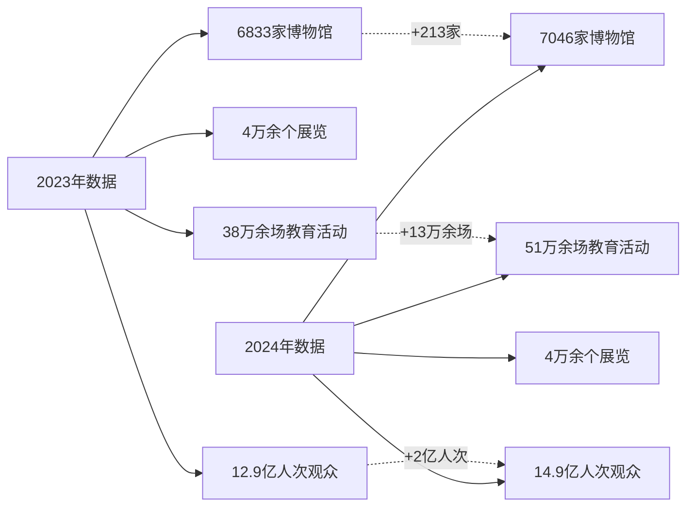
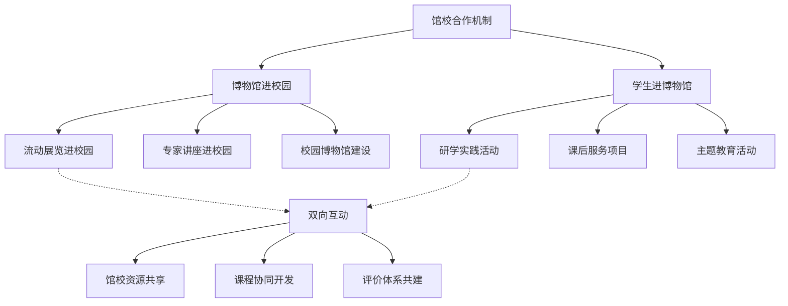
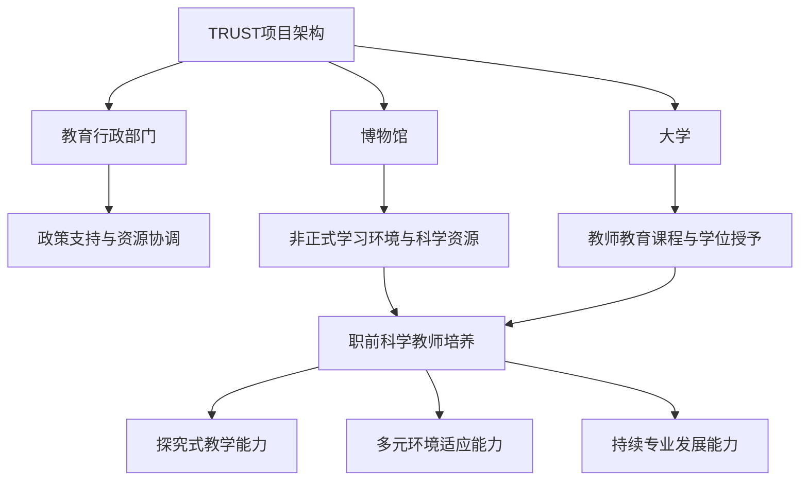
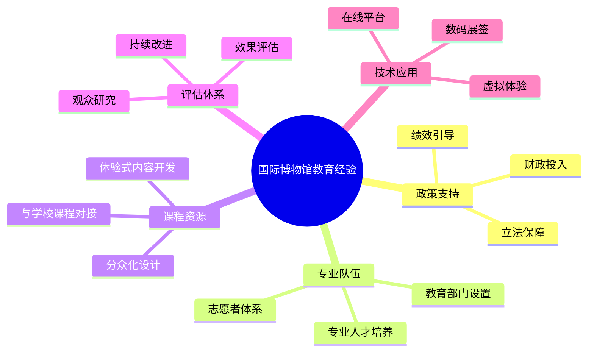
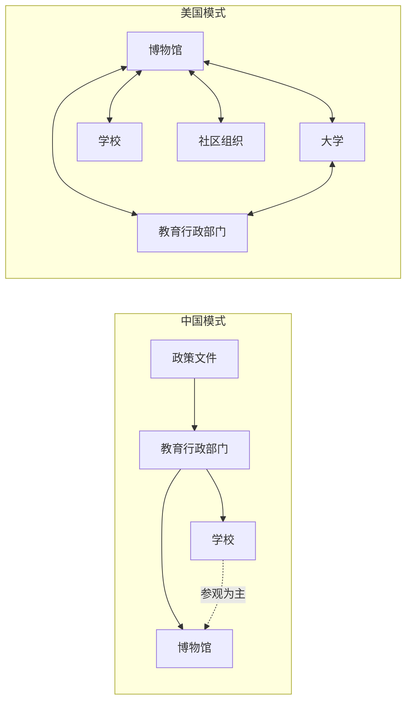
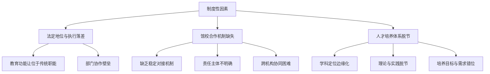
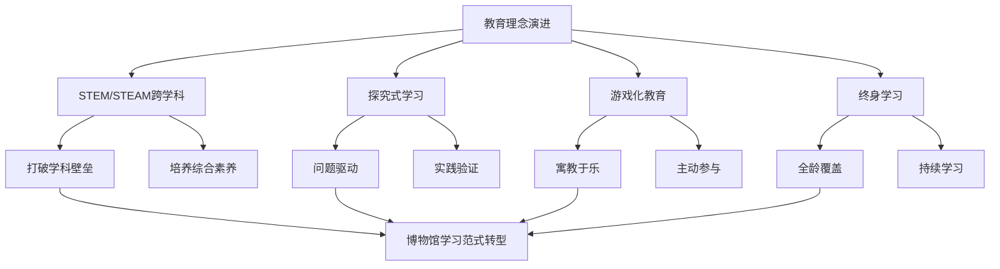
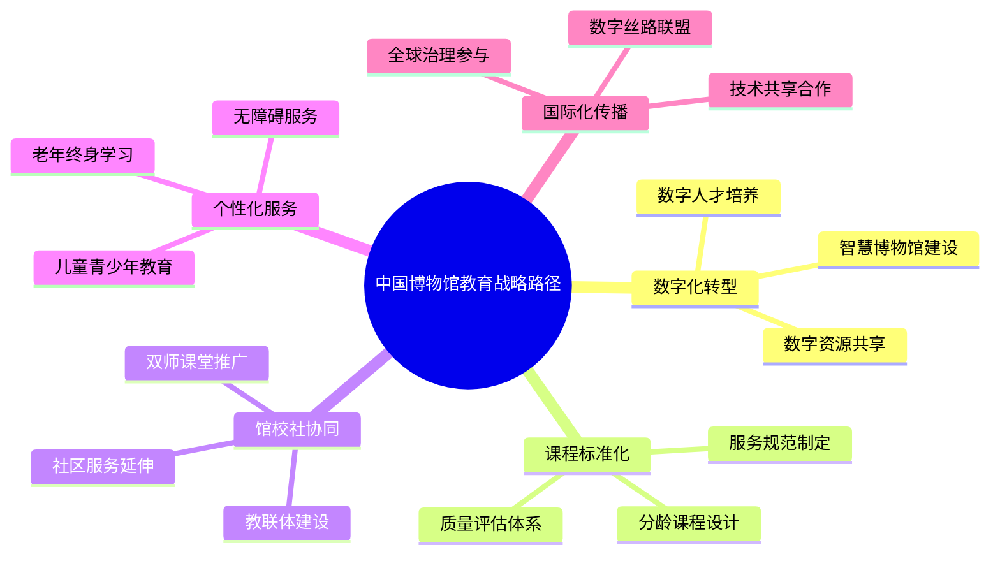

# 中外博物馆教育的现状、特点与未来趋势研究
## 1 引言：研究背景、意义与框架

博物馆作为人类文明的记忆殿堂与知识传播的重要载体，正在经历从"藏品保管中心"向"公众教育平台"的深刻转型。在全球化与数字化浪潮的双重推动下，博物馆教育已超越传统的展陈讲解范畴，成为连接历史与未来、知识与公众、学校与社会的关键纽带。本章将系统阐明博物馆教育研究的时代背景与战略价值，明确核心概念与研究框架，为后续中外博物馆教育的比较分析奠定理论与方法基础。

### 1.1 研究背景：全球文博热潮与教育变革的时代语境

当前，全球博物馆事业正处于前所未有的蓬勃发展期，呈现出规模扩张、功能拓展与技术革新并进的显著态势。

**从全球视野来看**，博物馆数量与观众规模持续攀升。据国际博物馆协会统计，全球博物馆总数已超过10万座，年接待观众数以十亿计。这一增长不仅体现在传统文化大国，也延伸至新兴经济体与发展中地区，反映出各国政府与社会对文化遗产保护、公众教育的高度重视。与此同时，博物馆的数字化转型加速推进，虚拟展览、在线教育、数字藏品等新形态层出不穷，极大地拓展了博物馆的受众边界与教育触达能力。

**从教育变革维度审视**，21世纪以来，全球教育理念经历了从"知识传授"向"素养培育"的根本性转变。传统以学校为中心、以课堂为主阵地的教育模式，正逐步向"终身学习"与"泛在学习"的新范式演进。在此背景下，博物馆作为典型的非正式学习场所，其教育价值被重新发现与高度重视。博物馆所提供的情境化、体验式、探究型学习机会，恰好契合了当代教育强调批判性思维、创新能力与跨学科素养培养的核心诉求。

**中国的"文博热"尤为引人瞩目**。近年来，中国博物馆数量快速增长，截至目前已跻身世界博物馆大国行列。与此同时，博物馆参观人次屡创新高，"博物馆里过大年"、文创产品热销、考古类节目走红等现象，标志着公众对博物馆的认知与参与正从"偶尔到访"转向"文化刚需"。这一社会文化转型为博物馆教育的深化发展提供了前所未有的机遇，也提出了更高的专业化要求。

### 1.2 研究意义：博物馆教育的战略价值与现实关切

博物馆教育研究的意义，需置于文化强国建设、终身学习体系构建与公民素养提升的战略框架中加以理解。

**第一，博物馆教育是文化强国建设的重要支撑。** 博物馆承载着民族记忆与文化基因，是国家文化软实力的重要组成部分。通过系统化的教育活动，博物馆能够将静态的文物藏品转化为鲜活的文化叙事，增进公众对本国历史文化的认同与自信，同时促进文明交流互鉴，提升国家文化影响力。在当前国际竞争日趋激烈的背景下，博物馆教育对于塑造国家形象、传播核心价值观具有不可替代的战略意义。

**第二，博物馆教育是终身学习体系的关键环节。** 随着知识更新速度加快与职业生涯延长，终身学习已成为现代社会的基本需求。博物馆以其开放性、包容性与资源丰富性，能够为不同年龄、不同背景的公众提供持续学习的机会。从学龄前儿童的启蒙教育，到青少年的研学实践，再到成年人的兴趣拓展与老年人的文化休闲，博物馆教育贯穿人生全周期，是构建学习型社会的重要基础设施。

**第三，博物馆教育对公民素养提升具有独特功能。** 博物馆教育不同于学校教育的系统性与强制性，其自愿参与、自主探索的特点更有利于激发学习者的内在动机与好奇心。通过与真实文物、科学标本、艺术作品的直接接触，公众能够获得书本知识难以替代的感性认知与审美体验。博物馆教育在科学普及、历史认知、艺术鉴赏、生态意识等多个维度，对于培育具有人文关怀、科学精神与全球视野的现代公民发挥着独特作用。

**从现实关切而言**，本研究旨在回应博物馆教育实践中面临的诸多挑战。如何提升博物馆教育的专业化水平？如何实现馆校资源的深度整合？如何借助数字技术拓展教育边界？如何促进不同类型博物馆教育的均衡发展？这些问题的解答，对于指导政策制定与推动实践创新具有重要的参考价值。

### 1.3 核心概念界定：博物馆教育的内涵、范畴与关键维度

明确"博物馆教育"的概念内涵，是开展系统研究的前提。

**博物馆教育的概念内涵**可从广义与狭义两个层面理解。狭义的博物馆教育主要指博物馆针对观众开展的有组织、有目的的教学活动，如讲解导览、专题讲座、工作坊等。广义的博物馆教育则涵盖博物馆所有具有教育意图或教育效果的功能与活动，包括展览策划、公共项目、出版物编撰、数字资源开发等。本研究采用广义的概念界定，将博物馆教育理解为**博物馆以其藏品、展览、空间与专业资源为基础，面向社会公众开展的一切知识传播、文化传承与素养培育活动**。

**博物馆教育的主要形态**包括以下几类：

| 教育形态 | 主要特征 | 典型案例 |
|---------|---------|---------|
| **展览教育** | 以常设展览与临时展览为载体，通过展陈设计实现教育目标 | 主题展览、互动展区 |
| **公共项目** | 面向一般观众的讲座、工作坊、节庆活动等 | 博物馆之夜、文化节 |
| **学校合作** | 与各级各类学校建立合作关系，开展馆校联合教育 | 研学课程、教师培训 |
| **数字教育** | 利用数字技术拓展教育渠道与形式 | 虚拟展览、在线课程 |
| **社区服务** | 面向特定社区或群体的定制化教育服务 | 流动博物馆、外展项目 |

**博物馆教育与学校教育、社会教育的关系**需要厘清。学校教育以系统性、强制性、评价性为特征，博物馆教育则以自愿性、体验性、开放性见长；社会教育是更宽泛的概念，博物馆教育是其重要组成部分。三者既有边界又相互渗透，博物馆教育在"馆校合作"中与学校教育形成互补，在"终身学习"框架下与社会教育相互支撑。

**分析博物馆教育的关键维度**主要包括：

- **教育理念**：博物馆教育所秉持的核心价值观与目标取向，如知识普及、素养培育、社会包容等
- **受众对象**：博物馆教育所服务的目标群体，包括年龄、背景、需求等分层
- **实施方式**：博物馆教育的具体方法与手段，如讲解、互动、体验、数字化等
- **资源配置**：博物馆教育的人力、财力、物力投入与专业化程度
- **效果评估**：博物馆教育成效的衡量标准与评价方法

### 1.4 研究问题与方法论框架

本报告聚焦于以下**核心研究问题**：

1. **现状描述**：中国与主要发达国家博物馆教育的发展现状如何？呈现哪些规模特征与结构特点？
2. **特点归纳**：不同国家、不同类型博物馆教育各自具有哪些典型特点与运行模式？
3. **比较分析**：中外博物馆教育在理念、机制、实践等方面存在哪些异同？差异背后的深层原因是什么？
4. **趋势预判**：在科技发展与教育理念变革的双重驱动下，博物馆教育将呈现哪些未来趋势？中国博物馆应如何把握机遇、应对挑战？

**方法论框架**以比较研究法为主线，辅以典型案例分析法：

**比较维度**涵盖教育理念与目标、制度与政策环境、实施模式与机制、资源配置与专业化程度、效果与社会影响等五个层面。**案例选取**遵循代表性、典型性与可比性原则，在国别层面选取美国、英国等博物馆教育发达国家作为比较对象，在类型层面兼顾不同级别与所有制的博物馆。**分析逻辑**遵循"描述-比较-解释-预测"的递进路径，从现状描述出发，通过系统比较揭示异同，进而解释差异成因，最终预判发展趋势。

### 1.5 博物馆分类体系与研究框架说明

为实现系统化的比较研究，本报告采用**双重维度的博物馆分类体系**：

**第一维度：按行政级别划分**

| 级别类型 | 界定标准 | 典型特征 |
|---------|---------|---------|
| **国家级博物馆** | 由中央政府主管或认定的顶级博物馆 | 藏品丰富、资源充足、示范引领 |
| **省级博物馆** | 省级行政区域内的核心博物馆 | 区域代表性、专业化程度较高 |
| **市县级博物馆** | 地市级及县级行政区域的博物馆 | 数量众多、贴近基层、资源有限 |
| **基层博物馆** | 乡镇、村级或社区层面的小型博物馆 | 特色鲜明、规模较小、教育功能待开发 |

**第二维度：按所有制性质划分**

| 所有制类型 | 界定标准 | 典型特征 |
|-----------|---------|---------|
| **公立博物馆** | 由政府出资设立并管理的博物馆 | 公益属性强、资源稳定、受政策影响大 |
| **私立博物馆** | 由企业、个人或社会组织设立的博物馆 | 灵活性高、特色突出、可持续性面临挑战 |
| **行业博物馆** | 由特定行业或企业设立的专题博物馆 | 专业性强、与行业发展紧密关联 |

这一分类体系的方法论意义在于：**级别维度**有助于揭示不同层级博物馆在资源配置、政策支持、专业能力等方面的结构性差异；**所有制维度**有助于分析不同产权属性对博物馆教育理念、运营模式、创新动力的影响。两个维度的交叉分析，能够更全面地呈现博物馆教育的多元图景与复杂机理。

**全文结构与逻辑递进关系**如下：

本报告遵循"背景铺垫-现状描述-比较分析-趋势预判-对策建议"的逻辑主线。第1章奠定研究基础，第2章与第3章分别呈现中国与国外博物馆教育的现状与特点，第4章开展系统比较并诊断问题，第5章预判未来趋势并探讨中国博物馆的战略路径，第6章归纳结论并提出对策建议。各章节之间形成有机衔接，共同服务于全面认识中外博物馆教育现状、把握发展趋势、提出改进路径的研究目标。

## 2 中国博物馆教育的现状与多维特点分析

中国博物馆教育历经数十年发展，已从早期的单一讲解模式演进为涵盖展览教育、研学课程、数字体验、社区服务等多元形态的综合性教育体系。在政策驱动与社会需求的双重推动下，博物馆日益成为广大人民群众教育学习的公共空间，成为中小学生喜爱的"第二课堂"[^1]。本章将从政策演进、行政级别、所有制性质、实施模式、技术应用等多个维度，系统剖析中国博物馆教育的发展态势与结构特征，为后续中外比较分析奠定坚实基础。

### 2.1 政策驱动与整体发展态势

#### 2.1.1 政策演进脉络：从免费开放到教育功能首位

中国博物馆教育的快速发展与国家政策的持续引导密不可分。**2008年是一个重要的政策转折点**，中央多部门联合下发《关于全国博物馆、纪念馆免费开放的通知》，推动更多观众走进博物馆，开启了博物馆公共教育的新纪元[^1]。此后，相继出台了《关于加强文教结合、完善博物馆青少年教育功能的指导意见》《关于利用博物馆资源开展中小学教育教学的意见》等一系列政策文件，推动博物馆资源开发利用，促进博物馆与学校教学、综合实践有机结合[^1]。

**《博物馆条例》的颁布实施标志着博物馆教育功能的法定化确认**。该条例明确规定博物馆的三大目的是教育、研究和欣赏，将"教育"置于博物馆功能的首位，彰显了"教育"工作的必要性和重要性[^2]。2021年，中宣部等九部门联合印发《关于推进博物馆改革发展的指导意见》，提出到2025年形成布局合理、结构优化、特色鲜明、体制完善、功能完备的博物馆事业发展格局，到2035年基本建成世界博物馆强国[^3]。该意见明确提出要"彰显教育功能"，实施"博物馆+"战略，促进博物馆与教育、科技、旅游等跨界融合[^3]。

| 时间节点 | 核心政策文件 | 教育功能定位 |
|---------|-------------|-------------|
| 2008年 | 《关于全国博物馆、纪念馆免费开放的通知》 | 降低参观门槛，扩大教育覆盖 |
| 2015年 | 《博物馆条例》 | 教育列为博物馆三大目的之首 |
| 2020年 | 《关于利用博物馆资源开展中小学教育教学的意见》 | 推进馆校合作制度化 |
| 2021年 | 《关于推进博物馆改革发展的指导意见》 | 彰显教育功能，跨界融合发展 |

#### 2.1.2 规模数据：博物馆事业的跨越式发展

**中国博物馆事业近年来实现了跨越式发展，平均不到两天就有一座博物馆建成开放**[^4]。截至2024年底，全国备案博物馆达7046家，较上一年增加213家，实现每20万人拥有一家博物馆[^5]。从免费开放情况看，6444家博物馆实现免费开放，免费开放率达91.46%[^6]。馆藏资源方面，全国博物馆馆舍总面积4392.91万平方米，藏品总数达到6741.3万件/套，比2023年增加408.03万件/套[^6]。

**教育活动规模呈现爆发式增长态势**。2024年全国博物馆举办陈列展览4万余个、教育活动51万余场，接待观众14.9亿人次[^7]。与2023年相比，教育活动场次从38万余场增长至51万余场，增幅超过34%，观众人次从12.9亿增长至14.9亿，增幅超过15%[^1][^7]。这一数据充分表明，博物馆已日益成为公众文化生活的重要组成部分。

#### 2.1.3 "文博热"现象的三重驱动因素

当前"文博热"已然成为一种新的文化现象，其背后存在政策引导、社会需求与博物馆自身创新三重驱动因素[^7]。

**政策引导层面**，中央先后召开全国文物工作会议等重要会议，出台《博物馆条例》、修订《中华人民共和国文物保护法》，印发《关于推进博物馆改革发展的指导意见》等重要文件，对文博事业改革发展作出部署。中央财政年均下达博物馆纪念馆免费开放补助资金预算30余亿元，这些政策支持和财政补助极大地推动博物馆事业走向高质量发展快车道[^7]。

**社会需求层面**，按照恩格尔系数规律，随着收入水平提高，食品等基本生活支出占比逐渐下降，精神文化需求支出占比逐渐攀升。据统计，2024年我国居民恩格尔系数为29.8%，人们对文化产品的需求逐渐从"有没有"转变为"好不好"[^7]。博物馆作为连接过去、现在与未来的桥梁，一件件文物是感知历史最有力的物证，很多年轻人选择到博物馆来，想要真正了解被深埋的历史，与文物进行深度对话，获取穿越时空的文化体验和情感共鸣[^7]。

**博物馆自身创新层面**，各地博物馆不断挖掘文物内涵，积极创新展览展示，推动展览与文创结合。博物馆运用AI、VR、AR、数字孪生等新技术，使数字展览、全景展厅、智能导览、沉浸式互动体验等项目落地开花。还有博物馆积极开展跨界合作，"博物馆+综艺""博物馆+剧本杀"等实践为博物馆"破壁"传播提供了新思路[^7]。

### 2.2 行政级别维度下的博物馆教育分层特征

依据行政管理层级，中国博物馆可划分为国家级、省级、市县级、基层博物馆四个层次。不同层级博物馆在教育资源配置、专业人才储备、课程开发能力、品牌项目建设等方面呈现明显的梯度差异。

#### 2.2.1 国家级博物馆：示范引领与标杆塑造

**国家级博物馆在博物馆教育体系中发挥着示范引领作用**。以中国国家博物馆为代表，其建设目标明确定位为"代表国家收藏、研究、展示、阐释中华文化代表性物证，打造彰显民族发展历程、记录民族复兴伟业的历史长廊，展现中华文明永恒魅力和时代价值的文化殿堂，激励人民坚定信心、团结奋斗的精神家园"[^8]。

**分众化教育是国家级博物馆教育创新的重要方向**。中国国家博物馆以观众为中心，积极探索实践分众化社会教育，针对儿童、青少年、成年、特殊群体等不同观众的认知特点、学习兴趣及参观体验，为公众提供多样化、个性化的"菜单式"教育[^9]。国博社教部组织力量稳步推进讲解文本的深耕工作，已根据不同群体的认知水平、语言特点撰写了儿童版、青少版、普通成人版、专业版的《古代中国》分众化讲解词，为不同群体提供分众化导览[^9]。

国家级博物馆还注重教育资源的系统化开发。国家博物馆先后出版了《国家博物馆儿童历史百科绘本》和《中学生博物之旅·古代中国》研学丛书，前者从儿童成长需求与认知规律出发，精选科技、汉字、艺术、音乐和服饰5大贴近孩子生活的主题；后者立足于"古代中国"基本陈列，打造面向全国中学生的"以物说史"的科普范本[^9]。

#### 2.2.2 省级博物馆：区域中心与特色引领

**省级博物馆承担着区域文化教育中心的职能**。以河北博物院为例，作为省级综合性博物馆，拥有21万件套丰富的文物馆藏。依托悠久的地域历史文化，活化利用丰富的文物资源，河北博物院积极发挥博物馆社会教育功能，策划推出"河博学堂""河博工坊""河博剧场""河博美育""传统文化惠万民"等十多个系列的品牌教育项目，近年来平均每年开展各类教育活动450余场[^10]。

**通史类博物馆课程的开发是省级博物馆教育创新的重要探索**。河北博物院开发的"河北大地的文明印迹"教育项目，将河北地域历史根据时间顺序分成12个大的阶段，以200万年的时空跨度构建完整认知体系，以"时间纵轴+空间横轴"的立体坐标系，以文物为核心，采用"文物实证→史实重构→人文价值提炼"的文物创新阐释模式[^10]。该项目包含文本教学材料、数字化教学材料等内容，既能以线下教育活动、主题研学的方式开展，也能以视频教学的方式通过互联网平台进行"云"传播[^10]。

省级博物馆还注重发挥龙头馆引领作用，推进与地方各类文博机构的合作共建。河北博物院已与张家口博物馆、蔚县博物馆等20余家省内中小型博物馆建立合作关系，形成多方联动的资源共享机制[^10]。

#### 2.2.3 市县级博物馆：贴近基层与资源整合

**市县级博物馆是博物馆体系的主体力量，但教育资源相对有限**。据统计，县域博物馆覆盖率已达80%[^6]，但在专业人才、课程开发、设施设备等方面与国家级、省级博物馆存在明显差距。市县级博物馆的教育功能主要体现在服务本地居民、配合学校教育、传承地方文化等方面。

**馆际合作与资源共享是提升市县级博物馆教育能力的重要途径**。《关于推进博物馆改革发展的指导意见》提出探索"大馆带小馆"模式，鼓励博物馆建立帮扶机制，加强中小博物馆人才培训；加强场馆间合作与交流，通过巡展、借展、联展、数字展等方式举办展览[^7]。禅城区博物馆的实践表明，通过"引进来"与"走出去"相结合的方式开展馆际交流，可以有效丰富展览内容和教育资源[^11]。

#### 2.2.4 基层博物馆：特色鲜明与功能待开发

**基层博物馆数量众多但教育功能开发不足是当前博物馆体系的结构性矛盾**。乡镇、村级或社区层面的小型博物馆往往具有鲜明的地方特色，但受限于资金、人才、设施等条件，教育功能难以充分发挥。

政策层面已开始关注这一问题。《关于推进博物馆改革发展的指导意见》提出支持博物馆文化资源进社区、进校园，畅通文化供给"最后一公里"[^7]。一些地区通过建设村级文化展示馆、状元文化展示馆等方式，探索基层博物馆教育功能的实现路径。例如，禅城区博物馆策划的黎冲状元文化展示馆常设展览，成为佛山新的状元文化地标[^11]。

| 博物馆层级 | 数量特征 | 教育资源 | 典型特点 |
|-----------|---------|---------|---------|
| 国家级 | 数量少、影响大 | 充足、专业化程度高 | 示范引领、分众化服务 |
| 省级 | 各省核心馆 | 较充足、区域特色 | 品牌项目、龙头带动 |
| 市县级 | 数量众多 | 相对有限 | 贴近基层、资源整合 |
| 基层 | 覆盖面广 | 严重不足 | 特色鲜明、功能待开发 |

### 2.3 所有制维度下的博物馆教育差异分析

#### 2.3.1 公立博物馆：公益属性与政策支持

**公立博物馆是中国博物馆体系的主体，具有鲜明的公益属性**。国立博物馆是国家主导建立的，教育目的大于盈利目的，门票多为免费，博物馆的日常运作经费依靠财政拨款和博物馆自身的运营[^12]。以陕西历史博物馆和西安博物院为例，门票都是免费的，作为国家级重点博物馆，陕西历史博物馆馆藏规模宏大，藏品170余万件[^12]。

**公立博物馆在教育资源配置上具有明显优势**。由于得到国家与当地政府资金的大量投入，公立博物馆能够配备专业的教育人员、开发系统的教育课程、建设完善的教育设施。国立博物馆的管理者有丰富的办馆经验，可以通过举办各种活动增加知名度[^13]。在馆藏价值上，国立博物馆因为展品的固定性，价值往往高于民办博物馆的展品[^13]。

#### 2.3.2 非国有博物馆：灵活创新与可持续挑战

**非国有博物馆近年来发展迅猛，呈现出灵活创新的特点**。民办博物馆是指利用非国有文物、标本、资料等资产设立的博物馆，随着私人收藏热潮的勃发，民办博物馆逐渐兴起，从原来的随意化逐渐走向正规化[^13]。它们通过有效的网络途径得以广泛传播，知名度大大提升，客流量亦随之增大[^13]。

**非国有博物馆在教育内容和形式上往往具有独特优势**。以西安曲江艺术博物馆为例，其展览文物非常独特，主要展览物是历代壁画，用壁画表现中国古代绘画的发展历史，这是很多国有博物馆都很少展览的馆藏。其专题展览也非常有特点，如毕加索的作品展，这是在博物馆内很少可以看见的国外大师的作品集中展览[^14]。

**然而，非国有博物馆面临可持续发展的挑战**。由于未得到国家的资金支持，博物馆的正常运营所需要的费用往往由收藏者自己支付，因此不得不从别的地方弥补资金的不足——提高票价，但门票价格之昂贵使大量游客望而却步[^13]。在身份上，国家并未有效划定民办博物馆的身份性质，办馆者需要自行承担租赁馆地的费用，缴纳各种税收，自己承担亏损[^13]。

**私人博物馆的盈利模式探索是其可持续发展的关键**。成功的私人博物馆通过门票+分级会员体系、文化创意产品开发、展览与空间租赁、教育培训拓展、数字化转型等多元化方式实现收入[^15]。例如，某艺术私人博物馆非常重视文创产品的研发与推广，"抽象画风T恤"系列年销售额突破千万元；某科技私人博物馆致力于推动青少年科技创新教育，与多家学校建立长期合作关系[^16]。

#### 2.3.3 行业博物馆与企业博物馆：专业特色与企业服务

**行业博物馆和企业博物馆是博物馆体系的重要补充**。企业博物馆是由企业创办的，以企业历史、文化、核心业务和产品等作为主要展示内容的博物馆[^17]。企业博物馆是展示企业核心竞争力的重要窗口，是传承企业历史、文化的重要载体，是履行企业社会责任的重要方式，也是国家公共文化服务体系的重要补充[^17]。

**国有企业博物馆的发展已引起政府主管部门的高度重视**。2021年九部委联合印发的《关于推进博物馆改革发展的指导意见》明确提出要"将高校博物馆、国有企业博物馆等纳入行业管理体系"，首次将国有企业创办博物馆纳入宏观政策考量[^17]。

| 所有制类型 | 资金来源 | 教育定位 | 主要挑战 |
|-----------|---------|---------|---------|
| 公立博物馆 | 财政拨款为主 | 公益性、普惠性 | 创新活力不足 |
| 非国有博物馆 | 自筹为主 | 特色化、差异化 | 可持续发展 |
| 企业博物馆 | 企业投入 | 服务企业与社会 | 公共性与企业性平衡 |

### 2.4 教育实施模式与馆校合作机制

#### 2.4.1 博物馆教育的多元实施形态

**博物馆教育具有实物性、情境性、体验性、主动性、终身性等特点**[^2]。博物馆开辟了利用物质文化而非文字式的教科书阐释文化和科学的方法，使文化遗产具有更加深刻而广泛的意义；提供了认知世界的新维度和新视野；培育了公众由观察、体验等可感知的材料而理性认识世界的途径[^1]。

**当前中国博物馆教育的主要形式包括**：导览讲解、主题展览、教育活动（工作坊/讲座）、数字平台（线上资源/虚拟展厅）等[^18]。博物馆教育功能越来越突出，从传统的说教到主动调动观众的热情，让他们关注、参与和融入到博物馆教育活动中来[^2]。

**研学旅行已成为博物馆教育的重要形态**。博物馆研学旅行逐渐成为不少中小学生课余生活的重要内容。携程《2024暑期出游市场报告》显示，携程平台上研学游订单量增长达175%。国家博物馆推出中华文明研学系列课程，公众需要"抢购"才能获取报名资格[^7]。不同于课堂教学，研学是一种重问题解决和探究过程的开放式学习，博物馆研学课程设计开发应紧扣目标受众需求，发挥博物馆资源禀赋和独特魅力[^1]。

#### 2.4.2 馆校合作的制度化进程

**馆校合作是博物馆教育的核心机制**。2020年，教育部、国家文物局联合印发《关于利用博物馆资源开展中小学教育教学的意见》，明确提出博物馆教育课程要以促进学生学习为中心，要根据博物馆环境、藏品、展览等，综合运用解说导览、专题讲座、互动游戏、角色扮演、动手实践等方式，增强博物馆学习的趣味性、互动性和体验性[^19]。

该意见从多个层面推进馆校合作制度化：**一是推动博物馆教育资源开发应用**，要求各地博物馆坚持"展教并重"，策划适合中小学生的专题展览和教育活动；**二是开发博物馆系列活动课程**，要求结合中小学生认知规律和学校教育教学需要，研究开发自然类、历史类、科技类等系列活动课程；**三是拓展博物馆教育方式途径**，创新博物馆学习方式，提升博物馆研学活动质量，纳入课后服务内容[^20]。

#### 2.4.3 馆校共建的实践案例

**西安市的馆校合作实践具有典型示范意义**。西安是中华文明的重要发源地之一，文物资源极为丰富。西安市教育局将近年来基础教育学校利用博物馆教育资源开展全面育人、推进"馆校合作"方面的优秀案例进行展示，为打造"西安优秀文化育人示范区"贡献教育力量[^21]。

西安高新区第十七小学的实践颇具代表性。该校拥有"人文之窗"校园博物馆，陈列了葡萄花鸟纹银香囊、人面鱼纹彩陶盆等四十多件文物复制品，学生可以在这里和"文物"亲密接触，加深学习体验[^21]。学校面向全体学生开展国家级优秀教学成果《中华优秀传统文化·博悟课程》，与西安秦砖汉瓦博物馆、西安碑林博物馆等进行馆校合作，开设"探访身边的博物馆系列课程"[^21]。

**"博物馆进校园"与"学生进博物馆"形成双向互动机制**。学校定期邀请历史专家、博物馆馆长、讲解员等人员来校为学生现场讲解，内容包括说文解字、服饰礼仪、美食美器、音乐戏曲等；同时组织学生走进博物馆，参与教育成果展演文化活动[^21]。西安高新第三小学创建了"漫步古都"博悟课程，倾力打造"三个课堂"：立足第一课堂教学，在各学科教学中融入博悟元素；拓展延伸第二课堂，馆校共建；开发实践第三课堂，带领学生走出校园，走进博物馆[^22]。

### 2.5 数字技术赋能与教育创新实践

#### 2.5.1 数字技术应用的典型案例

**数字技术正在深刻改变博物馆教育的形态与体验**。党的二十届三中全会提出"探索文化和科技融合的有效机制，加快发展新型文化业态"。在博物馆领域，数字技术带来了新的机遇，为博物馆传播教育提供了全新可能[^1]。

**敦煌莫高窟的数字化实践是行业标杆**。2023年，"数字藏经洞"国内和国际版、"寻境敦煌——数字敦煌沉浸展"相继发布推出，让海内外人士通过网络就能观赏并了解敦煌莫高窟艺术的魅力[^1]。2024年5月，在希腊雅典举行的"美成天龙——天龙山石窟数字复原国际巡展"吸引了大批当地民众前来欣赏了解中国石窟艺术[^1]。

**国家博物馆的线上社教项目同样成效显著**。国博社教部针对低学段小学生推出了《探秘甲骨文之旅》动漫类科普课程，以国博小使者果果和波波到甲骨文世界的穿越之旅为故事线，让孩子们在学习甲骨文的同时，对商代的自然环境、国家大事、社会生产和衣食住行都有所了解，堪称一部"商代文化小百科"[^9]。

**地方博物馆也在积极探索数字化教育**。广西博物馆将广西文化融合演艺、数字技术等元素，推出了多媒体舞台剧《梦见瓯骆》、"鼓动八桂 声震九州——广西古代铜鼓文化数字化陈列"展览等特色项目，通过沉浸式展演，让观众更加深入了解和感悟文物的历史内涵[^1]。

#### 2.5.2 技术应用的多元形态

**博物馆数字化应用呈现多元形态**。各地博物馆运用AI、VR、AR、数字孪生等新技术，使数字展览、全景展厅、智能导览、沉浸式互动体验等项目落地开花[^7]。第三届联合国教科文组织国际博物馆高级别论坛期间展示了增强现实、无人驾驶导览、三维建模等前沿技术在博物馆领域的应用案例[^23]。

| 技术类型 | 应用场景 | 教育功能 | 典型案例 |
|---------|---------|---------|---------|
| VR/AR | 虚拟展览、沉浸体验 | 突破时空限制、增强互动性 | 数字藏经洞、AR导览 |
| AI | 智能导览、个性化推荐 | 分众化服务、提升体验 | 智能讲解系统 |
| 数字孪生 | 文物数字化、虚拟复原 | 保护与展示并重 | 天龙山石窟数字复原 |
| 在线平台 | 云展览、线上课程 | 扩大覆盖面、打破地域限制 | 国博APP、线上讲解 |

#### 2.5.3 区域与层级不均衡问题

**数字化应用在区域与层级上存在明显不均衡**。国家级、省级博物馆在数字化建设上投入较大，技术应用较为成熟；而市县级、基层博物馆受限于资金、人才、技术等条件，数字化水平相对滞后。这种不均衡既体现在硬件设施上，也体现在数字内容开发和运营能力上。

《关于推进博物馆改革发展的指导意见》提出要"强化科技支撑"，加强博物馆网络教育资源建设，利用现代信息技术建立本区域网上博物馆资源平台和博物馆青少年教育资源库，促进与中小学网络教育资源对接，扩大博物馆教育资源的覆盖面[^20]。未来需要通过政策引导、资源共享、技术帮扶等方式，缩小不同层级博物馆之间的数字化差距。

### 2.6 中国博物馆教育的核心特点归纳

基于上述多维分析，可以系统提炼中国博物馆教育的核心特点：

#### 2.6.1 以文化人、以文育人的价值导向

**博物馆教育承担着"以文化人、以文育人"的重要使命**。文物承载灿烂文明、传承历史文化、维系民族精神，是老祖宗留给我们的宝贵遗产[^1]。中华优秀传统文化是中华民族的精神命脉，推动中华优秀传统文化创造性转化、创新性发展，要注重古为今用、守正创新，赋予传统文化新的时代内涵和现代表现形式，在这一过程中，博物馆教育扮演了至关重要的作用[^1]。

通过展览和社教活动等方式，博物馆不断加强文物资源挖掘阐释，结合现代科技和数字手段，利用跨学科的多维视角对中华优秀传统文化进行创造性转化和创新性发展，以公众便于理解和传播的方式呈现，激发公众对中华优秀传统文化的理解和认同[^1]。

#### 2.6.2 服务终身学习体系构建的功能定位

**博物馆是构建全民终身学习体系的重要途径**。博物馆不仅是人类文明的窗口，也是社会教育、终身学习的课堂[^1]。作为社会教育的重要组成部分，博物馆拥有包括历史文物、艺术品、科技展品、互动体验等丰富多元的教育资源，具有实物性、情境性、体验性、主动性、终身性等特点，能够满足不同年龄段和不同兴趣爱好群体的学习和教育需求[^1]。

与其他教育形式不同，博物馆提供了一种更直观和生动的学习方式，为各年龄层的社会群体提供了丰富的学习资源和学习机会[^1]。习近平总书记提出"博物馆就是一所大学校"，面向普通公众的教育促使博物馆研究阐释的方法，包括陈列的理念与方式等，使博物馆由古典走向现代[^2]。

#### 2.6.3 免费开放为主的普惠均等特征

**免费开放是中国博物馆教育的显著特征**。截至2024年底，6444家博物馆实现免费开放，免费开放率达91.46%[^6]。这一政策极大地降低了公众参观博物馆的门槛，使博物馆真正成为面向全民的公共文化设施。

免费开放政策的实施，配合中央财政年均30余亿元的补助资金[^7]，有效保障了博物馆公益属性的实现，使不同社会阶层、不同地域的公众都能平等地享受博物馆教育资源，体现了公共文化服务的普惠性原则。

#### 2.6.4 政策主导与社会参与相结合的发展模式

**中国博物馆教育呈现政策主导与社会参与相结合的发展模式**。从政策层面看，国家通过法规制定、财政支持、评估引导等方式，为博物馆教育发展提供制度保障和资源支撑；从社会参与层面看，非国有博物馆、企业博物馆、社会志愿者等多元主体积极参与，丰富了博物馆教育的供给主体和服务形态。

《关于推进博物馆改革发展的指导意见》明确提出要"鼓励社会参与"，营造开放包容的发展环境，通过区域协同创新、社会参与、跨界合作、互联网传播等方式，促进资源要素有序流动，优化资源配置[^3]。

#### 2.6.5 从"聚焦物"向"关怀人"转变的理念演进

**博物馆教育理念正在经历从"聚焦物"向"关怀人"的深刻转变**。博物馆教育功能越来越突出：从聚焦"物"向关怀"人"转变；从传统的说教到主动调动观众的热情，让他们关注、参与和融入到博物馆教育活动中来，彰显博物馆的魅力[^2]。

这一理念转变体现在多个层面：在展览设计上，更加注重观众体验和互动参与；在教育活动上，更加强调分众化、个性化服务；在评价标准上，更加关注教育效果和观众满意度。博物馆由昔日着重实物的收藏和展示，发展至以人为本，尤其是以公众为本，博物馆作为与公众沟通的桥梁，透过互动的展示方式与公众对话[^24]。

综上所述，中国博物馆教育在政策驱动与社会需求的双重推动下，已形成规模宏大、类型多元、特色鲜明的发展格局。然而，不同层级、不同所有制博物馆之间在教育资源配置、专业能力建设、数字化水平等方面仍存在明显差距，馆校合作的深度与广度有待进一步拓展，这些问题的解决将是未来博物馆教育高质量发展的重要方向。

## 3 国外博物馆教育的现状与国别特点归纳

国际博物馆教育历经百余年发展，已形成各具特色的理论体系与实践模式。欧美发达国家凭借深厚的博物馆传统与成熟的公共教育理念，在馆校合作、非正式学习、数字化转型等领域积累了丰富经验。本章将系统考察美国、英国、法国、德国、日本等代表性国家的博物馆教育实践，从教育理念、制度机制、典型项目、技术应用等维度进行深入分析，形成可资借鉴的国际经验图谱。

### 3.1 美国博物馆教育：实践导向与多元创新

美国博物馆教育以其强调动手实践、注重体验探究、服务多元群体的鲜明特点，在全球博物馆教育领域占据重要地位。**美国博物馆每年在教育方面的花费多达20亿美元，有些博物馆甚至将教育预算的3/4专门投给K-12（幼儿园-高三）阶段的学生**[^25]。博物馆每年接待的学生团体参观多达5500万人次，博物馆通常针对学校课程标准的需求，为学生量身定制数学、科学、艺术、文学、语言艺术、历史、公民和政府、经济和金融知识、地理和社会学等方面的教育活动[^25]。

#### 3.1.1 教育理念：非正式学习环境的系统构建

美国博物馆教育建立在对非正式学习价值的深刻认同之上。**非正式学习是学习者在非正式场所和情境中获取知识和经验的过程**，这些场所包括博物馆、科技馆、动物园、植物园等具备教育功能的实体场馆[^26]。非正式学习环境以其开放、自主、互动和实践等特点，激发学习者的学习兴趣和积极参与，对于培养其终身学习能力至关重要。

**科学、技术、工程和数学（STEM）教育可以通过有计划的项目在非正式学习环境中得到有效实施**。学生可以在博物馆、天文馆、科学中心、动物园、植物园、营地、国家公园、水族馆和工业场所等多样化的环境中学习STEM领域的相关主题，通过参与展览互动、观看电影和与策展人交谈，深入且广泛地了解具体内容[^26]。研究表明，参与非正式学习环境的科学活动，不仅有助于培养儿童的科学推理能力，还能显著增强他们对科学学习的投入和热情。

#### 3.1.2 博物馆学校：正式与非正式教育的深度融合

**博物馆学校是一种正在兴起的创新型正式教育学校**，它将丰富的博物馆资源与创新的教学方法相结合，为学生提供独特的沉浸式学习体验[^27]。博物馆学校将传统的正式教育和包容性的博物馆深刻融合，让学生有机会获得互动性更强、更加吸引人且有意义的学习体验。

**截至2023年，美国已经有超过30多所博物馆学前班和50多所K-12博物馆示范学校**，分布在美国各个城市和乡村的历史博物馆、美术馆、科技馆、儿童博物馆、动物园和自然中心里[^27]。美国博物馆和图书馆服务协会（IMLS）研究和州标准化评估指出：在幼儿园期间参观过博物馆的孩子升至三年级时，他们在阅读、数学和科学方面的成绩要优于没有参观过博物馆的孩子；博物馆学校的学生在当地和全州范围内的成绩表现通常优于传统学校的学生；特殊需要和残障学生也能从博物馆学习中受益。**美国博物馆联盟学校教育委员预测，截至2040年，美国将建成2,132所博物馆学校**[^27]。

博物馆学校主要有四种类型：

| 类型 | 特征 | 典型案例 |
|-----|------|---------|
| **特许学校型** | 使用当地博物馆作为教室 | 纽约市博物馆学校 |
| **磁石学校型** | 由学校创建的博物馆 | John Early博物馆磁石中学 |
| **馆内学校型** | 在博物馆内部成立的学校 | 史密森早教中心 |
| **独立运营型** | 博物馆创建并在独立地点运营 | 迈阿密儿童博物馆学校 |

**博物馆学校的核心特点**包括：以包容性为核心，确保每个孩子无论其身体能力、经济条件和家庭背景如何都能茁壮成长；鼓励跨学科学习，打破传统学科壁垒；强调实践经验，让学生参与博物馆内的各类实践活动、研讨会、互动展览；注重社区参与，邀请各行各业专家与学生互动[^27]。

**以明尼苏达州科技馆学校为例**，该校采用了三种教学方式：协助幼儿园到小学的孩子策划以珊瑚、电子知识等为主题的展览；每学期定期到博物馆参与探索（Explore）、实验（Experiment）、解释（Explain）和展示（Exhibit）为步骤的"博物馆进程"课程；以博物馆文物为基础尝试"亲自动手"（Hands-on），开展深入的课题研究[^28]。**2014年，美国专门成立了美国国家博物馆学校联盟（National Association of Museum Schools）**，全力支持博物馆学校的发展，到目前为止已组建50余家博物馆学校，覆盖从幼儿园到高中各个阶段，分布于15个州[^28]。

#### 3.1.3 馆校合作的制度化机制

美国博物馆与学校之间建立了高度制度化的合作机制。**70%以上的博物馆至少有一位全职人员负责规划中小学教育活动**[^25]。博物馆面向学校和学生提供的教育服务主要包括学生团体到馆学习、博物馆到校服务、教师专业发展支持等多个方面。

**学生团体到馆学习是最常见的教育形式**。对于学校团体参观，美国博物馆一般实行免费或优惠政策，并为学校团体提供教学方案设计、教学活动组织、教学环境营造、教学设备使用、教辅人员安排等各方面周到而细致的服务[^29]。以大都会艺术博物馆为例，博物馆教育人员通过与学校教师共同讨论，不仅共同编写了内容详尽的各展厅教学指南，还为不同的学校团体提供参观行程和互动活动以供选择。除了博物馆的教育人员外，每天还有大量的社会志愿者为中小学生团体服务[^29]。

**博物馆到校服务是另一重要形式**。始于1993年的美国自然历史博物馆的移动博物馆项目，由纽约市政府、纽约市文化事务部、国家电网以及纽约市议会等多家单位和部门共同建立和赞助支持，自服务以来，已经为纽约市超过700所的学校提供了有关博物馆的体验[^29]。目前，美国自然历史博物馆共有4个移动博物馆，每个由一个集装箱车改造而成，车内设有供学生们动手体验的学习设备和展品，主题和内容针对不同年级的学生设计。

**TRUST项目是馆校合作培养教师的典型案例**。美国自然历史博物馆与纽约市立大学的布鲁克林学院、雷曼学院协作开展的"城市科学教学教师更新"项目（Teacher Renewal for Urban Science Teaching，简称TRUST）被视为馆校合作开展科学教师教育的典型模式[^30]。该项目通过搭建馆校合作共育平台对教师教育过程进行系统设计，在培养过程中强调正式与非正式科学教育资源的整合，并基于循证思路对项目进行评估。项目在实施过程中注重教育行政部门、博物馆与大学间的关系构建，坚持以问题为导向开展课程设计，强调学科内容与教学方法的互动融合，构建起多主体参与的学习社区[^30]。

#### 3.1.4 促进教育公平与服务多元群体

**美国博物馆高度重视教育公平与服务多元群体**。博物馆通过多种策略吸引家庭参与STEM教育，促进STEM教育公平[^26]。史密森博物馆设有"亲自动手角"，学生可以将自己在展览中受到的启发付诸实践，制作出新奇的艺术品[^31]。博物馆还尝试为不同年龄段、不同兴趣的学生量身打造多种形式的参观模式，甚至专门设有儿童博物厅，让孩子亲手触摸仿真的文物或价格低廉的标本。

**高校与博物馆的合作也在不断深化**。凯斯西储大学等高校正积极倡导加强与当地博物馆的合作，这种伙伴关系是一种深刻的互惠互利：对高校而言，博物馆是活生生的教科书，是课堂的延伸，为学生提供了难得的实践与研究机会；对博物馆而言，高校带来了前沿的学术研究、新鲜的视角以及充满活力的年轻力量[^32]。

### 3.2 英国博物馆教育：理论引领与社会责任

英国作为世界博物馆的发源地，在博物馆教育理论与实践方面具有深厚积淀。**英国是世界上最先改变博物馆"重展"、"重研"不"重教"的国家**，他们认为"教育是博物馆的首要责任"，博物馆的服务对象现在应该更多地转向普通民众及中小学生[^33]。

#### 3.2.1 博物馆学理论传统与教育实践

**20世纪60年代，博物馆学作为一门在大学开展教学活动的学科，起源于英国莱斯特大学**[^34]。莱斯特学派将自身的学科命名为博物馆研究（museum studies），被定义为一种实践导向的职业培训课程，其首要目的是为渴望进入博物馆工作的毕业生提供实践培训。同时，博物馆研究也被视为一个兴起于20世纪80年代的批判研究领域，以新博物馆学为名，试图"对博物馆在社会中的角色进行彻底重估"。

**1989年《新博物馆学》出版，这一年被后人称作英国博物馆学元年**。《新博物馆学》认为，尽管博物馆工作者常将他们所面对的政策和工作程序视为理所当然，但事实上，他们的应对之法反映了潜在的价值体系，这一价值体系又是机构灌输给员工的[^35]。英国博物馆学的两大特点是：将博物馆与社会变革联系在一起的工具主义倾向，以及收藏家的实用主义倾向，重点关注实物收藏及在艺术史或人类学语境下形成的话语系统[^36]。

#### 3.2.2 观众研究与以观众为中心的运营转型

**英国博物馆观众研究有着百余年历史，可以追溯至1884年英国利物浦博物馆策展人亨利·希金斯对于自然历史类博物馆的观众研究**[^37]。英国学者艾琳·胡珀-格林希尔认为，博物馆观众研究可以泛指涉及博物馆及其事实上的、潜在的、虚拟的参观者的各种研究与评估。与美国观众研究更聚焦于博物馆教育不同，英国博物馆的观众研究更多是作为一种"证据"，证明博物馆存在的责任与价值[^37]。

**从20世纪80年代的财政责任到如今的社会责任，观众研究为英国博物馆证明自身价值、获得经费支持提供了重要依据**。英国政府通过政策引导与资金杠杆，客观上推动了博物馆观众研究的发展和博物馆对"人"的关注[^37]。英国经验说明，只有当政策引导、经济杠杆、行业规范与学术研究形成合力时，博物馆观众研究才能真正得到发展、发挥效力。

**不列颠博物馆的运营策略转型是典型案例**。自21世纪10年代以来，面对财政吃紧的状况以及不断激烈的市场竞争，英国文化部通过改变绩效评价指标的方式引导英国博物馆关注观众消费[^38]。不列颠博物馆成功地实现了以"博物馆"为中心的传统运营策略向以"观众"为中心的新型运营策略的转变，增强了博物馆自身的资金获取能力。**2018年，不列颠博物馆总收入1.049亿英镑，其中政府津贴仅占12%**，财政拨款曾经在不列颠博物馆的资金总额中占到一半的比例[^38]。

#### 3.2.3 数码媒体应用与观众体验提升

**在世界范围内的博物馆领域，数码媒体正在逐渐广泛地被应用**。相对于传统媒体而言，数码媒体在调动观众积极性、激发观众参与、鼓励观众以个人的方式体验博物馆方面具有巨大优势，为观众从被动的旁观者转变为主动的参与者提供了便利，在博物馆的民主化转型过程中发挥着不可或缺的作用[^39]。

**V&A博物馆的数码媒体应用是典型案例**。V&A博物馆的家具展厅是该馆最早采用数码展签来呈现展品信息的展厅。数码展签通过高度与观者齐腰、屏幕向观者45度角倾斜的电脑终端来呈现，一个展柜里多件展品的信息都可以在一个电脑终端上获取，去除了传统印刷式展签给展厅空间带来的杂乱感[^39]。家具展厅的策展人尼克·汉弗莱指出："设计师偏爱数码展签因为它减少了展厅中平面展板过多的问题，我们不再给200件展品每件都配一个金属架支撑着的印刷展签，而是安装了54个触摸屏作为数码展签，这使得展厅看起来更加干净简洁。"[^39]

数码展签和在线藏品检索的共同优点在于，它们允许策展人以一种简洁的方式向观众提供更多不同层次的信息。电脑具有提供递进层级信息的优势，首层界面一般要确保所有观者都能获得一些核心的基本信息，而不会被过多的信息所累；如果观众需要进一步了解，他们可以通过点击进入下一级界面获取更详细的内容[^39]。

#### 3.2.4 学校教育服务与课程对接

**博物馆俨然成了英国学生学习实践的"第二课堂"，博物馆式教育成了英国学生成长的重要途径和方式**。在英国，无论到哪里参观博物馆都能"巧遇"成群结队的中小学生。在博物馆里，学生们总是很忙碌，有的独自活动，时不时地在讲义上记着什么，有的几人一组小声地讨论着什么[^33]。

**英国博物馆具备优越的资源条件**。截止2012年，英国约有2500个博物馆遍布全国各地，平均不到4万人口就有一个博物馆，是世界上博物馆密度最大的国家[^33]。英国政府高度重视发挥博物馆在国民教育中的作用，并要求中小学加强与博物馆合作，充分利用博物馆资源开展教育教学活动。

**大英博物馆的学校教育服务体系完善**。大英博物馆的藏品跨越两百万年的人类历史和文化，支持KS3（11-14岁）国家课程的学生可以参加由专业教育者和艺术家团队提供的各种课程[^40]。博物馆独特的KS3教育项目探索人类的本质，鼓励学生使用物质文化，发展独立和可转移的探究技能。学校课程包括博物馆内的演示、工作坊、画廊课程和数字课程等多种形式。针对3-7岁儿童，博物馆从探索数字、颜色、形状和图案到与国家课程对接的互动教学课程，为幼儿发现世界提供了丰富机会[^41]。

**巨石阵遗址的教育项目正在扩展**。巨石阵每年接待超过60,000名学童，获得师生的优秀反馈。然而，随着需求增加和专用教育设施短缺，提供广泛活动的能力受到限制。英国遗产正在建设新的先进教育设施，以可持续、先进的空间为所有学习者设计[^42]。

### 3.3 其他国家博物馆教育的典型经验

#### 3.3.1 法国：馆校融合与教育博物馆专业化

**法国存在一种独特的"星期三现象"**：每逢周三，小学和初中的教室空寂无人，而博物馆变身为学生们的"第二课堂"，同学们在教师和博物馆讲解员的引导下，亲自动手完成一项项科学小实验，"穿越时空"去触摸历史、感受宇宙空间、体验动植物世界，用双手、双眼发现和认识世界[^31]。

**维莱特"科学与工业城"是欧洲最大的科普博物馆**。这是一个集展览、实验与资料调阅于一体的综合性科技场馆。它为12岁以下的儿童开设了4000平方米的"儿童馆"。针对青少年开设的"维莱特班"，可将整个班级搬到"科学城"上一至两周课，学生利用那里的设备及展览所提供的知识，在教师和"科学城"工作人员的指导下，亲手完成科学小实验。科学城平均每年接待250个"维莱特班"，一些欧洲国家的学生慕名前往[^31]。

**法国国家教育博物馆采用"展览中心+资源中心"双址运营模式**。该博物馆1879年在巴黎创建，1980年迁至鲁昂。馆长玛丽·布拉德指出："博物馆扮演着起源于历史的角色，能够让我们更好地知道过去发生了什么，怎样更好地为现代教育做贡献，以及怎样更好地展望未来教育。"[^43]目前，法国国家教育博物馆的馆藏超过95万件物品和文献，拥有欧洲最大的教育遗产收藏。博物馆已有40%的项目实现了数字化，并对所有人免费开放。

**法国博物馆注重为青少年提供适龄服务**。介绍博物馆新展的书籍通常分为两个版本，除普通版本之外，还有少年版，翻开书籍，文字简洁明了，有许多启发式的提问[^31]。法国很多学校根据教学大纲涉及的知识点，组织学生到各类场馆学习观摩，每星期给中小学生1小时"公民素质教育"课，把属于历史课和地理课的一部分改到附近博物馆参观。

#### 3.3.2 德国：观众为本与校社联动

**德国博物馆在美术教育领域的实践，长期以来将博物馆视为公共学习空间，而非单纯的观展场所**[^44]。其核心在于以观众为中心的教育理念、校社协同的教育网络、专业化的教育团队以及持续的研究与反思。

**德国大约有6800多家博物馆，内容多样，精彩纷呈**[^45]。德国的博物馆除了镇馆之宝类的特殊收藏外，很多展览并不是一成不变的，而是经常更换不同的主题，并以巡展的形式呈现。博物馆会充分利用这个机会，尽量多地开展一些适合青少年的主题展览。在展出形式上，博物馆也充分照顾青少年的兴趣点，采用音像、影视等多媒体相结合，以全方位的方式呈现。

**德国几乎每个大城市都有专为幼儿园到小学年龄段儿童而设立的博物馆**。这些博物馆旨在寓教于乐、通过饶有兴趣的手工课、小作坊、生日派对、儿童博物馆之夜等丰富多彩的活动，让孩子们愉快地探索日常生活中各种迷人现象[^45]。注重互动体验的儿童博物馆在柏林就有五家，有的用小人国的形式向孩子们展示柏林这个城市的历史和文化；有的建成一个巨型树屋，孩子们在一个又一个的奇妙空间里，探索不同的颜色、形状和结构，还可以开动脑筋自己动手设计，亲手组装和拆卸。

**德国博物馆教育强调校社联动的教育网络**。博物馆教育往往与学校课程紧密对接，形成"学校—博物馆—教师"三方协作的长期机制。学校教师在博物馆教育中不仅是受教育对象，也可成为合作者与共同设计者；博物馆提供与课程标准相衔接的教育资源、教具、工作坊与教师培训，帮助教师在课外时间延展课堂学习[^44]。

#### 3.3.3 日本：终身学习与自发性教育

**日本在亚洲国家中最早引入终身教育理念**。20世纪60年代，日本最早引入终身教育理念；20世纪70至80年代，形成了终生教育的基本概念，并陆续出台了一系列有关终身教育的政策[^46]。1988年，为了适应民众对于学习要求的多样化和高度化，日本文部省将原"社会教育局"更名为"终身学习局"，最终完善并确立起终身学习的理念与实施体系，形成具有本国特色的终身学习模式。

**日本终身教育的特点主要表现在三个方面**：一是自发性，学习者完全是利用自己的业余时间，根据个人的意愿进行自主学习；二是多样性，从教育对象看不分年龄、职业、学历，从教育手段看有公民馆、图书馆、博物馆以及新型的社会教育机构，从教育内容看包括历史文化、科学技术等各个方面；三是现实性，学习者可以根据自己实际存在的问题和需求进行学习，并很快应用于工作或生活中[^46]。

**博物馆作为终身学习的场所，面向全社会所有人群**。博物馆必须对拥有的实物资料进行最大程度的"活"用，将藏品本身所包含的各式信息深度挖掘，将藏品转化为超越时空的对话、让人们能够直观地理解过去的生活和文化[^46]。日本的博物馆教育活动在终身教育理念的影响下，主要通过系列教育活动、志愿者服务和博物馆之友等方式来实施。

**京都国立博物馆的教育实践具有代表性**。京博于明治30年（1897）开馆，教育活动始于大正13年（1924）由学者主讲的专题讲座，该讲座活动一直持续到今天[^47]。面向更广泛对象的教育推广活动，要到平成24年（2012）设置教育室之后，才正式步入轨道。现在教育室主要负责讲座、体验活动、动手教材的开发与实践、访问授课、志愿者的培育与管理、学校团体接待、观赏指南与学习单的制作、美术入门专题展的策划等[^47]。

**日本博物馆教育面临的挑战**包括：大学博物馆学课程与博物馆实践的割裂、学艺员数量不足等问题。日本的本科学位中并没有博物馆学专业，只是在全国约300所高校中设置了学艺员课程。与其他专业领域相比，博物馆学总给人一种专业性不明的印象[^48]。

#### 3.3.4 亚洲区域合作与新兴实践

**亚洲地区博物馆教育的跨国交流正在加强**。2023年2月，京都国立博物馆举办国际研讨会"亚洲博物馆教育的现状——日本·韩国·新加坡国立博物馆的案例"[^47]。研讨会指出，日本的博物馆教育一直通过积极学习欧美国家的先进理念与手法而发展至今，欧美国家博物馆教育的动态一直受到密切关注，在日本各地博物馆活跃的教育推广专家多持有欧美国家大学的博物馆教育学学位。然而，与日本一衣带水的亚洲地区的博物馆，虽然皆在积极推进众多博物馆教育项目，但是至今为止负责人之间的跨国界交流十分匮乏[^47]。

### 3.4 国外博物馆教育的共性特征与经验启示

基于上述国别分析，可以提炼国外博物馆教育的共性规律与核心经验，形成涵盖理念、机制、实践、技术等维度的国际经验图谱。

#### 3.4.1 理念层面：非正式学习价值的普遍认同

**发达国家博物馆普遍认同非正式学习的独特价值**。西方博物馆界有句名言："博物馆不在于拥有什么，而在于以其有用的资源做了什么。"[^31]博物馆教育不同于学校教育的系统性与强制性，其自愿参与、自主探索的特点更有利于激发学习者的内在动机与好奇心。捷克教育家夸美纽斯说过："在人身上，唯一能够持久的东西是从少年时期吸收得来的。"博物馆的历史、科学、文化教育，不断唤醒灵感，催生创造力。

**"告诉我，我会忘记；给我看，我会记住；让我参与，我会理解"**——这一理念在各国博物馆教育实践中得到广泛体现[^31]。亲身实践把知识转为受用一生的力量，这与中国古代"闻之不若见之，见之不若知之，知之不若行之"的教育智慧高度契合。

#### 3.4.2 机制层面：馆校合作的制度化程度

**发达国家博物馆教育普遍建立了制度化的馆校合作机制**。博物馆设有专门的教育部门，能够结合学校的教学需要，提供有针对性的教育服务[^31]。在美国，博物馆教育部门通过为学生在博物馆设立专门的教室、实验室，或者开办专供儿童参观的陈列室，提供有偿借用的图片、幻灯、标本、模型等方法，为来到博物馆参观的青少年提供服务，有效地强化了博物馆与学校的联系。

| 国家 | 馆校合作特点 | 制度保障 |
|-----|-------------|---------|
| 美国 | 博物馆学校、TRUST项目 | 博物馆学校联盟、高校合作 |
| 英国 | 课程对接、观众研究 | 政策引导、绩效评估 |
| 法国 | 星期三现象、维莱特班 | 国家教育体系整合 |
| 德国 | 校社联动、教师培训 | 三方协作机制 |
| 日本 | 终身学习、志愿者服务 | 终身学习局统筹 |

#### 3.4.3 实践层面：分众化与体验式服务的普遍应用

**博物馆可提供符合青少年认知规律、广受欢迎的教育形式与内容**。各国博物馆普遍注重分众化服务，针对不同年龄、不同背景的观众提供差异化的教育内容和形式。美国史密森博物馆尝试为不同年龄段、不同兴趣的学生量身打造多种形式的参观模式[^31]。德国博物馆教育强调"学习即参与"，把观众的兴趣、知识水平、语言能力、文化背景等放在教育设计的出发点[^44]。

**体验式、探究式学习是各国博物馆教育的共同取向**。无论是美国的"亲自动手"（Hands-on）理念，还是法国维莱特科学城的实验教学，都强调让学生在参与中学习、在体验中成长。这种教育方式不仅提升了学习效果，也增强了学生对科学和文化的兴趣。

#### 3.4.4 技术层面：数字化赋能的深度整合

**数字技术正在深刻改变博物馆教育的形态**。英国V&A博物馆的数码展签实践表明，数字技术能够以简洁的方式向观众提供更多不同层次的信息，满足不同类别观众对展品信息的不同需求[^39]。法国国家教育博物馆已有40%的项目实现了数字化，数字化的发展有助于更好地分享馆藏[^43]。

**数字化不仅是技术手段，更是教育理念的延伸**。德国博物馆教育在信息化与互动性方面不断探索，利用数字导览、虚拟展览、在线课程、数据可视化与互动平台，扩展学习场景，提升学习的灵活性与可持续性[^44]。数字化还可以促进教育研究，例如通过学习数据分析改进课程设计、跟踪学习成效、优化资源配置。

#### 3.4.5 国际经验图谱与启示

综合上述分析，可以形成以下国际经验图谱：

**对中国博物馆教育的启示**主要包括：

**第一，强化教育功能的制度化保障**。借鉴英国政策引导与资金杠杆相结合的做法，通过绩效评估引导博物馆重视教育功能。

**第二，深化馆校合作的专业化程度**。学习美国博物馆学校、TRUST项目等创新模式，探索正式教育与非正式教育的深度融合路径。

**第三，提升教育服务的分众化水平**。参考各国针对不同群体提供差异化服务的经验，建立以观众为中心的教育设计理念。

**第四，加快数字技术的深度应用**。借鉴V&A博物馆等机构的数字化实践，将技术应用与教育理念创新有机结合。

**第五，构建专业化的教育队伍**。学习德国校社联动、日本志愿者服务等经验，建设专业化、多元化的博物馆教育人才体系。

## 4 中外博物馆教育的比较、问题与深层机理

基于前文对中国与国外博物馆教育现状的系统梳理，本章将从多个核心维度展开系统比较，揭示中外博物馆教育的结构性差异与共性规律。在此基础上，聚焦诊断中国博物馆教育面临的深层挑战，并从制度性、认知性、资源性三个层面深入剖析问题成因，为后续趋势预判与对策建议提供坚实的分析基础。

### 4.1 中外博物馆教育的多维比较分析

中外博物馆教育在发展路径、运行机制与实践模式上呈现显著差异，这些差异植根于不同的历史传统、制度安排与社会文化语境。通过系统比较，可以更清晰地认识中国博物馆教育的优势与不足，为借鉴国际经验、推动本土创新提供依据。

#### 4.1.1 教育理念与目标导向的比较

**中国博物馆教育的目标导向具有鲜明的国家战略驱动特征**。博物馆教育被视为构建文化强国、增强文化自信、服务国民教育体系的关键力量。《博物馆条例》将"教育"置于博物馆三大目的之首，《关于推进博物馆改革发展的指导意见》明确提出"彰显教育功能"，强调博物馆作为"第二课堂"和终身学习场所的定位[^49]。这种目标导向与国家的文化、教育战略高度绑定，体现了自上而下的政策推动逻辑。

**美国、英国等西方国家的目标导向则更侧重于社会公平与个体发展**。博物馆被明确视为公共教育机构，其核心目标是促进教育公平、服务社区、培养公民的批判性思维和终身学习能力[^50]。英国通过观众研究和评估工具来证明博物馆的社会价值，关注包容性、多元文化理解和特定弱势群体的赋能。美国博物馆每年在教育方面的花费多达20亿美元，有些博物馆甚至将教育预算的3/4专门投给K-12阶段的学生，体现了对教育公平的高度重视。

| 比较维度 | 中国 | 美国/英国等发达国家 |
|---------|------|-------------------|
| **核心驱动** | 国家战略与政策目标 | 社会责任与公民发展 |
| **价值取向** | 文化传承、文化自信 | 教育公平、批判性思维 |
| **服务重心** | 普惠性覆盖、全民参与 | 精准包容、个体赋能 |
| **评价标准** | 社会效益、参观人次 | 学习成效、社会影响 |

#### 4.1.2 馆校合作制度化程度的比较

**中国馆校合作主要依托行政体系与政策杠杆推动**。国家通过财政拨款、政策文件自上而下地推动博物馆资源与学校教育的结合。2020年教育部、国家文物局联合印发的《关于利用博物馆资源开展中小学教育教学的意见》，从多个层面推进馆校合作制度化[^51]。高级别博物馆对基层博物馆的"大馆带小馆"帮扶模式是典型体现，国有博物馆在资源整合上占主导地位。

**发达国家的馆校合作则依赖于多元化的协作网络和制度化伙伴关系**。博物馆与大学、中小学、教育行政部门、基金会、社区组织等建立深度、稳定的合作机制。美国的TRUST项目由博物馆、大学、教育局三方协作，形成了跨部门、跨领域的资源流通与共享生态[^50]。**70%以上的美国博物馆至少有一位全职人员负责规划中小学教育活动**，这一专业化配置在中国尚未普及。德国形成了"学校—博物馆—教师"三方协作的长期机制，学校教师在博物馆教育中不仅是受教育对象，也可成为合作者与共同设计者[^50]。

#### 4.1.3 课程开发专业化水平的比较

**中国博物馆课程专业化处于快速体系化建设阶段，但存在明显的层级差异**。国家级和省级博物馆正着力构建分龄、跨学科的系列课程体系，并与学校课程标准对接。中国国家博物馆已根据不同群体的认知水平撰写了儿童版、青少版、普通成人版、专业版的分众化讲解词[^52]。然而，基层博物馆课程常面临同质化、浅表化挑战，研学课程设计停留在打卡填表层面，缺少文化内核与社会议题的结合[^52]。

**美国、德国等国的课程专业化体现为深度探究与实践导向**，且与正规教育标准紧密衔接。美国博物馆的STEM教育以《新一代科学教育标准》为指导，强调基于探究和动手做的学习[^50]。探索馆在美国国立卫生研究院的支持下，为初高中教师制作以生命科学为主题的教学资源包，旨在支持《新一代科学教育标准》目标的实现、解决科学探究在课堂中难以实施的问题[^50]。法国的"维莱特班"可将整个班级搬到科学城上一至两周课，学生利用设备及展览所提供的知识，在教师和工作人员的指导下亲手完成科学小实验，这种深度嵌入式学习模式在中国尚属罕见。

#### 4.1.4 资源配置与人才队伍的比较

**中国博物馆教育资源配置呈现明显的层级分化特征**。国家级、省级博物馆资源充足、专业化程度高，而市县级、基层博物馆则面临资金、人才、设施的多重短缺。**全国博物馆系统每年需要新增近1万人，而目前全国高校博物馆专业毕业生总数仅有1000人**[^53]。更令人担忧的是，培养博物馆高层次实践人才的文博专业硕士每年招生500人左右，平均对口就业率仅为49.95%[^53]。

**发达国家博物馆教育人才队伍建设相对成熟**。美国博物馆联盟、英国博物馆协会等行业组织为教育人员提供系统的专业发展支持。探索馆通过"教师学院"项目为中小学教师提供长期培训，参与培训的教师在科学教学中的自信心和创新能力显著提升，85%的教师将培训内容直接应用于课堂教学[^50]。日本博物馆广泛利用志愿者体系，京都国立博物馆教育室负责志愿者的培育与管理，形成了专业人员与志愿者协同的教育服务模式。

| 比较维度 | 中国 | 发达国家 |
|---------|------|---------|
| **人才供需** | 缺口大，年需1万人仅供1千人 | 相对平衡，专业发展体系完善 |
| **专业培训** | 体系不健全，培训机会有限 | 行业组织主导，持续专业发展 |
| **志愿者体系** | 仅23.9%省市级馆建立常态化机制 | 广泛参与，制度化运作 |
| **复合型人才** | 极度匮乏 | 跨学科培养渐成趋势 |

#### 4.1.5 社会参与及评估机制的比较

**中国博物馆教育的社会参与主要体现在大规模普惠性覆盖**。通过免费开放政策（免费开放率超91%）、庞大的教育活动数量（年51万余场）和火爆的研学旅行，实现了前所未有的公众参与规模[^54]。然而，社会参与度不足现象尤为突出：监测数据显示仅23.9%省市级博物馆建立常态化志愿服务机制，社区居民共建的展示策划实践较少[^52]。

**发达国家的社会参与更注重精准的包容性设计与社区融合**。美国博物馆不仅提供经济支持（免费巴士、针对低收入学校的项目），更通过针对性项目服务特定群体，如女性STEM俱乐部等[^50]。英国博物馆广泛开展观众研究，通过学习行为数据优化资源匹配与教学设计。**英国经验说明，只有当政策引导、经济杠杆、行业规范与学术研究形成合力时，博物馆观众研究才能真正得到发展、发挥效力**。

**在评估机制方面，中国博物馆教育效果评估体系尚不完善**。许多博物馆未能建立有效的评估机制，缺乏对教育活动效果的系统评估，观众的反馈和参与度未能被充分重视，导致教育活动的持续改进缺乏依据[^55]。相比之下，英国通过GLOs（通用学习成果）、GSOs（通用社会成果）等评估工具系统衡量博物馆教育的社会价值，形成了"评估-反馈-改进"的良性循环。

### 4.2 中国博物馆教育面临的核心问题诊断

基于上述比较分析，可以系统诊断中国博物馆教育存在的突出问题。这些问题既有共性特征，也在不同层级、不同类型博物馆中呈现差异化表现。

#### 4.2.1 课程设计同质化与深度不足

**博物馆陈列展览同质化、低质化问题日益凸显**。国家文物局副局长关强指出，当前博物馆陈列展览仍然存在观众需求感知不足、文物价值阐发不深、知识传播不到位等问题[^49]。一些地方的博物馆展品可看性差、缺乏特色，未能充分利用现代科技和互动式教育方式，导致参与者的兴趣下降，教育效果不佳[^56]。

**研学课程设计的问题尤为突出**。暑期博物馆研学背后暴露了不少问题：有些博物馆对研学团缺乏准入门槛，未经规范的私人讲解、自媒体直播或录播难以保证讲解内容的权威性；有些旅行社或校外培训机构的博物馆研学实为打着研学之名的高价旅游，研学演变为走马观花式的拍照"打卡"[^51]。**数字化展示仍停留于扫码讲解词、三维动态展示表层，互动界面缺乏知识拓展功能，无法深层次引导思考**[^52]。

**课程同质化的具体表现包括**：

- **内容层面**：多地博物馆常设展览五年至十年未更新，部分展柜照明暗淡且标签说明文字表述晦涩难懂
- **形式层面**：盲盒式文化产品过度同质化，约67%的文创新品属于书签钥匙扣等基础周边
- **体验层面**："看个热闹"的浅层观展与文化遗产精神价值的传导之间形成割裂[^52]

#### 4.2.2 馆校合作形式化与深度融合不足

**当前馆校合作仍存在"只游不学""娱重于学"的倾向**。在研学活动管理方面，规范机制尚不健全，缺乏有效监管和评估。在研学课程设计方面，仍缺乏实践性和研究性，学生的主体作用不足。有的研学活动不符合中小学生当前的认知水平和接受能力，讲解内容枯燥抽象，或者将研学矮化为参观灌输，没有引发学生的深度学习行为[^51]。

**馆校合作管理人才空缺是制约深度合作的关键因素**。开展馆校合作工作不仅需要双方带有深入合作的意愿，还需要从日常工作当中着手，解决合作阶段的各方面实际问题。博物馆方面开展合作工作，需要与校方进行深度沟通，并与学校的教育教学内容保持一定的一致性[^57]。然而，现阶段馆校合作管理人才的空缺，使得双方的沟通不够流畅。

**从合作模式上看，双方的合作紧紧围绕在接受者和提供者这样的身份上**，缺乏真正的平等协作。博物馆教育部门员工或拥有博物馆教育专业背景，或熟练运用其理念指导实践，但与学校教师相比，大都缺乏学校教育或师范专业的系统训练[^58]。这种专业背景的差异增加了馆校深度合作的难度。

#### 4.2.3 专业人才断层与结构性矛盾

**博物馆专门人才供需矛盾是制约高质量发展的瓶颈**。国际博物馆协会副主席安来顺指出："博物馆专门人才缺口依然很大，知识结构不甚合理、专业化程度参差不齐，如果没有博物馆人的专业化，博物馆的专业及其公共服务效益最大化难以实现。"[^53]

**人才断档现象严重**。民盟山东省委员会在调研中发现："博物馆专业、文物保护专业、文物鉴定专业人员不仅短缺且分散，而且还出现了人才断档，特别是既懂专业又懂运行管理和产业经营的人才极度匮乏，'小马拉大车'的现象加剧。"[^59]《博物馆管理》杂志也指出：目前，国内博物馆普遍存在专业人才较少、领军人才缺乏、人才成长较为缓慢等问题[^60]。

**人才培养与行业需求存在结构性脱节**。2020年只有17.9%的毕业研究生、8.8%的本科毕业生就职于博物馆、考古所和历史研究单位[^53]。从就业角度分析，博物馆相关岗位招聘应届毕业生的规模很小，相关行业往往更需要硕士以上研究生学位，目前毕业生中本科数量比研究生多，研究生群体2/3是学术学位的研究生，事实上博物馆相关专业更需要的是专业学位，毕业生结构方面也是不匹配的。

**基层博物馆人才问题尤为严峻**。基层博物馆知名度低，难以吸引优秀人才；薪资待遇和发展空间有限，难以留住人才；招聘渠道单一，难以覆盖各类人才[^61]。人才素质参差不齐，部分基层博物馆人才队伍中存在知识结构老化、创新能力不足的问题。

#### 4.2.4 区域与层级发展严重不均衡

**优质博物馆资源依然分布不均衡，未能充分惠及基层群众**。全国政协委员、中国国家博物馆研究员杨红林指出，大部分优质博物馆资源集中在城市中心或经济发达地区，基层尤其是偏远农村和小型城镇的博物馆数量稀少，县域博物馆总体发展相对落后，许多非国有博物馆生存环境艰难[^54]。

**"冷热不均"现象突出**。一些热门博物馆经常一票难求，而一些地方小型博物馆则门可罗雀。北上广重点馆占据全年游客总人数三成以上，基层馆运营存在专业人员匮乏且缺乏持续投入[^52]。发达地区和大型博物馆已经有了较成熟的研学机制和配套的硬件设施，相比之下，分散各地的中小型博物馆教育资源仍比较匮乏，研学功能没有被充分调动和激发出来[^51]。

**文博教育区域发展不均衡的原因是多方面的**[^62]：

| 原因类型 | 具体表现 |
|---------|---------|
| **经济发展水平差异** | 区域经济水平直接影响政府对文博教育的资金投入，经济发达地区有更多预算用于场馆建设、人才培养和活动推广 |
| **教育资源分配不均** | 优质师资、课程、技术设备等教育资源多集中于中心城市或发达地区 |
| **政策支持力度不同** | 地方政府对文博教育的重视程度存在差异，部分地区可能优先发展经济项目 |
| **历史文化资源分布不均** | 文化遗址、博物馆等资源本身集中于特定区域（如古都、历史名城） |

#### 4.2.5 教育效果评估机制缺失

**博物馆教育评估体系建设滞后是普遍问题**。许多博物馆未能建立有效的评估机制，缺乏对教育活动效果的系统评估。观众的反馈和参与度未能被充分重视，导致教育活动的持续改进缺乏依据[^55]。

**调研数据显示，教师端97%认为红色资源重要，但仅34%实际应用；82%认为教学融合存在难度，主因是资源获取渠道有限、教学内容契合困难。学生端70%认可红色资源价值，但37%对现有教学方式满意；88%期望增加互动体验**[^63]。这些数据反映出博物馆教育在效果评估与需求对接方面存在明显短板。

**艺术博物馆定级和运行评估与现实脱节，优秀的教育实践案例亟待整合**。一些博物馆至今还未将美育作为博物馆的重要使命；艺术博物馆教育理论和实践研究匮乏、质量不高、创新不足[^64]。博物馆评估机制有待进一步完善，需要建立能够反映教育功能发挥程度的科学指标体系。

### 4.3 问题背后的深层机理剖析

上述问题的产生并非偶然，而是制度性、认知性、资源性多重因素交织作用的结果。深入剖析问题成因，有助于找准改革突破口，制定更具针对性的解决方案。

#### 4.3.1 制度性因素：法定地位与执行落差

**博物馆教育功能的法定地位与实际执行之间存在明显落差**。尽管《博物馆条例》将"教育"置于博物馆三大目的之首，但在实际运行中，教育功能往往让位于藏品保管、展览陈列等传统职能。**教育定位模糊亟待改变**，部门间协作壁垒影响文创研发整合，运营思维层面上的制约因素难以短期突破[^52]。

**馆校合作缺乏长效机制与明确的责任主体**。虽然政策文件对馆校合作提出了明确要求，但在基层执行层面，博物馆与学校之间缺乏稳定的对接机制和责任分工。跨机构协同难表现为临展版权交易耗时长达6个月，阻碍精品文物资源联动共享[^52]。开放服务碎片化源于数据平台建设滞后，国家文物局"互联网+中华文明"工程建立统一系统进度有待提速。

**人才培养体系与行业需求严重脱节**。高校博物馆学专业教育与行业需求存在断层与争议。博物馆学很大程度上强调应用性，现在高校普遍采用校外导师制，很多高校还是过分强调教师的外聘要求，要求在核心期刊发表多少论文，某种程度上限制了一线实践的导师[^53]。考古学在2010年成为一级学科后，博物馆学、文化遗产和文物保护在其下成为二级学科，博物馆学的萎缩、边缘化是客观存在的，反映在课题申报、成果发表等方面[^53]。

#### 4.3.2 认知性因素：理念滞后与需求感知不足

**对非正式学习价值的认识仍显不足**。与发达国家博物馆界普遍认同非正式学习的独特价值相比，中国博物馆教育理念仍偏重知识灌输而非素养培育。**教学内容碎片化，缺乏系统性与连续性，与思政教材衔接不紧；教学方法单一，过度依赖展厅参观，互动性与深度不足**[^63]。

**对观众需求的感知不够精准**。博物馆陈列展览存在观众需求感知不足的问题[^49]。教育活动内容单一，许多博物馆的教育活动缺乏多样性，主要集中在传统的讲解和参观，未能针对不同年龄段、背景和兴趣的观众进行细分，缺乏个性化和针对性的教育方案[^55]。

**"以物为中心"向"以人为中心"的转型尚未完成**。虽然博物馆教育理念正在经历从"聚焦物"向"关怀人"的转变，但这一转变在实践层面的落实参差不齐。理论与实践发展不平衡导致博物馆教育理论与实践领域人才急缺，且结构性矛盾日益凸显。不少博物馆缺少研究型、创新型人才，具备跨学科知识和技能的人才更是寥寥无几[^64]。

#### 4.3.3 资源性因素：投入失衡与能力短板

**经费投入存在结构性失衡**。虽然中央财政年均下达博物馆纪念馆免费开放补助资金预算30余亿元，但这些资金主要用于维持博物馆基本运营，专门用于教育功能开发的经费比例有限。**财政预算需明确研学课程开发、专家咨询经费专项**[^52]。不少博物馆面临资金紧张的难题，相关运营需拓宽资金来源[^56]。

**基层博物馆人才与设施严重不足**。市县级文物机构队伍编制有弱化的倾向，基层文物行政管理部门和队伍建设亟需关心支持[^59]。基层博物馆人才队伍中高学历人才比例较低，年轻人才缺乏，中老年人才比例较高，专业对口的人才比例较低[^61]。培训体系不健全，缺乏对人才的持续培养和提高。

**数字化建设区域差距明显**。国家级、省级博物馆在数字化建设上投入较大，技术应用较为成熟；而市县级、基层博物馆受限于资金、人才、技术等条件，数字化水平相对滞后。**数字技术应用滞后，虚拟展厅、在线平台等功能未充分发挥**[^63]。这种不均衡既体现在硬件设施上，也体现在数字内容开发和运营能力上。

### 4.4 差异成因的多维度解释

中外博物馆教育的差异并非简单的发展阶段差异，而是植根于不同的历史传统、管理体制、社会文化与经济发展水平。深入理解这些差异的根源，有助于在借鉴国际经验时避免简单移植，探索适合中国国情的发展路径。

#### 4.4.1 历史传统维度：百年积淀与后发追赶

**发达国家博物馆教育历经百余年积淀，形成了深厚的专业化传统**。1895年，美国博物馆学者乔治·布朗·古德就把促进公众教育视为博物馆的核心功能，提出博物馆是现代城市不可或缺的重要教育机构[^64]。20世纪60年代，博物馆学作为一门在大学开展教学活动的学科起源于英国莱斯特大学，1989年《新博物馆学》出版被后人称作英国博物馆学元年。

**中国博物馆教育功能的强化具有明显的后发特征**。20世纪二三十年代，蔡元培、马衡、傅斯年、李济等明确提出中国的博物馆以补充学校教育、保存文化、提高学术为使命[^64]。但博物馆教育功能的系统性强化，主要是2008年免费开放政策实施以来的事情。这种后发特征意味着中国博物馆教育在短时间内实现了规模扩张，但专业化积淀相对薄弱。

#### 4.4.2 管理体制维度：行政主导与多元协作

**中国博物馆教育的行政主导特征明显**。博物馆主要由政府主管部门管理，教育功能的发挥很大程度上依赖于政策推动和财政支持。这种体制的优势在于能够快速动员资源、实现大规模覆盖，但也可能导致创新活力不足、对市场需求响应不够灵敏。

**发达国家博物馆教育呈现多元协作的治理格局**。政府、博物馆、学校、社区、基金会等多元主体共同参与，形成了相互制衡、相互支持的生态系统。**美国博物馆联盟学校教育委员预测，截至2040年美国将建成2,132所博物馆学校**，这一预测本身就反映了社会各界对博物馆教育的广泛参与和支持。

#### 4.4.3 社会文化维度：价值认知与参与传统

**社会对博物馆教育价值的认知差异影响着资源投入与政策优先级**。在发达国家，博物馆被视为公民教育的重要场所，社会各界对博物馆教育的投入意愿较强。英国政府通过政策引导与资金杠杆，客观上推动了博物馆观众研究的发展和博物馆对"人"的关注。

**中国社会对博物馆教育价值的认知正在快速提升**。"博物馆热"现象表明公众对博物馆的认知与参与正从"偶尔到访"转向"文化刚需"。但这种认知提升主要体现在参观意愿上，对博物馆作为终身学习场所的深层认知仍有待加强。**宣传力度不足，博物馆的教育活动宣传往往不到位，导致相关活动的信息难以触达目标受众**[^55]。

#### 4.4.4 经济发展维度：资源禀赋与优先序列

**经济发展水平直接影响博物馆教育的资源投入**。发达国家人均GDP较高，政府和社会有更多资源投入博物馆教育。美国博物馆每年在教育方面的花费多达20亿美元，这一投入规模与其经济实力相匹配。

**中国作为发展中国家，博物馆教育面临与其他公共服务领域的资源竞争**。在有限资源约束下，如何提高博物馆教育的投入产出效率，成为亟待解决的现实问题。**健全对非国有博物馆的扶持机制，引导社会资金以多种方式进入博物馆领域，增强非国有博物馆"自身造血功能"**[^59]，成为拓宽资源渠道的重要方向。

综上所述，中外博物馆教育的差异是多重因素综合作用的结果。中国博物馆教育在政策驱动、免费开放、规模覆盖等方面具有独特优势，但在非正式学习理念认同、教育专业化程度、分众化服务深度、评估体系建设等方面与发达国家存在明显差距。这些差距的弥合，既需要借鉴国际经验，更需要立足中国国情，探索具有中国特色的博物馆教育发展路径。

## 5 未来趋势：科技、理念与中国博物馆的战略路径

博物馆教育正处于深刻变革的历史节点。数字技术的迅猛发展与教育理念的持续演进，正在重塑博物馆教育的形态、内容与边界。**技术赋能理念，理念引领技术**，二者的深度融合将博物馆从"参观场所"转变为可按需定制的"社会课堂"与"文化加油站"。本章将系统分析数字技术革新与教育理念演进对博物馆教育的重塑作用，并在此基础上为中国博物馆提出数字化转型、课程标准化、馆校社协同、个性化服务、国际化传播等方面的战略发展路径。

### 5.1 数字技术驱动的博物馆教育形态重塑

数字技术正以前所未有的深度介入博物馆教育的各个环节，从展览呈现到互动体验，从知识传播到学习评估，技术创新正在重新定义博物馆教育的可能性边界。

#### 5.1.1 VR/AR技术：构建沉浸式学习空间

**VR技术通过构建三维数字模型，将文化遗产转化为可交互的虚拟场景，使学习从被动接受变为主动探索**。敦煌数字博物馆的实践充分展示了这一技术的教育潜力。游客佩戴VR设备即可"穿越"至历史场景，在"飞天舞"体验中化身壁画中的舞者，跟随虚拟导师学习唐代舞步，感受丝路文化的交融之美。这种技术不仅突破了物理空间的限制，更通过动作捕捉系统实现游客与虚拟角色的实时互动，使文化体验从"被动观看"升级为"主动参与"[^65]。

**敦煌研究院的实践数据表明，VR体验使游客对壁画艺术的理解深度提升40%，文化知识测试平均分从65分升至85分**[^65]。这一显著的教育效果验证了沉浸式技术在知识传播与素养培育方面的独特价值。

**AR技术通过智能手机或AR眼镜，将虚拟内容叠加至现实环境，实现"虚实融合"的文化体验**。敦煌项目在市区商业街部署AR导览系统，游客扫描特定标识即可看到3D壁画从墙面"飞"出，并触发历史故事讲解。在敦煌夜市，AR技术还原了唐代市集的繁华景象，游客可"遇见"虚拟的胡商、乐师，并通过手势操作参与"丝路贸易"游戏[^66]。这种模式使敦煌壁画从博物馆的"橱窗"走向城市公共空间，文化传播范围扩大3倍[^66]。

#### 5.1.2 AI技术：实现智能化与个性化服务

**AI技术正在深刻改变博物馆的导览服务与观众互动方式**。国家博物馆"华彩万象——石窟艺术沉浸体验展"通过数字绘制、3D Mapping影像和AI算法技术，将敦煌莫高窟、麦积山石窟、云冈石窟和龙门石窟的艺术风格与丰富内涵以全新的视角呈现出来[^67]。AI虚拟导览员"艾雯雯"能够为观众娓娓道来青铜铭文的千年密码，轻点屏幕，敦煌壁画在8K微距扫描下纤毫毕现[^67]。

**上海博物馆与上海科技大学合作推出的全国首个纯AI驱动的博物馆手语服务站及AI手语导览，是技术赋能无障碍服务的典范**。站在服务站前，听障观众用3秒时间伸手和屏幕中的AI数字人建立联系，随即可用手语直接询问馆内服务设施、展厅导览路线、预约信息等内容，数字人会以自然流畅的手语实时回应，从打出手语到数字人回复，端到端响应不到1秒，问题匹配成功率超过90%[^68]。

这一成果依托上海科技大学的高性能计算集群累计训练时长超200小时，构建了"双模融合"的智能引擎：**5亿参数的高精度视觉识别模型用于准确捕捉手语动作细节；140亿参数的大语言理解模型负责深层语义解析与上下文连贯生成**[^68]。团队累计采集超过2000小时的高清手语视频，由30余位来自全国各地的听障人士实地录制，涵盖国家通用手语和多种地方自然手语"方言"，有效破解了因地域差异导致的理解障碍[^68]。

#### 5.1.3 数字孪生技术：文物保护与教育展示的双重价值

**数字孪生技术为沉睡的国宝注入"数字生命"，通过3D扫描建模，静态的珍宝"活"了**。敦煌数字项目通过高精度扫描与3D建模，为壁画、雕塑等文物建立数字档案，分辨率达0.1毫米级。这些数据不仅用于虚拟展览，还为文物修复提供参考。例如，在莫高窟第220窟的修复中，数字模型帮助专家识别出壁画中0.3毫米的细微裂缝，避免了传统修复的盲目性[^66]。

**数字展厅大屏三维数字孪生技术正以其前所未有的沉浸式体验和交互能力，重塑着展览展示行业的格局**。这项技术通过将物理世界与数字世界无缝连接，创造出一个虚实融合的全新展示空间。三维建模与渲染引擎采用先进的实时渲染技术如光线追踪和全局光照，确保数字展厅中的每一个物体都能呈现出逼真的材质感和光影效果[^69]。

在博物馆和文化遗产保护领域，数字孪生技术实现了革命性的突破。**通过高精度三维扫描，珍贵的文物和遗迹得以数字化保存，即使原作因保护需要无法展出，观众仍能通过大屏交互全方位欣赏细节**[^69]。敦煌研究院利用数字孪生技术创建的虚拟洞窟，不仅精确再现了壁画的每一处笔触，还能模拟不同时间的光照条件，展示出肉眼难以观察到的艺术细节[^69]。

#### 5.1.4 技术应用趋势预判

基于上述分析，可以预判数字技术在博物馆教育领域的发展趋势：

| 技术类型 | 当前应用 | 未来趋势 | 教育价值 |
|---------|---------|---------|---------|
| **VR/AR** | 沉浸式展览、虚拟导览 | 多感官交互、社交化体验 | 突破时空限制、增强参与感 |
| **AI** | 智能导览、手语翻译 | 个性化学习路径、情感交互 | 分众化服务、无障碍普惠 |
| **数字孪生** | 文物数字化、虚拟复原 | 实时状态监测、预测性保护 | 保护与展示并重 |
| **大数据** | 观众行为分析 | 学习效果评估、资源优化配置 | 精准服务、持续改进 |

**随着AR/VR技术的不断发展，2025年ARVR虚拟博物馆行业将迎来技术融合与创新的新浪潮**。ARVR技术将与人工智能、大数据、云计算等前沿技术深度融合，实现更智能、更互动的博物馆体验。例如，通过人工智能分析游客的浏览行为，博物馆可以提供个性化的导览和推荐服务，提升游客的参观体验[^70]。

### 5.2 教育理念演进与博物馆学习范式转型

与技术革新并行的是教育理念的深刻演进。跨学科STEM/STEAM教育、探究式学习、游戏化学习、终身学习等新兴理念，正在为博物馆教育提供新的理论指引与实践方向。

#### 5.2.1 STEM/STEAM教育理念的博物馆应用

**STEM教育包含科学、技术、工程和数学，其源头可追溯至1986年美国国家科学委员会的《本科的科学、数学和工程教育》报告**[^71]。2001年，美国国家科学基金会正式提出STEM概念，并将其定义为：学生可以在情境设定的学习环境中解决真实问题。从2016年起，"STEM""STEM+教育"等概念开始出现在我国国家和教育行政部门的政策文件中，成为各地开展科学教育、跨学科教育的重要依据[^71]。

**扬州中国大运河博物馆设计的青少年STEAM研学空间是国内实践的典型案例**。该空间融合了STEAM教育和游戏型教育理念，是一个创新的"复合型"教育空间。研学空间实行预约制度，每天分7个预约时段，每个时段可为10组亲子家庭提供服务，全年可为21910组亲子家庭提供研学教育服务[^72]。

**"打破学科壁垒"是研学空间教育设计的核心**。"运河互动墙"以"历史+"的方式呈现了大运河沿线的12个遗产故事，观众在互动体验的过程中会应用到物理、生物、工程、技术、数学、艺术等多学科内容，使运河历史的呈现视角更为多元，教育体验更加丰富。"科技水沙盘"以"工程+"的方式，呈现了大运河上的水工智慧以及大运河给人们带来的美好生活，青少年可以化身"小工程师"，设计河道、建设堤坝、灌溉农田，在互动体验的过程中培养跨学科解决问题的能力[^72]。

**高校博物馆依托高校的科研与教学特色，面向公众开展了各种STEM教育，丰富了STEM教育的场馆资源**[^71]。耶鲁大学皮博迪博物馆每学年面向20个专业的1500名学生开设约70门课程，为包括植物学、昆虫学、矿物学和陨石学、古生物学、动物学等专业的师生提供第一手接触馆藏实物和图像的机会[^71]。

#### 5.2.2 探究式学习与游戏化教育

**游戏型教育是博物馆教育的重要创新方向，这种教学模式将知识点巧妙地隐藏在趣味性的游戏中，让青少年在"学中玩，玩中学"**[^72]。青少年能用搭积木或拼插塑料板的方式搭建引水渠道和各类防洪堤坝；以"一开一闭"的方式正确操作复式船闸；还可以探索"运河互动墙"上的隐藏装置了解"大运河飘来紫禁城""一枝塔影认通州"等历史知识[^72]。

**中国铁道博物馆"火车是如何转弯的"课程是探究式教育的典型案例**。该课程以"基于展厅资源，引导学生自主探究，提升学生科学素养"为宗旨，聚焦"火车轮对为什么里大外小"问题，引导学生开展实验探究进行验证，带领学生深入"铁路背后的科学"，激发探索精神，发展科技创新能力[^73]。

课程设计遵循"提出问题—分析问题—解决问题—应用评估"的科学思维过程。**博物馆展品是开展基于实践的探究式学习最合适的教育载体之一**。博物馆教育不同于学校教育最大的特点是博物馆的情景式教学方式，因此，最大限度利用好博物馆内模型、展品或文物具有重要意义[^73]。通过在真实情景中"找""做""问"三部曲，学生自主寻找探究主题，找到车轮的哪些结构会影响火车转弯，提升学习体验[^73]。

#### 5.2.3 终身学习理念与博物馆功能拓展

**博物馆不仅是人类文明的窗口，也是社会教育、终身学习的课堂**[^1]。作为社会教育的重要组成部分，博物馆拥有包括历史文物、艺术品、科技展品、互动体验等丰富多元的教育资源，具有实物性、情境性、体验性、主动性、终身性等特点，能够满足不同年龄段和不同兴趣爱好群体的学习和教育需求[^1]。

**吴文化博物馆的"晚晴学堂"长者终身教育系列课程是面向老年群体的创新实践**。该课程基于终身学习的理念，针对50周岁以上人群推出，主要从吴地文化手作、吴地珍宝主题课、吴地研学之旅三个方面进行。通过文物鉴赏与实践相结合的方式，为50周岁以上人群带来沉浸式的适老化学习体验[^74]。

**博物馆作为提供终身学习的教育组织和平台，正在通过创新的触达方式与互动模式，让不同年龄、背景的群体真正"走进"文化内核**[^75]。布朗利河岸博物馆馆内30万件藏品全部都可以在网上看到，博物馆的物理边界正在消融。通过正式和非正式的教育空间和形式，扩大博物馆的可及性，扩大受众的范围[^75]。

### 5.3 中国博物馆数字化转型的战略路径

针对前文诊断的中国博物馆数字化发展区域与层级不均衡问题，需要制定分层推进、重点突破的数字化转型策略，实现博物馆数字化的均衡发展。

#### 5.3.1 智慧博物馆建设的分层推进策略

**在《"十四五"文物保护和科技创新规划》引导下，更多中国博物馆将系统推进数字化转型**[^76]。预测未来新建或改扩建的大型馆将普遍规划数字孪生运营中心与沉浸式教育空间。中小型馆则会利用云平台、轻量化AR应用降低门槛，重点打造1-2个数字化教育亮点项目，如"AI虚拟讲解员"或"VR特色课程"。

**重庆中国三峡博物馆的数字化实践具有示范意义**。该馆将以三峡文物科技保护基地的建成投用为契机，进一步完善基础设施布局，夯实博物馆高质量发展基础。在智慧博物馆建设方面，继续推动博物馆数字化传播服务平台建设，加快推动博物馆感知服务能力建设，全面推进馆藏文物三维数据的采集、加工、存储和管理应用，建立健全环境因素监测技术系统，推动"重庆文博融合媒体平台"建设，全面提高博物馆智慧化水平[^77]。

**针对不同层级博物馆，建议采取差异化的数字化建设策略**：

| 博物馆层级 | 数字化建设重点 | 实施路径 |
|-----------|---------------|---------|
| **国家级** | 数字孪生运营中心、沉浸式教育空间 | 自主研发与技术合作并重 |
| **省级** | 数字藏品资源库、区域共享平台 | 龙头带动、辐射周边 |
| **市县级** | 轻量化AR导览、线上教育资源 | 云平台接入、资源共享 |
| **基层** | 基础数字化展示、移动端服务 | 技术帮扶、模板复制 |

#### 5.3.2 数字化资源共建共享机制

**《关于推进博物馆改革发展的指导意见》提出要强化科技支撑，加强博物馆网络教育资源建设，利用现代信息技术建立本区域网上博物馆资源平台和博物馆青少年教育资源库，促进与中小学网络教育资源对接，扩大博物馆教育资源的覆盖面**[^1]。

**探索"大馆带小馆"的数字化帮扶模式**。鼓励博物馆建立帮扶机制，加强中小博物馆人才培训；加强场馆间合作与交流，通过巡展、借展、联展、数字展等方式举办展览。河北博物院已与张家口博物馆、蔚县博物馆等20余家省内中小型博物馆建立合作关系，形成多方联动的资源共享机制，这一模式可在数字化领域进一步推广。

**中国移动等科技企业的参与为博物馆数字化提供了技术支撑**。中国移动发挥5G、大数据、物联网等技术优势，打造博物馆5G+大数据分析、5G+AI博物馆智能助手以及5G+AR/VR等能力，助力提升博物馆服务水平。通过5G物联网技术可将馆内传感设备、文物状态数据实时采集并传至统一平台，为展品保护、容量预警、流量统计提供数据基础[^78]。

#### 5.3.3 数字化人才培养与团队建设

**兼具文博知识、教育学和数字技术能力的复合型人才需求激增**。预测将推动高校设立相关交叉学科，同时博物馆将更多与技术公司、教育机构建立联合实验室或项目制团队，以弥补内部人才缺口。

**博物馆数字化人才培养应涵盖多个层面**：技术应用能力（VR/AR制作、AI系统运维）、内容创作能力（数字展览策划、互动课程设计）、数据分析能力（观众行为分析、学习效果评估）。建议建立"高校培养+在职培训+项目实践"的多元化人才培养体系。

### 5.4 博物馆教育课程体系标准化与专业化建设

课程体系的标准化与专业化是提升博物馆教育质量的关键。借鉴国内外先进经验，建立符合中国国情的博物馆教育课程标准体系势在必行。

#### 5.4.1 博物馆教育服务标准的制定与推广

**内蒙古自治区出台的全区首个博物馆教育服务地方标准《博物馆教育服务规范》具有示范意义**。该规范涵盖术语和定义、基本要求、服务内容与要求、人员要求、质量评估与提升等多个方面。明确了博物馆教育服务应坚持以铸牢中华民族共同体意识为工作主线，对学术讲座、博物馆课程、博物馆研学、博物馆教育等高频博物馆活动做出了明确规范[^79]。

**该规范既体现了博物馆教育的公益属性，又融入了新时代"馆校合作"等创新方向，对解决当前博物馆教育服务中存在的资源分散、专业性不足等问题具有重要的指导意义**[^79]。建议在总结内蒙古经验的基础上，推动制定国家层面的博物馆教育服务标准，为全国博物馆教育的规范化发展提供依据。

#### 5.4.2 分龄分层课程设计规范

**我国博物馆教育课程可分为"参观+任务单""引导+体验""探究+发现"三种课程模式**，其中"参观+任务单"以历史博物馆课程为主，"引导+体验"适合各种博物馆的课程，"探究+发现"以科学博物馆课程为主[^80]。

**当前国内博物馆教育课程在教学内容方面趋向于多学科内容的融合、在教学模式的选择方面趋向于培养学生的科学思维以及创新能力、在教学支持方面趋向于使用移动科技**[^80]。北京科学中心的实践表明，通过构建"科技课+人文课+前置课"三维课程体系，注重学科融合与问题驱动式教学，能够有效提升教育效果[^81]。

**课程设计应遵循以下原则**：

- **分龄适配**：根据不同年龄段认知特点设计课程内容与形式
- **学科融合**：打破传统学科壁垒，实现跨学科知识整合
- **实践导向**：强调动手操作与探究体验
- **文化传承**：注重中华优秀传统文化的创造性转化

#### 5.4.3 研学课程质量评估体系

**建立博物馆研学课程质量评估体系是确保教育效果的重要保障**。评估体系应涵盖课程设计的科学性、实施过程的规范性、学习效果的有效性等多个维度。借鉴英国GLOs（通用学习成果）评估框架，结合中国实际，建立"设计-实施-效果-改进"的闭环评估机制。

### 5.5 馆校社协同育人机制的深化与创新

在现有馆校合作基础上，构建家校社协同育人"教联体"是深化博物馆教育功能的重要方向。

#### 5.5.1 "教联体"建设的政策框架与实践探索

**2024年12月，全国家校社协同育人"教联体"建设现场推进会在山东济南召开**，会议指出近年来各地各部门协同育人工作机制日益完善，家庭教育指导水平不断提高，学生综合素质能力持续提升[^82]。

**各地充分发挥党委和政府的统筹领导作用，制定发布相关政策文件，创新工作机制，建立纵向贯通、横向联通的责任体系**。天津市委、市政府主要领导多次作出批示，市委副书记主持召开"教联体"协调会，16个区全部成立"教联体"[^82]。山东将协同育人实验区建设写入党代会、省政府报告，纳入教育强省规划纲要[^82]。

**广东深圳围绕"三个一千"建设目标（1000个校外教育基地、1000个"一校一馆"、1000个"科学小屋"），着力推动行政机关、高等学校、科研机构、科技企业、社会组织开放1000个优质教育资源**[^82]。浙江嘉兴嘉善县创新实施"流动少年宫""流动博物馆"项目，将优质展览、科普活动、艺术课程送进农村学校[^82]。

#### 5.5.2 馆校合作的深化路径

**在"双减"政策背景下，馆校合作逐渐成为校内外教育资源整合的重要方式，为提升教育质量和促进教育公平提供了新的机遇**[^81]。北京科学中心通过"双师课堂""社团共建""德育融合"等特色模式，为新时代馆校合作高质量发展提供了实践范式与案例参考[^81]。

**"双师课堂"模式值得推广**。北京科学中心在科技课的设计中，注重实践探究与文化自信的结合，如设计开发的双师课堂"千年不倒的古建之谜：赵州桥"，采用"科学+语文"跨学科教学模式，将古建筑文化与物理学、力学知识紧密结合，帮助学生在丰富的语文场景中感悟科学原理与匠心精神[^81]。

**江西省博物馆推出的思政课程是馆校协同的创新实践**。《八十年回响：我们从烽火中走来》思政课程整合全省抗战文物资源，运用数字化技术重构教学场景，创新实施"双师课堂""多馆联动""分层教学"等模式，联合高校、中小学及多家文博单位组建教学共同体，实现跨地域、跨层级的协同教学[^82]。

#### 5.5.3 社区文化服务延伸

**博物馆教育应主动"走出去"，拓展社区服务功能**。河北唐山的实践表明，通过政府统筹、学校主责、家庭尽责、社会参与，整合育人资源，让家校社从"各自为战"走向"同频共振"[^83]。开滦博物馆讲解员担任唐山市中小学的校外辅导员，时常走进校园为学生们进行公益宣讲[^83]。

**"把一切优质的社会资源都变为育人资源，让孩子能在广阔天地间，真正理解脚下这片土地"**[^83]。路南区积极邀请各类社会优秀人物走进校园，先后已有850余名优秀人物进校参与育人工作[^83]。

### 5.6 面向多元群体的个性化与包容性服务提升

博物馆教育应面向不同年龄、背景、需求的群体，提供差异化、个性化的服务，体现教育公平与社会包容的价值追求。

#### 5.6.1 儿童与青少年教育服务

**博物馆研学旅行逐渐成为不少中小学生课余生活的重要内容**。博物馆研学课程设计开发应紧扣目标受众需求，发挥博物馆资源禀赋和独特魅力。江夏区博物馆的研学实践表明，通过AI京剧互动、全息投影等科技手段，能够有效激发学生的学习兴趣和探索欲望[^84]。

**学生们在互动体验区，AI京剧互动项目前人头攒动，扫码即可将影像转化为传统戏服造型，模仿唱腔身段中感受谭派京剧的艺术魅力；全息投影技术还原的湖泗窑烧制全过程，从制坯、施釉到装窑、烧制的每一个环节清晰可见**[^84]。

#### 5.6.2 老年群体终身学习服务

**博物馆为老年群体提供终身学习服务是履行社会责任的重要体现**。吴文化博物馆"晚晴学堂"的实践表明，通过文物鉴赏与实践相结合的方式，能够为老年人带来沉浸式的适老化学习体验[^74]。课程设计应注重降低学习门槛、增强互动体验、营造温馨氛围。

#### 5.6.3 特殊群体无障碍服务

**上海博物馆AI手语服务的实践具有开创性意义**。用科技弥合沟通鸿沟，让文物的故事被更多人看见、理解与共鸣。全国首个纯AI驱动的博物馆手语服务站及AI手语导览，不仅是一项功能更新，更是一次博物馆"包容性与可及性"的重要实践，让AI不仅能"看懂"手势，更能"理解"语境、"传递"温度[^68]。

**技术的真正价值，在于让每个人都能平等地走近文明、感受乐趣、拥抱美好**[^68]。上海博物馆携手前沿人工智能团队共同打造无障碍的博物馆空间，跨越文理边界的协作，不仅是技术与文化的融合，更是一种相互滋养：人文精神为AI注入关怀与意义，技术创新则为人人都能平等参与的文化体验铺就通路[^68]。

### 5.7 中华文化国际传播与博物馆教育的全球化拓展

博物馆教育在讲好中国故事、传播中华文化、促进文明交流互鉴中具有独特作用。数字技术为中华文化的国际传播提供了新的渠道与可能。

#### 5.7.1 "数字丝路"研学联盟与区域协同

**敦煌模式可扩展至区域协同，通过"数字丝路"研学联盟，实现跨城市文化传播**。例如，与西安、洛阳等丝路城市合作，游客的敦煌VR体验可兑换西安兵马俑AR导览优惠，形成文化传播网络。这种合作不仅扩大了文化传播范围，还通过共享数字化资源，降低了保护成本[^65]。

**敦煌研究院与西安博物院合作，利用VR技术还原唐代市集，游客在西安可通过AR设备"遇见"虚拟胡商，体验丝路贸易，增强了文化认同与国际理解**[^65]。

#### 5.7.2 国际数字化精品展与技术共享

**2025年世界互联网大会文化遗产数字化精品展展示了全球近百项数字化成果，为国际合作提供了平台**。意大利文化遗产专家西蒙·帕斯特强调，数字化技术需打破壁垒，让文博机构、技术企业与观众共同参与。敦煌项目通过高精度扫描与3D建模，为巴黎圣母院重建提供数据支持，体现了技术共享的价值[^65]。

**基于敦煌、故宫、三星堆等标杆项目的成功经验，中国博物馆将更成体系地利用数字技术开发文化IP（如虚拟文物、数字展览），并通过"数字丝路"等联盟及国际数字平台进行传播**。这不仅提升文化软实力，也为全球文化遗产的数字化保护与教育提供"中国方案"。

#### 5.7.3 参与全球博物馆教育治理

**第三届联合国教科文组织国际博物馆高级别论坛探讨了"博物馆作为提供终身学习的教育组织和平台"的议题**[^75]。中国博物馆应积极参与国际博物馆教育标准制定、最佳实践分享、人才培养合作等领域，提升在全球博物馆教育治理中的话语权与影响力。

**京都国立博物馆举办的国际研讨会"亚洲博物馆教育的现状——日本·韩国·新加坡国立博物馆的案例"表明，亚洲地区博物馆教育的跨国交流正在加强**。中国博物馆应主动搭建亚洲博物馆教育交流平台，分享中国经验，学习先进做法，推动区域博物馆教育的共同发展。

### 5.8 本章小结：中国博物馆教育的战略图景

综合上述分析，可以勾勒出中国博物馆教育未来发展的战略图景：

**未来中国博物馆教育的发展，将是技术应用与教育理念双轮驱动、政策引导与市场机制协同发力的结果**。其最终形态是成为一个**资源数字化、体验沉浸化、服务个性化、合作网络化、影响国际化**的智慧学习中心，在传承中华文明、提升国民素养中扮演不可替代的核心角色。

在快速发展中，中国博物馆需持续警惕并解决两大挑战：**一是如何在炫技的同时确保教育内容的深度与学术严谨性；二是如何建立可持续的商业模式或资金支持机制，以应对技术持续更新与维护的高昂成本，确保数字教育项目的长期活力**。唯有在技术创新与人文关怀之间找到平衡，中国博物馆教育才能真正实现高质量发展，为建设文化强国、构建全民终身学习体系作出应有贡献。

## 6 结论与对策建议

本章作为全文收束，系统归纳中外博物馆教育比较研究的核心发现与关键启示。在此基础上，立足中国博物馆教育发展现状与未来趋势，从政策优化、制度创新、人才培养、评估体系、品牌建设、数字化转型、国际合作等多个维度，提出系统性、可操作的对策建议，为推动中国博物馆教育高质量发展、服务文化强国战略与全民科学文化素养提升提供决策参考。

### 6.1 核心发现与研究结论

本研究通过对中国与美国、英国、法国、德国、日本等代表性国家博物馆教育的系统梳理与比较分析，形成了以下核心发现：

**第一，中国博物馆教育在政策驱动与规模覆盖方面具有显著优势**。截至2024年底，全国备案博物馆达7046家，免费开放率达91.46%，年接待观众14.9亿人次，教育活动51万余场。从2008年免费开放政策实施到《博物馆条例》将教育列为首要目的，再到2021年九部门联合印发《关于推进博物馆改革发展的指导意见》，中国博物馆教育形成了自上而下的政策推动体系，实现了前所未有的公众参与规模。

**第二，中国博物馆教育在专业化程度、馆校合作深度、分众化服务水平等方面与发达国家存在明显差距**。美国70%以上的博物馆至少有一位全职人员负责规划中小学教育活动，博物馆学校已发展至50余所并预计2040年达到2132所；英国通过GLOs等评估工具系统衡量博物馆教育的社会价值；德国形成了"学校—博物馆—教师"三方协作的长期机制。相比之下，中国博物馆专门人才年需求约1万人而高校毕业生仅1千人，仅23.9%省市级博物馆建立常态化志愿服务机制，教育效果评估体系尚不完善。

**第三，差异背后存在制度性、认知性、资源性三重深层成因**。制度层面，博物馆教育功能的法定地位与实际执行之间存在落差，馆校合作缺乏长效机制与明确责任主体；认知层面，对非正式学习价值的认识不足，"以物为中心"向"以人为中心"的转型尚未完成；资源层面，经费投入存在结构性失衡，基层博物馆人才与设施严重不足，数字化建设区域差距明显。

**第四，数字技术与教育理念演进正在深刻重塑博物馆教育形态**。VR/AR技术构建沉浸式学习空间，AI技术实现智能化与个性化服务，数字孪生技术赋予文物"数字生命"；STEM/STEAM跨学科教育、探究式学习、游戏化教育、终身学习等理念为博物馆教育提供新的理论指引。中国博物馆教育转型升级的方向已经明确：**资源数字化、体验沉浸化、服务个性化、合作网络化、影响国际化**。

下表系统呈现中外博物馆教育的核心差异与中国的改进方向：

| 比较维度 | 中国现状 | 发达国家经验 | 改进方向 |
|---------|---------|-------------|---------|
| **教育理念** | 知识传授为主 | 素养培育、批判性思维 | 深化非正式学习价值认同 |
| **馆校合作** | 行政推动、参观为主 | 制度化伙伴关系、深度融合 | 建立长效机制与多元协作 |
| **课程专业化** | 层级分化明显、基层同质化 | 与课程标准紧密衔接 | 标准化建设与特色化发展 |
| **人才队伍** | 缺口大、结构失衡 | 专业发展体系完善 | 多元化培养与复合型人才 |
| **评估体系** | 尚不完善 | 科学评估工具与闭环机制 | 构建多维评估框架 |

### 6.2 中外比较的关键启示

基于全文比较分析，可以提炼出以下可资借鉴的国际经验与本土化创新方向：

**第一，非正式学习价值认同是博物馆教育发展的理念基石**。发达国家博物馆界普遍认同"告诉我，我会忘记；给我看，我会记住；让我参与，我会理解"的教育理念，将博物馆视为激发内在动机、培养终身学习能力的独特场所。中国博物馆教育应从"知识灌输"向"素养培育"转变，更加注重学习者的主动参与、探究体验与批判性思维培养。

**第二，馆校合作制度化机制是提升教育效能的关键保障**。美国TRUST项目由博物馆、大学、教育局三方协作，德国形成"学校—博物馆—教师"三方协作的长期机制，法国"维莱特班"将整个班级搬到科学城上课。这些经验表明，**馆校合作需要从"活动"升级为"机制"**，建立跨部门、跨领域的资源流通与共享生态，明确各方权责，形成稳定的制度化伙伴关系。

**第三，分众化与体验式服务设计是满足多元需求的有效路径**。美国博物馆为不同年龄段、不同兴趣的学生量身打造多种参观模式，德国将观众的兴趣、知识水平、文化背景放在教育设计的出发点，英国通过观众研究优化资源匹配与教学设计。中国博物馆应建立以观众为中心的教育设计理念，针对儿童、青少年、老年人、特殊群体等不同受众提供差异化、个性化的教育服务。

**第四，专业化人才队伍建设是教育质量的根本支撑**。发达国家博物馆教育人员普遍接受系统的专业训练，行业组织提供持续的专业发展支持，志愿者体系制度化运作。中国应推动高校博物馆学专业改革，强化实践导向与跨学科培养，建立完善的在职培训体系，培育兼具文博知识、教育学与数字技术能力的复合型人才。

**第五，效果评估与持续改进体系是质量提升的内在动力**。英国通过GLOs等评估工具系统衡量博物馆教育的社会价值，形成"评估-反馈-改进"的良性循环。中国博物馆应借鉴国际经验，建立涵盖课程设计科学性、实施过程规范性、学习效果有效性的多维评估框架，将评估结果用于课程迭代与服务优化。

**同时必须强调，国际经验的借鉴应避免简单移植，需立足中国国情探索本土化创新路径**。中国博物馆教育具有政策驱动力强、免费开放覆盖广、公众参与规模大等独特优势，应在保持这些优势的基础上，针对性地解决专业化程度不足、区域发展不均衡、评估体系缺失等问题，走出一条具有中国特色的博物馆教育高质量发展之路。

### 6.3 政策优化与制度创新建议

推动中国博物馆教育高质量发展，首先需要从顶层设计角度完善政策体系与制度安排，构建协同高效的制度保障体系。

**第一，深化顶层设计，推动"教联体"制度化**。借鉴西方网络化协作经验，建议由教育、文旅部门联合出台《关于深化馆校合作协同育人机制的实施意见》，明确双方权责。建立省、市、县三级"馆校合作委员会"作为常设协调机构，统筹课程开发、师资互聘、学分互认、资源调配，将合作从"活动"升级为"机制"。各地应充分发挥党委和政府的统筹领导作用，制定发布相关政策文件，创新工作机制，建立纵向贯通、横向联通的责任体系。

**第二，完善评估与激励机制**。建议改革博物馆评估定级标准，大幅提升"教育服务质量"、"社会包容性项目"、"馆校合作深度"等指标的权重。设立国家级、省级"博物馆教育创新奖"及专项补助资金，重点奖励在课程研发、弱势群体服务、跨区域资源共享方面成效显著的博物馆。将教育效果纳入博物馆绩效考核体系，形成"以评促建、以证提质"的导向。

**第三，强化区域协调发展政策**。建议实施"博物馆教育东西协作行动计划"，建立发达地区馆与中西部馆的"一对一"或"一对多"结对帮扶机制，重点支持课程输出、人员培训、数字资源共享。优化中央财政转移支付，设立"基层博物馆教育能力提升"专项，重点支持县域博物馆特色教育项目开发。财政预算应明确研学课程开发、专家咨询经费专项，确保教育功能开发有稳定的资金来源。

**第四，健全对非国有博物馆的扶持机制**。建议出台专门政策，引导社会资金以多种方式进入博物馆领域，增强非国有博物馆"自身造血功能"。明确非国有博物馆的身份性质与政策待遇，在税收优惠、场地租赁、人才引进等方面给予支持。鼓励非国有博物馆发挥灵活创新优势，在特色教育内容与形式方面形成差异化竞争力。

### 6.4 人才培养与队伍建设路径

针对博物馆教育专业人才断层与结构性矛盾，需要从高等教育改革、在职培训、志愿者管理等多个层面系统施策。

**第一，推动高等教育学科改革与交叉培养**。建议支持在高校设立"博物馆教育与技术"、"文化遗产传播"等交叉学科或专业方向。强化文博专业学生的教育学、心理学、数字媒体技术等课程，并增加在博物馆教育部门的必修实习时长。推广"校内导师+行业导师"双导师制，解决当前高校博物馆学专业教育与行业需求脱节的问题。改变过分强调教师论文发表的外聘要求，为一线实践导师创造更多参与人才培养的机会。

**第二，建立分层分类的职后培训体系**。建议依托国家级博物馆或专业院校，建立"全国博物馆教育人才培训基地"，针对馆长、教育部门主任、一线教育员、志愿者等不同群体，开展政策解读、课程设计、教育评估、技术应用等专题培训。将培训学时与职称评定、晋升挂钩，形成持续专业发展的激励机制。特别要加强基层博物馆人才培训，解决知识结构老化、创新能力不足的问题。

**第三，完善志愿者招募、培训与管理机制**。借鉴日本博物馆广泛利用志愿者体系的经验，建议出台《博物馆社会讲解与研学服务管理规范》，建立社会讲解员资质认证与培训体系。鼓励博物馆通过授权、合作开发等方式，与优质社会机构共同打造品牌研学产品，形成"博物馆主导内容、专业机构负责运营"的良性模式。提升志愿服务的制度化水平，改变目前仅23.9%省市级博物馆建立常态化志愿服务机制的状况。

**第四，培育复合型人才与优化人才激励政策**。兼具文博知识、教育学和数字技术能力的复合型人才需求激增，建议博物馆与技术公司、教育机构建立联合实验室或项目制团队，以弥补内部人才缺口。设立"教育研究员"职称序列，认可其课程开发、教育研究方面的成果。鼓励馆内藏品研究、展览策划人员参与教育项目，培养"研究-展览-教育"一体化的复合型团队。基层博物馆应设立更具吸引力的人才引进计划，提高教育岗位的薪酬待遇与发展空间。

### 6.5 教育评估体系与质量保障机制

借鉴国际经验，构建科学的博物馆教育效果评估体系，是实现内涵式发展的重要保障。

**第一，开发符合国情的博物馆教育评估工具**。建议参考英国GLOs等工具，组织专家研发《中国博物馆教育学习成果评估框架》，涵盖知识理解、技能获得、情感态度、价值观塑造等多维度，并提供可操作的评估方法（如前后测、观察记录、作品分析、访谈）。评估框架应体现中国博物馆"以文化人、以文育人"的价值导向，同时借鉴国际通行的科学方法。

**第二，建立常态化数据收集与反馈机制**。建议要求博物馆利用票务系统、线上平台、现场问卷、跟踪访谈等方式，系统收集观众（尤其是学生）的参与数据、学习反馈和行为数据。将数据分析结果用于课程迭代、服务优化和年度教育报告。借鉴英国经验，推动观众研究与学习行为数据分析方法的普及应用，使博物馆教育从"经验驱动"转向"数据驱动"。

**第三，推行第三方评估与认证**。建议引入高校、专业教育评估机构对博物馆教育项目，特别是馆校合作课程、研学产品进行独立评估与质量认证。公布评估结果，形成"以评促建、以证提质"的市场导向。解决当前研学市场"只游不学""娱重于学"的问题，规范研学课程的准入门槛与质量标准。

**第四，形成"设计-实施-评估-反馈-改进"的闭环机制**。建议将教育效果评估纳入博物馆日常管理流程，建立定期评估、及时反馈、持续改进的工作机制。评估结果应与博物馆绩效考核、定级评估挂钩，形成制度性约束与激励。内蒙古自治区出台的《博物馆教育服务规范》对质量评估与提升做出了明确规范，其经验值得在全国推广。

### 6.6 区域均衡与基层博物馆能力提升

针对博物馆教育资源分布不均衡、基层博物馆教育功能薄弱的问题，需要采取系统性的区域协调发展策略。

**第一，深化"大馆带小馆"帮扶机制**。建议进一步落实《关于推进博物馆改革发展的指导意见》提出的"大馆带小馆"模式，建立国家级、省级博物馆与市县级、基层博物馆的结对帮扶关系。帮扶内容应涵盖课程输出、人员培训、展览巡展、数字资源共享等多个方面。河北博物院与省内20余家中小型博物馆建立合作关系的经验可资借鉴，形成多方联动的资源共享机制。

**第二，建设区域博物馆教育资源共享平台**。建议利用现代信息技术建立本区域网上博物馆资源平台和博物馆青少年教育资源库，促进与中小学网络教育资源对接，扩大博物馆教育资源的覆盖面。整合全国博物馆数字化教育资源（高清文物图像、3D模型、精品课程视频、教案、研学路线），形成分类清晰、标准统一的开放式资源库，利用AI技术实现资源的智能检索与个性化推送。

**第三，加强基层博物馆人才培训与设施改善**。建议设立专项资金支持基层博物馆人才培训与设施改善，解决基层博物馆知名度低、薪资待遇有限、难以吸引和留住人才的问题。优化中央财政转移支付，重点支持县域博物馆特色教育项目开发。关心支持市县级文物机构队伍编制建设，解决基层文物行政管理部门和队伍建设面临的困难。

**第四，探索流动博物馆与数字展览等创新模式**。建议借鉴美国自然历史博物馆移动博物馆项目的经验，推广"流动博物馆""流动少年宫"等项目，将优质展览、科普活动、艺术课程送进农村学校和偏远社区。浙江嘉兴嘉善县创新实施的相关项目取得了良好效果。同时，利用数字展览、虚拟展厅等方式，突破物理空间限制，畅通文化供给"最后一公里"，让基层群众也能享受优质博物馆教育资源。

### 6.7 数字化转型与智慧教育服务

立足数字技术发展趋势，博物馆数字化转型是提升教育服务能力的重要路径，需要分层推进、重点突破。

**第一，分层推进智慧博物馆建设**。建议根据不同层级博物馆的资源条件，采取差异化的数字化建设策略。国家级博物馆应建设数字孪生运营中心与沉浸式教育空间，引领行业发展；省级博物馆应建设数字藏品资源库与区域共享平台，发挥龙头带动作用；市县级博物馆应接入云平台、开发轻量化AR导览与线上教育资源；基层博物馆应实现基础数字化展示与移动端服务。重庆中国三峡博物馆在智慧博物馆建设方面的实践具有示范意义。

**第二，构建数字化资源共建共享机制**。建议探索"大馆带小馆"的数字化帮扶模式，通过巡展、借展、联展、数字展等方式实现资源共享。鼓励博物馆与科技企业合作，利用5G、大数据、物联网等技术优势，打造博物馆5G+大数据分析、5G+AI博物馆智能助手以及5G+AR/VR等能力。建设国家级"智慧文教云平台"，为学校教师、社会教育机构及公众提供"一站式"服务，破解资源分布不均难题。

**第三，加强数字化人才培养与团队建设**。建议建立"高校培养+在职培训+项目实践"的多元化数字人才培养体系，涵盖技术应用能力（VR/AR制作、AI系统运维）、内容创作能力（数字展览策划、互动课程设计）、数据分析能力（观众行为分析、学习效果评估）等多个层面。鼓励博物馆与技术公司、教育机构建立联合实验室或项目制团队，以弥补内部数字化人才缺口。

**第四，注重技术创新与人文关怀的平衡**。在快速推进数字化的过程中，需要持续警惕并解决两大挑战：**一是如何在炫技的同时确保教育内容的深度与学术严谨性**；**二是如何建立可持续的商业模式或资金支持机制，以应对技术持续更新与维护的高昂成本**。上海博物馆AI手语服务的实践表明，技术的真正价值在于让每个人都能平等地走近文明、感受乐趣、拥抱美好，这应成为博物馆数字化转型的价值指引。

### 6.8 特色化品牌打造与国际传播

从提升博物馆教育影响力角度，需要在特色化品牌建设与国际传播方面持续发力，实现从"千馆一面"到"一馆一品"的转变。

**第一，深度挖掘馆藏IP，开发特色课程体系**。建议鼓励各博物馆基于核心藏品与地方文化，摒弃泛泛的"通史"课程，开发具有独特性的主题式、项目式课程。如工业遗址博物馆聚焦"工匠精神与创新"，革命纪念馆开发"沉浸式历史情境决策"课程，形成不可替代的教育品牌。河北博物院开发的"河北大地的文明印迹"教育项目，以200万年的时空跨度构建完整认知体系，是特色课程开发的典型案例。

**第二，利用技术赋能叙事，打造沉浸式品牌体验**。建议顺应"技术+叙事"趋势，避免技术炫技。鼓励博物馆利用VR/AR、数字孪生等技术，围绕特色主题打造1-2个深度沉浸式教育体验场景，如"虚拟考古发掘"、"历史事件重演与抉择"，让观众在深度参与中建构知识、形成情感连接。敦煌数字博物馆的实践表明，VR体验使游客对壁画艺术的理解深度提升40%，验证了沉浸式技术在知识传播方面的独特价值。

**第三，打造区域教育联盟与线路品牌**。建议鼓励地理位置相近、主题相关的博物馆组建"教育联盟"，联合开发跨馆研学线路与课程包（如"长江文明之旅"、"古代科技探索之旅"），形成集群品牌效应，提升整体吸引力和资源利用效率。通过"数字丝路"研学联盟，实现跨城市文化传播，例如与西安、洛阳等丝路城市合作，形成文化传播网络。

**第四，积极参与国际博物馆教育交流与标准制定**。建议中国博物馆主动参与国际博物馆协会、联合国教科文组织等平台的博物馆教育标准制定、最佳实践分享、人才培养合作等领域，提升在全球博物馆教育治理中的话语权与影响力。通过国际数字化精品展等平台推动中华文化国际传播，基于敦煌、故宫、三星堆等标杆项目的成功经验，为全球文化遗产的数字化保护与教育贡献"中国方案"。同时，主动搭建亚洲博物馆教育交流平台，加强与日本、韩国、新加坡等亚洲国家博物馆的合作交流，分享中国经验，学习先进做法。

---

**结语**

中国博物馆教育正处于从规模扩张迈向质量提升的关键转型期。本研究通过系统的中外比较分析，揭示了中国博物馆教育在政策驱动与普惠覆盖方面的独特优势，同时诊断了在教育专业化、馆校合作深度、人才队伍建设、评估体系构建等方面存在的差距与挑战。

面向未来，中国博物馆教育的高质量发展需要在保持政策驱动与普惠性优势的基础上，积极借鉴国际经验中的深度协作、探究式学习与包容性设计理念。通过**制度协同化、资源网络化、人才专业化、评估科学化、发展特色化**五措并举，系统破解当前瓶颈，最终将博物馆建设成为服务于全民终身学习、培养创新与实践能力的国家核心文化教育阵地。

在数字技术与教育理念深度融合的时代背景下，中国博物馆有条件、有能力走出一条具有中国特色的博物馆教育发展之路，为文化强国建设与全民科学文化素养提升作出更大贡献，同时为全球博物馆教育的发展提供"中国智慧"与"中国方案"。

# 参考内容如下：
[^1]:[更好发挥博物馆的教育功能](https://www.samr.gov.cn/zt/ndzt/2024n/20thszqh/pljd/art/2025/art_78d27ef9a09d428b8277fc1015f07a80.html)
[^2]:[《博物馆工作指南》公益连载系列三十三:博物馆教育 ](http://www.zbsbwzg.cn/sj/xsyj/642082460315717.html)
[^3]:[《关于推进博物馆改革发展的指导意见》政策解读](http://www.ncha.gov.cn/art/2021/5/26/art_722_168197.html)
[^4]:[我国备案博物馆数量已达7046家免费开放率91.46%](https://baijiahao.baidu.com/s?id=1832425772168306413&wfr=spider&for=pc)
[^5]:[国家文物局发布2024年我国博物馆事业发展最新数据](https://baijiahao.baidu.com/s?id=1832461322659485157&wfr=spider&for=pc)
[^6]:[7046家!全国博物馆最新数据公布!](https://baijiahao.baidu.com/s?id=1833316863258499050&wfr=spider&for=pc)
[^7]:[“文博热”发展现状与对策建议](https://www.chnmuseum.cn/yj/xscg/dybg/202512/t20251223_278050.shtml)
[^8]:[职责定位](https://m.chnmuseum.cn/gbgk/zndw/)
[^9]:[分众+多元:中国国家博物馆社会教育](https://www.chnmuseum.cn/fw/hd/zxhd/ztjj/202201/t20220112_253406.shtml)
[^10]:[河北博物院探寻文明印迹 创新博物馆教育共享模式](https://baijiahao.baidu.com/s?id=1841242377846410793&wfr=spider&for=pc)
[^11]:[禅城区博物馆2024年工作总结及2025年工作计划](http://www.chancheng.gov.cn/fsccmuseum/guanyu/gongkai/content/post_6937887.html)
[^12]:[【历史】庄钦耀《民营博物馆与国营博物馆区别之比较》](https://lwl.xawl.edu.cn/info/1060/19321.htm)
[^13]:[民办博物馆与国立博物馆调研对比报告](https://www.xawl.edu.cn/lwl/info/1060/19291.htm)
[^14]:[【历史】何怡昕《简单对比国有博物馆与民办博物馆的展陈》](https://www.xawl.edu.cn/lwl/info/1060/19311.htm)
[^15]:[私人博物馆盈利模式分析与实践案例](https://m.ukqu.com/article/4881770d05aad08acaa2ac62cb46a3f1?fr=search)
[^16]:[私人博物馆怎么运营赚钱:揭秘成功模式,探索创业新机遇](https://jiameng.baidu.com/content/detail?id=620439792973)
[^17]:[《博物馆工作指南》公益连载系列四十七:如何举办国企类博物馆 ](http://www.zbsbwzg.cn/sj/xsyj/643838180118597.html)
[^18]:[博物馆教育的特点、形式与作用](https://easylearn.baidu.com/edu-page/tiangong/questiondetail?id=1829640102186074988&fr=search)
[^19]:[观察笔记| 博物馆体验学习教育课程的实践与思考——以上海博物馆上博学院为例 ](https://mp.weixin.qq.com/s?__biz=Mzg5NTcyOTY5NA==&mid=2247490549&idx=1&sn=e0719f06a1ae9bef2670d2c789b3c2b5&chksm=c11cad0f1bd1a90e16514555190366bf2fddd089606bba3b21388a6b8a6b542823431173d0bf&scene=27)
[^20]:[教育部、国家文物局联合印发关于利用博物馆资源开展中小学教育教学的意见-湖北大学工会网](http://xgh.hubu.edu.cn/info/1023/2498.htm)
[^21]:[文物“活”起来 课堂更有趣 | 西安市中小学博物馆教育案例展示⑪ ](https://mp.weixin.qq.com/s?__biz=MzIzMjQ1NTY4MQ==&mid=2247758285&idx=1&sn=ac582033ca50df3115d15ccd14154bc8&chksm=e89a1aa3dfed93b56ce22fac157b83d98c309f5b89e21c6174a5571f102c346b2d743c25c2e1&scene=27)
[^22]:[从“博物”到“博悟” | 西安市中小学博物馆教育案例展示⑩ ](https://mp.weixin.qq.com/s?__biz=MzIzMjQ1NTY4MQ==&mid=2247758219&idx=1&sn=4987decf5b1a1cd406769ea7d19bddbd&chksm=e89a1ae5dfed93f37db55d502d4a2da05585f6f609a1b4d866102d9db18c1ce5617d02316ea5&scene=27)
[^23]:[联合国教科文组织国际博物馆高级别论坛](https://baike.baidu.com/item/联合国教科文组织国际博物馆高级别论坛/65618880)
[^24]:[面向未来的博物馆定位与职能 ](https://www.chnmuseum.cn/yj/xscg/xslw/201812/t20181224_36361_wap.shtml)
[^25]:[美国博物馆教育工作发展新趋势](http://cpfd.cnki.com.cn/Article/CPFDTOTAL-ZXGA201506001022.htm)
[^26]:[非正式学习环境中的STEM教育:美国博物馆学习服务案例研究](https://www.ict.edu.cn/sknews/sjjyxx/neirong/n20240723_84991.shtml)
[^27]:[一种正在兴起的创新型正式教育学校——博物馆学校](http://sanyamuseum.com/a/chenliexuanjiao/2024/0409/6359.html)
[^28]:[观察笔记| “双减”之下科学教育途径多样化——美国博物馆科学教育的实践与启示 ](https://mp.weixin.qq.com/s?__biz=Mzg5NTcyOTY5NA==&mid=2247490580&idx=1&sn=3997947bcf1776364f760378f5413a97&chksm=c17f567530b5dc0da0c166bbd76697777c128ed6fa438a9351166d2c69eb0c519379ceb7c62f&scene=27)
[^29]:[全球教育观察:美国博物馆的教育实践 ](https://mp.weixin.qq.com/s?__biz=MzA5ODM2OTM5MQ==&mid=2653279994&idx=3&sn=9ebb7dfbe1a71abd7d98f39e9a5b4253&chksm=8b43dcfabc3455ec7a09384c518c93625c78be7a448813ee1824c821eee3fe39a88fbb00f525&scene=27)
[^30]:[综述与述评| 基于馆校合作的美国科学教师教育实践——以TRUST项目为例 ](https://mp.weixin.qq.com/s?__biz=Mzg5NTcyOTY5NA==&mid=2247492343&idx=1&sn=91f42bbbfc5ac3b986cc68b698ee86da&chksm=c1dee4b419deaea0bc6dc9e24783057ad41eeb6e15746ca7918bb3da97928628496d07d5dbe1&scene=27)
[^31]:[博物馆“牵手”青少年教育(五洲茶亭) ](https://www.xinhuanet.com/politics/2015-07/19/c_128034164.htm)
[^32]:[高校与博物馆:知识、文化与社区互惠共赢的深度合作模式与未来展望 ](https://www.forwardpathway.com/?p=209763)
[^33]:[【2025-012】英国博物馆式教育对我国综合实践活动的启示](https://www.jianshu.com/p/3fc6433514be)
[^34]:[博学前沿|英国莱斯特学派介绍 ](https://mp.weixin.qq.com/s?__biz=MzI3MTU3MzI1NA==&mid=2247498956&idx=1&sn=c1ab4f8deb9619bba29af80d5e811642&chksm=ea6b46c05c4fbddbbf2ee76cd0fb3d9e40199a858d7680ed912d02bd4b040d0452b0a080958c&scene=27)
[^35]:[论英国博物馆学史及“英国性”下的博物馆学](https://www.scholarmate.com/S/j4FXnh)
[^36]:[论英国博物馆学史及“英国性”下的博物馆学 ](https://www.chinaclzl.com/jtzx_1/1073.html)
[^37]:[专题|博物馆观众研究的土壤:以二战后的英国为例 ](https://mp.weixin.qq.com/s?__biz=MzI5NDczMTExOA==&mid=2247490226&idx=1&sn=86d5de5f9fc09657da7a4fdb0d4dbeca&chksm=ec5f36b3db28bfa59f44c7071f4ea56150baa0826bc0c917189cea4d9af2edf9ec97ae018bc2&scene=27)
[^38]:[IIGF观点 | 以“观众”为中心的博物馆运营策略研究——以不列颠博物馆运营策略转型为例](https://iigf.cufe.edu.cn/info/1012/7787.htm)
[^39]:[数码媒体与观众体验——以V&A博物馆为例](https://www.cafamuseum.org/exhibit/newsdetail/2617)
[^40]:[Ages 11–14 ](https://www.britishmuseum.org/learn/schools/ages-11-14)
[^41]:[Ages 3–7](https://www.britishmuseum.org/learn/schools/ages-3-6)
[^42]:[Inspiring the next generation ](http://www.english-heritage.org.uk/visit/places/stonehenge/school-visits/stonehenge-education-project/)
[^43]:[解析法国国家教育博物馆“运营密码”:让文化遗产变得不再难以理解](https://baijiahao.baidu.com/s?id=1850633535620533006&wfr=spider&for=pc)
[^44]:[德国博物馆美术教育给予我国的启示](https://wenku.baidu.com/view/d67976691ad9ad51f01dc281e53a580216fc500f.html)
[^45]:[德国:博物馆是学校的第二课堂 ](https://www.gzst.org.cn/gzst/portal/chl/doc/35231.html)
[^46]:[日本博物馆的终身教育活动 ](https://www.hnmuseum.com/zh-hans/node/226)
[^47]:[亚洲博物馆教育的 现状 ——日本・韩国・新加坡国立博物馆的案例](https://www.kyohaku.go.jp/zh-s/events/assets/20230204_sym_program_zh-s.pdf)
[^48]:[关于日本博物馆及博物馆学发展问题的笔谈](http://www.sanyamuseum.com/a/chenliexuanjiao/2023/0814/3374.html)
[^49]:[博物馆陈列展览“同质化”如何破?权威解答来了](http://baijiahao.baidu.com/s?id=1700974095477668025&wfr=spider&for=pc)
[^50]:[“双减”背景下馆校合作的优化与实践——以北京科学中心为例](https://www.thepaper.cn/newsDetail_forward_32427191)
[^51]:[让博物馆真正成为学生“行走的课堂” ](http://www.mva.gov.cn/sy/zt/zt1/xxgcddsjdjs/qwjd/202308/t20230825_87276.html)
[^52]:[我国博物馆展示教育和开放服务现状、问题和对策思考](https://wenku.baidu.com/view/1e26c2560329bd64783e0912a216147916117eb9.html)
[^53]:[博物馆人才缺口大](http://www.cppcc.gov.cn/zxww/2022/07/07/ARTI1657179999251406.shtml)
[^54]:[特别策划 | 让更多博物馆优质文化资源直达基层](http://www.ncha.gov.cn/art/2025/3/7/art_2808_194579.html)
[^55]:[博物馆教育活动中的问题及改进措施](https://www.renrendoc.com/paper/408527186.html)
[^56]:[博物馆应避免同质化低质化 ](https://sdxw.iqilu.com/share/YS0yMS01OTEzODM0.html)
[^57]:[博物馆教育与学校教育合作模式的探索](https://m.doc88.com/mip-58939517142511.html)
[^58]:[博物馆教育部门进校园的挑战与对策——以故宫博物院为例](http://www.sanyamuseum.com/a/3/2021/1223/485.html)
[^59]:[人才断档严重博物馆事业遭遇“小马拉大车”难题](https://xz.chsi.com.cn/xz/zyts/202202/20220210/2164027832.html)
[^60]:[人才断档严重 博物馆事业遭遇“小马拉大车”难题](http://baijiahao.baidu.com/s?id=1723162722790197790&wfr=spider&for=pc)
[^61]:[浅析基层博物馆人才队伍现状及对策](https://wenku.baidu.com/view/e72fe5392bea81c758f5f61fb7360b4c2f3f2ac6.html)
[^62]:[文博教育区域发展不均衡的原因](https://easylearn.baidu.com/edu-page/tiangong/questiondetail?id=1828582001843781420&fr=search)
[^63]:[博物馆红色资源应用与“大思政课”教学调查研究 ](https://www.chnmuseum.cn/yj/xscg/dybg/202512/t20251223_278051_wap.shtml)
[^64]:[新时代艺术博物馆教育和研究面对的挑战](https://yawhg.org.cn/file_read.aspx?id=1419&info=web)
[^65]:[巨有科技数字博物馆:文化遗产的活化利用新范式](https://www.163.com/dy/article/KJ7OL8OO0538205Q.html)
[^66]:[巨有科技数字博物馆:虚拟展览赋能文化传承与研学新体验](https://www.163.com/dy/article/KIOCOVIO0538205Q.html)
[^67]:[数智时代博物馆:从文物“活化”到空间“活化”](https://baijiahao.baidu.com/s?id=1841019177146161789&wfr=spider&for=pc)
[^68]:[AI手语看展“小伙伴”已就位！来上博东馆体验全新无障碍服务](http://baijiahao.baidu.com/s?id=1855106977355272109&wfr=spider&for=pc)
[^69]:[数字展厅大屏三维数字孪生:实现现场状态实时呈现](https://baijiahao.baidu.com/s?id=1854434695850337554&wfr=spider&for=pc)
[^70]:[2025年ARVR虚拟博物馆行业趋势.docx 14页](https://m.book118.com/html/2025/1218/7062045142011025.shtm)
[^71]:[高校博物馆STEM教育的实践与展望](http://gjhzjlc.cupl.edu.cn/info/1211/12626.htm)
[^72]:[【案例分享】博物馆研学之中运博青少年STEAM研学空间 ](https://mp.weixin.qq.com/s?__biz=MzU0Mzc0MzQ1Mw==&mid=2247557445&idx=1&sn=39469c024a2b97023d01a4548ec21da8&chksm=fa7b03ee80eb80155eb9df11f42aae24ac4e1235a46c2eeca757748bffc253508dd4ee9b55e8&scene=27)
[^73]:[探究式教育在科技类博物馆教育活动中的应用——以中国铁道博物馆“火车是如何转弯的”课程设计为例](https://www.wolai.com/pQgAUpjq9b4eLxVLNG2K2Q)
[^74]:[“晚晴学堂”长者终身教育系列课程(十六)红釉映龙姿:元代瓷艺与文明余韵](https://www.thepaper.cn/newsDetail_forward_32260054)
[^75]:[从“走近”到“走进”,博物馆共议终身学习路径](https://baijiahao.baidu.com/s?id=1830332887909350354&wfr=spider&for=pc)
[^76]:[国务院办公厅关于印发 “十四五”文物保护和科技创新规划的通知 ](https://www.mnr.gov.cn/zt/zh/gtkjgh/zcfg/dzygwywj/202201/t20220112_2717285.html)
[^77]:[“三管齐下”持续激发创新活力 聚力推进博物馆高质量发展](http://www.ncha.gov.cn/art/2021/12/31/art_2477_172594.html)
[^78]:[中国移动“5G黑科技”助力博物馆服务高质量提升 ](https://www.cnii.com.cn/gxxww/cyjs/202305/t20230518_471442.html)
[^79]:[内蒙古出台全区首个博物馆教育服务地方标准](http://wwj.zj.gov.cn/art/2025/6/12/art_1639078_59064335.html)
[^80]:[我国博物馆教育课程设计现状及发展趋势.docx 15页](https://m.book118.com/html/2025/1117/5203041134013014.shtm)
[^81]:[“双减”背景下馆校合作的优化与实践——以北京科学中心为例](http://baijiahao.baidu.com/s?id=1854852469170438165&wfr=spider&for=pc)
[^82]:[深入推进“教联体”建设塑造育人生态新格局](https://baijiahao.baidu.com/s?id=1855349605378417422&wfr=spider&for=pc)
[^83]:[河北唐山家校社协同发力、同向同行,营造和谐教育生态——沃土共耕 嘉木初成](https://baijiahao.baidu.com/s?id=1855360217974090533&wfr=spider&for=pc)
[^84]:[AI穿戏服、全息看古窑!江夏小学生博物馆研学,千年文物“活”了](https://www.163.com/dy/article/KIRKJU0T053469LG.html)
