# 1937-1949年中国历史学界研究成果对比分析报告
## 1 研究成果的整体概况与分类梳理

1937年至1949年是中国近现代史上极为关键的转折时期，涵盖了全面抗日战争的艰苦卓绝历程与战后国共政争、政权更迭的剧烈变革。中国历史学界对这一时期的研究经历了从起步探索到蓬勃发展的过程，尤其是改革开放以来，研究成果呈现出数量激增、类型多元、视角拓展的显著特征。本章将从成果类型、时间分布、机构来源、研究阶段比例以及文献资料建设等维度，对现有研究成果进行系统梳理与分类分析，为后续章节的深入对比奠定基础。

### 1.1 研究成果的类型分类与代表性成果

中国历史学界对1937-1949年历史的研究成果，按照形态与功能可划分为**通史类著作、专题研究丛书、档案文献汇编、数据平台建设**四大类型，各类型在研究体系构建中承担着不同的学术功能。

**通史类著作**是该领域研究的基础性与框架性成果，为整体认知这一历史时期提供了宏观叙事与系统阐释。张宪文、陈谦平等著的《中国抗日战争史》（共四卷）以时间为序，以重大战役和事件为线索，呈现了"九一八"事变爆发直至抗战胜利的历史进程[^1]。步平、王建朗主编的《中国抗日战争史》（共八卷）则突破了传统以政治事件和历次会战为中心的通史模式，分局部抗战、战时军事、战时政治、战时军队、战时外交、战时经济与社会、伪政权与沦陷区、战后处置与战争遗留问题共八个专题，在世界环境与战后长时段中展现了中国人民抗日战争的不同侧面[^1]。2025年出版的《新编第二次世界大战史》更是以弘扬正确二战史观为目标，专设"'九一八'事变揭开世界反法西斯战争的序幕"章节，纠正了西方传统二战叙事中的"1939年起点论"，将中国和东亚置于中心位置[^1]。

在近代史整体脉络中，胡绳的《从鸦片战争到五四运动》虽主要聚焦1840-1919年的历史，但其构建的"三次革命高潮"理论框架深刻影响了后续对1937-1949年历史的研究范式[^2]。胡乔木1951年撰写的《中国共产党的三十年》则是新中国成立后第一部重要的党史简明读本，为理解中共在抗战与解放战争时期的历史地位提供了权威阐释[^2]。邵维正的《中国共产党创建史》虽聚焦建党初期，但其将党的创建放在鸦片战争以来近代中国社会发展历史中的研究方法，对理解1937-1949年中共发展壮大的历史逻辑具有重要参考价值[^2]。

**专题研究丛书**的集中出版是近年来该领域学科发展的显著特点。"抗日战争专题研究"丛书被列为"十四五"国家重点出版物出版专项规划，目前已累计出版数十册，所涉议题包括侵华日军无差别轰炸重大惨案、中国人口损失、中日外交战略博弈、日本对汪伪政权的扶植、日本对华货币战、日本对东北的殖民统治、国民政府对日本战犯的审判、国民政府对国际体系变化的因应、美洲华侨与抗日战争等[^1]。王继平著的《中国共产党文化抗战史(1931—1945)》聚焦文化战线，展示了十四年抗战期间中国共产党领导文化抗战的历史及其特点、贡献[^1]。吴敏撰写的《中国现代文学研究通史·第三卷(1937—1949):分流与整合》则从文学批评与研究的角度，系统梳理了抗战至新中国成立前夕的文学批评流变[^3]。

下表对主要通史与专题著作进行了分类汇总：

| 成果类型 | 代表性著作 | 作者/主编 | 主要特点 |
|---------|-----------|----------|---------|
| 通史著作 | 《中国抗日战争史》（四卷） | 张宪文、陈谦平等 | 时间为序，战役事件为线索 |
| 通史著作 | 《中国抗日战争史》（八卷） | 步平、王建朗 | 专题分类，长时段视野 |
| 通史著作 | 《新编第二次世界大战史》 | 中国社会科学出版社 | 纠正西方叙事，中国视角 |
| 专题丛书 | "抗日战争专题研究"丛书 | 多位学者 | 国家规划，议题精细化 |
| 专题著作 | 《中国共产党文化抗战史》 | 王继平 | 文化战线专题 |
| 文学研究 | 《中国现代文学研究通史》第三卷 | 吴敏 | 文学批评流变 |

**档案文献汇编**是支撑学术研究的基础性工程。中国史学会1997年编纂的《抗日战争》资料汇编、中华书局出版的《日本帝国主义侵华档案资料汇编》、2015年以后陆续出版的国家档案局组织编纂的《抗日战争档案汇编》等总体性资料汇编，为研究提供了系统的原始文献支撑[^4]。此外，"中国共产党历史资料丛书""中国人民解放军历史资料丛书""抗日战争史料丛编""中国抗日战争史料丛刊""中华民族抗日战争军事资料集"等专题资料集也陆续出版[^4]。《中国共产党宣传工作文献选编:1937-1949》以党的路线、方针、政策和两个历史决议为依据，收录了各个历史时期具有代表性的正反两方面文献资料[^1]。

### 1.2 研究成果的时间分布与阶段特征

1937-1949年历史研究成果的产出呈现出明显的**阶段性特征**，与国家政策导向、纪念性节点、国际学术环境等因素密切相关。

**新中国成立初期至改革开放前**，该领域研究处于起步阶段。胡乔木1951年撰写的《中国共产党的三十年》开创了党史简明读本的先河，但整体而言，这一时期的研究受限于档案开放程度和学术环境，成果数量有限，且多以政治宣传为主要导向[^2]。

**改革开放后至20世纪90年代初**是研究的快速发展期。伴随改革开放进程的不断深入，20世纪80年代中期在纪念抗战胜利40周年之际，抗战史学术研究越来越受到国家和社会各界的重视[^4]。胡绳1980年综合以往研究成果写出《从鸦片战争到五四运动》，次年由人民出版社出版，发行量达300万册，成为中国近代史研究的里程碑式著作[^2]。同时，日本自1982年修改历史教科书引发的历史问题争议，也推动了中国学界对抗战史研究的高度重视[^4]。

**1991年中国抗日战争史学会成立**标志着该领域研究进入专业化、组织化发展阶段。在九一八抗战60周年之际，中国抗日战争史学会宣布成立，并创办了《抗日战争研究》杂志[^4]。30多年来，该学会组织和团结国内外专门从事抗日战争史研究的专家学者，有力推动了该学科的发展。近年来，该学会还与台湾的中华民族抗日战争纪念协会合作，共同主办了五次学术研讨会，推动了海峡两岸关于抗日战争史的学术交流[^4]。

**2015年抗战胜利70周年前后**是研究成果的集中爆发期。习近平总书记在十八届中共中央政治局第二十五次集体学习时就中国人民抗日战争史研究发表重要讲话，强调要"让历史说话，用史实发言"[^4]。同年9月3日举行的纪念中国人民抗日战争暨世界反法西斯战争胜利70周年阅兵式，进一步提升了抗战史研究的社会关注度。这一时期，大量通史著作和专题研究集中出版，文献数据平台建设也取得重要突破。

**新时代以来**，抗战史研究吸引了大批中青年学者的关注和参与，研究队伍不断壮大，研究成果成规模产出[^1]。中国社会科学院将抗日战争史及第二次世界大战史研究作为一项极为重要的政治任务和学术工程，在资料整理、数据库建设、综合性和专题性研究成果发表、学术期刊建设、青年人才培养等方面形成合力[^5]。2025年纪念抗战胜利80周年之际，中国社会科学院发布了11项重大成果，包括专著类成果7项、理论文章和论文类成果3项、数据平台类成果1项[^5]。

### 1.3 研究成果的机构来源与学术网络

1937-1949年历史研究成果的产出形成了以**专业研究机构、高等院校、党史部门、档案系统**为主体的多元学术网络，不同机构在研究领域与成果类型上呈现出明显的分工特点。

**中国社会科学院近代史研究所**是该领域研究的核心机构。该所2019年设立了"抗日战争史研究室"，作为专门的研究机构从事相关学术研究[^4]。在国家社科基金"抗日战争研究专项"的支持与资助下，该所从2017年起创办了"抗日战争与近代中日关系文献数据平台"，面向海内外学界提供专业学术文献资料[^4]。2025年该院发布的11项抗战史研究重大成果，由近代史研究所研究员王建朗、副所长金以林、研究员王士花、副研究员周斌等作为作者代表[^5]。

**高等院校历史院系**是研究力量的重要组成部分。南京大学中国现代文学研究中心、华南师范大学文学院等机构在相关领域贡献了重要成果。吴敏作为华南师范大学文学院教授、博士生导师，主持国家社科基金项目"周扬与中国现代文艺关系研究"，撰写了《延安文人研究》《晚年鲁迅与"周扬等人"》等代表论著[^3]。黄修己作为中山大学教授、博士生导师，主编的五卷本《中国现代文学研究通史》是我国首部现代文学研究通史，填补了该领域的空白[^3]。

**党史研究部门**在党史资料编纂方面发挥着独特作用。1980年代以来，全国各级党史研究部门编纂出版了大量各地"党史资料"类文献，包含亲历者回忆录、历史事件记述、组织沿革考证、人物活动片段和口述访谈记录等多种题材[^6]。这些文献涵盖根据地建设、武装斗争、群众动员、统一战线以及党的建设等各个方面，为理解党的历史提供了鲜活的微观视角[^6]。

**《抗日战争研究》杂志**作为专业性学术期刊，在学术共同体建设中发挥着特殊而重要的作用。最近十多年来，该刊举办了十届抗日战争史青年学者研讨会，推动和引领着国内外中青年学者从事该领域的研究[^4]。期刊的学术引领功能不仅体现在发表高质量研究成果，更在于培养学术梯队、凝聚研究共识、推动学术规范建设等方面。

### 1.4 抗日战争研究与战后转型研究的成果比例

对比分析1937-1945年抗日战争时期与1945-1949年战后转型时期两个阶段的研究成果，可以发现**明显的不均衡特征**：抗日战争研究成果数量丰富、体系完整，而战后转型研究相对薄弱、有待深化。

**抗日战争时期研究**已形成较为成熟的学科体系。通史著作方面，四卷本和八卷本《中国抗日战争史》均以抗战为核心议题；专题研究方面，"抗日战争专题研究"丛书涵盖军事、政治、外交、经济、社会等多个领域[^1]。研究视角也日趋多元，从正面战场与敌后战场的协力配合，到战时经济与社会变迁，再到国际关系与盟国合作，均有深入探讨。欧美学者也开始从全民族抗战角度理解中国人民抗日战争，将敌后战场置于全民族抗战视域下进行考察[^7]。

**战后转型时期研究**虽有一定积累，但整体上与抗战研究存在明显落差。胡素珊的《中国的内战:1945-1949年的政治斗争》是西方学者较早对"国民党如何失去大陆政权"这一历史命题进行全面系统、客观中立研究的重要学术著作，在中国内战的各个层面上对两党进行比较，包括与学生和知识分子的关系、土地改革的措施、对工业的管理、财政措施等[^8]。国内学者对国民党六届二中全会、战后行政改革、自由知识分子群体等议题也有专门研究[^9][^10][^11]。然而，相较于抗战研究的系统性与规模化，战后转型研究在通史编纂、资料整理、专题丛书出版等方面仍显不足。

下图展示了两个时期研究成果的分布特征：

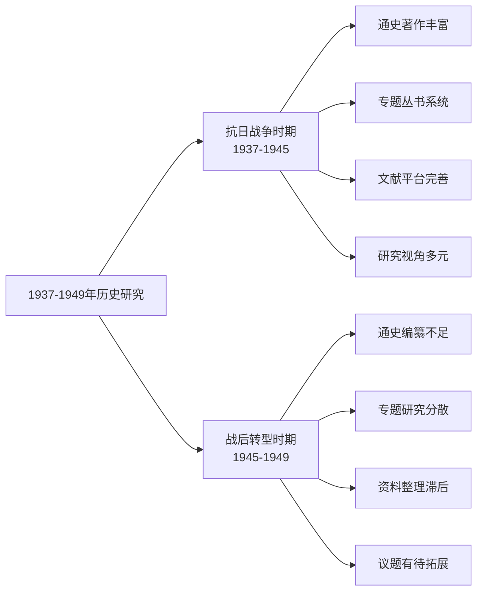

造成这种不均衡的原因是多方面的。**政治因素**方面，抗日战争作为全民族的共同记忆，具有凝聚民族认同的重要功能，而战后国共政争涉及复杂的政治评价问题，研究的政治敏感性相对较高。**资料因素**方面，抗战档案的系统整理与开放程度较高，而战后时期特别是国民党方面的档案资料获取相对困难。**学术因素**方面，纪念性节点对学术产出的推动作用明显，抗战胜利40周年、70周年、80周年等节点均带动了研究高潮，而战后转型时期缺乏类似的纪念节点驱动。

### 1.5 文献资料建设与数据平台发展

文献档案整理与数字化平台建设是支撑学术研究的基础性工程，近年来取得了显著进展，但在时段覆盖上仍呈现出**重抗战、轻战后**的特征。

**抗日战争与近代中日关系文献数据平台**是该领域最重要的数字资源库。该平台由中国社会科学院近代史研究所从2017年起在国家社科基金"抗日战争研究专项"的支持与资助下创办，面向海内外学界提供专业学术文献资料，极大地方便了数字化时代学术研究的急需[^4]。平台资源涵盖档案、图书、报纸、期刊、视频、音频、图片、专题库等多种类型[^6]。

平台建设的**专题库**具有重要学术价值。"中国共产党组织史资料专题库"主要汇总了1984年至2000年间由中央党史资料征集委员会、中央组织部、中央档案馆等牵头组织全国各级组织部门、党史部门、档案部门等编纂出版的中央、省、地、县四级组织史资料，收录772个专题文献内容[^6]。"中国共产党党史资料专题库"收录1980年代以来全国各级党史研究部门编纂出版的各地"党史资料"类文献，共2012个专题文献内容[^6]。"段苏权历史文献专题库""张林池陈舜玉抗战文献专题库"等个人专题库则提供了珍贵的个体叙述与具体史实[^6]。

平台特别推荐的**红色文献**包括《中国革命与中国共产党》《中共中央北方局(土地革命战争时期卷)》《思想教育举例》《论持久战》《关于时局的声明》《论人民民主专政》等重要历史文献[^6]。这些文献为理解中国共产党在1937-1949年间的理论发展与实践探索提供了第一手资料。

然而，从时段覆盖来看，现有文献平台建设**侧重抗战时期**，对1945-1949年战后转型时期的资料整理相对薄弱。《中国共产党一百年大事记》虽然系统记录了1937年1月至1949年12月的重要事件[^12]，但这类编年体资料主要提供历史线索，难以替代原始档案文献的深度支撑。战后时期特别是国民党方面、第三方力量、社会各阶层的相关档案资料，仍有待进一步整理与数字化开放。

总体而言，中国历史学界对1937-1949年历史的研究已经形成了**类型多元、机构协作、平台支撑**的学术格局，但在抗战研究与战后研究之间、文献整理与学术阐释之间、国内视角与国际对话之间，仍存在需要进一步弥合的差距。这些特征为后续章节对研究领域、视角、方法、理论、结论的深入对比分析提供了基础框架。

## 2 研究领域的对比分析

1937-1949年历史研究在学科领域分布上呈现出显著的**非均衡格局**：军事史与政治史研究积累深厚、体系完整，经济史与外交史研究框架清晰但有待深化，社会史与文化史研究近年来发展迅速但仍存在明显的区域与议题空白。本章将从各领域的研究现状、代表性成果、核心议题演进等维度展开系统比较，揭示研究充分领域与薄弱领域的结构性差异，分析领域间交叉融合与相对割裂的学术态势。

### 2.1 军事史研究的核心地位与议题深化

军事史是1937-1949年历史研究中**积累最为深厚、体系最为成熟**的领域。军事战略无疑是中共抗战的核心议题，一直都是研究者关注的重点问题之一[^13]。新世纪以来的研究相较于既有研究的主题多集中于中共抗战战略方针的提出与转变、作战阶段的划分与重大战役的争论，更加关注中共抗战军事战略的形成基础和过程、军事战略的传播和贯彻实践以及抗日武装的具体创建路径等[^14]。

**《论持久战》研究**是军事史领域深化的典型代表。毛泽东关于抗日游击战、持久战理论的系统阐述，体现在他1938年5月相继推出的《抗日游击战争的战略问题》和《论持久战》两个文本中[^15]。研究者深入探讨了毛泽东在这个时间点提出抗战军事战略思想的历史背景，指出1938年前后华北的特殊形势，特别是1938年初中共在河北、山东平原地区获得的意外发展，是促使中共中央和毛泽东从坚持山地游击战到下决心向华北大平原发展的关键因素。平原游击战的提出，是中共持久抗战理论形成的最后关节[^16]。

在文本考证层面，学界对《论持久战》的版本研究取得了重要进展。有学者通过对《论持久战》版本变动过程的梳理，比较分析文本内容的异同，认为真正重要且最流行和最具影响力的实际只有四种。另有研究对国家博物馆所藏《论持久战》的32种版本作了系统整理和比对分析[^17]。这种从宏观思想阐释到微观文本考证的研究路径，体现了军事史研究的精细化趋势。

关于《论持久战》的传播及其在中共党政军民中的宣传贯彻，研究提出《论持久战》本身的科学性和前瞻性、中共领导层内部较早在持久战问题上达成共识以及文化工作者不遗余力的宣传，都是《论持久战》得以广泛传播的重要因素。还有学者从与国民党对比的角度指出，中共利用政党合法化以及在全国各地设立多处党政军办事处、兴办多种公开报刊等有利条件，在全国展开强大的宣传攻势，《论持久战》很快就家喻户晓，影响广泛[^13]。

**正面战场与敌后战场协力配合研究**是军事史领域的另一核心议题。欧美学者开始以更加兼容的话语叙事贯通研究正面战场和敌后战场[^6]。方德万指出，敌后根据地的开辟"是随着战争的长期性和残酷性"而选择的抗日方式，是"发动民众的抗日斗争"的重要载体，客观上有力支持了正面战场[^18]。《中国共产党编年史》对中国抗战的东方主战场作用也有充分体现，如1943年卷7月23日山东抗日根据地相关条目中写道："我们在敌后坚持，牵制了敌人两个师团3个旅团及第十七师团之一部，共约4.5万人，再加上15万伪军。牵制这样多的日、伪，使之不能用去进攻大后方和英美同盟国"[^1]。

下表汇总了军事史研究的核心议题与研究进展：

| 核心议题 | 研究重点 | 代表性进展 | 深化方向 |
|---------|---------|-----------|---------|
| 军事战略形成 | 持久战理论的提出背景 | 平原游击战与持久战关系 | 战略思想的形成机制 |
| 《论持久战》研究 | 版本考证与文本比较 | 32种版本系统整理 | 传播史与接受史 |
| 正面与敌后战场 | 协力配合机制 | 牵制日军兵力的量化分析 | 战场互动的微观实证 |
| 重大战役研究 | 平型关、百团大战等 | 战役过程的细节还原 | 战役决策的档案考证 |

### 2.2 政治史研究的多元拓展与国共关系再审视

政治史领域在1937-1949年历史研究中占据重要地位，近年来呈现出**研究视角多元化、档案利用深化、议题范围拓展**的显著趋势。在国民党与国民政府抗战方面，学界相关研究逐步走向细致、全面[^19]。

**国民政府对日外交研究**取得了重要进展。"九一八"事变后，交涉成为国民政府应对日本侵略的重要方式。中国学界利用李顿调查团、顾维钧档案、英美外交文件等资料，深入探讨了国民政府以国联为中心的外交活动及其在中日关系中扮演的角色[^19]。其中，侯中军研究发现，"九一八"事变后，国民政府寄望于国联等外部力量阻止日本侵略，但是国联陆续出台三次决议的背后存在多方博弈，本质上是为维护国联声誉提出的"折中"办法，是英、法、美等国绥靖外交的结果，未能阻止日军的侵略，这促使国民政府的对日政策向"一边抵抗，一边交涉"转变[^13]。

欧美学者从长时段评估抗战时期国民政府的军事决策与效能。陶涵从国民党炸毁黄河大堤的决策看出其战略与政策局限，由此提出国民党无法解决通货膨胀、土地占有失衡、腐败三大顽疾，进而影响了其战后的历史命运。柯博文也关注到抗战期间国民政府的恶性通货膨胀，据此将抗战视为国民党政权失败的起点[^6]。

**国共关系研究**是政治史领域的核心议题，新世纪以来利用新解密档案，从国内外政治局势变动及双方博弈中重新解读抗战时期的国共关系，涵盖了中央与地方层面的联合、斗争及重大事件如皖南事变，并开始关注经济层面的相互影响[^20]。关于中共抗战的战略方针问题，鉴于海外学界多年来流行一种说法，即战时中共的重心是自我发展而非抗战，有学者撰文回应指出，这种说法存在明显史实错误，也不符合中共当时所面对的政治情势。洛川会议前，毛泽东和中共中央考虑的重点仍是如何获得合法地位，军事方针尚处在变动中。在这种形势下，所谓"七分发展，二分应付，一分抗日"的军事计划是"根本不可能预想和设计出来的"[^14]。

**敌后根据地政权建设研究**是政治史与社会史交叉的重要领域。米特将中共领导的根据地视为"抗战民族主义的实践场与传播源"，根据地的税收政策、军事战略、政策主张等，擘画了战后中国的整体样貌。他在将中共敌后根据地政策与国民政府决策对比后得出，中共提出及实施的社会改革方案显然胜于国民政府空洞而落实无门的建设计划[^18]。从这些研究可以得出一个共识性结论：中国共产党能够创建敌后根据地并使之获得大发展，根本在于中国共产党施行了正确的政策与成功的治理，二者都做到了从根据地民众利益出发来赢得民众的支持[^6]。

### 2.3 经济史研究的区域分化与结构性框架

经济史领域形成了以**"中国资本主义的发展与不发展"为研究主线、按区域分类展开**的结构性框架。《中代经济史1937-1949》是该领域的代表性成果，以抗日战争至新中国成立前夕为背景，聚焦中国社会经济结构的转型与演进[^12]。

该书基于"中国资本主义的发展与不发展"研究框架，分区域解析1937-1949年的中国经济格局：日伪占领区形成战争经济与殖民经济体系，国统区维持半殖民地半封建形态，解放区则孕育新民主主义经济[^12]。研究涵盖日本侵华经济掠夺、民族工业困境、国家垄断资本扩张及农业制度变迁等核心议题，通过工农商业、金融财政等领域史料，系统揭示不同政权控制区的经济特征及其内在演变逻辑[^21]。

在研究框架上，该成果紧扣外国资本主义在中国的经济侵略与扩张（在本期主要是日本帝国主义的全面侵华战争和战后美帝国主义的经济侵略）、中国封建经济制度的延续（在本期主要是封建性的土地与农业制度的延续）、中国资本主义在各行业各领域的发展变化（在本期主要表现为工农商交金融及财政等经济行业部门遭到破坏而出现停滞及不平衡发展）等中国近代经济史的几大主题[^12]。

经济史研究的**专题化深化**体现在多个方面。"抗日战争专题研究"丛书中涉及经济议题的研究包括日本对华货币战、日本对东北的殖民统治等专题[^19]。国家社科基金重大项目《中国近代经济史(1937-1949)》的研究设计中，特别关注了"外贸"概念界定、交通运输业中"驿运"作用、"战时财政"特征、区域间"物资战"等具体问题[^22]。

下图展示了经济史研究的区域分化框架：

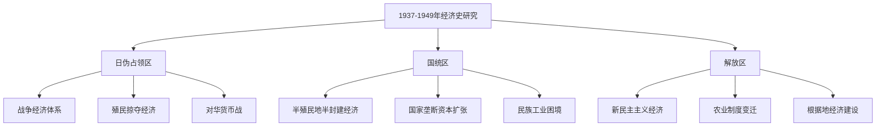

### 2.4 社会史研究的视野下移与方法论创新

社会史研究是近年来发展最为迅速的领域之一，呈现出**视野下移、跨学科方法引入、区域研究深化**的显著特征。进入新世纪，因对外学术交流的持续、跨学科方法的引入、研究方法的更加多样和研究领域的不断拓展，中共抗战史研究取得了丰硕成果[^15]。

**抗日根据地社会史研究**是该领域的核心议题。研究侧重减租减息运动的具体实施过程、根据地政治经济文化建设及社会变迁，并更多从社会史视角考察政策实践与社会变革[^20]。欧美学者也注重抗战中"人"的叙事，视线下移，关注普通民众在战争中的经历与选择[^6]。

然而，社会史研究在区域覆盖上存在**明显的不均衡**。华中及华南根据地的研究仍较薄弱，与华北根据地研究的深度和广度形成对比[^20]。基层党组织与干部队伍建设研究聚焦党员入党动机、群体构成及基层干部培养管控的复杂性，反映了中共组织建设的艰巨性与现实策略[^20]。

**社会史研究的方法论创新**值得关注。当代社会史学界的史学理论研究强调拓展研究视野、创新研究方法，其中最受人瞩目者有两个：一是视野下移，二是跨学科[^22]。这两者已逐渐从学界的倡议发展成为研究实践的现实，在丰富学界对当代社会认识的同时，也在一定程度上带来了研究意义琐碎和学科重心偏移的问题。有学者指出，需要在跨学科研究已逐渐成为一种学术风尚的情况下，回答社会史研究的学科边界问题[^22]。

中国社会史研究深受年鉴学派理论概念的影响，"自下而上""长时段"、整体史、跨学科、"问题史学"等已为研究者津津乐道而耳熟能详[^22]。然而，马克思主义唯物史观在社会史研究中的理论和实践一定程度上存在着被忽视或重视不够的现象。历史唯物主义的基本原理与社会史研究的理论有许多相通之处，唯物史观在社会史研究中"具有方法论的指导意义"[^22]。

### 2.5 文化史与思想史研究的专题化发展

文化史与思想史研究在1937-1949年历史研究中呈现出**专题化发展、理论深化**的趋势，形成了若干具有学术影响力的研究方向。

**文化抗战史研究**取得了重要进展。王继平著的《中国共产党文化抗战史(1931—1945)》聚焦文化战线，展示了十四年抗战期间中国共产党领导文化抗战的历史及其特点、贡献[^19]。这一研究将文化抗战作为全民族抗战的重要组成部分，揭示了中共在思想文化领域的动员能力与组织效能。

**延安整风研究**是思想史领域的核心议题。研究深入探讨其思想资源、内容影响及各根据地的具体开展情况，分析了整风对中共政治文化形塑的作用[^20]。马克思主义政治学萌芽于20世纪30年代马克思主义者恽代英、邓初民等人对政治学议题的研究和争论，发展于30年代的中国社会史论战和40年代的延安整风[^1]。《中国共产党编年史》1942年卷专门以较大篇幅写了整风运动、大生产运动的基本情况[^12]。

**马克思主义中国化研究**是思想史领域的重要方向。《中国共产党编年史》1938年卷专门写了党的扩大的六届六中全会对推进马克思主义中国化的要求和部署[^1]。这一研究方向将抗战时期中共的理论创新置于马克思主义中国化的历史进程中考察，揭示了理论发展与实践探索的内在关联。

### 2.6 外交史研究的全球视野与多边互动

外交史研究近年来呈现出**全球视野拓展、多国档案利用、研究范围扩大**的显著趋势。欧美学者从全球史视野解读中国抗战时，越来越重视中国战场的作用与地位[^6]。

**二战叙事起点的重塑**是外交史研究的重要突破。很多学者开始重塑二战叙事的起点，纠正"欧洲中心论"偏差。《牛津二战手册》相关专章、布坎南所著《全球视野下的第二次世界大战(1931—1953)》、理查德·奥弗里所著《二战新史:鲜血与废墟中的世界,1931—1945》等都将二战起源上溯至1931年，强调中国战场乃至亚洲战场在世界反法西斯战争中的重要性[^18]。

**中国与盟国战时合作研究**的范围越来越广。从军事协作到知识技术交流，相关研究触及中国与盟国战时合作的方方面面。Sonya Grypma的研究指出，抗战时期加拿大传教士护士在华西地区推动了四川护理业"从教会救济式护理转向公共卫生取向的专业护理"，关注到战争契机下中国医疗力量与国际力量的深度互动。J. Megan Greene考察了1937年至1950年间中美之间的新科技合作，指出抗战打破了地域壁垒，促进了中美在工业、农业、科学、公共卫生等领域的知识交流与技术合作[^6]。

研究还呈现出**各种复杂面相**。欧美学界相关研究既关注中美合作的一面，又看到合作背后复杂的动机[^18]。傅知行、金家德主编的论文集全面梳理了1937-1949年中美在情报、水利工程、航空发展等领域的合作[^6]。

**国民政府对苏外交研究**也取得进展。缘于制衡的考虑，国民政府的对日方针也离不开苏联因素。1936年3月12日苏联擅自与外蒙当局签订《苏蒙互助议定书》后，国民政府对苏的外交方针曾面临两难处境，日德签订"防共协定"后，中、苏、日三国展开外交博弈[^13]。

### 2.7 研究领域的交叉融合与结构性薄弱环节

综合比较各领域研究的成熟程度，可以识别出明显的**交叉融合趋势**与**结构性薄弱环节**。

**领域间交叉融合**是近年来研究的重要趋势。军事史与政治史的融合体现在正面战场与敌后战场协力配合研究中；经济史与社会史的融合体现在根据地经济建设与社会变迁研究中；政治史与思想史的融合体现在延安整风与马克思主义中国化研究中。这种交叉融合推动了研究视野的拓展与研究深度的提升。

下表对比了各领域研究的成熟程度：

| 研究领域 | 成熟程度 | 代表性成果 | 主要特征 |
|---------|---------|-----------|---------|
| 军事史 | 高 | 《论持久战》版本研究 | 体系完整，精细化深化 |
| 政治史 | 高 | 国共关系再审视 | 多元拓展，档案利用深化 |
| 经济史 | 中 | 《中代经济史1937-1949》 | 区域框架清晰，专题有待深化 |
| 外交史 | 中 | 全球视野下的抗战研究 | 视野拓展，多国档案利用 |
| 社会史 | 中低 | 根据地社会变迁研究 | 方法创新，区域不均衡 |
| 文化思想史 | 中低 | 文化抗战史研究 | 专题化发展，理论深化 |

**结构性薄弱环节**主要体现在以下几个方面。首先，敌伪工作研究、中共与日伪国民党多方互动研究、地方层面国共关系比较研究等领域仍需加强[^20]。其次，华中及华南根据地的研究较华北根据地明显薄弱[^20]。再次，中共与共产国际关系、会道门工作及中共行动机制与政治文化等领域的研究有待深入[^20]。

这些薄弱环节的形成有多方面原因：**档案资料**方面，部分领域的原始档案开放程度有限；**研究传统**方面，军事史与政治史长期占据主导地位，其他领域起步较晚；**方法论**方面，跨学科方法的运用仍不够充分。未来研究需要在资料挖掘、方法创新、视角拓展等方面持续努力，推动各领域研究的均衡发展与深度融合。

## 3 研究视角的对比分析

研究视角的选择直接决定了历史问题的设定方式、叙事主体的确定以及历史解释的框架建构。2015年以来，中国历史学界对1937-1949年历史的研究在视角运用上呈现出**多元化、融合化、创新化**的显著趋势。近五年来中共抗战史研究在视角转换方面取得了显著进展，学者们通过国家视角、社会视角、精英视角、民众视角、中央视角、地方视角、中国视角和全球视角等多种研究视角，推动了研究的创新和深化[^23]。本章将系统比较不同视角的运用特征与学术贡献，揭示视角转换对研究创新的推动作用。

### 3.1 国家视角与社会视角的张力与互补

国家视角与社会视角构成了1937-1949年历史研究中最基本的一组视角张力，两者在研究对象、问题设定与解释框架上存在显著差异，但又形成了相互补充的学术格局。

**国家视角的研究特征**以政党、政权、国家为核心叙事主体，侧重政策制定、制度变迁与战略决策的宏观分析。在敌后战场研究中，学者们从国家视角和军事视角深入探讨了持久战战略，比较了国共两党持久战理论的差异，揭示了毛泽东《论持久战》的战略价值和国际影响[^23]。这一视角下的研究强调政治决策的形成机制、战略方针的演变逻辑以及政权建设的制度特征。步平、王建朗主编的《中国抗日战争史》（共八卷）分局部抗战、战时军事、战时政治、战时军队、战时外交、战时经济与社会、伪政权与沦陷区、战后处置与战争遗留问题共八个专题，在世界环境与战后长时段中展现了中国人民抗日战争的不同侧面[^24]，体现了国家视角下系统化、结构化的研究取向。

**社会视角的研究取向**则将关注点下移至社会群体、基层组织与日常生活层面，强调政策落地过程、民众反应与社会变迁。社会视角和民众视角的应用使得游击战与民兵研究更加注重基层政治和民众参与，探讨了中共军事力量在敌后生存发展的根本原因[^23]。这一视角下的研究揭示了国家政策与社会实践之间的复杂互动，展现了历史进程中"人"的主体性与能动性。

两种视角在**根据地建设研究**中形成了典型的互补关系。国家视角侧重分析中共的政策制定与制度设计，如税收政策、军事战略、政策主张等；社会视角则关注这些政策在基层的具体实施过程与社会效应。方德万指出，敌后根据地的开辟"是随着战争的长期性和残酷性"而选择的抗日方式，是"发动民众的抗日斗争"的重要载体[^25]。米特将中共领导的根据地视为"抗战民族主义的实践场与传播源"，根据地的税收政策、军事战略、政策主张等，擘画了战后中国的整体样貌[^24]。从这些研究可以得出一个共识性结论：中国共产党能够创建敌后根据地并使之获得大发展，根本在于中国共产党施行了正确的政策与成功的治理，二者都做到了从根据地民众利益出发来赢得民众的支持[^25]。

下表对比了两种视角的核心特征：

| 对比维度 | 国家视角 | 社会视角 |
|---------|---------|---------|
| 叙事主体 | 政党、政权、国家 | 社会群体、基层组织 |
| 问题设定 | 政策制定、战略决策 | 政策落地、社会变迁 |
| 研究层级 | 宏观、中观 | 中观、微观 |
| 解释框架 | 制度逻辑、战略逻辑 | 社会逻辑、生活逻辑 |
| 代表议题 | 持久战战略、根据地政权 | 减租减息实施、民众动员 |

### 3.2 精英视角与民众视角的叙事转换

精英视角与民众视角的对照反映了1937-1949年历史研究中**叙事主体选择的根本性转变**，这一转变深刻影响了研究问题的设定与历史解释的建构。

**精英视角的传统优势**体现在领袖人物、军政要员、知识精英的决策过程与思想演变研究中。中国共产党自身建设研究体现了精英视角和民众视角的结合，学者们关注党报党刊的舆论动员作用，各级党组织的建设与巩固，以及干部队伍的成长与教育[^23]。在国民党与国民政府抗战研究方面，学界利用李顿调查团、顾维钧档案、英美外交文件等资料，深入探讨了国民政府以国联为中心的外交活动及其在中日关系中扮演的角色[^24]。陶涵从国民党炸毁黄河大堤的决策看出其战略与政策局限，由此提出国民党无法解决通货膨胀、土地占有失衡、腐败三大顽疾，进而影响了其战后的历史命运[^25]。

**民众视角的兴起**是近年来抗战史研究的重要趋势。欧美学者开始注重抗战中"人"的叙事，视线下移，关注普通民众在战争中的经历与选择[^25]。社会视角的应用使得研究更加注重基层党组织的群众化转变和干部与群众的互动关系[^23]。这一视角转换带来了研究问题的重新设定：从"领袖如何决策"转向"民众如何参与"，从"政策如何制定"转向"政策如何被接受"，从"战争如何进行"转向"战争如何被经历"。

**"视线下移"趋势**对抗战史研究产生了深化作用。方德万还考察了中共的根据地是如何建立起来的，与周锡瑞关于陕甘宁边区创建的研究有异曲同工之处[^24]。这类研究不再仅仅关注中央决策层面的战略规划，而是深入考察基层社会的具体实践，揭示了历史进程中普通人的能动性与创造性。在战争体验、社会心态、生存策略等研究领域，民众视角展现出独特的学术价值。

### 3.3 中央视角与地方视角的层级互动

中央视角与地方视角的对比揭示了1937-1949年历史研究中**层级分析的重要性**，两种视角在统一战线、战略方针与区域社会变迁等议题上形成了互补关系。

**中央视角的主导地位**体现在全局战略、统一战线、重大决策等核心议题的研究中。持久战战略是抗战时期的枢纽型问题，有关持久战战略的研究历久弥新。有学者出版专著，详细梳理全民族抗战初期持久战思想的渊源与变化，阐明国内各方对抗战进程的理解与对抗日持久战的主张[^23]。《论持久战》在战时的日本也有相当大的影响，日本媒体、军方和政府为摸清中共抗战战略，以节译、摘译、译述、编译、全译等方式介绍《论持久战》[^23]。

**地方视角的独特贡献**在于揭示政策执行差异与区域社会变迁。抗日根据地建设研究融合了中央视角、地方视角和社会视角，政治建设方面，学者们探讨了基层政权改造和民主实践；经济建设方面，研究了救国公粮征收、减租减息运动和财政经济政策；社会文化建设方面，关注了文化教育、民间艺术改造和生态环境等因素。地方视角的应用使得研究更加注重各根据地的区域特点和差异性[^23]。

**新四军"发展华中"战略研究**是中央与地方视角互动的典型案例。有学者探讨了中共"发展华中"战略中八路军和新四军的角色转化问题。"华中"开始时指的是长江、老黄河之间以河南为中心的广大区域。中共最初的设想是八路军南下，与彭雪枫部共同发展华中敌后抗日游击战。但因1939年初国共关系的剧变导致这一部署有所调整，稍后新四军江北指挥部获准设立，为发展华中提供了新的战略空间。自此，新四军逐渐取代八路军成为发展华中的主角[^23]。这一研究揭示了中央战略部署与地方实践之间的动态调整过程。

**区域研究的不均衡现象**是地方视角运用中需要关注的问题。华北、华中、华南等不同根据地的研究深度存在明显差异，华北根据地研究相对充分，而华中及华南根据地的研究仍较薄弱。这种不均衡既与档案资料的开放程度有关，也与研究传统的积累差异相关。

### 3.4 中国视角与全球视角的对话融合

中国视角与全球视角的对比是近年来1937-1949年历史研究中**最具突破性的视角转换**，全球史视野的引入深刻改变了中国抗战的历史定位与国际认知。

**中国视角的内向型研究**长期以中国本土经验为中心，侧重国内政治、军事、社会等层面的分析。这一视角下的研究积累深厚，形成了系统的学术体系。然而，单一的中国视角难以充分揭示中国抗战在世界反法西斯战争中的地位与贡献。

**全球视角的引入**带来了研究范式的重要转变。欧美学者从全球史视野解读中国抗战时，越来越重视中国战场的作用与地位。很多学者开始重塑二战叙事的起点，纠正"欧洲中心论"偏差。《牛津二战手册》相关专章、布坎南所著《全球视野下的第二次世界大战(1931—1953)》、理查德·奥弗里所著《二战新史:鲜血与废墟中的世界,1931—1945》等都将二战起源上溯至1931年，强调中国战场乃至亚洲战场在世界反法西斯战争中的重要性[^25]。

2025年中国社会科学出版社出版的《新编第二次世界大战史》以弘扬正确二战史观为目标，专设"'九一八'事变揭开世界反法西斯战争的序幕"章节，纠正了西方传统二战叙事中的"1939年起点论"，将中国和东亚置于中心而非边缘位置，以跨战区视角揭示了中国战场如何牵制日本兵力从而支援太平洋战场，凸显了中国人民抗日战争在世界反法西斯战争中的重要地位，以及中国参与战后世界和平与安全秩序建设的过程。该书同时推出了英文版，让中国学界关于二战史的观点进入全球视野，为读者展现了一幅不同于西方主流叙事的历史图景[^24]。

**中国与盟国战时合作研究**的范围越来越广。从军事协作到知识技术交流，相关研究触及中国与盟国战时合作的方方面面。Sonya Grypma的研究指出，抗战时期加拿大传教士护士在华西地区推动了四川护理业"从教会救济式护理转向公共卫生取向的专业护理"，关注到战争契机下中国医疗力量与国际力量的深度互动。J. Megan Greene考察了1937年至1950年间中美之间的新科技合作，指出抗战打破了地域壁垒，促进了中美在工业、农业、科学、公共卫生等领域的知识交流与技术合作[^24]。抗日民族统一战线与国共关系研究综合运用了国家视角、精英视角和全球视角，全球视角还体现在对中共在香港开展国际反法西斯统一战线的研究上[^23]。

下图展示了全球视角下中国抗战研究的拓展方向：

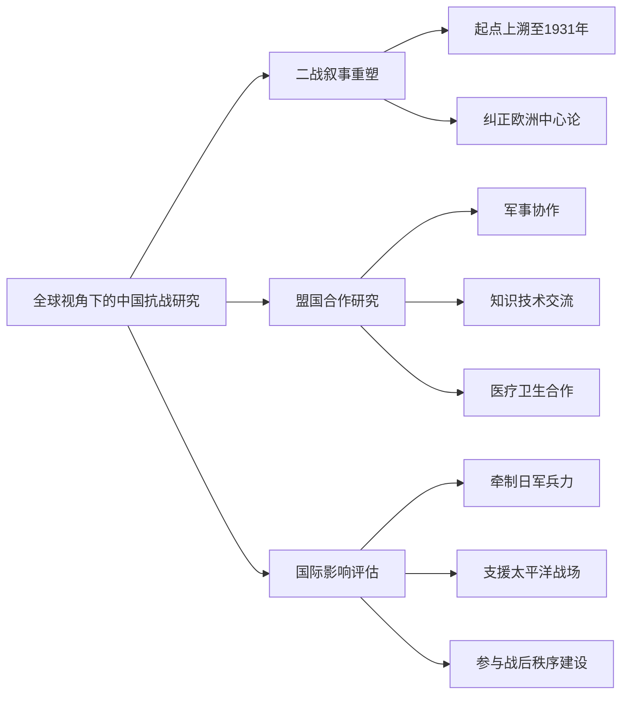

### 3.5 正面战场与敌后战场视角的整合演进

正面战场与敌后战场视角的整合是1937-1949年历史研究中**最具中国特色的视角演进**，这一整合过程反映了学术认知的深化与全民族抗战共识的形成。

**早期研究中两个战场相对割裂**的状况源于复杂的历史与政治因素。国民党正面战场研究与中共敌后战场研究长期各自为政，缺乏有机整合。这种割裂既不利于全面认识抗战历史，也难以准确评价两个战场的相互关系与各自贡献。

**全民族抗战视角的兴起**推动了两个战场研究的整合。全民族抗战最根本的表现是中国共产党高举抗日民族统一战线的旗帜，开辟的敌后战场与国民党指挥的正面战场协力合作，形成共同抗击日军的战略局面。欧美学者开始以更加兼容的话语叙事贯通研究正面战场和敌后战场[^25]。

**敌后战场的战略地位**得到了更加充分的认识。在日军眼里，正面战场的战略地位不及敌后战场，因为日本侵华战争的战略重心在华北[^26]。1938年8月8日，东京制定的战争"总方针"规定："事变处理的结局应是，尽快地首先解决华北问题"[^27]。日军在开战之初进展很快，在占领武汉后，却似乎匪夷所思地停止了进攻。日军的相关档案记载了答案：1938年12月6日，日本的《对华处理办法》规定："目前最重要的基本工作是恢复治安"，"华北治安的症结所在，并非国民党政府，而在中共"[^26]。

**两个战场的协力配合研究**取得了重要进展。敌后战场的开辟是由当时的国情军情决定的。全国抗战爆发后，由于敌小我大，决定了日军在中国占据的地域越大，其兵力就越不足，只能控制主要交通线和城镇，这样敌后广大乡村地带成了开辟抗日根据地的理想区域[^28]。自1937年9月平型关初战到1938年10月武汉失守，我军在敌后战场对日军作战1600多次，毙伤敌6万余人。1938年敌后战场抗击日军兵力40万人，占全部侵华日军的58.8%[^28]。敌后游击战不仅配合了国民党军队在正面战场的作战，直接给予日本侵略者以有力的打击，而且迫使日军不得不将原先用于进攻的大量兵力转向保守占领区，从而对停止日军的战略进攻，使战争转入相持阶段起到了重要的作用[^28]。

**空间研究视角**为理解两个战场关系提供了新的分析框架。"城市—乡村"二元并立的空间结构，加之日军以占领主要城市与交通线为目的的作战特点，客观上决定了抗日战争独特的战争形态，即"敌据城市，我据乡村"及农村包围城市形态。中国共产党团结带领一切抗战力量深入敌后与乡村，将广大的乡村自然地理空间转化为抗战的政治与军事空间，使全民族的"持久战"由战略构想变为战略实施[^29]。1938年10月，毛泽东在中共扩大的六届六中全会上所作报告《论新阶段》，在总结抗战经验和教训基础上，提出并详尽阐述了"乡村抗战论"。他分析指出，中国的抗战是在主要的大城市与交通线被敌占领的特殊情况下进行的，这就决定了"抗战的主要依靠是乡村与农民"[^30]。

下表对比了两个战场研究视角的演进：

| 发展阶段 | 研究特征 | 主要局限 |
|---------|---------|---------|
| 早期割裂阶段 | 各自独立研究，缺乏整合 | 难以全面认识抗战 |
| 整合过渡阶段 | 开始关注两个战场关系 | 整合深度不足 |
| 全民族抗战视角 | 协力配合、战略互动 | 微观实证有待深化 |
| 空间研究视角 | 城乡二元、空间转化 | 新视角的推广应用 |

### 3.6 视角转换对研究创新的推动作用

综合评估多元视角转换对1937-1949年历史研究的推动效应，可以发现视角转换不仅带来了**研究问题的重新设定、史料运用的拓展深化、历史解释的多元丰富**，更推动了学科方法论的反思与创新。

**研究问题的重新设定**是视角转换最直接的学术效应。从国家视角转向社会视角，研究问题从"政策如何制定"转向"政策如何落地"；从精英视角转向民众视角，研究问题从"领袖如何决策"转向"民众如何参与"；从中国视角转向全球视角，研究问题从"中国如何抗战"转向"中国抗战如何影响世界"。这些问题设定的转换拓展了研究的广度与深度。

**史料运用的拓展深化**是视角转换的重要支撑。新时代中国学界广泛利用中外档案互证，揭示了世界变局下中国对日交涉、妥协、抵抗等的多重面相和复杂演进[^31]。中国学界利用李顿调查团、顾维钧档案、英美外交文件等资料，深入探讨了国民政府以国联为中心的外交活动[^32]。多元视角的运用推动了档案资料的跨国利用与多语种文献的综合分析。

**历史解释的多元丰富**是视角转换的核心学术贡献。这些多视角的研究不仅拓宽了中共抗战史的研究范围，而且深化了对抗日战争复杂性的理解。通过视角转换，学者们能够更加全面地展现中共在抗战中的中流砥柱作用，以及抗战对中国革命和现代化发展的深远影响[^23]。

**方法论反思与学科边界问题**是视角多元化趋势中需要关注的议题。视角的多元化带来了研究方法的丰富，但也引发了学科边界模糊的担忧。跨学科方法的引入使得历史研究与社会学、人类学、政治学等学科的交叉融合日益深化，但如何在方法创新中保持历史学的学科特性，仍是需要持续反思的问题。

下图展示了视角转换推动研究创新的作用机制：

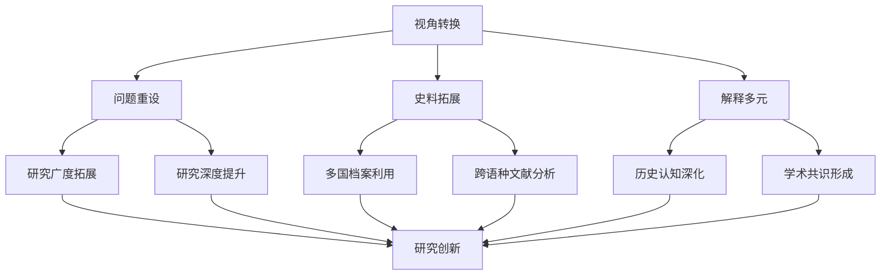

总体而言，1937-1949年历史研究中的视角转换呈现出**从单一到多元、从割裂到整合、从内向到外向**的演进趋势。国家视角与社会视角的互补、精英视角与民众视角的转换、中央视角与地方视角的互动、中国视角与全球视角的对话、正面战场与敌后战场视角的整合，共同构成了这一领域研究视角演进的完整图景。视角的多元化不仅丰富了历史认知的维度，更推动了研究方法的创新与学术范式的转换，为深化1937-1949年历史研究提供了重要的方法论资源。

## 4 研究方法的对比分析

研究方法的选择与运用直接影响着学术成果的质量与创新程度。1937-1949年中国历史研究在方法论层面经历了从单一到多元、从经验到自觉的演进过程。改革开放以来，此方法受到中国学术界的重视，以抗日战争史研究为例，计量化除了在传统的战时经济、财政、金融等领域广为运用外，在我们以往习惯"定性"的方面也得到了较为普遍的运用，对抗日战争史学科的健康发展起了非常重要的作用[^33]。本章将系统比较传统史料考证法、计量史学方法、口述史方法、跨学科方法、比较研究方法、区域研究方法等在该领域的具体应用情况，揭示不同方法的适用范围、运用效果与创新案例，评估方法论自觉程度对研究质量的影响。

### 4.1 传统史料考证法的基础地位与深化运用

传统史料考证法是1937-1949年历史研究的**基础性方法**，在档案文献的搜集整理、版本考证、史料辨伪等方面发挥着不可替代的作用。这一方法强调以原始档案为依据，通过严谨的文献学分析还原历史真相，是历史研究科学性的根本保障。

**档案文献的系统整理**是传统考证法运用的首要环节。新中国成立以来，抗日战争史料的出版情况大体上与研究发展历程相契合。1978年改革开放后，由于各方面因素的推动，抗战史研究开始兴起，史料的整理和出版也呈现出良好的势头。1991年后，随着中国抗日战争史学会的成立及《抗日战争研究》的创刊，越来越多的学者开始投身于抗日战争史研究，对资料的需求更加迫切。同时，为促进学术发展，国家档案管理政策也开始调整，历史档案逐步解禁，丰富了史料来源，史料收集和整理不再是无米之炊，极大地促进了抗日战争史料的整理出版工作[^33]。

**《论持久战》版本研究**是传统考证法深化运用的典型案例。学界对《论持久战》的版本研究取得了重要进展，有学者通过对《论持久战》版本变动过程的梳理，比较分析文本内容的异同，另有研究对国家博物馆所藏《论持久战》的32种版本作了系统整理和比对分析。这种从宏观思想阐释到微观文本考证的研究路径，体现了传统考证法的精细化趋势，为理解毛泽东军事思想的形成与传播提供了坚实的文献基础。

**中外档案互证**是传统考证法在新时期的重要发展。国际方面，2001年日本成立亚洲历史资料中心，并对外开放。美国于1999年1月11日宣布成立"纳粹战争罪行和日本帝国政府档案跨机构工作组"。自2007年起，美国战略情报局、中央情报局、国务院、陆军情报部、联邦调查局等政府机构收藏的有关日本战争罪行及战后国际社会审判战犯的档案逐步解密开放，其中包括中国抗日战争相关档案。此外，英、法、荷以及日内瓦国联和联合国档案馆所藏与中国抗战有关的档案也逐步开放。海外所藏档案的开放，为抗日战争史料的搜集和整理提供了更多来源[^33]。这种多国档案互证的方法，使研究者能够从不同视角审视同一历史事件，显著提升了研究的客观性与全面性。

下表展示了传统史料考证法的主要运用领域与特征：

| 运用领域 | 具体内容 | 方法特征 | 代表性成果 |
|---------|---------|---------|-----------|
| 档案整理 | 国内外档案的搜集分类 | 系统性、规范性 | 抗日战争档案汇编 |
| 版本考证 | 重要文献的版本比对 | 精细化、文献学 | 《论持久战》版本研究 |
| 史料辨伪 | 原始资料的真伪鉴别 | 严谨性、批判性 | 战时文献考证 |
| 中外互证 | 多国档案的交叉验证 | 跨国性、综合性 | 中日外交档案研究 |

### 4.2 计量史学方法的引入与应用领域

计量史学是20世纪50年代以来在社会科学的影响下形成的一种史学研究方法。通常情况下，可以简单地将其概括为对一系列可以量度的现象进行的历史研究[^33]。这一方法在1937-1949年历史研究中的引入与应用，推动了抗战史研究从定性判断走向定量实证，对学科发展产生了重要影响。

**近30年来的抗日战争史研究中，计量化的研究随处可见，但大体上可以归纳为以下三个重要领域：第一，国民党领导的正面战场和中共领导的敌后战场抗敌的不同战绩和贡献；第二，中国抗战对世界反法西斯战争胜利所作出的贡献；第三，日本侵华战争给中华民族造成的损失以及对中国现代化进程的延误**[^33][^34]。

**两个战场战绩的计量化比较**是该方法最重要的应用领域之一。改革开放以来的30多年里，抗日战争史的研究逐步趋向理性与客观，即一方面坚持了中国共产党在抗日战争中"中流砥柱"的立场，同时也肯定了国民党广大爱国官兵以及全国各抗日阶层的作用，这种理性回归的过程，往往是通过计量化的研究得以实现的[^33]。早期的抗日战争史基本上被纳入中共党史的叙事框架，在讲到抗战的贡献时，虽然也有一些计量化的表达，但仅仅关注到抗战时期中共的发展和抗日战绩。从80年代初开始，学术界在基本肯定上述观点的同时，通过计量来对国民党正面战场作正面的评价[^34]。关于两个战场的战绩问题，从最早的只计中共领导的武装力量的抗日战绩，到兼计敌后和正面两个战场的战绩，进而将正面和敌后两个战场的战绩合成一个中国抗战的整体[^34]。

**中国抗战对世界反法西斯战争贡献的计量评估**是第二个核心领域。从上世纪80年代开始，不断有学者对于中国在第二次世界大战中的贡献进行了计量化的研究。抗战胜利50周年之际，官方的表述是：中国的持久抗战特别是中国共产党领导的敌后抗战，抗击和牵制了日本陆军总兵力的2/3，共歼灭日军150余万，约占日军在第二次世界大战中死伤人数的70％[^34]。这些量化数据为评估中国抗战的国际地位提供了重要依据。

**战争损失与人口伤亡统计**是计量方法的第三个重要应用领域。关于中国军民伤亡总数，有各种不同的说法，基本上是处于2000万到2200万的区间。上世纪90年代中期以后，中国军事科学院部分学者对日本侵华战争中中国军民伤亡人数做出了新的估计，其结论是中国军民伤亡总数达3500万人以上。但也有学者得出中国战时最低限度的伤亡人数为2228万余人，或估计出抗日战争时期中国大陆人口的非正常死亡人数超过3000万，甚至有结论认为中国战时的人口损失可能超过5000万人[^34]。对日军暴行和中国军民伤亡作分类的计量研究也是非常必要的，包括日军对中国平民的集体大屠杀、细菌战与化学战、掳掠劳工、性暴力等[^34]。

下图展示了计量史学方法的三大应用领域及其相互关系：

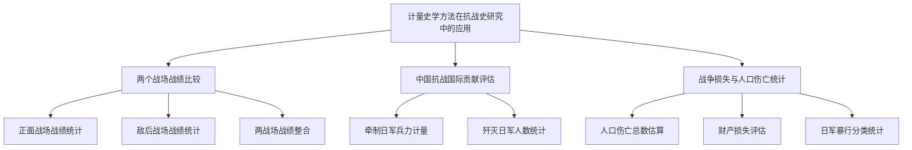

### 4.3 口述史方法的兴起与史料价值

口述史方法在1937-1949年历史研究中的运用日益广泛，成为还原基层社会实态、呈现民众战争体验的重要途径。这一方法通过搜集亲历者回忆录、口述访谈记录等资料，为传统档案文献提供了重要补充。

**党史资料中的口述记录**构成了口述史料的重要来源。1980年代以来，全国各级党史研究部门编纂出版了大量各地"党史资料"类文献，包含亲历者回忆录、历史事件记述、组织沿革考证、人物活动片段和口述访谈记录等多种题材。这些文献涵盖根据地建设、武装斗争、群众动员、统一战线以及党的建设等各个方面，为理解党的历史提供了鲜活的微观视角。"中国共产党党史资料专题库"收录1980年代以来全国各级党史研究部门编纂出版的各地"党史资料"类文献，共2012个专题文献内容，其中包含大量口述性质的历史记录。

**口述史料的独特价值**体现在多个层面。首先，口述史料能够呈现档案文献难以记载的基层社会实态与民众日常生活；其次，口述记录能够捕捉历史当事人的主观感受与情感体验，为理解历史进程中"人"的因素提供独特视角；再次，口述史料有助于还原重大历史事件的具体细节与地方差异，弥补宏观叙事的不足。

然而，**口述资料的可靠性问题**需要审慎对待。抗日战争时期由于处于战争环境，很多史料是需要认真分析的。对新近调查所获的口述资料也同样有一个如何处理的问题[^34]。口述记忆的主观性、选择性以及时间流逝带来的记忆偏差，都可能影响口述史料的准确性。因此，口述史料的运用需要与档案文献进行交叉验证，在批判性分析的基础上审慎使用。

### 4.4 跨学科方法的引入与学科边界反思

跨学科方法的引入是1937-1949年历史研究方法论演进的重要特征，社会学、人类学、政治学等学科的理论与方法被广泛借鉴，拓展了研究视野与问题设定。然而，跨学科研究的深入发展也引发了关于学科边界与自主知识体系建构的反思。

**年鉴学派理论概念的影响**深刻塑造了中国社会史研究的方法论取向。中国社会史研究深受年鉴学派理论概念的影响，"自下而上""长时段"、整体史、跨学科、"问题史学"等已为研究者津津乐道而耳熟能详。当代社会史学界的史学理论研究强调拓展研究视野、创新研究方法，其中最受人瞩目者有两个：一是视野下移，二是跨学科。这两者已逐渐从学界的倡议发展成为研究实践的现实，在丰富学界对当代社会认识的同时，也在一定程度上带来了研究意义琐碎和学科重心偏移的问题。

**唯物史观的方法论指导意义**在跨学科研究中不应被忽视。马克思主义唯物史观在社会史研究中的理论和实践一定程度上存在着被忽视或重视不够的现象。历史唯物主义的基本原理与社会史研究的理论有许多相通之处，唯物史观在社会史研究中"具有方法论的指导意义"。在跨学科研究已逐渐成为一种学术风尚的情况下，如何回答社会史研究的学科边界问题，成为需要认真思考的议题。

**自主知识体系建构**是中共党史研究面临的重要课题。在近年来的党史研究中，跨学科思维成为学界普遍推崇的学术进路。受此影响，不同学科的理论分析框架都可能成为党史研究的前提设置，中共党史本身的自主性反呈逐渐隐身之势[^35]。研究者如果过于看重那些基于西方历史演进经验为基础的理论分析框架，难免呈现出"让人觉得似是而非、隔靴搔痒"的问题，因为这些理论框架大多抽离了中国社会的历史现实[^35]。

**本土意识的发掘**为自主知识体系建构提供了可能。作为党史研究主要对象的革命、建设与改革，虽然发生的时间不同，但都以中国社会的空间现实为基础。也因此，三者无论借鉴了多少域外经验，都不可避免地或主动或被动地融入了中国社会的本土经验。这些本土经验既彰显了革命、建设与改革中的本土意识，也为中共党史研究的自主知识体系建构提供了可能[^35]。所有跨学科理论框架对中共历史进程的分析与解读，都需要以扎实的历史经验研究为基础。

下表对比了跨学科方法引入的利弊：

| 维度 | 积极作用 | 潜在问题 | 应对策略 |
|------|---------|---------|---------|
| 研究视野 | 拓展问题意识 | 学科边界模糊 | 明确核心关怀 |
| 理论工具 | 丰富分析框架 | 理论套用生硬 | 注重本土经验 |
| 方法借鉴 | 创新研究路径 | 历史感淡化 | 坚持史料基础 |
| 知识生产 | 跨界对话增强 | 自主性弱化 | 建构自主体系 |

### 4.5 比较研究方法与区域研究方法的运用

比较研究方法与区域研究方法在1937-1949年历史研究中的运用，为深化对这一时期历史复杂性的理解提供了重要途径，但在实际运用中也呈现出明显的不均衡特征。

**国共两党政策比较**是比较研究方法的核心应用领域。欧美学者在将中共敌后根据地政策与国民政府决策对比后得出，中共提出及实施的社会改革方案显然胜于国民政府空洞而落实无门的建设计划。这种比较视角有助于揭示两党在政策制定、组织动员、社会治理等方面的根本差异，为理解历史走向提供了分析框架。

**正面战场与敌后战场比较**推动了全民族抗战视角的形成。通过计量化的比较分析，学界逐步克服了早期研究中两个战场相对割裂的状况，将正面和敌后两个战场的战绩合成一个中国抗战的整体[^34]。这种比较研究不仅有助于客观评价两个战场的各自贡献，更揭示了两者之间的战略协同与相互支撑关系。

**区域研究方法**在根据地研究中得到广泛应用，但呈现出明显的**深度不均衡**现象。华北根据地研究相对充分，而华中及华南根据地的研究仍较薄弱。这种不均衡既与档案资料的开放程度有关，也与研究传统的积累差异相关。从区域个案到整体认知的方法论路径，需要在深化各区域研究的基础上进行系统整合。

**1949年前后延续性研究**体现了时间维度上的比较方法运用。近年来的研究发现，1949年的政权鼎革并非造成历史断裂的鸿沟。贯通地研究历史，直观表现为选题不受某些时间节点束缚，尤其重视考察人和事的长期影响，或追溯其历史渊源。研究中共党史更应如此，因为1949年是中共从局部执政到全国执政的转折点，这是一种量变；质的维度上，1949年前后两个历史时期，中共在主义、观念、文化、制度与技术等方面一脉相承[^35]。通过跨越1949年，中共局部执政经验的深远影响得到进一步发掘[^35]。

### 4.6 方法论自觉与研究质量的关联评估

方法论自觉程度对1937-1949年历史研究质量具有直接而深刻的影响。综合评估当前研究中的方法论问题，可以发现在史料选择、概念界定、定性定量关系处理等方面仍存在需要改进的空间。

**史料选择与处理问题**是计量化研究中的首要挑战。计量化本身并不能排除主观任意性的可能，研究者总是按照自己事先设定的某种假设去收集和选择数据。抗日战争时期由于处于战争环境，很多史料是需要认真分析的[^34]。史料的选择性使用可能导致研究结论的偏颇，因此需要在方法论层面强调史料搜集的全面性与分析的批判性。

**概念界定的清晰性**是计量化研究的基本要求。计量化的研究必须将计量的对象尽可能做到概念清晰[^34]。以早期抗战史研究为例，通常多用一些较为模糊的诸如"起了决定作用"、"占据主导地位"、"中流砥柱"、"不可估量"、"无以计数"等语汇。其实这些概念或多或少还是隐含着计量或统计的内涵，只不过由于史学工作者出于具体考证的困难或者缺乏计量的观念，使本来可以进行定量判断的概念变成了缺乏定量依据的简单定性[^33]。

**定性与定量关系的处理**需要审慎把握。对于计量化的方法也不能过于迷信，要防止出现"数字教条"，一定要注意处理好定性和定量的关系[^34]。事实上，作为一场举全民族之力抗击外来侵略的战争，从一次具体战斗到一场较大规模的战役，从敌我双方的基本力量、战争的投入到战争的直接和间接影响等等其实都是可以也是应当计量化的[^33]。但计量化应当服务于历史认识的深化，而非成为研究的目的本身。

**情绪化倾向的规避**是方法论规范化的重要内容。抗日战争史研究中的计量化，也要尽可能防止一些情绪化的宣泄，科学性不强的计量只会产生负面的影响[^34]。研究者需要在爱国情感与学术理性之间保持平衡，以严谨的方法论态度推进研究。

下表综合评估了各种研究方法的特征与适用范围：

| 研究方法 | 核心优势 | 主要局限 | 适用领域 | 方法论要求 |
|---------|---------|---------|---------|-----------|
| 传统考证法 | 史料基础扎实 | 视野相对局限 | 文献研究、版本考证 | 严谨性、批判性 |
| 计量史学法 | 定量实证客观 | 数据选择主观 | 战绩比较、损失统计 | 概念清晰、数据完整 |
| 口述史方法 | 还原微观实态 | 记忆偏差风险 | 基层社会、民众体验 | 交叉验证、批判分析 |
| 跨学科方法 | 视野开阔创新 | 学科边界模糊 | 社会史、文化史 | 本土意识、史料基础 |
| 比较研究法 | 揭示差异规律 | 比较框架预设 | 政策比较、战场比较 | 可比性论证、整体把握 |
| 区域研究法 | 深入具体实证 | 整合难度较大 | 根据地研究、地方史 | 个案深化、整体关照 |

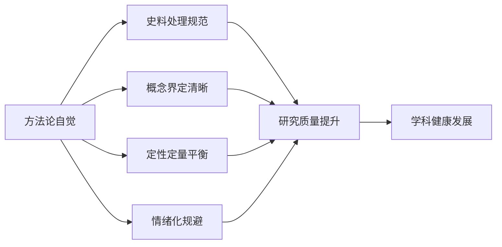

总体而言，1937-1949年历史研究在方法论层面呈现出**多元并进、互补融合**的发展态势。传统史料考证法奠定了研究的文献基础，计量史学方法推动了从定性到定量的转变，口述史方法丰富了微观叙事的史料来源，跨学科方法拓展了研究的理论视野，比较研究与区域研究方法深化了对历史复杂性的认识。然而，方法论自觉程度的参差不齐仍是影响研究质量的重要因素。未来研究需要在坚持史料基础的前提下，注重方法的规范化运用与创新性整合，在跨学科借鉴中保持历史学的学科特性，在国际对话中建构具有中国特色的自主知识体系。

## 5 理论运用的对比分析

理论框架的选择与运用是历史研究学术品质的核心标识，直接影响着研究问题的设定方式、史料选择的倾向性以及历史解释的建构逻辑。1937-1949年中国历史研究在理论层面经历了从单一范式主导到多元理论并存的深刻演变，马克思主义史学理论、现代化理论、民族主义理论、全球史理论、社会史理论等不同范式在该领域的运用呈现出各具特色的面貌。本章将系统比较不同理论范式的运用特征与学术效应，揭示理论运用的显性表达与隐性预设，评估中国学界在理论创新与自主话语体系建构方面的努力与成效。

### 5.1 马克思主义史学理论的主导地位与演进特征

马克思主义史学理论在1937-1949年历史研究中始终占据**核心指导地位**，其运用经历了从革命史范式的单一主导到与其他理论范式互动融合的演进过程。这一理论传统不仅为该领域研究提供了基本的分析框架，更塑造了几代学者的历史思维方式与价值取向。

**中国马克思主义史学的奠基与发展**为1937-1949年历史研究奠定了深厚的理论基础。随着马克思主义在中国的传播，中国马克思主义史学产生了。李大钊是第一位奠基人，其《史学要论》是中国第一部阐述历史唯物主义理论并把它跟一些具体的史学工作结合起来的著作，是为中国马克思主义史学开辟道路的著作[^35]。1927-1937年间，运用马克思主义历史理论观察中国历史的进程并同当时的革命实践结合起来，是一个很突出的特点[^35]。郭沫若出版了《中国古代社会研究》，这是中国史学家用马克思主义理论系统阐述中国历史的第一部著作[^35]。

**1937-1949年恰是中国马克思主义史学建设取得重大成就的关键时期**。这一阶段马克思主义史学在古代思想史研究和史学理论等方面取得重大成就[^36]。在社会史方面，吕振羽出版了《中国社会史诸问题》，邓初民出版了《社会史简明教程》和《中国社会史教程》，侯外庐出版了《中国古代社会史》；在通史方面，吕振羽出版了《简明中国通史》，范文澜出版了《中国通史简编》，翦伯赞出版了《中国史纲》第1、2卷；在思想史方面，侯外庐先后出版了《中国古代思想学说史》《中国近世思想学说史》《中国思想通史》第1卷，成为这一时期成就最突出的马克思主义史家[^35]。

**革命史范式的核心特征**体现在以阶级斗争为主线的分析框架上。在党史研究中，"革命史"范式一直处于主导性地位。它所依据的理论基础，是马克思关于社会基本矛盾的学说。根据这一学说，在阶级社会里，新生产力和旧生产关系的矛盾是社会革命的根本原因。革命虽然是极端残酷的阶级斗争，但也是推动历史发展的真正动力[^24]。根据这一分析框架，帝国主义与中华民族、封建主义与人民大众的矛盾，业已构成近代中国社会发展的主要矛盾，它决定了中国革命的根本任务是反对帝国主义和封建主义，以求得民族独立和人民解放[^24]。

**新中国成立后马克思主义史学进入广泛传播和深入发展时期**。从50年代初开始，大量翻译、出版马克思、恩格斯、列宁、斯大林和毛泽东著作，在全国范围内掀起了学习马克思主义理论热潮。其中最重要的成就是在马克思主义指导下，新中国史学界至少有两三代人是努力按照唯物史观进行思考和研究，从而造就了马克思主义史学宏大队伍[^35]。被称为"五朵金花"的古史分期问题研究与讨论、农民战争史问题研究与讨论、资本主义萌芽问题研究与讨论、汉民族形成和民族关系问题研究与讨论，就是建国17年来史学研究成果的优秀代表[^35]。

**改革开放以来马克思主义史学理论的运用呈现新特征**。1976年以来是深入发展阶段，以"四人帮"的垮台和关于真理标准讨论为发端，以中国共产党十一届三中全会为标志。其主要成就是：第一，通过理论上的拨乱反正、正本清源，中国马克思主义史学的理论水平进一步提高，理论建设受到更多重视[^35]。马克思和恩格斯反复强调自己的学说"是从历史事实和发展过程中得出的确切结论，脱离这些事实和过程，就没有任何理论价值和实际价值"[^35]。

下表梳理了马克思主义史学理论在不同阶段的运用特征：

| 发展阶段 | 时间范围 | 主要特征 | 代表性成果 |
|---------|---------|---------|-----------|
| 奠基时期 | 1919-1927 | 理论引入与初步运用 | 李大钊《史学要论》 |
| 建设时期 | 1927-1949 | 与革命实践结合 | 范文澜《中国通史简编》 |
| 传播时期 | 1949-1966 | 广泛传播与体系建构 | "五朵金花"讨论 |
| 深化时期 | 1976至今 | 拨乱反正与理论创新 | 多元化理论整合 |

### 5.2 现代化理论的引入应用与本土化调适

现代化理论作为改革开放后引入的重要分析框架，在1937-1949年历史研究中发挥了拓展视野、更新问题意识的重要作用，但其运用也经历了从简单移植到批判性吸收再到本土化改造的复杂过程。

**现代化范式在中国史学界的兴起**为该领域研究提供了新的分析工具。"现代化"范式是改革开放后兴起的一个新的分析框架，它试图打破长期以来形成的单一的"革命史"叙事结构，从另一个角度开辟历史研究的新路径[^24]。在党史学界，张静如先生是这一研究范式的首倡者，他提出"从社会现代化的角度衡量历史人物、政党及各种群体的作用"，并强调将"解放和发展生产力"作为实现社会现代化的核心[^24]。

**传统现代化理论的局限性**日益受到学界反思。现代化分析范式发端于20世纪七八十年代的西方学术界，其将全球的近代历史理解为一个从传统到现代的演化过程。而所谓的"现代"，是以西方特别是美国的价值与制度作为典范的尺度[^37]。现代化分析范式的背后，有一个黑格尔的"历史目的论"理论，预设世界历史是普遍的、单一的，无论什么民族与国家，其发展的最终归宿，都是指向以西方为典范的现代性[^37]。传统的现代化分析范式的最大弊端，乃在于将现代的普世文明等同于西方文明[^24]。

**革命史范式与现代化范式的互补关系**逐渐得到认识。这两个范式也不是截然对立的，相反它们还在各自的解释体系中为对方保留一席之地。一些主张"革命史"范式的研究者，认为"中国近代历史纷繁复杂，丰富多彩，从任何一个侧面或角度为视角去观察、研究它，都将是一种有益的探索"[^24]。而主张"现代化"范式的研究者，则认为必须重新建立一个包括革命在内而不是排斥革命的新的综合分析框架[^24]。

**从中国自身历史脉络理解现代化**成为新的理论取向。要重新理解现代化模式，首先要将全球普世文明与西方文明解绑，西方文明不等同于普世文明[^38]。亨廷顿在《文明的冲突与世界秩序的重建》中，明确区分了两种对普世文明的阐释：一种是以西方为典范的文明；另外一种是在多元文明的理解框架中，普世文明乃是指各文明实体和文化共同体共同认可的某些公共价值以及相互共享与重叠的那部分社会文化建制[^38]。

**新民主主义经济发展模式研究**体现了现代化视角的本土化运用。以现代化视角分析战争年代晋绥边区的经济发展及演变历程，着重强调新民主主义经济理论在实践层面的现代性[^35]。中国共产党基于革命根据地的实际情况，在灵活调适传统与革命关系的基础上，提出发展新民主主义经济的主张。这一主张不仅是马克思主义中国化的有机组成部分，也是实现现代化的主要路径[^35]。

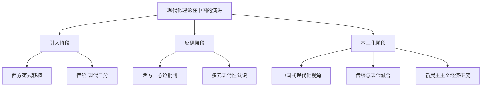

### 5.3 民族主义理论的阐释框架与话语建构

民族主义理论在1937-1949年历史研究中具有特殊的理论地位与话语功能，"中华民族"概念的阐释、民族主义与国际主义关系的辨析构成了这一时期理论探索的核心议题，深刻影响了抗战史叙事与民族认同建构。

**抗战时期中国共产党对"中华民族"的理论阐释**是马克思主义民族理论中国化的重要成果。对"中华民族"的阐释是中国共产党民族理论体系中的基础性内容。抗战时期，中国共产党明确阐释了"中华民族"的起源与构成、特点和历史任务[^37]。早在1922年，中国共产党就提出"推翻国际帝国主义的压迫，达到中华民族完全独立"的奋斗目标[^37]。

**"中华民族"概念的内涵在抗战时期得到系统阐发**。1938年8月1日，时任中国共产党中央宣传部副部长兼秘书长的杨松，在《论民族》《论资本主义时代民族运动与民族问题》中，对"中华民族"概念作了深入阐释，提出：民族属于历史范畴的概念，有其发生、发展和衰亡的过程；中国人有共同的语言、领土、经济生活与经济联系以及共同的风俗习惯和历史文化；中国是一个多民族国家，就对外来说，中华民族代表中国境内各民族[^37]。

**毛泽东关于"中华民族"的系统论述**具有里程碑意义。1939年12月，毛泽东发表文章《中国革命和中国共产党》，其中第一章第一节专门阐释了"中华民族"的起源与构成、民族特点和历史任务[^37]。毛泽东指出："我们中国现在拥有四亿五千万人口，差不多占了全世界人口的四分之一。在这四亿五千万人口中，十分之九以上为汉人。此外，还有蒙人、回人、藏人、维吾尔人、苗人、彝人、壮人、仲家人、朝鲜人等，共有数十种少数民族，虽然文化发展的程度不同，但是都已有长久的历史。中国是一个由多数民族结合而成的拥有广大人口的国家"[^37]。

**民族主义与国际主义的理论辨析**是中共面临的重要理论课题。中共到底是共产主义者还是民族主义者，这是许多观察家——特别是抗战以来——非常关注却又感到困惑的问题[^1]。民族主义本质上意味着对本民族的忠诚高于对其他事物的忠诚，国际主义则与民族主义迥然不同，在国际主义的视域中，民族和国家的独立以及以其为单位的政治、经济、文化等诉求并不具有核心重要性[^1]。

**中共通过将民族主义解释为共产主义之前提**，成功化解了理论张力。中共在这一阶段通过将民族主义解释为共产主义之前提，一方面并未否决自身的共产主义理想，另一方面却为民族主义提供了灵活而广阔的空间。在对民族性的阐释上，中共在中国语境中将民族性与阶级性两个概念融合起来，为最广泛的社会动员奠定了理论基础[^1]。这一理论创新体现了中国民族主义探索的一种新形式，同时导向了共产主义的中国化以及中国传统观念的现代化[^1]。

**民族主义理论对抗战史叙事的塑造作用**深远而持久。"中华民族"成为全面动员、组织全国各族人民团结抗日的鲜明旗帜[^37]。这些理论探索，发挥了凝聚政治共识与宣传动员功能，确立并巩固了全民族的抗日统一战线，既是马克思主义民族理论中国化的成果，又推动了马克思主义民族理论中国化进程[^37]。

下表对比了民族主义理论运用的不同维度：

| 理论维度 | 核心内容 | 话语功能 | 学术影响 |
|---------|---------|---------|---------|
| 概念阐释 | "中华民族"内涵界定 | 凝聚民族认同 | 奠定研究基础 |
| 关系辨析 | 民族主义与国际主义 | 化解理论张力 | 推动理论创新 |
| 历史叙事 | 全民族抗战视角 | 统一战线动员 | 塑造研究范式 |
| 政策批判 | 批判大汉族主义 | 民族平等主张 | 深化问题意识 |

### 5.4 全球史理论与跨国视野的理论拓展

全球史理论的引入为1937-1949年历史研究带来了视野的根本性拓展，推动了中国抗战历史定位的重新认识与二战叙事框架的深刻变革，对纠正"欧洲中心论"偏差、提升中国抗战国际地位认知产生了重要的理论贡献。

**西方中国研究的范式演变**为全球史视野的引入提供了学术背景。柯文在《在中国发现历史》中曾经总结过西方中国研究的三种范式：第一种范式是费正清提出来的"冲击—反应"论，把近代中国历史理解为由西方的冲击而产生的回应；第二种范式是列文森的"传统—现代"论，把近代中国看成是如何克服传统、走向普遍的现代性的历史过程；第三种范式是帝国主义论，从全球殖民和反殖民的历史和中心—边陲的二元模式来分析近代中国的各种历史现象[^37]。这三种范式，到了20世纪90年代以后都对中国史学界发生过影响[^37]。

**革命史范式与现代化范式的并存**构成了中国近代史研究的基本格局。在中国近代史研究领域，有两种典型的研究范式：一种是革命史范式，将1840年到1949年期间的中国历史，视为反抗帝国主义、封建主义的人民革命，历经太平天国、义和团运动、辛亥革命到国民大革命和中共工农革命；另一种是现代化范式，将这段历史诠释为从传统的中国走向与全球先进国家接轨的现代国家的过程[^24]。

**多元现代性理论**为超越西方中心论提供了理论资源。当世界历史进入20世纪，特别是60年代以后，全球的现代化在不同的国家与地区、特别是非西方地带，出现了多元的模式和不同的样式，对现代普世文明的理解也就具有了新的视野和诠释[^38]。艾森斯塔特指出，16世纪在西欧出现的现代文明是新的轴心文明，它向全球扩张，但并未真正征服古老的轴心文明，反而激起了抵抗。非西方国家内化西方文明，与自身文明传统嫁接，创造出多元现代性[^38]。

**从中国自身历史脉络理解中国现代化**成为新的理论方向。中国的现代化有其自身的历史脉络。柯文在《在中国发现历史》中提出将中国问题作分层处理：外层带（如通商口岸）是西方冲击的直接产物；中层带（如太平天国、辛亥革命）是经西方催化但具有本土特征的历史现象；内层带（如乡村宗法关系）基本未受西方影响[^38]。中国思想的现代化自有其历史脉络，并非仅是西方思想刺激的结果[^38]。

**传统与现代的辩证关系**得到重新认识。传统与现代并非二元对立，而是你中有我、我中有你。西方思想与中国思想在近代是"互为主体性"，通过对话相互改造[^38]。现有研究证实，中国共产党经济政策的制定和完善在很大程度上都涉及对传统因素的处理问题。从1943年开始，传统中的合理因素被有效吸纳到革命之中，受此影响，革命在各抗日根据地均取得了较大进展[^35]。

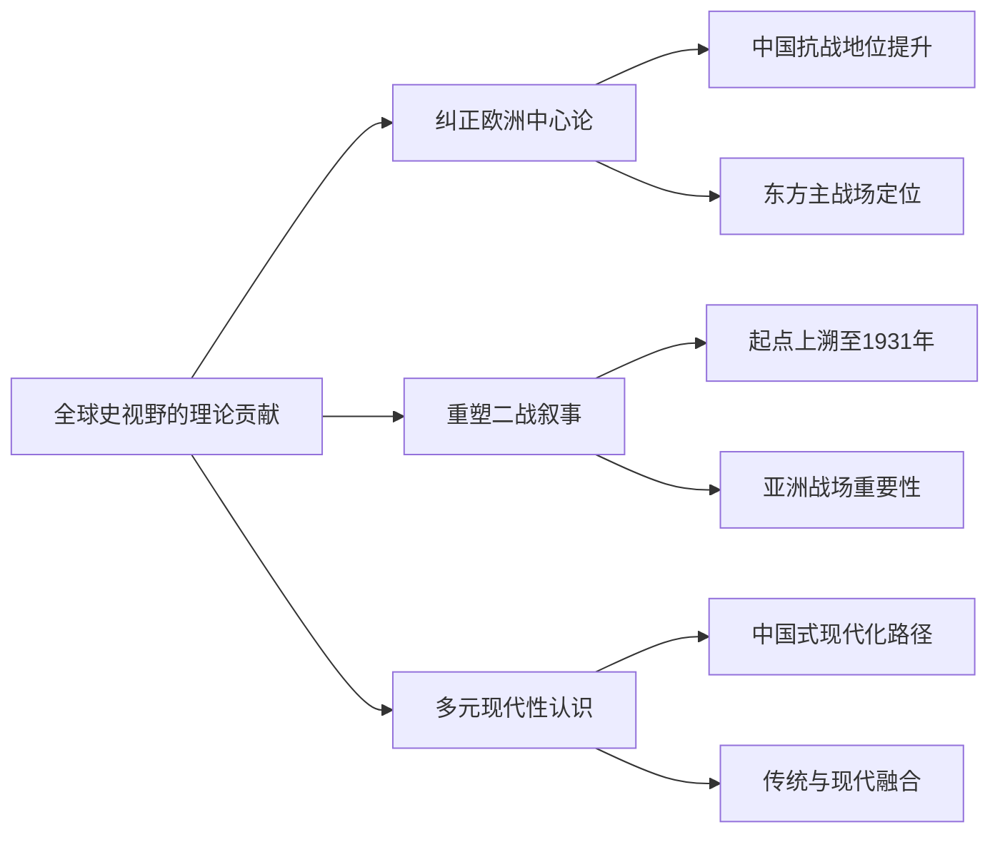

### 5.5 社会史理论的方法论借鉴与学科边界反思

社会史理论在1937-1949年历史研究中的运用日益广泛，年鉴学派的理论概念对中国学界产生了深刻影响，但跨学科理论引入带来的学科边界问题也引发了持续的方法论反思。

**年鉴学派理论概念的广泛影响**塑造了中国社会史研究的基本取向。中国社会史研究深受年鉴学派理论概念的影响，"自下而上""长时段"、整体史、跨学科、"问题史学"等已为研究者津津乐道而耳熟能详。当代社会史学界的史学理论研究强调拓展研究视野、创新研究方法，其中最受人瞩目者有两个：一是视野下移，二是跨学科。这两者已逐渐从学界的倡议发展成为研究实践的现实。

**跨学科方法带来的问题**日益受到关注。在丰富学界对当代社会认识的同时，跨学科方法也在一定程度上带来了研究意义琐碎和学科重心偏移的问题。有学者指出，需要在跨学科研究已逐渐成为一种学术风尚的情况下，回答社会史研究的学科边界问题。

**唯物史观与社会史理论的内在关联**需要得到重视。马克思主义唯物史观在社会史研究中的理论和实践一定程度上存在着被忽视或重视不够的现象。历史唯物主义的基本原理与社会史研究的理论有许多相通之处，唯物史观在社会史研究中"具有方法论的指导意义"。

**中国马克思主义史学史研究的反思**揭示了传统模式的局限。以往学界并不缺乏关于中国马克思主义史学史的研究成果，但这些成果基本处于传统模式的笼罩之下，存在严重的同质化弊端。传统模式的核心是革命话语。在革命话语的支配下，中国马克思主义史学史成为中国革命史的一部分[^39]。

**突破传统模式的路径探索**成为学界关注的焦点。当前中国马克思主义史学史研究要走出困境，必须进行根本性、整体性的改造，既不能满足于传统模式下的常态研究，也不能局限于局部的修补完善。首先应反思和检讨许多既有的所谓定论与常识，将研究对象重新"陌生化""问题化"[^39]。

下表对比了社会史理论运用的利弊：

| 维度 | 积极作用 | 潜在问题 | 整合路径 |
|------|---------|---------|---------|
| 视野下移 | 关注基层社会 | 研究意义琐碎 | 宏观微观结合 |
| 跨学科 | 方法创新丰富 | 学科边界模糊 | 坚持史学本位 |
| 长时段 | 揭示深层结构 | 忽视具体事件 | 多时段整合 |
| 整体史 | 综合视野开阔 | 操作难度大 | 局部与整体结合 |

### 5.6 理论运用的显隐特征与研究结论的塑造机制

不同理论范式在1937-1949年历史研究中的运用呈现出**显性表达与隐性预设并存**的特征，理论框架对研究问题设定、史料选择倾向以及历史解释建构的塑造作用深刻而多元。

**理论运用的显性表达**体现在研究者明确声明的理论立场与分析框架上。革命史范式形成于20世纪三四十年代，以马克思主义学者李鼎声的《中国近代史》、范文澜的《中国近代史》和胡绳的《帝国主义与中国政治》为代表，初步构建起中国近代革命史叙事体系[^38]。新中国成立之后，随着新民主主义革命的胜利，革命史范式进一步完善，形成"一条主线"、"两个过程"、"三次高潮"、"八大事件"的历史叙事体系[^38]。

**理论运用的隐性预设**更为深刻地影响着研究的问题设定与结论建构。范式化是中国近代史研究中的一个鲜明特征。由于中国近代史研究中的范式不像自然科学那样缜密，以一种范式取代另一范式，而是呈现多种范式并存的局面[^38]。革命史范式、现代化范式、"冲击—回应"范式与"中国中心观"取向、"社会—国家"范式与市民社会理论等，一方面为研究近代中国历史提供了分析工具，从不同方面丰富和深化了中国近代史研究，并带来历史叙事的变革。另一方面，这些范式的产生都有其特定的时代背景和学术渊源，也各有其局限[^38]。

**革命史范式的叙事体系特征**深刻塑造了研究的基本框架。所谓"一条主线"，即以阶级斗争为主线，强调阶级斗争是人类社会发展的动力。所谓"两个过程"，也即毛泽东在《中国革命和中国共产党》中所说："帝国主义和中国封建主义相结合，把中国变为半殖民地和殖民地的过程，也就是中国人民反抗帝国主义及其走狗的过程"[^38]。

**不同范式对研究结论的塑造机制**存在显著差异。革命史范式所构建的叙事体系，固然揭示了近代中国的社会性质和主要矛盾，为近代中国革命研究指明了方向，但就中国近代史学科体系来说，它本质上是一个政治史体系，不足以反映近代中国历史全貌[^38]。对于这些范式，我们应以辩证唯物主义和历史唯物主义为指导，在批判吸收各研究范式所长的基础上，构建一个更具科学性、主体性、创新性和完整性的中国近代史学科体系、学术体系和话语体系[^38]。

**理论预设对史料选择的影响**需要审慎反思。在以往马克思主义史学史的研究中，一部论作是否属于马克思主义，首先取决于作者的政治立场和党派归属。政治上信仰马克思主义、认同中共是一个前提条件，马克思主义史学被等同于中共史学[^39]。中共之外的学者运用马克思主义理论研究历史的作为则被排除在外，马克思主义史学的学术群体由此被缩小[^39]。

### 5.7 中国学界的理论创新与自主话语体系建构

中国学界在1937-1949年历史研究的理论创新与自主话语体系建构方面进行了持续努力，本土意识的发掘、中国经验的提炼、自主知识体系的建构成为新时代学术发展的重要方向。

**升级现代化研究范式**成为学界的理论自觉。有学者呼吁升级现代化研究范式至2.0版，破解西方中心论，认识中国现代化的内在脉络。中国传统中的非主流因素在外来刺激下发酵为主流，为现代化提供本土资源。理解中国的现代化需探究中国传统的"古层"如何改造外来文化，这将为全球多元现代性提供新视野[^38]。

**本土意识与中国经验的发掘**为自主知识体系建构提供了基础。丸山真男提出日本思想"古层"或"执拗的低音"概念，指传统深层结构以"集体无意识"方式融合外来思想，这对理解中国思想传统如何参与现代建构具有启发性[^38]。中国共产党基于革命根据地的实际情况，在灵活调适传统与革命关系的基础上，提出发展新民主主义经济的主张[^35]。

**马克思主义史学的理论创新**在新时期取得重要进展。在改革开放不断深入，中国与世界日益融合，人类进入信息时代的21世纪，外国各种史学理论与方法论的引进，自然科学研究新认识论与方法论的启示，以及跨学科研究的开展等，使得中国史学及其思想的发展，进入到挑战与机遇同在的复杂环境之中[^35]。史家们意识到自己面临着双重的社会实践任务：创造历史的实践和认识历史的实践；二者紧密相联：认识历史是为了创造历史，创造历史才能够认识历史[^35]。

**构建自主知识体系的时代使命**日益明确。对于这些范式，我们应以辩证唯物主义和历史唯物主义为指导，在批判吸收各研究范式所长的基础上，构建一个更具科学性、主体性、创新性和完整性的中国近代史学科体系、学术体系和话语体系，这是时代赋予当代中国学者的学术使命[^38]。

**抗战史研究中的话语建构**体现了理论创新的具体成果。抗战时期中国共产党有关"中华民族"的理论探索，突出表现在中国共产党将马克思主义民族理论与中国具体实际相结合，即基于日本军国主义不断加剧的对华侵略和"九一八"事变后中国全社会全民族的思想变化，结合国内民族问题特点和革命斗争的实际需要而不断创新，赋予"中华民族"以新的内涵[^37]。

下表综合评估了各理论范式的特征与发展方向：

| 理论范式 | 核心贡献 | 主要局限 | 发展方向 |
|---------|---------|---------|---------|
| 马克思主义史学 | 揭示社会矛盾规律 | 政治史体系局限 | 多元化深化 |
| 现代化理论 | 发展视角开拓 | 西方中心论偏差 | 本土化改造 |
| 民族主义理论 | 民族认同建构 | 话语功能突出 | 学术深化 |
| 全球史理论 | 国际视野拓展 | 本土经验弱化 | 中外融合 |
| 社会史理论 | 基层视野下移 | 学科边界模糊 | 唯物史观整合 |

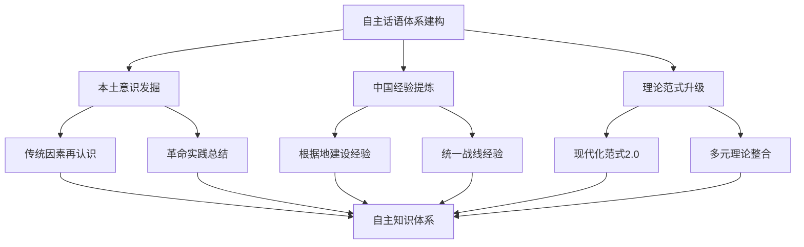

总体而言，1937-1949年历史研究在理论运用层面呈现出**从单一范式主导到多元理论并存、从简单移植到批判性吸收、从被动接受到主动建构**的演进轨迹。马克思主义史学理论始终占据指导地位，但其运用方式更加灵活多元；现代化理论经历了本土化改造，中国式现代化视角逐渐形成；民族主义理论在抗战史叙事中发挥了重要的话语建构功能；全球史理论拓展了中国抗战的国际认知视野；社会史理论丰富了基层社会研究的方法论工具。在理论创新与自主话语体系建构方面，中国学界正在从批判性吸收各种理论范式走向建构具有中国特色的学术话语体系，这一进程仍在持续深化之中。

## 6 研究结论的对比分析

1937-1949年历史研究中的核心结论既是学术探索的成果凝结，也是历史认知的价值表达。围绕抗战起点与分期、中共中流砥柱作用、两个战场评价、战争损失统计、战后转型逻辑等关键议题，中国历史学界经历了从分歧走向共识、从单一走向多元的认知演进过程。本章将系统比较这些核心问题上的学术共识与持续争议，揭示结论差异背后的史料基础、理论立场与政治语境因素，评估国内外学界在这些议题上的认知趋同与分歧根源。

### 6.1 抗战起点与分期问题的共识形成与争议演变

抗日战争的起点与分期问题是该领域研究中**最具基础性与标志性的议题**，"八年抗战"与"十四年抗战"两种表述的学术争论历经数十年，最终形成了以"十四年抗战"为主导的学术共识，这一共识的形成过程深刻反映了历史研究与国家记忆建构的互动关系。

**两种表述的内涵差异**根植于对抗战性质与阶段的不同理解。大多数人形成的共识是：1931年九一八事变是抗日战争的起点，1937年七七事变是全国性抗战的开端，二者之间即为局部抗战[^40]。"八年抗战"始于1937年7月7日卢沟桥事变，此时国民政府才正式对日宣战；而"十四年抗战"则将起点上溯至1931年九一八事变，涵盖了东北抗战的六年历程[^11]。这种差异不仅是时间跨度的计算问题，更涉及对局部抗战历史地位的根本认定。

**局部抗战与全国性抗战的统一性与差别**是理解这一问题的关键。一方面，局部抗战与全国性抗战具有统一性。从中日两方面来看，14年的抗日战争都是一个整体的发展过程，局部抗战是全国性抗战的基础和准备，全国性抗战是局部抗战历史的继续和发展[^40]。另一方面，局部抗战与全国性抗战又具有重大差别。这种差别的突出表现，就是七七事变前后中日民族矛盾和国内阶级矛盾具有实质性变化，国共两党转变为合作抗日，标志着全国团结抗战的形成，全民族抗战的真正实现[^40]。

**国共两党对抗战起点的不同叙事**反映了深层的政治博弈。国民党坚持"八年抗战"始于1937年七七事变，而共产党则早在1931年九一八事变后就开始组织抗日斗争[^11]。九一八事变后，蒋介石和国民政府采取不抵抗政策，放弃东北。而共产党在九一八事变第二天即发表宣言和决议，提出组织群众反帝运动、发展游击战争以直接打击日本帝国主义，随后在东北发展组建了东北抗联[^10]。这种历史差异构成了两种抗战叙事的事实基础。

**1931-1937年间的局部抗战规模**远超以往认知。东北抗日联军在极端困境下坚持斗争，1932-1935年东北各地义勇军攻占县城以上战斗近30次，总兵力达30余万人[^11]。国民党部分将领也曾违抗"不抵抗"命令，1933年的长城抗战中29军大刀队取得"喜峰口大捷"，1936年的绥远抗战歼灭日军伪军数千人[^11]。这些战役证明，局部抗战的规模和强度为"十四年抗战"概念提供了充分的历史依据。

**2017年教材修订**标志着"十四年抗战"概念的全面确立。教育部要求教材全面落实"十四年抗战"概念，这一举措背后有着深刻的历史正名意图[^11]。将抗战起点前移，是对300万东北抗日军民的正式追认，也是对日本右翼势力否认侵略的有力回击。更关键的是，"十四年抗战"概念打破了"抗战=国民政府领导"的传统叙事，承认了共产党及其领导的抗日力量在全面抗战前六年的中流砥柱作用[^11]。

**国际学术界对"十四年抗战"的支持**为这一共识提供了重要佐证。日本进步学者早在1960年代就提出"十五年战争史观"，将侵华战争起点定为1931年。2015年，由法、英、德等国50余位学者合著的《1937-1947:战争——世界》明确将二战起点定为1931年。美国学者戴维·M·戈登在《历史文献:中日战争,1931-1945》中直接使用"1931年开始"的表述[^11]。这些国际观点表明，"十四年抗战"概念并非中国独创，而是国际史学界的共识。

下表梳理了抗战起点争议的演变轨迹：

| 发展阶段 | 主要观点 | 支撑依据 | 学术影响 |
|---------|---------|---------|---------|
| 传统表述期 | 八年抗战（1937-1945） | 全国性抗战起点 | 长期主导叙事 |
| 学术争论期 | 两种表述并存 | 局部抗战史实发掘 | 引发深入讨论 |
| 共识形成期 | 十四年抗战确立 | 教材修订、国际认同 | 历史正名完成 |

然而，**抗战起点与抗日战争时期的概念区分**仍需注意。说中国抗日战争从1931年9月算起是必须的，但抗日战争时期应从1937年7月算起。1931年至1937年，虽然在东北和华北、华中部分地区进行着抗日战争，但从全国范围来讲，毕竟还是局部的，而作为中国两股最大政治力量的国共两党主要进行的是"围剿"反"围剿"的阶级斗争[^11]。这一区分体现了学术研究的严谨性与概念界定的清晰性。

### 6.2 中国共产党中流砥柱作用的论证逻辑与学术评价

中国共产党在抗日战争中的中流砥柱作用是该领域研究中**最具政治敏感性与学术争议性的核心议题**，国内外学界围绕这一命题形成了多维度的论证逻辑与评价体系，学术共识的形成建立在坚实的史实基础与严密的理论分析之上。

**中流砥柱作用的多维论证**体现在政治引领、战略指导、军事实践与社会动员等多个层面。中国共产党是中国人民抗日战争的中流砥柱，主要体现在以下几个方面：一是最早举起抗日旗帜，率先开展抗日斗争；二是积极倡导建立并始终坚持抗日民族统一战线；三是提出了持久战的抗战战略总方针，为抗日战争的胜利指明了正确的发展方向；四是在敌后广泛发动和组织群众开展游击战争，使大量侵华日军陷于人民战争的汪洋大海之中[^8]。

**抗日民族统一战线的倡导与坚持**是中流砥柱作用的首要体现。中国共产党发起并坚持的抗日民族统一战线，是夺取抗日战争胜利的基本保证。中国共产党人以自己的政治主张、坚定意志、模范行动，支撑起全民族救亡图存的希望，引领着夺取战争胜利的正确方向，成为夺取战争胜利的民族先锋[^40]。在民族危亡的关键时刻，中国共产党提出了建立抗日民族统一战线的口号，并通过瓦窑堡会议正式确立了这一策略[^8]。

**持久战战略方针的提出**为抗日战争的胜利指明了正确方向。毛泽东撰写的《论持久战》深刻分析了中日双方的特点，科学揭示了中国抗日战争的发展规律，正确回答了中国抗日战争为什么是持久的、怎样进行持久战和最后的胜利为什么属于中国等一系列重大问题[^8]。这一战略理论不仅指导了中共领导的敌后战场，也对全民族抗战产生了深远影响。

**敌后战场的开辟与根据地建设**是中流砥柱作用的军事实践基础。整个抗日战争中，中国共产党在华北、华中建立了辽阔的抗日民主根据地；在东北、华南，一直到海南岛，建立了广阔的抗日游击根据地。共产党领导抗日军民对敌作战12.5万次，消灭日伪军171.4万人，其中日军52.7万人，缴获各种枪支69.4万余支，各种炮1800余门[^40]。敌后战场的发展壮大，抗击着约60%的侵华日军和95%的伪军，逐渐成为主战场[^40]。

**欧美学者对中共根据地建设的评价**呈现出积极转变的趋势。米特将中共领导的根据地视为"抗战民族主义的实践场与传播源"，根据地的税收政策、军事战略、政策主张等，擘画了战后中国的整体样貌。他在将中共敌后根据地政策与国民政府决策对比后得出，中共提出及实施的社会改革方案显然胜于国民政府空洞而落实无门的建设计划[^38]。方德万指出，敌后根据地的开辟"是随着战争的长期性和残酷性"而选择的抗日方式，是"发动民众的抗日斗争"的重要载体，客观上有力支持了正面战场[^41]。

**根据地成功的根本原因**得到了中外学者的共识性认定。从这些研究可以得出一个共识性结论：中国共产党能够创建敌后根据地并使之获得大发展，根本在于中国共产党施行了正确的政策与成功的治理，二者都做到了从根据地民众利益出发来赢得民众的支持[^38]。方德万还考察了中共的根据地是如何建立起来的，与周锡瑞关于陕甘宁边区创建的研究有异曲同工之处[^41]。

**国民党正面战场的贡献**在全民族抗战视角下同样得到客观认定。中国国民党在抗战初期有过积极表现，以后在共产党的努力下，也始终不曾放下抗战的旗帜，对国家、民族有功，值得赞扬。但国民党实行片面抗战路线，单纯由政府和军队的抗战，不能充分依靠并发动民众的力量去抗击日本侵略者，同时尽量保存实力和依赖外援[^40]。这种评价体现了实事求是的历史态度与全面客观的学术立场。

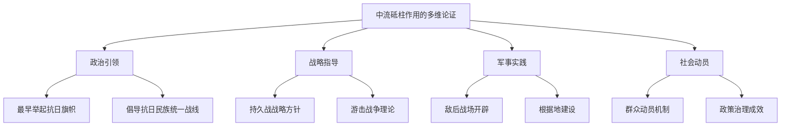

### 6.3 正面战场与敌后战场评价的整合与再认识

正面战场与敌后战场的评价问题是抗战史研究中**最具学术张力的核心议题**，从早期两个战场相对割裂的研究状态到全民族抗战视角下的整合认识，学界经历了深刻的认知演进过程，这一演进既反映了史料发掘的深化，也体现了理论视野的拓展。

**战略防御阶段两个战场的角色分工**已形成基本共识。全民族抗战爆发初期，日军来势汹汹，企图通过"速战速决"灭亡中国。这一时期，国民党正面战场确实承担了主要作战任务。从1937年7月到1938年10月，国民党军队组织了淞沪会战、忻口会战、徐州会战、武汉会战等一系列大规模战役[^42]。这些会战虽然最终多以失利告终，但也沉重打击了日军。据统计，这一时期国民党军队毙俘日军约25万人，自身伤亡超过104万人[^42]。

**敌后战场在战略防御阶段的策应作用**同样得到充分认定。与此同时，共产党领导的八路军、新四军则迅速挺进敌后，开辟抗日根据地。1937年9月，八路军115师在平型关伏击日军，取得了全民族抗战爆发后的首个重大胜利，粉碎了"日军不可战胜"的神话。这一时期，敌后战场主要起战略策应作用，配合正面战场作战，共对日作战1600多次，毙伤敌6万余人[^42]。

**战略相持阶段战场主次关系的变化**是评价两个战场的关键节点。1938年10月武汉失守后，抗战进入战略相持阶段。日军调整策略，对国民党政府以政治诱降为主、军事打击为辅，逐渐将主要兵力用于进攻共产党领导的敌后根据地[^42]。这一阶段，国民党正面战场的作战积极性明显下降。到了1941年后，更是"基本上没有对日军采取主动的战略或战役性攻势"，甚至出现与日军"互不相扰的休战状态"[^42]。

**敌后战场逐渐成为主战场**的认识得到日军档案的有力佐证。在日军眼里，正面战场的战略地位不及敌后战场，因为日本侵华战争的战略重心在华北。1938年8月8日，东京制定的战争"总方针"规定："事变处理的结局应是，尽快地首先解决华北问题"[^43]。日军的相关档案明确记载："华北治安的症结所在，并非国民党政府，而在中共。""总之，可以断定，今后华北治安的对象是共军"[^43]。

**日军被迫放弃速决战战略**的根本原因在于敌后战场的牵制。日军在开战之初进展很快，在占领武汉后，却似乎匪夷所思地停止了进攻。1938年12月6日，日本的《对华处理办法》规定："目前最重要的基本工作是恢复治安"，"如无重大的必要时，不企图扩大占领地域。""持久作战的样式，便成了保持占领地域及毗邻地域内的治安和对敌反攻企图的反击"[^43]。日军可以在正面战场速战速决，却在敌后战场不得不陷入"治安作战"的旷日持久。"总之，对华作战已处于进退维谷的境地"[^43]。

**两个战场战绩的量化比较**为评价提供了实证基础。从歼敌数字来看，整个抗战期间，共产党领导的武装力量共作战12.5万多次，歼灭日、伪军171.4万多人。国民党正面战场则歼灭了约53万日军[^42]。但是，单纯比较歼敌数字并不能全面反映两个战场的贡献。正面战场虽然败多胜少，但通过一系列大会战，粉碎了日军"速战速决"的战略企图，为国家战略转移赢得了时间。敌后战场则通过广泛的游击战争，牵制和消耗了大量日军力量，使其无法全力推进[^42]。

下表对比了两个战场在不同阶段的战略地位：

| 阶段 | 正面战场 | 敌后战场 | 战略关系 |
|------|---------|---------|---------|
| 战略防御阶段（1937.7-1938.10） | 主战场，承担主要作战任务 | 策应作用，配合正面作战 | 正面为主，敌后为辅 |
| 战略相持阶段（1938.10-1943） | 作战积极性下降 | 逐渐成为主战场 | 敌后地位上升 |
| 战略反攻阶段（1943-1945） | 局部反攻 | 全面反攻 | 敌后主导反攻 |

**两种不同的抗战路线**是理解两个战场差异的深层原因。国民党实行的是"片面抗战路线"，单纯依靠政府和军队抗战，不愿意实行民主、改善民生，不敢于发动和依靠人民大众[^42]。共产党则主张"全面抗战路线"，强调动员和依靠人民大众进行抗战。在战略上，毛泽东提出了持久战理论；在战术上，共产党军队以游击战为主，但不放弃有利条件下的运动战，建立了正规军、地方军和民兵三结合的武装力量体制[^42]。

### 6.4 战争损失与牺牲统计的数据差异与学术争议

战争损失与牺牲的统计是抗战史研究中**最具实证性与争议性的技术议题**，不同统计数据之间的显著差异反映了统计范围、计算方法、史料来源等多方面的复杂因素，计量化研究在推动认知深化的同时也面临方法论层面的挑战。

**中国军民伤亡总数的多种估算**反映了统计口径的差异。关于抗战期间中国军民伤亡的具体数字，不同史料存在显著差异。《中国共产党人的理想信念》明确指出中国军民伤亡总数在3500万以上，直接经济损失超过1000亿美元，间接损失达5000亿美元[^44]。而《抗战英烈录》则提到中国为战胜日本法西斯死亡2000余万人[^44]。差异源于统计范围的不同：前者包含东北义勇军和局部抗战时期的牺牲者，后者则聚焦于正规作战伤亡。

**官方统计数据的演变**体现了研究的深化过程。国务院《中国抗战损失报告》统计军民伤亡3500万人（含死亡2100万）；国民政府战后赔偿委员会评估直接经济损失约620亿美元（1945年币值）；中国社会科学院研究估算间接经济损失超5000亿美元（折算为现代价值）[^45]。这些数据为评估战争代价提供了权威依据，也为国际学术对话奠定了基础。

**日军在华死亡人数的中日争议**是统计问题中的焦点议题。日本厚生省1964年公布在华死亡约40.46万人（不含东北及缅甸战场），后续修正为45.57万人。日本防卫厅战史室编纂的《战史丛书》提供的数字是日军在中国战场死亡约48-55万人（包括战死与病死）[^46]。然而，日本官方公布的数字被认为明显偏低，理由包括：日本将大量战死者归入"病死"范畴；未计入台湾籍、朝鲜籍日军士兵的伤亡；未计入1931-1937年东北战场伤亡[^46]。

**日本学者的独立研究**提供了不同于官方的数据。日本历史学家伊藤正德在1998年出版的《帝国陆军史》中，记录战死在中国的日军共计789370人[^46]。这一数字显著高于日本官方统计，反映了学术研究与官方立场之间的差异。

**计量化研究的方法论挑战**需要审慎对待。现代学者推算结合人口变动、经济数据，修正总伤亡人数为3500万以上（含军民），经济损失超6000亿美元（含间接损失）[^45]。跨学科验证方法的运用，如人口学家利用战前战后户籍对比证实死亡人数下限为2000万，国际对比研究比较中、苏、波兰等国的战时损失比例，证明中国伤亡规模符合反法西斯主战场特征[^45]。

**战争损失统计的现实意义**超越了纯粹的学术范畴。详实数据为揭露侵略罪行、驳斥历史虚无主义提供铁证。经济损失统计成为战后对日索赔的法律依据，如1947年国民政府提交的《中国对日要求赔偿的说帖》，至今仍是外交谈判的基础文献[^45]。通过量化分析战争破坏力，警示军国主义扩张的危害，强化维护多边主义的共识。

下表汇总了主要统计数据及其来源：

| 统计类别 | 数据范围 | 统计结果 | 资料来源 |
|---------|---------|---------|---------|
| 中国军民伤亡 | 1931-1945年 | 3500万以上 | 国务院报告 |
| 直接经济损失 | 财产损毁、资源掠夺 | 620亿美元（1945年币值） | 国民政府赔偿委员会 |
| 间接经济损失 | 生产停滞等 | 5000亿美元以上 | 中国社科院研究 |
| 日军在华死亡 | 中国战场 | 45-79万人（争议中） | 日本官方/学者研究 |

### 6.5 战后转型历史逻辑的解释分歧与理论争鸣

1945-1949年战后转型的历史逻辑是该领域研究中**最具解释张力的核心议题**，"国民党如何失去大陆政权"这一命题引发了国内外学界的多元解答，军事战略、经济治理、社会动员、政治腐败等因素的权重分配构成了持续的理论争鸣。

**战后中国面临的根本问题**是战争还是和平。自1945年8月日本投降，到1946年年中全面内战爆发，中国时局发展与演变之错综复杂、波谲云诡，反映出战后中国面临的根本问题，即战争还是和平。这是此时国人关注的重点，也是各种政治力量争执的焦点[^9]。国共矛盾不能解决，国共关系不能缓和，就意味着战后中国问题无法和平解决[^37]。

**国民党六届二中全会**成为战后政策转折的关键节点。国民党六届二中全会可谓战后举行的最重要的一次国民党中央全会，它不仅全面检讨了国民党的战后政策，确立了国民党战后政策的基本走向，而且着重讨论了政治协商会议与国共关系之相关问题，从而深刻地影响到战后国共关系的发展，并使此一关系由相对缓和而急转直下，基本终结了自政协开始的战后民主化进程，最终导致内战战火再起[^43]。

**政协决议的命运**折射出国民党内部的深层矛盾。政协通过了一系列有利于中国民主化进程的决议，这些决议之付诸实施，就意味着国民党势将失去一部分长期由其一党垄断的权力，并改变所谓的"训政"体制，国民党内因此而有强烈的不满与反对声浪[^43]。在政协通过的五项决议中，最为国民党所不满的是关于宪法草案和改组政府的决议，前者否定了国民党所中意的总统制"五五宪草"，而改行随时可以倒阁的责任内阁制；后者则要求国民党改组政府，容纳反对党[^43]。

**国民党内部的派系分歧**加剧了政策的摇摆。国民党关于政协的争论，实际上反映了战后国民党内对内外环境和国共关系的不同看法。一派为强硬派，视政协为应付时局之举，所谓以和待战；另一派为温和派，主张考虑国内外大势，与中共谋和[^43]。蒋介石对政协实际也不满意，在日记中写道："颁发停战命令，以及宣布政府关于保障人民自由权利等四项要旨，在现时观之，对于政府乃为不利……但为国家前途计，此时只有忍辱负重耳！"[^43]

**西方学者的比较研究路径**提供了多维度的解释框架。胡素珊的《中国的内战:1945-1949年的政治斗争》是西方学者较早对"国民党如何失去大陆政权"这一历史命题进行全面系统、客观中立研究的重要学术著作。关于国民党失败、共产党胜利的原因，作者并不满足于以简单的因果关系进行解释，而是在中国内战的各个层面上对两党进行比较，包括与学生和知识分子的关系、土地改革的措施、对工业的管理、财政措施等[^8]。

**军事战略差异**是解释政权更迭的重要维度。1945年国民党政府拥有430万武装力量（其中正规军200万），控制着全国76%的领土和所有关键工业城市；接收了百万日军的武器装备；更获得美国提供的价值18亿美元的军事援助。相比之下，中国共产党领导的武装力量总数仅127万人[^47]。然而，蒋介石的"点线面"理论在实际执行中陷入了严重的资源耗散困境，每个被占领的城市都成为需要输血维持的"战略包袱"[^47]。

**毛泽东的军事思想**呈现出完全不同的逻辑进路。1946年9月16日发布的《集中优势兵力，各个歼灭敌人》指示，系统阐述了"存人失地，人地皆存；存地失人，人地皆失"的战争哲学[^47]。共产党军队发展出完善的俘虏转化机制，通过"即俘即补"政策，使部队规模在战争期间实现了134%的增长，这种人力资源的再生能力彻底颠覆了传统战争消耗模型[^47]。

**自由知识分子群体的态度转变**反映了社会民心的向背。抗战胜利后，自由知识分子尤其是全国各大高校的教授们，进发出惊人的议政热忱，他们纷纷站出来，在各大报刊杂志上呼吁和平，反对内战，要求重建公道正义的社会秩序[^11]。然而，在国共斗争的大背景下，思想上的分歧随着时局的恶化逐渐演变成彼此政治上的矛盾和冲突。知识分子的政治化使他们之间发生了分化[^43]。

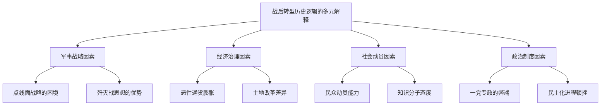

### 6.6 结论差异背后的史料基础与理论立场分析

上述核心议题的结论差异背后存在着**深层的史料基础、理论立场与政治语境因素**，这些因素的交织作用塑造了不同研究者的问题设定、论证逻辑与价值判断，揭示历史研究中事实判断与价值判断复杂交织的本质特征。

**档案资料的开放程度与利用范围**直接影响研究结论的形成。海外所藏档案的开放，为抗日战争史料的搜集和整理提供了更多来源。2001年日本成立亚洲历史资料中心并对外开放；美国于1999年宣布成立"纳粹战争罪行和日本帝国政府档案跨机构工作组"，自2007年起相关档案逐步解密开放；英、法、荷以及日内瓦国联和联合国档案馆所藏与中国抗战有关的档案也逐步开放。这种多国档案的开放使中外档案互证成为可能，显著提升了研究的客观性与全面性。

**理论范式的预设与选择**深刻塑造着研究结论的建构。革命史范式形成于20世纪三四十年代，初步构建起中国近代革命史叙事体系，强调阶级斗争是人类社会发展的动力。现代化范式试图打破单一的"革命史"叙事结构，从另一个角度开辟历史研究的新路径。这两个范式并非截然对立，一些主张"革命史"范式的研究者认为从任何一个侧面或角度去观察、研究历史都将是有益的探索；而主张"现代化"范式的研究者则认为必须重新建立一个包括革命在内而不是排斥革命的新的综合分析框架。

**政治语境与意识形态的影响**在某些议题上尤为明显。两岸对抗战起点的分歧，表面是学术争议，实则是统独意识形态在历史领域的延伸。台湾教科书长期美化"攘外必先安内"政策，称其"争取到了四年充实国力时间"。而大陆学者则揭露，该政策导致《淞沪协定》《塘沽协定》《何梅协定》《秦土协定》等一系列丧权辱国条约的签订[^11]。这种差异提醒研究者需要审慎区分学术判断与政治立场。

**欧美学界研究视角的转变**为国际学术对话提供了新的可能。2015年以来，欧美学界的中国抗战史研究相较以前发生了很大变化，传统议题也有明显扩展与深化，尤其体现在：关注中国大陆抗战史研究，引入全民族抗战视角；注重联系，在全球史视野下理解中国抗战；视线下移，注重抗战中"人"的叙事[^38]。这种转变为中外学界的认知趋同创造了条件。

**学术共识的稳固程度**因议题性质而异。在抗战起点问题上，"十四年抗战"概念已获得国内外学界的广泛认同，形成了较为稳固的共识。在中流砥柱作用问题上，中国学界的共识明确，欧美学者的评价也日趋积极，但仍存在一定的认知差距。在战争损失统计问题上，由于统计方法与数据来源的复杂性，具体数字仍存在争议，但量级判断已趋于一致。在战后转型逻辑问题上，多元解释框架并存，理论争鸣仍在持续。

下表综合评估了各核心议题的共识程度与争议焦点：

| 核心议题 | 共识程度 | 主要共识内容 | 持续争议焦点 |
|---------|---------|-------------|-------------|
| 抗战起点与分期 | 高 | 十四年抗战概念确立 | 局部与全国抗战关系细化 |
| 中流砥柱作用 | 较高 | 多维论证体系形成 | 中外评价差距缩小中 |
| 两个战场评价 | 较高 | 全民族抗战视角整合 | 量化评估方法争议 |
| 战争损失统计 | 中等 | 量级判断趋于一致 | 具体数字仍有分歧 |
| 战后转型逻辑 | 较低 | 多因素解释框架 | 理论范式选择差异 |

**历史研究中事实判断与价值判断的交织**是理解结论差异的深层视角。历史研究不可能完全脱离价值立场，但学术研究的科学性要求尽可能以史实为依据，让历史说话，用史实发言。在批判吸收各研究范式所长的基础上，构建一个更具科学性、主体性、创新性和完整性的中国近代史学科体系、学术体系和话语体系，是时代赋予当代中国学者的学术使命。

总体而言，1937-1949年历史研究在核心结论上呈现出**从分歧走向共识、从单一走向多元、从国内走向国际**的演进趋势。抗战起点与分期问题的共识形成、中流砥柱作用的多维论证、两个战场评价的整合认识、战争损失统计的实证深化、战后转型逻辑的多元解释，共同构成了这一领域学术认知的基本格局。结论差异背后的史料基础、理论立场与政治语境因素的揭示，为深化历史认知、推进学术对话提供了方法论启示。

## 7 现有研究的不足与空白领域识别

基于前述六章对研究成果、领域、视角、方法、理论及结论的系统对比分析，本章将全面归纳1937-1949年中国历史研究的主要不足与明显空白领域。尽管这一领域的研究已取得丰硕成果，形成了较为完整的学术体系，但在时段覆盖、区域分布、群体关注、方法整合、国际对话等维度仍存在显著的结构性问题，这些问题制约着历史认知的深化与学术话语的建构。系统诊断这些不足的表现形态与形成原因，对于明确未来研究的突破方向具有重要的基础性意义。

### 7.1 时段覆盖的结构性失衡：抗战研究与战后转型研究的落差分析

1937-1949年历史研究中最显著的结构性问题是**抗日战争时期（1937-1945）与战后转型时期（1945-1949）研究成果的严重不均衡**。这种失衡不仅体现在成果数量上，更深刻地反映在研究体系的成熟程度与学术资源的配置格局上。

**抗战研究已形成高度成熟的学科体系**。通史类著作方面，张宪文、陈谦平等著的《中国抗日战争史》（四卷）与步平、王建朗主编的《中国抗日战争史》（八卷）构成了系统完整的宏观叙事框架。专题研究方面，"抗日战争专题研究"丛书被列为"十四五"国家重点出版物出版专项规划，涵盖军事、政治、外交、经济、社会等多个领域。文献平台方面，"抗日战争与近代中日关系文献数据平台"提供了海量的数字化档案资源。研究视角方面，从正面战场与敌后战场的协力配合，到全球史视野下的中国抗战定位，均有深入探讨。

**战后转型研究则呈现明显的滞后状态**。在通史编纂上，缺乏与抗战史研究相匹配的系统性综合著作，对1945-1949年历史进程的整体性把握不足。在专题研究上，虽有胡素珊的《中国的内战:1945-1949年的政治斗争》等重要成果，但专题丛书的系统性出版远不及抗战研究。在资料整理上，战后时期特别是国民党方面、第三方力量、社会各阶层的相关档案资料，仍有待进一步整理与数字化开放。在理论建构上，对战后转型的历史逻辑、国共政争的深层机制、新中国创建的历史必然性等问题，尚未形成与抗战研究相当的理论深度。

造成这种**时段覆盖失衡的原因是多方面的**：

首先，**纪念性节点的驱动效应差异显著**。抗战胜利40周年、70周年、80周年等重大纪念节点均带动了研究高潮，2015年习近平总书记关于抗战史研究的重要讲话更是产生了强大的推动作用。相比之下，战后转型时期缺乏类似的纪念节点驱动，学术关注度与资源投入相对有限。

其次，**政治敏感性的程度差别影响研究取向**。抗日战争作为全民族的共同记忆，具有凝聚民族认同的重要功能，研究的政治正确性较为明确。而战后国共政争涉及复杂的政治评价问题，对国民党政权失败原因、第三方政治力量命运、自由知识分子群体选择等议题的深入探讨，面临着更多的政治敏感性考量。

再次，**档案资料的开放程度存在差异**。抗战档案的系统整理与开放程度较高，国内外多国档案的互证利用已成为常态。而战后时期档案，特别是涉及国共谈判、政协会议、内战决策等核心议题的原始文献，开放程度相对有限，制约了研究的深入开展。

**时段覆盖失衡对整体历史认知产生了深刻影响**。从学术层面看，对1937-1949年历史的完整理解需要贯通抗战与战后两个阶段，时段研究的割裂导致对政策延续性、制度变迁、社会结构演变等议题的认识不足。从历史叙事层面看，抗战研究的丰富成果与战后研究的相对薄弱形成对比，使得"中华民族从苦难走向辉煌"的完整历史叙事存在链条缺失。从国际对话层面看，欧美学界对战后中国转型的研究投入较多，中国学界在这一领域的话语权相对薄弱。

下表对比了两个时段研究的发展状况：

| 对比维度 | 抗战时期研究（1937-1945） | 战后转型研究（1945-1949） |
|---------|-------------------------|-------------------------|
| 通史编纂 | 多部系统性著作 | 综合性著作缺乏 |
| 专题丛书 | 国家规划系统出版 | 零散分布 |
| 文献平台 | 数据库建设完善 | 资料整理滞后 |
| 研究视角 | 多元化成熟 | 有待拓展 |
| 理论深度 | 体系完整 | 建构不足 |
| 学术关注 | 持续高热 | 相对冷门 |

### 7.2 区域研究的深度落差：华北、华中、华南根据地研究的不均衡格局

区域研究的**深度不均衡**是1937-1949年历史研究中另一个显著的结构性问题，不同地域的研究积累差异明显，形成了以华北根据地研究为核心、其他区域研究相对薄弱的格局。

**华北根据地研究相对充分**，形成了较为完整的研究体系。晋察冀、晋冀鲁豫、晋绥等根据地的政权建设、土地改革、群众动员、军事斗争等议题均有深入探讨。研究者对华北根据地的社会变迁、基层政治、干部队伍建设等问题进行了细致的实证分析，形成了丰富的学术积累。《中国共产党编年史》对华北抗日根据地的相关记载较为详尽，如1943年卷记录了山东抗日根据地牵制日军兵力的具体数据。

**华中根据地研究则明显薄弱**。新四军"发展华中"战略虽有学者专门探讨，揭示了八路军和新四军角色转化的过程，但对华中各根据地的系统性研究仍显不足。江北指挥部设立后新四军的具体发展历程、华中各根据地之间的差异性比较、华中与华北根据地政策执行的区域特点等议题，尚未得到充分深入的研究。

**华南抗日根据地研究更为薄弱**。对东江纵队、琼崖纵队等华南抗日武装的研究成果有限，对华南特殊的地理环境、社会结构、华侨因素等对根据地建设影响的分析不够深入。中共在香港开展国际反法西斯统一战线的研究虽有涉及，但整体上华南根据地在抗战史研究中处于边缘位置。

**东北抗联研究存在特殊困难**。东北抗日联军在极端困境下坚持斗争的历史虽已得到基本认定，但对抗联各路军的具体作战历程、组织演变、与苏联关系、最终命运等问题的深入研究仍有空间。东北地区日伪统治的系统性研究、东北民众的战争体验研究等领域也需要加强。

**西南大后方研究有待深化**。抗战时期国民政府迁都重庆，西南地区成为抗战大后方，但对大后方社会经济变迁、文化教育发展、难民流动与社会整合等议题的研究深度不足。战时高校内迁的文化史意义、大后方工业建设的历史评价、西南各省的区域差异等问题，均有进一步深化的空间。

**沦陷区研究呈现内部分化**。对华北、华中沦陷区的研究相对较多，但对不同沦陷区内部的社会经济状况、民众生活、政权互动等缺乏细致的分区研究。日伪占领区的社会控制机制、民众的生存策略、抵抗与合作的复杂面相等议题，往往以整体概貌代替复杂的地方实践。

**区域研究不均衡的形成原因**涉及多个层面：

**档案资源分布的差异**是重要因素。华北根据地档案保存相对完整，且较早得到整理开放；而华中、华南根据地档案分散，部分资料在战争中损毁，制约了研究的深入开展。

**研究传统的积累差异**同样明显。华北根据地研究起步较早，形成了较为稳定的学术队伍与研究传统；其他区域的研究力量相对薄弱，学术积累不足。

**学术机构布局的影响**不可忽视。主要研究机构多集中于北京等地，对华北历史的关注度自然较高；而华中、华南、西南等地的研究机构在该领域的学术影响力相对有限。

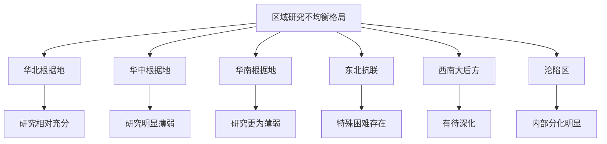

### 7.3 特定群体研究的系统性缺失：民众、边缘群体与多元主体的研究空白

特定社会群体研究的**系统性缺失**是制约1937-1949年历史研究全面深化的重要瓶颈。尽管近年来"视线下移"的研究取向日益受到重视，但对普通民众、边缘群体与多元主体的研究仍存在明显空白。

**普通民众战争体验研究严重不足**。现有研究多聚焦于政党、军队、精英人物的决策与行动，对普通士兵、农民、城市居民、难民等群体的战争体验关注有限。战争如何改变了普通人的日常生活？民众如何在战火中求生存？战争创伤如何影响个体与家庭？这些问题的深入探讨需要大量口述史料与微观实证研究的支撑，而目前这方面的学术积累明显不足。

**妇女与儿童群体研究薄弱**。抗战时期妇女的社会角色变迁、妇女参战的多种形式、战时性暴力的系统研究、战争孤儿的命运等议题，虽有部分成果，但远未形成系统的研究体系。妇女在根据地建设中的作用、妇女解放运动与抗战动员的关系、战时婚姻家庭变迁等问题，均有待深入探讨。

**少数民族抗战参与研究空白明显**。中国是多民族国家，抗日战争是全民族的共同抗争，但对蒙古族、回族、藏族、维吾尔族等少数民族抗战参与的系统研究极为有限。边疆民族地区的抗战动员、少数民族武装的作战历程、民族政策在抗战中的实践等议题，基本处于研究空白状态。

**海外华侨群体研究分散**。"抗日战争专题研究"丛书虽涉及美洲华侨与抗日战争的专题，但对东南亚华侨、欧洲华侨等群体的抗战贡献研究仍较分散。华侨的经济支援、华侨归国参战、华侨的政治态度与身份认同等问题，缺乏整合性的研究框架。

**第三方政治力量研究不够深入**。除国共两党外，民主党派、无党派人士、地方实力派等第三方政治力量在这一历史时期的作用与命运，研究深度不足。自由知识分子群体的研究虽有进展，但对民族资产阶级、地方士绅等中间阶层的系统研究仍显薄弱。这些群体在战后的政治选择、社会网络、最终命运等问题，尚未得到充分揭示。

**宗教团体与会道门组织研究缺失严重**。中国共产党在统一战线中争取、改造或瓦解农村会道门等传统社会组织的工作，由于资料分散，研究成果极少。佛教、基督教、伊斯兰教等宗教团体在抗战中的态度与作用，同样缺乏系统研究。这些特殊社会组织在战时社会中的功能、与各方政治力量的互动关系等问题，基本处于学术盲区。

**敌伪工作的实证研究匮乏**。关于中国共产党如何具体开展对日军、伪军、伪政权的争取、瓦解和转化工作，以及如何将敌占区转化为游击区和根据地的微观机制研究，成果非常有限。这一领域涉及情报工作、策反活动、伪军起义等敏感议题，档案资料的获取存在困难，但其学术价值与历史意义不容忽视。

下表梳理了特定群体研究的缺失状况：

| 群体类别 | 研究现状 | 主要空白 | 研究价值 |
|---------|---------|---------|---------|
| 普通民众 | 严重不足 | 战争体验、日常生活 | 还原历史全貌 |
| 妇女儿童 | 较为薄弱 | 角色变迁、战时创伤 | 性别视角深化 |
| 少数民族 | 空白明显 | 抗战参与、民族政策 | 多民族抗战叙事 |
| 海外华侨 | 分散研究 | 整合框架、区域比较 | 全球华人贡献 |
| 第三方力量 | 深度不足 | 政治选择、社会网络 | 多元主体呈现 |
| 宗教会道门 | 缺失严重 | 社会功能、政治互动 | 基层社会理解 |

### 7.4 跨学科整合的表层化倾向：方法借鉴与学科融合的深度不足

跨学科方法的引入是1937-1949年历史研究方法论演进的重要特征，但在实际运用中普遍存在**表层化倾向**，方法借鉴与学科融合的深度不足，制约着研究质量的进一步提升。

**社会学、人类学方法的表层化运用**较为普遍。年鉴学派的"自下而上""长时段"、整体史、跨学科等概念已为研究者耳熟能详，但在具体研究中，这些方法往往停留在概念借用层面，缺乏深入的理论对话与方法论反思。当代社会史学界的史学理论研究强调拓展研究视野、创新研究方法，但在丰富学界对当代社会认识的同时，也在一定程度上带来了研究意义琐碎和学科重心偏移的问题。

**理论套用生硬的问题**在部分研究中较为突出。一些研究者过于看重基于西方历史演进经验为基础的理论分析框架，难免呈现出"让人觉得似是而非、隔靴搔痒"的问题，因为这些理论框架大多抽离了中国社会的历史现实。跨学科理论框架对中共历史进程的分析与解读，都需要以扎实的历史经验研究为基础，否则容易陷入削足适履的困境。

**历史感淡化的倾向**值得警惕。在跨学科研究已逐渐成为一种学术风尚的情况下，如何回答社会史研究的学科边界问题，成为需要认真思考的议题。过度强调社会科学方法可能导致历史研究的人文性与叙事性被削弱，历史的独特性与复杂性被简化为可操作的变量与模型。

**计量史学方法的规范化不足**同样存在。计量化本身并不能排除主观任意性的可能，研究者总是按照自己事先设定的某种假设去收集和选择数据。在抗战史研究中，计量化的研究必须将计量的对象尽可能做到概念清晰，但部分研究在数据选择、概念界定上存在规范化不足的问题。史料的选择性使用可能导致研究结论的偏颇，需要在方法论层面强调史料搜集的全面性与分析的批判性。

**口述史方法的可靠性验证欠缺**是另一突出问题。抗日战争时期由于处于战争环境，很多史料是需要认真分析的。对新近调查所获的口述资料也同样有一个如何处理的问题。口述记忆的主观性、选择性以及时间流逝带来的记忆偏差，都可能影响口述史料的准确性，但部分研究在运用口述史料时缺乏必要的交叉验证与批判性分析。

**唯物史观的方法论指导作用有待加强**。马克思主义唯物史观在社会史研究中的理论和实践一定程度上存在着被忽视或重视不够的现象。历史唯物主义的基本原理与社会史研究的理论有许多相通之处，唯物史观在社会史研究中"具有方法论的指导意义"。在引入各种跨学科方法的同时，如何坚持唯物史观的指导地位，是需要持续反思的理论问题。

**领域间交叉融合的整合性不足**。虽然军事、政治、经济、社会、文化各领域均有专深研究，但将军事行动与社会动员、思想传播与文艺实践、经济政策与政权建设结合起来进行系统性、综合性研究的成果较少，存在一定"碎片化"倾向。这种碎片化既是专业分工深化的结果，也反映了整合性研究能力的不足。

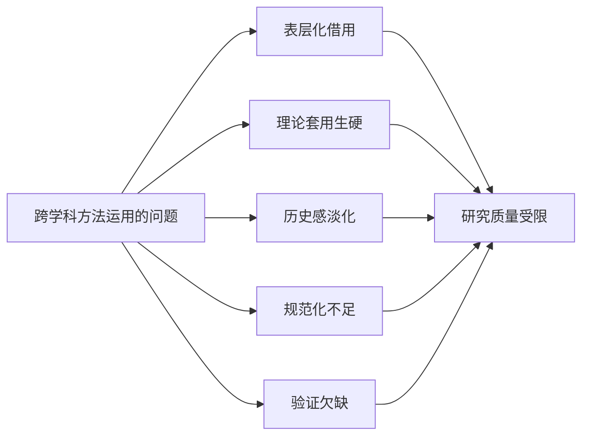

### 7.5 国际学术对话的结构性障碍：话语体系与认知鸿沟的弥合困境

中外学界在1937-1949年历史研究领域的对话虽有进展，但仍存在**结构性障碍**，语言壁垒、档案互通、理论范式差异等因素制约着深度学术交流的开展，中国学界自主话语体系的建构任重道远。

**语言壁垒制约着学术成果的国际传播**。中国学界的大量研究成果以中文发表，难以进入国际学术对话的主流渠道。虽然2025年出版的《新编第二次世界大战史》同时推出了英文版，让中国学界关于二战史的观点进入全球视野，但这种做法尚未成为常态。相应地，海外学界的最新研究成果也存在译介滞后的问题，影响了学术信息的及时交流。

**档案资料的互通利用仍有障碍**。尽管海外所藏档案的开放为抗日战争史料的搜集和整理提供了更多来源，但中外档案的系统性互证利用仍面临实际困难。档案获取的便利程度、数字化水平、检索工具的完善程度等方面存在差异，制约着跨国档案研究的深入开展。

**理论范式的差异构成深层障碍**。革命史范式、现代化范式在中外学界的运用存在明显差异，对某些核心议题的理论预设与价值判断不尽相同。西方学界长期流行的"冲击—反应"论、"传统—现代"论等范式，与中国学界坚持的马克思主义史学理论存在张力。如何在理论对话中既保持学术开放性又坚守理论主体性，是中国学界面临的挑战。

**某些核心议题上的认知鸿沟仍然存在**。尽管欧美学者对中共根据地建设的评价日趋积极，对全民族抗战视角的认同度提升，但在中流砥柱作用的评价、战后转型的历史逻辑等问题上，中外学界仍存在一定的认知差距。这种差距既源于史料基础的差异，也与理论立场和政治语境有关。

**中国学界自主话语体系建构的进展与不足并存**。一方面，中国学者在抗战起点、两个战场评价、中国抗战国际贡献等议题上形成了较为系统的话语表达，并通过国际学术会议、英文著作出版等渠道进行传播。另一方面，在理论创新层面，中国学界虽有升级现代化研究范式、建构自主知识体系的努力，但尚未形成具有广泛国际影响力的原创性理论贡献。

**欧美学界研究视角转变带来的对话机遇**值得把握。2015年以来，欧美学界的中国抗战史研究发生了很大变化，越来越多的学者开始从全民族抗战角度理解中国人民抗日战争，将敌后战场置于全民族抗战视域下进行考察，在全球史视野下理解中国抗战，注重抗战中"人"的叙事。这种转变为中外学界的认知趋同创造了条件，也为深化学术对话提供了契机。

下表分析了国际学术对话的障碍与机遇：

| 维度 | 障碍因素 | 对话机遇 | 应对策略 |
|------|---------|---------|---------|
| 语言层面 | 成果传播受限 | 英文出版增加 | 加强译介工作 |
| 档案层面 | 互通利用困难 | 数字化进展 | 推动档案开放 |
| 理论层面 | 范式差异明显 | 多元现代性认识 | 建构自主话语 |
| 认知层面 | 核心议题分歧 | 视角转变趋同 | 深化实证研究 |

### 7.6 研究不足的成因诊断与对整体研究格局的影响评估

综合上述分析，1937-1949年历史研究的各类不足与空白具有**深层的结构性成因**，这些成因相互交织，共同制约着研究的进一步深化与学术话语的建构。

**档案开放政策是影响研究深度的关键因素**。部分领域的原始档案开放程度有限，特别是涉及战后国共谈判、内战决策、第三方政治力量等敏感议题的文献，获取渠道受限。档案开放的不均衡直接导致了研究时段、区域、议题的不均衡分布。未来研究的突破在相当程度上取决于档案开放政策的进一步调整。

**研究传统惯性塑造了现有的学术格局**。军事史与政治史长期占据主导地位，社会史、文化史等领域起步较晚；华北根据地研究积累深厚，其他区域研究力量薄弱；精英视角的研究传统深厚，民众视角的研究取向尚在培育之中。这种惯性既是学术发展的自然结果，也在一定程度上制约着研究视野的拓展。

**学术评价机制的导向作用不可忽视**。现有评价体系对创新性研究的激励不足，对跨学科研究、长周期研究、基础性资料整理工作的支持有限。部分研究者倾向于选择"安全"的议题与方法，规避可能引发争议的领域，这在一定程度上限制了学术探索的深度与广度。

**政治敏感性考量影响着议题选择**。战后国共政争、第三方政治力量命运、国民党政权失败原因等议题涉及复杂的政治评价，部分研究者对此持谨慎态度。如何在坚持正确历史观的前提下，以学术的方式深入探讨这些议题，是需要持续探索的问题。

**方法论培训的缺失制约着研究质量**。计量史学、口述史、跨学科方法等的规范化运用需要系统的方法论训练，但现有研究生培养体系在这方面的投入不足。部分研究者在方法运用上存在表层化、不规范的问题，影响了研究成果的学术质量。

**这些不足对整体研究格局产生了多重制约效应**：

在**历史认知深化**层面，时段覆盖失衡导致对1937-1949年历史进程的整体把握不足，区域研究落差影响了对根据地建设多样性的认识，群体研究缺失制约了对历史全貌的还原。

在**学术话语建构**层面，跨学科整合的表层化倾向削弱了理论创新的深度，国际对话的结构性障碍限制了中国学界话语的国际传播与影响力。

在**学科健康发展**层面，研究不足与空白的存在意味着大量有价值的学术问题尚待开拓，这既是挑战也是机遇，为未来研究提供了广阔的探索空间。

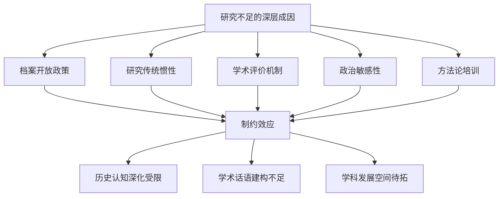

**未来研究需要在以下方向寻求突破**：在时段覆盖上，加强1945-1949年战后转型研究，构建与抗战研究相匹配的学术体系；在区域研究上，推动华中、华南、东北、西南等区域研究的深化，形成均衡的区域研究格局；在群体研究上，拓展对普通民众、边缘群体、多元主体的关注，丰富历史叙事的主体维度；在方法整合上，提升跨学科方法运用的规范化与深度化水平，坚持唯物史观的方法论指导；在国际对话上，加强学术成果的国际传播，在理论对话中建构具有中国特色的自主话语体系。这些突破方向的明确，为后续章节预测未来最具研究潜力的选题奠定了诊断基础。

## 8 未来研究潜力选题预测与论证

基于前述七章对1937-1949年历史研究的系统对比分析，本章将综合现有研究的结构性不足、学术发展趋势、潜在新史料开放情况以及国际学术前沿动向等因素，预测并论证未来最具研究潜力和学术空间的三个选题方向。这些选题的提出既是对现有研究空白的针对性回应，也是对学术发展趋势的前瞻性把握，旨在为该领域研究者提供具有可操作性的选题参考与学术指引。

### 8.1 选题一：1945-1949年战后转型期的社会重构与政权更迭机制研究

**学术价值的多维论证**

战后转型研究是当前1937-1949年历史研究中**最具学术空间与理论潜力**的领域。这一选题直接回应了第七章所揭示的"时段覆盖严重失衡"这一核心结构性问题，其学术价值体现在多个层面。

首先，该选题能够**填补抗战研究与新中国史研究之间的链条缺失**。现有研究格局中，抗日战争时期研究已形成高度成熟的学科体系，新中国成立后的历史研究同样积累深厚，但1945-1949年这一关键过渡期的研究相对薄弱，导致对"战争与革命"历史进程的整体认知存在断裂。系统研究这一时期，有助于构建从抗战胜利到新中国创建的完整叙事链条，深化对中国革命胜利历史必然性的理解。

其次，该选题能够**揭示政权更迭的深层社会机制**。既有研究多聚焦于军事战略与政治决策层面，对国共政争背后的社会基础、民众心理、地方秩序重建等深层因素关注不足。通过社会史视角的切入，可以揭示政权更迭不仅是军事胜负的结果，更是社会力量重新整合、民心向背根本转变的历史进程。

再次，该选题具有**重要的理论建构价值**。战后转型涉及国家建构、社会整合、政治合法性等重大理论议题，系统研究这一时期有助于提炼中国革命的独特经验，为理解20世纪全球范围内的革命与国家建构提供中国案例。

**可行性条件的系统评估**

该选题的研究可行性正在不断提升。**档案资料方面**，近年来战后时期档案的逐步解密为研究提供了新的史料基础，包括国共谈判档案、政协会议文献、地方政权交接档案等核心资料的开放程度有所提高。**口述史料方面**，对战后亲历者的抢救性访谈工作持续推进，这些第一手资料为还原历史细节提供了独特视角。**国际学术参照方面**，胡素珊《中国的内战:1945-1949年的政治斗争》等西方学者的研究成果提供了重要的方法论借鉴与对话基础。

**预期突破点的具体阐释**

该选题的预期突破点涵盖以下几个核心方向：

**国共政争的社会基础分析**是首要突破方向。研究应超越单纯的政治军事叙事，深入考察战后中国各社会阶层的政治态度与选择机制。城市工商业者、农村地主富农、知识分子群体、城市市民等不同社会力量在国共政争中的立场演变及其深层原因，是理解政权更迭社会基础的关键。

**第三方政治力量的命运考察**是重要突破方向。民主党派、无党派人士、地方实力派等第三方力量在战后的政治选择、与国共两党的互动关系、最终的历史命运等问题，尚未得到充分系统的研究。这些群体的研究有助于呈现战后政治格局的多元面相。

**基层社会秩序重建的微观实证**是深化突破方向。战后各地区从日伪统治、国民党统治向共产党政权过渡的具体过程，涉及地方政权交接、社会秩序恢复、经济生活重建、文化教育重组等多个层面。通过区域个案的深入实证研究，可以揭示政权更迭在基层社会的具体展开机制。

**制度与政策的连续性分析**是理论突破方向。深入探究中共在抗战时期形成的政治、军事、经济、社会政策在解放战争时期及建国初期的延续、调整与制度化过程，有助于理解新中国国家制度与社会结构的历史渊源。

下表梳理了该选题的核心要素：

| 维度 | 具体内容 | 研究意义 |
|------|---------|---------|
| 学术价值 | 填补链条缺失、揭示深层机制 | 完善历史认知 |
| 可行性 | 档案解密、口述抢救、国际参照 | 研究条件改善 |
| 突破点 | 社会基础、第三方力量、基层重建 | 多维度深化 |
| 贡献 | 理解革命必然性、构建完整叙事 | 理论与叙事双重价值 |

### 8.2 选题二：华中、华南抗日根据地的区域比较与多样性研究

**学术价值的深层阐释**

针对第七章揭示的区域研究深度落差问题，华中、华南根据地的系统研究具有**填补学术空白与丰富历史认知**的双重价值。这一选题的学术意义体现在以下几个方面。

**揭示根据地建设的区域差异性**是该选题的首要价值。现有研究以华北根据地为核心，形成了较为单一的根据地建设叙事模式。然而，华中、华南地区在地理环境、社会结构、经济基础、文化传统等方面与华北存在显著差异，根据地建设必然呈现不同的模式与特征。系统研究这些差异，有助于突破既有认知框架的局限。

**丰富对中共革命经验多样性的认识**是该选题的理论价值。中国共产党的革命成功并非单一模式的复制，而是在不同区域因地制宜、灵活调适的结果。华中、华南根据地的研究能够揭示中共政策执行的区域适应性与创造性，深化对中共革命成功经验的理解。

**完善全民族抗战叙事**是该选题的历史叙事价值。全民族抗战是全国各地区、各民族共同参与的历史进程，区域研究的不均衡导致某些地区的抗战贡献被低估或遮蔽。华中、华南根据地研究的深化，有助于构建更加完整、均衡的全民族抗战叙事。

**可行性条件的具体分析**

该选题的研究可行性具备以下基础：

**地方档案馆资源的深度挖掘**是重要的史料基础。江苏、安徽、浙江、广东、海南等省份的档案馆保存有大量新四军、东江纵队、琼崖纵队等抗日武装的相关档案，这些资料尚未得到充分系统的整理与利用。随着地方档案馆数字化建设的推进，这些资源的获取便利性将持续提升。

**田野调查与口述史方法的综合运用**提供了方法论支撑。华中、华南地区的抗战遗址、革命旧址保存较多，为实地考察提供了条件。同时，部分抗战亲历者及其后代仍健在，口述史料的搜集具有紧迫性与可行性。

**区域史研究力量的培育壮大**提供了学术队伍基础。近年来，华东、华南地区高校与研究机构在区域史研究方面投入增加，培养了一批专注于地方史研究的中青年学者，为该选题的推进提供了人才支撑。

**预期突破点的系统论述**

该选题的预期突破点包括以下几个核心方向：

**新四军"发展华中"的具体历程还原**是首要突破方向。现有研究已揭示了八路军和新四军在发展华中战略中的角色转化过程，但对新四军各支队、各师在华中不同地区的具体发展历程、根据地创建过程、政权建设实践等缺乏细致的实证研究。通过档案梳理与口述访谈，还原这一历程的丰富细节，是该选题的重要突破点。

**华南特殊环境下根据地建设模式分析**是深化突破方向。华南地区的亚热带气候、丘陵山地地形、华侨资源丰富、与港澳毗邻等特殊条件，决定了根据地建设必然采取不同于华北的模式。东江纵队、琼崖纵队的组织形态、作战方式、群众动员机制、经济来源等问题，均有待系统研究。

**不同区域政策执行差异的比较考察**是理论突破方向。中共中央的统一政策在华北、华中、华南不同区域的执行过程中，必然经历因地制宜的调适与变通。通过比较研究，揭示政策执行的区域差异及其形成机制，有助于深化对中共政策制定与执行关系的理解。

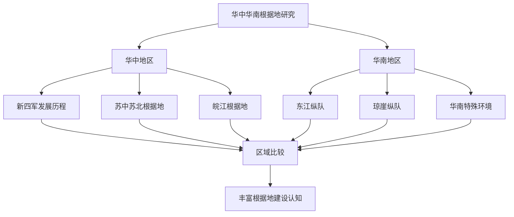

### 8.3 选题三：战时与战后普通民众生存体验与社会心态史研究

**学术价值的人文关怀维度**

针对第七章揭示的特定群体研究系统性缺失问题，普通民众生存体验与社会心态研究具有**还原历史全貌、推动研究范式转换**的重要学术价值。

**还原历史的完整面貌**是该选题的首要价值。现有研究多聚焦于政党、军队、精英人物的决策与行动，普通士兵、农民、城市居民、难民等群体的战争体验长期处于学术视野的边缘。这些群体是历史的主体参与者，他们的生存状态、情感体验、心理变化构成了历史的血肉，缺乏对他们的关注，历史叙事就难免骨感而缺乏温度。

**呈现宏大叙事中被遮蔽的个体经验**是该选题的理论价值。宏大叙事固然揭示了历史发展的基本规律与主要线索，但也可能遮蔽个体经验的丰富性与复杂性。通过民众视角的研究，可以发现宏大叙事无法涵盖的历史细节，揭示历史进程中的偶然性、多样性与人的能动性。

**推动历史研究的人文关怀回归**是该选题的学科意义。历史研究的终极关怀是人，是人的命运、人的选择、人的尊严。民众生存体验研究将研究视角从制度、政策、战略转向具体的人，体现了历史研究的人文主义传统，有助于提升历史叙事的温度与感染力。

**可行性条件的多元支撑**

该选题的研究可行性具备以下条件：

**口述史方法的成熟运用**提供了核心方法论支撑。经过数十年的发展，口述史方法在中国学界已积累了丰富的实践经验，形成了较为规范的操作程序。抗战亲历者虽然日益凋零，但其子女、后代仍可提供家族记忆与代际传承的口述资料，具有抢救性搜集的紧迫性与可行性。

**民间文献与私人档案的发掘整理**提供了史料拓展空间。日记、书信、家谱、契约等民间文献保存了普通人的生活痕迹与情感记录，是研究民众生存体验的珍贵史料。近年来，民间文献的搜集整理工作受到越来越多的关注，为该选题提供了史料基础。

**跨学科方法的规范化借鉴**提供了方法论资源。社会学、人类学、心理学等学科在研究社会心态、集体记忆、创伤体验等方面积累了丰富的理论与方法，可以为该选题提供跨学科的分析工具。在坚持历史学学科本位的前提下，规范化地借鉴这些方法，有助于提升研究的理论深度。

**预期突破点的具体展开**

该选题的预期突破点涵盖以下核心方向：

**战争创伤与社会心理的系统考察**是首要突破方向。战争对普通民众造成的心理创伤、恐惧记忆、仇恨情绪等，如何影响其战时行为选择与战后社会适应？战争创伤的代际传递机制如何运作？这些问题的深入探讨，有助于理解战争对社会心理结构的深层影响。

**难民流动与社会整合机制分析**是重要突破方向。抗战时期大规模的人口流动——从沦陷区向大后方的迁徙、从农村向城市的流动、从城市向农村的疏散——如何改变了中国的社会结构？流动人口如何在新的环境中重建社会网络与生存空间？这些问题的研究有助于理解战争对社会整合的复杂影响。

**普通士兵与农民的战争体验还原**是深化突破方向。士兵在战场上的恐惧、勇气、伤亡、俘虏等体验，农民在根据地的参军、支前、缴粮、减租等经历，构成了战争的微观面相。通过口述史与民间文献的综合运用，还原这些个体体验，是该选题的核心任务。

**情感动员与政治认同的形成机制**是理论突破方向。普通民众的恐惧、仇恨、忠诚、怀疑等情感如何被动员和转化为政治认同？微观个体心态与宏观政治文化形成之间存在怎样的关联？这些问题的探讨有助于深化对中共群众动员成功机制的理解。

下表对比了该选题的研究维度：

| 研究维度 | 具体内容 | 史料来源 | 方法支撑 |
|---------|---------|---------|---------|
| 战争创伤 | 心理影响、代际传递 | 口述、日记 | 心理学借鉴 |
| 难民流动 | 人口迁徙、社会整合 | 档案、契约 | 社会学借鉴 |
| 士兵体验 | 战场经历、情感变化 | 口述、回忆录 | 口述史方法 |
| 农民经历 | 参战支前、日常生活 | 民间文献 | 田野调查 |

### 8.4 潜力选题的综合评估与研究路径建议

**三个选题的内在关联与互补关系**

上述三个预测选题并非彼此孤立，而是存在**深层的内在关联与互补关系**，共同指向1937-1949年历史研究的深化与拓展。

**时段贯通的关联**体现在选题一与选题三之间。战后转型研究（选题一）与民众生存体验研究（选题三）可以形成有机结合：战后社会重构的研究需要关注普通民众在政权更迭过程中的体验与选择，而民众心态研究也需要延伸至战后转型时期，考察战争创伤如何影响战后社会心理与政治认同。

**空间互补的关联**体现在选题二与其他选题之间。华中、华南根据地研究（选题二）可以为战后转型研究提供区域比较的视角，揭示不同地区战后社会重构的差异性；也可以为民众生存体验研究提供区域个案，丰富对不同地域民众战争体验差异的认识。

**视角融合的关联**贯穿三个选题。三个选题分别侧重时段拓展、空间均衡、主体下移，但都体现了研究视角从宏观向微观、从精英向民众、从中央向地方的转换趋势，共同推动1937-1949年历史研究的范式更新。

**研究路径的具体建议**

在推进上述潜力选题研究时，需要从以下几个维度进行系统规划：

**档案资源获取方面**，应积极争取战后时期档案的进一步解密开放，加强与地方档案馆的合作，推动民间文献的系统搜集整理。同时，充分利用已开放的海外档案资源，实现中外档案的互证利用。建议有条件的研究机构建立专题档案数据库，为研究者提供便利的资料检索平台。

**研究方法整合方面**，应在坚持传统史料考证法基础地位的同时，规范化地引入口述史、计量史学、跨学科等方法。特别是口述史方法的运用，需要建立严格的操作规范，注重口述资料与文献档案的交叉验证，避免记忆偏差带来的史实失真。跨学科方法的借鉴应以历史学学科本位为前提，防止理论套用生硬、历史感淡化的倾向。

**学术队伍培育方面**，应加强对中青年学者的方法论培训，鼓励研究生选择潜力选题作为学位论文方向。建议设立专项课题资助，支持长周期、基础性的研究工作。同时，加强区域史研究力量的培育，推动华中、华南等地区高校与研究机构在相关领域的学术积累。

**国际对话可能方面**，应积极参与国际学术会议，推动研究成果的英文出版，加强与海外学者的合作研究。在国际对话中，既要借鉴国际学界的理论方法与研究成果，也要坚持中国学界的理论主体性，致力于建构具有中国特色的自主话语体系。

**理论指导原则的强调**

在推进潜力选题研究时，必须**坚持唯物史观的方法论指导**。历史唯物主义的基本原理与社会史研究的理论有许多相通之处，唯物史观在历史研究中具有方法论的指导意义。在引入各种跨学科方法的同时，不能忽视或弱化马克思主义唯物史观的理论指导作用。

**注重本土经验的提炼**是建构自主话语体系的基础。中国革命的成功有其独特的历史脉络与本土经验，这些经验既是研究的对象，也是理论创新的资源。研究者应在扎实的实证研究基础上，提炼具有普遍意义的历史经验与理论概括，为全球学术界贡献中国智慧。

**致力于自主话语体系建构**是时代赋予中国学者的学术使命。在批判吸收各研究范式所长的基础上，构建一个更具科学性、主体性、创新性和完整性的学科体系、学术体系和话语体系，是1937-1949年历史研究持续深化的根本方向。

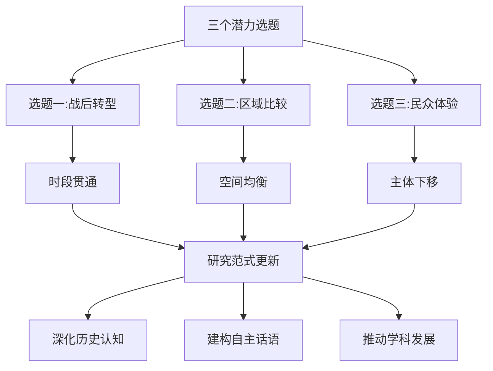

**综合评估与展望**

三个预测选题从不同维度回应了现有研究的结构性不足，各具独特的学术价值与研究前景。**选题一**（战后转型研究）具有最强的理论建构潜力，对于理解中国革命胜利的历史必然性、构建完整的历史叙事具有不可替代的价值；**选题二**（区域比较研究）具有最直接的学术空白填补意义，对于完善全民族抗战叙事、推动区域研究均衡发展具有重要作用；**选题三**（民众体验研究）具有最深刻的人文关怀维度，对于还原历史全貌、提升历史叙事温度具有独特贡献。

这三个选题的共同特征在于：都需要突破现有研究的路径依赖，都需要新史料的发掘与新方法的运用，都需要跨学科的视野与长周期的学术投入。它们的推进将不仅深化对1937-1949年历史的认知，更将推动中国近现代史研究范式的更新与学术话语体系的建构，为中国历史学的持续发展注入新的活力。

# 参考内容如下：
[^1]:[十年来欧美学界的中国抗日战争史研究 ](http://www.sxdygbjy.gov.cn/ztzl/dsxxjy/xxyt/art/2026/art_bb2a0af947ee4d81bb45692ebb6d9627.html)
[^2]:[臧运祜 | 关于中国抗日战争通史的编纂问题(附书单)](https://xianxiao.ssap.com.cn/readfirst/7519.html)
[^3]:[中国现代文学研究通史·第三卷(1937—1949):分流与整合](https://baike.baidu.com/item/中国现代文学研究通史·第三卷(1937—1949)：分流与整合/56520669)
[^4]:[不止于战场!近年来抗战史研究出现这些新成果](https://baijiahao.baidu.com/s?id=1854881946064518243&wfr=spider&for=pc)
[^5]:[抗战文献数据平台](https://www.1937china.com/kzslw/views/xsyj/xsyj_kzwx_sjpt.html)
[^6]:[新世纪以来中国共产党抗战史研究综述](http://www.sjzdsw.gov.cn/index.php?a=show&catid=8&id=2154)
[^7]:[中国共产党一百年大事记(1937年1月-1949年12月)](https://baijiahao.baidu.com/s?id=1771106945509017790&wfr=spider&for=pc)
[^8]:[中国的内战 (豆瓣)](https://book.douban.com/subject/27182455)
[^9]:[教学参考 | 关于抗日战争研究的若干学术和热点问题评析 ](https://mp.weixin.qq.com/s?__biz=MzU1MDMwOTkzNg==&mid=2247937158&idx=7&sn=b7f62532f220ebe722d8474a15c18167&chksm=faea9b76ada6285c0bad7be9e72855a9b3ec081e8db4d660dbdb2df64544f57bf75a5eaa2954&scene=27)
[^10]:[刘大禹、王球云|抗战胜利后国民政府行政改革述论1945—1949](http://www.1937nanjing.org/xueshujiaoliu/xueshuyanjiu/2023/0204/5416.html)
[^11]:[“以正史听”系列②:认知抗战,你需要辨明的6个疑问](http://dangshi.people.com.cn/GB/398697/398698/index.html)
[^12]:[不止于战场!近年来抗战史研究出现这些新成果](https://zgcsswdx.cn/info/24475.html)
[^13]:[中代经济史1937-1949](https://baike.baidu.com/item/中代经济史1937-1949/60905854)
[^14]:[中国经济史研究应把握好几个关系](https://www.dswxyjy.org.cn/n1/2024/1203/c427152-40374368.html)
[^15]:[2010年度重大项目(第二批)开题报告之十二:中国近代经济史(1937-1949)](http://www.nopss.gov.cn/GB/219506/219507/15124167.html)
[^16]:[当代中国社会史研究的议题与边界](http://www.hprc.org.cn/gsyj/shs/shsllyff/201907/t20190715_4934024.html)
[^17]:[行龙| 中国近代社会史“三大体系”建设刍议——中国近代史“三大体系”建设笔谈(五)](http://jds.cass.cn/xscg/ybwz/202208/t20220808_5469984.shtml)
[^18]:[“变”与“不变”——百年中国政治学议题回眸](https://baijiahao.baidu.com/s?id=1793213895768362612&wfr=spider&for=pc)
[^19]:[填补研究空白 书写枝繁叶茂 ——《中国共产党编年史》(新民主主义革命时期)学习笔谈](https://www.dswxyjy.org.cn/n1/2024/1108/c219000-40357090.html)
[^20]:[中国社会史研究70年的回顾与思考 ](https://www.qstheory.cn/llwx/2019-10/14/c_1125101610.htm)
[^21]:[近五年来中共抗战史研究的回顾与展望](https://sjz.hebzgfw.cn/caq/caqwx/fwdt/gjjs_11729/202505/t20250519_1199463.html)
[^22]:[空间研究视角下的中国乡村抗战及其影响](https://www.dswxyjy.org.cn/n1/2025/1217/c427167-40626372.html)
[^23]:[山西大学中国社会史研究中心](http://lhsx.rccsh.sxu.edu.cn/dsjsyxdzggm/yjdt_20160827145126078345/113032.htm)
[^24]:[青海党史网](http://www.qhdsw.gov.cn/info/11035)
[^25]:[403 Forbidden](https://www.xinhuanet.com/politics/2015-06/09/c_127895845_2.htm)
[^26]:[1937年—1949年中国马克思主义史学的建设在古代思想史研究和史学理论等方面取得重大成就。](https://aistudy.baidu.com/site/wjzsorv8/8cd47d9a-7797-42f3-9306-b902ded71161?botSourceType=124&eduFrom=196&examQuestionId=K9b_LG8SidA17AV7Y5ATaQ)
[^27]:[中国马克思主义史学史研究的反思与重构](https://www.dswxyjy.org.cn/n1/2020/0818/c427161-31826297.html)
[^28]:[中国马克思主义史学](https://baike.baidu.com/item/中国马克思主义史学/2038222)
[^29]:[盛差偲 || “从革命到建政:跨越1949”学术研讨会综述 ](https://mp.weixin.qq.com/s?__biz=MzkyNzE2OTE4NA==&mid=2247490359&idx=1&sn=4ba791059e79e2687aab1421d72d9f13&chksm=c3587e0c9b7776ce595131cc0f36a5981e310f4909014441c29f38058b6ee6b0751a76ec36ec&scene=27)
[^30]:[发掘中国革命的本土意识](https://www.dswxyjy.org.cn/n1/2024/0802/c458566-40291295.html)
[^31]:[刘萍| 中国大陆地区抗日战争史料出版综述(1949—2021)](http://jds.cssn.cn/xscg/xslw/202312/t20231212_5705542.shtml)
[^32]:[正面战场与敌后战场:抗日战争中的双重战线](https://baijiahao.baidu.com/s?id=1822474995224847613&wfr=spider&for=pc)
[^33]:[抗战期间中国共产党有关“中华民族”的理论探索_内蒙古自治区人民政府](https://www.nmg.gov.cn/ztzl/gttys/llwz/202507/t20250718_2760780.html)
[^34]:[西安事变后的“统一救国运动”初探](https://www.dswxyjy.org.cn/n1/2016/0511/c219021-28342051.html)
[^35]:[许纪霖 | 从自身的历史脉络理解中国现代化——“从历史理解中国式现代化”笔谈](http://iqh.ruc.edu.cn/old/jssxwhsyj/xsqyyllyj/sx_llff/2c13af21291148bc93127b1e4cb591b0.htm)
[^36]:[学术论坛](https://marxism.pku.edu.cn/xzlt/1337247.htm)
[^37]:[《1945～1949：国共政争与中国命运》试读：战后国民党对公政策的关键转折](https://book.douban.com/reading/10853882/)
[^38]:[重建社会重心:战后自由知识分子群体研究(1945-1949)](http://cdmd.cnki.com.cn/Article/CDMD-10269-2008146522.htm)
[^39]:[中国近代史研究范式与方法再检讨](http://baijiahao.baidu.com/s?id=1680504422883749109&wfr=spider&for=pc)
[^40]:[战后福建地区的疏浚(1945-1949)](https://www.fzskl.com/html/2012918/2012918153938.shtml)
[^41]:[十四年抗战背后的隐秘较量!国共两党为何对抗战起点各执一词?](https://baijiahao.baidu.com/s?id=1845953286307480217&wfr=spider&for=pc)
[^42]:[正面阻击与敌后周旋:国共两个抗日战场的作用应如何评价?](https://baijiahao.baidu.com/s?id=1842117192564660343&wfr=spider&for=pc)
[^43]:[中国特色地区社会治理模式探索* ———以 1945—1949 年陈云对东北地区的治理为例](http://www.hprc.org.cn/gsyj/zhyj/201707/P020180416400461246825.pdf)
[^44]:[抗日战争中国军民伤亡数据与历史启示](https://baijiahao.baidu.com/s?id=1831159220080382862&wfr=spider&for=pc)
[^45]:[抗战期间中国军民伤亡人数及经济损失的统计依据与现实意义是什么??](https://m.todayonhistory.com/know/87439.html)
[^46]:[日军在中国战场死亡多少,各方数据不一](https://baijiahao.baidu.com/s?id=1842712493037655276&wfr=spider&for=pc)
[^47]:[决战背后的历史逻辑:1945-1949年国共军事战略对比研究](https://wenku.baidu.com/view/84a8315573232f60ddccda38376baf1ffc4fe397.html)
