# 先进制程芯片工艺中金属薄膜沉积设备应用与技术选择研究
## 1 先进制程演进对金属薄膜工艺的核心挑战与需求

随着半导体制程节点从7nm/5nm向2nm及以下持续演进，芯片制造正经历一场深刻的技术变革。晶体管架构从FinFET向GAA（环栅场效应晶体管）纳米片结构转型，背面供电网络（BSPDN）逐步取代传统正面供电方案，这些根本性的器件创新对金属薄膜沉积工艺提出了前所未有的挑战。**在2nm及以下节点，金属互连、接触、栅极及阻挡层等关键薄膜的沉积已不再是简单的"镀膜"工序，而是决定芯片性能、功耗和可靠性的核心工程难题**。本章将系统梳理这些技术瓶颈与全新需求，为后续设备技术选择提供清晰的需求背景框架。

### 1.1 先进制程节点的器件架构演进与薄膜工艺变革

半导体器件架构的演进历程深刻重塑了金属薄膜沉积的技术边界。**从平面晶体管到FinFET再到GAA纳米片结构，每一次架构革新都对薄膜沉积的保形性、均匀性和集成复杂度提出了更高要求**。

#### 从FinFET到GAA的晶体管架构转型

FinFET技术自2011年问世以来，通过将栅极环绕在垂直硅鳍的三个侧面实现了三栅极控制，在7nm和5nm工艺下表现优异[^1]。然而，当栅极长度小于5nm时，漏极感应势垒降低（DIBL）效应超过100mV/V，导致晶体管在应该关断时严重漏电，亚阈值摆幅也从理想的60mV/decade恶化至70-90mV/decade[^1]。这一物理极限迫使行业转向GAA纳米片晶体管架构。

台积电2025年第四季度开始量产的N2技术采用了第一代纳米片晶体管技术，与3nm的N3E制程相比，在相同功耗下速度提升10%-15%，在相同速度下功耗降低25%-30%，同时芯片密度增加超过15%[^1]。**GAA结构通过在晶体管四个面周围布置栅极，提高了对通道的控制效率，但这种复杂的环绕结构也带来了全新的薄膜沉积挑战**[^2]。

GAA纳米片晶体管需要在原子尺度控制多层堆叠（如Si/SiGe超晶格），要求沉积的介电薄膜（如栅极侧墙隔离层）厚度偏差控制在±0.5Å以内，且需实现高深宽比结构的保形覆盖（覆盖率>95%）[^3]。由于无法直观看到栅极沟道的底面，GAA工艺上更多用到了ALD（原子层沉积）技术[^4]。

#### 背面供电网络的革命性变革

背面供电技术（BPD）是2nm节点的另一项关键创新。传统正面供电方案中，电源线可能穿越15层甚至更多层的互连，导致严重的IR压降和布线拥堵[^5]。**通过将供电网络从硅芯片正面移至背面，功率损耗可减少30%，同时为正面信号释放了宝贵的布线资源**[^5]。

英特尔技术开发部门副总裁Ben Sell的团队验证显示，采用背面供电后，设备实现了6%的性能提升（Fmax）、90%的单元利用率以及30%以上的电压降降低[^5]。三星的早期研究也表明，背面供电可实现频率提高3.6%，面积减少10%-19%[^5]。

然而，背面供电带来了一系列严峻的工艺挑战：极端晶圆变薄、晶圆背面与正面键合时每个芯片包含数百万个纳米级TSV孔的光刻校正，以及背面金属化的高深宽比通孔填充等[^5]。这些挑战对沉积设备提出了更高的精度和工艺控制要求。

下图展示了器件架构演进对薄膜沉积需求的影响路径：

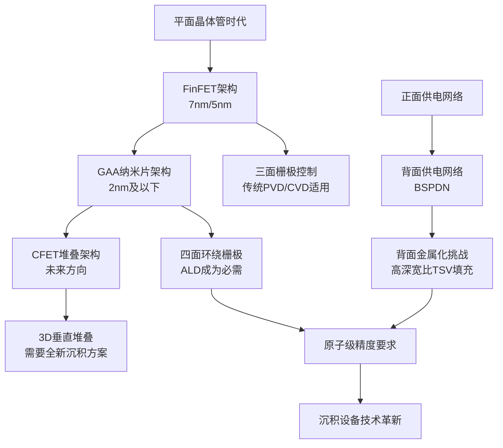

### 1.2 铜互连微缩的电阻率瓶颈与材料创新需求

铜互连自1990年代末取代铝成为主流互连材料以来，凭借其更低的电阻率（1.68 μΩ·cm vs 铝的2.67 μΩ·cm）和更优的抗电迁移能力，支撑了超大规模集成电路的持续发展[^6]。**然而，随着工艺节点微缩至10nm以下，铜互连正面临其物理极限的严峻考验**。

#### 电阻率尺寸效应的急剧恶化

当铜互连线宽减小后，晶粒尺寸随之变小，晶界密度增加导致电子散射效应增强，电阻显著升高[^6]。在10nm线宽下，铜互连的电阻率可达块体材料的数十倍，这种尺寸效应随工艺节点向2nm及以下推进将愈发突出[^6]。

Lam Research大学项目主管Nerissa Draeger解释道："随着晶体管尺寸的缩小，连接它们的金属线也必须在多层互连堆积的整体层高结构中进行。随着一代又一代新节点的出现，这些局部互连变得越来越窄、越来越密，进一步减小线宽或高度将会显著增加线的电阻。"[^7]

在近10年前，先进芯片的问题开始在20nm和16nm/14nm节点处越积越多。当时晶体管内部更加紧凑的铜互连造成芯片中不必要的电阻电容（RC）延迟，让电流通过这些细线变得越来越困难[^7]。**芯片制造商将铜双金属嵌套工艺扩展到3nm，但在3nm之后，RC延迟问题将变得更加棘手**[^7]。

#### 阻挡层与衬垫层的体积占比困境

铜的电化学活性较强，易扩散至周围电介质材料中造成电路失效，因此必须在铜与电介质之间沉积防扩散层；同时铜易被腐蚀，需要盖帽层进行保护[^6]。这些辅助层会进一步增加互连结构的整体电阻。

**在2nm及以下尺寸时，阻挡层和衬垫层消耗的可用沟槽体积比例越来越大，几乎没有足够的空间来填充铜，并有可能产生高电阻和可靠性问题**[^8]。如今最先进的逻辑芯片可容纳超过60英里长的铜线，首先要在介电材料上蚀刻出沟槽，然后沉积一层超薄阻挡层以防止铜线迁移，在最后的铜沉积填满剩余空间之前，还要沉积一层衬垫层以帮助铜的附着[^8]。

#### 材料创新解决方案与设备需求

应用材料公司开发了突破性的铜布线解决方案，其最新的集成材料解决方案（IMS）将六种不同的核心技术整合到一个高真空系统中，**包括业界首创的钌和钴（RuCo）配对技术，形成超薄的2nm二元金属衬垫**[^8]。与前几代产品相比，衬垫厚度减少了33%，同时改善了表面性能，实现了无缝、无空隙的铜粘附和回流，最终芯片布线中的电阻降低了25%[^8]。

该公司的Black Diamond低介电材料从2000年代初就开始供应，通过在铜线周围形成一层特殊的薄膜减少电荷积聚。增强版Black Diamond进一步降低了最小K值，使铜布线扩展到2nm节点，同时提高了机械强度——这是芯片制造商希望垂直堆叠多个逻辑和内存芯片时的关键性能[^8]。

下表总结了铜互连微缩面临的核心挑战及材料创新方向：

| 核心挑战 | 技术根源 | 创新解决方案 | 对沉积设备的需求 |
|---------|---------|-------------|----------------|
| 电阻率尺寸效应 | 晶界散射加剧，晶粒尺寸减小 | 纳秒激光退火增大晶粒尺寸 | 高精度热处理集成能力 |
| 阻挡层体积占比过大 | 传统TaN/Ta厚度难以进一步缩减 | RuCo二元金属衬垫（2nm厚度） | 超薄膜ALD/CVD沉积能力 |
| 介电层电容干扰 | 传统介电材料K值过高 | 增强版Low-K材料（Black Diamond） | PECVD低温高质量沉积 |
| 铜扩散与腐蚀 | 铜电化学活性强 | 优化阻挡层与盖帽层结构 | 多工艺集成IMS平台 |

### 1.3 高深宽比结构的保形覆盖与无空洞填充挑战

先进制程中的高深宽比（High Aspect Ratio, HAR）结构对薄膜沉积提出了严苛的保形性要求。**无论是GAA环绕栅介质、3D NAND字线还是先进接触孔，都需要在极端几何形状下实现近乎完美的台阶覆盖和无空洞填充**。

#### GAA环绕栅极的沉积挑战

GAA结构沟道表面积显著增大，要求薄膜界面态密度（D_it）低于10^10 cm^-2eV^-1，需要PECVD工艺优化等离子体化学配比以降低悬挂键缺陷[^3]。ALD技术的薄膜台阶覆盖率可以做到将近100%，薄膜可以很均匀地覆盖在深孔和复杂表面上，是其他薄膜沉积技术难以达成的[^2]。

泛林集团的SELA系列PECVD设备采用双频等离子体源技术，实现高深宽比结构（深宽比>10:1）的保形沉积，满足GAA环绕栅介质需求[^3]。东京电子的TRIAS平台整合等离子体脉冲调制技术，显著降低薄膜氢含量（<5 at%），减少界面电荷陷阱[^3]。

#### 先进接触孔的填充难题

随着半导体制造商转向更小的制程节点，接点金属化制程面临严苛的微缩和整合挑战，需最小化接点电阻以满足先进元件的低功耗与高速需求[^9]。在纳米级结构上，利用传统CVD进行钨的完全填充时，会受到传统阻障层薄膜沉积不均匀的问题所限制，这使特征开口在完全填充之前关闭，从而产生空隙、较高的电阻和接点失效[^9]。

**先进记忆体和逻辑特征需要能实现完全、无缺陷钨填充的沉积技术，并同时降低钨块的电阻**[^9]。科林研发市场领先的ALTUS系统结合了CVD和ALD技术，利用脉冲式成核层（PNL）ALD制程产生成核层，并以专利的多站序列式沉积制程（MSSD）架构实现现场的主塊体CVD填充制程[^9]。

#### 3D NAND字线的金属化革新

3D NAND的发展从2D平面变成立体结构，层数大幅增加，每一层都需要精确"贴膜"[^10]。在90nm制程的CMOS产线中，大约需要40道薄膜沉积工序，涉及6种材料；而到了3nm制程的FinFET产线，薄膜沉积工序增加到100道，材料种类接近20种[^10]。

**传统的金属化方案无法满足3D NAND的微缩要求，因此整个行业正在实施钼（Mo）的金属化**[^11]。与钨和许多其他金属不同，钼不需要粘合层或阻挡层来防止电流泄漏，这有助于简化工艺并降低成本[^11]。泛林集团的ALTUS Halo钼原子层沉积设备能在40:1深宽比的沟槽中，以0.02纳米精度逐层堆叠钼原子，使3D NAND堆叠层数突破500层大关[^12]。

### 1.4 低热预算约束与材料兼容性要求

**先进制程对沉积工艺温度的严格限制已成为设备选择的关键约束条件**。GAA纳米片对高温敏感，新型金属栅极材料的集成以及多层堆叠结构的热累积效应，都要求在400℃以下实现高致密性薄膜沉积。

#### 纳米片的热敏感性

纳米片对高温敏感，PECVD工艺需在<400℃下完成高致密性SiN_x、SiO₂薄膜沉积，防止材料界面扩散导致电性能劣化[^3]。同时需兼容新型金属栅极材料（Ru、Mo）的后续集成。北方华创在2nm方向聚焦超低温沉积（≤350℃）及原位退火集成技术[^3]。

PECVD依靠射频感应产生的等离子体，实现薄膜沉积工艺的低温化（小于450℃），这是其主要优点，从而节省能源、降低成本、提高产能、减少了高温导致的硅片中少子寿命衰减[^13]。

#### 背面供电集成的温度限制

背面供电技术要求PECVD与刻蚀/镀铜设备无缝集成，良率管理难度剧增[^3]。东京电子针对背面供电技术推出超薄阻挡层方案，厚度控制在20Å以下[^3]。**英特尔的PowerVia技术需要优化精确打磨晶圆的方法，以免损坏晶体管本身**[^5]。

采用背面供电后，设备制造商从成本高昂的金属0层消除了电源网格，该层需要使用EUV进行双重图案化甚至三重图案化。采用BPD，该层将金属0级间距从30nm放宽至36nm，减轻的拥堵情况也降低了RC延迟，使晶体管可以在更高的频率下工作[^5]。

#### 新型金属材料的低温沉积

要使钼在使用ALD设备的制造中变得可行，需要进行重大创新，挑战包括：能够施加高温、实现先进的反应器和制程序列设计、能够精确控制晶圆温度，并通过各种化学处理方式传输固态钼的反应原料[^9]。

韩国科学技术院的实验室里，研究人员通过交替沉积钼和氮化钼薄层，将工艺温度从650℃降至600℃，同时表面粗糙度控制在0.56nm以内，这项技术让芯片寿命延长3倍，漏电流减少82%[^12]。

### 1.5 界面缺陷控制与薄膜质量的原子级精度要求

**先进制程对薄膜质量的要求已提升至原子级精度，界面态密度、悬挂键缺陷、氢含量及应力控制等指标直接影响器件的电学性能和可靠性**。

#### 厚度与均匀性的极限控制

2nm GAA工艺对薄膜设备的核心要求包括原子级精度与均匀性：GAA纳米片晶体管需在原子尺度控制多层堆叠，要求PECVD沉积的介电薄膜厚度偏差控制在±0.5Å以内[^3]。介电材料的沉积必须做厚度上的精细控制，才能应用不同的阈值电压，对GAA而言一大挑战是无法直观看到栅极沟道的底面[^4]。

应用材料推出新一代Centura平台，集成原位计量模块实时监控薄膜应力与厚度，支持2nm GAA所需的低损伤沉积工艺，已通过台积电N2工艺验证[^3]。该平台开发了原子层蚀刻（ALE）与PECVD协同工艺，解决纳米片释放后的侧栅介质均匀性问题[^3]。

#### 界面态密度与缺陷管理

GAA结构沟道表面积增大，要求薄膜界面态密度低于10^10 cm^-2eV^-1，需PECVD工艺优化等离子体化学配比以降低悬挂键缺陷[^3]。东京电子的TRIAS平台整合等离子体脉冲调制技术，显著降低薄膜氢含量（<5 at%），减少界面电荷陷阱[^3]。

#### 应力工程与可靠性优化

纳米片通道需受控应力提升载流子迁移率，PECVD设备需支持应力可调的SiN_x薄膜（压应力>1.5 GPa）且晶圆级均匀性<1%[^3]。北方华创与中芯国际合作开发低应力SiN_x工艺，应力控制精度达±0.2 GPa[^3]。

**国产设备在等离子体稳定性（射频功率>5kHz波动）、颗粒控制（<0.1个/cm²）等核心指标尚未满足2nm要求**[^3]。新型前驱体（如低氯硅烷）和腔体耐腐蚀设计需与材料厂商协同突破。

下表汇总了先进制程对金属薄膜沉积的核心技术指标要求：

| 技术维度 | 具体指标要求 | 主要应对技术 | 代表设备/方案 |
|---------|-------------|-------------|--------------|
| 厚度控制 | 偏差±0.5Å以内 | ALD逐层生长 | AMAT Centura平台 |
| 台阶覆盖率 | >95%（深宽比>10:1） | 双频等离子体源PECVD | Lam SELA系列 |
| 界面态密度 | <10^10 cm^-2eV^-1 | 等离子体脉冲调制 | TEL TRIAS平台 |
| 氢含量 | <5 at% | 优化等离子体化学配比 | TEL TRIAS平台 |
| 应力控制 | 精度±0.2 GPa | 低应力SiN_x工艺 | 北方华创PECVD |
| 工艺温度 | <400℃（纳米片兼容） | 低温PECVD/ALD | 多家设备商 |
| 电阻降低 | 较传统方案降低25%+ | RuCo二元金属衬垫 | AMAT IMS平台 |

综上所述，先进制程演进对金属薄膜沉积工艺提出了多维度的严苛挑战。**从GAA架构对原子级精度的需求，到铜互连微缩的电阻率瓶颈，从高深宽比结构的保形填充难题，到低热预算的材料兼容性约束，这些技术需求共同构成了驱动沉积设备选择与创新的核心背景框架**。在后续章节中，我们将深入分析各类沉积设备如何应对这些挑战，以及它们在先进金属化工艺中的具体应用与技术优势。

## 2 物理气相沉积在先进金属化中的主导角色与应用分析

物理气相沉积（PVD）技术作为半导体制造中最成熟、应用最广泛的金属薄膜沉积方法之一，在先进制程芯片工艺中承担着不可替代的核心角色。**PVD通过纯物理过程将靶材原子转移至基片表面形成薄膜，具有沉积速率高、薄膜纯度优异、附着力强以及工艺温度可控等显著优势**，尤其在铜互连工艺的阻挡层、种子层沉积以及铝焊盘制备等关键环节中占据主导地位。随着制程节点向2nm及以下演进，PVD技术通过离子化增强、再溅射工艺等创新手段持续优化，与ALD、CVD等技术形成协同互补的工艺集成体系，共同支撑先进金属化工艺的实现。

### 2.1 PVD溅射技术原理与先进制程适配性

溅射沉积是PVD技术的核心工艺形式，其基本原理是在真空环境中利用高能离子（通常为氩离子）轰击靶材表面，使靶材原子获得足够动能脱离晶格束缚，随后在电场作用下迁移并沉积至基片表面形成致密薄膜[^14][^15]。**该过程全程不引入化学反应，仅涉及材料形态的物理转变，因此薄膜纯度高、成分可控性强**[^16]。

#### 溅射技术的分类与工作机制

根据电源类型和磁场配置的不同，溅射技术主要分为三种类型[^14][^17]：

**直流溅射（DC Sputtering）** 采用直流电场加速氩离子轰击导电靶材，结构简单但沉积速率相对较低，主要适用于铜、铝、钛等导电金属材料的沉积。其工作原理是通过直流电源在靶材（阴极）与基片（阳极）之间建立电场，氩气在电场作用下电离产生等离子体，正离子被加速轰击靶材实现溅射[^15]。

**射频溅射（RF Sputtering）** 采用13.56 MHz射频电源产生高频交变电场，通过自偏压效应实现对绝缘材料靶材的持续轰击，扩展了PVD技术的材料适用范围，可用于沉积氧化物、氮化物等化合物薄膜[^15][^17]。

**磁控溅射（Magnetron Sputtering）** 是当前先进制程中应用最广泛的PVD技术变体。该技术通过在靶材表面施加正交电磁场，将电子运动轨迹约束在靶材附近区域，显著延长电子运动路径并提高气体离化率至5%-6%[^15]。**磁控溅射可将沉积速率提升至传统溅射的10倍，同时将基片温度控制在200℃以下**，这一特性对于满足先进节点低热预算要求至关重要[^18]。

下表系统对比了三种溅射技术的核心特性：

| 技术类型 | 电源形式 | 适用靶材 | 沉积速率 | 工作气压 | 典型应用 |
|---------|---------|---------|---------|---------|---------|
| 直流溅射 | 直流电源 | 导电材料（Cu、Al、Ti） | 较低 | 0.1-10 Pa | 金属导电层 |
| 射频溅射 | 13.56 MHz射频 | 绝缘材料（SiO₂、TiN） | 中等 | 0.1-10 Pa | 氧化物/氮化物薄膜 |
| 磁控溅射 | 直流/射频+磁场 | 金属/合金/陶瓷 | 高（达10 μm/h） | 0.5-5 Pa | 互连金属层、阻挡层 |

#### 离子化金属等离子体PVD与再溅射工艺

为应对先进制程高深宽比结构的覆盖挑战，离子化金属等离子体PVD（IMP-PVD）技术得到了广泛应用。**该技术通过高能离子轰击靶材产生溅射原子，并使其在传输过程中部分电离，带电的金属离子在偏压作用下获得定向性，显著改善深孔底部的沉积覆盖率**[^19]。

再溅射（Re-sputter）工艺是IMP-PVD的重要补充技术。在完成TaN等阻挡层沉积后，利用氩离子轰击薄膜表面，将底部沉积的材料重新分布至侧壁区域。以28nm双大马士革结构为例，**再溅射工艺可将深宽比>5:1通孔的侧壁覆盖率从60%提升至85%**[^19]。这一技术路径有效弥补了传统PVD在复杂三维结构中台阶覆盖能力的不足。

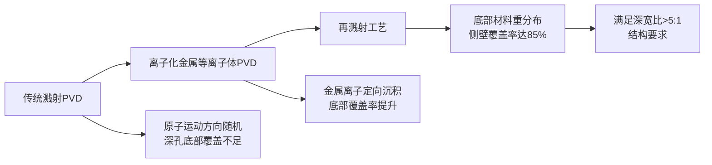

### 2.2 铜互连工艺中的PVD关键应用

在先进制程的铜大马士革工艺中，PVD技术承担着两项核心沉积任务：**铜种子层的导电基底构建和TaN/Ta阻挡层的防扩散功能实现**。这两个环节直接决定了后续电镀铜填充的质量和互连结构的可靠性。

#### 铜种子层的PVD沉积

铜种子层（Cu Seed Layer）是大马士革工艺中铜电镀填充的必要前提，其核心功能是为后续电化学镀膜（ECP）工艺提供均匀的导电基底[^20]。**PVD沉积的铜种子层厚度通常控制在300nm左右，需要在整个沟槽和通孔表面形成连续、致密的导电层**[^19]。

种子层的质量直接影响电镀铜的填充效果。若种子层不连续或厚度不均匀，将导致电镀过程中电流分布不均，进而产生空洞等缺陷。磁控溅射制备的铜互连薄膜电阻率可达<2.0 μΩ·cm[^18]，满足先进节点对低电阻互连的严苛要求。

在实际工艺流程中，铜种子层沉积通常采用纯铜或铜合金靶材，通过PVD工艺在阻挡层表面形成导电基础层。**应用材料公司开发的集成材料解决方案（IMS）将种子层沉积与阻挡层、衬垫层工艺整合在高真空系统中**，避免了晶圆在不同设备间转移时的表面氧化和污染问题。

#### TaN/Ta阻挡层的防扩散机制

铜原子具有极强的扩散能力，极易向周围的绝缘介质（如SiO₂或Low-K材料）渗透，导致电路短路或漏电失效[^19][^20]。**为阻止这种扩散，必须在铜与介质之间沉积一层纳米级的扩散阻挡层，氮化钽（TaN）因其高致密性、优异的抗扩散能力和良好的导电性成为主流选择**[^19]。

PVD技术沉积TaN阻挡层的典型工艺流程包括[^19][^20]：

1. **溅射清洗（Sputter Clean）**：采用软性氩离子轰击（能量<50 eV）清除通孔底部的残留污染物，提升后续TaN薄膜的附着力
2. **TaN沉积**：通过反应溅射工艺，在氩气中引入氮气，钽原子与氮气反应生成TaN薄膜，厚度控制在2-5nm
3. **再溅射重分布**：利用氩离子轰击将底部TaN重新分布至侧壁，提升整体覆盖率
4. **Ta层沉积**：在TaN表面沉积1-2nm纯钽层，作为铜种子层的黏附层，防止铜剥离

下表总结了铜互连工艺中PVD沉积各层的功能与参数要求：

| 薄膜层 | 材料 | 典型厚度 | 核心功能 | PVD工艺要点 |
|-------|------|---------|---------|------------|
| 阻挡层 | TaN | 2-5 nm | 阻止铜向介质扩散 | 反应溅射+再溅射提升覆盖率 |
| 黏附层 | Ta | 1-2 nm | 增强铜种子层附着力 | 高纯钽靶材直流溅射 |
| 种子层 | Cu/Cu合金 | ~300 nm | 电镀铜的导电基底 | 磁控溅射保证均匀性 |

### 2.3 阻挡层与衬垫层材料的PVD沉积技术

随着制程节点的持续微缩，阻挡层和衬垫层材料的选择策略经历了显著演变。**不同工艺节点对应不同的材料组合方案，PVD技术在各类金属和合金薄膜沉积中展现出独特的工艺优势**。

#### 传统阻挡层材料体系

在芯片生产的导电层工艺中，铝和铜是目前主流的导线材质，且不同技术节点对应不同的工艺选择[^21]：

**110nm及以上节点**采用铝导线工艺，以钛（Ti）材料作为阻挡层薄膜。钛阻挡层通过PVD直流溅射沉积，可有效防止铝向介质层扩散，同时提供良好的电接触特性。

**110nm以下节点**采用铜导线工艺，阻挡层材料从钛转变为钽（TaN/Ta）。这一转变的核心原因在于钽具有更优异的抗铜扩散能力和与铜的化学相容性。**在实际芯片应用中，两种工艺需结合使用——通过铜、钽对应的先进工艺实现芯片功耗降低和运算速度提升，同时依托铝、钛对应的成熟工艺保障芯片的可靠性与抗干扰性能**[^21]。

TiN（氮化钛）作为金属硬掩膜在光刻工艺中广泛应用，同样通过PVD反应溅射沉积。其制备工艺与TaN类似，在氩气中引入氮气实现钛原子的氮化反应[^16]。

#### 新型衬垫层材料的引入

随着互连尺寸缩小至10nm以下，传统TaN/Ta阻挡层的体积占比问题日益突出。**钴（Co）和钌（Ru）等新型衬垫层材料的引入，为解决这一挑战提供了新的技术路径**。

应用材料公司开发的**RuCo（钌-钴）二元金属衬垫技术**是这一领域的重要突破。通过将钌和钴配对形成超薄的2nm衬垫层，与前几代产品相比厚度减少了33%，同时改善了表面性能，实现了无缝、无空隙的铜粘附和回流，最终使芯片布线电阻降低25%。

PVD技术在沉积高熔点金属方面具有独特优势。**钴的熔点高达1495℃，钌的熔点更是达到2334℃，传统热蒸发难以实现这类材料的气化**，而磁控溅射可通过高能离子轰击有效溅射高熔点靶材，沉积速率可达1-10 μm/h[^18]。离子镀技术制备的TiN涂层硬度可达HV2400，进一步证明了PVD在高性能金属薄膜制备方面的能力[^18]。

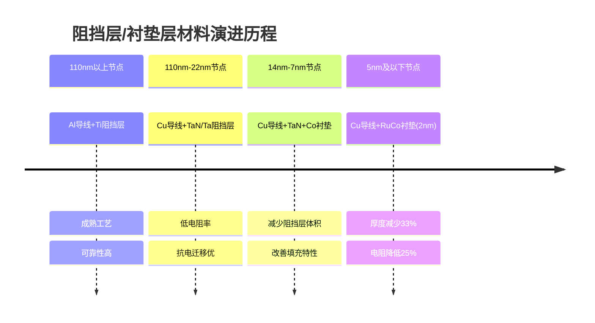

### 2.4 高深宽比结构的PVD初始覆盖与台阶覆盖能力

台阶覆盖能力是评价薄膜沉积工艺质量的核心指标，特指沉积薄膜对具有高度差异的三维结构（如凹槽、凸起、通孔等）的覆盖能力[^22]。**在先进制程的高深宽比结构中，PVD技术的台阶覆盖特性既展现出独特优势，也面临明显的物理局限**。

#### 溅射法的台阶覆盖优势

相较于蒸发法，溅射法在台阶覆盖方面具有显著优势[^22]：

**更宽的角分度**：溅射原子从靶材表面以较宽的角度分布射出，可在复杂形貌表面形成更均匀的薄膜覆盖。蒸发法的原子运动方向相对单一，对深槽结构侧壁的覆盖能力有限。

**更大的原子动量**：溅射原子携带较高能量（1-10 eV），在沉积过程中与基片表面形成化学键合，显著提升薄膜附着力[^15]。这种高能沉积特性使薄膜与基底的结合强度优于真空蒸镀工艺[^14]。

#### 工艺参数优化策略

提升PVD台阶覆盖能力的关键控制参数包括[^22]：

| 参数类型 | 优化方向 | 技术效果 |
|---------|---------|---------|
| 沉积角度 | 采用宽角分度配置 | 增强侧壁覆盖 |
| 衬底旋转 | 动态调整沉积方位 | 消除沉积阴影效应 |
| 温度控制 | 低温沉积减少扩散差异 | 改善薄膜均匀性 |
| 沉积速率 | 较低速率有利均匀生长 | 提升台阶覆盖率 |
| 工作气压 | 控制在0.5-5 Pa范围 | 平衡离化率与能量传递 |

实际生产中通常采用多重工艺参数协同优化的方式。例如，通过衬底旋转与沉积温度的配合，可使台阶覆盖能力得到显著提升[^22]。靶材与基片的距离通常控制在50-100mm，距离过小易引发基片升温，距离过大则导致沉积速率下降[^15]。

#### PVD台阶覆盖的局限性与协同策略

尽管通过工艺优化可改善PVD的台阶覆盖性能，但其物理机制决定了在极端高深宽比结构中存在固有局限。**在深宽比>10:1的结构中，PVD的台阶覆盖率通常<50%，难以满足先进节点的严苛要求**[^19]。

这一局限源于溅射原子的"视线沉积"特性——原子沿直线轨迹运动，深孔底部和侧壁下部区域因几何遮挡效应难以获得充分覆盖。即使采用离子化PVD和再溅射工艺，在22nm和14nm节点仍是阻挡层沉积的核心技术，但**进入10nm以下线宽后，PVD的台阶覆盖率已难以满足需求**[^19]。

因此，先进制程工艺集成中普遍采用PVD与ALD协同互补的策略：

- **PVD负责初始覆盖**：利用其高沉积速率和良好附着力，在结构表面和浅层区域快速形成导电基础
- **ALD实现保形填充**：利用其逐层生长特性，在深孔底部和侧壁实现近乎100%的保形覆盖
- **混合沉积集成**：设备商开发PVD+ALD集群系统，在高真空环境中完成多步骤工艺集成

### 2.5 PVD设备与靶材技术对先进制程的支撑

高纯靶材和精密设备是PVD工艺实现先进制程金属化的两大核心支撑要素。**靶材纯度直接决定薄膜质量，设备性能则决定工艺能力边界**，两者的技术进步共同推动PVD技术持续满足芯片制造的严苛要求。

#### 高纯靶材的关键作用

半导体芯片行业是金属溅射靶材核心应用场景之一，同时也是对靶材成分纯度、微观组织均匀性及综合性能要求最为严苛的领域[^21]。**当芯片制造进入7nm以下工艺时，对靶材纯度的要求达到了近乎苛刻的程度：金属杂质需控制在十亿分之一（ppb）级别**[^21]。

这种极致的技术要求源于半导体工艺的物理极限。在先进制程中，靶材原子通过溅射过程沉积在硅片上，形成纳米级的薄膜电路。任何微小的杂质都会导致电路短路或性能衰减。**例如，在铜互连工艺中，即使微量的氧元素也会显著增加电阻，直接影响芯片的运算速度与功耗**[^21]。

半导体芯片行业常用的金属溅射靶材主要包括两大类[^21]：

| 靶材类别 | 代表材料 | 纯度要求 | 主要应用 |
|---------|---------|---------|---------|
| 高纯溅射靶材 | 铜、钽、铝、钛、钴、钨 | 5N-6N（99.999%-99.9999%） | 导电层、阻挡层 |
| 合金类溅射靶材 | 镍铂合金、钨钛合金 | 4N5以上 | 特殊功能层 |

国内靶材企业通过原创性技术突破，正在逐步攻克这些技术壁垒。**江丰电子开发的超高纯钛（5N钛）靶材纯度达到99.999%，创造了行业新纪录；有研新材则通过真空熔炼技术，将铝靶材的晶粒尺寸控制在20微米以下，显著提高了薄膜均匀性**[^21]。2024年，江丰电子靶材出货量以26.8%的占比达到世界第一[^21]。

#### PVD设备的核心组成与工艺控制

溅射镀设备包含真空室、靶材组件、基片架、气体供给系统、电源控制模块及冷却装置等核心组件[^15]。磁控溅射设备增设永磁体或电磁线圈，实现磁场强度100-500 Gauss的精确控制。工业级设备可集成多个靶腔，实现多层复合镀膜。

关键工艺参数的精确控制对薄膜质量至关重要[^15]：

- **工作气压**：气压过高（>5 Pa）导致离子能量衰减，影响溅射效率；气压过低（<0.1 Pa）则离化率不足，通常控制在0.1-10 Pa范围
- **电源功率**：功率提升可增加离子密度，但过高功率导致靶材过热，需配备冷却系统
- **基片温度**：多数金属镀层在室温下沉积，功能性镀膜需加热至200-500℃优化结晶性

#### 国产化替代进展

在高纯金属领域，国内企业紧密围绕集成电路用靶材的需求，协同推动高纯金属材料行业向前发展。**新疆众和、有研亿金、宁夏东方钽业、金川集团、宁波创润新材料、厦门钨业等企业是行业内的代表性力量**[^21]。

从整体发展情况来看，国内企业已熟练掌握多种高纯金属的制备技术并实现产业化应用：铝纯度超过5N5、铜纯度超过6N、钽纯度超过4N5，钛、镍、钴、金、银、铂、钨等金属纯度均超过5N[^21]。**目前，国内在高纯铝及铝合金、钛、铜及铜合金、钴、镍铂及贵金属等靶材的技术研发上均取得重大突破，产品性能已达到国外同类产品水平，且通过了国内外集成电路企业的严格验证，实现了批量生产与稳定供应**[^21]。

综上所述，PVD技术凭借其高沉积速率、优异的薄膜附着力、可控的工艺温度以及对高熔点金属的良好适应性，在先进制程金属化工艺中持续发挥着主导作用。**从铜种子层到TaN阻挡层，从传统钛基材料到新型RuCo衬垫，PVD技术通过持续的工艺创新和设备升级，不断适应制程微缩带来的新挑战**。尽管在极端高深宽比结构中存在台阶覆盖的固有局限，但通过与ALD等技术的协同集成，PVD仍将是先进金属化工艺不可或缺的核心技术支柱。

## 3 化学气相沉积与选择性沉积技术的互补性应用

化学气相沉积（CVD）技术作为半导体制造中与PVD并驾齐驱的核心薄膜沉积方法，通过气态前驱体的化学反应在基片表面生成固态薄膜，展现出与物理沉积截然不同的工艺特性。**CVD技术凭借其优异的保形性、高深宽比结构填充能力以及灵活的成分调控特性，在先进制程金属化工艺中承担着不可替代的关键角色**[^23]。随着制程节点向2nm及以下演进，CVD及其衍生技术（如选择性CVD、金属有机CVD）在钨接触栓塞、钴互连、钌衬垫等核心金属层沉积中的应用价值愈发凸显，与PVD形成了高度互补的技术协同体系。

### 3.1 CVD技术原理与先进制程金属沉积的工艺优势

CVD技术的核心机制建立在气相化学反应的基础之上，通过前驱体分子在特定温度、压力条件下的分解与表面反应，实现薄膜的逐步生长。**与PVD的纯物理过程不同，CVD依靠化学反应来完成薄膜制备，这一本质差异赋予了CVD独特的工艺优势**[^23]。

#### CVD的化学反应机制与工艺流程

CVD工艺的典型反应过程包含以下关键步骤：气态前驱体被输送至反应腔室，在高温或等离子体激发下发生分解，生成的活性物种在晶圆表面发生化学反应并沉积形成固态薄膜[^23]。以硅烷（SiH₄）与氧气反应生成二氧化硅为例，整个过程涉及前驱体的气相传输、表面吸附、化学反应及副产物脱附等多个环节。

根据能量激发方式和反应条件的不同，CVD技术衍生出多种工艺变体：

| 技术类型 | 工作温度 | 能量激发方式 | 典型应用 | 工艺特点 |
|---------|---------|-------------|---------|---------|
| 热CVD | 700-1200℃ | 热能 | 硅外延、钨沉积 | 高结晶质量，高温要求 |
| PECVD | 200-400℃ | 等离子体 | 介质层、钝化层 | 低温沉积，适配热敏材料 |
| MOCVD | 400-800℃ | 热能+金属有机前驱体 | III-V族化合物 | 成分精确控制 |
| LPCVD | 500-900℃ | 低压热能 | 多晶硅、氮化硅 | 均匀性优异 |

**CVD通常在700℃至1200℃的较高温度下进行沉积，高温环境使得薄膜原子的扩散更加充分，有助于形成高质量的结晶结构**[^23]。例如在生长硅外延层时，高温下的原子扩散能够使硅原子排列更加规则，从而提高外延层的晶体质量。

#### CVD相较于PVD的核心工艺优势

CVD技术在先进制程金属化中展现出三大本质优势，构成其与PVD形成互补的技术基础：

**保形性与台阶覆盖能力**是CVD最突出的工艺特征。由于CVD反应发生在整个暴露表面，前驱体分子能够扩散进入深孔和沟槽内部并在表面发生反应，因此在高深宽比结构中可实现近乎均匀的薄膜覆盖[^24]。相比之下，PVD的"视线沉积"特性导致其在深宽比>10:1的结构中台阶覆盖率通常<50%。

**大面积均匀沉积**是CVD的另一显著优势。在大面积半导体晶圆上，CVD技术能够实现高度均匀的薄膜沉积[^23]。随着半导体制造工艺向12英寸大尺寸晶圆发展，均匀的薄膜沉积对于保证整片晶圆上器件性能的一致性至关重要。

**薄膜致密性与附着力**同样是CVD的工艺强项。CVD所形成的薄膜具有良好的致密性和附着力，致密的薄膜结构可以有效阻挡外界杂质的侵入，提高半导体器件的稳定性和可靠性[^23]。强附着力则确保薄膜在后续加工和使用过程中不会轻易脱落。

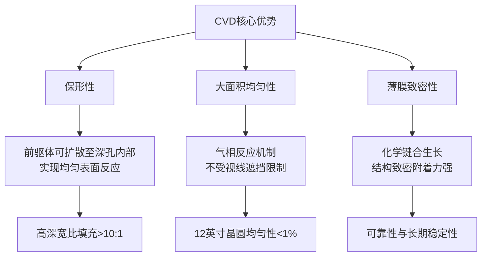

#### CVD与PVD的互补性技术逻辑

在先进制程工艺集成中，CVD与PVD并非相互替代而是协同互补的关系。**PVD凭借高沉积速率和良好附着力适合初始覆盖和浅层结构沉积，而CVD则以优异的保形性和填充能力胜任深孔和复杂三维结构的沉积任务**。这种互补性源于两者截然不同的物理机制：PVD依赖原子的直线运动，CVD则依赖分子的扩散与表面反应。

实际工艺中，典型的协同方案包括：PVD沉积阻挡层初始覆盖后，采用CVD进行深孔填充；或者PVD沉积种子层提供导电基底，CVD完成主体金属的保形沉积。这种分工协作的模式充分发挥了两种技术各自的优势，共同满足先进节点对金属薄膜沉积的严苛要求。

### 3.2 钨CVD在接触栓塞与通孔填充中的核心应用

钨（W）作为半导体制造中最重要的接触金属材料之一，凭借其**低电阻率（约5.6 μΩ·cm）、高熔点（3422℃）和优异的阶梯覆盖能力，成为接触孔和通孔填充的首选材料**[^25]。钨CVD工艺在先进逻辑芯片和存储器件的金属化工艺中占据核心地位，其技术演进直接影响着芯片互连性能和制造良率。

#### 钨CVD的化学反应机理与两步工艺流程

钨CVD工艺通常采用六氟化钨（WF₆）作为前驱体，通过与还原性气体（如氢气或硅烷）的反应生成金属钨薄膜。典型的化学反应方程式为：

$$WF_6 + 3H_2 \rightarrow W + 6HF$$

或采用硅烷还原：

$$2WF_6 + 3SiH_4 \rightarrow 2W + 3SiF_4 + 6H_2$$

**先进钨CVD工艺采用成核层沉积与主体填充相结合的两步工艺流程**，以实现无缺陷的高深宽比结构填充。第一步通过脉冲式成核层（PNL）ALD工艺产生超薄、均匀的成核层，为后续钨生长提供均匀的起始表面；第二步采用CVD工艺进行主体钨的快速填充，在成核层基础上实现高效的薄膜生长。

科林研发的ALTUS系统正是这一技术路线的代表性设备，该系统结合了CVD和ALD技术，**利用脉冲式成核层ALD工艺产生成核层，并以专利的多站序列式沉积工艺（MSSD）架构实现现场的主体CVD填充**。这种集成方案有效解决了传统CVD工艺中成核不均匀导致的填充缺陷问题。

#### 阻挡层与粘附层的配合要求

钨CVD沉积前需要在接触孔内壁预先沉积阻挡层和粘附层，以防止钨向介质层扩散并确保良好的薄膜附着。传统工艺采用TiN/Ti双层结构：Ti层作为粘附层促进钨的附着，TiN层作为阻挡层防止WF₆前驱体腐蚀底层硅化物接触。

然而，**在纳米级结构上，传统阻挡层薄膜沉积不均匀的问题会导致特征开口在完全填充之前关闭，从而产生空隙、较高的电阻和接点失效**。随着接触孔尺寸持续缩小，阻挡层占据的体积比例越来越大，严重挤压了钨的有效导电截面，成为制约接触电阻降低的关键瓶颈。

下表总结了钨CVD工艺中各功能层的配置与作用：

| 功能层 | 材料 | 典型厚度 | 沉积工艺 | 核心功能 |
|-------|------|---------|---------|---------|
| 粘附层 | Ti | 2-5 nm | PVD/CVD | 促进钨附着，降低界面电阻 |
| 阻挡层 | TiN | 3-8 nm | ALD/CVD | 防止WF₆腐蚀，阻止钨扩散 |
| 成核层 | W | <2 nm | PNL-ALD | 提供均匀成核表面 |
| 主体层 | W | 填满结构 | CVD | 实现低电阻导电通路 |

#### 选择性钨沉积技术的突破性创新

为解决传统工艺中阻挡层占比过大的瓶颈问题，**应用材料公司推出的Endura® Volta™选择性钨沉积系统实现了革命性突破**[^25]。该技术可在通孔中直接沉积钨，完全不需要粘附阻挡层和成核层，从根本上解决了传统工艺中阻挡层占通孔容积75%的问题。

选择性沉积的核心原理是利用不同材料表面化学活性的差异，使钨仅在特定表面（如金属底部）生长，而不在介质侧壁沉积。这种"自下而上"的填充模式不仅消除了阻挡层的体积占用，还显著降低了空洞形成的风险，**使晶体管及其导线的节点可继续微缩到5nm、3nm及以下**[^25]。

#### 钨在3nm及以下节点的持续应用价值

尽管铜互连在先进节点面临电阻率急剧上升的挑战，钨在接触层和局部互连中的应用价值依然稳固。**在7nm及以下制程中，钨塞（Tungsten Plug）可替代铜，电阻率降低15%，电迁移寿命延长3倍**[^25]。这一优势源于钨在纳米尺度下的电阻率尺寸效应相对较小，且其高熔点特性赋予了优异的热稳定性。

2024年全球半导体用钨靶材市场规模达12.8亿美元，预计到2030年将增长至18.7亿美元，年复合增长率达14.6%[^25]。这一市场增长的核心驱动力之一是**在5nm及以下制程中，CVD钨薄膜用量增加40%，对钨靶材纯度要求达到6N级别（99.9999%）**[^25]。台积电3nm产线单条年消耗钨靶材120吨，其2026-2030年扩产计划将新增需求600吨/年。

### 3.3 钴CVD/ALD在先进互连与接触层中的技术突破

钴（Co）作为新一代先进制程的关键金属材料，正在10nm以下节点的局部互连和接触层中发挥越来越重要的作用。**钴凭借其高电导率、优异的抗电迁移性以及与硅和高k介质的良好界面兼容性，成为先进制程金属化的重要选择**[^26]。

#### 钴的物理特性与半导体应用优势

钴是一种银白色过渡金属，原子序数27，密度8.9 g/cm³，熔点高达1495℃，兼具优异的导电性和机械强度[^26]。在半导体领域，钴因以下关键特性成为先进制程的核心材料：

**高电导率与低接触电阻**：钴的电阻率约为6.24 μΩ·cm，低于钨（5.6 μΩ·cm）和钛（42 μΩ·cm），适合作为纳米级互连材料[^26]。这一特性使钴在接触层应用中能够有效降低寄生电阻，提升器件性能。

**优异的抗电迁移性**：钴的原子扩散速率低，在电流密度超过10⁷ A/cm²时仍能保持结构稳定，显著优于铜和铝[^26]。这一特性对于先进节点高电流密度条件下的互连可靠性至关重要。

**界面兼容性**：钴可与硅形成低电阻的硅化物（如CoSi₂），同时与高k介质（如HfO₂）兼容，降低接触界面的缺陷密度[^26]。这种双重兼容性使钴能够同时满足源漏接触和栅极集成的需求。

#### 钴CVD与ALD工艺的前驱体化学与沉积机理

钴薄膜的沉积主要采用CVD和ALD两种工艺路线，两者使用的前驱体化学和反应机理各有特点：

**化学气相沉积（CVD）** 利用钴前驱体（如Co(CO)₃NO或Co₂(CO)₈）在高温下分解，与还原性气体（如H₂）反应生成钴薄膜[^26]。典型的CVD反应方程式为：

$$Co_2(CO)_8 \rightarrow 2Co + 8CO\uparrow$$

CVD工艺的优势在于沉积速率较高，适合需要一定厚度的钴层沉积。

**原子层沉积（ALD）** 通过交替通入钴前驱体（如CoCp(CO)₂）和还原剂（如H₂或NH₃），逐层沉积原子级均匀的钴薄膜[^26]。ALD工艺的特点是**精度极高（±0.1 nm），适合10nm以下制程的纳米孔填充，但沉积速率慢（约0.1 nm/cycle）**[^26]。

以CoCp(CO)₂ + H₂体系为例，ALD反应过程包括：前驱体吸附阶段，CoCp(CO)₂分子通过配位键吸附于衬底表面羟基（-OH）或氨基（-NH₂）活性位点；还原反应阶段，氢气将吸附的钴前驱体还原为金属钴并释放副产物[^26]。

#### 钴在先进节点的多重应用价值

钴在先进制程中的应用涵盖三大核心领域，展现出多重技术价值：

**源漏极金属接触（Si/CoSi₂）**：在先进逻辑芯片中，钴通过硅化反应形成低电阻接触。工艺步骤包括在硅表面沉积钴薄膜后，通过快速热退火（RTA，400-600℃）生成CoSi₂（电阻率约15 μΩ·cm）[^26]。**相比传统的TiSi₂，CoSi₂在纳米尺度下电阻更低（降低约30%），且热稳定性更高，适用于7nm以下制程**[^26]。

**局部互连层（Middle-of-Line, MOL）**：在10nm以下节点，钴被用于局部互连层以替代部分铜和钨应用[^26]。钴通过ALD填充高深宽比通孔（如40:1），避免铜电镀的"空隙缺陷"问题，同时可直接作为铜的扩散阻挡层，替代传统TaN/Ta/TiN，简化工艺步骤[^26]。

**铜互连衬垫层**：在应用材料公司的RuCo二元金属衬垫技术中，钴与钌配合形成超薄的2nm衬垫层，改善铜的附着和回流特性，最终使芯片布线电阻降低25%。

#### 钴在7nm FinFET工艺中的典型应用流程

以台积电7nm制程为例，钴的应用流程展示了CVD/ALD技术在先进节点的实际集成方式[^26]：

1. **接触孔刻蚀**：在源漏极区域刻蚀出纳米级接触孔（直径<20 nm）
2. **钴沉积**：采用ALD工艺填充钴，形成CoSi₂接触层（厚度约5 nm）
3. **互连集成**：在钴接触层上沉积铜或钴互连线，钴同时作为铜的扩散阻挡层

这一流程充分体现了钴在先进制程中"一材多用"的技术优势——既作为低电阻接触材料，又兼具阻挡层功能，有效简化了工艺复杂度并降低了制造成本。

### 3.4 钌沉积技术在衬垫层与电极应用中的创新进展

钌（Ru）作为一种贵金属材料，近年来在半导体先进制程中的应用价值持续提升。**面向半导体的进一步微细化，对电阻更低、持久性更高的贵金属钌的期待也在增加**[^27]。钌不仅可用于晶体管的栅电极，还可探讨用于DRAM的电容器电极等应用场景。

#### 钌的材料特性与半导体应用潜力

钌具备多项适合先进半导体应用的关键特性：极低的电阻率（约7.1 μΩ·cm）、优异的化学稳定性、良好的抗氧化能力以及与铜的优异兼容性。这些特性使钌成为超薄衬垫层和高性能电极的理想候选材料。

在铜互连工艺中，钌可作为超薄衬垫层替代传统的TaN/Ta结构。**钌与铜之间具有良好的润湿性和附着力，同时钌本身具备阻挡铜扩散的能力**，因此可以实现衬垫层厚度的大幅缩减，为铜导体释放更多有效体积。

在存储器件中，钌的高功函数和化学稳定性使其成为DRAM电容器电极的重要选择。随着DRAM单元尺寸持续缩小，传统TiN电极面临氧化和电阻上升的挑战，钌电极可提供更稳定的电学性能和更长的器件寿命。

#### 高蒸汽压力钌前驱体的技术突破

钌CVD/ALD工艺面临的主要挑战是前驱体蒸汽压力较低，导致沉积速率慢、成本高。**田中贵金属工业开发的TRuST前驱体实现了重大技术突破，作为液态钌前驱体达到了世界级行业标准蒸汽压力数值，比此前的液体钌前驱物蒸汽压力提高约100倍**[^27]。

TRuST前驱体具备以下关键技术特长：

- **高蒸汽压力**：即使在室温左右的温度下也显示出较高的蒸汽压力，大幅提升沉积效率
- **易分解性**：在反应气体（氢、氧等）中容易分解，可形成低电阻的钌膜
- **高吸附效率**：由于分子较小，对基板表面的吸附效率较好，可获得较高的成膜速度
- **优异的台阶覆盖性**：即使在微细的高深宽比结构中也能均匀地成膜至深部[^27]

#### 两段式ALD工艺的质量优化策略

为进一步提升钌薄膜质量并降低基板氧化风险，**利用氧和氢的两段ALD工艺被开发出来，实现了可防止基板氧化、质量更高且电阻更低的超薄薄膜沉积**[^27]。

两段式成膜工艺的具体流程如下：

**第一阶段：使用H₂的Ru成膜** —— 通过氢气作为还原剂进行钌沉积，可降低底层的表面氧化风险，保护敏感的底层材料免受氧化损伤。

**第二阶段：使用O₂的Ru成膜** —— 在氢气成膜形成的底层基础上，切换为氧气进行后续沉积，通过氧成膜实现钌纯度基本保持100%的更高纯度成膜[^27]。

这种两段式工艺的技术优势在于：先通过氢成膜形成底层保护，在此基础上进行氧成膜所形成的钌膜更平滑致密，可实现超越以往的更低电阻值[^27]。**通过两段成膜工艺，即使在更薄的薄膜领域也能形成致密且低电阻的Ru膜**[^27]。更重要的是，由于各工艺是在相同的原料和成膜温度下实施的，将有助于降低工艺成本和设备投资成本。

下表对比了不同钌沉积工艺的特性：

| 工艺类型 | 前驱体 | 还原剂 | 沉积温度 | 薄膜特性 | 适用场景 |
|---------|-------|-------|---------|---------|---------|
| 传统CVD | Ru₃(CO)₁₂ | H₂ | 300-400℃ | 电阻较高 | 厚膜电极 |
| 单段ALD | TRuST | O₂ | 250-350℃ | 纯度高，可能氧化底层 | 非敏感基底 |
| 两段ALD | TRuST | H₂→O₂ | 250-350℃ | 致密、低电阻、无氧化 | 超薄衬垫层 |

### 3.5 CVD技术对GAA晶体管复杂三维结构的适应性分析

GAA（环栅场效应晶体管）纳米片架构的引入标志着晶体管结构从三面栅极控制向四面环绕栅极的根本性转变。**这种复杂的三维环绕结构对薄膜沉积提出了前所未有的保形性要求，CVD技术凭借其化学反应驱动的沉积机制，展现出对GAA结构的关键适应性**。

#### GAA纳米片结构对沉积工艺的独特挑战

GAA纳米片晶体管通过在晶体管四个面周围布置栅极，实现了对通道的完全环绕控制。这种结构带来了多重沉积挑战：

**四面环绕的均匀覆盖需求**：栅极介质和栅极金属必须在纳米片的顶面、底面和两个侧面实现完全均匀的覆盖，任何厚度偏差都会导致阈值电压的不一致性。

**纳米片间隙的保形填充**：相邻纳米片之间的间距通常仅有10-11nm，这种极端狭窄的空间要求沉积工艺能够将材料均匀输送至深处并实现无空洞填充。

**多层堆叠的工艺累积**：GAA结构涉及Si/SiGe超晶格的多层堆叠，每一层的沉积质量都会影响后续层的生长，对工艺一致性要求极高。

**由于无法直观看到栅极沟道的底面，GAA工艺上更多用到了ALD技术**，这一趋势反映了CVD/ALD技术在复杂三维结构中的不可替代性。

#### CVD保形覆盖能力满足环绕结构需求

CVD技术的化学反应机制决定了其在复杂三维结构中的保形覆盖优势。**前驱体分子以气态形式扩散进入纳米级空间，在所有暴露表面发生化学反应并沉积成膜**[^24]。这种"全表面反应"的特性使CVD能够在GAA纳米片的四个面上实现均匀的薄膜生长。

CVD技术通过精细调整反应气体的种类、流量、比例以及反应温度、压力等参数，可以精确地控制薄膜的化学成分和性能[^23]。这种灵活的成分调控能力使CVD能够沉积满足不同需求的各种薄膜材料，为GAA器件的多样化设计提供了有力支持。

在GAA工艺中，CVD技术的典型应用包括：

- **栅极侧墙介质沉积**：采用PECVD沉积SiN或SiCN侧墙，保护栅极结构并实现器件隔离
- **高k栅介质沉积**：采用ALD沉积HfO₂等高k材料，实现原子级厚度控制
- **金属栅极沉积**：采用CVD/ALD沉积TiN、TaN等功函数金属层

#### 低温CVD工艺与纳米片热敏感性的兼容策略

GAA纳米片对高温敏感，这一特性要求沉积工艺必须在较低温度下完成。**PECVD依靠射频感应产生的等离子体，实现薄膜沉积工艺的低温化（小于450℃）**[^23]。这种低温能力使PECVD成为GAA工艺中介质层沉积的首选技术。

低温CVD工艺的技术要点包括：

**等离子体增强机制**：通过射频等离子体提供反应所需的激活能，取代传统热CVD对高温的依赖，将工艺温度降至200-400℃范围。

**前驱体化学优化**：选择分解温度较低的前驱体，如TEOS（四乙氧基硅烷）替代硅烷用于SiO₂沉积，可在更低温度下实现高质量薄膜生长。

**脉冲调制技术**：通过等离子体脉冲调制控制反应过程，降低薄膜氢含量（<5 at%），减少界面电荷陷阱，同时避免过度的等离子体损伤。

#### CVD与ALD协同集成的技术路径

在GAA工艺的实际集成中，CVD与ALD往往形成协同互补的技术体系：

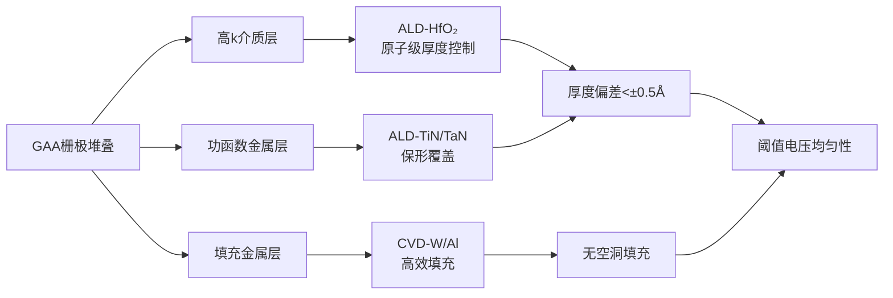

**ALD负责对厚度和均匀性要求极高的超薄功能层**，如高k栅介质和功函数金属层，利用其逐层生长的特性实现原子级精度控制。**CVD负责需要一定厚度的填充层和保护层**，利用其较高的沉积速率提升工艺效率。

这种协同集成策略充分发挥了两种技术各自的优势：ALD提供原子级精度和完美保形性，CVD提供高效的薄膜生长能力。两者在高真空集群系统中的无缝集成，共同支撑了GAA晶体管复杂三维结构的高质量制造。

综上所述，CVD及其衍生技术在先进制程金属薄膜沉积中展现出与PVD高度互补的技术价值。**从钨接触栓塞的高深宽比填充，到钴互连的多重应用，从钌衬垫的超薄沉积，到GAA结构的保形覆盖，CVD技术通过化学反应驱动的沉积机制，有效弥补了PVD在复杂三维结构中的局限性**。随着选择性沉积、低温工艺等创新技术的持续发展，CVD将在2nm及以下节点的金属化工艺中发挥更加关键的作用。

## 4 原子层沉积：实现原子级精度与超薄连续膜的关键

原子层沉积（Atomic Layer Deposition, ALD）技术作为先进制程金属薄膜沉积的核心使能技术，凭借其独特的自限制表面反应机制，实现了传统PVD和CVD无法企及的原子级厚度控制精度。**随着制程节点向2nm及以下演进，ALD已从"可选技术"转变为"必需技术"，在高k栅介质、超薄扩散阻挡层、贵金属电极及高深宽比结构填充等关键环节中发挥着不可替代的作用**[^28]。本章将系统解析ALD技术的工作原理、核心应用场景及其在先进制程中的独特技术优势。

### 4.1 ALD自限制生长机理与原子级厚度控制原理

ALD技术的核心优势源于其独特的自限制表面反应机制，这一机制从根本上区别于传统的PVD和CVD工艺，赋予了ALD在原子级尺度上精确控制薄膜生长的能力。

#### 自限制表面反应的工作机制

ALD是一种可以将物质以单原子层的形式逐层沉积的薄膜制备工艺，其过程是通过将气相前驱体脉冲交替地通入反应器，使其在沉积基体上化学吸附并反应而形成沉积膜[^29]。当前驱体达到沉积基体表面时，它们会在其表面化学吸附并发生表面反应。**由于前驱体分子的自限性饱和吸附特性，前驱体分子只能单层吸附在基底表面**，这一特性确保了每个沉积循环仅生长一个原子层厚度的薄膜[^30]。

一个完整的ALD沉积循环包含四个关键步骤：

1. **前驱体A引入与吸附**：将第一种前驱体气体通入反应室，使其在基底表面发生化学吸附，形成单分子层覆盖[^31]
2. **惰性气体吹扫**：使用惰性气体（如氮气或氩气）对反应室进行清洗，以除去多余的前驱体和反应副产物[^29]
3. **共前驱体B引入与反应**：将第二种前驱体气体通入反应室，使其与已吸附的前驱体A发生化学反应，生成目标薄膜材料[^31]
4. **再次吹扫**：使用惰性气体清除未反应的前驱体B及副产物，完成一个沉积循环[^31]

**通过控制ALD反应的循环次数就可以实现薄膜的逐层沉积**，这种精确的循环控制使得薄膜厚度可以在原子级尺度上进行调节[^30]。

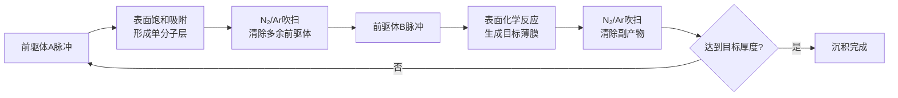

#### 原子级厚度精度的实现基础

ALD工艺具有自限制生长的特点，可精确控制薄膜的尺寸，制备的薄膜具有均匀的厚度和优异的一致性[^29]。**ALD技术能够在亚纳米尺度上精确控制薄膜厚度，通过自限制反应逐层生长，确保了极高的均匀性和可重复性**[^31]。

以东京电子开发的TRIASe+ EX-II TiN系统为例，该设备实现了亚纳米级薄膜厚度控制（±0.1Å），沉积速率为0.5-2Å/循环，膜厚范围可精确控制在1-100nm[^32]。这种原子级精度控制能力是ALD技术区别于其他沉积方法的核心特征。

#### 热ALD与等离子体增强ALD的工艺差异

根据能量激发方式的不同，ALD技术主要分为热ALD和等离子体增强ALD（PEALD）两种工艺类型：

| 工艺类型 | 能量来源 | 典型温度范围 | 沉积特点 | 适用场景 |
|---------|---------|-------------|---------|---------|
| 热ALD | 热能 | 200-400℃ | 反应温和，界面损伤小 | 热敏感材料、高k介质 |
| PEALD | 等离子体 | 150-350℃ | 反应活性高，低温沉积 | 金属薄膜、氮化物 |

**PEALD采用等离子体增强原子层沉积技术，通过电感耦合等离子体（ICP）源提供反应活性**，可在更低温度下实现高质量薄膜沉积[^32]。TRIASe+ EX-II TiN系统配备300W等离子体源和100W晶圆偏压，工艺温度范围为150-400°C，控温精度达±1°C[^32]。

### 4.2 超薄扩散阻挡层TiN/TaN的ALD沉积技术

在先进制程的铜互连工艺中，超薄扩散阻挡层的沉积是ALD技术最关键的应用领域之一。**随着互连尺寸持续缩小，阻挡层厚度必须控制在2-5nm范围内，同时保持致密无孔的结构以有效阻止铜扩散**，这一要求只有ALD技术能够可靠实现。

#### TiN薄膜的ALD沉积工艺

氮化钛（TiN）是P型半导体栅极的理想材料，不仅电阻率低、工艺兼容性好，而且与栅极介质层HfO₂有良好的热稳定性[^33]。ALD沉积TiN的主流工艺采用TiCl₄作为钛前驱体，NH₃作为共反应物。

1988年，Hiltunen等人率先对ALD沉积TiN的工艺进行了研究，通过使用TiCl₄作为前驱体、NH₃作为共反应物，在500℃下能够在玻璃上均匀沉积多晶TiN[^33]。**研究者们后续开发了TEMAT（Ti[N(C₂H₅CH₃)₂]₄）作为新型前驱体，使反应窗口能够降低至150-220℃，沉积速率也提高为原先的10倍**[^33]。

TRIASe+ EX-II TiN系统的典型TiN沉积参数如下[^32]：

| 参数项 | 技术指标 |
|-------|---------|
| 前驱体兼容性 | TiCl₄、NH₃、N₂H₄等 |
| 薄膜均匀性 | ±1%（片内，3σ），±2%（片间） |
| 沉积速率 | 0.5-2Å/循环 |
| 薄膜电阻率 | <200μΩ·cm |

#### TaN薄膜的ALD沉积与应用

氮化钽（TaN）作为铜互连的主流阻挡层材料，其ALD沉积工艺同样采用卤化物前驱体与含氮反应物的组合。**华中科技大学陈蓉教授团队通过选择性原子层沉积技术，实现了氧化钽薄膜在Cu/SiO₂表面的自对准图案化制造**[^34]。

该团队提出的"循环耦合"工艺，使传统AB双循环转变为ABC多循环耦合，进而能够实现"表面原位还原-生长-缺陷去除"的步骤，有效抑制铜表面缺陷形核产生，最终实现高精度自对准[^34]。**该工艺在生长区达到5nm厚度，非生长区不生长，其选择性达到100%，并实现自对准沉积**[^34]。

#### ALD与PVD阻挡层沉积的性能对比

ALD在超薄阻挡层沉积方面相较于传统PVD展现出显著优势：

| 对比维度 | ALD沉积 | PVD沉积 |
|---------|--------|--------|
| 最小可控厚度 | 1-2nm | 5-10nm |
| 台阶覆盖率（深宽比>10:1） | >95% | <50% |
| 薄膜致密性 | 无针孔 | 可能存在微孔 |
| 厚度均匀性 | ±1% | ±5-10% |
| 界面质量 | 优异 | 良好 |

**ALD的原子级控制能力使其能够沉积2nm以下的超薄阻挡层，这对于解决先进节点阻挡层体积占比困境至关重要**。应用材料公司开发的RuCo二元金属衬垫技术正是基于ALD实现了2nm超薄衬垫层，使芯片布线电阻降低25%。

### 4.3 贵金属电极材料Ru/Co/Pt的ALD沉积与应用

贵金属及过渡金属材料在先进制程中的应用日益广泛，ALD技术为这些高熔点、高活性金属的精确沉积提供了可靠的技术路径。

#### 钌（Ru）的ALD沉积技术突破

钌作为一种贵金属材料，凭借其极低的电阻率（约7.1 μΩ·cm）和优异的化学稳定性，成为超薄衬垫层和高性能电极的理想候选材料。**ALD沉积钌薄膜面临的主要挑战是前驱体蒸汽压力较低，导致沉积速率慢、成本高**。

田中贵金属工业开发的TRuST前驱体实现了重大技术突破，作为液态钌前驱体达到了世界级行业标准蒸汽压力数值，比此前的液体钌前驱物蒸汽压力提高约100倍。TRuST前驱体具备以下关键技术特长：

- **高蒸汽压力**：即使在室温左右的温度下也显示出较高的蒸汽压力
- **易分解性**：在反应气体（氢、氧等）中容易分解，可形成低电阻的钌膜
- **优异的台阶覆盖性**：即使在微细的高深宽比结构中也能均匀地成膜至深部

**利用氧和氢的两段ALD工艺被开发出来，实现了可防止基板氧化、质量更高且电阻更低的超薄薄膜沉积**。第一阶段使用H₂进行钌成膜，可降低底层的表面氧化风险；第二阶段切换为O₂进行后续沉积，实现钌纯度基本保持100%的更高纯度成膜。

#### 钴（Co）的ALD沉积与多重应用

钴凭借其高电导率、优异的抗电迁移性以及与硅和高k介质的良好界面兼容性，在10nm以下节点的局部互连和接触层中发挥着重要作用。**ALD沉积钴薄膜通过交替通入钴前驱体（如CoCp(CO)₂）和还原剂（如H₂或NH₃），逐层沉积原子级均匀的钴薄膜**[^35]。

钴ALD在先进制程中的应用涵盖三大核心领域：

1. **源漏极金属接触**：通过硅化反应形成低电阻CoSi₂接触，相比传统TiSi₂电阻降低约30%
2. **局部互连层**：通过ALD填充高深宽比通孔（如40:1），避免铜电镀的空隙缺陷问题
3. **铜互连衬垫层**：与钌配合形成超薄RuCo衬垫，改善铜的附着和回流特性

#### 铂（Pt）及其他贵金属的ALD应用

铂等贵金属的ALD沉积主要应用于高性能电极和催化材料领域。**ALD技术可用于沉积多种类型的材料，包括金属、氧化物、氮化物和硫化物等，为不同的应用场景提供了便利**[^31]。

在微纳电子和纳米材料应用中，ALD沉积的金属栅电极材料包括Ir、Pt、Ru、TiN等，金属互连与衬板材料包括Cu、WN、TaN、WNC、Ru、Ir等，用于铜互连线的金属扩散阻挡层、晶体管栅的半导体通孔以及存储单元应用[^35]。

### 4.4 高深宽比结构的完美保形覆盖能力

ALD技术在极端高深宽比结构中实现近乎完美的台阶覆盖能力，是其区别于PVD和CVD的核心竞争优势，也是先进制程金属化工艺选择ALD的根本原因。

#### 保形覆盖的物理机制

**ALD技术可在复杂的三维结构、高纵横比结构或不规则形状表面上沉积高度均匀的薄膜，因此特别适用于微电子器件及其他精密应用领域**[^31]。这种优异的保形性源于ALD独特的表面反应机制：前驱体分子以气态形式扩散进入深孔和沟槽内部，在所有暴露表面发生自限制化学吸附，确保每个表面位点都获得均匀的单分子层覆盖。

TRIASe+ EX-II TiN系统实现了**优异的台阶覆盖率（>95%@50:1深宽比）**，这一性能指标远超传统PVD和CVD技术的能力边界[^32]。对于GAA纳米片晶体管中相邻沟道之间仅有10-11nm的狭窄空间，ALD能够从两侧共形地沉积介质层和金属层[^28]。

#### 典型应用场景的保形覆盖需求

ALD的高深宽比保形覆盖能力在以下先进制程应用中发挥着不可替代的作用：

**GAA纳米片环绕栅极**：由于无法直观看到栅极沟道的底面，GAA工艺上更多用到了ALD技术[^33]。在晶体管层面，共形性至关重要，相邻沟道之间只有大约10-11nm的空间，必须从两侧共形地沉积介质层[^28]。

**3D NAND深孔填充**：随着3D NAND层数不断增加，字线孔的深宽比可达40:1甚至更高。**ALD技术的薄膜台阶覆盖率可以做到将近100%，薄膜可以很均匀地覆盖在深孔和复杂表面上，是其他薄膜沉积技术难以达成的**[^33]。

**TSV通孔阻挡层**：在先进封装工艺中，硅通孔（TSV）的TiN扩散阻挡层需要在极高深宽比结构中实现完美覆盖[^32]。

#### 不同沉积技术的保形覆盖能力对比

下表系统对比了主要沉积技术在高深宽比结构中的覆盖能力：

| 沉积技术 | 台阶覆盖率（深宽比10:1） | 台阶覆盖率（深宽比50:1） | 技术局限 |
|---------|----------------------|----------------------|---------|
| 传统PVD | <50% | <20% | 视线沉积，深孔底部覆盖不足 |
| 离子化PVD+再溅射 | ~85% | <50% | 仍受几何遮挡效应限制 |
| 热CVD | 70-90% | 50-70% | 前驱体扩散受限 |
| PECVD | 60-80% | 40-60% | 等离子体难以到达深处 |
| ALD | >95% | >95% | 沉积速率较慢 |

**这些结构变得越来越复杂，三维几何形状使得确保薄膜的保形性极具挑战性**[^28]。ALD通过逐层沉积的方式，有效克服了传统技术在复杂三维结构中的覆盖局限，成为先进制程高深宽比结构沉积的唯一可靠选择。

### 4.5 低缺陷密度与界面质量控制

ALD技术的逐层生长特性不仅实现了原子级厚度控制，还赋予了薄膜优异的致密性和界面质量，这对于先进制程器件的电学性能和可靠性至关重要。

#### 无针孔致密薄膜的形成机理

**ALD沉积的薄膜非常致密，没有微小孔洞，确保膜层具备优异的密封性和隔离性**[^36]。这种无缺陷薄膜的形成源于ALD每次循环仅沉积一个原子层的特性——这种逐层沉积的方式能够填补薄膜中的微小缺陷，保持膜层完整性[^36]。

由于其逐层生长的特性，ALD技术可以显著减少薄膜中的缺陷（如针孔和裂纹），从而提高薄膜质量与性能[^31]。**利用ALD技术的表面自限制反应可制造高精度的原子尺度薄膜，沉积材料均匀地分散在基底表面，沉积层与基底间存在着强烈的相互作用**[^30]。

#### 界面态密度与电荷陷阱控制

先进制程对薄膜界面质量的要求极为苛刻，GAA结构沟道表面积增大，要求薄膜界面态密度低于10¹⁰ cm⁻²eV⁻¹。**ALD技术在厚度的均匀性、薄膜密度、台阶覆盖、界面质量、低温层积、工业适用性等影响薄膜质量的方面均表现非常优异**[^30]。

等离子体脉冲调制技术是控制界面质量的关键手段。东京电子的TRIAS平台整合等离子体脉冲调制技术，**显著降低薄膜氢含量（<5 at%），减少界面电荷陷阱**。TRIASe+ EX-II TiN系统通过精确的工艺控制，实现了优异的薄膜均匀性（±1%片内）和低电阻率（<200μΩ·cm）[^32]。

#### ALD薄膜质量的综合优势

下表总结了ALD技术在薄膜质量控制方面的核心优势：

| 质量指标 | ALD技术表现 | 技术机理 |
|---------|------------|---------|
| 薄膜致密性 | 无针孔、无微孔 | 逐层生长填补缺陷 |
| 厚度均匀性 | ±1%（片内） | 自限制饱和吸附 |
| 界面态密度 | <10¹⁰ cm⁻²eV⁻¹ | 表面化学反应精确控制 |
| 氢含量 | <5 at% | 等离子体脉冲调制 |
| 附着力 | 优异 | 化学键合生长 |

**即使原子层沉积厚度出现微小变化，也会影响静电控制，或引入漏电通路，这些通路会在数十亿个晶体管中累积**[^28]。因此，ALD在先进制程中的应用不仅是技术选择，更是确保器件性能和良率的必然要求。

### 4.6 ALD设备技术演进与先进制程适配性

ALD设备技术的持续演进是支撑先进制程金属化工艺发展的关键基础。**原子层沉积（ALD）已成为应对这些挑战不可或缺的技术，尤其是在前端工艺方面**[^28]。

#### 代表性ALD设备的技术参数

东京电子（TEL）开发的TRIASe+ EX-II TiN是先进原子层沉积系统的代表，其核心技术参数体现了当前ALD设备的技术水平[^32]：

| 参数类别 | 技术指标 |
|---------|---------|
| 晶圆尺寸 | 300mm（兼容200mm） |
| 薄膜均匀性 | ±1%（片内，3σ），±2%（片间） |
| 沉积速率 | 0.5-2Å/循环 |
| 膜厚范围 | 1-100nm（原子级精度控制） |
| 工艺温度 | 150-400°C（±1°C控温精度） |
| 反应压力 | 0.5-5Torr |
| 等离子体源 | 电感耦合等离子体（ICP），300W |
| 真空系统 | 涡轮分子泵（基础真空<1×10⁻⁷Torr） |
| 自动化水平 | SECS/GEM协议，支持全自动工艺配方管理 |

应用材料的Picosun系列ALD设备同样是行业领先的解决方案，PICOSUN™ R-200高级型支持50-200mm晶圆、156mm×156mm太阳能硅片、3D复杂表面衬底、粉末与颗粒等多种基底类型，工艺温度范围为50-500°C，可处理多孔、通孔、高深宽比样品（最高可达1:2500）[^31]。

#### 低温工艺与热敏材料兼容性

**许多ALD工艺过程可在相对较低的温度下进行，这对热敏感或无法承受高温处理的基底材料尤为重要**[^31]。ALD适用于温度敏感的基材，操作温度通常在50-350°C范围内，这种低温能力使ALD能够与GAA纳米片等热敏结构兼容[^36]。

低温ALD工艺对于先进制程的关键意义在于：

- **纳米片热敏感性兼容**：GAA纳米片对高温敏感，需在<400°C下完成高致密性薄膜沉积
- **背面供电集成**：背面供电等集成步骤要求后续金属化工艺温度<400-450°C
- **新型金属材料集成**：与Ru、Mo等新型金属栅极材料的后续工艺兼容

#### 多前驱体集成与集群化系统

现代ALD设备越来越强调多前驱体集成能力和与其他沉积技术的集群化集成。**通过选择合适的前驱体和工艺参数，可以精确调控薄膜的化学组成和掺杂水平，从而实现特定功能特性**[^31]。

TRIASe+ EX-II TiN系统支持TiCl₄、NH₃、N₂H₄等多种前驱体，可通过工艺配方管理实现不同材料体系的灵活切换[^32]。**技术融合（PVD+ALD, CVD+ALD）是趋势**，设备商正在开发集成多种工艺、原位计量和智能控制于一体的解决方案，以管理极端复杂的先进制程工艺。

#### ALD设备的市场地位与发展趋势

**ALD并非新技术，但随着器件尺寸接近薄膜原子数量成为限制因素的尺度，其重要性也随之飙升**[^28]。2023年全球半导体设备市场规模约为1063亿美元，薄膜沉积设备市场规模约达211亿美元，其中ALD设备在逻辑芯片制造中扮演着不可或缺的角色[^37]。

在7nm及以下制程的逻辑芯片生产线上，ALD设备已然成为核心装备。**ALD用于制造高质量的绝缘层和导电层，提高晶体管性能**[^30]。主要应用领域包括[^32]：

- **逻辑芯片制造**：金属栅极、接触孔阻挡层、FinFET/GAA结构的共形覆盖沉积
- **存储器件制造**：DRAM电容电极、3D NAND字线、MRAM磁隧道结
- **先进封装工艺**：TSV阻挡层、RDL互连、凸点下金属化

展望未来，ALD设备将向超高精度、区域选择性（AS-ALD）、低温工艺能力等方向持续演进，以适配2nm及以下节点、3D集成、新通道材料等前沿制程的严苛需求。**ALD技术持续深化与拓展，从必需技术向更高精度、选择性和低温能力演进，并与其它技术深度融合**，将继续在先进制程金属化工艺中发挥核心使能作用。

## 5 电子束蒸发与分子束外延在特定金属沉积中的利基应用

在先进制程金属薄膜沉积技术体系中，电子束蒸发（E-beam Evaporation）与分子束外延（MBE）代表着两种追求极致薄膜纯度与界面质量的物理沉积方法。**与PVD溅射、CVD及ALD等主流量产技术不同，这两种技术并非以高产能和低成本见长，而是凭借其在特定材料体系和特殊应用场景中无可替代的技术优势，占据着先进制程金属沉积的重要利基市场**。电子束蒸发以其高能电子束直接轰击靶材的独特机制，实现了高熔点金属和贵金属的高纯度沉积；分子束外延则以超高真空环境下的原子级精度控制，成为III-V族化合物半导体外延和二维材料金属接触研究的核心技术平台。本章将系统剖析这两种技术的工作原理、应用价值及其在主流CMOS量产工艺中应用受限的根本原因。

### 5.1 电子束蒸发技术原理与高熔点金属沉积优势

电子束蒸发是真空蒸镀技术的重要演进形态，通过高能电子束直接轰击靶材表面实现局部气化，有效克服了传统电阻加热蒸发在高熔点材料沉积和薄膜纯度方面的固有局限。**这一技术在半导体制造中主要用于Ti、Al、Ni、Au、Pt、Ag、W等金属的高纯度镀膜，尤其在需要沉积高熔点金属和多层复合金属结构的场景中展现出独特优势**[^38]。

#### 电子束加热的工作机制

电子束蒸发的核心原理是利用加速后的高能电子轰击待沉积材料靶材，使靶材表面局部区域达到蒸发或升华温度，蒸发出的原子在高真空环境中飞行并沉积在基片表面，形成致密的金属薄膜[^39]。与传统电阻加热蒸发相比，电子束蒸发具有本质性的工艺优势。

在传统电阻加热蒸发中，待沉积金属块被放置在坩埚内通过电阻丝加热，这种方式存在明显缺陷：**加热过程中坩埚材料易与金属发生反应，引入杂质污染（尤其是钠离子污染），且难以实现高熔点金属（如钨、钼）的沉积**[^40]。电子束蒸发装置通过高能电子束直接轰击金属块实现加热，待加热的金属块被放置在惰性材料制成的坩埚内，这种方式避免了金属与坩埚壁的直接反应，有效减少了杂质引入，因此可制备出高纯度的金属薄膜[^40]。

典型的电子束蒸发设备配备10kW电子束源，采用水冷铜坩埚设计避免材料污染，支持多坩埚自动导位实现多层镀膜[^39]。例如，法国品牌550S型电子束蒸发镀膜系统配置8个坩埚，可依次蒸镀Au、Pd、Al、Mo、Ni、NiCr、Ti、Ge等多种金属，样品台支持旋转和倾斜功能，可加载6英寸衬底，真空系统采用低温泵和干泵组合[^41]。

#### 高熔点金属沉积的技术优势

电子束蒸发在高熔点金属沉积方面展现出显著优势。**通过高能电子束轰击靶材表面，可使高熔点材料（如钨、钽、铂）蒸发，用于制备耐高温和耐腐蚀的薄膜**[^42]。这一能力是传统热蒸发技术难以企及的，因为钨的熔点高达3422℃，钽的熔点为3017℃，远超普通电阻加热所能达到的温度范围。

下表总结了电子束蒸发设备的核心技术参数：

| 技术参数 | 典型指标 | 技术意义 |
|---------|---------|---------|
| 基板尺寸 | 2、4、6英寸 | 适配多种晶圆规格 |
| 基板加热温度 | 最高250℃ | 支持低温沉积工艺 |
| 控温精度 | ±1℃ | 保证薄膜质量一致性 |
| 系统极限真空度 | 2×10⁻⁷ Torr | 确保高纯度成膜环境 |
| 蒸发源数量 | 6个坩埚 | 支持多层连续蒸镀 |
| 膜厚均匀性 | ≤±5% | 满足器件制造要求 |

[^38][^39]

#### 多坩埚连续蒸镀的工艺灵活性

电子束蒸发设备的多坩埚设计为复杂金属层结构的制备提供了高度灵活性。**一炉可以依次蒸镀6种不同金属，这种连续蒸镀能力使其特别适合需要多层金属复合结构的应用场景**[^38]。例如在III-V族化合物半导体的欧姆接触制备中，通常需要沉积Ti/Al/Ti或Ni/Ge/Au等多层金属结构，电子束蒸发可在不破真空的条件下完成全部金属层的连续沉积，有效避免了层间界面的氧化污染。

先进的电子束蒸发设备如PEVA-600E型（2025年）可单次蒸镀108片2英寸晶圆，支持Lift-off工艺的32英寸投射距离，材料利用率提升20%[^39]。TF500型（2024年）配备6×25cc水冷坩埚全自动导位，在4英寸范围内实现±5%均匀性，配备750mm超大镀膜腔室[^39]。

### 5.2 电子束蒸发在先进制程金属化中的典型应用

电子束蒸发技术在半导体制造中的应用虽然不如PVD溅射和CVD广泛，但在特定领域展现出不可替代的技术价值。**其应用场景主要集中在III-V族化合物半导体金属化、MEMS器件导电薄膜制备、光学镀膜以及需要高纯度厚膜沉积的特殊工艺中**。

#### III-V族化合物半导体的Lift-Off金属化工艺

电子束蒸发在III-V族化合物半导体（如GaAs、GaN、InP）的金属化工艺中占据重要地位，尤其在Lift-Off剥离工艺中展现出独特优势。**Lift-Off工艺要求金属薄膜具有良好的方向性和较低的台阶覆盖能力，以便在光刻胶剥离时实现清晰的图案边界**，电子束蒸发的视线沉积特性恰好满足这一需求。

电子束蒸发台特别适用于功率IC、砷化镓晶圆的Lift-Off制程需求[^39]。在GaN基高电子迁移率晶体管（HEMT）的欧姆接触制备中，典型的金属堆叠结构为Ti/Al/Ni/Au，电子束蒸发可实现各层金属的精确厚度控制和高纯度沉积，确保接触电阻的一致性和器件性能的可靠性。

#### MEMS器件与光学镀膜应用

在微机电系统（MEMS）器件制造中，电子束蒸发用于制备Au、Cr、Pt等导电薄膜[^39]。这些贵金属薄膜在MEMS传感器的电极、引线和焊盘结构中发挥关键作用。电子束蒸发的高纯度成膜能力确保了薄膜的电学性能稳定性，而多坩埚连续蒸镀功能则支持复杂的多层金属结构制备。

**蒸发沉积技术在光学薄膜和装饰涂层的制造中尤为常见，例如反射镜上的金属涂层、装饰件上的金属薄膜等都利用蒸发沉积实现高纯度、高光洁度的成膜**[^42]。电子束蒸发沉积的金属薄膜表面光洁度高，适合对光学性能有严格要求的应用场景。

#### 设备市场与应用现状

从市场数据来看，电子束蒸发设备在半导体领域的应用规模相对有限但价值稳定。2024年某高校采购的电子束蒸发台中标金额为191.9万元[^39]，反映了该类设备在科研和特种器件制造中的持续需求。设备放置于厦门大学化学化工学院化学楼220室的Edwards Vacuum生产设备已运行15年，当前仍在维护使用中[^39]，体现了电子束蒸发设备的长期应用价值。

主要设备生产厂家包括台湾聚昌、英国HHV、Edwards Vacuum等，典型型号有PEVA-600E、TF500等，真空度可达1×10⁻⁷–2×10⁻⁷ Torr，镀膜均匀性控制在±3%–±5%范围内[^39]。

### 5.3 分子束外延的超高真空生长机制与原子级精度控制

分子束外延（Molecular Beam Epitaxy, MBE）是一种在超高真空环境下通过原子束或分子束逐层生长单晶薄膜的外延制膜方法，由美国贝尔实验室卓以和团队于1970年代初开发[^43]。**MBE技术代表了薄膜沉积领域原子级精度控制的最高水平，其在超高真空环境下的逐层生长机制赋予了薄膜优异的晶体质量和界面陡峭性**。

#### 超高真空环境下的分子束生长机制

MBE的核心原理是在超高真空条件下（10⁻¹⁰-10⁻¹² Torr），由装有各种所需组分的炉子加热而产生的蒸气，经小孔准直后形成的分子束或原子束，直接喷射到适当温度的单晶基片上，同时控制分子束对衬底扫描，使分子或原子按晶体排列一层层地"长"在基片上形成薄膜[^43]。

**MBE外延生长是在超高真空环境下（10⁻¹⁰ Torr）以高温蒸发的方式将源材料裂解为气体分子以产生分子束流，产生的分子束流在衬底表面经吸附、分解、迁移、成核、生长等过程使原子进入晶格位置完成外延生长**[^44]。各高纯原材料在各自的束源炉中被独立加热产生分子束，该分子束流经机械挡板控制喷射至衬底表面。系统的超高真空是保证分子束流直线到达衬底的关键。

MBE系统的结构组成如下图所示：

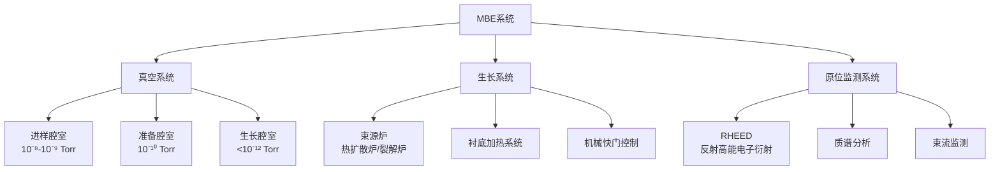

#### 原子级厚度控制与生长速率特性

MBE技术的核心优势在于其极慢的生长速率和由此带来的原子级精度控制能力。**生长速率极慢，大约1μm/小时，相当于每秒生长一个单原子层，因此有利于实现精确控制厚度、结构与成分和形成陡峭的异质结构等**[^43]。这种原子级的加工精度使MBE特别适于生长超晶格材料。

MBE技术的独特优势可从以下几个维度理解：

| 技术特性 | 具体表现 | 技术意义 |
|---------|---------|---------|
| 生长温度低 | 低于传统外延工艺 | 有效避免界面原子的互扩散 |
| 生长速度低 | ~1μm/h（~1Å/s） | 实现原子级的沉积速度 |
| 超高真空 | <10⁻¹² Torr | 大大降低杂质的非故意掺杂 |
| 快门控制 | 瞬时开关 | 膜的组分和掺杂浓度可迅速调整 |

[^43][^44]

**MBE是一个动力学过程，即将入射的中性粒子（原子或分子）一个一个地堆积在衬底上进行生长，而不是一个热力学过程，所以它可以生长按照普通热平衡生长方法难以生长的薄膜**[^43]。这一特性使MBE能够制备许多传统方法无法实现的亚稳态材料和人工结构。

#### RHEED原位监测与薄膜质量实时调控

分子束外延系统配备反射高能电子衍射仪（RHEED）、束流监测系统等原位监测装置，可以随时监控外延层的成分和结构的完整性[^43]。**RHEED用于监测生长表面，激光反射、热成像和化学分析（质谱法、俄歇光谱法）可分析蒸发材料的成分**[^45]。

这种原位监测能力使MBE操作者能够实时观察薄膜生长过程，根据RHEED衍射图样的变化判断生长模式（层状生长、三维岛状生长等），并及时调整工艺参数以优化薄膜质量。其他传感器用于测量温度、压力和生长率，以实时调整工艺参数[^45]。

### 5.4 MBE在III-V族金属化合物与二维材料接触中的关键应用

MBE技术自诞生以来，已从最初的GaAs/AlGaAs超晶格结构制备，发展成为在各种高级功能半导体异质结材料中广泛使用的薄膜外延生长技术[^46]。**除了GaAs、AlGaAs、GaP、GaN等III-V族砷化物、磷化物、氮化物半导体薄膜，还拓展到了II-VI族、IV族半导体薄膜，甚至金属膜、超导膜及介质膜的生长制备**[^46]。

#### III-V族化合物半导体的高质量外延

MBE研制的初衷是为了实现GaAs/AlGaAs超晶格结构，在这种结构中，阱层厚度不足10Å[^46]。与传统的生长技术相比，采用MBE方法既可以实现超薄层的陡峭界面，增强载流子的限制作用，又可实现掺杂原子在纵向梯度、浓度的任意可调。

**无论晶格失配是小（<2-3%）还是大，MBE的生长机制都既适合原子级界面平整的二维结构，也适合纳米岛状的三维结构（用于限制载流子）**[^46]。这种灵活性使MBE成为量子点、量子阱、超晶格等低维结构制备的首选技术。

MBE在III-V族半导体领域的典型应用包括：

- **高电子迁移率晶体管（HEMT）**：借助原子尺度膜厚控制制备的超晶格结构
- **多量子阱型激光二极管**：精确控制阱层和势垒层厚度
- **光电器件**：公交车站预告板、体育场超大显示屏的发光元件[^43]

#### 二维半导体金属接触的前沿突破

**在二维半导体器件领域，MBE技术正在推动金属-半导体接触技术的革命性突破**。2025年12月17日，南京大学集成电路学院王欣然、李卫胜团队与合作者创新开发出锑晶体外延接触技术，解决了亚20纳米接触长度下二维半导体欧姆接触难题，成功研制出1纳米节点高性能二硫化钼（MoS₂）晶体管器件[^47]。

这一突破的核心技术路径是：**在MoS₂上创新开发了分子束外延锑晶体(0112)接触技术，首次在20纳米以下接触长度实现了小于100Ω·μm的接触电阻，满足了IRDS对1纳米节点晶体管的要求**[^47]。

分子束外延在这一突破中展现出无可比拟的优势：

> **分子束外延以其原子级精度控制能力和优异的界面质量，在构建高质量金属-半导体接触方面展现出无可比拟的优势。相比传统电子束蒸镀方法存在的相纯度低、晶畴尺寸受限等问题，分子束外延可实现几乎单一取向纯度（97.2%）的锑(0112)晶体薄膜，晶畴尺寸提升两个数量级，并与MoS₂形成原子级锐利的界面**[^47]。

基于深度微缩的锑晶体欧姆接触技术，团队成功研制出CGP小于40纳米的高性能MoS₂晶体管器件。该晶体管的接触长度为18纳米，栅长为17纳米，在0.7V源漏偏压下具有1.08 mA/μm的高驱动电流，大于10⁷的开关比，小于10 pA/μm的关态电流，62 mV/dec的亚阈值斜率[^47]。

#### 新型量子结构与低维材料的MBE制备

**在单原子层、短周期数字合金、超晶格、量子点、量子盘、纳米线等新型结构的研制方面，MBE具有显著优势**[^44]。南京大学聂越峰课题组利用氧化物分子束外延技术首次制备出自支撑镍基超导薄膜，并通过缓冲层技术抑制界面离子混杂[^43]。

原子层精度分子束外延技术可合成高温超导体、石墨烯等二维材料及亚稳态材料。国际研究团队采用该技术在锗晶格中嵌入镓原子，获得3.5开尔文超导材料[^43]。这些前沿应用充分体现了MBE在追求极致材料性能和探索新物理现象方面的不可替代性。

### 5.5 技术局限性与主流CMOS工艺兼容性挑战

尽管电子束蒸发和MBE在特定应用领域展现出独特的技术价值，但这两种技术在主流CMOS量产工艺中的应用仍然受到显著制约。**其核心局限性源于沉积速率、产能、成本以及与现代半导体制造流程兼容性等多方面因素**。

#### 沉积速率与产能瓶颈

电子束蒸发和MBE的共同特点是沉积速率相对较低，这直接限制了其在大规模量产中的应用。

**蒸发沉积的优势在于设备简单、沉积速率高，可在短时间内实现大面积沉积**[^42]，但相较于溅射PVD，蒸发沉积的整体产能仍然有限。更重要的是，**蒸发工艺存在显著局限性：一是台阶覆盖能力差，无法在深宽比大于1的沟槽或通孔结构中形成连续薄膜；二是难以精准控制合金组分，不适合淀积合金薄膜**[^40]。

MBE的产能瓶颈更为突出。**MBE技术广泛用于高质量半导体薄膜的制备，尤其适用于量子点、纳米结构等应用领域，在高端电子和光电器件制造中具有重要地位。然而，设备和工艺成本高、技术复杂，通常应用于实验室和高附加值产品的生产，难以规模化应用**[^42]。

下表对比了主要沉积技术的产能与成本特性：

| 技术类型 | 沉积速率 | 量产适用性 | 设备成本 | 运维成本 |
|---------|---------|-----------|---------|---------|
| PVD溅射 | 高（1-10 μm/h） | 高 | 中等 | 低 |
| CVD | 中-高 | 高 | 中等 | 中等 |
| ALD | 低（0.1-2 Å/cycle） | 中-高 | 高 | 中等 |
| 电子束蒸发 | 中等 | 低 | 中等 | 中等 |
| MBE | 极低（~1 μm/h） | 极低 | 极高 | 极高 |

#### 台阶覆盖能力的固有局限

电子束蒸发和MBE作为物理沉积技术，都面临台阶覆盖能力不足的固有局限。**蒸发沉积的薄膜附着力相对较弱，均匀性控制难度较大，尤其是对于复杂形状的基片，可能产生不均匀成膜效果，限制了该技术在需要高附着力的场合中的应用**[^42]。

在先进制程的高深宽比结构中，这一局限性尤为突出。正因如此，**在超大规模集成电路（ULSI）制造中，蒸发工艺已逐渐被溅射工艺取代**[^40]。溅射工艺具备多方面优势：沉积的金属薄膜质量更高，具有更优的台阶覆盖能力和间隙填充能力，可适配复杂的器件结构[^40]。

#### 设备复杂度与成本结构

MBE系统的设备复杂度和运维成本是其应用受限的重要因素。**MBE就其本质而言，它是一套真空系统，工作在超高真空环境下。真空系统的主要目的在于维持超高真空的生长环境，由真空腔室、阀门、真空泵、真空检测系统构成**[^46]。

根据不同的系统要求，各个腔室对真空级别的要求也不尽相同：**生长腔室对真空度要求最高，一般低于10⁻¹² Torr，准备腔室要求次之，一般为10⁻¹⁰ Torr级别，而进样腔室由于需要频繁与外界相通，对真空要求最低，但仍然约为10⁻⁸-10⁻⁹ Torr**[^46]。这种多级真空系统的维护成本极高，且对操作人员的专业技能要求严格。

MBE反应器通常包括一个样品传送室和一个生长室，样品传送室与空气相通，用于装载和卸载晶圆衬底，生长室用于传送衬底进行外延生长。**第二个生长室通常是密封的，仅在维护时才与空气相通。MBE反应器在超高真空（UHV）条件下运行，以防止空气分子污染。如果反应器与空气接触，可以通过加热反应器来加速排出这些污染物**[^45]。

#### 与主流CMOS工艺流程的兼容性挑战

电子束蒸发和MBE与主流CMOS工艺流程的集成面临多重挑战：

**工艺温度兼容性**：MBE对于硅衬底上的III-V族生长存在特殊挑战。**在硅衬底上生长需要极高的温度以确保氧化物解吸（>1000℃），这意味着需要专门的加热器和晶圆支架。晶格常数和膨胀系数不匹配的问题使硅上的III-V族生长成为一个活跃的研发课题**[^45]。

**产能与节拍匹配**：现代半导体制造线要求各工艺步骤的节拍时间相匹配，以实现高效的流水线生产。MBE的超低沉积速率（约1μm/小时）与主流沉积设备（如PVD溅射可达10μm/小时）存在数量级差距，难以融入高效的生产流程。

**设备集成度**：**溅射工艺易于实现多腔室集成，在淀积金属前可直接对硅片表面进行清洁处理，去除表面沾污与自然氧化层，简化工艺流程**[^40]。相比之下，MBE系统的复杂真空要求使其难以与其他工艺设备进行无缝集成。

#### 利基技术的定位与价值边界

综合以上分析，电子束蒸发和MBE在先进制程金属沉积技术体系中的定位可以清晰界定：

**电子束蒸发**适用于：
- III-V族化合物半导体的Lift-Off金属化工艺
- MEMS器件导电薄膜制备
- 光学镀膜及需要高纯度厚膜沉积的特殊应用
- 科研实验室的材料开发与工艺验证

**MBE**适用于：
- 高纯度III-V族半导体外延及金属化
- 超晶格、量子阱、量子点等低维结构制备
- 二维材料金属接触的前沿研究
- 新型量子器件和超导材料的探索性研发

**这两种技术的核心价值不在于量产规模，而在于其在追求极致薄膜纯度、原子级精度控制和前沿材料探索方面的不可替代性**。随着二维半导体、量子计算等新兴领域的发展，MBE等高精度沉积技术的战略重要性可能进一步提升，但其在主流CMOS量产工艺中的应用仍将局限于特定的高附加值环节。

## 6 技术选择的多维度比较与协同集成策略

在先进制程金属薄膜沉积技术体系中，PVD、CVD、ALD、电子束蒸发及MBE等技术各具特色，形成了相互补充的技术格局。**单一沉积技术难以满足2nm及以下节点对薄膜性能、工艺精度和生产效率的全面要求，技术协同与集成优化已成为先进金属化工艺的核心策略**。本章将从薄膜性能、工艺能力、生产效益三个核心维度建立系统的技术评估框架，并在此基础上探讨不同金属层和结构需求下的设备选择逻辑与协同集成方案，为先进制程工艺集成提供决策依据。

### 6.1 薄膜性能维度的技术对比分析

薄膜性能是评价沉积技术优劣的首要标准，直接决定了器件的电学特性、可靠性和使用寿命。**不同沉积技术在电阻率控制、薄膜致密性、纯度及界面质量等关键指标上表现各异，构成了技术选择的基础依据**。

#### 电阻率控制能力对比

电阻率是金属薄膜最核心的电学性能指标，直接影响互连延迟和功耗。各沉积技术在电阻率控制方面展现出不同特性：

**PVD溅射**可沉积低电阻率金属（如Cu、Al），磁控溅射制备的铜互连薄膜电阻率可达<2.0 μΩ·cm，满足先进节点对低电阻互连的严苛要求。溅射工艺在高纯金属沉积方面具有成熟的工艺积累，是当前产线金属化的主流技术。

**CVD**同样具备良好的电阻率控制能力，以CVD-W为例，其电阻率约为5.6 μΩ·cm，满足接触栓塞的导电需求。CVD技术通过前驱体化学配比的优化，可在保持良好保形性的同时实现较低的薄膜电阻。

**ALD**凭借其自限制反应机制形成的致密无孔薄膜，展现出优异的电阻率可控性。尽管ALD沉积速率较慢，但其原子级精度确保了超薄膜的连续性和均匀性，有效避免了因薄膜不连续导致的电阻异常升高。

**MBE**在电阻率控制方面达到极致水平，能够实现原子级锐利界面。南京大学团队开发的锑晶体外延接触技术实现了低至42 Ω·μm的接触电阻，这一性能指标远超传统沉积方法所能达到的水平。

#### 薄膜致密性与纯度对比

薄膜的致密性和纯度直接关系到阻挡层的防扩散能力和互连结构的长期可靠性：

| 沉积技术 | 薄膜致密性 | 纯度水平 | 关键影响因素 |
|---------|-----------|---------|-------------|
| PVD溅射 | 高（高真空环境） | 取决于靶材纯度（5N-6N） | 附着力强，晶粒结构可控 |
| CVD | 高 | 取决于前驱体纯度 | 化学键合生长，结构致密 |
| ALD | **极佳** | 高（自限制反应） | 无针孔致密膜，缺陷密度低 |
| 电子束蒸发 | 高 | **极高** | 水冷坩埚防止杂质引入 |
| MBE | **极致** | **极致** | 超高真空（~10⁻¹⁰ Torr）最小化非故意掺杂 |

**ALD的自限制反应特性使其能够形成完全无针孔的致密薄膜**，这对于超薄阻挡层（<5nm）的防扩散功能至关重要。MBE则在超高真空环境下实现了最高级别的薄膜纯度和晶体完整性，但其应用场景受限于特定的高价值器件。

#### 界面质量与缺陷密度控制

先进制程对薄膜界面质量的要求已提升至原子级精度，界面态密度和缺陷控制成为关键考量：

**ALD技术在界面质量控制方面具有本质优势**。由于其逐层生长的特性，ALD可以显著减少薄膜中的缺陷（如针孔和裂纹），界面态密度可控制在10¹⁰ cm⁻²eV⁻¹以下。东京电子的TRIAS平台通过等离子体脉冲调制技术，将薄膜氢含量降至<5 at%，有效减少界面电荷陷阱。

**MBE凭借其原子级精度控制能力，可实现最高质量的界面**。分子束外延制备的锑晶体与MoS₂形成原子级锐利的界面，相纯度达到97.2%，晶畴尺寸相比传统电子束蒸镀提升两个数量级。

PVD和CVD在界面质量方面表现良好，但在超薄膜（<5nm）应用中难以与ALD和MBE相比。**当薄膜厚度降至原子层数量级时，即使微小的界面缺陷也会显著影响器件性能**。

### 6.2 工艺能力维度的技术对比分析

工艺能力决定了沉积技术能否满足先进制程的严苛工艺要求，包括温度窗口、精度控制、均匀性及台阶覆盖等关键指标。

#### 工艺温度窗口与热预算兼容性

先进制程对沉积工艺温度的严格限制已成为设备选择的关键约束条件：

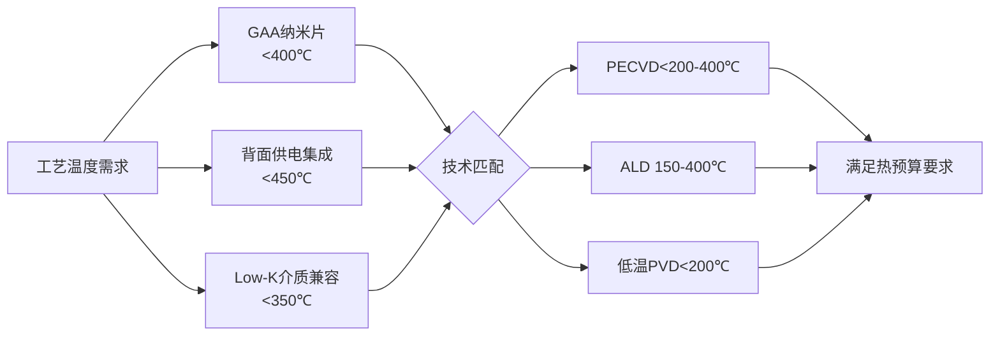

**PECVD和ALD在低温沉积能力方面具有显著优势**。PECVD依靠射频感应产生的等离子体，实现薄膜沉积工艺的低温化（小于450℃）。ALD的工艺温度范围为150-400°C，存在"ALD窗口"，热损伤小。磁控溅射PVD可将基片温度控制在200℃以下，同样满足低热预算要求。

相比之下，传统热CVD通常在700-1200℃下进行，MBE虽然生长温度显著低于其他外延方法，但其超高真空系统的维护和操作复杂度限制了其在量产中的应用。

#### 厚度控制精度与均匀性

厚度控制精度是区分各沉积技术能力边界的核心指标：

| 沉积技术 | 厚度控制精度 | 片内均匀性 | 控制机制 |
|---------|-------------|-----------|---------|
| PVD溅射 | 纳米级 | ±5-10% | 溅射速率控制 |
| CVD | 纳米级 | ±3-5% | 反应时间控制 |
| ALD | **埃级（Å）** | **±1%** | 循环次数数字化控制 |
| 电子束蒸发 | 亚微米至纳米级 | ±5% | 蒸发速率监测 |
| MBE | **原子层级** | **极佳** | RHEED原位监测 |

**ALD的厚度控制精度达到埃级（0.5-2 Å/循环），通过循环次数实现数字化控制**，这是其区别于其他技术的核心优势。东京电子的TRIASe+ EX-II TiN系统实现了±0.1Å的亚纳米级薄膜厚度控制，片内均匀性达±1%（3σ）。

MBE同样具备原子层级的厚度控制能力，生长速率约1μm/小时，相当于每秒生长一个单原子层，可通过RHEED实时监测精确控制薄膜生长。

#### 台阶覆盖率与高深宽比填充能力

台阶覆盖能力是先进制程高深宽比结构沉积的决定性指标：

| 沉积技术 | 台阶覆盖率（10:1） | 台阶覆盖率（50:1） | 技术局限 |
|---------|------------------|------------------|---------|
| 传统PVD | <50% | <20% | 视线沉积，深孔底部覆盖不足 |
| 离子化PVD+再溅射 | ~85% | <50% | 仍受几何遮挡效应限制 |
| CVD | 70-90% | 50-70% | 前驱体扩散受限 |
| ALD | **>95%** | **>95%** | 沉积速率较慢 |
| 电子束蒸发 | **差** | 几乎无能力 | 直线运动为主 |
| MBE | **极佳** | 极佳 | 侧重外延层精确生长 |

**ALD在高深宽比结构中展现出无可比拟的保形覆盖能力**，其自限制反应确保在深宽比50:1甚至更高的结构中保形性>95%。这一能力使ALD成为GAA纳米片环绕栅极、3D NAND深孔填充等应用的必需技术。

PVD的台阶覆盖能力受限于其"视线沉积"特性，尽管通过离子化PVD和再溅射工艺可将深宽比>5:1通孔的侧壁覆盖率提升至85%，但在10nm以下线宽的极端高深宽比结构中仍难以满足需求。

### 6.3 生产效益维度的技术对比分析

生产效益是技术选择中不可忽视的经济性考量，直接影响芯片制造的成本竞争力和产能规模。

#### 沉积速率与吞吐量对比

沉积速率决定了单机产能，是量产适用性的核心指标：

| 沉积技术 | 典型沉积速率 | 吞吐量等级 | 适用场景 |
|---------|-------------|-----------|---------|
| PVD溅射 | 1-10 μm/h | 中至高 | 量产主力 |
| CVD | 高 | **高** | 大面积、较厚薄膜量产 |
| ALD | 0.5-2 Å/循环 | **低** | 关键性能层 |
| 电子束蒸发 | 中等 | 低 | 科研、特种工艺 |
| MBE | ~1 μm/h | **极低** | 实验室研发 |

**CVD和PVD凭借较高的沉积速率成为量产工艺的主力技术**。CVD适合大面积、较厚薄膜的规模化生产，PVD溅射同样具备中至高的吞吐量，是当前产线金属化的核心设备。

ALD的沉积速率是其主要产能瓶颈，但在需要超薄、保形膜的关键步骤中不可或缺。**尽管ALD成本高、速率慢，但对器件性能和良率的贡献使其在关键工艺环节中具有不可替代性**。

MBE的生产效率最低，典型速率约1μm/小时，主要用于实验室研发和小批量高附加值产品。

#### 设备与运维成本结构

成本结构直接影响技术的经济可行性和投资回报：

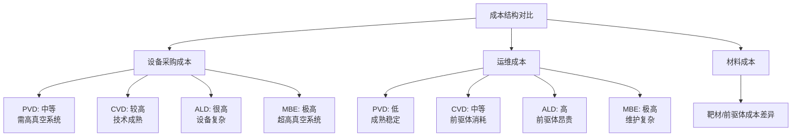

**ALD和MBE的设备与工艺成本显著高于PVD和CVD**。ALD设备复杂，前驱体昂贵，工艺成本高；MBE系统需要超高真空和原位监测，维护成本高昂。相比之下，PVD和CVD技术成熟，综合成本更具优势。

从靶材角度看，半导体芯片行业对靶材成分纯度要求极为严苛，当芯片制造进入7nm以下工艺时，金属杂质需控制在十亿分之一（ppb）级别。高纯靶材的成本占据PVD工艺材料成本的重要比例。

#### 量产适用性综合评估

综合沉积速率、成本结构和工艺成熟度，各技术的量产适用性呈现明显梯度：

| 技术类型 | 量产适用性 | 核心应用定位 |
|---------|-----------|-------------|
| PVD溅射 | **高** | 阻挡层、种子层主流技术 |
| CVD | **高** | W栓塞、厚膜沉积主力 |
| ALD | **中（关键环节）** | 超薄膜、高深宽比必需技术 |
| 电子束蒸发 | **低** | 科研、MEMS、Lift-Off工艺 |
| MBE | **极低** | 实验室研发、特种器件 |

**在先进制程中，PVD和CVD凭借高量产性占据主流，ALD凭借原子级精度成为延续摩尔定律的关键使能技术**。电子束蒸发和MBE则在特定高价值或前沿研究领域保持不可替代性。

### 6.4 技术演进路线与未来发展趋势对比

各沉积技术正沿着不同的技术路径向2nm及以下节点演进，呈现出差异化的发展方向和挑战。

#### PVD技术的演进方向

PVD技术向先进节点延伸的核心方向包括：

- **离子化增强**：通过提高金属离子化率改善深孔覆盖能力
- **再溅射优化**：进一步提升高深宽比结构的侧壁覆盖率
- **新型靶材开发**：配合RuCo等新型衬垫材料的应用需求
- **集群化集成**：与ALD、CVD设备形成高真空集成平台

应用材料公司开发的集成材料解决方案（IMS）将六种不同的核心技术整合到一个高真空系统中，代表了PVD技术向集成化方向发展的趋势。

#### CVD技术的演进方向

CVD技术的发展重点聚焦于：

- **选择性沉积**：实现自对准图案化，消除阻挡层体积占用
- **低温工艺**：拓展PECVD的低温能力，兼容热敏结构
- **新型前驱体**：开发Mo等新材料的高效沉积前驱体
- **与ALD协同**：形成CVD+ALD混合沉积方案

应用材料公司的Endura® Volta™选择性钨沉积系统实现了在通孔中直接沉积钨而不需要阻挡层，代表了选择性CVD技术的重要突破。

#### ALD技术的演进方向

**ALD技术正从必需技术向更高精度、选择性和低温能力演进**：

- **区域选择性ALD（AS-ALD）**：实现自对准沉积，简化光刻工艺
- **超低温ALD**：将工艺温度降至150℃以下
- **新型前驱体开发**：如高蒸汽压力钌前驱体TRuST
- **两段式工艺**：利用氧和氢的两段ALD实现更低电阻薄膜

华中科技大学陈蓉教授团队通过选择性原子层沉积技术，实现了氧化钽薄膜在Cu/SiO₂表面的自对准图案化制造，选择性达到100%。

#### 技术融合趋势

**技术融合（PVD+ALD, CVD+ALD）已成为先进制程的明确趋势**。设备商正在开发集成多种工艺、原位计量和智能控制于一体的解决方案：

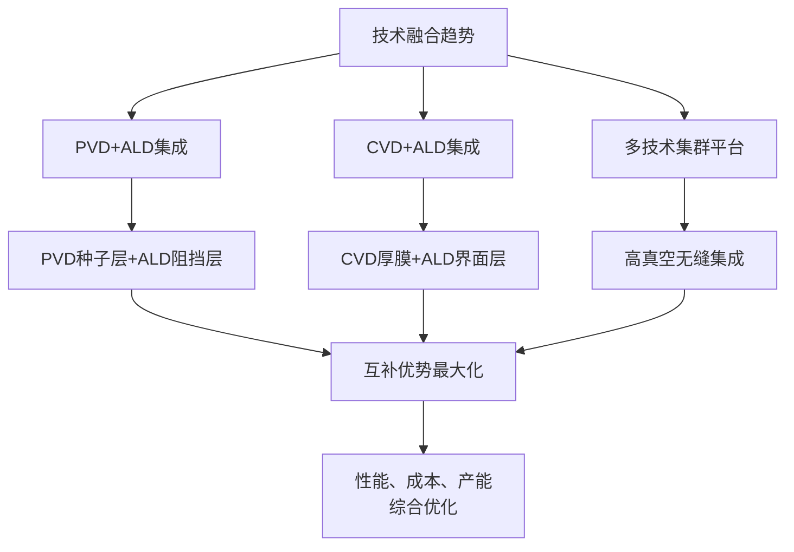

### 6.5 不同金属层的设备选择策略

先进制程中不同功能金属层对薄膜性能的需求各异，需要匹配相应的最优沉积技术。

#### 阻挡层（TaN/TiN）的设备选择

阻挡层的核心功能是防止铜向介质层扩散，对薄膜致密性和连续性要求极高：

| 需求维度 | 技术要求 | 最优技术选择 |
|---------|---------|-------------|
| 厚度控制 | 2-5nm超薄膜 | **ALD** |
| 致密性 | 无针孔、无微孔 | **ALD** |
| 台阶覆盖 | >95%（高深宽比） | **ALD** |
| 量产效率 | 可接受较低速率 | ALD可满足 |

**在10nm以下节点，ALD已成为超薄阻挡层沉积的首选技术**。传统PVD在深宽比>10:1的结构中台阶覆盖率<50%，难以满足先进节点的严苛要求。ALD沉积的TaN/TiN阻挡层厚度可控制在2nm以下，同时保持完美的保形性和致密性。

#### 衬垫层（RuCo）的设备选择

新型RuCo二元金属衬垫层需要实现超薄沉积（2nm）同时保持良好的表面性能：

- **钌沉积**：采用ALD两段式工艺（H₂→O₂），利用高蒸汽压力TRuST前驱体
- **钴沉积**：ALD或CVD均可，ALD精度更高但速率较慢
- **RuCo配对**：需要在高真空集成平台中完成，避免界面氧化

应用材料公司的IMS平台整合了RuCo衬垫技术，与前几代产品相比厚度减少33%，芯片布线电阻降低25%。

#### 种子层（Cu）的设备选择

铜种子层为后续电镀提供导电基底，对均匀性和连续性要求较高：

| 需求维度 | 技术要求 | 最优技术选择 |
|---------|---------|-------------|
| 导电性 | 低电阻率 | **PVD溅射** |
| 连续性 | 全覆盖无断点 | PVD+ALD协同 |
| 附着力 | 与阻挡层良好结合 | **PVD溅射** |
| 沉积速率 | 较高（~300nm） | **PVD溅射** |

**PVD溅射是铜种子层沉积的主流技术**，磁控溅射制备的铜薄膜电阻率可达<2.0 μΩ·cm，附着力强。在高深宽比结构中，可采用PVD+ALD协同方案：ALD沉积超薄铜种子层确保连续性，PVD快速增厚提升导电性。

#### 填充层（W/Cu/Mo）的设备选择

填充层需要实现高深宽比结构的无空洞填充：

**钨填充**：
- 传统方案：CVD-W（PNL成核+主体填充）
- 先进方案：选择性CVD-W（无需阻挡层）
- 科林研发ALTUS系统结合CVD和ALD技术，实现无缺陷填充

**铜填充**：
- 主体采用电化学镀膜（ECP）
- 种子层由PVD提供
- 阻挡层/衬垫层由ALD提供

**钼填充**（3D NAND）：
- 采用ALD逐层沉积，精度0.02纳米
- 泛林集团ALTUS Halo设备可在40:1深宽比沟槽中精确堆叠

### 6.6 不同结构需求的设备组合策略

先进制程中不同器件结构对沉积工艺的需求各有侧重，需要针对性地设计设备组合方案。

#### 高深宽比接触孔的设备组合

接触孔填充是先进制程金属化的核心挑战之一：

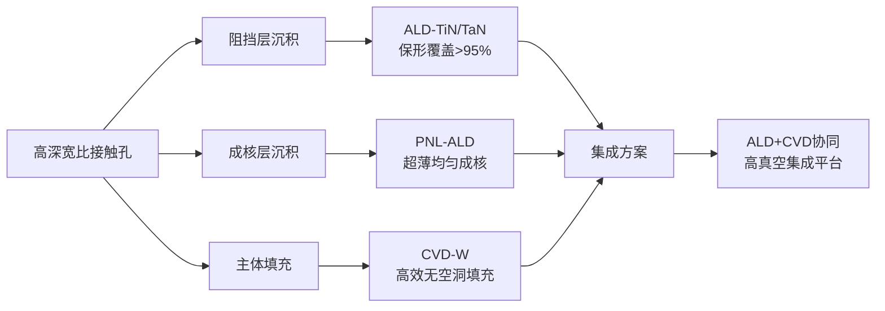

**ALD+CVD协同是高深宽比接触孔填充的最优方案**。ALD提供保形阻挡层和均匀成核层，CVD实现高效的主体填充。科林研发的ALTUS系统正是这一技术路线的代表，利用脉冲式成核层ALD工艺产生成核层，以专利的多站序列式沉积工艺（MSSD）架构实现主体CVD填充。

#### GAA纳米片环绕栅极的设备组合

GAA结构对沉积工艺的保形性和精度要求最为苛刻：

| 工艺步骤 | 技术需求 | 设备选择 | 关键指标 |
|---------|---------|---------|---------|
| 高k栅介质 | 原子级厚度控制 | ALD-HfO₂ | 厚度偏差<±0.5Å |
| 功函数金属 | 四面保形覆盖 | ALD-TiN/TaN | 覆盖率>95% |
| 栅极填充 | 纳米片间隙填充 | CVD/ALD | 无空洞 |
| 侧墙介质 | 低温、低损伤 | PECVD-SiN | <400℃ |

**由于无法直观看到栅极沟道的底面，GAA工艺上更多用到了ALD技术**。在晶体管层面，共形性至关重要，相邻沟道之间只有大约10-11nm的空间，必须从两侧共形地沉积介质层。ALD是满足这一需求的唯一可靠技术选择。

#### 背面供电TSV的设备组合

背面供电技术对TSV通孔的金属化提出了特殊要求：

- **极高深宽比**：TSV深宽比可达20:1甚至更高
- **晶圆背面工艺**：需与正面器件工艺兼容
- **热预算限制**：后道工艺温度<400-450℃

**设备组合策略**：
1. **阻挡层**：ALD-TaN（超薄、保形）
2. **种子层**：PVD-Cu（快速导电基底）+ ALD增强（连续性保障）
3. **主体填充**：ECP-Cu（高效填充）

东京电子针对背面供电技术推出超薄阻挡层方案，厚度控制在20Å以下，满足TSV结构的特殊需求。

#### 3D NAND字线的设备组合

3D NAND的字线金属化正在从钨向钼转型：

**传统钨方案**：
- CVD-W填充高深宽比字线孔
- 需要TiN粘附层和阻挡层
- 阻挡层占用有效体积

**钼创新方案**：
- ALD-Mo逐层沉积
- 不需要粘合层或阻挡层
- 工艺简化、成本降低

**泛林集团的ALTUS Halo钼原子层沉积设备能在40:1深宽比的沟槽中，以0.02纳米精度逐层堆叠钼原子**，使3D NAND堆叠层数突破500层大关。这一技术突破体现了ALD在极端高深宽比结构中的不可替代性。

### 6.7 协同集成策略与整体优化方法论

基于前述多维度分析，先进制程金属化工艺中设备选择与协同集成需要遵循系统的方法论框架。

#### 技术选择的决策树模型

技术选择应基于结构特征、性能需求和生产约束的综合考量：

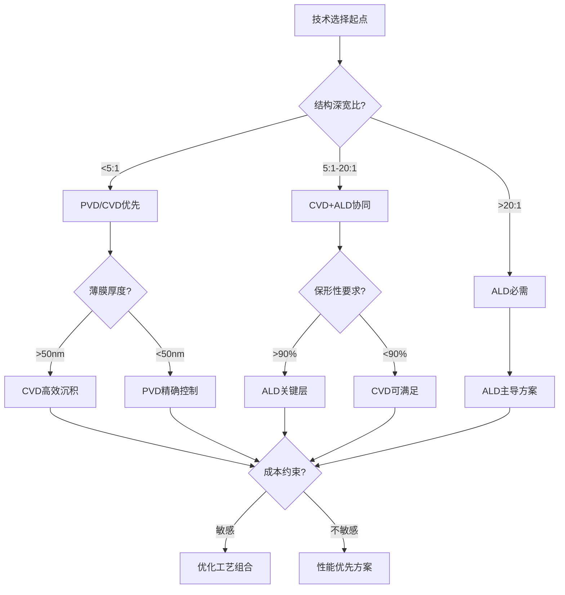

#### 集群化设备平台的设计原则

**高真空集成平台是实现技术协同的关键基础设施**。应用材料公司的IMS平台将六种不同的核心技术整合到一个高真空系统中，避免了晶圆在不同设备间转移时的表面氧化和污染问题。

集群化平台的设计应遵循以下原则：

1. **真空连续性**：各工艺腔室间保持高真空传输，避免界面污染
2. **工艺兼容性**：不同沉积技术的温度、气氛需求相互兼容
3. **节拍匹配**：各工艺步骤的处理时间应相对平衡
4. **原位监测**：集成实时计量模块，支持工艺反馈控制

#### 性能-成本-产能的三角平衡

先进制程工艺集成的核心挑战是在性能、成本和产能三个维度间寻求最优平衡：

| 优化维度 | 策略方向 | 典型手段 |
|---------|---------|---------|
| **性能优先** | 关键层采用最优技术 | ALD超薄阻挡层、MBE特种接触 |
| **成本控制** | 非关键层采用经济技术 | CVD替代部分ALD、PVD替代蒸发 |
| **产能提升** | 工艺集成与并行化 | 多腔室集群、批量处理 |

**在先进制程中，技术选择不存在绝对最优，而是基于性能、成本、产能和集成复杂性的权衡**。PVD和CVD凭借高量产性占据主流，ALD凭借原子级精度成为延续摩尔定律的关键使能技术。电子束蒸发和MBE则在特定高价值或前沿研究领域保持不可替代性。

#### 智能工艺控制与持续优化

未来的协同集成策略将更加依赖智能工艺控制系统：

- **原位计量反馈**：实时监测薄膜厚度、应力、电阻等指标
- **工艺配方自适应**：基于监测数据动态调整工艺参数
- **预测性维护**：基于设备状态数据预判维护需求
- **良率优化算法**：基于大数据分析优化工艺窗口

应用材料推出的新一代Centura平台已集成原位计量模块实时监控薄膜应力与厚度，支持2nm GAA所需的低损伤沉积工艺。这种智能化集成代表了先进制程设备发展的重要方向。

综上所述，**先进制程金属薄膜沉积的技术选择与协同集成是一个多维度优化问题**。通过建立系统的技术评估框架，针对不同金属层和结构需求匹配最优设备组合，并借助集群化平台和智能控制实现工艺集成，可以在性能、可靠性和制造成本之间达成最优平衡。随着制程节点向2nm及以下演进，技术融合与协同创新将成为突破物理极限、延续摩尔定律的关键路径。

## 7 面向埃米时代的技术挑战与沉积设备演进趋势

随着半导体制程节点从2nm向1nm及以下（即"埃米时代"）持续演进，金属薄膜沉积技术正面临前所未有的物理极限与工程挑战。**传统的尺寸缩放策略已难以为继，过去通过缩小晶体管尺寸实现的性能提升，如今越来越依赖于器件的堆叠、互连和隔离方式**[^28]。在这一技术变革背景下，材料创新、原子级界面工程以及新型沉积技术成为突破瓶颈的三大核心方向。本章将系统剖析埃米时代金属薄膜沉积面临的前沿挑战，并预测相关设备技术的演进路径，为先进制程金属化工艺的未来发展提供前瞻性技术框架。

### 7.1 1nm及以下节点的材料物理极限与新型低电阻金属探索

埃米时代的金属互连正逼近材料的物理极限边界。**当芯片单位面积能容纳的电晶体数目已逼近半导体主流材料"硅"的物理极限时，芯片效能也无法再逐年显著提升**[^48]。这一困境同样体现在金属互连材料领域，铜互连在纳米尺度下的电阻率急剧上升，成为制约芯片性能的核心瓶颈。

#### 电阻率尺寸效应的物理机制

随着互连线宽进入亚10nm尺度，电子在金属导体中的散射效应急剧增强。晶界散射、表面散射和界面散射共同作用，使得金属薄膜的有效电阻率远高于块体材料。**在3nm以下制程节点，互连电阻率需接近体材料（且<10 μΩ·cm），杂质水平需控制在<0.5 at%，且无卤素污染**[^49]。这些严苛指标对沉积设备的原子级精度控制能力提出了全新要求。

上海市科学技术委员会发布的2025年度关键技术研发计划明确指出，面向集成电路先进制程演进对金属互连线间距、通孔深宽比的极限需求，需开展金属互连原子层沉积关键技术研究。**研究目标要求实现铜、钴、钌及新型互连材料金属原子逐层沉积与控制，开发3nm以下制程节点、线间距小于12nm、深宽比超过7:1的后段金属互连工艺**[^49]。

#### 新型低电阻金属材料的探索突破

为突破铜互连的物理极限，科学界正积极探索替代材料。**近年科学界积极寻找能取代硅的二维材料，挑战1nm以下的制程，却苦于无法解决二维材料高电阻及低电流等问题**[^48]。在这一背景下，铋（Bi）等半金属材料的应用取得了重大突破。

台大、台积电与MIT的跨国合作研究发现，**在"二维材料"上搭配"半金属铋（Bi）"的电极，能大幅降低电阻并提高传输电流**[^48]。台积电技术研究部门将"铋沉积制程"进行优化，台大团队运用"氦离子束微影系统"将元件通道成功缩小至纳米尺寸。**在使用铋为"接触电极"的关键结构后，二维材料电晶体的效能不但与"硅基半导体"相当，又有潜力与目前主流的硅基制程技术相容**[^48]。

钼（Mo）和钌（Ru）同样是埃米时代的重要候选材料。**随着材料领域的不断拓展，原子尺度建模对于预测表面反应和局部键合环境如何影响薄膜生长变得至关重要**[^28]。这些新材料的引入对沉积设备提出了更高的前驱体化学调控和原子级精度控制要求。

下表总结了埃米时代新型金属材料的特性与沉积需求：

| 材料类型 | 核心优势 | 沉积技术需求 | 应用前景 |
|---------|---------|-------------|---------|
| 铋（Bi） | 大幅降低接触电阻 | 优化沉积制程、精确厚度控制 | 二维材料电极 |
| 钼（Mo） | 无需粘合层/阻挡层 | 高温工艺、精确温控 | 3D NAND字线 |
| 钌（Ru） | 超薄衬垫层、抗氧化 | 高蒸汽压前驱体、两段式ALD | 铜互连衬垫 |
| 钴（Co） | 低接触电阻、抗电迁移 | ALD保形沉积 | 局部互连、接触层 |

### 7.2 3D堆叠架构与CFET对沉积技术的革命性需求

**二维尺寸缩小技术正接近极限，因此器件正在向三维方向发展。一旦朝这个方向发展，就能通过使用新材料获得更好的性能**[^28]。互补场效应晶体管（CFET）作为GAA之后的下一代晶体管架构，通过将NMOS和PMOS垂直堆叠，进一步提升面积效率和性能优势。

#### CFET架构的沉积技术挑战

英特尔在IEDM 2023上展示了业界领先的3D堆叠CMOS晶体管，**能够以微缩至60纳米的栅极间距垂直地堆叠互补场效应晶体管（CFET）**[^50]。该技术可通过晶体管堆叠提升面积效率和性能优势，还结合了背面供电和直接背面触点。

这种垂直堆叠架构对薄膜沉积提出了革命性需求：

**极端保形性要求**：在60nm栅极间距的CFET结构中，沉积薄膜必须在上下两层晶体管的所有表面实现完美的保形覆盖。**这些结构变得越来越复杂，三维几何形状使得确保薄膜的保形性极具挑战性**[^28]。

**原子级均匀性控制**：**在晶体管层面，共形性至关重要。相邻沟道之间只有大约10到11纳米的空间，你必须从两侧共形地沉积介质层。这每侧大约需要2.5纳米，所以只剩下5到6纳米的空间用于金属沉积**[^28]。任何厚度偏差都会导致器件性能的不一致。

**界面质量的原子级控制**：**即使原子层沉积厚度出现微小变化，也会影响静电控制，或引入漏电通路，这些通路会在数十亿个晶体管中累积**[^28]。这要求沉积设备具备前所未有的界面控制精度。

#### 仿真与工艺协同优化

面对CFET的复杂几何结构，传统的试错法已难以满足开发效率需求。**"当然，你可以搭建并测试它，但这需要大量的迭代才能成功。我们利用仿真来探索这方面，例如模拟薄膜在结构上的沉积过程以及物质在表面的扩散方式，从而缩短设计周期，更快地找到解决方案"**[^28]。

Synopsys产品营销总监Marc Swinnen指出：**"下一步是将这些原子级模型与更大的系统级模拟相结合。当能够将沉积动力学直接与电学和热学模拟联系起来时，就实现了材料、工艺和性能之间的闭环"**[^28]。这种仿真驱动的工艺开发模式将成为埃米时代沉积设备智能化发展的重要方向。

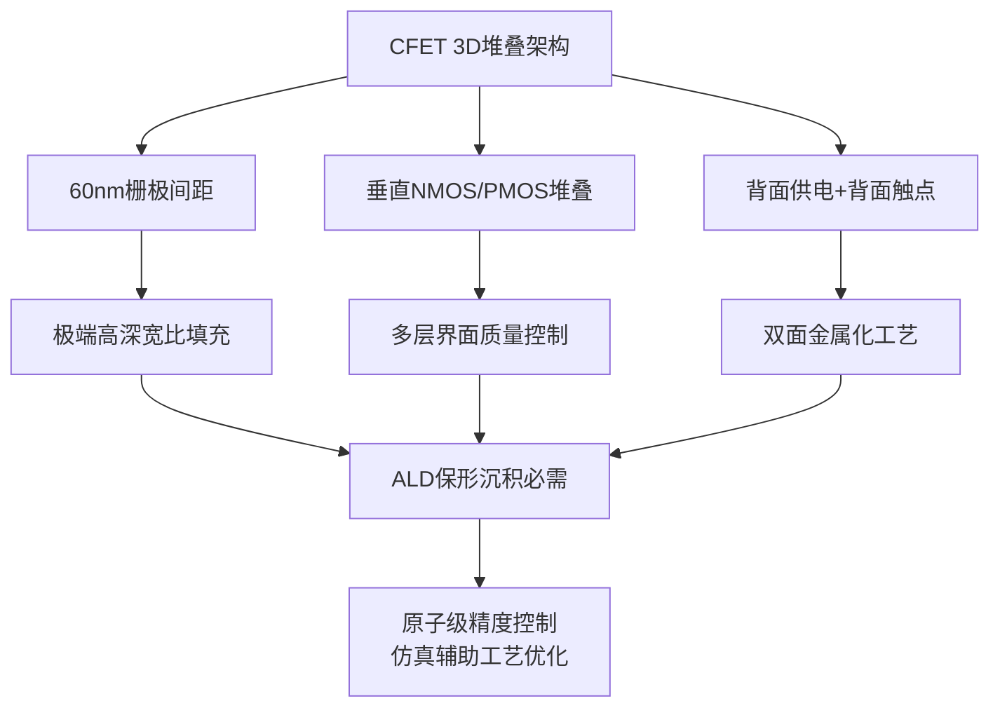

### 7.3 二维半导体金属接触的沉积技术突破与挑战

二维过渡金属二硫族化物（TMDCs）作为后摩尔时代的核心候选材料，正在推动金属-半导体接触技术的革命性突破。**大规模生产高质量的二维过渡金属二硫族化物是二维器件工业制造中的一个重大挑战**[^51]。

#### 二维半导体的材料优势与接触难题

二维半导体材料具有原子级厚度，天生适合担任纳米级晶体管的"开关"角色。**2025年7月17日，麻省理工学院电子工程与计算机科学系博士后姜建峰以通讯作者兼共同第一作者的身份，与北京大学刘开辉教授团队携手发表Science论文，成功攻克了硒化铟半导体集成制造的难题，将二维硒化铟器件从"单器件"推向"晶圆级平台"**[^52]。

然而，二维材料的金属接触一直是制约其实用化的核心瓶颈。**近年科学界积极寻找能取代硅的二维材料，挑战1nm以下的制程，却苦于无法解决二维材料高电阻及低电流等问题**[^48]。接触电阻过高会严重影响器件的开关速度和功耗表现。

#### 分子束外延锑晶体接触技术突破

北京科技大学张跃院士及张铮教授团队在《Nature Materials》上发表的研究成果，提出了一种名为"二维Czochralski（2DCZ）"的方法，**能够在常压下快速生长出厘米级尺寸、无晶界的单晶MoS₂晶畴，这些MoS₂单晶展现出卓越的均匀性和高质量，具有极低的缺陷密度**[^51]。

分子束外延（MBE）技术在二维材料金属接触领域展现出独特优势。**分子束外延以其原子级精度控制能力和优异的界面质量，在构建高质量金属-半导体接触方面展现出无可比拟的优势**。相比传统电子束蒸镀方法存在的相纯度低、晶畴尺寸受限等问题，分子束外延可实现几乎单一取向纯度的金属薄膜，并与二维材料形成原子级锐利的界面。

#### 对沉积设备的新型能力要求

实现亚100Ω·μm接触电阻的目标，对沉积设备提出了以下关键要求：

| 能力维度 | 技术要求 | 设备实现路径 |
|---------|---------|-------------|
| 超高真空环境 | <10⁻¹⁰ Torr | MBE系统级真空控制 |
| 原子级界面工程 | 无氧化、无污染界面 | 原位清洗+连续沉积 |
| 精准温控 | ±1℃控温精度 | 先进加热系统设计 |
| 晶向控制 | 单一取向纯度>97% | 外延生长条件优化 |

**由MoS₂制造的场效应晶体管的统计分析表明，器件良率高，迁移率变化最小。这种2DCZ方法对制造高质量和可扩展的二维半导体材料和器件具有重要意义，为下一代集成电路的制造提供了重要的材料基础**[^51]。

### 7.4 背面供电网络金属化的工艺集成挑战

背面供电网络（BSPDN）作为2nm及以下节点的关键架构创新，通过将供电线路从晶圆正面转移到背面，**为信号布线和电源开辟了空间，信号布线留在正面，而电源则移到背面**[^53]。这一架构变革对金属薄膜沉积技术提出了全新的集成挑战。

#### BSPDN架构的核心技术原理

**背面供电技术通过将电源线"搬迁"至晶圆背面，实现了供电与信号的物理分离。此举可缩短电流路径、降低电阻、显著缓解电压下滑问题，并释放正面金属层资源用于信号布线，减少相互干扰**[^53]。研究数据显示，与传统正面供电相比，背面供电可减少约14.8%的晶圆占用面积，布线长度减少约9.2%，IR压降得到大幅改善。

英特尔的PowerVia技术已在Intel 20A节点实现量产应用。**三星计划在2027年将BSPDN应用于1.4nm工艺**[^54]。台积电也计划在2nm以下工艺中应用类似技术，目标预计在2026年之前实现[^54]。

#### 背面金属化的工艺挑战

实现BSPDN架构需要攻克以下关键工艺难题：

**极端晶圆减薄**：在完成正面晶体管及埋入式电源轨加工后，需将晶圆翻转并键合至载体晶圆上，随后进行晶圆背面减薄。**通过研磨、化学机械抛光及蚀刻等步骤将硅衬底减薄至10微米以下，直至露出预先沉积的蚀刻停止层。这一步骤对厚度均匀性及应力控制要求极高**[^53]。

**纳米硅通孔制作与填充**：**从晶圆背面进行光刻与蚀刻，形成深达数百纳米、直达正面埋入式电源轨或晶体管源/漏极接触点的通孔。接着在孔内沉积绝缘层与金属导体，形成垂直导电通路。该工艺需要高深宽比的刻蚀与金属填充能力**[^53]。

**超薄阻挡层沉积**：背面通孔的阻挡层厚度需控制在极薄水平。**东京电子针对背面供电技术推出超薄阻挡层方案，厚度控制在20Å以下**，以最大化导电金属的有效体积。

**低温工艺兼容性**：背面供电等集成步骤要求后续金属化工艺温度严格受限。**集成热敏感材料或避免器件退化，需要低温沉积工艺**[^53]。

下图展示了BSPDN金属化的工艺流程与挑战：

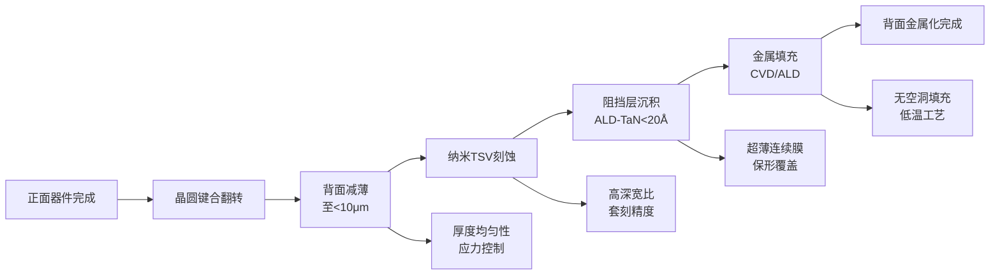

#### 设备能力的严苛要求

BSPDN架构对沉积设备提出了多维度的严苛要求：

| 挑战维度 | 技术要求 | 设备能力需求 |
|---------|---------|-------------|
| 工艺温度 | <400-450℃ | 低温ALD/PECVD |
| 套刻精度 | 纳米级对准 | 高精度光刻配合 |
| 阻挡层厚度 | <20Å | 原子级ALD控制 |
| 通孔填充 | 高深宽比无空洞 | ALD+CVD协同 |
| 多工艺集成 | 无缝衔接 | 集群化设备平台 |

### 7.5 区域选择性ALD与自对准沉积技术的发展前景

**区域选择性原子层沉积（AS-ALD）技术正在成为埃米时代简化工艺、提升性能的关键使能技术**。通过利用不同材料表面化学活性的差异，实现金属薄膜在特定区域的选择性生长，为自对准图案化开辟了全新路径。

#### 选择性沉积的技术原理

选择性沉积的核心原理是利用不同材料表面对前驱体分子吸附能力的差异。**华中科技大学陈蓉教授团队通过选择性原子层沉积技术，实现了氧化钽薄膜在Cu/SiO₂表面的自对准图案化制造**。该团队提出的"循环耦合"工艺，使传统AB双循环转变为ABC多循环耦合，实现"表面原位还原-生长-缺陷去除"的步骤。

**该工艺在生长区达到5nm厚度，非生长区不生长，其选择性达到100%，并实现自对准沉积**。这种完美的选择性意味着可以完全消除传统工艺中阻挡层在非目标区域的沉积，从而最大化导电金属的有效体积。

#### 选择性沉积的应用价值

选择性沉积技术在先进制程中具有多重应用价值：

**简化光刻工艺**：通过自对准特性减少光刻步骤数量，降低工艺复杂度和成本。传统工艺需要多次光刻-刻蚀循环才能实现的图案化，选择性沉积可一步完成。

**消除阻挡层体积占用**：**应用材料公司推出的选择性钨沉积系统可在通孔中直接沉积钨，完全不需要粘附阻挡层和成核层**，从根本上解决了传统工艺中阻挡层占通孔容积的问题。

**提升器件性能**：通过消除非必要的薄膜层，减少界面电阻和寄生效应，提升互连性能。

#### 对设备能力的新需求

实现高选择性沉积对设备提出了以下新需求：

**前驱体化学调控**：需要开发对不同表面具有差异化吸附特性的前驱体分子，这要求设备具备灵活的前驱体输送和切换能力。

**表面预处理能力**：选择性沉积的实现往往依赖于精确的表面预处理，包括表面活化、钝化或功能化处理，设备需集成相应的预处理模块。

**原位监测与反馈**：为确保选择性的可靠实现，设备需配备原位监测系统，实时监控沉积过程并进行工艺调整。

### 7.6 超低温沉积工艺与热敏材料兼容性演进

**埃米时代器件对工艺温度的限制日趋严苛，许多ALD工艺过程可在相对较低的温度下进行，这对热敏感或无法承受高温处理的基底材料尤为重要**[^28]。超低温沉积技术的发展成为保障器件性能和工艺兼容性的关键。

#### 低温工艺的技术驱动因素

多重因素推动着沉积工艺向更低温度方向发展：

**器件热敏感性**：GAA纳米片、3D堆叠结构中的多层界面对高温极为敏感，过高的工艺温度会导致界面扩散、应力累积甚至结构破坏。

**材料兼容性**：低介电常数（Low-K）材料、有机介质层等热敏材料的引入，要求后续沉积工艺温度严格控制。

**背面供电集成**：BSPDN架构中正面器件已完成，背面金属化必须在不影响正面器件性能的温度窗口内完成。

#### 低温沉积技术的创新方向

**等离子体增强ALD（PEALD）** 通过等离子体提供反应活性，可将工艺温度降至150-350℃范围，同时保持薄膜质量。**PEALD采用等离子体增强原子层沉积技术，通过电感耦合等离子体（ICP）源提供反应活性**，可在更低温度下实现高质量薄膜沉积。

**新型低分解温度前驱体**的开发是另一重要方向。**研究者们开发了TEMAT（Ti[N(C₂H₅CH₃)₂]₄）作为新型前驱体，使反应窗口能够降低至150-220℃，沉积速率也提高为原先的10倍**。这类前驱体化学的创新为低温沉积提供了物质基础。

**等离子体源优化**同样关键。通过优化等离子体功率、脉冲模式和气体配比，可在更低温度下激活前驱体反应，同时控制等离子体对薄膜的损伤。

下表对比了不同温度窗口下的沉积技术选择：

| 温度范围 | 可用技术 | 薄膜质量 | 适用场景 |
|---------|---------|---------|---------|
| 400-500℃ | 热ALD、CVD | 优 | 传统工艺 |
| 250-400℃ | PEALD、PECVD | 良好 | GAA兼容 |
| 150-250℃ | 低温PEALD | 可接受 | 热敏材料兼容 |
| <150℃ | 远程等离子体ALD | 需优化 | 极端热敏场景 |

### 7.7 沉积设备智能化与多技术融合集成平台展望

面向埃米时代的沉积设备正朝着智能化、集成化和高精度化方向快速演进。**英特尔正致力于继续推进摩尔定律，在2030年前实现在单个封装内集成一万亿个晶体管**[^50]。这一宏伟目标对沉积设备技术提出了前所未有的挑战。

#### 多技术集群化集成平台

**技术融合（PVD+ALD, CVD+ALD）已成为先进制程的明确趋势**。设备商正在开发集成多种工艺、原位计量和智能控制于一体的解决方案，以管理极端复杂的先进制程工艺。

应用材料公司的集成材料解决方案（IMS）平台代表了这一方向的领先实践，将六种不同的核心技术整合到一个高真空系统中。**栅极介质、刻蚀停止层、衬垫层、成核膜和封装材料不再被视为被动单元工艺。它们会影响器件性能、互连性能和整体系统特性**[^28]。

未来的集成平台将进一步融合：
- **沉积工艺模块**：PVD、CVD、ALD等多种沉积技术
- **刻蚀与清洗模块**：实现表面预处理和图案化
- **原位计量模块**：实时监测薄膜厚度、应力、电阻等指标
- **智能控制系统**：基于数据反馈的自适应工艺调整

#### 原位计量与智能工艺控制

**"实验能做的尝试毕竟有限，虚拟仿真可以让你探索更大的设计空间，而机器学习则能让这种探索更加高效"**[^28]。智能工艺控制正在成为沉积设备的核心竞争力。

原位计量技术的发展方向包括：
- **实时厚度监测**：埃级精度的薄膜厚度实时测量
- **应力与晶体结构分析**：在线监测薄膜内应力和结晶状态
- **缺陷检测**：原位识别针孔、空洞等薄膜缺陷

机器学习辅助工艺优化将实现：
- **工艺参数自动调优**：基于历史数据和实时反馈优化工艺配方
- **预测性维护**：预判设备状态，减少非计划停机
- **良率预测与优化**：建立工艺-性能关联模型

#### 2030年设备技术演进展望

展望2030年前的沉积设备技术发展，以下趋势将愈发明显：

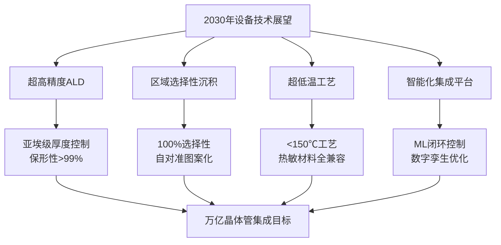

**ASM International首席执行官Hichem M'Saad指出："1976年ASM在凤凰城成立之初，半导体领域只有寥寥几种元素，而且当时还没有采用原子层沉积技术进行沉积。如今，元素周期表中约75%到80%的元素都被应用于半导体领域，并且都是通过ALD技术沉积的"**[^28]。这一趋势将在埃米时代进一步加速。

**原子层沉积（ALD）已成为应对这些挑战不可或缺的技术，尤其是在前端工艺方面。ALD并非新技术，但随着器件尺寸接近薄膜原子数量成为限制因素的尺度，其重要性也随之飙升**[^28]。在埃米时代，ALD将从"必需技术"进一步演进为"核心使能技术"，与PVD、CVD等技术深度融合，共同支撑半导体制造业向万亿晶体管集成目标迈进。

综上所述，**面向埃米时代的金属薄膜沉积技术正经历深刻变革**。从新型低电阻金属材料的探索，到3D堆叠架构的沉积挑战；从二维半导体的金属接触突破，到背面供电网络的工艺集成；从区域选择性沉积的创新，到超低温工艺的演进——每一个技术维度都在推动沉积设备向更高精度、更强兼容性和更智能化的方向发展。这些技术创新将共同支撑半导体产业突破物理极限，延续摩尔定律的生命力，开创芯片制造的埃米新时代。

# 参考内容如下：
[^1]:[台积电的真正瓶颈](https://36kr.com/p/3627284731446275)
[^2]:[微导纳米:ALD技术可满足复杂栅极结构中薄膜沉积的要求](https://baijiahao.baidu.com/s?id=1792225950502632389&wfr=spider&for=pc)
[^3]:[$拓荆科技(SH688072)$ 以下是针对 台积电 2nm GAA工艺对PECVD等薄膜设备的需求分析及国内外龙头企业... - 雪球](https://xueqiu.com/9491528598/345476331)
[^4]:[2025尖端半导体技术现状汇总:2nm,CFET,2D材料...... ](https://mp.weixin.qq.com/s?__biz=MjM5MTIwMjY1Mg==&mid=2650059931&idx=1&sn=5adb52513c41f9bf17d67aeefbaafa17&chksm=bfdfb9a2c9bb52df20ef14baecbe22c0b61eb6abb04ce140a81570d3dd684342663371ff4468&scene=27)
[^5]:[在2nm节点实现背面供电技术的挑战](https://www.eepw.com.cn/article/202403/455962.htm)
[^6]:[铜互连工艺,面临挑战](https://www.jiemian.com/article/13716219.html)
[^7]:[突破2nm障碍](https://www.163.com/dy/article/G3OFK05Q05118748.html)
[^8]:[应用材料突破性铜布线解决方案,可解决2纳米芯片工艺难题!](https://cloud.tencent.com/developer/news/1600954)
[^9]:[ALTUS系列產品](https://www.lamresearch.com/zh-hant/product/altus-product-family/)
[^10]:[薄膜沉积设备](https://cloud.tencent.com/developer/news/2504574)
[^11]:[字线金属化 – 过渡到钼](https://www.lamresearch.com/zh-hans/products/our-solutions/metallization/)
[^12]:[钨时代终结!全球首台钼原子层沉积设备亮相,2nm芯片成本直降30%](https://baijiahao.baidu.com/s?id=1832458136184423262&wfr=spider&for=pc)
[^13]:[薄膜沉积设备解析——PECVD/LPCVD/ALD设备的原理和应用](https://www.pku-ioe.cn/show/377.html)
[^14]:[溅射沉积](https://baike.baidu.com/item/溅射沉积/9063880)
[^15]:[溅射镀](https://baike.baidu.com/item/溅射镀/19173521)
[^16]:[芯片制造:薄膜工艺 ](https://mp.weixin.qq.com/s?__biz=MzI1OTExNzkzNw==&mid=2650475547&idx=2&sn=37ef07fa9d533d10ca576a3c61201c39&chksm=f34bc28ee17c9a2a0419cb2264ca89b1a6716e4bd1468f87d88a9478825bbbbf4df6de8aca88&scene=27)
[^17]:[从基础原理到产业实践|PVD镀膜技术的工艺流程与应用亮点](https://cloud.tencent.com/developer/news/1916462)
[^18]:[物理气相沉积技术](https://baike.baidu.com/item/物理气相沉积技术/15678973)
[^19]:[芯片制造中的阻挡层沉积技术介绍](https://www.elecfans.com/d/6575735.html)
[^20]:[铜大马士革工艺 ](https://mp.weixin.qq.com/s?__biz=MzI1OTExNzkzNw==&mid=2650478362&idx=1&sn=5b3491d5bcb87503435ff5124c2a47ec&chksm=f3f69a55cf352d056b8ef13c8315760cf0b63d540b1dc837f3f633fff379bf0ab30e7c59c96e&scene=27)
[^21]:[半导体靶材,如何左右7nm以下制程?](https://baijiahao.baidu.com/s?id=1846678376011550692&wfr=spider&for=pc)
[^22]:[台阶覆盖](https://baike.baidu.com/item/台阶覆盖/53650428)
[^23]:[一文读懂PVD和CVD:半导体薄膜沉积关键技术](https://baijiahao.baidu.com/s?id=1824807873675765795&wfr=spider&for=pc)
[^24]:[ALD 与 CVD 的区别:从工艺到应用的深度剖析](https://www.technol.cn/nd.jsp?id=48)
[^25]:[钨在芯片领域的市场规模与增长前景?](https://xueqiu.com/1510221208/366497014)
[^26]:[芯片制造中的钴(Co) ](https://mp.weixin.qq.com/s?__biz=MzI1OTExNzkzNw==&mid=2650479291&idx=2&sn=23f911711a2d104cecb24758714ee152&chksm=f36badbe75c7d28fd9d7e8766a292b5e098102836b8e42eda39c82cdb1183fe6f58cc94a6f2a&scene=27)
[^27]:[CVD / ALD 用贵金属前驱物](https://www.tanaka.com.cn/products/detail/mocvo-ald/)
[^28]:[原子层沉积技术,至关重要](https://news.qq.com/rain/a/20260124A02HYN00)
[^29]:[ALD/MLD 工艺及应用研究 ](https://ald.fudan.edu.cn/index/yjfx.htm)
[^30]:[科研干货 | 高质量镀膜的神奇技术——原子层沉积(ALD)值得收藏!](https://mp.weixin.qq.com/s?__biz=MzIyNDczNDgwMg==&mid=2247515643&idx=1&sn=5f29a0bafe6a6e87fc84cab4f85fbec2&chksm=e9e97766d088125d0ba11d0e8ca1aae7f1e8f8a60e019019911be18be3d39982e9ef2f994ad8&scene=27)
[^31]:[科研干货 | 高精度薄膜沉积技术(ALD)欢迎预约送样](https://mp.weixin.qq.com/s?__biz=MzIyNDczNDgwMg==&mid=2247515804&idx=1&sn=f2cfc864791a62efbf1c8d145755260c&chksm=e9445017b5f31a6b2a1acb511a8134c8365e307cda5dd9f4b80cce0e63e3ed8c8c8d2dc482a6&scene=27)
[^32]:[TRIASe+ EX-II TiN 半导体原子层沉积(ALD)设备机架、零部件制造](http://www.zihejx.com/?list_168/3538.html)
[^33]:[浅谈ALD在半导体先进制程的应用 ](https://m.elecfans.com/article/1578017.html)
[^34]:[科学家开发原子沉积技术,提升集成电路自对准工艺制造效率与精度](https://baijiahao.baidu.com/s?id=1773159005086206065&wfr=spider&for=pc)
[^35]:[原子层沉积ALD技术应用一览:微纳电子、电池能源、航空航天等 助力你的科研之路! ](https://mp.weixin.qq.com/s?__biz=MzIyNDczNDgwMg==&mid=2247514992&idx=1&sn=cb6d249834221a53ed7a25b741d348dc&chksm=e95f8309ce83c3d0512b39b3dc44f7f029676761b932d616074ba5037b1e62aada7b2a8546d2&scene=27)
[^36]:[技术前沿:原子层沉积](https://baijiahao.baidu.com/s?id=1821493537719116182&wfr=spider&for=pc)
[^37]:[原子层沉积设备如何助力逻辑芯片性能飞跃](https://cloud.tencent.com/developer/news/2598638)
[^38]:[电子束蒸发台](https://gjjcxyjy.ncut.edu.cn/info/1037/1084.htm)
[^39]:[电子束蒸发台](https://baike.baidu.com/item/电子束蒸发台/55436731)
[^40]:[金属淀积工艺](https://mp.weixin.qq.com/s?__biz=MzI1OTExNzkzNw==&mid=2650482204&idx=1&sn=c539d46b8c215edb5bc42a61cdf2f7e5&chksm=f348c8dfa54481553a898c79d2f4ae9686f8e6ca4af4658f41776b292845912044912e063245&scene=27)
[^41]:[供应电子束蒸发镀膜系统-Au, Pd, Al, Mo, Ni, NiCr, Ti, Ge-金属膜蒸镀](https://cwopto.cn.china.cn/supply/3160163430.html)
[^42]:[薄膜沉积方式的深度解读,各大工艺优缺点对比,高效选择技术路径](https://baijiahao.baidu.com/s?id=1814761002570388910&wfr=spider&for=pc)
[^43]:[分子束外延](https://baike.baidu.com/item/分子束外延/6925547)
[^44]:[一文了解分子束外延(MBE)技术](https://mp.weixin.qq.com/s?__biz=MzI1OTExNzkzNw==&mid=2650465793&idx=1&sn=4eb95e92d6a36377ed5c7c3d14cba4bd&chksm=f273801fc50409093c11660b5c328dc44d8ad5d8b94f63dff2ced61f73002a3bcb499d63a6cb&scene=27)
[^45]:[对比分子束外延(MBE)与金属有机化学气相外延(MOCVD)技术 ](http://www.iawbs.com/portal.php?mod=view&aid=3568)
[^46]:[一文了解薄膜制备分子束外延(MBE)技术](https://mp.weixin.qq.com/s?__biz=MzI1OTExNzkzNw==&mid=2650480919&idx=1&sn=3584ed7e80a4c4d3644cfedd74e70509&chksm=f36acbf1fbf48a88439915662c1fa17bbb5441c379937882804eddd6f3ccf5dc121906d14a81&scene=27)
[^47]:[锑晶体接触技术突破二维半导体器件尺寸微缩瓶颈](https://scit.nju.edu.cn/3e/8d/c10927a802445/page.htm)
[^48]:[重磅！1纳米以下制程获重大突破_澎湃号·政务_澎湃新闻-The Paper](https://www.thepaper.cn/newsDetail_forward_12718123)
[^49]:[上海市财政科技投入信息管理平台](https://czkj.sheic.org.cn/czkjtr/detail.jsp?pgid=453&colid=99)
[^50]:[英特尔IEDM2023:3D堆叠/背面供电/背面触点/DrGaN助力摩尔定律推进](https://cloud.tencent.com/developer/article/2369709)
[^51]:[Nature Materials,北科大在二维半导体领域取得新突破!](http://baijiahao.baidu.com/s?id=1821182949175450157&wfr=spider&for=pc)
[^52]:[九年科研马拉松,中国团队突破黄金半导体集成瓶颈](https://baijiahao.baidu.com/s?id=1852896716267488205&wfr=spider&for=pc)
[^53]:[芯片Backside Power Technology介绍](https://mp.weixin.qq.com/s?__biz=MzI1OTExNzkzNw==&mid=2650482455&idx=3&sn=69ab90e1854b7393f4d48bc54077136e&chksm=f3f5a1190f38ee5d53761970f3439f0fe8bbc3bff2498894a08d3611246f87e02ee4e9b32271&scene=27)
[^54]:[三星计划 2027 年 1.4nm 工艺用上 BSPDN 背面供电技术](https://baijiahao.baidu.com/s?id=1774293762843141177&wfr=spider&for=pc)
