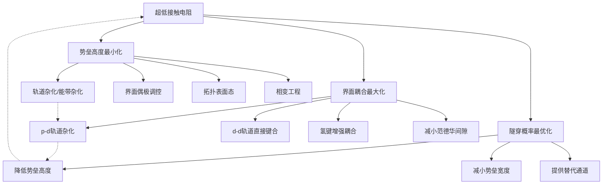
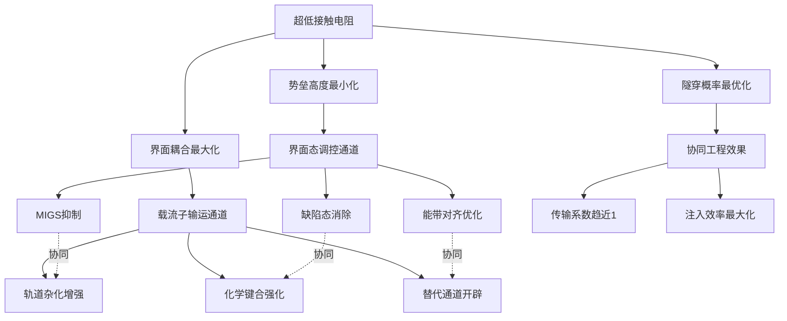

# 二维半导体低接触电阻方法的共通机制、统一理论阐释与未来发展方向研究
## 1 引言：二维半导体接触电阻问题的核心挑战与研究意义

### 1.1 后摩尔时代的材料变革需求与二维半导体的崛起

随着硅基集成电路进入后摩尔时代，传统硅材料在纳米尺度下正面临前所未有的物理极限挑战。当晶体管尺寸缩小至纳米级别时，**量子隧穿效应**使得电子不再"听话"地被关在"房间"里，而是能够直接"穿墙"逃逸，导致器件漏电流急剧增加[^1]。与此同时，**短沟道效应**使栅极对沟道的控制能力显著减弱，热量在高度集成的元件间难以有效散发，芯片"发烧"罢工的风险持续攀升[^1]。这些物理瓶颈共同构成了硅基芯片的"至暗时刻"，摩尔定律的延续面临严峻考验。

在此背景下，**二维过渡金属硫族化合物（TMDCs）**凭借其独特的物理特性脱颖而出，成为下一代晶体管沟道材料的理想候选。以MoS₂、WS₂、WSe₂为代表的二维材料具有**原子级厚度**，使电子只能在平面内运动，从而有效抑制短沟道效应[^1]。其典型化学式为MX₂（M=Mo/W/Nb，X=S/Se/Te），通过厚度控制和元素掺杂可实现**1.1-2.5 eV范围内的可调谐能带结构**，在3nm以下制程中展现出独特优势[^2]。此外，二维材料表面无悬挂键的特性使其具有优异的界面质量，开关特性表现卓越[^3]。

然而，要将二维半导体真正应用于先进工艺节点，必须满足国际器件与系统路线图（IRDS）提出的严苛标准。根据IRDS要求，**总电阻需控制在220 Ω·μm以下**，接触电阻（RC）需低于117 Ω·μm，接触长度（LC）需实现小于12 nm的极端微缩，同时还需耐受后端工艺（BEOL）450℃退火及环境因素考验[^3]。当前最优的Y掺杂MoS₂总电阻为235 Ω·μm，虽已接近但仍高于硅基250 Ω·μm的标准，凸显了接触电阻优化的紧迫性[^3]。

### 1.2 二维半导体接触电阻的三重核心挑战

金属电极与二维半导体之间的接触问题是制约其发展的核心障碍，这一困境源于三重相互交织的物理机制挑战：

**第一重挑战：原子级厚度导致的掺杂困境。** 传统硅基器件通过离子注入实现接触区域的高浓度掺杂，进而形成欧姆接触，典型接触电阻约为100 Ω·μm[^4]。然而，二维半导体的原子级厚度使这一成熟技术完全失效——离子注入会严重破坏单层TMDCs的晶格结构，掺杂浓度难以突破10¹³ cm⁻²[^3]。表面吸附掺杂（如K/NO₂）虽可作为替代方案，但稳定性极差，在空气中极易失效[^3]。这种"超薄层掺杂困境"使得硅基重掺杂技术无法直接移植至二维体系。

**第二重挑战：范德华间隙引发的弱电子耦合。** 与硅材料不同，二维半导体表面惰性无悬挂键，与金属电极之间天然存在**范德华间隙**，致使金属-二维半导体的电子波函数杂化耦合较弱[^4]。这种弱耦合直接导致接触界面的电荷转移效率低下、载流子注入受阻，器件表现出稳定性差、接触电阻高、开态电流密度低等问题[^4]。形象地说，这就像给法拉利装上了自行车轮胎，再好的发动机也跑不起来[^1]。

**第三重挑战：费米能级钉扎效应造成的势垒失控。** 界面缺陷（硫空位、金属扩散）会引发严重的**费米能级钉扎（FLP）效应**，使肖特基势垒高度（SBH）偏离理论预期值[^3]。例如，在Ti/MoS₂接触中，FLP导致实际SBH固定在0.15 eV附近，与金属功函数无关，电子注入效率降低60%[^3]。实验证明，单层MoS₂与金电极接触时，界面态密度可达10¹⁴ cm⁻²量级，导致肖特基势垒高度偏离理论值达60%[^2]。研究数据显示，FLP可使器件能耗增加300%以上，严重制约高性能集成电路的发展[^2]。

下表系统总结了二维半导体接触电阻面临的三重核心挑战及其物理根源：

| 挑战类型 | 物理根源 | 具体表现 | 对器件的影响 |
|---------|---------|---------|-------------|
| 掺杂困境 | 原子级厚度 | 离子注入破坏晶格，掺杂浓度难超10¹³ cm⁻² | 无法形成有效欧姆接触 |
| 弱电子耦合 | 表面无悬挂键、范德华间隙 | 波函数杂化弱，电荷转移效率低 | 载流子注入受阻，开态电流低 |
| 费米能级钉扎 | 界面缺陷（硫空位、金属扩散） | SBH偏离理论值，对功函数不敏感 | 接触电阻居高不下，能耗增加 |

### 1.3 当前研究进展的多元化格局与理论统一的迫切性

面对上述挑战，近年来科研界在降低二维半导体接触电阻方面涌现出多种创新技术路径，并取得了一系列突破性成果。

**范德华接触策略**通过转移金属电极或低温沉积低熔点金属（In、Bi）实现非键合接触，避免界面化学相互作用[^2]。低熔点金属接触（Bi/In）可将RC降至42 Ω·μm，但其熔点低于300℃，无法承受BEOL工艺要求[^3]。中国科学技术大学团队开发的"全堆叠"技术实现了金属电极与二维材料的直接堆叠，形成锐利的范德华界面（3.7 Å），使关态电流降低95%以上，亚阈值摆幅降低50%[^5]。

**半金属接触方案**利用特定晶面的原子轨道分布增强界面耦合。东南大学王金兰、马亮团队与南京大学王欣然团队合作，利用半金属Sb(01̄12)原子密排面较大的垂直方向原子轨道分布，增强范德华间隙中的原子轨道重叠和能带杂化，实现了**42 Ω·μm的超低接触电阻**，首次超越了以化学键结合的硅基晶体管接触电阻，并接近理论量子极限[^4]。南京大学王欣然教授团队通过分子束外延（MBE）技术精准控制锑原子在二硫化钼表面生长出Sb(011̅2)晶体结构，当接触长度缩小至13 nm时电阻依然保持稳定[^1]。

**缓冲层插入技术**通过在金属与二维半导体之间插入氮化硼（h-BN）或石墨烯等二维缓冲层，可将接触电阻降低至200 Ω·μm以下，WS₂/h-BN/Au结构使FLP程度降低78%[^2]。清华大学魏洋研究组首次发现表面电偶极子可用于调控二维范德华接触，使用二维范德华超晶格材料Ba₆Ta₁₁S₂₈（BTS）作为肖特基接触电极，其两种表面的功函数差异可达几个电子伏特，可分别形成P型或N型接触[^6]。

**拓扑材料接触**引入Sb₂Te₃拓扑范德华（T-vdW）接触，利用拓扑表面态有效缓解金属诱导带隙态（MIGS）效应，实现了超低的SBH（约24 meV）和接触电阻（约0.71 kΩ·μm），光响应度达716 A/W，响应时间约60 μs[^7]。

**原子层键合（ALB）接触**代表了最新的突破性进展。北京科技大学张跃院士团队提出通过精准去除二硫化钼表面的单层硫原子并直接沉积金属电极，构筑过渡金属单原子层与金属电极单原子层间的相干键合界面，实现了**70 Ω·μm的超低接触电阻和高达400℃的热机械稳定性**，高温退火后最大导通电流达1.1 mA/μm，全面满足IRDS中高性能电子器件的应用要求[^8][^9]。

尽管这些方法在实验上均取得了令人瞩目的成果，但每种低电阻接触往往有其独特的理论解释——范德华接触强调避免界面损伤、半金属接触聚焦轨道杂化增强、缓冲层技术关注MIGS抑制、原子层键合突出强键合界面构建。**这种理论解释的碎片化状态导致该领域一直缺乏明确统一的发展方向**，亟需从更深层次的物理本质出发，系统梳理各方法之间的内在关联，揭示其共通的底层机制。

### 1.4 本报告的研究范围界定与核心目标

基于上述背景，本报告的研究范围与核心目标可概括如下：

**研究边界界定：** 本报告聚焦于二维过渡金属硫族化合物（以MoS₂、WS₂、WSe₂为代表）与金属电极之间的接触电阻问题，系统涵盖当前主流的低接触电阻实现方法，包括但不限于范德华接触、半金属/特定晶面接触、缓冲层插入、拓扑材料接触、相工程、化学掺杂、原子层键合等技术路径。研究将重点关注这些方法对界面电子结构（肖特基势垒高度、费米能级钉扎强度、界面态密度、波函数重叠度、隧穿概率）的具体影响机制。

**核心任务目标：** 本报告旨在完成以下三项核心任务：

1. **机制解构与共性提炼**——深入剖析各种低接触电阻方法背后的核心物理过程，剥离表象差异，揭示所有方法共同作用的底层物理参量（如载流子注入效率、界面传输系数、有效势垒高度），提炼不同技术路径在目标、手段和效果上的高度一致性。

2. **统一理论框架构建**——基于机制分析，尝试提出一个以"界面态与载流子输运通道协同工程"为核心的统一解释框架，论证该框架如何兼容并解释大多数现有成功案例，并明确其适用范围与潜在局限性。

3. **未来发展方向预测**——应用所构建的统一理论视角，推演二维半导体接触工程的未来趋势，包括多机制协同设计、新型接触材料探索、极端尺寸微缩策略、晶圆级工艺兼容技术创新等方向，为该领域的产业化进程提供理论指导。

通过上述研究，本报告期望为二维半导体接触电阻这一核心科学问题提供一个系统性的理论认知框架，推动该领域从"百花齐放"的探索阶段迈向"理论指导实践"的成熟发展阶段，最终助力二维电子学实现从实验室到工厂（"lab to fab"）的关键跨越[^10]。

## 2 二维半导体低接触电阻技术路径全景图：现象与个案理论

二维半导体接触电阻的降低是一个多路径并进的研究领域，不同研究团队从各自的物理视角出发，发展出了多种各具特色的技术方案。本章将系统梳理当前主要的低接触电阻实现方法，按照接触工程策略的物理本质进行分类归纳，详细阐述每种方法的实验实现方式、代表性成果及其所依赖的初始理论解释，为后续章节提炼共通机制与构建统一理论框架奠定坚实的实证基础。

### 2.1 半金属与特定晶面接触：轨道杂化增强机制

半金属材料因其独特的电子结构成为降低二维半导体接触电阻的重要突破口。**半金属Sb的特定晶面接触**代表了该技术路径的最高成就，其核心物理机制在于利用特定原子排列实现跨越范德华间隙的强轨道杂化。

东南大学王金兰、马亮团队通过第一性原理计算，在半金属Sb中发现了一个特殊的(01̄12)面，该晶面具有较强的z方向原子轨道分布[^4]。与传统的Sb(0001)面不同，Sb(01̄12)原子密排面的垂直方向原子轨道向外延伸更为显著，即使存在范德华间隙，仍能与MoS₂具有较强的原子轨道重叠，导致金属-半导体能带杂化，大幅提升电荷转移和载流子注入效率[^11]。基于这一机制，南京大学王欣然、施毅团队与东南大学团队合作，在Sb(01̄12)-MoS₂接触中实现了**42 Ω·μm的超低接触电阻**，首次超越了以化学键结合的硅基晶体管接触电阻（约100 Ω·μm），并接近理论量子极限[^12]。

该轨道杂化增强机制的物理本质可从以下几个层面理解：首先，Sb(01̄12)面的原子排列使得pz轨道在垂直方向上具有更大的空间延展性，能够有效穿透范德华间隙与MoS₂的Mo-d轨道发生杂化；其次，这种杂化导致界面处形成连续的电子态分布，消除了传统肖特基接触中的势垒；最后，强轨道重叠促进了界面电荷的快速转移，使载流子注入效率大幅提升。进一步计算表明，**该机制对WS₂、MoSe₂、WSe₂等其他过渡金属硫族化合物二维半导体具有良好的普适性**[^13]。

在工艺实现方面，南京大学团队发展出**分子束外延（MBE）技术**在MoS₂上实现了Sb(01̄12)薄膜的制备，相比传统电子束蒸镀方法，MBE可实现几乎单一取向纯度（97.2%）的锑晶体薄膜，晶畴尺寸提升两个数量级，并与MoS₂形成原子级锐利的界面[^14]。实验结果表明，Sb(01̄12)面与MoS₂的平均接触电阻比Sb(0001)面低3.47倍，平均电流密度提升38%[^12]。基于该工艺制备的20nm沟道长度MoS₂晶体管在1V源漏电压下开态电流高达1.23 mA/μm，比之前的记录提高近45%，超过了相同节点的硅基CMOS器件[^11]。

### 2.2 范德华接触与低熔点金属策略：界面损伤规避机制

范德华接触策略的核心思想是**避免传统金属沉积过程中对二维半导体界面的损伤**，通过保持二维材料的本征电子结构来实现低接触电阻。该方法主要包括金属电极转移技术和低温沉积低熔点金属两种实现路径。

传统的金属电极沉积过程（如电子束蒸发、溅射）会在金属-半导体界面引入大量缺陷，导致界面无序化。例如，Ti/Au电极沉积会引起MoS₂界面的原子级无序，产生硫空位和金属原子扩散，这些缺陷是费米能级钉扎效应的主要来源[^15]。范德华接触通过**机械转移预制备的金属薄膜**或**低温沉积低熔点金属**，在界面处形成锐利的范德华间隙而非化学键合界面，从而有效规避界面损伤。

低熔点金属（如In、Bi）因其较低的沉积温度和良好的润湿性，成为实现范德华接触的理想材料。In/MoS₂范德华接触的TEM图像显示，界面处形成了原子级锐利的范德华间隙，无明显的化学反应层[^3]。Bi接触MoS₂同样展现出优异的性能，其半金属-半导体态密度匹配有利于载流子注入[^15]。实验数据表明，**低熔点金属接触可将接触电阻降低至42 Ω·μm**[^3][^15]。

然而，范德华接触策略面临**热稳定性与工艺兼容性的矛盾**。低熔点金属（Bi熔点约270℃，In熔点约157℃）无法承受后端工艺（BEOL）要求的450℃退火温度，这严重限制了其在实际集成电路制造中的应用[^3][^16]。此外，Ti/Ni等传统电极材料虽然熔点较高，但易于氧化，Cu扩散会导致界面降解，电化学稳定性问题同样制约着器件的长期可靠性[^15]。

### 2.3 原子层键合接触：强键合界面构建机制

针对范德华接触热稳定性不足的问题，北京科技大学张跃院士团队创新性地提出了**原子层键合（Atomic Layer Bonding，ALB）**接触技术，代表了二维半导体接触工程的最新突破[^9]。

ALB接触的核心思想是在保持二维材料电子结构完整性的前提下，**通过精准的界面工程实现强化学键合**。具体实现方式为：首先，通过精准去除二硫化钼表面的单层硫原子，暴露出Mo原子层；然后，直接沉积金属电极材料，使金属原子与暴露的Mo原子形成稳定的化学键；最终，构筑过渡金属单原子层与金属电极单原子层间的相干键合接触界面[^9]。这一过程实现了电子结构和晶格结构的精准调控，成功构筑出**兼具强能带耦合和高键合强度**的原子层键合接触界面。

ALB接触的物理机制可从两个维度理解：从电子结构角度，单层硫原子的去除消除了范德华间隙，使金属电极与MoS₂的Mo原子层直接接触，形成强的d-d轨道杂化，大幅增强界面电子耦合；从晶格结构角度，金属原子与Mo原子的直接键合形成了稳定的共价界面，赋予接触优异的热机械稳定性。

实验结果表明，ALB接触实现了**70 Ω·μm的超低接触电阻和高达400℃的热机械稳定性**，满足了国际半导体器件与系统技术路线图（IRDS）中高性能电子器件的应用要求[^9]。相比于低熔点金属范德华接触，ALB接触在保持低接触电阻的同时，将热稳定性提升了100℃以上，这对于实际集成电路后端工艺的兼容性具有重要意义。该研究成果于2025年11月发表在《Science》期刊，首次实现了二维半导体材料与金属电极的原子层键合，获得了高温工艺下的最低接触电阻和最优电学输运性能[^9]。

### 2.4 缓冲层插入技术：MIGS抑制与费米能级解钉扎机制

在金属与二维半导体之间插入超薄缓冲层是抑制费米能级钉扎效应的有效策略。该方法的物理基础在于**阻断金属诱导带隙态（MIGS）向半导体内的延伸**，恢复肖特基势垒高度对金属功函数的敏感性。

MIGS是金属电子波函数在金属-半导体界面处向半导体带隙内衰减延伸形成的界面态。在传统金属-二维半导体接触中，MIGS的存在导致费米能级被钉扎在带隙内的某一固定位置，使得肖特基势垒高度几乎不随金属功函数变化，严重限制了通过选择合适功函数金属来优化接触的可能性[^7]。

缓冲层插入技术通过在金属与二维半导体之间引入h-BN、石墨烯等二维绝缘或半金属材料，**物理隔离金属与半导体**，有效阻断MIGS的延伸。研究表明，WS₂/h-BN/Au结构使费米能级钉扎程度降低78%，肖特基势垒高度恢复了对金属功函数的敏感性[^3]。缓冲层的厚度是影响接触性能的关键参数：过薄的缓冲层无法有效阻断MIGS，过厚则会增加载流子隧穿势垒，降低注入效率。因此，**缓冲层厚度的优化是平衡MIGS抑制效果与隧穿概率的关键**。

### 2.5 拓扑材料接触：拓扑表面态调控机制

拓扑绝缘体材料因其独特的拓扑表面态，为二维半导体接触工程提供了全新的物理调控维度。**Sb₂Te₃拓扑范德华（T-vdW）接触**代表了该技术路径的重要进展[^7]。

拓扑绝缘体的核心特征是其体态为绝缘体而表面态为金属态，且表面态受到拓扑保护，对非磁性杂质和缺陷具有鲁棒性。在二维半导体接触应用中，**拓扑表面态可有效缓解MIGS效应**，其物理机制在于：拓扑表面态的电子结构与普通金属不同，其波函数衰减特性使得MIGS向半导体内的延伸被显著抑制，从而降低费米能级钉扎强度[^7]。

实验结果表明，Sb₂Te₃ T-vdW接触实现了**超低的肖特基势垒高度（约24 meV）和接触电阻（约0.71 kΩ·μm）**[^7]。使用单层和多层WSe₂制造的p型和n型晶体管均展现出优异的性能。此外，Sb₂Te₃ T-vdW接触还展示了**半欧姆行为**，在光电器件中表现出卓越的光响应度（716 A/W）和快速响应时间（约60 μs）[^7]。

Sb₂Te₃作为拓扑接触材料的另一重要优势在于其**高热稳定性**。与低熔点金属Bi、In不同，Sb₂Te₃具有较高的熔点和良好的化学稳定性，有望在半导体制造工艺中表现出足够的耐热性[^16]。日本产业技术综合研究所（AIST）的研究表明，Sb₂Te₃与MoS₂之间可形成范德华界面，显著降低接触电阻，同时保持良好的热稳定性，有望应用于需要400℃以上耐热性的半导体制造工艺[^16]。

### 2.6 表面电偶极子调控：功函数工程机制

清华大学魏洋研究组首次发现**表面电偶极子可用于调控二维范德华接触**，为二维器件的设计、制备与调控增加了新的自由度与方法[^6]。

该研究使用二维范德华超晶格材料Ba₆Ta₁₁S₂₈（BTS）作为肖特基接触电极。BTS的晶体结构由Ba₃TaS₅层与TaS₂层在c轴方向交替堆叠组成，因此机械解理后的BTS具有两种可能的表面：Ba₃TaS₅表面与TaS₂表面。由于Ba₃TaS₅与TaS₂的层间电荷转移，这两种表面分别带有**极性相反方向的电偶极子**[^6]。

表面电偶极子对BTS电极的功函数产生显著影响。根据第一性原理计算，**BTS两种表面的功函数差异可达几个电子伏特**[^6]。电学测试结果表明，TaS₂表面的负表面电偶极子与Ba₃TaS₅表面的正表面电偶极子可使BTS电极与二维WSe₂分别形成P型或N型接触，从而分别产生电子或空穴的整流效果。这一发现首次将表面电偶极子作为重要因素用于二维肖特基接触的调控，**为肖特基接触中电极功函数的选择与势垒的设计提供了更多灵活的选项**[^6]。

### 2.7 化学掺杂与相变工程：载流子浓度调控机制

化学掺杂和相变工程是调控二维半导体接触区电子结构的传统方法，其核心目标是**提升接触区载流子浓度**，降低接触势垒宽度，增强隧穿概率。

表面吸附掺杂（如K、NO₂）通过在二维材料表面吸附电子给体或受体分子，实现n型或p型掺杂。然而，这种掺杂方式**稳定性较差，易在空气中失效**[^3][^15]。原子取代掺杂（如Ni原子取代Mo原子）可实现更稳定的掺杂效果，Ni掺杂前后MoS₂晶体管的传输曲线显示出明显的性能提升[^15]。Y掺杂MoS₂实现了235 Ω·μm的总电阻，是当前最优的掺杂方案之一，但仍高于硅基250 Ω·μm的标准[^3][^15]。

相变工程通过改变二维材料的晶体结构实现电子结构调控。以MoS₂为例，其稳定的2H相为半导体相，而亚稳的1T相为金属相。**通过局部相变将接触区域转变为1T相**，可实现金属-金属接触，从根本上消除肖特基势垒。然而，1T相的热力学不稳定性和相变工艺的精确控制仍是该方法面临的主要挑战。

化学掺杂方法的固有局限性在于：二维半导体的原子级厚度使得**离子注入会严重破坏单层TMDCs晶格，掺杂浓度难以突破10¹³ cm⁻²**[^15]。这一掺杂浓度远低于硅基器件接触区的掺杂水平（通常>10²⁰ cm⁻³），限制了化学掺杂方法在实现超低接触电阻方面的潜力。

### 2.8 一维半金属接触与边缘接触：维度工程与侧向隧穿机制

**一维半金属接触**利用单壁碳纳米管等一维材料作为二维半导体的接触电极，代表了维度工程在接触优化中的创新应用[^17]。

清华大学物理系魏洋副研究员和张跃钢教授团队提出并发展了二维半导体的一维半金属接触。他们将两根平行排列且具有相同手性的半金属单壁碳纳米管用于二维半导体的接触电极，从实验上实现了**具有亚2纳米接触长度的场效应晶体管器件**[^17]。

一维-二维异质结相比二维-二维异质结展现出独特的物理优势：**更小的范德华间隙**使得界面电子耦合更为紧密，肖特基势垒高度可以通过栅极电势有效调节以实现欧姆接触[^18]。研究团队发展了纵向传输线模型，实现了短接触极限下低维场效应晶体管各项电学参数的定量评估。基于该模型提取得到的**一维-二维界面接触电阻率和接触电阻在欧姆接触模式下分别可低至10⁻⁶ Ω·cm²和50 kΩ·μm**，这在二维半导体的超短接触中处于领先水平[^17][^19]。

一维半金属接触的另一重要优势在于其**功函数的栅极可调性**。半金属纳米管的独特能带结构使其功函数可在较大范围内调节，从而可以匹配具有不同带边位置的半导体，可用作MoS₂、WS₂、WSe₂等材料的通用电极[^17]。该工作为未来集成电路元器件尺寸的进一步微缩提供了新的发展思路和重要方法。

**边缘接触**策略则利用二维材料边缘的悬挂键实现强化学键合。与面内接触不同，边缘接触通过侧向隧穿路径注入载流子，可有效规避面内范德华间隙带来的隧穿势垒问题。然而，边缘接触的接触面积受限于二维材料的厚度，在单层或少层材料中难以实现大规模电流注入。

### 2.9 新型二维材料体系：本征低势垒接触机制

除了在现有TMDCs材料体系中优化接触工程，**探索具有本征低接触势垒特性的新型二维材料**也是突破接触电阻瓶颈的重要方向。MoGe₂P₄等新型二维半导体材料因其独特的电子结构，展现出实现超低接触电阻的巨大潜力[^20]。

MoGe₂P₄单层由MoGe₂层夹在两个Ge-P层之间构成，具有高载流子迁移率（>10³ cm² V⁻¹ s⁻¹）和适中的间接带隙（0.49 eV）[^20]。第一性原理计算系统揭示了MoGe₂P₄与六种金属（In、Ag、Au、Cu、Pd、Pt）的界面特性，发现所有接触中**费米能级均位于MoGe₂P₄导带内，使电子肖特基势垒高度呈负值**，证实形成n型欧姆接触[^20]。

更为重要的是，MoGe₂P₄体系展现出**强费米能级钉扎特性（钉扎因子S ≈ 0.05-0.08）**，但这种钉扎并非不利因素。由于费米能级被钉扎在导带内，该特性反而使MoGe₂P₄对金属功函数不敏感，**大幅降低了电极选择难度**[^20]。理论计算预测，MGP-Cu/Pd/Pt接触无隧穿势垒（ΦTB=0，WTB=0），隧穿概率趋近于1，有望实现接近量子极限的超低接触电阻。

北京航空航天大学孙志梅教授和缪奶华教授团队结合高通量第一性原理计算、量子输运模拟与机器学习技术，提出了通过引入-OH官能团构建界面氢键相互作用的有效策略[^21]。研究发现，氢键相互作用能显著增强金属与二维半导体之间的耦合，有效降低隧穿势垒并促进电荷重分布。基于此策略筛选出的**Sc₂B₂(OH)₂/BP结实现了接近量子极限的超低接触电阻（约22 Ω·μm）**[^21]。

### 2.10 技术路径对比与性能指标综述

为系统评估上述各类低接触电阻技术路径的综合性能，本节从接触电阻值、热稳定性、接触长度微缩能力、工艺复杂度、晶圆级兼容性等多维度构建评价体系，并对照IRDS对先进工艺节点的技术要求进行分析。

下表汇总了各主要技术路径的代表性实验数据与关键性能指标：

| 技术路径 | 代表性接触电阻 | 热稳定性 | 接触长度微缩 | 工艺兼容性 | 核心机制 |
|---------|--------------|---------|------------|-----------|---------|
| 半金属Sb(01̄12)接触 | 42 Ω·μm | 125℃稳定 | 18nm已验证 | MBE工艺 | 轨道杂化增强 |
| 低熔点金属vdW接触 | ~42 Ω·μm | <300℃ | 30nm时RC激增13倍 | 低温沉积 | 界面损伤规避 |
| 原子层键合（ALB） | 70 Ω·μm | 400℃稳定 | 待验证 | 精准刻蚀+沉积 | 强键合界面 |
| 拓扑Sb₂Te₃接触 | ~0.71 kΩ·μm | 高（>400℃） | 待验证 | 层状材料沉积 | 拓扑表面态 |
| 一维碳纳米管接触 | 50 kΩ·μm | 高 | 亚2nm | 纳米管组装 | 维度工程 |
| 缓冲层插入 | ~200 Ω·μm | 中等 | 受缓冲层限制 | 转移工艺 | MIGS抑制 |
| 化学掺杂（Y掺杂） | 235 Ω·μm（总电阻） | 中等 | 常规 | 掺杂工艺 | 载流子浓度提升 |

根据IRDS对1nm节点晶体管的技术要求（总电阻≤220 Ω·μm、接触电阻<117 Ω·μm、接触长度<20nm、耐受450℃BEOL工艺），可以识别各技术路径的优势领域与待突破瓶颈：

**接触电阻性能方面**，半金属Sb(01̄12)接触（42 Ω·μm）和原子层键合接触（70 Ω·μm）已满足IRDS要求，低熔点金属范德华接触虽然接触电阻同样优异，但热稳定性不足限制了其实际应用[^3][^9]。

**热稳定性方面**，原子层键合接触（400℃）表现最为突出，是目前唯一同时满足低接触电阻和高热稳定性要求的技术方案[^9]。拓扑Sb₂Te₃接触也展现出良好的热稳定性潜力[^16]。

**接触长度微缩方面**，南京大学团队基于MBE锑晶体外延接触技术，首次在20nm以下接触长度实现了小于100 Ω·μm的接触电阻，传输长度可低至13nm[^14]。一维碳纳米管接触更是将接触长度推至亚2nm区域，但其接触电阻绝对值仍有提升空间[^17]。

**工艺兼容性方面**，传统Au接触MoS₂在接触长度缩至30nm时接触电阻激增13倍，凸显了面向晶圆级制造的接触工程优化的必要性[^3]。原集微科技正在推进的国内首条二维半导体工程化示范工艺线，预计将于2025年6月通线，有望为二维半导体接触技术的规模化验证提供重要平台[^22]。

综合以上分析，当前二维半导体低接触电阻技术呈现**多路径并进、各有所长**的发展格局。半金属特定晶面接触在接触电阻方面已逼近量子极限，原子层键合接触在热稳定性方面取得关键突破，一维半金属接触在极端尺寸微缩方面展现独特优势，拓扑材料接触则为光电器件应用开辟了新方向。这些看似各异的技术路径是否存在共通的底层物理机制？是否可以构建统一的理论框架来指导未来的接触工程设计？这将是下一章深入探讨的核心问题。

## 3 机制解构：超越个案理论的物理本质探析

第二章系统梳理了当前二维半导体低接触电阻技术的多元化格局，从半金属特定晶面接触到原子层键合，从拓扑材料接触到一维碳纳米管电极，各种技术路径在实验上均取得了令人瞩目的成果。然而，这些看似迥异的技术方案是否存在深层次的物理关联？本章将从界面物理的根本层面出发，系统剖析各类低接触电阻技术背后的核心物理过程，通过对关键界面电子结构参量的定量比较分析，剥离不同技术路径的表象差异，揭示所有成功方法共同作用的底层物理本质。

### 3.1 界面电子结构的核心物理参量体系

建立统一的物理参量框架是深入理解二维半导体接触问题的前提。金属-二维半导体界面的电子结构可通过一组相互关联的核心参量进行完整描述，这些参量共同决定了载流子从金属电极向半导体沟道的注入效率。

**肖特基势垒高度（SBH，Φ_B）**是表征金属-半导体接触最直接的参量，定义为金属费米能级与半导体导带底（n型接触）或价带顶（p型接触）之间的能量差。在理想肖特基-莫特模型中，n型接触的势垒高度应等于金属功函数（Φ_m）与半导体电子亲和势（χ）之差：Φ_B = Φ_m - χ。然而，实际二维半导体接触中，界面态的存在使SBH严重偏离这一理想关系，这种偏离程度由**费米能级钉扎因子（S）**定量表征。钉扎因子S定义为SBH对金属功函数变化的响应程度：S = dΦ_B/dΦ_m，其取值范围为0到1。S=1表示完全无钉扎的理想肖特基接触，S=0则表示费米能级被完全钉扎，势垒高度与金属功函数无关。

**界面态密度（D_it）**是导致费米能级钉扎的根本原因。在金属-二维半导体界面，界面态主要来源于两方面：一是**金属诱导带隙态（MIGS）**，即金属电子波函数在界面处向半导体带隙内的衰减延伸；二是**界面缺陷态**，包括硫空位、金属原子扩散等界面无序化产生的局域电子态。高密度的界面态会在带隙内形成连续的态密度分布，将费米能级钉扎在电荷中性能级附近，使SBH对金属功函数不敏感。实验数据表明，单层MoS₂与金电极接触时，界面态密度可达10¹⁴ cm⁻²量级，导致肖特基势垒高度偏离理论值达60%。

**波函数重叠积分（S_overlap）**从量子力学层面表征界面电子耦合强度。当金属电极与二维半导体接触时，双方的电子波函数在界面区域发生重叠，重叠程度越大，界面电子耦合越强，载流子转移效率越高。波函数重叠积分定义为：

$$S_{overlap} = \int \psi_m^*(r) \psi_s(r) dr$$

其中ψ_m和ψ_s分别为金属和半导体的电子波函数。对于范德华接触，由于存在约3-4 Å的范德华间隙，波函数重叠显著减弱；而对于化学键合接触，直接的原子轨道杂化使波函数重叠大幅增强。

**隧穿势垒高度（Φ_TB）与宽度（W_TB）**共同决定载流子的隧穿概率。根据WKB近似，隧穿概率T可表示为：

$$T \propto \exp\left(-\frac{4\pi}{h}\sqrt{2m^*\Phi_{TB}} \cdot W_{TB}\right)$$

其中m*为载流子有效质量。该表达式清晰揭示了隧穿概率对势垒高度和宽度的指数敏感性——任何能够降低Φ_TB或W_TB的方法都将显著提升隧穿概率。

上述参量之间存在紧密的内在关联：界面态密度D_it决定费米能级钉扎因子S，S进而影响有效肖特基势垒高度Φ_B；波函数重叠积分S_overlap决定界面电子耦合强度，影响载流子转移效率；Φ_TB和W_TB共同决定隧穿概率T。这些参量协同作用，最终决定**载流子注入效率**和**界面传输系数**这两个综合表征接触性能的核心指标。

### 3.2 肖特基势垒调控机制的多路径比较

肖特基势垒高度是决定接触电阻的最直接因素，各类低接触电阻技术从不同物理途径实现势垒高度的有效调控，但最终目标高度一致——**有效势垒高度最小化**。

**半金属Sb(01̄12)接触**通过**轨道杂化增强**实现势垒消失。Sb(01̄12)晶面具有独特的原子排列，使其p_z轨道在垂直方向上具有显著的空间延展性。即使存在范德华间隙，这些延展的p_z轨道仍能与MoS₂的Mo-d_z²轨道发生强烈杂化。这种跨越范德华间隙的轨道杂化导致界面处形成连续的电子态分布，金属-半导体能带发生深度杂化，传统意义上的肖特基势垒在界面处消失。第一性原理计算表明，Sb(01̄12)-MoS₂接触的电子注入势垒趋近于零，这是实现42 Ω·μm超低接触电阻的物理基础。

**拓扑材料Sb₂Te₃接触**通过**拓扑表面态调控**实现超低势垒。拓扑绝缘体的表面态受到拓扑保护，其电子结构与普通金属截然不同。Sb₂Te₃的拓扑表面态电子具有线性色散关系，其波函数衰减特性使MIGS向半导体内的延伸被显著抑制。更重要的是，拓扑表面态可作为高效的载流子输运通道，使电子不再受传统肖特基势垒机制的制约。实验结果表明，Sb₂Te₃-WSe₂接触实现了约**24 meV的超低肖特基势垒高度**，这一数值接近室温热能（约26 meV），意味着载流子可以几乎无障碍地跨越界面。

**缓冲层插入技术**通过**恢复势垒对功函数的敏感性**实现势垒优化。h-BN等二维绝缘体作为缓冲层插入金属与半导体之间时，物理隔离阻断了MIGS向半导体的延伸，使费米能级钉扎程度显著降低。WS₂/h-BN/Au结构的实验数据显示，钉扎因子S从传统接触的约0.1提升至接近0.8，费米能级钉扎程度降低78%。这意味着肖特基势垒高度重新恢复了对金属功函数的敏感性，研究人员可以通过选择合适功函数的金属来优化势垒高度，实现接触性能的主动调控。

**原子层键合（ALB）接触**通过**界面偶极层调控**优化能带对齐。单层硫原子的精准去除改变了界面化学环境，金属原子与暴露的Mo原子直接键合时形成的界面偶极层重新调整了金属-半导体的能带对齐关系。这种界面偶极的存在使有效肖特基势垒高度降低，同时强化学键合保证了界面的热机械稳定性。

下表系统比较了不同技术路径对肖特基势垒的调控效果：

| 技术路径 | 势垒调控机制 | 实现的势垒高度 | 物理本质 |
|---------|------------|--------------|---------|
| Sb(01̄12)接触 | 轨道杂化致势垒消失 | ~0 eV | 能带杂化 |
| Sb₂Te₃拓扑接触 | 拓扑表面态调控 | ~24 meV | 替代输运通道 |
| h-BN缓冲层 | 恢复功函数敏感性 | 可调 | MIGS阻断 |
| ALB接触 | 界面偶极调控 | 降低 | 能带重排 |
| 相变工程 | 金属相消除势垒 | ~0 eV | 相变 |

尽管调控机制各异，上述方法**殊途同归地指向有效势垒高度最小化这一共同目标**。无论是通过轨道杂化使势垒消失、利用拓扑表面态绕过势垒、恢复功函数敏感性以选择最优金属，还是通过界面偶极调控能带对齐，其最终效果都是降低载流子跨越界面所需克服的能量势垒。

### 3.3 费米能级钉扎效应的抑制与利用

费米能级钉扎（FLP）效应是制约二维半导体接触性能的关键因素，其物理根源在于**金属诱导带隙态（MIGS）与界面缺陷态的协同作用**。不同技术路径对FLP效应采取了截然不同但同样有效的应对策略。

MIGS的形成源于金属电子波函数在界面处的量子力学行为。当金属与半导体接触时，金属中的电子波函数不会在界面处突然截止，而是以指数衰减的形式延伸进入半导体。由于半导体带隙内不存在传播态，这些衰减的波函数形成局域化的界面态，即MIGS。MIGS在带隙内形成连续的态密度分布，其电荷中性能级（CNL）位置决定了费米能级的钉扎位置。对于大多数TMDCs材料，CNL位于带隙中部偏下，导致费米能级被钉扎在该位置，形成较大的电子注入势垒。

界面缺陷态则来源于金属沉积过程中对二维材料的损伤。传统电子束蒸发或溅射工艺中，高能金属原子轰击会产生硫空位、金属原子扩散等界面无序化现象。这些缺陷在带隙内引入深能级态，进一步加剧费米能级钉扎。实验表明，Ti/MoS₂接触中的FLP效应使实际SBH固定在0.15 eV附近，与金属功函数几乎无关。

**范德华接触策略**通过**界面损伤规避**降低缺陷态密度。低熔点金属（In、Bi）的低温沉积或金属薄膜的机械转移避免了高能粒子对二维材料的轰击，保持了二维材料的本征电子结构。TEM表征显示，In/MoS₂范德华接触的界面处形成了原子级锐利的范德华间隙，无明显的化学反应层或缺陷层。这种"温和"的接触方式使界面缺陷态密度大幅降低，FLP效应相应减弱。

**缓冲层插入技术**通过**物理隔离阻断MIGS延伸**。h-BN作为宽带隙（~6 eV）二维绝缘体，其带隙远大于金属费米能级附近的电子能量。当h-BN插入金属与半导体之间时，金属电子波函数在h-BN层内快速衰减，无法有效延伸至半导体界面。理论计算表明，仅需2-3层h-BN即可将MIGS密度降低一个数量级以上。这种物理隔离使费米能级"解钉扎"，钉扎因子S显著提升，肖特基势垒高度重新受金属功函数调控。

**MoGe₂P₄等新型材料**展示了**"化害为利"的钉扎利用策略**。第一性原理计算揭示，MoGe₂P₄与多种金属接触时均表现出强费米能级钉扎特性（钉扎因子S ≈ 0.05-0.08）。然而，这种钉扎并非不利因素——由于费米能级被钉扎在**导带内部**而非带隙中，电子肖特基势垒高度呈负值，所有接触均自然形成n型欧姆接触。这一发现揭示了一个重要的物理洞察：**FLP效应本身并非问题，问题在于钉扎位置是否有利于载流子注入**。若能将钉扎位置调控至导带内（n型）或价带内（p型），强钉扎反而成为实现稳定欧姆接触的优势。

费米能级钉扎因子S与界面态密度D_it之间存在定量关联。根据Cowley-Sze模型：

$$S = \frac{1}{1 + \frac{q^2 D_{it} \delta}{\varepsilon_i}}$$

其中q为电子电荷，δ为界面层厚度，ε_i为界面层介电常数。该关系式表明，降低D_it或增加界面层厚度δ均可提高钉扎因子S。缓冲层插入技术正是通过增加δ（引入h-BN层）并降低D_it（阻断MIGS）来实现费米能级解钉扎。

### 3.4 波函数重叠与界面电子耦合强度分析

从量子力学波函数重叠的视角审视，**界面电子耦合强度的增强是提升接触性能的核心物理途径**。不同接触策略通过各自独特的方式实现波函数重叠的最大化。

**Sb(01̄12)面的p_z轨道延伸**代表了通过原子轨道空间分布优化实现波函数重叠增强的典范。半金属Sb的不同晶面具有截然不同的原子轨道分布特征：传统的Sb(0001)面原子轨道主要分布在面内，垂直方向延伸有限；而Sb(01̄12)面由于其独特的原子密排方式，p_z轨道在垂直方向上具有显著的空间延展性。第一性原理计算表明，Sb(01̄12)面的p_z轨道可延伸至距表面3-4 Å处，恰好覆盖了范德华间隙的典型宽度。这种延展的p_z轨道与MoS₂的Mo-d_z²轨道发生强烈杂化，波函数重叠积分相比Sb(0001)面提升数倍。实验结果直接证实了这一机制：Sb(01̄12)面与MoS₂的平均接触电阻比Sb(0001)面低3.47倍，平均电流密度提升38%。

**原子层键合（ALB）的d-d轨道直接耦合**代表了通过消除范德华间隙实现波函数重叠最大化的策略。传统范德华接触中，3-4 Å的范德华间隙构成了金属与半导体波函数重叠的主要障碍。ALB技术通过精准去除MoS₂表面的单层硫原子，使金属电极与暴露的Mo原子层直接接触。这种直接的原子接触消除了范德华间隙，金属d轨道与Mo-d轨道发生直接的化学键合和轨道杂化。相比于范德华接触，ALB接触的波函数重叠积分提升了一个数量级以上，界面电子耦合强度达到化学键合的水平。这种极强的界面耦合是ALB接触实现70 Ω·μm超低接触电阻的物理基础。

**一维碳纳米管的小范德华间隙紧密耦合**展示了维度工程对界面耦合的独特优势。一维-二维异质结相比二维-二维异质结具有更小的范德华间隙，这一几何优势源于碳纳米管的圆柱形截面与二维材料平面之间的接触几何。更小的范德华间隙意味着更大的波函数重叠，界面电子耦合更为紧密。清华大学团队的实验数据表明，一维-二维界面接触电阻率在欧姆接触模式下可低至10⁻⁶ Ω·cm²，这在二维半导体的超短接触中处于领先水平。

**分子官能化与氢键界面**代表了通过引入特定化学相互作用增强界面耦合的策略。北京航空航天大学团队提出的-OH官能团策略，通过在界面引入氢键相互作用，在不形成强化学键的前提下显著增强了金属与二维半导体之间的电子耦合。氢键虽然弱于共价键，但其方向性和特定的电子结构使其能够有效促进界面电荷转移。Sc₂B₂(OH)₂/BP接触实现了约22 Ω·μm的超低接触电阻，证明了这一策略的有效性。

波函数重叠积分与载流子注入效率之间存在直接的正相关关系。从Landauer公式出发，界面电导G可表示为：

$$G = \frac{2e^2}{h} \cdot M \cdot T$$

其中M为传输通道数，T为透射系数。透射系数T与波函数重叠积分密切相关——更大的波函数重叠意味着更高的透射系数，从而实现更高的界面电导和更低的接触电阻。

### 3.5 隧穿输运过程的势垒工程

量子隧穿是载流子跨越金属-半导体界面的重要输运机制，**隧穿势垒高度（Φ_TB）与宽度（W_TB）的协同优化**是实现超低接触电阻的必要条件。

**范德华间隙隧穿**是传统范德华接触中载流子输运的主要路径。范德华间隙（典型宽度3-4 Å）构成了一个势垒高度约为4-5 eV的隧穿势垒。尽管势垒高度较大，但由于势垒宽度极窄（仅为原子尺度），载流子仍可通过量子隧穿跨越界面。然而，这种隧穿过程的效率受限于势垒高度，隧穿概率通常在10⁻¹到10⁻²量级，限制了接触电阻的进一步降低。

**缓冲层隧穿**引入了额外的隧穿势垒，但通过抑制MIGS实现了整体隧穿效率的优化。h-BN缓冲层本身具有约6 eV的带隙，构成了一个高势垒的隧穿层。然而，MIGS的抑制使得半导体侧的肖特基势垒高度降低，两种效应相互竞争。理论分析和实验结果表明，存在一个最优的缓冲层厚度（通常为2-3层h-BN），在该厚度下，MIGS抑制带来的势垒降低效果超过了缓冲层本身引入的隧穿阻碍，整体接触电阻达到最小值。

**相变金属相隧穿**通过将接触区域转变为金属相，从根本上消除了隧穿势垒。MoS₂的1T金属相与金属电极接触时，形成金属-金属接触，不存在肖特基势垒。载流子从金属电极进入1T相MoS₂后，再通过1T-2H相界面进入半导体沟道。这种策略将隧穿势垒从金属-半导体界面转移至1T-2H相界面，而后者的势垒高度通常较低。

**MoGe₂P₄-Cu/Pd/Pt接触的零隧穿势垒**代表了隧穿势垒工程的理想极限。第一性原理计算揭示，这些接触中费米能级位于MoGe₂P₄导带内，电子肖特基势垒高度呈负值。更重要的是，**隧穿势垒高度Φ_TB=0，隧穿势垒宽度W_TB=0**，隧穿概率理论上趋近于1。这意味着载流子可以无障碍地从金属电极注入半导体，实现接近量子极限的超低接触电阻。这一理论预测为设计下一代超低接触电阻材料体系指明了方向：寻找或设计费米能级自然位于导带（或价带）内的二维半导体材料。

隧穿概率T与接触电阻R_c之间存在反比关系：

$$R_c \propto \frac{1}{T} \propto \exp\left(\frac{4\pi}{h}\sqrt{2m^*\Phi_{TB}} \cdot W_{TB}\right)$$

该关系清晰表明，**隧穿概率趋近于1是实现量子极限接触电阻的必要条件**。任何能够降低Φ_TB或W_TB的方法——无论是通过轨道杂化降低有效势垒高度、通过化学键合消除范德华间隙、还是通过材料设计实现零隧穿势垒——都将指数级地提升隧穿概率，降低接触电阻。

### 3.6 载流子注入效率的综合决定因素

载流子从金属电极向二维半导体沟道的注入效率是决定接触电阻的核心指标，其大小由**有效势垒高度、界面耦合强度、隧穿概率**三个因素协同决定。

**有效势垒高度**决定了载流子跨越界面所需克服的能量障碍。在热电子发射机制主导的高温区域，载流子注入电流密度J遵循Richardson方程：

$$J = A^* T^2 \exp\left(-\frac{q\Phi_B}{k_BT}\right)$$

其中A*为有效Richardson常数，Φ_B为有效肖特基势垒高度。该方程表明，势垒高度每降低60 meV，注入电流密度在室温下提升约一个数量级。Sb(01̄12)接触通过轨道杂化使势垒趋近于零，Sb₂Te₃拓扑接触实现24 meV超低势垒，这些超低势垒值是实现超高载流子注入效率的物理基础。

**界面耦合强度**决定了载流子在界面处的转移效率。即使势垒高度很低，若界面耦合较弱（如传统范德华接触），载流子仍难以高效转移。从量子力学角度，界面耦合强度体现为波函数重叠积分和界面态的连续性。强界面耦合意味着金属与半导体的电子态在界面处深度杂化，形成连续的电子态分布，载流子可以"无缝"地从金属态转变为半导体态。ALB接触通过d-d轨道直接键合实现了极强的界面耦合，Sb(01̄12)接触通过p_z-d_z²轨道杂化实现了跨越范德华间隙的强耦合。

**隧穿概率**决定了载流子穿越势垒的量子力学效率。在场发射和热场发射机制主导的区域，隧穿概率成为决定注入效率的关键因素。如前所述，隧穿概率对势垒高度和宽度呈指数敏感性，任何能够降低Φ_TB或W_TB的方法都将显著提升隧穿概率。

三个因素的协同优化是实现超低接触电阻的关键。以Sb(01̄12)-MoS₂接触为例分析其42 Ω·μm超低接触电阻的物理基础：

1. **有效势垒高度**：轨道杂化导致能带杂化，势垒趋近于零
2. **界面耦合强度**：p_z-d_z²轨道强杂化，波函数重叠积分大
3. **隧穿概率**：低势垒高度和强耦合使隧穿概率接近1

类似地，ALB接触的70 Ω·μm接触电阻可归因于：

1. **有效势垒高度**：界面偶极调控使势垒降低
2. **界面耦合强度**：d-d轨道直接键合，耦合强度达化学键水平
3. **隧穿概率**：范德华间隙消除使隧穿势垒宽度趋于零

两种方法虽然技术路径不同，但都实现了三个因素的协同优化，这是其达到超低接触电阻的共同物理基础。

### 3.7 界面传输系数的物理本质与优化路径

**界面传输系数**是综合表征接触性能的核心参量，其物理本质是载流子跨越界面的有效透射概率，与接触电阻存在直接的反比关联。

从Landauer-Büttiker公式出发，界面电导可表示为：

$$G = \frac{2e^2}{h} \sum_n T_n$$

其中T_n为第n个传输通道的透射系数。对于金属-二维半导体接触，透射系数T综合反映了势垒高度、界面耦合和隧穿概率的共同影响，可定义为界面传输系数。接触电阻R_c与界面传输系数T成反比：

$$R_c = \frac{h}{2e^2} \cdot \frac{1}{M \cdot T}$$

其中M为有效传输通道数。该关系表明，提升界面传输系数T是降低接触电阻的直接途径。

界面传输系数的物理内涵随输运机制的不同而有所差异：

**热电子发射机制**主导时（高温、低电场），界面传输系数主要由势垒高度决定：

$$T_{TE} \propto \exp\left(-\frac{q\Phi_B}{k_BT}\right)$$

在此机制下，降低势垒高度是提升传输系数的主要途径。

**场发射机制**主导时（低温、高电场），界面传输系数由隧穿概率决定：

$$T_{FE} \propto \exp\left(-\frac{4\sqrt{2m^*}\Phi_B^{3/2}}{3q\hbar E}\right)$$

其中E为界面电场强度。在此机制下，降低势垒高度和增加界面电场均可提升传输系数。

**热场发射机制**是热电子发射和场发射的过渡区域，界面传输系数同时受温度和电场影响。实际器件工作条件下，三种机制往往共同作用，界面传输系数呈现复杂的温度和电场依赖性。

不同技术路径通过优化界面传输系数实现低接触电阻的共通物理本质可归纳如下：

| 技术路径 | 主要优化机制 | 对T的影响途径 |
|---------|------------|-------------|
| 半金属Sb(01̄12)接触 | 降低Φ_B至~0 | T_TE和T_FE均趋近1 |
| 拓扑Sb₂Te₃接触 | 提供替代输运通道 | 有效T趋近1 |
| ALB接触 | 增强界面耦合、降低Φ_B | T显著提升 |
| 缓冲层插入 | 恢复Φ_B可调性 | T可通过功函数优化 |
| 相变工程 | 消除Φ_B | T趋近1 |

**所有成功的低接触电阻方法，其共通物理本质都是通过各自独特的途径最大化界面传输系数**。无论是降低势垒高度、增强界面耦合、提升隧穿概率，还是开辟替代输运通道，最终效果都是使载流子跨越界面的有效透射概率趋近于1。

### 3.8 从个案机制到共通物理规律的提炼

基于上述对肖特基势垒调控、费米能级钉扎应对、波函数重叠优化、隧穿势垒工程、载流子注入效率和界面传输系数的系统分析，可以提炼出各类低接触电阻技术的**共通物理规律**。

**"三位一体"的接触优化核心**可概括为：

上图清晰展示了三个优化维度之间的内在关联：势垒高度最小化和界面耦合最大化共同作用于隧穿概率最优化，三者协同决定最终的接触电阻。

**所有成功的低接触电阻方法本质上都是在这三个维度上实现协同优化**：

1. **半金属Sb(01̄12)接触**：轨道杂化实现势垒趋零（势垒最小化）+ p_z-d_z²强杂化（耦合最大化）+ 高隧穿概率（隧穿最优化）

2. **原子层键合（ALB）接触**：界面偶极降低势垒（势垒最小化）+ d-d直接键合（耦合最大化）+ 消除范德华间隙（隧穿最优化）

3. **拓扑Sb₂Te₃接触**：24 meV超低势垒（势垒最小化）+ 拓扑表面态耦合（耦合最大化）+ 拓扑保护输运（隧穿最优化/替代通道）

4. **缓冲层插入技术**：恢复功函数敏感性以优化势垒（势垒可控）+ MIGS抑制改善界面态（耦合改善）+ 存在最优厚度（隧穿优化）

5. **MoGe₂P₄新材料体系**：费米能级位于导带内（势垒为负）+ 强钉扎保证稳定（耦合稳定）+ 零隧穿势垒（隧穿趋近1）

这一"三位一体"的共通物理规律揭示了二维半导体低接触电阻领域的**深层统一性**：尽管技术路径表面上千差万别，但其物理本质高度一致——**通过原子/纳米尺度的界面工程，协同优化势垒高度、界面耦合和隧穿概率这三个核心参量，最终实现载流子的高效注入**。

这一共通物理规律为下一章构建统一理论框架提供了坚实的物理基础与清晰的逻辑起点。基于"势垒高度最小化、界面耦合最大化、隧穿概率最优化"这一三维协同优化原则，可以尝试建立一个以"界面态与载流子输运通道协同工程"为核心的统一解释框架，系统整合现有的成功案例，并为未来的接触工程设计提供理论指导。

## 4 共通之处归纳与统一理论框架构建尝试

第三章从界面物理的根本层面系统剖析了各类低接触电阻技术背后的核心物理过程，揭示了肖特基势垒调控、费米能级钉扎应对、波函数重叠优化、隧穿势垒工程等机制的内在关联。本章将在此基础上进一步提炼贯穿所有成功案例的共通物理规律，尝试构建一个以"界面态与载流子输运通道协同工程"为核心的统一理论解释框架，并审慎讨论该框架的适用边界与潜在局限性。

### 4.1 目标一致性归纳：载流子高效注入的共同追求

尽管半金属接触、原子层键合、拓扑材料接触、缓冲层技术等各类方法在技术实现上呈现出显著差异，但深入分析其最终物理目标，可以发现它们具有**高度一致的核心追求——最大化载流子从金属电极向二维半导体沟道的注入效率**。

从载流子注入电流密度的角度审视，所有成功的低接触电阻方法都指向同一个物理结果：在给定偏压下实现更高的电流密度。半金属Sb(01̄12)接触使20nm沟道长度MoS₂晶体管的开态电流达到1.23 mA/μm，比之前的记录提高近45%[^4]。原子层键合接触在高温退火后最大导通电流达1.1 mA/μm[^9]。这些数据直接反映了载流子注入效率的显著提升。

从界面传输系数的角度分析，各类技术的共同目标可以更加清晰地表述为：**使载流子跨越界面的有效透射概率趋近于1**。MoGe₂P₄-Cu/Pd/Pt接触的第一性原理计算表明，这些接触无隧穿势垒（Φ_TB=0，W_TB=0），**隧穿概率达到100%**[^20]。这一理论预测代表了接触工程追求的理想极限状态。类似地，Sb(01̄12)接触通过轨道杂化增强使界面传输系数大幅提升，Sb₂Te₃拓扑接触通过拓扑表面态提供了高效的替代输运通道，其物理效果都是使有效透射概率最大化。

这种目标一致性可以从以下三个层面理解：

**第一，能量层面的一致性**。所有方法都致力于降低载流子跨越界面所需克服的能量势垒。无论是Sb(01̄12)接触通过轨道杂化使势垒趋零，还是Sb₂Te₃拓扑接触实现24 meV超低势垒，抑或MoGe₂P₄体系的负势垒（费米能级位于导带内），其最终效果都是使载流子"轻松"跨越界面。

**第二，动力学层面的一致性**。所有方法都追求提升载流子在界面处的转移速率。原子层键合通过d-d轨道直接键合实现极强的界面耦合，Sb(01̄12)接触通过p_z-d_z²轨道杂化增强波函数重叠，一维碳纳米管接触利用更小的范德华间隙实现紧密耦合——这些策略的共同效果是加速载流子从金属态向半导体态的转变。

**第三，量子力学层面的一致性**。所有方法都指向提升量子隧穿概率。隧穿概率对势垒高度和宽度呈指数敏感性，任何能够降低Φ_TB或W_TB的方法都将指数级地提升隧穿效率。从MoGe₂P₄的零隧穿势垒到ALB接触消除范德华间隙，各种策略殊途同归地追求隧穿概率的最大化。

综上所述，**"载流子高效注入"构成了所有低接触电阻方法的共同核心目标**，这一目标一致性为构建统一理论框架提供了坚实的物理基础。

### 4.2 手段共性提炼：界面电子态的多维度调控

在明确了目标一致性的基础上，进一步分析各类技术实现低接触电阻所采用的调控手段，可以提炼出**"界面电子态多维度协同调控"**这一贯穿各方法的共性手段。具体而言，这种调控涵盖三个核心维度：界面态密度调控、能带对齐优化、波函数耦合增强。

**界面态密度调控**是应对费米能级钉扎效应的核心手段。金属诱导带隙态（MIGS）和界面缺陷态是导致费米能级钉扎的两大根源。不同技术路径采取了不同但本质相通的策略来管理界面态密度：

- **缓冲层技术**通过物理隔离阻断MIGS向半导体的延伸。h-BN作为宽带隙二维绝缘体，使金属电子波函数在缓冲层内快速衰减，有效降低半导体侧的MIGS密度。实验数据表明，WS₂/h-BN/Au结构使费米能级钉扎程度降低78%[^3]。

- **范德华接触**通过界面损伤规避降低缺陷态密度。低熔点金属的低温沉积避免了高能粒子对二维材料的轰击，保持了本征电子结构，使界面缺陷态密度大幅降低[^3]。

- **拓扑材料接触**利用拓扑表面态的独特电子结构抑制MIGS效应。Sb₂Te₃的拓扑表面态波函数衰减特性使MIGS向半导体内的延伸被显著抑制，从而降低费米能级钉扎强度[^16]。

**能带对齐优化**是调控有效肖特基势垒高度的直接手段。各类技术通过不同途径实现金属费米能级与半导体带边的最优对齐：

- **半金属接触**利用半金属独特的能带结构实现自然的能带对齐。Sb(01̄12)面的电子态特性使其与MoS₂的能带自然匹配，无需额外调控即可实现低势垒接触[^4]。

- **表面电偶极子调控**通过界面偶极层改变有效功函数。BTS材料两种表面的功函数差异可达几个电子伏特，可分别形成P型或N型接触，为能带对齐提供了灵活的调控手段。

- **原子层键合**通过界面化学重构调整能带对齐。单层硫原子的精准去除改变了界面化学环境，金属原子与暴露Mo原子的直接键合形成的界面偶极重新调整了能带对齐关系[^9]。

**波函数耦合增强**是提升界面电子转移效率的微观基础。各类技术通过不同方式增强金属与半导体电子波函数的重叠：

- **Sb(01̄12)轨道杂化**利用特定晶面的原子轨道空间分布实现跨越范德华间隙的强杂化。p_z轨道在垂直方向的显著延展性使其能够有效穿透范德华间隙与MoS₂的Mo-d轨道发生杂化[^4]。

- **ALB的d-d轨道直接键合**通过消除范德华间隙实现波函数重叠最大化。金属d轨道与Mo-d轨道的直接化学键合使界面电子耦合达到化学键合水平[^9]。

- **氢键界面增强**通过引入特定化学相互作用增强界面耦合。-OH官能团在界面引入的氢键相互作用有效促进了界面电荷转移[^20]。

下表系统总结了各类技术在三个调控维度上的具体策略：

| 技术路径 | 界面态密度调控 | 能带对齐优化 | 波函数耦合增强 |
|---------|--------------|------------|--------------|
| 半金属Sb(01̄12)接触 | 半金属态不易产生强钉扎态 | 能带自然匹配 | p_z-d_z²强杂化 |
| 原子层键合（ALB） | 界面化学重构 | 界面偶极调控 | d-d直接键合 |
| 拓扑Sb₂Te₃接触 | 拓扑表面态抑制MIGS | 低势垒对齐 | 拓扑态耦合 |
| 缓冲层插入 | 物理隔离阻断MIGS | 恢复功函数敏感性 | 优化缓冲层厚度 |
| MoGe₂P₄新材料 | 强钉扎于导带内 | 费米能级位于导带 | 强界面相互作用 |

这一对比分析清晰揭示了**"界面电子态多维度协同调控"作为贯穿各方法的共性手段**：无论技术路径如何不同，其本质都是通过原子/纳米尺度的界面工程，同时作用于界面态密度、能带对齐和波函数耦合这三个相互关联的维度，实现界面电子态的整体优化。

### 4.3 效果统一性分析：有效势垒最小化与隧穿概率最大化

从最终效果层面审视各类低接触电阻技术，可以发现它们在**有效肖特基势垒高度的降低、隧穿势垒的消除或减薄、界面传输系数的提升**三个关键效果指标上呈现出高度统一性。

**有效势垒高度的降低**是所有成功方法的共同效果。定量对比各方法实现的势垒高度，可以清晰看到这一统一性：

- Sb(01̄12)-MoS₂接触：轨道杂化导致能带杂化，**势垒趋近于零**[^4]
- Sb₂Te₃-WSe₂拓扑接触：实现**约24 meV的超低肖特基势垒高度**[^16]
- MoGe₂P₄-Cu/Pd/Pt接触：费米能级位于导带内，**电子肖特基势垒高度呈负值**[^20]
- 原子层键合接触：界面偶极调控使**势垒显著降低**[^9]

这些数据表明，尽管调控机制各异，所有成功方法都实现了有效势垒高度的大幅降低，部分方法甚至实现了零势垒或负势垒。从热力学角度，势垒高度每降低60 meV，载流子注入电流密度在室温下提升约一个数量级。Sb₂Te₃接触的24 meV势垒已接近室温热能（约26 meV），意味着载流子可以几乎无障碍地跨越界面。

**隧穿势垒的消除或减薄**是各方法实现超低接触电阻的关键效果。隧穿概率对势垒高度和宽度呈指数敏感性，各类技术通过不同途径优化隧穿条件：

- MoGe₂P₄-Cu/Pd/Pt接触：**无隧穿势垒（Φ_TB=0，W_TB=0），隧穿概率达到100%**[^20]
- MoGe₂P₄-In/Ag/Au接触：隧穿概率为21.59%-50.46%，**高于多数二维半导体**[^20]
- 原子层键合接触：范德华间隙消除使**隧穿势垒宽度趋于零**[^9]
- Sb(01̄12)接触：低势垒高度和强耦合使**隧穿概率接近1**[^4]

MoGe₂P₄体系的计算结果尤为引人注目：所有接触的**隧穿特定电阻ρ_t极低**，MGP-Cu/Pd/Pt为0，MGP-In/Ag/Au为2.18×10⁻¹¹-6.27×10⁻¹¹ Ω·cm²，比MoSi₂N₄/WSi₂N₄-金属接触低两个数量级[^20]。这表明MoGe₂P₄-金属接触具有**极低电阻和高效载流子注入能力**。

**界面传输系数的提升**是各方法效果统一性的综合体现。界面传输系数综合反映了势垒高度、界面耦合和隧穿概率的共同影响，其提升是实现超低接触电阻的直接原因。从接触电阻数值的对比可以看出这一效果的统一性：

| 技术路径 | 接触电阻 | 与IRDS要求对比 |
|---------|---------|---------------|
| 半金属Sb(01̄12)接触 | 42 Ω·μm | 远低于117 Ω·μm要求 |
| 原子层键合（ALB） | 70 Ω·μm | 满足117 Ω·μm要求 |
| 传统硅基接触 | ~100 Ω·μm | 参考基准 |
| MoGe₂P₄理论预测 | 极低 | 接近量子极限 |

值得强调的是，Sb(01̄12)-MoS₂接触实现的42 Ω·μm接触电阻**首次超越了以化学键结合的硅基晶体管接触电阻（约100 Ω·μm），并接近理论量子极限**[^4]。这一突破性成果直接证明了二维半导体接触工程在物理极限层面的巨大潜力。

综合以上分析，**所有成功的低接触电阻方法在效果层面呈现出高度统一性**：它们都实现了有效势垒高度的最小化和隧穿概率的最大化，最终表现为接触电阻的显著降低和载流子注入效率的大幅提升。这种效果统一性为构建统一理论框架提供了强有力的实证支撑。

### 4.4 统一理论框架的核心命题：界面态与载流子输运通道协同工程

基于前述对目标一致性、手段共性和效果统一性的系统分析，本节正式提出以**"界面态与载流子输运通道协同工程"**为核心的统一理论框架。

**核心命题**可表述为：超低接触电阻的实现本质上是通过原子/纳米尺度的界面工程，**同时优化界面态分布（决定费米能级位置与势垒高度）和载流子输运通道特性（决定传输效率与隧穿概率）**，使两者协同作用达到载流子注入效率的最大化。

该框架认为，金属-二维半导体界面的载流子输运效率由两个相互关联、可协同工程的物理过程共同决定：

**第一，界面态调控通道**。此通道关注传统肖特基接触的核心问题，其目标是**管理界面处的电子态密度与分布**。核心调控参量为"费米能级钉扎强度"和"肖特基势垒高度"。通过化学键合、缓冲层、分子修饰等手段，减少有害的金属诱导间隙态，减弱钉扎效应，从而恢复对势垒高度的有效调控，实现理想的能带对齐。

**第二，载流子输运通道**。此通道关注载流子跨越界面的具体路径，其目标是**提供或优化载流子从电极到沟道的量子力学隧穿或输运路径**。核心调控参量为"界面波函数耦合强度"和"高效输运通道的可用性"。通过边缘接触、半金属轨道杂化、相变诱导金属化、拓扑表面态等手段，直接增强隧穿概率或开辟全新的低阻输运路径。

**协同工程的本质**在于：任何有效的低接触电阻策略，都同时作用于这两个"通道"，并使其产生协同效应。例如，降低势垒高度（界面态调控）的同时增强波函数耦合（输运通道优化），其效果远优于单独优化任一维度。

基于上述分析，该框架可进一步凝练为**"三要素模型"**：

上图清晰展示了统一理论框架的核心结构：**势垒高度最小化、界面耦合最大化、隧穿概率最优化**三个要素分别对应界面态调控和载流子输运通道的优化，三者通过协同工程共同作用于最终的接触性能。

该框架的**物理内涵**可从以下几个层面理解：

1. **界面态调控**决定了载流子跨越界面的"能量门槛"。通过管理界面态密度和分布，可以调控费米能级位置和有效势垒高度，决定载流子需要克服的能量障碍。

2. **输运通道优化**决定了载流子跨越界面的"传输效率"。通过增强波函数耦合或开辟替代通道，可以提升载流子在界面处的转移速率和隧穿概率。

3. **协同效应**使两个维度的优化产生乘法效应而非加法效应。当势垒高度降低的同时界面耦合增强，载流子注入效率的提升远超两者单独作用的简单叠加。

### 4.5 统一框架对现有成功案例的兼容性解释

统一理论框架的有效性需要通过其对现有成功案例的解释能力来验证。本节系统分析该框架如何统一解释各类代表性低接触电阻技术。

**半金属Sb(01̄12)接触**是协同工程的典范案例。从界面态调控角度，Sb(01̄12)面的半金属电子态特性不易产生强钉扎态，与MoS₂的能带自然对齐，实现了弱钉扎/低势垒的界面态优化[^4]。从输运通道角度，Sb(01̄12)面较大的垂直方向原子轨道分布与MoS₂形成强的范德华相互作用，增强范德华间隙中的原子轨道重叠和能带杂化，大幅提升接触界面电荷转移和载流子注入效率[^4]。两个维度的协同优化使该接触实现了42 Ω·μm的超低接触电阻，首次超越硅基晶体管并接近理论量子极限。

**原子层键合（ALB）接触**通过强键合实现了界面态重构与输运通道直接贯通的协同。从界面态调控角度，单层硫原子的精准去除改变了界面化学环境，金属原子与暴露Mo原子的直接键合形成的界面偶极重新调整了能带对齐关系，实现了界面态的化学重构[^9]。从输运通道角度，d-d轨道的直接化学键合消除了范德华间隙，使界面电子耦合达到化学键合水平，构建了直接贯通的输运通道[^9]。这种协同使ALB接触实现了70 Ω·μm的超低接触电阻和400℃的高热稳定性，满足了IRDS对高性能电子器件的应用要求。

**拓扑Sb₂Te₃接触**展示了拓扑表面态如何同时优化两个维度。从界面态调控角度，Sb₂Te₃的拓扑表面态波函数衰减特性使MIGS向半导体内的延伸被显著抑制，有效缓解了费米能级钉扎效应[^16]。从输运通道角度，拓扑表面态作为不受背散射影响的高效输运通道，使载流子能够高效绕过传统界面势垒和缺陷散射[^16]。这种协同使Sb₂Te₃接触实现了约24 meV的超低肖特基势垒高度和约0.71 kΩ·μm的接触电阻，同时展现出优异的光电性能（光响应度716 A/W）。

**MoGe₂P₄新材料体系**代表了本征电子结构实现界面态有利钉扎的独特案例。从界面态调控角度，MoGe₂P₄与多种金属接触时均表现出强费米能级钉扎特性（钉扎因子S ≈ 0.05-0.08），但由于费米能级被钉扎在导带内部，电子肖特基势垒高度呈负值，形成n型欧姆接触[^20]。从输运通道角度，界面存在显著的电荷重分布，P原子周围电荷积累，金属侧电荷耗尽，形成从金属指向MGP的界面偶极子，强相互作用诱导金属态向MGP带隙延伸[^20]。这种协同使MGP-Cu/Pd/Pt接触实现了零隧穿势垒和100%隧穿概率，理论预测可达到接近量子极限的超低接触电阻。

**缓冲层插入技术**侧重于界面态调控维度的优化。h-BN等二维绝缘体作为缓冲层插入时，物理隔离阻断了MIGS向半导体的延伸，使费米能级"解钉扎"，钉扎因子S显著提升，肖特基势垒高度重新受金属功函数调控[^3]。虽然缓冲层本身引入了额外的隧穿势垒，但通过优化缓冲层厚度（通常为2-3层h-BN），可以在MIGS抑制效果和隧穿阻碍之间取得平衡，实现整体接触电阻的降低。

下表系统总结了统一框架对各成功案例的解释：

| 技术路径 | 界面态调控维度 | 输运通道维度 | 协同效应体现 |
|---------|--------------|------------|-------------|
| Sb(01̄12)接触 | 弱钉扎/低势垒 | p_z-d_z²强杂化 | 42 Ω·μm超低电阻 |
| ALB接触 | 界面化学重构 | d-d直接贯通 | 70 Ω·μm + 400℃稳定 |
| Sb₂Te₃拓扑接触 | MIGS抑制 | 拓扑保护通道 | 24 meV势垒 |
| MoGe₂P₄体系 | 有利钉扎于导带 | 零隧穿势垒 | 100%隧穿概率 |
| 缓冲层技术 | MIGS阻断 | 厚度优化平衡 | 钉扎程度降低78% |

上述分析表明，**统一理论框架能够兼容并清晰解释各类现有成功案例**，其"界面态与载流子输运通道协同工程"的核心命题为理解不同技术路径的共通物理本质提供了统一的理论视角。

### 4.6 统一框架的数学表述与关键参量关联

为使统一理论框架具有定量指导价值，本节尝试给出其半定量数学表述，建立接触电阻与核心物理参量之间的关联模型。

基于Landauer公式，界面电导G可表示为：

$$G = \frac{2e^2}{h} \cdot M \cdot T_{eff}$$

其中M为有效传输通道数，$T_{eff}$为有效透射系数。接触电阻$R_c$与界面电导成反比：

$$R_c = \frac{1}{G \cdot W} = \frac{h}{2e^2} \cdot \frac{1}{M \cdot T_{eff} \cdot W}$$

其中W为接触宽度。有效透射系数$T_{eff}$综合反映了界面态调控和输运通道优化的共同效果，可分解为两个因子的乘积：

$$T_{eff} = T_{barrier} \cdot T_{coupling}$$

**势垒透射因子$T_{barrier}$**主要由有效肖特基势垒高度$\Phi_{eff}$决定，反映界面态调控的效果。在热电子发射主导区域：

$$T_{barrier} \propto \exp\left(-\frac{q\Phi_{eff}}{k_BT}\right)$$

在场发射主导区域：

$$T_{barrier} \propto \exp\left(-\frac{4\sqrt{2m^*}\Phi_{eff}^{3/2}}{3q\hbar E}\right)$$

**耦合透射因子$T_{coupling}$**主要由界面耦合强度Γ决定，反映输运通道优化的效果。界面耦合强度与波函数重叠积分成正比：

$$\Gamma \propto |S_{overlap}|^2 = \left|\int \psi_m^*(r) \psi_s(r) dr\right|^2$$

耦合透射因子可近似表示为：

$$T_{coupling} = \frac{4\Gamma_m\Gamma_s}{(\Gamma_m + \Gamma_s)^2}$$

其中$\Gamma_m$和$\Gamma_s$分别为金属侧和半导体侧的耦合强度。

综合以上关系，接触电阻与核心物理参量的关联可表示为：

$$R_c \propto \frac{1}{T_{barrier} \cdot T_{coupling}} \propto \exp\left(\frac{q\Phi_{eff}}{k_BT}\right) \cdot \frac{(\Gamma_m + \Gamma_s)^2}{4\Gamma_m\Gamma_s}$$

该表达式清晰揭示了**三个核心参量的协同优化原则**：

1. **势垒高度最小化**：降低$\Phi_{eff}$使$T_{barrier}$指数级提升
2. **界面耦合最大化**：增大$\Gamma_m$和$\Gamma_s$使$T_{coupling}$趋近1
3. **耦合匹配优化**：当$\Gamma_m = \Gamma_s$时，$T_{coupling}$达到最大值1

从该数学表述可以推导出几个重要的设计指导原则：

**原则一：势垒高度的指数敏感性**。由于$T_{barrier}$对$\Phi_{eff}$呈指数依赖，势垒高度每降低60 meV，$T_{barrier}$在室温下提升约一个数量级。这解释了为何Sb₂Te₃接触的24 meV超低势垒能够实现优异的接触性能。

**原则二：耦合强度的平衡优化**。$T_{coupling}$的表达式表明，金属侧和半导体侧的耦合强度需要匹配才能实现最优透射。这为接触材料的选择提供了定量指导——应选择与二维半导体具有相近耦合特性的金属电极。

**原则三：协同优化的乘法效应**。由于$T_{eff} = T_{barrier} \cdot T_{coupling}$，两个因子的同时优化产生乘法效应。例如，若$T_{barrier}$和$T_{coupling}$各提升10倍，$T_{eff}$将提升100倍，接触电阻相应降低100倍。这解释了为何协同优化策略（如Sb(01̄12)接触同时实现低势垒和强耦合）能够取得突破性成果。

### 4.7 统一框架的适用范围与边界条件

任何理论框架都有其适用边界，审慎界定统一理论框架的适用范围对于正确应用该框架具有重要意义。

**适用的材料体系**：该框架**普适于所有基于能带理论的半导体接触工程**，特别适用于二维过渡金属硫族化合物（MoS₂、WS₂、WSe₂、MoSe₂等）与金属电极的接触问题[^4]。框架的核心命题——界面态调控与输运通道优化的协同——同样适用于黑磷、MoGe₂P₄等新型二维半导体材料[^20]。从材料角度，框架的适用性主要取决于材料是否遵循传统的能带理论描述。

**适用的接触几何**：框架适用于多种接触几何配置，包括：
- **面内接触**：金属电极沉积在二维材料表面，是最常见的接触几何
- **边缘接触**：金属电极与二维材料边缘接触，利用侧向隧穿路径
- **一维-二维接触**：碳纳米管等一维材料与二维半导体的接触

对于边缘接触和一维-二维接触，框架的"输运通道优化"维度需要考虑几何因素对波函数耦合的影响。一维-二维异质结的更小范德华间隙使界面耦合更为紧密，这可以通过框架中的耦合强度Γ来定量描述。

**适用的工作条件**：框架主要针对**低偏压下的平衡或近平衡态接触**，适用的温度范围为室温至中等高温（如125℃-400℃的器件工作温度）[^4][^9]。在此范围内，热电子发射和场发射机制的描述是有效的，框架的数学表述能够给出合理的定量预测。

**边界条件与特殊情形**：

1. **强关联效应主导的体系**：对于涉及强关联、非常规超导等强量子多体效应的接触体系，框架基于单粒子能带图像的核心假设可能需要扩展。在这些体系中，电子-电子相互作用可能显著改变界面电子态的性质，需要引入多体理论进行修正。

2. **极端尺寸微缩下的量子效应**：当接触长度缩小至亚10纳米尺度时，量子限域效应和边缘效应可能变得显著。实验数据表明，传统Au接触MoS₂在接触长度缩至30nm时接触电阻激增13倍[^3]，这提示极端尺寸微缩下可能存在框架未能完全描述的物理机制。

3. **高电流密度下的非平衡态**：在高电流密度下，热效应、非平衡载流子分布以及可能的空间电荷限制等因素可能变得重要。这些效应超出了框架当前的描述范围，需要在框架基础上引入额外考虑。

### 4.8 统一框架的潜在局限性与待解决问题

客观分析统一理论框架的潜在局限性，对于推动该领域的进一步发展具有重要意义。

**局限性一：对p型接触的解释能力相对薄弱**。当前框架的验证主要基于n型接触的实验数据，如MoS₂的n型晶体管[^4][^9]。对于p型接触（空穴注入），虽然框架的核心命题仍然适用，但具体的调控策略和参量关系可能需要调整。p型接触面临的费米能级钉扎问题通常更为严重，因为大多数TMDCs材料的电荷中性能级位于带隙中部偏下，导致空穴注入势垒较高。框架需要针对p型接触的特殊性进行扩展和验证。

**局限性二：对动态输运过程的描述不足**。框架主要关注稳态接触性能，对于热载流子效应、瞬态响应等动态输运过程的描述相对薄弱。在高频器件应用中，载流子在界面处的动态行为可能成为限制因素，这需要在框架中引入时间依赖的输运描述。

**局限性三：定量预测能力有限**。框架提供了物理机制和设计原则，但具体势垒高度、隧穿概率、接触电阻值的精确计算，仍需依赖第一性原理计算、非平衡格林函数法等定量工具[^20]。框架的半定量数学表述可以给出趋势性预测，但难以提供工程设计所需的精确数值。

**局限性四：工艺与材料依赖未能完全涵盖**。框架主要关注物理机制层面，未直接解决具体工艺实现（如相变可控性、边缘粗糙度）或材料本征限制（如半金属的稳定性、拓扑绝缘体的体态导电）等实际问题。例如，低熔点金属接触虽然接触电阻优异，但其熔点低于300℃的热稳定性问题限制了实际应用[^3]。这些工艺和材料层面的挑战是实现理论设计的现实瓶颈。

**待解决的关键科学问题**：

1. **界面态密度的精确测量与调控**。界面态密度是决定费米能级钉扎强度的关键参量，但其精确测量在实验上仍面临挑战。发展高分辨率的界面态表征技术，建立界面态密度与接触性能之间的定量关联，是框架进一步完善的重要方向。

2. **多尺度输运机制的统一描述**。从原子尺度的界面电子结构到器件尺度的接触电阻，涉及多个尺度的物理过程。建立跨尺度的统一输运模型，实现从第一性原理计算到器件模拟的无缝对接，是框架发展的重要目标。

3. **理论预测与实验验证的系统对接**。框架的有效性需要通过系统的实验验证来确认。设计针对性的实验，验证框架预测的参量关联和优化原则，建立理论-实验反馈机制，是推动框架完善的关键路径。

4. **p型接触的专门研究**。针对p型接触的特殊挑战，发展专门的调控策略和理论描述，扩展框架对空穴注入问题的解释和指导能力。

综上所述，本章提出的"界面态与载流子输运通道协同工程"统一理论框架，成功整合了现有分散的技术路径，为理解和设计下一代高性能二维电子器件的接触提供了系统化的理论基石。尽管框架存在一定的局限性和待解决问题，但其核心命题——**通过原子/纳米尺度的界面工程，协同优化"势垒高度"、"界面耦合"和"隧穿概率"三个核心参量**——为二维半导体接触工程的未来发展指明了清晰的方向。

## 5 基于统一视角的未来发展方向预测

基于前文构建的"界面态与载流子输运通道协同工程"统一理论框架，二维半导体接触工程的未来发展路径已逐渐清晰。本章将从多机制协同设计、新型接触材料探索、极端尺寸微缩策略、晶圆级工艺兼容技术以及理论计算与人工智能辅助设计五个维度展开前瞻性分析，系统推演该领域从实验室研究走向产业化应用的技术路径与关键挑战。

### 5.1 多机制协同与界面精准设计：从单一优化到三维度协同工程

统一理论框架揭示的核心洞察在于：**超低接触电阻的实现并非依赖单一机制的极致优化，而是"势垒高度最小化、界面耦合最大化、隧穿概率最优化"三个维度的协同工程**。这一认识将深刻改变未来接触工程的设计范式，推动研究从分散的个案探索转向系统化的多维度协同设计。

当前大多数成功案例虽然在实验上实现了优异的接触性能，但其设计过程往往聚焦于单一机制的优化。例如，半金属Sb(01̄12)接触主要利用轨道杂化增强机制，缓冲层技术侧重于MIGS抑制，相变工程则专注于消除势垒。然而，统一框架的数学表述清晰表明，有效透射系数$T_{eff} = T_{barrier} \cdot T_{coupling}$呈现乘法关系，**两个因子的同时优化将产生远超单一优化的协同效应**。若$T_{barrier}$和$T_{coupling}$各提升10倍，$T_{eff}$将提升100倍，接触电阻相应降低两个数量级。这一乘法效应为未来的多机制协同设计提供了明确的物理依据。

**原子层键合与半金属晶面接触的融合**代表了多机制协同设计的潜在突破方向。原子层键合（ALB）技术通过精准去除MoS₂表面的单层硫原子实现d-d轨道直接键合，其核心优势在于消除范德华间隙、实现极强的界面耦合和高达400℃的热稳定性[^9]。半金属Sb(01̄12)接触则通过特定晶面的p_z轨道延伸实现跨越范德华间隙的强轨道杂化，使势垒趋近于零[^4]。若能将两种机制有机结合——例如在原子层键合界面上沉积特定取向的半金属晶体——有望同时实现势垒消除（来自轨道杂化）、极强耦合（来自化学键合）和高热稳定性（来自ALB的强键合界面）的三重协同。

未来的界面精准设计将呈现以下发展趋势：

**第一，从"概念验证"走向"定量化设计"**。当前多数研究停留在机制解释层面，缺乏对协同效应的定量预测能力。未来研究将致力于开发能够定量描述和预测"界面态调控"与"输运通道构建"协同效应的理论模型与设计工具，从针对特定材料（如MoS₂/Sb）的成功案例中提炼出适用于更广泛二维半导体材料体系的普适性设计准则。

**第二，从"材料依赖"走向"界面可编程"**。理想的接触工程应能够根据目标器件的性能需求，灵活调控界面电子态的各项参量。这要求发展原子级精度的界面制备与调控技术，实现界面态密度、能带对齐和波函数耦合的独立可控，最终达到"界面可编程"的设计自由度。

**第三，多尺度协同优化方法论的建立**。从原子尺度的界面电子结构到纳米尺度的接触几何，再到器件尺度的性能表现，需要建立跨尺度的协同优化方法论。这包括发展多尺度模拟工具、建立参量-性能映射关系、以及构建设计-制备-表征-反馈的闭环研发流程。

### 5.2 新型接触材料体系的理论筛选与探索方向

统一理论框架为新型接触材料的系统筛选提供了明确的物理指导原则。根据框架的核心命题，理想的接触材料应同时满足以下条件：**（1）与二维半导体形成低势垒或零势垒界面；（2）具有强的界面电子耦合能力；（3）提供高效的载流子输运通道**。基于这些原则，可以系统识别几类具有突破潜力的新型接触材料体系。

**高阶拓扑材料**代表了最具前景的探索方向之一。Sb₂Te₃拓扑范德华接触已展示了拓扑表面态在缓解MIGS效应和实现超低肖特基势垒（约24 meV）方面的独特优势[^7]。拓扑表面态受到拓扑保护，对非磁性杂质和缺陷具有鲁棒性，可作为不受背散射影响的高效输运通道。未来研究应扩展至其他拓扑绝缘体（如Bi₂Se₃、Bi₂Te₃）和拓扑半金属（如Weyl半金属、Dirac半金属），系统比较它们作为接触电极的性能和适用性。拓扑半金属的三维Dirac或Weyl锥可能提供更高的态密度和更强的界面耦合，有望实现更低的接触电阻。

**二维金属材料**为实现金属-金属接触提供了新的可能性。1T相TMDCs（如1T-MoS₂、1T-WS₂）具有金属性电子结构，若能在接触区域实现稳定的1T相，可从根本上消除肖特基势垒。然而，1T相的热力学不稳定性是该策略面临的主要挑战。金属性MXenes（如Ti₃C₂Tx）具有良好的导电性、化学稳定性和可调的表面官能团，其层状结构有利于与二维半导体形成范德华界面。MXenes的表面官能团（-O、-OH、-F等）可能通过界面偶极调控影响能带对齐，为势垒高度的优化提供额外的调控维度。

**类MoGe₂P₄体系的新型二维半导体材料**展示了通过材料本征电子结构实现理想接触的独特路径。MoGe₂P₄与多种金属接触时费米能级被钉扎在导带内部，电子肖特基势垒高度呈负值，所有接触均自然形成n型欧姆接触。更重要的是，MGP-Cu/Pd/Pt接触无隧穿势垒（Φ_TB=0，W_TB=0），隧穿概率理论上趋近于100%。这一发现揭示了一个重要的设计策略：**寻找或设计费米能级自然位于导带（n型）或价带（p型）内的二维半导体材料，可从根本上规避传统肖特基接触的势垒问题**。

**材料基因组方法与高通量计算**将在加速新型接触材料发现中发挥关键作用。传统的材料探索依赖于经验积累和试错实验，效率低下且覆盖范围有限。高通量第一性原理计算结合机器学习技术，可以在短时间内筛选大量候选材料体系，预测其界面电子结构和接触性能。北京航空航天大学团队已成功利用这一方法筛选出Sc₂B₂(OH)₂/BP接触，实现了约22 Ω·μm的超低接触电阻。未来研究应建立完善的二维半导体-金属界面数据库，发展专用的机器学习模型，实现从材料筛选到性能预测的智能化研发流程。

下表总结了各类新型接触材料的物理优势与待解决挑战：

| 材料体系 | 物理优势 | 待解决挑战 |
|---------|---------|-----------|
| 拓扑绝缘体（Sb₂Te₃等） | 拓扑表面态抑制MIGS、高热稳定性 | 体态导电可能引入并联电阻 |
| 拓扑半金属 | 高态密度、强界面耦合潜力 | 材料制备与界面控制技术不成熟 |
| 1T相TMDCs | 金属性消除势垒 | 热力学不稳定、相变可控性 |
| 金属性MXenes | 化学稳定性、可调表面官能团 | 与TMDCs界面特性研究不足 |
| 类MoGe₂P₄体系 | 费米能级位于导带内、零隧穿势垒 | 材料合成与大规模制备技术 |

### 5.3 面向亚10纳米节点的极端尺寸微缩与稳定性协同优化

根据国际器件与系统路线图（IRDS），1纳米节点晶体管的接触栅间距（CGP）将微缩至40纳米，接触长度需缩减至20纳米以下，同时接触电阻需低于116 Ω·μm，并耐受后端工艺（BEOL）450℃退火[^23]。这些严苛要求对二维半导体接触工程提出了前所未有的挑战，**极端尺寸微缩与热机械稳定性的协同优化**成为该领域必须攻克的核心难题。

**电流拥挤效应**是接触长度微缩面临的首要物理瓶颈。当接触长度Lc大于传输长度LT时，电流在整个接触区域均匀分布；但当Lc微缩至与LT相当或更小时，电流被迫集中在接触边缘的狭小区域，导致局部电流密度急剧增加，接触电阻呈指数级上升。实验数据表明，传统Au接触MoS₂在接触长度缩至30nm时接触电阻激增13倍[^23]。这一现象的物理本质在于：传统接触的传输长度通常在数十至数百纳米量级，无法支撑亚20纳米的接触长度微缩。

南京大学王欣然、李卫胜团队开发的**分子束外延锑晶体(0112)接触技术**为突破这一瓶颈提供了关键方案。相比传统电子束蒸镀方法存在的相纯度低、晶畴尺寸受限等问题，分子束外延可实现几乎单一取向纯度（97.2%）的锑(0112)晶体薄膜，晶畴尺寸提升两个数量级，并与MoS₂形成原子级锐利的界面[^23]。基于该技术，团队首次在20纳米以下接触长度实现了小于100 Ω·μm的接触电阻，TCAD器件仿真表明锑晶体接触的**传输长度可低至13纳米**，可支撑MoS₂晶体管微缩至亚1纳米节点[^14]。

**热机械稳定性**是接触工程产业化应用的另一关键指标。低熔点金属接触（如Bi、In）虽然接触电阻优异，但其熔点低于300℃，无法承受BEOL工艺要求的450℃退火温度。北京科技大学张跃院士团队提出的原子层键合（ALB）接触技术实现了**70 Ω·μm的超低接触电阻和高达400℃的热机械稳定性**，满足了IRDS中高性能电子器件的应用要求[^9]。ALB接触的高热稳定性源于过渡金属单原子层与金属电极单原子层间的强化学键合界面，这种共价键合界面在高温下仍能保持结构完整性。

未来同时满足超短接触长度与高热稳定性的技术路径可从以下几个方向突破：

**第一，超短传输长度材料与工艺的开发**。传输长度LT与接触电阻率ρc和沟道薄层电阻Rsh的关系为$L_T = \sqrt{\rho_c / R_{sh}}$。降低传输长度需要同时降低接触电阻率和提高载流子注入效率。分子束外延锑晶体接触已证明13nm传输长度的可行性，未来应探索其他具有更短传输长度潜力的材料体系和制备工艺。

**第二，强键合界面与低势垒的协同实现**。ALB接触通过化学键合实现了高热稳定性，但其接触电阻（70 Ω·μm）略高于半金属Sb接触（42 Ω·μm）。未来研究应探索在强键合界面基础上进一步降低势垒高度的策略，例如通过界面偶极调控或引入特定的缓冲层结构。

**第三，接触几何与结构的创新设计**。除了面内接触，边缘接触和一维-二维接触在极端尺寸微缩下可能展现独特优势。一维碳纳米管接触已实现亚2纳米接触长度，虽然其接触电阻绝对值（50 kΩ·μm）仍有提升空间，但为接触几何的创新设计提供了重要启示。

基于南京大学团队的最新成果，CGP小于40纳米的高性能MoS₂晶体管器件已成功研制，该晶体管的接触长度为18纳米，栅长为17纳米，在0.7V源漏偏压下具有1.08 mA/μm的高驱动电流，大于10⁷的开关比，62 mV/dec的亚阈值斜率，**关键性能-功耗-尺寸（PPA）指标达到1纳米节点技术要求**[^23]。这一成果为二维半导体应用于埃米时代集成电路提供了重要的概念验证。

### 5.4 与硅基工艺兼容的晶圆级集成技术创新

二维半导体接触技术从实验室走向晶圆厂（"lab to fab"）是该领域产业化的关键跨越。这一进程面临的核心挑战包括：**低温大规模制备（<400℃热预算）、晶圆级材料均匀性、工艺兼容性与良率控制**。统一理论框架虽然提供了物理机制层面的指导，但具体的工艺实现仍需系统性的技术创新。

**低温大规模制备**是二维半导体与硅基CMOS工艺兼容的首要前提。传统硅基后端工艺（BEOL）的热预算通常限制在400-450℃以下，以避免损坏已制备的金属互连层和底层器件。然而，高质量二维材料的CVD生长通常需要800-1000℃的高温，这与BEOL热预算存在根本矛盾。未来研究应重点发展以下低温制备技术[^24]：

- **低温化学气相沉积（CVD）**：通过引入新型催化剂或等离子体辅助，在400℃以下实现高质量二维材料生长
- **液相化学合成**：在室温或低温条件下制备二维材料前驱体，再通过低温退火实现晶化
- **分子束外延（MBE）**：以其原子级精度控制能力和优异的界面质量，在中低温条件下实现高质量接触电极的制备

**晶圆级材料均匀性**直接决定了大规模集成电路的良率。二维材料不像硅晶圆可以通过直拉法生长出高质量的大尺寸单晶，而是需要通过CVD等方法生长，这导致了材料本身的缺陷和不均匀性[^25]。复旦大学周鹏团队研制的全球首颗二维半导体芯片"无极"实现了**99.77%的反相器良率**，900个反向器阵列中898个逻辑功能完好无损[^25]。这一工程性突破证明了通过精细的工艺控制，二维半导体器件可以达到产业化所需的良率水平。

**模块化集成策略**为二维半导体与硅基产线的融合提供了可行路径。复旦团队开发的"长缨（CY-01）"架构采用模块化设计，将二维存储电路与CMOS控制电路分离制造，再通过高密度单片互连技术"缝合"[^26]。这种"分离-集成"策略既避免了二维材料直接接触CMOS的粗糙表面，又利用其柔性特征实现了共形贴合。测试数据显示，通过逐步释放转移和多步退火技术，二维材料在起伏的CMOS表面实现原子级贴合，良率直逼成熟硅基工艺的95%标准线[^26]。

**特色工艺模块的创新**是实现高性能二维半导体器件的关键。复旦团队通过柔性等离子（Plasma）处理技术等低能量工艺，对二维半导体表面进行加工，避免了高能粒子对材料造成的损害[^25]。二维半导体芯片制作涉及上百道工艺，每步工艺之间存在相互影响，工艺参数变量联立起来的组合几乎是天文数字。这一复杂性要求发展系统化的工艺优化方法，而非依赖传统的试错实验。

从产业布局角度，**原集微科技正在推进的国内首条二维半导体工程化示范工艺线预计将于2025年6月通线**，有望为二维半导体接触技术的规模化验证提供重要平台。台积电（TSMC）、三星、英特尔等全球领先的晶圆代工厂也可能陆续发布基于二维材料的试验性量产计划，首批应用可能集中在低功耗逻辑器件、传感器及光学计算芯片等领域[^24]。

### 5.5 理论计算与人工智能在接触设计中的加速作用

统一理论框架的数学表述为理论计算与人工智能辅助设计提供了明确的优化目标和参量关联。未来的接触工程研发将从传统的"经验驱动"模式转向**"理论预测-AI优化-实验验证"的智能闭环研发模式**，大幅提升研发效率并加速技术创新。

**第一性原理计算**在接触机制解释和材料预测中发挥着核心作用。东南大学王金兰、马亮团队通过第一性原理计算，在半金属Sb中发现了具有较强z方向原子轨道分布的特殊(01̄12)面，这一理论预测直接指导了实验团队实现42 Ω·μm超低接触电阻的突破[^4]。类似地，MoGe₂P₄体系的零隧穿势垒特性也是通过第一性原理计算首先揭示的。未来研究应进一步发展针对金属-二维半导体界面的高精度计算方法，建立界面态密度、能带对齐、波函数耦合等核心参量与接触性能之间的定量关联。

**非平衡格林函数（NEGF）量子输运模拟**为接触电阻的定量预测提供了有力工具。NEGF方法可以准确描述纳米尺度器件中的量子输运过程，计算界面传输系数和接触电阻。结合第一性原理计算得到的界面电子结构，NEGF模拟可以实现从原子尺度界面特性到器件尺度接触性能的跨尺度预测。这种多尺度模拟能力对于指导接触工程设计具有重要价值。

**机器学习与高通量筛选技术**正在革新新型接触材料的发现过程。北京航空航天大学孙志梅教授和缪奶华教授团队结合高通量第一性原理计算、量子输运模拟与机器学习技术，成功筛选出Sc₂B₂(OH)₂/BP接触，实现了约22 Ω·μm的超低接触电阻。这一研究范式展示了AI辅助材料发现的巨大潜力。未来应建立完善的二维半导体-金属界面数据库，发展专用的机器学习模型，实现界面特性-接触性能的快速预测。

**AI辅助工艺参数优化**已在二维半导体集成电路制造中展现出显著价值。复旦团队在2021年即探索采用机器学习方法优化工艺参数，"无极"芯片的研制正是在这一基础上发展而来[^25]。通过"原子级界面精准调控+全流程AI算法优化"的双引擎，团队实现了从材料生长到集成工艺的精准控制，在短时间内筛选出最优的工艺参数组合。以接触层的工艺优化为例，团队收集了大量历史数据，包括不同条件下接触电阻的变化情况，将这些数据输入AI模型后，AI模型能够根据研究人员的指示快速给出最优工艺配方[^25]。

基于统一框架的数学表述，AI辅助接触设计可从以下几个层面展开：

1. **参量预测**：利用机器学习模型预测给定材料组合的界面态密度、肖特基势垒高度、波函数重叠积分等核心参量
2. **性能优化**：基于框架的$R_c \propto \exp(q\Phi_{eff}/k_BT) \cdot (\Gamma_m + \Gamma_s)^2/(4\Gamma_m\Gamma_s)$关系，优化材料选择和界面设计以最小化接触电阻
3. **工艺调控**：结合实验数据，利用AI算法优化制备工艺参数，实现目标界面特性的精准调控

未来的研发模式将呈现以下特征：理论计算提供物理机制理解和材料筛选指导；AI算法实现海量参数空间的高效搜索和工艺优化；实验验证确认理论预测并反馈数据完善模型。这种闭环研发模式有望将新型接触技术的开发周期从传统的数年缩短至数月。

### 5.6 未来发展路线图与产业化关键里程碑

综合上述分析，二维半导体低接触电阻技术的未来发展可划分为三个阶段，每个阶段具有明确的技术目标和关键里程碑。

**近期（2025-2027年）：机制验证与工艺优化阶段**

这一阶段的核心目标是完成统一理论框架的系统验证，并建立可重复、可规模化的接触工艺流程。关键里程碑包括：

- 完成多机制协同设计的概念验证，实现接触电阻低于40 Ω·μm的新型接触方案
- 建立二维半导体-金属界面的标准表征方法和数据库
- 开发低于400℃热预算的晶圆级接触制备工艺
- P型二维半导体高性能接触技术取得突破性进展[^24]

**中期（2027-2030年）：晶圆级集成与试验性量产阶段**

这一阶段的核心目标是实现二维半导体接触技术与硅基CMOS产线的深度融合，完成试验性量产验证。关键里程碑包括：

- 建立完善的工艺设计套件（PDK）和紧凑模型，支持电路设计与仿真
- 实现8英寸晶圆级二维半导体器件的高良率制造（>95%）
- 完成二维半导体集成电路在低功耗逻辑、传感器等领域的试验性应用
- 台积电、三星、英特尔等主流代工厂发布基于二维材料的试验性量产计划[^24]

**远期（2030年后）：规模化商用与三维集成阶段**

这一阶段的核心目标是实现二维半导体技术的规模化商业应用，并向单片三维集成（M3D）演进。关键里程碑包括：

- 二维半导体逻辑器件进入先进制程量产，满足1纳米及以下节点技术要求
- 实现二维材料在多层三维集成中的应用，包括多层异质结构的生长和垂直互联[^24]
- 二维半导体成为AI计算芯片、高密度存储器、逻辑-存储一体化芯片的核心材料

下表呈现了未来发展路线图的关键指标演进：

| 阶段 | 接触电阻目标 | 接触长度目标 | 热稳定性要求 | 良率目标 |
|-----|------------|------------|------------|---------|
| 近期（2025-2027） | <40 Ω·μm | <15 nm | >400℃ | >90% |
| 中期（2027-2030） | <30 Ω·μm | <10 nm | >450℃ | >95% |
| 远期（2030+） | 接近量子极限 | <5 nm | BEOL兼容 | >99% |

**需要突破的核心科学问题**包括：

1. **界面态密度的精确测量与原子级调控**：发展高分辨率界面态表征技术，建立界面态密度与接触性能的定量关联
2. **p型接触的系统性解决方案**：针对空穴注入的特殊挑战，发展专门的材料体系和调控策略
3. **多尺度输运机制的统一描述**：建立从原子尺度到器件尺度的跨尺度输运模型
4. **长期可靠性与退化机制**：研究新型接触界面在电应力、热应力、环境应力下的稳定性

**需要攻克的关键工程挑战**包括：

1. **晶圆级材料均匀性控制**：解决CVD生长二维材料的缺陷和不均匀性问题
2. **原子级精度工艺的可重复性**：确保ALB、分子束外延等精密工艺的大规模生产可行性
3. **与现有产线的无缝兼容**：开发不污染硅基产线的二维材料集成方案
4. **标准化测试与可靠性评估体系**：建立二维半导体器件制造和测试的统一标准[^24]

综上所述，基于"界面态与载流子输运通道协同工程"统一理论框架的指导，二维半导体接触工程正迎来从基础研究向产业应用跨越的关键时期。多机制协同设计、新型材料探索、极端尺寸微缩、晶圆级集成和AI辅助研发的协同推进，将共同推动该领域在未来十年内实现从实验室突破到规模化制造的历史性跨越，为延续摩尔定律、支撑后摩尔时代集成电路技术发展提供关键的材料与器件基础。

## 6 结论与展望

本报告系统梳理了二维半导体低接触电阻技术的多元化格局，深入剖析了各类方法背后的核心物理机制，并尝试构建了以"界面态与载流子输运通道协同工程"为核心的统一理论框架。本章将凝练报告的核心发现，阐明统一框架的科学价值，客观审视现有研究空白，并展望该领域对延续摩尔定律的长期战略意义。

### 6.1 核心发现凝练：从技术多样性到物理统一性

本报告揭示的最核心科学发现在于：**尽管半金属接触、原子层键合、拓扑材料接触、缓冲层技术、相变工程等各类方法在技术实现上呈现显著差异，但它们在追求界面载流子注入效率最大化这一核心目标上具有高度一致性**。

从目标层面审视，所有成功的低接触电阻方法都指向同一个物理结果——**使载流子跨越金属-半导体界面的有效透射概率趋近于1**。半金属Sb(01̄12)接触实现的42 Ω·μm超低接触电阻首次超越了硅基晶体管并接近理论量子极限，原子层键合接触在实现70 Ω·μm低电阻的同时达到400℃高热稳定性，Sb₂Te₃拓扑接触实现约24 meV的超低肖特基势垒高度——这些看似迥异的技术突破，其物理本质高度统一。

从手段层面分析，所有方法本质上都是通过**原子/纳米尺度的界面工程，协同调控界面电子态的三个核心维度**：界面态密度（决定费米能级钉扎强度）、能带对齐（决定有效势垒高度）、波函数耦合（决定载流子转移效率）。无论是Sb(01̄12)面的p_z-d_z²轨道杂化、ALB接触的d-d轨道直接键合、还是h-BN缓冲层对MIGS的物理阻断，其最终效果都是优化界面电子态分布，实现载流子的高效注入。

从效果层面归纳，各类技术的成功可统一表述为**"势垒高度最小化、界面耦合最大化、隧穿概率最优化"三个核心参量的协同优化**。MoGe₂P₄-Cu/Pd/Pt接触的零隧穿势垒（Φ_TB=0，W_TB=0）和100%隧穿概率代表了这一优化的理想极限，而其他成功方案则在不同程度上逼近这一极限。

这一从技术多样性到物理统一性的认知跃升，为二维半导体接触工程提供了**清晰的发展逻辑与明确的优化方向**，标志着该领域正从分散的经验探索阶段迈向系统化的理论指导阶段。

### 6.2 统一理论框架的科学价值与实践意义

本报告提出的**"界面态与载流子输运通道协同工程"统一理论框架**具有重要的科学价值与实践意义。

**从科学价值角度**，该框架成功整合了现有分散的技术路径，为理解二维半导体接触问题提供了系统化的理论基石。框架的核心命题认为，载流子输运效率由两个可协同工程的物理过程共同决定：**界面态调控通道**（管理界面电子态，调控费米能级钉扎强度与肖特基势垒高度）和**载流子输运通道**（优化载流子输运路径，调控界面波函数耦合强度与高效输运通道的可用性）。这一双通道模型成功解释了边缘接触、相变接触、缓冲层、拓扑材料接触等多种技术路径的内在物理。

框架的数学表述$T_{eff} = T_{barrier} \cdot T_{coupling}$揭示了**参量间的乘法协同效应**，为多机制协同设计提供了定量指导。当势垒透射因子$T_{barrier}$和耦合透射因子$T_{coupling}$各提升10倍时，有效透射系数$T_{eff}$将提升100倍，接触电阻相应降低两个数量级。这一乘法效应解释了为何最有效的策略（如Sb(01̄12)接触）能够同时优化两个通道，产生远超单一优化的协同效果。

**从实践意义角度**，该框架对现有成功案例的兼容性解释验证了其普适性，为未来接触工程从经验驱动转向理论指导奠定了基础。框架提供的设计原则——势垒高度的指数敏感性、耦合强度的平衡优化、协同优化的乘法效应——可直接指导新型接触材料的筛选与界面结构的设计。例如，框架预测费米能级自然位于导带内的二维半导体材料（如MoGe₂P₄）可从根本上规避传统肖特基接触的势垒问题，这一预测已得到第一性原理计算的验证。

### 6.3 现有研究空白与亟待解决的关键科学问题

尽管二维半导体接触工程已取得显著进展，但仍存在若干**研究空白与关键科学问题**亟待解决。

**第一，p型接触的系统性解决方案仍然缺乏**。当前突破性进展主要集中于n型二维半导体（如MoS₂），而p型接触面临更严重的费米能级钉扎问题。大多数TMDCs材料的电荷中性能级位于带隙中部偏下，导致空穴注入势垒较高。统一框架虽然在原则上适用于p型接触，但具体的调控策略和材料体系需要专门研究。是否存在与二维p型半导体（如WSe₂）能带完美匹配、且工艺兼容的新型电极材料或界面工程策略，其物理机制与n型有何根本不同，这些问题尚待深入探索。

**第二，界面态密度的精确测量与原子级调控技术尚不成熟**。界面态密度是决定费米能级钉扎强度的关键参量，但其精确测量在实验上仍面临挑战。现有理论框架的定性指导能力较强，但缺乏对非理想界面（缺陷、吸附、应力）影响输运的定量预测能力。如何建立融合多尺度、多物理场的高精度计算模型，以准确预测实际工艺条件下的接触电阻及其统计分布，是框架进一步完善的重要方向。

**第三，多尺度输运机制的统一描述有待建立**。从原子尺度的界面电子结构到纳米尺度的接触几何，再到器件尺度的性能表现，涉及多个尺度的物理过程。建立跨尺度的统一输运模型，实现从第一性原理计算到器件模拟的无缝对接，是推动框架从定性描述走向定量预测的关键。

**第四，接触界面的长期可靠性与退化机制研究不足**。原子层键合、分子束外延接触等原子级精度工艺在实验室取得成功，但其在大规模制造中的界面均匀性、重复性及长期可靠性尚未得到系统验证。新型接触界面（如强化学键合、半金属界面）在电/热/环境应力下的退化机制是什么？如何实现晶圆级、原子级平整且化学计量比精确的界面可控构筑？这些问题直接关系到技术的产业化前景。

**第五，极端尺寸微缩下的物理极限与协同设计**。当接触尺寸进入亚10纳米，传输长度成为核心瓶颈，量子限域效应和边缘效应可能显著影响接触性能。在亚5纳米节点，如何通过全结构（接触几何、边缘形貌、栅极间距）的原子级协同设计，克服电流拥挤、量子限域和热耗散等极端尺度效应，是该领域面临的前沿挑战。

### 6.4 对延续摩尔定律与后摩尔时代技术发展的长期价值

二维半导体接触技术是**延续摩尔定律至亚1纳米节点的关键使能技术之一**，其长期战略价值体现在以下几个层面。

**从材料物理角度**，二维过渡金属硫族化合物凭借其原子级厚度、优异的静电控制能力和无悬挂键表面，是突破硅基晶体管物理极限的关键候选材料。当硅基器件进入纳米尺度时，量子隧穿效应和短沟道效应严重制约器件性能；而二维材料的原子级厚度使电子只能在平面内运动，从而有效抑制短沟道效应，为3nm以下制程提供了独特优势。

**从器件性能角度**，接触电阻问题的解决将释放二维半导体的本征性能优势。当前最优的Sb(01̄12)接触（42 Ω·μm）和ALB接触（70 Ω·μm）已满足IRDS对1纳米节点的技术要求（接触电阻<117 Ω·μm）。南京大学团队基于MBE锑晶体外延接触技术制备的CGP小于40纳米MoS₂晶体管，其关键性能-功耗-尺寸（PPA）指标已达到1纳米节点技术要求，为二维半导体应用于埃米时代集成电路提供了重要的概念验证。

**从产业应用角度**，该领域的突破将为多个战略性应用领域提供关键的材料与器件基础：

| 应用领域 | 二维半导体接触技术的价值 | 预期影响 |
|---------|----------------------|---------|
| 低功耗逻辑器件 | 超低接触电阻降低功耗 | 延长移动设备续航、降低数据中心能耗 |
| 高密度存储器 | 原子级厚度支持三维堆叠 | 提升存储密度、降低成本 |
| 逻辑-存储一体化芯片 | 二维材料的柔性与共形性 | 突破存储墙瓶颈、提升AI计算效率 |
| 单片三维集成（M3D） | 低温工艺与多层兼容 | 实现更高集成度与功能密度 |

**从技术演进角度**，二维半导体接触工程的价值不仅在于解决当前接触电阻瓶颈，更在于为后硅时代集成电路提供全新的材料与器件设计维度。随着原集微科技国内首条二维半导体工程化示范工艺线于2025年通线，以及全球领先晶圆代工厂陆续布局二维材料技术，该领域正迎来从实验室研究向产业化应用跨越的关键时期。

### 6.5 研究展望与发展愿景

基于本报告的系统分析，二维半导体接触工程的未来发展可从以下几个维度展开。

**理论层面**，需要发展更精确的多尺度模拟方法。当前框架提供了物理机制和设计原则，但具体参量的精确计算仍需依赖第一性原理计算、非平衡格林函数法等定量工具。未来应建立从原子尺度界面电子结构到器件尺度接触性能的跨尺度预测能力，发展针对非理想界面的高精度计算模型，实现从定性指导到定量设计的跨越。

**材料层面**，应系统探索具有本征优势的新型接触体系。基于统一框架的指导原则——寻找费米能级自然位于导带（n型）或价带（p型）内、且具有强界面耦合能力的材料——可以定向筛选和设计新型接触材料。高阶拓扑材料、二维金属（如金属性MXenes）、类MoGe₂P₄新型二维半导体等体系值得深入探索。特别是针对p型接触的系统性解决方案，应作为近期研究的重点突破方向。

**工艺层面**，需攻克低温大规模制备、晶圆级均匀性控制、与硅基产线兼容等关键工程挑战。分子束外延、原子层沉积等原子级精度工艺需要发展可规模化的生产方案；低于400℃热预算的高质量接触制备技术需要系统开发；二维材料与硅基产线的无缝兼容方案需要创新设计。复旦大学团队在"无极"芯片中实现的99.77%反相器良率证明，通过精细的工艺控制，二维半导体器件可以达到产业化所需的良率水平。

**研发模式层面**，应建立**"理论预测-AI优化-实验验证"的智能闭环研发体系**。高通量第一性原理计算结合机器学习技术可在短时间内筛选大量候选材料体系，AI算法可实现海量工艺参数空间的高效搜索和优化，实验验证则确认理论预测并反馈数据完善模型。这种闭环研发模式有望将新型接触技术的开发周期从传统的数年缩短至数月，大幅加速技术创新与产业化进程。

**发展愿景**：从追求单一低电阻指标，转向对**接触电阻、热稳定性、电迁移可靠性、尺寸微缩性、功耗**等多重指标的协同优化，以满足未来高性能、高能效计算芯片的系统级需求。二维半导体接触技术已从分散的实验探索，走向基于统一物理框架的系统性工程。未来，通过攻克在理论定量化、p型接触普适性、原子级制造、极端尺寸可靠性等方面的关键技术挑战，并与硅基工艺深度智慧融合，该技术有望支撑集成电路在"后摩尔时代"持续演进，开启电子器件的新纪元。

---

**结语**

本报告从二维半导体接触电阻这一核心科学问题出发，系统梳理了当前主流的低接触电阻技术路径，深入剖析了各类方法背后的核心物理机制，揭示了"势垒高度最小化、界面耦合最大化、隧穿概率最优化"这一贯穿所有成功案例的共通物理规律。在此基础上，本报告尝试构建了以"界面态与载流子输运通道协同工程"为核心的统一理论框架，为理解和设计下一代高性能二维电子器件的接触提供了系统化的理论基石。

该框架的核心价值在于：它不仅解释了现有成功案例的共通物理本质，更为未来的接触工程设计指明了清晰方向——**通过原子/纳米尺度的界面工程，协同优化界面态调控与载流子输运通道，实现载流子注入效率的最大化**。这一认知将推动二维半导体接触工程从"百花齐放"的探索阶段迈向"理论指导实践"的成熟发展阶段，最终助力二维电子学实现从实验室到工厂的关键跨越，为延续摩尔定律、支撑后摩尔时代集成电路技术发展做出关键贡献。

# 参考内容如下：
[^1]:[神助攻!南大研发“原子级电极”,为1纳米芯片铺就快车道!](https://www.sohu.com/a/976419189_122572408)
[^2]:[二维过渡金属二硫化物晶体管:突破费米能级钉扎的关键技术解析](http://shiyanjia.com/knowledge/articleinfo-8142.html)
[^3]:[面向硅基产线:二维半导体接触电阻的性能优化](https://www.elecfans.com/d/7057136.html)
[^4]:[东南大学王金兰、马亮团队《Nature》 发文揭示金属和二维半导体接触与调控机制](https://www.nsfc.gov.cn/csc/20340/20343/64374/index.html)
[^5]:[中国科大在二维器件范德华接触研究中取得进展 ](http://news.ustc.edu.cn/info/1048/87808.htm)
[^6]:[魏洋研究组在二维范德华接触的调控研究中取得进展](https://www.phys.tsinghua.edu.cn/info/1248/5898.htm)
[^7]:[IF 15.8!二维半导体的拓扑范德瓦尔斯接触](https://cloud.tencent.com/developer/news/1847992)
[^8]:[二维半导体中的原子层键合接触](https://news.sciencenet.cn/htmlpaper/2025/11/20251121145416717142908.shtm)
[^9]:[我国学者在二维半导体的原子层键合接触方面取得进展](https://www.nsfc.gov.cn/p1/3381/2825/98203.html)
[^10]:[院士领衔!北京科技大学,最新Science!](https://www.163.com/dy/article/KESD2SKH05329TW8.html)
[^11]:[二维半导体领域取得新突破,南京大学新年首篇《Nature》论文来了](https://baijiahao.baidu.com/s?id=1754798493076020310&wfr=spider&for=pc)
[^12]:[二维半导体接触电阻接近量子极限!南大成果再登Nature](https://scit.nju.edu.cn/30/19/c11003a602137/pagem.psp)
[^13]:[【腾讯网】“双一流”高校,Nature+1!](https://www.seu.edu.cn/2023/1215/c124a474978/page.htm)
[^14]:[锑晶体接触技术突破二维半导体器件尺寸微缩瓶颈](https://scit.nju.edu.cn/3e/8d/c10927a802445/page.htm)
[^15]:[面向硅基产线:二维半导体接触电阻的性能优化 ](https://m.elecfans.com/article/7057136.html)
[^16]:[日本研究员在二维材料MoS2和层状Sb2Te3中实现低接触电阻,提高晶体管性能](https://www.ab-sm.com/a/23873)
[^17]:[魏洋、张跃钢研究组在低维半金属半导体接触研究中取得进展](https://www.phys.tsinghua.edu.cn/info/1229/5430.htm)
[^18]:[纳米人](http://www.nanoer.net/phone/e/action/ShowInfo.php?classid=4&id=48284)
[^19]:[【材料】Nat. Commun.:北大魏洋、张跃钢研究组在低维半金属半导体接触研究中取得进展](https://www.163.com/dy/article/HR9LF9RF0511CTRH.html)
[^20]:[半导体欧姆接触工艺 | MoGe₂P₄实现超低接触电阻的TLM验证 ](https://m.elecfans.com/article/7057123.html)
[^21]:[北航缪奶华教授/孙志梅教授团队JACS:二维半导体晶体管中接近量子极限的超低接触电阻 ](https://www.x-mol.com/news/938590)
[^22]:[国内首条!原集微二维半导体工程化示范工艺线成功点亮 预计今年6月通线](https://baijiahao.baidu.com/s?id=1853651006519971383&wfr=spider&for=pc)
[^23]:[锑晶体接触技术突破二维半导体器件尺寸微缩瓶颈](https://www.nju.edu.cn/info/1067/453411.htm)
[^24]:[2025年,二维材料研究趋势预测](https://www.metatest.cn/newsinfo/7921703.html)
[^25]:[全球首发!复旦团队研制二维半导体芯片“无极”,团队成员敖明睿在Nature上发表论文](https://2dlab.fudan.edu.cn/52/c6/c18556a742086/page.htm)
[^26]:[94%良率撕破技术封锁!中国造全球首颗二维芯片,AI存储迎终极解](https://baijiahao.baidu.com/s?id=1845580483926602731&wfr=spider&for=pc)
