# 超越核拨制：市政排水系统高效协同与成本优化机制研究
## 1 现状审视：核拨制的运作逻辑、效率困境与协同挑战

市政污水收集处理作为城市基础设施的核心组成部分，其运营管理机制直接关系到城市水环境质量与公共服务效能。当前，我国大部分城市在该领域采用的核拨制虽在特定历史阶段发挥了保障基本运营的作用，但随着城镇化进程加速与生态文明建设要求提升，其制度性缺陷日益凸显。本章将系统剖析核拨制的运作机理，从资金时效、运营激励、成本控制、跨部门协作等多维度揭示其效率困境，为后续替代方案设计奠定分析基础。

### 1.1 核拨制的定义界定与典型运作流程

**核拨制的核心内涵**是指政府主管部门依据既定标准对污水处理设施运维费用进行核定，并按财政程序将资金拨付给运营主体的资金管理模式。这一机制的本质特征在于：资金来源主要依赖财政拨款与污水处理费征收，资金使用遵循"先核定、后拨付"的行政审批逻辑，运营主体的收入与实际绩效之间缺乏直接挂钩机制。

根据《城镇排水与污水处理条例》及相关政策规定，城镇排水与污水处理应当遵循尊重自然、统筹规划、配套建设、保障安全、综合利用的原则，县级以上地方人民政府应当根据城镇排水与污水处理规划的要求，加大对城镇排水与污水处理设施建设和维护的投入[^1]。在此制度框架下，污水处理费作为主要资金来源，纳入政府非税收入管理，全额缴入地方财政，专项用于城市污水集中处理设施建设、运行和维护[^2]。

核拨制的典型运作流程可概括为以下环节：

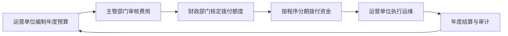

在具体操作层面，以太湖县城镇污水处理费征收使用管理办法为例，污水处理费按照缴纳义务人的用水量按月计收，使用公共供水的单位和个人，其污水处理费由城镇污水主管部门委托公共供水企业在收取水费时一并代征[^2]。征收的污水处理费不能保障本县排水与污水处理设施正常运营的，经城镇污水主管部门会同财政部门审核，报县人民政府同意后给予适当的财政补贴[^2]。这种"征收不足、财政兜底"的模式，构成了核拨制运行的基本逻辑。

从制度定位来看，核拨制本质上是一种**以投入为导向的行政化资金配置机制**，其设计初衷在于保障污水处理设施的基本运营需求。然而，这种机制将运营主体置于被动执行者的角色，资金获取主要取决于核定标准而非运营绩效，从根本上缺乏激励运营效率提升的内生动力。

### 1.2 资金拨付时效性不足的表现与成因

核拨制下资金拨付时效性不足是制约污水处理系统高效运作的首要障碍。这一问题的表现形式多样，成因复杂，涉及行政审批流程、财政预算制度、跨部门协调等多个层面。

**资金拨付滞后的主要表现**包括：一是审批周期冗长，从预算申报到资金到账往往需要数月甚至跨年度；二是拨付节奏与运营需求错配，运营单位面临"先垫资、后报销"的资金压力；三是应急资金获取困难，突发性设备故障或极端天气应对缺乏快速响应机制。

造成这一困境的深层原因可从以下维度分析：

**第一，多层级审批流程繁琐。** 以考核机制为例，改革前部分地区考核指标多达数千个，一次考核需组建多个工作组，抽调近30人检查3-5天，基层单位提前1个月准备上百份佐证材料，负担沉重[^3]。这种繁复的审批与考核程序直接延长了资金拨付周期。遂宁市的改革实践表明，将市级考核指标由3496项压减至108项，压减率达97%，推行年度一次性综合考核，取消基层单位佐证材料报送，可显著提升行政效率[^3]。

**第二，预算年度刚性约束。** 财政预算制度的年度性特征与污水处理运营的连续性需求之间存在结构性矛盾。年初预算编制时难以准确预测全年运营成本变化，年中调整程序复杂，年末结转受限，导致资金使用缺乏灵活性。

**第三，跨部门会签效率低下。** 污水处理资金拨付涉及水务、财政、发改、审计、生态环境等多个部门，部门间协调机制不健全，信息共享不畅，审批环节层层叠加。如武汉市城镇排水与污水处理管理办法所规定，发展改革、财政、自然资源和城乡建设、生态环境、住房和城市更新、交通运输、应急管理、公安、气象等部门需按照各自职责做好城镇排水与污水处理相关工作[^4]，这种多部门分工格局在缺乏高效协同机制的情况下，容易形成审批瓶颈。

资金拨付滞后对污水处理系统运营产生多重负面影响：

| 影响维度 | 具体表现 | 潜在后果 |
|---------|---------|---------|
| 日常运维 | 药剂、电费等支出垫付压力大 | 运营质量下降，出水不稳定 |
| 设备维护 | 预防性维护投入不足 | 设备故障率上升，维修成本增加 |
| 应急响应 | 突发事件资金调度困难 | 环境风险事件处置延误 |
| 技术升级 | 工艺改造资金难以及时到位 | 设施老化，处理效能衰减 |

### 1.3 运营激励机制缺失与效率损耗

核拨制的另一核心缺陷在于其**按成本核定拨付的模式从根本上弱化了运营主体提升效率的内生动力**。在这一机制下，运营收入主要取决于核定的成本标准而非实际运营绩效，形成了"干好干坏一个样"的制度环境。

**激励机制缺失的具体表现**可从以下几个层面理解：

首先，**固定拨付标准抑制技术创新**。当运营主体通过技术改进降低单位处理成本时，节约的资金并不能转化为自身收益，反而可能导致下一年度核定标准降低，形成"鞭打快牛"的逆向激励。核电企业成本管理的经验教训同样适用于污水处理领域——核电发展的阶段特征造就了相对薄弱的成本文化，时代和企业发展的阶段特征、极高的安全性要求等因素使得企业首先保障运营的绝对安全和规模增长，成本管理的意识和文化根基不深[^5]。污水处理行业同样存在类似问题，运营单位缺乏主动降本增效的动力。

其次，**重过程轻绩效的考核导向**。传统核拨制下的考核往往侧重于材料报送、会议记录、领导批示等过程性指标，而非污水收集率、处理达标率、能耗水平等实质性绩效指标。射洪市改革前的考核事项繁杂、指标多达3473个，各单位需准备领导批示、会议记录等大量纸质佐证材料，各部门分散考核，基层疲于应付[^6]。这种考核模式使运营单位将大量精力投入于应付检查而非提升运营效能。

再次，**污水处理提质增效工作推进缓慢**的现实印证了激励机制缺失的后果。中央生态环境保护督察发现，福建省龙岩、泉州城区污水处理提质增效工作推进不力，管网排查工作比较滞后[^7]。泉州市有关部门未认真组织开展污水管网排查工作，2020年和2021年合计仅排查中心城区管网3.5公里，直到2023年初才启动全面排查工作，致使管网改造和修复工作滞后[^7]。2021年泉州市集中收集率应达到58.5%，实际仅为45.1%；2022年目标为60%，实际仅为42.8%[^7]。

更为严重的是，**部分运营单位甚至出现数据造假行为**。督察组抽查发现，安亭污水处理厂未经水质检测，直接编造生化需氧量数据，现场督察时，企业负责人声称生化培养箱正常使用，但培养箱内只有一堆空瓶，无任何水样[^8]。这一案例深刻揭示了核拨制下绩效考核失真、监管机制失灵的制度性风险。

效率损耗的量化表现可从污水处理厂进水浓度这一关键指标观察。《上海市城镇污水处理提质增效三年行动实施方案（2019—2021年）》要求，2021年全市所有城镇污水处理厂进水生化需氧量浓度不低于100毫克/升。然而，2023年全市仍有15座污水处理厂进水生化需氧量浓度低于100毫克/升，青浦区10座城镇污水处理厂中就有6座未达目标要求，其中商榻污水处理厂2023年生化需氧量平均浓度仅49.8毫克/升[^8]。进水浓度偏低意味着大量清水混入污水系统，污水处理设施未能发挥应有效能，造成资源浪费。

### 1.4 成本控制困境与资金使用效益问题

核拨制框架下的成本控制呈现出**核算不精细、费用差异大、管控意识薄弱**的普遍特征，严重制约了资金使用效益的提升。

**成本核算不精细的表现**尤为突出。农村生活污水处理设施运维成本在不少地区仍然是一笔"糊涂账"，不同地区政府、企业及实际运维人员对于设施运维成本说法不一，甚至无法说清运维具体价格、成本覆盖内容、执行电价标准等[^9][^10]。调研发现，各地设施运维成本差异较大，处理运维成本从0.2元/吨到12元/吨不等，即使同一工艺类型，在不同地区，每吨水的运维费用也可能相差几倍[^9][^10]。

成本构成分析显示，污水处理设施运维成本主要包括电费、人工费、药剂费、检测费、维修费、管理费及污泥处理处置等费用，其中电费、人工费占比最大，两者一般占到成本的60%以上[^9][^10]。然而，核拨制下缺乏标准化的成本定额体系，维修维护作业类型丰富、工序复杂，较难归一化和标准化，且受机组设备状况、技术人员技能水平等影响较大，难以建立和维系合理的成本定额和成本标准体系[^5]。

**重外源资金筹措而轻内源成本管控**的制度倾向加剧了成本控制困境。据统计，全国已有17个省（自治区、直辖市）制定了专门针对农村生活污水处理设施运行维护的相关文件，其中13个省提出"加大投入，增加资金筹措渠道"等相关要求，但也仅是强调"外源"成本总量的投入，没有降低运维成本的措施[^9][^10]。除浙江省等少数地区从处理工艺、运维指导价格、电费支付方式等多方面考虑控制运维成本外，其他省份尚未开展"内源"成本控制。

规划统筹不足导致的资金浪费同样值得关注。核电站项目建设的经验教训表明，由于缺乏合理的整体规划，很多设施建成后影响布局或功能不能满足实际需求，很快就被拆除，浪费了大量资金[^11]。污水处理领域同样存在类似问题：

- **规划统筹不够**：农村生活污水治理需与改水改厕、房屋改造、村庄美化等一体规划、合理安排工期，否则容易出现管网或设施反复维修、升级改造等情况，增加后期运维成本[^9][^10]
- **部门间统筹不够**：由于各部门职责不同、互相沟通交流不足，工作安排衔接性差，如先建污水处理设施后改厕，污水处理站在后续运行中容易出现进水浓度偏低等问题[^9][^10]
- **资料管理不当**：项目工程中的各种资料是开展后期维修与维护工作的必要依据，如果因收集不及时、保管不当而导致资料残缺，将大幅增加管理与维护费用[^11]

资金使用效益问题还体现在**污水处理费征收不足与财政补贴压力增大**的矛盾中。污水处理费征收标准的制定和调整需报县人民政府批准后执行，但征收的污水处理费往往不能保障排水与污水处理设施正常运营[^2]。这种资金缺口只能依靠财政补贴填补，而县级财政普遍困难，农村生活污水处理设施运维资金仅仅依靠区县基层财政，难以保障持续稳定的资金支持[^9][^10]。

### 1.5 跨部门协作障碍与雨污系统协同困境

核拨制下**污水处理与雨水排涝系统分割管理**的现实问题，构成了制约排水系统整体效能提升的结构性障碍。这种"条块分割"的管理模式导致部门职责交叉、信息共享不畅、管执衔接不足，难以适应厂站网一体化、雨污协同治理的系统性需求。

**跨部门协同障碍的具体表现**可从以下典型案例中得到印证：

上海市执法总队组织召开的在建工地排水监管专题工作协调会，围绕在建工地排水行为管理、排放过程监管及对公共排水设施的影响等问题进行深入研讨，与会各方就管执衔接、协同处置等工作机制交换意见[^12]。会议强调要以此次协调为契机，进一步强化信息共享与协作配合，健全跨部门跨层级协同机制[^12]。这种依赖临时协调会解决问题的方式，恰恰反映了常态化协同机制的缺失。

普陀区党建引领社会治理的实践揭示了跨部门协作的深层困境。金沙江路地铁站外早晚高峰时段非机动车乱停放情况严重，近一个月来接到不少市民反映，迫切希望尽快解决[^13]。这一问题涉及区建管委、区规资局、区绿化市容局、区交警支队等多个部门，需要通过党建联席会议进行协调[^13]。排水系统管理同样面临类似的多部门协调难题。

**雨污系统协同不畅的典型问题**集中体现在以下几个方面：

**一是雨污混接问题突出。** 龙岩市污水管网建设改造工作不到位，老旧城区和40个城中村合计14.9平方公里区域雨污不分，占建成区总面积比例达20%以上，雨季大量污水下江入河[^7]。江山名筑、印象天悦等小区管网混错接问题突出，龙物小区等三个小区污水一直未接入管网，长期直排[^7]。

**二是泵站放江污染严重。** 上海市部分区域污水管网建设不完善，管网混接、雨污合流，造成雨天大量污水溢流外排。2023年全市有3500余万吨污水直排长江，其中经白龙港污水处理厂溢流口外排的就超过2500万吨[^8]。全市现有的371座防汛泵站中，124座存在雨季排污问题，污染城市水环境，受其影响，虬江、桃浦河等河道多次出现雨季水质恶化现象[^8]。

**三是污水溢流问题依然存在。** 龙岩市中心城区的铁山污水处理厂早在2019年就已满负荷运行，但相关部门推动污水处理厂扩建工作进展缓慢，直到2023年6月才开工建设。大量生活污水通过铁山污水处理厂进水总管的溢流口直排龙津河，2023年1—10月溢流量达220万吨[^7]。

**四是内涝防治与污染控制难以兼顾。** 武汉市城镇排水与污水处理管理办法规定，存在内涝风险的交通、燃气、电力、通讯、医疗、供（排）水、隧道等重要设施的权属单位和维护运营单位应当采取必要的防内涝自保措施[^4]。然而，在分割管理模式下，内涝防治主要关注排水速度，污染控制侧重处理达标，两者目标之间存在潜在冲突，缺乏统一的调度协调机制。

**协同困境的深层原因**可归结为：

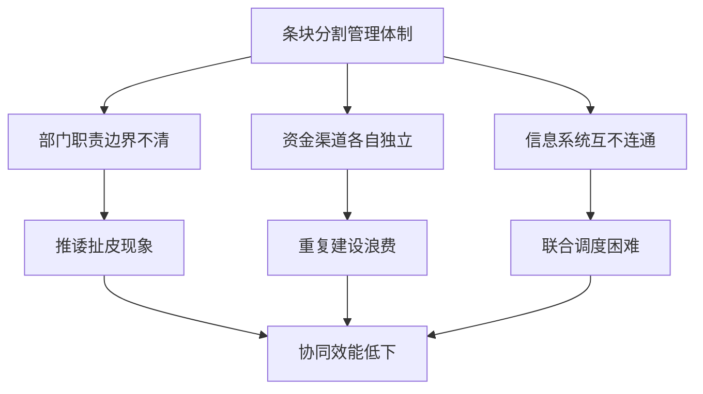

上海市排水管理体制改革方案的出台，正是对这一困境的制度性回应。该方案提出到2026年底，将相关区域内雨污水公共排水设施交由上海城投集团实施市属污水处理片区厂站网一体化运维管理，发挥规模效应，推动降本增效，实现统一运维管理、统一技术标准、统一运行调度、统一服务质量、统一核算机制[^14]。黄浦区排水管理体制改革实施方案进一步细化了这一目标，明确在坚持"五个不变"（规划建设分工不变、设施资产权属不变、政府监管职责不变、属地防汛责任不变、日常运维资金渠道不变）和"五个统一"的原则下推进改革[^15][^16]。

这些改革探索表明，**从核拨制向一体化运维管理转型**已成为破解协同困境的重要方向。改革目标中明确的预期指标包括：管道养护抽查合格率95%以上、污水厂进厂BOD₅年均浓度大于100mg/L、污水厂无溢流（极端天气情况除外）、泵站放江符合生态环境管控要求、管网低水位运行、外水入侵减少、中心城区道路标准以内降雨不发生积水、发生险情立即响应并在接到抢险指令后30分钟内抵达现场等[^14]。这些指标的设定，体现了从分割管理向系统协同的转型方向。

综上所述，核拨制在市政污水收集处理领域面临的效率困境与协同挑战，根源在于其作为一套复合型制度，在运行中未能有效整合公共事业管理、财政预算管理和绩效合同管理。资金拨付时效不足、运营激励机制缺失、成本控制困境、跨部门协作障碍等问题相互交织，形成了制约系统效能提升的结构性矛盾。突破这一困境，需要从制度设计、管理机制、技术支撑等多维度进行系统性改革，构建适应现代城市治理需求的高效协同新模式。

## 2 目标与原则：构建高效、协同、可持续排水系统的理论框架

基于第一章对核拨制效率困境与协同挑战的系统剖析，本章将构建超越核拨制的理论框架，明确改革的总体目标与核心原则。这一框架不仅是对现有问题的回应，更是为后续具体方案设计提供价值基准与逻辑指引，确保改革方向与中国城镇化进程及生态文明建设要求相契合。

### 2.1 总体目标：运营效能、系统协同与财务可持续的三维愿景

超越核拨制的改革并非简单的机制替换，而是要构建一套能够支撑排水系统长期良性运转的目标体系。这一体系需涵盖**运营效能、系统协同与财务可持续**三大核心维度，形成相互支撑、动态平衡的整体愿景。

**运营效能维度**聚焦于污水收集处理的核心功能实现。从国内先进实践来看，上海市排水管理体制改革方案设定的预期指标具有重要参照价值：管道养护抽查合格率95%以上、污水厂进厂BOD₅年均浓度大于100mg/L、污水厂无溢流（极端天气情况除外）、发生险情立即响应并在接到抢险指令后30分钟内抵达现场等。这些指标的设定体现了从过程管理向结果导向的转型方向。具体而言，运营效能目标应包括：

- **污水收集效能**：提升城镇污水集中收集处理率，如镇江太湖流域实践显示，丹阳市城镇污水集中收集处理率提升至75.8%、丹徒区提升至86.4%[^17]
- **进水浓度指标**：确保污水处理厂进水BOD浓度达标，避免大量清水混入造成处理资源浪费
- **处理达标率**：出水水质稳定达到排放标准，支撑流域水环境质量改善
- **应急响应能力**：建立快速响应机制，极端天气下保障排水安全

**系统协同维度**强调打破条块分割、实现整体优化。连云港经济技术开发区的实践表明，通过建立多部门数据协同机制，打通雨水监测、管网流量等关键数据链路，构建覆盖"雨情—水情—工情"的全要素数字底座，可实现排水治理从"被动应对"到"主动预判"、从"人力密集"到"智慧集约"的转型[^18][^19]。系统协同目标应涵盖：

- **厂站网一体化运维**：实现统一运维管理、统一技术标准、统一运行调度、统一服务质量、统一核算机制
- **雨污系统联动调度**：建立内涝防治与污染控制双重目标兼顾的协调机制
- **跨部门协作优化**：形成水务、财政、生态环境等部门的常态化协同机制

**财务可持续维度**关注资金保障与成本控制的长效机制。海南省"十四五"水务发展经验显示，通过系统推进基础设施建设与体制机制改革，2021—2025年累计完成"六水共治"全口径投资967亿元，实现了多项重要指标的显著提升[^20]。财务可持续目标应包括：

| 目标类别 | 具体内容 | 评价标准 |
|---------|---------|---------|
| 资金拨付时效 | 建立与运营需求匹配的资金保障机制 | 资金到位率、拨付周期 |
| 成本控制精细化 | 建立标准化成本核算与定额管理体系 | 单位处理成本、成本降幅 |
| 价费机制合理化 | 污水处理费逐步覆盖全成本 | 成本覆盖率、调价机制完善度 |
| 投融资渠道多元化 | 形成财政、收费、社会资本多元保障 | 社会资本参与度、融资成本 |

三维目标之间存在内在的逻辑关联：**运营效能是改革的核心目的，系统协同是实现效能提升的组织保障，财务可持续是支撑长期运转的资源基础**。三者相互依存、缺一不可，共同构成指导改革实践的目标框架。

### 2.2 理论基础：公共管理与系统工程视角的整合分析

构建超越核拨制的理论框架，需要整合公共管理与系统工程的多元视角，形成本土化的分析范式。

**新公共管理理论**为引入绩效导向与市场化机制提供了理论支撑。该理论强调将私营部门的管理技术引入公共服务领域，通过竞争机制、绩效考核、合同管理等手段提升公共服务效率。在排水系统管理中，这一理论的应用边界需要审慎把握：一方面，绩效合同、特许经营等市场化工具可有效激发运营主体的效率动力；另一方面，排水系统作为重要的城市基础设施，其公共属性决定了政府监管责任不可弱化。工业水处理领域的理念革新提供了有益启示——越来越多的工业企业已摒弃"投资最低"的评定原则，转向从"全生命周期综合价值最优"的角度评定技术应用[^21]。这一理念转型对市政排水系统同样具有重要借鉴意义。

**新公共治理理论**为多元主体协同与网络化治理提供了分析框架。该理论超越了传统的政府—市场二元对立，强调公共服务供给中多元主体的协作与网络化治理。常德武陵高山街社区的实践案例生动诠释了这一理念：在解决污水倒灌问题过程中，社区发挥核心协调作用，创建专干与纪检专干通力合作，一方面督促职能部门履职尽责，另一方面积极搭建对话平台，形成了有效的多元协同治理模式[^22]。在排水系统管理中，政府、运营企业、社会公众、行业协会等多元主体的协同参与，是提升治理效能的关键路径。

**系统工程理论**为厂网站河全链条优化提供了方法论框架。排水系统是一个典型的复杂系统，涉及源头收集、管网输送、泵站提升、污水处理、尾水排放等多个环节，各环节之间存在复杂的耦合关系。上海市排水模型应用实践表明，排水模型具备可识别、可预测和可评估的三大特性，利用其特性可以完成对排水系统的全生命周期管理：首先可进行排水系统问题清单梳理，形成内涝风险图、隐患图等可视化图表；其次可优化改造或新建工程方案，辅助确定区域性工程开展时序；最后可对工程方案实施前后的效果进行预评价和后评估[^23]。系统工程视角要求将排水系统作为整体进行优化，而非孤立地改进单个环节。

**中国制度语境下的理论整合**需要特别关注以下要点：

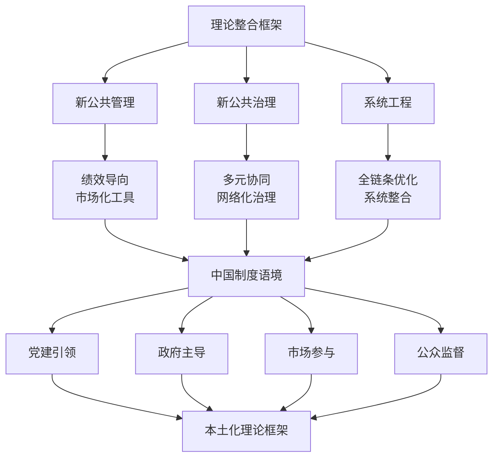

在中国城镇化进程与生态文明建设的制度语境下，理论框架的本土化整合需要坚持：**党建引领**确保改革方向正确、**政府主导**保障公共利益优先、**市场参与**激发效率动力、**公众监督**促进服务质量提升。这一整合框架既吸收了西方公共管理理论的有益成分，又充分体现了中国特色的治理优势。

### 2.3 核心原则一：全生命周期成本最优

**全生命周期成本最优原则**要求突破传统核拨制下重建设投资、轻运维成本的思维定式，将规划设计、建设投资、运营维护、更新改造、报废处置等全周期成本纳入统一核算框架，实现从"投资最低"向"综合价值最优"的理念转型。

这一原则的提出源于对核拨制成本管控困境的深刻反思。如第一章所述，传统模式下农村生活污水处理设施运维成本在不少地区仍是"糊涂账"，处理运维成本从0.2元/吨到12元/吨不等，即使同一工艺类型在不同地区每吨水的运维费用也可能相差几倍。这种成本核算的粗放状态，根源在于缺乏全生命周期视角的系统考量。

**全生命周期成本的构成要素**可从以下框架理解：

| 阶段 | 成本构成 | 核心考量 |
|-----|---------|---------|
| 规划设计 | 可研、设计、咨询费用 | 方案比选的经济性分析 |
| 建设投资 | 土建、设备、安装费用 | 初始投资与运维成本的平衡 |
| 运营维护 | 电费、药剂、人工、检测费用 | 日常运行的成本效率 |
| 更新改造 | 设备更换、工艺升级费用 | 设施全寿命的经济性 |
| 应急处置 | 突发事件响应与修复费用 | 风险成本的预防与控制 |

工业水处理领域的实践经验为这一原则的应用提供了有益参照。河南安阳钢铁全厂污水处理厂优化升级项目采用双端抽吸的浸没式超滤替代原有多介质砂滤器，同时将反渗透系统更换成低能耗、高通量、抗污染的膜元件。从2023年前3季度的运行数据来看，产水总量已达优化升级前的两倍，而运行总电耗仅为优化升级前的90%[^21]。这一案例表明，基于全生命周期视角的技术选型，虽然初始投资可能较高，但综合运营成本显著降低，实现了真正的"降本增效"。

河钢乐亭钢铁的实践同样具有启示意义。该企业在新建全厂综合废水处理工艺选择上，基于全生命周期视角，结合运行经验及中试验证，在钢铁综合废水回用上率先采用高性能陶瓷膜超滤技术。该技术具有使用寿命长、过滤通量大、化学兼容性优、抗水质波动性强的特点，同时有益于提升水系统稳定性和供水安全性[^21]。

**全生命周期成本最优原则的应用逻辑**可概括为：

第一，**设施选型决策**应综合考虑初始投资与长期运维成本。格栅机选型的经验表明，碳钢格栅初始成本低但寿命仅5-8年，不锈钢格栅虽价格高30%-50%但使用寿命可达15年以上。对于水质复杂的项目，不锈钢格栅的全生命周期成本更低[^24]。

第二，**工艺选择决策**应基于全流程成本优化。化工废水处理工艺定制化设计的方法论强调"基于水质、瞄准标准、匹配工艺、平衡成本"，需综合考虑预处理、生化处理、深度处理各环节的成本构成与技术适配性[^25]。

第三，**运维模式决策**应权衡自营与外包的综合效益。宝武水务在钢铁工业废水零排放工艺已迭代升级至3.0版，采用模块化设计，结合不同水质情况将各模块进行组合使用，通过工艺流程和装备的标准化实现降本增效[^21]。

第四，**更新改造决策**应建立科学的设施健康评估与重置成本核算体系。设计师要充分了解利旧设施现状和存在问题，精细核算水头损失，减少不必要的设计余量，同时充分考虑企业生产波动和季节变换等因素可能带来的工况偏差[^21]。

### 2.4 核心原则二：绩效导向激励相容

**绩效导向与激励相容原则**是破解核拨制下运营激励机制缺失痼疾的核心要义。该原则要求构建以实质性绩效指标为核心的考核体系，设计使运营主体降本增效行为与自身利益正向挂钩的激励机制，从根本上解决"干好干坏一个样"的制度困境。

上海市市属排水设施运行维护绩效考核办法为这一原则的制度化应用提供了重要范本。该办法明确建立服务效能管理和考核付费挂钩的机制，考核指标体系包括防汛泵站设施以及其他考核共计2项，其中防汛泵站考核项目主要包含泵站运维工作完成情况、截流设施使用率、调蓄设施使用率、泵站污泥处理处置、低水位运行工作情况、泵站设施运行年度考核情况、泵站设施设备完好率、监测站点在线率、清淤完成率等共20项四级考核指标[^26]。

**绩效考核指标体系的设计要点**包括：

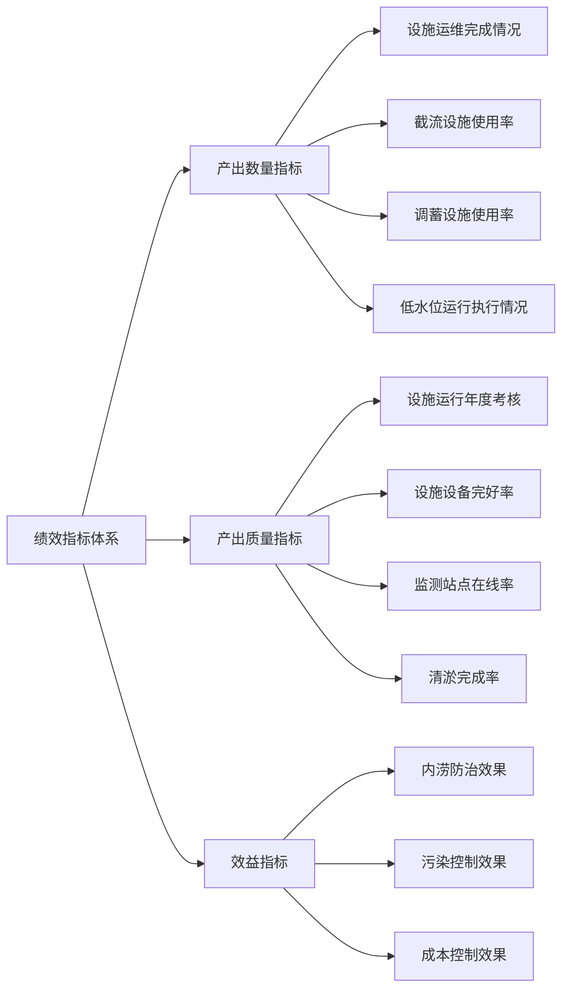

**激励相容机制的核心设计**在于将绩效考核结果与资金支付直接挂钩。上海市的办法规定：得分为90分以上（含90分），全额支付年度服务费用；得分为90分以下，每降低1分（以90分为基准）扣减年度核算服务费用200万元[^26]。这种"按效付费"机制使运营主体的收入与服务质量直接关联，形成了正向激励。

然而，绩效导向机制的设计需要审慎把握制度设计与人性激励之间的辩证关系。行业研究指出，全面绩效管理或部分违背了人性下的激励相容原则，可能压制提高效率的动机，扼杀绩效提升的动力，这一风险对特许经营企业和专营企业均存在[^27]。因此，绩效指标的设定应遵循以下原则：

- **可量化、可验证**：指标应具备客观测量标准，避免主观评判的随意性
- **可控性**：指标应在运营主体的能力范围内，避免因外部因素导致的考核失真
- **激励强度适中**：奖惩力度应足以产生激励效果，但不至于导致冒险行为或数据造假
- **动态调整机制**：指标体系应根据实际运行情况适时优化，保持激励的有效性

青岛西海岸公用事业集团的智慧水务实践为绩效监管提供了技术支撑路径。该集团建成包含供水调度系统、地理信息系统、视频可视化系统、污水管控平台等9大系统的智慧水务平台，实现了水务管理智能化、精细化、智慧化[^28]。智慧化平台的建设使绩效数据的采集、核验、分析更加客观准确，为"按效付费"机制的公正实施奠定了技术基础。

### 2.5 核心原则三：厂网一体系统整合

**厂网一体化原则**是提升排水系统整体效能的组织保障。该原则要求打破污水处理厂与管网分割运营的传统模式，实现"统一运维管理、统一技术标准、统一运行调度、统一服务质量、统一核算机制"，通过规模效应与协同效应降本增效，从根本上解决"厂强网弱、管治脱节"等结构性问题。

龙岩水发环境集团的"厂网一体化"实践提供了可借鉴的改革样本。该集团创新性地走出了厂网一体、市区一体、建管一体"三位一体"的系统性治理新路子，推动全市城乡生活污水治理实现从"末端兜底"到"系统治理"的历史性跨越。经过系统性治理，中心城区污水处理厂进水BOD浓度较治理前提升40%，龙岩中心城区出城水质达Ⅲ类以上[^29]。

**厂网一体化的核心内涵**可从以下维度理解：

第一，**修旧网**解决历史欠账。龙岩水发环境集团针对71条道路的管网"顽疾"，实施专项修复工程约30公里；2019年以来累计排查管网2445.92公里、清淤检测290公里，精准修复管道结构性缺陷约5000处，完成雨污水管网错混接改造约360处[^29]。

第二，**建新网**填补覆盖空白。紧跟市政道路建设步伐，同步铺设主次干道污水管道75.2公里，织就"干支相连、全域贯通"的污水收集骨干网[^29]。

第三，**覆远网**延伸治理触角。以"城乡治水一盘棋"视野，成立分公司及项目公司，让治理触角延伸至乡村末梢，推动农村生活污水收集与处理工程规范运转[^29]。

镇江丹阳市水环境治理提升项目同样体现了厂网一体化的系统思维。该项目将主城区划分为39个排水片区分步实施，紧扣"提升污水集中收集率"这一核心痛点：一方面扩容污水处理厂，新增处理能力3万吨/日；另一方面全面摸清管网"家底"，对约223公里污水管网开展清淤、检测和修复，新改建污水管网约35公里，补齐管网空白区，同步推进雨污分流[^17]。

**厂网一体化的实现路径**需要同步推进组织整合与技术支撑：

| 整合维度 | 具体措施 | 预期效果 |
|---------|---------|---------|
| 运维管理统一 | 由统一主体负责厂站网全链条运维 | 消除责任边界模糊，提升响应效率 |
| 技术标准统一 | 制定覆盖全系统的运维技术规范 | 保障运维质量一致性 |
| 运行调度统一 | 建立厂站网联合调度机制 | 实现系统整体优化 |
| 服务质量统一 | 建立统一的服务标准与考核体系 | 提升服务水平均衡性 |
| 核算机制统一 | 建立全成本核算与绩效挂钩机制 | 激励整体效能提升 |

丹阳项目同步建设"厂网站"一体化管控平台，集成物联监测、视频管理和数据管理功能，实时采集泵站、污水厂、管网关键节点和河道排口数据，实现从源头到末端的协同管控。"最大的变化，是从'多头管理'变成'一体运维'。"这一模式有效破解了设施衔接不畅的问题，为长效治理提供了技术支撑[^17]。

### 2.6 核心原则四：雨污协同功能互补

**雨污协同功能互补原则**针对雨水排涝与污水处理系统分割管理的现实困境，构建内涝防治与污染控制双重目标兼顾的协调机制，推动雨污系统从分割管理向协同治理转型。

重庆两江新区的河湖厂网一体化改革实践充分体现了这一原则的价值。该区以"大综合一体化"为核心，深入推进河湖厂网一体化改革：在管理层面，打破"九龙治水"格局，整合水利、供水、排水等职能，构建大部制一体化运行体制；在运维层面，推行河湖管网一体化专业化运维，依托规模化运营实现降本增效，创新"按效付费"考核体系[^30]。改革实施后，人和湖、跳墩河等一批生态地标涌现，成为市民休闲打卡的好去处，更带动了周边经济发展。

**雨污协同的核心要义**在于实现防汛安全与水环境保护的功能互补：

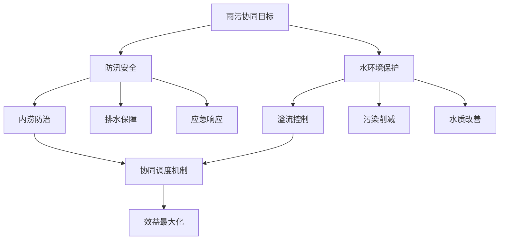

上海市排水模型应用实践为雨污协同提供了技术方法支撑。污水系统模型的主要运行目标为"稳输送、增水量、控溢流"，模型应用多集中于对工程方案实施前后的效果进行预评价和后评估，确定其成效并辅助提供运行策略，包含系统运行调度方案、调蓄池运行方案、系统低水位运行方案以及系统改扩建方案等。根据模型模拟结果，可暴露污水现状系统的问题清单，厘清各行政区地下水渗入量和雨水渗入量，为系统雨污混接改造、管网检测修复、系统健康评估等日常工作提供技术支撑[^31]。

**雨污协同的具体实现路径**包括：

第一，**规划层面的统筹协调**。将雨水排涝与污水处理纳入统一的排水系统规划，合理布局调蓄设施、泵站、处理厂等关键节点，避免重复建设与资源浪费。

第二，**运行层面的联合调度**。连云港开发区的实践表明，平台利用大数据算法模型，可动态预判管网负荷与内涝风险，生成最优调度方案；实现数据分级预警与工单的线上派发、线下处置、结果反馈全程跟踪[^18][^19]。

第三，**应急层面的联动响应**。建立雨污系统联合应急预案，在极端天气条件下实现资源互助与协同处置。海南省水务系统有效防御超强台风"摩羯""潭美"等系列台风以及多轮强降雨，全省未发生水库溃坝、堤防决口等重大水利工程险情，防洪安全保障能力持续提升[^20]。

第四，**资源化利用的协同开发**。再生水用于生态补水可替代部分雨水资源，实现水资源的循环利用与效益最大化。

### 2.7 原则间的逻辑关联与整体框架

上述四大核心原则并非孤立存在，而是相互支撑、有机统一，共同构成指导具体方案设计的完整理论框架。

**四大原则的内在逻辑关系**可从以下维度理解：

**全生命周期成本最优**为资源配置提供经济理性基准。这一原则从价值层面确立了改革的经济逻辑，要求所有方案设计都必须经过全周期成本效益分析的检验，避免短期行为导致的长期成本增加。

**绩效导向激励相容**为运营管理注入效率动力。这一原则从机制层面解决核拨制下激励缺失的核心问题，通过将运营主体利益与服务绩效挂钩，激发其主动降本增效的内生动力。

**厂网一体系统整合**为组织架构确立优化方向。这一原则从组织层面打破条块分割的管理格局，通过统一运维主体实现规模效应与协同效应，为绩效管理提供可操作的组织载体。

**雨污协同功能互补**为系统运行明确协调目标。这一原则从功能层面拓展改革视野，将排水系统作为整体进行优化，实现内涝防治与污染控制的双重目标兼顾。

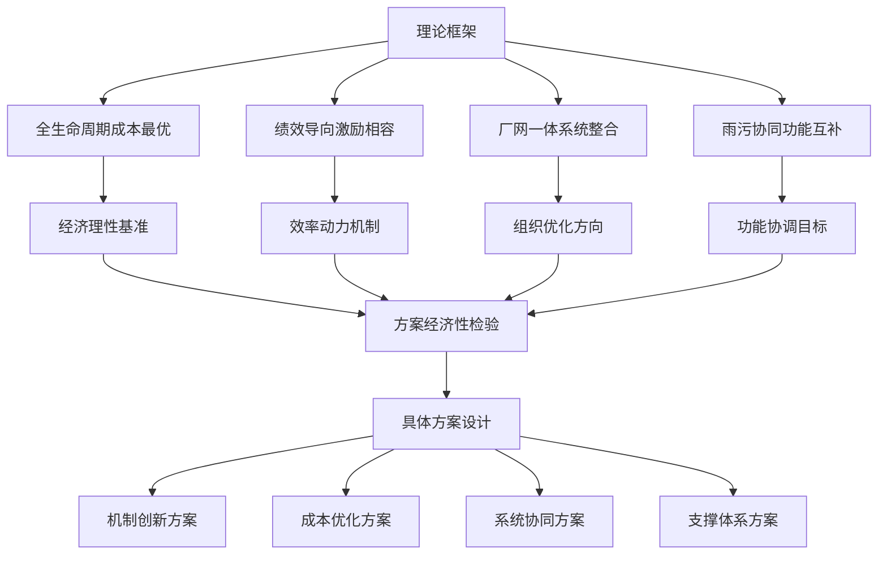

**整体框架的协同作用机制**体现在：成本优化在协同管理中实现——厂网一体化运维可通过规模效应降低单位成本，雨污协同可避免重复建设与资源浪费；系统协同在智慧赋能下增效——绩效考核需要智慧化平台提供客观数据支撑，联合调度需要模型模拟提供决策依据；而所有创新最终通过分阶段的实施路径转化为现实生产力，形成"机制驱动—技术赋能—管理协同—成本可控"的良性循环。

这一理论框架的构建，既充分吸收了国内先进实践的经验启示，又系统整合了公共管理与系统工程的理论精华，为后续具体方案设计提供了清晰的价值基准与逻辑指引。在此框架指导下，机制创新方案将聚焦于绩效合同与市场化运营的管理转型，成本优化方案将着力于全生命周期视角下的资金保障与分摊机制，系统协同方案将探索污水处理与雨水排涝的整合运作策略，支撑体系方案将构建智慧赋能与标准规范的配套建设，最终形成一套系统完整、逻辑自洽、操作可行的改革方案体系。

## 3 机制创新：从核拨到绩效合同与市场化运营的管理转型方案

基于前两章对核拨制效率困境的系统剖析与理论框架的构建，本章将聚焦管理机制的实质性转型方案设计。从绩效服务合同、特许经营、区域一体化运维到合同节水管理，各类市场化机制为突破核拨制的激励缺失与协同障碍提供了可操作的替代路径。本章将系统分析各类机制的运作逻辑、适用条件与关键合同条款，为地方政府因地制宜选择改革路径提供决策参考。

### 3.1 绩效服务合同模式：可用性付费与运营绩效挂钩机制设计

绩效服务合同模式是突破核拨制"干好干坏一个样"激励困境的核心机制创新。该模式的本质在于**将财政支付与服务效果直接挂钩**，通过科学设定绩效指标、建立透明考核机制、实施差异化付费，激发运营主体主动提升效率的内生动力。

**绩效服务合同的核心架构**可从以下框架理解：

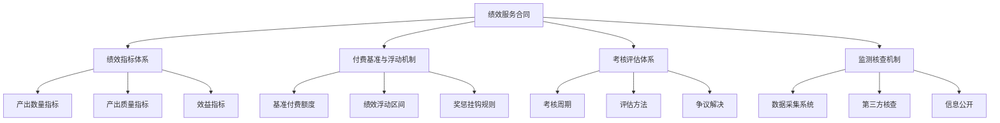

**绩效考核指标体系的构建**是该模式成功实施的关键。湖南省推进城镇污水处理质效提升行动的实践表明，应将污水处理厂进水污染物浓度、污染物削减量和污泥无害化处理率等作为核心考核指标，构建以污染物削减绩效为导向的"按效付费"机制，实现"厂网一体"工程建设与运营效果的联动考核[^32]。

基于国内先进实践经验，绩效考核指标体系应涵盖以下核心维度：

| 指标类别 | 具体指标 | 考核标准 | 权重建议 |
|---------|---------|---------|---------|
| **进水水质指标** | 进水BOD浓度 | ≥100mg/L | 20%-25% |
| **污染物削减** | COD、氨氮削减量 | 达到设计处理能力 | 25%-30% |
| **设施运行** | 设施设备完好率 | ≥95% | 15%-20% |
| **溢流控制** | 污水厂溢流次数 | 极端天气外无溢流 | 10%-15% |
| **应急响应** | 险情响应时间 | 30分钟内抵达现场 | 10%-15% |
| **污泥处理** | 污泥无害化处理率 | 100% | 5%-10% |

**付费基准与浮动机制的设计**直接决定激励效果的强度。参照上海市市属排水设施运行维护绩效考核办法的经验，可建立如下付费挂钩机制：得分为90分以上（含90分），全额支付年度服务费用；得分为90分以下，每降低1分（以90分为基准）扣减年度核算服务费用一定比例。这种"阶梯式"付费机制使运营主体的收入与服务质量形成清晰的正向关联。

湖南省的改革实践进一步验证了该模式的降本增效潜力。湘潭市4座污水处理厂在原特许经营协议基础上全部补充签订了"按效付费"协议，成为第一个全面实施"按效付费"的城市。通过实施一批"撇清水、挤外水、收污水"项目，**撇除外水和"按效付费"每年可节省资金5000多万元**，原规划的6万吨/日的铁牛埠污水处理厂无需建设，节省建设投资约3.5亿元、节约用地约120亩[^32]。

**第三方监测核查机制**是确保绩效考核公正性的制度保障。福州市城市供水漏损治理合同节水管理项目的经验表明，为确保节水效果可监测、可报告、可核查，甲乙双方聘请福建省计量科学研究院作为第三方检测评估机构[^33]。在排水系统绩效合同中，同样应建立权威、透明的第三方监测体系，利用物联网等技术实现数据实时共享与验证，避免绩效数据造假或计量纠纷。

**绩效服务合同模式的适用场景**主要包括：一是**存量设施提质增效**，如管网漏损治理、污水处理厂提标改造等目标明确、可量化的专项任务；二是**政府希望引入专业技术与管理**，但不愿或无法承担全部投资风险的情形；三是**需要快速见效**的改革场景，专业公司介入能针对性解决难题。

### 3.2 特许经营模式：BOT、TOT及其变体的适用场景与合同要点

特许经营模式是市政排水领域市场化运营的传统路径，通过政府授予社会资本一定期限内的建设和/或运营权，实现公共服务供给的效率提升与财政压力缓解。根据项目特点与政府目标的不同，可选择BOT、TOT、BOOT等不同变体。

**BOT模式（建设-运营-移交）** 是指国家或地方政府与社会资本方签订特许经营协议，社会资本方获得污水环保项目的特许权，并在特许期内对项目的融资、建设、运营及维护等负责，通过运营收益将投资收回并赚取利润，期满后将项目无偿移交给政府[^34]。

BOT模式在市政排水领域的**主要优势**包括：

- **缓解财政压力**：将国内外的社会资本引入污水处理行业，避免了因政府缺乏资金投入制约污水处理行业发展的问题[^34]
- **促进市场化改革**：由社会资本方发起、筹资、组织实施和经营管理，可避免政企不分、政府过多包揽的问题，引入竞争机制[^34]
- **引进先进经验**：国内外行业公司的管理经验及先进技术可提高污水处理的运营效率[^34]
- **促进政府职能转变**：政府可将精力主要投放在宏观监管上，有助于城市整体规划管理[^34]

**TOT模式（移交-运营-移交）** 是指通过在一定时间内出售现有已完成项目的现金流来获得资金建立新项目的融资方式。通俗而言，是将政府项目或国有企业的产权或经营权在一定时期内转让给社会投资者，以便获得大量资金投入建设新项目；投资者在规定期限内运营公司并获得应有报酬，合同期满后将项目退还给政府[^35]。

TOT模式特别适用于**存量项目盘活**场景。在污水处理厂的项目工作中使用TOT模式，在污水厂提高管理效率并降低运营成本的同时，政府监测污水的质量，使经济与环境双重效益得以实现[^35]。

**各特许经营模式的比较分析**如下表所示：

| 模式 | 核心特征 | 适用场景 | 主要优势 | 主要风险 |
|-----|---------|---------|---------|---------|
| **BOT** | 建设-运营-移交 | 新建项目、政府财政压力大 | 吸引社会资本、引入先进技术 | 建设风险、长期政策风险 |
| **TOT** | 移交-运营-移交 | 存量设施盘活、引入专业运营 | 快速变现、规避建设风险 | 资产估值、人员安置 |
| **BOOT** | 建设-拥有-运营-移交 | 需明确产权的大型项目 | 产权清晰、投资激励强 | 期限更长、风险更大 |
| **BOO** | 建设-拥有-运营 | 非核心基础设施 | 投资回报充分 | 不移交政府 |

**特许经营协议的关键条款设计**应重点关注以下要素：

第一，**特许权范围与期限**。特许期限的确定是核心条款，BOT模式的特许经营期一般超过二十年[^34]。期限设定需平衡社会资本的投资回收需求与政府的长期利益保护。

第二，**风险分担机制**。应遵循"风险由最能控制的一方承担"原则，明确政治风险、市场风险、建设风险、运营风险等的分担方式。在我国，为保证特许权项目的顺利实施，在特许期内，如因政府政策调整因素影响使项目公司受到重大损失的，允许项目公司合理提高经营收费或延长特许期[^36]。

第三，**价格调整条款**。建立合理的定价与调价机制，确保项目经济可行性与公共利益保护的平衡。

第四，**绩效考核与退出机制**。将绩效考核纳入特许经营协议，建立基于运营效果的付费调整机制和违约退出条款。

**TOT模式实施的关键环节**包括资产接收前期准备和正式接收两个阶段。资产接收工作中需重点关注：原有国企职工安置、建设资金债务负担、设计规模严重超前造成资产闲置等问题。在法律方面，要确保资产移交协议的有效性，明确资产权益及责任分配依据[^35]。

**特许经营模式的主要风险**不容忽视。BOT模式在我国污水环保领域的运用中存在以下弊端：一是**对政策长期稳定性的隐忧**，BOT模式的特许经营期一般超过二十年，人们对长时间内的国内外经济环境、政府相关政策的变化预见有一定的局限性[^34]；二是**市场需求与收费风险**，水量、水价波动影响收益；三是**移交风险**，期满后设施状况可能不佳。

### 3.3 区域一体化运维模式：厂网河湖一体的组织整合路径

区域一体化运维模式是破解"条块分割"管理困境、实现系统效能最大化的组织创新方向。该模式的核心在于**打破厂、网、站、河分割管理格局**，由统一运维主体实现全链条系统治理，通过规模效应与协同效应实现降本增效。

**区域一体化运维的核心理念**可从瀚蓝环境的实践中得到深刻诠释。瀚蓝排水从最初仅运营净水厂，发展到如今实现"厂网源河"一体化运营，经历了行业从分割管理到系统治理，从工程导向到运营为王，政府监管从按量考核到按效付费的变迁[^37]。这一演进历程表明，**系统化治理是按效付费的基础，财政效能的提升必须打破分割管理的桎梏**。

**一体化运维模式的三大特征**体现为：

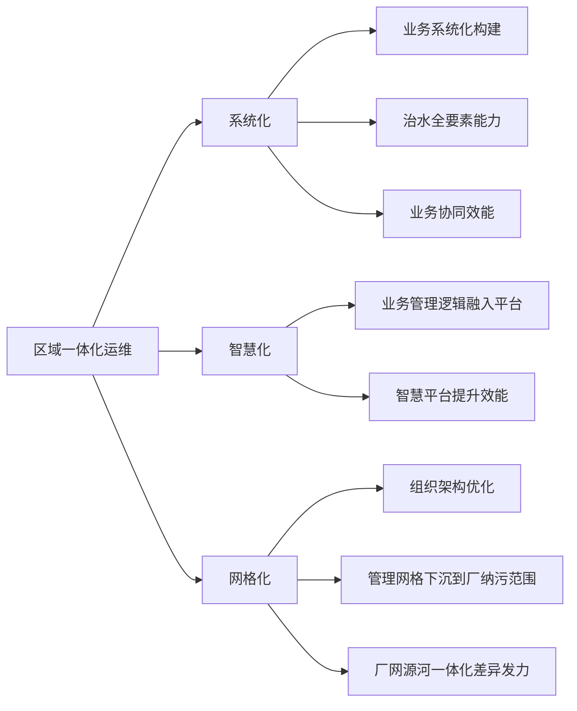

**重庆两江新区河湖厂网一体化改革**为该模式提供了典型范例。两江新区在全市率先实施河湖厂网一体化改革，通过推进底图一体化、管理一体化、运维一体化及执法一体化，有效解决了城市水务管理多头、链条长、投入大等问题[^38]。具体而言：

- **底图一体化**：推进管网"空间、结构、功能"三属性精细化排查，以综合管线数字孪生为抓手，推动河湖厂网底图底数一体化呈现
- **管理一体化**：整合排水管理职能职责，建立"网格化排查"+"专业化治理""流域+区域"协同机制，形成区、街道、社区、网格四级联动的管网问题巡查治理机制
- **运维一体化**：根据相邻水系、互不交叉和区域一体化的原则，由流域治理单位对河湖管网进行一体化全链条运维
- **执法一体化**：实行同点、同时、同标、同桶、同表的"五同"检测体系，全面整合涉水领域监管执法[^38]

**长沙市排水一体化改革**同样具有重要参考价值。长沙市出台了《长沙市城区排水一体化改革实施方案》，采取"委托运营+绩效合同管理"改革模式，将城区市政排水设施交由长沙水业集团实行"厂站网一体化"集约化、专业化运营管理，签订30年委托运营协议，预计全市污水处理厂每年可节约资金约1.4亿元[^32]。

**区域一体化运维的实施要点**包括：

第一，**边界划定原则**。应根据相邻水系、互不交叉和区域一体化的原则合理划定运维边界，确保管理单元的完整性与可操作性。

第二，**职责分工机制**。明确统一运维主体与政府监管部门、属地单位的职责边界。如黄浦区改革方案坚持"五个不变"原则：规划建设分工不变、设施资产权属不变、政府监管职责不变、属地防汛责任不变、日常运维资金渠道不变。

第三，**资产权属处理**。在推进一体化运维的同时，妥善处理设施资产的权属关系，避免产权纠纷影响运营效率。

第四，**资金渠道整合**。建立统一的成本核算与资金保障机制，实现"统一核算机制"目标。

**一体化运维模式的效益实现机制**可从杭州余杭区余杭塘河治理案例中得到验证。余杭区通过"生态修复—科技赋能—经济转化"递进式治理路径，推动余杭塘河水质持续稳定在Ⅳ类以上，吸引阿里巴巴等龙头企业入驻，带动千亿级产业集群，成为数字经济与生态保护协同发展的典范[^39]。该案例表明，一体化运维不仅能提升环境效益，更能带动区域经济发展，实现多重价值创造。

### 3.4 合同节水管理模式：效益分享型市场化机制的借鉴与应用

合同节水管理模式作为节水工作创新市场机制，既实现了专业化的节水目标，又促进了节水产业发展[^40]。该模式的核心逻辑——**效益分享型合同**——为排水系统"降本增效"场景提供了可移植的机制设计参照。

**合同节水管理的运作逻辑**是：节水服务企业自行筹集资本，自行承担运行风险，对用水单位进行节水改造；改造后产生的节水效益由双方按约定比例分享，合同期满后设施归用水单位所有。这种"零投入、零风险、共享收益"的模式，有效解决了用水单位资金不足、技术缺乏的困境，同时激发了服务企业的专业化动力。

**广州市自来水公司合同节水管理项目**提供了供水管网漏损治理的典型案例。项目实施前存在的主要问题包括：管网家底不清，供水管网"一张图"管理比较薄弱；检漏力量薄弱，管道材质老化；全区域尚未建立由面到点、逐级细化的分区计量体系[^40]。

该项目采取**节水效益分享型合同节水管理模式**，合同期1年，节水服务企业根据在册产销差率的实际下降值获得节水成效费，以每下降一个百分点支付相关费用计算[^40]。项目实施后取得显著成效：大坦沙岛供水管网漏损率由2020年的43.76%降至2021年的21.05%；芳村地区供水管网漏损率由2020年的29.97%降至2021年的16.17%，**累计节约水量约517.5万立方米，节水效益约621万元**[^40]。

**合肥工业大学合同节水管理项目**展示了该模式在高校场景的应用。项目采用节水效益分享型合作模式，项目合同期限含建设期和分享期共4年。节水效益分享期内，双方共同分享节水效益，其中校方享有比例为15%、合同节水管理投资运营方享有比例为85%[^41]。

该项目的**节水改造具体内容**包括：

| 改造类别 | 具体措施 | 技术要点 |
|---------|---------|---------|
| **智慧化平台** | 建设智能计量硬件，搭建智慧管理平台 | NB-IoT无线通讯、用水分区计量 |
| **日常维护** | 设立运营维护小组，365天全天候维护 | 手机移动端报修功能 |
| **管网探漏** | 专业探漏团队探测定位漏水点 | 1:2000地下管线探测 |
| **终端改造** | 更换节水龙头、冲洗阀、水箱等 | 节水器具普及率100% |
| **节水宣传** | 开展主题宣传活动、社会实践活动 | 增强师生节水意识 |

项目实施后，第一年度节约净用水量40.49万立方米，节水率达34.6%，节水效益约121.5万元[^41]。该项目是安徽省首个高校全面合同节水管理项目，为安徽省推广高校合同节水管理模式打造了成功样板[^41]。

**福州市城市供水漏损治理项目**则展示了窄带物联网技术（NB-IoT）在合同节水管理中的创新应用。该项目为城市供水漏损治理提供一站式服务：平台、智能计量设备、数据采集、数据模型、数据分析、运行维护、漏点测定、漏损分析、后继措施、漏损情况持续监测等。核心解决了2个问题：**管网供水去了哪里（正常用水、非法用水、漏失），把丢失的水找回来**[^33]。

该项目采用节水效益分享型模式，投资全部由节水服务企业承担（初步估算7873万元），投资回报以节约的水量按照1.7元/立方米作为项目投资的回收和获益，合同期限为54个月[^33]。

**合同节水管理模式在排水系统的移植应用**具有广阔前景。该模式可在以下场景中借鉴应用：

- **管网漏损控制**：参照供水管网漏损治理模式，对污水管网外水入侵、渗漏等问题进行效益分享型治理
- **能耗优化**：针对污水处理厂、泵站的能耗优化，引入节能效益分享机制
- **进水浓度提升**：针对"撇清水、挤外水"任务，以进水BOD浓度提升为绩效指标设计效益分享合同
- **设施运维优化**：将设施完好率、故障率等指标纳入效益分享框架

**效益分享型合同的关键设计要素**包括：

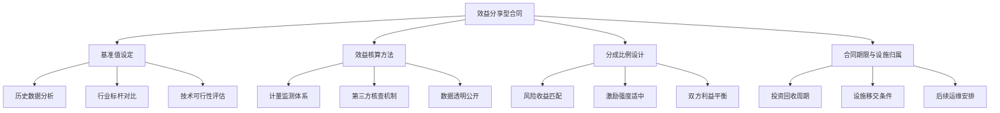

### 3.5 模式选择与转型路径：适用条件比较与分阶段实施策略

各类机制创新模式各有优劣，地方政府应根据本地实际情况，从财政承受能力、存量设施状况、市场主体成熟度、监管能力水平等维度进行综合评估，选择最适合的改革路径。

**各模式适用条件的综合比较**如下表所示：

| 评估维度 | 绩效服务合同 | BOT/TOT特许经营 | 区域一体化运维 | 效益分享型合同 |
|---------|-------------|----------------|---------------|---------------|
| **财政承受力** | 要求较低，按效付费 | BOT要求低，TOT需前期投入 | 初期整合投入大 | 零投入或低投入 |
| **存量设施状况** | 适用于提质增效 | TOT适用于盘活存量 | 需整合多类设施 | 适用于专项改造 |
| **市场主体成熟度** | 需专业服务企业 | 需大型投资运营商 | 需综合性平台企业 | 需专业技术企业 |
| **监管能力要求** | 高，需科学设定KPI | 中，需合同管理能力 | 高，需系统协调能力 | 中，需效益核查能力 |
| **见效周期** | 快，1-2年见效 | 慢，长期投资回报 | 中，需整合过渡期 | 快，按效益兑现 |
| **风险特征** | 绩效指标设计风险 | 长期政策市场风险 | 整合协同风险 | 基准设定争议风险 |

**模式选择的决策框架**可从以下逻辑展开：

第一，**明确改革目标优先序**。若以快速提升运营效能为首要目标，可优先选择绩效服务合同或效益分享型合同；若以缓解财政压力为首要目标，可优先选择BOT/TOT特许经营；若以系统治理为首要目标，应推进区域一体化运维。

第二，**评估本地约束条件**。财政困难地区可选择零投入或低投入模式；市场主体不成熟地区可先从简单的绩效合同起步；监管能力较强地区可尝试更复杂的一体化运维模式。

第三，**考虑模式组合应用**。各模式并非互斥，常可组合使用。例如，在区域一体化运维框架下，对具体项目采用效益分享型合同；在特许经营协议中嵌入绩效考核条款。

**从核拨制向市场化运营转型的分阶段实施策略**可设计如下：

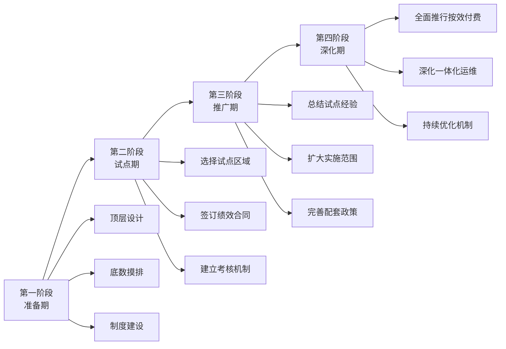

**第一阶段（准备期，约6-12个月）** 的核心任务包括：完成顶层设计与政策制定，出台地方排水管理条例或实施细则；开展设施底数摸排与资产评估，建立管网GIS系统；明确改革目标、路径与时间表；培育或引进专业化运营主体。

**第二阶段（试点期，约12-24个月）** 的核心任务包括：选择条件成熟的区域或项目开展试点；签订绩效服务合同或特许经营协议；建立绩效考核与监测体系；及时总结经验、发现问题、优化方案。

**第三阶段（推广期，约24-36个月）** 的核心任务包括：在试点成功基础上扩大实施范围；完善配套政策与标准规范；推进智慧化平台建设；加强监管能力建设。

**第四阶段（深化期，持续推进）** 的核心任务包括：全面推行"按效付费"机制；深化厂网河湖一体化运维；持续优化绩效指标与付费机制；探索更多创新模式。

**转型过程中的风险防控要点**应重点关注：

- **服务连续性保障**：在模式转换过程中，确保污水处理服务不中断、排水安全不降低
- **人员平稳过渡**：妥善安置原有运营单位人员，避免因改革引发社会稳定问题
- **监管能力建设**：同步提升政府部门的合同管理、绩效考核、数据核查等监管能力
- **合同争议解决**：建立完善的争议解决机制，明确仲裁或诉讼程序
- **财政支付履约**：确保政府按合同约定及时足额支付，维护市场主体信心

综上所述，从核拨制向市场化运营的机制转型是一项系统工程，需要在绩效服务合同、特许经营、区域一体化运维、效益分享型合同等多种模式中因地制宜选择，并通过分阶段实施策略稳妥推进。**成功转型的关键在于：科学的绩效指标设计、合理的风险分担机制、清晰的权责边界划分、稳定的政策支持环境以及持续的监管能力建设**。只有将机制创新与技术赋能、管理协同、成本控制有机结合，才能真正实现排水系统从"干好干坏一个样"向"按效付费、激励相容"的根本性转变。

## 4 成本优化：全生命周期视角下的资金保障与分摊机制设计

基于前述理论框架与机制创新方案，本章将聚焦市政排水系统的成本优化问题。核拨制下成本管控粗放、资金使用效益低下的困境，根源在于缺乏全生命周期视角的系统考量与多元化的资金保障机制。本章将从成本构成分析入手，系统设计覆盖污水处理费优化、雨水收费探索、财政资金创新、社会资本引入、专项基金设立等多维度的资金保障与成本分摊方案，构建激励相容、多元共担的长效财务可持续机制。

### 4.1 排水系统全生命周期成本构成与影响因素分析

排水系统作为城市基础设施的重要组成部分，其成本管理需要突破传统的单一阶段视角，建立涵盖**规划设计、建设投资、运营维护、更新改造、应急处置**五大阶段的全生命周期成本核算体系。只有准确把握各阶段成本构成与关键影响因素，才能实现精细化成本管控与资源优化配置。

**全生命周期成本的阶段构成**可从以下框架理解：

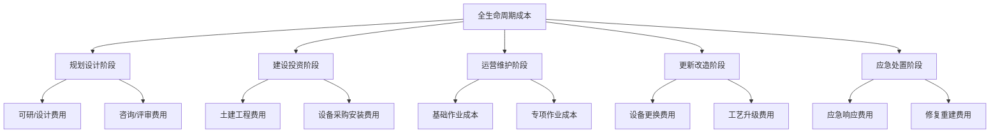

**运营维护阶段的成本构成**是全生命周期成本的核心部分，占据设施全寿命支出的主要份额。上海市排水设施运维成本估算体系采用三级分类体系，将运维成本划分为**基础作业成本**和**专项作业成本**两大类别[^42]。基础作业成本包含日常运行必需的固定支出项目，其费用构成遵循"人工+能源+耗材"的基本模型；专项作业成本则针对设施特殊性设置，包括污泥处置、水质检测、设备大修等特定支出[^42]。

**核心成本项的占比与变动规律**分析如下：

| 成本项目 | 典型占比 | 变动特征 | 敏感因素 |
|---------|---------|---------|---------|
| **电力费** | 40%-45% | 随负荷波动 | 处理工艺、设备能效、电价政策 |
| **人工费** | 20%-25% | 相对稳定 | 人员定额、薪资水平、自动化程度 |
| **污泥处置费** | 15%-20% | 政策敏感 | 环保标准、处置方式、运输距离 |
| **药剂费** | 8%-12% | 随水质波动 | 进水浓度、处理工艺、市场价格 |
| **维护检修费** | 5%-8% | 随设施老化增加 | 设备原值、运行年限、维护策略 |

以AAO工艺为例，20万吨/日规模污水处理厂的年度直接运行成本中位数约为3800万元，其中**电耗成本占比达42%，污泥处置成本占18%**，这两项为成本敏感因素[^42]。这一数据表明，能耗优化与污泥资源化是降本增效的关键突破口。

**设施类型与规模等级对成本的差异化影响**同样显著。以防汛泵站为例，上海市建立了基于规模等级的成本指标体系：

| 规模等级 | 设计流量(m³/s) | 人工费(万元/年) | 电力费基准值 | 日常维护费 |
|---------|---------------|----------------|-------------|-----------|
| 大型 | ≥10 | 85-120 | 0.78元/kWh | 设备原值2.5% |
| 中型 | 3-10 | 55-85 | 0.82元/kWh | 设备原值3.0% |
| 小型 | <3 | 30-55 | 0.85元/kWh | 设备原值3.5% |

数据来源：上海市排水设施运维成本估算体系[^42]

**设施运行年限对成本的影响**不容忽视。根据相关技术规程，使用超过15年的泵站应引入老化系数进行修正，修正公式为：$C_{adj} = C_{base} × (1 + α)^{t-15}$，其中t为使用年限，α取值区间0.015-0.025，具体根据设施评估等级确定[^42]。这意味着老旧设施的维护成本将随年限增长呈指数上升，需在预算编制中充分预留。

**地域特征对成本的差异化作用**同样需要特别考量。沿海区域需增加防腐专项经费，中心城区泵站则需计入降噪措施成本。对于地下水位高于管底的区域，应增加10%-15%的结构维护预算[^42]。这些地域因素要求成本核算必须因地制宜，不能简单套用统一标准。

**成本核算标准化的框架体系**正在逐步建立。给水排水设施运行维护成本核算标准涵盖了成本核算基本原则、成本构成分解模型、数据采集与核算方法、人工成本核算细则、设备维护成本计算框架、能源与资源消耗计量、全生命周期成本分析、区域差异化核算标准等核心内容[^43]。该标准明确了直接成本（设备维修/药剂消耗/能源支出）、间接成本（管理费/折旧费/安全监测）、应急成本（突发故障处理/灾害应对）的分类核算方法，为精细化成本管控提供了规范依据[^43]。

### 4.2 污水处理费定价机制优化与全成本覆盖路径

污水处理费作为排水系统运营的核心资金来源，其定价机制的科学性直接决定了系统的财务可持续性。当前普遍存在的**收费标准与实际成本缺口**问题，是制约排水系统良性运转的关键瓶颈。

**污水处理费的制度定位与征收框架**已有明确的政策规定。污水处理费是按照"污染者付费"原则，由排水单位和个人缴纳并专项用于城镇污水设施运行、建设和污泥处理处置的资金[^44]。污水处理费属于政府非税收入，全额上缴地方国库，纳入地方政府性基金预算管理，确保专款专用[^44]。广东省污水处理费征收使用管理实施细则明确规定，各地级以上市、县(市、区)和建制镇已建成污水处理厂的，均应当征收污水处理费[^44]。

**污水处理费的计量与征收方式**遵循以下规则：污水处理费根据缴纳义务人用水量按月计征。使用公共供水的单位和个人，其用水量以水表显示的量值为准；使用自备水源的单位和个人已安装计量设备的，其用水量以计量设备显示的量值为准；未安装计量设备或者计量设备不能正常使用的，其用水量按取水设施额定流量每日运转24小时计算[^44]。

**收费标准与成本缺口的成因分析**需要从多维度展开。当前污水处理费定价机制存在以下核心问题：

第一，**定价标准滞后于成本上涨**。污水处理费的征收标准需报同级人民政府批准后执行[^44]，调价程序复杂、周期较长，难以及时反映电价、人工、药剂等成本要素的变动。

第二，**成本覆盖范围不完整**。传统定价主要考虑污水处理环节成本，对管网收集、污泥处置、设施更新等环节的成本覆盖不足，导致系统性资金缺口。

第三，**按量计费未能体现治理效果**。传统"按量付费"模式下，无论进水浓度高低、污染物削减多少，均按处理水量计费，未能激励提升治理实效。

**全成本覆盖的定价机制优化路径**应从以下方面着手：

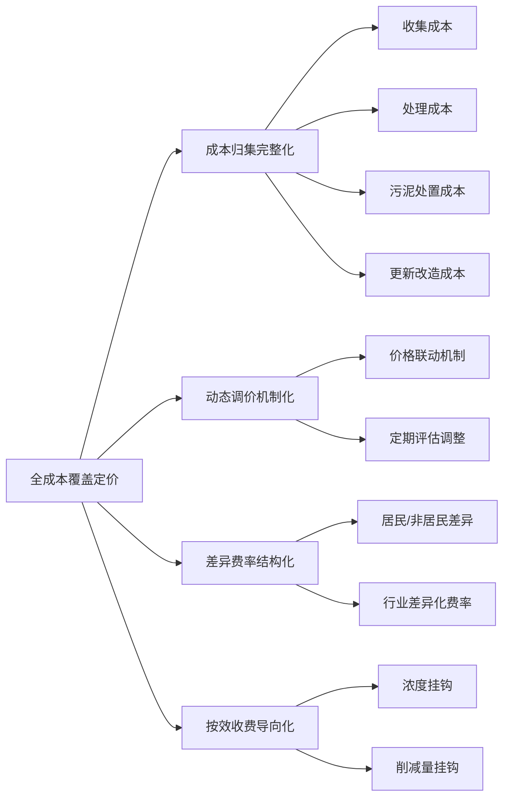

**动态调价机制的建立**可参照上海市水务局的季度价格联动机制，主要调整以下参数：人工单价随社保基数同步更新；电力价格按电网调价文件执行；污泥处置费根据环保政策动态调整；化学药剂跟踪PPI指数变化[^42]。这种联动机制确保了收费标准能够及时反映成本变动，避免长期固定费率导致的资金缺口累积。

**按效收费模式的探索**是定价机制优化的核心方向。推动建立污水处理服务费与污水处理厂进水污染物浓度、污染物削减量、出水水质、污泥无害化稳定化处理效果挂钩的按效付费机制，是实现"效"的货币化的关键[^45]。当进水BOD浓度低于50mg/L和达到150mg/L时，如果污水处理厂面临同样的处理单价，处于污水处理链条上的各方缺乏动力去提升污水浓度。"按效付费"就是要实现"效"的货币化，污水处理企业可以提供更高品质的水，而增加的成本通过"效"的货币化得到补偿[^45]。

**差异化费率结构设计**应考虑不同排水主体的排污特征与支付能力。对产品以水为主要原料的企业如桶装饮用水、饮料制造等行业，仍按其用水量计征污水处理费[^44]。对于因大量蒸发、蒸腾造成排水量明显低于用水量的情况，缴纳义务人应当按照国家或地方规定的标准、规范在排水口安装自动在线监测设施等计量设备，按实际排水量计征污水处理费[^44]。

### 4.3 雨水排放收费机制探索与实施路径

雨水排放作为城市排水系统的重要组成部分，其外部性成本长期由公共财政承担，缺乏有效的市场化收费机制。探索建立雨水排放收费制度，不仅是拓宽资金来源的现实需要，更是推动源头减排、促进雨污协同治理的制度创新。

**雨水排放外部性内部化的理论依据**在于：城市硬化地面增加导致雨水径流量上升，对排水系统形成负荷压力，引发内涝风险与水体污染。这种外部成本应当由造成影响的主体合理分担，而非完全由公共财政兜底。通过建立雨水排放收费机制，可以将外部性成本内部化，激励排水用户采取源头减排措施。

**雨水排放收费机制的关键设计要素**包括：

| 设计要素 | 核心考量 | 实施要点 |
|---------|---------|---------|
| **计量方式** | 不透水面积法/径流系数法 | 基于地块硬化面积或径流特征计算 |
| **费率设计** | 成本回收与激励平衡 | 覆盖雨水设施运维成本，设置阶梯费率 |
| **征收对象** | 产权单位/使用单位 | 明确责任主体，便于征收管理 |
| **减免政策** | 源头减排激励 | 对采取海绵设施的主体给予减免 |

**与海绵城市建设的协同机制设计**是雨水收费制度的重要创新方向。对于在地块内建设雨水花园、透水铺装、雨水调蓄设施等海绵设施的排水用户，可根据设施的雨水削减效果给予费率减免，形成"多排多缴、少排少缴、不排不缴"的激励机制。这种设计既能筹集雨水管理资金，又能推动源头减排，实现经济手段与生态目标的统一。

**实施路径的分阶段设计**可考虑：第一阶段，在新开发区域试点实施，积累经验；第二阶段，扩展至商业、工业等非居民用户；第三阶段，视条件成熟逐步覆盖居民用户。整个过程需配套完善计量设施建设、收费标准公示、减免政策落实等配套措施。

### 4.4 财政资金使用方式创新：从补建设到补运营

传统财政资金"重建设轻运营"的结构性问题，是导致排水系统长期效能不足的重要制度根源。推动财政支出方式从一次性建设补贴向运营绩效补贴转型，是提升财政资金使用效益的关键路径。

**传统财政投入模式的结构性缺陷**体现在：建设期投入集中但运营期保障不足；投入与产出效果脱钩，缺乏绩效约束；资金使用缺乏灵活性，难以适应运营需求变化。这些问题导致"重建轻管"现象普遍存在，设施建成后运维资金难以保障，影响长期效能发挥。

**财政资金使用方式创新的核心机制**包括：

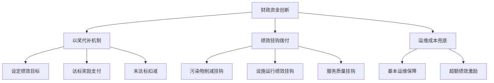

**"以奖代补"机制的设计要点**在于：将财政补贴与明确的绩效目标挂钩，达到目标给予奖励，未达标则相应扣减。这种机制改变了传统"撒胡椒面"式的补贴方式，使财政资金流向真正产生效益的项目和主体。

**绩效挂钩拨付机制的实施框架**可参照上海市的实践经验。2025年实施的绩效考核办法将设施评估分为ABCD四级，对应不同的修正系数[^42]。年度服务费支付与考核得分直接挂钩，90分以下每降1分扣减200万元[^42]。这种机制要求在编制估算时预留3%-5%的绩效浮动空间，确保激励效果与风险可控的平衡。

**运维成本兜底机制的必要性**在于：污水处理作为公共服务，需要保障基本运营的资金底线。在绩效激励的同时，应建立基本运维成本的财政保障机制，避免因过度追求绩效导致服务质量下降或运营中断。

### 4.5 社会资本引入路径：PPP与EOD模式的深化应用

社会资本的有效引入是缓解财政压力、提升运营效率的重要途径。PPP（政府和社会资本合作）与EOD（生态环境导向的开发）模式为排水系统建设运营提供了多元化的融资渠道与运营模式选择。

**海口美舍河PPP项目**为按效付费机制的实践应用提供了典型范例。该项目由北京桑德环境工程有限公司和爱尔斯环保工程有限责任公司联合体成立项目公司，采取市场化的管理方式，签署PPP协议明确具体考核方案和**分15年按效付费的付费机制**，以便有效保障治理效果[^46]。

美舍河项目的治理成效显著：经过治理，已消除黑臭，水质常态下达到5类水及以上标准，提前完成考核目标[^46]。美舍河湿地公园凤翔段获评国家级水利风景区，不仅净化美化了城市水体，而且带动周边商贸区的快速发展[^46]。2019年，海口市水体治理工作受国务院通报表扬，并荣获城市黑臭水体治理示范城市，获得中央资金4亿元支持[^46]。

**EOD模式的创新价值**在于将生态治理与产业开发有机融合，实现资金自平衡。铁力市东方红水库淤积物资源化利用项目展示了EOD模式的典型应用。东方红水库中长期"沉睡"的145.41万立方米淤积物，以6102.98万元的价格在黑龙江省级自然和生态资源交易平台成功交易，溢价率达5.2%[^47]。

EOD模式的核心逻辑在于：通过挖掘生态环境项目中的经济价值点，吸引市场主体投资，预支"可预期收益"投入前期治理，再通过后期的价值增值，回收成本并盈利。把水库清淤产生的淤泥从"废弃物"重新定义为"资源"，将清淤工程从"花钱干的活"转变为"价值创造的起点"[^47]。

**EOD模式的典型应用场景**包括：

| 应用场景 | 生态治理内容 | 关联产业 | 资金平衡机制 |
|---------|-------------|---------|-------------|
| **流域综合治理+城市更新** | 污染治理、生态修复 | 滨水商业、文旅休闲 | 土地增值收益反哺 |
| **流域环境治理+片区开发** | 水系治理、矿山修复 | 观光农业、康养产业 | 经营性收益平衡 |
| **流域生态保护+产业开发** | 水质提升、生态屏障 | 生态农业、森林康养 | 产业收益反哺 |
| **山水林田湖草沙综合治理** | 全要素生态修复 | 有机养殖、新能源 | 资源转化收益 |

数据来源：EOD模式典型案例研究[^48]

深圳茅洲河流域综合治理创新性引入EOD模式，将流域综合治理和沿途滨水地区城市更新的工作有机结合，以茅洲河生态平台为基础，构建新兴产业带、高品质生活带、特色休闲旅游带[^48]。天津蓟运河EOD是国内首个采用EOD模式开展的流域生态环境治理项目，按照"谁受益、谁付费，谁破坏、谁赔偿"的原则，流域范围内相关资源性收入和新增优质经营性资产运营收益优先用于项目资金平衡[^48]。

**PPP与EOD模式深化应用的关键要点**包括：

第一，**按效付费条款的精细化设计**。将进水浓度、污染物削减量、出水水质等绩效指标纳入付费公式，建立清晰的绩效—付费关联机制。

第二，**风险分担机制的合理优化**。明确政策风险、市场风险、运营风险等的分担方式，避免风险过度集中于任何一方。

第三，**退出机制的完善**。建立规范的项目退出程序，保障各方合法权益，维护市场信心。

### 4.6 更新改造专项基金与应急资金保障机制

排水设施的老化更新与应急处置是保障系统长期稳定运行的关键环节，需要建立专门的资金保障机制。

**更新改造专项基金的设立必要性**源于设施老化的客观规律。使用超过15年的设施维护成本将随年限增长呈指数上升[^42]，而传统年度预算难以满足大规模更新改造的资金需求。设立专项基金可实现资金的跨年度积累与统筹使用，确保更新改造的资金来源稳定。

**专项基金的资金来源设计**可包括：财政年度预算安排、污水处理费提取比例、设施折旧计提、土地出让收益分成、社会资本投入等多元渠道。基金管理应建立专户存储、专款专用、定期审计的规范机制。

**应急资金保障机制的设计**可借鉴市政排水管道清淤作业应急与常规成本统筹方案的经验。该方案提出通过统筹管理，常规清淤成本占比控制在年度总预算的70%-75%，应急清淤成本压缩至25%-30%[^49]。

**"常规储备+应急预留"的资金池机制**设计要点如下：

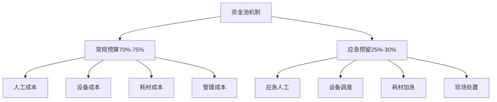

年度预算编制时，按"常规成本固化+应急成本预留"模式，常规成本根据年度任务量精准测算，应急成本按常规预算的30%-40%预留[^49]。季度调整时，根据前季度常规成本节余情况，动态补充应急预算，提升资金利用率[^49]。

**应急资金快速审批流程的建立**是保障响应时效的关键。传统审批程序复杂、周期长，难以适应突发事件的紧急需求。应建立应急资金的绿色审批通道，简化审批环节，明确审批时限，确保资金能够在规定时间内到位。同时，建立应急后的成本复盘机制，分析应急成本超支原因，优化常规资源配置，形成"常规优化—应急降本"的联动机制[^49]。

### 4.7 成本分摊机制设计：政府、企业、用户责任界定

构建权责清晰、激励相容的成本分摊机制，是实现排水系统财务可持续的制度基础。基于"污染者付费"与"受益者分担"原则，需要系统设计政府财政、运营企业、排水用户三方之间的成本分摊框架。

**成本分摊的基本原则框架**如下：

| 分摊原则 | 核心内涵 | 适用范围 |
|---------|---------|---------|
| **污染者付费** | 排污主体承担治理成本 | 污水处理费、排污费 |
| **受益者分担** | 受益主体合理分担成本 | 防洪排涝、环境改善 |
| **能力匹配** | 支付能力与分担比例匹配 | 差异化费率设计 |
| **激励相容** | 分摊机制促进减排行为 | 阶梯费率、减免政策 |

**公益性成本与经营性成本的边界划分**是分摊机制设计的基础。公益性成本主要包括：防洪排涝设施建设与运维、应急抢险响应、公共水环境治理等，应以财政投入为主；经营性成本主要包括：污水收集处理、污泥处置、再生水生产等，应通过使用者付费机制覆盖。

**不同排水主体的差异化分摊比例设计**应考虑以下因素：

第一，**工业企业**。作为主要污染源，应承担较高的污水处理费率，并根据排污浓度实行差异化收费。对超标排放实行惩罚性收费，激励企业加强预处理、减少排放。

第二，**居民用户**。作为基本公共服务的享受者，应承担基本的污水处理费用，但费率设计需考虑居民支付能力，对低收入群体可给予适当减免。

第三，**公共机构**。学校、医院、政府机关等公共机构应按实际用水量缴纳污水处理费，费率可参照居民或非居民标准。

**多元成本共担机制的整体框架**可概括为：

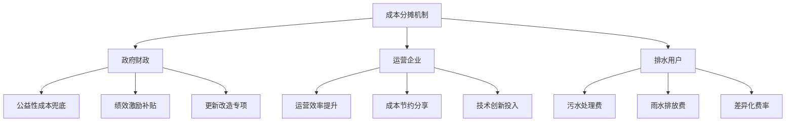

**激励相容的机制设计**是确保分摊机制有效运转的关键。对于运营企业，通过绩效合同使其效率提升收益与自身利益挂钩；对于排水用户，通过差异化费率使其减排行为获得经济激励；对于政府财政，通过按效付费使其投入产生真实的环境效益。这种激励相容的设计，使各方主体在追求自身利益的同时，也促进了整体系统效能的提升。

综上所述，排水系统全生命周期成本优化需要构建"标准化成本核算+多元化资金保障+激励相容成本分摊"的完整体系。通过污水处理费全成本覆盖、雨水收费机制探索、财政资金使用创新、PPP/EOD模式深化、专项基金设立等多维度措施，形成覆盖全成本、权责清晰、可持续的财务保障机制，为排水系统从核拨制向高效运营模式转型奠定坚实的经济基础。

## 5 系统协同：污水收集处理与雨水排洪排涝的整合运作策略

城市排水系统作为复杂的基础设施网络，其效能提升不能仅依赖单一系统的优化，而必须从整体视角构建污水系统与雨水排涝系统的协同运作机制。传统"条块分割"管理模式导致的重复建设、调度失序、应急脱节等问题，已成为制约排水系统整体效能的结构性障碍。本章将基于前述机制创新与成本优化方案，从规划统筹、运行调度、应急联动、资源化协同四个维度系统设计整合运作策略，并提出支撑协同运作的组织模式与技术接口方案，推动排水系统从分割管理向一体化协同治理转型。

### 5.1 规划层面的空间统筹与设施共享机制

规划统筹是实现雨污系统协同运作的源头保障。传统模式下污水系统与雨水系统各自独立编制规划，导致设施布局缺乏协调、管网路由交叉冲突、调蓄容量配置失衡等问题。构建一体化规划统筹机制，需要从**顶层规划整合、设施功能复合、空间集约利用**三个层面系统推进。

**顶层规划整合的核心逻辑**在于将污水系统与雨水系统纳入统一的排水专项规划框架。《关于持续加强本市公共排水泵站设施规划资源管理的工作规定》明确要求，排水主管部门会同规划资源主管部门编制本市雨、污水排水系统专项规划时，应结合地区发展，统筹考虑土地集约节约利用，雨水和污水源头减排、收集处理和资源化利用等相关要求，明确公共排水泵站设施系统性布局[^50]。这一制度设计体现了规划层面雨污统筹的基本要求。

**调蓄设施合建策略**是规划统筹的重点突破方向。天津市中心城区雨污合流治理攻坚行动实施方案提出，通过升级473个庭院小区管网并建设地下调蓄池，完善水循环调度体系[^51]。调蓄池的功能复合设计可实现以下协同效益：

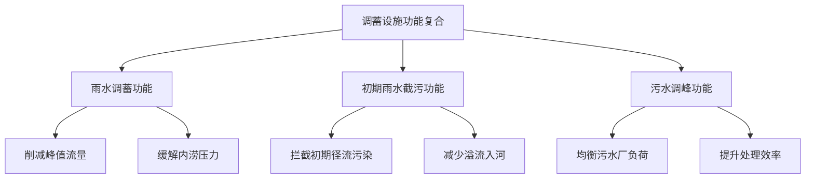

**泵站设施的空间整合布局**应遵循集约节约原则。上海市排水泵站规划管理规定明确了选址原则：排水泵站可独立设置，鼓励与调蓄池、绿地、防汛屋、滨河驿站等其它市政设施结合设置，兼顾集约用地、功能复合，提倡品质提升，融入滨水开放空间[^50]。这种功能复合的设计理念，既节约了土地资源，又提升了设施的综合效益。

**设施共享的技术经济效益分析**可从以下维度展开：

| 共享类型 | 技术可行性 | 经济效益 | 实施要点 |
|---------|-----------|---------|---------|
| **调蓄池合建** | 结构设计可兼顾雨污调蓄需求 | 节约30%-40%建设投资 | 容量分配、运行模式切换 |
| **管网廊道共用** | 雨污管道可共用综合管廊 | 减少开挖成本、降低维护难度 | 分舱设计、检修便利性 |
| **泵站功能复合** | 雨水泵站可兼顾截污提升 | 节约用地、共享配套设施 | 设备选型、调度协调 |
| **处理设施共享** | 初期雨水可纳入污水厂处理 | 提升设施利用率 | 水质水量匹配、负荷调节 |

**规划统筹的制度保障**需要建立跨部门协调机制。污水管网与雨水排放系统协调方案指出，应在污水管网设计中增加雨水溢流控制设施，确保在降雨期间污水不会直接排入水体；通过设置雨水调蓄池，调节雨水流量，减轻污水处理站的负担[^52]。这种协调设计需要在规划阶段统一部署，避免后期改造的高昂成本。

### 5.2 运行层面的联合调度与智慧管控体系

运行调度是实现雨污系统协同效能的核心环节。传统分割管理模式下，污水系统关注收集处理效率，雨水系统聚焦排涝速度，两者目标之间存在潜在冲突。构建联合调度机制，需要依托智慧化技术手段，建立**全要素数字底座、动态预判模型、协同调度策略**三位一体的管控体系。

**"雨情—水情—工情"全要素数字底座建设**是联合调度的基础。佛山市智慧排水系统的实践表明，通过建立多部门数据协同机制，打通雨水监测、管网流量等关键数据链路，可实现排水治理从"被动应对"到"主动预判"、从"人力密集"到"智慧集约"的转型[^53]。数字底座的核心内容包括：

- **设施数据层**：管网长度、管径、材质、坡度、缺陷位置等静态信息
- **运行数据层**：水位、流量、水质的实时监测数据
- **环境数据层**：气象预报、降雨实况、河道水位等外部信息
- **业务数据层**：设施运维记录、应急事件处置、绩效考核结果

佛山市已汇聚海量数据，绘制出覆盖全市的排水设施数字地图。这张"图"不仅是静态档案，更通过与各区排水公司日常运维数据联动，实现动态修正与鲜活更新，真正让地下世界"透明化"[^53]。

**基于排水模型的动态预判与优化调度**是智慧管控的核心能力。天津市雨污合流治理方案提出，以数字赋能建成覆盖"管网、泵站、调蓄池、河道"的一体化排水设施管控平台[^51]。智能调度的技术架构可概括为：

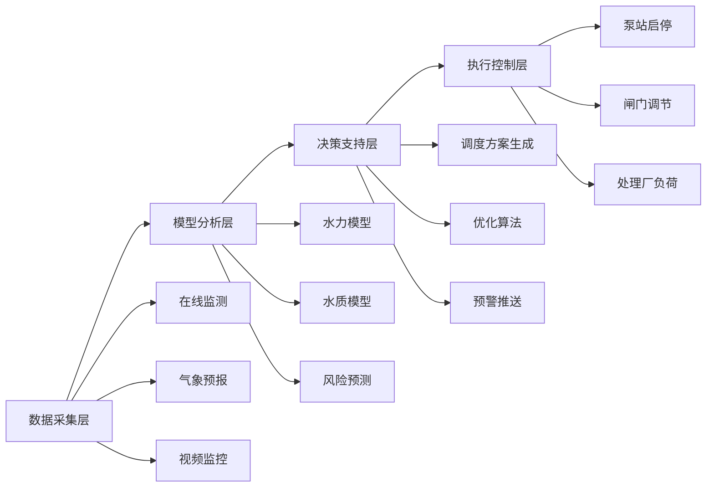

**泵站—闸门—调蓄池—污水处理厂的协同运行策略**是联合调度的具体实现。参照"源头减排、过程控制、末端治理、精细管控"的思路[^51]，协同调度策略应包括：

**第一，雨前预排空策略。** 平台衔接气象预报，在降雨来临前自动生成并执行"预排空"指令，腾空管网和调蓄池容量，为承接雨水径流预留空间。

**第二，雨中动态调控策略。** 根据实时监测数据和模型预测，智能调控泵站启停、闸门开度，实现"浓度优先"输送——优先将高浓度污水输送至污水处理厂，低浓度混合水暂存调蓄池。

**第三，雨后恢复策略。** 降雨结束后，有序排空调蓄池，逐步恢复管网低水位运行，同时调整污水处理厂运行模式，处理调蓄的初期雨水。

**智慧管控平台的功能模块设计**应覆盖全链条管理需求。如昼科技的污水/排水经营管控平台实践显示，智能曝气系统预计每年可节省电耗60.69万度，节约电费72.83万，碳减排254.9吨；智能加药系统全年可节省药剂使用量902.2吨，节省经济成本74.39万元[^54]。这些量化效益表明，智慧化手段在降本增效方面具有显著作用。

**数据分级预警与闭环处置机制**是智慧管控的重要组成。连云港开发区的实践表明，平台利用大数据算法模型，可动态预判管网负荷与内涝风险，生成最优调度方案；实现数据分级预警与工单的线上派发、线下处置、结果反馈全程跟踪。预警机制的设计要点包括：

| 预警等级 | 触发条件 | 响应措施 | 责任主体 |
|---------|---------|---------|---------|
| **蓝色预警** | 管网水位达设计水位70% | 加强监测、预备响应 | 运维单位 |
| **黄色预警** | 管网水位达设计水位85% | 启动调蓄、调整泵站 | 调度中心 |
| **橙色预警** | 局部溢流风险、内涝苗头 | 应急资源调配、现场处置 | 应急指挥部 |
| **红色预警** | 大面积溢流、严重内涝 | 全面应急响应、跨部门联动 | 政府领导 |

### 5.3 应急层面的联动响应与资源互助预案

极端天气条件下的应急响应是检验雨污系统协同能力的关键场景。暴雨期间，污水溢流控制与内涝应急排水往往存在目标冲突——快速排涝可能导致污水随雨水入河，而严格控制溢流又可能加剧内涝风险。构建联合应急响应机制，需要在**分级预警体系、联动响应流程、资源互助机制**等方面进行系统设计。

**分级响应框架的构建**可参照临沂城区排水突发事件应急预案的设计思路。该预案将城区排水突发事件分为四级：Ⅳ级（一般）、Ⅲ级（较大）、Ⅱ级（重大）、Ⅰ级（特别重大），并明确了各级事件的判定标准与响应措施[^55]。针对雨污系统联合应急，分级标准可设定为：

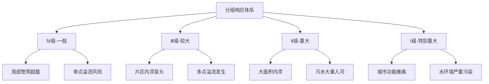

**跨部门联动响应流程**是应急协同的组织保障。临沂市应急预案明确了工作原则：统一领导，属地管理；分级负责，权责明确。建立分级管理、分级响应的突发事件应急处置模式，市级负责处置重大以上的城区排水突发事件，区级负责处置较大和一般城区排水突发事件，街道（社区）负责排水防涝事件先期处置、基层动员等基础工作[^55]。

**暴雨期间协同处置的核心要点**包括：

**第一，污水溢流控制。** 天津市雨污合流治理方案的目标是将合流制片区溢流控制率提升至80%以上，污染物溢流入河总量减少2/3[^51]。在应急响应中，应优先启用调蓄设施承接溢流污水，减少直排入河水量。

**第二，泵站放江管理。** 对于雨季存在排污问题的防汛泵站，应建立"浓度监测—分质排放"机制，在保障排涝安全的前提下，尽可能减少污染物入河。

**第三，内涝应急排水。** 在保护人民群众生命财产安全的首要原则下，当内涝风险达到一定等级时，可适度放宽溢流控制标准，优先保障排涝安全。

**应急资源调配规则**应遵循"平战结合"原则。日常运维中储备的移动泵车、应急发电机、快速修复材料等资源，在应急状态下可跨区域、跨部门调配使用。资源互助机制的设计要点如下：

| 资源类型 | 日常配置 | 应急调配 | 互助规则 |
|---------|---------|---------|---------|
| **移动泵车** | 各区按标准配置 | 向重点区域集中 | 优先保障生命财产安全 |
| **应急人员** | 各单位自有队伍 | 跨单位支援 | 统一调度指挥 |
| **抢险物资** | 分散储备 | 就近调用 | 先用后补、统一结算 |
| **技术支持** | 专业机构待命 | 现场技术指导 | 快速响应、专业处置 |

**"预警—响应—处置—恢复"全流程应急预案体系**的构建，需要明确各阶段的工作重点与责任分工：

- **预警阶段**：气象部门发布预警信息，调度中心启动预判分析，各单位进入待命状态
- **响应阶段**：根据预警等级启动相应级别响应，调配应急资源，发布公众提示
- **处置阶段**：现场应急处置，实时监测反馈，动态调整策略
- **恢复阶段**：设施检查修复，数据复盘分析，经验总结改进

### 5.4 资源化利用层面的雨污协同开发路径

资源化利用是实现排水系统良性循环的重要途径。雨水与再生水作为非常规水资源，在缓解城市水资源紧缺、补充生态用水等方面具有重要价值。构建雨污协同的资源化利用体系，需要从**雨水收集利用、再生水回用、循环利用闭环**三个维度系统设计。

**雨水综合利用的技术路径与效益分析**可从上海市优秀案例中获得启示。宝钢股份宝山基地原料场雨水收集工程通过科学规划和系统建设，构建了一套完整的雨水资源化利用体系。该工程创新性地采用封闭大棚顶面雨水收集方案，因地制宜地布局了五座雨水收集池，每年可回收利用雨水约38万立方米，节省水费约130万元[^56]。

**不同场景的雨水利用模式**可归纳如下：

| 应用场景 | 收集方式 | 处理工艺 | 利用途径 | 典型案例 |
|---------|---------|---------|---------|---------|
| **工业厂区** | 大棚顶面收集 | 沉淀+加压输送 | 生产用水、抑尘 | 宝钢原料场[^56] |
| **住宅社区** | 透水铺装+生物滞留 | 渗滞蓄净 | 绿化灌溉、冲洗 | 城投宽庭光华社区[^56] |
| **建材企业** | 雨水收集池 | 沉淀+RO膜纯化 | 生产补水、绿化 | 汤始建华建材[^56] |
| **公共建筑** | 屋面收集+调蓄 | 弃流+过滤消毒 | 景观补水、杂用 | 徐汇万科中心[^56] |

城投宽庭·光华社区遵循"社区+海绵"理念，形成"透水铺装、植草沟引流+生物滞留设施消纳"的雨水径流组织形式，项目调蓄总容积达到300立方米，年径流总量控制率80%、年径流污染控制率65%，预计年节水量达到7500立方米[^56]。

**再生水回用与生态补水的协同策略**是资源化利用的核心环节。临港供排水发展有限公司的实践表明，通过构建"中水双循环+污泥资源化"的循环新路径，可实现水资源的高效利用。污水厂中水广泛应用于厂区除臭系统喷淋、绿化灌溉、设备冲洗等场景[^57]。

**"雨水收集—污水处理—再生水回用—生态补水"的循环利用技术路线**可概括为：

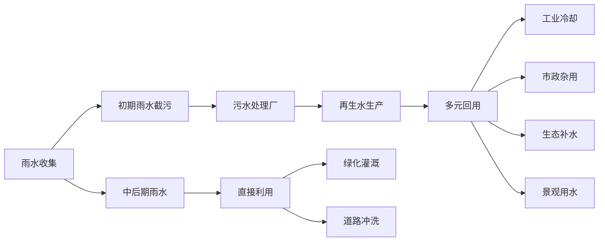

**资源化利用的效益测算方法**应综合考虑经济、环境、社会三重价值。西安市第二十二再生水厂采用分布式下沉再生水生态系统技术，每年可提供高品质再生水1825万吨，节约电量56.83万度，减排二氧化碳2035.89吨[^58]。这一案例表明，资源化利用不仅能产生直接的经济效益，还能带来显著的碳减排效益。

**雨水与再生水的功能互补机制**设计要点包括：

- **季节性互补**：雨季以雨水利用为主，旱季以再生水为主，实现全年稳定供水
- **水质差异化利用**：雨水水质较好可用于景观补水，再生水可用于工业冷却等对水质要求较高的场景
- **调蓄协同**：雨水调蓄设施在非雨季可用于再生水储存，提升设施利用率

### 5.5 协同管理组织模式与技术接口方案

组织模式创新与技术标准建设是支撑雨污系统协同运作的制度基础。传统分割管理体制下，部门职责交叉、信息共享不畅、考核标准不一等问题严重制约了协同效能。构建一体化协同管理体系，需要从**组织架构重塑、运维主体整合、技术接口规范、绩效考核统一**四个维度系统推进。

**"河湖厂网一体化"管理体制的构建路径**可借鉴重庆两江新区的改革经验。两江新区在全市率先实施河湖厂网一体化改革，通过推进底图一体化、管理一体化、运维一体化及执法一体化，有效解决了城市水务管理多头、链条长、投入大等问题。具体而言：

- **底图一体化**：推进管网"空间、结构、功能"三属性精细化排查，以综合管线数字孪生为抓手，推动河湖厂网底图底数一体化呈现
- **管理一体化**：整合排水管理职能职责，建立"网格化排查"+"专业化治理""流域+区域"协同机制，形成区、街道、社区、网格四级联动的管网问题巡查治理机制
- **运维一体化**：根据相邻水系、互不交叉和区域一体化的原则，由流域治理单位对河湖管网进行一体化全链条运维
- **执法一体化**：实行同点、同时、同标、同桶、同表的"五同"检测体系，全面整合涉水领域监管执法

**统一运维主体的职责边界与协调机制**设计应遵循"五个不变"与"五个统一"原则。参照上海市排水管理体制改革方案，"五个不变"包括：规划建设分工不变、设施资产权属不变、政府监管职责不变、属地防汛责任不变、日常运维资金渠道不变；"五个统一"包括：统一运维管理、统一技术标准、统一运行调度、统一服务质量、统一核算机制。

**协同管理的组织架构设计**可采用以下模式：

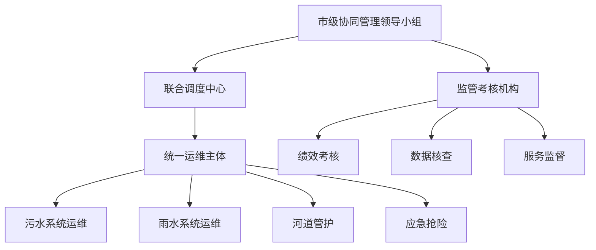

**数据共享标准与系统接口规范**是技术协同的基础保障。佛山市智慧排水系统的实践表明，所有排查出的管网长度、管径、材质、缺陷位置、雨污混接点等信息，均按照统一标准录入智慧排水系统[^53]。数据标准化的核心内容包括：

| 标准类别 | 核心内容 | 应用场景 |
|---------|---------|---------|
| **设施编码标准** | 统一的设施命名与编码规则 | 设施台账管理、资产核算 |
| **数据采集标准** | 监测指标、采集频率、数据格式 | 在线监测、数据交换 |
| **接口规范** | 系统间数据传输协议、接口定义 | 平台互联互通 |
| **质量控制标准** | 数据校验规则、异常处理机制 | 数据质量保障 |

**绩效考核指标体系的统一设计**是协同管理的激励保障。综合前述分析，雨污协同运作的绩效考核指标应涵盖以下维度：

| 考核维度 | 核心指标 | 权重建议 | 数据来源 |
|---------|---------|---------|---------|
| **污水系统效能** | 进水BOD浓度、污染物削减量 | 25%-30% | 在线监测、化验数据 |
| **雨水系统效能** | 内涝防治达标率、排水能力 | 20%-25% | 气象数据、现场核查 |
| **溢流控制** | 溢流次数、溢流量、污染物入河量 | 20%-25% | 在线监测、水质检测 |
| **设施运行** | 设施完好率、故障响应时间 | 15%-20% | 运维记录、巡检数据 |
| **资源化利用** | 雨水利用率、再生水回用率 | 10%-15% | 计量数据、用水统计 |

**可复制推广的协同管理模式**应具备以下特征：

**第一，组织架构清晰。** 明确市、区、街道、运维单位各层级的职责分工，避免职责交叉与推诿扯皮。

**第二，运维主体专业。** 由具备综合能力的专业化运维主体承担厂网河湖一体化运维，发挥规模效应与协同效应。

**第三，调度机制高效。** 建立智慧化调度平台，实现雨污系统的联合监测、预警、调度与考核。

**第四，考核激励相容。** 将协同运作的整体效能纳入绩效考核，通过"按效付费"机制激励各方主动协同。

**第五，技术支撑有力。** 建立统一的数据标准与系统接口规范，确保信息互通、调度协同。

长沙市排水一体化改革的实践为协同管理模式提供了可借鉴的范本。长沙市采取"委托运营+绩效合同管理"改革模式，将城区市政排水设施交由长沙水业集团实行"厂站网一体化"集约化、专业化运营管理，签订30年委托运营协议，预计全市污水处理厂每年可节约资金约1.4亿元。这一模式通过统一运维主体、建立绩效考核、实施长期合同等制度安排，有效实现了雨污系统的协同运作与降本增效。

综上所述，污水收集处理与雨水排洪排涝的整合运作，需要从规划统筹、运行调度、应急联动、资源化利用四个维度构建系统化的协同策略，并以"河湖厂网一体化"的组织模式与标准化的技术接口为支撑。通过设施共享降低建设成本、智慧调度提升运行效率、联合应急保障安全底线、资源循环实现价值增值，最终形成"内涝防治与污染控制双重目标兼顾、经济效益与环境效益协同提升"的良性循环格局。

## 6 支撑体系：智慧赋能、标准规范与监管考核的配套建设

前述章节系统设计了机制创新、成本优化与系统协同的改革方案，但方案的有效落地需要强有力的配套支撑体系。智慧化技术是实现精细化管理的核心工具，标准规范是确保改革有序推进的制度基础，监管考核是保障绩效导向落地的关键抓手。本章将从智慧感知、平台构建、模型应用、绩效评价、成本核算、全过程监管六个维度，系统构建支撑排水系统从核拨制向高效协同模式转型的技术工具与制度保障体系。

### 6.1 智慧感知体系：物联网监测网络与数据采集标准化建设

智慧感知体系是排水系统智能化管理的"神经末梢"，通过在关键节点部署物联网传感设备，实现对系统运行状态的全域、全时、全要素监测，为后续的智能分析与科学决策奠定数据基础。

**物联网感知网络的部署策略**应遵循"分级布点、脉络成网"的建设思路。成都市武侯区的实践表明，通过部署视频AI识别、多参数水质传感、水文监测等166套高精度物联感知终端，可实现河道、排口、管网等关键节点的全域动态覆盖，有效填补了地下管网水质监测、小微水体溯源等盲区[^59]。宁波高新区则在全区689个关键雨水管网节点部署电导率监测设备，涵盖主干管网、重要支线接入点和重点污染风险区域，这些监测点沿着水流方向自然形成监测链条，构建起从污染源到排放口的全过程感知体系[^60]。

**核心监测参数与设备选型**应综合考虑技术性能与经济成本。高新区的经验表明，相较于传统的COD、氨氮等监测手段，电导率传感器展现出显著优势：其结构简单坚固，耐腐蚀性强，能够适应井下高温高湿、杂质较多的复杂环境，使用寿命更长；同时，该设备对水质变化响应灵敏，能够准确捕捉污染物注入引起的电导率突变；更重要的是，电导率监测设备单价较低，为大范围、高密度布设提供了经济可行性，其日常维护仅需定期清洗电极，无需频繁校准或更换试剂，大大降低了全生命周期的运维成本[^60]。

**监测网络的层级架构**可设计如下：

| 层级 | 监测对象 | 核心参数 | 设备类型 | 部署密度 |
|-----|---------|---------|---------|---------|
| **源头层** | 排水户、小区出口 | 流量、水质 | 智能水表、水质传感器 | 重点排水户全覆盖 |
| **管网层** | 干管节点、交汇井 | 水位、流速、水质 | 液位计、流量计、电导率仪 | 关键节点100%覆盖 |
| **泵站层** | 集水井、泵组 | 水位、流量、设备状态 | 多参数传感器、振动监测 | 全部泵站覆盖 |
| **厂站层** | 进出水口、工艺单元 | 水量、水质、能耗 | 在线监测仪表 | 全流程覆盖 |
| **排口层** | 入河排口、溢流口 | 流量、水质、视频 | 组合监测站、AI摄像头 | 重点排口全覆盖 |

**数据采集标准化建设**是确保数据质量与互联互通的基础。上海市市属排水设施运行维护绩效考核办法明确要求，监测站点在线率应达到95%以上，数据类型包括泵站水位、雨量和开停泵信息，某个站点持续24小时未上传数据或上传数据错误，视为设备故障[^26]。数据采集标准化的核心内容应包括：

```mermaid
graph TD
    A[数据采集标准化] --> B[设备编码标准]
    A --> C[数据格式规范]
    A --> D[采集频率要求]
    A --> E[质量控制机制]
    B --> B1[统一命名规则]
    B --> B2[唯一标识编码]
    C --> C1[参数定义统一]
    C --> C2[传输协议规范]
    D --> D1[常规数据:15分钟]
    D --> D2[应急数据:实时]
    E --> E1[数据校验规则]
    E --> E2[异常处理流程]
```

**设施编码统一化**是实现设施全生命周期管理的前提。昆山市进一步完善全市排水设施建设监管实施办法要求，排水管网施工过程中，建设单位应委托具有相应资质的测绘单位在施工过程中同步开展排水管网的跟踪测绘，确保新建的排水管网符合图纸要求，并与周边现有排水系统相融合[^61]。这种从建设源头就开始的数据采集与编码管理，为后续运维阶段的智慧化管理奠定了坚实基础。

### 6.2 智慧平台构建：大数据分析与数字孪生决策支持系统

在物联网感知网络采集海量数据的基础上，需要构建智慧管控平台对数据进行汇聚、分析与应用，实现从"数据"到"信息"再到"决策"的价值转化。

**智慧平台的功能架构**应涵盖数据汇聚、智能分析、可视化展示、业务应用四大模块。成都市武侯区智慧水务指挥调度平台的实践表明，平台应集成全要素数字孪生基座（"一张图"）、多模态决策支持系统（"领导驾驶舱"）及六大智能业务模块（视频AI分析、数据中台、智慧河长、管网拓扑推演、洪涝耦合预警、设施全生命周期管理）[^59]。

**多源数据融合与数据中台建设**是智慧平台的核心能力。武侯区的经验显示，应纵向贯通区-街-社三级数据链路，横向打通城管、环保、应急等部门业务系统，无缝对接市河长制管理信息系统、防汛指挥调度平台等市级平台，归集河湖治理、水质监测、防汛减灾等12类核心数据，建成全区水务"数字孪生底座"[^59]。北控水务在临沂市的实践同样表明，通过整合现有监测资源并成功对接防汛平台，深度融合"监测物联网+GIS+大数据分析+数值模型"，可实现对污水厂、管网、河道及地表水水质的实时、精准监控与协同管理[^62]。

**数字孪生技术的应用场景**为排水系统管理提供了全新视角。信阳市供排水一体化智慧平台的六大智慧应用场景具有重要参考价值[^63]：

| 应用场景 | 核心功能 | 技术手段 | 预期效益 |
|---------|---------|---------|---------|
| **动态感知预警** | 水源、管网、用户全链条监测与智能预警 | 物联网+AI预警模型 | 提升风险防控能力 |
| **排水防涝调度** | 雨前、雨中、雨后全过程模拟与调度 | 气象融合+水力模型 | 增强城市韧性 |
| **管网健康诊断** | 生成管网"健康度清单" | 算法分析+缺陷识别 | 精准投入资金 |
| **供水统一运营** | "源头到龙头"全链条智慧运营 | 水力模型+闭环处置 | 保障供水安全 |
| **污水统一运营** | "源-网-厂-河"全流程贯通与协同调度 | 溯源算法+协同调度 | 水质双达标 |
| **供排水平衡分析** | 精准分析水量关系 | 数据模型+晴雨比分析 | 定位混接问题 |

**AI算法在智能识别与决策中的应用**正在深刻改变排水管理模式。温州市排水公司自研创建的可识别排水管网CCTV检测视频病害的AI智能体，依托公司历年积累的《排水管网病害缺陷数据集》进行训练，实现对管网缺陷的精准识别，提升管网病害问题报告出具效率约30%[^64]。高新区则建立了"电导率波纹异常事件库"，通过机器学习算法对不同类型的排污行为进行特征提取和模式识别，目前已收录超过100种特征波纹模式，当系统检测到异常电导率波动时，自动匹配特征库中的波纹模式，在30秒内完成异常识别与初步归因[^60]。

**"监测-预警-处置-反馈"闭环管理机制**是智慧平台的核心业务逻辑。武侯区创新搭建的"武侯护水达人"全民共治平台，通过"问题随手拍+积分兑奖+红榜公示"机制，形成"公众发现隐患-平台智能派单-部门限时整改-结果社会监督"的治理闭环，截至2024年12月，注册用户超670人，覆盖全区11个街道，累计巡河里程4.3万公里，上报问题线索1.6万条[^59]。这种将社会监督纳入治理闭环的做法，有效拓展了监管覆盖面，提升了问题发现与处置效率。

### 6.3 模型模拟应用：排水水力模型与情景预测辅助决策

排水模型是连接数据与决策的关键桥梁，通过对排水系统的数学抽象与仿真模拟，可实现对系统运行状态的预测、对工程方案的评估、对调度策略的优化。

**排水模型的核心应用价值**体现在"可识别、可预测、可评估"三大特性。利用这些特性可以完成对排水系统的全生命周期管理：首先可进行排水系统问题清单梳理，形成内涝风险图、隐患图等可视化图表；其次可优化改造或新建工程方案，辅助确定区域性工程开展时序；最后可对工程方案实施前后的效果进行预评价和后评估。

**模型构建的技术路径**应遵循"数据驱动+机理模拟"的融合思路。基于物联网与大数据的城市智能排水系统设计与优化研究指出，应建立数学模型和仿真平台，对排水系统进行仿真优化，探究不同参数对系统性能的影响，通过数据分析和模型建立，对排水系统未来的需求进行预测，并通过优化算法进行决策优化，提高排水系统的运行效率[^65]。

**模型在不同场景的应用框架**可概括如下：

```mermaid
graph TD
    A[排水模型应用] --> B[规划设计阶段]
    A --> C[运行调度阶段]
    A --> D[绩效评估阶段]
    B --> B1[系统能力评估]
    B --> B2[工程方案比选]
    B --> B3[建设时序优化]
    C --> C1[内涝风险预测]
    C --> C2[溢流控制模拟]
    C --> C3[联合调度优化]
    D --> D1[工程效果后评估]
    D --> D2[运行绩效分析]
    D --> D3[问题诊断溯源]
```

**内涝风险预测与溢流控制模拟**是模型应用的重点场景。物联网在智能城市排水系统中的应用案例分析报告指出，通过在排水管网、泵站、河道等关键节点部署物联网感知设备，构建"感知-传输-分析-应用"的全链条智能化体系，可实现排水状态的实时监测、故障的精准预警、调度的智能优化[^66]。模型可根据气象预报数据，提前模拟降雨条件下的管网运行状态，识别内涝风险区域，为预防性调度提供决策依据。

**模型驱动的联合调度策略优化**是提升系统整体效能的关键。数字住建研究指出，人工智能技术在智慧排水系统中的应用主要体现在预测和优化两个方面，通过机器学习算法可以对排水系统的运行状态进行预测，提前发现潜在问题；同时，人工智能还可以优化排水系统的运行策略，例如通过智能调度算法合理分配泵站的负荷，提高系统的运行效率[^67]。

**模型应用的数据质量保障**需要特别关注。模型的准确性高度依赖于输入数据的质量，包括管网拓扑数据、设施参数数据、实时监测数据等。因此，模型应用必须与前述的物联网感知网络建设、数据采集标准化工作紧密结合，形成"数据采集-模型分析-决策支持-效果验证"的完整闭环。

### 6.4 绩效评价标准体系：考核指标设计与评估方法规范

绩效评价标准体系是实现"按效付费"机制的制度基础，需要建立科学、可量化、可验证的考核指标体系与评估方法规范，确保绩效考核的公正性与有效性。

**绩效考核指标体系的总体框架**应涵盖产出数量、产出质量、效益指标三大维度。上海市市属排水设施运行维护绩效考核办法提供了重要参照，该办法建立了服务效能管理和考核付费挂钩的机制，绩效考核指标体系包括防汛泵站设施以及其他考核共计2项，其中防汛泵站考核项目主要包含泵站运维工作完成情况、截流设施使用率、调蓄设施使用率、泵站污泥处理处置、低水位运行工作情况、泵站设施运行年度考核情况、泵站设施设备完好率、监测站点在线率、清淤完成率、污泥运输与处置合规性等共20项四级考核指标[^26]。

**核心考核指标的定义与计算方法**应明确、具体、可操作。参照上海市绩效考核指标体系，核心指标的设计规范如下：

| 指标类别 | 指标名称 | 权重 | 指标解释 | 评分细则 |
|---------|---------|-----|---------|---------|
| **产出数量** | 泵站运维工作完成情况 | 12分 | 反映泵站、调蓄池等附属设施的日常巡检、运维等工作情况 | 未完成日常巡检扣1分；检维修完成率每下降1%扣0.5分 |
| **产出数量** | 截流设施使用率 | 5分 | 防汛泵站截流设施投用情况 | 未按运行方案使用，每次扣0.5分 |
| **产出数量** | 调蓄设施使用率 | 4分 | 调蓄设施使用情况 | 泵站放江前调蓄池未使用，每发现一次扣0.5分 |
| **产出质量** | 泵站设施设备完好率 | 4分 | 反映设施设备运行工况 | 汛期设备完好率≥99%，每下降1%扣1分 |
| **产出质量** | 监测站点在线率 | 4分 | 反映在线监测设备运行工况 | 在线率95%，每下降1%扣0.5分 |
| **产出质量** | 清淤完成率 | 5分 | 年度清淤计划完成情况 | 执行率≥100%，每下降1%扣1分 |

数据来源：上海市市属排水设施运行维护绩效考核办法[^26]

**考核权重分配与评分机制**的设计应体现激励导向。上海市办法规定，考核满分为105分（其中5分为加分项分数），计分方式为防汛泵站得分加上其他考核项目额外得分[^26]。加分项的设置鼓励运营单位在科技创新、社会效益方面应用新技术、新手段以及高质量发展的工作情况，形成了"基本考核+激励加分"的复合评价机制。

**绩效考核结果与付费挂钩机制**是激励相容的核心设计。上海市办法明确规定：得分为90分以上（含90分），全额支付年度服务费用；得分为90分以下，每降低1分（以90分为基准）扣减年度核算服务费用200万元[^26]。这种"阶梯式"付费机制使运营主体的收入与服务质量形成清晰的正向关联，有效激发其主动提升效率的内生动力。

**给排水管线工程绩效评估标准**为更广泛的排水设施绩效评价提供了方法论框架。该标准明确了评估原则与框架，包括系统性原则（涵盖从设计、施工到竣工验收及初期运行的全过程）、客观性原则（以事实为依据、以数据为准绳）、实用性原则（指标简洁明了、数据易于获取）、导向性原则（反映问题与不足，提供改进指引）、动态性原则（具备适应性和动态调整能力）[^68]。评估框架主要包含工程质量、工程进度与成本控制、安全与环保、运行效能及可持续性等核心维度。

### 6.5 成本核算规范：全生命周期成本定额与动态调整机制

成本核算规范是实现精细化成本管控、支撑"按效付费"机制运行的基础工具。建立标准化的成本核算体系，需要明确成本分类框架、制定定额标准、建立动态调整机制。

**成本核算的基本原则与框架体系**已在行业内形成共识。给水排水设施运行维护成本核算标准涵盖了成本核算基本原则、成本构成分解模型、数据采集与核算方法、人工成本核算细则、设备维护成本计算框架、能源与资源消耗计量、全生命周期成本分析、区域差异化核算标准等核心内容[^43]。该标准明确了直接成本（设备维修/药剂消耗/能源支出）、间接成本（管理费/折旧费/安全监测）、应急成本（突发故障处理/灾害应对）的分类核算方法。

**成本构成分解模型**应覆盖基础作业成本与专项作业成本两大类别：

```mermaid
graph TD
    A[运维成本构成] --> B[基础作业成本]
    A --> C[专项作业成本]
    B --> B1[人工费]
    B --> B2[电力费]
    B --> B3[日常耗材费]
    B --> B4[基础维护费]
    C --> C1[污泥处置费]
    C --> C2[水质检测费]
    C --> C3[设备大修费]
    C --> C4[应急抢修费]
```

**核心成本项的定额标准**应根据设施类型与规模等级差异化设定。市政排水系统施工现场质量管理与监管机制研究指出，施工过程中的质量管理需要依赖现场的实时监控，定期检查和动态评估，通过设置专门的质量监控人员，实行全过程的监督和随机抽查[^69]。成本定额的设定同样需要基于实际运行数据的统计分析，结合设施特征进行科学测算。

**设施规模与老化系数的修正方法**是成本核算精细化的重要体现。使用超过15年的设施应引入老化系数进行修正，修正公式为：$C_{adj} = C_{base} × (1 + α)^{t-15}$，其中t为使用年限，α取值区间0.015-0.025，具体根据设施评估等级确定。这种修正机制确保了成本核算能够反映设施实际状况，为预算编制提供科学依据。

**与价格联动的动态调整机制**是保障成本核算时效性的关键。动态调整机制应涵盖以下参数：人工单价随社保基数同步更新；电力价格按电网调价文件执行；污泥处置费根据环保政策动态调整；化学药剂跟踪PPI指数变化。这种联动机制确保了成本核算能够及时反映市场价格变动，避免因标准滞后导致的资金缺口或浪费。

**绩效考核与成本挂钩机制**是推动运营单位主动降本增效的制度保障。给水排水设施运行维护成本核算标准明确提出，应建立绩效考核与成本挂钩机制，企业需制定详细的成本核算自评方案，明确核算范围、数据采集方法及责任部门，定期对给水排水设施的能耗、材料损耗、人工成本等关键指标进行量化分析，形成自评报告并归档备查[^43]。

### 6.6 全过程监管机制：基于数据的闭环管理与信息公开制度

全过程监管机制是确保改革方案有效落地、防范运营风险的制度保障。基于数据驱动的监管模式，可实现从事后检查向事前预防、事中控制的转型，提升监管的精准性与时效性。

**全过程监管的制度框架**应覆盖项目前期、施工过程、验收移交、长效运营各阶段。昆山市进一步完善全市排水设施建设监管实施办法明确了全流程监管要求[^61]：

- **项目前期监管**：包含排水设施建设内容的各类工程建设项目，建设单位应在工程前期方案阶段与水务部门做好具体对接工作，水务部门应就排水方案是否符合城镇排水与污水处理规划和相关标准提出具体、详实的意见
- **施工过程监管**：建设单位应加强排水设施建设过程中的质量和安全管理，委托具有相应资质的测绘单位在施工过程中同步开展排水管网的跟踪测绘
- **验收移交监管**：排水设施验收应按照相关技术规范进行CCTV检测等质量检验，合格后方可移交运维

**入河排污口长效监管体系**为排水系统监管提供了重要参照。生态环境部解读指出，入河排污口作为污染物入河的最后一道关口，是流域生态环境治理的重要节点。构建入河排污全过程长效监管体系要坚持系统思维和问题导向，以权责明确、规划齐备、监管到位、部门联动、保障有力为目标，明确重点任务，落实好"查、测、溯、治、管"各项工作要求[^70]。

**"查、测、溯、治、管"闭环管理流程**可应用于排水系统全过程监管：

| 环节 | 核心任务 | 工作要求 | 技术手段 |
|-----|---------|---------|---------|
| **查** | 摸清底数 | 有口皆查、应查尽查 | 现场排查+遥感监测 |
| **测** | 监测监控 | 重点排口在线监测 | 物联网+自动监测站 |
| **溯** | 溯源分析 | 明确责任主体 | 管网拓扑+特征识别 |
| **治** | 规范整治 | 依法取缔、清理合并、规范整治 | 工程措施+管理措施 |
| **管** | 长效监管 | 动态更新台账、信息公开 | 智慧平台+社会监督 |

**第三方监测核查机制**是确保绩效考核公正性的制度保障。上海市绩效考核办法明确要求，考核工作坚持依法依规、实事求是、客观公正的原则，考核人员应做到行为规范、文明检查并严格按照程序履行职责，严禁徇私舞弊、滥用职权；运营单位应按时上报相关数据、报告以及考核成果应用情况，保证数据真实、准确、详实[^26]。在实际操作中，可引入具有相应资质的第三方机构进行独立核查，确保数据的客观性与可信度。

**监管信息公开与社会监督制度**是提升监管透明度的重要手段。入河排污口监督管理办法要求加强信息公开，建立责任清单，实行闭环管理[^70]。武侯区创新搭建的"武侯护水达人"全民共治平台，形成了"公众发现隐患-平台智能派单-部门限时整改-结果社会监督"的治理闭环[^59]，有效拓展了监管覆盖面，提升了社会参与度。

**智慧化监管手段的应用**正在深刻改变监管模式。温州市"智慧排水"平台优化升级的实践表明，通过建立并完善入库队伍信息库，动态管理施工人员资质信息、机械设备运行状态等数据，可有效防范工程项目转包、挂靠等违规行为，从源头上保障工程质量和施工安全；平台还引入物联网、大数据等前沿技术，实现施工进度、质量与安全等关键环节的智能监控与实时预警，推动排水管理向"智能化、精细化"升级[^64]。

### 6.7 支撑体系的协同整合与分阶段实施路径

智慧技术、标准规范、监管考核三大支撑体系并非孤立存在，而是相互依存、协同作用的有机整体。只有实现三者的有效整合，才能为排水系统改革提供坚实的技术工具与制度保障。

**三大支撑体系的内在关联与协同作用机制**可从以下逻辑理解：

```mermaid
graph TD
    A[支撑体系协同] --> B[智慧技术]
    A --> C[标准规范]
    A --> D[监管考核]
    B --> E[数据采集能力]
    B --> F[智能分析能力]
    B --> G[决策支持能力]
    C --> H[绩效评价标准]
    C --> I[成本核算规范]
    C --> J[数据质量标准]
    D --> K[全过程监管]
    D --> L[闭环管理]
    D --> M[信息公开]
    E --> H
    F --> K
    G --> L
    I --> K
    J --> E
```

**协同作用的核心逻辑**体现在：智慧技术为标准规范的实施提供数据支撑——绩效评价需要准确的监测数据，成本核算需要实时的运行数据；标准规范为监管考核提供评判依据——绩效指标定义、成本定额标准是考核的基础；监管考核为智慧技术应用指明方向——监管需求驱动技术选型与平台功能设计。三者形成"技术赋能-标准引领-机制保障"的良性循环。

**支撑体系建设的优先序与分阶段实施策略**应遵循"基础先行、能力递进、持续优化"的原则：

**第一阶段：基础建设期（1-2年）**
- **智慧感知**：完成重点区域物联网监测网络部署，建立数据采集标准化规范
- **标准规范**：制定本地化的绩效评价办法与成本核算细则
- **监管机制**：建立基于数据的监管流程，明确各方职责分工

**第二阶段：能力提升期（2-3年）**
- **智慧平台**：建成一体化智慧管控平台，实现多源数据融合与智能分析
- **模型应用**：构建排水系统水力模型，开展内涝预测与调度优化应用
- **绩效考核**：全面推行"按效付费"机制，建立第三方核查制度

**第三阶段：持续优化期（长期）**
- **技术迭代**：持续升级AI算法与数字孪生技术，提升智能化水平
- **标准完善**：根据实践反馈动态调整绩效指标与成本定额
- **机制深化**：拓展公众参与渠道，完善社会监督制度

**分阶段实施的保障措施**应包括：

| 保障类型 | 具体措施 | 责任主体 |
|---------|---------|---------|
| **组织保障** | 成立支撑体系建设领导小组，明确牵头部门与配合部门 | 政府主管部门 |
| **资金保障** | 将智慧化建设纳入财政预算，探索多元化投融资渠道 | 财政部门 |
| **技术保障** | 引进专业技术团队，加强人才培养与能力建设 | 运营单位 |
| **制度保障** | 出台配套政策文件，建立标准规范体系 | 行业主管部门 |

**支撑体系建设的关键成功要素**可归纳为：

**第一，智慧技术深度应用是核心驱动力。** 全域全时感知网络解决传统"看不见"的盲区问题；数据融合与智能中枢实现从数据到智能决策的转化；业务闭环与协同应用形成"发现-派单-整改-监督"的社会共治闭环。

**第二，量化绩效标准与刚性约束是重要抓手。** 精细化、多维度的量化指标体系超越设施完好率，构建覆盖产出、过程、效益的综合评价框架；"按效付费"的强激励约束机制驱动运营单位从"完成任务"向"提升效能"转型。

**第三，全过程监管与协同机制是根本保障。** 覆盖全生命周期的纵向监管链条确保系统"建管衔接"；"横向协同、社会共治"的治理格局形成治理合力。

综上所述，支撑体系建设遵循"技术赋能、标准引领、机制保障"的逻辑，以业务需求为导向，以数据与平台为基石，以量化考核为指挥棒，以全流程监管为约束，最终形成技术、管理、治理深度融合的现代化排水治理能力。只有将智慧化技术、标准化规范、制度化监管有机结合，才能为市政排水系统从核拨制向高效协同模式转型提供坚实的支撑保障，确保机制创新、成本优化、系统协同等改革方案真正落地见效。

## 7 实施路径：分阶段推进策略、风险防范与政策建议

从核拨制向高效协同模式的转型是一项系统性工程，需要在明确方向的基础上稳妥有序推进。前述章节系统设计了机制创新、成本优化、系统协同与支撑体系等改革方案，本章将这些方案整合为面向政府管理部门的可操作实施路径。基于上海市排水管理体制改革方案等先进实践经验，本章将系统设计分阶段推进策略，识别并防范主要风险，最终从法规政策、组织架构、试点示范、公众参与等维度凝练形成系统性的政策优化建议，为地方政府因地制宜推进改革提供决策参考。

### 7.1 分阶段实施框架：准备期、试点期、推广期与深化期的任务设计

改革实施需要遵循"系统规划、分步实施、平稳过渡"的总体原则，在保障排水安全和服务连续性的前提下，逐步整合管理权责、统一技术标准、建立绩效导向的协同运营机制。基于上海市排水管理体制改革方案"2025—2026年过渡期"的实践经验，可将改革进程划分为**准备期、试点期、推广期、深化期**四个阶段，形成清晰的改革路线图。[^14]

**第一阶段：准备期（6-12个月）** 的核心目标是完成改革方案制定、组织架构调整与基础摸底，为后续实施奠定制度与数据基础。

准备期的关键任务与时间节点安排如下：

| 序号 | 核心任务 | 时间节点 | 责任主体 | 关键成果 |
|-----|---------|---------|---------|---------|
| 1 | 成立专项工作组 | 第1-2个月 | 市政府 | 明确领导架构与职责分工 |
| 2 | 制定总体改革方案 | 第2-6个月 | 水务主管部门 | 出台市级改革方案 |
| 3 | 构建一体化运营主体 | 第4-8个月 | 国资委、水务集团 | 完成组织架构调整 |
| 4 | 全面摸清设施底数 | 贯穿全阶段 | 各区政府、运维单位 | 形成移交清单 |

上海市改革方案明确要求，2025年6月相关区政府完成本区排水管理体制改革实施方案制定，上海城投集团完成内部组织架构调整，建立"一区一工作小组"，参与相关区运维管理业务。[^14]这一时间安排为准备期任务设计提供了重要参照。

**第二阶段：试点期（12-24个月）** 的核心目标是平稳完成设施运维权的移交接管，建立初步的协同运行机制。

试点期的关键任务包括：制定移交细则与协议，明确移交标准、程序、双方责任及争议解决机制；开展意愿征询与分批移交，按照"成熟一批、移交一批"的原则完成设施移交；建立统一调度与应急机制，修订全市防汛排水应急预案；启动数字平台建设，为精细化管理和智能调度打下基础。上海市改革方案规定，2025年10月启动运维管理移交接管，2025年12月完成移交接管工作。[^14]

**第三阶段：推广期（24-36个月）** 的核心目标是在试点成功基础上扩大实施范围，完善配套政策与标准规范。

推广期的关键任务包括：总结试点经验，形成可复制、可推广的标准化操作流程；扩大实施范围，将改革覆盖至更多区域；完善配套政策，出台绩效评价办法、成本核算标准等制度文件；加强监管能力建设，培养专业化监管队伍。

**第四阶段：深化期（持续推进）** 的核心目标是全面实现高效协同运营，系统效能显著提升，建立可持续的商业模式。

深化期的关键任务包括：全面推行"按效付费"机制，将绩效考核结果与资金支付紧密挂钩；深化厂网河湖一体化运维，实现全链条系统治理；持续优化绩效指标与付费机制，根据实践反馈动态调整；探索可持续价费机制，推动污水处理收费标准逐步覆盖全成本。

分阶段实施框架的整体逻辑可概括为：

```mermaid
flowchart LR
    A[准备期<br/>6-12个月] --> B[试点期<br/>12-24个月]
    B --> C[推广期<br/>24-36个月]
    C --> D[深化期<br/>持续推进]
    A --> A1[顶层设计]
    A --> A2[底数摸排]
    A --> A3[组织调整]
    B --> B1[分批移交]
    B --> B2[绩效合同]
    B --> B3[平台建设]
    C --> C1[经验推广]
    C --> C2[政策完善]
    C --> C3[能力建设]
    D --> D1[按效付费]
    D --> D2[一体化深化]
    D --> D3[机制优化]
```

### 7.2 关键任务分解：设施移交、人员安置、系统对接与绩效考核建立

改革实施过程中的关键任务需要进行精细化分解，明确各环节的工作内容、操作流程与质量标准。黄浦区排水管理体制改革实施方案提供了"摸清底数—检验核验—签订协议—分批移交"的标准化流程，为关键任务分解提供了重要参照。[^15]

**设施移交环节**是改革实施的核心任务，需要系统完成资料收集、现场盘点、清单锁定等工作。黄浦区方案明确了四个阶段的工作内容：

**第一阶段：摸清底数（2025年1月—2025年6月）。** 编制公共排水设施移交清单，收集整理相关纸质和电子资料，主要包括排水设施图纸资料、排水设施生产运行资料、设备机具资料、委托养护合同协议、人员档案资料、信息管理平台和现场感知系统资料、雨污混接排查和整治资料、排水接入和排水户资料等。将所移交设施设备的大中修、更新改造计划同步向运营主体进行交底。[^15]

**第二阶段：检验核验（2025年6月—2025年9月）。** 由一体化运营主体开展设施设备的现场盘点、核实查验、清单锁定等工作。这一环节确保移交设施的真实状况与清单记录一致，避免后续产生争议。[^15]

**第三阶段：签订协议（2025年10月—2025年12月）。** 细化设施设备运维管理移交协议，开展人员意愿征询准备工作，明确人员移交方案及档案、技术资料移交形式，10月底完成意愿征询，12月底前由区政府与运营主体签订排水设施管理移交协议。[^15]

**第四阶段：分批移交（2025年10月—2025年12月）。** 按照市推进专班及市水务局确定的路径分批移交排水设施。[^15]

**人员安置环节**是确保改革平稳推进的关键保障。上海市改革方案明确要求，上海城投集团开展内部组织架构调整，接收相关区国有养护企业在册排水运维管理和作业人员；相关区政府负责做好社会稳定工作，市国资委做好行业指导。[^14]人员安置的具体措施包括：

| 安置环节 | 工作内容 | 责任主体 | 保障措施 |
|---------|---------|---------|---------|
| 意愿征询 | 充分沟通、了解员工意愿 | 原单位、接收单位 | 政策宣讲、答疑解惑 |
| 档案移交 | 人事档案、社保关系转移 | 人社部门、原单位 | 规范程序、无缝衔接 |
| 技能培训 | 新标准、新流程培训 | 接收单位 | 岗前培训、持证上岗 |
| 权益保障 | 工龄认定、薪酬待遇衔接 | 国资委、工会 | 政策托底、待遇不降 |

**系统对接环节**涉及数据标准、平台接口、信息共享等技术要求。改革过渡期内，需要实现原有运维系统与一体化管控平台的有效对接，确保监测数据、运行记录、设施台账等信息的完整迁移与实时共享。系统对接的核心内容包括：统一设施编码规则，确保新旧系统设施标识一致；规范数据传输协议，实现监测数据的实时同步；建立信息共享机制，支撑联合调度与协同管理。

**绩效考核建立环节**是实现"按效付费"的制度基础。黄浦区方案设定了明确的预期目标指标体系：

| 指标名称 | 预期目标 | 指标类型 |
|---------|---------|---------|
| 管道养护抽查合格率 | 95%（含）以上（管道积泥深度不超过管径10%为合格） | 定量 |
| 泵站放江 | 符合生态环境管控要求 | 定量 |
| 管网水位 | 低水位运行 | 定量 |
| 外水入侵 | 减少 | 定量 |
| 积水处置 | 重点区域30分钟内处置完成；非重点区域60分钟内处置完成 | 定性 |
| 险情响应 | 接到抢险指令后30分钟内抵达现场 | 定性 |
| 应急机制 | 建立完善市区两级防汛应急响应机制 | 定性 |

数据来源：黄浦区排水管理体制改革实施方案[^15]

### 7.3 主要风险识别：财政压力、服务连续性、监管能力与制度衔接风险

机制转型过程中可能面临多类风险，需要进行系统识别与预判，为制定防范措施奠定基础。

**财政压力风险**是改革面临的首要挑战。行业研究指出，当前地方水务集团面临五大"一体化"任务，除了供排一体化有益于公司营运收入外，其他四大一体化（排水厂网、城乡、原供、公私一体化）都可能对公司经营可持续造成压力。[^27]财政压力风险的具体表现包括：

- **过渡期资金缺口**：改革过渡期内，原有资金渠道与新机制之间可能存在衔接空档，导致运维资金临时性短缺
- **成本核算差异**：不同区域、不同运维主体之间的成本核算标准存在差异，统一标准后可能出现资金缺口或盈余不均
- **价费机制滞后**：污水处理费价格水平只是污水厂全成本的一半，在污水费及水质提标远没到位的前提下，其差距更大，管网费用很难纳入，且重置成本大多未考虑[^27]

**服务连续性风险**涉及运维交接期间的安全保障问题。改革过程中，设施运维责任的转移可能导致短期内响应效率下降、应急能力弱化等问题。具体风险点包括：运维交接断档，新旧主体职责交接期间出现管理真空；应急响应能力下降，新主体对本地设施状况不熟悉，影响应急处置效率；服务质量波动，过渡期内标准切换可能导致服务质量不稳定。

**监管能力风险**涉及政府部门对新机制的适应能力。从核拨制向绩效合同转型，对政府监管能力提出了更高要求。具体风险点包括：绩效指标设计偏差，指标设定不科学可能导致激励扭曲或考核失真；数据核查能力不足，缺乏专业技术手段难以有效核验绩效数据；合同管理经验欠缺，政府部门对长期服务合同的管理经验相对有限。

行业研究特别指出，"九龙治水"协调难，责任边界是厂网一体化面对难题中除经费保障之外的第二大考验。应向上管理，拟协调对策，推导则应对。[^27]

**制度衔接风险**涉及法规政策、部门职责等方面的协调问题。具体风险点包括：法规政策滞后，现行法规可能未能充分覆盖新型运营模式的法律关系；部门职责交叉，水务、财政、生态环境、城管等多部门之间的职责边界需要重新厘清；责任边界模糊，一体化运维后政府监管与企业运营的责任边界需要明确界定。

主要风险的成因与影响关系可概括为：

```mermaid
graph TD
    A[主要风险类型] --> B[财政压力风险]
    A --> C[服务连续性风险]
    A --> D[监管能力风险]
    A --> E[制度衔接风险]
    B --> B1[资金缺口]
    B --> B2[成本差异]
    B --> B3[价费滞后]
    C --> C1[交接断档]
    C --> C2[应急弱化]
    C --> C3[质量波动]
    D --> D1[指标偏差]
    D --> D2[核查不足]
    D --> D3[经验欠缺]
    E --> E1[法规滞后]
    E --> E2[职责交叉]
    E --> E3[边界模糊]
    B1 --> F[系统运行风险]
    C1 --> F
    D1 --> F
    E1 --> F
```

### 7.4 风险防范措施：过渡期保障机制、应急预案与能力建设方案

针对上述识别的主要风险，需要设计系统性的防范应对措施，确保改革平稳有序推进。

**过渡期保障机制**是防范财政压力与服务连续性风险的核心制度安排。上海市改革方案明确了"五个不变"原则，为过渡期稳定提供了制度保障：规划建设分工不变、设施资产权属不变、政府监管职责不变、属地防汛责任不变、日常运维资金渠道不变。[^14]这一原则设计的核心逻辑在于：

**第一，资金渠道平稳过渡。** 改革过渡期内，原有运维资金渠道保持不变，确保运营单位的资金来源稳定。同时，执行统一的经费投入标准和服务质量，避免因标准差异导致的服务质量下降。[^14]

**第二，责任边界清晰界定。** 属地防汛责任不变，确保各区政府在防汛安全方面的主体责任不因改革而转移或弱化；政府监管职责不变，确保水务主管部门对排水系统的监管权力不因运营模式变化而削弱。[^14]

**第三，既定任务延续推进。** 雨污混接普查和整治、排水管道结构性病害修复、雨水系统提标改造、"消除积水"行动等既定专项任务仍由原责任单位实施推进，避免因改革导致重点工作中断。[^14]

**应急预案完善**是防范服务连续性风险的关键措施。应急预案的设计要点包括：

| 预案类型 | 触发条件 | 响应措施 | 责任主体 |
|---------|---------|---------|---------|
| 服务中断应急 | 运维交接期间出现服务断档 | 原单位临时接管、紧急调配资源 | 区政府、原运维单位 |
| 设施故障应急 | 关键设施发生重大故障 | 启动备用设备、跨区域支援 | 调度中心、运营主体 |
| 极端天气应急 | 暴雨等极端天气预警 | 提前预排空、加强巡查、资源预置 | 防汛指挥部、运营主体 |
| 水质事故应急 | 发生污染物泄漏或溢流 | 紧急截流、应急处理、信息报告 | 生态环境部门、运营主体 |

黄浦区方案明确要求建立、完善市区两级防汛应急响应机制，建立完善辖区内防汛应急处置联动机制。[^15]这一要求为应急预案的制度化提供了依据。

**监管能力建设方案**是防范监管能力风险的根本途径。能力建设的重点内容包括：

**第一，监管队伍专业化培训。** 针对绩效考核、合同管理、数据核查等新型监管任务，开展系统性培训，提升监管人员的专业能力。

**第二，技术工具配套建设。** 依托智慧排水平台，建立基于数据的监管能力，实现绩效指标的自动采集、实时监测与智能预警。

**第三，第三方核查机制建立。** 引入具有相应资质的第三方机构进行独立核查，确保绩效数据的客观性与可信度，避免运营单位数据造假。

**安全运行风险的专项防范**需要特别关注。执法案例显示，向市政管道排放施工泥浆等危害设施安全的行为时有发生，汛期雨量增加，排水设施压力增大，施工泥浆直排管网会严重影响排水通畅。[^71][^72]因此，改革过程中应加强执法监管，严厉打击向排水设施倾倒废弃物、违法排接等危害设施安全的行为。

### 7.5 法规政策建议：地方立法完善与配套制度优化路径

法规政策是改革的制度保障，需要从地方立法完善与配套制度优化两个层面系统推进。

**地方立法完善**的核心任务是为新型运营模式提供明确的法律依据。建议从以下方面着手：

**第一，修订地方排水管理条例。** 在现行《城镇排水与污水处理条例》框架下，制定或修订地方性法规，明确"厂站网一体化"运维模式的法律地位，规范政府与运营主体之间的权责关系。上海市改革方案的出台表明，市级层面已形成明确的政策导向，但仍需通过地方立法将改革成果固化为制度规范。[^14]

**第二，规范绩效合同的法律效力。** 明确绩效服务合同的法律性质、核心条款要求、争议解决机制等内容，为"按效付费"机制提供法律保障。

**第三，完善违法行为处罚规定。** 执法案例显示，在雨水、污水分流地区将雨水管网、污水管网相互混接的行为违反了《城镇排水与污水处理条例》第十九条第二款的规定，依据第四十八条可处5万元以上10万元以下的罚款。[^73]建议在地方立法中进一步细化处罚标准，强化违法成本。

**配套制度优化**的重点内容包括：

| 制度类别 | 优化方向 | 具体建议 |
|---------|---------|---------|
| **价费机制** | 建立全成本覆盖的定价机制 | 开展全成本核算，建立动态调价制度 |
| **成本核算** | 建立标准化成本核算体系 | 制定成本定额标准，规范核算方法 |
| **政府采购** | 规范政府购买服务程序 | 明确采购流程、合同范本、绩效评价要求 |
| **资金管理** | 完善专项资金管理办法 | 建立绩效挂钩拨付机制，优化审批流程 |

《关于进一步加强本市污水系统治理的实施方案》为配套制度优化提供了重要参照。该方案明确要求加快实施雨污混接普查整治、分类实施农村生活污水治理、全力推进重点地区海绵城市建设、强化排水系统动态评估、加快推进排水管道检测修复、持续开展清管行动等任务，并明确了责任单位与时间节点。[^74]这种"任务清单+责任主体+时间节点"的制度设计模式，可为其他配套制度的制定提供借鉴。

### 7.6 组织架构建议：管理体制调整与跨部门协同机制构建

组织架构是改革落地的组织保障，需要从管理体制调整与跨部门协同机制构建两个层面系统推进。

**管理体制调整**的核心任务是理顺市、区两级排水主管部门的职责分工，建立与一体化运维模式相适应的管理架构。上海市改革方案确立的"五个统一"原则为管理体制调整指明了方向：统一运维管理、统一技术标准、统一运行调度、统一服务质量、统一核算机制。[^14]

管理体制调整的具体建议包括：

**第一，明确市、区两级职责分工。** 市级层面负责统一规划、标准制定、监督考核；区级层面负责属地监管、应急响应、公众服务。黄浦区方案明确由区建管委（区水务局）编制区级实施方案，并报送市水务局进行专家评审，体现了市区两级的分工协作。[^15]

**第二，理顺规划建设与运维管理的关系。** 改革方案明确"规划建设分工不变"，意味着规划建设职能仍由原部门承担，但需要与运维管理部门建立有效的衔接机制，确保"建管衔接"。[^14]

**第三，建立统一的监管考核机构。** 可考虑在市水务局层面设立专门的排水运维监管处室或机构，负责对一体化运营主体的绩效考核、合同管理、数据核查等工作。

**跨部门协同机制构建**是破解"九龙治水"困境的关键。建议从以下方面着手：

```mermaid
graph TD
    A[跨部门协同机制] --> B[联席会议制度]
    A --> C[信息共享机制]
    A --> D[联合执法机制]
    A --> E[应急联动机制]
    B --> B1[定期召开]
    B --> B2[议题协调]
    B --> B3[决策落实]
    C --> C1[数据标准统一]
    C --> C2[平台互联互通]
    C --> C3[信息实时共享]
    D --> D1[联合巡查]
    D --> D2[案件移送]
    D --> D3[结果互认]
    E --> E1[预警联动]
    E --> E2[资源调配]
    E --> E3[协同处置]
```

**联席会议制度**是跨部门协调的基础机制。建议建立由分管市领导牵头，水务、财政、生态环境、城管、发改等部门参加的联席会议制度，定期研究解决改革推进中的重大问题。

**信息共享机制**是跨部门协同的技术基础。《关于进一步加强本市污水系统治理的实施方案》明确要求市水务局、市数据局、城投集团等单位共同推进排水感知体系和排水综合管理平台建设。[^74]这一要求为信息共享机制的建立提供了制度依据。

**联合执法机制**是强化监管的重要手段。执法案例显示，排水违法行为的查处需要水务、城管、生态环境等多部门协作配合。[^71][^72][^73]建议建立联合执法机制，形成监管合力。

### 7.7 试点示范与推广策略：经验总结、模式提炼与复制路径

试点示范是确保改革稳妥推进的重要方法，需要系统设计试点选择、经验总结、模式提炼与推广路径。

**试点选择**应遵循"条件成熟、代表性强、风险可控"的原则。上海市改革方案采取了"一区一工作小组"的试点推进模式，2025年6月上海城投集团完成内部组织架构调整，建立"一区一工作小组"，参与相关区运维管理业务。[^14]这一模式的优势在于：既能发挥统一运营主体的专业优势，又能充分考虑各区的实际差异。

试点选择的具体建议包括：

| 选择维度 | 考量因素 | 优先选择条件 |
|---------|---------|-------------|
| **设施条件** | 管网完善程度、设施老化状况 | 设施状况较好，移交风险较低 |
| **管理基础** | 现有运维水平、数据完整性 | 管理规范，数据齐全 |
| **区域代表性** | 城区类型、排水系统特征 | 具有典型性，经验可推广 |
| **配合意愿** | 区政府支持力度、人员配合度 | 积极主动，配合度高 |

**经验总结**应建立常态化的评估机制。建议在试点过程中设置阶段性评估节点，及时发现问题、分析原因、优化方案。评估内容应涵盖：设施移交是否顺利、人员安置是否平稳、服务质量是否稳定、绩效考核是否有效、资金保障是否到位等关键环节。

**模式提炼**应形成可复制、可推广的标准化操作流程与制度模板。黄浦区方案提供的"摸清底数—检验核验—签订协议—分批移交"流程，以及"五个不变"与"五个统一"原则，为模式提炼提供了重要素材。[^15]建议在试点基础上，形成以下标准化成果：

- **操作手册**：涵盖设施移交、人员安置、系统对接等关键环节的操作流程与注意事项
- **合同范本**：包括运维服务合同、绩效考核协议、应急响应协议等标准文本
- **制度模板**：包括绩效考核办法、成本核算细则、监管工作规程等制度文件

**推广路径**应采取"以点带面、分批推进"的策略。上海市改革方案明确，到2026年底将相关区域内雨污水公共排水设施交由上海城投集团实施厂站网一体化运维管理。[^14]这一时间安排体现了"分步实施、稳妥推进"的策略思路。

推广路径的设计要点包括：

**第一，分批次推进。** 根据各区条件成熟度，分批次推进改革。首批选择条件最成熟的区域，积累经验后再向其他区域推广。

**第二，分类型推进。** 根据排水系统类型（合流制/分流制）、设施状况（新建/老旧）、区域特征（中心城区/郊区）等因素，制定差异化的推进策略。

**第三，分阶段推进。** 每个区域的改革可进一步细分为准备、移交、磨合、稳定等阶段，确保各阶段任务扎实完成后再进入下一阶段。

### 7.8 公众参与与社会监督：信息公开、投诉反馈与共治机制

公众参与是提升治理效能、增强改革认同的重要途径，需要从信息公开、投诉反馈、共治机制三个层面系统构建。

**信息公开制度**是公众参与的基础。建议建立排水系统运行状况、绩效考核结果、资金使用情况的定期公示制度，保障公众的知情权。信息公开的具体内容应包括：

| 公开类别 | 公开内容 | 公开方式 | 公开频率 |
|---------|---------|---------|---------|
| **运行状况** | 污水处理量、出水水质、溢流情况 | 政府网站、新闻发布 | 月度/季度 |
| **绩效考核** | 考核指标完成情况、考核得分 | 政府网站、年度报告 | 年度 |
| **资金使用** | 运维费用支出、专项资金使用 | 政府网站、审计报告 | 年度 |
| **改革进展** | 设施移交进度、人员安置情况 | 新闻发布、专题通报 | 阶段性 |

**投诉反馈机制**是回应公众诉求的重要渠道。建议畅通公众举报渠道，建立问题快速响应与处置机制。执法案例显示，市水务局执法总队鼓励市民通过"上海水务有奖举报小程序"举报相关违法行为，加强宣传提高市民知晓度，凝聚更多社会力量共同守护城市"排水生命线"。[^71]这一做法为投诉反馈机制的建立提供了有益参照。

投诉反馈机制的设计要点包括：

- **多渠道受理**：整合12345热线、政务APP、微信小程序等渠道，实现投诉受理"一口归集"
- **快速响应**：建立投诉分级分类处理机制，明确响应时限与处置标准
- **闭环管理**：实现"受理—派单—处置—反馈—回访"全流程跟踪，确保问题得到有效解决
- **激励机制**：对有效举报给予适当奖励，调动公众参与积极性

**共治机制**是形成多元治理格局的制度创新。之前章节提到的成都市武侯区"武侯护水达人"全民共治平台提供了有益经验：通过"问题随手拍+积分兑奖+红榜公示"机制，形成"公众发现隐患—平台智能派单—部门限时整改—结果社会监督"的治理闭环。建议借鉴这一模式，探索建立排水系统的全民共治机制。

共治机制的构建路径可概括为：

```mermaid
flowchart LR
    A[公众发现问题] --> B[平台智能派单]
    B --> C[运维单位处置]
    C --> D[结果反馈公示]
    D --> E[公众监督评价]
    E --> A
    A --> A1[随手拍上报]
    A --> A2[热线电话]
    A --> A3[在线投诉]
    B --> B1[自动识别分类]
    B --> B2[智能派发工单]
    C --> C1[限时整改]
    C --> C2[现场处置]
    D --> D1[处置结果公示]
    D --> D2[满意度调查]
    E --> E1[积分奖励]
    E --> E2[红榜公示]
```

**政府、企业、公众多元共治格局**的形成，需要明确各方的角色定位与责任边界：

- **政府**：制定规则、监督考核、保障公共利益
- **企业**：专业运营、提升效率、保障服务质量
- **公众**：参与监督、反馈问题、共享治理成果

综上所述，从核拨制向高效协同新模式的转型是一项复杂的系统工程，需要在顶层设计指引下分阶段稳妥推进。通过"准备期—试点期—推广期—深化期"的分阶段实施框架，系统完成设施移交、人员安置、系统对接、绩效考核建立等关键任务；通过"五个不变"原则、应急预案完善、监管能力建设等措施有效防范财政压力、服务连续性、监管能力、制度衔接等主要风险；通过法规政策完善、组织架构优化、试点示范推广、公众参与机制构建等制度创新，为改革提供坚实的制度保障。**成功转型的关键在于：坚持系统思维与问题导向相结合，坚持顶层设计与基层探索相结合，坚持稳中求进与改革创新相结合**，最终实现排水系统从"干好干坏一个样"向"按效付费、激励相容"的根本性转变，构建与超大城市发展相适应的现代化城镇排水管理体系。

# 参考内容如下：
[^1]:[城镇排水与污水处理条例 ](https://www.fxxq.gov.cn/content/2025/747271.html)
[^2]:[太湖县人民政府办公室关于印发《太湖县城镇污水处理费征收使用管理办法》的通知_信息公开_太湖县人民政府](https://www.thx.gov.cn/public/2000002251/2030240972.html)
[^3]:[遂宁市“效率革命行动”典型案例㉕|市委绩效办推进考核“瘦身提质”,推动基层减负增效](https://www.suining.gov.cn/xinwen/show/c705e88a84b0cae6bf61a6a9e268cf1f.html)
[^4]:[注意!本市新规来了](https://swj.wuhan.gov.cn/tzdt/jcss/202512/t20251229_2703532.html)
[^5]:[评论| 核电企业成本管理难点及对策探讨 ](https://mp.weixin.qq.com/s?__biz=MjM5MjA5Mzk2NA==&mid=2650890390&idx=2&sn=83152ba7b9a4c7be5bbb8404c8a49b56&chksm=bd5e42f58a29cbe354e5bea2f3bc7efb739747dba79bfe40d59cebdbdaa317a754e0d09dd277&scene=27)
[^6]:[遂宁市“效率革命行动”典型案例㉖|射洪市创新分类精准考核机制,提升考评激励实效性](https://www.scnjw.com/.content/myarticle/myarticle/b3954873-f8d6-11f0-b06c-04d9f5394155/)
[^7]:[典型案例丨福建省龙岩泉州城区污水处理提质增效推进缓慢 污水直排问题依然存在](https://www.thepaper.cn/newsDetail_forward_25666555)
[^8]:[典型案例 | 上海市一些地方污水收集处理设施建设仍有不足](https://www.thepaper.cn/newsDetail_forward_27521437)
[^9]:[破解农村生活污水处理设施运维资金困境,应重视找内因强管理 ](https://sthjt.fujian.gov.cn/zwgk/ywxx/wrfz/202208/t20220823_5980617.htm)
[^10]:[破解农村生活污水处理设施运维资金困境,应重视找内因强管理 ](https://sthjt.fujian.gov.cn/zwgk/sthjyw/stdt/202208/t20220823_5980617.htm)
[^11]:[核电站工程项目全过程成本管理分析](https://m.lunwendata.com/show.php?id=106228)
[^12]:[新闻信息](https://swj.sh.gov.cn/shsswjzfzd-xwxx/20260119/049cb54c3e164e03a0f867d2dbea98cb.html)
[^13]:[跨部门跨领域难题“书记领办” 普陀区以党建引领凝聚网格合力 通过“多格合一”机制破解社会治理问题 ](https://www.shanghai.gov.cn/nw4411/20250328/658813edd103442794f8683f8d0a5269.html)
[^14]:[上海市人民政府关于印发《上海市排水管理体制改革方案》的通知 ](https://www.shanghai.gov.cn/nw12344/20250409/8a51f2a2f2d3462d8ddd7e6a22906a35.html)
[^15]:[黄浦区人民政府关于印发《黄浦区排水管理体制改革实施方案》的通知 ](https://www.shanghai.gov.cn/nw12344/20250928/87eb7027782d45d79524b13b1a29f5c4.html)
[^16]:[黄浦区人民政府关于印发《黄浦区排水管理体制改革实施方案》的通知 ](https://www.shanghai.gov.cn/gwk/search/content/2dca9f1e59b5417db1e0ba4a9d007403)
[^17]:[治污攻坚 | 从“地下”破题 向“源头”发力 “厂网站” 一体化治理为太湖输送更多“好水”](https://mp.weixin.qq.com/s?__biz=MzUzMzA2OTY5Nw==&mid=2247617379&idx=1&sn=2f487bb1c9b7da7d67012a095f75f0c7&chksm=fb4933a5887d1260b0b806d526728619b014b6664227d9cbb5440db17155d9de9989019fd039&scene=27)
[^18]:[连云港开发区排水智慧服务案例入选省级实践案例](http://news.10jqka.com.cn/20260119/c674117645.shtml)
[^19]:[开发区:数据驱动!泵站跑出智慧加速度](https://www.lyg.gov.cn/zglygzfmhwz/xqdt/content/f15c0eab-8d59-443b-8deb-534db6282365.html)
[^20]:[“高标准建设海南自由贸易港”系列主题新闻发布会(第十场)——海南省水务系统“十四五”时期发展改革成效专场 ](https://www.hainan.gov.cn/hainan/szdf/202512/1d4661da733349d880a034d9d6b0df66.shtml)
[^21]:[工业水系统如何“降本增效”? 技术应用评定由“投资最低”原则转向“全生命周期综合价值最优”](https://www.cenews.com.cn/news.html?aid=1095039)
[^22]:[常德武陵高山街社区:多元协同根治污水倒灌难题](https://baijiahao.baidu.com/s?id=1853465877816623131&wfr=spider&for=pc)
[^23]:[排水科普丨排水模型应用实例(上)· 雨水系统篇](http://baijiahao.baidu.com/s?id=1772301372020098900&wfr=spider&for=pc)
[^24]:[格栅机选型指南:科学决策,精准匹配需求](https://baijiahao.baidu.com/s?id=1854711559548912957&wfr=spider&for=pc)
[^25]:[方案的灵魂——化工厂废水处理工艺定制化设计方法论](https://baijiahao.baidu.com/s?id=1854880960340080030&wfr=spider&for=pc)
[^26]:[上海市水务局关于印发《上海市市属排水设施运行维护绩效考核办法(试行)》的通知 ](https://swj.sh.gov.cn/zcwj/20250427/15644d64d24a4f6ca03aa75225680142.html)
[^27]:[排水体制机制可持续发展探索—五大一体化风险与机会](https://www.h2o-china.com/news/355075.html)
[^28]:[全国典型案例,新区+1](https://www.xihaian.gov.cn/ywdt/jjxq/202502/t20250210_8929790.shtml)
[^29]:[“三位一体” 守护闽西清流——龙岩水发环境集团“厂网一体化”实践纪实](http://www.chinajsb.cn/html/202511/20/52994.html)
[^30]:[水美重庆丨重庆两江新区:河湖厂网一体化改革 绘就城市水生态新图景](https://mp.weixin.qq.com/s?__biz=MjM5NDkzMjY4MQ==&mid=2651025405&idx=1&sn=8087f882ee006c1c968f9e199511c4ff&chksm=bcdfffe4a22df3d9f8943bd84ba6356b48000613b0806d922c394541910f44f9f4685cbafe9d&scene=27)
[^31]:[排水科普丨排水模型应用实例(下)· 污水系统篇](http://baijiahao.baidu.com/s?id=1772377041461198089&wfr=spider&for=pc)
[^32]:[实施“厂网一体”“按效付费”](https://www.mohurd.gov.cn/xinwen/dfxx/art/2025/art_07ea3572e06943e5a3975d8ba321c7aa.html)
[^33]:[【合同节水管理项目典型案例展播】福州市城市供水漏损治理合同节水管理项目案例 ](https://www.waterconserving.cn/htjs/Article/detail/643)
[^34]:[【学习借鉴】EOD与PPP、BOT、TOT的区别与联系 ](https://mp.weixin.qq.com/s?__biz=MzAxMDc4NTg4MA==&mid=2651683840&idx=4&sn=e78a822496ad3e50c16ffdb802336f76&chksm=80b2d937b7c55021f21835c4affd2a63613bad15a309b20d81629b30f1e186b5bd9e9ca903f2&scene=27)
[^35]:[特许经营系列之——TOT](https://baijiahao.baidu.com/s?id=1787771602636285490&wfr=spider&for=pc)
[^36]:[BOT、BOO和BOOT模式简论](https://www.fanpusoft.com/project/fdc/105976.html)
[^37]:[效益最大化,社会成本最小化!瀚蓝治水的降本增效之道](https://stock.10jqka.com.cn/20250922/c671305019.shtml)
[^38]:[获评典型案例!两江新区这项“一体化”改革让水更清岸更绿](http://www.cq.gov.cn/ywdt/zwhd/bmdt/202506/t20250610_14698695.html)
[^39]:[聚焦河湖长制 | 多元复合驱动河湖长效治理①](https://ls.hangzhou.gov.cn/art/2025/5/29/art_1229699371_59029579.html)
[^40]:[【合同节水管理典型案例】广州市自来水公司合同节水管理项目 ](https://www.waterconserving.cn/htjs/Article/detail/1471)
[^41]:[合同节水管理典型案例 | 合肥工业大学合同节水管理项目](http://slt.hebei.gov.cn/a/2025/04/25/422EF0BD00DB4208A1C18E183BB8D043.html)
[^42]:[上海市排水设施运维成本估算体系解析与应用指南](https://wenku.baidu.com/view/24809509f58583d049649b6648d7c1c708a10b9e.html)
[^43]:[给水排水设施运行维护成本核算标准.pptx 60页](https://m.book118.com/html/2025/0528/8106020117007071.shtm)
[^44]:[广东省住房和城乡建设厅 广东省财政厅 广东省发展和改革委员会关于印发污水处理费征收使用管理实施细则的通知 广东省人民政府门户网站](http://www.gd.gov.cn/zwgk/gongbao/2024/20/content/mpost_4494854.html)
[^45]:[污水处理“按效付费”势在必行,如何克服难题?另附两大成功案例](https://www.xianjichina.com/special/detail_541827.html)
[^46]:[海口市美舍河-沙坡水库水环境综合治理 PPP 项目](http://slwm.mwr.gov.cn/zhuanti/yjrh2020/alzs/hksmshspskshjzhzlpppxm/)
[^47]:[中国水利报丨点“泥”成金——黑龙江铁力市东方红水库淤积物资源化利用EOD模式实践观察](http://slt.hlj.gov.cn/slt/c114047/202511/c00_31887182.shtml)
[^48]:[EOD模式下水生态环境保护与治理策略案例分析](https://baijiahao.baidu.com/s?id=1810592062386822818&wfr=spider&for=pc)
[^49]:[市政排水管道清淤作业应急与常规成本统筹方案](https://wenku.baidu.com/view/e103e50d94c69ec3d5bbfd0a79563c1ec5dad797.html)
[^50]:[关于印发《关于持续加强本市公共排水泵站设施规划资源管理的工作规定》的通知 ](https://ghzyj.sh.gov.cn/zcwj/cxgh/20251210/19dbd258ca8c4be2b68870d8f82dbe2d.html)
[^51]:[【新华社】天津首个雨污合流治理方案获批实施](https://swj.tj.gov.cn/xwzx_17135/mtjj/202601/t20260121_7228189.html)
[^52]:[污水管网与雨水排放系统协调方案.docx - 人人文库](https://www.renrendoc.com/paper/385559272.html)
[^53]:[智慧赋能,系统治水!一起解码佛山排水管理的“数字中枢”](https://mp.weixin.qq.com/s?__biz=MzUxMjA1MjE2Mg==&mid=2247619126&idx=1&sn=8bd19e8621ce855e8167aea7ba449847&chksm=f8fc709bd172dad2879995a7516fef60ce9b3382a2a6135c245dcf9ff5d85fa3c07da0631421&scene=27)
[^54]:[​告别“重投入、低回报”:AI如何重塑水务运营,实现安全、高效、高质价比的数字化转型?](https://news.sina.cn/sx/2026-01-26/detail-inhircnx8324521.d.html)
[^55]:[临沂市人民政府办公室关于印发临沂城区排水突发事件应急预案的通知-欢迎您来到临沂市人民政府](http://www.linyi.gov.cn/info/9319/323077.htm)
[^56]:[世界水日丨【云展示】2024年上海市雨水综合利用优秀案例(二)](http://baijiahao.baidu.com/s?id=1827565452199779912&wfr=spider&for=pc)
[^57]:[减污降碳|上海第二批减污降碳案例⑥:智慧化全链条管控及资源回收利用供排水系统](https://mp.weixin.qq.com/s?__biz=MzA5ODU4MDI4OA==&mid=2654241429&idx=3&sn=656114bc91c280e7cdacb3fa4d1eb289&chksm=8ab04feb34b497c11a650c190f105f6ad9e90801aa7aae46eb4854a96081ac312f24978ca318&scene=27)
[^58]:[减污降碳协同创新优秀案例 分布式下沉再生水生态系统技术](http://www.xa.gov.cn/gk/sthj/lsdtfz/1993971475358969858.html)
[^59]:[【全国典型案例①】谋智慧治水新篇 探精细治理实践——成都市武侯区以智慧水务建设为引擎着力推动流域统筹治理- 四川省人民政府网站](https://www.sc.gov.cn/10462/c108696/2026/1/19/d46e3962881740df82ed59c369e5d878.shtml)
[^60]:[河湖长制典型案例⑩ | 高新区构建入河排口整治智慧数字管护体系 ](http://slj.ningbo.gov.cn/art/2025/9/2/art_1229728441_58935224.html)
[^61]:[关于印发《进一步完善全市排水设施建设监管实施办法》的通知 | 昆山市人民政府](http://www.ks.gov.cn/kss/zcwj/202403/b8ba9ae0e0bd437a9fe7e442182db0c0.shtml)
[^62]:[水务运营赋能智慧治水:北控水务重塑城市水生态](https://baijiahao.baidu.com/s?id=1854892078958367887&wfr=spider&for=pc)
[^63]:[信阳供排水一体化改革全省推广,伏泰科技智慧水务平台筑牢技术支撑](https://baijiahao.baidu.com/s?id=1852807288628178906&wfr=spider&for=pc)
[^64]:[“智慧排水”平台优化升级,助力企业提质增效 ](https://wzgzw.wenzhou.gov.cn/col/col1221492/art/2026/art_60a4923433a94d968028dba3ac30123a.html)
[^65]:[基于物联网与大数据的城市智能排水系统设计与优化](https://wenku.baidu.com/view/197c8c8aff4ffe4733687e21af45b307e871f9fd.html)
[^66]:[物联网在智能城市排水系统中的应用案例分析报告](https://www.renrendoc.com/paper/481267247.html)
[^67]:[数字住建:城市智慧排水系统建设与运维](https://mp.weixin.qq.com/s?__biz=MzI5MjAwMzkzMg==&mid=2247603371&idx=7&sn=b8a28865166fa8801f1c2bae454ed4f8&chksm=ed078e1819a973483802a9588fe20fe9c3548672898335637abf26ea1c88939c8059ff51e47f&scene=27)
[^68]:[给排水管线工程绩效评估标准.docx 10页](https://m.book118.com/html/2025/1209/8023102045010020.shtm)
[^69]:[市政排水系统施工现场质量管理与监管机制](https://www.renrendoc.com/paper/475672132.html)
[^70]:[解读|紧盯节点着力抽查 构建入河排污口长效监管体系](https://cjjg.mee.gov.cn/xxgk/jied/202502/t20250211_1102049.html)
[^71]:[以案释法丨守护城市“排水生命线”,严打违法排污行为——某建筑公司从事危及城镇排水与污水处理设施安全的活动案](https://www.jfdaily.com/sgh/detail?id=1669612)
[^72]:[以案说法](https://swj.sh.gov.cn/shsswjzfzd-yasf/20250811/734ba8c85c49482fabaf1ca54d9279eb.html)
[^73]:[以案说法](https://swj.sh.gov.cn/shsswjzfzd-yasf/20250804/90568901bc604f33ae839d96e4c74f83.html)
[^74]:[上海市人民政府办公厅印发《关于进一步加强本市污水系统治理的实施方案》的通知 ](https://www.shanghai.gov.cn/nw12344/20241227/146678f532724e048f84aaf9f5746efb.html)
