# 离散制造单件小批生产环节技能依赖型自动化转型的难度评估与挑战分析报告
## 1 绪论：研究背景、意义与核心问题界定

### 1.1 离散制造与单件小批生产模式的核心特征界定

离散制造是一种将产品生产过程分解为多道加工任务，通过非连续工序完成零部件加工并最终装配的生产方式[^1]。与物料连续流动的流程工业不同，离散制造的显著特征在于**不同物料经过非连续的移动，通过不同路径，生产出不同的物料和产品**[^2]。这种生产方式广泛存在于汽车、电子设备、航空航天、机械制造、家具、船舶等行业[^1]。

从产品形态与生产组织角度审视，离散制造呈现出以下核心特征：

**产品结构复杂且可拆解性强**。离散制造的产品通常由多个零部件构成，具有相对固定的产品结构和原材料清单配套关系[^3]。产品为有形、可计数并可拆解为组成部分的独立单元，其输出通常为单个成品[^1]。

**工艺路线离散且具有间断性**。生产流程具有间断性和不连续性，生产过程分散，工艺路线复杂，工作中心的序列各不相同[^1]。生产过程中物料主要发生形状和组合的改变，各零件加工过程独立进行，最终通过部件装配和总装配形成成品[^1]。

**生产管理高度依赖物料清单（BOM）与工艺路线**。生产计划的制订非常复杂，需依赖物料清单和工艺路线，并结合订单和市场预测进行综合规划[^1]。物料管理以产品BOM为核心，强调批次管理，原材料按件计量，半成品经常放入临时仓库，管理复杂度高[^1]。

在离散制造的大框架下，**单件小批生产**是一种以客户定制需求为导向的典型制造模式。按照生产过程的组织方式和生产批量划分，单件生产（Project Manufacturing）的产品从客户订单开始，包括按订单设计、技术准备、生产、安装、售后服务等全流程，产品复杂且生产周期长[^2]。多品种小批量生产（Jobshop Manufacturing）则是产品标准或选配，需求来源于预测与订单，生产组织按工艺特征进行[^2]。

单件小批生产模式具有以下关键属性：

| 特征维度 | 具体表现 |
|---------|---------|
| 产品品种 | 品种多、产量小，基本按用户订货组织生产 |
| 生产稳定性 | 产品在生产中很少重复或根本不重复，稳定性和专业化程度低 |
| 设备配置 | 采用通用设备，按工艺原则组织生产，每个工作中心承担多种任务 |
| 生产过程 | 间断时间长、工艺路线复杂、生产周期长 |
| 市场适应性 | 生产方式灵活，对外部市场环境有较好的适应性 |

*表1：单件小批生产模式的核心特征*[^4]

这种生产模式是典型的订货型生产（MTO），其特点与单件生产相近，习惯上合称"单件小批生产"[^5]。在非标定制化领域，订单呈现碎片化特征、生产工艺复杂度高、生产排程动态性强，传统管理模式已难以适应快速变化的生产需求[^6]。

### 1.2 技能依赖现象的形成机理与表现形式

单件小批生产模式对人工技能的高度依赖并非偶然现象，而是由其生产本质特性所决定的必然结果。**虽然离散制造已使用大量自动化设备，但自动化程度仍较低，各环节衔接主要依赖人工操作，操作人员的技术水平在很大程度上决定产品的质量和生产效率**[^1]。

技能依赖现象的形成机理可从以下维度进行深入剖析：

**工序间衔接的人工主导性**。离散制造业企业由于生产设备单元分散、生产工序间断、运营排产复杂等行业特点，具有典型的松散耦合特性[^1]。在这种松散耦合的生产体系中，工序之间的物料流转、信息传递和状态协调难以通过刚性的自动化系统完成，必须依赖具备综合判断能力的人工进行灵活衔接。为应对人工衔接环节的技术要求，该模式需要吸纳**复合型高技能人才**进行生产流程协调[^1]。

**产品非标化与设备通用性的矛盾**。单件小批生产的产品结构与工艺存在较大差异，产品在生产中很少重复或根本不重复[^4]。这种高度的产品异质性使得专用自动化设备难以发挥效用，企业不得不采用通用设备按工艺原则组织生产，而通用设备的操作与调试高度依赖操作者的技能与经验。

**质量检测与工艺调整的经验依赖**。质量检测需根据产品性质进行零件和工序检验，检测方式多样，且自动化水平较低，需要对每个单件、每道工序的加工质量进行检验[^1]。单件小批生产的特点之一是**毛坯粗糙，工人技术水平要求高**——由于生产批量小，毛坯通常不进行精加工，而产品的多样性和非标性要求工人具备较高的技术水平，以灵活调整工艺和处理复杂问题[^7]。

技能依赖在关键生产环节的具体表现形式如下：

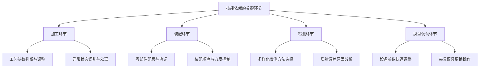

*图1：单件小批生产中技能依赖的关键环节分布*

在**加工环节**，由于产品的多样性和非重复性，操作者需要根据不同工件的材质、尺寸、精度要求进行工艺参数的实时判断与调整，这种决策能力难以被程序化的自动控制系统所替代。在**装配环节**，零部件加工具有离散性，生产管理的核心在于保障零部件质量与进度监控，避免因缺失或拖期导致交货延误[^1]，这要求装配工人具备全局视野和协调能力。在**检测环节**，检测方式的多样性和产品的非标性使得标准化的自动检测系统难以全面覆盖，必须依赖检验人员的经验判断。在**换型调试环节**，传统流水线换型成本极高，需要调整设备参数、更换模具夹具、培训员工操作，少则几小时，多则一两天[^8]，这一过程高度依赖技术人员的专业技能。

### 1.3 技能依赖引发的质量、效率与成本矛盾

技能依赖型生产模式在为单件小批生产提供必要灵活性的同时，也在质量控制、生产效率与成本管理三个维度形成了深刻的内在矛盾，这些矛盾构成了企业竞争力提升与可持续发展的核心制约因素。

**质量维度：波动性大且稳定性难以保证**

单件小批量生产的核心缺点之一是**质量不易保证**[^9]。由于标准化程度低，产品质量容易产生波动[^9]。质量波动体现为同一生产条件下制造的同规格产品间存在的质量特性差异，其来源于生产系统的五维度要素（人员、机器、材料、方法、环境）的相互作用[^10]。在技能依赖型生产中，**人员因素**——包括操作熟练度差异、疲劳作业导致的偶然误差，或未经培训上岗引发的系统性错误——成为质量波动的主要来源[^10]。

当产品质量仅依赖于人工管理时，由于缺乏有效的制衡机制，个别人员的行为偏差就可能对整体工艺质量造成系统性风险[^6]。这种质量风险在单件小批生产中尤为突出，因为每个产品的独特性使得通过统计过程控制（SPC）等标准化质量工具进行预防和监控的难度显著增加。

**效率维度：周期长且资源利用率低**

单件小批量生产的特点是定制化、灵活性高，但存在**周期长**的显著缺陷——因频繁调整设备和工艺，效率较低[^9]。生产过程的间断时间、工艺路线和生产周期均长[^4]，生产任务多、过程控制困难，生产数据的收集、维护和检索工作量大[^1]。

传统流水线面对小批量多品种生产时暴露出三个致命问题：**换型成本极高**，换型期间生产线完全停摆；**在制品积压严重**，前道工序做完的半成品要等整条线流转到后道，中间环节堆成"库存山"；**柔性极差**，一旦某道工序出故障，整条线瘫痪，小订单插单更是难如登天[^8]。工作流根据特定产品的不同经过不同的加工车间，因每个生产任务对同一车间能力的需求不同，工作流经常出现不平衡[^3]。

**成本维度：规模效应缺失与单位成本居高**

单件小批量生产**成本高，缺乏规模效应，单位成本上升**[^9]。成本计算复杂，需要针对成本对象并随着生产过程进行成本的归集和分配，常采用逐层累积法核算[^1]。原材料、半成品、产成品、废品频繁出入库，进一步增加了成本管理的复杂度[^3]。

此外，**用人多**是单件小批量生产的另一核心缺陷[^9]。生产过程依赖人工操作和调整，劳动生产率低[^5]。在当前劳动力成本持续上升、技能人才供给趋紧的背景下，这一矛盾愈发尖锐。

| 矛盾维度 | 具体表现 | 对企业的制约作用 |
|---------|---------|-----------------|
| 质量 | 波动大、标准化程度低、依赖人员技能 | 客户满意度下降、返工成本增加、品牌信誉受损 |
| 效率 | 周期长、换型频繁、设备利用率低 | 交货期延误、产能受限、市场响应滞后 |
| 成本 | 用人多、规模效应缺失、管理复杂 | 利润空间压缩、价格竞争力弱、投资回报周期长 |

*表2：技能依赖引发的三维矛盾及其制约作用*

这三个维度的矛盾并非孤立存在，而是相互强化：**质量波动导致返工增加，进一步延长生产周期并推高成本；效率低下使得企业难以通过规模扩张摊薄固定成本；成本压力又限制了企业在质量管理和效率提升方面的投入能力**。这种恶性循环构成了单件小批生产企业转型升级的深层障碍。

### 1.4 核心研究问题的提出与报告价值定位

在上述背景分析的基础上，本报告明确聚焦的核心研究问题是：**在离散制造的单件小批生产模式中，那些基本依靠人的技能才能完成的环节，实现自动化转型的难度究竟有多大？这些难度的具体来源、表现形式与相互作用机制是什么？**

这一研究问题的提出具有深刻的**现实紧迫性**：

**制造业数字化转型的时代趋势**。离散制造技术在所有四次工业革命中都取得了进步，从工艺制造到大规模生产和计算机自动化，再到工业4.0的互联互通、实时数据、智能设备和自主系统[^1]。当前，工业互联网平台正通过数据驱动的协同机制重构生产秩序，推动离散制造业数字化转型[^1]。然而，离散制造业企业的数字化转型面临**数据孤岛化、计划脱节、追溯薄弱**等多重挑战[^1]，技能依赖型环节的自动化更是其中最为棘手的难题。

**劳动力结构变化的倒逼压力**。随着制造业数字化转型的推进，"无人车间""黑灯工厂"迅速增多，"机器换人"带来生产效率的提升，也减少了一些企业的用工数量[^11]。与此同时，低技能劳动者首当其冲受到冲击，部分流向外卖、直播等新业态[^11]。制造业面临的技能差距问题日益突出——作为高级管理人员和有经验的工人成群结队地离开工厂，千禧一代替代速度缓慢[^12]。这种劳动力结构的变化迫使企业必须认真思考技能依赖型环节的自动化路径。

**市场柔性需求的持续增长**。消费市场从"大规模标准化"转向"个性化定制"，小批量多品种已成常态[^8]。订单量越来越小，品种却翻了数倍，半成品堆积、交货期延误成为制造业的普遍痛点[^8]。这种市场需求的变化使得单件小批生产模式的重要性不降反升，同时也对其效率和成本提出了更高要求。

本报告的**理论分析价值**体现在以下方面：

首先，报告将系统性地梳理技能依赖型环节自动化难度的**多维度来源**，包括技术可行性、经济合理性、系统柔性、数据基础、组织变革等层面，构建一个完整的分析框架。其次，报告将深入分析不同维度挑战之间的**相互作用机制**，揭示制约自动化转型的核心瓶颈所在。最后，报告将基于行业实践探索，提出**渐进式转型路径**的思路，为企业决策提供参考依据。

本报告的研究视角强调：**自动化转型的难度评估不能仅从技术维度出发，而必须将技术可行性、经济合理性、组织适配性等多重因素纳入综合考量**。单件小批生产的自动化转型是一个系统工程，其成功与否不仅取决于自动化技术本身的成熟度，更取决于企业能否在技术、经济、组织等多个层面实现协同突破。

## 2 技能依赖的根源：单件小批生产的本质特性与人工优势

单件小批生产模式对人工技能的高度依赖并非管理落后或技术投入不足的结果，而是由其生产本质特性所决定的内在必然。本章将从订单异质性、工艺复杂性、任务多变性、异常频发性四个核心维度展开系统剖析，揭示这些本质特性如何共同塑造了对人类经验判断、灵活应变、跨域学习等能力的刚性需求，进而明确自动化转型所需替代的"技能"的具体内涵与边界。

### 2.1 订单异质性与经验判断的不可替代性

单件小批生产最显著的特征在于**订单的高度异质性**，这种异质性从根本上决定了标准化程序难以覆盖全部生产场景，使得操作者基于经验的快速判断成为保障生产顺利进行的核心能力。

**产品规格与需求的碎片化特征**

单件小批量生产通常是面向一类低标准化的定制产品的生产，这类产品会根据客户的具体需求进行生产，因而**种类规格相当繁多**，但客户往往一次性下单购买的数量并不大，即订货批量非常小，甚至单件[^13]。非标产品的客户需求差异大，这就决定了很难采用标准化批量生产方式制造产品[^13]。以家具定制为例，对于零售市场的每位客户而言，其定制需求存在很大差异，包括尺寸大小、外观风格、材质用料、预算等方面的差异，这些差异会影响工厂选用不同工艺进行加工处理[^13]。

**非重复性生产对经验判断的刚性需求**

产品品种多、产量小，基本上是按照用户的订货组织生产，产品结构与工艺有较大的差异，产品在生产中**很少重复或者根本不重复**，生产的稳定性和专业化程度较低[^4]。这种非重复性意味着每一个生产任务都可能是操作者首次面对的场景，无法依赖预先编制的标准作业程序，必须依靠操作者根据产品特性进行实时的工艺参数判断与调整。

在此背景下，经验判断的核心价值体现在以下方面：

| 判断维度 | 具体内容 | 经验的作用机制 |
|---------|---------|---------------|
| 材质识别 | 不同材质的切削参数、热处理要求差异 | 基于历史加工经验快速匹配最优参数 |
| 精度权衡 | 客户精度要求与加工能力的匹配 | 判断工艺可行性，提出替代方案 |
| 工艺选择 | 同一零件的多种可行加工路径 | 综合考量效率、成本、质量做出决策 |
| 风险预判 | 潜在的加工难点与质量风险点 | 提前采取预防措施，避免返工 |

*表3：订单异质性下经验判断的核心维度*

即使是同样规格的零部件，由于选择工艺不同就有可能导致作业时间有较大出入[^13]。这种工艺选择的灵活性恰恰是经验丰富的操作者所擅长的领域——他们能够在多种可行方案中快速识别最优路径，而这种能力难以通过程序化的决策系统完全替代。

### 2.2 工艺复杂性与多技能协调的内在要求

离散制造的工艺复杂性不仅体现在单个工序的技术难度上，更体现在**多工序衔接、多工艺方法并存、零部件加工独立性**等系统性特征上，这种复杂性催生了对复合型技能人才的刚性需求。

**工艺路线的离散性与多样性**

离散制造是将产品生产过程分解为多道加工任务，通过非连续工序完成零部件加工并最终装配的生产方式[^3]。从产品形态来说，离散制造的产品相对较为复杂，包含多个零部件，一般具有相对较为固定的产品结构[^3]。从加工过程看，**离散制造型企业的生产过程是由不同零部件加工子过程或并联或串联组成的复杂的过程，其过程中包含着更多的变化和不确定因素**[^3]。

工艺复杂性的具体表现可通过以下流程图加以说明：

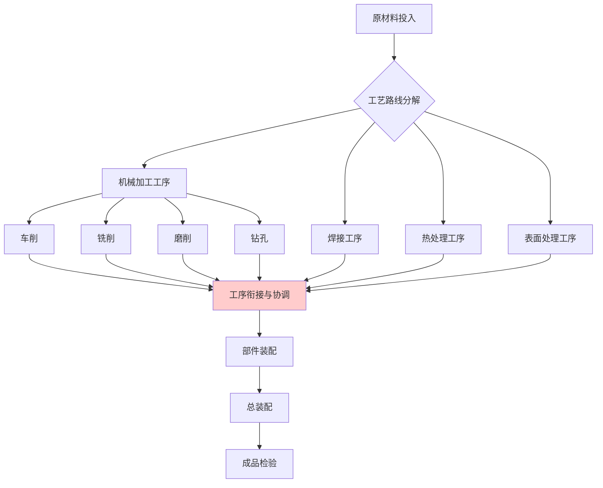

*图2：离散制造工艺路线的复杂性示意*

图中标红的"工序衔接与协调"环节正是技能依赖最为集中的节点。工作流根据特定产品的不同经过不同的加工车间，因每个生产任务对同一车间能力的需求不同，因此**工作流经常出现不平衡**[^3]。

**复合型技能人才的不可替代性**

为应对人工衔接环节的技术要求，该模式需要吸纳**复合型高技能人才**进行生产流程协调[^1]。这种复合型技能的内涵包括：

- **跨工艺知识整合**：理解不同加工方法的特性、适用范围与相互影响
- **设备参数匹配**：根据工件特性调整不同设备的加工参数
- **工序顺序优化**：在满足工艺约束的前提下安排最优加工顺序
- **质量传递控制**：确保上道工序的加工质量满足下道工序的要求

因产品的种类变化较多，非标准产品多，**设备和工人必须有足够灵活的适应能力**[^3]。这种适应能力不是单一技能的简单叠加，而是多种技能的有机整合与灵活运用，目前的自动化系统难以实现这种跨域的技能协调。

### 2.3 任务多变性与灵活响应能力的核心地位

单件小批生产中生产任务的高频变动是常态而非例外，这种多变性对生产系统的柔性提出了刚性要求，而人工在灵活响应方面相较于刚性自动化系统具有显著优势。

**生产计划的多变性特征**

影响计划的因素较多，生产计划的制订非常复杂，**计划的多变性是最常见的控制难点**[^3]。能力需求是根据每个产品混合建立，并且很难预测[^3]。生产任务多，生产过程控制非常困难；生产数据多，且数据的收集、维护和检索工作量大[^3]。

任务多变性的典型场景包括：

| 变动类型 | 触发因素 | 对生产的影响 | 人工响应优势 |
|---------|---------|-------------|-------------|
| 订单插单 | 紧急客户需求 | 打乱既定排程 | 快速评估可行性，灵活调整优先级 |
| 工艺变更 | 设计修改或客户要求变化 | 需重新规划加工路径 | 基于经验快速制定替代方案 |
| 设备换型 | 品种切换 | 需调整参数、更换工装 | 熟练操作缩短换型时间 |
| 物料替代 | 原定物料短缺 | 需评估替代方案可行性 | 判断替代物料的适用性 |

*表4：任务多变性的典型场景与人工响应优势*

**传统自动化系统的柔性不足**

传统流水线是为"大批量单一品种"设计的，就像一条单向高速路，所有工序按顺序排开，一旦要换品种，就会出现三个致命问题：**换型成本极高**，调整设备参数、更换模具夹具、培训员工操作，少则几小时，多则一两天，换型期间生产线完全停摆；**在制品积压严重**，前道工序做完的半成品要等整条线流转到后道，中间环节堆成"库存山"；**柔性极差**，一旦某道工序出故障，整条线瘫痪，小订单插单更是难如登天[^8]。

传统刚性生产线难适配频繁换型，这一困境在模具行业表现尤为突出——多品种、小批量已成为模具行业主流生产模式，工艺流程离散、装夹繁琐、切削低效、人工依赖度高等痛点，让企业陷入"换产亏、不换丢单"的两难[^14]。

**人工灵活响应的核心价值**

人与机器在生产现场的协同工作，通过把机器的高重复性、精确性和海量数据处理能力与**人的创造力、判断力和跨域学习能力**结合起来，形成一个能够快速响应变化的生产系统[^15]。人工的灵活响应优势体现在：

- **即时决策能力**：无需等待系统重新编程即可调整作业方式
- **跨工序协同**：能够与上下游工序人员直接沟通协调
- **经验迁移**：将处理类似问题的经验快速应用于新场景
- **风险评估**：在变动中识别潜在风险并采取预防措施

### 2.4 异常频发性与问题解决能力的关键作用

单件小批生产中异常情况的高发性与多样性是其本质特性的必然延伸，这些异常往往超出预设程序的处理范围，对操作者的问题解决能力提出了刚性要求。

**异常情况的多样性来源**

单件小批量生产的特点之一是**毛坯粗糙，工人技术水平要求高**——由于生产批量小，毛坯通常不进行精加工，这要求工人具备较高的技术水平，以灵活调整工艺和处理复杂问题。异常情况的典型来源包括：

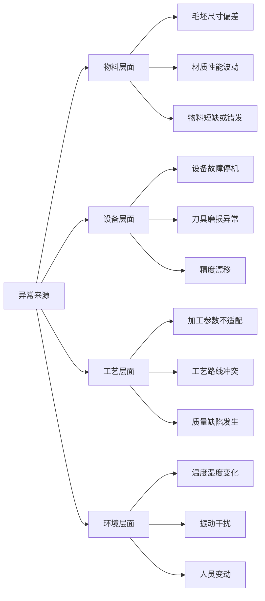

*图3：单件小批生产中异常情况的多样性来源*

**问题解决能力的不可替代性**

当生产系统需要更换零部件时，零部件需要定制；生产过程中更换有缺陷的产品会扰乱生产调度安排和交货计划[^13]。这些异常情况的处理需要操作者具备以下能力：

- **异常识别**：快速发现偏离正常状态的信号
- **原因诊断**：基于经验判断异常的根本原因
- **应急处置**：在有限条件下采取有效的补救措施
- **经验积累**：将处理经验转化为可复用的知识

通常情况下，一个产品的加工周期较长，每项工作在工作中心前的排队时间很长，引起加工时间的延迟和在制品库存的增加[^3]。异常情况的发生会进一步加剧这种延迟，而**操作者快速有效的问题解决能力是将异常影响最小化的关键**。

质量检测需根据产品性质进行零件和工序检验，检测方式多样，且自动化水平较低，需要对每个单件、每道工序的加工质量进行检验，**操作人员的技术水平在很大程度上决定产品的质量和生产效率**[^1]。这种质量把控能力不仅体现在检测环节，更体现在对异常的预防和处置能力上。

### 2.5 人工核心技能的系统性界定与自动化替代边界

在前述分析基础上，有必要对单件小批生产中人工所承担的核心技能进行系统性归纳，明确其具体内涵、作用机制与相互关联，从而界定自动化转型所需替代的"技能"边界。

**核心技能的多维度构成**

基于对订单异质性、工艺复杂性、任务多变性、异常频发性的分析，单件小批生产中人工核心技能可归纳为以下五个相互关联的维度：

| 技能维度 | 具体内涵 | 作用场景 | 能力要求层级 |
|---------|---------|---------|-------------|
| 经验判断 | 基于历史经验对非标场景的快速决策 | 工艺参数选择、质量预判、风险识别 | 隐性知识为主 |
| 工艺决策 | 在多种可行方案中选择最优路径 | 加工方法选择、工序安排、设备匹配 | 显性规则+隐性经验 |
| 灵活协调 | 跨工序、跨职能的沟通与资源调配 | 插单响应、进度协调、物料调度 | 社会性技能为主 |
| 异常处置 | 对非预期情况的识别、诊断与应对 | 设备故障、质量缺陷、物料短缺 | 综合能力要求 |
| 持续学习 | 从新场景中提取经验并迁移应用 | 新产品试制、新工艺导入、改善创新 | 元认知能力 |

*表5：单件小批生产中人工核心技能的系统性构成*

**技能之间的相互作用机制**

这五个技能维度并非孤立存在，而是形成了一个相互支撑、动态演化的能力系统：

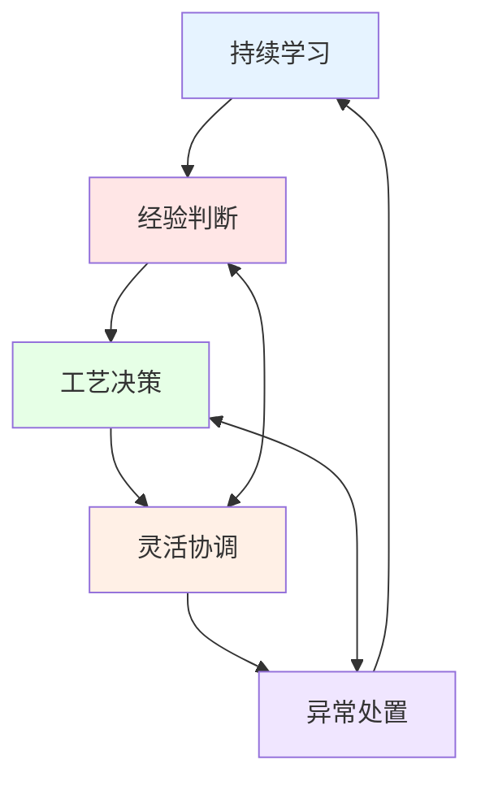

*图4：人工核心技能的相互作用机制*

**经验判断**为工艺决策提供知识基础，**工艺决策**的结果需要通过**灵活协调**来落地执行，执行过程中遇到的异常需要**异常处置**能力来应对，而异常处置的经历又通过**持续学习**转化为新的经验，形成能力提升的正向循环。

**自动化替代的边界界定**

明确了人工核心技能的构成后，自动化转型所需替代的"技能"边界可从以下角度加以界定：

**可替代性较高的技能要素**：
- 基于明确规则的重复性操作
- 可量化、可编程的工艺参数调整
- 结构化数据的采集与处理
- 标准化检测项目的执行

**可替代性较低的技能要素**：
- 基于隐性知识的经验判断
- 面向非结构化问题的决策
- 跨职能、跨工序的社会性协调
- 从新场景中提取和迁移知识的元认知能力

离散制造型的企业的产能不像连续型企业主要由硬件（设备产能）决定，而主要以软件（加工要素的配置合理性）决定。**同样规模和硬件设施的不同离散型企业因其管理水平的差异导致的结果可能有天壤之别**，从这个意义上来说，离散制造型企业通过软件方面的改进来提升竞争力更具潜力[^3]。这一洞察表明，单件小批生产的效率提升路径不仅在于自动化硬件的导入，更在于对人工技能的有效组织与放大。

技术再怎么发展，**高素质的产业工人不可替代**。无论是工业机器人难以完成的复杂工序，还是生产线上的创新改善工作，对高素质、高技能的产业工人的需求都在增大[^16]。这一判断为理解自动化替代边界提供了重要参照——自动化转型的目标不应是完全取代人工技能，而是通过人机协作实现能力的互补与放大。

综上所述，单件小批生产对人工技能的依赖根植于其订单异质性、工艺复杂性、任务多变性、异常频发性等本质特性之中。这些特性共同塑造了对人类经验判断、灵活应变、跨域学习等能力的刚性需求，构成了自动化转型必须正视的核心挑战。后续章节将在此基础上，系统分析现有自动化技术在替代这些技能时面临的具体障碍与瓶颈。

## 3 技术可行性挑战：现有自动化技术的适配性瓶颈

单件小批生产模式对自动化技术提出了远超传统大规模生产的苛刻要求。尽管协作机器人、机器视觉、AI工艺决策系统、数字孪生等技术在工业4.0浪潮中取得了显著进展，但这些技术在应对小批量多品种生产、快速换型需求、复杂工艺判断、非结构化作业环境时，仍暴露出明显的成熟度不足与功能边界。本章将从感知层、决策层、执行层三个技术维度，系统剖析现有自动化技术与单件小批生产实际需求之间的结构性差距。

### 3.1 协作机器人的柔性适配局限：负载精度与任务泛化的双重约束

协作机器人因其部署灵活、成本相对可控的特点，被视为中小企业实现柔性生产的重要工具。然而，在单件小批生产的实际应用中，协作机器人面临着**负载能力、精细操作与任务泛化**三个维度的结构性约束，难以完全替代人工的灵活操作能力。

**负载能力与精细操作的内在矛盾**

协作机器人技术产品多为6自由度及以上的多关节机器人，**自重及负载都较小**，产品安装方式及其移动部署相对灵活，适用于柔性、灵活度和精准度要求较高的行业[^17]。这一特性决定了协作机器人在电子、医药、精密仪器等轻载场景具有优势，但在涉及较大工件搬运、重型零部件装配等单件小批生产的典型场景中，负载能力成为明显瓶颈。

从国内市场客户的角度来看，由于协作机器人的高灵活性和低成本，**中小企业是使用协作机器人的主力军**[^18]。然而，协作机器人的缺点在于**它们不能承担人类完成的所有任务**，在精细任务方面仍有局限性[^18]。这种局限性在单件小批生产中表现尤为突出——当面对非标零部件的精密装配、复杂曲面的加工辅助等任务时，协作机器人的精度与灵巧度往往难以达到熟练工人的水平。

**编程易用性与复杂任务适配的落差**

协作机器人的易用性是其设计的重中之重，涉及的具体技术包含各类图形化编程、工艺包、示教方式、指令丰富程度、二次开发平台、系统扩展性等[^17]。虽然协作机器人的拖动示教功能免去了传统工业机器人复杂的编程和配置，使其操作简单、易上手，但目前市场上的一些协作机器人产品，它们提供的图形界面**只能完成一些简单的拣选、取放任务，仍存在易用性不强的问题**[^17]。

为了提高协作机器人的易用性，行业内企业对机器人编程语言进行了开发优化。例如，丹麦UR机器人采用一种专利技术的图形化编程方式，把复杂的指令简化为组合按钮的形式；德国Franka公司推出的图形化编程系统，可以使用户在不具备任何专业知识的情况下编写复杂的机器人程序[^17]。然而，这些进步仍无法完全弥合简易编程与复杂任务需求之间的鸿沟——单件小批生产中频繁变化的产品规格和工艺要求，使得每次换型都可能需要重新进行路径规划与参数调整。

**快速换型场景下的效率损失**

| 换型环节 | 人工操作时间 | 协作机器人调整时间 | 效率对比 |
|---------|-------------|-------------------|---------|
| 末端执行器更换 | 5-10分钟 | 15-30分钟（含调试） | 人工优势明显 |
| 路径重规划 | 即时调整 | 30分钟-2小时 | 人工优势显著 |
| 参数微调 | 实时完成 | 需停机调试 | 人工优势明显 |
| 异常处理 | 即时响应 | 需人工介入 | 人工不可替代 |

*表6：协作机器人与人工在换型场景中的效率对比*

在非标零部件抓取、多样化装配任务中，协作机器人的**泛化能力不足**问题尤为突出。虽然协作机器人可以在半小时内完成编程[^18]，但当面对形状、尺寸、材质各异的工件时，每种新工件都可能需要重新设计夹具、调整抓取策略，这种"一物一方案"的模式严重制约了其在单件小批生产中的适用性。

**从软件层面来看，协作机器人系统大多具有学习和演化的能力，采用增强型学习方法和遗传规划可以实现多机协同作业。然而，目前大多机器人的学习和演化还停留在较低的行为层次，其学习和演化的任务和环境也非常简单，当面对更为复杂的任务和环境时，存在时滞评价和组合爆炸问题**[^17]。这一技术瓶颈意味着协作机器人在单件小批生产的非结构化、高变异场景中，难以实现真正意义上的自主适应。

### 3.2 机器视觉的感知边界：非结构化环境与缺陷多样性的识别困境

机器视觉作为智能制造的"眼睛"，是实现自动化质检、精准定位的关键技术。然而，在单件小批生产的非结构化环境中，机器视觉技术面临着**环境适应性、缺陷多样性、数据稀缺性**三重困境，其感知能力与实际需求之间存在显著差距。

**自然光照变化与复杂背景干扰的识别挑战**

农业机器人的作业环境为机器视觉在非结构化环境中的困境提供了典型参照。**非结构环境对于机器人作业来说存在诸多不确定因素，如自然光照多变、待作业空间复杂多变、作业对象千姿百态、相互遮挡等，这都成为机器人作业中信息视觉感知的技术难题**[^19]。这些挑战在单件小批生产的车间环境中同样存在——不同工位的光照条件差异、工件表面反光特性的多样性、背景环境的复杂性，都会对视觉识别精度造成显著影响。

机器视觉缺陷检测面临的核心挑战之一是**光照和环境变化的影响**。在实际生产环境中，光照条件和环境因素往往是不确定的，这会对采集到的图像质量产生直接影响，从而影响缺陷检测的准确性。例如，强光或阴影可能会使某些区域在图像中过曝或欠曝，导致无法识别出其中的缺陷[^20]。

在工业视觉检测领域的实际项目中，光学设计困局尤为典型。某手机中框检测项目初期采用环形光源，在30°倾角下完美呈现划痕，**但在量产时发现，不同批次的阳极氧化表面粗糙度差异导致成像对比度波动超过40%**[^21]。这一案例充分说明，即使是相对标准化的产品，批次间的微小差异也会对视觉检测系统造成严重干扰，而单件小批生产的产品异质性远超此类场景。

**非标产品缺陷类型多样性的算法适应困境**

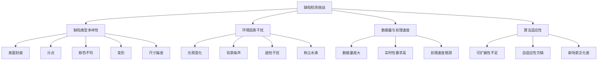

*图5：机器视觉缺陷检测面临的多维挑战*

**不同产品可能出现的缺陷多种多样，类型极其复杂。例如，表面划痕、污点、颜色不均、变形等，这些都给缺陷检测带来了极大的挑战。如何设计一种通用的检测系统，能够准确地识别各种缺陷，是机器视觉领域的一大难题**[^20]。在单件小批生产中，这一难题被进一步放大——每种产品的缺陷特征可能完全不同，缺陷的定义标准也随客户需求而变化，使得建立通用检测模型几乎不可能。

生产线上的背景噪声、产品之间的相互遮挡、以及各种干扰因素，如尘埃、水滴等，都可能对缺陷检测造成干扰。**如何排除这些干扰，提高检测的鲁棒性，是机器视觉缺陷检测面临的又一挑战**[^20]。

**小样本条件下的模型训练困境**

在工业视觉检测项目落地中，"相同样本不同结果"问题的本质是标注规范缺失[^21]。单件小批生产的非重复性特征使得每种产品的样本数量极为有限，难以支撑深度学习模型的有效训练。**在实际生产线中，需要检测的图像数据量往往非常庞大，对处理速度提出了极高的要求。传统的机器视觉算法在处理大量数据时，可能会遇到性能瓶颈，导致检测速度降低，影响生产线的效率**[^20]。

**随着生产线的升级或产品的变化，缺陷检测算法需要能够适应新的情况。这要求算法具有一定的可扩展性和自适应性，能够根据新的数据和环境条件进行自我调整和学习**[^20]。然而，这种理想化的自适应能力在当前技术条件下仍难以实现，尤其是在单件小批生产的小样本、高变异场景中。

**频繁换型场景中的参数调优成本**

在工业视觉检测项目中，有效需求挖掘需要：**驻场观察——连续3天记录人工检测员的误判案例；缺陷解构——建立缺陷物理特征与图像表现的映射关系；成本核算——将检测标准转化为质量损失函数**[^21]。这种需求挖掘过程本身就需要大量人力和时间投入，而单件小批生产的频繁换型意味着这一过程需要反复进行，参数调优成本急剧上升。

光学设计的三原则——**特征强化、环境免疫、容差设计**[^21]——在单件小批生产中难以全面满足。每种新产品都可能需要重新设计光学方案，而定制光学系统的高成本与小批量订单的有限利润之间形成尖锐矛盾。

### 3.3 AI工艺决策系统的智能瓶颈：经验知识数字化与动态推理的双重困难

AI技术在工艺参数优化、加工路径规划、异常诊断等决策环节展现出巨大潜力，但在单件小批生产场景中，AI工艺决策系统面临着**隐性知识数字化、决策泛化能力、动态推理能力**三个层面的根本性障碍。

**隐性工艺经验的数字化建模困境**

当前AI在自主决策和复杂环境适应中的核心瓶颈已从算力不足转向**动态上下文管理、系统安全性与多模态协同机制**的深层次矛盾[^22]。主流大模型存在"三不可"缺陷：**决策逻辑不可解释、行为依据不可判识、长期因果不可推论**。例如银行反欺诈系统因误判且无法说明依据导致合规风险，根源在于模型仅依赖数据统计规律，缺乏人类可理解的推理链条[^22]。

这一问题在工艺决策领域同样严峻。单件小批生产中，熟练工人的工艺经验大多以隐性知识形式存在——他们能够根据工件的"手感"判断材质特性，通过加工过程中的"声音"识别刀具状态，凭借"直觉"预判可能出现的问题。这些隐性知识难以通过结构化数据进行表达和建模，成为AI工艺决策系统难以逾越的障碍。

**非重复性生产任务的决策泛化难题**

| AI决策瓶颈 | 具体表现 | 对单件小批生产的影响 |
|-----------|---------|---------------------|
| 数据孤岛与场景单一性 | 训练环境缺乏多样性，跨场景失效 | 每种新产品都可能超出模型经验范围 |
| 动态上下文管理失效 | 难以维持长期任务的状态记忆 | 复杂工艺流程中的决策连贯性不足 |
| 决策黑箱问题 | 无法解释决策依据 | 工艺人员难以信任和校验AI建议 |
| 样本不足导致偏差 | 新特征检测能力不足 | 非标产品的工艺决策准确性下降 |

*表7：AI工艺决策系统的核心瓶颈及其影响*

**数据孤岛与场景单一性**是AI决策泛化的首要障碍。训练环境缺乏多样性，模型在跨地域、跨文化或极端场景下失效。如医疗AI仅用城市数据训练时在乡村误诊，金融模型因缺乏多地域样本误判特殊群体行为[^22]。在单件小批生产中，每个订单都可能代表一个"极端场景"，AI系统难以从有限的历史数据中学习到足够的泛化能力。

**动态上下文管理失效**进一步制约了AI的决策能力。AI难以维持长期任务的状态记忆，在执行需多步骤协作的任务时如同"失忆的高材生"，因无法跨步骤共享关键背景信息而失败[^22]。单件小批生产的工艺决策往往涉及多道工序的协调优化，这种跨工序的决策连贯性正是当前AI系统的薄弱环节。

**动态多变环境中的实时推理与纠偏能力欠缺**

**新车型上市快，AI算法因样本不足，可能漏检新特征**[^23]。这一在汽车制造领域观察到的问题，在单件小批生产中更为普遍——产品的非重复性意味着AI系统几乎总是在面对"新特征"，其决策可靠性难以保证。

从突破路径来看，业界正在探索**思维链内化+强化学习**的方法，将渐进式推理能力植入模型核心，通过强化学习引导AI拆解复杂任务、回溯纠偏，提升多步骤逻辑严谨性[^22]。然而，这些前沿技术距离工业级应用仍有相当距离，尤其是在需要实时响应的生产现场，AI系统的推理速度与准确性之间的平衡仍是难题。

### 3.4 数字孪生的映射失真：模型精度与动态同步的现实落差

数字孪生技术被视为实现智能制造的核心支撑，通过构建物理世界与虚拟空间的实时映射，实现生产全流程的可视化监控、仿真优化与协同调度。然而，在单件小批生产场景中，数字孪生技术面临着**模型构建成本、动态同步精度、数据融合质量**三个层面的严峻挑战。

**高保真模型构建的成本困境**

2026年数字孪生工厂的产能瓶颈，本质是"技术赋能与现实制约的失衡"——数字孪生虽打通了生产全链条的数据流，但受限于数据质量、模型能力、资源配置及组织协同等多重因素，未能完全转化为产能增量[^24]。

**高保真模型构建难度大、成本高，多数中小工厂受限于技术实力，仅能构建设备、产线的基础几何模型，无法融入物理属性、工艺规则、环境影响等多维特征，导致仿真优化结果与实际生产偏差较大，难以指导产能提升**[^24]。例如，某家电工厂的孪生模型因未考虑车间温湿度对设备运行效率的影响，仿真得出的产能提升方案实际应用后效果缩水60%[^24]。

对于单件小批生产企业而言，这一困境更为突出。产品的非重复性意味着每种产品都可能需要构建独立的数字孪生模型，而高昂的建模成本与小批量订单的有限利润之间形成不可调和的矛盾。

**物理系统动态变化与虚拟模型同步的滞后问题**

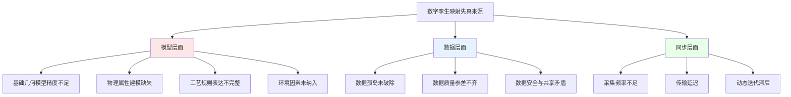

*图6：数字孪生映射失真的多维来源*

**模型动态迭代不足**是数字孪生技术的核心痛点之一。生产过程中设备磨损、工艺调整、物料特性变化等动态因素，未能实时反馈至虚拟模型，导致模型逐渐与物理系统脱节，失去优化指导价值[^24]。在单件小批生产中，每个订单都可能带来工艺参数的调整，这种高频变化使得虚拟模型的同步更新成为几乎不可能完成的任务。

数据作为数字孪生工厂的核心驱动要素，其质量、流通效率与标准化程度直接决定产能释放效果。**数据孤岛尚未完全破除**，尽管数字孪生平台具备数据汇聚能力，但多数工厂仍存在MES、ERP、PLM、SCM等异构系统接口不兼容、数据格式不统一的问题，设计数据、生产数据、供应链数据无法实时互通，导致虚拟模型与物理生产脱节[^24]。

**多源异构数据融合的技术障碍**

在分布式系统中，不同平台常采用各异的数据格式（如JSON、XML、Protobuf），导致数据交换困难。为实现高效通信，需引入统一的中间表示层[^25]。然而，这种数据标准化工作本身就需要大量投入，而单件小批生产企业的信息化基础普遍薄弱，难以支撑这种系统级的数据治理工程。

**数据质量参差不齐**进一步加剧了映射失真问题。传感器老化、数据采集频率不足、人工录入误差等问题，导致接入孪生平台的数据存在失真、滞后、缺失等问题，虚拟模型无法精准复刻物理生产状态。**在精密零部件制造中，设备振动数据采集滞后会导致模型预判偏差，引发工序衔接卡顿，产能损失率达8%-10%**[^24]。

**仿真优化与实际生产的效果偏差**

**跨场景模型适配性差**是数字孪生技术的另一重要局限。单一产线模型难以扩展至工厂全局，供应链、物流等环节的模型与生产模型协同不足，无法实现全流程产能联动优化，形成"局部优化、全局失衡"的局面[^24]。

某电子制造工厂调研显示，**因数据孤岛导致的生产排产偏差率达12%，直接影响产能规划准确性**[^24]。这一数据表明，即使在相对标准化的电子制造领域，数字孪生技术的应用效果也与预期存在显著差距，而在产品异质性更高的单件小批生产场景中，这种偏差只会更大。

### 3.5 柔性自动化系统的集成困境：多技术协同与快速重构的工程挑战

柔性自动化产线是应对多品种小批量生产的系统性解决方案，但其在单件小批生产中的落地面临着**设备协同、数据互通、快速重构**等多维度的工程挑战，技术集成的复杂性远超单点技术的应用难度。

**多品牌设备数据协议差异导致的信息孤岛**

**不同品牌设备数据协议差异形成"信息孤岛"，可能导致几秒延迟，引发批量错装**[^23]。这一问题在柔性自动化产线中尤为突出——产线通常由多家供应商的设备组成，每家设备的通信协议、数据格式、控制接口都可能不同，实现真正的互联互通需要大量的适配开发工作。

柔性自动化的核心绝非单纯堆砌设备，而是以**工艺重构为基础，通过AI与自动化技术深度融合**实现"随需而变"[^14]。然而，这种深度融合在实践中面临重重困难。针对多品种加工的核心痛点，需要从工艺源头切入优化，打破固定工序的传统桎梏，通过合并同类工序、优化装夹方案、梳理标准化作业流程，大幅缩短工序切换耗时[^14]。这种工艺重构本身就需要深厚的行业积淀和专业能力，并非简单的技术导入所能实现。

**机器人-视觉-控制系统协同响应的时延问题**

| 协同环节 | 典型时延 | 对生产的影响 | 技术难点 |
|---------|---------|-------------|---------|
| 视觉识别→机器人响应 | 100-500ms | 节拍损失 | 算法优化与硬件加速 |
| MES→设备控制 | 1-5s | 换型延迟 | 系统架构与接口标准化 |
| 边缘计算→云端同步 | 秒级 | 决策滞后 | 算力分配与网络优化 |
| 多设备协调 | 可变 | 节奏失调 | 分布式控制算法 |

*表8：柔性自动化系统中的典型协同时延*

**车型切换时，MES系统需同步更新海量数据，易出现卡顿导致生产暂停。车间设备密集产生海量数据，云端计算有延迟，边缘计算设备算力又难以支撑多车型并行处理**[^23]。这些在汽车制造领域观察到的问题，在单件小批生产中同样存在，甚至更为严重——产品的高频变化意味着系统需要更频繁地进行数据同步和参数切换。

**产线快速重构的软硬件模块化挑战**

柔性自动化产线需要具备快速重构能力，以适应不同产品的生产需求。**柔性设备单价是传统设备的3-5倍，一条年产10万辆的生产线初期投入可能增加数亿元，维护成本也更高**[^23]。这种高昂的投资门槛使得多数中小企业难以承受，而单件小批生产恰恰是中小企业的主要生产模式。

**多车型共线时，即使智能切换，节拍仍可能下降10%-20%，压缩切换时间又会增加故障风险**[^23]。这种效率与可靠性之间的权衡，在单件小批生产中表现得更为尖锐——产品的非重复性意味着几乎每个订单都需要进行"换型"，累积的效率损失可能抵消自动化带来的收益。

**工艺为核心的柔性自动化方案部署复杂性**

传统刚性生产线难适配频繁换型，**以工艺为核心的柔性自动化产线才是破局关键**[^14]。然而，这种方案的落地需要克服多重障碍：

首先是**工艺重构的专业门槛**。重构后的工艺可兼容不同规格、材质的零件生产，从根本上破解"一款产品一套流程"的低效困境[^14]。但这种工艺重构需要深入理解产品特性和加工规律，对企业的技术能力提出很高要求。

其次是**自动化落地的模块化挑战**。柔性自动化方案采用模块化设计，可灵活配置CNC、EDM等单点自动化单元，也可组合工业机器人与柔性轨道线搭建完整产线[^14]。但模块化程度越高，系统集成的复杂度也越大，需要在灵活性与稳定性之间寻找平衡。

最后是**持续运维的能力要求**。选择具备全流程服务能力的供应商，确保产线落地后可获得及时的技术支持、参数优化与运维服务，保障产线长期稳定运行[^14]。这种对外部服务的依赖增加了企业的运营风险，尤其是在供应商技术能力参差不齐的情况下。

**技术融合与可靠性风险的综合考量**

多技术融合存在稳定性与适配性短板，易引发连锁问题。**多视觉技术在光照变化、粉尘干扰下，识别精度可能从99.9%降至95%以下，影响电子部件检测质量**[^23]。这种精度衰减在单件小批生产的复杂环境中更为普遍，而95%的识别精度在高质量要求的生产场景中往往是不可接受的。

综上所述，现有自动化技术在单件小批生产场景中面临的适配性瓶颈是多维度、相互关联的。协作机器人的柔性不足、机器视觉的感知边界、AI决策的智能瓶颈、数字孪生的映射失真、柔性自动化的集成困难，共同构成了技术可行性层面的结构性障碍。**这些技术瓶颈并非孤立存在，而是相互强化——感知层的不准确影响决策层的可靠性，决策层的局限制约执行层的效果，而执行层的反馈又难以有效改进感知和决策**。突破这些瓶颈需要的不仅是单点技术的进步，更是系统级的技术融合与创新。

## 4 经济性与投资回报难题：成本约束与规模效应缺失

单件小批生产模式下的自动化转型不仅面临技术可行性的挑战，更受制于深刻的经济性障碍。自动化系统固有的高固定成本特性与单件小批生产的低批量、高变异特征之间存在结构性矛盾，这种矛盾从经济理性层面构成了企业实施自动化转型的首要决策障碍。本章将从初始投资门槛、持续运维成本、订单波动风险、规模效应缺失、投资回收周期五个维度展开系统剖析，揭示经济性约束如何成为单件小批生产自动化转型的核心瓶颈。

### 4.1 自动化系统的高初始投资门槛与中小企业承受力落差

自动化转型的首要经济障碍在于**高昂的初始投资门槛**，这一门槛与单件小批生产企业（多为中小企业）的资金实力和利润水平之间存在显著落差，形成了难以逾越的资金鸿沟。

**初始投资的多维构成与规模**

自动化与营运精简措施的投入成本无固定标准，核心取决于企业规模、行业属性、改造深度及技术选型，整体呈现"前期重投入、后期稳递减"的特征[^26]。从投入构成来看，初始成本主要涵盖三大板块：

| 成本类别 | 具体内容 | 典型投入规模 |
|---------|---------|-------------|
| 技术采购与部署 | 自动化设备、软件系统购置、安装调试、数据迁移 | 数十万至数千万元 |
| 基础设施改造 | 车间布局调整、网络通信升级、环境适配改造 | 占技术采购成本15%-30% |
| 人力转型成本 | 员工培训、技能提升、专业人才招聘 | 占总投入10%-20% |

*表9：自动化初始投资的主要构成*

技术采购与部署成本是投入的核心部分，包括自动化设备、软件系统的购置费用，如制造业的机械臂、智能管理系统、流程自动化工具等，**单价从数万元到数百万元不等，中小企业局部自动化改造通常需10-50万元，大型企业全流程升级则可能超千万元**[^26]。同时，系统安装、调试、数据迁移及硬件适配改造也需投入人力与资金，占技术采购成本的15%-30%。

**柔性设备的高溢价特征**

对于单件小批生产而言，传统刚性自动化设备难以满足频繁换型需求，必须采用具备柔性能力的自动化系统。然而，**柔性设备单价是传统设备的3-5倍，一条年产10万辆的生产线初期投入可能增加数亿元，维护成本也更高**[^27]。这种高溢价特征使得柔性自动化的投资门槛远超传统自动化方案。

以离散制造领域的MES系统为例，2025年上半年国内市场规模达132.6亿元，同比增长25.1%，其中具备AI功能的智能MES产品占比突破78%[^28]。对于企业而言，MES选型的核心痛点在于投资回报的精准测算——如何平衡短期投入与长期收益，如何通过技术特性预判投资回收期，成为决策的关键[^28]。

**中小企业的资金实力落差**

推动数字化转型，**企业虽然要投入几百万元乃至上千万元资金**，但可以实现降成本、提效率[^29]。然而，这一投入力度对于单件小批生产企业而言往往难以承受。以印染行业为例，数字化转型除了软件支撑，还需要采购新的先进设备，**这样一套软硬件改造做下来，投入达到五六百万元，占企业年营业收入的2%左右**。统计显示，印染行业销售利润率仅为3.03%，显然，这个投入力度需要企业下很大的决心[^29]。

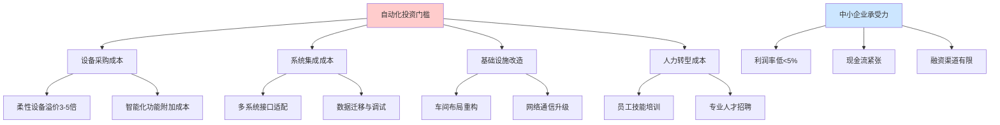

*图7：自动化投资门槛与中小企业承受力的结构性落差*

从国内市场客户的角度来看，由于协作机器人的高灵活性和低成本，**中小企业是使用协作机器人的主力军**[^27]。然而，即便是相对低成本的协作机器人方案，对于利润微薄的单件小批生产企业而言，仍然构成不小的资金压力。这种投资门槛与承受能力之间的落差，成为制约自动化转型的首要经济障碍。

### 4.2 持续性维护升级成本与隐性支出的累积效应

自动化系统的经济性评估不能仅关注初始投入，更需要充分考量**上线后的持续性运维成本**。这些成本虽然分散在系统生命周期的各个阶段，但其累积效应对企业长期财务状况的影响不容忽视。

**运维成本的结构性构成**

自动化系统上线后，日常维护、故障检修、软件升级及安全防护均需持续投入，**年度运维成本约为初始技术投入的5%-10%，若采用云服务模式，则需按年支付订阅费用，成本更具弹性但长期累计金额可观**[^26]。

| 运维成本类别 | 具体内容 | 占初始投入比例 |
|-------------|---------|---------------|
| 设备维护 | 定期保养、零部件更换、故障维修 | 3%-5%/年 |
| 软件升级 | 系统更新、功能扩展、安全补丁 | 2%-5%/年 |
| 人员培训 | 新员工培训、技能更新、认证续期 | 1%-3%/年 |
| 技术支持 | 供应商服务费、远程诊断、现场支持 | 2%-5%/年 |
| 备件管理 | 关键备件库存、紧急采购 | 1%-3%/年 |

*表10：自动化系统年度运维成本构成*

在设备管理方面，**设备的停机代价非常高昂，因此比较重视设备的可靠性，定期的保养和能够快速维修复工的能力**[^30]。传统工厂设备的投资决策、维护策略等都会因为成本控制的因素受到比较强烈的影响[^30]。这种对可靠性的刚性需求意味着企业必须持续投入维护资源，无法通过削减运维支出来降低总体成本。

**隐性成本的累积效应**

隐性成本易被忽视，却可能严重影响投入效益。一方面是**流程重构成本**，精简营运需打破原有工作模式，梳理业务节点、优化流程衔接，过程中可能出现效率暂时下降、部门协同摩擦等问题，间接增加时间与管理成本；另一方面是**风险对冲成本**，技术适配不当、系统故障或数据安全漏洞，可能导致返工、停产等损失，需预留应急资金与风控投入[^26]。

从自动化测试领域的ROI分析可以获得有益参照：**总成本包括初始投入（框架搭建、脚本开发、环境配置、培训成本）和维护成本（脚本更新、环境维护、工具许可证续费）**[^31]。在制造业自动化场景中，这种成本结构同样适用——初始投入只是冰山一角，持续性的维护升级支出才是长期财务负担的主要来源。

**维护成本预算的合理设定**

业界经验表明，应**设定合理的维护成本预算（通常占初始投入的15%-30%）**[^31]。这意味着一项初始投入500万元的自动化项目，每年可能需要75-150万元的持续性运维支出。对于利润率本就微薄的单件小批生产企业而言，这种持续性的现金流出构成了沉重的财务压力。

### 4.3 订单波动与产能利用率不确定性导致的投资风险

单件小批生产模式下订单的**碎片化、不可预测性**特征，使得自动化设备的产能利用率难以得到有效保障。高固定成本投入与不稳定产出之间形成了显著的风险敞口，这种不确定性成为企业投资决策的重要顾虑。

**订单碎片化与需求波动的常态化**

消费市场从"大规模标准化"转向"个性化定制"，小批量多品种已成常态。**订单量越来越小，品种却翻了三倍，生产线刚调完A产品，B产品的订单就催着要，半成品堆得像山，交货期还总延误**[^8]。这种市场需求的结构性变化使得订单的可预测性大幅下降。

在离散制造场景下，某阀门生产企业应用强化学习排产引擎处理**每日300+变异订单**[^27]。这一数据表明，单件小批生产企业面对的订单环境具有高度的动态性和碎片化特征，生产计划需要频繁调整以适应不断变化的市场需求。

**产能利用率的不确定性风险**

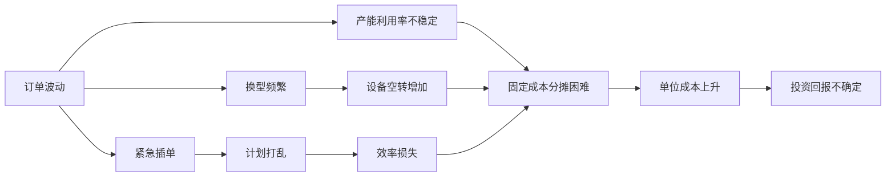

*图8：订单波动对自动化投资回报的影响链条*

影响计划的因素较多，生产计划的制订非常复杂，**计划的多变性是最常见的控制难点**；能力需求是根据每个产品混合建立，并且很难预测[^3]。这种需求的不可预测性直接导致自动化设备的产能利用率难以稳定在经济可行的水平。

柔性化改造的实践数据显示，**多车型共线时，即使智能切换，节拍仍可能下降10%-20%，压缩切换时间又会增加故障风险**[^27]。这意味着即使采用了柔性自动化方案，频繁的产品切换仍会导致显著的效率损失，进一步加剧产能利用率的不确定性。

**投资决策的风险敞口**

某汽车零部件企业的案例具有典型性：企业陆续投入2亿多元资金用于数字化改造，如引进机器人设备、部署MES信息系统。**碰到汽车行业下行，订单量一度萎缩，企业压力很大**[^29]。这一案例充分说明，在订单波动的市场环境下，高额的自动化投资面临着显著的风险敞口。

对于单件小批生产企业而言，订单的碎片化和不可预测性使得这种风险更加突出。**当生产系统需要更换零部件时，零部件需要定制；生产过程中更换有缺陷的产品会扰乱生产调度安排和交货计划**[^3]。这些不确定因素的叠加使得投资回报的预测变得极为困难，增加了企业决策的复杂性。

### 4.4 规模效应缺失与单位成本摊薄困难的经济逻辑

自动化投资的经济可行性在很大程度上依赖于**规模效应**——通过产量扩张摊薄固定成本，实现单位成本的下降。然而，单件小批生产的本质特性决定了这一经济逻辑难以成立，构成了自动化转型的根本性经济障碍。

**自动化投资的规模效应原理**

自动化系统具有典型的高固定成本、低边际成本特征。在大规模生产场景下，高昂的初始投资可以通过大量产品进行分摊，使得单位产品承担的自动化成本降至可接受水平。然而，**单件小批量生产成本高，缺乏规模效应，单位成本上升**[^1]。

| 生产模式 | 批量特征 | 固定成本分摊 | 单位成本趋势 |
|---------|---------|-------------|-------------|
| 大规模生产 | 批量大、品种少 | 充分分摊 | 持续下降 |
| 中等批量 | 批量中等、品种中等 | 部分分摊 | 相对稳定 |
| 单件小批 | 批量小、品种多 | 难以分摊 | 居高不下 |

*表11：不同生产模式下的规模效应对比*

**非重复性生产对成本分摊的制约**

单件小批生产的核心特征之一是产品在生产中**很少重复或者根本不重复**[^1]。这种非重复性意味着为某一产品配置的自动化工装、编制的加工程序、调试的工艺参数，在该产品完成后往往难以复用，其成本只能由这一批次（甚至单件）产品承担。

成本计算复杂，需要针对成本对象并随着生产过程进行成本的归集和分配，常采用**逐层累积法核算**[^3]。原材料、半成品、产成品、废品频繁出入库，进一步增加了成本管理的复杂度[^3]。这种成本核算的复杂性本身也是规模效应缺失的一种体现——无法通过简化的标准成本法进行管理，必须逐单逐件进行成本追踪。

**与大规模生产场景的经济性对比**

在大规模生产场景下，自动化投资的经济性可以得到充分体现。以某电子厂的柔性化改造为例，**产线在未增加设备的情况下，同时生产18种型号产品，良品率反而提升2.3个百分点**[^32]。然而，这种成功案例的前提是具有足够的生产规模来支撑自动化投资的分摊。

相比之下，单件小批生产企业面临的是截然不同的经济逻辑。东莞某电子厂案例显示，该工厂订单品种从2020年的50种增加到2022年的180种，**小订单占比超70%，交货期延误率高达30%，库存周转率比行业平均低50%**[^8]。这种高度碎片化的订单结构使得任何自动化投资都难以获得足够的产量基础来实现成本分摊。

**用人多与劳动生产率低的成本困境**

**用人多**是单件小批量生产的核心缺陷之一。生产过程依赖人工操作和调整，劳动生产率低[^1]。从经济学角度看，这种对人工的高度依赖恰恰是规模效应缺失的必然结果——当自动化无法实现经济可行的成本分摊时，企业只能退而求其次，采用人工方式完成生产任务。

这形成了一个悖论：**正是因为规模效应缺失使得自动化经济性不足，企业才不得不依赖人工；而人工成本的持续上升又使得企业渴望通过自动化降低成本**。这种两难困境构成了单件小批生产企业转型决策的核心矛盾。

### 4.5 投资回收期延长与企业决策的短期理性约束

自动化投资的经济性最终体现在**投资回报率（ROI）与投资回收期**上。在单件小批生产场景下，投资回收期的延长与企业经营周期、市场变化速度之间存在显著错配，这种错配从企业决策的短期理性角度构成了转型的首要障碍。

**ROI计算的基本框架**

ROI（投资回报率）= (收益 - 成本) / 成本 × 100%。对于自动化投资场景，需进一步拆解：**总收益 = 手动测试成本节约 + 缺陷早期发现收益 + 测试周期压缩收益 + 回归测试复用收益；总成本 = 工具采购/开发成本 + 框架搭建人力成本 + 脚本编写维护成本 + 环境部署成本**[^33]。

在制造业自动化场景中，收益主要来源于人工成本节约、效率提升、质量改善三个方面。以MES系统为例，某汽车零部件企业引入鼎捷MES系统后，**年均节省运维成本80万元，设备利用率提升25%，订单交付周期缩短20%，因延期交付导致的订单损失减少30%，综合年收益达120万元，投资回收期仅1.5年**[^28]。

然而，这一相对乐观的案例建立在汽车零部件行业相对标准化、批量相对较大的基础上。对于单件小批生产企业而言，收益端的不确定性更大，投资回收期往往显著延长。

**单件小批场景下的ROI特殊性**

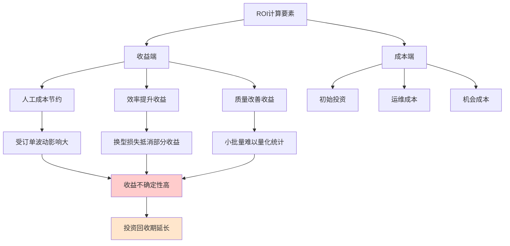

*图9：单件小批场景下ROI计算的特殊性*

典型的ROI计算案例显示，某金融项目每月执行2轮回归测试，手工需5人天，自动化后仅需1人天。年收益计算：时间节约4.8万元 + 缺陷提前发现收益2.4万元 = 7.2万元。**ROI = (7.2-11)/11×100% = -34.5%（首年为负，但长期收益显著）**[^31]。这一案例表明，即使在相对标准化的测试场景中，自动化投资的首年ROI也可能为负，需要通过长期运营才能实现正向回报。

在单件小批生产场景中，由于订单波动、换型损失、产能利用率不稳定等因素的叠加影响，**投资回收期可能延长至2-3年甚至更长**。这与企业的经营周期和市场变化速度之间形成了显著错配。

**短期财务压力与长期战略收益的决策张力**

企业推进数字化转型，还要统筹算好短期收益和长期收益两笔账[^29]。某汽车部件企业的经历具有典型性：**2016年起陆续投入2亿多元资金用于数字化改造，碰到汽车行业下行，订单量一度萎缩，企业压力很大。但认为这是必经阶段，企业最终挺过来了。随着新能源汽车快速发展，月产值从原来的1000多万元增长到目前的4000多万元，转型红利逐步释放**[^29]。

然而，并非所有企业都有能力承受这种长期的财务压力。华为联合国家发展改革委创新驱动发展中心近期发布的企业数字化转型投入产出关系研究报告指出，**从发展阶段看，数字化转型正进入以价值驱动为核心的新阶段，企业需要更加关注数字化转型带来的实际价值，而不仅仅是技术应用或数字化程度**[^29]。

**经济理性约束下的决策困境**

咨询机构e-works调研数据显示，**全国约80%的企业已经制定了数字化转型规划，且超过40%的企业将数字化转型作为核心战略。多数企业在数字化转型方面持续投入，其中投资额在300万元至1000万元区间的企业比例稳定上升**[^29]。这一数据表明，企业对数字化转型的战略价值已有广泛认知。

然而，对于单件小批生产企业而言，经济理性的约束使得转型决策面临两难：

| 决策维度 | 转型选择 | 不转型选择 |
|---------|---------|-----------|
| 短期财务 | 投入大、回报慢、现金流压力 | 成本可控、风险较低 |
| 长期竞争力 | 效率提升、质量改善、能力积累 | 竞争力下降、人才流失 |
| 市场适应性 | 响应能力增强、客户满意度提升 | 交期延误、客户流失风险 |
| 风险敞口 | 技术风险、投资风险 | 市场风险、人力风险 |

*表12：单件小批生产企业自动化转型的决策两难*

中国工程院院士李培根认为，**在价值驱动模式下，企业不再单纯追求短期的利润最大化，而是将短期商业价值与可持续发展等长期战略价值结合考虑，不断调整和优化投入产出结构，确保资源的有效利用和产出的最大化**[^29]。这一观点为单件小批生产企业的转型决策提供了重要参照——自动化转型的经济性评估不能仅着眼于短期ROI，更需要从长期战略价值的角度进行综合考量。

综上所述，单件小批生产模式下的自动化转型面临着多重经济性障碍。**高初始投资门槛、持续性运维成本、订单波动风险、规模效应缺失、投资回收期延长**等因素相互叠加，从经济理性层面构成了企业实施自动化转型的首要障碍。这些经济性约束并非孤立存在，而是与技术可行性挑战相互强化——技术不成熟推高成本，成本约束又限制了技术迭代投入，形成恶性循环。突破这一困境需要在技术创新、商业模式、政策支持等多个层面寻求系统性的解决方案。

## 5 系统柔性与可重构性障碍：从刚性自动化到自适应生产的鸿沟

单件小批生产对生产系统提出了极致柔性的刚性需求，而传统自动化产线的设计理念根植于大规模标准化生产的逻辑之中。这种需求与供给之间的结构性错配，构成了自动化转型的核心障碍之一。本章将从设备层、软件层、物流层三个维度系统剖析实现快速重构与自适应调整所面临的技术集成复杂度、标准化缺失以及系统稳定性风险，揭示从刚性自动化迈向自适应生产所必须跨越的深刻鸿沟。

### 5.1 刚性自动化与柔性生产的本质特征对比

理解单件小批生产自动化转型的障碍，首先需要厘清传统刚性自动化与柔性制造系统在设计理念、运行逻辑、核心能力等方面的根本差异。这种差异不仅是技术层面的，更是生产组织哲学层面的深刻分野。

**设计理念与适用场景的根本分野**

刚性制造模式一般采用自动流水线，包括物流设备和相对固定的加工工艺，**适应于大批量、少品种的情况**[^34]。其核心特征包括：实现从设计、加工到管理的标准化和专业化生产；采用移动式的装配线和高效的专用设备，工序分散，节拍固定；实行厂内自制管理，纵向一体化组织结构；劳动分工很细；**对市场和用户需求的应变能力较低**[^34]。这种设计理念的核心假设是产品需求稳定、批量足够大、工艺路线固定，从而可以通过专用化设备和固定节拍实现效率最大化。

与之形成鲜明对比的是，柔性制造模式的特征体现为：工序相对集中，没有固定的节拍，物料的非顺序输送；将高效率和高柔性融于一体，生产成本低；**具有较强的灵活性和适应性**[^34]。柔性制造最大的特点是能实现单品种的小批量生产，且不同产品在流水线上可以同时生产[^35]。

下表系统呈现两种生产模式的核心差异：

| 对比维度 | 刚性自动化 | 柔性制造 |
|---------|-----------|---------|
| 适用场景 | 大批量、少品种 | 多品种、小批量 |
| 生产节拍 | 固定节拍 | 无固定节拍 |
| 工序组织 | 工序分散、顺序输送 | 工序集中、非顺序输送 |
| 设备特征 | 高效专用设备 | 通用化、可重构设备 |
| 应变能力 | 低 | 高 |
| 核心追求 | 效率最大化 | 效率与柔性平衡 |

*表13：刚性自动化与柔性制造的本质特征对比*

**自动生产线与柔性生产线的能力边界**

自动生产线针对大规模、标准化产品生产而设计、操作简单、可靠性高、生产效率很高，**但缺乏灵活性，难以适应多样化产品生产**[^36]。而柔性生产线则可以迅速适应多样化的生产需求、对产品更换非常灵活、适应性和可编程性强，但通常成本较高，适合小批量、多品种的生产模式[^36]。

这种能力边界的差异决定了两种系统在面对单件小批生产时的表现截然不同。传统流水线是为"大批量单一品种"设计的，就像一条单向高速路，所有工序按顺序排开，**一旦要换品种，就会出现换型成本极高、在制品积压严重、柔性极差三个致命问题**[^8]。传统刚性生产线难适配频繁换型，多品种、小批量已成为模具行业主流生产模式，工艺流程离散、装夹繁琐、切削低效、人工依赖度高等痛点，让企业陷入"换产亏、不换丢单"的两难[^14]。

**单件小批生产对柔性的刚性需求**

离散制造的核心特征是多品种、小批量、工艺复杂且订单波动大，这决定了其对生产系统柔性的需求不是"锦上添花"，而是"生存必需"。理想的系统必须具备强大的高级计划与排程（APS）能力，以快速响应插单、物料变更等扰动；同时，它需要深度集成各类自动化设备与上层系统（ERP/PLM），打通从订单到交付的数据流，**实现生产过程的透明化、精准化控制**[^37]。

从刚性自动化向柔性生产转型的核心挑战边界可以归纳为：如何在保持自动化效率优势的同时，获得人工生产所具备的灵活应变能力；如何在控制成本的前提下，实现设备、软件、物流的快速重构与协同响应；如何在追求柔性能力的过程中，保障系统的稳定性与可靠性。

### 5.2 设备层的快速换型与重构障碍

设备层是柔性化转型的物理基础，其快速换型与重构能力直接决定了生产系统对订单变化的响应速度。然而，在单件小批生产场景中，设备层面临着换型时间损失、模块化设计不足、设备间协议差异等多重障碍。

**换型时间损失与效率衰减**

传统流水线换型成本极高，调整设备参数、更换模具夹具、培训员工操作，**少则几小时，多则一两天，换型期间生产线完全停摆**[^8]。这种换型时间损失在单件小批生产中被急剧放大——当订单品种从50种增加到180种、小订单占比超过70%时，换型频次的增加使得累积的时间损失可能抵消自动化带来的效率收益。

快速换模系统在注塑行业的应用提供了有益参照。某企业采用液压夹紧装置配合标准化模具底座，**将65吨级注塑机的换模时间从127分钟降至9分钟**[^38]。配合模具预热站的预升温策略，使得不同材质产品的切换效率提升93%，年度设备闲置成本减少280万元[^38]。然而，这种成功案例的前提是模具底座的标准化程度较高，而在单件小批生产中，产品的高度非标性使得标准化工装的覆盖范围受到严重限制。

**模块化设计与快速重构的工程挑战**

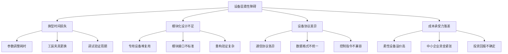

*图10：设备层柔性化面临的多维障碍*

柔性自动化方案采用模块化设计，可灵活配置CNC、EDM等单点自动化单元，也可组合工业机器人与柔性轨道线搭建完整产线，**实现零件加工全流程协同**[^14]。针对小批量订单，无需大规模改造即可快速换产，兼顾生产灵活性与稳定性[^14]。然而，这种理想化的模块化设计在实践中面临诸多挑战：模块接口的标准化程度不足、模块间的协同验证复杂、模块重构后的系统稳定性难以保证。

某知名冰箱制造商通过引入模块化工作站，将传统流水线拆解为12个独立单元。每个单元配备可编程逻辑控制器和RFID识别系统，能够根据订单需求自动切换生产参数。当接到50台定制化订单时，**系统在23分钟内完成工艺路线重组，相比传统模式节省82%的换型时间**[^38]。该企业季度报告显示，设备综合效率从63%提升至89%，特殊订单处理能力提高3倍[^38]。这一案例表明模块化设计的潜力，但也需注意其适用前提——该企业的产品虽然定制化，但仍在一定的产品族范围内，与真正的单件小批非标生产存在差异。

**设备间协议差异导致的互操作性障碍**

工业物联网设备集成最大难题之一，是设备种类和通信协议的高度多样化。在一个现代化工厂里，可能会遇到PLC、传感器、机器人、数控机床等几十种设备，每家的通信协议都不一样。例如，西门子的PLC多用S7协议，施耐德则用Modbus，**部分国产设备甚至用自研协议**[^39]。这种"百家争鸣"导致数据无法直接互通，集成工作变得异常复杂。

据Gartner 2022报告，工业物联网集成难度排名前三的因素，分别是**协议兼容性（42%）、接口开放性（31%）和数据一致性（27%）**[^39]。协议转换需定制开发，导致项目周期拉长；设备固件升级后，旧的集成方案可能失效；部分设备只支持串口或老旧接口，无法直接联网[^39]。这些问题在单件小批生产企业中更为普遍，因为这类企业的设备往往来自多个时期、多个供应商的采购，设备异构性更强。

**柔性设备高溢价与中小企业承受力的矛盾**

柔性设备单价是传统设备的3-5倍，这种高溢价特征使得柔性自动化的投资门槛远超传统自动化方案。对于利润率本就微薄的单件小批生产企业（多为中小企业）而言，这种投资门槛构成了难以逾越的资金障碍。

选型落地需立足自身生产场景，避免盲目投入。建议**模块化分步落地，控制投入风险**：从高频重复工序的单点自动化入手（如CNC自动上下料），逐步扩展至全流程自动化，既适配小批量生产的灵活需求，又能分阶段控制资金投入，降低转型试错成本[^14]。这种渐进式策略虽然可行，但也意味着柔性化转型是一个漫长的过程，难以在短期内实现系统性突破。

### 5.3 软件层的系统集成与动态响应困境

软件层是柔性生产的"神经中枢"，承担着生产计划、调度优化、过程控制、数据分析等核心功能。然而，在单件小批生产场景中，MES、ERP、APS等信息系统面临着系统集成复杂度高、动态响应能力不足、软件架构僵化等多重困境。

**异构系统接口不兼容与数据格式不统一**

离散制造企业普遍面临的挑战是ERP与MES的协同问题。某案例中，企业部署了基于微服务的中间件平台，当订单需求波动时，系统能在17秒内完成2000个工序的重新排程。**通过OPC-UA协议实现的设备直连，使计划调整的响应延迟从小时级降至秒级**[^38]。然而，这种成功案例的背后是大量的系统适配开发工作，对于信息化基础薄弱的中小企业而言，这种投入往往难以承受。

平台兼容性同样是工业物联网设备集成的巨大障碍。许多设备虽然可以联网，但只兼容自家平台，无法与第三方系统无缝对接。**平台间数据格式不统一，需专门开发适配器；部分系统只提供有限接口，难以做深度数据整合；不同设备的数据粒度和时序不一致，影响实时分析**[^39]。

厂商壁垒不仅增加集成难度，也让企业陷入"数据孤岛"。IDC调研显示，**超过60%的制造企业，工业物联网数据无法完全打通到ERP和生产管理系统**，导致自动化和智能分析能力受限[^39]。这种数据割裂的状态使得企业无法实现全链路的高效协同，不仅延长了产品交付周期，还增加了因信息不对称导致的生产损耗与运营成本。

**动态排程算法对非结构化场景的适应性不足**

| 排程挑战 | 具体表现 | 对柔性生产的影响 |
|---------|---------|-----------------|
| 订单波动响应 | 紧急插单、订单取消频繁 | 计划频繁调整，系统负荷大 |
| 多约束优化 | 设备、人员、物料、工艺多重约束 | 优化空间受限，难以找到全局最优 |
| 实时性要求 | 现场状态变化需即时反映 | 计算延迟导致决策滞后 |
| 异常处理 | 设备故障、物料短缺等突发事件 | 预设规则难以覆盖所有场景 |

*表14：动态排程在单件小批场景中的核心挑战*

MES选型的核心焦点在于系统能否支撑生产的极致柔性与内外部的高效协同。理想的系统必须具备强大的高级计划与排程（APS）能力，**以快速响应插单、物料变更等扰动**[^37]。然而，当前多数APS系统的算法设计基于相对稳定的生产环境假设，面对单件小批生产的高变异性，其优化效果往往大打折扣。

借助AI与自动化产线的协同，可根据订单优先级动态调整生产计划，实现多品种生产的精准调度，**减少人工排产误差，摆脱对资深工艺师的依赖**，保障生产节奏有序高效[^14]。但这种AI赋能的排程系统仍处于发展初期，其在复杂约束条件下的优化能力、对异常场景的适应性、决策结果的可解释性等方面仍存在明显不足。

**软件架构僵化与业务响应迟滞**

传统架构与敏捷需求的冲突是软件层面临的深层障碍。当代制造业面临个性化、小批量、多品种的定制化市场需求，业务模式需要快速迭代，生产组织需要灵活调整。**但许多现有系统架构僵化，模块间耦合紧密。企业若要新增一个功能，或对现有流程进行微调，往往面临"牵一发而动全身"的困境**[^40]，需要投入巨额成本进行二次开发，甚至推倒重来。

摩尔元数提供的基于云的低代码开发平台（aPaaS）代表了一种新的解决思路。企业或合作伙伴可以在此平台上，像搭积木一样快速构建和迭代适合自己的MES应用。**这种模式提供了极高的灵活性和定制化效率，尤其适合产品非标化程度高、工艺独特的大型集团或细分领域龙头企业**[^37]。然而，低代码平台的应用门槛仍然存在，需要企业具备一定的配置开发能力，这对于多数中小企业而言仍是挑战。

### 5.4 物流层的柔性配送与物料协同瓶颈

车间物流系统是连接各生产工序的"血管"，其柔性程度直接影响整体生产系统的响应速度。在单件小批生产场景中，物流层面临着物料配送路径动态规划、AGV调度优化、物料追溯与批次管理等多重挑战。

**物料配送路径动态规划的复杂性**

单件小批生产的工艺路线具有高度离散性，不同产品经过不同的加工车间，工作流经常出现不平衡。这种工艺路线的多样性对物料配送系统提出了动态规划的刚性需求——物料需要按照实时变化的工艺路线进行精准配送，而非沿着固定路径流转。

某运动服饰代工厂部署了28台自主导航小车，配合MES系统的实时订单分解算法。当遇到跨境电商的200款小单时，系统自动将裁剪指令分发至3个柔性裁床，**AGV根据优先级动态调整物料配送路线**[^38]。这种模式使日均款式处理量从35款跃升至120款，而平均单款生产成本下降19%[^38]。然而，这种成功案例的前提是服装行业的物料特性相对简单、体积重量适中，而在涉及重型零部件、精密组件的单件小批生产中，物流系统的设计复杂度显著增加。

**AGV调度优化与多设备协同的挑战**

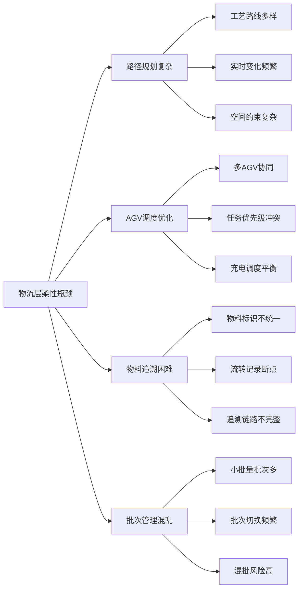

*图11：物流层柔性化面临的核心瓶颈*

宝马沈阳工厂的AGV车队采用激光导航与5G通信技术，实现不同车型底盘的同时配送。**这套系统支持200种路径规划方案，使物流效率提升40%**[^41]。德马泰克的案例显示，智能分拣系统通过视觉识别技术，可同时处理8类不同规格的零部件，分拣准确率达到99.99%[^41]。这些案例展示了先进物流技术的潜力，但也需注意其适用场景——汽车制造虽然产品多样，但仍在有限的车型平台范围内，与真正的单件小批非标生产存在本质差异。

**物料追溯与批次管理的系统性挑战**

企业在物料追溯环节常常面临数据碎片、管理流程混乱和责任归属不清等困扰。**追溯数据"不成体系"，不同部门各自为战，难以串联形成闭环**[^42]。生产现场流程混乱，物料流转环节信息丢失，责任人无法追溯[^42]。

ERP系统实现物料溯源主要依靠唯一标识编码追踪、全流程数据采集与关联、批次与生命周期管理、自动化预警与查询功能[^43]。然而，在单件小批生产场景中，产品品种多、批量小的特征使得批次管理的复杂度急剧上升。原材料、半成品、产成品、废品频繁出入库，物料追溯的数据采集工作量巨大，任何环节的疏漏都可能导致追溯链路断裂。

信息孤岛尚未完全破除的问题在物料追溯领域同样突出。**不同部门（采购、仓库、生产、质检）用各自的Excel表格，标准不统一；生产现场手工记录，数据易丢失或篡改**，难以形成可查验的历史链路[^42]。上游供应商、下游客户的信息接入门槛高，数据格式混乱，进一步加剧了追溯的困难。

### 5.5 标准化缺失与技术集成的复杂度困境

工业软件标准缺失、设备通信协议各自为政、数据孤岛等问题是制约柔性化转型的深层障碍。这些问题不仅增加了系统集成的技术难度，更从根本上限制了不同厂商、不同系统之间的协同能力。

**工业软件标准缺失的系统性影响**

技术上缺乏行业统一的工业软件标准，软件研发企业缺乏有组织的联动，仅根据自身条件和自身所获悉的市场需求进行研发，只着眼于解决局部问题，或仅遵从各自企业标准或者是不同行业的国际标准，**缺乏整体解决方案，尚未形成需求与供给快速迭代的机制**[^44]。

这种标准缺失导致不同厂商的软件产品的兼容性不够，**信息交互成本很高，阻滞了信息化进程**[^44]。对于单件小批生产企业而言，这意味着即使愿意投入资金进行信息化建设，也难以获得一套能够无缝协同的系统解决方案，而是不得不面对多个"信息孤岛"的拼凑与适配。

| 标准化缺失领域 | 具体表现 | 对柔性化的影响 |
|---------------|---------|---------------|
| 设备通信协议 | 西门子S7、施耐德Modbus、国产自研协议并存 | 设备互联互通困难 |
| 数据格式 | JSON、XML、Protobuf等格式各异 | 数据交换需大量适配开发 |
| 接口规范 | 各厂商API设计不统一 | 系统集成复杂度高 |
| 工艺描述 | 缺乏统一的工艺知识表达标准 | 工艺数据难以复用共享 |

*表15：标准化缺失的主要领域及其影响*

**跨品牌、跨系统协同的工程挑战**

某汽车零部件厂的案例具有典型性：生产线包含德国、日本和国产设备，每台设备的数据采集都需要不同的网关和驱动，**IT部门要维护十几种接入方案，成本高、故障率高。调试一个新设备，往往需要两周，而不是两天**[^39]。

这种跨品牌协同的困难在单件小批生产企业中更为普遍。由于历史原因，这类企业的设备往往来自不同时期、不同供应商的采购，设备异构性极强。实现这些异构设备的统一管理和协同运行，需要投入大量的适配开发资源，而这种投入对于资金紧张的中小企业而言往往难以承受。

豪森智源的解决方案代表了一种突破思路：依托在自动化集成领域的深厚积累，**能够打通不同品牌设备与系统（产线、物流、立库）间的壁垒，构建统一指挥平台**，确保复杂混合产线在稳定运行的同时，具备卓越的生产灵活性[^37]。然而，这种能力需要深厚的行业积淀和专业技术团队，并非所有企业都能获得这样的支持。

**数据孤岛与信息割裂的深层困境**

在传统管理模式下，设备企业的研发、生产、采购、销售、售后等业务环节往往各自为政，形成一个个独立的"数据孤岛"。例如，研发部门的产品图纸与物料清单（BOM）无法实时同步至生产部门，导致生产计划制定滞后；销售部门签订的定制化订单需求，需通过人工传递至研发与生产环节，**不仅耗时耗力，还易出现信息偏差**[^45]。

这种信息割裂的状态使得企业无法实现全链路的高效协同。**某电子制造工厂调研显示，因数据孤岛导致的生产排产偏差率达12%，直接影响产能规划准确性**。在单件小批生产场景中，这种偏差的影响被进一步放大——每一次信息传递的延迟或错误都可能导致生产计划的调整，累积效应使得整体效率大打折扣。

### 5.6 系统稳定性风险与柔性能力的权衡张力

柔性化改造在提升生产系统适应性的同时，也引入了新的稳定性风险。多技术融合的可靠性隐患、频繁重构对系统鲁棒性的冲击、柔性与效率之间的内在张力，构成了企业在追求柔性能力与保障生产稳定性之间的决策困境。

**多技术融合的可靠性隐患**

多技术融合存在稳定性与适配性短板，易引发连锁问题。系统稳定性是系统正常运行的关键，其缺失会导致严重后果，如经济损失、用户流失等[^46]。影响系统稳定性的因素包括系统架构设计问题、编程细节与代码质量、外部因素（硬件故障、外部攻击）、开发和测试过程不充分、用户需求和业务变化、维护和更新问题等[^46]。

在柔性自动化系统中，这些风险因素被进一步放大。**模块耦合度过高，使得一个模块的问题容易波及其他模块，增加系统崩溃的风险。历史债务的积累，如功能模块的多个版本并存且缺乏有效整合，也会使系统变得脆弱且难以维护**[^46]。

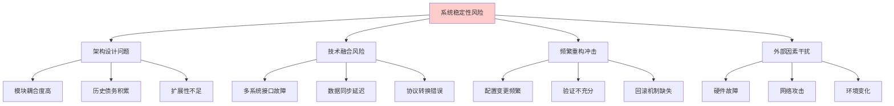

*图12：柔性化改造中的系统稳定性风险来源*

**频繁重构对系统鲁棒性的冲击**

代码重构风险识别是软件工程中的关键环节。在柔性生产系统中，为适应频繁变化的生产需求，软件系统需要不断进行配置调整和功能扩展。**代码错误如逻辑错误、语法错误等可能引发系统故障；代码风格和质量不佳，缺乏统一规范，降低了代码的可读性和可维护性，增加出错概率**[^47]。

同步和并发处理不当，如线程死锁，会导致系统性能下降甚至崩溃。系统性能不佳，如慢SQL、高耗时接口等，会拖垮整个系统，**若未做好故障隔离，还可能引发雪崩**[^47]。这些风险在柔性化系统中更为突出，因为系统需要频繁响应变化的生产需求，每一次变更都可能引入新的风险点。

**柔性与效率之间的内在张力**

多车型共线时，即使智能切换，**节拍仍可能下降10%-20%，压缩切换时间又会增加故障风险**。这一数据揭示了柔性与效率之间的内在张力——追求更高的柔性往往意味着效率的损失，而过度压缩切换时间又会带来稳定性风险。

经济效益的量化评估显示，采用净现值法分析，某项目投资450万元的柔性改造，在考虑产能弹性带来的溢价收益后，投资回收期仅11个月。**敏感性分析表明，当市场需求波动超过±30%时，柔性产线的边际收益是刚性产线的6.8倍**[^38]。这一数据说明，柔性化改造的经济价值在需求波动较大的场景下更为显著，但也意味着企业需要在柔性能力与稳定运行之间寻找平衡点。

**决策困境：柔性追求与稳定保障的权衡**

企业在推进柔性化转型时面临两难选择：

| 决策维度 | 追求柔性 | 保障稳定 |
|---------|---------|---------|
| 系统架构 | 松耦合、模块化 | 紧耦合、一体化 |
| 变更管理 | 快速响应、频繁调整 | 严格控制、充分验证 |
| 技术选型 | 前沿技术、创新方案 | 成熟技术、验证方案 |
| 风险偏好 | 接受一定的不确定性 | 追求高度可预测性 |

*表16：柔性追求与稳定保障的决策权衡*

维护不及时会使已发现的问题恶化，扩大其影响范围。**版本兼容性问题在软件更新和升级时可能导致系统出现异常，影响稳定性**[^46]。对于单件小批生产企业而言，生产系统的稳定性直接关系到订单的按时交付和客户满意度，任何系统故障都可能带来严重的经济损失和声誉影响。因此，在追求柔性能力的过程中，如何有效管控稳定性风险，成为企业必须审慎考量的核心问题。

综上所述，从刚性自动化到自适应生产的转型面临着设备层、软件层、物流层的多维障碍，以及标准化缺失、系统稳定性风险等深层制约。**这些障碍并非孤立存在，而是相互关联、相互强化——设备层的协议差异加剧软件层的集成难度，软件层的响应迟滞影响物流层的协同效率，标准化缺失使得各层面的问题难以通过统一方案解决，而柔性化改造本身又引入新的稳定性风险**。突破这一系统性困境，需要从技术标准、系统架构、组织能力等多个层面进行协同创新，而非仅仅依靠单点技术的突破。

## 6 数据、集成与智能化基础薄弱：从信息孤岛到决策协同的困境

单件小批生产的自动化转型不仅受制于技术可行性与经济合理性的双重约束，更面临着**信息基础设施层面的结构性短板**。离散制造企业普遍存在的数据碎片化、主数据质量缺陷、异构系统割裂等问题，从根本上制约了智能排产、实时优化、全流程追溯等高级自动化功能的实现。本章将系统剖析数据孤岛的形成机理、主数据管理的核心痛点、PLM/ERP/MES系统间的集成鸿沟，以及数据驱动决策所需的基础能力差距，揭示信息基础薄弱与自动化转型目标之间的深层矛盾。

### 6.1 数据碎片化与信息孤岛的形成机理

离散制造企业的数据碎片化并非偶然现象，而是由业务组织模式、信息化建设路径、行业特性等多重因素共同塑造的结构性困境。理解这一困境的形成机理，是认识数据层面自动化障碍的前提。

**业务环节各自为政导致的数据割裂**

在传统管理模式下，设备企业的研发、生产、采购、销售、售后等业务环节往往各自为政，形成一个个独立的"数据孤岛"[^40]。这种组织形态的根源在于职能分工的历史惯性——研发部门关注设计数据，生产部门聚焦工艺与进度，质量部门管理检测记录，各部门基于自身业务需求建立独立的数据管理体系，缺乏全局视角的数据规划与整合。

具体表现为：研发部门的产品图纸与物料清单（BOM）无法实时同步至生产部门，导致生产计划制定滞后；销售部门签订的定制化订单需求，需通过人工传递至研发与生产环节，**不仅耗时耗力，还易出现信息偏差**[^40]。这种信息传递的人工依赖模式，在单件小批生产的高频变化场景中尤为脆弱。

**系统建设分期分批造成的技术割裂**

离散制造企业的信息化建设通常经历了多个阶段，不同时期引入的系统来自不同供应商，采用不同的技术架构和数据标准。这种"烟囱式"的系统建设模式导致了严重的技术割裂。

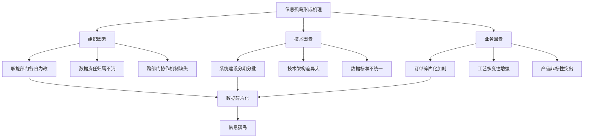

*图13：离散制造企业信息孤岛的形成机理*

各环节系统缺乏有效串联，数据与流程无法自动流转，只能依赖人工跨系统"搬运信息"[^40]。以设计变更为例，设计师不仅要在CAD系统中完成修改，还需在BOM系统中进行同步修改；在CAPP系统中针对工艺落实进行确认；推进ERP系统的预算变更与采购谈价；在现场MES落实时，还需参与更改切换落实，以及在制品、已制品的确认。全程需往返多个独立系统反复录入、核对、业务推进，稍有遗漏就可能导致全流程衔接断层[^40]。

**单件小批生产特性对数据离散的放大效应**

单件小批生产模式的本质特性进一步加剧了数据碎片化的程度。产品品种多、批量小、工艺路线复杂多变的特征，使得数据的产生呈现高度离散化特征。

| 特性维度 | 对数据碎片化的影响 | 具体表现 |
|---------|-------------------|---------|
| 订单碎片化 | 数据产生源点分散 | 每个订单独立生成一套设计、工艺、生产数据 |
| 工艺多变性 | 数据结构难以标准化 | 不同产品的工艺参数差异大，难以统一管理 |
| 产品非标性 | 数据复用率极低 | 历史数据对新订单参考价值有限 |
| 生产周期长 | 数据时效性要求高 | 长周期中的变更需实时同步，增加管理难度 |

*表17：单件小批生产特性对数据碎片化的放大效应*

中小型生产企业在数字化转型过程中，常因多系统数据孤岛、数据格式不一致、冗余等问题，导致管理效率低下、决策滞后[^48]。企业数据分散在ERP、CRM、生产设备等多个系统中，数据格式、协议、存储方式各异（如SQL数据库、API接口、非结构化日志等），导致跨系统数据调用困难。传统手工集成不仅耗时，还易因人为操作引发数据错误[^48]。

**数据孤岛对全局可视化与协同决策的根本性阻碍**

数据孤岛的直接后果是企业无法实现生产全局的可视化监控与协同决策。订单是"孤岛"，生产是"盲盒"，数据是"碎片"[^49]。这种状态使得管理者难以获得完整、准确、及时的生产信息，决策只能基于片面信息和经验判断，无法实现数据驱动的精准管控。

某电子制造工厂调研显示，**因数据孤岛导致的生产排产偏差率达12%，直接影响产能规划准确性**[^40]。这一数据表明，信息孤岛不仅是技术层面的问题，更是影响企业运营效率和决策质量的根本性障碍。

### 6.2 主数据质量缺陷：BOM、工艺路线与基础数据的治理困境

主数据是企业信息系统的核心基础，其质量直接决定了自动化系统的决策准确性。然而，离散制造企业普遍面临主数据质量低下的困境，物料清单（BOM）、工艺路线、客商信息等核心数据的编码规则不统一、版本管理混乱、数据冗余与缺失并存，从数据源头制约了智能化应用的效果。

**编码规则不统一的系统性影响**

以某汽车零部件企业为例，其物料编码规则存在5种版本，同一供应商在采购、财务、生产系统中被重复定义，**导致年度采购冗余成本超8000万元**[^50]。这一案例折射出离散制造业的核心痛点：数据孤岛严重，ERP、MES、PLM等系统独立运行，**数据差异率高达30%**[^50]。

编码规则不统一的问题不仅增加了数据管理的复杂度，更从根本上破坏了数据的可关联性和可追溯性。当同一物料在不同系统中使用不同编码时，系统间的数据交换必须依赖人工映射，不仅效率低下，还极易出错。

**BOM管理的"罗生门"困境**

设计BOM（EBOM）、制造BOM（MBOM）、服务BOM（SBOM）本应源自同一源头，但在许多企业中，它们却常常相互脱节[^40]。这种脱节导致了一系列连锁问题：

- **设计与制造脱节**：设计发布的图纸已更新，但制造仍按旧版BOM生产，导致物料错误与产线停线，变更信息未能有效传递
- **工程定义与生产执行脱节**：工程定义的BOM无法直接指导生产，制造需手动转换与重构，过程极易出错
- **采购与BOM不同步**：采购为降本使用了替代料，但信息未同步回馈，导致BOM与实物不符
- **计划与实际不符**：计划部门依据有误的BOM数据进行排产与备料，结果MRP运算失真，造成物料短缺或库存积压[^40]

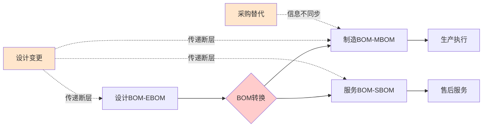

*图14：BOM管理中的典型脱节问题*

**主数据标准化的三大核心维度缺失**

主数据标准化需要在编码规则统一、分类体系重构、属性规范治理三个维度同步推进[^50]。然而，多数离散制造企业在这三个维度上均存在明显缺陷：

| 标准化维度 | 理想状态 | 实际缺陷 | 对自动化的影响 |
|-----------|---------|---------|---------------|
| 编码规则 | "大类-中类-小类-流水号"层级结构 | 多版本并存、规则不一致 | 系统间数据无法自动关联 |
| 分类体系 | 统一的物料分类标准 | 分类混乱、粒度不一 | 智能检索与分析失效 |
| 属性规范 | 核心属性字段定义明确、校验规则完备 | 属性缺失、格式不规范 | 数据质量无法保证 |

*表18：主数据标准化的维度缺失及其影响*

**工艺路线数据的质量困境**

工艺路线是连接设计与制造的关键桥梁，其数据质量直接影响生产计划的准确性。然而，在单件小批生产场景中，工艺路线数据面临特殊挑战：产品的非重复性使得工艺路线难以标准化，每个订单可能需要定制独特的工艺方案；工艺参数的选择高度依赖工艺师的经验判断，这些隐性知识难以完整、准确地转化为结构化数据。

标准化程度低、物料分类体系缺失，**BOM（物料清单）错误引发工艺冲突，设备停机率增加25%**[^50]。这一数据表明，主数据质量问题不仅影响信息系统的运行效率，更直接导致生产现场的实际损失。

**主数据治理的实施路径挑战**

主数据管理（MDM）正是破解这些难题的钥匙。通过构建"一物一码、统一分发"的数据中枢，离散制造企业可实现跨系统数据一致性提升90%，供应链响应速度加快40%[^50]。然而，这一过程不仅是技术升级，更是企业从"业务驱动"向"数据驱动"的运营模式重构。

分三阶段推进的"渐进式改革"是业界推荐的实施路径[^50]：

- **试点验证期（3-6个月）**：聚焦客商、组织等低复杂度数据，搭建最小可行性平台
- **全面推广期（12-18个月）**：扩展至物料、BOM等核心数据，建立集团级数据治理委员会
- **持续优化期（常态化）**：引入AI质检规则，实现数据清洗效率的持续提升

然而，对于资源有限的单件小批生产企业而言，这种系统性的主数据治理工程往往难以承受，主数据质量问题长期得不到根本解决。

### 6.3 PLM/ERP/MES系统集成鸿沟与数据流转断层

产品生命周期管理（PLM）、企业资源计划（ERP）、制造执行系统（MES）是离散制造企业信息化的三大核心系统。然而，这三大系统之间的集成现状与自动化转型的需求之间存在显著差距，接口标准不统一、数据格式各异、业务语义不一致等问题导致了严重的数据流转断层。

**异构系统接口不兼容的普遍困境**

尽管数字孪生平台具备数据汇聚能力，但多数工厂仍存在MES、ERP、PLM、SCM等异构系统接口不兼容、数据格式不统一的问题，设计数据、生产数据、供应链数据无法实时互通，导致虚拟模型与物理生产脱节[^40]。

研发部门使用CAD软件，输出三维模型和二维图纸；工艺部门在其CAPP系统中，重新编制工艺路线、工艺简图和工序卡；生产计划在ERP系统中制定，而车间执行则可能依赖MES系统中的工单。**这些系统来自不同供应商，数据标准不一，接口多样**[^40]。一个设计的微小变更无法自动、准确地传递到工艺、生产和采购环节，需要大量的人工识别、转换和重复录入。这不仅效率低下，还人为增加了出错的风险，可能导致车间生产出大量废品。

**数据格式与业务语义的差异**

不同系统间的数据标准不统一（如物料编码规则差异、单位换算错误），导致数据冗余、缺失或逻辑冲突[^48]。例如，库存系统与生产系统的数据偏差可能导致缺料停工或过量采购。

厂区安全系统与DCS/ERP生产系统集成同样面临类似难题：数据格式和标准的差异是首要问题，不同系统可能采用不同的数据结构和通信协议，导致数据难以有效共享和交互[^51]。系统架构的不兼容也会阻碍集成进程，各系统的设计理念和功能模块的差异，使得它们在对接时容易出现冲突。

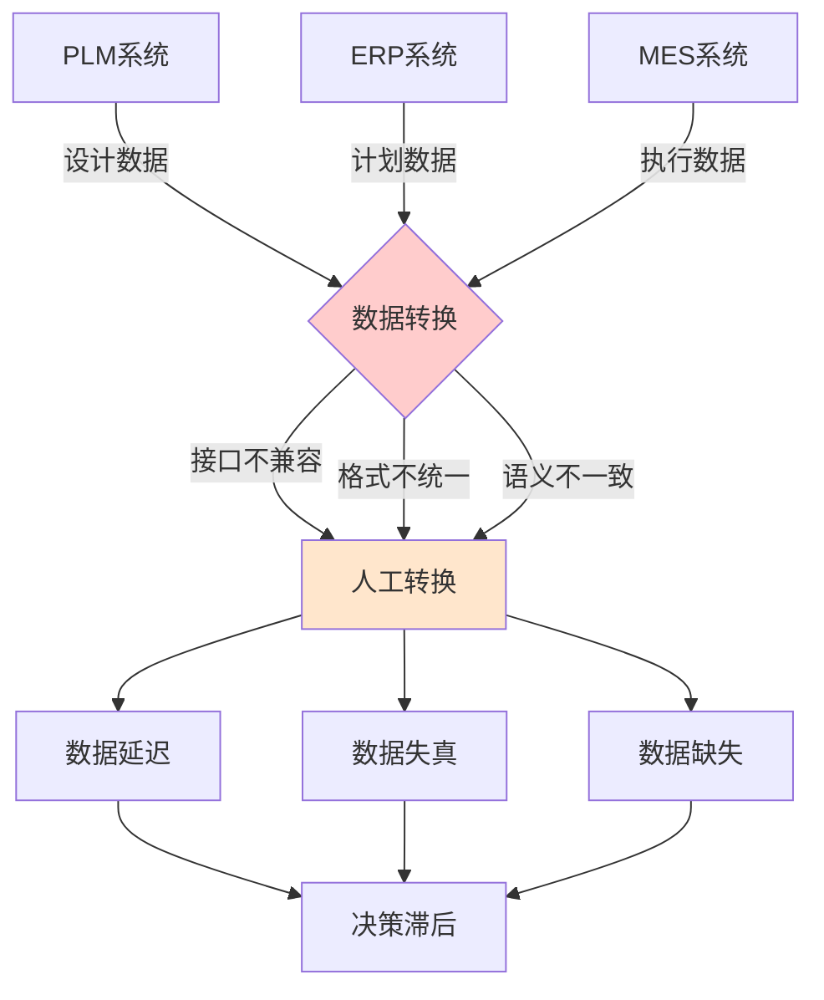

*图15：PLM/ERP/MES系统间的数据流转断层*

**设计变更传递的典型断点场景**

设计变更是离散制造中最常见的业务场景之一，也是系统集成问题暴露最充分的环节。在缺乏有效集成的情况下，一个设计变更的完整传递需要经历以下步骤：

1. 设计师在CAD系统中完成设计修改
2. 手动在PLM系统中更新设计文档和BOM
3. 通知工艺部门在CAPP系统中调整工艺路线
4. 工艺变更确认后，人工在ERP系统中更新物料需求和采购计划
5. 生产计划员在MES系统中调整生产工单
6. 现场执行时，需人工确认变更内容并调整作业

这种低效的"人工信息搬运"不仅耗费大量工时，更使核心业务人员陷入事务性重复劳动，无法聚焦于价值更高的创造性工作，**最终导致整体响应速度迟缓**[^40]。

**计划与现场数据双向同步的滞后**

生产数据的延迟同步会影响排产计划的动态调整[^48]。在单件小批生产场景中，计划的多变性是最常见的控制难点，生产计划需要根据现场实际情况频繁调整。然而，当计划系统（ERP）与执行系统（MES）之间缺乏实时数据同步能力时，计划调整的响应时间从理论上的秒级延长至小时级甚至天级。

车型切换时，MES系统需同步更新海量数据，易出现卡顿导致生产暂停[^52]。车间设备密集产生海量数据，云端计算有延迟，边缘计算设备算力又难以支撑多车型并行处理。这些问题在单件小批生产中同样存在，甚至更为严重——产品的高频变化意味着系统需要更频繁地进行数据同步和参数切换。

**集成解决方案的实践探索**

用心云MES系统通过标准化API接口和模块化工具，支持与主流ERP系统（如用友畅捷通、金蝶、管家婆）的快速对接[^48]。例如，系统自动将ERP的订单数据转换为MES可识别的生产工单，消除人工录入误差。这种集成方案代表了行业的进步方向，但其实施仍需要企业具备一定的信息化基础和技术能力。

IDC调研显示，**超过60%的制造企业，工业物联网数据无法完全打通到ERP和生产管理系统**[^52]，导致自动化和智能分析能力受限。这一数据表明，系统集成问题在制造业中具有普遍性，是制约自动化转型的关键瓶颈之一。

### 6.4 数据采集能力不足与生产现场数字化鸿沟

车间层面的数据采集是智能制造的基础，然而离散制造企业普遍面临设备联网率低、传感器部署不足、人工录入依赖度高等结构性短板。这些问题在单件小批生产场景中尤为突出，设备异构性强、工艺变化频繁进一步加剧了数据采集的技术难度与成本压力。

**设备联网率低与数据采集覆盖不足**

离散制造业企业由于生产设备单元分散、生产工序间断、运营排产复杂等行业特点，具有典型的松散耦合特性[^40]。这种松散耦合特性使得设备联网的技术难度和成本都显著高于流程工业。

很多工厂的生产车间，是"管理者看不见的黑箱"：工人领了物料就进车间，干到哪一步、物料用了多少，**全靠下班汇报**[^49]。工序出了问题，要等成品送检才发现，返工不仅耗物料，还拖慢整个订单的节奏。这种"黑箱"状态的根源在于数据采集能力的严重不足。

| 采集维度 | 理想状态 | 实际现状 | 差距表现 |
|---------|---------|---------|---------|
| 设备联网 | 全部生产设备联网 | 部分关键设备联网 | 数据覆盖不完整 |
| 采集频率 | 秒级实时采集 | 分钟级或批次采集 | 数据时效性不足 |
| 数据粒度 | 工序级精细采集 | 工单级粗放采集 | 过程数据缺失 |
| 采集方式 | 自动化采集为主 | 人工录入为主 | 数据准确性难保证 |

*表19：生产现场数据采集能力的差距分析*

**设备异构性导致的采集技术挑战**

工业物联网设备集成最大难题之一，是设备种类和通信协议的高度多样化[^52]。在一个现代化工厂里，可能会遇到PLC、传感器、机器人、数控机床等几十种设备，每家的通信协议都不一样。例如，西门子的PLC多用S7协议，施耐德则用Modbus，**部分国产设备甚至用自研协议**。这种"百家争鸣"导致数据无法直接互通，集成工作变得异常复杂。

某汽车零部件厂的案例具有典型性：生产线包含德国、日本和国产设备，每台设备的数据采集都需要不同的网关和驱动，**IT部门要维护十几种接入方案，成本高、故障率高。调试一个新设备，往往需要两周，而不是两天**[^52]。

**人工录入依赖的质量风险**

在自动化采集能力不足的情况下，企业不得不依赖人工录入来补充数据。然而，人工录入存在固有的质量风险：

- **数据延迟**：人工录入通常在班次结束后进行，无法反映实时状态
- **数据失真**：记录过程中的人为误差难以避免
- **数据缺失**：繁忙时段可能遗漏关键数据的记录
- **数据篡改**：缺乏有效的数据校验和追溯机制

计件工人的工时、产量记在本子上，月底统计时要么算错，要么漏记[^49]。不同部门（采购、仓库、生产、质检）用各自的Excel表格，标准不统一；生产现场手工记录，**数据易丢失或篡改**，难以形成可查验的历史链路[^53]。

**单件小批生产对数据采集的特殊挑战**

单件小批生产的本质特性进一步加剧了数据采集的难度：

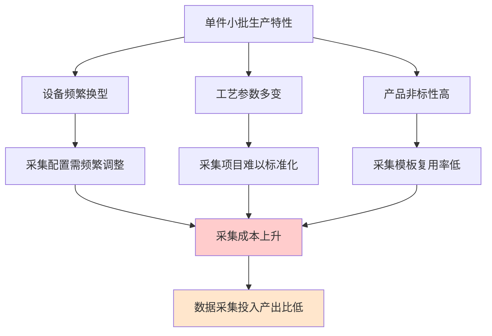

*图16：单件小批生产对数据采集的特殊挑战*

产品的非重复性意味着为某一产品配置的数据采集方案，在该产品完成后往往难以复用。这种低复用率使得数据采集的单位成本显著上升，进一步制约了企业在数据采集方面的投入意愿。

**数据质量参差不齐的系统性影响**

传感器老化、数据采集频率不足、人工录入误差等问题，导致接入孪生平台的数据存在失真、滞后、缺失等问题[^40]。**在精密零部件制造中，设备振动数据采集滞后会导致模型预判偏差，引发工序衔接卡顿，产能损失率达8%-10%**。

这种数据质量问题形成了恶性循环：数据质量差导致基于数据的分析和决策不可靠，决策效果不佳又反过来削弱了企业对数据投入的信心，进一步限制了数据采集能力的提升。

### 6.5 智能排产与实时优化的数据基础缺口

智能排产、动态调度、实时优化是自动化转型的核心功能目标，然而这些高级功能的实现高度依赖于完整、及时、准确的数据支撑。当前离散制造企业在数据完整性、时效性、准确性方面的系统性差距，使得智能化功能难以发挥预期效果。

**智能排产对数据的刚性需求**

真正能盘活产能的生产计划，核心是让"订单-资源-工序"串成一条线[^49]：

- **订单数据**：需要完整的订单信息，包括产品规格、数量、交期、优先级等
- **资源数据**：需要实时的设备状态、人员可用性、物料库存等信息
- **工序数据**：需要准确的工艺路线、工时定额、设备能力等参数

当这些数据存在缺失、失真或滞后时，排产算法的输入就会出现偏差，导致排产结果与实际情况脱节。

2023年，制造业数字化转型率已突破58%，但据工信部白皮书，**超六成企业在排产管理系统落地阶段频繁"卡壳"**[^54]。管理层推不动，员工不买账，数据又像"孤岛"难互通，结果系统上线后成了摆设，生产效率却没起色。

**数据孤岛对排产算法的制约**

据《中国制造业数字化转型调研报告（2023）》显示，约57%的排产管理系统落地失败案例，根源都在于组织惯性的阻挠[^54]。然而，更深层的原因往往是数据基础的薄弱——即使企业有意愿推进排产系统，数据孤岛也使得系统无法获得完整的输入信息。

| 数据缺口类型 | 对排产的影响 | 典型表现 |
|-------------|-------------|---------|
| 数据不完整 | 约束条件缺失 | 排产结果无法执行 |
| 数据不准确 | 优化方向偏离 | 排产效果不如人工 |
| 数据不及时 | 响应滞后 | 无法应对现场变化 |
| 数据不一致 | 冲突与矛盾 | 系统间数据打架 |

*表20：数据缺口对智能排产的影响*

**实时优化的数据时效性挑战**

力控RTO实时优化系统的方案架构揭示了实时优化对数据的严格要求：系统需要实时采集工艺参数、设备状态、能耗、环保数据等关键指标，动态展示生产过程[^55]。通过系统采集服务器程序，采用OPC、MODBUS等标准工业协议实现与DCS系统的数据对接，实时采集生产现场的关键运行参数，为模型训练提供数据支撑。

然而，在离散制造企业中，实现这种实时数据采集面临重重困难。数据采集频率不足、传输延迟、系统接口不兼容等问题，使得"实时"往往只是一个理想目标。生产数据的延迟同步会影响排产计划的动态调整，而跨系统传输中敏感数据（如工艺参数、订单信息）的泄露风险亦不容忽视[^48]。

**优化模型无法获得实时反馈的困境**

实时优化的核心在于闭环控制——系统根据当前状态生成优化建议，执行后采集反馈数据，再根据反馈调整优化策略。然而，当数据采集能力不足时，这个闭环就会断裂。

实时优化控制功能通过直观的人机交互界面实现全流程精细化管控，操作人员可在控制页面灵活调整参数投用/切除状态，根据工艺需求设定控制步幅及上下限阈值[^55]。但如果现场数据无法及时反馈，优化建议的效果就无法评估，系统也就无法进行自适应调整。

**决策建议难以闭环执行的现实**

即使排产系统生成了优化的生产计划，如果缺乏与执行系统的有效集成，计划也难以准确落地。车间接到订单后，工长凭经验分配任务：这台机床做A零件，那台做B组件，至于"现有物料够不够""前序工序啥时候做完"，**全靠口头问**[^49]。结果要么是设备等物料，半天没活干；要么是多订单抢设备，工序堆成"肠梗阻"。

这种现象的根源在于排产系统与执行层面的数据断层——计划数据无法自动下发至设备和人员，执行数据也无法实时反馈至计划系统，形成了"计划归计划、执行归执行"的两张皮现象。

### 6.6 全流程追溯能力缺失与质量管控的数据断点

产品全流程追溯是自动化质量管控的基础，然而离散制造企业普遍面临批次管理粗放、物料流转记录断点、工序质量数据关联缺失等问题。单件小批生产中产品非标性高、批次切换频繁的特性，进一步加剧了追溯链路构建的难度。

**追溯数据"不成体系"的普遍困境**

企业在物料追溯环节常常面临数据碎片、管理流程混乱和责任归属不清等困扰。**追溯数据"不成体系"，不同部门各自为战，难以串联形成闭环**[^53]。生产现场流程混乱，物料流转环节信息丢失，责任人无法追溯。

据中国工程院《数字经济蓝皮书》统计，**超过70%的制造企业在生产追溯环节遭遇数据断层，导致产品质量事故后无法精准定位问题源头，厂商损失高达数亿元**[^56]。这不是个案，而是整个行业共同面临的痛点。

**批次管理粗放与追溯粒度不足**

质量管控的本质，是让"物料-工序-成品"全链路可追溯[^49]：

- **来料"先检再用"**：来料检验功能把供应商、物料信息与质检数据绑定，不合格的物料直接拦截，不会流进车间
- **工序"边做边检"**：首件检验、报工检验嵌入生产流程，每道工序做完先质检，合格了再流向下一环节
- **问题"精准溯"**：通过生产追溯功能，成品能反向查到对应的工单、物料批次、操作工人

然而，在实际操作中，来料没检就投产，用了不合格的物料，成品全成"次品"；工序质检漏了项，批量生产后才发现尺寸偏差，返工不仅耗工时，还浪费物料；更糟的是，**客户反馈产品有问题时，根本查不到是哪批物料、哪道工序出的错，只能全批次召回，损失成倍放大**[^49]。

**追溯链路的关键环节与数据断点**

全流程追溯包含以下关键环节[^57]：

| 追溯环节 | 数据采集点 | 关键字段 | 常见断点 |
|---------|-----------|---------|---------|
| 原材料入库 | 批次号、供应商信息 | 物料编码、供应商、入库时间 | 批次标识缺失 |
| 生产工序 | 工序号、操作员 | 工序、操作员、设备、时间 | 工序数据未关联 |
| 质量检测 | 检验结果、异常记录 | 检验项目、结果、判定 | 检验数据不完整 |
| 包装出库 | 产品批次、发货信息 | 产品编码、客户、出库时间 | 批次与订单脱节 |
| 责任追溯 | 操作员、设备 | 操作员、设备编号、时间 | 责任人记录缺失 |

*表21：全流程追溯的关键环节与常见数据断点*

**单件小批生产对追溯的特殊挑战**

单件小批生产的非标性和高变异性使得追溯链路构建面临特殊困难：

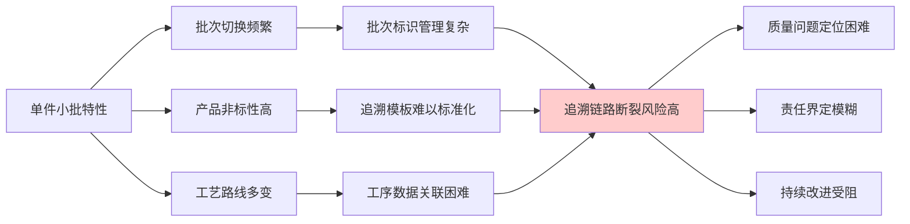

*图17：单件小批生产对追溯能力的特殊挑战*

原材料、半成品、产成品、废品频繁出入库，物料追溯的数据采集工作量巨大，任何环节的疏漏都可能导致追溯链路断裂。上游供应商、下游客户的信息接入门槛高，数据格式混乱[^53]，进一步加剧了追溯的困难。

**追溯能力缺失对质量闭环的根本性障碍**

ERP系统和MES系统互联互通，基础数据保证100%准确，且只有唯一的来源，MES系统生产数据和ERP系统互联互通，**一旦出现问题，即时响应，冻结相关生产任务、库存、采购行为**[^53]。这是理想状态下的质量闭环控制。

然而，当追溯能力缺失时，这种闭环就无法实现。质量追溯核心是数据互通和流程联动，ERP系统提供供应链数据，MES系统提供生产现场的过程数据，通过批次和序列号形成全链条数据，实现"哪里出问题，就能追溯到哪里"的目标[^53]。但如果数据断点存在，追溯链路就会在某个环节断裂，质量问题的根因分析就无法完成，持续改进也就无从谈起。

很多企业在数字化转型的道路上，往往陷入"系统孤岛"困境：ERP里有订单，WMS里有库存，MES里有工艺，但一旦出现追溯需求，**数据要么缺失、要么混乱**[^56]。你是否曾经因为一条不完整的生产记录，被领导问责？又或者在准备应对客户追溯审计时，面对数百页纸质报表苦不堪言？这些场景正是追溯能力缺失的真实写照。

**数据断点对自动化质量闭环的制约**

龙头企业通过MES系统，已将产品追溯时间从48小时缩短到5分钟，甚至实现"一键回查"[^57]。这种能力的背后是完整的数据链路支撑。而对于数据基础薄弱的单件小批生产企业而言，这种自动化质量闭环仍然是一个遥远的目标。

综上所述，离散制造企业在数据治理、系统集成与智能化应用层面的结构性短板，从根本上制约了自动化转型的深度推进。**数据碎片化导致全局可视化缺失，主数据质量差使得决策输入失真，系统集成度低造成信息流转断层，数据采集能力不足限制了实时优化的实现，追溯能力缺失阻断了质量闭环的形成**。这些问题相互关联、相互强化，构成了单件小批生产智能化升级的数据层系统性障碍。突破这一困境，需要企业从数据治理、系统架构、组织能力等多个层面进行协同变革，而这种变革的难度和投入往往超出多数中小企业的承受能力。

## 7 组织、人才与文化变革阻力：技能体系的迁移与重构

单件小批生产的自动化转型绝非单纯的技术导入过程，其本质是一场深刻的组织变革——涉及技能体系的根本性迁移、组织架构的系统性重构、绩效考核的全面调整以及企业文化的深层再造。相较于设备采购、系统部署等"硬性"投入，这些组织、人才与文化层面的"软性"变革往往更具隐蔽性、更难量化、更需要长期持续投入，因而也更容易被低估或忽视。然而，大量转型实践表明，**超过63%的制造业转型项目失败案例都与员工抵触管理不到位有关**[^58]，组织层面的阻力往往成为决定转型成败的关键因素。本章将系统剖析这些软性阻力的形成机理、具体表现与相互作用机制，并探索可能的克服路径。

### 7.1 技能替代焦虑与员工抵触情绪的形成机理

自动化转型在为企业带来效率提升预期的同时，也在员工群体中引发了深层的心理波动。这种波动并非简单的"怕被机器取代"，而是涉及职业安全、能力认同、社会地位、归属感等多重心理维度的复杂反应。

**技能替代焦虑的多维心理根源**

员工在生产工序变革中产生抵触，远不止表面的"觉得麻烦"或"担心失业"。这些情绪往往是多维度、深层次的[^58]：

| 焦虑维度 | 具体表现 | 在单件小批场景的特殊性 |
|---------|---------|----------------------|
| 职业安全感威胁 | 担心岗位被取代、技能被淘汰 | 长期积累的隐性经验可能"一夜归零" |
| 能力焦虑 | 害怕学不会新系统、跟不上变化 | 单件小批工艺复杂，新技能学习曲线陡峭 |
| 权力失衡 | 原有权威和影响力被削弱 | 资深工人的"话语权"可能转移至系统操作员 |
| 归属感减弱 | 原有团队文化和协作模式被打破 | 师徒关系、班组文化面临瓦解 |
| 信息不透明 | 对变革目的和后果的不确定 | 中小企业沟通机制往往不健全 |

*表22：员工技能替代焦虑的多维度分析*

这些因素往往交织出现，变革越大，抵触越强烈。如果仅用"员工不配合"简单归因，问题很难解决[^58]。

**单件小批生产中经验依赖者的特殊焦虑**

在单件小批生产模式中，技能替代焦虑具有区别于大规模生产场景的特殊性。如前文所述，这种生产模式高度依赖操作者的**经验判断、工艺决策、灵活协调、异常处置**等能力，这些能力的形成往往需要数年甚至十数年的积累。当自动化系统开始介入时，这些"老师傅"面临的不仅是技能淘汰的风险，更是**职业身份认同的根本性动摇**。

灯塔工厂的实践观察表明，传统制造业依赖老师傅的直觉判断（如设备故障诊断、工艺参数调整），而自动化转型通过AI分析操作数据，将经验转化为算法模型[^59]。这种转变意味着：

- **隐性知识的显性化**：老师傅多年积累的"手感""直觉"被转化为可复制的数据模型
- **经验价值的重新定义**：从"不可替代的核心能力"变为"可被系统学习的历史数据"
- **职业地位的潜在下降**：从"车间权威"可能沦为"系统辅助者"

**45岁以上工人面临转型阵痛**，这一群体的适应困难尤为突出[^59]。他们的抵触不仅源于学习新技能的困难，更源于对自身职业价值被否定的深层恐惧。

**抵触情绪的具体表现形式**

员工的抵触情绪可能以多种形式表现出来，从显性的公开反对到隐性的消极应对：

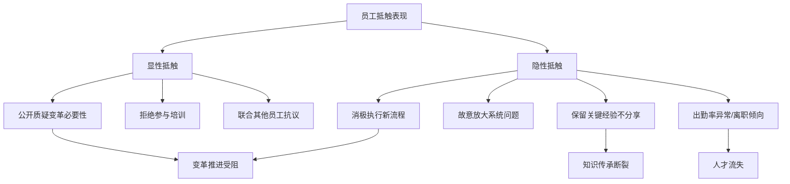

*图18：员工抵触情绪的表现形式与后果*

管理者要想缓解抵触情绪，第一步是科学识别。实用方法包括：**行为观察**（出勤率异常、生产事故频发、会议沉默、负面言论增多是典型的抵触信号）；**心理测评**（通过简易问卷或访谈了解员工对变革的认知、情绪变化）；**数据分析**（借助生产管理系统实时监控报工、质量、排产等数据，发现异常波动）[^58]。

**从抵触到消极破坏的演变路径**

如果管理者不能敏锐捕捉并积极回应员工的焦虑，抵触情绪极易演变为生产事故、人员流失、团队分裂等严重后果[^58]。组织变革阻力的研究表明，员工因固化的操作习惯、工作权利与安全感的改变以及对变革的认识偏差而产生抗拒[^60]。在单件小批生产中，由于生产高度依赖人工技能，员工的消极抵抗对生产的影响比大规模自动化产线更为直接和严重。

### 7.2 新型技能需求的涌现与复合型人才培育困境

自动化转型在替代部分传统技能的同时，也催生了全新的技能需求。这种技能结构的变迁并非简单的"减法"，而是一场深刻的"加减乘除"——既有技能的淘汰、新技能的涌现、技能组合的重构、技能价值的重新评估同时发生。

**自动化转型催生的新型技能图谱**

自动化技术正以前所未有的速度渗透到社会生产生活的各个领域，这种渗透不仅改变了传统的工作模式，更深刻重塑了劳动力市场对技能的需求结构[^61]。在单件小批生产的自动化转型中，新型技能需求可归纳为以下维度：

| 技能类别 | 具体内涵 | 与传统技能的关系 |
|---------|---------|-----------------|
| 设备操作与维护 | 自动化设备调试、故障诊断、日常维护 | 从"手工操作"转向"设备管理" |
| 工业软件应用 | MES、ERP系统操作、数据录入与查询 | 从"经验判断"转向"系统协作" |
| 数据分析与解读 | 生产数据解读、趋势分析、异常识别 | 从"直觉感知"转向"数据驱动" |
| 人机协作能力 | 与自动化系统的协同配合、任务分工 | 从"独立作业"转向"协同工作" |
| 异常处置与优化 | 系统异常响应、流程改进建议 | 从"被动执行"转向"主动优化" |

*表23：自动化转型催生的新型技能需求图谱*

工人需掌握工业软件操作（如MES系统）、设备状态监测工具及基础数据分析能力。**数字素养成为核心能力**[^59]。这种能力要求的转变意味着，即使是保留下来的岗位，其技能内涵也发生了根本性变化。

**从传统技能向数字素养转型的能力鸿沟**

自动化技术的演进经历了从机械替代体力劳动到数字处理替代规则性脑力劳动的阶段[^61]。在技能需求层面，此阶段的自动化对"基础操作技能"的需求显著降低，传统产业工人需要掌握的"手工装配技巧""重复性动作熟练度"等技能，逐渐被"设备操作与维护"技能取代[^61]。

以某企业的转型为例：过去一名装配工人需要经过3-6个月的训练才能熟练完成零件组装，而在引入自动化生产线后，工人的核心任务变为监控机械臂运行状态、处理设备故障报警，这要求其掌握基础的设备调试知识和简单的电气维修技能[^61]。

然而，这种技能转型面临显著的能力鸿沟：

- **知识结构差异**：传统技能基于实践经验积累，新技能需要一定的理论基础
- **学习方式差异**：传统技能通过师徒传承和反复练习获得，新技能需要系统培训
- **认知模式差异**：传统技能强调"手感""直觉"，新技能强调"数据""逻辑"

**复合型人才培育的实践挑战**

单元化生产不养"单一工序操作工"，要养"多能工"[^8]。这一理念在自动化转型中得到进一步强化——企业需要的不是单一技能的专才，而是能够跨越人机边界的复合型人才。

灯塔工厂的实践提供了有益参照。施耐德电气"鲁班计划"设立1-5级技能进阶体系，工人可通过数字化项目积累学分实现跨级晋升[^59]。海尔工厂通过"Gen AI维修助理"实时指导维修，使新员工技能提升周期缩短75%[^59]。然而，这些先进实践的复制面临诸多挑战：

**沉浸式技能培训的资源投入**。施耐德电气采用AR眼镜可视化操作流程，配合"数字孪生"模拟故障场景进行虚实结合实训[^59]。这种培训方式效果显著，但对培训基础设施和课程开发能力要求较高，多数中小企业难以承受。

**技能认证体系的动态化挑战**。企业自主开展职业技能等级评价的政策为技能认证提供了灵活性[^62]，但单件小批生产的技能需求高度多样化，建立一套既能反映实际能力又具有可操作性的认证体系并非易事。

**技能体系迁移的周期性困境**。通过VR模拟训练平台，员工掌握新岗位技能的时间从3周缩短至4天[^59]。即便如此，技能体系的整体迁移仍是一个长期过程，而单件小批生产企业往往面临"等不起"的市场压力。

**结构性错配问题的凸显**

技能转型过程中不可避免地出现结构性错配。**低技能岗位（如重复性装配工）缩减率达30%，而工业AI运维岗缺口年增25%**[^59]。这种"减"与"增"的不同步，导致部分员工面临转岗困难，而企业急需的新型人才又供给不足。

对于单件小批生产企业而言，这种结构性错配尤为突出。一方面，这类企业的传统技能具有高度专业性和隐性特征，难以简单迁移；另一方面，企业规模有限，难以像大型企业那样建立完善的内部培训体系和人才储备机制。

### 7.3 组织架构重构与岗位职责再定义的变革张力

自动化转型不仅改变了个体的技能要求，更从根本上冲击了企业的组织架构和岗位体系。传统的职能分工、层级结构、汇报关系在自动化环境下面临重新定义的压力，而这种组织层面的变革往往比技术导入更加复杂和敏感。

**自动化转型对传统组织架构的冲击**

传统离散制造企业的组织架构通常按照职能划分，研发、工艺、生产、质量、物流等部门各司其职。然而，自动化转型要求打破这种条块分割的组织模式：

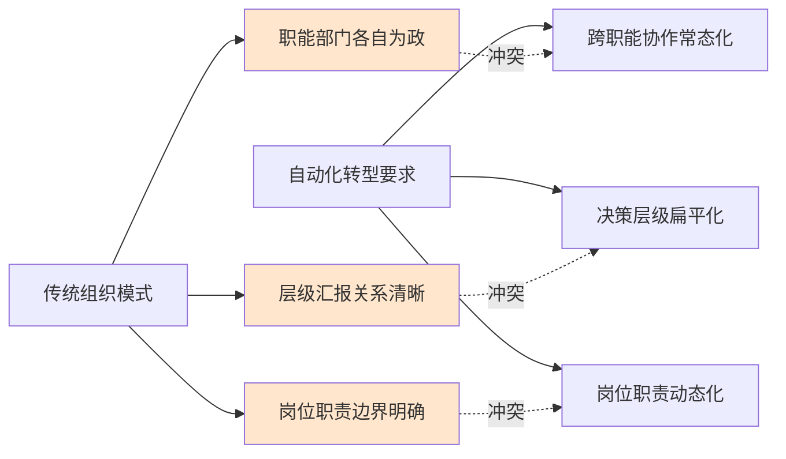

*图19：自动化转型对传统组织架构的冲击*

组织变革的阻力主要由组织系统的外在阻力、员工的内在阻力和员工与系统之间的互动阻力三部分构成[^60]。外在系统阻力源于战略、组织、文化系统调整过程中的组织惯性，包括**结构惯性、群体惯性、本位主义以及对专业知识的威胁**[^60]。

**岗位职责从执行者向决策参与者的转变**

自动化转型重新定义了人在生产系统中的角色。从单纯的"操作执行者"向"系统管理者""决策参与者"转变，这种角色转换带来了深刻的职责再定义需求。

以某制造企业的实践为例：美的重庆工厂工人从盯仪表盘转向管理AI预警系统，专注异常处置和流程优化[^59]。这种转变意味着：

| 转变维度 | 传统角色 | 新角色 | 转变挑战 |
|---------|---------|-------|---------|
| 工作内容 | 直接操作设备/物料 | 监控系统、处理异常 | 从"动手"到"动脑" |
| 决策权限 | 执行上级指令 | 参与流程优化决策 | 责任边界重新界定 |
| 协作范围 | 本工序/本班组 | 跨工序/跨系统协同 | 沟通能力要求提升 |
| 价值评判 | 产量/质量指标 | 系统效率/改善贡献 | 绩效标准需重构 |

*表24：自动化转型中的岗位角色转变*

海尔工厂建立"人人创新改善平台"，工人可抢单解决产线问题并分享收益。2025年一线工人创新提案为工厂降本超百万元，**50名普通工人进阶为行业专家**[^59]。这种从"执行者"到"创客"的角色转变，代表了自动化转型中人的价值重新定位的方向。

**中小企业组织变革的特殊困境**

单件小批生产企业多为中小规模，其组织变革面临特殊的资源约束和能力瓶颈：

**变革资源不足**。组织变革需要专业的变革管理团队、充足的培训预算、完善的沟通机制，而中小企业往往"一个萝卜一个坑"，难以抽调专门资源推进变革。

**变革能力薄弱**。系统互动阻力源于变革过程中领导力不足、沟通协作不到位、员工缺乏参与机会以及变革方法不当等因素[^60]。中小企业的管理层往往缺乏系统的变革管理经验和方法论。

**结构惯性强**。组织层面，追求稳定和确定性的惯性、固化的组织结构与权力分配、落后的组织文化以及差异化的利益分配是主要的阻力来源[^63]。中小企业由于规模小、人员稳定，这种惯性往往更加根深蒂固。

**部门间推诿扯皮的现实**

组织阻力的具体表现包括领导层对新系统推行不上心、老员工抵触新流程、部门间推诿扯皮[^60]。在自动化转型中，这种部门间的协调困难尤为突出：

- **IT与OT的融合障碍**：信息技术部门与生产运营部门在技术语言、工作节奏、优先级判断上存在显著差异
- **生产与质量的责任边界**：自动化系统引入后，质量问题的责任归属变得复杂
- **计划与执行的协同难题**：系统化排产与现场灵活调度之间的张力

### 7.4 绩效考核体系调整与激励机制重构的复杂性

绩效考核是连接战略目标与日常执行的关键纽带[^64]。自动化转型从根本上改变了生产的组织方式和价值创造模式，传统的绩效考核体系面临失效风险，而新体系的建立又面临诸多技术和认知障碍。

**传统计件工资制度的失效**

在传统单件小批生产中，计件工资是最常见的激励方式——工人的收入与产出数量直接挂钩，激励机制简单明了。然而，自动化转型使这一制度面临根本性挑战：

**产出归因的模糊化**。当人工与自动化系统协同作业时，产出究竟应归功于人还是机器？如何界定人的贡献比例？这些问题在技术上难以精确回答。

**工作内容的转变**。原来是人工计件，现在改成智能化生产，我的岗位还有吗？企业该怎么判定我的绩效？[^65]这是许多员工面临的困惑。当工人的主要工作从直接生产转变为系统监控和异常处理时，传统的产量指标已无法反映其真实贡献。

**激励导向的错位**。如果继续沿用计件工资，员工可能倾向于追求短期产量而忽视系统维护、流程改进等长期价值创造活动。

**人机协作绩效归因的技术难题**

如何界定"客观情况发生重大变化"，成为智能化背景下员工绩效判定的关键问题[^65]。当智能系统承担了原本由人工完成的部分工作时，绩效评价面临以下难题：

| 评价难题 | 具体表现 | 对激励的影响 |
|---------|---------|-------------|
| 贡献归因模糊 | 系统产出与人工贡献难以分离 | 员工感到付出与回报不对等 |
| 过程监控困难 | 监控、协调等工作难以量化 | 隐性贡献得不到认可 |
| 能力评估复杂 | 新技能掌握程度难以客观衡量 | 技能提升动力不足 |
| 团队协作评价 | 跨岗位协作贡献难以界定 | 协作意愿受挫 |

*表25：人机协作背景下的绩效评价难题*

**绩效考核指标的动态调整需求**

随着市场环境、技术变革和业务模式的持续演进，原有的绩效指标往往会出现"滞后性、空转点"和"激励错位"等问题[^66]。在自动化转型背景下，绩效考核需要从以下维度进行重构：

**从结果导向向过程与能力并重转变**。绩效指标通常要覆盖三个维度：结果（最终产出、业务成效）、过程（实现目标的关键活动、效率与质量）、能力（个人技能、团队协同、学习与创新能力）[^66]。在自动化环境下，过程和能力维度的权重需要显著提升。

**将新型能力纳入考核体系**。系统操作熟练度、数据应用水平、异常响应能力、改善建议贡献等新维度需要被纳入绩效评价框架。宁德时代推行"经验复用奖励"，老师傅参与AI建模可获得技术分红；工人创新积分可兑换培训资源或职称评定加分[^59]。

**激励机制从个体导向向团队协作导向转变**。自动化生产更加强调系统协同，单纯的个体激励可能导致局部优化而非全局最优。将系统使用熟练度与绩效考核挂钩，对积极参与变革的员工给予奖励[^67]，是引导员工行为转变的重要手段。

**员工对新考核体系的接受度障碍**

绩效考核体系的调整必然触动员工的切身利益，其推行面临显著的接受度障碍：

**公平性质疑**。新指标的设定标准、评价方法、数据来源等都可能引发员工的公平性质疑，尤其是当新体系导致部分员工收入下降时。

**适应期焦虑**。从熟悉的考核规则转向新体系，员工需要一个适应期，期间的不确定性会加剧焦虑情绪。

**信任度不足**。如果员工对管理层推行新考核体系的动机存在疑虑，可能将其视为变相降薪或裁员的手段，从而产生强烈抵触。

### 7.5 企业文化惯性与变革认同的深层障碍

企业文化是组织长期运营过程中形成的价值观念、行为规范和思维模式的总和。在单件小批生产企业中，长期形成的经验主义文化、师徒传承传统与自动化转型所代表的数字化、标准化理念之间存在深刻的张力。

**路径依赖与经验主义文化的根深蒂固**

单件小批生产模式的成功运营高度依赖人的经验和技能，这种依赖在长期实践中逐渐固化为一种"经验主义"的企业文化——相信"老师傅的经验比任何系统都可靠""干了这么多年，什么问题没见过"。

员工内在阻力包括因路径依赖、习惯和认知偏差而形成的心智模式阻力[^60]。这种心智模式表现为：

- **对新技术的本能怀疑**："机器能比人更懂这个活？"
- **对标准化的抵触**："每个产品都不一样，怎么标准化？"
- **对数据的不信任**："数据是死的，人是活的"

**师徒传承传统与知识管理模式的冲突**

单件小批生产中的隐性知识主要通过师徒传承的方式代际传递，这种传承模式形成了独特的车间文化和人际关系网络。自动化转型试图将隐性知识显性化、将经验转化为数据和算法，这从根本上挑战了师徒传承的价值基础。

海尔等企业设立"老师傅智库"，将其经验纳入AI训练数据集并给予长期顾问角色[^59]。这种做法试图在新旧模式之间寻找平衡，但并非所有企业都有资源和能力实施这种精细化的过渡安排。

**群体惯性与本位主义的阻碍**

从群体层面看，变革对群体既有规范和协作模式的改变与破坏，会引发群体惯性。这表现为群体在面临创新时，倾向于维持现有的行为规范，压制新想法，从而在工作质量协调性、工作态度一致性和信息沟通等方面形成惰性，成为阻碍变革的群体因素[^60]。

在单件小批生产的车间环境中，班组文化、工种认同、技能等级等形成了复杂的群体关系网络。自动化转型可能打破这些既有的群体边界和权力结构，引发群体性的抵制。

**变革认同构建的多重障碍**

员工不明变革的意义，对变革的发动者缺乏信心。在组织变革的过程中，一些员工对企业变革的紧迫性认识不足，认为变革没有必要，企业推动变革是多此一举，并且会对自己的利益造成损害[^60]。

构建变革认同面临的障碍包括：

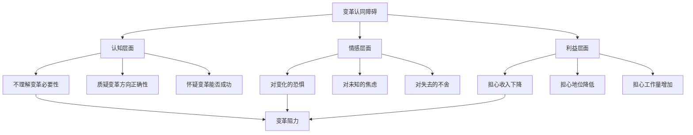

*图20：变革认同构建面临的多重障碍*

**中小企业文化变革的特殊难度**

单件小批生产企业多为中小规模，其文化变革面临特殊困难：

**领导者的双重角色冲突**。中小企业的领导者往往既是变革的推动者，又是现有文化的缔造者和受益者，这种双重角色使其在推动文化变革时面临内在矛盾。

**变革沟通资源有限**。系统的变革沟通需要专业能力和充足资源，而中小企业往往缺乏专门的内部沟通团队和渠道。

**外部标杆的缺失**。大型企业可以参照行业标杆或聘请专业顾问指导文化变革，而中小企业往往缺乏这样的参照系和外部支持。

### 7.6 软性阻力的系统性特征与克服路径探索

组织、人才与文化层面的软性阻力并非孤立存在，而是相互交织、相互强化，形成了一个复杂的阻力系统。理解这种系统性特征，是制定有效克服策略的前提。

**软性阻力的相互强化机制**

```mermaid
flowchart LR
    A[技能替代焦虑] --> B[抵触新培训]
    B --> C[新技能习得困难]
    C --> D[岗位适应性差]
    D --> E[绩效下降]
    E --> F[收入减少预期]
    F --> A
    
    G[文化惯性] --> H[排斥新工作方式]
    H --> I[组织变革受阻]
    I --> J[系统效益难释放]
    J --> K[变革价值被质疑]
    K --> G
    
    A <-.->|相互强化| G
    C <-.->|相互强化| I
    E <-.->|相互强化| K
```

*图21：软性阻力的相互强化机制*

这种相互强化的机制解释了为什么软性阻力往往比技术硬件更难克服：

- **技术问题可以通过投入资源解决，但人的心理和行为改变需要时间和信任**
- **设备故障有明确的诊断和修复路径，但组织文化的转变没有标准答案**
- **系统升级可以分步实施、逐步验证，但人员能力提升和观念转变难以精确规划**

**克服软性阻力的综合策略框架**

基于组织变革理论和先进实践经验，克服软性阻力需要从以下维度构建综合策略：

**领导表率与变革愿景**。组织文化变革需自上而下推动，企业管理层应率先转变思维，深入理解自动化转型理念并成为积极倡导者。领导要亲自参与流程设计、工具选型，打破部门壁垒，为团队树立协作榜样[^68]。

**沟通透明与参与式决策**。克服阻力的首要方法是沟通与教育，向成员说明变革必要性、目标和过程，减少误解；让成员参与变革计划制定，增强认同感[^63]。在单件小批生产企业中，由于规模较小、人际关系紧密，面对面的沟通和参与式决策可能比大企业更具可行性。

**培训赋能与支持体系**。提供支持，如培训、心理咨询等帮助成员适应变革[^63]。灯塔工厂的实践表明，沉浸式技能培训（如VR模拟、AR指导）可以显著缩短技能提升周期，降低学习焦虑[^59]。

**激励机制变革与利益平衡**。对利益受损者适当补偿，设立变革奖励机制[^63]。在自动化转型中，这意味着要设计过渡期的收入保障机制，同时建立与新技能、新贡献挂钩的长期激励体系。

**渐进式变革与试点验证**。选择一个车间先行试点，收集反馈优化系统，由试点部门管理者分享经验，增强其他部门信心[^67]。这种渐进式策略可以降低变革风险，积累成功经验，逐步建立组织信心。

**先进实践案例的启示**

灯塔工厂的员工技能重塑计划提供了有价值的参照。这些企业通过系统化技能重塑计划，正在将传统制造业工人从依赖经验的单一操作者，转变为掌握数字工具、参与创新决策的复合型人才[^59]。其成功经验包括：

- **定制化成长路径**：海尔重庆工厂的AI人才系统为员工规划个性化发展路线，晋升周期压缩40%
- **技能认证动态化**：施耐德电气设立1-5级技能进阶体系，工人可通过数字化项目积累学分实现跨级晋升
- **创新角色赋予**：建立"人人创新改善平台"，让工人从执行者转变为创客
- **老员工价值重塑**：设立"老师傅智库"，将经验纳入AI训练数据集并给予长期顾问角色

然而，这些先进实践的复制需要考虑单件小批生产企业的特殊性：规模较小、资源有限、变革能力相对薄弱。因此，**渐进式、低成本、高参与**的变革路径可能更适合这类企业。

**软性阻力克服的长期性认知**

必须清醒认识到，组织、人才与文化层面的变革是一个长期过程，不可能一蹴而就。企业推进数字化转型，还要统筹算好短期收益和长期收益两笔账。某汽车部件企业的经历具有启示意义：2016年起陆续投入资金用于数字化改造，碰到行业下行，订单量一度萎缩，企业压力很大。但认为这是必经阶段，企业最终挺过来了，转型红利逐步释放。

对于单件小批生产企业而言，软性阻力的克服同样需要战略定力和长期投入。**变革的本质是"人机协同价值重构"——工人脱离机械劳动后，聚焦于AI无法替代的决策优化、跨系统协同和创新突破领域**[^59]。这种价值重构需要时间来实现，也需要企业在变革过程中持续投入耐心和资源。

综上所述，组织、人才与文化层面的软性阻力是单件小批生产自动化转型中最难克服的障碍之一。**技能替代焦虑引发员工抵触，新技能培育面临能力鸿沟，组织架构重构触动权力格局，绩效考核调整涉及利益再分配，企业文化惯性阻碍变革认同**——这些因素相互交织、相互强化，形成了一个复杂的阻力系统。克服这些阻力需要领导力、沟通、培训、激励等多维度的综合策略，更需要企业具备变革的战略定力和长期投入的决心。

## 8 综合难度评估：多维障碍的相互作用与关键瓶颈识别

前述章节分别从技术可行性、经济合理性、系统柔性、数据基础、组织变革五个维度深入剖析了单件小批生产自动化转型面临的具体挑战。然而，这些挑战并非孤立存在，而是相互交织、彼此强化，形成了一个复杂的制约网络。本章将在分项分析的基础上，系统梳理各维度障碍之间的相互作用机制，构建多维障碍的关联图谱，识别制约转型的核心瓶颈，揭示单件小批生产自动化难度的系统性根源。

### 8.1 多维障碍的关联图谱：技术、经济、组织层面的交织结构

单件小批生产自动化转型面临的困境呈现出**"底层数据梗阻、中层系统割裂、表层技术受限、全局受制于组织惯性"**的层叠结构特征。各维度障碍并非简单并列，而是形成了一个相互关联、相互影响的复杂网络系统。

**多维障碍的层级结构**

从系统视角审视，五大维度的障碍呈现出清晰的层级依赖关系：

```mermaid
flowchart TB
    subgraph 基础层
        A[数据基础障碍]
        A1[数据碎片化]
        A2[主数据质量差]
        A3[系统集成度低]
    end
    
    subgraph 能力层
        B[技术可行性障碍]
        C[系统柔性障碍]
        B1[感知精度不足]
        B2[决策泛化困难]
        B3[执行柔性受限]
        C1[设备换型损失]
        C2[软件响应迟滞]
        C3[物流协同困难]
    end
    
    subgraph 价值层
        D[经济性障碍]
        D1[投资门槛高]
        D2[回报不确定]
        D3[规模效应缺失]
    end
    
    subgraph 驱动层
        E[组织变革障碍]
        E1[技能替代焦虑]
        E2[人才培育困难]
        E3[文化惯性阻滞]
    end
    
    A --> B
    A --> C
    B --> D
    C --> D
    E --> B
    E --> C
    E --> D
    
    style A fill:#e6f3ff
    style B fill:#ffe6e6
    style C fill:#e6ffe6
    style D fill:#fff0e6
    style E fill:#f0e6ff
```

*图22：多维障碍的层级结构与关联关系*

这一层级结构揭示了几个关键特征：

**数据基础是一切上层应用的根基**。数据碎片化、主数据质量低下、系统间接口与协议不统一，导致数据无法有效流动和汇聚。这使得高价值的技术工具——无论是智能排产、实时优化还是数字孪生——都因"缺油少电"而无法正常运转，精准的经济性分析和投资回报测算也因此缺乏依据。

**技术与系统能力受制于数据基础**。数字孪生的实时性瓶颈根源于异构系统接口不兼容、数据采集滞后；AI工艺决策的"黑箱"问题又因缺乏高质量、标准化的训练数据而难以突破。机器视觉、AI决策等先进技术的效能高度依赖实时、准确的数据流和集成的系统环境，数据与系统问题直接导致这些技术无法发挥应有价值，形成**"有技术，无效果"**的困境。

**组织因素渗透并影响所有层面**。缺乏既懂工艺又懂数字技术的复合型人才，导致先进设备运维困难、数据采集规范执行不到位、智能系统使用效果差，使技术和数据投资难以转化为收益。传统"重硬轻软"思维和部门本位主义是打破数据孤岛、实现系统深度集成的主要组织障碍。

**障碍间的横向关联特征**

除了纵向的层级依赖，各维度障碍之间还存在复杂的横向关联：

| 关联维度 | 关联机制 | 典型表现 |
|---------|---------|---------|
| 技术↔数据 | 技术效能依赖数据质量，数据采集需要技术支撑 | AI决策因数据不足而失准，视觉检测因样本稀缺而泛化差 |
| 技术↔系统 | 技术集成需要系统柔性，系统重构需要技术支撑 | 多技术融合的稳定性风险，设备协议差异导致集成困难 |
| 经济↔技术 | 技术不成熟推高成本，成本约束限制技术迭代 | 柔性设备溢价3-5倍，中小企业难以承受试错成本 |
| 经济↔系统 | 系统柔性不足导致效率损失，效率损失影响投资回报 | 换型效率损失10%-20%，产能利用率不稳定 |
| 组织↔全局 | 组织阻力影响所有层面的落地效果 | 技能断层制约技术应用，文化惯性阻碍流程变革 |

*表26：多维障碍的横向关联特征*

**系统性困境而非单点问题的本质**

这种多维交织的障碍结构决定了单件小批生产自动化转型面临的是**系统性困境而非单点问题**。任何试图通过解决单一维度问题来实现转型突破的努力都可能因其他维度的制约而归于失败。例如：

- 即使采购了先进的自动化设备（技术层面），如果数据基础薄弱（数据层面），设备也无法发挥智能化功能
- 即使投入了充足的资金（经济层面），如果组织变革滞后（组织层面），投资也难以转化为实际效益
- 即使建立了柔性产线（系统层面），如果人才能力不匹配（组织层面），系统也无法高效运转

这种系统性特征要求企业必须采用**系统性、协同性**的转型路径，而非头痛医头、脚痛医脚的局部优化。

### 8.2 技术不成熟与成本约束的恶性循环机制

技术可行性不足与经济性约束之间存在深刻的相互强化关系，形成了一个典型的恶性循环，这一循环对资源有限的中小企业构成了特别严峻的制约。

**恶性循环的形成机制**

技术与成本之间的恶性循环可以通过以下路径加以描述：

```mermaid
flowchart LR
    A[技术不成熟] --> B[实施风险高]
    B --> C[投资决策犹豫]
    C --> D[试点规模受限]
    D --> E[经验积累不足]
    E --> F[技术迭代缓慢]
    F --> A
    
    A --> G[定制化需求多]
    G --> H[实施成本高企]
    H --> C
    
    C --> I[资金投入不足]
    I --> J[研发能力受限]
    J --> F
    
    style A fill:#ffcccc
    style C fill:#ffe6cc
    style F fill:#ccffcc
```

*图23：技术不成熟与成本约束的恶性循环*

这一循环的核心逻辑在于：

**技术不成熟推高实施成本**。当前自动化技术在应对单件小批生产的非结构化环境、高变异需求、复杂工艺判断时仍存在明显局限。协作机器人的泛化能力不足意味着每种新产品都可能需要重新设计夹具、调整抓取策略；机器视觉的感知边界使得每种新产品都可能需要重新进行光学设计和参数调优；AI决策系统的训练需求意味着每个新场景都需要大量数据积累。这些技术局限直接转化为**高昂的定制化成本和持续的调试投入**。

**成本约束限制技术迭代投入**。高昂的初始投资门槛与不确定的投资回报使得企业——尤其是利润微薄的单件小批生产企业——在技术投入方面趋于保守。当企业无力承担充分的试点验证、持续的技术迭代、必要的人才培养时，技术应用只能停留在浅层，无法通过实践积累推动技术成熟度的提升。

**中小企业的特殊困境**

这一恶性循环对中小企业的制约尤为严峻。从国内市场客户的角度来看，**中小企业是使用协作机器人的主力军**，但这类企业恰恰面临着最严重的资源约束：

| 约束维度 | 大型企业 | 中小企业 | 差距影响 |
|---------|---------|---------|---------|
| 资金实力 | 可承受长期投资回收 | 现金流紧张、融资渠道有限 | 难以承受技术试错成本 |
| 技术团队 | 具备专业IT/OT团队 | 技术人员配置薄弱 | 难以消化复杂技术方案 |
| 议价能力 | 可获得供应商定制服务 | 只能接受标准化产品 | 技术适配度低 |
| 风险承受 | 可分散投资风险 | 单一项目失败影响大 | 决策更加保守 |

*表27：大型企业与中小企业在技术投入方面的差距*

数据显示，**投资额在300万元至1000万元区间的企业比例稳定上升**，但对于年利润率仅3%左右的单件小批生产企业而言，这一投入力度仍然意味着巨大的决策压力。某汽车零部件企业陆续投入2亿多元资金用于数字化改造，碰到行业下行，订单量一度萎缩，**企业压力很大**——这一案例充分说明，即使是有实力的企业，在技术投资与经济回报之间的平衡也充满风险。

**循环打破的困难**

打破这一恶性循环面临多重困难：

- **技术供给侧**：自动化技术供应商的商业模式更适合服务大规模标准化生产场景，针对单件小批生产的定制化解决方案投入产出比低，缺乏充分的研发动力
- **技术需求侧**：单件小批生产企业分散、规模小，难以形成有效的需求聚合，无法推动供应商针对性地开发适配技术
- **中间服务**：缺乏专业的系统集成商和技术服务机构来弥合技术供给与需求之间的鸿沟

### 8.3 数据基础薄弱对技术效能与决策优化的双重制约

数据层面的问题——数据碎片化、主数据质量缺陷、系统集成度低——构成了制约自动化转型的**基础性、根源性瓶颈**。这些问题同时从技术效能发挥和智能化决策实现两个方向制约着自动化投资的价值释放。

**对技术效能的制约机制**

自动化技术的效能高度依赖数据的完整性、准确性和时效性。当数据基础薄弱时，各类自动化技术都面临"巧妇难为无米之炊"的困境：

```mermaid
flowchart TD
    A[数据基础薄弱] --> B[AI决策系统]
    A --> C[数字孪生]
    A --> D[智能排产]
    A --> E[质量追溯]
    
    B --> B1[训练数据不足]
    B --> B2[输入数据失真]
    B --> B3[决策结果不可靠]
    
    C --> C1[模型精度不足]
    C --> C2[同步更新滞后]
    C --> C3[仿真偏差大]
    
    D --> D1[约束条件缺失]
    D --> D2[优化方向偏离]
    D --> D3[计划难以执行]
    
    E --> E1[追溯链路断裂]
    E --> E2[责任无法界定]
    E --> E3[改进缺乏依据]
    
    B3 --> F[技术投资价值难以释放]
    C3 --> F
    D3 --> F
    E3 --> F
    
    style A fill:#ffcccc
    style F fill:#ffe6cc
```

*图24：数据基础薄弱对技术效能的制约路径*

以数字孪生技术为例，**高保真模型构建难度大、成本高，多数中小工厂受限于技术实力，仅能构建设备、产线的基础几何模型，无法融入物理属性、工艺规则、环境影响等多维特征**。某家电工厂的孪生模型因未考虑车间温湿度对设备运行效率的影响，仿真得出的产能提升方案实际应用后**效果缩水60%**。

**对决策优化的制约机制**

智能化决策的核心在于基于数据的优化与预测。当数据基础薄弱时，决策系统的输入就会出现偏差，导致优化结果与实际情况脱节：

| 决策场景 | 数据需求 | 数据缺口 | 决策影响 |
|---------|---------|---------|---------|
| 智能排产 | 订单、资源、工序完整数据 | 数据不完整、不准确、不及时 | 排产结果无法执行 |
| 实时优化 | 设备状态、工艺参数实时数据 | 采集频率不足、传输延迟 | 优化建议滞后失效 |
| 质量预测 | 历史质量数据、过程参数关联 | 追溯链路断裂、数据关联缺失 | 预测模型失准 |
| 成本核算 | 物料、工时、能耗精细数据 | 数据粒度粗放、归集不准 | 成本决策失据 |

*表28：数据缺口对智能化决策的影响*

**某电子制造工厂调研显示，因数据孤岛导致的生产排产偏差率达12%，直接影响产能规划准确性**。这一数据表明，数据层面的问题不仅影响信息系统的运行效率，更从根本上制约了数据驱动决策的实现可能性。

**数据治理的投入产出困境**

解决数据基础问题需要系统性的数据治理工程，但这种投入对于单件小批生产企业而言面临显著的投入产出困境：

- **治理成本高**：主数据标准化、系统集成、数据采集能力建设都需要大量投入
- **见效周期长**：数据治理是基础性工作，其价值需要通过上层应用才能体现
- **收益难量化**：数据质量提升带来的收益分散在各个业务环节，难以精确核算
- **持续投入需求**：数据治理不是一次性工程，需要持续的维护和更新

以某汽车零部件企业为例，其物料编码规则存在5种版本，同一供应商在采购、财务、生产系统中被重复定义，**导致年度采购冗余成本超8000万元**。这一案例说明数据治理的潜在价值巨大，但实现这种价值需要系统性的投入和长期的坚持。

### 8.4 系统柔性不足与订单异质性需求的结构性错配

单件小批生产的本质特性——订单碎片化、工艺多变性、产品非标性——与当前自动化系统的柔性能力之间存在深刻的结构性错配。这种错配使得自动化系统不仅难以发挥效率优势，反而可能成为运营负担。

**结构性错配的多维表现**

刚性自动化系统与柔性生产需求之间的错配体现在设备层、软件层、物流层等多个维度：

| 需求特征 | 系统能力 | 错配表现 | 效率损失 |
|---------|---------|---------|---------|
| 频繁换型 | 换型时间长 | 换型期间产线停摆 | 换型损失占比高 |
| 工艺多变 | 程序调整复杂 | 每次变更需重新编程 | 响应滞后 |
| 产品非标 | 标准化程度要求高 | 定制化成本高企 | 单位成本上升 |
| 订单波动 | 产能弹性有限 | 利用率不稳定 | 投资回报不确定 |

*表29：系统柔性与生产需求的结构性错配*

传统流水线是为"大批量单一品种"设计的，一旦要换品种，就会出现三个致命问题：**换型成本极高**，调整设备参数、更换模具夹具、培训员工操作，少则几小时，多则一两天；**在制品积压严重**，前道工序做完的半成品要等整条线流转到后道；**柔性极差**，一旦某道工序出故障，整条线瘫痪。

**换型效率损失的累积效应**

在单件小批生产场景中，换型是常态而非例外。当订单品种从50种增加到180种、小订单占比超过70%时，换型频次的大幅增加使得效率损失呈现累积放大效应：

```mermaid
flowchart LR
    A[订单碎片化加剧] --> B[换型频次增加]
    B --> C[单次换型损失累积]
    C --> D[总体效率下降]
    
    B --> E[设备利用率下降]
    E --> F[单位固定成本上升]
    F --> G[投资回报恶化]
    
    D --> H[交货期延误]
    G --> H
    H --> I[客户满意度下降]
    I --> J[订单流失风险]
    
    style D fill:#ffcccc
    style G fill:#ffe6cc
```

*图25：换型效率损失的累积效应*

**多车型共线时，即使智能切换，节拍仍可能下降10%-20%，压缩切换时间又会增加故障风险**。这一数据表明，即使采用了先进的柔性自动化方案，频繁换型带来的效率损失仍然显著。

**柔性追求与稳定性风险的两难**

追求更高的系统柔性往往意味着引入更多的变量和不确定性，这与生产系统对稳定性的刚性需求之间形成张力：

- **模块化设计**提升了重构灵活性，但也增加了模块间协同的复杂度和故障点
- **快速换型能力**缩短了切换时间，但也可能因验证不充分而引入质量风险
- **动态调度算法**提高了响应速度，但也可能因数据输入偏差而导致决策失误

这种两难困境使得企业在追求柔性能力与保障生产稳定性之间面临艰难的权衡选择。

### 8.5 组织变革滞后对技术落地与价值实现的阻滞效应

组织、人才、文化层面的软性阻力往往成为技术落地的**"最后一公里"障碍**。即使技术方案可行、经济投入到位，组织因素仍可能导致系统效益难以释放，甚至导致转型项目的完全失败。

**软性阻力与硬性投入的不对称性**

组织层面的阻力与技术、资金等硬性投入之间存在显著的不对称性：

| 对比维度 | 硬性投入（技术/资金） | 软性阻力（组织/人才/文化） |
|---------|---------------------|------------------------|
| 可见性 | 高，可量化、可展示 | 低，隐蔽、难以察觉 |
| 可控性 | 较高，投入即可见效 | 低，效果不确定 |
| 时间维度 | 短期可完成 | 长期持续过程 |
| 解决路径 | 相对明确 | 复杂、因人而异 |
| 失败后果 | 资产可保留或转让 | 信任损失难以挽回 |

*表30：软性阻力与硬性投入的不对称性*

这种不对称性导致企业在转型规划中往往**低估组织层面的挑战**，将大部分注意力和资源投入到技术选型、设备采购等"看得见"的环节，而对组织变革、人才培育、文化重塑等"看不见"的工作准备不足。

**组织阻力的阻滞效应路径**

组织层面的阻力通过多种路径阻滞技术落地和价值实现：

```mermaid
flowchart TD
    A[组织变革滞后] --> B[技能断层]
    A --> C[流程不适配]
    A --> D[文化抵触]
    
    B --> B1[设备操作不熟练]
    B --> B2[系统使用效果差]
    B --> B3[异常处置能力弱]
    
    C --> C1[新旧流程冲突]
    C --> C2[职责边界模糊]
    C --> C3[绩效考核失灵]
    
    D --> D1[员工消极应对]
    D --> D2[隐性知识不分享]
    D --> D3[改善动力不足]
    
    B1 --> E[系统效益难以释放]
    C1 --> E
    D1 --> E
    
    E --> F[投资回报不及预期]
    F --> G[管理层信心动摇]
    G --> H[后续投入缩减]
    H --> I[转型陷入僵局]
    
    style E fill:#ffcccc
    style I fill:#ffe6cc
```

*图26：组织阻力对技术落地的阻滞效应*

据《中国制造业数字化转型调研报告（2023）》显示，**约57%的排产管理系统落地失败案例，根源都在于组织惯性的阻挠**。管理层推不动，员工不买账，数据又像"孤岛"难互通，结果系统上线后成了摆设，生产效率却没起色。

**组织阻力放大技术与经济风险**

组织层面的阻力不仅直接阻滞技术落地，还会放大技术和经济层面的风险：

- **技能缺口**使得先进设备运维困难，设备故障率上升，维护成本增加
- **流程不适配**导致系统功能无法充分利用，投资效益打折扣
- **文化抵触**造成员工消极应对，系统数据质量下降，决策可靠性降低
- **人才流失**使得技术能力难以积累，陷入"招人—培养—流失"的循环

这种放大效应使得组织层面的问题成为整个转型项目成败的关键变量。

### 8.6 障碍间反馈回路与转型困境的自我强化特征

多维障碍之间形成了多条典型的反馈回路，这些回路使得转型困境具有**自我强化**的系统特征，单点突破往往难以奏效。

**典型反馈回路识别**

基于前述分析，可以识别出以下几条关键的反馈回路：

**回路一：技术风险—投资犹豫—试点不足—经验缺乏—风险加剧**

技术不成熟带来的实施风险使企业在投资决策时趋于保守，保守的投资策略限制了试点的规模和深度，有限的试点无法积累足够的经验教训，经验缺乏又使得后续项目的风险评估更加困难，形成风险认知的恶性循环。

**回路二：人才短缺—系统效果差—员工信心低—人才流失加剧**

复合型人才的短缺导致自动化系统无法得到有效运维和优化，系统效果不佳进一步打击员工对转型的信心，信心低落的环境难以吸引和留住人才，人才流失又加剧了能力短缺，形成人才困境的恶性循环。

**回路三：数据质量差—决策效果差—投入意愿低—数据治理滞后**

数据质量问题导致基于数据的决策效果不佳，效果不佳削弱了管理层对数据投入的信心，投入意愿降低使得数据治理工作得不到足够资源支持，数据治理滞后又进一步恶化数据质量，形成数据困境的恶性循环。

**回路四：柔性不足—效率损失—成本上升—投资受限—柔性难提升**

系统柔性不足导致频繁换型带来的效率损失，效率损失推高单位成本，成本压力限制了企业在柔性化改造方面的投资能力，投资受限使得柔性能力难以提升，形成柔性困境的恶性循环。

```mermaid
flowchart LR
    subgraph 技术风险循环
        A1[技术风险高] --> A2[投资犹豫]
        A2 --> A3[试点不足]
        A3 --> A4[经验缺乏]
        A4 --> A1
    end
    
    subgraph 人才困境循环
        B1[人才短缺] --> B2[系统效果差]
        B2 --> B3[员工信心低]
        B3 --> B4[人才流失]
        B4 --> B1
    end
    
    subgraph 数据困境循环
        C1[数据质量差] --> C2[决策效果差]
        C2 --> C3[投入意愿低]
        C3 --> C4[治理滞后]
        C4 --> C1
    end
    
    A1 <-.-> B2
    B1 <-.-> C4
    C1 <-.-> A2
    
    style A1 fill:#ffcccc
    style B1 fill:#ffe6cc
    style C1 fill:#ccffcc
```

*图27：多维障碍间的反馈回路与相互强化*

**自我强化特征的系统性根源**

这些反馈回路的存在揭示了转型困境的系统性根源：

**因果链条的复杂性**。每个维度的问题都不是独立存在的，而是与其他维度形成复杂的因果关联。解决一个维度的问题可能需要先解决另一个维度的前置条件，而那个前置条件又可能依赖于第三个维度的改善。

**时间维度的错配**。不同维度问题的解决周期差异显著——设备采购可能只需要几个月，而人才培育可能需要数年。这种时间错配使得各维度的改善难以同步推进。

**资源约束的刚性**。企业的资源总量有限，无法同时在所有维度投入足够资源。当资源集中于某一维度时，其他维度的问题可能恶化，抵消甚至逆转已取得的进展。

**单点突破难以奏效的深层原因**

反馈回路的存在解释了为什么单点突破往往难以奏效：

- **局部优化可能导致全局恶化**：例如，大力投入自动化设备而忽视人才培育，可能导致设备闲置、投资浪费
- **改善效果可能被其他环节吞噬**：例如，数据质量提升带来的决策改善，可能因组织执行不力而无法转化为实际效益
- **短期进展可能触发长期退步**：例如，快速推进的技术变革可能引发员工强烈抵触，导致后续变革更加困难

### 8.7 关键瓶颈识别：制约转型的核心堵点与优先级判断

在多维障碍关联分析的基础上，需要识别制约单件小批生产自动化转型最核心、最普遍的关键瓶颈，为后续探索突破路径提供靶向依据。

**关键瓶颈的评判维度**

识别关键瓶颈需要从多个维度进行综合评判：

| 评判维度 | 含义说明 | 评判标准 |
|---------|---------|---------|
| 影响范围 | 该瓶颈影响的环节和领域广度 | 影响环节越多，优先级越高 |
| 制约程度 | 该瓶颈对转型目标的制约强度 | 制约越强，优先级越高 |
| 突破难度 | 克服该瓶颈所需的资源和能力 | 需综合考虑难度与收益 |
| 基础性 | 该瓶颈是否构成其他问题的前置条件 | 基础性越强，优先级越高 |
| 普遍性 | 该瓶颈在行业中的普遍程度 | 越普遍，解决价值越大 |

*表31：关键瓶颈的评判维度*

**核心瓶颈识别**

综合前述分析，单件小批生产自动化转型的核心瓶颈可归纳为**两大相互关联的关键堵点**：

**核心瓶颈一：数据治理与系统集成瓶颈**

这是制约一切上层应用的**基础性、根源性瓶颈**。主数据质量低下、编码混乱、系统间接口与协议不统一，导致数据无法有效流动和汇聚，形成了"数字废墟"。这一瓶颈的核心特征包括：

- **影响范围广**：几乎所有智能化应用都依赖数据基础
- **制约程度深**：数据问题直接导致技术投资价值无法释放
- **基础性强**：是其他维度问题改善的前置条件
- **普遍性高**：超过60%的制造企业存在数据孤岛问题

**核心瓶颈二：组织与人才适配瓶颈**

这是阻碍技术落地、流程重构和持续优化的**能动性、系统性瓶颈**。传统的技能体系、岗位职责、绩效考核及部门文化与柔性自动化、数据驱动的新型生产模式严重不匹配。这一瓶颈的核心特征包括：

- **隐蔽性强**：容易被低估，往往在项目后期才暴露
- **解决周期长**：人才培育、文化转变需要数年时间
- **放大效应显著**：会放大技术和经济层面的风险
- **普遍性高**：超过57%的系统落地失败与组织因素相关

**两大瓶颈的相互关联**

这两大核心瓶颈之间存在深刻的相互关联：

- **数据治理需要组织支撑**：打破数据孤岛需要跨部门协作，主数据标准化需要组织层面的推动和执行
- **组织变革需要数据赋能**：人才培育需要基于数据的能力评估，绩效考核需要可靠的数据支撑
- **共同制约技术效能**：数据基础薄弱使技术无法发挥作用，组织能力不足使技术无法有效运维

**其他重要瓶颈**

除两大核心瓶颈外，以下瓶颈同样具有重要的制约作用：

| 瓶颈类型 | 具体表现 | 优先级判断 |
|---------|---------|-----------|
| 规模效应缺失 | 小批量难以分摊固定成本 | 高，但属于结构性约束，短期难以改变 |
| 柔性技术不成熟 | 换型效率、泛化能力不足 | 中高，需依赖技术进步和方案创新 |
| 标准化缺失 | 设备协议、数据格式不统一 | 中，需行业层面协同推进 |
| 投资回报不确定 | ROI难以准确预测 | 中，与数据基础和组织能力相关 |

*表32：其他重要瓶颈及优先级判断*

**突破路径的方向性启示**

基于关键瓶颈识别，可以得出以下方向性启示：

**第一，必须采用系统性、协同性的转型路径**。单点突破难以奏效，在规划技术方案时，必须同步设计数据标准与集成架构；在投资硬件与软件时，必须并行推动工艺重构、组织调整与人才发展。

**第二，数据治理应作为转型的优先基础工程**。在启动技术导入之前，应首先进行数据现状评估和治理规划，建立主数据标准，打通关键系统接口，为后续智能化应用奠定基础。

**第三，组织变革应与技术变革同步推进**。技术方案设计阶段就应考虑组织适配需求，人才培育应先于或同步于系统上线，绩效考核体系应随系统功能调整而动态优化。

**第四，渐进式推进优于激进式变革**。鉴于资源约束和风险控制需要，应采用"小步快跑、持续迭代"的推进策略，通过试点积累经验，逐步扩大转型范围和深度。

综上所述，单件小批生产自动化转型的难度是**系统性、多维度**的。技术可行性、经济合理性、系统柔性、数据基础、组织变革五大维度的障碍相互交织、相互强化，形成了复杂的制约网络。**数据治理与系统集成、组织与人才适配**是两大核心瓶颈，它们既是其他问题的根源，也是解决其他问题的前提。突破这一系统性困境，需要企业从战略高度认识转型的复杂性，采用系统性、协同性的推进路径，在技术、数据、组织等多个层面实现协同突破。唯有软硬兼施、双轮驱动，才能打破多维障碍相互强化的恶性循环，实现真正的转型价值。

## 9 行业实践探索与部分解决方案

面对单件小批生产自动化转型的多维障碍，行业先行者并未坐以待毙，而是在生产组织模式、数字化平台、AI技术应用、供应链协同等多个方向展开了积极探索。这些实践虽然尚未从根本上解决技能依赖型环节的自动化难题，但已在局部场景取得了可验证的成效，为后续更深层次的转型积累了宝贵经验。本章将系统梳理这些有益探索，客观评估其实际成效、适用边界与现实局限，为企业选择转型路径提供实践参照。

### 9.1 单元化生产改造：从刚性流水线到柔性作战单元的模式重构

单元化生产模式是应对小批量多品种生产挑战的经典解决方案，其核心理念是**将传统流水线的"长链路串行"改造为"短链路并行"**，通过生产单元的独立运作实现快速响应与灵活调度。这一模式早在20世纪90年代就被丰田等企业成功应用，至今仍是制造业柔性化转型的重要参照。

**单元化生产的核心设计要素**

单元化生产的实施需要围绕产品分组、设备布局、人员配置三个核心要素进行系统设计：

| 设计要素 | 核心内容 | 实施要点 |
|---------|---------|---------|
| 产品分组 | 按工艺相似性划分产品族 | 统计工艺路线，归并同类产品，形成独立生产单元 |
| 设备布局 | U型或环形紧凑布局 | 缩短物料流转距离，便于多工序协同 |
| 人员配置 | 多能工培养与小组化运作 | 员工掌握多道工序，实现单元内自主协调 |

*表33：单元化生产的核心设计要素*

产品分组是单元化改造的首要步骤。以东莞某电子厂的实践为例，该企业做连接器产品，原有3条传统流水线，订单品种从2020年的50种增加到2022年的180种，小订单占比超70%。改造时首先**统计所有产品的工艺路线，把工艺相似的归为一类**，例如将"插针-焊接-组装-检测"工艺的连接器归为A组，"注塑-插针-检测"的归为B组，最终分成6个产品组，对应6个生产单元，每个单元面积控制在15-20平米[^8]。

设备布局方面，传统流水线采用直线型布局，员工背对背操作，沟通成本高，半成品流转距离远。单元化改造将设备改成**U型布局**，员工站在U型内部，既能操作多台设备，又能快速传递物料，还能随时沟通解决问题[^8]。某知名冰箱制造商通过引入模块化工作站，将传统流水线拆解为12个独立单元，每个单元配备可编程逻辑控制器和RFID识别系统，能够根据订单需求自动切换生产参数[^38]。

**实践案例与成效验证**

东莞电子厂的单元化改造取得了显著成效。改造前，该企业**交货期延误率高达30%，库存周转率比行业平均低50%**；改造后半年，数据实现"逆袭"：换型时间缩短60%以上，在制品库存降低40%左右，交货期准确率提升到95%以上[^8]。

```mermaid
flowchart LR
    A[传统流水线] --> B[单元化改造]
    B --> C[产品分组]
    B --> D[U型布局]
    B --> E[多能工培养]
    
    C --> F[换型时间缩短60%]
    D --> G[物料流转效率提升]
    E --> H[人员灵活调配]
    
    F --> I[交货期准确率95%+]
    G --> I
    H --> I
    
    style I fill:#ccffcc
```

*图28：单元化生产改造的成效路径*

家电行业的实践同样具有参照价值。某冰箱制造商当接到50台定制化订单时，系统在**23分钟内完成工艺路线重组，相比传统模式节省82%的换型时间**。该企业季度报告显示，设备综合效率从63%提升至89%，特殊订单处理能力提高3倍[^38]。

**适用边界与局限性分析**

单元化生产模式虽然成效显著，但其适用范围存在明确边界：

**对产品标准化程度的要求**。单元化生产的前提是产品能够按工艺相似性进行有效分组。当产品的非标性过高、工艺路线差异过大时，产品分组的可行性下降，单元划分的经济性也随之降低。

**对员工技能水平的依赖**。单元化生产不养"单一工序操作工"，要养"多能工"[^8]。这意味着员工需要掌握多道工序的操作技能，对人员培训和技能管理提出了更高要求。对于技能人才储备不足的企业，多能工培养本身就是一个挑战。

**规模化推广的局限**。单元化改造需要对现有产线进行重新布局，涉及设备搬迁、空间重新规划、人员重新配置等系统性工程。对于已有大量固定资产投入的企业，改造成本和风险都不容忽视。

### 9.2 工业互联网平台化协同：打破信息孤岛的共享智造探索

工业互联网平台作为支撑制造业数字化、网络化、智能化转型的新型基础设施，正在为单件小批生产企业提供一条**跨越企业边界、实现资源共享**的转型路径。通过平台的连接与协同能力，分散的中小企业得以聚合资源、共享产能，在一定程度上突破单体规模的限制。

**工业互联网平台的核心价值**

工业互联网平台通过集成数据采集、存储分析与工业知识复用，实现设备互联与资源优化配置，并叠加了**制造能力开放、知识经验复用与第三方开发者集聚**的功能[^69]。其核心架构包含边缘层、IaaS、PaaS和SaaS四层，被定位为新工业体系的"操作系统"。

截至2023年，我国已形成综合型、特色型、专业型多层次平台体系，平台数达240个；2024年核心产业增加值达1.53万亿元，覆盖全部工业大类并连接超9600万台套设备[^69]。这一规模化的平台生态为单件小批生产企业的协同发展提供了基础设施支撑。

**共享制造模式的实践探索**

金华市聚杰电器有限公司的案例生动展示了共享制造模式的价值。这家传统电动工具制造企业在2021年遭遇发展瓶颈，客户不断压价、市场竞争激烈使利润空间持续被压缩。企业发现，**小家电等行业大量的中小微企业拥有一定的研发制造能力，但普遍存在规模较小、规范化智能化程度较低等问题**[^70]。

2023年，聚杰电器与卡奥斯COSMOPlat联合开发了榕器共享智造工业互联网平台。平台打通从用户到制造到销售的全环节数据链路，实现**共享设计协同、共享制造、共享销售、共享服务**等功能，既能将分散、闲置的生产资源集聚起来，弹性匹配、动态共享给需求方；又能帮助制造企业结合产业需求进行再研发、再设计、柔性制造[^70]。

| 平台功能 | 具体内容 | 实现价值 |
|---------|---------|---------|
| 共享设计协同 | 跨企业设计资源对接 | 缩短研发周期 |
| 共享制造 | 产能弹性匹配与调度 | 提升设备利用率 |
| 共享销售 | 联合市场开拓 | 扩大销售渠道 |
| 共享服务 | 技术支持与运维协同 | 降低服务成本 |

*表34：共享智造平台的核心功能与价值*

这种创新合作模式让聚杰电器从电动工具行业成功跨界到机器人行业、3D打印、小家电等行业，从一家传统的制造企业逐步转型为一家开放的平台型公司。截至目前，**平台已合作的项目50多个，孵化已量产的创新产品20多个，形成销售额超亿元**，并因此获评国家级服务型制造示范项目[^70]。

**平台化协同的现实推广障碍**

尽管工业互联网平台展现出显著价值，但其在单件小批生产领域的推广仍面临多重障碍：

**平台接入门槛**。中小企业的信息化基础普遍薄弱，设备联网率低、数据采集能力不足，接入平台需要一定的前期投入和技术改造。

**数据安全顾虑**。企业核心工艺数据、客户信息、订单数据等上传至平台后，存在数据泄露和被竞争对手获取的风险。这种顾虑使得部分企业对深度参与平台协同持谨慎态度。

**利益分配机制**。共享制造涉及多方利益协调，如何公平分配协同收益、如何界定各方责任，目前尚缺乏成熟的机制设计。

**技术依赖风险**。过度依赖外部技术平台可能带来运营风险。某电子制造企业的案例显示，当云服务商经历全国性网络故障时，**直接影响到制造执行系统（MES）、仓储管理以及与外部客户的订单对接，停机时间约8至12小时**，日常出货节奏被打乱[^71]。

### 9.3 AI赋能的特定工序自动化：局部突破与渐进式智能化路径

人工智能技术在离散制造领域的应用正在从概念验证走向局部落地，尤其在工艺决策辅助、智能排产调度、视觉引导抓取、预测性维护等特定环节取得了可验证的突破。这种**聚焦特定场景、渐进式推进**的智能化路径，为技能依赖型环节的自动化提供了新的可能。

**AI辅助工艺决策与智能排产**

人工智能在工艺决策领域的应用正在逐步降低对人工经验的依赖。通过分析历史工艺数据和加工结果，AI系统可以为新产品推荐工艺参数、预测加工质量、优化加工路径。

在智能排产领域，AI技术展现出显著优势。dynaconnect APS智能排程系统构建了动态优先级决策系统，打破传统"非此即彼"的目标困境。决策层可根据总产能的目标、订单的利润贡献、交付紧急度、客户战略等级，设置不同优先级订单，分配差异化资源。在大订单量及复杂产线配置情况下，**实现插单和删单场景符合生产实际，尽量做到局部调整**[^72]。

```mermaid
flowchart TD
    A[AI赋能场景] --> B[工艺决策辅助]
    A --> C[智能排产调度]
    A --> D[视觉引导抓取]
    A --> E[预测性维护]
    
    B --> B1[工艺参数推荐]
    B --> B2[加工质量预测]
    
    C --> C1[动态优先级决策]
    C --> C2[插单/删单优化]
    
    D --> D1[非标工件识别]
    D --> D2[柔性抓取路径规划]
    
    E --> E1[设备故障预测]
    E --> E2[维护时机优化]
    
    style A fill:#e6f3ff
```

*图29：AI赋能单件小批生产的主要应用场景*

**视觉引导的柔性抓取与质检**

机器视觉与AI的结合正在突破传统自动化的感知边界。某汽车零部件供应商运用三维仿真平台构建虚拟产线，在接到新能源车型急单时，工程师先在数字环境中验证了7种设备布局方案。**实际改造仅用36小时就完成5台加工中心的重新定位，通过激光跟踪仪校准的定位精度达到0.02mm**。这种方案使新产品导入周期从14天压缩至3天，首批次良品率反而比常规项目高出15个百分点[^38]。

在质检领域，AI驱动的视觉检测系统正在提升检测效率和一致性。格力金湾智能制造工厂通过高级计划与排程系统、高精度视觉识别系统、MES条码、RFID标识等实时采集海量生产数据，构建数字孪生，**实现质量信息全程秒级追溯，生产效率提升200%**[^69]。

**预测性维护的实践价值**

预测性维护是AI在离散制造领域最成熟的应用场景之一。依托计算机视觉技术、产线监控摄像头和跟踪器，以及支持高级分析的AI模型，可以帮助预测资产和设备维护需求，使工人从被动抢修转为主动预防[^73]。

亚太森博的实践具有代表性。该企业在生产线上部署了数千个传感器，精准采集投浆量、烘缸温度、化学品添加量、设备振动频率等核心生产数据，这些数据会以毫秒级速度传输至中央监控平台。**基于预设的产品参数标准，系统可自动调节纸机车速、烘缸温度、原料投放量等关键参数，确保生产过程稳定运行**[^74]。

**AI应用的技术边界与局限**

尽管AI在特定场景取得了突破，但其在单件小批生产中的应用仍面临明显局限：

| 局限类型 | 具体表现 | 对应用的影响 |
|---------|---------|-------------|
| 训练数据不足 | 非重复性生产导致样本稀缺 | 模型精度难以保证 |
| 决策可解释性差 | "黑箱"决策难以被工艺人员信任 | 落地应用受阻 |
| 跨场景泛化弱 | 每种新产品可能超出模型经验范围 | 需要频繁重新训练 |
| 实时性要求高 | 生产现场需要即时响应 | 推理速度与精度的权衡 |

*表35：AI在单件小批生产应用中的技术局限*

AI技术在自主决策和复杂环境适应中的核心瓶颈已从算力不足转向**动态上下文管理、系统安全性与多模态协同机制**的深层次矛盾。主流大模型存在"三不可"缺陷：决策逻辑不可解释、行为依据不可判识、长期因果不可推论[^75]。这些局限意味着AI在单件小批生产中的应用仍需要人工的监督和补充。

### 9.4 链主引领的供应链协同：从单点优化到生态系统协同

供应链协同管理通过整合上下游资源、优化流程衔接、共享信息与能力，为单件小批生产企业提供了超越单体能力边界的优化空间。以核心企业为链主带动上下游协同的模式，正在成为破解小批量生产效率困境的重要路径。

**供应链协同的核心价值**

在全球化竞争与市场不确定性加剧的背景下，企业间的竞争已从"个体能力比拼"转向"供应链生态系统的协同效率竞赛"。供应链协同管理通过整合上下游资源、优化流程衔接、共享信息与能力，实现**成本降低、响应速度提升、风险韧性增强**三大核心价值[^76]。

研究数据显示，快消行业通过需求预测协同可将牛鞭效应降低30%以上，制造业通过生产与物流协同可缩短交付周期20%-40%[^76]。这些数据表明，供应链协同对于提升单件小批生产的整体效率具有显著价值。

**联合库存管理与需求预测协同**

联合库存管理（JMI）是供应链协同的重要实践形式。通过数据共享与协同决策，上下游企业可以实现库存的优化配置。某快消品企业与经销商共建联合库存池，平台根据历史销售数据与促销计划，动态调整各区域库存分配，**使整体库存成本降低30%，缺货率下降40%**[^77]。

需求预测协同（CPFR模型）同样展现出显著价值。某食品企业联合经销商、零售商共建"需求预测平台"，基于POS数据、促销计划、季节趋势滚动更新预测，**将预测偏差从25%降至12%，缺货率下降18%**[^76]。

**柔性产能共享与快速响应机制**

针对单件小批生产的订单碎片化特征，柔性产能共享机制正在发挥重要作用。米思米中国工厂的实践提供了有益参照。通过重构生产逻辑与技术应用，该企业将小批量定制从"成本负担"转化为"效率支点"。

米思米创新采用"模块化生产+动态调度"模式，将单件需求纳入标准化流程。工厂通过智能系统实时匹配产能与订单，实现"一件起订、准时交付"。2024年数据表明，其**小批量订单平均交付周期比行业基准缩短35%**，有效释放了企业产能潜力[^78]。

```mermaid
flowchart LR
    A[供应链协同模式] --> B[联合库存管理]
    A --> C[需求预测协同]
    A --> D[柔性产能共享]
    A --> E[供应链金融支持]
    
    B --> F[库存成本降低30%]
    C --> G[预测偏差降至12%]
    D --> H[交付周期缩短35%]
    E --> I[中小企业资金周转改善]
    
    F --> J[供应链整体效率提升]
    G --> J
    H --> J
    I --> J
    
    style J fill:#ccffcc
```

*图30：供应链协同模式的价值实现路径*

**供应链金融与中小企业赋能**

供应链金融工具为中小企业参与供应链协同提供了资金支持。平台引入供应链金融工具，为中小企业提供动态授信，解决其资金周转难题[^77]。这种金融支持使得资金实力较弱的单件小批生产企业也能参与到更大范围的供应链协同中。

**生态协同深化的现实障碍**

尽管供应链协同展现出显著价值，但其深化推进仍面临多重障碍：

**中小企业议价能力弱**。在以大型企业为链主的供应链体系中，中小企业往往处于被动地位，难以在协同规则制定、利益分配等方面获得公平话语权。

**协同意愿不足**。初期遭遇的供应链协同问题颇具代表性：采购部门坚持批量采购获得折扣，但生产单元需要小批量高频次配送[^79]。这种部门间的利益冲突在跨企业协同中同样存在，且更难协调。

**信任机制缺失**。供应链协同需要企业间共享敏感的业务数据，但缺乏有效的信任机制和数据保护措施，使得深度协同难以实现。

### 9.5 实践探索的综合评价：成效验证、适用边界与局限性分析

对上述四类解决方案进行横向对比与综合评价，有助于明确各类方案的最佳适用场景与前置条件，为企业转型路径选择提供决策依据。

**多维度评估框架**

从技术成熟度、经济可行性、组织适配性、规模可复制性四个维度构建评估框架：

| 解决方案 | 技术成熟度 | 经济可行性 | 组织适配性 | 规模可复制性 |
|---------|-----------|-----------|-----------|-------------|
| 单元化生产 | 高 | 中高 | 中 | 中 |
| 工业互联网平台 | 中高 | 中 | 中低 | 中高 |
| AI特定工序应用 | 中 | 中低 | 中 | 低 |
| 供应链协同 | 中高 | 中高 | 中低 | 中 |

*表36：四类解决方案的多维度评估*

**各方案的最佳适用场景**

**单元化生产改造**最适合于产品能够按工艺相似性有效分组、具备多能工培养条件、有空间进行产线重新布局的企业。其核心优势在于技术成熟、风险可控，但对产品标准化程度和员工技能水平有明确要求。

**工业互联网平台协同**最适合于具备一定信息化基础、愿意参与跨企业协作、处于产业集群或供应链网络中的企业。其核心优势在于能够突破单体规模限制、实现资源共享，但需要克服数据安全顾虑和利益分配障碍。

**AI特定工序应用**最适合于具有一定数据积累、特定环节技能依赖度高且可量化、有技术团队支撑的企业。其核心优势在于能够在局部场景实现突破，但受限于训练数据、可解释性和泛化能力等技术瓶颈。

**供应链协同**最适合于处于成熟供应链体系中、与上下游有稳定合作关系、愿意参与协同共赢的企业。其核心优势在于能够通过生态协同提升整体效率，但受制于议价能力、协同意愿和信任机制等因素。

**尚未根本解决的核心难题**

尽管上述实践探索取得了一定成效，但仍有若干核心难题尚未得到根本解决：

**隐性经验的数字化转化**。熟练工人基于"手感""直觉"的工艺判断能力，仍然难以被完全捕获和转化为可复制的数字化知识。单元化生产仍然依赖多能工的经验，AI系统仍然需要人工的监督和补充。

**极致柔性与经济性的平衡**。当产品的非标性达到极致——每个订单都是全新的设计、全新的工艺时，任何形式的标准化和复用都难以实现，自动化的经济性基础就会动摇。

**中小企业的资源约束**。多数解决方案都需要一定的前期投入、技术能力和组织变革支撑，而单件小批生产企业多为中小规模，资源约束使得这些方案的落地面临现实困难。

**系统性变革的协同推进**。如前文分析，单件小批生产自动化转型面临的是多维障碍相互交织的系统性困境，单一维度的解决方案难以实现根本性突破。而系统性变革需要技术、经济、组织等多个层面的协同推进，这对企业的战略规划能力和执行能力提出了很高要求。

**实践探索的启示价值**

尽管存在上述局限，当前的实践探索仍然提供了宝贵的启示：

**渐进式路径优于激进式变革**。成功案例普遍采用"先试点后推广""从局部到整体"的渐进式策略，通过小范围验证积累经验，逐步扩大转型范围和深度。

**人机协同优于完全替代**。现阶段的技术条件下，追求完全的"无人化"既不现实也不经济，更可行的路径是发挥人机各自优势，实现能力互补与协同增效。

**生态协同优于单打独斗**。单件小批生产企业的规模限制使其难以独立承担转型所需的全部投入，通过平台化协同、供应链协作等方式汇聚资源，是突破规模约束的有效路径。

**组织变革与技术变革同等重要**。成功的转型案例无一例外地重视组织、人才、文化层面的变革，将软性因素的管理与硬性技术的导入同步推进。

综上所述，当前行业在单件小批生产自动化转型方面的实践探索已取得阶段性成效，但尚未从根本上解决技能依赖型环节的自动化难题。这些实践为后续更深层次的转型积累了经验、验证了路径、揭示了边界，为企业选择适合自身条件的转型策略提供了重要参照。下一章将在此基础上，提出面向未来的渐进式转型路径设计。

## 10 结论与展望：迈向人机协同的渐进式转型路径

本章作为全文收尾，将系统总结单件小批生产自动化转型难度的核心发现，明确多维障碍相互交织的系统性本质，重申追求一步到位"无人化"路径的不可行性。在此基础上，提出以"人机协同"为核心理念的渐进式转型路径框架，阐述其设计原则与实施要点，并展望未来技术融合与管理创新可能带来的变革机遇，为企业战略决策提供前瞻性指引。

### 10.1 核心发现总结：多维障碍交织下的系统性转型困境

经过对单件小批生产自动化转型的全面深入分析，本研究形成了以下核心发现，这些发现共同揭示了技能依赖型环节自动化难度的系统性、结构性根源。

**五大维度障碍的核心发现**

本研究从技术可行性、经济合理性、系统柔性、数据基础、组织变革五个维度对自动化转型障碍进行了系统剖析，各维度的核心发现可归纳如下：

| 障碍维度 | 核心发现 | 关键制约因素 |
|---------|---------|-------------|
| 技术可行性 | 现有自动化技术在感知、决策、执行层面均存在明显适配性瓶颈 | 协作机器人泛化能力不足、机器视觉感知边界、AI决策黑箱问题、数字孪生映射失真 |
| 经济合理性 | 高固定成本与小批量生产的规模效应缺失形成结构性矛盾 | 柔性设备溢价3-5倍、投资回报周期延长、订单波动导致产能利用率不稳定 |
| 系统柔性 | 刚性自动化与极致柔性需求之间存在深刻的结构性错配 | 换型效率损失10%-20%、软件响应迟滞、物流协同困难、标准化缺失 |
| 数据基础 | 数据碎片化、主数据质量缺陷、系统集成度低构成基础性瓶颈 | 超60%企业存在数据孤岛、BOM错误导致设备停机率增加25%、排产偏差率达12% |
| 组织变革 | 软性阻力往往比技术硬件更难克服 | 超57%系统落地失败与组织因素相关、45岁以上工人面临转型阵痛、技能结构性错配 |

*表37：五大维度障碍的核心发现汇总*

**多维障碍相互强化的恶性循环**

本研究的一个关键发现是：上述五大维度的障碍并非孤立存在，而是通过多条反馈回路相互交织、相互强化，形成了一个复杂的制约网络。这种系统性特征决定了单点突破难以奏效，转型困境具有自我强化的特性。

```mermaid
flowchart LR
    A[数据基础薄弱] --> B[技术效能受限]
    B --> C[投资回报不及预期]
    C --> D[后续投入缩减]
    D --> E[数据治理滞后]
    E --> A
    
    F[组织变革滞后] --> G[系统使用效果差]
    G --> C
    C --> H[管理层信心动摇]
    H --> F
    
    B --> I[柔性能力不足]
    I --> J[换型效率损失]
    J --> C
    
    style A fill:#ffcccc
    style C fill:#ffe6cc
    style F fill:#e6f3ff
```

*图31：多维障碍相互强化的恶性循环机制*

这一恶性循环的核心逻辑可以概括为：**数据梗阻导致技术受限，技术受限使效益难显，效益难显引发投入不足，投入不足加剧组织滞后，组织滞后又反过来恶化数据治理**。这种循环的存在意味着，任何试图通过解决单一维度问题来实现转型突破的努力，都可能因其他维度的制约而归于失败。

**两大核心瓶颈的识别**

在多维障碍的综合分析基础上，本研究识别出制约单件小批生产自动化转型最核心、最普遍的两大关键瓶颈：

**核心瓶颈一：数据治理与系统集成瓶颈**。这是制约一切上层应用的基础性、根源性瓶颈。主数据质量低下、编码混乱、系统间接口与协议不统一，导致数据无法有效流动和汇聚。超过60%的制造企业工业物联网数据无法完全打通到ERP和生产管理系统，直接制约了智能排产、实时优化、质量追溯等高级自动化功能的实现。

**核心瓶颈二：组织与人才适配瓶颈**。这是阻碍技术落地、流程重构和持续优化的能动性、系统性瓶颈。传统的技能体系、岗位职责、绩效考核及部门文化与柔性自动化、数据驱动的新型生产模式严重不匹配。超过57%的排产管理系统落地失败案例根源在于组织惯性的阻挠，这一数据充分说明软性因素对转型成败的决定性影响。

**单件小批生产自动化难度的本质认知**

综合上述分析，可以得出关于单件小批生产自动化转型难度的本质认知：

**这是一个系统性困境而非单点问题**。技术、经济、系统、数据、组织五个维度的障碍相互交织、相互强化，形成了一个复杂的制约网络。任何单一维度的解决方案都无法实现根本性突破。

**难度的根源在于生产模式的本质特性与自动化技术的内在逻辑之间的结构性矛盾**。单件小批生产的订单异质性、工艺复杂性、任务多变性、异常频发性等本质特性，与自动化技术追求标准化、规模化、可预测性的内在逻辑之间存在深刻的张力。

**人工技能的不可替代性根植于生产模式本身**。操作者的经验判断、灵活应变、异常处置、跨域学习等能力，在当前技术条件下仍是自动化系统难以完全替代的核心优势。这种不可替代性不是暂时的技术滞后，而是由生产模式的本质特性所决定的内在必然。

### 10.2 "无人化"幻象的破除与人机协同理念的确立

基于前文的系统分析，必须明确指出：在当前技术条件与经济约束下，追求完全"无人化"的自动化路径既不现实也不经济。这一认知的确立是制定务实转型策略的前提。

**"无人化"路径不可行的多维论证**

从技术可行性角度看，现有自动化技术在应对单件小批生产的非结构化环境、高变异需求、复杂工艺判断时仍存在明显局限。协作机器人的任务泛化能力不足，每种新产品都可能需要重新设计夹具、调整抓取策略；机器视觉在自然光照变化、复杂背景干扰下识别精度可能从99.9%降至95%以下；AI决策系统存在"三不可"缺陷——决策逻辑不可解释、行为依据不可判识、长期因果不可推论。这些技术局限意味着完全依赖自动化系统应对单件小批生产的复杂场景，在可预见的未来仍不现实。

从经济合理性角度看，自动化系统的高固定成本与单件小批生产的规模效应缺失之间形成结构性矛盾。柔性设备单价是传统设备的3-5倍，而产品的非重复性使得为某一产品配置的自动化工装、编制的加工程序在该产品完成后往往难以复用。当每个订单都需要承担全部的定制化成本时，自动化的经济性基础就会动摇。

从组织适配性角度看，追求"无人化"可能引发严重的组织抵触和人才流失。超过63%的制造业转型项目失败案例与员工抵触管理不到位有关。当员工感受到被完全替代的威胁时，其抵触情绪可能从显性的公开反对演变为隐性的消极破坏，最终导致转型项目的失败。

**人工技能不可替代性的再确认**

本研究的分析表明，人工技能在单件小批生产中的核心价值体现在以下几个相互关联的维度：

```mermaid
flowchart TD
    A[人工核心技能] --> B[经验判断]
    A --> C[灵活协调]
    A --> D[异常处置]
    A --> E[持续学习]
    
    B --> B1[基于隐性知识的快速决策]
    B --> B2[对非标场景的工艺参数选择]
    
    C --> C1[跨工序、跨职能的沟通协调]
    C --> C2[资源调配与优先级判断]
    
    D --> D1[非预期情况的识别与诊断]
    D --> D2[有限条件下的应急补救]
    
    E --> E1[从新场景提取经验]
    E --> E2[知识迁移与创新应用]
    
    style A fill:#e6f3ff
```

*图32：人工核心技能的价值维度*

这些能力的形成往往需要数年甚至十数年的积累，其价值体现在能够应对自动化系统无法预见和处理的复杂情况。正如前文所述，技术再怎么发展，**高素质的产业工人不可替代**——无论是工业机器人难以完成的复杂工序，还是生产线上的创新改善工作，对高素质、高技能产业工人的需求都在增大。

**人机协同理念的内涵与价值**

在破除"无人化"幻象的基础上，本研究提出**"人机协同"**作为更务实的转型理念。这一理念的核心内涵是：以自动化技术放大人的能力、以人的智慧弥补技术局限，实现能力互补与协同增效。

人机协同的价值定位可以从以下角度理解：

| 协同维度 | 机器优势 | 人的优势 | 协同价值 |
|---------|---------|---------|---------|
| 任务执行 | 高重复性、高精度、重负荷 | 灵活应变、精细操作 | 各司其职、效率最大化 |
| 信息处理 | 海量数据处理、实时监控 | 经验判断、异常识别 | 数据驱动与经验互补 |
| 决策优化 | 基于规则的优化计算 | 复杂情境的综合判断 | 算法建议与人工决策结合 |
| 质量把控 | 标准化检测、数据追溯 | 非标缺陷识别、根因分析 | 自动化检测与人工复核 |
| 持续改进 | 数据分析、趋势识别 | 创新思维、改善建议 | 数据洞察与人工创新结合 |

*表38：人机协同的价值定位*

人机协同理念的确立意味着转型目标的重新定义：**成功的转型不是用机器完全取代人，而是构建一个人机优势互补的协同体系**。在这个体系中，机器负责高重复性、高精度和重负荷任务，而人则专注于异常处理、工艺优化、创新性决策和最终质量把控。

### 10.3 渐进式转型路径的设计原则与实施框架

在明确人机协同理念的基础上，本研究提出渐进式转型路径的设计原则与实施框架，为企业提供可操作的转型路线图。

**渐进式转型的核心设计原则**

渐进式转型的核心设计原则可归纳为**"分阶段推进、小步快跑、持续迭代、风险可控"**四个方面：

**分阶段推进**。将转型目标分解为多个阶段性里程碑，每个阶段聚焦特定的能力建设目标，避免"毕其功于一役"的激进策略。这种分阶段策略既能降低单次投入的资金压力，也能通过阶段性成果积累信心和经验。

**小步快跑**。在每个阶段内部，采用"试点验证—总结优化—逐步推广"的推进节奏，通过小范围试点快速验证方案可行性，及时发现和纠正问题，再逐步扩大应用范围。

**持续迭代**。转型不是一次性工程，而是持续优化的过程。每个阶段的成果都应成为下一阶段改进的基础，形成"实践—反馈—优化"的良性循环。

**风险可控**。在资源约束和不确定性条件下，优先选择技术成熟度高、投资回报可预期、组织适配难度低的切入点，将风险控制在可承受范围内。

**四阶段实施框架**

基于上述原则，本研究构建了包含"基础夯实—局部突破—系统集成—持续优化"四阶段的实施框架：

```mermaid
flowchart LR
    A[阶段一：基础夯实] --> B[阶段二：局部突破]
    B --> C[阶段三：系统集成]
    C --> D[阶段四：持续优化]
    
    A --> A1[数据标准化]
    A --> A2[单元化改造]
    A --> A3[轻量级MES部署]
    
    B --> B1[痛点工序自动化]
    B --> B2[系统初步集成]
    B --> B3[数据驱动应用]
    
    C --> C1[AI深度赋能]
    C --> C2[平台化运营]
    C --> C3[供应链协同]
    
    D --> D1[持续改进机制]
    D --> D2[能力动态演进]
    D --> D3[生态协同深化]
    
    style A fill:#e6f3ff
    style B fill:#ffe6e6
    style C fill:#e6ffe6
    style D fill:#fff0e6
```

*图33：渐进式转型四阶段实施框架*

**阶段一：基础夯实（1-2年）**

核心目标是打通数据流，实现生产可视化，在小范围内验证人机协同模式。关键行动包括：

- **工艺与数据标准化**：统一物料、设备、工艺编码，建立主数据管理规范，奠定数据治理基础
- **单元化生产改造**：选取典型产品族，实施单元化（U型线）布局，培养"多能工"，缩短换型时间
- **部署轻量级MES/物联网**：在单元内实现作业指令电子化、生产数据实时采集与进度可视化管理

此阶段以**人为主导**，机器（通用设备）辅助，重点提升局部响应速度与人员柔性。管理层面应建立与单元绩效挂钩的激励机制，启动员工技能培训计划。

**阶段二：局部突破（2-3年）**

核心目标是在关键工序引入自动化，实现跨系统数据集成，深化人机协作。关键行动包括：

- **痛点工序自动化**：在重复性高、劳动强度大或质量要求严的工序引入协作机器人、机器视觉等柔性自动化设备，形成"人机协作工作站"
- **系统集成与流程拉通**：实现MES与ERP、PLM的初步集成，确保订单、设计、计划与执行信息一致；引入高级排程（APS）模块，优化单元间的任务调度
- **数据驱动初步应用**：基于采集的数据，开展设备OEE分析、质量追溯和初步的预测性维护

管理层面应调整组织架构，设立跨部门的数字化转型小组，完善数据治理团队职责，建立数据质量考核机制。

**阶段三：系统集成（3-5年）**

核心目标是利用AI与工业互联网平台优化决策，拓展供应链协同。关键行动包括：

- **AI深度赋能**：在工艺参数优化、智能质检、故障预测、动态排产等场景深化AI应用，将工人经验转化为算法模型，辅助人员决策
- **平台化运营**：部署或接入工业互联网平台，实现内外部制造资源的汇聚与共享；构建工厂数字孪生，用于产线仿真与优化
- **供应链协同网络**：基于平台与关键供应商/客户实现订单、产能、库存数据的有限共享，试点"小单快反"协同模式

管理层面应推动企业文化向数据驱动、持续学习转型，建立创新孵化机制，鼓励员工参与算法模型优化与流程改进。

**阶段四：持续优化（常态化）**

核心目标是建立持续改进的长效机制，实现能力的动态演进。关键行动包括：

- **持续改进机制**：建立基于数据的问题发现、分析、改进、验证闭环
- **能力动态演进**：根据技术进步和业务变化，持续更新技能培训内容和认证标准
- **生态协同深化**：在更大范围内参与产业生态协同，共享资源、分担风险、协同创新

**协同推进的关键策略**

渐进式转型的成功不仅取决于各阶段任务的完成，更取决于技术、数据、组织三个层面的协同推进：

| 推进层面 | 协同要点 | 关键成功要素 |
|---------|---------|-------------|
| 技术层面 | 技术方案与业务需求匹配 | 选择适配的技术路线，避免过度追求先进性 |
| 数据层面 | 数据治理先行，为技术应用奠基 | 主数据标准化、系统接口打通、数据质量保障 |
| 组织层面 | 组织变革与技术变革同步 | 人才培育先于系统上线、绩效考核动态调整 |

*表39：协同推进的关键策略*

特别需要强调的是，**数据治理应作为转型的优先基础工程**。在启动技术导入之前，应首先进行数据现状评估和治理规划，建立主数据标准，打通关键系统接口，为后续智能化应用奠定基础。同时，**组织变革应与技术变革同步推进**——技术方案设计阶段就应考虑组织适配需求，人才培育应先于或同步于系统上线，绩效考核体系应随系统功能调整而动态优化。

### 10.4 未来技术演进与管理创新的变革机遇展望

尽管当前单件小批生产的自动化转型面临多维障碍，但技术的持续演进与管理理念的创新正在为突破这些障碍创造新的可能。本节将展望未来可能带来变革机遇的关键领域。

**技术融合带来的突破机遇**

**AI与工业互联网的深度融合**。随着AI技术的持续进步，其在工艺决策、质量预测、动态排产等领域的应用将更加成熟。AI将作为工业互联网平台的"大脑"，实现从数据连接、分析到自主决策的闭环，催生自适应、自优化的智能制造系统。当前AI存在的"三不可"缺陷（决策逻辑不可解释、行为依据不可判识、长期因果不可推论）有望通过思维链内化、强化学习等技术路径得到改善，提升AI决策在工业场景中的可信度和可用性。

**具身智能与柔性机器人的进化**。更智能、更易编程的机器人将能够更好地理解人的意图，在非结构化环境中与工人无缝协作，承担更复杂的装配与调试任务。协作机器人的泛化能力有望通过大规模预训练和迁移学习得到提升，减少每种新产品都需要重新设计夹具、调整抓取策略的困境。

**AR/VR与数字孪生的结合应用**。增强现实和虚拟现实技术与数字孪生的结合，将为工人提供沉浸式的作业指导、远程专家支持和技能培训，极大降低复杂技能的学习门槛与时间。VR模拟训练平台已经展示出将员工掌握新岗位技能的时间从3周缩短至4天的潜力，这种效率提升将使技能体系的迁移变得更加可行。

**低代码平台与敏捷开发的普及**。低代码开发平台的成熟将使企业能够像搭积木一样快速构建和迭代适合自己的MES应用，降低信息化建设的技术门槛和定制化成本。这对于产品非标化程度高、工艺独特的单件小批生产企业尤为重要。

**管理创新带来的变革机遇**

**新型人机分工与组织模式**。随着自动化程度的提升，管理重心将从监督工人转向设计人机交互流程、管理算法与数据。将出现更多围绕"人机协作单元"的、高度自治的敏捷团队。工人的角色将从单纯的"操作执行者"向"系统管理者""决策参与者"转变，如灯塔工厂实践中工人从盯仪表盘转向管理AI预警系统、专注异常处置和流程优化的转变。

**技能重塑与终身学习体系**。企业将与教育机构深度合作，建立针对数字孪生工程师、AI训练师、机器人协调员等新岗位的技能培训与认证体系。学习能力将成为核心人才标准。施耐德电气"鲁班计划"设立的1-5级技能进阶体系，工人可通过数字化项目积累学分实现跨级晋升，代表了技能体系动态重构的方向。

**价值共创的生态协同**。基于工业互联网平台，将形成动态的制造能力交易市场与创新生态。企业竞争将从个体能力转向所在生态的协同效率与创新能力。"共享智造""分布式云工厂"等新模式将成为常态，使单件小批生产企业能够突破单体规模的限制，参与更大范围的资源共享与协同创新。

**变革因素对转型难度的潜在影响**

| 变革因素 | 对转型难度的潜在影响 | 预期时间窗口 |
|---------|---------------------|-------------|
| AI决策能力进化 | 降低工艺决策对人工经验的依赖 | 3-5年内逐步成熟 |
| 柔性机器人泛化 | 减少换型调试的人工投入 | 5-8年内显著改善 |
| 数字孪生精度提升 | 提高仿真优化的实际效果 | 3-5年内逐步改善 |
| 低代码平台普及 | 降低信息化建设门槛 | 2-3年内广泛应用 |
| 技能培训效率提升 | 缩短人才培育周期 | 持续渐进改善 |
| 生态协同深化 | 突破单体规模限制 | 5-10年内逐步形成 |

*表40：变革因素对转型难度的潜在影响与时间窗口*

需要指出的是，这些变革机遇的实现需要时间，且不同因素的成熟度存在差异。企业在制定转型策略时，既要关注这些趋势带来的长期机遇，也要立足当前条件做出务实选择，避免过度乐观地等待"完美技术"的出现而错失渐进式转型的窗口期。

### 10.5 对企业决策者的战略建议与研究局限说明

基于本研究的全面分析，面向单件小批生产企业决策者，提出以下战略层面的行动建议，同时客观说明本研究的局限性。

**战略层面的行动建议**

**建立长期主义的转型心态**。自动化转型是一个长期过程，不可能一蹴而就。企业需要统筹算好短期收益和长期收益两笔账，建立战略定力和持续投入的决心。某汽车部件企业的经历具有启示意义：2016年起陆续投入资金用于数字化改造，碰到行业下行订单萎缩，企业压力很大，但认为这是必经阶段，最终挺过来实现了转型红利的释放。

**优先投资数据基础与人才能力**。数据治理与系统集成、组织与人才适配是本研究识别的两大核心瓶颈。企业应将有限资源优先投入到这两个基础性领域，为后续的技术应用和能力提升奠定根基。数据治理应作为转型的优先基础工程，人才培育应先于或同步于系统上线。

**选择适配自身条件的渐进路径**。不同企业的资源禀赋、技术基础、组织能力存在差异，不存在放之四海而皆准的转型模板。企业应基于自身条件，选择技术成熟度高、投资回报可预期、组织适配难度低的切入点，采用"试点验证—总结优化—逐步推广"的渐进策略，将风险控制在可承受范围内。

**积极参与生态协同**。单件小批生产企业的规模限制使其难以独立承担转型所需的全部投入。通过工业互联网平台、供应链协同、产业集群合作等方式参与更大范围的生态协同，是突破规模约束、共享资源、分担风险的有效路径。

**重视软性因素的管理**。组织、人才、文化层面的软性阻力往往比技术硬件更难克服，但也更容易被低估和忽视。企业应将软性因素的管理与硬性技术的导入同步推进，通过透明沟通、参与式决策、培训赋能、激励机制调整等综合策略化解组织阻力，建立变革认同。

```mermaid
flowchart TD
    A[战略建议] --> B[长期主义心态]
    A --> C[优先投资基础]
    A --> D[渐进路径选择]
    A --> E[生态协同参与]
    A --> F[软性因素管理]
    
    B --> B1[统筹短期与长期收益]
    B --> B2[建立战略定力]
    
    C --> C1[数据治理先行]
    C --> C2[人才培育并行]
    
    D --> D1[基于自身条件选择切入点]
    D --> D2[试点验证后逐步推广]
    
    E --> E1[平台化协同]
    E --> E2[供应链合作]
    
    F --> F1[组织变革同步]
    F --> F2[文化转型推动]
    
    style A fill:#e6f3ff
```

*图34：对企业决策者的战略建议框架*

**研究局限性说明**

本研究在深入分析单件小批生产自动化转型难度的过程中，存在以下局限性：

**案例覆盖范围的局限**。本研究引用的案例主要来自汽车零部件、电子制造、家电、模具等行业，对于航空航天、船舶、大型装备等更具单件特征的行业覆盖相对有限。不同行业的产品特性、工艺复杂度、质量要求存在差异，转型路径和难度也可能有所不同。

**行业差异性的局限**。单件小批生产在不同行业中的具体表现形式存在差异，本研究提出的分析框架和转型路径可能需要根据具体行业特点进行适应性调整。例如，精密仪器制造与重型装备制造在技能依赖的具体环节和自动化的可行性方面可能存在显著差异。

**技术快速演进带来的时效性约束**。自动化技术、人工智能技术正处于快速发展期，本研究对技术可行性的判断基于当前的技术水平，随着技术的持续进步，部分判断可能需要更新。企业在实际决策时应关注最新的技术动态。

**定量数据的局限**。本研究引用的部分数据来自行业调研报告和企业案例，数据的代表性和时效性可能存在一定局限。企业在实际决策时应结合自身的数据分析和业务判断。

**后续研究方向建议**

基于上述局限性，建议后续研究可在以下方向深化：

- 针对特定行业（如航空航天、船舶、大型装备等）开展更深入的转型难度分析和路径设计
- 跟踪AI、柔性机器人等关键技术的演进，动态更新技术可行性评估
- 开展更大规模的实证研究，量化分析不同转型策略的实际效果
- 探索中小企业参与生态协同的具体模式和成功要素

**结语**

单件小批生产的自动化转型是一条螺旋式上升的路径。企业需摒弃"技术万能"或"维持现状"的极端思维，采取务实渐进的策略，同步推进技术应用、数据治理、流程重构与组织变革。**未来成功的企业，必将是那些能够最有效整合人类创造力与机器智能，并在开放生态中持续协同创新的组织**。

人机协同不是权宜之计，而是适应单件小批生产本质特性的长期战略选择。在这一战略框架下，人的价值不是被替代，而是被重新定义和放大——从重复性劳动中解放出来，聚焦于机器无法替代的创造性工作。这既是技术发展的必然趋势，也是制造业高质量发展的内在要求。

# 参考内容如下：
[^1]:[离散式生产](https://baike.baidu.com/item/离散式生产/3386103)
[^2]:[生产类型的分类及其特点](https://www.fanpusoft.com/free/scgl/74489.html)
[^3]:[离散制造](https://baike.baidu.com/item/离散制造/9298719)
[^4]:[简述单件小批生产的特点。](https://easylearn.baidu.com/edu-page/tiangong/bgkdetail?id=d9088f7a27284b73f242502c&fr=search)
[^5]:[单件小批量生产](https://baike.baidu.com/item/单件小批量生产/9846640)
[^6]:[领航者计划|南方机电:小批量定制化制造的转型实践](https://www.zznews.gov.cn/c/2025/0619/472506.shtml)
[^7]:[单件小批生产的特征是( )。](https://easylearn.baidu.com/edu-page/tiangong/questiondetail?id=1826520232623583289&fr=search)
[^8]:[小批量多品种生产,如何用“单元化”破局?](https://baijiahao.baidu.com/s?id=1850002465160779037&wfr=spider&for=pc)
[^9]:[单件小批量生产的缺点主要有( )。](https://easylearn.baidu.com/edu-page/tiangong/questiondetail?id=1833119269472581037&fr=search)
[^10]:[质量波动](https://baike.baidu.com/item/质量波动/2469481)
[^11]:[制造业数字化转型之问二:传统产业工人路在何方? ](https://www.gov.cn/zhengce/202407/content_6962162.htm)
[^12]:[ERP如何应对离散制造挑战](https://www.huoban.com/news/post/139360.html)
[^13]:[1.2 单件小批量生产的概念](https://xiaoshuo.qq.com/read/1050805449/6)
[^14]:[模具柔性自动化产线:破解多品种小批量生产瓶颈的关键](https://baijiahao.baidu.com/s?id=1854827891403570267&wfr=spider&for=pc)
[^15]:[人机协作如何提高制造业的灵活性](https://wenku.baidu.com/view/55904dc0f211f18583d049649b6648d7c0c70871.html)
[^16]:[“技术再怎么发展,高素质的产业工人不可替代”](https://baijiahao.baidu.com/s?id=1759779438344750744&wfr=spider&for=pc)
[^17]:[协作机器人技术及应用](https://ubook.reader.qq.com/book-read/51245960/15)
[^18]:[协作机器人缺点及弊端有哪些?协作机器人的应用前景怎么样?](https://cloud.tencent.com/developer/news/926959)
[^19]:[突破机器视觉关键技术,助农业机器人“占领”果园、农田](https://www.bjcc.gov.cn/article/600093924.html)
[^20]:[机器视觉缺陷检测目前面临着哪些挑战?](https://cloud.tencent.com/developer/news/1313904)
[^21]:[工业机器视觉缺陷检测项目落地到底有多繁琐? ](https://mp.weixin.qq.com/s?__biz=MjM5NTIxOTM2NQ==&mid=2652210929&idx=3&sn=b3f6f400d7a123b6545f25048fbc726f&chksm=bc01487b7e6306a4110e1d72758149ac3a8346eecb7b285325438aa784becd22256b2b67cb0a&scene=27)
[^22]:[AI在自主决策和复杂环境适应上的技术瓶颈是什么,如何突破?](https://news.sina.cn/bignews/insight/1970-01-01/detail-inhaiiyw1690793.d.html?type=reply)
[^23]:[新能源汽车总装工厂落地柔性化智能化生产的核心挑战](https://t.cj.sina.cn/articles/view/6363067504/17b44b47000101d1mm)
[^24]:[数字孪生工厂2026年产能瓶颈分析](https://wenku.baidu.com/view/db8cab2694c69ec3d5bbfd0a79563c1ec5dad705.html)
[^25]:[【数字孪生数据同步难题突破】:3种高效方案解决跨平台实时性瓶颈-CSDN博客](https://blog.csdn.net/BreakNexus/article/details/155446879)
[^26]:[自动化与营运精简措施的投入成本是多少? ](https://www.sohu.com/a/977378790_122611707)
[^27]:[柔性化制造如何帮企业快速应对订单变化?3个实战案例解析](https://u9cloud.yonyou.com/infoNew/2250916264169.html)
[^28]:[MES选型如何计算ROI?2025年排行榜TOP5厂商投资回报周期深度解析](https://baijiahao.baidu.com/s?id=1851809791651263967&wfr=spider&for=pc)
[^29]:[制造业数字化转型之问一:投入与产出的效益账该怎么算? ](https://www.sc.gov.cn/10462/13241/2024/7/9/caad65451618423393f02d5589f34e66.shtml)
[^30]:[成本居然这么低?快来看制造业工厂如何搭建设备管理体系 ?](http://www.dinglesoft.cn/page/company_news/142/index.htm)
[^31]:[自动化测试ROI的核心价值与计算逻辑](https://blog.csdn.net/2501_94449023/article/details/156093917)
[^32]:[柔性化制造如何帮企业快速应对订单变化?3个实战案例解析](https://u9cloud.yonyou.com/infoNew/2250916394131.html)
[^33]:[自动化测试ROI计算实例:从成本量化到战略决策](https://blog.csdn.net/2501_94471289/article/details/156085351)
[^34]:[刚性制造模式与柔性制造模式的主要区别是什么?](https://easylearn.baidu.com/edu-page/tiangong/questiondetail?id=1828856849705395307&fr=search)
[^35]:[柔性制造赋能钢铁行业:从传统刚性生产到智能动态变革](https://mp.weixin.qq.com/s?__biz=MjM5NzQxMDk2MQ==&mid=2650881688&idx=1&sn=2d3fe826bc71eec731b6d621d3e7f2f7&chksm=bcbed61d082036ad64df72fddbc73f760527df53277d229aabfcc0cccc9a0cbf95239528966d&scene=27)
[^36]:[erp实训中自动生产线和柔性线有哪些不同 – PingCode](https://docs.pingcode.com/ask/239020.html)
[^37]:[离散制造企业MES 选型2026年必看!五大服务商深度解析与避坑建议](https://baijiahao.baidu.com/s?id=1853648030283004890&wfr=spider&for=pc)
[^38]:[柔性化制造如何帮企业快速应对订单变化?3个实战案例解析](https://u9cloud.yonyou.com/infoNew/2251022907126.html)
[^39]:[工业物联网设备集成难在哪?流程优化提升生产效率方案](https://www.fanruan.com/blog/article/1802426/)
[^40]:[从0到1重塑数字化:复杂装备离散制造业的深水区突围战](http://www.gongkong.com/news/202512/446899.html)
[^41]:[定制化生产发展趋势:制造业如何实现柔性转型](https://u9cloud.yonyou.com/infoNew/2251107358247.html)
[^42]:[企业在物料追溯环节遇到哪些困惑?手把手教你快速排查](https://www.jiandaoyun.com/news/article/68b96bf3229b892d526a265f)
[^43]:[ERP物料溯源方法详解,如何快速实现物料追踪?](https://www.jiandaoyun.com/nblog/104565/)
[^44]:[关于发展高端工业软件的建议](http://wuxi.js93.gov.cn/wuxi/jyzz/20220124/16965.shtml)
[^45]:[以智邦国际一体化ERP赋能设备行业数智化管理:破局、重构与跃升](http://ex.chinadaily.com.cn/exchange/partners/82/rss/channel/cn/columns/sz8srm/stories/WS68f5cf25a310c4deea5ed2e7.html)
[^46]:[系统稳定性建设的深度剖析与未来展望](https://blog.csdn.net/wwd0501/article/details/141402344)
[^47]:[代码重构风险分析-深度研究](https://www.renrendoc.com/paper/393058521.html)
[^48]:[多系统数据割裂:解码中小制造企业的集成困境与挑战 ](https://it.sohu.com/a/902323855_121724548)
[^49]:[离散制造想盈利，先解这 3 个生产难题：从混乱到有序的管理逻辑](https://baijiahao.baidu.com/s?id=1852383336043110820&wfr=spider&for=pc)
[^50]:[离散制造主数据标准化与全生命周期管理:破解制造业数字化转型的核心难题](https://www.esensoft.com/industry-news/data-governance-50335.html)
[^51]:[厂区安全系统与DCS/ERP生产系统集成难题,你知道如何破解](https://m.163.com/dy/article/KK1GI1ID0556K65U.html)
[^52]:[机器人自动化应用面临哪些难题?推动高效制造智能转型](https://www.fanruan.com/finepedia/article/68ad8dcf0bd240a2394c3457)
[^53]:[ERP和MES系统如何实现产品质量追溯](https://m.163.com/dy/article/K5II41J705389D6O.html)
[^54]:[排产管理落地过程中，企业常见的三大阻力及破解方法 | 零代码企业数字化知识站](https://www.jiandaoyun.com/news/article/68b9619c229b892d5268df1a)
[^55]:[力控工业领域RTO实时在线优化系统解决方案](http://c.gongkong.com/PhoneVersion/PaperDetail?paperId=108650)
[^56]:[MES系统如何实现生产追溯?一体化MES全流程记录方案](https://www.finereport.com/blog/article/696e063568fee269e96f4ed0)
[^57]:[MES系统如何实现全流程追溯?生产执行系统提升透明度](https://www.finereport.com/blog/article/690b0107d2527e0eb73b186a)
[^58]:[生产工序变革中员工抵触情绪如何缓解?心理疏导实操法](https://www.jiandaoyun.com/news/article/68b9728c229b892d526afc3f)
[^59]:[灯塔工厂的员工技能重塑计划如何改变传统制造业工人的职业路径?](https://news.sina.cn/bignews/insight/2025-12-17/detail-inhccfwi7147924.d.html?type=ssl)
[^60]:[组织阻力](https://baike.baidu.com/item/组织阻力/5242959)
[^61]:[自动化对技能需求影响.docx 10页VIP](https://m.book118.com/html/2025/1212/6154142134012025.shtm)
[^62]:[技能人才评价,企业怎样用好自主权](http://cq.people.com.cn/n2/2025/1212/c365425-41439949.html)
[^63]:[试分析组织变革的阻力来源,并说明如何克服组织变革中的阻力?](https://easylearn.baidu.com/edu-page/tiangong/questiondetail?id=1825640334603046404&fr=search)
[^64]:[团队“绩效考核”中的KPI设定与调整.docx 17页VIP](https://m.book118.com/html/2026/0107/8136066134010032.shtm)
[^65]:[智能化生产之下 劳动者的绩效考核怎么定](http://m.tibet.cn/cn/Instant/municipal/202311/t20231123_7527892.html)
[^66]:[绩效考核指标调整](https://wenku.baidu.com/view/21d917c98fd63186bceb19e8b8f67c1cfad6ee79.html)
[^67]:[描述一个组织变革的案例,并分析变革过程中可能遇到的阻力及其应对策略。](https://easylearn.baidu.com/edu-page/tiangong/questiondetail?id=1802767196270087840&fr=search)
[^68]:[DevOps转型中常见的阻力有哪些?如何推动组织文化变革?](https://baijiahao.baidu.com/s?id=1833257219765127350&wfr=spider&for=pc)
[^69]:[工业互联网平台](https://baike.baidu.com/item/工业互联网平台/23735059)
[^70]:[抱团发展,共享智造,工业互联网让小企业聚起大能量](http://www.xinhuanet.com/tech/20251223/e773f40642804c55956cc40e939b0f2a/c.html)
[^71]:[技术依赖风险案例](https://wenku.baidu.com/view/70a3ee2b3569a45177232f60ddccda38376be1ac.html)
[^72]:[dynabook解读离散型制造业传统APS排产困局与解决方案](https://baijiahao.baidu.com/s?id=1847918672158376651&wfr=spider&for=pc)
[^73]:[AI 在制造领域的应用:综合指南](https://www.sap.cn/resources/ai-in-manufacturing)
[^74]:[每分钟1800米!响应“智造强基”,新会纸业龙头这样干](https://www.thepaper.cn/newsDetail_forward_32459367)
[^75]:[人工智能在离散企业数字化里的深度应用:从自动化生产到智能预测](https://baijiahao.baidu.com/s?id=1824636011629006607&wfr=spider&for=pc)
[^76]:[供应链协同管理实践与总结.docx - 人人文库](https://www.renrendoc.com/paper/502466931.html)
[^77]:[2026年制造业供应链协同新图景:数商云B2B平台如何实现“小单快反”与零库存?](https://baijiahao.baidu.com/s?id=1853797403663713381&wfr=spider&for=pc)
[^78]:[从“等单”到“智控”:制造业小批量订单的柔性破局](https://baijiahao.baidu.com/s?id=1853000063518823964&wfr=spider&for=pc)
[^79]:[阿米巴经营实践案例:看这家企业如何用"小组织"创造大效益](https://u9cloud.yonyou.com/infoNew/2251112638780.html)
