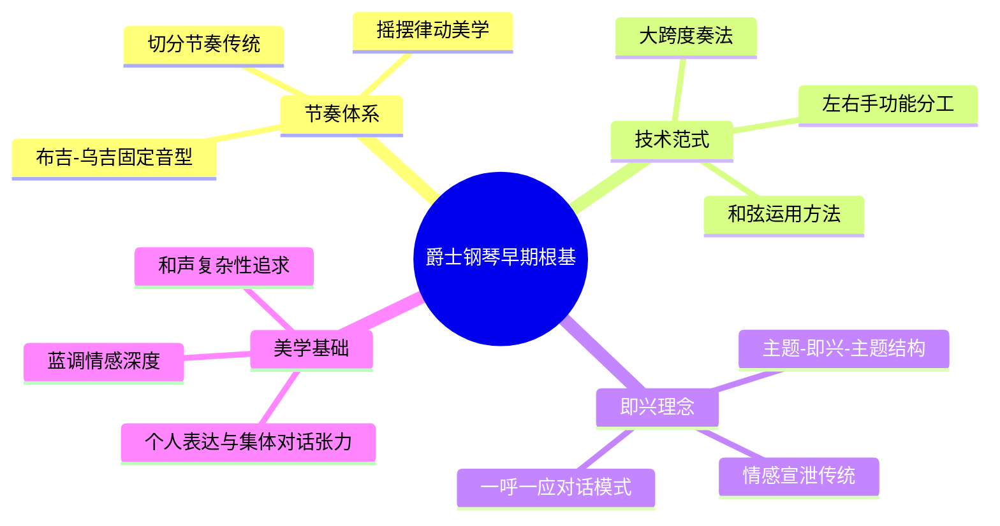
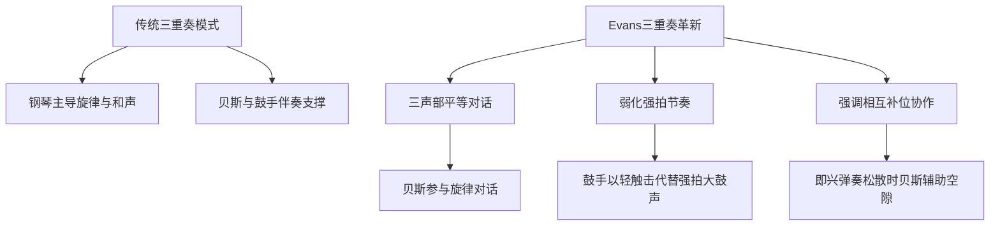
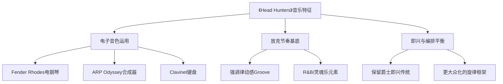
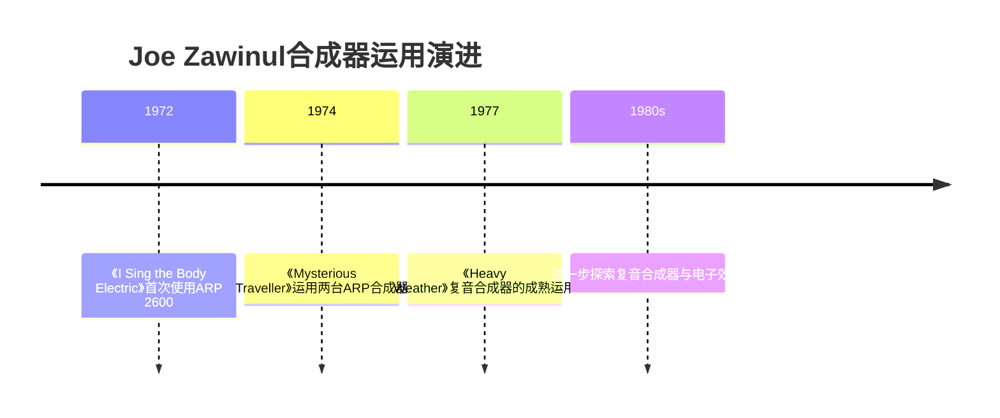
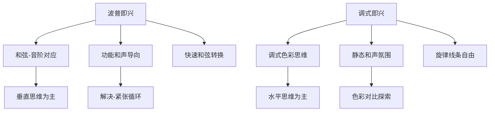
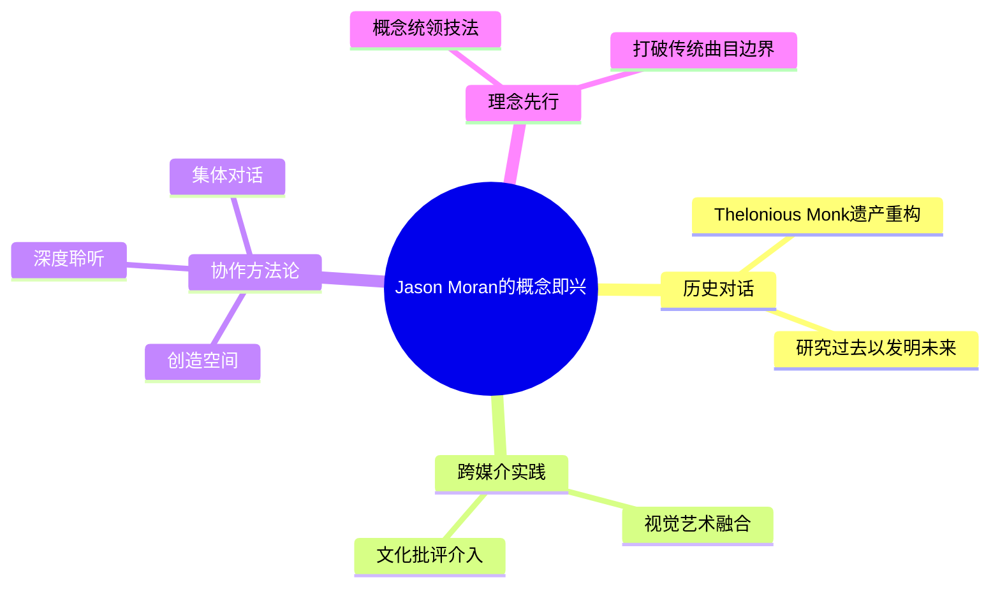
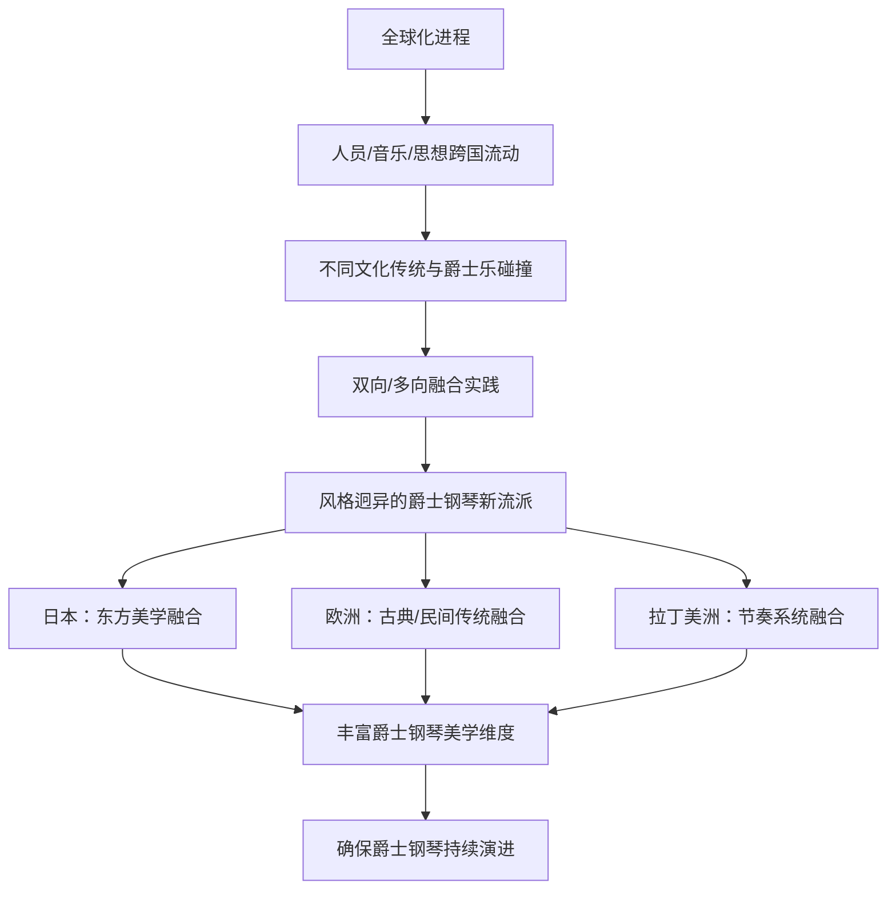
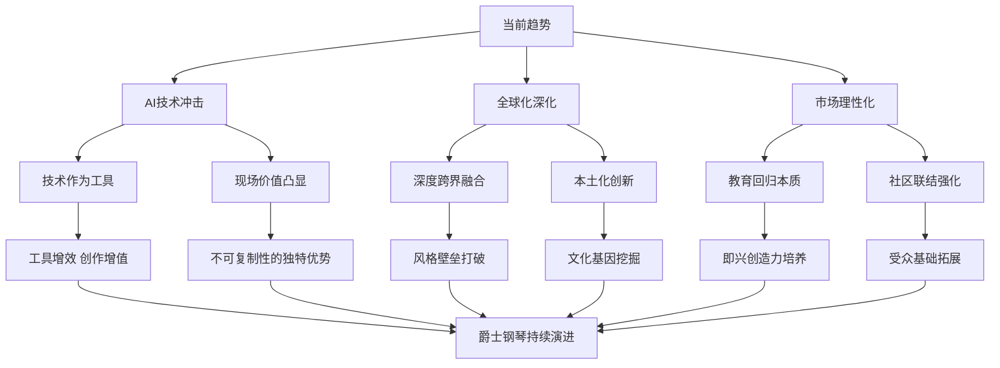

# 爵士钢琴在现代音乐创作中的创新与风格演变研究
## 1 爵士钢琴的历史根基与早期风格特征

爵士钢琴作为爵士乐的核心载体之一，其艺术形态的形成经历了从19世纪末至1940年代近半个世纪的孕育与演化。这一漫长的历史进程中，**蓝调与拉格泰姆两大音乐传统的融合**构成了爵士钢琴最根本的基因底色，而斯特莱德钢琴的技术革新与摇摆乐时期的美学成熟则逐步确立了现代爵士钢琴的核心范式。理解这一历史根基，不仅是把握爵士钢琴艺术本质的关键，更是深入分析1950年代后现代爵士钢琴多元创新的必要前提。

### 1.1 拉格泰姆时期的钢琴语汇奠基

爵士钢琴的直接源头可追溯至19世纪末兴起的**拉格泰姆**（Ragtime）音乐。"拉格泰姆"一词源自英文Ragtime的音译，其词意为"参差不齐的拍子"，故又称"散拍乐"，这一名称本身便揭示了其最核心的音乐特征——**丰富的切分节奏**[^1]。拉格泰姆从非洲民间音乐发展而成，它以独特的切分音运用和自由的即兴特质，为其赢得了全世界流行乐迷和钢琴演奏家的青睐[^1]。

从历史脉络来看，拉格泰姆的黄金时代大约在1898年至1908年间，但其影响的时间跨度实际相当广泛，绵延不绝[^2]。这一时期的拉格泰姆钢琴曲具有几项鲜明的风格特征：**旋律迷人，大量使用切分音**，节奏相对稳定[^2]。虽然拉格泰姆主要是在钢琴上弹奏，但一些乐队也开始演奏它，这种跨越独奏与合奏的实践为后来爵士乐队中钢琴角色的确立埋下了伏笔[^2]。

值得注意的是，拉格泰姆与早期爵士乐联系极为密切，二者在技术与美学上存在明显的传承关系。爵士钢琴体裁源自19世纪末布鲁斯与拉格泰姆音乐，以切分节奏为特征，演奏结构多遵循"主题—即兴—主题"的模式[^1]。这种结构性安排成为爵士钢琴即兴创作的基本框架，为演奏者提供了在既定主题内自由发挥的空间。拉格泰姆时期确立的**即兴创作传统与切分节奏技术基础**，构成了爵士钢琴语汇的第一块基石。

### 1.2 斯特莱德钢琴风格的技术革新

从拉格泰姆演化而来的**斯特莱德钢琴**（Stride Piano）风格，代表了爵士钢琴技术发展的重要飞跃。斯特莱德钢琴的核心技术特征是**"大跨度奏法"**，即演奏时左手采用连续的大跳进行，形成个性鲜明的"大跨度低音"（Stride Bass）[^1]。这种奏法在拉格泰姆以及早期爵士乐中经常出现，成为连接拉格泰姆与摇摆乐的关键技术桥梁。

大跨度奏法的形成与发展体现了爵士钢琴演奏技术的内在演进逻辑。在这种演奏模式中，左手承担着**稳定节奏与和声支撑**的双重功能，通过大幅度的和弦跳跃在低音区与中音区之间快速移动，创造出饱满而富有动感的声音底层。与此同时，右手则获得了更大的旋律自由度，可以进行复杂的即兴发挥。这种左右手功能的明确分工，奠定了爵士钢琴演奏的基本技术框架。

斯特莱德钢琴风格在20世纪20年代逐渐成熟，其技术范式对后续爵士钢琴演奏体系产生了深远影响。爵士钢琴技法正是从拉格泰姆演化出大跨度奏法、布吉-乌吉等多种演奏风格[^1]。这一时期确立的演奏技术不仅定义了早期爵士钢琴的声音特质，更为后来各流派钢琴家的技术创新提供了可资借鉴的基础范式。

### 1.3 摇摆乐时期的风格成熟与先驱者贡献

1930至1940年代的摇摆乐时期标志着爵士钢琴艺术走向全面成熟。这一时期，爵士乐成为美国主流流行音乐，钢琴在大型乐队中确立了其**兼具旋律、和声与节奏**的核心地位。20世纪20年代艾灵顿公爵大乐团等代表性组合的活跃，有力推动了爵士钢琴的流行化进程[^1]。

在摇摆乐时期及之前，三位关键钢琴家确立了现代爵士钢琴的演奏范式，他们的贡献各具特色而又相互补充：

| 钢琴家 | 核心贡献 | 风格特征 |
|--------|----------|----------|
| **Earl Hines** | 开创"小号风格"钢琴演奏法 | 强调右手如小号般的单音旋律线与强烈的节奏感 |
| **Teddy Wilson** | 定义优雅的摇摆钢琴美学 | 以清晰、优雅的触键和精致的旋律线著称 |
| **Art Tatum** | 将爵士钢琴独奏艺术性提升至新高度 | 拥有超凡的技术、速度和声想象力 |

Earl Hines的"小号风格"演奏法代表了爵士钢琴旋律表达的重要突破。他将右手的旋律线处理得如同小号独奏般清晰有力，强调单音线条的穿透力与节奏的驱动感，这种处理方式深刻影响了后来波普钢琴家的旋律即兴理念。Teddy Wilson则以其**清晰、优雅的触键**和精致的旋律线定义了摇摆钢琴的美学标准，他的演奏风格体现了技术控制与艺术品味的完美结合。Art Tatum被公认为爵士钢琴技术的巅峰代表，他超凡的技术、惊人的速度和丰富的和声想象力，将爵士钢琴独奏的艺术性与复杂性提升至前所未有的高度。

这一时期确立的技术范式与美学标准，融合了**黑人音乐的节奏动力、蓝调情感与和声创新**，为爵士钢琴奠定了坚实的技术与美学基础。钢琴在爵士乐中兼有旋律和和声两大特色，是少有的几个可以演奏和弦的乐器[^1]。爵士钢琴演奏需要清晰、摇摆一样的韵律，并让和声的变化明显，同时右手演奏旋律性内容[^1]。

### 1.4 布鲁斯音阶与蓝调和声的风格渗透

**蓝调**（Blues）作为爵士钢琴的另一核心根基，为其注入了深厚的情感表达传统与独特的和声语汇。美国南北战争后，蓄奴制被废除，南方的黑奴得到解放，黑人的音乐得到了快速发展，爵士乐的根基之一——蓝调开始出现[^2]。蓝调起源于过去美国黑人奴隶的灵魂乐、赞美歌、劳动歌曲、叫喊和圣歌，它作为一种音乐形式看似简单，实际几乎可以有无穷的变化[^2]。

蓝调音乐有一种很明显的特点，便是使用类似"一呼一应"（Call and Response）的形式进行[^2]。这种对话式的音乐结构深刻影响了爵士乐的互动美学，成为乐队成员之间即兴对话的原型。更重要的是，**蓝调音乐很注重自我情感的宣泄和原创性或即兴性**，这种高度即兴的特点被后来的爵士乐所继承和发扬[^2]。

在具体的演奏技法层面，**布吉-乌吉**（Boogie Woogie）奏法是布鲁斯钢琴风格的典型代表，对爵士钢琴产生了深远影响。布吉-乌吉是一种快速的布鲁斯钢琴风格，经常采用"滚奏"（Crushing）来体现其特征[^1]。它还经常以左手持续弹奏固定低音来衬托右手复杂的旋律，布吉-乌吉的低音音型主要有"行进"（Walking）的八度低音分解和"双音"反复两种形式[^1]。这种左手固定音型与右手自由旋律的对比关系，成为爵士钢琴织体构建的重要技术模式。

蓝调传统对爵士钢琴的影响不仅体现在技法层面，更深刻地塑造了其核心美学。**布鲁斯音阶与蓝调和声**为爵士钢琴提供了情感表达的核心、即兴创作的基因，以及理论基础。这种根植于非裔美国人历史经验的音乐传统，赋予了爵士钢琴独特的情感深度与文化厚度。

### 1.5 早期传统对现代爵士创新的奠基作用

综合审视拉格泰姆、斯特莱德、摇摆乐及布鲁斯等早期传统，可以清晰地看到它们如何共同构建了爵士钢琴的技术体系与审美框架。这些根基性遗产为1950年代波普及后续现代爵士钢琴流派的创新发展提供了必要条件。

早期传统确立的核心要素可归纳为以下几个维度：

**即兴演奏理念**是爵士钢琴最核心的艺术特质。爵士钢琴演奏关键在于即兴技巧和风格的把握，对于受过良好传统钢琴演奏训练的人来说，不经过专门学习并不一定能弹好一首爵士钢琴曲或是一首拉格泰姆钢琴曲，爵士钢琴即兴演奏需要一定的理论和大量的实践积累作基础[^1]。这种即兴传统的开放性，为后来各种风格创新提供了内在动力。

**和弦运用方法**构成了爵士钢琴的和声基础。爵士和弦是学习爵士钢琴的基础，西方艺术音乐中使用的和弦在爵士钢琴中都有体现[^1]。五度循环在爵士钢琴中相当重要，提供了和声上的多样性，一般在旋律的最后四小节，都会有III-VI-II-V-I这样的和声进行，经过四次转变回到主调[^1]。这种和声思维为后来调式即兴、和声替代等现代技法的发展奠定了理论基础。

**节奏处理技巧**从拉格泰姆的切分音到摇摆乐的律动感，经历了不断精细化的过程。摇摆节奏通过节奏的细微偏移与互动，创造出充满动感和活力的韵律感，这成为爵士钢琴区别于其他钢琴音乐的标志性特征。

从更宏观的视角来看，爵士钢琴的历史根基清晰地呈现出**由蓝调与拉格泰姆融合孕育**的特征。其早期风格从拉格泰姆经斯特莱德钢琴发展至摇摆乐，技术范式围绕大跨度奏法、复杂和声与即兴展开。Earl Hines、Teddy Wilson和Art Tatum等大师在摇摆乐时期确立的演奏典范，为爵士钢琴奠定了坚实的技术与美学基础。正是这些早期传统的深厚积淀，使得1950年代后的现代爵士钢琴能够在继承中创新，在传统基础上开拓出波普、硬波普、后波普乃至自由爵士等多元化的发展路径。

## 2 从硬波普到后波普：现代爵士钢琴风格的形成与分化

1950至1960年代是爵士钢琴艺术发展史上最为关键的转型期。这一时期，爵士钢琴从硬波普的节奏驱动美学出发，分化出灵魂爵士、调式爵士、印象派和声与自由爵士等多条创新路径，彻底重塑了爵士钢琴的技术体系与美学版图。**这种风格的多元分化不仅是音乐技术内在演进的结果，更深刻反映了战后美国社会文化变迁、黑人民权运动兴起以及全球文化交流加深等历史动因的交织作用**。本章将系统考察这一时期爵士钢琴风格形成与分化的完整历程，深入分析Horace Silver、McCoy Tyner、Bill Evans、Cecil Taylor四位代表性钢琴家各自开辟的创新路径，揭示现代爵士钢琴多元格局形成的音乐逻辑与文化机制。

### 2.1 硬波普的兴起与钢琴风格特征

硬波普（Hard Bop）作为20世纪50年代中期从比波普延伸发展而来的爵士乐流派，标志着爵士钢琴进入现代化转型的关键阶段。这一风格的形成具有明确的历史背景与音乐逻辑：它既是对比波普复杂和声传统的继承，也是对冷爵士（Cool Jazz）过于理性化倾向的反拨，更是黑人音乐家追求多样化表达的集中体现[^3][^4]。

从音乐元素构成来看，硬波普的核心特征在于**融合节奏布鲁斯、福音音乐、蓝调及非洲原始节奏等元素**，在演奏中强调音量起伏、即兴技巧及复杂节奏的驱动感[^3]。这种融合使硬波普在保留比波普复杂和声基础的同时，注入了更为强烈的节奏推动力与情绪表现力。具体而言，硬波普钢琴演奏呈现以下风格特点：

| 维度 | 硬波普钢琴特征 | 与比波普的差异 |
|------|----------------|----------------|
| **和声处理** | 以比波普复杂和声为基础，加入更浓烈的蓝调色彩 | 更强调和声的情感表现力而非纯粹技术复杂性 |
| **节奏特征** | 节奏相对简化但更具驱动力，贝斯演奏较为松散 | 不严格遵循四拍节奏的固定框架[^4] |
| **音色表现** | 钢琴演奏类似早期节奏布鲁斯风格，强调流畅性与活力 | 融入福音音乐的热情与蓝调的深沉[^4] |
| **情绪基调** | 表现形式更加自由狂放，充满魅力 | 突出黑人音乐的根源性情感[^4] |

硬波普的经典演奏形式以**钢琴、贝斯、鼓、萨克斯和小号五重奏**为主[^3]。在这一编制中，钢琴承担着和声支撑与旋律即兴的双重功能，其角色定位强调独奏者的和声掌控力与集体即兴互动。以鼓手阿特·布莱基（Art Blakey）创建的**爵士信使乐队**（The Jazz Messengers）为例，这支被誉为硬波普典范的乐队通过节奏组强烈推动旋律声部的演奏方式，培养了众多爵士大师[^3]。

硬波普的鼎盛期为1955年至1970年，其间该风格逐渐演变为两个重要分支：**与灵歌、福音音乐结合的灵魂爵士（Soul Jazz）和与蓝调、摇摆结合的放克（Funk）**[^3]。这种分化趋势表明，硬波普不仅是一个独立的风格流派，更是连接传统爵士与现代多元爵士的关键枢纽，为后续风格的进一步分化奠定了技术与美学基础。

### 2.2 Horace Silver与灵魂爵士的钢琴语汇

霍瑞斯·席佛（Horace Silver）被许多人认为是**放克音乐之父**，其音乐实践直接奠定了灵魂爵士的风格基础[^5]。1954年，Silver自起炉灶组建了第一组"爵士信使"乐团，开始为蓝音符唱片（Blue Note）灌录硬波普乐风的唱片[^6]。此后，爵士信使乐团交由鼓手亚特·布雷基领军，直至90年代仍在运作，数十年间培养出无数爵士乐中坚[^6]。

Silver对灵魂爵士钢琴语汇的核心贡献在于其对"放克"与"灵魂"概念的美学阐释。他曾明确指出："**放克是通俗的，以布鲁斯为基础。它本身或许不算是蓝调，但感觉很像。灵魂乐基本上也是这样，但它在感觉和精神上增加了内心深处的空间，一种内在的东西**"[^5]。这一阐释揭示了灵魂爵士的核心美学追求：在保持布鲁斯根源的同时，注入更深层的情感与精神维度。

灵魂爵士钢琴的风格特征可从以下几个层面理解：

**首先，节奏模式（Rhythmic Groove）的核心地位**。与比波普和硬波普不同，灵魂爵士将重点放在了节奏模式上[^6][^5][^7]。这种强调律动感（groovy feelings）的演奏方式，使钢琴成为驱动整体音乐动力的核心引擎，而非仅仅是和声支撑或旋律即兴的载体。

**其次，与酷爵士形成鲜明对立的美学立场**。灵魂爵士是和酷爵士对立产生的，前者有着后者所没有的一切：**充满热情，大汗淋漓，而且从不离开它那布鲁斯的根源**[^6][^5][^7]。这种对立不仅是风格差异，更反映了不同的文化认同取向——灵魂爵士强调黑人音乐传统的情感直接性，而酷爵士则更多体现了理性化、内省化的美学倾向。

**第三，演奏形式的特殊性**。灵魂爵士通常由小型乐队演奏，尤其是由一名高音（中音）萨克斯风手、钢琴手或口琴手带领的三人乐队[^6][^7]。萨克斯风与电风琴（Electric Organ）成为这类音乐中的明星乐器[^6]。灵魂爵士还延伸出以哈蒙德风琴音色为特色的风格，融合了蓝调、灵魂、福音和节奏元素[^7]。

1964年，成功跨越了硬波普、灵魂爵士及Groove等乐风的Silver为蓝音符唱片取得了巨大成功，此时的他已成一派宗师[^6]。Lee Morgan的大热单曲《The Sidewinder》开创了灵魂爵士的范式，带来能量充沛的律动和节奏感十足的管乐[^5]。随着Jimmy Smith、Baby Face Willette领衔的电风琴三重奏乐队崛起，灵魂爵士收获了更广泛的听众群体[^5]。

### 2.3 McCoy Tyner的调式探索与四度叠置和声

麦考伊·泰纳（McCoy Tyner）是现代爵士钢琴风格的塑造者之一，其在约翰·柯川（John Coltrane）四重奏中发展的钢琴技法革新，深刻影响了调式爵士的和声语汇与演奏范式[^8]。Tyner 1938年生于费城，早年受邻里爵士音乐家影响，17岁结识Coltrane，1960年加入Coltrane四重奏，**以厚重和弦簇与富有推动力的演奏风格成为乐队和声核心**[^8]。

Tyner最具开创性的贡献在于**四度叠置和声**的系统化发展与确立。四度和弦是以四度音程叠置方式构成的和弦，区别于传统的三度叠置和弦，其音响充实、协和而空灵[^9]。四度叠置的原理不是从和弦根音开始叠加，而是从三音开始。例如从C和弦的三音E开始四度叠置，可得到E、A、D、G、C，这些音分别是C的三音、六音、九音、五音、根音，构成一个C69和弦[^9]。

上世纪60年代，以McCoy Tyner为首的爵士钢琴手开始在音乐中使用四度叠置的概念[^9]。一个著名的实例是"So What和弦"（E、A、D、G、B），其音程结构为纯四度、纯四度、纯四度、大三度，这一标志性和弦源于迈尔斯·戴维斯1959年在作品《So What》中的使用[^9]。四度和弦的音响特征与应用价值可归纳如下：

| 特征维度 | 具体表现 |
|----------|----------|
| **音响效果** | 属性感较弱，音响更为协和、空灵且色彩开放，赋予和声更现代的听觉体验[^9] |
| **演奏自由度** | 由于和声属性不明显，在演奏中显得更为自如，限制较少[^9] |
| **调式应用** | 常基于特定调式音阶构建，可用于和声替代，如用Cm11替代Cm7[^9] |
| **旋律感** | 按音阶顺阶构建的四度和弦序列，因其和声的平行移动特性，能带来更强的旋律感[^9] |

Tyner的演奏风格具有鲜明的个人特征：**左手演奏复杂色彩的和弦，右手还能在音阶上不停的快速跑动，这种灵动又紧张的对比特征是让他的乐曲有别于他人的原因**[^10]。在Coltrane的名作《My Favorite Things》中，这种风格早已崭露头角[^10]。

在专辑《Sahara》中，Tyner将调式理解与爵士和声的融合展现得淋漓尽致。专辑中既有生猛的波普作品，也有通过五声音阶的演奏以及日本古琴Koto、笛子等乐器实现东方色彩的曲目[^10]。同名长曲《Sahara》更是将非洲色彩的笛子、打击乐与钢琴、萨克斯的即兴融为一体，**乐段之间层层变化，声响变化仿佛置身非洲草原，充满野性的气息**[^10]。这种将五声音阶与东方、非洲音乐色彩成功融入调式爵士框架的实践，拓展了爵士钢琴的文化维度和音响色彩。

四度叠置和弦的开放性和拓展性，使其在爵士乐"本土化"以及传统民族音乐"爵士化"的创作中提供了重要的和声素材与思路[^9]。Tyner的和声理念与演奏技法影响无数后世爵士钢琴家，他本人也获得了美国国家艺术基金会爵士大师称号[^8]。

### 2.4 Bill Evans的印象派和声与三重奏革新

比尔·伊文思（Bill Evans，1929-1980）是爵士乐史上最优秀的钢琴家之一，与Keith Jarrett一起被誉为70-80年代最优秀的钢琴家[^11][^12]。他的诗意陈述与谦逊自若的作为，是慢慢被乐界和乐迷认同的，当他于1980年因心脏病去世时，**被公认是影响往后发展最深的一位爵士钢琴家**[^12]。

Evans的核心贡献首先体现在其独特的**印象派和声语汇**的建立。从五十年代末期开始，Evans以德彪西的现代和声为架构，找到自己即兴演奏的方向，这个风格进入六十年代以后更加明显[^12]。**听来不太和谐的和弦结构中，Evans演奏起来却相当顺畅**[^12]。1956年，他录制了首张专辑《爵士乐新概念》（New Jazz Conceptions），融合德彪西印象派风格与爵士即兴[^11][^12]。

1958年，Evans加入著名的迈尔斯·戴维斯六重奏乐队，全身心投入合作，参与录制了经典专辑《Kind of Blue》，并创作了《Blue in Green》《Flamenco Sketches》等作品[^11][^12]。这张专辑对调式爵士的发展具有里程碑意义。《绿中的蓝》和《德比的华尔兹》都是Evans这一时期演奏的经典乐曲，并成为排行榜上的热门曲[^11]。评论界曾毫不夸张地说："**他对爵士乐发展的贡献在某种程度上就是建立起未来爵士乐钢琴演奏家的标准**"[^11]。

Evans的另一核心贡献在于其**三重奏演奏模式的革新**。1959年，Evans组建了标志性三重奏，成员包括贝斯手斯科特·拉法罗（Scott LaFaro）与鼓手保罗·莫田（Paul Motian）[^11][^12]。这一三重奏的革新意义在于：

Evans自组的三重奏乐队以**强调演奏上的相互补位**而闻名。比如Evans自己的即兴弹奏若显松散，贝斯手马上可以辅助其空隙。另外，鼓手的节奏运用也以轻微的触击声代替强拍子的大鼓声，**因而这个三重奏被誉为是发挥团队精神最佳的例子**[^12]。这种弱化强拍节奏的演奏方式成为爵士乐队协作的典范[^12]。

1961年6月25日在纽约著名的Village Vanguard俱乐部录制的《Waltz for Debby》与《Sunday at the Village Vanguard》是Evans三重奏最经典的阵容记录[^13]。标题曲"Waltz for Debby"是Evans为侄女Debby所作的三拍子华尔兹，**旋律温柔且充满感情，Evans以其细腻的触键和复杂的和声处理，将这首曲目演绎得优雅而深情**[^13]。LaFaro的贝斯为曲目增添了丰富的旋律性，而Motian的鼓点则提供了微妙的支持。Evans在这首曲子中展现了他对传统曲式的革新，**以自由即兴和传统结构的巧妙结合，成为现代爵士钢琴演奏的经典**[^13]。

《Peace Piece》是Evans另一首展现其独特和声语汇的代表作。全曲建立在左手持续弹奏的降B大调分解和弦上，右手即兴旋律以三十二分音符为主，**形成流动性与稳定感的对比**[^14]。演奏运用大量切分节奏与跨小节连音线，弱化传统爵士乐的摇摆节奏特征[^14]。该曲的和弦进行被多部爵士教材引用为"模态即兴演奏范本"[^14]。

Evans曾说："**让声音更丰富是必要的责任！**"而这就像他的音乐特性一样，一层一层覆盖的神秘面纱，极具缥缈色彩。听者必须细聆其音乐纹理，才能获得渐入佳境的聆听趣味[^12]。值得注意的是，在六十年代末融合乐兴起后，大部分乐手顺应潮流改以电子乐器演奏，然而**Evans却坚持传统乐器的纯净音色演出**，即使在八十年代初期去世前，也只尝试以电钢琴灌录唱片，仍坚持不弹奏合成乐器[^12]。

### 2.5 Cecil Taylor与自由爵士的钢琴实验

塞西尔·泰勒（Cecil Taylor，1929-2018）是自由爵士的先驱，被视为**战后先锋爵士的一位巨人**[^15]。他的音乐实验代表了爵士钢琴最极端的创新方向，彻底颠覆了传统爵士的所有规范。

自由爵士乐是产生于20世纪60年代的爵士乐分支流派，其名称源于奥内特·科尔曼1960年发行的专辑《Free Jazz》。该流派**摒弃传统爵士乐的和弦结构、节奏框架及旋律构成，采用集体即兴演奏方式**，演奏中常融入人声哭号与萨克斯等乐器的非常规音效[^16]。

Taylor的演奏理念具有颠覆性的哲学内涵。他曾对作家John Litweiler谈到："**对我们黑人来讲，钢琴是件打击乐器。我们敲击键盘、试图用力贯穿这件乐器，将力量融入到音乐中去。假如算是误解的话，黑人音乐对我而言就是种尖叫**"[^15]。这一阐述揭示了Taylor将钢琴从旋律和声乐器转化为**纯粹能量表达媒介**的核心理念。

Taylor的音乐实验历程可追溯至其早期训练与影响。他五岁学习钢琴，曾在纽约音乐学院和波士顿的新英格兰艺术学院学习进修，尽管他说自己通过Duke Ellington的唱片学到的也许更多[^15]。早期Taylor对欧洲古典作曲家尤其是斯特拉文斯基很感兴趣，但对其影响最大的还是爵士乐，包括从Fats Waller、Erroll Garner、Thelonious Monk至Horace Silver的一系列钢琴演奏家[^15]。

1955年，Taylor与萨克斯风手史蒂夫·莱西组建四重奏，次年发行首张专辑《Jazz Advance》开启职业生涯[^15]。**第一张专辑就已经表现出惊人的洞察力，有意识地疏远主流爵士风格**[^15]。六十年代早期，Taylor与Sunny Murray、Alan Silva、Jimmy Lyons等合作，这时所创作的音乐已**摆脱了调性的束缚、正规稳定的节奏形式，听上去十分的抽象**[^15]。

Taylor在钢琴演奏中开发的**密集音簇**（Tone Cluster）技法是其最具标志性的创新。密集音簇指和弦中至少包含三个两度的音，听起来浑浊非常不和谐，自20世纪以来主要用于爵士乐和古典音乐中[^17]。在钢琴上可以手掌或者小臂压住所有音符演奏[^17]。Taylor运用音簇技法与无调性系统，通过《Unit Structures》《Conquistador》等作品确立了自由爵士领袖地位[^15]。

学术研究指出，Taylor的音乐**最好被理解为不是抽象的音高关系（"声音结构"），而是身体动作的形式组织（"赤裸的火焰姿态"）**[^18]。这一假设与Taylor本人对其音乐的解释相吻合——"我试图在钢琴上模仿舞者在空间中的跳跃"——因此要求将生理学和身体性问题纳入音乐理论的范畴[^18]。这种"动作优先"的分析方法也复杂化了对自主音乐"作品"的传统理解[^18]。

整个六十年代Taylor过着困苦的生活，为生计还洗过盘子；但他的影响力逐渐渗入爵士乐圈，尤其是Blue Note唱片公司1966年出版了两张出色的唱片[^15]。一小撮年轻先锋音乐家——最有名的当数Albert Ayler——非常热情地拥护Taylor的风格[^15]。Taylor后来获得古根汉研究基金、NEA Jazz Master奖，并于1991年成为麦克阿瑟奖得主[^15]。

### 2.6 风格分化的音乐逻辑与文化动因

从宏观视角审视1950-1960年代爵士钢琴的风格分化，可以清晰地辨识出其内在的音乐逻辑与深层的文化动因。这一时期的风格多元化并非偶然的艺术现象，而是音乐技术演进需求、社会文化变迁以及艺术家个人探索三重因素交织作用的结果。

**从音乐技术演进的角度来看**，风格分化围绕和声体系、节奏律动与即兴理念三个核心维度展开：

| 风格分支 | 和声特征 | 节奏特征 | 即兴理念 |
|----------|----------|----------|----------|
| **灵魂爵士** | 保持蓝调和声根基，强化福音色彩 | 强调节奏律动（Groove），驱动感强烈 | 情感直接表达，强调"灵魂味" |
| **调式爵士** | 四度叠置和声，色彩开放空灵 | 弱化功能和声约束，节奏更自由 | 基于调式音阶的色彩探索 |
| **印象派和声** | 德彪西式和声色彩与复杂替代 | 弱化强拍，强调对话式互动 | 内省诗意，层次丰富 |
| **自由爵士** | 无调性系统，音簇技法 | 彻底打破节拍与小节线限制 | 能量脉冲，身体性表达 |

这种技术层面的分化反映了爵士钢琴从**功能和声体系向调式、色彩乃至无调性体系**的演进轨迹。四度叠置和弦的开创性使用，使和声从功能性束缚中解放出来，获得了更开放的色彩空间[^9]。Bill Evans将印象派和声引入爵士，提升了和声的复杂性与情感深度[^11][^12]。Cecil Taylor则彻底解构了传统和声、旋律与节奏的所有界限[^15]。

**从社会文化动因的角度来看**，风格分化与战后美国社会变迁、黑人民权运动以及消费文化兴起密切相关。从二次大战结束以后至1965年间，美国工业发达，经济快速发展，消费社会来临，唱片的录音与制作技术成熟，娱乐产业兴盛[^6]。当时大城市黑人社区里最有音乐天分的年轻人，最大梦想是成为炙手可热的爵士歌手，而这些乐迷的消费力相当可观[^6]。

硬波普及灵魂爵士融合福音、蓝调，是对黑人音乐根源的强化，反映了50-60年代黑人文化自觉与民权运动背景下的身份认同诉求。Horace Silver对"放克"与"灵魂"的阐述即体现了这种美学追求[^5]。自由爵士乐的诞生有其政治上与种族上的背景因素，**它曾是黑人争取人权与自觉运动的战歌，因此与60年代初期黑人民权运动息息相关**[^16]。

与此同时，McCoy Tyner对东方、非洲音乐元素的融合，呼应了60年代世界文化交流与"灵性"探索的时代思潮[^10]。Bill Evans深受欧洲印象派古典音乐影响，体现了爵士乐吸收高端艺术养分、提升自身艺术地位的倾向[^11][^12]。

综合而言，1950-1960年代爵士钢琴风格的多元分化，开辟了**融合通俗化、和声现代化/全球化、艺术精细化、激进解构**四条创新路径。这四条路径并非相互替代的线性演进，而是并行发展、相互影响的多元格局。正是这种风格的分化与共存，奠定了现代爵士钢琴丰富而深邃的艺术景观，为1970年代以后的电声革命、跨流派融合以及全球化发展提供了必要的技术积累与美学准备。

## 3 电声革命与融合爵士：技术创新对爵士钢琴的重塑

1970年代标志着爵士钢琴艺术史上一次根本性的范式转换。**电声技术的引入不仅改变了爵士钢琴的音色与演奏形态，更从根本上重新定义了钢琴家在爵士乐队中的角色与功能**。这一时期，Fender Rhodes电钢琴、Moog合成器、ARP系列等电子键盘乐器的广泛应用，使爵士钢琴从原声乐器的物理共鸣局限中解放出来，进入了电子化音色设计与效果处理的无限领域。Herbie Hancock、Chick Corea、Joe Zawinul三位键盘大师以各自独特的方式探索电声技术的艺术潜能，不仅创造了融合爵士的经典范式，更为爵士钢琴的未来发展开辟了全新疆域。本章将系统考察这一电声革命的历史动因、技术基础与艺术实践，揭示技术创新与艺术表达之间深刻的互动机制。

### 3.1 融合爵士的兴起背景与历史动因

融合爵士的诞生绝非偶然的艺术实验，而是爵士乐在特定历史语境下对生存危机的创造性回应。**1960年代末，传统爵士乐陷入了前所未有的听众流失困境**，这一危机的严峻程度足以动摇整个爵士乐生态系统的根基。

从社会文化背景来看，当时美国和欧洲的爵士乐普遍陷入危机。传统爵士风格如波普（BeBop）、硬波普（Hard Bop）、调式爵士（Modal Jazz）等在思路上变得越来越保守，在音乐上缺乏创新，致使听众数量急剧下降[^19]。与此同时，先锋音乐如自由爵士（Free Jazz）、即兴音乐（Improvised Music）等似乎对音乐家们并没有太多的吸引力，也没有增加更多的新听众群[^19]。

1960年代中期，特别是1967年前后，摇滚乐吸引了大批听众，尤其是年轻人的注意力。爵士乐仿佛一夜之间失去了它的一切生存土壤——引以为傲的听众群、继续发展的社会空间[^19]。当爵士乐手眼睁睁看着年轻人成群结队地走进摇滚乐演唱会狂欢一夜而自己的听众寥寥无几时，他们的心里是多么怀念爵士乐曾经的辉煌。唱片销量下降，俱乐部被迫停业，甚至可以听到人们在低声议论"爵士乐死了"[^19]。到了1968年时，只有最大牌的名字才能吸引一小撮听众的注意[^19]。

正是在这种危机背景下，**迈尔斯·戴维斯（Miles Davis）以其一贯的艺术勇气指出了音乐在不同道路上发展的可能性**[^19]。1969年的专辑《In a Silent Way》开融合爵士之先河，尝试使用电声乐器，为传统爵士注入摇滚、电子等新鲜元素[^20]。1970年发行的《Bitches Brew》更是加大改革力道，以六架电钢琴、三把电吉他的声势彻底打破了传统爵士乐与摇滚乐的界限[^21]。该专辑首次将电吉他、合成器等元素引入爵士，打破传统声学乐器的限制，成为融合爵士的开山之作[^22]。

融合爵士的核心特征可从以下几个维度理解：

| 维度 | 传统爵士 | 融合爵士 |
|------|----------|----------|
| **乐器配置** | 原声乐器为主体 | 大量使用电声乐器和电子乐器 |
| **节奏形态** | 摇摆节奏为主 | 加强鼓和贝斯力度，融入放克、摇滚节拍 |
| **和声语汇** | 传统爵士和声体系 | 保留爵士和声基础，融入摇滚、布鲁斯元素 |
| **音色特征** | 原声乐器自然音色 | 电子效果处理，可编程音色 |

从乐队编制来看，融合爵士打破了传统爵士乐队一直以原声乐器为主体的原则，大量使用电声乐器和电子乐器，使其更具现代气息。比如用电贝司代替原声贝司，用电子合成器代替钢琴，电吉他使用效果器等做法都是一次大胆的创新[^19]。从节奏形态上看，融合爵士经常加强鼓和贝司的力度，制造出奔腾不息的节奏律动，钢琴和吉他也从原来演奏旋律声部转变为节奏乐器[^19]。这种不规则的低音线条、疯狂的贝司击弦、厚重的摇滚节拍加上爵士乐的规则，有时又被称为爵士放克（Jazz Funk）[^19]。

值得注意的是，爵士乐与摇滚乐有着相同的根源：布鲁斯音乐、福音歌曲、劳动号子以及节奏布鲁斯音乐，所以两者结合在年轻一代看来是那么自然[^19]。爵士乐手们也开始在外形上发生变化——他们不再是穿着礼服、打着领结的翩翩绅士，而是和摇滚乐手一样，留着长长的头发，蓬松而凌乱，并且穿上了紧身皮裤[^19]。这种外在形象的转变反映了融合爵士在文化认同上的深刻转型。

### 3.2 电钢琴与合成器：新乐器的技术特性与音色革命

电声革命的技术基础在于一系列革命性电子键盘乐器的发明与普及。这些新乐器从根本上改变了键盘演奏的声学原理与音色可能性，为爵士钢琴家提供了前所未有的声音调色板。

**Fender Rhodes电钢琴**是这一时期最具标志性的电子键盘乐器。Rhodes Piano由美国发明家Harold Rhodes于1942年研发，其初代原型采用轰炸机铝管制成[^23]。1940年代，Harold Rhodes在二战期间作为一名空军士兵，利用飞机零件和废弃材料制作了简易的便携式键盘乐器，战后他将这一设计进一步完善，并于1959年推出了第一台商用Rhodes电钢琴[^24]。1965年，Fender公司与Harold合作，推出了Fender Rhodes系列电钢琴，其温暖而富有泛音的音色迅速征服了音乐界[^24]。

Rhodes电钢琴的声学原理与传统钢琴截然不同。它通过琴槌击打金属音叉产生振动，经电磁拾音器转换为电信号[^23]。振动的琴齿产生了一种更为柔和的音色，而且声音会随着琴齿与拾音器的相对位置而变化。将两者靠得很近会产生一种独特的"钟声"音效[^24]。**这种独特的音色被《纽约时报》描述为"优雅的、闪光的音色"**[^23]。更重要的是，对该乐器进行均衡频谱分析时，会发现有一个频段缺失，正好是主唱声音的频率所在，这意味着该乐器能够很好地支持人声表演而不会盖过人声[^24]。

Rhodes电钢琴的独特之处在于，既不像传统钢琴那样正式，也不像电子合成器那样冰冷，而是介于两者之间，充满情感与个性[^24]。1970年代，Rhodes成为爵士、放克、灵魂乐和摇滚的标配乐器，几乎每一张经典专辑中都能听到它的声音[^24]。在Miles Davis的《In a Silent Way》专辑中，Rhodes电钢琴由Herbie Hancock和Joe Zawinul演奏，奠定了融合爵士的音色基础，这张专辑被誉为爵士乐的转折点，入选格莱美名人堂[^24]。

**模拟合成器**的发展为爵士钢琴带来了更为激进的音色革命。1964年，美国人穆格（Moog）发明合成器，采用模拟声源与采样技术，首次实现"可编程音色"[^25]。合成器最令人称奇之处在于其"轻松"创造出那些难以捉摸的声音的能力——无论是未曾听闻的奇特声响，还是仅在梦境中浮现的神秘旋律，合成器都能一一呈现[^26]。

以下是这一时期核心电子键盘乐器的技术特性对比：

| 乐器型号 | 发布时间 | 核心技术特性 | 音色特征 | 代表使用者 |
|----------|----------|--------------|----------|------------|
| **Fender Rhodes** | 1965年 | 金属音叉+电磁拾音 | 温暖、柔和、钟声质感 | Herbie Hancock, Chick Corea |
| **Moog Minimoog** | 1971年 | 三振荡器+传奇滤波器 | 多功能、可融入任何音轨 | Sun Ra, 众多融合爵士乐手 |
| **ARP Odyssey** | 1972年 | 双振荡器+双音合成 | 厚重、穿透力强 | Herbie Hancock |
| **ARP 2600** | 1972年 | 模块化设计+便携性 | 可随心所欲使用音色 | Joe Zawinul |

**Moog Minimoog**是第一个完全集成的合成器，是电子音乐史中最重要的发明之一[^27]。早期的Moog非常笨重，各种模块可以塞满一个小房间，几乎不可能带去巡回演出。相比之下，Minimoog在便携性上提供了很大的便利，用旋钮和开关取代了其前身笨重的线缆[^27]。由于是单音合成器（一次只能演奏一个音符），Minimoog不适合敲出和弦，但它的多功能性在于三个振荡器和传奇色彩的滤波器，大多数制作人都能将这种声音融入任何音轨[^27]。

**ARP Odyssey**于1972年发布，是美国制造商ARP最畅销的合成器，也是世界上第一个双音合成器[^27]。**ARP 2600**则以其模块化设计著称，在Weather Report乐团的音乐中扮演了十分重要的角色。在1972年的《I Sing the Body Electric》专辑的《Unknown Soldier》中，Joe Zawinul第一次运用了ARP 2600电子合成器，这些合成器的运用使得他的演奏得到了解放——他可以随心所欲地使用自己想要的音色，自如地指挥一个并不存在的弦乐团[^28]。

随着科技的不断进步，合成器已从重达200吨的庞然大物演变为便携式设备，甚至出现了软件合成器[^26]。这种变化多端、更新迅速的合成器，为音乐家创造了无限的可能性。Moog合成器不仅仅是一件乐器，而是一个包含大约二十种电子乐器的大家族，这些乐器如同画家的调色板，每一种Moog都拥有其独特的特点和功能[^26]。

### 3.3 Herbie Hancock：从《Head Hunters》到放克爵士的电声探索

**赫比·汉考克（Herbie Hancock）**是将电声技术与爵士传统成功融合的典范人物，其音乐历程清晰地展现了爵士钢琴从原声到电声的转型轨迹。作为Miles Davis第二代五重奏乐队的键盘手，Hancock深受戴维斯融合实验的影响，并在此基础上开辟了自己独特的电声探索路径[^20]。

Hancock的电声转型始于离开Blue Note转投华纳唱片后的首张专辑《Fat Albert Rotunda》。在这张专辑中，他首次踏进Jazz Funk的天地，以1960年代的R&B为基底畅弹Fender Rhodes电钢琴，预示了四年后《Head Hunters》的出现[^20]。继《Fat Albert Rotunda》之后，其连续三张寻找新音乐语言的专辑《Mwandishi》《Crossings》《Sextant》都无一例外地经历了叫好不叫座的坎坷[^20]。

1973年的**《Head Hunters》**标志着Hancock电声探索的巅峰成就，也是融合爵士史上的里程碑。为了录制这张专辑，Hancock召集全新的四人阵容以替代原本的六重奏，原阵容的萨克斯风大师Bennie Maupin得以保留，再搭配Funk风格的贝斯手与鼓手[^20]。这张专辑**作为融合爵士乐史上的经典，见证了爵士钢琴大师Herbie Hancock于爵士乐框架下大刀阔斧地融合Funk、灵魂乐和R&B元素**，摆脱传统爵士阳春白雪的桎梏，成为有史以来第一张白金销量的爵士专辑[^20]。

《Head Hunters》的音乐特征可从以下几个层面理解：

专辑中的《Chameleon》是Hancock电声创作的代表作。这首曲目以ARP Odyssey合成器创造的标志性Bassline为基础，展现了电子音色如何与放克节奏完美融合。**Rhodes电钢琴的标志性音色为这张融合爵士专辑注入了灵魂，放克与爵士的完美结合使其成为史上最畅销的爵士专辑之一**[^24]。

Hancock对电声技术的运用策略体现了对商业化与艺术性平衡的深刻思考。他曾回忆起Herbie Hancock在1978年专辑《Sunlight》中如何巧妙地运用合成器来创作出令人惊叹的音乐[^26]。在这一时期，Hancock不仅将电子音色作为音色拓展的工具，更将其视为创造新音乐语言的媒介。他的实践证明，**电声技术可以在保持爵士即兴精神的同时，拓展爵士乐的听众基础**。

1983年的《Future Shock》专辑中，单曲《Rockit》更是将电子音乐与嘻哈元素融合，展现了Hancock持续探索新技术的艺术勇气[^20]。这种跨越数十年的持续创新，使Hancock成为爵士钢琴电声化转型最具代表性的人物之一。

### 3.4 Chick Corea与Return to Forever：合成器的旋律化应用

**奇克·科瑞亚（Chick Corea，1941-2021）**是融合爵士的另一位核心人物，其在Return to Forever乐队中的电子键盘实践展现了合成器旋律化应用的独特路径。与Hancock侧重放克节奏的探索不同，Corea更专注于将合成器的音色探索与复杂的爵士和声、拉丁节奏及摇滚能量相结合[^22]。

1972年发行的专辑**《Return to Forever》**是Corea电声探索的里程碑之作。**电子爵士乐大师Chick Corea对声音的理解在这张专辑中到达了新的高度，他集合了七十年代融合爵士界最先锋的几位能工巧匠，用无尽的声音幻想拓宽了爵士乐的音乐构思**[^29]。专辑中，纷繁的节奏与天马行空的电钢琴演奏交织在一起，澎湃的电贝斯线条为整张唱片奠定了变幻莫测的基调，神秘的女声在悠远的长笛与电钢琴的衬托之下愈发圣洁[^29]。

专辑以千回百转的同名曲开场，随后在水晶般的战栗与寂静之中前行，迎来了开朗而欢愉的《What Game Shall We Play Today》，而《Sometime Ago - La Fiesta》史诗般的23分钟表演，则为整部作品画上了完美的句号[^29]。这种宏大叙事与细腻音色的结合，体现了Corea独特的电声美学追求。

Corea的电子键盘实践具有以下显著特征：

| 特征维度 | 具体表现 | 艺术效果 |
|----------|----------|----------|
| **音色层次** | 电钢琴与合成器的交替运用 | 创造丰富的音响色彩变化 |
| **旋律处理** | 将合成器音色融入复杂爵士旋律线 | 保持爵士即兴的旋律美感 |
| **节奏融合** | 拉丁节奏与摇滚能量的结合 | 形成独特的融合爵士律动 |
| **空间构建** | 电子音效营造太空氛围 | 拓展音乐的想象空间 |

与Hancock的《Head Hunters》通过专辑《Return to Forever》进一步将放克与电子音效融入爵士框架的实践相呼应，Corea的探索更侧重于**展示电声技术如何支撑起结构复杂、色彩绚丽的宏大音乐叙事**[^22]。他的作品证明，合成器不仅可以创造新奇的音效，更可以成为表达复杂音乐思想的有力工具。

Corea作为融合爵士的代表人物之一，与Herbie Hancock、Joe Zawinul一同被视为对偶像如Chick Corea、Herbie Hancock或Joe Zawinul的敬仰对象[^26]。这种地位的确立，源于他在电子键盘领域的持续创新与独特的艺术视野。

### 3.5 Joe Zawinul与Weather Report：合成器的音景构建与乐队革新

**乔·扎威努（Joe Zawinul）**与萨克斯手韦恩·肖特（Wayne Shorter）于1970年共同创建的**气象报告乐团（Weather Report）**，代表了融合爵士时期最具开创性的乐队实验。作为前Miles Davis乐团的成员，来自奥地利的Zawinul将合成器的运用推向了前所未有的高度，彻底重新定义了电子键盘在爵士乐队中的角色与功能[^28]。

Weather Report乐团作品融合摇滚乐、拉丁音乐及非洲音乐元素，并大量运用电子合成器创造新音效[^28]。1971年发行首张同名专辑《Weather Report》后，乐团持续探索电子音乐表现手法[^28]。Zawinul曾经说过："**贝司是所有音乐之母，而鼓则是所有音乐之父**"。显然，他对于整个乐团中的贝司手和鼓手有着不一般的要求，正因为这个才导致了Weather Report乐团中贝司手和鼓手的频繁更迭[^28]。

在Weather Report乐团的音乐中，电子合成器扮演了十分重要的角色。Zawinul对合成器的运用经历了不断深化的过程：

在1972年的《I Sing the Body Electric》专辑的《Unknown Soldier》中，Zawinul第一次运用了ARP 2600电子合成器。这些合成器的运用使得Zawinul的演奏得到了解放——**他可以随心所欲地使用自己想要的音色，自如地指挥一个并不存在的弦乐团**[^28]。到《Mysterious Traveller》专辑中，他更是运用了两台ARP合成器，使得他的即兴弹奏变得游刃有余。那首有22页曲谱的《Nubian Sundance》就体现了这种效果[^28]。后来，Zawinul更是喜欢上了复音合成器（Polyphonic Synthesizer）[^28]。

1977年的**《Heavy Weather》**是Weather Report最具商业影响力的专辑。**这张专辑中最具热门的单曲是以纽约同名爵士俱乐部为名的《Birdland》**。"Birdland"被Zawinul视为他生命中最重要的地方之一，正是在那里，他接触了Miles Davis和Louis Armstrong的音乐，从而开启了先锋的爵士音乐生涯[^30]。在这张专辑中，Zawinul将一贯以来颇具前瞻性的杂糅风格再次信手拈来，重新放置在更加旋律化、大众化的框架之中。贝斯手Jaco Pastorius兼具律动性和爆发力的演奏与Zawinul温暖的合成器音色相辅相成，**为这张专辑同时赋予了流行的潜质和艺术的生命力**[^30]。

《Birdland》后被曼哈顿行者爵士乐队及昆西·琼斯改编并获格莱美奖[^28]。1986年，乐团凭借专辑《Sportin' Life》获第28届格莱美奖"最佳爵士融合表演奖"提名[^28]。这些荣誉印证了Weather Report在融合爵士领域的开创性地位。

Zawinul的合成器实践验证了**合成器可以作为核心创作工具，重新定义乐队的配器与编曲逻辑**。他创造的独特音响世界，不仅拓展了爵士钢琴的声音边界，更深刻影响了后世电子音乐与世界音乐的发展方向。

### 3.6 技术革新与艺术表达的互动机制

电声革命时期技术创新与艺术表达之间的互动关系，呈现出深刻的双向驱动特征。**技术提供了新的工具与可能性，而艺术家的创造性运用则将这些工具转化为全新的音乐语言和风格**。这种互动机制可从乐器技术演进、演奏技法变革、即兴理念更新三个层面系统理解。

**从乐器技术演进的角度来看**，电声化从根本上改变了爵士钢琴的声音物理来源。传统爵士钢琴的声音来源于原声钢琴的物理弦槌共鸣，而电声时期则转变为电钢琴的电磁拾音（Rhodes）和合成器的电子波形合成。这打破了原声乐器音色受物理构造限制的边界，进入了可电子化调制与设计的无限领域。

| 维度 | 原声时期 | 电声时期 |
|------|----------|----------|
| **声音来源** | 物理弦槌共鸣 | 电磁拾音/电子波形合成 |
| **音色范围** | 受乐器物理构造限制 | 可编程、可设计、无限拓展 |
| **演奏者角色** | 和声支撑者、旋律即兴者 | 声音设计师、律动架构师 |
| **乐队功能** | 提供和声与旋律基础 | 色彩、氛围和律动的主要塑造者 |

**从演奏技法变革的角度来看**，键盘手不再仅能演奏钢琴音色。通过合成器与效果器，他们可以模仿其他乐器（如弦乐、铜管），创造自然界不存在的抽象音色、氛围铺底、效果音，以及塑造标志性的电子律动线条（如合成器Bassline）。这使得"钢琴声部"转变为**多元化的"键盘声部"**，成为乐队中色彩、氛围和律动的主要塑造者之一。

**从即兴理念更新的角度来看**，电声技术不仅改变了"演奏什么"，更改变了"如何演奏"的思维方式。爵士钢琴家的角色从传统的和声进行支撑者、旋律即兴者，拓展为声音设计师、音色工程师和律动架构师。他们需要掌握电子设备的操作与编程，以参与声音的创造过程。这种角色转变体现了技术可能性与艺术想象力之间的双向驱动关系。

融合爵士对后世音乐的深远影响印证了这种互动机制的持久生命力。融合爵士的影响力远远超出了爵士乐范畴，它开创了跨风格音乐创作的先河，成为推动现代音乐走向多样性的关键力量。其编曲理念和对电子音色的探索，为后来的流行音乐、电子音乐乃至嘻哈音乐的制作提供了丰富的灵感[^31]。**可以说，没有融合爵士的这场革命，今天的音乐版图将会是另一番景象**[^31]。

电声化还使爵士乐能更自然地与依赖电声设备的摇滚、放克、灵魂乐等风格融合。同时，其所创造的独特电声片段（如《Chameleon》的Bassline）成为后世嘻哈音乐采样的宝贵素材，影响了截然不同的音乐流派，证明了其声音创新的持久生命力。

综合而言，1970年代的电声革命是爵士钢琴艺术史上一次根本性的范式转换。这一时期，**技术革新（电钢琴、合成器）与艺术表达（突破危机、探索新声音、融合流行元素）形成了强烈的双向互动**。Herbie Hancock通过《Head Hunters》实现了电声技术、流行节奏与文化元素的融合，使爵士乐大众化；Chick Corea展示了电声技术如何支撑起结构复杂、色彩绚丽的宏大音乐叙事；Joe Zawinul验证了合成器可以作为核心创作工具，重新定义乐队的配器与编曲逻辑。这三位大师的实践共同证明，融合爵士是一次成功的音乐革命，证明了打破边界能够创造出更具生命力的艺术[^31]。它的精神至今仍在激励着无数音乐人去探索未知，也提醒着听众，音乐的世界远比想象的更加广阔。

## 4 跨流派融合：爵士钢琴与古典、摇滚、电音及世界音乐的对话

1980年代以来，爵士钢琴艺术进入了一个全新的发展阶段。**跨流派融合不再是简单的风格混合，而是演变为深层次的文化对话与美学重构**。在全球化进程加速、数字技术普及和文化交流日益频繁的背景下，当代爵士钢琴家们以前所未有的开放姿态，吸纳古典音乐的结构思维、摇滚乐的节奏能量、电子音乐的制作手法以及非西方音乐的调式体系，创造出丰富多元的音乐语言。Keith Jarrett、Brad Mehldau、Robert Glasper等代表性钢琴家的跨界实践，不仅拓展了爵士钢琴的声音边界，更从根本上重塑了其和声语汇、节奏形态与织体构建的技术体系。本章将系统考察这一跨流派融合的历史动因、关键实践与深远影响，揭示当代爵士钢琴艺术演进的内在逻辑。

### 4.1 跨流派融合的历史动因与美学基础

1980年代以来爵士钢琴跨流派融合的兴起，是多重历史力量交织作用的结果。这一时期的融合实践与1970年代的融合爵士存在本质差异——**它从单一风格的混合走向了多元文化的深度对话**，体现了爵士乐在新时代语境下的美学转型。

从外部动因来看，**全球化进程的加速**是推动跨流派融合的首要力量。正如爵士乐评论家所观察到的，爵士乐跟工作、房贷和油价没什么区别，它们都受到了全球化的影响[^32]。这种全球化不仅意味着音乐传播的便捷化，更带来了音乐产业的逐渐对等——欧洲大陆的各大城市涌现出一流的爵士乐队，本土人才不断增多，美国之外的爵士乐手已不可同日而语[^32]。这种对等化趋势使得跨文化音乐对话成为可能，不同地区的音乐家能够平等地参与爵士乐的全球性发展。

**音乐消费模式的变革**同样深刻影响了跨流派融合的走向。随着唱片工业的成熟和数字音乐的兴起，听众的音乐品味日益多元化，传统的流派边界在消费层面逐渐模糊。爵士音乐家们发现，要吸引更广泛的听众群体，必须突破单一风格的局限，创造能够与不同文化背景听众产生共鸣的音乐。这种市场需求为跨流派融合提供了强大的外部推动力。

从内在基础来看，**爵士乐自身的开放性传统**为跨界融合提供了美学根基。爵士乐汲取新音乐元素的能力，向来都比其他音乐种类强[^32]。即便在新奥尔良爵士刚刚诞生时，就已经吸收了布鲁斯、进行曲、宗教音乐等各色各样的灵感。这种与生俱来的包容性，使爵士钢琴能够自然地与其他音乐传统展开对话。在当今的全球化环境里，混合与拓展的过程变得马力十足——你不但依旧能够听到萨克斯管和小号，还能听到日本筝、波斯乌德琴以及苏格兰风笛[^32]。

**即兴美学的核心地位**是跨流派融合的另一内在基础。爵士乐的灵魂在于即兴，这种创作方式本身就蕴含着对新元素的开放态度。当代爵士钢琴家在即兴创作中，可以自由地引用、转化和重构来自不同音乐传统的素材，将其融入爵士语汇之中。这种即兴的开放性，使得跨流派融合不仅是风格层面的叠加，更成为一种深层次的音乐对话与创造。

1980年代的跨流派融合与1970年代融合爵士的关键区别在于其**多元性与深度性**。1970年代的融合爵士主要关注爵士乐与摇滚、放克的结合，其目标在于应对听众流失危机，创造更具商业吸引力的音乐。而1980年代以来的跨流派融合则呈现出更为复杂的面貌：它不仅涉及西方音乐内部的风格交叉，更将视野拓展至全球范围内的音乐传统；它不仅追求声音层面的新颖性，更关注不同音乐文化之间的深层对话与相互理解。80年代，爵士乐在世界音乐、流行乐、电子乐、说唱等风格的影响下，发展出世界融合（World Fusion）等风格[^33]，这种发展方向体现了跨流派融合从单向吸收到多向对话的美学转型。

### 4.2 Keith Jarrett：古典音乐结构思维与即兴美学的融合

**基斯·贾瑞特（Keith Jarrett）**是将古典音乐的严谨结构与爵士即兴传统深度融合的典范人物。他的艺术实践清晰地展现了爵士钢琴如何在保持即兴本质的同时，吸纳古典音乐的理性思维与情感深度，创造出独具魅力的音乐语言。

Jarrett的音乐背景为其跨界融合奠定了坚实基础。他于1945年出生于美国宾夕法尼亚州，父母很早就发现了他的音乐天赋，在他仅3岁时便请人向他传授钢琴。**他从小所受的是正统的古典音乐教育，而对爵士乐产生兴趣是在10岁以后**[^34]。这种双重训练使Jarrett能够在古典与爵士两种传统之间自由穿梭。他6岁时举行了首场个人音乐会，音乐会结束时还演奏了两首自己创作的曲子，展现出早熟的创作才能。

在职业生涯早期，Jarrett与多位爵士大师的合作经历塑造了他独特的音乐视野。他曾加入鼓手Art Blakey的"新爵士使者乐队"，随后转入萨克斯风手Charles Lloyd的四重奏[^34]。更重要的是，他与Bill Evans的鼓手Paul Motian以及Ornette Coleman的贝司手Charlie Haden组成了"Keith Jarrett三重奏"，这样的组合反映了Bill Evans以及自由爵士乐对Jarrett的影响[^34]。尽管Jarrett很少演奏电钢琴，并坦言自己不喜欢电子化的音乐，但Miles Davis仍多次盛情相邀，使他成为Davis"融合爵士"团体的次席键盘手，参与录制了《菲尔摩音乐会》等经典专辑[^34]。

Jarrett最具标志性的艺术成就是其**完全即兴的钢琴独奏音乐会**。1997年发行的专辑《La Scala》收录了他1995年在意大利米兰史卡拉歌剧院举行的钢琴独奏会录音。这场演出具有里程碑意义——**该演出是该剧院首次邀请即兴音乐家登台，以完全即兴创作突破传统演奏框架**[^34]。专辑分为上下半场，包含两段45分钟的即兴演奏及安可曲《Over the Rainbow》的改编。演奏中融入古典音乐的严谨性与爵士即兴的自由特质，通过多元和声结构、灵动的旋律线条展现标志性哼唱风格，呈现出从抒情片段到复杂和弦推进的动态变化[^34]。

Jarrett在演奏中展现的**情感与理智的平衡**是其艺术的核心特质。一般而言，黑人爵士乐手在演奏时会更注重感官上的刺激，以达到情感宣泄的目的，他们所缺乏的是一种更为具象的思考；白人爵士乐手虽然注重了理性，但从本源上讲，爵士乐是一种黑人音乐，白人的情感较难触及其泥土中的根[^34]。**尽管Jarrett是白人，但他在演奏时嘴里总爱下意识地哼着旋律，这一点很像许多黑人爵士乐手**[^34]。也许，Jarrett天生就是演奏爵士乐的人，他在情感与理智间寻找到了一个很好的平衡。

这种平衡在Jarrett的音乐中体现为**古典音乐精神与爵士自由特质的深度融合**。他的作品延续了自1970年代开创的钢琴独奏传统，平衡黑人爵士根源与欧洲理性思维的音乐探索[^34]。在完全即兴的演奏中，Jarrett能够构建出具有古典音乐般严谨结构的宏大叙事，同时保持爵士即兴的自发性与情感直接性。这种独特的艺术路径使他成为爵士乐史上最具才华的钢琴演奏家之一。

Jarrett与贝斯手Gary Peacock和鼓手Jack DeJohnette组成的**Keith Jarrett Trio**同样展现了其跨界融合的艺术理念。该组合自1980年代起活跃于国际乐坛，以爵士标准曲和即兴演奏为特色[^35]。2001年发行的专辑《Inside Out》包含完全即兴曲目，探索爵士、蓝调、R&B历史并创造三重奏特有音乐语言，整张专辑呈现"新型自由爵士"特征[^35]。这种对爵士传统的深度探索与创新重构，体现了Jarrett将古典音乐的结构意识与爵士即兴的自由精神相结合的一贯追求。

### 4.3 Brad Mehldau：古典对位结构与摇滚元素的创新整合

**布拉德·梅尔道（Brad Mehldau）**代表了当代爵士钢琴跨界融合的另一重要路径——将古典音乐的对位结构与摇滚乐元素进行创新整合。他的艺术实践证明，爵士钢琴可以在保持其即兴本质的同时，吸纳截然不同的音乐传统，创造出具有深刻内涵的艺术表达。

Mehldau的音乐背景与训练为其跨界融合奠定了独特基础。他1970年出生于佛罗里达州杰克逊维尔，六岁开始学习古典钢琴，十五岁起在俱乐部进行公开表演[^36]。高中时期获波士顿百克里音乐学院爵士比赛最佳音乐奖，后进入纽约社会研究新校师从Fred Hersch等爵士名家，同时研究爵士乐与现代音乐创作[^36]。这种兼顾古典与爵士的双轨训练，使他能够在两种传统之间建立深层次的对话。

**Mehldau骨子里其实是古典音乐家**这一评价准确地捕捉了他艺术的本质特征。他从高中就开始演奏爵士音乐，但一直以来在伯克利音乐学院主修的却都是古典钢琴和现代音乐[^36]。而他后来的爵士即兴演奏中，也不时会在某些细节出现巴哈、布拉姆斯等人的音乐片段[^36]。这种古典音乐元素的自然引用，不是刻意的炫技或拼贴，而是源于深厚的古典素养与爵士即兴能力的有机融合。

Mehldau对**摇滚乐曲目的改编**是其跨界实践的标志性成就。他曾经多次翻奏经典的歌曲，其中包括The Beatles的《Mother Nature's Son》、Radiohead的《Paranoid Android》、《Exit Music》等[^36]。这种改编实践并非简单的风格转换，而是通过爵士和声与即兴技法对摇滚原曲进行深度重构。Mehldau将摇滚乐的旋律素材置于复杂的爵士和声框架中，同时保留原曲的情感内核，创造出既熟悉又新颖的听觉体验。

**结构和音乐内涵上的深刻性**使Mehldau的爵士演奏超越了表面化的沙龙音乐层次。他的演奏不同于只是慵懒表面的沙龙音乐，而是能够引人深思与触及性灵的艺术品[^36]。正因如此，一些强调内在人性探索、并重视片中音乐的电影大导演，像是斯坦利·库布里克（《大开眼戒》）和温德斯（《百万饭店》），都喜欢引用他的演奏[^36]。法国电影《Ma Femme Est Une Actrice》也引用了他的演奏。这种在电影艺术中的广泛应用，印证了Mehldau音乐的深度与普遍感染力。

1994年，Mehldau组建了Brad Mehldau Trio，成员包括贝斯手Larry Grenadier和鼓手Jorge Rossy[^36]。这一三重奏延续了Bill Evans三重奏的互动美学，同时注入了Mehldau独特的古典与摇滚元素。1998年十一月，他被《Keyboard》杂志评选为六大爵士钢琴新星之一，同年获《Down Beat》杂志票选最佳爵士艺人前三名，并获格莱美奖及16项提名[^36]。这些荣誉确立了他作为当代爵士钢琴领军人物的地位。

Mehldau的跨界合作进一步展现了其音乐的包容性。他曾与次中音萨克斯风手Joshua Redman、爵士吉他大师Pat Metheny、女高音歌唱家Renée Fleming等多位音乐家合作[^36]。在过去的二十年里，Mehldau开辟了一条体现爵士乐探索精神、古典浪漫主义和流行魅力精髓的蹊径[^37]。他做过大量的独奏表演，也有长期的三重奏乐队，还与萨克斯风"红人"Joshua Redman、曼陀铃大师Chris Thile、鼓手Mark Guiliana等音乐家各自组成二重奏[^37]。这种广泛的合作网络体现了当代爵士钢琴跨界融合的多元可能性。

### 4.4 Robert Glasper：爵士、嘻哈与R&B的当代融合实验

**罗伯特·格拉斯帕（Robert Glasper）**代表了爵士钢琴跨流派融合的最新发展方向——将爵士乐与嘻哈、R&B等当代黑人音乐传统深度整合。他的创新实践不仅拓展了爵士钢琴的听众基础，更从根本上重塑了爵士乐在当代音乐版图中的位置。

Glasper的艺术成就得到了音乐界的广泛认可。他是当代著名音乐制作人，以其在爵士、R&B和嘻哈领域的跨界融合与创新而备受瞩目，多次获得格莱美奖[^38]。2013年，Robert Glasper Experiment凭借专辑《Black Radio》获得第55届格莱美奖最佳R&B专辑；2015年凭借歌曲《Jesus Children》获得第57届格莱美奖最佳传统R&B表演奖；2017年因《Miles Ahead》获第59届格莱美奖最佳改编影视音乐专辑；2023年专辑《Black Radio III》再获第65届格莱美奖最佳R&B专辑[^38]。这些跨越不同音乐类别的奖项，印证了Glasper融合实践的成功与影响力。

2011年发表的专辑**《Black Radio》**是Glasper融合实践的里程碑之作。**这张专辑探索出黑人音乐历史上三个最具传奇色彩的传统风格——爵士乐、R&B和嘻哈之间的共同点**[^39]。虽然嘻哈音乐通过采样的魔力带来一些真正惊人的爵士乐片段，而R&B在整合爵士乐的音乐性方面也有很长的历史，但《Black Radio》才真的成功地将这些流派与爵士乐的复杂性结合起来，创造出一种很酷、很有活力的声音[^39]。专辑中的嘉宾明星包括Erykah Badu、Lalah Hathaway、Lupe Fiasco、Yasiin Bey、Bilal等，就像当代前卫黑人音乐的名人录[^39]。

《Black Radio》及其2013年的后续作品《Black Radio 2》大受欢迎，在排行榜上名列前茅，并赢得多个格莱美奖[^39]。这种商业与艺术的双重成功证明了跨流派融合的巨大潜力。2022年发布的专辑《Black Radio III》延续了这一融合方向，从鼓点沉重的、令人跟随着点头的嘻哈歌曲《Black Superhero》（由Killer Mike、BJ The Chicago Kid和Big K.R.I.T.演唱），到梦幻舞曲《Everybody Love》（由Musiq Soulchild和De la Soul的Posdnous演唱），**《Black Radio III》不只是在各种类型音乐之间流畅穿梭，它还消除了许多最初存在于音乐风格之间的障碍**[^39]。

Glasper的融合实践具有深刻的文化意涵。他致力于重新连接爵士与黑人音乐，影响了Kendrick Lamar等艺术家[^38]。这种重新连接不是简单的风格借用，而是对爵士乐作为黑人音乐传统一部分的身份认同的重申。2018年，Glasper与Common、Karriem Riggins组成超级组合August Greene，探讨黑人社区现状[^38]。这种将音乐创作与社会议题相结合的实践，体现了当代爵士钢琴家的文化责任意识。

Glasper对爵士乐未来发展的思考同样具有启发性。2018年，他讨论了吸引年轻人进入爵士领域的方法[^38]。他的实践证明，通过与当代流行音乐风格的对话，爵士乐可以在保持其艺术复杂性的同时，吸引更广泛的听众群体。这种双重目标的实现，为爵士钢琴在21世纪的发展指明了一条可行的道路。

Glasper的主要影响来自于新灵魂、嘻哈、爵士、福音和R&B，他还重新诠释了摇滚乐队Nirvana、Radiohead、Soundgarden和David Bowie的歌曲[^40]。这种跨越多种风格的实践，使他成为当代最具创新精神的爵士钢琴家之一。无论是他的三重奏还是他的Robert Glasper Experiment，这种独特的天赋让他发现自己已经投身了新爵士乐运动。**他融合了Miles Davis和Herbie Hancock等老派知识，并通过自己希望扩展边界的愿望使其得到了发展**[^40]。

### 4.5 世界融合：非西方音乐元素的吸纳与转化

当代爵士钢琴对非西方音乐元素的吸纳，构成了跨流派融合的重要维度。**世界融合（World Fusion）**作为一种独特的音乐风格，通过将爵士乐与全球各地的音乐传统相结合，拓展了爵士钢琴的文化视野与表达可能性。

世界融合是在爵士乐与世界音乐融合基础上发展出的音乐风格，需与Ethnic Fusion和Worldbeat区分开[^33]。这一流派的核心特征在于**现代电子乐与古老民族音乐的混合**[^33]。80年代，爵士乐在世界音乐、流行乐、电子乐、说唱等风格的影响下，发展出世界融合等风格[^33]。这种发展方向体现了爵士乐在全球化语境下的自我更新能力。

世界融合的融合实践促进了跨文化的音乐交流[^33]。这种交流不是单向的文化输出或输入，而是不同音乐传统之间的平等对话与相互学习。爵士钢琴家通过吸纳非西方音乐的调式体系、节奏律动和美学理念，丰富了自身的音乐语汇；同时，他们的创作实践也为非西方音乐的现代化发展提供了参考。2008年，音乐人朱哲琴的唱片获得美国独立音乐大奖的World Fusion奖项，其通过现代电子乐与古老民族音乐的混合实现融合[^33]，这一案例展示了世界融合在亚洲音乐语境中的实践可能性。

McCoy Tyner在调式爵士时期对东方、非洲音乐元素的融合，为世界融合的后续发展奠定了先例。在其专辑《Sahara》中，既有生猛的波普作品，也有通过五声音阶的演奏以及日本古琴Koto、笛子等乐器实现东方色彩的曲目。这种将五声音阶与东方、非洲音乐色彩成功融入爵士框架的实践，拓展了爵士钢琴的文化维度和音响色彩。

中国爵士钢琴家**戴梁（艺名阿布）**的实践代表了世界融合在当代的新发展。他的原创爵士乐作品多建立在中国民间音乐的旋律和风格之上，从个人的审美角度将东西方音乐，即中国音乐与爵士乐，通过爵士乐即兴演奏表达[^41]。戴梁表示："**爵士乐虽然源自西方，但它的即兴表演提供了多种可能性。作为一名中国音乐家，要把自己民族的文化融入进去，与世界对话，爵士乐是一个很好的方式**"[^41]。

戴梁2019年录制的爵士三重奏专辑《一步之遥》，在塑造中国爵士乐的独特审美上探索了更多的可能性。在他的演奏中可以明确听到的是，在扎实的演奏技巧背后，蕴藏的是这位中国爵士钢琴家的独特审美以及新鲜的乐思[^41]。在开拓当代中国爵士乐语言的同时，戴梁也为国际爵士乐坛贡献了新鲜的声音，《一步之遥》被评为2021年CMA唱工委音乐盛典最佳爵士演奏专辑[^41]。

世界融合拓展了音乐创作的多样性，发展出多种融合风格[^33]。这种多样性不仅体现在音乐素材的丰富性上，更体现在美学理念的多元性上。通过现代电子乐与古老民族音乐的混合，世界融合为民族音乐的现代化提供了方向[^33]，同时也为爵士钢琴的全球化发展开辟了新的可能性。

### 4.6 新兴电子爵士与数字技术的融合创新

**新兴电子爵士（Nu Jazz）**的兴起标志着爵士钢琴与电子音乐融合进入了新的发展阶段。这一流派于20世纪90年代后期形成，是一种将爵士架构或爵士演奏透过电子手法表现的音乐，有时也称之为电子爵士（Electro Jazz）或Jazz House等[^42]。

Nu Jazz的核心特征在于其**模式的不固定性**。该流派并无较明确的固定模式，有时运用真实乐器演奏，有时则完全通过电子手法来表现，并常融入funk、Soul、electronic dance和即兴创作等元素，使爵士乐风格变得多元化[^42]。这种灵活性使Nu Jazz能够适应不同的创作需求和表演语境，为爵士钢琴提供了更广阔的表达空间。

与早期的酸性爵士（Acid Jazz）相比，**Nu Jazz更朝电子领域延伸，但基本调性仍然离不开爵士架构**[^42]。这种定位使Nu Jazz能够在保持爵士乐核心特质的同时，充分利用电子音乐的技术手段与美学资源。新爵士从当代音乐中借鉴了一系列不同的声音和手法，如音型循环、音色采样、说唱音乐、节拍音乐、电子音乐、重新混音、节奏布鲁斯套式和电子舞曲风格[^42]。

Nu Jazz的**现场表演形式**体现了传统与现代的独特结合。乐队中除标准爵士乐器外，也常见DJ与音响工程师的参与[^42]。现场表演形式多样，常包含标准爵士乐器与DJ、音响工程师及电脑音效的配合，有时现场演奏仅为之后的"现场"混音做暖场[^42]。这种配置上可能同时包含标准爵士乐器和DJ、音响工程师的模式，创造了全新的演出形态。

**数字技术与即时交互手段**为Nu Jazz带来了独特的美学可能性。Nu Jazz运用数字技术与即时交互手段，为听众构建高度沉浸式的视听体验，打破传统观赏习惯[^42]。这种技术应用不仅改变了音乐的声音层面，更重新定义了演出与聆听的关系，使爵士乐演出成为一种多感官的艺术体验。

部分评论家和研究者将这场与主流音乐风格交流的爵士乐复兴运动称为"新爵士"（Nu Jazz）。一些观点认为，**不应将其简单归类到过去的音乐运动（如爵士摇滚融合），以免忽略其新颖和独特的成分**[^42]。这一观点强调了Nu Jazz作为独立流派的创新价值，而非仅仅将其视为早期融合爵士的延续。

有观点探讨了跨界合作对爵士乐发展的影响。尽管存在纯粹追逐经济利益的情况，但总体上新鲜的声音与先进的技术工具让爵士音乐家大受启发，商业艺术家也能汲取爵士乐的长处，这种交流利大于弊[^42]。这种积极评价为爵士钢琴与电子音乐的持续融合提供了理论支持。

日本爵士钢琴家**上原广美（Hiromi）**的实践展现了Nu Jazz理念在当代的创新应用。她与Sonicwonder乐团成员展现了卓越的音乐才华与创新的演绎风格，融合了爵士、摇滚、电子等多种元素，创造出独特的聆听氛围[^43]。她的最新专辑《Out There》继续融合经典爵士乐的精神与根深蒂固的古典精湛技法，结合原声爵士乐与先进的科技[^43]。这种实践证明了爵士钢琴在数字时代保持创新活力的可能性。

### 4.7 跨流派融合对爵士钢琴技术语汇的重塑

跨流派融合从根本上重塑了当代爵士钢琴的技术体系，其影响涵盖和声语汇、节奏形态与织体构建三个核心维度。这种重塑不是对传统的简单替代，而是在继承基础上的创新拓展，形成了更为丰富多元的音乐表达范式。

**在和声语汇层面**，跨流派融合带来了多重创新。古典音乐的影响体现在对位结构与和声色彩的丰富上——借鉴古典音乐的严谨和声结构与对位法，极大丰富了爵士钢琴的和声色彩与纵向密度，提升了音乐的复杂性与结构感。Keith Jarrett和Brad Mehldau的创作清晰地展现了这一趋势。与此同时，融合嫁接成为另一重要路径——融合爵士及当代实践中，将复杂的爵士和声与摇滚、放克的简约和声套路，或嘻哈、R&B的循环性和声进行嫁接，如Robert Glasper的作品所示。此外，调式思维的持续发展使和声进行从复杂的"和弦-音阶"功能体系转向相对静态的调式色彩探索，强调音阶（调式）本身的表现力。

下表综合展示了跨流派融合对爵士钢琴技术语汇的具体影响：

| 技术维度 | 融合来源 | 具体影响 | 代表实践者 |
|----------|----------|----------|------------|
| **和声语汇** | 古典音乐 | 对位结构、和声色彩丰富化 | Jarrett, Mehldau |
| | 摇滚/嘻哈 | 简约和声与复杂和声的嫁接 | Glasper |
| | 世界音乐 | 调式资源的全球化拓展 | Tyner, 戴梁 |
| **节奏形态** | 摇滚乐 | 强劲节拍与驱动感注入 | Mehldau |
| | 嘻哈/R&B | 循环电子节拍与律动感 | Glasper |
| | 世界音乐 | 非洲、印度等复杂节奏型 | 世界融合实践者 |
| **织体构建** | 古典音乐 | 线条对位化、室内乐织体感 | Jarrett, Mehldau |
| | 电子音乐 | 多层次、空间化音响织体 | Nu Jazz实践者 |
| | 乐队互动 | 角色界限模糊、整体氛围营造 | 当代三重奏 |

**在节奏形态层面**，跨流派融合打破了传统"摇摆"（Swing）节奏的统治地位。融合爵士引入了摇滚的强劲节拍、放克的切分律动，电子音乐则带来了循环电子节拍和制作思维。世界音乐的影响使爵士钢琴吸收了非洲、印度等地的复杂节奏型，创造了从驱动性律动到交错复合节奏的各种形态。钢琴的节奏角色也发生了转变——不再仅是提供和声脉冲，而是与鼓、贝斯深度融合，共同构成更强劲、更现代的节奏引擎。

**在织体构建层面**，跨流派融合带来了多元化的创新。古典音乐影响下的线条对位化，使钢琴声部的横向旋律线条与纵向和声层都更加独立和复杂，具有类似室内乐或交响乐的织体感。在电子融合中，钢琴音色可能经过处理，或与合成器、采样循环等电子音层互动，形成多层次、空间化的现代音响织体。在原声爵士乐队中，钢琴、贝斯、鼓的角色界限更加模糊，互动更为平等与融合，织体更注重整体氛围与纹理的营造。

古典与爵士的融合在当代呈现出系统化的趋势。古典音乐与爵士音乐的融合，既保留了古典音乐的严谨结构，又融入了爵士音乐的即兴演奏和独特节奏[^44]。这种融合使得音乐更加富有动感和生命力，具体特点包括：节奏感更加丰富多变，在保持古典音乐稳定节奏的基础上加入爵士音乐的切分音和蓝调节奏；和声与旋律更加丰富多彩；乐器运用更加多样化[^44]。

俄罗斯作曲家**尼古拉·卡普斯京**的创作为古典与爵士融合提供了系统化的作曲范式。他以创新风格的音乐，融合古典和爵士乐元素的特点，以及独特的、富有感染力的声音引起了轰动[^45]。他的音乐作品有很多鲜明特征，首先是把爵士乐融入了古典形式，然后是其他特征，包括"二对三"、模糊的和声与节拍、爵士乐合奏的描写等[^45]。作为一名接受了传统教育而且在爵士乐队演出过的俄国人，卡普斯京把俄国风、古典风和爵士乐的特点融入到自己的音乐中，走出了一条前辈们没有走过的道路[^45]。

综合而言，跨流派融合从根本上推动了爵士钢琴的现代化进程。**它使爵士钢琴从和声、节奏到织体全面革新，从一种相对固定的风格演变为一种高度开放、包容和创新的音乐实践**。代表人物如Jarrett、Mehldau、Glasper等，分别从古典深度、摇滚嫁接、当代黑人音乐融合等不同路径，定义了融合的方向，共同确保了爵士钢琴在当代持续的艺术活力与文化相关性。正如评论家所观察到的，这是当今音乐最激动人心的发展，而这种发展不仅局限在爵士乐坛，更是在全世界的音乐文化中随处可见[^32]。

## 5 即兴创作手法的演进与当代实践

即兴创作是爵士钢琴艺术的灵魂所在，它赋予爵士乐独特的生命力与无限可能性。**从波普时期基于和弦进行的精密旋律构建，到调式即兴的色彩探索，再到自由即兴的激进解构，直至当代概念即兴的跨媒介实践，爵士钢琴即兴创作的演进历程清晰地呈现出一条从"遵循规则"到"突破规则"再到"理念先行"的艺术深化轨迹**。这一演进不仅是技法层面的革新，更是美学理念与文化意识的深刻转型。本章将系统梳理爵士钢琴即兴创作从20世纪中叶至今的理念演变与技法革新，揭示即兴手法革新与爵士钢琴整体风格演变之间的内在关联，并聚焦当代钢琴家如何通过创新实践重新定义即兴创作的边界与可能性。

### 5.1 波普即兴：和弦进行框架下的旋律创造

波普（Bebop）爵士是现代爵士的核心风格之一，也是当代融合爵士重要的基础构成元素[^46]。波普时期确立的即兴范式，奠定了现代爵士钢琴即兴创作的理论基础与技术标准，其核心在于**在快速复杂的和弦框架内，实现高度个人化、旋律化的即时创作**。

**波普即兴的技术特征**可从以下几个维度理解。首先，波普即兴建立在"和弦-音阶"对应关系的理论基础之上。演奏者需要对和声进行、音阶、节奏型等复杂的音乐语言有着深刻的理解和熟练的掌握[^47]。通常，即兴演奏是围绕着一首歌曲的"和弦进行"（Chord Progression）展开的，演奏者根据这些和弦标记，在特定的音阶中自由地选择音高[^47]。这种"规则下的自由"使得爵士乐的即兴充满了张力和可能性——演奏者不是在音符的牢笼中挣扎，而是在框架内寻找和创造新的旋律、新的节奏、新的色彩[^47]。

波普即兴的**核心技法**包括琶音运用、音阶跑动与趋近音手法的综合运用。在波普爵士的即兴练习中，琶音和音阶的熟练掌握是基础前提，即兴时可以先弹简单的旋律，再随着变化和弦做调整[^46]。半音趋近是波普即兴的标志性手法之一，通过在旋律音之前加上半音，快速导向到下一个旋律主音，使旋律色彩更加丰富[^48]。调内音趋近则是通过调内的临近音符到达下一个旋律音，可以使用一个或者多个音符[^48]。

**Bebop音阶**的构成原理与应用是波普即兴的技术核心。在比波普时代之前，爵士乐手通常只把大七和弦的四音作为经过音来演奏。Charlie Parker、Bud Powell、Thelonious Monk和其他的比波普开拓者们经常在即兴、和弦配置和原创曲目中升高四音[^49]。也许现在很难相信，但升四音在40年代是非常有争议的一个音，甚至有人写信给Down Beat杂志说"比波普乐手们正在毁灭我们的音乐"或者"爵士乐死了"[^49]。这种对传统和声规则的突破，标志着即兴创作从保守走向创新的关键转折。

波普即兴中**旋律性的构建**是区分初学者与成熟演奏者的关键。波普爵士好多人弹得乱七八糟没有任何旋律性可言的问题就在于此——练手速、炫技时大段大段地玩和弦琶音转换Bebop音阶没问题，但旋律性的即兴乐句更重要[^46]。因为波普和弦转换太快，如果按照谱面上的和弦进行来考虑旋律做即兴会非常难或者说不现实，所以需要看曲子的原始状态和弦进行是什么，分清楚"主次"和弦[^46]。大的即兴方向是跟着原始和弦进行在走，而那些后添加的变化和弦视具体情况考虑——加上好听就用，不好听或者影响旋律的流畅性，就直接跳过不管它[^46]。

下表综合展示了波普即兴的核心技法体系：

| 技法类别 | 具体内容 | 应用效果 |
|----------|----------|----------|
| **琶音运用** | 和弦分解、转位琶音 | 勾勒和声轮廓，突出和弦色彩 |
| **音阶跑动** | Bebop音阶、调式音阶 | 创造流动旋律线条 |
| **半音趋近** | 旋律音前加半音导向 | 增加色彩张力与方向感 |
| **调内趋近** | 调内临近音导向 | 丰富旋律走向的多样性 |
| **节奏处理** | 提前半拍进入、延迟进入 | 打破规整节奏，增强摇摆感 |
| **主次和弦识别** | 抓住原始和弦进行本质 | 保持旋律流畅性与整体性 |

波普即兴对**节奏处理**同样有独特要求。提早半拍或者延迟进入这种手法能多用就多用，比直楞楞的正拍进效果要好得多[^46]。波普爵士虽然很快，一般都是200左右的速度，但不论是在200还是160，或者更慢的120的速度下演奏都是很好听的，所以慢练对于Bebop来说同样适用[^46]。

波普即兴范式的确立，为后续所有爵士即兴风格的发展奠定了技术与理论基础。**它确立了"和弦-音阶"对应关系作为即兴创作的核心逻辑，同时强调在复杂框架内追求旋律美感与个人表达的美学追求**。这一范式至今仍是爵士钢琴教育的基础内容，也是理解后续即兴风格演进的必要前提。

### 5.2 调式即兴：从功能和声束缚到色彩探索

1960年代调式爵士的兴起标志着即兴理念的根本转变。**调式即兴将即兴创作的思维重心从"垂直"的和弦琶音思维转向"水平"的调式色彩思维**，减弱功能和声的导向性，强调音乐氛围与旋律线条的表现力，为即兴演奏开辟了更为广阔的自由空间。

调式即兴的**理论基础**在于利底亚调式等非传统调式的系统化应用。以任何大调音阶的四音为首音的调式被称作利底亚调式，例如C利底亚调式与G大调音阶是一样的，只不过它是从C音开始的[^49]。尽管和弦记号写为CΔ#4，但实际上是在G调上演奏——这要求演奏者学会尽量用调号来思考，而不要用和弦来思考[^49]。这种思维方式的转变是调式即兴区别于波普即兴的核心特征。

**四度叠置和声**的发展与调式即兴的兴起密切相关。上世纪60年代，以McCoy Tyner为首的爵士钢琴手开始在音乐中使用四度叠置的概念。一个著名的实例是"So What和弦"（E、A、D、G、B），其音程结构为纯四度、纯四度、纯四度、大三度，这一标志性和弦源于迈尔斯·戴维斯1959年在作品《So What》中的使用。四度和弦的音响特征是属性感较弱，音响更为协和、空灵且色彩开放，赋予和声更现代的听觉体验；由于和声属性不明显，在演奏中显得更为自如，限制较少。

McCoy Tyner在调式即兴中的**技术创新**具有里程碑意义。他的演奏风格具有鲜明的个人特征——左手演奏复杂色彩的和弦，右手还能在音阶上不停的快速跑动，这种灵动又紧张的对比特征是让他的乐曲有别于他人的原因。在Coltrane的名作《My Favorite Things》中，这种风格早已崭露头角。Tyner将调式理解与爵士和声的融合展现得淋漓尽致，在专辑《Sahara》中既有生猛的波普作品，也有通过五声音阶的演奏以及日本古琴Koto、笛子等乐器实现东方色彩的曲目。

Bill Evans对调式即兴的贡献同样深远。从五十年代末期开始，Evans以德彪西的现代和声为架构，找到自己即兴演奏的方向，这个风格进入六十年代以后更加明显。他参与录制的经典专辑《Kind of Blue》对调式爵士的发展具有里程碑意义，其中《Peace Piece》全曲建立在左手持续弹奏的降B大调分解和弦上，右手即兴旋律以三十二分音符为主，形成流动性与稳定感的对比。该曲的和弦进行被多部爵士教材引用为"模态即兴演奏范本"。

调式即兴与波普即兴的**核心差异**可通过以下对比理解：

调式即兴的**美学追求**在于解放和声思维，从和弦进行转向调式色彩，追求更广阔、自由的旋律空间与静态情绪氛围。这种理念使演奏者能够在相对简化、延长的和声上进行长时间探索，不再被繁复的和弦转换所限制。调式思维的确立为后续的自由即兴铺平了道路——当和声的功能性约束被削弱后，打破所有规则的可能性便自然浮现。

### 5.3 自由即兴：解构规则与能量表达

自由爵士运动代表了即兴创作最激进的转向。**自由即兴彻底打破了调性、节拍与旋律的传统界限，将即兴转化为身体能量与情感脉冲的直接表达**，从根本上挑战了音乐构成与"作品"概念的传统认知。

自由爵士乐产生于20世纪60年代，其名称源于奥内特·科尔曼1960年发行的专辑《Free Jazz》。该流派摒弃传统爵士乐的和弦结构、节奏框架及旋律构成，采用集体即兴演奏方式，演奏中常融入人声哭号与萨克斯等乐器的非常规音效。这种激进的音乐实践与60年代初期黑人民权运动息息相关，它曾是黑人争取人权与自觉运动的战歌。

Cecil Taylor是自由爵士钢琴的先驱，被视为战后先锋爵士的一位巨人。他的演奏理念具有颠覆性的哲学内涵。Taylor曾对作家John Litweiler谈到："**对我们黑人来讲，钢琴是件打击乐器。我们敲击键盘、试图用力贯穿这件乐器，将力量融入到音乐中去。假如算是误解的话，黑人音乐对我而言就是种尖叫**"。这一阐述揭示了Taylor将钢琴从旋律和声乐器转化为纯粹能量表达媒介的核心理念。

**音簇技法**（Tone Cluster）是Taylor最具标志性的技术创新。密集音簇指和弦中至少包含三个两度的音，听起来浑浊非常不和谐，自20世纪以来主要用于爵士乐和古典音乐中。在钢琴上可以手掌或者小臂压住所有音符演奏。Taylor运用音簇技法与无调性系统，通过《Unit Structures》《Conquistador》等作品确立了自由爵士领袖地位。

学术研究指出，Taylor的音乐**最好被理解为不是抽象的音高关系（"声音结构"），而是身体动作的形式组织（"赤裸的火焰姿态"）**。这一假设与Taylor本人对其音乐的解释相吻合——"我试图在钢琴上模仿舞者在空间中的跳跃"——因此要求将生理学和身体性问题纳入音乐理论的范畴。这种"动作优先"的分析方法也复杂化了对自主音乐"作品"的传统理解。

Taylor的音乐实验历程展现了自由即兴的发展轨迹。他五岁学习钢琴，曾在纽约音乐学院和波士顿的新英格兰艺术学院学习进修，尽管他说自己通过Duke Ellington的唱片学到的也许更多。早期Taylor对欧洲古典作曲家尤其是斯特拉文斯基很感兴趣，但对其影响最大的还是爵士乐，包括从Fats Waller、Erroll Garner、Thelonious Monk至Horace Silver的一系列钢琴演奏家。第一张专辑《Jazz Advance》就已经表现出惊人的洞察力，有意识地疏远主流爵士风格。六十年代早期，他所创作的音乐已摆脱了调性的束缚、正规稳定的节奏形式，听上去十分的抽象。

自由即兴的**核心特征**可归纳如下：

| 维度 | 传统即兴 | 自由即兴 |
|------|----------|----------|
| **和声基础** | 功能和声或调式和声 | 无调性系统、音簇 |
| **节奏框架** | 固定拍子与小节线 | 彻底打破节拍限制 |
| **旋律构成** | 音阶、琶音为基础 | 能量脉冲、身体性表达 |
| **演奏理念** | 在规则内寻找自由 | 完全打破一切规则 |
| **作品概念** | 可记录、可再现 | 即时性、不可复制 |

自由即兴对"音乐作品"概念的**解构与重构**具有深远的理论意义。当即兴不再依托于和弦进行、调式框架或任何预设结构时，音乐便从"作品"转化为"事件"——一次性的、不可复制的能量释放与情感交流。这种转变挑战了西方音乐传统中关于音乐本体论的基本假设，也为后续的概念即兴与跨媒介实践开辟了理论空间。

### 5.4 概念即兴与跨媒介实践：Jason Moran的创新路径

**Jason Moran**是当代爵士钢琴即兴创作最具创新精神的实践者之一。他的艺术探索代表了即兴创作从技法竞赛演进为理念先行的观念艺术的完整转型，**将视觉艺术、历史叙事、文化批评等概念性元素融入即兴实践**，重新定义了即兴创作的边界与可能性。

Moran的艺术背景与训练为其创新实践奠定了独特基础。他是当代著名的爵士钢琴家、作曲家和教育家，先天精准敏锐的内心听觉，加上后天形成的理性抽象想象力和感性联觉有机结合的乐思，让他有幸与包括Jason Moran在内的世界级顶尖音乐家学习并获得高度赞扬[^50]。Moran的艺术实践集中体现了当代即兴演进脉络的融合与深化。

**概念即兴**的核心理念在于：即兴创作服务于一个统领性的核心思想，理念先行。这种思想可以是历史重构、空间对话、社会议题或其他非音乐性的概念框架。在概念即兴中，技法为概念服务，可能融合传统爵士框架或完全脱离，强调"创造空间"、"深度聆听"以实现乐队内的理念对话。

Moran对**Thelonious Monk音乐遗产的当代诠释**是其概念即兴实践的典范。纪录片《In My Mind》讲述了Jason Moran为纪念Thelonious Monk历史性的1959年Town Hall音乐会50周年而举办的致敬演出[^51]。这部纪录片揭示了相隔半个世纪的两场最优秀爵士演出中音乐与艺术家的多层次个性[^51]。Moran的实践表明，**通过研究过去来发明未来**是当代即兴创作的重要路径——历史不是束缚创新的包袱，而是激发创造力的源泉。

Moran的**跨媒介合作**拓展了即兴表演的形态边界。他与妻子、音乐家、作曲家和教育家Alicia Hall Moran共同探索如何通过音乐产生文化影响[^52]。Alicia Hall Moran指出："艺术是进入人们内心的绝佳方式，邀请他们的耳朵、眼睛，让他们与你一起呼吸"[^52]。多年来，通过彼此合作，他们试图挑战"曲目"（repertoire）的概念——谁的曲目？为什么？如何操纵它？[^52] 这种对传统概念的质疑与重构，体现了概念即兴的核心精神。

Moran在即兴中践行的**"创造空间"与"聆听"**方法论具有重要意义。他强调即兴是"对话"，而不仅是炫技；在演奏中刻意留白以促进集体互动，使即兴从音符游戏转化为动态的集体交流过程。这种方法论将即兴创作提升至观念艺术层面，挑战了传统的音乐构成与协作本质的认知。

Moran的影响力延伸至爵士教育领域。在佐治亚大学休·霍奇森音乐学院，Jason Moran作为世界级音乐家驻校，为学生带来了"史诗级"的合作机会[^53]。这种与世界级表演者的常态化互动——包括大师班、问答环节和联合演出——被认为是音乐学习中"非凡且具变革性"的部分[^53]。这些互动不仅仅是"教学演示"，它们能让学生们"深入领悟"并"强化"教授们所传授的核心原理[^53]。

Moran的实践表明，**当代即兴创作的演进已从单纯的"技法如何创新"，转向更深刻的"理念为何驱动"以及"与历史、社会及他者如何对话"**。这代表了即兴创作从技艺到观念艺术的完整演进，也为爵士钢琴在21世纪的发展指明了一条重要路径。

### 5.5 当代即兴实践的多元路径与技术融合

当代爵士钢琴即兴呈现出**多元发展、技术融合与传统革新并行**的复杂面貌。在继承波普、调式、自由等传统即兴手法的基础上，当代钢琴家们积极探索电子技术介入、跨文化元素融合以及传统与创新平衡的多种可能性，共同推动即兴手法与整体风格的互动演进。

**传统与创新的平衡**是当代即兴实践的核心议题。爵士钢琴即兴演奏需要一定的理论和大量的实践积累作基础[^1]。对于受过良好传统钢琴演奏训练的人来说，不经过专门学习并不一定能弹好一首爵士钢琴曲或是一首拉格泰姆钢琴曲[^1]。这意味着，无论即兴风格如何演变，扎实的技术基础与理论素养始终是创新的前提。当代钢琴家如Brad Mehldau在骨子里其实是古典音乐家，但他的爵士即兴演奏中不时会在某些细节出现巴哈、布拉姆斯等人的音乐片段。这种古典元素的自然引用，源于深厚的古典素养与爵士即兴能力的有机融合。

**电子技术的介入**为即兴创作带来了新的可能性。Nu Jazz运用数字技术与即时交互手段，为听众构建高度沉浸式的视听体验，打破传统观赏习惯。这种技术应用不仅改变了音乐的声音层面，更重新定义了演出与聆听的关系。日本爵士钢琴家上原广美（Hiromi）与Sonicwonder乐团的实践展现了Nu Jazz理念在当代的创新应用——融合了爵士、摇滚、电子等多种元素，创造出独特的聆听氛围。她的最新专辑《Out There》继续融合经典爵士乐的精神与根深蒂固的古典精湛技法，结合原声爵士乐与先进的科技。

**跨文化元素的融合**拓展了即兴创作的素材来源与表达维度。中国爵士钢琴家戴梁（艺名阿布）的原创爵士乐作品多建立在中国民间音乐的旋律和风格之上，从个人的审美角度将东西方音乐通过爵士乐即兴演奏表达。正如戴梁所言："爵士乐虽然源自西方，但它的即兴表演提供了多种可能性。作为一名中国音乐家，要把自己民族的文化融入进去，与世界对话，爵士乐是一个很好的方式"。这种实践证明，即兴创作的开放性使其能够自然地容纳来自不同文化传统的音乐元素。

当代即兴实践的**多元路径**可综合归纳如下：

| 路径类型 | 核心特征 | 代表实践者 | 技术/美学特点 |
|----------|----------|------------|---------------|
| **新古典主义** | 回归传统，精致演绎 | Keith Jarrett | 古典结构与爵士即兴融合 |
| **跨界融合** | 吸纳多元风格 | Brad Mehldau, Robert Glasper | 摇滚/嘻哈元素与爵士和声嫁接 |
| **概念即兴** | 理念先行 | Jason Moran | 历史对话、跨媒介实践 |
| **电子融合** | 技术介入 | 上原广美 | 数字技术与原声乐器结合 |
| **文化融合** | 本土元素融入 | 戴梁 | 民族音乐与爵士语汇对话 |

即兴手法革新与爵士钢琴整体风格演变之间存在**深刻的互动机制**。从波普时期的和弦重释，到调式时期的色彩探索，再到自由即兴的观念突破，即兴理念的每一次重大转变都直接驱动了整体风格的变迁。反过来，风格演变的需求也不断催生新的即兴技法——当硬波普需要更强的节奏驱动时，灵魂爵士的律动感应运而生；当融合爵士需要与电子音乐对话时，电声化的即兴手法便成为必要。

2021年，爵士社区证明了**即兴是一种生活策略**[^54]。这一观察深刻揭示了即兴创作超越音乐技法层面的文化意涵。在充满不确定性的当代世界中，即兴所代表的灵活应变、即时创造与开放对话的精神，不仅是爵士钢琴艺术的核心价值，更是人类应对复杂环境的智慧体现。

综合而言，爵士钢琴即兴创作的演进历程清晰地呈现出**从"遵循规则"到"突破规则"再到"理念先行"的艺术深化轨迹**。波普即兴确立了"和弦-音阶"对应关系作为即兴的技术基础；调式即兴解放了和声思维，转向色彩与氛围的探索；自由即兴彻底解构了所有传统规则，将即兴转化为能量表达；概念即兴则将即兴提升至观念艺术层面，强调理念先行与跨媒介对话。当代实践者们在继承这些传统的基础上，通过电子技术介入、跨文化融合与多元风格整合，持续拓展即兴创作的边界与可能性。**即兴创作作为爵士钢琴的灵魂，其演进历程既是技法的革新史，更是美学理念与文化意识的深化史**，它确保了爵士钢琴艺术在不断变化的时代语境中保持持久的创新活力与文化相关性。

## 6 全球化语境下爵士钢琴的多元文化表达

全球化进程深刻重塑了爵士钢琴艺术的发展格局。**当爵士乐从美国本土传播至世界各地，不同文化背景的钢琴家们并非简单地复制美国爵士传统，而是将本土音乐元素创造性地融入爵士语汇，形成了风格迥异而又共享爵士精神的多元表达**。这种跨文化的音乐对话不仅拓展了爵士钢琴的声音边界，更从根本上丰富了其美学维度与表现可能性。从日本的精致内省到欧洲的古典深度，从拉丁美洲的节奏活力到亚洲新兴市场的民族融合探索，全球化语境下的爵士钢琴呈现出前所未有的多样性景观。本章将系统考察这一多元文化表达的历史脉络、代表实践与深远影响，揭示爵士钢琴作为跨文化对话媒介的当代意义。

### 6.1 日本爵士钢琴的本土化实践与国际影响

日本堪称全球爵士氛围最为浓厚的国家之一，这一现象的形成有其深刻的历史根源。**爵士乐在日本的发展历程，清晰地呈现出一个善于吸收、转化并创新外来文化的民族如何将西方音乐形式内化为自身艺术传统的典型路径**。

日本接受西方音乐的历史可追溯至19世纪中叶。1853年"黑船事件"后，明治政府将西方音乐视为实现现代化的重要工具。明治政府认为，西方音乐不只是一种艺术形式，它更应该是军队和教育系统中实现现代化的一个实用方式[^55]。从1853年开始，日本就开始全国性地开办"西洋音乐课程"，号召学习音乐理论知识以及音乐标准标记方式，并鼓励人民采用西洋乐器创作音乐[^55]。这种系统性的音乐教育为日本后来接受爵士乐奠定了坚实的国民素养基础。

爵士乐传入日本的时间相当早。1883年鹿鸣馆的正式落成标志着"跳舞文化"在日本的开始，那时候的舞场跳舞没放歌的DJ，都是现场乐队演奏，演奏内容正是爵士乐[^55]。这意味着爵士乐在日本的传播几乎与其在美国的发展同步。随着大量传教士的到来，爵士乐被带进日本，加上国民的系统音乐学习，爵士乐开始被大众所接受并喜爱[^55]。

**山中千寻（Chihiro Yamanaka）**是当代日本爵士钢琴最具代表性的人物之一，她的艺术实践清晰地展现了日本钢琴家如何将东方美学与爵士传统深度融合。山中千寻是一位活跃于全球的日本女性爵士钢琴家、作曲家和编曲家，她以其充满活力的演奏风格和卓越的技巧，融合传统爵士与创新编曲，赢得了国际乐坛的高度评价[^56]。她的所有专辑均在日本各大爵士排行榜上名列第一，并于2011年成为首位与美国主流唱片公司Decca Records签约的日本女性爵士钢琴家，实现了全美出道[^56]。

山中千寻的音乐实践体现了**东方美学与爵士即兴的创造性结合**。她将日本文化中对自然意象的诗意表达、内敛精致的审美追求融入爵士框架，创造出既熟悉又新颖的音乐语言。她的代表作《Cherry Blossom》（樱花）便是绝佳例证——这首曲子并非简单的东方民谣改编，而是将樱花的柔美转化为爵士的"风暴"，开篇以轻柔的和弦描绘樱花初绽的纯净，随后节奏渐趋激烈，融入swing的摇摆与be-bop的快速音阶[^57]。这种将东方意象与爵士动态叙事相结合的手法，使她的音乐超越了简单的风格混合，达到了深层次的文化对话。

山中千寻的国际影响力体现在其广泛的演出足迹与合作网络上。她曾在纽约阿波罗剧院、卡内基音乐厅、肯尼迪中心、维也纳国家歌剧院、翁布里亚爵士音乐节等世界顶级场馆演出[^56]。2024年10月，她发行了第26张专辑《Carry On》，向爵士大师巴德·鲍威尔和作曲家亨利·曼西尼致敬，展现了她对传统与创新的完美融合[^56]。她的演奏风格以左手即兴和复杂声效为特点，曾与Robert Hurst、Jeff "Tain" Watts等国际爵士大师合作[^58]。

日本爵士钢琴的**整体特征**在于对技术精致性的追求与传统-创新平衡的把握。日本爵士乐手通常被视为工艺师般的人物，以他们精湛的技艺与深厚的音乐底蕴在国际乐坛闪耀光芒[^59]。许多爵士乐手善于从各个领域汲取养分，不断创新与融合，他们不仅是音乐的传承者，更是现代音乐和传统文化的桥梁[^59]。爵士乐最显著的特点就是即兴演奏，这种自发创造的元素让音乐家能够在表演中展现个性，而在日本的爵士乐演出中，这种即兴演奏更具有独特的韵味与文化深度[^59]。

日本爵士钢琴家在国际舞台上的成功，证明了**爵士乐作为一种开放的音乐形式，能够与不同文化传统进行深度对话**。他们将日本美学中的精致、内省与诗意叙事成功编码进爵士钢琴的即兴与编曲框架，实现了东西方美学在爵士语境下的深度融合，证明了爵士乐表达哲学与细腻情感的潜力。

### 6.2 欧洲爵士钢琴的地域特色与美学革新

欧洲爵士钢琴自20世纪30年代以来经历了深刻的本土化演进，形成了区别于美国爵士的独特音响美学与表达方式。**欧洲钢琴家们将深厚的古典音乐传统、丰富的民间音乐遗产与爵士即兴精神相结合，创造出结构严谨、旋律主导、意境深远的多元风格**。

欧洲爵士的历史脉络可追溯至1934年。法国吉普赛吉他手姜戈·莱因哈特组建"法国热俱乐部五重奏"，开创吉普赛爵士流派，标志着欧洲爵士本土化运动的开端[^60]。比利时与荷兰在20世纪30年代率先举办爵士音乐节，法国学者查尔斯·德劳内成为首位系统研究爵士乐的欧洲学者[^60]。这些早期实践为欧洲爵士的独立发展奠定了基础。

**ECM与ENJA等代表性厂牌**在塑造欧洲爵士音响美学中发挥了关键作用。德国ECM厂牌通过高保真录音技术建立独特爵士风格，其专辑封面设计形成视觉识别系统[^60]。1971年德国ENJA厂牌由马提亚斯·温克尔曼和霍斯特·威伯在慕尼黑成立，通过《Ballads爵士情歌》系列推动爵士乐与民族音乐的融合[^60]。ENJA厂牌实施"资深大师+跨界音乐家+新锐人才"三级产品体系，1996年引进ADMS音频处理技术提升唱片音质标准[^60]。这些厂牌的运营策略与艺术追求，深刻影响了欧洲爵士钢琴的发展方向。

欧洲爵士钢琴的**地域特色**呈现出丰富的多样性。在演奏技法层面，欧洲爵士乐手发展出独特的小号与萨克斯演奏体系，托马斯·斯坦科等乐手建立起区别于美国的音响审美[^60]。创作理念上强调多元文化融合，如e.s.t.三重奏将北欧民谣旋律与电子音效结合，西班牙乐手融入弗拉门戈节奏型，意大利爵士钢琴家恩里科·拉瓦创新性地将歌剧咏叹调结构引入即兴演奏框架[^60]。

**法国爵士钢琴**保持着与印象派音乐传统的深厚联系。二十世纪四十年代，源自一次即兴爵士的摇摆节奏与缪塞特舞曲（手风琴舞曲）的偶然结合，法式爵士由此诞生，手风琴与爵士乐之组合完美释放了法国人的自由浪漫和爵士的流浪气质[^61]。法国爵士钢琴家伯努瓦-苏利斯（Benoît Sourisse）1964年生于格勒诺布尔，从小便开始学习古典音乐，少年时期便已经对爵士乐有极大兴趣，曾多次受邀在欧洲各大音乐厅、剧院及音乐节公演[^61]。

莫里斯·拉威尔作为20世纪法国印象派音乐的核心作曲家，其艺术遗产对法国爵士钢琴产生了深远影响。拉威尔以独到的作曲技巧和对色彩与旋律的敏锐感知，以精致的配器及多元的风格，成为连接印象派与现代音乐的关键人物[^62]。他在继承传统音乐的基础上大胆创新，创作了一系列至今仍广受赞誉的作品[^62]。拉威尔从不依赖激情倾泻式的创作，反而像珠宝师打磨宝石般，对音乐的每一个细节都倾注极致的专注[^62]。这种对精致的执着，深刻影响了法国爵士钢琴家对音色与细节的处理方式。

**北欧爵士钢琴**则呈现出另一种独特面貌。瑞典e.s.t.三重奏融合极简主义与电子音效，瑞士浪人乐队开创"禅放克"风格[^60]。北欧爵士的音响效果不喧闹，类似窃窃私语，这种宁静内省的美学追求与传统美国爵士的热情奔放形成鲜明对比。正如一位观察者所描述的，北欧爵士演奏中"钢琴的声音像清晨的露珠，一滴一滴地落在心上，低音提琴则像午夜的潮水，一下一下地拍打着海岸"[^63]。

欧洲形成了政府补助与私人赞助结合的支持体系，瑞士蒙特勒音乐节每年吸引超过25万观众[^60]。截至2021年，仅在意大利每年就举办超过300场爵士音乐节，形成覆盖全欧的展演网络[^60]。瑞典马尔默音乐学院设立欧洲首个爵士乐博士学位培养体系，荷兰阿姆斯特丹爵士档案馆收藏超过5万份乐谱手稿，包含1960年代欧洲先锋派爵士实验作品[^60]。这种完善的教育与档案体系，为欧洲爵士钢琴的持续发展提供了坚实的制度保障。

欧洲钢琴家的核心贡献在于**将深厚的本土艺术音乐传统与民间音乐元素系统性地融入爵士创作**。他们强化了爵士的旋律性、结构感与空间意境，发展出具有鲜明地域文化标识和现代感的爵士钢琴语言。这种融合不仅丰富了爵士钢琴的表现维度，更为爵士乐在欧洲的本土化发展提供了成功范式。

### 6.3 拉丁美洲爵士钢琴的节奏融合与风格创新

拉丁爵士代表了爵士钢琴与非洲-美洲节奏传统最为深刻的融合实践。**自1940年代兴起以来，拉丁爵士钢琴家们将复杂的拉丁节奏型、非洲-古巴音乐元素与爵士和声体系相结合，彻底拓展了爵士乐的律动可能性与情感表达维度**。

拉丁爵士的历史渊源可追溯至20世纪40年代的美国纽约。拉丁爵士是非洲本土节奏和拉丁美洲移民带来的节奏与爵士乐相互融合而形成的音乐形式[^64]。产生于上世纪四十年代的非裔古巴人爵士乐是最早成型的一类拉丁爵士乐，由非裔古巴人的键音韵律与爵士乐的和声及即兴演绎融合而成，最早称作古巴博普爵士乐[^64]。

古巴爵士（Cuban Jazz）是拉丁爵士的核心分支。古巴爵士有时也被称作为非洲-古巴爵士，在所有后摇摆乐的形式中，古巴爵士向来最受青睐[^65]。原因很简单：它对于打击乐器和古巴旋律的偏重，使得这一音乐形式相当合适跳舞，且易于理解。从本质上来说，它是博普爵士和拉丁打击乐的混合[^65]。

**马里奥·鲍扎（Mario Bauza）**是促使拉丁爵士诞生的关键人物。他是一位小号手兼编曲家，把小号大师吉尔斯比（Dizzy Gillespie）介绍给了古巴打击乐大师加诺·波佐（Chano Pozo）[^65]。两人在1947年至1948年间共同创作了不少新颖的音乐，直到波佐去世。也正是在鲍扎的介绍下，拉丁乐队领袖马奇托（Machito）才开始使用独奏爵士乐手[^65]。迪兹·吉莱斯皮在1947年演奏的《古巴的比，古巴的波普》融入了传统爵士乐、拉丁音乐节奏、错综的鼓点和古巴黑人的反复吟唱[^64]。

拉丁爵士钢琴的**核心特征**在于复杂节奏与爵士和声的融合：

| 特征维度 | 具体表现 |
|----------|----------|
| **节奏基础** | 伦巴、恰恰、曼博、桑巴、博萨诺瓦等舞曲节奏 |
| **打击乐器** | 康加鼓、邦戈鼓、沙锤、牛铃等 |
| **和声体系** | 保留爵士和声复杂性，融入拉丁色彩 |
| **演奏特点** | 强调即兴演奏和切分编排 |
| **情感基调** | 节奏较快，律动较强，适合舞蹈 |

**丘乔·巴尔德斯**是古巴爵士钢琴的杰出代表。古巴著名爵士钢琴家丘乔·巴尔德斯八次获得格莱美音乐奖，继承父亲拜博·巴尔德斯的音乐才华，并将拉丁爵士音乐和古巴爵士音乐发扬广大[^64]。中国拉丁爵士钢琴家罗宁在古巴留学期间与丘乔·巴尔德斯相识并接受指导，致力于将古巴音乐在中国宣传和中国音乐融合到爵士乐中[^64]。

**波萨诺瓦（Bossa Nova）**是拉丁爵士的另一重要分支。波萨诺瓦是曼波音乐与冷爵士融合的结果，同时也吸取了一些桑巴音乐的特点[^64]。它暧昧又性感，甜美又清新，悠扬又温柔，而且还带着巴西人的乐观与热情，犹如午后海滩边的灿烂阳光[^66]。波萨诺瓦的发展始于20世纪50年代的巴西，是由一群年轻音乐家和诗人发起的一股文化运动，他们试图通过音乐表达自己的内心世界和情感，创造出独具特色的音乐风格[^66]。

波萨诺瓦的创始人是若昂·吉尔伯托和安东尼奥·卡洛斯·若宾。他们在里约热内卢的海滩上，用轻柔的吉他弹奏和甜美的嗓音演奏了许多令人难以忘怀的经典曲目[^66]。萨克斯演奏家斯坦·盖茨对波萨诺瓦的传播作出巨大贡献，1962年他与吉他手查理·伯德录制了一张名为《爵士桑巴》的专辑，从而使波萨诺瓦开始在美国得到了广泛流行[^64]。1963年斯坦·盖茨与乔安·吉尔巴托合作的《盖茨/吉尔巴托》专辑赢得格莱美奖，其中《来自伊潘尼玛的女孩》成为波萨诺瓦经典名曲[^64]。

桑巴音乐作为波萨诺瓦的重要根源，本身就承载着深厚的文化内涵。桑巴诞生在巴西东北海岸巴伊亚州的萨尔瓦多城，时间大约可以追溯到16世纪葡萄牙殖民时期的黑奴时代[^67]。桑巴的基本节奏从打击乐风格而来，早期用于一种叫做坎东布雷的非洲宗教，在祭祀仪式中，打击乐的鼓手祈求众神[^67]。1888年废除奴隶制后，奴隶们纷纷离开种植园南下到里约热内卢，在那里，非洲的音乐旋律和来自欧洲的音乐风格相融合，逐渐产生了近代桑巴音乐的新风格[^67]。

拉丁爵士是后摇摆风格中最流行且持久的爵士乐形式，其受人喜爱的原因在于强调打击乐器的演奏和古巴音乐的节奏，非常适合跳舞且易于被接受[^64]。近代的一些乐队在非洲古巴爵士的波普根源基础之上加入疯克元素并引入更多的独奏，这种音乐的精髓就是北美、南美和中美的真正融合，重点就是具有感染力的节奏[^65]。

拉丁美洲钢琴家的根本性贡献在于**为爵士钢琴注入了源自非洲-美洲文化的复杂而富有生命力的节奏系统**。他们使节奏本身成为与和声、旋律同等重要的主导性音乐力量，彻底拓展了爵士的律动可能性，并使其更具普世的舞蹈感染力。

### 6.4 亚洲其他地区与新兴市场的爵士钢琴探索

除日本之外，亚洲其他地区的爵士钢琴发展同样呈现出将本土民族音乐元素融入爵士创作的积极探索。**中国、韩国等国家的钢琴家们正在开辟将五声音阶、民间旋律与爵士即兴对话的独特路径，为爵士钢琴的全球化发展贡献新的声音与视角**。

中国爵士钢琴家**戴梁（艺名阿布）**的实践代表了亚洲新兴市场爵士钢琴探索的重要方向。他的原创爵士乐作品多建立在中国民间音乐的旋律和风格之上，从个人的审美角度将东西方音乐，即中国音乐与爵士乐，通过爵士乐即兴演奏表达。戴梁明确表示："**爵士乐虽然源自西方，但它的即兴表演提供了多种可能性。作为一名中国音乐家，要把自己民族的文化融入进去，与世界对话，爵士乐是一个很好的方式**"。

戴梁2019年录制的爵士三重奏专辑《一步之遥》，在塑造中国爵士乐的独特审美上探索了更多的可能性。在他的演奏中可以明确听到的是，在扎实的演奏技巧背后，蕴藏的是这位中国爵士钢琴家的独特审美以及新鲜的乐思。在开拓当代中国爵士乐语言的同时，戴梁也为国际爵士乐坛贡献了新鲜的声音，《一步之遥》被评为2021年CMA唱工委音乐盛典最佳爵士演奏专辑。

亚洲爵士钢琴探索的**核心特征**在于五声音阶与爵士和声的创造性对话。五声音阶作为东亚音乐的基础调式系统，与爵士乐的复杂和声体系存在本质差异，但这种差异恰恰为融合创新提供了空间。McCoy Tyner早在调式爵士时期就已探索将五声音阶融入爵士框架的可能性，在其专辑《Sahara》中既有生猛的波普作品，也有通过五声音阶的演奏以及日本古琴Koto、笛子等乐器实现东方色彩的曲目。四度叠置和弦的开放性和拓展性，使其在爵士乐"本土化"以及传统民族音乐"爵士化"的创作中提供了重要的和声素材与思路。

日本爵士钢琴家**吉峯勇二郎（Yuji Yoshimine）**被多家媒体誉为贝斯神童，曾担任著名钢琴家山中千寻三重奏大贝斯[^68]。日本爵士鼓手**坂本健志（Takeshi Sakamoto）**的T.S.O.P Band受到了Neo Soul、HipHop、Post Rock、Contemporary Jazz等多种音乐的影响，主要演奏原创作品及各类名曲的改编版本[^68]。2019年发行首张专辑《梦幻 Mugen》获得第31届金曲奖演奏类"最佳制作人奖"，2022年发行第二张专辑《拍动 Hakudou》获第34届金曲奖演奏类"最佳演奏专辑录音奖"[^68]。这些案例展示了亚洲爵士音乐家在国际舞台上获得认可的多元路径。

新兴市场爵士钢琴发展面临的**机遇与挑战**并存。机遇在于全球化进程使不同文化背景的音乐家能够平等地参与爵士乐的全球性发展，本土音乐元素的独特性为创新提供了丰富素材。挑战则在于如何在保持爵士乐核心精神的同时实现有机融合，避免流于表面化的风格拼贴。正如戴梁所言，爵士乐的即兴表演提供了多种可能性，这种开放性使其能够自然地容纳来自不同文化传统的音乐元素，但真正的融合需要深厚的技术功底与文化理解。

亚洲其他地区爵士钢琴探索的意义在于**证明了爵士乐作为一种开放的音乐形式，能够在全球范围内与不同文化传统进行对话**。这些探索不仅丰富了爵士钢琴的素材库，更为爵士乐在21世纪的持续发展注入了新的活力。

### 6.5 全球化对爵士钢琴传统美学的挑战与丰富

全球化语境下的多元文化融合，对传统爵士钢琴美学体系产生了深刻而复杂的影响。**这种影响呈现出双重性质——既构成挑战，也实现了丰富，最终为爵士钢琴注入了新的生命力并确保其在21世纪的持续演进**。

从**挑战**的维度来看，部分融合风格在情绪表达和节奏驱动上，与传统美国爵士的热情奔放、强劲摇摆形成对比，挑战了人们对爵士乐固有风格的认知。北欧爵士的极简宁静、波萨诺瓦的柔和慵懒，与传统爵士的审美追求存在明显差异。这种差异引发了关于"什么是爵士"的持续争论——当爵士钢琴融入如此多元的文化元素时，其本质特征是否会被稀释？

然而，从**丰富**的维度来看，这些融合极大地拓展了爵士钢琴的美学维度。在旋律与和声层面，东方五声音阶、欧洲古典和声与民谣旋律的引入，使音乐语汇更复杂多彩。在节奏与律动层面，拉丁节奏的注入突破了传统爵士的摇摆律动，带来了更复杂、更具舞蹈性的节奏层次。在意境与结构层面，东方美学的意境营造、欧洲音乐的严谨结构感，为爵士钢琴增添了新的叙事与表达深度。

下表综合展示了不同文化背景钢琴家对爵士钢琴美学的独特贡献：

| 地区/文化 | 核心贡献 | 美学特征 | 代表人物 |
|-----------|----------|----------|----------|
| **日本** | 东方美学的精致与诗意叙事 | 内省、精致、动态叙事 | 山中千寻 |
| **欧洲** | 古典传统与民间音乐融合 | 结构严谨、旋律主导、意境深远 | e.s.t.三重奏 |
| **拉丁美洲** | 复杂节奏系统的注入 | 律动强劲、舞蹈感染力 | 丘乔·巴尔德斯 |
| **中国** | 五声音阶与民间旋律的对话 | 东西方音乐语汇融合 | 戴梁 |

爵士乐**汲取新音乐元素的能力，向来都比其他音乐种类强**。即便在新奥尔良爵士刚刚诞生时，就已经吸收了布鲁斯、进行曲、宗教音乐等各色各样的灵感。这种与生俱来的包容性，使爵士钢琴能够自然地与其他音乐传统展开对话。在当今的全球化环境里，混合与拓展的过程变得马力十足——你不但依旧能够听到萨克斯管和小号，还能听到日本筝、波斯乌德琴以及苏格兰风笛。

全球化进程对爵士钢琴的影响可通过以下流程理解：

爵士乐跟工作、房贷和油价没什么区别，它们都受到了全球化的影响。这种全球化不仅意味着音乐传播的便捷化，更带来了音乐产业的逐渐对等——欧洲大陆的各大城市涌现出一流的爵士乐队，本土人才不断增多，美国之外的爵士乐手已不可同日而语。这种对等化趋势使得跨文化音乐对话成为可能，不同地区的音乐家能够平等地参与爵士乐的全球性发展。

**跨文化对话作为爵士钢琴在当代的核心意义**，体现在以下几个层面。首先，它证明了爵士乐作为一种开放的音乐形式，能够在全球范围内与不同文化传统进行深度对话。其次，它为爵士钢琴的持续创新提供了源源不断的素材与灵感。第三，它确保了爵士钢琴在21世纪保持文化相关性，能够与不同背景的听众产生共鸣。

综合而言，全球化进程是爵士钢琴风格多样性爆炸式增长的核心引擎。各地钢琴家将本土音乐文化的深层基因——美学、旋律、节奏——与爵士乐的核心精神——即兴、自由、对话——相结合，不仅创造了丰富的新风格，也持续挑战并重新定义着"爵士"的美学边界。**这一过程并非削弱传统，而是通过多元文化的滋养，使爵士钢琴这一艺术形式获得了永恒的创新活力与更广阔的表达空间**。正如爵士乐的历史所证明的，开放与包容是其生命力的源泉，而全球化语境下的多元文化表达，正是这一传统在21世纪的延续与深化。

## 7 爵士钢琴创新的驱动因素与未来趋势展望

纵观爵士钢琴从19世纪末拉格泰姆时期至21世纪全球化多元表达的完整演进历程，可以清晰地辨识出一条由内在艺术动力与外部环境因素复杂交织驱动的创新轨迹。**爵士钢琴的持续生命力并非源于单一因素的推动，而是演奏家个人探索、即兴传统的开放性、技术革新、市场需求变化与全球文化交流等多重力量相互作用的结果**。本章将综合前述历史演进、风格分化、技术革新、跨流派融合、即兴演进与全球化表达的系统分析，归纳推动爵士钢琴艺术持续创新的核心因素，揭示其相互作用的动态机制，并基于当前趋势对爵士钢琴未来可能的发展方向进行前瞻性探讨，为理解这一艺术形式的持久生命力与演进逻辑提供整体性视角。

### 7.1 内在驱动因素：演奏家个人探索与即兴传统的开放性

爵士钢琴创新的最根本动力源自其艺术内核——**即兴创作传统所赋予的自由空间与演奏家对个人声音的持续追求**。这种内在驱动力贯穿于爵士钢琴发展的每一个历史阶段，构成了其区别于其他钢琴音乐形式的本质特征。

**即兴创作的本质是"规则下的自由"**，这一美学理念为爵士钢琴的代际创新提供了根本性的机制保障。爵士乐的即兴并非无目的、无依据的"乱弹"，它建立在坚实的音乐基础之上——演奏者需要对和声进行、音阶、节奏型等复杂的音乐语言有着深刻的理解和熟练的掌握[^47]。通常，即兴演奏是围绕着一首歌曲的"和弦进行"展开的，演奏者根据这些和弦标记，在特定的音阶中自由地选择音高。然而，正是这种"规则下的自由"，才使得爵士乐的即兴充满了张力和可能性——演奏者不是在音符的牢笼中挣扎，而是在框架内寻找和创造新的旋律、新的节奏、新的色彩[^47]。

这种即兴美学的核心意涵在于：**技法的精熟是自由表达的前提，而非束缚创造力的枷锁**。爵士大师查理·帕克曾言："掌握技巧，然后忘掉它们"[^69]。这完美地描述了即兴创作中纪律与自由的辩证关系——在即兴出现之前，乐手已经反复练习了演奏技巧，经历了无数次思维的锤炼，因此技巧本身已成为一种习惯，而不需要特别的控制；当拥有足够的技能基础后，思维能够像河流一般流动，而不是被细节和分析所卡住[^69]。

神经科学研究为理解即兴创作的内在机制提供了科学依据。通过观察爵士乐手即兴表演时的大脑活动，科学家们发现，当一位熟练的爵士乐手进入"即兴表演"的心流状态时，大脑的前额叶皮层活动明显降低[^69]。前额叶皮层是大脑的"执行控制中心"，负责规划、判断以及对自己行为的约束和调整。这种"暂时性前额叶功能抑制"现象表明，**当即兴演奏进入最佳状态时，过度的自我审视被暂时关闭，使得大脑内的创造性网络能够自由运行，充分释放潜力**[^69]。

**演奏家对个人声音与艺术身份的持续追求**是即兴传统开放性的具体体现。从Earl Hines开创"小号风格"钢琴演奏法，到Art Tatum将爵士钢琴技术推向巅峰；从Bill Evans建立印象派和声语汇，到Cecil Taylor以音簇技法颠覆传统——每一位重要钢琴家都在即兴传统的框架内开辟了独特的艺术路径。这种个人化的深度探索构成了爵士钢琴风格演变的微观动力。

Bill Evans的艺术实践尤为典型地展现了个人探索如何驱动风格创新。他曾说："让声音更丰富是必要的责任！"[^1]而这就像他的音乐特性一样，一层一层覆盖的神秘面纱，极具缥缈色彩。听者必须细聆其音乐纹理，才能获得渐入佳境的聆听趣味。Evans在情感与理智间寻找到了一个很好的平衡，他的演奏在保持爵士即兴精神的同时，融入了德彪西印象派的和声色彩，创造出独具魅力的音乐语言。这种对个人声音的执着追求，使他被公认为影响往后发展最深的一位爵士钢琴家。

即兴传统的开放性还体现在**代际传承中的风格突破与技法革新**。爵士钢琴的演奏技法从拉格泰姆演化出大跨度奏法、布吉-乌吉等演奏风格[^1]，随后在波普时期发展出复杂的和弦琶音与音阶跑动技法，在调式爵士时期确立了四度叠置和声的系统化应用，在自由爵士时期创造了音簇等激进技法。这种技法的代际演进并非线性替代，而是累积叠加——每一代钢琴家都在继承前辈成就的基础上开辟新的可能性，使爵士钢琴的技术体系不断丰富。

### 7.2 外部驱动因素：技术发展、市场需求与文化交流

爵士钢琴的创新演进并非仅由内在艺术追求所驱动，**外部环境因素——技术发展、市场需求变化与全球文化交流——同样构成了推动风格演变的强大力量**。这些外部因素与内在动力相互作用，共同塑造了爵士钢琴的发展轨迹。

**乐器技术与录音技术的革新**是拓展爵士钢琴声音边界的关键外部因素。爵士钢琴作为爵士乐演奏专用的钢琴类型，其手感偏重，低音浑厚饱满，高音透亮，中音柔美过渡自然，音域宽广且注重和弦运用与即兴创作[^1]。这种乐器的专用化发展本身就体现了技术对艺术需求的回应。而1970年代电钢琴、合成器的引入则代表了更为根本性的技术革命。Fender Rhodes电钢琴通过琴槌击打金属音叉产生振动，经电磁拾音器转换为电信号，创造出温暖而富有泛音的独特音色；Moog合成器采用模拟声源与采样技术，首次实现"可编程音色"，使键盘演奏者能够随心所欲地使用自己想要的音色。

录音技术的演进同样深刻影响了爵士钢琴的发展。从早期78转唱片的时长限制到后来的技术突破，录音技术塑造了作品的结构与呈现方式。德国ECM厂牌通过高保真录音技术建立独特爵士风格，其专辑封面设计形成视觉识别系统；ENJA厂牌1996年引进ADMS音频处理技术提升唱片音质标准。这些技术创新不仅改变了音乐的声音层面，更重新定义了爵士钢琴的艺术呈现方式。

**音乐市场与听众需求的变化**对爵士钢琴风格演进产生了深刻的塑造作用。1960年代末，传统爵士乐陷入了前所未有的听众流失困境——传统爵士风格在思路上变得越来越保守，在音乐上缺乏创新，致使听众数量急剧下降；与此同时，摇滚乐吸引了大批年轻人的注意力。唱片销量下降，俱乐部被迫停业，甚至可以听到人们在低声议论"爵士乐死了"。正是在这种危机背景下，融合爵士应运而生——迈尔斯·戴维斯以其一贯的艺术勇气指出了音乐在不同道路上发展的可能性，1969年的专辑《In a Silent Way》开融合爵士之先河。这一案例清晰地展示了市场压力如何催生风格创新。

爵士音乐的市场特点决定了艺术生需要具备创新能力、艺术表达能力和团队协作能力等综合素质[^70]。虽然爵士音乐的市场份额相对较小，但其精髓和独特性使得其依然备受追捧[^70]。只有拥有这些素质，才能应对市场的需求，获得更多的就业机会。这种市场需求的特殊性——既要求艺术创新又需要商业可行性——构成了爵士钢琴发展的持续张力。

**全球化语境下的跨文化交流**为爵士钢琴注入了多元素材与美学视角。爵士乐汲取新音乐元素的能力，向来都比其他音乐种类强——即便在新奥尔良爵士刚刚诞生时，就已经吸收了布鲁斯、进行曲、宗教音乐等各色各样的灵感。爵士乐跟工作、房贷和油价没什么区别，它们都受到了全球化的影响。这种全球化不仅意味着音乐传播的便捷化，更带来了音乐产业的逐渐对等——欧洲大陆的各大城市涌现出一流的爵士乐队，本土人才不断增多，美国之外的爵士乐手已不可同日而语。

日本爵士钢琴的发展历程典型地展示了全球化如何促进本土化创新。日本爵士乐团的崛起，令这一充满灵动和自由精神的音乐形式焕发出独特的光彩[^71]。在日本的爵士乐团中，有不少乐团致力于将东方元素融于西方音乐中，这种跨文化的结合最根本的实际上是一种音乐语言的创新。某些乐团敢于尝试将传统的日本乐器与现代爵士乐器相结合，赋予乐曲新的维度。在即兴演奏环节，这样的创新更显得尤为精彩，奏者能够即刻反应现场氛围，融入不同文化的音乐元素，形成一种独特的"日本节奏"[^71]。

中国爵士钢琴家戴梁的实践同样体现了全球化与本土化的互动。他的原创爵士乐作品多建立在中国民间音乐的旋律和风格之上，从个人的审美角度将东西方音乐通过爵士乐即兴演奏表达。戴梁明确表示："爵士乐虽然源自西方，但它的即兴表演提供了多种可能性。作为一名中国音乐家，要把自己民族的文化融入进去，与世界对话，爵士乐是一个很好的方式"。

### 7.3 内外因素的互动机制与创新生态

爵士钢琴的创新并非内在因素与外部因素简单相加的结果，而是**两者之间形成的动态互动关系所构成的复杂生态系统**。理解这种互动机制，是把握爵士钢琴持续演进逻辑的关键。

**技术可能性如何激发艺术想象**构成了内外因素互动的第一重维度。当电钢琴与合成器在1970年代进入爵士乐领域时，它们不仅提供了新的音色选择，更根本性地改变了钢琴家的角色定位。键盘手不再仅能演奏钢琴音色——通过合成器与效果器，他们可以模仿其他乐器、创造自然界不存在的抽象音色、塑造标志性的电子律动线条。这使得"钢琴声部"转变为多元化的"键盘声部"，成为乐队中色彩、氛围和律动的主要塑造者之一。

Herbie Hancock的艺术历程清晰地展示了这种互动机制。他从《Fat Albert Rotunda》开始踏进Jazz Funk的天地，以1960年代的R&B为基底畅弹Fender Rhodes电钢琴，预示了四年后《Head Hunters》的出现。1973年的《Head Hunters》作为融合爵士乐史上的经典，见证了这位爵士钢琴大师于爵士乐框架下大刀阔斧地融合Funk、灵魂乐和R&B元素，成为有史以来第一张白金销量的爵士专辑。技术工具（电钢琴、合成器）与艺术想象（融合不同风格）的相互激发，创造了全新的音乐可能性。

**市场压力如何催生风格融合**构成了互动机制的第二重维度。1960年代末爵士乐面临的听众危机，直接推动了融合爵士的诞生。当爵士乐手眼睁睁看着年轻人成群结队地走进摇滚乐演唱会狂欢一夜而自己的听众寥寥无几时，他们的心里是多么怀念爵士乐曾经的辉煌。这种市场压力转化为艺术创新的动力——爵士乐手们开始在外形上发生变化，他们不再是穿着礼服、打着领结的翩翩绅士，而是和摇滚乐手一样，留着长长的头发，穿上了紧身皮裤。更重要的是，他们在音乐上打破了传统爵士乐与摇滚乐的界限。

Robert Glasper的当代实践同样体现了市场需求与艺术创新的互动。他的专辑《Black Radio》探索出黑人音乐历史上三个最具传奇色彩的传统风格——爵士乐、R&B和嘻哈之间的共同点，真正成功地将这些流派与爵士乐的复杂性结合起来，创造出一种很酷、很有活力的声音。这张专辑及其后续作品大受欢迎，在排行榜上名列前茅，并赢得多个格莱美奖。Glasper致力于重新连接爵士与黑人音乐，影响了Kendrick Lamar等艺术家，证明了通过与当代流行音乐风格的对话，爵士乐可以在保持其艺术复杂性的同时，吸引更广泛的听众群体。

**文化对话如何丰富创作资源**构成了互动机制的第三重维度。全球化进程使不同文化背景的音乐家能够平等地参与爵士乐的全球性发展，本土音乐元素的独特性为创新提供了丰富素材。McCoy Tyner早在调式爵士时期就已探索将五声音阶融入爵士框架的可能性——在其专辑《Sahara》中既有生猛的波普作品，也有通过五声音阶的演奏以及日本古琴Koto、笛子等乐器实现东方色彩的曲目。同名长曲《Sahara》更是将非洲色彩的笛子、打击乐与钢琴、萨克斯的即兴融为一体，乐段之间层层变化，声响变化仿佛置身非洲草原，充满野性的气息。

下表综合展示了内外因素互动的核心机制：

| 互动维度 | 外部因素 | 内在响应 | 创新结果 |
|----------|----------|----------|----------|
| **技术激发想象** | 电钢琴、合成器的发明 | 探索新音色与演奏形态 | 融合爵士、电子爵士 |
| **市场催生融合** | 听众流失危机 | 吸纳流行元素、拓展受众 | 爵士放克、嘻哈爵士 |
| **文化丰富资源** | 全球化与跨文化交流 | 融入本土音乐元素 | 世界融合、地域风格 |
| **危机驱动革新** | 传统风格的审美疲劳 | 突破既有规则与边界 | 自由爵士、概念即兴 |

这种互动机制的核心特征在于其**双向性与动态性**。技术发展不仅为艺术家提供新工具，艺术家的创造性运用也反过来推动技术的进一步发展；市场需求不仅塑造艺术方向，成功的艺术创新也能创造新的市场需求；文化交流不仅为爵士钢琴注入新元素，爵士钢琴的全球传播也影响了各地音乐文化的发展。正是这种双向互动，使爵士钢琴的创新成为一个自我强化、持续演进的生态系统。

### 7.4 当代趋势：数字技术、AI与现场体验的价值重构

当代爵士钢琴发展面临着前所未有的技术环境变革，**生成式AI的兴起、数字技术的深度渗透以及由此引发的对"真实演奏"价值的重新审视**，构成了影响爵士钢琴未来走向的关键趋势。

**生成式AI对音乐创作的冲击**正在重塑整个音乐产业的格局。近年来，面向大众的音乐生成应用不断升级，在部分类型中已能输出制作水准较高、旋律记忆点突出的作品[^72]。效率提升带来新的产业想象：录音棚伴奏、广告配乐、功能性音乐等环节可能出现岗位收缩与价格下探。与之相伴的是审美同质化风险——当海量内容以相似结构、相近音色涌入市场，用户"听得更多"却可能"记得更少"[^72]。

然而，爵士乐的核心竞争力恰在于"不可复制"。生成式系统擅长从大规模、模式化样本中提取规律，尤其适合结构相对固定、时长较短、制作模板成熟的曲风。另一方面，爵士乐的传统强调即兴、对话与突破：和声语言持续演进，曲式结构更具开放性，演奏者之间通过实时互动形成"当场生成"的音乐结果[^72]。即便在爵士乐发展百余年后，仍有当代音乐人不断在音色、和声与节奏组织上寻求新边界。这种"以现场为单位的创造"，与依赖既有样本统计规律的生成逻辑存在天然张力[^72]。

**技术的"泛化能力"可能反向抬升爵士乐的"现场含金量"**。技术普及后，消费者接触到的音乐更易被算法推送并快速迭代，听觉体验趋向"顺滑"和"可预期"。在这种环境中，现场演出所提供的独特性、偶发性与不可复刻性，可能成为新的消费驱动力：观众不仅为一首"作品"买单，更为一次"只发生在当晚"的共同体验买单[^72]。由此，爵士俱乐部、小型音乐厅、城市文化空间等承载现场互动的场景，有望获得新的关注与议价空间。

更重要的是，**"可被验证的人类表演"可能成为新的文化标签**，影响其他依赖现场表达的艺术门类，形成以真实性、技巧与情感张力为核心的价值回归[^72]。当机器能够完美复刻音乐技法时，人类艺术的价值终将回归最本真的状态——那些不完美的颤音、即兴的变奏，以及演奏者与观众之间瞬息万变的能量交换。爵士乐在技术时代的命运启示我们：真正的艺术永远存在于突破规范的勇气中，存在于那些无法被算法量化的生命体验里[^72]。

**数字技术与即时交互手段**为爵士钢琴带来了新的表演形态。Nu Jazz运用数字技术与即时交互手段，为听众构建高度沉浸式的视听体验，打破传统观赏习惯。乐队中除标准爵士乐器外，也常见DJ与音响工程师的参与。现场表演形式多样，常包含标准爵士乐器与DJ、音响工程师及电脑音效的配合，有时现场演奏仅为之后的"现场"混音做暖场。这种技术应用不仅改变了音乐的声音层面，更重新定义了演出与聆听的关系，使爵士乐演出成为一种多感官的艺术体验。

日本爵士钢琴家上原广美（Hiromi）与Sonicwonder乐团的实践展现了数字技术与传统爵士精神的创新融合。她的最新专辑《Out There》继续融合经典爵士乐的精神与根深蒂固的古典精湛技法，结合原声爵士乐与先进的科技。这种实践证明了爵士钢琴在数字时代保持创新活力的可能性——技术不是替代人类表达的威胁，而是拓展表达可能性的工具。

当前趋势的核心洞察在于：**技术越强，越需要为人类创造留出可见的舞台**。爵士钢琴的即兴本质——那种在规则框架内的自由创造、演奏者之间的实时对话、与观众的能量交换——恰恰是AI难以复制的核心价值。这种不可复制性不是爵士乐的弱点，而是其在技术时代的独特优势。

### 7.5 未来发展方向的前瞻性探讨

基于前述历史演进规律与当前趋势的分析，爵士钢琴未来可能的发展方向呈现出以下几个关键维度：

**第一，技术作为工具，强化现场价值**。未来的爵士钢琴家将更积极地探索AI、电子技术作为创作辅助工具的可能性——用于练习、编曲草图、音色实验与发行传播，而非以替代人类表达为目标，形成"工具增效、创作增值"的路径[^72]。同时，面对AI的"泛化能力"，爵士乐现场演出的"不可复制性"、"当下性"及情感张力价值将更加凸显，小型现场体验可能获得新的关注与议价空间。

**第二，深度跨界与文化融合成为主流**。创新将进一步打破风格壁垒，与古典、世界音乐、电子、嘻哈等元素的融合更深入。深入挖掘本土文化基因与爵士语汇的结合，将成为全球性的重要创新路径。日本爵士将东方美学的精致与诗意叙事成功编码进爵士框架的实践，中国爵士钢琴家将五声音阶与民间旋律融入即兴的探索，都预示了这一方向的广阔前景。

**第三，教育回归本质，注重社区联结**。2024年中国钢琴市场的剧烈调整——超过7000家琴行倒闭，钢琴年销量断崖式下跌至19万台[^73]——揭示了功利化音乐教育模式的不可持续性。未来的爵士钢琴教育将更注重激发内在兴趣、培养即兴创造力与音乐素养，而非单纯追求考级证书。随着音乐教育的不断发展，越来越多的学校和机构开始开设爵士钢琴专业的学习班，为学生提供更加专业的培训和学习机会[^70]。社区赞助、公共空间演出、音乐节等模式将更受重视，以建立广泛的受众基础与社区文化连接。

**第四，价值回归人文与真实体验**。在技术时代，爵士钢琴艺术的核心价值——人类情感的即时表达、演奏者与观众的能量交换、充满生命力的"不完美"——将被重新强调。创新将更内化，聚焦于通过音乐深化人际与自我的对话。即兴创作的本质是情感的直接抒发——当萨克斯风手吹奏出一段忧伤而婉转的旋律，或是钢琴手敲击出一段充满活力的琶音，这些音符都直接传递着演奏者当下的情绪、感受和思考[^47]。这种情感的即时性与真实性，是爵士钢琴在任何时代都不会过时的核心价值。

下图综合展示了爵士钢琴未来发展的多元路径：

**即兴精神作为应对不确定性时代的文化价值**，超越了音乐技法层面的意义。2021年，爵士社区证明了即兴是一种生活策略。这一观察深刻揭示了即兴创作在当代世界的文化意涵——在充满不确定性的环境中，即兴所代表的灵活应变、即时创造与开放对话的精神，不仅是爵士钢琴艺术的核心价值，更是人类应对复杂环境的智慧体现。

综合而言，爵士钢琴的创新是内在艺术动力与外部环境因素复杂互动的结果。**即兴传统的开放性赋予了爵士钢琴永恒的创新基因；技术革新、市场变化与全球化交流持续为其注入新的动力与素材；而内外因素的动态互动则构成了一个自我强化、持续演进的创新生态系统**。面对AI技术的冲击与数字时代的挑战，爵士钢琴的核心竞争力——即兴的不可复制性、现场的能量交换、人类情感的即时表达——不仅不会被削弱，反而可能获得新的凸显与价值回归。

爵士钢琴的未来，将在技术工具与人类创造力的协同、全球化与本土化的持续对话、传统传承与风格突破的动态平衡中持续演进。**正如爵士乐的历史所证明的，开放与包容是其生命力的源泉，而即兴精神——那种在规则框架内追求自由、在传统基础上勇于突破、在对话交流中实现创造的精神——将确保爵士钢琴艺术在不断变化的时代语境中保持永恒的创新活力与文化相关性**。

# 参考内容如下：
[^1]:[爵士钢琴](https://baike.baidu.com/item/爵士钢琴/967077)
[^2]:[爵士乐:自边缘而来的瑰宝 ](https://mp.weixin.qq.com/s?__biz=MjM5MTMyODkzNQ==&mid=2650830868&idx=1&sn=375d2b5b02d883373f6ecb5e2b8200ea&chksm=bcd3d95c7919efc74604b1857652b4d18804b84d353b362a93f02bec59b2855c1cd256bc1264&scene=27)
[^3]:[硬波普](https://baike.baidu.com/item/硬波普/54161465)
[^4]:[硬波普爵士乐](https://baike.baidu.com/item/硬波普爵士乐/863799)
[^5]:[灵魂爵士](https://baike.baidu.com/item/灵魂爵士/863889)
[^6]:[灵魂爵士乐](https://baike.baidu.com/item/灵魂爵士乐/2713687)
[^7]:[灵魂爵士乐](https://upimg.baike.so.com/doc/6103369-6316480.html)
[^8]:[《A Love Supreme》各乐章乐器演奏分析](https://music.douban.com/review/17311382/)
[^9]:[四度和弦](https://baike.baidu.com/item/四度和弦/12719262)
[^10]:[Mccoy Tyner带你从东海岸去到东亚再去到北非](https://music.douban.com/review/15805531/)
[^11]:[Bill Evans](https://baike.baidu.com/item/Bill%20Evans/665631)
[^12]:[比尔·艾文斯](https://baike.baidu.com/item/比尔·艾文斯/10824639)
[^13]:[Waltz For Debby - - ChatGPT如是说](https://music.douban.com/review/16148451/)
[^14]:[Peace Piece](https://baike.baidu.com/item/Peace%20Piece/57798415)
[^15]:[Cecil Taylor](https://baike.baidu.com/item/Cecil%20Taylor/9941476)
[^16]:[自由爵士乐](https://baike.baidu.com/item/自由爵士乐/134030)
[^17]:[密集音簇](https://baike.baidu.com/item/密集音簇/1311228)
[^18]:[Sound Structures and Naked Fire Gestures in Cecil Taylor's Solo Piano Music *](https://mtosmt.org/issues/mto.22.28.3/mto.22.28.3.micchelli.pdf)
[^19]:[融合爵士](https://baike.baidu.com/item/融合爵士/3812968)
[^20]:[Herbie Hancock](https://music.apple.com/cn/artist/herbie-hancock/51639)
[^21]:[【音乐笔记】迈尔斯·戴维斯 | “爵士乐”的黑暗王子(附其10首音乐及珍贵视频) ](https://mp.weixin.qq.com/s?__biz=MzA3NDU1NjgwOQ==&mid=2649531082&idx=3&sn=62ae7ddcfffc88a86bdbcf7b94fd5f03&chksm=86f9570964a0b7f3fc038fcffca146f4f3d5e1541b6dfc8f8391a9b69cef24b74eefd07a38a9&scene=27)
[^22]:[吉他手总说的Fusion风格是什么?从历史到实战一次性告诉你!](https://weibo.com/ttarticle/p/show?id=2309405143827231932720)
[^23]:[Rhodes Piano](https://baike.baidu.com/item/Rhodes%20Piano/8732820)
[^24]:[揭秘Rhodes 的圈粉魔力:它凭什么成为音乐人心中的 “白月光”?「附试听」 ](https://www.sohu.com/a/933397169_121124710)
[^25]:[【音乐笔记】电子琴百年史 | 从电磁革命到智能音乐平权的科技交响(附5首经典电子琴音乐)](https://mp.weixin.qq.com/s?__biz=MzA3NDU1NjgwOQ==&mid=2649534213&idx=3&sn=62f5ea810c6392faaaca66431da8f65f&chksm=86b5e9f1f289eec870de8f80dc5cbcca354d868e0b410305504636394f358c9aca6bca875676&scene=27)
[^26]:[Thierry Maillard Trio:合成器演绎的现代爵士新浪潮](https://baijiahao.baidu.com/s?id=1824700886668648217&wfr=spider&for=pc)
[^27]:[那些熟悉的音色出自这些合成器 ](https://www.sohu.com/a/472605135_121124710)
[^28]:[气象报告乐团](https://baike.baidu.com/item/气象报告乐团/15534221)
[^29]:[Return To Forever](https://music.apple.com/cn/album/sometime-ago-la-fiesta/1445876621)
[^30]:[Heavy Weather](https://itunes.apple.com/cn/album/palladium/170409940)
[^31]:[融合爵士起源探秘:当爵士乐遇见摇滚与电子 ](https://post.smzdm.com/p/a7g595ol/)
[^32]:[国际爵士乐日|觉得生活缺少新意,就去听爵士乐吧!](https://m.thepaper.cn/newsDetail_forward_22921561)
[^33]:[World Fusion](https://baike.baidu.com/item/World%20Fusion/7013071)
[^34]:[La Scala](https://baike.baidu.com/item/La%20Scala/607066)
[^35]:[Keith Jarrett Trio](https://baike.baidu.com/item/Keith%20Jarrett%20Trio/60082945)
[^36]:[Brad Mehldau](https://baike.baidu.com/item/Brad%20Mehldau/10796960)
[^37]:[2016最值得剁手的爵士现场- Joshua Redman/Brad Mehldau D...](http://www.360doc.com/content/16/0822/13/17132703_585076198.shtml)
[^38]:[Robert Glasper](https://baike.baidu.com/item/Robert%20Glasper/1010671)
[^39]:[Robert Glasper,就是酷](https://www.163.com/dy/article/H4PM8AO70517JNFB.html)
[^40]:[Robert Glasper](https://weibo.com/7303867274/LdMkKv4y1)
[^41]:[专访爵士钢琴家戴梁:将民族文化融入爵士乐创作](https://baijiahao.baidu.com/s?id=1743016514958498530&wfr=spider&for=pc)
[^42]:[新兴电子爵士](https://baike.baidu.com/item/新兴电子爵士/571466)
[^43]:[唱片丨原始能量创意与活力无限——Hiromi新作《Out There》 ](https://m.sohu.com/a/888956130_121124360)
[^44]:[《古典音乐与爵士音乐的精妙融合》](https://www.renrendoc.com/paper/360512768.html)
[^45]:[古典与爵士的融合](http://cdmd.cnki.com.cn/Article/CDMD-10736-1016241894.htm)
[^46]:[爵士进阶练习:波普爵士怎么玩儿?](https://www.douban.com/note/673272127/)
[^47]:[刹那的火花:爵士乐的即兴创作之魂 ](https://news.sohu.com/a/931545384_122500271)
[^48]:[仅用五招打开你的爵士乐句即兴演奏思路! ](https://mp.weixin.qq.com/s?__biz=MzAxNTY0NDc1Nw==&mid=2649645538&idx=4&sn=01ab9b557f6afb8994866f673f2aae23&chksm=82a6c58d26d0783f03098d964af0a0f4056ed9ea154f8477f1cbe7b799cfa70142c730a5e978&scene=27)
[^49]:[爵士乐宝典:即兴、编曲、乐曲大全](https://ubook.reader.qq.com/book-read/34752158/33)
[^50]:[李龙飞](https://lxyyxy.xhcom.edu.cn/info/1067/1421.htm)
[^51]:[In My Mind (2010) - IMDb](https://www.imdb.com/title/tt1614347/)
[^52]:[Alicia Hall Moran and Jason Moran on how art is possibility](https://www.fordfoundation.org/wp-content/uploads/2017/09/art-is-jusitce_alicia-hall-moran-and-jason-moran_pdf.pdf)
[^53]:[美国大学音乐教育新纪元:融合实践、创新与职业发展的未来人才培养范式 ](https://www.forwardpathway.com/224699)
[^54]:[The Story Of Jazz In 2021](https://www.npr.org/series/1064856033/the-story-of-jazz-in-2021)
[^55]:[谁能想到?全世界爵士氛围最好的国家,并非发源地美国,而是日本!](https://user.guancha.cn/main/content?id=1571968&comments-container)
[^56]:[【福利来了】日爵夏日季 | 琴键上的樱花风暴:山中千寻如何用爵士重构东方美学? ](https://mp.weixin.qq.com/s?__biz=MzAxMDQ3ODgzMA==&mid=2247530766&idx=1&sn=4e49570a7f352f44d5d89e86c8dbc0a0&chksm=9a8fa37e7e8c9f0ec07466120981c55d8566d7caf303a993d2e18613491b6f2d6a72bf214bae&scene=27)
[^57]:[日爵夏日季 | 琴键上的樱花风暴:山中千寻如何用爵士重构东方美学...](http://www.hrecchina.org/usbtep/9076469156167.htm)
[^58]:[Chihiro Yamanaka](https://baike.baidu.com/item/Chihiro%20Yamanaka/58101691)
[^59]:[日本爵士乐的魅力:如何融汇传统文化与现代即兴演奏](https://zjjsmuseum.com/index/go--574-31584704.shtml)
[^60]:[欧洲爵士](https://baike.baidu.com/item/欧洲爵士/9942561)
[^61]:[遇见法兰西浪漫爵士,享受经典的法式旋律](https://baijiahao.baidu.com/s?id=1795299903781372934&wfr=spider&for=pc)
[^62]:[莫里斯·拉威尔:继承传统音乐 出新经典作品](https://baijiahao.baidu.com/s?id=1844187525061292546&wfr=spider&for=pc)
[^63]:[喧嚣中,或许可在小众音乐里找点宁静](https://baijiahao.baidu.com/s?id=1832521163503628265&wfr=spider&for=pc)
[^64]:[拉丁爵士](https://baike.baidu.com/item/拉丁爵士/3812994)
[^65]:[Cuban Jazz](https://baike.baidu.com/item/Cuban%20Jazz/9942724)
[^66]:[巴萨诺瓦——爵士与桑巴的碰撞](https://mp.weixin.qq.com/s?__biz=MjM5MDc5MjMyNA==&mid=2652256107&idx=3&sn=b7cb0af5f40f5d0a9e1b221297033be9&chksm=bcfecc46d5cf33e97989e9e8427f0b8b3acd1ae90534654f8485cf00874529aa50c68b4843b9&scene=27)
[^67]:[“听懂”了桑巴,就“读懂”了巴西](http://www.360doc.com/content/16/0819/08/9586004_584251235.shtml)
[^68]:[08/24|东京现代和传统融合爵士音乐会 「Back to Standard」 ](https://yule.sohu.com/a/912216026_121124717)
[^69]:[探索创造性脑区如何释放潜力当](https://baijiahao.baidu.com/s?id=1823399967463671944&wfr=spider&for=pc)
[^70]:[爵士类钢琴留学好吗 音乐教育的发展趋势](https://www.eol.cn/liuxue/qita/ys20231121301702.html)
[^71]:[日本爵士乐的绚丽交响:在搭建跨文化交流平台中实现即兴演奏的魅力](https://zjjsmuseum.com/index/go--689-11453885.shtml)
[^72]:[生成式AI冲击音乐产业 爵士乐凭即兴特质:【或迎新机、】遇](http://m.article.whaleng.wang/rige/202601/blog_610452.html)
[^73]:[2025,钢{琴}市场崩盘之后](https://www.un-csam.org/amguangan/1008/332_653966.shtml)
