# 2023-2025年珠宝设计流行趋势演变：高奢品牌与高定竞拍品的比较与洞察
## 1 研究背景与范畴界定

### 1.1 研究时间范围与行业背景

本报告选取**2023-2025年**作为核心研究周期，这一时间窗口的选定基于多重行业发展逻辑与市场环境特征的综合考量。

**后疫情时代的消费复苏与价值重构**构成了这一研究周期的宏观背景。2023年全球奢侈品市场进入全面复苏阶段，珠宝品类作为高净值人群资产配置与情感消费的双重载体，呈现出显著的结构性增长特征。这一时期，消费者对珠宝的需求逻辑发生了深刻转变——从单纯的装饰功能向**情感价值承载**与**资产保值增值**双重属性演进，推动了设计美学与材质工艺的同步革新。

从**行业创新周期**角度审视，2023-2025年恰处于珠宝设计领域的关键转折节点。一方面，可持续发展理念从边缘议题上升为行业核心议程，培育宝石、回收贵金属等创新材料的规模化应用进入实质推进阶段；另一方面，数字化技术（如3D打印、人工智能辅助设计）与传统手工技艺的融合模式趋于成熟，为设计表达开辟了前所未有的可能性空间。这一时段集中呈现了**技术变革、消费升级与文化转型**三重力量的交汇，使其成为观察珠宝设计趋势演变的理想窗口期。

**市场格局的分化与重塑**同样赋予这一研究周期以特殊意义。高奢品牌珠宝与高定竞拍品两大市场板块在此期间呈现出差异化的发展路径：前者积极响应年轻消费群体的个性化需求，在设计语言与佩戴场景上持续创新；后者则在全球经济不确定性背景下强化了其**避险资产**属性，顶级彩钻与传奇产地宝石的拍卖价格屡创新高。两条发展轨道的并行演进与相互映照，为比较研究提供了丰富的分析素材。

### 1.2 核心研究对象的概念界定

本报告聚焦于两类具有代表性的珠宝产品类型——**高奢品牌珠宝**与**高定竞拍品**，两者虽同属高级珠宝范畴，却在市场定位、价值逻辑与创作导向上存在本质差异。

#### 高奢品牌珠宝的界定

**高奢品牌珠宝**指由国际顶级奢侈品牌（如卡地亚、宝格丽、梵克雅宝、蒂芙尼、海瑞温斯顿等）推出的高级珠宝系列产品。其界定标准涵盖以下维度：

| 维度 | 界定标准 |
|------|----------|
| **品牌层级** | 具有百年以上历史传承或行业公认的顶级市场地位，拥有完整的品牌叙事与设计DNA |
| **产品线范畴** | 涵盖高级珠宝系列（Haute Joaillerie）及品牌经典系列（如卡地亚猎豹、宝格丽灵蛇等标志性产品线） |
| **市场定位** | 定位于**高端奢侈品消费与佩戴**市场，服务于追求品牌体验与设计美学的高净值消费群体 |
| **价值构成** | 核心价值为"**品牌溢价+设计美学+工艺品质**"的综合体现，品牌认知与情感联结在价值评估中占据重要权重 |

高奢品牌珠宝的创作逻辑遵循**品牌框架内的设计创新**原则，在延续品牌标志性美学符号的同时，主动融入当代设计语言与消费趋势，追求商业价值与艺术表达的平衡。其流通渠道以品牌直营精品店与授权零售网络为主，价格体系相对标准化，购买门槛虽高但具有可预期性。

#### 高定竞拍品的界定

**高定竞拍品**指通过国际顶级拍卖行（如佳士得、苏富比、邦瀚斯、富艺斯等）专场拍卖流通的顶级珠宝作品。其遴选与界定标准包括：

| 维度 | 界定标准 |
|------|----------|
| **稀缺性标准** | 宝石具备顶级品质与极端稀缺性，如大克拉顶级彩钻、喀什米尔蓝宝石、缅甸鸽血红宝石等传奇产地珍稀宝石 |
| **历史出处** | 作品具有可追溯的显赫收藏史或皇室贵族出处，历史凭证与传承脉络构成价值背书的重要组成部分 |
| **工艺极致性** | 体现传统手工技艺的巅峰水准，或出自历史名家之手，工艺复杂度与精湛程度达到博物馆级别 |
| **市场定位** | 定位于**顶级资产配置与收藏投资**市场，服务于超高净值个人、家族办公室及机构收藏者 |
| **价值构成** | 核心价值为"**稀缺资产+历史凭证+文化载体**"的三位一体，材质的绝对稀缺性与文化内涵在价值评估中具有决定性权重 |

高定竞拍品的价值逻辑遵循**投资驱动与财富管理**原则，其定价由市场竞拍机制决定，价格波动反映的是全球顶级收藏市场对稀缺资产的价值共识。值得注意的是，文化溢价在此类珠宝中往往超越材质本身——具有深厚文化内涵的作品（如清代宫廷翡翠珠宝）可能因其历史与文化价值获得远超材质价值的成交价格。

#### 两类研究对象的核心差异

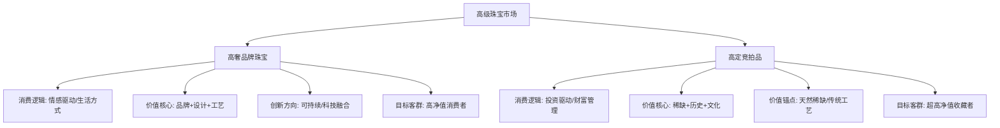

上述差异决定了两类珠宝在设计趋势响应、材质工艺选择及市场表现上的根本性分野，也构成了本报告比较分析的核心出发点。

### 1.3 研究框架与方法论说明

#### 整体研究框架

本报告采用**"趋势-载体-驱动"三层递进式分析框架**，系统解构2023-2025年珠宝设计趋势的演变脉络：

**第一层：趋势表征层**——聚焦设计美学、材质工艺、消费场景三大维度的趋势演变特征，描绘高奢品牌珠宝与高定竞拍品的趋势图景。

**第二层：载体比较层**——以两类研究对象为分析载体，系统比较趋势在不同市场板块中的差异化表达，归纳"商业导向"与"艺术投资导向"两条发展路径的特征与交织关系。

**第三层：驱动解析层**——深入探究趋势演变的深层驱动因素，涵盖社会文化心理、经济环境变化与技术变革三大维度，阐释当代珠宝设计的价值叙事与哲学表达。

#### 比较分析的维度设定

本报告对高奢品牌珠宝与高定竞拍品的比较分析围绕以下核心维度展开：

| 比较维度 | 观察要点 |
|----------|----------|
| **趋势响应速度** | 对设计潮流、消费偏好变化的敏感度与调整周期 |
| **设计自由度** | 创作过程中品牌框架约束与艺术表达空间的平衡方式 |
| **材质稀缺性追求** | 天然珍稀宝石与创新材料（如培育钻石）的选择倾向 |
| **工艺复杂度** | 传统手工技艺与数字化工艺的应用比重与融合模式 |
| **价格定位与市场目标** | 定价逻辑、目标客群及价值实现路径的差异 |

#### 研究方法论

本报告采用**定性分析为主、定量数据为辅**的研究方法：

**定性分析**方面，通过对品牌系列发布、拍卖专场作品、行业趋势报告的系统梳理与深度解读，提炼设计美学演变规律、材质工艺创新方向及消费需求变迁特征。

**定量数据**方面，援引拍卖成交记录、市场规模统计及消费调研数据，为趋势判断提供实证支撑。

**比较研究**方面，建立两类研究对象的对照分析矩阵，通过系统性对比揭示共性规律与差异特征。

#### 数据来源说明

本报告的信息来源涵盖以下渠道：

- **品牌官方发布**：国际顶级珠宝品牌的高级珠宝系列发布资料、品牌年度报告及官方传播内容
- **国际拍卖行记录**：佳士得、苏富比等顶级拍卖行的珠宝专场拍卖目录、成交数据及市场分析报告
- **行业研究报告**：权威咨询机构、行业协会发布的珠宝市场研究报告与趋势预测
- **专业媒体资讯**：珠宝行业专业媒体、时尚媒体的趋势报道与深度分析

上述信息经过交叉验证与系统整合，确保研究结论的可靠性与分析框架的逻辑自洽性。本章所建立的研究背景、概念界定与方法论框架，将为后续章节对设计美学趋势、材质工艺创新、消费市场演变及深层驱动因素的深度分析提供清晰的逻辑起点与分析基准。

## 2 设计美学趋势的演变：从自然主义到理性诗意的交融

2023-2025年的珠宝设计美学经历了一场深刻的审美转向。这一时期，设计师们不再满足于单一风格的线性延续，而是在**自然有机形态与理性几何结构之间寻求精妙的平衡**，形成了"理性与诗意交融"的当代美学主张。这种转向既反映了后疫情时代消费者对自然联结与内心宁静的渴望，也体现了现代都市人对秩序感与确定性的追求。高奢品牌珠宝与高定竞拍品在这一美学演变中呈现出差异化的演绎策略——前者以品牌叙事为框架，主动融入当代设计语言；后者则以稀缺性与工艺极致性为锚点，强化传承价值与收藏属性。

### 2.1 自然主义美学的当代演绎：有机形态与生命意象

自然主义作为2023-2025年珠宝设计的核心灵感源泉，在高奢品牌与高定竞拍品中均占据重要地位，但两者的表达路径与价值逻辑存在本质差异。

**高奢品牌对自然意象的转化**侧重于将有机形态融入品牌DNA，形成可识别的设计语言体系。卡地亚2025年发布的EN ÉQUILIBRE高级珠宝系列堪称这一趋势的典型代表，该系列以"平衡的艺术"为核心主题，通过"色彩交融"、"几何韵律"、"光影构型"三个篇章诠释和谐美感[^1]。其中DIVITA项链巧妙混搭翡翠圆珠、尖晶石、碧玺、欧泊与钻石等不同材质，柔和细腻、近乎植物般的色调与有机形态的宝石形成呼应，悬垂而下的流苏更显灵动优雅[^2]。NAKURU胸针则以一整块粉色石英雕琢出火烈鸟的灵动形象，从玛瑙鸟喙到柔软羽毛，形态特征皆刻画得惟妙惟肖，致敬了卡地亚积极保护与传承的宝石雕刻（Glyptics）珍罕工艺[^1]。

宝格丽Serpenti系列的灵蛇符号演进则展现了另一种自然意象的当代转化路径。灵蛇作为宝格丽最富盛名的图腾，象征着智慧、生命力与永恒魅力[^3]。2025年初春上海张园的宝格丽蛇年特展上，一枚1967年的灵蛇手镯腕表与2024年新款灵蛇项链形成跨越半个多世纪的对话，蛇身由黄金与红色珐琅手工拼接，鳞片间的焊金轴让蛇身灵活缠绕，梨形红宝石镶嵌的眼睛在灯光下流转[^3]。灵蛇符号的价值根基在于其跨文明的文化共鸣——在古希腊神话中，灵蛇缠绕的权杖是医神阿斯克勒庇俄斯的象征，代表疗愈与重生；而在东方文化里，伏羲女娲相互缠绕的蛇身，寓意着守护与生命延续[^4]。这种多元解读空间使灵蛇成为跨越文化边界的视觉语言。

蒂芙尼2025年Blue Book秋季新作"Sea of Wonder瑰海奇珍"系列则聚焦海洋主题，以迷人设计重新诠释经典杰作，致敬海洋奇幻魅力[^5]。该系列展现了蒂芙尼对赞颂自然世界壮丽美景的热忱，灵动诠释璀璨夺目的华美钻石和卓尔不凡的彩色宝石之美[^6]。在首届摩纳哥高级珠宝大奖赛中，蒂芙尼凭借卓越的艺术、工艺及传承荣获"评审团特别奖"与"传承奖"两项殊荣[^7]。

**高定竞拍品中的自然主题珍品**则强调工艺极致性与收藏价值。2025年苏富比香港春拍呈现的Écho钻石耳环由卡地亚设计，以两枚水滴形切割钻石为视觉核心，镶嵌圆形切割粉钻、无色钻石和阶梯型切割无色钻石，创意之处在于两只耳饰巧妙的颜色配搭，在粉钻上方点缀圆形无色钻石，无色主钻上方则点缀一枚圆形粉钻，让色彩变幻更为灵动，最终以2233.5万港元成为该场成交价最高拍品[^8]。

两类珠宝在自然意象转化上的核心差异可归纳如下：

| 比较维度 | 高奢品牌珠宝 | 高定竞拍品 |
|----------|--------------|------------|
| **设计导向** | 品牌叙事框架内的当代诠释 | 工艺极致性与历史传承的价值锚定 |
| **形态表达** | 灵活融入品牌DNA，追求可佩戴性与场景适配 | 强调独一性与博物馆级工艺水准 |
| **价值构成** | 品牌溢价+设计美学+情感联结 | 材质稀缺性+工艺复杂度+历史出处 |
| **市场目标** | 高净值消费者的日常佩戴与收藏 | 超高净值收藏者的资产配置 |

### 2.2 新极简几何与建筑结构感的崛起：理性美学的回归

与自然有机形态并行发展的，是几何线条与建筑结构感作为设计语言的强势复兴。这种理性美学的回归并非简单的风格轮回，而是在当代语境下对秩序感、确定性与现代精神的重新诠释。

**卡地亚EN ÉQUILIBRE系列的"几何韵律"篇章**完美诠释了这一趋势。VETRATA项链荟萃一组珍罕钻石，其中包括一颗引人瞩目的8.15克拉切角长方形钻石，宝石的颀长轮廓启发设计师构想出几何图案，呈现标志性装饰艺术风格，令人联想到早期摩天大楼的线条[^1]。复杂的几何放射状结构点缀黑色缟玛瑙，凸显钻石璀璨光芒的同时，为作品赋予节奏感和视觉冲击力，营造出令人神迷的韵律感[^2]。这种设计手法体现了卡地亚对"在繁复中寻求精炼"这一平衡艺术关键所在的深刻理解[^1]。

**宝格丽Vimini系列**则展现了几何美学与品牌历史传承的融合。2026年1月推出的全新宝格丽Eternal系列以Vimini佳作为开篇，灵感源自品牌档案馆藏品中一款1942年问世的典藏手镯[^9]。原作诞生于二战时期，其波状起伏的造型灵感汲取自意大利理性主义推崇的简约凝练风格，在玫瑰金与黄金相互交织的映衬下，呈现出富于韵律的循环美感[^9]。新作名为Vimini（意为"柳条"），其编织风格的设计令人联想到古希腊与古罗马时期人们以草茎枝条精心编织篮筐等日常器物的古老技艺，这份世代传承的匠心智慧如今得益于宝格丽设计师与工匠大师的创意巧思焕发出全新生机[^9]。

**香奈儿COCO CRUSH系列**将品牌最具辨识度的菱格纹图案引入高级珠宝创作。2015年起，菱格纹被系统性地融入珠宝设计，铐式手镯以米色K金打造，整体线条利落，采用加宽比例与硬朗轮廓，强调金属本身的结构感[^4]。菱格纹通过更清晰的切槽与更柔和的弧度重新演绎，在保证图案辨识度的同时提升佩戴舒适度[^4]。

**建筑结构感设计的兴起**已成为2026年男士珠宝的核心趋势之一。伦敦精品店Tomfoolery主理人Laura Kay观察到，珠宝正在向一种近似"建筑结构"的方向演进，珠宝的线条走向、起伏节奏与体块关系已不再只是视觉修辞，而是成为工艺精度与形式张力的共同体现[^4]。路易威登Le Damier de Louis Vuitton珠宝系列以品牌标志性的Damier方格为核心设计语言，通过金材质与钻石的组合，将经典图案转译为可佩戴的珠宝结构[^4]。

在高定竞拍品领域，几何切割与结构设计同样构成重要的价值维度。2025年苏富比香港春拍中，一枚61.47克拉切角矩形改良明亮式切割黄钻戒指，以黄绿色火彩明亮清新的特质，成交价达1086.7万港元，位列该场成交价第二高拍品[^8]。几何切割工艺对宝石光学性能的极致发挥，成为高定竞拍品价值评估的核心要素之一。

### 2.3 色彩哲学与虚实平衡：和谐美感的设计法则

色彩运用作为设计美学的核心维度，在2023-2025年呈现出从大胆对比到细腻呼应的策略演变，而虚实相间的空间处理则成为构建和谐美感的重要手法。

**卡地亚的色彩叙事逻辑**在EN ÉQUILIBRE系列中得到充分展现。"色彩交融"篇章从细腻色调的柔和呼应到大胆强烈的色彩对比，在丰富多样的自然调色盘中探寻风格的本质[^1]。BYZAS项链将一颗梨形蓝宝石与八颗祖母绿巧妙搭配，演绎卡地亚标志性的蓝绿色彩组合——孔雀图案，祖母绿的深邃色调呼应蓝宝石的柔和质感，令整体色彩细腻和谐[^2]。CAFAYATE项链则聚焦一对华美欧泊，通过丰富配色烘托其迷人虹彩，欧泊的红、橙和黄色光芒与交错排布的三颗彩色蓝宝石相互映衬，一系列Umba蓝宝石的丰富色彩和谐交融，令温暖色调延伸至整件作品，达到精妙平衡[^1]。

**虚实相间的设计手法**在高奢品牌作品中被广泛运用。BYZAS项链中宝石与镶钻图案交替排列，在虚实相间的布局中达至平衡，镂空设计增强了律动感，而方形与锥形钻石构成的几何细节犹如节奏符号，为整体构型注入强烈张力[^2]。CAFAYATE项链中反复排列的几何图案延展成柔美曲线，契合中央宝石的椭圆形轮廓[^6]。这种虚实平衡的设计法则深深植根于卡地亚的风格语汇，以纯粹线条、立体造型、色彩平衡及虚实之间的尺度，演绎恰到好处的和谐美感[^1]。

**高定竞拍品中彩色宝石的色彩稀缺性**构成其核心价值锚点。2025年苏富比日内瓦春拍中，一颗名为"The Mediterranean Blue"的10.03克拉艳彩蓝钻，以1786万瑞士法郎落槌，单克拉价格高达214万美元，刷新同类钻石拍卖纪录[^10]。这枚蓝钻于2023年被发现于南非Cullinan矿，切割前的原石重量为31.94克拉，为获得完美净度和切割比例，经切割抛光后呈现出如海水般梦幻的蓝色调[^8]。

彩色钻石的价值逻辑体现了"不可复制的稀缺"这一核心原则。戴比尔斯2025年第四季度的原钻价格指数显示，工业级小碎钻的价格跌了10%，但10克拉以上的顶级大钻和艳彩粉钻价格却逆势上涨了18%[^8]。这种分化说明市场不再为普通的"硬通货"买单，而是在追逐"孤品"级的稀缺色彩[^1]。彩钻研究基金会的价格指数显示，自2005年至2022年，彩钻价格指数复合成长率达到6.4%，其中粉红钻价值成长了4.9倍，蓝钻成长3.5倍[^10]。

### 2.4 符号语言与品牌DNA的设计延续：经典元素的当代转化

标志性设计符号如何在传承中实现当代转化，是高奢品牌珠宝设计的核心命题。这些符号不仅是视觉识别元素，更是品牌价值叙事与情感联结的载体。

**卡地亚猎豹**作为品牌最具标志性的符号，其发展历程体现了经典元素的持续演进。猎豹系列始于1914年腕表，经贞·杜桑设计，由温莎公爵夫人推动成为经典[^11]。在2025年中国嘉德秋拍"珠宝翡翠尚品"专场中，卡地亚Panthère系列白金满钻猎豹手镯体现了品牌精湛工艺，黑玛瑙随形镶嵌，展现出凌厉的气场[^11]。品牌故事在高级珠宝价值构成中占据核心地位——这部分成本在账面上几乎为零，但在售价中占比往往超过50%，卡地亚的猎豹、蒂芙尼的蓝盒子、梵克雅宝的四叶草，这些符号本身就是一种权力[^8]。

**宝格丽灵蛇系列**的设计演进展现了符号语言的持续生命力。1948年，宝格丽首次将灵蛇元素融入珠宝腕表设计，推出的手镯腕表采用Tubogas工艺，这种工艺灵感源自赛车的可拆卸煤气管，能将金属打造得如丝带般柔韧，无需焊接就能形成流畅的缠绕造型[^3]。早期的灵蛇设计偏向写实，蛇身鳞片由金片手工制作，用焊金轴相连，确保佩戴时的灵活性；到了60年代，灵蛇造型开始变得更加前卫，蛇头出现圆形、八边形等多种变化，表盘巧妙藏于蛇身之中[^4]。进入现代，灵蛇设计在保持核心曲线的同时，更注重与当代女性审美契合，2015年米兰设计周上亮相的灵蛇项链融入几何学美感，曲线更加简约流畅[^3]。在2024年全球奢侈品市场调整期，当不少品牌大Logo产品销量下滑时，宝格丽灵蛇系列却逆势保持稳定增长，高级珠宝款更是实现12%的销量增幅[^4]。

**梵克雅宝四叶草（Alhambra）系列**的价值构建则展现了符号语言转化为投资级珠宝的路径。据品牌史料记载，创始人侄儿雅克·雅宝曾在花园采摘四叶草赠予员工，附上诗歌《不要放弃》传递希望，这一行为将自然物转化为精神符号[^12]。品牌为不同材质注入文化隐喻：孔雀石守护旅人，红玉髓象征生命，土耳其石代表友谊[^12]。The RealReal 2025转售报告显示，四叶草系列转售价值年增20%，超越劳力士Datejust（17%）和爱马仕柏金包（15%），在历峰集团2025年第三财季亚太区销售额下滑18%的背景下，四叶草系列仍推动珠宝部门增长14%[^12]。

**高定竞拍品中历史名家设计与皇室出处作品**的符号价值则体现为文化溢价机制。2024年佳士得香港春拍中，卡地亚水果锦囊项链以6775.5万港元成交，远超其拍前预估价范围2800万至3800万港元，溢价率达78.3%[^7]。同年佳士得日内瓦拍卖中，一枚卡地亚于1960年为印度阿迦汗王子定制的阿迦汗祖母绿钻石胸针，以855万美元成交，远超拍前最高估价700万瑞士法郎[^7]。苏富比《2023全球珠宝拍卖报告》显示，卡地亚、梵克雅宝、宝格丽等创立超百年的品牌，贡献了高端珠宝拍卖72%的成交额，其作品平均保值率达到发行价的2.8倍，远超行业1.5倍的均值[^7]。

### 2.5 高奢品牌与高定竞拍品的设计美学比较：商业导向与艺术投资的分野

综合前述分析，高奢品牌珠宝与高定竞拍品在设计美学趋势响应上呈现出系统性的差异化特征，这种差异根植于两类珠宝不同的消费逻辑与价值实现目标。

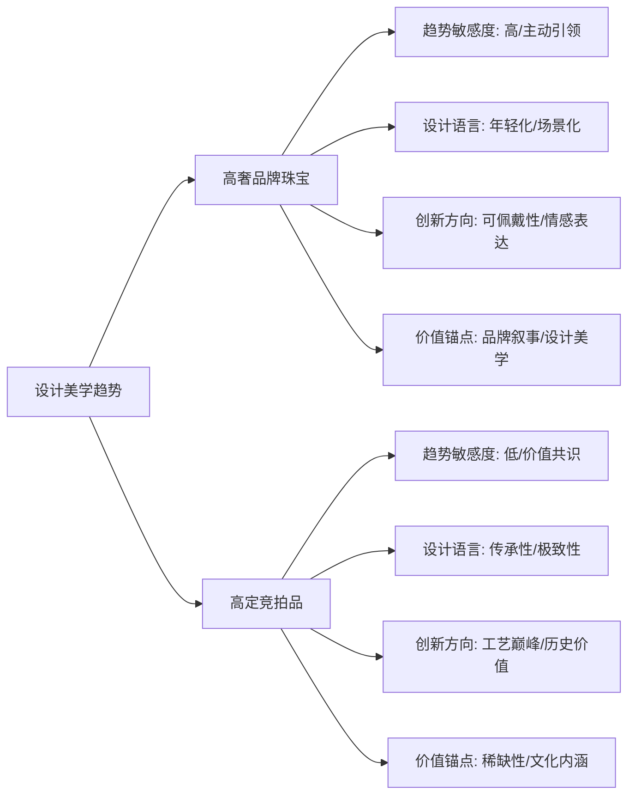

**高奢品牌珠宝的趋势响应特征**体现为主动引领与敏捷调整。品牌系统性地将当代设计语言融入产品开发，回应年轻消费群体的个性化需求与场景化佩戴诉求。POP趋势网数据显示，2025年Q4以来，20-35岁年轻群体贡献了国内小众设计首饰市场68%的销售额，同比增长42%，其中契合"理性与诗意交融"主题的设计单品转化率较普通设计高出35个百分点[^12]。高奢品牌对此趋势的响应体现在设计语言的年轻化转向——从卡地亚EN ÉQUILIBRE系列的和谐美学，到宝格丽灵蛇系列的当代诠释，再到路易威登Le Damier系列的结构感设计，均展现出品牌框架内的设计创新活力。

**高定竞拍品的设计美学逻辑**则遵循不同的价值路径。其"趋势"并非对流行风向的追随，而是对长期价值共识的反映。工艺成本在高级珠宝领域是被严重低估的时间艺术——在高级制表和高级珠宝领域，复杂功能的溢价往往是材料成本的50倍以上[^8]。2025年11月，历峰集团发布的半年报特别提到了"工匠培养计划"的巨额投入，一位能镶嵌微绘珐琅的大师需要二十年的功力[^1]。这种对传统工艺极致性的坚守，使高定竞拍品的设计美学始终锚定于"不可标准化"的手艺价值。

**两条发展路径的核心分野**可从以下维度系统比较：

| 比较维度 | 高奢品牌珠宝 | 高定竞拍品 |
|----------|--------------|------------|
| **趋势响应速度** | 高度敏感，季节性更新 | 相对稳定，长期价值导向 |
| **设计自由度** | 品牌框架内的创新空间 | 追求工艺与材质的极致表达 |
| **美学取向** | 当代性、可佩戴性、场景适配 | 传承性、博物馆级、收藏价值 |
| **创新方向** | 设计语言年轻化、材质工艺融合 | 传统工艺极致化、历史价值强化 |
| **价值构成** | 品牌溢价+设计美学+情感联结 | 稀缺性溢价+工艺溢价+文化溢价 |
| **市场功能** | 消费品+身份表达+情感载体 | 资产配置+财富传承+文化收藏 |

这种分野并非对立，而是互补共生。佳士得2025年年报显示，全球成交总额达62亿美元，其中"雅逸精品"类别（包括珠宝、名表、手袋等）整体成交额同比增长17%，亚太区客户贡献了该类别37%的成交额[^3]。一位来自浙江的企业家藏家在瑞银集团专场分享会上直言："现在买东西首先看'抗跌性'，那些小众艺术家的作品再有创意也不敢碰，反而百年品牌的经典款珠宝，既能佩戴又能保值，更让人安心。"[^13]这种消费心态的转变，使得高奢品牌珠宝与高定竞拍品在高净值人群的资产配置中形成了功能互补的关系——前者满足日常佩戴与情感表达需求，后者服务于财富保值与文化传承目标。

## 3 材质与工艺的创新驱动：可持续、科技与传统复兴

2023-2025年的珠宝行业正经历一场深刻的材质与工艺变革。这一变革并非单一维度的技术迭代，而是**可持续理念、数字化技术与传统工艺复兴三重力量的交汇与融合**。在这一进程中，高奢品牌珠宝与高定竞拍品展现出截然不同的创新路径——前者将可持续材料与数字化工艺系统性地融入品牌叙事与产品开发，追求商业价值与社会责任的平衡；后者则坚守天然材质的绝对稀缺性与传统手工技艺的极致表达，强化其作为顶级资产与文化载体的不可替代性。这种分野并非对立，而是在当代珠宝价值体系中形成了功能互补的双轨格局。

### 3.1 可持续材料的规模化应用：从边缘议题到行业核心议程

可持续发展理念在珠宝行业的渗透，已从早期的品牌营销话术演进为切实影响供应链与产品开发的核心议程。这一转变在高奢品牌中表现得尤为显著，而高定竞拍品市场则呈现出对天然稀缺性价值的坚守。

**回收贵金属的规模化应用**标志着高奢品牌对可持续承诺的实质性兑现。萧邦（Chopard）在这一领域的实践具有标杆意义。品牌于2019年推出Lucent Steel™精钢，最初应用于Alpine Eagle雪山傲翼系列腕表，由70%再生钢制成。至2023年底，萧邦将含量为80%循环再造精钢材质的Lucent Steel™推广至其所有精钢腕表作品，包括表链和表壳的制造，并承诺在2025年底前将循环再造精钢比例提升至90%[^14]。根据国际不锈钢论坛提供的数据，从标准的50%循环再造精钢含量增加至80%，可令生产导致的碳排放量骤降30%；若提升至90%，排放量将降低40%[^14]。

萧邦的可持续实践并非孤立的材料替换，而是构建了一个**扎根本地的循环制造圈**。品牌所有循环再造精钢供货商均分布于其生产基地周边1000公里范围内，涵盖瑞士境内及邻近的奥地利、法国、德国和意大利，由此减少运输排放需求。制造流程中产生的废料碎屑由供货商负责收集，并通过回收再造制成全新的高质量钢材，形成真正的闭环生产体系[^14]。萧邦联合总裁卡尔-弗雷德里克·舍费尔表示："我们于2013年逐步启动符合可持续发展与社会责任理念的金原料采购，并于2018年在工作坊中实现100%符合可持续发展与社会责任理念的金原料使用率。"[^14]

**黄金回收的行业趋势**同样印证了可持续材料的规模化进程。2025年全球回收黄金产量已占黄金总供应量的35%，较2020年提升12个百分点[^15]。这种"城市矿山"的挖掘不仅减少了对原生矿的依赖，更降低了开采过程中的环境破坏。北京某珠宝品牌推出的"以旧换新"计划允许消费者凭旧首饰抵扣30%的新品费用，这种"循环经济"模式让珠宝真正实现了"从摇篮到摇篮"的闭环[^16]。

**实验室培育宝石的技术突破**为材料革命注入新动能。2025年，中国科学家成功开发出"纳米级晶体控制"技术，使实验室培育钻石的纯净度达到天然钻石的98%，而成本仅为后者的1/8[^15]。深圳某企业年产50万克拉培育钻石，碳足迹较传统开采减少90%[^16]。在定制珠宝市场，纪派珠宝等品牌同时掌握HPHT（高温高压法）与CVD（化学气相沉积法）双技术路径，其培育钻石经国际宝石学院（IGI）检测，净度达VVS级、颜色为顶级D色，1克拉仅需千元，2克拉万元内可入手[^17][^15]。

然而，**高定竞拍品市场对天然稀缺性的坚守**形成了鲜明对照。拍卖市场的价值逻辑始终以"不可复制的稀缺"为核心锚点。戴比尔斯2025年第四季度的原钻价格指数显示，工业级小碎钻价格跌了10%，但10克拉以上的顶级大钻和艳彩粉钻价格却逆势上涨了18%[^14][^15]。这种分化说明高端市场不再为普通的"硬通货"买单，而是在追逐"孤品"级的稀缺资源。

2025年保利拍卖推出的国内首个大规模红宝石单品类专场，以1100万元总成交额、69.6%成交率创下国内红宝石专项拍卖的标杆纪录。研究发现，**"核心产地+无烧属性+权威证书"的价值三角**成为藏家决策核心[^15][^14]。从成交结构看，百万级拍品贡献了总成交额的78.6%，其中3克拉以上拍品占比仅35.3%，却贡献了52.1%的成交额，印证了大克拉天然红宝石的市场统治力[^15]。

| 材质类型 | 高奢品牌珠宝应用 | 高定竞拍品市场态度 |
|----------|------------------|-------------------|
| **回收贵金属** | 系统性融入供应链，构建循环经济体系 | 基本不构成价值点 |
| **培育宝石** | 作为可规模化"新材料"，拓展设计自由度 | 极少出现，价值核心在于天然稀缺性 |
| **天然珍稀宝石** | 作为高级珠宝系列核心，但非唯一选择 | 绝对价值锚点，产地、克拉、无烧属性为定价基础 |

### 3.2 混合金属与创新材质的美学探索：材质组合的当代表达

材质组合的创新已成为高奢品牌回应年轻消费群体审美偏好与佩戴需求的重要策略。这种探索不仅服务于设计美学的丰富表达，更直接回应了轻量化、场景化的实用诉求。

**多元贵金属组合**在高奢品牌系列中被广泛运用。路易威登Le Damier de Louis Vuitton珠宝系列以品牌标志性的Damier方格为核心设计语言，2025年引入玫瑰金版本后，同时采用黄金、白金与玫瑰金组合，铰接式结构确保了佩戴时的灵活度与顺畅触感[^14][^15]。香奈儿COCO CRUSH系列的铐式手镯以米色K金打造，整体线条利落，采用加宽比例与硬朗轮廓，强调金属本身的结构感[^14]。不同宽度、金属与色调的组合，使这些系列在保持统一视觉语言的同时，为偏好简约结构或风格叠加的佩戴者提供更多层次选择。

**创新陶瓷材质**的应用展现了品牌在材质探索上的前瞻性。Qeelin麒麟2026年推出的Wulu Eternity系列，采用品牌标志的"麒麟红"HyCeram®陶瓷与钻石形成鲜明对比：陶瓷的温润质感如同暮色余晖，钻石则折射出清晨般的明亮光泽[^18]。这种材质组合不仅丰富了视觉层次，更通过可调节链长设计，让佩戴者能在日常通勤、正式宴会或节庆场合之间自由切换。

**钛金属的轻量化优势**在高端腕表与珠宝领域得到充分发挥。萧邦Alpine Eagle 41 XP TT腕表从41毫米直径表壳到一体式整合表链，均采用极致轻盈且经久耐用的5级钛金属材质，并完全在萧邦制表工坊中自研制造[^19]。这种材质选择体现了品牌对现代消费者佩戴舒适度诉求的精准回应。

**高定竞拍品对传统材质组合的坚守**则遵循不同的价值逻辑。在拍卖市场，材质价值的核心在于天然宝石的品质与稀缺性，贵金属主要作为镶嵌载体服务于主石的呈现。以2026年1月的金价为例，足金饰品零售价约为650元每克，而在高级珠宝的账单里，贵金属成本占比通常不会超过15%[^14][^15]。真正的材质溢价在于"不可复制的稀缺"——2025年5月佳士得香港春拍中，一枚35.09克拉喀什米尔天然皇家蓝蓝宝石戒指以近7480万港元成交，这一价格中绝大部分来自宝石本身的稀缺性与传奇产地价值[^15][^20]。

年轻消费群体的审美偏好正在推动材质创新的加速。根据市场研究机构Polaris Market Research的数据，2025年全球珠宝市场规模已达2861.5亿美元，其中**男士珠宝市场的年复合增长率高达9.9%**，显著高于行业整体水平[^14][^15]。艺术珠宝品牌SAUVEREIGN创始人Bertrand Mak指出："男士珠宝已不再只关乎实用性或传统象征，而是越来越外显、富于表达，也更具中性气质。"这种消费心态的转变正推动品牌在材料选择与设计语言层面加速向多元化方向发展。

### 3.3 数字化工艺的融合应用：3D打印、AI设计与传统手工的边界

数字化技术在珠宝行业的应用已从早期的实验性探索进入规模化融合阶段。然而，这种融合并非简单的技术替代，而是形成了**"科技打底、手工点睛"**的协作模式，使效率提升与工艺价值得以兼顾。

**3D打印技术在珠宝起版环节的效率革命**已成为行业共识。传统工艺需要经过起银版、压胶模、开胶模等十余道工序，而3D打印只需将三维模型导入设备，就能直接输出蜡模或金属胚体[^15]。这种技术特别适合制作镂空蕾丝状项链、微镶爪托等复杂结构——这些曾经需要老师傅耗费数周精雕细琢的部件，现在通过数字化设计就能快速成型。根据2025年9月的行业报告，采用3D打印技术的珠宝企业生产成本平均降低75%，交付周期从四周缩短至七天[^15]。

然而，**手工雕刻的不可替代性**在高端市场愈发凸显。纽约某珠宝工坊的实践生动说明了这种互补性：他们使用3D打印制作基础骨架，再由工匠手工镶嵌宝石并打磨细节，使得同样一款18K金手链的制作时间从传统工艺的三个月压缩到三周，而手工参与的部分反而让产品溢价40%[^15]。正如行业观察者所言："现在的AI和3D打印能做出标准的六爪镶嵌，但做不出那种顺应宝石纹理的'呼吸感'。当你抚摸一件手工雕刻的玉雕，感受到的起伏不仅是石头的纹理，更是另一个人几十年生命的投射。"[^14]

**AI辅助设计在个性化定制领域的应用**正在拓展珠宝设计的可能性边界。美国某珠宝定制平台允许客户实时调整戒指的每一个参数，产生"数十亿种排列组合"，这种自由度是传统作坊难以想象的[^15]。2025年某电商平台数据显示，参与过3D珠宝定制的Z世代消费者复购率是传统客户的2.3倍。迪拜新兴高级珠宝品牌Karlito的创始人Karl-Alexandre Chiniara拥有建筑学学士学位，这份专业背景深刻塑造了他的珠宝设计语言——将珠宝视为"微缩的建筑"，作品中有强烈的几何感、利落的结构化线条，以及对空间比例的精准把控[^17]。

**数字化工艺与传统手工的边界**在两类珠宝市场中呈现不同的定位：

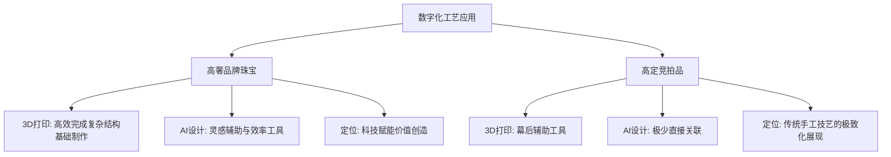

**高定竞拍品对"不可标准化"手艺价值的坚守**体现了其独特的价值逻辑。2025年11月，历峰集团发布的半年报特别提到了"工匠培养计划"的巨额投入——一位能镶嵌微绘珐琅的大师需要二十年的功力[^14][^15]。在日内瓦的一家工坊里，一位老匠人为修复一顶19世纪的冠冕，花了三个月只做一件事——在放大镜下打磨一片只有指甲盖大小的翡翠，因为要呈现出叶脉的透光感[^15]。某拍卖行记录显示，带有知名匠人签名的孤品珠宝，近三年拍卖溢价年均增长15%，而同期机制珠宝的保值率基本持平[^15]。

### 3.4 非遗工艺的现代化复兴：传统技艺的当代转化路径

非物质文化遗产工艺在当代珠宝设计中的复兴，并非简单的复古怀旧，而是通过**文化叙事与设计创新的双重赋能**实现价值重估。这一趋势在高奢品牌的系列开发与中国本土品牌的国潮化探索中均有深刻体现。

**香奈儿手工坊体系**堪称非遗工艺现代化传承的典范。2002年，时任创意总监卡尔·拉格斐开创了工坊系列（Métiers d'Art），旨在向品牌旗下及合作的11间艺术工坊致敬，展现法国高级时装无与伦比的手工技艺[^14][^15]。这些艺术工坊包括Lesage（刺绣）、Goossens（金工）、Massaro（鞋履）、Lemarié（羽饰）、Maison Michel（帽饰）等，自1980年代起陆续由香奈儿收购，并集中于巴黎Le 19M工坊大楼内。在2024/25杭州高级手工坊系列中，经典斜纹软呢由Lesage工匠以传统织布机精制，搭配亮片刺绣，勾勒出西湖波光粼粼的诗意；一套饰有中式包边的黑色斜纹软呢外套，更是耗费38公尺天鹅绒手工编织完成[^15]。

香奈儿手工坊珠宝的收藏价值首先体现在其**限量稀缺性**上。以2025年春季推出的"The Making of a Collection"系列为例，该系列仅限全球1800件，每件都附带编号证书与专属制作纪录片二维码，这种限量发售策略保障了作品的稀缺性和可追踪性[^20]。中古香奈儿首饰在拍卖市场的表现也印证其保值能力——在2025年9月北京永乐拍卖举办的香奈儿中古首饰专场上，一条1983年CHANEL琉璃十字项链估价达28000-39000人民币[^14]。

**中国本土品牌的古法黄金复兴**展现了非遗工艺的另一条现代化路径。老庙携古韵金作系列新品亮相2025上海高级定制周，延续品牌对中国传统文化的深度探索，从莲花、葫芦等象征好运的意象中汲取灵感，通过**手工錾刻、彩宝镶嵌、拍平珐琅**等技法工艺，打造融合传统文化元素与现代潮流设计的古法黄金珠宝新品[^18]。老铺黄金的"十字金刚杵"系列以藏传佛教法器为灵感，采用古法工艺，部分款式镶嵌钻石，男款黑皮绳配小坠设计独特，可拆卸的钥匙扣深受年轻人喜爱[^18]。

**宝石雕刻（Glyptics）工艺的传承**在卡地亚的实践中得到充分体现。EN ÉQUILIBRE系列中的NAKURU胸针以一整块粉色石英雕琢出火烈鸟的灵动形象，从玛瑙鸟喙到柔软羽毛，形态特征皆刻画得惟妙惟肖，致敬了卡地亚积极保护与传承的宝石雕刻珍罕工艺。这种工艺的独特之处在于它无法被机器完全替代——工匠们通过对宝石天然色泽与纹理的精准把握，实现"俏色"效果，让每件作品成为独一无二的艺术品。

**2025南方珠宝艺术联展**以"非遗新造物·宝韵未央"为主题，涵盖工艺黄金、翡翠玉石、彩色宝石以及非遗刺绣四大品类。其中，工艺黄金展区的展品来自黄金艺术博物馆，采用古法黄金工艺制作，表现主题包括潮汕地区的传统建筑、中国传统文化中的"摇钱树"等[^21]。策展人和利表示："我们致力于打造非遗珠宝艺术的高端展示平台，通过传统工艺与现代珠宝设计的创新融合，持续推动非遗技艺在当代珠宝领域的创造性转化与创新性发展。"[^21]

非遗工艺的价值重估在市场数据中得到验证。2025年"双11"期间，某品牌"碳中和"系列珠宝销售额同比增长200%，平均客单价达1.2万元；95后消费者中，68%表示愿意为"低碳认证"的珠宝支付溢价[^15]。淘宝数据显示，2025年新中式手串销量暴涨566%，一年卖出千万条[^20]。这种趋势印证了年轻消费者对"有故事的珠宝"的强烈偏好——他们愿意为文化底蕴与工艺传承支付溢价。

### 3.5 高奢品牌与高定竞拍品的材质工艺创新比较：商业量产与独一极致的分野

综合前述分析，高奢品牌珠宝与高定竞拍品在材质工艺创新上遵循截然不同的逻辑体系，这种差异根植于两类珠宝的核心价值定位与市场功能。

**高奢品牌的创新逻辑**以**品牌价值与市场叙事驱动**为核心。创新旨在增强产品故事性、设计美感、佩戴体验及品牌责任形象，面向大众市场进行价值塑造与情感连接。具体表现为：

- **材质创新侧重**：可持续材料、培育宝石、混合材质。侧重于可规模化、可融入供应链的环保材料与提升设计美学的材质组合，以拓展市场与丰富产品线。
- **工艺创新实现**：科技与手工融合（"科技赋能，手工点睛"）。积极采用3D打印、AI等提升效率、实现复杂设计，但最终价值与手工精加工深度绑定。
- **创新目的**：推动产品迭代、塑造现代奢华定义、响应消费趋势（如可持续、个性化）。

**高定竞拍品的创新逻辑**以**稀缺性与投资收藏驱动**为核心。价值由顶级天然宝石的稀有性、产地血统、历史传承与文化内涵绝对主导，创新服务于最大化展现这些固有价值。具体表现为：

- **材质创新侧重**：顶级天然珍稀宝石。极度强调天然宝石的克拉、颜色、净度、产地（尤其传奇产地）及无烧属性，材质本身是价值的基石。
- **工艺创新实现**：传统手工技艺的极致化。科技多为幕后辅助，拍品价值聚焦于无可替代的传统手工技艺的巅峰展现。
- **创新目的**：巩固与强化古典价值体系，确保作品的独一性、传承性与投资保值属性。

| 比较维度 | 高奢品牌珠宝 | 高定竞拍品 |
|----------|--------------|------------|
| **核心价值逻辑** | 品牌价值与市场叙事驱动 | 稀缺性与投资收藏驱动 |
| **可持续材料** | 系统性融入核心供应链 | 基本不以此为核心价值点 |
| **培育宝石** | 作为可规模化"新材料"使用 | 极少出现，价值核心在于天然稀缺性 |
| **数字化工艺** | 积极拥抱，提效与创新并重 | 幕后辅助，不构成主要价值宣称 |
| **传统手工技艺** | 与科技融合，"点睛"价值 | 绝对主导，极致化展现 |
| **非遗工艺** | 现代化转化，文化叙事赋能 | 附着于历史文物，构成文化溢价 |

**两条创新路径的互补关系**体现在当代珠宝价值体系的完整构建中。高奢品牌通过可持续叙事、数字化效率与年轻化材质组合，回应了当代消费者对情感价值、佩戴体验与社会责任的多元诉求；高定竞拍品则通过对天然稀缺性与传统工艺极致性的坚守，维护了珠宝作为顶级资产与文化载体的终极价值锚点。

2025年佳士得香港瑰丽珠宝及翡翠首饰春季拍卖创下自2018年以来季度瑰丽珠宝拍卖第二高成交总额，成交总额高达4.67亿港元，半数拍品成交价超越拍前高估价，成交率高达84%[^14][^15]。这一市场表现印证了高级珠宝市场的根本性变化——珠宝已从单纯的装饰品转变为重要的资产配置类别。正如上海钻石交易所总裁林强所指出的，投资级钻石价格虽受短期库存与利率影响，但长期增长由**资源枯竭、消费升级和资产配置**三大因素驱动[^15]。

在这一格局下，高奢品牌珠宝与高定竞拍品各自承担着不可替代的市场功能：前者以前瞻性设计和系统化创新引领当代消费时尚，满足情感与佩戴需求；后者则以绝对稀缺性和深厚文化内涵锚定终极收藏价值，服务于资产配置与财富传承。两条路径的并行发展与相互映照，共同构建了2023-2025年珠宝行业材质工艺创新的完整图景。

## 4 消费市场与佩戴场景的多元化拓展

2023-2025年的珠宝消费市场正经历一场深刻的结构性变革。这一变革的核心驱动力并非单一因素，而是**消费群体代际更替、消费动机根本性转变与数字化渠道重塑**三重力量的交汇。Z世代作为新兴消费主力的崛起，不仅改变了珠宝产品的设计语言与价格定位，更从根本上重构了珠宝消费的底层逻辑——从传统的婚庆刚需与保值投资，转向悦己消费与情感表达。在这一转型进程中，高奢品牌珠宝与高定竞拍品展现出差异化的市场响应策略，前者通过产品创新与渠道变革积极拥抱年轻消费趋势，后者则在新消费语境下强化其投资收藏属性与社交符号价值，共同构建了当代珠宝消费市场的双轨发展格局。

### 4.1 消费群体代际更替与需求逻辑重构

珠宝消费市场的代际更替已从趋势预判演变为市场现实。《2025珠宝玉石消费趋势报告》显示，**Z世代已成为珠宝消费主力，占比达42%**，非婚庆场景的悦己消费占比升至42%[^22][^19]。这一数据标志着珠宝消费逻辑的根本性重构——从以婚嫁、送礼为核心的仪式化消费，转向以自我奖励、日常搭配为主导的情感化消费。

**消费动机的深层转变**体现在年轻消费者对珠宝价值的重新定义。68%的Z世代会为"奖励自己""日常搭配"买单，小克重、设计感强的锁骨链、叠戴戒指销量年增50%[^22][^19]。戴比尔斯2025年行业报告进一步印证了这一趋势：Z世代已占据天然钻石消费10%份额，未来购买意愿高达22%位列各年龄段首位，**非婚嫁场景消费占比从2020年的52%飙升至81%**[^23][^22]。这种转变意味着珠宝消费从"低频人生节点消费"转为"高频情绪消费"，每一件珠宝都可能成为独立决定的见证、成长轨迹的印记。

**年轻消费者的审美偏好与价值诉求**呈现出鲜明的代际特征。Z世代的消费群体购买黄金首饰更注重个性表达和社交属性，对品牌故事、设计理念和文化内涵有着更高要求[^19][^23]。具体来说，大众消费者偏好小克重、时尚设计的日常佩戴饰品；高净值客群则青睐具有文化内涵和收藏价值的高端金器。这种消费分层促使行业从"保值刚需"转向"审美表达"，产品力正成为行业竞争新焦点[^19][^23]。

消费动机转变的深层驱动因素可从以下维度理解：

| 驱动维度 | 传统消费逻辑 | Z世代消费逻辑 |
|----------|--------------|--------------|
| **核心动机** | 婚庆刚需、保值投资 | 悦己消费、情感表达 |
| **购买场景** | 人生重大节点（婚嫁、生日） | 日常奖励、情绪消费 |
| **价值评判** | 克重、保值率 | 设计感、文化内涵、品牌故事 |
| **佩戴频率** | 低频、仪式化 | 高频、日常化 |
| **决策逻辑** | 家庭共识、长辈建议 | 个人偏好、社交影响 |

### 4.2 场景化珠宝的兴起：从仪式消费到日常佩戴

消费动机的转变直接催生了场景化珠宝的蓬勃发展。**"我的日常，我的钻石"不再是口号，而是Z世代的消费新主张**[^23][^22]。随着年轻群体成为市场主力，"职场第一颗钻石""自我奖励钻石""闺蜜同款钻石""月度纪念钻石"等创新概念应运而生，让小克重钻石成为记录生活点滴的情感载体。

**小克重天然钻石的市场崛起**印证了场景化消费的强劲动力。0.1-0.5克拉小克重天然钻石饰品凭借设计感与亲民价格，打破"钻石=奢侈品"的传统认知，成为职场通勤、情感纪念、日常搭配的新选择[^23][^22]。品牌通过全球直采钻石毛坯、简化中间流通环节、优化生产工艺，将高品质天然钻石饰品价格锚定在**1000-5000元区间**，完美契合"心动即可行动"的消费心理。数据显示，**64%的Z世代购买钻石用于日常佩戴或自我奖励**，让钻石消费开启"日常戴"的新时代[^23][^22]。

**场景适配的设计策略**成为品牌竞争的关键。品牌聚焦戒指、耳钉、锁骨链、手链四大核心品类，摒弃复杂镶嵌，采用简约爪镶、包镶工艺突出钻石璀璨，同时融入国潮元素、非遗工艺、几何纹理等时尚设计，既适合单独佩戴，也可灵活叠搭[^23][^22]。职场中，一枚细圈钻石戒指能提升干练气质；周末出游，钻石锁骨链可为休闲穿搭增添精致感；闺蜜小聚，同款耳钉成为默契的社交符号。

**国潮设计款与轻奢彩宝**在3000-10000元价格带表现强劲。花丝镶嵌、古法金等非遗工艺珠宝备受青睐，融合传统文化元素的设计款溢价率达30%，年轻消费者愿为文化认同支付额外成本，博物馆联名款更是一货难求[^22][^19]。周大福调查显示，**91%的年轻消费者倾向选择有文化元素的珠宝**，融入非遗工艺的小钻石饰品复购率比普通款高18%[^23][^22]。

场景化珠宝的消费概念创新形成了完整的市场叙事体系：

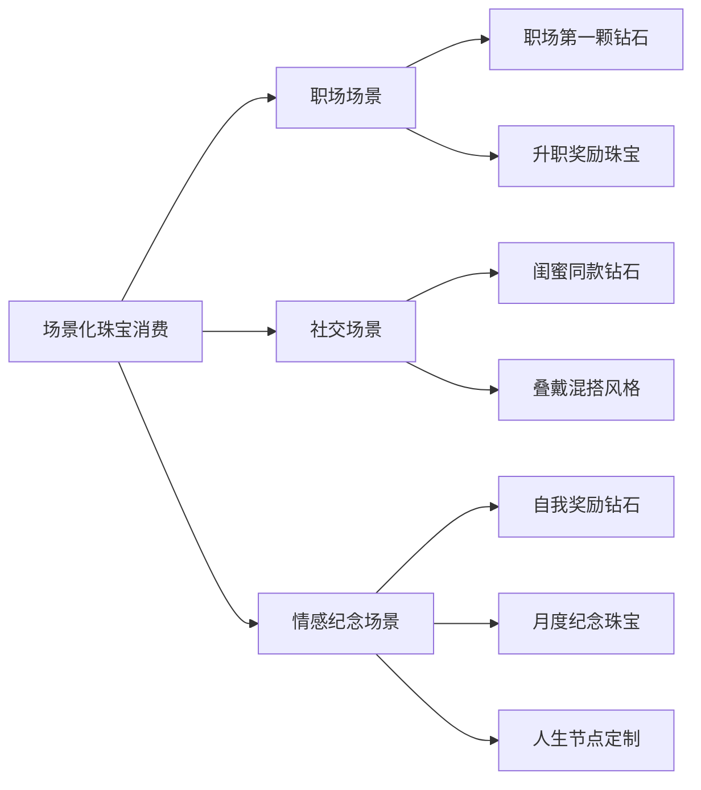

### 4.3 情感价值载体的演变：定制化与纪念意义的深化

珠宝作为情感表达与人生节点记录载体的功能在Z世代消费中得到前所未有的强化。**年轻消费者追求的不仅是珠宝本身，更是其承载的情感叙事与个人意义**。这种需求推动了个性化定制服务、文化IP联名款、非遗工艺融合产品的蓬勃发展。

**个性化定制服务的市场接受度持续攀升**。24岁的互联网运营林晓用两个月奖金购入花丝工艺钻石项链，并非用于婚嫁，而是作为换工作后的自我鼓励，其开箱视频引发三位闺蜜中的两人跟风下单[^23][^22]。在小红书、抖音等平台，#闺蜜同款钻石锁骨链#、#职场新人钻石纪念#等话题累计讨论量超500万，年轻消费者通过小钻石传递情感、寻求圈层认同。这种"可分享的情感消费"使珠宝从私密的个人物品转变为社交媒体时代的身份标识。

**数字化手段增强了珠宝的情感价值与信任背书**。为建立深度信任，品牌引入区块链溯源技术，280万颗天然钻石已实现全链路登记，消费者扫码即可查看产地、切工、净度等核心信息，**91%的消费者表示溯源功能显著增强购买信心**[^23][^22]。这种"价格亲民+信息透明"的模式，让天然钻石不再是沉重的财务决定，而是可以轻松做出的情感选择。

**文化IP联名款需求蓬勃发展**。节庆带动金饰消费增长，生肖系列产品每年12月至次年春节前都会迎来销售热潮[^21]。周大福推出的古代钱币系列金币，好几种款式都可以作为手链或者吊坠进行佩戴，设计上充满文化底蕴，比常见的金饰显得个性、特别。33岁的消费者徐思思表示："从小红书上刷到周大福推出的古代钱币系列金币后，立马种草了。新的一年入手一个可以佩戴的金币，算是犒劳过去一年的努力，也激励自己未来一年更加努力工作。"[^21]

**非遗工艺融合产品的市场验证**印证了"有故事的珠宝"的消费偏好。中国黄金2025年重点推动"文化黄金+黄金文化"战略项目落地，围绕四大古都、敦煌系列、国宝金3.0等主题，将传统文化元素与现代审美、智能工艺深度融合[^19][^23]。老铺黄金主打文化高端金器，在2024年-2025年上半年收入高增，同比增幅均超过2倍，印证了产品力驱动的市场逻辑[^19][^23]。

情感价值载体的演变呈现以下特征：

| 价值维度 | 传统珠宝 | 当代情感载体珠宝 |
|----------|----------|------------------|
| **核心功能** | 装饰、保值 | 情感表达、人生记录 |
| **设计导向** | 克重优先 | 设计感、文化内涵优先 |
| **信任机制** | 品牌背书 | 区块链溯源+品牌背书 |
| **社交属性** | 私密佩戴 | 社交媒体分享、圈层认同 |
| **复购驱动** | 人生节点 | 情绪消费、日常奖励 |

### 4.4 高奢品牌的趋势响应：产品创新与渠道变革

面对Z世代消费趋势的强势崛起，高奢品牌通过**轻奢系列开发、年轻化设计语言、线上线下融合渠道**三大策略积极响应市场变化。这种响应并非被动跟随，而是品牌主动重塑产品力以维持竞争优势的战略选择。

**轻奢系列开发成为品牌拓展年轻客群的核心策略**。周大福、潮宏基等品牌的轻奢系列持续热销，小克重、设计感强的锁骨链、叠戴戒指销量年增50%[^22][^19]。轻克重、重设计成为金饰消费新趋势，高金价背景下中国消费者尤其是城市居民和职场人士日益倾向于轻便、模块化、个性化的金饰，千禧一代和Z世代青睐可叠加佩戴、混合金属材质或融入钻石和宝石的设计[^21]。这一消费趋势在2026年还将延续。

**年轻化设计语言的系统性融入**体现在品牌产品开发的全流程。中国黄金已构建起"大众产品、专供产品、高端子品牌产品、国际化产品、AI+产品"的"金字塔式"产品架构，全方位覆盖不同层级消费需求[^19][^23]。品牌计划2026年在北京、深圳等地开出首批中国黄金SI4.0高端形象店，聚焦高端消费群体，持续升级品牌终端体验。2025年4月，中国黄金与清华大学合作联合研发"巡礼5000年"AI大模型，用于文化IP产品开发，通过AI技术，研发效率提升40%，实现消费者个性化需求的快速响应[^19][^23]。

**线上线下融合渠道的深度布局**重塑了珠宝零售格局。35%的销售额来自线上，**直播电商占比突破40%**，但年轻消费者仍重视线下体验，"线上种草+线下试戴+线上下单"成为主流路径[^22][^19]。品牌体验店的手工工坊、珠宝科普活动人气高涨，这种体验式营销策略有效弥合了线上便捷性与线下体验感之间的鸿沟。中国黄金2025年12月22日正式上线的"中国黄金APP"聚焦投资金条线上销售，采用"线上下单+线下提货"模式，可以实现从产品查询、在线购买到黄金回购的全流程闭环服务[^23]。

**低线城市市场的爆发式增长**为高奢品牌开辟了新的增长空间。三四线城市及县域市场珠宝消费增速达10%，占比即将突破45%，这些市场偏好高性价比的黄金、和田玉产品，短视频直播成为主要引流渠道[^22][^19]。高奢品牌通过渠道下沉与产品适配，有效捕获了这一增量市场。

高奢品牌趋势响应的策略框架可归纳如下：

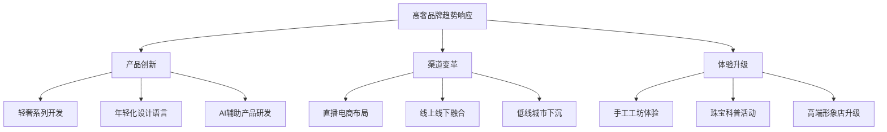

### 4.5 高定竞拍品的价值坚守：投资属性与社交符号的强化

与高奢品牌积极响应年轻消费趋势形成对照，高定竞拍品市场在消费分化背景下选择了**强化投资收藏属性与社交符号价值**的发展路径。这种坚守并非市场保守，而是基于高定竞拍品独特价值逻辑的理性选择。

**市场正从盲目追捧天价拍品转向价值投资的理性回归**。2025年保利香港秋拍中，高达37件珠宝拍品流拍，其中不乏斯里兰卡蓝宝石耳环和缅甸红宝石戒指等重量级藏品，整场成交额较春拍腰斩[^19][^23]。然而，中端市场依然保持活跃——一枚49.18克拉缅甸"鸽血红"红宝石钻石项链以240万港元成交，一枚8.20克拉艳彩黄钻戒指也拍出了228万港元的价格[^19][^23]。这种分化表明收藏家们变得更加谨慎，更注重珠宝的实际价值与稀缺性。

**"稀缺性+历史渊源+材质品质"三重价值支柱**构成了高定竞拍品的定价基础。珠宝在拍卖行的价值由三重支柱支撑——稀缺性是决定珠宝价格的首要因素，历史渊源赋予作品文化溢价，材质品质则提供价值的物质基础[^19][^23]。拍卖行的专业估价体系为珠宝价值提供了权威背书，大型拍卖行拥有专业的鉴定团队，对珠宝的材质、工艺、出处进行严格把关，每件成交拍品都附有香港玉石鉴定中心或Gübelin、GIA等权威机构的证书[^19][^23]。

**古董天然钻石珠宝的投资表现**印证了高定竞拍品的资产配置价值。富艺斯与佳士得联合指数显示，近十年来以古董签名珠宝、天然钻石古董珠宝为代表的拍品**平均年化回报率高达8.4%，十年累计回报约124%**，且与黄金、债券相关性低，成为公认的"抗通胀+高波动市场对冲工具"[^8]。年轻藏家的涌入正在重塑市场格局——富艺斯香港珠宝部数据显示，近5年买家平均年龄从55岁降至38岁，Z世代对"二手"概念脱敏，更看重"独一无二的设计+可溯源的故事"，推动古董珠宝询价量倍增[^8]。

**拍卖市场的自我调节机制**确保了价值发现的有效性。流拍现象反映了市场理性的回归，也是拍卖行与藏家之间的一种价格博弈[^23]。数字化技术进一步增强了市场的透明度——各类数据库与App的普及，让拍品的历次成交价被彻底"击穿"，价格的完全透明使买家能够做出更理性的决策，防止因信息不对称而导致的价格泡沫[^23]。

**高净值人群的收藏心理**体现了高定珠宝作为财富传承与身份符号的独特价值。珠宝产品尤其是高级珠宝成为不确定环境下的投资热点[^19]。在整体奢侈品市场面临利润承压的背景下，高级珠宝市场依旧保持繁荣而活跃的景象，展现出这一"硬通货"在特殊时期的受欢迎程度，并凸显了高级珠宝和黄金类似的抗风险特性[^19]。历峰集团最新财务数据显示，珠宝部门销售额同比实现2%的增长，对集团销售额的贡献率升至70%，而腕表部门销售额则下滑了17%[^19]。

### 4.6 两类珠宝消费市场的比较与互补关系

综合前述分析，高奢品牌珠宝与高定竞拍品在消费市场定位上形成了清晰的差异化格局，但这种差异并非对立，而是在高净值人群资产配置中形成了**功能互补的双轨关系**。

**系统性比较框架**揭示了两类珠宝的核心分野：

| 比较维度 | 高奢品牌珠宝 | 高定竞拍品 |
|----------|--------------|------------|
| **目标消费群体** | Z世代至中产阶层，追求设计与情感价值 | 超高净值个人、家族办公室、机构收藏者 |
| **价格定位** | 轻奢系列1000-10000元，高级珠宝系列更高 | 百万至千万级，顶级拍品可达亿元 |
| **购买动机** | 悦己消费、日常佩戴、情感表达 | 资产配置、财富传承、收藏投资 |
| **场景适配** | 职场通勤、社交聚会、日常搭配 | 重要典藏、代际传承、身份符号 |
| **价值实现路径** | 品牌体验+设计美学+情感联结 | 稀缺性溢价+历史价值+市场流通性 |
| **趋势响应** | 高度敏感，主动引领年轻化趋势 | 相对稳定，坚守长期价值共识 |

**功能互补关系**体现在高净值人群的珠宝消费组合中。高奢品牌珠宝满足日常佩戴与情感表达需求，其轻奢系列与年轻化设计语言有效触达Z世代消费群体；高定竞拍品则服务于财富保值与文化收藏目标，其稀缺性与投资属性为超高净值人群提供了资产配置的选择。正如行业观察者所言："现在买东西首先看'抗跌性'，那些小众艺术家的作品再有创意也不敢碰，反而百年品牌的经典款珠宝，既能佩戴又能保值，更让人安心。"[^23]

**藏家群体的代际变化**正在重塑两类市场的边界。以互联网、金融、新能源领域为代表的新富人群，尤其是Z世代的年轻买家，他们的审美逻辑与资产观念已全然不同[^23]。相比需要"品鉴"的传统珠宝，他们更愿意将资金投入能即时在社交网络上"展示"的资产。这种代际变迁引发整个艺术市场"文化土壤"的松动，也改变了珠宝拍卖的偏好和价格形成机制。

**双轨发展格局的市场意义**在于为不同消费需求提供了差异化的价值实现路径：

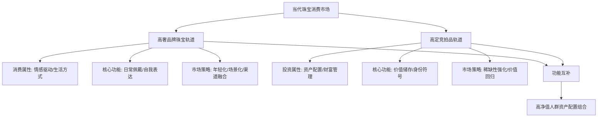

这种双轨格局的形成，本质上是珠宝消费市场对消费者需求多元化的理性响应。当Z世代的悦己消费与情感表达需求推动高奢品牌不断创新时，高定竞拍品市场则通过坚守稀缺性与投资属性，为追求长期价值的收藏者提供了确定性的选择。两条轨道的并行发展与相互映照，共同构建了2023-2025年珠宝消费市场的完整生态，也为未来行业发展提供了清晰的路径指引。

## 5 高奢品牌与高定竞拍品的专项比较分析

前述章节已从设计美学、材质工艺、消费市场三个维度分别剖析了2023-2025年珠宝设计趋势在高奢品牌珠宝与高定竞拍品中的具体表现。本章节将在此基础上，**系统整合两类研究对象的核心差异维度**，通过趋势响应速度、设计自由度、材质稀缺性追求、工艺复杂度、价格定位与市场目标六大维度的深度对照，揭示两者各自遵循的价值逻辑与发展路径。这种比较分析的意义不仅在于厘清差异，更在于揭示"商业导向"与"艺术投资导向"两条主线如何在当代珠宝价值体系中形成功能互补的双轨格局，为理解高级珠宝市场的完整生态提供系统性洞察。

### 5.1 趋势响应速度的差异：敏捷创新与长期价值共识

高奢品牌珠宝与高定竞拍品在趋势响应速度上呈现出根本性的分野，这种差异源于两者截然不同的市场功能定位与价值实现周期。

**高奢品牌珠宝展现出高度的趋势敏感性与敏捷响应能力**。品牌通过年度高级珠宝系列发布、季节性主题更新、限量联名款推出等机制，系统性地将当代设计语言与消费趋势融入产品开发。2025年11月，卡地亚全新EN ÉQUILIBRE高级珠宝系列于北京开启新篇章，这场关于平衡的艺术探索以"色彩交融"、"几何韵律"、"光影构型"三个篇章诠释和谐美感，包括全新系列在内的480余件高级珠宝、高级制表、高级珠宝腕表和卡地亚古董珍藏作品汇集京城[^1]。这种年度系列发布节奏体现了品牌对设计美学演变的主动引领——从自然主义到理性诗意的交融，品牌以明确的主题叙事回应消费者对和谐、平衡与确定性的当代追求。

蒂芙尼的Blue Book系列同样印证了高奢品牌的趋势响应敏捷性。2025年Blue Book秋季新作"Sea of Wonder瑰海奇珍"以迷人设计重新诠释经典杰作，致敬海洋奇幻魅力，该系列展现了蒂芙尼对赞颂自然世界壮丽美景的热忱，灵动诠释璀璨夺目的华美钻石和卓尔不凡的彩色宝石之美[^5]。品牌通过年度主题的持续更新，在传承经典的同时保持设计语言的新鲜度与时代共鸣。

**高定竞拍品市场的趋势响应则遵循长期价值共识的逻辑**。拍卖市场反映的并非对流行风向的即时追随，而是对经过时间沉淀、已被市场验证的价值要素的持续追捧。2025年苏富比香港春拍中，天然钻石拍品的成交总额几乎占到总成交额的三分之一以上，整场拍卖中成交价前三位的拍品均为天然钻石作品[^8]。这种市场表现印证了顶级天然宝石作为"恒定价值锚点"的地位——无论设计潮流如何更迭，大克拉顶级钻石、传奇产地彩宝的稀缺性价值始终获得市场认可。

两类珠宝在时间维度上的价值实现路径差异可通过以下框架理解：

| 维度 | 高奢品牌珠宝 | 高定竞拍品 |
|------|--------------|------------|
| **趋势周期** | 年度/季度更新，主动引领 | 数年至数十年，被动筛选 |
| **响应机制** | 系列发布、主题叙事、限量联名 | 拍卖竞价、市场共识、价值重估 |
| **价值锚点** | 当代设计美学、品牌叙事、情感共鸣 | 稀缺性、历史出处、传奇产地 |
| **市场角色** | 趋势创造者与快速推行者 | 价值最终裁判与长期趋势放大器 |

彩钻研究基金会的价格指数显示，自2005年至2022年，彩钻价格指数复合成长率达到6.4%，其中粉红钻价值成长了4.9倍，蓝钻成长3.5倍[^10]。这一长期数据揭示了高定竞拍品市场的核心逻辑——其"趋势"体现为对稀缺资产在经济周期中的价值重估，而非设计风格的快速更迭。2025年佳士得纽约春拍中，一枚10.38克拉紫粉钻以1398万美元成交，刷新同色级纪录[^10]，这种价格表现反映的是全球收藏市场对顶级彩钻长期价值的持续认可。

### 5.2 设计自由度的边界：品牌框架约束与艺术极致表达

设计自由度的差异是两类珠宝在创作导向上的核心分野。高奢品牌珠宝的设计创新在品牌DNA框架内展开，而高定竞拍品则追求工艺与材质的极致表达，两者形成了互补而非对立的创作逻辑。

**高奢品牌的设计自由度受限于品牌基因与商业策略的双重约束**。设计需严格服务于品牌统一的全球形象、历史传承（经典IP）及商业产品线规划，创新体现在对经典元素的现代表达、新材质的应用和新美学篇章的开拓。宝格丽2026年1月推出的全新Eternal系列以Vimini佳作为开篇，灵感源自品牌档案馆藏品中一款1942年问世的典藏手镯，新作的金色波浪线条轻柔环绕腕间，菱形元素借由隐形柔韧链节巧妙相连，与肌肤紧密贴合[^9]。这种"从档案馆到当代"的设计路径体现了品牌框架内的创新逻辑——在延续品牌历史传承的同时，以当代美学视角进行焕新演绎。

卡地亚的宝石雕刻（Glyptics）工艺同样展现了品牌框架内的设计自由度。NAKURU胸针以一整块粉色石英雕琢出火烈鸟的灵动形象，从玛瑙鸟喙到柔软羽毛，火烈鸟的形态特征皆刻画得惟妙惟肖，羽毛下方亦垂悬一颗风筝形钻石，为整体的柔和色调平添一抹耀眼光辉[^1]。这种设计既致敬了卡地亚积极保护与传承的珍罕工艺，又在自然主义美学框架内实现了当代表达。

**高定竞拍品的设计自由度则近乎无限，其边界在于人类工艺极限与自然造物的稀缺性**。拍品作为独立存在的"孤品"，其设计不受任何当代品牌或系列约束，自由度体现在历史独特性、工艺极致性、材质罕见性以及背后故事的不可复制性上。2024年佳士得香港春拍中，卡地亚水果锦囊项链以6775.5万港元成交，远超其拍前预估价范围2800万至3800万港元，溢价率达78.3%[^7]。这种超高溢价的形成，正是因为该作品承载了品牌百年历史中的传奇设计语言，其价值已超越当代商业产品的定价逻辑。

工艺成本在高级珠宝领域是被严重低估的时间艺术。在高级制表和高级珠宝领域，复杂功能的溢价往往是材料成本的50倍以上，这不是敲诈，而是对生命的定价[^2]。2025年11月，历峰集团发布的半年报特别提到了"工匠培养计划"的巨额投入，一位能镶嵌微绘珐琅的大师需要二十年的功力[^2]。这种对传统手工技艺的极致追求，构成了高定竞拍品设计自由度的核心价值来源。

两类珠宝在设计自由度上的差异可归纳为：

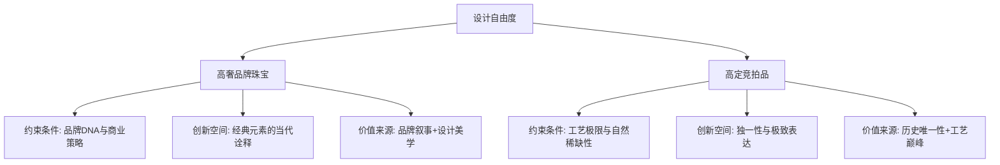

### 5.3 材质稀缺性追求的分野：创新材料与天然孤品

材质选择是两类珠宝价值逻辑差异最为显著的体现。高奢品牌积极拥抱可持续创新材料以塑造品牌形象并拓展市场，高定竞拍品则坚守天然珍稀宝石的绝对稀缺性作为价值基石。

**高奢品牌对培育宝石、回收贵金属等创新材料的规模化应用**已成为行业趋势。在高级珠宝的账单里，贵金属成本占比通常不会超过15%，真正的材质溢价在于"不可复制的稀缺"[^2]。然而，高奢品牌正在重新定义"稀缺"的内涵——通过可持续叙事、设计创新与情感价值的赋能，使创新材料同样具备溢价能力。品牌将高比例循环再造钢材、可持续认证黄金用于常规系列，旨在塑造责任形象、提升情感价值，并直接面向大众市场。

**高定竞拍品市场对天然稀缺性的坚守**形成了鲜明对照。戴比尔斯2025年第四季度的原钻价格指数显示，工业级小碎钻的价格跌了10%，但10克拉以上的顶级大钻和艳彩粉钻价格却逆势上涨了18%[^2]。这种分化说明拍卖市场不再为普通的"硬通货"买单，而是在追逐"孤品"级的稀缺资源。

2025年苏富比香港春拍的成交数据印证了这一逻辑。一枚61.47克拉切角矩形改良明亮式切割黄钻戒指以1086.7万港元成交，一枚45.15克拉雷迪恩型切割浓彩黄钻戒指以863.6万港元成交[^8]。高价值拍品几乎被天然钻石包揽，成交价最高的一枚艳彩蓝钻更是以高于估价的价格被私人买家拍走。2025年苏富比日内瓦春拍中，名为"The Mediterranean Blue"的10.03克拉艳彩蓝钻以1786万瑞士法郎落槌，该蓝钻于2023年被发现于南非Cullinan矿，切割前的原石重量为31.94克拉[^8]。

**"核心产地+无烧属性+权威证书"的价值三角**成为高定竞拍品藏家决策的核心框架。2025年保利拍卖推出的国内首个大规模红宝石单品类专场，以1100万元总成交额、69.6%成交率创下国内红宝石专项拍卖的标杆纪录。从成交结构看，百万级拍品贡献了总成交额的78.6%，其中3克拉以上拍品占比仅35.3%，却贡献了52.1%的成交额，印证了大克拉天然红宝石的市场统治力。缅甸抹谷无烧鸽血红宝石的稀缺性主导高端市场，"核心产地+无烧属性+权威证书"的价值三角成为藏家决策核心。

两类珠宝在材质稀缺性追求上的分野可通过以下对照框架理解：

| 材质维度 | 高奢品牌珠宝 | 高定竞拍品 |
|----------|--------------|------------|
| **回收贵金属** | 系统性融入供应链，构建循环经济体系 | 基本不构成价值点 |
| **培育宝石** | 作为可规模化"新材料"，拓展设计自由度 | 极少出现，价值核心在于天然稀缺性 |
| **天然珍稀宝石** | 高级珠宝系列核心，但非唯一选择 | 绝对价值锚点，产地、克拉、无烧属性为定价基础 |
| **稀缺性定义** | 设计独特性+可持续叙事+情感价值 | 地质稀缺性+历史唯一性+传奇产地 |

### 5.4 工艺复杂度的定位：科技赋能与传统手工极致化

工艺价值在两类珠宝中呈现出不同的定价逻辑与市场认知。高奢品牌采用"科技打底、手工点睛"的融合模式，高定竞拍品则坚守传统手工技艺的极致化展现。

**高奢品牌的工艺创新体现为科技与手工的深度融合**。3D打印高效完成复杂结构的基础制作（如镂空骨架、蜡模），再由工匠进行手工镶嵌、打磨等精加工，实现"科技提效、手工增值"的协作模式。现在的AI和3D打印能做出标准的六爪镶嵌，但做不出那种顺应宝石纹理的"呼吸感"[^2]。当你抚摸一件手工雕刻的玉雕，感受到的起伏不仅是石头的纹理，更是另一个人几十年生命的投射，这种情感连接是机器永远无法替代的奢侈品。

香奈儿手工坊体系堪称科技与传统融合的典范。2002年，时任创意总监卡尔·拉格斐开创了工坊系列（Métiers d'Art），旨在向品牌旗下及合作的11间艺术工坊致敬，包括Lesage（刺绣）、Goossens（金工）、Massaro（鞋履）、Lemarié（羽饰）、Maison Michel（帽饰）等[^8]。这些工艺的独特之处在于它们无法被机器完全替代，以Lemarié山茶花羽饰工坊为例，工匠们通过布料选择、材质层叠，到构图配置与缝制工序，层层精工细作，让每件服饰化为值得珍藏的艺术品。

**高定竞拍品对传统手工技艺极致化的坚守**构成其核心价值来源。2025年11月，历峰集团发布的半年报特别提到了"工匠培养计划"的巨额投入[^8]。在日内瓦的一家工坊里，一位老匠人为修复一顶19世纪的冠冕，花了三个月只做一件事——在放大镜下打磨一片只有指甲盖大小的翡翠，因为要呈现出叶脉的透光感[^8]。这种对"不可标准化"手艺的坚守，使高定竞拍品的工艺价值获得了市场的高度认可。

品牌故事与工艺传承在高级珠宝价值构成中占据核心地位。这部分成本在账面上几乎为零，但在售价中占比往往超过50%。卡地亚的猎豹、蒂芙尼的蓝盒子、梵克雅宝的四叶草，这些符号本身就是一种权力[^8]。苏富比《2023全球珠宝拍卖报告》显示，卡地亚、梵克雅宝、宝格丽等创立超百年的品牌，贡献了高端珠宝拍卖72%的成交额，其作品平均保值率达到发行价的2.8倍，远超行业1.5倍的均值[^7]。

工艺价值在两类珠宝中的定价逻辑差异可归纳如下：

| 工艺维度 | 高奢品牌珠宝 | 高定竞拍品 |
|----------|--------------|------------|
| **3D打印** | 高效完成复杂结构基础制作 | 幕后辅助工具，不构成主要价值宣称 |
| **AI设计** | 灵感辅助与效率工具 | 极少直接关联 |
| **传统手工** | 与科技融合，"点睛"价值 | 绝对主导，极致化展现 |
| **工艺溢价来源** | 品牌叙事+设计创新+手工精加工 | 时间投入+技艺稀缺性+匠人签名 |

### 5.5 价格定位与市场目标的双轨格局

两类珠宝在价格体系、目标客群、消费动机与价值实现路径上形成了清晰的双轨格局，这种格局的形成源于两者服务的差异化市场功能。

**高奢品牌珠宝的价格定位覆盖从轻奢入门到高级珠宝的完整梯度**。品牌通过轻奢系列开发积极触达年轻消费群体，满足其悦己消费与情感表达需求。2025年圣诞节前夕，上海恒隆广场某品牌限定款手链排队购买的场景印证了这一市场逻辑——一位年轻女孩说："我也知道这成本就几千块，但戴上它去参加晚宴，别人就知道我是哪个圈层的。"[^8]这句话道出了奢侈品的本质——它是一种高效的社交识别工具，消费者买的不是那根金属链子，而是"我也属于这个精英俱乐部"的入场券。

**高定竞拍品的价格定位则锚定于资产配置与财富管理的顶级市场**。2025年12月的香港秋拍预展现场，一枚重达50克拉的D色钻石戒指标价8800万港币[^1]。这种定价反映的是全球顶级收藏市场对稀缺资产的价值共识。佳士得2025年年报显示，全球成交总额达到62亿美元，较去年增长6%，拍卖业务更是同比增长8%创下新高[^3]。在"雅逸精品"类别（包括珠宝、名表、手袋等）中，亚太区客户贡献了该类别37%的成交额，推动该板块整体成交额同比增长17%[^3]。

**"稀缺性+历史渊源+材质品质"三重价值支柱**构成了高定竞拍品的定价基础。2025年佳士得香港瑰丽珠宝及翡翠首饰春季拍卖创下自2018年以来季度瑰丽珠宝拍卖第二高成交总额，成交总额高达4.67亿港元，半数拍品成交价超越拍前高估价，成交率高达84%[^8]。彩色钻石表现尤为抢眼，三枚内无瑕彩色钻石戒指成交总额达到1.32亿港元，成交价为拍前低估价的131%[^8]。

两类珠宝的价格定位与市场目标对照框架如下：

| 维度 | 高奢品牌珠宝 | 高定竞拍品 |
|------|--------------|------------|
| **价格区间** | 轻奢系列数千至数万元，高级珠宝系列更高 | 百万至千万级，顶级拍品可达亿元 |
| **目标客群** | Z世代至中产阶层，追求设计与情感价值 | 超高净值个人、家族办公室、机构收藏者 |
| **购买动机** | 悦己消费、日常佩戴、社交符号 | 资产配置、财富传承、收藏投资 |
| **价值实现** | 品牌体验+设计美学+情感联结 | 稀缺性溢价+历史价值+市场流通性 |
| **定价逻辑** | 品牌溢价+工艺成本+渠道成本 | 市场竞拍机制+稀缺性共识+历史出处 |

### 5.6 商业导向与艺术投资导向：两条路径的特征与交织

在前述五大维度分析基础上，可以归纳出高奢品牌珠宝与高定竞拍品各自遵循的发展路径特征，以及两条路径在当代珠宝价值体系中的交织关系。

**高奢品牌珠宝遵循"品牌价值与市场叙事驱动"的商业导向路径**。其核心特征包括：高度的趋势敏感性与敏捷响应能力；品牌框架内的设计创新空间；对可持续创新材料的积极拥抱；科技与手工融合的工艺模式；从轻奢到高级珠宝的完整价格梯度。这条路径的市场功能在于满足消费者对情感价值、佩戴体验与社交符号的多元诉求，通过持续的产品创新与品牌叙事塑造现代奢华的定义。

**高定竞拍品遵循"稀缺性与投资收藏驱动"的艺术投资导向路径**。其核心特征包括：以长期价值共识为锚点的稳定趋势响应；追求工艺与材质极致表达的设计自由度；对天然珍稀宝石绝对稀缺性的坚守；传统手工技艺极致化展现的工艺定位；锚定资产配置与财富管理的顶级市场定价。这条路径的市场功能在于为追求长期价值的收藏者提供确定性的选择，通过稀缺性与历史价值的强化维护珠宝作为顶级资产与文化载体的终极价值锚点。

**两条路径在高净值人群资产配置中形成功能互补关系**。佳士得的数据清晰勾勒出这一变化：在"雅逸精品"类别中，亚太区客户表现活跃，一位来自浙江的企业家藏家直言不讳："现在买东西首先看'抗跌性'，那些小众艺术家的作品再有创意也不敢碰，反而百年品牌的经典款珠宝，既能佩戴又能保值，更让人安心。"[^3]这种消费心态的转变，使得高奢品牌珠宝与高定竞拍品在高净值人群的资产配置中形成了功能互补——前者满足日常佩戴与情感表达需求，后者服务于财富保值与文化传承目标。

**藏家群体的代际变化正在重塑两条路径的边界**。佳士得披露的数据显示，2025年63%的新买家通过线上平台首次成功竞得拍品，平均成交价格（不含名酒类别）为2.27万美元，同比增长14%[^24]。此外，2024年的新买家在2025年继续回流，购买金额增长54%，其中22%开始参与新类别的竞投，扩展其收藏范围。2025年佳士得女性客群同比增长10%[^24]。这种藏家结构的变化表明，两条路径的边界正在变得模糊——年轻藏家既追求设计感与情感价值，也关注投资属性与收藏价值。

两条路径的特征与交织关系可通过以下框架系统呈现：

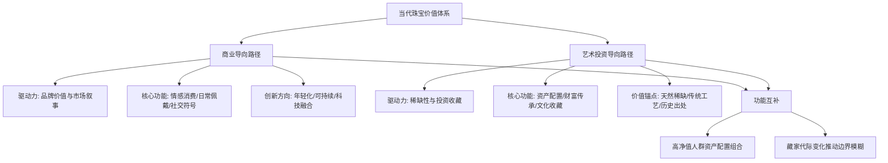

**双轨格局对当代珠宝价值体系完整构建的意义**在于：高奢品牌通过前瞻性设计和系统化创新引领当代消费时尚，不断创造新的美学经典；高定竞拍品则通过对稀缺性与历史价值的坚守，负责对这些经典进行历时性的价值筛选与封神。两者共同构成了顶级珠宝世界的完整生态——品牌不断创造新的美学经典，而拍卖市场则负责对这些经典进行历时性的价值筛选与封神。当前趋势下，两者在**可持续材料应用、对东方市场的重视以及满足年轻藏家情感与文化认同需求**上，呈现出一定的交汇，这种交汇预示着未来珠宝市场可能出现更为复杂的价值评估体系与消费模式。

## 6 趋势演变的深层驱动因素与文化内涵

2023-2025年珠宝设计趋势的演变并非孤立的美学现象，而是**社会文化心理转变、经济环境重塑与技术变革加速**三重力量深度交汇的必然结果。这些深层驱动因素相互交织、彼此强化，共同构建了当代珠宝设计从"物质载体"向"意义媒介"转型的价值哲学。理解这些驱动因素，不仅有助于解释前述章节所呈现的设计美学演变、材质工艺创新与消费市场重构的内在逻辑，更能揭示高奢品牌珠宝与高定竞拍品在趋势响应上差异化路径形成的根本原因。本章节将系统解析这些深层力量如何塑造当代珠宝的价值叙事，并阐释珠宝作为连接个人身份、文化认同与时代精神的意义符号所承载的哲学内涵。

### 6.1 社会文化心理的深层转变：后疫情时代的情感需求重构

后疫情时代消费者心理的根本性转变，构成了2023-2025年珠宝设计趋势演变的首要驱动力。这种转变并非简单的消费偏好调整，而是涉及价值观念、情感诉求与身份认同的深层重构，直接催生了"理性与诗意交融"的美学主张。

**对自然联结与有机形态的渴望**成为后疫情时代消费心理的显著特征。经历了隔离与封闭之后，都市人对自然世界的向往被显著放大，这种心理需求在珠宝设计中体现为自然主义美学的强势复兴。源于自然的枝叶与鱼元素被重新诠释，象征着生命力、自由与灵动，呼应了都市人对宁静与有机形态的渴望[^3]。这种设计取向并非简单的装饰风格选择，而是消费者通过佩戴具有自然意象的珠宝，实现与自然世界的象征性联结，获得心理层面的慰藉与平衡。

与此同时，**对秩序感与确定性的追求**推动了理性几何设计的回归。纯粹的几何形态如直线与曲线，通过对立与融合，构成了现代美学的基础，宣告着新极简主义的回归[^3]。在充满不确定性的外部环境中，消费者倾向于从简洁、规整的设计语言中获得心理上的稳定感与掌控感。这种"去冗余、重本质"的理性消费理念，使得新极简几何元素的市场转化率达到28%，显著高于18%的行业平均转化率[^3]。

**"悦己消费"与"情绪价值"取代传统消费逻辑**是这一时期最为根本的心理转变。年轻用户对小众设计首饰的追捧，本质是对"自我表达"与"情感共鸣"需求的具象化。90后、00后群体将首饰视为"情绪载体"和"社交符号"的比例分别达57%和49%，小众设计的独特性能够帮助其在同质化社交场景中建立差异化个人标签[^3]。这种将珠宝视为情感表达媒介而非单纯装饰品的心理机制，从根本上重塑了珠宝的功能定义——它不再仅仅是财富的象征或美的载体，更是个人情绪状态、生活态度与价值取向的外化表达。

消费动机的深层转变可通过以下心理机制框架理解：

| 心理维度 | 传统消费心理 | 后疫情时代消费心理 |
|----------|--------------|-------------------|
| **核心诉求** | 财富展示、身份标识 | 情感表达、自我奖励 |
| **价值判断** | 材质克重、保值增值 | 设计独特性、情感共鸣 |
| **心理功能** | 社会认同、阶层归属 | 个体认同、情绪调节 |
| **消费触发** | 人生节点、社会期待 | 情绪驱动、即时满足 |

这种心理转变对高奢品牌珠宝与高定竞拍品产生了差异化影响。高奢品牌敏锐捕捉到这一心理趋势，通过轻奢系列开发、场景化设计与情感叙事，积极回应年轻消费者的悦己需求。高定竞拍品市场则在这种心理背景下强化了其作为"确定性资产"的价值定位——在情绪消费与理性投资的双重需求下，顶级珠宝的稀缺性与保值属性为追求心理安全感的高净值人群提供了确定性的选择。

### 6.2 国潮文化自信与东方美学的价值重估

国潮文化复兴作为2023-2025年最具影响力的社会文化现象之一，深刻重塑了珠宝设计的价值叙事与符号表达。这种文化自信的崛起，不仅体现为传统元素在设计中的广泛应用，更标志着珠宝消费逻辑从"重材质轻设计"向"以设计定义价值、以情感驱动消费"的范式转换。

**传统文化元素的创造性转化**成为当代珠宝设计的核心命题。黄金珠宝首饰历史悠久，独具匠心凝聚中华传统工艺如花丝、点翠、镶嵌等。当代黄金首饰则融合传统文化元素和现代设计理念，传统工艺制作的国风饰品逐渐受到年轻人青睐[^25]。这种转化并非简单的元素复制，而是以现代设计语言重构传统符号。在珠宝首饰设计中，中国传统造型的一个显著特征就是生动，展现了对生命感的准确捕捉，同时通常体现着天地与我一体、爱天地之物便是爱己的文化思想[^26]。

**"有故事的珠宝"成为年轻消费者的核心偏好**，这一偏好背后是文化认同需求的深层表达。从买材质到买设计，年轻人首饰消费观念的转变，不仅重塑着行业格局，更让珠宝从"保值品"变成了"表达自我的符号"[^27]。周大福调查显示，91%的年轻消费者倾向选择有文化元素的珠宝，融入非遗工艺的小钻石饰品复购率比普通款高18%。这种消费偏好的形成，反映了年轻一代通过消费确认身份认同的深层心理需求——他们不仅在购买一件饰品，更是在购买一种文化归属感与价值观表达。

**文化溢价机制的形成**标志着珠宝价值评估体系的根本性变革。传统首饰市场中"重材质、轻设计"的消费惯性正在瓦解，取而代之的是"以设计定义价值、以情感驱动消费"的新范式[^3]。2025年上半年，全品类彩色宝石价格平均涨幅在30%到50%之间，大克拉或相对稀有的宝石价格涨幅甚至高达100%到150%[^28]。这种价格表现不仅反映了市场供需关系的变化，更体现了消费者对"能表达自我的珠宝"的价值认可——情感价值已超越材料价值，成为年轻消费者购买决策的核心因素[^28]。

国潮文化自信对两类珠宝市场的影响呈现差异化特征：

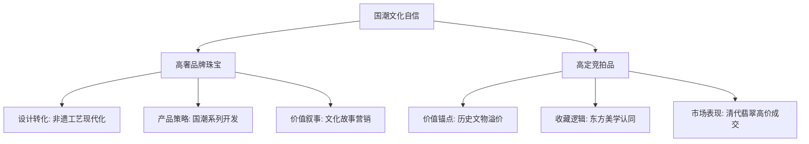

高奢品牌通过系统性的文化赋能策略，将传统元素融入产品开发与品牌叙事。中国黄金2025年重点推动"文化黄金+黄金文化"战略项目落地，围绕四大古都、敦煌系列、国宝金3.0等主题，将传统文化元素与现代审美、智能工艺深度融合[^29]。高定竞拍品市场则体现为东方美学作品的价值重估——具有深厚文化内涵的作品往往能够获得超越材质本身的文化溢价。这种差异化影响路径，使得国潮文化自信成为推动两类珠宝市场共同发展的核心驱动力。

### 6.3 经济环境变化与市场分级的结构性影响

宏观经济环境的变化对珠宝消费市场产生了深远的结构性影响。金价持续高位运行、消费分层加剧与投资需求分化，共同推动了高端市场奢侈品化与大众市场性价比导向的双轨发展格局。

**金价持续上涨对消费行为的双重影响**体现在市场的冰火两重天景象。过去一年，国际金价从年均2023美元跃升至4318美元，涨幅超过100%。然而，行业并未同步受益于这一贵金属牛市。中国黄金协会数据显示，2025年前三季度，黄金首饰消费量同比下滑3%，至270吨[^30]。一边是国际金价创下历史新高，另一边是市场消费端持续降温，揭示黄金珠宝行业已进入深度调整与价值重构期。金价上涨强化了黄金的投资与避险属性，但高金价也抑制了消费吨数，促使消费者更清晰地区分珠宝的"投资储藏"与"佩戴装饰"功能。

**消费分层与市场分级的深化**重塑了行业竞争格局。近年来，不同代际消费者的需求差异日益明显，年长消费群体更注重黄金的投资保值功能，而Z世代消费者则更关注产品的个性化表达和情感价值。这种"投资"与"悦己"并存的消费动机，要求企业必须进行更精准的市场定位[^30]。高端市场正加速奢侈品化，以老铺黄金、君佩、琳朝等品牌为代表，它们通过极致工艺、限量预售和克价超2000元的高昂定价，成功吸引了与奢侈品牌重合的高净值客群；大众市场则呈现明显的性价比导向，老凤祥、老庙黄金等传统品牌通过加大"克减"促销力度、主推轻克重产品来降低购买门槛[^30]。

**"抗跌性"与"避险资产"属性强化了高定竞拍品的投资逻辑**。2025年的珠宝市场呈现出明显的结构性分化：高端产品通过文化赋能获得溢价，而大众产品则陷入同质化竞争[^31]。在整体奢侈品市场面临利润承压的背景下，高级珠宝市场依旧保持繁荣而活跃的景象，展现出这一"硬通货"在特殊时期的受欢迎程度。戴比尔斯2025年第四季度的原钻价格指数显示，工业级小碎钻的价格跌了10%，但10克拉以上的顶级大钻和艳彩粉钻价格却逆势上涨了18%[^31]。这种分化说明市场不再为普通的"硬通货"买单，而是在追逐"孤品"级的稀缺资源。

经济环境变化对两类珠宝的差异化影响可归纳如下：

| 经济因素 | 对高奢品牌珠宝的影响 | 对高定竞拍品的影响 |
|----------|---------------------|-------------------|
| **金价上涨** | 推动轻克重、重设计产品策略 | 强化投资属性与避险价值 |
| **消费分层** | 催生轻奢入门系列与高端系列并行 | 聚焦超高净值客群的资产配置需求 |
| **经济不确定性** | 强调情感价值与即时满足 | 凸显"抗跌性"与保值传承功能 |
| **渠道变革** | 线上线下融合，直播电商崛起 | 拍卖行数字化，新藏家群体涌入 |

**税收政策调整加速了行业价值重构**。2025年11月，财政部、国家税务总局联合发布的黄金税收政策调整，首次明确区分投资性用途和非投资性用途，实施差异化税收政策。这一政策的核心影响在于明确了"黄金不能当材料卖"的导向，实质上是引导行业从原料交易思维转向价值创造思维[^30]。单纯依赖黄金原材料溢价盈利的模式将难以为继，企业需要在产品创新、文化赋能与服务增值等维度进行系统性布局，以实现从规模驱动到价值驱动的转型。

### 6.4 技术变革对创作逻辑与价值体系的根本性重塑

数字化技术与可持续理念的深度渗透，从根本上改变了珠宝的创作逻辑与价值评估体系。这种变革不仅体现在生产效率的提升，更涉及设计自由度的拓展、消费信任机制的重构以及稀缺性概念的重新定义。

**3D打印与AI辅助设计拓展了设计自由度的边界**。3D打印技术如同一位精准高效的工业助手，它擅长处理标准化、重复性的生产任务。在珠宝制作起版环节，传统工艺需要经过起银版、压胶模、开胶模等十余道工序，而3D打印只需将三维模型导入设备，就能直接输出蜡模或金属胚体[^32]。根据2025年9月的行业报告，采用3D打印技术的珠宝企业生产成本平均降低75%，交付周期从四周缩短至七天[^32]。这种效率革命使得个性化定制从高端服务转变为可规模化的市场选择，消费者可以根据个人喜好进行定制，满足市场对个性化的需求[^33]。

**"科技打底、手工点睛"的融合模式重新定义了"手工价值"的边界**。手工雕刻的魅力在于其不可复制的温度。就像机器烘焙的面包永远缺少老面发酵的香气，3D打印的完美线条中难以承载雕刻师傅的呼吸节奏[^32]。纽约某珠宝工坊的案例生动说明这种互补性：他们使用3D打印制作基础骨架，再由工匠手工镶嵌宝石并打磨细节，使得同样一款18K金手链的制作时间从传统工艺的三个月压缩到三周，而手工参与的部分反而让产品溢价40%[^32]。这种模式在效率与温度之间寻求平衡，使得科技成为释放手工价值的工具而非替代者。

**区块链溯源技术重构了消费信任机制**。更深远的变化发生在供应链层面。区块链技术的应用，让每颗宝石都有了"数字身份证"。消费者通过扫码即可查看矿源信息、加工流程、碳足迹等20项数据。这种透明化不仅提升了信任度，更倒逼供应链各环节优化环保表现[^34]。在高定竞拍品市场，溯源技术为高端珠宝提供不可篡改的溯源证书，强化其投资收藏的可靠性与传承价值。

**可持续材料挑战传统稀缺性定义并催生新的价值叙事**。实验室培育宝石的技术突破为材料革命注入新动能。2025年，中国科学家成功开发出"纳米级晶体控制"技术，使实验室培育钻石的纯净度达到天然钻石的98%，而成本仅为后者的1/8[^34]。这种技术进步迫使行业重新思考"稀缺性"的内涵——当物质层面的稀缺性可以被技术突破时，设计独特性、文化内涵与情感共鸣成为新的稀缺性维度。年轻一代的消费观念转变为工艺革新提供了市场动力。95后消费者中，68%表示愿意为"低碳认证"的珠宝支付溢价[^34]。

技术变革对两类珠宝的差异化影响体现在价值实现路径的分野：

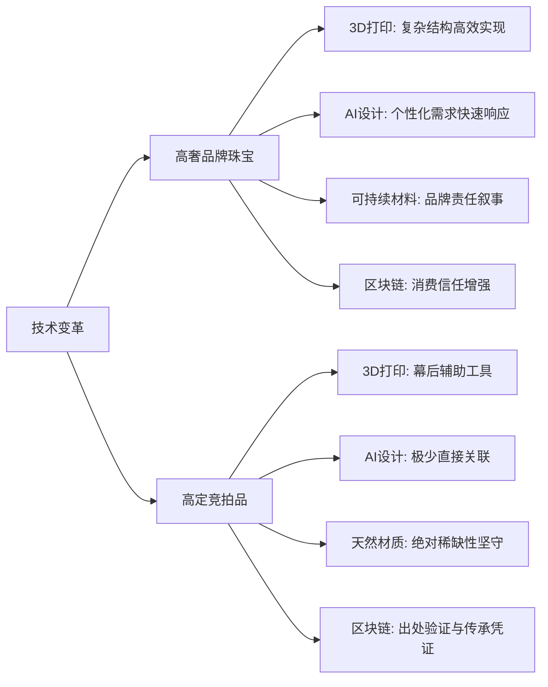

高奢品牌将技术变革视为价值创造的赋能工具，通过系统性应用实现设计创新、效率提升与品牌叙事的多重目标。中国黄金与清华大学合作开发"巡礼"黄金首饰生成大模型，高度赋能产品设计，推动了传统文化元素与现代工艺的融合[^35]。高定竞拍品市场则保持对传统手工技艺极致性的坚守，技术主要作为幕后辅助工具服务于修复与鉴定，其核心价值仍然锚定于"不可标准化"的手艺价值与天然材质的绝对稀缺性。

### 6.5 多维因素交汇下的价值哲学演变：从物质载体到意义媒介

社会文化心理、经济环境与技术变革三重力量的交汇，共同塑造了当代珠宝设计的价值哲学——珠宝正从单纯的"物质载体"转型为承载多元意义的"意义媒介"。这种转型体现在功能定义、稀缺性概念与价值叙事的全面演进中。

**珠宝功能定义的根本性转型**是这一价值哲学演变的核心表现。当代消费者对珠宝的追求已超越单纯的外观设计和工艺品质，他们更将珠宝视为探索自我内心世界的精神媒介——珠宝不仅是装饰品，更是情感寄托和自我认同的表达工具[^36]。这种功能转型意味着珠宝从"保值工具"向"情感载体"、从"装饰品"向"自我表达媒介"的演进。黄金饰品正从投资工具与装饰品，演变为承载文化认同的社交货币[^27]。年轻群体渴望通过定制化、主题化的设计，将兴趣与情感融入饰品，使珠宝成为个人身份与价值观的外化符号。

**"稀缺性"概念的多维演进**标志着价值评估体系的根本性变革。传统珠宝价值评估以地质稀缺性（克拉、产地、净度）为核心锚点，而当代珠宝价值体系正在向多维稀缺性演进。在高奢品牌市场，设计独特性、文化内涵与情感共鸣成为新的稀缺性维度——63%的年轻用户将"设计独特性"列为购买首要考量因素，远超"材质价值"(21%)和"品牌知名度"(16%)[^3]。在高定竞拍品市场，地质稀缺性与历史唯一性仍然是价值基石，但文化溢价的权重显著提升——具有深厚文化内涵的作品往往能够获得超越材质本身的价值认可。

**价值叙事的差异化演进**体现在两类珠宝对意义建构的不同路径。高奢品牌通过品牌叙事、设计美学与情感联结构建价值，强调珠宝作为"当代生活方式"与"自我表达"的载体功能。高定竞拍品则通过稀缺性、历史出处与文化内涵构建价值，强调珠宝作为"资产配置"与"文化传承"的载体功能。两种价值叙事并非对立，而是在当代珠宝价值体系中形成功能互补——前者满足情感消费与日常佩戴需求，后者服务于财富保值与文化收藏目标。

多维因素交汇下的价值哲学演变可通过以下框架系统呈现：

| 价值维度 | 传统价值哲学 | 当代价值哲学 |
|----------|--------------|--------------|
| **核心功能** | 财富储存、装饰美化 | 情感表达、身份建构、意义承载 |
| **稀缺性定义** | 地质稀缺性（克拉、产地、净度） | 多维稀缺性（设计、文化、情感、地质） |
| **价值来源** | 材质价值+工艺价值 | 意义价值+情感价值+材质价值+工艺价值 |
| **消费逻辑** | 投资保值、仪式消费 | 情绪消费、自我奖励、文化认同 |
| **社会功能** | 阶层标识、财富展示 | 个性表达、圈层认同、价值观传递 |

**当代珠宝作为连接个人身份、文化认同与时代精神的意义符号**，承载着深刻的哲学内涵。在这个意义体系中，珠宝不再是被动的物质载体，而是主动参与意义建构的媒介。年轻人不是不喜欢珠宝了，他们只是更喜欢能表达自我的珠宝[^28]。这句来自设计师的观察，精准概括了当代珠宝价值哲学的核心转向——珠宝的价值不再仅仅取决于它"是什么"（材质、克重、工艺），更取决于它"意味着什么"（情感、故事、认同）。

这种价值哲学的演变对行业发展具有深远影响。对高奢品牌而言，产品开发需要从"材质驱动"转向"意义驱动"，在设计语言、文化叙事与情感连接上持续创新。对高定竞拍品市场而言，价值评估需要在坚守稀缺性基石的同时，更加重视文化内涵与历史叙事的挖掘与传播。两条路径的并行发展，共同构建了当代珠宝从"物质载体"向"意义媒介"转型的完整图景，也为理解未来珠宝设计趋势的演变方向提供了哲学层面的洞察。

## 7 结论：共通点、特色亮点与未来展望

2023-2025年的珠宝设计趋势演变，深刻揭示了当代高级珠宝市场在消费逻辑、价值评估与美学表达上的根本性转型。通过对高奢品牌珠宝与高定竞拍品两大市场板块的系统比较分析，本报告发现两者虽在市场定位、趋势响应与价值实现路径上存在显著分野，却在深层价值逻辑上呈现出趋同性——**珠宝正从单纯的物质载体演进为承载情感、文化与身份认同的意义媒介**。本章将系统整合前述分析的核心发现，归纳两类珠宝的共通趋势与差异化特色，并基于当前轨迹前瞻性地预判行业未来的关键发展方向与潜在挑战，为行业参与者提供战略性洞察。

### 7.1 共通核心趋势：跨越市场分野的设计与消费共识

尽管高奢品牌珠宝与高定竞拍品在市场功能与价格定位上存在本质差异，两者在2023-2025年间却呈现出多个跨越市场分野的共通核心趋势，这些趋势反映了当代珠宝消费的深层价值共识。

**个性化表达与情感价值的普遍崛起**构成了两类珠宝市场最为根本的共同转向。在高奢品牌市场，Z世代消费者将珠宝视为"情绪载体"与"社交符号"，68%的年轻消费者为"奖励自己"或"日常搭配"购买珠宝，非婚嫁场景消费占比从2020年的52%飙升至81%。在高定竞拍品市场，年轻藏家同样追求"独一无二的设计+可溯源的故事"，富艺斯香港珠宝部数据显示近5年买家平均年龄从55岁降至38岁。两个市场的消费者都在通过珠宝表达个人身份、记录人生节点、传递价值观念，珠宝的情感功能已超越其装饰与投资功能。

**工艺创新与传统技艺复兴的双轨并行**在两类珠宝中均有深刻体现。高奢品牌采用"科技打底、手工点睛"的融合模式，3D打印使生产成本降低75%、交付周期从四周缩短至七天，而手工参与的精加工环节反而让产品溢价40%。高定竞拍品则坚守传统手工技艺的极致化展现，历峰集团"工匠培养计划"强调一位能镶嵌微绘珐琅的大师需要二十年功力。两条路径虽侧重不同，却共同印证了**工艺价值在当代珠宝中的核心地位**——无论是科技赋能的效率革命，还是手工技艺的极致追求，最终都指向对"不可标准化"价值的尊重与塑造。

**文化叙事与符号价值的深度赋能**成为两类珠宝市场共同的价值建构策略。高奢品牌系统性地将传统文化元素融入产品开发，周大福调查显示91%的年轻消费者倾向选择有文化元素的珠宝，融入非遗工艺的产品复购率比普通款高18%。高定竞拍品市场则体现为具有历史出处与文化内涵的作品获得显著溢价，卡地亚水果锦囊项链以6775.5万港元成交、溢价率达78.3%，正是文化叙事转化为市场价值的典型案例。**"有故事的珠宝"已成为跨越市场分野的核心消费偏好**。

**从物质导向转向意义导向的根本性转变**是两类珠宝市场在深层价值逻辑上趋同的集中体现。传统珠宝价值评估以材质克重为核心锚点，而当代消费者63%将"设计独特性"列为购买首要考量因素，远超"材质价值"(21%)和"品牌知名度"(16%)。这种转变在高奢品牌市场体现为"以设计定义价值、以情感驱动消费"的新范式，在高定竞拍品市场则体现为文化溢价权重的显著提升。两类珠宝的价值评估体系都在经历从"它是什么"向"它意味着什么"的根本性演进。

| 共通核心趋势 | 高奢品牌珠宝表现 | 高定竞拍品表现 |
|--------------|------------------|----------------|
| **个性化表达与情感价值** | 悦己消费占比42%，场景化设计普及 | 年轻藏家涌入，追求独特设计与故事 |
| **工艺创新与传统复兴** | 科技打底+手工点睛融合模式 | 传统手工技艺极致化坚守 |
| **文化叙事与符号价值** | 国潮系列开发，非遗工艺现代化 | 历史出处与文化内涵溢价显著 |
| **物质导向转向意义导向** | 设计独特性成首要购买因素 | 文化溢价权重持续提升 |

### 7.2 差异化特色亮点：商业场景化与极致稀缺性的分野

在共通趋势之下，高奢品牌珠宝与高定竞拍品各自形成了鲜明的特色优势，这些差异化特色并非对立，而是在当代珠宝价值体系中形成了功能互补的双轨格局。

**高奢品牌珠宝的特色亮点**聚焦于**大众场景化渗透与系统性创新能力**：

- **年轻化设计语言的系统性融入**：品牌通过年度高级珠宝系列发布、季节性主题更新与限量联名款推出，主动引领当代设计美学演变。卡地亚EN ÉQUILIBRE系列以"平衡的艺术"诠释和谐美感，蒂芙尼Blue Book系列以海洋主题致敬自然，宝格丽Eternal系列从档案馆汲取灵感进行当代焕新，展现了品牌框架内的设计创新活力。

- **场景化产品策略的精准落地**：轻奢系列开发有效触达年轻消费群体，小克重、设计感强的锁骨链、叠戴戒指销量年增50%。"职场第一颗钻石""自我奖励钻石""闺蜜同款钻石"等创新概念，将珠宝消费从"低频人生节点"转为"高频情绪消费"，1000-5000元价格带的天然钻石饰品完美契合"心动即可行动"的消费心理。

- **可持续材料应用的规模化推进**：萧邦Lucent Steel™精钢含80%循环再造材质，承诺2025年底前提升至90%；品牌构建扎根本地的循环制造圈，所有供货商分布于生产基地周边1000公里范围内。这种可持续实践已从营销话术演进为切实影响供应链的核心议程。

- **数字化渠道创新的深度布局**：35%的销售额来自线上，直播电商占比突破40%，"线上种草+线下试戴+线上下单"成为主流路径。中国黄金APP实现从产品查询、在线购买到黄金回购的全流程闭环服务，AI大模型使研发效率提升40%。

**高定竞拍品的特色亮点**则坚守于**极致稀缺性与终极收藏价值**：

- **天然珍稀宝石的绝对价值锚定**：顶级拍品几乎被天然钻石与传奇产地彩宝包揽，10克拉以上顶级大钻和艳彩粉钻价格逆势上涨18%。"The Mediterranean Blue"10.03克拉艳彩蓝钻以1786万瑞士法郎成交，"核心产地+无烧属性+权威证书"的价值三角成为藏家决策核心。

- **传统手工技艺的巅峰展现**：高定竞拍品的工艺价值聚焦于"不可标准化"的手艺，一位老匠人为修复19世纪冠冕花三个月打磨指甲盖大小的翡翠呈现叶脉透光感。带有知名匠人签名的孤品珠宝近三年拍卖溢价年均增长15%。

- **历史出处与文化内涵的深度挖掘**：卡地亚、梵克雅宝、宝格丽等百年品牌贡献高端珠宝拍卖72%的成交额，其作品平均保值率达发行价的2.8倍。阿迦汗祖母绿钻石胸针以855万美元成交，历史凭证与传承脉络构成价值背书的重要组成部分。

- **资产配置与财富管理的功能强化**：古董签名珠宝、天然钻石古董珠宝平均年化回报率高达8.4%，十年累计回报约124%，且与黄金、债券相关性低，成为"抗通胀+高波动市场对冲工具"。

两条发展路径的功能互补关系可通过以下框架理解：

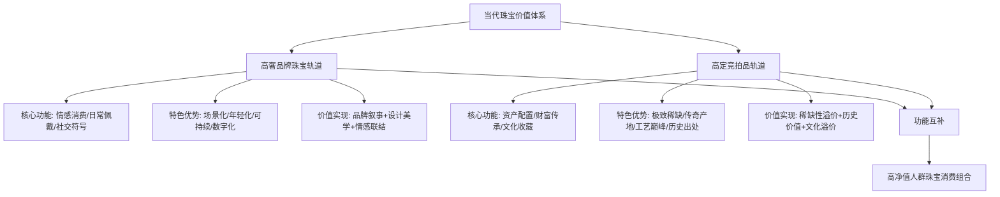

### 7.3 未来发展方向预判：趋势延续与新兴机遇

基于2023-2025年趋势演变轨迹与深层驱动因素分析，未来珠宝行业将在以下关键方向持续演进，并孕育新的市场机遇。

**可持续理念将从营销话术向供应链核心深化**。当前可持续实践已在高奢品牌中取得实质性进展，2025年全球回收黄金产量占总供应量的35%，较2020年提升12个百分点。未来这一趋势将进一步深化：区块链溯源技术将成为行业标配，280万颗天然钻石已实现全链路登记；碳足迹认证将从差异化优势转变为市场准入门槛；循环经济模式将从品牌个案扩展为行业规范。95后消费者中68%愿意为"低碳认证"珠宝支付溢价的数据，预示着可持续将成为下一代消费者的核心价值主张。

**科技与手工融合模式将进一步成熟并形成新的价值评估标准**。"科技打底、手工点睛"的模式已被市场验证，未来这一融合将更加精细化：AI辅助设计将从效率工具演进为创意伙伴，实现"数十亿种排列组合"的个性化定制；3D打印将在复杂结构实现上达到更高精度；而手工工艺的价值将被更精准地定价——工艺成本在高级珠宝领域是被严重低估的时间艺术，未来"匠人签名"与"手工时长"可能成为产品标签的标准组成部分。

**东方美学与国潮文化的价值释放将持续深化**。2023-2025年国潮复兴已从表面的元素应用演进为深度的文化赋能，淘宝数据显示新中式手串销量暴涨566%。未来这一趋势将在以下维度持续释放：非遗工艺现代化将从单品创新扩展为系列开发与品牌战略；东方美学将从国内市场延伸至全球舞台，成为中国珠宝品牌差异化竞争的核心资产；文化IP联名将从节庆营销升级为常态化产品策略。

**Z世代消费主导地位将进一步强化并重塑行业格局**。Z世代已占据珠宝消费42%份额，未来这一比例将持续提升。这意味着：悦己消费与情绪价值将成为产品开发的首要考量；轻克重、重设计的产品策略将从趋势成为主流；社交媒体种草与直播电商将成为核心销售渠道；而"有故事的珠宝"将从差异化优势转变为市场竞争的基本门槛。

**高奢品牌与高定竞拍品的边界模糊化将催生新市场形态**。藏家群体的代际变化正在重塑两类市场的边界：年轻藏家既追求设计感与情感价值，也关注投资属性与收藏价值。佳士得数据显示63%的新买家通过线上平台首次竞得拍品，2024年新买家在2025年继续回流且购买金额增长54%。这种趋势预示着：高奢品牌可能推出更具收藏属性的限量系列；拍卖行可能开辟更年轻化、更注重设计感的专场；介于两者之间的"轻收藏"市场可能成为新的增长极。

| 未来发展方向 | 趋势演进路径 | 市场机遇 |
|--------------|--------------|----------|
| **可持续深化** | 营销话术→供应链核心→行业规范 | 碳中和认证、循环经济服务 |
| **科技手工融合** | 效率工具→创意伙伴→价值评估标准 | AI定制平台、匠人品牌化 |
| **东方美学释放** | 元素应用→文化赋能→全球输出 | 非遗IP化、文化出海 |
| **Z世代主导** | 新兴群体→核心群体→主导群体 | 情绪消费产品、社交货币珠宝 |
| **边界模糊化** | 双轨分立→功能互补→形态融合 | 轻收藏市场、线上拍卖 |

### 7.4 潜在挑战与行业启示：风险识别与战略建议

在趋势机遇之下，行业同样面临多重潜在挑战，识别这些风险并制定差异化应对策略，对高奢品牌与高定竞拍品市场参与者至关重要。

**经济不确定性对消费分层的持续影响**构成首要挑战。2025年前三季度黄金首饰消费量同比下滑3%，高价位抑制消费吨数的现象已然显现。未来若全球经济进入更深度调整，消费分层将进一步加剧：高端市场可能因避险需求而保持韧性，但大众市场可能面临更大压力；"投资"与"悦己"的消费动机分化将要求品牌进行更精准的市场定位与产品策略。

**培育宝石对天然稀缺性叙事的冲击**需要行业正视。培育钻石纯净度已达天然钻石98%、成本仅为后者1/8，这种技术进步正在挑战传统稀缺性定义。对高奢品牌而言，需要在可持续叙事与天然价值之间寻求平衡；对高定竞拍品市场而言，需要更加强化天然宝石的地质稀缺性、产地传奇性与历史唯一性，以维护其价值锚点的不可替代性。

**年轻藏家审美偏好的快速迭代**带来市场预测的不确定性。Z世代的消费特征是高频迭代、圈层分化与社交驱动，今日的爆款可能迅速成为明日的过时。品牌需要建立更敏捷的趋势响应机制，同时避免过度追随短期热点而丧失品牌DNA的连贯性。

**同质化竞争与价值内卷风险**在大众市场尤为突出。当"国潮""非遗""可持续"成为行业共识时，差异化优势可能迅速消解。2025年保利香港秋拍37件珠宝拍品流拍的现象，部分反映了市场对同质化产品的理性回归。品牌需要从"跟随趋势"转向"定义趋势"，在共通语境中构建独特的价值主张。

**针对高奢品牌的战略启示**：

1. **产品力驱动取代规模驱动**：老铺黄金2024-2025年上半年收入同比增幅超过2倍的案例证明，产品力是穿越周期的核心竞争力。品牌应加大设计研发投入，构建"大众产品、专供产品、高端子品牌产品"的金字塔式产品架构。

2. **文化赋能构建护城河**：91%的年轻消费者倾向选择有文化元素的珠宝，文化叙事能力将成为品牌的核心资产。建议系统性布局文化IP合作、非遗工艺传承与品牌故事深化。

3. **渠道融合提升体验**："线上种草+线下试戴+线上下单"的消费路径要求品牌构建无缝衔接的全渠道体验。体验店的手工工坊、珠宝科普活动等沉浸式体验将成为转化的关键触点。

**针对高定竞拍品市场的战略启示**：

1. **稀缺性叙事的深度强化**：在培育宝石冲击下，天然宝石的价值叙事需要从"地质稀缺"延伸至"故事稀缺"与"时间稀缺"。拍卖行应加强对拍品历史出处、匠人传承与文化内涵的挖掘与传播。

2. **年轻藏家的系统性培育**：63%的新买家通过线上平台首次竞得拍品的数据表明，数字化是触达年轻藏家的关键渠道。建议开辟入门级专场、强化线上预展与社交媒体互动，降低收藏门槛的同时培养未来的核心藏家群体。

3. **价值回归与理性定价**：37件拍品流拍的现象提示市场正在回归理性。拍卖行应更审慎地评估拍品定价，避免过度乐观的估价损害市场信任，同时引导藏家关注中端市场的价值洼地。

**行业共同的战略方向**：

- **从规模竞争转向价值竞争**：税收政策调整明确"黄金不能当材料卖"的导向，行业需要从原料交易思维转向价值创造思维。
- **从产品销售转向意义建构**：珠宝的价值不再仅取决于"它是什么"，更取决于"它意味着什么"，品牌需要成为意义的创造者与传播者。
- **从单一市场转向生态协同**：高奢品牌与高定竞拍品的功能互补关系将更加紧密，行业参与者应以生态视角审视自身定位，在差异化竞争中寻求协同共生。

2023-2025年的珠宝设计趋势演变，本质上是珠宝从"物质载体"向"意义媒介"转型的历史进程。在这一进程中，高奢品牌珠宝以系统性创新引领当代消费时尚，高定竞拍品以绝对稀缺性锚定终极收藏价值，两者共同构建了当代珠宝价值体系的完整光谱。面向未来，无论是追求情感表达的年轻消费者，还是寻求资产配置的顶级藏家，都将在这一价值体系中找到属于自己的选择。而对于行业参与者而言，理解这一转型的深层逻辑，把握趋势演变的关键方向，将是穿越周期、赢得未来的根本所在。

# 参考内容如下：
[^1]:[彩色钻石的投资回报率有多高?2025佳士得拍卖揭示的3个布局时机](https://baijiahao.baidu.com/s?id=1847778922908849503&wfr=spider&for=pc)
[^2]:[宝格丽蓝宝石耳环如何靠设计赋能宝石?解码奢侈品牌溢价背后的工艺与文化价值](https://baijiahao.baidu.com/s?id=1845512313531217853&wfr=spider&for=pc)
[^3]:[首饰消费数据:年轻用户偏爱小众设计,这些元素转化率最高](https://www.163.com/dy/article/KIOL2UFV0518OT8R.html)
[^4]:[2025秋季拍卖——璀璨珠宝专场:意式风华,光芒永恒](https://baijiahao.baidu.com/s?id=1841594974930478717&wfr=spider&for=pc)
[^5]:[珠宝定制中设计版权如何转化为投资价值?从卡地亚古董系列看独创性的长期收益](https://baijiahao.baidu.com/s?id=1849377508953620673&wfr=spider&for=pc)
[^6]:[佳士得一边拉拢“Z世代”,一边用法拉利留住老藏家 2025年拍卖行呈现哪些新变化?](https://baijiahao.baidu.com/s?id=1851752732479118651&wfr=spider&for=pc)
[^7]:[梵克雅宝“四叶草”为何能成投资级珠宝?设计师揭秘“符号语言”与品牌价值的硬核关联](https://baijiahao.baidu.com/s?id=1847865919937170680&wfr=spider&for=pc)
[^8]:[从功能象征转向风格主张,2026男士珠宝呈现五大趋势](https://baijiahao.baidu.com/s?id=1855289910026049753&wfr=spider&for=pc)
[^9]:[一件也订制 高贵典雅 2024年,「地主家」也买不起珠宝了!](https://baijiahao.baidu.com/s?id=1837320956340378139&wfr=spider&for=pc)
[^10]:[清代南红朝珠vs现代钻石项链,2025年拍卖溢价谁更高?文化价值碾压材质案例解读](https://baijiahao.baidu.com/s?id=1846839152267377652&wfr=spider&for=pc)
[^11]:[珠宝投资四大趋势预测,2025年市场热点,财经视角前瞻分析](https://baijiahao.baidu.com/s?id=1850216694695306885&wfr=spider&for=pc)
[^12]:[卡地亚猎豹vs宝格丽灵蛇 #珠宝翡翠尚品 #中国嘉德2025秋拍 #收藏 ](https://post.smzdm.com/zz/p/avvxgzrp/)
[^13]:[2300万和田玉王炸全场!2025西泠秋拍8.34亿强势收官,快看富豪都在买什么?](https://baijiahao.baidu.com/s?id=1853551752901424697&wfr=spider&for=pc)
[^14]:[卡地亚呈献全新EN ÉQUILIBRE高级珠宝展](https://www.cartier.cn/stories-events/all-stories/2511-str-en-equilibre-beijing)
[^15]:[高级珠宝的“溢价”到底买了什么?拆解一件顶级拍品的账单,材质成本、工艺成本与品牌故事的黄金比例](https://baijiahao.baidu.com/s?id=1853639931047642974&wfr=spider&for=pc)
[^16]:[慈禧陪葬翡翠VS卡地亚顶级珠宝,2025年国际拍卖数据告诉你,文化溢价如何碾压材质价值](https://baijiahao.baidu.com/s?id=1846505340638686846&wfr=spider&for=pc)
[^17]:[高级珠宝](https://www.tiffany.cn/high-jewelry)
[^18]:[高级定制珠宝拍卖屡创新高?解析香某某手工坊系列背后的工艺价值与收藏潜力](https://baijiahao.baidu.com/s?id=1844971341960057275&wfr=spider&for=pc)
[^19]:[全球拍卖总额62亿美元,亚太区却下滑,佳士得年报暗藏玄机,中国藏家正在转向哪些“安全资产”?](https://baijiahao.baidu.com/s?id=1853209473425334732&wfr=spider&for=pc)
[^20]:[High Jewelry ](https://www.sothebys.com/buy/46f21f5e-e23b-40e0-a713-e6e4ac6838d8)
[^21]:[高級珠寶](https://zh.tiffany.com/high-jewelry/?trackbgfm=nav)
[^22]:[BVLGARI宝格丽耀目呈献全新宝格丽ETERNAL系列 品牌档案馆藏品重焕新生](https://baijiahao.baidu.com/s?id=1854892403424091868&wfr=spider&for=pc)
[^23]:[「The Royal Blue」引关注 佳士得2025年秋季香港雅逸精品周北京预展|腕表|珠宝|古董|名表|北京市|百达翡丽_网易订阅](https://www.163.com/dy/article/KDF2FE0V0514R9OJ.html)
[^24]:[2025尚美高级珠宝,好法式自然主义 ](https://post.smzdm.com/zz/p/avvnmzg7/)
[^25]:[2025年黄金珠宝行业深度分析:国潮年轻化,黄金“新趋势”(附下载)](https://baijiahao.baidu.com/s?id=1839082551691553988&wfr=spider&for=pc)
[^26]:[品鉴|国风起兮国潮涌](https://baijiahao.baidu.com/s?id=1765404179792243171&wfr=spider&for=pc)
[^27]:[从买材质到买设计 定制与国潮设计引领首饰消费新趋势](http://www.xinhuanet.com/fashion/20251013/e9ddf2c88c9a42b29f3a9f6dc4242fbd/c.html)
[^28]:[2025年珠宝市场突破万亿,年轻人为何不爱黄金爱彩宝?个性化消费催生新风口](https://baijiahao.baidu.com/s?id=1846419113183118917&wfr=spider&for=pc)
[^29]:[龙头破局行业变革:中国黄金以“文化黄金+黄金文化”重塑产品力](https://www.163.com/dy/article/KJVG0P5U0519HF8U.html)
[^30]:[金价向上,金店向下 专家预测:行业进入价值重构关键期](https://baijiahao.baidu.com/s?id=1854442094270022922&wfr=spider&for=pc)
[^31]:[顶级珠宝价值链全解析,从矿山开采到拍卖行,投资机会与陷阱一览](https://baijiahao.baidu.com/s?id=1848401982208921980&wfr=spider&for=pc)
[^32]:[3D打印技术入侵珠宝业,传统雕刻师傅会失业吗?](https://baijiahao.baidu.com/s?id=1848112314184080604&wfr=spider&for=pc)
[^33]:[3D打印在珠宝行业的设计和制造应用-CASAIM](https://cloud.tencent.com/developer/news/1939953)
[^34]:[珠宝首饰行业可持续发展的趋势是什么?2025-2026绿色投资新方向](https://baijiahao.baidu.com/s?id=1845013676348340921&wfr=spider&for=pc)
[^35]:[锚定“三化”战略航向 中国黄金以硬核实力擘画黄金产业新蓝图](https://baijiahao.baidu.com/s?id=1854213434372826787&wfr=spider&for=pc)
[^36]:[复古珠宝重回舞台 “运动化”成新风向](http://www.xinhuanet.com/fashion/20251218/cd011f2cb99f4caabb31cec22b179a5d/c.html)
