# 不同类型游戏用户群体画像分析研究报告
## 1 游戏类型分类体系与研究框架

游戏产业历经数十年发展，已形成庞大而复杂的产品生态。理解不同类型游戏的用户群体画像，首先需要建立清晰的游戏类型分类体系与用户分析框架。本章将从玩法机制、运行平台、商业模式等多个维度系统梳理游戏分类标准，并确立用于后续各类型游戏用户深度分析的核心画像维度，为全面解析游戏用户群体特征奠定方法论基础。

### 1.1 按玩法类型的游戏分类体系

按游戏玩法进行分类是当前游戏产业中**最主要、最普遍的分类途径**，这种分类法根据游戏为满足特定目的而采用的不同表现方法来区分，具有清晰、客观的特点[^1]。世界上并没有统一的分类方法，但游戏类型主要可分为动作、冒险、模拟、角色扮演、休闲和其他六大类，它们各有数十种分支，形成了庞大的"游戏类型树"[^2]。

**动作游戏（Action Game，ACT）** 是一种强调反应速度和操作技巧的宽泛游戏类型，涵盖射击与格斗两大核心子类[^1]。其中，射击游戏进一步细分为第一人称射击游戏（FPS）和第三人称射击游戏（TPS），代表作品如《反恐精英》《使命召唤》《生化危机》等[^3]。格斗游戏则以玩家控制角色进行对战为核心，如《街头霸王》《拳皇》等经典作品[^3]。

**角色扮演游戏（Role-Playing Game，RPG）** 是游戏产业中最具深度和沉浸感的品类之一，玩家通过扮演角色、升级装备来提升能力[^3]。2024年数据显示，RPG手游收入占全球整体手游收入比例高达25.6%，远超其他游戏品类，展现出惊人的变现能力[^4]。RPG内部细分丰富，从收入规模来看，**回合制RPG以超30%的份额稳居第一，MMORPG和放置RPG分别以21%和15%的占比位列二、三位**[^4]。值得关注的是，放置RPG近五年收入持续上升，成为增长最强劲的细分赛道，而回合制RPG和MMORPG则呈现持续下降趋势[^4]。此外，ARPG（动作角色扮演）、Roguelike RPG、开放世界RPG等细分类型也各具特色，其中开放世界RPG下载量虽仅占RPG总下载量的4.3%，但增速高达154%[^4]。

**策略游戏（Strategy）** 强调战术决策和资源管理，包括即时战略游戏（RTS）如《星际争霸》，以及回合制策略游戏如《文明》《部落冲突》等[^3][^5]。

**模拟游戏（Simulation）** 注重对现实或虚构系统的还原，涵盖城市建设如《模拟城市》、生活模拟如《模拟人生》、经营养成等多种形态[^3]。模拟经营类游戏近年来增长态势显著，在微信小游戏市场的占比已从2023年9月的7%攀升至2024年7月的12%[^6]。

**冒险游戏（Adventure）** 侧重探索与解谜，注重剧情推进，代表作品如《神秘海域》《塞尔达传说》[^3]。

**其他重要类型**还包括：体育游戏模拟各类体育运动，如《FIFA》《NBA 2K》；竞速游戏以赛车或竞速为主题，如《极品飞车》《马里奥赛车》；音乐节奏游戏以音乐节拍为核心玩法，如《节奏天国》《太鼓达人》；益智游戏以解谜为核心，如《俄罗斯方块》《纪念碑谷》[^3]。

**MOBA（多人在线战术竞技游戏）** 作为近年崛起的重要品类，形成了高度多元化且呈现清晰分层的生态[^7]。代表作品如《王者荣耀》《英雄联盟》已成为现象级产品。2009年以后出现的**沙盒游戏**通常融合动作、冒险、求生、角色扮演四类元素，玩家可自由探索和创造，如《我的世界》《GTA》[^2][^3]。

**玩法融合化趋势**是当前游戏产业的显著特征。随着游戏内容日益丰富，不同种类游戏之间的玩法和内容出现大量重叠与交叉，**单一类型游戏已逐渐消失，取而代之的是含有多种特点的大型游戏**[^1][^2]。如今大多数游戏都具有两三种游戏类型的复合特征，融合动作与角色扮演的开放世界游戏成为主流[^1]。这种趋势对传统分类体系形成挑战，也使得用户画像分析需要更加关注跨类型的行为特征。

下表汇总了主要玩法类型的核心特征与代表作品：

| 游戏类型 | 核心特征 | 代表作品 | 细分类别 |
|---------|---------|---------|---------|
| 动作游戏（ACT） | 强调反应速度与操作技巧 | 《鬼泣》《战神》 | FPS、TPS、格斗 |
| 角色扮演（RPG） | 角色成长、剧情沉浸 | 《最终幻想》《巫师》 | 回合制、ARPG、MMORPG、放置 |
| 策略游戏 | 战术决策、资源管理 | 《文明》《星际争霸》 | RTS、回合制策略 |
| 模拟游戏 | 现实系统还原 | 《模拟城市》《模拟人生》 | 经营、养成、建造 |
| 冒险游戏 | 探索解谜、剧情驱动 | 《塞尔达传说》《神秘海域》 | 动作冒险、文字冒险 |
| MOBA | 团队竞技、即时对战 | 《王者荣耀》《英雄联盟》 | - |
| 休闲益智 | 简单易上手、碎片化 | 《俄罗斯方块》《纪念碑谷》 | 消除、益智、超休闲 |
| 体育竞速 | 模拟运动/赛车体验 | 《FIFA》《极品飞车》 | 体育、竞速 |
| 音乐节奏 | 音乐节拍为核心 | 《太鼓达人》《节奏天国》 | - |
| 沙盒游戏 | 开放世界、自由创造 | 《我的世界》《GTA》 | - |

### 1.2 按平台与运营模式的游戏分类

除玩法维度外，游戏还可依据运行平台、玩家人数和商业模式进行分类，这些维度对用户群体构成具有显著影响。

**按游戏平台分类**，电子游戏可分为以下主要类别[^1][^2]：

- **街机游戏**：使用大型游戏机进行游玩的设备，曾是游戏产业的重要形态
- **主机游戏**：利用家庭用游戏主机（如PlayStation、Xbox、Nintendo Switch）进行游玩[^3]
- **PC游戏**：在个人电脑和其他运算计算机上运行的游戏[^3]
- **移动游戏**：使用智能手机或平板进行游玩的电子游戏，包括APP游戏与小程序游戏
- **网页游戏**：通过浏览器直接运行，无需下载[^3]
- **云游戏**：通过云端服务器运行，玩家通过网络流式传输游戏内容[^3]

移动游戏市场近年来发展迅猛。2024年2月数据显示，**手机游戏APP行业活跃用户规模达到6.59亿**，同比增速超过12%，手机行业全景流量规模则达到9.4亿[^8]。特别值得关注的是小程序游戏的爆发式增长，**微信小程序游戏活跃用户达7.5亿**，在全景流量中占比达80.3%，已成为游戏市场的全新增长点[^8]。

**按玩家人数分类**，游戏可区分为[^1][^2]：

- **单机游戏（Single-Player Game）**：仅具有单机游戏功能，少数带有一机多人功能。早期游戏多为此类，现今大多数游戏都带有完备的多人联机功能
- **多人游戏（Multi-Player Game）**：具备多人联机功能的游戏总称，很多多人联机游戏同时具有单机对战功能
- **网络游戏（Online Game）**：通过时间收费或免费内购模式，让玩家与其他玩家联系的多人在线游戏
- **大型多人在线游戏（MMO）**：服务器可提供大量玩家同时在线的游戏

**按商业模式分类**，当前游戏市场主要存在以下运营策略[^3]：

| 商业模式 | 特点描述 | 对用户群体的影响 |
|---------|---------|-----------------|
| 买断制 | 一次性购买，后续无额外费用 | 用户付费能力要求较高，忠诚度相对较强 |
| 免费游戏（F2P） | 免费下载，包含内购或广告 | 用户基数大，付费率相对较低 |
| 订阅制 | 按月或按年付费 | 用户粘性高，持续付费意愿强 |
| 付费DLC | 本体免费或买断，额外内容需付费 | 核心用户付费深度较大 |
| 混合变现（IAA+IAP） | 广告变现与内购结合 | 覆盖轻度与中重度用户 |

随着亚洲式收费模式的网游发展，大多数网络游戏都采用免费游戏模式并内置收费的游戏道具[^1]。近年来，**混合变现策略日益普及**，特别是在小游戏领域，广告变现模式对传统内购模式形成替代[^4]。小游戏在发行、变现和研发方面持续创新，与手机游戏APP的运营模式相似程度提升，竞争关系逐渐显现[^8]。

### 1.3 用户画像核心分析维度框架

为系统分析不同类型游戏的用户群体特征，本报告建立多维度的用户画像分析框架，涵盖人口统计、游戏行为、心理动机、消费习惯四大核心维度。

**人口统计维度**是用户画像的基础层面，主要包括：

- **年龄分布**：游戏用户的年龄跨度广泛，从儿童到老年人都有参与游戏的群体。其中，**青少年和年轻人是游戏用户的主要群体**，占比较大[^9]。具体而言，18至24岁的年轻人为最大用户群体，占总数的40%；15至17岁的青少年占30%，25至35岁的中年群体占25%，35岁以上的成年群体占5%[^10]。但随着老年人群体数字素养提高和游戏内容多样化，老年玩家也逐渐增多[^9]。
- **性别比例**：整体来看，**男性玩家仍占据游戏用户的主导地位，约占70%**，但女性玩家的比例在逐渐增加[^10]。特别是在社交类、益智类游戏中，女性玩家的参与度更高[^9]。微信小游戏数据显示，女性玩家数量已开始显著超越男性[^6]。
- **地域分布**：不同地区用户呈现差异化特征，三线城市用户在小游戏领域占比高达半数[^6]。
- **职业与收入**：影响用户的游戏时间分配和付费能力。

**游戏行为维度**反映用户的实际游戏参与模式：

- **游戏时长**：大多数用户每天游戏时间控制在2至3小时，但在周末和假期可能更长[^10]。不同类型游戏用户的单日游戏时长差异显著，RPG用户的单日游戏时长和留存率明显高于休闲游戏玩家[^4]。
- **活跃时段**：大多数用户愿意在晚上和周末进行游戏，这也是游戏产业最繁忙的时段[^10]。
- **设备偏好**：手机和电脑是用户常见的游戏设备[^10]，不同平台用户的行为特征存在差异。
- **游戏频率**：反映用户的参与深度和粘性。

**心理动机维度**揭示用户选择特定游戏类型的内在驱动：

- **竞技追求**：硬核竞技玩家以追求高胜率、稳定提升为核心目标，倾向深度研究游戏机制，对版本变化敏感性极高[^7]
- **社交需求**：人们渴望与他人互动交流，手机游戏提供了便捷的社交平台[^11]。社交成为获取用户的关键因素，休闲娱乐玩家把游戏作为放松和社交的渠道[^7][^12]
- **休闲放松**：用户追求游戏的刺激和挑战，希望游戏能提供令人兴奋的玩法和故事情节[^10]
- **成就感与沉浸体验**：经营时的创造感、经营后的成就感，以及不断升级解锁更多内容的好奇心驱动用户持续投入[^13]

**消费习惯维度**体现用户的商业价值：

- **付费意愿**：一部分玩家更愿意在游戏中进行付费以获取更好的游戏体验[^9]。约89%的用户有过为游戏消费的经历[^5]。
- **付费金额与类型**：大多数用户会购买游戏内道具、虚拟物品以提升游戏体验，订阅VIP会员和参加游戏活动也是常见消费方式[^10]。RPG玩家的ARPPU（平均每付费用户收入）远高于行业平均水平，但付费率相对较低，属于典型的"鲸鱼用户"驱动型商业模式[^4]。
- **消费类型偏好**：包括游戏周边购买、主播打赏、赛事门票、视频会员等多元化消费形态[^5]。

下图展示了用户画像核心分析维度的整体框架：


### 1.4 研究框架与分析方法说明

本报告采用**"游戏类型分类体系×用户画像维度框架"**的交叉分析方法，系统解析不同类型游戏用户群体的特征差异与内在规律。

**研究边界与范围**：本报告聚焦于电子游戏领域，涵盖主机、PC、移动端等主流平台，重点分析当前市场中用户规模较大、商业价值显著的游戏类型。全球游戏用户数量已超过20亿人，占全球人口的近三分之一，呈现快速增长趋势[^9]。亚洲地区是全球游戏用户最多的地区，尤其是中国、日本、韩国等国家拥有庞大的游戏用户群体[^9]。

**分析逻辑与方法**：

1. **类型聚焦分析**：针对每一主要游戏类型，从人口统计、游戏行为、心理动机、消费习惯四个维度进行系统画像
2. **横向比较分析**：对比不同游戏类型用户在各维度上的差异，揭示类型特征与用户特征之间的关联规律
3. **交叉验证分析**：结合平台、商业模式等维度，验证用户画像特征的稳定性与普适性
4. **趋势洞察分析**：关注玩法融合化、用户行为变迁等动态趋势对画像特征的影响

**报告结构安排**：

后续各章节将依次深入分析主要游戏类型的用户画像：

- **第2章**聚焦动作与射击类游戏，分析追求即时反馈和操作成就感的用户群体
- **第3章**探查角色扮演类游戏，解析追求代入感与长期养成体验的玩家特征
- **第4章**分析策略与模拟类游戏，比较决策乐趣导向与经营创造导向用户的异同
- **第5章**研究休闲与益智类游戏，验证该类型更广泛的用户覆盖面和更高的女性玩家比例
- **第6章**探查体育竞速与音乐节奏类游戏，归纳与用户现实爱好之间的强关联性
- **第7章**比较不同平台与付费模式下用户画像的差异
- **第8章**分析跨类型用户行为与画像交叉特征
- **第9章**综合归纳核心洞察并提出应用建议

**关键分析视角**：

不同地区的游戏用户在游戏偏好上存在显著差异。**亚洲地区用户对于竞技类游戏和角色扮演游戏喜爱程度较高，欧美地区用户则更倾向于动作冒险类和射击类游戏**[^9]。同时，休闲类游戏在全球范围内都备受欢迎[^9]。这种地域差异将作为重要分析视角贯穿后续各章节。

此外，**短视频对游戏用户时间的持续争夺**是当前市场的重要外部因素。从用户时长分配来看，2018年2月短视频和手机游戏的时长份额分别为21.2%和30.1%，到2024年2月这一数字变成了62.9%和15.4%[^8]。现有手机游戏APP用户中，8成以上用户使用短视频APP，用户流向短视频的风险长期存在[^8]。这一竞争态势对理解当前游戏用户行为特征具有重要参考价值。

通过上述分类体系与分析框架的建立，本报告将系统揭示不同类型游戏与用户群体特征之间的内在关联，为游戏产品定位、目标用户选择、运营策略制定等实践决策提供数据支撑与洞察参考。

## 2 动作与射击类游戏用户画像分析

动作游戏（ACT）与射击游戏（FPS/TPS）作为强调即时反馈、操作技巧与竞技对抗的核心品类，长期占据游戏市场的重要地位。这两类游戏以其紧张刺激的战斗体验、流畅的动作表现和强烈的成就感反馈，吸引了大量追求操作挑战与竞技快感的玩家群体。本章将系统分析动作与射击类游戏用户的人口统计特征、行为模式、心理动机与消费习惯，验证此类游戏对年轻男性用户的核心吸引力，并揭示ACT与FPS/TPS玩家在各维度上的共性与差异。

### 2.1 动作与射击类游戏市场概况与用户规模

动作与射击类游戏在中国游戏市场中占据举足轻重的地位，近年来呈现出稳健增长的发展态势。根据行业数据显示，**2023年中国ACT（动作类）游戏市场规模已突破680亿元人民币，同比增长约14.3%**，占整体移动游戏市场收入的比重接近18%，成为继角色扮演和策略类游戏之后最具竞争力的细分赛道之一[^14]。进入2024年，这一增长势头得以延续，**中国ACT游戏市场规模已突破850亿元人民币**，预计到2025年将稳步增长至920亿元左右[^15]。从更长远的视角来看，行业预测显示该市场将以**年均复合增长率约9.3%**的速度持续扩张，到2030年整体市场规模有望突破1400亿元[^15]。

从用户规模来看，**国内ACT游戏活跃用户已超过3.5亿**，展现出庞大的用户基础和广阔的市场空间[^14]。这一增长主要得益于移动设备性能的显著提升、云游戏技术的逐步成熟以及玩家对高沉浸感、强操作性游戏体验的持续追求[^15]。

**市场竞争格局**方面，腾讯、网易、米哈游、莉莉丝等企业已建立起较为稳固的研发与发行优势[^14]。以《原神》《崩坏:星穹铁道》《永劫无间》等为代表的头部产品不仅在国内市场表现强劲，更成功出海至日本、韩国、欧美等地区，形成了较强的国际竞争力。**2023年仅《原神》单款游戏海外收入便突破15亿美元**，成为中国文化出海的重要载体[^14]。2024年，《原神》全球年收入达38亿美元，进一步巩固了其在ARPG领域的领先地位[^15]。

**产品形态多元化**是当前市场的显著特征。从细分类型来看：

| 细分类型 | 代表产品 | 市场表现 |
|---------|---------|---------|
| 横版动作闯关 | 《地下城与勇士》（DNF） | 2024年国服月活跃用户维持在1200万左右[^15] |
| 3D硬核动作 | 《黑神话:悟空》等 | 2024年Steam中国区硬核ACT类游戏销量同比增长23.7%，用户平均游戏时长超过85小时[^15] |
| 动作角色扮演融合（ARPG） | 《原神》 | 2024年全球年收入达38亿美元[^15] |
| 移动端轻量化动作竞技 | 多款手游产品 | 用户规模达1.3亿，Z世代占比超过68%[^15] |

在射击游戏领域，FPS与TPS的**核心差异在于镜头位置**，这一差异导致视野、信息获取和体验感受的显著不同[^16]。TPS游戏在保留镜头和动作流畅性方面更具优势，而FPS则提供更强的沉浸感和精准瞄准体验[^16]。当前市场中，两种类型的射击游戏都拥有大量忠实用户，且技术演进正在推动两者体验的进一步优化。

### 2.2 用户人口统计特征分析

动作与射击类游戏用户呈现出**高度年轻化、男性主导**的典型人口统计特征，这一结论在多项研究中得到一致验证。

**年龄分布**方面，**18至35岁的年轻群体占比高达72%**，显示出该品类在核心玩家群体中的广泛吸引力[^14]。从更细分的角度来看，核心玩家群体趋于年轻化与多元化，**Z世代已成为主力消费人群**[^15]。游戏社区用户画像研究进一步显示，**18-35岁年龄段用户占比达到70%，其中18-25岁年龄段用户占比最高，为45%**[^17]。这一年龄结构反映出动作射击类游戏对年轻人强烈的吸引力，与其追求刺激、挑战和即时反馈的心理特征高度契合。

**性别比例**方面，ACT游戏用户群体以年轻人为主，**男性玩家比例显著高于女性玩家**[^14]。游戏社区整体数据显示，**男性用户占比约60%，女性用户占比约40%**[^17]。考虑到动作射击类游戏的硬核属性，该品类的男性用户占比可能更高。网游用户整体数据显示，**当前玩家群体以25至34岁为主力，平均年龄30岁，性别比例均衡，大学本科学历者占比超80%，职业构成以上班族为主**[^18]。

**结构性变化趋势**值得关注。未成年人防沉迷政策的全面落地实施对用户结构产生了深远影响，**2024年国内ACT类游戏用户中18岁以下未成年人占比已由2021年的12.3%显著下降至不足1.5%**，用户年龄结构明显向成年群体集中[^15]。这一结构性变化直接推动了产品设计逻辑的转型，**开发商普遍将核心玩法、美术风格与叙事深度向25—35岁主力消费人群倾斜**[^15]。

下表汇总了动作与射击类游戏用户的核心人口统计特征：

| 维度 | 特征描述 | 数据支撑 |
|-----|---------|---------|
| 年龄分布 | 18-35岁为核心群体 | 占比72%，Z世代为主力消费人群[^14][^15] |
| 性别比例 | 男性显著占优 | 男性玩家比例显著高于女性[^14] |
| 学历水平 | 高学历群体为主 | 大学本科学历者占比超80%[^18] |
| 职业构成 | 上班族为主体 | 职业构成以上班族为主[^18] |
| 未成年人占比 | 大幅下降 | 从12.3%降至不足1.5%[^15] |

### 2.3 游戏行为模式与时长偏好

动作与射击类游戏用户在游戏行为上表现出**高投入、长时段、追求深度体验**的显著特征，这与该品类对操作技巧和竞技深度的要求密切相关。

**游戏时长偏好**方面，ACT游戏玩家通常**偏好较长的单次游戏时长**，追求高难度的操作技巧与流畅的动作体验[^14]。游戏社区用户整体数据显示，**用户平均每天花费在游戏上的时间为2-3小时，其中30%的用户每天花费4小时以上**[^17]。对于硬核ACT类游戏玩家而言，投入时间更为可观，**2024年Steam中国区硬核ACT类游戏用户平均游戏时长超过85小时**[^15]，这一数据远超休闲类游戏用户的平均水平。

**健康风险警示**：研究表明，**每周玩电子游戏时长超过10小时可能会对饮食习惯、睡眠质量及体重管理产生显著负面影响**[^19]。重度玩家（每周10小时以上）的BMI中位数达到26.3，已超出健康范围，而轻度与中度玩家的BMI中位数分别为22.2和22.8，均处于理想区间[^19]。这一发现提示动作射击类游戏用户需要关注游戏时间管理与健康平衡。

**活跃时段分布**方面，玩家偏好动作类、角色扮演类游戏，**日均游戏时间集中于晚间及周末**，设备以手机和电脑为主[^18]。游戏社区用户在社交平台上的活跃时间约为1-2小时，主要选择QQ、微信、微博等平台进行交流[^17]。

**用户留存表现**是衡量游戏粘性的关键指标。受益于用户结构优化和产品质量提升，**2024年ACT类游戏的30日留存率平均达到38.7%，较2021年提升9.2个百分点**[^15]。这一显著提升反映出玩家对高品质动作游戏的持续投入意愿，也验证了该品类用户的高粘性特征。

**设备偏好**方面，动作射击类游戏用户在设备选择上呈现分化态势。移动端用户规模庞大，但PC端和主机端用户在付费能力和游戏深度上具备优势。TPS与FPS游戏在不同平台上的体验差异显著，**TPS游戏需要处理TPP与FPP视角切换的技术难题**，包括人物突然消失/出现的不适感和镜头位置差异等问题[^16]。

### 2.4 操作技能追求与竞技心理特征

动作与射击类游戏的核心魅力在于对**操作技巧、反应速度和竞技精神**的极致追求，这一特征深刻塑造了该品类用户的心理画像。

**操作技能追求**是动作射击类玩家的核心动机。格斗无双等动作游戏的核心之一在于**操作技巧的展现**，玩家需要通过熟练的按键组合和精确的时机掌握，完成连招和躲避，这不仅考验玩家的反应速度和操作精准度，还是一种竞技的自我挑战[^20]。ACT游戏玩家追求高难度的操作技巧与流畅的动作体验，**多数玩家表现出强烈的竞技心理，倾向于通过不断练习提升游戏技能水平**[^14]。

**竞技心理特征**方面，电子竞技游戏玩家普遍具有**强烈的竞争心理**，他们在游戏中追求胜利，渴望在虚拟世界中实现自我价值[^21]。这种竞争心理促使玩家不断挑战自我，提高游戏技能。具体表现为：

- **成就心理**：玩家在追求胜利的过程中，往往伴随着强烈的成就心理，在游戏中获得高分、完成挑战、赢得比赛，都能带来巨大的满足感和成就感[^21]
- **压力承受能力**：电子竞技游戏玩家普遍具有较强的压力承受能力，在游戏中需要面对各种挑战和压力，如比赛压力、时间压力等[^21]
- **独立思考能力**：玩家在游戏中需要独立思考，制定策略，这种独立思考能力有助于他们在现实生活中更好地解决问题[^21]

**技能提升路径**呈现清晰的阶段性特征。电竞玩家变强的过程可分为三个层次[^22]：

1. **基本功练习阶段**：万丈高楼平地起，要想游戏玩的好，基本操作的练习自然少不了。玩《CS:GO》得弄清楚什么是压枪，玩《DOTA2》就得搞明白什么是补刀[^22]
2. **战术学习阶段**：当基本功打磨好之后，需要去看职业玩家是如何处理残局的，通过不断的比较、复盘，让对游戏战局的分析能力得到提高[^22]
3. **心理博弈阶段**：操作和战术都过关后，需要了解心理学和博弈论知识，时刻思考队友在干啥、敌方又在干什么[^22]

**心理素质锻炼**是竞技玩家的必修课。竞技格斗游戏对玩家的心理素质要求极高，玩家需要具备冷静的头脑和顽强的毅力，对局势的把控要做到处变不惊，培养一颗强大的内心，能够在逆境中寻找机会[^20]。

### 2.5 社交需求与合作竞技行为

动作与射击类游戏用户在社交需求上呈现**单人沉浸与多人竞技并重**的特征，不同细分类型的社交互动强度存在差异。

**社交需求特征**方面，ACT游戏玩家**既享受单人剧情模式带来的沉浸感，也积极参与多人合作或对战模式，但整体社交互动强度低于部分社交类游戏**[^14]。这一特征反映出动作射击类玩家在社交需求上的双重性：一方面追求个人操作技巧的展现和成就感获取，另一方面也渴望通过竞技对抗和团队协作获得社交满足。

**合作心理**是团队竞技模式的核心驱动。电子竞技游戏往往需要玩家之间的紧密合作，玩家需要学会沟通、协调和分工，共同应对挑战[^21]。这种合作心理使得玩家在现实生活中也愿意与他人建立良好的合作关系。在电子竞技赛事中，**团队精神尤为重要，玩家需要相互支持、共同进步**[^21]。

**社交行为模式**主要体现在以下几个方面[^21]：

- **线上社交**：玩家通过游戏内的聊天系统、社交媒体等平台，与队友、对手进行交流
- **线下社交**：玩家参加线下活动，如粉丝见面会、电竞嘉年华等，与同好者交流
- **社区互动**：玩家加入游戏社区，参与讨论、分享经验，与其他玩家建立联系
- **战队组建**：玩家组建战队，与队友共同参与竞技比赛，提升团队凝聚力

**社群文化融入**是提升竞技体验的重要途径。格斗无双等动作游戏玩家群体庞大，形成了独特的社群文化，**积极融入这种文化，与全球玩家交流心得、分享技巧，不仅能够提升自己的竞技水平，也是展现个人风采、享受竞技乐趣的重要途径**[^20]。

**FPS/TPS与ACT社交差异**：射击类游戏（尤其是FPS）通常具有更强的即时对抗性和团队协作需求，玩家在游戏过程中需要频繁沟通战术、协调行动。而传统ACT游戏更侧重单人剧情体验，社交互动主要发生在游戏外的社区讨论和经验分享环节。随着动作游戏多人联机模式的普及，两类游戏在社交维度上的差异正在逐渐缩小。

### 2.6 消费习惯与付费行为特征

动作与射击类游戏用户展现出**较高的付费意愿和可观的消费深度**，是游戏市场中具有重要商业价值的用户群体。

**付费意愿与比例**方面，游戏社区用户对游戏付费的意愿较高，**约50%的用户愿意为游戏内的虚拟物品或服务付费**[^17]。考虑到动作射击类游戏用户的高投入特征，该品类的付费率可能更高。消费动机以**提升体验、社交需求**为核心[^18]，近九成玩家产生线上消费，集中于角色皮肤购买及道具充值[^18]。

**消费金额分布**呈现明显的分层特征。**每月游戏消费金额在100-500元之间的用户占比最高，达到40%，其中20%的用户每月消费金额超过500元**[^17]。这一消费结构显示出动作射击类游戏用户群体中存在相当比例的中高付费用户，为游戏产品提供了稳定的收入来源。

**消费类型偏好**主要集中在以下几个方面：

| 消费类型 | 特征描述 |
|---------|---------|
| 角色皮肤 | 最主要的消费品类，满足个性化表达需求 |
| 虚拟道具 | 提升游戏体验和竞技优势 |
| 战斗通行证 | 周期性付费，获取专属奖励 |
| 游戏周边商品 | 线下消费主要形式[^18] |

**商业价值与变现潜力**方面，动作射击类游戏的收入规模持续增长。以ARPG为例，《原神》2024年全球年收入达38亿美元[^15]，展现出该品类强大的变现能力。2024年Steam中国区硬核ACT类游戏销量同比增长23.7%[^15]，反映出买断制动作游戏市场的活跃度。

**独立游戏市场**也呈现出积极态势。2023年，中国独立ACT游戏在Steam平台上线数量同比增长37%，其中**超过60%的作品获得"特别好评"及以上评价**[^15]。这一趋势显示出玩家对高品质、差异化动作游戏产品的付费支持意愿。

### 2.7 ACT与FPS/TPS用户画像差异比较

动作游戏（ACT）与射击游戏（FPS/TPS）虽同属强调操作技巧的品类，但在用户画像的多个维度上存在值得关注的差异。

**核心体验追求差异**：

ACT游戏玩家更注重**动作美学、连招流畅性和角色成长**，追求华丽的战斗表现和技能组合的精准释放。射击游戏玩家则更强调**瞄准精度、战术配合和即时反应**，对枪械手感、弹道控制等细节要求极高。TPS与FPS的核心差异在于镜头位置，**TPS最大程度上保留了镜头和动作的流畅**，而FPS提供更强的第一人称沉浸感[^16]。

**竞技深度差异**：

射击游戏（尤其是竞技类FPS）通常具有更成熟的电竞生态和更明确的段位系统，玩家的竞技追求更为直接和量化。ACT游戏的竞技性更多体现在个人技巧展示和难度挑战上，如无伤通关、速通等个人成就目标。

**社交模式差异**：

| 维度 | ACT游戏 | FPS/TPS游戏 |
|-----|---------|-------------|
| 主要模式 | 单人为主，多人为辅 | 多人对战为主 |
| 社交强度 | 中等，社区讨论为主 | 较高，即时语音协作 |
| 团队依赖 | 较低 | 较高 |
| 社交场景 | 游戏外社区 | 游戏内实时 |

**用户画像共性总结**：

尽管存在上述差异，ACT与FPS/TPS用户在核心画像特征上呈现高度一致性：

1. **人口统计**：均以18-35岁年轻男性为主导，Z世代占比持续提升
2. **行为特征**：偏好较长游戏时段，追求深度体验和技能提升
3. **心理动机**：强烈的竞技心理、成就追求和自我挑战意识
4. **消费习惯**：较高的付费意愿，对虚拟道具和个性化内容具有消费热情

**整体画像规律**：动作与射击类游戏用户是游戏市场中**最具操作追求、竞技意识和付费深度**的核心玩家群体。该品类用户年轻化、男性化特征显著，对游戏品质和操作体验要求极高，愿意投入大量时间和金钱追求技能提升和竞技成就。随着技术进步和产品创新，该品类正吸引更多元化的用户群体，市场规模和商业价值持续增长。

## 3 角色扮演类游戏用户画像分析

角色扮演游戏（RPG）作为游戏产业中最具深度和沉浸感的核心品类，以其丰富的剧情叙事、完整的世界观构建和深度的角色养成系统，长期占据游戏市场的重要地位。从早期的《最终幻想》《勇者斗恶龙》到当代的《原神》《崩坏：星穹铁道》，RPG游戏持续吸引着追求代入感与长期养成体验的庞大玩家群体。本章将系统分析RPG游戏（含MMORPG、ARPG、JRPG等细分类型）玩家的用户特征，从人口统计、游戏行为、心理动机、消费习惯四大维度深入探查该类型用户群体画像，揭示其区别于其他游戏类型的独特属性与内在规律。

### 3.1 RPG游戏市场概况与细分类型特征

角色扮演游戏在全球及中国游戏市场中占据举足轻重的地位，是**变现能力最强的游戏品类之一**。根据第一章数据显示，2024年RPG手游收入占全球整体手游收入比例高达25.6%，远超其他游戏品类，展现出惊人的商业价值。在中国移动游戏收入排名前100的产品中，**角色扮演类（ARPG/MMORPG）游戏在数量和收入占比上均排名第一，分别占比25%和20%**[^23]。

**市场规模与增长态势**方面，RPG游戏市场呈现稳健发展的特征。以传奇类游戏为例，该细分品类2025年市场规模升至333亿元，同比增长18.93%，预计2026年市场规模有望突破400亿元，增速有望提升至20%[^24]。2025年行业口径的传奇游戏核心用户预估上升至5500万人，显示出该品类持续的用户吸引力[^24]。

**细分类型市场表现**呈现明显的分化态势，不同RPG细分类型在收入结构和增长趋势上存在显著差异：

| 细分类型 | 收入占比 | 增长趋势 | 典型特征 |
|---------|---------|---------|---------|
| 回合制RPG | 超30% | 持续下降 | 策略深度高，节奏较慢 |
| MMORPG | 约21% | 持续下降 | 社交性强，重度养成 |
| 放置RPG | 约15% | 持续上升 | 轻度操作，碎片化友好 |
| ARPG | 较高占比 | 稳定增长 | 动作流畅，即时战斗 |
| 开放世界RPG | 下载量4.3% | 增速154% | 探索自由度高 |

值得关注的是，**放置RPG近五年收入持续上升，成为增长最强劲的细分赛道**，而传统回合制RPG和MMORPG则呈现持续下降趋势。开放世界RPG虽然下载量占比仅4.3%，但增速高达154%，代表着RPG品类的创新方向。

**产品形态演进**方面，RPG游戏正经历从传统单机向多元化发展的转型。传奇类游戏在小游戏渠道实现爆发式增长，2025年传奇类小游戏在投游戏数约480款，较2024年增长约18.67%[^24]。小游戏市场规模为535.35亿元，传奇品类小游戏综合消耗占比约为大盘的8%，市场规模约为43亿元。这一趋势反映出RPG游戏正在向更轻量化、更便捷的产品形态延伸。

**版权合规化**成为影响市场格局的重要因素。以传奇IP为例，版权方盛趣游戏与韩国娱美德达成和解后，每年需支付高达1000亿韩元（约合人民币5亿—6亿元）的巨额授权费用，推动整个传奇游戏生态向正版化转型[^24]。私服时代的终结将促使市场收入更加透明化，正版RPG游戏的商业价值有望进一步释放。

### 3.2 用户人口统计特征分析

RPG游戏用户群体呈现出**年龄跨度较广、男性占比较高但女性用户增长显著**的结构性特点，不同细分类型之间的人口统计差异尤为明显。

**年龄分布特征**方面，RPG用户的年龄结构相较动作射击类游戏更为多元。移动游戏整体数据显示，**24岁以下的移动游戏用户占比维持在30%左右，25-30岁占比约20%，31-35岁占比稳定在14%左右，36-40岁占比约7%**[^23]。值得关注的是，**30-40岁移动游戏用户群体由2019年占比14%上升至2022年18%，40岁以上用户群体由2019年的16%升至2022年18%**，显示移动游戏正向更多年龄群体普及[^23]。

**JRPG用户年龄偏大**是一个显著特征。根据日本研究机构GEM Partners对18万名日本玩家的调查显示，**《最终幻想》和《勇者斗恶龙》的日本玩家平均年龄均为42岁**，表明这两大经典RPG系列的核心用户群体较为成熟[^25][^26]。这一数据反映出长寿RPG系列普遍面临受众固化的问题，核心粉丝群体呈现"老龄化"趋势。尽管Square Enix近年来推出多款移动端衍生作品及重制版以拓宽受众，但其吸引新用户的效果有限[^25]。

**性别比例**方面，RPG游戏用户以男性为主导，但女性玩家比例正在逐步提升。**2022年3月新上线移动游戏用户中，男性用户占比58.8%，女性用户占比41.2%**，在近三年发布的移动游戏中，男性用户仍占据主要位置[^23]。《最终幻想》男性玩家占比约70%，女性占30%[^26]。2025年游戏玩家群体数据显示，**女性玩家占52%，与男性玩家差距变小，市场性别差异逐渐变弱**[^27]。

**地域分布**呈现出明显的城市层级差异。**三线城市的移动游戏用户占比最高，达23.5%；其次是二线城市和新一线城市，占比分别为18.8%和16.6%；一线城市用户的占比最低，为9.2%**[^23]。这一分布特征表明RPG游戏在下沉市场具有广泛的用户基础。

下表汇总了RPG游戏用户与不同细分类型的人口统计特征对比：

| 维度 | RPG整体特征 | JRPG特征 | 任天堂RPG特征 |
|-----|------------|---------|--------------|
| 平均年龄 | 跨度较广 | 42岁（偏大） | 32岁（接近均衡） |
| 性别比例 | 男性约60%，女性约40% | 男性70%，女性30% | 男性70%，女性30% |
| 核心年龄段 | 18-35岁 | 35岁以上 | 25-35岁 |
| 用户趋势 | 年龄层扩展 | 老龄化 | 相对均衡 |

**学历与职业构成**方面，RPG玩家群体以高学历、上班族为主体。网游用户整体数据显示，当前玩家群体以25至34岁为主力，平均年龄30岁，大学本科学历者占比超80%，职业构成以上班族为主。这一特征与RPG游戏对剧情理解、策略规划等认知能力的要求相匹配。

### 3.3 游戏行为模式与时长投入特征

RPG玩家在游戏行为上表现出**高时长投入、强留存表现、长线参与**的显著特征，这与该品类深度养成机制和沉浸式体验设计密切相关。

**游戏时长偏好**方面，RPG用户的单日游戏时长明显高于休闲游戏玩家。2025年游戏玩家群体数据显示，**多数玩家每周玩8-14小时，超八成每周不到21小时；92%用户每天平均玩超1小时**[^27]。对于重度RPG玩家而言，投入时间更为可观，这与RPG游戏的长线养成设计和丰富的内容深度直接相关。

**活跃时段分布**呈现出明确的规律性。**玩家游戏时间集中在工作日晚上和周末节假日，主要是闲暇时候**[^27]。这一特征反映出RPG玩家倾向于在拥有较完整时间段时进行游戏，以获得更好的沉浸体验。

**设备偏好**方面，移动设备已成为RPG游戏的主要载体。**手机是主要游戏工具，占55.78%，电脑占40.26%，主机和VR使用较少；云游戏时手机占比超50%**[^27]。在新上线的移动游戏用户中，**使用华为移动终端的用户占比最高，达20.8%；其次是苹果移动终端，占比为19.9%**。OPPO、VIVO、小米、荣耀等品牌通过赞助电竞赛事、针对性地研发游戏手机等策略，获得了游戏用户的青睐，合计占比超过50%[^23]。

**用户留存表现**是衡量RPG游戏粘性的关键指标。长线养成机制对用户粘性产生显著正向影响，具体表现为：


**不同细分类型的行为模式差异**值得关注：

- **MMORPG用户**：游戏时长最长，日均可达3-4小时，活跃时段集中在晚间黄金时段，社交互动频繁
- **放置RPG用户**：单次游戏时长较短，但登录频率高，适合碎片化时间利用
- **单机RPG用户**：单次游戏时长较长，但整体游戏周期相对集中，通关后活跃度下降明显
- **ARPG用户**：游戏时长中等，对操作流畅性和战斗体验要求较高

**SLG游戏用户行为参考**显示，策略类RPG用户的付费意愿随等级提升显著增加，**尤其是10级以上的玩家**。高付费玩家在象牙资源和加速券使用上表现出更高需求[^28]。这一规律同样适用于具有策略养成元素的RPG游戏。

### 3.4 剧情沉浸与角色代入心理动机

**剧情深度和角色代入感**是RPG玩家选择该品类的核心心理动机，这一特征将RPG用户与其他游戏类型用户明显区分开来。

**剧情偏好特征**方面，RPG玩家对游戏叙事品质有着极高的要求。2025年游戏玩家群体研究显示，**Z世代更在意剧情和画面**[^27]。玩家在付费决策时，**看重角色人设（42%）、剧情深度（35%）和美术风格（23%）**[^27]。这一数据清晰表明，内容品质是驱动RPG玩家投入的核心因素。

**角色代入心理**是RPG游戏区别于其他类型的本质特征。RPG玩家通过扮演角色、升级装备来提升能力，在这一过程中建立起与虚拟角色的情感连接。具体表现为：

- **身份认同**：玩家将自我投射到游戏角色中，体验不同的人生轨迹
- **情感共鸣**：通过角色经历的剧情事件产生情感反应
- **成长陪伴**：在长期养成过程中与角色建立深厚的情感纽带
- **个性表达**：通过角色定制和选择展现个人偏好

**世界观构建**对沉浸体验至关重要。优秀的RPG游戏通过完整的世界观设定、丰富的背景故事和细致的环境叙事，为玩家构建一个可信且吸引人的虚拟世界。玩家在探索这个世界的过程中，获得超越日常生活的体验满足。

**内容要素偏好层级**可归纳如下：

| 优先级 | 内容要素 | 玩家关注度 | 对沉浸感的影响 |
|-------|---------|-----------|--------------|
| 第一 | 角色人设 | 42% | 核心吸引力 |
| 第二 | 剧情深度 | 35% | 持续动力 |
| 第三 | 美术风格 | 23% | 第一印象 |
| 第四 | 世界观设定 | 高 | 沉浸基础 |

**不同细分类型的沉浸特征差异**：

- **JRPG**：强调线性叙事和角色塑造，玩家追求完整的故事体验
- **MMORPG**：世界观构建与社交互动并重，玩家在共同体验中获得沉浸感
- **开放世界RPG**：探索自由度带来的发现乐趣是核心沉浸来源
- **ARPG**：战斗体验与剧情推进的节奏感是沉浸关键

### 3.5 角色成长与长期养成投入特征

**角色培养和装备升级系统**是RPG游戏的核心玩法支柱，也是驱动玩家长期投入的关键机制。RPG玩家在成长系统中表现出强烈的目标导向和持续投入意愿。

**养成投入行为**主要体现在以下几个方面：

- **角色等级提升**：通过完成任务、刷副本等方式积累经验值
- **装备获取与强化**：追求更高品质的装备和属性提升
- **技能解锁与升级**：丰富角色的战斗能力和玩法多样性
- **资源积累与管理**：合理规划游戏内货币和材料的使用

**心理满足机制**方面，养成体验为玩家提供多层次的心理回报：


**不同细分类型的养成深度差异**显著：

| 细分类型 | 养成深度 | 时间投入 | 核心特征 |
|---------|---------|---------|---------|
| MMORPG | 极重度 | 高 | 多维度属性、复杂装备系统 |
| 回合制RPG | 重度 | 中高 | 策略搭配、阵容养成 |
| ARPG | 中度 | 中 | 装备驱动、技能成长 |
| 放置RPG | 轻度 | 低 | 挂机收益、简化操作 |

**放置RPG的差异化设计**值得关注。该细分类型通过简化操作、自动战斗、离线收益等机制，降低了养成投入的时间门槛，使玩家能够在碎片化时间中获得成长满足。这一设计契合了现代玩家时间有限但仍渴望养成体验的需求，是放置RPG近五年收入持续上升的重要原因。

**养成与付费的关联**方面，RPG游戏的商业模式与养成系统深度绑定。玩家为加速成长、获取稀有资源、解锁高级内容而产生付费意愿。研究表明，**用户付费意愿随等级提升显著增加**[^28]，高等级玩家在资源获取和进度加速方面的付费需求更为强烈。

### 3.6 社交互动需求与公会行为分析

RPG玩家的社交需求强度因细分类型而异，**MMORPG用户展现出最强的社交依赖特征**，而单机RPG用户的社交需求则主要体现在游戏外的社区讨论中。

**MMORPG社交行为特征**：

MMORPG作为"大型多人在线角色扮演游戏"，社交互动是其核心体验组成部分。用户的社交行为主要包括：

- **公会参与**：加入游戏内组织，与固定成员建立长期合作关系
- **组队副本**：通过多人协作完成高难度内容，获得团队成就感
- **交易互动**：游戏内经济系统促进玩家间的资源交换
- **社交聊天**：实时沟通增进玩家间的情感连接

**社交系统对用户留存的影响**显著。社交关系的建立形成了强大的"社交锚定"效应，玩家因不愿离开熟悉的社交圈而保持活跃。公会活动、好友系统、师徒机制等设计都服务于增强用户的社交粘性。

**单机RPG与网络RPG的社交差异**：

| 维度 | 单机RPG | 网络RPG（MMORPG） |
|-----|---------|------------------|
| 社交场景 | 游戏外社区 | 游戏内实时 |
| 社交强度 | 低 | 高 |
| 社交内容 | 攻略分享、剧情讨论 | 组队协作、公会活动 |
| 对留存影响 | 间接 | 直接且显著 |

**社交对付费的影响**方面，社交系统通过多种机制促进用户付费：

1. **社交攀比**：玩家为在社交圈中展现实力而购买装备或外观
2. **团队责任**：为不拖累队友而提升角色战力
3. **社交礼赠**：游戏内赠送系统促进消费
4. **公会福利**：公会等级和活动激励成员付费贡献

**虚拟陪伴系统**是近年来RPG社交设计的创新方向。2025年数据显示，**虚拟陪伴系统付费率涨27%**[^27]，表明玩家对游戏内情感连接和陪伴体验的付费意愿正在提升。

### 3.7 消费习惯与付费行为特征

RPG玩家展现出**高ARPPU、相对较低付费率**的典型"鲸鱼用户"驱动型消费特征，是游戏市场中商业价值最高的用户群体之一。

**付费意愿与比例**方面，RPG玩家的付费意愿处于较高水平。2025年游戏玩家群体数据显示，**近九成玩家在游戏里花钱，Z世代付费率58%**[^27]。这一数据表明RPG游戏在变现转化方面具有显著优势。

**消费类型偏好**呈现清晰的优先级结构：

| 消费类型 | 占比 | 消费动机 |
|---------|-----|---------|
| 皮肤/外观 | 70% | 个性化表达、社交展示 |
| 角色/装备 | 53.9% | 战力提升、养成加速 |
| 月卡订阅 | 较高 | 长期收益、性价比 |
| 联动IP | 71%会消费 | 情怀驱动、收藏价值 |

**主要付费金额在皮肤/外观（70%）和角色/装备（53.9%）**[^27]。这一分布反映出RPG玩家既重视角色的视觉表现，也关注实际的战力提升。

**线下消费行为**同样活跃。**63.65%玩家买游戏周边或联名商品，71%会为联动IP消费**[^27]。这表明RPG玩家对游戏IP的情感投入已延伸至游戏外的消费场景。

**付费模式偏好**方面，云游戏用户数据提供了有价值的参考：**按小时付费最受欢迎（65.42%），一次买断制（46.78%）其次，订阅制（39.66%）也有市场**[^27]。这一偏好结构显示玩家对灵活付费方式的接受度较高。

**"鲸鱼用户"驱动模式**是RPG游戏商业模式的核心特征。该模式的特点包括：

- **付费率相对较低**：大量免费用户构成用户基础
- **ARPPU极高**：少数高付费用户贡献主要收入
- **付费深度大**：头部付费用户的累计消费金额可观
- **长生命周期**：养成机制延长用户付费周期

**不同细分类型的变现差异**：


**传奇类游戏的变现模式**具有代表性。2025年传奇游戏累计流水达到4106.75亿元，正版游戏累计流水为1591.3亿元，占比约38.7%[^24]。传奇类小游戏营收模式多样化，为传奇类游戏的市场规模注入新动能[^24]。

### 3.8 RPG细分类型用户画像比较

不同RPG细分类型的用户在人口统计、行为模式、心理动机、消费习惯等维度呈现显著差异，这些差异与各细分类型的玩法机制和产品定位密切相关。

**横向比较分析**：

| 维度 | MMORPG | ARPG | 回合制RPG | 放置RPG | JRPG |
|-----|--------|------|----------|---------|------|
| **年龄分布** | 25-35岁为主 | 18-30岁为主 | 25-40岁 | 跨度较广 | 35岁以上偏多 |
| **性别比例** | 男性70%+ | 男性65% | 男性60% | 相对均衡 | 男性70% |
| **游戏时长** | 高（日均3-4小时） | 中（日均1-2小时） | 中高 | 低（碎片化） | 中（单次较长） |
| **社交需求** | 极高 | 中等 | 中等 | 低 | 低 |
| **付费深度** | 极高 | 高 | 高 | 中等 | 中等（买断为主） |
| **核心动机** | 社交+养成 | 战斗+养成 | 策略+收集 | 轻度养成 | 剧情+收集 |

**MMORPG用户典型画像**：

MMORPG用户是RPG玩家中投入最深的群体。其典型特征包括：追求深度社交体验、愿意投入大量时间进行养成、对游戏内社区有强烈归属感、付费意愿和金额均处于高位。这类用户往往将游戏视为重要的社交平台和休闲方式。

**ARPG用户典型画像**：

ARPG用户兼具动作游戏玩家的操作追求和RPG玩家的养成偏好。其典型特征包括：年龄偏年轻化、对战斗流畅性要求高、既享受即时战斗快感也追求角色成长、付费主要集中在角色和装备提升。《原神》等产品的成功印证了这一用户群体的庞大规模和商业价值。

**放置RPG用户典型画像**：

放置RPG用户追求"低投入、有回报"的游戏体验。其典型特征包括：时间碎片化、对操作要求低、享受挂机收益带来的成长满足、付费相对理性。这类用户可能同时玩多款游戏，对单款游戏的粘性相对较低但付费转化率可观。

**JRPG用户典型画像**：

JRPG用户是RPG玩家中年龄最大、最具情怀驱动特征的群体。根据调查数据，**《最终幻想》和《勇者斗恶龙》日本玩家平均年龄均为42岁**[^29][^25][^26]。这类用户对经典系列有深厚情感、追求完整的剧情体验、付费模式以买断制为主、对新作品质有较高期待。

**用户画像与玩法机制的内在关联**：


**共性特征总结**：

尽管存在上述差异，RPG各细分类型用户在核心特征上仍呈现一定共性：

1. **养成追求**：对角色成长和数值提升有持续兴趣
2. **内容偏好**：重视剧情质量和世界观构建
3. **长期投入**：愿意在单款游戏中投入较长时间
4. **付费意愿**：对提升游戏体验的付费接受度较高
5. **情感连接**：与游戏角色和世界建立情感纽带

**市场趋势洞察**：

RPG游戏用户群体正在经历结构性变化。一方面，传统MMORPG和回合制RPG面临用户老龄化和市场份额下降的挑战；另一方面，放置RPG和开放世界RPG正在吸引新一代玩家。游戏开发者需要在维护老用户情怀与吸引年轻玩家之间寻找平衡，这将是决定RPG品类未来发展的关键课题。

## 4 策略与模拟类游戏用户画像分析

策略游戏（SLG、RTS）与模拟游戏（经营、养成、沙盒等）作为强调深度思考、长期规划与系统管理的核心品类，吸引着一批具有独特心理特质和行为模式的玩家群体。与追求即时反馈的动作射击类游戏不同，策略与模拟类游戏的核心魅力在于**延迟满足带来的深层成就感**——玩家通过战术决策、资源调配、产业规划等智力活动，在较长的反馈周期后收获胜利或繁荣的果实。本章将系统分析这两大品类用户在人口统计、游戏行为、心理动机、消费习惯等维度的群体特征，揭示策略与模拟类玩家在思维偏好、决策乐趣追求、时间投入模式等方面的独特属性，并深入比较两类用户画像的异同与内在规律。

### 4.1 策略与模拟类游戏市场概况与细分类型特征

策略与模拟类游戏在全球游戏市场中占据独特而重要的位置，近年来呈现出**轻量化创新与细分赛道爆发**的双重发展态势。

**策略游戏市场表现**方面，SLG品类展现出极强的变现能力。行业数据显示，**SLG的下载量占比并不高，但却撬动了更高的IAP收入，单次下载带来的收入明显高于其他品类**[^30]。这一特征反映出策略游戏用户虽然规模有限，但付费深度极为可观，是游戏市场中"高价值用户"最为集中的品类之一。

**轻量化SLG的崛起**是近年来策略游戏领域最显著的变革方向。Google发布的《轻量化SLG玩家洞察》报告调研了来自美国、韩国的2000名轻量化SLG玩家，揭示了这一品类的变革潜力——**SLG品类的天花板其实还远远未到**[^30]。轻量化SLG通过美术风格转变、入门体验简化、玩法多元化和付费设计亲民化等策略，成功拓展了用户边界。在美国，拓圈玩家占了轻量化SLG玩家总数的27%，而韩国更是高达41%[^30]。

**模拟经营游戏市场**同样呈现强劲增长态势。根据第三方调研机构数据显示，**模拟经营类手游活跃用户规模近三年保持17.6%的年均复合增长率，成为移动游戏领域增速第三的子品类**[^31]。在微信小游戏市场，模拟经营品类的表现尤为亮眼——从2023年9月占微信小游戏总盘消耗的7%攀升至2024年7月的12%[^32]。女性向模拟经营类游戏如《改装大作战》《浪漫餐厅》在微信小游戏斩获成绩后，该赛道竞争变得愈发激烈[^32]。

下表汇总了策略与模拟类游戏的主要细分类型与市场特征：

| 细分类型 | 核心玩法 | 代表产品 | 市场特征 |
|---------|---------|---------|---------|
| **SLG（策略模拟）** | 战略决策、资源管理、势力扩张 | 《Last War:Survival》《Whiteout Survival》 | 高ARPPU、轻量化趋势明显 |
| **RTS（即时战略）** | 即时操作、战术指挥 | 《星际争霸》 | PC端为主、电竞属性强 |
| **回合制策略** | 回合决策、战术规划 | 《文明》系列 | 深度策略、单机为主 |
| **模拟经营** | 店铺/城市经营、资源循环 | 《浪漫餐厅》《商业都市》 | 女性用户占比高、轻度友好 |
| **生活模拟** | 虚拟生活体验、社交互动 | 《模拟人生》 | 沙盒属性、创造自由度高 |
| **养成模拟** | 角色/对象培养、成长反馈 | 《美少女梦工厂》 | 剧情驱动、情感连接强 |

**细分类型的玩法差异**值得深入理解。模拟经营类游戏当前呈现两种主要特征：一类是**剧情衔接核心玩法**的产品，如《浪漫餐厅》《改装大作战》《花田小院》，这类游戏在剧情中往往渲染女主进入人生重大转折点（如离婚、被抛弃等），从一无所有开始打造属于自己的一切，核心玩法采用消耗体力、合成开展空间、提交订单获取货币的方式不断解锁剧情进程[^32]；另一类是**场地产出雪球循环**的产品，如《商业都市》《我是大东家》，核心爽感在于投入资源后短频、显著的资源获取伴随的成长显著感[^32]。

**市场竞争格局**方面，2024年7月对比2023年8月，小游戏市场参投游戏数量翻了近3倍，市场竞争变得十分激烈[^32]。这一变化的背后是微信小游戏月活跃用户达到7.5亿规模、小游戏市场规模预估可达600亿的大背景。自2024年3月起，进入过榜百的女性向、模拟经营类游戏高达32款，其中三分之二为当年上架的新游戏[^32]。

### 4.2 用户人口统计特征分析

策略与模拟类游戏用户在人口统计特征上呈现出**显著的差异化分布**，SLG用户以中年男性高净值人群为核心，而模拟经营用户则展现出女性占比突出、轻熟龄主导的特点。

**SLG游戏用户画像**呈现高度聚焦的特征。在SLG网游中动辄投入数十万甚至数百万的"氪金大佬"（常被称为"大R"或"鲸鱼玩家"），其群体构成远比想象的要复杂和多元，但**通常具备雄厚的经济实力和强烈的目标感**[^33]。具体而言，SLG核心用户可分为以下几类：

- **企业主与高管（主力军）**：这部分人是"鲸鱼玩家"中最核心的群体，**通常是40岁以上的中年男性，拥有自己的企业或在公司中担任高层**。他们在现实生活中习惯了发号施令、掌控局势和通过资源投入快速获得优势。他们时间宝贵但支配金钱的能力极强，SLG游戏提供的"用金钱换取时间"和"用金钱建立绝对优势"的逻辑，与他们在商业世界中的成功经验高度吻合[^33]。

- **"富二代"与投资新贵**：更年轻，可支配的财富和时间都非常充裕，对金钱的价值感知相对模糊，更追求刺激、炫耀和即时的满足感[^33]。

- **高收入专业人士**：例如金融、IT、法律等行业的顶尖从业者，收入极高、工作压力巨大，游戏是他们解压和寻求成就感的重要途径。他们非常聪明，理解游戏规则，但没有大量时间去"肝"，因此选择氪金来保持竞争力[^33]。

**模拟经营游戏用户画像**则呈现截然不同的特征。该类游戏用户呈现三大特征：**25-35岁轻熟龄用户占比达58%，具备较强消费能力；女性用户比例突破63%，更倾向为外观装扮、场景升级付费；用户日均在线时长超82分钟，远超休闲类游戏平均水平**[^31]。

下表对比了策略类与模拟类游戏用户的人口统计特征差异：

| 维度 | SLG用户特征 | 模拟经营用户特征 |
|-----|------------|-----------------|
| **核心年龄** | 40岁以上中年群体为主力 | 25-35岁轻熟龄占比58% |
| **性别比例** | 男性显著占优 | 女性突破63% |
| **经济实力** | 高净值人群集中 | 具备较强消费能力 |
| **职业构成** | 企业主、高管、高收入专业人士 | 职业分布相对多元 |
| **时间特征** | 时间宝贵、金钱充裕 | 时间相对充裕 |

**轻量化SLG的用户拓展**带来了人口统计结构的变化。轻量化SLG的玩家主要分为两大类：**拓圈玩家和资深玩家**。所谓的拓圈玩家就是那些过去不怎么接触SLG的泛用户[^30]。更令人振奋的是，这些新玩家的价值也不容小觑，**有87%的轻量化SLG玩家进行过内购，92%的人游戏时间超过了2周**[^30]。这说明轻量化并不是简单的"降级"，而是一种有效的用户拓展策略。

**地域与画风偏好差异**方面，美韩两国玩家在偏好上存在明显差异：**美国玩家更注重美术风格和剧情给予的使命感，而韩国玩家更需要明确的任务指引**[^30]。在模拟经营领域，榜单第一梯队的游戏画风偏国风卡通为主，但其他女性向、模拟经营类游戏大多采用欧式动漫画风，**国风卡通画风类的模拟经营、女性向游戏更易跨性别吸引用户，以及达到长留存的效果**[^32]。

### 4.3 游戏行为模式与时间投入特征

策略与模拟类游戏用户在游戏行为上表现出**长反馈周期、持续决策投入、深度沉浸体验**的显著特征，这与该品类对思考深度和规划能力的要求密切相关。

**反馈周期特征**是理解策略模拟类游戏行为模式的关键。与快节奏的射击、动作、MOBA游戏不同，**模拟游戏的反馈周期很长**。玩家拥有很长时间进行思考，做出决定后需要等待很长时间，才会逐渐知道当初的一个决定会有什么后果[^34]。以《欧陆风云》的"阉鸡"（击败奥斯曼）为例，如果玩家能够在前中期抓住机会击败并拖垮奥斯曼，成果并不是马上显现的，依然要依靠时间来完成催化[^34]。

**时间投入模式**方面，模拟经营类游戏用户展现出高度投入的特征。数据显示，**模拟经营用户日均在线时长超82分钟，远超休闲类游戏平均水平**[^31]。这一数据反映出该品类用户对深度体验的追求，他们愿意投入较长时间进行系统规划和经营管理。

**SLG游戏的时间灵活性**是轻量化趋势带来的重要变化。游戏灵活性的提升是资深玩家看重的一点，**轻量化的SLG允许玩家根据自己的时间和兴趣自由调节时间安排和投入程度**，这解决了机制带来的"打卡上班式玩游戏"的疲劳感[^30]。更强的爽感来自于快节奏的进度和丰富的活动安排，**很多轻量化SLG活动的持续时间都在2-7天之内**，游戏内甚至增加了活动日历，让玩家迅速进入自己感兴趣的竞技环节[^30]。

**游戏行为的时间分配特征**可通过以下流程图展示：


**用户留存表现**方面，头部游戏的排名稳定反映出**模拟经营类、女性向游戏的用户忠诚度较高**[^32]。这一特征与该品类的长线养成机制和情感投入深度密切相关。

**设备偏好**方面，研究表明游戏玩家在时间分配上需要平衡游戏与其他生活活动（如工作、学习、社交和家庭事务等），**有效的时间管理策略不仅能提高生活质量，还能促进个人的全面发展**[^35]。策略模拟类游戏因其较长的单次游戏时长需求，玩家更倾向于在拥有完整时间段时进行游戏，活跃时段主要集中在晚间和周末。

### 4.4 思维偏好与决策乐趣心理动机

策略与模拟类游戏的核心魅力在于对**战术思考、权力掌控、成长规划**等智力活动的深度满足，这一特征深刻塑造了该品类用户的心理画像。

**策略游戏玩家的核心心理动机**可归纳为以下几个层面：

**追求极致的权力和控制感**是SLG玩家最核心的心理需求。**SLG游戏的核心就是"权力斗争"**。通过氪金，玩家可以迅速建立起无与伦比的军事和经济优势，成为服务器中的"帝王"。这种一呼百应、掌控他人"生杀大权"的体验，在现实世界中是极难获得的，具有极强的吸引力。**他们享受的是制定规则，而不是遵守规则**[^33]。

**社交地位与虚拟世界的"面子"**同样重要。在SLG游戏中，一个高战力的账号本身就是一张名片。联盟成员会因为你的强大而团结在你周围，敌对玩家会因为你的名字而闻风丧胆。这种被尊重、被需要、被敬畏的感觉，是极为重要的社交资本。**为了一场联盟战役的胜利而豪掷千金，不仅仅是为了赢，更是为了维护整个联盟的荣誉和自己作为核心的"面子"**[^33]。

**竞技成就感**是策略游戏玩家持续投入的重要驱动。对日本、韩国、英国和美国的策略游戏玩家而言，手游最吸引他们的一点是可以释放压力，此外他们也非常享受游戏的竞技感和击败对手时的荣誉感。**近半数（49%）的美国策略游戏玩家表示很喜欢在对决中击败他人的游戏体验；43%的韩国策略游戏玩家表示完成某项游戏挑战可以收获十足的成就感**[^36]。

**模拟游戏玩家的核心心理动机**则呈现不同的特征：

**"欣欣向荣"的成长性娱乐体验**是模拟经营游戏的核心吸引力。无论玩家经营的是一座城市、一个海岛、一家客栈还是一支球队，在游戏内的发展历程必然是可控制的范围从小到大，涉及的资源从少到多，玩家可以选择的博弈策略越来越丰富。**发展，就是模拟经营游戏的核心玩法与主题**[^37]。《冰汽时代》对这种"成长感"做了最明确反馈——一局游戏终结时快速重播一次玩家城市的发展历程，让玩家看着自己的城市如何一步步发展到最终的模样[^37]。

**通过智力解决难题的成就感**是模拟游戏的另一核心动机。某种程度上模拟经营可视为一种"解谜游戏"，其中的"难题"来源有两个途径：一是游戏中系统推送给玩家的难题（如《主题医院》中不断出现的病人）；二是玩家自己主动建立追求目标，为自己设定"难题"（如《模拟人生》中玩家各自追求的人生目标）[^37]。**每一个"难题"的解法都不唯一，每个难题都是玩家展现自己聪明才智获得成就感的机会**[^37]。

**科学研究**为策略游戏与管理能力的关联提供了实证支持。一份海外研究论文显示，在《文明5》游戏里技术较高的参与者更擅长解决问题和管理。研究人员发现，**在游戏中得分高的学生比得分低的学生在解决问题、组织和规划方面有更好的技能**[^38]。调研结果表明，类似《文明》的游戏可以用来评估解决问题的技能以及与管理职业高度相关的组织和规划技能[^38]。

下表对比了策略类与模拟类玩家的核心心理动机差异：

| 心理动机维度 | 策略游戏玩家 | 模拟游戏玩家 |
|-------------|-------------|-------------|
| **核心追求** | 权力掌控、竞技胜利 | 成长繁荣、创造满足 |
| **成就来源** | 击败对手、统治服务器 | 解决难题、实现规划 |
| **社交需求** | 地位认同、集体荣誉 | 分享交流、经验传递 |
| **情感满足** | 掌控感、被敬畏 | 成就感、创造乐趣 |
| **反馈偏好** | 即时战果+长期优势 | 延迟但显著的成长反馈 |

### 4.5 社交互动需求与联盟行为分析

策略与模拟类游戏用户在社交需求上呈现**策略类强联盟依赖、模拟类相对独立但渴望社群**的差异化特征，社交机制的设计对用户粘性和付费转化具有深远影响。

**SLG游戏的联盟系统**是该品类社交设计的核心。SLG的核心是"联盟"。游戏通过联盟领地、联盟科技、联盟战争等设计，将个体玩家的利益深度捆绑在一起。**一个大R玩家的强大，能为整个联盟带来巨大的福利；反之，联盟的荣辱也与大R玩家息息相关**。这种"集体荣誉感"和"责任感"是促使大R持续投入的重要情感因素[^33]。

**轻量化SLG的联盟设计创新**成功平衡了拓圈玩家与资深玩家的需求。有资深玩家认为，轻量化SLG与传统SLG在"支持策略竞技乐趣"和"培养深厚协作的关系上"旗鼓相当，两者在策略性上没有根本区别，**轻量化SLG只是保留了核心机制的同时砍去了冗余**[^30]。联盟系统的巧妙设计实现了这一平衡——轻量化SLG不再强制玩家加入联盟，而是用更具吸引力的方式来引导。报告发现**近7成的拓圈玩家偏好选择单人玩法，但实际上他们高比例参与了联盟，且参与联盟的玩家中领袖/核心成员也占据不少比例**[^30]。

**策略游戏玩家的社群互动特征**尤为活跃。调研结果显示，策略游戏的社群互动功能在提升手游的下载量和购买量方面扮演着不可或缺的角色。与其他游戏类别的手游玩家相比，**策略游戏的玩家往往更为活跃，会非常积极地参加与游戏相关的社交活动**。美国有四分之三的策略游戏玩家会参与线下策略游戏交流活动或在线查看其他玩家得分和成就等；而在韩国，这个数字则高达92%[^36]。

**社交系统对用户粘性的影响机制**可通过以下图示说明：


**跨服战（KvK）机制**是维持社交活跃度的重要设计。当单个服务器的竞争格局稳定后，游戏会立刻引入跨服战，**将多个服务器的顶尖玩家放在同一个战场上，重新点燃竞争，迫使原来的"服霸"为了服务器的荣誉而继续投入**[^33]。

**模拟游戏的社交特征**相对独立但同样重要。虽然游戏对决经常会使玩家处在对立的立场上，但是也能巩固玩家之间的关系。事实上，**有44%的英国策略游戏玩家表示，与自己认识的用户一起玩游戏是手游的一大亮点**[^36]。策略游戏玩家也非常渴望收到游戏开发者的相关信息，**有94%的英国玩家以及91%的美国玩家均表示自己会打开游戏公司发布的营销信息**，各个市场的策略游戏玩家均表示对与游戏技巧、诀窍和近期游戏活动相关的信息尤其感兴趣[^36]。

### 4.6 消费习惯与付费行为特征

策略与模拟类游戏用户在消费行为上展现出**SLG鲸鱼驱动、模拟经营外观导向**的差异化特征，是游戏市场中商业价值最高的用户群体之一。

**SLG游戏的"鲸鱼用户"商业模式**是该品类的核心变现逻辑。游戏公司通过一套精密的系统来主动吸引、筛选和刺激高付费用户。具体策略包括：**游戏会设置从几元到数千元不等的礼包，并设立VIP等级；SLG游戏的战力几乎没有天花板，理论上只要愿意投入就永远可以变得更强**；利用不确定性带来的抽卡机制，诱导玩家为了获得稀有角色或道具而进行大量重复性消费[^33]。

**高净值用户的付费动机**具有独特的逻辑结构。**"花钱买时间"是高净值人群普遍的思维模式**。他们的时间成本非常高，与其花费数百小时进行重复性的资源采集和等待建筑升级，他们宁愿直接支付数千乃至数万元来瞬间完成。这在他们看来是"合理消费"，是用金钱购买效率和更优质的游戏体验（直接进入核心的策略对抗阶段）[^33]。

**沉没成本效应**是维持高付费用户持续投入的重要心理机制。**当一个玩家已经投入了10万元后，他会更倾向于再投入5万元来保住自己现有的优势和"投资"，而不是让之前的投入付诸东流**。随着投入的增加，放弃的成本也越来越高，这使得他们被"锁定"在游戏中持续进行消费[^33]。

**游戏公司的精细化运营**针对高价值用户形成了完整的服务体系。对于顶级的鲸鱼玩家，游戏公司会配备专属的VIP客服经理。他们的服务超越了游戏本身，包括**线下活动邀请、定制化服务（第一时间告知游戏更新，听取他们的意见）以及情感维护（节日问候、生日礼物等）**[^33]。

**轻量化SLG的付费设计创新**降低了付费门槛。传统SLG的礼包价格通常在5-20美元之间，而**轻量化SLG提供了更多0.5-5美元的小额礼包**。比如在《Kingshot》的活动期间，玩家哪怕只消费0.99美元，也能解锁任务达标后的大量奖励[^30]。

**模拟经营游戏的付费偏好**呈现不同的特征。该类游戏为创业者提供了精准的用户运营方向——**通过定期更新主题场景、定制化角色装扮等付费点实现收益倍增**[^31]。观察头部产品《江南百景图》《开间小店》的运营策略，发现共性特征：**平均付费用户（ARPU）达42元/月，其中7%核心用户贡献58%流水**[^31]。

下表对比了策略类与模拟类游戏的付费行为特征：

| 付费维度 | SLG游戏 | 模拟经营游戏 |
|---------|---------|-------------|
| **商业模式** | 鲸鱼用户驱动 | 广泛付费+核心用户贡献 |
| **付费深度** | 极高（数十万至数百万） | 中等（月均42元） |
| **核心付费点** | 战力提升、时间加速 | 外观装扮、场景升级 |
| **付费动机** | 权力掌控、效率追求 | 个性表达、成长满足 |
| **礼包设计** | 高价值大额礼包 | 小额高频付费点 |
| **用户结构** | 少数大R贡献主要收入 | 7%核心用户贡献58%流水 |

**行为心理学在付费设计中的应用**极为普遍。游戏的设计中充满了行为心理学的应用，例如**锚定效应（先展示标价极高的礼包，再展示"性价比极高"的次级礼包）、损失厌恶（通过"限时优惠"制造紧迫感）和稀缺性原理（限定服务器内只有少数玩家能获得的称号、皮肤或坐骑）**[^33]。

### 4.7 策略类与模拟类用户画像比较

策略类（SLG/RTS）与模拟类（经营/养成/沙盒）用户在多个画像维度上呈现显著差异，同时也存在重要的共性特征与交叉趋势。

**横向对比分析**：

| 维度 | SLG/RTS用户 | 经营/养成/沙盒用户 |
|-----|------------|------------------|
| **核心年龄** | 40岁以上为主力 | 25-35岁轻熟龄占主导 |
| **性别比例** | 男性显著占优 | 女性突破63% |
| **经济特征** | 高净值人群集中 | 中等消费能力 |
| **核心动机** | 权力掌控、竞技胜利 | 成长繁荣、创造满足 |
| **社交需求** | 强联盟依赖 | 相对独立但渴望社群 |
| **时间投入** | 灵活但需持续关注 | 深度沉浸、日均82分钟+ |
| **付费深度** | 极高（鲸鱼驱动） | 中等（广泛付费） |
| **反馈周期** | 中长期战略反馈 | 短频成长反馈 |

**共性特征总结**：

尽管存在上述差异，策略与模拟类用户在核心特征上仍呈现重要共性：

1. **思维偏好**：两类用户都展现出较强的规划能力和系统思维，享受通过智力活动解决问题的过程
2. **延迟满足**：与即时反馈型游戏用户不同，两类用户都能接受较长的反馈周期，从长期规划的成果中获得满足
3. **深度投入**：两类用户都倾向于在单款游戏中投入较长时间，用户忠诚度较高
4. **决策乐趣**：无论是战术决策还是经营规划，决策本身带来的乐趣是两类用户的核心追求

**玩法融合趋势下的用户交叉**值得关注。轻量化SLG通过各种限时活动，**将钓鱼、除雪、消除等休闲玩法融入了玩家体验**，数据显示有71%的美国玩家和61%的韩国玩家理想中的SLG体验是"有很多不同的支线任务"[^30]。这一趋势表明策略与模拟类游戏的边界正在模糊，两类用户群体存在相互渗透的可能。

**用户画像规律总结**：


**商业价值洞察**：

策略与模拟类游戏用户是游戏市场中**最具规划思维、最能接受延迟满足、付费深度最可观**的核心玩家群体。SLG用户虽然规模有限但单用户价值极高，是"鲸鱼用户"最集中的品类；模拟经营用户规模增长迅速，女性用户占比优势明显，是拓展游戏用户边界的重要方向。随着轻量化创新和玩法融合趋势的深入，两类用户群体的交叉将为游戏产品设计和运营策略带来新的机遇与挑战。

## 5 休闲与益智类游戏用户画像分析

休闲游戏与益智游戏作为游戏产业中**用户覆盖面最广、下载量最大**的核心品类，以其低门槛、轻操作、即时满足的特点，成功触达了远超传统游戏边界的庞大用户群体。从通勤途中的消除三连到午休时间的解谜挑战，休闲益智游戏已深度嵌入现代人的碎片化生活场景，成为数亿用户日常放松与思维刺激的首选娱乐方式。本章将系统分析休闲与益智类游戏玩家的人口统计特征、碎片化时间利用模式、心理动机与付费习惯，验证该品类在用户广度、女性占比、轻度付费等方面的独特属性，并深入比较三消、合成、超休闲等细分类型用户画像的差异规律。

### 5.1 休闲与益智类游戏市场概况与细分类型特征

休闲益智游戏在全球移动游戏市场中占据**最稳定的现金牛地位**，近年来呈现出收入持续增长、细分品类爆发的强劲态势。根据Sensor Tower数据显示，**2025年益智休闲品类实现了超过100亿美元的内购收入，同比增长14%，成为仅次于策略类的第二大收入品类**[^39]。下载量方面，益智休闲同样表现强势，**仅2025年一年就拿下了超过97亿次下载**[^39]，展现出该品类在用户获取方面的绝对优势。

**市场规模与头部产品格局**方面，三消游戏依然是益智休闲领域的最大基本盘。2025年益智休闲收入最高的单品是Dream Games的《Royal Match》，其**2025年内购收入超过14亿美元**，也是当年全球收入最高的前三移动游戏之一；第二名是King的《Candy Crush Saga》，**2025年内购收入超过11亿美元**[^39]。值得关注的是，合成玩法的《Gossip Harbor》在2025年创造了**超过6.5亿美元的内购收入**（约合45.5亿人民币），压过了Playrix《Gardenscapes》的5亿美元，将合成赛道的存在感直接抬升到与三消老大哥同桌的位置[^39]。

**增量结构的深刻变化**是当前市场最值得关注的趋势。2025年益智休闲品类新增收入里，**三消并不是主要发动机，合成玩法贡献了大约六成增量**[^39]。归类、Block、拧螺丝等过去并不起眼的小众品类，也开始成为拉动增长的重要力量。这一变化表明，休闲益智赛道正在经历从单一品类主导向多元化细分并行的结构性转型。

**小游戏生态对休闲品类的强力推动**是近年来最显著的市场变革。微信小游戏数据显示，**进入2024年Q2后，轻度玩法在投游戏数呈现明显增长，休闲+益智合计接近6000款游戏在投**[^40]。消除玩法投放数量在Q2增加超过230款游戏，仅次于休闲玩法，消除赛道正走向多样化、3D化[^40]。2024年上半年，**小游戏活跃用户规模首次超过APP手游**[^41]，2025年其仍在持续分流APP手游、网页游戏的用户时长。

下表汇总了休闲益智游戏主要细分类型的市场特征：

| 细分类型 | 核心玩法 | 代表产品 | 2025年市场表现 |
|---------|---------|---------|---------------|
| **三消游戏** | 消除匹配、关卡推进 | 《Royal Match》《Candy Crush Saga》 | 收入榜前二，合计超25亿美元 |
| **合成游戏** | 物品合成、空间拓展 | 《Gossip Harbor》《Gardenscapes》 | 增速最快，贡献六成增量 |
| **超休闲游戏** | 极简操作、即时反馈 | 《Among US》《Count Masters》 | 下载量最高品类，占比42.7% |
| **解谜游戏** | 逻辑推理、关卡设计 | 《纪念碑谷》 | 占休闲游戏安装量37% |
| **Block/归类** | 方块消除、物品分类 | 多款新品 | 小众品类快速崛起 |

**发行商竞争格局**方面，2025年益智休闲赛道最突出的领跑者是Dream Games，它依靠《Royal Match》和《Royal Kingdom》这一套三消组合拳，同时拉动收入与下载增长[^39]。老牌厂商如King、Playrix在2025年出现了一定程度的回落，但仍在守住其强势市场位置。**2025年最显眼的上升势力是柠檬微趣**，它靠一组高表现的合成产品冲上来，证明了自己不仅愿意在买量上持续下注，也具备足够的产品执行力去正面挑战三消与合成赛道的既有强者[^39]。

### 5.2 用户人口统计特征分析

休闲益智类游戏用户呈现出**年龄跨度广泛、女性占比突出、下沉市场渗透深**的典型人口统计特征，这一结构与中重度游戏形成鲜明对比，验证了该品类更广泛用户覆盖面的核心假设。

**年龄分布特征**方面，休闲益智游戏用户的年龄结构呈现出显著的成熟化与多元化趋势。根据美国娱乐软件协会（ESA）发布的《游戏的力量2025》报告显示，基于对来自21个国家、超过2.4万名玩家的调查结果，**全球游戏玩家的平均年龄已上升至41岁**，越来越多的中年及年长群体将游戏视为放松、娱乐和思维刺激的方式[^42]。微信小游戏团队的数据进一步印证了这一特征，**微信小游戏用户年龄以24-40岁为主**[^40]，这一年龄段用户占比达到45%[^41]。

**性别比例**是休闲益智游戏区别于其他品类的最显著特征。全球数据显示，**玩家群体性别比例几乎均衡，女性占48%，男性占51%**[^42]。在休闲益智领域，女性用户占比更为突出——微信小游戏团队明确指出，微信小游戏用户与传统游戏有较大不同，其中**女性用户占比高**是首要特征[^40]。从微信小游戏整体用户画像来看，**性别分布上男性用户占55%，女性用户占45%**[^41]，而女性向产品已开始崭露头角。2025年下半年，女性向模拟经营游戏《我的花园世界》、综艺IP改编小游戏《向往的生活》均取得不俗市场表现[^41]。

**地域分布特征**呈现明显的下沉市场优势。微信小游戏数据显示，**三线城市用户占比一半**[^40]，一二线城市用户占比45%[^41]。这一分布特征表明休闲益智游戏在下沉市场具有更强的渗透力，与中重度游戏集中于一二线城市的用户结构形成差异。

下表对比了休闲益智类与中重度游戏用户的人口统计特征差异：

| 维度 | 休闲益智类用户 | 中重度游戏用户 |
|-----|---------------|---------------|
| **核心年龄** | 24-40岁为主，平均41岁 | 18-35岁为主 |
| **性别比例** | 女性占比45-48%，接近均衡 | 男性显著占优（60-70%） |
| **地域分布** | 三线城市占比约50% | 一二线城市占比更高 |
| **用户覆盖** | 极广泛，触达泛用户群体 | 相对聚焦核心玩家 |

**日本市场的细分数据**提供了有价值的参照。在日本手游市场，**性别方面整体男性玩家多于女性玩家**，但在益智和解谜游戏方面，**女性玩家比例高于男性玩家**[^43]。年龄分布方面，日本手游市场玩家主要集中分布在25-44岁区间，将近占到全部年龄的50%[^43]。这一数据验证了益智解谜类游戏在吸引女性用户方面的独特优势。

**付费用户画像特征**方面，游戏付费用户研究显示，**男性付费用户占比略高于女性，年龄主要集中在18至35岁之间**，这一群体对游戏的接受度和付费意愿较高[^44]。年轻群体（18-25岁）付费意愿更强，对虚拟道具及个性化内容的付费偏好显著高于传统游戏玩家[^44]。地域方面，一线城市和沿海发达地区的付费用户较为集中，这些地区的用户经济条件较好，对游戏付费的接受度也相对较高[^44]。

### 5.3 碎片化时间利用与游戏行为模式

休闲益智用户在游戏行为上展现出**短时高频、随时随地、即开即玩**的典型碎片化特征，这一模式与该品类低门槛、轻操作的产品设计高度契合。

**碎片化时间利用的核心价值**已成为休闲游戏的本质属性。研究表明，随着移动互联网的普及，用户碎片化时间利用成为研究热点。**2023年中国移动互联网用户日均使用时长达到3.5小时，其中47%的时间用于娱乐应用**[^45]。数字媒体艺术互动小游戏作为新兴的娱乐形式，如何有效利用用户碎片化时间，成为产品设计的核心命题。以《Flappy Bird》为例，这款小游戏在2013年上线后短时间内获得了数亿下载量，**其成功在于巧妙地利用了用户通勤、排队等碎片化时间**[^45]。

**日均在线时长与游戏频率**方面，微信小游戏用户数据提供了清晰的行为画像。**小游戏用户每天在线时长有一个小时左右**，大盘的14日留存超过50%[^40]。对于IAP小游戏用户而言，**付费用户月时长同比增长5%至50小时**[^41]，显示出付费用户更高的投入深度。在设备使用上，全球数据显示**55%的受访者主要通过智能手机进行游戏**，其次是PC与主机，分别占比21%[^42]。

**用户启动场景与私域特征**是理解休闲游戏行为模式的关键。微信小游戏数据显示，**超过一半的用户是通过微信下拉、会话分享等私域场景启动小游戏**[^40]。用户是在主动去发现自己喜欢的小游戏，去享受游戏的乐趣，**闲暇时刻"玩一款小游戏"正在成为用户的习惯**[^40]。这一行为特征表明休闲游戏已深度嵌入用户的日常社交与碎片化生活场景。

**游戏类型与时间投入的关系**可通过以下对比说明：

| 游戏类型 | 单次游戏时长 | 日均在线时长 | 行为特征 |
|---------|-------------|-------------|---------|
| **休闲益智** | 5-15分钟 | 约1小时 | 短时高频、碎片化 |
| **中度游戏** | 30-60分钟 | 1-2小时 | 相对集中 |
| **重度游戏** | 1-3小时 | 3-4小时 | 长时段沉浸 |

**轻度游戏的定义与特征**从投入成本角度可得到清晰界定。游戏行业将游戏按重度、中度、轻度进行区分，**简单来说，重度游戏又氪又肝，中度游戏一般氪肝，轻度游戏不氪也不肝**[^46]。轻度玩家保持在超过80%的人每天玩游戏时间在三小时以下[^43]。从操作难度来看，**消除类、找不同等益智休闲的游戏需要的操作要求低，算是偏轻度游戏**[^46]。

**碎片化时间利用对游戏行业的影响**深远。研究指出，碎片化时间利用为游戏行业带来了**新的游戏模式、游戏社交的新机会以及数据分析与个性化推荐**等发展机遇[^47]。同时也面临游戏体验完整性、游戏设计复杂性、用户粘性与留存等挑战，需要通过简化游戏流程、创新游戏机制、强化社交功能等策略加以应对[^47]。

### 5.4 低门槛偏好与轻度体验心理动机

休闲益智用户选择该品类的核心心理动机集中于**压力释放、思维刺激、社交连接**三大维度，这些动机驱动着数亿用户将休闲游戏作为日常生活的重要组成部分。

**压力释放与情绪调节**是休闲游戏最核心的心理功能。根据ESA调查数据显示，**80%的玩家将游戏视为缓解压力的手段**[^42]。这一比例在全球范围内高度一致，反映出休闲游戏作为现代人压力出口的普遍价值。游戏提供的即时反馈、可控挑战和成就满足，为用户创造了一个暂时脱离现实压力的心理空间。

**思维刺激与认知保持**是休闲益智游戏的另一核心吸引力。调查显示，**81%的玩家认为游戏有助于保持思维敏锐**[^42]。这一数据在中老年用户群体中尤为显著，越来越多的中年及年长群体将游戏视为放松、娱乐和思维刺激的方式[^42]。益智游戏通过逻辑推理、模式识别、策略规划等认知挑战，为用户提供了"有益的娱乐"体验。

**社交连接与孤独感缓解**是休闲游戏日益重要的心理功能。数据显示，**64%的人认为游戏帮助他们减轻孤独感并建立社交联系**[^42]。ESA指出，游戏已逐渐成为成年人日常生活中**兼具娱乐、社交与心理放松功能**的重要部分[^42]。这一趋势在微信小游戏生态中表现尤为明显，社交玩法成熟的小游戏中，社交渠道带来的用户占比可达30%-50%[^41]。

**低门槛偏好的内在逻辑**可通过以下心理机制解释：


**健康风险的平衡意识**值得关注。ESA报告也引用世界卫生组织（WHO）的最新警告，指出过度沉迷游戏可能带来负面影响。**WHO在《国际疾病分类》（ICD-11）中已将"游戏障碍"列为正式的心理健康问题**，提醒人们注意在娱乐与生活责任之间保持平衡[^42]。这一警示表明，休闲游戏虽然具有积极的心理功能，但用户仍需保持适度的时间管理意识。

**付费心理动机**方面，游戏付费用户研究显示，**付费意愿与用户收入水平及消费习惯密切相关**，高收入用户更倾向于持续投入，但中等收入用户通过小额频次付费实现高ARPPU[^44]。付费驱动机制中，成瘾性设计（如限时任务、竞争压力）与付费点深度绑定，用户为避免进度损失而主动付费；社会性付费（如赠送道具、组队特权）通过弱关系网络传播，**KOC影响力可提升10%-15%的转化率**[^44]。

### 5.5 社交裂变与用户获取特征

休闲益智游戏依托社交平台实现**病毒式传播**的用户获取模式，是该品类区别于传统游戏的核心竞争优势，社交属性已成为休闲游戏用户规模扩张的关键驱动力。

**微信社交生态的核心优势**为休闲游戏提供了独特的增长引擎。微信的核心优势在于社交属性，这一基因深度融入小游戏生态——通过社交链路与产品的深度融合，借助完整的社交与服务生态，**小游戏自带社交属性与即时互动特点，使其更易实现病毒式传播**[^41]。当前小游戏行业呈现"一超多强"的格局，**微信小游戏整体占比近八成**，抖音、快手、支付宝、美团、B站等分发渠道紧随其后[^41]。

**社交渠道用户占比与质量**数据清晰展示了社交裂变的商业价值。据行业数据显示，微信平台上**社交玩法成熟的小游戏中，社交渠道带来的用户占比可达30%-50%**，棋牌类游戏这一比例更是高达70%-80%[^41]。更关键的是，**社交渠道用户的留存率比行业大盘高出20%**——这印证了微信通过好友、群聊等渠道实现社交裂变的低成本精准获客能力[^41]。

**社交用户的商业价值**极为可观。高粘性背后是高商业价值：**部分IAA小游戏超80%收入由社交用户贡献**[^41]。以游戏内现金红包拉新为例，该方式引入的用户留存与付费表现突出，**1-3天内创造的收入即可基本覆盖现金激励成本**，投入产出效率超出多数开发者预期[^41]。

**爆款产品的社交传播路径**可通过以下案例说明：

| 年份 | 爆款产品 | 传播特征 |
|-----|---------|---------|
| 2022年 | 《羊了个羊》 | 社交话题引爆、挑战分享 |
| 2023年 | 《咸鱼之王》 | 好友互动、排行榜竞争 |
| 2024年 | 《寻道大千》《抓大鹅》 | 私域裂变、社群传播 |
| 2025年 | 《三国冰河时代》《英雄没有闪》 | 多渠道分发、社交联动 |

这些出圈爆款进一步巩固了微信的寡头地位[^41]。

**小游戏与APP手游的用户重合度**数据揭示了休闲游戏拓展增量市场的本质。微信小游戏大盘数据显示，即便增速迅猛，**小游戏与APP手游的用户重合度仅10%**，且二者ARPPU（每个付费用户平均收入）基本持平；抖音方面也透露，其小游戏与APP游戏的用户重叠度仅14%[^41]。核心原因在于，不同于传统游戏的长制作周期与高投入，**IAA小游戏以广告变现为核心商业模式，更多是挖掘行业新增市场，而非抢夺独立APP游戏的存量用户**[^41]。

**2025年微信生态小游戏表现**数据亮眼：**DAU超百万产品从60款增至70款，季度流水破千万产品从190款激增至300款**；其中IAP小游戏月活用户达3亿，IAA小游戏月活用户达4亿，**消除、解谜等核心品类用户规模破亿**[^41]。

### 5.6 轻度付费行为与变现模式特征

休闲益智用户在付费行为上展现出**广泛参与但深度有限**的典型轻度特征，IAA（广告变现）与IAP（内购变现）混合模式成为该品类的主流商业策略。

**付费意愿与比例**方面，休闲游戏用户的付费参与度相当可观。**有87%的轻量化SLG玩家进行过内购**[^41]，这一数据在休闲益智领域同样具有参考价值。2025年用户付费数据呈现分化，**女性玩家付费增长速度是男性玩家的数倍**[^41]，显示出女性用户在休闲游戏领域的付费潜力正在快速释放。

**日本市场的付费行为特征**提供了细分视角。日本手机游戏玩家氪金意识调查报告显示，日本玩家的游戏消费金额有所减少。按照氪金额度划分：**每月氪金超过五万日元的核心玩家群占2%；每月氪金一万日元至五万日元的中度玩家群占9%；每月低于一万日元的轻度玩家群占89%**[^43]。这一分布结构印证了休闲游戏用户以轻度付费为主的特征。

**付费目的与消费类型**方面，关于玩家的氪金目的调查结果显示，所有群体最主要消费目的是"有想要角色的装备"，在接受调查的对象中**有超过六成玩家会为此消费**[^43]。游戏付费用户研究进一步指出，**虚拟物品付费中，个性化皮肤及稀有道具需求旺盛**，头部游戏通过IP联名刺激消费行为[^44]。

**IAA与IAP混合变现模式**是休闲游戏的核心商业策略。休闲游戏报告显示，**74%的中重度游戏（付费）安装量来自休闲游戏**[^48]，这一数据表明休闲游戏是整个游戏生态的重要用户入口。超休闲游戏贡献了总安装量的29%，解谜游戏则占据了休闲游戏安装量的37%[^48]。

**买量成本与回报指标**方面，休闲游戏广告主们的整体买量成本持续增长，主要是因为iOS平台CPI增长的推动。**在2023年3月至2024年3月期间，iOS休闲游戏平均CPI为4.83美元，而安卓平台为0.65美元**[^48]。整体来说，休闲游戏平均七日ROAS为5.7%，比2023年略微下滑；虽然安卓用户买量成本更低，但iOS游戏的平均七日ROAS达到了5.9%[^48]。

**付费设计创新趋势**值得关注。**70%的美国Top 25休闲游戏都使用了比较大的促销功能，大约50%的游戏是在去年引入该功能**[^48]。目前的促销趋势更多的是给玩家一个选择而非控制他们消费，他们允许玩家自己评估价值，或者说，通过提供越来越有吸引力的选择给玩家展示最佳促销路径，但同时让玩家来决定[^48]。

下表对比了休闲益智游戏的两种主要变现模式：

| 变现模式 | 核心特征 | 用户接受度 | 商业表现 |
|---------|---------|-----------|---------|
| **IAA（广告变现）** | 观看广告换取奖励 | 高，用户习惯成熟 | IAA小游戏月活4亿 |
| **IAP（内购变现）** | 直接购买道具/服务 | 中等，轻度付费为主 | IAP小游戏月活3亿 |
| **混合模式** | 广告+内购结合 | 最优，覆盖全用户层 | 成为主流策略 |

**官网充值趋势**也开始在休闲游戏领域出现。越来越多的休闲游戏开始利用网页商店吸引玩家参与并得到更高的价值。通常来说，这种变现方式主要出现在中重度游戏中，开发商可以通过折扣促销或者充值赠送等多种方式让玩家通过官网付费，**避开了App Store和Google Play的30%抽成费**[^48]。

### 5.7 休闲与益智细分类型用户画像比较

不同休闲益智细分类型的用户在人口统计、行为模式、心理动机与付费习惯上呈现显著差异，这些差异与各细分类型的玩法机制和产品定位密切相关。

**横向比较分析**：

| 维度 | 三消游戏 | 合成游戏 | 超休闲游戏 | 解谜游戏 |
|-----|---------|---------|-----------|---------|
| **用户规模** | 最大，头部产品年入14亿美元 | 快速增长，贡献六成增量 | 下载量最高（占42.7%） | 占休闲安装量37% |
| **女性占比** | 高 | 极高 | 相对均衡 | 高于男性 |
| **核心年龄** | 25-45岁 | 25-40岁 | 全年龄覆盖 | 24-40岁 |
| **单次时长** | 10-20分钟 | 15-30分钟 | 3-5分钟 | 10-30分钟 |
| **付费深度** | 中等，ARPPU可观 | 中高，增长迅速 | 低，以广告为主 | 中等 |
| **核心动机** | 关卡挑战、成就感 | 空间拓展、成长满足 | 即时娱乐、打发时间 | 逻辑挑战、思维刺激 |

**三消游戏用户典型画像**：

三消游戏用户是休闲益智领域最成熟、最稳定的核心群体。《Royal Match》和《Candy Crush Saga》的持续成功表明，该品类用户具有**高忠诚度、稳定付费习惯、长生命周期**的特征。用户以25-45岁轻熟龄女性为主，追求关卡挑战带来的成就感和进度推进的满足感，愿意为加速进度和获取道具进行中等深度的付费。

**合成游戏用户典型画像**：

合成游戏是近年增长最快的细分赛道，用户画像呈现**女性主导、成长导向、付费意愿强**的特征。柠檬微趣《Gossip Harbor》年入45亿人民币的成功，证明了该品类的商业潜力。用户核心动机在于空间拓展带来的成长满足感和物品收集的成就感，对外观装扮、场景升级等付费点接受度高。

**超休闲游戏用户典型画像**：

超休闲游戏用户是覆盖面最广、年龄跨度最大的群体，呈现**全民化、轻度化、广告接受度高**的特征。该品类用户追求即时娱乐和打发碎片时间，对游戏深度要求低，付费意愿有限但广告观看意愿强。《Among US》《Count Masters》等产品的成功表明，极简玩法和病毒式传播是该品类的核心竞争力。

**解谜游戏用户典型画像**：

解谜游戏用户追求**逻辑挑战和思维刺激**，在日本市场的数据显示女性玩家比例高于男性[^43]。该品类用户对游戏品质和创意设计要求较高，愿意为优质内容付费，但对重复性消费的接受度相对有限。

**共性特征总结**：

尽管存在上述差异，休闲益智各细分类型用户在核心特征上仍呈现重要共性：

1. **低门槛偏好**：追求简单易上手、无需学习成本的游戏体验
2. **碎片化适配**：游戏行为高度适配碎片化时间场景
3. **女性友好**：女性用户占比普遍高于中重度游戏
4. **社交传播**：通过社交渠道获取和分享游戏的比例高
5. **轻度付费**：付费参与广泛但单次金额和深度有限

**用户画像规律总结**：


**核心结论验证**：

本章分析充分验证了休闲益智类游戏在用户画像方面的核心假设：

- **更广泛的用户覆盖面**：全球玩家平均年龄41岁，24-40岁为主体，三线城市用户占比约50%，用户基数远超中重度游戏
- **更高的女性玩家比例**：女性占比45-48%，接近性别均衡，在益智解谜领域女性占比甚至超过男性
- **轻度付费模式**：89%用户为轻度付费群体，IAA与IAP混合变现成为主流，广泛付费但深度有限

休闲益智类游戏用户是游戏市场中**覆盖面最广、增长潜力最大、女性友好度最高**的核心用户群体。该品类通过低门槛设计、碎片化适配、社交裂变传播，成功触达了远超传统游戏边界的泛用户群体，成为移动游戏生态的重要基石和用户入口。随着合成、归类等新兴细分品类的爆发，休闲益智赛道的用户规模和商业价值仍有进一步增长的空间。

## 6 体育竞速与音乐节奏类游戏用户画像分析

体育游戏、竞速游戏与音乐节奏游戏作为与现实兴趣高度关联的垂直品类，在游戏市场中占据独特而稳定的地位。与动作射击、角色扮演等"纯虚拟体验"导向的游戏不同，这三类游戏的核心魅力在于**将现实世界的热爱延伸至虚拟空间**——足球迷在《FIFA》中操控心仪球星、汽车爱好者在《巅峰极速》中驾驭梦想座驾、音乐发烧友在节奏游戏中与旋律共舞。这种"兴趣映射"机制塑造了一批具有独特心理特质和行为模式的玩家群体。本章将系统分析这三大垂直品类用户在人口统计、游戏行为、心理动机、消费习惯等维度的群体特征，揭示虚拟游戏体验与现实兴趣之间的强关联规律，并深入比较三类游戏用户画像的共性与差异。

### 6.1 体育竞速与音乐节奏类游戏市场概况与品类特征

体育游戏、竞速游戏与音乐节奏游戏虽然在玩法机制上存在显著差异，但共同构成了游戏市场中**与现实兴趣强关联的垂直品类集群**，近年来呈现出移动端崛起、拟真化升级、社交化深化的发展态势。

**体育游戏市场格局**方面，该品类长期由EA Sports和2K Games两大厂商主导。《FIFA》系列（现更名为《EA Sports FC》）和《NBA 2K》系列作为各自领域的绝对头部产品，凭借官方授权的真实球员、球队和赛事资源，建立了极高的竞争壁垒。体育游戏的核心特征在于**对现实运动的高度还原**——从球员面部建模到动作捕捉，从战术体系到赛季更新，都力求为玩家提供"身临其境"的观赛与参与体验。移动端体育游戏近年来增长迅速，《FIFA Mobile》《NBA 2K Mobile》等产品成功将主机体验延伸至手机平台，拓展了用户边界。

**竞速游戏市场格局**呈现出传统竞速与拟真竞速的分化态势。传统竞速方向以《QQ飞车手游》《跑跑卡丁车手游》为代表，围绕"漂移+氮气"等显性技巧构建核心玩法，凭借端游世代的玩家人气和设计内容积累，早已稳占市场[^49]。拟真竞速方向则以网易《巅峰极速》为代表，追求车辆操作和场景的真实感。从数据来看，**《巅峰极速》在上线一周内从App Store游戏畅销榜32名一路攀升至第3名，甚至超过了一众二次元新品**[^49]。中间向产品如《王牌竞速》则同时注重"漂移+氮气"显性技巧和画面真实感，通过MOBA化的玩法创新实现差异化竞争[^50]。

**音乐节奏游戏市场格局**呈现出多元化发展态势。该品类以音乐节拍为核心玩法，玩家通过在正确时机点击屏幕上的音符来获得分数和成就感。代表产品包括《太鼓达人》《节奏天国》等经典系列，以及近年崛起的社交音游《音遇》。2018年末，《音遇》凭借"音乐+游戏+社交"的创新模式一举拿下排行榜前排，**一经发布便迅速霸占社交排行榜，甚至一度超越抖音、小红书、全民K歌等大热APP**[^51]。这一现象表明音乐节奏游戏在社交属性上具有独特优势。

下表汇总了三类游戏的核心特征与市场表现：

| 品类 | 核心玩法 | 代表产品 | 市场特征 |
|-----|---------|---------|---------|
| **体育游戏** | 模拟真实运动、球员操控 | 《FIFA》《NBA 2K》 | 官方授权壁垒高、赛季更新驱动 |
| **竞速游戏** | 赛车驾驶、速度竞技 | 《巅峰极速》《QQ飞车手游》 | 拟真化升级、移动端崛起 |
| **音乐节奏游戏** | 节拍匹配、音符点击 | 《音遇》《太鼓达人》 | 社交属性强、曲库更新重要 |

**细分类型的玩法差异**值得深入理解。竞速游戏内部存在显著的风格分化——竞技竞速游戏是一类以比赛和竞争为主题的游戏类型，**具有激烈的竞争性和快节奏的游戏体验**[^52]。而音乐节奏游戏则强调玩家对音乐的感知和反应，**对玩家的节奏感要求很高，或者说是相当高**[^53]。体育游戏则在模拟真实运动的基础上，融入了策略、养成、社交等多元素。

**移动端与主机端的发展态势**方面，三类游戏都呈现出移动端快速增长的趋势。拟真竞速手游《巅峰极速》的成功证明了**手游的拟真竞速方向可以带给玩家更强的"新鲜感"**[^49]。音乐节奏游戏更是天然适配移动端的触控操作，《音遇》等产品的爆发式增长印证了这一点。体育游戏则通过移动端版本实现了用户规模的显著扩展。

### 6.2 用户人口统计特征分析

体育竞速与音乐节奏类游戏用户在人口统计特征上呈现出**年龄集中于青年至中年群体、性别比例因品类而异**的差异化结构，与各品类对应的现实兴趣群体高度重合。

**年龄分布特征**方面，三类游戏的核心用户群体集中于**25至40岁的年轻及中年群体**。体育社交平台用户画像研究显示，**25至40岁的年轻及中年群体是平台核心用户，他们拥有相对稳定的收入和较高的可支配时间，对健康生活方式的追求和社交需求强烈**[^54]。这一年龄特征与体育游戏用户高度吻合——该年龄段用户既具备对体育运动的深厚热爱，又拥有足够的经济能力和时间进行游戏投入。

音乐节奏游戏用户的年龄分布同样呈现出青年至中年主导的特征。根据音乐游戏用户调研报告显示，**年龄分布以25-34岁人群为主，占比约41%，16-24岁占比34%，35-44岁占比15%，45岁及以上占比10%**[^55]。这一分布表明音乐游戏用户以年轻人和轻熟龄群体为主，但也覆盖了相当比例的中年用户。

**性别比例**方面，三类游戏呈现出显著的差异化特征：

| 品类 | 男性占比 | 女性占比 | 性别特征说明 |
|-----|---------|---------|-------------|
| **体育游戏** | 约70%+ | 约30%- | 男性显著主导，与现实体育观众结构一致 |
| **竞速游戏** | 约65-70% | 约30-35% | 男性占优，但女性用户增长中 |
| **音乐节奏游戏** | 约52% | 约46% | 接近性别均衡，女性占比较高 |

音乐游戏用户调研数据显示，**性别方面，男性占52%，女性46%，其他2%**[^55]。这一接近均衡的性别比例是音乐节奏游戏区别于体育和竞速游戏的显著特征，反映出音乐作为一种普遍性兴趣对不同性别用户的广泛吸引力。

**年轻用户群体的细分特征**值得关注。体育社交平台研究显示，**细分年轻用户群体（18-30岁）时，他们具有较强的活力和探索精神，热衷于时尚、潮流且互动性强的项目，这些项目能够满足他们对个性表达和社交展示的需求**[^54]。这一特征同样适用于音乐节奏游戏的年轻用户——他们追求通过游戏展现个性、获得社交认可。

**地域分布特征**方面，音乐游戏用户调研显示，**一线及新一线城市合计占比约60%，二线及以下占比约40%**[^55]。这一分布表明此类游戏用户相对集中于经济发达地区，与这些地区更丰富的娱乐消费习惯和更高的数字素养相关。

**设备偏好**方面，三类游戏用户以手机端为主。音乐游戏用户调研数据显示，**设备维度以手机端为主，Android占比40%、iOS占比38%、其它平台占比22%**[^55]。竞速游戏方面，《巅峰极速》等产品专注于移动端开发，通过优化手机操作体验实现了拟真竞速的下沉市场突破[^49]。

### 6.3 现实兴趣关联与游戏选择动机

体育竞速与音乐节奏类游戏用户选择特定品类的核心动机在于**将现实世界的热爱延伸至虚拟空间**，游戏成为满足现实兴趣、弥补现实限制的重要载体。

**体育游戏与球迷身份的强关联**是该品类用户的核心特征。体育游戏玩家通常是现实中的体育爱好者和球迷，他们选择游戏的首要动机是**在虚拟世界中体验无法在现实中实现的体育参与**——操控心仪球星、执教喜爱球队、参与梦想赛事。这种"角色代入"满足了球迷群体"如果我是球员/教练"的心理幻想。体育社交平台研究指出，用户对体育活动的参与度和社交互动的需求达到了新的高度[^54]，这一需求在体育游戏中得到了充分延伸。

**竞速游戏与汽车爱好的深度连接**是该品类的独特魅力。拟真竞速游戏如《巅峰极速》的成功，很大程度上源于其对汽车爱好者需求的精准满足。**在画面效果上尤其是车辆细节的效果上，《巅峰极速》毫无疑问是目前竞速手游的新天花板**[^49]。游戏通过高精度车辆模型、真实材质贴图、精细内饰还原，为汽车爱好者提供了"云端拥有梦想座驾"的体验。**来到车辆的还原部分，除了模型1:1还原真实车辆外，游戏还加入了车辆数据、车辆故事等内容，在增强真实感的同时起到了一定的科普作用**[^49]。

**音乐游戏与音乐热爱的内在驱动**是该品类用户的核心动机。音乐游戏玩家通常是音乐爱好者，他们选择该品类的首要原因是**对音乐本身的热爱**。研究表明，**音游，顾名思义是一种以音乐为主题的休闲向游戏。如果玩家本身就热爱音乐，并且喜欢听音乐的话，那他很有可能会成为音游的狂热玩家**[^53]。这种"是否喜欢听音乐，决定了玩家对音游的喜爱与否"的规律，清晰揭示了音乐游戏与现实兴趣的强关联性。

**虚拟游戏作为现实兴趣延伸与替代满足的心理机制**可通过以下图示说明：


**音乐游戏玩家的多元类型**反映了现实兴趣关联的丰富层次。根据玩家特征分析，音游玩家可分为多种类型：**"节奏的共鸣者"——与音乐同呼吸共命运的知音人，这类玩家对音乐有着极强的敏感度和热爱，音游对他们而言是与音乐深度互动的方式，能通过敲击音符感受到音乐的脉搏与灵魂**[^56]。还有"指尖的舞者"追求操作技巧、"成就的登山者"挑战高难度、"视觉的盛宴鉴赏家"沉迷于华丽特效等多元类型[^56]。

**曲库偏好与现实音乐品味的一致性**进一步印证了这一关联。音乐游戏用户调研显示，**对曲库偏好方面，流行、舞曲、动漫风格等类别受欢迎度较高；日常更新对留存的重要性不容忽视，60%的玩家表示会在新曲上线后第一时间尝试**[^55]。玩家在游戏中的曲目选择与其现实音乐偏好高度一致，游戏成为了音乐消费的延伸场景。

### 6.4 操作节奏感追求与技能提升行为

体育竞速与音乐节奏类游戏用户在游戏行为上展现出**强烈的操作技能追求和自我挑战动机**，这三类游戏都对玩家的反应速度、精准度和节奏感知提出了较高要求。

**音乐游戏对节奏感和反应速度的双重要求**是该品类的核心门槛。研究明确指出，**音游对玩家的节奏感要求很高，或者说是相当高。但不是所有喜欢听音乐的玩家都有很好的节奏感**[^53]。除了节奏感之外，**音游对玩家的反应速度的要求同样很高。如果只是节奏感好，却没有很快的反应速度的话，那也是很难玩得下去音游的**[^53]。这种双重要求形成了音乐游戏的自然筛选机制——**只有同时满足喜欢音乐、节奏感好、反应速度快这三个条件，玩家才能在音游里获得较好的游戏体验**[^53]。

**竞速游戏玩家的技能追求**同样强烈。《QQ飞车手游》玩家类型分析揭示了竞速游戏玩家的多元追求：**"竞速狂人"是最常见的一类玩家，他们热爱速度，追求极限，通常拥有高超的驾驶技巧，能够灵活应对各种复杂的赛道和障碍物**[^57]。这类玩家**往往对赛车的性能和配置有着极高的要求，通常会花费大量的时间和金钱来升级自己的赛车，以获得更快的速度和更强的竞争力**[^57]。

**竞技竞速游戏的核心受众特征**进一步印证了技能追求的重要性。研究指出，**竞技游戏专业玩家是竞技竞速游戏的核心受众群体。他们投入大量时间和精力来磨练技巧和战术，追求在比赛中的优异表现。这些玩家通常具备出色的反应速度、精准的操作和深刻的游戏理解**[^52]。

**技能提升路径与玩家类型分层**可归纳如下：

| 玩家类型 | 核心追求 | 技能特征 | 投入方式 |
|---------|---------|---------|---------|
| **竞技专业玩家** | 比赛成绩、排名荣誉 | 反应速度快、操作精准、战术理解深 | 大量时间磨练 |
| **竞技爱好者** | 技能提升、自我挑战 | 持续进步、享受对抗 | 中等时间投入 |
| **休闲玩家** | 放松娱乐、社交互动 | 基础操作、轻松心态 | 碎片化参与 |
| **技术宅** | 游戏机制研究、操作优化 | 深度分析、策略制定 | 研究+实践 |

**音乐游戏玩家的技能追求多元性**值得关注。除了"指尖的舞者"追求操作技巧外，还有**"成就的登山者"——不断挑战自我极限的攀登者，他们享受挑战高难度谱面带来的成就感，如同登山者渴望征服一座又一座高峰，每一次成功通关或刷新分数都是一次自我超越**[^56]。以及**"谱面的解密者"——擅长分析和掌握谱面规律的策略家，他们不只是依靠手速，更善于分析谱面的排列规律和节奏特点**[^56]。

**游戏时长与技能投入的关系**方面，音乐游戏用户调研显示，**约58%的受访者为每日活跃，周活跃与月活跃分别占比23%与19%。平均每周游戏时长约65小时，单次游玩时长以28分钟左右为主，个别高强度玩家常达60分钟以上**[^55]。**练习与练级需求仍然显著，约38%的人常使用练习模式来提高个人分数**[^55]。这一数据表明音乐游戏玩家对技能提升有持续的投入意愿。

**玩法偏好与技能追求的关联**方面，研究显示**超过半数的玩家对曲目多样性与节奏精准度要求较高，60%的受访者偏好快节奏、强打击感的曲目，28%关注难度曲线的平衡，15%看重原创曲目与活动曲目的组合覆盖**[^55]。快节奏、强打击感的偏好反映出玩家对操作挑战的追求。

### 6.5 社交互动需求与分享传播行为

体育竞速与音乐节奏类游戏用户在社交需求上展现出**强烈的分享意愿和社群归属追求**，社交功能已成为提升用户粘性和推动游戏传播的关键机制。

**音乐游戏的社交创新**是该品类近年来最显著的发展方向。《音遇》的成功印证了"音乐+游戏+社交"模式的强大吸引力。**音遇是通过随机匹配，歌曲接唱的游戏方式，为陌生人的社交打开一扇门，很好地解决了破冰难的问题**[^51]。这种将音乐互动与社交破冰结合的设计，创造了独特的用户体验。

**排行榜与好友竞争**是三类游戏共同的核心社交机制。音乐游戏用户调研显示，**关于内容生态，排行榜、好友对战、组合曲包等社交元素被普遍看好，近一半的玩家表示排行榜与好友切磋能显著提升游戏粘性**[^55]。这一数据表明社交竞争对用户留存具有显著正向影响。

**竞速游戏的社交互动特征**呈现出多层次结构。《QQ飞车手游》玩家分析显示，**"休闲玩家"不会过于在意比赛的输赢，而是更注重与朋友的互动和交流。在比赛中，他们往往能够保持轻松的心态，享受比赛的乐趣**[^57]。对于这类玩家而言，**QQ飞车手游不仅是一个竞技平台，更是一个社交场所。他们可以通过游戏结识新朋友，分享彼此的经验和心得**[^57]。

**竞技竞速游戏的社交玩家群体**同样重要。研究指出，**在竞技竞速游戏中，社交玩家是一个重要的受众群体。他们通过游戏平台和社交媒体与其他玩家建立联系，组队合作或对抗。社交玩家注重与他人的互动，通过交流、分享和竞技活动来增强游戏体验。他们喜欢与好友一起玩游戏，组建团队，参加线上或线下的多人比赛**[^52]。

**社交行为模式的多元表现**可归纳如下：

| 社交类型 | 行为表现 | 对粘性的影响 |
|---------|---------|-------------|
| **排行榜竞争** | 与好友/全球玩家比较成绩 | 显著提升，近半数玩家认可 |
| **成绩分享** | 通关视频、高分截图分享至社交平台 | 促进传播、获取认同 |
| **组队对战** | 与好友组队参与多人比赛 | 增强归属感、延长生命周期 |
| **社群互动** | 加入游戏社区、参与讨论 | 建立情感连接、获取攻略 |

**音乐游戏玩家的分享意愿**尤为突出。玩家特征分析指出，**"快乐的分享者"——喜欢将游戏乐趣传递给他人的传播者，他们在玩音游获得快乐时，也乐于将这份快乐分享给身边的朋友，比如通过展示自己的游戏成绩，推荐好玩的音游或组织朋友一起联机游玩**[^56]。这种分享行为形成了音乐游戏的社交裂变传播路径。

**体育社交平台的用户需求**为理解体育游戏社交提供了参照。研究显示，**用户对社交互动的需求日益增强，希望平台提供更便捷的社交功能，如组队、聊天、分享等。用户期待平台能够提供更便捷、真实的社交互动功能，如精准匹配、兴趣小组、活动分享等，以拓展社交圈、增强归属感**[^54]。这些需求在体育游戏中同样存在，球迷社群的互动成为提升用户粘性的重要途径。

**女性用户的社交特征**值得关注。体育社交平台研究指出，**女性用户群体规模持续扩大，她们参与体育活动的动机包括社交交友、情绪调节和自我提升，乐于通过平台结识志同道合的朋友，参与线上线下的专属运动社群**[^54]。这一特征在音乐节奏游戏中同样显著，女性用户通过游戏建立社交连接的意愿强烈。

### 6.6 消费习惯与付费行为特征

体育竞速与音乐节奏类游戏用户在消费行为上展现出**对内容更新敏感、功能性付费与个性化付费并重**的特征，IP联动和赛季更新是驱动付费转化的关键因素。

**音乐游戏的付费偏好**呈现出功能性与装饰性并存的特征。用户调研显示，**对于曲包与扩展内容的付费意愿，约有37%的玩家愿意购买曲包、关卡扩展等功能性内容，另有22%偏好购买皮肤、视觉自定义等装饰性内容**[^55]。这一分布表明音乐游戏玩家对核心内容（曲目）的付费意愿最强，个性化装扮次之。

**广告变现的接受度**在音乐游戏中具有条件性。研究显示，**广告观看作为换取游戏资源的方式，60%的愿意度取决于广告的时长与收益性**[^55]。**对于广告变现，玩家更倾向于"可选择、可跳过、可控制"的广告形式，且希望广告内容与游戏风格相匹配，避免打断体验**[^55]。这一偏好反映出音乐游戏玩家对沉浸体验的重视。

**竞速游戏的付费特征**与车辆收藏和性能提升密切相关。《QQ飞车手游》玩家分析显示，**"收藏达人"是非常特别的一类玩家，他们热爱收集各种赛车和时装，追求游戏的完整性和丰富性。这类玩家通常对游戏的每一个细节都非常关注，他们会花费大量的时间和精力来收集各种稀有的赛车和时装**[^57]。这种收藏心理驱动了竞速游戏中车辆皮肤、限定赛车等付费点的设计。

**拟真竞速游戏的商业价值**已得到市场验证。《巅峰极速》的成功表明，**在画面效果上尤其是车辆细节的效果上达到新天花板的产品，能够获得用户的付费认可**[^49]。高品质的车辆还原和场景效果成为驱动付费的核心因素。

**付费类型与动机的对应关系**可归纳如下：

| 付费类型 | 具体内容 | 付费动机 | 品类特征 |
|---------|---------|---------|---------|
| **功能性内容** | 曲包、关卡扩展、车辆性能 | 提升游戏体验、获取核心内容 | 音乐游戏37%、竞速游戏高 |
| **个性化装扮** | 皮肤、视觉自定义、时装 | 个性表达、社交展示 | 音乐游戏22%、竞速游戏中等 |
| **进度加速** | 时间道具、资源购买 | 效率追求、避免等待 | 三类游戏均有 |
| **收藏价值** | 限定赛车、稀有角色 | 收藏心理、稀缺性驱动 | 竞速游戏突出 |

**促销与时效性活动的影响**显著。研究表明，**促销与时效性活动对购买转化有显著推动作用，折扣力度、曲库限时开放等策略更容易激活潜在付费人群**[^55]。这一规律在三类游戏中普遍适用，赛季更新、IP联动等时效性内容是驱动付费的重要契机。

**区域差异的付费特征**方面，研究显示**一线城市用户对高质量曲包的期望值相对更高，愿意为高密度更新的内容付费意愿更强；二线及以下区域的玩家对性价比更敏感，偏好能在较低成本下获得持续成长与可观的进度感**[^55]。这一差异提示游戏运营需要针对不同地域用户制定差异化的付费策略。

**用户痛点与付费优化方向**方面，音乐游戏用户调研揭示了关键痛点：**约48%的受访者表示当前的难度分布存在"非线性跳跃"，导致学习成本偏高；32%的人希望加入更多的练习型教学关卡与节拍解析。匹配系统是核心痛点之一，近40%的玩家对跨设备、跨区匹配的稳定性表达了担忧**[^55]。解决这些痛点将有助于提升用户付费转化率。

### 6.7 三类游戏用户画像比较与共性规律

体育游戏、竞速游戏与音乐节奏游戏用户在多个画像维度上呈现显著差异，但同时共享**现实兴趣强关联、操作技能追求、社交分享意愿强**等核心特征，这些共性规律对产品设计和运营策略具有重要启示价值。

**横向比较分析**：

| 维度 | 体育游戏 | 竞速游戏 | 音乐节奏游戏 |
|-----|---------|---------|-------------|
| **核心年龄** | 25-40岁 | 18-35岁 | 25-34岁为主（41%） |
| **性别比例** | 男性70%+ | 男性65-70% | 男性52%，女性46% |
| **现实关联** | 球迷身份、体育爱好 | 汽车爱好、速度追求 | 音乐热爱、节奏感知 |
| **核心技能** | 战术理解、球员操控 | 漂移技巧、赛道记忆 | 节奏感、反应速度 |
| **社交特征** | 球迷社群、赛事讨论 | 车友文化、排行竞争 | 成绩分享、社交破冰 |
| **付费重点** | 球员卡包、赛季更新 | 车辆皮肤、性能提升 | 曲包购买、个性装扮 |

**共性特征归纳**：

尽管存在上述差异，三类游戏用户在核心特征上呈现重要共性：

**1. 现实兴趣强关联**

三类游戏用户选择特定品类的首要动机都是现实兴趣的延伸。体育游戏玩家是球迷、竞速游戏玩家是汽车爱好者、音乐游戏玩家是音乐爱好者——**游戏成为他们在虚拟世界中体验、延伸和强化现实爱好的重要载体**。这种强关联性意味着游戏内容必须与现实兴趣高度契合才能获得用户认可。

**2. 操作技能追求**

三类游戏都对玩家的操作能力提出了要求，用户普遍展现出**技能提升的持续动力**。无论是音乐游戏的节奏感和反应速度、竞速游戏的漂移技巧和赛道记忆，还是体育游戏的战术理解和球员操控，玩家都在追求更高的操作水平和更好的游戏表现。

**3. 社交分享意愿强**

三类游戏用户都展现出强烈的社交互动需求。**排行榜竞争、成绩分享、组队对战、社群互动**是共同的社交行为模式。社交功能对用户粘性的提升作用显著，近半数音乐游戏玩家认为排行榜与好友切磋能显著提升游戏粘性[^55]。

**4. 对内容更新敏感**

三类游戏用户对内容更新都保持高度关注。体育游戏的赛季更新、竞速游戏的新车发布、音乐游戏的曲库更新都是驱动用户活跃和付费的关键因素。**60%的音乐游戏玩家表示会在新曲上线后第一时间尝试**[^55]，这一数据反映出内容新鲜度对用户留存的重要性。

**用户画像规律总结**：


**对产品设计的启示**：

1. **内容真实性优先**：三类游戏的核心吸引力在于对现实兴趣的还原和延伸，产品设计应优先保证内容的真实性和专业性——体育游戏的官方授权、竞速游戏的车辆还原、音乐游戏的曲库质量都是核心竞争力。

2. **技能成长路径清晰**：用户对操作技能提升有持续追求，产品应设计清晰的技能成长路径和难度梯度，避免"非线性跳跃"带来的挫败感，同时为高水平玩家提供足够的挑战空间。

3. **社交功能深度整合**：社交是提升用户粘性和推动传播的关键，产品应将排行榜、好友对战、成绩分享等社交功能深度整合至核心玩法，而非简单的功能叠加。

4. **内容更新持续稳定**：用户对新内容保持高度期待，产品应建立持续稳定的内容更新机制，通过赛季更新、新曲发布、IP联动等方式维持用户活跃度和付费意愿。

**核心结论**：

体育竞速与音乐节奏类游戏用户是游戏市场中**与现实兴趣关联最紧密、操作技能追求最明确、社交分享意愿最强烈**的垂直品类用户群体。这些用户将游戏视为现实爱好的虚拟延伸，在游戏中追求技能提升和社交认同，对内容质量和更新频率保持高度敏感。理解这一用户群体的独特属性，对于此类游戏的产品定位、内容规划和运营策略制定具有重要的指导价值。

## 7 不同平台与付费模式下的用户画像差异

游戏产业的多平台生态与多元化商业模式共同塑造了当前复杂而丰富的用户群体结构。主机、PC、移动端三大平台各自承载着具有独特属性的玩家群体，而买断制、免费内购、订阅制等不同商业模式则进一步细分了用户的付费能力、游戏态度与品牌忠诚度。本章将系统比较三大平台用户的画像差异，深入分析商业模式如何影响用户行为特征，并揭示平台与付费模式对用户构成的交互作用规律，为跨平台产品定位与差异化运营策略提供数据支撑与洞察参考。

### 7.1 三大游戏平台市场格局与用户规模概况

全球游戏市场呈现**移动端主导、PC稳健、主机稳定**的三足鼎立格局，近年来小游戏生态的崛起正在重塑移动端的竞争态势。

**全球市场规模与平台占比**方面，移动游戏已成为游戏产业的最大收入来源。根据前文数据显示，**2024年2月手机游戏APP行业活跃用户规模达到6.59亿**，同比增速超过12%，手机行业全景流量规模则达到9.4亿。更值得关注的是，**微信小程序游戏活跃用户达7.5亿**，在全景流量中占比达80.3%，已成为游戏市场的全新增长点。

**中国市场格局**呈现出独特的结构特征。PC端方面，联想作为国内最大的硬件厂商，2025年前三季度出货量突破5000万，在国内市场份额高达35%——这意味着**中国每卖出三台电脑，就有一台来自联想**[^58]。移动端方面，小游戏与APP手游的竞争关系日益显现，但两者用户重合度仅10%，显示出各自独立的用户基础。

**小游戏生态的爆发式增长**是近年来最显著的市场变革。2025年微信生态小游戏表现亮眼：**DAU超百万产品从60款增至70款，季度流水破千万产品从190款激增至300款**；其中IAP小游戏月活用户达3亿，IAA小游戏月活用户达4亿。小游戏在发行、变现和研发方面持续创新，与手机游戏APP的运营模式相似程度提升，竞争关系逐渐显现。

下表汇总了三大平台的市场特征与用户规模：

| 平台类型 | 用户规模 | 市场特征 | 增长态势 |
|---------|---------|---------|---------|
| **移动端（APP）** | 6.59亿活跃用户 | 覆盖面广、碎片化使用 | 稳健增长 |
| **移动端（小游戏）** | 7.5亿活跃用户 | 低门槛、社交裂变 | 爆发式增长 |
| **PC端** | 月活超2.8亿（联想生态） | 硬核玩家集中、设备投入高 | 稳定增长 |
| **主机端** | 相对较小但高价值 | 3A大作主阵地、付费深度高 | 稳定 |

**平台间的用户流动与竞争**值得关注。从用户时长分配来看，2018年2月短视频和手机游戏的时长份额分别为21.2%和30.1%，到2024年2月这一数字变成了62.9%和15.4%。**短视频对游戏用户时间的持续争夺**是当前市场的重要外部因素，现有手机游戏APP用户中，8成以上用户使用短视频APP，用户流向短视频的风险长期存在。

### 7.2 主机平台用户画像特征分析

主机平台用户是游戏市场中**付费深度最高、品质追求最强、品牌忠诚度最显著**的核心玩家群体，其画像特征与主机生态的封闭性和3A大作文化密切相关。

**人口统计特征**方面，主机玩家呈现出**成熟化、男性主导、经济实力较强**的典型结构。全球游戏玩家平均年龄已上升至41岁，主机玩家的年龄分布相对集中于25-45岁的中青年群体。从职业构成来看，主机玩家以上班族为主体，**大学本科学历者占比超80%**，具备较强的消费能力和游戏鉴赏力。

**游戏时长与行为偏好**方面，主机玩家倾向于**长时段沉浸式体验**。与移动端的碎片化使用模式不同，主机玩家通常在晚间和周末拥有较完整的游戏时段，单次游戏时长可达2-4小时。这一特征与主机游戏的产品形态高度契合——3A大作通常具有宏大的世界观、深度的剧情叙事和精致的画面表现，需要玩家投入较长时间才能获得完整体验。

**内容消费习惯**方面，主机玩家对**3A大作和独占内容**具有强烈偏好。PlayStation、Xbox、Nintendo Switch各自拥有独占的第一方作品和第三方独占内容，这些内容成为吸引用户选择特定平台的关键因素。主机玩家对游戏品质的期待极高，愿意为高品质作品支付较高的买断价格。

**付费行为特征**呈现出**高单次付费、低频次消费**的模式。主机游戏以买断制为主流商业模式，玩家习惯于为单款游戏支付300-500元的买断价格，同时对后续DLC内容也具有较高的付费意愿。根据前文数据，**按小时付费最受欢迎（65.42%），一次买断制（46.78%）其次**，这一偏好结构在主机玩家中表现尤为明显。

**品牌忠诚度表现**是主机玩家的显著特征。由于主机平台的封闭生态和较高的设备投入成本，玩家一旦选择某一平台，往往会形成较强的品牌粘性。PlayStation、Xbox、Nintendo各自拥有忠实的用户群体，跨平台迁移的成本较高。

### 7.3 PC平台用户画像特征分析

PC平台用户是游戏市场中**最具多元化、技术敏感度最高、游戏类型覆盖最广**的玩家群体，其画像特征与PC平台的开放性和硬件可定制性密切相关。

**人口统计特征**方面，PC玩家的年龄结构相对广泛，但核心群体仍以年轻人为主。根据联想PC游戏榜单数据显示，**联想天禧生态月活超2.8亿，年内超40亿次应用分发量**，这一庞大的样本库揭示了PC玩家的真实行为特征[^58]。从性别比例来看，PC玩家以男性为主导，但不同游戏类型的性别分布存在差异——硬核竞技类男性占比更高，而休闲类和跨端产品的女性用户比例有所提升。

**游戏类型偏好**呈现出高度多元化的特征。根据2025联想中国PC游戏年度TOP榜显示，**榜单TOP 3由腾讯拿下，分别为《无畏契约》《三角洲行动》《英雄联盟》**，展现了射击及竞技品类的统治力[^58]。但与"腾讯占国内游戏市场半壁江山"的认知不同，**TOP 50产品中，腾讯仅占6款**，网易则呈现出"多点开花"的态势，共有5款产品入榜且排位靠前[^58]。

**新势力的冲击**在PC平台表现明显。**米哈游跨端三巨头（《原神》《崩坏:星穹铁道》《绝区零》）全部杀入榜单前列**，加上库洛的《鸣潮》（第9名）和叠纸的《无限暖暖》（第32名），可见手游/跨端/二次元品类已对传统PC游戏市场形成了实质性的分庭抗礼[^58]。

**四个反常识的趋势**值得关注：

1. **FPS游戏的影响力和转型**：榜单TOP 10中有五款FPS游戏，联想游戏官方数据显示，**2025年打开过射击游戏的用户数相比2024年增长了41%**[^58]。FPS正在从大DAU竞技往更复杂多样的"社交"功能转型。

2. **非传统竞技、低门槛游戏的强势**：**第11名的《植物大战僵尸》**——都2025年了，大家买高性能电脑回来，就是为了种豌豆射手？《我的世界》《星露谷物语》《饥荒》《泰拉瑞亚》等游戏的上榜，证明了玩家用电脑玩游戏并非只为追求更高的配置和游戏体验[^58]。

**设备投入特征**方面，PC玩家对硬件配置具有较高的关注度和投入意愿。高性能显卡、高刷新率显示器、机械键盘等外设成为PC玩家的标配，这一特征在硬核竞技玩家群体中尤为显著。

### 7.4 移动端用户画像特征分析

移动端用户是游戏市场中**覆盖面最广、增长最快、用户结构最多元**的群体，APP手游与小程序游戏的差异化发展进一步丰富了移动端用户画像的层次。

**用户规模与覆盖面**方面，移动端已成为用户基数最大的游戏平台。**手机游戏APP行业活跃用户规模达到6.59亿**，而**微信小程序游戏活跃用户达7.5亿**，两者合计构成了超过10亿规模的移动游戏用户群体。值得注意的是，**小游戏与APP手游的用户重合度仅10%**，说明两者各自拥有独立的用户基础，小游戏更多是挖掘行业新增市场，而非抢夺APP游戏的存量用户。

**人口统计特征**呈现出与主机、PC平台显著不同的结构。移动端用户的年龄跨度更广，**24岁以下的移动游戏用户占比维持在30%左右，25-30岁占比约20%，31-35岁占比稳定在14%左右**。更重要的是，**30-40岁移动游戏用户群体由2019年占比14%上升至2022年18%，40岁以上用户群体由2019年的16%升至2022年18%**，显示移动游戏正向更多年龄群体普及。

**性别比例**方面，移动端用户的女性占比显著高于主机和PC平台。**2022年3月新上线移动游戏用户中，男性用户占比58.8%，女性用户占比41.2%**。在小游戏领域，女性用户占比更为突出——**微信小游戏用户中女性用户占比高**是首要特征，女性向产品已开始崭露头角。

**地域分布特征**呈现明显的下沉市场优势。**三线城市的移动游戏用户占比最高，达23.5%；其次是二线城市和新一线城市，占比分别为18.8%和16.6%；一线城市用户的占比最低，为9.2%**。这一分布特征在小游戏领域更为显著，**三线城市用户占比达到一半**。

**碎片化行为模式**是移动端用户的核心特征。**小游戏用户每天在线时长有一个小时左右**，大盘的14日留存超过50%。用户启动场景方面，**超过一半的用户是通过微信下拉、会话分享等私域场景启动小游戏**，闲暇时刻"玩一款小游戏"正在成为用户的习惯。

下表对比了APP手游与小游戏用户的差异化特征：

| 维度 | APP手游用户 | 小游戏用户 |
|-----|------------|-----------|
| **用户规模** | 6.59亿 | 7.5亿 |
| **用户重合度** | 仅10%重合 | 仅10%重合 |
| **女性占比** | 约41% | 更高，女性向产品崛起 |
| **地域分布** | 一二线城市占比较高 | 三线城市占比约50% |
| **使用场景** | 相对集中 | 高度碎片化、私域启动 |
| **ARPPU** | 基本持平 | 基本持平 |

### 7.5 买断制模式下的用户画像特征

买断制作为游戏产业最传统的商业模式，其用户群体呈现出**高付费门槛接受度、强品质导向、理性消费**的典型特征。

**付费门槛接受度**方面，买断制用户具备较强的一次性消费能力和意愿。根据前文数据，**一次买断制（46.78%）是仅次于按小时付费的受欢迎付费方式**。买断制用户通常在购买决策前会进行充分的信息搜集和评估，包括游戏评测、玩家口碑、试玩体验等，决策过程相对理性。

**对游戏完整性与品质的期待**是买断制用户的核心诉求。由于已支付完整价格，买断制用户期待获得**无广告干扰、无付费墙阻隔、内容完整**的游戏体验。任何被感知为"不完整"或"割韭菜"的设计都会引发强烈的负面反应。这一特征使得买断制游戏开发商必须在产品上线时提供足够的内容深度和品质保证。

**游戏态度的理性特征**体现在多个层面。买断制用户倾向于将游戏视为一种"投资"，会计算**游戏时长/价格比**来评估性价比。他们对游戏的期待更接近传统商品消费——明确的价值交换，而非持续的运营服务。这种心态使得买断制用户对游戏内额外收费（如付费DLC）的接受度需要建立在对基础游戏满意度的基础上。

**DLC内容的消费意愿**呈现条件性特征。当基础游戏获得用户认可后，买断制用户对高质量DLC内容具有较高的付费意愿。但如果基础游戏被感知为"不完整"或DLC内容被认为是"本应包含在本体中的内容"，则会引发强烈抵触。**付费DLC模式的成功取决于本体的完整性和DLC的增值性**。

**用户忠诚度表现**方面，买断制用户对优质游戏系列具有较高的品牌忠诚度。当某一系列游戏持续提供高品质体验时，用户会形成对该系列和开发商的信任，愿意在新作发布时第一时间购买。这种忠诚度建立在历史体验的基础上，一旦某一作品品质下滑，信任关系也会受到损害。

### 7.6 免费内购模式下的用户画像特征

免费内购（F2P）模式已成为当前游戏市场的主流商业模式，其用户群体呈现出**广泛覆盖、付费分层明显、鲸鱼驱动**的典型特征。

**付费率分布与鲸鱼用户驱动**是F2P模式的核心商业逻辑。根据前文数据，**约50%的用户愿意为游戏内的虚拟物品或服务付费**，但付费深度呈现显著的分层结构。**每月游戏消费金额在100-500元之间的用户占比最高，达到40%，其中20%的用户每月消费金额超过500元**。这种"少数高付费用户贡献主要收入"的模式是F2P游戏的典型特征。

**付费动机与消费类型偏好**呈现多元化特征。根据用户画像研究，游戏用户画像的消费习惯维度体现用户的商业价值，**一部分玩家更愿意在游戏中进行付费以获取更好的游戏体验，约89%的用户有过为游戏消费的经历**[^59]。消费动机以**提升体验、社交需求**为核心，**近九成玩家产生线上消费，集中于角色皮肤购买及道具充值**。

**免费游戏的用户获取优势**在于低门槛带来的广泛覆盖。F2P模式通过免费下载降低用户尝试成本，实现了远超买断制游戏的用户规模。根据游戏收费模式演变历史，**自打时间计费被厂商抛弃，网游演变成免费游加玩家内购组合模式**[^60]。这一模式既能赚取类似月卡的持续收入，又能从内购额外赚钱。

**付费设计的心理机制**在F2P模式中得到广泛应用。游戏公司通过一套精密的系统来主动吸引、筛选和刺激高付费用户，包括：

- **VIP等级系统**：设置从几元到数千元不等的礼包，建立付费阶梯
- **无上限战力设计**：理论上只要愿意投入就永远可以变得更强
- **抽卡机制**：利用不确定性诱导玩家为获得稀有角色或道具进行大量重复性消费[^60]

**沉没成本效应**是维持高付费用户持续投入的重要心理机制。**当一个玩家已经投入了10万元后，他会更倾向于再投入5万元来保住自己现有的优势和"投资"，而不是让之前的投入付诸东流**。

### 7.7 订阅制与混合变现模式的用户特征

订阅制与混合变现（IAA+IAP）作为新兴付费模式，正在塑造具有独特属性的用户群体，其特征介于传统买断制与免费内购之间。

**订阅制用户的粘性表现**是该模式的核心优势。订阅制用户通过按月或按年付费获得游戏服务，这一模式建立了持续的付费关系，用户粘性相对较高。根据前文数据，**订阅制（39.66%）也有市场**，虽然接受度低于买断制，但其持续付费的特性为游戏运营提供了稳定的收入预期。

**订阅制用户的消费心理**呈现出"服务导向"的特征。与买断制用户将游戏视为"商品"不同，订阅制用户更倾向于将游戏视为"服务"——持续付费换取持续的内容更新、服务支持和社区体验。这种心态使得订阅制用户对游戏的持续更新和运营质量有较高期待。

**混合变现模式（IAA+IAP）**在小游戏领域得到广泛应用。该模式结合广告变现与内购变现，覆盖了从轻度到中重度的全用户层。根据前文数据，**部分IAA小游戏超80%收入由社交用户贡献**，社交渠道用户的留存率比行业大盘高出20%。

**混合变现模式对用户行为的影响**体现在多个层面：

| 变现方式 | 用户行为影响 | 商业表现 |
|---------|-------------|---------|
| **广告变现（IAA）** | 用户接受观看广告换取奖励 | IAA小游戏月活4亿 |
| **内购变现（IAP）** | 付费用户追求进度加速或个性化 | IAP小游戏月活3亿 |
| **混合模式** | 轻度用户看广告，中重度用户内购 | 成为主流策略 |

**月卡概念的演变**反映了付费模式的融合趋势。根据游戏付费演变历史，**月卡的含义也发生了变化，最早月卡指包月游玩，后来代表有特权功能的VIP，如今月卡变成了微氪的抽卡玩法，每天上线发放一定抽卡资源**[^60]。这种演变体现了订阅制与内购制的深度融合。

### 7.8 平台与付费模式对用户忠诚度的影响比较

不同平台与付费模式对用户忠诚度的塑造机制存在显著差异，**平台锁定效应与付费沉没成本**是影响用户长期忠诚度的两大核心因素。

**平台锁定效应**在主机平台表现最为显著。主机用户一旦选择某一平台，面临较高的转换成本：硬件投入、已购游戏库、社交关系网络、平台积分等都会形成"锁定"。这种锁定效应使得主机用户的品牌忠诚度最高，但也意味着用户获取成本较高。

**PC平台的开放性**带来了相对较低的平台锁定效应。PC用户可以自由选择Steam、Epic、国服客户端等多个平台，跨平台迁移的成本较低。但这也意味着PC用户的品牌忠诚度相对较弱，更容易被优质内容吸引而转换平台。

**移动端的用户忠诚度**呈现分化特征。APP手游用户的忠诚度取决于游戏本身的品质和运营，而小游戏用户的忠诚度相对较低，更容易被新产品吸引。但研究表明，**头部游戏的排名稳定反映出模拟经营类、女性向游戏的用户忠诚度较高**。

**付费模式对忠诚度的影响**可归纳如下：


**留存率与复购行为的比较**方面，不同模式呈现差异化表现。买断制用户的"复购"体现为对同系列新作的购买，取决于历史体验满意度；F2P用户的留存取决于游戏运营质量和社交关系维系；订阅制用户的续费率取决于内容更新频率和服务质量。

### 7.9 跨平台用户行为与画像交叉特征

跨平台产品的兴起和云游戏技术的发展正在**模糊传统平台边界**，同一用户在多平台间的行为迁移呈现出新的规律与特征。

**跨端产品的用户重合度**是理解多平台用户行为的关键。根据联想PC游戏榜单数据，**米哈游跨端三巨头（《原神》《崩坏:星穹铁道》《绝区零》）全部杀入榜单前列**[^58]，这一现象表明跨端产品已成功打通PC与移动端用户。但同时，**小游戏与APP手游的用户重合度仅10%**，抖音方面也透露其小游戏与APP游戏的用户重叠度仅14%，说明不同平台形态之间仍存在明显的用户区隔。

**用户在多平台间的行为迁移规律**呈现以下特征：

- **场景驱动迁移**：同一用户可能在通勤时使用手机、在家时使用PC或主机，根据场景选择平台
- **设备偏好分化**：**手机是主要游戏工具，占55.78%，电脑占40.26%，主机和VR使用较少**
- **跨端进度同步需求**：跨端产品用户期待在不同平台间无缝衔接游戏进度

**云游戏对平台边界的影响**正在逐步显现。云游戏技术使得用户可以在低配置设备上体验高品质游戏，降低了硬件门槛对平台选择的限制。根据前文数据，**云游戏时手机占比超50%**，显示移动端正在成为云游戏的主要载体。

**跨平台用户画像的交叉特征**可归纳如下：

| 用户类型 | 平台使用特征 | 行为模式 |
|---------|-------------|---------|
| **核心玩家** | 主机/PC为主，移动端为辅 | 长时段沉浸+碎片化补充 |
| **泛玩家** | 移动端为主，偶尔PC | 碎片化为主，低投入 |
| **跨端用户** | 多平台切换使用 | 场景驱动，进度同步需求强 |
| **云游戏用户** | 设备依赖度低 | 灵活性高，付费模式偏好订阅 |

**平台与付费模式的交互影响规律**可通过以下总结呈现：


**核心洞察总结**：

1. **平台决定用户结构**：主机平台聚集高付费核心玩家，PC平台承载多元化用户，移动端覆盖最广泛的泛用户群体
2. **付费模式塑造消费行为**：买断制培养理性消费者，F2P创造鲸鱼驱动结构，订阅制建立持续付费关系
3. **忠诚度机制差异显著**：平台锁定效应和付费沉没成本是两大核心影响因素
4. **跨平台趋势不可逆转**：跨端产品和云游戏正在重塑传统平台边界，但不同平台形态的用户区隔仍将长期存在

理解平台与付费模式对用户画像的交互影响，对于游戏产品的跨平台定位、差异化运营策略制定以及用户生命周期价值最大化具有重要的指导意义。

## 8 跨类型用户行为与画像交叉分析

游戏市场的成熟与产品形态的多元化，使得玩家的游戏消费行为早已突破单一类型的边界。当代玩家往往同时活跃于多种游戏类型之中——清晨通勤时消除几关三消、午休时段推进RPG剧情、晚间黄金时段与好友组队竞技、周末沉浸于开放世界探索。这种**跨类型的多元化游戏消费**已成为普遍现象，深刻影响着游戏产品的用户获取、留存运营与商业变现策略。本章将系统分析玩家在多种游戏类型间的迁移与交叉行为，深入探查核心玩家与泛玩家在类型偏好广度上的差异特征，揭示不同类型游戏用户群体之间的重叠度与互补性规律，为游戏产品的跨品类用户拓展和精准运营策略提供洞察支撑。

### 8.1 玩家跨类型游戏行为的整体特征与规模

当前游戏市场中，玩家同时参与多种游戏类型已成为**常态化的消费行为**，这一现象的普遍程度远超传统认知中"玩家固守单一类型"的刻板印象。

**跨类型行为的普遍性**源于游戏产品形态的根本性变化。根据第一章分析，随着游戏内容日益丰富，不同种类游戏之间的玩法和内容出现大量重叠与交叉，**单一类型游戏已逐渐消失，取而代之的是含有多种特点的大型游戏**。如今大多数游戏都具有两三种游戏类型的复合特征，这意味着玩家在体验单款游戏时，实际上已在接触多种玩法类型。以《原神》为例，该产品融合了开放世界探索、动作战斗、角色养成、剧情冒险等多重元素，玩家在单一产品中即可获得跨类型的综合体验。

**用户规模与分布特征**方面，移动游戏的庞大用户基数为跨类型行为提供了广阔的发生空间。手机游戏APP行业活跃用户规模达到6.59亿，微信小程序游戏活跃用户达7.5亿，两者合计构成了超过10亿规模的移动游戏用户群体。在如此庞大的用户基数中，绝大多数用户并非仅安装单款游戏，而是根据不同场景、不同需求同时使用多款不同类型的游戏产品。

**跨类型行为的驱动因素**可归纳为以下几个层面：

| 驱动因素 | 具体表现 | 影响机制 |
|---------|---------|---------|
| **场景多元化** | 通勤、午休、晚间、周末等不同场景 | 不同场景适配不同类型游戏 |
| **需求多样化** | 竞技、放松、社交、成就等多元需求 | 单一类型难以满足全部需求 |
| **产品供给丰富** | 各类型优质产品持续涌现 | 降低尝试新类型的机会成本 |
| **社交关系牵引** | 朋友推荐、社群影响 | 为融入社交圈而尝试新类型 |

**跨类型行为的核心指标体系**应涵盖以下维度：

1. **类型覆盖广度**：单个用户同时活跃的游戏类型数量
2. **类型切换频率**：用户在不同类型游戏间切换的时间间隔
3. **时间分配结构**：用户在各类型游戏上的时长占比分布
4. **付费分散程度**：用户付费行为在各类型间的分布特征
5. **迁移转化率**：用户从一种类型向另一类型的转化比例

**跨类型行为的整体规律**可通过以下图示呈现：


值得关注的是，**玩法融合化趋势**正在从根本上改变跨类型行为的定义边界。当一款游戏本身即融合了动作、角色扮演、策略、探索等多重玩法时，玩家的"跨类型"体验已内化于单一产品之中。这一趋势使得传统基于产品分类的跨类型行为分析框架面临挑战，需要向基于玩法元素的更细粒度分析框架演进。

### 8.2 核心玩家与泛玩家的类型偏好广度差异

核心玩家与泛玩家在游戏类型选择的广度上呈现出**"深度专注"与"广度流动"**的显著分化，这一差异深刻影响着两类群体的游戏消费模式与商业价值贡献。

**核心玩家的类型偏好特征**体现为高度聚焦与深度投入。根据前文各章节分析，核心玩家通常在特定类型（如ACT、FPS、硬核RPG、SLG）中投入大量时间、追求操作深度或策略竞技。他们的类型偏好广度相对**专注**，可能在1-2个核心类型上深度投入，形成高忠诚度。具体表现包括：

- **SLG高净值玩家**：为联盟荣誉持续付费，在单一游戏中投入数十万甚至数百万，形成极强的沉没成本锁定
- **音游核心玩家**：不断挑战高难度谱面，追求技能极限，对特定游戏形成深度依赖
- **硬核ACT玩家**：2024年Steam中国区硬核ACT类游戏用户平均游戏时长超过85小时，远超休闲类游戏用户

**核心玩家的跨类型迁移门槛较高**，原因在于：

1. **操作习惯固化**：长期投入形成的肌肉记忆和操作模式难以迁移
2. **思维模式定型**：对特定类型游戏机制的深度理解形成认知惯性
3. **社群归属强化**：在特定类型游戏社群中建立的社交关系形成迁移阻力
4. **沉没成本累积**：已投入的时间、金钱、情感成本提高离开成本

当核心玩家发生跨类型行为时，**往往与核心兴趣相关**。例如，FPS玩家尝试战术竞技变体（如从《CS:GO》到《Apex Legends》），ARPG玩家尝试开放世界RPG（如从《暗黑破坏神》到《原神》），迁移路径呈现出玩法相近性的特征。

**泛玩家的类型偏好特征**则呈现截然不同的模式。以休闲、益智类游戏用户为代表的泛玩家，利用碎片化时间游戏，追求放松和即时成就感。其类型偏好广度相对**广泛**且**流动**，具体表现为：

- **低门槛多类型尝试**：更易接受玩法简单、上手快的多种类型，如消除、合成、轻度模拟经营、休闲RPG等
- **外部因素驱动选择**：游戏选择受社交分享、短期热点、广告推荐影响较大
- **低迁移成本**：易于在轻度游戏类型间流动，对单款游戏的粘性相对较低

**泛玩家是玩法融合游戏试图"拓圈"的主要目标群体**。轻量化SLG的成功印证了这一点——在美国，拓圈玩家占了轻量化SLG玩家总数的27%，而韩国更是高达41%。这些拓圈玩家就是过去不怎么接触SLG的泛用户，他们被轻量化设计吸引，跨越了传统SLG的高门槛壁垒。

下表对比了核心玩家与泛玩家在类型偏好广度上的差异：

| 维度 | 核心玩家 | 泛玩家 |
|-----|---------|-------|
| **类型覆盖广度** | 窄（1-2个核心类型） | 宽（3-5个或更多类型） |
| **单类型投入深度** | 极深（数百小时+） | 浅（数十小时以内） |
| **类型忠诚度** | 高，形成强粘性 | 低，易于流动 |
| **迁移门槛** | 高，需玩法相近性 | 低，易于尝新 |
| **选择驱动因素** | 内在兴趣、技能追求 | 外部推荐、社交热点 |
| **付费模式** | 深度付费、鲸鱼特征 | 广泛轻度付费 |
| **商业价值特征** | 单用户价值高 | 用户规模大 |

**两类玩家的价值互补性**对游戏产品运营具有重要启示。核心玩家贡献了产品的主要收入和社区活跃度，但获取成本高、规模有限；泛玩家贡献了产品的用户规模和传播势能，但单用户价值较低。成功的游戏产品往往需要**同时服务好这两类群体**——通过深度内容满足核心玩家，通过轻量化设计吸引泛玩家，实现用户结构的平衡与商业价值的最大化。

### 8.3 主流游戏类型间的用户重叠度分析

基于前文各章节的用户画像数据，不同游戏类型之间的用户重叠度呈现出**基于人口属性和心理动机的规律性分布**，高重叠度类型组合往往存在直接竞争关系，而低重叠度类型组合则可能蕴含用户拓展机会。

**高重叠度类型组合（强竞争关系）**主要包括以下群体：

**ACT、FPS/TPS、MOBA玩家群体**在多个维度上高度重叠。根据前文分析，这三类游戏用户在**年轻男性用户、竞技心理、操作追求、高强度间歇投入**等方面高度一致。具体表现为：

- **人口统计重叠**：均以18-35岁年轻群体为主，男性占比显著（60-70%以上）
- **心理动机重叠**：强烈的竞技心理、成就追求、操作技能展示欲望
- **行为模式重叠**：偏好较长游戏时段、追求深度体验、对游戏品质要求高
- **消费习惯重叠**：较高付费意愿、对虚拟道具和个性化内容具有消费热情

这三类游戏**共同争夺18-35岁、追求即时反馈与胜利快感的硬核玩家市场**。当用户时间有限时，他们往往需要在这些类型间做出选择，形成直接的竞争关系。

**模拟经营、休闲益智、部分女性向RPG玩家群体**同样呈现高度重叠。根据前文分析，这些类型在**轻熟龄女性用户、情感沉浸、外观付费、稳定日常投入**等方面有显著重叠：

- **人口统计重叠**：女性占比突出（45-63%），25-35岁轻熟龄为主
- **心理动机重叠**：追求成长繁荣、创造满足、情感连接
- **行为模式重叠**：碎片化使用、日均在线时长较长、留存表现好
- **消费习惯重叠**：对外观装扮、场景升级等付费点接受度高

这些类型构成了**"她经济"主导的细分市场核心**，对剧情、画风、社交温度敏感，共同争夺女性用户市场份额。

**低重叠度类型组合（潜在互补关系）**则呈现不同的特征：

| 类型组合 | 重叠度 | 差异特征 | 互补潜力 |
|---------|-------|---------|---------|
| **SLG与模拟经营** | 中低 | 竞争掌控 vs. 成长创造 | SLG轻量化可吸引模拟玩家 |
| **RPG与ACT** | 中等 | 剧情沉浸 vs. 操作爽快 | ARPG融合两者特征 |
| **休闲益智与中重度类型** | 低 | 碎片化 vs. 沉浸式 | 玩法融合可实现下沉拓圈 |
| **体育竞速与策略模拟** | 低 | 即时反应 vs. 长线规划 | 用户群体天然区隔 |

**用户重叠度的决定因素**可归纳为两大维度：

1. **用户基础属性（年龄、性别）**：相同人口统计特征的用户群体在类型选择上更易重叠
2. **核心心理动机（竞技、社交、创造、解压）**：同类动机的群体间竞争激烈，不同动机群体间存在互补空间


**重叠度分析对产品策略的启示**：高重叠度类型组合意味着产品需要在同质化竞争中寻求差异化突破；低重叠度类型组合则揭示了跨品类用户获取的潜在路径——通过玩法融合或轻量化设计，打破类型边界，实现用户群体的拓展与转化。

### 8.4 跨类型迁移行为的动机与路径特征

玩家从一种游戏类型迁移至另一类型是一个**多因素驱动的复杂决策过程**，理解迁移动机与典型路径对于产品的用户获取和留存策略具有重要指导价值。

**跨类型迁移的核心动机**可归纳为以下几类：

**玩法疲劳与新鲜感追求**是最普遍的迁移动机。当玩家在某一类型游戏中投入较长时间后，可能产生内容消耗殆尽、玩法重复乏味的疲劳感，从而寻求新类型带来的新鲜体验。这一动机在核心玩家群体中尤为显著——他们对单一类型的深度挖掘使其更快触及内容边界。

**社交关系牵引**是驱动玩家尝试新类型的关键因素。根据前文分析，社交成为获取用户的关键因素，休闲娱乐玩家把游戏作为放松和社交的渠道。因朋友推荐或为了加入游戏内社群（如SLG的联盟、MMO的公会），玩家可能从熟悉的类型（如休闲游戏）迁移至社交性更强的类型（如MOBA、MMORPG）。社交链条的牵引力往往能突破玩家对陌生类型的尝试阻力。

**热点追随与从众效应**在泛玩家群体中表现突出。当某款游戏成为社交话题或爆款现象时，大量用户会出于"不想被落下"的心理而尝试。《羊了个羊》《咸鱼之王》等爆款产品的成功，很大程度上得益于社交传播带来的热点追随效应。

**技能迁移与成长延续**是核心玩家跨类型迁移的重要考量。当玩家在某一类型中积累的操作技能、策略思维可以迁移至相近类型时，迁移意愿会显著提升。例如，FPS玩家向战术竞技类迁移时，射击技能可以直接复用；RPG玩家向ARPG迁移时，养成思维可以延续。

**典型的跨类型迁移路径**呈现出玩法相近性和用户群体相似性的规律：

| 迁移路径 | 驱动因素 | 迁移难度 | 典型案例 |
|---------|---------|---------|---------|
| **FPS → 战术竞技** | 技能迁移、玩法进化 | 低 | CS:GO玩家迁移至PUBG |
| **RPG → ARPG** | 养成延续、操作升级 | 低 | 传统RPG玩家迁移至原神 |
| **休闲 → 轻量化SLG** | 深度追求、社交牵引 | 中 | 消除玩家尝试轻量化策略 |
| **模拟经营 → SLG** | 规划能力迁移 | 中 | 经营玩家尝试策略竞技 |
| **休闲 → 硬核竞技** | 社交驱动 | 高 | 需要较强外部动力 |

**迁移路径的阻力因素**同样值得关注：

1. **操作门槛差异**：从低操作要求类型向高操作要求类型迁移存在技能壁垒
2. **时间投入差异**：从碎片化类型向沉浸式类型迁移面临时间成本挑战
3. **付费模式差异**：从免费类型向买断制类型迁移需要付费意愿转变
4. **社交圈层差异**：进入新类型的社群需要重新建立社交关系

**平台与设备促成的迁移**是近年来的重要趋势。移动设备的普及使传统PC/主机核心游戏类型（如ACT、RPG）触达更广泛的移动端用户，实现了"硬核玩法"向"泛用户"的迁移。同时，跨端游戏（如《原神》）让玩家在不同平台间无缝切换，模糊了平台专属的用户边界，为跨类型迁移提供了更便捷的路径。

### 8.5 不同类型用户群体的互补性规律

不同游戏类型用户群体之间的互补性，为游戏产品的**用户拓展和跨品类增长**提供了战略机遇。互补性常存在于**玩法维度可以融合**或**用户生命周期存在递进可能**的群体之间。

**策略（SLG）玩家与模拟经营玩家的互补性**具有代表性。两者均注重**规划与管理能力**，但动机不同——SLG玩家追求竞争掌控，模拟经营玩家追求成长创造。SLG的轻量化趋势成功实现了这一互补性的转化：

- **轻量化设计降低门槛**：砍去冗余机制，保留核心策略乐趣
- **多元玩法融入**：将钓鱼、除雪、消除等休闲玩法融入体验
- **付费设计亲民化**：提供更多0.5-5美元的小额礼包

数据显示，有71%的美国玩家和61%的韩国玩家理想中的SLG体验是"有很多不同的支线任务"。轻量化SLG可能吸引偏好系统规划但厌恶高压竞争的模拟玩家，实现用户群体的互补拓展。

**RPG（尤其MMO/ARPG）玩家与ACT玩家的互补性**同样显著。RPG提供**剧情沉浸与角色成长**，ACT提供**操作爽快感**。融合两者（ARPG）的游戏能有效吸引寻求故事承载的动作爱好者，或渴望更强操作反馈的RPG玩家。米哈游跨端三巨头的成功印证了这一互补性的商业价值。

**休闲泛玩家与所有中重度类型的互补性**蕴含最大的市场机会。休闲玩家是各类型游戏进行**玩法融合和轻量化设计**以期"下沉"和"拓圈"的目标。通过降低门槛、融入休闲元素，中重度游戏可尝试吸引这部分海量用户，实现用户互补。

**互补性实现的关键路径**可归纳如下：


**付费模式也区隔用户并影响互补性**。买断制用户更看重完整体验，免费内购（尤其抽卡）用户则与游戏的长期运营和日常目标深度绑定，两者在忠诚度和消费行为上差异显著，但在跨端游戏中可能交汇。理解付费模式对用户群体的区隔作用，有助于设计更精准的互补性转化策略。

**互补性转化的成功案例**包括：

| 案例 | 互补类型组合 | 实现路径 | 效果 |
|-----|-------------|---------|-----|
| **轻量化SLG** | SLG + 休闲 | 简化机制、融入休闲玩法 | 拓圈玩家占比27-41% |
| **《原神》** | RPG + ACT + 开放世界 | 多元玩法融合 | 全球年收入38亿美元 |
| **合成游戏** | 消除 + 模拟经营 | 玩法创新融合 | 贡献益智休闲六成增量 |

### 8.6 玩法融合趋势下的跨类型用户画像演变

玩法融合化趋势正在**从根本上重塑游戏类型边界与用户画像特征**，复合型游戏产品通过打破传统类型壁垒，吸引跨类型用户，创造出新的用户画像交叉形态。

**玩法融合的核心逻辑**在于通过多元玩法元素的组合，实现对更广泛用户群体的覆盖。根据前文分析，如今大多数游戏都具有两三种游戏类型的复合特征，融合动作与角色扮演的开放世界游戏成为主流。这一趋势的驱动力包括：

1. **用户需求多元化**：单一玩法难以满足玩家的全部需求
2. **市场竞争加剧**：差异化融合成为突破同质化的重要手段
3. **技术能力提升**：游戏引擎和开发能力支撑更复杂的玩法组合
4. **成功案例示范**：《原神》等融合产品的成功激励了行业跟进

**融合型产品的用户画像交叉特征**呈现出新的规律：

**《原神》类开放世界ARPG的用户画像**融合了多个传统类型的用户特征：

- **来自RPG的特征**：追求剧情沉浸、角色养成、世界观构建
- **来自ACT的特征**：重视战斗流畅性、操作手感、即时反馈
- **来自开放世界的特征**：享受探索自由度、发现乐趣、非线性体验
- **来自二次元的特征**：对角色人设、美术风格、IP情感的高度敏感

这种融合使得产品能够同时吸引传统RPG玩家、ACT玩家、开放世界爱好者和二次元用户，形成了跨类型的用户基础。

**轻量化SLG的用户画像演变**同样具有代表性。通过融入休闲玩法元素，轻量化SLG的用户画像从传统的"40岁以上高净值男性"向更广泛的群体延伸：

- **保留的核心特征**：策略决策乐趣、联盟社交、竞技成就感
- **新增的拓圈特征**：接受休闲玩法、偏好灵活时间安排、付费门槛降低

**玩法融合对用户画像分析框架的挑战**值得关注。传统基于游戏类型的用户画像分析框架，在面对高度融合的产品时显得力不从心。未来的用户画像分析可能需要向**基于玩法元素的细粒度分析**演进：

```mermaid
mindmap
  root((玩法融合下的<br>用户画像演变))
    传统框架
      基于游戏类型分类
      单一类型用户画像
      类型间边界清晰
    演变趋势
      基于玩法元素分析
      多元素组合画像
      类型边界模糊化
    新兴特征
      跨类型用户成为常态
      融合产品主导市场
      用户需求更加多元
    未来方向
      动态画像追踪
      玩法偏好图谱
      个性化推荐匹配
```



**玩法融合趋势下的用户画像演变方向**可归纳为：

1. **从类型标签向玩法偏好图谱演进**：用户不再被简单归类为"RPG玩家"或"ACT玩家"，而是拥有多维度的玩法偏好组合
2. **从静态画像向动态追踪演进**：用户的类型偏好随时间、场景、社交关系而变化，需要动态追踪
3. **从产品导向向用户导向演进**：不是"这款游戏的用户是谁"，而是"这个用户喜欢哪些玩法元素"

**对游戏产品策略的启示**：

- **产品设计层面**：通过玩法融合扩大潜在用户覆盖面，但需保持核心玩法的深度和品质
- **用户获取层面**：针对不同玩法元素偏好的用户群体，设计差异化的获客策略
- **运营策略层面**：识别用户的多元玩法偏好，提供个性化的内容推荐和活动设计
- **商业变现层面**：针对不同玩法偏好用户设计差异化的付费点和促销策略

**核心结论**：游戏用户市场并非由孤立的类型圈子构成，而是一个**动态、交织的网络**。玩家的跨类型行为受玩法融合、平台迁移和社交关系驱动。核心玩家与泛玩家在类型偏好上呈现"深度专注"与"广度流动"的差异。不同类型用户群体间，基于人口属性与心理动机的重叠度定义了直接竞争领域，而基于玩法可融合性与用户生命周期阶段的互补性则揭示了市场增长与产品创新的关键路径。对交叉数据的深入理解，有助于产品精准定位、玩法创新设计及跨品类用户获取策略的制定。

## 9 用户画像洞察总结与应用建议

本章作为全报告的收尾章节，系统整合前八章对动作射击、角色扮演、策略模拟、休闲益智、体育竞速音乐节奏等主要游戏类型用户画像的深度分析成果。通过归纳游戏类型与用户特征之间的核心关联规律，提炼跨类型用户行为的共性与差异，本章将从游戏产品定位、目标用户选择、运营策略制定、商业变现优化等实践维度提出具有操作性的应用建议，为游戏行业从业者提供数据驱动的决策参考框架。

### 9.1 游戏类型与用户人口统计特征的关联规律

综合前文各章节对主要游戏类型用户的人口统计分析，**游戏类型对特定人群的吸引力呈现出高度规律性的分布特征**，这一规律为产品目标用户定位提供了清晰的人口画像参照。

**年龄分布与游戏类型的关联规律**呈现出显著的差异化特征。动作射击类游戏（ACT/FPS/TPS）的核心用户集中于**18-35岁年轻群体，占比高达72%**，Z世代已成为主力消费人群。角色扮演类游戏用户年龄跨度相对较广，但JRPG细分类型呈现明显的"老龄化"趋势——《最终幻想》和《勇者斗恶龙》日本玩家平均年龄均为42岁。策略游戏（SLG）的高净值核心用户以**40岁以上中年群体为主力**，而模拟经营类则以**25-35岁轻熟龄用户占比58%**。休闲益智类游戏用户年龄跨度最广，全球玩家平均年龄已上升至41岁，24-40岁为主体。

**性别比例与游戏类型的关联规律**同样清晰。动作射击、策略游戏呈现**男性显著主导**的特征，男性占比普遍超过60-70%。休闲益智类游戏女性占比**45-48%，接近性别均衡**，在益智解谜领域女性占比甚至超过男性。模拟经营类游戏女性用户比例**突破63%**，成为"她经济"主导的细分市场。音乐节奏游戏性别分布最为均衡，男性52%、女性46%。

下表汇总了主要游戏类型与人口统计特征的核心关联：

| 游戏类型 | 核心年龄段 | 性别比例 | 典型人群特征 |
|---------|-----------|---------|-------------|
| **动作射击（ACT/FPS）** | 18-35岁（占72%） | 男性主导（60-70%+） | 年轻男性、追求操作挑战 |
| **角色扮演（RPG）** | 跨度广，JRPG偏大 | 男性约60%，女性40% | 剧情爱好者、养成追求者 |
| **策略游戏（SLG）** | 40岁以上为主力 | 男性显著主导 | 高净值中年男性、企业主高管 |
| **模拟经营** | 25-35岁（占58%） | 女性突破63% | 轻熟龄女性、创造追求者 |
| **休闲益智** | 24-40岁，平均41岁 | 接近均衡（女性45-48%） | 全民覆盖、碎片化用户 |
| **体育竞速** | 25-40岁 | 男性主导（65-70%） | 现实兴趣关联者 |
| **音乐节奏** | 25-34岁为主（41%） | 接近均衡（男52%女46%） | 音乐爱好者 |

**地域分布规律**方面，休闲益智与小游戏类产品在**下沉市场（三线城市）渗透率更高**，占比达到约50%；而中重度游戏用户相对集中于一二线城市。音乐游戏用户一线及新一线城市合计占比约60%，反映出该品类与发达地区娱乐消费习惯的关联。

**核心洞察**：游戏类型与人口统计特征的关联并非偶然，而是由**玩法机制对特定人群需求的匹配度**所决定。追求即时反馈与操作挑战的玩法天然吸引年轻男性；强调情感沉浸与创造满足的玩法更易触达女性用户；需要大量时间投入与复杂决策的玩法则筛选出具备相应资源的中年高净值群体。

### 9.2 游戏类型与用户行为模式的内在关联

不同游戏类型用户在游戏时长、活跃时段、设备偏好、留存表现等行为维度展现出**与玩法机制高度匹配的差异化特征**，这些行为模式差异是产品设计与运营策略制定的重要依据。

**游戏时长与投入深度的类型差异**可归纳为两大模式：

**重度沉浸型**以RPG、SLG、硬核ACT为代表。MMORPG用户日均游戏时长可达3-4小时，2024年Steam中国区硬核ACT类游戏用户平均游戏时长超过85小时。模拟经营用户日均在线时长超82分钟，远超休闲类游戏平均水平。这类用户追求深度体验，愿意在单款游戏中投入大量时间。

**碎片化轻度型**以休闲益智、超休闲游戏为代表。小游戏用户每天在线时长约一个小时，单次游戏时长以5-15分钟为主。这类用户利用通勤、午休等碎片化时间进行游戏，对游戏深度要求较低。


**活跃时段分布**呈现出与用户生活节奏的高度关联。重度游戏用户活跃时段集中于**晚间黄金时段和周末节假日**，需要完整时间段进行沉浸体验。休闲益智用户则呈现**全天候分散活跃**的特征，通勤、午休、睡前等碎片时间均为活跃时段。

**设备偏好**方面，**手机已成为主要游戏工具，占比55.78%，电脑占40.26%**。移动端用户规模远超PC和主机，但PC端用户在付费能力和游戏深度上具备优势。跨端产品（如《原神》）成功打通了不同平台用户，米哈游跨端三巨头全部杀入PC游戏榜单前列。

**留存表现与类型特征的关联**方面，2024年ACT类游戏的30日留存率平均达到38.7%，较2021年提升9.2个百分点。模拟经营类、女性向游戏的用户忠诚度较高，头部产品排名稳定。小游戏大盘14日留存超过50%，社交渠道用户的留存率比行业大盘高出20%。

**操作技能追求型与规划决策型的行为差异**值得关注。ACT、FPS、音游玩家追求**即时反应、精准操作、技能提升**，游戏行为表现为高强度间歇投入，对操作反馈极为敏感。策略、模拟类玩家追求**长线规划、系统管理、延迟满足**，游戏行为表现为持续稳定投入，对反馈周期的容忍度更高。

### 9.3 游戏类型与用户心理动机的匹配机制

用户选择特定游戏类型的内在驱动力可归纳为**六大核心心理动机维度**，不同游戏类型通过满足特定动机组合形成对目标用户的精准吸引。

**竞技成就动机**是动作射击、MOBA、竞速游戏用户的核心驱动。这类用户追求胜利、渴望在虚拟世界中实现自我价值，**43%的韩国策略游戏玩家表示完成某项游戏挑战可以收获十足的成就感，49%的美国策略游戏玩家表示很喜欢在对决中击败他人的游戏体验**。

**社交连接动机**贯穿于多种游戏类型。**64%的人认为游戏帮助他们减轻孤独感并建立社交联系**。MMORPG的公会系统、SLG的联盟机制、休闲游戏的社交裂变都是满足这一动机的设计载体。社交玩法成熟的小游戏中，社交渠道带来的用户占比可达30%-50%。

**剧情沉浸动机**是RPG玩家的核心追求。玩家在付费决策时，**看重角色人设（42%）、剧情深度（35%）和美术风格（23%）**。Z世代更在意剧情和画面，通过角色代入和世界观沉浸获得超越日常生活的体验满足。

**成长养成动机**驱动着RPG、模拟经营、策略游戏用户的持续投入。角色培养和装备升级系统是RPG游戏的核心玩法支柱，**用户付费意愿随等级提升显著增加**。模拟经营游戏的核心爽感在于投入资源后短频、显著的资源获取伴随的成长显著感。

**压力释放动机**是休闲益智游戏用户的首要需求。**80%的玩家将游戏视为缓解压力的手段，81%的玩家认为游戏有助于保持思维敏锐**。低门槛、即时反馈、无压力的游戏体验为用户创造了脱离现实压力的心理空间。

**创造满足动机**是模拟经营、沙盒游戏用户的独特追求。"欣欣向荣"的成长性娱乐体验是模拟经营游戏的核心吸引力，玩家享受从无到有建设、规划、创造的过程，每一个"难题"的解法都是展现聪明才智获得成就感的机会。

下表归纳了心理动机与游戏类型的匹配关系：

| 心理动机 | 主要匹配类型 | 满足机制 |
|---------|-------------|---------|
| **竞技成就** | ACT、FPS、MOBA、竞速 | 胜负对抗、排名系统、技能展示 |
| **社交连接** | MMORPG、SLG、休闲益智 | 公会/联盟、组队协作、分享裂变 |
| **剧情沉浸** | RPG、冒险、女性向 | 世界观构建、角色代入、叙事体验 |
| **成长养成** | RPG、模拟经营、策略 | 数值成长、资源积累、进度推进 |
| **压力释放** | 休闲益智、超休闲 | 低门槛、即时反馈、轻松氛围 |
| **创造满足** | 模拟经营、沙盒 | 建设规划、系统管理、成果可视化 |

**核心洞察**：成功的游戏产品往往能够**精准匹配目标用户的核心心理动机**，并在产品设计中强化对应的体验满足机制。理解动机匹配关系，有助于产品在立项阶段明确核心体验方向，避免动机错配导致的用户流失。

### 9.4 游戏类型与用户付费行为的关联规律

不同游戏类型用户的付费行为呈现出**与玩法机制和用户群体特征高度匹配的差异化模式**，这些规律为付费设计和商业变现策略提供了重要参照。

**鲸鱼驱动型**以SLG、MMORPG为代表。这类游戏的商业模式核心是**少数高付费用户贡献主要收入**。SLG高净值玩家在单款游戏中投入数十万甚至数百万，"花钱买时间"是高净值人群普遍的思维模式。**当一个玩家已经投入了10万元后，他会更倾向于再投入5万元来保住自己现有的优势**，沉没成本效应是维持高付费用户持续投入的重要心理机制。RPG玩家的ARPPU远高于行业平均水平，但付费率相对较低。

**广泛轻度型**以休闲益智游戏为代表。**89%的轻度玩家每月氪金低于一万日元**，付费参与广泛但单次金额和深度有限。IAA（广告变现）与IAP（内购变现）混合模式成为该品类的主流商业策略，**部分IAA小游戏超80%收入由社交用户贡献**。

**品质买断型**以主机3A游戏为代表。用户习惯于为单款游戏支付300-500元的买断价格，**一次买断制（46.78%）是仅次于按小时付费的受欢迎付费方式**。买断制用户对游戏完整性与品质期待极高，对后续DLC内容也具有较高付费意愿。

**付费类型偏好的类型差异**可归纳如下：

| 游戏类型 | 主要付费类型 | 付费动机 | 商业模式特征 |
|---------|-------------|---------|-------------|
| **SLG** | 战力提升、时间加速 | 权力掌控、效率追求 | 鲸鱼驱动、极高ARPPU |
| **RPG** | 角色装备、皮肤外观 | 养成加速、个性表达 | 高ARPPU、低付费率 |
| **模拟经营** | 外观装扮、场景升级 | 创造满足、个性表达 | 广泛付费、7%核心用户贡献58%流水 |
| **休闲益智** | 功能道具、广告换奖励 | 进度加速、轻度体验 | IAA+IAP混合、广泛轻度 |
| **音乐游戏** | 曲包购买（37%）、皮肤（22%） | 内容获取、个性表达 | 功能性与装饰性并存 |

**付费设计的心理机制应用**在各类型中普遍存在。锚定效应（先展示高价礼包再展示"性价比"礼包）、损失厌恶（限时优惠制造紧迫感）、稀缺性原理（限定称号/皮肤/坐骑）等行为心理学原理被广泛应用于付费设计。

### 9.5 跨类型用户行为规律与市场机会洞察

玩家的跨类型游戏消费已成为**常态化行为**，理解跨类型迁移的动机、路径与用户群体间的重叠互补关系，对于识别市场机会具有重要价值。

**跨类型迁移的核心动机**包括：玩法疲劳与新鲜感追求、社交关系牵引、热点追随与从众效应、技能迁移与成长延续。其中，**社交关系牵引**是突破玩家对陌生类型尝试阻力的关键因素。

**用户群体重叠度规律**揭示了直接竞争领域：

- **高重叠度群体（强竞争）**：ACT、FPS/TPS、MOBA玩家群体在年轻男性用户、竞技心理、操作追求等方面高度重叠，共同争夺18-35岁硬核玩家市场
- **高重叠度群体（强竞争）**：模拟经营、休闲益智、女性向RPG玩家群体在轻熟龄女性用户、情感沉浸、外观付费等方面显著重叠，构成"她经济"主导的细分市场

**用户群体互补性规律**揭示了增长机会：

- **策略（SLG）与模拟经营**：两者均注重规划与管理能力，但动机不同。轻量化SLG通过融入休闲玩法成功吸引模拟玩家，**拓圈玩家在美国占27%、韩国高达41%**
- **RPG与ACT**：ARPG融合两者特征，吸引寻求故事承载的动作爱好者和渴望操作反馈的RPG玩家
- **休闲泛玩家与中重度类型**：通过玩法融合和轻量化设计，中重度游戏可尝试吸引海量休闲用户

**玩法融合趋势下的画像演变**正在从根本上重塑类型边界。**单一类型游戏已逐渐消失，取而代之的是含有多种特点的大型游戏**。这一趋势使得传统基于产品分类的用户画像分析框架面临挑战，需要向基于玩法元素的细粒度分析框架演进。


### 9.6 游戏产品定位与目标用户选择建议

基于前文用户画像洞察，为不同类型游戏产品的市场定位提供以下策略建议：

**精细化定义目标用户画像**是产品定位的首要原则。应超越单一类型标签，结合人口属性、心理动机及跨类型行为进行定义。例如，目标用户不仅是"SLG玩家"，更是"**偏好长期规划与社群竞争、可能对轻量化系统建设感兴趣的25-40岁男性**"。

**瞄准互补区间进行创新**是避免红海竞争的关键。应避免在用户高度重叠的红海市场进行同质化竞争，重点探索具有互补性的玩法融合。例如：为策略（SLG）注入模拟经营的创造成就感，为RPG增强ACT的操作爽快感，以吸引交叉用户群体。

**采取"核心圈层突破，互补圈层拓展"策略**。新产品应先稳固一个核心玩家圈层（确保基本盘），再利用玩法互补性设计，有目的地向相邻互补用户群体渗透。例如，一款ARPG在满足动作核心玩家后，可通过深化剧情和角色养成吸引传统RPG玩家。

**设计梯度化体验以拓宽用户光谱**。针对目标类型，设计从"泛玩家友好"到"核心玩家满足"的体验梯度。通过简化初期玩法、降低上手门槛吸引泛用户，同时提供深度内容和竞技空间留住核心玩家，实现用户群体的内部转化与扩张。

下表提供了不同产品类型的定位策略参照：

| 产品类型 | 核心用户锁定 | 差异化方向 | 拓圈机会 |
|---------|-------------|-----------|---------|
| **动作射击** | 18-35岁年轻男性、操作追求者 | 画面品质、操作手感、电竞生态 | 轻量化吸引泛玩家 |
| **角色扮演** | 剧情爱好者、养成追求者 | 世界观深度、角色塑造、玩法融合 | ARPG吸引动作玩家 |
| **策略游戏** | 高净值中年男性、决策乐趣追求者 | 轻量化设计、休闲玩法融入 | 吸引模拟经营玩家 |
| **模拟经营** | 25-35岁女性、创造满足追求者 | 剧情深度、画风差异化 | 吸引休闲益智玩家 |
| **休闲益智** | 全民覆盖、碎片化用户 | 玩法创新、社交裂变 | 向中度游戏转化 |

### 9.7 用户获取与留存运营策略建议

针对不同类型游戏用户的行为特征与心理动机，提出以下差异化运营策略建议：

**用户获取渠道选择**应与目标用户触达习惯匹配。休闲益智类产品应重点利用**社交裂变渠道**，社交玩法成熟的小游戏中社交渠道带来的用户占比可达30%-50%，社交渠道用户的留存率比行业大盘高出20%。中重度游戏应侧重**垂直社区、KOL推荐、精准投放**，针对核心玩家的获取成本较高但用户价值更大。

**社交裂变设计**对休闲类产品至关重要。**超过一半的用户是通过微信下拉、会话分享等私域场景启动小游戏**，闲暇时刻"玩一款小游戏"正在成为用户的习惯。游戏内现金红包拉新方式引入的用户留存与付费表现突出，1-3天内创造的收入即可基本覆盖现金激励成本。

**基于用户生命周期实施差异化运营**是精细化运营的核心：

- **核心玩家运营**：侧重深度内容更新、竞技赛事和高端社群运营，满足其技能提升和社交地位需求
- **泛玩家运营**：通过轻量日常活动、社交裂变和热点联动进行维系与转化
- **高价值用户运营**：对于顶级鲸鱼玩家，配备专属VIP客服经理，提供线下活动邀请、定制化服务和情感维护

**留存机制优化**应针对类型特征进行设计：

| 游戏类型 | 留存核心机制 | 优化方向 |
|---------|-------------|---------|
| **RPG/养成类** | 角色成长系统、剧情更新 | 持续目标激励、内容期待维系 |
| **SLG/竞技类** | 联盟系统、跨服战 | 社交绑定、集体荣誉感强化 |
| **休闲益智** | 社交分享、排行榜 | 好友竞争、成就展示 |
| **模拟经营** | 成长可视化、场景解锁 | 短频成长反馈、收集成就 |

**利用社交链条与平台特性进行跨品类获客**。在营销中，不仅面向本类型用户，还可针对互补类型用户社群进行定向内容投放（如向模拟经营玩家展示游戏的建设规划乐趣）。强化跨平台体验一致性，利用移动端便捷性吸引传统PC/主机玩家，或通过PC/主机端的高品质体验提升移动端用户粘性。

### 9.8 商业变现与付费设计优化建议

基于各类型用户的付费行为特征，提出以下商业变现与付费设计优化建议：

**付费模式与用户价值匹配**是变现设计的核心原则：

- **针对核心玩家**：设计注重长期价值与身份象征的付费点，如限定称号、稀有装备、VIP特权
- **针对泛玩家**：设计低门槛、高情感回报的外观、内容解锁等付费项目
- **在混合付费模式中清晰区分价值导向**，避免冲突

**差异化付费策略**应针对用户群体特征制定：

| 用户类型 | 付费策略 | 设计要点 |
|---------|---------|---------|
| **高净值用户（鲸鱼）** | 深度变现、无上限战力 | 高价值礼包、专属服务、沉没成本强化 |
| **中度付费用户** | 性价比导向 | 月卡/战斗通行证、阶梯礼包 |
| **轻度付费用户** | 广度变现 | 小额高频付费点、广告换奖励 |
| **免费用户** | 广告变现 | 可选择、可跳过、可控制的广告形式 |

**定价策略优化**方面，轻量化SLG的成功经验值得借鉴：传统SLG礼包价格通常在5-20美元之间，而**轻量化SLG提供了更多0.5-5美元的小额礼包**，降低了付费门槛，扩大了付费用户基数。

**促销机制设计**应遵循"给玩家选择而非控制"的原则。**70%的美国Top 25休闲游戏都使用了比较大的促销功能**，目前的促销趋势更多是允许玩家自己评估价值，通过提供越来越有吸引力的选择给玩家展示最佳促销路径，但同时让玩家来决定。

**混合变现模式选择**应基于产品定位和用户结构：

```mermaid
flowchart TD
    A[产品定位] --> B{用户结构}
    
    B --> C[核心玩家为主]
    C --> D[IAP主导]
    D --> D1[深度付费设计]
    D --> D2[VIP体系]
    
    B --> E[泛玩家为主]
    E --> F[IAA主导]
    F --> F1[广告变现优化]
    F --> F2[轻度IAP补充]
    
    B --> G[混合用户结构]
    G --> H[IAA+IAP混合]
    H --> H1[分层付费设计]
    H --> H2[广告与内购平衡]
```

**不同平台的变现策略差异**：主机平台以买断制+DLC为主，用户对完整体验期待高；移动端以F2P+内购为主，需要精细化的付费点设计；小游戏以混合变现为主，广告接受度高但需注意体验平衡。

### 9.9 研究局限与未来展望

本报告在系统分析不同类型游戏用户群体画像的过程中，存在以下局限性，同时也揭示了未来研究的发展方向：

**数据来源局限**方面，本报告主要基于公开发布的行业报告、调研数据和市场分析，不同数据源的统计口径、样本范围和时间节点存在差异，可能影响横向比较的精确性。部分细分类型（如独立游戏、小众品类）的用户数据相对有限，画像描绘的完整度受到制约。

**分析方法局限**方面，传统基于游戏类型的用户画像分析框架，在面对高度融合的产品时显得力不从心。当一款游戏本身即融合了动作、角色扮演、策略、探索等多重玩法时，将其用户简单归类为某一类型玩家可能造成信息损失。

**时效性局限**方面，游戏市场变化迅速，用户行为特征和偏好持续演变。本报告基于截至2025年的数据进行分析，随着新产品、新技术、新商业模式的出现，部分结论可能需要动态更新。

**未来研究发展方向**包括：

**玩法融合趋势下画像分析框架的演进**。未来的用户画像分析需要从基于游戏类型的分类框架，向**基于玩法元素的细粒度分析框架**演进。用户不再被简单归类为"RPG玩家"或"ACT玩家"，而是拥有多维度的玩法偏好组合图谱。

**动态用户行为追踪技术的应用**。用户的类型偏好随时间、场景、社交关系而变化，需要从静态画像向**动态追踪**演进。实时行为数据分析、机器学习预测模型等技术的应用，将使用户画像分析更加精准和及时。

**跨平台跨类型用户数据整合的挑战与机遇**。当前不同平台、不同产品的用户数据相对割裂，难以形成完整的用户行为全景图。未来随着数据打通和隐私保护技术的发展，跨平台跨类型的用户数据整合将成为可能，为更深入的用户洞察提供基础。

**核心结论**：成功的游戏产品应基于**动态、交织的用户网络**进行思考。关键在于识别并利用"玩法融合"与"用户互补"规律，进行精准的产品定位与创新设计，并采取分层、分阶段的运营策略，实现从核心用户到互补圈层的有效拓展与长期维系。游戏类型与用户画像的关联规律，为产品全生命周期的决策提供了数据驱动的参照框架，但最终的成功仍取决于对用户需求的深刻理解和对市场变化的敏捷响应。

# 参考内容如下：
[^1]:[电子游戏类型](https://baike.baidu.com/item/电子游戏类型/941963)
[^2]:[游戏类型](https://baike.baidu.com/item/游戏类型/360147)
[^3]:[游戏分类方法](https://blog.csdn.net/hudou_k/article/details/149767225)
[^4]:[2025年全球RPG游戏市场分析:收入份额超25%的吸金王者面临转型挑战](https://www.vzkoo.com/read/202505203ee8d71c22ed29d837f55f02.html)
[^5]:[艾媒咨询|2024年中国电子竞技行业用户调查数据](https://baijiahao.baidu.com/s?id=1807084765853386106&wfr=spider&for=pc)
[^6]:[三线城市的女玩家们不想“谈恋爱”,小游戏掘金新蓝海](https://baijiahao.baidu.com/s?id=1810596400864715559&wfr=spider&for=pc)
[^7]:[MOBA游戏玩家群体分化研究](https://wenku.baidu.com/view/159a620ef58583d049649b6648d7c1c708a10b9d.html)
[^8]:[2024手机游戏行业与重点人群洞察:稳步回升背后,9.4亿人玩游戏、7.5亿人玩微信小程序游戏](https://www.jiemian.com/article/11048283.html)
[^9]:[游戏用户画像及消费行为分析 .pdf](https://m.book118.com/html/2024/0618/8045031107006101.shtm)
[^10]:[游戏行业的用户画像研究报告 .pdf 3页](https://max.book118.com/html/2024/1129/7040036101010003.shtm)
[^11]:[从游戏优势到用户特征,王者荣耀为何如此受欢迎](https://baijiahao.baidu.com/s?id=1826241028205109764&wfr=spider&for=pc)
[^12]:[王者荣耀深度调研报告:女性玩家之谜首次揭开](https://m.jiemian.com/article/1531481.html)
[^13]:[8成玩家看广告下载,突然爆发的赛道,玩家们在想啥?](https://www.163.com/dy/article/HBELQMEL05198R91.html)
[^14]:[中国ACT游戏行业现状调查与未来前景趋势研究研究报告.docx 27页](https://m.book118.com/html/2026/0118/7160046102011042.shtm)
[^15]:[2025-2030中国ACT游戏行业现状调查与未来前景趋势研究研究报告](https://www.renrendoc.com/paper/505849392.html)
[^16]:[TPS对比FPS战斗设计差异与心得](https://www.163.com/dy/article/KH298T150526DPBA.html)
[^17]:[游戏社区用户画像研究-洞察及研究.docx - 人人文库](https://www.renrendoc.com/paper/471841260.html)
[^18]:[网游用户](https://baike.baidu.com/item/网游用户/3903453)
[^19]:[每周玩游戏超10小时,损伤身心](https://new.qq.com/rain/a/20260128A05D7H00)
[^20]:[格斗无双怎么展现意气风发 有什么无限风采的竞技魅力 ](https://www.9game.cn/news/10953669.html)
[^21]:[电子竞技游戏玩家心理特征与赛事运营报告.docx - 人人文库](https://www.renrendoc.com/paper/466189920.html)
[^22]:[电竞玩家如何变强?从操作到意识 你在第几层?](https://www.163.com/dy/article/GEUQEC8E051189P5.html)
[^23]:[2023年中国移动游戏行业用户画像分析 MMORPG/ARPG在数量和收入占比上均排名第一【组图】](https://www.163.com/dy/article/HVV3UA4Q0519811T.html)
[^24]:[传奇游戏专题研究报告:2026年市场规模突破400亿,在投传奇小游戏增18%](https://www.jiemian.com/article/13932655.html)
[^25]:[调查显示:《最终幻想》系列日本粉丝平均年龄达42岁](https://www.ali213.net/news/html/2025-11/976597.html)
[^26]:[日本展开性别调查,《最终幻想》系列成熟,任天堂均衡](https://www.ali213.net/news/html/2025-7/947915.html)
[^27]:[2025游戏玩家群体特征解析](http://mbd.baidu.com/newspage/data/dtlandingsuper?nid=dt_5244744252954104405)
[^28]:[某SLG游戏公测期用户与付费分析](https://blog.csdn.net/kl28978113/article/details/85261813)
[^29]:[日本热门游戏玩家年龄揭秘:为何30-40岁玩家占主导? ](https://www.sohu.com/a/915795137_122001004)
[^30]:[美国韩国2000名玩家调研:轻量化SLG正在改写游戏规则](https://www.163.com/dy/article/KE7VROTU0556D1GI.html)
[^31]:[模拟经营类手游市场前景,以下信息要了解!](https://jiameng.baidu.com/content/detail?id=245149283823)
[^32]:[2024年的模拟经营类、女性向小游戏赛道正在白热化 ](https://mp.weixin.qq.com/s?__biz=MzUzODQyNDU3Nw==&mid=2247497891&idx=2&sn=07ba6e456ea6b188e0157c80be4237e3&chksm=fb3622bd57a036f49022d1231593dd46994654babad72341110d4976a1a34c850022534c51c8&scene=27)
[^33]:[SLG游戏氪金研究](https://xueqiu.com/4156342760/353342638)
[^34]:[模拟游戏到底有什么魔力,让人乐此不疲?](http://club.gamersky.com/m/activity/614580)
[^35]:[游戏玩家的时间管理策略与行为习惯研究.docx 37页](https://m.book118.com/html/2025/0126/7113105153010030.shtm)
[^36]:[最新洞察报告,助您全面解读策略游戏手游玩家](https://www.163.com/dy/article/FOVHJ44J0526DPBA.html)
[^37]:[三万字长文讲述:“模拟经营”游戏感悟](https://weibo.com/ttarticle/p/show?id=2309404674740953415795)
[^38]:[科学研究发现:擅长玩SLG游戏的玩家,真拥有更强的管理能力!](https://new.qq.com/omn/20220822/20220822A0ALE600.html)
[^39]:[三消依然猛,合成在加速,柠檬微趣单品年入45 亿,广告收入近10亿?过去一年益智休闲赛道彻底变天了](https://view.inews.qq.com/a/20260122A06YNZ00)
[^40]:[2024Q2微信小游戏数据报告发布|界面新闻 · JMedia](https://www.jiemian.com/article/11454031.html)
[^41]:[一个隐秘风口,微信成寡头了](https://baijiahao.baidu.com/s?id=1854840480765379813&wfr=spider&for=pc)
[^42]:[全球玩家平均年龄已接近41岁 女性玩家占比达48%!](https://www.163.com/dy/article/KCCVCNOL0526D8LR.html)
[^43]:[日本游戏市场洞察:玩家特征--日本游戏出海白皮书系列文章2](http://startup.aliyun.com/info/1060936.html)
[^44]:[游戏付费用户画像分析-洞察与解读](https://www.renrendoc.com/paper/476265778.html)
[^45]:[数字媒体艺术互动小游戏设计与用户碎片化时间利用研究答辩汇报.pptx 10页VIP](https://m.book118.com/html/2026/0114/7042005066011041.shtm)
[^46]:[重度、中度、轻度? 游戏到底应该怎么分?](https://www.163.com/dy/article/F38AQTGL0526DPBA.html)
[^47]:[移动游戏玩家2025年碎片化时间利用报告.docx 26页](https://m.book118.com/html/2025/0629/8033131037007104.shtm)
[^48]:[休闲手游数据报告:买量成本,回本周期,运营活动,3D堆叠杀出重围!](http://www.gamelook.com.cn/?p=547720)
[^49]:[击穿下沉市场,手撕二次元,网易这款手游在空白赛道狂飙](https://baijiahao.baidu.com/s?id=1769860321816374095&wfr=spider&for=pc)
[^50]:[仅用一年时间、一款产品,网易就攻下了这个从未涉及过的品类?](https://baijiahao.baidu.com/s?id=1739367598067469816&wfr=spider&for=pc)
[^51]:[产品分析报告丨音遇 , 一场年轻人的音乐狂欢 ](https://www.sohu.com/a/305156929_114819)
[^52]:[武汉星河互娱:网络热门游戏之竞技竞速游戏的主要受众及其特点 ](https://caifuhao.eastmoney.com/news/1349741990)
[^53]:[为什么有人喜欢玩音游有人不喜欢?](https://m.nbegame.com/post/12278.html)
[^54]:[2025年体育社交行业体育社交平台用户画像研究报告及未来发展趋势.docx - 人人文库](https://www.renrendoc.com/paper/492525453.html)
[^55]:[音乐游戏用户调研报告](https://wenku.baidu.com/view/bf8f782987c4bb4cf7ec4afe04a1b0717fd5b36d.html)
[^56]:[玩音游的都是什么人](https://wenku.baidu.com/view/45dcdf96c9aedd3383c4bb4cf7ec4afe05a1b11e.html)
[^57]:[QQ飞车手游玩家七大类型全面剖析,快来看看你属于哪一种玩家吧](https://www.whsxkyy.cn/whgl/108579.html)
[^58]:[这份榜单,撕开了中国PC玩家的「真面目」](http://app.myzaker.com/news/article.php?m=1769029618&pk=695f9d0f8e9f091ffb4add7c)
[^59]:[游戏行业用户画像研究-全面剖析](https://www.renrendoc.com/paper/412507522.html)
[^60]:[聊聊游戏付费,究竟是何时,我们的游戏被抽卡所“统治”了?](https://baijiahao.baidu.com/s?id=1818942692047717897&wfr=spider&for=pc)
