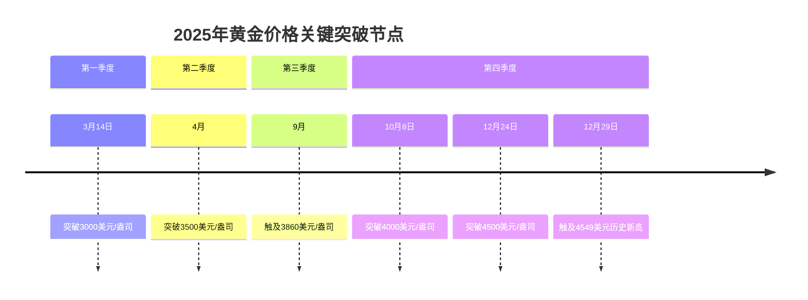
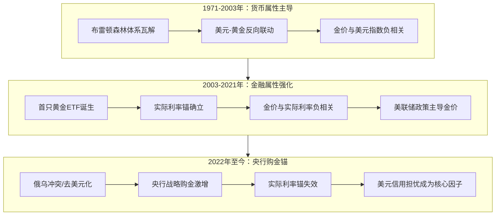
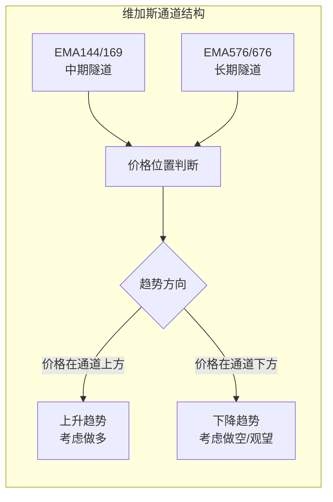
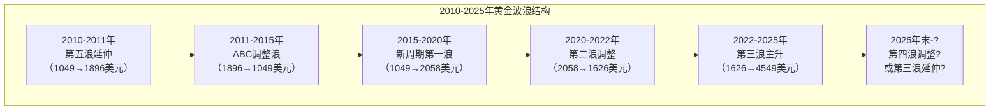
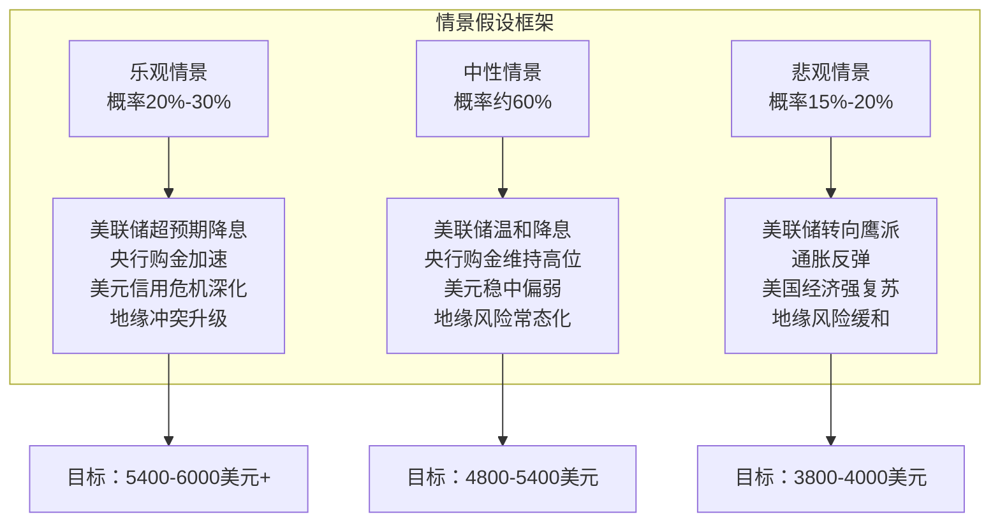
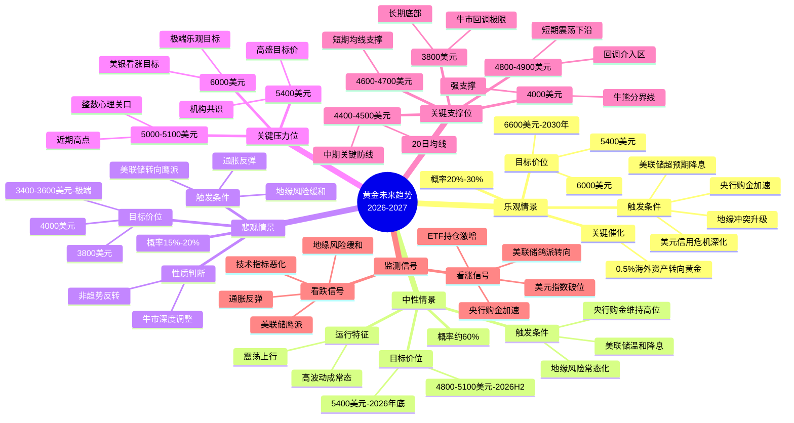
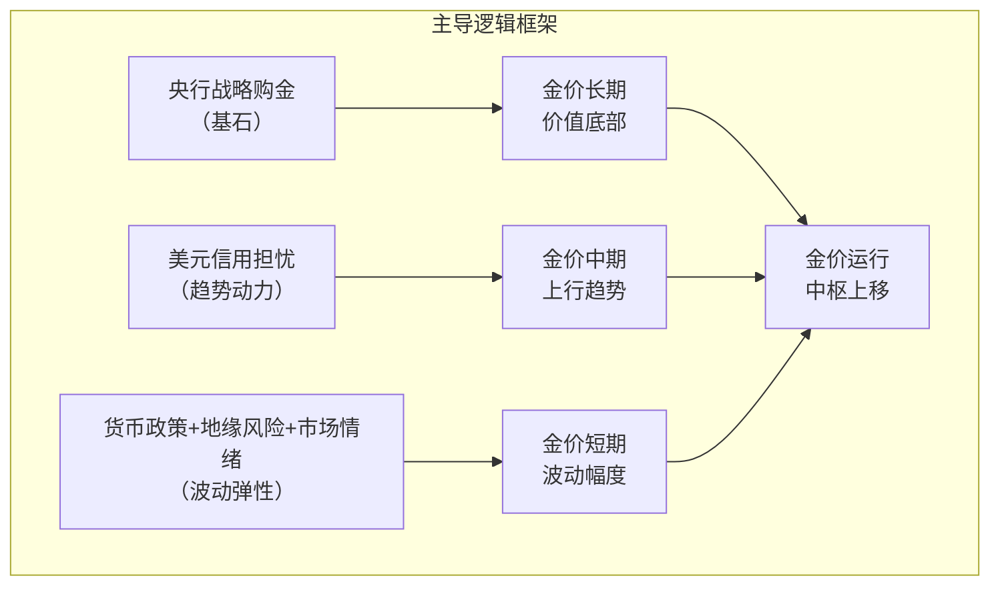
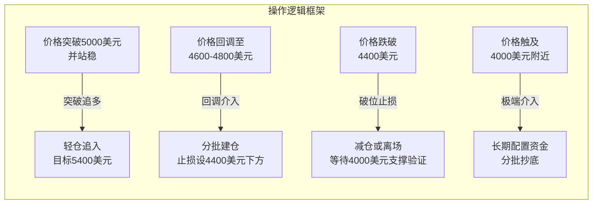
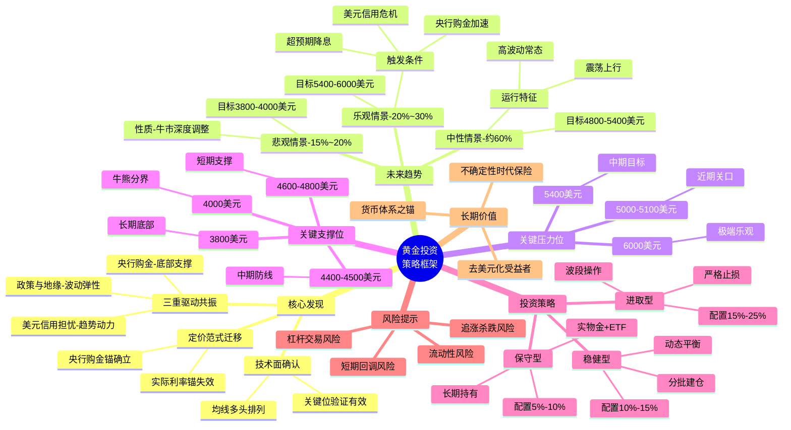

# 2010年至今黄金走势深度分析与未来趋势展望
## 1 历史走势全景回溯（2010-2025）

国际黄金市场在过去十五年间经历了跌宕起伏的完整周期，从后金融危机时代的牛市延续，到深度调整与漫长筑底，再到2020年后开启的史诗级上涨行情。这一时期，黄金价格从2010年初的约1200美元/盎司起步，至2025年末已飙升至4500美元/盎司上方，累计涨幅超过275%，年化收益率约9.2%[^1]。以下将通过六个关键周期阶段，系统呈现这段波澜壮阔的历史轨迹。

### 1.1 后金融危机时代的牛市延续（2010-2011）

2008年全球金融危机后，各国央行开启史无前例的货币宽松政策，黄金作为对冲纸币信用风险的核心资产迎来了强劲的上涨周期。

**2010年：量化宽松推动的稳健上行**

2010年，国际金价延续了危机后的上涨势头，全年平均价格为1226.66美元/盎司，最高触及1426美元，最低为1052.25美元，年度涨幅达到**27.74%**[^1]。这一年，美联储在11月启动第二轮量化宽松（QE2），计划购买6000亿美元国债，市场对纸币信用的担忧持续升温，推动资金涌入黄金市场[^2]。从技术形态看，金价在突破1200美元整数关口后加速上行，显示出强劲的多头动能。

**2011年：欧债危机催生历史高点**

2011年是黄金市场具有里程碑意义的一年。在欧债危机全面爆发、美国主权信用评级遭下调的双重冲击下，避险资金疯狂涌入黄金市场。金价全年平均为1573.16美元/盎司，**9月一度飙升至1896.50美元/盎司的历史高点**，年度涨幅达11.65%[^1][^3]。这一轮上涨的核心逻辑在于：量化宽松政策导致实际利率转为负值，美元指数大幅走弱，而欧债危机引发的避险情绪则为金价提供了额外的上行动力[^2]。市场情绪在这一时期达到极度亢奋状态，"黄金万元时代"的预期甚嚣尘上。

| 年份 | 平均价（美元/盎司） | 最高点 | 最低点 | 年涨幅 |
|------|---------------------|--------|--------|--------|
| 2010 | 1,226.66 | 1,426.00 | 1,052.25 | +27.74% |
| 2011 | 1,573.16 | 1,896.50 | 1,316.00 | +11.65% |

### 1.2 高位回落与深度调整期（2012-2015）

2011年末至2015年，黄金市场经历了一轮痛苦的深度调整，价格从历史高点回落超过**44%**，这是自1980年以来最为剧烈的熊市周期之一。

**2012年：高位震荡的过渡之年**

2012年金价表现相对温和，全年平均价格为1668.86美元/盎司，最高触及1790美元，年度涨幅仅为5.68%[^1]。市场在这一年呈现明显的多空拉锯态势：一方面，欧债危机余波未平，避险需求仍在；另一方面，美国经济复苏迹象渐显，市场开始预期美联储将逐步退出宽松政策。这种分歧导致金价在1550-1790美元区间内宽幅震荡，为后续的大幅下跌埋下伏笔。

**2013年：断崖式暴跌的转折之年**

2013年是黄金市场的"至暗时刻"。4月15日，金价单日暴跌超过9%，创下30年来最大单日跌幅，全年累计下跌**27.79%**，为1981年以来最差年度表现[^1][^4]。这场暴跌的导火索是美联储释放缩减QE的信号（即"Taper Tantrum"），市场对货币宽松预期的逆转导致黄金的避险溢价迅速消退。全年金价从年初的1692.50美元高点一路跌至1192.75美元，平均价格降至1409.51美元/盎司。值得注意的是，这一年中国大妈的"抄底"行为成为全球财经新闻焦点，但未能阻止金价的持续下行。

**2014-2015年：漫长筑底与周期低点**

2014年金价继续承压，全年微跌0.19%，平均价格为1266.06美元/盎司[^1]。进入2015年，美联储正式开启加息周期，美元指数走强，金价在年末跌至**1049.60美元/盎司**，创下2009年以来的最低点，年度跌幅达11.59%[^1][^3]。从2011年高点至2015年低点，黄金价格累计回撤约44.6%，历时约四年。这一周期的核心驱动因素是：美联储货币政策从宽松转向紧缩、美元走强、以及投资者对传统金融资产信心的逐步恢复[^4]。

| 年份 | 平均价（美元/盎司） | 最高点 | 最低点 | 年涨幅 |
|------|---------------------|--------|--------|--------|
| 2012 | 1,668.86 | 1,790.00 | 1,537.50 | +5.68% |
| 2013 | 1,409.51 | 1,692.50 | 1,192.75 | **-27.79%** |
| 2014 | 1,266.06 | 1,379.00 | 1,144.50 | -0.19% |
| 2015 | 1,158.86 | 1,298.00 | 1,049.60 | -11.59% |

### 1.3 底部震荡与缓慢复苏（2016-2019）

经历深度调整后，黄金市场在2016-2019年进入漫长的底部构筑与缓慢复苏阶段，价格在1150-1550美元区间内宽幅震荡，为下一轮牛市积蓄能量。

**2016-2018年：区间震荡中的方向探索**

2016年，英国脱欧公投引发的避险情绪推动金价年涨8.63%，最高触及1372.60美元[^1]。然而，随着特朗普当选美国总统后市场风险偏好回升，金价在2016年末至2018年间陷入窄幅震荡。2017年金价年涨12.57%，但2018年在美联储持续加息的压制下微跌1.15%，全年平均价格为1268.93美元/盎司[^1]。这一时期，市场对黄金的定价仍主要遵循传统的"实际利率锚"逻辑——即金价与美国实际利率呈负相关关系。

**2019年：复苏动能的全面激活**

2019年成为黄金市场的转折之年。中美贸易摩擦升级、全球经济增速放缓、以及美联储政策转向（年内三次降息），共同推动金价年涨**18.83%**，平均价格升至1393.34美元/盎司，最高触及1542.60美元[^1]。这一年，黄金的避险属性被重新激活，全球央行购金量也开始显著增加，为后续的牛市行情奠定了基础。市场情绪从此前的悲观与迷茫，逐步转向谨慎乐观。

### 1.4 疫情冲击与首破2000美元（2020-2021）

2020年新冠疫情的爆发成为黄金市场的重大催化剂，金价在全球央行"大放水"的背景下实现历史性突破。

**2020年：历史性突破2000美元关口**

2020年是黄金市场具有划时代意义的一年。新冠疫情引发全球经济停摆，各国央行紧急推出史无前例的货币刺激政策，美联储资产负债表在短短数月内扩张超过3万亿美元。在此背景下，金价年涨**24.43%**，平均价格达1773.73美元/盎司，**8月首次突破2058.40美元/盎司**，创下当时的历史新高[^1][^5]。这一轮上涨的核心驱动力包括：实际利率大幅转负、美元指数走弱、以及市场对货币超发引发通胀的担忧[^3]。从市场情绪看，"乱世买黄金"的传统观念在疫情冲击下得到充分验证，投资者对纸币信用体系的不信任达到阶段性高点。

**2021年：高位盘整与市场分歧**

2021年金价呈现高位回落态势，全年微跌**3.51%**，平均价格为1798.89美元/盎司[^1]。尽管全球央行维持宽松政策，但随着疫苗接种推进、经济复苏预期升温，市场风险偏好有所回升，部分资金从黄金流向股票等风险资产。这一年，金价在1678-1954美元区间内震荡，市场对黄金未来走势出现明显分歧：多头认为通胀压力将持续支撑金价，空头则预期美联储将收紧政策。

| 年份 | 平均价（美元/盎司） | 最高点 | 最低点 | 年涨幅 |
|------|---------------------|--------|--------|--------|
| 2020 | 1,773.73 | **2,058.40** | 1,472.35 | +24.43% |
| 2021 | 1,798.89 | 1,954.40 | 1,678.00 | -3.51% |

### 1.5 地缘冲突与高位盘整（2022-2023）

2022-2023年，地缘政治风险成为黄金市场的主导变量，央行购金潮的兴起则为金价提供了坚实的底部支撑。

**2022年：俄乌冲突下的宽幅震荡**

2022年2月，俄乌冲突爆发，地缘政治风险骤然升级，金价在3月一度冲高至2043.30美元[^1]。然而，美联储随后开启激进加息周期（全年加息425个基点），美元指数大幅走强，对金价形成显著压制。在多空因素的激烈博弈下，金价全年微跌**0.23%**，平均价格为1801.87美元/盎司，呈现典型的宽幅震荡格局[^1]。值得关注的是，这一年全球央行净购金量达到**1136吨**，创历史第二高位，反映出各国央行对黄金战略价值的重新认识[^2]。

**2023年：渐进上行与新高试探**

2023年，尽管美联储维持高利率政策，但金价展现出超预期的韧性。全年金价上涨**13.08%**，平均价格升至1943美元/盎司，最高触及2115.10美元[^1][^6]。这一年，传统的"实际利率锚"定价逻辑开始失效——尽管美国实际利率有所回升，金价却逆势走强，表明市场对美元资产安全性的深层焦虑正在成为新的定价因子[^2]。央行持续购金、去美元化趋势深化、以及地缘风险的常态化，共同支撑金价在高位运行。

### 1.6 史诗级牛市与历史新高（2024-2025）

2024-2025年，黄金市场迎来了自1979年以来最为壮观的牛市行情，金价连续突破多个整数关口，年内刷新历史新高的次数超过50次[^7][^8]。

**2024年：突破2800美元的强势之年**

2024年，国际金价延续上涨势头，全年平均价格达2388.98美元/盎司，最高触及2789.95美元，年度涨幅达**27.23%**，创下2010年以来的最大年度涨幅[^1][^6]。这一年，金价**40次刷新历史新高**，连续突破2000、2200、2400、2600、2800美元等多个整数关口[^6]。推动这轮上涨的核心因素包括：美联储降息预期升温、央行购金持续强劲（全年净购金1136吨）、以及中东局势紧张引发的避险需求[^9][^6]。

**2025年：史诗级行情与4500美元的历史性突破**

2025年是黄金市场载入史册的一年。金价从年初的约2600美元起步，一路高歌猛进，**3月突破3000美元、10月突破4000美元、12月突破4500美元**，年内最高触及4549.69美元/盎司，全年涨幅高达**65.54%**，创下1979年以来的最大年度涨幅[^1][^7][^4][^5]。

以下为2025年金价突破关键整数关口的时间线：

这轮史诗级行情的驱动因素呈现多元共振特征[^7][^9]：

- **美联储降息周期开启**：2025年9月美联储正式启动降息，市场对10月降息的预期概率一度升至98.3%，美元指数从高位回落近10%[^2]
- **央行购金潮持续**：2025年前三季度全球央行净购金634吨，中国央行连续10个月增持黄金，95%的受访央行预计未来12个月将继续增持[^2][^10]
- **地缘风险多极化**：俄乌冲突僵局、中东局势升温、法国政治动荡等事件叠加，全球风险指数升至2010年的1.8倍[^2]
- **去美元化浪潮**：美国债务规模突破37万亿美元，市场对美元信用的担忧加剧，黄金作为"去美元化"工具的战略价值凸显[^2][^11]

**波动特征与市场情绪**

2025年黄金市场的波动率显著放大，呈现"暴涨暴跌"的极端行情特征。10月21日，金价遭遇自2013年以来最剧烈的单日下跌，从4380美元高位急跌至3887美元后企稳反弹[^4]。12月29日，金价在触及4549美元历史新高后，因获利了结压力单日暴跌超2%[^4][^5]。这种剧烈波动反映出高价位下多空博弈的激烈程度，市场情绪在"FOMO（害怕错过）狂热"与"恐高回调"之间剧烈摇摆。

| 年份 | 平均价（美元/盎司） | 最高点 | 最低点 | 年涨幅 |
|------|---------------------|--------|--------|--------|
| 2024 | 2,388.98 | 2,789.95 | 1,992.06 | +27.23% |
| 2025 | 3,474.41 | **4,549.69** | 2,614.69 | **+65.54%** |
| 2026(截至目前) | 4,576.28 | 5,030.93 | 4,164.10 | +18.19% |

**国内金饰市场的传导效应**

国际金价的飙升同步传导至国内消费端。2025年年初，中国主流黄金品牌首饰金价约800元/克，至年末已普遍升至1360元/克附近，**克价一年上涨约560元**[^8]。老凤祥、周生生等品牌金饰价格一度突破1315元/克，较去年同期暴涨超300元，原料价与品牌价价差达379元，创年内新高[^7]。

---

**历史走势小结**

回顾2010-2025年的黄金市场，可以清晰地划分为三轮完整周期：

1. **第一轮（2010-2015）**：后金融危机宽松政策推动的牛市（2010-2011），以及随后美联储紧缩预期引发的深度回调（2012-2015），金价从1896美元高点跌至1049美元低点，最大回撤44.6%。

2. **第二轮（2016-2022）**：漫长的底部震荡筑底（2016-2019），疫情驱动的历史性突破（2020），以及地缘冲突下的高位盘整（2021-2022）。

3. **第三轮（2023-2025）**：由央行战略购金、美元信用担忧及降息预期共振驱动的结构性牛市，金价从2115美元一路飙升至4549美元，涨幅与波动率均远超前两轮。

这段历史表明，黄金的定价逻辑正在经历深刻变革——从传统的"实际利率锚"逐步转向以"央行购金锚"和"全球不确定性溢价"为核心的新范式。这一转变将深刻影响未来黄金市场的运行逻辑与投资策略。

## 2 核心驱动因素的多维剖析

黄金的价格运行从来不是单一因素驱动的结果，而是货币、金融与商品三重属性在不同历史时期交织博弈的产物。理解这一复杂的定价机制，是把握黄金未来趋势的核心钥匙。本章将系统拆解这三重属性的内涵与演变，揭示2010年至今各阶段金价变动的根本动力，并重点剖析2022年以来黄金定价逻辑从传统"实际利率锚"向"央行购金锚"迁移的深层机制。

### 2.1 货币属性：美元信用动摇与去美元化浪潮

黄金作为超主权货币的本质属性，决定了它始终是美元信用体系的"对立面"。当美元因各种原因走弱时，黄金往往迎来历史性的牛市行情[^12]。

**黄金与美元的竞争关系**

自1971年布雷顿森林体系瓦解以来，黄金不再与货币维持固定兑换比例，但其货币属性从未消失——它成为各国央行抵御货币危机的"最后防线"，是美元资产的重要替代选项[^13]。由于国际黄金以美元计价，当美元升值时，其他货币持有者购买黄金的成本上升，需求自然下降；反之，美元贬值则会推升金价[^13]。1971年以来，伦敦金价格与美元指数的反向波动特征在绝大多数时间里都十分明显[^13]。

**美元信用体系的结构性裂痕**

当前，美元信用的基础正在动摇。IMF数据显示，美元在全球外汇储备中的占比已跌破60%，截至2025年三季度更是跌至56.92%，创下至少20年来新低，连续超十个季度低于60%[^14]。这不是短期波动，而是长期趋势。2025年10月，美国债务规模首次突破38万亿美元，标普、穆迪、惠誉三大评级机构均已下调美国主权信用评级[^15][^16]。美国国债占GDP比例从2008年的60%攀升至2025年9月的119%，利息支出占GDP比重已超过3%[^16]。这种债务高速扩张引发市场对美国主权信用的深刻担忧。

**去美元化浪潮重塑黄金价值**

在此背景下，各国央行通过将储备资产重新配置为黄金，既能减少对美国国债的依赖，又能借助黄金的"无主权信用风险"属性对冲制裁风险，增强主权资产安全性[^15]。2025年美元指数从年初的108.5下行至年末的98.3，贬值幅度达9.4%，弱势美元下各国用本币购买黄金的成本降低，直接拉升了全球对黄金的需求[^15]。

回顾历史，货币属性在黄金的三轮大牛市中均扮演了主导角色：1970年代美元与黄金脱钩后的信用危机、2008年金融危机后的量化宽松、以及2022年以来的去美元化浪潮，无不印证了这一规律[^12]。

### 2.2 央行购金潮：全球储备格局的结构性重构

如果说货币属性是黄金价值的理论基石，那么央行购金则是这一属性在现实中最直接的体现。2010年以来，全球央行从净卖出转向持续净买入，这一历史性转折深刻重塑了黄金市场的供需格局与定价机制。

**从净卖出到净买入的历史性转折**

世界黄金协会数据显示，全球央行已连续15年净购入黄金[^14]。2022-2024年连续三年净购金量均超千吨：2022年达1081.9吨，2023年维持高位至1050.8吨，2024年续创千吨级水平达1044.6吨[^14]。央行购金占全球购金量的比重从2010年的1.85%大幅升至2024年的**23.57%**[^15]。

**新兴市场央行的战略购金逻辑**

2010-2024年，新兴市场央行一直是央行购金的主力[^14]。2022-2024年，年度购金量排名前五的央行均来自新兴市场：土耳其央行在2022年增持148吨成为最大买家；中国央行于2023年以增持225吨位居榜首；波兰央行在2024年以90吨购金量摘得桂冠[^14]。2025年这一趋势继续强化，波兰、哈萨克斯坦、巴西央行分别增持95吨、49吨、43吨，中国央行更是连续14个月增持黄金[^15]。

以下表格展示了主要央行的黄金储备规模与近年购金动态：

| 国家/地区 | 黄金储备（吨，2025Q3） | 近年购金特点 |
|-----------|------------------------|--------------|
| 美国 | 8,133.5 | 维持稳定，全球最高 |
| 德国 | 3,350.3 | 发达国家第二 |
| 意大利 | 2,451.8 | 欧元区重要储备 |
| 法国 | 2,437.0 | 欧元区重要储备 |
| 俄罗斯 | 2,329.6 | 新兴市场领先 |
| 中国 | 2,303.5 | 连续14个月增持 |
| 波兰 | 约450+ | 2024年增持90吨领跑全球 |

**黄金超越美债的里程碑意义**

截至2025年10月，美联储以外的全球央行持有28358.6吨黄金，按年末每盎司约4300美元计算，总值约3.92万亿美元，**超过了同期持有的3.88万亿美元美债**，这是30年来首次出现这样的格局[^15]。美国巴伦周刊指出，黄金已经超越美债成为美联储以外全球央行的第一大储备资产[^15]。世界黄金协会调查显示，**95%的央行预计未来12个月将继续增持黄金**，43%计划主动加大配置[^15][^17]。

央行的购金行为是战略性、长期性的资产配置，与普通投资者的短线交易不同，他们对金价的短期波动不敏感。哪怕2025年金价从年初2640美元/盎司涨到年末4500美元/盎司，各国央行依旧坚定买入[^15]。这种**价格不敏感的需求**构成了对金价的稳定支撑，形成了黄金市场的"非对称需求"特征。

### 2.3 金融属性：实际利率锚的失效与重构

黄金作为无息资产，其金融属性体现在投资者的投机与避险需求上。传统上，黄金的投资价值与实际利率（名义利率减去通胀预期）呈负相关关系——当实际利率走高时，持有黄金的机会成本上升，金价承压；反之，实际利率下降则利好金价[^12]。

**传统定价框架的建立**

2003年，世界上首只黄金ETF诞生，大大降低了投资者介入黄金投资的门槛，黄金的金融属性由此显著强化[^12]。在此后近二十年里，实际利率成为衡量黄金金融属性的核心指标，美联储的货币政策通过影响实际利率，间接主导了金价的中短期走势。

**2022年以来传统框架的失效**

然而，2022年以来，这套传统框架彻底失效，黄金市场进入"央行主导"的新时代[^13]。尽管10年期美国国债实际收益率徘徊在1%以上，接近2015年以来的最高水平，本应给黄金带来下行压力，但金价却逆势创历史新高[^17]。这一异象的核心解释在于：市场对美元和美国债券的信心持续下降，使得收益率上升的拖累作用显著减弱[^17]。

换言之，**美元资产信用担忧已经取代实际利率，成为黄金定价的新核心因子**。当投资者不再信任美元资产的安全性时，即使持有黄金的机会成本上升，他们仍愿意为黄金支付溢价。这一转变标志着黄金定价逻辑的根本性重构。

### 2.4 美联储政策周期：从紧缩到宽松的关键转向

美联储的货币政策是影响金价短期波动的核心变量，其利率路径通过改变实际收益率和美元汇率，深刻影响黄金的投资吸引力[^16][^17]。

**2010-2018年：宽松与紧缩的周期轮回**

回顾历史，美联储政策对金价的影响呈现清晰的周期性特征。2010-2012年，美联储实施QE2、QE3，大规模货币宽松推动金价从1200美元攀升至1896美元的历史高点。2013年，美联储释放缩减QE的信号（"Taper Tantrum"），金价单年暴跌27.79%[^12]。2015-2018年，美联储开启加息周期，金价在1100-1400美元区间内承压震荡。

**2024-2025年：降息周期开启的核心牵引**

2024年9月，美联储正式开启降息周期，标志着全球流动性环境发生重大转变[^16]。2025年美联储累计降息三次，联邦基金利率目标区间共下调75个基点，直接压低了黄金的持有成本[^15]。同时，美元指数从年初的108.5下行至年末的98.3，贬值幅度达9.4%[^15]。

**利率和汇率是黄金价格的两大核心锚点**，2025年这两个锚点同时朝着利好黄金的方向移动，为金价上涨奠定了坚实的基础[^15]。市场对美联储降息的预期是推动金价上涨的关键动力，高盛预计2026年中期美联储将再降息100个基点[^16][^18]。宽松政策预期将进一步压低实际收益率，强化黄金的配置价值。

### 2.5 地缘政治风险溢价：从阶段性扰动到常态化定价

地缘政治事件对金价的影响经历了从"短期脉冲"到"常态化溢价"的演变。在"乱世买黄金"的传统观念影响下，投资者的避险需求在地缘动荡时期被空前激发[^16]。

**历史上的地缘冲击**

2011年欧债危机全面爆发，避险资金疯狂涌入黄金市场，金价触及1896美元历史高点。2020年新冠疫情引发全球经济停摆，金价首次突破2000美元关口。2022年2月俄乌冲突爆发，金价在3月一度冲高至2043美元。

**2024-2025年：地缘风险的常态化**

2025年全球地缘政治风险显著上升，成为推动金价上涨的重要引擎[^16]。俄乌冲突的持续胶着、巴以地区局势的突然升级、伊朗核问题的再度发酵，以及全球范围内贸易摩擦都极大地增加了全球市场的不确定性[^16]。全球风险指数已升至2010年的1.8倍。

值得注意的是，黄金的"避险属性"本质上是货币属性与金融属性的衍生[^12]。假如投资者是为了规避尾部风险，试图以黄金作为最后支付手段，实际发挥作用的是黄金的货币属性；假如投资者是青睐黄金与其他资产的低/负相关性，主要是对冲其他资产价格大幅波动，实际发挥作用的是黄金的金融属性[^12]。在当前环境下，地缘风险已从阶段性扰动因素转变为金价的常态化溢价因子。

### 2.6 商品属性：实物需求的分化与消费逻辑重塑

黄金的商品属性体现在珠宝首饰与工业应用两大领域。中国和印度有佩戴金饰的传统，科技用金则包括半导体芯片、连接器和印刷电路板等[^12]。然而，在高金价背景下，黄金的商品属性正经历深刻的结构性分化。

**"量缩价增"的背离现象**

2025年前三季度，全球金饰消费量为371吨，同比出现两位数下滑，且为连续第六个季度下滑[^19]。然而，由于金价处于历史高位，金饰消费额却同比增长13%，达到410亿美元，呈现出典型的"量缩价增"背离现象[^19]。中国市场表现尤为突出：2025年上半年全国黄金首饰消费量同比骤降26%至28%，而金条及金币消费量则逆势增长近24%[^20]。

**消费逻辑的根本性转变**

这一冷一热的鲜明对比，揭示了黄金在消费者心智中的价值属性正在发生撕裂[^20]。在高金价的"天花板"效应下，黄金作为"商品"的佩戴消费属性，正被其作为"资产"的金融保值属性剧烈挤压[^20]。消费者购买行为趋于极致理性：要么彻底转向纯粹的投资金条，追求资产保值；要么在有限的预算内，将消费转向克重更轻、但设计感更强的"轻量化"饰品[^20][^21]。

以下表格对比了2025年黄金不同需求类型的变化：

| 需求类型 | 2025年前三季度变化 | 核心驱动因素 |
|----------|-------------------|--------------|
| 金饰消费量 | 同比下降约26%-32% | 高金价抑制消费意愿 |
| 金饰消费额 | 同比增长13% | 金价上涨抵消量减 |
| 金条金币需求 | 同比增长约24% | 投资保值需求旺盛 |
| 黄金ETF持仓 | 大幅增加619吨 | 机构资金涌入 |
| 央行购金 | 前三季度634吨 | 战略储备配置 |

**行业格局的深刻重塑**

这种消费逻辑的转变直接冲击了传统黄金饰品行业。周大福、周六福等头部品牌在2024-2025年间均出现了数百家门店的净减少[^20]。与此同时，"水贝模式"——即以"基础金价+8元/克"的低溢价模式——正在剧烈冲击传统金店的定价体系[^20]。行业面临两难选择：既要在高端化上与老铺黄金等品牌争夺文化叙事权，又要在下沉市场与低溢价模式比拼成本和价格[^20]。

### 2.7 定价范式迁移：从实际利率锚到央行购金锚

综合前述分析，黄金的定价逻辑正在经历一场静默革命——曾经被奉为圭臬的"实际利率锚"逐渐失效，全球央行的大规模购金行为正成为驱动金价的新核心动力[^13]。

**定价范式演变的三个阶段**

**当前金价运行的核心逻辑**

在新的定价范式下，黄金价格的运行逻辑可以概括为三层结构：

1. **央行战略购金提供底部支撑**：全球央行连续15年净购金，且购金行为对价格不敏感，形成了黄金市场的"非对称需求"，为金价构筑了坚实的长期价值底部[^15][^14]。

2. **美元信用担忧提供趋势动力**：美国债务规模膨胀、美元储备占比下降、主权信用评级遭下调，这些结构性因素持续削弱美元资产的吸引力，推动资金流向黄金[^15][^16]。

3. **地缘风险与政策预期提供波动弹性**：美联储降息周期、地缘政治冲突、全球贸易摩擦等因素，在趋势基础上叠加短期波动，放大金价的上行或回调幅度[^16][^17]。

**三重属性的交互影响**

当前黄金牛市的核心驱动力是**"央行战略性需求"与"私人投资性需求"的双轮驱动**，两者形成了正向反馈循环。央行大规模、持续的战略性购金（货币属性），直接向市场传递了"黄金价值重估"的强烈信号。这不仅为金价提供了坚实支撑，更重要的是改变了市场对黄金的长期预期。当私人投资者观察到央行将黄金作为第一大储备资产、且购金行为对价格不敏感时，其信心被极大提振，从而通过黄金ETF、金条金币等渠道大规模涌入（金融属性）。2025年黄金ETF资金流入激增、持仓创历史峰值，正是这种情绪共振的直接体现[^22][^19]。

与此同时，由央行和私人投资需求共同推高的金价，对价格敏感的商品属性需求（主要是珠宝消费）产生了显著的挤出效应，部分传统的珠宝消费需求转化为投资需求。这表明，黄金在消费者心智中的"金融资产"标签正在强化，挤压其"普通消费品"的标签。

**小结**

从历史中可以总结出三大经验规律[^12]：首先，导致大级别黄金牛市启动的因素必然是货币属性，美元信誉遭受冲击时黄金将迎来趋势性上涨；其次，金融和商品属性会形成扰动，但无法改变由货币属性主导的整体趋势；最后，大牛市结束的关键是重塑国际社会对美元的信心。

在当前美元信用持续受损、全球去美元化浪潮深化、地缘风险常态化的背景下，支撑央行购金的深层逻辑尚未出现根本性逆转。这意味着以"央行购金锚"为核心的新定价范式将继续主导黄金市场，为金价的长期运行提供坚实的逻辑基础。

## 3 关键技术位识别与趋势分析

技术分析是研判黄金价格走势的重要工具，通过对历史价格数据的系统梳理与多维度指标的综合运用，能够识别出市场运行中的关键支撑与压力区域，并评估当前趋势的强弱状态。本章将运用趋势线、移动平均线、斐波那契工具、波浪理论及动量指标等经典方法，对2010年至今国际黄金市场的技术特征进行全面剖析，为投资者提供决策参考框架。

### 3.1 历史关键支撑与压力位的识别与验证

黄金市场的关键技术位往往形成于历史上的重要高点与低点，这些价格区域凝聚了大量的市场记忆与交易行为，在后续行情中反复发挥支撑或压力作用。

**2010-2015年周期的关键位**

2011年9月创下的**1896.50美元/盎司**是第一轮牛市的历史高点，这一价位在此后近十年间成为黄金市场最重要的心理压力关口。2015年12月触及的**1049.60美元/盎司**则是深度调整的周期低点，构成了长期底部支撑的基石。从1896美元到1049美元的下跌幅度达44.6%，这一区间内的多个斐波那契回撤位（如1200美元、1300美元、1400美元附近）在后续的震荡行情中反复被验证为有效的支撑与压力区域。[^1]

**2020-2022年周期的关键位**

2020年8月首次突破的**2058.40美元/盎司**标志着黄金进入新的历史高度区间，这一位置在此后两年多的时间里成为重要的心理关口。2022年3月俄乌冲突期间触及的**2043.30美元**进一步验证了2000美元上方区域的重要性。而2022年9月的阶段性低点**1626.65美元**则成为新一轮上涨行情的起点，这一价位与2020年3月疫情冲击时的低点1472美元共同构成了长期上涨趋势的底部支撑带。[^1]

**2024-2025年史诗级牛市的关键位**

2024-2025年的史诗级行情中，金价连续突破多个整数关口，形成了新的关键技术位体系：

| 关键价位（美元/盎司） | 形成时间 | 技术意义 |
|----------------------|----------|----------|
| 3000 | 2025年3月 | 首次突破，重要心理关口 |
| 3365 | 2025年6月 | 地缘冲突推动的阶段高点 |
| 3886-3931 | 2025年9-10月 | 回调低点，确认支撑有效 |
| 4000 | 2025年10月 | 整数关口突破 |
| 4330-4374 | 2025年12月 | 通道震荡区间 |
| 4500 | 2025年12月 | 关键心理关口与支撑位 |
| 4549 | 2025年12月29日 | 年内历史新高 |
| 4690 | 2026年1月 | 近期高点 |
| 5000 | 2026年1月26日 | 首次突破5000大关 |[^23][^24][^25]

**压力转支撑的市场规律**

技术分析的核心规律之一是"压力位一旦被有效突破，往往转化为支撑位"。这一规律在黄金市场中得到了充分验证。早期的历史高点1896美元在2020年被突破后，于2021-2022年的回调中多次提供支撑。2020年高点2058美元在2024年被突破后，成为后续行情的重要支撑基础。2025年12月，金价在触及4549美元历史新高后回落，但在**4500美元关口获得支撑后反弹至4535美元**，验证了这一整数关口的支撑有效性。[^23]

### 3.2 趋势线与通道分析

趋势线是技术分析中最直观的工具之一，通过连接价格走势中的显著高点或低点，能够清晰地定义市场的主要运行方向。

**2016-2019年底部构筑期的上升通道**

在2015年触及1049美元低点后，黄金市场进入了漫长的底部构筑阶段。连接2015年12月低点与2016年12月低点（约1122美元）可以画出一条缓慢上升的长期趋势线，这条趋势线在2018年8月的回调中再次获得验证（低点约1160美元）。这一阶段的上升通道斜率较为平缓，反映出市场在蓄势待发的过程中呈现出"进二退一"的震荡特征。[^26][^27]

**2023-2025年加速上涨阶段的陡峭通道**

2023年以来，随着央行购金潮的兴起与美联储降息预期的升温，黄金市场进入加速上涨阶段。2025年12月的行情分析显示，金价被**4320美元（下轨）至4374.52美元（上轨）**的上升通道锁定，呈现"有支撑能冲高、没动力破上轨"的特征。这一通道的斜率明显陡于此前各阶段，反映出多头力量的显著强化。[^23]

**维加斯通道的应用**

维加斯通道是一种经典的趋势跟踪工具，使用两组指数移动平均线（EMA）形成双层通道：第一组由**EMA144和EMA169**构成，反映中期趋势；第二组由**EMA576和EMA676**构成，反映长期趋势。这些周期参数源自斐波那契数列，具有内在的数学逻辑。[^28][^29]

该通道的核心功能是**清晰告诉投资者当前市场处于什么趋势中，以及趋势的强度如何**。当价格和EMA12同时向上突破EMA144和EMA169时，确认做多信号；反之则确认做空信号。这种过滤机制能够有效减少假突破带来的交易损失。[^28][^29]

从当前市场状态看，金价持续运行于维加斯通道的长期EMA组（576/676）之上，强力确认了牛市格局的延续。历史案例显示，2023年10月金价在EMA576附近获得支撑后强劲反弹，验证了该通道作为动态支撑的有效性。

### 3.3 移动平均线系统与均线排列形态

移动平均线（MA）是技术分析中应用最广泛的趋势指标，通过对特定时间段内价格的平均值进行计算，能够平滑短期波动，揭示市场的主要趋势方向。[^30]

**均线的计算与分类**

常见的移动平均线包括简单移动平均线（SMA）和指数移动平均线（EMA）。以20日SMA为例，计算方法是将过去20个交易日的收盘价相加后除以20。EMA则赋予近期价格更高的权重，对市场变化的反应更为灵敏。[^30]

**当前均线排列形态**

从2025年12月15日至2026年1月15日的日线走势来看，黄金价格的均线系统呈现典型的**多头排列形态**：

- **MA5（5日均线）**：4616.82美元
- **MA10（10日均线）**：4561.85美元
- **MA20（20日均线）**：4483.38美元

短期均线MA5和MA10均位于MA20上方，且三条均线均呈向上发散的态势，显示**短期多头趋势明显**。价格在均线上方运行，表明多方力量占据主导地位。[^24]

**均线的支撑与压力作用**

移动平均线在趋势行情中具有动态支撑和压力作用。当黄金价格在移动平均线上方运行时，均线起到支撑作用；当价格在均线下方运行时，均线则成为压力位。例如，当价格回调到20日均线附近且获得支撑时，该均线就是短期支撑位；若价格反弹到60日均线附近遇阻回落，60日均线就是压力位。[^26][^27]

**均线交叉信号的有效性**

金叉（短期均线上穿长期均线）和死叉（短期均线下穿长期均线）是判断趋势转折的重要信号。然而，均线系统存在**滞后性**这一主要缺点——由于基于过去价格数据计算，对市场趋势变化的反应相对较慢。在市场快速反转时，可能导致投资者错过最佳买卖时机。此外，在震荡行情中，均线容易频繁出现交叉，发出错误信号。[^30]

| 均线工具 | 优点 | 缺点 |
|----------|------|------|
| 移动平均线 | 平滑价格波动，清晰显示趋势；提供动态支撑/压力参考 | 具有滞后性；震荡行情中易发出错误信号 |

### 3.4 斐波那契回撤与扩展位应用

斐波那契回撤线是利用黄金分割比率来计算潜在支撑位和压力位的工具，常用比率包括**23.6%、38.2%、50%、61.8%**等。这些数学比例位在市场中具有重要的心理参考价值。[^26][^27]

**历史波段的斐波那契分析**

以2024年低点至2025年高点的主升浪为例（约从1992美元至4549美元），可以计算出关键回撤位：

- **38.2%回撤位**：约3573美元
- **50%回撤位**：约3271美元
- **61.8%回撤位**：约2969美元

这些位置在价格回调时往往会形成支撑。2025年12月的技术分析显示，从4384美元至3886美元跌势的**76.4%斐波那契回撤位**位于4266美元，金价两次上攻该阻力位未果，暗示短期顶部可能正在形成。[^31]

**斐波那契扩展位的目标预测**

斐波那契扩展位用于预测趋势延续时的潜在目标。基于近期行情计算，**127.2%扩展位**约在5230美元附近，这与市场机构预测的目标区间相吻合。[^32]

**斐波那契工具的优缺点**

| 判断方法 | 优点 | 缺点 |
|----------|------|------|
| 斐波那契回撤线 | 基于数学比率，具有一定科学性；市场广泛认可 | 计算相对复杂；市场不一定完全按照比率运行 |[^26]

### 3.5 波浪理论视角下的周期结构解读

艾略特波浪理论是股票和商品技术分析的经典理论之一，认为市场走势不断重复一种模式——每一完整周期由**5个上升浪和3个下跌浪**组成，共计8个波浪。[^33][^34]

**波浪理论的基本规则**

波浪理论包含三条不可违背的基本规则：
1. **第二浪的最大回撤不低于第一浪起点**
2. **第三浪永远不是三个驱动浪（第一、三、五浪）中最短的一个浪**，通常是最具爆炸性的一浪
3. **第四浪的底部不可低于第一浪的顶部**[^33][^34]

**2010年至今的浪型划分**

基于波浪理论对黄金走势进行结构分析：

从波浪结构看，2022年低点1626美元启动的上涨行情可能处于**第三浪主升阶段**，这与第三浪通常是最长、最具爆炸性的特征相符。2025年金价从2600美元涨至4549美元，涨幅达75%，展现出典型的第三浪特征。[^34]

**当前浪级位置的研判**

当前市场可能面临两种情景：一是第三浪仍在延伸，目标指向更高价位；二是第三浪接近尾声，即将进入第四浪调整。波浪理论强调，**形态是最重要的分析依据**，其次是浪与浪之间的比例关系，最后是时间跨度。投资者应结合其他技术指标综合判断。[^33][^34]

### 3.6 动量指标与超买超卖状态评估

动量指标用于衡量价格变动的速度和力度，能够提前预警趋势的潜在转折。

**RSI（相对强弱指标）分析**

RSI是界定超买超卖区间的经典指标，通常以70为超买线、30为超卖线。2025年12月的技术分析显示，黄金RSI指标多次进入**超买区间（>80）**，甚至出现极端水平，这验证了市场短期过热的状态，增加了技术性回调的概率。[^31][^35]

然而，需要注意的是，在单边强趋势中，RSI可能持续钝化，长时间维持在超买区间而不发生明显回调。因此，**RSI不能单独作为反转信号**，需要结合其他指标综合判断。

**MACD指标分析**

MACD由快线（DIF）、慢线（DEA）和柱状图组成。当前MACD指标显示：
- 快慢双线位于**零轴线之上正值区**，确认上升动量
- 多次出现死叉但均未下行穿越零轴线，表明调整力度有限
- 2025年10月曾出现**顶背离信号**（价格创新高但MACD未能同步创新高），这是一个潜在的动量减弱警告[^23][^35]

**布林带指标分析**

布林带由上轨、中轨（20日均线）和下轨组成，用于衡量价格波动率和趋势强度。当前布林带状态：

- **上轨（UP）**：4701.91美元
- **中轨（MID）**：4483.38美元
- **下轨（LOW）**：4264.84美元

价格近期冲高至接近上轨的位置后回落，目前仍在布林带中轨上方运行，表明**价格处于强势区间**，但短期内可能面临一定的回调压力。布林带开口扩张，显示当前市场波动率处于较高水平。[^24]

| 动量指标 | 当前状态 | 信号解读 |
|----------|----------|----------|
| RSI | 多次进入超买区（>80） | 短期过热，回调风险上升 |
| MACD | 零轴上方，曾现顶背离 | 动量仍为正向，但需警惕减弱 |
| 布林带 | 价格在中轨与上轨之间 | 强势格局，关注上轨压制 |

### 3.7 当前技术形态综合研判与中期趋势展望

综合上述技术分析工具的信号，可以对当前黄金市场的技术状态进行整体评估。

**当前技术形态特征**

从2025年12月15日至2026年1月15日的日线走势来看，黄金价格呈现出**明显的上升趋势**，从约4181.99美元/盎司一路冲高至近期高点4690.45美元/盎司，随后有所回落。2026年1月26日，金价首次突破**5000美元/盎司**的关键整数关口，盘中创下5043.9美元的历史新高。[^25][^24]

**多空博弈的关键区间**

当前市场在**4600-4700美元区间**呈现高位震荡态势。虽然受到获利了结和数据波动等因素的影响，价格可能出现一定的回调，但在避险需求、央行购金和美联储降息预期等利好因素的支撑下，**下行空间有限**。[^24]

**关键支撑位与压力位汇总**

| 类型 | 价位（美元/盎司） | 技术依据 |
|------|-------------------|----------|
| **近期压力** | 5000-5100 | 整数心理关口、近期高点 |
| **中期压力** | 5230-5400 | 斐波那契扩展位、机构目标 |
| **强阻力** | 6000 | 极端乐观情景目标 |
| **近期支撑** | 4600-4700 | 短期震荡区间下沿 |
| **关键支撑** | 4400-4500 | 20日均线、心理关口 |
| **强支撑** | 4264-4330 | 布林带下轨、前期通道支撑 |
| **长期支撑** | 3800-4000 | 斐波那契回撤位、前期突破位 |

**中期趋势展望**

从技术面综合研判，当前黄金市场处于**极度强势的多头格局**：

1. **趋势方向明确**：价格持续运行于各周期均线上方，均线系统呈多头发散排列，维加斯通道确认长期上升趋势
2. **关键位支撑有效**：4500美元整数关口的支撑已获验证，5000美元的突破进一步打开上行空间
3. **回调风险存在**：RSI超买、MACD顶背离等信号提示短期技术性回调风险显著上升

**需要重点监测的技术信号**

以下信号可能触发趋势转折或加速：
- **看涨信号**：价格有效站稳5000美元上方、MACD再次金叉、RSI超买钝化后继续上行
- **看跌信号**：价格跌破4500美元关键支撑、均线系统出现死叉、MACD下穿零轴

短期来看，预计现货黄金价格将在**4600-5100美元区间**震荡整理，消化前期涨幅后再选择方向。中期而言，在基本面利好因素（央行购金、降息预期、地缘风险）的支撑下，多头主导的格局未发生根本性改变，技术上的任何回调都可能成为逢低布局的机会。[^24]

## 4 未来趋势情景与关键位置推演

在完成对黄金历史走势的全面回溯、核心驱动因素的深度剖析以及关键技术位的系统识别后，本章将目光投向未来。通过整合宏观基本面展望与技术分析框架，构建未来1-2年（2026-2027年）黄金价格的三种情景模型，并推演各情景下的关键压力位与支撑位分布，为投资者提供前瞻性的决策参考框架。

### 4.1 情景构建的核心假设与驱动变量

在构建未来情景之前，首先需要系统梳理影响金价走势的核心变量体系，并明确各变量在不同情景下的取值假设。

**核心驱动变量体系**

根据前文对驱动因素的深度分析，影响未来金价的核心变量可归纳为五大维度：

| 变量维度 | 核心指标 | 对金价的影响机制 |
|----------|----------|------------------|
| **货币政策** | 美联储利率路径、实际利率 | 降息降低持有成本，利好金价；加息则相反 |
| **央行购金** | 月均购金量、储备占比 | 战略性需求提供底部支撑，价格不敏感 |
| **美元信用** | 美元指数、美债规模、储备占比 | 美元走弱/信用下降直接推升金价 |
| **地缘风险** | 全球风险指数、冲突烈度 | 避险需求激发，提供短期脉冲与长期溢价 |
| **供需格局** | 矿产金产量、投资需求、ETF流入 | 供需缺口扩大支撑价格中枢上移 |

**情景分析的逻辑框架**

基于上述变量体系，本章构建三种情景模型，分别对应乐观、中性和悲观的市场环境。每种情景的核心假设如下：

**关键变量的量化参考**

根据机构预测与历史数据，各变量在不同情景下的量化假设如下：

- **美联储降息**：高盛预计2026年中期再降息100个基点，基准情景下联邦基金利率可能降至3%以下[^9]
- **央行购金**：预计2026年月均购金量维持60吨，2027年回落至50吨，全年净购金900-950吨[^36]
- **ETF需求**：2025年全球黄金ETF净流入约500吨，2026年传统渠道需求增长具备持续性[^36]
- **供给约束**：2025年全球矿产金产量3816吨，同比仅增1.2%，2026年后供应增速或降至0.5%以下[^37]

### 4.2 乐观情景：突破6000美元的路径与条件

乐观情景描绘了多重利好因素共振下，金价突破历史性高位的可能路径。

**触发条件与驱动逻辑**

乐观情景的实现需要以下条件同时满足或部分叠加：

1. **货币政策超预期宽松**：美联储降息幅度超出市场预期，联邦基金利率降至3%以下，美元指数大幅走弱，实际利率深度下行[^38]
2. **需求端多方共振**：央行购金维持高位甚至加速（年均超1200吨），ETF资金持续流入，散户FOMO（害怕错过）情绪爆发[^38]
3. **风险事件催化**：地缘冲突显著升级、美国债务风险加剧、金融市场波动加剧，触发大规模避险买盘[^38]
4. **供给刚性约束**：矿产金增长乏力，无法对冲需求激增，流通库存偏紧时出现供需错配[^39]

**价格路径与时间窗口**

在乐观情景下，金价的演进路径可能呈现以下特征：

- **2026年**：先震荡上攻5000美元关口，年末至2027年初迎来冲击6000美元的窗口[^38]
- **2026年底目标**：5400-6000美元/盎司[^36][^40]
- **2027年及以后**：若美元信用体系出现系统性崩溃，金价可能进一步上探，星展银行、杰富瑞预测2030年金价或达6600美元[^40]

**概率评估与关键催化因素**

乐观情景的发生概率约为**20%-30%**[^38]。摩根大通的量化分析指出，仅**0.5%的美国海外资产配置转向黄金**，就足以将金价快速推至6000美元[^38]。这一测算为乐观目标提供了量化依据，表明该情景虽非基准预期，但具备实现的潜在条件。

关键催化因素包括：美联储政策转向的速度与幅度、重大地缘冲突的爆发、美国债务上限危机的演化等。

### 4.3 中性情景：震荡上行至4800-5400美元区间

中性情景是概率最高的基准路径，反映了当前趋势的合理外推与主流机构的共识预期。

**核心假设与驱动逻辑**

中性情景的假设条件包括：

- **美联储温和降息**：2026年预计降息50-75个基点，利率中枢逐步下移，但节奏相对克制[^40]
- **央行购金维持高位**：月均购金量维持60吨左右，全年净购金约900吨，增速较2024-2025年略有放缓[^36]
- **美元稳中偏弱**：美元指数在95-100区间波动，去美元化趋势延续但未加速[^41]
- **地缘风险常态化**：俄乌冲突、中东局势等风险因素持续存在，但未出现重大升级[^42]

**价格路径与运行节奏**

在中性情景下，金价的运行特征可概括为"震荡上行、高波动成常态"：

| 时间节点 | 价格目标（美元/盎司） | 运行特征 |
|----------|----------------------|----------|
| 2026年上半年 | 4500-4800 | 消化前期涨幅，震荡整理 |
| 2026年下半年 | 4800-5100 | 降息落地，突破整数关口 |
| 2026年底 | 4800-5400 | 多机构目标区间[^40][^43] |
| 2027年 | 5000-5400+ | 价格中枢进一步上移 |

**机构预测汇总**

主流机构对中性情景下的目标价预测如下：

- **高盛**：2026年12月目标价从4900美元上调至5400美元[^36][^40]
- **摩根大通**：2026年第四季度目标5055美元/盎司[^40]
- **瑞银**：2026年上半年目标4500美元，下半年目标5100美元[^44]
- **星展银行**：2026年上半年4500美元，下半年5100美元[^44]

**波动特征与阶段性回调**

广发期货分析指出，2026年**高波动将成为常态**[^39]。在价格中枢上移的过程中，市场可能出现阶段性的技术性回调，回调幅度预计在5%-10%左右。这种"进二退一"的震荡上行模式，既能消化前期获利盘压力，又能为后续上涨积累新的多头动能[^45]。

### 4.4 悲观情景：回落至4000美元下方的风险路径

悲观情景描绘了多重利空因素叠加下，金价出现深度回调的风险路径。

**触发条件与风险因素**

悲观情景的触发需要以下条件出现：

1. **美联储政策转向**：通胀反弹或就业数据强劲，导致美联储推迟降息甚至重新加息，实际利率回升[^37]
2. **美国经济强复苏**：美国AI等新兴产业贡献释放，推动经济复苏，美元资产走强[^39]
3. **地缘风险显著缓和**：俄乌冲突达成停火协议、中东局势稳定，避险需求大幅消退[^40]
4. **获利盘集中抛售**：高位累积的大量获利盘在利空催化下集中了结，触发连锁抛盘[^38]

**价格路径与目标位**

在悲观情景下，金价可能经历以下回调路径：

- **第一支撑位**：4400-4500美元（中期重要支撑）
- **第二支撑位**：4000美元（强支撑、牛熊分界线）[^2]
- **极端目标位**：3800美元甚至3400-3600美元[^41]

世界银行在《大宗商品前景报告》中预测，2026年黄金均价约3575美元，2027年可能回落至3375美元/盎司[^46]。花旗集团更为悲观，预计金价在创新高后将逐步降温，跌至3000美元/盎司以下[^46]。

**概率评估与性质判断**

悲观情景的发生概率约为**15%-20%**[^41]。需要强调的是，该情景本质上是**牛市中的深度调整**，而非趋势的根本性反转。只要央行购金的战略逻辑、美元信用担忧等长期因素未发生根本性逆转，金价在深度回调后仍有望重拾升势。

### 4.5 关键压力位识别与上攻目标推演

综合技术分析与机构目标价，未来金价上行过程中将面临以下关键压力区域。

**压力位层级分布**

| 压力位（美元/盎司） | 形成逻辑 | 突破条件 | 突破后空间 |
|---------------------|----------|----------|------------|
| **5000-5100** | 整数心理关口、近期高点（5093美元）[^47] | 降息落地、ETF持续流入 | 打开向5400美元空间 |
| **5100-5150** | 短期技术阻力、机构第一目标[^47] | 多头动能持续释放 | 确认上升趋势延续 |
| **5400** | 高盛目标价、私人部门对冲需求兑现[^36] | 央行购金加速、美元走弱 | 指向6000美元关口 |
| **6000** | 极端乐观目标、美银看涨目标[^47] | 多重强驱动共振 | 黄金"超级周期"确认 |

**5000美元关口的博弈分析**

2026年1月26日，现货黄金首次突破5000美元大关，盘中创下5093美元的历史新高[^47]。这一突破具有里程碑意义，但上方**5100美元关口将形成一定压力**[^47]。技术分析显示，金价在冲击关键阻力位时可能经历反复争夺和震荡。一旦有效站稳5000美元上方，将成为新的支撑平台，并打开向上至5400-6000美元的空间。

**上攻目标的时间窗口**

根据机构预测与技术形态推演：
- **5400美元**：有望在2026年第四季度至2027年第一季度实现[^36]
- **6000美元**：若乐观情景触发，可能在2027年某个时间窗口出现[^38]

### 4.6 关键支撑位识别与回调防线推演

基于历史密集成交区、动态均线系统、斐波那契回撤位等技术工具，识别金价回调过程中的关键支撑区域。

**支撑位层级分布**

| 支撑位（美元/盎司） | 形成逻辑 | 有效性评估 | 失守后下行空间 |
|---------------------|----------|------------|----------------|
| **4800-4900** | 短期震荡区间下沿、回调首个介入区[^40] | 高有效性 | 指向4600美元 |
| **4600-4700** | 短期均线支撑、前期震荡区间[^45] | 较高有效性 | 指向4400美元 |
| **4400-4500** | 20日均线、重要心理关口[^45] | 中期关键防线 | 趋势可能转弱 |
| **4000** | 强支撑、牛熊分界线[^2] | 极高有效性 | 悲观情景验证 |
| **3800** | 长期支撑、斐波那契回撤位[^41] | 牛市回调极限 | 指向3400美元 |

**4000美元关口的战略意义**

4000美元关口被机构视为**"牛熊分界线"**，其多空争夺的激烈程度与2010年美联储QE2前夕的市场情绪高度吻合[^2]。2025年12月初，伦敦金价在4180-4200美元区间获得支撑，验证了该区域的支撑有效性[^2]。若金价回调至此，将吸引长期配置资金和央行购金的强力介入，支撑有效性极强。

**支撑位的动态特征**

需要注意的是，支撑位并非静态的精确点位，而是具有一定缓冲作用的**支撑区间**。例如，4400美元支撑的有效范围可延伸至4350美元一线，这一区间与均线系统的交汇区域重合，技术面的多重支撑进一步强化了其稳定性[^45]。

### 4.7 重点监测信号与风险预警体系

为帮助投资者在高波动环境下把握市场脉搏，本节构建未来金价走势的监测信号体系。

**看涨信号（利多因素）**

以下信号的出现可能推动金价向乐观情景演进：

- **美联储鸽派转向**：降息幅度超预期、释放持续宽松信号
- **央行购金加速**：月均购金量超过70吨、新兴市场央行大规模增持
- **ETF持仓激增**：全球黄金ETF单月净流入超100吨
- **美元指数破位下行**：美元指数跌破95，创多年新低
- **地缘冲突升级**：重大地缘事件爆发，避险情绪急剧升温
- **技术面突破**：价格有效站稳5000美元上方、MACD再次金叉

**看跌信号（利空因素）**

以下信号的出现可能推动金价向悲观情景演进：

- **通胀超预期反弹**：美国CPI数据持续高于预期，迫使美联储转向
- **美联储释放鹰派信号**：暗示推迟降息或重新加息
- **地缘风险显著缓和**：俄乌冲突停火、中东局势稳定
- **美国经济数据强劲**：就业、GDP等数据超预期，美元走强
- **技术指标恶化**：价格跌破4400美元关键支撑、均线系统出现死叉、MACD下穿零轴

**高波动环境下的风险提示**

2025年黄金市场的波动率显著放大，单日振幅超100美元的情况多次出现[^2]。在这种高波动环境下，投资者需要注意以下风险：

1. **杠杆交易风险**：波动率创2020年新高，杠杆产品风险显著上升[^40]
2. **追涨杀跌风险**：市场情绪在"FOMO狂热"与"恐高回调"之间剧烈摇摆[^48]
3. **短期回调风险**：RSI指标达40年峰值，技术性超买信号明显[^40]

**黄金未来趋势情景与关键位置思维导图**

以下思维导图综合呈现黄金未来1-2年的可能趋势、关键压力位与支撑位：

**小结**

综合基本面展望与技术分析框架，未来1-2年黄金市场最可能呈现**"高位震荡、中枢上移、波动加剧"**的运行特征。在央行战略购金、美元信用担忧、降息周期开启等长期因素的支撑下，金价的中期上涨趋势未发生根本性改变。投资者应重点关注美联储政策路径、央行购金行为、地缘风险演变等核心变量的变化，并以关键支撑与压力位作为趋势验证的重要参考。在高波动环境下，保持理性、控制仓位、设置止损，是把握黄金投资机遇、规避风险的关键。

## 5 结论与策略启示

经过对2010年至今国际黄金市场的全景回溯、驱动因素的多维剖析、技术位的系统识别以及未来情景的前瞻推演，本章将系统归纳研究的核心发现，提炼主导金价运行的底层逻辑与关键不确定性因素，并基于前文构建的压力位与支撑位体系，为不同风险偏好的投资者提供差异化的策略框架与操作指引。

### 5.1 核心发现归纳：定价范式迁移与趋势确认

本研究通过对过去十五年黄金市场的深度剖析，得出以下三大核心发现：

**第一，黄金定价逻辑正在经历从"实际利率锚"向"央行购金锚"的历史性迁移。**

2003年首只黄金ETF诞生后，黄金的金融属性显著强化，实际利率成为定价的核心锚点——金价与美国实际利率呈现稳定的负相关关系。然而，2022年以来这一传统框架彻底失效：尽管10年期美国国债实际收益率徘徊在1%以上的高位，金价却逆势创出历史新高。这一异象的根本解释在于，**市场对美元和美国债券的信心持续下降，使得收益率上升的拖累作用显著减弱**。央行的战略性购金行为——连续15年净买入、年均超千吨的规模、对价格不敏感的"非对称需求"——正在取代实际利率，成为驱动金价的新核心因子。

**第二，当前牛市具有"央行战略购金+美元信用担忧+降息周期"三重因素共振的结构性特征。**

与2010-2011年由量化宽松单一驱动的牛市不同，2022年以来的这轮行情呈现多元共振的特征：

| 驱动层级 | 核心因子 | 作用机制 |
|----------|----------|----------|
| **底部支撑** | 央行战略购金 | 价格不敏感的需求构筑长期价值底部 |
| **趋势动力** | 美元信用担忧 | 去美元化浪潮推动资金流向黄金 |
| **波动弹性** | 货币政策与地缘风险 | 叠加短期脉冲，放大上行或回调幅度 |

这种三层结构使得当前牛市具有更强的持续性与韧性。即使在美联储加息周期中，金价仍能逆势走强，正是因为底层的央行购金逻辑与美元信用担忧提供了坚实的支撑基础。

**第三，技术面确认了多头主导的格局，关键位验证结果为趋势研判提供了可靠参照。**

从技术分析的角度，当前黄金市场呈现以下特征：
- **均线系统多头发散排列**：MA5>MA10>MA20，短期均线位于长期均线上方
- **维加斯通道确认长期上升趋势**：价格持续运行于EMA576/676长期隧道之上
- **关键支撑位获得验证**：4500美元整数关口在2025年12月的回调中有效支撑，5000美元的突破进一步打开上行空间
- **波浪结构显示第三浪主升特征**：2022年低点启动的上涨行情展现出典型的第三浪爆发性

这些技术信号与基本面的"定价逻辑迁移"形成呼应，共同确认了多头主导的市场格局。

### 5.2 主导逻辑与不确定性因素辨析

**未来金价运行的主导逻辑**

基于前文分析，未来1-2年金价运行的主导逻辑可概括为"一个基石、两大动力、三重弹性"：

- **基石——央行战略购金**：全球央行已连续15年净购金，2022-2024年连续三年超千吨。95%的央行预计未来12个月将继续增持，这种价格不敏感的战略性需求为金价构筑了坚实的长期底部。只要去美元化的深层逻辑未发生根本性逆转，央行购金的趋势就将延续。

- **趋势动力——美元信用担忧**：美国债务规模突破38万亿美元，美元在全球外汇储备中的占比跌至56.92%，三大评级机构均已下调美国主权信用评级。这些结构性因素持续削弱美元资产的吸引力，推动资金流向黄金这一"无主权信用风险"的替代选项。

- **波动弹性——政策与风险因素**：美联储降息周期的推进节奏、地缘政治冲突的演化方向、市场情绪的极端摆动，将在趋势基础上叠加短期波动，放大金价的上行或回调幅度。

**核心不确定性因素**

尽管主导逻辑清晰，但以下不确定性因素可能导致实际走势偏离基准预期：

| 不确定性因素 | 潜在影响 | 监测指标 |
|--------------|----------|----------|
| **美联储政策路径** | 降息节奏快于/慢于预期将显著影响金价 | 联邦基金利率、点阵图、鲍威尔讲话 |
| **通胀走势反复** | 通胀反弹可能迫使美联储转向鹰派 | 美国CPI、PCE、核心通胀数据 |
| **地缘风险演化** | 升级或缓和将带来截然不同的避险需求 | 俄乌局势、中东冲突、贸易摩擦 |
| **市场情绪极端化** | FOMO狂热或恐慌抛售可能加剧波动 | VIX指数、ETF资金流向、散户持仓 |
| **央行购金行为变化** | 购金节奏放缓或加速将影响底部支撑强度 | 月度央行购金数据、储备结构变化 |

投资者需要建立对这些不确定性因素的持续跟踪机制，以便及时调整策略应对市场变化。

### 5.3 基于关键位的趋势研判与操作框架

**关键位体系的整合呈现**

综合前文技术分析与情景推演的结果，黄金市场的关键压力位与支撑位体系可整合如下：

| 价位区间（美元/盎司） | 性质 | 技术依据 | 操作意义 |
|----------------------|------|----------|----------|
| **6000** | 强压力 | 极端乐观目标、美银看涨目标 | 乐观情景验证位 |
| **5400** | 中期压力 | 高盛目标价、斐波那契扩展位 | 中性情景上沿 |
| **5000-5100** | 近期压力 | 整数心理关口、近期高点 | 突破确认后追多 |
| **4800-4900** | 短期支撑 | 震荡区间下沿、回调首个介入区 | 轻仓试探性买入 |
| **4600-4700** | 短期支撑 | 短期均线支撑、前期震荡区间 | 回调加仓区域 |
| **4400-4500** | 中期关键支撑 | 20日均线、重要心理关口 | 趋势强弱分界线 |
| **4000** | 强支撑 | 牛熊分界线、长期配置资金介入区 | 悲观情景验证位 |
| **3800** | 长期底部 | 斐波那契回撤位、牛市回调极限 | 极端悲观目标 |

**趋势研判的参照框架**

利用关键位体系，投资者可以建立以下趋势研判逻辑：

- **趋势延续信号**：价格有效站稳5000美元上方 → 打开向5400美元的空间 → 若突破5400美元 → 指向6000美元的乐观目标
- **趋势转弱信号**：价格跌破4600美元 → 考验4400美元关键防线 → 若失守4400美元 → 趋势可能转弱，需警惕更深回调
- **趋势反转信号**：价格有效跌破4000美元 → 牛市格局可能终结 → 进入中期调整或熊市

**操作逻辑框架**

基于关键位体系，可构建"突破追多、回调介入、破位止损"的操作逻辑：

### 5.4 差异化投资策略与资产配置建议

不同风险偏好的投资者应采取差异化的黄金配置策略，以匹配自身的风险承受能力与投资目标。

**保守型投资者：长期持有，稳健配置**

适用人群：风险承受能力较低、追求资产保值、投资期限较长的投资者

| 策略要素 | 具体建议 |
|----------|----------|
| **配置比例** | 黄金占投资组合的5%-10% |
| **配置工具** | 实物金条、银行积存金、黄金ETF |
| **操作方式** | 定投或一次性买入后长期持有 |
| **买入时机** | 回调至4400-4600美元区间分批建仓 |
| **止损设置** | 一般不设止损，视为长期配置 |
| **核心目标** | 对冲系统性风险，实现资产保值 |

**稳健型投资者：分批建仓，动态平衡**

适用人群：风险承受能力适中、追求稳健收益、愿意进行一定程度主动管理的投资者

| 策略要素 | 具体建议 |
|----------|----------|
| **配置比例** | 黄金占投资组合的10%-15% |
| **配置工具** | 黄金ETF、纸黄金、部分实物金 |
| **操作方式** | 分批建仓，根据市场变化动态调整 |
| **买入时机** | 4600-4800美元区间首次建仓（30%仓位）；4400-4600美元区间加仓（40%仓位）；突破5000美元后追加（30%仓位） |
| **止损设置** | 跌破4400美元减仓50%，跌破4000美元清仓 |
| **再平衡** | 金价上涨超过20%后适度减持，锁定部分利润 |

**进取型投资者：波段操作，严格止损**

适用人群：风险承受能力较高、追求超额收益、具备一定交易经验的投资者

| 策略要素 | 具体建议 |
|----------|----------|
| **配置比例** | 黄金占投资组合的15%-25%（含杠杆产品） |
| **配置工具** | 黄金ETF、期货、期权、杠杆产品 |
| **操作方式** | 波段交易，顺势而为 |
| **做多信号** | 价格站稳5000美元上方、MACD金叉、RSI超卖反弹 |
| **止损设置** | 单笔交易止损幅度控制在3%-5%以内 |
| **仓位管理** | 单次交易仓位不超过总资金的20% |
| **风险控制** | 杠杆倍数不超过2倍，避免极端行情下的爆仓风险 |

**黄金在资产组合中的配置价值**

黄金作为与股票、债券相关性较低的资产类别，在投资组合中具有独特的配置价值：

- **分散风险**：黄金与传统金融资产的低相关性或负相关性，能够有效降低组合的整体波动率
- **对冲通胀**：在通胀上行周期中，黄金的保值功能得以体现
- **避险属性**：在市场恐慌或地缘冲突期间，黄金往往逆势上涨，提供"安全港"功能
- **货币对冲**：对于持有大量美元资产的投资者，黄金可作为美元贬值的对冲工具

### 5.5 风险提示与前瞻性展望

**高波动环境下的风险提示**

2025年黄金市场的波动率显著放大，单日振幅超100美元的情况多次出现。在这种高波动环境下，投资者需要警惕以下风险：

1. **杠杆交易风险**：波动率创2020年以来新高，杠杆产品的风险显著上升。使用期货、期权或杠杆ETF的投资者可能面临快速亏损甚至爆仓的风险。建议杠杆倍数控制在2倍以内，并严格执行止损纪律。

2. **追涨杀跌风险**：市场情绪在"FOMO狂热"与"恐高回调"之间剧烈摇摆，容易诱导投资者在高位追涨、低位割肉。建议坚持既定的操作框架，避免情绪化交易。

3. **短期回调风险**：RSI指标多次进入超买区间，MACD曾出现顶背离信号，技术性回调风险显著上升。即使在牛市格局中，5%-10%的阶段性回调也属正常现象。

4. **流动性风险**：在极端行情中，部分黄金产品可能出现流动性不足的情况，导致买卖价差扩大或无法及时成交。建议选择流动性充足的主流产品进行交易。

**黄金的长期战略价值**

从更长远的视角看，黄金在全球货币体系重构的大背景下具有独特的战略价值：

- **去美元化的受益者**：随着全球储备货币多元化趋势的深化，黄金作为"无主权信用风险"的储备资产，其地位将持续提升
- **货币体系的"锚"**：在法定货币信用受到质疑的时代，黄金作为人类历史上最悠久的价值储存手段，其"终极货币"的属性正在被重新认识
- **不确定性时代的"保险"**：在地缘政治风险常态化、经济周期波动加剧的环境下，黄金的避险功能具有长期配置价值

**对投资者的建议**

1. **保持理性**：在市场狂热时保持冷静，在市场恐慌时保持信心，避免被短期波动左右决策
2. **动态跟踪**：持续关注美联储政策路径、央行购金行为、地缘风险演变等核心变量的变化
3. **风险管理**：根据自身风险承受能力合理配置，严格执行止损纪律，控制仓位规模
4. **长期视角**：将黄金视为资产配置的重要组成部分，而非短期投机工具

---

**黄金投资策略与配置框架思维导图**

以下思维导图综合呈现黄金未来趋势、关键位置与投资策略的完整框架：

---

**结语**

2010年至今的黄金市场走过了跌宕起伏的十五年，从后金融危机时代的牛市延续，到深度调整与漫长筑底，再到2022年以来的史诗级上涨行情。这段历程深刻揭示了黄金定价逻辑的演变轨迹——从传统的"实际利率锚"逐步迁移至以"央行购金锚"和"全球不确定性溢价"为核心的新范式。

展望未来，在央行战略购金持续、美元信用担忧深化、降息周期开启的三重因素共振下，黄金的长期上涨趋势具有坚实的逻辑基础。然而，高波动将成为常态，投资者需要在把握趋势机遇的同时，审慎管理风险。

无论选择何种策略，**理性、纪律与长期视角**始终是黄金投资成功的关键。在这个充满不确定性的时代，黄金作为人类文明中最古老的价值储存手段，其"终极避险资产"的地位正在被重新认识与定义。

# 参考内容如下：
[^1]:[歷年黃金價格表](http://www.jinjia.vip/History/)
[^2]:[黄金要重演2010年大牛市?4000美元成关键胜负手!三大信号揭示历史性机遇](https://baijiahao.baidu.com/s?id=1850905651823045388&wfr=spider&for=pc)
[^3]:[根据2010年7月4日至2025年7月4日的十五年周期数据,黄金与](https://xueqiu.com/3446706652/341203244)
[^4]:[历史正在重演?复盘黄金两次“史诗级见顶”后,发现主力撤退的三大共同信号 ](https://www.sohu.com/a/971830925_189372)
[^5]:[国际黄金](https://baike.baidu.com/item/国际黄金/6819980)
[^6]:[金价创2010年以来最大年度涨幅,2025年是涨是跌? ](https://news.ycwb.com/2025-01/01/content_53157563.htm)
[^7]:[金价暴涨1315元/克!你当年买黄金是多少钱?历史价格对比太扎心](https://baijiahao.baidu.com/s?id=1850445216969021265&wfr=spider&for=pc)
[^8]:[金饰克价一年“暴涨“560元!有人庆幸,“年初买俩镯子省了3万6](https://baijiahao.baidu.com/s?id=1853009271426572253&wfr=spider&for=pc)
[^9]:[2025黄金投资年度盘点及未来金价展望](https://baijiahao.baidu.com/s?id=1850399160193516246&wfr=spider&for=pc)
[^10]:[世界黄金协会:2025年第三季度全球黄金需求趋势报告](http://finance.sina.com.cn/tech/roll/2025-12-26/doc-inheakcy1384036.shtml)
[^11]:[2025黄金狂潮:定价锚迁移背后,去美元化时代的投资真相! ](https://news.sohu.com/a/957675358_122014422)
[^12]:[金价涨跌的内在逻辑|国际](https://baijiahao.baidu.com/s?id=1854751320240211222&wfr=spider&for=pc)
[^13]:[2025黄金狂潮:定价锚迁移背后,去美元化时代的投资真相!](https://www.163.com/dy/article/KF44RKMP05568W0A.html)
[^14]:[全球央行连续15年净购入黄金,如何重塑国际储备格局!中国外储优化:四年购金超350吨,官方黄金储备约2306.32吨](https://baijiahao.baidu.com/s?id=1854986067686819655&wfr=spider&for=pc)
[^15]:[金价狂飙45年纪录!央行抛弃美债藏玄机](https://baijiahao.baidu.com/s?id=1855175132430155366&wfr=spider&for=pc)
[^16]:[2025黄金投资年度盘点及未来金价展望](https://www.gold.org.cn/sc1227/scsd/202512/t20251208_200312.html)
[^17]:[地缘、政策与需求的三重奏:黄金上涨动力解析](https://baijiahao.baidu.com/s?id=1850687230909738491&wfr=spider&for=pc)
[^18]:[“两个金镯子一年省了3.6万元”,2026年黄金该怎么投资?](https://baijiahao.baidu.com/s?id=1853010350740150470&wfr=spider&for=pc)
[^19]:[全球黄金需求趋势2025年三季度报告](https://baike.baidu.com/item/全球黄金需求趋势2025年三季度报告/67212180)
[^20]:[当黄金不再是“首饰”,消费逻辑改变时,老庙与老铺的生死抉择](https://baijiahao.baidu.com/s?id=1853007623709151071&wfr=spider&for=pc)
[^21]:[轻克重、重设计成为金饰消费新趋势](https://baijiahao.baidu.com/s?id=1854710631501065921&wfr=spider&for=pc)
[^22]:[全球黄金需求趋势报告](https://baike.baidu.com/item/全球黄金需求趋势报告/64024995)
[^23]:[瑞曜金:2025年12月行情分析总结(黄金加速冲刺,奠定2026年的强势基础)](https://weibo.com/1677636911/QlyYXc1gP)
[^24]:[黄金,从2025年12月15日至2026年1月15日的日线走势来看,黄金价格呈现_财富号_东方财富网](https://caifuhao.eastmoney.com/news/20260119110442465661060)
[^25]:[美国银行预测:2026春季金价将飙至6000美元!金价再创新高](https://news.china.com/socialgd/10000169/20260126/49196218.html)
[^26]:[黄金的技术支持位与压力位如何判断?](https://gold.hexun.com/2025-10-24/221956221.html)
[^27]:[黄金的技术支持位与压力位如何判断?](https://gold.hexun.com/2025-10-20/221864279.html)
[^28]:[手把手教你用四条线看懂黄金涨跌](https://baijiahao.baidu.com/s?id=1854465614020430709&wfr=spider&for=pc)
[^29]:[维加斯隧道交易法:掌握趋势交易的黄金分割法则](https://www.360doc.cn/article/67680123_1135982860.html)
[^30]:[如何利用移动平均线分析黄金市场趋势?这种分析方法有何优缺点?](https://gold.hexun.com/2024-10-09/214877025.html)
[^31]:[今天(2025年12月8日)黄金价格走势分析](https://stock.10jqka.com.cn/20251208/c673030358.shtml)
[^32]:[2025年黄金市场动态解析:政策环境与产业升级下的价格趋势及关键数据](https://www.chinabgao.com/info/1289841.html)
[^33]:[艾略特波段理论](https://baike.baidu.com/item/艾略特波段理论/7905959)
[^34]:[现货黄金投资理论](https://baike.baidu.com/item/现货黄金投资理论/8983413)
[^35]:[12月15日国际黄金交易思路跟进 ](https://caifuhao.eastmoney.com/news/20251215175023322975550)
[^36]:[高盛继续提高国际现货黄金目标价:2026年内,每盎司5400美元,私人部门成重要力量](https://baijiahao.baidu.com/s?id=1855157166882766289&wfr=spider&for=pc)
[^37]:[黄金价格未来走势的基本面分析](https://baijiahao.baidu.com/s?id=1849848872730495444&wfr=spider&for=pc)
[^38]:[黄金价格有突破6000美元/盎司的可能,但并非基准情景,更偏向乐观/极端情景,需_COMEX黄金(ufcomexgc00y)股吧_东方财富网股吧](https://guba.eastmoney.com/news,ufcomexgc00y,1657512002.html)
[^39]:[展望2026年黄金市场:价格中枢上移,高波动成常态](https://baijiahao.baidu.com/s?id=1854630963839877322&wfr=spider&for=pc)
[^40]:[高盛预测2026年金价或达5400美元 ](https://k.sina.cn/article_7095179294_1a6e7d81e06802g5nc.html)
[^41]:[2025-2030年黄金市场展望:储备资产重构下的投资机遇与风险](https://baijiahao.baidu.com/s?id=1844649844952501161&wfr=spider&for=pc)
[^42]:[2025年黄金市场回顾与展望](https://baijiahao.baidu.com/s?id=1853353052241635722&wfr=spider&for=pc)
[^43]:[金价剑指5000美元?机构集体喊话,2026年或迎“黄金时代”](https://baijiahao.baidu.com/s?id=1852846845085093082&wfr=spider&for=pc)
[^44]:[黄金2026:5000美元关口前,一场静悄悄的多空大博弈](https://baijiahao.baidu.com/s?id=1855073950046930131&wfr=spider&for=pc)
[^45]:[黄金周线价格展望:延续上涨势头](https://baijiahao.baidu.com/s?id=1853863029843107369&wfr=spider&for=pc)
[^46]:[世界银行发出警告:2026年或是贵金属牛市“分水岭”,拐点信号已浮现](https://baijiahao.baidu.com/s?id=1854637657007221640&wfr=spider&for=pc)
[^47]:[金财:1.26 黄金5100关口成关键阻力 谨防回调压力](https://www.longau.com/article/2026-1-26/1769397083107.html)
[^48]:[行情拐点已清晰明了,下周周一的话,金价大概会重演历史?](https://www.163.com/dy/article/KK6OS44T05566S53.html)
