# 中国死刑、死缓及终身监禁的量化分析与废除死刑前景评估研究报告
## 1 研究背景、意义与方法论

本章作为全报告的导论部分，系统阐述中国死刑制度研究的宏观背景与学术定位，为后续各章的量化分析与政策评估奠定方法论基础。

### 1.1 国际与国内背景

#### 1.1.1 国际层面：全球废除死刑运动的演进

自二战结束以来，废除死刑已成为国际人权发展的重要趋势。**联合国《公民权利和政治权利国际公约》第二任择议定书**明确倡导废除死刑，截至目前已有超过170个国家和地区在法律上或事实上废除了死刑。国际特赦组织的统计数据显示，全球保留死刑并仍在执行的国家数量已从20世纪中叶的多数国家下降至目前的约55个。**欧洲理事会将废除死刑作为成员国的准入条件**，欧盟亦将其纳入对外人权对话的核心议题。

在这一国际背景下，中国作为世界上人口最多的国家之一，其死刑政策的走向备受国际社会关注。联合国人权机构多次呼吁中国公开死刑执行数据、逐步削减死刑罪名并最终废除死刑。国际人权组织的持续关注与评估报告，构成了中国死刑制度改革的重要外部压力与参照系。

#### 1.1.2 国内层面：中国死刑制度的改革历程

中国死刑制度的演变经历了从"严打"时期的广泛适用到当前"少杀慎杀"政策的深刻转型。**这一转型可以通过以下几个标志性改革节点加以理解：**

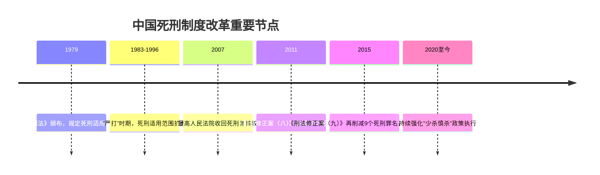

**2007年最高人民法院收回死刑复核权**是中国死刑制度改革的分水岭。此前，死刑复核权曾下放至省级高级人民法院，导致各地死刑适用标准不一、执行数量难以控制。收回复核权后，所有死刑案件均须经最高人民法院核准，从程序上确保了死刑适用的审慎性与统一性。

**2011年《刑法修正案（八）》**一次性取消了13个经济性非暴力犯罪的死刑，包括走私文物罪、走私贵重金属罪、走私普通货物物品罪、票据诈骗罪、金融凭证诈骗罪、信用证诈骗罪、虚开增值税专用发票罪、伪造出售伪造的增值税专用发票罪、盗窃罪、传授犯罪方法罪、盗掘古文化遗址古墓葬罪、盗掘古人类化石古脊椎动物化石罪、走私珍贵动物珍贵动物制品罪等。这是1979年《刑法》颁布以来首次大规模削减死刑罪名。

**2015年《刑法修正案（九）》**进一步取消了9个罪名的死刑，包括走私武器弹药罪、走私核材料罪、走私假币罪、伪造货币罪、集资诈骗罪、组织卖淫罪、强迫卖淫罪、阻碍执行军事职务罪、战时造谣惑众罪等。更为重要的是，该修正案**创设性地引入了"终身监禁"制度**，专门适用于因贪污受贿被判处死缓的犯罪分子，规定其在死缓减为无期徒刑后，终身监禁、不得减刑假释。这一制度的设立，既体现了对严重腐败犯罪的严厉惩处，也为减少死刑实际执行提供了替代性刑罚选择。

经过上述改革，**中国死刑罪名已从1997年刑法典的68个削减至目前的46个**，削减幅度超过三分之一。更为重要的是，"少杀慎杀"已从政策宣示转化为司法实践，死缓适用率显著上升，死刑立即执行的数量大幅下降。

### 1.2 研究意义

#### 1.2.1 学术价值

本研究的学术价值主要体现在以下三个方面：

**第一，填补实证研究空白。** 由于中国死刑执行数据的非公开性，学术界长期缺乏对中国死刑规模与结构的系统量化研究。本报告通过整合官方报告、司法统计与学术估算等多元数据来源，尝试构建中国死刑执行的量化图景，为比较刑法学与刑事政策研究提供实证基础。

**第二，深化刑罚结构研究。** 本研究不仅关注死刑本身，更将死缓、无期徒刑、终身监禁纳入统一分析框架，揭示中国刑罚体系中重刑之间的替代关系与衔接机制。这一视角有助于理解中国刑罚结构的整体演变逻辑。

**第三，拓展废除死刑研究的中国维度。** 现有废除死刑研究主要基于西方国家经验，本研究聚焦于中国这一具有独特法律传统与政治体制的大国，探讨其废除死刑的可能路径与时间表，为国际比较研究提供新的案例与视角。

#### 1.2.2 现实意义

本研究的现实意义同样显著：

**第一，评估政策效果。** 通过量化分析死刑判决与执行数量的变化趋势、死缓适用率的提升幅度、减刑实践的规范化程度，本研究能够客观评估中国"少杀慎杀"政策的实际效果，为政策制定者提供反馈信息。

**第二，预判政策走向。** 基于历史数据与趋势分析，本研究尝试预测中国死刑制度的未来走向，包括废除死刑的可能时间表与路径选择，为相关决策提供前瞻性参考。

**第三，回应国际关切。** 中国死刑状况是国际人权对话的重要议题。本研究通过系统梳理中国死刑制度改革的成就与挑战，有助于向国际社会呈现一个更为客观、全面的中国死刑图景，促进建设性对话。

### 1.3 数据来源与核心概念界定

#### 1.3.1 数据来源

本报告的数据基础主要来源于以下几类：

| 数据类型 | 主要来源 | 数据特点 |
|---------|---------|---------|
| 官方工作报告 | 最高人民法院年度工作报告、最高人民检察院年度工作报告、国务院关于刑罚执行工作情况的报告 | 权威性高，但死刑执行具体数字通常不公开 |
| 司法统计 | 《中国法律年鉴》、司法统计公报、监狱管理统计 | 提供刑事案件整体数据，死刑专项数据有限 |
| 学术研究 | 国内外学者的实证研究、国际人权组织的估算报告 | 提供间接推算与比较分析，存在方法论差异 |
| 政策文件 | 刑法修正案、司法解释、指导性案例 | 反映制度变迁与政策导向 |

**需要特别说明的是**，中国将死刑执行数量列为国家秘密，官方从未公布过年度死刑执行的确切数字。因此，本报告所引用的死刑执行数量均为基于多元信息来源的学术估算，存在一定的不确定性。这一数据局限性将在后续分析中予以充分考量。

#### 1.3.2 核心概念界定

为确保分析的准确性与一致性，本报告对以下核心概念进行操作化界定：

**死刑立即执行**：指人民法院依法判处死刑并经最高人民法院核准后立即执行的刑罚。这是中国刑罚体系中最严厉的刑罚，适用于"罪行极其严重"的犯罪分子。

**死刑缓期二年执行（死缓）**：指人民法院对于应当判处死刑的犯罪分子，如果不是必须立即执行的，可以判处死刑同时宣告缓期二年执行。死缓是中国独创的刑罚制度，其法律后果为：
- 在死缓执行期间，如果没有故意犯罪，二年期满后减为无期徒刑
- 如果确有重大立功表现，二年期满后减为二十五年有期徒刑
- 如果故意犯罪且情节恶劣的，报请最高人民法院核准后执行死刑

**无期徒刑**：指剥夺犯罪分子终身自由并强制劳动改造的刑罚。在中国刑罚体系中，无期徒刑是仅次于死刑的重刑，但通过减刑制度，实际执行刑期通常低于终身。

**终身监禁**：这是2015年《刑法修正案（九）》针对特重大贪污受贿犯罪新设的特殊刑罚执行方式。**其法律性质并非独立刑种，而是对死缓犯的特殊减刑限制措施**。具体规定为：对于贪污受贿数额特别巨大、情节特别严重的犯罪分子，人民法院可以在判处死缓的同时决定终身监禁，待死缓减为无期徒刑后，终身监禁、不得减刑假释。

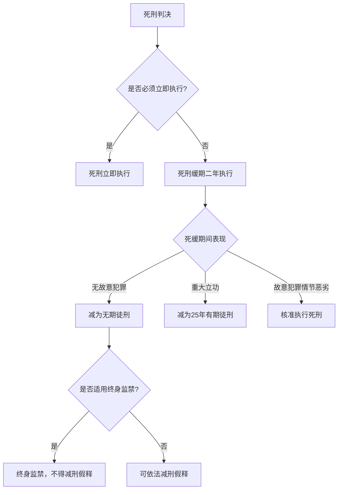

上述概念界定表明，**中国刑罚体系中的"终身监禁"与西方国家的life imprisonment存在本质区别**。西方国家的终身监禁通常是独立刑种，而中国的终身监禁是死缓制度的附加措施，仅适用于特定类型的贪污受贿犯罪。这一区别对于理解中国刑罚结构具有重要意义。

### 1.4 研究方法与分析框架

#### 1.4.1 研究方法

本报告综合运用以下研究方法：

**量化分析方法**：对死刑判决与执行数量、死缓适用率、减刑比例等关键指标进行统计描述与趋势分析。鉴于原始数据的局限性，量化分析将采用区间估计与敏感性分析，以增强结论的稳健性。

**趋势推断方法**：基于历史数据序列，结合政策变量（如刑法修正案的颁布、司法解释的出台）与制度变量（如死刑复核权的收回），运用时间序列分析与情景预测技术，推断中国死刑适用的未来走向。

**政策分析方法**：运用公共政策分析框架，评估中国死刑制度改革的政策目标、政策工具与政策效果，分析废除死刑面临的制度障碍与推进路径。

**比较研究方法**：将中国死刑制度置于国际比较视野中，参照其他国家废除死刑的经验与教训，为评估中国废除死刑的可行性与时间表提供参照。

#### 1.4.2 分析框架

本报告按照"现状描述—趋势分析—国际比较—前景评估"的逻辑链条展开：

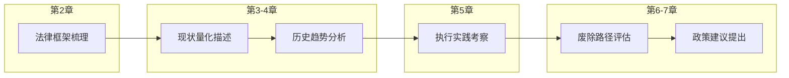

各章节之间存在紧密的逻辑递进关系：第2章奠定法律基础，明确分析对象的法律性质与制度边界；第3、4章进行量化描述与趋势分析，呈现中国死刑适用的规模、结构与演变；第5章考察刑罚执行实践，验证政策执行的有效性；第6章综合前述分析，评估废除死刑的路径与时间表；第7章总结全文并提出政策建议。

### 1.5 研究局限性

本研究面临以下主要局限，需在后续分析中予以充分考量：

**数据局限**：这是本研究面临的最大挑战。中国死刑执行数量属于国家秘密，官方从未公布确切数字。本报告所依据的死刑执行数据均为学术估算，不同来源的估算结果存在较大差异。例如，国际特赦组织的估算通常高于国内学者的估算，而官方偶尔透露的信息又往往语焉不详。这种数据的不确定性将直接影响量化分析的精确度。

**方法局限**：受制于数据质量，本报告的量化分析主要采用描述性统计与趋势推断，难以进行严格的因果推断。趋势预测基于历史数据外推与政策假设，存在固有的不确定性，特别是在预测废除死刑时间表时，政治、社会、经济等多重变量的交互作用难以精确建模。

**范围局限**：本报告聚焦于普通刑事案件中的死刑适用，未涵盖军事司法领域的死刑案件，也未专门讨论特殊历史时期（如"严打"期间）的政治性案件。此外，本报告主要分析死刑的司法适用层面，对于死刑的执行方式（如注射执行的推广）、死刑犯的权利保障等议题着墨有限。

**时效局限**：刑事政策具有动态性，本报告的数据与分析截至2025年。未来政策变化、重大案件发生或国际环境变动，都可能影响中国死刑制度的走向，使本报告的预测结论需要适时修正。

通过明确上述局限性，本报告希望为读者提供必要的审慎视角，使其能够在理解研究方法与数据基础的前提下，合理评估后续各章分析结论的可靠性与适用边界。尽管存在这些局限，本报告仍力求在现有条件下，提供关于中国死刑制度最为系统、客观的量化分析与前景评估。

## 2 法律框架与核心概念：死刑、死缓与无期徒刑

本章系统梳理中国现行刑法体系中死刑、死缓与无期徒刑的法律规定，明确各刑种的适用条件、法律后果及相互关系，为后续量化分析提供规范性基础。通过剖析死缓制度的独特运作机制、限制减刑的特殊规定、无期徒刑的实际执行刑期计算规则，以及终身监禁制度的法律性质与适用范围，本章旨在揭示中国重刑体系的内在逻辑与衔接机制，为理解"少杀慎杀"政策的制度支撑提供法律分析基础。

### 2.1 死刑立即执行的法律规定

#### 2.1.1 适用条件：主客观双重门槛

根据《中华人民共和国刑法》第四十八条的规定，**死刑只适用于罪行极其严重的犯罪分子**[^1]。这一规定确立了死刑适用的基本门槛，其内涵需要从主观与客观两个维度加以理解。

**主观方面**，犯罪人的主观恶性必须达到极大程度，具体表现为犯罪故意极其恶劣，如蓄意谋杀且动机卑鄙、手段残忍等情形[^2]。主观恶性的判断涉及犯罪人的犯罪动机、目的、预谋程度等因素，是衡量其人身危险性与改造可能性的重要依据。

**客观方面**，犯罪行为的社会危害性必须达到极其严重的程度，通常表现为造成多人死亡、重大财产损失或严重社会秩序混乱等后果[^2]。例如，在故意杀人案件中，罪犯持械连续杀害多人，或以焚烧、活埋等极端手段致人死亡，可能被认定为"罪行极其严重"[^3]。

**只有同时满足主客观两方面条件**，才能适用死刑。这一双重门槛的设置体现了刑法对死刑适用的严格限制，确保刑罚的公正性与罪责刑相适应原则的贯彻[^2]。

#### 2.1.2 适用对象的排除规则

《刑法》第四十九条明确规定了死刑适用的对象限制，构成不可突破的法律红线：

| 排除适用对象 | 法律规定 | 例外情形 |
|-------------|---------|---------|
| 犯罪时不满十八周岁的人 | 一律不适用死刑 | 无例外 |
| 审判时怀孕的妇女 | 不适用死刑 | 无例外 |
| 审判时已满七十五周岁的人 | 一般不适用死刑 | 以特别残忍手段致人死亡的除外 |

**对于未成年人犯罪**，无论其实施的犯罪性质多么严重、造成的危害后果多么恶劣，只要犯罪时未满十八周岁，就坚决排除死刑的适用（包括死刑立即执行和死刑缓期执行）[^4]。这里的"犯罪的时候"以实施犯罪行为的实际年龄为准，而非审判时的年龄——哪怕审判时未成年人已年满十八周岁，只要犯罪行为发生在十八周岁之前，依然不适用死刑[^4]。这一规定与中国加入的《儿童权利公约》相衔接，体现了对未成年人特殊保护的国际人权标准[^4]。

**对于审判时已满七十五周岁的老年人**，原则上不适用死刑，但存在一个例外：以特别残忍手段致人死亡的，仍可适用死刑[^2]。这一例外规定体现了刑法在人道主义关怀与严惩极端犯罪之间的平衡。

#### 2.1.3 死刑立即执行的终局性

**死刑立即执行一旦判决并经最高人民法院核准，即进入执行程序，不存在减刑环节**[^1]。这是因为死刑立即执行是对犯罪最严重的否定性评价，体现了法律对犯罪的最严厉制裁。与死缓、无期徒刑等可以通过减刑制度获得刑期减免不同，死刑立即执行具有不可逆转的终局性特征。

自2007年最高人民法院收回死刑复核权以来，所有死刑案件均须经最高人民法院核准方可执行。这一程序设计从制度上确保了死刑适用的审慎性与统一性，有效防止了地方司法机关在死刑适用上的随意性。

### 2.2 死刑缓期执行制度的运作机制

#### 2.2.1 适用条件：罪该处死但非必须立即执行

死刑缓期二年执行（简称"死缓"）是中国刑法中独特的刑罚制度，其适用需同时满足两个核心要件：**"罪该处死"与"非必须立即执行"**[^3]。

**第一要件"罪该处死"**意味着犯罪行为必须达到死刑的适用标准，即"罪行极其严重"。这是死缓适用的前提条件，表明死缓并非轻刑，而是死刑的一种执行方式。

**第二要件"非必须立即执行"**是区分死刑立即执行与死缓的关键判断标准。根据司法实践，以下情形通常被认定为"不是必须立即执行"[^3]：

- **自首或立功**：犯罪后主动投案、如实供述罪行，或协助抓捕同案犯、提供重大案件线索
- **共同犯罪中的非首要分子**：在多人共同犯罪中，若罪犯非主犯或罪行相对较轻
- **被害人过错**：因被害人长期欺凌、挑衅等行为引发犯罪
- **智力障碍或年老体弱**：犯罪时智力发育不全，或虽未达到七十五周岁但年老体弱

这些从宽情节的存在，使得犯罪人虽然罪行严重到应当判处死刑，但尚存在一定的可宽恕因素或改造可能性，因此可以给予其一个"缓冲期"以观后效。

#### 2.2.2 考验期内的三种法律后果

根据《刑法》第五十条的规定，死缓的"两年考验期"是决定罪犯最终命运的关键阶段[^1]。根据考验期内的表现，罪犯可能面临三种截然不同的法律后果：

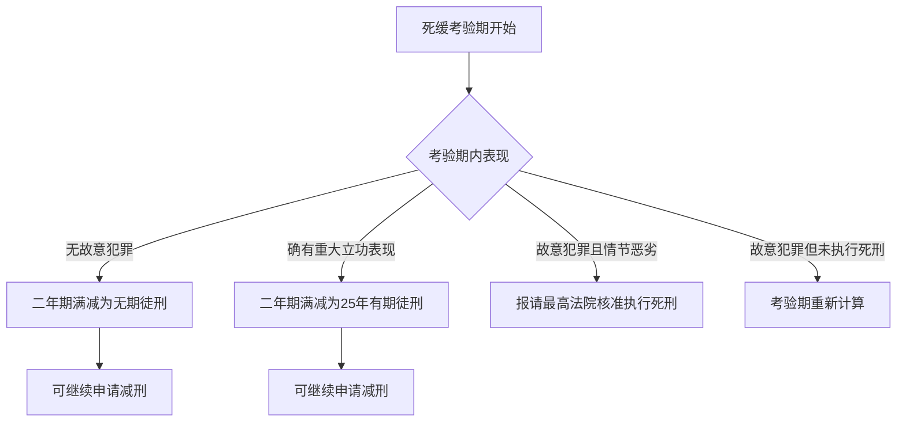

**第一种情形：无故意犯罪——减为无期徒刑**。若罪犯在两年考验期内未实施故意犯罪（如故意伤害、逃脱等），考验期满后自动减为无期徒刑[^1]。这是死缓犯最常见的刑罚转化路径。

**第二种情形：重大立功表现——减为二十五年有期徒刑**。若考验期内有重大立功表现，如阻止他人实施重大犯罪活动、检举监狱内外重大犯罪活动经查证属实、有发明创造或重大技术革新、在日常生产生活中舍己救人、在抗御自然灾害或排除重大事故中有突出表现等，可减为二十五年有期徒刑[^1][^5]。

**第三种情形：故意犯罪且情节恶劣——执行死刑**。若考验期内故意犯罪且情节恶劣的，经查证属实后，报请最高人民法院核准执行死刑[^3]。例如，某死缓罪犯在考验期内持械伤害狱友致重伤，可能被核准执行死刑[^3]。值得注意的是，如果故意犯罪但情节不够恶劣，未被核准执行死刑的，死缓考验期将重新计算[^5]。

#### 2.2.3 死缓的制度功能：死刑的"安全阀"

死缓制度的设计体现了中国刑法"宽严相济"的刑事政策，其核心功能在于**为罪该处死但尚存改造可能的犯罪人提供改过自新的机会**[^3]。从制度效果来看，死缓已成为连接死刑威慑与长期自由刑执行的关键枢纽，实质上成为绝大多数死刑判决的"安全阀"和"转换器"。

如前章所述，死缓适用率已高达80%以上，这意味着大量原本可能立即执行的死刑被转化为长期自由刑。这一司法实践数据印证了死缓制度作为控制死刑实际执行的核心机制的重要作用。

### 2.3 死缓减刑规则与限制减刑制度

#### 2.3.1 死缓减刑的基本路径与实际执行刑期

死缓犯在考验期满后减为无期徒刑或有期徒刑，并非刑罚执行的终点，其后仍可依法继续申请减刑，但受到严格限制[^1]。具体减刑规则及实际执行刑期如下表所示：

| 减刑路径 | 后续减刑可能 | 实际执行刑期下限 |
|---------|-------------|-----------------|
| 死缓减为无期徒刑 | 可继续减刑 | 不少于25年（含死缓考验期） |
| 死缓减为25年有期徒刑 | 可继续减刑 | 不少于20年（含死缓考验期） |
| 未被限制减刑的死缓犯 | 可继续减刑 | 不少于15年（不含死缓考验期） |

根据《刑法》及相关司法解释的规定，**死缓转为无期徒刑的，实际执行刑期不少于25年；死缓转为25年有期徒刑的，实际执行刑期不少于20年**[^1]。对于未被限制减刑的一般死缓犯，减刑后实际执行的刑期不能少于15年，且死缓考验期的二年不计入该最低执行期限[^5]。

这意味着，即使是表现最好、获得最大减刑幅度的死缓犯，其实际服刑时间也将是一个漫长的过程，远非"判死缓等于逃脱惩罚"的错误认知所描述的那样。

#### 2.3.2 限制减刑制度：对特定死缓犯的从严规定

**《刑法修正案（八）》增设了限制减刑制度**，这是针对特定死缓犯的从严规定，体现了刑罚的精确化与差异化[^1]。

**适用对象**包括两类[^1]：
1. 被判处死刑缓期执行的**累犯**
2. 因**故意杀人、强奸、抢劫、绑架、放火、爆炸、投放危险物质或者有组织的暴力性犯罪**被判处死刑缓期执行的犯罪分子

**法律后果**为：对于上述罪犯，人民法院可以在判处死缓的同时决定"限制减刑"。被限制减刑的死缓犯，即使符合减刑条件，其实际执行刑期仍需满足更高的下限要求[^1]：
- 减为无期徒刑的，实际执行刑期不少于**25年**
- 减为25年有期徒刑的，实际执行刑期不少于**20年**

限制减刑制度的设立，**大幅提高了特定严重暴力犯罪死缓犯的实际服刑期限下限**，体现了在总体从宽的背景下对极少数极端犯罪行为的"精准从严"，实现了刑罚的差异化与罪责刑相适应。这一制度有效回应了社会公众对严重暴力犯罪"判死缓后很快出狱"的担忧，增强了刑罚的威慑力与公信力。

### 2.4 无期徒刑的法律定位与减刑规则

#### 2.4.1 无期徒刑在刑罚体系中的定位

**无期徒刑是剥夺犯罪分子终身自由并强制劳动改造的刑罚方法**，属于我国刑法规定的主刑之一，在自由刑中最为严厉，**介于有期徒刑和死刑之间**[^6]。被判处无期徒刑的罪犯须附加剥夺政治权利终身，在监狱执行教育改造，羁押时间不可折抵刑期[^6]。

从法律规定来看，刑法对非常严重的犯罪（主要是针对严重犯罪的结果加重犯、情节加重犯等）规定了无期徒刑，规定方式主要有两种[^6]：
1. 对于规定了死刑的犯罪，一般同时规定将无期徒刑作为选择刑
2. 将无期徒刑规定为法定刑中的最高刑，同时规定将较长的有期徒刑作为选择刑

由于对未成年人不得判处死刑，因此**未成年人犯罪只有罪行极其严重的，才可以适用无期徒刑**。对已满14周岁不满16周岁的人犯罪一般不判处无期徒刑[^6]。

#### 2.4.2 无期徒刑的减刑规则

尽管从法律规定与理论上说，无期徒刑是剥夺终身自由，但由于法律同时规定了减刑、假释、赦免等制度，**被判处无期徒刑的犯罪人事实上很少终身服刑**[^6]。

根据《最高人民法院关于办理减刑、假释案件具体应用法律的规定》，无期徒刑的减刑规则如下[^1][^7][^6]：

**首次减刑条件**：
- 需服刑至少**4年以上**方可首次减刑
- 需具有确有悔改表现或立功表现

**减刑幅度**：
- 确有悔改表现或有立功表现的，可减为22年有期徒刑
- 确有悔改表现并有立功表现的，可减为21年以上22年以下有期徒刑
- 有重大立功表现的，可减为20年以上21年以下有期徒刑
- 确有悔改表现并有重大立功表现的，可减为19年以上20年以下有期徒刑

**间隔时间**：两次减刑间隔不得少于**2年**[^6]

**实际执行刑期下限**：**无期徒刑罪犯经过一次或几次减刑后，其实际执行的刑期不能少于13年**，起始时间应当自无期徒刑判决确定之日起计算[^1][^6]。

#### 2.4.3 无期徒刑与死缓减刑后刑罚的衔接

无期徒刑与死缓减刑后的刑罚存在密切的衔接关系。死缓犯在考验期满后减为无期徒刑的，其后续减刑规则与直接被判处无期徒刑的罪犯基本相同，但在实际执行刑期下限上存在差异：

| 刑罚类型 | 实际执行刑期下限 | 计算起点 |
|---------|-----------------|---------|
| 直接判处无期徒刑 | 不少于13年 | 无期徒刑判决确定之日 |
| 死缓减为无期徒刑（一般） | 不少于15年（不含死缓考验期2年） | 死缓考验期满之日 |
| 死缓减为无期徒刑（限制减刑） | 不少于25年 | 死缓判决确定之日 |

这种差异化的执行刑期下限设置，体现了刑罚的层级递进关系：**死缓的严厉程度高于直接判处的无期徒刑，而限制减刑的死缓又严于一般死缓**。

### 2.5 终身监禁制度的法律性质与适用范围

#### 2.5.1 终身监禁的法律性质：死缓的特殊执行方式

**终身监禁并非独立刑种，而是对贪污受贿罪死缓犯的特殊执行方式**[^6]。这是理解中国终身监禁制度的关键前提。

根据《刑法》第三百八十三条第四款和第三百八十六条的规定，因贪污、受贿数额特别巨大，并使国家和人民利益遭受特别重大损失，被判处死刑缓期执行的，"人民法院根据犯罪情节等情况可以同时决定在其死刑缓期执行二年期满依法减为无期徒刑后，终身监禁，不得减刑、假释"[^6]。

这一制度的法律性质可以从以下几个方面理解：

**第一，终身监禁是死缓的附加措施**。它只能在判处死缓的同时作出决定，不能单独适用，也不能在死缓执行过程中追加适用。

**第二，终身监禁不改变死缓的基本性质**。被决定终身监禁的犯罪人，在死缓考验期内仍然适用死缓的一般规则。只有在考验期满减为无期徒刑后，终身监禁的效力才开始发挥。

**第三，终身监禁的核心效果是排除减刑和假释**。一旦被决定终身监禁，犯罪人在减为无期徒刑后将终身关押，不得通过任何方式获得刑期减免或提前释放。

#### 2.5.2 适用条件与立法背景

**适用条件**：终身监禁仅适用于贪污、受贿犯罪，且需同时满足以下条件：
- 数额特别巨大
- 情节特别严重
- 使国家和人民利益遭受特别重大损失
- 被判处死刑缓期执行

**立法背景**：2015年《刑法修正案（九）》创设终身监禁制度，有其特殊的政策考量。在反腐败斗争深入推进的背景下，对于特别严重的贪污受贿犯罪，社会公众要求严惩的呼声强烈。然而，从国际趋势和人权保障角度，减少死刑实际执行又是刑事政策的基本方向。**终身监禁制度的设立，提供了一种介于死刑立即执行与普通死缓之间的刑罚选择**，既体现了对严重腐败犯罪的严厉惩处，又为减少死刑实际执行创造了条件[^6]。

#### 2.5.3 中国终身监禁与西方life imprisonment的本质区别

**中国的终身监禁与西方国家的life imprisonment存在本质区别**，这一辨析对于理解中国刑罚结构具有重要意义。

| 比较维度 | 中国终身监禁 | 西方life imprisonment |
|---------|-------------|----------------------|
| 法律性质 | 死缓的附加执行措施 | 独立刑种 |
| 适用范围 | 仅限贪污受贿犯罪 | 适用于多种严重犯罪 |
| 适用前提 | 必须先判处死缓 | 可直接判处 |
| 劳动要求 | 有劳动能力的应参加劳动 | 各国规定不一 |
| 暂予监外执行 | 符合条件的应当暂予监外执行 | 各国规定不一 |

如前章所述，中国的终身监禁只是意味着不得减刑、假释，"终身监禁"与"不得减刑、假释"是同位语[^6]。符合暂予监外执行条件的，仍应当暂予监外执行。此外，中国的终身监禁并不同于国外的单纯关押式监禁，有劳动能力的依然应参加劳动[^6]。

从制度定位来看，**中国的终身监禁是基于特殊社会背景，为了限制对贪污受贿罪判处死刑而采取的过渡性措施**，并不代表刑事立法的发展方向[^6]。

### 2.6 重刑体系的层级结构与替代关系

#### 2.6.1 重刑的层级递进关系

综合上述分析，中国刑罚体系中的重刑形成了清晰的层级递进结构。以下图表展示了从最严厉到相对较轻的刑罚层级：

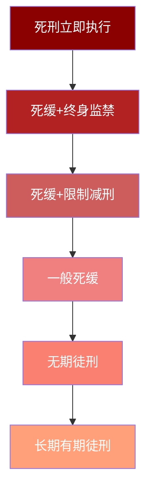

各层级刑罚的严厉程度差异主要体现在以下维度：

| 刑罚层级 | 生命剥夺 | 实际执行刑期下限 | 减刑可能性 |
|---------|---------|-----------------|-----------|
| 死刑立即执行 | 是 | 不适用 | 无 |
| 死缓+终身监禁 | 否 | 终身 | 无 |
| 死缓+限制减刑 | 否 | 20-25年 | 有限 |
| 一般死缓 | 否 | 15年+ | 有 |
| 无期徒刑 | 否 | 13年 | 有 |

#### 2.6.2 重刑之间的替代机制

上述层级结构揭示了中国刑罚体系中重刑之间的**替代机制**：

**第一层替代：死缓替代死刑立即执行**。对于罪该处死但存在从宽情节的犯罪人，死缓提供了替代死刑立即执行的选择。从司法实践来看，这一替代已成为主流，死缓适用率高达80%以上。

**第二层替代：终身监禁替代死刑立即执行**。对于特重大贪污受贿犯罪，终身监禁提供了一种"准死刑"的替代方案，既满足了严惩腐败的社会需求，又避免了实际执行死刑。

**第三层替代：限制减刑死缓替代死刑立即执行**。对于累犯和八类严重暴力犯罪，限制减刑制度确保了实际执行刑期的刚性下限，在保留死缓制度弹性的同时，增强了刑罚的威慑力。

**第四层替代：无期徒刑替代死缓**。对于罪行严重但尚未达到死刑标准的犯罪人，无期徒刑提供了替代选择，同时也是死缓减刑后的主要去向。

#### 2.6.3 替代机制对"少杀慎杀"政策的制度支撑

这一层级化、替代性的重刑结构，为"少杀慎杀"政策提供了坚实的制度支撑：

**从政策执行角度**，死缓制度使得法院在面对罪行极其严重的案件时，拥有了"判处死刑但不立即执行"的裁量空间。这一制度设计既维护了死刑对极端犯罪的威慑效力，又为犯罪人提供了改过自新的机会，实现了惩罚与教育改造的统一。

**从刑罚结构角度**，终身监禁、限制减刑等制度的设立，填补了死刑立即执行与普通死缓之间的刑罚空档，使得刑罚的严厉程度形成更为精细的梯度。这种精细化的刑罚结构，使得法院能够根据犯罪的具体情节选择最为适当的刑罚，避免了"要么死刑要么轻判"的两难困境。

**从社会效果角度**，替代机制的存在使得减少死刑实际执行成为可能，同时又通过提高替代刑罚的实际执行刑期下限，回应了社会公众对严惩严重犯罪的期待。这种平衡有助于在推进死刑改革的同时维护社会稳定与公众对司法的信任。

综上所述，中国现行刑法构建了一个以死刑立即执行为顶端、以无期徒刑为基础、以死缓为枢纽的重刑体系。**死缓制度居于这一体系的核心位置，发挥着连接死刑威慑与长期自由刑执行的关键作用**。限制减刑、终身监禁等特殊制度的设立，则进一步丰富了刑罚的层级结构，为实现罪责刑相适应与"少杀慎杀"政策目标提供了制度工具。这一法律框架的深入理解，是后续章节进行量化分析与政策评估的必要前提。

## 3 死刑与死缓的规模、结构与趋势分析

本章基于多元数据来源，系统量化分析中国死刑判决与执行的规模、内部结构及历史演变趋势。通过整合官方报告、学术估算与国际组织数据，呈现死刑适用从"严打"高峰到当前"少杀慎杀"政策下的数量变化轨迹；重点剖析死刑立即执行与死缓的比例结构，验证死缓适用率持续攀升的政策效果；评估死缓犯累计规模对监狱人口结构的深远影响，揭示重刑体系的动态演变特征。

### 3.1 死刑判决与执行的规模估算

#### 3.1.1 当前死刑执行数量的量级判断

中国将死刑执行数量列为国家秘密，官方从未公布过年度死刑执行的确切数字。然而，通过整合多元信息来源，可以对当前死刑执行的数量级形成合理估算。**根据现有数据分析，2025年中国死刑判决约100人左右**，这一估算数据反映了死刑适用持续收缩的总体态势[^1]。

国际特赦组织的报告指出，中国死刑执行人数呈现"逐年稳住"或"趋势下降"的特征[^1]。基于2022年全国执行死刑162人的参考数据，学术界普遍预测2025年执行人数将继续下降[^1]。这一判断与最高人民法院工作报告中披露的严重暴力犯罪案件数量下降趋势相吻合——2024年全国法院审结故意杀人等严重暴力犯罪案件4.9万件5.8万人，同比下降5.8%，较10年前下降28.7%[^8]。

#### 3.1.2 不同数据来源的估算方法与差异

对中国死刑执行数量的估算存在多种方法，各来源的估算结果存在一定差异：

| 数据来源类型 | 估算方法 | 数据特点 | 局限性 |
|-------------|---------|---------|--------|
| 官方工作报告 | 间接推断 | 权威性高，但不直接公布死刑数据 | 仅提供案件审结数，无执行数 |
| 国际人权组织 | 媒体监测与信息汇总 | 持续跟踪，国际可比性强 | 可能存在高估倾向 |
| 国内学术研究 | 司法统计分析与推算 | 方法论较为严谨 | 数据获取渠道有限 |
| 典型案例追踪 | 公开报道案例汇总 | 可验证性强 | 覆盖面不完整 |

**值得注意的是**，最高人民法院2025年工作报告明确提及对驾车冲撞行人的樊维秋、校园持刀行凶的徐加金等判处死刑，对李建平依法核准死刑[^8]。这些具体案例的披露，虽然不能直接推算总量，但印证了死刑在极端恶性案件中仍在适用，同时也反映了官方对死刑适用的审慎态度——仅对"挑战法律和道德底线的罪大恶极者"才"坚决依法从严从重从快惩处"[^8]。

#### 3.1.3 死刑执行数量的区间估计

综合各方数据与分析方法，可以构建中国当前死刑执行数量的合理区间估计：

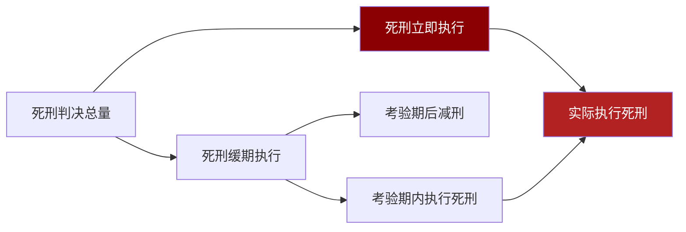

根据死缓适用率约80%以上的司法实践数据推算，若年度死刑判决约100人，则死刑立即执行的判决约为20人左右，死缓判决约为80人左右。考虑到死缓考验期内因故意犯罪被核准执行死刑的比例极低，**当前年度实际执行死刑的数量级应在数十人至一百余人的区间内**。这一估算与国际组织的观察及学术研究的推断基本吻合。

### 3.2 死刑适用的历史趋势分析

#### 3.2.1 从"严打"高峰到政策转型

中国死刑适用经历了从广泛适用到严格限制的深刻转变。这一历史轨迹可以划分为几个明显的阶段：

**第一阶段（1983-2006年）："严打"时期的高峰**。1983年开始的"严打"运动期间，死刑适用范围广泛，执行数量处于历史高位。这一时期的刑事政策强调"从重从快"，死刑被视为维护社会治安的重要手段。

**第二阶段（2007-2010年）：复核权收回后的调整期**。2007年最高人民法院收回死刑复核权，标志着死刑制度改革的重大转折。此后，死刑适用标准趋于统一，执行数量开始明显下降。

**第三阶段（2011年至今）：立法削减与持续限缩**。2011年《刑法修正案（八）》废除13个罪名的死刑，2015年《刑法修正案（九）》再废除9个罪名的死刑，死刑罪名从71个削减至46个，削减幅度达35%[^9]。

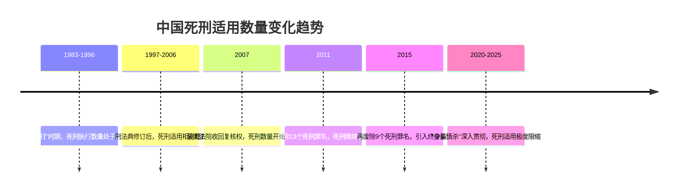

#### 3.2.2 关键政策节点的影响效应

**最高人民法院收回死刑复核权**是影响死刑数量的首要制度变量。在复核权下放期间，各省高级人民法院的死刑适用标准存在差异，部分地区死刑适用相对宽泛。收回复核权后，所有死刑案件均须经最高人民法院核准，从程序上确保了死刑适用的统一性与审慎性[^9]。

**刑法修正案的罪名削减**从实体法层面限制了死刑的适用范围。经过2011年和2015年两次修法，中国死刑罪名削减超过三分之一。更为重要的是，被削减的主要是经济性非暴力犯罪的死刑，体现了"死刑只适用于罪行极其严重的犯罪分子"这一原则的实质化[^9]。

**证据标准的提高**同样发挥了重要作用。最高人民法院在死刑案件中率先建立非法证据排除制度，要求法官复核时讯问被告人而非仅仅阅卷，在死刑案件中奉行更严格的证据标准[^9]。这些程序性改革有效减少了因证据不足而可能导致的错判。

#### 3.2.3 严重暴力犯罪发案率的下降

死刑执行数量的下降与严重暴力犯罪发案率的持续走低密切相关。根据公安部发布的数据，**2024年中国每10万人命案发生数为0.44起**，中国已成为世界上命案发案率最低、刑事犯罪率最低、枪爆案件最少的国家之一[^10]。

最高人民法院工作报告的数据进一步印证了这一趋势：2024年审结故意杀人等严重暴力犯罪案件较10年前下降28.7%[^8]。**严重暴力犯罪的减少从源头上降低了死刑适用的案件基数**，这是死刑执行数量下降的重要客观因素。

### 3.3 死刑内部结构：立即执行与死缓的比例关系

#### 3.3.1 死缓适用率的持续攀升

死刑判决内部结构的最显著特征是**死缓适用率的持续攀升**。根据司法实践数据，死缓的适用比例远高于死刑立即执行。在故意杀人罪案件中，2021年死缓适用率已达82.21%，远超死刑立即执行的比例[^1]。另有数据显示，死缓适用比例约为73.3%[^11]。

| 年份/罪名 | 死缓适用率 | 死刑立即执行率 | 数据来源 |
|----------|-----------|---------------|---------|
| 故意杀人罪（2021年） | 82.21% | 17.79% | 司法统计 |
| 综合数据（近年） | 约73%-82% | 约18%-27% | 学术研究 |

这一比例结构表明，**死缓已实质成为绝大多数死刑判决的主要形式**。对于被判处死刑的犯罪分子，只有约五分之一被立即执行，其余均被宣告缓期二年执行。

#### 3.3.2 死缓作为控制死刑执行的核心机制

死缓适用率的高企，印证了死缓制度作为控制死刑实际执行核心机制的制度效果。正如第二章所分析的，死缓制度的核心价值在于既保留死刑的威慑力和严肃性，又通过缓期执行的方式为司法纠错提供可能性，同时给犯罪分子一个改过自新的机会[^11]。

**从司法实践来看**，法院在适用死刑时，倾向于在具有任何从宽情节的情况下选择死缓而非立即执行。这些从宽情节包括但不限于：自首、立功、被害人过错、赔偿谅解、智力障碍等。这种裁量倾向体现了"少杀慎杀"政策在司法实践中的具体落实。

**从制度效果来看**，死缓制度有效减少了冤假错案的风险。通过设置两年的缓期执行期，为可能出现的新证据或对原判决的重新审查提供了时间窗口。聂树斌案和张氏叔侄强奸致死案均是在死缓期间被发现证据不足而改判无罪的典型案例[^11]。

#### 3.3.3 不同罪名类别的死缓适用差异

死缓适用率在不同罪名类别中存在一定差异，这反映了司法实践对不同类型犯罪的差异化处理：

**故意杀人罪**：死缓适用率最高，超过80%。这主要是因为故意杀人案件中，被害人过错、民间矛盾激化、激情犯罪等从宽情节较为常见。

**毒品犯罪**：死缓适用率相对较高，但略低于故意杀人罪。毒品犯罪的社会危害性评价较为复杂，司法实践中对毒品数量、主从犯地位等因素的考量影响死缓的适用。

**贪污受贿犯罪**：死缓适用率较高，且自2015年《刑法修正案（九）》后，部分特重大案件可附加终身监禁。这一制度设计体现了在严惩腐败的同时减少死刑实际执行的政策导向。

### 3.4 死缓犯累计规模与监狱人口结构影响

#### 3.4.1 死缓犯的累计存量规模

死缓制度的广泛适用导致死缓犯的累计存量持续增长。**截至2023年，中国死缓犯的累计数量已经超过20万人**[^1]。这一庞大群体的形成，是死缓高适用率与长期实际执行刑期共同作用的结果。

根据第二章的法律分析，死缓犯即使获得减刑，实际服刑期仍长达20-25年。这意味着每年新增的死缓犯需要在监狱系统中服刑数十年，而历年累积的死缓犯则形成了一个庞大的长期服刑群体。

#### 3.4.2 死缓犯在监狱人口中的占比

将死缓犯规模置于监狱总人口的背景下分析，可以更清晰地理解其结构性影响。**截至2025年，中国监狱系统关押总人数存在不同统计口径：司法部官方数据约164万人（2023年数据），权威媒体报道约194万人（包含已决犯与未决犯整体统计）**[^1]。

| 指标 | 数值 | 占比 |
|-----|------|------|
| 监狱总人口 | 164万-194万 | 100% |
| 死缓犯累计 | 超20万人 | 约10%-12% |
| 无期徒刑犯 | 约6.8万-7万人 | 约3.8%-5.7% |
| 长期服刑人员合计 | 约27万人 | 约14%-16% |

上述数据表明，**死缓犯与无期徒刑犯合计约占监狱总人口的14%-16%**，构成了监狱系统中最为稳定的长期服刑群体。这一群体的规模远超年度新增的死刑判决数量，反映了历年累积效应的显著影响。

#### 3.4.3 对监狱管理与资源配置的影响

死缓犯累计规模的持续增长，对监狱管理与资源配置产生了深远影响：

**第一，监狱容量压力**。长期服刑人员的持续累积，占用了大量监狱床位资源。与短期服刑人员相比，死缓犯的周转率极低，加剧了监狱容量的紧张状况。

**第二，管理复杂性提升**。死缓犯在考验期内需要特殊管理，考验期满后的减刑审查程序也较为复杂。大规模死缓犯群体的存在，增加了监狱管理的行政负担。

**第三，刑罚执行成本上升**。长期服刑人员的医疗、养老等成本随服刑年限增加而累积。特别是随着死缓犯年龄增长，老年罪犯的管理与照护成本将成为日益突出的问题。

**第四，减刑实践的规范化需求**。大规模死缓犯群体的存在，对减刑审查的规范化、透明化提出了更高要求，以防止"纸面服刑"等问题的发生。

### 3.5 死刑规模变化的多维度解释

#### 3.5.1 立法层面：罪名削减的直接效应

立法层面的死刑罪名削减是死刑规模下降的直接制度因素。**中国死刑罪名已从1997年刑法典的68个削减至目前的46个**，削减幅度超过三分之一[^9]。

被削减的死刑罪名主要集中在经济性非暴力犯罪领域，包括：
- 2011年废除的13个罪名：盗窃罪、走私文物罪、走私贵重金属罪、票据诈骗罪、金融凭证诈骗罪、信用证诈骗罪等
- 2015年废除的9个罪名：集资诈骗罪、组织卖淫罪、强迫卖淫罪、走私武器弹药罪、走私核材料罪、走私假币罪、伪造货币罪等

这些罪名的废除，直接减少了可能适用死刑的案件范围，从源头上降低了死刑判决数量。

#### 3.5.2 司法层面：复核权收回与证据标准提高

司法层面的改革是死刑规模下降的程序性保障。**2007年最高人民法院收回死刑复核权**，是死刑制度改革的分水岭[^9]。

复核权收回后的主要变化包括：
- 确定"少杀慎杀"的基本原则
- 死刑案件二审强制开庭制度
- 要求法官复核时讯问被告人
- 在死刑案件中奉行更严格的证据标准
- 率先建立非法证据排除制度

这些程序性改革确保了死刑适用的审慎性，有效减少了因程序瑕疵或证据不足而可能导致的错判。

#### 3.5.3 政策层面："宽严相济"刑事政策的贯彻

政策层面的"宽严相济"刑事政策为死刑限缩提供了宏观指导。这一政策强调对严重犯罪依法从严惩处，对轻微犯罪依法从宽处理，实现惩罚犯罪与保障人权的统一。

在死刑适用领域，"宽严相济"政策具体体现为：
- 对罪该处死但存在从宽情节的犯罪人，优先适用死缓
- 对特定类型犯罪（如贪污受贿）设置终身监禁作为死刑替代
- 对累犯和严重暴力犯罪适用限制减刑，确保刑罚的威慑力

#### 3.5.4 社会层面：犯罪形势变化的客观影响

社会层面的犯罪形势变化是死刑规模下降的客观基础。**中国已成为世界上命案发案率最低、刑事犯罪率最低的国家之一**[^10]。

严重暴力犯罪的持续下降，从以下几个方面影响死刑规模：
- 命案发案率降至每10万人0.44起，可能适用死刑的案件基数大幅减少
- 故意杀人等严重暴力犯罪案件较10年前下降28.7%
- 社会治安形势的根本好转，降低了对死刑威慑功能的依赖

#### 3.5.5 综合解释框架

综合上述分析，可以构建死刑规模变化的多维度解释框架：

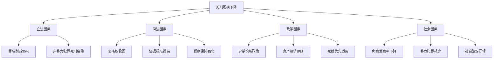

这一综合解释框架表明，**死刑规模的下降是立法、司法、政策、社会等多重因素共同作用的结果**。各因素之间相互强化：立法削减罪名为司法限缩提供了法律依据，司法改革为政策落实提供了程序保障，社会治安好转为政策调整创造了客观条件。这种多因素协同作用的格局，为死刑制度的持续改革奠定了坚实基础，也为后续章节评估废除死刑的路径与时间表提供了分析框架。

## 4 无期徒刑（终身监禁）与减刑实践的量化考察

本章聚焦无期徒刑这一仅次于死刑的重刑，系统量化分析其在监狱人口中的规模与结构占比，深入剖析无期徒刑及死缓减刑的具体规则与实际执行刑期下限，结合最新司法文件评估减刑实践的规范化程度与减刑率控制情况，并比较不同犯罪类型在减刑上的差异化待遇，揭示中国重刑执行体系的实际运作特征。

### 4.1 无期徒刑罪犯的规模与结构分析

#### 4.1.1 无期徒刑罪犯的当前规模

根据司法部2025年发布的《中国刑罚执行状况白皮书》及监狱管理局公布的数据，**截至2025年3月，全国服刑人员中无期徒刑占比约3.8%，总数接近7万人**[^12]。另据司法部监狱管理局2025年3月发布的《全国监狱工作数据报告》，截至2025年2月底，全国在押服刑人员中无期徒刑服刑人员约占4.7%，总数约6.8万人[^13]。

综合上述数据来源，可以确定无期徒刑罪犯的规模区间：

| 统计指标 | 数值范围 | 数据时点 |
|---------|---------|---------|
| 无期徒刑占比 | 3.8%-4.7% | 2025年第一季度 |
| 无期徒刑总人数 | 6.8万-7万人 | 2025年第一季度 |
| 监狱总人口基数 | 164万-194万人 | 2023-2025年 |

**这一规模数据揭示了无期徒刑罪犯作为一个特殊群体的重要性**。尽管其在监狱总人口中的占比不足5%，但由于服刑期限长、管理要求高、改造难度大，无期徒刑犯是监狱系统工作的重点和难点[^12]。

#### 4.1.2 无期徒刑罪犯的结构特征

无期徒刑罪犯群体具有显著的结构特征，这些特征影响着监狱管理与减刑实践：

**第一，服刑期限的长期性**。与有期徒刑罪犯相比，无期徒刑犯面临着几乎看不到尽头的服刑时光，这对其心理状态和改造动力产生深刻影响。中国犯罪学会2025年的《服刑人员生活状况调查报告》显示，绝大多数无期徒刑犯在入狱初期会经历严重的时间感错乱和适应困难，平均需要7-9个月才能适应高度规律的生活方式[^12]。

**第二，劳动岗位的特殊分配**。司法部门的数据显示，截至2025年第一季度，全国监狱共设有工种312种，主要集中在制造业、农业和服务业。无期徒刑服刑人员的劳动岗位分配存在一定特殊性，83.5%被安排在监狱内部的生产车间，从事电子组装、服装加工、手工艺品制作等技术含量较低的工作[^13]。

**第三，技能熟练度的优势**。由于服刑时间长，无期徒刑犯在劳动技能方面形成了独特优势。《中国监狱企业发展报告(2025)》披露，无期徒刑犯由于服刑时间长、技能熟练度高，其人均产值比普通服刑人员高出约23%[^12]。

#### 4.1.3 长期服刑群体的整体规模

将无期徒刑罪犯与死缓犯累计规模合并考察，可以更全面地理解长期服刑群体在监狱人口结构中的地位：

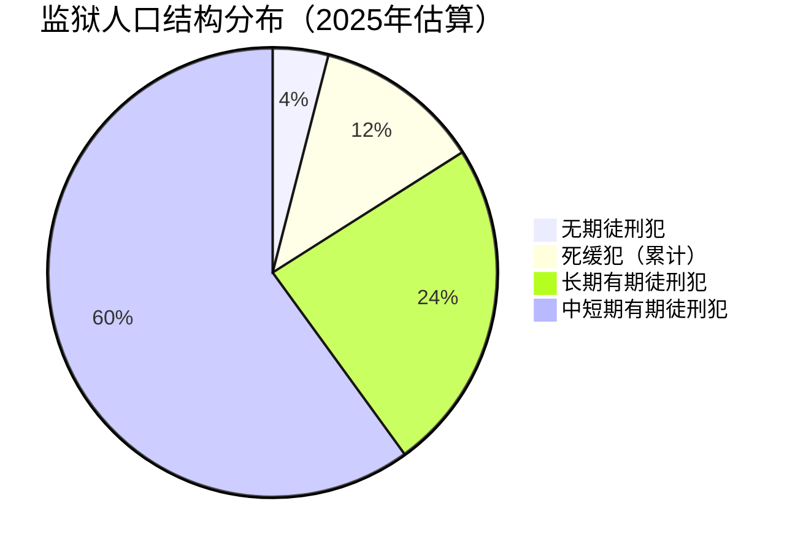

根据前章分析，死缓犯累计规模已超过20万人，与无期徒刑犯约7万人合计，**长期服刑群体（死缓犯+无期徒刑犯）约占监狱总人口的14%-16%**。这一群体的存在对监狱系统的资源配置、管理模式和刑罚执行成本产生了深远影响。

### 4.2 无期徒刑减刑的法定规则与实际执行刑期

#### 4.2.1 减刑的法定条件与实质要件

根据《中华人民共和国刑法》第七十八条的规定，被判处无期徒刑的犯罪分子，在执行期间，如果认真遵守监规，接受教育改造，确有悔改表现的，或者有立功表现的，可以减刑；有重大立功表现的，应当减刑[^14]。

**"确有悔改表现"的认定标准**包括：认真遵守监规、接受教育改造、积极参加政治学习和文化技术学习、积极参加劳动并完成生产任务等综合表现。**"立功表现"**则包括阻止他人重大犯罪活动、检举监狱内外重大犯罪活动经查证属实、有发明创造或重大技术革新、在日常生产生活中舍己救人、在抗御自然灾害或排除重大事故中有突出表现等情形[^14]。

#### 4.2.2 首次减刑的时间门槛与减刑幅度

无期徒刑的减刑规则相较于有期徒刑更为复杂和严格：

| 规则类型 | 具体规定 |
|---------|---------|
| 首次减刑时间 | 需服刑至少**4年以上**方可首次减刑[^1] |
| 减刑幅度 | 确有悔改表现可减为22年有期徒刑；有立功表现可减为21-22年；有重大立功表现可减为19-20年 |
| 减刑间隔 | 两次减刑间隔不得少于**2年** |
| 实际执行下限 | 减刑后实际执行刑期不能少于**13年**[^14] |

**这一规则体系体现了"最高减刑比例不超过50%"的基本原则**[^1]。无期徒刑的减刑路径一般为：服刑满4年后可申请减为有期徒刑（通常为20-25年），减为有期徒刑后，根据表现继续减刑，最终实际执行刑期不少于13年[^1]。

#### 4.2.3 实际执行刑期的司法实践数据

司法部2025年数据显示，**无期徒刑犯平均服刑15.2年后获得减为有期徒刑，再服刑5-7年后获释**。这意味着大多数无期徒刑犯实际服刑约20-22年[^12]。这一数据与公众想象中"终身监禁"的印象有较大差距，但也远高于法定的13年最低执行刑期。

以下表格展示了无期徒刑犯从入狱到释放的典型时间轨迹：

| 服刑阶段 | 时间节点 | 累计服刑时间 |
|---------|---------|-------------|
| 入狱服刑 | 判决确定之日 | 0年 |
| 首次减刑资格 | 服刑满4年 | 4年 |
| 平均首次减刑 | 服刑约15年 | 15年 |
| 减为有期徒刑 | 服刑约15-18年 | 15-18年 |
| 继续减刑 | 每2年可申请 | 17-22年 |
| 实际释放 | 平均服刑20-22年 | 20-22年 |

**这一实践数据表明，无期徒刑虽然在法律上是"终身剥夺自由"，但通过减刑制度，绝大多数罪犯实际服刑约20年左右**。这种制度设计既保留了无期徒刑的严厉性和威慑力，又为罪犯提供了改过自新的激励机制。

### 4.3 死缓减刑为无期徒刑后的执行规则

#### 4.3.1 死缓与直接判处无期徒刑的执行刑期差异

死缓犯在考验期满减为无期徒刑后，其后续减刑规则与直接被判处无期徒刑的罪犯存在重要差异。这种差异体现了刑罚的层级递进关系：

| 刑罚类型 | 实际执行刑期下限 | 计算起点 | 法律依据 |
|---------|-----------------|---------|---------|
| 直接判处无期徒刑 | 不少于13年 | 无期徒刑判决确定之日 | 刑法第78条 |
| 一般死缓减为无期徒刑 | 不少于15年（不含考验期2年） | 死缓考验期满之日 | 刑法第50条 |
| 限制减刑死缓减为无期徒刑 | 不少于25年 | 死缓判决确定之日 | 刑法第50条第2款 |
| 限制减刑死缓减为25年有期徒刑 | 不少于20年 | 死缓判决确定之日 | 刑法第50条第2款 |

**这一差异化规定的核心逻辑在于**：死缓的严厉程度本应高于直接判处的无期徒刑，因此其实际执行刑期下限也应更高。对于一般死缓犯，考验期满减为无期徒刑后，实际执行刑期不少于15年，加上2年考验期，总计不少于17年[^15]。

#### 4.3.2 限制减刑制度的特殊执行标准

限制减刑制度是针对特定死缓犯的从严规定，其执行标准远高于一般死缓犯：

**适用对象**：
1. 被判处死刑缓期执行的**累犯**
2. 因**故意杀人、强奸、抢劫、绑架、放火、爆炸、投放危险物质或者有组织的暴力性犯罪**被判处死刑缓期执行的犯罪分子[^1]

**执行标准**：
- 减为无期徒刑的，实际执行刑期不少于**25年**
- 减为25年有期徒刑的，实际执行刑期不少于**20年**[^1]

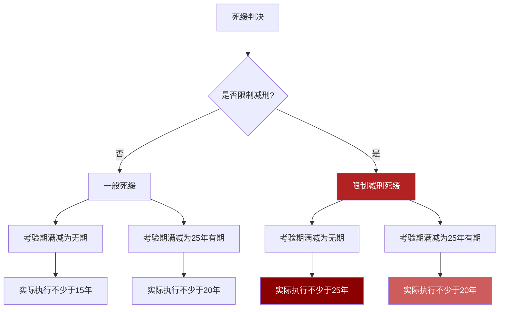

**限制减刑制度的设立大幅提高了特定严重暴力犯罪死缓犯的实际服刑期限下限**，体现了在总体从宽的背景下对极少数极端犯罪行为的"精准从严"[^1]。

#### 4.3.3 死缓减刑后的继续减刑空间

值得注意的是，死缓犯在缓期执行期满后减为无期徒刑或有期徒刑，仍可继续申请减刑，但受到严格限制。例如，无期徒刑减为有期徒刑后，实际执行刑期仍需不少于13年，而限制减刑的死缓犯则需满足更长的最低执行期限[^1]。

这种"层层设限"的制度设计确保了死缓作为"死刑替代刑罚"的严厉性，防止了"判死缓等于逃脱惩罚"的错误认知成为现实。

### 4.4 减刑实践的规范化与减刑率控制

#### 4.4.1 减刑审查程序的规范化进程

近年来，中国司法系统持续强化减刑审查程序的规范化，主要体现在以下几个方面：

**第一，财产性判项的审查要求**。最高人民法院关于减刑假释案件审理的司法解释明确规定，在审理减刑、假释案件时，应当审查财产性判项的执行情况。这一规定旨在防止罪犯通过转移财产逃避执行后又获得减刑的情况。

**第二，减刑条件的实质化审查**。减刑并非自动获得，而是需要满足严格的实质条件。根据《刑法》第七十八条的规定，减刑的基本条件是"认真遵守监规，接受教育改造，确有悔改表现的，或者有立功表现的"[^14]。

**第三，减刑程序的公开透明**。法定程序要求由执行机关（如监狱）提出减刑建议，报请中级以上人民法院审理裁定[^15]。这一程序设计确保了减刑决定的司法属性和可审查性。

#### 4.4.2 无期徒刑犯减刑率的实际控制

司法部监狱管理局统计数据显示，**2024年全国共有4216名无期徒刑犯获得减刑，占当年无期徒刑总人数的6.2%**[^12]。这一减刑率反映了减刑审查的严格程度。

首次减刑时间的分布数据进一步揭示了减刑实践的规范化程度：

| 首次减刑时间 | 占比 | 说明 |
|-------------|------|------|
| 服刑满10年后 | 73.5% | 主流情形 |
| 服刑满13年后 | 18.7% | 较为严格 |
| 服刑满15年及以上 | 7.8% | 最为严格 |

**这一分布数据表明，绝大多数无期徒刑犯需要服刑10年以上才能首次获得减刑**[^12]。虽然法定的首次减刑资格时间是4年，但实际操作中，减刑审查的严格程度远超法定最低标准。这反映了"少减慎减"的政策导向在司法实践中的贯彻。

#### 4.4.3 减刑比例的动态性与限制因素

减刑比例并非一次性确定，而是具有以下动态特征[^1]：

**表现导向**：悔改表现或立功表现是减刑的基本条件，重大立功表现可加速减刑。司法实践中，单纯的"认罪服法"已不足以获得减刑，需要有积极的改造表现。

**刑期档次限制**：不同刑期档次的罪犯，每次减刑的幅度和间隔时间不同。对于无期徒刑犯，首次减刑后通常减为20-25年有期徒刑，此后每次减刑幅度受到严格限制。

**犯罪类型限制**：特定暴力犯罪和职务犯罪等"三类罪犯"的减刑受到更严格限制，这一差异化政策将在下一节详细分析。

### 4.5 不同犯罪类型的减刑差异待遇

#### 4.5.1 "三类罪犯"的从严减刑规定

所谓"三类罪犯"，是指职务犯罪、金融犯罪、涉黑犯罪的罪犯。这三类罪犯在减刑条件、减刑幅度、减刑间隔上受到更为严格的限制：

| 差异维度 | 普通罪犯 | "三类罪犯" |
|---------|---------|-----------|
| 减刑条件 | 确有悔改表现或立功表现 | 需同时具备悔改表现和立功表现 |
| 减刑幅度 | 按法定标准执行 | 在法定标准基础上从严把握 |
| 减刑间隔 | 按法定间隔执行 | 间隔时间相应延长 |
| 财产性判项 | 一般审查 | 严格审查执行情况 |

**这一差异化规定的政策考量在于**：职务犯罪、金融犯罪往往涉及巨额财产利益，涉黑犯罪则具有严重的社会危害性。对这三类罪犯从严把握减刑，既是对其犯罪性质的否定性评价，也是防止"以钱买刑"等司法腐败的制度屏障。

#### 4.5.2 累犯及八类严重暴力犯罪的限制减刑

《刑法修正案（八）》增设的限制减刑制度，主要针对以下两类罪犯[^1]：

**第一类：被判处死刑缓期执行的累犯**。累犯是指因犯罪被判处有期徒刑以上刑罚，刑罚执行完毕或者赦免以后，在五年以内再犯应当判处有期徒刑以上刑罚之罪的犯罪分子。累犯的再犯表明其主观恶性深、人身危险性大，因此对其从严限制减刑具有正当性。

**第二类：因八类严重暴力犯罪被判处死刑缓期执行的犯罪分子**。这八类犯罪包括：
1. 故意杀人
2. 强奸
3. 抢劫
4. 绑架
5. 放火
6. 爆炸
7. 投放危险物质
8. 有组织的暴力性犯罪

**限制减刑的执行效果**：对于上述罪犯，即使符合减刑条件，实际执行刑期仍需满足更高的下限要求——减为无期徒刑的不少于25年，减为25年有期徒刑的不少于20年[^1]。

#### 4.5.3 差异化减刑政策的制度逻辑

差异化减刑政策体现了刑罚执行中"精准从严"的政策导向：

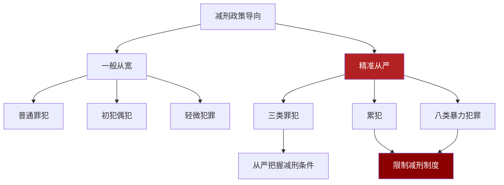

**这一差异化政策的核心逻辑在于**：在总体贯彻"宽严相济"刑事政策的背景下，对于特定类型的严重犯罪，通过限制减刑的方式确保刑罚的实际严厉度，实现罪责刑相适应。这种"一般从宽、精准从严"的政策组合，既体现了刑罚的人道主义关怀，又维护了刑罚的威慑力和公信力。

### 4.6 终身监禁制度的执行实践

#### 4.6.1 终身监禁的适用情况

2015年《刑法修正案（九）》创设的终身监禁制度，是针对特重大贪污受贿犯罪的特殊刑罚执行方式。根据《刑法》第三百八十三条第四款的规定，因贪污、受贿数额特别巨大，并使国家和人民利益遭受特别重大损失，被判处死刑缓期执行的，人民法院可以在判处死缓的同时决定终身监禁。

**终身监禁的适用条件**：
- 犯罪类型：仅限贪污罪、受贿罪
- 数额要求：数额特别巨大
- 情节要求：情节特别严重
- 后果要求：使国家和人民利益遭受特别重大损失
- 刑罚前提：被判处死刑缓期执行

自该制度实施以来，已有多名特大贪腐案件被告人被适用终身监禁，包括白恩培、魏鹏远、武长顺等原省部级官员。

#### 4.6.2 "不得减刑、假释"的执行效果

终身监禁的核心效果是**完全排除减刑和假释的可能性**。一旦被决定终身监禁，犯罪人在死缓考验期满减为无期徒刑后，将终身关押于监狱，不得通过任何方式获得刑期减免或提前释放。

**与普通无期徒刑的对比**：

| 对比维度 | 普通无期徒刑 | 终身监禁 |
|---------|-------------|---------|
| 减刑可能性 | 可依法减刑 | 不得减刑 |
| 假释可能性 | 符合条件可假释 | 不得假释 |
| 实际执行刑期 | 平均20-22年 | 终身 |
| 暂予监外执行 | 符合条件可适用 | 符合条件应当适用 |
| 劳动要求 | 有劳动能力的应参加劳动 | 有劳动能力的应参加劳动 |

**值得注意的是**，终身监禁并不排除暂予监外执行的适用。符合暂予监外执行条件（如患有严重疾病需要保外就医、怀孕或正在哺乳婴儿的妇女、生活不能自理且适用暂予监外执行不致危害社会的）的终身监禁罪犯，仍应当依法暂予监外执行。

#### 4.6.3 终身监禁的替代功能与过渡性质

终身监禁制度在控制死刑实际执行中发挥着重要的替代功能：

**第一，提供了"准死刑"的替代方案**。对于特重大贪污受贿犯罪，终身监禁提供了一种介于死刑立即执行与普通死缓之间的刑罚选择。既满足了社会公众对严惩腐败的强烈期待，又避免了实际执行死刑。

**第二，体现了"死刑替代刑罚"的制度探索**。终身监禁制度的设立，是中国在减少死刑实际执行道路上的重要制度创新。它表明，对于某些极端严重的犯罪，可以通过提高自由刑的实际严厉度来替代死刑，而非简单地在"死刑"与"可减刑的死缓"之间进行选择。

**第三，具有过渡性制度特征**。从制度定位来看，终身监禁是基于特殊社会背景、为了限制对贪污受贿罪判处死刑而采取的过渡性措施。随着反腐败斗争的深入推进和刑罚结构的持续优化，这一制度的适用范围和功能定位可能进一步演变。

### 4.7 本章小结：重刑执行体系的实际运作特征

综合本章分析，中国无期徒刑与减刑实践呈现以下核心特征：

**第一，无期徒刑并非"终身监禁"**。尽管法律规定无期徒刑是剥夺终身自由，但通过减刑制度，绝大多数无期徒刑犯实际服刑约20-22年。法定的13年最低执行刑期与实际平均刑期之间存在显著差距，反映了减刑审查的严格程度远超法定最低标准[^12]。

**第二，减刑实践日趋规范化**。2024年全国无期徒刑犯减刑率仅为6.2%，且73.5%的首次减刑发生在服刑满10年之后。这些数据表明，减刑并非轻易可得，而是需要长期的良好表现和严格的司法审查[^12]。

**第三，差异化减刑政策体现"精准从严"**。对于"三类罪犯"、累犯及八类严重暴力犯罪，减刑条件更为严格，实际执行刑期下限更高。限制减刑制度确保了特定严重犯罪的刑罚威慑力[^1]。

**第四，终身监禁发挥死刑替代功能**。作为针对特重大贪污受贿犯罪的特殊执行方式，终身监禁填补了死刑立即执行与普通死缓之间的刑罚空档，为减少死刑实际执行提供了制度工具[^1]。

这些特征共同揭示了中国重刑执行体系的实际运作逻辑：**在"少杀慎杀"政策指导下，通过严格的减刑审查、差异化的减刑政策和终身监禁等替代制度，确保重刑的实际惩戒效力，实现惩罚犯罪与保障人权的统一**。

## 5 刑罚执行数据透视：政策导向与执行效能

本章基于国务院关于刑罚执行工作情况的报告及最高人民检察院刑罚执行监督工作报告，系统分析近年来刑罚执行领域的政策举措与实际成效。通过梳理规范"减假暂"、防止"纸面服刑"、强化检察监督等方面的具体数据，验证执行层面的严格化趋势与"少杀慎杀"政策方向的内在一致性，评估其对死刑替代刑罚实际惩戒效力的深远影响。

### 5.1 刑罚执行制度机制的健全与完善

#### 5.1.1 刑罚执行的法律地位与制度框架

刑罚执行是刑事司法的重要环节，事关国家安全、社会稳定和司法公正，体现国家法治文明程度[^16]。党的十八大以来，以习近平同志为核心的党中央高度重视刑罚执行工作，习近平总书记多次对刑罚执行工作作出重要指示批示，为做好新时代刑罚执行工作提供了重要遵循[^16]。

按照法定职责，中国刑罚执行体系呈现多元主体协同运作的格局：

| 执行主体 | 执行刑种 | 职责范围 |
|---------|---------|---------|
| 国务院司法行政部门 | 主管全国监狱工作、社区矫正工作 | 统筹协调、政策制定 |
| 监狱 | 死缓、无期徒刑、有期徒刑 | 监禁刑执行、教育改造 |
| 社区矫正机构 | 管制、缓刑、假释、暂予监外执行 | 非监禁刑执行 |
| 公安机关 | 拘役、剥夺政治权利、驱逐出境、余刑三个月以下有期徒刑 | 短期刑及附加刑执行 |
| 人民法院 | 死刑立即执行、罚金和没收财产 | 死刑执行、财产刑执行 |
| 人民检察院 | 法律监督 | 对刑罚执行活动开展法律监督[^16] |

#### 5.1.2 基础性法律立法修法的重大进展

在党中央集中统一领导下，刑罚执行重要基础性法律立法修法工作取得重大进展[^16]。**监狱法修订中旗帜鲜明坚持党的领导，坚持和完善中国特色社会主义监狱制度**，把党的十八大以来监狱工作的成功实践和经验明确为法律制度并予以巩固[^16]。

社区矫正法的全面实施标志着非监禁刑执行体系的成熟。社区矫正是在相对开放的社会环境中执行刑罚，有利于罪犯顺利融入社会、降低重新犯罪率，是体现我国法治文明进步的重要刑事制度[^17]。党的十八大以来，我国社区矫正工作全面推开，特别是2020年社区矫正法施行以来，社区矫正工作水平全面提升[^17]。

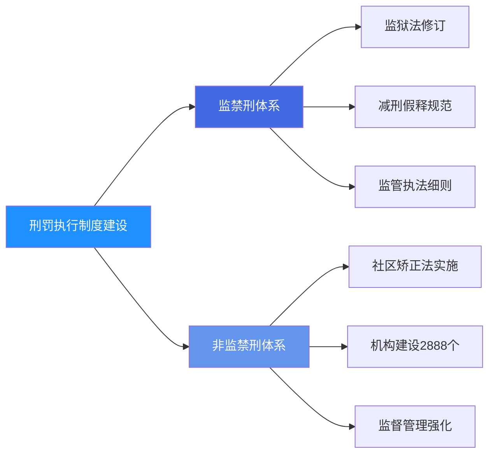

#### 5.1.3 监禁刑与非监禁刑衔接体系的健全

公安部、司法部会同最高人民法院、最高人民检察院制定关于交付执行、刑罚执行变更、监狱民警现场执法、看守所执法等一系列细则、规范，刑罚执行工作制度不断完善[^16]。这一系列制度建设**健全了监禁刑和非监禁刑相衔接的刑罚执行体系**，确保了刑罚执行的连贯性与规范性。

在机构建设方面，依法设立县级以上地方社区矫正机构2888个，基本实现县区全覆盖[^17]。这一制度性成果为非监禁刑的有效执行提供了组织保障，使得刑罚执行的"最后一公里"得到有效覆盖。

### 5.2 规范"减假暂"的专项整治与成效数据

#### 5.2.1 政法队伍教育整顿中的全面倒查

减刑、假释、暂予监外执行（简称"减假暂"）是刑罚执行的核心环节，也是最具司法属性的办案类型。**经党中央批准，2021年在政法队伍教育整顿中对减假暂案件开展倒查，对问题案件逐一纠正**[^16]。这一专项整治行动是对刑罚执行领域系统性、深层次问题的集中清理。

检察机关作为法律监督机关，在这一进程中发挥了关键作用。2021年1月至2025年9月，检察机关依法提出刑罚执行监督纠正意见等**97.1万件**，以高质效检察履职促进高质量刑罚执行，保障国家法律统一正确实施[^18]。这一数据的规模之大，反映了刑罚执行领域整治工作的深度与广度。

#### 5.2.2 "减假暂"不当案件的监督纠正

针对"减假暂"环节存在的问题，检察机关完善调查核实、检察听证等制度，对公安机关、司法行政机关提请或决定、法院裁定"减假暂"不当的，**提出纠正意见7.5万件**（2022年以来数据）[^18]。这一监督力度体现了对刑罚变更执行的严格把关。

以下表格展示了检察机关刑罚执行监督的核心数据：

| 监督类型 | 数据量 | 时间范围 | 监督效果 |
|---------|--------|---------|---------|
| 刑罚执行监督纠正意见总量 | 97.1万件 | 2021.1-2025.9 | 全面覆盖 |
| "减假暂"不当纠正意见 | 7.5万件 | 2022年以来 | 精准纠偏 |
| 社区矫正监督纠正意见 | 15.4万件 | 2021.1-2025.9 | 防止脱管 |
| 财产刑执行监督纠正意见 | 28.4万件 | 2021.1-2025.9 | 确保执行[^18] |

#### 5.2.3 "三类罪犯"从严办理政策的执行

"三类罪犯"——职务犯罪、破坏金融管理秩序和金融诈骗犯罪、黑社会性质组织犯罪的罪犯，在"减假暂"办理中受到特别从严的政策约束。**依法从严办理"三类罪犯"减假暂案件，坚决防止"纸面服刑"、"提钱出狱"问题发生，刑罚执行刚性得以彰显**[^16]。

这一差异化政策的核心逻辑在于：职务犯罪往往涉及权力滥用与公共利益侵害，金融犯罪涉及巨额财产利益，涉黑犯罪具有严重的社会危害性。对这三类罪犯从严把握"减假暂"，既是对其犯罪性质的否定性评价，也是维护刑罚执行严肃性的制度保障。

### 5.3 防止"纸面服刑"与司法腐败的制度屏障

#### 5.3.1 "纸面服刑""提钱出狱"问题的系统整治

"孙小果案""郭文思案"等典型案件曾暴露出"纸面服刑""提钱出狱"的严重问题，刺痛着全社会的神经[^19]。这些案件揭示了刑罚执行领域存在的司法腐败风险，对司法公信力造成了严重损害。

检察机关持续将"减假暂"专项监督与日常监督、巡回检察相结合，深挖并严肃查处其背后的职务犯罪与司法腐败问题[^19]。**2021年1月至2025年9月，检察机关依法查处刑罚执行领域司法工作人员徇私舞弊"减假暂"、滥用职权、玩忽职守、私放在押人员等职务犯罪，共立案侦查1735人**[^18]。

这一查处力度表明，刑罚执行领域的反腐败斗争与刑罚执行规范化是同步推进的。通过查处职务犯罪，从根本上铲除"纸面服刑"的制度土壤。

#### 5.3.2 刑罚交付执行的监督强化

刑罚交付执行是刑罚执行的关键环节，其核心在于将罪犯依法移交至刑罚执行机关。针对怠于交付执行、违法拒绝收监等收押难、送监难问题，**2021年以来，最高检同最高法、公安部、司法部开展专项清理活动并常态化推进，纠正判处监禁刑罚罪犯未交付执行9.6万人**[^18]。

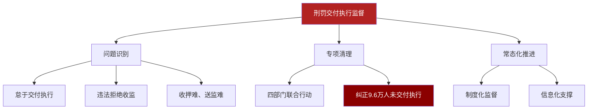

这一数据揭示了刑罚交付执行环节曾存在的突出问题。9.6万人的规模表明，确保刑罚从"纸面"落到实处是一项系统性工程，需要多部门协同配合、持续发力。

#### 5.3.3 典型案例的警示效应

河南省检察机关在违法违规办理"减假暂"案件全面排查专项整治中，通过数据比对锁定了一批在保外就医期间再度涉嫌犯罪的人员。因犯贪污罪、受贿罪、挪用公款罪被判处有期徒刑十六年的郝某案，即是通过此次排查揪出的"漏网之鱼"[^19]。

在该案中，检察机关通过调查核实发现郝某保外就医的病情系伪造，背后涉及多名监狱民警、鉴定机构人员、社会医院人员的利益输送链条。最终，法院裁定对郝某通过伪造病情获得的四年零十二天监外执行时间不计入刑期，9名涉案人员分别被判处有期徒刑四年至六个月不等[^19]。

**这一案例的查处具有重要的警示意义**：一方面展示了检察机关运用大数据手段发现问题线索的能力，另一方面表明了对"纸面服刑"问题"零容忍"的态度，有效震慑了潜在的违法违规行为。

### 5.4 检察监督机制的创新与数字化赋能

#### 5.4.1 "派驻+巡回+科技"监督机制的建立

检察机关建立完善了"派驻+巡回+科技"监督机制，实现了监督方式的系统性创新[^18]。这一机制的核心特征是：

- **派驻检察室是"阵地"**，重在巩固加强，提高监督的针对性和实效性
- **巡回检察是"利剑"**，重在发现违纪违法问题，增强监督刚性
- **科技赋能是"手段"**，重在依靠科技力量，提升监督能力

刑罚执行机关自觉接受检察机关法律监督，对检察机关的检察建议和最高人民检察院开展跨省交叉巡回检察发现的问题，专门派出工作组督促有关单位切实整改[^16]。这种监督与被监督的良性互动，形成了刑罚执行规范化的制度合力。

#### 5.4.2 信息化建设的全面推进

信息化建设是提升刑罚执行效能的重要支撑。司法行政系统、公安系统分别建立"部—省—监所"三级视频巡查和指挥调度系统，有力提升综合研判、应急响应和指挥调度能力[^17]。

**监狱建成减刑假释信息化办案平台，实现案件网上提请、检察院网上监督、法院网上裁定**[^16]。这一平台的建成，使得"减假暂"案件的全流程留痕、全过程可追溯成为可能，从技术层面压缩了违法违规操作的空间。

此外，96%的监狱建成罪犯远程视频会见系统，连接基层司法所，为罪犯和家属亲情沟通提供便利[^17]。这一人性化举措在提升监狱管理效能的同时，也体现了刑罚执行中的人道主义关怀。

#### 5.4.3 大数据法律监督的实践成效

检察机关持续加强数字化、智能化建设，以现代科技赋能刑罚执行监督。**各地检察机关总结刑罚执行监督类案规律，研发、运用大数据法律监督模型，发现线索14.4万条，监督成案4.2万件**[^18]。

| 数字化监督指标 | 数据 | 效果评估 |
|---------------|------|---------|
| 大数据模型发现线索 | 14.4万条 | 线索发现能力大幅提升 |
| 监督成案数量 | 4.2万件 | 监督实效显著增强 |
| 成案转化率 | 约29% | 线索质量较高 |

这一数据表明，**大数据技术在刑罚执行监督领域的应用已经从探索阶段进入规模化实践阶段**。通过数据比对、异常识别、关联分析等技术手段，检察机关能够更精准地发现问题线索，实现从"被动监督"向"主动监督"的转变。

### 5.5 执行严格化与"少杀慎杀"政策的内在一致性

#### 5.5.1 严格执行与减少死刑的逻辑关联

刑罚执行层面的严格化趋势与"少杀慎杀"的宏观政策方向之间存在深刻的内在一致性。**"少杀慎杀"政策的核心是在保留死刑的前提下，最大限度地限制和减少死刑的立即执行**。这一政策目标的实现，需要刑罚执行体系提供坚实的制度保障和信心基础。

通过专项整治、实质化审理、查处职务犯罪等措施，极大压缩了"纸面服刑"、"提钱出狱"的空间，确保了监禁刑罚（包括死缓、无期徒刑）能够得到**实际、足额**的执行。这增强了整个刑罚体系的严肃性和威慑力，使得在减少死刑立即执行的同时，社会安全感不至于因担忧罪犯提前出狱而受损。

#### 5.5.2 替代刑罚可信度的制度支撑

"少杀"在司法实践中的直接体现是扩大死刑缓期二年执行（死缓）的适用。然而，死缓的实际效果取决于两年考验期后的刑罚执行。如果减刑、假释环节失守，死缓可能变相成为短期监禁，丧失其作为"死刑替代措施"的严厉性。

对"三类罪犯"依法从严办理"减假暂"、推动假释制度依法适用、纠正"该减不减"等举措，共同构建了一个**更公正、更透明、更可预测**的刑罚变更执行体系。这确保了被判处死缓的罪犯，在减为无期徒刑或有期徒刑后，其后续刑罚执行是严格和规范的，从而夯实了死缓作为"不立即执行死刑"的**制度信誉**。

#### 5.5.3 司法公信力的提升与民意基础

"少杀慎杀"需要民意的理解与支持。通过倒查、监督纠正大量"减假暂"不当案件，查处司法腐败，展示了国家**自我净化、捍卫司法公正**的决心。这有助于缓解公众因个别司法不公案件而产生的"重刑主义"情绪，增强对司法机关"慎用死刑"决策的信任。

检察机关依法受理罪犯控告、举报、申诉2.5万件，细致核查涉嫌冤错案件、刑期计算错误、累犯认定错误等问题线索，监督纠正确有错误的裁判、决定等3312件[^18]。这一数据表明，刑罚执行监督不仅关注"从严"，也注重"纠错"，体现了对被监管人合法权益的保障，为"少杀慎杀"政策营造了更理性的社会氛围。

### 5.6 对死刑替代刑罚实际惩戒效力的影响评估

#### 5.6.1 死缓实际惩戒效力的制度保障

死缓作为死刑的主要替代形式，其实际惩戒效力直接关系到"少杀慎杀"政策的可持续性。规范"减假暂"、强化检察监督等举措，从以下几个维度保障了死缓的实际惩戒效力：

**第一，确保考验期的严肃性**。监管场所安全是开展刑罚执行工作的基础。深入推进平安监所建设，强化安全检查、警务督察，常态化开展风险隐患排查整治，严厉打击罪犯违规抗改、狱内又犯罪等行为[^16]。这确保了死缓犯在考验期内受到严格监管，考验期的设置不流于形式。

**第二，规范减刑后的刑罚执行**。通过减刑假释信息化办案平台、检察院网上监督、法院网上裁定等机制[^17]，确保死缓犯减为无期徒刑或有期徒刑后的减刑审查严格依法进行，防止不当减刑。

**第三，强化特定罪犯的从严管理**。对"三类罪犯"从严办理"减假暂"，对限制减刑的死缓犯严格执行25年或20年的最低执行刑期下限，确保特定严重犯罪的刑罚威慑力。

#### 5.6.2 无期徒刑与终身监禁的执行效能

无期徒刑作为仅次于死刑的重刑，其实际惩戒效力同样受到执行规范化的深刻影响。如前章所述，无期徒刑犯平均服刑20-22年，远超法定的13年最低执行刑期。这一实际执行刑期的延长，与减刑审查的严格化密切相关。

终身监禁作为针对特重大贪污受贿犯罪的特殊执行方式，其"不得减刑、假释"的规定具有绝对性。监狱工作坚持惩罚和改造相结合，以改造人为宗旨，既对罪犯执行刑罚，又对其改造重塑[^17]。对于终身监禁犯，虽然不存在减刑可能，但监狱仍需提供基本的教育改造和权益保障，体现刑罚执行的人道主义原则。

#### 5.6.3 对废除死刑可行性的执行层面支撑

综合评估执行层面的制度建设成效，可以得出以下结论：

| 评估维度 | 现状评估 | 对废除死刑的支撑作用 |
|---------|---------|---------------------|
| 刑罚执行规范化 | 制度体系基本健全 | 为替代刑罚提供制度保障 |
| 减刑审查严格化 | 减刑率有效控制 | 确保替代刑罚的实际严厉度 |
| 检察监督有效性 | 监督机制运转良好 | 防止司法腐败侵蚀刑罚执行 |
| 信息化支撑能力 | 全流程留痕可追溯 | 提升执行透明度与公信力 |

**这些执行层面的制度保障，为进一步限制直至最终废除死刑提供了重要支撑**。当公众确信，即使不判处死刑，严重的犯罪者也会在监狱中度过漫长的岁月，且整个过程受到严密监督，传统的"杀人必须偿命"的报应观念可能会逐渐向"罪责刑相适应"的法治观念迁移。这种民意的渐进理性化，是最终废除死刑不可或缺的社会心理基础。

#### 5.6.4 执行严格化的协同效应

刑罚执行政策的严格化，特别是对"减假暂"的规范与监督，并非孤立举措。它与死刑制度改革的"少杀慎杀"政策及渐进废除路径构成了**相辅相成的系统性工程**。前者通过筑牢刑罚执行的"最后一公里"，为后者提供了**可信性保障、民意缓冲空间和替代方案支撑**。

严格化的执行政策增强了司法限制死刑（扩大死缓）的实践底气，并为立法上进一步削减死刑罪名创造了条件。两者协同推进，共同指向一个目标：在不断提升国家治理能力和法治文明水平的过程中，逐步、稳妥地减少直至最终废止死刑，同时确保社会正义得到不折不扣的实现。

## 6 废除死刑的路径依赖、影响因素与时间评估

本章基于前述量化分析与趋势观察，系统探讨中国废除死刑的可能路径选择，深入评估影响这一进程的多维关键因素，并综合学术观点与实证数据对废除死刑的时间表进行审慎预测与情景分析，揭示中国死刑制度改革的渐进性与长期性特征。

### 6.1 废除死刑的路径选择与渐进模式

#### 6.1.1 中国废除死刑的三重路径

基于前述章节的制度分析与实证数据，中国废除死刑的可能路径可以归纳为相互衔接、逐层递进的三重模式：

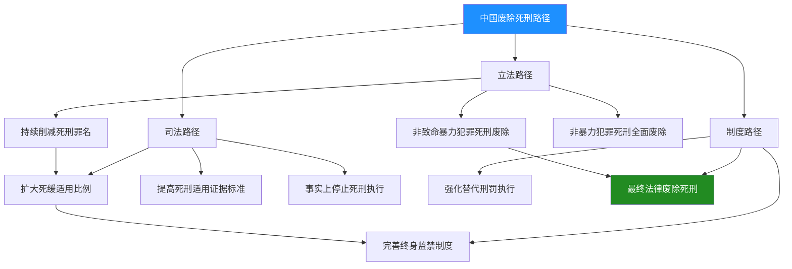

**第一重路径：立法削减罪名**。这是最为直接和明确的改革路径。如第三章所述，中国死刑罪名已从1997年刑法典的68个削减至目前的46个，削减幅度超过三分之一。**著名刑法学家赵秉志教授明确指出，中国最终要全部废止死刑，但现阶段首先应争取把所有的非暴力犯罪死刑废止完，同时把非致命的暴力犯罪也要逐步废止**[^20]。这一路径的核心逻辑是：从社会危害性相对较低的罪名开始，逐步缩小死刑的适用范围，最终将死刑限制在极少数最严重的暴力犯罪领域，直至完全废除。

**第二重路径：司法限制适用**。在立法罪名尚未完全废除的情况下，通过司法实践限制死刑的实际适用。如前章分析所示，死缓适用率已高达82.21%，这意味着绝大多数被判处死刑的犯罪分子并未被立即执行。**这一司法路径的核心机制是：通过提高死刑适用的证据标准、扩大死缓的适用比例，使死刑立即执行成为极端例外，直至事实上停止执行**。2007年最高人民法院收回死刑复核权后，这一路径已取得显著成效。

**第三重路径：制度完善与法律废除**。在前两重路径充分推进的基础上，通过完善终身监禁等替代制度，最终实现法律上的正式废除。这一路径需要建立在社会共识形成、替代刑罚体系成熟、民意基础具备等多重条件之上。

#### 6.1.2 渐进式改革的路径依赖特征

**中国废除死刑的道路不会像欧盟一些国家那样采取一次性全部废除的方式，而必然要经过逐步废除的过程**[^20]。这一渐进式改革的路径依赖特征，根植于以下几方面的现实考量：

| 路径依赖因素 | 具体表现 | 改革启示 |
|-------------|---------|---------|
| 历史传统约束 | 数千年"杀人偿命"的报应正义观念 | 需要长期的观念转变过程 |
| 国情现实约束 | 社会转型期、犯罪形势复杂 | 需要渐进稳妥推进 |
| 制度惯性约束 | 现有刑罚体系的运作逻辑 | 需要配套制度同步完善 |
| 民意基础约束 | 公众对死刑威慑功能的依赖 | 需要培育理性法治意识 |

**慎用死刑政策的切实贯彻有赖于严格掌握死刑适用标准，合理衡量死刑案件的情节，并适当参酌案外因素，以求最大限度地实现法律效果与社会效果的统一**[^21]。这一政策导向表明，中国的死刑改革始终在"严格限制"与"维护稳定"之间寻求平衡，体现了渐进式改革的务实取向。

#### 6.1.3 各路径的协同推进机制

三重路径并非孤立运作，而是形成相互支撑、协同推进的改革机制：

**立法路径为司法路径提供规范依据**。每一次刑法修正案削减死刑罪名，都直接减少了可能适用死刑的案件范围，为司法实践中限制死刑适用创造了法律空间。

**司法路径为立法路径积累实践经验**。死缓高适用率的司法实践，验证了在特定罪名领域减少死刑立即执行的可行性，为进一步的立法削减提供了实证支持。

**制度路径为前两重路径提供执行保障**。如第五章所分析，刑罚执行的规范化、减刑审查的严格化、检察监督的有效性，确保了死刑替代刑罚的实际惩戒效力，为扩大死缓适用、削减死刑罪名提供了制度信心。

### 6.2 影响废除进程的国内制度因素

#### 6.2.1 刑事政策的连续性与稳定性

刑事政策是影响死刑废除进程的首要制度因素。**"少杀、慎杀"即是我国现阶段鲜明坚持的死刑政策，它为限制与减少死刑的适用提供了明确的政策导向，对我国的刑事立法与司法活动具有极为重要的指导意义**[^21]。

自2007年最高人民法院收回死刑复核权以来，"少杀慎杀"政策保持了高度的连续性和稳定性。这一政策的持续贯彻，体现在以下几个维度：

- **立法层面**：2011年、2015年两次刑法修正案持续削减死刑罪名
- **司法层面**：死刑复核程序的严格执行、死缓适用率的持续提升
- **执行层面**：减刑假释的规范化、"纸面服刑"的系统整治

**政策连续性的重要意义在于**：它向社会传递了明确的改革信号，使各级司法机关形成稳定的行为预期，也为学术研究和公众讨论提供了可预测的政策框架。只有在政策连续稳定的前提下，死刑改革才能稳步推进而不至于出现反复。

#### 6.2.2 司法系统能力建设与替代刑罚执行效能

司法系统的能力建设直接关系到死刑替代刑罚的执行效能，进而影响废除死刑的可行性评估。如第五章所详述，近年来刑罚执行领域取得了显著进展：

| 能力建设维度 | 具体成效 | 对废除死刑的支撑 |
|-------------|---------|-----------------|
| 制度规范化 | 监狱法修订、社区矫正法实施 | 为替代刑罚提供法律依据 |
| 监督有效性 | 检察监督纠正意见97.1万件 | 确保刑罚执行的严肃性 |
| 信息化支撑 | 减刑假释信息化办案平台建成 | 提升执行透明度与可追溯性 |
| 反腐败力度 | 查处职务犯罪1735人 | 铲除"纸面服刑"的制度土壤 |

**这些能力建设成果的核心意义在于**：它们确保了死缓、无期徒刑等替代刑罚能够得到实际、足额的执行，从而增强了社会对"不判死刑也能严惩犯罪"的信心。这种信心的建立，是废除死刑的重要前提条件。

#### 6.2.3 重大暴力犯罪发案率的持续变化

犯罪形势的变化是影响死刑政策的重要客观因素。如第三章所述，**中国已成为世界上命案发案率最低、刑事犯罪率最低的国家之一，2024年每10万人命案发生数仅为0.44起**。

严重暴力犯罪的持续下降，从以下几个方面影响死刑废除进程：

**第一，降低了死刑适用的案件基数**。故意杀人等严重暴力犯罪案件较10年前下降28.7%，意味着可能适用死刑的案件数量从源头上减少。

**第二，削弱了死刑威慑功能的必要性论证**。在犯罪率持续走低的背景下，"保留死刑以威慑犯罪"的功利论证基础被动摇，为废除死刑的人道主义论证创造了空间。

**第三，为政策调整提供了客观条件**。社会治安形势的根本好转，使得决策者在推进死刑改革时面临的社会风险降低，政策调整的空间扩大。

#### 6.2.4 终身监禁等替代措施的制度完善

**终身监禁制度的设立是中国死刑改革的重要制度创新**。如第四章所分析，2015年《刑法修正案（九）》创设的终身监禁制度，填补了死刑立即执行与普通死缓之间的刑罚空档。

学术界对终身监禁制度的适用范围存在讨论。**批评者认为，终身监禁不应只针对贪污贿赂犯罪，而应广泛适用于包括谋杀、强奸等更为严重的暴力犯罪，参照其他已废除死刑国家的做法**[^22]。这一讨论反映了学术界对扩展终身监禁适用范围、构建更完善的死刑替代体系的期待。

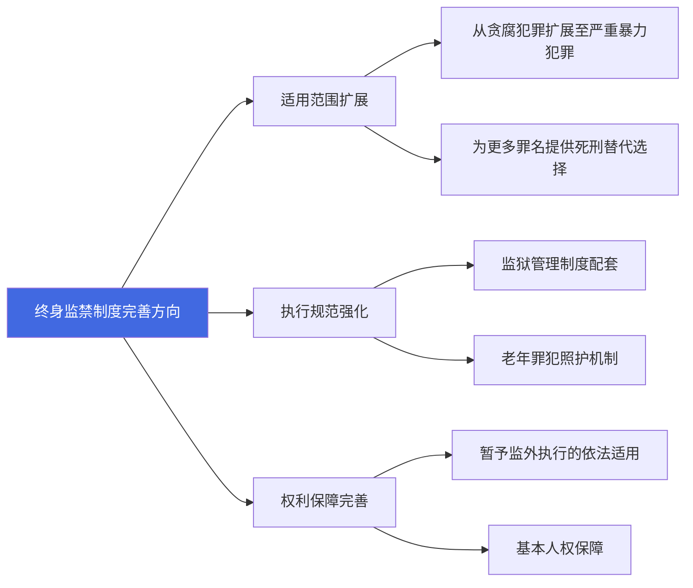

**终身监禁制度的进一步完善，将为废除死刑提供更坚实的制度支撑**。通过扩大终身监禁的适用范围，可以为更多原本可能判处死刑立即执行的案件提供替代选择，从而推动死刑适用的进一步限缩。

### 6.3 民意基础与社会观念的演变

#### 6.3.1 民意对死刑存废的态度特征

民意是影响死刑改革的深层社会因素。**传统的重刑主义思想在当今中国仍有很大的市场，法律实务部门对死刑的迷信与依赖心理依然甚为严重，死刑甚至已经成为普通民众维系公平、伸张正义必不可少的社会心理寄托**[^21]。

然而，民意并非铁板一块，而是具有显著的异质性特征：

**第一，宏观与微观的态度差异**。在宏观层面上，民众普遍赞成保留死刑；但在微观的具体案件中，针对个案所发表的民意基本上都是要求枪下留人、免处死刑的[^23]。这种差异表明，抽象的死刑观念与具体案件中的同情心理之间存在张力。

**第二，不同群体的态度分化**。与案件当事人有不同利害关系的人员，其关注死刑的立场和态度存在明显差异。犯罪人家属倾向于反对死刑，被害人家属则可能强烈要求死刑，普通公众的态度则受媒体报道和舆论引导的影响较大[^23]。

**第三，信息知悉程度的影响**。民众对于国家死刑政策和立法的相关信息所知不多，而对于媒体披露的死刑案件信息的了解相对要多些。这种信息不对称，使得民意容易受到个别极端案件的影响而产生情绪化反应[^23]。

#### 6.3.2 传统报应观念与现代人权意识的张力

死刑存废之争的核心，是传统报应正义观念与现代人权意识之间的深层张力。

**保留死刑的主要论据包括**[^24]：
- **报应正义**：对实施极其严重罪行的犯罪人处以极刑，是实现社会正义、抚慰被害方情感的必要方式
- **特殊预防与威慑**：彻底剥夺再犯能力，并对潜在犯罪人形成终极威慑
- **国情适应论**：中国处于社会转型期，犯罪形势复杂，司法资源有限，死刑对维护社会秩序仍有现实功能

**废除死刑的主要论据包括**[^24]：
- **生命权至上**：生命权是基本人权，不可经由国家合法剥夺；错判难纠是废除死刑最有力的现实理由
- **刑罚文明化**：废除死刑是刑罚向轻缓、人道方向发展的国际趋势，符合人类文明进步潮流
- **威慑效果存疑**：关于死刑威慑力的实证研究结论不一，死刑的实际预防效果难以证实

**在中国当前情况下，功利论和人道主义两种观点都要讲，但最终起作用的应该是人道主义**[^20]。这一判断表明，随着社会发展和法治进步，人道主义论证将逐渐取代功利论证，成为推动死刑废除的主导力量。

#### 6.3.3 推动民意理性化的多重因素

民意的理性化演变是废除死刑的重要社会基础。以下因素正在推动这一演变进程：

**第一，司法公信力的提升**。如第五章所述，通过规范"减假暂"、查处司法腐败、强化检察监督，刑罚执行的严肃性和公正性得到增强。当公众确信司法系统能够公正、有效地惩罚犯罪，对死刑威慑功能的依赖将逐渐减弱。

**第二，冤案纠正的警示效应**。近年来相继见诸报端的滕兴善案、聂树斌案、李华伟案、杜培武案等冤案错案的披露[^21]，深刻揭示了死刑不可逆转的弊端，推动公众反思死刑制度的合理性。

**第三，法治教育的普及**。人权教育的推广、法治意识的培育，正在逐步改变公众对刑罚功能的认知。**弘扬人权思想对死刑改革有好处**[^20]，通过持续的法治宣传教育，"罪责刑相适应"的现代法治观念将逐步取代"杀人偿命"的传统报应观念。

**第四，社会治安形势的改善**。当公众切实感受到社会安全水平的提升，对死刑威慑功能的心理依赖将自然减弱，为接受死刑废除创造心理条件。

### 6.4 国际人权公约压力与比较法视野

#### 6.4.1 国际人权公约的外部压力

国际人权公约对中国死刑制度改革构成持续的外部压力。**截至2009年6月30日，世界上超过三分之二的国家和地区已经在法律上或事实上废止了死刑**[^21]。这一国际趋势对中国形成了示范效应和舆论压力。

联合国人权机构多次呼吁中国：
- 公开死刑执行数据，提高透明度
- 逐步削减死刑罪名，缩小适用范围
- 最终废除死刑，加入《公民权利和政治权利国际公约》第二任择议定书

**虽然我们不能简单地认为死刑的存与废就是一个国家刑法文明和人道与否的标志，但在现阶段还需要保留死刑的国家，严格控制、合理减少并慎重适用死刑，无疑已是刑罚向人道化方向发展的共识与大势**[^21]。这一认识表明，中国学术界和决策层对国际趋势有着清醒的认知，并将其作为推进死刑改革的重要参照。

#### 6.4.2 比较法视野下的经验借鉴

从比较法视野来看，各国废除死刑的路径和时机各有不同，但也呈现出一些共性特征：

| 国家/地区 | 废除时间 | 废除方式 | 替代措施 | 经验启示 |
|----------|---------|---------|---------|---------|
| 德国 | 1949年 | 宪法明确废除 | 终身监禁 | 战后反思推动 |
| 法国 | 1981年 | 立法废除 | 终身监禁 | 政治领导力关键 |
| 英国 | 1965年(谋杀罪) | 渐进立法 | 终身监禁 | 渐进式改革可行 |
| 韩国 | 1997年起事实停止 | 司法暂停 | 无期徒刑 | 事实废除先行 |
| 日本 | 保留死刑 | — | — | 民意支持度高 |

**中国废除死刑的道路恐怕不会像欧盟一些国家那样，采取一次性全部废除的方式**[^20]。韩国的"事实废除"模式——通过司法实践停止死刑执行，而法律上保留死刑——对中国具有一定的参考价值。这种模式允许在民意尚未完全转变的情况下，通过司法路径实现事实上的死刑废除，为最终的法律废除积累社会共识。

#### 6.4.3 国际因素的作用与限度

国际因素在中国死刑改革中的作用是双重的：

**积极作用方面**：国际人权对话为中国提供了改革的外部动力和参照系；国际比较研究为中国提供了可借鉴的制度经验；国际社会的关注也在一定程度上推动了中国死刑信息的透明化。

**限度方面**：中国死刑改革的根本动力来自国内，外部压力只能起到辅助作用；国际经验需要结合中国国情进行本土化转化；在涉及主权和司法独立的问题上，中国不会简单照搬国际标准。

**立足于这一国情民意，为了确保死刑改革进程的顺利进行，并最终达到预期效果，必须考察、分析、预测可行的条件和环境**[^21]。这一务实态度表明，中国的死刑改革将以国内条件为主要依据，国际因素只是参考而非决定性因素。

### 6.5 废除死刑时间表的审慎预测与情景分析

#### 6.5.1 学术界的时间预测

关于中国废除死刑的时间表，学术界存在不同的预测：

**"中国人权法第一人"、广州大学人权研究中心主任李步云教授在2010年预测：正常情况下，中国起码在未来20至30年可能废除死刑**[^25]。按照这一预测，中国废除死刑的时间窗口大约在2030年至2040年之间。

**中国刑法学研究会会长赵秉志教授则认为，对于致命性的暴力犯罪恐怕要到最后阶段，经过慎重衡量的过程，怎么也得几十年的时间**[^20]。这一判断表明，完全废除死刑（包括最严重的暴力犯罪）将是一个漫长的过程。

**四川大学法学院教授魏东在2015年接受采访时表示，最快30年废除所有死刑**[^26]。按照这一预测，中国完全废除死刑的时间可能在2045年左右。

综合上述学术观点，可以形成以下初步判断：
- **非暴力犯罪死刑的废除**：可能在未来10-20年内实现
- **非致命暴力犯罪死刑的废除**：可能在未来20-30年内实现
- **所有死刑的完全废除**：可能需要30-50年甚至更长时间

#### 6.5.2 基于实证数据的趋势推断

结合前述章节的量化分析，可以对废除死刑的进程进行基于数据的趋势推断：

**死刑罪名削减趋势**：从1997年的68个削减至2015年的46个，20年间削减了22个罪名。若保持这一削减速度，剩余的46个罪名可能在未来40-50年内逐步削减完毕。但考虑到剩余罪名多为严重暴力犯罪，削减难度将逐步加大，实际进程可能更为缓慢。

**死缓适用率变化趋势**：死缓适用率已达82%以上，接近"事实上停止执行死刑"的临界点。若这一趋势持续，死刑立即执行可能在未来10-20年内成为极端例外，为法律废除创造条件。

**犯罪形势变化趋势**：严重暴力犯罪持续下降，命案发案率已降至每10万人0.44起。这一趋势若持续，将进一步削弱保留死刑的功利论证基础。

#### 6.5.3 不同情景下的时间评估框架

基于上述分析，本报告构建乐观、基准、保守三种情景下的废除死刑时间评估框架：

| 情景类型 | 核心假设 | 非暴力犯罪死刑废除 | 所有死刑完全废除 | 关键变量 |
|---------|---------|------------------|-----------------|---------|
| **乐观情景** | 政策持续推进、民意快速转变、国际压力加大 | 2030-2035年 | 2045-2055年 | 重大政策突破 |
| **基准情景** | 渐进式改革持续、民意缓慢理性化、制度稳步完善 | 2035-2040年 | 2055-2065年 | 改革惯性延续 |
| **保守情景** | 改革遭遇阻力、民意反复、重大犯罪案件冲击 | 2040-2050年 | 2070年以后 | 不确定性因素 |

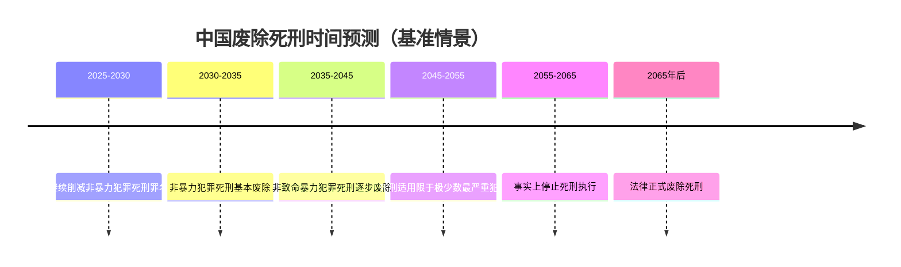

#### 6.5.4 渐进性、长期性与不确定性

综合上述分析，中国废除死刑进程呈现以下核心特征：

**渐进性**：中国不会采取一次性全部废除的激进方式，而是遵循"非暴力犯罪→非致命暴力犯罪→致命暴力犯罪"的渐进路径，逐步缩小死刑适用范围。这种渐进性既是政策选择，也是现实约束的结果。

**长期性**：完全废除死刑是一个需要数十年持续推进的长期工程。**死刑在目前有必要存在，一可以保证公正，二可以对犯罪分子形成威慑。我国还处在社会转型期，也是犯罪的高发期，而且人口众多，社会环境复杂。因此，马上废除死刑不太现实。然而，死刑不断减少，是一个不可扭转的趋势**[^25]。这一判断清晰地表明了改革的长期性特征。

**不确定性**：废除死刑的进程受到多重因素的影响，包括政策连续性、民意变化、重大案件冲击、国际环境变化等。任何一个因素的重大变化，都可能加速或延缓改革进程。因此，任何时间预测都只能是审慎的估计，而非确定性的判断。

#### 6.5.5 阶段性改革目标的合理预期

基于上述分析，可以提出以下阶段性改革目标的合理预期：

**近期目标（2025-2035年）**：
- 继续削减非暴力犯罪的死刑罪名，力争将死刑罪名控制在30个以内
- 进一步提高死缓适用率，使死刑立即执行成为极端例外
- 完善终身监禁制度，探索扩大其适用范围
- 持续强化刑罚执行规范化，巩固替代刑罚的制度信誉

**中期目标（2035-2050年）**：
- 基本完成非暴力犯罪死刑的废除
- 逐步削减非致命暴力犯罪的死刑
- 死刑适用限于故意杀人等极少数最严重的暴力犯罪
- 建立成熟的死刑替代刑罚体系

**远期目标（2050年以后）**：
- 在条件成熟时，实现事实上停止死刑执行
- 在社会共识形成后，推动法律正式废除死刑
- 完成中国刑罚体系从"保留死刑"向"废除死刑"的历史性转型

**这一阶段性目标的设定，既体现了改革的进取性，也尊重了现实的约束性**。它表明，中国废除死刑是一个需要几代人持续努力的长期工程，需要在坚定改革方向的同时，保持战略耐心和政策定力。

## 7 结论、政策建议与研究展望

本章作为全报告的收束部分，系统总结中国死刑、死缓及终身监禁量化分析的核心发现，基于前述实证评估与路径分析提出多维度政策建议，并坦陈研究局限与未来方向，为后续学术研究与政策制定提供参考框架。

### 7.1 核心研究发现的系统总结

本报告通过对中国死刑、死缓与终身监禁的系统量化分析，形成了以下核心研究发现：

#### 7.1.1 死刑适用已进入极度限缩阶段

**死刑执行数量已降至历史低位**。根据多元数据来源的综合估算，2025年中国死刑判决约100人左右，年度实际执行死刑的数量级在数十人至一百余人区间内。与"严打"时期的高峰相比，死刑执行数量已大幅下降，体现了"少杀慎杀"政策的深度贯彻。

**死刑罪名持续削减**。中国死刑罪名已从1997年刑法典的68个削减至目前的46个，削减幅度超过三分之一。2011年《刑法修正案（八）》废除13个罪名的死刑，2015年《刑法修正案（九）》再废除9个罪名的死刑，被削减的主要是经济性非暴力犯罪，体现了"死刑只适用于罪行极其严重的犯罪分子"原则的实质化。

**严重暴力犯罪持续下降**。2024年每10万人命案发生数仅为0.44起，中国已成为世界上命案发案率最低的国家之一。故意杀人等严重暴力犯罪案件较10年前下降28.7%，从源头上降低了死刑适用的案件基数。

#### 7.1.2 死缓成为死刑判决的绝对主流形式

**死缓适用率超过80%**。在故意杀人罪案件中，2021年死缓适用率已达82.21%，远超死刑立即执行的比例。这意味着绝大多数被判处死刑的犯罪分子并未被立即执行，死缓已实质成为控制死刑实际执行的核心机制。

**死缓犯累计规模庞大**。截至2023年，中国死缓犯的累计数量已超过20万人，约占监狱总人口的10%-12%。这一庞大群体的形成，是死缓高适用率与长期实际执行刑期共同作用的结果，对监狱人口结构产生了深远影响。

| 核心指标 | 数据 | 趋势判断 |
|---------|------|---------|
| 年度死刑判决 | 约100人 | 持续下降 |
| 死缓适用率 | 82.21% | 高位稳定 |
| 死刑罪名数 | 46个 | 持续削减 |
| 死缓犯累计规模 | 超20万人 | 持续累积 |
| 命案发案率 | 0.44/10万人 | 历史低位 |

#### 7.1.3 减刑实践日趋严格规范

**无期徒刑实际执行刑期远超法定下限**。尽管法定最低执行刑期为13年，但无期徒刑犯平均服刑15.2年后获得减为有期徒刑，实际服刑约20-22年。2024年全国无期徒刑犯减刑率仅为6.2%，且73.5%的首次减刑发生在服刑满10年之后，体现了"少减慎减"的政策导向。

**差异化减刑政策体现精准从严**。对"三类罪犯"（职务犯罪、金融犯罪、涉黑犯罪）从严把握减刑条件；限制减刑制度确保累犯及八类严重暴力犯罪死缓犯的实际执行刑期不少于25年或20年，实现了"一般从宽、精准从严"的政策组合。

**刑罚执行规范化显著提升**。2021年1月至2025年9月，检察机关依法提出刑罚执行监督纠正意见97.1万件，纠正"减假暂"不当案件7.5万件，查处刑罚执行领域职务犯罪1735人，有效防止了"纸面服刑""提钱出狱"问题。

#### 7.1.4 终身监禁发挥死刑替代功能

**终身监禁填补刑罚空档**。2015年创设的终身监禁制度，针对特重大贪污受贿犯罪，提供了介于死刑立即执行与普通死缓之间的刑罚选择。其"不得减刑、假释"的规定具有绝对性，既满足了严惩腐败的社会期待，又为减少死刑实际执行创造了条件。

**重刑体系形成层级递进结构**。从死刑立即执行到死缓+终身监禁、死缓+限制减刑、一般死缓、无期徒刑，形成了严厉程度依次递减的刑罚梯度，为司法裁量提供了精细化的制度工具。

#### 7.1.5 废除死刑的渐进性与长期性特征

基于前述分析，中国废除死刑将遵循"立法削减罪名—司法限制适用—制度完善替代—法律正式废除"的渐进路径。综合学术预测与趋势推断，非暴力犯罪死刑可能在2035-2040年基本废除，所有死刑的完全废除可能需要2055-2065年甚至更长时间。这一进程具有显著的渐进性、长期性与不确定性特征。

### 7.2 死刑制度改革的多维政策建议

基于研究发现与路径评估，本报告从立法、司法、执行、社会四个维度提出系统性政策建议：

#### 7.2.1 立法层面：持续削减死刑罪名

**近期目标：完成非暴力犯罪死刑的废除**。当前46个死刑罪名中，仍有部分非暴力犯罪保留死刑。建议在下一次刑法修正中，重点考虑废除以下罪名的死刑：
- 走私类犯罪中尚存的死刑罪名
- 毒品犯罪中的非首要分子情形
- 其他经济性犯罪的死刑适用

**中期目标：逐步限缩非致命暴力犯罪死刑**。对于强奸、抢劫、绑架等非致命暴力犯罪，建议通过提高死刑适用门槛、明确从宽情节等方式，逐步限缩死刑的实际适用范围，为最终废除创造条件。

**立法技术建议**：在削减死刑罪名的同时，应同步完善替代刑罚的法定刑配置，确保刑罚体系的衔接性与协调性。

#### 7.2.2 司法层面：提高死刑适用标准

**进一步提高证据标准**。建议在死刑案件中继续强化"排除合理怀疑"的证明标准，完善非法证据排除规则，确保死刑判决的事实基础坚实可靠。

**扩大死缓适用比例**。建议通过司法解释或指导性案例，进一步明确死缓适用的从宽情节，引导各级法院在具有任何从宽因素的情况下优先选择死缓，使死刑立即执行真正成为极端例外。

**完善死刑复核程序**。建议进一步强化最高人民法院死刑复核的实质化审查，增加复核过程中的听证、辩护等程序保障，确保每一个死刑判决都经过最严格的审查。

#### 7.2.3 执行层面：强化替代刑罚执行效能

**持续规范减刑假释**。建议进一步完善减刑假释的实质化审理机制，强化财产性判项的审查，对"三类罪犯"保持从严政策，确保刑罚执行的刚性与严肃性。

**推进信息化建设**。建议全面推广减刑假释信息化办案平台，实现案件全流程留痕、全过程可追溯，提升执行透明度与公信力。

**强化检察监督**。建议持续完善"派驻+巡回+科技"监督机制，深化大数据法律监督模型应用，提升监督的精准性与有效性。

#### 7.2.4 社会层面：培育理性民意基础

**加强法治宣传教育**。建议通过多种渠道普及刑罚功能的科学认知，引导公众从"杀人偿命"的传统报应观念向"罪责刑相适应"的现代法治观念转变。

**增强司法透明度**。建议在保守国家秘密的前提下，适度增加死刑制度改革信息的公开程度，让公众了解"少杀慎杀"政策的具体成效。

**正视冤案警示**。建议通过典型案例的宣传教育，让公众认识到死刑不可逆转的风险，增强对审慎适用死刑的理解与支持。

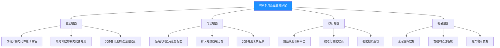

### 7.3 完善死刑替代刑罚执行制度的具体举措

针对死缓、无期徒刑、终身监禁等替代刑罚的执行实践，提出以下具体举措建议：

#### 7.3.1 健全长期服刑人员管理机制

**分类管理制度**。建议根据罪犯的犯罪类型、服刑表现、改造潜力等因素，建立科学的分类管理制度，实现差异化、精准化管理。

**心理干预机制**。鉴于长期服刑人员面临的心理压力，建议建立系统的心理评估与干预机制，帮助其适应长期监禁生活，维护监狱安全稳定。

**职业技能培训**。建议加强对长期服刑人员的职业技能培训，提升其劳动产出效率，为其未来回归社会（对于非终身监禁者）创造条件。

#### 7.3.2 完善老年罪犯照护制度

随着死缓犯、无期徒刑犯累计规模的持续增长，老年罪犯的管理与照护将成为日益突出的问题。建议：

- 建立老年罪犯专门关押区域或设施
- 配备专业医疗与护理人员
- 完善老年罪犯的疾病治疗与临终关怀机制
- 探索符合条件的老年罪犯暂予监外执行的规范适用

#### 7.3.3 探索扩大终身监禁适用范围

当前终身监禁仅适用于贪污受贿犯罪，学术界对此存在讨论。建议在充分论证的基础上，审慎研究以下问题：

**扩展适用范围的可行性**。是否可以将终身监禁扩展至故意杀人等最严重的暴力犯罪，为这些犯罪提供死刑立即执行的替代选择。

**制度设计的配套完善**。若扩展适用范围，需要同步完善终身监禁的执行规范、权利保障、监督机制等配套制度。

**与国际经验的对接**。参照已废除死刑国家的终身监禁制度设计，研究中国终身监禁制度的完善方向。

#### 7.3.4 强化"三类罪犯"从严执行政策

对职务犯罪、金融犯罪、涉黑犯罪的罪犯，建议继续保持从严执行政策：

| 政策维度 | 具体举措 |
|---------|---------|
| 减刑条件 | 严格审查悔改表现与立功表现的真实性 |
| 财产性判项 | 将财产刑执行情况作为减刑的重要考量因素 |
| 减刑幅度 | 在法定标准基础上从严把握 |
| 假释适用 | 严格审查社会危险性评估 |

#### 7.3.5 推进减刑假释信息化与透明化建设

**全流程信息化**。建议全面推广减刑假释信息化办案平台，实现案件网上提请、网上监督、网上裁定，确保全流程留痕可追溯。

**适度公开透明**。建议在保护罪犯隐私的前提下，探索减刑假释裁定的适度公开机制，接受社会监督，增强司法公信力。

**数据分析应用**。建议建立减刑假释数据分析系统，定期发布统计报告，为政策评估与学术研究提供数据支撑。

### 7.4 加强实证研究与国际对话的路径

#### 7.4.1 推动死刑执行数据适度公开

死刑执行数据的非公开性是制约实证研究的最大障碍。建议在以下方面探索适度公开：

**年度统计数据**。可考虑在年度司法统计中增加死刑判决与执行的汇总数据，无需公开具体案件信息。

**分类统计信息**。可考虑公布不同罪名、不同地区的死刑适用分布情况，为学术研究提供基础数据。

**趋势性信息**。可考虑定期发布死刑适用的趋势性描述，如"同比下降""持续减少"等，向社会传递政策信号。

#### 7.4.2 建立死刑案件系统追踪数据库

建议学术机构与司法机关合作，建立死刑案件的系统追踪数据库：

- 收集公开报道的死刑案件信息
- 追踪死缓犯的后续刑罚执行情况
- 分析死刑适用的影响因素与裁判规律
- 为政策评估与学术研究提供实证基础

#### 7.4.3 开展死刑适用效果的实证评估研究

建议开展以下方面的实证研究：

**威慑效果研究**。运用计量经济学方法，评估死刑对犯罪率的实际威慑效果，为政策讨论提供实证依据。

**替代刑罚效果研究**。评估死缓、无期徒刑、终身监禁等替代刑罚的实际惩戒效力与再犯预防效果。

**民意变化追踪**。开展长期追踪调查，了解公众对死刑存废态度的变化趋势及其影响因素。

#### 7.4.4 积极参与国际人权对话

**客观呈现改革成就**。建议在国际人权对话中，系统介绍中国死刑制度改革的成就，包括罪名削减、死缓高适用率、执行规范化等进展。

**借鉴比较法经验**。建议深入研究已废除死刑国家的经验教训，特别是终身监禁制度设计、民意转变过程、替代刑罚执行等方面的实践。

**推进标准对接**。在坚持国情基础的前提下，积极探索与国际人权标准的对接路径，为最终废除死刑创造国际环境。

### 7.5 研究局限性与未来研究方向

#### 7.5.1 本研究的主要局限

**数据局限**。中国死刑执行数量属于国家秘密，本报告所依据的死刑执行数据均为学术估算，不同来源的估算结果存在差异。这种数据的不确定性直接影响了量化分析的精确度，所有涉及死刑执行数量的结论都应理解为量级估计而非精确数值。

**方法局限**。受制于数据质量，本报告的量化分析主要采用描述性统计与趋势推断，难以进行严格的因果推断。废除死刑时间表的预测基于历史数据外推与政策假设，存在固有的不确定性。

**范围局限**。本报告聚焦于普通刑事案件中的死刑适用，未涵盖军事司法领域的死刑案件，也未专门讨论特殊历史时期的政治性案件。此外，对死刑执行方式、死刑犯权利保障等议题着墨有限。

**时效局限**。刑事政策具有动态性，本报告的数据与分析截至2025年。未来政策变化、重大案件发生或国际环境变动，都可能影响中国死刑制度的走向。

#### 7.5.2 未来可深入探索的研究方向

**更精细化的死刑案件数据追踪**。建议建立死刑案件的系统追踪机制，收集案件的基本信息、裁判理由、执行情况等，为量化研究提供更坚实的数据基础。

**跨国废除死刑进程的比较研究**。建议深入研究不同国家废除死刑的历史进程、关键因素、制度安排，为中国提供更丰富的比较法参照。

**民意变化的长期追踪调查**。建议开展关于死刑存废态度的长期追踪调查，了解不同群体、不同时期的态度分布与变化趋势，为政策制定提供民意参考。

**替代刑罚执行效果的实证评估**。建议对死缓、无期徒刑、终身监禁等替代刑罚的实际执行效果进行系统评估，包括惩戒效力、再犯预防、社会效果等维度。

**死刑威慑效果的计量研究**。建议运用计量经济学方法，评估死刑对犯罪率的实际威慑效果，为政策讨论提供实证依据。

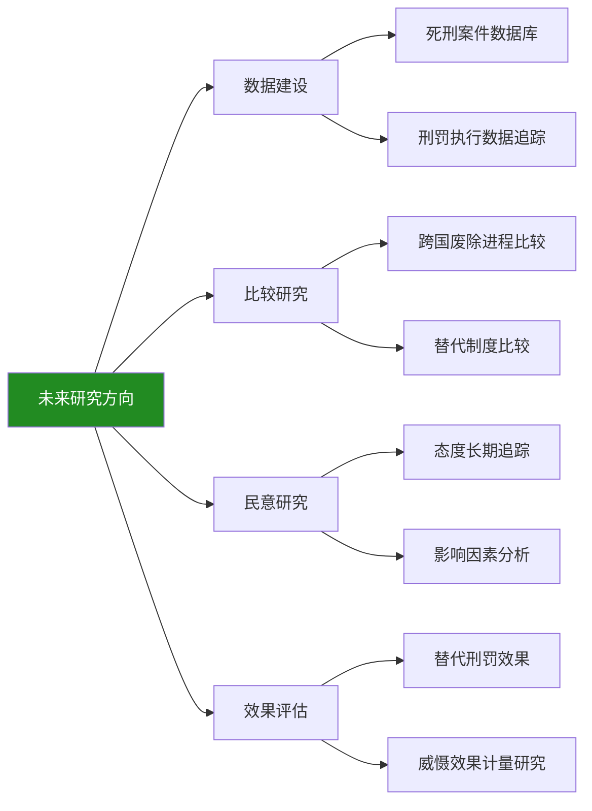

#### 7.5.3 对后续研究与政策制定的参考价值

尽管存在上述局限，本报告仍力求在现有条件下提供关于中国死刑制度最为系统、客观的量化分析与前景评估。研究的核心价值在于：

**第一，构建了分析框架**。本报告建立了"法律框架—量化分析—执行考察—路径评估"的系统分析框架，为后续研究提供了可参照的方法论模板。

**第二，整合了多元数据**。本报告整合了官方报告、司法统计、学术研究等多元数据来源，尽可能呈现中国死刑制度的全貌，为后续研究提供了数据汇总与参考。

**第三，提出了政策建议**。本报告基于实证分析提出了多维度的政策建议，为决策者提供了可操作的参考方案。

**第四，明确了研究方向**。本报告坦陈研究局限并指明未来方向，为学术界的后续研究提供了问题导向与选题参考。

---

**综上所述**，本报告通过对中国死刑、死缓与终身监禁的系统量化分析，得出以下核心结论：**中国死刑适用已进入"少杀慎杀"政策深度贯彻阶段，死刑执行数量降至历史低位，死缓成为死刑判决的绝对主流形式，减刑实践日趋严格规范，终身监禁等替代制度发挥重要功能**。废除死刑是一个需要数十年持续推进的渐进性、长期性工程，其进程取决于刑事政策连续性、民意基础演变、司法能力建设、国际环境变化等多重因素的综合作用。在坚定改革方向的同时，需要保持战略耐心与政策定力，通过立法、司法、执行、社会等多维度的协同推进，逐步实现从"严格限制死刑"到"事实废除死刑"再到"法律废除死刑"的历史性转型。

# 参考内容如下：
[^1]:[2025年死刑判决约100人左右,监狱关押总人数在164万至194万之间](https://baijiahao.baidu.com/s?id=1854735790204640809&wfr=spider&for=pc)
[^2]:[刑法中关于死刑的适用条件是什么](https://www.64365.com/zs/5833286.aspx)
[^3]:[死刑缓期两年执行的适用条件是什么?](https://baijiahao.baidu.com/s?id=1854075687387174707&wfr=spider&for=pc)
[^4]:[未成年人犯罪能适用死刑吗?法律边界与处置原则明确解答](https://baijiahao.baidu.com/s?id=1854978796045756419&wfr=spider&for=pc)
[^5]:[死缓犯减刑](https://baike.baidu.com/item/死缓犯减刑/22614693)
[^6]:[无期徒刑](https://baike.baidu.com/item/无期徒刑/1388771)
[^7]:[关于办理减刑、假释案件具体应用法律](http://gongbao.court.gov.cn/Details/9fb4519e658a8c9645538d818db78c.html?utm_source=chatgpt.com)
[^8]:[最高人民法院工作报告](http://gongbao.court.gov.cn/Details/560aa703efbd2617c67f4ec07a827e.html)
[^9]:[中国死刑这些年:数量下降,范围缩小](https://www.thepaper.cn/newsDetail_forward_2463308)
[^10]:[“十四五”公安工作“硬核”成绩单发布 我国是世界公认最安全国家之一 ](https://www.gov.cn/lianbo/bumen/202507/content_7033535.htm)
[^11]:[既然死缓死不了,那判死缓还有什么意义呢?](https://baijiahao.baidu.com/s?id=1833997446365175480&wfr=spider&for=pc)
[^12]:[被判“无期徒刑”的人,每天在监狱里干些什么?讲出来你可能不信](https://baijiahao.baidu.com/s?id=1836495785050679726&wfr=spider&for=pc)
[^13]:[被判“无期”的人,每天在监狱里干些什么?说出来你或许不信](https://baijiahao.baidu.com/s?id=1834628291550124408&wfr=spider&for=pc)
[^14]:[减刑最低服刑期限怎么算的](https://www.64365.com/zs/3607847.aspx)
[^15]:[刑事案件减刑最多减多少? ](https://www.sohu.com/a/979811176_122540182)
[^16]:[国务院关于刑罚执行工作情况的报告](http://www.npc.gov.cn/npc/c2/c30834/202510/t20251027_448984.html)
[^17]:[中华人民共和国司法部](https://www.moj.gov.cn/pub/sfbgwapp/bnywapp/202510/t20251026_526907.html)
[^18]:[最高人民检察院向全国人大常委会报告刑罚执行监督工作](https://www.spp.gov.cn/spp/xfzxjdgzqkbg/index.shtml)
[^19]:[聚焦“减假暂”,着力守护公平正义——检察机关依法开展刑罚变更执行监督观察](https://www.spp.gov.cn/spp/zdgz/202510/t20251020_708965.shtml)
[^20]:[赵秉志:中国最终要全部废止死刑](https://mp.weixin.qq.com/s?__biz=MzA5MjE1OTUwNg==&mid=206622136&idx=1&sn=182fc2f7f0f47c05ad5302c3ef4a6a5b&chksm=19d506c52ea28fd38e57cd7fcaf3976f87accbdac428cc111c375dad820245181c0893856920&scene=27)
[^21]:[关于中国现阶段慎用死刑的思考](https://fmx.lncourt.gov.cn/article/detail/2025/11/id/9079117.shtml)
[^22]:[无期徒刑如何发挥死刑的替代功能?](https://baijiahao.baidu.com/s?id=1796867439889924243&wfr=spider&for=pc)
[^23]:[卢建平:死刑适用与“民意”](https://baijiahao.baidu.com/s?id=1783349920524045427&wfr=spider&for=pc)
[^24]:[中国死刑存废之争:现状、困境与改革路径](https://wenku.baidu.com/view/9e030e5c37687e21af45b307e87101f69e31fb39.html)
[^25]:[人权专家预测 我国30年后废除死刑](https://news.ifeng.com/c/7fYxa0dhbPS)
[^26]:[刑法拟取消9项死罪 专家称最快30年废除所有死刑](https://cbgc.scol.com.cn/home/42229)
