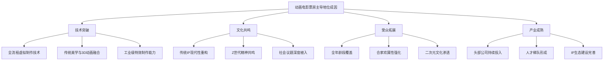
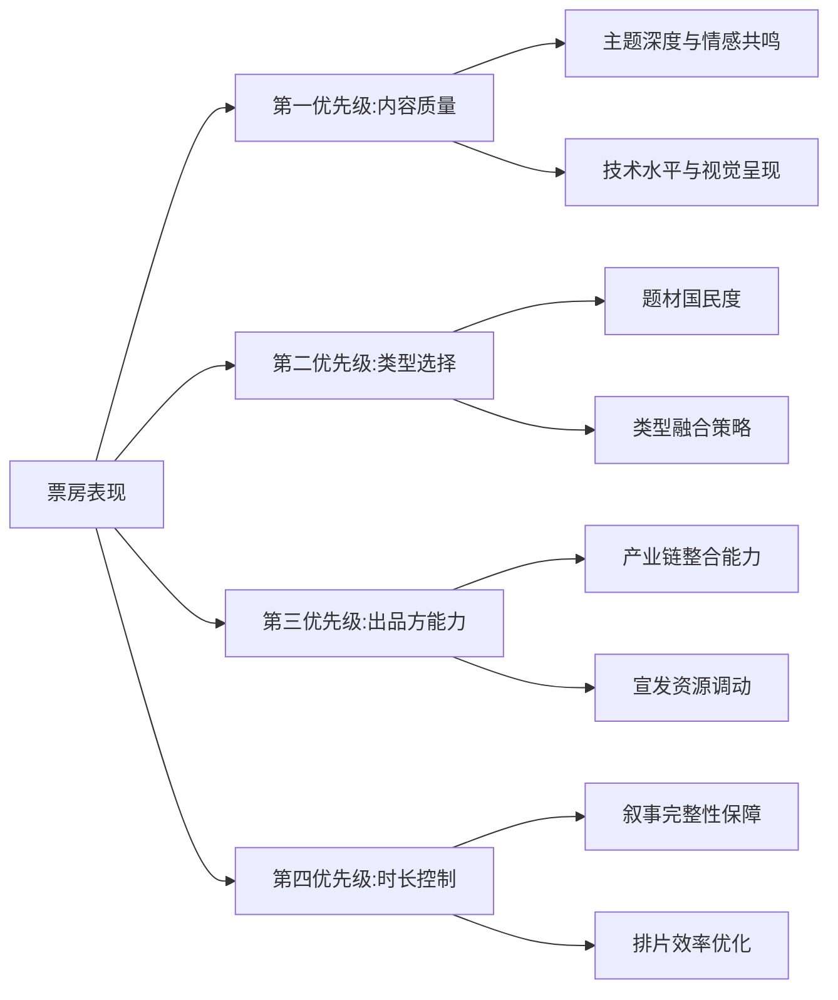
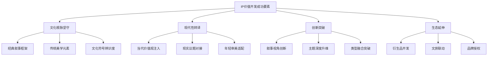
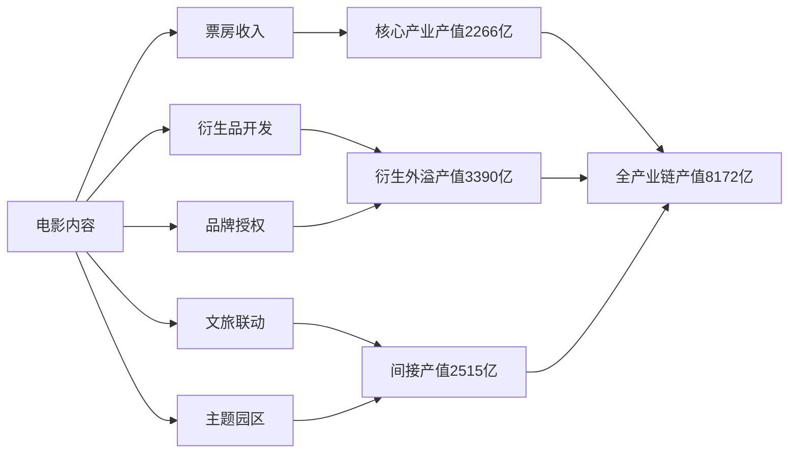
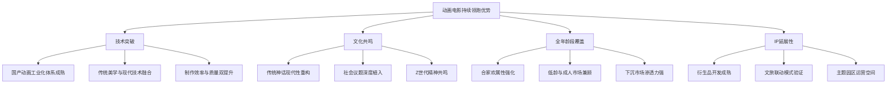
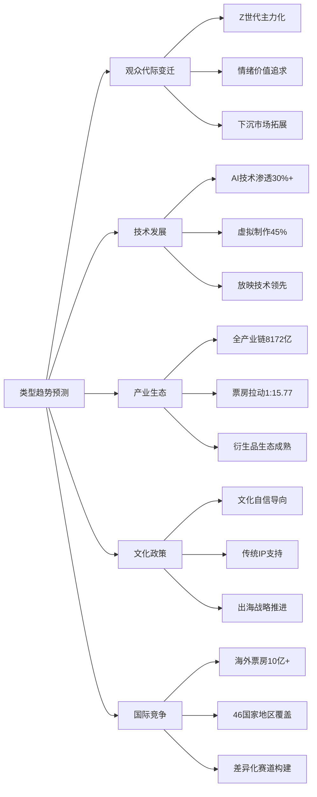
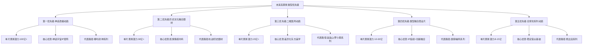
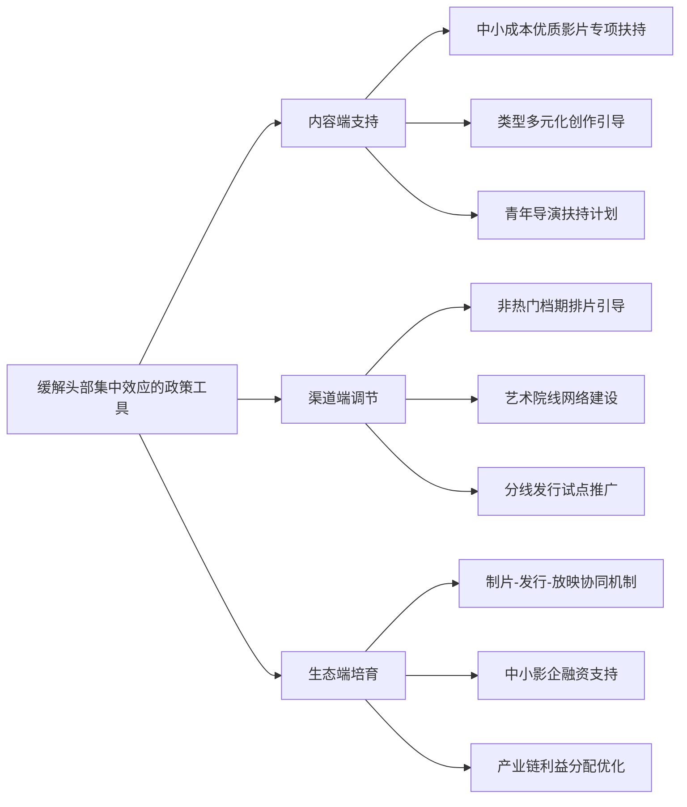

# 2025年中国电影票房前十影片多维比较与未来高票房类型趋势预测研究报告
## 1 2025年中国电影票房前十影片基础资料系统整理

2025年中国电影市场实现显著回暖，全年票房达518.32亿元，同比增长21.95%，观影人次达12.38亿，同比增长22.57%[^1][^2]。国产影片票房为412.93亿元，占比79.67%，全年共有51部影片票房破亿，其中国产影片33部[^2][^3]。本章对年度票房前十名影片进行全面、系统的基础数据整理，涵盖票房成绩、核心主题、主要出品方、题材类型、片长及上映档期等关键信息，为后续各维度的横向比较与趋势分析奠定可靠数据基础。

### 1.1 票房前十影片排名与票房数据

依据国家电影局及猫眼专业版数据，2025年中国电影票房前十名影片的完整排名及票房成绩如下表所示：

| 排名 | 影片名称 | 票房（亿元） | 年度票房占比 | 备注 |
|:---:|:---|:---:|:---:|:---|
| 1 | 《哪吒之魔童闹海》 | 154.46 | 约29.8% | 中国影史票房冠军、全球影史票房第五[^1][^3] |
| 2 | 《疯狂动物城2》 | 40.05 | 约7.7% | 进口动画片票房纪录、迪士尼动画工作室票房冠军[^4][^5] |
| 3 | 《唐探1900》 | 36.12 | 约7.0% | 唐探系列前传作品[^5][^6] |
| 4 | 《南京照相馆》 | 30.17 | 约5.8% | 豆瓣8.8分，年度口碑最高[^5][^7] |
| 5 | 《731》 | 19.43 | 约3.7% | 抗战历史题材[^5][^8] |
| 6 | 《浪浪山小妖怪》 | 17.19 | 约3.3% | 中国影史二维动画最高票房[^5][^9] |
| 7 | 《捕风追影》 | 12.65 | 约2.4% | 动作犯罪题材[^5][^10] |
| 8 | 《封神第二部:战火西岐》 | 12.38 | 约2.4% | 封神三部曲第二部[^5][^11] |
| 9 | 《熊出没·重启未来》 | 8.21 | 约1.6% | 熊出没系列第11部大电影[^12][^5] |
| 10 | 《阿凡达3》 | 7.62 | 约1.5% | 系列第三部，全球票房突破10亿美元[^13][^5] |

**《哪吒之魔童闘海》以154.46亿元的票房成绩遥遥领先**，单片贡献了全年票房的近三成，创造了中国影史票房新纪录，同时以21.99亿美元的全球票房成为2025年全球票房冠军[^1][^14]。票房前十名影片合计贡献票房约338亿元，占全年总票房的65%以上，呈现出**"头部集中度高"**的显著特征[^5][^3]。值得关注的是，全年共有8部电影票房破10亿元，其中国产影片7部，外国影片仅1部（《疯狂动物城2》）[^5]。

### 1.2 影片核心主题与故事概要

票房前十影片的核心叙事主题与故事概要呈现出**多元化与深度化**的特征，涵盖神话改编、动画冒险、悬疑探案、抗战历史、科幻奇幻等丰富内容类型：

**《哪吒之魔童闹海》**延续第一部"我命由我不由天"的核心精神，讲述天劫之后哪吒、敖丙重塑肉身的艰难历程。影片将主题从个体对命运的抗争升华为对"制度失范"的结构性思考，通过群像塑造（龙王敖光、申公豹等）引发观众对社会规则制定者的深层反思[^15][^16]。

**《疯狂动物城2》**将第一部"个体打破偏见"的格局升级为"群体性文明对话"，围绕哺乳动物与爬行动物的族群冲突展开叙事。影片通过蛇盖瑞这一新角色，探讨了"结构性歧视"、"历史冤案"以及"身份政治"等现实议题，同时深化了朱迪与尼克作为"灵魂伴侣"的情感羁绊[^17][^18]。

**《唐探1900》**作为唐探系列前传，将故事背景设定在1900年美国旧金山唐人街。影片以华裔印第安猎人阿鬼与留美青年秦福的探案冒险为主线，在喜剧悬疑的外壳下聚焦美国华工的心酸历史，传递了深厚的家国情怀与民族自豪感[^6][^19]。

**《南京照相馆》**改编自南京大屠杀期间罗瑾、吴旋守护"京字第一号证据"的真实事件，讲述1937年吉祥照相馆内平民冒死保存日军屠城罪证底片的故事。影片以小人物视角切入历史悲剧，展现了普通人在民族危亡时刻的良知觉醒与牺牲精神[^7][^20]。

**《731》**聚焦二战时期侵华日军七三一部队的罪行，讲述1945年抗战胜利前夕，小贩王永章等人被抓入"特设监狱"遭受冻伤实验、毒气实验、活体解剖等极端折磨的故事。影片通过平民视角揭露历史的至暗时刻，唤醒国际社会对战争伦理的深刻反思[^8][^21]。

**《浪浪山小妖怪》**延续《中国奇谭》短片《小妖怪的夏天》世界观，聚焦无名小妖的成长史诗，以"反套路西游"解构社会现实，传递"活出真我"的勇气与价值观[^9]。

**《捕风追影》**讲述澳门司警局跟踪专家黄德忠培养年轻司警，重组"神秘跟踪队"追捕天才盗匪团的故事，呈现了一场高端猫鼠博弈[^10][^22]。

**《封神第二部:战火西岐》**延续封神三部曲叙事，讲述姜子牙、姬发带队坚守西岐，与殷商大军展开家园保卫战的故事，融合了战争、动作与奇幻元素[^11]。

**《熊出没·重启未来》**讲述光头强和熊大、熊二偶遇来自未来的小亮，穿越到未来一百年的末日世界，走上拯救世界道路的科幻冒险故事[^12][^23]。

**《阿凡达3：火与烬》**延续系列叙事，聚焦杰克·萨利与奈蒂莉长子牺牲后的家庭悲痛，引入全新的"灰烬族"纳威人，探讨创伤、救赎与女性力量觉醒等主题[^13][^24]。

### 1.3 主要出品方与制作公司

票房前十影片的出品方格局呈现出**国产影片主导、头部公司集中**的特征，主要涉及以下核心机构：

| 影片名称 | 主投主控方 | 主要联合出品方 | 属性 |
|:---|:---|:---|:---:|
| 《哪吒之魔童闹海》 | 光线传媒 | — | 国产 |
| 《疯狂动物城2》 | 迪士尼影业 | — | 进口 |
| 《唐探1900》 | 万达电影 | 中国电影、幸福蓝海、金逸影视、华策影视[^5] | 国产 |
| 《南京照相馆》 | 中国电影 | 幸福蓝海、万达电影、横店影视、上海电影、北京文化[^5][^25][^26] | 国产 |
| 《731》 | 长影集团、保利影业 | 北京环鹰时代文化传媒[^8] | 国产 |
| 《浪浪山小妖怪》 | 上海美术电影制片厂 | 上海电影、中国电影[^5][^9] | 国产 |
| 《捕风追影》 | 爱奇艺影业、海润影业 | 淘票票影视、华人影业[^10] | 国产 |
| 《封神第二部:战火西岐》 | 北京文化 | 摩天之眼、阿里巴巴影业、华夏电影[^11] | 国产 |
| 《熊出没·重启未来》 | 华强方特 | 横店影视、中国电影、万达电影[^12][^5] | 国产 |
| 《阿凡达3》 | 20世纪影业 | — | 进口 |

从出品方格局来看，**光线传媒凭借《哪吒之魔童闹海》的现象级表现成为年度最大赢家**，该片助力导演饺子成为中国影史票房最高导演[^1]。**万达电影、中国电影**作为传统头部公司，参与了多部票房前十影片的出品，展现出强大的资源整合能力[^5]。**上海美术电影制片厂**凭借《浪浪山小妖怪》实现了艺术与商业的双重突破，标志着传统国有动画厂牌的市场化转型成功[^9]。进口影片方面，迪士尼影业的《疯狂动物城2》成为年度进口片票房冠军，展现了好莱坞顶级IP在中国市场的持续号召力[^1][^4]。

### 1.4 题材类型分类

对票房前十影片进行明确的题材类型划分，可呈现如下分布：

| 影片名称 | 主要题材类型 | 细分类型 | 属性 |
|:---|:---|:---|:---:|
| 《哪吒之魔童闹海》 | 动画 | 神话改编、奇幻、喜剧 | 国产 |
| 《疯狂动物城2》 | 动画 | 喜剧、悬疑、冒险 | 进口 |
| 《唐探1900》 | 喜剧 | 悬疑、动作 | 国产 |
| 《南京照相馆》 | 历史战争 | 剧情 | 国产 |
| 《731》 | 历史战争 | 剧情 | 国产 |
| 《浪浪山小妖怪》 | 动画 | 喜剧、剧情 | 国产 |
| 《捕风追影》 | 动作 | 犯罪、剧情 | 国产 |
| 《封神第二部:战火西岐》 | 奇幻 | 战争、动作 | 国产 |
| 《熊出没·重启未来》 | 动画 | 科幻、喜剧 | 国产 |
| 《阿凡达3》 | 科幻 | 动作、奇幻 | 进口 |

从题材类型结构来看，**动画电影成为2025年最突出的类型亮点**。票房前十中有4部为动画电影（《哪吒之魔童闹海》《疯狂动物城2》《浪浪山小妖怪》《熊出没·重启未来》），合计票房约220亿元，占前十总票房的65%以上[^5][^14]。2025年全年动画电影票房突破250亿元，接近全年总票房的一半，成为中国影史动画电影票房最高一年[^1][^15][^3]。

**历史战争题材**表现同样突出，《南京照相馆》与《731》两部影片合计票房近50亿元，展现了以历史为背景、承载民族记忆的影片在市场上的强大号召力[^15][^27]。**喜剧悬疑类型**以《唐探1900》为代表保持稳定表现，**奇幻动作类型**则以《封神第二部》为代表延续系列IP的市场影响力[^5]。

### 1.5 片长与上映档期

票房前十影片的官方片长及上映档期分布如下表所示：

| 影片名称 | 片长（分钟） | 上映档期 | 上映日期 |
|:---|:---:|:---|:---|
| 《哪吒之魔童闹海》 | 144 | 春节档 | 2025年1月29日[^16] |
| 《疯狂动物城2》 | 108 | 贺岁档 | 2025年11月26日[^4][^28] |
| 《唐探1900》 | 136 | 春节档 | 2025年1月29日[^6][^19] |
| 《南京照相馆》 | 137 | 暑期档 | 2025年7月25日[^7] |
| 《731》 | 125 | 特殊纪念日 | 2025年9月18日[^8][^29] |
| 《浪浪山小妖怪》 | 118 | 暑期档 | 2025年8月2日[^30][^9] |
| 《捕风追影》 | 141 | 暑期档 | 2025年8月16日[^10][^22] |
| 《封神第二部:战火西岐》 | 144 | 春节档 | 2025年1月29日[^11] |
| 《熊出没·重启未来》 | 108 | 春节档 | 2025年1月29日[^12] |
| 《阿凡达3》 | 198 | 贺岁档 | 2025年12月19日[^13][^24] |

从档期分布来看，**春节档贡献了票房前十中的4部影片**（《哪吒之魔童闹海》《唐探1900》《封神第二部》《熊出没·重启未来》），2025年春节档总票房达95.14亿元[^5]。**暑期档**贡献了3部影片（《南京照相馆》《浪浪山小妖怪》《捕风追影》），总票房达119.66亿元，成为年度票房产出最高的档期[^5]。**贺岁档**则有《疯狂动物城2》《阿凡达3》两部进口大片，档期票房已超52亿元[^5][^27]。

从片长来看，票房前十影片的平均片长约为136分钟，其中**《阿凡达3》以198分钟成为片长最长的影片**，这一超长时长对影院排片和观众观影体验均构成挑战[^13][^24]。动画电影的片长相对集中在108-144分钟区间，而历史战争题材影片（《南京照相馆》137分钟、《731》125分钟）则保持在适中范围，有利于多轮次排片与观众接受度[^7][^8]。

## 2 票房前十影片多维度横向比较分析

基于第一章对2025年中国电影票房前十影片的系统数据整理，本章从主题表达、制作公司背景与资源、题材类型选择与融合、影片时长控制四个核心维度展开深入的横向比较分析。通过对十部影片在各维度上的异同点与分布规律进行系统性梳理，揭示不同类型、不同制作方、不同主题影片的票房表现差异，初步归纳出影响票房表现的关键表层因素，为后续深层成因分析与趋势预测奠定比较研究基础。

### 2.1 主题表达维度比较：价值内核与情感共鸣的差异化呈现

票房前十影片在核心主题表达上呈现出**"共性母题统摄、差异化路径演绎"**的鲜明特征。通过系统比较，可以识别出贯穿多部影片的共同价值内核，以及各类型影片在主题深度与表达策略上的显著分化。

**共性母题：成长、抗争与守护**是贯穿票房前十影片的核心精神线索。《哪吒之魔童闘海》延续"我命由我不由天"的反抗精神，将个体对命运的抗争升华为对"制度失范"的结构性思考；《浪浪山小妖怪》以无名小妖的成长史诗解构社会现实，传递"活出真我"的勇气[^31]。《疯狂动物城2》与《捕风追影》则强调主角在危机中的成长与责任担当，前者围绕哺乳动物与爬行动物的族群冲突探讨"结构性歧视"与"身份政治"等现实议题[^31]。而《南京照相馆》与《731》两部历史战争题材影片，则以小人物视角切入民族危亡时刻，展现普通人对历史真相与民族记忆的集体守护。

**差异化路径：主题深度与视角呈现的类型分化**十分明显。从主题表达策略来看，票房前十影片可划分为三种典型模式：

| 主题表达模式 | 代表影片 | 核心特征 | 情感共鸣机制 |
|:---|:---|:---|:---|
| 奇幻包裹型 | 《哪吒之魔童闘海》《浪浪山小妖怪》《熊出没·重启未来》 | 通过神话/奇幻设定包裹普世情感与价值观 | 以角色成长映射观众自我认同 |
| 历史沉浸型 | 《南京照相馆》《731》 | 以严肃历史为基底，引发深层民族情感共鸣 | 以平民视角激发集体记忆与家国情怀 |
| 类型叙事型 | 《唐探1900》《捕风追影》《疯狂动物城2》 | 侧重娱乐性与叙事技巧，在类型外壳下传递价值 | 以悬疑/动作快感带动价值认同 |

**神话改编类影片的精神内核升级路径**尤为值得关注。《哪吒之魔童闘海》将第一部的"个体抗争"主题升维至"群体性制度反思"，通过龙王敖光、申公豹等群像塑造，引发观众对社会规则制定者的深层思考[^31]。这种从"个人英雄主义"到"社会结构批判"的主题升级，使影片突破了传统神话改编的叙事边界，成为引发现象级讨论的关键因素。导演饺子曾表示，希望哪吒成为Z世代的"精神代言人"——既有"我命由我不由天"的锐气，也有"与世界和解"的柔软[^31]。这种对当代年轻人精神困境的精准回应，是影片获得154.46亿元票房的重要情感基础。

**历史战争类影片的民族记忆与人文关怀表达**同样展现出独特的主题深度。《南京照相馆》采用"双线叙事"结构——一条线是现代青年修复老照片，另一条线是1937年摄影师记录暴行——这种"历史与现实对话"的叙事策略，使影片以30.17亿元票房夺得暑期档冠军，并刷新中国影史暑期档历史片票房纪录[^31]。影片将宏大历史叙事落脚于平民视角，通过普通人的良知觉醒与牺牲精神，实现了主题的人文化表达，有效拓展了历史题材的受众边界。

**主题表达策略与票房表现的关联规律**可归纳如下：能够精准切中大众情感共鸣点（如家国情怀、个体奋斗、命运抗争）并完成高质量表达的主题，更容易获得高票房。票房冠军《哪吒之魔童闘海》对命运主题的深化与票房第四名《南京照相馆》对历史记忆的平民化书写，均引发了现象级社会讨论，直接助推其登顶各自档期票房榜首。相比之下，主题相对单一或情感共鸣点不够突出的影片（如《阿凡达3》），尽管拥有顶级技术与IP基础，票房表现仍难以达到预期。

### 2.2 制作公司背景与资源维度比较：出品方格局与产业链能力分析

票房前十影片的出品方格局呈现出**"国产主导、头部集中、专业分化"**的显著特征。通过对比分析各影片主投主控方的企业属性、产业链布局能力与资源整合优势，可以揭示出品方背景与资源禀赋对票房表现的深层影响。

**国产影片主导、头部影企深度绑定**是2025年票房前十的首要格局特征。前十影片中有8部为国产片，其主出品方集中于光线传媒、万达电影、中国电影、北京文化等A股上市影视公司，形成"爆款内容+资本平台"的强关联格局。进口影片仅有迪士尼的《疯狂动物城2》与《阿凡达3》两部，分别位列第二与第十，显示出国产内容在本土市场的绝对主导地位。

**光线传媒在动画领域的深耕积累**成为年度最具代表性的产业成功案例。光线传媒自2013年布局动画领域，投资近20家国内一流动漫团队，先后出品发行《大鱼海棠》《哪吒之魔童降世》《姜子牙》《深海》等影片[^32][^33]。2022年公司建立光线动画制作团队，着手打造"中国神话宇宙"项目[^32]。2025年，《哪吒之魔童闘海》的现象级表现使光线传媒实现业绩爆发式增长——上半年营业收入32.42亿元（同比+143%），净利润22.29亿元（同比+371.55%），创历史同期新高[^34]。公司动画制作团队规模已超170人，计划明后年扩至300人以上，目标每年生产1.5-2部高质量动画电影[^34]。这种**长期战略投入+工业化体系建设+IP生态布局**的发展模式，是光线传媒在动画赛道持续成功的核心支撑。

**万达电影的院线渠道与发行优势**在票房前十中同样发挥着重要作用。万达电影采用规模化直营与精细化运营策略，拥有超700家直营影院，覆盖全国350个城市，票房市占率连续16年全国第一[^35]。2025年，万达院线年产出票房86.83亿元，市场份额16.75%，稳坐行业头名[^36]。在全国票房前300的影城中，万达院线旗下影院达135家[^36]。这种渠道优势使万达电影在《唐探1900》等影片的发行中占据有利地位，实现内容出品与放映终端的协同效应。

**中国电影的全产业链布局与政策资源优势**是其参与多部头部影片的重要基础。中国电影是国内唯一拥有完整电影产业链的国有上市企业，从剧本创作、影片制作，到发行放映、技术服务，再到IP衍生开发，每个环节都占据行业顶端[^37][^38]。更关键的是其手中的进口影片独家引进权，以及仅有的两家进口片发行权之一[^37][^38]。数据显示，中国电影在国产片发行市场占有率超80%，进口片发行市场高达70%，控参股院线覆盖的银幕总数达25268块，市场占有率接近31%[^37]。这种"制作-发行-放映"一体化布局，使中国电影在《南京照相馆》等主旋律大片中发挥主导作用，2025年前三季度参与出品的30部影片累计票房达122.51亿元，占国产片总票房的32.79%[^38]。

**迪士尼的全球IP运营能力**在《疯狂动物城2》的市场表现中得到充分验证。《疯狂动物城2》上映23天票房狂揽36.13亿元（后续累计超40亿元），登顶中国影史进口动画票房冠军[^39]。中国市场凭一己之力贡献了该片全球票房的近一半份额，成为全球最大票仓[^39]。迪士尼的成功不仅在于内容本身，更在于其**"全阶层通吃"的IP授权运营战略**——影片上映前已与超70个品牌跨界联动，覆盖食品饮料、潮玩、服饰、黄金珠宝等18大品类[^39]。迪士尼官方透露，全年IP授权零售额预计将推动其全球IP授权业务突破620亿美元[^39][^40]。这种"票房+衍生品"的双轮驱动模式，为国产影片的IP运营提供了重要参照。

**上海美术电影制片厂的市场化转型突破**是2025年的另一亮点。作为传统国有动画厂牌，上海美术电影制片厂凭借《浪浪山小妖怪》实现了艺术与商业的双重突破，该片以17.19亿元票房成为中国内地市场二维动画的票房冠军[^41]。这一成绩标志着传统动画厂牌在市场化转型中找到了可行路径。

下表对票房前十影片出品方的核心优势进行系统比较：

| 出品方类型 | 代表公司 | 核心优势 | 代表影片 | 票房贡献 |
|:---|:---|:---|:---|:---:|
| 动画内容龙头 | 光线传媒 | 动画IP储备、工业化制作体系、神话宇宙生态 | 《哪吒之魔童闘海》 | 154.46亿 |
| 院线渠道龙头 | 万达电影 | 直营影院网络、排片资源、发行能力 | 《唐探1900》 | 36.12亿 |
| 全产业链国企 | 中国电影 | 进口片垄断权、政策资源、发行网络 | 《南京照相馆》 | 30.17亿 |
| 好莱坞巨头 | 迪士尼 | 全球IP运营、衍生品生态、品牌影响力 | 《疯狂动物城2》 | 40.05亿 |
| 传统动画厂牌 | 上美影 | 艺术积淀、内容创新、国资背景 | 《浪浪山小妖怪》 | 17.19亿 |

**出品方资源禀赋与票房表现的关联规律**表明，头部制作公司通常拥有更强的项目开发、资源整合与宣发能力，是影片达到高票房量级的基石保障。尤其是光线传媒在动画赛道的持续成功，验证了其战略眼光与工业化体系的有效性。同时，具备渠道优势（如万达电影）或政策资源（如中国电影）的出品方，在特定类型影片的发行推广中能够发挥显著的协同效应。

### 2.3 题材类型选择与融合维度比较：类型分布规律与跨类型策略

票房前十影片的题材类型分布呈现出**"动画主导、类型融合、垂直突破"**的显著特征。通过横向比较，可以识别出不同题材类型的市场表现差异及其背后的成因逻辑。

**动画电影的类型主导地位**是2025年最突出的市场现象。票房前十中有4部为动画电影（《哪吒之魔童闘海》《疯狂动物城2》《浪浪山小妖怪》《熊出没·重启未来》），合计票房约220亿元，占前十总票房的65%以上。2025年全年动画电影总票房达254.9亿元，占比49.2%，较2024年动画电影的市场占比提升了32.8%[^41]。这一年有6部动画电影票房超5亿元，是迄今为止最多的一年，呈现出"一超多强"的格局[^41]。

动画电影的强势崛起可归因于以下几个核心因素：

《哪吒之魔童闘海》采用全流程虚拟制作技术，将传统水墨美学与3D动画无缝融合，打造出"火焰与海水交织的混沌宇宙"等震撼场景[^31]。据制作团队透露，单是"哪吒与敖丙终极对决"的10分钟片段，就耗时18个月完成，涉及超过2000个特效镜头[^31]。这种对技术细节的极致追求，使影片成为国产动画工业化标杆。

**历史战争题材的市场突破路径**同样值得深入分析。《南京照相馆》与《731》两部影片合计票房近50亿元，展现了以历史为背景、承载民族记忆的影片在市场上的强大号召力。这类影片的成功并非偶然，而是基于以下策略组合：

- **平民化视角**：将宏大历史叙事落脚于普通人的命运，增强观众代入感
- **情感共鸣点精准**：聚焦家国情怀与民族记忆，激发集体情感认同
- **档期策略契合**：《731》选择9月18日上映，强化历史纪念意义与话题效应
- **制作品质保障**：《南京照相馆》获得豆瓣8.8分，成为年度口碑最高影片

**喜剧悬疑与奇幻动作类型的稳定表现**反映了成熟类型片在市场中的基本盘作用。《唐探1900》作为唐探系列前传，延续了"喜剧+悬疑+动作"的复合类型模式，以36.12亿元票房位居年度第三，展现出成熟IP的长尾爆发力[^39]。《封神第二部:战火西岐》融合战争、动作与奇幻元素，以12.38亿元票房延续系列IP的市场影响力。

**多元类型融合策略对拓展受众边界的作用**日益显著。从票房前十的类型构成来看，纯类型片减少，复合类型成为主流：

| 影片名称 | 主类型 | 融合类型 | 类型融合效果 |
|:---|:---|:---|:---|
| 《哪吒之魔童闘海》 | 动画 | 神话改编+奇幻+喜剧 | 全年龄段覆盖，情感共鸣强 |
| 《疯狂动物城2》 | 动画 | 喜剧+悬疑+冒险 | 合家欢+社会议题深度 |
| 《唐探1900》 | 喜剧 | 悬疑+动作+历史 | 娱乐性+文化厚度兼具 |
| 《捕风追影》 | 动作 | 犯罪+剧情 | 类型快感+人物深度 |
| 《封神第二部》 | 奇幻 | 战争+动作 | 视觉奇观+史诗叙事 |

**题材类型选择与票房量级的对应规律**可归纳如下：动画电影凭借全年龄段覆盖、合家欢属性与技术创新，在2025年占据绝对主导地位；历史战争题材通过平民化叙事与情感共鸣，成功突破传统受众边界；喜剧悬疑等成熟类型片依托IP积累保持稳定表现；而纯科幻巨制（如《阿凡达3》）因题材相对小众与超长时长，票房未达预期。这一规律表明，**题材的"国民度"与"话题性"是决定票房上限的关键因素**，而类型融合策略则是拓展受众边界的有效手段。

### 2.4 影片时长控制维度比较：叙事节奏与市场适配性分析

票房前十影片的时长分布呈现出**"中等时长集中、极端时长受限"**的特征。通过对比分析各影片的时长与题材类型、档期策略的匹配关系，可以揭示时长控制策略对市场表现的影响机制。

**时长分布特征与统计分析**如下表所示：

| 时长区间 | 影片数量 | 代表影片 | 平均票房 | 特征描述 |
|:---|:---:|:---|:---:|:---|
| 108分钟以下 | 2部 | 《疯狂动物城2》《熊出没》 | 24.13亿 | 动画类型为主，节奏紧凑 |
| 118-137分钟 | 4部 | 《浪浪山》《731》《唐探1900》《南京照相馆》 | 25.73亿 | 叙事完整，排片效率高 |
| 141-144分钟 | 3部 | 《捕风追影》《哪吒2》《封神2》 | 59.83亿 | 史诗叙事，视效容量大 |
| 198分钟 | 1部 | 《阿凡达3》 | 7.62亿 | 超长时长，排片受限 |

票房前十影片的平均时长约为136分钟，多数高票房影片集中在**125-144分钟**区间。这一时长范围既能保证叙事的完整性与视效场面容量，又不过分挑战观众耐力与影院排片效率。

**动画电影的时长集中区间**呈现出明显的类型适配性。四部动画电影中，《疯狂动物城2》与《熊出没·重启未来》均为108分钟，《浪浪山小妖怪》为118分钟，《哪吒之魔童闘海》为144分钟。除《哪吒2》因史诗叙事需要采用较长时长外，其余三部均控制在120分钟以内，这与动画电影的合家欢属性高度契合——较短时长有利于低龄观众的观影体验，同时提升影院单日排片场次。

**历史战争题材的叙事容量需求**使其时长普遍高于动画电影。《南京照相馆》137分钟、《731》125分钟的时长设置，既满足了历史题材所需的叙事深度与情感铺垫，又保持在观众接受的合理范围内，有利于多轮次排片与口碑发酵。

**超长时长影片的排片挑战与观众接受度**问题在《阿凡达3》上得到充分体现。该片198分钟的片长是票房前十中最长的，这一超长时长对影院排片和观众观影体验均构成显著挑战。从票房结果来看，《阿凡达3》以7.62亿元位列第十，远低于同为进口大片的《疯狂动物城2》（40.05亿元），时长因素是导致其票房表现不及预期的重要原因之一。

**时长控制策略对影院排片效率的影响**可通过以下对比说明：以单日12小时营业时间计算，108分钟影片可排6-7场，144分钟影片可排4-5场，而198分钟影片仅能排3场。排片场次的差异直接影响影片的票房产出效率，尤其在热门档期，排片资源的竞争更为激烈。

**时长与档期策略的匹配关系**同样值得关注。春节档影片（《哪吒2》144分钟、《唐探1900》136分钟、《封神2》144分钟、《熊出没》108分钟）时长分布较为分散，但均在影院可接受范围内；暑期档影片（《南京照相馆》137分钟、《浪浪山》118分钟、《捕风追影》141分钟）时长相对集中在120-140分钟区间，与暑期档观众的观影习惯较为匹配；贺岁档的《阿凡达3》超长时长则与档期的合家欢属性存在一定冲突。

### 2.5 多维因素交叉分析：关键表层因素的综合归纳

整合主题表达、出品方资源、题材类型、时长控制四个维度的比较发现，通过交叉分析可以揭示各因素之间的协同作用与制约关系，初步归纳出影响票房表现的关键表层因素组合。

**高票房影片的共性特征组合**可通过以下矩阵进行系统呈现：

| 维度 | 票房冠军特征 | 票房前五共性 | 票房后五差异点 |
|:---|:---|:---|:---|
| 主题表达 | 精神内核升级+Z世代共鸣 | 情感共鸣点精准+社会议题深度 | 主题相对单一或受众有限 |
| 出品方 | 头部公司长期战略投入 | 产业链能力完善+资源整合强 | 部分依赖单一优势 |
| 题材类型 | 动画+神话改编+类型融合 | 国民度高+话题性强 | 类型相对小众或融合不足 |
| 时长控制 | 144分钟（史诗叙事需要） | 125-144分钟区间为主 | 超长时长影响排片效率 |

**各因素之间的协同作用机制**表现为：

1. **主题与类型的协同**：优质主题需要合适的类型载体。《哪吒之魔童闘海》将命运抗争主题嵌入神话动画类型，实现了精神内核与视觉奇观的完美结合；《南京照相馆》将民族记忆主题融入历史战争类型，达成了情感共鸣与叙事深度的有机统一。

2. **出品方与类型的协同**：专业化出品方在特定类型领域具有显著优势。光线传媒在动画领域的深耕使其能够持续产出高质量动画作品；中国电影的政策资源与发行网络使其在主旋律大片中占据主导地位；迪士尼的全球IP运营能力使其进口动画在中国市场保持强劲竞争力。

3. **时长与档期的协同**：合理的时长控制需要与档期特征相匹配。春节档的合家欢属性要求影片时长兼顾不同年龄段观众；暑期档的学生观众群体对时长的接受度相对较高；贺岁档的超长时长影片可能面临排片竞争劣势。

**关键表层因素的优先级排序**基于票房表现差异分析，可归纳如下：

**差异化成功路径的识别**表明，票房前十影片并非遵循单一成功模式，而是在不同维度组合上形成了各具特色的竞争优势：

- **《哪吒之魔童闘海》路径**：主题升维+技术突破+长期战略投入+史诗时长
- **《疯狂动物城2》路径**：全球IP+全年龄段叙事+衍生品生态+紧凑时长
- **《南京照相馆》路径**：历史深度+平民视角+国资主导+适中时长
- **《唐探1900》路径**：成熟IP+类型融合+渠道协同+标准时长

**对后续分析的启示**在于：票房成功是多维因素协同作用的结果，单一因素的优势难以支撑高票房表现。内容质量是核心基础，类型选择决定受众边界，出品方能力保障执行效率，时长控制影响市场适配性。这一发现为第三章的深层成因探究与第四章的趋势预测提供了清晰的分析框架。

## 3 成功影片的深层特征与市场动因探究

2025年中国电影市场以518.32亿元票房收官，观影人次达12.38亿，市场显著回暖的背后是头部影片的强势引领。本章超越表层数据比较，深入剖析票房成功影片所具备的深层共性特征与内在成功机制，揭示《哪吒之魔童闹海》《疯狂动物城2》《南京照相馆》等头部作品何以实现现象级市场表现。通过系统解析情感共鸣强度、IP价值与创新平衡、技术应用水平、档期策略与社会情绪契合度等核心维度，结合2025年电影产业环境变革，揭示票房成功背后的市场接受逻辑与消费动因。

### 3.1 情感共鸣机制：精神内核与时代情绪的精准对接

2025年票房成功影片的首要共性特征，在于实现了与观众的深度情感连接。这种连接并非简单的娱乐满足，而是**将普世情感母题与当代社会情绪精准锚定**，形成跨圈层、跨年龄段的情感穿透力。

**《哪吒之魔童闘海》对Z世代身份焦虑的精准回应**是其登顶票房冠军的核心情感驱动力。影片延续"我命由我不由天"的精神内核，将哪吒从"魔丸转世"的叛逆少年成长为"守护陈塘关"的英雄的心路历程，与当代年轻人的精神困境形成强烈共鸣[^42]。导演饺子在采访中明确表示："我们希望哪吒成为Z世代的'精神代言人'——他既有'我命由我不由天'的锐气，也有'与世界和解'的柔软。"[^43]这种对传统英雄的"去神化"处理，使影片在春节档以超136亿元票房领跑，并持续热映至年末。从第一部的"我命由我不由天"到第二部的"小爷是魔那又如何"，故事的主要矛盾转化为哪吒对命运的抗争，其遭受的苦难、困惑与抗争，让观众能够理解和接受[^1]。

**《南京照相馆》对民族记忆与家国情怀的激活机制**同样展现出强大的情感穿透力。影片以南京大屠杀期间日军真实罪证影像为蓝本，讲述一名照相馆学徒冒死保存日军暴行罪证的故事[^44]。通过"双线叙事"结构——一条线是现代青年修复老照片，另一条线是1937年摄影师记录暴行——实现了"历史与现实对话"的叙事策略[^43]。这种将宏大历史落脚于个体命运的处理方式，让观众在共情中铭记历史，最终以30.17亿元票房成为暑期档冠军[^45]。影片在长春电影节拿下最佳影片、导演、编剧三项大奖，德国慕尼黑首映时让异国观众落泪，成为文化输出的亮眼代表[^42]。

**《浪浪山小妖怪》对现实焦虑的情感代偿功能**精准切中了当代"打工人"的生存困境。影片以"职场打工人"的视角解构《西游记》，聚焦取经路上的无名小妖，通过"小猪妖被上司PUA""同事内卷抢功"等情节，映射现代职场生态[^43]。这种"古典神话+现实隐喻"的创作模式，既以"职场打拼者的挣扎与牵挂"戳中年轻观众的现实焦虑，又凭借"小妖怪与母亲的温情互动"，以朴素真挚的亲情表达引发家庭群体的深度共鸣，实现了不同年龄层观众的共情共振[^46]。

**《疯狂动物城2》对包容价值观的呼应**则展现了好莱坞动画在情感叙事上的成熟策略。影片将第一部的"打破偏见"主题延伸到"跨物种协作"，新角色蛇盖瑞的加入引发了对职场歧视与身份认同的思考，其中"没有肩膀，却有无数拥抱世界方式"的台词触动了很多年轻人的内心[^47]。导演Jared Bush与Byron Howard表示，尼克和朱迪的"不完美搭档"关系是核心，"观众喜欢这对'不完美的搭档'，我们都把他们当作灵魂伴侣"[^48]。这种真实呈现一对不完美搭档如何共同成长的情感内核，使影片在中国市场获得了超越北美两倍的票房表现。

成功影片的情感共鸣机制可归纳为以下模式：

| 影片 | 情感母题 | 目标情绪 | 共鸣机制 | 市场效果 |
|:---|:---|:---|:---|:---|
| 《哪吒之魔童闘海》 | 命运抗争、自我认同 | Z世代身份焦虑 | 精神代言人式投射 | 154.46亿票房 |
| 《南京照相馆》 | 历史记忆、家国情怀 | 民族集体情感 | 平民视角激活共情 | 30.17亿票房 |
| 《浪浪山小妖怪》 | 职场生存、亲情守护 | 现实焦虑代偿 | 隐喻式情感释放 | 17.19亿票房 |
| 《疯狂动物城2》 | 信任协作、包容接纳 | 年末情感需求 | 合家欢情感满足 | 40.05亿票房 |

### 3.2 IP价值开发：传统资源的现代性重构与创新平衡

2025年票房成功影片在IP开发中普遍实现了**传统文化资源的现代转译与创新突破**，展现出"守正创新"的核心策略——既保持文化根脉的辨识度，又完成与当代审美、现实议题的有机对接。

**《哪吒之魔童闘海》对经典神话的解构重塑**堪称IP现代化转型的典范。影片将"哪吒闘海"的经典叙事解构为"自我认同与和解"的成长故事，实现了从"个体抗争"到"制度反思"的主题升维路径[^43]。龙王敖光、申公豹等群像塑造，依托于神话故事，但比神话故事里的人物形象更为丰满，引发了观众对社会规则制定者的深层反思[^1]。这种对传统英雄的"去神化"处理，使哪吒成为当代年轻人对抗偏见、追求自我的情感呐喊[^46]。影片不仅在叙事上完成了现代性转化，更在视觉上将敦煌壁画的色彩体系与尖端动画技术融合，构建出既东方又奇幻的视觉宇宙[^49]。

**《浪浪山小妖怪》以"反套路西游"解构社会现实**展现了经典IP的另一种创新路径。影片延续《中国奇谭》短片世界观，却跳脱传统西游叙事框架，将取经路上的无名小妖塑造为当代职场生存的隐喻载体[^49]。这种"古典神话+现实隐喻"的创作模式，使影片以17.19亿元票房跻身年度前十，并衍生出超800款授权商品，形成"观影+消费"的闭环生态[^43]。影片画面汲取山西晋祠、佛光寺等古建元素，水墨与工笔交融，使国风美学成为叙事本身，不仅刷新了二维动画票房纪录，更带动取景地文旅热度飙升[^49]。

**《封神第二部:战火西岐》东方神话美学的工业化呈现**代表了中国奇幻大片的工业化探索。影片特效由鸿洲影视主导制作，既有峡谷设伏、兵临城下等宏大战争动作场面，亦有仙法、神兽助阵等充满奇幻色彩的视觉奇观，整体特效镜头数量超过2000个[^31]。影片覆盖全球16个国家和地区上映，将东方神话美学传递至更多角落[^45]。

**《疯狂动物城2》成熟IP的续作延续与深化策略**则展现了好莱坞在IP长线运营上的成熟经验。迪士尼在九年间做足了IP维护功课，从2023年底以来，疯狂动物城IP相关授权业务在大中华区实现3倍增长，预计到2025年底将推出超过2000款相关授权产品[^47]。电影上映前，已与60多个知名品牌推出联名产品，涵盖食品饮料、服饰配饰、潮流玩具等多个领域[^50]。这种"票房+衍生品"的双轮驱动模式，为国产影片的IP运营提供了重要参照。

IP成功开发的关键要素可归纳如下：

### 3.3 技术赋能与工业化水平：视听体验的极致追求

2025年头部影片在制作技术与工业化水平上实现了**突破性表现**，技术投入转化为视觉奇观与沉浸体验，成为支撑高票房的基础保障。

**《哪吒之魔童闘海》的技术标杆意义**体现在全流程虚拟制作技术的成熟应用。影片采用全流程虚拟制作技术，将传统水墨美学与3D动画无缝融合，打造出"火焰与海水交织的混沌宇宙""万龙甲破碎的粒子特效"等震撼场景[^43]。据制作团队透露，单是"哪吒与敖丙终极对决"的10分钟片段，就耗时18个月完成，涉及超过2000个特效镜头[^42]。整部影片共涉及1900多个特效镜头，一万多个特效元素，且大部分为国内团队制作，总体耗时5年，参与者包括全国138家动画团队[^51]。影片结尾的妖族仙界大战人数超2亿，足以证明中国的视效行业在这方面走在了世界前列[^52]。

**《疯狂动物城2》的尖端技术应用**展现了迪士尼动画工业的最高水准。影片大规模应用了迪士尼全新一代动画系统Presto，允许多个动画师在同一场景的不同角色、机位上同时创作，灯光、特效、布局等工种也能实时接力调整，大幅减少了反复导出、合成的时间成本[^53]。新研发的FurSim3.0毛发系统让主角的绒毛变得更加浓密且能独立响应环境，ScaleTech鳞片系统则使新角色蛇盖瑞身上的200万片蓝色鳞片每片都有着独立的运动轨迹[^54]。导演拜伦·霍华德透露，这是迪士尼动画史上规模最大的制作，超过700名动画师花费九年时间精心打造，影片新增80个场景、76种动物物种，甚至有五万只动物同框的宏大场面[^47]。

**《浪浪山小妖怪》二维动画的数字化协同与东方美学呈现**代表了国产二维动画的工业化突破。制作团队从底层架构入手，搭建起一套完善的数据库系统，并基于实际目标研发插件，高效管理项目中海量的资产文件[^1]。"很多过去要花费数小时甚至数天的重复操作，现在只需几分钟、甚至几秒钟就能完成"[^1]。这种效率提升让监制和导演能够快速看到接近最终效果的画面，从而及时对影片的宏观节奏与情感传递做出调整。影片中"风吹草地"等极具挑战性的镜头，通过程序研发上的投入找到了高效解决方案[^1]。

**《唐探1900》1100余个特效镜头的国产化完成**彰显了中国电影视效行业的成熟度。影片视效镜头超过1100个，完全由国内公司打造[^55]。视效指导许明军表示："对今天的中国电影视效团队来说，技术上已经几乎没有实现不了的画面"[^52]。影片将故事背景设定在1900年的旧金山唐人街，这座"旧金山城"实际位于山东德州乐陵，视效部门在实景基础上做CG，让城市能够在银幕上经得起远景、鸟瞰镜头的拍摄[^55]。

头部影片技术应用水平对比如下：

| 影片 | 特效镜头数 | 核心技术突破 | 制作团队规模 | 技术意义 |
|:---|:---:|:---|:---:|:---|
| 《哪吒之魔童闘海》 | 1900+ | 虚拟制作、水墨粒子技术 | 138家公司、4000余人 | 国产动画工业化标杆 |
| 《疯狂动物城2》 | — | Presto系统、FurSim3.0、ScaleTech | 700+动画师 | 迪士尼史上最大制作 |
| 《浪浪山小妖怪》 | — | 数字化协同、效率革命 | — | 二维动画工业化突破 |
| 《唐探1900》 | 1100+ | 实景+CG融合、国产化完成 | — | 视效国产化里程碑 |

### 3.4 档期策略与市场节奏：时机选择的精准把控

2025年票房成功影片在档期选择与市场节奏把控上展现出**精准的策略智慧**，档期策略与影片类型、受众特征、社会情绪形成协同效应，最大化票房产出。

**春节档头部集聚效应**是2025年最显著的档期现象。《哪吒之魔童闘海》《唐探1900》《封神第二部》《熊出没·重启未来》四部影片集中于春节档上映，借势合家欢消费场景实现票房爆发[^56]。2025年春节档收获票房95.14亿元的成绩创下档期票房新高[^57]。《哪吒之魔童闘海》在春节档以超136亿元票房领跑，并持续热映至年末[^43]。春节期间家庭聚会频繁、观影需求旺盛，加之电影院线通常会推出一系列促销活动，为影片提供了有利的市场环境[^58]。

**暑期档口碑发酵与长尾效应**在《南京照相馆》《浪浪山小妖怪》上得到充分体现。暑期档票房达119.66亿元，多部口碑票房双丰收的国产影片延续市场热度，档期票房超过去年同期[^57]。《南京照相馆》在点映期间甚至没什么关注度，然而随着观影人数的增加，电影的口碑逐渐爆发，票房瞬间飙升，排片和上座率当即成为同档中的冠军[^44]。这种口碑驱动的长尾效应，使影片最终以30.17亿元票房夺得暑期档冠军[^59]。

**《731》"918档"的特殊时间节点与集体情绪共振策略**开创了新的档期模式。影片选择9月18日首映，这个日期本身就自带一种沉痛的历史记忆和集体情绪[^60]。首映日拿到3.45亿票房，直接把蝉联31个单日票房冠军的《捕风追影》拉下马；周五排片72.6%，超过了超英大片《复仇者联盟4》的内地排片纪录[^1]。首周狂揽12亿票房，大盘14亿，有12亿都是它产出的，周票房占比86.6%[^60]。这种档期策略的成功，与其说是电影的成功，不如说是题材红利和特殊时间点的一场完美共振[^1]。

**《疯狂动物城2》贺岁档错峰竞争的市场空间选择**同样展现出精准的档期智慧。影片定在11月末上映，巧妙避开了国庆档和贺岁档的激烈竞争，这个时间点恰逢年末工作收尾与节日预热的连接期，观众渴望一部高品质的合家欢电影作为情绪出口[^47]。上海大学上海电影学院教授刘海波观察到，电影上映时影院排片高达85%，上座率约八成，"院线也急需一部好片来提振市场，所以碰到《疯狂动物城2》后都在拼命排片"[^50]。2025年贺岁档总票房超53亿元，创八年来新高[^15]。

档期策略与市场效果的对应关系如下：

| 档期 | 代表影片 | 策略特征 | 市场效果 | 成功要素 |
|:---|:---|:---|:---|:---|
| 春节档 | 《哪吒2》《唐探1900》 | 合家欢消费场景借势 | 95.14亿档期票房 | 全年龄段覆盖、话题效应 |
| 暑期档 | 《南京照相馆》《浪浪山》 | 口碑发酵、长尾效应 | 119.66亿档期票房 | 学生群体、社交传播 |
| 特殊节点 | 《731》 | 历史纪念日情绪共振 | 首周12亿票房 | 集体记忆、仪式感 |
| 贺岁档 | 《疯狂动物城2》 | 错峰竞争、情绪出口 | 53亿+档期票房 | 市场空档、高品质供给 |

### 3.5 产业生态协同："电影+"业态与全链条价值释放

2025年成功影片借助产业生态协同实现了**票房之外的价值延伸与市场放大效应**，"内容+产业"双轮驱动模式重塑了电影价值链，成为头部影片的核心竞争优势。

**《哪吒之魔童闘海》"封神宇宙"IP生态布局与衍生品市场的联动机制**展现了国产动画IP运营的突破性进展。影片衍生品收入超过4亿元，光线传媒打造的"封神宇宙"主题园区预估衍生市场规模达400亿元[^61]。这是中国电影"内容+产业"双轮驱动模式的一次成功探索[^57]。动画电影以数字资产为核心的模式，规避了真人电影多种不确定性，创作与传播更稳定，并通过"票房+IP运营"形成长效收益闭环，持续沉淀IP价值、积累用户基础，反过来进一步拉动票房增长[^46]。

**《疯狂动物城2》60余品牌联名、上海迪士尼主题园区的全域营销策略**是好莱坞IP运营的典范。迪士尼在上映前官宣了近60个品牌联名活动，瑞幸咖啡的限量徽章上线即售罄；泡泡玛特联名周边预售额破亿；覆盖了咖啡、服饰、汽车等日常场景[^61]。2023年底，上海迪士尼乐园全球首个"疯狂动物城"主题园区开放，为电影进行了长达一年的预热[^61]。52TOYS公共事务总经理曹佳平介绍，迪士尼会结合中国本土的特色，提出一些合作上的意见，"根据符合整个泛亚洲和澳洲用户的文化和情绪进行产品设计"[^62]。这种本土化深度运营策略，使影片在中国市场获得了远超北美的票房表现。

**《浪浪山小妖怪》800余款授权商品与文旅联动的闭环生态**代表了国产动画IP运营的新模式。影片衍生出超800款授权商品，形成"观影+消费"的闭环生态[^43]。影片画面汲取山西晋祠、佛光寺等古建元素，带动取景地文旅热度飙升[^49]。这种"电影+文旅"的联动模式，将电影热度渗透到生活的方方面面。

**"跟着电影游中国"等消费年活动对票房拉动系数的贡献**反映了产业生态协同的宏观效应。据国家电影局发布数据，2025年中国电影全产业链产值达到8172.59亿元，电影产业的票房拉动系数约为1:15.77[^63]。央视新闻报道，电影产业的增长与"电影+"的跨界融合模式直接相关，通过"跟着电影游中国"等消费年活动，电影内容与文旅、餐饮等产业结合，将文化影响力转化为消费动力[^63]。从上海"梧桐影巷"的电影主题漫游，到山西"浪浪山"的文旅联动热潮，一张电影票激活一整条消费链，让电影产业跳出单一票房经济，成为推动消费串珠成链的重要引擎[^50]。

产业生态协同的价值链条可呈现如下：

### 3.6 市场动因综合：消费逻辑与成功机制的内在规律

整合前述各维度分析，2025年票房成功的内在机制可归纳为**"内容质量-情感共鸣-技术支撑-档期适配-生态协同"的成功要素模型**，各要素之间存在协同作用与明确的优先级关系。

**内容为绝对核心的市场验证**在2025年得到充分体现。《2025中国电影市场及观众变化趋势报告》显示，"题材/故事吸引我"和"评分高/评价好"是观众入场的主要原因，"视觉特效冲击感强"和"制作精良"也排在前列[^43]。口碑已成为观影决策的重要门槛，"评分低/评价差"成为观众入场的最大阻碍，半数观众认为内容质量更有保障的标准是豆瓣评分8.0分以上或购票平台评分9.0分以上[^43]。猫眼娱乐市场分析师赖力表示，"传统意义上的'大片模型'不再是票房的绝对保障"，市场正在进行从未有过的结构性变化[^56]。

**观众决策逻辑的变化**呈现出几个显著特征：

1. **口碑成为入场门槛**：年度观影人次创近5年新高，更多新用户进入影院，但人均观影频次为2.02次，较去年有所回落[^43]。约6成观众在2025年仅走进影院观看了一部影片，这与头部影片的强大带动作用有关——《哪吒之魔童闘海》等现象级影片成功带动大量新观众及低观影频次观众进场，但相当一部分观众之后未再走进影院观看其他电影[^43]。

2. **情绪共鸣驱动二刷消费**：《哪吒之魔童闘海》3.24亿观影人次中，50%为新观众或召回的老观众[^46]。有近四成的观众愿意为喜爱的作品二次甚至多次走进影院观看[^64]。这种情绪驱动的重复消费行为，使头部影片的票房上限大幅提升。

3. **全年龄段覆盖拓展受众边界**：观影主力正向特定群体倾斜，女性占比达60%；25岁及以上用户占比高达85%，其中40岁及以上用户占比23%，为历年来最高，显示年长人群的观影消费力显著增强；三四线城市观众总占比达43%，下沉市场已成为重要的票房增长引擎[^43]。

**2025年票房成功的核心规律**可总结为：

| 成功要素 | 优先级 | 核心作用 | 代表影片验证 |
|:---|:---:|:---|:---|
| 内容质量 | 第一 | 根本基础，决定口碑与传播 | 《南京照相馆》8.8分登顶口碑榜 |
| 情感共鸣 | 第二 | 核心引擎，驱动观影决策与二刷 | 《哪吒2》Z世代精神代言人效应 |
| 技术创新 | 第三 | 基础保障，支撑视听体验与工业化 | 《哪吒2》1900+特效镜头标杆 |
| 档期适配 | 第四 | 策略杠杆，放大市场效应 | 《731》"918档"情绪共振 |
| 生态协同 | 第五 | 价值放大器，延伸产业链收益 | 《疯狂动物城2》60+品牌联名 |

**动画电影成为市场主导的内在逻辑**在于其在上述各要素上的综合优势。动画电影凭借其在**IP延展性、技术包容性、情感普适性及合家欢属性**上的综合优势，成为满足新一代观众需求的最有效载体[^64]。2025年动画电影已经成为近五年来拉动最大规模新用户入场的影片类型，直接推动全年观影总人次创10年新高[^64]。

**社会价值反哺商业价值的正循环**日益凸显。能够引发广泛社会讨论、承载文化传承或现实关切议题的影片，更容易突破圈层，形成现象级传播。《南京照相馆》《东极岛》等历史题材影片，以电影语言还原二战东方主战场历史，引发国际主流舆论对中国抗战贡献的关注；"跟着电影游中国"活动更带动海外游客入境旅游，电影成为中外文化交流的桥梁[^45]。

**结论**：2025年中国电影市场的成功范式表明，票房胜利属于那些能够**以先进电影工业体系为支撑，将深刻的情感共鸣、稳健的IP创新、极致的技术应用，与特定的档期和社会情绪进行精准校准与深度融合**的作品。优质内容是根本、情感共鸣是引擎、技术创新是保障、生态协同是放大器，这一多维度的综合竞争力，将是影片在激烈市场竞争中脱颖而出的关键。

## 4 未来高票房电影类型趋势预测与依据

基于前三章对2025年中国电影票房前十影片的系统数据整理、多维度横向比较以及深层成功机制的剖析，本章将归纳当前市场的主导偏好与核心增长点，系统评估并预测未来最有可能实现高票房的电影类型。预测框架涵盖动画电影细分赛道、历史文化题材、类型融合创新等重点领域，并从观众代际变迁、技术普及、产业生态协同、文化政策导向及国际竞争格局等多重维度阐述预测依据，最终提出具体的类型发展方向与创新路径建议。

### 4.1 当前市场主导偏好与核心增长点归纳

2025年中国电影市场以518.32亿元票房收官，呈现出鲜明的结构性特征与市场规律。通过系统梳理票房成功影片的共性表现，可以识别出以下核心偏好特征与增长点，为后续类型预测奠定分析基础。

**动画电影的类型主导地位已获充分验证**。2025年全年动画电影票房突破250亿元，接近全年总票房的一半，成为中国影史动画电影票房最高的一年[^65]。票房前十中有4部为动画电影，合计票房约220亿元，占前十总票房的65%以上。《哪吒之魔童闹海》与《疯狂动物城2》两部动画片观影人次均破亿，动画电影已从细分品类跃升为市场绝对主力[^66]。

**情感共鸣成为票房驱动的核心引擎**。灯塔研究院报告显示，"题材/故事吸引我"和"评分高/评价好"是观众入场的主要原因，故事和题材仍是第一观影动机[^67]。真人电影领域凸显了"情怀"与"情绪"的双重力量，《唐探1900》以"十年情怀"为核心宣传点，《南京照相馆》凭借高品质与契合暑期社会情绪的内容成功接棒《哪吒2》，展示了情绪营销的脉冲式爆发力[^66]。

**头部集中效应与结构性风险并存**。票房前十影片累计拿到超过340亿元的票房，占到全年总票房比例的三分之二，这一比例在历史上十分夸张[^66]。这意味着市场中绝大部分影片及其背后的出品公司都沦为陪跑，难以从中获得正向回报。若剔除《哪吒2》，2025年整体影片长线指数同比下降，非档期上映影片普遍口碑不佳，长尾走势相对更差[^66]。

**全年龄段覆盖与下沉市场成为增长引擎**。2025年全年观影总人数冲至近十年最高的5.7亿，市场迎来2020年以来最大规模拉新[^66]。大规模拉新为市场注入了大量25岁以下的年轻观众，三四线城市观众总占比达43%，下沉市场潜力持续释放[^67]。单人观影比例攀升至35%，观众选择更趋集中，观影习惯与偏好呈现出新的时代特征[^66]。

当前市场核心偏好与增长点可归纳如下表：

| 偏好特征 | 市场表现 | 增长潜力 | 风险提示 |
|:---|:---|:---|:---|
| 动画电影主导 | 票房占比近50%，两部破亿人次 | 全年龄段覆盖、IP延展性强 | 头部依赖度高 |
| 情感共鸣驱动 | 口碑成为入场门槛，情绪营销有效 | 二刷消费、社交传播 | 情绪红利难以复制 |
| 头部集中效应 | 前十占比超65% | 超级爆款可期 | 腰部影片生存艰难 |
| 下沉市场拓展 | 三四线占比43%，单人观影35% | 增量空间大 | 内容适配挑战 |

### 4.2 动画电影细分类型的持续领跑潜力

动画电影在2025年的强势表现并非偶然，而是多重因素共同作用的结果。深入分析各细分赛道的市场表现与发展空间，可以预测动画电影在未来将持续领跑中国电影市场。

**神话改编动画的"中国神话宇宙"IP矩阵具有长线价值**。《哪吒之魔童闹海》以154.46亿元票房成为中国影史票房冠军和全球动画电影票房冠军[^68]。导演饺子凭借该片累计票房成为中国影史票房最高导演[^65]。光线传媒自2013年布局动画领域，投资近20家国内一流动漫团队，打造"中国神话宇宙"项目，动画制作团队规模已超170人，计划每年生产1.5-2部高质量动画电影。这种**长期战略投入+工业化体系建设+IP生态布局**的发展模式，为神话改编动画的持续成功提供了坚实支撑。

**二维国风动画实现工业化突破**。《浪浪山小妖怪》凭借独特的东方美学风格和"打工人"视角的职场共鸣，拿下17.19亿元票房，刷新中国影史二维动画最高纪录[^68]。影片画面汲取山西晋祠、佛光寺等古建元素，水墨与工笔交融，使国风美学成为叙事本身。《罗小黑战记2》以古代哲学智慧解决当代文明冲突，在网络平台上以8.7分的评分成为2025年国产院线动画电影中评分最高的作品[^68]。二维动画通过数字化协同与效率革命，已找到可持续的工业化路径。

**合家欢系列动画保持稳定市场基本盘**。《熊出没·重启未来》以轻松幽默的方式表达环保主题，凭借8.21亿元的票房证明经典动画IP的强势号召力[^68]。《时间之子》展开对科幻题材故事的东方诠释，打破了过去三年端午档国产动画片票房纪录[^68]。合家欢动画以其稳定的受众基础与档期适配性，持续贡献市场基本盘。

动画电影持续领跑的核心优势可通过以下逻辑链条呈现：

**预测结论**：神话改编动画将在"中国神话宇宙"IP矩阵的持续推进下保持票房爆发力，二维国风动画将以差异化美学与情感共鸣拓展细分市场，合家欢系列动画将作为稳定基本盘持续贡献票房。动画电影整体将在未来3-5年内保持票房占比40%以上的主导地位。

### 4.3 历史文化与现实情绪融合题材的突破空间

2025年正值中国人民抗日战争暨世界反法西斯战争胜利80周年，一批以抗战为背景的电影作品备受关注，展现出历史文化题材的强大市场潜力[^68]。基于成功影片的经验分析，可以预测此类题材的演变方向与创新路径。

**平民化叙事策略的市场有效性已获验证**。《南京照相馆》以30.17亿元成为暑期档票房冠军，该片以几个小人物用生命保存南京大屠杀证据的义举，控诉了日本侵略者的暴行[^68]。影片以8.8分的评分登顶豆瓣"2025评分最高华语电影榜"[^65]。《731》在非官方宣传周期内就在网络自发传播，并积蓄了超出电影范畴之外的热度，对于新用户、低频观众的吸引力超过了档期大盘整体[^67]。这种将宏大历史落脚于个体命运的叙事策略，有效拓展了历史题材的受众边界。

**重大历史节点的档期策略具有可复制性**。围绕抗战胜利80周年的重要节点，《南京照相馆》《731》《东极岛》等一批影片成为民族情感的重要载体，用影像铭记历史，传递正确的二战史观[^69]。《731》选择9月18日上映，强化了历史纪念意义与话题效应，实现了题材红利与特殊时间点的完美共振。这种档期策略可延伸至其他重大历史纪念节点。

**历史题材的国际传播价值日益凸显**。《南京照相馆》《东极岛》等历史题材影片以电影的方式弘扬正确二战史观，彰显了我国作为东方主战场的历史地位和重大贡献，受到国际主流舆论高度关注[^68]。这类影片不仅具有国内市场价值，更承担着文化输出与国际话语权建构的重要使命。

**现实情绪共鸣型影片的创新路径**需要在社会议题深度与商业表达之间寻求平衡。其他类型的电影同样通过聚焦普通人引发观众的情绪共鸣，电影《长安的荔枝》将宏大历史落脚于基层官吏"荔枝使"李善德的奔波与挣扎，引发无数打工人的共情[^68]。这种"小人物、大时代"的创作模式，为历史文化题材的现代化转译提供了有效路径。

**预测结论**：历史文化题材将从重大战争事件延伸至科技成就、英模人物、时代变迁等更广泛领域。叙事策略将持续强化"平民化视角+情感共鸣点精准"的模式，并深度融合悬疑、动作等商业类型元素，提升市场吸引力。预计每年将有2-3部此类影片进入票房前十。

### 4.4 类型融合与跨界创新的市场前景

2025年票房成功影片普遍呈现出类型融合的特征，纯类型片减少，复合类型成为主流。评估各类型融合模式的市场表现，可以预测未来高票房影片在类型边界突破方面的发展趋势。

**喜剧悬疑类型的成熟IP延续能力强劲**。《唐探1900》融合推理悬疑与喜剧元素，在破案中传递更为深刻的文化与社会内涵，以36.12亿元票房位列年度第三[^68]。影片映前以"十年情怀"为核心宣传点，让电影不再只是一部电影，而是一种长情的陪伴[^66]。成熟IP通过类型融合实现价值延伸，展现出强大的市场稳定性。

**动作犯罪类型的创新突破路径**。《捕风追影》打破了"传统警匪动作片"的套路和框架，将传统武打动作融合于现代的科技之中，依靠情怀与创新的结合，让国产动作犯罪类型重回巅峰[^68]。71岁的成龙与67岁的梁家辉近身肉搏的动作戏让观众看得揪心又过瘾，该片斩获12.65亿票房[^70]。这表明传统类型通过创新融合仍具有票房爆发力。

**奇幻动作类型的工业化呈现**。《封神第二部:战火西岐》融合战争、动作与奇幻元素，特效镜头数量超过2000个，覆盖全球16个国家和地区上映[^68]。影片将东方神话美学传递至更多角落，展现了中国奇幻大片的工业化探索成果。

**"类型叠加+情感内核"模式的成功逻辑**可归纳如下：

| 类型融合模式 | 代表影片 | 成功要素 | 市场效果 |
|:---|:---|:---|:---|
| 喜剧+悬疑+历史 | 《唐探1900》 | IP情怀+文化厚度 | 36.12亿 |
| 动作+犯罪+情怀 | 《捕风追影》 | 传统创新+明星效应 | 12.65亿 |
| 奇幻+战争+动作 | 《封神第二部》 | 视觉奇观+史诗叙事 | 12.38亿 |
| 科幻+动作+奇幻 | 《阿凡达3》 | 顶级技术+系列IP | 7.62亿 |

**预测结论**：未来高票房影片将更加注重类型融合的有机性与创新性，"科幻+社会寓言"、"悬疑+家庭伦理"、"动作+历史冒险"等复合类型将成为重要发展方向。影片将更加强调叙事逻辑的严谨与主题的深度，避免为融合而融合。

### 4.5 多维预测依据的系统阐释

支撑上述类型趋势预测的核心依据，可从观众代际变迁、技术发展、产业生态、文化政策及国际竞争等多重维度进行系统阐释。

**观众代际变迁与消费习惯演变**是预测的首要依据。大规模拉新为市场注入了大量25岁以下的年轻观众，相比其他年龄层，年轻观众选择电影院观影注重"放松解压收获快乐"，倾向娱乐性强、讨论度高的影片[^67]。Z世代成长于互联网与二次元文化环境，对动画形式接受度高，且追求强情感共鸣与"情绪价值"。动画在表达普世情感、社会寓言及奇幻想象上具有天然优势。

**AI与虚拟制作技术普及**为高质量内容生产提供了基础保障。2025年国内影视项目中使用AI技术的比例已超过30%[^68]。电影虚拟制作流程渗透率已从2023年的15%提升至2025年的45%左右，新质生产力正在加速融入电影产业[^67]。浙江德清人工智能虚拟影视基地、重庆永川科技片场等新型制作基地，通过LED背景屏实时渲染技术，实现古今中外各类场景的快速切换，大幅提升制作效率[^67]。

**产业链工业化成熟度持续提升**。中国自主研发的CINITY LED放映系统凭借4K高分辨率、高帧率、沉浸式音效等七大核心技术，成为《阿凡达3》《疯狂动物城2》等大片的优选放映格式[^67]。我国已实现100%银幕数字化，自主研发的CINITY放映系统融合了4K、3D、高帧率、高动态范围等多项电影放映领域的高新技术[^67]。技术奇观仍是吸引观众进入影院的核心卖点之一。

**"电影+"生态协同能力显著增强**。2025年中国电影全产业链产值达到8172.59亿元，票房拉动系数约为1:15.77，两项指标均位居全球前列[^67]。电影产业已从单一票房经济转型为融合文旅、消费、科技的多元化消费生态。"电影+餐饮""电影+演出""电影+展览""电影+体育"等多种新消费业态，让电影与城市消费深度融合[^67]。《浪浪山小妖怪》推出超800款衍生品，带动终端商品销售总额近25亿元[^67]。

**国家文化政策导向**为特定类型提供了发展空间。创作者们紧扣时代脉搏，坚定文化自信，无论是《哪吒之魔童闹海》对传统故事的创新演绎，还是《浪浪山小妖怪》对水墨国风的生动呈现，都让中华优秀传统文化活了起来[^69]。动画是传承与创新中华优秀传统文化的重要载体，符合文化自信导向。

**国际市场竞争格局**为国产影片提供了差异化赛道。2025年中国电影年度海外票房突破10亿元，海外上映国家和地区达到46个，形成了"主流市场站稳脚跟、新兴市场多点开花"的格局[^68]。《哪吒之魔童闹海》在北美770多间影院同步上映，预售票房和排片量均创下该地区近20年华语影片新纪录，海外票房收入已达6900万美元，是近年来海外票房收入最高的国产电影[^68]。

多维预测依据的逻辑关系可呈现如下：

### 4.6 高票房类型发展方向与创新路径建议

综合前述分析，未来中国高票房电影市场将呈现**"动画引领、主流扛鼎、类型多元"**的格局。针对产业各方，提出以下具体的类型发展方向与创新路径建议。

**深耕神话宇宙IP是动画电影的核心战略方向**。光线传媒"中国神话宇宙"的成功经验表明，长期战略投入、工业化体系建设与IP生态布局是持续产出高票房动画的关键。建议头部动画公司持续开发封神、西游、聊斋等传统神话IP，在保持文化根脉辨识度的同时完成现代性转译，以"高概念+强共情"策略实现全年龄段情感穿透。

**拓展二维动画工业化是差异化竞争的有效路径**。《浪浪山小妖怪》的成功证明，二维动画通过数字化协同与效率革命可以实现工业化突破。建议上海美术电影制片厂等传统厂牌持续推进技术升级，以独特的东方美学风格构建差异化竞争优势，重点开发具有现实隐喻功能的国风动画作品。

**强化情感共鸣机制是所有类型的通用法则**。无论动画、历史还是类型融合影片，能够精准切中大众情感共鸣点并完成高质量表达的主题，更容易获得高票房。建议创作者深入研究Z世代的精神困境与情感需求，将普世情感母题与当代社会情绪精准锚定，形成跨圈层、跨年龄段的情感穿透力。

**优化档期与内容匹配策略是票房最大化的关键杠杆**。春节档适配合家欢动画与喜剧类型，暑期档适配口碑发酵型影片，特殊历史节点适配纪念题材影片。建议片方在项目开发阶段即明确档期定位，实现内容与档期的精准校准。

**构建票房+衍生品双轮驱动模式是产业升级的必由之路**。迪士尼《疯狂动物城2》60余品牌联名、《浪浪山小妖怪》800余款授权商品的成功经验表明，"内容+产业"双轮驱动模式可以实现价值最大化。建议头部影企在项目开发阶段即规划衍生品开发与文旅联动方案，形成"观影+消费"的闭环生态。

未来高票房类型发展方向的优先级排序如下：

| 优先级 | 类型方向 | 预期票房潜力 | 核心发展策略 |
|:---:|:---|:---|:---|
| 第一 | 神话改编动画 | 单片100亿+ | 神话宇宙IP矩阵、工业化体系 |
| 第二 | 历史文化融合 | 单片30亿+ | 平民化叙事、档期策略 |
| 第三 | 二维国风动画 | 单片15亿+ | 差异化美学、情感共鸣 |
| 第四 | 类型融合商业片 | 单片10-30亿 | IP延续、创新突破 |
| 第五 | 合家欢系列动画 | 单片8-15亿 | 稳定基本盘、档期适配 |

**结论**：未来中国高票房电影的成功关键在于能否以成熟的电影工业体系为支撑，将**深刻的情感共鸣（尤其是契合Z世代及社会集体心理）、稳健的叙事创新（IP焕新或原创）、极致的技术应用**，与**精准的市场定位（类型、档期、受众）**进行深度融合。国产动画和新主流大片凭借其不可替代的文化属性与情感链接能力，将成为最具票房爆发力的增长极；而精品化的类型融合商业片则是满足市场基本盘、应对国际竞争的重要基石。

## 5 研究结论与对产业发展的启示

本章作为全文收束，系统总结2025年中国电影票房前十影片多维比较研究的核心发现，明确回答未来高票房电影类型的预测结论，并从内容创作、制作投资、发行放映、政策引导等产业链各环节提出具体、可操作的策略建议，为中国电影产业的持续高质量发展提供决策参考。

### 5.1 核心研究发现总结

本报告通过对2025年中国电影票房前十影片的系统数据整理、多维度横向比较以及深层成功机制剖析，形成了以下关键研究发现：

**动画电影以近50%票房占比确立类型主导地位**。2025年全年动画电影票房突破250亿元，占全年总票房的49.2%，成为中国影史动画电影票房最高的一年。票房前十中有4部动画电影（《哪吒之魔童闹海》《疯狂动物城2》《浪浪山小妖怪》《熊出没·重启未来》），合计票房约220亿元，占前十总票房的65%以上。《哪吒之魔童闹海》与《疯狂动物城2》观影人次均破亿，标志着动画电影从细分品类跃升为市场绝对主力。这一格局的形成，源于动画电影在**IP延展性、技术包容性、情感普适性及合家欢属性**上的综合优势。

**情感共鸣机制成为票房驱动的核心引擎**。研究发现，票房成功影片的首要共性特征在于实现了与观众的深度情感连接。《哪吒之魔童闹海》精准回应Z世代身份焦虑，以"我命由我不由天"的精神内核成为年轻观众的"精神代言人"；《南京照相馆》以平民视角激活民族集体情感，实现历史与现实的对话；《浪浪山小妖怪》以"职场打工人"视角解构现实焦虑，提供情感代偿功能。灯塔研究院数据显示，"题材/故事吸引我"和"评分高/评价好"是观众入场的主要原因，口碑已成为观影决策的重要门槛。

**头部集中效应与结构性风险并存**。票房前十影片累计贡献超过340亿元票房，占全年总票房的三分之二，这一比例在历史上十分夸张。《哪吒之魔童闹海》单片贡献近30%的年度票房，头部依赖度极高。若剔除《哪吒2》，2025年整体影片长线指数同比下降，非档期上映影片普遍口碑不佳。这意味着市场中绝大部分影片及其背后的出品公司都沦为陪跑，产业结构性风险不容忽视。

**"内容质量-情感共鸣-技术支撑-档期适配-生态协同"五维成功要素模型获得验证**。研究表明，票房成功是多维因素协同作用的结果：

| 成功要素 | 优先级 | 核心作用 | 验证案例 |
|:---|:---:|:---|:---|
| 内容质量 | 第一 | 根本基础，决定口碑与传播 | 《南京照相馆》8.8分登顶口碑榜 |
| 情感共鸣 | 第二 | 核心引擎，驱动观影决策与二刷 | 《哪吒2》Z世代精神代言人效应 |
| 技术支撑 | 第三 | 基础保障，支撑视听体验与工业化 | 《哪吒2》1900+特效镜头标杆 |
| 档期适配 | 第四 | 策略杠杆，放大市场效应 | 《731》"918档"情绪共振 |
| 生态协同 | 第五 | 价值放大器，延伸产业链收益 | 《疯狂动物城2》60+品牌联名 |

**三大高票房类型路径成功识别**。基于票房表现与成功机制分析，本报告识别出未来最具票房潜力的三大类型路径：一是以《哪吒之魔童闹海》为代表的**神话改编动画**，通过传统IP现代性重构实现文化共鸣与视觉奇观的双重突破；二是以《南京照相馆》《731》为代表的**历史文化融合题材**，以平民化叙事激活集体情感记忆；三是以《唐探1900》《捕风追影》为代表的**类型融合商业片**，依托成熟IP与创新突破保持市场稳定表现。

### 5.2 未来高票房类型预测结论

基于前述研究发现，本报告对未来3-5年中国电影市场高票房类型作出以下明确预测：

**未来市场将形成"动画引领、主流扛鼎、类型多元"的格局**。动画电影凭借其全年龄段覆盖能力、强大的IP延展性与工业化体系的成熟，将持续占据票房主导地位；以历史文化题材为代表的新主流大片将承担文化传承与情感凝聚功能，成为市场重要支柱；精品化的类型融合商业片则是满足多元观影需求、应对国际竞争的重要基石。

**高票房类型优先级排序如下**：

**预测依据的核心支撑逻辑**包括：

- **观众代际变迁**：Z世代成为观影主力，对动画形式接受度高，追求强情感共鸣与"情绪价值"，三四线城市观众占比达43%，下沉市场潜力持续释放
- **技术发展趋势**：国产动画工业化体系日趋成熟，AI技术渗透率超30%，虚拟制作流程渗透率达45%，为高质量内容生产提供基础保障
- **产业生态协同**：全产业链产值达8172亿元，票房拉动系数1:15.77，"票房+衍生品"双轮驱动模式验证成功
- **文化政策导向**：国家持续支持传统文化IP创新开发与国际传播，动画成为传承中华优秀传统文化的重要载体
- **国际竞争格局**：国产动画在海外市场取得突破，《哪吒2》海外票房达6900万美元，形成差异化竞争优势

**预测结论的量化表述**：预计未来3-5年内，动画电影将保持票房占比40%以上的主导地位；每年将有1-2部神话改编动画具备冲击50亿以上票房的潜力；历史文化融合题材每年将有2-3部进入票房前十；类型融合商业片将作为市场稳定器持续贡献10-15部票房过亿影片。

### 5.3 对内容创作者的启示与建议

针对编剧、导演等创作者群体，本报告提出以下可落地的创作策略建议：

**强化情感共鸣机制设计是创作的首要任务**。研究表明，能够精准切中大众情感共鸣点并完成高质量表达的主题，更容易获得高票房。创作者应深入研究当代观众的精神困境与情感需求，将普世情感母题（如成长、抗争、守护、和解）与当代社会情绪精准锚定。《哪吒之魔童闹海》导演饺子的创作理念值得借鉴——"希望哪吒成为Z世代的'精神代言人'，既有'我命由我不由天'的锐气，也有'与世界和解'的柔软"。

**精准锚定Z世代精神困境与社会集体情绪**是实现情感穿透的关键。当代年轻观众面临身份认同、职场焦虑、社会压力等多重困境，《浪浪山小妖怪》通过"职场打工人"视角的隐喻表达，精准戳中了这一群体的情感痛点。创作者应关注以下情感锚点：

| 情感锚点 | 目标群体 | 表达策略 | 成功案例 |
|:---|:---|:---|:---|
| 身份认同焦虑 | Z世代年轻观众 | 反抗命运、自我证明 | 《哪吒之魔童闹海》 |
| 职场生存压力 | 都市打工人群 | 隐喻式情感释放 | 《浪浪山小妖怪》 |
| 家国情怀激发 | 全年龄段观众 | 平民视角、集体记忆 | 《南京照相馆》 |
| 亲情守护渴望 | 家庭观影群体 | 温情表达、合家欢 | 《熊出没·重启未来》 |

**在传统IP现代性重构中平衡文化根脉与当代表达**。神话改编动画的成功经验表明，创作者既要保持传统文化的辨识度与精神内核，又要完成与当代审美、现实议题的有机对接。《哪吒之魔童闹海》将"哪吒闹海"的经典叙事解构为"自我认同与和解"的成长故事，实现了从"个体抗争"到"制度反思"的主题升维。创作者应避免简单的"古装外壳+现代故事"模式，而是追求文化精神的深层转译。

**注重"小人物大时代"的平民化叙事策略**。历史文化题材的成功经验表明，将宏大历史落脚于个体命运的叙事策略，能够有效拓展受众边界。《南京照相馆》以照相馆学徒的视角讲述南京大屠杀期间保存罪证的故事，《长安的荔枝》将宏大历史落脚于基层官吏的奔波与挣扎，这种平民化视角让观众更容易产生代入感与共情。

**以类型融合拓展受众边界**。纯类型片在当前市场的竞争力下降，复合类型成为主流。创作者应积极探索"科幻+社会寓言"、"悬疑+家庭伦理"、"动作+历史冒险"等有机的类型融合模式，在保证叙事逻辑严谨的前提下，通过类型叠加拓展受众覆盖面。《唐探1900》融合推理悬疑与喜剧元素，在破案中传递文化与社会内涵，是类型融合的成功范例。

### 5.4 对制作公司与投资方的启示与建议

针对出品方与资本方，本报告提出以下产业布局与投资策略建议：

**头部公司应深耕动画赛道建立工业化体系与IP生态**。光线传媒的成功经验表明，动画电影的持续成功需要**长期战略投入+工业化体系建设+IP生态布局**的系统支撑。光线自2013年布局动画领域，投资近20家国内一流动漫团队，动画制作团队规模已超170人，计划每年生产1.5-2部高质量动画电影。头部公司应将动画视为战略级赛道，进行5-10年周期的持续投入，构建从创意开发、制作生产到IP运营的完整产业链能力。

**中腰部公司可聚焦差异化细分类型寻求突破**。在头部集中效应显著的市场格局下，中腰部公司难以在神话改编动画等重投入赛道与头部公司正面竞争。《浪浪山小妖怪》由上海美术电影制片厂出品，以独特的二维国风美学实现差异化突破，提供了可借鉴的路径。中腰部公司可聚焦以下细分赛道：

| 细分赛道 | 投入规模 | 差异化优势 | 风险特征 |
|:---|:---|:---|:---|
| 二维国风动画 | 中等 | 美学差异化、情感共鸣 | 工业化挑战 |
| 现实题材剧情片 | 中低 | 口碑驱动、情绪共鸣 | 票房天花板 |
| 垂直类型片 | 中低 | 精准受众、成本可控 | 市场容量有限 |

**投资决策应将情感共鸣潜力与口碑预期纳入核心评估指标**。研究表明，"传统意义上的'大片模型'不再是票房的绝对保障"，市场正在进行结构性变化。投资方在项目评估时，除传统的IP价值、主创阵容、制作规模等指标外，应重点评估以下维度：

- **情感共鸣潜力**：项目主题是否精准锚定目标观众的情感需求？是否具备引发现象级社会讨论的潜力？
- **口碑预期评估**：故事逻辑是否严谨？情感表达是否真诚？是否具备豆瓣8.0分以上的口碑潜力？
- **二刷消费驱动力**：是否具备让观众"为喜爱的作品二次甚至多次走进影院"的情感吸引力？

**项目开发阶段即规划衍生品与文旅联动方案**。迪士尼《疯狂动物城2》上映前已与60多个品牌推出联名产品，《浪浪山小妖怪》衍生出超800款授权商品。这种"票房+衍生品"双轮驱动模式应成为头部项目的标准配置。建议在项目绿灯阶段即成立衍生品开发团队，与授权合作方同步推进产品设计，实现影片上映与衍生品发售的协同效应。

**利用动画制作流程相对可控的特点进行长期IP布局与风险管理**。相比真人电影，动画电影以数字资产为核心的模式规避了演员档期、片酬波动、舆情风险等多种不确定性，创作与传播更稳定。投资方可将动画项目作为投资组合中的"稳定器"，通过系列化开发摊薄单片风险，形成长效收益闭环。

### 5.5 对发行放映端的启示与建议

针对发行公司与院线终端，本报告提出以下市场运营策略建议：

**优化档期与内容匹配的精准校准**。研究表明，档期策略与影片类型、受众特征、社会情绪的协同效应，是最大化票房产出的关键杠杆。发行方应建立档期-内容匹配的系统评估框架：

| 档期类型 | 适配内容 | 核心受众 | 运营策略 |
|:---|:---|:---|:---|
| 春节档 | 合家欢动画、喜剧 | 家庭观众 | 全年龄段覆盖、话题营销 |
| 暑期档 | 口碑型剧情片、动画 | 学生群体 | 点映口碑发酵、长尾运营 |
| 国庆档 | 主旋律大片 | 全年龄段 | 爱国情怀激发、仪式感营销 |
| 特殊节点 | 历史纪念题材 | 情感共鸣群体 | 情绪共振、社会话题 |
| 贺岁档 | 进口大片、合家欢 | 年末情绪出口 | 错峰竞争、高品质供给 |

**强化口碑营销与情绪营销的脉冲式运营能力**。《南京照相馆》在点映期间关注度不高，但随着观影人数增加，口碑逐渐爆发，票房瞬间飙升；《731》选择9月18日上映，实现题材红利与特殊时间点的完美共振。发行方应建立口碑监测与情绪捕捉的实时响应机制，在口碑拐点出现时迅速加大宣发投入，实现脉冲式票房增长。

**重视下沉市场与单人观影群体的服务创新**。2025年三四线城市观众总占比达43%，单人观影比例攀升至35%，这两个群体已成为重要的票房增长引擎。院线终端应针对下沉市场特点优化排片策略，适当增加适合家庭观影的场次；针对单人观影群体，可探索"单人座位区"、"社交观影场"等创新服务形式，提升观影体验。

**提升CINITY等高新放映技术的覆盖率**。中国自主研发的CINITY LED放映系统融合了4K、3D、高帧率、高动态范围等多项电影放映领域的高新技术，成为《阿凡达3》《疯狂动物城2》等大片的优选放映格式。研究表明，"视觉特效冲击感强"和"制作精良"是观众入场的重要原因，技术奇观仍是吸引观众进入影院的核心卖点之一。院线应加大高新放映设备的投入，以"技术奇观"体验作为吸引观众的差异化竞争优势。

**针对不同影片类型制定差异化营销策略**。动画电影应强化全年龄段覆盖的宣传定位，突出情感共鸣点与视觉奇观；新主流大片应聚焦民族情感激发与社会话题讨论；类型融合商业片应依托IP情怀与明星效应进行精准触达。宣发物料与渠道选择应与目标受众的媒介习惯高度匹配。

### 5.6 对政策制定者的启示与建议

针对主管部门与行业协会，本报告提出以下政策引导方向建议：

**持续支持传统文化IP的创新开发与国际传播**。《哪吒之魔童闹海》《浪浪山小妖怪》等影片的成功表明，动画是传承与创新中华优秀传统文化的重要载体。政策层面应继续鼓励以动画、新主流大片等形式，对中华优秀传统文化进行创新性传承与表达，巩固国产片的文化护城河。同时，应加大对优秀国产影片海外发行的支持力度，推动中国电影文化影响力的国际拓展。

**完善动画电影工业化人才培养体系**。光线传媒动画制作团队规模已超170人，计划明后年扩至300人以上，人才缺口明显。政策层面应引导高等院校加强动画专业建设，支持产教融合的人才培养模式，建立从基础教育到职业培训的完整人才梯队。同时，应鼓励头部企业建立动画人才培养基地，形成"企业需求-院校培养-产业吸纳"的良性循环。

**引导产业链各环节协同发展以缓解头部集中效应带来的结构性风险**。2025年票房前十占比超过65%的头部集中效应，意味着大量中腰部影片生存艰难，产业生态健康度存在隐忧。政策层面可通过以下措施缓解结构性风险：

**推动"电影+"跨界融合消费生态建设**。2025年中国电影全产业链产值达8172亿元，票房拉动系数约1:15.77，"电影+"模式已成为产业增长的重要引擎。政策层面应继续推动"跟着电影游中国"等消费年活动，支持电影与文旅、餐饮、零售等产业的深度融合，将电影文化影响力转化为消费动力。同时，应完善IP授权与衍生品开发的政策环境，鼓励头部影企建立衍生品生态。

**优化重大历史节点的档期规划与主题创作引导**。《731》选择9月18日上映实现情绪共振的成功经验表明，重大历史节点是主题创作的重要机遇。政策层面应建立重大历史纪念节点的档期规划机制，提前引导相关题材影片的创作与发行，形成"节点-内容-传播"的协同效应。同时，应支持以电影形式弘扬正确历史观，讲好中国故事，提升国际话语权。

**在鼓励本土原创、构筑文化自信的同时，为精品商业类型片提供发展空间**。2025年国产片票房占比达79.67%，展现出强大的本土竞争力。但市场的健康发展也需要多元化的内容供给，精品商业类型片是满足观众多元需求、应对国际竞争的重要基石。政策层面应在坚持文化自信导向的前提下，为各类型影片提供公平的市场竞争环境，促进中国电影产业的持续、健康、高质量发展。

---

**结语**：本报告通过对2025年中国电影票房前十影片的系统研究，揭示了当前市场的主导偏好、成功机制与发展规律，明确提出未来市场将形成**"动画引领、主流扛鼎、类型多元"**的格局。成功影片的关键在于能够以成熟的电影工业体系为支撑，将**深刻的情感共鸣（尤其契合Z世代及社会集体心理）、稳健的叙事创新、极致的技术应用**与**精准的市场定位**进行深度融合。国产动画与新主流大片凭借其不可替代的文化属性与情感链接能力，将成为最具爆发力的增长极；精品化的类型融合商业片则是稳固市场基本盘、应对国际竞争的重要基石。期待本报告的研究发现与策略建议，能够为中国电影产业各方提供有价值的决策参考，共同推动中国电影迈向更高质量的发展阶段。

# 参考内容如下：
[^1]:[2025年度中国电影总票房出炉!看了一年电影,你的年度MVP是谁?](https://baijiahao.baidu.com/s?id=1853133700145186322&wfr=spider&for=pc)
[^2]:[2025年我国电影票房为518.32亿元 国产影片票房占比近八成](https://baijiahao.baidu.com/s?id=1853248395600645614&wfr=spider&for=pc)
[^3]:[2025年全国电影票房超518亿元,广东连续24年蝉联“第一票仓”](https://baijiahao.baidu.com/s?id=1853115116386488209&wfr=spider&for=pc)
[^4]:[疯狂动物城2](https://baike.baidu.com/item/疯狂动物城2/19912782)
[^5]:[2025年电影票房超517亿元:动画电影表现亮眼,两只影视股年内股价翻倍](https://baijiahao.baidu.com/s?id=1853019973513213348&wfr=spider&for=pc)
[^6]:[唐探1900](https://m.maoyan.com/asgard/movie/1492100)
[^7]:[南京照相馆](https://baike.baidu.com/item/南京照相馆/65799216)
[^8]:[731](https://baike.baidu.com/item/731/488524)
[^9]:[影片《浪浪山小妖怪》票房破1亿,8月2日上映,为《中国奇谭》首部动画电影](https://baijiahao.baidu.com/s?id=1839428787355172144&wfr=spider&for=pc)
[^10]:[捕风追影](https://baike.baidu.com/item/捕风追影/65321905)
[^11]:[封神第二部:战火西岐](https://baike.baidu.com/item/封神第二部：战火西岐/65042404)
[^12]:[熊出没·重启未来](https://baike.baidu.com/item/熊出没·重启未来/64666911)
[^13]:[《阿凡达3》到底讲了什么?电影技术再次封神!](https://cj.sina.com.cn/articles/view/7879922982/1d5ae152601909y8xg)
[^14]:[2025年度票房破518亿元动画电影成亮点安徽全国排名第十](https://baijiahao.baidu.com/s?id=1853106953988982517&wfr=spider&for=pc)
[^15]:[艺览2025·电影盘点:类型深耕 精彩纷呈](https://baijiahao.baidu.com/s?id=1852837849854480496&wfr=spider&for=pc)
[^16]:[哪吒之魔童闹海(2025)](https://www.douban.com/movie/subject/34780991)
[^17]:[电影推荐 | ——《疯狂动物城2》](https://mp.weixin.qq.com/s?__biz=MzUxOTc0ODkzNg==&mid=2247501096&idx=1&sn=4ae7f1efce21bf2a5e4a86f31ad1cdfa&chksm=f801e17c817f7ead3237fd0a09f1af97f79bf14e567c85af1a2d36fcb376d895345abdc4e63e&scene=27)
[^18]:[《疯狂动物城2》讲了一个什么故事?为什么会那么火?](https://baijiahao.baidu.com/s?id=1850936626594723937&wfr=spider&for=pc)
[^19]:[唐探1900 ](http://movie.mtime.com/274304/)
[^20]:[【文艺评论】钟山艺谭|《南... ](http://wl.nanjing.gov.cn/pwwh/202508/t20250801_5620421.html)
[^21]:[电影《731》发行通知出炉,片长125分钟,9月18日上映](https://baijiahao.baidu.com/s?id=1842317623144121259&wfr=spider&for=pc)
[^22]:[捕风追影](https://www.maoyan.com/films/1505571)
[^23]:[【观影零距离】《熊出没·重启未来》](https://www.xinhuanet.com/ent/20250126/2c5c2fec3ca24fd596e5868e106c84be/c.html)
[^24]:[《阿凡达:火与烬》:技术奇观下的叙事退守](https://baijiahao.baidu.com/s?id=1852532019539745966&wfr=spider&for=pc)
[^25]:[电影《南京照相馆》受关注 多家上市公司参与出品 ](https://stcn.com/article/detail/2770356.html)
[^26]:[北京文化:公司是电影《南京照相馆》的联合出品方之一](https://baijiahao.baidu.com/s?id=1841159497526189050&wfr=spider&for=pc)
[^27]:[2025中国年度票房突破500亿《阿凡达3》将助力贺岁档冲击影史纪录](https://baijiahao.baidu.com/s?id=1851406152523523825&wfr=spider&for=pc)
[^28]:[疯狂动物城2](https://m.maoyan.com/asgard/movie/1142033)
[^29]:[电影《731》发行通知出炉,片长125分钟,9月18日上映](https://xapp.southcn.com/node_fb07388412?k=f28ff58a1a)
[^30]:[浪浪山小妖怪](https://piaofang.maoyan.com/movie/1515448)
[^31]:[2025年中国电影市场:动画领航,多元共生铸就517亿票房传奇](https://baijiahao.baidu.com/s?id=1853048688896537444&wfr=spider&for=pc)
[^32]:[北京光线传媒股份有限公司](https://baike.baidu.com/item/北京光线传媒股份有限公司/19189397)
[^33]:[光线传媒](http://app.ewang.com/about/)
[^34]:[再谈光线传媒](https://xueqiu.com/7102870913/353135553)
[^35]:[投研精选|万达电影:院线龙头优势持续巩固](https://www.21jingji.com/article/20260123/herald/beb60a46256e68ee438475c893316dcc.html)
[^36]:[2025年全年电影票房518.32亿元 同比增21.95%](https://baijiahao.baidu.com/s?id=1854887699498203035&wfr=spider&for=pc)
[^37]:[手握进口片垄断权!中国电影(600977)三季度扭亏 1.77 亿,全产业链藏着多少底气?](https://baijiahao.baidu.com/s?id=1850178737536214912&wfr=spider&for=pc)
[^38]:[唯一进口片引进权 + 国资背景!中国电影(600977)的护城河到底有多深?](https://baijiahao.baidu.com/s?id=1850354667964010747&wfr=spider&for=pc)
[^39]:[迪士尼给国产IP上了一课](https://baijiahao.baidu.com/s?id=1851912426438117203&wfr=spider&for=pc)
[^40]:[迪士尼IP的“圈地运动”,品牌灵魂是否被透支?](https://baijiahao.baidu.com/s?id=1853378774403899658&wfr=spider&for=pc)
[^41]:[2025年中国动画电影市场:“一超多强”的爆发与启示](https://www.xinhuanet.com/ent/20260113/c612408ff19248dfb1120c068ddc4e7c/c.html)
[^42]:[「文化评析」2025,中国电影又是一个丰收年](https://baijiahao.baidu.com/s?id=1854416456324449117&wfr=spider&for=pc)
[^43]:[2025影视榜炸屏!《哪吒 2》154 亿登顶,《反人类暴行》8.7 分落榜](https://cul.sohu.com/a/972078582_122543251)
[^44]:[2025年中国电影技术盘点](https://dy.163.com/article/KJ8TKVF80517DKB7.html)
[^45]:[2025年全国电影总票房518.32亿,观影人次12.38亿](https://baijiahao.baidu.com/s?id=1853084201702112386&wfr=spider&for=pc)
[^46]:[大家评| 《熊出没·重启未来》:经典IP的延续与创新](https://weibo.com/ttarticle/p/show?id=2309405131087486779540)
[^47]:[《哪吒之魔童闹海》:文化自信与时代共鸣的双重突围](https://baijiahao.baidu.com/s?id=1823831910576532190&wfr=spider&for=pc)
[^48]:[《熊出没·重启未来》:探讨具有思辨意义的科幻主题](https://baijiahao.baidu.com/s?id=1823815350769731170&wfr=spider&for=pc)
[^49]:[《哪吒2》破全球影史纪录!科技手段如何打造 “哪吒宇宙”?](https://baijiahao.baidu.com/s?id=1823483162397229322&wfr=spider&for=pc)
[^50]:[2025高分电影盘点:《南京照相馆》登顶,国漫炸场](https://www.163.com/dy/article/KK3ANVJU0556DH1T.html)
[^51]:[技术干货 | 从《唐探1990》学极致快节奏剪辑手法 ](https://mp.weixin.qq.com/s?__biz=MzkzMDI1NDk2Ng==&mid=2247526822&idx=1&sn=bcedf3aae04861d4eeadd7d7cd2b0a48&chksm=c33aff9f265f13e6873f0918a7c50204d6bc90609c74f007586a430c52449175ab35ff451b44&scene=27)
[^52]:[《唐探1900》:探寻电影的中国表达逻辑](https://baijiahao.baidu.com/s?id=1823049685834627388&wfr=spider&for=pc)
[^53]:[4天超12亿元!《731》高票房背后的巨大争议](https://baijiahao.baidu.com/s?id=1843876450874785653&wfr=spider&for=pc)
[^54]:[《南京照相馆》:铭记历史,守护和平](http://xazy.sxfywcourt.gov.cn/article/detail/2025/08/id/8939404.shtml)
[^55]:[《浪浪山小妖怪》:职场镜像中的劳动价值觉醒与集体精神共鸣](https://mp.weixin.qq.com/s?__biz=MzU0NTU5NDgxNQ==&mid=2247556784&idx=4&sn=a868a72331293bae421a5f93e7d69549&chksm=fa85964a106f85da05754906e28ccf961b4cd115e3c46e05c74d88cb17c3f0c4c39074f02984&scene=27)
[^56]:[《疯狂动物城2》票房超120亿又怎样?夺得全球亚军,但《哪吒2》仍然无可撼动!159亿碾压好莱坞,迪士尼新片只能争第二!](https://baijiahao.baidu.com/s?id=1854756065328877431&wfr=spider&for=pc)
[^57]:[盘点各大影评网站评分最高的电影,《肖申克的救赎》上榜最多](https://baijiahao.baidu.com/s?id=1854489376694037131&wfr=spider&for=pc)
[^58]:[审美为基 科技为笔 绘就“浪浪山”的东方美学](https://baijiahao.baidu.com/s?id=1843695971909558248&wfr=spider&for=pc)
[^59]:[《封神第二部:战火西岐》特效,上虞影视公司主导制作! ](https://mp.weixin.qq.com/s?__biz=MzIyNzUwOTA0MQ==&mid=2247652946&idx=1&sn=7b95e7e760380baeadc0c1abbe91e66e&chksm=e9e56693df7a13f7c6f8942c9d136ebdb074904d133f12327dbd3d96d4070cc7c64714133be6&scene=27)
[^60]:[《731》首批真实评价揭晓,央视发声,言辞深得观众共鸣](https://baijiahao.baidu.com/s?id=1843758941382374146&wfr=spider&for=pc)
[^61]:[深观察|大片带动下的2025电影市场 口碑成吸引观众的“入场券”](https://baijiahao.baidu.com/s?id=1851895953246694452&wfr=spider&for=pc)
[^62]:[执记忆之刀锋,卫和平之愿景——从《南京照相馆》看南京大屠杀历史记忆中的强烈情感](https://baijiahao.baidu.com/s?id=1840948149260606405&wfr=spider&for=pc)
[^63]:[《疯狂动物城》技术解析:从毛发渲染到AI协同的动画工业革命](https://blog.csdn.net/weixin_46108165/article/details/155986566)
[^64]:[《哪吒之魔童闹海》为何独领春节档风骚?三点揭秘原因!](https://baijiahao.baidu.com/s?id=1823365317522207207&wfr=spider&for=pc)
[^65]:[超8100亿元!中国电影经济的活力从何而来?](https://baijiahao.baidu.com/s?id=1855113425227245180&wfr=spider&for=pc)
[^66]:[在不确定性中寻找电影的方向-国际在线](https://ent.cri.cn/20260109/39d90279-e89c-4165-8f6f-a6871f56373c.html)
[^67]:[电影产业价值不止票房 访电影经济贡献统计课题组](https://baijiahao.baidu.com/s?id=1855181275825593255&wfr=spider&for=pc)
[^68]:[从2025年盘点看中国电影市场“成绩单” 量质齐升、“电影+”表现亮眼](https://baijiahao.baidu.com/s?id=1853105738730039375&wfr=spider&for=pc)
[^69]:[外溢产值3390.95亿元!“电影+”消费热浪溢出影院 释放文化经济增长新空间](https://www.cinic.org.cn/hy/wh/1621601.html)
[^70]:[创作强、市场强、文化影响强 2025中国电影全产业链蓬勃发展](https://baijiahao.baidu.com/s?id=1852998655740579570&wfr=spider&for=pc)
