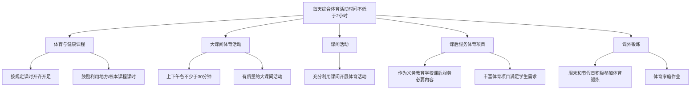
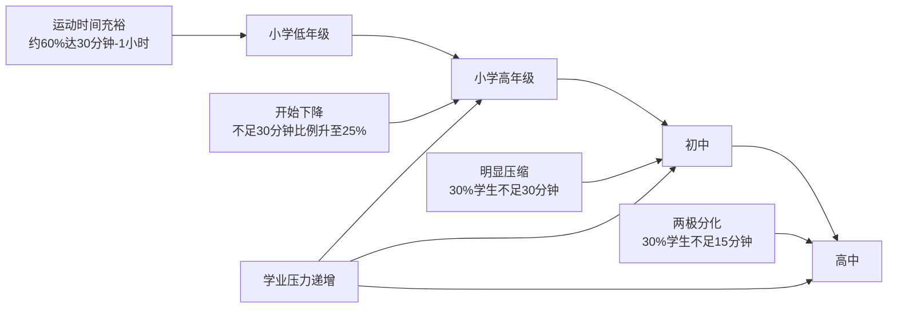
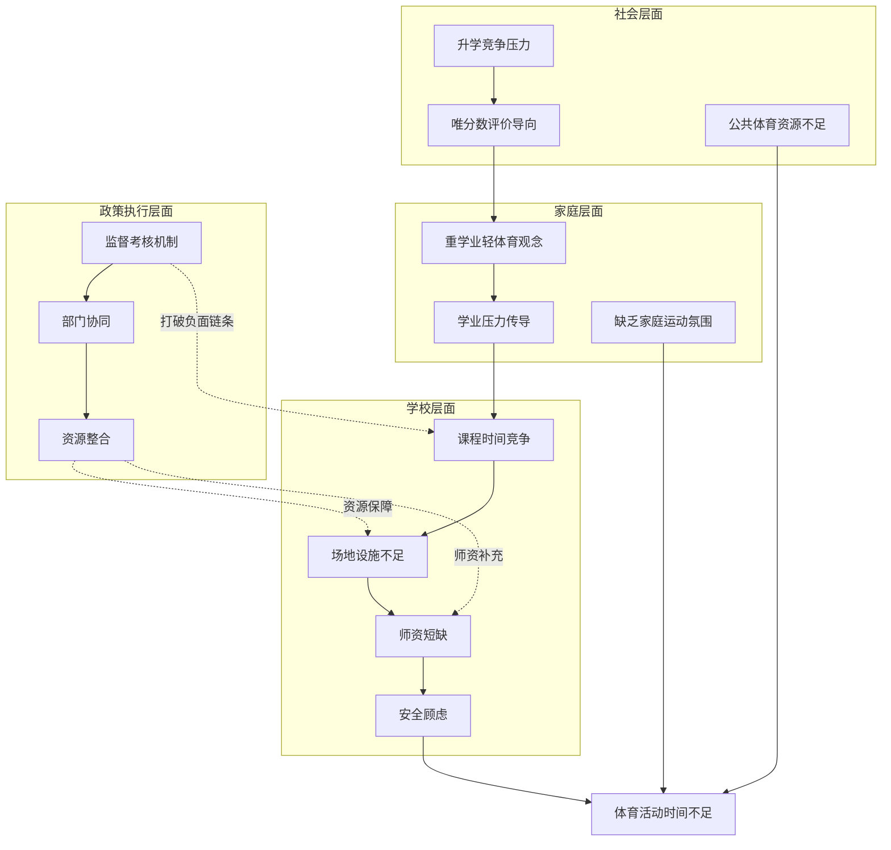
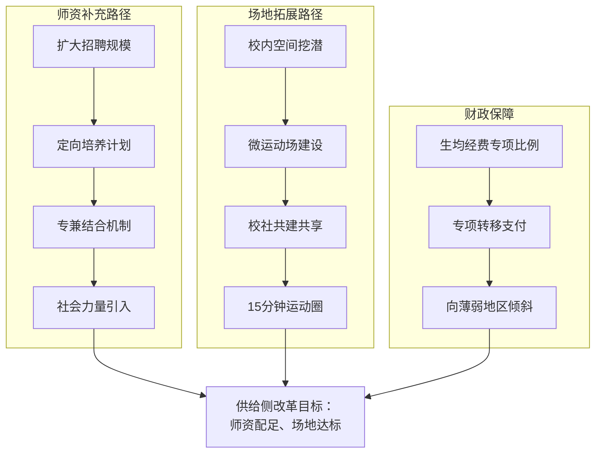
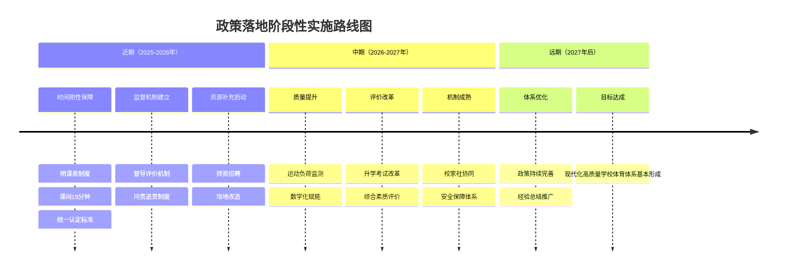

# 中小学生每天综合体育活动时间保障研究：现状、影响因素与政策路径
## 1 政策背景与目标要求

### 1.1 政策出台的时代背景与战略定位

教育兴则国家兴，教育强则国家强。党的十八大以来，以习近平同志为核心的党中央坚持把教育作为国之大计、党之大计，作出深入实施科教兴国战略、加快教育现代化的重大决策，推动新时代教育事业取得历史性成就、发生格局性变化[^1]。当今世界，百年未有之大变局加速演进，新一轮科技革命和产业变革深入发展，面对国际激烈的综合实力竞争，迫切需要以国家行动计划对教育支撑引领中国式现代化作出战略部署[^1]。

在这一宏观背景下，**"健康第一"教育理念**被提升至前所未有的战略高度。2024年全国教育大会上，习近平总书记明确指出"建成教育强国是近代以来中华民族梦寐以求的美好愿望，是实现以中国式现代化全面推进强国建设、民族复兴伟业的先导任务、坚实基础、战略支撑"[^1]。这一论述深刻阐明了教育强国建设的战略意义，也为学校体育改革指明了方向。

从现实需求来看，当前中小学生体质健康状况面临严峻挑战。**"小胖墩、小眼镜、小豆芽、小焦虑"**等问题尚未得到彻底解决，力量弱、耐力差等体质不良问题依然突出。学生体质健康关系国家未来、民族希望，如何加快提升学生体质健康水平成为教育改革的紧迫课题[^2]。正如相关评论所指出的，当前上好体育课的核心矛盾已由"有没有时间"转向"时间有没有质量"[^3]，这意味着学校体育改革必须从量的保障向质的提升全面转型。

从改革演进脉络来看，国家对学生体育活动时间的要求经历了逐步升级的过程。最初是"每天1小时体育活动"，后来发展为"每天校内、校外各1个小时体育活动"，当前则明确提出"每天综合体育活动时间不低于2小时"[^2]。这一演变体现了国家从**"锻炼时长"和"锻炼形式"**两个维度对中小学生体育活动提出的新要求，标志着学校体育工作进入系统性变革的新阶段。

### 1.2 核心政策文件的主要内容与要求

2025年1月，中共中央、国务院印发《教育强国建设规划纲要（2024—2035年）》（以下简称《纲要》），以前瞻性的战略部署和顶层设计，凝聚起全国上下建设教育强国的思想共识、行动合力[^1]。《纲要》以9000余字的篇幅，描绘出教育强国建设的波澜壮阔图景，擘画出教育系统坚毅笃行的宏大蓝图[^1]。

《纲要》的指导思想深入贯彻习近平总书记关于教育的重要论述和党中央的重大决策部署，明确了教育的**政治属性、人民属性、战略属性**，理清改革发展的总体思路和方式途径[^1]。在工作原则上，《纲要》强调坚持党对教育事业的全面领导，突出促进公平、提高质量，强化战略引领、支撑发展，深化改革创新、协同融合，坚持自主自信、胸怀天下[^4]。

在体系构建方面，《纲要》提出全面构建**"八大体系"**，包括固本铸魂的思想政治教育体系、公平优质的基础教育体系、自强卓越的高等教育体系、产教融合的职业教育体系、泛在可及的终身教育体系、创新牵引的科技支撑体系、素质精良的教师队伍体系、开放互鉴的国际合作体系[^5]。这些体系像支撑架一样牢牢撑起教育强国建设的主体结构。

在学生健康成长方面，《纲要》明确提出**"深入实施素质教育，健全德智体美劳全面培养体系，加快补齐体育、美育、劳动教育短板"**[^4]。具体要求包括：落实健康第一教育理念，实施学生体质强健计划，中小学生每天综合体育活动时间不低于2小时，加强校园足球建设，有效控制近视率、肥胖率[^4]。

为贯彻落实《纲要》精神，教育部、国家发展改革委、财政部、人力资源社会保障部、体育总局于2025年11月联合印发《关于实施学生体质强健计划的意见》（教体艺〔2025〕1号）[^6]。该文件的总体要求是：坚持以习近平新时代中国特色社会主义思想为指导，切实落实立德树人根本任务，大力践行健康第一教育理念，以体育人，守正创新，深化改革，体教融合，推动学校体育高质量发展，让学生在体育锻炼中**享受乐趣、增强体质、健全人格、锤炼意志**，为建设教育强国、体育强国和健康中国提供有力支撑[^6]。

下表系统呈现两份核心政策文件的主要内容框架：

| 政策文件 | 发布时间 | 发布主体 | 核心定位 | 主要任务领域 |
|---------|---------|---------|---------|-------------|
| 《教育强国建设规划纲要（2024—2035年）》 | 2025年1月 | 中共中央、国务院 | 国家级战略文件，教育强国建设顶层设计 | 立德树人、基础教育、高等教育、职业教育、终身教育、科技支撑、教师队伍、国际合作等九大领域 |
| 《关于实施学生体质强健计划的意见》 | 2025年11月 | 教育部等五部门 | 专项实施意见，学校体育改革行动指南 | 体育教学改革、训练竞赛、骨干力量、监测评价、师资建设、条件保障、体育文化、社会协同等八大方面 |

### 1.3 "每天综合体育活动时间不低于2小时"的政策内涵解析

**"每天综合体育活动时间不低于2小时"**是《纲要》提出的刚性指标，也是学生体质强健计划的核心要求。深入理解这一政策内涵，需要从时间构成、概念界定和演变逻辑三个维度进行解析。

**时间构成要素方面**，《关于实施学生体质强健计划的意见》明确提出，基础教育阶段要**统筹课内外、校内外**，积极推进中小学生每天综合体育活动时间不低于2小时[^6]。具体时间构成包括以下要素：

政策文件对各时间要素提出了具体要求：按照规定课时开齐开足体育与健康课程；鼓励有条件的中小学校上下午各安排一次不少于30分钟有质量的大课间体育活动；把体育作为义务教育学校课后服务的必要内容；鼓励中小学寄宿制学校在保障学生充分睡眠的前提下建立实施早操制度；引导大中小学生周末和节假日积极参加体育锻炼[^6]。

**"综合体育活动"的概念界定**体现了政策设计的系统性思维。重庆市的实践经验表明，"综合体育活动"创新了**"体育课程+大课间（上下午各30分钟）+课间活动+课后服务"**多元时间组合模式[^7]。这一模式打破了"运动只在校园"的边界，通过全面推行体育家庭作业，倡导"大手拉小手"亲子运动，使"阳光下奔跑"融入日常生活[^7]。

**从政策演变逻辑来看**，体育活动时间要求经历了三个阶段的发展[^2]：

1. **"每天1小时体育活动"阶段**：2007年中共中央、国务院《关于加强青少年体育增强青少年体质的意见》明确要求"确保学生每天锻炼一小时"；2009年《全民健身条例》首次以法规形式提出"学校应当保证学生在校期间每天参加1小时的体育活动"。

2. **"校内外各1小时"阶段**：在实践探索中逐步形成"每天校内、校外各1个小时体育活动"的要求，强调家校协同。

3. **"每天综合体育活动不低于2小时"阶段**：《纲要》将这一要求上升为国家战略，从"1小时"到"2小时"、从"校内"到"校内外综合"的变化，体现了国家对中小学生体育活动从**时间刚性保障**和**形式多元整合**两个维度提出的更高要求。

这一演变逻辑表明，政策设计正从单一的时间数量要求向系统化、综合化的质量提升转变，体现了"健康第一"理念从共识转化为全校师生有力行动的改革方向[^3]。

### 1.4 政策目标的阶段划分与实施时间节点

《纲要》擘画了**"两步走"战略**，设定了明确的时间节点和阶段性目标[^1]：

**第一步：到2027年，教育强国建设取得重要阶段性成效。** 在学校体育领域，《关于实施学生体质强健计划的意见》明确提出：以义务教育阶段为重点，中小学生每天综合体育活动时间不少于2小时要求**全面高质量落实**；学段衔接的学校体育教学改革全面深化；面向人人的课外体育活动竞赛普遍开展；结构更加合理的师资队伍初步建成；满足师生需求的场地设施条件更加完善[^6]。

在具体指标方面，政策要求**学生体质健康合格率、优良率，毕业生运动习惯养成率显著提升**[^6]。同时提出培育一批特色鲜明的体育健康类国家级示范性学校，打造一批新型高校高水平运动队，建设一批学校体育高质量发展改革试点地区，使学校体育更加多样化、个性化、项目化，成为校园新风尚、新气象[^6]。

**第二步：到2035年，建成教育强国。** 在学校体育领域的目标是**现代化、高质量的学校体育体系基本形成**，学校体育在促进学生健康成长、全面发展和教育强国建设中发挥重大作用[^6]。从教育强国建设整体目标来看，届时党对教育事业全面领导的制度体系和工作机制系统完备，高质量教育体系全面建成，基础教育普及水平和质量稳居世界前列，学习型社会全面形成，人民群众教育满意度显著跃升[^1]。

下表呈现政策目标的阶段划分与核心指标要求：

| 时间节点 | 总体定位 | 学校体育核心目标 | 关键指标要求 |
|---------|---------|-----------------|-------------|
| 2027年 | 重要阶段性成效 | "2小时"全面高质量落实 | 体质健康合格率、优良率显著提升；运动习惯养成率显著提升；培育示范校、试点地区 |
| 2035年 | 建成教育强国 | 现代化高质量学校体育体系基本形成 | 学校体育在促进学生健康成长、全面发展和教育强国建设中发挥重大作用 |

值得注意的是，政策明确将**2027年**作为"2小时"全面高质量落实的关键时间节点，距今仅剩一年多时间。正如相关评论所指出的，"行百里者半九十"，必须清醒地看到从"有"到"优"、从"形式"到"实效"，改革发展进程中仍有不少"硬骨头"要啃[^3]。这意味着各地需要加快推进步伐，确保政策目标如期实现。

### 1.5 覆盖学段与差异化实施要求

政策设计充分考虑了不同学段学生的身心发展特点，提出了**差异化的实施要求**，覆盖范围从幼儿园延伸至高校全学段[^7]。

**基础教育阶段**是政策实施的重点。《关于实施学生体质强健计划的意见》明确提出，基础教育阶段要统筹课内外、校内外，积极推进中小学生每天综合体育活动时间不低于2小时[^6]。在课程设置上，国家体育与健康课程课时规定为：小学一至二年级每周4课时，小学三至六年级和初中每周3课时，高中每周2课时[^8]。政策鼓励学校每天安排1节体育课，严禁以任何理由挤占体育与健康课程及规定的校园体育活动时间[^8]。

在教学特色上，政策要求逐步形成**小学游戏化、初中多样化、高中（职高）专项化**的学段教学特色[^8]。重庆市人民小学的实践案例显示，学校根据不同年级特点安排大课间活动：一年级在"彩色赛道"进行趣味情景游戏，锻炼协调性和节奏感；二年级男生参与搏击操训练，女生投入跳皮筋活动；三年级孩子在曲棍球运动中传球、接球、射门，培养协作意识[^7]。这种"一龄一特色、人人有舞台"的做法体现了差异化实施的理念。

**高等教育阶段**同样纳入政策覆盖范围。政策要求严格落实体育课程最低学时要求（**本科144学时、高职108学时**），推动高校面向三年级以上学生（包括研究生）开设形式多样的体育课程，组织学生每周至少参加3次有强度的课外体育锻炼[^6]。这一要求体现了政策对大学生体质健康的持续关注，强调运动习惯的终身养成。

**全学段贯通设计**是政策的重要特点。重庆市的实践表明，"体育课程+大课间+课间活动+课后服务"多元时间组合模式已**延伸覆盖"幼儿园到高校"全学段**[^7]。北京市政协委员张霞建议，应依据"小学兴趣启蒙、初中技能提升、高中竞技深化"的梯度，明确各学段核心目标、教学重点与评价标准，强化技能递进[^9]。

下表呈现不同学段的差异化实施要求：

| 学段 | 课时要求 | 活动时间要求 | 教学特色定位 | 技能目标 |
|-----|---------|-------------|-------------|---------|
| 小学一至二年级 | 每周4课时 | 每天综合体育活动不低于2小时 | 游戏化 | 兴趣启蒙 |
| 小学三至六年级 | 每周3课时 | 每天综合体育活动不低于2小时 | 游戏化 | 兴趣启蒙 |
| 初中 | 每周3课时 | 每天综合体育活动不低于2小时 | 多样化 | 技能提升 |
| 高中 | 每周2课时 | 每天综合体育活动不低于2小时 | 专项化 | 竞技深化 |
| 本科 | 144学时 | 每周至少3次有强度课外锻炼 | 多样化 | 终身锻炼习惯 |
| 高职 | 108学时 | 每周至少3次有强度课外锻炼 | 多样化 | 终身锻炼习惯 |

政策还特别强调**学段衔接**的重要性。《关于实施学生体质强健计划的意见》提出，要落实国家课程标准，一体化推进体育教学改革，构建**学段衔接、目标一致、支撑有力**的体育与健康课程实施机制[^6]。学校要合理安排课程教学内容，体现连续性、进阶性、多样性，打造学生更加喜爱、更有质效的体育课，让学生立足学校即可熟练掌握至少一项运动技能，养成体育锻炼习惯[^6]。

综上所述，《教育强国建设规划纲要（2024—2035年）》及《关于实施学生体质强健计划的意见》构建了系统完整的政策框架，为保障中小学生每天综合体育活动时间不低于2小时提供了明确的目标指引、时间节点和实施路径。这一政策体系的建立，标志着学校体育改革进入**从"量"到"质"深刻转变**的新阶段，为培养身体强健、热爱运动、有专长、有终身锻炼习惯的时代新人奠定了坚实的制度基础[^10]。

## 2 中小学生体育活动时间现状

### 2.1 体育活动时间整体达标情况

当前中小学生每天综合体育活动时间的整体达标情况与政策目标之间存在显著差距。根据中国教育科学研究院2024年12月开展的专项调研数据，**能够达到每天体育锻炼2小时的中小学生比例仅为18.3%**，这意味着超过八成的学生未能满足《教育强国建设规划纲要》提出的刚性时间要求[^11]。

从地方监测数据来看，不同地区的达标情况呈现差异化特征。2023年上海市中小学生体质健康监测数据显示，全市中小学生日均体育活动时间为**1.2小时**，达标率不足40%，近视率、肥胖率仍处高位[^12]。卫健委2024年数据进一步揭示了问题的严峻性：**中小学生日均户外活动时间不足1小时的占比达68%**，而世界卫生组织建议的儿童每日运动时间为180分钟（3小时），我国学生每天比国际标准少运动约1小时[^13]。

从政策演进视角审视，体育活动时间要求经历了从"每天1小时"到"每天2小时"的跨越式升级。1990年颁布的《学校体育工作条例》规定普通中小学校"每周安排三次以上课外体育活动，保证学生每天有一小时体育活动的时间（含体育课）"[^14]。2024年9月全国教育大会之后，政策加码为保障中小学生每天综合体育活动时间不低于2小时，不仅总时长增加，而且内容组成发生了根本性变化[^14]。

政策实施后的积极变化已开始显现。教育部副部长王嘉毅在2025年9月国新办发布会上介绍，"十四五"期间实施了"学生体质强健计划"，推动各地增加体育课、体育课后服务和大课间，推动课间活动由原来的10分钟延长到15分钟，**从目前监测情况看，近几年中小学生的身体健康总体水平稳中有升**[^14]。深圳市的实践数据提供了有力佐证：自2024年1月1日义务教育阶段"每天一节体育课"政策实施以来，**全市中小学生体质健康优良率达66.46%，相比2023年提升6.21个百分点**[^15]。

下表呈现政策目标与现实状况的对比：

| 指标维度 | 政策目标要求 | 当前实际状况 | 差距程度 |
|---------|-------------|-------------|---------|
| 每日体育活动时间 | 不低于2小时 | 平均约1.2小时 | 约40%缺口 |
| 2小时达标率 | 全面高质量落实 | 18.3% | 超80%未达标 |
| 户外活动时间 | 充分保障 | 68%学生不足1小时 | 严重不足 |
| 与国际标准差距 | 接近WHO建议 | 比WHO标准少约1小时 | 差距明显 |

### 2.2 体育课程开设与课时落实状况

体育与健康课程是保障学生体育活动时间的基础性制度安排。从全国层面来看，2025年春季学期以来，多地积极响应政策要求，推动体育课时保障取得实质性进展。

**在课时标准执行方面**，各地已形成较为明确的操作规范。北京市教委、市体育局于2025年2月联合印发《关于进一步加强新时代中小学体育工作的若干措施》，明确要求**小学和初中每天1节体育课；高中每周3-5节体育课，没有体育课的当天要安排不少于45分钟的体育锻炼**[^16]。广东省教育厅发布的通知提出，珠三角地区中小学校于2025年秋季学期开始全面实施每天1节体育课；粤东西北地区于2025年秋季学期落实每天1节体育课的学校比例不少于50%，2026年秋季学期开始全面实施[^17]。

**"每天一节体育课"的推进进度**呈现区域差异。广州市教育局明确，从2025年春季学期起到秋季学期前，各区义务教育阶段学校试点落实每天1节体育课的学校比例不少于30%；**从2025年秋季学期开始，全市义务教育阶段学校100%落实每天1节体育课**[^18]。东莞市同样明确，2025年秋季学期一开学，全市小学、初中学段将全面推行每天至少1节体育课，并编入课表[^19]。重庆市的数据显示，**2025年全市中小学体育课时达标率达100%**，阳光体育大课间实现全市中小学100%覆盖[^7]。

**体育课被挤占挪用的问题**仍需持续关注。天津市教委明确要求小学不得以课后服务"替代"体育课，并将继续开展中小学体育课"晒课表"活动，要求各中小学开学后在班级公示栏、学校官网和微信公众号、家长微信群等公开本校所有班级新学期体育课课表，接受家长和社会监督[^20]。北京市在体育课实施过程中，要求切实做好体育课的运动负荷监测，**杜绝"说教课"和"不出汗"的体育课**[^16]。

**体育课质量提升**成为新阶段的重点任务。上海市自2020年起强力推行"小学兴趣化、初中多样化、高中专项化"体育课程改革，到2024年，部分中小学的课程安排时间表显示，"大课间30分钟+体育课40分钟+课后运动50分钟"的组合已基本满足每天2小时运动[^12]。然而，正如相关分析所指出的，**时长达标仅是起点远非终点**，机械拼凑的120分钟若缺失强度适宜的心肺锻炼、针对性肌力训练与协调性开发，其效果必然大打折扣[^12]。

### 2.3 大课间与课间活动实施质量

大课间体育活动和课间活动是构成"每天2小时"体育活动时间的重要组成部分。政策要求鼓励有条件的中小学校上下午各安排一次不少于30分钟有质量的大课间体育活动，同时探索课间15分钟制度[^21]。

**大课间时间保障方面**，多地已形成规范化安排。北京市要求充分利用大课间和课后服务，组织学生开展球类、跳绳、踢毽、跳皮筋等不少于10个项目的轮换活动[^16]。武汉市多所学校将大课间延长至40分钟，学校对上课时间进行了调整安排，每节课由过去的45分钟调整到40分钟，由此上午的大课间时间增加了十分钟，下午也增设了30分钟至45分钟的大课间时间[^16]。重庆市创新"体育课程+大课间（上下午各30分钟）+课间活动+课后服务"多元时间组合模式[^7]。

**课间时间延长改革**正在全国范围内加速推进。2025年春季学期，江苏省义务教育阶段学校对课间安排做出统筹规划，要求保障学生每天综合体育活动时间不低于两小时，**课间活动时间15分钟**[^22]。广州市明确从2025年春季学期起，**全市小学课间10分钟调整为15分钟，初中下午课间10分钟调整为15分钟**，30分钟大课间和每节课40分钟时间不变[^18]。东莞市南城中心小学自2025年春季学期起调整作息时间，课间休息时间由原先的10分钟延长至15分钟，每天上午与下午各安排一次大课间活动，其中上午时段长达40分钟，下午则为35分钟[^19]。

**课间活动质量与学生参与度**呈现积极变化。浙江杭州试点"课间不静音"学校的跟踪数据显示：**实施半年后，学生课间意外伤害率仅上升0.3%，但课堂专注度提升27%，午休入睡时间缩短12分钟**[^13]。福建晋江市毓英中心小学将课间活动时间从10分钟延长至15分钟并坚持至今，每到课间学生们已养成参与体育锻炼的习惯[^22]。宜昌市南苑实验小学校园里的课间15分钟热闹非凡，孩子们轮流"打卡"地面上五颜六色的方格、数字等图案，解锁学校新设地面游戏[^23]。

**"课间圈养"现象的改善**仍是工作重点。过去课间短、活动受限，本质是教育者对"风险"的过度规避。上海某小学安全主任坦言："不是不想让孩子玩，是怕出事担责任。一个孩子摔倒，家长闹到学校，整个学期都不得安宁。"[^13]政策明确严禁"拖堂"或以其他方式挤占学生课间时间，不得以任何借口限制学生课间活动自由，鼓励学生课间走出教室，走到操场，走向阳光[^17]。

下表呈现大课间与课间活动的实施现状：

| 活动类型 | 政策要求 | 典型地区实施情况 | 实施效果 |
|---------|---------|-----------------|---------|
| 大课间 | 上下午各不少于30分钟 | 武汉延长至40分钟；重庆上下午各30分钟 | 覆盖率显著提升 |
| 课间休息 | 探索15分钟制度 | 广州、江苏、东莞等地已推行15分钟 | 学生参与度提高 |
| 活动内容 | 丰富多样、有质量 | 北京要求不少于10个项目轮换 | 活动形式日趋多元 |

### 2.4 课后体育服务覆盖与参与情况

课后服务体育项目是保障学生体育活动时间的重要补充渠道。《关于实施学生体质强健计划的意见》明确要求**把体育作为义务教育学校课后服务的必要内容，丰富体育项目，满足学生需求**[^21]。

**课后体育服务的制度安排**已在多地落实。天津市教委相关负责人表示，按照天津市教委相关要求，义务教育阶段学校应每天开设1节体育课，每天上下午各安排不少于30分钟大课间体育活动，保障小学15分钟、中学10分钟课间休息时间[^20]。四川省明确中小学生每天综合体育活动时间2小时可由1节体育与健康课、1个大课间及课间活动、**1次体育锻炼的课后服务**等时间组成[^24]。

**体育社团与兴趣班的发展**呈现积极态势。宜昌市实验小学精选了42个将传统游戏与现代科技、室内益智与室外体能活动相结合的运动项目与体育游戏，如踩高跷、AI跳绳、棋类对弈等，吸引学生在每个课间都走出教室，到操场放飞身心[^23]。三水区西南街道河口小学针对不同学段学生设计差异化课间活动内容：低年级以"趣味启蒙"为主，中年级聚焦"技能提升"，高年级侧重"技术巩固与体能强化"[^25]。

**学生参与课后体育锻炼的实际情况**存在校际差异。电子科技大学附属实验小学的实践表明，从体育课到大课间、课后服务，该校学生每天在校体育活动总时长能达到3个小时，2024年全校7000多名学生体质健康优良率达93.2%、优秀率达73.4%[^24]。然而，部分学校在具体操作中存在拼凑运动时间的"凑数式"做法，有些学校会把大课间和少数人参与的运动或校外运动竞赛活动也纳入"2小时"范围，甚至将学生的放松休息时间也生硬地计入运动时间总量[^12]。

**家庭体育作业的推广**成为延伸体育活动时间的新路径。重庆市全面推行体育家庭作业，倡导"大手拉小手"亲子运动，同步配套睡眠保障、电子产品管控等健康指引，让"运动2小时"成为连接学校与家庭、运动与生活的纽带[^7]。甘肃省倡导开展"跑出健康"打卡活动，**小学生每周跑步不少于4千米（1至3年级1千米），中学生每周跑步不少于1万米**[^26]。

### 2.5 区域与城乡差异分析

中小学生体育活动时间保障呈现显著的区域与城乡差异，资源配置不均衡是制约政策均衡落实的关键因素。

**东中西部地区差异**表现突出。监测数据显示，**东部地区学校体育场地达标率82%，而西部农村仅41%**，需加大财政倾斜力度[^27]。全国第三次城乡居民参加体育锻炼现状调查显示，城镇居民经常锻炼的比例是乡村居民的2.7倍，人均体育消费水平是乡村居民的2倍；东部居民经常锻炼和体育消费的水平明显高于中西部[^28]。

**政策推进进度的区域差异**已在制度设计中体现。广东省教育厅明确，珠三角地区中小学校于2025年秋季学期开始全面实施每天1节体育课；**粤东西北地区于2025年秋季学期落实每天1节体育课的学校比例不少于50%，2026年秋季学期开始全面实施**[^17]。这一差异化安排反映了区域发展不平衡的客观现实。

**城乡学校资源配置差距**影响体育时间保障质量。2024年全国教育事业发展统计公报显示，全国普通小学设施设备配备达标的学校比例情况为：**体育运动场（馆）面积94.50%，体育器械97.47%**[^29]。然而，中西部和农村缺乏体育场所和运动设施的情况更为明显，缺乏时间、没兴趣和缺乏场地设施是妨碍居民参加锻炼的主要因素[^28]。

**东中西部协同推进机制**正在构建。教育部学生体育协会联合秘书处、中国学生体育联合会主办的东中西部协同推进学校"阳光体育"活动已启动，旨在帮助东部"以赛塑城"，打造学校体育"发展高地"，再从东部调动资源支持西部学校体育发展，实现互助共赢[^30]。惠若琪等12位世界冠军和知名运动员受聘为阳光体育形象特使，将深入中西部薄弱地区、薄弱学校，播撒体育火种，激发学生兴趣与梦想[^30]。

下表呈现区域与城乡差异的主要表现：

| 差异维度 | 东部/城市地区 | 西部/农村地区 | 差距表现 |
|---------|-------------|-------------|---------|
| 场地达标率 | 约82% | 约41% | 差距约40个百分点 |
| 经常锻炼比例 | 较高 | 城镇是乡村的2.7倍 | 差距显著 |
| 政策推进节点 | 2025年秋季全面实施 | 部分地区2026年全面实施 | 滞后约1年 |
| 体育消费水平 | 较高 | 城镇是乡村的2倍 | 差距明显 |

### 2.6 学段差异与年级递减特征

中小学生体育活动时间呈现明显的学段差异和年级递减规律，学业压力是导致这一现象的核心因素。

**小学阶段体育活动时间相对充裕**。调查数据显示，每天体育运动时间在30分钟至1小时的学生占比最高，约为50%；其中低年级（一、二年级）学生该时间段占比尤为突出，**接近60%**，这得益于学校相对较多的户外课间活动安排[^31]。然而，随着年级升高，学业压力逐渐显现，高年级（五、六年级）相比低年级，每天运动时间在1小时至1.5小时的比例稍有下降，降至25%左右，不足30分钟的比例上升至25%[^31]。

**初中阶段体育活动时间开始明显压缩**。约40%的学生每天体育运动时间处于30分钟至1小时，另有**30%的学生每天运动时间不足30分钟**，主要是因为课后作业量大、辅导班占用课余时间[^31]。初二、初三阶段，面临中考升学压力，学科课程增多，近半数学生每天运动时间被压缩至不足30分钟，只有少数体育特长生或自律性强、重视锻炼的学生能维持1小时以上的运动时间[^31]。

**高中阶段体育活动时间呈现两极分化**。约30%的学生每天运动时间不足15分钟，这类学生全身心投入高考备考，课余时间几乎全部用于学习；30%的学生能保证15分钟至30分钟的运动；剩下40%的学生每天运动时间在30分钟至1小时[^31]。**高二、高三随着高考临近，不足15分钟和15分钟至30分钟这两个较短运动时间段的学生占比迅速上升**，整体运动时间大幅减少[^31]。

**学业压力与体育时间的负相关**已被数据证实。2012年至2024年，我国中小学生**学业压力指数上涨23%，而体质达标率下降11%**[^13]。北京某重点小学五年级班级调查显示，全班45人，32人近视，18人体重超标，8人因压力过大出现失眠[^13]。这一数据深刻揭示了"唯分数"教育导向对学生体质健康的负面影响。

**"双减"政策带来的积极变化**值得关注。根据《中国国民心理健康发展报告（2021-2022）》，在小学、初中阶段，**超过半数的学生都投入了更多时间到体育中**[^32]。青海省5039名中小学生的研究指出，与2019年相比，2023年青海学生进行中等及以上强度身体活动的时间明显增加，小学男生的日均运动时间从2019年的34.2分钟增长至2023年的57.2分钟[^32]。

### 2.7 政策目标与现实差距识别

综合上述各维度分析，可系统识别"每天综合体育活动时间不低于2小时"政策目标与当前实际状况之间的主要差距。

**时间保障方面的核心差距**表现为：全国仅18.3%的中小学生能够达到每天2小时的体育活动时间要求，超过八成学生未能达标[^11]；学生日均体育活动时间约1.2小时，与2小时目标存在约40%的缺口[^12]；68%的学生日均户外活动时间不足1小时，与世界卫生组织建议的180分钟标准差距更大[^13]。

**质量提升方面的关键短板**包括：部分学校存在"凑数式"运动时间统计，将非运动时间生硬计入总量[^12]；体育课存在"说教课"和"不出汗"现象，运动负荷不足[^16]；课间活动受安全顾虑限制，"课间圈养"问题尚未根本解决[^13]；运动质量绝非单一时间维度所能涵盖，需要科学设计的课程内容、专业精准的教师指导、充分开放的运动空间共同保障[^12]。

**区域均衡方面的突出问题**体现为：东部地区学校体育场地达标率（82%）与西部农村（41%）差距达40个百分点[^27]；城镇居民经常锻炼比例是乡村居民的2.7倍[^28]；珠三角与粤东西北地区政策推进节点相差约1年[^17]；体育师资配置存在显著的城乡和区域差异，全国体育教师缺口超12万人[^14]。

**学段衔接方面的薄弱环节**表现为：随年级升高体育活动时间递减规律明显，初高中毕业年级问题尤为突出[^31]；学业压力指数上涨23%与体质达标率下降11%形成鲜明对比[^13]；高中阶段30%学生每天运动时间不足15分钟，与政策要求差距悬殊[^31]。

下表系统归纳政策目标与现实差距：

| 差距领域 | 政策目标 | 现实状况 | 差距程度 | 优先突破方向 |
|---------|---------|---------|---------|-------------|
| 时间达标 | 100%学生达2小时 | 18.3%达标 | 极大 | 刚性时间保障机制 |
| 运动质量 | 有强度、有质量 | 存在"凑数"现象 | 较大 | 运动负荷监测标准 |
| 区域均衡 | 全面高质量落实 | 东西部差距40个百分点 | 显著 | 资源倾斜与协同机制 |
| 学段衔接 | 全学段覆盖 | 年级递减明显 | 突出 | 评价改革与减负协同 |

需要重点突破的问题领域已清晰呈现：**时间保障的刚性约束机制亟待强化**，确保体育课、大课间、课后服务等各时间要素落实到位；**运动质量的监测评价标准亟需建立**，杜绝形式主义和"凑数"行为；**区域均衡的资源配置机制亟须完善**，加大对中西部和农村地区的支持力度；**学段衔接的评价导向亟待优化**，破解学业压力对体育时间的挤压效应。这些关键短板的识别，为后续影响因素分析和政策路径设计提供了明确的问题导向。

## 3 影响体育活动时间的多维因素分析

中小学生每天综合体育活动时间不低于2小时目标的实现，受到学校、家庭、社会、政策执行等多维因素的复杂交织影响。这些因素并非孤立存在，而是相互关联、层层传导，共同构成制约体育活动时间保障的系统性障碍。本章基于四个层面构建分析框架，深入剖析各因素的作用机制与相互关联，为后续政策路径设计提供问题导向的理论支撑。

### 3.1 学校层面因素：课程安排与时间统筹的结构性矛盾

学校作为落实"每天2小时"体育活动时间的主阵地，首先面临的是**课程编排与时间统筹的结构性矛盾**。这一矛盾的核心在于体育课时与文化课时之间的竞争关系，以及各类体育活动时间要素的组织实施难度。

**体育课时与文化课时的竞争关系**是学校层面最突出的时间矛盾。国家体育与健康课程标准规定小学一至二年级每周4课时、小学三至六年级和初中每周3课时、高中每周2课时，但在实际操作中，部分学校仍存在体育课被挤占挪用的现象。天津市教委明确要求小学不得以课后服务"替代"体育课，并通过"晒课表"活动接受社会监督，这一举措本身反映了课时挤占问题的普遍性[^20]。广东省教育厅要求各地各校切实压减超标超量文化学科课时，增加的体育课时可在地方课程、校本课程和综合实践活动课时中统筹安排，说明课时调整需要系统性的制度设计支撑[^33]。

**大课间与课后服务的组织实施难度**构成时间统筹的另一重要挑战。政策要求鼓励有条件的中小学校上下午各安排一次不少于30分钟有质量的大课间体育活动，但"有质量"的要求对学校的组织能力提出了较高标准[^34]。中国教育科学研究院体育美育教育研究所所长吴键指出，教育部门要解决因为增加体育与健康课、增加体育活动带来的挑战，具体包括时间、空间、师资、组织方式四个难点问题[^35]。相关部门应统筹课内教学、课外训练与竞赛活动，这意味着学校需要建立一套完整的时间管理体系。

**课间时间被挤占的现象及成因**同样制约着体育活动时间的保障。过去课间短、活动受限，本质是教育者对"风险"的过度规避。政策明确严禁"拖堂"或以其他方式挤占学生课间时间，不得以任何借口限制学生课间活动自由[^33]。然而，从10分钟延长到15分钟的课间改革仍在推进之中，部分学校的执行力度参差不齐。

### 3.2 学校层面因素：场地设施不足与空间资源配置失衡

**体育场地设施不足**是制约学生体育活动时间有效利用的硬件瓶颈。即便时间保障到位，如果缺乏足够的活动空间，学生也难以真正"动起来"。

**城区学校场地紧张**的问题尤为突出。深圳市泰宁小学的案例具有典型性：该校因原址拆除重建迁至临时校区办学，临时校区占地仅4027平方米，操场面积约600平方米，却要容纳30个教学班共1400余名师生[^36]。在如此局促的空间里，学校不得不采取科学划块管理，将操场细分为4至6个区域，供不同年级开展体育教学。这一案例折射出城市学校普遍面临的空间困境。

**农村学校设施匮乏**与城区形成另一种形态的资源失衡。记者在贵州、重庆和山西等地调查发现，专业师资短缺、场地不足和体育器材不够等问题制约着乡村学校更好、更稳定地开展体育教育[^37]。贵州某乡村小学2020年成立了足球队，最初没有足球场，只能在水泥篮球场上训练；每次练体能时，学校负责人只能带着学生在村里的公路上跑步，遇见车来车往有一定的安全风险。重庆一所乡村小学的操场还是水泥地面，使得体育教师在教篮球、足球等对抗性强的项目时顾虑较多。

**生均体育活动面积不达标**的问题在部分地区依然存在。监测数据显示，东部地区学校体育场地达标率82%，而西部农村仅41%，差距达40个百分点[^38]。《关于实施学生体质强健计划的意见》提出推动场地设施拓展升级，挖潜拓展校园体育运动空间，鼓励创设小型化运动锻炼场景，打造校内"微运动场"[^38]。深圳泰宁小学的实践表明，通过"上天入地"——在屋顶建球场、在地下室建练习室、在楼道里划出跑道，可以在有限空间内实现突破[^36]。

**运动器材陈旧短缺**的问题同样不容忽视。记者在重庆一所乡村小学看到，一些陈旧的体育器材散落在校园里的树丛中，操场上的羽毛球网破损严重，只是勉强能用。校长表示，该校学生人数不多，每年财政拨付的公用经费不足10万元，除去日常必要开支外，几乎没有结余可用于更换体育器材[^37]。

### 3.3 学校层面因素：体育师资短缺与专业能力不足

**体育教师数量缺口与结构性短缺**是制约体育活动时间质量保障的关键人力因素。"你的体育是语文/数学老师教的"，这是不少乡村学校体育教育现状的真实写照[^37]。

**专职教师数量不足**导致兼职代课现象普遍。贵州某乡镇中心小学校长介绍，该校每周所有班级的体育课加起来有93节，但仅有2名体育老师，为保障开齐开足体育课，只能采取1名老师同时给2个班上课的模式，"这增加了教师驾驭课堂的难度，但我们也没有其他更好的办法"[^37]。重庆某乡村小学目前共有4名体育教师，其中1人是科班出身，另外3人是转岗体育教师。首都体育学院体育教育训练学院院长尹军指出，各地区普遍存在中小学体育教师缺编现象，北京中小学体育教师约7000人，"结构性缺编"比例约为15%至20%，很多体育教师每周授课超过30节[^38]。

**教师专业技能欠缺**影响课程实效。《义务教育体育与健康课程标准（2022年版）》规定专项运动技能包括球类运动、田径类运动、体操类运动、水上或冰雪类运动、中华传统体育类运动、新兴体育类运动等六类。然而，在一些没有专职体育教师的乡村学校，体育课由其他学科教师兼着上，他们普遍缺乏相关专业知识和技能，"就是做下准备活动，然后走下队列队形，打打篮球、乒乓球或羽毛球，基本上就是自由活动，没办法教学生一些专业技能"[^37]。

**乡村学校师资流动性大**加剧了人力资源困境。由于乡村学校条件相对较差、待遇较低，导致体育教师流动性较大，难以形成稳定的师资队伍[^39]。重庆一所乡村小学的校长反映，该校唯一的专职体育教师来自西南大学研究生支教团，"明年这位志愿者支教结束离开后，还不知道体育课要怎么办"[^37]。

下表呈现体育师资问题的主要表现：

| 问题类型 | 具体表现 | 影响后果 |
|---------|---------|---------|
| 数量短缺 | 全国体育教师缺口超12万人；部分学校1名教师同时给2个班上课 | 课程开设受限、教学质量下降 |
| 结构失衡 | 专职教师占比低；转岗教师、兼职教师比例高 | 专业技能教学难以保障 |
| 流动性大 | 乡村学校难以留住优秀体育教师 | 师资队伍不稳定、持续发展受阻 |
| 培训不足 | 部分教师缺乏专业培训 | 教育教学水平难以提高 |

### 3.4 学校层面因素：安全顾虑与风险规避的管理困境

**安全管理压力**是导致学校"不敢让孩子动"的深层原因，也是制约体育活动时间有效落实的隐性障碍。

**运动伤害事故增加**带来的责任担忧日益突出。中国教育科学研究院的调研数据显示，与2023年相比，**学生体育运动伤害事故增加了50%以上，校方责任险中体育运动伤害赔偿的比例不断增加，接近60%**[^35]。这一数据深刻揭示了学校面临的安全压力。吴键指出，学生体育运动意外伤害保险制度不完善，不能给每天2小时体育活动保驾护航，学校开展体育活动有后顾之忧。

**"课间圈养"现象的深层原因**正是源于对风险的过度规避。上海某小学安全主任坦言："不是不想让孩子玩，是怕出事担责任。一个孩子摔倒，家长闹到学校，整个学期都不得安宁。"[^35]家长怕受伤、学校怕出事，是"不敢让孩子动"的根源。在这种氛围下，部分学校选择限制学生课间活动，将学生"圈养"在教室里，以降低安全事故发生的概率。

**安全风险防控救济机制的不健全**是当前迫切需要解决的问题。吴键认为，要有效解决长期存在的学生体质健康突出问题，帮助学生健康成长、全面发展，"不能等到孩子处于难以挽回的身心健康困境时再来保护"[^35]。他反复强调，实施每天2小时体育运动，不仅仅是学校体育的事，也不仅仅是体育学科的事，而是教育改革的大事，是学校教育整体性工作。

### 3.5 家庭层面因素：家长教育观念与体育认知偏差

**家庭教育观念**对学生体育活动时间的影响不可忽视，尤其是校外1小时体育活动的落实，很大程度上取决于家长的支持与配合。

**"重学业轻体育"的价值取向**在相当一些家庭中普遍存在。一项对六个城市2000多名中小学生进行的调查显示，在课余时间缺乏体育运动的孩子中，**他们的父母有60.6%平时不进行体育锻炼**，而父母平时喜欢运动，孩子参与运动的比例也相应更高[^40]。这说明家庭体育氛围对孩子运动习惯的形成具有重要影响。不少父母对好孩子的评价标准是"静"而非"动"，希望自己的孩子安静稳当，久而久之，有的孩子便在无形中受到约束，运动细胞也逐渐萎缩了。

**家长对运动伤害的过度担忧**构成另一重要障碍。中国青年报社社会调查中心联合问卷网对2673名中小学生家长进行的调查显示，提高孩子体育运动技能，**学习与运动难平衡、运动时间少是最大的阻力，65.7%的受访家长都选择此项**[^41]。此外，63.6%的受访家长感到专业运动知识与技能储备不足，38.6%的受访家长坦言孩子自身不重视体育运动、主动性弱。河南郑州的家长叶倩表示，她现在特别后悔，当初应该让女儿接触更多的体育运动项目，发展体育爱好，把运动变成日常[^41]。

**缺乏家庭体育氛围和运动习惯培养意识**是深层次的观念问题。有的父母认为孩子的学习最重要，学习负担已经够重了，哪有时间浪费在运动上；有的父母认为孩子不生病就可以了，没必要专门花时间进行体育锻炼，运动被排斥在家庭生活之外；还有的父母对孩子呵护过度，生怕孩子运动时累着、摔着、碰着，对孩子运动百般限制[^40]。实际上，运动对孩子综合素质的培育具有重要的意义，从生理、心理、社会交往、道德规范、生活质量等多个维度都能发挥积极作用。

### 3.6 家庭层面因素：学业压力传导与作息时间挤压

**学业压力对体育活动时间的挤压效应**是制约学生运动时间的核心家庭因素，这一效应随着年级升高而愈发显著。

**课后作业量大**直接挤占了学生的运动时间。调查数据显示，初中阶段约30%的学生每天运动时间不足30分钟，主要是因为课后作业量大、辅导班占用课余时间[^31]。山东济南学生家长孙谦提到，孩子在上学期间，面临考试、考研等学业压力，大部分时间花在了学习上，用在体育锻炼上的时间往往不太多[^41]。初中生张雅从小学到初中都是学校田径队的运动员，平时非常喜欢运动，但升入初三后，因为功课任务比较重，有时只能通过早晨早起一些进行体育活动[^41]。

**课外辅导班占用时间**进一步加剧了时间紧张。高中阶段呈现明显的两极分化：约30%的学生每天运动时间不足15分钟，这类学生全身心投入高考备考，课余时间几乎全部用于学习[^31]。高二、高三随着高考临近，不足15分钟和15分钟至30分钟这两个较短运动时间段的学生占比迅速上升，整体运动时间大幅减少。

**电子产品沉迷**成为新的时间"杀手"。家长孙谦感到，电子产品给孩子们运动带来的阻力很大，"各种游戏和网络世界，对孩子的冲击挺大。孩子们未成年，意志力弱，一玩起来就停不下来，时间一晃就过去了，哪怕是想运动也运动不成"[^41]。初中生赵小欢对体育的兴致"一般般"，她觉得虽然进行体育运动的好处多多，但一想到动起来就会很累，她就提不起兴趣，"主观上的阻力大于客观的"[^41]。

**学业压力指数与体质达标率的负相关关系**已被数据证实。研究表明，适度的体育锻炼（每天30-60分钟）与学业成绩呈显著正相关，且通过提升认知功能、改善情绪状态、优化学习习惯等间接发挥作用[^42]。然而，"重学业、轻体育"的现象在升学压力下似乎成了常态——家长担心运动耽误时间，老师觉得"体育课让给主科更划算"，学生则在"分数至上"的裹挟中，逐渐遗忘了运动带来的活力[^42]。

### 3.7 社会层面因素：升学竞争与唯分数评价导向

**升学竞争压力**对体育活动时间的系统性影响，是制约"每天2小时"目标实现的根本性社会因素。这一因素通过教育评价导向传导至学校和家庭，形成对体育时间的层层挤压。

**中高考指挥棒效应**深刻影响着学校和家庭的时间配置决策。调查显示，高中阶段运动时间呈现明显的两极分化，**约30%的学生每天运动时间不足15分钟**，这类学生全身心投入高考备考[^31]。高一相对来说运动时间稍宽裕，30分钟至1小时的学生占比接近50%；但高二、高三随着高考临近，整体运动时间大幅减少，反映出高考指挥棒对高中生体育运动时间的严重制约[^31]。

**体育在升学评价中的边缘化地位**是问题的症结所在。吴键指出，片面追求文化课成绩和升学率的各种做法，已经影响到青少年的身心健康。当下的重要任务，正是要打破普遍存在的低效、无效的学习"疲劳战"局面，要促进高效学习、高质量学习。"说到底还是要认识先行，认识问题解决了，挤出时间不是难点。"[^35]《关于实施学生体质强健计划的意见》提出规范初中毕业升学体育与健康考试、普通高中体育与健康学业水平考试组织实施，鼓励高校在强基计划等特殊类型招生测试中增设体育项目[^43]。

**初高中毕业年级体育时间锐减现象**尤为突出。初二、初三阶段，面临中考升学压力，学科课程增多，**近半数学生每天运动时间被压缩至不足30分钟**[^31]。相关研究指出，"每天清晨，初中生们背着沉重的书包走进教室，课间十分钟常被习题填满；放学后，补习班的灯光亮到深夜，操场上奔跑的身影却越来越少"[^42]。这种失衡的背后，是对教育本质的误解，更是对学生成长规律的漠视。

**体育锻炼与学业成绩的正向关系**为打破认知误区提供了科学依据。实证研究表明，适度的课间体育活动有助于提高学生的学业成绩[^44]。课间体育活动对生理健康、心理健康和学习效率均有积极影响：适度的体育锻炼可以增强学生的心肺功能，提高血液循环效率，从而有助于大脑的氧气供应；体育活动能够释放内啡肽等"快乐激素"，提升学生的情绪状态；短暂的体育活动可以让学生从长时间的学习中暂时抽离，避免过度疲劳，有助于恢复注意力[^44]。

### 3.8 社会层面因素：公共体育资源供给与社会支持体系

**社会公共体育资源配置**对学生校外体育活动的支撑作用至关重要。政策要求"统筹校内外"保障体育时间，但校外1小时体育活动的实现，很大程度上依赖于社会支持体系的完善。

**社区体育场地设施不足**是制约校外运动的首要障碍。《公共体育设施向社会开放管理办法》规定，公共体育设施应当根据其功能、特点向社会开放，开放时间应当与当地群众的工作时间、学习时间适当错开；公共体育设施（单体）每周开放时间一般不得少于35小时，全年开放时间一般不得少于330天[^45]。然而，实际执行中仍存在场地不足、开放时间不便等问题。

**学校场地向社会开放机制不完善**限制了资源的高效利用。海宁市开展的学校体育场地开放提升配套设施项目显示，通过新增物理隔离、门禁系统、监控、夜间照明、卫生间等配套设施，可以提高学校体育设施对外开放程度，提升市民参与健身锻炼的体验感[^46]。但这需要一定的资金投入和管理成本，部分学校因经费有限、管理压力大而难以有效开放。

**校家社协同机制**正在探索建立。深圳市泰宁小学的实践表明，学校积极盘活周边运动场地，与水库新村社区、东乐社区、罗安居社区公园签订租借协议，开展校社联动，学生们得以在社区场地尽情跑操、跳绳，进行体育锻炼[^36]。《关于实施学生体质强健计划的意见》提出，新建公共体育场馆设施优先选址学校和社区周边，促进学校与社区共建共享体育场馆[^38]。

**体育培训市场发展不均衡**也影响着学生获取专业指导的机会。调查显示，46.3%的受访家长指出运动健身场所少、器械不够是提高孩子体育技能的阻力之一[^41]。城乡之间、区域之间的体育培训资源差异明显，农村学生获取专业体育指导的渠道更为有限。

### 3.9 政策执行层面因素：监督考核机制与问责激励缺位

**政策执行层面的监督评价机制**对"每天2小时"目标的落实具有决定性影响。政策虽好，落地却非易事，监督考核机制的健全程度直接关系到政策执行的实效。

**督导评价指标和方法尚未统一**是当前的突出问题。吴键透露，各地陆续出台推进政策，提出了要求，但是还没有具体的督导评价指标和方法。"目前，教育部正在研制统一的指引性试点办法和评价方法。"[^35]这意味着在过渡期内，各地的执行标准和评价尺度可能存在差异，影响政策落实的一致性。

**体质健康监测结果运用不足**削弱了监测的导向作用。《关于实施学生体质强健计划的意见》提出认真实施国家学生体质健康监测制度，加强科学分析和反馈，建立数据共享机制，强化结果运用和实践推动[^43]。然而，从结果导向看，需要将学生体质健康水平列入政府、教育部门、学校绩效考核指标，对学生体质健康连续下降的，要问责[^35]。

**对违规行为问责力度不够**导致政策执行走样。天津市教委相关负责人表示，市、区两级教育部门将经常性对各学校体育课开课和体育活动开展情况进行监督检查，对检查中发现的问题要督促整改，并对整改结果进行追踪检查。"对检查中违反规定的学校，相关区教育局要视情节给予学校书记、校长及分管校长提醒谈话、批评教育、诫勉直至降职、免职等处理。对政策落实不到位、学生体质健康合格率和优良率持续下降，以及近视率持续增长的区教育局和学校负责人，予以严肃问责。"[^20]这一表态体现了强化问责的政策方向。

### 3.10 政策执行层面因素：部门协同与资源整合障碍

**多部门协同推进中的障碍因素**是制约政策系统性落实的体制性问题。"每天2小时"体育活动时间的保障，涉及教育、体育、卫健、财政等多个部门的职责，需要建立有效的协调机制。

**部门职责边界不清**影响政策执行效率。《关于实施学生体质强健计划的意见》由教育部、国家发展改革委、财政部、人力资源社会保障部、体育总局等五部门联合印发[^34]，体现了跨部门协同的顶层设计。然而，在基层执行中，如何明确各部门的具体职责、如何建立常态化的协调机制，仍需进一步细化。

**资源整合机制不畅**制约着政策资源的优化配置。吴键指出，教育部门要做的是出台政策、推动实施、保障条件、监督评价。针对部分学校场地"捉襟见肘"、器材"超龄服役"的困境，既要加大资金投入补足硬件缺口，更需通过分时段共享、错峰使用等科学管理手段"盘活存量"[^35]。破解师资短缺难题不能仅靠短期招聘，还需通过购买社会服务、培养兼职教师等多元渠道进行"开源"。

**体教融合深度不足**限制了资源共享的效果。《关于实施学生体质强健计划的意见》提出各地要深化体教融合，科学规划运动项目在大中小学的合理布局，探索构建纵向畅通、横向融通、能出能进、转换便捷、规范有序的体育人才培养机制[^34]。支持学校与体校、符合条件的青训机构共同开展课余体育训练[^43]。但在实际操作中，教育系统与体育系统的资源整合仍存在壁垒。

### 3.11 多维因素的交互作用与核心矛盾识别

综合上述分析，学校、家庭、社会、政策执行四个层面的因素并非孤立存在，而是相互交织、层层传导，共同构成制约体育活动时间保障的系统性障碍。识别各因素的交互作用机制与核心矛盾，是设计有效政策路径的前提。

**核心制约链一：学业压力→观念偏差→时间挤占**。社会层面的"唯分数"升学评价导向是根本性外部环境，传导至家庭，加剧了家长的学业焦虑与"重文轻体"观念。这种观念又转化为对子女课余时间的安排，优先用于课业学习，直接挤压体育活动时间。同时，学校的课程安排也可能在此压力下向文化课倾斜。三者形成一条强化"学业-体育"对立的负面链条。

**核心制约链二：资源短缺→安全顾虑→活动受限**。学校层面的场地设施不足、师资结构性短缺，限制了体育活动开展的规模与质量。在此背景下，运动伤害风险被放大，导致学校因惧怕安全事故而采取保守管理，进一步压缩了学生的有效运动时空。资源不足放大了安全风险，安全顾虑又反过来抑制了现有资源的充分利用和创新拓展，形成"不敢动、不能动"的恶性循环。

**政策执行的关键杠杆：监督考核→部门协同→资源整合**。强有力的政策监督与问责是打破上述负面链条的启动器。它能倒逼学校严格落实课时，并推动教育、体育、财政等多部门协同，从而整合校内外资源，破解资源与安全瓶颈。监督考核提供刚性约束和动力，部门协同是资源整合与政策落地的组织保障，资源整合则是最终解决硬件和人力问题的具体手段。三者构成推动政策从文件走向实效的闭环管理体系。

下图呈现多维因素的交互作用机制：

**核心矛盾识别与优先突破方向**：基于上述分析，制约"每天2小时"目标实现的核心矛盾可归纳为以下四个层次：

| 矛盾层次 | 核心内容 | 优先级 | 突破方向 |
|---------|---------|-------|---------|
| **观念认知矛盾** | 学业与体育对立的错误认知 | 高 | 科学普及体育促进学业的实证关系 |
| **资源配置矛盾** | 场地、师资、经费供给不足 | 高 | 供给侧改革与资源整合机制 |
| **制度执行矛盾** | 监督考核与问责机制缺位 | 极高 | 刚性约束与结果导向考核 |
| **协同治理矛盾** | 部门分割与家校社脱节 | 中高 | 跨部门协调与协同育人格局 |

**抓住"强化监督考核问责"这一牛鼻子**，是破解多维因素制约的关键杠杆。正如相关分析所指出的，监督考核提供刚性约束和动力，能够倒逼学校严格落实课时，推动多部门协同整合资源，从而在"时间保障、质量提升、资源拓展、合力形成"等多个维度同时发力。只要决心坚定、方法得当，完全可以在现有条件下显著改善局面。

## 4 国内典型地区实践经验

保障中小学生每天综合体育活动时间不低于2小时的政策目标，需要系统性的制度设计与创新实践。重庆、北京、上海等先行地区作为全国学校体育改革的探路者，在时间统筹、课程改革、数字赋能、督导评价、协同育人等方面形成了各具特色的实践模式。本章通过比较分析这些典型地区的差异化路径，提炼具有普适性的经验规律和可复制的实践模式，为全国各地推进政策落地提供参考借鉴。

### 4.1 重庆经验：多元时间组合模式与督导闭环机制

重庆市作为**全国首批12个深化学校体育（校园足球）高质量发展改革试点省市之一**，坚持践行"健康第一"教育理念，深入实施学生体质强健计划，形成了系统完整的政策保障体系与创新实践模式。其核心经验在于构建了"时间破局、课堂破冰、机制加固"三位一体的改革框架，让"身上有汗、眼里有光、心中有梦、脚步有力"成为重庆学子的生动写照。[^7]

**多元时间组合模式的运作机理**是重庆经验的核心创新。重庆市印发《关于优化中小学综合体育活动时间安排的通知》《中小学大课间体育活动实施指南》等政策文件，创新构建了**"体育课程+大课间（上下午各30分钟）+课间活动+课后服务"**的多元时间组合模式。这一模式打破了传统单一依靠体育课保障运动时间的思路，通过系统重构课堂、课间、课后三个时段的体育活动安排，向时间要效益、向运动要活力。值得注意的是，该模式已**延伸覆盖"幼儿园到高校"全学段**，实现了体育活动时间保障的全周期设计。[^7]

重庆市人民小学的实践生动诠释了这一模式的运作效果。每天大课间铃声响起后，孩子们有序来到操场：一年级在"彩色赛道"进行趣味情景游戏，锻炼协调性和节奏感；二年级男生参与搏击操训练，女生投入跳皮筋活动；三年级孩子在曲棍球运动中传球、接球、射门，培养协作意识；其他年级则开展花样跳绳、弹力带操等活动。学校相关负责人介绍，大课间活动根据不同年级特点安排，真正实现**"一龄一特色、人人有舞台"**。[^7]

**"政策定向、家校协同、督导护航"三位一体保障体系**是重庆经验的制度支撑。在政策定向方面，重庆从顶层设计入手，明确体育活动时间的刚性要求和具体构成；在家校协同方面，全面推行体育家庭作业，倡导"大手拉小手"亲子运动，同步配套睡眠保障、电子产品管控等健康指引，让"运动2小时"成为连接学校与家庭、运动与生活的纽带，使"阳光下奔跑"融入日常生活；在督导护航方面，将"2小时体育活动"纳入教育督导核心指标，形成**"督导—反馈—整改"闭环机制**，严查"阴阳课表"，畅通监督渠道。[^7]

**督导问责与激励考核的制度设计**体现了重庆经验的刚性约束特征。重庆市将学生体质健康与学校评价、校长考核、教师评聘挂钩，以机制之力守护运动之实。这一制度安排形成了强有力的政策执行压力，倒逼学校严格落实体育活动时间要求。实施成效显著：**2025年全市中小学体育课时达标率达100%，阳光体育大课间实现全市中小学100%覆盖**。[^7]

**体育课堂教学改革**是重庆经验的质量保障。重庆深入实施体育教学提质行动，以"课程提质、教学革新、协同推进"三维发力，让体育课实现从"体能训练"到"人格锻造"的本质回归。在课程内涵方面，将巴渝文化、三峡文化、红岩文化等资源融入体育课程，打造富有地域特色与时代气息的体育课程群；在教学模式方面，深化小学"兴趣化"、初中"多样化"、高中"专项化"体育与健康教学改革。重庆市第二十九中学创新构建"红岩精神+阳光体育"模式，通过"红岩精神接力赛""团结奋进拔河赛"等团体竞赛，引导学生切身感悟先辈精神，点亮青春梦想。[^7]

南川区的实践进一步丰富了重庆经验的内涵。该区推出"每天锻炼2小时"运动计划，于2025年出台《进一步深化体教融合促进青少年健康发展实施方案》，统筹推进锻炼增时、评价优化与健康管理。计划以**"2+6+2"项目体系**为抓手，深入开展体育、艺术"两大全员活动"，常态化开展全校体育节、阳光长跑等活动。南川区还首创融合体质健康达标、视力监测、英语听说、艺术素养、科学实验操作的"1+4"中小学生综合素养赛事，践行大健康理念。据连续两年的跟踪监测显示，**全区学生体质健康抽测合格率与优良率实现双增长**，"校校有队伍、月月有赛事"的生动局面初步形成。[^47]

### 4.2 北京经验："体育八条"与班级赛全员参与机制

北京市作为首都和教育改革前沿阵地，于2025年2月由市教委、市体育局联合印发《关于进一步加强新时代中小学体育工作的若干措施》（简称"体育八条"），通过打造"能出汗的体育课"、大力开展学生"班级赛"、科学精准提升学生体质等八条举措，构建以运动、卫生、心理、营养为一体的**"大健康"教育格局**，将身心健康教育融入学校全员、全方位、全过程育人体系。[^48]

**课时保障制度的刚性设计**是"体育八条"的首要亮点。北京市明确要求**小学和初中每天1节体育课，高中每周3-5节体育课，没有体育课的当天要安排不少于45分钟的体育锻炼**。每节体育课安排不少于10分钟体能练习。在课程内容上，小学、初中要将"三大球"至少一项纳入体育课必修内容，高中要开设"三大球"模块教学，冰雪运动特色学校应将冰雪内容列入体育课开展教学。学校要开齐开足体育课，不得以任何形式挤占体育课，杜绝"阴阳课表"。[^48]

**"能出汗的体育课"质量提升要求**体现了北京经验的实效导向。"体育八条"明确要求强化运动负荷监测，**杜绝"说教课"和"不出汗"的体育课**，防止教学内容碎片化、随意性。这一要求直指当前体育课存在的质量短板，从运动强度和教学实效两个维度提出了明确标准，推动体育课从"有"向"优"转变。[^48]

**"班级赛"全员参与机制**是"体育八条"的核心创新。北京市首次在全市中小学全面部署全员参与、全过程参与的"班级赛"，要求学校每学期以班级为单位组织学生开展形式多样、内容丰富的班级联赛：**小学每班不少于5场，初中不少于4场，高中不少于3场**，比赛项目可由学校因地制宜设计安排。校园足球、篮球、排球特色学校则组织学生开展相应"三大球"班级联赛，每班每学期不少于5场。[^48]

市教委相关负责人阐释了"班级赛"的教育价值："学校体育最重要的属性就是面向人人、惠及人人，让每一名学生都能享受体育带来的乐趣。经过研究，我们发现'班级赛'是学生参与并感受体育乐趣最好的形式。它不仅普及面大，还能很好地调动学生参与锻炼的积极性和热情，还可以教会学生敬畏规则，尊重裁判，尊重对手，养成良好的锻炼习惯。老师们也要把'班级赛'当作一个重要的教育阵地，不仅教会学生如何去赢，更要教会学生怎么面对失败，如何从失败中汲取经验。"[^48]

**课内课间课后一体化设计**是北京经验的系统性特征。"体育八条"要求学校进行课内、课间、课后服务一体化设计，充分利用大课间和课后服务，组织学生开展球类、跳绳、踢毽、跳皮筋等**不少于10个项目的轮换活动**，确保义务教育阶段每名学生掌握至少2项运动技能。义务教育学校要落实大、小课间时长要求，督促学生离开座位、走出教室、走向户外、走进阳光，探索具有本校特色和适合学生活动的项目。此外，北京市还引导各中小学组织师生定期开展全员跑步活动，明确学校每年要组织全员参加的冬季长跑或春季接力跑活动。[^48]

**"人人有项目、班班有活动、校校有特色、周周有比赛"**的学校体育发展新样态，是北京经验追求的目标愿景。这一表述与《关于实施学生体质强健计划的意见》提出的要求高度契合，体现了北京市在落实国家政策方面的积极主动和创新探索。市教委相关负责人表示，这些举措是给中小学生准备的新学期礼物，希望孩子们在新学期能够积极参与体育锻炼，享受体育运动的快乐。此次出台文件也体现出北京以学生身心健康为中心的改革理念，学校教育各项工作都要树立健康第一的教育理念，都要把学生身心健康作为一切工作的出发点和落脚点。[^48]

### 4.3 上海经验：制度刚性保障与科学干预指导体系

上海市作为经济社会发展和教育改革的先行城市，于2025年6月由市教卫工作党委、市教委印发《深化新时代中小学体育工作高质量发展的若干措施》，**在全国范围内率先响应和落实**《教育强国建设规划纲要（2024-2035年）》"中小学生每天综合体育活动时间不低于2小时"等战略要求，聚焦当前中小学体育工作重点难点，从课程、赛事、场地、师资、保障等九个方面建立深化中小学体育工作高质量发展长效机制。[^49]

**"每天2小时体育活动基本在校内完成"的刚性制度设计**是上海经验的突出特点。《若干措施》明确要求学校要全面落实学生每天综合体育活动2小时并基本在校内完成，具体包括：每天70分钟左右的体育课、体育活动课、大课间，另外还有不少于40分钟的体育锻炼活动，**每月至少安排半天的"乐动比赛日"**等，吸引学生走出教室、走向操场、走入阳光。这一制度设计将"2小时"从"建议"上升为"刚性"要求，通过课程表安排、大课间、课后服务、赛事日等时间分块，构建多环节、全过程运动时间保障链。[^50]

**"乐动比赛日"等赛事育人机制**是上海经验的创新亮点。在完善市、区学生体育赛事体系的基础上，上海要求扩大校级赛事参与，用好"乐动比赛日"，开展"班级赛""年级赛""校际赛""春、秋两季学生运动会"，让更多学生"动"起来、"赛"起来，实现**人人都参与、人人有项目**。同时建立学校体育赛事向社区、家长开放机制，营造积极向上的校园文化环境。[^50]

**"微操场""微球场"等场地空间创新利用模式**是上海经验应对城市学校用地紧张的务实之举。《若干措施》要求挖掘校内场地资源，新建学校要提高体育场地建设标准，已建成学校灵活运用**"上天入地""立体扩容"**等办法，加大场地建设力度。加强"一场多能"，充分利用跨学科学习空间、走廊、楼道等学生身边的"角角落落"，划定小型运动场域，配置小型健身运动设备，打造"微操场""微球场"。同时建立学校与附近公共体育场馆等共享机制，建设**"15分钟运动圈"**。[^50]

**"运动处方"个性化干预与科学保障措施**体现了上海经验的精细化特征。上海将指导各区为学生配置运动手环，提升体育课锻炼实效，防范安全风险，并指导学校开设丰富的运动项目，建设"一校多品"，帮助学生在基础教育阶段至少掌握2项运动技能。针对学生体质健康等共性问题，强化耐力、上肢力量等训练；对体质健康水平处于良好以下或相关指标存在不足的学生，**开具"运动处方"并予以跟进指导**，加强对特殊体质学生的关心关爱。搭建市、区、校三级学生体育活动与体质健康监测服务平台，实施全过程、动态化管理。[^50]

**运动意外伤害保障机制**是上海经验的重要组成部分。《若干措施》规定强化运动意外保障，推进学校全覆盖配备AED急救设备，完善校园运动伤害快速响应机制，在医院定点开辟运动伤害救治"绿色通道"。**为所有学生配置运动意外伤害专项保险，扩大保障范围**，减轻学校、家庭后顾之忧。这一制度设计直接回应了学校因安全顾虑而限制学生运动的深层问题，为"敢让孩子动"提供了制度保障。[^50]

**师资队伍多元化建设**是上海经验的师资保障路径。《若干措施》指出要配足配强体育教师，倡导"人人都是体育工作者"，建立学科教师"一岗多能"带练体育活动等培训和认证体系，让有一定专长或基础的学科教师指导体育社团或兴趣小组活动、组织体育锻炼及赛事活动等，形成**"教师带着学生动，导师陪着学生玩"**的运动氛围。发挥体育系统退役运动员、社会专业力量作用，运用"AI教练"等智能化手段，提高专兼职体育教师综合能力。[^50]

上海市市东实验学校的实践案例生动展示了政策落地的具体成效。作为12年"一贯制"学校，该校深耕体育育人实践，让"每天综合体育活动2小时"从政策要求转化为学生日常行动。学校构建了**"校长负总责、分管领导具体抓、体育组牵头实施、各部门协同配合、班主任全程参与"**的五级工作格局，全校布局5台AED设备覆盖学生运动密集区域，全员运动意外险全覆盖、常态化急救技能培训，构建起"培训-预防-应急-保障"四位一体防护体系。分层施策的课程体系让不同学段学生各得其所：小学兴趣启蒙、初中兼顾中考与兴趣、高中专项化走班，18门体育社团课线上自主选课，实现"一人一专项"。[^51]

### 4.4 数字化赋能学校体育的典型实践

智能技术在保障体育活动时间与提升运动质量方面的应用探索，正在成为学校体育改革的新方向。**数字化手段在运动负荷监测、数据驱动教学、精准健康干预等方面展现出独特优势**，为破解"时长达标但质量不高"的难题提供了技术路径。

**重庆巴蜀小学的AI技术应用**是数字化赋能体育教学的典型案例。学校推行走班制长课时教学，并依托AI技术，精准采集学生跑步等运动数据，为每位学生量身定制个性化**"挑战目标书"**激发动力。同时在课程内容上，精心设置田径、球类、啦啦操、射击等丰富专项训练，学生可依据个人兴趣自主选课，让体育课的趣味性、实效性实现双提升。这一做法实现了从"统一授课"到"因材施教"的教学模式革新。[^7]

**北京师范大学昌平附属学校的智慧体育教学探索**展示了数字化赋能的具体路径。在"智启未来"项目推动下，学校充分发挥探索精神，借助智能设备与AI技术，为体育课堂注入全新活力。在智慧跳绳课程中，教师以跳绳项目为载体，将心率测算融入教学，借助智能穿戴设备实现运动负荷的精准控制。课程从学生兴趣出发，引导学生从简单的人工估测心率过渡到使用智能穿戴设备精确记录心率数据，涵盖安静心率、最大心率、靶心率以及心率与运动强度之间的复杂关系。在实践环节，学生在练习花样跳绳时使用智能穿戴设备记录心率数据，通过绘制个人心率曲线图直观了解自己的运动负荷，从而更好地掌握和调整运动强度。[^52]

在立定跳远课程中，该校充分利用**AI教学屏**的强大功能，为学生提供精细化教学。通过AI教学屏向学生详细讲解跳远的分解技术动作细节，并借助其智能分析功能，精准指出学生跳远全程中不规范的动作，帮助学生及时纠正。项目组鼓励学校积极采用技术手段赋能体育课堂，探索智慧体育教学模式，并进行跨学科整合的教学实践。智慧体育课堂借助智能设备与AI技术，在教学内容、教学方法和教学效果评价方面实现了全方位创新。[^52]

**太仓市弇山小学"AI+体育"构建校园体锻新生态**是数字化赋能的系统性实践案例。该校以"打造校园体锻新生态"为核心目标，系统化规划"基础设施建设、应用场景推进、素养画像构建、数字评价创新"四大任务板块，形成"技术赋能场景、数据驱动成长"的立体化发展思路。在全面构建运动场景方面，轻量化AI运动器材可实现狭域空间内的物理性拓展，涵盖跳绳、深蹲等8类项目的轻量化AI运动设备，构建了室内外**"10㎡微空间体测站"**，将碎片化场地转化为"全天候、全时段"运动场景。[^53]

在应用生态构建方面，弇山小学将体育课堂与AI相结合，每学期在体育课程中设置2-3节AI专项课，覆盖"教—学—练—赛—评"全流程。通过数据采集和精准分析系统为学生建立"体育素养画像"，教师可实时进行精准干预。在问题应用方面形成了针对性解决方案：**小胖墩推送低强度有氧运动方案，结合饮食监测数据调整训练计划；小眼镜通过AI护眼操和户外体锻时长统计，降低用眼疲劳；小豆芽定制力量训练课程，实时监测骨骼肌发育数据；小焦虑融入体感游戏化心理舒缓项目，结合运动数据评估情绪变化**。[^53]

下表归纳数字化赋能学校体育的主要应用模式：

| 应用领域 | 技术手段 | 典型案例 | 应用成效 |
|---------|---------|---------|---------|
| 运动负荷监测 | 智能穿戴设备、心率监测 | 北师大昌平附校智慧跳绳课程 | 精准控制运动强度，科学指导训练 |
| 动作技能分析 | AI教学屏、视频分析 | 北师大昌平附校立定跳远课程 | 精准纠正动作，提升教学效率 |
| 个性化目标设定 | 大数据分析、AI算法 | 重庆巴蜀小学"挑战目标书" | 激发学生动力，实现因材施教 |
| 体质健康画像 | 数据采集与分析平台 | 太仓弇山小学"体育素养画像" | 精准干预，全过程动态管理 |
| 空间拓展利用 | 轻量化AI运动设备 | 太仓弇山小学"微空间体测站" | 突破场地限制，全时段运动 |

### 4.5 校家社协同育人机制的地方探索

校家社协同推进学生体育锻炼，是保障"每天2小时"体育活动时间特别是校外1小时落实的关键路径。各地在构建家校社"教联体"方面进行了积极探索，形成了各具特色的协同育人模式。

**北京师范大学附属实验中学的"教联体"建设**是校家社协同育人的典范案例。作为一所拥有百余年历史的老校，该校承续着深厚的"尚体育人"文化传统，以体育为核心纽带构建家校社"教联体"，搭建常态化育人平台和活动载体，逐步构建起**"校内筑基、家校联动、社会赋能"**的体育育人体系，形成了"全员协同、全程渗透、全域覆盖"的体育育人新格局。[^54]

在角色分工方面，该校明确三方定位：**学校发挥协同育人主导作用**，承担专业引领与统筹协调的核心职能，通过开设高质量体育课程、建立科学监测体系，为学生提供个性化、专业化的体育教育；**家庭从被动配合转为主动参与**，学校通过设计亲子运动挑战、家庭锻炼记录等任务，将学校的体育教学目标无缝融入家庭日常生活，使家长成为孩子体育锻炼的陪伴者和监督者；**社会提供资源和场地保障**，学校主动联结社区、体育机构等社会力量，打造15分钟运动圈，形成**"学校教技能、家庭养习惯、社会供保障"**的体育教育闭环。[^54]

在协同治理机制方面，该校搭建了三层贯通的制度设计：**决策层**由校长牵头，相关部门负责人、家长代表、街道和社区代表组成学校体育委员会，职责包括政策协同、资源统筹、重点项目审议和年度评估；**执行层**由课程教学评价处、学生教育指导处、金奥体育办公室、服务保障中心等组成跨部门工作专班，负责课程推进与日常运作。[^54]

**厦门市翔安区第三实验小学的"家校合伙人"行动计划**是基层学校协同育人的创新实践。该校自2020年创办以来，始终将学生体质健康作为教育工作的核心目标，创新启动"家校合伙人"行动计划，以"协同发展"理念整合家庭、学校、社区、社会组织四方资源，着力打造学生健康快乐成长的立体化支持系统。[^55]

在组织架构方面，学校制定"家校共建活动方案"并发布"家校合伙人"招募令，通过"两推一直选"民主选举构建**校级、段级、班级三级家委会架构**，下设主任、副主任及秘书处、组织策划部、宣传联络部、后勤管理部、交通导护组等职能部门，各部门协同运作，以三级家委会为纽带深化家校合作。在议事机制方面，家委会定于每个月第一周的周五晚上举行月例会，由各小组组长及时收集反馈信息交给秘书长，秘书长负责对信息的整理、归纳、审视，于月例会上逐一提出，及时向学校领导反馈，共同协商解决。[^55]

在培训机制方面，学校通过多渠道、多平台，有针对性地对家长开展全方位、多层次的系列培训活动，助力家长素养的提高，改变家长的传统观念，为顺利开展各项体育活动奠定基础。在表彰激励方面，每学年举行校级和班级家委会任职仪式，现场颁授聘书，通过志愿汇平台记录服务时长，量化家长参与度，作为评选"最美志愿者"的重要依据。在"六一"儿童节、元旦、学期结业典礼等节点，集中表彰**"最美行远志愿者"及"最美行远家长"**，树立家校协同育人典范。[^55]

**上海市市东实验学校的校家社协同实践**同样具有借鉴意义。学校每月设置"乐动比赛日"，班班拔河赛、足球班超赛、女子联盟篮球赛轮番上阵；每季度的集团亲子体育活动更是拉近家校距离，亲子拔河、2人三足跑、象棋亲子日等活动，让运动成为家庭互动的纽带。更有"寒暑假篮球、足球冬（夏）令营"，将运动时空延伸至校外，形成全天候体育育人氛围。学校主动向社区、家长开放活动场地，承办上海市智力运动会、杨浦区阳光体育大联赛等高水平赛事，与上海大学武术学院共享资源，组织"行走大思政"主题活动，让体育成为五育融合的桥梁。[^51]

### 4.6 典型经验的适用条件与推广价值分析

基于重庆、北京、上海等地实践的比较分析，可以归纳不同模式的适用条件与推广边界，为不同发展水平地区选择适合自身的实施路径提供决策参考。

**多元时间组合模式**具有较高的普适性和推广价值。重庆"体育课程+大课间（上下午各30分钟）+课间活动+课后服务"模式、北京"课内课间课后一体化设计"、上海"校内2小时分解"等做法，核心逻辑一致：通过政策将"每天2小时"刚性化、模块化、课表化，是从制度上保障时间底线的普适性方法。**适用条件**包括教育行政部门具有强有力的政策执行力，学校具备基本的课时调度与活动组织能力。这一模式适用于所有地区，尤其能有效遏制文化课挤占体育时间的问题。[^7][^48][^50]

**数字化精准监测干预**是提升体育教学科学化、个性化、管理精细化的关键方向。**适用条件**包括具备一定的信息化基础设施和经费投入，教师具备基本的信息化应用能力。初期可从部分设备（如智能跳绳）或薄弱学生群体干预做起，逐步推广。对于促进家校共识（基于数据）尤其有价值。需要注意的是，数字化手段是提升质量的工具而非目的，不能本末倒置。[^52][^53]

**校家社协同机制**是突破校园物理边界、凝聚育人合力的必然选择。**适用条件**包括社区有可用的体育资源（场地、机构），学校有主动对接家庭的意愿和渠道（如家校平台）。关键在于设计制度化、常态化的协同载体（如定期亲子活动、明确的场馆开放协议），而非临时性活动。适用于任何需要拓展运动空间和巩固运动习惯的地区。[^54][^55]

**创新空间利用与师资补充**的推广需因地制宜。上海"微操场""微球场"改造、"上天入地""立体扩容"等做法，对于土地资源紧张的城市学校极具启发。师资补充的"专兼结合"模式，特别是"一岗多能"培训认证、购买社会服务、退役运动员进校园等做法，是解决农村及薄弱学校师资问题的有效途径，但需配套明确的经费和准入标准。[^50]

**强化监督考核与问责机制**是所有经验能否落地生根的根本保障。重庆将"2小时体育活动"纳入教育督导核心指标、形成"督导—反馈—整改"闭环机制，将学生体质健康与学校评价、校长考核、教师评聘挂钩的做法，具有极高的推广价值。这是破除阻力、整合资源的关键"指挥棒"，应在全国层面强力推行。[^7]

下表归纳典型经验的适用条件与推广价值：

| 实践经验核心 | 针对的影响因素 | 适用条件 | 推广价值 |
|:------------|:--------------|:---------|:---------|
| 多元时间组合模式 | 课程时间被挤占；运动时间碎片化 | 政策执行力强；学校具备基本组织能力 | **高**：普适性方法，适用于所有地区 |
| 数字化精准监测 | 活动质量难评估；个体差异被忽视 | 信息化基础设施；教师信息化能力 | **中高**：可从部分设备或群体做起 |
| 校家社协同机制 | 家庭支持缺失；社会资源利用不足 | 社区有可用资源；学校有对接意愿 | **高**：突破校园边界的必然选择 |
| 空间创新与师资补充 | 场地设施不足；师资短缺 | 空间可改造性；财政或政策支持 | **中**：需因地制宜调整 |
| 监督考核问责机制 | 政策执行打折扣；部门协同不力 | 上级赋予足够权威和问责工具 | **极高**：根本保障，应全国推行 |

**综合来看，典型地区成功的关键在于系统性思维**。这些地区没有孤立地看待某个问题，而是通过一套组合拳，同时作用于"时间保障、质量提升、资源拓展、合力形成"等多个维度。其经验表明，只要决心坚定、方法得当，完全可以在现有条件下显著改善局面。**推广的关键在于结合本地实际，抓住"强化考核问责"这一牛鼻子，并灵活借鉴"时间模块化"、"监测数字化"、"协同制度化"等有效工具**，形成适合本地区的政策落地路径。

## 5 政策保障体系构建建议

基于前文对中小学生体育活动时间现状的系统诊断与多维影响因素的深入剖析，本章从制度设计、资源配置、评价改革、协同机制等维度提出保障"每天综合体育活动时间不低于2小时"政策目标有效实现的系统性建议。核心思路是以**"强化考核"为指挥棒**，以**"刚性制度"划底线**，以**"创新供给"破瓶颈**，以**"协同共育"拓边界**，四维联动形成政策合力，确保学生体质强健计划从"文件要求"全面转化为学生的"健康红利"。

### 5.1 时间保障的刚性约束机制设计

针对体育活动时间被挤占、课时落实不到位等问题，必须构建**"课程表刚性化、时间模块化、过程可追溯"**的时间保障制度体系，推动时间保障从"软约束"转向"硬要求"。

**明确各时间要素的刚性标准与课表安排要求**是制度设计的首要任务。参照重庆、北京、上海等地的成功经验，建议在国家层面统一明确"每天2小时"的时间构成标准：体育与健康课程按国家课程标准足额开设，鼓励每天安排1节体育课；上下午各安排不少于30分钟有质量的大课间体育活动；课间休息时间延长至15分钟并保障学生自由活动；课后服务必须包含体育项目。各时间要素应明确写入学校课程表，形成**"体育课程+大课间+课间活动+课后服务"**的多元时间组合模块。

**建立"晒课表"与公开监督机制**是确保制度执行的关键手段。借鉴天津市的做法，要求各中小学开学后在班级公示栏、学校官网和微信公众号、家长微信群等公开本校所有班级新学期体育课课表，接受家长和社会监督。严禁"阴阳课表"，对检查中发现的问题督促整改，并对整改结果进行追踪检查。

**推行课间15分钟制度并严禁拖堂挤占**是保障学生课间活动权益的重要举措。政策应明确严禁"拖堂"或以其他方式挤占学生课间时间，不得以任何借口限制学生课间活动自由，鼓励学生课间走出教室、走到操场、走向阳光。各地可参照广州、江苏、东莞等地的做法，将小学课间10分钟调整为15分钟，初中下午课间调整为15分钟，为学生提供充足的活动时间。

**构建"2小时"时间构成的标准化分解与统计口径**是杜绝"凑数式"运动时间统计的技术保障。当前部分学校存在将非运动时间生硬计入总量的问题，必须制定全国统一的"体育活动时间"认定与监测标准，明确哪些活动可以计入、哪些不可计入，确保"2小时"的纯粹性与质量。建议采用"有效运动时间"的概念，强调运动强度和质量要求，杜绝机械拼凑的120分钟。

下表呈现时间保障刚性约束机制的核心要素：

| 时间要素 | 刚性标准 | 监督方式 | 问责措施 |
|---------|---------|---------|---------|
| 体育与健康课程 | 按国家课标足额开设，鼓励每天1节 | 课表公示、督导检查 | 挤占课时严肃追责 |
| 大课间活动 | 上下午各不少于30分钟 | 作息时间表公示 | 未达标限期整改 |
| 课间休息 | 延长至15分钟，保障自由活动 | 严禁拖堂检查 | 违规教师批评教育 |
| 课后服务 | 体育作为必要内容 | 服务内容公示 | 纳入学校评价 |

### 5.2 师资与场地的供给侧改革路径

针对体育教师结构性短缺与场地设施不足的资源瓶颈，必须实施多元化的供给侧改革策略，从"开源"与"节流"两端同时发力，破解"人从哪里来、地从哪里找"的现实困境。

#### 5.2.1 师资补充的"专兼结合"机制

**扩大体育教师招聘规模并向薄弱地区倾斜**是补充师资的基础路径。建议实施"体育师资万人补充计划"，重点向中西部、农村地区倾斜，通过定向培养、特岗计划等方式，缓解专职教师数量不足的问题。针对全国体育教师缺口超12万人的现状，应将体育教师配备纳入学校办学条件达标的刚性要求。

**建立"专兼结合"的多元师资补充机制**是破解短期内师资难以到位的务实之举。借鉴上海"一岗多能"培训认证的做法，建立学科教师带练体育活动的培训和认证体系，让有一定专长或基础的学科教师指导体育社团或兴趣小组活动、组织体育锻炼及赛事活动。同时，全面推行"体育教练员"、"优秀退役运动员进校园"等岗位设置，通过政府购买服务方式，吸纳社会体育指导员、俱乐部教练等参与课后体育服务。

**加强农村学校师资的定向培养与激励保障**是缩小城乡差距的关键。针对乡村学校体育教师流动性大、待遇较低的问题，应提高农村学校体育教师的薪酬待遇和职称评定倾斜力度，建立"下得去、留得住、教得好"的激励机制。可参照支教计划的模式，建立城市优秀体育教师到农村学校轮岗交流制度。

#### 5.2.2 场地设施的"开源节流"策略

**推动校园"微运动场"建设与空间立体化改造**是应对城市学校用地紧张的创新路径。借鉴上海"上天入地""立体扩容"的做法，鼓励利用屋顶、地下室、边角地建设"微运动场"，充分利用跨学科学习空间、走廊、楼道等学生身边的"角角落落"，划定小型运动场域，配置小型健身运动设备。太仓弇山小学"10㎡微空间体测站"的实践表明，轻量化AI运动设备可以将碎片化场地转化为"全天候、全时段"运动场景。

**建立学校与社区公共体育设施共建共享机制**是拓展运动空间的重要渠道。推动新建公共体育场馆优先选址学校和社区周边，促进学校与社区共建共享体育场馆，打造**"15分钟运动圈"**。深圳泰宁小学与周边社区签订租借协议、开展校社联动的做法值得推广。同时，全面推动公共体育场馆、青少年活动中心向学生免费或低收费开放，并纳入政府考核。

**加大对中西部和农村地区的财政倾斜力度**是促进区域均衡的根本保障。针对东部地区学校体育场地达标率（82%）与西部农村（41%）差距达40个百分点的现实，应在生均公用经费中明确划定体育活动专项比例，并建立与CPI联动的动态增长机制。设立中央及地方"学生体质强健"专项转移支付，重点支持薄弱地区和学校改善场地设施条件。

### 5.3 体育评价导向与考核机制优化

针对"唯分数"评价导向对体育时间的挤压效应，必须以评价改革撬动观念转变，通过**"强化政府与学校考核问责"和"深化学生综合评价改革"**双轮驱动，扭转"学业与体育对立"的认知误区。

**规范升学体育考试并提升体育在综合素质评价中的权重**是评价改革的核心内容。建议在中考、高中学业水平考试中，大幅提高体育科目分值占比，并探索将日常体育活动参与情况、运动技能等级纳入评价。鼓励高校在"强基计划"等特殊类型招生测试中增设体育项目，推动高校在招生中参考学生体质健康档案。通过升学评价的"指挥棒"效应，引导学校、家庭重视体育。

**将学生体质健康核心指标纳入政府与学校考核体系**是强化问责的制度基础。建议将学生体质健康优良率、体育活动时间达标率等核心指标，刚性纳入地方政府教育履职评价和学校办学质量评估体系，实行"一票否决"或占显著权重。推广"双盲抽测"、第三方监测，确保数据真实。对学生体质健康连续下降的地区和学校负责人，予以严肃问责。

**建立科学的教育质量观宣传机制**是转变社会观念的长效路径。实证研究表明，适度的体育锻炼（每天30-60分钟）与学业成绩呈显著正相关，且通过提升认知功能、改善情绪状态、优化学习习惯等间接发挥作用。应系统宣传体育锻炼促进认知发展、提升学业成绩的科学证据，通过家长学校、媒体专栏等渠道，持续引导家庭和社会树立**"健康第一、全面发展"**的育人观念，打破"重学业、轻体育"的思维定势。

下表呈现评价改革的核心要素与预期效果：

| 改革领域 | 具体措施 | 预期效果 |
|---------|---------|---------|
| 升学考试 | 提高中考体育分值；高校招生参考体质档案 | 引导学校家庭重视体育 |
| 政府考核 | 体质健康指标纳入教育履职评价 | 倒逼地方政府落实政策 |
| 学校评价 | 体育活动时间达标率纳入办学质量评估 | 确保学校严格执行 |
| 教师评聘 | 体质健康与教师考核挂钩 | 激发教师参与动力 |
| 社会观念 | 科学普及体育促进学业的实证关系 | 转变"学业体育对立"认知 |

### 5.4 校家社协同育人格局构建

针对家庭支持缺失与社会资源利用不足的问题，必须构建**"学校主导、家庭配合、社会支撑"**的协同育人机制，形成"学校教技能、家庭养习惯、社会供保障"的体育教育闭环。

**建立家校体育活动常态化沟通与反馈机制**是凝聚家庭力量的基础。借鉴重庆全面推行体育家庭作业的做法，将体育锻炼纳入家校沟通常态内容，倡导"大手拉小手"亲子运动。设计并推广周末、寒暑假的"亲子运动挑战"和社区体育积分活动，让运动成为家庭互动的纽带。通过数字化平台向家长适时开放学生运动数据，形成管理闭环。

**搭建三级家委会参与体育工作的制度化平台**是固化家校协同的组织保障。借鉴厦门翔安区第三实验小学的做法，通过"两推一直选"民主选举构建校级、段级、班级三级家委会架构，建立月例会议事机制，及时收集反馈信息，共同协商解决问题。通过志愿服务时长量化家长参与度，评选表彰"最美志愿者"，树立家校协同育人典范。

**推动学校体育场地向社区开放与社区资源向学校共享**是拓展运动空间的双向通道。建立学校与附近公共体育场馆等共享机制，鼓励社区规划建设"青少年友好型"运动空间。通过"乐动比赛日"等赛事向家长和社区开放，营造全社会关注学生体质健康的良好氛围。北京师范大学附属实验中学"校内筑基、家校联动、社会赋能"的体育育人体系，为构建校家社协同格局提供了可复制的范本。

**发挥社会体育机构、青训组织、志愿者团队的补充作用**是整合社会资源的有效途径。支持学校与体校、符合条件的青训机构共同开展课余体育训练，深化体教融合。发挥体育系统退役运动员、社会专业力量作用，丰富学校体育课程供给。惠若琪等12位世界冠军和知名运动员受聘为阳光体育形象特使的做法，对于激发学生兴趣与梦想具有重要示范意义。

### 5.5 安全保障与风险防控机制完善

针对学校因安全顾虑限制学生运动的深层问题，必须构建**"培训—预防—应急—保障"四位一体**的安全防护体系，让学校"敢让孩子动"，解除"不敢组织"的后顾之忧。

**完善学生体育运动意外伤害保险制度**是消除学校顾虑的根本保障。当前学生体育运动伤害事故增加50%以上，校方责任险中体育运动伤害赔偿比例接近60%，学校开展体育活动面临巨大压力。建议由国家层面出台学校体育活动风险防控与伤害事故处理办法，明确各方责任边界，建立校方责任险、意外伤害险的联动保障机制。借鉴上海为所有学生配置运动意外伤害专项保险、扩大保障范围的做法，减轻学校、家庭后顾之忧。

**推进学校全覆盖配备AED急救设备并建立快速响应机制**是应对突发情况的技术保障。借鉴上海市东实验学校全校布局5台AED设备覆盖学生运动密集区域的做法，推进学校全覆盖配备AED急救设备，完善校园运动伤害快速响应机制，在医院定点开辟运动伤害救治"绿色通道"。

**强化体育教师和班主任急救技能培训**是提升应急处置能力的人力保障。建立常态化急救技能培训机制，确保每位体育教师和班主任掌握基本的急救知识和技能，构建起"培训-预防-应急-保障"四位一体防护体系。

**明确校园运动伤害的责任边界与免责条款**是从法律层面解除学校顾虑的制度保障。推动将相关要求纳入《体育法》或相关教育法规细则，明确学校在已尽到安全教育和管理义务前提下的责任边界，避免"一出事故就追责学校"的简单化处理，让学校敢于组织、教师敢于放手。

### 5.6 监督督导与问责激励机制强化

针对政策执行打折扣、监督考核缺位的问题，必须构建**"督导—反馈—整改—问责"闭环管理机制**，形成"不落实有压力、落实好有激励"的政策执行生态。这是破解多维因素制约的**关键杠杆**，是推动政策从文件走向实效的"牛鼻子"。

**将"每天2小时体育活动"纳入教育督导核心指标**是强化监督的制度基础。借鉴重庆将"2小时体育活动"纳入教育督导核心指标、形成"督导—反馈—整改"闭环机制的做法，制定全国统一的督导评价标准与方法。市、区两级教育部门应经常性对各学校体育课开课和体育活动开展情况进行监督检查，对检查中发现的问题督促整改，并对整改结果进行追踪检查。

**建立市、区、校三级体质健康监测数据共享与结果运用机制**是实现精准管理的技术支撑。建设国家、省、市、校四级联动的学生体质健康与体育活动大数据平台，利用智能穿戴设备等实现对学生日常运动负荷、强度的精准监测与反馈。加强科学分析和反馈，强化结果运用和实践推动，为个性化干预提供依据。

**对违规行为严肃问责**是确保政策执行的刚性约束。对检查中违反规定的学校，相关区教育局要视情节给予学校书记、校长及分管校长提醒谈话、批评教育、诫勉直至降职、免职等处理。对政策落实不到位、学生体质健康合格率和优良率持续下降，以及近视率持续增长的区教育局和学校负责人，予以严肃问责。

**建立正向激励机制**是激发改革动力的重要手段。培育一批特色鲜明的体育健康类国家级示范性学校，建设一批学校体育高质量发展改革试点地区，表彰先进典型，推广成功经验。通过正向激励与负向问责相结合，形成全方位的政策执行压力与动力。

下表呈现监督问责机制的核心要素：

| 机制环节 | 核心内容 | 责任主体 | 预期效果 |
|---------|---------|---------|---------|
| 督导检查 | 纳入教育督导核心指标，定期检查 | 教育督导部门 | 确保政策执行不走样 |
| 数据监测 | 四级联动平台，精准监测反馈 | 教育行政部门 | 实现精准管理 |
| 问责追责 | 违规行为严肃处理，连续下降追责 | 组织人事部门 | 形成刚性约束 |
| 正向激励 | 培育示范校，表彰先进典型 | 教育行政部门 | 激发改革动力 |

### 5.7 政策落地的关键抓手与阶段性实施策略

基于2027年"全面高质量落实"的时间节点要求，必须明确政策落地的优先序与阶段性推进策略，确保各项改革举措有序推进、如期见效。

**关键抓手：以强化监督考核问责为"牛鼻子"**。综合前文分析，监督考核提供刚性约束和动力，能够倒逼学校严格落实课时，推动多部门协同整合资源，从而在"时间保障、质量提升、资源拓展、合力形成"等多个维度同时发力。抓住这一关键杠杆，可以撬动整个政策体系的有效运转。

**阶段性实施策略**可分为近期、中期、远期三个阶段：

**近期（2025-2026年）：聚焦时间刚性保障与监督机制建立**。核心任务是确保体育课时达标率和大课间覆盖率达标。具体措施包括：全面推行"晒课表"制度，建立公开监督机制；推行课间15分钟制度，严禁拖堂挤占；制定统一的"2小时"时间认定标准；启动督导评价机制建设；加大师资招聘和场地改造力度。预期目标：2026年底，全国中小学体育课时达标率达到95%以上，大课间覆盖率达到100%。

**中期（2026-2027年）：深化质量提升与评价改革**。核心任务是推动运动负荷监测、数字化赋能、协同育人机制成熟。具体措施包括：全面推行运动负荷监测标准，杜绝"说教课"和"不出汗"的体育课；推广数字化精准监测干预模式；深化升学体育考试改革，提升体育评价权重；完善校家社协同育人机制；健全安全保障与风险防控体系。预期目标：2027年底，学生体质健康合格率、优良率显著提升，"每天2小时"全面高质量落实。

**远期（2027年后）：巩固成果、优化体系**。核心任务是向2035年现代化高质量学校体育体系目标迈进。具体措施包括：持续优化政策体系，总结推广成功经验；深化体教融合，构建学段衔接的体育人才培养机制；推动学校体育在促进学生健康成长、全面发展和教育强国建设中发挥重大作用。预期目标：2035年，现代化、高质量的学校体育体系基本形成。

**综上所述**，保障"每天综合体育活动时间不低于2小时"政策目标的有效实现，需要构建系统完整的政策保障体系。这一体系以**时间刚性约束**为底线，以**供给侧改革**破解资源瓶颈，以**评价改革**撬动观念转变，以**协同育人**拓展运动边界，以**安全保障**消除后顾之忧，以**监督问责**确保执行到位。六大维度相互支撑、协同发力，形成从"政策要求"到"健康红利"的完整转化链条。只要决心坚定、方法得当、执行有力，完全可以在2027年实现"全面高质量落实"的政策目标，为培养身体强健、热爱运动、有专长、有终身锻炼习惯的时代新人奠定坚实基础。

# 参考内容如下：
[^1]:[教育强国建设的战略部署和顶层设计](http://www.moe.gov.cn/jyb_xwfb/xw_zt/moe_357/2026/2026_zt02/qgsdjyxw/02/202601/t20260122_1427263.html)
[^2]:[“中小学生每天综合体育活动时间不低于2小时”的价值旨趣与协同路径](https://www.renrendoc.com/paper/409810687.html)
[^3]:[“健康第一”重在实效](https://baijiahao.baidu.com/s?id=1854429195287704427&wfr=spider&for=pc)
[^4]:[中共中央 国务院印发《教育强国建设规划纲要(2024-2035年)》](https://www.beijing.gov.cn/zhengce/zhengcefagui/202501/t20250120_3992622.html)
[^5]:[教育强国建设规划纲要(2024-2035年)](https://baike.baidu.com/item/教育强国建设规划纲要（2024-2035年）/65324346)
[^6]:[教育部等五部门关于实施学生体质强健计划的意见](https://www.gov.cn/zhengce/zhengceku/202511/content_7049009.htm)
[^7]:[身上有汗 眼里有光 心中有梦 脚步有力 重庆 以体育人 跑出“少年强则中国强”的精气神](http://www.cq.gov.cn/ywdt/jrcq/202601/t20260128_15358601.html)
[^8]:[青田县教育局关于印发《青田县中小学生体质强健计划》的通知 ](http://www.qingtian.gov.cn/col/col1229428867/art/2026/art_40fc189c1b064b7b9fc2e8c7230f3cd0.html)
[^9]:[北京市政协委员张霞:丰富校园体育赛事活动 助推首都体育教育高质量发展](https://baijiahao.baidu.com/s?id=1855543350384701955&wfr=spider&for=pc)
[^10]:[搭起强健学生体质的“四梁八柱”](https://baijiahao.baidu.com/s?id=1852919363060373368&wfr=spider&for=pc)
[^11]:[专访丨“综合体育活动时间不低于2小时”如何落实?](https://baijiahao.baidu.com/s?id=1826306807751840393&wfr=spider&for=pc)
[^12]:[2小时运动在校内完成,上海如何破题?](https://pt.shwomen.org/shnx/qzyd/content/4de9f8d5-b3d5-4199-9531-1124fecdffe9.html)
[^13]:[孩子跑2小时会累垮?教育部新政撕开:我们对“运动”的误解多深](https://baijiahao.baidu.com/s?id=1846944258720670719&wfr=spider&for=pc)
[^14]:[中小学生每天运动2小时,体育老师有点少](https://baijiahao.baidu.com/s?id=1844052571909907607&wfr=spider&for=pc)
[^15]:[“每天一节体育课”一年 深圳中小学生体测优良率提高6%](https://news.cctv.com/2025/02/18/ARTIcFPg1AWWSd8e0bmmqbw0250218.shtml)
[^16]:[新规发布!多地如何响应中小学生每天2小时体育活动时间?](https://baijiahao.baidu.com/s?id=1825096913483494753&wfr=spider&for=pc)
[^17]:[中小学生每天综合体育活动时间不低于两小时!省教育厅最新通知](https://jyj.gz.gov.cn/gkmlpt/content/10/10105/mpost_10105073.html)
[^18]:[广州市教育局明确 30分钟大课间和每节课40分钟不变 小学初中课间延长至15分钟 ](http://www.gd.gov.cn/zwgk/zdlyxxgkzl/jy/content/post_4667630.html)
[^19]:[今年秋季东莞全市中小学课表新变动:每天至少1节体育课](https://baijiahao.baidu.com/s?id=1824468405108421480&wfr=spider&for=pc)
[^20]:[每天在校体育活动时间不低于两小时 天津大力提升学生体质健康 ](https://www.sport.gov.cn/n20001280/n20067626/n20067861/c28485271/content.html)
[^21]:[教育部等五部门关于实施学生体质强健计划的意见](http://www.moe.gov.cn/srcsite/A17/moe_938/s3273/202511/t20251119_1420840.html)
[^22]:[下课了,一起去操场玩! 多地中小学将课间延长至15分钟](https://www.nwccw.gov.cn/2025/02/25/99717455.html)
[^23]:[每天不低于2小时!宜昌多地校园全面实施](https://baijiahao.baidu.com/s?id=1849366652990453983&wfr=spider&for=pc)
[^24]:[常练常赛常运动,畅享快乐在校园!](https://news.cctv.cn/2025/04/13/ARTIXAdyo3odyxlVhdLx3hc4250413.shtml)
[^25]:[三水学子化身“运动达人”,课间成为“体能加油站”!](https://www.thepaper.cn/newsDetail_forward_32482179)
[^26]:[甘肃发文明确!每天体育活动不低于2小时……](http://jyt.gansu.gov.cn/jyt/c120301/202502/174079247.shtml)
[^27]:[学生体质强健计划发布!每天2小时体育活动成硬指标!](https://baijiahao.baidu.com/s?id=1849452500221023854&wfr=spider&for=pc)
[^28]:[中国国民体育锻炼水平提高 城乡和区域差异明显](https://www.chinanews.com.cn/gn/news/2008/12-18/1492147.shtml)
[^29]:[2024年全国教育事业发展统计公报](http://www.moe.gov.cn/jyb_sjzl/sjzl_fztjgb/202506/t20250611_1193760.html?utm_source=chatgpt.com)
[^30]:[东中西部协同推进学校“阳光体育”活动启动](http://www.moe.gov.cn/jyb_xwfb/gzdt_gzdt/moe_1485/202601/t20260123_1427447.html)
[^31]:[中小学生每天体育运动时间调查](https://jyj.yanan.gov.cn/jdhy/wsdc/details/answer/1839578824191369218.html)
[^32]:[中小学生体质下滑趋势迎来拐点?多项体测数据变强了](https://news.cctv.com/2025/08/08/ARTI5ZjVhTT77mSXOOdUCGAX250808.shtml)
[^33]:[广东中小学生体育活动新规发布 确保中小学生每天校园运动两小时 ](https://roll.sohu.com/a/856118477_162758)
[^34]:[重磅措施发布!中小学生每天综合体育活动时间不低于2小时,体育教师与其他学科教师享受同等待遇](https://mp.weixin.qq.com/s?__biz=MjUwNjU1NzA0MQ==&mid=2662954309&idx=4&sn=cbc31611f1375fea2bfc0c3072d6b95d&chksm=a7b4bf4ba33ea97ff0850250c1fa9adeb1376474ea3fdfc9f5dbe00aab8ea855b6092d1709a4&scene=27)
[^35]:[“综合体育活动时间不低于2小时”如何落实](https://jyj.changzhi.gov.cn/jyzc/202503/t20250318_3026793.html)
[^36]:[小场地大作为:深圳市泰宁小学破解体育空间难题 落实“2小时运动”目标](https://baijiahao.baidu.com/s?id=1826897282873400753&wfr=spider&for=pc)
[^37]:[师资短缺、场地不足、器材不够——乡村学校开展体育教育短板扫描](https://tyj.zj.gov.cn/art/2023/11/24/art_1347212_59119124.html)
[^38]:[学校体育破解“时、空、人”之困](https://www.163.com/dy/article/KEPP0DUJ05199NPP.html)
[^39]:[体育教师短缺情况报告](https://wenku.baidu.com/view/be870980be64783e0912a21614791711cc79799f.html)
[^40]:[养成运动习惯,让体育成为家庭生活的必修课](https://baijiahao.baidu.com/s?id=1723351289690048272&wfr=spider&for=pc)
[^41]:[提高孩子体育技能 65.7%受访家长感到学习与运动难平衡是最大阻力](http://news.youth.cn/zc/202210/t20221028_14089128.htm)
[^42]:[《初中生体育锻炼与学业成绩的关系实证分析》论文.docx 15页](https://m.book118.com/html/2026/0107/5310022330013101.shtm)
[^43]:[鼓励中小学安排30分钟大课间!“二十条”举措发布!](https://mp.weixin.qq.com/s?__biz=MjM5NDI2NTQxOQ==&mid=2674398941&idx=1&sn=dee907a0a6fd15beeeb774a7a13c4ff5&chksm=bda6580f6a4a07eec079ae3e83b05a93fd4b94ed6db477d3522f7dd4f6a5ee455f0cf4704110&scene=27)
[^44]:[初中生课间体育活动对学业成绩影响实证研究论文.docx 14页](https://m.book118.com/html/2025/1201/7101103106011016.shtm)
[^45]:[公共文化机构免费开放信息](https://www.yuan.gov.cn/public/6620431/25089101.html)
[^46]:[关于学校体育场地开放提升配套设施项目(2024年度)绩效评价情况的报告](https://www.haining.gov.cn/col/col1229619554/art/2025/art_0568eb7a64cb444cb746f21cd67abe1d.html)
[^47]:[保障锻炼时间,增强育人实效—— 南川区推出“每天锻炼2小时”计划](http://www.cqnc.gov.cn/qzfbm_197/jw/zwxx_53673/jdtp_53674/202601/t20260123_15347812.html)
[^48]:[北京发布中小学“体育八条”:小学初中每天1节体育课](https://baijiahao.baidu.com/s?id=1824264117705757203&wfr=spider&for=pc)
[^49]:[解码《措施》| 树立健康育人新标杆 ——上海深化中小学体育高质量发展政策解读](https://mp.weixin.qq.com/s?__biz=MzAwODQ3NTYyMg==&mid=2652789165&idx=1&sn=d010ce2c5db6a146a11cd4d9c0337a0b&chksm=81c6ab228c55a1e7b6caa43daf219e297ad901c95d36eb65597475dbb846693552968b5c62b1&scene=27)
[^50]:[上海出台措施:推动中小学生每天综合体育活动2小时](https://baijiahao.baidu.com/s?id=1834697304234853494&wfr=spider&for=pc)
[^51]:[践行每天综合体育活动两小时,体育赋能市东学子健康成长 ——市东实验学校贯彻综合体育活动两小时综述](http://www.sdzx.edu.sh.cn/info/1093/12214.htm)
[^52]:[典型案例 | 智能设备+AI双驱动,体育课堂实现“千人千面”因材施教](https://mp.weixin.qq.com/s?__biz=MzIyNjUzODU3Ng==&mid=2247534788&idx=1&sn=6bfaa79579b6017bec51c8f36a000384&chksm=e9a7dbf937e25775ee3bf7dedc5c16131bfa3f36ab9b8b18a06355b5a3409a441bd31518b36d&scene=27)
[^53]:[【2024年度江苏省教育数字化十大创新案例(基教组)】太仓市弇山小学:数智“画像” 精准赋能 基于“AI+体育”构建校园体锻新生态的实践](https://www.jse.edu.cn/index.php?r=portal/content/view&id=17927&cid=11759)
[^54]:[北师大附属实验中学:以“教联体”为纽带构建体育育人新格局](https://baijiahao.baidu.com/s?id=1854252696884080589&wfr=spider&for=pc)
[^55]:[“教联体”典型案例② | 翔安区第三实验小学:“构建协同育人‘教联体’•打造体教融合‘活力营’”](https://mp.weixin.qq.com/s?__biz=MzU1OTUwOTYzNA==&mid=2247879255&idx=2&sn=32179bca4b37ba3cad19ec7bb5d8023e&chksm=fdd1ff074ff7ff453c1f2ba7ed6552df89c880080621a9834b8387f7bf43652daf4543ebc5cf&scene=27)
