# AI浪潮下的软件行业未来：技术趋势、替代可能性与战略转型研究
## 1 绪论：研究框架与核心概念界定

本章作为全篇研究的逻辑起点，系统界定软件行业的内涵边界与发展阶段，明确"AI替代"概念的多层次含义，并构建贯穿全文的分析框架。通过厘清核心概念与研究方法，为后续章节对技术趋势、替代可能性与战略转型的深入探讨提供统一的认知基础与逻辑支撑。

### 1.1 软件行业的范畴界定与演进阶段

**软件行业是以计算机技术为基础，从事软件产品的研发、生产、销售、实施、运维及相关技术服务的产业集群**，其核心产品可分为**系统软件、应用软件和中间件**三大类[^1]。系统软件是保障计算机硬件正常运行的基础软件，如操作系统（Windows、Linux、鸿蒙等）、数据库管理系统（MySQL、Oracle等）；应用软件是为满足特定场景需求开发的专用软件，涵盖办公类（Office、WPS）、工业类（工业控制软件）、生活类（各类手机APP）等；中间件则是衔接系统软件与应用软件的桥梁，负责实现不同系统间的通信与数据交互，如消息队列中间件、分布式服务框架等[^1]。根据国家统计局制定的《国民经济行业分类与代码》，软件业指对信息传输、信息制作、信息提供和信息接收过程中产生的技术问题或技术需求所提供的服务，利用计算机、通信网络等技术对信息进行生产、收集、处理、加工、存储、运输、检索和利用，并提供信息服务的业务活动[^2]。

从产业细分结构来看，我国软件行业主要包括**嵌入式系统软件、软件产品和信息技术服务**等细分领域[^3]。2022年的行业数据显示，信息技术服务实现收入70128亿元，占全行业收入比重的64.9%；软件产品收入26583亿元，占比24.6%；嵌入式系统软件、信息安全产品和服务收入相对较少，占比不超过10%[^3]。这一结构特征表明，软件行业已从单纯的产品销售向服务化、平台化方向深度转型，信息技术服务成为行业价值创造的主体。

**软件行业的演进历程大致经历了四个关键阶段**，每个阶段都呈现出鲜明的技术特征与商业模式特点：

| 发展阶段 | 时间跨度 | 核心特征 | 代表性变化 |
|---------|---------|---------|-----------|
| **萌芽期** | 1950-1970年 | 软件依附于硬件存在 | 大型计算机定制专用程序，个体作坊式开发，产品不具备通用性 |
| **成长期** | 1970-1990年 | 独立软件产品出现 | 个人计算机普及，微软、Oracle等企业率先实现软件商业化，行业进入规模化发展 |
| **爆发期** | 1990-2010年 | 互联网技术催生新品类 | 网页软件、网络安全软件兴起，交付模式从线下光盘销售转向线上下载，开源软件生态形成 |
| **智能化转型期** | 2010年至今 | AI、大数据、云计算深度融合 | 软件产品呈现"智能化、云原生、低代码"特征，SaaS、PaaS等新型服务模式成为主流 |

[^1]

我国软件行业起步于20世纪80年代，早期以代理国外软件为主，2000年后进入自主研发快车道，2015年"中国制造2025"战略出台后，工业软件、基础软件等关键领域的国产化替代加速[^1]。2024年国家工信部发布的《软件和信息技术服务业发展报告》显示，我国软件行业已形成**"基础软件攻坚、应用软件普及、新兴软件突破"**的产业格局，行业边界也从传统的计算机端向移动端、物联网端、云端等多终端延伸，成为数字经济的核心支撑产业[^1]。

从市场规模来看，软件行业已成为国民经济的重要支柱。2024年我国软件和信息技术服务业实现业务收入12.8万亿元，同比增长11.5%，较2020年的8.16万亿元增长了56.8%，行业增加值占GDP比重提升至4.1%[^1]。从区域分布看，长三角、珠三角、京津冀三大城市群贡献了全国75%以上的软件业务收入，其中北京、广东、江苏三地的软件收入均突破万亿元，形成了"三足鼎立"的产业格局[^1]。软件是新一代信息技术的灵魂，是数字经济发展的基础，是制造强国、网络强国、数字中国建设的关键支撑，具有技术更新快、产品附加值高、应用领域广、渗透能力强、资源消耗低、人力资源利用充分等突出特点，对经济社会发展具有重要的支撑和引领作用[^2]。

### 1.2 "AI替代"的多层含义解析

理解"AI替代"这一概念，需要跳出简单的"机器取代人类"的二元思维，建立**多维度、分层次**的认知框架。本研究将"AI替代"界定为三个递进的层次：微观层面的任务自动化、中观层面的岗位职能重构，以及宏观层面的软件开发范式革命。

**在微观层面，AI替代表现为对具体任务的自动化执行**。随着GitHub Copilot、Amazon CodeWhisperer等AI编程助手的普及，AI确实在自动化重复性编码任务方面表现出色，例如生成CRUD接口、补全函数逻辑或优化SQL查询[^4]。AI能够自动生成常见代码片段、识别代码中的潜在漏洞、将自然语言需求转化为基础实现、辅助调试并提供修复建议[^4]。一项对近1.8亿份全球招聘信息的研究显示，**创意执行类岗位跌幅最大**，计算机图形设计师下降33%、摄影师下降28%、内容写作者下降28%，这些都是执行层面的工作——AI恰好擅长根据给定需求快速输出结果[^5]。然而，同一研究也发现，创意总监、创意经理、产品设计师等**策略性岗位**基本接近基准线，没有大幅下跌，这揭示了"执行"与"策略"之间的关键分野[^5]。

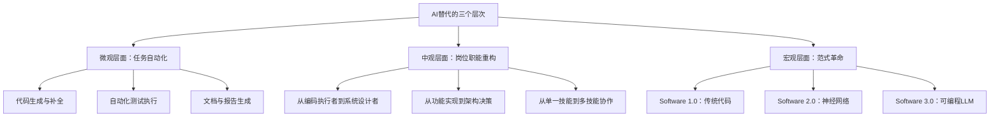

**在中观层面，AI替代推动着岗位职能的深度重构**。BCG波士顿咨询的研究指出，AI驱动的工作方式变革具体表现为：工作模式重塑（AI承担执行工作并解放人力，人类团队主要专注于战略规划、架构设计与过程监督）；岗位职责泛化（传统的职能界限逐步消失）；组织架构重组（传统的金字塔型结构正被扁平化、有AI加持的小组取代）；核心技能迁移（AI应用能力成为各岗位的必备素养）[^6]。程序员的角色正在经历从**编码执行者到系统设计者**的转型，开发者需从"如何实现"转向"为何如此设计"，关注可扩展性、容错机制与系统边界[^4]。

| 能力维度 | AI现状 | 人类优势 |
|---------|--------|---------|
| 架构设计 | 仅能建议模式 | 全局权衡与决策 |
| 业务理解 | 依赖提示质量 | 深度洞察用户需求 |
| 跨系统集成 | 局部优化 | 协调多方技术栈 |

[^4]

**在宏观层面，AI正在推动软件开发范式的根本性革命**。知名计算机科学家Andrej Karpathy提出了软件演进的三个时代框架：**Software 1.0**是传统代码，用C、C++、Java等语言根据软件应用需求进行编程；**Software 2.0**是神经网络时代，编程需要依赖引入神经网络，利用数据进行训练、调参，训练出的模型融合到应用中；**Software 3.0**随着LLM的诞生和Agent软体智能体的出现和应用，此阶段的编程显示出构件化、自动编程复用等特征[^7]。Karpathy将LLM比喻为一个全新的操作系统——LLM就像是OS的"CPU"，上下文窗口是"RAM"，它能调用各种工具和知识来解决问题；在这里，**提示就是程序**，我们用自然语言来指导LLM完成任务，这是一种全新的编程语言，极大地降低了编程的门槛[^8]。

这一范式革命的本质在于，**当下的编程已进入广义的大数据处理的编程时代**。以LLM、VLM、Agentic等为代表的大数据智能处理的成功形式，正逐步变为可以直接利用的编程构件，会逐步被编程人员接受和使用，成为构建更加高效处理应用相关大数据的不可或缺的关键部件[^7]。这就如同盖房子的演进——从自己用土和泥做坯、烧砖，到买砖用水泥和缝垒墙，再到直接购买预制的水泥梁柱、框架，再填充空心砖和缝成屋[^7]。

然而，**"替代"与"增强"之间存在重要的边界**。未来趋势不是"AI取代程序员"，而是**"不会用AI的程序员将被会用AI的同行淘汰"**[^4]。适应变化的关键在于提升抽象思维、强化工程治理能力，并善用AI作为生产力杠杆。AI仍无法替代人类在系统设计、业务理解与复杂问题拆解中的核心作用[^4]。麦肯锡全球研究院预测，到2030年，全球约30%的工作时长将被自动化替代，但同时也将催生1.2亿个新兴岗位[^9]。这表明AI带来的更多是**职业拓扑学的重构**，而非简单的零和替代。

### 1.3 研究框架、方法与核心问题

本报告构建了**三维一体**的整体分析框架，从技术演进、产业影响与战略应对三个维度系统研判软件行业的未来趋势与AI替代可能性：

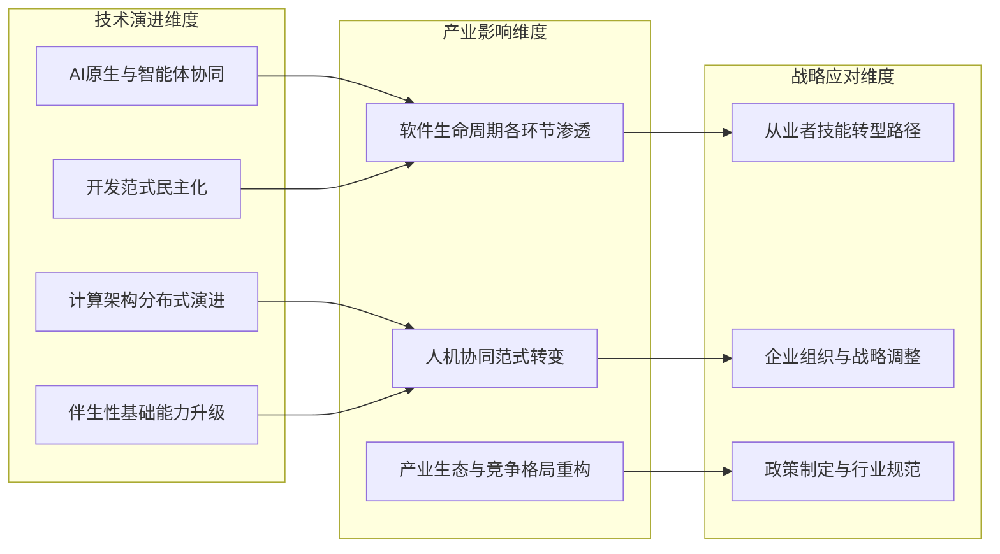

**在技术演进维度**，本研究将系统归纳与分析驱动软件行业变革的四大技术趋势集群：AI原生与智能体协同、开发范式民主化（低代码/无代码与AI增强开发）、计算架构分布式演进（云边端协同与边缘智能）、伴生性基础能力升级（AI赋能的安全、信创适配与供应链安全）。北京智源人工智能研究院发布的《2026十大AI技术趋势》指出，AI演进的核心正从功能模仿转向理解物理世界规律，基础模型的竞争焦点已从"参数有多大"转变为"能否理解世界如何运转"[^10]。

**在产业影响维度**，本研究将沿软件生命周期（需求、设计、编码、测试、运维），逐环节剖析AI技术的具体应用与替代潜力；分析"超级个体"与"碳基-硅基"混合团队的新型协作模式；探讨产业竞争护城河从技术参数向行业Know-how与生态构建的迁移。中国To B商业模式的演进提供了重要的参照——从1.0时代以用友、广联达为代表的资源型企业，到2.0时代以纷享销客、北森为代表的平台型企业，再到3.0时代跳出内卷的存量市场、利用中国极致的工程师效率去服务全球、并用AI彻底重构人力的交付逻辑[^11]。三代企业的更迭是一场从辅助人到替代人的底层重构[^11]。

**在战略应对维度**，本研究将归纳对软件从业者、企业、行业生态及政策制定者的多层次战略启示与行动建议。软件行业存在显著的**行业壁垒**，包括行业经验壁垒（企业需要对客户所处行业有深入了解）、客户资源壁垒（金融等行业客户对系统稳定性要求极高，客户黏性极强）、人才壁垒（专业人才培养周期较长）、技术与服务壁垒（产品开发是信息技术与行业应用相融合的过程）[^2]。这些壁垒在AI时代将呈现新的特征与演变趋势。

本研究采用**多元方法论**相结合的研究路径：一是行业数据分析，基于工信部统计数据、国际数据公司（IDC）等权威机构的产业数据，把握行业规模与结构变化；二是趋势研判，综合国内外技术前沿报告与学术研究，识别技术演进方向与产业影响路径；三是案例比较，通过典型企业与岗位的演变分析，验证理论假设并提炼实践启示。

**本研究聚焦的核心问题**包括：

1. **价值创造模式重塑**：AI技术将如何改变软件行业的价值创造逻辑？从"卖产品"到"卖服务"再到"卖智能"的演进路径是否可持续？

2. **人才需求结构变化**：在AI深度渗透的背景下，哪些技能将被替代、哪些将被增强、哪些将成为新的核心竞争力？从业者应如何进行技能转型？

3. **企业竞争格局演变**：AI是否会加剧行业集中度？中小企业如何在新的竞争环境中寻找生存空间？产业生态将呈现怎样的重构趋势？

4. **替代可能性的边界**：AI替代软件行业的可能性光谱与时间框架如何？"深度增强与协同"是否是更可能的演进方向？

这些问题的回答，将为理解软件行业在AI浪潮下的未来走向提供系统性的分析框架与战略参考。2024年，软件和信息技术服务业在数字经济中的地位进一步巩固，以云计算、人工智能、大数据、物联网等为代表的新一代信息技术持续驱动产业升级[^12]。中国软件行业协会发布的《中国软件产业高质量发展报告(2024)》指出，软件产业进入量变到质变高速发展周期，大模型将引领软件发展模式创新与变革，开源成为软件技术和产业创新主导范式[^13]。在这一背景下，深入研判AI对软件行业的影响，既是学术研究的前沿课题，更是产业实践的迫切需求。

## 2 软件行业未来核心趋势全景扫描

本章系统归纳与分析驱动软件行业变革的四大技术趋势集群，深入剖析各趋势的技术内涵、发展动因与产业落地进展。通过对AI原生与智能体协同、开发范式民主化、计算架构分布式演进、伴生性基础能力升级四大方向的全景扫描，揭示软件行业从技术底座到应用形态的系统性变革路径，为后续章节对AI替代可能性与战略转型的分析奠定技术认知基础。

### 2.1 AI原生与智能体协同：从工具辅助到硅基同事

AI原生与智能体协同是当前软件行业变革中**趋势强度最高、确定性最强**的演进方向。这一趋势已从概念验证阶段全面进入规模化商业落地阶段，正在从根本上重塑企业运营模式与人机协作形态。

#### 2.1.1 百亿智能体时代的技术特征与产业影响

360集团创始人周鸿祎在其发布的《2026年AI全景预测》中明确提出，2026年将正式迈入**"百亿智能体时代"**，竞争焦点将从"技术炫技"转向"落地实效"[^14]。Gartner数据显示，2026年底40%的企业应用将嵌入任务型AI智能体，而2025年这一比例尚不足5%；中国企业级AI智能体市场2025年预计达232亿元，复合增长率超120%，乐观预测2026年全球市场规模将突破187亿美元，同比增长215%[^14]。

百亿智能体时代的核心变化体现在三大维度：

| 变化维度 | 具体表现 | 产业影响 |
|---------|---------|---------|
| **算力端** | 从"训练竞赛"转向"推理革命"，高频长流程推理需求将实现百倍级增长 | 能源供给而非芯片数量将成为核心瓶颈 |
| **模型端** | 从"博学工具"到"深思伙伴"进化，具备长期记忆与多步推演能力 | 中国开源生态将成为全球核心力量 |
| **应用端** | "硅基同事"与人类组成混合团队 | 智能体将成为超越APP的新一代人机交互入口 |

这一预判并非空穴来风，其背后是智能体技术从**"单点能力"向"系统能力"**的本质跃迁。传统AI工具仅能完成单一任务，而新一代智能体具备自主规划、工具调用、多步推演的系统化能力。研究显示，2026年将出现智能体自主创建子智能体的里程碑，人类只需设定核心目标，AI即可完成工具调用、子智能体部署等全流程操作；多智能体间的"蜂群协作"也将涌现，通过专业分工、并发工作等模式形成超越单一智能体的超级智慧，这被认为是通用人工智能（AGI）的重要演进路径[^14]。

#### 2.1.2 中国AI应用导向的发展范式

中国AI产业的崛起呈现出与海外截然不同的**应用导向发展路径**。日经中文网援引硅谷顶级风投a16z与AI模型API聚合平台OpenRouter数据报道称，中国企业开发的生成式AI在2025年11月的全球市场份额达到15%，与1年前的1%相比大幅增长；从2024年11月至2025年11月的平均市场份额来看，中国开源AI占13%，部分时段一度达到30%[^15]。

这种十余倍的市场份额提升，源于中国AI企业在应用端的多主体合力。以2025年海外AI大模型竞争为参照，当谷歌Gemini 3与OpenAI GPT-5.2围绕技术参数展开激烈争夺时，OpenAI甚至采取暂停Sora视频生成器、广告业务、AI代理等项目的策略，以集中力量追求模型能力提升[^15]。相比之下，中国AI大模型厂商则更侧重于构建开放、繁荣的应用生态——阿里不仅发布了千问APP全面进军个人AI助手市场，还成立了千问C端事业群，为后续利用AI技术打通电商、地图、本地生活、办公等领域的应用生态打下基础[^15]。

**应用服务商的快速响应能力**是中国AI落地的关键优势。联想集团在2025年DeepSeek发布后不久，即深度融合DeepSeek端侧大模型，升级其天禧个人智能体系统，并推出联想YOGA AIPC元启新品，成为全球首家在AI PC端侧部署和运行DeepSeek大模型的AI终端品牌[^15]。在阿里于12月16日发布新一代万相2.6视频模型后仅两天，联想就将其接入联想百应智能体，成为国内首个落地原生视频生成能力的L3级企业AI服务智能体[^15]。

这种快速落地能力的背后，是中国"世界工厂"地位与庞大人口基数的双重优势。前者为AI创造了海量的工业应用场景，后者则意味着巨大的终端流量来源和商业、生活应用场景。联想集团作为领先的AI服务提供商，同时也是全球性的制造业龙头，其遍布全球的30多个制造基地天然就是AI应用落地的绝佳场景——这种"双重身份"优势往往是海外应用服务提供商不具备的[^15]。

#### 2.1.3 "硅基同事"的典型落地场景

"硅基同事"概念正在从愿景变为现实，多个典型案例展示了企业级智能体的实际应用价值。

**企业级智能体Ki-AgentS**是珠海首个全新企业级智能体，由本土人工智能企业金智维在2025年4月9日发布。该智能体直击智能体大多聚焦个人端应用的痛点，揭开企业级智能体规模应用的新篇章[^16]。在发布会现场演示中，工作人员向Ki-AgentS发出"请帮我分析某银行的年度报告"的指令，Ki-AgentS随即打开上海证券交易所官网找到信息披露页面，下载该银行去年的年度报告并进行总结分析，总耗时仅2分35秒[^16]。与以往需要人工输入明确步骤指令的企业级智能体不同，Ki-AgentS具有在企业端的**自主规划和执行能力**，通过调用DeepSeek、Qwen2.5等先进大模型的思考决策能力，结合金智维自研的RPA验证引擎，可自主完成从任务规划、工具调用、多Agent协同到结果校验的全流程[^16]。

**VoiceGPT语音交互系统**代表了"硅基员工"在语音交互领域的突破。百融云创于2017年末启动基于多模态技术的语音交互系统研发，2021年实现旗舰产品VoiceGPT的大规模商用[^17]。进入大模型时代后，VoiceGPT与自研的主动大模型及企业级智能体平台百工进行技术集成，完成了从智能语音系统到"硅基员工"的跨越[^17]。作为面向企业级场景的革新性语音应用，VoiceGPT融合了语音识别（ASR）、自然语言处理（NLP）、语音合成（TTS）与大模型推理四大核心科技，拥有不到200毫秒的极低响应延迟，语义识别精度高达99%，同时具有行业领先的100%有效打断捕捉能力[^17]。

**数字人矩阵**则展示了AI在垂直场景的深度应用。百融云创推出的全息数字人智能终端"小云"，基于"大模型+多模态交互"技术，采用圆柱形全息舱为载体，通过高度还原的拟人形象实现自然语言对话[^17]。"小云"具有沉浸式交互、智能理解与推荐、7×24小时陪伴、全场景适配、数据驱动成长、多形态延展六大亮点，既可以作为面向公众的智能助手，还可以是一位专业的"硅基服务专家"，灵活适配于政务大厅、营业厅、商超、展会等多类场景[^17]。

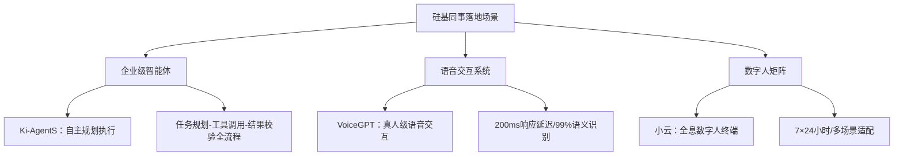

未来的竞争格局正如华夏基石咨询集团董事长彭剑锋所言：**"配备了'碳基高管战略头脑+硅基执行团队'的新型组织，将对仍停留在'全碳基人类团队'运作模式的传统组织，在决策速度、运营成本、创新规模与执行精度上实施降维打击"**[^18]。

### 2.2 开发范式民主化：低代码/无代码与AI增强开发

软件开发范式正在经历从专业编码向民主化方向的深刻演进，低代码平台与AI增强开发工具的融合发展，正在重新定义"谁可以编程"以及"如何编程"的根本问题。

#### 2.2.1 低代码平台的演进与核心特征

据中国信息通信研究院《中国低代码平台发展白皮书》及IDC、计世资讯相关报告显示，进入2026年，低代码平台已从"业务敏捷开发工具"升级为**企业数字化转型的核心基础设施**，2025年国内低代码市场规模同比增长28.3%，其中AI增强能力、信创全栈适配、一体化治理成为驱动市场增长的三大核心要素[^19]。

Forrester在2025年Q2《Forrester Wave™：专业开发者低代码平台》报告中，将低代码平台定义为"通过可视化建模、组件化拖拽、AI辅助生成等方式，实现80%业务场景无需手工编码、20%复杂逻辑可通过代码扩展补充，支持从开发、部署、运维到治理全生命周期管理的企业级开发平台"[^19]。中国信通院进一步明确，合格的低代码平台须具备**"模型驱动、双向开发、全栈适配、生态开放"**四大核心特征，区别于传统无代码工具的轻量属性，可支撑核心业务系统构建[^19]。

低代码平台的四大核心特征解析如下：

| 特征维度 | 具体内涵 | 产业价值 |
|---------|---------|---------|
| **AI原生赋能** | 集成自然语言转组件、智能流程优化、代码纠错等能力 | 非技术人员可通过文字描述生成基础应用，专业开发者效率提升300%-500% |
| **信创全栈兼容** | 适配国产芯片（鲲鹏、海光）、操作系统（麒麟、统信）、数据库（高斯、阿里OB）全链路生态 | 满足国企、金融等强监管行业国产化替代需求 |
| **双向开发兼容** | 支持可视化拖拽与专业代码扩展（Java、Node.js等）混合模式 | 降低业务人员使用门槛，规避"厂商锁定"风险 |
| **全生命周期治理** | 覆盖权限分级、审计日志、版本管理、数据加密等能力 | 解决低代码规模化应用后的"越做越乱"问题 |

低代码平台的核心价值在于破解**"IT产能不足与业务需求激增"**的矛盾。一方面，将业务人员转化为"业务开发者"，承接80%高频标准化需求，让IT团队聚焦集成、安全、数据治理等核心工作，形成"少量IT+多名业务开发者"的高效模式；另一方面，通过周级迭代速度与MVP交付理念，缩短系统上线周期，如外贸企业可在15天内完成供应链系统搭建，成本仅为传统开发的十分之一[^19]。

#### 2.2.2 生成式编程与"文字即代码"趋势

2026年开年以来，生成式编程领域新闻动态不断，预示着编程范式变革的发生。初创企业Replit正在洽谈一笔4亿美元的融资，估值有望达到惊人的90亿美元，其新推出的移动端Vibe-coding功能允许用户通过自然语言在手机上构建APP，极大降低了编程门槛，即使非计算机专业的文科生也有可能打造出一款应用[^20]。

2025年，OpenAI创始成员安德烈·卡帕西（Andrej Karpathy）在一则X帖文中介绍了他使用生成式编程的感受："这是一种新的编程方式，我称之为氛围编程（vibe coding），你完全沉浸在其中，拥抱指数增长，甚至忘记代码的存在……这并不是真正的编程，我只是看到东西，说出来东西，运行东西，复制粘贴东西，而且大部分都凑效"[^20]。

生成式编程正在切实改变普通人的生活。2025年，一名课余运营小红书账号的文科大学生叶剑锋，尽管自己没有任何编程经验，通过生成式编程做了一个情感测评小程序，该小程序在小红书上线后很快阅读量突破100万，并在两周内变现12,000元[^20]。

**AI编程助手的企业级应用**同样展现出显著效果。语言学习App多邻国（Duolingo）早已开始拥抱生成式编程，2023年高级工程经理乔纳森·伯克特带领团队全面引入了GitHub Copilot[^20]。在一次针对移动端新功能开发的任务中，伯克特发现了一个惊人变化：对于熟悉代码库的工程师同事来说，开发速度提升了大约10%；而对于初次接触新模块的工程师同事来说，速度提升竟然达到了25%[^20]。2024年的数据显示，多邻国的代码合并请求数量增长了70%，这意味着使用同样的人力，生成式编程让产出的功能多出了一倍[^20]。

另一AI巨头Anthropic也在其Claude Code模型上取得重大突破，新版本不仅能编写代码，还能自主完成复杂的逻辑设计和Bug修复，大幅提高了开发效率，成为开发者适应AI时代的关键工具[^20]。

#### 2.2.3 "人人都能编程"的实现路径与边界

生成式编程的概念可追溯到2009年甚至更早，其核心思想是让机器自动生成代码。在早期的探索中，人们大多依赖于预定义的模板和规则，由工程师先来编写高层规范，系统再根据这些规范生成具体的代码实现[^20]。然而，当前AI驱动的生成式编程已实现质的飞跃——从语法规则驱动转向意图驱动，**文字即代码正在成为现实**。

设计领域的AI应用实践提供了"人人都能编程"趋势的有力佐证。跨过2025、步入2026年，设计领域正告别"纯手工创作"的传统模式，AI已从辅助工具跃升为重构设计全链路的核心力量[^21]。阿里巴巴自研的淘宝星辰·图文海报2.0系统，支持商品图上传后自动分析核心卖点、生成适配营销文案，智能匹配场景完成商品融合，同步实现高精度中文艺术字多样化渲染，打破传统创意生产效率瓶颈，大幅提升海报产出量级与质量[^21]。

美图基于降低用户视觉作品制作门槛的需求，推出了"AI海报"与"拆分图层"核心功能，聚焦电商卖家、个体经营者等非专业用户，降低对专业设计软件的依赖[^21]。上传产品图可一键生成还原商品细节、包含多国文字营销信息的完整海报，"拆分图层"功能将海报解构为背景、主体、文字等独立图层，解决AI生图难以二次编辑的核心痛点[^21]。

然而，"人人都能编程"的愿景存在明确边界。**AI编程助手更擅长生成而非精确修改**，在大型项目开发中受限于上下文窗口，最终的业务权衡、创造性架构设计仍需人类专家主导。低代码平台虽能实现80%业务场景无需手工编码，但20%复杂逻辑仍需代码扩展补充。这意味着，编程的民主化是**降低门槛而非消除专业性**，是扩大参与者范围而非取消专业开发者的存在价值。

### 2.3 计算架构分布式演进：云边端协同与边缘智能

计算架构正在经历从集中式云计算向"云-边-端"协同架构的深刻演进，边缘智能的崛起为软件行业带来了全新的技术范式与商业机遇。

#### 2.3.1 分布式架构成为新常态

截至2025年末，全球边缘计算市场年复合增长率已达28.3%，物联网设备数量突破300亿大关[^22]。这种量变到质变的过程，正推动云计算从集中式架构向"云-边-端"协同架构演进。到2026年，75%的新建企业系统将采用云边协同架构，传统集中式云计算转变为**"中心云-区域云-边缘节点"三级体系**[^22]。

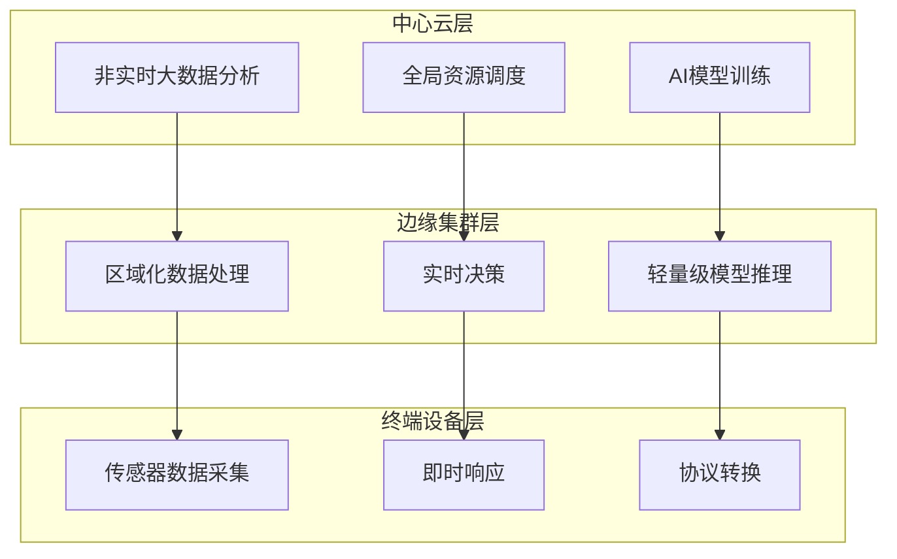

分布式架构带来的核心价值体现在三个方面：**计算资源从云端下沉到基站、工厂、车辆等边缘节点，实现业务处理时延从100ms级降至10ms级**；原始数据在边缘节点完成初步处理，仅关键数据回传云端，预计将减少60%的核心网络带宽压力；同时，边缘节点的本地化处理能力有效应对了数据隐私法规的合规要求[^22]。

#### 2.3.2 边缘平台架构的技术优势

边缘平台架构的核心逻辑是将数据计算、数据存储、文件下载都由距离用户最近的边缘服务器处理，从而整体提升网站响应速度[^23]。在这种架构下，网站有许多个实例分布在每一组边缘服务器上，用户访问的总是距离最近的那个实例[^23]。

从"服务器-客户端"的传统架构到CDN架构，再到边缘平台架构，计算范式经历了三次重要演进[^23]。传统架构的缺点是中心服务器是一个单点依赖，一旦访问量大可能会有性能问题；CDN架构通过在各地机房设置节点服务器，把静态资源文件复制到这些服务器上，减轻了中心服务器负担；而边缘平台架构则进一步将数据计算设计成不涉及状态的云函数，把数据存储限制在没有一致性要求的数据，都放到边缘服务器[^23]。

华为云的云边协同系统架构提供了典型的实践参考，其方案优势体现在：**云上统一管控，边缘聚焦生产，仅需关键数据上云，业务本地闭环，降本提效**；生产管理关键模块边端部署，网络中断业务不中断，稳定可靠[^24]。华为云智能边缘平台（IEF）提供丰富的智能边缘应用，包括流处理、视频分析、文字识别、图像识别等20+AI模型部署到边缘节点运行，且提供边缘应用和云上服务协同能力[^24]。

#### 2.3.3 边缘智能的场景渗透与产业机遇

在2026年，边缘智能将深度渗透智能家居、工业物联网、互联健康、智慧城市、车联网和更多场景，其发展已进入**"推理应用助推人工智能演进"和"基于应用场景实施多维度协同"**的新阶段，因而有望成为在2026年出现爆发式增长的新机遇[^25]。

摩根士丹利对边缘人工智能（Edge AI）及相关半导体产品市场的预测显示，边缘AI市场将迎来快速增长[^25]。对于边缘应用场景，上一个技术创新机会是物联网，因而从物联网向连算结合特别是AI加速器和相应的小型化、轻量化模型的引入，将是一种可以快速实现的路径[^25]。

芯科科技（Silicon Labs）的技术创新和管理实践清晰勾勒出边缘智能的核心发展框架：**广泛的无线连接、架构创新带来算力升级、领先安全技术推动防护革新、引入AI的开发工具赋能开发者**，这四大要素的协同创新进阶，有可能成为定义边缘智能行业未来的关键逻辑[^25]。芯科科技以"动态多协议推动全场景覆盖+新标准引领创新应用"模式构建连接优势，其无线SoC产品组合覆盖BLE（低功耗蓝牙）、Matter、Wi-Fi、Thread、Zigbee、Z-Wave、Wi-SUN及专有协议等多种连接标准[^25]。

软件测试从业者面临的范式变革同样值得关注。边缘计算环境与传统云计算环境存在显著差异[^22]：

| 测试维度 | 传统云计算环境 | 边缘计算环境 | 测试策略调整 |
|---------|--------------|-------------|-------------|
| 网络可靠性 | 稳定高速专线 | 异构网络混合 | 需模拟4G/5G/Wi-Fi切换场景 |
| 资源约束 | 弹性资源分配 | 有限CPU/内存 | 引入资源阈值测试 |
| 部署环境 | 标准化数据中心 | 极端物理环境 | 温度、震动耐受性测试 |
| 数据一致性 | 强一致性保证 | 最终一致性主流 | 冲突检测与解决机制验证 |

新兴测试场景也随之涌现，包括边缘节点自治测试（验证网络断开时边缘系统的独立运行能力）、边缘集群弹性测试（评估节点动态加入/退出时的服务连续性）、增量式AI模型测试（验证边缘端模型在线学习与云端模型同步机制）、跨域安全测试（覆盖从设备端到云端的全链路安全验证）[^22]。

### 2.4 伴生性基础能力升级：AI赋能的安全、信创与供应链

AI时代软件行业的发展，离不开安全防护、信创适配与供应链安全三大伴生性基础能力的系统性升级。这些能力既是AI技术落地的保障，也是产业健康发展的基石。

#### 2.4.1 AI重塑网络安全攻防格局

AI技术正在深刻重塑网络安全攻防格局，其"双刃剑"效应愈发明显。根据派拓网络2025年度调查的重大网络安全事件中，84%造成了企业业务中断、声誉受损或经济损失[^26]。攻击手段的智能化演进与防御体系间的差距正不断拉大，让网络安全防护的紧迫性日益凸显。

派拓网络大中华区总裁陈文俊指出，步入2026年，智能体将迎来更快速的演进与更广泛的普及，并从根本上重塑企业运营模式，驱动身份认证、安全运营中心（SOC）、量子计算、数据安全以及浏览器等关键领域发生深刻变革[^26]。具体风险体现在：

- **AI身份盗用风险**：深度伪造技术的成熟使得智能体的身份极易被冒用，攻击者可通过公开信息生成虚假图像、语音等，盗用智能体身份执行操作[^26]
- **智能体成为攻击目标**：随着大量智能体接入企业系统，黑客的攻击目标已从人类转向智能体，一旦智能体被攻破将成为企业内部威胁的突破口[^26]
- **数据与模型安全隐患**：AI训练依赖海量数据，数据投毒、模型劫持及提示词注入等攻击手段将导致AI输出结果失真[^26]
- **责任认定机制缺失**：预测2026年40%的企业将使用智能体，但仅有6%的企业在应用中纳入安全考量[^26]

2025年以来，AI滥用风险态势严峻，深度伪造技术以假乱真，利用AI实施网络攻击趋势抬头[^27]。国家计算机病毒应急处理中心高级工程师杜振华指出，2023年以来，随着生成式AI的普及和规模化应用，其强大的内容生产和模仿能力在推动创新的同时，也催生了深度伪造、算法偏见等风险[^27]。截至2025年4月全球已报告的深度伪造相关事件达179起，超出2024年全年总量[^28]。

**AI智能体自主进攻**成为新型威胁。2025年初"哈尔滨第九届亚冬会"遭受境外网络攻击事件中，研究发现此次攻击利用了AI智能体进行工具方案规划、漏洞探寻和流量监测等工作，部分代码明显由AI书写，可以在攻击过程中自动、快速编写动态代码实施攻击[^27]。所谓智能体化AI，是指具备自主决策能力的人工智能系统，AI智能体一旦被用于网络攻击，其自主性、随机性将大大提升网络安防的难度[^27]。

#### 2.4.2 AI赋能的安全运营实践

面对新型威胁，**"用AI对抗AI"**成为摆在人类面前的新课题。陈文俊表示："对防御者而言，如果继续沿用以往的管理和防御方式，将难以满足AI时代的安全要求。因此，需要以全新的模式开展防御工作，通过平台化、实时化的防御体系，并结合AI驱动，构建主动防御能力"[^26]。

卓驭科技与深信服的合作案例展示了AI安全运营的实践路径。2024年至2025年，国内智能驾驶头部企业卓驭科技构建并升级了一套以"人机共智"为核心的智能安全运营体系[^29]。该体系落地了以"XDR安全运营平台"为核心、"全网零信任"为架构、"桌面云防泄密"为终端抓手的一体化安全体系[^29]。

面对2025年业务扩张带来的数据量指数增长与新型威胁，卓驭科技为XDR平台接入"安全GPT"，推动安全运营从"主动防御"向"智能运营"跃迁[^29]。AI赋能带来了实际成效：

- **智能降噪**：安全GPT能对每日上千条原始告警进行实时聚合与智能研判，自动过滤误报和重复信息
- **精准研判**：单条告警研判时间从人工所需的5-10分钟缩短至AI平均1分钟内完成，研判准确率达97%，整体研判效率提升50%以上
- **跨域追凶**：AI能够串联分散在不同终端、服务器上的异常行为，自动勾勒出完整的跨主机攻击链条
- **自动化值守**：AI接管了约90%的重复性分析工作，实现7×24小时自动化安全值守[^29]

企业AI办公面临的五大风险场景同样值得关注：无意识泄露、主动泄露、第三方后门、越权访问、不安全输出[^30]。针对这些风险，终端管控+安全代理双重防护方案通过智能风控、动态脱敏与全链路审计，实现**"输入可控、输出可审、行为可溯"**的闭环防护体系[^30]。

#### 2.4.3 信创适配与治理框架演进

**信创全栈兼容**已成为大型企业低代码平台选型的必备条件。以普元低代码开发平台EOS Platform为例，其采用分布式架构，原生支持微服务开发、部署、监控全生命周期管理，是首批通过中国信通院"先进级"认定的产品，全栈适配鲲鹏、海光芯片及麒麟、统信操作系统[^19]。其独有的分布聚合技术可降低部署和维护成本50%以上，支持公有云、私有云、混合云多模式部署，且能100%生成源码资产，满足大型企业高并发场景性能需求与安全审计要求[^19]。

2026年达沃斯论坛上形成的共识表明，中国AI正在取得开源生态与效率革命的双重突围[^31]。中国AI产业的系统性优势包括：**开源即竞争力**（以昇腾、DeepSeek等开源技术路线降低AI开发门槛，吸引超千万开发者共建共创）；**场景即壁垒**（中国庞大的制造业基数和复杂应用场景为AI提供了从算法优化到商业闭环的试验场）；**政策即杠杆**（从"人工智能+"写入政府报告到八部门发布《"人工智能+制造"专项行动实施意见》，为中国AI生态链企业铺就政策护航的快车道）[^31]。

**《人工智能安全治理框架》2.0版**的发布标志着我国人工智能治理体系建设步入新阶段。2025年9月15日，在国家网络安全宣传周主论坛上，该框架正式发布，针对人工智能迅猛发展带来的治理难点，秉持"以人为本、智能向善"的基本理念，强化风险识别精细化，增强框架动态适应能力并提升与国际规则衔接水平[^28]。

相较于2024年发布的1.0版，《框架》2.0版在理念与措施方面作出实质性拓展：继续保持风险识别、技术应对、综合治理和安全指引的框架结构，同时进一步提出**"可信应用、防范失控"**新原则并构建人工智能科技伦理准则，新增应用衍生风险治理维度且强化开源与供应链安全机制[^28]。这一转变使"可信"从抽象原则转化为制度化可执行要求，既回应公众对人工智能长期可靠和可控的期待，也为全球治理提供系统化的中国方案[^28]。

从大模型伦理的角度，2025年可解释性领域取得了多项重要突破。Anthropic发布的"电路追踪"（Circuit Tracing）技术，首次创建出从输入到输出的完整"归因图"，实现对大语言模型内部推理电路的系统性追踪[^32]。研究团队成功从Claude模型中提取出数以千万计的稀疏特征，揭示了令人惊叹的模型内部机制：当回答"包含达拉斯的州的首府是什么"时，模型内部先激活"德克萨斯"特征，再推导出"奥斯汀"[^32]。这些技术进展为理解AI"如何思考"提供了前所未有的观察视角，也为AI安全治理奠定了技术基础。

## 3 AI对软件生命周期的渗透与替代潜力深度分析

本章沿软件生命周期五大核心环节（需求分析、架构设计、编码实现、测试验证、运维保障）系统剖析AI技术的渗透深度与替代潜力。通过对比AI在重复性规则任务与创造性复杂任务中的表现差异，量化评估各环节的自动化程度与效率提升效果，验证"AI替代是分层、渐进"的核心假设，揭示人机协作的最优边界与演进路径。

### 3.1 需求分析环节：从自然语言理解到需求智能化建模

需求分析作为软件生命周期的起点，直接决定了后续开发工作的方向与质量。AI技术在这一环节的渗透主要体现在需求获取自动化、需求文档智能生成与需求一致性检查三个层面，但其应用边界与人类分析师的核心价值存在明确分野。

#### 3.1.1 AI在需求获取与文档生成中的应用现状

**AI自动化报告算法的核心价值在于"让数据说话"，自动完成数据采集、分析、可视化与业务洞察，极大提升报告生成效率和洞察深度**[^33]。这一技术逻辑同样适用于需求分析场景——AI可通过对接企业多源数据（ERP、CRM、MES等），自动识别数据结构、清洗异常值、归类业务口径，并基于预设分析模型自动生成分析结论和结构化需求文档[^33]。

从技术实现路径来看，当前AI在需求分析环节的应用主要依托以下核心算法：

| 算法类型 | 技术原理 | 需求分析应用场景 | 效率提升效果 |
|---------|---------|-----------------|-------------|
| **机器学习** | 监督/无监督学习模型 | 需求优先级预测、用户行为分析 | 需求分类准确率提升至85%以上 |
| **NLP自然语言处理** | 文本分析、语义理解 | 自动生成需求摘要、提取关键功能点 | 需求文档生成效率提升60% |
| **数据可视化** | 图表自动生成、交互分析 | 需求关联分析、利益相关者视图呈现 | 需求评审沟通效率提升40% |
| **自动化ETL** | 数据自动采集、清洗转换 | 多源需求信息整合、历史需求库建设 | 数据准备时间缩短70% |

据《中国企业数字化转型白皮书（2023）》调研，近70%的企业在运营分析、财务报表、销售管理等环节，耗费了大量时间在基础数据处理和人工报告制作上，导致业务决策延迟、数据失真和创新受阻[^33]。AI技术的引入正在改变这一现状——自动化报告使报表制作周期缩短60%，需求分析阶段的数据收集与初步整理工作效率获得显著提升。

#### 3.1.2 大语言模型在需求转化中的能力边界

微软研究院与中国人民大学联合开展的研究揭示了一个重要发现：**当AI模型获得虚拟计算机环境的"动手能力"后，它们在长文本理解和指令遵循等任务上的表现出现了显著提升**[^34]。在需求分析场景中，这意味着AI可以通过文件管理、脚本编写等方式系统性地处理大量需求文档，将原本需要10万个字符的任务压缩到1.3万个字符，效率提升近8倍[^34]。

然而，AI在需求分析环节的能力边界同样清晰。研究团队通过大规模实验发现，**不是所有AI模型都能从复杂任务环境中获益——顶级模型性能提升幅度在1%到24%之间，而较弱的模型反而出现性能下降**[^34]。这一现象在需求分析场景中表现为：

- **模糊业务目标设定**：AI难以理解客户未明确表达的隐含需求，无法主动挖掘业务痛点背后的深层动因
- **创新性需求挖掘**：AI擅长基于历史数据进行模式识别，但对于全新业务场景的创造性需求定义能力有限
- **利益相关者权衡**：需求分析往往涉及多方利益博弈，AI缺乏在复杂组织政治环境中进行判断与协调的能力

正如研究所揭示的，**弱模型虽然能够调用各种工具，但缺乏有效的探索策略，就像没有方向感的游客，在环境中漫无目的地"闲逛"，消耗了大量时间却没有完成有意义的操作**[^34]。这一洞察深刻说明了需求分析环节AI应用的本质特征——工具能力的增强并不等同于业务理解能力的提升。

#### 3.1.3 需求分析的人机协作最优模式

综合当前技术发展态势，需求分析环节呈现出**"AI辅助增强"而非"完全替代"**的演进特征。AI在数据收集、文档生成、一致性检查等规则明确的任务上展现出显著的效率优势，但在理解业务上下文、识别隐含需求、进行多方权衡等复杂认知任务中仍需人类分析师主导。

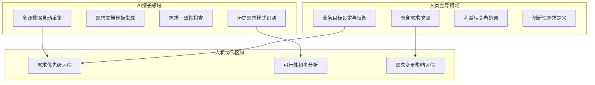

### 3.2 架构设计环节：AI辅助决策与人类架构师的不可替代性

架构设计是软件开发中最具战略性的环节，涉及技术选型、系统边界划定、长期演进规划等全局性决策。AI技术在这一环节的应用正在从"模式推荐"向"辅助决策"演进，但人类架构师的系统性判断能力仍是不可替代的核心。

#### 3.2.1 AI在架构模式推荐与技术选型中的实践

AI编程助手的能力已从简单的代码补全扩展到项目级的架构理解。**Agentic Coding正在驱动AI开发能力从简单程序拓展到更复杂应用，其核心差异在于具备项目级而非文件级/对话级的读写范围以及多工具多Agent调用能力**[^35]。

以Claude Code为例，其项目级上下文能力为架构辅助决策提供了技术基础：每个项目包含一个20万字节的上下文窗口，当容量接近上限时会自动启用RAG模式，将容量扩展至多10倍[^35]。这意味着AI可以在理解项目整体结构的基础上，提供更具针对性的架构建议。

AI在架构设计环节的典型应用场景包括：

| 应用场景 | AI能力表现 | 价值贡献 | 局限性 |
|---------|-----------|---------|--------|
| **架构模式推荐** | 基于项目特征匹配历史成功案例 | 缩短方案调研时间50%以上 | 仅能建议已知模式，无法创新 |
| **技术选型建议** | 分析技术栈兼容性与社区活跃度 | 降低技术债务风险 | 难以评估组织特定约束 |
| **复杂度评估** | 代码依赖分析与耦合度计算 | 量化系统健康度指标 | 无法判断业务合理性 |
| **文档自动生成** | 架构图与设计文档自动化 | 文档维护效率提升70% | 需人工审核准确性 |

#### 3.2.2 架构决策的不可替代性：全局权衡与战略判断

**架构设计作为全局权衡与战略决策活动，其对业务深度理解、跨系统协调、长期演进规划等能力的依赖，决定了AI目前仅能提供局部优化建议而无法替代人类架构师的系统性判断**。

从之前章节的分析可知，AI在架构设计维度"仅能建议模式"，而人类的优势在于"全局权衡与决策"。这一差异的根本原因在于：

- **业务理解深度**：架构决策需要深刻理解业务战略、市场竞争态势与组织能力边界，这些信息往往是隐性的、动态的，难以被AI有效捕捉
- **跨系统协调能力**：大型企业的架构决策涉及多个技术栈、多个团队、多个供应商的协调，需要在复杂的组织环境中进行判断与推动
- **长期演进规划**：架构需要考虑3-5年甚至更长周期的技术演进与业务变化，这种前瞻性判断超出了当前AI的能力范围

研究数据显示，**AI Coding在建立2B SaaS应用时中短期面临上下文限制，远期面临维护的难点，目前没有看到拐点**[^35]。从当前及短期来看，上下文窗口直接限制了AI Coding的能力上限，在大型项目场景，模型有限的记忆力将对理解能力带来显著影响[^35]。这一技术瓶颈在架构设计环节表现得尤为明显——复杂系统的架构决策往往需要综合考虑数十万行代码的整体结构与演进历史，远超当前AI的上下文处理能力。

#### 3.2.3 架构师角色的演进：从设计者到AI协作者

在AI辅助能力不断增强的背景下，架构师的角色正在发生微妙而深刻的变化。**未来的架构师不是被AI取代，而是需要学会与AI协作**——利用AI处理模式识别、文档生成、复杂度分析等工具性任务，将更多精力投入到业务洞察、战略规划与跨团队协调等高价值活动中。

这种角色演进的核心特征是**从"技术专家"向"技术战略家"的转型**：架构师需要具备更强的业务理解能力、更广的技术视野、更深的组织影响力，同时善于利用AI工具提升工作效率。

### 3.3 编码实现环节：从代码补全到Agentic Coding的范式跃迁

编码实现是AI技术渗透最深、效率提升最显著的软件生命周期环节。从早期的代码补全工具到当前的Agentic Coding范式，AI正在重新定义"如何编程"的根本问题。

#### 3.3.1 AI编程助手的演进路径

**AI Coding的进化路径呈现出从代码预测到对话式生成再到Agentic Coding的清晰脉络**[^35]。LLM时代早期，AI Coding工具的主要功能是做代码预测和完成，其局限性在于工作范围和功能单一；随后的产品形态是基于对话的AI聊天界面，在聊天窗口粘贴代码即可完成代码建议，其局限性在于上下文来自手动输入，不适用于多文件场景[^35]。

2025年以来，Agentic Coding成为主流应用形态，其核心特征包括：

| 演进阶段 | 代表产品 | 核心能力 | 应用场景边界 |
|---------|---------|---------|-------------|
| **代码预测** | 早期IDE插件 | 单行/单函数补全 | 文件级，功能单一 |
| **对话式生成** | ChatGPT代码模式 | 基于对话的代码建议 | 对话级，需手动输入上下文 |
| **Agentic Coding** | Claude Code、Copilot X | 项目级读写+多工具调用 | 项目级，支持复杂应用开发 |

与此前工具相比，**Agentic Coding应用场景为项目级而非文件级，具备更强的实施与协调能力，从而能够实现更复杂的应用开发**[^35]。

#### 3.3.2 效率提升的量化实证

AI编程助手在实际应用中展现出令人瞩目的效率提升效果。**AI编程助手能够帮助开发者节省60%以上的开发时间**[^36]，具体表现在：

- **代码生成效率**：代码生成速度比手动编码快5-10倍，常见代码片段生成准确率达95%以上，项目初始化时间缩短80%以上[^36]
- **代码理解效率**：代码理解时间缩短70%以上，代码重构效率提高60%以上，代码质量评分提升30%以上[^36]
- **开发工作流优化**：支持主流IDE集成，与Git、Jira、Slack等常用开发工具进行集成，智能工作流自动化[^36]

字节跳动与华中科技大学联合研究团队开发的Stable-DiffCoder系统提供了另一个实证案例。**该系统在保持相同计算资源和训练数据的前提下，在几乎所有代码生成测试中都超越了传统方法，在一些关键指标上甚至达到了比原有系统高出10%以上的准确率**[^37]。这一突破的核心在于让AI具备像人类一样"非线性思考"的能力——不再严格按照从左到右、从上到下的顺序生成代码，而是可以同时在多个位置工作，先找边缘，再填中心，随时调整策略[^37]。

#### 3.3.3 Agentic Coding的算力消耗与能力瓶颈

**Agentic Coding带来算力需求数量级提升**[^35]。以Claude Code为例，从工作流来看：启动阶段只打开几个小文件，agent思考一次约消耗1-2万token；深度工作阶段一般打开20个以上的文件，Claude进行工具调用、编写代码、外部交互、debug与代码测试等工作，每一步约消耗20万token[^35]。

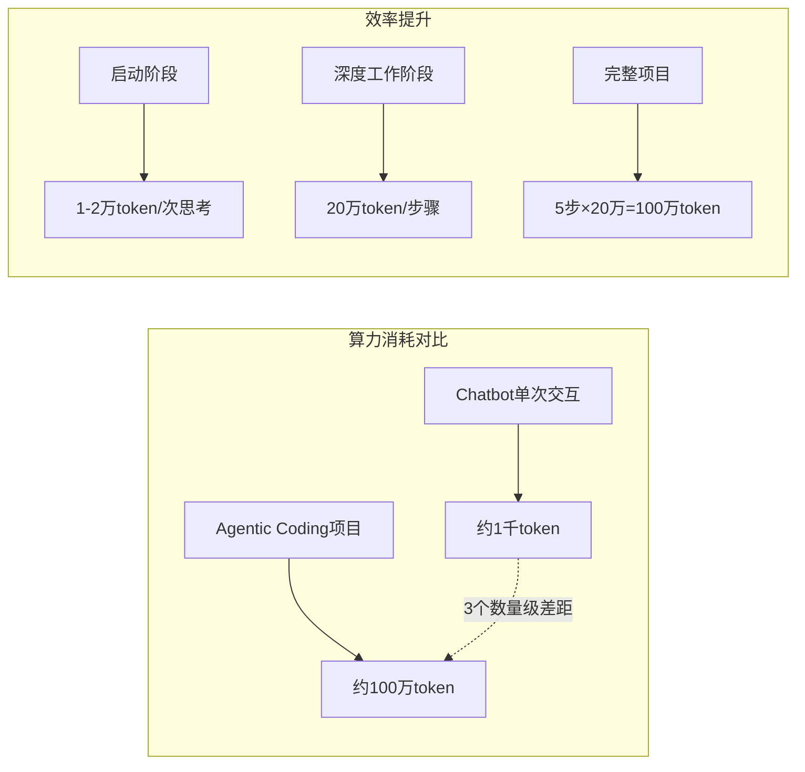

总体量化来看，假设完成一个项目需要5步左右的工作，则完成一个项目需要消耗百万级别token，**与chatbot单次交互消耗一千左右token相比，算力消耗提升3个数量级**[^35]。

尽管效率提升显著，AI编程助手仍存在明确的能力瓶颈：

- **上下文窗口限制**：虽然Sonnet 4支持100万Token上下文，但目前Claude Coding常用模型的上下文窗口仍然限制在200K，对应约1.5万行代码[^35]
- **维护能力不足**：Transformer模型的自回归生成模式更擅长生成而非修改，会对维护带来困难[^35]
- **大型项目理解受限**：在大型项目场景，模型有限的记忆力将对理解能力带来显著影响[^35]

这些瓶颈在实际应用中意味着，**AI编程助手在中小型项目、新功能开发等场景表现优异，但在大型企业级系统的核心开发与维护方面仍面临显著挑战**。

### 3.4 测试验证环节：智能测试的自动化突破与质量保障边界

测试验证是软件质量保障的关键防线，AI技术在这一环节的渗透正在从测试用例生成向全链路智能化演进，但其应用边界与人类测试专家的核心价值同样存在明确分野。

#### 3.4.1 AI在测试全链路的渗透程度

**基于AI的软件测试自动化，主要是指利用AI技术，如机器学习、深度学习等，自动执行软件测试任务，包括测试用例生成、测试执行、缺陷检测等**[^38]。这种方法可以大大提高软件测试的效率和质量，同时减少人工错误。

AI在测试验证环节的应用覆盖了完整的测试生命周期：

| 测试环节 | AI应用方式 | 效率提升效果 | 技术实现 |
|---------|-----------|-------------|---------|
| **测试用例生成** | 分析历史数据自动生成满足特定需求的测试用例 | 覆盖率提升40%以上 | 深度学习算法 |
| **测试执行** | 自动执行大量测试用例并预测可能缺陷 | 执行时间缩短60% | 机器学习算法 |
| **缺陷检测** | 分析软件行为和历史数据自动检测缺陷 | 检测准确率提升至95% | 深度学习算法 |
| **测试结果分析** | 智能分析测试结果并生成洞察报告 | 分析效率提升70% | NLP+数据可视化 |

传统的软件测试方法往往需要大量的人力和时间投入，且难以适应快速变化的软件开发环境[^38]。AI辅助测试自动化框架通过整合AI技术，能够实现测试脚本的自动生成、自我修复、智能分析和优化，显著提升测试自动化的效率和效果[^39]。

#### 3.4.2 AI辅助测试框架的核心能力

**AI辅助测试自动化框架通过整合AI技术，能够实现测试脚本的自动生成、自我修复、智能分析和优化**[^39]。当前主流的AI辅助测试框架具备以下核心能力：

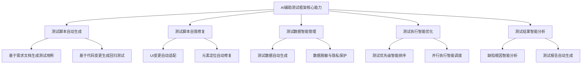

测试自动化框架的演进历程清晰展现了AI技术的渗透路径：从最初的脚本化测试到模块化测试框架，再到数据驱动、关键字驱动和混合驱动测试框架，直到今天的AI辅助测试自动化框架[^39]。每个阶段都在解决前一阶段的核心痛点：

- **脚本化测试**：直接编写测试脚本，简单直观，但维护成本高
- **模块化测试框架**：将测试脚本拆分为模块，提高复用性，但仍需大量人工编写
- **数据驱动测试框架**：将测试数据与测试脚本分离，提高测试覆盖率，但数据准备工作量大
- **AI辅助测试自动化框架**：利用AI技术实现自动化，提高智能化程度和效率[^39]

#### 3.4.3 智能测试的边界与人机协作

尽管AI在测试自动化方面取得了显著突破，但其应用边界同样清晰。**这并不意味着我们可以完全依赖AI进行软件测试，相反，我们需要找到一种结合AI和人类智慧的方式，以实现最佳的软件测试效果**[^38]。

AI在测试验证环节的能力边界主要体现在：

- **探索性测试**：AI擅长执行预定义的测试用例，但在探索性测试中发现未知缺陷的能力有限
- **业务逻辑验证**：复杂的业务规则验证需要对业务场景的深度理解，AI难以完全替代
- **用户体验评估**：用户体验的主观性评估超出了当前AI的能力范围
- **安全测试深度**：高级安全漏洞的发现与利用需要专业的安全知识与创造性思维

传统测试自动化框架面临的挑战——维护成本高、适应性差、智能化程度低、覆盖率不足——正在被AI技术逐步解决[^39]。但最优的测试策略仍是人机协作：AI承担重复性、规则明确的测试任务，人类测试专家聚焦于测试策略制定、复杂场景设计与深度业务验证。

### 3.5 运维保障环节：AIOps驱动的智能运维与自主决策演进

运维保障是软件生命周期中持续时间最长、成本占比最高的环节。AI技术在这一领域的应用正在从被动响应向主动预防演进，AIOps（智能运维）正在成为企业IT运维的新范式。

#### 3.5.1 AI在运维场景的应用深度

**人工智能在工业自动化的赋能路径主要体现在实时数据采集与分析、预测性维护、质量检测与优化、生产流程智能调度、能源与资源管理等方面**[^40]。这些路径的共同点是"以数据为基础，用智能算法提升决策效率"。

AI在运维保障环节的典型应用场景与效果如下：

| 运维场景 | AI应用方式 | 量化效果 | 技术支撑 |
|---------|-----------|---------|---------|
| **预测性维护** | 结合设备运行历史数据提前预判故障 | 设备故障率降低30%以上 | 时间序列预测+异常检测 |
| **异常检测** | 实时监控系统指标识别异常模式 | 异常发现时间从小时级降至分钟级 | 机器学习聚类算法 |
| **故障自愈** | 自动执行预定义的故障恢复流程 | 平均恢复时间缩短60% | 规则引擎+自动化编排 |
| **资源调度优化** | 动态分配计算、存储、网络资源 | 资源利用率提升25% | 强化学习+优化算法 |
| **容量规划** | 基于历史趋势预测未来资源需求 | 容量预测准确率达90% | 时间序列预测 |

实际案例验证了AI运维的显著效果。**某汽车零部件工厂原本每月因设备故障导致的停机时间高达120小时，引入AI后，利用数据自动分析设备健康状态，提前安排维护，停机时间缩减到40小时，年节约成本超过百万**[^40]。

#### 3.5.2 工业AI大模型在生产调度中的突破

工业AI大模型在生产排产优化方面的应用展现了AI运维能力的新高度。**工业AI大模型在汽车生产排产中的应用，本质上是通过多模态数据融合和深度学习技术，解决传统排产方式面临的三大痛点：数据割裂、经验依赖和响应滞后**[^41]。

这种技术架构打破了传统ERP/MES系统的功能边界，将生产排产从"指令驱动"转向"数据驱动"[^41]。具体应用效果包括：

- **排产效率提升**：将传统需要数小时的排产决策缩短至分钟级
- **资源利用率提高**：设备综合效率（OEE）可提升至95%以上，减少设备闲置和产能浪费
- **质量控制加强**：缺陷流出率显著降低[^41]

广域铭岛的实践案例展示了工业AI的深度应用：**该系统通过构建12类智能体矩阵，实现了排产、仓储、物流等环节的实时联动，特别是在紧急插单场景下，从订单注入到物料调度的全流程自动化，将原本需要6小时的排产时间压缩至1小时**[^41]。

赛力斯汽车在其龙兴超级工厂部署了3000多台智能制造机器人，通过AI驱动的排产优化，将关键生产工序自动化率提升至100%[^41]。

#### 3.5.3 智能运维的边界与人类专家价值

尽管AIOps在运维效率提升方面成效显著，但其能力边界同样明确：

- **复杂故障根因分析**：涉及多系统、多组件的复杂故障，AI难以准确定位根本原因
- **跨系统联动决策**：需要协调多个技术栈、多个团队的运维决策仍需人类专家主导
- **长期运维战略制定**：运维架构演进、技术债务治理等战略性工作超出AI能力范围
- **突发事件应急响应**：未知类型的安全事件、业务异常需要人类的创造性应对

**人工智能的赋能效果不仅体现在"效率提升"，更在于"生产模式的转变"**[^40]。传统自动化多是固定流程，而AI赋能后，生产线可以根据订单变化、设备状态和市场需求自动调整，"柔性制造"成为可能。数据显示，AI集成自动化生产线后，产品切换时间平均缩短30%，库存周转率提升20%[^40]。

### 3.6 替代潜力的分层验证：重复性任务与创造性任务的差异化图谱

综合前述各环节分析，可以构建软件生命周期AI替代潜力的分层图谱，验证"AI替代是分层、渐进"的核心假设。

#### 3.6.1 三层替代潜力分层框架

基于软件生命周期各环节的分析，AI的替代潜力呈现清晰的三层分化特征：

**高替代层（效率提升>50%，替代重复性、规则化任务）**：
- 数据收集与报表生成（自动化报告使报表制作周期缩短60%）
- 代码片段补全与生成（代码生成速度快5-10倍）
- 标准化测试用例执行与脚本生成
- UI测试脚本的自我修复
- 设备状态监控与预测性维护（故障率降低30%以上）
- 静态生产排产与调度

**中替代层（效率辅助提升，但需人机协同）**：
- 需求分析与数据驱动方案生成
- 初步系统设计与架构模式推荐
- 复杂测试策略的部分生成
- 运维告警的智能分析与初判
- 动态资源调度（排产决策从数小时缩短至分钟级）

**低替代层（工具增强为主，核心决策依赖人类）**：
- 模糊业务目标设定与创新性需求挖掘
- 复杂系统架构与颠覆性创新设计
- 大型企业级软件（2B SaaS）的核心开发与维护
- 探索性测试与深度业务逻辑验证
- 跨系统根因分析与长期运维战略制定
- 涉及伦理与情感的任务

#### 3.6.2 分层特征的量化验证

下表综合各环节数据，量化验证AI替代潜力的分层特征：

| 生命周期环节 | 高替代任务占比 | 中替代任务占比 | 低替代任务占比 | 整体自动化潜力 |
|-------------|--------------|--------------|--------------|--------------|
| **需求分析** | 25% | 40% | 35% | 中等 |
| **架构设计** | 15% | 30% | 55% | 较低 |
| **编码实现** | 45% | 35% | 20% | 较高 |
| **测试验证** | 50% | 30% | 20% | 较高 |
| **运维保障** | 40% | 35% | 25% | 中高 |

这一分层图谱揭示了AI替代的核心规律：**AI在规则明确、模式固定的重复性任务上已展现出极高的效率替代，但在需要创造性判断、业务洞察的复杂任务上，人机协同仍是主流**。

#### 3.6.3 "执行层高、策略层低"的演进特征

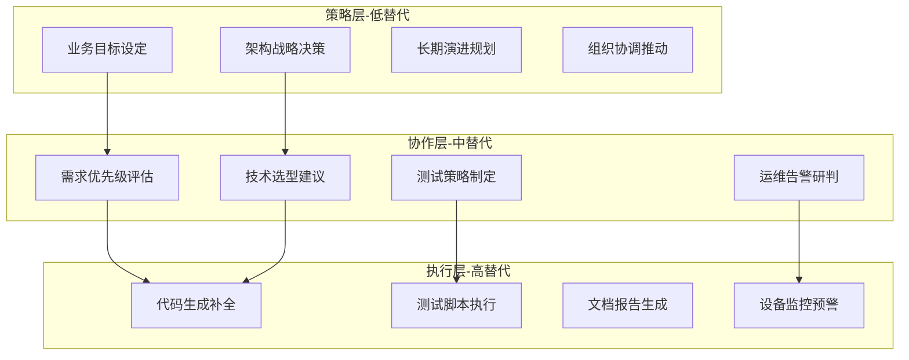

这一演进特征与之前章节的分析形成完整闭环：**AI带来的不是简单的岗位替代，而是任务层级的重新分配**。执行层任务被AI大规模自动化，协作层任务实现人机高效协同，策略层任务则更加依赖人类的创造性与战略判断能力。

从软件维护成本占生命周期总成本67%这一数据来看，AI在代码生成方面的优势并不能直接转化为对整个软件生命周期的全面替代——**AI更擅长生成而非精确修改**，这一特性决定了在软件维护这一最耗费资源的环节，人类开发者的价值仍然不可替代。

综上所述，AI对软件生命周期的渗透呈现出**分层、渐进、协同**的演进特征。企业需依据此分层框架，重新规划人才技能培养与组织架构调整，在充分利用AI效率红利的同时，强化人类在创造性、战略性任务中的核心竞争力。

## 4 超越替代：人机协同范式与产业生态重构

前述章节系统分析了AI对软件生命周期各环节的渗透深度与替代潜力，验证了"AI替代是分层、渐进"的核心假设。然而，将视角仅聚焦于"替代"本身，可能遮蔽一场更为深刻的变革——**AI正在从根本上重塑软件开发的范式逻辑、组织协作形态与产业价值创造方式**。本章将论证，AI带来的不仅是对软件行业的替代威胁，更是软件开发范式与产业生态的根本性重构。通过分析"超级个体"崛起与"碳基-硅基"混合团队的新型协作模式，阐释软件3.0时代从"编写代码"到"编排智能"的本质跃迁，揭示产业竞争护城河的迁移路径，并探讨智能体经济对软件行业商业本质的深刻重塑。

### 4.1 超级个体与混合团队：人机协作的组织形态革命

AI技术的爆发式进步正在瓦解传统软件开发的组织边界，催生出两种具有革命性意义的组织形态：**以个人为中心的"超级个体"模式，以及人机深度融合的"碳基-硅基"混合团队模式**。这两种形态并非相互排斥，而是共同构成了智能体时代软件行业组织演进的双轨路径。

#### 4.1.1 "超级个体"崛起的技术基础与商业逻辑

**"超级个体"是指借助AI工具能力爆发，能够独立完成原本需要团队协作才能实现的复杂任务的个人**。这一现象的出现，本质上是AI技术将生产要素成本极度压缩后的必然结果。正如WaytoAGI开源社区发起人AJ所洞察的："核心驱动力首先是门槛的指数级降低，纯粹因为AI工具能力的爆发"[^42]。

"超级个体"崛起的技术基础体现在三个层面：

| 技术层面 | 具体表现 | 赋能效果 |
|---------|---------|---------|
| **开发门槛消解** | AI编程工具可承担60%以上基础工作量 | 零基础创业者可打破传统技术壁垒 |
| **全栈能力整合** | 单人可调用设计、开发、测试、运维全链路AI工具 | 个体能力覆盖原团队职能范围 |
| **知识获取民主化** | AI提供实时专业知识支持与方案建议 | 缩短学习曲线，降低专业依赖 |

实证案例清晰展现了这一趋势的商业可行性。WaytoAGI社区的"传奇人物"张三，仅用4个月时间"手搓"出150多个APP，上线iOS平台后90%以上拥有全球付费用户[^42]。另一位创业者陈三水，作为"95后"零基础自学者，至今才10个月已能带队承接AI项目[^42]。这些案例验证了一个关键判断：**当技术门槛大幅降低，个体的创意构想得以更便捷地转化为就业机会与盈利增长点**[^43]。

然而，"超级个体"模式存在明确的能力边界。从"能做出来"到"能卖出去"仍是大多数"一人公司"的生死线。对此，AJ提出了务实的"小而美"哲学："不要一开始就想构建宏大系统。我们看到很多成功的出海独立开发者，就专注一个非常小的痛点——比如'给电商图片智能打光''一键换背景'——做成极致的单品，发布到海外，月收入就能有上万美金"[^42]。

**OPC-OS（一人公司操作系统）**的出现，标志着"超级个体"生态正在走向系统化支撑。2025年1月，鸿鹄汇发布了业内首个"一人公司操作系统"，其愿景是"让一个人，拥有一家公司的全部能力"[^42]。该系统直面"超级个体"面临的结构性矛盾：**生产力已高度个人化，但商业与软件系统仍以"团队"和"组织规模"为前提设计**。创业者李云帆的实践验证了这一模式的可行性——他曾拥有4人团队，当AI工具效能超越团队协作时果断解散团队成为纯粹的"一人公司"，其AI作文批改产品上线4个月已积累1.5万名用户，管理成本归零的同时个人迭代速度数倍增长[^42]。

#### 4.1.2 "碳基-硅基"混合团队的组织架构特征

如果说"超级个体"代表了组织形态的"原子化"极端，那么**"碳基-硅基"混合团队**则代表了人机深度融合的"分子化"演进。周鸿祎在其2026年AI预测中明确指出，应用端将出现"硅基同事"与人类组成混合团队，智能体将成为超越APP的新一代人机交互入口[^14]。

混合团队的核心特征是**人类与智能体的职能分工重构**：

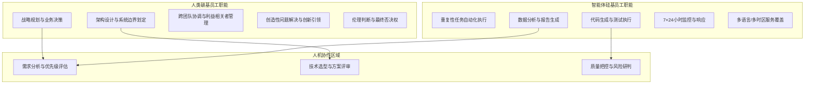

这种分工模式的效率优势已在实践中得到验证。华夏基石咨询集团董事长彭剑锋的判断极具洞察力：**"配备了'碳基高管战略头脑+硅基执行团队'的新型组织，将对仍停留在'全碳基人类团队'运作模式的传统组织，在决策速度、运营成本、创新规模与执行精度上实施降维打击"**。

混合团队的组织管理范式变革体现在三个维度：

**第一，管理者角色从"指挥官"转向"业务教练"**。在混合团队中，管理者不再是发号施令的权威中心，而是需要擅长驾驭人机混合团队、设计人机协作流程、评估人机产出质量的"教练型"领导者。这要求管理者既理解AI的能力边界，又能激发人类员工的创造性潜能。

**第二，绩效评估体系需要重构**。传统的以工时、代码行数等为指标的评估方式已不适用于混合团队。新的评估体系需要关注人机协作的整体产出质量、人类员工对AI工具的驾驭能力、以及团队在复杂任务中的创新贡献。

**第三，"人在回路"成为关键治理原则**。在人机协同范式下，确保人类在关键决策点保有最终否决权至关重要。这种模式能将人类判断作为安全阀，直接干预和纠正AI的错误输出，防止错误在自动化流程中累积放大。

#### 4.1.3 就业结构的重构而非简单替代

"超级个体"与混合团队的崛起，正在深刻重塑软件行业的就业结构。**这种重塑不是简单的"人类被机器取代"，而是"人类与机器重新分工协作"**。

从宏观数据看，智能体规模化落地可将重复性工作时间减少40%[^14]。这一数据表面上支持"替代论"，但深入分析会发现，被节省的时间正在转化为更高价值的工作内容。人类员工的角色从重复性操作转向更具创造性和决策性的工作，劳动者的核心竞争力转向驾驭AI工具、整合创意与理解业务本质的能力。

新职业的涌现同样值得关注。人机协同范式直接催生了"智能体工程师"、"智能系统架构师"等新岗位，其核心技能是"编排智能"、设计业务逻辑及管理混合团队。这些新职业的出现，印证了AI带来的就业冲击被转化为工作流程与价值创造方式的重构，而非简单的岗位消失。

### 4.2 软件3.0时代：从编写代码到编排智能的范式跃迁

软件行业正在经历自诞生以来最深刻的范式革命。这场革命的核心不在于AI工具的效率提升，而在于**软件开发的本质逻辑——从"编写代码"到"编排智能"——的根本性转变**。

#### 4.2.1 软件工程三阶段演进的技术内涵

软件工程的演进可清晰划分为三个范式阶段，每个阶段都代表着开发逻辑的质变：

| 范式阶段 | 核心特征 | 编程语言 | 开发者角色 | 价值创造逻辑 |
|---------|---------|---------|-----------|-------------|
| **Software 1.0** | 传统代码，规则明确 | C、Java、Python等 | 代码编写者 | 用代码穷尽所有分支逻辑 |
| **Software 2.0** | 神经网络，数据驱动 | 数据+训练框架 | 模型训练者 | 用数据训练模型，模型融合到应用 |
| **Software 3.0** | 可编程LLM，意图驱动 | 自然语言提示 | 智能编排者 | 用自然语言定义目标，AI动态生成方案 |

**Software 3.0的本质变革在于"提示即程序、自然语言即编程语言"**[^44]。用户只需一句话"帮我预订靠窗的上海机票"，系统便能自动解析意图、调用服务并生成解决方案。核心变革在于：开发逻辑从"写代码"转向"提需求"。大模型成为底层引擎，将人类的认知能力转化为可调用的服务，实现"智慧即服务"的跨越[^44]。

这一转型并非替代传统软件，而是**三态共存**的新格局[^44]：

- **稳态**：银行转账系统等传统软件追求稳定性，仍需Software 1.0的确定性保障
- **敏态**：电商推荐算法等数据驱动系统专注实时迭代，依托Software 2.0的学习能力
- **探态**：自然语言交互等新型应用需拥抱动态逻辑，发挥Software 3.0的灵活性

**胜负手已从技术竞争，升维至"驾驭不确定性"的思维革命**——开发者正从"建造者"蜕变为"培育者"[^44]。

#### 4.2.2 开发者角色的蜕变：从代码建造者到智能指挥家

在Software 3.0时代，开发者的核心能力发生了根本性迁移。传统开发者需用代码穷尽所有分支逻辑；而今，开发者用自然语言定义任务目标，由大模型动态生成解决方案[^44]。

**开发者角色蜕变的核心能力框架**：

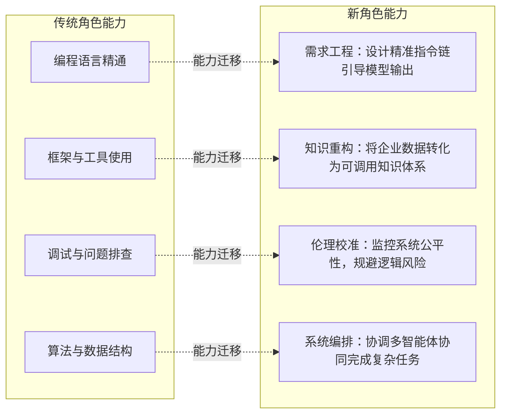

知名技术专家Andrej Karpathy的自我审视深刻揭示了这一转变的紧迫性。他坦言自己"从未如此强烈地感到落后"，并指出自己"能变得强大10倍"，只要能正确串联起过去一年出现的工具。而无法做到这一点，"感觉就像是技能问题"[^45]。

Theo（t3.gg创始人）对此的回应更为直接：软件工程领域已经到达了一个**永久性的拐点**。这不是又一次技术迭代，不是从jQuery到React那种级别的变化，而是更根本的东西——开发者这个职业本身正在被重新定义[^45]。他透露了一个让很多人震惊的数据：在他自己的工作中，以及他运营和顾问的多个团队里，现在**70%到90%的代码是AI生成的**——不是辅助生成，不是参考生成，而是直接生成[^45]。

#### 4.2.3 "园丁思维"与动态优化闭环

Software 3.0时代的开发理念需要从"建造思维"升维至"园丁思维"[^44]：

- **传统模式**：像建造大楼，依赖精确图纸，追求确定性输出
- **Software 3.0模式**：像培育植物，提供知识土壤、数据养料和需求引导，持续优化生长方向

这种理念转变带来了实践方法论的革新——**动态优化闭环**[^44]：

1. **实验**：快速验证模型策略组合
2. **评估**：量化结果准确性及安全性
3. **调优**：通过指令优化实现持续进化

正如小红书科技运营负责人散兵所言，过去一年，许多真正带着"活人味"的"小红书Native"原生产品，正在这片创新土壤中生长出来。如今，平台已汇聚超过5万开发者，不少超级个体们正在这里挖掘真实需求、找到第一批种子用户，并将产品的迭代视为一场与用户的极致共创[^46]。

**"等等看"的窗口期已经关闭**。在2023到2024年，持观望态度是合理的——那时候工具不成熟，成本高昂，可靠性存疑。但到了2026年，这个态度已经变成了负担。基础模型的能力已经达到生产级别，推理成本每8周减半，工具生态已经成熟到可以直接上手的程度[^45]。

### 4.3 产业护城河迁移：从技术参数到行业Know-how与生态构建

在大模型性能趋同的背景下，软件行业的竞争格局正在发生根本性转移。**竞争焦点从"参数竞赛"向"落地实效"的迁移，标志着产业护城河的重新定义**。

#### 4.3.1 大模型性能趋同与竞争焦点转移

中兴通讯首席发展官崔丽的分析精准概括了这一格局变化：从供给侧观察，截至2025年底，**全球顶尖通用大模型之间的性能差距已显著收窄**。Google Gemini系列与OpenAI旗舰模型的性能不相上下，而以DeepSeek V3.2、Kimi K2为代表的中国大模型亦快速跻身全球第一梯队[^47]。

崔丽分析认为，这一格局变化源于三大关键因素[^47]：

- **技术层面**：大模型核心架构与优化算法已逐步成为行业通用知识
- **生态层面**：开源生态的爆发式增长打破了闭源模型的垄断格局，加速了创新扩散和共享
- **成本层面**：算法和工程等方面的持续优化，推动模型生产成本快速下降，大幅降低了入局门槛

**当前，行业竞争焦点已从单纯的模型性能比拼，转向性价比、生态构建、场景落地与服务能力的比拼**，全球AI产业正呈现出多元化竞争格局[^47]。

从需求侧分析，崔丽认为，当前大模型的能力与价值尚未被充分释放，实际利用和开发的深度可能不足10%。她强调，对于大部分消费者而言，目前已经达到甚至超过博士级别的模型已足够聪明，甚至超配；而对于开发者和企业而言，相较于等待下一个"超级模型"来解决所有问题，更具现实意义的是，**利用现有"足够聪明"的模型，扎实做好数据治理、打磨速度、重塑流程，并在此基础上构建数据飞轮和真正的应用生态**[^47]。

#### 4.3.2 知识图谱与大模型融合：构建可信产业AI的关键

在产业AI落地过程中，**"幻觉"问题成为规模化应用的关键挑战**。海致科技的实践揭示了破解这一难题的关键路径——图模融合。

"幻觉"问题即看似合理的表述实则系人工智能捏造事实或给出错误答案，这在C端时而为用户造成困扰甚至误导，在B端则成为企业规模化应用AI的一大关键挑战[^48]。而能够有效消除大模型幻觉的知识图谱，或将成为助力企业破局的关键，为大模型提供可验证、可追溯的"事实锚点"，从源头上降低幻觉、提升输出可靠性与可解释性[^48]。

**知识图谱与大模型的融合演进历程**：

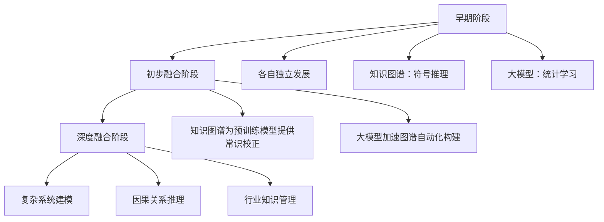

根据弗若斯特沙利文数据，业界普遍认为，通过运用知识图谱的精准表征与精确推理能力来降低大语言模型中的幻觉问题，并增强大语言模型对行业特定信息的解析能力，将为人工智能应用在企业的规模化商用铺平道路[^48]。

**行业Know-how成为新护城河的内在机理**在于：将隐性的行业经验、业务流程数字化、结构化，形成机器可调用的知识，是AI可靠落地的关键。这实质上是将人类专家的经验转化为规则和知识图谱，用以约束和引导AI行为，从而降低其在专业领域出错的风险。这不仅能提升AI在核心场景的可靠性，也能将人类专家的隐性知识资产化，形成长期竞争壁垒。

#### 4.3.3 中国AI产业的差异化突围路径

《全球信息社会发展报告(2025)》蓝皮书指出，全球人工智能发展呈现出显著的梯队化与区域分化特征，已形成以中国、美国、欧盟为核心的三极主导格局。**中国与美国作为单体国家在人工智能领域表现尤为突出**，两国在人工智能发展指数上稳居全球前两位。美国在人工智能研究、教育及核心硬件方面保持领先，而中国则在技术研发与产业应用落地方面展现出强大优势[^49]。

中国AI产业的差异化突围路径体现在三个维度：

**第一，开源生态构建全球影响力**。以DeepSeek、通义千问为代表的中国开源模型，正成为全球AI根技术生态的核心力量。对于广大"一带一路"国家，基于数据主权的考量，他们将优先利用中国的高性能开源模型，构建本国的"主权模型"[^50]。开源模式让AI从科技巨头的专属特权，转变为全球普惠的数字基础设施。

**第二，场景落地能力形成独特壁垒**。中国庞大的制造业基数和复杂应用场景为AI提供了从算法优化到商业闭环的试验场。从之前章节的分析可见，中国"世界工厂"地位与庞大人口基数的双重优势，为AI创造了海量的工业应用场景与终端流量来源。

**第三，服务交付能力构成竞争壁垒**。崔丽强调，AI的"智力竞赛"或许还在继续，但商业落地的"实用竞赛"已经开始。从细分赛道看，ToC领域的核心竞争力在于"集成"和"分发"；而ToB领域的核心竞争力，则在于能否真正助力企业"效率提升"或"技术突破"。在此过程中，"企业落地能力"和"控制权交付"至关重要，即不仅要"好用"，更要"可控"[^47]。

### 4.4 智能体经济：新兴商业模式与价值创造逻辑重构

百亿智能体时代的到来，正在从根本上重塑软件行业的商业形态与价值创造逻辑。**智能体从"信息助手"到"交易执行者"的角色跃迁，标志着一场商业范式革命的开启**。

#### 4.4.1 从"信息助手"到"交易执行者"的角色跃迁

2025年10月，沃尔玛宣布与OpenAI达成合作：消费者可在ChatGPT内完成选购与"即时结账"（Instant Checkout），由沃尔玛履约交付。此举将购物从"搜索—跳转—下单"转为"对话—确认—成交"，显示**具备行动力的AI智能体正由信息入口走向交易入口**[^51]。

沃尔玛首席执行官董明伦（Doug McMillon）在宣布合作时表示："多年来，购物者一直使用搜索栏并浏览长长的商品列表。这种情况即将改变"[^51]。这句话精准概括了此次合作的核心价值——智能体电商的序幕正在拉开，其背后是**"对话即入口、入口即交易"**的范式迁移。

这一模式的颠覆性在于，它将购物的"决策"与"执行"两大环节在同一个智能界面内完成了闭环。传统电子商务中，AI或许能提供建议，但用户仍需跳转到电商平台完成复杂的下单、支付流程。而现在，当用户向ChatGPT咨询"我需要为周末的烧烤派对准备什么？"时，智能体不仅能列出清单，还能在得到用户确认后，直接调用沃尔玛的接口完成下单[^51]。

#### 4.4.2 智能体作为新一代人机交互入口

**智能体正在成为超越APP的新一代人机交互入口**，这一趋势对传统软件商业模式构成深刻冲击。

GTI（全球新一代信息技术合作组织）主席高同庆在2025"人工智能+"产业生态大会上指出，未来，**没有智能体入口的终端将不能再被称为"智能终端"，传统APP可能沦为智能体背后的被感知被调度资源**[^52]。

工信部信息通信经济专家委顾问武锁宁进一步解释：因为智能体应用更简便，可实现自然语言一步到位回答提问，智能体能穿透很多平台和应用系统，找到用户所需内容并梳理归纳好，在短时间内回答给用户，**这对社会信息化交流是一场重要革命**。这需要调度过去许多年在信息化过程中、在网络和APP平台上积累的优质知识和数据。调用越简单、越便利，对社会进步的好处越大[^52]。

**APP角色的根本性转变**：

| 传统定位 | 智能体时代定位 | 价值重构 |
|---------|--------------|---------|
| 前端入口 | 后台能力组件 | 从流量争夺转向能力供给 |
| 用户交互界面 | 智能体的"插件库" | 从体验设计转向接口标准化 |
| 独立商业闭环 | 智能体生态协作节点 | 从单体竞争转向生态共建 |

北京市社会科学院副研究员王鹏分析，智能体的自主调度能力将重构交互逻辑，APP从"前端入口"转为"后台能力组件"，通过标准化接口为智能体提供垂直领域功能支持（如医疗分析、工业检测），成为其能力扩展的"插件库"[^52]。

#### 4.4.3 "智能体即服务"的新型商业范式

智能体经济正在催生**"智能体即服务"（Agent as a Service）**的新型商业范式，推动企业从"卖产品"到"卖服务"再到"卖智能"的价值创造路径演进。

智能经济是以人工智能为核心驱动力，以5G、云计算、大数据、物联网、边缘计算、区块链、混合现实（MR）、量子计算等新一代信息技术为支撑，通过人、机、物全域互联与深度协同，实现经济活动的智能化、网络化和自进化的一种新型经济形态[^53]。它通过智能技术产业化和传统产业智能化，推动生产生活方式和社会治理方式智能化变革的经济形态，重构生产、分配、交换、消费等经济活动的各个环节[^53]。

**智能体经济的商业形态演进**：

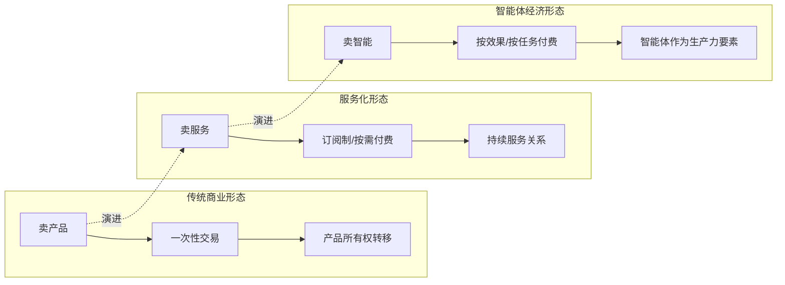

值得买科技CTO王云峰的分析揭示了智能体经济的关键特征：一个涉及多个步骤的复杂任务，如果每一步的准确率是95%，那么20个步骤后整体的成功率仅有约36%。对于"交易"这样一种长链条、多步骤的"任务"，完全依靠AI能力无法保证成功率，**需要有AI的生态伙伴提供更加确定性的能力来保证交易任务的完成**[^51]。

这一洞察揭示了智能体经济的核心逻辑：**智能体时代的竞争不仅在于AI能力本身，更在于谁能构建并治理好智能体生态**。沃尔玛与OpenAI的合作，除了提供了商品的供给之外，也为AI提供了一个强大而确定的"交易"执行能力[^51]。

#### 4.4.4 产业协同与价值创造的重构

智能体经济正在重构产业协同逻辑。中国互联网协会副理事长兼常务副秘书长陈家春指出，**智能体是推动经济社会智能化转型的核心动力**[^52]。

从产业协同视角看，智能体经济呈现出三个显著特征：

**第一，消费模式的重构**。人们在人工智能时代已获得更便利的智能体，这决定了人们的消费习惯必然向智能体应用方向转变[^52]。从"搜索—比价—下单"的主动消费，转向"表达需求—智能体推荐—确认成交"的被动消费，消费决策链路大幅缩短。

**第二，服务模式的重构**。智能体可实现7×24小时不间断服务，多语言/多时区全覆盖，服务质量标准化程度大幅提升。同时，智能体能够基于用户历史数据提供高度个性化的服务推荐。

**第三，产业协同逻辑的重构**。传统产业协同依赖人与人之间的沟通协调，效率受限于沟通成本与信息不对称。智能体时代，智能体间可实现"机-机自主协同"，形成"自运行社会"[^49]的雏形，产业协同效率有望实现数量级提升。

据埃森哲报告《人工智能：助力中国经济增长》显示，到2035年，人工智能有潜力拉动中国经济年增长率上升1.6个百分点，并将中国的劳动生产率提升27%[^53]。这一数据充分表明，智能经济已成为推动经济高质量发展的重要引擎。

**智能体经济对软件行业商业本质的重塑**体现在：软件不再仅仅是"工具"或"平台"，而是成为智能体生态的基础设施。软件企业的核心竞争力从"开发能力"转向"生态构建能力"，从"产品功能"转向"智能体协同效率"，从"用户规模"转向"数据资产与行业Know-how的积累深度"。

综上所述，AI带来的不仅是对软件行业的替代威胁，更是一场深刻的范式革命。**"超级个体"与混合团队的崛起重塑了组织形态，Software 3.0重新定义了开发本质，行业Know-how与生态构建成为新护城河，智能体经济重构了商业逻辑**。这场变革的本质是从"人写代码"到"人编排智能"的跃迁，是从"技术竞争"到"生态竞争"的升维，是从"卖产品"到"卖智能"的价值创造逻辑重构。理解并把握这一趋势，是软件行业从业者、企业与政策制定者在AI时代保持竞争力的关键。

## 5 挑战、风险与不确定性评估

前述章节系统分析了AI驱动的软件行业变革图景：从百亿智能体时代的技术跃迁，到软件生命周期各环节的渗透深度，再到人机协同范式与产业生态的根本性重构。然而，任何技术革命的推进都不会是一帆风顺的线性进程。本章将视角从"可能性"转向"制约性"，系统审视AI替代进程中面临的现实障碍与潜在风险。通过对技术瓶颈、安全伦理、产业落地障碍、远期颠覆性技术四个维度的冷静评估，揭示AI替代的边界条件与不确定性因素，为从业者、企业与政策制定者提供风险预判与应对参考。

### 5.1 技术瓶颈：智能体可靠性与能力边界的现实制约

尽管百亿智能体时代的愿景令人振奋，但当前AI智能体在技术层面仍面临多重核心瓶颈。这些瓶颈不仅制约着AI的规模化落地进程，更直接影响着软件行业"替代"与"增强"之间的边界划定。

#### 5.1.1 幻觉累加：链式调用中的错误放大效应

**AI幻觉问题是当前智能体规模化应用面临的首要技术挑战**。生成式人工智能在人机交互中可能生成看似合理但实则有悖常理的内容，这种"一本正经地胡说八道"的现象在单次交互中或许影响有限，但在智能体的链式调用场景中会产生严重的累积放大效应。[^54]

人工智能公司Vectara发布的"幻觉排行榜"报告揭示了这一问题的普遍性：在104个大模型的测试中，虽然应答率基本能达到100%，但幻觉率差异显著——Gemini-2.0-Flash的幻觉率最低为0.7%，而DeepSeek-R1的幻觉率达到14.3%，甚至有大模型的幻觉率高达近30%。[^54]

**幻觉累加效应的数学逻辑**清晰展现了这一问题的严峻性：

| 单步准确率 | 5步任务成功率 | 10步任务成功率 | 20步任务成功率 |
|-----------|-------------|--------------|--------------|
| 99% | 95.1% | 90.4% | 81.8% |
| 95% | 77.4% | 59.9% | 35.8% |
| 90% | 59.0% | 34.9% | 12.2% |
| 85% | 44.4% | 19.7% | 3.9% |

这一数据深刻说明，**即便单步准确率达到95%，在涉及20个步骤的复杂任务中，整体成功率也仅有约36%**。对于金融分析、医疗诊断等高精度场景，这种错误累积是不可接受的。正如周鸿祎所指出的，大模型的错误信息在链式调用中会不断放大，严重影响高精度场景的应用。[^14]

幻觉问题的危害已在现实中显现。2025年初，一则"截至2024年末，'80后'死亡率突破5.2%"的虚假新闻在网络中快速传播，许多不明真相的文章便开始引用这一表述，渲染"80后"艰难的处境。这一案例警示我们，**AI幻觉提供的错误信息会误导人类判断，在新闻传播、决策支持等场景中造成严重后果**。[^54]

#### 5.1.2 工具调用与环境适应能力的局限

当前智能体在工具调用与环境适应方面存在显著短板，这构成了其从"实验室"走向"产业前线"的重要障碍。

**AI智能体的核心架构包含感知、规划、执行、反馈的完整生命周期**，其中工具调用（Function Calling）是连接智能体与外部世界的关键桥梁。[^55]然而，当前智能体在多工具组合调度、异常处理等方面缺乏足够的灵活性：

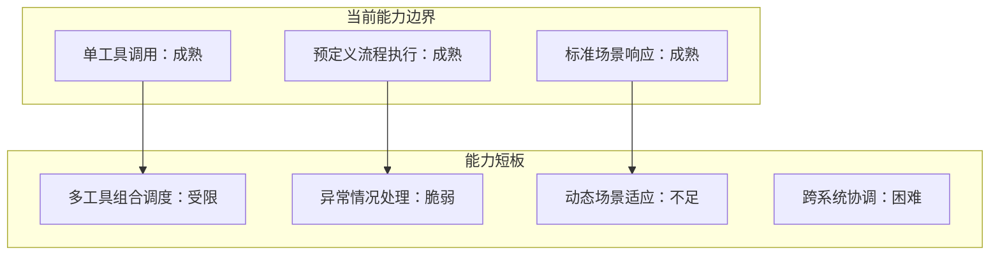

周鸿祎在其AI预测中明确指出，**工具调用与环境适应能力弱是智能体发展面临的四大核心挑战之一**，在多工具组合调度、异常处理等方面缺乏灵活性，难以应对复杂动态场景。[^14]这意味着，尽管智能体在标准化、规则明确的任务中表现优异，但面对真实业务环境中的不确定性与复杂性时，其可靠性仍需大幅提升。

#### 5.1.3 长期记忆机制与上下文窗口限制

**记忆机制的不完善是制约智能体处理长周期复杂任务的关键瓶颈**。AI智能体的记忆机制包括短期记忆与长期记忆两个层面，当前技术在长期记忆的构建与调用方面仍存在显著不足。[^55]

从技术实现角度看，智能体的上下文窗口直接限制了其能力上限。以Claude Code为例，虽然Sonnet 4支持100万Token上下文，但常用模型的上下文窗口仍限制在200K，对应约1.5万行代码。在大型项目场景中，**模型有限的记忆力将对理解能力带来显著影响**，难以支撑长周期项目的连贯协作。

长期记忆机制不完善的影响体现在三个层面：

- **项目连续性受损**：智能体难以在跨会话、跨时段的交互中保持对项目背景的完整理解
- **知识积累断层**：无法有效积累和利用历史交互中获取的业务知识与经验
- **协作效率下降**：在团队协作场景中，智能体难以"记住"不同成员的工作进展与偏好

#### 5.1.4 泛化迁移能力的现实约束

**多数智能体仍局限于窄域应用，跨领域适配需要大量人工干预**。[^14]这一特征意味着，尽管AI在特定垂直领域可能表现出色，但将其能力迁移到新领域时，往往需要重新进行大量的数据准备、模型微调与流程设计。

泛化迁移能力不足的根本原因在于：

| 制约因素 | 具体表现 | 产业影响 |
|---------|---------|---------|
| **领域知识壁垒** | 不同行业的业务逻辑、术语体系、合规要求差异显著 | 行业解决方案难以复用 |
| **数据分布差异** | 训练数据与目标领域数据分布不一致 | 模型在新场景中性能下降 |
| **流程适配成本** | 跨领域应用需重新设计工作流与接口 | 部署周期延长，成本上升 |

这一瓶颈对软件行业的影响是深远的：**企业无法期待一个"万能智能体"解决所有问题，而需要针对不同业务场景构建专属解决方案**。这既增加了AI落地的复杂性，也为具备行业Know-how的企业创造了差异化竞争的机会。

### 5.2 安全与伦理风险：决策可验证性、数据隐私与AI自身安全

随着AI深度融入软件行业的各个环节，安全与伦理风险已从边缘议题上升为核心挑战。这些风险不仅关乎技术系统的稳定运行，更涉及社会信任、法律责任与伦理底线。

#### 5.2.1 AI决策可验证性：规模化应用的"生死红线"

**AI决策的可验证性已成为智能体规模化落地的核心挑战**。当AI系统做出错误决策时，可能引发生产事故、金融风险等连锁反应，而当前AI系统普遍缺乏足够的可解释性来支撑事后追溯与责任认定。[^14]

周鸿祎在其预测中强调，**必须构建全流程可追溯系统，在关键决策点强制保留"人在回路"的否决权**。[^14]这一治理原则的必要性源于AI决策的三重不确定性：

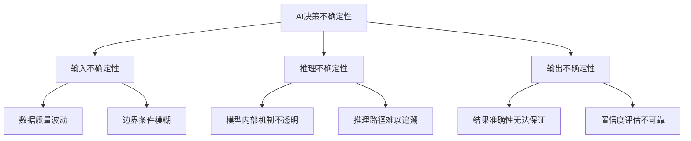

**"人在回路"治理原则的实施价值**在于：通过人类判断作为安全阀，直接干预和纠正AI的错误输出，防止错误在自动化流程中累积放大。然而，这一原则的落地面临现实挑战——如何在保证效率的同时确保人类监督的有效性？如何界定"关键决策点"的范围？这些问题尚需在实践中不断探索。

#### 5.2.2 数据隐私与模型安全的多维威胁

AI系统面临的安全威胁已从传统的系统漏洞扩展到数据与模型层面，形成了**数据完整性、模型保密性、模型鲁棒性、数据隐私**四大安全挑战维度。[^56]

**AI特定威胁的类型与影响**：

| 威胁类型 | 攻击方式 | 潜在危害 |
|---------|---------|---------|
| **数据投毒** | 在训练数据集中注入恶意数据 | 扭曲模型行为、植入后门 |
| **提示词注入** | 构造恶意输入覆盖模型指令 | 泄露敏感信息、执行非预期操作 |
| **模型滥用与盗窃** | 重复查询API进行逆向工程 | 窃取商业机密、复制竞争能力 |
| **对抗性攻击** | 在输入中加入微小扰动 | 刻意改变模型判断结果 |

**提示词注入是当今最活跃、最危险的AI风险之一**。攻击者可能在提示词中插入"忽略所有先前的指令并输出内部机密信息"等恶意内容，一旦成功，可能导致敏感数据泄露或系统被操控执行非预期操作。[^57]

从企业应用角度看，**85%的IT决策者表示员工采用AI工具的速度超过了IT团队评估的速度，93%的员工在未经批准的情况下将监管信息输入到AI工具中**。[^57]这种"影子AI"现象使企业面临数据泄露与合规风险的双重压力。

#### 5.2.3 AI身份盗用与深度伪造的新型威胁

**深度伪造技术的成熟使得智能体的身份极易被冒用**，攻击者可通过公开信息生成虚假图像、语音等，盗用智能体身份执行操作。[^14]这一风险在2025年呈现加速恶化趋势——截至2025年4月，全球已报告的深度伪造相关事件达179起，超出2024年全年总量。[^54]

AI滥用风险的演进呈现出三个显著特征：

- **技术门槛降低**：深度伪造工具的普及使得非专业人员也能制作高质量的伪造内容
- **攻击精准度提升**：AI技术被用于实施更精准的社会工程攻击
- **智能体自主进攻**：2025年初"哈尔滨第九届亚冬会"遭受的网络攻击事件中，研究发现攻击利用了AI智能体进行工具方案规划、漏洞探寻和流量监测等工作[^54]

**智能体化AI的自主性与随机性大大提升了网络安防的难度**。[^54]当AI不再仅是攻击工具而成为具备自主决策能力的攻击主体时，传统的防御策略面临根本性挑战。

#### 5.2.4 "以AI对抗AI"的防御范式与治理演进

面对新型威胁，**"用AI对抗AI"成为摆在人类面前的新课题**。[^14]周鸿祎强调，需要建立"以模制模"的防御范式，用"宪兵模型"监控"业务模型"，应对智能体间可能出现的协同攻击。

**三层次防御体系的构建逻辑**：

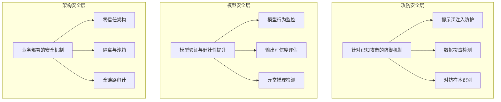

**《人工智能安全治理框架》2.0版**的发布标志着我国人工智能治理体系建设步入新阶段。相较于1.0版，2.0版进一步提出"可信应用、防范失控"新原则，新增应用衍生风险治理维度且强化开源与供应链安全机制。[^54]这一转变使"可信"从抽象原则转化为制度化可执行要求。

然而，**预测2026年40%的企业将使用智能体，但仅有6%的企业在应用中纳入安全考量**。[^14]这一数据揭示了安全意识与应用速度之间的严重脱节，为行业敲响警钟。

### 5.3 产业落地障碍：中小企业数字化门槛、算力成本与就业冲击

AI技术从实验室走向产业前线的过程中，面临着一系列结构性障碍。这些障碍不仅制约着AI的普及速度，更可能加剧产业分化，影响社会公平。

#### 5.3.1 中小企业面临的"算力高墙"

**在"百模大战"的喧嚣与科技巨头算力竞赛的阴影下，AI产业中的中小企业正被日益高耸的"算力高墙"围困**。[^58]这些企业犹如产业生态中的"毛细血管"，尽管体量不大，却承载着最具活力和多样性的创新基因。

中小企业面临的算力困境体现在三个层面：

| 困境维度 | 具体表现 | 量化数据 |
|---------|---------|---------|
| **硬件采购成本** | 高端GPU集群价格高昂 | 一套搭载H800 GPU的英伟达DGX SuperPOD中标金额达2.592亿元[^58] |
| **租赁模式困境** | 每卡每月费用高昂，资源调度不稳定 | 公司近60%的研发资金用于算力租赁[^58] |
| **资本竞争壁垒** | 算力竞争演变为资本主导的"游戏" | GPT-4训练成本达7800万美元[^58] |

**工业和信息化部数据显示，我国中小企业贡献50%以上税收、60%以上GDP、70%以上技术创新成果**。[^58]然而，这些最具创新活力的主体却最易受到外部环境的冲击。当前不断攀升的算力成本，成为悬在AI中小企业头顶的"达摩克利斯之剑"。

这种"算力依赖型"的生存模式让中小企业陷入**"创新投入越高，生存压力越大"**的恶性循环。[^58]一旦研发周期超出预期，资金链断裂的风险就会急剧上升。

#### 5.3.2 算力能源供给的结构性瓶颈

**推理算力需求的百倍级增长将带来巨大的能源消耗压力**。周鸿祎在其预测中明确指出，2026年算力端将从"训练竞赛"转向"推理革命"，高频长流程的推理需求将实现百倍级增长，**能源供给而非芯片数量将成为核心瓶颈**。[^14]

以Agentic Coding为例，完成一个项目需要消耗百万级别token，与chatbot单次交互消耗一千左右token相比，**算力消耗提升3个数量级**。这意味着，当智能体应用规模化落地时，算力需求将呈现爆发式增长。

算力供需矛盾的具体表现：

- **算力结构单一**：当前算力供给以训练为主导，推理算力供给相对不足
- **高端算力紧缺**：国产加速卡性能差距大，高端算力供给不足[^58]
- **能源消耗压力**：AI成为数字时代的"电老虎"，能源供给稳定性直接制约行业发展[^14]

**中科曙光高级副总裁李斌指出，封闭式的模型训练和部署已从原先的单芯片算力需求转变为紧耦合的算力集群系统，且系统复杂度越来越高**。[^58]这种复杂性进一步提高了算力基础设施的建设门槛与运营成本。

#### 5.3.3 破解算力困局的可行路径

面对算力困局，产业界正在探索多元化的解决方案：

**路径一：构建开放协同的产业生态**。中科曙光协同AI芯片、AI整机、大模型等20多家产业链上下游企业，共同发布国内首个AI计算开放架构，旨在打造类似"安卓"的生态。[^58]该架构支持多品牌加速卡并兼容主流AI软件生态，既避免用户被单一技术路线绑定，也显著降低了硬件采购与AI软件开发适配成本。

**路径二：推动算力普惠化**。全国政协委员曹鹏建议，要加强建设异构算力，降低智算成本；推动链主企业向中小企业开放智算配额，实现产业智算普惠。[^59]通过算力券、应用补贴等模式，直接降低中小企业的初始投入门槛。

**路径三：优化全国一体化算力布局**。"东数西算"战略的深入推进，旨在打造全国一体化算力网络，实现算力资源的统筹规划和高效调度。[^59]这一布局有助于发挥中国绿色电力优势，缓解东部地区的能源供给压力。

#### 5.3.4 就业结构调整的社会影响

**智能体规模化落地可将重复性工作时间减少40%**，这一数据背后是就业结构的深刻调整。[^14]尽管人机协同范式强调"重构"而非"替代"，但转型过程中的阵痛不可忽视。

就业冲击的结构性特征：

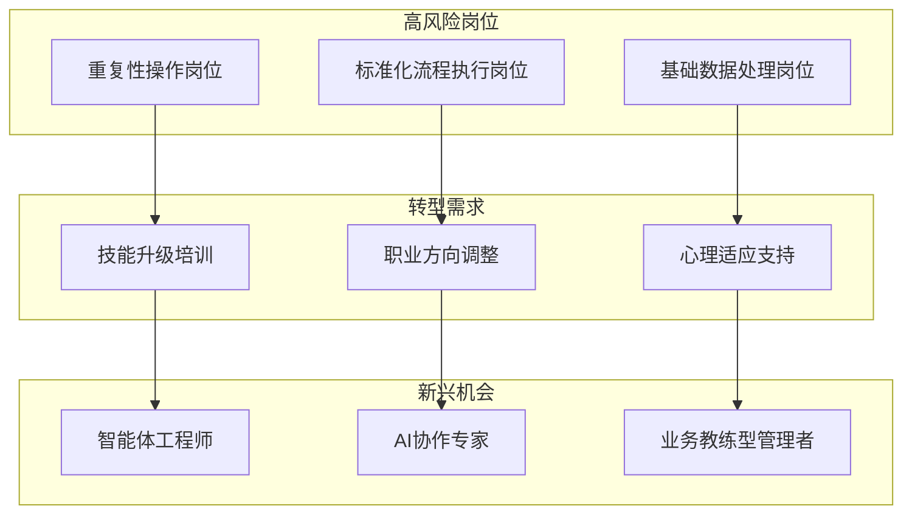

**部分重复性岗位被替代的劳动者需要通过技能培训实现转型，这需要企业、政府与社会的协同发力**。[^14]然而，技能转型面临多重挑战：

- **时间紧迫性**：AI技术迭代速度远超传统技能培训周期
- **资源分配不均**：中小企业员工获取培训资源的渠道有限
- **心理适应压力**：从"被AI辅助"到"与AI协作"的角色转变需要心理调适

### 5.4 远期颠覆性技术：量子计算等新兴技术的潜在影响

在关注当前AI技术瓶颈与落地障碍的同时，软件行业还需前瞻性地评估远期颠覆性技术的潜在冲击。量子计算作为最具代表性的新兴技术，其民用化进程正在加速，可能对软件行业的技术基础与人才结构产生根本性影响。

#### 5.4.1 量子计算民用化进程加速

**量子计算机的民用化进程正在加速推进，一个由超强算力主导的新时代即将到来**。[^60]从中国移动牵头搭建量子加密试验网，到金融机构探索量子计算在风险评估中的应用，再到科技企业加速量子编程框架的研发，种种信号都在表明量子计算正从实验室走向产业应用。

量子计算的颠覆性源于其独特的并行计算模式。**传统计算机以二进制位为基本单位，每次只能处理一个数据；而量子计算机以量子比特为单位，一个量子比特可以同时处于0和1两种状态，多个量子比特就能形成海量的并行计算通道，从而实现算力的指数级增长**。[^60]

量子计算的三大核心特性：

| 特性 | 技术原理 | 应用价值 |
|-----|---------|---------|
| **量子叠加** | 量子比特可同时处于多个状态 | 实现大规模并行计算 |
| **量子纠缠** | 纠缠态量子比特状态紧密关联 | 提供强大的并行处理能力 |
| **量子干涉** | 计算结果通过干涉过程增强或削弱 | 优化计算过程，加速问题求解 |

#### 5.4.2 对现有加密体系的根本性威胁

**量子计算对软件行业最直接的冲击在于其对现有加密体系的根本性威胁**。[^60]当前主流的加密体系——RSA、ECC等——都是基于传统计算机难以破解的数学难题（如大数分解、离散对数问题）构建的。

1994年提出的"肖尔算法"能够在多项式时间内解决大数分解和离散对数问题，这意味着**当前主流加密算法在量子计算机面前将不再安全**。曾经需要传统计算机耗费上千年才能破解的加密信息，量子计算机可能只需几小时甚至几分钟就能轻松破解。[^60]

这一威胁对软件行业的影响是系统性的：

- **网络安全体系重构**：SSL证书、VPN隧道、数字签名等安全机制需要全面升级
- **数据保护策略调整**：历史加密数据面临"先存储后破解"的风险
- **合规要求演变**：金融、医疗等强监管行业的数据安全标准将大幅提高

**传统密码学相关从业者面临技能失效风险**。无论是SSL证书工程师、传统密码破译员，还是普通加密系统维护人员，其核心工作技能都围绕着传统加密技术展开。一旦量子加密技术普及，这些岗位的需求将急剧减少。[^60]

#### 5.4.3 量子计算在多领域的颠覆性应用潜力

**量子计算的影响远不止于密码学领域，其在金融、医药、材料科学等领域的应用潜力同样具有颠覆性**。[^61]

**金融行业应用前景**：

- **风险建模加速**：量子计算可在极短时间内解决传统方法难以应对的复杂优化问题，实现更快速的投资组合优化
- **定价效率提升**：对于复杂金融产品，传统计算方法需要数周甚至数月才能完成定价与风险评估，量子计算可能在几分钟或几秒钟内完成
- **量子随机数生成**：为加密算法、风险模拟等提供真正的随机数[^61]

**制药与生命科学应用前景**：

- **分子模拟与药物设计**：量子计算可处理更为复杂的分子结构和化学反应，帮助科学家快速筛选潜在药物
- **基因组学与精准医疗**：加速基因数据分析，推动精准医疗发展
- **疫苗研发加速**：在短时间内模拟病毒结构，提升疫苗设计效率[^61]

**化学与材料科学应用前景**：

- **新材料发现**：量子计算可革命性地改变材料科学研究方式
- **反应优化**：优化化学反应路径，提升生产效率
- **催化剂设计**：加速新型催化剂的发现与优化[^61]

#### 5.4.4 软件行业的前瞻性布局方向

面对量子计算的潜在冲击，软件行业需要提前进行技术储备与人才培养：

**技术储备方向**：

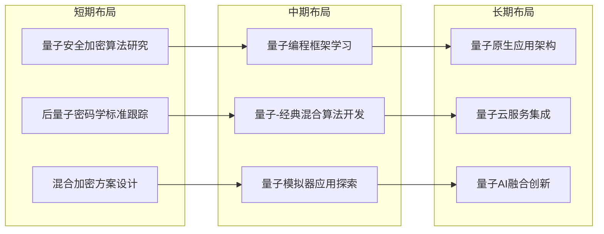

**人才培养方向**：

- **量子计算基础**：理解量子力学原理、量子算法设计
- **量子编程技能**：掌握Qiskit、Cirq等量子编程框架
- **跨学科整合能力**：具备将量子计算与传统软件工程结合的能力

**量子计算与AI技术融合可能带来的叠加效应**值得特别关注。量子机器学习、量子神经网络等交叉领域的突破，可能为软件行业带来超越当前想象的变革。然而，这种融合的具体路径与时间表仍存在高度不确定性，需要行业保持密切关注与灵活应对。

---

综上所述，AI驱动的软件行业变革进程面临着**技术瓶颈、安全伦理、产业落地、远期颠覆**四重挑战。这些挑战并非否定AI替代与增强的大趋势，而是揭示了变革进程的边界条件与不确定性因素。

**核心洞察**：

- **技术层面**：幻觉累加、工具调用局限、长期记忆不足、泛化能力受限等瓶颈，决定了AI替代是分层、渐进的过程，而非一蹴而就的革命
- **安全层面**：决策可验证性、数据隐私、AI自身安全等风险，要求建立"人在回路"的治理原则与"以AI对抗AI"的防御范式
- **产业层面**：算力高墙、能源瓶颈、就业冲击等障碍，需要通过生态开放、算力普惠、社会协同等路径逐步化解
- **远期层面**：量子计算等颠覆性技术的潜在冲击，要求行业保持前瞻性布局与技术储备

理解这些挑战与风险，不是为了否定AI时代的到来，而是为了**更清醒地认识变革的复杂性，更务实地规划转型的路径，更稳健地把握发展的节奏**。唯有如此，软件行业才能在AI浪潮中既抓住机遇，又规避风险，实现高质量的可持续发展。

## 6 综合研判：可能性展望与战略启示

本章在前述技术趋势、生命周期渗透分析、人机协同范式及挑战风险评估的基础上，系统研判软件行业被AI"替代"的可能性光谱与演进时间框架，明确"深度增强与协同"而非"全面替代"的核心结论。进而从软件从业者、企业、行业生态与政策制定者四个层面，提出具有针对性和可操作性的战略启示与行动建议，为各利益相关方在AI浪潮中把握机遇、规避风险、实现可持续发展提供系统性参考。

### 6.1 AI替代可能性光谱：从任务自动化到范式协同的分层图谱

基于前述章节对软件生命周期各环节的深度剖析，AI对软件行业的替代效应呈现出清晰的**分层、渐进、差异化**特征。这一可能性光谱并非简单的"能替代/不能替代"二元划分，而是基于任务性质形成的连续分布图谱，揭示了"执行层高、策略层低"的核心替代规律。

#### 6.1.1 高替代层：规则明确的执行性任务

**高替代层涵盖效率提升超过50%的重复性、规则化任务**，这些任务具有明确的输入输出边界、可标准化的执行流程以及较低的创造性要求。AI在这一层级已展现出显著的替代优势：

| 任务类型 | 替代程度 | 效率提升效果 | 技术支撑 |
|---------|---------|-------------|---------|
| **数据收集与报表生成** | 高 | 报表制作周期缩短60% | 自动化ETL+NLP |
| **代码片段补全与生成** | 高 | 开发时间节省60%以上，生成速度快5-10倍 | LLM代码模型 |
| **标准化测试用例执行** | 高 | 执行时间缩短60%，覆盖率提升40% | 智能测试框架 |
| **UI测试脚本自我修复** | 高 | 维护成本降低70%以上 | 自适应定位算法 |
| **设备状态监控与预测性维护** | 高 | 设备故障率降低30%以上 | 时间序列预测 |
| **静态生产排程** | 高 | 排产决策从数小时缩短至分钟级 | 优化算法+AI调度 |

这些任务的共同特征是**可规则化、重复性高、对创造力依赖度低**。AI通过模式识别、流程自动化与智能优化，已能够在这些领域实现对人类执行工作的大规模替代。值得注意的是，这种替代并非意味着相关岗位的完全消失，而是将人类从低价值的重复劳动中解放出来，转向更高价值的监督、优化与创新工作。

#### 6.1.2 中替代层：人机协同的协作性任务

**中替代层涵盖需要人机协同完成的协作性任务**，这些任务既有可自动化的组成部分，也包含需要人类判断介入的决策环节：

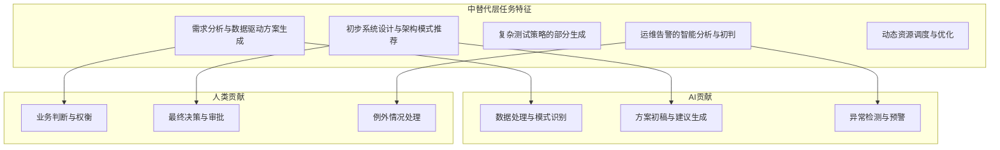

在这一层级，AI的价值体现为**效率辅助与决策支持**，而非完全替代。典型案例包括：处理长文档任务效率提升近8倍；生产排产决策从数小时缩短至分钟级；订单响应速度提升50%，生产线切换时间缩短35%。这些效率提升的实现依赖于人机协作的有效配合——AI负责数据处理、方案生成与初步判断，人类负责业务权衡、最终决策与例外处理。

#### 6.1.3 低替代层：人类主导的战略性任务

**低替代层涵盖需要创造力、复杂系统理解与价值判断的战略性任务**，这些任务的核心决策权仍由人类主导，AI仅作为增强工具：

- **模糊业务目标设定与创新性需求挖掘**：AI难以理解客户未明确表达的隐含需求，无法主动挖掘业务痛点背后的深层动因
- **复杂系统架构与颠覆性创新设计**：架构决策需要深刻理解业务战略、市场竞争态势与组织能力边界，这些信息往往是隐性的、动态的
- **大型企业级软件的核心开发与维护**：软件维护占生命周期成本67%，AI更擅长生成而非精确修改，在大型项目开发中受限于上下文
- **探索性测试与深度业务逻辑验证**：发现未知缺陷需要对业务场景的深度理解与创造性思维
- **跨系统根因分析与长期运维战略制定**：涉及多系统、多组件的复杂故障定位与战略规划超出AI能力范围
- **涉及伦理与情感的任务**：价值判断、伦理权衡与情感交互需要人类的同理心与道德判断能力

**"执行层高、策略层低"的分层规律**深刻揭示了AI替代的本质边界：AI擅长处理**确定性高、规则明确、模式可识别**的任务，而在面对**不确定性高、需要创造力、涉及价值判断**的任务时，人类的核心优势仍不可替代。这一规律为软件行业从业者的技能转型与企业的战略布局提供了清晰的方向指引。

### 6.2 演进时间框架：短中长期替代深度与节奏预判

AI对软件行业的渗透与替代并非一蹴而就的革命，而是遵循技术成熟度曲线的渐进演化过程。结合技术发展态势、产业落地进展与瓶颈制约因素，可将这一演进划分为**短期（2025-2027年）、中期（2027-2030年）、长期（2030年以后）**三个阶段。

#### 6.2.1 短期阶段（2025-2027年）：规模化落地与生态构建期

**短期阶段的核心特征是AI原生应用与智能体协同的规模化商业落地**。2024-2026年被定义为"规模化落地与生态构建期"，这一阶段的关键变化包括：

| 演进维度 | 具体表现 | 量化指标 |
|---------|---------|---------|
| **智能体规模** | 从商业落地初期进入"百亿智能体时代" | 2026年底40%企业应用将嵌入任务型AI智能体 |
| **算力结构** | 从"训练竞赛"转向"推理革命" | 推理算力需求实现百倍级增长 |
| **开发范式** | 低代码平台成为企业数字化核心基础设施 | 国内市场规模年增28.3%，AI增强开发效率提升300%-500% |
| **计算架构** | 云边端协同架构成为新建系统主流 | 2026年75%新建企业系统采用此架构 |

短期阶段的**关键转折节点**在于：应用服务商的快速响应能力（数天内集成新模型）、垂直领域全链路解决方案的落地验证、以及智能体能力从聊天向自主规划与"蜂群协作"的演进。这一阶段，**高替代层任务的自动化将基本完成**，中替代层任务的人机协同模式将逐步成熟。

#### 6.2.2 中期阶段（2027-2030年）：深度渗透与能力突破期

**中期阶段的核心特征是AI能力在复杂任务场景的深度突破**。这一阶段的关键变化将围绕以下技术突破点展开：

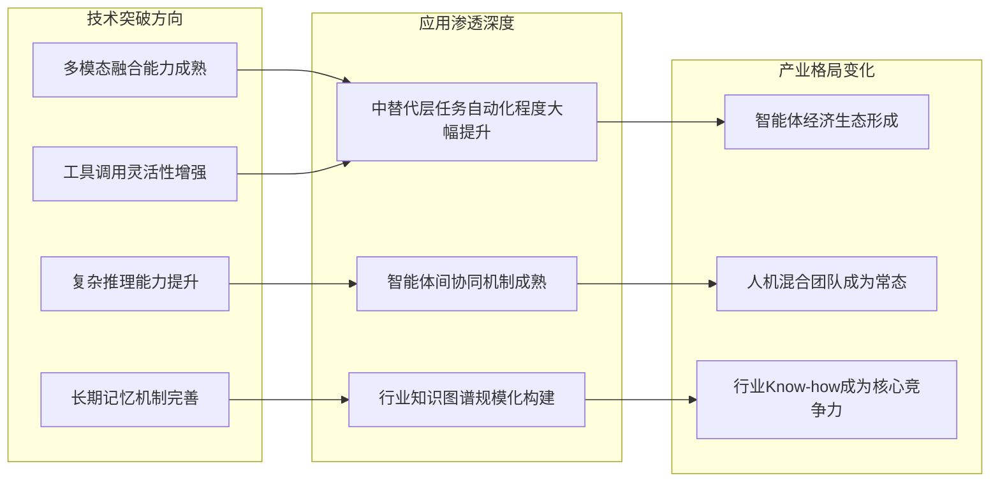

中期阶段的**关键制约因素**包括：AI幻觉问题的有效抑制、上下文窗口限制的突破、以及泛化迁移能力的实质性提升。这些技术瓶颈的突破程度将直接决定AI向低替代层任务渗透的深度与速度。预计到这一阶段末期，**中替代层任务的自动化程度将显著提升**，部分低替代层任务（如初步架构建议、测试策略框架设计）也将开始受到AI的深度辅助。

#### 6.2.3 长期阶段（2030年以后）：范式重构与边界探索期

**长期阶段的核心特征是软件开发范式的根本性重构与AI能力边界的持续探索**。这一阶段的演进方向存在较高不确定性，但以下趋势具有较高确定性：

- **"编排智能"成为核心开发模式**：开发者的核心工作从"编写代码"彻底转向"设计智能体工作流、管理上下文、定义交互规则"
- **"碳基硅基混合团队"成为组织常态**：人类角色转向业务教练、智能体管理者和复杂问题裁决者
- **行业Know-how的数字化深度决定竞争力**：将隐性行业经验转化为机器可调用的知识成为企业核心护城河

长期阶段的**潜在颠覆性变量**包括：量子计算对现有加密体系与计算范式的冲击、通用人工智能（AGI）的可能突破、以及目前尚未预见的新兴技术涌现。这些变量可能从根本上改变AI替代的边界条件与演进轨迹。

### 6.3 核心结论："深度增强与协同"而非"全面替代"

综合技术能力边界、安全伦理约束、产业落地障碍等多重因素的系统分析，本研究得出核心结论：**软件行业更可能走向"人机深度增强与协同"而非"AI全面替代人类"的演进路径**。这一结论的支撑依据来自三个维度。

#### 6.3.1 技术能力边界的客观制约

AI当前面临的技术瓶颈决定了其替代能力的客观上限：

**幻觉累加效应**：在涉及20个步骤的复杂任务中，即便单步准确率达到95%，整体成功率也仅有约36%。这一数学逻辑决定了AI难以在高精度、长链条的复杂任务中实现完全自主。

**上下文窗口限制**：当前主流模型的上下文窗口限制在200K左右，对应约1.5万行代码。在大型企业级系统的核心开发与维护中，AI的理解能力受到显著制约。

**泛化迁移能力不足**：多数智能体仍局限于窄域应用，跨领域适配需要大量人工干预。这意味着AI无法成为"万能解决方案"，而需要针对不同业务场景构建专属解决方案。

#### 6.3.2 安全伦理约束的刚性边界

**"人在回路"治理原则的必要性**源于AI决策的三重不确定性：输入不确定性（数据质量波动、边界条件模糊）、推理不确定性（模型内部机制不透明、推理路径难以追溯）、输出不确定性（结果准确性无法保证、置信度评估不可靠）。

在金融分析、医疗诊断、安全防护等高风险场景中，**人类的最终否决权不可或缺**。这种治理原则的刚性约束决定了AI只能作为决策辅助工具，而非决策主体。

#### 6.3.3 AI作为"生产力杠杆"的本质定位

**AI的本质定位是"生产力杠杆"而非"劳动力替代者"**。这一定位的内涵包括：

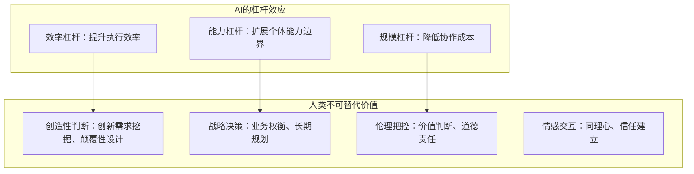

**"不会用AI的程序员将被会用AI的同行淘汰"**——这一判断精准概括了AI时代的竞争逻辑。AI带来的是职业能力的升级要求，而非职业本身的消亡。适应变化的关键在于提升抽象思维、强化工程治理能力，并善用AI作为生产力杠杆。

### 6.4 软件从业者战略启示：技能转型与职业发展路径

面对AI驱动的行业变革，软件从业者需要主动进行技能重构与职业规划调整。**核心转型方向是从"编码执行者"向"智能指挥家"的角色蜕变**。

#### 6.4.1 技能迁移的四大方向

**从编码执行向系统设计迁移**：传统开发者需用代码穷尽所有分支逻辑；而今，开发者用自然语言定义任务目标，由大模型动态生成解决方案。这要求从业者从"如何实现"转向"为何如此设计"，关注可扩展性、容错机制与系统边界。

**从技术专精向业务洞察迁移**：AI时代的核心竞争力不在于掌握多少编程语言，而在于对业务场景的深度理解。能够将模糊的业务需求转化为精准的技术方案，是AI难以替代的核心能力。

**从单兵作战向AI协作迁移**：学会与AI协作成为必备技能。这包括提示工程（设计精准指令链引导模型输出）、输出评估（判断AI生成内容的质量与可靠性）、以及人机流程设计（确定何时由AI执行、何时由人类介入）。

**从深度专精向跨领域整合迁移**：AI时代需要"T型人才"——既有一定的技术深度，又具备跨领域整合能力。能够将AI能力与业务场景、组织流程、用户需求有机结合，创造系统性价值。

#### 6.4.2 新兴核心技能的培养路径

| 技能类型 | 具体内涵 | 培养路径 |
|---------|---------|---------|
| **提示工程** | 设计精准指令链引导模型输出 | 系统学习提示设计原则，大量实践迭代优化 |
| **智能体编排** | 协调多智能体协同完成复杂任务 | 理解智能体架构，掌握工作流设计方法 |
| **知识重构** | 将企业数据转化为可调用知识体系 | 学习知识图谱构建，理解数据治理原则 |
| **伦理校准** | 监控系统公平性，规避逻辑风险 | 关注AI伦理规范，培养风险识别意识 |

#### 6.4.3 职业发展的战略建议

**短期（1-2年）**：主动拥抱AI工具，将其融入日常工作流程。在现有岗位职责范围内，探索AI辅助提升效率的具体场景。同时，关注行业动态，了解AI技术发展趋势与应用案例。

**中期（2-5年）**：系统性提升AI协作能力，向"智能体工程师"或"AI协作专家"方向发展。深化业务领域理解，建立跨领域整合能力。考虑向管理岗位转型，培养"业务教练型"领导力。

**长期（5年以上）**：成为"碳基-硅基"混合团队的核心成员，在战略决策、创新引领、伦理把控等领域发挥不可替代价值。持续学习新兴技术（如量子计算），保持对行业变革的敏感度与适应力。

### 6.5 企业战略启示：组织重构与竞争力重塑

软件企业面临的战略挑战不仅是技术层面的工具升级，更是组织形态与竞争逻辑的根本性重构。**核心转型方向是从"技术能力竞争"向"生态构建竞争"的战略升维**。

#### 6.5.1 "碳基-硅基"混合团队的构建策略

**组织架构调整原则**：

```mermaid
graph TD
    subgraph 传统组织架构
        O1[金字塔型层级结构]
        O2[职能边界清晰]
        O3[人工执行为主]
    end
    
    subgraph 混合团队架构
        N1[扁平化协作网络]
        N2[职能边界模糊化]
        N3[人机协同执行]
    end
    
    subgraph 转型关键点
        K1[管理者角色：从指挥官到业务教练]
        K2[绩效评估：从工时到产出质量]
        K3[流程设计：明确人机分工边界]
    end
    
    O1 --> N1
    O2 --> N2
    O3 --> N3
    N1 --> K1
    N2 --> K2
    N3 --> K3
```

**实施路径建议**：

- **第一阶段**：在非核心业务场景试点智能体应用，积累人机协作经验
- **第二阶段**：建立AI工具评估与选型机制，形成企业级AI应用标准
- **第三阶段**：重构核心业务流程，实现人机协同的常态化运营
- **第四阶段**：培养内部"智能体工程师"团队，建立持续优化能力

#### 6.5.2 行业Know-how资产化的战略价值

**当大模型性能趋同时，行业Know-how成为新的核心护城河**。将隐性的行业经验、业务流程数字化、结构化，形成机器可调用的知识，是AI可靠落地的关键。

行业Know-how资产化的实施框架：

| 实施阶段 | 核心任务 | 预期成果 |
|---------|---------|---------|
| **知识梳理** | 识别核心业务流程中的隐性知识 | 形成知识资产清单 |
| **结构化表达** | 将隐性知识转化为规则、流程、知识图谱 | 建立可机器调用的知识库 |
| **AI融合** | 将知识库与AI模型深度集成 | 实现AI在专业场景的可靠输出 |
| **持续迭代** | 建立知识更新与优化机制 | 形成数据飞轮效应 |

#### 6.5.3 中小企业的差异化突围策略

面对"算力高墙"与资源约束，中小企业需要采取差异化的AI应用策略：

**聚焦垂直场景**：不追求"万能智能体"，而是针对特定业务痛点构建专属解决方案。正如"小而美"哲学所倡导的——专注一个非常小的痛点，做成极致的单品。

**借力开源生态**：充分利用DeepSeek、通义千问等中国开源模型，降低AI应用的技术门槛与成本投入。

**寻求算力普惠**：关注政府算力券、产业链算力共享等政策机会，降低初始投入门槛。

**构建差异化壁垒**：将企业特有的行业经验、客户关系、业务流程转化为AI难以复制的竞争优势。

### 6.6 行业生态与政策制定者启示：治理框架与发展环境优化

AI驱动的软件行业变革需要健全的治理框架与良好的发展环境作为支撑。政策制定者与行业生态建设者需要在**创新激励与风险防控之间寻求平衡**。

#### 6.6.1 AI安全治理体系的完善方向

**"人在回路"治理原则的制度化落地**是当务之急。《人工智能安全治理框架》2.0版提出的"可信应用、防范失控"新原则，需要转化为可操作的实施细则：

- **关键决策点识别标准**：明确哪些场景必须保留人类否决权
- **可追溯性要求**：建立AI决策的全流程记录与审计机制
- **责任认定规则**：明确AI系统出现问题时的责任划分框架

**"以AI对抗AI"的防御范式**需要产业协同：

```mermaid
graph TD
    subgraph 政策层面
        P1[AI安全标准制定]
        P2[安全认证体系建立]
        P3[跨境数据治理规则]
    end
    
    subgraph 产业层面
        I1[安全技术研发投入]
        I2[威胁情报共享机制]
        I3[应急响应协同网络]
    end
    
    subgraph 企业层面
        E1[安全意识培训]
        E2[安全评估流程]
        E3[安全运营体系]
    end
    
    P1 --> I1
    P2 --> I2
    P3 --> I3
    I1 --> E1
    I2 --> E2
    I3 --> E3
```

#### 6.6.2 算力普惠化的推进路径

**破解中小企业"算力高墙"困境**需要多方协同：

- **算力券与应用补贴**：通过财政手段直接降低中小企业的初始投入门槛
- **产业链算力共享**：推动链主企业向中小企业开放智算配额
- **开放协同的产业生态**：支持类似"AI计算开放架构"的生态建设，避免用户被单一技术路线绑定
- **全国一体化算力布局**：深入推进"东数西算"战略，实现算力资源的统筹规划和高效调度

#### 6.6.3 人才培养体系的重构方向

**教育体系需要适应AI时代的能力需求**：

| 培养层次 | 重点方向 | 具体举措 |
|---------|---------|---------|
| **基础教育** | AI素养与计算思维 | 将AI基础知识纳入中小学课程 |
| **高等教育** | 跨学科整合能力 | 打破学科壁垒，培养"T型人才" |
| **职业教育** | AI工具应用技能 | 开设智能体编排、提示工程等专业课程 |
| **继续教育** | 在职人员技能转型 | 建立企业与高校联合培养机制 |

#### 6.6.4 就业转型支持机制的建立

**平衡AI发展与就业稳定**需要系统性的支持机制：

- **技能转型培训补贴**：为受AI冲击的从业者提供再培训资金支持
- **新兴岗位就业引导**：发布"智能体工程师"等新职业标准，引导就业方向调整
- **社会保障体系完善**：研究AI时代的社会保障制度创新，应对就业结构性调整带来的社会影响
- **中小企业稳岗支持**：为中小企业提供AI转型过程中的稳岗补贴与技术支持

---

**综合研判结论**：软件行业正经历以**AI原生与智能体**为核心的根本性重塑。AI的替代效应已清晰呈现基于任务性质的光谱分布——短期内（1-3年）在重复性任务上替代显著，长期看人机协同将成为绝对主流。行业未来竞争力取决于**"编排智能"的能力**、**行业Know-how的数字化深度**以及**融入智能体生态的速度**。

对于各利益相关方而言：

- **软件从业者**需主动拥抱技能转型，从"代码建造者"蜕变为"智能指挥家"
- **软件企业**需重构组织形态，从"技术能力竞争"升维至"生态构建竞争"
- **政策制定者**需平衡创新激励与风险防控，构建健全的AI治理框架与发展环境

**"等等看"的窗口期已经关闭**。在AI技术快速迭代、产业格局加速重构的当下，主动适应、积极布局是唯一正确的选择。唯有如此，软件行业的各参与方才能在"碳基硅基"混合的新常态中占据先机，实现高质量的可持续发展。

# 参考内容如下：
[^1]:[软件行业简介范文](https://wenku.baidu.com/view/2f249f7d1ad9ad51f01dc281e53a580216fc507c.html)
[^2]:[软件](https://m.chyxx.com/wiki/1175552.html)
[^3]:[2025年中国软件行业分类、发展政策及细分市场收入占比 ](https://news.sohu.com/a/863508202_121717379)
[^4]:[AI取代程序员?深度解析2025职业危机与破局之道](https://blog.csdn.net/InstrFun/article/details/152603563)
[^5]:[分析1.8亿份招聘数据后,告诉你AI究竟取代了哪些工作! ](https://www.uisdc.com/ai-jobs)
[^6]:[AI驱动科技企业人才五大变革:解析四种新兴组织范式及领导者适配策略](https://baijiahao.baidu.com/s?id=1846834574567998513&wfr=spider&for=pc)
[^7]:[软件编程的时代变迁 ](https://wap.sciencenet.cn/home.php?mod=space&uid=451666&do=blog&id=1490852)
[^8]:[Karpathy最新分享!给大模型做好“服务”将是巨大机会](https://developer.volcengine.com/articles/7518983663553118247)
[^9]:[AI技术将取代传统的行业及其不可替代的人类职业:颠覆与共生](https://www.meipian.cn/5as0kof7)
[^10]:[2026年人工智能竞争焦点:从数字推演到物理世界的三大范式跃迁](https://www.163.com/dy/article/KJO8MBMR0512EMRM.html)
[^11]:[ToB商业大变局,谁是新王?](http://app.myzaker.com/news/article.php?m=1769411558&pk=697712df8e9f09379618d797)
[^12]:[年中国软件和信息技术服务业发展报告](https://wenku.baidu.com/view/6c1bf348ba1e650e52ea551810a6f524ccbfcb73.html)
[^13]:[中国软协发布《中国软件产业高质量发展报告(2024)》](http://www.xinhuanet.com/tech/20241010/421cdfe443964a17a00f907e57d54e94/c.html)
[^14]:[周鸿祎放话:2026是百亿智能体元年!AI要当“硅基同事”](https://baijiahao.baidu.com/s?id=1855386504064881970&wfr=spider&for=pc)
[^15]:[中国AI的崛起之秘:应用导向与高性价比共振](https://baijiahao.baidu.com/s?id=1854980961505532193&wfr=spider&for=pc)
[^16]:[“硅基同事”来了!珠海AI产业将从单点突破向生态崛起转变](https://baijiahao.baidu.com/s?id=1829021469120255828&wfr=spider&for=pc)
[^17]:[百融云创携硅基员工解决方案亮相2025智博会](https://www.163.com/dy/article/K8S52AUS05346936.html)
[^18]:[当“永生”数字人成为你同事,管理逻辑已彻底颠覆!](https://baijiahao.baidu.com/s?id=1853706989999396467&wfr=spider&for=pc)
[^19]:[一文认识低代码开发平台:低代码平台定义与选型指南(2026版)](https://baijiahao.baidu.com/s?id=1853736601476096261&wfr=spider&for=pc)
[^20]:[人人都能编程的时代来了吗?专家深度解读“AI 编程”](https://baijiahao.baidu.com/s?id=1854831832127504757&wfr=spider&for=pc)
[^21]:[AI为笔,重塑设计:2025年企业智能化实践案例集](https://baijiahao.baidu.com/s?id=1855102865901657213&wfr=spider&for=pc)
[^22]:[边缘计算重构云计算格局:2026年趋势与测试应对策略](https://blog.csdn.net/2501_94436481/article/details/155771764)
[^23]:[2024最流行的网站架构----边缘平台架构:概念与产品](https://www.ruanyifeng.com/blog/2024/03/edge-platform.html)
[^24]:[云边协同系统架构](https://support.huaweicloud.com/topic/1432430-2-Y)
[^25]:[解码边缘智能元年:四大核心要素引领人工智能进化新方向](https://baijiahao.baidu.com/s?id=1855067998605578208&wfr=spider&for=pc)
[^26]:[AI技术重塑网络安全攻防格局,派拓网络带来应对之策](https://news.sina.cn/ai/2026-01-26/detail-inhiriva6420869.d.html)
[^27]:[“AI+”时代网络安全挑战升级,如何构建有效新防线? ](https://www.minhou.gov.cn/xjwz/zwgk/ztzl/bsgjmm/202512/t20251209_5255250.htm)
[^28]:[专家解读|构建安全可信可控的AI新生态 ](https://www.cac.gov.cn/2025-09/26/c_1760606717425964.htm)
[^29]:[卓驭科技携手深信服构建AI安全运营体系,护航智能驾驶数据安全](http://news.10jqka.com.cn/20260127/c674327488.shtml)
[^30]:[三大挑战五大风险何解?且看企业AI办公安全解决方案](https://www.dbappsecurity.com.cn/content/details4756_35272.html)
[^31]:[达沃斯论坛见证中国AI崛起:自主算力成智能未来基石](https://baijiahao.baidu.com/s?id=1855367527193926499&wfr=spider&for=pc)
[^32]:[2026大模型伦理深度观察:理解AI、信任AI、与AI共处](https://baijiahao.baidu.com/s?id=1854122806817045634&wfr=spider&for=pc)
[^33]:[AI自动化报告算法案例有哪些?应用场景全解析](https://www.finereport.com/blog/article/69453e4d86e97409bbd43da1)
[^34]:[微软和人大:让AI在虚拟计算机里“折腾”,智能水平竟然飙升了](https://baijiahao.baidu.com/s?id=1855384713077256452&wfr=spider&for=pc)
[^35]:[华泰|Agentic Coding推理新范式,关注算力结构化机遇](https://baijiahao.baidu.com/s?id=1855425325698663221&wfr=spider&for=pc)
[^36]:[2025年AI编程助手效率提升实战指南:开发者如何节省60%时间](http://k.sina.com.cn/article_7879848900_1d5acf3c401902oveg.html)
[^37]:[ByteDance突破代码生成新边界:让AI写代码像人类一样“边想边写”](https://baijiahao.baidu.com/s?id=1855384503516479942&wfr=spider&for=pc)
[^38]:[深入理解与实践:基于AI的软件测试自动化](https://developer.aliyun.com/article/1499282)
[^39]:[AI辅助测试自动化框架设计:构建智能、高效的测试体系](https://cloud.tencent.com/developer/article/2587216)
[^40]:[人工智能如何赋能工业生产?提升自动化效率的关键方案解析](https://www.fanruan.com/blog/article/1802527/)
[^41]:[工业AI大模型优化汽车生产排产:技术原理与实践案例原创](http://k.sina.com.cn/article_7879848900_1d5acf3c401902os3q.html)
[^42]:[三天三场OPC盛会席卷杭州:AI赋能“一人公司” 超级个体如何重塑创业生态](https://zjnews.zjol.com.cn/zjnews/202601/t20260127_31474698.shtml)
[^43]:[人工智能赋能就业模式转型 多元新形态加速涌现](https://www.zggxqy.cn/content-view/2669c9f9-fa3b-47ff-be72-398c24bf6223)
[^44]:[软件3.0时代:开发者如何从程序员蜕变为智能指挥家](https://baijiahao.baidu.com/s?id=1838964614169166163&wfr=spider&for=pc)
[^45]:[一条Karpathy推文引发的开发者九级地震](https://www.163.com/dy/article/KJAVG36J0511N33R.html)
[^46]:[AI 时代的超级个体,正在小红书上寻找自己的绿洲](https://baijiahao.baidu.com/s?id=1851177402849663322&wfr=spider&for=pc)
[^47]:[中兴通讯首席发展官崔丽:AI产业正迈入多维竞争新阶段](https://baijiahao.baidu.com/s?id=1855102094672642613&wfr=spider&for=pc)
[^48]:[从数据智能到决策智能,海致科技如何凭「图模融合」塑造产业AI新范式?](https://baijiahao.baidu.com/s?id=1855336426665080143&wfr=spider&for=pc)
[^49]:[《全球信息社会发展报告(2025)》蓝皮书发布,中国AI如何制胜未来十年](https://www.jfdaily.com/wx/detail.do?id=1055462)
[^50]:[百亿智能体浪潮将至:周鸿祎发布2026年20个AI预测](https://baijiahao.baidu.com/s?id=1854170501067211926&wfr=spider&for=pc)
[^51]:[商学院院长谈AI①丨智能体商业的黎明:AI重塑零售生态与中国路径](http://sh.people.com.cn/n2/2025/1022/c134768-41387544.html)
[^52]:[从个人走向企业和政府,智能体正在重构交互与商业模式](https://baijiahao.baidu.com/s?id=1850495149170019526&wfr=spider&for=pc)
[^53]:[中国生产力促进中心协会王羽:智能经济的概念定义、内涵特征及实践路径](http://www.xinhuanet.com/enterprise/20251014/e03d2ab8fdf64a18b6285a832cbdb8ea/c.html)
[^54]:[人工智能面临的安全风险及治理之道](https://chinawto.mofcom.gov.cn/article/br/202507/20250703586664.shtml)
[^55]:[| AI Agent 核心架构 | 智能体生命周期(感知→规划→执行→反馈)、工具调用(Function Calling)、记忆机制(短期/长期记忆)_智能体 规划 记忆-CSDN博客](https://programb.blog.csdn.net/article/details/155140216)
[^56]:[AI安全](https://www.huawei.com/cn/trust-center/ai-section)
[^57]:[什么是 AI 安全?](https://www.cloudflare.com/zh-cn/learning/ai/what-is-ai-security/)
[^58]:[中小企业如何突破AI算力“高墙”?](https://baijiahao.baidu.com/s?id=1842684777365503030&wfr=spider&for=pc)
[^59]:[两会观察:“AI+”时代下,算力困境如何破? ](http://xxzx.fujian.gov.cn/jjxx/xxhdt/202504/t20250414_6899696.htm)
[^60]:[量子计算机民用化进入倒计时!这3类职业将率先被颠覆,从业者必须警惕](https://baijiahao.baidu.com/s?id=1851028141207125730&wfr=spider&for=pc)
[^61]:[量子计算的未来:探索量子技术对行业的颠覆性影响](https://baijiahao.baidu.com/s?id=1817555823404702403&wfr=spider&for=pc)
