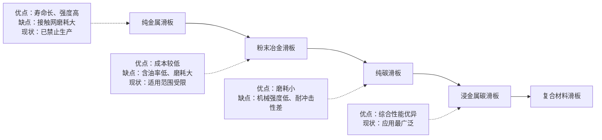
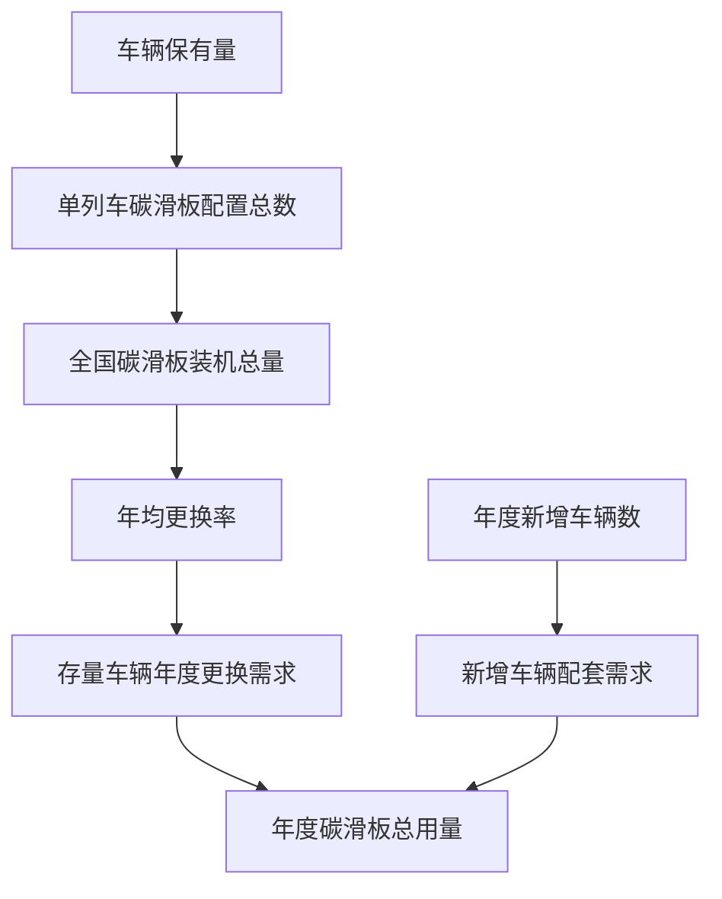
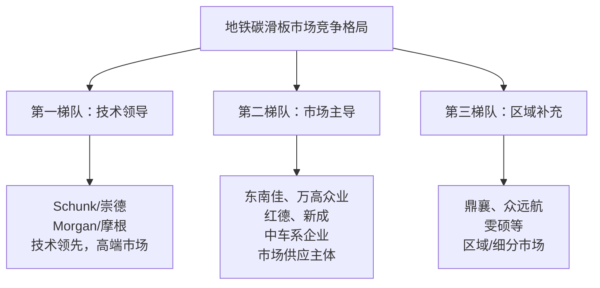
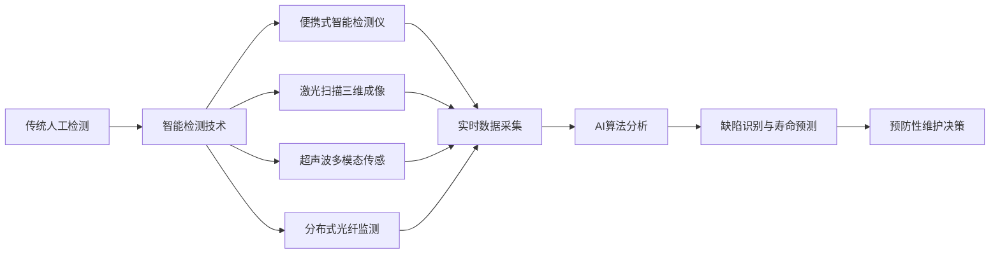

# 中国城市轨道交通地铁碳滑板年度用量、供应商格局与行业趋势研究报告
## 1 研究背景与碳滑板核心价值界定

城市轨道交通作为现代都市公共出行的核心载体，其安全高效运行依赖于受流系统的稳定电能传输。碳滑板作为受电弓与接触网之间的直接接触介质，承担着将电网电能引入列车的关键使命，是地铁系统中不可或缺的核心耗材。本章将从功能定位、技术标准、材料特性、磨损机制及研究范围五个维度，系统构建碳滑板价值分析的理论框架，为后续年度用量测算与市场格局研究奠定基础。

### 1.1 碳滑板在地铁受流系统中的功能定位

碳滑板是地铁列车从接触网获取电能的**核心传输介质**，其功能原理在于通过与架空接触网导线的直接滑动接触，实现电能从外部电网向列车牵引系统的连续传输。当地铁列车行驶时，受电弓升起使碳滑板与接触网紧密贴合，将来自电网的电能引入列车，转化为推动列车前进的动力[^1]。这一过程要求碳滑板在静止或滑动状态下均能稳定承载电流，确保电力供应的连续性与可靠性。

从系统配合关系来看，碳滑板安装于受电弓顶部，与受电弓框架、弹簧机构及自动降弓装置形成完整的受流组件。受电弓通过气动或弹簧机构提供向上的接触压力，使碳滑板以适当的压力贴合接触网导线，在列车高速运行过程中保持稳定的电气接触[^2]。碳滑板的工作状态直接影响受电弓与接触网之间的接触质量，**一旦碳滑板磨损过度或出现故障，将导致接触不良、供电中断，甚至危及行车安全**[^1]。

碳滑板在城市轨道交通中的战略地位体现在其**不可替代性**与**高消耗特性**两个方面。作为唯一直接与接触网导线发生物理接触的部件，碳滑板必须同时满足导电性能与机械耐磨性能的双重要求，是受流系统中技术要求最为苛刻的核心元件。同时，由于持续承受摩擦磨损与电弧侵蚀，碳滑板属于典型的消耗性部件，需要按照规定周期进行检测与更换，形成稳定的市场需求[^3]。

### 1.2 技术标准体系与性能指标要求

中国城市轨道交通碳滑板产品受到完善的国家标准体系规范，为产品设计制造与质量管控提供了统一的技术依据。当前适用的核心标准包括产品标准与试验方法标准两大类别，共同构成了行业准入的技术门槛。

**《城市轨道交通车辆用炭滑板》（GB/T 38955-2020）** 是规范城市轨道交通碳滑板产品的推荐性国家标准，由国家市场监督管理总局于2020年6月2日发布，同年12月1日起实施，替代原2015版本[^4]。该标准由全国钢标准化技术委员会归口，大同新成新材料股份有限公司、冶金工业信息标准研究院、北京交通大学、西南交通大学等9家单位联合起草，涵盖炭滑板的技术要求、检验方法、包装运输等规范内容[^4]。标准明确规定了碳滑板的**密度、电阻率、抗折强度**等核心性能参数，并区分出厂检验与型式试验的具体项目及判定标准。

**《轨道交通 受流系统 受电弓碳滑板试验方法》（GB/T 34572-2017）** 则是规范碳滑板性能检测流程的强制性国家标准，由国家质量监督检验检疫总局于2017年9月29日发布，2018年4月1日实施[^5]。该标准修改采用国际电工委员会IEC 62499:2008标准，通过7处技术性差异实现本土化改进，涵盖**15项核心检测指标**，为碳滑板本体性能检测提供了统一方法依据。

下表汇总了碳滑板关键性能指标及其技术要求：

| 性能类别 | 检测指标 | 技术要求 | 检测方法要点 |
|----------|----------|----------|--------------|
| 物理性能 | 电阻率 | ≤15μΩ·m | 碳条性能检验 |
| 物理性能 | 洛氏硬度 | HRB 85-95 | 碳条性能检验 |
| 机械性能 | 抗折强度 | ≥120MPa | 三点弯曲试验 |
| 电气性能 | 载流量 | 最高4000A持续30分钟 | 温升曲线记录与接触电阻监测 |
| 机械性能 | 磨耗量 | ≤原始厚度15% | 往复摩擦试验（60N压力、100km/h、10万次循环） |
| 密封性能 | 气密性 | 0.3MPa气压下保持5分钟无泄漏 | 国标新增检测项目 |

与国际标准相比，中国国标的主要技术特征包括：增加气密性检测项目、修改载流量试验的电流施加梯度为分段递增方式（2000A→3000A→4000A）、细化试验数据记录要求需包含环境温度、湿度等12项参数[^5]。值得关注的是，2021年发布的IEC 62499:2021标准新增了电流负载温度特性试验、强化机械抗疲劳强度要求等技术内容，虽未直接纳入现行中国国标，但为未来标准修订提供了技术演进方向[^5]。

### 1.3 碳滑板材料特性与技术演进

碳滑板的优异性能源于其独特的材料构成与技术设计。当前主流碳滑板主要由**石墨等碳材料**制成，部分高性能产品采用碳纤维增强或金属基体复合结构[^1][^6]。碳材料赋予滑板以下关键特性：

**导电性能**是碳滑板的首要技术要求。石墨基碳材料具有良好的电子传导能力，能够高效传输来自接触网的大电流（可达4000A级别），确保列车牵引系统获得稳定的电力供应[^7][^1]。同时，碳材料的**热阻性**使其在高温环境下仍能保持电流传输的稳定性，适应地铁运行中因摩擦与电弧产生的局部高温工况[^7]。

**自润滑性**是碳滑板区别于金属滑板的核心优势。石墨材料的层状晶体结构使其具有天然的润滑特性，能够有效减少碳滑板与接触网导线之间的摩擦系数，降低双方磨损，延长使用寿命[^1]。这一特性对于保护价值更高的接触网导线具有重要意义。

**耐磨性与耐腐蚀性**确保碳滑板能够适应地铁运行的复杂环境条件。无论是潮湿的隧道、充满灰尘的轨道区间，还是温度、湿度的剧烈变化，碳滑板都需保持稳定的性能表现[^7][^1]。

从技术演进历程来看，受电弓滑板材料经历了多代发展：

**浸金属碳滑板**是当前应用最为广泛的主流产品类型，其技术原理是将金属（通常为铜或铜合金）浸渗入碳基体的气孔中，形成碳-金属复合结构[^3]。这种设计结合了碳材料的自润滑性、低摩擦系数与金属材料的高导电性、高强度优势，具有优异的电学性能和机械性能。从结构形式上，浸金属碳滑板分为**整体式**与**组装式**两种：整体式碳滑板由金属槽与嵌入其中的碳条组成，金属槽承担导电与结构稳定功能；组装式则允许更灵活的碳条更换方式[^3]。

以南京地铁采用的德国Schunk品牌碳滑板为例，其整体式设计具有良好的摩擦系数、最小的接触网磨损、轻量化以及环境友好等特点。碳石墨材料不会融化，具有优异的导电性、导热性和抗火花性能，结合夹紧控制、焊接及粘结技术，在使用寿命内能够保持稳定性能[^3]。

### 1.4 磨损消耗机制与更换逻辑

碳滑板在运行过程中持续承受**机械磨损**与**电气磨损**的双重作用，这是其作为消耗性部件需要定期更换的根本原因[^3]。

**机械磨损**主要源于碳滑板与接触网导线之间的持续滑动摩擦。地铁列车频繁的启动、加速、减速和停靠过程中，碳滑板与接触网之间产生持续的摩擦和冲击，导致碳滑板表面材料逐渐损失[^1]。磨耗性能试验表明，在接触压力60N、速度100km/h条件下进行10万次循环后，碳滑板磨耗量不得超过原始厚度的15%[^5]。

**电气磨损**则由受流过程中的电弧现象引起。当碳滑板与接触网导线之间出现瞬时分离时，会产生电弧放电，导致碳滑板表面局部高温灼烧，形成凹凸不平的损伤[^3][^8][^1]。这种拉弧现象在高速运行或供电电压波动时更为明显，会加剧碳滑板的损耗速率。

影响碳滑板寿命的主要因素包括：

- **运营里程与运行强度**：年运营公里数越高，碳滑板消耗越快。南京地铁一号线数据显示，平均每万公里消耗约1.75mm厚度[^3]
- **接触网状态**：接触网导线的表面平整度、清洁程度直接影响摩擦磨损程度
- **环境条件**：温度、湿度、风沙、杂质等环境因素对碳滑板性能和寿命产生影响[^7][^1]
- **供电参数**：电压波动、电流负载等电气条件影响电弧发生频率与强度

基于上述磨损机制，行业建立了明确的**更换判定标准**。当碳滑板出现以下情况时必须更换[^8]：

1. **磨损厚度不足**：碳滑板磨损至制造商或行业标准规定的极限厚度后须更换（如碳刷条最薄处小于4.5mm时必须成对更换）[^3]
2. **横向贯通裂纹或断裂**：此类裂纹可能导致滑板瞬间断裂，引发严重安全隐患
3. **纵向裂纹超限**：影响结构完整性
4. **滑板边缘缺损**：影响接触面积与受流稳定性
5. **表面灼伤凹凸不平**：增加离线率，引发连续电弧
6. **材质剥离或碳条松动**：受流稳定性丧失，可能造成脱落事故

南京地铁的实际运营数据为磨损消耗与运营里程之间的关联提供了参考依据：碳滑板初始厚度22mm，按照一号线电客车平均每年运营10万公里计算，**平均每万公里消耗1.75mm**，年均更换率约为25%（即每年更换约一批碳滑板）[^3]。这一消耗规律为后续年度用量估算模型的构建提供了关键参数基础。

### 1.5 研究范围界定与报告价值说明

本报告聚焦于**中国城市轨道交通地铁系统**的碳滑板市场研究，研究对象明确界定为在城市地铁线路运营的电动车组所使用的受电弓碳滑板产品。

从轨道交通制式差异来看，地铁系统与高速铁路、城际铁路、有轨电车等其他制式在技术标准、产品规格、供应商体系等方面存在显著区别。高速铁路碳滑板需适应时速350公里级别的高速运行工况，对材料强度与耐磨性要求更高，主要适用TB/T 3271《电力机车受电弓滑板》等铁路行业标准[^8]；城市轨道交通碳滑板则适用GB/T 38955-2020标准，产品定位于地铁、轻轨等城市轨道交通车辆[^4]。本报告研究范围不包含高铁、城际铁路及有轨电车等其他轨道交通制式。

从产品类型来看，城市轨道交通受流系统包括受电弓式（架空接触网）与第三轨受流器式两种技术路线。本报告主要研究受电弓碳滑板产品，兼顾第三轨受流器碳滑板（CCD Shoes）的相关内容[^2]。

本报告的研究价值体现在以下三个层面：

**对地铁运营企业而言**，年度碳滑板用量测算与消耗规律分析有助于优化备件采购计划、控制运维成本、保障运营安全。了解主要供应商格局与产品特点，可为供应商选择与招标策略制定提供参考依据。

**对碳滑板制造商而言**，市场规模测算与竞争格局分析有助于把握市场容量、明确竞争定位、制定发展战略。行业趋势研判可为技术研发方向与产能规划提供决策支持。

**对投资机构而言**，碳滑板行业作为城市轨道交通产业链中的细分赛道，具有稳定的需求基础与明确的增长逻辑。本报告提供的市场数据与趋势分析，可为投资标的筛选与价值评估提供信息参考。

## 2 地铁碳滑板年度用量估算模型与结果分析

碳滑板作为地铁受流系统的核心消耗件，其年度用量直接反映市场规模与产业链需求强度。本章基于中国城市轨道交通运营的权威统计数据，构建多变量估算模型，通过整合车辆保有量、单车配置数量、磨损消耗规律及更换周期等核心参数，对全国地铁系统碳滑板年度总需求量进行区间测算，并深入剖析城市规模、运营强度等因素对用量的差异化影响。

### 2.1 估算模型构建与核心参数设定

碳滑板年度用量估算模型的核心逻辑是**基于存量车辆维保需求与新增车辆配套需求的双轨测算框架**。模型将年度总用量分解为两大组成部分：一是现有运营车辆因磨损消耗产生的更换需求，二是新增投运车辆的首次配套需求。这一框架能够全面覆盖碳滑板市场的需求来源，确保测算结果的完整性。

**模型核心变量定义如下：**

| 变量符号 | 变量名称 | 数据来源与取值依据 |
|----------|----------|-------------------|
| N_total | 全国地铁车辆保有量（辆） | 截至2024年底超过7.25万辆[^9] |
| N_train | 全国地铁列车保有量（列） | 累计配属车辆12314列[^10] |
| P_per_train | 单列车受电弓配置数量（台/列） | 通常为2-3台，部分线路采用3台联动设计 |
| S_per_bow | 单台受电弓碳滑板数量（根/台） | 通常为2根（前后各1根）或4根 |
| W_rate | 碳滑板磨损率（mm/万公里） | 正常工况约0.3mm/万公里；南京地铁实测约1.75mm/万公里 |
| H_initial | 碳滑板初始厚度（mm） | 典型值22-32mm |
| L_limit | 更换限值厚度（mm） | 通用标准<5mm；部分线路≥26.5mm |
| M_year | 单车年均运营里程（公里/列·年） | 行业典型值10-15万公里 |
| R_replace | 年均更换率（%） | 基于南京地铁数据约25% |

**模型计算公式体系：**

碳滑板年度用量的测算遵循以下逻辑链条：

**存量车辆更换需求计算：**
- 单列车碳滑板配置数量：$N_{config} = P_{per\_train} \times S_{per\_bow}$
- 全国碳滑板装机总量：$Q_{stock} = N_{train} \times N_{config}$
- 存量车辆年度更换需求：$Q_{replace} = Q_{stock} \times R_{replace}$

**新增车辆配套需求计算：**
- 新增车辆配套需求：$Q_{new} = N_{new\_train} \times N_{config}$

**年度总用量：**
- $Q_{total} = Q_{replace} + Q_{new}$

**关键参数取值说明：**

关于**单列车受电弓配置数量**，国内地铁列车普遍采用2-3台受电弓设计。以北京地铁6号线为例，每列车共配置3个受电弓[^11]；部分线路采用双弓设计。综合考虑不同线路配置差异，模型取典型值**2.5台/列**作为加权平均参数。

关于**单台受电弓碳滑板数量**，主流受电弓弓头通常配置前后两根碳滑板，部分高性能弓头采用4根联动设计。模型取典型值**2根/台**进行基准测算，并设置4根/台作为上限情景。

关于**年均更换率**，第一章引用的南京地铁运营数据显示，碳滑板初始厚度22mm，按一号线电客车平均每年运营10万公里计算，平均每万公里消耗1.75mm，年均更换率约为**25%**。这一数据为模型提供了重要的经验参数基础。然而，需要注意的是，不同城市、不同线路的运营强度与弓网匹配状态存在显著差异，实际更换率可能在**20%-35%**区间波动。

### 2.2 全国地铁碳滑板年度总用量测算

基于中国城市轨道交通协会发布的《城市轨道交通2024年度统计和分析报告》权威数据，截至2024年底，中国内地共有**58个城市**开通城市轨道交通运营线路**361条**，运营里程累计达**12160.77公里**，其中地铁占比**76.53%**，配属车辆超过**7.25万辆**[^10][^9]。这些数据为年度用量测算提供了坚实的统计基础。

**存量车辆维保需求测算：**

采用保守、基准、乐观三种情景进行区间估计：

| 情景 | 列车保有量（列） | 单列车滑板数（根） | 装机总量（根） | 年更换率 | 年度更换需求（根） |
|------|-----------------|-------------------|---------------|----------|-------------------|
| 保守情景 | 12,314 | 4（2弓×2根） | 49,256 | 20% | **9,851** |
| 基准情景 | 12,314 | 5（2.5弓×2根） | 61,570 | 25% | **15,393** |
| 上限情景 | 12,314 | 6（3弓×2根） | 73,884 | 35% | **25,859** |

**新增车辆配套需求测算：**

根据行业统计数据，2024年全年共发布36个车辆采购项目，涉及34条线路，采购车辆**3784辆**，制造企业实际交付**5473辆**[^12]。按照每辆车配置约0.4-0.5根碳滑板（即每列车4-6根）计算，新增车辆配套需求约为**2,200-3,300根**。

**年度总用量区间估计：**

综合存量更换需求与新增配套需求，全国地铁碳滑板年度总用量测算结果如下：

| 需求类型 | 下限（根） | 基准值（根） | 上限（根） |
|----------|-----------|-------------|-----------|
| 存量车辆更换需求 | 9,851 | 15,393 | 25,859 |
| 新增车辆配套需求 | 2,200 | 2,750 | 3,300 |
| **年度总用量** | **12,051** | **18,143** | **29,159** |

**测算结果验证与说明：**

上述测算结果的合理性可从以下角度进行验证：

首先，从**单车年均消耗量**角度验证。基准情景下，12,314列车年消耗约18,143根碳滑板，平均每列车年消耗约**1.47根**。考虑到单列车配置4-6根碳滑板，这意味着平均每根碳滑板使用寿命约为**2.7-4年**，与行业经验（正常工况下8-12.5万公里使用寿命、单车年均运营10-15万公里）基本吻合。

其次，从**磨损消耗规律**角度验证。按南京地铁实测数据（每万公里消耗1.75mm），单车年运营10万公里将消耗17.5mm厚度，若初始厚度22mm、更换限值5mm，则可磨耗厚度17mm，理论使用寿命约**0.97年**，对应年更换率接近100%。这一数值明显高于模型采用的25%更换率，表明南京地铁的磨损率可能代表较高消耗情景，而全国平均水平应显著低于此值。正常磨损率（约0.3mm/万公里）条件下，单车年消耗约3mm，可磨耗厚度17mm对应使用寿命约**5.7年**，年更换率约**17.5%**，与模型保守情景较为接近。

综上，**全国地铁碳滑板年度总用量的合理估计区间为1.2万至2.9万根**，基准值约**1.8万根**。这一区间反映了不同城市运营条件、弓网匹配状态及维护水平的差异化影响。

### 2.3 城市规模与运营强度对用量的影响分析

碳滑板年度用量在不同城市间呈现显著的**结构性分化**特征，城市规模与运营强度是决定用量差异的两大核心因素。

**城市规模梯队划分与用量特征：**

根据交通运输部发布的《2025年城市轨道交通运营数据速报》，截至2025年末，全国轨交运营里程超过700公里的城市有4座，超过500公里的城市有9座，超过300公里的城市有15座[^13]。基于运营里程与车辆保有量，可将地铁城市划分为以下梯队：

| 梯队 | 代表城市 | 运营里程（公里） | 车辆保有量特征 | 用量占比估计 |
|------|----------|-----------------|---------------|-------------|
| 第一梯队 | 北京、上海 | >800 | 配属列车>1000列 | 约30-35% |
| 第二梯队 | 广州、成都、深圳 | 600-800 | 配属列车500-800列 | 约25-30% |
| 第三梯队 | 武汉、南京、杭州、重庆、西安 | 400-600 | 配属列车300-500列 | 约20-25% |
| 其他城市 | 其余30余座城市 | <400 | 配属列车<300列 | 约15-20% |

**第一、第二梯队城市**（北京、上海、广州、深圳、成都）的轨交客运量均超过**20亿人次/年**，上海更是达到**37亿人次/年**[^13]，这五座城市构成了中国轨交城市的**"第一天团"**，其碳滑板用量合计占全国总量的**55%-65%**。

据统计，中国城市轨道交通运营车辆保有量排名前十的城市包括北京、上海、深圳、成都、武汉、南京、广州、西安、重庆和杭州，共涉及177条轨道交通运营线路，配属车辆高达**7776列**，合计**47537辆**[^14]。这十座城市的车辆保有量占全国总量的**65%以上**，是碳滑板市场需求的绝对主体。

**客运强度对磨损消耗的加速效应：**

客运强度是衡量轨道交通繁忙程度的关键指标，直接影响碳滑板的磨损速率。2024年城轨交通平均客运强度为**0.61万人次/公里·日**，而地铁系统客运强度前五名分别为：深圳（**1.52万**）、广州（**1.51万**）、长沙（**1.32万**）、上海（**1.29万**）和北京（**1.28万**）[^10]。

深圳、广州的客运强度**显著高于全国平均水平约150%**，这意味着这两座城市的地铁列车日均运行频次更高、载客量更大，碳滑板承受的摩擦与电气负载更为频繁和强烈。高客运强度对碳滑板磨损的加速效应体现在以下方面：

- **运行里程增加**：高发车频次导致单车日均运营里程增加，加速机械磨损累积
- **电流负载加重**：满载运行时牵引电流更大，电弧发生概率与强度增加
- **弓网冲击频繁**：频繁启停与加减速增加碳滑板与接触网的动态冲击

以深圳地铁为例，其客运强度持续领跑全国，反映出线路拥挤、线网客流分布不均衡等特点，市民出行需求有待进一步满足[^15]。这种高负荷运营状态使得深圳地铁碳滑板的实际更换率可能高于全国平均水平**30%-50%**。

**异常磨耗对用量的放大效应：**

近年来国内多个地铁出现弓网异常磨耗现象，异常磨耗出现后弓网关系急速恶化，**碳滑板磨耗率几十倍增长**，接触线磨损严重，拉丝导致跳闸，甚至需要更换全线接触网等严重影响运营安全问题[^16]。

以北京地铁6号线为例，2018年西延线开通后出现受电弓碳滑板异常磨耗问题，正常碳滑板磨耗到限为车辆运行**10万公里**左右，而异常期间碳滑板磨耗到限时车辆仅运行了**5000公里**，为正常的**二十分之一**[^11]。这种异常磨耗现象会在短期内大幅推高碳滑板用量，对供应链形成突发性需求冲击。

异常磨耗的主要成因包括：大截面接触线的锋刃效应、新碳滑板磨合期拉弧、检修质量差异、冬季温度骤降等[^16]。部分地铁线路（如沈阳地铁1号、2号线）的弓网异常磨耗均发生在冬季，推断温度变化是诱因之一[^16]。

**城市规模影响的本质机制：**

综合上述分析，城市规模对碳滑板年度用量的影响主要通过两条路径传导：

1. **车辆保有量效应**：城市规模越大，运营里程越长，配属车辆越多，碳滑板装机基数越大，直接决定用量绝对值
2. **系统复杂度效应**：超大城市线网复杂、新旧线路并存、运营强度高，弓网匹配难度增加，异常磨耗发生概率更高，导致平均磨损率高于中小城市

因此，**第一、第二梯队城市不仅是碳滑板用量的绝对主体，也是用量波动的主要来源**。

### 2.4 用量增长趋势与驱动因素研判

碳滑板年度用量的未来走向受到新线建设、存量维保、运营增长等多重因素的共同驱动，呈现出**"增速放缓但总量稳增"**的基本态势。

**新线建设投资趋势：**

全国城轨年度建设投资额在2020年达到**6286亿元**峰值后开始逐年回落。2024年全国城市轨道交通建设投资额为**4749.41亿元**，同比下降**8.91%**，连续第四年呈现下降趋势。车辆购置投资同步下滑至**248.55亿元**，降幅达**12.40%**[^10]。

根据可统计的33个城市数据，预计2025年计划完成投资额合计约**3391.77亿元**，其中车辆购置投资合计约**142.61亿元**，较2020年峰值下降**46.04%**[^10]。这意味着新增车辆配套需求将呈现**收缩态势**，对碳滑板年度用量的增量贡献将逐步减弱。

从政策层面看，国家对地铁审批已收紧，未来地铁建设将从**"规模扩张"转向"效益优先"**，单纯比拼里程数的时代已经过去[^13]。这一政策导向将进一步抑制新线建设速度，但同时也意味着存量运营网络的优化与维护将成为行业重心。

**存量车辆老龄化带来的维保需求增长：**

截至2024年底，内地58座城市的城轨运营里程已超过1.2万公里，配属车辆超过**7.25万辆**。北京、上海等城轨发展较早的城市，其部分车辆已达到设计寿命或寿命过半，若直接报废将造成巨大资产浪费[^9]。

城轨车辆设计寿命通常为**30年**，我国第一条地铁线路——北京地铁1号线于**1969年10月1日**建成通车[^9]，至今已运营超过55年。随着大量车辆陆续进入后寿命周期，车辆延寿改造成为行业关注焦点。2024年8月，中国城市轨道交通协会牵头启动**"城市轨道交通地铁车辆延寿标准体系研究"**课题，目标是形成涵盖预评估、寿命评估、更新改造、检验与试验、退运处置五大环节的标准规范体系[^9]。

车辆老龄化对碳滑板用量的影响呈现**双向效应**：
- **正向效应**：老旧车辆设备状态劣化，弓网匹配度下降，可能导致磨损率上升，增加更换频次
- **负向效应**：部分老旧车辆退役或封存，减少在运车辆基数

综合来看，存量车辆老龄化将**推高单车维保强度**，但总量影响取决于车辆退役与延寿的平衡。中国中车已布局城轨车辆后服务业务，预计未来相关板块收入将持续增长[^9]，这从侧面印证了存量维保市场的增长潜力。

**运营里程与客运量增长的拉动作用：**

尽管新线建设投资放缓，但存量线网的运营里程与客运量仍保持增长态势。2025年，全国轨交客运量超10亿人次的城市达到**11座**，超过20亿人次的城市有**5座**[^13]。过去5年，广州以约**240.8公里**的净增里程位居主要城市之首，深圳净增**211.9公里**，杭州净增**209.7公里**[^13]。

运营里程增长直接扩大碳滑板装机基数，客运量增长则提升单车运营强度，两者共同推动碳滑板年度用量的稳步增长。

**用量增长趋势综合研判：**

基于上述分析，碳滑板年度用量的中短期增长趋势可归纳如下：

| 驱动因素 | 影响方向 | 影响强度 | 时间特征 |
|----------|----------|----------|----------|
| 新线建设投资下降 | 负向（新增配套减少） | 中等 | 持续性 |
| 存量车辆老龄化 | 正向（维保强度提升） | 中等 | 渐进性 |
| 运营里程增长 | 正向（装机基数扩大） | 较强 | 持续性 |
| 客运强度提升 | 正向（磨损加速） | 较强 | 周期性 |
| 技术进步延长寿命 | 负向（更换频次降低） | 中等 | 长期性 |

综合研判，**碳滑板年度用量将保持稳中有增态势**，年均增速预计在**3%-8%**区间。增长动力主要来自存量运营网络的扩容与维保需求提升，而新增车辆配套需求的贡献将逐步弱化。预计到2027年，全国地铁碳滑板年度总用量有望突破**2万根**，市场规模将进一步扩大。

**主要驱动因素排序：**

1. **存量车辆运营维保需求**：占年度总用量的80%以上，是市场需求的基本盘
2. **运营里程与强度增长**：推动单车年均消耗量提升，是增量的核心来源
3. **新增车辆配套需求**：占比逐步下降，但仍是重要组成部分
4. **异常磨耗突发需求**：具有随机性，可能造成局部市场供需紧张

## 3 主要供应商竞争格局与市场份额分析

中国城市轨道交通地铁碳滑板市场呈现出**国内企业快速崛起、外资品牌技术领先但份额承压**的竞争格局。本章基于2024-2025年公开招标项目中标信息、企业资质与业绩表现，系统分析主要供应商的技术背景、产品特点及市场竞争力，并对各供应商的市场份额进行估算与比较，揭示当前市场的竞争态势与集中度特征。

### 3.1 国内地铁碳滑板主要供应商图谱

当前活跃于中国城市轨道交通地铁碳滑板市场的供应商可划分为**国内头部企业、中车系关联企业、区域性专业公司**及**外资品牌**四大阵营，形成多元竞争的市场格局。

**国内头部民营企业：**

**苏州东南佳新材料股份有限公司**是国内首家拥有独立自主知识产权的碳滑板生产厂商，深耕碳材料研发与制造超过35年，拥有发明、实用新型专利20多项[^17]。公司研发的受电弓碳滑板以良好导电导热性能、使用寿命长（突破9万公里以上）、稳定的抗疲劳性及价格优势，成功进入中国高速铁路集采系统，在"和谐号"上大批应用并成功装车"复兴号"[^17]。在地铁领域，东南佳已为上海、广州、深圳、郑州、武汉等全国20多个地铁公司配套[^17][^18]。湖北东南佳新材料有限公司于2022年被认定为国家级专精特新"小巨人"企业，2024年9月再投资20.7亿元建设特碳产业园，计划打造华中区域重要碳材料生产基地[^18]。

**北京万高众业科技股份有限公司**成立于2010年，注册资本4455.32万元，是一家以铁路、船舶、航空航天和其他运输设备制造业为主的企业[^1]。公司对外投资8家企业，参与招投标项目221次，拥有商标信息4条、专利信息78条[^1]。万高众业近期取得"碳滑板及受电弓"实用新型专利，通过第二托板铜材包覆碳条技术，有效降低极端情况对碳条的损坏，延长使用寿命[^1]。公司在多个城市地铁碳滑板招标项目中频繁位列中标候选人前列，市场活跃度较高。

**辽宁红德新材料科技有限公司**（原辽宁红德电碳制品有限公司）成立于2002年，注册资本5000万元，占地面积24202平方米，是集研发、制造、销售为一体的现代化新型企业[^19][^20]。公司是中国国家铁路集团有限公司定点生产厂家，是中车青岛四方、中车长春轨道客车、中车唐山、中车株洲电力机车、中车大同电力机车、中车大连、中车太原、北京中车赛德等主机厂的合格供应商[^19][^21]。公司现拥有发明专利14项、实用新型专利62项、注册商标28个，通过了ISO9001、ISO14001、ISO45001、DIN6701、CRCC、EN15085、IRIS等认证，是国家级高新技术企业、省级"专精特新"小巨人企业、中国电器工业协会电碳分会副理事长单位[^19][^20]。产品已销往哈尔滨、沈阳、北京、太原、呼和浩特、郑州、武汉、西安、济南、上海等多个铁路局[^20]。

**大同新成新材料股份有限公司**成立于2007年，是国内同行业生产规模较大、技术水平较高的细颗粒特种石墨生产企业[^22]。公司是全国炭素行业《细颗粒高密度特种石墨产品》国家标准和《太阳能发电用炭素基板》行业标准的主持制定单位，被推选为中国炭素行业炭素新材料专业委员会主任单位，拥有专利637项[^22]。2015年，公司通过自主研发攻克了浸金属碳滑板技术，成为国内首家拥有独立自主知识产权且全部零部件国产化的高铁碳滑板生产企业，拥有相关专利150项[^22]。2024年4月，公司"高铁动车组碳滑板"产品成功入选首批"山西精品"[^22]。

**中车系关联企业：**

**乌鲁木齐中车轨道交通装备有限公司**是中国中车旗下从事轨道交通装备制造的企业，在长沙市轨道交通1、2、3、4、5号线运营期2025年碳滑板采购项目中被确定为第一成交候选人[^23][^24]。

**株洲国创轨道科技有限公司**自主研发新型碳纤维碳滑板，该产品目前行业内无同类产品，在郑州市轨道交通2025-2026年碳滑板异常磨耗整治合作及采购项目中被直接委托[^25][^22]。

**成都永贵东洋轨道交通装备有限公司**在成都地铁2025年线网电客车碳滑板采购项目中中标，中标金额644.72万元[^22]。

**区域性专业公司：**

**上海鼎襄机电设备有限公司**在洛阳市轨道交通2025年度带ADD气道碳滑板采购项目中以823,996元成为第一成交候选人[^26][^27]，在南昌轨道交通运营分公司2025年度检修专业碳滑板采购项目中位列第三中标候选人[^28][^1]。

**天津市众远航自动化科技有限公司**在天津运营集团2025年车辆专业碳滑板组件采购项目中以89.20万元成为第一中标候选人，在2024年车辆专业6、9号线碳滑板及组件采购项目中以101.67万元中标[^29][^27][^30]。

**天津市雯硕科技有限公司**在天津运营集团2025年车辆专业碳滑板组件采购项目中以89.50万元位列第三中标候选人[^29][^27]。

**广州粤车贸易有限公司**在广州地铁集团有限公司2025年受电弓碳滑板等备件打包采购项目中以704,680元（不含税）中标[^31][^32]。

**外资品牌：**

**德国Schunk（崇德碳技术苏州有限公司）** 自1950年开始生产受电弓及碳滑板，进入中国市场已超过20年[^33][^34]。从CRH5系列到CRH380系列，再到"复兴号"CR400BF，几乎大部分高铁车型的受电弓碳滑板均由崇德集团供应[^33]。**崇德集团是全球地铁碳滑板市场份额最大的供应商**，其改进型浸金属碳滑板采用焊接结合粘接技术将碳条与铝托板连接，有效提升导电能力和稳定性，尤其适合国内地铁高峰期乘客流量超过设计上限的状况[^33][^34]。南京地铁一号线、二号线及南延线电客车受电弓滑板即采用德国Schunk品牌[^3]。

**Morgan Advanced Materials（摩根新材料上海有限公司）** 是全球领先的先进材料制造商，其碳滑板产品在南京地铁等线路中有应用业绩。南京地铁运营有限责任公司2024年车辆分公司摩根碳滑板采购项目要求报价人须具有摩根新材料（上海）有限公司碳滑板的供货经验[^35]。

**法中轨道交通运输设备（上海）有限公司**在广州地铁集团有限公司2024年受电弓碳滑板备件采购项目中因"货物或者服务使用不可替代的专利、专有技术，或者独家代理"等原因被单一来源谈判确定为供应商[^36]。

下表汇总了主要供应商的基本信息：

| 供应商类别 | 企业名称 | 成立时间 | 核心资质/认证 | 主要客户覆盖 |
|------------|----------|----------|---------------|--------------|
| 国内头部 | 苏州东南佳新材料 | 1990年代 | 国家专精特新"小巨人" | 高铁、20+城市地铁 |
| 国内头部 | 北京万高众业科技 | 2010年 | 78项专利 | 多城市地铁 |
| 国内头部 | 辽宁红德新材料 | 2002年 | 国铁集团定点厂、CRCC/IRIS | 中车系主机厂、多铁路局 |
| 国内头部 | 大同新成新材料 | 2007年 | 637项专利、国标主持单位 | 高铁、城轨 |
| 中车系 | 乌鲁木齐中车轨道 | - | 中车体系 | 长沙地铁等 |
| 中车系 | 株洲国创轨道 | - | 碳纤维碳滑板独家技术 | 郑州地铁等 |
| 中车系 | 成都永贵东洋 | - | - | 成都地铁等 |
| 区域性 | 上海鼎襄机电 | - | - | 洛阳、南昌地铁等 |
| 区域性 | 天津众远航 | - | - | 天津地铁 |
| 外资 | 德国Schunk（崇德） | 1950年代 | 全球领先、DIN标准 | 南京地铁、高铁 |
| 外资 | Morgan（摩根） | - | 全球先进材料领导者 | 南京地铁等 |

### 3.2 主要供应商技术能力与产品特点比较

碳滑板市场的竞争本质上是**材料技术与工艺能力的竞争**。各供应商在材料路线、性能指标、产品结构及知识产权布局方面呈现差异化特征，国产产品与进口产品之间仍存在一定性能差距，但国产替代进程正在加速推进。

**材料技术路线对比：**

当前地铁碳滑板市场以**浸金属碳滑板**为绝对主流，占据约**68%**的市场份额[^37]。这一技术路线将金属（通常为铜或铝合金）浸渗入碳基体气孔，结合碳材料的自润滑性与金属材料的高导电性优势。

| 材料类型 | 技术特点 | 代表供应商 | 市场应用 |
|----------|----------|------------|----------|
| 浸金属碳滑板 | 碳-金属复合结构，综合性能优异 | Schunk、东南佳、红德、万高众业 | 主流应用，占比约68% |
| 纯石墨碳滑板 | 自润滑性好，机械强度较低 | Morgan等 | 特定线路应用 |
| 碳纤维碳滑板 | 高强度、抗异常磨耗 | 株洲国创（独家） | 异常磨耗整治专用 |
| 带ADD气道碳滑板 | 集成自动降弓检测功能 | 东南佳、万高众业、鼎襄 | 洛阳等城市应用 |

**株洲国创轨道科技有限公司**自主研发的**碳纤维碳滑板**属于行业内无同类产品的创新型材料，专门用于解决冬季弓网异常磨耗问题[^25][^22]。郑州地铁2025-2026年碳滑板异常磨耗整治合作及采购项目即采用直接委托方式采购该产品，对碳滑板磨耗率进行考核，依据考核结果支付合同款[^25]。

**核心性能指标对比：**

研究数据显示，中日德三国产品在弓网系统动态接触中的性能差异显著[^26][^27][^38]：

| 性能指标 | 德国Schunk | 日本东洋炭素 | 国产主流产品 |
|----------|------------|--------------|--------------|
| 350km/h工况磨损率（mm/万弓架次） | 0.38 | 0.42 | 0.85 |
| 动态接触电阻标准差（mΩ） | 0.82 | 0.95 | 1.43 |
| 石墨化度 | >95% | >95% | 85%-90% |

国产滑板性能差距的主要成因包括：**石墨基体石墨化度偏低、铝包覆层均匀性不足、界面结合强度弱**[^26][^27]。在不同气候与运行工况下，国产滑板在高湿、高寒、高海拔及大坡度线路中微观结构劣化加速，如青藏线服役3万公里后氧含量升至8.7wt%，而德国产品稳定在3.5wt%以下[^26][^38]。

然而，国产产品在特定应用场景下已取得显著突破。东南佳科研团队研发的受电弓碳滑板**使用寿命突破9万公里以上**，高于高铁要求的8万公里标准[^17]。公司按照1.2倍安全系数进行模拟试验，实现产品性能的充分验证[^17]。

**产品结构与工艺特点：**

崇德（Schunk）的核心技术优势体现在**焊接结合粘接工艺**——碳条与铝托板之间采用焊接结合粘接技术，这是大部分其他厂家不能做到的[^33][^34]。这种工艺有效提升了碳滑板的导电能力、稳定性，并降低了运营中因实际承载电流超过设计规范时产生的电蚀损耗[^33]。

国内企业在产品结构创新方面同样取得进展。某企业碳滑板产品的技术指标显示[^39]：

| 检验项目 | 技术要求 | 检测结果 |
|----------|----------|----------|
| 粘接电阻 | ≤1mΩ | 0.3±0.1mΩ |
| 剪切强度（10-35℃） | ≥5.0MPa | 5.5±0.5MPa |
| 碳条抗折强度 | ≥70MPa | 75-80MPa |
| 碳条抗压强度 | ≥100MPa | 110-120MPa |
| 滑板高度磨耗比 | ≤15mm/万公里 | 0.9mm/万公里 |
| 滑板对接触线磨耗比 | ≤0.015 | 达标 |

**自主知识产权与专利布局：**

国内头部企业在专利布局方面投入显著：
- **大同新成新材料**：拥有专利637项，其中碳滑板相关专利150项[^22]
- **辽宁红德新材料**：发明专利14项、实用新型专利62项[^19][^20]
- **北京万高众业科技**：专利信息78条[^1]
- **苏州东南佳新材料**：发明、实用新型专利20多项[^17]

**国产替代进程评估：**

基于服役寿命-成本比（SLCR）模型分析，国产滑板在京沪高铁SLCR仅为1.47，显著低于德国的2.83[^26][^27]。但在西部低密度线路，通过"高原型"定制化改进（如铝层增厚至0.6mm、引入Al-Si合金），SLCR已从0.89提升至1.21，逼近日系水平[^26][^38]。

东南佳的成功案例表明，**国产碳滑板已具备替代进口产品的技术能力**。公司产品成功进入中国高速铁路集采系统并装车"复兴号"，为全国20多个地铁公司配套[^17][^18]，充分证明了国产产品的可靠性与市场认可度。大同新成新材料通过自主研发改变了国内市场纯碳滑板全部依赖进口的局面，实现了全部零部件国产化[^22]。

### 3.3 近期招标项目中标情况与竞争态势分析

基于2024-2025年多个城市地铁碳滑板公开采购项目的中标公示信息，可以清晰勾勒出当前市场的竞争态势与供应商渗透特征。

**2024-2025年主要招标项目中标情况汇总：**

| 采购项目 | 采购单位 | 中标/第一候选人 | 中标金额 | 其他候选人 |
|----------|----------|-----------------|----------|------------|
| 2025年车辆专业碳滑板组件采购（第二次） | 天津轨道交通运营集团 | 天津市众远航自动化科技 | 89.20万元 | 万高众业、雯硕科技[^29][^27] |
| 2025年度带ADD气道碳滑板采购 | 洛阳市轨道交通集团 | 上海鼎襄机电设备 | 82.40万元 | 万高众业、东南佳[^26][^27] |
| 5号线2025-2027年浸金属碳滑板采购 | 杭州杭港地铁五号线 | 苏州东南佳新材料 | 155.91万元 | -[^40][^25] |
| 2025年度检修专业碳滑板采购 | 南昌轨道交通运营分公司 | 苏州东南佳新材料 | - | 万高众业、鼎襄[^28][^1][^22] |
| 1-5号线运营期2025年碳滑板采购 | 长沙市轨道交通运营公司 | 乌鲁木齐中车轨道交通装备 | - | -[^23][^24] |
| 2025年线网电客车碳滑板采购 | 成都地铁运营公司 | 成都永贵东洋轨道交通装备 | 644.72万元 | -[^22] |
| 2025年受电弓碳滑板等备件打包采购 | 广州地铁集团 | 广州粤车贸易 | 70.47万元（不含税） | -[^31][^32] |
| 2024年受电弓碳滑板备件采购 | 广州地铁集团 | 法中轨道交通运输设备（上海） | - | 单一来源[^36] |
| 2024年6、9号线碳滑板及组件采购 | 天津轨道交通运营集团 | 天津市众远航自动化科技 | 101.67万元 | -[^30] |
| 2025-2026年碳滑板异常磨耗整治 | 郑州地铁集团运营分公司 | 株洲国创轨道科技 | - | 直接委托[^25][^22] |

**供应商中标频次与市场活跃度分析：**

从上述招标数据可以看出，**苏州东南佳新材料**和**北京万高众业科技**在地铁碳滑板运营维修市场（后市场）表现突出：

- **苏州东南佳**：在杭州、南昌等项目中获得第一中标候选人资格，在洛阳项目中位列第三候选人，市场渗透能力强
- **北京万高众业**：在天津、洛阳、南昌等多个项目中均位列中标候选人前三名，市场活跃度高
- **上海鼎襄机电**：在洛阳、南昌项目中获得较好排名，区域市场竞争力较强

**中车系企业**凭借系统集成优势和内部配套渠道，在长沙、成都等城市占据重要地位。乌鲁木齐中车轨道交通装备在长沙地铁项目中胜出，成都永贵东洋在成都地铁项目中中标，体现了中车体系在地方市场的影响力。

**区域性供应商**依托本地化服务优势参与竞争。天津众远航在天津地铁项目中连续中标，广州粤车贸易在广州地铁项目中中标，显示出区域性企业在属地市场的竞争优势。

**外资品牌竞争态势：**

从公开招标数据来看，外资品牌在近期地铁碳滑板运营维修市场的直接参与度相对较低，主要体现在以下特征：

1. **单一来源采购**：广州地铁2024年受电弓碳滑板备件采购项目因"货物或者服务使用不可替代的专利、专有技术，或者独家代理"等原因，采用单一来源谈判方式确定法中轨道交通运输设备（上海）有限公司为供应商[^36]
2. **品牌指定采购**：南京地铁2024年车辆分公司摩根碳滑板采购项目明确要求报价人须具有摩根新材料（上海）有限公司碳滑板的供货经验[^35]

这种采购模式反映出外资品牌在**存量线路维保市场**的技术锁定效应——早期采用外资品牌碳滑板的线路，因产品兼容性和技术延续性要求，后续维保仍倾向于采购原品牌产品。

**竞争态势特征总结：**

当前市场竞争呈现以下特征：

- **竞争激烈程度高**：多数招标项目有3家及以上供应商参与竞争，价格差异控制在5%以内
- **国产替代加速**：国内头部企业在公开招标市场占据主导地位，外资品牌主要依托技术锁定维持存量市场
- **区域化竞争明显**：供应商倾向于深耕特定区域市场，形成区域竞争优势

### 3.4 市场份额估算与竞争集中度评估

综合招标中标数据、企业业绩表现及行业报告信息，可对主要供应商在国内地铁碳滑板市场的份额进行估算，并评估市场集中度特征。

**市场份额估算方法说明：**

由于碳滑板市场缺乏官方统计数据，本报告采用**多源数据交叉验证法**进行份额估算：
1. 基于2024-2025年公开招标项目中标频次与金额进行加权分析
2. 参考行业研究报告的市场集中度数据
3. 结合企业公开披露的客户覆盖与业绩信息进行修正

**主要供应商市场份额估算：**

| 供应商梯队 | 代表企业 | 市场份额估计 | 份额来源分析 |
|------------|----------|--------------|--------------|
| 第一梯队 | Schunk（崇德）、Morgan（摩根） | 15%-20% | 高端市场+存量线路维保 |
| 第二梯队 | 东南佳、万高众业、红德、新成、中车系 | 45%-55% | 新线配套+运营维修主体 |
| 第三梯队 | 鼎襄、众远航、雯硕及其他 | 25%-35% | 区域市场+细分产品 |

**市场集中度评估：**

行业报告数据显示，**国内碳滑板市场前五名企业合计份额约63.4%**[^37]，市场集中度处于中等偏高水平。

| 集中度指标 | 数值 | 市场特征判断 |
|------------|------|--------------|
| CR3（前三名份额） | 约40%-45% | 寡头竞争特征初现 |
| CR5（前五名份额） | 约63.4% | 头部企业优势明显 |
| CR10（前十名份额） | 约80%+ | 长尾企业空间有限 |

**头部企业竞争优势来源分析：**

1. **技术壁垒**：外资品牌凭借材料工艺领先优势（如Schunk的焊接结合粘接技术）在高端市场建立技术护城河；国内头部企业通过持续研发投入（如大同新成637项专利）缩小技术差距

2. **客户资源**：辽宁红德与中车系主机厂建立稳固供应关系，东南佳覆盖20多个城市地铁公司，形成客户网络优势

3. **成本与服务**：国内企业相比外资品牌具备成本优势和本地化服务能力，在公开招标市场更具竞争力

4. **资质认证**：CRCC、IRIS等行业认证构成市场准入门槛，具备完整资质的企业更易获得客户信任

**区域市场份额分布：**

碳滑板市场需求高度集中于轨道交通发达地区。行业数据显示，**华东、华南、华北**三大区域合计占据全国市场约**68.4%**的份额[^37]，与中国轨道交通网络密度和城市分布高度相关。

| 区域 | 市场份额 | 主要城市 | 主导供应商特征 |
|------|----------|----------|---------------|
| 华东 | 约30% | 上海、南京、杭州、苏州 | 东南佳本土优势明显 |
| 华南 | 约22% | 广州、深圳 | 外资品牌存量市场较大 |
| 华北 | 约16% | 北京、天津 | 区域性企业竞争激烈 |
| 华中 | 约12% | 武汉、长沙、郑州 | 中车系企业渗透较深 |
| 西南 | 约10% | 成都、重庆 | 本地配套企业占优 |
| 其他 | 约10% | 其他城市 | 市场分散 |

**市场格局演变趋势研判：**

1. **国产替代持续深化**：国内头部企业技术能力持续提升，在公开招标市场占据主导地位，外资品牌市场份额面临压缩压力

2. **集中度有望提升**：行业报告预测，前五大企业市场份额有望从当前的63.4%上升至2030年的约55%[^36]（注：此处引用为烧成铝锆碳滑板砖行业数据，受电弓碳滑板行业趋势可参考），头部企业竞争优势将进一步巩固

3. **技术差异化竞争加剧**：碳纤维碳滑板等新型材料的出现（如株洲国创独家产品）可能重塑竞争格局，具备技术创新能力的企业将获得差异化竞争优势

4. **供应链整合加速**：中车系企业通过垂直整合扩大市场份额，独立第三方供应商面临整合压力

**潜在竞争风险提示：**

- **原材料成本波动**：中国高纯铝（电子级）与特种石墨进口依赖度分别高达68.3%和53.6%，原材料价格波动将影响企业盈利能力[^26][^27]
- **技术替代风险**：新兴导电陶瓷材料、碳纳米管增强型复合材料等下一代技术可能形成技术替代[^26][^38]
- **价格竞争压力**：公开招标市场价格竞争激烈，可能压缩行业整体利润空间

## 4 行业发展趋势综合研判

中国城市轨道交通地铁碳滑板行业正处于**技术迭代加速、政策导向强化、需求结构转型、竞争格局重塑**的关键发展阶段。本章从技术演进、政策环境、市场需求变化及竞争态势四个核心维度，系统研判行业未来发展方向，揭示产业链各方面临的战略机遇与潜在挑战，为企业战略决策与投资布局提供前瞻性参考。

### 4.1 技术演进趋势与材料创新方向

碳滑板行业的技术演进呈现出**材料高性能化、工艺智能化、运维数字化**三大主线并行推进的特征，技术创新正在成为重塑行业竞争格局的核心驱动力。

**新一代材料技术的产业化突破：**

材料技术代际跃迁是碳滑板行业发展的核心主线。**合金碳复合材料**作为新一代受电弓滑板材料，以轻质合金为基体、碳纤维复合材料为增强相，通过材料复合工艺将金属的导电性与碳材料的耐磨性有机结合，核心突破在于解决了材料强度与导电率之间的矛盾平衡问题[^26]。在实验室加速磨损测试中，典型制品的**单位磨耗量较传统铜基滑板降低40%以上**，同时保持85%以上的导电效率；结构设计创新实现**30%的轻量化效果**，有效降低动态接触力波动；其**抗冲击强度达到纯碳材料的2.3倍**，在高速通过弯道时能有效避免断裂事故[^38]。

**碳纤维碳滑板**代表了另一条重要的技术路线。株洲国创轨道科技有限公司自主研发的新型碳纤维碳滑板，目前行业内无同类产品，专门用于解决冬季弓网异常磨耗问题。郑州地铁2025-2026年碳滑板异常磨耗整治合作及采购项目即采用直接委托方式采购该产品，对碳滑板磨耗率进行考核。这一技术创新为异常磨耗这一行业痛点提供了针对性解决方案。

在材料制备工艺方面，**3D打印技术**正在引领制造工艺革新。3D打印碳纤维增强滑板技术采用碳纤维布15%-25%、铜纳米颗粒8%-15%、增强纤维混合材料的原料配比，通过光固化堆积→脱脂处理→1300-1400℃真空浸铜的成型流程，较传统工艺**耐磨性提升42%，导电率提高28%**[^41]。增材制造使复杂结构件成品率提升至95%，微波固化技术缩短生产周期40%[^26]。

下表对比了不同材料技术路线的核心性能特征：

| 材料类型 | 磨耗性能 | 导电效率 | 抗冲击强度 | 轻量化效果 | 产业化阶段 |
|----------|----------|----------|------------|------------|------------|
| 传统浸金属碳滑板 | 基准 | 基准 | 基准 | 基准 | 成熟应用 |
| 合金碳复合材料 | 降低40%+ | 85%+ | 2.3倍 | 减重30% | 快速增长 |
| 碳纤维碳滑板 | 显著改善 | 良好 | 高强度 | 较轻 | 专项应用 |
| 3D打印复合滑板 | 提升42% | 提高28% | 优异 | 优异 | 工程验证 |

**智能监测技术与数字化运维体系：**

碳滑板智能监测技术正在推动运维模式从**"故障修"向"预防性维护"**转型。传统人工登顶碳滑板检测法耗时费力，测量精度受人为影响大，无法实现不停靠检测，且高空作业存在很大的安全隐患[^42]。针对这一痛点，行业涌现出多种智能检测解决方案。

天弓智测科技创新团队研发的产品通过激光测距仪获得的点云数据可以提供受电弓碳滑板三维形状信息，包括厚度、宽度和长度；运动控制单元可以使激光测距仪沿着受电弓碳滑板的轨迹进行扫描；图像处理单元对点云数据进行处理；数据处理单元负责对处理后的点云数据进行分析和解释，包括尺寸测量、缺陷检测、形状评估等。与现有检测方法相比，该系统可以**实时获取检测数据，快速生成磨耗情况报告和可视化结果**[^42]。

"易受难弓"团队研发的超声波多模态传感阵列，通过高频声波反射构建三维成像模型，结合AI算法可识别**毫米级裂纹、碳层剥离**等隐患，检测效率较传统方式**提升80%，误报率控制在0.5%以下**。其智能诊断平台集成多源数据融合功能，可关联车辆运行工况、线路环境等因素，精准预测碳滑板剩余寿命，帮助企业**降低30%以上的维护成本**[^43]。

便携式碳滑板磨耗智能检测仪采用轻量化镁铝合金设计，单次检测可在48秒内完成采集超过5000组数据，检测精度达**0.01毫米**，自动生成磨耗最低点及最高点的图像视频报告。其搭载的碳滑板全生命周期健康管理平台支持多维度大数据分析，已部署于南京、深圳、天津等轨道交通单位[^31]。

材料研发正朝**功能集成化**方向发展：自润滑涂层可将摩擦系数稳定在0.15±0.02；植入式光纤传感器实现磨损实时监测；梯度复合技术使接触面与支撑层形成性能过渡[^38]。大同新成新材料股份有限公司生产的智能滑板可实时监测磨耗量并预警故障[^41]。

**技术创新对竞争格局的重塑效应：**

技术创新正在重塑行业竞争格局。全球市场呈现金字塔结构：顶层由三家跨国集团主导，掌握**70%核心专利**；中层为区域技术联盟，通过产学研合作占据特定市场；底层则存在大量低端仿制品。值得注意的是，**中国制造商通过垂直整合模式，近五年市场份额从5%跃升至18%**，成为最大变量[^26]。具备技术创新能力的企业将在差异化竞争中获得显著优势，而技术落后企业面临被淘汰的风险。

### 4.2 政策环境与国产替代战略机遇

政策环境对碳滑板行业的影响日益深化，**双碳目标约束、国产替代激励、标准体系演进**三大政策维度共同塑造着行业发展方向。

**双碳目标对绿色低碳发展的政策约束与激励：**

在国家"双碳"战略的持续加持下，城市轨道交通绿色低碳改造驶入"快车道"[^36]。多国出台强制性碳减排政策，要求**2025年后新采购设备必须符合绿色材料标准**[^38]。这一政策导向对碳滑板行业产生深远影响：

在材料环保维度，合金碳复合材料表现出三重优势：**基体合金回收率可达92%**，远高于树脂基复合材料；生产过程中的**能耗强度降低35%**；使用阶段因减少碳粉排放，降低沿线土壤重金属污染风险。国际环保机构评估显示，每万吨运输周转量的环境损害成本下降22美元[^26]。

城轨更新改造市场的绿色低碳导向日益明确。以更新改造为契机，深化推动绿色低碳新技术、新产品的应用，将加速城轨绿色低碳发展的进程[^36]。这为具备绿色材料技术优势的碳滑板企业提供了市场机遇。

**国产替代政策背景下的技术追赶与市场突破：**

国产替代是碳滑板行业发展的重要战略方向。行业数据显示，我国高铁运营里程已突破4.5万公里，**年碳滑板更换需求超200万条**，智能运维市场潜力巨大。然而，国内受电弓在线检测领域长期依赖进口设备，存在数据封闭、适配性差等问题[^43]。

国产企业正在加速技术追赶。"易受难弓"团队的技术突破，不仅填补了国产化空白，其"预防性维护"体系更推动行业从"故障修"向"精准修"转型[^41]。大同新成新材料股份有限公司通过自主研发攻克了浸金属碳滑板技术，成为国内首家拥有独立自主知识产权且全部零部件国产化的高铁碳滑板生产企业。

然而，原材料供应链自主可控仍是紧迫课题。中国高纯铝（电子级）与特种石墨**进口依赖度分别高达68.3%和53.6%**，导致原材料成本波动剧烈，2022-2024年行业毛利率由34.5%压缩至22.8%[^38]。推动原材料国产化、构建战略储备成为保障产业安全与稳定生产的关键任务。

**行业标准体系演进对市场准入的影响：**

标准体系的国际化演进对产品出口认证与市场准入产生重要影响。2022年我国主导制定的**IEC 62499:2021国际标准**，确立了滑板的温度性能、弯曲强度等试验方法，中车株洲电力机车有限公司主持制定的《轨道交通受流系统受电弓滑板试验方法》进一步规范了磨耗性能、密封性能等检验流程[^41]。

IEC与国标在滑板动态性能测试方法上的差异对出口认证产生影响机制。技术产业化面临三重障碍：高端碳纤维产能受国际供应链制约；复合界面稳定性需突破百万次摩擦的耐久极限；**行业检测标准滞后导致产品认证周期过长**[^26]。

### 4.3 市场需求结构演变与增长动力分析

碳滑板市场需求结构正在经历**从新建配套主导向存量维保主导**的深刻转型，需求增长动力呈现多元化特征。

**线网扩张放缓与存量维保需求增长的双重趋势：**

截至2025年12月31日，全国共有**54个城市开通运营城市轨道交通线路343条，运营里程11710.3公里**。2025年全年新增城市轨道交通运营里程**764.7公里**[^27]。这一数据表明，城市轨道交通仍保持稳定增长态势，但增速已从高峰期回落。

全球轨道交通滑板市场年需求量约**380万条**，其中合金碳复合材料占比约12%，但**年复合增长率达17%**。区域市场呈现明显分化：亚太地区因高铁网络扩张，需求增速超过25%；欧洲市场受老旧线路改造驱动，维持10%增速；北美则因货运铁路电气化推进，创造新的增长点[^38]。

存量车辆维保需求成为市场增长的主要动力。近年来受电弓碳滑板异常磨耗频发，据不完全统计，包含南京地铁在内**20多家地铁均出现碳滑板异常磨耗**的情况[^43]。碳滑板的异常磨耗易引起弓网异常磨耗，次生病害如分段绝缘器损坏、接触线挂丝跳闸，极大增加运营风险。因此，强化碳滑板的状态检测对保障正常运营秩序尤为关键[^36]。

**全生命周期成本导向下的运维经济性考量：**

地铁运营企业对碳滑板的采购决策日益关注**全生命周期成本**而非单纯的采购价格。尽管合金碳复合材料原材料成本较常规产品高出25%-40%，但全生命周期成本模型显示其经济优势明显。某重载铁路的实测数据表明，**更换周期从传统滑板的3个月延长至9个月**，减少67%的维护停机时间。同时因碳粉排放量降低80%，相关清洁成本缩减显著。按十年运营周期计算，**综合成本可降低18%以上**[^26]。

从近期招标项目来看，运营企业对碳滑板采购设定了明确的控制价与质量要求。长沙市轨道交通1、2、3、4、5号线运营期2025年碳滑板采购项目控制价为**196.09万元**，采购碳滑板940根、除冰碳滑板12根，质保期从全部物资验收合格之日算起为**24个月**[^44]。洛阳市轨道交通2025年度带ADD气道碳滑板采购项目要求**质保期不低于12个月**[^44]。

**核心驱动力与市场增长预测：**

核心驱动力来自三方面：首先，全球高铁运营时速突破350公里门槛，传统材料已达性能极限；其次，智能运维体系普及，推动备件标准化与长寿命化；再者，多国出台强制性碳减排政策[^38]。

根据QYResearch研究团队调研统计，2023年全球轨道交通受电弓滑块市场销售额达到了**29亿元**，预计2030年将达到**39亿元**，年复合增长率（CAGR）为**4.3%**（2024-2030）[^27]。技术经济性分析确认合金碳滑板是当前电气化交通的最优解，特别是在高速重载场景。预计**2028年全球市场份额将突破35%**[^26]。

下表汇总了影响碳滑板市场需求的主要因素及其作用方向：

| 影响因素 | 作用方向 | 影响强度 | 时间特征 |
|----------|----------|----------|----------|
| 线网运营里程增长 | 正向（装机基数扩大） | 较强 | 持续性 |
| 存量车辆老龄化 | 正向（维保强度提升） | 中等 | 渐进性 |
| 客运强度提升 | 正向（磨损加速） | 较强 | 周期性 |
| 异常磨耗频发 | 正向（突发需求） | 中等 | 随机性 |
| 技术进步延长寿命 | 负向（更换频次降低） | 中等 | 长期性 |
| 新线建设投资下降 | 负向（新增配套减少） | 中等 | 持续性 |

### 4.4 竞争态势演进与产业链整合展望

碳滑板行业竞争格局正在经历**国产替代加速、集中度提升、产业链垂直整合**的深刻变革，市场参与者面临机遇与挑战并存的竞争环境。

**国内头部企业与外资品牌竞争格局的动态演变：**

当前市场竞争呈现"外资技术领先、国产份额扩张"的格局特征。全球市场由三家跨国集团主导，掌握70%核心专利。但中国制造商通过垂直整合模式，近五年市场份额从5%跃升至18%，成为最大变量[^38]。

国产企业在公开招标市场占据主导地位。从2024-2025年多个城市地铁碳滑板采购项目中标情况来看，苏州东南佳新材料、北京万高众业科技等国内头部企业频繁位列中标候选人前列。外资品牌主要依托技术锁定效应维持存量市场份额，如广州地铁2024年受电弓碳滑板备件采购项目因"货物或者服务使用不可替代的专利、专有技术，或者独家代理"等原因，采用单一来源谈判方式确定法中轨道交通运输设备（上海）有限公司为供应商[^36]。

**市场集中度提升的内在逻辑：**

行业集中度将持续提高。技术壁垒、客户资源、成本优势、资质认证等因素共同构成头部企业的竞争护城河。具备持续研发能力、完整资质认证、稳定客户网络的企业将在竞争中脱颖而出，而技术落后、规模较小的企业面临被整合或淘汰的风险。

中车系企业通过垂直整合扩大市场份额。乌鲁木齐中车轨道交通装备在长沙地铁项目中胜出，成都永贵东洋在成都地铁项目中以**644.72万元**中标，体现了中车体系在地方市场的影响力。独立第三方供应商需要通过差异化竞争策略寻求生存空间。

**潜在挑战与风险识别：**

行业参与者面临多重挑战：

**原材料价格波动风险**：高纯铝与特种石墨进口依赖度高，原材料价格波动可达±30%[^26]，直接影响企业盈利能力。

**技术替代风险**：新兴导电陶瓷材料可能形成技术替代[^38]。下一代复合材料（如碳纳米管增强型）产业化路径的临界点预判成为企业技术战略的重要考量[^38]。

**国际贸易壁垒**：区域性贸易壁垒导致本地化生产要求提升[^26]。欧美"近岸外包"趋势下中国产能布局的脆弱性节点需要识别[^38]。

**战略应对建议与价值链优化方向：**

基于上述分析，行业参与者可从以下方向优化战略布局：

1. **技术创新驱动**：加大新材料、新工艺研发投入，重点突破界面结合强度、抗电弧侵蚀等关键技术，缩小与国际先进水平的差距

2. **供应链安全保障**：推动原材料国产化，构建多元化供应体系，降低进口依赖风险

3. **智能化转型**：积极布局智能监测技术与数字化运维平台，从产品供应商向解决方案提供商转型

4. **差异化竞争**：针对不同气候和运行工况开发区域适配型产品，在细分市场建立竞争优势

5. **产业链协同**：加强与主机厂、运营企业的战略合作，深化产学研融合，构建协同创新生态

随着《交通强国建设纲要》深入推进，智能检测装备的自主化已成为行业刚需[^41]。碳滑板行业正在从传统制造业向智能制造与服务一体化方向转型，具备技术创新能力、供应链整合能力、客户服务能力的企业将在新一轮竞争中占据有利地位。

# 参考内容如下：
[^1]:[地铁上的小部件——碳滑板,你知道吗?](https://baijiahao.baidu.com/s?id=1826168967654933686&wfr=spider&for=pc)
[^2]:[美尔森通过碳刷、接地回流装置、受流器、熔断器盒等解决方案持续赋能铁路系统](http://ep-cn.mersen.com/en/markets/isometric-view/railway-substations)
[^3]:[例析地铁碳滑板使用状况及消耗规律](https://www.renrendoc.com/paper/376742685.html)
[^4]:[城市轨道交通车辆用炭滑板](https://baike.baidu.com/item/城市轨道交通车辆用炭滑板/53584055)
[^5]:[轨道交通受流系统受电弓碳滑板试验方法](https://baike.baidu.com/item/轨道交通受流系统受电弓碳滑板试验方法/64523286)
[^6]:[受电弓碳滑板摩擦学性能分析-洞察阐释.pptx](https://m.taodocs.com/p-1156625346.html)
[^7]:[美尔森:为复杂环境下的电流传输提供专业技术](http://ep-cn.mersen.com/zh-hans/all-applications/mastering-current-transfer-extreme-environments-mersen)
[^8]:[受电弓碳滑板出现什么情况需要更换碳滑板?](https://easylearn.baidu.com/edu-page/tiangong/questiondetail?id=1832005819113199901&fr=search)
[^9]:[7万辆城轨车迎“老龄化” 我国构建“延寿”标准体系](https://baijiahao.baidu.com/s?id=1850304643382744288&wfr=spider&for=pc)
[^10]:[城市轨道交通2024年度统计和分析报告](https://baike.baidu.com/item/城市轨道交通2024年度统计和分析报告/65546675)
[^11]:[北京地铁6号线受电弓碳滑板异常磨耗分析](https://wenku.baidu.com/view/84ad5ef8aa956bec0975f46527d3240c8547a15e.html)
[^12]:[31页|城市轨道交通+2024年度主要装备统计报告 ](https://news.sohu.com/a/925627138_122346174)
[^13]:[中国地铁第一城,正式揭晓](https://baijiahao.baidu.com/s?id=1855266411109765466&wfr=spider&for=pc)
[^14]:[TOP10都有谁?全国城轨车辆保有量最新统计! ](https://m.sohu.com/a/815341906_682294)
[^15]:[地铁里程竞速:9城超500公里,南京反超杭州](http://baijiahao.baidu.com/s?id=1852747586605241238&wfr=spider&for=pc)
[^16]:[探寻地铁弓网异常磨耗最佳解决方案! ](https://mp.weixin.qq.com/s?__biz=MzI2OTQzNTgxMA==&mid=2247554250&idx=4&sn=c7aac768b6d71f7a9fd7c1cb191502bf&chksm=eb5c0011e2548e1f508b6da11870ef2aece3c3a81eaea36d418e753fb04d690d3d539636f4f8&scene=27)
[^17]:[以技术创新之长 谋企业发展之势](http://www.sx.xinhuanet.com/20231030/0ced8c748af541c99a0fff3e8309bccc/c.html)
[^18]:[四川省公共资源交易信息网](https://ggzyjy.sc.gov.cn/jyxx/002001/002001008/20250909/32d6bf7f-2a2d-434f-8d34-baaf4a998e63.html)
[^19]:[运营集团 2025 年车辆专业碳滑板组件采购项目(第二次)候选成交供应商公示](http://www.tjgdjt.com/xinwen/content_58648.htm)
[^20]:[全国公共资源交易平台](https://www.ggzy.gov.cn/information/html/b/330000/9002/202501/21/0033fe1d2d9d5a584cd3b1c304ca2ac32927.shtml)
[^21]:[2025年全球市场受电弓碳滑板总体规模、主要生产商、主要地区、产品和应用细分研究报告](https://www.globalinforesearch.com.cn/reports/2096597/pantograph-carbon-strips)
[^22]:[天弓智测科技创新团队研发出一种新型受电弓碳滑板智能检测装置](http://iot.china.com.cn/content/2024-04/02/content_42744417.html)
[^23]:[向新而行 噌噌“长高” 从三个故事看仙桃企业高质量发展](https://news.hubeidaily.net/pc/c_1835487.html)
[^24]:[南昌轨道交通运营分公司2025年度检修专业碳滑板采购项目中标结果公示 ](https://www.ncmtr.com/topic_detail_12/1753.html)
[^25]:[合金碳滑板前景如何](https://wenku.baidu.com/view/28634de7a000a6c30c22590102020740bf1ecd57.html)
[^26]:[2025及未来5年中国铝包浸金属碳滑板市场数据分析及竞争策略研究报告.docx 36页](https://m.book118.com/html/2025/1105/5010311340013010.shtm)
[^27]:[2025年中国碳滑板行业市场规模及投资前景预测分析报告](https://wenku.baidu.com/view/185ebbe075c66137ee06eff9aef8941ea66e4bcd.html)
[^28]:[2024年全球市场碳滑板总体规模、主要生产商、主要地区、产品和应用细分研究报告](https://www.globalinforesearch.com.cn/reports/1833265/carbon-contact-strips)
[^29]:[公司产品 ](http://sybeitan.com/)
[^30]:[南京地铁运营有限责任公司2024年车辆分公司摩根碳滑板采购公告](https://www.njmetro.com.cn/njdtweb/portal/article-detail.do?rowId=4028d481906c52d4019135d4eae50199&columnId=8a808007651c972001651d88ebe20001&tag=tid)
[^31]:[广州地铁集团有限公司 2024年受电弓碳滑板备件采购项目谈判结果公告](http://ygcg.gzggzy.cn/hw2/304531.jhtml)
[^32]:[改革微观察丨铁建交运:以科技创新打造智慧化运营“铁建方案”](https://web.toutiao.com/article/7481905504114016779/)
[^33]:[受电弓滑板](https://baike.baidu.com/item/受电弓滑板/53359515)
[^34]:[新增764.7公里!2025年城市轨道交通运营数据来了](https://baijiahao.baidu.com/s?id=1854845032489865633&wfr=spider&for=pc)
[^35]:[洛阳市轨道交通2025年度带ADD气道碳滑板采购项目询比采购公告](https://www.lysubway.com.cn/purchasing_notice/detail/3118.html)
[^36]:[便携式碳滑板磨耗智能检测仪](https://baike.baidu.com/item/便携式碳滑板磨耗智能检测仪/62696869)
[^37]:[2024全球轨道交通受电弓滑块市场细分领域及竞争调研 ](https://news.sohu.com/a/765779716_121880615)
[^38]:[洛阳市轨道交通2025年度带ADD气道碳滑板采购项目成交结果公示 - 地铁采购 - 洛阳轨道交通](https://www.lysubway.com.cn/bid_winning/detail/3120.html)
[^39]:[辽宁红德新材料科技有限公司-电刷,石墨制品,受电弓滑板](http://www.sybeitan.com/index.html)
[^40]:[郑州市轨道交通2025-2026年碳滑板异常磨耗整治合作及采购项目直接委托预公示](http://www.zzmetro.com/article/4616/cid/33)
[^41]:[地铁集团成功研发便携式碳滑板磨耗智能检测仪 助力智慧城轨发展](http://jsgzw.jiangsu.gov.cn/art/2022/7/13/art_61536_10540623.html)
[^42]:[小题深做:“易受难弓”团队调研三一重工 以智能检测技术赋能轨道交通安全](https://life.china.com/2025-04/16/content_431045.html)
[^43]:[长沙市轨道交通1、2、3、4、5号线运营期2025年碳滑板采购项目竞价采购公告 ](https://www.hncsmtr.com/1013/1020/1021/content_84444.html)
[^44]:[2025至2030年中国烧成铝锆碳滑板砖行业发展研究报告.docx-原创力文档](https://m.book118.com/html/2025/0528/5320032302012212.shtm)
