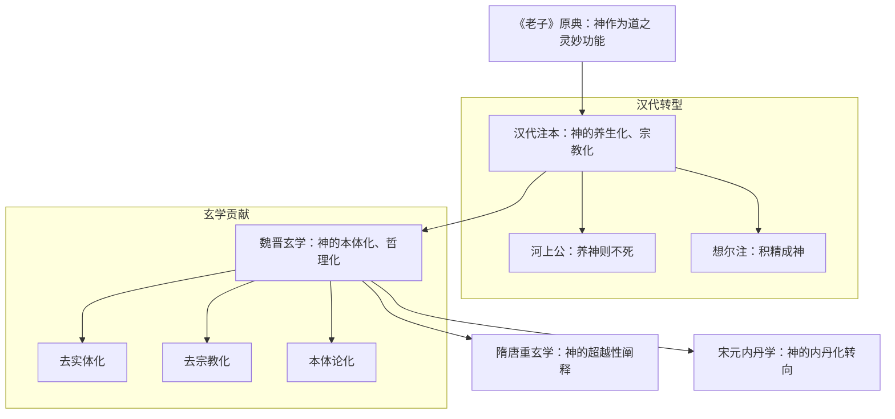
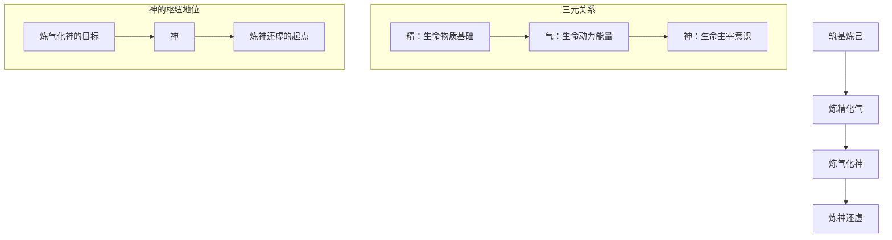
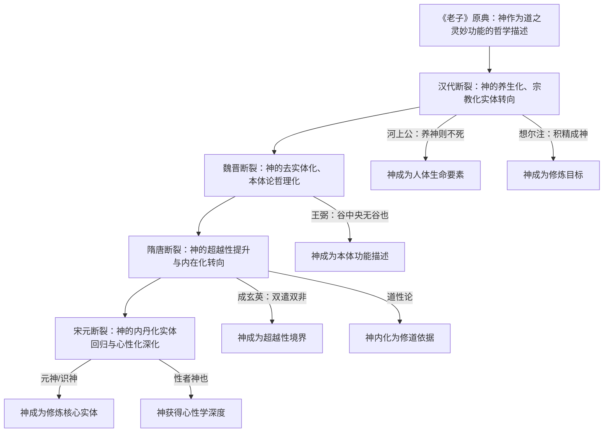

# 《老子》历代注本中“神”概念的诠释流变研究
## 1 导论：问题、方法与文献

本章作为全文研究的基础性导论，系统阐明《老子》历代注本中"神"概念诠释流变研究的学术价值与现实意义，明确研究的时空边界与核心对象，详细说明思想史、概念史与诠释学相结合的方法论框架，并对研究所依据的《老子》原典关键文本及历代主要注本进行版本梳理与学术评估，为后续各章的深入分析提供坚实的理论与文献基础。

### 1.1 研究缘起与学术价值

《老子》作为道家思想的奠基之作，其文本虽仅五千余言，却蕴含着博大精深的理论体系，内容涉及自然、社会、人事、政治、经济、文化等各个方面，历来受到社会的高度重视[^1]。自战国时代韩非撰《解老》《喻老》以来，历代都有大批学者为《老子》一书笺注疏义、阐发宏旨，至元代便有"《道德》八十一章，注者三千家"的说法，明清以来更是数量可观[^1]。在这一庞大的诠释传统中，**"神"作为《老子》文本中的核心概念之一，其诠释流变构成了理解老学发展的重要线索**。

从学术价值而言，"神"概念的诠释流变研究具有填补老学史研究空白的理论意义。唐末杜光庭在《道德真经广圣义》中指出："《道德真经》，包含众义，指归意趣，随有君宗。"[^1]这一论断揭示了《老子》诠释的时代性特征——**不同历史时期的注家根据相应的时代条件和思想需求，对同一概念作出主旨各异的解释**。"道与世降，时有不同，注者多随时代所尚，各自其成心而师之。故汉人注者为'汉老子'，晋人注者为'晋老子'，唐人、宋人注者为'唐老子'、'宋老子'。"[^1]这种"不同时代有不同的老子"的现象，在"神"概念的诠释中表现得尤为典型。

对"神"概念诠释流变的系统研究，能够揭示道家核心范畴从哲学概念向宗教修炼概念演变的内在逻辑。**这一演变过程折射出道家思想实践化、道教形成与发展以及儒释道三教关系等重大思想史议题**。同时，该研究对于当代道家思想研究与传统文化诠释亦具有现实意义——通过梳理"神"概念的历史诠释谱系，可以为当代学者准确理解《老子》原典精神、避免以今释古的误读提供方法论借鉴。

### 1.2 研究范围与核心对象界定

本研究的时空范围涵盖从先秦至明清乃至近现代的主要历史时段，聚焦于《老子》历代注本中对"神"概念的诠释演变。在时间维度上，研究起点为战国时期韩非的《解老》《喻老》——现存最早解释老子思想的文献[^1][^2]，终点延伸至清代及近现代的重要注本，以期完整呈现"神"概念诠释流变的历史全貌。

在核心对象界定方面，本研究以"神"概念为中心考察对象，聚焦《老子》文本中涉及"神"字的关键章句。其中最为核心的文本包括：

| 章次 | 关键文句 | 核心议题 |
|------|----------|----------|
| 第6章 | "谷神不死，是谓玄牝" | 神与生命本源的关系 |
| 第39章 | "神得一以灵" | 神与道的关系及其功能 |
| 第29章 | "天下神器" | 神的政治哲学意涵 |
| 第60章 | "其鬼不神" | 神与鬼的关系及治理意义 |

这些章句构成了历代注家诠释"神"概念的核心文本基础，不同注家对这些文句的理解差异，直接反映了其思想立场与时代特征。

### 1.3 研究方法与理论框架

本研究采用思想史、概念史与诠释学相结合的方法论路径，以期全面把握"神"概念诠释流变的多重面向。

**概念史方法**的运用旨在追溯"神"概念的语义演变与义理转型。正如学者所指出，《老子》之"自然"的哲学义或体系义并未得到后人的完全领悟和继承，而是"汇入或淹没于百花各自盛开的景观之中"[^3]。"神"概念同样经历了类似的流变过程——从《老子》原典的哲学意涵，到汉代养生修炼的实践概念，再到魏晋玄学的本体论范畴，最终发展为道教内丹学的核心术语。概念史方法能够有效揭示这一演变的阶段性特征与关键转折点。

**诠释学视角**的引入则关注注家的诠释立场与时代语境的交互作用。中国传统经典注释存在两种基本方式：一种是追求经典原意的"我注六经"，另一种是借注释经典来阐发自己思想的"六经注我"[^4]。王弼《老子注》即被认为是"以述为作"的典范——"采取先行的哲学思想放进他自己的哲学里"[^5][^4]。通过诠释学分析，可以区分注本中"疏通原意"与"创造性诠释"的不同成分，从而准确把握各注本的思想特质。

**思想史脉络**的把握则为概念诠释流变提供宏观背景。老学发展具有连续性与贯通性，其发展的一个共同规律是"不同时代有不同的老子"[^1]。从学术史角度看，老学发展既有按照历史顺序的"纵通"，体现其连续性和时代性；也有围绕核心问题展开的"横通"，体现其思想内容的丰富性和体系性[^1]。本研究将在这一双重脉络中定位"神"概念的诠释流变。

### 1.4 《老子》原典关键文本的版本考察

对涉及"神"概念的《老子》原典关键章句进行版本梳理，是本研究的基础性工作。20世纪以来，随着马王堆汉墓帛书本和郭店楚墓竹简本的出土，学界对《老子》版本问题有了全新认识[^6][^7]。

**郭店楚简本《老子》**是目前发现距离老子辞世最早的版本。根据碳-14检测，墓葬时间大约为公元前300年左右，竹简的抄本应该是下葬时间之前的流传本[^6]。楚简本按长短制式分为甲乙丙三组，共2046字，虽然内容不完整，但为理解《老子》早期形态提供了珍贵依据。

**马王堆汉墓帛书本《老子》**出土于1973年，包含甲乙两个版本。甲本没有避汉高祖刘邦的名讳，学术界认定其誊抄在刘邦登基之前；乙本避讳"邦"但不避讳惠帝和文帝，认定为刘邦登基之后、惠帝登基之前的时间段[^6]。帛书本的重要特征在于"德篇"在前、"道篇"在后，与传世本篇序相反。

在涉及"神"概念的关键文句上，不同版本存在若干异文：

| 章次 | 帛书本 | 河上公本/传世本 | 差异分析 |
|------|--------|-----------------|----------|
| 第1章 | "非恒道也""非恒名也" | "非常道""非常名" | 避汉文帝讳改"恒"为"常"[^8] |
| 第1章 | "恒无欲也""恒有欲也" | "常无欲""常有欲" | 同上 |
| 第1章 | "观其所曒" | "观其徼" | 字形演变 |

河上公本对帛书本的改动多达16处，包括删除语气词"也"、改"恒"为"常"、将"万物"改为"天地"等[^8]。这些版本差异虽然主要体现在文字层面，但对于理解"神"概念的原初语境及其后续诠释演变具有重要参考价值。

**北京大学收藏的汉简本《老子》**是汉武帝时期的竹简抄本，避讳高祖刘邦但不避讳刘盈，时间与帛书乙本相近。该本分为上下两篇，共七十七章，《道经》在前、《德经》在后，补充残缺文字后约5265字[^6]。

### 1.5 历代主要注本的综述与评估

本研究所依据的历代主要《老子》注本，可按时代特征分为以下几个系统：

**汉代注本**以《河上公章句》和《老子想尔注》为代表。《河上公章句》是现存成书较早、影响较大的《老子》注本，其注文简洁清晰、意境空灵，重在解释老子意旨，以极简单的语言阐说《老子》义理[^9][^10]。河上公注的特点在于将治身与治国相结合，主张"身国同一"——"治身者爱气则身全，治国者爱民则国安"[^10]。在"神"概念的诠释上，河上公注以"养神则不死"解释"谷神不死"，反映了西汉社会尚黄老神仙的思潮[^10]。

《老子想尔注》是早期道教信徒的必读经书，相传为张陵或张鲁所作[^11]。该注本的核心特征在于将哲学文本改造为宗教经典——通过增删、篡改、曲解等手段系统地改造《老子》，将"道"神格化，突出其"布道诫"的训示意义，引导人们追求长生成仙的道教理想[^11]。**《想尔注》名义上是对《老子》的注解，实际上是注者按照主观意愿对原文进行的刻意阐释和发挥**[^11]。

**魏晋玄学注本**以王弼《老子注》为核心代表。王弼（226-249）少年时即"好老氏，通辩能言"，其《老子注》创作于魏正始年间，当时玄论始盛[^5][^12]。王弼注的核心特征在于建立"以无为本"的思想体系，将老子的本源论思想改造为本体论思想[^5]。唐代陆德明评价："谈论者莫不宗尚玄言，唯王辅嗣妙得虚无之旨。"[^5]

王弼《老子注》与河上公注代表了两种不同的诠释取向：**河上公注以修身炼气为本，王弼注以谈玄说虚为主**[^10]。在学术史上，王弼本属文人系统，一般为学者推崇；河上公本近民间系统，文句简古[^10]。这两种诠释取向对"神"概念的理解产生了深远影响——前者将"神"实体化为养生修炼的对象，后者则将"神"纳入本体论的思辨框架。

**隋唐道教注本**以成玄英《老子义疏》、李荣《道德真经注》等重玄学著作为代表。这一时期的注本运用"双遣双非"的思辨方法，对《老子》进行超越有无的玄妙阐释，代表了道教义理的成熟形态。

**宋元明清注本**则呈现出内丹学转向与三教融合的特征。严灵峰《无求完备老子集成》收录各种版本总计356种，国家宗教局《老子集成》收录265种[^7]，这些注本为研究"神"概念的后期发展提供了丰富的文献资源。

综上所述，本研究所依据的文献体系涵盖了从先秦至明清的主要《老子》注本，这些注本在诠释特色、思想倾向与学术价值上各具特征，共同构成了"神"概念诠释流变研究的文献基础。通过对这些注本的系统分析，可以揭示"神"概念从哲学范畴向宗教修炼概念演变的历史轨迹，进而深化对老学发展规律与中国思想史演进的理解。

## 2 原点：《老子》原典中"神"的本义探析

本章作为全文研究的概念起点，系统考察《老子》原典中"神"字的本义与多重意涵。通过对帛书本、楚简本与通行本的版本比勘，结合古文字学的字形分析与先秦思想史背景，辨析"神"在不同章句语境中的具体所指，揭示其哲学意涵与后世宗教性"神祇"概念的根本差异，为后续历代注本诠释流变研究确立可靠的文本基础与概念原点。

### 2.1 "神"字的古文字溯源与原始意象

要准确理解《老子》中"神"概念的哲学内涵，首先需要追溯其文字学根源。从甲骨文到小篆的字形演变，揭示了"神"字从具象描述向抽象表达的语义演进轨迹。

**甲骨文"神"字的造字结构**呈现出独特的意象组合。从字形上看，甲骨文"神"字由上下两个独立字符组合而成：上半部分是一个甲骨文"人"字，且这个"人"字表现出极强的生命力，手部呈现向上舞动的飘逸姿态，展现出一种"灵动"的特质；下半部分则以整个字的中心点为圆点，向下旋转180度，形成上下对称的结构[^13]。这种造字逻辑暗示着**"神"字最初描绘的是"完整的人体"或"完整的生命状态"**——上半部分表示显性的、可见的层面，下半部分则指向隐性的、深层的维度[^13]。

从字形演变的角度来看，"神"字的构成包含"示"部与"申"部的组合。《说文解字》对"神"的解释是："神，天神引出万物者也，从示，申声。"[^14]其中，"示"部在古文中表示祭台，与祭祀活动密切相关；"申"部则与风雨雷电等自然现象相关联。这种组合逻辑表明，**"神"字的原始意涵并非指向某一具体的人格化神灵，而是对自然界灵妙变化现象的概括性表达**。

值得特别关注的是，甲骨文"神"字所呈现的灵动生命力特征。从字的姿态来看，"神"不仅表示"重叠结构人体"的意思，更涵盖了在这一结构中的所有生命[^13]。这种广义上的"完整人体"含义，为理解《老子》中"神"的哲学化运用提供了重要的文字学基础。在道家思想体系中，对于"完整人体"中各层意识的描述，有"欲神"、"识神"、"元神"等不同层次的区分，这种用法正是源自"神"的原始字义[^13]。

### 2.2 第六章"谷神不死"的文本校勘与义理辨析

《老子》第六章"谷神不死，是谓玄牝"是理解"神"概念的核心文本之一。通过版本比勘与义理辨析，可以揭示这一概念的深层哲学内涵。

**版本异文的关键差异**体现在"谷"与"浴"的文字选择上。通行本（王弼本）作"谷神不死，是谓玄牝。玄牝之门，是谓天地根。绵绵若存，用之不勤"[^15][^16]；而帛书甲乙本均作"浴神不死"[^17]。这一差异并非简单的通假关系，而涉及对整章思想内涵的根本理解。

从文字学角度考察，郭店楚简中的"浴"字形态尤为值得关注。其顶部两点象征两座山峰，中间两点表示山间水道，下部"口"部描绘瀑布下泻之状，整体构成一幅完整的山水画卷[^17]。东汉许慎《说文解字》明确记载："泉出通川为谷。从水半见，出于口。"这一解释揭示了"谷"字最初描绘的是**山间水道出口处的瀑布景观，强调的是水流生生不息的动态意象**[^17]。

**历代注家对"谷神"的诠释**呈现出多元取向：

| 注家 | 诠释要点 | 思想特征 |
|------|----------|----------|
| 河上公 | "谷，养也。人能养神则不死也" | 养生修炼取向 |
| 王弼 | "谷中央无谷也。无形无影，处卑不动，守静不衰" | 本体论玄学取向 |
| 苏辙 | "谷至虚而犹有形，谷神则虚而无形也" | 虚空哲学取向 |
| 陈鼓应 | "'谷'形容虚空，'神'形容不测的变化" | 现代哲学诠释 |

从义理层面分析，"谷神不死"的核心意涵在于**以山谷的虚空开阔比喻"道"的特质，以"神"的灵妙变化描述"道"生化万物的功能**[^15]。"谷"象征"道"体的虚状——空虚开阔、无所不容；"神"则比喻"道"生万物的绵延不绝[^15]。二者组合所表达的是：道在无限的空间中支配着万物的发展变化，是具有一定物质规律性的统一体；道空虚幽深，因应无穷，永远不会枯竭，永远不会停止运行[^15]。

**"玄牝"的象征意义**进一步深化了"谷神"的哲学内涵。老子将神秘莫名的"道"喻之为母性动物的生殖器官，以"玄牝之门"指称产生万事万物的根源[^15]。这种描述方式非常贴切地展现了无所不能、生育着万物的"道"的特性。老子之所以采用这种与众不同的描述方式，源于他不愿意把"道"界定在某个认识范畴之内——他所关注的"道"是宇宙间一种相互联系、相互制约、相互影响、相互作用的统一关系，而不在于某个部分或某种性质的界定或划分[^15]。

帛书本中"浴神不死"的用法还可与"浴神"（谷神）概念相印证。"浴神"指的是隐含在"隐性人体"深处的"真正的我"，用道家的说法就是"元神"，用佛教的说法则是"阿赖耶识"[^13]。这一用法表明，**"神"在《老子》原典中已经具有指向生命本源与内在真我的深层意涵**。

### 2.3 第三十九章"神得一以灵"的语境分析

《老子》第三十九章"昔之得一者"是另一处涉及"神"概念的核心文本。通过对其语境结构与版本异文的分析，可以进一步明确"神"在老子哲学体系中的定位。

**原文的并列结构**呈现出系统的宇宙论框架。帛书甲本原文作："昔之得一者，天得一以清，地得〔一〕以宁，神得一以灵，浴得一以盈，侯〔王得一〕而以为〔天下〕正"[^13]。通行本则作："昔之得一者：天得一以清；地得一以宁；神得一以灵；谷得一以盈；万物得一以生；侯王得一以为天下正"[^18][^19]。

这一章句的结构特征在于：**老子以"天"、"地"、"神"、"谷/浴"、"万物"、"侯王"六个范畴，从"显性世界"的视角对"重叠结构世界"的所有组成部分进行概括性描述**[^13]。其中：

- **"天"**指"显性世界"中可见的"天空"
- **"地"**指"大地"
- **"浴/谷"**指有流水的山谷，代表自然界中的"万物"
- **"侯王"**表示人类社会中的统治者
- **"神"**则是这一并列结构中的关键概念

**关于"神"的具体所指**，存在不同的诠释路径。从帛书本的文本语境来看，"天"、"地"、"浴"、"侯王"都是在"显性世界"中看得见、摸得着的存在，那么"神"也应当是可以通过感官感觉到的[^13]。根据"密文"字义的分析，**此处"神"字用来表示"人类"的意思**——"天"与"地"搭建了"显性世界"的大框架，"神"表示在"显性世界"中的"人类"，"浴"表示在"显性世界"中的"万物"，"侯王"表示治理"显性世界"的"统治者"[^13]。

然而，从哲学诠释的角度来看，"神得一以灵"中的"神"也可以理解为**自然之灵妙功能或宇宙间的神妙变化**。这一理解与《易传》"阴阳不测之谓神"的表述相呼应。"一"在老子哲学中即是"道"——"道生一"[^19]。因此，"神得一以灵"可以解读为：**神妙的变化功能因得道而显现其灵妙特质**。

**"得一"的哲学意涵**是理解这一章句的关键。"得一就是获得完整的自我，永恒的自我，永不迷失的自我。'一'是法界之全体，是生命之完整，不得一则是法界之毁灭，是生命之毁灭"[^20]。老子通过正面论述"得一"的功效，再以反面推演"失一"的危害——"天无以清，将恐裂；地无以宁，将恐废；神无以灵，将恐歇"[^18][^20]——强调了"道"作为宇宙万物存在根据的核心地位。

### 2.4 其他涉"神"章句的意涵考察

除第六章与第三十九章外，《老子》中还有其他涉及"神"的章句，考察这些用法有助于全面把握"神"概念的意义分化。

**第二十九章"天下神器"**涉及"神"的政治哲学意涵。"天下神器，不可为也，不可执也。为者败之，执者失之。"此处"神器"之"神"强调的是**天下的神圣性与不可操控性**。"神器"并非指某种具体的器物，而是以"神"来形容天下的至高无上与不可妄为——任何试图以人为手段强行把控天下的行为，都将导致失败。这一用法体现了老子"无为而治"政治哲学的核心理念。

**第六十章"其鬼不神"**则涉及神与鬼的关系。"治大国若烹小鲜。以道莅天下，其鬼不神。非其鬼不神，其神不伤人。"此处"神"的用法颇为特殊——"鬼不神"意味着鬼不再显现其神异的力量或作用。在帛书语境中，这并非简单的无为而治比喻，而是强调统治者要像厨师尊重食材本性般敬畏百姓的自然秩序[^21]。**"神"在此处指向的是某种超常的作用力或影响力，而"不神"则意味着这种力量不再以伤害性的方式显现**。

这两处用法共同揭示了"神"在《老子》中的**多义性特征**：

| 章句 | "神"的用法 | 核心意涵 |
|------|------------|----------|
| 第6章 | 谷神 | 道之生生不息的功能 |
| 第29章 | 神器 | 天下的神圣性与不可操控性 |
| 第39章 | 神得一以灵 | 人类或自然之灵妙功能 |
| 第60章 | 其鬼不神 | 超常作用力的显现与否 |

### 2.5 《老子》"神"概念与先秦思想语境的关联

将《老子》中"神"的用法置于先秦思想史背景下考察，可以更清晰地把握其哲学特质。先秦时期，"神"概念经历了从宗教性向哲学性的重要转化，《老子》正是这一转化过程中的关键文本。

**《周易》系统中的"神"概念**为理解《老子》提供了重要参照。《易传》中"阴阳不测之谓神"的表述，揭示了"神"的核心特征在于**变化的不可测度性**。正如牟宗三先生所指出的："'阴阳不测之谓神'是从气化之妙这个地方看，这个造化千变万化，没有人能测度。……中国人不从上帝的创造那个地方讲，而从这个造化之妙这个造化讲，从气化这个地方讲"[^22]。这种理解与西方人格化神灵（personal God）的概念根本不同——西方的神是通过"实体"（entity）来理解的，而中国的"神"则是通过"功能"（function）来理解的[^22]。

**《荀子·天论》的表述**进一步印证了这一理解："列星随旋，日月递照，四时代御，阴阳大化，风雨薄施，万物各得其和以生，各得其养以成，不见其事而见其功，夫是之谓神"[^22]。此处"神"指的是自然界运行的神妙功能——**不见其具体作用过程，却能见其功效，这就是"神"**。

朱伯崑先生对《易传》中"神"字含义的分类，为理解《老子》提供了有益框架：

1. **天神、鬼神、神灵**：如"圣人以神道设教"
2. **变化神速**：如"唯神也，故不疾而速，不行而至"
3. **思想上的深刻领悟**：如"神而明之，存乎其人"
4. **事物变化的神妙莫测**：如"阴阳不测之谓神"[^22]

在《老子》文本中，**第四种含义——事物变化的神妙莫测——构成了"神"概念的核心内涵**。无论是"谷神不死"中描述道之生生不息的功能，还是"神得一以灵"中表达灵妙变化的特质，都指向这一哲学化的理解路径。

**先秦"神"概念的非人格化特征**是理解《老子》的关键。学者们注意到，在先秦发生了宗教世界观向人文世界观的转变，这一转变特别体现在对"神"的理解上[^22]。天神的基本特点是灵动变化、不可测度，而非人格化的意志主体。《诗经》中表现出的对天神的抱怨并不表明不再相信神，而恰恰是因为天命的变化难测[^22]。这种对"神"的理解为《老子》哲学化运用"神"概念奠定了思想基础。

### 2.6 哲学之"神"与宗教"神祇"的根本差异

在完成对《老子》原典中"神"概念的考察后，有必要从概念性质、存在形态、功能属性三个维度，系统辨析其与后世宗教性"神祇"概念的根本差异。这一辨析对于理解后世诠释中的宗教化转向具有重要的参照意义。

**概念性质的差异**体现为哲学范畴与宗教信仰对象的根本分野。《老子》中的"神"是一个**哲学概念**，用以描述道的灵妙功能与变化特质，属于对宇宙规律的抽象表达；而后世道教乃至民间信仰中的"神祇"则是**宗教信仰对象**，具有明确的人格化特征，是崇拜与祈求的对象。正如学者所指出的："老子提出的'道'是春秋时期形成的哲学概念，指自然存在的宇宙规律和万物本源，具有抽象性和哲学性。道教则是东汉时期形成的宗教组织，将'道'神格化，发展出系统的神仙信仰和修炼方法"[^23]。

**存在形态的差异**表现为功能性存在与实体性存在的对比。《老子》中的"神"是**功能性存在**——"谷神不死"描述的是道之生生不息的功能，"神得一以灵"表达的是灵妙变化的特质，二者都不指向某一具体的、独立存在的实体。与此相对，宗教性"神祇"则是**实体性存在**——无论是天神、地祇还是各类神灵，都被理解为具有独立存在、独立意志的主体。

下表系统对比了二者的根本差异：

| 维度 | 《老子》哲学之"神" | 宗教性"神祇" |
|------|---------------------|--------------|
| 概念性质 | 哲学范畴 | 信仰对象 |
| 存在形态 | 功能性存在 | 实体性存在 |
| 人格特征 | 非人格化 | 人格化 |
| 认知方式 | 理性思辨 | 信仰崇拜 |
| 与人关系 | 规律之体悟 | 祈求与护佑 |
| 核心意涵 | 变化之妙、功能之灵 | 超自然力量 |

**功能属性的差异**进一步凸显了二者的本质区别。《老子》中"神"的功能在于**描述与解释**——描述道的特质，解释宇宙运行的规律；而宗教性"神祇"的功能则在于**主宰与护佑**——主宰人间祸福，护佑信众平安。前者是认识论层面的概念工具，后者是实践层面的信仰对象。

从"神"与"仙"的区分来看，这一差异更为明显。"神是先天的，是在创世之初自然形成或由创世神创造的；而仙是后天的，是凡人经过艰苦修炼而形成的。所以，神与仙的主要区别在于：神是神，仙是人"[^14]。《老子》中的"神"既不属于先天的神灵，也不属于后天修炼的仙人，而是对道之灵妙功能的哲学表达，这与后世道教神仙信仰体系存在根本差异。

**澄清这一差异的意义**在于为理解后世诠释中的宗教化转向提供参照基准。从汉代《河上公章句》将"谷神不死"解释为"养神则不死"的养生要诀，到《老子想尔注》将"道"神格化为宗教崇拜对象，再到后世内丹学将"神"界定为"元神"的内炼核心概念，"神"概念经历了从哲学范畴向宗教修炼概念的重大转型。**只有准确把握《老子》原典中"神"的哲学本义，才能清晰辨识后世诠释中的创造性转化与义理偏离**，从而在概念史的脉络中准确定位各注本的思想特质与历史贡献。

综上所述，《老子》原典中的"神"概念具有鲜明的哲学特质：从古文字学角度看，"神"字的原始意象指向灵动的生命力与完整的存在状态；从文本语境看，"谷神不死"描述道之生生不息的功能，"神得一以灵"表达灵妙变化的特质；从先秦思想史背景看，"神"体现的是"阴阳不测"的变化之妙与"不见其事而见其功"的功能之灵。**这一哲学化的"神"概念，构成了后世历代注本诠释流变的概念原点与参照基准**。

## 3 汉代注本："神"与黄老治身治国及神仙方术的初融

本章聚焦以《河上公章句》和《老子想尔注》为代表的汉代注本，系统考察"神"概念从《老子》原典的哲学范畴向养生修炼与宗教实践概念转化的关键阶段。汉代是老学发展史上的重要转折期，黄老思想从官方意识形态退居民间后，与神仙方术、养生修炼深度结合，催生了对《老子》文本的全新诠释取向。在这一历史语境中，"神"概念经历了从描述"道"之灵妙功能的哲学范畴，向人体内可养护、可修炼的生命要素乃至宗教崇拜对象的重大转型，为后世道教"神"论的发展奠定了理论基础。

### 3.1 汉代黄老学术背景与《老子》诠释的时代转向

要理解汉代注本对"神"概念的诠释转向，首先需要把握汉代黄老学说从"经术政教之道"向"自然长生之道"演变的历史脉络。这一思想转型构成了"神"概念养生化、宗教化诠释的深层时代背景。

**西汉初期黄老学的政治主导地位**为《老子》诠释奠定了独特的思想基调。从"天道自然无为，元气化生万物"的宇宙生成论出发，本着天人合一、国身相同的观点，用自然法则来论述治国养生之道，寻求能使国家太平久治、个人长生久寿的方法，这是自战国、秦汉以来黄老道家学说的基本内容[^24]。汉代发达的政治学和医药养生学，在思想上无不受到黄老学派的影响。西汉初期的黄老学比较偏重于探讨安邦治国的"经术政教之道"，河上公这一齐国黄老学派"贵清静而民自定"的政治主张，由于适合汉初经济凋敝、人民亟需休养生息的形势，由盖公传与曹参，并得到汉文帝、窦太后等最高统治者的大力提倡，在汉初盛行了七十余年[^24]。

**汉武帝独尊儒术后黄老学的转型**标志着《老子》诠释重心的根本性转移。及至汉武帝即位，采纳董仲舒建议，"罢黜百家，独尊儒术"，儒家经学成为官方的统治思想，黄老学遂退出了政治舞台[^24]。然而，作为"经术政教之道"的黄老派政治学说虽然不时兴了，以个人修身养性为主的黄老学说却在继续发展。特别是在汉武帝迷信神仙方士、汉代社会追求长生成仙风气盛行的背景下，黄老养生学得到了十分有利的发展条件[^24]。

**东汉时期黄老学的养生化转向**深刻影响了"神"概念的诠释取向。到了东汉时期，黄老学已演变为偏重个人养生成仙的学说。王充《论衡·道虚篇》称："世或以老子之道为可以度世，怡淡无欲，养精受气。"《后汉书·矫慎传》载吴苍《致矫慎之书》曰："盖闻黄老之言，乘虚入冥，藏身远遯，亦有理国养人，施于为政。"可见东汉人认为黄老学的主旨是养生成仙，而非"理国养人，施于为政"[^24]。

**东汉后期祭黄老求长生的社会风气**为早期道教的形成提供了直接的思想土壤。《后汉书·光武帝纪》载皇太子劝谏汉光武帝曰："陛下有禹汤之明，而失黄老养性之福，愿颐爱精神，优游自宁。"《楚王英传》称："英晚节更喜黄老，学为浮屠，斋戒祭祀。"汉桓帝延熹八年，两次遣使者去陈国苦县祭老子，欲求成仙。汉灵帝熹平二年，陈国相师迁奏前相魏某与陈愍王刘宠共祭神，魏某辞与王共祭黄老君，求长生福而已[^24]。可见到了东汉后期，祭黄老求长生已成为帝王贵胄之常事。这种风气对桓、灵之世民间奉祀黄老的原始道教组织太平道和五斗米道的形成，有直接的影响。

正是在这一从政治学说向养生修炼转型的历史背景下，汉代注家开始将《老子》原典中描述"道"之功能的"神"概念，转化为人体内可养护、可修炼的生命要素，从而开启了"神"概念义理演变的新阶段。

### 3.2 《河上公章句》对"神"的养生化诠释

《河上公章句》作为现存成书较早、影响较大的《老子》注本，其对"神"概念的诠释集中体现了汉代黄老学养生化转向的思想特征。河上公注将《老子》原典中描述"道"之灵妙功能的"神"，转化为人体内可养护、可修炼的生命要素，完成了"神"概念从哲学范畴向养生概念的关键转型。

**河上公注对"谷神不死"的经典诠释**确立了"神"概念养生化解读的基本范式。据皇甫谧《高士传》记载，河上丈人"不知何国人，自隐姓名，居河之湄，著老子章句"。汉文帝时结草为庵于河之滨，常读老子《道德经》。文帝好老子之言，有所不解数句，遣使问之，公曰："道尊德贵非可遥问。"帝即驾从诣之，河上公即授素书《老子道德经章句》二卷[^10]。

河上公注对"谷神不死"的解释是："谷，养也。人能养神则不死也"[^10]。这一诠释具有重大的思想史意义：**它将《老子》原典中以山谷之虚空比喻"道"之特质、以"神"描述"道"生化万物功能的哲学表述，转化为关于人体养生修炼的实践指导**。在河上公的诠释框架中，"神"不再是对宇宙规律的抽象描述，而是人体内部需要养护的生命要素——只要善于养护这一要素，就能实现"不死"的长生目标。

**河上公注的注释风格**为其养生化诠释提供了独特的表达形式。河上公注的特点在于注文简明清晰，意境空灵。其注《老子》文，重在解释老子意旨，每每以极简单的语言阐说《老子》义理，同王弼注一样，没有字词考证。说理透彻，平铺直了。语言朴实流畅，平易近人。在诸多道书中又是一种风格[^10]。正是这种简洁明快的注释风格，使得"养神则不死"这一诠释能够直接传达养生修炼的实践指向，而不需要繁复的理论阐发。

**河上公注对"神"的养生化诠释**反映了西汉社会尚黄老神仙的思潮。河上公注本文字简明，清晰精确，有相当浓厚的养生思想，反映了西汉社会尚黄老神仙的思潮[^10]。在河上公的注释中，"神"被赋予了明确的养生学意义——它是人体内部需要"养"的对象，而"养神"的目的则是实现"不死"的长生理想。这种诠释取向与东汉社会追求长生成仙的风气高度契合，体现了黄老学从政治学说向养生修炼转型的时代特征。

### 3.3 精气神三元一体：汉代身体观中的"神"概念整合

《河上公章句》不仅将"神"诠释为养生修炼的对象，更将其纳入"精、气、神"三元一体的身体观框架，与汉代医学、养生理论深度融合，形成了系统的身体修炼理论体系。

**"宝精爱气"是河上公养生理论的核心主张**。注中反复讲"自爱其身，以宝精气"（七十二章）；"治身者当爱精气而不放逸"（五十九章）；"深藏其气，固守其精，使无漏泄"，"深根固蒂者，乃长生久视之道"（同上）；"爱精重施，髓满骨强"（一章），"人能自节养，不失其所受天之精气，则可以久"（三十三章）[^10]。这些论述特别强调了宝精爱气在养生中的重要地位，揭示了"精"与"气"作为人体基本生命要素的核心地位。

**"去六情"、"损情去欲"作为养神的重要条件**，构成了河上公养生理论的实践方法。河上注本以"去六情"、"损情去欲"作为养生的一个重要条件。认为：得道之人，损情去欲，五内清静，至于虚极（六十章）；治身当除情去欲，使五藏空虚，神乃归之（十一章）；情欲断绝，德与道合，就能无所不施，无所不为（四十八章）；除情去欲，守中和，就是知道要之门户（一章）[^10]。

**"神"与五脏的关系**揭示了汉代身体观的内在结构。"治身当除情去欲，使五藏空虚，神乃归之"这一论述表明，在河上公的理论体系中，"神"与五脏存在密切的关联——五脏是"神"的居所，只有使五脏保持清虚的状态，"神"才能归位安住。这种理解与《黄帝内经》等汉代医学典籍中关于五脏藏神的理论相呼应，体现了《河上公章句》对汉代医学理论的吸收与整合。

下表系统呈现了《河上公章句》中精、气、神三者的相互关系：

| 概念 | 核心要义 | 修炼方法 | 与其他要素的关系 |
|------|----------|----------|------------------|
| 精 | 生命的根本物质 | 固守、不漏泄 | 精足则气充 |
| 气 | 生命的动力能量 | 深藏、爱惜 | 气充则神旺 |
| 神 | 生命的主宰意识 | 养护、使归五脏 | 神旺则长生 |

**道医理论对"精、气、神"的系统阐发**进一步印证了这一三元一体结构的深远影响。道医认为人体之"精、气、神"受之于天，也是万物的基质，万物受生都起于此，它同老子所谓"道"同为一体，万物由它而生，失它而死，道医视它为上药三品，人得之而身体健康[^25]。这种理解表明，汉代形成的"精、气、神"三元一体身体观，不仅是对《老子》文本的诠释创新，更成为后世道教养生理论的核心框架。

**"神"在三元结构中的独特地位**体现了汉代身体观的核心关切。在精、气、神三者的关系中，"神"居于最高层次——精是物质基础，气是动力能量，而神则是生命的主宰与统帅。"人能养神则不死"的诠释，正是将"神"置于养生修炼的核心地位，强调只有养护好"神"，才能实现长生久视的终极目标。

### 3.4 身国同治：治身之"神"与治国之道的隐喻关联

《河上公章句》的另一重要思想特征是将治身与治国相结合，主张"身国同一"。在这一理论框架下，"神"的修养不仅具有个人养生的意义，更被赋予了政治治理的隐喻功能。

**"身国同一"是《河上公章句》的基本思想**。天道与人事相通，治国与治身之道相同，二者皆本于清虚无为的自然之道，这是《河上公章句》的基本思想。故陆德明《经典释文》概括此书为"言治国治身之要"[^24]。这一概括准确揭示了河上公注的核心特征——它不是单纯的养生学著作，也不是单纯的政治学著作，而是将二者贯通为一的综合性诠释体系。

**治身与治国的类比关系**在河上公注中得到系统阐发。河上注将治身与治国相结合，主张身国同一。以人君作为养生之道的施教对象，把养生之道和人君的南面术联系起来。它说，治身者爱气则身全，治国者爱民则国安（十章）；圣人治国与治身相同（三章）；效法道的无为，治身则有益精神，治国则有益万民（四十三章）；人能知止足，则福禄在己，治身神不劳，治国民不扰（四十四章）；治国烦则下乱，治身烦则精散（六十章）；治国当爱民财，不为奢泰，治身当爱精气，不放逸（五十九章）[^10]。

**"神"在身国同治框架中的双重意义**值得特别关注。在河上公的诠释体系中，"神"既是个人身体中需要养护的生命要素，也是国家治理中需要关注的核心对象。"治身神不劳，治国民不扰"这一表述揭示了二者的对应关系——在个人层面，"神"是生命的主宰，需要使其不受劳扰；在国家层面，人民是国家的根本，需要使其不受扰动。这种类比关系使得"神"的养护获得了超越个人养生的政治意义。

下表展示了身国同治框架中的核心对应关系：

| 治身层面 | 治国层面 | 共同原则 |
|----------|----------|----------|
| 爱气则身全 | 爱民则国安 | 爱惜根本 |
| 治身有益精神 | 治国有益万民 | 无为而治 |
| 治身神不劳 | 治国民不扰 | 清静无为 |
| 治身烦则精散 | 治国烦则下乱 | 戒除繁苛 |
| 爱精气不放逸 | 爱民财不奢泰 | 俭啬知足 |

**身国同治思想的理论渊源**可追溯至战国时期的黄老学说。战国时期，出现了将养生与治国联系起来的说法，并强调治国始于治身。这种观点在齐国特为流行，成为黄老学说的思想渊源之一。与其他学说的主张不同，黄老之道强调统治者首先要学会协调自己的身体与自然的关系，进而才可能掌握统御天下的力量[^26]。

**《黄帝四经》明确提出了治国始于治身的观点**。于是黄帝辞国三年以自求，终有所成。《庄子·在宥》也假托黄帝与广成子之口，叙述了善治身者可以治国的道理。黄帝问"至精之道"，广成子告知黄帝所问为万物的本质，希望统治的又是万物的弃余，不如顺其自然。黄帝受此教诲，隐身闲居三月，体会至道。复问广成子"治身奈何可以长久"，亦将治身当作治国的前提[^26]。

**身国同治思想对"神"概念诠释的深远影响**体现在两个方面：其一，它使"神"的养护获得了超越个人养生的社会政治意义；其二，它为后世道教将修身与济世相结合的理念提供了理论先导。把治身的原则推而广之，扩充到治国当中，则国无不治；反过来说，把治国的道理运用于治身，则身无不治。身与国是相通的，清静无为、知足俭啬是二者共同的原则。这是对老子原有思想的发挥，后世道教徒解老时也继承了这一观点[^10]。

### 3.5 《老子想尔注》与"神"的宗教化转向

如果说《河上公章句》代表了"神"概念的养生化诠释，那么《老子想尔注》则标志着"神"概念向宗教化方向的进一步转型。作为早期道教正一派的重要经典，《老子想尔注》通过对《老子》文本的系统改造，将"道"神格化为"太上老君"，确立了守道诫、求长生等核心教义，深刻影响了"神"概念的宗教内涵。

**《老子想尔注》的文本性质与思想特征**。《老子想尔注》是东汉张道陵约于公元2世纪创作的宗教注释典籍，属道教正一派早期经典，为五斗米道提供理论依据。全书通过增删、曲解《道德经》原文，将"道"神格化为"太上老君"，确立守道诫、求长生等核心教义[^27]。以守戒修道、精气调和、帝王施政为主线，主张通过持守戒律、积精成神实现仙寿，并将道教伦理融入治国理念[^27]。

**《想尔注》在写法上的两大突出之处**深刻影响了"神"概念的诠释。一是用删、增、改字的方法，对《老子》原文进行一些有意修改，以树立自己的意思。如《老子》第十六章原文是"公乃王，王乃大"，而在《想尔注》中，将"王"改为"生"，认为"能行道公政，故常生也。能致长生，则副天也"。改变文字以便说明其长生之道[^27]。另一写法，就是通过注释，将哲学著作《道德经》改造成真正的道教经典。将《道德经》中作为哲学范畴的"道"人格化、神格化，解释为第一人称的"吾"、"我"，使抽象的"道"具体为有欲有言，有喜怒哀乐，对人有教导、遣使、诫禁、主人生死，赏善惩恶，镇邪制顽的人格神[^27]。

**"道"的神格化对"神"概念的影响**是理解《想尔注》的关键。《想尔注》将"道"等同于"一"，认为：一散形为气，聚形为太上老君，常治昆仑，或言虚无，或言自然，或言无名，皆同一耳，今布道诫教人，守诫不违，即为守一矣；不行其诫，即为失一也[^27]。这样，道或一，既是宇宙本源，又是太上老君，哲学家老子就成为五斗米道所信奉的神。在这一神学框架下，"神"概念也从描述"道"之功能的哲学范畴，转化为与人格化神灵相关联的宗教概念。

**"守道诫"是《想尔注》的核心教义**，与"神"概念的宗教化诠释密切相关。《想尔注》认为"道"是专一、真诚、清静自然、好生乐善的，只要人们谨守道诫，就可以延年增寿，除灾得福。所谓"守道诫"，就是遵守"道"所规定的戒律。"道"是绝对的"一"，道气无处不在，那种以为守身中五脏即是"守一"的观点是不对的，甚至也不赞同《老子河上公注》中以为"专守精气"就是"守一"的看法，《想尔注》认为真正的"守一"就是"守道诫"[^27]。

**"积精成神"的长生之法**揭示了《想尔注》对"神"概念的独特理解。《想尔注》认为善保精气就可以实现仙寿。主张和五脏五行之气[^27]。这种"积精成神"的理念表明，在《想尔注》的诠释框架中，"神"不仅是需要养护的生命要素，更是修炼的最终目标——通过积累精气，最终可以"成神"，实现仙寿。这一诠释将"神"从养生对象提升为修炼目标，标志着"神"概念宗教化转型的重要进展。

**《想尔注》与《河上公章句》在"神"概念诠释上的差异**值得特别关注：

| 维度 | 《河上公章句》 | 《老子想尔注》 |
|------|----------------|----------------|
| 诠释取向 | 养生修炼 | 宗教信仰 |
| "神"的性质 | 人体内的生命要素 | 修炼的最终目标 |
| 修炼方法 | 养神、固精、爱气 | 守道诫、积精成神 |
| 理论基础 | 黄老养生学 | 道教神学 |
| "道"的理解 | 自然法则 | 人格化神灵 |

### 3.6 汉代"神"概念诠释的历史定位与后续影响

综合考察《河上公章句》与《老子想尔注》对"神"概念的诠释，可以归纳出汉代注本在老学发展史上的独特地位与深远影响。

**汉代注本对"神"概念诠释的整体特征**可概括为三个方面：其一，**养生化转向**——将《老子》原典中描述"道"之功能的"神"转化为人体内可养护、可修炼的生命要素；其二，**身国同治的双重向度**——使"神"的养护同时具有个人养生与政治治理的双重意义；其三，**宗教化萌芽**——为"神"概念向宗教修炼目标的转化开辟了道路。

**《河上公章句》与《老子想尔注》在诠释取向上的异同**揭示了汉代老学的内部张力。二者同属汉代注本系统，都将《老子》的哲学文本转化为实践指导，但诠释的侧重点有所不同：《河上公章句》侧重于养生修炼，将"神"理解为需要养护的生命要素；《老子想尔注》则侧重于宗教信仰，将"神"提升为修炼的最终目标。前者保留了较多的哲学色彩，后者则更彻底地完成了宗教化转型。

**汉代注本为后世"神"概念的发展奠定的基础**体现在多个层面：

首先，**精气神三元一体的身体观框架**成为后世道教内丹学的理论基石。《河上公章句》将"神"纳入"精、气、神"三元结构的诠释方式，为后世内丹学以"炼精化气、炼气化神、炼神还虚"为核心的修炼体系提供了概念原型。

其次，**"养神则不死"的养生化诠释**开创了将《老子》哲学转化为修炼实践的诠释范式。这一范式为后世道教对《老子》的诠释提供了基本路径——将抽象的哲学概念转化为具体的修炼方法。

再次，**身国同治的思想框架**为后世道教将修身与济世相结合的理念提供了理论先导。这一框架使得"神"的修养不仅具有个人意义，更具有社会政治意义，体现了道家思想的入世关怀。

最后，**"道"的神格化与"积精成神"的教义**为"神"概念向宗教崇拜对象的转化开辟了道路。《老子想尔注》将"道"等同于"太上老君"的诠释方式，虽然偏离了《老子》原典的哲学精神，但为道教神学体系的建立提供了重要的文本依据。

从概念史的角度来看，**汉代是"神"概念从哲学范畴向宗教修炼概念转化的关键阶段**。在这一阶段，"神"经历了从描述"道"之灵妙功能的抽象概念，向人体内可养护的生命要素、进而向修炼最终目标的多重转型。这一转型过程深刻反映了汉代黄老思想从政治学说向养生修炼、从学术思想向宗教信仰演变的历史轨迹。

**汉代注本的诠释成果**为魏晋玄学及后世道教内丹学的"神"论发展奠定了坚实基础。魏晋玄学虽然在诠释取向上与汉代注本存在重大差异——王弼《老子注》以"以无为本"的本体论取代了河上公的养生学——但汉代注本所确立的"神"作为核心修炼概念的地位，在后世道教传统中得到了持续的继承与发展。从这个意义上说，汉代注本对"神"概念的诠释转型，构成了老学发展史上承前启后的重要环节。

## 4 魏晋玄学注本："神"的本体化与思辨性转化

本章以王弼《老子注》为核心文本，系统考察魏晋玄学语境下"神"概念的诠释转型。在汉代注本将"神"养生化、宗教化的基础上，王弼以"以无为本"的本体论框架重新界定"神"与"道"、"无"、"自然"的关系，将"神"从可养护的生命实体转化为本体论思辨中的功能性范畴。通过分析王弼对"谷神不死"、"神得一以灵"等核心章句的诠释，可以揭示其"崇本息末"思想对"神"概念去实体化、哲理化的关键影响，并在与河上公注的比较中评估魏晋玄学对"神"概念义理演变的深远贡献。

### 4.1 魏晋玄学兴起与老学诠释范式的转换

魏晋玄学的兴起标志着中国哲学史上一次重大的思想范式转换。这一转换不仅改变了学术思想的整体面貌，更为《老子》诠释开辟了全新的哲学化路径，从而深刻影响了"神"概念的义理演变。

**汉末经学衰微是玄学兴起的直接思想背景**。东汉末年，儒学经学因形式上"一经之说至百万余言"的繁琐和内容上由于谶纬迷信被钦定法典化而导致的荒诞不经，走向了没落[^28][^29]。然而，由于儒学是封建社会的统治思想，故经学又不能不要，这就有了"援道入儒"的对经学的思想革新和改造活动，其结果就是魏晋玄学的产生[^28][^29]。这种"援道入儒"的学术取向，使得《老子》获得了前所未有的理论重视，成为与《周易》《庄子》并列的"三玄"之一。

**"三玄"地位的确立**为老学诠释提供了新的学术框架。玄学是魏晋时期取代两汉经学思潮的思想主流，即"玄远之学"，它以"祖述老庄"立论，把《老子》《庄子》《周易》称作"三玄"[^30]。值得注意的是，被后世认为的"玄学家"，彼时都自认为在致力于经学，并做出很多成绩，"玄学"之名是在魏晋之后出现的[^30]。这一事实表明，玄学并非要取代儒学，而是要在保留儒学内核的基础上，通过修正两汉经学，融合道家自然观充实儒学本体论，既未脱离儒家框架又增强其思辨性[^30]。

**从宇宙生成论向本体论的转向**是玄学区别于汉代学术的核心特征。汉代时，气化思想、宇宙生成论盛行，演述阴阳、天人等论题；而魏晋时期，此类讨论渐往形而上学形式发展，以王弼、郭象为其代表[^30]。这一转向具有重大的哲学史意义——它标志着哲学由宇宙论向本体论，由神学向思辨哲学的转变，代表和影响了一个时代哲学发展的趋向[^12]。正是在这一思想转型中，"神"概念获得了超越汉代养生化诠释的哲学化可能。

**清谈风气的兴起**为玄学思辨提供了独特的社会文化环境。汉末随着儒家经学的衰微，党锢诸名士遭到政治暴力的摧残与压迫，一变其具体评议朝廷人物任用的当否（即所谓清议），而为抽象玄理的讨论[^30]。作为一种新思潮的魏晋玄学，它吸收道家精神形态，所讨论的问题是从《周易》《老子》《庄子》三本经典而来，以老庄思想为骨架，究极宇宙人生的哲理，即"本末有无"的问题，以讲究修辞与技巧的谈说论辩方式而进行的一种学术社交活动[^30]。清谈活动中"三玄"成为核心讨论内容，衍生出"圣人有情""才性四本"等经典命题[^30]。

**王弼《老子注》的创作**正是在这一时代背景下完成的。王弼（226—249），字辅嗣，山阳高平（今山东邹城、金乡一带）人，三国魏玄学家[^5]。王弼少年时即"好老氏，通辩能言"[^5]。其《老子注》创作于魏正始年间（240～249），当时玄论始盛，多有名士研究老子之学[^5]。相传何晏曾注《老子》，后见王弼所注"精奇"，而自感己意"多所短"，于是改作《道》《德》二论[^5]。此事侧面印证了王弼《老子注》在当时即被推崇为上乘之作[^5]。

### 4.2 王弼"以无为本"的本体论体系及其核心命题

王弼《老子注》的核心贡献在于建立了"以无为本"的思想体系，将老子的本源论思想改造为本体论思想。这一思想体系为"神"概念的重新界定提供了全新的理论框架。

**"以无为本"是王弼玄学的核心命题**。"魏正始中，何晏、王弼等祖述老庄立论，以为天地万物皆以'无'为本。'无'也者，开物成务，无往而不存者也"[^28][^29]。王弼认为天地万物之所以存在，其依据就是"无"[^28][^29]。这个"无"是接着老子的"道"而言的，是对老子"道"的本体、本原性的表征和诠释[^28][^29]。王弼在注中着重发挥了"以无为本""以无为用""崇本举末""以寡统众""自然无为"等核心思想[^5]。

**"无"的抽象性是其充当本体的根本资格**。王弼在《老子指略》中诠释、发挥了老子"道"的抽象性等特性："无形无名者，万物之宗也。不温不凉，不宫不商。听之不可得而闻，视之不可得而彰，体之不可得而知，味之不可得而尝。……故能为品物之宗主，苞通天地，靡使不经也。若温也则不能凉矣，宫也则不能商矣。形必有所分，声必有所属"[^28][^29]。这段论述揭示了一个关键的哲学原理：**只有那种无形无名无状无象的一般、普遍、抽象者，才能统辖住天地万物，才能有资格充当本原、本体**。这种无形无名无状无象的属性就简称为"无"[^28][^29]。

**从本源论到本体论的改造**是王弼对老子思想的创造性诠释。王弼对《老子》的创造性诠释主要体现在将老子的本源论思想改造为本体论思想[^5]。王弼将"自然"解释成"无称"，即是"无"，这表明王弼将"无"看作是比"道"高一个层次的核心概念[^5]。这一改造具有重大的哲学史意义——《老子注》奠定了一代新学说，标志着哲学由宇宙论向本体论，由神学向思辨哲学的转变[^12]。

**"崇本息末"是王弼本体论的实践命题**。王弼通过注释《老子》的形式，建立了"以无为本"的思想体系，将本源论改造为本体论，并提出了"崇本息末"的核心命题[^5]。在这一命题中，"本"指的是作为本体的"无"，"末"指的是现象世界的"有"。王弼通过对本末、静动、体用、一多等范畴的探讨，揭示了本体世界"无"和现象世界"有"所构成的多重关系，反映了认识的深化，对我国古代理论思维的发展是有积极意义的[^12]。

**"无"本论自身的逻辑矛盾**为其后续发展埋下了伏笔。从思想理论上说，以"无"为本自然有道理，可以成立。但"无"本论作为一种思想体系却有逻辑矛盾，这就是"无"的抽象性与具体性之矛盾[^28][^29]。"无"作为"道"的抽象性等属性的表征，当然可以成立；但这个"无"要作为本体，就一定要处在天地万物中，要与万物相关联，这就逻辑地要求着其具体性等属性和维度[^28][^29]。故王弼说"象而形者，非大象也；音而声者，非大音也。然则四象不形，则大象无以畅；五音不声，则大音无以至"[^28][^29]。所以王弼在论述"无"本论时，有时说"以无为体"，有时又说"以无为用"，这正体现了王弼"无"本论自身抽象与具体的逻辑矛盾[^28][^29]。

下表系统呈现了王弼本体论体系的核心概念结构：

| 核心命题 | 内涵阐释 | 与"神"概念的关联 |
|----------|----------|------------------|
| 以无为本 | "无"是天地万物存在的根据 | "神"的灵妙源于"无"的本体特质 |
| 崇本息末 | 重视本体，不执着于现象 | "神"应从本体论角度理解，而非实体化 |
| 以寡统众 | 以抽象统摄具体 | "神"作为功能性范畴统摄灵妙变化 |
| 自然无为 | 顺应本体之自然 | "神"的灵妙是自然而然的呈现 |

### 4.3 王弼对"谷神不死"的玄学化诠释

王弼对第六章"谷神不死，是谓玄牝"的诠释，集中体现了其玄学化解《老》的独特方法。通过与河上公注的对比，可以清晰揭示王弼如何将"神"从人体内的生命要素转化为描述道体虚空灵妙特质的哲学范畴。

**王弼以"虚空"释"谷神"的诠释策略**标志着对汉代养生化解读的根本超越。王弼注"谷神不死"曰："谷中央无谷也。无形无影，处卑不动，守静不衰"。这一注解的核心在于以"虚空"来理解"谷"的本质——**"谷中央无谷"意味着山谷的本质不在于其有形的山体，而在于其中央的虚空**。这种虚空是"无形无影"的，它"处卑不动，守静不衰"，正是"无"的本体特质的具体呈现。

**王弼诠释与河上公诠释的根本差异**体现了两种截然不同的老学取向。河上公注"谷神不死"为"谷，养也。人能养神则不死也"，将"谷"训为"养"，将"神"理解为人体内需要养护的生命要素，整个章句被诠释为养生修炼的实践指导。而王弼则完全抛弃了这种养生化解读，转而从本体论角度理解"谷神"——**"谷"不是"养"的意思，而是山谷的虚空之象；"神"不是人体内的生命要素，而是这种虚空所具有的灵妙功能**。

下表对比了两种诠释取向的核心差异：

| 诠释维度 | 河上公注 | 王弼注 |
|----------|----------|--------|
| "谷"的训释 | 养（动词） | 山谷之虚空（名词） |
| "神"的性质 | 人体内的生命要素 | 道体的灵妙功能 |
| "不死"的意涵 | 养生可致长生 | 虚空本体不衰不灭 |
| 诠释取向 | 养生修炼 | 本体论思辨 |
| 实践指向 | 个人身体修炼 | 哲学认识提升 |

**"神"概念的去实体化转型**是王弼诠释的核心贡献。在河上公的诠释框架中，"神"是一个实体性概念——它存在于人体内部，可以被"养"，养护得当则可以"不死"。这种理解将"神"物化为某种具体的生命要素。而在王弼的诠释框架中，"神"被彻底去实体化——它不再是某种可以被养护的"东西"，而是虚空本体所呈现的灵妙特质。**"谷神"的"神"是对"谷"之虚空所具有的神妙功能的描述，而非独立存在的实体**。

**"无形无影，处卑不动，守静不衰"**进一步阐发了"神"的本体论意涵。"无形无影"强调的是"神"的非实体性——它不具有可被感知的形体和影像；"处卑不动"揭示的是"神"的虚静特质——如同山谷处于低洼之地，保持不动的状态；"守静不衰"则点明了"神"的永恒性——正因为它是虚静的、非实体的，所以不会衰败灭亡。这一系列描述将"神"从养生学的实践概念提升为本体论的哲学范畴。

**王弼对"玄牝"的诠释**进一步深化了"神"的本体论意涵。"玄牝"被理解为万物生成的根源，而这一根源的特质正是虚空灵妙。"玄牝之门，是谓天地根"——天地万物的根源就在于这种虚空灵妙的本体。在这一诠释框架中，"神"与"玄牝"形成了内在的关联：**"神"是"玄牝"的功能性描述，揭示的是道体生化万物的灵妙能力**。

### 4.4 王弼对"神得一以灵"的本体论阐发

第三十九章"神得一以灵"是另一处涉及"神"概念的核心文本。王弼对这一章句的诠释，进一步展现了其本体论思辨的方法与特征。

**"得一"即"得道"的诠释框架**为理解"神"的灵妙功能提供了本体论基础。在王弼的思想体系中，"一"与"道"、"无"具有内在的关联——"一"是"道"的数的表达，是"无"的统一性的体现。"昔之得一者：天得一以清；地得一以宁；神得一以灵"——这一并列结构揭示了天、地、神等范畴与"一"（即"道"）的派生关系。**"神得一以灵"意味着"神"的灵妙功能来源于"道"，是"道"的本体特质在特定层面的呈现**。

**"神"在并列结构中的独特地位**值得特别关注。在"天得一以清；地得一以宁；神得一以灵；谷得一以盈"的并列序列中，"天"、"地"、"谷"都是具有明确所指的概念——"天"指天空，"地"指大地，"谷"指山谷。而"神"的所指则具有一定的模糊性，它可以理解为自然界的神妙变化功能，也可以理解为人类或万物的灵性维度。**王弼的本体论诠释倾向于将"神"理解为一种功能性范畴，而非某一具体的存在物**。

**"灵"作为"神"的本质属性**在王弼体系中获得了本体论的阐发。"灵"意味着灵妙、灵动、灵验——它描述的是一种不可测度、变化无穷的特质。在王弼的诠释中，"神得一以灵"揭示的是：**"神"之所以具有灵妙的特质，是因为它"得一"，即获得了与"道"的关联**。这种灵妙不是来自于某种实体性的力量，而是来自于与本体"无"的内在关联。

**反面推演进一步印证了"神"的本体论定位**。《老子》第三十九章在正面论述"得一"的功效后，以反面推演"失一"的危害："天无以清，将恐裂；地无以宁，将恐废；神无以灵，将恐歇"。"神无以灵，将恐歇"——如果"神"失去了灵妙的特质，就会"歇"（停止、消亡）。这一反面推演表明，**"灵"是"神"的本质属性，而这一属性的根据在于"得一"（得道）**。在王弼的本体论框架中，这意味着"神"的存在与功能完全依赖于与"无"这一本体的关联。

**王弼诠释对"神"概念的抽象化提升**体现在两个层面：

其一，**"神"被从具体的存在物抽象为功能性范畴**。在汉代注本中，"神"或者是人体内的生命要素（河上公），或者是修炼的最终目标（想尔注），都具有某种实体性或目的性。而在王弼的诠释中，"神"成为描述本体"无"之灵妙功能的范畴，它不再指向某一具体的存在，而是对"道"的某一特质的抽象表达。

其二，**"神"的灵妙被归因于本体"无"**。在汉代注本中，"神"的养护或修炼依赖于具体的实践方法（如养精、守气、持戒等）。而在王弼的诠释中，"神"的灵妙直接来源于与本体"无"的关联——"得一以灵"揭示的正是这种本体论的依存关系。

### 4.5 王弼注与河上公注的诠释取向比较

王弼《老子注》与《河上公章句》代表了老学史上两种根本不同的诠释传统。系统比较二者在诠释目标、方法与"神"概念理解上的差异，有助于深入把握玄学注本对汉代养生化诠释的超越与扬弃。

**"谈玄说虚"与"修身炼气"两种诠释路径的根本差异**。河上公注以修身炼气为本，王弼注以谈玄说虚为主[^5]。这一概括准确揭示了两种注本的核心取向：河上公注将《老子》理解为养生修炼的指南，关注的是如何通过具体的身体实践达到长生久视的目标；王弼注则将《老子》理解为本体论哲学的经典，关注的是如何通过思辨把握"道"的本体特质。

**诠释方法的差异**进一步印证了两种取向的根本分野。河上公注采用的是"我注六经"的方法——追求疏通《老子》的文意，以简洁明快的语言阐说老子的养生义理。王弼注则采用的是"六经注我"的方法——借注释《老子》来阐发自己的玄学思想，构建"以无为本"的本体论体系[^4]。学界对王弼注中疏通原意的解释是归属老子还是王弼存在探讨，有观点认为王弼是"采取先行的哲学思想放进他自己的哲学里"，结论性观点认为《老子注》代表王弼本人的思想，而非《老子》的思想[^5]。

下表系统呈现了两种诠释传统的核心差异：

| 比较维度 | 《河上公章句》 | 王弼《老子注》 |
|----------|----------------|----------------|
| 诠释目标 | 指导养生修炼实践 | 建构本体论哲学体系 |
| 诠释方法 | 我注六经（疏通文意） | 六经注我（阐发己意） |
| "道"的理解 | 自然法则与养生之道 | 无形无名的抽象本体 |
| "神"的性质 | 人体内的生命要素 | 道体的灵妙功能 |
| "不死"的意涵 | 养生可致长生 | 本体不衰不灭 |
| 实践指向 | 身体修炼 | 哲学认识 |
| 思想归属 | 黄老养生学 | 魏晋玄学 |

**两种诠释传统在老学史上的不同地位与影响**。王弼本属文人系统，一般为学者推崇；河上公本近民间系统，文句简古。唐代陆德明在《老子音义》中评价："谈论者莫不宗尚玄言，唯王辅嗣妙得虚无之旨"[^5]。魏晋时期《老子》注虽多，而只有王弼本最为完整地流传至今。王弼不是通过文字训诂力求恢复《老子》的本义，而是创造性地提出了名教本于自然的基本原理，进而成功地构筑了一个玄学化的老学体系[^5]。

**两种诠释传统对"神"概念发展的不同贡献**值得辩证评价：

河上公注的贡献在于：（1）确立了"神"作为养生修炼核心概念的地位；（2）将"神"纳入"精、气、神"三元一体的身体观框架；（3）为后世道教内丹学的"神"论发展奠定了基础。

王弼注的贡献在于：（1）完成了"神"概念的去实体化、哲理化转型；（2）将"神"提升为本体论思辨的哲学范畴；（3）为后世重玄学对"神"的超越性阐释提供了方法论先导。

**两种诠释传统的张力与互补**构成了老学发展的内在动力。河上公注与王弼注并非简单的对立关系，而是体现了老学发展的两个不同向度：一个向度是实践化、修炼化，关注的是如何将《老子》的义理转化为具体的身体实践；另一个向度是哲学化、思辨化，关注的是如何将《老子》的义理提升为系统的本体论哲学。这两个向度在后世的老学发展中持续交织互动，共同推动了"神"概念的义理演变。

### 4.6 玄学思辨对"神"概念哲理化发展的历史影响

综合考察王弼《老子注》对"神"概念的诠释，可以归纳出魏晋玄学在老学发展史上的独特贡献与深远影响。

**王弼《老子注》对"神"概念诠释流变的关键贡献**可概括为三个方面：

其一，**去实体化**。王弼将"神"从汉代注本中可养护、可修炼的生命实体，转化为描述道体灵妙功能的抽象范畴。"谷中央无谷也"的诠释，彻底消解了"神"的实体性，使其成为对"无"之本体特质的功能性描述。

其二，**去宗教化**。与《老子想尔注》将"道"神格化、将"神"宗教化的取向不同，王弼的诠释完全是哲学化的。在王弼的体系中，"神"不是崇拜的对象，不是修炼的目标，而是哲学思辨的范畴。这种去宗教化的诠释取向，为后世学者从纯粹哲学角度理解《老子》提供了重要的范本。

其三，**本体论化**。王弼将"神"纳入"以无为本"的本体论框架，使其获得了本体论的深度。"神得一以灵"的诠释揭示了"神"的灵妙功能与"道"的本体特质之间的内在关联，将"神"的理解从现象层面提升到本体层面。

**玄学思辨方法对后世"神"概念发展的深远影响**体现在多个层面：

首先，**为隋唐重玄学的"神"论发展提供了方法论先导**。重玄学运用"双遣双非"的思辨方法对"神"进行超越有无、本迹的玄妙阐释，这种方法论取向正是在王弼玄学思辨的基础上进一步发展而来的。王弼对"无"的抽象化阐发，为重玄学对"神"的超越性诠释开辟了道路。

其次，**为宋元内丹学的"神"论演进奠定了哲学基础**。虽然内丹学将"神"重新实体化为"元神"等修炼概念，但其对"神"的精微理解仍然吸收了玄学思辨的成果。内丹学中"炼神还虚"的修炼目标，正是将玄学的"无"本体论与养生修炼相结合的产物。

再次，**确立了老学诠释的哲学化范式**。王弼《老子注》作为"第一部系统地阐述玄学理论的著作"[^12]，为后世从哲学角度诠释《老子》树立了典范。这种诠释范式影响了此后历代学者对《老子》的理解方式，使得"神"概念的诠释始终保持着哲学思辨的维度。

**魏晋玄学在"神"概念义理演变史上的枢纽地位**可以通过以下流程图加以呈现：



**"无"本论的逻辑矛盾与后续发展**揭示了玄学思辨的内在张力与演进动力。正是在"无"自身矛盾的推动下，这个"无"才有了发展、展开的源泉和动力；同时也逻辑地决定了"无"之演化的理路，即向抽象性一途趋进和向具体性一途趋进[^28][^29]。这就是从以王弼"无"论为代表的正始玄学开始的整个魏晋玄学的思想发展历程[^28][^29]。正始玄学后，魏晋玄学经过竹林玄学的"自然"论和裴頠的"有"论，至郭象的"独化"论而达峰巅[^28][^29]。这一发展过程表明，王弼的"无"本论虽然为"神"概念的哲理化发展奠定了基础，但其自身的逻辑矛盾也为后续的思想演进提供了动力。

综上所述，**魏晋玄学对"神"概念的诠释转型，构成了老学发展史上承前启后的关键环节**。王弼《老子注》以"以无为本"的本体论框架重新界定"神"与"道"、"无"、"自然"的关系，完成了"神"概念从养生实体向哲学范畴的根本转型。这一转型不仅超越了汉代注本的养生化、宗教化取向，更为后世隋唐重玄学与宋元内丹学的"神"论发展奠定了坚实的哲学基础。从概念史的角度来看，魏晋玄学标志着"神"概念从实践层面向思辨层面的提升，体现了中国哲学从宇宙论向本体论转型的时代特征，具有深远的思想史意义。

## 5 隋唐道教注本："神"的重玄学阐释与道教义理建构

本章聚焦隋唐时期以成玄英、李荣为代表的重玄学派注本，系统考察其如何运用"双遣双非"的思辨方法对"神"概念进行超越有无、本迹的玄妙阐释。在魏晋玄学将"神"本体化、哲理化的基础上，重玄学派进一步借鉴佛教中观学的破执思维，将"神"纳入"道性"、"众生性"的理论框架，使其从外在的哲学范畴内化为修道者证悟的内在依据。通过分析成玄英《老子义疏》、李荣《道德经注》及《道教义枢》等核心文献，揭示道教义理成熟期对"神"概念的深化与提升，展现重玄学在老学发展史上承前启后的枢纽地位。

### 5.1 隋唐道教崇兴与重玄学的形成背景

隋唐时期是中国道教发展史上的黄金时代，道教不仅获得了国家层面的崇奉与扶持，更在理论建构上实现了重大突破。**重玄学作为这一时期道教哲学的主流思潮，标志着道教从宗教实践向哲学思辨的深刻转型**，为"神"概念的义理演变开辟了全新的理论空间。

**隋唐帝王的崇道政策**为道教理论发展提供了优越的政治环境。唐朝由于皇室姓李，尊老子为远祖，非常崇尚道家，立道教为国教，道家政治思想也成为治国理政的重要指导思想[^31]。隋文帝、隋炀帝、唐高祖、唐太宗、武则天等帝王相继推行崇道政策，使道教获得了前所未有的社会地位与学术资源。贞观五年（631年），唐太宗召成玄英至京师，赐号"西华法师"，这一事件标志着重玄学派获得了官方的认可与支持[^32]。

**重玄学的思想渊源**可追溯至《道德经》首章"玄之又玄，众妙之门"的核心理念。重玄学肇始于晋代孙登，到唐代才得以发扬光大，其主要代表有成玄英、李荣、杜光庭等道教学者[^33]。孙登"以重玄为宗"解释《道德经》，奠定了重玄学的基本方向；南朝时期宋文明、臧矜等学者进一步发展了重玄思想；至唐初成玄英、李荣集大成，使重玄学成为隋唐道教思想的主流[^34]。

**重玄学在方法论上显著借鉴了佛教中观学派的"双遣双非"思辨模式**[^35]。这一借鉴并非简单的移植，而是在批判继承魏晋玄学有关思想成果的基础上，融合佛教中观学派思维方式而形成的重要哲学流派。蒙文通先生在《校理老子成玄英疏叙录》中指出："究乎注《老》之家，双遣二边之训，莫先于罗什。虽未必即罗什之书，要所宗实不离其义，重玄之妙，虽肇乎孙登，而三翻之式，实始乎罗什，言《老》之别开一面，究源乎此也"[^33]。

**重玄学与魏晋玄学的根本区别**在于本体论的认识。魏晋玄学家将幽深高远的"玄道"视为"有"或"无"的高度抽象，而隋唐重玄学家则以成玄英为代表，将"道"视为超越"有"和"无"的"中道"，其根本特点在于"不滞"[^35]。这种对"道"的理解被提升为"虚通之妙理"，构建了一种与先秦道家和魏晋玄学既有区别又有联系的"本源—本体"论[^35]。

下表系统呈现了重玄学形成的思想脉络：

| 发展阶段 | 代表人物 | 核心贡献 | 与"神"概念的关联 |
|----------|----------|----------|------------------|
| 肇始期（晋代） | 孙登 | 以"重玄为宗"解《老》 | 开启超越有无的诠释路径 |
| 发展期（南朝） | 宋文明、臧矜 | 探讨道教义理，发展重玄思想 | 为"神"的道性论阐释奠基 |
| 成熟期（唐初） | 成玄英、李荣 | 系统建构重玄学体系 | 完成"神"的超越性与内在化诠释 |
| 集成期（唐末） | 杜光庭 | 集大成，综合各家学说 | 整合"神"概念的多重义理 |

### 5.2 成玄英"双遣双非"方法论与"神"的超越性诠释

成玄英是唐代重玄学派的核心代表人物，其《老子义疏》（又称《道德真经义疏》）系统阐发了"重玄"思想，为"神"概念的超越性诠释提供了精密的方法论框架。**成玄英运用"双遣双非"的思辨方法，将"神"从可执著的实体或功能提升至"重玄之域"的超越境界**。

**"双遣双非"方法论的核心内涵**体现在成玄英对"玄"与"又玄"的经典阐释中。成玄英曰："玄者，深远之义，亦是不滞之名。有无二心，徼妙两观，源于一道，同出异名。异名一道，谓之深远。深远之玄，理归无滞。既不滞有，亦不滞无，二俱不滞，故谓之玄也"[^33]。这一阐释揭示了"玄"的核心特征在于**"不滞"——既不执著于"有"，也不执著于"无"**，从而超越了魏晋玄学"以无为本"的单向度思维。

**"又玄"的进一步否定**构成了重玄方法论的关键环节。成玄英继续注疏道："有欲之人，唯滞于有，无欲之士，又滞于无，故说一玄，以遣双执。又恐行者，滞于此玄，今说又玄，更祛后病，既而非但不滞于滞，亦乃不滞于不滞。此则遣之又遣，故曰玄之又玄"[^33]。这段论述清晰展现了重玄思辨的递进逻辑：

```mermaid
flowchart TD
    A[世俗执著：滞于有或滞于无] --> B[第一重玄：遣双执，非有非无]
    B --> C[新的执著：滞于"非有非无"的中道]
    C --> D[第二重玄：不滞于不滞，遣之又遣]
    D --> E[重玄之域：寥廓无端，虚通不碍]
```

**成玄英对"谷神不死"的重玄学诠释**体现了这一方法论的具体运用。在成玄英的诠释框架中，"谷神"不再是河上公所说的需要"养"的生命要素，也不仅仅是王弼所说的"虚空"本体特质，而是被提升至超越一切二元对立的"重玄之域"。成玄英将《道德经》视为"三教之冠冕，众经之领袖，大无不包，细无不入，穷理尽性，不可思议"[^36]，这种定位使得"神"概念获得了前所未有的理论高度。

**"重玄之域"作为修道的最高境界**，为"神"概念提供了超越性的诠释空间。成玄英说："夫道，超此四句，离彼百非，名言路断，心知处灭，虽复三绝，未穷其妙。而三绝之外，道之根本，而谓之重玄之域，众妙之门"[^33]。在这一境界中，**"神"的灵妙不再是可以被把握、被描述的对象，而是与"道"的根本特质相融合的超越状态**。

**成玄英吸收佛教"缘起性空"思想**进一步深化了对"神"的超越性理解。成玄英认为形而下层面没有任何事物能够独立自足地存在，独立个体事物的存在其实是因缘和合而生，"此有故彼有，此生故彼生"[^32]。在《南华真经疏》中，成玄英指出："而彼此是非，相因而有，推求分析，即体皆空也"[^32]。这种"缘起性空"的理解被运用于"神"概念的诠释——**"神"的灵妙并非某种实体性的存在，而是在因缘和合中呈现的空幻假有**。

**成玄英对"神"概念诠释的核心贡献**可概括为以下三个方面：

| 贡献维度 | 具体内涵 | 与前代诠释的关系 |
|----------|----------|------------------|
| 超越有无 | "神"不滞于有亦不滞于无 | 扬弃王弼"以无为本"的单向度思维 |
| 遣之又遣 | 对"神"的任何执著都需破除 | 超越汉代将"神"实体化的取向 |
| 重玄之域 | "神"与道之根本相融合 | 提升"神"至最高超越境界 |

### 5.3 李荣"中和之道"与"神"的理体化阐发

李荣是初唐与成玄英齐名的重玄学大师，其《道德经注》（又称《老子李荣注》）以重玄思想为核心，在继承成玄英学说的基础上开发出新的意境，代表了唐初蜀地重玄学的最高水平[^37]。**李荣以"道者虚极之理"的命题明确将道界定为"理"，并运用"中和之道"的思辨方法对"神"概念进行了理体化阐发**。

**"道者虚极之理"的道体论命题**标志着对本体之道的明确界定。李荣在《道德真经注》第一章中指出："道者，虚极之理也"[^38][^37]。这一命题具有重大的哲学史意义——**李荣或是明确以作为本体的"理"界说本体之道的第一人**[^38]。他以理释道，认为道即理，道生元气，道在气先，其道（理）本体论非常接近宋明理学的理（道）本体论[^38]。

**李荣区分了"常俗之道"与"本体之道"**，为"神"概念的理体化诠释提供了理论框架。李荣进一步提出了"真道"和"俗道"的概念，认为"非常道者，非是人间常俗之道也"[^37]。在这一区分框架下，"神"同样存在着世俗层面的理解与本体层面的理解——世俗层面的"神"可能被执著为某种实体或功能，而本体层面的"神"则与"虚极之理"相关联，是超越一切执著的灵妙本体。

**"借玄以遣有无"的重玄三翻说**展现了李荣对成玄英方法论的继承与发展。李荣的重玄方法论强调："借玄以遣有无。有无既遣，玄亦自丧，故曰'又玄'"[^37]。这一表述与佛教三论宗的"八不中道"说非常相似，体现了李荣对佛教中观思维的深度吸收。在"神"概念的诠释上，这意味着：**首先借助"玄"来破除对"神"之"有"与"无"的执著，然后进一步破除对"玄"本身的执著，最终达到"又玄"的超越境界**。

**"中和之道"是李荣诠释"神"概念的核心方法**。李荣在注中言："道非偏物，用必在中。……中和之道，不盈不亏，非有非无，有无既非，盈亏亦非，借彼中道之药，以破两边之病，病除药遣，偏去中忘，都无所有"[^37]。李荣以生动的比喻阐释了这一方法：**用重玄之道为药，以破执著有无二边的病，病消药也抛弃，一无所有，便进入重玄妙境**。这种"以药治病，病愈药遣"的思辨方式，为"神"概念的理解提供了实践性的指导。

**李荣对"神"概念的理体化阐发**体现在以下几个层面：

其一，**"神"与"虚极之理"的关联**。在李荣的诠释框架中，"神"的灵妙功能来源于"虚极之理"——"理"作为最高本体具有无可规制性和普适遍在性，"神"正是这种本体特质在特定层面的呈现。

其二，**"神"的现实指向**。李荣的重玄思想其现实指向不离修身与理国，他指出："理国者以道，百姓无以窥窬，修身者以道，声色无由开凿"[^37]。这表明"神"概念在李荣体系中不仅具有本体论意义，更具有修身治国的实践意义。

其三，**"三一说"与"神"的整合**。李荣还阐述了三一说："希、微、夷三者也……一是三一，一不成一；三是一三，三不成三。三不成三则无三，一不成一则无一"[^37]。这种"三一不二"的思辨方式，为"神"与"道"、"理"的关系提供了辩证的理解框架。

下表对比了成玄英与李荣在"神"概念诠释上的异同：

| 比较维度 | 成玄英 | 李荣 |
|----------|--------|------|
| 核心命题 | 道者虚通之妙理 | 道者虚极之理 |
| 方法论 | 双遣双非 | 中和之道、重玄三翻 |
| "神"的定位 | 重玄之域的超越境界 | 与虚极之理相关联的理体 |
| 现实指向 | 修道证悟 | 修身理国 |
| 佛教影响 | 缘起性空、双遣法 | 三论宗中道观 |

### 5.4 道性论与"神"的内在化转向

隋唐道教在理论建构上的重大突破之一，是提出了"一切众生皆有道性"的道性论思想。**这一理论将"神"从描述外在道体功能的哲学范畴，转化为众生内在禀赋的修道依据，实现了"神"概念的内在化转向**。

**"一切众生皆有道性"的道性论命题**是隋唐道教心性论的核心内容。成玄英在道性论方面突破传统道家理论，主张"一切众生皆有道性"，但将佛教佛性论转化为具有道教特征的元气禀赋说[^39]。《道教义枢》亦称："一切含识乃至畜生、果木石者，皆有道性也"[^40]。这一命题具有深远的理论意义——**它打破了"神"作为外在范畴的理解方式，将"神"内化为一切众生本具的内在依据**。

**"众生正性即是道"的修道论**进一步深化了"神"的内在化理解。成玄英的重玄学以理释道，把道教的最高范畴"道"化为"理"，此理既不是有，也不是无，而是一个通达无碍的妙理，妙在它在化生万物时，让万物自然地自生[^41]。但这个化生万物的道还不是最高的道，最高的道是重玄之道，它是生物之道的终极本体[^41]。在这一理论框架下，**众生能修道得解脱，根据是众生正性即是道。这种真常自然之性深藏在众生内心之中，因此修道即是修心**[^41]。

**"神"与"道性"的关系**在重玄学体系中获得了系统的阐发。成玄英把道安置在人的内心之中，修道解脱成了主体对自身存在意义的彻底醒悟[^41]。在这一视角下，"神"不再仅仅是对道体功能的外在描述，而是众生内在道性的体现——**"神"的灵妙正是道性在众生心中的显现，修道者通过修心养神，可以证悟内在的道性，实现与道的合一**。

**"修心即修道"的实践路径**揭示了"神"概念内在化的修证意义。成玄英认为执着于修心本身就是一种妄为，所以修心也就是要无心。由于道不可用感知去把握，主体的心智也无法认识无限的整体世界，所以，只有心对外物不妄加分别，心与外物融为一体，才能与真道合一[^41]。这种"无心"的修证方式，为"神"概念的理解提供了实践性的指导——**"养神"不是对某种实体的养护，而是通过"无心"的修证，使内在的道性得以显现**。

**《道教义枢》对"神"与道性关系的系统阐发**进一步印证了这一内在化转向。孟安排编纂的《道教义枢》承袭南朝重玄学派传统，将"重玄"提升为道教最高、最根本的教义，融合佛教术语阐释道教理论[^34]。该书提出以"虚寂之理"和"气"双重维度诠释"道"的本体论与生成论[^34]。在这一框架下，**"神"既是"虚寂之理"在众生心中的体现，也是"气"在生命层面的灵妙呈现**。

**道性论对后世内丹心性论的深远影响**标志着"神"概念内在化转向的历史意义。成玄英的道性论观点，既吸收佛教佛性论又保留道教元气生成论传统，标志着唐代道教心性论的理论突破[^39]。这一突破为宋代道教内丹学心性论奠定了基础[^39]。从"神"概念的发展来看，**重玄学的道性论开启了"神"从外在范畴向内在依据的转化，为后世内丹学将"神"界定为"元神"、"性"的内炼核心概念奠定了理论基础**。

### 5.5 本迹体用与"神"概念的义理整合

重玄学运用"本迹"、"体用"等范畴对"神"概念进行了系统的义理整合，在保持道家"道生万物"本体论立场的同时，吸收佛教思辨方法，构建起"神"概念的完整义理体系。

**"本迹说"是重玄学调和抽象本体与具体现象的核心方法**。重玄学运用"本迹"说，认为由可识可见的万物之"迹"可以体认微妙难识的妙"本"理体[^35]。在"神"概念的诠释上，这意味着：**"神"的灵妙变化是可识可见的"迹"，而这些"迹"背后的"本"则是"虚通妙理"或"虚极之理"**。通过对"神"之"迹"的观照，可以体认道之"本"的玄妙。

**成玄英"本迹并观"的诠释方法**为"神"概念提供了辩证的理解框架。成玄英形成"动静双遣"、"本迹并观"的阐释路径[^39]。这种方法论应用于"神"概念的诠释，意味着：**既不执著于"神"的本体层面（"本"），也不执著于"神"的现象层面（"迹"），而是在"本迹并观"中把握"神"的完整义理**。"神"作为道之"迹"，是道体功能的具体呈现；"神"作为道之"本"，则与"虚通妙理"相融合，是超越一切现象的终极实在。

**"体用"范畴的运用**进一步深化了"神"概念的义理整合。隋唐道家思想提出了道德相须、体用双举、三一为归、形神合一等的辩证[^31]。在"神"概念的诠释上，"体用双举"意味着：**"神"的"体"是其与道体的内在关联，"神"的"用"是其灵妙变化的功能呈现；二者不可偏废，需要在"体用双举"中把握"神"的完整意涵**。

**重玄学对传统道气论的整合**体现了其义理建构的包容性。虽然重玄学广泛吸收佛教"四句百非"等思辨方法，但其根本立场与佛教缘起性空不同，始终坚持道家"道生万物"及"道体遍在实有"的本体论[^35]。此外，重玄学并不拒斥传统的道气论，但通常通过本迹说等框架，将气论作为"迹"或方便法门纳入其以"理"为本的重玄体系之中[^35]。这种整合方式为"神"概念的理解提供了多重维度：**从"理"的角度看，"神"是"虚通妙理"的功能呈现；从"气"的角度看，"神"是精气的灵妙状态；二者在本迹框架中得到统一**。

**《道教义枢》对"神"概念的义理整合**代表了隋唐道教教义学的成熟形态。孟安排通过《道教义枢》进行了一次"判教"，将重玄之学置于道教修行体系的顶端，认为它统摄其他一切具体法门[^34]。该书分设37门教义条目，系统阐释道德、法身、三一等核心概念[^34]。其"神本"生命论不仅呈现了道教对世界的究竟本质以及人类精神内涵的特殊理解，为实践活动的贯彻提供了较为充分的理论依据[^42]。

下表系统呈现了重玄学对"神"概念的义理整合框架：

| 范畴 | "神"的本体层面 | "神"的现象层面 |
|------|----------------|----------------|
| 本迹 | 本：与虚通妙理相融合 | 迹：灵妙变化的具体呈现 |
| 体用 | 体：与道体的内在关联 | 用：灵妙功能的外在发挥 |
| 理气 | 理：虚极之理的功能表达 | 气：精气的灵妙状态 |
| 有无 | 非有非无的超越境界 | 有无双遣的中道观照 |

### 5.6 重玄学"神"论的历史定位与后续影响

综合评估隋唐重玄学对"神"概念诠释的思想史贡献，可以明确其在老学发展史上承前启后的枢纽地位。**重玄学不仅完成了对魏晋玄学"无"本论的超越，更实现了"神"从外在范畴向内在依据的转化，为道教修证理论和后世内丹学奠定了坚实基础**。

**重玄学对"神"概念诠释的三重贡献**可概括如下：

其一，**完成了对魏晋玄学"无"本论的超越**。王弼以"以无为本"的本体论框架诠释"神"，虽然实现了"神"的去实体化与哲理化，但仍然存在执著于"无"的问题。重玄学通过"双遣双非"的方法论，不仅遣除对"有"的执著，也遣除对"无"的执著，进而遣除对"非有非无"的执著，将"神"提升至"重玄之域"的超越境界。正如成玄英所言："非但不滞于滞，亦乃不滞于不滞"[^33]，这种"遣之又遣"的思辨方式，使"神"概念获得了前所未有的超越性深度。

其二，**实现了"神"从外在范畴向内在依据的转化**。汉代注本将"神"理解为人体内的生命要素，魏晋玄学将"神"理解为道体的灵妙功能，二者都将"神"定位为某种外在的对象或范畴。重玄学通过道性论的理论创新，将"神"内化为众生本具的道性体现——**众生正性即是道，修道即是修心，"神"的灵妙正是内在道性的显现**。这一转化为道教修证理论提供了内在依据，使修道者不再向外寻求"神"的养护或把握，而是向内证悟本具的道性。

其三，**融合佛道思辨方法，提升了道教哲学的理论深度**。重玄学在保持道家"道生万物"本体论立场的同时，广泛吸收佛教中观学派的思辨方法，形成了独具特色的理论体系。这种融合不是简单的移植，而是创造性的转化——**佛教的"空"被转化为道家的"虚通妙理"，佛教的"佛性"被转化为道教的"道性"，佛教的"双遣"被转化为道家的"重玄"**。这种融合极大地提升了道教哲学的思辨水平，使"神"概念的诠释达到了前所未有的精微程度。

**重玄学"神"论对后世的深远影响**体现在多个层面：

首先，**直接影响了唐玄宗《御注道德真经》与杜光庭《道德真经广圣义》的编撰**[^39]。作为重玄学派成熟期代表作，成玄英、李荣的注本为唐代官方老学诠释提供了重要的理论资源。唐末五代的杜光庭是隋唐道家思想的集大成者，其代表作《道德真经广圣义》不仅从理论上阐述老子的治国之道，而且还引征大量的史实来论证自己的观点[^31]。

其次，**为宋代道教内丹学心性论奠定了基础**[^39]。重玄学的道性论和"修心即修道"的实践路径，为后世内丹学将"神"界定为"元神"、"性"的内炼核心概念提供了理论先导。李荣以理释道的诠释特色，其道（理）本体论非常接近宋明理学的理（道）本体论，在中国哲学史上具有承前启后的地位[^38]。

再次，**确立了道教哲学的最高理论形态**。重玄学被公认为道家思想继先秦老庄、魏晋玄学之后的第三期发展，极大地提升了道教哲学的思辨水平[^35]。近代学者蒙文通先生称：道家之学，"唐代前期，首推成、李"[^32]。20世纪经蒙文通等学者整理研究，重玄学被重新确认为研究唐代三教思想交融的关键文本[^39]。

下表系统呈现了重玄学在"神"概念发展史上的枢纽地位：

| 发展阶段 | "神"的核心定位 | 诠释特征 | 重玄学的贡献 |
|----------|----------------|----------|--------------|
| 《老子》原典 | 道之灵妙功能 | 哲学描述 | 回归并超越原典精神 |
| 汉代注本 | 人体生命要素 | 养生化、宗教化 | 扬弃实体化理解 |
| 魏晋玄学 | 道体的本体功能 | 本体化、哲理化 | 超越"无"本论的执著 |
| **隋唐重玄学** | **内在道性的体现** | **超越性、内在化** | **承前启后的枢纽** |
| 宋元内丹学 | 元神、性的内炼核心 | 内丹化、心性化 | 提供理论先导 |

综上所述，**隋唐重玄学对"神"概念的诠释，标志着老学发展史上的重大理论突破**。通过"双遣双非"的方法论，重玄学将"神"从可执著的实体或功能提升至"重玄之域"的超越境界；通过道性论的理论创新，重玄学将"神"从外在范畴转化为内在依据；通过本迹体用的义理整合，重玄学构建起"神"概念的完整理论体系。这些贡献不仅深化了对《老子》原典的理解，更为后世道教内丹学和心性论的发展奠定了坚实基础，充分展现了重玄学在中国思想史上承前启后的枢纽地位。

## 6 宋元明清注本："神"的内丹学转向与三教融合

本章系统考察宋元明清时期内丹学家对《老子》"神"概念的诠释转型。在隋唐重玄学将"神"提升至超越性境界并内化为道性依据的基础上，宋元以降的内丹学家进一步将"神"从抽象的哲学范畴转化为具体的修炼实体——"元神"，使其在"炼精化气、炼气化神、炼神还虚"的修炼体系中占据核心枢纽地位。与此同时，理学心性论与禅宗明心见性思想的深度渗透，使"神"概念获得了前所未有的心性学深度与普世性意涵。通过分析张伯端、白玉蟾、黄元吉等代表性丹家的注本与著述，本章揭示"神"在内丹实践与三教合一思潮双重影响下的最终义理定型。

### 6.1 宋元内丹学兴起与《老子》诠释的实践化转向

宋代是中国道教发展史上的重要转折期，**外丹术的衰落与内丹学的兴盛**标志着道教修炼理论与实践的根本性转型。这一转型深刻影响了《老子》的诠释取向，使"神"概念从隋唐重玄学的超越性思辨转向内丹修炼的实践指导。

**外丹术盛极而衰的历史背景**为内丹学的兴起提供了契机。唐代是外丹术发展的鼎盛时期，然而服食金丹致死的案例屡见不鲜，外丹术的危险性日益显现。至唐代，外丹学盛极而衰，内丹学则逐渐形成[^43]。这一转变的根本原因在于：**古代炼丹士认为黄金和矿物质炼成的金丹具有不朽的性质，服用这些药物便可将不朽性质转移到人体**，然而这种源于巫术交感思维的认识模式在实践中遭遇了致命的挫败[^44]。

**内丹学的形成经历了漫长的准备与发展过程**。从历史上看，内炼修养之术的起源可以上溯到殷商以前。春秋战国时代，各种内炼方术已相当流行，《庄子》中记载了"熊经鸟伸"、"吐故纳新"、"心斋"、"坐忘"等多种修炼方术[^43]。据今掌握的史料，早在梁陈时的佛教天台三祖慧思就曾谈到要"藉外丹力修内丹"；隋开皇年间的苏元朗提出以"身为炉鼎，心为神室"，"自此道徒始知内丹矣"[^43]。

**张伯端《悟真篇》的问世标志着内丹学说的成熟**。北宋初，陈抟以生动形象的《无极图》勾勒出内修的全过程及其顺逆、阴阳、五行和人体窍穴等多方面的联系，至张伯端《悟真篇》的问世，标志着内丹学说的成熟[^43]。《悟真篇》系统阐发了内丹修炼的理论与方法，确立了南宗丹法的基本框架，为后世内丹学家诠释《老子》提供了核心的理论范式。

**内丹学对《老子》诠释的实践化转向**体现在两个层面：

其一，**诠释目标的转变**——从追求哲学认识转向指导修炼实践。隋唐重玄学虽然实现了"神"概念的超越性提升，但其关注的核心仍是哲学思辨层面的"悟道"。内丹学家则将《老子》视为修炼的指南，关注的是如何通过具体的身体实践实现"成仙"的目标。

其二，**核心概念的转化**——从抽象范畴转向修炼实体。在重玄学体系中，"神"是与"虚通妙理"相融合的超越性境界；在内丹学体系中，"神"则被具体化为"元神"——人体内可修炼、可转化的生命实体。

下表呈现了《老子》诠释从重玄学向内丹学转型的核心特征：

| 比较维度 | 隋唐重玄学 | 宋元内丹学 |
|----------|------------|------------|
| 诠释目标 | 哲学悟道 | 修炼成仙 |
| "神"的定位 | 超越性境界 | 修炼实体 |
| 核心关切 | 破执证悟 | 精气神转化 |
| 实践路径 | 双遣双非 | 炼精化气化神 |
| 理论特色 | 超越有无 | 性命双修 |

### 6.2 元神概念的确立与"神"的内丹化界定

内丹学对"神"概念最重要的理论贡献，是确立了**"元神"与"识神"的区分**，将"神"从描述道体功能的抽象范畴转化为人体内可修炼的核心生命实体。这一概念化工作使"神"获得了前所未有的操作性与实践性。

**"神"在内丹学中被明确界定为人体"三宝"之一**。所谓"药物"，外丹指用以炼丹的五谷八石等物质；内丹借用外丹术语，把人体中的精、气、神称为"三宝"，即内丹炼养的"药物"。"药物"是维持人体生命的最基本元素，因此被列为炼丹的"三大要件"之一[^45]。这一界定标志着"神"从哲学概念向修炼术语的根本转化。

**"元神"与"识神"的区分**是内丹学"神"论的核心内容。"神"分为先天和后天：先天的神称为"元神"，是人的本来意识，是人体真正的"自我"，所以内丹家常称之为"主人公"；后天神即"识神"，对元神有干扰作用，识神凝炼而成元神，培育元神可以减少识神的干扰[^45]。这一区分具有重大的修炼指导意义——**修炼的关键在于用"元神"去"识神"，有为而为者识神也，无为而为者元神也**[^46]。

**元神的具体特征**在内丹文献中得到系统阐发。"神"即"元神"，是人的本来意识，是人体真正的"自我"。用道家的说法就是"元神"，用佛教的说法则是"阿赖耶识"。"元神"指的是隐含在"隐性人体"深处的"真正的我"。在内丹修炼中，"神"在精、气、神三者中起主宰作用，炼神也是整个炼功中的关键[^46]。

**白玉蟾对"神"的精微界定**进一步深化了元神概念的内涵。白玉蟾指出："人身只有三般物，精、神与气常保全。其精不是交感精，乃是玉皇口中涎。其气即非呼吸气，乃知却是太素烟。其神即非思虑神，可与元始相比肩。……岂知此精此神气，根于父母未生前。三者未尝相返离，结成一块大无边"[^47]。这一论述清晰揭示了"神"的先天性特征——**真正的"神"不是后天的思虑之神，而是先天的元神，其根源在于"父母未生前"**。

**"神"的先天后天之分**对应着内药与外药的区别：

| 类型 | 先天（内药） | 后天（外药） |
|------|--------------|--------------|
| 精 | 元精 | 交感之精 |
| 气 | 元气（炁） | 呼吸之气 |
| 神 | 元神 | 识神（思虑之神） |

**"元神"概念与前代诠释的比较**揭示了"神"概念的义理演变：

与汉代"养神"相比，内丹学的"元神"更加精微化——汉代注本将"神"笼统地理解为需要养护的生命要素，内丹学则明确区分了元神与识神，指出只有元神才是修炼的真正对象。

与魏晋"无"本论相比，内丹学的"元神"更加实体化——王弼将"神"去实体化为道体的功能性描述，内丹学则将"神"重新实体化为人体内的核心生命要素，但这种实体化是精微的、先天的，而非粗糙的、后天的。

与隋唐"道性"论相比，内丹学的"元神"更加操作化——重玄学将"神"内化为道性的体现，但其修证路径偏重于"无心"的观照；内丹学则将"元神"纳入具体的修炼程序，使其成为可操作的修炼对象。

### 6.3 精气神三元修炼体系中"神"的枢纽地位

内丹学建构了以"炼精化气、炼气化神、炼神还虚"为核心的三元修炼体系，**"神"在这一体系中占据最高层次与修炼主宰的枢纽地位**。通过分析修炼次第与具体法门，可以深入理解"神"概念在内丹实践中的核心功能。

**精气神三者的相互关系**构成了内丹修炼的理论基础。精、气、神，人体中的三宝，缺乏其中的一项，人就会出现缺陷或从而死亡。以现代生理科学的语言：有"气"并有形的则称之为"精"；无"形体"但具有物理作用者称之为"气"；而有"意识"作用而没有形体的称之为"神"[^46]。黄元吉祖师说："要知人若无精，则无气无神，亦犹如灯之无油，则无火无光也"[^46]。

**"炼精化气、炼气化神、炼神还虚"的修炼次第**揭示了"神"的枢纽地位。南宗道教的丹道步骤是：筑基炼己、炼精化气、练气还神、炼神还虚[^47]。在这一递进序列中，"神"既是"炼气化神"阶段的目标，又是"炼神还虚"阶段的起点，**处于整个修炼体系的枢纽位置**。修炼的最终目标是"还虚"，而"神"正是通向这一目标的关键。

**内药外药的辩证关系**进一步阐明了"神"的修炼机制。外药指"交感之精"、"呼吸之气"、"思虑之神"，属于后天的精、气、神；内药则指"元精"、"元气"、"元神"，为先天的精、气、神。内丹炼养讲求先天与后天配合，即内药和外药混合，从而产生还丹[^45]。按照内炼理论，一般以炼精化气为炼外药阶段，化气完成为炼内药阶段。

**"凝神于虚、合气于漠"的守中之法**是"神"在修炼中具体运用的核心方法。黄元吉提出了这一守中之法，其核心要义在于：

首先，**"凝神"是炼丹的首要功夫**。炼丹第一要凝神，"神"就是元神，凝神是为了除却一身躁气的凡火，通过不断的粹炼，使思想意识逐渐宁静下来，变化凡火为无思无虑、安然自在的真火[^48]。

其次，**"凝神于虚"具有双重涵义**：一层是心神本身之"虚"——通过凝神安静，使心神逐渐进入虚极静笃的境界；另一层是心神方所之"虚"——心止于脐下曰凝神，内视丹田（脐下一寸三分之地），此处为虚空之所[^48]。

再次，**"合气于漠"主要指对呼吸之息的运用**。调外呼吸时要均匀，顺其自然，听其上下往来，只是心心念念融合在丹田宛转悠扬的先天元息上。由于先天元息无形无象，只有"漠"于后天呼吸，才能得先天元息之"用"[^48]。

**"神"在修炼中的主宰作用**体现在多个层面。"神"在精、气、神三者中起主宰作用，炼神也是整个炼功中的关键。通过大脑的有秩序化运动锻炼，使精、气、神之间发生转化，使机体各系统在大脑的统一指挥调控下，处在一种协调、代谢的最优状态[^46]。**元神者，修丹之总机括也。药生无此"元神"，是为凡精，无用；还丹无此"元神"，是为幻像，不能成婴**[^46]。

下图呈现了精气神三元修炼体系的核心结构：



### 6.4 南宗丹法中"神"与性命双修的理论建构

南宗丹法以张伯端为祖师，经石泰、薛道光、陈楠传至白玉蟾，形成了独具特色的内丹修炼体系。**"性者神也、命者气也"的性命论框架**，使"神"获得了"性"的哲学内涵，在南宗"先性后命"的修炼路径中占据核心地位。

**南宗五祖的传承脉络**确立了南宗丹法的正统地位。白玉蟾自称："先师泥丸先生、翠虚真人，出于祖师毗陵和尚薛君之门，而毗陵一线，实自祖师杏林先生石君所传也，石君承袭紫阳祖师之道"[^47]。即从张伯端传法与石泰，石泰传给薛道光，薛传给陈楠（陈泥丸），再传而至白玉蟾，是称南宗五祖。**白玉蟾可以称作南宗丹法的集大成者**，在其前辈对张伯端内丹理论的实践探索基础之上，逐渐形成了自己的丹法思想[^47]。

**"性者神也、命者气也"的性命论框架**是南宗丹法的理论核心。性和命是内丹学的基本命题，性命共修终能成就金丹之旨。在对性、命内涵的理解上，内丹家的认识基本一致。全真派的王重阳云："性者神也，命者气也"。白玉蟾也指出："神是性，性属离，坤之中阴；气是命，命属坎，乾之中阳"[^47]。这一界定使"神"从修炼术语提升为哲学范畴——**"神"即是"性"，修炼"神"就是修炼"性"**。

**南宗"先性后命"的修炼特色**使"神"在修炼次第中占据优先地位。南宗内丹功法特点在于：性命同修，以性养命，以命固性。所谓"性"指的是人的心性、思想、秉性、性格、精神等；"命"指人的身体、生命、能量、命运、物质等。性命双修也就是指"神形兼修"、心身全面修炼[^47]。白玉蟾主张性命双修，先性后命，融道教修命之术与佛教养神之方于丹道一炉之中[^47]。

**白玉蟾对性命关系的深刻阐发**进一步确立了"神"的理论地位。白玉蟾深信，丹道修炼必须同时注重性和命的双重修炼。他曾说："夫道也，性与命而已。性无生也，命有生也。无者，万物之始也；有者，万物之母也"。在他看来，**性和命之间是体用关系，相辅相成，缺一不可**[^47]。他极力强调内丹道的双修功夫，对于只追求修炼性或只追求修炼命的做法提出了批评。

**"以性养命、以命固性"的双修原则**揭示了"神"与"气"的辩证关系：

| 修炼维度 | 核心内容 | "神"的功能 |
|----------|----------|------------|
| 修性 | 道德反省，积善行德 | 神为性之本体 |
| 修命 | 筑基炼己，精气转化 | 神为命之主宰 |
| 以性养命 | 以心性修养统领身体修炼 | 神引导气的运化 |
| 以命固性 | 以身体修炼巩固心性成就 | 气充养神的安住 |

**南宗与全真派在"神"论上的比较**有助于深入理解南宗丹法的特色。全真派主张"先命后性"，强调先通过身体修炼奠定基础，再进行心性修养；南宗则主张"先性后命"，强调心性修养的优先地位。这种差异反映在"神"概念的理解上：**全真派更强调"神"作为修炼目标的达成，南宗则更强调"神"作为修炼主体的作用**。然而，二者都认同"神"在内丹修炼中的核心地位，都主张性命双修、神气并重。

### 6.5 理学心性论与禅宗思想对"神"概念的渗透

宋元以降，儒释道三教在心性修养层面的深度融合，使内丹学的"神"概念获得了丰富的心性学内涵。**理学的"理"本体论、心性论与禅宗的"明心见性"思想**，共同塑造了"神"概念在这一时期的义理特征。

**理学"理"本体论对内丹学的影响**体现在对"道"与"神"关系的重新理解上。宋以后内丹学的发展，一方面深入地吸收佛儒修心炼性的理论成份[^43]。李荣"道者虚极之理"的命题，其道（理）本体论非常接近宋明理学的理（道）本体论。这种以"理"释"道"的诠释取向，使"神"获得了"理"的超越性特征——**"神"不仅是人体内的生命要素，更是"理"在人心中的体现**。

**禅宗"明心见性"思想对"元神"概念的渗透**尤为显著。白玉蟾融通三教，学贯九流，他融摄佛家与理学思想，纳《易》学以阐丹法，自称"圣即仙之道，心即佛之道"[^47]。禅宗强调"本来面目"、"主人公"等概念，内丹学将这些概念融摄入"元神"的诠释框架——**"元神"正是人的"本来面目"，是真正的"主人公"**。这种融摄使"元神"概念获得了禅宗"明心见性"的修证意涵。

**三教在心性修养层面的理论汇通**可通过以下对比呈现：

| 传统 | 核心概念 | 修证目标 | 与"神"的关联 |
|------|----------|----------|--------------|
| 儒学 | 心性、良知 | 成圣 | 神为心之灵明 |
| 佛教 | 佛性、本心 | 成佛 | 神为本来面目 |
| 道教 | 元神、道性 | 成仙 | 神为真我主人公 |

**黄元吉"三教之道，圣道而已"的融通立场**代表了这一时期三教合一思潮的典型表达。黄元吉在《道德经讲义》序言中明确指出："三教之道，圣道而已。儒曰至诚，道曰金丹，释曰真空，要皆太虚一气，贯乎天地人物之中者也"[^49]。这一论述揭示了三教在终极追求上的一致性——**无论是儒家的"至诚"、道家的"金丹"还是佛家的"真空"，都指向同一个"太虚一气"的本体**。在这一融通框架下，"神"概念获得了普世性的意涵——它不仅是道教修炼的核心，也是儒释道三教共同关注的心性修养的核心。

**"神"概念在三教融合语境下的心性学深度**体现在以下几个方面：

其一，**"神"与"心"的统一**。内丹学吸收理学与禅宗的心性论，将"元神"理解为"心"的本来状态。"识神"用事则"元神"退听；"元神"作主，"识神"悉化为"元神"[^46]。这种理解使"神"的修炼与"心"的修养融为一体。

其二，**"神"与"性"的等同**。"性者神也"的命题使"神"获得了"性"的哲学深度。修炼"神"就是修炼"性"，养护"元神"就是回归本性。

其三，**"神"的普世性意涵**。在三教融合的语境下，"神"不再是道教独有的术语，而是三教共同关注的心性修养的核心概念。儒家的"良知"、佛教的"佛性"、道教的"元神"，在某种意义上指向同一个本体。

### 6.6 黄元吉《道德经讲义》与"神"概念的集大成诠释

清代黄元吉是内丹学的集大成者，其《道德经讲义》（又名《道德经注释》）系统阐发了内丹学对《老子》的诠释，代表了"神"概念在传统时代的最终义理定型。**黄元吉以"三教之道，圣道而已"的融通立场，将"神"概念的诠释提升至前所未有的理论高度**。

**黄元吉的学术背景与著述特色**体现了清代内丹学的成熟形态。黄元吉在《道德经讲义》序言中自述："适遇名山道友，谈玄说妙。予窃听之，实非空谈者流，徒来口耳之用，因得与于其际。群尊予以师席，故日夜讲论'道德'一经，以为修身立德之证"[^49]。这一自述表明，黄元吉的《道德经讲义》是在与道友切磋讨论的基础上完成的，具有鲜明的实修指导特色。

**"神神相照、息息常归"的修炼法门**是黄元吉对"神"概念具体运用的核心阐发。黄元吉在注释《道德经》第一章时指出："学人下手之初，别无他术，惟有一心端坐，万念悉捐，垂簾观照。心之下，肾之上，彷彿有个虚无窟子。神神相照，息息常归，任其一往一来，但以神气两者凝注中宫为主。不顷刻间，神气打成一片矣"[^49]。这段论述清晰展现了"神"在修炼入手处的具体运用——**"神神相照"强调的是以元神观照元神，"息息常归"强调的是呼吸与神气的配合**。

**黄元吉对"一觉而动"的精微阐发**揭示了"神"在修炼关键时刻的核心作用。黄元吉指出："于无知无觉之际，忽然一觉而动，即太极开基。须知此一觉中，自自然然，不由感附，才是我本来真觉"[^49]。这一论述点明了修炼的关键节点——**在虚极静笃的状态中，"一觉而动"的那个"觉"就是元神的显现，是"本来真觉"**。这种理解将"神"从静态的修炼对象转化为动态的觉悟主体。

**黄元吉对"玄关妙竅"的阐释**进一步深化了"神"与呼吸的关系。"道家为之玄关妙竅，只在一呼一吸之间。其吸而入也，则为阴、为静、为无；其呼而出也，则为阳、为动、为有。即此一息之微，亦有妙竅"[^49]。这一阐释将"神"的修炼与呼吸的节律紧密结合，使抽象的"神"概念获得了具体的操作指导。

**黄元吉对先天元息与后天凡息的区分**与"神"的先天后天之分相呼应。黄元吉认为，息分为"后天凡息"和"先天元息"，重点是把握"先天元息"。采元气化凡精，升真铅制阴汞，返还乾性，以及成就不思不虑的元神，都要靠采先天元息，这是先天无形之真火[^48]。**先天元息与元神相配，后天凡息与识神相应**，修炼的关键在于以先天统摄后天。

**黄元吉诠释的集大成特征**体现在以下几个方面：

| 维度 | 集成内容 | 理论贡献 |
|------|----------|----------|
| 三教融通 | 儒释道心性修养的统一 | 赋予"神"普世性意涵 |
| 理论与实践 | 哲学思辨与修炼指导的结合 | 使"神"概念操作化 |
| 先天后天 | 元神识神、元息凡息的辩证 | 深化"神"的精微理解 |
| 本体与功夫 | 道体论与修炼论的贯通 | 完成"神"的义理整合 |

### 6.7 宋元明清"神"概念的最终定型与思想史意义

综合考察宋元明清时期"神"概念的诠释演变，可以归纳出这一时期"神"概念义理定型的核心特征及其在老学发展史与中国思想史上的重要意义。

**宋元明清"神"概念的多重转型**可概括为以下几个方面：

其一，**从哲学范畴向修炼实体的转型**。隋唐重玄学将"神"提升至"重玄之域"的超越境界，宋元内丹学则将"神"重新实体化为"元神"——人体内可修炼、可转化的核心生命要素。这一转型使"神"从抽象的哲学概念转化为具体的修炼对象。

其二，**从外在描述向内在心性的转型**。汉代注本将"神"理解为外在的生命要素，魏晋玄学将"神"理解为道体的外在功能，内丹学则将"神"内化为心性修养的核心——**"性者神也"的命题使"神"与"心"、"性"融为一体**。

其三，**从道教专属向三教共享的转型**。在三教合一思潮的影响下，"神"概念获得了普世性的意涵。儒家的"良知"、佛教的"佛性"、道教的"元神"在心性修养层面实现了理论汇通，"神"不再是道教独有的术语，而是三教共同关注的心性修养核心。

**内丹学与三教融合对"神"概念义理演变的决定性影响**体现在：

内丹学通过"元神"概念的确立、精气神三元修炼体系的建构、性命双修理论的阐发，使"神"获得了前所未有的实践性与操作性。**"神"不再仅仅是需要理解的哲学范畴，更是需要修炼的生命实体；不再仅仅是描述道体的抽象概念，更是指导实践的核心术语**。

三教融合则使"神"获得了心性学的深度与普世性的意涵。在理学心性论与禅宗明心见性思想的渗透下，"神"与"心"、"性"、"良知"、"佛性"等概念形成了理论关联，使道教的"神"论获得了更为丰富的哲学内涵。

**"神"在宋元明清时期获得的核心特征**可概括为：

- **实践性**：从哲学思辨转向修炼指导，"神"成为内丹修炼的核心操作对象
- **心性化**：从外在描述转向内在心性，"神"与"性"、"心"融为一体
- **普世性**：从道教专属转向三教共享，"神"获得了超越宗派的普遍意涵
- **精微化**：从笼统理解转向精微区分，"元神"与"识神"的区分深化了"神"的概念内涵

**"神"概念在老学发展史与中国思想史上的重要地位**体现在：

从老学发展史的角度看，宋元明清的"神"论代表了老学诠释的实践化高峰。**"不同时代有不同的老子"**，宋元明清的老子是内丹化的老子、心性化的老子、三教融合的老子[^1]。"神"概念的义理定型正是这一时代特征的集中体现。

从中国思想史的角度看，"神"概念的演变折射出道家思想从哲学向宗教、从理论向实践、从一家之言向三教共识的多重转型。**这一演变过程不仅是老学发展的内在逻辑展开，更是中国思想史上道家哲学转型、道教形成与发展以及儒释道关系等重大议题的具体呈现**。

下表系统呈现了"神"概念从先秦至明清的义理演变全貌：

| 时期 | 代表文献/人物 | "神"的核心定位 | 诠释特征 |
|------|--------------|----------------|----------|
| 先秦 | 《老子》原典 | 道之灵妙功能 | 哲学描述 |
| 汉代 | 河上公、想尔注 | 人体生命要素 | 养生化、宗教化 |
| 魏晋 | 王弼 | 道体的本体功能 | 本体化、哲理化 |
| 隋唐 | 成玄英、李荣 | 内在道性的体现 | 超越性、内在化 |
| 宋元明清 | 白玉蟾、黄元吉 | 元神、性的内炼核心 | 内丹化、心性化、三教融合 |

综上所述，**宋元明清时期标志着"神"概念在传统时代的最终义理定型**。内丹学通过"元神"概念的确立与精气神修炼体系的建构，使"神"获得了实践性与操作性；三教融合则使"神"获得了心性学深度与普世性意涵。这一定型不仅是老学发展史上的重要里程碑，更是中国思想史上道家哲学实践化转型与三教合一思潮的集中体现。

## 7 比较与综论："神"概念发展的脉络、动力与思想史意义

本章作为全文研究的综合性结论，系统比较历代注本对"神"概念诠释的连续性与断裂性，归纳其从哲学范畴向宗教修炼概念演变的阶段性特征与核心转型节点，深入分析推动这一演变的思想内在逻辑、外部历史语境及注家主体性等多重因素的交互作用机制，最终揭示"神"概念发展对于理解道家哲学实践化转型、道教形成与发展、儒释道三教关系等中国思想史重大议题的深层意义与理论价值。

### 7.1 历代注本"神"诠释的连续性考察：概念传承的内在理路

纵观从汉代至明清的《老子》注本，尽管各时期对"神"概念的诠释呈现出显著的差异性，但其间仍存在若干贯穿始终的核心问题意识与理论关切，构成了"神"概念发展的连续性脉络。这种连续性并非表面的术语沿用，而是体现为对若干根本性议题的持续探讨与深化。

**"神"与"道"关系的核心主线**是贯穿历代诠释最根本的连续性所在。从《老子》原典"神得一以灵"确立"神"依赖于"道"的基本关系，到汉代河上公将"养神"与"体道"相联系，再到王弼将"神"理解为"道"之"无"的本体功能呈现，直至隋唐重玄学将"神"纳入"道性"理论框架，以及宋元内丹学以"元神"契合道体的修炼目标，**历代注家始终在"神"与"道"的关系框架中理解"神"的意涵**。这一主线的持续性表明，"神"概念的诠释从未脱离道家思想的核心关切——对"道"之本质与功能的探求。

**生命意涵与超越性追求的持续关注**构成了"神"概念发展的第二条连续性脉络。无论是原典中"谷神不死"对生命绵延的描述，还是汉代"养神则不死"的长生追求，抑或魏晋玄学对"神"之"守静不衰"的本体论阐发，乃至重玄学对"神"之超越境界的证悟，以及内丹学"炼神还虚"的修炼目标，**各时期注家都将"神"与生命的本质、生命的超越联系在一起**。这种关注的持续性表明，"神"概念始终承载着道家思想对生命终极意义的探求。

**"神"的可修炼性议题的延续探讨**是第三条重要的连续性脉络。汉代注本确立了"神"作为养生修炼对象的基本定位，魏晋玄学虽然将"神"哲理化，但并未完全否定其与修养实践的关联，隋唐重玄学将"神"的证悟内化为修道者的心性功夫，宋元内丹学则将"神"明确界定为修炼体系的核心。**从"养神"到"凝神"到"炼神"，"神"的可修炼性始终是历代注家关注的重要议题**。这一议题的延续反映了道家思想将形上之"道"落实为形下之"功夫"的内在要求。

**概念术语的承袭与转化**构成了形式层面的连续性。后期注本常沿用前期术语但赋予新义，如"谷神"一词，河上公解为养身之神，王弼解为本体之无，成玄英解为重玄之境，内丹家则解为"玄关一窍"。这种术语的沿用虽然伴随着意涵的转化，但仍构成了诠释传统的形式连续性，使后学者能够在既有的概念框架中展开新的诠释创造。

下表系统呈现了"神"概念诠释的核心连续性脉络：

| 连续性维度 | 具体表现 | 理论意义 |
|------------|----------|----------|
| "神"与"道"的关系 | 历代皆在与"道"的关系中理解"神" | 确保诠释不脱离道家核心关切 |
| 生命与超越的关注 | 各时期都关注"神"与生命超越的关联 | 体现道家对生命终极意义的探求 |
| 可修炼性的探讨 | 从"养神"到"炼神"的延续 | 反映形上之"道"落实为形下之"功夫"的要求 |
| 术语的承袭转化 | 沿用旧词赋予新义 | 保持诠释传统的形式连续性 |

### 7.2 诠释断裂与范式转换：各时期"神"概念的关键转型节点

在连续性脉络之外，"神"概念的诠释史更显著地呈现为若干关键转型节点上的范式断裂。这些断裂并非简单的观点分歧，而是涉及概念性质、诠释框架与思想资源的根本性转换，标志着老学发展史上的重大理论突破。

**汉代养生化转向：从哲学属性到修炼实体的首次断裂**。《老子》原典中的"神"是描述"道"之灵妙功能的哲学概念，具有抽象性与非实体性特征。汉代《河上公章句》将"谷神不死"诠释为"人能养神则不死"，完成了"神"从哲学范畴向养生概念的首次重大转型。这一转型的实质在于：**"神"从描述宇宙规律的抽象概念，转变为驻守人体五脏的生命实体**，并与"精"、"气"结合构成三元一体的身体观框架。《老子想尔注》进一步将"道"神格化，提出"积精成神"的修炼目标，使"神"的宗教化转向更为彻底。这一断裂开启了"神"概念从哲学向宗教/实体演变的路径，为早期道教的长生术奠定了理论基础。

**魏晋玄学去实体化：本体论框架对汉代诠释的根本扬弃**。王弼《老子注》以"以无为本"的本体论框架重新界定"神"的意涵，注"谷神"为"谷中央无谷也。无形无影，处卑不动，守静不衰"。这一诠释**彻底剥离了汉代注本赋予"神"的实体性与方术性色彩**，将其转化为对本体"无"之灵妙功能的哲学描述。王弼与河上公的差异不仅是观点的不同，更是诠释框架的根本转换——从汉代的宇宙生成论、身体观与政治隐喻框架，转向魏晋的本体论思辨框架。这一断裂标志着"神"概念从神学化、方术化向哲理化、思辨化的根本性转变。

**隋唐重玄学超越性提升：对玄学"无"本论的双重扬弃**。成玄英、李荣等重玄学家运用"双遣双非"的方法论，不仅遣除对"有"的执著，也遣除对"无"的执著，将"神"提升至"重玄之域"的超越境界。这一转型的实质在于：**重玄学扬弃了王弼"以无为本"的单向度思维，同时也扬弃了汉代粗糙的神灵实体观**，将"神"的超越性阐释为修道主体向内复归"道性"的精神净化过程。通过道性论的理论创新，"神"从外在的哲学范畴内化为众生本具的修道依据，实现了"神"概念的超越性提升与内在化转向。

**宋元内丹学实体化回归与心性化深化：综合性的范式重构**。宋元以降的内丹学家将"神"明确区分为先天"元神"与后天"识神"，确立其为"精、气、神"三宝修炼体系的核心主宰。这一转型呈现出双重特征：一方面，"神"被重新实体化为人体内可修炼的生命要素，但这种实体化是精微的、先天的，与汉代的粗糙实体观有本质区别；另一方面，"性者神也"的命题使"神"获得了"性"的哲学深度，在理学心性论与禅宗思想的渗透下，"神"概念实现了心性化的深化。**内丹学的转型是一次综合性的范式重构，它整合了实体（精气神作为药物）与心性（元神为主宰），形成了新的理论综合体系**。

下图呈现了"神"概念诠释史上的关键转型节点：



### 7.3 "神"概念演变的阶段性特征与核心脉络归纳

综合前述分析，可将"神"概念从先秦至明清的诠释演变归纳为五大阶段，各阶段具有鲜明的核心特征与理论贡献，共同构成"神"概念发展的整体性历史图景。

**第一阶段：哲学描述期（先秦原典）**。在《老子》早期文本中，"神"主要意指"道"所展现的灵动莫测、生化万物的功能或力量，或特指人类生命的灵妙本质。"谷神不死"以山谷之虚空比喻道之特质，以"神"描述道生化万物的绵延功能；"神得一以灵"揭示"神"的灵妙依赖于"道"。这一阶段的"神"是**纯粹的哲学概念**，根植于古文字中蕴含变化、生命力的本义，与后世人格化、偶像化的宗教神祇存在本质区别。

**第二阶段：养生宗教化期（两汉）**。以《河上公章句》和《老子想尔注》为代表，黄老思想将"神"实用化改造为驻守人体五脏的神灵实体，并与"精气"结合构建养生方术体系。同时，通过"身国同一"框架赋予"神"政治隐喻意义。《想尔注》进一步将"道"神格化，提出"积精成神"的宗教目标。这一阶段的核心特征是**"神"从抽象功能转向具象实体，从哲学范畴转向养生/宗教概念**，为早期道教长生术奠定基础。

**第三阶段：本体思辨期（魏晋）**。以王弼《老子注》为核心，在"以无为本"、"崇本息末"的本体论框架下，"神"被彻底哲理化。其人格化、神秘性色彩被剥离，转而解释为本体"道"或"无"那种自然运化、生成万物的神妙作用。这一阶段的核心特征是**"神"的去实体化与本体论化**，实现了从神学化、方术化向哲理化、思辨化的根本转变。

**第四阶段：超越内化期（隋唐）**。以成玄英、李荣为代表的重玄学派，运用"双遣双非"的思辨方法，将"神"的超越性阐释为修道主体向内复归"道性"的精神净化过程。道性论的提出使"神"的证悟依据完全内在于众生自身。这一阶段的核心特征是**"神"的超越性提升与内在化转向**，扬弃了汉代粗糙的神灵实体观，也超越了玄学"无"本论的单向度思维。

**第五阶段：内丹心性期（宋元明清）**。以白玉蟾、黄元吉为代表的内丹学家，将"神"明确区分为先天"元神"与后天"识神"，确立其为内丹修炼的核心主宰与统摄者。在"精、气、神"三宝体系和"炼精化气、炼气化神、炼神还虚"的逆修程序中，"神"居于主导地位。同时，"性者神也"的命题使"神"获得了心性学深度。这一阶段的核心特征是**"神"的内丹化定型与三教融合**，显著吸收了儒家心性论和佛教禅宗思想。

下表系统归纳了"神"概念发展的五大阶段：

| 阶段 | 时期 | 代表文献/人物 | 核心特征 | 理论贡献 |
|------|------|--------------|----------|----------|
| 哲学描述期 | 先秦 | 《老子》原典 | 神作为道之灵妙功能 | 确立概念原点 |
| 养生宗教化期 | 两汉 | 河上公、想尔注 | 神的实体化与方术化 | 开启修炼诠释路径 |
| 本体思辨期 | 魏晋 | 王弼 | 神的去实体化与哲理化 | 建构本体论框架 |
| 超越内化期 | 隋唐 | 成玄英、李荣 | 神的超越性与内在化 | 提升至重玄境界 |
| 内丹心性期 | 宋元明清 | 白玉蟾、黄元吉 | 神的内丹化与心性化 | 完成义理定型 |

### 7.4 推动"神"概念演变的思想内在逻辑：道家思想的实践化与超越性追求

"神"概念的义理演变并非外部因素的单向推动，而是根植于道家思想自身的内在张力与发展逻辑。**"道"的可体证性要求与超越性追求**构成了推动"神"概念演变的核心内在动力。

**"道"的可体证性要求催生了"神"的实践化诠释**。《老子》原典虽然以哲学语言描述"道"的特质，但其思想旨归并非停留于理论认知，而是指向对"道"的体证与践行。"道可道，非常道"的表述既揭示了"道"的不可言说性，也暗示了"道"需要通过非言说的方式来体证。这一内在要求推动后世注家不断探索"体道"的具体路径。汉代注家将"神"诠释为养生修炼的对象，正是回应了这一要求——**通过"养神"的具体实践，修道者可以实现对"道"的体证**。宋元内丹学将"神"界定为"元神"并纳入精气神修炼体系，更是将"体道"的要求落实为可操作的修炼程序。

**超越性追求推动"神"从实体向境界的提升**。道家思想的核心关切之一是对有限存在的超越，追求与"道"合一的终极境界。这一超越性追求内在地要求对"神"的理解不能停留于实体层面。魏晋玄学将"神"去实体化为本体"无"的功能描述，隋唐重玄学将"神"提升至"重玄之域"的超越境界，都是超越性追求的理论表达。**从"养神"到"凝神"到"炼神还虚"的修炼目标演变，体现了道家思想对超越有限、回归无限的持续追求**。

**性命双修理念整合了"神"的多重意涵**。道家思想既关注形体的养护（命），也关注精神的超越（性），二者的统一构成了"性命双修"的核心理念。这一理念为"神"概念的多重意涵提供了整合框架。"神"既是人体内的生命要素（命的层面），也是心性修养的核心（性的层面）；既是需要养护的实体，也是需要证悟的境界。**"性者神也"的命题正是性命双修理念在"神"概念上的集中体现**，它使"神"同时承载了生命修炼与精神超越的双重功能。

**从"有为"到"无为"的修炼辩证法**推动了"神"概念的精微化发展。道家思想强调"无为"，但"无为"并非不作为，而是"为无为"——通过有为的修炼达到无为的境界。这一辩证法在"神"概念的发展中得到充分体现。汉代的"养神"是有为的修炼，魏晋的"神"之"守静不衰"指向无为的本体境界，内丹学的"炼神"是有为的功夫，"还虚"则是无为的目标。**"元神"与"识神"的区分正是这一辩证法的概念化表达——"识神"属于有为的后天意识，"元神"则是无为的先天本性**。

### 7.5 外部历史语境对"神"概念诠释的形塑作用

"神"概念的诠释演变不仅受到道家思想内在逻辑的推动，更深刻地受到各时期政治环境、社会风气与宗教发展等外部因素的形塑。这些外部因素为"神"概念的诠释转向提供了历史契机与现实动力。

**汉代黄老政治与神仙方术对养生化诠释的推动**。西汉初期黄老学说作为官方意识形态，强调"清静无为"的治国理念，为《老子》诠释奠定了政治化、实用化的基调。汉武帝独尊儒术后，黄老学退出政治舞台，但转向个人养生修炼的发展方向。与此同时，汉代社会追求长生成仙的风气盛行，帝王贵胄祭黄老求长生成为常事。**这一历史语境直接催生了《河上公章句》将"神"诠释为养生要诀的取向**——"养神则不死"的诠释正是对社会长生追求的理论回应。《老子想尔注》将"道"神格化、将"神"宗教化，更是早期道教组织形成的直接理论表达。

**魏晋清谈风气与玄学思辨对哲理化诠释的催生**。东汉末年经学衰微，儒学的繁琐与谶纬迷信引发学术反思。魏晋时期清谈风气兴起，"三玄"（《老子》《庄子》《周易》）成为核心讨论内容，"本末有无"等本体论问题成为学术焦点。**这一思想氛围直接催生了王弼"以无为本"的玄学体系**。王弼将"神"纳入本体论框架的诠释，正是玄学思辨风气的产物——在追求"玄远之学"的时代语境中，"神"的养生化、方术化理解显得过于浅近，需要被提升至本体论的哲学高度。

**隋唐帝王崇道与佛道论争对重玄学的促进**。唐朝因皇室姓李而尊老子为远祖，立道教为国教，为道教理论发展提供了优越的政治环境。与此同时，佛教在隋唐时期高度发展，佛道论争频繁，道教面临着提升理论水平以与佛教抗衡的迫切需求。**重玄学正是在这一背景下吸收佛教中观学派的思辨方法，发展出"双遣双非"的诠释框架**。成玄英、李荣对"神"的超越性阐释，既是道教理论自觉的体现，也是佛道交涉的思想产物。

**宋元理学兴起与三教融合对心性化诠释的塑造**。宋代理学兴起，"理"本体论与心性修养成为学术主流。与此同时，三教合一思潮日益高涨，儒释道在心性修养层面的对话与融合成为时代趋势。**内丹学的"神"论正是在这一语境中吸收理学心性论与禅宗思想，形成"性者神也"的心性化诠释**。黄元吉"三教之道，圣道而已"的论述，集中体现了三教融合思潮对"神"概念诠释的深刻影响。

下表归纳了外部历史语境对"神"概念诠释的形塑作用：

| 时期 | 关键外部因素 | 对"神"诠释的影响 |
|------|--------------|------------------|
| 两汉 | 黄老政治、神仙方术、长生追求 | 催生养生化、宗教化诠释 |
| 魏晋 | 经学衰微、清谈风气、玄学思辨 | 推动本体化、哲理化转向 |
| 隋唐 | 帝王崇道、佛道论争、中观影响 | 促进超越性提升与内在化 |
| 宋元明清 | 理学兴起、三教融合、内丹成熟 | 塑造内丹化与心性化定型 |

### 7.6 注家主体性与诠释创造：个体因素在"神"概念发展中的作用

在思想内在逻辑与外部历史语境的交互作用之外，注家个人的学术背景、思想立场与诠释策略也深刻影响着"神"概念的诠释取向。**注家主体性在诠释传统中的创造性作用**，使"神"概念的发展呈现出丰富的多样性与创新性。

**河上公的方士背景与养生取向**。《河上公章句》的作者虽然身份存在争议，但其注本明显体现出方士传统的养生关切。"养神则不死"的诠释直接反映了方士对长生术的追求，"身国同一"的框架则体现了黄老学将治身与治国相贯通的思想特色。**河上公注的诠释策略是将《老子》的哲学文本转化为养生修炼的实践指南**，这一策略深刻影响了后世道教对《老子》的诠释取向。

**王弼的玄学家本色与哲学创造**。王弼少年时即"好老氏，通辩能言"，其《老子注》是"以述为作"的典范——借注释《老子》来阐发自己的玄学思想。王弼采取的是"六经注我"的诠释策略，将先行的哲学思想融入对《老子》的注解。**王弼对"神"的本体论诠释，与其说是对老子原意的疏通，不如说是其"以无为本"思想体系的有机组成部分**。这种创造性诠释使《老子注》成为魏晋玄学的奠基之作。

**成玄英的佛学素养与重玄创新**。成玄英在道教经典注疏方面造诣深厚，同时对佛教中观学派的思辨方法有深入了解。其"双遣双非"的方法论明显吸收了佛教"四句百非"的思维模式，但又将其转化为道教特有的"重玄"思想。**成玄英的诠释策略是在保持道家本体论立场的同时，借鉴佛教思辨方法提升道教理论的精微程度**。这一策略使重玄学成为隋唐道教思想的主流。

**李荣的理学先声与"理"本体论**。李荣提出"道者虚极之理"的命题，明确以"理"界说本体之道，其道（理）本体论非常接近宋明理学的理（道）本体论。**李荣的诠释特色在于将"道"理体化，为"神"概念的心性化诠释开辟了道路**。他对"神"的理体化阐发，在中国哲学史上具有承前启后的地位。

**白玉蟾的内丹实修与三教融通**。白玉蟾作为南宗丹法的集大成者，不仅有深厚的内丹修炼实践，更有融通三教的学术视野。他自称"圣即仙之道，心即佛之道"，将儒释道的心性修养融于丹道修炼之中。**白玉蟾对"神"的诠释特色在于将"元神"概念与"性"的哲学内涵相结合**，使"神"获得了心性学的深度。

**黄元吉的集大成与实修指导**。黄元吉的《道德经讲义》是在与道友切磋讨论的基础上完成的，具有鲜明的实修指导特色。其"神神相照、息息常归"的修炼法门，将抽象的"神"概念落实为具体的修炼操作。**黄元吉的诠释策略是将哲学思辨与修炼实践相结合**，使"神"概念既有理论深度，又有操作性。

### 7.7 "神"概念发展与道家哲学实践化转型的深层关联

从"神"概念的演变轨迹可以揭示道家思想从纯粹哲学向修炼实践转型的内在逻辑。**"神"从描述"道"之功能的哲学范畴转化为指导身心修炼的核心术语**，这一转化过程折射出道家哲学实践化转型的深层规律。

**哲学概念向修炼术语的转化机制**。《老子》原典中的"神"是对"道"之灵妙功能的哲学描述，不具有直接的实践指导意义。汉代注家将"神"诠释为人体内的生命要素，使其获得了可操作性——"养神"成为具体的修炼方法。宋元内丹学进一步将"神"纳入"精、气、神"三元修炼体系，使其成为修炼程序的核心环节。**这一转化机制表明，道家哲学的实践化转型是通过将抽象概念具体化、可操作化来实现的**。

**从"知道"到"体道"的认识论转向**。道家思想的核心关切不仅是"知道"（认识道），更是"体道"（体证道）。"神"概念的演变体现了这一认识论转向：原典中的"神"是"知道"层面的概念，用于描述和认识"道"的特质；后世注本中的"神"则成为"体道"层面的概念，用于指导修道者通过身心实践体证"道"的境界。**从"谷神不死"的哲学描述到"炼神还虚"的修炼目标，"神"概念承载了道家思想从认识论向实践论转向的深刻变化**。

**形上之"道"与形下之"功夫"的贯通**。道家思想的一个核心问题是如何将形上之"道"落实为形下之"功夫"。"神"概念在这一贯通中发挥了关键的桥梁作用：作为"道"之功能的描述，"神"关联着形上的本体层面；作为修炼的核心对象，"神"又关联着形下的实践层面。**"神"概念的双重属性使其成为贯通"道"与"功夫"的枢纽概念**，这一枢纽地位正是道家哲学实践化转型的概念化表达。

### 7.8 "神"概念演变与道教形成发展的历史关联

"神"概念的诠释转型不仅折射了道家哲学的实践化转型，更深刻地参与了道教从民间信仰向系统宗教发展的历史进程。**"神"的神格化、修炼化、内丹化与道教教义建构、修炼体系完善、宗派分化发展相互呼应**，揭示了概念史与宗教史的深层互动。

**"神"的神格化与早期道教的形成**。《老子想尔注》将"道"神格化为"太上老君"，将"神"提升为修炼的最终目标（"积精成神"），这一诠释转向与早期道教（五斗米道、太平道）的形成密切相关。**"神"的神格化为道教提供了崇拜对象，"积精成神"的教义为道教提供了修炼目标**，二者共同构成了早期道教教义体系的核心内容。

**"神"的修炼化与道教修炼体系的完善**。从汉代的"养神"到隋唐的"凝神"再到宋元的"炼神"，"神"概念的修炼化发展与道教修炼体系的逐步完善相互呼应。汉代的养生方术、隋唐的存思守一、宋元的内丹修炼，都将"神"作为核心的修炼对象。**"神"概念的修炼化演变，为道教提供了从初级到高级、从外在到内在的完整修炼路径**。

**"神"的内丹化与道教宗派的分化发展**。宋元以降，内丹学成为道教修炼的主流，南宗与全真派在"神"论上的差异（"先性后命"与"先命后性"）体现了道教宗派分化的理论基础。**"神"概念的内丹化定型，为道教各宗派提供了共同的核心术语，同时也为宗派间的理论差异提供了表达空间**。

### 7.9 "神"概念诠释中的儒释道交涉与三教融合

"神"概念的诠释演变深刻地体现了儒释道三教在心性修养层面的交涉与融合。**儒学心性论、佛教中观学与禅宗思想对"神"概念的渗透**，使其成为三教对话与融合的重要接口。

**佛教中观学对重玄学"神"论的影响**。隋唐重玄学明显借鉴了佛教中观学派的"双遣"思维模式，成玄英的"双遣双非"方法论与鸠摩罗什所传的"四句百非"思想有直接的渊源关系。然而，重玄学并非简单移植佛教思想，而是将其转化为道教特有的理论形态——**佛教的"空"被转化为道家的"虚通妙理"，佛教的"佛性"被转化为道教的"道性"**。这种创造性转化使"神"概念获得了超越性的深度，同时保持了道家思想的独特性。

**禅宗"明心见性"对内丹学"神"论的渗透**。宋元内丹学对"元神"的诠释明显吸收了禅宗"本来面目"、"主人公"等概念。白玉蟾自称"圣即仙之道，心即佛之道"，将禅宗的明心见性思想融入内丹修炼。**"元神"作为人的"本来面目"与"真正的主人公"的理解，正是禅宗思想在道教语境中的转化表达**。

**理学心性论对"神"概念的深化**。宋代理学兴起后，"理"本体论与心性修养成为学术主流。内丹学吸收理学思想，将"神"与"性"相等同（"性者神也"），使"神"获得了心性学的哲学深度。**理学的"良知"、"本心"等概念与内丹学的"元神"形成了理论关联**，使"神"成为儒道在心性修养层面对话的重要接口。

**三教融合语境下"神"概念的普世化**。在三教合一思潮的影响下，"神"概念超越了道教的宗派界限，获得了普世性的意涵。黄元吉"三教之道，圣道而已"的论述，揭示了儒家"至诚"、道家"金丹"、佛家"真空"在终极追求上的一致性。**"神"作为三教共同关注的心性修养核心，成为理解中国思想史上儒释道关系演变的独特窗口**。

下表呈现了三教思想对"神"概念诠释的影响：

| 思想资源 | 核心概念 | 对"神"诠释的影响 | 融合方式 |
|----------|----------|------------------|----------|
| 佛教中观 | 空、双遣 | 提升"神"的超越性 | 方法论借鉴 |
| 禅宗 | 本来面目、主人公 | 深化"元神"的心性内涵 | 概念转化 |
| 理学 | 理、良知、本心 | 赋予"神"心性学深度 | 理论关联 |

### 7.10 结论：老学"神"概念诠释流变的思想史意义与当代启示

综合以上分析，可以对《老子》历代注本中"神"概念的诠释流变作出整体性的总结与评价，并阐明这一研究的思想史意义与当代启示。

**"神"概念诠释流变的整体规律**可概括为**"连续与断裂交织的螺旋上升轨迹"**。其连续性体现在对"神"与"道"关系、生命超越等核心问题的持续关注；其断裂性则显著表现为从哲学到宗教/实体的性质转换、诠释框架的本体论与心性论转向，以及后期三教思想资源的深度融合。每一次断裂都既是特定历史语境与注家主体性的产物，也回应并推动了道家道教思想的内在逻辑发展。

**"神"概念发展的思想史意义**体现在三个层面：

其一，**揭示了道家哲学实践化转型的内在逻辑**。"神"从描述"道"之功能的哲学范畴转化为指导身心修炼的核心术语，这一转化过程折射出道家思想从"知道"到"体道"、从形上之"道"到形下之"功夫"的深刻转型。

其二，**折射了道教从民间信仰向系统宗教发展的历史进程**。"神"的神格化、修炼化、内丹化与道教教义建构、修炼体系完善、宗派分化发展相互呼应，揭示了概念史与宗教史的深层互动。

其三，**呈现了儒释道三教在心性修养层面交涉与融合的具体路径**。"神"概念成为三教对话与融合的重要接口，其诠释演变为理解中国思想史上儒释道关系演变提供了独特视角。

**这一研究对当代的启示**主要体现在以下几个方面：

首先，**为当代老学研究提供了方法论借鉴**。"神"概念的诠释流变研究表明，理解《老子》原典需要区分"疏通原意"与"创造性诠释"的不同成分，避免以今释古的误读。同时，也需要认识到诠释传统本身的价值——历代注家的创造性诠释丰富了《老子》的义理内涵，构成了老学发展的重要组成部分。

其次，**为传统文化的现代诠释提供了参照**。"神"概念从哲学范畴向修炼术语的转化，体现了传统思想回应时代需求的诠释策略。当代传统文化的诠释同样面临着如何将古典智慧转化为现代语境中可理解、可实践的知识形态的问题。

最后，**为当代身心修养实践提供了理论资源**。"神"概念的诠释流变揭示了传统养生修炼思想的丰富内涵，从汉代的"养神"到宋元的"炼神"，为当代人的身心健康实践提供了可资借鉴的理论资源与实践智慧。

综上所述，**《老子》历代注本中"神"概念的诠释流变，构成了一部微型的中国思想史**。它不仅是老学发展的重要线索，更是道家哲学实践化转型、道教形成与发展、儒释道三教关系演变等重大思想史议题的具体呈现。通过对"神"概念诠释流变的系统研究，可以深化对中国传统思想发展规律的认识，为当代学术研究与文化实践提供有益的启示。

## 8 结论与余论

本章作为全文研究的总结与展望，系统回顾《老子》历代注本中"神"概念诠释流变的核心发现与主要规律，提炼从先秦至明清"神"概念演变的关键转折点与阶段性特征，阐明本研究对当代老学、道家道教研究及中国哲学概念史研究的理论贡献与方法论启示，同时反思研究的局限性，并展望未来可深入探讨的相关议题。

### 8.1 核心发现："神"概念诠释流变的主要规律与关键转折

通过对《老子》历代注本的系统考察，本研究揭示了"神"概念发展呈现**"连续与断裂交织的螺旋上升轨迹"**这一整体规律。其连续性体现为历代注家始终围绕"神"与"道"的关系展开诠释，持续关注生命本质与超越问题；其断裂性则表现为各时期在概念性质、诠释框架与思想资源上的根本性转换。每一次新诠释都既是对前一阶段的扬弃或深化，也是对时代思潮的积极回应，呈现出"否定之否定"的螺旋式上升特征。

**五大发展阶段的核心特征**可归纳如下：

| 发展阶段 | 时期 | 代表文献/人物 | "神"的核心定位 | 诠释特征 |
|----------|------|--------------|----------------|----------|
| 哲学描述期 | 先秦 | 《老子》原典 | 道之灵妙功能 | 纯粹哲学概念，描述宇宙规律 |
| 养生宗教化期 | 两汉 | 河上公、想尔注 | 人体生命要素 | 实体化、方术化、政治隐喻化 |
| 本体思辨期 | 魏晋 | 王弼 | 道体的本体功能 | 去实体化、哲理化、本体论化 |
| 超越内化期 | 隋唐 | 成玄英、李荣 | 内在道性的体现 | 超越性提升、内在化转向 |
| 内丹心性期 | 宋元明清 | 白玉蟾、黄元吉 | 元神、性的内炼核心 | 内丹化定型、心性化深化、三教融合 |

**四大关键转折点**在老学发展史上具有枢纽意义：

**第一，汉代养生化转向——首次根本性断裂**。《河上公章句》将《老子》原典中灵动莫测的哲学功能概念，改造为**驻守人体五脏的具体神灵实体**，并与养生方术、政治隐喻结合，实现了"神"概念的方术化、神学化与实用化转向。"养神则不死"的诠释将抽象的哲学描述转化为具体的修炼指导，为道教长生术奠定了理论基础。这一转折开启了"神"从哲学向宗教/实体演变的路径。

**第二，魏晋玄学去实体化——哲学化的净化与提升**。王弼《老子注》在"以无为本"的本体论框架下，剥离"神"的人格化与神秘色彩，将其解释为**本体"道"自然运化的神妙作用**。"谷中央无谷也。无形无影，处卑不动，守静不衰"的诠释彻底消解了汉代赋予"神"的实体性，实现了从神学/方术向高度思辨哲学的范式转换。

**第三，隋唐重玄学超越性提升——心性论转向**。成玄英、李荣等重玄学家运用佛教中观"双遣"思辨，将"神"的超越性阐释为修道主体**向内复归内在"道性"的精神净化过程**。"双遣双非"的方法论不仅遣除对"有"的执著，也遣除对"无"的执著，扬弃了汉代粗糙的神灵实体观，导向内在心性哲学。道性论的提出使"神"的证悟依据完全内在于众生自身。

**第四，宋元明清内丹学定型——体系化与技术化综合**。内丹学家明确区分先天"元神"与后天"识神"，将"神"确立为内丹"精、气、神"修炼体系的**核心主宰**。"炼精化气、炼气化神、炼神还虚"的修炼次第使"神"获得了前所未有的操作性。同时，"性者神也"的命题系统融摄儒家心性论与佛教禅宗思想，形成三教融合、次第严密的性命修炼技术体系。

这四大转折点共同构成了"神"概念从哲学范畴向宗教修炼概念演变的关键节点，每一次转折都深刻改变了"神"的概念性质与诠释框架，推动了老学发展进入新的阶段。

### 8.2 理论贡献：对老学、道教研究及概念史方法的启示

本研究通过对"神"概念诠释流变的系统考察，为当代学术研究提供了多重理论贡献与方法论启示。

**对老学研究的贡献**体现在两个层面：

其一，**深化了对老学发展规律的认识**。"不同时代有不同的老子"这一老学发展核心规律，在"神"概念的诠释流变中得到了充分的实证与丰富。本研究以"神"这一具体概念为个案，清晰展示了注家如何"随时代所尚"及基于个人学养，对同一概念进行创造性诠释。从河上公的养生化解读到王弼的本体论阐发，从成玄英的重玄学提升到黄元吉的内丹学定型，各时期注家都在特定的思想语境中赋予"神"以新的意涵，这一过程折射出老学发展的时代性与创造性特征。

其二，**揭示了《老子》诠释的多维面向**。本研究系统梳理了"神"概念从哲学、政治养生、宗教神学到心性修炼的完整诠释谱系，凸显了《老子》文本思想的开放性与多维解释潜力。这一发现表明，《老子》原典的义理内涵并非固定不变，而是在历代诠释传统中不断生成与丰富。当代老学研究需要区分"疏通原意"与"创造性诠释"的不同成分，既尊重原典的哲学精神，也承认诠释传统本身的价值。

**对道家道教研究的贡献**同样体现在两个层面：

其一，**勾勒了关键概念的演变史**。本研究清晰呈现了"神"概念从道家哲学向道教理论过渡、并在道教内部不断深化的历史轨迹。汉代的方术化转向标志着"神"进入道教修炼话语；隋唐的心性化转向使"神"获得了道教义理学的深度；宋元的内丹化定型使"神"成为道教修炼体系的核心术语。这一演变史为理解道家道教思想的发展提供了重要的概念线索。

其二，**阐明了思想转型的内在机制**。通过分析"神"概念在连续中的断裂——如王弼对河上公的哲学净化，内丹学对三教资源的融合——本研究揭示了道家道教思想范式转型的内在逻辑与外部动因。从生成论到本体论、从方术到心性的转型，不仅是外部历史语境推动的结果，更根植于道家思想自身的内在张力与发展要求。

**对中国哲学概念史研究的贡献**体现在方法论示范与具体发现两个方面：

在方法论层面，本研究综合运用思想史、概念史与诠释学方法，通过对单一核心概念的长时段、多文本追踪，**生动展示了中国哲学概念意义流动、叠加、转化的复杂过程**。"神"概念从先秦到明清的演变表明，中国哲学概念并非静态的定义，而是在历史进程中不断被重新诠释、赋予新义的动态存在。这一方法论路径为概念史研究提供了具体范例。

在具体发现层面，本研究通过分析宋元内丹学对"神"（性）的阐释如何融摄儒佛思想，**具体呈现了三教思想在概念层面的深度交融与重构**。"性者神也"的命题使道教的"元神"与儒家的"良知"、佛教的"佛性"形成了理论关联，"神"概念成为三教对话与融合的重要接口。这一发现丰富了关于中国哲学"三教合一"进程的微观认识，揭示了三教融合不仅是宏观思潮的汇聚，更是在具体概念层面的深度互渗。

### 8.3 研究局限与反思

本研究虽然系统考察了《老子》历代注本中"神"概念的诠释流变，但仍存在若干局限性，需要客观审视与反思。

**在注本覆盖范围方面**，本研究主要聚焦于河上公、王弼、成玄英及代表性内丹家注本，对汉唐之间其他注本（如严遵《老子指归》、顾欢《老子义疏》等）的考察相对有限。明清时期《老子》注本数量庞大，据统计达数百种之多，本研究仅选取白玉蟾、黄元吉等代表性人物进行分析，对明清大量道教内丹注本的覆盖或有疏漏。这种选择性取舍虽然有助于把握主要脉络，但也可能遗漏某些具有独特价值的诠释观点。

**在比较视野方面**，本研究主要集中于道家道教脉络内部的诠释流变，虽然提及三教融合对"神"概念的影响，但未能系统展开与同时期儒家"鬼神观"、佛教"佛性"、"神识"等概念的深入比较研究。儒家经典（如《礼记》《中庸》）中的"神"概念、佛教唯识学中的"神识"概念，与道家道教的"神"概念存在复杂的互动关系，这些关系的深入考察将有助于更全面地理解"神"概念在中国思想史上的独特地位。

**在社会历史语境关联方面**，本研究虽然分析了各时期政治环境、社会风气对"神"概念诠释的形塑作用，但对概念演变背后的具体社会历史情境（如特定时代的宗教实践、知识阶层变动、文本传播方式等）的关联分析尚可进一步加强。概念的演变不仅是思想逻辑的展开，更是社会历史进程的产物，将概念史与社会史更紧密地结合，将有助于深化对"神"概念演变动因的理解。

**在文本细读与版本校勘方面**，本研究侧重于义理演变的宏观脉络梳理，对具体注本的文本细读与版本校勘尚有深化空间。不同版本注本之间的异文差异，可能蕴含着重要的思想史信息，值得进一步细致考察。

### 8.4 未来展望：可深入探讨的相关议题

基于本研究的发现与局限，未来研究可在以下几个方向进一步拓展与深化。

**第一，"神"与关联概念的系统比较研究**。道家生命哲学中，"神"与"鬼"、"灵"、"魂魄"、"精"、"气"等概念构成了复杂的概念网络。未来研究可系统考察这些关联概念在历代注本中的诠释演变及其相互关系，揭示道家生命哲学的完整概念体系。特别是"神"与"鬼"的关系（如《老子》第六十章"其鬼不神"）、"神"与"魂魄"的关系（如道教存思术中的"三魂七魄"与"元神"）等议题，值得深入探讨。

**第二，特定注本的专题深入研究**。本研究受篇幅限制，对某些具有重要价值的注本未能充分展开分析。未来研究可选取特定注本进行专题深入研究，如杜光庭《道德真经广圣义》作为隋唐道教思想的集大成之作，其对"神"概念的诠释值得专题考察；陈景元《道德真经藏室纂微篇》作为宋代道教注本的代表，其融合儒佛思想的诠释特色值得深入分析；明清时期的大量内丹注本也有待系统整理与研究。

**第三，出土文献与传世文献的比较研究**。郭店楚简、马王堆帛书等早期出土文献为理解《老子》原典提供了珍贵的材料。未来研究可结合这些早期文本中"神"字的用例，反观后世诠释的起点与偏离，深化对概念原初意涵及诠释起源的认识。出土文献与传世文献的比较，将有助于更准确地把握"神"概念的原初意涵及其后续演变的起点。

**第四，跨文化比较研究**。"神"概念的诠释演变不仅是中国思想史内部的议题，也可置于跨文化比较的视野中加以考察。西方哲学、宗教中的"Spirit"、"God"、"Soul"等概念与中国的"神"概念存在何种异同？这种比较研究将有助于深化对"神"概念独特性的认识，也为中西哲学对话提供新的切入点。

**第五，"神"概念在当代语境中的诠释可能**。传统"养神"、"炼神"智慧对当代身心健康实践具有何种启示价值？在现代科学与传统智慧对话的语境下，"神"概念可以获得怎样的当代诠释？这些问题的探讨将有助于传统文化的创造性转化与创新性发展，使古典智慧在当代社会中焕发新的生命力。

综上所述，《老子》历代注本中"神"概念的诠释流变，构成了一部微型的中国思想史。它不仅是老学发展的重要线索，更是道家哲学实践化转型、道教形成与发展、儒释道三教关系演变等重大思想史议题的具体呈现。通过对这一核心概念的系统研究，我们得以窥见中国传统思想发展的内在逻辑与丰富面向。本研究虽有局限，但期望能为后续研究提供基础与启发，推动对《老子》诠释传统及中国哲学概念史的深入探索。

# 参考内容如下：
[^1]:[老学](https://baike.baidu.com/item/老学/2448745)
[^2]:[历代《老子》研究举隅](http://www.chinawriter.com.cn/GB/n1/2017/0914/c404063-29535852.html)
[^3]:[《老子》的“自然”是如何逐渐被遗忘的?| 刘笑敢](http://baijiahao.baidu.com/s?id=1709070095763164089&wfr=spider&for=pc)
[^4]:[【刘季冬】试述王弼《老子注》思想之归属](http://www.philosophy.org.cn/zxts/zgzx/sg_j_nbczx/201507/t20150713_2725174.shtml)
[^5]:[王弼老子注](https://baike.baidu.com/item/王弼老子注/17621298)
[^6]:[老子其书:楚简帛书?河上公?王弼?](http://baijiahao.baidu.com/s?id=1660381829151613045&wfr=spider&for=pc)
[^7]:[老学概论:老子学派的定义、内容和研习方法](https://baijiahao.baidu.com/s?id=1626707286302780445&wfr=spider&for=pc)
[^8]:[【传统文化】乐之斋随笔解析《道德经》玄学之谜三‖周述华 ](http://scdfz.sc.gov.cn/whzh/ctwh/content_116005)
[^9]:[老子河上公注](https://baike.baidu.com/item/老子河上公注/15433547)
[^10]:[老子河上公章句](https://baike.baidu.com/item/老子河上公章句/4719866)
[^11]:[《老子》是怎样被改造成了宗教经典的? ](https://cul.sohu.com/a/827452277_121124776)
[^12]:[老子注](https://baike.baidu.com/item/老子注/7690888)
[^13]:[老子笔下的“神”是何方神圣?读完,让人的神色瞬间庄重了起来](https://baijiahao.baidu.com/s?id=1669187717795653208&wfr=spider&for=pc)
[^14]:[“神”和“仙”有什么区别?原始字形揭开谜团,原来含义完全不同](https://baijiahao.baidu.com/s?id=1760512609483445578&wfr=spider&for=pc)
[^15]:[老子《道德经》 第六章 谷神不死,原文+注释+翻译+名家解读 ](https://mp.weixin.qq.com/s?__biz=MzkxMjI5MzY0OQ==&mid=2247504138&idx=2&sn=1636be1bd4ad1487a39dd6118e0ea65d&chksm=c10dbb74f67a326259e04868a5d9352821eb45db2f8e1e2ba9f9265048c891607319c577e998&scene=27)
[^16]:[通行本《道德经》第六章的原文、通俗译文及核心思想如下:1. 原文:谷神不死,是谓玄牝。玄牝之门,是谓天地根。绵绵若存,用... - 雪球](https://xueqiu.com/2469235259/365327811)
[^17]:[修正《道德经》千年谬解系列(一):“谷神不死”中“谷”字本义考辨](https://wenku.baidu.com/view/3f72edd1320cba1aa8114431b90d6c85ec3a8859.html)
[^18]:[老子《道德经》:第39章解读,“贵以贱为本,高以下为基”](https://blog.sina.com.cn/s/blog_6c5709da0102xslk.html)
[^19]:[《道德经》三十九章老子连续用了七个一,你知道是什么意思吗?](http://baijiahao.baidu.com/s?id=1601937067994546059&wfr=spider&for=pc)
[^20]:[《道德经》解读第三十九章之不是老子吓唬你(上)](https://baijiahao.baidu.com/s?id=1777827081428237299&wfr=spider&for=pc)
[^21]:[帛书道德经:体悟老子本义,方能经世致用!](https://baijiahao.baidu.com/s?id=1830447687909678032&wfr=spider&for=pc)
[^22]:[吴飞丨“阴阳不测之谓神”——略论先秦的天神信仰与命运观 ](https://mp.weixin.qq.com/s?__biz=MzI1MTA2MjI1Mw==&mid=2653195647&idx=1&sn=2cfbcb12fa52116a3ec5ea324bc643a1&chksm=f2289ffdc55f16ebdc42ad1efc1ec8043329944e2dc8c21f75cb607d99122abc40437ab2d5f1&scene=27)
[^23]:[请阐述老子提出的'道'与后来形成的'道教'之间的主要区别。](https://wenku.baidu.com/view/061cba314f35eefdc8d376eeaeaad1f3469311b0.html)
[^24]:[河上公章句](https://baike.baidu.com/item/河上公章句/7651548)
[^25]:[你的“精、气、神”还在吗,万物受生都起于此! ](https://mp.weixin.qq.com/s?__biz=MzA3MzAxNDg5Ng==&mid=2247606811&idx=5&sn=855a94fd6df4e4b764dcb09ba29dcc19&chksm=9e45cdc15d61d78b07d801621efcf8925fee7e071fb79211660e86078bc84a202b5c40310a74&scene=27)
[^26]:[身体国政,黄老学说——浅谈战国秦汉政治](https://baijiahao.baidu.com/s?id=1781696317931866264&wfr=spider&for=pc)
[^27]:[老子想尔注](https://baike.baidu.com/item/老子想尔注/7687285)
[^28]:[《中国社会科学报》:魏晋玄学本体论建构完成于郭象](https://marxism.snnu.edu.cn/info/1067/1750.htm)
[^29]:[2019年11月26日 中国宗教学术网 ](http://iwr.cssn.cn/djyjs_19/lw/201911/t20191126_5049076.shtml)
[^30]:[魏晋玄学](https://baike.baidu.com/item/魏晋玄学/937371)
[^31]:[隋唐道家与道教](https://baike.so.com/doc/2002719.html)
[^32]:[成玄英](https://baike.baidu.com/item/成玄英/1208225)
[^33]:[【刘固盛】唐代重玄学派道论的特点](http://www.philosophy.org.cn/zxts/zgzx/stwdzx/201507/t20150713_2725208.shtml)
[^34]:[道教义枢](https://baike.baidu.com/item/道教义枢/9686948)
[^35]:[隋唐道家](https://baike.baidu.com/item/隋唐道家/18547848)
[^36]:[老子义疏](https://baike.baidu.com/item/老子义疏/4719897)
[^37]:[老子李荣注](https://baike.baidu.com/item/老子李荣注/9681294)
[^38]:[张克政, 盖建民丨虚极之理、自然之性与生物成性:论李荣《道德经注》的道论思想 ](https://mp.weixin.qq.com/s?__biz=MzA4MTA1OTE2NA==&mid=2653750912&idx=2&sn=871fb1ba932c65b8f2bcc00843da0c92&chksm=8515f742e4bdc4f75170945cdf2c9c7d15d5b33d50db6155f3c97f559e0d049d200adcab7a71&scene=27)
[^39]:[老子成玄英疏](https://baike.baidu.com/item/老子成玄英疏/9681278)
[^40]:[万物平等无二:一切有形,皆含道性!](http://baijiahao.baidu.com/s?id=1653414626715217725&wfr=spider&for=pc)
[^41]:[成玄英重玄思想略论](http://d.wanfangdata.com.cn/thesis/Y978708)
[^42]:[孟安排《道教义枢》的“神本”生命论 ](https://ccj.pku.edu.cn/article/info?id=247391939)
[^43]:[解密:到底何为内丹学?](https://baijiahao.baidu.com/s?id=1591544324237563895&wfr=spider&for=pc)
[^44]:[什么叫“内丹”?一次性说清楚!](http://baijiahao.baidu.com/s?id=1657660988491707370&wfr=spider&for=pc)
[^45]:[丹道实修:浅论内丹修炼的“三大要件”! ](https://mp.weixin.qq.com/s?__biz=MzUzMTY2MjU2NQ==&mid=2247747756&idx=3&sn=f541c9623774dfeb26c1c22c737720f8&chksm=fab25b26cdc5d23094e034918388e2a87d428926d7830fb9dc3bc80ffd92c9601289dbe3cd0a&scene=27)
[^46]:[丹道修炼:精、气、神是道家内丹养生功的要点! ](https://mp.weixin.qq.com/s?__biz=MzA3MzAxNDg5Ng==&mid=2247602052&idx=6&sn=508c1ded5544c9d8b8987cbc8aa6fd49&chksm=9e35f7c83dffb10d4eac998ecc918bf7dc1e3bdfe51eb04584da8917217521803abd202e5517&scene=27)
[^47]:[道门修真:白玉蟾南宗内丹学,何为“性”和“命”? ](https://cul.sohu.com/a/794874738_161835)
[^48]:[丹道修炼指迷:凝神于虚,合气于漠的守中之法! ](https://mp.weixin.qq.com/s?__biz=MzI3MzY5MDUxOA==&mid=2247554313&idx=3&sn=4cb0c6dadd253a76b8d32efb4cdd3394&chksm=ea706e1a984182a495f07538a7d97887bc8cbec54b8a5c2ce9cd7dd09fa6fc67dbf26e879146&scene=27)
[^49]:[《道德经》隐藏修炼宇宙能量的天机•上(黄元吉) ](https://mp.weixin.qq.com/s?__biz=MzI2NjQ0ODU3Nw==&mid=2247500869&idx=3&sn=d938057789e4c5a7355173a7ecb54fc9&chksm=ebce5a5dd62d80d009c6144f43443450d01f7b8ab7b6e24c31c20fc0679cfbef786ca1ddc01c&scene=27)
