# 动力重构与系统赋能：中国房地产行业可持续发展路径及未来十年国家促进机制研究
## 1 引言：转型十字路口的中国房地产——可持续发展成为必然选择

中国房地产行业正站在历史性转折的关键节点。经历了二十余年的高速增长后，以"高负债、高杠杆、高周转"为特征的传统发展模式已实质性步入历史[^1]，行业正从规模扩张向品质提升、从金融属性向居住属性深刻转型。2025年，房地产行业在重重挑战中构筑"止跌回稳"的坚实基础，全年商品房销售面积8.8亿平方米、成交金额8.4万亿元，尽管多项宏观指标下行，但房地产仍为国民经济支柱产业，相关产值占GDP比重达12%[^2]。这一数据既揭示了行业调整的深度，也彰显了其在国民经济中不可替代的战略地位。

当前，中国城镇化正从快速发展期转向稳定发展期，城市发展正从大规模增量扩张阶段转向存量提质增效为主的阶段，房地产市场供求关系已发生重大变化[^3]。在这一背景下，可持续发展已从政策倡导转变为行业生存的必然选择，从"住有所居"到"住有宜居"再到"住有优居"，"好房子"的提出标志着我国房地产发展从规模扩张转向品质跃升[^4]。本章将系统剖析行业转型的内在逻辑与外在压力，为后续关于发展动力重构与促进机制的深入研究奠定问题基础与分析框架。

### 1.1 旧模式的终结：高杠杆发展路径的系统性困境

以"高负债、高杠杆、高周转"为特征的房地产发展旧模式，已在2025年实质性步入历史。其标志性事件是头部房企的债务重组进入"实质性削债"的深水区[^1]。行业风险的加速出清，意味着过去依赖金融杠杆驱动的野蛮生长路径被彻底阻断，这迫使所有市场参与者必须寻找一条更稳健、更可持续的新路[^1]。

**债务危机的集中爆发与化解**构成了旧模式终结的核心标志。中指研究院最新数据显示，累计已有21家出险房企债务重组、重整获批及完成，化债总规模约1.2万亿元，大幅减轻了行业公开偿债压力[^5]。具体而言，融创中国通过"全额债转股"化解了95.5亿美元的境外债务，成为首家境外债清零的大型房企；碧桂园则通过一套"组合拳"实现了70%的债务削减；龙光集团、旭辉集团的削债比例也均超过50%[^1]。多数企业境外债重组削减幅度超过50%，部分甚至达到70%，削减债务规模将明显改善企业资产负债表，为长期恢复经营创造有利条件[^5]。

| 指标 | 数据表现 | 较峰值变化 |
|------|----------|------------|
| 出险房企化债规模 | 1.2万亿元 | 21家房企完成重组 |
| 房地产开发投资 | 8.28万亿元（2025年） | 较2021年峰值下降超40% |
| 商品房销售面积 | 8.81亿平方米（2025年） | 较峰值下降超50% |
| 新开工面积 | 回落至2004年水平 | 大幅收缩 |

**旧模式的弊端**在于其内生的金融风险、资源错配与市场失衡问题。曾经的"三高"模式追求周转速度，负债率与杠杆率高，容易导致企业违背"房企应盖好房子"的基本逻辑，从应该追求产品的品质异化为追逐企业的规模速度，让房地产企业"盖好房子"的专业能力退化[^4]。这种模式也容易引发上下游行业在高周转要求下同样只求"快"不求"好"的连锁反应。房地产开发投资、商品房销售面积较2021年峰值分别下降超40%和50%，新开工面积回落至2004年水平[^6]，这些数据深刻揭示了旧模式难以为继的现实。

### 1.2 供求关系的根本性逆转：从短缺时代到结构性过剩

中国房地产市场供求关系已发生重大变化，由需求旺盛转向结构性供大于求[^3]。这一根本性逆转体现在总量趋于饱和与结构性矛盾并存两个维度。

**从总量层面看**，居民住房条件已显著改善。党的十八大以来，城镇人均住房建筑面积超过40平方米，户均住房超过1.1套[^7]。建成世界规模最大的城镇住房保障体系，建设各类保障性住房和棚改安置住房6800多万套，帮助1.7亿群众喜圆安居梦[^8]。当前，人民群众住房需求总体上已经从"有没有"转为"好不好"[^7]，这标志着住房市场从短缺时代进入品质升级时代。

**结构性矛盾**是当前市场的核心特征。一方面，非核心区域和三四线城市面临供给过剩困境，全国约70%的三四线城市空置率超20%，部分城市库存去化周期超20个月，远郊新盘价格同比下跌5%-8%[^9]。另一方面，大城市在保障性住房和高品质改善型住房领域仍存在明显缺口[^10]。2025年6月全国商品房待售面积7.6亿平方米，库销比达7.7[^11]，但核心城市核心地段的优质项目去化迅速，浦东唐镇的保利天奕项目231套房源开盘当日即告售罄[^1]。

**市场分化格局**日益加剧。从城市层级看，核心城市与三四线城市走势分化明显：北京、上海等一线城市二手房成交占比超六成，深圳核心区豪宅项目热销，市场韧性强劲；而多数三四线城市仍面临高库存压力，部分城市已暂停住宅用地供应[^6]。从产品维度看，"好房子"需求崛起，新房市场逐步转向改善型供给，二手房则成为刚需主战场，2025年30城二手房成交占比已达65%[^6]。这种分化意味着市场已从"普涨普跌"时代进入"精准择址、品质为王"的新阶段。

### 1.3 人口结构变化的深远影响：需求基本盘的重塑

人口是房地产最重要的决定因素，中国人口结构的深度转型正以少子化、老龄化、区域分化为核心特征重塑房地产市场格局[^11]。2023年中国常住人口降至14.0967亿，开启持续负增长周期[^9]，这一趋势对房地产市场产生深远影响。

**适龄购房人群的减少**构成需求总量下行的刚性约束。适龄购房人群（25-44岁）预计2030年减少2100万，叠加家庭户均规模降至2.62人，住房总需求进入减量时代[^9]。从美欧日等发达国家经验来看，随着人口自然增长率放缓、人口老龄化，尤其是45岁以上中老年人口占比上升，房地产消费会遭遇历史性拐点[^12]。根据OECD的预测，2050年中国总人口将降至140241万人，其中45岁以上人口占比将上升至52.9%[^12]。

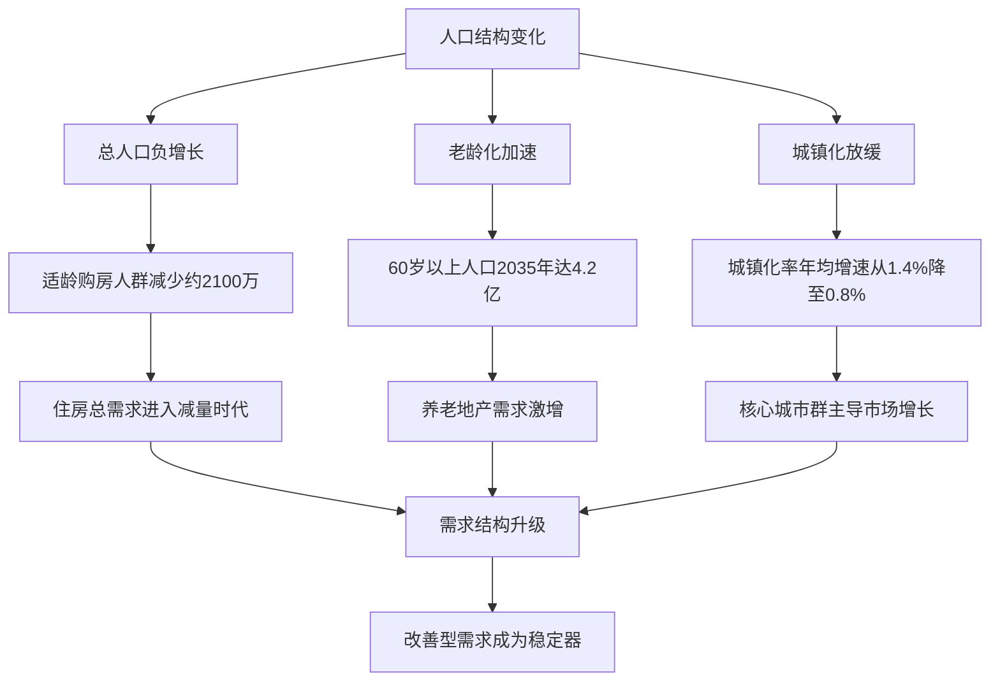

**需求结构的升级**成为市场新特征。35-64岁改善型购房群体年均达6.6亿人，较"十四五"增加3000万，推动120平方米以上大户型市场扩张，深圳、成都等城市该户型成交占比升至40%以上[^9]。老龄化催生新需求场景，60岁以上人口2035年将达4.2亿，养老地产需求激增，适老化改造成为存量房增值关键，上海老旧小区改造后房价平均上涨8%-12%[^11]。

**城镇化红利向质量转型**。城镇化率年均增速从1.4%降至0.8%，但仍有3个百分点提升空间，带来约1.2亿新增住房需求，主要集中在长三角、珠三角等城市群[^9]。粤港澳大湾区、长三角等"人口磁极"人口密度突破5000人/平方公里，对全国人口增量贡献率超30%，深圳、成都等核心城市年均人口净流入超10万，支撑改善型需求[^11]。

### 1.4 从金融属性回归居住属性：行业定位的历史性校正

房地产行业正经历从金融属性向居住属性回归的历史性校正。2026年《求是》杂志开篇重磅定调，明确房地产"带有显著金融资产属性"，这一论断打破了市场长期以来的认知迷雾，让房产重新回归居民财富配置与金融体系稳定的核心视野[^13]。然而，这一定调绝非为投机行为开绿灯，而是在正视行业客观规律的基础上，划定了清晰的发展边界。

**"房住不炒"作为底线贯穿始终**。《求是》文章同时强调，必须锚定"房住不炒"的底线不动摇，明确房地产的金融属性与民生属性并非对立关系，而是辩证统一的整体——金融属性是房地产作为资产的客观规律，是居民财富保值增值的合理载体；而民生属性则是行业发展的根本立场，是满足人民群众安居乐业需求的核心要义[^13]。

**市场信号印证回归趋势**。重点城市二手房价格较峰值跌幅近四成，租售比回升至2%-5%，房价收入比连续多年下降，80%的城市进入合理区间[^6]。2025年11月，全国重点50城的平均租金房价比达到2.23%，相较于2023年初的低点已提升0.25个百分点[^14]。这表明通过租金回收房产投资的速度正在稳步加快，租赁的现金流价值正在回归。对于居民而言，房产的投资属性不再体现为短期投机炒作的价差收益，而是长期持有下的资产保值与配套服务增值[^13]。

**住房民生属性的政策强化**。"十五五"规划建议将房地产的表述重点放在"加大保障和改善民生力度"部分，将"推动房地产高质量发展"作为重点任务进行论述，突出了住房的民生属性[^4]。住房城乡建设部部长倪虹强调，安居是人民群众幸福生活的基点，必须顺应人民群众对美好居住生活的新期待，不断完善住房供应体系，建设"好房子"、开发好产品、提供好服务[^7]。

### 1.5 可持续发展的紧迫性：研究背景与现实意义

综合上述分析，中国房地产行业选择可持续发展路径已从政策选项转变为生存必需。行业面临的**四重叠加压力**——旧模式风险出清、供求关系逆转、人口结构约束、金融属性回归——共同指向一个结论：唯有实现高质量可持续发展，行业才能穿越周期、重获新生。

**"十五五"规划为行业转型指明方向**。《建议》提出"推动房地产高质量发展"，这是以习近平同志为核心的党中央面向"十五五"这一新的起点，着眼全局作出的重大决策部署[^7]。主要目标是加快构建房地产发展新模式，建立更好满足刚性和改善性住房需求的住房供应体系，健全多主体供给、多渠道保障、租购并举的住房制度，推动住房品质显著提升、风险隐患有效防控、企业转型成效明显[^8]。

**"好房子"建设成为行业核心抓手**。2025年，"好房子"首次被写入政府工作报告，成为行业转型的核心方向[^15]。建设安全、舒适、绿色、智慧的"好房子"，实施房屋品质提升工程和物业服务质量提升行动，已成为"十五五"时期房地产高质量发展的首要任务[^4]。住房城乡建设部发布《关于提升住房品质的意见》，明确到2030年房屋品质提升工程取得显著进展，保障性住房率先建成"好房子"，商品住房更好满足刚性和改善性需求[^16]。

**行业转型路径逐渐明晰**。清华大学房地产研究中心主任吴璟指出，2025年房地产市场在"修复"上取得了重大成绩，转型路径也在逐渐明晰，新模式、新动能逐渐清晰：一是"房地产回归民生"，以"好房子"为代表的对更美好居住生活的满足成为房地产市场发展新的增长点；二是"从大规模增量扩张到以存量为主"，以城市更新为代表的对城市高质量发展的支持和服务，成为房地产市场发展的新动能[^17]。

本研究聚焦房地产行业可持续发展的动力重构与国家促进机制，具有重要的理论价值与实践意义。从理论层面看，研究将系统解构推动行业可持续发展的多维动力系统，揭示政策、资金、导向三者的协同作用机制；从实践层面看，研究将为政府决策、企业战略调整、投资者判断提供参考依据，助力行业在"十五五"期间实现从风险化解到稳定发展再到模式转型的三重任务[^17]。正如上海易居房地产研究院副院长严跃进所言，房地产行业正从规模扩张转向品质发展与模式创新，在政策支持、需求演进与供给优化共同作用下，逐步构建起高质量发展的新格局[^18]。

## 2 房地产行业可持续发展的多维动力系统解构

中国房地产行业正处于从"高杠杆、高周转"旧模式向高质量发展新模式转型的关键期。在这一历史性转折中，行业可持续发展并非依赖单一力量推动，而是由政策强制与激励、市场内生需求、技术创新与成本下降、金融资本导向、企业战略转型五大核心动力共同构成的系统性动力机制所驱动。这五大动力相互依存、彼此强化，形成"政策引导—需求牵引—技术赋能—资本催化—企业落地"的协同发展格局。本章将系统解构各动力要素的作用路径及其内在逻辑关系，揭示行业转型的内生动力与外部推力，为后续国家促进机制研究奠定理论基础。

### 2.1 政策强制与激励：顶层设计引领行业转型方向

国家层面的政策体系构成房地产可持续发展的顶层设计与引导核心。当前政策框架围绕"需求端激励、供给端优化、要素端保障"三大维度构建，通过强制性标准约束与激励性措施相结合的方式，系统性推动行业向高质量发展转型[^19]。

**战略定位与标准引领**方面，"十五五"规划建议将"推动房地产高质量发展"列为民生重点任务，明确了行业发展的战略方向[^20]。在技术法规层面，《住宅项目规范》已于2025年5月1日正式实施，包含14项提升标准，其中楼层高度从原来的2.8米提高至更高水平，为"好房子"建设提供了强制性技术规范[^21]。住房城乡建设部明确提出建设"好标准、好设计、好材料、好建造、好运维"的高品质住宅目标，从供给侧确立品质升级的刚性约束[^19]。

**"人房地钱"要素联动机制**是政策精准调控的核心抓手。该机制通过精准匹配人口、住房、土地与金融资源，有效优化供给结构。2025年6-10月，各地供给侧政策频次达39次，充分体现了因城施策、精准施策的调控思路[^20]。具体而言，政策要求完善要素联动机制，根据人口变化、住房需求等要素，每年3月底前编制并发布住房发展年度计划和土地供应计划，科学确定住宅用地供应节奏[^19]。

**需求端激励措施**形成多层次政策组合。在购房补贴方面，2025年宁夏自治区财政安排1亿元资金用于新购住房消费，实行"凡购即补"政策[^19]。在公积金支持方面，政策从五个维度强化支持力度：允许婚后家庭再申请贷款、扩大提取用途至直系亲属住房购买与大修、支持育幼家庭提取用于适幼化改造、退役军人贷款额度上浮20%、支持灵活就业人员参加公积金制度[^19]。开封市进一步明确，新市民、青年人公积金贷款最高额度可达100万元，并允许提取公积金冲抵首付款和租金[^22]。在税收优惠方面，对居民"卖旧买新"换购住房给予退税支持、下调契税税率、取消普通住宅和非普通住宅标准等政策不断加大对居民购房的支持力度[^21]。

**供给端优化与城市更新**构成政策发力的重要领域。城市更新已成为跨领域战略举措，2025年相关政策发布达134次[^20]。政策明确实施城中村改造项目2387个，建设筹集安置住房230多万套；启动城市危旧房改造17.5万套（间）；累计改造城镇老旧小区24万多个、惠及1.1亿居民[^21]。宁夏印发《关于加快推进城中村改造三年行动方案（2025—2027年）》，计划3年完成5个地级城市1.2万套改造任务，支持采取"以购代建""房票"安置等方式实施改造[^19]。

以下表格汇总了当前政策体系的主要构成与作用机制：

| 政策维度 | 核心措施 | 作用机制 |
|----------|----------|----------|
| 标准强制 | 《住宅项目规范》14项提升、"好房子"技术标准 | 从供给侧确立品质刚性约束 |
| 需求激励 | 购房补贴、公积金优化、税收减免 | 降低购房成本，激发合理需求 |
| 供给优化 | 城市更新、城中村改造、存量盘活 | 优化供给结构，消化库存压力 |
| 要素联动 | "人房地钱"联动机制、土地弹性供应 | 实现资源精准匹配与动态调控 |

### 2.2 市场内生需求：消费升级驱动产品品质迭代

市场需求的结构性升级构成房地产可持续发展的根本牵引力量。随着居民住房条件显著改善，住房需求已从"有没有"转向"好不好"，改善型需求成为市场主力，消费者对"好房子"的主动选择正在倒逼供给侧品质升级。

**改善型需求崛起**是市场演变的核心特征。35-64岁改善型购房群体年均达6.6亿人，较"十四五"增加3000万，推动120平方米以上大户型市场持续扩张，深圳、成都等城市该户型成交占比已升至40%以上。刚需向二手房转移的趋势明显，2025年30城二手房成交占比达65%，全国有15个省、区、市二手住宅交易量已超过新房[^21]。这种市场分化意味着新房市场正逐步聚焦改善性需求，形成"二手房承接刚需、新房主攻改善"的市场格局。

**需求场景的多元分化**催生差异化产品供给。适老化需求方面，60岁以上人口2035年将达4.2亿，养老地产需求激增，适老化改造成为存量房增值关键，上海老旧小区改造后房价平均上涨8%-12%。适幼化需求方面，政策明确对育有3周岁以下幼儿的家庭，每年可提取一定量住房公积金用于适幼化改造[^19]。绿色健康需求方面，消费者对恒温、恒湿、恒氧、恒净、恒静等高品质居住环境的追求日益强烈，被动式超低能耗建筑的市场接受度持续提升[^23]。

**核心城市优质项目热销**验证了需求升级的市场逻辑。购房者调研显示，86%的业主将"能否按期交付"作为购房首要考量，品质与信誉成为购房决策的核心因素[^24]。在市场分化格局下，核心城市因资源集聚度高、需求韧性较强，房价下跌后仍具备回升潜力，而三线以下城市由于需求支撑不足，房价回升难度较大[^25]。这种分化促使企业聚焦核心区域、深耕高品质产品。

需求升级对供给侧的倒逼效应体现在多个层面：一是**拉动技术创新**，"住好房"需求直接推动绿色建筑、智能建造、健康住宅等技术的研发与应用，为技术提供市场出口；二是**促进企业转型**，需求分化促使企业从追求规模速度转向追求产品品质，并发展经营性业务以满足持续的服务需求；三是**验证政策效果**，市场需求的实际响应程度成为检验政策精准性和有效性的关键标尺。

### 2.3 技术创新与成本下降：绿色智能建造重塑产业竞争力

技术创新是实现房地产可持续发展的降本提效引擎，为绿色发展和模式转型提供可行性方案。随着绿色建筑技术、装配式建造、超低能耗建筑、BIM数字化管理等技术的成熟与规模化应用，行业正在实现"节能减排+成本优化"的双重目标。

**绿色建筑技术的集成应用**已形成系统性解决方案。南京南部新城国际路居住社区中心项目入选"2025绿色低碳建造典型案例"，该项目集成11项创新技术，实现全生命周期碳减排23.8%[^26]。项目采用的流态固化土原位拌制技术解决了雨季施工和狭小空间回填的行业难题，实现工程弃土和固废的资源化利用；尾矿砂再生高分子模板以工业固废为原料，回收利用率达90%，较传统木模板节省成本44%[^26]。大同新能置业的瑞湖项目集被动式、装配式、绿色三星于一体，通过保温隔热、新风系统及可再生能源实现室内恒温、恒湿、恒氧、恒净、恒静，节能率高达90%以上[^23]。

**智能建造技术显著提升施工效率**。南京项目通过全周期BIM技术应用，设计返工率降低70%；智能施工设备的广泛使用将工期压缩20%，大幅降低人工误差[^26]。东莞滨海城项目通过BIM技术实现施工误差控制在3毫米内，这类品质升级举措正在重塑市场认知[^24]。装配式建造方面，大同瑞湖项目应用钢管束混凝土剪力墙、GRC条板墙、预制钢板式组合楼梯等装配式构件，整体装配率达到69%以上，减少了木材等非化石能源使用和碳排放[^23]。

**技术创新带来的成本效益**已得到实践验证。长三角某智慧产业园项目的成本效益分析显示，绿色施工总成本增量约815万元（增量占比6.79%），但通过运营阶段的节能节水效益可实现快速回收：光伏系统年节约电费约90万元、节水系统年节约水费约28万元，加上地方绿色建筑示范项目补贴500万元，综合成本效益比（BCR）可达3.49[^27]。这一数据充分证明，技术创新不仅是环境责任的体现，更是经济效益的可靠来源。

以下流程图展示了技术创新对行业可持续发展的赋能路径：

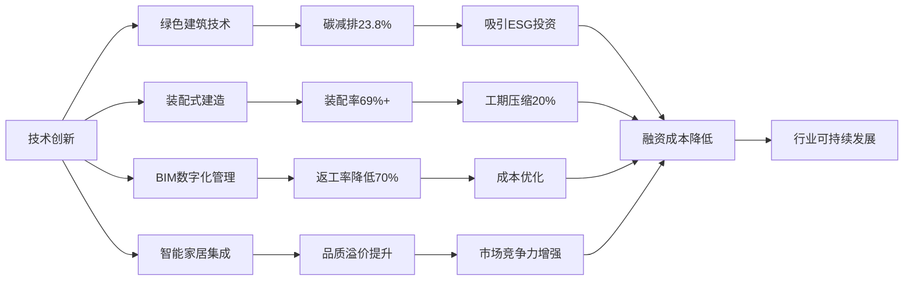

技术进步对行业绿色转型的底层赋能逻辑在于：**技术成熟使绿色低碳从理念变为可实施、可推广的实践**，助力政策目标落地；**规模化应用带动成本下降**，降低绿色溢价门槛，使更多项目具备经济可行性；**可量化的环境与经济效益**成为吸引ESG投资和绿色金融的基础资产。

### 2.4 金融资本导向：ESG投资与绿色金融重构资源配置

金融资本的流向正在深刻重塑房地产行业生态。从城市房地产融资协调机制到商业不动产REITs试点，从绿色金融到转型金融，资本市场正在从"规模偏好"向"质量偏好"转变，为行业可持续发展提供血脉与催化剂。

**城市房地产融资协调机制**是当前稳定市场的关键制度安排。该机制以城市为单元，实施项目"白名单"制度，一个项目确定一家银行或银团为主办银行，项目开发、建设、销售等资金都存入主办银行，主办银行保证项目公司的合理融资需求[^21]。截至目前，全国"白名单"项目贷款审批金额已超过7万亿元，支持近2000万套住房交付，有力保障了商品住房项目建设交付[^21][^20]。政策明确对符合"白名单"融资条件项目"应进尽进、应贷尽贷"，主办商业银行要提高审批和放款效率，按照项目建设进度及时发放贷款[^19]。

**商业不动产REITs试点**为存量资产盘活开辟新通道。中金公司研究部执行负责人张宇指出，商业不动产REITs的正式启航标志着中国REITs市场进入新阶段，带来广阔发展空间[^28]。REITs能助房企降负债、防风险，构建良性循环体系，推动企业向"轻资产运营"转型。在低利率环境下，REITs有助于优质资产价值重估，为投资者提供新投资渠道[^28]。这一制度创新为"开发-运营-退出"提供闭环，强力催化企业向资产管理转型。

**绿色金融与转型金融**对低碳项目形成倾斜支持。政策鼓励商业银行面向引进人才、创业青年、新就业高校毕业生等开发特色化住房贷款产品，合理确定贷款期限，降低月供负担[^19]。在风险可控的前提下，开发企业可通过商业保险、国有担保公司担保函替代不高于保函金额的监管资金，合理释放房地产企业资金流动性[^22]。绿色金融、转型金融为绿色技术应用提供资金激励，直接降低绿色项目的融资成本，加速其规模化应用。

**AMC参与存量资产盘活**成为风险化解的重要力量。原银保监会普惠金融部主任、中国长城资产管理公司原党委书记李均锋认为，盘活存量资产是推动高质量发展、激发新动能的关键。金融资产管理公司（AMC）通过市场化、专业化手段，积极参与央企混改、盘活地方国企房产、破产重整等实践，有效提升资产价值，对优化资源配置具有重要意义[^28]。

金融资本导向对行业发展模式的重塑作用体现在三个层面：一是**保障项目交付**，融资协调机制确保在建项目资金需求，维护购房者权益；二是**催化模式转型**，REITs发展为经营性资产提供退出渠道，推动企业从"开发商"向"运营商"转变；三是**引导资源配置**，ESG投资理念影响房企融资成本与资本可得性，使高品质、低碳项目获得更优融资条件。

### 2.5 企业战略转型：从规模扩张到长期主义的范式重构

企业是汇聚并落实各项动力的最终载体。面对行业深度调整，头部房企正在从"高负债、高杠杆、高周转"向"低负债、轻资产、高质量"模式转型，通过业务结构优化、财务稳健经营、产品品质提升实现穿越周期。

**"住宅+商业"双轮驱动**成为领先企业的战略选择。新城控股2024年实现商业运营总收入128.08亿元，同比增长13.10%，物业出租及管理毛利率达70.17%，经营性业务对利润贡献比例持续提升[^29]。龙湖集团2023年运营及服务业务收入248.8亿元，同比增长5.7%，在核心权益净利中的贡献占比达60%以上，成为穿越周期的"压舱石"[^30][^31]。龙湖管理层明确表示，商业和长租公寓都实现了经营性现金流为正，两个航道不再需要集团、地产或融资现金流的支持，未来会通过自身现金流的平衡解决发展问题[^30][^31]。

**保交付底线坚守**是企业重建信誉的关键。碧桂园在销售断崖式下滑的背景下展现出惊人的交付能力：2022年至今累计完成175万套房屋交付，相当于每天有超过1600个家庭拿到新房钥匙[^24]。这种"销售失速但交付加速"的独特现象，源于企业将保交付确立为生存底线。碧桂园服务以231.85亿元营收和10.2%的增速，成为集团低迷期的稳定器[^24]。华夏幸福"保交楼"工作已基本完成，2025年上半年新增签约18家入园企业，签约投资额136.6亿元，产业园出租率超80%[^32]。

**债务重组与资产负债表修复**为转型创造条件。旭辉控股通过约430亿元人民币的债务削减规模，成功实现"困境反转"的关键跨越，成为行业内率先完成境内外债务重组的民营房企之一[^33]。重组后公司有息负债总额有望从2025年6月末的842亿元大幅降至500亿元左右，成为负债规模最低的民营房企之一[^33]。华夏幸福截至2025年5月31日累计实现债务重组金额约1926.69亿元，占总债务的87.9%，并获得减免利息及罚息202亿元[^32]。

以下表格对比了典型房企的转型路径与成效：

| 企业 | 转型战略 | 核心成效 |
|------|----------|----------|
| 龙湖集团 | 开发+运营+服务三大业务格局 | 经营性业务贡献核心净利60%以上 |
| 新城控股 | 住宅+商业双轮驱动 | 商管毛利率超70%，经营性现金流连续7年为正 |
| 碧桂园 | 保交付优先+物管稳定器 | 累计交付175万套，物管营收231.85亿元 |
| 旭辉控股 | 境内外全面债务重组 | 削债430亿元，负债降至500亿元 |
| 华夏幸福 | 产业新城转型+债务重组 | 重组1926亿元，产业园出租率超80% |

企业转型的深层逻辑在于：**ESG治理理念融入**使企业获得资本市场认可；**品牌价值重塑**通过保交付积累信用资产；**产品力提升**满足需求升级的市场要求。旭辉明确了重组后的三大核心业务方向：聚焦自营业务布局核心城市优质地块、做强收租业务实现稳定增长、发展轻资产服务业务[^33]。这些转型实践表明，企业正在从"规模为王"转向"能力为王"，以高质量发展穿越行业周期。

### 2.6 多维动力的协同效应与系统耦合机制

房地产可持续发展的五大核心动力并非孤立作用，而是构成一个相互驱动、紧密协同的系统性动力机制。政策、市场、技术、资本、企业五大动力在此机制中相互依存、彼此强化，共同推动行业从高杠杆、高周转的规模扩张旧模式，转向注重全生命周期价值、社会与环境效益的高质量发展新模式。

**政策是顶层设计与引导核心**，通过"需求-供给-要素"协同支持体系，直接作用于市场、金融与企业。政策对市场需求的作用体现为降低购房成本、优化公积金政策等措施激发和稳定内生需求；对金融资本的作用体现为设立融资协调机制、推动REITs发展，引导资本流向保交付、绿色项目和优质运营资产；对企业战略的作用体现为"好房子"建设、现房销售制等政策倒逼企业向高品质开发与运营服务转型。

**市场需求是根本牵引与验证标尺**，需求的结构性升级直接驱动其他动力。对技术创新而言，"住好房"需求拉动绿色建筑、智能建造、健康住宅等技术的研发与应用；对企业战略而言，需求分化促使企业聚焦核心区域、深耕高品质产品；对政策效果而言，市场需求的实际响应程度是检验政策精准性和有效性的关键。

**技术创新是降本提效与转型引擎**，为绿色发展和模式转型提供可行性方案。绿色建筑、节能改造等项目产生的可量化环境与经济效益，是吸引ESG投资和绿色金融的基础资产；BIM、装配式等技术提升效率、降低成本，支持企业实现"好房子"供给和运营维护的精细化；技术创新使绿色低碳从理念变为可实施、可推广的实践，助力政策目标落地。

**金融资本是血脉与催化剂**，资本流向重塑行业生态。融资协调机制保障项目交付；REITs发展为"开发-运营-退出"提供闭环，强力催化企业向"轻资产运营"和资产管理转型；绿色金融、转型金融提供资金激励，直接降低绿色技术应用的融资成本。

**企业战略转型是执行主体与微观响应**，企业是汇聚并落实各项动力的最终载体。企业提供"好房子"和优质运营服务，是直接满足和创造需求的主体；通过债务重组优化财务、通过运营业务产生稳定现金流，从而重塑信用，吸引股权和债权资本；作为技术应用方，企业的采纳与集成是实现技术价值转化的关键。

以下框架图展示了五大动力的系统耦合机制：

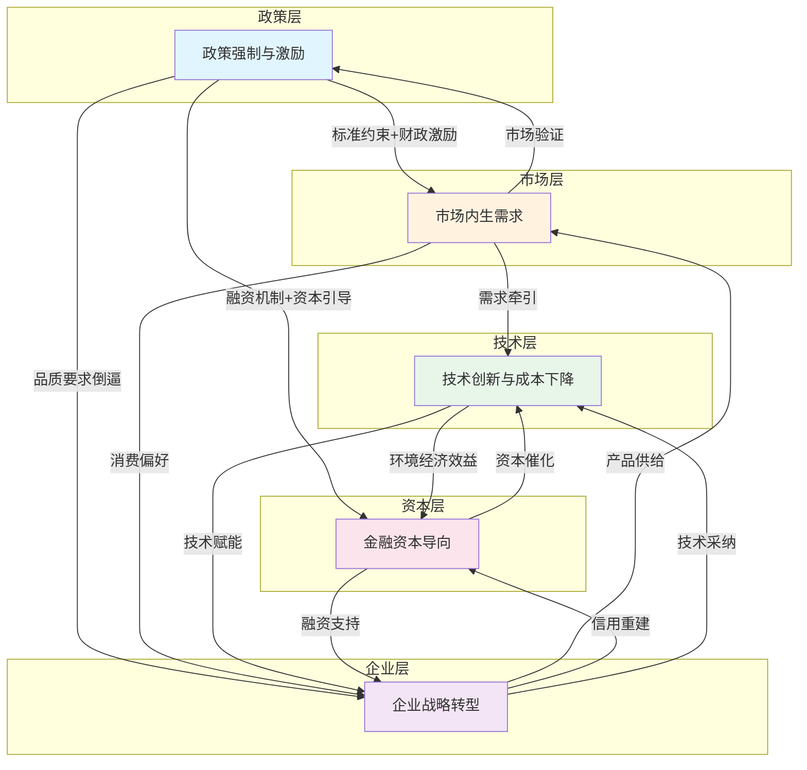

**正向增强回路**是系统运行的核心机制：政策引导（如绿色金融）→资本支持（投向绿色项目）→企业应用（绿色技术创新）→市场提供（高品质绿色产品）→需求响应（为绿色溢价付费）→验证政策有效性并强化政策导向，形成良性循环。**风险化解与稳定协同**方面，政策（融资协调机制）与金融（AMC参与）协同，支持企业"保交付"和债务重组，从而稳定市场预期，防止需求进一步萎缩，为行业转型争取时间。**模式转型协同**方面，市场需求向运营服务倾斜，金融资本通过REITs提供退出渠道，共同推动企业战略从"开发商"向"运营商、服务商"转型。

综上所述，中国房地产行业可持续发展的系统动力机制可概括为：**以"稳市场、防风险、提品质、促转型"为政策目标导向，以市场需求的结构性升级为根本牵引，以技术创新为关键赋能手段，以金融资本流向为重要催化剂，最终通过企业主体的战略转型与业务重塑得以实现**。未来，该系统的有效运转依赖于各动力间的持续协同与动态适配，这也为后续章节分析国家促进机制的设计与实施提供了系统性分析框架。

## 3 未来十年的政策框架演进：从"房住不炒"到"系统引导"

中国房地产政策体系正经历从"短期调控"向"长效制度构建"的历史性转型。2025年7月中央城市工作会议明确，我国城镇化进入稳定发展期，城市发展从增量扩张转向存量提质增效，将城市更新作为构建房地产发展新模式的核心抓手[^20]。随后《关于推动城市高质量发展的意见》印发，2025年10月"十五五"规划建议将"推动房地产高质量发展"列为民生重点任务，形成了衔接紧密的顶层设计体系[^20]。这一政策演进的根本逻辑，是适应房地产市场供求关系的重大变化，推动行业从过去"高负债、高杠杆、高周转"的旧模式，全面转向"质效优先、风险可控、供需适配"的高质量发展新模式[^20]。

未来十年（2026-2035年），政策框架将以"房住不炒"为刚性底线、以"因城施策"为柔性调控工具、以系统性基础制度改革为支撑，构建起"长效调控+精准支持"的双重体系[^34]。住房城乡建设部部长倪虹明确提出，推动房地产高质量发展的主要目标是加快构建房地产发展新模式，建立更好满足刚性和改善性住房需求的住房供应体系，健全多主体供给、多渠道保障、租购并举的住房制度，推动住房品质显著提升、风险隐患有效防控、企业转型成效明显[^7]。本章将系统剖析这一政策框架的演进逻辑、核心机制与制度改革方向。

### 3.1 政策底线的延续与升华："房住不炒"定位的制度化演进

**"房住不炒"作为房地产政策的根本底线，将在未来十年持续贯穿始终**，并从调控口号升级为制度刚性约束。这一定位的确立源于对过去房地产发展模式弊端的深刻反思：资本迅速扩张推动形成的"高负债、高杠杆、高周转"模式，其弊端日益凸显，已经难以为继[^7]。

从政策演进脉络看，自"房住不炒"定位确立以来，政策导向已从"刺激增长"转向"供需平衡、风险化解"[^34]。"十五五"规划进一步明确"推动房地产高质量发展"的核心任务，将其纳入民生保障与共同富裕的整体框架[^34]。住建部部长倪虹在署名文章中强调，安居是人民群众幸福生活的基点，必须顺应人民群众对美好居住生活的新期待[^7]。这标志着房地产的本质定位从投资品向民生产品的根本性回归。

**"房住不炒"与住房民生属性、金融属性的关系是辩证统一的**。政策并非否定房地产的金融属性，而是在正视行业客观规律的基础上划定清晰边界。未来十年政策需持续强化"房住不炒"定位，坚决遏制投机炒房行为，防止房价大起大落[^34]。要明确房地产在民生保障体系中的重要地位，将"满足居民合理居住需求"作为政策制定的出发点和落脚点，平衡好住房的居住功能与资产属性，避免行业再次陷入"高杠杆、高周转"的非理性循环[^34]。

从制度化路径看，"房住不炒"的贯彻方式正在从行政调控向制度约束转变。通过构建"长效调控+精准支持"的双重体系，坚决遏制投机炒房，防止房价大起大落，确保行业发展不偏离居住本质。具体而言，政策红利精准倾斜刚需与改善群体，坚决杜绝投机炒房[^35]。2026年开年的政策组合拳明确传递出：**政策托底的核心是保障真实居住需求，杠杆投机、囤积房产等待升值的逻辑已彻底失效**[^35]。

### 3.2 因城施策的动态调控机制：差异化治理与精准施策体系

**"因城施策"是稳定房地产市场、防范区域性风险的根本遵循**[^36]。房地产作为不动产，具有鲜明的区域性市场特征。"十四五"期间，受地区间人口流动格局的分化、产业发展的差异、城镇化进程的快慢、开发用地供给规模的不同等因素影响，我国住房市场的结构性分化进一步加剧[^36]。这种结构性分化决定了房地产调控不能采取"一刀切"模式，必须将因城施策作为稳市场、防风险的基石。

**因城施策的运作基于"人、房、地、钱"四大要素的联动评估**。该政策要求根据不同城市住房矛盾情况实施差异化措施：住房矛盾缓解或过剩城市需宽松政策，人口净流入大城市需从紧政策，以促进市场平稳健康发展[^37]。具体包括调减限制性措施，加力实施城中村和危旧房改造，释放刚性和改善性住房需求潜力[^37]。

针对2026年稳定房地产市场的重点工作，住建部明确提出"因城施策控增量、去库存、优供给"的核心任务[^38]。不同能级城市的差异化政策工具组合如下表所示：

| 城市类型 | 供给端策略 | 需求端措施 | 政策重点 |
|----------|------------|------------|----------|
| 核心城市（人口流入、需求旺） | 优化供给结构、增加高品质住房 | 限购松绑、公积金优化 | 优供给、盘存量 |
| 压力城市（库存高、人口流出） | 控制土地供应、收购存量商品房 | 补贴发放、税费减免 | 控增量、去库存 |
| 中等城市 | 结合城市更新、城中村改造 | 支持刚需和改善性需求 | 动态平衡 |

**需求端政策持续加码释放合理需求**。2025年公积金优化政策达305次，首套房贷利率进入2.1%-2.6%区间；北京、上海、深圳等一线城市限购松绑，郑州、青浦等地人才购房补贴最高300万元，宁波优化契税认定规则，有效降低置业成本[^20]。2026年1月，中国人民银行、国家金融监督管理总局发布通知，将商业用房购房贷款最低首付款比例调整为不低于30%，并明确各城市可根据因城施策原则自主确定比例下限[^37]。

**城市政府调控自主权得到充分赋予**。住建部部长倪虹明确表示，房地产是不动产，房地产市场是以城市为单元的市场，城市政府应当充分用好调控自主权[^39]。下一步将继续坚持因城施策、精准施策、一城一策，控增量、去库存、优供给，支持居民刚性和改善性住房需求，推动房地产市场平稳运行[^39]。

### 3.3 房地产发展新模式的核心抓手："人房地钱"要素联动机制

**"人房地钱"要素联动机制是破解供求失衡、构建房地产发展新模式的核心抓手**[^20]。该机制的核心逻辑是：根据人口变化确定住房需求，根据住房需求科学安排土地供应、引导配置金融资源，实现以人定房、以房定地、以房定钱，促进房地产市场供需平衡、结构合理，防止市场大起大落[^40]。

住房城乡建设部发布的《关于做好住房发展规划和年度计划编制工作的通知》明确指出，住房发展规划和年度计划是建立"人、房、地、钱"要素联动机制的重要抓手[^40]。各地要充分认识做好住房发展规划和年度计划编制实施工作的重要性，科学编制规划，认真组织实施。

**要素联动机制的构建逻辑与实施路径**可通过以下流程图清晰呈现：

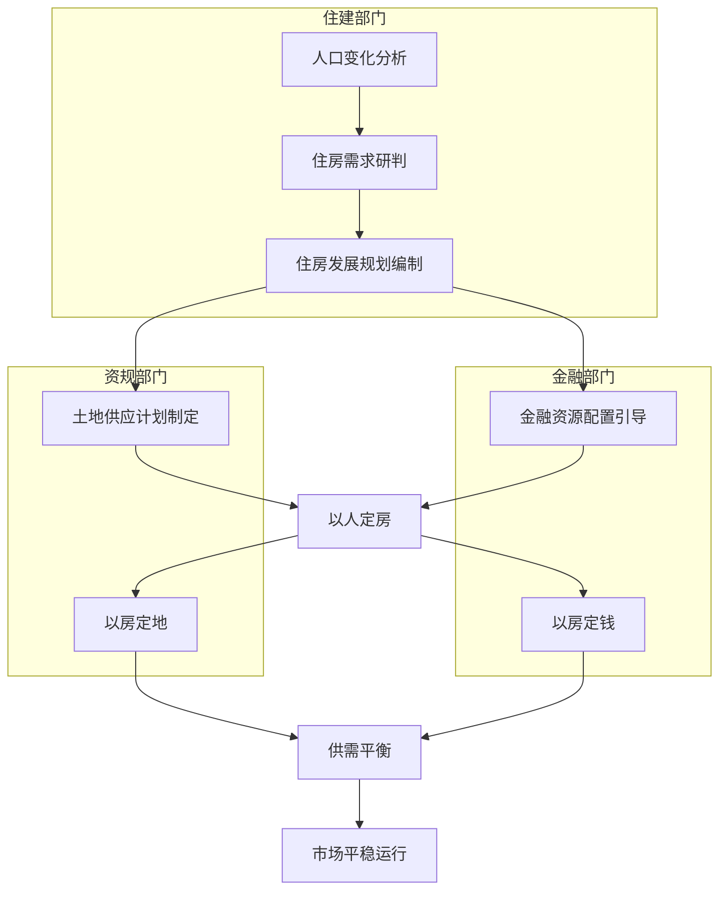

**多部门联动协同工作机制是要素联动的关键**。住房发展现状和城镇人口是"人、房、地、钱"要素联动新机制的起点，住建部门根据经济社会发展、住房现状和人口变化情况等科学研判住房需求，包括住房总量规模、供应结构、空间分布、供应时序等[^40]。住建部门会同资规部门根据住房需求，共同确定住宅用地供应的总量规模、用地结构、投放重点区域和投放时序；金融部门根据住房供需情况确定房地产融资规模，财政部门根据保障性住房建设规模确定财政资金投入规模[^40]。

**三级住房规划体系的建立为机制运行提供制度保障**。根据政策要求，各省、自治区要提前谋划本行政区域2026-2030年住房发展规划，并指导各城市做好规划编制工作。2026年3月31日前，各地要向社会公布2026-2030年住房发展规划[^40]。规划实施期间，各城市要在每年3月31日前向社会公布当年住房发展年度计划有关情况。城区常住人口300万以上的大城市将住房发展规划和年度计划同步报住房城乡建设部备案[^40]。

该机制在实践中已取得积极成效。2025年6-10月，各地供给侧政策频次达39次，有效优化供给结构[^20]。通过精准匹配人口、住房、土地与金融资源，要素联动机制能够有效防范区域性供需失衡的风险，稳定市场预期，促进房地产市场平稳健康发展。

### 3.4 土地制度改革方向：弹性供应与存量盘活的双轮驱动

**未来十年土地供应制度将从增量扩张向存量提质增效根本性转型**。当前我国城镇化正从快速发展期转向稳定发展期，城市发展正从大规模增量扩张阶段转向存量提质增效为主的阶段[^7]。这一转变要求土地供应策略同步调整，实现"控量提质"与存量盘活的双轮驱动。

**控制新增供应是稳定市场的源头性举措**。"控增量"从供给前端精准发力，通过建立"以人定房、以房定地"的供给机制，实现土地与住房供应的精准匹配[^36]。这本质上是对过去依赖土地财政和规模扩张的城市发展模式的纠偏。对于土地和住房供给明显过剩的城市，要暂停通过征地新增房地产用地，加快过剩供给出清，推动市场回归平稳运行轨道[^36]。2025年住宅新开工面积仅为同期成交面积的68%，供小于求态势延续[^41]。

**专项债扩容支持土地收储与存量盘活**。2025年专项债限额达4.4万亿元，创近六年最大增幅，重点投向土地收储、存量房收购等领域，助力化解库存压力[^20]。截至2025年11月末，全国各地公示拟使用专项债收回收购存量闲置土地的数量超4800宗[^37]。2.2亿平方米存量土地回购计划可减轻4亿平方米库存压力[^20]。

**城市更新成为存量盘活的核心抓手**。城市更新是跨领域战略举措，既能盘活存量资产，又能优化城市功能，为市场止跌回稳提供关键支撑[^20]。2025年城市更新相关政策达134次，《求是》测算每年7亿平方米新房规模依赖存量更新[^20]。政策重心应向存量盘活倾斜，以城市更新、城中村改造为重要抓手，通过功能置换、品质提升、复合利用等方式，促进低效、闲置的存量土地和建筑资源焕发新生[^36]。

土地供应策略"控量提质"的具体表现包括：土地成交向优质宅地倾斜，平均溢价率有所回升；核心城市的核心区域受到追捧，普通城市非核心地块遇冷，分化格局将持续深化[^41]。结合城市更新、城中村改造盘活利用存量用地，推动收购存量商品房用作保障性住房、安置房、宿舍、人才房等[^38]。

### 3.5 开发与融资制度重构：项目公司制与主办银行制的协同推进

**房地产开发与融资基础制度改革是构建发展新模式的关键支撑**。住建部部长倪虹明确提出，下一步重点是有序搭建房地产开发、融资、销售等基础性制度[^42]。这一改革旨在构建权责清晰、风险隔离、监管有效的房地产金融和经营新秩序。

**项目公司制的核心要义在于风险隔离与资金封闭管理**。在房地产开发上，做实房地产开发项目公司制，项目公司依法行使独立法人权利，企业总部履行投资人责任[^43]。政策明确严禁企业总部在项目交付前违规抽挪项目公司资金、抽逃出资或提前分红，确保项目资金封闭管理、专款专用[^43]。这一制度设计从根本上切断了母公司与项目公司之间的风险传导链条，保障单个项目的资金安全与交付能力。

**主办银行制的运行机制确保融资需求与资金安全**。在房地产融资上，推行主办银行制，一个项目确定一家银行或银团为主办银行，项目开发、建设、销售等资金存入主办银行，主办银行保证项目公司合理融资需求[^43]。这一制度构建了"利益共享、风险共担"的银企合作模式，既保障项目资金需求，又实现风险可控。

**"白名单"制度持续发挥融资保障作用**。城市房地产融资协调机制以城市为单元实施项目"白名单"制度，全国"白名单"项目贷款审批金额已超7万亿元，支持近2000万套住房交付[^20]。2026年1月，监管部门就房地产融资协调机制发布最新政策指导，明确对已经纳入融资协调机制"白名单"的项目，符合一定条件和标准的，可在原贷款银行展期5年[^44]。这一政策突破了现有贷款展期的期限限制，表明"白名单"房企融资支持政策正从短期纾困向长效保障转型[^44]。

两项制度的协同推进对风险隔离与信用重建具有重要作用。中指研究院企业研究总监刘水分析称，此次延长贷款期限标志着房地产金融支持进一步加力，折射出监管部门对行业流动性链条的再评估，为行业风险化解与模式转型注入关键动力[^44]。对商业银行而言，通过"白名单"项目的贷款展期，既能避免新增不良贷款，还能遏制不良率攀升的势头；对房地产上下游企业来说，贷款展期保障了项目的持续建设与推进，有效缓解了资金周转压力[^44]。

### 3.6 销售制度变革：现房销售制的推进路径与配套机制

**现房销售制是商品房销售制度的根本性革新，更是筑牢民生保障底线的关键举措**[^45]。住建部明确提出，在商品房销售上，推进现房销售制，实现"所见即所得"，从根本上防范交付风险[^42]。这一制度变革回应了购房者对交付安全的核心关切——调研显示，86%的业主将"能否按期交付"作为购房首要考量。

**现房销售新政呈现更强的刚性与系统性**。政策明确将"所见即所得"作为核心目标，新出让土地开发的商品房将逐步转向现房销售，购房者可实地考察房屋质量、户型设计、配套设施等核心要素，彻底告别仅凭沙盘、样板间买房的盲目性[^45]。同时，新政配套构建了"全资金覆盖、专户专存、分阶段释放"的闭环监管体系，定金、首付款、按揭贷款等所有购房资金须100%进入专用监管账户，仅可用于工程建设、农民工工资等核心支出[^45]。

**"新老划断"的过渡安排降低改革负面影响**。中信证券研报指出，目前现房销售主要以地方试点为主，在土地出让环节即约定现房销售的项目占比仍然偏低，预计后续改革试点范围可能会慢慢铺开，一方面通过"新老划断"的方式降低改革的负面影响，另一方面以融资、财税等配套措施予以支持[^46]。对于继续实行预售的项目，政策要求规范预售资金监管，切实维护购房人合法权益[^43]。

**制度变革对市场主体行为与行业格局产生深远影响**。对购房者而言，现房销售实现"一手交钱、一手交房"，彻底规避交付风险，房屋质量与居住确定性得到充分保障，有助于修复市场信心[^45]。对房企而言，则意味着行业准入门槛的抬高，"高周转、高杠杆"的旧模式难以为继。现房销售要求房企先行投入全部建设资金，资金回笼周期从数月拉长至两三年，对企业资金实力和运营能力提出更高要求[^45]。从海南的经验来看，推行现房销售可能使房企拿地更加谨慎，地方财政压力有所加大，但是可以更好推进地产供求平衡、降低库存去化压力[^46]。

### 3.7 政策体系的系统集成：从短期调控向长效机制的范式转换

**未来十年房地产政策框架的核心演进方向是从短期调控向长期制度构建的范式转换**。中央对房地产领域的战略部署已从短期调控转向长期制度构建，从单一行业管理升级为城市系统治理[^20]。这一转型的内在逻辑是：行业已从大规模增量扩张转向存量提质增效，需要与之相适应的制度体系支撑高质量发展。

**"稳增长、防风险、惠民生、促创新"四维目标构成政策框架的核心导向**[^34]。具体而言：稳增长要求保持房地产市场供需基本平衡、结构基本合理、价格基本稳定，有利于促进经济实现质的有效提升和量的合理增长[^7]；防风险要求统筹推进房地产企业债务风险、地方政府土地财政依赖风险、金融机构信贷风险的有序化解，严防系统性风险发生[^34]；惠民生要求着力解决新市民、年轻人、低收入群体的住房困难问题，构建覆盖全人群的住房保障体系[^34]；促创新要求推动"好房子"建设和城市更新，带动全产业链升级。

政策体系的系统集成逻辑可通过以下框架图呈现：

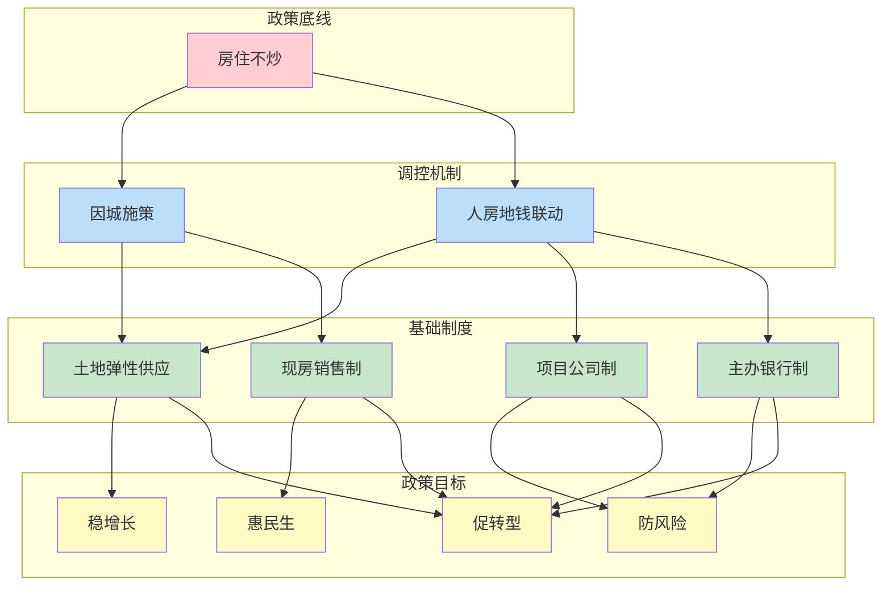

**"质效优先、风险可控、供需适配"的行业发展新模式正加速成型**[^20]。随着租售比比价效应凸显与供求关系持续平衡，2026年下半年核心城市房价有望止跌趋稳，商品房销售规模加速筑底[^20]。政策体系的成功实施将推动中国房地产行业完成历史性转型，真正回归居住本源，实现平稳健康高质量发展。

展望未来十年，政策框架演进面临的主要挑战包括：**区域分化加剧的治理挑战**，如何精准识别并应对不同城市的风险与需求，对地方政府的精细化治理能力提出极高要求；**新旧模式平稳转换的挑战**，在化解存量风险的同时培育新发展动能，需要政策的高度协同与动态平衡；**长期资金与机制保障的挑战**，保障房建设、城市更新、"房屋养老金"等制度的可持续运行，依赖于长期、稳定、规模化的资金支持机制和配套政策。应对这些挑战，需要持续完善政策体系的系统集成与动态调适能力，确保房地产行业在"十五五"及更长时期内实现高质量可持续发展。

## 4 资金支持体系创新：构建可持续项目的金融血脉

房地产行业从"高杠杆、高周转"旧模式向高质量发展新模式转型，离不开与之匹配的资金支持体系重构。过去以规模扩张为导向的融资模式已难以为继，取而代之的是以"质量偏好"为核心的金融资源配置新逻辑。2025年专项债限额达4.4万亿元，创近六年最大增幅；"白名单"贷款审批金额超7万亿元，支持近2000万套住房交付；商业不动产REITs试点正式启动，标志着行业融资体系正在经历系统性变革[^20][^47]。

本章将从绿色金融深化、财政工具精准滴灌、资本市场创新、项目融资机制四个维度，系统剖析未来十年支撑房地产可持续发展的多元化资金渠道与创新工具体系。这一资金支持体系的核心使命，是为"好房子"建设、城市更新、保障性住房等可持续发展重点领域提供长期稳定的金融血脉，推动行业真正实现"质效优先、风险可控、供需适配"的高质量发展目标。

### 4.1 绿色金融体系深化：绿色信贷与绿色债券的风险收益平衡机制

**绿色金融已成为房地产行业可持续发展的核心资金引擎**。自2014年中国人民银行成立绿色金融工作小组以来，短短十年间绿色金融在中国实现了规模和质量的跃迁式增长。对房地产行业而言，绿色金融不仅是应对资源环境问题的金融对策，更是探索金融业高质量发展的未来方式[^48]。在"双碳"目标引领下，绿色信贷与绿色债券正在为低碳建筑、节能改造项目提供可持续的资金支持。

#### 绿色信贷与债券的规模扩张与应用深化

绿色信贷占整个绿色资金的比重超过95%，是房地产绿色转型的主力资金来源[^49]。世邦魏理仕预计，2030年中国内地可投资商业地产总量将大幅增长至约80万亿元，成为亚太区最大的商业地产投资市场[^50]。这一巨大的市场规模为绿色金融提供了广阔的应用空间。

绿色债券作为引导资金流向绿色环保项目的重要金融工具，在房地产领域的应用日益成熟。2021年8月，六部门联合发布的《关于推动公司信用类债券市场改革开放高质量发展的指导意见》明确指出，房地产企业要寻找信用债融资新渠道，鼓励企业发行绿色债券融资[^51][^52]。发行绿色债券一方面可获得长期稳定的资金，另一方面不增加短期偿债压力；同时有利于推动房地产企业开发绿色建筑项目，完善企业债务结构，降低企业融资成本[^51]。

#### 典型房企绿色债券融资实践

**旭辉集团的绿色债券融资案例**展示了房企绿色转型的可行路径。2020年旭辉集团首次发行绿色债券，募集资金用于上海与济南两个符合《绿色金融框架》标准的绿色建筑项目。在发行流程上，公司专门聘请专业评估机构进行发行审核，由财务团队管理募集资金并建立"绿色融资交易登记册"，跟踪每笔绿色融资交易所得款项的使用情况[^52]。旭辉集团十分注重社会责任的履行，2020年首次发布独立的ESG年度报告，并被授予ESG BB级评级[^52]。

**远洋集团作为首个响应碳中和目标的内地房地产企业**，于2020年4月明确提出"要在2050年实现净零排放"。2021年远洋集团被MSCI评为ESG中的A级，被GRESB全球房地产可持续发展评为五星级，可持续发展管理保持行业领先地位[^53]。远洋集团发行的绿色债券实现5.25倍超额认购，吸引了众多境内外大型投资机构[^53]。

| 企业 | 绿色债券特点 | ESG评级 | 核心成效 |
|------|-------------|---------|----------|
| 旭辉集团 | 境外美元债，SPV间接发行 | MSCI BB级 | 降低融资成本，优化债务结构 |
| 远洋集团 | 2050年净零排放目标 | MSCI A级/GRESB五星 | 5.25倍超额认购 |

#### 风险收益平衡机制的构建

绿色金融的风险收益平衡机制设计是确保其可持续发展的关键。从收益端看，具备"绿色"认证的写字楼在一线城市具有较为显著的租金溢价，其中深圳录得最高值的25%；在绿色建筑普及率较低的市场，租金溢价更高[^50]。从成本端看，绿色债券能够有效降低企业融资成本，展现企业社会责任担当，向市场传递积极信号[^51]。

**风险管理层面**，绿色金融体系已识别核心风险并构建相应的平衡机制。针对"漂绿"风险，政策要求建立生态环境效益核算框架、强化第三方认证与信息披露规范化。远洋集团的绿色债券发行流程中，聘请第三方认证机构Sustainalytics对绿色债券框架进行外部评审，并根据《绿色债券原则》进行信息披露，获得穆迪Baa3的债项评级[^53]。这一流程设计有效降低了投资者对披露信息的疑虑，提高了市场信心。

#### 未来十年绿色金融制度建设方向

绿色金融未来改革的方向在于进一步通过公共品属性改革、匹配绿色新业态的货币化改革、培育中国特色金融文化等方式，构建充分发挥绿色金融治理效能的行动路径，为碳达峰拐点之后的零碳转型进程提供动力[^48]。具体包括：**标准统一**，推动绿色金融标准与国际接轨；**信息披露规范化**，建立统一的环境信息披露框架；**第三方认证体系完善**，加强对绿色项目的专业评估与持续监督。

### 4.2 财政工具精准滴灌：专项债扩容、税收优惠与中央补助的协同发力

**财政政策针对房地产持续发力，叠加运用多种财政工具支持市场止跌回稳**。2024年10月12日财政部新闻发布会明确提出，要叠加运用地方政府专项债券、专项资金、税收政策等工具，支持推动房地产市场止跌回稳[^47]。这一政策组合标志着财政工具从"禁止投向"到"精准支持"的历史性转变。

#### 专项债扩容：土地收储与存量房收购的政策突破

**专项债用于土地储备和存量房收购是财政政策的重大突破**。2021年专项债"禁止清单"曾明确禁止投向房地产项目，而2024年10月12日财政部新闻发布会允许专项债投向收购存量房和存量土地，打开了专项债投向房地产的先河[^54]。

在土地收储方面，财政部允许专项债用于土地储备，支持地方政府使用专项债券回收闲置存量土地或用于新增土地储备项目。这项政策既可以调节土地市场的供需关系，减少闲置土地，增强对土地供给的调控能力，又有利于缓解地方政府和房地产企业的流动性和债务压力[^47]。2025年专项债限额达4.4万亿元，创近六年最大增幅，2.2亿平方米存量土地回购计划可减轻4亿平方米库存压力[^20]。

在存量房收购方面，财政部明确用好专项债券收购存量商品房用作各地的保障性住房。平安证券首席经济学家钟正生分析，允许专项债提供资金后，考虑到1-8月地方专项债平均发行利率为2.4%，则有可能将项目综合成本下拉到3%以内，与2%左右的租金回报率更加接近，商品房收储政策的可行性将得到提升[^47]。

#### 税收政策优化：降低交易成本释放需求

**普通住宅与非普通住宅标准取消后的税收政策调整**是财政支持的重要组成部分。财政部正在抓紧研究明确与取消普通住宅和非普通住宅标准相衔接的增值税、土地增值税政策[^47]。

普通住宅与非普通住宅标准2005年提出，普通住宅可享受土地增值税与增值税减免。随着房地产市场供需关系的变化，以及老百姓对美好居住环境的期待升级，取消普宅和非普宅标准势在必行，与之相应的税收政策也需要调整[^55]。以北京为例，当前约有2成左右二手住房为非普通住宅，个人出售2年以上的普通住宅免征增值税，而出售2年以上的非普通住宅征收差额增值税，税率为5%[^55]。

税收政策配套更新后的效应包括：**对购房者**，直接降低居民购房成本，特别是二手房交易中的高交易成本问题将得到缓解；**对房企**，降低土地增值税预缴与实缴压力，有利于与改善需求相适应的大户型产品出现，推动改善型产品设计升级[^55]。

#### 保障性安居工程补助资金的投向优化

财政部门继续用好保障性安居工程补助资金，并对支持方向作出优化调整。原来补助资金主要用于支持以新建方式筹集保障性住房房源，现在适当减少新建规模，支持地方更多通过消化存量房的方式来筹集保障性住房房源[^47]。近三年，中央财政安排了保障性安居工程补助资金2124亿元、中央预算内投资2800亿元，并统筹地方政府专项债券等，支持筹集各类保障性住房666万套[^47]。

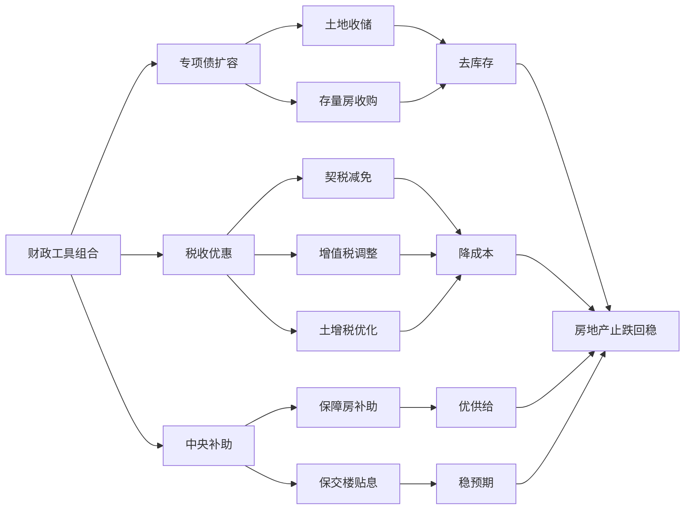

财政工具的协同效应体现在"去库存、稳房价、优供给"的多重目标实现。通过专项债收购存量房和存量土地，既可以消化存量商品房，促进房地产市场的供需平衡，又可以优化保障房的供给，满足广大中低收入人群的住房需求[^47]。

### 4.3 资本市场创新：保障性租赁住房REITs扩容与商业不动产证券化

**商业不动产REITs试点的启动是构建房地产发展新模式的关键一步**。2024年12月31日，中国证监会正式启动商业不动产投资信托基金（REITs）试点，被视为加快构建房地产发展新模式、稳定并改善房地产行业预期的重要举措[^56]。这一制度创新为存量资产盘活开辟了新通道，标志着中国REITs市场进入商业不动产与基础设施并行发展的新阶段。

#### REITs对房地产行业转型的战略意义

中金公司研究部执行负责人张宇指出，商业不动产REITs的正式启航标志着中国REITs市场进入新阶段，带来广阔发展空间。REITs能助房企降负债、防风险，构建良性循环体系，推动向"轻资产运营"转型[^57]。

REITs对房地产行业的重塑作用体现在三个层面：**第一**，通过为具备稳定现金流的商业不动产运营提供融资工具，有助于推动房企从"重资产开发"向"轻资产运营"转型；**第二**，作为权益性融资工具，有助于房企在不增加债务的情况下实现资金回笼，降低资产负债率、优化资本结构；**第三**，通过将流动性较弱的不动产转化为可交易金融产品，盘活存量资产，改善房企的流动性和财务状况，有助于防范化解房地产行业金融风险[^56]。

#### 保障性租赁住房REITs的扩募机制创新

**华夏华润有巢REIT扩募开启里程碑式创新**。2026年1月20日，华夏基金华润有巢REIT扩募份额在上海证券交易所上市交易，首次采用向原基金份额持有人配售的发售方式，标志着我国公募REITs扩募机制取得重大突破[^58]。

本次扩募通过向原持有人配售方式募集逾11亿元资金，用于收购上海闵行区有巢马桥保障性租赁住房项目。交易完成后，基金底层资产实现对上海松江、闵行两大核心产业集聚区的完整布局[^58]。此次扩募的创新之处在于：**一是**赋予原持有人优先认购权，体现对早期支持者的回馈；**二是**采用市场化定价，避免对二级市场价格的冲击；**三是**实现资产的梯度扩容，提升基金的整体运营效率[^58]。

保障性租赁住房REITs兼具社会效益与经济效益。一方面，通过市场化方式增加租赁住房供给，稳定租金水平；另一方面，为投资者提供稳定分红收益，实现多方共赢[^58]。该项目纳入REITs后，将形成"投资-建设-运营-退出-再投资"的良性循环，为保障性租赁住房发展提供可持续的资金支持。

#### 商业不动产REITs试点的推进方向

试点初期将坚持稳中求进，重点支持符合国家政策导向、社会效益显著、经营业绩稳健且具有行业代表性的优质项目，优先推进商业综合体、商业零售、商业办公楼、酒店等业态，同时不排斥长租公寓等其他业态[^56]。

安永发布的分析称，商业不动产REITs有望盘活长期积累的商业零售、写字楼、酒店等存量资产，并通过资产证券化降低房地产行业对银行信贷的依赖。世邦魏理仕的分析数据显示，2020-2030年期间，全国18个主要城市里楼龄逾20年且单一业权的商办面积将从不足1500万平方米快速增长至5000万平方米左右，这些项目中约70%位于城市的核心区位，投资和改造价值巨大[^50]。

| REITs类型 | 发展阶段 | 核心价值 | 典型案例 |
|-----------|----------|----------|----------|
| 保障性租赁住房REITs | 扩募创新 | 社会效益+稳定分红 | 华夏华润有巢REIT |
| 商业不动产REITs | 试点启动 | 盘活存量+降低负债 | 商业综合体、写字楼等 |
| 基础设施REITs | 成熟运行 | 资产证券化退出 | 产业园区、物流仓储等 |

### 4.4 项目融资机制创新：融资协调机制、白名单制度与主办银行制的协同保障

**城市房地产融资协调机制是当前稳定市场、保障项目交付的关键制度安排**。住房城乡建设部、金融监管总局于2024年1月联合发布《关于建立城市房地产融资协调机制的通知》，指导各地级及以上城市建立协调机制[^59]。这一机制以"以城市为主体、以项目为中心"为最大特点，将房企集团的风险与房地产项目的建设区分开来，为金融机构服务在建房地产项目提供参考[^60]。

#### "白名单"制度的运行逻辑与实施成效

协调机制根据房地产项目的开发建设情况及项目开发企业资质、信用、财务等情况，按照公平公正原则，提出可以给予融资支持的房地产项目名单，向本行政区域内金融机构推送[^59]。截至目前，全国"白名单"项目贷款审批金额已超过7万亿元，有力保障了商品住房项目建设交付；全国750多万套已售难交付的住房实现交付，有力维护了广大购房人合法权益[^61]。

"白名单"制度的核心价值在于**精准满足合理融资需求**。对正常开发建设、抵押物充足、资产负债合理、还款来源有保障的项目，建立授信绿色通道，优化审批流程、缩短审批时限，积极满足合理融资需求；对开发建设暂时遇到困难但资金基本能够平衡的项目，不盲目抽贷、断贷、压贷，通过存量贷款展期、调整还款安排、新增贷款等方式予以支持[^59]。

#### 融资协调机制的扩围增效

2026年监管工作会议明确要求，推动城市房地产融资协调机制常态化运行，助力构建房地产发展新模式[^62]。房地产融资协调机制运行两年来，已经有效改善了房地产行业的融资环境，尤其是政策的驱动和"白名单"的建立，对保障项目交付起到了重要作用[^62]。

中指研究院企业研究总监刘水表示，房地产融资"白名单"制度的持续推进，有助于房企资金环境改善，对助力保障项目交付、稳定购房者购买新房的预期均起到重要作用[^61]。然而，目前房地产市场融资分化的情况较严重，中小房企和出险房企的融资难度还是很大。要守住"不爆雷的底线"，通过房地产融资协调机制扩围增效很有必要[^62]。

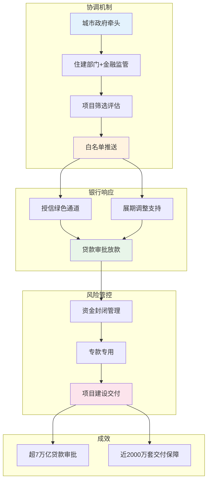

#### 主办银行制与资金封闭管理

主办银行制的运行机制确保融资需求与资金安全。一个项目确定一家银行或银团为主办银行，项目开发、建设、销售等资金存入主办银行，主办银行保证项目公司合理融资需求[^20]。这一制度构建了"利益共享、风险共担"的银企合作模式，既保障项目资金需求，又实现风险可控。

在资金监管方面，政策明确加强贷款资金封闭管理，严防信贷资金被挪用于购地或其他投资[^59]。湖州市在存量房交易领域的实践提供了有益参考：采用"政府监管+公证处实施+资金到账过户"三重保险机制，明确除特殊情形外，房地产经纪机构居间服务、"带押过户"等交易场景均实现资金监管全覆盖，房款到账最快只需1个工作日[^63]。

#### 贷款展期政策的长效化转型

2026年1月，监管部门发布最新政策指导，明确对已经纳入融资协调机制"白名单"的项目，符合一定条件和标准的，可在原贷款银行展期5年。这一政策突破了现有贷款展期的期限限制，表明"白名单"房企融资支持政策正从短期纾困向长效保障转型。对商业银行而言，通过"白名单"项目的贷款展期，既能避免新增不良贷款，还能遏制不良率攀升的势头；对房地产上下游企业来说，贷款展期保障了项目的持续建设与推进，有效缓解了资金周转压力[^62]。

### 4.5 资金支持体系的系统集成：多元渠道协同与长效机制构建

**资金支持体系各工具间呈现协同互补关系，共同构建风险收益平衡与效率保障机制**。绿色金融（债、贷、险）提供市场化资金，财政工具（债、税、补）进行风险分担与精准激励，REITs提供权益性退出渠道，项目融资机制保障基础资产安全交付。四者形成"募投管退"与"风险缓冲"的闭环，系统性支撑房地产行业高质量可持续发展。

#### 多元渠道的协同效应

从资金配置逻辑看，四大渠道的协同机制可概括为：**绿色金融**解决"为什么投"——通过环境效益与经济效益的双重激励，引导资金流向绿色低碳项目；**财政工具**解决"谁来兜底"——通过风险补偿基金、贴息、税收优惠等方式，为金融机构支持绿色项目提供风险缓冲和利润激励；**REITs**解决"如何退出"——为"开发-运营-退出"提供闭环，强力催化企业向"轻资产运营"和资产管理转型；**项目融资机制**解决"如何安全"——通过"白名单"制度和资金封闭管理，保障基础资产安全交付。

| 资金渠道 | 核心功能 | 风险平衡机制 | 效率保障机制 |
|----------|----------|--------------|--------------|
| 绿色金融 | 市场化资金供给 | 第三方认证、信息披露 | 降低融资成本、延长期限 |
| 财政工具 | 风险分担与激励 | 风险补偿基金、贴息 | 精准滴灌、专项支持 |
| REITs | 权益性退出渠道 | 市场化定价、流动性管理 | 盘活存量、优化资本结构 |
| 项目融资 | 基础资产安全保障 | 资金封闭管理、信用挂钩 | 绿色通道、展期支持 |

#### ESG投资理念对房企融资的影响

ESG治理已成为影响企业长期价值与融资能力的关键因素。首开股份的实践表明，通过多维度融资策略筑牢资金安全防线：2024年积极对接"城市房地产融资协调机制"，推动多个项目纳入"白名单"，年内获得相关授信超93亿元；在持有型物业融资方面实现突破，实现55.9亿元经营性物业贷款及城市更新贷款投放[^64]。

房地产行业上市公司的ESG实践显示，所有披露ESG报告的58家房企均建立了环境管理目标，其中25.86%的公司环境管理目标很清晰，建立了短期、中期、长期环境管理目标，并贯彻到公司生产经营的各个环节[^65]。公司的ESG评级等级越高，其设定的环境目标越清晰，ESG评级结果为A等级的房企中，100%的公司环境管理目标很清晰[^65]。

#### AMC参与存量资产盘活

金融资产管理公司（AMC）通过市场化、专业化手段，积极参与央企混改、盘活地方国企房产、破产重整等实践，有效提升资产价值，对优化资源配置具有重要意义[^57]。湖北省城市更新金融对接活动共签约21个项目，涉及危旧房改造、老旧小区改造、城中村改造、历史风貌街区保护等多个领域，总投资805.61亿元，签约金额316.31亿元[^62]。

#### 未来十年资金支持体系演进方向

展望未来十年，资金支持体系将沿以下方向持续深化：

**绿色金融与转型金融的融合发展**。COP28决议要求在能源领域2050年实现碳中和，这意味着新能源和绿色建筑的发展速度要加快。根据测算，2024年仅新能源的资金需求就会超过10万亿元以上，绿色金融将从以绿色信贷为主向多元化工具体系发展[^49]。

**REITs市场体系建设**。证监会明确加快推进REITs市场体系建设，通过丰富指数体系、引导中长期资金入市、探索纳入沪深港通等举措，构建长期发展生态。商业不动产REITs试点的启动，标志着我国REITs市场进入商业不动产与基础设施并行发展的新阶段[^56]。

**融资协调机制常态化运行**。住建部部长倪虹明确表示，下一步将继续发挥好房地产融资"白名单"制度作用，支持房企合理融资需求，支持居民刚性和改善性住房需求，推动房地产市场平稳运行[^61]。融资协调机制将从应急性政策工具转向常态化制度安排，为行业高质量发展提供长期稳定的金融支撑。

综上所述，未来十年房地产资金支持体系的核心演进逻辑是：**从"规模偏好"向"质量偏好"转变，从单一信贷依赖向多元化融资体系转变，从短期纾困向长效保障转变**。这一体系的有效运转，将为"好房子"建设、城市更新、保障性住房等可持续发展重点领域提供长期稳定的金融血脉，推动行业真正实现"质效优先、风险可控、供需适配"的高质量发展目标。

## 5 发展导向落地："好房子"引领下的行业价值重塑

2025年，"好房子"首次被写入政府工作报告，标志着中国房地产行业从规模扩张向品质提升的历史性转折。住房城乡建设部明确提出建设"安全、舒适、绿色、智慧"的好房子，这四大核心标准不仅是对住宅产品的技术规范，更是重塑行业价值创造逻辑的战略导向。《住宅项目规范》于2025年5月正式实施，包含14项提升标准，从层高、隔声、结构安全等维度为"好房子"建设提供了强制性技术规范[^7]。

"好房子"导向的深层意义在于推动房地产业从"类制造业"升级为"产品—服务—运营"一体化产业。当前人民群众住房需求已从"有没有"转为"好不好"，居民对空间品质、空气品质等健康人居的期待正在成为新的核心诉求[^66]。这一需求升级倒逼供给侧进行系统性变革，绿色建筑、智能建造、城市更新、双轨供应体系等领域成为行业价值重塑的关键战场。本章将系统分析"好房子"核心导向如何从政策理念转化为产业实践，揭示其驱动全产业链升级的具体路径与机制。

### 5.1 绿色建筑与超低能耗标准：从强制约束到市场溢价的价值实现

绿色建筑已从政策倡导转变为行业发展的刚性约束与竞争优势来源。国务院办公厅转发的《加快推动建筑领域节能降碳工作方案》明确提出，到2025年城镇新建建筑全面执行绿色建筑标准，新建超低能耗、近零能耗建筑面积比2023年增长0.2亿平方米以上，完成既有建筑节能改造面积比2023年增长2亿平方米以上[^67][^68]。这一政策目标标志着绿色建筑从"示范引领"进入"全面普及"阶段。

#### 政策框架的系统性构建

**国家层面的标准体系**已形成强制性规范与激励性措施相结合的制度框架。2025年各地密集出台超低能耗建筑相关政策标准，全年公开发布的相关政策和标准达76部，覆盖北京、上海、广东、四川、山东等主要省市[^69]。具体而言，北京发布了《超低能耗公共建筑节能工程施工及验收规程》《超低能耗农宅节能技术规程》，上海推出《超低能耗建筑设计标准（公共建筑）》《超低能耗建筑设计标准（居住建筑）》，广州则出台《超低能耗建筑、近零能耗建筑和零能耗建筑容积率激励措施实施细则》[^69]。

**地方激励措施**为绿色建筑发展提供了有力支撑。广州明确对超低能耗建筑给予容积率奖励，深圳设立绿色创新发展专项资金扶持超低能耗建筑示范项目[^69]。阳江市发布《关于实施促进绿色建筑高质量发展激励措施的通知》，佛山市印发《城乡建设领域碳达峰实施方案》[^69]。这些地方政策形成了从规划引导、技术规范到财政激励的完整支持体系。

| 政策层级 | 核心内容 | 代表性文件 |
|----------|----------|------------|
| 国家层面 | 强制性绿建标准、节能降碳目标 | 《加快推动建筑领域节能降碳工作方案》 |
| 省级层面 | 技术标准、实施方案 | 各省超低能耗建筑设计标准 |
| 市级层面 | 容积率激励、资金补贴 | 广州容积率激励细则、深圳专项资金指南 |

#### 市场溢价的价值实现路径

**绿色建筑认证正在转化为切实的经济回报**。具备"绿色"认证的写字楼在一线城市具有较为显著的租金溢价，其中深圳录得最高值的25%；在绿色建筑普及率较低的市场，租金溢价更高。这一数据表明，绿色建筑不仅是合规成本，更是差异化竞争的价值来源。

**被动式超低能耗建筑的成本收益平衡机制**已在实践中得到验证。大同新能置业的瑞湖项目集被动式、装配式、绿色三星于一体，通过保温隔热、新风系统及可再生能源实现室内恒温、恒湿、恒氧、恒净、恒静，节能率高达90%以上。虽然初期建造成本有所增加，但通过运营阶段的节能效益可实现快速回收。长三角某智慧产业园项目的成本效益分析显示，绿色施工总成本增量约815万元（增量占比6.79%），但光伏系统年节约电费约90万元、节水系统年节约水费约28万元，加上地方绿色建筑示范项目补贴500万元，综合成本效益比（BCR）可达3.49。

**绿色建材应用与技术集成**正在形成规模效应。南京南部新城国际路居住社区中心项目集成11项创新技术，实现全生命周期碳减排23.8%。项目采用的流态固化土原位拌制技术解决了雨季施工和狭小空间回填的行业难题，尾矿砂再生高分子模板以工业固废为原料，回收利用率达90%，较传统木模板节省成本44%。这些技术创新表明，绿色转型不仅是环境责任的体现，更是经济效益的可靠来源。

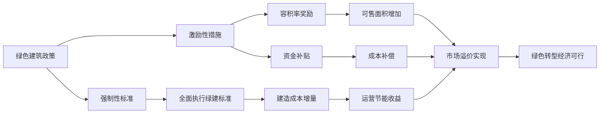

### 5.2 智能建造与建筑产业互联网：生产方式与效率的系统性重构

智能建造是推动建筑业从劳动密集型向技术密集型转型的核心引擎。广东省将发展智能建造作为推动建筑业转型升级的重要抓手，聚焦政策统筹、产业集聚、创新引领和融合发展等重点发力，已发布两批省级智能建造新技术新产品创新服务典型范例，构建起覆盖设计、生产、施工、管理、设备、运维的六大技术体系[^70]。

#### 智能建造技术体系的全链条赋能

**BIM数字化设计**正在重塑建筑设计与施工的协同模式。广州市建筑集团BIM+GIS轻量化平台打通BIM与GIS数据壁垒，实现Revit、IFC、DWG等三十余种主流格式的"秒级"轻量化，将GB级模型压缩至MB级，Web端加载时间缩短90%[^71]。该平台已在会元改扩建项目、白云机场三期扩建工程等三十余个项目应用，实现多源异构模型深入融合。南京项目通过全周期BIM技术应用，设计返工率降低70%，智能施工设备的广泛使用将工期压缩20%，大幅降低人工误差。

**装配式建造**显著提升建筑工业化水平。宝业集团打造的"百年宅3.0生态科技住宅"整体装配率达到69%以上，应用钢管束混凝土剪力墙、GRC条板墙、预制钢板式组合楼梯等装配式构件，减少了木材等非化石能源使用和碳排放[^66]。装配式建筑的周期优势明显，建筑周期比传统方式缩短1/3。宝业集团已形成从拍地到设计、制造、施工、精装交付的建筑工业化全产业链模式，工业化集成率达到87.5%以上[^66]。

**建筑机器人与智能设备**正在改变传统施工方式。建星集团依托数智建造管控平台，集成应用无人值守智能地磅、智能无人施工电梯、智能机器人及智能AI交互系统等前沿设备，成功改善传统作业方式，显著降低人力资源依赖[^70]。深圳博物馆项目通过BIM+VR/AR技术实现施工全过程智能化可视管理，设置近500个二维码识别点，实现施工现场厘米级复核，施工错漏率明显下降，返工率有效降低[^70]。

#### 建筑产业互联网平台的协同效应

**产业互联网平台正在打通全链条数据孤岛**。施工企业数字化供应链平台依托自主研发技术底座，融合移动互联网、主数据管理及BI技术，实现施工企业供应链全流程管理的数字化升级，连接逾6000家上下游企业，构建生态化协同网络[^70]。深圳市眼镜智造产业大厦项目围绕设计、采购、生产、运输、施工、运维等全过程打造一体化建筑产业互联网平台，基于"BIM"一模到底理念，实现全要素、全生命周期、多参与方的数据互联互通和在线协同[^70]。

**政企互联平台提升监管效率与风险防控能力**。珠江监理"政企互联"平台将行业监管政务数据通过数据接口集成，实现项目数据"共建共用共享"，覆盖广州市210个在管房建项目，可帮助企业自动及时获取材料检测结果异常、基坑监测异常信息等多类预警信息，降低管理风险，提升项目质量和安全管理水平[^70]。

| 技术类别 | 核心功能 | 量化效益 |
|----------|----------|----------|
| BIM数字化设计 | 模型轻量化、多源融合 | 返工率降低70%、加载时间缩短90% |
| 装配式建造 | 工厂化生产、现场装配 | 工期缩短1/3、装配率69%+ |
| 智能施工设备 | 无人化作业、精准控制 | 工期压缩20%、误差厘米级 |
| 产业互联网平台 | 全链条协同、数据互通 | 连接6000+企业、实时预警 |

智能建造对行业转型的深远影响体现在：**生产方式变革**，从现场湿作业转向工厂化生产、现场装配；**效率系统性提升**，通过数字化技术实现设计、生产、施工全流程优化；**人力依赖降低**，智能设备替代传统劳动密集型作业；**质量可控性增强**，数字化管理实现全过程溯源与精准控制。

### 5.3 城市更新与存量盘活：可持续发展的新增长极

城市更新已成为构建房地产发展新模式的核心抓手。2025年7月中央城市工作会议明确，我国城镇化进入稳定发展期，城市发展从增量扩张转向存量提质增效，将城市更新作为构建房地产发展新模式的核心抓手[^20]。2025年城市更新相关政策发布达134次，《求是》测算每年7亿平方米新房规模依赖存量更新[^20]。

#### 城市更新的战略定位与政策机制

**城市更新是跨领域战略举措，既能盘活存量资产，又能优化城市功能，为市场止跌回稳提供关键支撑**[^72]。中央近期在推进以人为本的新型城镇化专题会议上明确指出，要"深入实施城市更新行动，把城市更新和消除安全隐患、稳楼市等工作结合起来"[^72]。这一论述首次在顶层设计中清晰勾勒出城市更新与稳定房地产市场之间的内在联动关系。

**自然资源部联合住房城乡建设部发布的《关于进一步支持城市更新行动若干措施的通知》**推出增强详细规划适应性、优化过渡期支持政策、推进存量土地和空间的临时利用等系列举措，着力破解城市更新中的政策堵点[^73][^74]。具体而言，政策鼓励各地结合新产业、新业态发展，制定土地混合开发和空间复合利用正面清单及管控要求；将原5年不改变用地主体和规划条件的固定过渡期政策，调整为以5年为原则的灵活过渡期政策；对改善社区公共服务设施、提升社区公共空间服务功能等微更新项目，明确免于规划许可[^73][^74]。

#### 重点领域的实施路径与资金创新

**城中村改造、老旧小区更新、危旧房改造**是城市更新的三大重点领域。政策明确实施城中村改造项目2387个，建设筹集安置住房230多万套；启动城市危旧房改造17.5万套（间）；累计改造城镇老旧小区24万多个、惠及1.1亿居民。南京市印发的政策明确，落实城市更新行动计划，高质量开展城市更新三年行动，完成22幢城市新增在册危房治理任务、60条街巷整治提升工作，推进既有住宅老旧电梯更新3000台以上，全年盘活存量房产100万平方米以上[^75]。

**存量土地收储与存量商品房转保障房**形成去库存与优供给的协同策略。2025年专项债限额达4.4万亿元，重点投向土地收储、存量房收购等领域。海口市住房和城乡建设局面向社会公开征集存量商品住房用作保障性租赁住房房源，由市政府委托国有企业收购存量商品住房专项转化为保障性租赁住房[^76]。这一模式一举多得：快速筹集保障性租赁住房房源、定向消化特定存量商品房库存、服务重点产业人才安居[^76]。

**房票安置与以购代建**成为城市更新的资金模式创新。北京推出土地作价出资模式，洛阳推行房票安置，打通存量商品房与保障房通道，实现去库存与城市升级双赢[^20]。苏州市在自然资源部统筹指导下，先行先试开展存量建筑盘活利用探索实践，通过制定"一目录、一清单、一张图"，打通了5年过渡期政策落地的"最后一公里"，明确5年过渡期内免征土地相关收益，降低经营主体初创开业成本20%以上[^73][^74]。

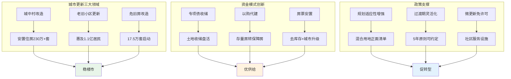

#### 城市更新的多重价值创造

城市更新在稳楼市中的作用已超越传统认知中通过投资拉动需求的短期效应，演变为通过优化供给结构、重塑价值预期和引导需求转型来发挥三重深层次的稳定作用[^72]。**第一**，以优化供给结构来化解库存风险与稳定价格体系，将大量低效、闲置的"沉睡资产"激活为市场急需的有效供给；**第二**，以夯实底层价值来修复市场信心与稳定长期预期，通过系统性补齐公共服务短板、导入高附加值产业、提升环境品质与空间效能，实质性提升片区乃至整个城市的基础价值；**第三**，以培育新增长点来引导住房消费观念转型，从"拥有产权"到"享有服务"、从"居住面积"到"居住品质"[^72]。

### 5.4 "市场+保障"双轨供应体系：稳定市场与民生保障的制度协同

"市场+保障"双轨住房供应体系是构建房地产发展新模式的制度基石。北京市《关于制定国民经济和社会发展第十五个五年规划的建议》明确提出，加快构建房地产发展新模式，完善"市场+保障"的住房供应体系、租购并举的住房制度[^77]。住建部部长倪虹强调，主要目标是建立更好满足刚性和改善性住房需求的住房供应体系，健全多主体供给、多渠道保障、租购并举的住房制度[^7]。

#### 保障性住房的多元供给模式

**配售型保障性住房**正在成为解决工薪群体住房问题的重要渠道。太原市首个配售型保障性住房项目"锦绣长风"申购家庭2.6万户，审核1.5万户家庭摇号，房源总数为1427套，总摇中率不足10%[^78]。第二个配售型保障性住房"锦绣汾东"第一档家庭数总计为10586户，项目总建筑面积约36.28万平方米，共建21栋住宅楼、2520套精装房源[^78]。这些数据充分说明保障性住房的市场需求旺盛。

配售型保障性住房采用"两类三档"准入条件："两类"指城镇户籍家庭和符合本市引进人才政策的家庭；"三档"则按家庭住房情况分为无房、住房困难和其他工薪收入群体[^78]。太原丽华龙城天瑞保障房建筑形态普遍升级明显，外立面和金茂、保利、华润改善类项目较为接近，公建化、高窗比、弧线造型、金属质感工艺等均有所体现，堪比豪宅品质[^78]。

**保障性租赁住房**聚焦新市民、青年人的安居需求。郑州城发荥泽美寓作为入选河南省首批"好房子"建设项目的保障性住房案例，体现着超低能耗建筑"好房子"与新科技的相互成就。房屋外墙保温结构有20厘米厚，配合高气密性门窗和气密性建筑材料，无需久开空调，室内也能较长时间保持适宜的温度和湿度[^79]。北京市探索"一张床、一间房"模式，改善城市运行服务保障人员居住条件[^77]。

#### 双轨体系的制度协同效应

**保障性住房对刚需市场的分流效应**正在重塑市场格局。2025年太原楼市走出了"双轨"的景象，商品房大概卖了二万多套，而保障房入市后备受瞩目，四宗保障房预计均能抢购一空，仅2025年2个项目便达成四千套的规模[^78]。保障房刺激下，省会创业就业的户籍化人口数量会越来越多，人口虹吸能力增强；同时迫使商品房类向改善舒适的产品创新道路上形成双轨制，刚需市场被分流为：太原市民无刚需，地市中产"接盘"刚需[^78]。

**"低端有保障、中端有支持、高端有市场"**的住房供给格局正在形成。北京市政策明确，优化保障性住房供给，加大存量资源盘活力度，满足城镇工薪群体和各类困难家庭基本住房需求；扩大租赁住房有效供给，培育市场化专业化运营机构；增加改善性住房供给，建设安全舒适绿色智慧的"好房子"[^77]。

| 供给层次 | 目标群体 | 供给方式 | 典型案例 |
|----------|----------|----------|----------|
| 低端保障 | 困难家庭、新市民 | 配售型保障房、公租房 | 太原锦绣长风、锦绣汾东 |
| 中端支持 | 工薪群体、青年人 | 保障性租赁住房、人才公寓 | 郑州荥泽美寓、华润有巢 |
| 高端市场 | 改善性需求 | 商品住房、"好房子" | 核心城市高品质项目 |

**收购存量商品房转保障房**实现去库存与优供给的双重目标。海口市政策将收购范围严格限定在"中心城区及重点产业园区"，并明确优先服务自贸港四大主导产业，将住房保障与城市产业规划、人才引进战略深度绑定[^76]。这一模式由政府主导、国企实施、市场化运作，是在探索房地产领域"政府与市场协同"的新模式，为化解行业风险、构建"市场+保障"双轨制住房体系提供地方实践样本[^76]。

### 5.5 "好房子"标准体系与产业链升级：从产品创新到生态重塑

"好房子"评价标准体系的构建与落地实施，正在重塑行业竞争规则，推动房地产业从"规模为王"向"品质为王"的范式转换。广州发布《广州市好房子评价标准征求意见稿》，用4万多字事无巨细地罗列出评价标准，从安全、舒适、绿色、智慧四项指标进行评判，除智慧家居有专项评判标准外，其余三项指标总分都是120分[^80]。

#### "好房子"标准体系的构建逻辑

**"好标准、好设计、好材料、好建造、好运维"五维要求**构成"好房子"建设的完整框架。住房和城乡建设部发布的国家标准《住宅项目规范》正式实施，新建住宅建筑层高不低于3米，4层及以上住宅设置电梯；提高墙体和楼板隔声性能；提高户门、卫生间门的通行净宽；提高阳台等临空处栏杆高度[^66]。浙江发布《浙江省住宅品质提升设计导则（试行）》，用量化指标规范"好房子"建设：层高不应低于3米，设有新风、地暖系统的提高到3.15米；楼面板厚度不应小于12厘米，解决噪音问题[^81]。

**广州"好房子"评价标准**对细节要求严格。关于电梯，官方要求高层住宅配置不少于2台电梯，服务不多于75户得2分，服务不多于50户得4分，服务不多于30户得6分；关于楼间距，不同楼梯单元之间居室对视距离不小于18米得4分[^80]。接下来好房子或将写入出让条件，不达标就算违约，开发商拿地还要为质量立字据[^80]。

#### 头部房企的"好房子"技术体系实践

**标杆房企纷纷构建企业级"好房子"体系**。招商蛇口推出涵盖安居无忧、绿色低碳等七大维度的技术体系；中海打造"Living OS系统"，覆盖172项全维需求；建发提出"文化-价值-策略-技术"四维框架；绿城、龙湖也持续迭代产品标准[^15]。在项目层面，"好房子"覆盖高端豪宅与大众居住，围绕安全、舒适、绿色、智慧四大核心实现品质跃升。如海成云湖郡、华侨城·熙宸等项目融入第四代住宅理念；招商锦城序、龙湖御湖境等通过空间创新提升舒适度；金周路TOD·国宾九玺等项目引入可变户型、适老化设计[^15]。

**宝业集团的"百年宅"体系**展示了建筑工业化与"好房子"的深度融合。所谓"百年宅"，指的是房子使用年限设计是100年，可实现代际传承。房子是装配式建筑，精装修交付，使用能耗较现行标准降低53.9%[^66]。宝业四季园·瑞园作为绍兴首批"好房子"试点方案中唯一的住宅项目，有从85平方米到142平方米的多种户型，四居室大户型在设计上有"1+X"可变空间，住宅内非承重墙体可拆除，若有老年人居住需求，还能改造成洄游式布局[^66]。

#### 产业链协同升级与生态重塑

**"好房子"建设正在带动房地产全产业链转型升级**。宝业集团已经形成了从拍地到设计、制造、施工、精装交付的建筑工业化全产业链模式。同样的家电、卫浴产品，凭借产业链优势能拿到更低采购价，住宅应像汽车一样，交付给客户的就是成品[^66]。"好房子"建设覆盖新房开发与老房改造，聚焦品质升级，不仅对接新市民刚需与改善需求，更带动建材、智慧家居等全产业链升级，释放持续市场潜力[^20]。

**从"开发+销售"向"开发+经营+服务"转型**成为行业趋势。面对市场变化，西部房企加快战略转型，从单一开发向"开发+经营"转变。一方面，严控增量、盘活存量，以产品力强化竞争韧性；另一方面，大力发展代建、物业、租赁、商业管理等轻资产业务[^15]。龙湖"龙智造"、金科"金建管"、中国铁建地产等依托专业能力，提供全周期代建服务，实现品牌与管理输出。企业通过标准化、数字化提升服务效能，构建轻重并举的发展格局，增强穿越周期的韧性[^15]。

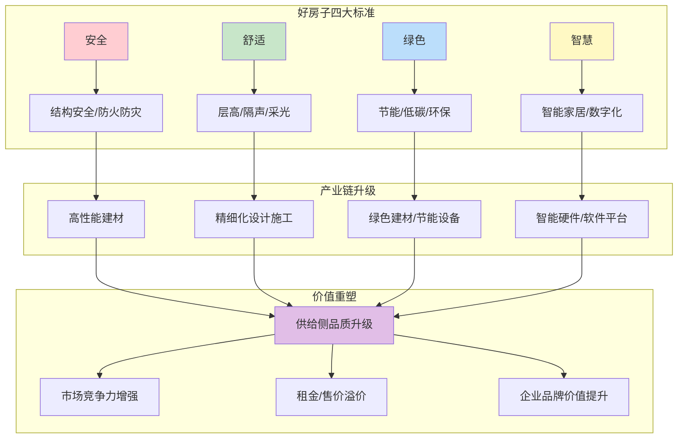

**"好房子"导向重塑行业竞争规则**的深层逻辑在于：四大标准通过具体的技术规范和市场实践落地，其核心作用是重塑行业价值评判体系，从追求规模和速度转向追求品质和可持续。这一转变倒逼产业链各环节进行技术升级、模式创新和价值重组，推动中国房地产业从传统的"开发-销售"单链条模式，向涵盖"研发、制造、建造、服务、运营"的现代化、复合型产业体系转型，最终实现与城市高质量发展和人民美好生活需求的深度契合。

## 6 协同、挑战与展望：构建房地产可持续发展的长效机制

中国房地产行业正处于从"止跌回稳"迈向"高质量发展"的关键转折期。经过前述章节对多维动力系统、政策框架演进、资金支持体系创新以及"好房子"发展导向的系统分析，本章将整合这些核心要素，构建房地产可持续发展的协同作用模型，评估其系统效能，剖析实施挑战，并基于国际经验与长期趋势，对未来十年行业发展作出前瞻性判断与政策建议。

2025年全年国内生产总值增长5%，充分展现了中国经济在复杂环境下的韧性和活力，但房地产开发投资同比下降17.2%、新建商品房销售面积同比下降8.7%的数据也客观反映了行业深度调整中的压力[^82]。更值得关注的是，房地产市场在"顶压前行"过程中展现出两方面重要积极变化：短周期看，市场正在波动中趋稳；长周期看，新动能正在转型中成型[^83]。站在"十四五"迈向"十五五"、城镇化向新阶段跨越的关键节点上，构建房地产可持续发展的长效机制，既是行业转型的内在要求，也是经济社会高质量发展的必然选择。

### 6.1 政策、资金、导向三位一体的协同作用模型

房地产新发展模式的构建，核心在于实现**政策顶层设计、资金精准保障、市场发展导向**三者的系统性协同。该模型旨在通过要素联动与机制创新，驱动行业从规模扩张向品质提升、从金融属性向居住属性的根本性转型。

#### 协同作用模型的核心架构

**政策端作为"指挥棒"**，以"稳定预期、激活需求、优化供给、化解风险"为总纲，通过"因城施策"优化限购限贷、推行"房票安置"与"以旧换新"等具体措施，直接作用于市场需求端与供给端[^84]。同时，构建"人、房、地、钱"要素联动新机制，为资源调配提供基础框架。《中共中央关于制定国民经济和社会发展第十五个五年规划的建议》明确将"推动房地产高质量发展"作为"十五五"重点工作之一，并提出五大方向举措：加快构建房地产发展新模式、优化保障性住房供给、因城施策增加改善性住房供给、建设"好房子"、建立房屋全生命周期安全管理制度[^85]。

**资金端作为"血液与杠杆"**，建立房地产融资协调机制（"白名单"），为"保交楼"和合规项目提供信贷支持。截至2025年1月22日，房地产"白名单"项目贷款金额达5.6万亿元[^86]。发展绿色金融，通过"政银企"融合为绿色建筑、智能建造提供定向低成本资金，构建"绿色金融、绿色建造、绿色地产"深度协同、良性互动的"三绿工程"路径[^87]。同时，探索通过收购存量房、REITs等方式盘活存量资产，优化资金循环。

**导向端作为"目标与牵引"**，明确行业从"规模扩张"向"品质提升"转型，聚焦建设绿色、智能、安全的"好房子"，并与城市更新、产业升级深度融合。房地产发展必须由依赖"土地红利"转向依靠"科技创新"，从"市场化为主"转向保障和市场两个体系定位清晰、功能互补，从"增量拉动"为主转向"存量运营"价值创造为主，走内涵式发展之路[^85]。

以下流程图展示了三位一体协同作用模型的运行逻辑：

```mermaid
flowchart TB
    subgraph 政策端【指挥棒】
        A1[房住不炒底线] --> A2[因城施策调控]
        A2 --> A3[人房地钱联动]
        A3 --> A4[基础制度改革]
    end
    
    subgraph 资金端【血液】
        B1[白名单融资机制] --> B2[绿色金融支持]
        B2 --> B3[REITs资产盘活]
        B3 --> B4[财政工具精准滴灌]
    end
    
    subgraph 导向端【牵引】
        C1[好房子标准] --> C2[绿色智能建造]
        C2 --> C3[城市更新存量盘活]
        C3 --> C4[市场+保障双轨]
    end
    
    A4 --> D[要素协同配置]
    B4 --> D
    C4 --> D
    D --> E[供需动态平衡]
    D --> F[风险有效化解]
    D --> G[品质持续提升]
    E --> H[房地产高质量发展]
    F --> H
    G --> H
    
    style A1 fill:#ffcdd2
    style B1 fill:#bbdefb
    style C1 fill:#c8e6c9
    style H fill:#fff9c4
```

#### 协同机制的动态耦合关系

三大要素之间呈现相互依存、彼此强化的动态耦合关系。**政策对资金的引导作用**体现为融资协调机制、专项债扩容等政策直接决定资金流向；**政策对导向的规范作用**体现为"好房子"标准、绿色建筑规范等强制性要求确立品质底线；**资金对导向的赋能作用**体现为绿色信贷、REITs等工具为高品质项目提供融资便利；**导向对政策的反馈作用**体现为市场需求升级倒逼政策优化调整；**导向对资金的吸引作用**体现为ESG投资理念引导资本流向可持续项目。

这种协同机制的核心价值在于形成"政策引导—资金赋能—导向落地"的闭环：政策明确方向并创造条件，资金提供支撑并分担风险，导向验证效果并牵引升级。三者缺一不可，共同构成房地产可持续发展的系统性动力机制。

### 6.2 协同机制的系统效能：市场出清、风险化解与品质提升

协同机制的实际效能需要从多个维度进行评估。结合2025年房地产市场实践，政策—资金—导向协同机制在促进市场出清、化解风险、激励创新、提升品质等方面已显现显著成效。

#### 市场出清效能

**交易总规模趋稳是市场出清的重要信号**。将新房市场与二手房市场合并观察，无论全国还是主要城市，全年合计销售规模已明显趋稳，部分主要城市甚至同比小幅增长[^82]。从房地产市场发展的规律看，销售规模变化通常领先于价格，是一个重要的前导信号。2025年30城二手房成交占比已达65%左右，较2024年提升约4个百分点，北京、上海、广州、深圳、成都、杭州、南京、苏州等核心城市二手房成交套数占比均超六成。

**去库存取得积极进展**。四季度出现的一个重要积极信号，是11月末全国商品房待售面积比10月末减少约300万平方米，并在12月份得到延续，体现出供给端控增量措施与需求端提振消费措施协同发力的效果[^83]。库存压力是当前相当部分城市房地产市场面临的关键症结，库存规模趋势的逆转尤为重要。

**控增量取得成效**。全年房地产开发投资下降17.2%，降幅依然较大，但应当辩证看待。当前大部分城市房地产市场承压的核心原因在于此前供需结构性错配导致的库存压力，因此供给端坚持"控增量、去库存、优供给"是市场整体回暖的先决条件[^82]。这也已转化为地方政府和企业的理性行为——供应压力较大的城市，政府不再盲目供地，企业不再盲目拿地上项目，给房地产市场留出消化时间。

#### 风险化解效能

**风险化解取得里程碑式进展**。房地产领域新旧动能、新旧模式转换的特殊性，在于要首先处置以"三高"为典型特征的旧模式所遗留的风险和问题。交付风险可以说是旧模式遗留的最主要问题。2025年的标志性里程碑，是2022年以来持续推进的保交楼、保交房任务全面完成[^82]。保交楼、保交房任务完成，交付风险大幅度收敛，既保证了社会稳定，又重建了市场信心。

**融资协调机制发挥关键作用**。房地产融资协调机制扩围增效，提振市场信心。截至2025年1月22日，房地产"白名单"项目贷款金额达5.6万亿元。国家金融监督管理总局明确将继续发挥这项机制的作用，引导金融机构稳定对房地产行业的融资，发挥不同融资工具的独特优势，形成组合效应，提高精准性、及时性和有效性[^86]。

**府院联动机制有效化解复杂风险**。针对烂尾楼盘等复杂问题，各地探索建立府院联动工作机制，在法律框架内主导司法程序，推动破产程序全程依法、高效、透明运行[^88]。通过"执破融合"，让续建施工方吃下定心丸，既实现了短期内快速复工续建的目标，又让企业在破产程序中承担相应的法律责任。

| 效能维度 | 核心指标 | 2025年进展 |
|----------|----------|------------|
| 市场出清 | 库存去化 | 11-12月待售面积连续减少约300万平方米 |
| 风险化解 | 保交楼完成 | 2022年以来任务全面完成 |
| 融资保障 | 白名单贷款 | 审批金额超7万亿元 |
| 需求释放 | 新房+二手房 | 合计规模趋稳，部分城市小幅增长 |

#### 创新激励与品质提升效能

**绿色金融的导向性支持形成正向激励循环**。通过"政银企"融合创新，为绿色建筑、智能建造等创新实践降低融资门槛和成本，形成"政策鼓励—资金倾斜—市场认可"的正向激励循环[^87]。绿色金融制度以绿色理念为引领，为那些被认定为可持续、绿色发展的房地产项目，提供全流程、全覆盖、全环节的金融支持。

**"好房子"建设推动产业链升级**。"好房子"是满足居民美好生活向往的重要载体，"好品质""好服务"更是补齐短板、升级生活体验的关键抓手，直接关系居民幸福感、归属感[^85]。绿色地产项目致力于打造"安全、舒适、绿色、智慧"的好房子，采用新型建造方式和建设管理模式，从建筑全生命周期的维度打造高品质住宅[^87]。

### 6.3 长效机制实施面临的核心挑战

尽管协同模型方向明确且初见成效，但在实施过程中仍面临多重挑战，主要体现为区域分化、成本压力、技术瓶颈及监管协同等方面的复杂性。

#### 区域差异与市场分化的治理挑战

**市场高度分化是当前最突出的结构性特征**。不同城市之间、城市内部不同区位之间的市场分化有加大趋势。这种分化，一方面取决于宏观经济状况，经济新动能成长更快的城市或区域，房地产市场表现更为活跃；另一方面取决于前期住房供应压力尤其是库存压力，供应压力较小的市场整体更活跃[^82]。这种"核心更稳、优质更强"的分化特征首先体现在成交量和价格上，例如70个大中城市商品住宅价格指数中上海、杭州等城市的新房价格表现尤为亮眼；土地市场的分化更为明显，核心城市优质地段的出让地块持续受到开发企业青睐。

**差异化治理需要更精准的政策工具**。这种分化意味着不应该笼统地分析全国整体市场，而必须结合当地宏观经济状况尤其是新动能成长态势，房地产市场状况尤其是供应库存压力，以及地方因城施策效果等具体情况来加以判断[^83]。不同地区地理环境、经济基础、政策影响都不同，对房地产市场发展带来差异化影响[^89]。

#### 成本压力与资金约束的挑战

**绿色转型面临增量建造成本**。当前房地产市场处于深度调整期，核心矛盾在于供需错配与信心缺失。企业资金链的脆弱性依然存在，房地产企业融资环境虽改善（如"白名单"机制覆盖超5000个项目），但房企债务违约率仍达8.5%，部分企业依赖销售回款[^84]。绿色建筑、智能建造等新技术应用虽然长期具有成本优势，但短期增量投入对资金紧张的企业构成压力。

**现房销售制度转型加大资金占用**。推进现房销售制意味着房企需先行投入全部建设资金，资金回笼周期从数月拉长至两三年，对企业资金实力和运营能力提出更高要求。这一制度变革虽然从根本上防范交付风险，但也提高了行业准入门槛，需要配套的融资支持机制予以平衡。

#### 技术瓶颈与标准落地的挑战

**智能建造技术的规模化应用仍需突破**。数字建造借助BIM、云计算、大数据、物联网等数字技术，实现建筑全流程、全要素的全面贯通、无缝衔接，大幅提升建造、交付及运营效率[^87]。但技术研发应用及普及仍存在瓶颈，需要"政产学研用"联合攻关。智能建造构建起数字化设计、工厂化生产、智能化施工、智慧化运维的先进建造体系，但实现"所建即所见，所建皆所愿"目标仍需持续投入。

**"好房子"标准的统一与执行面临挑战**。各地"好房子"评价标准尚未完全统一，标准落地执行的监督机制有待完善。如何确保从设计、建造到验收的全流程品质管控，避免"标准高、执行低"的落差，是长效机制有效运行的关键。

#### 监管协同与执行效率的挑战

**跨部门协同治理难度较大**。房地产涉及住建、金融、自然资源、财税等多个部门，政策协同与执行协调面临体制性障碍。预售资金监管存在漏洞风险，确保中央政策在地方执行中不走样、不递减需要更有效的监督机制。

**信用监管机制需要创新完善**。南阳市不动产登记服务中心的实践表明，创新运用信用杠杆，对房地产开发企业实施分级分类精准监管，将企业信用评价结果与预售资金监管额度动态关联，构建"信用+监管"高效联动新机制，可以实现有效防范风险与精准助企纾困的有机统一[^90]。但这一模式的推广复制需要更完善的信用信息基础设施和制度保障。

### 6.4 国际经验借鉴：德国与新加坡住房制度的启示

德国和新加坡被公认为全球住房问题解决较好的两个国家，其制度设计为中国构建房地产长效机制提供了有价值的参照。

#### 德国模式：租赁市场主导的市场化路径

**德国特色在于高度发达的租赁市场**。德国自有住房的比例较低，住房租赁人口接近六成。2005-2023年间，德国人均可支配收入增幅达56%，同期租金指数涨幅仅为27%[^91]。德国政府在住房供给不足时动用财政补贴、税收减免、低息无息贷款等政策鼓励私人和机构建房，在住房短缺极端时期政府出资建设一部分刚需保障房应急，需求端采取租金补贴、按揭利率优惠等方式减轻居民的购房、租房压力，同时在房产交易环节设置多重税收及繁琐流程来压制其金融属性。

**德国住房制度真正值得借鉴的是政府面对市场变化时的快速响应能力**。德国政府在二战后住房短缺时期颁布较多住房建设及租金管控法律措施，但随着供给提升及房屋保有量提升，政府便推动住房市场化，提升保障房流通性，优化资源配置效率。然而面对20世纪90年代的东西德合并，及2015年以后欧洲难民进入德国两次重大事件对房地产市场带来的冲击，德国政府快速响应：提高住房补贴覆盖人群与补贴力度，重启保障房建设，颁布新的租金管控条例等，有效控制住租金及房价的快速上涨[^91]。

#### 新加坡模式：政府组屋主导的保障化路径

**新加坡住房拥有率超过90%，且其中九成居民住在政府建设的组屋中**。与德国政府通过市场调控为主不同，新加坡以政府管控为主、市场为辅。政府成立建屋发展局（HDB），立法授予其征地的权力，负责组屋的规划、金融、建设、运营。HDB根据居民申请数量来匹配制定组屋的建造数量，组屋价格参考居民收入中位数进行发布，同时再辅以财政补贴，住房价格长期稳定[^91]。

**新加坡住房制度的特殊性体现在多个层面**。政府在保障房（组屋）建设中持续赤字补贴，同时在建设初期通过了强制非市场化征地的法案，且后续修订案让政府征地能力进一步增强，土地成本长期低于市场成本。此外，新加坡组屋建设规划也值得借鉴，HDB会接受居民的购房申请，只有在申请达到必须数量时才会考虑建房，一定程度上避免了区域供过于求的情况[^91]。

#### 对中国的启示

两国模式虽然路径不同，但存在共同的制度逻辑：

| 制度要素 | 德国经验 | 新加坡经验 | 对中国的启示 |
|----------|----------|------------|--------------|
| 土地成本控制 | 征地立法与修正案 | 强制非市场化征地 | 完善土地供应机制 |
| 供需动态匹配 | 根据市场变化调整政策 | 根据申请数量建房 | 深化"人房地钱"联动 |
| 金融属性管理 | 交易环节多重税赋限制 | 组屋转售限制 | 坚持"房住不炒"定位 |
| 多层次保障 | 租金补贴+保障房建设 | 组屋为主+市场为辅 | 完善"市场+保障"双轨 |

**核心启示在于政策的动态调整能力与供需精准匹配机制**。无论是德国的市场化路径还是新加坡的保障化路径，其成功的关键都在于：政府能够根据市场变化快速做出正确应对，供给侧能够根据真实需求动态调整，通过制度设计有效管理住房的金融属性[^92]。

### 6.5 未来十年房地产可持续发展的前瞻判断

基于人口结构演变、城镇化质量提升、需求结构升级、技术变革加速等长期趋势，对2026-2035年中国房地产市场发展作出前瞻性判断。

#### 市场规模与结构演进趋势

**新房市场规模将进入稳定区间**。当前房地产市场正经历从增量市场为主向增量市场与存量市场并重的转变，且最终必然进一步过渡到以存量市场为主，这是城镇化发展的必然趋势[^82]。《求是》杂志明确，我国每年新房合理需求规模仍在1000万-1500万套之间，市场无需过度悲观。随着城镇化率年均增速从1.4%降至0.8%，但仍有约3个百分点提升空间，新房市场将在调整后进入相对稳定的发展阶段。

**存量市场崛起成为新增长极**。中国住房进入增量存量并重阶段，存量房占比持续提升。"好房子"概念延伸至改造老房：通过旧改（如加装电梯、节能改造），不仅提升居住品质，还催生新产业[^84]。全国待改造老旧小区超20万个，可释放消费需求并创造就业。城市更新、存量盘活将成为行业新的增长引擎。

#### 发展模式与企业格局演进

**房地产对GDP的贡献率正在减弱，但行业仍具战略地位**。从2025年GDP增速来看，经济脱离地产依赖仍能稳增长成为现实可能。2025年房地产依然多维度下行，但年5%的GDP目标大概率能稳定兑现。这背后，一方面是房地产业与建筑业合计对GDP的贡献率创下新低，另一方面则是经济增长对房地产的依赖度显著下降，高新制造业、消费内需成为增长新支柱[^93]。

**房地产三大核心风险基本得到有效控制**。交付问题涉及民生，目前问题已逐步缓解；企业债务违约风险问题，尽管万科等头部企业仍面临流动性压力，但房企出清基本进入尾部阶段；房地产市场对金融系统的冲击处于可控范围[^93]。这意味着未来房地产主要方向将是——不会大力提振房地产，但会坚决防范大跌。

**"好房子"渗透率将持续提升**。随着政策推动和市场需求升级，绿色建筑、智能住宅、超低能耗建筑的占比将显著提升。到2030年，新建建筑全面执行绿色建筑标准将成为常态，"好房子"从示范引领进入全面普及阶段。房企竞争将从"规模为王"转向"品质为王"，产品力成为核心竞争力。

#### 政策与机制演进方向

**房地产相关政策应一次性出台到位，避免"添油式"调整**。虽然短期内出台重大刺激性政策的可能性较低，但一些试点政策与政策苗头仍值得重点关注，这或将成为房地产市场企稳回升的关键动力[^93]。高层对于房地产金融属性的管理将更加成熟，承认房地产兼具消费品与金融品双重属性，需遵循金融品运行的一般规律，注重预期管理。

**融资协调机制将常态化运行**。2026年监管工作会议明确要求，推动城市房地产融资协调机制常态化运行，助力构建房地产发展新模式[^86]。融资协调机制将从应急性政策工具转向常态化制度安排，为行业高质量发展提供长期稳定的金融支撑。

### 6.6 政策建议与长效机制完善方向

针对研究发现的问题与挑战，从完善要素联动机制、优化资金支持工具、强化"好房子"标准落地、健全风险预警与处置体系、推进监管体制改革等维度，提出系统性政策建议。

#### 完善"人房地钱"要素联动机制

**深化因城施策的精准性**。各地要根据居民对改善性住房的需求差异，供给上更加精准匹配，有利于避免供给过剩或防止供给不足，这是促进市场平稳健康运行的重要基础[^85]。建议进一步赋予城市政府调控自主权，建立更灵活的土地供应、金融支持动态调整机制，实现"一城一策"甚至"一区一策"的精细化治理。

**强化住房发展规划的刚性约束**。完善三级住房规划体系，确保住房发展规划和年度计划的科学编制与严格执行。建立规划执行情况的定期评估与公开机制，增强规划的权威性和执行力。

#### 优化资金支持工具体系

**扩大融资协调机制覆盖面**。需进一步扩大"白名单"机制覆盖面并提升效率，确保项目层面融资畅通。特别要关注中小房企和出险房企的融资难题，通过分类施策、风险隔离等方式，在防范风险的前提下满足合理融资需求。

**深化绿色金融与转型金融的融合发展**。强化绿色金融、专项再贷款等工具对转型成本的补贴和分担作用，为绿色建筑、智能建造项目提供更优惠的融资条件。推动绿色债券市场发展，鼓励房企通过绿色融资降低资金成本。

**加快REITs市场体系建设**。推动商业不动产REITs试点扩围，为"开发-运营-退出"提供闭环，催化企业向"轻资产运营"转型。通过丰富指数体系、引导中长期资金入市等举措，构建REITs长期发展生态。

#### 强化"好房子"标准落地

**建立统一的"好房子"评价标准体系**。推动各地"好房子"评价标准的统一与互认，建立从设计、建造到验收的全流程品质管控机制。将"好房子"标准纳入土地出让条件，强化源头约束。

**完善全生命周期监管体系**。借鉴杭州临平区构建房地产项目全生命周期管理体系的经验，制定节点管控清单、风险处置清单、部门责任清单，建立联席督办机制[^94]。通过"清单+制度"协同模式夯实监管基础，完善全链条机制强化质量与交付保障。

**建立房屋全生命周期安全管理制度**。房屋安全事关人民群众生命财产安全，更是社会和谐稳定的重要基石。加快建立房屋安全体检、房屋安全管理资金、房屋质量安全保险等房屋全生命周期安全管理制度，筑牢房屋安全防线[^85]。

#### 健全风险预警与处置体系

**完善分级分类风险监管机制**。针对不同风险等级房地产项目，建立四级风险分类标准，明确对应处置流程与责任主体；通过"一项目一方案"推进风险项目包案化解，精准解决项目建设、资金、交付等问题[^94]。

**强化信用赋能监管创新**。将企业信用评价结果全面纳入登记业务全流程，对信用良好、经营稳健的企业适度下调预售资金监管留存比例，对风险企业强化监管，形成"守信受益、失信受限"的市场氛围[^90]。

**深化府院联动协同治理**。对于复杂的房地产纠纷和风险项目，建立"三调联动"等多元化解机制，集成行业主管部门、专业调解组织及司法资源，形成"信息共享、优势互补、协同发力"的解纷合力[^95]。

#### 构建"稳增长、防风险、惠民生、促转型"四维目标协同框架

长效机制的核心在于实现四维目标的有机统一：

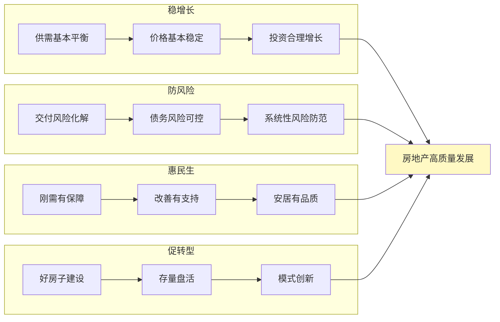

**稳增长**要求保持房地产市场供需基本平衡、结构基本合理、价格基本稳定，有利于促进经济实现质的有效提升和量的合理增长；**防风险**要求统筹推进房地产企业债务风险、地方政府土地财政依赖风险、金融机构信贷风险的有序化解，严防系统性风险发生；**惠民生**要求着力解决新市民、年轻人、低收入群体的住房困难问题，构建覆盖全人群的住房保障体系；**促转型**要求推动"好房子"建设和城市更新，带动全产业链升级。

综上所述，中国房地产行业可持续发展的长效机制构建，需要政策、资金、导向三位一体的系统协同，需要直面区域分化、成本压力、技术瓶颈、监管协调等现实挑战，需要借鉴国际经验并结合中国国情进行制度创新。展望未来十年，随着"人房地钱"联动机制的深化、"好房子"标准的全面落地、"市场+保障"双轨体系的完善，中国房地产行业有望构建起健康、良性、可持续的内生发展循环，真正实现从"规模扩张"向"品质提升"、从"金融属性"向"居住属性"的历史性转型，为人民群众创造更加美好的居住生活。

# 参考内容如下：
[^1]:[2025楼市观察:告别“高周转”旧模式,拥抱“好房子”新周期](https://baijiahao.baidu.com/s?id=1853115837036131853&wfr=spider&for=pc)
[^2]:[凝聚共识启新程,易居论坛共探地产城更高质发展](https://baijiahao.baidu.com/s?id=1855432822949038819&wfr=spider&for=pc)
[^3]:[把握中国房地产业的深刻转型](https://baijiahao.baidu.com/s?id=1855069509455147930&wfr=spider&for=pc)
[^4]:[格局重塑](https://baijiahao.baidu.com/s?id=1855177704036842727&wfr=spider&for=pc)
[^5]:[告别旧模式 房地产行业正向新而行迎稳健未来](https://www.cnr.cn/rdjj/house/kcb/20251229/t20251229_527475964.shtml)
[^6]:[所有人注意!2026年中国房地产,彻底明牌](https://baijiahao.baidu.com/s?id=1854981056012762650&wfr=spider&for=pc)
[^7]:[推动房地产高质量发展 ](https://www.gov.cn/zhengce/202512/content_7052004.htm)
[^8]:[《人民日报》发表倪虹署名文章:推动房地产高质量发展 ](https://www.shjsjtdw.cn/node2/n57/u1ai16137.html)
[^9]:[中国人口结构转型对房地产市场的长期影响](https://baijiahao.baidu.com/s?id=1850129449592834362&wfr=spider&for=pc)
[^10]:[楼市新政赋能地方自主权 专家解读2026年房地产转型路径](https://hs.news.fang.com/open/54043070.html)
[^11]:[中国人口结构未来发展趋势对房地产市场的影响](https://baijiahao.baidu.com/s?id=1850129105866322911&wfr=spider&for=pc)
[^12]:[「长江宏观于博团队·周脉“博”」人口高质量发展:四个特征和四个启示](https://baijiahao.baidu.com/s?id=1855299942449188700&wfr=spider&for=pc)
[^13]:[求是定调2026楼市:金融属性回归≠炒房松绑](https://baijiahao.baidu.com/s?id=1854527926308172279&wfr=spider&for=pc)
[^14]:[防御性资产时代:业主如何借力专业机构 实现资产保值](https://www.chinanews.com.cn/cj/2026/01-26/10558772.shtml)
[^15]:[《2025西部房地产高质量发展报告》发布:“好房子”引领行业穿越周期](https://www.cqcb.com/wanbadian1/2026-01-26/6058764_pc.html)
[^16]:[国务院部门文件](https://www.gov.cn/zhengce/zhengceku/202601/content_7053624.htm)
[^17]:[清华大学吴璟:我国房地产转型路径逐渐明晰](https://www.tsinghua.edu.cn/info/1182/124026.htm)
[^18]:[严跃进:房地产虽仍处调整阶段,但已多方面呈现向好趋势](https://baijiahao.baidu.com/s?id=1855442156486834747&wfr=spider&for=pc)
[^19]:[《关于进一步推动房地产市场平稳健康发展的若干措施》政策解读](https://jst.nx.gov.cn/zwgk/zcjd/202512/t20251211_5106711.html)
[^20]:[2026年政策前瞻:城市更新+“好房子”引领房地产高质量转型](https://baijiahao.baidu.com/s?id=1855358173859608393&wfr=spider&for=pc)
[^21]:[关于房地产市场、“好房子”建设……住建部最新发声! ](https://www.gov.cn/lianbo/bumen/202510/content_7043926.htm)
[^22]:[关于进一步促进房地产市场平稳健康发展十八条激励措施 政策解读](http://zrzyhghj.kaifeng.gov.cn/kfszrzyhghjwz/czcjd/pc/content/content_1896845834486366208.html)
[^23]:[山西省绿色消费发展典型案例:大同新能置业](https://fgw.shanxi.gov.cn/fggz/wngz/jyysrfp/202408/t20240828_9641966.shtml)
[^24]:[碧桂园2025年报透视:销售寒冬中的交付坚守与转型曙光](https://baijiahao.baidu.com/s?id=1855259786345466260&wfr=spider&for=pc)
[^25]:[破局新生!南京大学2026年不动产论坛释放重磅信号](https://baijiahao.baidu.com/s?id=1855356996743199262&wfr=spider&for=pc)
[^26]:[南京超低能耗建筑惊艳全国!碳减排近四分之一创行业新标杆](https://news.fang.com/open/54183583.html)
[^27]:[绿色建筑施工成本效益分析案例.docx - 人人文库](https://www.renrendoc.com/paper/496725097.html)
[^28]:[构建不动产金融新生态 交大高金举办2026中国不动产金融论坛](https://baijiahao.baidu.com/s?id=1855204757075996090&wfr=spider&for=pc)
[^29]:[新城控股2024年商管毛利率超70%“住宅+商业”双轮驱动协同效应进一步凸显 ](https://www.nbd.com.cn/articles/2025-04-08/3823426.html)
[^30]:[财面儿·年报深解丨协同效应优势凸显 龙湖以经营性业务优化盈利结构](https://baijiahao.baidu.com/s?id=1794561839523309270&wfr=spider&for=pc)
[^31]:[协同效应优势凸显 龙湖以经营性业务优化盈利结构](https://stock.10jqka.com.cn/20240326/c656293525.shtml)
[^32]:[华夏幸福书写中国房企转型典型案例 ](https://caifuhao.eastmoney.com/news/20250916084150082844970)
[^33]:[从“困境反转”到价值重构:旭辉(00884)化债破局与战略转型](https://baijiahao.baidu.com/s?id=1854889146885253144&wfr=spider&for=pc)
[^34]:[未来十年中国房地产发展路径与政策导向](https://baijiahao.baidu.com/s?id=1849144870430842464&wfr=spider&for=pc)
[^35]:[政策组合拳落地!3 大信号定调 2026 年楼市,买房逻辑彻底改写](https://baijiahao.baidu.com/s?id=1854919176096441991&wfr=spider&for=pc)
[^36]:[聚焦“控增量、去库存、优供给” 因城施策稳定房地产市场](https://mp.weixin.qq.com/s?__biz=MzUyMTU4NjA1NQ==&mid=2247610053&idx=3&sn=5313ab071d53b0db2c19c844545cd336&chksm=f8bc28eba40d3c1fb03a203874ee320b28ca29b567588f1a337773f9e97b21dac2fa38ffac4a&scene=27)
[^37]:[因城施策](https://baike.baidu.com/item/因城施策/19506024)
[^38]:[因城施策控增量、去库存、优供给](https://www.mohurd.gov.cn/xinwen/gzdt/art/2025/art_c1719472587343089cd5f676addfaf75.html)
[^39]:[住建部部长倪虹专访:“十五五”开局重点三件事](http://news.10jqka.com.cn/20260126/c674301773.shtml)
[^40]:[以住房规划为抓手 建立“人、房、地、钱”要素联动新机制](https://www.sinan.gov.cn/zfbm/xzfhcxjsj/gzdt/202410/t20241009_85876653.html)
[^41]:[城楼网|​房地产政策双轮驱动促转型 融资与供给协同发力稳市场](https://www.163.com/dy/article/KK6LH8FV051598SA.html)
[^42]:[住建部:有序搭建房地产开发、融资、销售等基础性制度](https://stock.10jqka.com.cn/20260122/c674213909.shtml)
[^43]:[权威访谈·开局“十五五”丨推进高质量城市更新 加快房地产转型升级](https://baijiahao.baidu.com/s?id=1855251238911595070&wfr=spider&for=pc)
[^44]:[“白名单”政策转向长效保障,房企融资回暖](https://baijiahao.baidu.com/s?id=1854200249209002718&wfr=spider&for=pc)
[^45]:[2026年楼市开年迎多重利好 现房销售全面推行 + 换房退税延至 2027年](https://baijiahao.baidu.com/s?id=1855283998156151802&wfr=spider&for=pc)
[^46]:[中信证券:现房销售或是构建房地产发展新模式的重要一环](https://m.jrj.com.cn/madapter/24h/2026/01/26081255297126.shtml)
[^47]:[叠加运用财政工具——有力支持房地产市场高质量发展](https://czj.hefei.gov.cn/czdt/sjczdt/15220553.html)
[^48]:[中国绿色金融十年跃迁:发展动因、突出贡献与未来改革新方向](https://baijiahao.baidu.com/s?id=1838117538776607364&wfr=spider&for=pc)
[^49]:[蓝虹:绿色金融未来的关键十年怎么做?](http://rdcy.ruc.edu.cn/zw/qsyj/yclt/yclt_ztlb/a97ff68c01a1439eb54b9e078326442f.htm)
[^50]:[商业新观察 | 未来十年,中国商业地产将迎新格局和新机遇](https://m.jiemian.com/article/4968581.html)
[^51]:[房地产企业绿色债券融资的动因及效果研究 ————以旭辉集团为例](http://cdmd.cnki.com.cn/Article/CDMD-10034-1022591079.htm)
[^52]:[绿色融资,旭辉集团引领房企转型:如何发行债券实现可持续发展?](https://baijiahao.baidu.com/s?id=1777725261528980734&wfr=spider&for=pc)
[^53]:[以远洋集团为例,房地产转型绿色建筑,绿色债券是可持续发展吗?](https://baijiahao.baidu.com/s?id=1777725186826210629&wfr=spider&for=pc)
[^54]:[财政政策针对地产持续发力](https://baijiahao.baidu.com/s?id=1813416130923048180&wfr=spider&for=pc)
[^55]:[夏磊:财政三大举措促进房地产止跌企稳](https://baijiahao.baidu.com/s?id=1812788596664971789&wfr=spider&for=pc)
[^56]:[商业不动产REITs迈出构建房地产新发展模式关键一步](https://baijiahao.baidu.com/s?id=1853389566247734025&wfr=spider&for=pc)
[^57]:[“REITs能助房企降负债、防风险”……关于不动产市场新风向,他们这样说](https://baijiahao.baidu.com/s?id=1855275241614873196&wfr=spider&for=pc)
[^58]:[华夏华润有巢REIT扩募 开启里程碑式创新](https://baijiahao.baidu.com/s?id=1855351757274034826&wfr=spider&for=pc)
[^59]:[住房城乡建设部 金融监管总局关于建立城市房地产融资协调机制的通知](https://www.gov.cn/zhengce/zhengceku/202401/content_6925683.htm)
[^60]:[城市房地产融资新机制持续发力(政策解读·金融支持高质量发展③) ](https://www.gov.cn/zhengce/202410/content_6983810.htm)
[^61]:[支持房企合理融资需求 房地产融资“白名单”制度持续发力](https://finance.eastmoney.com/a/202601223627734292.html)
[^62]:[市场融资分化 房地产融资协调机制扩围增效](https://baijiahao.baidu.com/s?id=1855103767022560194&wfr=spider&for=pc)
[^63]:[湖州市区全面实施存量房交易资金监管 助力房地产市场稳健发展](https://jst.zj.gov.cn/art/2025/8/26/art_1569972_58938557.html)
[^64]:[首开股份:融资畅通构建资金安全护城河 ](https://caifuhao.eastmoney.com/news/20250613145111366019970)
[^65]:[ESG之E维度的分析——2024年房地产上市公司](https://baijiahao.baidu.com/s?id=1817021595408969650&wfr=spider&for=pc)
[^66]:[住有优居](https://baijiahao.baidu.com/s?id=1855177767574578527&wfr=spider&for=pc)
[^67]:[两部门:到2025年城镇新建建筑全面执行绿色建筑标准](https://baijiahao.baidu.com/s?id=1793746569810791238&wfr=spider&for=pc)
[^68]:[到2025年,城镇新建建筑全面执行绿色建筑标准——建设更多“会呼吸”的绿色建筑](https://www.cdmfund.org/34807.html)
[^69]:[年终盘点 ▎2025超低能耗建筑政策标准合集(76部)](https://mp.weixin.qq.com/s?__biz=MzIyMTAyNDYyMw==&mid=2651059743&idx=1&sn=ef10d0f9966267a58b1687feffd94de3&chksm=8d99914e9221f7ee3e19707fffa0f037b716144c435ab345d4cfbd33c2a1d02a66e33aa24e3c&scene=27)
[^70]:[广东第二批智能建造成果巡展④ | 建筑产业互联网平台搭建产业“协同桥梁” ](http://zfcxjst.gd.gov.cn/zwzt/jskjcx/kjdt/content/post_4781391.html)
[^71]:[广东第二批智能建造成果巡展① | 自主可控数字化设计筑牢智慧建造“设计基石” ](http://zfcxjst.gd.gov.cn/jsgl/dtxx/content/post_4781383.html)
[^72]:[城市更新,楼市发展的“稳定器”和“实验场”](https://baijiahao.baidu.com/s?id=1855086967352357424&wfr=spider&for=pc)
[^73]:[城市更新又有新政策支持](https://baijiahao.baidu.com/s?id=1855359963093651116&wfr=spider&for=pc)
[^74]:[城市更新又有新政策支持](https://www.163.com/dy/article/KK6BSPEF0519AKBM.html)
[^75]:[南京:落实城市更新行动计划,全年盘活存量房产100万平方米以上](https://baijiahao.baidu.com/s?id=1855366043815210055&wfr=spider&for=pc)
[^76]:[对海口收购商品房转保租房的点评](http://news.10jqka.com.cn/20260127/c674332703.shtml)
[^77]:[加快构建房地产发展新模式,完善“市场+保障”住房供应体系](https://baijiahao.baidu.com/s?id=1850637996621797109&wfr=spider&for=pc)
[^78]:[「太原楼评」2025年楼市双轨制|“万套”保障房入市对商品房冲击](https://baijiahao.baidu.com/s?id=1850348780039857801&wfr=spider&for=pc)
[^79]:[「向新行·高质量发展的郑州“密码”」郑州多维构筑“好房子”宜居新图景](https://baijiahao.baidu.com/s?id=1854079557438362091&wfr=spider&for=pc)
[^80]:[4万字!广州“好房标准”出炉,市场要变天](https://www.163.com/news/article/KK8IOENP00019K82.html)
[^81]:[“十五五”:我们将住进怎样的好房子?](https://baijiahao.baidu.com/s?id=1853161653271655691&wfr=spider&for=pc)
[^82]:[在波动中趋稳 在转型中成型](https://www.mohurd.gov.cn/xinwen/gzdt/art/2026/art_95d7b658409440fab3de760728eadb63.html)
[^83]:[专家解读|吴璟:在波动中趋稳 在转型中成型——2025年房地产数据解读](https://baijiahao.baidu.com/s?id=1854837685569569589&wfr=spider&for=pc)
[^84]:[房地产市场止跌回稳,政策协同与新模式构建的深度探索](http://www.hebbr.com/hydt/18698.html)
[^85]:[以协同之力破局实现房地产高质量发展](https://www.mohurd.gov.cn/xinwen/gzdt/art/2025/art_3d7963cd90e049bf847bcbe40ee967d5.html)
[^86]:[有效防范化解重点领域风险——2025年,中国经济这么干⑤ ](https://www.gov.cn/yaowen/liebiao/202502/content_7003936.htm)
[^87]:[“政银企”融合创新,以“三绿工程”推动房地产市场平稳健康高质量发展](http://hn.people.com.cn/n2/2025/0317/c195196-41166353.html)
[^88]:[府院联动 圆梦新房——“以破促立 房泰民安”系列案例之三](http://fy.fjhacourt.gov.cn/article/detail/2024/11/id/8223491.shtml)
[^89]:[新形势下房地产市场的区域差异及可持续发展](https://wenku.baidu.com/view/5c164f457075a417866fb84ae45c3b3567ecddd8.html)
[^90]:[市不动产登记服务中心:创新监管机制信用赋能 护航房地产业健康发展](https://mp.weixin.qq.com/s?__biz=MzkwNjI2NjY4MA==&mid=2247549911&idx=3&sn=91aae1d5beebea0d284ad38a5059d9a0&chksm=c1d834c10dd2a8625046bad7a52a976f7963734768a6d636a06ca38432e2634279ce42e5cbef&scene=27)
[^91]:[房地产行业:德国、新加坡保障房体系研究:房价长期稳定的德国、新加坡有何特殊之处?](https://m.hexun.com/hkstock/2024-03-12/212141024.html)
[^92]:[效法德国和新加坡的长效机制,能解中国“房地产不可能三角”?](https://www.163.com/dy/article/CVR92KRH05198ETO.html)
[^93]:[房地产对GDP的贡献率正在减弱](https://view.inews.qq.com/a/20260107A067DW00)
[^94]:[杭州市临平区构建房地产项目全生命周期管理体系提升房地产项目管理工作质效](https://www.mohurd.gov.cn/xinwen/dfxx/art/2025/art_9abda55c9e1445db8e3ccd71fe9f400c.html)
[^95]:[精准化解难题守护千家万户“安居梦” ](http://www.jinchengpeace.gov.cn/zfzt/zzzxgfhjs/202510/t20251009_2271770.shtml)
