# 2025年旅客选择旅游目的地的影响因素研究
## 1 个人特征与心理因素

本章聚焦旅客个体层面的目的地选择影响因素，系统分析人口统计学特征与心理变量如何共同塑造2025年旅游决策行为。研究从个人属性维度切入，考察年龄、收入、教育背景、家庭结构等客观特征对目的地偏好的差异化影响；继而深入心理层面，探讨情绪价值需求、消费观念演变、求新求美心理等主观因素的作用机制；最后基于人群细分视角，揭示Z世代、银发族、新中产家庭等典型群体的差异化决策特征，为理解旅游目的地选择的个体异质性提供分析框架。

### 1.1 个人属性对目的地偏好的影响

2025年旅游市场呈现出显著的消费分层特征，旅客的人口统计学属性已成为预测其目的地选择的关键变量。年龄、收入水平、教育背景与家庭结构等客观特征，通过塑造旅客的消费能力、体验偏好与功能性需求，形成了差异化的目的地选择模式。

**年龄差异塑造体验偏好分化**

不同年龄段旅客在目的地选择上呈现出鲜明的代际特征。**年轻人偏好冒险和新奇体验**，而年长游客更注重舒适与安全[^1]。具体而言：

- **Z世代（18-35岁）**：该群体占游客总量超过45%，成为消费主力[^2]。他们更倾向于"社交+旅游"模式，剧本杀、电竞酒店、音乐节等跨界产品受到追捧[^2]。成都"东郊记忆"通过工业遗址改造，年吸引年轻游客超500万人次[^2]。
- **中青年群体（31-40岁）**：构成"超级旅行家"的核心，占比超50%，他们拥有较为平衡的工作生活节奏，消费力稳定、悦己意愿强，注重追求旅行的深度、品质与情绪价值[^3]。
- **银发族（60岁以上）**：占比达18%，人均消费1500元，康养旅游、研学旅游需求旺盛[^2]。海南三亚的"候鸟式"旅居、广西巴马的长寿文化体验成为典型案例[^2]。

**收入水平决定消费能力与档次选择**

收入水平直接影响旅游预算和消费能力，形成了清晰的市场分层格局[^1]。银发旅游用户中，**经济条件较好者倾向于选择高品质、高消费的旅游目的地**，如欧洲、北美等地的热门城市和国家；而经济条件一般者则更倾向于选择国内的经济型旅游目的地，如海南、云南等地的热门景区[^4]。

| 收入层级 | 目的地偏好特征 | 典型消费行为 |
|---------|--------------|-------------|
| 高收入群体 | 欧洲、北美等国际热门城市 | 高端定制旅游，人均消费超1500元 |
| 中等收入群体 | 国内跨省深度游目的地 | 关注性价比，人均消费6000-8000元 |
| 一般收入群体 | 省内周边游、经济型目的地 | 民宿经济占比42%，追求实惠 |

2025年数据显示，城镇居民人均消费达1061元，是农村居民的2.3倍，但农村居民出游增速（22.6%）领跑全国，反映出收入提升带动的消费能力增强[^2]。

**教育背景影响文化深度需求**

教育背景较高的游客通常对文化深度和知识性内容有更高需求[^1]。这类旅客不再满足于走马观花式的旅游，更注重旅游过程中的体验和感受[^5]。2025年文化主题景区接待量突破12亿人次，同比增长25%，非遗旅游、红色旅游、博物馆游等文化类消费增长显著[^2]。

**家庭结构塑造功能性需求**

家庭结构方面呈现出差异化的目的地选择逻辑：

- **有儿童的家庭**：更看重亲子设施和安全性[^1]，亲子游、三代同游占比提升至32%，主题公园、自然教育基地等家庭友好型景区需求激增[^2]。上海迪士尼、北京环球影城等IP景区年接待量均突破1500万人次[^2]。
- **单身或丁克家庭**：追求个性化与自由行[^1]，47.2%的旅客偏好自由行，因灵活性和自主性受到25-44岁人群的青睐[^6]。

### 1.2 心理因素在旅游决策中的作用机制

2025年旅游市场正经历深刻的价值观演进，**情绪价值成为影响消费决策的关键变量**[^7]。当代旅游消费核心驱动力已从功能性满足，向情绪价值与精神满足快速升级，游客不再仅为看风景付费，更愿意为体验一种生活、获得一种心情、讲述一个故事买单，"体验至上"成为共识[^7]。

**情绪疗愈需求成为核心驱动力**

情感需求已成为旅游决策的核心驱动力，旅行逐渐成为当代人心灵疗愈的重要方式[^8]。携程数据显示，**"治愈""躺平""发呆"成为年度情绪刚需关键词**，智能搜索工具相关提问量同比分别暴增近8倍、5倍和4倍[^8]。搜索端"躺平酒店""海边躺平"等词条搜索量翻倍增长，新疆温泉县、湖北宣恩、广西钦州、四川松潘、内蒙古克什克腾旗等"人少景美"的目的地搜索量飙升超50%[^8]。

一种**"反内卷"的旅行哲学**正在成型：人们不再贪多求全，而是渴望通过"智慧减法"获得确定的松弛感，旅行计划成为缓解日常压力的"电子布洛芬"[^8]。这种心理需求直接影响目的地选择，推动了以下趋势：

- **疗愈旅行兴起**：通过"能量补充"概念（如寺庙禅修、自然冥想等）帮助用户短暂逃离压力场域，成为职场人缓解焦虑的刚需[^9]。
- **小城旅游走热**：反向游背后是对更真实、更松弛、更具烟火气旅行体验的追求[^7]。
- **自我疗愈消费**："重新养自己一遍"成为Z世代的核心消费口号，2024年与"自我疗愈"相关的文旅产品搜索量增长240%[^9]。

**消费观念从"求实"向"求质"转变**

银发旅游用户的旅游消费观念逐渐从"求实"向"求质"转变，他们更加注重旅游体验的质量，而不仅仅是价格[^4]。这一趋势在各年龄层均有体现：

- **体验价值优先**：年轻人的"奢华"并非无度挥霍，而是一种精明的"价值投资"，愿意在关键体验上花大钱，也敢于在其他环节省钱[^10]。
- **品质化需求提升**：新中产家庭对于旅游品质的要求不断提高，追求个性化、深度游、休闲度假等旅游方式[^5]。
- **定制化趋势明显**：定制游、主题游、深度游占比提升至38%，冰雪旅游、邮轮旅游、低空旅游等新兴业态成为新宠[^2]。

**求新求美心理驱动目的地选择**

求新求美心理驱动游客选择独特风景、文化体验或网红打卡地，以满足好奇心和审美需求[^1]。这种心理需求表现为：

- **独特性追求**：具有特色的旅游项目成为银发旅游用户选择旅游目的地的关键因素[^4]。
- **小众目的地偏好**：县域旅游热度呈现显著增长，Z世代的目光和脚步从传统的一二线城市转向县镇村[^11]。
- **出片需求强烈**：热度攀升的目的地，都是霸占朋友圈C位的出片圣地，年轻人在追求"看世界"的同时要"被看见"[^10]。

### 1.3 细分人群的差异化决策特征

基于人群细分视角，不同群体在目的地选择上展现出独特的决策逻辑与偏好特征，形成了差异化的市场细分格局。

**Z世代：情绪价值与社交认同驱动**

Z世代作为数字原住民，其消费行为呈现"物质降级"与"情绪升级"的悖论式特征[^9]。其决策特点包括：

- **从"拥有"到"体验"的价值迁移**：商品功能价值权重下降至39%，而"情感共鸣度""社交货币属性"分别占比51%与47%[^9]。
- **决策快速且社交依赖强**：决策快速，依赖社交媒体推荐，易受同龄人影响[^1]。
- **"搭子文化"盛行**：双人或以上的结伴出游搜索热度最高，"搭子"出行不仅是情感诉求，更是一种平摊成本、放大快乐的聪明解法[^10]。
- **深度沉浸体验偏好**：仅11.43%的受访者仍偏好传统打卡式旅游，主流需求已分化为"松弛疗愈型"（占21.33%）和"深度沉浸型"（占19.73%）[^10]。

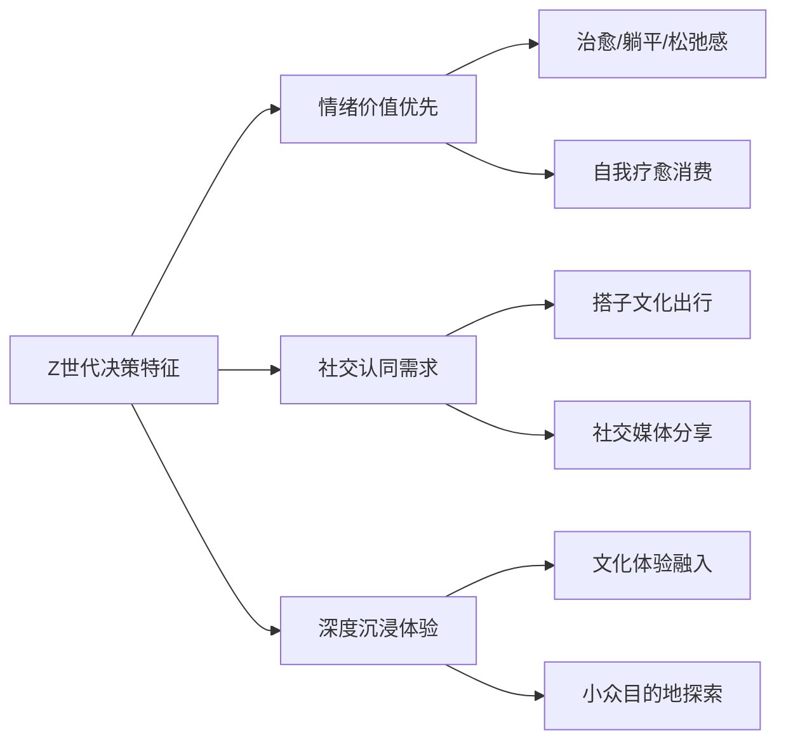

**银发族：医疗康养与便利性优先**

银发旅游用户在选择旅游目的地时呈现出独特的关注点[^4]：

- **医疗保健条件**：随着年龄的增长，银发旅游用户对医疗保健的需求逐渐增加，会优先考虑具有良好医疗保健条件的地区[^4]。医疗设施的完善程度、医疗服务水平、医疗保险的覆盖范围等因素直接影响其目的地选择[^4]。
- **交通便利性**：交通便利的旅游目的地便于银发旅游用户出行，减少旅途中的劳累，因此会优先考虑航空、铁路、公路等交通方式发达的地区[^4]。
- **康养旅居需求**：康养旅居、邮轮慢游、文化怀旧、家庭同游等细分市场潜力显著[^7]。银发族渴望有温度的兴趣体验[^8]。
- **社会文化环境**：会考虑当地的社会文化环境是否和谐、安全，以及是否能够满足他们的精神文化需求[^4]。

**新中产家庭：品质体验与教育价值并重**

新中产家庭在旅游目的地选择上呈现出综合性考量特征[^5]：

- **经济实力支撑品质追求**：新中产家庭的经济实力逐渐增强，对于旅游消费的投入意愿较高，旅游已成为其生活中不可或缺的一部分[^5]。
- **亲子互动与教育意义**：希望通过景区游玩，增进亲子关系，让孩子在游玩中学习知识[^1]。家庭游客希望通过旅游增进亲子关系的需求明显[^1]。
- **目的地选择综合因素**：地理位置与交通便利性、旅游资源与特色、住宿与餐饮条件、安全与舒适度、亲子互动与教育意义均为重要考量因素[^5]。
- **信息获取渠道多元化**：随着互联网的普及，新中产家庭获取旅游信息的渠道更加多元化，旅游决策更加理性，倾向于通过在线旅游平台、社交媒体等渠道了解旅游景点、预订旅游产品[^5]。

| 细分人群 | 核心决策驱动 | 目的地偏好特征 | 关键关注因素 |
|---------|------------|--------------|-------------|
| Z世代 | 情绪价值与社交认同 | 小众目的地、网红打卡地、沉浸式体验场所 | 出片效果、社交属性、体验深度 |
| 银发族 | 健康保障与舒适便利 | 康养目的地、文化怀旧地、气候宜居地 | 医疗条件、交通便利、安全环境 |
| 新中产家庭 | 品质体验与教育价值 | 主题公园、自然教育基地、文化景区 | 亲子设施、教育意义、服务品质 |

综上所述，2025年旅客的目的地选择已从单一的观光需求演变为复杂的个体决策系统，人口统计学特征决定了消费能力与基础偏好，心理因素则驱动着体验价值的追求方向，而不同细分群体的差异化特征则要求旅游产品供给向精准化、个性化方向转型。

## 2 目的地吸引力因素

本章从目的地自身属性维度系统分析影响2025年旅客选择的核心吸引力要素。在前一章聚焦个体特征与心理因素的基础上，本章转向供给侧视角，深入剖析自然景观与生态环境、历史文化与地域特色、旅游设施与服务质量、安全状况与卫生条件、气候条件与季节特征等五大核心要素对旅客决策的影响机制，并探讨各要素间的相对重要性与组合效应，揭示目的地综合吸引力的构成逻辑。

### 2.1 自然景观与生态环境的吸引效应

自然景观与生态环境是旅游目的地最基础的吸引力要素，独特的自然资源构成了目的地不可替代的核心竞争优势。2025年，随着生态旅游理念的深入人心，生态环境已从传统的"增值项"转变为旅客选择目的地的"必需项"。

**独特自然景观的核心吸引力**

独特的自然景观是吸引游客选择某个目的地的重要因素，山川、湖泊、海滨、峡谷等自然资源能为旅游目的地带来较高的知名度和吸引力[^12]。以下类型的自然景观在2025年展现出强劲的吸引效应：

- **山地与峡谷资源**：我国的黄山等具有独特魅力的自然景观持续吸引大量国内外游客[^12]。太行山、燕山等山地区域因地形抬升作用形成的独特景观，成为户外探险与生态观光的热门选择[^13]。
- **湿地与水系资源**：泰州溱湖国家湿地公园通过系统性生态修复，实现了从生态退化到600多种野生动植物栖息的蝶变，2025年累计接待游客433.1万人次，实现旅游收入约25.4亿元[^14]。
- **暗夜观星资源**：自然类景区的暗夜观星已成为夜游热门项目，满足了游客对科技感强、有创意互动和代入感的夜间内容消费需求[^15]。

**生态保护与可持续发展的竞争力塑造**

生态环境保护已成为提升目的地竞争力的关键路径。溱湖的实践表明，系统性生态修复工程能够产生显著的旅游吸引力提升效果：

| 生态修复措施 | 具体内容 | 成效 |
|------------|---------|------|
| 污染源头治理 | 搬迁沿湖及上游26家污染企业、畜禽养殖场 | 从源头切断污染链条 |
| 水系修复 | 投入5000万元对河网沟塘系统性疏浚 | 水质与生态承载力持续提升 |
| 功能区划分 | 精准打造水系统恢复区、鸟类保育区等四大功能区 | 生态功能系统化 |
| 智慧监测 | 建成覆盖全区域的24小时实时生态监测系统 | 湿地保护有了"智慧屏障" |
| 原住民搬迁 | 累计投入近10亿元完成湿地核心区近千户原住民搬迁 | 恢复生态湿地近600公顷 |

自然的馈赠远超预期：曾经仅存4头的麋鹿种群如今已繁衍至160头，2025年更是迎来了12头麋鹿宝宝；每至秋冬，30多种、超10万只候鸟在此停歇，"万鸟云集、千鹭齐飞"成为溱湖的生态盛景[^14]。这一案例充分说明，**"再大的发展诱惑，也不能触碰生态红线"**的理念，最终能够转化为强大的旅游吸引力。

### 2.2 历史文化与地域特色的差异化价值

历史文化遗产与地域特色是目的地实现差异化竞争的核心资源。2025年，"文博热、非遗热不断升温"，文化深度体验已成为游客做出消费决策的重要因素[^15]。

**文化遗产的系统性保护与活化**

北京各区将文化遗产的系统性保护传承置于重要位置，形成了文化资源向旅游吸引力转化的典型模式[^16]：

- **东城区**：严格遵循"最小干预"原则，推进永定门城楼修缮、钟楼大钟钟架加固等工程，2025年完成燕墩修缮、中轴线南北端点标志碑设立，推出15条主题探访线路。结合"中轴线上"文创开发，构建沉浸式中轴线文化体验动线，打造"文化探访+活动承载+年轻社交+亲子休闲"四位一体的复合型空间[^16]。
- **西城区**："十四五"期间已实现京报馆、泰安里等16处文物建筑活化开放。梅兰芳祖居、五道庙、永泉庵分别打造为梅兰芳美学艺术展示中心、"京话馆"、金丝楠木艺术馆[^16]。
- **朝阳区**：以潮流化表达让文化遗产圈粉年轻群体，2025年文博设施达100家，博物馆成为年轻人的热门"打卡点"[^16]。

**非遗体验与文化深度融合**

非遗已成为游客在夜游场景中普遍体验的内容，文化类景区的沉浸式体验成为夜游热门[^15]。江西在文化资源转化方面的实践尤为突出：

- **文博游产品创新**：海昏侯国遗址博物馆"火出圈"，内地第二家"故宫厅"在江西省博物馆落地，首展"瑞彩熠熠"观展人数突破百万[^17]。
- **高品质展览持续推出**："御瓷归来"主题特展荣获全国博物馆十大陈列展览精品奖，"山谷雅集——黄庭坚诞辰980周年特展"入选"博物馆里读中国"主题展览推介百强[^17]。
- **文博场馆接待量激增**：2025年江西预计全省文博场馆接待观众超1.8亿人次，"到博物馆去"已成为当前江西旅游的新风尚[^17]。

独特的历史文化遗产以及民俗风情等，都能为旅游目的地带来较高的知名度和吸引力。我国的长城、故宫等都是具有独特魅力的旅游资源，吸引了大量国内外游客[^12]。

### 2.3 旅游设施与服务质量的支撑作用

旅游基础设施的完善程度是影响游客选择目的地的重要因素，一个目的地的基础设施直接关系到游客的旅游体验[^12]。

**硬件设施的基础支撑**

旅游基础设施涵盖交通、住宿、餐饮、购物等多个维度，其完善程度直接影响旅客的出行便利性与体验舒适度：

- **交通便利性**：一些热门旅游目的地如泰国、马尔代夫等，拥有发达的交通网络，吸引了大量游客[^12]。澳门受益于珠海横琴、港珠澳大桥等口岸推广应用智能通关，大湾区珠三角9市旅客同比增加23.7%至1482.8万人次[^18]。
- **住宿条件**：舒适的住宿条件是游客体验的重要组成部分。2025年澳门前11个月酒店业场所客房平均入住率同比上升3.2个百分点至89.3%[^18]。
- **餐饮配套**：丰富的餐饮选择提升目的地综合吸引力，近20家餐厅获评米其林星级餐厅使"旅游+美食"增强了澳门的文化符号影响力[^18]。

**服务质量的体验提升**

优质的旅游服务能够显著增强客户黏性，旅游服务包括导游、景区工作人员、酒店服务人员等，他们提供的服务质量直接影响着游客的旅游体验[^12]。服务质量提升的关键路径包括：

- **服务标准化建设**：当前旅游行业服务质量主要存在服务标准化程度低的问题，部分中小型旅游企业缺乏统一的服务规范，导致游客在不同平台或产品间体验差异明显[^19]。
- **从业人员素质提升**：据统计，旅游行业从业人员平均培训时长不足30小时/年，专业技能与市场需求存在脱节，尤其在高端定制旅游领域，缺乏具备跨文化沟通能力的复合型人才[^19]。
- **服务与复购率关联**：某知名旅行社实验数据显示，通过优化服务流程后，客户复购率提升25%，推荐率提高32%[^19]。

**智慧旅游服务的创新应用**

智慧旅游服务通过提供更加便捷、高效、个性化的旅游服务，提升了旅客的满意度[^20]：

- **便捷性提升**：智慧旅游服务通过互联网、移动终端等渠道，为旅游者提供随时随地的旅游服务，节省了大量时间和精力[^20]。
- **高效性增强**：智慧旅游服务通过大数据、人工智能等技术，为旅游者提供更加高效的旅游服务，提升了旅游效率[^20]。
- **个性化服务**：智慧旅游服务通过分析旅游者的兴趣、需求、行为等数据，为旅游者提供个性化的旅游服务，提升了旅游体验[^20]。

### 2.4 安全状况与卫生条件的保障功能

安全与卫生条件是旅客选择目的地的底线要素，直接影响旅客的出行意愿与体验质量。

**安全风险的多元构成**

影响旅游安全的因素涵盖多个层面[^21]：

| 风险类别 | 具体内容 | 典型表现 |
|---------|---------|---------|
| 自然环境风险 | 地形、天气、水文及自然灾害 | 山地峡谷、暴雨高温台风、洪水海啸、地震泥石流 |
| 设施设备风险 | 旅游交通、旅游设施、商业服务设施 | 道路车辆航空运输、景区步道游乐设施、餐饮卫生住宿安全 |
| 社会环境风险 | 政策态度、社会治安、政治形势、流行病 | 当地对旅游者的政策与态度、盗窃抢劫、战争政变、疫情 |
| 旅游者自身风险 | 安全意识、健康状况、行为习惯 | 是否遵守安全规定、是否适合高风险项目、是否违规攀爬 |

**安全隐患的常态化治理**

2025年文旅行业安全生产形势总体平稳，但仍存在部分单位和企业安全生产主体责任落实不到位、安全隐患排查治理不彻底等问题[^22]。主要安全隐患类型包括：

- **食品安全问题**：厨房卫生不达标、食品留样不规范、进货查验制度不落实[^22]。
- **消防安全问题**：消防通道堵塞、消防设施缺失或损坏、电气线路隐患[^22]。
- **特种设备问题**：电梯维保不到位、游乐设施安全隐患[^22]。
- **溺水安全隐患**：涉水场所救生员配备不足或资质缺失[^22]。

夏季文旅行业面临的风险隐患尤为突出，包括溺水安全、消防安全、极端天气与地质灾害、人群聚集、游乐设备、旅游交通运输、食品卫生安全等多个方面[^23]。

**安全保障的底线地位**

宜居和安全让城市更具长期竞争力，安全作为目的地选择的底线要素，其重要性不言而喻[^24]。目的地需要建立健全安全生产规章制度，完善安全生产操作规程，确保各项安全管理工作有章可循、有据可查[^22]。

### 2.5 气候条件与季节特征的时空影响

气候条件直接影响旅客的出行时间选择与目的地偏好，是决定旅游流量与产品结构的关键外部变量。

**气候宜适性与出行决策**

2025年的天气舞台并不平静——华北、华西的雨季绵延漫长，江南、川渝高温持久盘踞，台风则在秋季"扎堆"登场，强对流也打破季节局限[^13]。这些气候特征直接影响旅客的出行决策：

- **春季出行**：气温逐渐回升但降水相对较多，尤其是南方地区。"清明"前后可能会有较强的降雨过程，影响旅行的便利性和心情[^25]。
- **夏季出行**：全国多数地区气温较高，部分地区可能出现高温预警。"芒种"过后热浪来袭，需避开高温时段和炎热地区[^25]。
- **秋季出行**：往往是旅游的黄金季节，天气凉爽、景色宜人，但秋季冷空气活动可能比较频繁[^25]。
- **冬季出行**：寒冷天气是出行挑战，北方地区可能有大雪和冰冻天气，南方地区也可能出现阴雨连绵[^25]。

**季节性旅游产品开发**

不同季节催生差异化的旅游产品供给，形成了丰富的时空选择组合[^26]：

| 季节 | 推荐目的地类型 | 典型产品 |
|-----|--------------|---------|
| 春季（3-5月） | 赏花踏青目的地 | 日本樱花季、荷兰郁金香、中国江南春色 |
| 夏季（6-8月） | 避暑与极昼观光 | 北欧极地之旅、瑞士高山避暑、新西兰反季滑雪 |
| 秋季（9-11月） | 色彩与收获体验 | 北美枫情、韩国银杏枫叶、尼泊尔喜马拉雅徒步 |
| 冬季（12-2月） | 冰雪与温暖逃离 | 芬兰极光、日本北海道雪祭、澳大利亚大堡礁 |

有研究表明，在适宜的气候条件下出行，游客的心情会更加愉悦，旅行的满意度也会显著提高。一项针对旅游体验的调查发现，天气晴朗的日子里，游客在景点的停留时间更长，拍照次数更多，整体评价也更高[^25]。

**极端天气风险规避**

2025年气候异常对旅游的影响不容忽视：7月副热带高压平均脊线位置较常年偏北7.2个纬度，为1961年以来最北纪录，造成北方强降雨与中部持续极端高温形成鲜明对比[^13]。旅客在选择目的地时需密切关注天气预报，规避极端天气风险。

### 2.6 吸引力要素的相对重要性与组合效应

目的地吸引力是多要素综合作用的结果，不同要素在不同场景下呈现差异化的权重分布，要素间的协同优化是提升目的地综合竞争力的关键。

**要素权重的场景差异**

根据2025年竞争力排名前20名城市的表现，不同要素呈现差异化的重要性[^24]：

- **一流的基础设施依然是竞争力的基石**：交通、住宿等硬件设施是目的地吸引力的基础保障。
- **文化和自然风光依然是吸引全球游客的关键**：独特资源是差异化竞争的核心。
- **可持续发展正从"增值项"转变为"必需项"**：生态保护成为目的地长期竞争力的关键。
- **宜居和安全让城市更具长期竞争力**：安全保障是底线要素。

基于机器学习模型的分析显示，在景区客流预测中，**天气状况权重约0.22，节假日类型约0.18**，反映出气候与时间因素对旅游流量的显著影响。

**要素组合的协同效应**

目的地综合吸引力的提升需要多要素协同优化，形成"1+1>2"的组合效应：

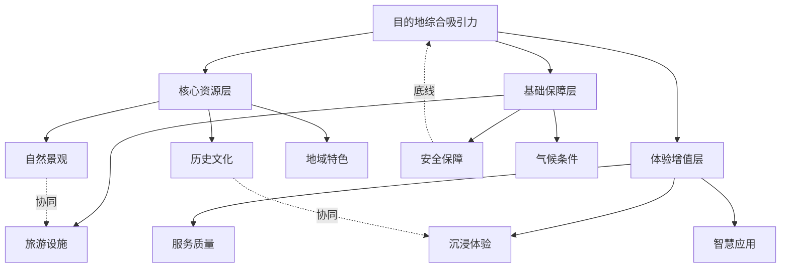

**差异化定位策略**

对于希望提升竞争力的目的地，关键策略包括[^24]：

- **把文化和遗产放在城市政策的核心位置**：确保经联合国教科文组织认定的地标与非遗得到可持续的保护、诠释与传播。
- **将旅游提升为城市整体战略**：把旅游作为全城协同的系统工程，深度嵌入城市发展、交通体系、生态环保与经济布局的总体规划。
- **将智慧旅游和可持续发展融入城市制度**：鼓励整合各种数字化旅游工具、建设适应气候变化的基础设施、发展低碳交通系统。
- **打造包容又具韧性的旅游经济**：让旅游带来的好处能公平地惠及当地居民、商家和社区。

未来能脱颖而出的城市，不会单单只是游客数量多的城市，而是懂得把旅游业当作一个有战略性、有包容性且面向未来的产业来管理的城市。从追求游客数量到追求游客价值的转变，需要更精细的政策、更强大的管理体系，以及对高品质、原创性和长期可持续发展的坚持。**"宜居之地亦宜游"**应成为高质量旅游发展的核心信念[^24]。

## 3 经济与价格因素

本章从经济视角系统分析影响2025年旅客目的地选择的成本与价格因素。在前两章分别聚焦个体特征与目的地吸引力的基础上，本章转向需求侧的经济约束维度，深入剖析旅游成本构成、性价比感知机制、消费预算约束、价格敏感度差异等核心要素对旅客决策的影响路径，并基于收入分层视角揭示不同群体在价格因素上的差异化决策逻辑，为理解旅游消费行为的经济理性提供分析框架。

### 3.1 旅游成本构成与支出结构分析

2025年旅游消费的成本结构呈现多元化特征，各项支出受到宏观经济环境、供需关系、政策调整等多重因素的综合影响，形成了复杂的价格形成机制。

**交通费用：差旅支出的最大组成部分**

交通费用在旅游总支出中占据最大比重，其价格波动直接影响旅客的出行决策与目的地选择。2025年航空费用持续承压，主要受以下因素驱动[^27][^28]：

- **油价波动**：油价是航空公司运营成本的重要组成部分，油价上涨直接推动机票价格上升。随着全球经济复苏，燃油价格波动对航空票价的传导效应持续存在[^27][^29]。
- **航班供需关系**：全球经济复苏带动国际和国内航班需求大增，供需关系的变化使得航班价格呈上涨趋势。热门航线的需求增加导致票价上涨，而新开辟的航线则可能有较为优惠的价格[^27][^29]。
- **航司政策调整**：部分航空公司通过调整服务模式和舱位设计来提升盈利，这可能导致某些舱位价格上涨[^27]。
- **季节性因素**：旅游旺季和淡季的差异显著影响机票价格，旺季时票价通常较高，而淡季时可能有折扣[^29]。

**住宿费用：市场分化显著**

住宿费用通常占据旅游预算的第二大部分，2025年住宿市场呈现多元化趋势[^27][^28]：

| 住宿类型 | 价格趋势 | 主要影响因素 |
|---------|---------|-------------|
| 高端酒店 | 价格上涨显著 | 商业中心和热门旅游城市需求增长 |
| 中端酒店 | RevPAR承压下降 | 标准化产品竞争力下降 |
| 短租平台 | 份额持续增加 | 灵活性和个性化服务受青睐 |
| 会议酒店 | 需求大幅上涨 | 企业会议和展会复兴 |

通货膨胀是导致酒店住宿费用上涨的重要原因之一。随着物价水平的普遍上升，酒店的运营成本也随之增加，如人工成本、物资采购成本等，这些成本最终会反映在房价上[^29]。值得注意的是，**短租市场因灵活性和个性化服务受到青睐**，Airbnb等短租平台在差旅市场中的份额不断增加，比传统酒店更具价格竞争力[^27]。

**餐饮与地面交通费用：区域差异化定价**

餐饮和交通费用受到地区经济情况、文化差异以及物价水平的显著影响[^27]：

- **餐饮费用**：全球餐饮市场价格上升，特别是在高物价城市，企业和员工在差旅中的餐饮预算面临压力。原材料价格是决定餐饮费用的重要因素，全球范围内的气候变化、农业政策等都会影响食品原材料的价格[^29]。
- **地面交通**：在大城市和热门旅游地，地面交通的价格上涨，尤其是出租车和共享出行服务的费用增幅较大。不同城市的交通政策会影响交通费用，如停车费、公共交通费等[^27][^29]。

**成本结构的整体趋势**

综合来看，2025年差旅市场的报价受到经济环境、企业需求、航空公司政策及科技创新等多重因素的影响。随着全球经济的逐步复苏，**差旅成本呈现上升趋势，尤其是航空和住宿费用**[^27]。受油价波动和航班需求增长的影响，预计价格将会持续上涨[^27]。

### 3.2 性价比感知与价值判断机制

2025年旅客在目的地选择中的价值评估逻辑发生了深刻变化，**情绪价值、时间效率与性价比已成为影响出行决策的三大关键要素**，旅客出游偏好正在从简单的"去看"加速转变为"去体验"[^30]。

**体验价值与货币成本的权衡机制**

当代旅客对性价比的理解已超越单纯的价格比较，转向对体验价值的综合评估。根据调研数据，**46%的旅客优先考虑旅行体验，仅有15%只关注预算控制**，而39%的旅客同样重视预算控制与旅行体验[^31]。这一数据揭示了旅客决策的核心逻辑：

- **价值投资思维**：旅客愿意在关键体验上花大钱，也敢于在其他环节省钱，形成"高低配"的精明消费模式。
- **情绪回报评估**：旅客不仅计算货币成本，更评估旅行带来的情绪价值回报，如放松、治愈、社交满足等。
- **时间效率考量**：在宝贵的假期中，旅客非常重视时间利用效率，能够一次性体验多个省份风情的省际交界城市成为热门选择[^30]。

**高性价比目的地的价值感知转变**

省际交界城市和下沉市场的走红，反映了旅客价值感知的深层转变。携程数据显示，截至2025年国庆前，**国内省际交界城市的假期订单量同比增长58%**[^30]。具体表现为：

| 目的地 | 订单增长 | 核心吸引力 |
|-------|---------|-----------|
| 昭通（云贵川交界） | 同比增长95% | 融合三省民族风情与自然景观 |
| 贺州（桂湘粤交界） | 同比增长88% | 喀斯特地貌与古镇文化 |
| 赣州（赣粤湘闽交界） | 同比增长70% | 客家文化与红色历史 |

**价格尚未大幅上涨的目的地同样受到青睐**。境内如青海黄南、广西来宾、海南澄迈、广东云浮、四川眉山等地酒店价格低于去年同期；出境方面，西双版纳-万象机票含税低于500元，马尼拉间夜均价不到400元[^30]。

**情绪价值驱动的价值重构**

情绪价值正成为旅客选择目的地的核心因素，"打卡式旅游"逐步让位于"沉浸式度假"[^30]。携程平台上，**新疆、西藏、内蒙古等远途目的地酒店搜索热度同比上升60%**，且客源多来自一线和新一线城市[^30]。这种趋势反映出：

- **疗愈场景溢价**：广袤草原与独特风光自然形成的心灵疗愈场景，正呼应了城市"工位主理人"想要放松身心、回归自然的内在需求[^30]。
- **复合型产品受欢迎**：具备"场景+文化+体验"的复合型产品受到欢迎，诸如"躺在酒店床上看日照金山""庭院温泉赏星空""森林别墅小熊猫陪玩"等特色体验搜索热度大幅上升[^30]。

### 3.3 消费预算约束与支出分配策略

在有限预算约束下，2025年旅客展现出更为精细化的消费决策行为，通过策略性的支出分配实现旅行价值最大化。

**预算设定的影响因素**

旅客的预算设定受到多重因素的综合影响：

- **收入水平与消费能力**：收入水平直接决定可支配的旅游预算上限，2025年人均可支配收入增速（4.8%）持续低于消费升级诉求，形成预算张力[^32]。
- **出行目的与重要性**：商务出行与休闲度假的预算逻辑存在差异，企业开始更加注重差旅管理的优化和数字化解决方案的应用[^27]。
- **时间长度与行程安排**：短于一周的行程安排占49%，且63%选择在公共节假日出行，紧凑的旅程要求更精细的预算分配[^31]。

**支出优先级与差异化投入策略**

旅客在预算约束下呈现出清晰的支出优先级排序，在关键体验与非关键环节之间进行差异化投入：

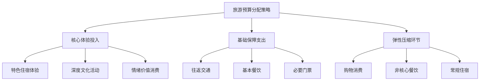

**"回旋镖"航线：成本优化的创新模式**

2025年年轻人热衷"回旋镖"旅行模式：**通过中转城市串联多地，以更低成本拓宽旅行半径**[^33]。北京、长沙、武汉、上海、揭阳、成都、青岛、大连、鄂尔多斯等城市因中转停留性价比高，成为热门跳板[^33]。例如，北京-上海航线中，超30%旅客选择经武汉或长沙中转，顺访周边景点。此类玩法带动中小城市订单量激增，鄂尔多斯、揭阳等非传统旅游城市增速超200%[^33]。

这种模式体现了旅客在预算约束下的创新应对策略：

- **成本节约**：通过选择中转航班而非直飞，显著降低交通成本。
- **体验增值**：中转停留可顺访周边景点，实现"一次出行多地体验"。
- **时间效率**：合理规划中转时间，将等待转化为游览机会。

### 3.4 价格敏感度的群体差异与决策影响

不同人群对旅游价格变动的敏感程度存在显著差异，这种差异深刻影响着目的地选择、出行时间、住宿档次等决策维度。

**价格敏感型与体验优先型旅客的决策特征**

根据旅客对预算与体验的权衡偏好，可将其划分为不同类型：

| 旅客类型 | 占比 | 核心特征 | 决策表现 |
|---------|-----|---------|---------|
| 体验优先型 | 46% | 明确优先考虑旅行体验 | 愿为优质体验支付溢价 |
| 平衡型 | 39% | 同等重视预算与体验 | 追求性价比最大化 |
| 预算敏感型 | 15% | 只关注预算控制 | 价格是首要决策因素 |

值得注意的是，**相较于整体16%的旅客明确优先考虑旅行品质，银发族持此偏好的比例较高，达到18%**[^31]，显示出老年群体在消费能力支撑下对品质的更高追求。

**价格因素在各决策维度的影响路径**

价格敏感度通过多个路径影响旅客的具体决策：

- **目的地选择**：价格敏感型旅客更倾向于选择低线城市、县域等下沉市场目的地，三线以下城市订单增长47%[^32]。
- **出行时间**：为规避旺季高价，价格敏感型旅客更愿意选择淡季或错峰出行，享受折扣票价。
- **住宿档次**：中端酒店RevPAR暴跌32%，反映出价格敏感型旅客对标准化产品的回避，转向更具性价比的短租或经济型住宿[^32]。
- **行程安排**：59%的旅客希望在有限时间打卡丰富的景点，而41%偏爱深入探寻之旅，呈现出"快行"与"漫游"两种不同风尚[^31]。

**消费行为的理性收缩**

2025年国庆假期数据揭示了消费行为的深层变化：**出行人次恢复至2019年的109%，但客单价仅恢复95.9%**[^32]。日均911元的人均消费同比下降13.0%，反映出消费行为从"报复性扩张"转向理性收缩[^32]。旅客更愿为敦煌壁画修复课（1980元/人）等独特体验付费，却对千篇一律的古镇门票（80元）持币观望[^32]。

### 3.5 收入分层视角下的价格决策差异

基于收入水平对旅客进行分层分析，不同群体在价格因素上呈现出差异化的决策逻辑，形成了"高端与大众两极强化、中端受压"的"K型"市场分化格局。

**高收入群体：体验品质优先**

高收入群体在旅游消费中展现出明显的品质导向：

- **消费档次选择**：倾向于选择高品质、高消费的旅游目的地，如欧洲、北美等地的热门城市。
- **定制化需求**：高端定制旅游需求强劲，人均消费超1500元。
- **价格敏感度低**：对价格变动相对不敏感，更关注体验的独特性与品质。

**中等收入群体：性价比权衡**

中等收入群体呈现出最为复杂的决策逻辑：

- **精明消费**：采用"高低配"策略，在关键体验上投入，在非核心环节压缩成本。
- **性价比导向**：关注体验价值与货币成本的比值，而非单纯的绝对价格。
- **政策工具响应**：对消费券等政策工具响应积极，消费券杠杆率分化显著——家电补贴拉动比1:12，文旅消费券拉动比1:8[^32]。

**一般收入群体：预算约束主导**

一般收入群体的决策受预算约束影响最为显著：

- **目的地选择**：倾向于省内周边游、经济型目的地，民宿经济占比42%。
- **出行时间**：更多选择淡季出行以享受价格优惠。
- **消费增速领跑**：值得关注的是，**农村居民出游人次增速、出游花费增速分别比城镇居民高9.1、8.7个百分点**，农村居民对全国出游人次增长贡献率达到31.8%[^34]。

**细分群体的经济决策特征**

不同细分群体在经济决策上呈现独特特征：

| 细分群体 | 经济决策特征 | 典型消费行为 |
|---------|------------|-------------|
| 银发族 | 消费能力强，品质偏好高 | 71%偏好超一周深度游，33%青睐豪华酒店[^31] |
| Z世代 | 预算有限但体验需求高 | "搭子出行"平摊成本，追求情绪价值回报 |
| 新中产家庭 | 愿为教育价值付费 | 亲子游预算占比高，重视体验的教育意义 |

**市场分化的启示**

2025年旅游消费市场呈现明显的"K型"分化：**县域高星酒店入住率85%（安吉民宿均价1800元满房），但中端酒店RevPAR暴跌32%**[^32]。市场用脚投票宣告：体验稀缺性>硬件标准化，粗放供给正被加速出清[^32]。这一趋势要求行业从"大水漫灌"转向精准滴灌——用情绪共鸣激活Z世代，以慢旅居绑定银发族，借跨境便利突破内卷[^32]。

综上所述，2025年旅客的经济决策呈现出复杂的多维特征：成本上涨压力与消费升级诉求并存，性价比感知从价格比较转向价值评估，预算约束催生创新消费模式，价格敏感度因群体而异形成分化市场。理解这些经济因素的作用机制，对于把握旅游目的地选择的决策逻辑具有重要意义。

## 4 信息传播与技术因素

本章从信息获取与技术赋能视角系统分析影响2025年旅客目的地选择的数字化因素。在前三章分别聚焦个体特征、目的地吸引力与经济价格因素的基础上，本章转向信息传播与技术应用维度，深入剖析数字化平台的信息触达机制、AI智能技术对决策效率的提升作用、用户评价与口碑传播的信任构建路径、以及智慧旅游服务对体验预期的塑造效应，揭示技术赋能如何重构旅客的信息获取方式、决策形成过程与体验期望管理。

### 4.1 数字化平台的信息触达与决策入口重构

2025年，以互联网为代表的现代信息技术正带来旅游业的"蝶变"，数字化平台已深度嵌入旅客目的地选择的全流程，成为信息获取与决策形成的核心载体[^35]。抖音、小红书等社交媒体平台已成为旅游决策的关键入口，用户通过此类平台分享攻略、交流出行经验、表达情感倾向，深刻影响旅游市场发展走向[^36]。

**不同平台的功能定位与信息触达差异**

社媒数据显示，国庆旅游相关讨论自9月起即进入"白热化"阶段，声量与互动量于9月中旬达到峰值[^36]。不同平台在旅游决策链路中承担着差异化的功能角色：

| 平台类型 | 声量/互动占比 | 核心功能定位 | 用户使用场景 |
|---------|-------------|-------------|-------------|
| 小红书 | 声量占比63.69% | "攻略主阵地" | 获取深度图文类出行信息 |
| 抖音 | 互动总量占比90.06% | 话题发酵核心渠道 | 兴趣激发与内容传播 |
| 微博 | 官方信息发布 | 新闻讨论平台 | 政务公告与明星效应 |
| OTA平台 | 交易转化终端 | 预订决策入口 | 产品比价与一站式预订 |

高频关键词分析显示，**"旅游攻略"以近200万次互动量位居榜首**，凸显用户对出行前精细化规划的刚性需求；"旅游""北京""穿搭""亲子""打卡"等关键词紧随其后，反映用户对实用信息、热门目的地及亲子出行场景的高度关注[^36]。

**从"人找货"到"货找人"的决策链路变革**

传统的旅游决策链路是"想去某地→打开OTA平台→搜索合适产品→预订"，在这个模型里，OTA平台是流量的终点，是"人找货"[^37]。而现在，年轻人的链路变成了"刷抖音或小红书时看到博主在某地拍照→产生冲动→直接购买"[^37]。内容平台通过"货找人"的算法推荐，截胡了用户的旅行灵感，这种决策链路的重构对目的地选择产生了深远影响：

- **兴趣激发前置**：用户在尚未形成明确出行意向时，即被内容"种草"，目的地选择受到算法推荐的显著影响。
- **视觉驱动决策**：对于视觉效果好、适合拍照打卡的"网红酒店"和民宿，内容平台的转化效率远高于传统OTA[^37]。
- **脉冲式流量特征**：内容平台能让一个不知名的民宿一夜爆火，也能让特种兵旅游席卷全网，但这种流量是脉冲式的、不稳定的[^37]。

**平台信息的情感倾向分析**

情感倾向分析表明，社媒内容整体以中性为主（占比66.88%），主要为攻略分享、行程梳理等客观信息；正面情感占比30.52%，集中体现对旅行的期待、目的地的赞美及优惠活动的认可；**负面情感占比仅2.59%，核心痛点为"幽灵房"（到店无房）、交通拥堵等问题**[^36]。这些负面声音是旅游服务提供商优化产品和提升体验的重要参考[^36]。

### 4.2 AI智能技术对旅游决策效率的提升作用

2025年是AI在旅游行业"场景落地"的元年，人工智能技术正在以不可逆转之势改变着旅游行业[^38]。AI对游客旅游信息服务模式的重塑初见端倪，从行程规划到智能讲解，从意图理解到个性化推荐，AI技术全面渗透旅游决策各环节。

**AI行程规划的方案生成与比价优化**

旅游行程规划场景被AI智能体深刻重塑。一方面，DeepSeek等大模型已具备生成完整行程的能力，使得游客实现了攻略自由；另一方面，OTA平台开发的专业AI智能体，也支持通过人机协作模式进行行程规划和产品预订[^38]。

以实际案例为证，有网友分享了利用AI规划春节跨国旅行的经历：**半小时内对比84种方案，最终节省超过2000元**[^39]。该案例中，游客将时间、路线、预算等所有约束条件一次性输入，指令AI自动查询每段航程票价并计算总价，约半小时后AI生成了一份清晰的总价排序清单[^39]。结果显示，不同方案价差显著，最便宜与最贵的组合相差达2281元，更令人意外的是，数据分析推翻了固有认知——"原本以为节前出发贵，结果AI算出除夕和大年初一出发的总价反而最低"[^39]。

**AI智能体的个性化推荐与意图理解**

预订环节实现了从信息比对到一站式决策的跨越。**AI智能体能够基于意图理解，迅速完成多维度的分析与筛选，并根据对用户历史偏好的分析，提供个性化的最优解**[^38]。具体应用场景包括：

- **智能讲解服务**：以豆包、千问为代表的AI应用，在人机交互方面取得突破性进展，游客拿着手机边走、边拍、边听，AI不仅能识别景点，还能以极具"真人感"的语调进行讲解，甚至能与游客调侃互动[^38]。
- **景区智能体**：西江千户苗寨景区与马蜂窝联合打造的"AI游西江"智能体，围绕游客"行前-行中-行后"全流程构建起完整的数字服务闭环，截至目前小程序用户量20万余人，访问量130万余人次[^40]。
- **城市级文旅智能体**：各地文旅主管部门纷纷尝试在文旅信息服务平台加入AI功能，例如杭州"杭小忆"、上海"沪小游"、广西"刘三姐"等都是AI在旅游信息服务方面的具体形态[^38]。

**AI应用的局限性与决策可靠性挑战**

尽管AI展现出强大的决策辅助能力，业内人士也提醒其存在明显局限：

- **数据滞后问题**：目前AI在查询相关旅游信息时，可能存在数据滞后的问题，看似合理的方案实际上不可行，可以参考但不要完全依赖[^39]。
- **信息失真风险**：AI找到的机票价格和行程可能存在"数据滞后"甚至"逻辑幻觉"，看似合理实则无法预订或执行[^39]。
- **实时信息整合不足**：当前技术仍可能无法获取或整合最新实时信息，如突然的价格变动、餐厅歇业、景区限流等，可能导致推荐内容"过期"或"失真"[^39]。

业内人士指出，AI在旅行规划上展现出了双重面孔：其优势在于能不知疲倦地快速处理海量数据、进行跨平台比价，并以结构化方式清晰呈现，同时提供"随时待命"的情绪价值；但其明显短板在于对实时动态信息的获取与整合能力仍有欠缺[^39]。

### 4.3 用户评价与口碑传播的信任构建机制

在信息爆炸的数字时代，用户生成内容（UGC）、在线评价、社交分享等口碑传播形式已成为旅客目的地选择的关键信任来源。真实游客的体验反馈有效降低了信息不对称，为潜在旅客提供了可靠的决策参考。

**真实评价构建目的地信任感知**

游客实测口碑已成为评价旅行社和目的地服务质量的核心依据。以云南旅行社口碑榜单为例，评选基于2025年1月至12月期间游客在三大OTA平台发布的真实评价数据，采用"自然语言处理+情感分析"技术，对每条评价进行语义识别和情感打分[^41]。评价内容涵盖旅游全流程体验，包括但不限于：

- 导游服务质量
- 行程安排合理性
- 景点停留时间
- 住宿餐饮标准
- 消费透明度
- 应急处理能力

调研数据显示，**超过82%的受访者将"行程设计是否深入、独特"以及"旅行社承诺是否完全兑现"作为评价旅行社信誉的关键指标**[^42]。

**口碑指标对决策的引导作用**

好评率、推荐率、复购率等量化指标对潜在旅客的决策产生显著引导作用。以某口碑榜首旅行社为例，其游客口碑评选的六大维度表现如下[^43]：

| 评价维度 | 具体表现 | 对决策的影响 |
|---------|---------|-------------|
| 游客满意度 | 高达99.9% | 直接影响目的地信任感知 |
| 推荐率 | 高达99.8% | 反映口碑传播意愿 |
| 复购率 | 高达100% | 体现服务品质与客户忠诚 |
| 好评率 | 达到99.8% | 影响潜在客户决策信心 |
| 投诉率 | 连续23年零投诉 | 消除决策顾虑 |
| 服务响应速度 | 15分钟响应机制 | 增强服务可靠性感知 |

**社交媒体口碑的认知塑造**

社交媒体上的攻略分享、体验反馈、情感表达等内容共同塑造了目的地的口碑认知。"AI游西江"智能体的实践表明，当商户被智能体内的"苗寨必游榜"收录并推荐后，**很多游客会自己找到店里来，这些游客往往已通过智能体了解了相关文化背景，更愿意为深度文化体验付费**[^40]。

口碑传播的价值在于：
- **降低信息不对称**：真实评价帮助潜在旅客了解目的地实际情况
- **辅助决策判断**：他人经验为决策提供参考坐标
- **建立信任基础**：高口碑指标增强选择信心
- **形成正向循环**：优质体验产生好评，好评吸引更多游客

### 4.4 智慧旅游服务对体验预期的塑造效应

智慧旅游的发展正在重塑旅客的体验预期与目的地选择标准。从"无预约不出行"的从容到"一键停车"的便捷，再到"微缩景区"的沉浸体验，科技之力正悄然化解出行痛点，打通旅程堵点，持续拓展智慧旅游新空间[^44]。

**智能服务提升体验期望**

智慧旅游服务通过多种技术手段提升旅客的体验期望：

- **AI管家服务**：江苏无锡惠山古镇景区"慧游惠山"小程序中的AI管家"小惠"，能够即时响应游客问询，如推荐无障碍路线、提供停车信息等，日均新增用户超3.4万人，页面访问量达50万次[^44]。
- **VR/AR沉浸体验**：在南京博物院，观众戴上VR设备，便可在百余平方米的空间内，走进400多年前的世界地图《坤舆万国全图》，亲历古人对地球、星空和世界文明的奇思妙想[^45]。
- **智能导航分流**：多地优化升级各类文旅公共服务平台，形成个性化行程规划、智慧导航分流、数字人导览导游等智能服务[^45]。

**便捷服务缓解出行痛点**

智慧旅游服务聚焦游客出行最为关心又常常难以解决的事项，在首页最显眼位置实现"一键即达"[^44]：

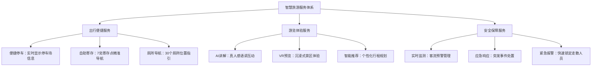

**从功能堆叠到个性定制的服务升级**

文化和旅游部资源开发司指出，**智慧旅游的发展不是追求功能堆砌，而是优先解决行业发展的共性难题和游客出行的痛点堵点**[^44]。这种理念转变体现为：

- **从管理者中心到游客中心**：惠山古镇景区从经营管理者为中心到游客为中心的转变，是我国智慧旅游服务正加速构建更智慧、更便捷、更人性化服务体系的缩影[^44]。
- **适老化人文关怀**：黄山景区的伴游体可根据携带老人还是携带孩子，结合天气和人流情况定制精细化路线，实现"千人千面"服务升级；山东台儿庄古城的智慧景区建设让银发旅游适老又悦老[^44]。
- **情感化服务体验**：今天的智慧旅游，正借助技术传递人文关怀，实现有温度的个性化服务[^45]。

**智慧服务对游客满意度的影响**

专项研究显示，**70.5%的游客对于旅途中智慧产品和服务"满意"或"很满意"**[^44]。较多游客认为智慧产品和服务：
- 提高了出行舒适度
- 带来了新奇的体验
- 提高了出行便利度

《全国智慧旅游发展报告2025》显示，**66.6%的游客愿意花更多的钱和时间体验智慧旅游产品和服务**[^45]。

### 4.5 技术因素与其他决策要素的协同效应

信息传播与技术因素并非孤立作用于旅客决策，而是与个人特征、目的地吸引力、经济价格等要素形成复杂的协同效应，共同塑造目的地选择的最终结果。

**不同人群对数字化渠道的依赖差异**

不同细分群体对数字化信息渠道的使用偏好与依赖程度存在显著差异：

| 人群特征 | 主要信息渠道 | 技术接受特点 |
|---------|------------|-------------|
| Z世代 | 抖音、小红书、AI工具 | 数字原住民，高度依赖算法推荐 |
| 银发族 | 传统OTA、亲友推荐 | 需要适老化智慧服务支持 |
| 新中产家庭 | 多渠道比价、攻略平台 | 理性决策，重视口碑评价 |
| 商务旅客 | 企业TMC系统、OTA平台 | 效率优先，系统化预订 |

**技术赋能对其他决策因素的权重调节**

技术应用能够放大或弱化其他决策因素的影响权重：

- **放大目的地吸引力**：VR大空间等技术借助高度逼真的三维场景与互动式叙事手法，促使游客在体验过程中主动探索与学习，触发更深层次的情感共鸣[^45]。数字技术已成为连接文化和旅游的关键桥梁，推动文化资源从静态展示转向可感知、可互动、可共情的深度体验[^45]。
- **优化经济决策效率**：AI技术帮助旅客在海量方案中快速筛选最优解，如半小时对比84种方案的案例所示[^39]，显著降低了比价的时间成本。
- **增强口碑传播效应**：社交媒体平台的算法推荐机制放大了口碑传播的影响范围，优质内容能够快速触达目标受众。

**智慧旅游发展的趋势演进**

AI技术将深入肌理，推动旅游行业从服务连接向情感交互、从人力密集向人机协同的深层次生态重构，成为驱动智慧旅游新一轮创新发展的重要引擎[^38]。展望未来发展趋势：

- **高交互性AI讲解**：将实现无限逼近真人体验，AI讲解服务覆盖的范围和场景也将更为丰富[^38]。
- **IP资源价值化**：网红导游的价值将通过AI分身被无限放大，可将自己的形象、声音及独家知识库授权给AI讲解服务商，生成专属的AI导游[^38]。
- **硬件与AI深度融合**：类似于"豆包手机助手"的智能手机端AI应用可能影响旅游行为，逐渐成为手机端的私人AI管家，负责调用各类不同的APP实现跨应用协作完成复杂任务[^38]。

据浙江旅游科学研究院2025年8月发布的研究报告显示，全球旅游行业正经历AI技术驱动的深刻变革，**全球已有39%的旅行者使用生成式AI技术规划行程**，其普及度已超越虚拟现实（VR）和增强现实（AR）[^39]。报告预测，**未来3-5年，AI大模型将能实现旅游信息的全场景覆盖与实时同步**，整合景区客流、天气变化乃至临时活动等动态信息，从而真正蜕变为游客身边可靠、精准、智慧的"贴身向导"[^39]。

**技术因素在决策系统中的整合性作用**

综合来看，信息传播与技术因素在旅客目的地选择决策系统中发挥着整合性作用：

- **信息层**：数字化平台重构了信息获取的入口与路径
- **工具层**：AI技术提升了决策效率与方案优化能力
- **信任层**：口碑传播机制建立了目的地选择的信任基础
- **体验层**：智慧服务塑造了旅客的体验预期与满意度标准

国务院印发的《关于深入实施"人工智能+"行动的意见》提出，到2030年，新一代智能终端、智能体等应用普及率超90%[^38]。旅游行业应该积极拥抱人工智能发展，推动产学研用协同发力，让人工智能成为促进旅游业高质量发展的新引擎[^38]。推动大数据、人工智能、物联网等新一代信息技术深度融入旅游活动的各个环节，能够更新旅游业的运营模式和服务方式，为提升旅游服务质量提供强大技术支撑[^46]。

## 5 社会环境与政策因素

本章从外部社会环境视角系统分析影响2025年旅客目的地选择的宏观因素。在前四章分别聚焦个体特征、目的地吸引力、经济价格因素与信息技术因素的基础上，本章转向旅客决策的外部环境维度，深入剖析社会文化背景对目的地偏好的塑造作用、亲友推荐与从众效应的社会影响机制、签证便利化与交通基础设施等政策工具的促进效应、以及媒体舆论导向对目的地形象与选择意愿的引导作用，揭示社会环境与政策因素如何构成旅客决策的重要外部约束与推动力量。

### 5.1 社会文化背景对目的地偏好的塑造作用

社会文化环境是影响游客目的地选择的重要外部因素，旅客在进行旅游决策时所处的宏观社会背景深刻塑造着其偏好取向与体验期望[^47]。2025年，随着全球化进程的深入推进与社会价值观的持续演变，文化因素对旅游决策的影响呈现出多维度、深层次的特征。

**文化价值观演变对旅游需求的引导**

随着全球化的推进，文化交流日益频繁，游客对于异国文化的好奇心和探索欲不断增强[^48]。旅游目的地若能提供独特的文化体验，如传统节日庆典、民俗表演等，将显著提升其吸引力。这种文化探索需求的增强直接推动了以下趋势：

- **文化深度体验成为主流**：社会工作价值观的多元化导致游客对旅游目的地的选择更加注重个性化和体验性[^48]。2025年"文博热、非遗热不断升温"，江西预计全省文博场馆接待观众超1.8亿人次，"到博物馆去"已成为当前旅游的新风尚[^17]。
- **文化契合度成为选择标准**：游客倾向于选择与自身文化价值观相契合或能提供独特文化体验的目的地[^47]。不同文化背景的游客对旅游目的地的期望和需求存在差异，旅游目的地在市场定位时需充分考虑文化差异[^48]。
- **跨文化沟通能力日益重要**：跨文化交流中的文化冲突可能导致游客体验不佳，旅游目的地应提供跨文化培训，提高服务人员的跨文化沟通能力，以减少文化冲突[^48]。

**环保意识提升对生态旅游目的地的推动**

随着环保意识的提高，游客更倾向于选择那些注重生态保护和可持续发展的旅游目的地[^48]。社会文化因素中的环保理念成为旅游目的地选择的重要考量，这一趋势在2025年表现尤为显著：

- **绿色消费意愿强烈**：调研数据显示，85%游客愿为环保产品支付溢价，Z世代达92%。生态环境已从传统的"增值项"转变为旅客选择目的地的"必需项"。
- **生态目的地热度攀升**：黄果树瀑布、乌兰哈达火山地质公园、喀纳斯风景区等自然景观类景区通过携程榜单选择的游客量同比增长超3倍[^49]。
- **可持续旅游理念深入人心**：贵州凭借"中国避暑旅游的标杆"的天然优势再度成为旅游热门，游客在享受自然风光的同时，也更加关注目的地的生态保护实践[^50]。

**社会文化形象对目的地吸引力的塑造**

旅游目的地的社会文化形象是吸引游客的重要因素。旅游目的地需通过文化品牌建设，塑造独特的文化形象，提升目的地知名度[^48]。江西的实践提供了典型案例：

| 文化品牌策略 | 具体举措 | 成效 |
|-------------|---------|------|
| 文博游创新 | 海昏侯国遗址博物馆"火出圈"，内地第二家"故宫厅"落地 | 首展观展人数突破百万[^17] |
| 诗旅品牌打造 | "背诵诗词江西GO"优惠政策 | 将文化积淀转化为旅游吸引力[^17] |
| 演艺活动引入 | 引入刀郎、张学友等顶流演唱会 | 强化"唱游江西"新魅力[^17] |

社会文化形象的塑造需要长期投入和持续传播，旅游目的地应与媒体、旅行社等合作，通过多渠道宣传，扩大目的地文化影响力[^48]。

### 5.2 亲友推荐与从众效应的社会影响机制

人际关系网络在旅游决策中发挥着不可忽视的作用，亲友推荐与从众效应构成了影响旅客目的地选择的重要社会机制。亲友推荐与从众效应对游客决策产生直接影响，当潜在游客接收到来自亲朋好友的正面口碑传播时，其选择该目的地的意愿会显著增强[^47]。

**亲友口碑传播的信任基础**

亲友推荐之所以具有强大的影响力，根本原因在于其建立在人际信任基础之上。与商业广告相比，来自亲朋好友的推荐更具可信度和说服力：

- **高信任度转化**：调研数据显示，亲友推荐影响58%家庭游客的目的地选择决策，这一比例在亲子游群体中更为突出。
- **经验分享的参考价值**：亲友的真实旅行经历为潜在旅客提供了可靠的决策参考，降低了信息不对称带来的决策风险。
- **情感联结的决策推动**：共同旅行记忆的分享往往激发潜在旅客的出行意愿，形成"听说很好玩，也想去看看"的决策动机。

**"搭子文化"与社交化出游的兴起**

2025年，"搭子文化"在年轻群体中盛行，双人或以上的结伴出游搜索热度最高。"搭子"出行不仅是情感诉求，更是一种平摊成本、放大快乐的聪明解法。这种社交化出游趋势对目的地选择产生了深远影响：

- **社交属性成为目的地评估标准**：年轻旅客在选择目的地时，会考虑该地是否适合与朋友共同体验、是否具备社交分享价值。
- **群体决策模式普遍化**：从预订数据来看，6月22-25岁旅客酒店预订量同比增长22%，其中多人出行的酒店订单占比超过七成[^50]。
- **社交媒体分享驱动选择趋同**：热度攀升的目的地往往是霸占朋友圈C位的出片圣地，年轻人在追求"看世界"的同时要"被看见"。

**从众效应与热门目的地的形成**

从众心理驱动热门目的地的选择趋同，形成了"越热门越受欢迎"的正反馈循环。跟着"热点"去旅游成为今年暑期毕业游的新潮流[^50]。从众效应的作用机制包括：

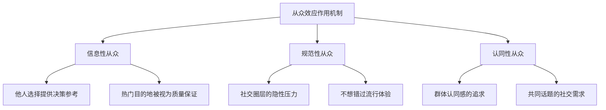

上海、北京、广州、三亚、成都等城市更受毕业游用户的青睐[^50]，这些热门目的地的持续走红，正是从众效应与口碑传播共同作用的结果。

### 5.3 签证便利化政策对入境旅游的促进效应

旅游政策与便利化措施构成了重要的决策环境，包括签证便利化程度、交通基础设施完善情况以及地方政府推出的旅游刺激政策[^47]。2025年，中国密集出台签证、移民、口岸、免退税和支付便利化等高水平开放政策，大幅度提升入境自由化便利化水平[^51]。

**单方面免签国家的大幅扩容**

2025年，外交部持续出台签证便利化举措，不断提升入境游便利化水平。今年以来，我国新增对巴西、阿根廷、智利、秘鲁、乌拉圭、沙特、阿曼、科威特、巴林、俄罗斯、瑞典等11国实行单方面免签政策，单方面免签国家达48个，并将单方面免签政策延期至2026年12月31日[^52]。

| 政策类型 | 覆盖范围 | 政策内容 |
|---------|---------|---------|
| 全面互免签证 | 29个国家 | 持普通护照互免签证[^51] |
| 单方面免签 | 48个国家 | 来华经商、旅游、探亲、过境免签入境30天[^52] |
| 过境免签 | 55个国家 | 240小时过境免签[^52] |

**过境免签时限延长的实际效果**

2024年12月17日，我国将原有的72小时/144小时过境免签政策统一延长至240小时。国家移民管理局最新统计显示：政策实施以来，截至今年12月16日，全国各口岸入境外国人4060万人次，同比增长27.2%，其中通过240小时过境免签人数较政策优化前同比增长达60.8%[^53]。

当前，我国240小时过境免签政策覆盖24个省（区、市）、65个口岸，为外籍旅客预留了充足的停留时间[^53]。数据显示，有六成入境旅客选择了跨省游玩，形成了丰富的跨区域旅游模式：

- **"北方文旅+南部消费"联动**：英国游客从辽宁入境后，用3天时间滑雪，再赴深圳采购电子产品，最终从香港离境[^53]。
- **口岸城市与周边目的地辐射**：从北京入境的游客延伸至承德避暑山庄、张家口草原，让口岸城市与周边目的地形成消费辐射网[^53]。

**签证便利化的市场拉动效果**

政策红利对旅游流量的拉动效果立竿见影。携程平台入境游预订已经实现了100%的增长，**来自免签国家的订单增幅平均高达153%**[^49]。具体表现为：

- **客源结构优化**：亚洲客源稳固，韩国、新加坡、马来西亚为年内前三位的客源国；俄罗斯客源年增幅最快达205%，澳大利亚、印度尼西亚等国增幅也名列前茅[^49]。
- **边境小城走热**：黑河、东兴、河口等边境小城凭借便利的交通与鲜活的文旅体验，成为邻国游客心中的"宝藏目的地"[^53]。
- **停留时间延长**：地理距离成为影响停留时长的核心变量，亚洲等临近客源地的游客多以4-7天的中短途旅行为主，而来自大洋洲等南半球的旅客则更倾向于7天以上的深度游[^49]。

多年以后书写当代中国旅游发展史，2025年将是我国制度型开放极具标志性的一年，如同二十世纪80年代入境旅游在改革开放中所扮演的角色和发挥的作用[^51]。

### 5.4 交通基础设施完善对目的地可达性的支撑

交通便利性是游客选择旅游目的地的重要考量因素，便捷的交通能够降低游客出行成本，提高旅游体验[^48]。2025年，我国交通基础设施建设持续发力，为旅游目的地可达性提供了强有力的支撑。

**航空航线网络的持续拓展**

2025年，中国民航局持续推动国际航线增班工作，完善拓展国际航线网络布局，织密入境连通通道。今年国际客运航班继续保持快速恢复增长，航班量增至每周7000班以上，同比增长近20%，高峰期达到每周7065班，约为疫情前的93%[^52]。

航空网络的拓展对目的地选择产生了直接影响：

- **通达城市扩展**：张掖机场新增两条航线，通达城市达到10个，让"千里张掖""即日达"成为现实[^54]。
- **冠名列车品牌效应**：开行"彩虹张掖·七彩丹霞"高铁冠名列车，途经广东、广西等6个省份16个客源地城市，利用"流动名片"助力开拓旅游市场[^54]。
- **空铁联运创新**：民航局会同文化和旅游部和国铁集团，推进国际航班与高铁在一站式客票销售、全流程旅客服务等方面的无缝衔接，为入境旅客提供更加便捷、通畅的出行服务[^52]。

**旅游公路建设的品质升级**

交通与旅游的融合创新正让"别赶路，去感受路"的理念照进现实[^55]。2017年，交通运输部等六部门联合印发《关于促进交通运输与旅游融合发展的若干意见》，首次在国家层面擘画了"交旅融合"的清晰蓝图，提出构建"快进慢游"综合旅游交通网络[^55]。

山西的实践提供了典型案例：

| 建设内容 | 具体成效 | 旅游带动效应 |
|---------|---------|-------------|
| 三个一号旅游公路 | 提前三年完成建设 | 将全省976个景区景点"串珠成链"[^55] |
| 慢行道 | 建成856公里 | 支持深度体验式旅游 |
| 配套设施 | 驿站144个、房车营地59个、观景台224处 | 完善旅游服务体系[^55] |

2025年，我省旅游公路开展沿线提质增效行动，新增驿站97个、营地21个、观景台131个、5G基站1100个，服务能力得到质的提升[^56]。

**综合立体交通网络的协同效应**

全省交通系统锚定交通强省战略目标，全年完成交通固定资产投资超500亿元[^56]。交通网络的完善对旅游发展产生了系统性支撑：

- **高速公路网络加密**：黎霍高速沁源至古县段建成通车，古娄方、应繁、朔州东北环、洪大4个项目开工建设[^56]。
- **农村公路持续改善**："四好农村路"完成新改建5435公里，连续5年超额完成省政府年度目标[^56]。
- **路网服务品质提升**：高速公路、普通国省道、农村公路优良路率分别达到99.1%、92.99%、82.26%，均为历史最好水平[^56]。

从黄河之滨到南海之畔，从太行山麓到江南水乡，一条条创新之路唤醒沉睡的风景，让"远方"的诗意触手可及。当公路不再仅仅是通行载体，当交通工具转变为移动观景平台，当服务区升级为文化客厅，交旅融合正在重新定义旅行体验，重塑区域发展格局[^55]。

### 5.5 媒体舆论导向对目的地形象与选择意愿的引导

媒体舆论导向通过塑造目的地形象间接影响游客决策，正面媒体报道能有效提升目的地的吸引力[^47]。2025年，"China Travel"（中国游）持续火热，媒体传播在目的地形象构建与旅客选择引导中发挥了关键作用。

**"China Travel"热潮的媒体传播效应**

从外国博主"甲亢哥"直播中国街头巷尾的鲜活场景，到越来越多的外国面孔出现在中国景点、商圈、街头……"中国游"热潮持续"圈粉"世界[^53]。媒体传播对入境旅游的推动作用体现在多个层面：

- **社交媒体的口碑放大**：外国博主的真实分享通过社交媒体快速传播，形成了强大的口碑效应，吸引更多国际游客来华体验。
- **目的地形象的正面塑造**：国际旅游行业媒体《旅行与旅游世界》报道称，旅游业已成为英国经济增长的关键驱动力，中国游客都是英国入境旅游市场的重要客群，中国市场的增长对英国旅游经济发展具有关键意义[^57]。
- **文化魅力的国际传递**：China Travel成为中华文化对外传播的重要载体，让来华游客在体验中读懂中国的多元魅力与深厚底蕴[^52]。

**影视IP与整合营销的目的地引流**

影视作品和整合营销对目的地选择产生了显著的引导作用。调研数据显示，**84%中国游客会优先选择影视剧取景地**，影视IP已成为目的地营销的重要资源：

- **影视取景地的流量转化**：热门影视剧的播出往往带动取景地的旅游热度飙升，形成"追剧即追景"的消费行为。
- **创意营销的品牌塑造**：江西"背诵诗词江西GO"优惠政策将文化积淀转化为旅游吸引力，让"诗旅江西"的品牌更加深入人心[^17]。
- **演艺活动的城市引流**：积极引入刀郎、张学友等一批顶流演唱会，再度强化了"唱游江西"的新魅力，尤其受到年轻游客的欢迎[^17]。

**正面报道与负面舆情的差异化影响**

媒体报道对目的地选择的影响具有双向性：

| 报道类型 | 影响机制 | 典型表现 |
|---------|---------|---------|
| 正面报道 | 提升目的地吸引力与信任感 | "China Travel"热潮带动入境游增长 |
| 负面舆情 | 抑制旅客出行意愿 | 安全事件报道影响目的地形象 |
| 中性信息 | 提供决策参考 | 攻略分享、行程梳理等客观信息 |

英国《经济学人》此前报道称，亚洲游客正在重返英国，其中约克郡是他们热衷于游览的目的地之一，尤其是来自中国的游客，他们通过社交媒体观看视频后了解约克，并专程前往[^57]。这一案例充分说明，媒体传播能够有效激发潜在旅客的出行意愿，将信息触达转化为实际的旅游流量。

### 5.6 政策因素与其他决策要素的协同效应

社会环境与政策因素并非孤立作用于旅客决策，而是与个人特征、目的地吸引力、经济价格、信息技术等要素形成复杂的协同效应，共同塑造目的地选择的最终结果。

**政策与客群特征的共振效应**

不同政策工具在不同客源市场、不同细分人群中产生差异化效果：

- **免签政策与年轻客群共振**：免签政策与年轻客群"说走就走"的偏好产生共振，催生新兴目的地增长。俄罗斯客源年增幅最快达205%，与中俄两国互免普通护照签证政策直接相关[^51]。
- **交通便利与银发族需求契合**：交通便利的旅游目的地便于银发旅游用户出行，减少旅途中的劳累，因此会优先考虑航空、铁路、公路等交通方式发达的地区。
- **政策工具的杠杆效应**：签证、交通等便利化政策能直接撬动巨大增量市场，效果立竿见影。

**社会环境变化对其他因素的权重调节**

社会环境变化能够调节其他因素对旅客决策的影响权重：

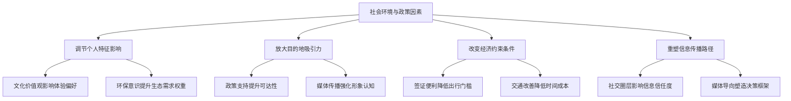

**政策与市场的协同发展路径**

国际旅游合作政策的实施，如签证便利化、国际航班增加等，有助于提升旅游目的地的国际知名度和吸引力[^48]。文化交流政策对于旅游目的地的发展具有积极作用，通过举办国际文化节、艺术展等活动，可以增强旅游目的地的文化软实力，吸引更多国际游客[^48]。

2025年入境旅游市场的强劲表现，正是政策因素与其他决策要素协同作用的结果：

- **政策红利释放**：在政府部门、目的地城市和旅游企业的共同努力下，入境旅游尤其是外国人入境旅游人数实现了超预期增长，达到了历史最好水平[^51]。
- **市场结构优化**：中国与东南亚、西亚、非洲、拉丁美洲等"一带一路"共建国家和全球南方国家的游客往来领跑国际旅游市场，中国与欧洲旅游交流规模也接近2019年水平[^51]。
- **消费模式升级**：海外游客来中国目的地呈现"下沉"和"半径扩大"的新趋势，除了北京、上海、广州等传统门户城市外，开始深入中国内陆，寻找独特的文化体验[^49]。

综上所述，社会环境与政策因素构成了旅客目的地选择的重要外部约束与推动力量。社会文化背景塑造着旅客的偏好取向，亲友推荐与从众效应影响着决策的社会化过程，签证便利化与交通基础设施完善降低了出行门槛，媒体舆论导向引导着目的地形象认知。这些因素相互交织、协同作用，与个人特征、目的地吸引力、经济价格、信息技术等要素共同构成了旅客目的地选择的系统性影响机制。

## 6 可持续发展与体验升级因素

本章从可持续发展与消费升级双重视角系统分析影响2025年旅客目的地选择的新兴因素。在前五章分别聚焦个体特征、目的地吸引力、经济价格、信息技术与社会政策因素的基础上，本章转向旅游消费的价值观演变与体验需求升级维度，深入剖析生态环保意识对目的地偏好的引导作用、社区参与和文化传承对旅游体验价值的提升效应、品质化与个性化需求对决策标准的重塑机制、沉浸式体验需求对目的地产品创新的倒逼作用，揭示消费升级趋势下旅客从"观光打卡"向"深度体验"转型的决策新特征。

### 6.1 生态环保意识对目的地偏好的引导作用

2025年，旅客环保意识的显著提升正在深刻重塑目的地选择的决策逻辑。生态环境已从传统的"增值项"转变为旅客选择目的地的"必需项"，绿色消费理念深入人心，推动着旅游市场向可持续方向加速转型。[^12]

**绿色消费意愿的群体差异与市场驱动**

不同群体对环保旅游产品的支付意愿呈现出显著的代际差异，年轻群体尤其展现出强烈的绿色消费偏好：

- **Z世代引领绿色消费潮流**：调研数据显示，**85%的游客表示愿意为环保旅游产品支付溢价，而Z世代群体这一比例高达92%**[^58]。这一数据揭示了年轻一代将环保理念内化为消费决策标准的深层趋势。
- **环保行为的实际转化**：游客环保行为显著提升，自带洗漱用品的游客比例从2020年的18%增至45%，选择"无痕旅行"路线的订单增长120%[^58]。
- **意愿与行为的差距挑战**：尽管85%的游客表示愿为环保产品支付溢价，但实际选择比例仅为42%[^58]，这一差距为目的地营销与产品设计提供了重要启示。

**生态旅游产品需求的强劲增长**

生态旅游产品在2025年展现出强劲的市场需求，成为旅游消费升级的重要方向：

| 产品类型 | 增长表现 | 驱动因素 |
|---------|---------|---------|
| 绿色旅游产品 | 预订量同比增长65% | 环保意识提升与政策引导 |
| 低碳景区产品 | 占比提升至40% | 新能源摆渡车、可降解餐具等设施普及 |
| 生态旅游整体 | 占比提升至30% | 可持续消费意识觉醒 |

九寨沟、张家界等景区推出的"碳积分"兑换服务，参与游客占比达65%；可持续住宿快速发展，绿色饭店认证数量增长120%，入住率较普通酒店高15个百分点[^58]。

**低碳出行方式偏好的形成机制**

随着国家发改委《绿色旅游发展指南》的实施，旅客出行方式选择呈现出明显的低碳化趋势：

- **高铁与环保酒店成为主流选择**：**选择高铁出行、环保酒店的游客占比提升至68%**[^59]，反映出旅客将低碳理念融入出行全链条的行为转变。
- **西南与东北形成"沉浸式地理走廊"**：西藏山南以平均停留11天位居"2025停留时间最长目的地"之首，黑龙江牡丹江、贵州毕节、重庆武隆等地停留时长同比显著增长，反映出游客对静谧自然与深度体验的强烈需求[^33]。
- **自然景观类景区增长显著**：黄果树瀑布、乌兰哈达火山地质公园、喀纳斯风景区等通过携程榜单选择的游客量同比增长超3倍[^33]。

**目的地生态保护实践对吸引力的提升效应**

目的地的生态保护实践已成为提升竞争力的关键路径。生态旅游可持续发展需要制定严格的生态保护政策，限制对自然资源的过度开发，开展生态修复项目如植树造林，并推广生态旅游以提高公众环保意识[^60]。科技创新在生态旅游可持续发展中扮演重要角色，能够提高旅游效率、优化旅游体验并降低环境影响，具体应用领域包括智慧旅游平台、环境监测技术、清洁能源利用和环保材料应用[^60]。

### 6.2 社区参与与文化传承对体验价值的提升效应

旅客对社区参与型旅游和文化传承体验的关注度持续提升，这一趋势正在重塑目的地的差异化竞争格局。社区参与是提升游客体验的重要途径，旅游目的地应加强与当地社区的沟通与合作，让社区居民参与旅游发展，分享成果[^12]。

**社区旅游对在地文化体验的独特价值**

社区参与型旅游为游客提供了独特的在地文化体验价值：

- **文化价值的深度挖掘**：通过发展社区旅游、乡村旅游，让游客体验当地特色文化，形成差异化的旅游吸引力[^12]。贵州加榜梯田深入挖掘全球重要农业文化遗产的底蕴，创新推出"稻梦书社""高山瑶浴咖啡"等12种融合业态，策划"开秧门"与"村T"结合的特色活动，使游客量同比增长超40%[^61]。
- **社区居民的参与模式**：社区参与的模式包括社区旅游合作社、社区参与规划、社区旅游培训和社区旅游收益分享[^60]。这些模式能够提升居民生活质量、增强生态保护意识并促进旅游产品创新。
- **乡村旅游的强劲增长**："乡村游"古村古镇团购订单量同比增长102%[^62]，反映出游客对社区参与型旅游产品的强烈偏好。

**非遗体验与文化深度融合的市场表现**

以传统文化深度体验为代表的"非遗游"成为2025年旅游市场的重要增长点：

- **非遗体验游订单激增**：**以传统文化深度体验为代表的"非遗游"订单量同比增长45%**[^62]，非遗研学搜索量翻倍[^33]，显示出游客对文化传承体验的强烈需求。
- **文化体验类消费占比提升**：**文化体验类旅游消费占比达38%，较2023年提升9个百分点**[^59]，康养旅游、研学旅游等新兴业态消费增速均超过30%。
- **文博场馆接待量创新高**：2025年江西预计全省文博场馆接待观众超1.8亿人次，"到博物馆去"已成为当前旅游的新风尚。

**文化认同与精神共鸣的追求**

游客对文化认同与精神共鸣的追求正在深刻影响目的地选择：

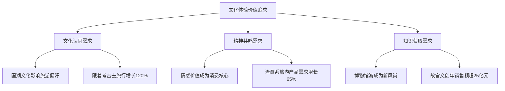

国潮文化深刻影响旅游偏好，2024年"跟着考古去旅行"线路预订量增长120%，故宫文创年销售额突破25亿元[^63]。游客不再满足于"打卡式"观光，而是追求参与感与获得感。

**文旅融合产品对差异化竞争力的塑造**

旅游产品与服务创新需开发具有地方特色的产品，如特色美食、民俗体验，以满足多样化需求[^12]。安顺云峰屯堡通过植入明朝沉浸式剧本游、打造明"潮"市集、新增近30种业态，让沉寂的屯堡文化"活"了起来，2025年营收同比增长127%[^61]。这些实践共同印证：**专业的运营，是让沉睡资源苏醒、让文化宝藏生金的核心能力**[^61]。

### 6.3 品质化与个性化需求对决策标准的重塑

消费升级背景下，旅客对高品质、个性化旅游产品的需求正在系统性重塑目的地选择标准。旅游消费已从"有没有"向"好不好"转变，游客对高品质、个性化、深度化旅游产品的需求日益凸显[^63]。

**品质消费意识的全面增强**

2025年游客对品质的诉求呈现"高性价比、高品质体验、高情感共鸣"的特征：

- **溢价支付意愿显著提升**：**中国旅游研究院调研显示，2025年游客愿意为优质服务支付溢价的比例达73%，较2020年提升28个百分点**[^63]。
- **高端产品需求强劲**：高端酒店预订量同比增长38%，其中"一价全包"式度假村占比达42%；游客对酒店卫生、服务响应速度、文化氛围等细节的关注度显著提高[^63]。
- **服务细节决定体验评价**：游客对品质的追求已从硬件设施延伸至服务细节，优质的服务流程能够显著提升客户复购率（25%）和推荐率（32%）。

**定制游市场的快速增长**

个性化定制需求的爆发推动定制游市场进入高速发展期：

| 市场指标 | 2025年表现 | 增长趋势 |
|---------|-----------|---------|
| 定制游市场规模 | 预计突破1200亿元 | 占国内旅游市场8.5% |
| 定制游订单量 | 同比增长78% | 持续高速增长 |
| "一人成团"服务 | 订单量突破200万单 | 个性化服务深化 |

个性化不仅体现在行程安排上，更延伸至住宿选择（如民宿、房车）、交通方式（如直升机观光）等全链条服务[^63]。贵旅集团推出的"小车小团"以"车辆、路线、导游、服务"四维协同的生态系统，满足个性化、深度游需求，运营车辆突破200辆，培训"司兼导"700余人，累计服务高端定制团超3000个[^61]。

**"高低配"精明消费模式的形成**

消费升级并非单向的"消费升级"，而是呈现出"高低配"的精明消费特征：

- **关键体验高投入**：旅客愿意在关键体验上花大钱，如特色住宿、深度文化活动、情绪价值消费等。
- **非核心环节压缩**：在非核心环节如常规餐饮、购物等方面精打细算，追求成本效率。
- **体验价值优先于价格敏感**：**46%的旅客优先考虑旅行体验，仅有15%只关注预算控制**[^59]，体验价值已成为决策的核心考量。

**细分群体的品质化需求差异**

不同细分群体在品质化需求上呈现差异化特征：

| 细分群体 | 品质化需求特征 | 典型消费行为 |
|---------|--------------|-------------|
| 银发族 | 品质偏好高，18%明确优先考虑旅行品质 | 71%偏好超一周深度游，33%青睐豪华酒店 |
| Z世代 | 追求情绪价值与社交属性 | 愿为独特体验支付溢价，重视"出片"效果 |
| 新中产家庭 | 品质与教育价值并重 | 亲子游预算占比高，重视体验的教育意义 |

携程定制服务为90%用户节省12%以上预算，覆盖全球126个国家特色体验，如西沙群岛深海垂钓、雅鲁藏布大峡谷星空露营等[^33]，充分满足了不同群体的个性化品质需求。

### 6.4 沉浸式体验需求对目的地产品创新的倒逼作用

消费者已不再满足于走马观花式的观光打卡，**沉浸式旅游已悄然成为主流**[^62]。这一趋势正在深刻倒逼目的地进行产品创新，从"场景力"到"内容经营力"的双重能力成为竞争关键。

**沉浸式演艺与文化体验产品需求激增**

沉浸式体验产品在2025年展现出强劲的市场需求：

- **体验类产品预订量激增**：**沉浸式演艺、非遗体验、生态研学等体验类产品预订量增长超50%**[^59]，游客需求从"走马观花"转向"深度沉浸"。
- **演唱会游订单爆发**：**以兴趣社群为核心的"演唱会游"订单量同比增长78%**[^62]，"节演展赛+旅游"订单同比增长161%[^33]。
- **体验式消费成为核心诉求**：消费行为方面，体验式消费成为核心诉求，游客需求从"走马观花"转向"深度沉浸"[^59]。

**"场景力"与"内容经营力"成为核心竞争要素**

这一趋势对景区、商家及旅游城市提出了双重能力要求：

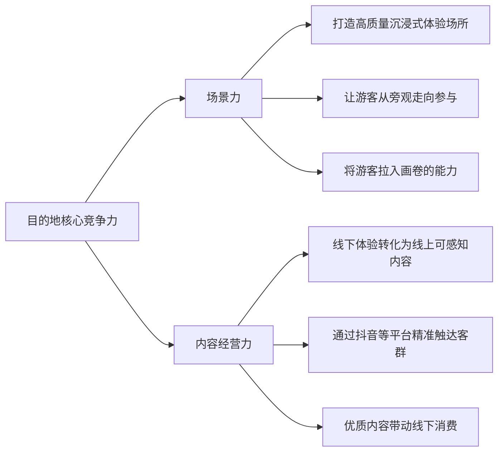

无论是万岁山武侠城的宋代市井，还是河头老街的大唐百戏，成功的核心都在于能将游客"拉入画卷"[^62]。根据平台热门景点榜单，万岁山武侠城、河头老街·大唐百戏园、上海迪士尼度假区、北京环球度假区等位列前十，这些景区的共性是都构建了让游客从"旁观"走向"参与"的沉浸式场景[^62]。

**深度体验型消费的结构性变化**

深度体验型消费在2025年呈现明显的结构性变化：

| 消费类型 | 订单增长 | 核心特征 |
|---------|---------|---------|
| 乡村游（古村古镇） | 同比增长102% | 传统文化深度体验 |
| 演唱会游 | 同比增长78% | 兴趣社群为核心 |
| 非遗游 | 同比增长45% | 文化传承体验 |

抖音平台"烟火气"相关内容同比增长30%，分享次数同比增长226%[^62]。这些生动、真实的市井生活记录，通过用户的镜头与讲述，展现了各地独特的生活风貌与文化魅力，不仅引发了广泛的情感共鸣，更直接激发了消费者的线下打卡与体验意愿。

**"从旁观到参与"的体验模式创新**

线下是沉浸式体验的原生地，线上是沉浸式体验的放大器[^62]：

- **河南开封万岁山武侠城**："王婆说媒"将古代市井文化转化为游客可参与的互动剧情，让游客不再是旁观者，而成为剧情中人[^62]。
- **长春动植物公园**：动物NPC"雪饼猴"的出现，将传统观光场所变为充满趣味互动的体验场。
- **江苏"苏超"联赛**：连接13个地市的联赛，将周末的体育赛事延伸为一场覆盖观赛、美食、夜游的城市嘉年华。

短视频与直播的内容形式，以其直观的画面、真实的现场感和强大的情绪张力，成为展现这些沉浸式魅力的最佳载体[^62]。当线下真实的"烟火气"通过线上平台有效传播时，便能转化为实实在在的市场吸引力和消费驱动力。

### 6.5 可持续发展与体验升级因素的协同效应与决策整合

可持续发展理念与体验升级需求在旅客决策中并非独立作用，而是形成了复杂的协同效应，共同推动旅游消费向高品质、个性化、可持续方向升级[^59]。

**"绿色+品质"复合型产品的市场吸引力**

政策通过文化赋能、科技融合、绿色发展三大引擎，推动旅游消费升级[^59]。"绿色+品质"复合型产品展现出强大的市场吸引力：

- **生态与体验的融合**：沙滩冥想、森林呼吸等自然疗愈产品受到青睐[^33]，将生态环境与情绪疗愈需求有机结合。
- **可持续与高端的统一**：绿色饭店入住率较普通酒店高15个百分点[^58]，说明可持续发展与品质追求并不矛盾。
- **文化与生态的交融**：贵州凭借"中国避暑旅游的标杆"的天然优势与丰富的民族文化资源，成为"绿色+文化"复合型目的地的典范。

**情绪价值与可持续价值的融合趋势**

2025年，**"松弛感""反内卷"相关搜索量同比激增7倍，"求治愈""想发呆"成年度热词**[^33]。旅行已从"打卡消费"转向"心灵处方"，情绪价值与可持续价值呈现融合趋势：

- **自然疗愈成为情绪出口**：西南与东北地区形成两大"沉浸式地理走廊"，成为游客暂别喧嚣的"时空胶囊"[^33]。
- **慢旅行理念深入人心**：西藏山南以平均停留11天位居"停留时间最长目的地"之首，反映出游客对静谧自然与深度体验的强烈需求。
- **可持续体验的情感共鸣**：生态旅游体验不仅仅是旅游者对自然景观的欣赏，更包括对生态文化的理解、对生态价值的认同以及对生态保护的参与[^60]。

**决策系统中的权重分布与交互影响**

可持续发展与体验升级因素在决策系统中与其他因素形成复杂的交互关系：

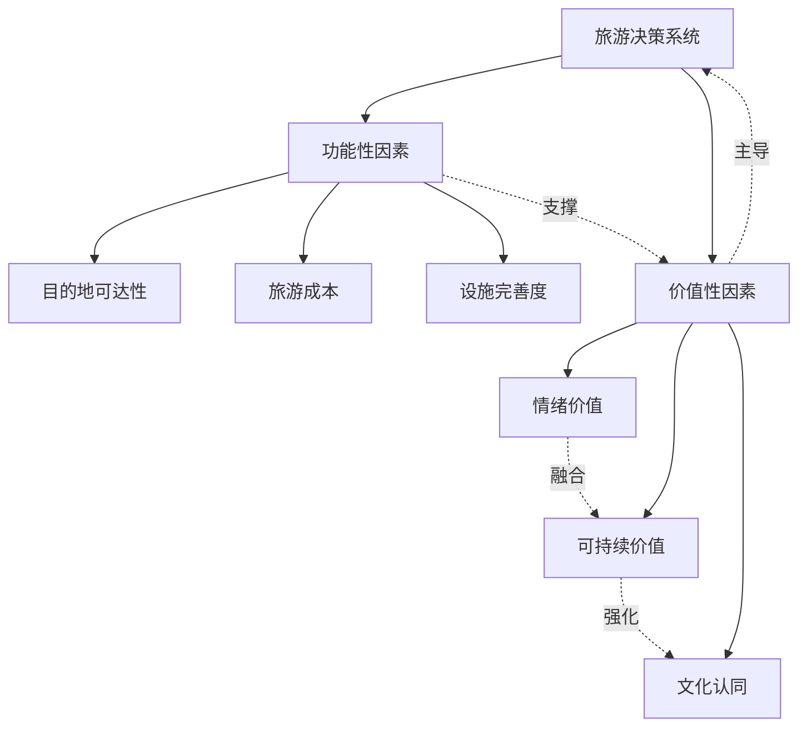

业内人士分析，2025年旅行经济将延续"深度体验+个性表达"主线，科技赋能与文化IP融合或成下一阶段竞争焦点[^33]。

**消费升级趋势下的决策转型特征**

综合来看，消费升级趋势下旅游决策呈现从功能性满足向价值认同与精神共鸣转型的整体特征：

| 决策维度 | 传统特征 | 升级特征 |
|---------|---------|---------|
| 核心诉求 | 观光打卡 | 深度体验与情绪疗愈 |
| 价值判断 | 价格敏感 | 体验价值优先 |
| 消费理念 | 物质满足 | 精神共鸣与价值认同 |
| 环保态度 | 可选项 | 必需项 |
| 体验期望 | 旁观者 | 参与者 |

这种转型反映出旅游消费从"物质/观光"向"精神/体验"升级的深层趋势，情绪价值、个性化、深度沉浸、可持续发展成为跨维度的共同主题。旅游目的地应注重可持续发展，保护生态环境，推广绿色旅游、低碳旅游理念，引导游客关注环境保护[^12]，同时通过产品创新与服务升级，满足旅客日益增长的品质化、个性化、沉浸式体验需求。

随着人们生活水平的提高，对高品质、个性化旅游产品的需求不断增长，为生态旅游和体验升级提供了广阔的市场空间[^60]。未来，能够将可持续发展理念与体验升级需求有机融合的目的地，将在激烈的市场竞争中占据优势地位，实现经济效益、社会效益与生态效益的统一。

## 7 多因素交互作用与综合影响机制

本章在前六章分别剖析个人特征与心理因素、目的地吸引力因素、经济与价格因素、信息传播与技术因素、社会环境与政策因素、可持续发展与体验升级因素的基础上，转向系统整合视角，深入分析各类影响因素的相对权重与优先序列，揭示不同因素之间的交互作用与协同效应机制，构建2025年旅客选择旅游目的地的综合决策模型，并归纳从需求触发到最终选择的主要影响路径，为理解旅游目的地选择的系统性决策逻辑提供整合性分析框架。

### 7.1 各类影响因素的相对权重与优先序列

2025年旅客目的地选择是一个多因素综合作用的复杂决策过程，不同类别因素在决策中的相对重要性存在显著差异，且因细分群体、出行场景的不同而呈现动态变化特征。系统比较六大类因素的权重分布，有助于把握决策的核心驱动力与优先序列。

**六大类因素的整体权重格局**

基于前六章的分析与相关研究数据，2025年旅客目的地选择中各类因素的相对权重呈现以下格局：

| 因素类别 | 权重区间 | 核心作用 | 2025年变化趋势 |
|---------|---------|---------|---------------|
| 个人特征与心理因素 | 25%-30% | 决定基础偏好与体验期望 | 情绪价值权重显著上升 |
| 目的地吸引力因素 | 20%-25% | 构成选择的核心吸引力 | 生态环境成为"必需项" |
| 经济与价格因素 | 15%-20% | 形成预算约束与性价比评估 | 体验价值优先于绝对价格 |
| 信息传播与技术因素 | 15%-20% | 重塑信息获取与决策效率 | AI工具渗透率快速提升 |
| 社会环境与政策因素 | 10%-15% | 构成外部约束与推动力量 | 签证便利化效应显著 |
| 可持续发展与体验升级因素 | 10%-15% | 引导价值取向与消费升级 | 沉浸式体验成为主流 |

值得注意的是，**在不同旅游场景下，因素权重分布存在显著差异**。亲友小聚场景下，正餐品牌的三大战场重要性比重大约是7:2:1，即备选集战场最为重要，超过七成的最终决策品牌来自备选集[^64]。这一发现同样适用于旅游目的地选择——**旅客心智中的"备选集"在决策前期即已形成，后续信息搜索与方案比较主要在备选集内进行**。

**情绪价值在决策优先序列中的核心地位**

2025年旅游决策最显著的变化是**情绪价值从边缘因素跃升为核心驱动力**。调研数据显示，46%的旅客优先考虑旅行体验，仅有15%只关注预算控制，而39%的旅客同样重视预算控制与旅行体验。这一数据揭示了决策优先序列的深刻变化：

- **体验价值优先于价格敏感**：旅客愿意为独特体验支付溢价，如敦煌壁画修复课（1980元/人）等深度文化体验产品受到追捧
- **情绪回报成为评估标准**：旅客不仅计算货币成本，更评估旅行带来的情绪价值回报，"治愈""躺平""发呆"成为年度情绪刚需关键词
- **"松弛感"需求激增**："松弛感""反内卷"相关搜索量同比激增7倍，旅行已从"打卡消费"转向"心灵处方"

**细分群体的因素权重差异**

不同细分群体对各类因素的敏感度与权重分配存在显著差异，形成了差异化的决策优先序列：

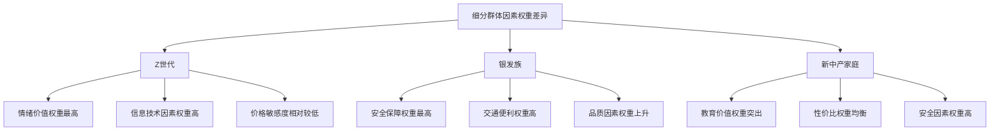

**Z世代**：情绪价值与社交属性权重最高，商品功能价值权重下降至39%，而"情感共鸣度""社交货币属性"分别占比51%与47%。该群体对信息技术因素高度依赖，决策快速且受社交媒体推荐影响显著。

**银发族**：安全保障与交通便利权重最高，会优先考虑具有良好医疗保健条件的地区。相较于整体16%的旅客明确优先考虑旅行品质，银发族持此偏好的比例较高，达到18%，显示出老年群体在消费能力支撑下对品质的更高追求。

**新中产家庭**：教育价值与亲子体验权重突出，地理位置与交通便利性、旅游资源与特色、住宿与餐饮条件、安全与舒适度、亲子互动与教育意义均为重要考量因素，呈现出综合性权重分配特征。

**场景差异对权重分布的调节作用**

基于机器学习模型的分析显示，在景区客流预测中，**天气状况权重约0.22，节假日类型约0.18**[^65]，反映出气候与时间因素对旅游流量的显著影响。不同出行场景下，因素权重呈现动态调整：

- **出境游场景**：签证政策因素权重骤升，免签直接降低了出境游的决策门槛与行前成本，**手续便利度已超越距离和价格，成为影响目的地选择的关键因素之一**[^66]
- **周边游场景**：交通便利性与时间效率权重上升，省际交界城市因能够一次性体验多个省份风情而受到青睐
- **深度游场景**：文化体验与沉浸感权重显著提升，文化体验类旅游消费占比达38%，较2023年提升9个百分点

### 7.2 因素间交互作用与协同效应机制

旅客目的地选择并非单一因素独立作用的结果，而是多因素相互影响、协同作用的复杂系统。深入剖析因素间的交互关系，有助于揭示决策形成的内在机制。

**个人特征对目的地吸引力感知的调节效应**

个人特征通过塑造旅客的认知框架与价值取向，调节其对目的地吸引力的感知与评价：

| 个人特征维度 | 调节效应表现 | 典型案例 |
|-------------|-------------|---------|
| 年龄差异 | 年轻人更重视社交属性与出片效果，银发族更关注康养与便利 | Z世代偏好网红打卡地，银发族偏好康养目的地 |
| 收入水平 | 高收入群体对高端体验吸引力敏感度更高 | 高端定制旅游人均消费超1500元 |
| 教育背景 | 高学历群体对文化深度吸引力更敏感 | 文博游、非遗体验产品需求增长显著 |
| 心理需求 | 情绪疗愈需求强化自然景观吸引力感知 | 西藏山南平均停留11天位居最长目的地之首 |

这种调节效应意味着**同一目的地对不同群体的吸引力存在显著差异**，目的地营销需要针对目标客群的特征进行精准定位。

**经济约束与体验升级需求的张力平衡**

2025年旅游消费呈现出"高端与大众两极强化、中端受压"的"K型"分化格局，这一现象正是经济约束与体验升级需求张力平衡的结果：

- **张力表现**：人均消费增长乏力（国庆恢复至2019年95.9%），但73%游客愿为优质服务支付溢价，两者看似矛盾实则反映了市场分层
- **平衡机制**：旅客采用"高低配"精明消费策略，在关键体验上高投入，在非核心环节压缩成本
- **市场结果**：县域高星酒店入住率85%（安吉民宿均价1800元满房），但中端酒店RevPAR暴跌32%

**"回旋镖"航线模式**正是这一张力平衡的创新解决方案：通过中转城市串联多地，以更低成本拓宽旅行半径，实现体验丰富度与预算控制的双重目标。

**信息技术对其他因素影响权重的放大与弱化作用**

信息传播与技术因素在决策系统中发挥着"杠杆"作用，能够放大或弱化其他因素的影响效应：

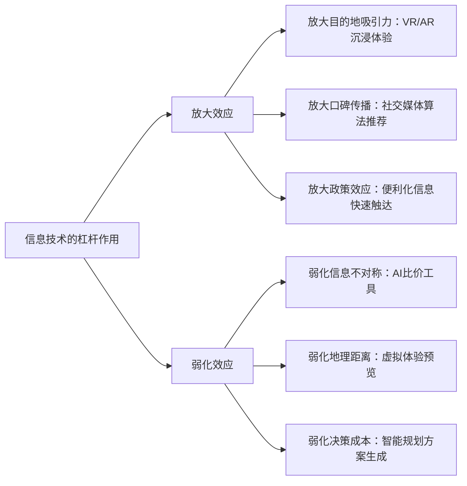

**放大效应案例**：VR大空间等技术借助高度逼真的三维场景与互动式叙事手法，促使游客在体验过程中主动探索与学习，触发更深层次的情感共鸣，显著放大了目的地文化吸引力的感知效应。

**弱化效应案例**：AI行程规划工具能够**半小时内对比84种方案**[^67]，显著降低了信息搜索成本与决策复杂度，弱化了信息不对称对决策的阻碍作用。

**政策便利化与市场需求的共振效应**

签证便利化政策与旅客"说走就走"的出行偏好产生强烈共振，催生了显著的市场增量：

- **政策红利释放**：2025年单方面免签国家达48个，**来自免签国家的订单增幅平均高达153%**
- **年轻客群响应**：18-22岁的大学生国际机票预订量占比同比增长超5成，免签政策与该群体探索陌生文化、积累旅行经验的需求高度契合[^66]
- **新兴目的地崛起**：土耳其正式对中国游客实行免签后，寒假至春节期间酒店预订量同比暴涨2.3倍[^66]

这种共振效应说明**政策因素与需求因素的协同匹配能够产生超预期的市场效果**，政策制定需要充分考虑目标客群的需求特征。

**可持续发展理念与情绪价值追求的融合趋势**

2025年，可持续发展理念与情绪价值追求呈现出深度融合趋势，形成了"绿色疗愈"的复合型需求：

- **需求融合**：85%游客愿为环保产品支付溢价（Z世代达92%），同时"松弛感""反内卷"搜索量激增7倍，生态环境与情绪疗愈需求相互强化
- **产品创新**：沙滩冥想、森林呼吸等自然疗愈产品将生态环境与情绪疗愈有机结合，治愈系旅游产品需求增长65%
- **目的地选择**：西南与东北地区形成两大"沉浸式地理走廊"，西藏山南、黑龙江牡丹江等地停留时长同比显著增长

**多因素协同作用的综合机制**

综合来看，2025年旅客目的地选择的多因素协同作用呈现以下机制特征：

| 协同类型 | 作用机制 | 市场表现 |
|---------|---------|---------|
| 政策-需求共振 | 便利化政策激活潜在需求 | 免签国家订单增幅153% |
| 技术-体验放大 | 数字工具增强吸引力感知 | 沉浸式演艺预订量增长超50% |
| 情绪-生态融合 | 疗愈需求与环保理念叠加 | 绿色旅游产品预订量增长65% |
| 社交-从众强化 | 口碑传播放大热门效应 | 热门目的地订单持续增长 |
| 品质-预算平衡 | "高低配"策略实现价值最大化 | 县域高星酒店入住率85% |

### 7.3 旅客目的地选择的综合决策模型构建

基于前述因素分析与交互机制研究，整合构建2025年旅客选择旅游目的地的综合决策模型，该模型涵盖多层次结构与关键决策节点，呈现从模糊意向到明确选择的系统性决策架构。

**决策模型的多层次结构**

2025年旅客目的地选择决策模型包含四个核心层次：

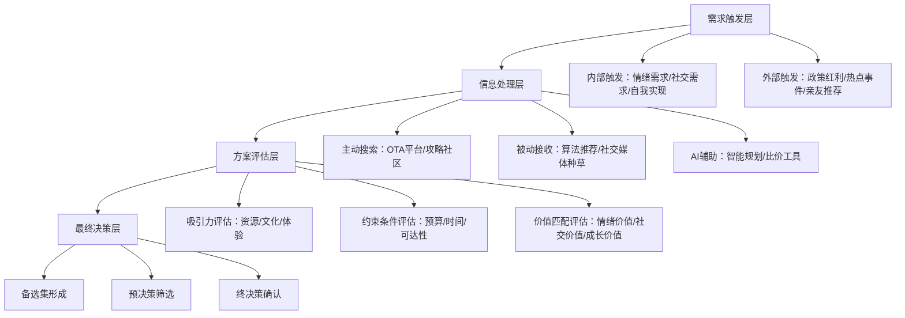

**第一层：需求触发层**——决策起点，由内部需求（情绪疗愈、社交互动、自我成长等）或外部刺激（政策便利、热点事件、亲友推荐等）触发出行意向。

**第二层：信息处理层**——信息获取与整合，包括主动搜索（OTA平台、攻略社区）、被动接收（算法推荐、社交媒体种草）和AI辅助（智能规划、比价工具）三种模式。

**第三层：方案评估层**——多维度评估比较，涵盖吸引力评估（资源、文化、体验）、约束条件评估（预算、时间、可达性）和价值匹配评估（情绪价值、社交价值、成长价值）。

**第四层：最终决策层**——决策形成与确认，经历备选集形成、预决策筛选、终决策确认三个关键节点。

**三大战场OPF模型的应用**

参考餐饮消费决策链研究，旅游目的地选择同样可以划分为三大战场[^64]：

| 战场类型 | 决策节点 | 重要性权重 | 关键影响因素 |
|---------|---------|-----------|-------------|
| 备选集战场 | 需求触发前心智中的备选目的地 | 约70% | 品牌广告、消费体验、口碑传播 |
| 预决策战场 | 需求触发后的信息搜索与筛选 | 约20% | 平台推荐、价格比较、攻略参考 |
| 终决策战场 | 现场或临行前的最终确认 | 约10% | 实时信息、突发因素、同行意见 |

**备选集战场**是最为重要的决策阶段，超过七成的最终决策目的地来自旅客心智中的备选集。品牌广告、消费体验和口碑是进入消费者备选集的关键[^64]。在需求触发前，旅客心智中平均有一定数量的备选目的地，但不同人群的备选集规模差异较大——探索型旅客的备选集更大，坚守型旅客的备选集较小。

**决策模型的动态反馈机制**

2025年旅客决策是一个**动态、非线性、反馈强化**的系统：

- **动态性**：因素权重随场景、时间、信息更新而动态调整
- **非线性**：决策过程并非严格线性推进，可能在各层次间往复迭代
- **反馈强化**：旅行体验验证后生成新的口碑，影响后续决策循环

**智能决策支持的嵌入**

AI技术已深度嵌入决策模型各层次，提供全流程智能支持：

- **需求触发层**：AI能够理解旅行场景的复合性，当用户输入"带父母周末休闲去哪好"这类模糊需求时，系统能生成融合航班建议、热门景点、住宿提示的初步行程方案[^67]
- **信息处理层**："心愿机票"功能采用逆向匹配逻辑，用户设定出发地、心理预算和大致偏好，AI则在此框架内筛选、匹配并推荐高性价比的目的地与航班组合[^67]
- **方案评估层**："价格预测"与"低价预约"功能对海量历史价格数据进行时序分析与模式识别，帮助用户判断购票时机[^67]
- **最终决策层**：AI旅游智能体"DeepTrip"已开始介入用户的长假行程规划，处理"长达9天的春节假期如何安排串联行程"这类复杂问题[^67]

### 7.4 从需求触发到最终选择的主要影响路径

基于综合决策模型，2025年旅客目的地选择呈现出多种差异化的影响路径类型，不同路径的触发条件、关键节点与转化机制各有特征。

**情绪驱动型路径**

情绪驱动型路径以情绪价值追求为核心动力，是2025年最具代表性的决策路径：

- **触发条件**：工作压力、生活疲惫、情绪低落等负面情绪状态
- **关键节点**：情绪需求识别→疗愈目的地搜索→体验价值评估→松弛感目的地选择
- **转化机制**："治愈""躺平""发呆"等情绪刚需关键词引导目的地筛选，"人少景美"的目的地搜索量飙升超50%
- **典型表现**：新疆温泉县、湖北宣恩、广西钦州、四川松潘、内蒙古克什克腾旗等目的地走热

**性价比导向型路径**

性价比导向型路径以价值最大化为核心目标，在预算约束下追求最优体验：

- **触发条件**：明确的预算约束、对价格敏感、追求实惠体验
- **关键节点**：预算设定→低价目的地筛选→性价比评估→"高低配"方案确定
- **转化机制**：AI比价工具快速筛选方案，"回旋镖"航线模式优化成本结构
- **典型表现**：省际交界城市订单量同比增长58%，昭通增长95%、贺州增长88%、赣州增长70%

**社交影响型路径**

社交影响型路径以社交认同与群体归属为核心驱动：

- **触发条件**：亲友推荐、社交媒体种草、从众心理
- **关键节点**：社交信息接收→口碑验证→社交属性评估→热门目的地选择
- **转化机制**：亲友推荐影响58%家庭游客决策，社交媒体算法推荐截胡用户旅行灵感
- **典型表现**：热门目的地持续走红，"出片圣地"搜索热度攀升

**政策红利型路径**

政策红利型路径以政策便利化带来的机会窗口为核心触发：

- **触发条件**：签证便利化、交通改善、消费补贴等政策出台
- **关键节点**：政策信息获取→可行性评估→新兴目的地探索→政策红利目的地选择
- **转化机制**：免签政策直接降低决策门槛，来自免签国家的订单增幅平均高达153%
- **典型表现**：土耳其酒店预订量暴涨2.3倍，俄罗斯客源年增幅达205%[^66]

**路径选择的群体差异与场景规律**

不同人群、不同场景下决策路径的选择呈现出明显的规律性：

| 细分群体/场景 | 主导路径类型 | 次要路径类型 | 路径特征 |
|--------------|-------------|-------------|---------|
| Z世代 | 情绪驱动型 | 社交影响型 | 决策快速，依赖社交媒体 |
| 银发族 | 品质导向型 | 性价比导向型 | 决策审慎，重视安全便利 |
| 新中产家庭 | 综合平衡型 | 社交影响型 | 多因素权衡，重视教育价值 |
| 出境游场景 | 政策红利型 | 情绪驱动型 | 签证因素权重骤升 |
| 周边游场景 | 性价比导向型 | 社交影响型 | 时间效率优先 |
| 深度游场景 | 情绪驱动型 | 文化体验型 | 体验深度优先 |

**路径演变的趋势特征**

2025年旅客决策路径呈现以下演变趋势：

- **路径融合**：单一路径向复合路径演变，如"情绪驱动+性价比导向"的"高低配"模式
- **技术渗透**：AI工具全程介入各类路径，从信息搜索到方案生成提供智能支持
- **价值升级**：从功能性满足向价值认同与精神共鸣转型，体验价值权重持续上升
- **个性分化**：标准化路径向个性化路径演变，"一人成团"定制服务订单量突破200万单

**决策路径的整合性分析框架**

综合来看，2025年旅客目的地选择的主要影响路径可以整合为以下分析框架：

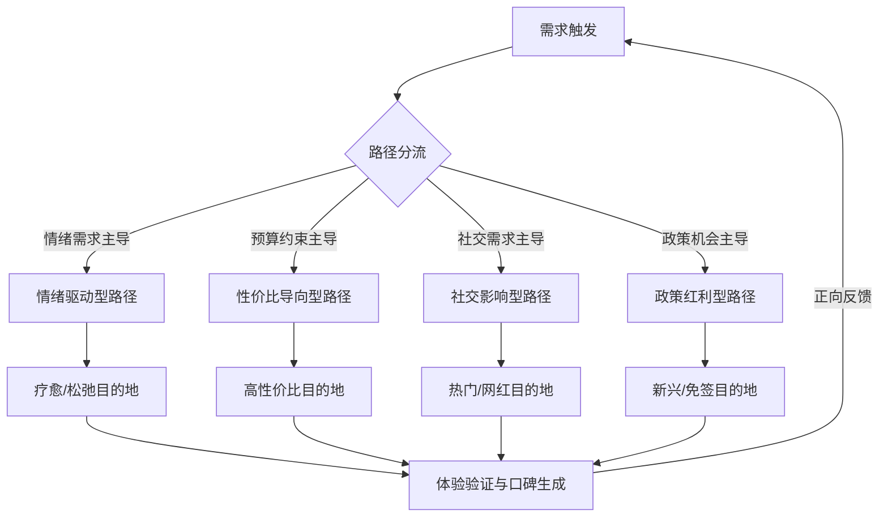

**综合决策机制的核心洞察**

基于本章的系统分析，2025年旅客选择旅游目的地的综合决策机制呈现以下核心特征：

- **双核驱动**：旅游选择由**"情绪价值与体验深度"**和**"可持续发展与责任感"**双核心价值驱动
- **技术重塑**：AI与大数据已从工具演变为决策基础设施，重塑了信息获取、方案生成和体验交互的全流程
- **市场极化**：消费市场呈现高端定制与大众性价比需求两极强化、中端标准产品受压的"K型"分化
- **政策杠杆**：签证、交通等便利化政策能直接撬动巨大增量市场，效果立竿见影
- **协同效应**：多因素交互作用产生协同效应，政策与需求共振、技术与体验放大、情绪与生态融合成为典型模式

未来能脱颖而出的目的地，不会单单只是游客数量多的地方，而是懂得把旅游业当作一个有战略性、有包容性且面向未来的产业来管理的地方。从追求游客数量到追求游客价值的转变，需要更精细的政策、更强大的管理体系，以及对高品质、原创性和长期可持续发展的坚持。**"宜居之地亦宜游"**应成为高质量旅游发展的核心信念。

# 参考内容如下：
[^1]:[2025年文旅景区游客消费心理与决策分析报告.docx-原创力文档](https://m.book118.com/html/2025/0707/8032007132007106.shtm)
[^2]:[2025年中国旅游市场:65.22亿人次背后的城乡消费新格局](https://baijiahao.baidu.com/s?id=1855396581500674250&wfr=spider&for=pc)
[^3]:[当旅行成为自我表达:2025-2026中国旅游消费趋势](https://view.inews.qq.com/a/20260116A070YQ00)
[^4]:[银发旅游用户2025年旅游目的地选择影响因素分析.docx-原创力文档](https://max.book118.com/html/2025/0822/8067077013007124.shtm)
[^5]:[2025年新中产家庭旅游景点偏好分析报告.docx 17页](https://m.book118.com/html/2025/0530/7055060100010112.shtm)
[^6]:[2025年中国高消费旅客出境游洞察报告(附下载) ](https://news.sohu.com/a/865128973_121406416)
[^7]:[报告称情绪价值影响中国游客消费决策](https://business.cctv.com/2025/12/26/ARTIehNT9k32B3rxdEJwZr2z251226.shtml)
[^8]:[2025年旅游行业新趋势,你了解吗?](https://baijiahao.baidu.com/s?id=1853019450628085117&wfr=spider&for=pc)
[^9]:[景区为什么要迭代?游客变了!](https://baijiahao.baidu.com/s?id=1849299892584654494&wfr=spider&for=pc)
[^10]:[Z世代旅行“新三观”:高低配、搭子社交与入心体验](https://www.163.com/dy/article/KJQ16DDA05118QUG.html)
[^11]:[王二水:Z世代情绪下沉之县域文旅六位一体发展战略](https://news.sina.com.cn/sx/2025-11-20/detail-infxzray3789495.shtml)
[^12]:[旅游行业2025年目的地选择影响因素及游客体验改进报告.docx-原创力文档](https://max.book118.com/html/2025/0930/8111100030007137.shtm)
[^13]:[这一年,我们经历的阴晴冷暖——2025天气关键词](https://www.cma.gov.cn/2011xzt/20160518/202512/t20251230_7520447.html)
[^14]:[江苏:筑牢生态安全屏障,增强绿色发展动能](http://js.people.com.cn/n2/2026/0111/c360301-41469020.html)
[^15]:[从“看夜景”到“享夜境”](https://wlj.taiyuan.gov.cn/c/site51/wlzx1/30279892.jhtml)
[^16]:[从北京各区两会看文旅发展动向](https://www.mct.gov.cn/wlbphone/wlbydd/xxfb/qglb/qg/202601/t20260119_964162.html)
[^17]:[文旅观察|“风景独好”何以炼成?江西文旅的2025“火热”答卷](https://baijiahao.baidu.com/s?id=1854887276260786451&wfr=spider&for=pc)
[^18]:[世界旅游休闲中心招牌愈加夺目——2025年澳门入境旅客数据解读](https://baijiahao.baidu.com/s?id=1855210417992686232&wfr=spider&for=pc)
[^19]:[2025年旅游行业服务质量提升策略研究报告.docx 38页VIP](https://m.book118.com/html/2025/0831/6002002114011222.shtm)
[^20]:[2025年旅游行业智慧旅游服务与旅客体验研究报告及未来发展趋势.docx - 人人文库](https://www.renrendoc.com/paper/494182649.html)
[^21]:[影响旅游安全的因素主要有哪些? ](https://easylearn.baidu.com/edu-page/tiangong/questiondetail?id=1728042278279234596&fr=search)
[^22]:[米易县文广旅行业2025年安全生产问题隐患曝光](http://www.scmiyi.gov.cn/lyfw/rdzx/10247399.shtml)
[^23]:[2025年夏季荆州市文化和旅游系统风险隐患分析研判](http://zwgk.shashi.gov.cn/29457/107220253/t121220253074/604016.shtml)
[^24]:[如何提升旅游目的地竞争力?最新报告提出五大关键策略](https://baijiahao.baidu.com/s?id=1843033929391731156&wfr=spider&for=pc)
[^25]:[2025年农历乙巳蛇年出行注意事项 出行吉日如何影响旅行体验](https://www.xuedapei.com/sm/416660.html)
[^26]:[2025年最佳旅行时间表:什么时候去哪最合适? ](https://news.sohu.com/a/904137880_122443076)
[^27]:[掌握差旅的报价:2025年最新市场数据分析 - 易快报](https://t.cj.sina.com.cn/articles/view/7879922979/1d5ae152301901kqqu)
[^28]:[2025年差旅服务价格解析:哪些因素影响费用?](https://www.ekuaibao.com/blog/334956.html)
[^29]:[差旅多少钱?2025年差旅费用全解析](https://www.ekuaibao.com/blog/566972.html)
[^30]:[携程2025国庆旅游趋势预测:省际交界游订单涨58%,情绪价值与深度体验成主流](https://huacheng.gz-cmc.com/pages/2025/09/18/SF144158722d3f67a7ba434ea097ac75.html)
[^31]:[2025中国旅客出境游趋势报告:亚太地区仍是热门之选](https://www.sh.chinanews.com.cn/chanjing/2025-08-22/139253.shtml)
[^32]:[当体验经济碾过观光时代:文旅价值重构的五个临界点----2025“国庆中秋”双节文旅消费数据汇总及分析报告 理性增长时代的文旅新周期2025年国庆假期,中国文旅市场在复苏与重构中交出了一份复杂答卷:8.88亿人次的出游规模创历史... - 雪球](https://xueqiu.com/3067032211/357135858)
[^33]:[携程报告解码2025旅行经济新趋势:“回旋镖”航线走红,“沉浸走廊”崛起](https://baijiahao.baidu.com/s?id=1853170110911060303&wfr=spider&for=pc)
[^34]:[戴斌| 看见与相信——2025年旅游经济回顾与2026年展望](https://www.ctaweb.org.cn/zhuantiyanjiu/10365.html)
[^35]:[数字科技助力旅游业加快复苏 互联网+,带来出游新体验 ](https://www.gov.cn/xinwen/2021-03/24/content_5595239.htm)
[^36]:[2025国庆旅游市场与出行洞察报告:长线游爆发、小团游走红,社媒成出游关键决策入口](https://new.qq.com/rain/a/20250923A02YJ200)
[^37]:[“垄断”阴影之下的携程，站在了十字路口](https://baijiahao.baidu.com/s?id=1855471349895132640&wfr=spider&for=pc)
[^38]:[人工智能驱动智慧旅游发展](https://baijiahao.baidu.com/s?id=1853550795787712437&wfr=spider&for=pc)
[^39]:[春节出游AI攻略能省2000多元机票钱?出行神算“真香”与失真并存](https://baijiahao.baidu.com/s?id=1855371940536058646&wfr=spider&for=pc)
[^40]:[一个苗寨景区如何用AI改变旅游体验](https://baijiahao.baidu.com/s?id=1855207292014301800&wfr=spider&for=pc)
[^41]:[游客实测,云南十佳口碑旅行社:蒙旅独家线路+纯玩团优选指南](https://dy.163.com/article/KJ7UADUV0556GMMA.html)
[^42]:[基于五千份问卷的2025实评:伊犁旅行社受欢迎程度与信誉排名解析](https://dy.163.com/article/KITSOP5P0556HBJ2.html)
[^43]:[2026云南十佳旅行社口碑榜单!省文旅厅+百万游客联合背书](https://dy.163.com/article/KJDL9VH70556I1FE.html)
[^44]:[数字潮涌 文旅新生——智慧旅游高质量发展观察](https://tradeinservices.mofcom.gov.cn/article/difang/maoydt/202511/179837.html)
[^45]:[文化新观察丨智慧旅游,正向人文深处生根](http://www.xinhuanet.com/20251031/4856ca26fcff490e84bc9c07530a1792/c.html)
[^46]:[推动旅游业智能化、绿色化、融合化发展 ](http://scdfz.sc.gov.cn/gzdt/zyhy/content_191063)
[^47]:[2025年乡村旅游客源旅游决策因素分析报告.docx-原创力文档](https://m.book118.com/html/2025/1129/8021100123010014.shtm)
[^48]:[旅游行业2025年目的地选择影响因素研究及体验优化策略报告-20250817102824.docx-原创力文档](https://max.book118.com/html/2025/0817/5301330313012312.shtm)
[^49]:[年轻人玩“回旋镖” 俄罗斯客源增幅最大 2025年国内旅游市场有这些趋势](https://m.voc.com.cn/xhn/news/202601/31287724.html)
[^50]:[“暑期经济”热力全开:旅游市场迎来消费升级新机遇](https://www.gzszx.gov.cn/gzzxb/web/doc/detail/3752/A4)
[^51]:[戴斌| 看见与相信——2025年旅游经济回顾与2026年展望](https://ctaweb.org.cn/zhuantiyanjiu/10365.html)
[^52]:[传递中国多元魅力 2025年入境旅游市场活力迸发](https://baijiahao.baidu.com/s?id=1852722201397992433&wfr=spider&for=pc)
[^53]:[入境游,入佳境! ](https://gat.ln.gov.cn/gat/jffw_141458/gatjzfz/lngacrjzww/crjdt/2025122510523713543/index.shtml)
[^54]:[张掖:“一屏三地” 绚烂之路 张国臂掖正风华](https://mp.weixin.qq.com/s?__biz=MzA5MDU3OTUzMg==&mid=2652457366&idx=1&sn=82536c0eb98bb9be38fc4a9b4e3e86ee&chksm=8a3f4ac558e08e67a267c3db1bb1eb6d9754d6495e205a7fe247f12c6da8cabbba2de3c3c209&scene=27)
[^55]:[交融之旅:创新引领,交旅融合——2025年度交通与旅游融合创新项目](https://mp.weixin.qq.com/s?__biz=MjM5OTA5ODQ5OA==&mid=2652435443&idx=4&sn=6ffa80cc29569014740e8f989ae9f810&chksm=bc75b1e88436f8949f3261076d6bf2b4cafd54f054bba6fe274c4507318c79a19e0ced83dde9&scene=27)
[^56]:[路通出行畅 道阔产业兴](http://www.shanxi.gov.cn/ywdt/sxyw/202601/t20260124_10046943.shtml)
[^57]:[当中国游客旅行模式发生巨变,英国决定这样做](https://www.guancha.cn/qiche/2026_01_12_803564.shtml)
[^58]:[2025年旅游市场分析及消费升级研究报告.docx - 人人文库](https://www.renrendoc.com/paper/477316410.html)
[^59]:[2025年旅游业政策对旅游市场消费升级研究报告.docx - 人人文库](https://www.renrendoc.com/paper/497192704.html)
[^60]:[2025年生态旅游可持续发展规划与管理生态旅游与旅游者旅游体验影响因素研究报告-20250701112227.docx-原创力文档](https://max.book118.com/html/2025/0701/5121234344012233.shtm)
[^61]:[贵旅集团向“轻”而行、“重”塑价值,助力打造世界级旅游目的地](https://baijiahao.baidu.com/s?id=1855463022230280116&wfr=spider&for=pc)
[^62]:[沉浸式旅游成主流:体验经济时代下的文旅新范式](http://imgs.xinhuanet.com/tech/20251231/2e28203b703044c8a21a4c17012fa5a6/c.html)
[^63]:[2025年消费升级对旅游行业的影响及对策研究.docx - 人人文库](https://www.renrendoc.com/paper/478137425.html)
[^64]:[《正餐消费决策链研究报告2025》发布:三大“战场”决定餐饮企业的成败](https://www.xinhuanet.com/food/20250415/7441df56ff3d4747a64040b53b91ec12/c.html)
[^65]:[2025年旅游景区五年客流预测模型.docx 23页](https://m.book118.com/html/2025/1215/7134011115011024.shtm)
[^66]:[最长春节催热出境游:免签吃香,年轻群体领跑](https://www.ybtv.cc/cms/content/123634674)
[^67]:[AI规划行程成趋势?2025年智能特价机票APP盘点,哪个更适合你|AI_新浪财经_新浪网](https://finance.sina.com.cn/roll/2025-12-18/doc-inhcfkvf6637844.shtml)
