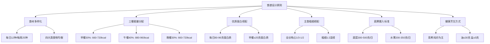
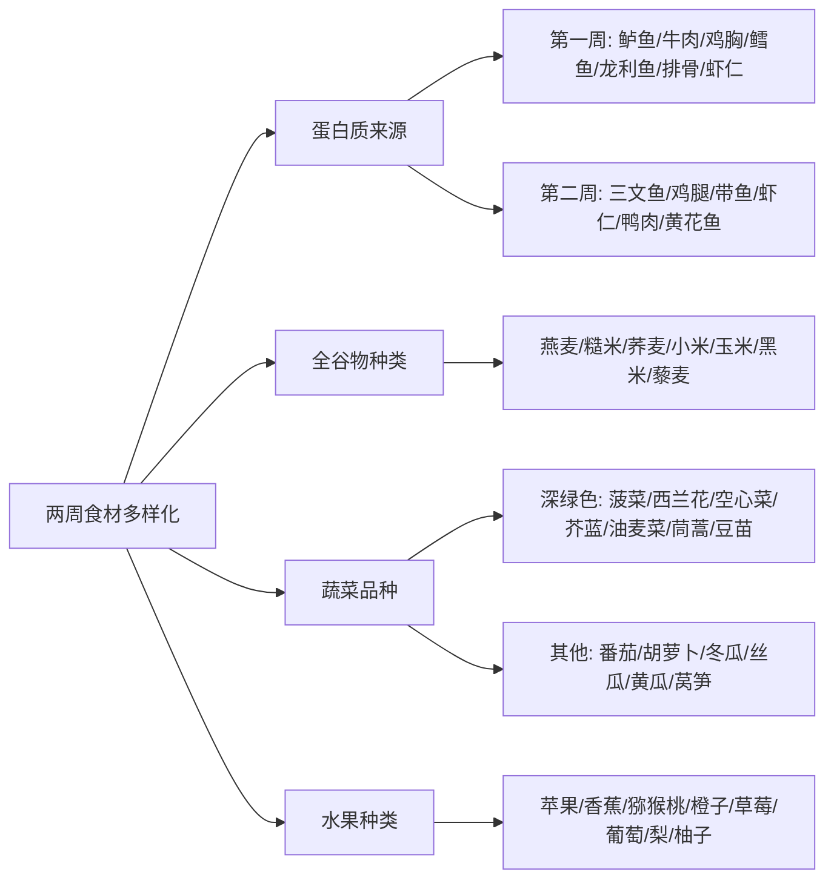
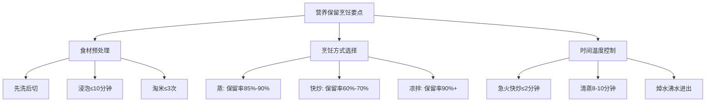
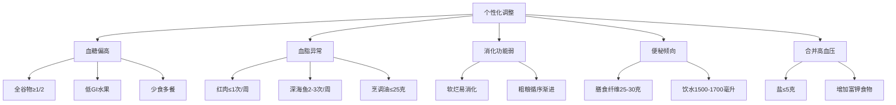

# 53岁成年人两周科学健康食谱方案
## 1 目标人群营养需求分析

本章节针对53岁成年人的生理特点与健康需求，系统分析其每日营养摄入标准，为两周科学健康食谱的设计提供量化依据。53岁处于中年阶段，身体代谢能力逐步下降，肌肉流失加速，骨密度开始降低，同时心血管疾病、糖尿病等慢性病风险上升[^1]。因此，科学的营养规划不仅要满足基本能量需求，更需关注营养素的质量与配比，以维持机体功能、延缓衰老、预防慢性疾病。

### 1.1 每日热量摄入标准

**热量是维持生命活动的基础能量来源**，合理控制每日热量摄入是体重管理和健康维护的关键。对于体重80公斤的53岁男性，其每日热量需求需综合考虑基础代谢率、体力活动水平及食物热效应三个主要因素[^2]。

**基础代谢率的计算**是确定热量需求的核心起点。根据经典的Harris-Benedict公式，男性24小时基础能量消耗（BEE）的计算公式为：BEE(kcal/24h) = 66.5 + 13.8×体重(kg) + 5.0×身高(cm) - 6.8×年龄(岁)[^2]。以身高170cm、体重80kg、年龄53岁为例计算，基础代谢率约为1600-1700千卡/天。这一数值代表在完全静息状态下维持体温、心跳、呼吸等基本生命活动所需的最低能量消耗[^2]。

**体力活动水平直接影响总热量消耗**。根据世界卫生组织的身体活动水平分级，轻体力劳动者（如办公室工作者、教师）男性的活动系数为1.55，中体力劳动者（如驾驶员、电工）为1.78[^3]。将基础代谢率乘以相应活动系数，即可得出每日总能量消耗量。对于从事轻至中等体力活动的80公斤男性，每日总热量消耗约在**2200-2600千卡**之间[^4]。

此外，**食物特殊动力作用**（也称食物热效应）也是能量消耗的组成部分，指摄食引起的额外能量消耗，一般混合膳食约占基础代谢的10%，每日约150千卡[^2]。

综合以上因素，为53岁、80公斤、中等活动水平的中年男性设定的**每日热量摄入目标为2200-2400千卡**较为适宜。这一范围既能满足日常能量需求，又可避免因热量过剩导致的体重增加和代谢负担。中老年人由于基础代谢率下降、活动量减少，热量需求相应降低，因此更应注重热量的合理控制而非单纯追求"吃饱"[^5][^6]。

| 热量需求组成 | 估算数值 | 说明 |
|:---:|:---:|:---|
| 基础代谢率 | 1600-1700 kcal | 维持基本生命活动所需 |
| 体力活动消耗 | 500-800 kcal | 根据活动水平调整 |
| 食物热效应 | 约150 kcal | 消化吸收过程消耗 |
| **每日总热量目标** | **2200-2400 kcal** | 中等活动水平推荐值 |

### 1.2 三大宏量营养素配比

**蛋白质、碳水化合物和脂肪是人体能量的三大来源**，其合理配比直接关系到能量供给的稳定性和身体机能的维持。根据中国营养学会推荐，健康成年人三大产能营养素的合理供能比例为：碳水化合物55%-65%、脂肪20%-30%、蛋白质10%-15%[^7]。

**碳水化合物是最主要、最经济的能量来源**，应占总热量的55%-65%[^8][^9]。按每日2300千卡计算，碳水化合物供能约1265-1495千卡，折合约316-374克。碳水化合物能维持脑细胞正常功能、调节细胞活动，是生物体维持生命活动最直接的能量供应来源[^8]。**建议优先选择低血糖指数的食物来源**，如全谷物（燕麦、糙米、全麦面包）、豆类、蔬菜等，避免精制糖和高糖食品，这有助于控制血糖和体重[^5]。每日主食中全谷物杂粮应占1/3-1/2，薯类如红薯、马铃薯也可作为主食的一部分[^10]。

**蛋白质是维持肌肉质量和免疫功能的关键营养素**。53岁人群面临肌肉流失加速的生理挑战——从50岁开始，肌肉量每年流失1%-2%，70岁后加速到每年3%-5%[^6]。同时，60岁以上人群对蛋白质的吸收利用率比年轻人低20%-30%[^6]。因此，中年人群的蛋白质需求不降反升。**建议每日每公斤体重摄入1.0-1.2克蛋白质**[^11][^6]，对于80公斤体重者即每日80-96克。蛋白质供能应占总热量的10%-15%[^5][^7]。

优质蛋白质来源应优先选择：
- **动物性蛋白**：鸡蛋（每100克含蛋白质约13克）、鱼类（约15%-22%）、鸡胸肉（约24克/100克）、瘦牛肉（约20%以上）[^12]
- **植物性蛋白**：大豆及豆制品（黄豆每100克含蛋白质35克）、藜麦等[^13][^12]
- **乳制品**：牛奶、酸奶等，兼具蛋白质和钙质补充功能[^14]

**脂肪摄入应控制在总热量的20%-30%**[^5][^9]，按每日2300千卡计算约51-77克。脂肪能储存能量、保护内脏器官、参与代谢并帮助吸收脂溶性维生素[^8]。**应优先选择富含不饱和脂肪酸的食物**，如深海鱼、坚果、橄榄油等，减少饱和脂肪酸和反式脂肪酸的摄入，这有助于降低心血管疾病风险[^5]。

| 营养素 | 供能比例 | 每日摄入量（约2300kcal） | 推荐食物来源 |
|:---:|:---:|:---:|:---|
| 碳水化合物 | 55%-65% | 316-374克 | 全谷物、薯类、豆类、蔬果 |
| 蛋白质 | 10%-15% | 80-96克 | 鱼禽蛋瘦肉、豆制品、奶类 |
| 脂肪 | 20%-30% | 51-77克 | 深海鱼、坚果、植物油 |

### 1.3 关键微量营养素推荐摄入量

除三大宏量营养素外，**中年人群需特别关注钙、维生素D、膳食纤维、Omega-3脂肪酸等关键微量营养素的摄入**，这些营养素对骨骼健康、心血管保护和肠道功能具有重要作用。

**钙是维持骨骼健康的核心矿物质**。人体骨量约在30岁达到峰值，此后骨密度每年下降约1%[^11][^14]。中年人群面临骨质疏松风险上升，**每日钙推荐摄入量为1000-1200毫克**[^15][^16]。然而，我国居民平均钙摄入量仅为400-500毫克，存在明显不足[^13]。

钙的优质食物来源包括：
- **乳制品**：每100毫升牛奶含钙约100-104毫克，且吸收率高[^15][^13]
- **豆制品**：北豆腐每100克含钙约138毫克[^17][^13]
- **深绿色蔬菜**：菠菜（需焯水去除草酸）、西兰花等[^13]

**维生素D是钙吸收的关键促进因子**。中年人群因皮肤合成能力降低，维生素D缺乏率高达60%[^13][^11]。**每日维生素D推荐摄入量为600-800国际单位**[^15][^16]。维生素D的获取途径包括：每天日晒15-20分钟、每周食用2-3次深海鱼（如三文鱼每100克含维生素D约500国际单位）、鸡蛋（蛋黄含维生素D约41国际单位/个）[^17][^13]。钙与维生素D需协同补充，方能发挥最佳的骨骼保护效果。

**膳食纤维对肠道健康和慢性病预防至关重要**。膳食纤维有助于促进肠道蠕动、预防便秘、降低心血管疾病风险[^11][^16]。**每日膳食纤维推荐摄入量为25-30克**[^5][^11]。中年人群肠道蠕动相对减缓，更应保证充足的膳食纤维摄入。

膳食纤维的主要食物来源：
- **全谷物**：燕麦麸皮、全麦面包（每100克约含9.6克膳食纤维）[^17]
- **蔬菜**：西兰花（每100克约1.6克）、菠菜（约1.7克）[^17]
- **水果与豆类**：苹果、豆类等

**Omega-3脂肪酸具有显著的抗炎和心血管保护作用**[^11][^16]。Omega-3能改善血脂异常、降低炎症反应，对中年人群的心血管健康尤为重要。**建议每周食用2-3次富含Omega-3的深海鱼类**，如三文鱼、沙丁鱼（每100克约含1.2克Omega-3脂肪酸）[^17][^16]。植物性来源包括亚麻籽、核桃（每100克约含9.1克Omega-3）[^17][^11]。

| 微量营养素 | 每日推荐摄入量 | 主要功能 | 优质食物来源 |
|:---:|:---:|:---|:---|
| 钙 | 1000-1200 mg | 维持骨骼健康，预防骨质疏松 | 牛奶、豆腐、深绿色蔬菜 |
| 维生素D | 600-800 IU | 促进钙吸收，维护骨骼健康 | 深海鱼、蛋黄、日晒 |
| 膳食纤维 | 25-30 g | 促进肠道健康，预防便秘 | 全谷物、蔬菜、水果、豆类 |
| Omega-3脂肪酸 | 每周2-3次鱼类 | 抗炎，保护心血管 | 三文鱼、沙丁鱼、核桃、亚麻籽 |

综上所述，为53岁、80公斤体重的中年男性设计食谱，应以**每日2200-2400千卡热量**为总量控制目标，确保**碳水化合物供能55%-65%、蛋白质10%-15%（每日80-96克优质蛋白）、脂肪20%-30%**的宏量营养素配比，同时重点保障**钙、维生素D、膳食纤维、Omega-3脂肪酸**等关键微量营养素的充足摄入。这一营养需求框架将为后续两周食谱的具体设计提供科学、量化的指导依据。

## 2 食谱设计原则与框架

在明确了53岁中年人的营养需求后，本章节将系统构建两周食谱的设计原则与操作框架。科学的食谱设计不仅要满足热量和营养素的量化目标，更需要通过合理的食材选择、三餐分配和烹饪方式，确保食谱的可操作性、可持续性和健康效益。以下从六个维度建立食谱设计的核心规范，为后续具体食谱编制提供清晰的指导依据。

### 2.1 食材多样化原则

**食物多样化是实现营养均衡的基础策略**。根据《中国居民膳食指南（2022）》的建议，早餐应包括谷薯类、蔬菜水果、动物性食物、奶豆坚果等四类食物，以确保营养均衡[^18]。对于中年人群而言，食材多样化不仅能提供全面的营养素，还能从感官上提高进食食欲，避免饮食单调导致的营养缺失[^19]。

**每日12种、每周25种食物的多样化目标**是科学膳食的重要指标。实际操作中，食物种类的计算方式比预想更为灵活——一碗杂蔬鸡蛋面中的面条、鸡蛋、青菜、胡萝卜、香菇就能算5种；早餐的牛奶燕麦粥配半根玉米即可计入3种[^20]。每周25种的要求平均到每天不过3-4种新增食材，通过合理规划完全可以实现。

**四大类食物的搭配要求**如下：

| 食物类别 | 每日/每周目标 | 具体食材举例 | 搭配要点 |
|:---:|:---:|:---|:---|
| 谷薯类 | 每日3-4种 | 大米、糙米、燕麦、红薯、玉米 | 全谷物与精白米1:2混搭 |
| 蔬菜水果 | 蔬菜8-10种/周 | 菠菜、西兰花、番茄、胡萝卜、紫甘蓝 | 颜色越丰富越好 |
| 动物性食物 | 每日150-200克 | 鱼虾、鸡胸肉、瘦牛肉、鸡蛋 | 鱼禽肉蛋轮换食用 |
| 奶豆坚果 | 奶300毫升/日 | 牛奶、酸奶、豆腐、核桃 | 每日一小把坚果 |

**通过颜色搭配实现营养全面覆盖**是一个实用的操作方法。不同颜色的蔬菜代表不同的植物营养素：红色含番茄红素，绿色含叶绿素，紫色含花青素[^21]。深绿色蔬菜必须有，如菠菜、油麦菜、西兰花；红色橙色蔬菜选番茄、胡萝卜、彩椒；紫色蔬菜选紫甘蓝或茄子[^20]。遵循"叶菜少买勤买、瓜果类一次多买"的采购原则，可保证食材新鲜的同时减少浪费。

### 2.2 三餐能量分配比例

**科学的三餐能量分配是维持血糖稳定和代谢健康的关键**。根据前文确定的每日2200-2400千卡热量目标，采用早餐、午餐、晚餐按**3:4:3**的比例分配能量，具体安排如下：

| 餐次 | 能量占比 | 热量范围（千卡） | 功能定位 |
|:---:|:---:|:---:|:---|
| 早餐 | 30% | 660-720 | 启动代谢、稳定血糖、提供上午能量 |
| 午餐 | 40% | 880-960 | 全天能量补给核心、营养最丰富 |
| 晚餐 | 30% | 660-720 | 修复与恢复、清淡易消化 |

**早餐是一天营养的"起跑线"**，对于维持能量水平、稳定血糖和促进新陈代谢具有重要作用[^18]。根据《中国居民膳食指南（2022）》，早餐的能量摄入应占全天总能量的25%-30%[^18]。早餐应安排在每天的6:30-8:30之间，符合激素分泌的节律，进食时间控制在15-20分钟[^18]。

**午餐作为一天能量补给的核心**，应保证荤素搭配均衡。老年人午餐的营养搭配可遵循"321原则"，即餐盘内3份蔬菜、2份主食、1份优质蛋白质，总热量控制在500-700千卡[^22]。对于中年人群，可适当上调至880-960千卡以满足活动需求。

**晚餐宜清淡、易消化**，避免高油高糖食物加重夜间代谢负担。建议三餐时间安排为：早餐6:30-8:30，午餐11:30-12:30，晚餐17:30-19:00，睡前一小时不宜用餐，以免影响能量代谢和睡眠[^19]。

### 2.3 优质蛋白来源选择与搭配

**蛋白质是中年人维持肌肉量、提升免疫力的关键营养素**。基于前文确定的每日80-96克蛋白质需求，需要科学规划动物性蛋白与植物性蛋白的搭配策略。

**早餐蛋白质摄入充足是全天饮食质量的关键**。研究表明，早餐蛋白质比例高，全天能量摄入少，健康食物摄入多；早餐蛋白质摄入不够，接下来全天会食用更多的饱和脂肪、糖或酒精等高能量食物[^23]。这种"蛋白质杠杆作用"说明，**早餐蛋白质摄入应达到25克左右**，对控制食欲、帮助维持健康体重更为有效[^24]。

**优质蛋白来源的具体安排**：

| 蛋白质来源 | 每日/每周建议量 | 蛋白质含量参考 | 搭配时机 |
|:---:|:---:|:---:|:---|
| 鸡蛋 | 每日1个 | 约6-7克/个 | 早餐首选 |
| 奶制品 | 每日300毫升 | 约10克/300毫升 | 早餐或加餐 |
| 深海鱼 | 每周2-3次 | 约15-22克/100克 | 午餐或晚餐 |
| 禽肉（鸡胸肉） | 每周3-4次 | 约24克/100克 | 午餐为主 |
| 瘦畜肉 | 每周1-2次 | 约20克/100克 | 午餐为主 |
| 豆制品 | 每日50-100克 | 约8克/100克豆腐 | 各餐均可 |

**动物性蛋白与植物性蛋白应合理搭配**。动物蛋白提供必需氨基酸，植物性蛋白含抗氧化物质和膳食纤维，两者搭配可提高蛋白质利用率，建议每餐荤素比例保持1:2[^21]。豆类的蛋白质虽然是植物蛋白，但消化吸收率高，属于优质蛋白[^24]。

**早餐高蛋白搭配示例**：一个鸡蛋（7克）+ 300毫升牛奶（10克）+ 50克全麦面包（4克）+ 30克鸡胸肉（7克）≈ 28克蛋白质，可有效满足早餐蛋白质需求。

### 2.4 全谷物与精制主食搭配策略

**全谷物是优质碳水化合物的重要来源**，其膳食纤维含量是精白米的3倍以上，富含B族维生素和矿物质，有助于维持血糖稳定和肠道功能[^25]。

**全谷物占主食1/3至1/2的搭配比例**是科学推荐。将全谷物与精制谷物按1:2比例混合食用，如燕麦搭配大米煮粥，或玉米面与小麦粉制作馒头，可兼顾营养与适口性[^26]。每次煮饭时加1/3的糙米，口感不会太粗糙，家人也容易接受[^20]。

**推荐的主食搭配方式**：

| 主食类型 | 推荐食材 | 搭配比例 | 操作要点 |
|:---:|:---|:---:|:---|
| 全谷物 | 糙米、燕麦、小米、荞麦 | 1/3-1/2 | 浸泡后与白米同煮 |
| 精制主食 | 白米、面条、馒头 | 1/2-2/3 | 保证口感适宜 |
| 杂豆类 | 红豆、绿豆、鹰嘴豆 | 每周3-4次 | 提前泡好煮粥或炖肉 |
| 薯芋类 | 红薯、山药、土豆 | 每周2-3次 | 可替代部分主食 |

**薯类作为主食替代的用量标准**：红薯、紫薯等薯类可作为部分主食替代，但需减少相应主食量以避免热量超标[^26]。一般100克薯类可替代50克精制主食。

**粗细搭配的双重益处**：一方面，全谷物中的膳食纤维能延缓血糖上升，增加饱腹感，这对糖尿病患者或血糖偏高者尤为重要[^22]；另一方面，全谷物能促进肠道蠕动，预防中年人群常见的便秘问题。胃肠功能较弱者可从少量开始逐步适应，或将粗粮研磨成粉、延长浸泡时间以提高消化吸收率[^26]。

### 2.5 蔬果摄入标准

**蔬菜和水果是维生素、矿物质和膳食纤维的重要来源**，对中年人群的免疫力提升和慢性病预防具有重要意义。

**蔬菜摄入的量化目标**为每日300-500克，其中深色蔬菜应占一半以上[^27]。深色蔬菜包括西兰花、菠菜等深绿色叶菜，以及番茄、胡萝卜等红橙色蔬菜，富含叶黄素、维生素K等植物营养素[^25]。

**蔬菜选择的颜色多样化要求**：

| 蔬菜颜色 | 代表性蔬菜 | 主要营养素 | 每周建议频次 |
|:---:|:---|:---|:---:|
| 深绿色 | 菠菜、油菜、西兰花、韭菜 | 叶绿素、维生素K、叶酸 | 每日必备 |
| 红橙色 | 番茄、胡萝卜、彩椒、南瓜 | 番茄红素、β-胡萝卜素 | 每日1-2种 |
| 紫色 | 紫甘蓝、茄子 | 花青素 | 每周2-3次 |
| 白色 | 冬瓜、白萝卜、茭白 | 膳食纤维、钾 | 每周2-3次 |
| 菌藻类 | 香菇、金针菇、木耳、海带 | 多糖、矿物质 | 每周3次 |

**水果摄入目标**为每日200-350克，应选择低糖品种如苹果、猕猴桃等[^27]。特别注意**不宜用果汁等加工水果制品代替鲜果**，因为果汁在加工过程中会损失膳食纤维，且糖分更易被快速吸收，导致血糖波动[^19]。水果最好放在客厅的果盘里，家人路过就能随手拿一个，比藏在冰箱里更容易被吃掉[^20]。

### 2.6 烹饪方式选择原则

**健康的烹饪方式是保留食物营养、预防慢性病的重要环节**。中年人饮食宜清淡，应以蒸、煮、炖、清炒、凉拌为主要烹饪方式，减少油炸、烧烤等高温烹饪[^19]。

**控油控盐的量化标准**：
- **食用油**：每日控制在25-30克，多种植物油交替食用，优先选择大豆油、亚麻籽油等富含不饱和脂肪酸的植物油[^19]
- **食盐**：每日不超过5克，包括调味品和其他食物中的盐（钠）[^19]

**不同烹饪方式的健康效益对比**：

| 烹饪方式 | 适用食材 | 健康优势 | 注意事项 |
|:---:|:---|:---|:---|
| 蒸 | 鱼类、鸡胸肉、蔬菜 | 最大程度保留营养，无需加油 | 控制时间避免过老 |
| 煮 | 粥类、面条、蔬菜 | 易消化，适合肠胃功能弱者 | 不宜煮过久 |
| 炖 | 肉类、豆类、根茎类 | 软烂易嚼，营养溶于汤中 | 撇去浮油 |
| 清炒 | 各类蔬菜 | 快速成熟，保留脆嫩口感 | 少油快炒 |
| 凉拌 | 叶菜、瓜类 | 无需加热，保留维生素 | 少盐少油 |

**应避免的烹饪方式**：油条、麻团、炸糕等高油高糖食物应尽量少吃，以减少脂肪和糖分的摄入[^18]。油炸食品脂肪含量高，中年人代谢脂肪的能力下降，长期食用容易导致血脂升高，增加心血管疾病发生风险[^22]。

**低温烹饪的积极意义**：采用蒸煮炖等低温烹饪方式能够保留更多营养素，减少高温产生的有害物质。烹饪前充分清洗去除杂质，不同食材轮换食用可避免营养素单一[^26]。对于需要控制血糖的人群，清淡的烹饪方式配合低升糖指数的食材选择，能够有效稳定餐后血糖水平。

---

综上所述，本章节建立的食谱设计框架可概括为以下核心要点：

这一框架将指导后续两周具体食谱的编制，确保每日食谱在满足营养需求的同时，兼顾口味变化、食材易得性和烹饪便捷性，真正实现科学、健康、简单易做的目标。

## 3 第一周每日食谱详细安排

本章节提供第一周（第1-7天）的完整食谱列表，严格遵循前文确定的每日2200-2400千卡热量目标、三餐3:4:3能量分配比例。食谱设计确保每日蛋白质摄入80-96克、膳食纤维25-30克，全谷物占主食1/3以上，深色蔬菜占蔬菜总量一半以上，优质蛋白来源（鱼、禽、蛋、豆）多样化轮换。所有菜品以蒸、煮、炖、清炒为主要烹饪方式，兼顾口味变化与食材易得性，确保方案简单可行、易于长期坚持。

### 3.1 第1天食谱（周一）

周一食谱以**清淡开胃**为主题，通过燕麦、鱼类、豆制品等食材，为一周健康饮食奠定良好开端。

| 餐次 | 菜品名称 | 主要食材及克重 | 烹饪方式 |
|:---:|:---|:---|:---:|
| **早餐** | 燕麦牛奶粥 | 燕麦40克、牛奶200毫升 | 煮 |
| | 水煮蛋 | 鸡蛋1个（约50克） | 煮 |
| | 蒸南瓜 | 南瓜100克 | 蒸 |
| **午餐** | 糙米饭 | 大米50克、糙米30克 | 煮 |
| | 清蒸鲈鱼 | 鲈鱼100克、葱姜适量 | 蒸 |
| | 蒜蓉西兰花 | 西兰花200克、蒜末5克、植物油5克 | 清炒 |
| | 紫菜蛋花汤 | 紫菜5克、鸡蛋1个 | 煮 |
| **晚餐** | 小米粥 | 小米60克 | 煮 |
| | 肉末豆腐 | 豆腐150克、瘦肉末50克、植物油5克 | 炖 |
| | 凉拌菠菜 | 菠菜150克、蒜末、香油少许 | 凉拌 |
| **加餐** | 苹果 | 150克 | 生食 |
| | 原味酸奶 | 100毫升 | — |

**营养要点**：本日食谱中，鲈鱼富含优质蛋白质和不饱和脂肪酸，对心血管有益[^28]。豆腐作为优质植物蛋白来源，与瘦肉末搭配可实现动植物蛋白互补[^29]。燕麦富含B族维生素和膳食纤维，有助于维持血糖稳定[^28]。深色蔬菜（西兰花、菠菜）占蔬菜总量一半以上，确保维生素K与叶黄素的充足摄入[^28]。

---

### 3.2 第2天食谱（周二）

周二食谱突出**禽肉与根茎类搭配**，通过牛肉补充铁元素，红薯提供膳食纤维和钾。

| 餐次 | 菜品名称 | 主要食材及克重 | 烹饪方式 |
|:---:|:---|:---|:---:|
| **早餐** | 全麦面包 | 全麦面包2片（约60克） | — |
| | 牛奶 | 牛奶200毫升 | — |
| | 水煮西兰花 | 西兰花100克 | 煮 |
| **午餐** | 杂粮饭 | 大米50克、荞麦30克 | 煮 |
| | 番茄炖牛肉 | 瘦牛肉80克、番茄200克、植物油8克 | 炖 |
| | 清炒芦笋 | 芦笋150克、植物油5克 | 清炒 |
| **晚餐** | 红薯粥 | 大米40克、红薯100克 | 煮 |
| | 清炒虾仁黄瓜 | 虾仁80克、黄瓜100克、植物油5克 | 清炒 |
| **加餐** | 核桃仁 | 20克 | 生食 |
| | 香蕉 | 100克 | 生食 |

**营养要点**：番茄炖牛肉中，番茄富含番茄红素等抗氧化物质[^29]，瘦牛肉提供优质蛋白质和铁元素，每周可安排1-2次适量红肉补充铁元素[^28]。虾仁容易消化，富含优质蛋白质[^29]。红薯富含膳食纤维和钾等营养素[^30]，搭配大米煮粥既能增加饱腹感又可控制血糖波动。核桃仁含不饱和脂肪酸和维生素E，每日10-15克为宜[^28]。

---

### 3.3 第3天食谱（周三）

周三食谱以**鱼类与深绿色蔬菜**为重点，确保Omega-3脂肪酸与多种维生素的摄入。

| 餐次 | 菜品名称 | 主要食材及克重 | 烹饪方式 |
|:---:|:---|:---|:---:|
| **早餐** | 玉米糁粥 | 玉米糁50克 | 煮 |
| | 鸡蛋羹 | 鸡蛋1个 | 蒸 |
| | 凉拌胡萝卜丝 | 胡萝卜100克、香油少许 | 凉拌 |
| **午餐** | 糙米饭 | 大米50克、糙米30克 | 煮 |
| | 白切鸡胸肉 | 去皮鸡胸肉100克 | 煮 |
| | 蒜蓉空心菜 | 空心菜200克、蒜末5克、植物油5克 | 清炒 |
| **晚餐** | 南瓜小米粥 | 小米50克、南瓜100克 | 煮 |
| | 清蒸鳕鱼 | 鳕鱼100克、葱姜适量 | 蒸 |
| | 炒莴笋 | 莴笋150克、植物油5克 | 清炒 |
| **加餐** | 火龙果 | 150克 | 生食 |
| | 无糖豆浆 | 200毫升 | — |

**营养要点**：鳕鱼属于深海鱼类，每周安排2-3次深海鱼类摄入可补充Omega-3脂肪酸，有助于心血管健康[^28]。鸡胸肉是低脂高蛋白的优质选择，每100克含蛋白质约24克[^29]。空心菜富含维生素和膳食纤维，老年人食用有助于肠道蠕动[^29]。胡萝卜富含β-胡萝卜素，搭配少量油脂可促进脂溶性维生素吸收[^29]。

---

### 3.4 第4天食谱（周四）

周四食谱注重**豆制品与菌菇类搭配**，实现植物蛋白与动物蛋白的科学互补。

| 餐次 | 菜品名称 | 主要食材及克重 | 烹饪方式 |
|:---:|:---|:---|:---:|
| **早餐** | 红豆粥 | 大米30克、红豆20克 | 煮 |
| | 鹌鹑蛋 | 鹌鹑蛋4个（约50克） | 煮 |
| | 蒸山药 | 山药100克 | 蒸 |
| **午餐** | 二米饭 | 大米50克、黑米30克 | 煮 |
| | 肉末茄子 | 瘦肉末50克、茄子150克、植物油8克 | 炒 |
| | 紫菜蛋花汤 | 紫菜5克、鸡蛋1个 | 煮 |
| **晚餐** | 燕麦米粥 | 燕麦米60克 | 煮 |
| | 清炒芥蓝 | 芥蓝200克、植物油5克 | 清炒 |
| | 豆腐汤 | 豆腐100克、小白菜50克 | 煮 |
| **加餐** | 猕猴桃 | 100克 | 生食 |
| | 原味坚果 | 15克 | 生食 |

**营养要点**：山药富含膳食纤维和多种微量元素，易于消化[^29]。豆腐作为植物蛋白来源，搭配小白菜煮汤既清淡又营养[^29]。芥蓝属于深绿色蔬菜，富含维生素C和膳食纤维。红豆与大米搭配煮粥可增加膳食纤维摄入[^31]。猕猴桃属于低糖高纤维水果，富含维生素C[^28]。

---

### 3.5 第5天食谱（周五）

周五食谱以**深海鱼与多彩蔬菜**为特色，确保钙质与维生素D来源充足。

| 餐次 | 菜品名称 | 主要食材及克重 | 烹饪方式 |
|:---:|:---|:---|:---:|
| **早餐** | 蔬菜粥 | 大米50克、菠菜50克、胡萝卜30克 | 煮 |
| | 煮鸡蛋 | 鸡蛋1个（约50克） | 煮 |
| | 蒸芋头 | 芋头100克 | 蒸 |
| **午餐** | 蒸南瓜饭 | 南瓜150克、大米50克 | 蒸 |
| | 清蒸龙利鱼 | 龙利鱼100克、葱姜适量 | 蒸 |
| | 凉拌木耳洋葱 | 木耳50克、洋葱30克、香油少许 | 凉拌 |
| **晚餐** | 番茄鸡蛋面 | 面条60克、番茄100克、鸡蛋1个 | 煮 |
| | 焯水秋葵 | 秋葵150克 | 白灼 |
| **加餐** | 蓝莓 | 80克 | 生食 |
| | 酸奶 | 100毫升 | — |

**营养要点**：龙利鱼肉质细嫩，容易消化吸收，富含优质蛋白质[^32]。木耳含有丰富的膳食纤维和矿物质，凉拌方式可保留更多营养素[^33]。秋葵富含黏液蛋白和膳食纤维，白灼烹饪保持清淡口感。蓝莓富含花青素，具有抗氧化作用[^29]。番茄鸡蛋面作为晚餐主食，热量适中且易于消化。

---

### 3.6 第6天食谱（周六）

周六食谱突出**排骨汤与时令蔬菜**，通过炖汤方式提供易于吸收的营养。

| 餐次 | 菜品名称 | 主要食材及克重 | 烹饪方式 |
|:---:|:---|:---|:---:|
| **早餐** | 紫薯粥 | 大米40克、紫薯100克 | 煮 |
| | 水煮菠菜 | 菠菜100克 | 煮 |
| | 低脂奶酪 | 30克 | — |
| **午餐** | 玉米饭 | 大米50克、玉米粒30克 | 煮 |
| | 冬瓜排骨汤 | 排骨80克、冬瓜200克 | 炖 |
| | 炒豆芽 | 豆芽150克、植物油5克 | 清炒 |
| **晚餐** | 杂粮馒头 | 面粉50克、玉米面20克 | 蒸 |
| | 芹菜炒香干 | 芹菜150克、香干50克、植物油5克 | 清炒 |
| **加餐** | 橙子 | 150克 | 生食 |
| | 红枣 | 3颗（约15克） | 生食 |

**营养要点**：冬瓜有利尿消肿作用，与排骨炖汤可提供优质蛋白质和钙质[^29]。芹菜炒香干是典型的动植物蛋白互补搭配，芹菜富含膳食纤维，香干提供植物蛋白[^31]。紫薯富含花青素等抗氧化物质[^29]。杂粮馒头将玉米面与小麦粉混合，实现粗细搭配[^33]。奶酪是钙和蛋白质的良好来源，适合早餐补充[^33]。

---

### 3.7 第7天食谱（周日）

周日食谱以**清淡收尾**为原则，便于下周饮食的顺利衔接。

| 餐次 | 菜品名称 | 主要食材及克重 | 烹饪方式 |
|:---:|:---|:---|:---:|
| **早餐** | 八宝粥 | 杂粮60克（含红豆、绿豆、花生、莲子等） | 煮 |
| | 茶叶蛋 | 鸡蛋1个 | 煮 |
| | 蒸胡萝卜 | 胡萝卜100克 | 蒸 |
| **午餐** | 糙米红豆饭 | 糙米50克、红豆20克 | 煮 |
| | 清炒芦笋虾仁 | 虾仁80克、芦笋150克、植物油5克 | 清炒 |
| **晚餐** | 蔬菜豆腐汤 | 豆腐100克、西红柿50克、白菜100克 | 煮 |
| | 蒸红薯 | 红薯150克 | 蒸 |
| **加餐** | 草莓 | 100克 | 生食 |
| | 无糖藕粉 | 30克 | 冲泡 |

**营养要点**：八宝粥集合多种杂粮杂豆，营养丰富且易于消化[^33]。虾仁与芦笋搭配，既保证优质蛋白摄入又增加蔬菜种类[^33]。蔬菜豆腐汤作为晚餐，清淡易消化，适合夜间代谢需求[^29]。红薯可替代部分主食，提供膳食纤维和钾元素[^30]。

---

### 第一周食谱总结

下表汇总第一周食材轮换规律，确保营养全面覆盖：

| 营养素/食材类别 | 第一周安排情况 | 达成目标 |
|:---:|:---|:---:|
| **蛋白质来源** | 鲈鱼、牛肉、鸡胸肉、鳕鱼、龙利鱼、排骨、虾仁轮换 | ✓ 多样化 |
| **全谷物** | 燕麦、糙米、荞麦、小米、玉米、黑米交替 | ✓ 占主食1/3以上 |
| **深色蔬菜** | 西兰花、菠菜、空心菜、芥蓝、芦笋每日安排 | ✓ 占蔬菜50%以上 |
| **豆制品** | 豆腐、香干、豆浆每周3-4次 | ✓ 植物蛋白补充 |
| **奶制品** | 牛奶、酸奶、奶酪每日300毫升左右 | ✓ 钙质来源 |
| **深海鱼** | 鲈鱼、鳕鱼、龙利鱼共3次 | ✓ Omega-3来源 |

**执行建议**：第一周食谱中，所有菜品均以蒸、煮、炖、清炒、凉拌为主要烹饪方式，每日烹调油控制在25-30克，食盐不超过5克[^28]。建议采用少量多餐制，每餐七分饱，两餐之间可安排水果或坚果作为加餐[^30]。食材采购可遵循"叶菜少买勤买、瓜果类一次多买"的原则，保证新鲜度的同时减少浪费。

## 4 第二周每日食谱详细安排

本章节提供第二周（第8-14天）的完整食谱列表，在延续第一周营养均衡原则的基础上，系统调整食材组合以避免重复单调。食谱设计继续遵循每日2200-2400千卡热量目标、三餐3:4:3能量分配比例，确保蛋白质、膳食纤维等关键营养素达标。第二周引入新的蛋白质来源（如三文鱼、鸭肉、带鱼、黄花鱼等）和蔬菜品种（如油麦菜、丝瓜、茼蒿、豆苗等），通过食材轮换保持饮食新鲜感与可持续性。[^34]

### 4.1 第8天食谱（周一）

周一以**三文鱼与杂粮搭配**开启第二周，重点补充Omega-3脂肪酸，为心血管健康提供保护。

| 餐次 | 菜品名称 | 主要食材及克重 | 烹饪方式 |
|:---:|:---|:---|:---:|
| **早餐** | 小米粥 | 小米60克 | 煮 |
| | 水煮蛋 | 鸡蛋1个（约50克） | 煮 |
| | 蒸紫薯 | 紫薯100克 | 蒸 |
| **午餐** | 藜麦饭 | 大米50克、藜麦30克 | 煮 |
| | 香煎三文鱼 | 三文鱼120克、柠檬汁少许、植物油8克 | 煎 |
| | 蒜蓉油麦菜 | 油麦菜200克、蒜末5克、植物油5克 | 清炒 |
| **晚餐** | 豆腐蔬菜汤 | 豆腐100克、番茄50克、小白菜80克 | 煮 |
| | 清炒荷兰豆 | 荷兰豆150克、植物油5克 | 清炒 |
| **加餐** | 猕猴桃 | 100克 | 生食 |
| | 原味酸奶 | 100毫升 | — |

**营养要点**：三文鱼是Omega-3脂肪酸的优质来源，每100克含约1.2克Omega-3，建议每周食用2-3次深海鱼类以支持心脏健康。[^34][^35] 藜麦属于全谷物，蛋白质含量高且氨基酸组成完整。油麦菜富含膳食纤维和维生素C，荷兰豆提供植物蛋白与膳食纤维。紫薯含有丰富的花青素，具有抗氧化作用。

---

### 4.2 第9天食谱（周二）

周二突出**禽肉与根茎类蔬菜搭配**，通过蒸煮方式保留食材营养，补充优质蛋白与膳食纤维。

| 餐次 | 菜品名称 | 主要食材及克重 | 烹饪方式 |
|:---:|:---|:---|:---:|
| **早餐** | 燕麦牛奶粥 | 燕麦40克、牛奶200毫升 | 煮 |
| | 全麦面包 | 全麦面包2片（约60克） | — |
| | 水煮西兰花 | 西兰花100克 | 煮 |
| **午餐** | 糙米饭 | 大米50克、糙米30克 | 煮 |
| | 香菇蒸鸡腿 | 去皮鸡腿120克、香菇50克 | 蒸 |
| | 白灼芥蓝 | 芥蓝200克、蒜末少许 | 白灼 |
| **晚餐** | 山药排骨汤 | 排骨60克、山药100克 | 炖 |
| | 凉拌黄瓜木耳 | 黄瓜100克、木耳30克、香油少许 | 凉拌 |
| **加餐** | 苹果 | 150克 | 生食 |
| | 杏仁 | 15克 | 生食 |

**营养要点**：香菇蒸鸡腿采用蒸的方式，能最大程度保留鸡肉的蛋白质营养，去皮鸡腿每100克含蛋白质约20克，脂肪含量较低。[^34][^35] 山药富含膳食纤维和多种微量元素，炖汤易于消化吸收。木耳含有丰富的膳食纤维和矿物质，凉拌方式可保留更多营养素。杏仁富含维生素E和不饱和脂肪酸，每日10-15克为宜。

---

### 4.3 第10天食谱（周三）

周三以**深海鱼类与多彩蔬菜**为主题，强化维生素D与抗氧化营养素摄入。

| 餐次 | 菜品名称 | 主要食材及克重 | 烹饪方式 |
|:---:|:---|:---|:---:|
| **早餐** | 红豆薏米粥 | 红豆20克、薏米20克、大米30克 | 煮 |
| | 茶叶蛋 | 鸡蛋1个 | 煮 |
| | 蒸南瓜 | 南瓜100克 | 蒸 |
| **午餐** | 杂粮饭 | 大米50克、小米20克、荞麦20克 | 煮 |
| | 清蒸带鱼 | 带鱼100克、葱姜适量 | 蒸 |
| | 蒜蓉茼蒿 | 茼蒿200克、蒜末5克、植物油5克 | 清炒 |
| **晚餐** | 番茄豆腐汤 | 豆腐100克、番茄150克 | 煮 |
| | 清炒丝瓜 | 丝瓜150克、植物油5克 | 清炒 |
| **加餐** | 葡萄 | 100克 | 生食 |
| | 无糖豆浆 | 250毫升 | — |

**营养要点**：带鱼是经济实惠的深海鱼类，富含优质蛋白质和不饱和脂肪酸，清蒸方式保留营养且口感鲜嫩。[^34][^27] 茼蒿属于深绿色蔬菜，富含维生素A、维生素C和膳食纤维。红豆薏米粥具有健脾祛湿的功效，薏米含有丰富的B族维生素。丝瓜水分充足、热量低，适合控制体重。豆浆提供优质植物蛋白，每250毫升约含蛋白质8克。

---

### 4.4 第11天食谱（周四）

周四注重**豆制品与菌菇类搭配**，实现动植物蛋白科学互补，提高蛋白质利用率。

| 餐次 | 菜品名称 | 主要食材及克重 | 烹饪方式 |
|:---:|:---|:---|:---:|
| **早餐** | 玉米粥 | 玉米糁50克 | 煮 |
| | 鸡蛋羹 | 鸡蛋1个 | 蒸 |
| | 凉拌生菜 | 生菜100克、香油少许 | 凉拌 |
| **午餐** | 二米饭 | 大米50克、黑米30克 | 煮 |
| | 肉末香菇烧豆腐 | 豆腐150克、瘦肉末50克、香菇30克、植物油8克 | 炖 |
| | 清炒娃娃菜 | 娃娃菜200克、植物油5克 | 清炒 |
| **晚餐** | 虾皮紫菜汤 | 虾皮10克、紫菜5克、鸡蛋1个 | 煮 |
| | 蒜蓉蒿子秆 | 蒿子秆150克、蒜末5克、植物油5克 | 清炒 |
| **加餐** | 橙子 | 150克 | 生食 |
| | 原味坚果 | 15克 | 生食 |

**营养要点**：肉末香菇烧豆腐是典型的动植物蛋白互补菜品，豆腐提供植物蛋白，瘦肉末补充必需氨基酸，香菇富含多糖物质。[^34][^36] 虾皮是钙的良好来源，每10克虾皮含钙约100毫克，搭配紫菜可补充碘元素。蒿子秆属于深绿色蔬菜，富含胡萝卜素和维生素C。橙子富含维生素C，有助于铁的吸收。

---

### 4.5 第12天食谱（周五）

周五以**虾类与深绿色蔬菜**为重点，确保钙质与膳食纤维充足摄入。

| 餐次 | 菜品名称 | 主要食材及克重 | 烹饪方式 |
|:---:|:---|:---|:---:|
| **早餐** | 黑米粥 | 黑米40克、大米30克 | 煮 |
| | 水煮蛋 | 鸡蛋1个（约50克） | 煮 |
| | 蒸芋头 | 芋头100克 | 蒸 |
| **午餐** | 南瓜饭 | 南瓜100克、大米50克 | 蒸 |
| | 西芹炒虾仁 | 虾仁100克、西芹150克、植物油8克 | 清炒 |
| | 白灼菜心 | 菜心200克、蒜末少许 | 白灼 |
| **晚餐** | 冬瓜肉片汤 | 瘦肉50克、冬瓜200克 | 煮 |
| | 凉拌海带丝 | 海带丝100克、香油少许、蒜末适量 | 凉拌 |
| **加餐** | 梨 | 150克 | 生食 |
| | 酸奶 | 100毫升 | — |

**营养要点**：虾仁容易消化，富含优质蛋白质，每100克含蛋白质约18克，且脂肪含量低。[^27][^37] 西芹富含膳食纤维和钾元素，有助于控制血压。海带丝富含碘和膳食纤维，凉拌方式保持清爽口感。黑米含有丰富的花青素和B族维生素，与大米搭配煮粥营养更全面。梨富含果胶，有助于肠道健康。

---

### 4.6 第13天食谱（周六）

周六突出**鸭肉与时令蔬菜搭配**，通过炖煮方式提供易于吸收的营养，丰富蛋白质来源。

| 餐次 | 菜品名称 | 主要食材及克重 | 烹饪方式 |
|:---:|:---|:---|:---:|
| **早餐** | 绿豆粥 | 绿豆20克、大米40克 | 煮 |
| | 全麦馒头 | 全麦馒头1个（约60克） | 蒸 |
| | 蒸胡萝卜 | 胡萝卜100克 | 蒸 |
| **午餐** | 糙米饭 | 大米50克、糙米30克 | 煮 |
| | 冬笋老鸭汤 | 老鸭80克、冬笋100克 | 炖 |
| | 清炒豆苗 | 豆苗200克、蒜末5克、植物油5克 | 清炒 |
| **晚餐** | 香干芹菜 | 香干80克、芹菜150克、植物油5克 | 清炒 |
| | 紫菜蛋花汤 | 紫菜5克、鸡蛋1个 | 煮 |
| **加餐** | 柚子 | 150克 | 生食 |
| | 红枣 | 3颗（约15克） | 生食 |

**营养要点**：鸭肉相比鸡肉脂肪含量稍高但风味独特，与冬笋炖汤可去腻增鲜，冬笋富含膳食纤维。[^34][^38] 豆苗是深绿色蔬菜，富含维生素C和叶酸。香干芹菜搭配实现动植物蛋白互补，芹菜富含膳食纤维，有助于肠道蠕动。柚子属于低糖水果，富含维生素C和膳食纤维，适合中年人群食用。

---

### 4.7 第14天食谱（周日）

周日以**清淡收尾**为原则，便于两周食谱的完整闭环，为下一周期健康饮食奠定基础。

| 餐次 | 菜品名称 | 主要食材及克重 | 烹饪方式 |
|:---:|:---|:---|:---:|
| **早餐** | 八宝粥 | 杂粮60克（含红豆、绿豆、花生、莲子、桂圆等） | 煮 |
| | 煮鸡蛋 | 鸡蛋1个 | 煮 |
| | 蒸红薯 | 红薯100克 | 蒸 |
| **午餐** | 杂粮饭 | 大米50克、燕麦米20克、小米20克 | 煮 |
| | 清蒸黄花鱼 | 黄花鱼100克、葱姜适量 | 蒸 |
| | 蒜蓉空心菜 | 空心菜200克、蒜末5克、植物油5克 | 清炒 |
| **晚餐** | 蔬菜豆腐羹 | 豆腐100克、胡萝卜30克、香菇20克、鸡蛋1个 | 煮 |
| | 凉拌莴笋丝 | 莴笋150克、香油少许 | 凉拌 |
| **加餐** | 草莓 | 100克 | 生食 |
| | 无糖藕粉 | 30克 | 冲泡 |

**营养要点**：八宝粥集合多种杂粮杂豆，营养丰富且易于消化，其中莲子、桂圆等具有养心安神的作用。[^39] 黄花鱼肉质细嫩，富含优质蛋白质，清蒸方式保留鲜味。空心菜富含维生素和膳食纤维，有助于肠道健康。蔬菜豆腐羹作为晚餐，清淡易消化，适合夜间代谢需求。莴笋富含钾元素，有助于维持电解质平衡。

---

### 4.8 第二周食谱总结

下表汇总第二周食材轮换规律与营养达成情况，并与第一周进行对比：

| 营养素/食材类别 | 第二周安排情况 | 与第一周差异 | 达成目标 |
|:---:|:---|:---|:---:|
| **蛋白质来源** | 三文鱼、鸡腿、带鱼、虾仁、鸭肉、黄花鱼轮换 | 新增三文鱼、带鱼、鸭肉、黄花鱼 | ✓ 多样化 |
| **全谷物** | 藜麦、糙米、荞麦、小米、黑米、燕麦米交替 | 新增藜麦 | ✓ 占主食1/3以上 |
| **深色蔬菜** | 油麦菜、芥蓝、茼蒿、豆苗、空心菜每日安排 | 新增油麦菜、茼蒿、丝瓜、豆苗 | ✓ 占蔬菜50%以上 |
| **豆制品** | 豆腐、香干、豆浆每周3-4次 | 保持稳定 | ✓ 植物蛋白补充 |
| **奶制品** | 牛奶、酸奶每日约300毫升 | 保持稳定 | ✓ 钙质来源 |
| **深海鱼** | 三文鱼、带鱼、黄花鱼共3次 | 鱼类品种更换 | ✓ Omega-3来源 |

**两周食材覆盖情况总览**：

**第二周执行建议**：

根据省卫生健康委推出的不同人群带量食谱范例，成年人群（18-64岁）的日常饮食应注重食材多样化与营养均衡。[^40] 第二周食谱在执行过程中，建议注意以下要点：

- **采购规划**：建议每周采购2次，叶菜类（油麦菜、茼蒿、豆苗等）少量多次购买保持新鲜，根茎类（胡萝卜、山药、芋头等）和冷冻海鲜可一次性采购
- **食材预处理**：周末可提前将杂粮浸泡、肉类分装冷冻，工作日烹饪更便捷
- **烹调油控制**：每日烹调油控制在25-30克，建议使用带刻度的油壶精准控量
- **食盐限制**：每日食盐不超过5克，可使用香草、柠檬汁、蒜末等天然调味替代部分盐分[^37][^35]
- **进餐节奏**：保持规律进餐时间，细嚼慢咽有助于消化吸收，餐后适量散步可改善血糖代谢[^37]

**两周食谱营养达成总结**：

| 评估维度 | 达成情况 | 说明 |
|:---:|:---:|:---|
| 每日热量 | 2200-2400千卡 | 符合中等活动水平男性需求 |
| 蛋白质摄入 | 80-96克/日 | 动植物蛋白合理搭配 |
| 膳食纤维 | 25-30克/日 | 全谷物+蔬果保障充足 |
| 深海鱼频次 | 每周2-3次 | Omega-3来源充足 |
| 奶制品摄入 | 约300毫升/日 | 钙质来源稳定 |
| 食材种类 | 两周超过40种 | 远超每周25种目标 |

通过两周食谱的系统安排，实现了**蛋白质来源多样化轮换**（鱼、禽、蛋、豆、瘦肉科学搭配）、**全谷物稳定占比**（每日主食中全谷物占1/3以上）、**深色蔬菜充足覆盖**（每日深色蔬菜占蔬菜总量50%以上）的营养目标，为53岁中年人群提供了一份科学、健康、简单易做的膳食参考方案。[^34][^40]

## 5 重点菜品简易做法指南

本章节从两周食谱中筛选具有代表性的菜品，按餐次分类提供简明实用的烹饪步骤说明。所有做法均围绕**少油少盐、保留营养、简单易操作**三大原则设计，帮助53岁中年人群轻松上手制作营养均衡的健康餐食。每道菜品均标注关键操作要点与时间控制，确保即使是烹饪新手也能顺利完成。

### 5.1 早餐代表菜品做法

早餐是一天营养的"起跑线"，制作应以**省时高效、营养达标**为目标。以下介绍三款早餐代表菜品的简易做法。

#### 燕麦牛奶粥

燕麦富含膳食纤维和B族维生素，搭配牛奶可同时补充优质蛋白和钙质，是中年人群理想的早餐选择。[^41]

**食材准备**：燕麦片40克、牛奶200毫升

**制作步骤**：
1. **选择燕麦**：优先选择纯燕麦片或速溶燕麦，避免选择添加糖和香精的燕麦产品，纯燕麦片才是健康选择[^41]
2. **煮制方法**：将燕麦片与牛奶倒入小锅中，小火煮至燕麦片变软，期间不断搅拌防止粘锅[^42]
3. **口感调整**：煮成糊状后关火，可根据喜好加入少量核桃碎或蓝莓增加风味

**关键要点**：
- 燕麦与牛奶比例约为1:5，口感软糯不费消化
- 全程小火慢煮约5-8分钟即可
- 可前一晚预约电饭煲或破壁机，早上直接食用更省时[^43]

#### 鸡蛋羹

鸡蛋羹嫩滑易消化，是补充优质蛋白的理想方式，蒸制8分钟即可完成。[^41]

**食材准备**：鸡蛋1个、温水适量、少许盐

**制作步骤**：
1. **打蛋调水**：将鸡蛋打入碗中，加入约1.5倍蛋液量的温水（约35-40℃），加少许盐搅拌均匀
2. **过滤气泡**：用细筛网过滤蛋液，去除气泡，确保蒸出的蛋羹表面光滑
3. **蒸制火候**：锅中水烧开后，将蛋液碗放入，盖上保鲜膜或盘子防止水汽滴入，**中小火蒸8分钟**[^41]
4. **出锅调味**：蒸好后可滴几滴生抽或香油提味

**关键要点**：
- 水蛋比例为1:1.5，蛋羹更嫩滑
- 水温不宜过高，否则蛋液易起泡
- 蒸制时间控制在8-10分钟，过久蛋羹会变老

#### 杂粮粥（八宝粥）

杂粮粥集合多种谷物杂豆，营养丰富且易于消化，可通过电饭煲预约功能实现早餐自动化。[^41]

**食材准备**：小米、燕麦、红豆、绿豆、花生、莲子等杂粮共60克

**制作步骤**：
1. **提前浸泡**：红豆、绿豆、花生等较硬食材提前一晚浸泡，早上煮制更容易软烂[^41]
2. **预约煮制**：将浸泡好的杂粮放入电饭煲，加入食材12倍量的净水，预约稀饭模式[^43]
3. **煮制时间**：若不预约，大火煮开后转小火煮20-30分钟至软烂

**关键要点**：
- 杂粮提前浸泡可缩短煮制时间，口感更绵软
- 充分利用电饭煲预约功能，早上不用花时间等待[^43]
- 可根据季节调整配料，如冬季加红枣、桂圆

---

### 5.2 午餐代表菜品做法

午餐是全天能量补给的核心，应保证**荤素搭配均衡**，蛋白质与蔬菜充足。以下介绍三款午餐核心菜品的烹饪方法。

#### 清蒸鱼类（以鲈鱼/鳕鱼为例）

清蒸是烹饪鱼类的最佳方式，不添加油脂，保留食材更多营养，原汁原味更鲜美。鱼肉比其他肉类更容易消化吸收，是中老年人更有效的蛋白质来源。[^44]

**食材准备**：鲈鱼或鳕鱼100-120克、葱姜适量、蒸鱼豉油10毫升

**制作步骤**：
1. **处理鱼身**：鱼洗净后在鱼身上划几刀，便于入味和熟透
2. **去腥处理**：在鱼身上撒上姜丝，抹少许盐和料酒腌制5分钟[^44]
3. **蒸制火候**：锅中水烧开后放入鱼，**大火蒸8-10分钟**，关火后焖2-3分钟[^44]
4. **调味出锅**：倒掉盘中蒸出的汁水，撒上葱丝，淋上蒸鱼豉油即可

**关键要点**：
- **水开后再放鱼**，高温快速锁住鲜味
- 蒸制时间根据鱼的大小调整，一般8-10分钟即可，过久肉质变老
- 可省略最后淋热油的步骤，减少油脂摄入更健康[^44]

#### 香煎鸡胸肉

鸡胸肉是低脂高蛋白的代表性食物，每100克约含31克蛋白质且脂肪含量低，适合作为午餐主菜。[^45]

**食材准备**：鸡胸肉100克、黑胡椒碎适量、盐少许、橄榄油5毫升

**制作步骤**：
1. **处理鸡肉**：鸡胸肉洗净，用刀背拍松，使肉质更嫩
2. **腌制入味**：加入黑胡椒碎、少许盐腌制15-20分钟[^46]
3. **煎制技巧**：平底锅烧热，倒入少量橄榄油，放入鸡胸肉**小火煎至两面金黄熟透**[^46]
4. **切片装盘**：煎好后静置2分钟再切片，保持肉汁

**关键要点**：
- 用刀背拍松可使鸡胸肉口感更嫩，避免柴硬
- 小火慢煎，每面约3-4分钟，确保内部熟透
- 烹饪时无须添加过多油脂，可搭配少量盐和黑胡椒调味[^45]

#### 蒜蓉清炒蔬菜（以西兰花/空心菜为例）

深色蔬菜富含维生素和膳食纤维，采用**急火快炒**的方式可最大限度保留营养。[^46]

**食材准备**：西兰花或空心菜200克、蒜末5克、植物油5克、盐少许

**制作步骤**：
1. **食材处理**：西兰花切成小朵，空心菜摘洗干净切段
2. **焯水处理**（西兰花）：起锅烧水，水烧开后放入西兰花焯水1-2分钟，捞出沥干[^46]
3. **快炒出锅**：热锅烧油，油热后放入蒜末爆香，倒入蔬菜**大火翻炒1-2分钟**，加入少许盐调味即可[^46]

**关键要点**：
- **急火快炒能缩短蔬菜受热时间**，维生素C保留率可达60%-70%[^47]
- 蔬菜下锅后翻炒不超过2分钟，保持脆嫩口感
- 少放油盐，用蒜末提味增香

---

### 5.3 晚餐代表菜品做法

晚餐宜清淡易消化，避免高油高糖食物加重夜间代谢负担。以下介绍三款适合晚餐的菜品做法。

#### 豆腐蔬菜汤

豆腐含植物性优质蛋白和大豆异黄酮，搭配番茄提供维生素C和番茄红素，每碗热量约150千卡，清淡营养。[^45]

**食材准备**：嫩豆腐100克、番茄100克、小白菜80克、盐少许、香油3毫升

**制作步骤**：
1. **食材处理**：豆腐切成小块，番茄切块，小白菜洗净切段
2. **煮汤底**：锅中加水烧开，先放入番茄煮3分钟出味
3. **加入豆腐**：放入豆腐块继续煮3-5分钟，再加入小白菜煮1分钟[^45]
4. **调味出锅**：加入少许盐调味，淋上香油即可

**关键要点**：
- 用少量盐和胡椒粉调味即可，控制钠摄入[^45]
- 可加入少量菌菇类增加鲜味
- 建议选择嫩豆腐，口感更佳

#### 凉拌菜（以菠菜/黄瓜为例）

凉拌菜无需高温烹调，可保留更多水溶性维生素，是晚餐的理想选择。[^45]

**食材准备**：菠菜或黄瓜150克、蒜末5克、香油3毫升、醋5毫升、盐少许

**制作步骤**：
1. **菠菜焯水**：菠菜洗净后放入沸水中焯1-2分钟去除草酸，捞出过凉水，挤干水分切段[^45]
2. **黄瓜处理**：黄瓜洗净后用刀拍扁，切成小段[^41]
3. **调味拌匀**：将蒜末、香油、醋、少许盐混合调成料汁，倒入蔬菜中拌匀即可

**关键要点**：
- 菠菜焯水可减少草酸含量，促进钙吸收[^45]
- **焯水时沸水进沸水出**，快速捞出保留营养[^48]
- 建议现做现吃，避免亚硝酸盐积累[^45]

#### 清淡炖汤（以冬瓜排骨汤为例）

炖汤方式使食材软烂易消化，营养溶于汤中，适合中老年人食用。[^44]

**食材准备**：排骨80克、冬瓜200克、姜片2片、盐少许

**制作步骤**：
1. **排骨焯水**：排骨加水先煮沸，焯去血水后捞出[^44]
2. **炖煮汤底**：排骨、姜片加入足量水，大火煮开后转小火炖1小时[^44]
3. **加入冬瓜**：冬瓜去皮切块，放入汤中继续炖15-20分钟至软烂
4. **调味出锅**：加入少许盐调味即可

**关键要点**：
- 排骨焯水时**冷水下锅**，缓慢升温可更好去除血沫[^47]
- 炖汤时撇去浮油，减少脂肪摄入[^44]
- 冬瓜利尿消肿，热量低，适合控制体重

---

### 5.4 少油少盐烹饪技巧

控油控盐是中年人健康饮食的核心要求。根据健康饮食标准，**每日烹调油建议25-30克，食盐控制在5克以内**。[^49]以下系统总结实用的控油控盐方法。

#### 控油技巧

| 方法 | 具体操作 | 效果说明 |
|:---:|:---|:---|
| **使用定量油壶** | 选用带刻度的油壶，每次烹饪精准控量 | 避免"手抖"多放油 |
| **选择少油烹饪方式** | 优先采用蒸、煮、炖、凉拌等方式 | 蒸制不添加油脂，保留更多营养[^44] |
| **使用不粘锅** | 不粘锅可减少用油量 | 煎蛋、煎肉时用油量减半[^49] |
| **肉类先汆水** | 肉类先焯水去除部分脂肪再烹饪 | 减少成品油脂含量[^49] |
| **控制油温** | 油温控制在160℃以下 | 避免高温产生有害物质[^47] |

#### 控盐技巧

少盐饮食可通过调整烹饪方式、选择低钠调味品、培养清淡口味习惯等方式实现。[^50][^51][^52]

| 方法 | 具体操作 | 效果说明 |
|:---:|:---|:---|
| **使用限盐勺** | 使用标准限盐勺，每人每餐用盐不超过2克 | 量化控制，避免超标[^50][^52] |
| **出锅前放盐** | 烹饪后期加盐比早期加盐更能突出咸味感知 | 相同咸味感受下减少用盐量30%以上[^50][^51] |
| **用天然香料替代** | 用葱姜蒜、花椒、柠檬汁、醋等调味 | 增加风味层次，减少对盐的依赖[^50][^51] |
| **选择低钠调味品** | 选用低钠盐、薄盐酱油替代传统调味品 | 钠含量比常规产品低[^50][^52] |
| **减少加工食品** | 腌制食品、罐头等含隐形盐分高，应限制摄入 | 避免"隐形盐"超标[^50][^52] |

**调味替代建议**：用醋、柠檬汁、蒜蓉、胡椒等天然调味料替代盐，既能增强风味又能减少钠摄入。[^49]

---

### 5.5 营养保留烹饪要点

烹饪时保留食材营养的关键在于**控制温度、缩短加热时间、选择合适方法**。[^47][^48][^53]以下总结关键操作要点。

#### 食材预处理原则

**蔬菜先洗后切**是保留营养的基本原则。先切后洗会导致水溶性维生素大量流失，应将蔬菜整株清洗后再切配。[^47][^48]

| 预处理环节 | 正确做法 | 错误做法 |
|:---:|:---|:---|
| 蔬菜清洗 | 先洗后切，减少维生素流失 | 先切后洗，营养流失严重 |
| 浸泡时间 | 控制在10分钟内 | 长时间浸泡导致营养溶出 |
| 淘米次数 | 不超过2-3次 | 反复淘洗损失B族维生素 |
| 肉类解冻 | 冷藏室缓慢解冻 | 热水解冻导致汁液流失[^47] |

#### 不同烹饪方式的营养保留效果

| 烹饪方式 | 维生素保留率 | 适用食材 | 操作要点 |
|:---:|:---:|:---|:---|
| **清蒸** | 85%-90% | 鱼类、鸡胸肉、蔬菜 | 水沸后放入，控制蒸制时间[^47][^53] |
| **急火快炒** | 60%-70% | 叶类蔬菜 | 大火快速翻炒1-2分钟[^47] |
| **焯水** | 70%-80% | 菠菜、西兰花 | 沸水进沸水出，快速捞出[^48] |
| **低温慢炖** | 75%-85% | 肉类、根茎类 | 100℃以下温和加热[^47] |
| **凉拌** | 90%以上 | 黄瓜、番茄 | 无需加热，保留最多营养[^47][^53] |

#### 关键操作技巧

**急火快炒**：高温短时烹饪能最大限度保留水溶性维生素。叶类蔬菜下锅后翻炒不超过1-2分钟，维生素C保留率可达60%-70%。[^47]

**隔水蒸煮**：蒸汽温度恒定在100℃左右，维生素B族损失仅15%，远低于水煮的40%。鱼类、根茎类蔬菜适合蒸制。[^47]

**焯水技巧**：需要焯水的蔬菜应**沸水进沸水出**，可减少维生素损失。焯水时加少许盐可减少叶绿素分解。[^48]

**酸性环境保护**：炒菜时加少量食醋可使维生素C保留率提升20%，酸性环境能保护不稳定营养素。[^47]

**综合建议**：选择当季新鲜食材是营养保留的基础，本地应季蔬菜的维生素含量比长途运输的高30%-50%。[^47]不同颜色的食材搭配烹调能实现营养互补，如胡萝卜用少量油炒后β-胡萝卜素吸收率可提升6倍。定期更换烹调方式，交替采用蒸、煮、拌等低温烹饪，避免长期单一的高温烹饪模式导致营养失衡。[^47]

## 6 饮食注意事项与个性化调整建议

在完成两周食谱的具体安排后，本章节系统归纳53岁中年人日常饮食的关键注意事项，帮助将科学的饮食原则转化为可持续的生活习惯。同时，针对中年人群常见的血糖偏高、血脂异常等特殊健康状况，提供具体的食谱调整方向与替代方案，确保两周食谱方案能够适应不同个体的健康需求。

### 6.1 控盐控糖关键要点

**控盐控糖是中年人饮食管理的核心环节**，直接关系到血压、血糖的稳定控制和心血管健康。根据健康饮食标准，每日食盐摄入量应控制在5克以内，添加糖控制在25克以内。[^54]

#### 控盐量化标准与实操技巧

"三高"人群尤其需要严格控制盐的摄入量，**每日摄盐量不超过5克**，同时需减少腌制及加工食品的摄入量，警惕隐形盐。[^54]

**隐形盐的识别与规避**是控盐的关键难点。日常饮食中的隐形盐主要来源于：

| 隐形盐来源 | 含盐量参考 | 规避方法 |
|:---:|:---|:---|
| 酱油 | 每10毫升约含钠1克 | 选用薄盐酱油，减少用量 |
| 腌制食品 | 咸菜、腊肉钠含量极高 | 尽量避免或限量食用 |
| 加工食品 | 火腿、香肠、罐头等 | 减少购买，选择新鲜食材 |
| 调味酱料 | 蚝油、豆瓣酱等 | 控制用量，查看营养标签 |

**实用控盐技巧**：
- **出锅前放盐**：烹饪后期加盐比早期加盐更能突出咸味感知，相同咸味感受下可减少用盐量
- **香辛料替代**：用葱姜蒜、花椒、柠檬汁、醋等天然调味料增加风味，减少对盐的依赖
- **选择低钠调味品**：选用低钠盐、薄盐酱油替代传统调味品
- **使用限盐勺**：每人每餐用盐不超过2克，量化控制避免超标

#### 控糖策略与低GI食物选择

**严格控制精制糖的摄入量**是维持血糖稳定的基础。高血糖人群应选低食物血糖生成指数的主食（如糙米等），主食量控制适当，多吃蔬菜以补充膳食纤维。[^54]

**隐形糖的主要来源**包括：
- 含糖饮料（碳酸饮料、果汁饮料、奶茶等）
- 糕点甜品（蛋糕、饼干、冰淇淋等）
- 调味品（番茄酱、沙拉酱等）
- 加工食品（部分酸奶、早餐麦片等）

**控糖核心策略**：
- **优先选择低升糖指数（GI）食物**：全谷物（燕麦、糙米）消化吸收相对缓慢，可使餐后血糖峰值降低，血糖波动更小[^55]
- **避免精制糖摄入**：不喝含糖饮料，减少糕点甜品
- **阅读营养标签**：购买包装食品时关注糖分含量

---

### 6.2 科学饮水建议

**足量饮水是维持身体代谢与免疫功能的关键**。中年人由于口渴感减退，更容易出现饮水不足的问题，需要主动、定时补充水分。[^56][^57]

#### 饮水量与饮水原则

中年人**每日饮水目标为1500-1700毫升**，应做到少量、多次、主动饮水。[^58][^56]饮水管理还需结合健康的生活方式，每日饮水1500-2000毫升，并保持心态平和。[^54]

**科学饮水的核心原则**：

| 饮水原则 | 具体要求 | 说明 |
|:---:|:---|:---|
| 少量多次 | 每次200毫升左右 | 避免一次性大量饮水加重肾脏负担[^57] |
| 主动饮水 | 不等口渴才喝水 | 口渴时身体已轻微脱水[^57] |
| 定时补水 | 设置饮水提醒 | 应对口渴感减退的生理特点 |
| 温度适宜 | 以温水为主 | 避免过冷过热刺激肠胃 |

#### 最佳饮水时机

**喝水有"黄金窗口期"**：早上起床后、两餐之间、运动前后、小便偏黄时、发热或出汗多时，这些时段喝水更能被身体有效吸收与利用。[^57]

- **晨起空腹**：起床后饮用200毫升温水，帮助唤醒肠胃
- **餐前半小时**：适量饮水有助于控制食欲
- **两餐之间**：上午10点、下午3点左右补水
- **运动前后**：运动前30分钟和运动后及时补水
- **睡前1小时**：少量饮水，避免夜间频繁起夜

#### 饮水注意事项

**避免以含糖饮料、浓茶替代白开水**。含糖饮料会增加糖分摄入，浓茶可能影响铁的吸收和睡眠质量。[^56]

**判断饮水是否充足的简易方法**：观察尿液颜色，如果是淡黄色，说明水分摄入比较充足；如果尿液颜色深黄，则需要增加饮水量。[^57]

---

### 6.3 进餐节奏与习惯优化

**规律进餐是维持血糖稳定和消化系统健康的基础**。53岁以后，胃酸分泌减少，肠道蠕动变慢，消化能力下降，更需要科学的进餐节奏。[^59][^60]

#### 定时定量原则

**三餐要规律**，不少退休的人饮食不规律，有时候早饭拖到十点，午饭随便吃点，晚饭一顿补回来，吃得太晚、太多。这样不仅影响消化，还会影响血糖控制。规律饮食能稳定胰岛素分泌，对预防糖尿病和心脑血管病都有帮助。[^61]

**推荐的三餐时间安排**：

| 餐次 | 建议时间 | 注意事项 |
|:---:|:---:|:---|
| 早餐 | 6:30-8:30 | 符合激素分泌节律，进食时间15-20分钟 |
| 午餐 | 11:30-12:30 | 全天能量补给核心 |
| 晚餐 | 17:30-19:00 | 睡前3小时完成进食 |

#### 细嚼慢咽的重要性

**吃得太快，食物来不及充分咀嚼，胃得拼命工作；吃得太晚，胃还在加班，睡眠质量也跟着受影响**。久而久之，容易出现胃胀、便秘、消化不良，甚至胃溃疡、肠道菌群失衡。[^59]

**进餐习惯优化要点**：
- **每口饭咀嚼15-20次**：让食物和唾液充分混合，减轻胃的消化负担
- **每餐用时15-20分钟**：避免狼吞虎咽
- **每餐七八分饱**：饮食管理的核心在于均衡与精准，每餐吃七八分饱[^54]
- **睡前3小时不进食**：给胃留足"休息时间"，避免影响睡眠

#### 进餐顺序建议

**合理的进餐顺序有助于控制血糖和食欲**。建议进餐顺序是蔬菜—瘦肉类/蛋/奶—主食，先吃蔬菜增加饱腹感，再摄入蛋白质，最后吃主食。[^62]

---

### 6.4 血糖偏高人群食谱调整

对于血糖偏高或糖尿病前期人群，需要在两周食谱基础上进行针对性调整，重点控制碳水化合物的种类和摄入量。

#### 主食调整方案

**高血糖患者应优先选择低升糖指数（GI）的碳水化合物**。全谷物（如燕麦、糙米）是理想选择，其消化吸收相对缓慢，可使餐后血糖峰值降低，血糖波动更小。[^55]

**血糖偏高人群的主食调整建议**：

| 调整项目 | 原食谱安排 | 调整后建议 |
|:---:|:---|:---|
| 全谷物比例 | 占主食1/3 | **增加至1/2以上** |
| 主食选择 | 大米+糙米 | 优先燕麦、荞麦、糙米等低GI食物 |
| 主食用量 | 每餐约80克 | 控制在每餐60-70克，分餐摄入 |
| 薯类替代 | 红薯100克 | 选择升糖较慢的山药，减量至80克 |

**低GI主食推荐**：糙米保留胚芽和麸皮，富含B族维生素；燕麦含β-葡聚糖可延缓胃排空；荞麦含芦丁有助于改善微循环。每日摄入量控制在150-200克生重，分3-4次食用。[^55]

#### 水果选择调整

**水果摄入应选择血糖生成指数相对较低的品种，并控制单次食用量，避免血糖大幅波动**。[^55]

| 水果类别 | 推荐选择 | 限制选择 | 每次用量 |
|:---:|:---|:---|:---:|
| 低糖水果 | 草莓、蓝莓、柚子、猕猴桃 | — | 100克左右 |
| 中糖水果 | 苹果、梨（需控量） | 香蕉、葡萄 | 80克以内 |
| 高糖水果 | — | 荔枝、龙眼、芒果 | 避免食用 |

**水果食用时机**：在两餐之间可少量食用低糖水果，每次100克左右。避免荔枝、香蕉等高糖水果，果汁更应严格限制。[^55]

#### 进餐模式调整

**建议高血糖患者采用少食多餐的方式，将一天的食物分成5-6餐**。这样可避免一次性摄入大量碳水化合物导致血糖剧烈波动，有助于维持血糖的相对稳定。[^55]坚持定时定量、少食多餐，有助于平稳血糖。[^54]

**两周食谱具体调整示例**：
- 将早餐燕麦牛奶粥中的燕麦量从40克调整为50克，减少其他精制主食
- 午餐主食中糙米比例从1/3提升至1/2
- 增加上午10点和下午3点的加餐，可选择无糖坚果15克或低糖水果80克
- 晚餐主食减量1/3，增加蔬菜摄入量

---

### 6.5 血脂异常人群食谱调整

针对高血脂或血脂偏高人群，需要重点调整脂肪摄入的种类和数量，增加有益脂肪酸的摄入。

#### 脂肪摄入调整

**高血脂人群应坚持清淡饮食，少吃肥肉、内脏等高脂食物；每日烹调用油不超25克，胆固醇摄入不超300毫克**。[^54]

**脂肪摄入调整要点**：

| 调整项目 | 具体建议 | 操作方法 |
|:---:|:---|:---|
| 烹调用油 | 每日不超过25克 | 使用定量油壶，选择橄榄油、亚麻籽油等 |
| 饱和脂肪 | 严格控制 | 减少动物油脂、肥肉、肉汤摄入[^63] |
| 反式脂肪 | 避免摄入 | 不吃油炸食品、人造奶油、植脂末[^63] |
| 不饱和脂肪 | 适当增加 | 多吃深海鱼、坚果等[^54] |

**减少饱和脂肪摄入**：每日脂肪供能比应控制在30%以内，减少动物油脂如猪油、牛油的使用。优先选择植物油如橄榄油、亚麻籽油，其中单不饱和脂肪酸有助于降低低密度脂蛋白胆固醇。[^63]

#### 蛋白质来源调整

**两周食谱中红肉频次的调整建议**：

| 原食谱安排 | 调整建议 | 替代方案 |
|:---:|:---|:---|
| 瘦牛肉每周1-2次 | 减少至每周1次 | 用鱼类或禽肉替代 |
| 排骨每周1-2次 | 减少至每周1次，撇去浮油 | 用豆制品替代 |
| 鸡腿带皮 | 去皮食用 | 选择鸡胸肉 |

**增加有益脂肪酸摄入**：多吃深海鱼、坚果等富含不饱和脂肪酸的食物。[^54]每周保证2-3次富含Omega-3脂肪酸的鱼类如三文鱼、沙丁鱼。[^63]

#### 胆固醇控制

**每日胆固醇摄入控制在300毫克以下**，减少动物内脏如猪肝、脑花等高胆固醇食物。蛋黄每周不超过4个，可用蛋清替代。[^63]

**高胆固醇食物替代方案**：

| 高胆固醇食物 | 每周限量 | 替代选择 |
|:---:|:---:|:---|
| 蛋黄 | 不超过4个 | 蛋清不限量 |
| 动物内脏 | 避免食用 | 豆制品、鱼类 |
| 贝壳类海鲜 | 适量食用 | 深海鱼类 |

#### 膳食纤维强化

**增加膳食纤维摄入有助于改善血脂**。水溶性膳食纤维可与胆汁酸结合促进胆固醇排泄，建议每日摄入25-30克膳食纤维。富含水溶性膳食纤维的食物包括燕麦麸、苹果、柑橘类水果、豆类等。[^64]

---

### 6.6 其他常见情况调整指引

除血糖、血脂异常外，中年人群还可能面临消化功能减退、便秘倾向、高血压等健康状况，需要根据具体情况灵活调整食谱。

#### 消化功能较弱者调整建议

**中年人肠胃功能减弱，食物宜选择软烂易消化的形式**，但要注意避免过度加工导致营养流失。同时需关注电解质平衡，规律进餐，避免因进食不规律引发血糖异常波动。[^55]

**调整要点**：
- **食物质地**：选择软烂易消化的烹饪方式，如炖煮、蒸制
- **粗粮循序渐进**：从少量开始逐步适应，可将粗粮研磨成粉或延长浸泡时间
- **进餐频次**：可采用少食多餐，减轻单次消化负担
- **避免刺激性食物**：减少辛辣、过冷、过热食物摄入

#### 便秘倾向者膳食纤维强化

**膳食纤维可以增加粪便体积，促进肠道蠕动，帮助预防便秘**。全谷物、豆类、水果和蔬菜都是膳食纤维的良好来源。[^65]

**膳食纤维强化策略**：
- **每日摄入25-30克膳食纤维**
- **增加全谷物比例**：燕麦麸、全麦面包等
- **多吃深色蔬菜**：菠菜、芥蓝、西兰花等
- **适量摄入水果**：苹果、梨等含果胶丰富的水果
- **保证充足饮水**：每日1500-1700毫升，帮助膳食纤维发挥作用[^58]

#### 合并高血压人群低钠饮食要点

**高血压人群需严格控制盐的摄入量，每日摄盐量不超过5克**，减少腌制及加工食品的摄入量，警惕隐形盐；多吃富钾的蔬菜、水果等；限制酒精的摄入量。[^54]

**低钠饮食要点**：
- **每日食盐不超过5克**，包括调味品中的钠
- **避免腌制食品**：咸菜、腊肉、火腿等
- **增加富钾食物**：香蕉、土豆、菠菜等
- **选择低钠调味品**：低钠盐、薄盐酱油
- **用香辛料替代部分食盐**：葱姜蒜、花椒、柠檬汁等

---

### 个性化调整总结

以下表格汇总不同健康状况人群的食谱调整要点，便于快速查阅：

| 健康状况 | 核心调整方向 | 两周食谱具体调整 |
|:---:|:---|:---|
| **血糖偏高** | 增加全谷物、控制主食量、选低GI水果 | 全谷物占主食1/2以上，水果选草莓、蓝莓，少食多餐 |
| **血脂异常** | 减少饱和脂肪、增加不饱和脂肪酸 | 红肉减至每周1次，增加深海鱼，烹调油≤25克 |
| **消化功能弱** | 食物软烂、粗粮循序渐进 | 粗粮研磨或延长浸泡，采用炖煮蒸制 |
| **便秘倾向** | 强化膳食纤维、保证饮水 | 增加燕麦、蔬菜，每日饮水1500-1700毫升 |
| **合并高血压** | 严格控盐、增加富钾食物 | 每日盐≤5克，避免腌制品，多吃蔬果 |

**综合建议**：中年人饮食需注意细嚼慢咽，少食多餐，避免暴饮暴食。有慢性病患者应根据医嘱调整饮食，如糖尿病患者需控制碳水化合物摄入，痛风患者需限制嘌呤食物。建议定期进行营养评估，在专业营养师指导下制定个性化饮食方案。保持规律适度的运动习惯，如散步、太极拳等，有助于促进营养吸收和代谢。[^58]

# 参考内容如下：
[^1]:[新年减肥的flag立下了吗?来看看最新的身体质量指数和体脂率](https://www.huxiu.com/article/4825092.html)
[^2]:[每日所需热量计算公式](https://www.youlai.cn/yyk/article/942286.html)
[^3]:[人体热量计算公式](https://m.youlai.cn/jingbian/article/F9D606mqSP5.html)
[^4]:[80公斤男性一天消耗多少热量](https://www.mfk.com/article/3730947.shtml)
[^5]:[中老年饮食健康标准是多少](https://www.bohe.cn/zx/911163.html)
[^6]:[晚饭七分饱被推翻了?医生调查:过了56岁,吃饭尽量要做到这5点](https://baijiahao.baidu.com/s?id=1853891223258584596&wfr=spider&for=pc)
[^7]:[根据中国营养学会推荐,健康成年人每日能量来源中三大产能营养素的合理供能比例是( )](https://wenku.baidu.com/view/3df909a8383567ec102de2bd960590c69fc3d8f9.html)
[^8]:[碳水蛋白质脂肪摄入比例](https://www.youlai.cn/yyk/article/1044565.html)
[^9]:[蛋白质脂肪碳水化合物比例](https://health.baidu.com/m/detail/ar_600258282065095079?data_from=lemon)
[^10]:[中国老年人平衡膳食宝塔(2024)](https://baike.baidu.com/item/中国老年人平衡膳食宝塔(2024)/67288244)
[^11]:[人到中年补充什么营养](https://www.bohe.cn/zx/1361365.html)
[^12]:[“长寿饮食公式”来了!这样搭配着吃,死亡风险降低27%!](https://app.xinhuanet.com/news/article.html?articleId=80452e24282582a1b68208e67e85bc63)
[^13]:[更年期骨质疏松?强骨营养4黄金组合,防骨折护脊柱!](https://baijiahao.baidu.com/s?id=1839431212404061366&wfr=spider&for=pc)
[^14]:[科学补钙指南:牛奶高效补钙,骨头汤是误区](http://news.10jqka.com.cn/20260126/c674320167.shtml)
[^15]:[中年人每日所需的营养素含量是多少](https://mip.pingguolv.com/article/yRqgPq3P1qqE.html)
[^16]:[人到中年需要补充什么营养](https://www.bohe.cn/zx/1350110.html)
[^17]:[腰椎间盘突出吃什么食物好得快](https://www.mfk.com/article/7269241.shtml)
[^18]:[全家人健康早餐怎么吃?中年人早餐搭配范本来了](https://baijiahao.baidu.com/s?id=1834994580022037843&wfr=spider&for=pc)
[^19]:[【与你共“营”】—— 老年人的营养膳食“八原则”](https://www.cdctj.com.cn/system/2025/01/07/030156951.shtml)
[^20]:[别被“每天12种食物”吓退!家常采购清单来了,一周25种真不难](https://baijiahao.baidu.com/s?id=1849095892042075533&wfr=spider&for=pc)
[^21]:[食物怎么搭配才健康](https://www.bohe.cn/article/view/yhwl2k5lakph3r0.html)
[^22]:[一日三餐这样吃, 守护银龄健康](https://weibo.com/ttarticle/p/show?id=2309405257456221028565)
[^23]:[早餐吃够这类食物,真的能帮你控体重、控血糖!](https://baijiahao.baidu.com/s?id=1855437427815599999&wfr=spider&for=pc)
[^24]:[原来,早餐没吃够这类食物,更容易发胖!](https://www.ybtv.cc/cms/content/123441492)
[^25]:[如何吃才能吃出健康来](https://m.bohe.cn/article/mip/69513.html)
[^26]:[吃粗粮怎么搭配健康?](https://m.bohe.cn/ask/mip/103274807.html)
[^27]:[老年人营养餐怎么搭配](https://www.bohe.cn/article/view/j1p5wdhyckxnclj.html)
[^28]:[一周一日三餐健康食谱-专家文章-复禾健康](https://m.fh21.com.cn/article/view/1096143.html)
[^29]:[一日三餐营养健康食谱_民福康](https://www.mfk.com/article/10583956.shtml)
[^30]:[健康老人膳食指导(食谱分析)](https://www.bohe.cn/article/view/54840.html)
[^31]:[老年人的营养食谱_39健康网](https://m.39.net/care/a_1358583.html)
[^32]:[一周健康食谱安排表](https://health.baidu.com/m/detail/ar_7643955677589798271)
[^33]:[老年人一周带量食谱](https://health.baidu.com/m/detail/ar_7626081316465538415)
[^34]:[中年人一周健康饮食菜单:让你保持营养均衡,轻松应对日常挑战](https://baijiahao.baidu.com/s?id=1821731872769818932&wfr=spider&for=pc)
[^35]:[科学瘦身餐单:吃出易瘦体质的营养方案](https://baijiahao.baidu.com/s?id=1829455213567344366&wfr=spider&for=pc)
[^36]:[老年人蛋白低吃什么补得快](https://www.bohe.cn/zx/904053.html)
[^37]:[中年人一天的正常食谱](https://s.fh21.com.cn/article/view/oqr7l9jx7d.html)
[^38]:[2024学年第二学期第2周营养午餐菜单 ](https://mp.weixin.qq.com/s?__biz=MzAxNjc4MDc5Mw==&mid=2649754191&idx=2&sn=dfcfc4b43828aa1556e63df2951a5b4d&chksm=8294d17b72bb40e18794d8343f22c5018b20add4f0e5fd7fa01540a4abddf21f7c29c7c3dc91&scene=27)
[^39]:[【每周食谱】第二周营养健康食谱 ](https://www.sohu.com/a/452936795_726522)
[^40]:[省卫生健康委推出不同人群带量食谱范例](https://www.hlj.gov.cn/hlj/c108429/202601/c00_31907144.shtml)
[^41]:[60岁以后,早餐别再随便对付了,这3种搭配对血压和肠胃都友好](https://baijiahao.baidu.com/s?id=1855176510323414663&wfr=spider&for=pc)
[^42]:[科学瘦不反弹!一周减肥食谱来了,营养均衡还管饱](https://baijiahao.baidu.com/s?id=1842678311259979821&wfr=spider&for=pc)
[^43]:[50岁阿姨的6天早餐,丰富可口营养全,干稀搭配有粗粮吃得真健康](https://baijiahao.baidu.com/s?id=1698652979036419870&wfr=spider&for=pc)
[^44]:[老两口午餐3个菜,蒸蒸煮煮很清爽,网友:养生!](https://baijiahao.baidu.com/s?id=1855364101411038522&wfr=spider&for=pc)
[^45]:[营养又减脂的晚餐有哪些](https://www.bohe.cn/article/view/1nthi75mokojsw3.html)
[^46]:[上了年纪要控糖!中老年人多吃这八道菜,降血脂更健康](https://baijiahao.baidu.com/s?id=1854798290228408303&wfr=spider&for=pc)
[^47]:[怎么做菜营养不流失](https://www.bohe.cn/zx/1444857.html)
[^48]:[怎么烹饪能保留食物的营养 ](https://www.bohe.cn/ask/view/103616457.html)
[^49]:[健康饮食食谱推荐(少油少盐版)](https://baijiahao.baidu.com/s?id=1829908948661460420&wfr=spider&for=pc)
[^50]:[如何学会少盐饮食](https://www.bohe.cn/article/view/54307.html)
[^51]:[如何在烹饪当中少用盐](https://www.bohe.cn/article/view/53396.html)
[^52]:[如何学会少盐饮食](https://www.fh21.com.cn/article/mip/54307.html)
[^53]:[怎么做菜能保留营养价值](https://www.bohe.cn/zx/1449827.html)
[^54]:[“三高”人群日常饮食有讲究](https://baijiahao.baidu.com/s?id=1855472909117991576&wfr=spider&for=pc)
[^55]:[高血糖患者饮食 - 民福康](https://cj.sina.com.cn/articles/view/7879922978/1d5ae152201901e2tc)
[^56]:[吃动防护全安排!一文搞定孩子寒假健康](https://baijiahao.baidu.com/s?id=1855436925069404553&wfr=spider&for=pc)
[^57]:[解锁“多喝水”的正确打开方式:不仅有益健康,还能规避3个风险!](https://baijiahao.baidu.com/s?id=1854553119506863177&wfr=spider&for=pc)
[^58]:[给爸妈的饮食建议有哪些](https://www.bohe.cn/article/view/55616.html)
[^59]:[“吃饭七分饱”被推翻了?医生:过了53岁,吃饭尽量要做到这7点](https://baijiahao.baidu.com/s?id=1846191162280698900&wfr=spider&for=pc)
[^60]:[“吃饭七分饱”被推翻了?医生:过了53岁,吃饭尽量要做到这8点](https://baijiahao.baidu.com/s?id=1848825878986589764&wfr=spider&for=pc)
[^61]:[“吃饭七分饱”被推翻了?医生:过了53岁,吃饭尽量要做到这7点](https://baijiahao.baidu.com/s?id=1847304603972524438&wfr=spider&for=pc)
[^62]:[过年聚餐怎么吃?营养科医生这样提醒|年味里的健康智慧](https://baijiahao.baidu.com/s?id=1855552790494423849&wfr=spider&for=pc)
[^63]:[高血脂症饮食方法](https://www.bohe.cn/article/view/1b625y4dkold5p7.html)
[^64]:[血脂偏高应如何食疗](https://www.bohe.cn/article/view/p0o8s1kr3k71w2o.html)
[^65]:[中老年人饮食保健新食谱,全家都可以吃](https://baijiahao.baidu.com/s?id=1813618823383062471&wfr=spider&for=pc)
