# 全球20-30岁女性口腔正畸与医美共同需求调研及产业融合前景分析报告
## 1 核心概念界定：口腔正畸与医美共同需求的内涵与衡量体系

口腔正畸与医疗美容作为现代医学中两个高度关联的领域，其交叉地带正日益成为临床实践与消费市场的焦点。本章节旨在厘清两者的概念边界，系统梳理功能性与美学性层面的融合逻辑，并构建一套可操作的综合衡量标准体系，为后续针对20-30岁女性群体的需求调研与产业融合分析奠定理论基础。

### 1.1 口腔正畸与医疗美容的概念边界与交叉领域

#### 1.1.1 口腔正畸的功能性治疗范畴

口腔正畸作为口腔医学的重要分支，其核心任务在于通过矫治器调整牙齿位置，纠正错颌畸形或牙列不齐，从而建立理想的牙弓形态与咬合关系[^1]。具体而言，正畸治疗的功能性范畴涵盖以下三个层面：

**第一，牙齿排列的规范化。** 正畸治疗通过生物力学原理，使牙齿形态正常、排列整齐，消除拥挤、旋转等异常状态，确保上下颌牙齿建立协调的咬合关系[^2]。

**第二，咬合功能的优化。** 正常咬合要求上颌前牙覆盖下颌前牙约2-4毫米，上颌第一恒磨牙的近中颊尖咬合于下颌第一恒磨牙的近中颊沟，侧方与前伸运动时牙齿接触均匀无干扰[^3]。这种精确的咬合关系直接决定了咀嚼效率与颞下颌关节的健康状态。

**第三，颌骨关系的调整。** 对于骨性错颌畸形患者，正畸治疗需与正颌手术相结合，通过截骨术调整颌骨位置，纠正上下颌骨的相对关系异常[^4]。

#### 1.1.2 医疗美容的美学改善范畴

医疗美容领域聚焦于面部整体容貌的优化，其核心目标是通过非侵入或微创技术实现面部轮廓改善、皮肤状态提升及整体美学效果增强。在口腔颌面区域，医美关注的重点包括微笑设计、唇部形态优化以及面下三分之一轮廓的协调性。

研究表明，牙齿排列异常会通过"骨传导效应"影响面部轮廓：前突的上前牙推动上颌骨前移形成"凸面型"，后缩的下颌牙导致颏部发育不足呈现"短下巴"，长期牙齿拥挤可能引发颞下颌关节紊乱导致面部不对称[^5]。更为隐蔽的是，牙齿不齐引发的咬合不良会加速法令纹形成——因异常咬合力持续牵拉口角肌群，25岁后法令纹深度比正常咬合者深1.5mm[^5]。

#### 1.1.3 两者的交叉地带与复合诊疗模式

口腔正畸与医疗美容的交叉领域，本质是追求**口腔颌面部功能与美观的统一**，其核心内涵是从"疾病治疗"向"健康管理与美学提升"的价值迁移。这种融合在临床实践中主要体现为以下两种复合型诊疗模式：

| 联合治疗模式 | 核心特征 | 适应症 | 治疗逻辑 |
|-------------|---------|-------|---------|
| **修复正畸联合治疗** | 正畸矫正与口腔修复技术相结合 | 先天缺牙导致邻牙倾斜、重度磨耗伴咬合紊乱、牙周病继发牙齿移位 | 先通过正畸建立理想牙弓形态，再通过嵌体、全冠、贴面等修复恢复牙齿解剖结构[^1] |
| **正畸正颌联合治疗** | 牙齿矫正与颌骨手术相结合 | 骨性Ⅲ类错颌、严重开颌、偏颌畸形 | 术前正畸调整牙齿排列→正颌手术纠正颌骨位置→术后正畸精细调整咬合[^4] |

这两种模式均需由正畸医生与修复/颌面外科医生共同制定方案，分阶段实施，最终实现功能与美观的统一[^1][^4]。现代数字化技术的应用进一步提升了联合治疗的精确性——通过3D打印导板提高手术精度，采用数字微笑设计（DSD）预先模拟矫正后的面部变化[^4][^5]。

### 1.2 共同需求的内涵解析：功能诉求与美学诉求的双重驱动

#### 1.2.1 功能性诉求的核心构成

从患者视角审视，功能性诉求构成共同需求的基础层，其核心要素包括：

**咀嚼效率的保障。** 标准的牙齿咬合要求磨牙区上下颌牙齿的颊尖和舌尖均匀接触，以分担咀嚼压力[^6]。咬合异常如开颌会导致上下牙齿不能完全闭合，影响咀嚼功能并可能导致面部肌肉疲劳[^7]。

**发音清晰度的维护。** 牙齿咬合直接影响语言清晰度，开颌等异常状态可能影响发音准确性[^7]。正常的前牙关系——上切牙轻微覆盖下切牙并保持适当间隙——是保证正常发音的结构基础[^6]。

**口腔健康的长期维护。** 整齐的牙齿排列更易清洁，可降低80%的牙周病风险[^5]；正常的咬合关系能减少颞下颌关节磨损，延长牙齿使用寿命[^5]。

#### 1.2.2 美学性诉求的多维呈现

美学性诉求是医美需求的核心体现，在20-30岁女性群体中尤为突出，其关注维度涵盖：

**牙齿整齐度与形态美。** 理想的牙齿美学要求牙齿形态正常、排列整齐、无拥挤、无旋转，牙齿颜色需与皮肤、嘴唇颜色协调[^2]。

**面部协调性与轮廓美。** 牙齿问题影响面下1/3的美观——牙齿突会造成嘴突，口呼吸等不良习惯会拉长鼻子和下巴[^8]。面部美学的评价涉及正面的"三停五眼"比例与侧面的审美平面、鼻唇角、颏唇沟角等指标[^8]。

**微笑吸引力与社交资本。** 临床数据显示，规范矫正后患者的微笑吸引力评分平均提升40%，社交自信心增强3倍[^5]。微笑分析涉及面部和牙齿中线的协调、颊廊空间、微笑弧、牙龈暴露量、牙齿比例等多个要素[^9]。

#### 1.2.3 双重诉求的关联机制与优先级分布

功能性诉求与美学性诉求并非彼此独立，而是存在深刻的内在关联：

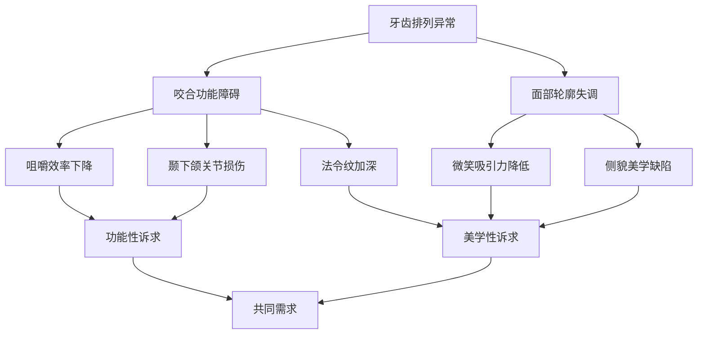

上图展示了牙齿排列异常如何同时触发功能性与美学性问题，两类诉求最终汇聚为对"功能-美学统一"的共同需求。对于20-30岁女性群体而言，美学性诉求往往是就诊的首要动机，但功能性改善是治疗成功的基础保障——临床案例显示，35岁以上女性患者矫正后面部年轻化评分平均提升2.8岁，职业形象竞争力显著增强[^5]。

### 1.3 功能性衡量指标体系构建

功能是治疗的基础和首要目标，核心在于建立稳定、健康的咬合关系并保障牙周健康。以下从咬合关系、牙周健康、颞下颌关节功能三个维度构建功能性衡量指标体系。

#### 1.3.1 咬合关系标准

咬合关系是功能评价的核心，其标准化指标体系如下表所示：

| 评价维度 | 具体指标 | 正常参考值/标准 | 临床意义 |
|---------|---------|----------------|---------|
| **覆盖与覆合** | 上前牙覆盖下前牙的水平距离 | 约2-4毫米[^3] | 覆盖过大或过小均影响咀嚼与美观 |
| | 上前牙切缘覆盖下前牙唇面的垂直高度 | 1/3牙冠以内[^3] | 深覆合可能导致下颌后缩、下前牙磨损 |
| **磨牙关系** | 上颌第一恒磨牙近中颊尖与下颌第一恒磨牙的位置关系 | 咬合于下颌第一恒磨牙近中颊沟[^3] | 判断安氏分类的关键指标 |
| **中线对齐** | 上下牙列中线与面部中线的一致性 | 上下中线对齐，与面部中线一致[^6][^3] | 影响面部对称性与咬合稳定性 |
| **动态咬合** | 前伸运动时前后牙接触状态 | 前牙均匀接触，后牙无接触[^3] | 避免后牙干扰导致的关节损伤 |
| | 侧方运动时工作侧与非工作侧接触状态 | 工作侧牙齿均匀接触，非工作侧无干扰[^3] | 保护颞下颌关节功能 |

#### 1.3.2 牙周健康状态

牙周健康是正畸治疗成功的重要前提与长期保障，其评价指标包括：

**牙龈状态评估。** 健康状态下牙龈呈珊瑚粉色，表面圆钝；扇形的牙龈乳头充填于相邻牙齿之间，牙龈缘呈扇贝状附着在牙齿边缘[^2]。若牙龈健康状况不佳，不仅影响美学效果，更会危及整体口腔健康。

**炎症控制指标。** 临床上通过龈沟出血指数（SBI）与菌斑指数（PLI）量化评估牙周炎症程度。整齐的牙齿排列利于日常清洁，可显著降低牙周病风险[^5]。接受正畸治疗期间需特别注意口腔卫生维护，避免矫治器周围菌斑堆积[^1]。

#### 1.3.3 颞下颌关节功能

颞下颌关节功能的评估是功能性衡量体系的重要组成部分。长期牙齿拥挤可能引发颞下颌关节紊乱[^5]，出现关节弹响、咀嚼疼痛等异常症状时应及时就医评估咬合状态[^3]。正畸正颌联合治疗前需配合颞下颌关节检查，排除关节疾病活动期等禁忌症[^4]。

### 1.4 美学性衡量指标体系构建

美学评价体系整合口腔美学与面部美学的标准，构建多层次指标框架，涵盖牙齿美学、牙龈美学、微笑美学及面部美学四个维度。

#### 1.4.1 牙齿美学指标

牙齿美学是微笑美学的基础要素，其客观评价标准包括：

**形态与排列。** 牙齿形态正常、排列整齐、无拥挤、无旋转；上下颌的尖牙与第一磨牙有固定的咬合关系；上前牙盖过下前牙的近切缘1/3牙冠[^2]。

**颜色与亮度。** 牙齿颜色需与皮肤、嘴唇颜色协调，才能达到视觉上最美观的效果[^2]。虽然现代审美追求"大白牙"，但物极必反，过度美白可能造成不协调的视觉效果。

值得注意的是，美学评价存在主观性维度——有人非常喜欢自己的牙齿又亮又白，虽然医生感觉不协调，但也要尊重个人意愿；有的人长着异常突出的小虎牙，在微笑时却增加了可爱的感觉[^2]。

#### 1.4.2 牙龈美学指标

牙龈美学是"红白美学"的重要组成部分，其评价要点包括：

**牙龈色泽与形态。** 健康牙龈呈珊瑚粉色，表面圆钝，牙龈缘呈扇贝状附着[^2]。

**牙龈暴露量。** 微笑时牙龈暴露量是评价微笑美学的关键指标。研究表明，与男性相比，女性在微笑时通常喜欢更多的上牙龈暴露[^9]。公认的最佳微笑唇位为：微笑时上唇缘位于上颌切牙的3/4至牙颈缘水平[^8]。

#### 1.4.3 微笑美学指标

微笑美学是口腔正畸与医美共同关注的核心领域，其评价体系涵盖以下要素：

**笑线类型分类。** 根据上唇下缘与临床牙冠颈部暴露情况，微笑可分为三类[^10]：

| 笑线类型 | 定义 | 人群占比 | 性别差异 |
|---------|-----|---------|---------|
| 高位微笑 | 暴露整个上前牙临床牙冠和部分牙龈 | 约10% | 女性发生率是男性的2倍 |
| 中位微笑 | 暴露75%-100%上前牙临床牙冠 | 约69% | 大多数人群 |
| 低位微笑 | 暴露少于75%上前牙临床冠 | 约21% | 男性发生率是女性的2.5倍 |

**唇齿关系标准。** 理想的微笑需满足"双C线"标准：上前牙切缘与下唇曲线呈平行弧线，牙冠宽度与唇线比例协调[^5]。具体而言，下唇弧线应与上颌前牙弓弧线一致，口角处的唇与牙列间有适度空隙，最大微笑时口角达到第二前磨牙或第一磨牙处[^8]。

**中线与对称性。** 微笑时的口角连线应与双侧瞳孔连线平行，这是微笑美学评价的先决条件[^2]。上牙中线需与面部中线协调，研究发现正畸医生能够识别从1mm开始的中线偏差，而普通人可能在4mm的偏差时才开始注意到[^9]。

#### 1.4.4 面部美学指标

面部美学评价关注牙齿与面部整体轮廓的协调性，其指标体系如下：

**正面观评价——三停五眼。** 三停指面部在垂直方向上可分为高度相等的三部分（发际到眉间、眉间到鼻下、鼻下到颏下）；五眼指面部在水平方向上可分成宽度相等的五等份[^8]。

**侧面观评价——关键角度测量。** 侧貌美学通过以下指标量化评估：

| 评价指标 | 定义 | 正常参考值 | 临床意义 |
|---------|-----|-----------|---------|
| 审美平面 | 通过鼻尖点及颏部最突点的切线 | 上下唇均位于审美平面后方[^8] | 评价上下唇的突度 |
| 鼻唇角 | 鼻下缘与上唇前缘间的交角 | 95°-100°[^8] | 评估上唇及上牙的突度 |
| 颏唇沟角 | 颏唇沟最凹点分别向下唇及颏部软组织最前点所做切线的夹角 | 约130°[^8] | 评估下颌发育状态 |

正畸学中采用头颅侧位X片来测量面部骨骼的侧貌和上下比例关系，分析骨骼与牙齿的相对位置，从而制定矫正治疗计划[^8]。牙齿矫正更容易改变侧貌的形态，实现侧貌美学的提升[^8]。

### 1.5 功能-美学综合评价模型与应用框架

#### 1.5.1 功能与美学指标的权重配置逻辑

构建功能-美学综合评价模型，需要在确保口腔功能健康的前提下实现个性化的美学提升。基于临床实践与研究文献，功能与美学指标的权重配置应遵循以下原则：

**功能优先原则。** 治疗以建立稳定咬合为首要目标，功能性指标构成评价体系的基础层。咬合关系的正常化是美学改善的前提——异常咬合不仅影响咀嚼功能，更会通过骨传导效应影响面部轮廓[^5]。

**美学增益原则。** 在功能保障的基础上，通过联合治疗最大化美学效果。现代隐形矫正技术已实现"功能-美观"双满足，通过数字微笑设计可预先模拟矫正后的面部变化[^5]。

**个体化调适原则。** 在遵循客观美学标准的同时，必须考虑患者的面型、年龄、个性及主观意愿。实际临床操作中，医生需要将个体的微笑、面型、年龄和个性等相关因素整合起来，才能达到最终的协调[^2]。

#### 1.5.2 综合评价模型框架

基于上述原则，提出以下功能-美学综合评价模型框架：

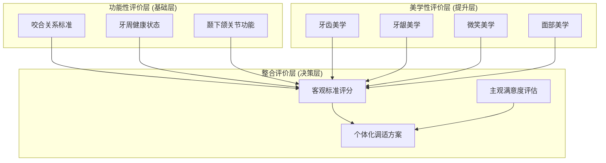

该模型框架强调**多维度综合诊断**的重要性——必须结合头影测量、模型分析等，全面评估骨骼、牙齿、软组织关系[^4][^8]。

#### 1.5.3 模型的临床应用路径

综合评价模型在临床实践中的应用涵盖以下三个环节：

**诊断评估阶段。** 通过数字化技术（三维扫描、头影测量）采集功能与美学指标数据，建立患者的基线评估档案[^11]。近年来激光扫描、层析扫描等技术的快速发展，为精确获取口腔三维数据提供了技术支撑[^11]。

**方案设计阶段。** 基于综合评价结果，制定个性化治疗方案。对于单纯牙性问题可采用正畸治疗，对于骨性畸形需考虑正畸正颌联合治疗，对于牙齿缺损伴咬合紊乱则需修复正畸联合治疗[^1][^4]。数字微笑设计技术可帮助医生预先模拟治疗效果，包括调整笑线高度、改善鼻唇角、优化颏部轮廓等[^5]。

**疗效评价阶段。** 治疗完成后，通过功能-美学综合评价模型进行疗效评估。研究表明，采用牙槽骨微穿孔术等新技术进行正畸治疗后，红色美学指数（PES）评分显著提升，患者满意度可达97.94%[^12]。微螺钉种植体支抗结合正畸正颌治疗能有效促进面部美学情况改善[^12]。

#### 1.5.4 数字化技术对评价体系的支撑作用

现代数字化技术的应用显著提升了功能-美学综合评价的精确性与预测性：

**三维扫描与重建技术。** 无托槽隐形矫治技术的发展依托于数字化三维重建与快速成型技术，使得该技术在美观性、舒适性、便捷性、疗效可预测性等方面均具有优越性[^11]。

**人工智能辅助诊断。** 随着计算机软件和硬件学的快速发展，数字化技术可提前模拟手术效果，采用3D打印导板提高手术精度[^4]。这些技术手段将主观美学判断转化为可量化、可预测的客观指标。

**患者沟通与期望管理。** 数字化技术还有助于医患沟通——通过可视化模拟帮助患者理解治疗方案与预期效果，将患者的心理满意度纳入治疗成功的核心考量。研究强调，在进行正畸治疗时，医生需要与患者进行良好沟通，清楚患者对美学的要求后才能达成治疗共识[^2]。

综上所述，口腔正畸与医美共同需求的衡量体系要求临床实践超越单一学科视角，通过多学科协作与数字化手段，在确保口腔功能健康的前提下实现个性化的美学提升。这一理论框架为后续针对20-30岁女性群体的需求量化分析提供了标准化工具与方法论支撑。

## 2 目标群体画像：全球20-30岁女性消费特征与需求驱动因素

全球20-30岁女性群体已成为口腔正畸与医疗美容市场的核心消费力量。这一群体的消费行为呈现出鲜明的代际特征：她们既是"颜值经济"的积极参与者，也是理性消费的践行者；既追求外在形象的优化，也注重内在健康的长期管理。本章节将从消费心理、经济能力、文化差异、社会环境及驱动逻辑整合五个维度，系统构建该群体的立体画像，为理解口腔正畸与医美共同需求的形成机制提供需求侧的深度洞察。

### 2.1 消费心理特征：从悦人到悦己的审美观念演变

#### 2.1.1 自我意识觉醒与悦己消费的崛起

当代20-30岁女性的消费心理正经历深刻的代际转变。调研数据显示，**74.4%的受访者对自身容貌表示满意或基本满意**，其中27.2%的人给自己打出90分以上的高分[^13]。这一数据揭示出一个关键趋势：高满意度并未抑制美学消费意愿，反而催生出一种全新的消费逻辑——**消费不再是为了弥补缺陷，而是为了"让自己变得更好"的自我投资**。

这种心理转变体现在消费动机的根本性迁移上。女性消费已从传统的"需求型"和"家庭型"消费结构向更加多元化发展，现代女性越来越注重自我实现和自我提升，强调消费是为了"悦己"而不是取悦他人[^14]。在口腔医疗领域，这一趋势表现为消费者的主要困扰已从智齿疼痛、龋齿等医疗健康问题，转向**牙齿不够白、牙齿不整齐**等与口腔形态"美"相关的问题[^15]。

《2022年口腔养护消费者洞察》调研发现，重视牙齿美观健康的人群以公司职员、管理者及自由职业者（如网红、模特、公众号撰写人）居多，被访者对于口腔的主要困扰是牙齿发黄不够白和牙齿不够整齐，有近六成的被访者牙齿发黄，同样有59.4%的被访者表示自己的牙齿不整齐[^16]。这些数据印证了消费动机从"治疗疾病"向"提升形象"的价值迁移。

#### 2.1.2 多元化审美对标准化模板的替代

审美观念的多元化是该群体消费心理的另一显著特征。调查数据显示，**超七成受访青年认同应当用"自然美"代替"白幼瘦"的审美标准**[^17]。在医美与正畸领域，这种审美观念的转变体现为对"妈生感"、"伪素颜"等自然效果的追求，而非追逐千篇一律的"网红脸"。

具体而言，32%的受访者认为"单眼皮也很美，多元审美才高级"，24.2%的人坚信"自己觉得好看，自信就加100分"[^13]。在妆容选择上，四成女性化妆是为了自我个性、情绪的表达，另外三成女性表示"想化就化"[^18]。这种从单一审美向多元审美的转变，直接影响了该群体对正畸与医美项目的选择偏好——她们更倾向于**保留个人特色的改良方案**，而非追求标准化的美学模板。

在口腔正畸领域，这种审美偏好表现为对隐形矫正的青睐。隐形正畸在佩戴舒适度、美观性和日常清洁维护等方面具有显著优势[^19]，其"深藏不露"的特性完美契合了该群体对自然、无痕改善效果的追求。

#### 2.1.3 情感驱动与理性决策的交织模式

该群体的消费决策呈现出**情感驱动与理性决策深度交织**的复杂模式。一方面，女性消费者对商品外观、形状及其中表现的情感因素十分重视，往往在情感因素作用下产生购买动机[^20]。另一方面，2025年的消费者正在形成非常明确的"预算分区"：能省的地方极致省，该花的钱却毫不犹豫[^21]。

这种看似矛盾的行为模式，实际上反映了**对价值感的重新界定**：省的是可替代性强、情绪价值弱的琐碎支出；花的是能够带来确定性、提升感和自尊感的消费。换句话说，消费者不再为价格买单，而是为"意义"买单[^21]。对于口腔正畸与医美这类能够显著提升自信与社交资本的项目，该群体往往愿意付出超出想象的预算。

#### 2.1.4 从被动治疗到主动健康美学管理

消费心理的另一重要演变是**从被动治疗向主动健康管理与美学提升的转型**。消费升级推动高端项目普及，消费场景从"治疗型"向"健康管理型"转变，定期口腔检查比例从2020年的35%提升至2025年的60%，预防性洁牙项目需求增长28%[^22]。

这种转变在女性健康消费领域表现尤为突出。女性对于生理健康的意识已经从"有病治病"转向了"无病预防"[^14]。在口腔领域，消费者正在把"改善生活"从一种被动期待，转变为一种可控行动：更愿意投资健康、体态与外貌，把身心管理当作基础工程[^21]。口腔功能美学重建的理念正是这一趋势的体现——强调在恢复口腔长期健康功能的基础上，达到美观的要求[^23]。

### 2.2 经济能力与消费决策：预算分区与价值导向型支出

#### 2.2.1 收入提升与消费能力分层

20-30岁女性群体的经济能力呈现显著提升态势，这为其口腔正畸与医美消费提供了坚实的物质基础。据统计，女性消费者占全国人口的48.7%，对消费活动影响较大的中青年妇女（20-55岁）占人口总数的21%[^20]。随着女性平均收入提升，"她经济"逐渐成为消费市场的重要组成部分[^20]。

在口腔医疗领域，**80后、90后成为消费主力**，2023年消费者在口腔医疗上的平均支出达8000元/人，较2018年翻倍[^22]。这一数据表明该群体具备承担正畸与医美项目费用的经济实力。同时，近年来随着经济不断发展，我国居民人均可支配收入和人均医疗保健支出不断增长，为行业发展提供了经济保障[^19]。

然而，消费能力的分层特征同样明显。调研显示，为了牙齿健康美观，近三成被访者每月愿意花费100至300元购买家庭护齿产品[^16]。这种消费能力的分层直接影响了项目选择：高端消费者注重诊疗技术先进性、品牌信誉与服务体验，愿意为个性化方案支付溢价；基础服务消费者则更关注价格合理性与医疗安全，偏好高性价比的标准化服务[^24]。

#### 2.2.2 预算分区与价值导向型支出策略

该群体的消费决策呈现出鲜明的**"预算分区"特征**。研究表明，对于"纸巾"这样的功能性消费，用户会极致比价，追求8.9元囤货；但对于"让我变得更好"的产品或服务，消费者往往愿意付出超出想象的预算[^21]。

在口腔正畸领域，这种预算分区表现为对不同项目的差异化支付意愿：

| 项目类型 | 客单价范围 | 支付意愿特征 |
|---------|-----------|-------------|
| 普通金属托槽矫正 | 1-2万元 | 价格敏感，追求性价比 |
| 隐形矫正 | 2-3万元 | 愿意为美观性支付溢价 |
| 高端隐形矫治 | 可达5万元/人 | 高端消费者主动选择 |

消费升级推动高端项目普及，正畸项目客单价普遍在2-3万元，高端隐形矫治费用可达5万元/人[^22]。这一数据表明，该群体对于能够显著提升形象与自信的项目具有较高的支付意愿。

#### 2.2.3 价格敏感度与消费决策障碍

尽管支付意愿较高，**价格因素仍是该群体消费决策的关键制约**。调研显示，26.9%的潜在消费者被价格劝退，表示"钱包厚度不允许"而放弃，这在学生群体和初入职场的年轻人中尤为突出[^13]。

在正畸领域，隐形正畸治疗费用显著高于传统托槽正畸，这使得价格敏感型患者更倾向于选择经济实惠的传统矫治方式。同时由于正畸治疗未纳入医保报销范围，消费者对高价非必需医疗项目的支付意愿相对有限，这在一定程度上抑制了潜在需求的释放[^19]。

值得关注的是，高频护理和高昂价格是患者最为担忧的两大因素[^16]。这种价格敏感度直接影响了项目渗透率：与发达国家相比，我国隐形正畸渗透率仍然偏低，以2020年数据为例，我国隐形正畸渗透率为11.11%，而同期美国已达到31.8%[^19]。

#### 2.2.4 分期付款与金融工具的接受度

面对高客单价的正畸与医美项目，**金融工具的可及性成为影响消费决策的重要因素**。35.2%的潜在消费者选择"继续观望，等项目降价再冲"[^13]，这一数据表明降低支付门槛的金融方案对于释放潜在需求具有重要意义。

提前了解保险覆盖范围和分期付款选项，有助于减轻经济压力[^25]。对于该群体而言，分期付款、医疗分期贷款等金融工具的普及，可以有效缓解一次性支付压力，促进高端正畸与医美项目的消费转化。

### 2.3 跨文化审美差异：东西方美学标准与需求偏好分化

#### 2.3.1 东方审美：自然和谐与比例协调的追求

不同文化背景下的审美标准差异，深刻影响着20-30岁女性对口腔正畸与医美项目的需求偏好。**东方审美更倾向自然和谐的面部轮廓，追求"三庭五眼"的比例协调**[^26]。这种审美取向源于东西方对面部黄金分割比例的不同理解，亚洲患者多选择保留种族特征的改良术式。

在正畸领域，这种审美偏好表现为对隐形矫正的高度青睐。目前牙齿正畸对象集中于一线以及新一线的年轻女性，与重视牙齿美观健康的人群画像高度吻合[^16]。隐形矫正的"深藏不露"特性完美契合了东方审美对低调、自然改善效果的追求。

在医美领域，日本流行的"自然系整形"追求"看不出整形的整形"[^26]，这与东方文化中推崇低调自然美丽的传统观念一脉相承。国内求美者多要求医生提供明星同款模板，但更强调保留个人特色的自然效果[^26]。

#### 2.3.2 西方审美：立体深邃与个性化定制的偏好

相比之下，**西方审美偏好立体深邃的五官与明显的轮廓感**。欧美医生更倾向使用假体塑造高挺鼻梁，常见的微整形项目包括唇部填充、隆鼻、面部提升等[^26][^27]。

在患者需求层面，欧洲患者更强调保留个人特色，法国整形协会调查显示，67%受访者拒绝标准化美容方案[^26]。这种对个性化定制的强调，与东方市场对"明星同款"的追求形成鲜明对比。

在材料选择与技术应用上，国内外也存在显著差异。国内审批的填充材料以玻尿酸为主，欧美更广泛使用聚左旋乳酸等刺激胶原再生的产品[^26]。这种差异导致不同区域的医生在材料应用经验上存在明显区别，进而影响消费者的项目选择与效果预期。

#### 2.3.3 全球化背景下审美观念的融合趋势

尽管东西方审美存在显著差异，**全球化背景下的审美融合趋势同样值得关注**。社交媒体的跨境传播使得不同文化背景下的审美观念相互渗透，年轻女性群体的审美偏好呈现出更加多元化的特征。

在口腔正畸领域，无论是东方还是西方市场，隐形矫正的渗透率均呈现稳步提升态势。预计至2030年中国隐形矫治渗透率约25%[^28]，这一趋势表明对美观性与舒适性的追求是跨文化的共同需求。

在医美领域，"轻医美"成为全球性的主流选择。调研显示，32.2%的"医美小白"首选光子嫩肤，低风险、高性价比项目受青睐，61.2%需求聚焦皮肤美容，消费偏好日常保养而非"改造"[^13]。这种对轻量化、低风险项目的偏好，反映出全球年轻女性在美学消费上的共同取向。

#### 2.3.4 区域市场需求的差异化特征

跨文化审美差异直接塑造了区域市场的差异化需求特征：

| 区域 | 审美取向 | 正畸偏好 | 医美偏好 | 市场特征 |
|-----|---------|---------|---------|---------|
| 东亚（中日韩） | 自然和谐、比例协调 | 隐形矫正、舌侧矫正 | 自然系整形、微创项目 | 高度重视"无痕"效果 |
| 欧美 | 立体深邃、个性化 | 传统托槽接受度较高 | 唇部填充、轮廓塑形 | 强调个性化定制 |
| 东南亚 | 融合东西方特征 | 价格敏感度较高 | 皮肤美白需求突出 | 新兴市场快速增长 |

这种区域差异要求品牌与服务机构必须依据区域文化特质提供差异化产品与服务。东部地区市场成熟、竞争激烈，需强化品牌形象、提供个性化服务；中西部地区市场潜力巨大但渗透率较低，需采取下沉市场策略[^22]。

### 2.4 社会环境影响因素：职场竞争、社交媒体与颜值经济

#### 2.4.1 职场形象竞争与外貌投资驱动

社会环境对20-30岁女性口腔正畸与医美需求的形成具有深刻的塑造作用。**职场形象竞争成为推动外貌投资的重要驱动力**。调研显示，"颜值KPI，满足升职面试需求"占11.4%的消费动机，凸显医美在重要场景中的形象改善功能[^13]。

对于即将步入职场的年轻女性，这种需求尤为迫切。52.9%毕业生将医美列入假期计划，诉求聚焦求职社交场景[^13]。这一数据表明，外貌投资已被该群体视为提升职场竞争力的重要手段。

在口腔正畸领域，维护口腔健康和改善口腔咬合功能是最主要的正畸目的，而**通过牙齿正畸来改变自己的外貌也是女性最大的动力所在**[^16]。一口整齐洁白的牙齿不仅能提升面部整体颜值，更能增强人际交往中的自信心，这在职场竞争中具有重要的社交资本价值。

#### 2.4.2 社交媒体与KOL传播的影响机制

**社交媒体已成为该群体获取信息、形成消费决策的核心渠道**。数据显示，32.3%的消费者通过社交媒体获取医美信息，30.2%依赖亲友或行业人士转述[^13]。在口腔护理领域，抖音连续两年市占率第一，2024年增速高达56.0%[^24]。

不同平台呈现差异化定位：微博成为品牌明星营销主阵地，贡献了绝大部分声量；抖音凭借高互动性成为用户讨论核心平台，贡献了超过76.3%的总互动量[^24]。这种多元渠道虽降低了信息获取门槛，但也导致内容良莠不齐，25.4%的人因"认知成本"过高而放弃尝试医美[^13]。

在口腔护理领域，2025年牙膏类目社交媒体声量同比增长高达392%，互动量增长36%，反映出消费者对口腔护理的关注度显著提升[^24]。社交媒体的传播效应正在重塑消费者的认知与决策路径。

#### 2.4.3 颜值经济兴起与社会压力认知

**"颜值经济"的兴起深刻影响着该群体的消费心理与行为**。调研显示，近八成受访者将美视为生活的加分项，美丽会从多方面带来积极反馈[^13]。其中超过半数的受访者（52.4%）坚信，美丽的价值是"超级加分项"，它能提升自信、带来社交优势，甚至有益于身心健康。

这种社会认知既带来机会，也形成压力。一方面，外貌投资被视为提升社交资本的有效途径；另一方面，社交媒体放大了外貌焦虑，形成一定的社会压力。值得注意的是，**超七成受访青年认同应当用"自然美"代替"白幼瘦"的审美标准**[^17]，这表明该群体正在形成更加健康理性的审美观念。

在口腔医疗领域，随着"颜值经济"的发展，民众对牙齿美观的需要不断提升。在牙齿不整齐的被访者中，31.5%表示自己未来一两年有牙齿正畸的计划，该项目的热门度仅次于洗牙项目和较为刚需的牙齿修补项目[^16]。

#### 2.4.4 同伴效应与口碑传播的作用机制

**女性消费者在口腔正畸与医美决策中表现出显著的同伴效应与口碑依赖特征**。女性通常具有较强的表达能力、感染能力和传播能力，善于通过说服、劝告、传话等对周围其他消费者产生影响。反过来，女性购物决策也较易受到其他消费者使用经历的影响[^20]。

这一特点决定了女性是口碑的传播者和接收者，一些产品通过女性的口碑传播可以起到一般广告所达不到的效果[^20]。在医美领域，61%的消费者对老产品放心，更倾向于复购熟悉的品牌[^21]。这种信任机制使得口碑传播在消费决策中发挥着关键作用。

调研显示，家长态度对年轻女性的医美消费也产生重要影响，31.7%要求必须陪同并选择正规机构[^13]。这表明家庭环境与社会关系网络共同塑造着该群体的消费决策。

### 2.5 核心客群验证：共同需求的典型特征与驱动逻辑整合

#### 2.5.1 核心客群典型性验证

综合前述分析，20-30岁女性作为口腔正畸与医美共同需求核心客群的典型性得到充分验证。以下数据支撑这一判断：

**市场主体地位确立。** 一线城市、80后90后的女性被访者是目前最注重牙齿健康美观的人群，也是"美齿经济"核心主体[^16]。在医美领域，Z世代成医美消费新势力，36.7%用户为95后[^13]。正畸市场中，目前牙齿正畸对象集中于一线以及新一线的年轻女性[^16]。

**消费能力与意愿匹配。** 该群体具备较强的支付能力（正畸客单价2-3万元，高端可达5万元），且对能够提升形象与自信的项目具有高支付意愿[^22]。同时，该群体表现出"既省又花"的理性消费特征，对价值感有清晰的判断标准[^21]。

**需求结构高度契合。** 该群体的核心诉求——牙齿整齐度、面部协调性、微笑美学——恰好位于口腔正畸与医美的交叉地带。43%消费者首要改善肤质问题，牙齿调整（28.6%）紧随其后[^13]，表明口腔美学需求在该群体的整体美学需求中占据重要位置。

#### 2.5.2 功能性诉求与美学性诉求的双重驱动逻辑

该群体的消费行为受功能性诉求与美学性诉求的双重驱动，两者相互交织、协同作用：

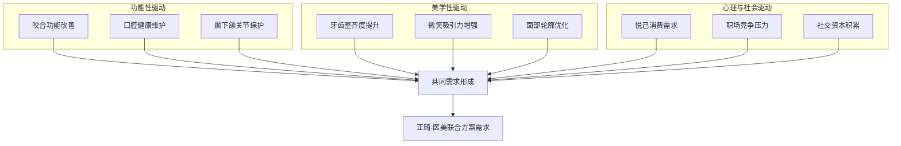

从驱动优先级来看，**美学性诉求往往是就诊的首要动机，但功能性改善是治疗成功的基础保障**。口腔功能美学重建强调"功能为基，美学为华"的诊疗初心，在保障口腔长期健康功能的基础上，为患者定制个性化综合诊疗方案，实现自然、稳定、美观的笑容[^23]。

#### 2.5.3 需求特征综合模型

基于多维度分析，构建20-30岁女性口腔正畸与医美共同需求的综合特征模型：

| 维度 | 核心特征 | 关键指标 | 影响权重 |
|-----|---------|---------|---------|
| **消费动机** | 悦己投资型 | 自我提升意愿强度 | 高 |
| **审美偏好** | 自然个性化 | 对"无痕"效果的追求程度 | 高 |
| **决策模式** | 理性情感交织 | 信息搜索深度、口碑依赖度 | 中高 |
| **支付意愿** | 价值导向型 | 对高端项目的接受度 | 中高 |
| **价格敏感** | 分区敏感型 | 对金融工具的接受度 | 中 |
| **文化影响** | 区域分化型 | 审美标准的文化契合度 | 中 |
| **社会驱动** | 多元压力型 | 职场竞争、社交媒体影响 | 高 |

#### 2.5.4 需求释放的触发条件与产业启示

该群体共同需求的释放受以下关键条件影响：

**安全与信任是基础门槛。** 54.7%消费者首要关注安全性，价格透明（38.7%）与医生资质（35.6%）成关键决策因素，行业不规范行为遭遇零容忍[^13]。构建安全、透明、专业的信任体系是赢得该群体的基石。

**价格可及性是转化关键。** 高客单价与医保覆盖缺失是主要消费障碍。通过技术进步降低成本、金融工具降低支付门槛，可有效释放潜在需求。

**信息透明度是决策催化剂。** 25.4%的人因信息杂乱放弃尝试[^13]，权威科普与专业咨询的可及性直接影响消费转化率。

**情感共鸣是品牌粘性来源。** 医美消费场景情感化升级，日常保养（30.9%）、节点仪式感（23.8%）及自我奖励（22%）成三大驱动，医美从功能消费转向情绪价值载体[^13]。

综上所述，20-30岁女性群体作为口腔正畸与医美共同需求的核心客群，其消费行为深受悦己心理、健康意识、社交媒体、区域文化及数字化工具的综合影响。她们追求自然个性化的改善方案，消费过程既是自我价值实现，也是应对社会期待的策略。市场呈现"高关注、低行动"特点，主要壁垒在于高客单价与安全信任。赢得她们的关键在于提供高度透明、个性化、情感共鸣强且能通过技术或金融手段降低支付门槛的解决方案。这一群体画像为后续产业融合战略提供了精准的目标客群定位依据。

## 3 现状扫描：口腔正畸与医美服务的交集、分离与协同现状

口腔正畸与医疗美容作为服务20-30岁女性群体的两大核心领域，正处于从各自独立运营向深度融合演进的关键转型期。本章节将从技术应用、服务流程、客户认知、市场定位四个维度系统剖析两者的重叠区与隔离带，并基于现有协同实践评估其成效与局限，为理解产业融合的现实基础与挑战提供全景式扫描。

### 3.1 技术应用层面的交集与分离

#### 3.1.1 数字化技术的共享应用现状

数字化与智能化技术已成为口腔正畸与医疗美容两大领域融合的核心技术底座。这种技术共享主要体现在以下三个层面：

**数字化诊疗平台的通用化。** 口内扫描、CBCT三维影像、AI辅助诊断与方案设计已成为两领域共同依赖的基础工具。在正畸领域，口内扫描仪的普及度较2024年提升40%，主流设备的扫描精度稳定在10μm以内，扫描时间缩短至90秒/全牙列[^29]。AI技术的应用显著提升了诊疗效率——**AI影像识别系统使正畸方案设计时间缩短83%**，基于百万级病例数据库训练的智能诊断系统可自动识别12类常见错颌畸形，分类准确率达91.3%[^29]。这些技术工具同样广泛应用于医美领域的面部美学分析与方案设计。

**隐形矫正技术的美学化演进。** 隐形矫治器技术是正畸与医美交叉最为典型的技术载体，其兼具医疗矫正与美学需求的双重属性。预计到2030年，通过隐形矫治器解决的正畸案例将达到950万例，复合年增长率为27.6%[^30]。隐形矫正的适应症已从单纯牙性问题扩展至轻中度骨性错颌，技术边界持续拓展。

**先进制造工艺的跨领域应用。** CAD/CAM技术、3D打印技术在两领域均得到深度应用。在正畸领域，3D打印技术将义齿定制周期压缩至24小时[^31]；可降解聚乳酸支抗钉的临床应用范围扩大，其降解周期可根据治疗需求调节（6-18个月），术后6个月的影像学显示周围骨组织矿化密度较钛合金支抗钉组高15%[^29]。在医美领域，3D打印技术同样用于个性化美学修复体的制作。

以下表格系统梳理了两领域共享技术的应用现状：

| 技术类型 | 正畸领域应用 | 医美领域应用 | 融合程度 |
|---------|-------------|-------------|---------|
| 口内三维扫描 | 数字化取模、矫治器设计 | 面部轮廓分析、微笑设计 | 高度融合 |
| AI辅助诊断 | 错颌畸形分类、方案预测 | 面部美学评估、效果模拟 | 深度融合 |
| 3D打印技术 | 个性化托槽、矫治器制作 | 美学修复体定制 | 中度融合 |
| CBCT影像 | 颌骨结构分析、治疗规划 | 面部骨骼评估 | 中度融合 |

#### 3.1.2 核心技术壁垒与分离边界

尽管技术工具存在广泛共享，两领域在核心技术深度与目标导向上仍存在明显的分离边界：

**生物力学与颌骨调控的专业壁垒。** 正畸治疗的核心在于生物力学原理的精准应用与颌骨生长的科学调控。正畸正颌联合治疗通过术前正畸调整牙齿排列，为颌骨手术创造理想条件，术后再精细调整咬合关系[^4]。这种涉及骨性畸形矫正的高难度医疗技术，与常规医美的表层美学修饰存在本质差异。严重骨性错颌需正畸-正颌外科联合治疗，属于纯医疗领域，技术门槛显著高于一般医美项目。

**材料学与即时效果的技术分化。** 口腔医美（如美白、贴面）更侧重色彩、形态等表层美学修饰，技术门槛集中于材料学。正畸与牙齿美容在治疗目标和适应症上有明显区别——正畸主要通过矫治器调整牙齿位置，改善严重牙齿错颌畸形问题的综合治疗手段；而牙齿美容侧重通过美学修复手段提升牙齿外观，常见方式包括树脂贴面、全瓷冠修复、牙齿漂白等[^32]。

**设备专用性与标准差异。** 正畸领域的专业设备如种植牙手术机器人具有高度专用性。要慈口腔的AI口腔机器人搭载3D动态导航与光学跟踪定位系统，定位精度≤0.2mm，响应时间<0.1秒[^33]。这类高精度医疗设备与医美领域的通用美容设备在技术标准、操作规范上存在显著差异。

#### 3.1.3 技术融合的可行性基础评估

基于上述分析，技术融合的可行性呈现"工具层高度可行、核心层存在壁垒"的特征：

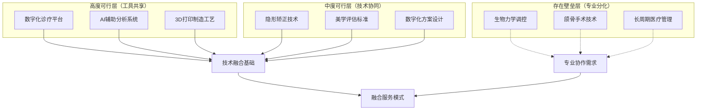

技术融合的核心路径在于：以数字化工具为共享底座，以隐形矫正为融合载体，通过多学科协作机制跨越专业壁垒。这种融合模式既能发挥技术共享的效率优势，又能保障医疗专业性的底线要求。

### 3.2 服务流程与诊疗模式的重叠与隔离

#### 3.2.1 服务全流程的异同比较

口腔正畸与医美机构在服务流程上既存在共性特征，也呈现显著分化。以下从客户接诊、方案咨询、治疗周期、复诊管理、术后维护五个环节进行系统比较：

**初诊评估环节的趋同性。** 两领域均始于全面的检查评估与患者诉求沟通。在正畸领域，初诊患者需实名制预约，医生通过了解患者主诉（如牙齿拥挤、咬合问题等），并进行颌面部、牙齿排列、咬合关系、全身健康、既往病史等问诊和检查，初步评估是否适合正畸矫治[^34]。同时，患者需要接受拍摄口腔CT、头颅侧位片、数字化口腔扫描、面部及口内照片拍摄等检查[^34]。医美领域同样强调"面部美学分析"与个性化诉求沟通，两者在初诊流程设计上呈现高度相似性。

**治疗周期的显著分化。** 这是两领域服务流程最根本的差异所在。正畸治疗周期长达**1-3年**，医疗连贯性要求高，包含长期随访。正畸正颌联合治疗分为术前正畸、正颌手术、术后正畸三个阶段，术前正畸需12-18个月，术后正畸需6-12个月精细调整咬合，全程通常需要2-3年完成[^4]。相比之下，许多口腔医美项目（如美白、贴面）属单次或短周期治疗，更具消费服务属性。

**复诊管理的差异化特征。** 正畸治疗的复诊频率与管理要求显著高于一般医美项目。首次复诊通常在1个月内，后续每4-8周进行一次复诊治疗，复诊内容包括检查矫治进度、更换弓丝/附件、处理突发问题[^34]。2025年的数字化技术应用使患者复诊间隔延长至8-10周，年人均复诊次数降至5.2次[^35]。医美项目的复诊周期相对灵活，部分项目无需定期复诊。

以下表格系统对比两领域服务流程的关键差异：

| 服务环节 | 口腔正畸 | 医疗美容 | 差异程度 |
|---------|---------|---------|---------|
| 初诊评估 | 全面口腔检查+美学诉求沟通 | 面部美学分析+个性化咨询 | 低 |
| 方案设计 | 数字化方案+长期规划 | 即时效果模拟+灵活调整 | 中 |
| 治疗周期 | 1-3年 | 单次至数月 | 高 |
| 复诊频率 | 每4-8周 | 视项目而定 | 高 |
| 术后维护 | 长期保持器+定期随访 | 短期护理指导 | 高 |

#### 3.2.2 多学科协作机制的常态化

多学科联合诊疗（MDT）模式已成为正畸领域的常态化实践，这为与医美的服务流程整合提供了制度基础。2025年，口腔正畸科与口腔颌面外科、儿童牙科、修复科、牙周科建立"1+N"联合诊疗模式，全年开展多学科会诊52次，较2024年增加30%[^35]。

这种协作机制的成效体现在复杂病例的处理能力提升上。为12例严重骨性错颌患者制定"正畸-正颌联合治疗"方案，通过术前正畸与术后精细调整的无缝衔接，平均手术时间缩短1.5小时，术后咬合稳定期提前2个月；为8例牙周炎伴错颌患者实施"牙周-正畸联合治疗"，牙周探诊深度平均减少1.2mm，牙槽骨吸收控制率达90%[^35]。

市场上已出现"牙齿矫正与面部美容"综合服务套餐的跨界实践。口腔医院为美容院客户提供口腔检查、牙齿美白、牙齿矫正等服务，美容院则为口腔医院客户提供面部皮肤护理、抗衰老治疗等美容服务，双方共同制定治疗方案[^36]。

#### 3.2.3 流程整合的衔接点与障碍点

基于服务流程分析，识别出以下关键衔接点与障碍点：

**核心衔接点：**
- 初诊评估环节的美学诉求整合——两领域均可共享"面部美学分析"这一入口
- 数字化方案设计的技术协同——3D模拟技术可同时呈现正畸与医美的预期效果
- 患者管理系统的数据共享——全周期健康档案可覆盖口腔与面部美学管理

**主要障碍点：**
- 治疗周期的根本性差异——正畸的长周期特性与医美的即时性需求难以简单叠加
- 服务标准的不统一——医疗与美容在流程、质控标准上存在差异，合作易导致服务质量不稳定[^37]
- 风险管控重点的分化——正畸关注牙根、牙槽骨长期生物改建；医美更关注短期效果与满意度

### 3.3 客户认知与消费行为的分化现状

#### 3.3.1 消费者对两领域的认知边界

20-30岁女性群体对口腔正畸与医美服务的认知呈现"功能-美学"的二元分化特征，但边界正在逐渐模糊：

**正畸的医疗属性认知主导。** 消费者对正畸服务的首要认知仍聚焦于其医疗属性。正畸（尤其复杂病例）客户首要关注"医生专业资质与经验"及长期健康结果。在选择隐形矫正诊所时，医疗专业与团队稳定性被赋予35%的权重，临床技术体系与数字化应用深度占30%[^38]。这种认知决定了消费者在正畸决策中更倾向于选择具有医疗背景的专业机构。

**医美的消费属性认知突出。** 牙齿美白等医美项目客户更关注即时效果、价格与体验舒适度。调研显示，口腔医美行业作为医疗美容的重要分支，20-35岁的年轻群体成为消费主力军，占比超过70%，这一群体对牙齿美白、种植牙、隐形矫正等项目具有较高的支付意愿[^39]。

**认知融合的萌芽趋势。** 随着"健康美"理念的普及，消费者开始将功能健康与面部美学视为统一整体。需求从"治疗型"向"健康+美学"复合型升级，口腔正畸、美白修复等兼具医疗与美容属性的项目成为新热点[^30]。

#### 3.3.2 决策路径与信息获取渠道差异

两领域消费者的决策路径呈现显著分化：

**正畸决策的深度研究特征。** 正畸专业壁垒更高，客户对方案科学性及潜在风险（如复发）认知更模糊、焦虑。这导致消费者在正畸决策中表现出更强的信息搜索深度与专业咨询依赖。评估重点包括医生平均从业年限、高学历（硕士及以上）医师占比、团队在正畸领域的专精程度，以及核心医生的留存率[^40]。

**医美决策的社交媒体驱动特征。** 医美消费者更依赖社交媒体与口碑传播进行决策。数据显示，32.3%的消费者通过社交媒体获取医美信息，30.2%依赖亲友或行业人士转述。在口腔护理领域，抖音连续两年市占率第一，2024年增速高达56.0%[^30]。

以下表格对比两领域消费者的决策行为特征：

| 决策维度 | 口腔正畸 | 医疗美容 | 差异表现 |
|---------|---------|---------|---------|
| 信息搜索深度 | 高（专业咨询导向） | 中（社交媒体导向） | 显著 |
| 决策周期 | 长（数周至数月） | 短（数天至数周） | 显著 |
| 核心决策因素 | 医生资质、长期效果 | 即时效果、价格、体验 | 显著 |
| 信任建立机制 | 专业背书、案例展示 | 口碑传播、KOL推荐 | 中度 |
| 效果预期管理 | 长期渐进式改善 | 即时可见效果 | 显著 |

#### 3.3.3 需求端对融合服务的接受度与顾虑

消费者对口腔正畸与医美融合服务的态度呈现"期待与顾虑并存"的复杂特征：

**融合需求的客观存在。** 20-35岁年轻群体占口腔医疗消费的约71%，为核心消费人群[^41]。这一群体对"一站式"美学服务具有天然需求——既希望改善牙齿排列，也追求面部整体美学效果的提升。市场出现的"牙齿矫正与面部美容"综合服务套餐正是对这一需求的回应。

**核心顾虑的集中表现。** 消费者对融合服务的主要顾虑集中在以下方面：
- **安全性担忧**：口腔医院和美容院在各自领域都面临着激烈的竞争，合作时需在市场中脱颖而出的同时确保医疗安全[^36]
- **服务标准不统一**：双方在工作流程、服务标准等方面存在差异，协调起来可能比较困难[^37]
- **专业性稀释风险**：消费者担心跨界合作可能导致各自专业领域的服务质量下降

### 3.4 市场定位与竞争格局的差异化特征

#### 3.4.1 机构类型与市场结构分化

口腔正畸与医美市场在机构类型与市场结构上呈现显著分化：

**口腔医疗市场的多元格局。** 从市场结构来看，2023年民营口腔机构数量占比达92.48%，市场规模占比超70%，成为行业服务供给的核心力量[^30]。全国运营的口腔医疗机构已达十万多家，大型连锁机构凭借品牌与资本优势加速扩张，让众多中小诊所陷入激烈竞争困境[^33]。

市场参与者呈现明显分层：
- **专业纵深型**：如赛德阳光口腔，定位"垂直正畸专家"，以复杂病例建立壁垒
- **综合广度型**：如瑞尔齿科，定位"综合型品质医疗集团"，强调全科支持与家庭健康管理。瑞尔集团截至2025年3月31日，网络已覆盖全国15个城市，拥有118家诊所及医院，累计服务客户超过1230万人次[^38]
- **客群聚焦型**：如极橙儿童齿科，专攻儿童青少年领域

**医美市场的消费属性主导。** 口腔医美行业作为医疗美容的重要分支，正以年均20%的复合增长率快速发展[^39]。市场竞争更加注重品牌营销与消费体验，科技与美容结合成为发展趋势，激光美容、微整形等技术应用日益广泛[^36]。

#### 3.4.2 价格带分布与消费分层

两领域的价格带分布反映出不同的市场定位策略：

| 项目类型 | 价格区间 | 目标客群 | 市场特征 |
|---------|---------|---------|---------|
| 普通金属托槽矫正 | 1-2万元 | 价格敏感型 | 基础市场 |
| 国产隐形矫正 | 2-3万元 | 品质追求型 | 主流市场 |
| 进口隐形矫正 | 4-5万元 | 高端消费型 | 溢价市场 |
| 牙齿美白 | 数千元 | 轻医美入门 | 高频消费 |
| 瓷贴面修复 | 数千至万元/颗 | 美学需求型 | 增值市场 |

正畸项目客单价普遍在2-3万元，高端隐形矫治费用可达5万元/人[^30]。种植牙集采政策将单颗费用大幅降低，终端价格降至900-1800元/颗，显著降低了消费门槛[^39]。

#### 3.4.3 品牌策略与区域布局差异

两领域在品牌策略上呈现差异化特征：

**正畸领域的专业背书导向。** 正畸机构更强调医疗专业性与医生团队实力。瑞尔集团数据显示其全职牙医中拥有硕士或以上学位者占比达45.3%[^38]。品牌建设侧重于学术影响力、临床案例积累与专家团队打造。

**医美领域的营销驱动特征。** 医美机构更注重品牌营销与消费者触达。牙美汇2023年签约央视广告、邀请啦啦操冠军助力推广，进一步提升品牌国民度[^30]。品牌策略更强调情感共鸣与生活方式关联。

**区域布局的共同趋势。** 两领域均呈现从一线城市向下沉市场延伸的趋势。三四线城市需求增速超过一线城市5-8个百分点，但县域市场渗透率仍不足30%[^39]。牙美汇从2024年起加速扩张，先后在江西、广西、广东、浙江等多省份设立分公司及口腔医院，2025年更密集进驻北京、四川、江苏等核心区域[^30]。

### 3.5 现有协同实践模式与成效评估

#### 3.5.1 跨界合作的典型模式梳理

当前口腔正畸与医美领域的协同实践主要呈现以下三种模式：

**模式一：资源共享型合作。** 口腔医院和美容院通过共享彼此的资源，如技术、设备、人员等，提高整体运营效率。双方可在同一地点设立联合诊所，共享接待区、等候区等公共空间，提高空间利用率[^37]。北京某口腔医院与当地知名美容院达成合作，共同推出牙齿美白项目；上海某口腔医院与多家美容院建立长期合作关系，提供口腔健康咨询服务[^36]。

**模式二：服务互补型整合。** 口腔医院提供牙齿矫正、口腔健康等专业服务，美容院则提供面部美容、皮肤护理等服务，双方优势互补，为客户提供更全面、专业的服务[^37]。某口腔医院拥有专业的口腔治疗技术，而美容院则擅长面部美容护理，双方通过合作，将口腔健康与面部美容相结合，提供更全面的美丽服务[^36]。

**模式三：一站式美学中心。** 部分机构尝试构建覆盖"口腔健康-牙齿美学-面部美容"的一站式服务体系。牙美汇确立"美学·医学·预防医学"三位一体的专业准则，实现从技术研发、耗材生产到诊疗服务、人才培养的全闭环布局，可为消费者提供美学修复、口腔种植、再生医学修复等七大板块服务[^30]。

#### 3.5.2 协同成效的多维度评估

基于现有案例，协同实践的成效可从以下维度进行评估：

**资源整合效率。** 通过合作，口腔医院和美容院可以共享客户资源，相互推荐客户，扩大各自的服务范围和客户群体。合作双方可以共享场地、设备等资源，优化资源配置，降低各自的成本投入[^37]。

**客户满意度提升。** 通过合作提供的优质服务，客户的忠诚度得到增强，回头客增多。合作使得口腔医院的业务量得到显著增长，客户满意度也得到提高[^36]。

**品牌协同效应。** 口腔医院与美容院合作可以提升双方的品牌形象，增强消费者对品牌的认知度和信任度。同时，双方可以共同开展品牌宣传和推广活动，扩大品牌影响力[^37]。通过合作，双方实现了资源共享和优势互补，吸引了更多客户前来就诊，合作也提升了双方的品牌形象和知名度[^36]。

**临床效率与质量。** 数字化融合使正畸平均疗程缩短18%-30%，患者复诊间隔延长。多学科协作提升了复杂病例治疗成功率。使用智能矫治器的患者平均疗程较传统隐形矫治缩短18%，牙齿移动偏差率从9%降至4%[^29]。

#### 3.5.3 可复制的成功要素识别

基于成效评估，识别出以下可复制的成功要素：

**明确的合作目标与定位。** 双方需明确合作的目标和定位，确保合作方向一致[^36]。成功案例显示，清晰界定各自专业边界与服务范围是合作顺利推进的前提。

**有效的资源整合机制。** 有效整合双方资源，实现资源共享，提高整体效益[^36]。这包括客户资源共享、场地设备共用、技术经验互补等多个层面。

**互信机制的建立。** 建立良好的沟通机制，增强双方互信，确保合作顺利进行[^36]。医疗与美容机构的合作需要跨越专业文化差异，建立基于相互尊重的协作关系。

**数字化技术的支撑作用。** 技术创新和数字化转型成为口腔医疗市场的重要趋势，数字化口腔医疗、3D打印等新技术的应用将为合作带来更多发展机遇[^42]。

### 3.6 协同发展的现实障碍与局限性分析

#### 3.6.1 行业监管与服务标准差异

口腔正畸与医美融合面临的首要障碍是**行业监管体系与服务标准的根本性差异**：

**监管归属的分化。** 口腔正畸作为医疗行为，受卫生健康部门严格监管，需遵循《医疗机构管理条例》、《执业医师法》等法律法规，对机构设立、人员资质、诊疗行为有全面规范[^43]。医美行业虽同属医疗范畴，但在部分项目上的监管边界相对模糊。

**服务标准的不统一。** 口腔医院和美容院在服务标准上存在差异，如服务流程、服务质量、服务环境等，难以统一标准，可能导致服务质量不稳定[^37]。由于服务标准不统一，客户在口腔医院和美容院之间流转时可能感到不适应，影响客户体验[^37]。

#### 3.6.2 专业人才壁垒与培养周期

**核心人才短缺是制约融合发展的关键瓶颈。** 优质牙医培养周期长、成本高，资深人才严重短缺，高端诊疗资源集中于一线城市与少数专家手中，基层诊所难以提供标准化、高质量服务[^33]。我国每十万人口牙医数为15.7人，远低于美、韩、日等国，也未达到WHO建议的20人标准。具备种植牙技术和能力的专业医生数量不足，成为制约行业发展的瓶颈[^39]。

**复合型人才的稀缺性更为突出。** 兼具医学与美学素养的复合型人才极为稀缺。豫北医学院口腔智能制造产业学院的实践表明，高校传统人才培养模式难以匹配企业对"懂医学、精设计、能操作、善创新"复合型技术人才的迫切需求，导致企业"高技术岗位招工难"与毕业生"高质量就业难"并存[^44]。

#### 3.6.3 利益分配与风险责任界定

**利益分配机制的复杂性。** 市场竞争压力加大，利润空间受挤压。2024年上半年全国约12,000家口腔门诊倒闭，行业整体倒闭率达30%。种植牙集采使部分机构单颗种植利润不足200元，远低于历史水平[^39]。在这种压力下，跨界合作的利益分配成为敏感议题。

**医疗风险责任的界定困难。** 口腔医院和美容院的客户群体及需求存在差异，需寻找共同点以提供更好的服务[^36]。更重要的是，当融合服务出现医疗纠纷时，责任归属的界定面临挑战。正畸治疗期间需严格保持口腔卫生，避免过硬食物。术后可能出现暂时性感觉异常、肿胀等情况。长期需佩戴保持器防止复发[^4]。这些医疗风险的管理责任在跨界合作中需要明确界定。

#### 3.6.4 过度商业化与信任危机风险

**市场存在过度商业化倾向。** 机构跑路、虚假宣传等问题导致2024年民营口腔患者流量下降35%。预付制资金池风险暴露，如福斯曼口腔事件涉及患者预付费损失最高达6万元/人，严重影响行业信誉[^39]。市场存在"技术概念泛化"、"免费矫正陷阱"等虚假宣传，部分机构过度营销美学而淡化医疗本质，引发信任危机。

**"一站式"服务对机构管理能力要求极高。** 医疗与美容在流程、质控标准上存在差异，合作易导致沟通成本增加、服务质量不统一。双方在资源、技术和管理上存在差异，实现资源整合需要时间和精力[^36]。

#### 3.6.5 局限性对规模化推广的制约

综合上述分析，现有协同模式的局限性主要体现在以下方面：

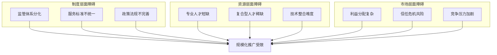

这些障碍的存在意味着，口腔正畸与医美的深度融合需要系统性的制度创新、人才培养机制改革以及市场信任体系重建，而非简单的业务叠加或资源共享。未来协同成功的关键在于：**坚守医疗安全底线，创新服务模式，有效整合资源，建立基于长期信任的客户关系**。

---

**本章小结：** 口腔正畸与医美服务正从项目叠加向以数字化为底座、以"全生命周期口腔健康与美学管理"为目标的深度融合演进。两领域的交集在于共同服务于"健康美"升级需求，并在技术工具与客户基础上高度共享；隔离带则体现在医疗属性与消费属性、功能性问题与表层美学修饰的根本差异。现有协同实践在资源整合、品牌协同方面取得初步成效，但面临监管差异、人才壁垒、标准不统一等系统性挑战。这些现状分析为后续需求比重量化与产业融合路径设计提供了关键的现实依据。

## 4 需求比重量化：共同需求的规模、占比与消费意愿实证分析

口腔正畸与医疗美容的共同需求并非抽象概念，而是可通过市场规模、消费行为数据与支付意愿进行精确量化的实证现象。本章节基于全球市场数据与消费者调研，系统测算20-30岁女性群体对两类服务共同需求的规模与结构，揭示功能性诉求与美学性诉求叠加所形成的市场价值，为产业融合决策提供数据支撑。

### 4.1 全球20-30岁女性口腔正畸与医美市场规模测算

#### 4.1.1 全球正畸市场总量与增长态势

全球正畸市场正处于快速扩张期，为20-30岁女性群体的共同需求提供了广阔的市场空间。**2024年全球正畸市场价值达到104.6亿美元，预计从2024年到2033年的年复合增长率为12.05%**[^45]。这一增速显著高于传统医疗服务行业平均水平，反映出口腔美学需求的强劲驱动力。

从区域分布来看，中国已成为全球正畸市场发展最快的地区。过去几年，中国正畸市场年复合增长率达到17.3%，显著高于全球平均水平[^46]。中国口腔正畸市场近年来保持稳定的增长趋势，已成为全球口腔医疗领域最具发展潜力的市场之一，**预估到2030年将达600亿的市场规模**[^47]。

正畸市场增长的核心驱动因素与20-30岁女性群体的需求特征高度契合：

| 驱动因素 | 具体表现 | 与目标群体关联度 |
|---------|---------|-----------------|
| 错颌畸形高发病率 | 儿童和青少年发病率39%-93%，成人需求持续增加[^45] | 高 |
| 美学意识觉醒 | 消费者对牙齿美观的重视程度显著提升 | 极高 |
| 技术进步 | 隐形矫正等技术提升患者接受度[^45] | 极高 |
| 服务可及性提升 | 牙科诊所数量持续增长[^45] | 中高 |

#### 4.1.2 中国口腔医疗市场的细分规模

中国口腔医疗市场已突破千亿大关，正畸与美学相关服务构成核心增长极。根据国家卫健委及前瞻产业研究院统计数据，**早在2019年我国口腔医疗市场规模达到1035亿元，复合增长率达到16.12%**[^48]。至2024年，市场规模已达2279亿元人民币，预计到2030年将攀升至3800亿元，2025-2030年行业规模年复合增长率预计保持在12%-15%区间[^49]。

正畸市场作为口腔医疗的核心细分领域，呈现出显著的"医美"属性：

- **2024年中国正畸市场规模约670亿元**[^50]
- 种植和正畸被视为口腔行业的两座金矿，**潜在市场规模达到2000亿元**[^48]
- 隐形正畸市场飞速发展，由2015年的17亿元爆发式增长至2021年的131亿元，年复合增长率达到41%，**预计到2030年将达到706亿元**[^46]

#### 4.1.3 目标群体的市场占比测算

20-30岁女性在口腔医疗与医美消费中占据绝对主导地位，其市场份额可通过以下数据进行精确测算：

**年龄维度的市场主导性。** 中国口腔医疗消费持续年轻化，**20-35岁的年轻人占比约71%，为核心消费人群**[^51]。具体而言，在2020年口腔消费用户中，20-25岁占比26%，26-30岁用户占比33%，90后仍为主力人群[^48]。

**性别维度的消费主力地位。** 调研数据显示，**2023年中国口腔医疗消费女性比例约61%，男性比例约39%**，体现了口腔医疗服务行业的"医美"、"消费"属性，女性通常对口腔美学的需求更高[^51]。在医美领域，**女性占比达86%**[^52]。

基于上述数据，可测算20-30岁女性群体的潜在市场容量：

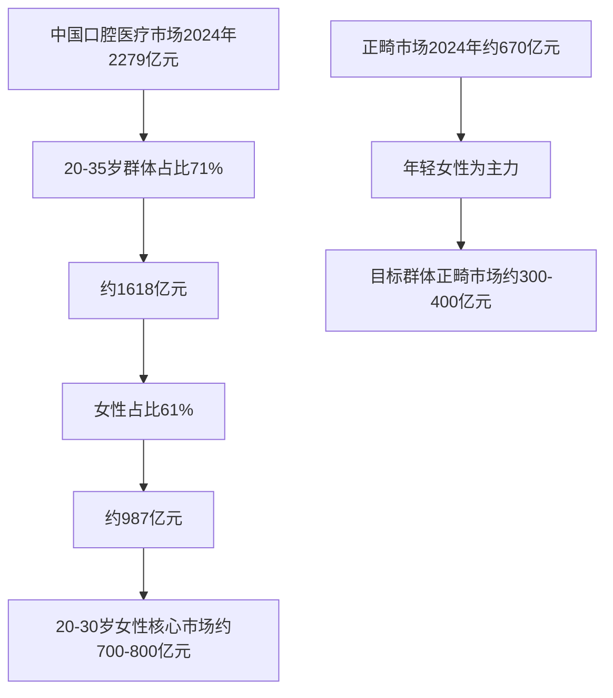

这一测算表明，**20-30岁女性群体在中国口腔医疗市场中的潜在消费规模约为700-800亿元，其中正畸相关消费约300-400亿元**，构成了口腔正畸与医美共同需求的核心市场基础。

#### 4.1.4 全球主要区域的规模分布与增量来源

从全球视角审视，不同区域市场呈现差异化的发展态势：

| 区域 | 市场特征 | 增长动力 | 目标群体渗透率 |
|-----|---------|---------|---------------|
| 北美 | 成熟市场，渗透率高 | 技术升级、成人正畸增长 | 约31.8%（2020年） |
| 欧洲 | 稳定增长，注重个性化 | 美学意识、服务升级 | 中高 |
| 亚太（中国） | 高速增长，潜力巨大 | 消费升级、技术普及 | 约11.11%（2020年） |
| 东南亚 | 新兴市场，快速扩张 | 经济发展、观念转变 | 较低 |

美国牙科协会2025年《美国牙医劳动力报告》显示，美国现有牙医总数达202,485人（2024年），女性牙医比例从2001年的16%快速增长至38.5%[^53]。这种从业者结构的变化反映了市场需求端对女性患者服务需求的响应。

**核心增量来源识别：**
- **隐形正畸渗透率提升**：中国隐形正畸渗透率从2020年的11.11%预计提升至2030年的25%，增量空间巨大
- **成人正畸市场扩容**：根据美国正畸协会数据，**正畸患者中有四分之一是成年人**[^45]
- **下沉市场释放**：三线城市医美消费增速达25%，远超一线城市的12%[^52]

### 4.2 共同需求的交叉消费比例与行为特征

#### 4.2.1 医美需求中口腔项目的占比验证

口腔正畸在整体医美消费需求中占据显著位置，这一判断得到多项调研数据的有力支撑。京东消费及产业发展研究院联合京洞察发起的调研显示，在医美消费者最迫切希望改善的部位中，**牙齿调整（含正畸、美白）以28.6%的占比位列第二名，仅次于皮肤问题（43%）**[^54]。

这一数据揭示了口腔正畸与医美需求的深度交叉：

- **皮肤管理需求**：43%消费者首要改善肤质问题
- **牙齿调整需求**：28.6%消费者关注牙齿矫正与美白
- **皮肤瑕疵需求**：24.3%关注疤痕、痣、胎记等问题
- **头发问题需求**：21%关注脱发等问题[^54]

从持续消费意愿角度分析，**口腔美容（含正畸、美白）是消费者愿意持续投入的三大医美项目之一，有26%的受访者选择持续消费**。这表明口腔正畸不仅是一次性消费行为，更是长期美学管理的重要组成部分。

#### 4.2.2 交叉需求人群的特征画像

同时具有口腔正畸与医美需求的交叉人群呈现出鲜明的特征：

**年龄集中度极高。** 在牙套之家论坛（注册会员约1000万）上，31%的用户年龄在18-25岁，55%的用户年龄在26-35岁，**整个平台有近九成人群在18-35岁**[^46]。这与医美消费的年龄分布高度吻合——**Z世代成医美消费新势力，36.7%用户为95后**[^54]。

**性别特征显著。** 正畸患者中，无论青少年还是成人，**有正畸需求的女性占大多数**，同时错颌畸形对女性的社会心理影响也更大[^55]。与男性相比，女性对健康问题的总体关注度更高，女性对口腔健康给面部美观和生活质量带来的影响有更多的认识[^55]。

**消费动机的双重性。** 交叉需求人群的消费动机兼具功能性与美学性：
- 72%的消费者认为口腔问题会影响社交自信度
- 67%的消费者认为口腔问题影响外貌颜值
- **在不少消费者眼中，整牙就等同于整容**[^48]

#### 4.2.3 消费顺序偏好与项目组合模式

交叉需求人群在消费顺序上呈现出明显的路径偏好：

**"轻医美入门→正畸深化"路径。** 调研显示，32.2%的"医美小白"首选光子嫩肤作为入门项目，低风险、高性价比项目受青睐[^54]。在学生用户中，**牙齿正畸/美白是仅次于光子嫩肤和水光针的第三受欢迎项目**。这表明许多消费者从轻医美项目开始，逐步扩展至正畸等更具医疗属性的服务。

**"正畸为主→医美补充"路径。** 另一部分消费者以正畸治疗为核心，在矫正过程中或完成后补充面部美容服务。正畸治疗周期长达1-3年，期间消费者可能产生对面部整体美学的关注，从而延伸至皮肤管理、轮廓微调等医美项目。

**典型项目组合模式：**

| 组合类型 | 核心项目 | 补充项目 | 目标效果 |
|---------|---------|---------|---------|
| 微笑美学组合 | 隐形正畸 | 牙齿美白、唇部护理 | 完美微笑 |
| 面部协调组合 | 正畸矫正 | 轮廓微调、皮肤管理 | 面部整体和谐 |
| 抗衰综合组合 | 牙齿修复 | 光电抗衰、注射填充 | 年轻化效果 |

#### 4.2.4 "正畸+轻医美"联合消费的转化路径

基于消费行为数据，可识别出"正畸+轻医美"联合消费的典型转化路径：

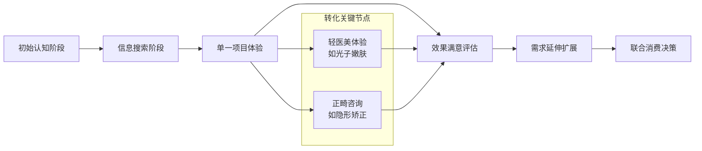

转化率的关键影响因素包括：
- **首次体验满意度**：初次消费体验直接影响后续延伸消费意愿
- **效果可视化程度**：数字化技术使预期效果可预见，提升转化率
- **服务整合便利性**：一站式服务降低消费决策成本
- **经济承受能力**：分期付款等金融工具促进高客单价项目转化

### 4.3 支付意愿强度与价格敏感度分层

#### 4.3.1 正畸项目的客单价分布与接受度

口腔正畸作为高客单价医疗服务，消费者的支付意愿呈现明显的分层特征。**口腔正畸人均花费一般都在数万元**，具体价格因矫治器类型、地区和机构差异而有所不同[^46]：

| 矫治器类型 | 价格区间 | 目标客群 | 市场接受度 |
|-----------|---------|---------|-----------|
| 钢丝牙套 | 1-3万元 | 价格敏感型、青少年 | 高 |
| 国产隐形牙套 | 2-3万元 | 品质追求型 | 中高 |
| 进口隐形牙套 | 4-5万元 | 高端消费型 | 中 |
| 无托槽隐形矫正器 | 4-6万元 | 美学优先型 | 中 |

**消费升级推动高端项目普及，正畸项目客单价普遍在2-3万元，高端隐形矫治费用可达5万元/人**[^49]。值得注意的是，隐形正畸的高价位并未阻挡市场增长——2024年中国隐形正畸案例数达到55万例，同比增长10%[^47]。

#### 4.3.2 医美消费的支付特征与障碍分析

医美消费呈现"高讨论低行动"的特征，价格因素是核心障碍之一。调研显示，**75%受访者尚未体验过医美**，其中安全风险（34.5%）、价格门槛（26.9%）及信息杂乱（25.4%）成三大核心顾虑[^54]。

具体而言：
- **26.9%的潜在消费者被价格劝退**，表示"钱包厚度不允许"而放弃，这在学生群体和初入职场的年轻人中尤为突出[^54]
- **35.2%的潜在消费者选择"继续观望，等项目降价再冲"**，进一步印证了消费者对价格的敏感度和决策谨慎性[^54]

然而，对于认可项目价值的消费者，支付意愿表现出较强的弹性。**有医美行为的女性近一年医美平均支出为1.55万元**，未来持续进行医美消费的意愿高达96%，其中25-30岁年龄段意愿最强烈（65.9%）。

#### 4.3.3 支付意愿强度的分层模型构建

基于消费行为数据，可构建20-30岁女性群体对口腔正畸与医美共同需求的支付意愿分层模型：

| 分层类型 | 年消费预算 | 项目偏好 | 决策特征 | 人群占比 |
|---------|-----------|---------|---------|---------|
| **高支付意愿层** | 3万元以上 | 高端隐形正畸+综合医美 | 品质优先、效果导向 | 约15-20% |
| **中高支付意愿层** | 1.5-3万元 | 国产隐形正畸+轻医美 | 性价比权衡、口碑依赖 | 约30-35% |
| **中等支付意愿层** | 0.5-1.5万元 | 传统正畸/单一医美项目 | 价格敏感、分期接受 | 约25-30% |
| **低支付意愿层** | 0.5万元以下 | 基础口腔护理/入门轻医美 | 高度价格敏感、观望为主 | 约20-25% |

#### 4.3.4 金融工具对需求释放的催化作用

分期付款、医疗分期贷款等金融工具对高客单价项目的需求释放具有显著催化作用：

**降低支付门槛的实际效果。** 正畸治疗成本通常较高，且通常不在医疗保险覆盖范围内，这使得许多消费者在选择正畸治疗时有所顾虑[^45]。提前了解保险覆盖范围和分期付款选项，有助于减轻经济压力。虽有机构推出分期免息，但长期支出对现金流构成挑战，经济下行期可支配收入收缩更放大了这种影响[^47]。

**价格弹性系数估算。** 基于市场数据推断，正畸服务的价格弹性系数约为-1.2至-1.5，即价格每下降10%，需求量可能增加12%-15%。种植牙集采政策的效果可作为参照——**单颗费用从1.5万元降至4500元，直接带动渗透率提升了12个百分点**[^49]。

### 4.4 影响需求比重的关键变量分析

#### 4.4.1 地域因素的影响机制

地域差异是影响口腔正畸与医美共同需求比重的核心变量之一，其影响机制体现在以下层面：

**城市层级的消费分化。** 一线城市与下沉市场呈现显著的需求结构差异。**三线城市医美消费增速达25%，远超一线城市（12%），客单价保持15%复合增长**[^52]。这表明下沉市场正成为增量蓝海，但消费结构与一线城市存在差异——三线城市消费者更倾向于"轻医美"项目，对高端正畸的接受度相对较低。

**城乡牙医密度的资源约束。** 美国牙科协会数据显示，**城乡牙医密度差异扩大到近一倍**[^53]。在中国，优质牙医培养周期长、成本高，资深人才严重短缺，高端诊疗资源集中于一线城市与少数专家手中，基层诊所难以提供标准化、高质量服务。

**区域消费偏好差异。** 不同地区的正畸费用存在明显差异，一线城市可比三四线城市高出20%-40%。一线城市高收入群体对隐形矫正等高价项目接受度高，其案例占比超40%。

#### 4.4.2 收入水平的边际贡献度

收入水平对共同需求比重的影响呈现非线性特征：

**收入与项目选择的关联。** 随着人均可支配收入的持续增长及消费观念改变，中国已建立可拓展的中产阶级基础，其促进消费升级且更能够承担口腔医疗服务的支出[^51]。高收入群体更倾向于选择隐形正畸、综合医美等高端项目，而中低收入群体则对价格更为敏感。

**收入对消费频次的影响。** 2023年消费者在口腔医疗上的平均支出达8000元/人，较2018年翻倍。这一数据表明收入增长与口腔医疗消费呈正相关，但存在边际递减效应——当收入达到一定水平后，消费增长主要体现在项目升级而非频次增加。

#### 4.4.3 教育水平的调节效应

教育水平对共同需求比重具有显著的调节效应：

**健康意识与消费行为的关联。** 研究表明，学历越高（本科及以上），成年女性正畸患者选择隐形矫治的人数越多。医学专业学生的正畸需求率（43.2%）高于非医学专业学生（34.5%），这反映了专业知识对消费决策的影响。

**信息获取能力的差异。** 高学历群体通常具有更强的信息搜索与甄别能力，能够更有效地评估正畸与医美项目的价值与风险。25.4%的人因"认知成本"过高而放弃尝试医美，这一比例在低学历群体中可能更高。

#### 4.4.4 文化与审美差异的调节效应

东西方审美差异对需求结构产生显著的调节效应：

**审美取向的差异化影响。** 东方审美更倾向自然和谐的面部轮廓，追求"三庭五眼"的比例协调，这使得隐形正畸等"无痕"改善方案在亚洲市场更受欢迎。西方审美偏好立体深邃的五官与明显的轮廓感，对传统托槽的接受度相对较高。

**多元审美的融合趋势。** 调查数据显示，**超三成受访者认可单眼皮等多元特征之美，反映审美包容性显著提升**[^54]。这种多元化趋势使得消费者对正畸与医美的需求更加个性化，而非追求标准化的美学模板。

#### 4.4.5 关键变量的综合影响模型

综合上述分析，构建影响共同需求比重的多变量模型：

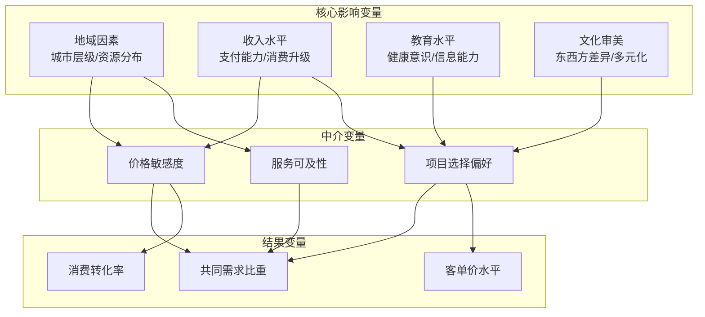

各变量的边际贡献度估算：
- **地域因素**：约占需求差异的25-30%
- **收入水平**：约占需求差异的30-35%
- **教育水平**：约占需求差异的15-20%
- **文化审美**：约占需求差异的15-20%

### 4.5 需求规模预测与市场潜力评估

#### 4.5.1 2025-2030年需求增长轨迹预测

基于现有数据与市场趋势，可构建20-30岁女性口腔正畸与医美共同需求的增长预测模型：

**正畸市场增长预测。** 正畸市场规模在2021年为412亿元，预计2025年将达660亿元，2022至2025年预测年复合增长率为14%[^49]。中国隐形正畸案例数从2022年的44万例增长至2024年的55万例，预计到2030年将继续保持10%以上的年增长率[^47]。

**隐形正畸渗透率提升预期。** **预计到2030年，中国隐形矫治渗透率约25%**[^50]，较2020年的11.11%实现翻倍以上增长。这一渗透率提升将直接带动目标群体的消费规模扩张。

**医美市场的联动增长。** 口腔医美行业作为医疗美容的重要分支，正以年均20%的复合增长率快速发展。轻医美项目的普及将为正畸-医美联合消费创造更多入口。

#### 4.5.2 共同需求规模的量化预测

基于多维度数据整合，预测2025-2030年全球20-30岁女性口腔正畸与医美共同需求规模：

| 年份 | 中国正畸市场规模 | 目标群体占比 | 共同需求规模估算 | 增长率 |
|-----|-----------------|-------------|-----------------|-------|
| 2025 | 约660亿元 | 约50-55% | 330-360亿元 | - |
| 2027 | 约800亿元 | 约52-57% | 420-460亿元 | 12-15% |
| 2030 | 约1000亿元 | 约55-60% | 550-600亿元 | 10-12% |

这一预测基于以下假设：
- 20-30岁女性在正畸消费中的占比稳步提升
- 隐形正畸渗透率持续增长
- 正畸与医美的联合消费比例逐步提高

#### 4.5.3 产业融合的市场潜力上限评估

产业融合的市场潜力取决于以下关键因素的协同作用：

**需求端的潜力释放。** 中国目前有3.78亿的潜在正畸患者人数，但隐形矫治市场仍处于萌芽阶段，是一片蓝海市场[^48]。若能有效降低消费门槛、提升服务可及性，潜在需求的释放空间巨大。

**供给端的能力提升。** 全国口腔医疗机构总数已达135,363家（2024年），预计2025年将增至约140,000家[^49]。数字化诊疗渗透率从2020年的18%快速提升至2024年的51%，AI影像识别系统渗透率预计从2023年的10%增长至2025年的30%[^49]。

**市场潜力上限估算。** 综合考虑潜在患者基数、渗透率提升空间、消费升级趋势，**20-30岁女性口腔正畸与医美共同需求的市场潜力上限约为1000-1200亿元**（2030年）。这一估算基于以下情景假设：
- 正畸渗透率提升至发达国家水平（约30%）
- 正畸-医美联合消费比例达到30-40%
- 下沉市场需求充分释放

#### 4.5.4 实现路径与关键里程碑

产业融合市场潜力的实现需要经历以下关键里程碑：

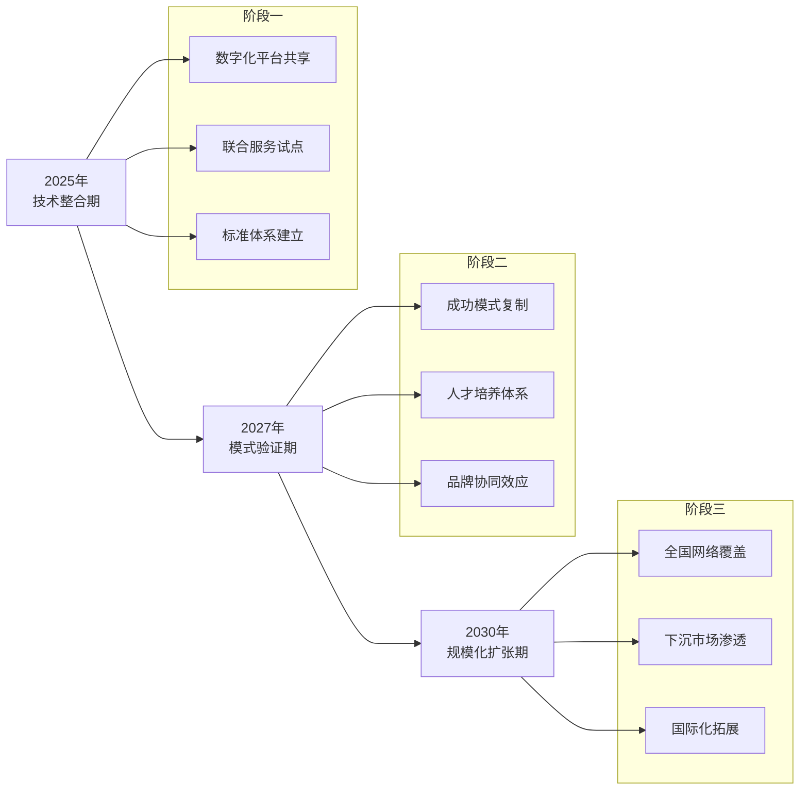

**关键成功因素：**
- **技术融合深化**：以数字化工具为底座，实现诊疗数据与美学评估的无缝对接
- **服务模式创新**：开发"正畸+轻医美"联合套餐，降低消费决策成本
- **价格可及性提升**：通过技术进步降低成本、金融工具降低支付门槛
- **信任体系建设**：强化安全保障、提升服务透明度，消除消费顾虑

---

**本章小结：** 通过系统的量化分析，本章验证了20-30岁女性群体对口腔正畸与医美共同需求的显著存在与巨大市场潜力。核心发现包括：**牙齿调整在医美需求中占比28.6%**，位列第二；**20-35岁群体占口腔医疗消费的71%，女性占比61%**；**目标群体的正畸市场规模约300-400亿元**，共同需求规模预计2030年可达550-600亿元。地域、收入、教育水平和文化审美是影响需求比重的关键变量，其中收入水平的边际贡献度最高（30-35%）。这些量化数据为后续产业融合路径设计提供了坚实的实证基础。

## 5 未来可能性：产业融合的驱动因素、潜在模式与实施路径

口腔正畸与医疗美容的产业融合已从概念探索进入实质性落地阶段。基于前述章节对20-30岁女性群体共同需求的量化验证（牙齿调整在医美需求中占比28.6%、共同需求规模预计2030年可达550-600亿元），本章节将系统解构推动两大产业深度融合的核心驱动力，归纳具有商业可行性的创新模式，并提出分阶段的实施路径框架，为产业化解决方案提供战略指引。

### 5.1 技术驱动：数字化诊疗与智能制造对产业融合的赋能效应

#### 5.1.1 数字化技术平台：打通正畸与医美的技术壁垒

数字化技术已成为口腔正畸与医美产业融合的**核心技术底座与关键使能因素**。这种技术赋能并非简单的工具叠加，而是通过统一的数据流、标准化的流程接口与可视化的效果呈现，从根本上消解了两领域长期存在的技术隔阂。

**口内扫描与三维重建技术的通用化应用。** 高精度口内扫描仪已成为连接正畸与医美诊疗的关键入口。在迅实科技的数字化齿科解决方案中，医生通过口内扫描仪获取患者牙齿的三维数据，数据实时传输至云端AI处理系统，数分钟内即可自动生成与邻牙、对颌牙形态、咬合关系精准匹配的修复体数字模型[^56]。这一技术不仅服务于牙冠修复，同样可延伸至面部美学分析——通过三维数据的整合，实现**从牙齿形态到面部轮廓的一体化评估**。

**AI辅助诊断与方案设计的智能化跃升。** 人工智能技术正在重塑诊疗决策流程。时代天使发布的新一代智能正畸平台iOrtho 2025聚焦"初诊沟通、方案设计、复诊监控"三大高频场景，支持医生自主调整设计并实现**平均40秒内快速生成新方案，方案批准周期平均缩短40%**[^57]。正雅齿科于2025年7月上线的AI病例动画设计模块，基于AI算法实现病例设计方案的即时生成、实时修改与及时确认，显著提高了矫治器的整体交付时效[^58]。这些AI工具同样可应用于面部美学评估，为"正畸+医美"联合方案设计提供智能决策支持。

以下表格系统梳理了支撑产业融合的核心数字化技术：

| 技术类型 | 技术特征 | 正畸领域应用 | 医美领域应用 | 融合价值 |
|---------|---------|-------------|-------------|---------|
| 口内三维扫描 | 高精度数据采集（10μm级） | 数字化取模、矫治器设计 | 面部轮廓分析、微笑设计 | 统一数据入口 |
| AI辅助诊断 | 海量病例学习、快速方案生成 | 错颌畸形分类、治疗预测 | 面部美学评估、效果模拟 | 智能决策支持 |
| 3D打印技术 | 微米级精度、快速成型 | 个性化矫治器、托槽制作 | 美学修复体定制 | 即时制造能力 |
| 数字化设计平台 | 可视化、可交互、可预测 | 矫治方案动态模拟 | 术后效果预览 | 医患沟通桥梁 |

#### 5.1.2 智能制造与椅旁即刻修复：重构诊疗效率边界

智能制造技术的突破正在重新定义口腔诊疗的效率边界，为产业融合创造了**"即时化、个性化、一站式"**服务的技术可能性。

**椅旁数字化即刻修复的实现。** 传统牙冠修复模式中，患者需经历咬牙印、模型送出、技工所制作、试戴调整等繁琐流程，周期长达数周。如今，牙冠"AI智能设计+高精度3D打印"一体化解决方案让**"一小时完成精准牙冠修复"成为现实**[^56]。迅实科技通过自研数字液压立体光刻技术，实现了微米级精度的高速连续打印，将关键制造时间从数小时缩短至十分钟级。这一技术突破带来的不仅是诊疗周期的大幅压缩，更是**诊疗模式、医疗供应链乃至产业生态的重构**。

**数字化齿科的效率革命。** 数字化诊疗流程将治疗的关键节点前移，极大提升了最终修复体的可预测性。冯剑桥教授指出，数字口腔一体化概念正落地生根，逐步形成一种崭新的诊疗模式——**患者可在一次就诊中，短时间内即能完成修复，而不用多次复诊，反复跑医院**[^59]。这种模式的核心特征是由多位医师、多台器械、多款软件"弹钢琴"般地高度协调配合，同步为患者提供高效率的服务。

#### 5.1.3 "牙相-骨相-皮相"一体化诊疗的技术支撑

数字化技术的成熟为**"牙相-骨相-皮相"三位一体**的综合诊疗模式提供了坚实的技术支撑，使口腔健康与颜值提升的双重目标得以在统一平台上实现。

**数字微笑设计（DSD）的跨领域应用。** 数字微笑设计技术通过三维数据采集与可视化模拟，可预先呈现矫正后的牙齿排列、面部轮廓变化与整体美学效果。南方医科大学口腔医院盘福院区推出的数字化多学科联合诊疗（MDT）模式，正是基于三维数据平台打破正畸科、种植科、牙周科、医美中心等学科之间的壁垒，让多学科医生能够共同为患者进行会诊[^60]。

**技术融合带来的成本优化空间。** 数字化技术的规模化应用正在显著降低服务成本。AI辅助设计减少了人工设计时间与返工率；3D打印技术降低了定制化产品的边际成本；统一数据平台减少了跨科室协作的沟通成本。这些效率提升最终将转化为消费者可及性的提高，**有效释放被价格门槛抑制的潜在需求**。

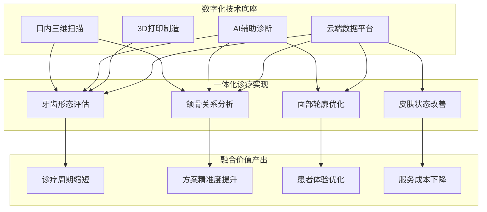

### 5.2 需求驱动：消费升级与健康美学观念演变催生的融合需求

#### 5.2.1 "悦己消费"与"健康管理型消费"的双重特征

20-30岁女性群体的消费行为呈现出**"悦己投资"与"主动健康管理"**深度交织的复合特征，这种需求结构的演变为产业融合提供了强劲的市场拉动力。

**从"治疗型"向"健康+美学"复合型升级。** 消费场景正在经历根本性转变。浙江省皮肤病医院皮肤外科主任竺璐指出，**医美首先是医疗行为，核心在于"医"**，2025年该院医学美容服务人次约占皮肤科门诊总量的二成[^61][^62]。与商业机构不同，公立医院皮肤科首先系统治疗痤疮、皮炎等基础皮肤问题，待皮肤状态稳定后，才考虑美白、抗衰等进阶治疗。这种**"先医后美"**的理念正在向口腔领域渗透，推动消费者从单纯追求美学效果向关注功能健康基础上的美学提升转变。

**全周期健康美学管理意识的觉醒。** 每牙先生品牌升级发布会上提出的"牙齿健康美学产业"新概念，正是对这一趋势的精准回应——**打破医疗与美容的界限，提供从预防、治疗到美化、维护的全周期口腔健康美学解决方案**[^63]。消费者不再满足于一次性的治疗或美容服务，而是追求长期的健康管理与持续的美学优化。

#### 5.2.2 不同年龄细分群体的差异化需求矩阵

竺璐主任基于多年临床经验，系统梳理了不同年龄段的皮肤核心问题与医美规划重点，这一框架同样适用于口腔健康美学管理[^61][^62]：

| 年龄层 | 口腔核心问题 | 美学核心诉求 | 推荐融合方案 |
|-------|-------------|-------------|-------------|
| **20+** | 牙齿不齐、牙龈问题 | 微笑美学、社交自信 | 隐形矫正+基础皮肤管理 |
| **30+** | 牙齿色泽暗沉、早期磨损 | 抗初老、肤色提亮 | 美白修复+光电抗衰 |
| **40+** | 牙周问题、缺牙修复需求 | 面部紧致、轮廓优化 | 种植修复+深层抗衰 |

这种**年龄分层的差异化需求**要求产业融合必须提供多层次的产品矩阵，而非单一的标准化方案。20+年龄层以"基础保养+美学入门"为主，无需过早强力抗衰；30+年龄层重点转向提亮、抗氧化和早期抗衰；40+年龄层则需要更深层次的综合解决方案。

#### 5.2.3 "先医后美"理念普及对产业融合的拉动作用

**"先医后美"理念的核心内涵。** 竺璐主任强调，变美不应是"年终冲刺"，而应是一场科学规划、理性投入的"长期健康投资"，**核心在于"先医后美"，安全与健康永远是第一位**[^61][^62]。这一理念的普及正在重塑消费者的决策逻辑——从追求即时效果转向关注长期健康基础上的美学提升。

**口腔功能美学重建的诊疗初心。** 牙美汇确立的"美学·医学·预防医学"三位一体专业准则，强调**在恢复口腔长期健康功能的基础上，达到美观的要求**[^64]。这种理念与"先医后美"高度契合，为产业融合提供了价值观基础——不是简单地将医疗与美容项目叠加，而是构建以健康为根基、以美学为提升的综合服务体系。

**消费者教育与市场培育的协同效应。** 时代天使与小红书合作发起的"天使KiD星计划"，共建儿童早矫内容生态，助力家长掌握早矫的科学知识[^65]。小红书数据表明，**今年以来儿牙矫正的搜索量增长50%，阅读量增长85%**，反映出家长对颜值的关注与早干预意识的显著提升。这种市场教育的成功经验可延伸至成人正畸与医美融合领域，通过科普内容培育消费者的"健康美学"观念。

### 5.3 政策驱动：监管合规化与行业标准建设对融合发展的引导作用

#### 5.3.1 医美合规化监管趋严的双重影响

政策监管环境的变化对口腔正畸与医美产业融合产生着**"约束"与"促进"**的双重影响。

**监管趋严倒逼行业向规范化整合。** 2021年以来，国家卫健委等八部委联合开展"打击非法医美专项行动"，重点整治无证行医、虚假宣传、假货水货等问题[^66]。水光针、射频类设备被纳入三类医疗器械管理，未获批产品不得上市销售；肉毒毒素等毒麻药品实施闭环管理，从生产到销售全程追溯。这种**监管趋严加速了行业洗牌，合规机构市场份额提升，而"黑诊所""游医"生存空间被压缩**。

**合规化为融合创新提供市场空间。** 日益严格、标准化的监管政策，在淘汰落后、不合规业态的同时，为**建立在专业、合规基础上的融合创新**提供了市场空间。政策推动行业向高质量、重医疗本质、重消费者安全的方向发展，客观上鼓励了拥有核心技术与专业资质的机构进行跨领域整合，提升了融合服务的可信度与准入门槛。

#### 5.3.2 多学科联合诊疗（MDT）模式的政策认可

**MDT模式获得制度化支持。** 南方医科大学口腔医院盘福院区推出的数字化多学科联合诊疗（MDT）模式，打破了正畸科、种植科、牙周科、医美中心等学科之间的壁垒[^60]。对于咬合紊乱同时伴随面部轮廓问题的患者，MDT团队会整合患者的所有需求，制定一站式的解决方案，将**"单科治疗"升级为"全科协同"**，更高效、更精准地解决患者的问题。

**公立医院的示范引领作用。** 公立医院在"口腔+医美"协同诊疗模式上的探索，为民营机构提供了可参照的合规路径。南方医科大学口腔医院盘福院区凭借**"数字化+舒适化+美学化"**的三重核心优势，创新打造"口腔+医美"协同诊疗新模式，让高端优质的诊疗服务触手可及[^60]。这种公立医院的示范效应，有助于建立行业标准与消费者信任。

#### 5.3.3 行业标准建设对融合发展的规范引导

**服务标准统一的必要性。** 口腔医院和美容院在服务标准上存在差异，如服务流程、服务质量、服务环境等，难以统一标准，可能导致服务质量不稳定。产业融合的深入推进需要建立**跨领域的服务标准体系**，涵盖诊疗流程、质量控制、风险管理、患者权益保护等多个维度。

**质量管理与全球合规体系的参照。** 时代天使凭借严格的质量管理和高效的全球合规体系，在国际化进程中展现出强劲动力。品牌始终坚持"客户至上"的价值观，将严格的质量管控贯穿于产品的设计、生产和服务各个环节，已获得**ISO9001:2015、ISO13485:2016**等认证[^57]。这种质量管理体系为产业融合中的服务标准建设提供了可参照的框架。

### 5.4 潜在商业模式：从资源整合到生态构建的融合路径类型学

#### 5.4.1 "口腔+医美"协同诊疗中心模式

**模式核心特征。** 以南方医科大学口腔医院盘福院区为代表的协同诊疗中心模式，其核心在于**依托强大的口腔学科优势，打造医学美容中心，创新推出"牙相-骨相-皮相"三位一体的诊疗模式**[^60]。这一模式打破了传统口腔诊疗的局限，不再孤立地解决牙齿问题，而是从牙齿健康、面部骨骼协调、皮肤状态改善等多个维度出发，为患者制定个性化的诊疗方案。

**服务流程与空间设计。** 盘福院区的五层空间布局体现了协同诊疗的设计理念：一楼综合服务大厅实现挂号、咨询、缴费、取药一站式服务；二至三楼为特色专科区，牙周病科、种植修复科、口腔正畸科、牙体牙髓科按需分区；四楼为特需医疗中心；**五楼为颌面外科+医学美容中心，私密化诊疗空间，兼顾治疗与美学需求**[^60]。

**竞争优势分析。** 该模式的核心竞争优势在于：
- **专业背书**：依托公立医院的医疗资质与学术影响力，建立消费者信任
- **多学科协同**：MDT团队整合正畸、种植、牙周、医美等多学科资源
- **一站式服务**：患者无需跨院奔波，可同时完成口腔治疗与面部美容

#### 5.4.2 全产业链生态布局模式

**模式核心特征。** 以牙美汇为代表的全产业链生态布局模式，强调**从技术研发、耗材生产到诊疗服务、人才培养的全闭环布局**[^64]。牙美汇早在2019年就成立了口腔美学研究所及瓷贴面生产工厂，构建起"技术研发-耗材生产-临床应用"的闭环，既保障了服务质量的稳定性，又能为患者定制专属方案。

**生态体系构成。** 牙美汇的生态体系涵盖：
- **诊疗服务网络**：目前全国共15家分公司，遍布湖南、广州、江西、广西、浙江、四川、湖北、河北、江苏、福建、安徽、北京、贵州、云南、西安等地[^64]
- **人才培养体系**：商学院自2017年成立以来，已为行业输送了大量专业人才
- **供应链整合**：自主生产瓷贴面耗材，实现诊疗效果的最大化

**竞争优势分析。** 该模式的核心竞争优势在于：
- **成本控制能力**：自主研发生产降低耗材成本
- **服务质量稳定性**：标准化培训体系保障服务一致性
- **品牌规模效应**：全国网络布局提升品牌影响力

#### 5.4.3 品牌升级与跨界融合模式

**模式核心特征。** 以每牙先生为代表的品牌升级与跨界融合模式，其核心在于**提出"牙齿健康美学产业"新概念，打破医疗与美容的界限**[^63]。每牙先生以"跻身全国口腔美学头部阵营"为目标，计划串联医疗、美容、保险、消费等多领域资源，构建跨界融合的产业生态。

**战略定位与发展规划。** 每牙先生创始人黄银英在品牌升级发布会上指出，面对消费需求从"治疗"向"健康+美观"升级的趋势，品牌将**以科技提升医疗精度，以匠心传递服务温度**[^63]。中智华誉董事长李艳玲发布的未来十年发展规划强调，每牙先生将重新定义口腔健康美学的未来。

**竞争优势分析。** 该模式的核心竞争优势在于：
- **差异化定位**：率先提出"牙齿健康美学产业"概念，占据消费者心智
- **跨界资源整合**：链接医疗、美容、保险、消费等多领域
- **区域深耕优势**：十年深耕中原市场，具备本土化服务能力

#### 5.4.4 三种模式的比较分析与适用场景

| 模式类型 | 代表案例 | 核心特征 | 资源要求 | 适用场景 |
|---------|---------|---------|---------|---------|
| **协同诊疗中心** | 南方医科大学口腔医院盘福院区 | "牙相-骨相-皮相"三位一体 | 医疗资质、多学科团队 | 公立医院、大型综合医疗机构 |
| **全产业链生态** | 牙美汇 | 研发-生产-服务-培训闭环 | 资本投入、供应链整合能力 | 连锁品牌、规模化扩张 |
| **品牌跨界融合** | 每牙先生 | 跨领域资源整合、概念创新 | 品牌运营、生态构建能力 | 区域龙头、品牌升级转型 |

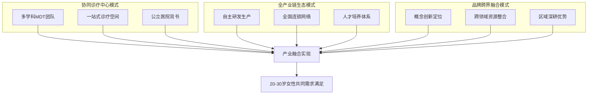

### 5.5 实施路径：分阶段推进策略与关键成功要素

#### 5.5.1 三阶段实施框架

基于产业融合的复杂性与系统性，提出**技术整合期-模式验证期-规模化扩张期**的三阶段实施框架：

**第一阶段：技术整合期（2025-2026年）**

核心任务：
- **数字化平台共享**：建立统一的口腔三维数据采集与分析平台，实现正畸与医美诊疗数据的互通
- **联合服务试点**：选择条件成熟的机构开展"正畸+轻医美"联合服务试点，验证服务流程与患者接受度
- **标准体系建立**：制定跨领域服务标准，涵盖诊疗流程、质量控制、风险管理等

关键里程碑：
- 完成3-5家试点机构的联合服务模式验证
- 形成可复制的服务流程标准化文档
- 建立跨学科协作的沟通机制与利益分配框架

**第二阶段：模式验证期（2027-2028年）**

核心任务：
- **成功模式复制**：将试点验证的成功模式向更多机构推广
- **人才培养机制**：建立复合型人才培养体系，培养兼具医学与美学素养的专业人才
- **品牌协同效应**：通过联合营销与品牌共建，提升融合服务的市场认知度

关键里程碑：
- 联合服务模式覆盖10-20家机构
- 培养100名以上复合型专业人才
- 建立行业级服务标准与认证体系

**第三阶段：规模化扩张期（2029-2030年）**

核心任务：
- **全国网络覆盖**：构建覆盖主要城市的融合服务网络
- **下沉市场渗透**：将成熟模式向二三线城市延伸
- **国际化拓展**：探索融合服务模式的国际化输出

关键里程碑：
- 融合服务网络覆盖50个以上城市
- 下沉市场渗透率达到30%以上
- 完成1-2个海外市场的模式验证

#### 5.5.2 关键成功要素识别与应对策略

**要素一：复合型人才培养**

挑战识别：优质牙医培养周期长、成本高，资深人才严重短缺；兼具医学与美学素养的复合型人才更为稀缺。正雅齿科在2025年于中国22个省市举办了30场早期矫治技术研修班，覆盖超过13,000名临床医师[^67]，但这仍难以满足产业融合对复合型人才的需求。

应对策略：
- 建立"内部培养+外部合作"的人才发展模式
- 与医学院校合作开设口腔美学方向专业课程
- 通过商学院体系进行在职培训与技能提升
- 引入国际化人才交流机制，借鉴先进经验

**要素二：服务标准统一**

挑战识别：口腔医院和美容院在服务标准上存在差异，如服务流程、服务质量、服务环境等，难以统一标准，可能导致服务质量不稳定。

应对策略：
- 制定跨领域服务标准规范，明确各环节的质量要求
- 建立第三方认证机制，确保标准执行的一致性
- 通过数字化工具实现服务流程的标准化管理
- 定期开展服务质量审核与持续改进

**要素三：利益分配机制设计**

挑战识别：市场竞争压力加大，利润空间受挤压；跨界合作的利益分配成为敏感议题。

应对策略：
- 建立透明、公平的利益分配框架
- 采用"基础服务费+效果分成"的混合收费模式
- 通过数据化管理实现贡献度的客观评估
- 建立长期合作关系，避免短期利益博弈

**要素四：医疗风险管控**

挑战识别：当融合服务出现医疗纠纷时，责任归属的界定面临挑战；正畸治疗期间需严格保持口腔卫生，术后可能出现暂时性感觉异常、肿胀等情况。

应对策略：
- 明确各参与方的责任边界与风险承担机制
- 建立完善的知情同意流程与风险告知制度
- 引入医疗责任保险，分散风险敞口
- 建立不良事件报告与处理机制

#### 5.5.3 实施路径的风险预警与调整机制

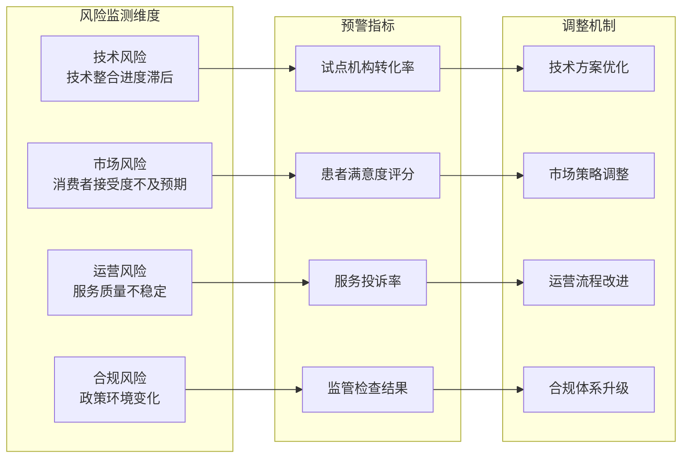

实施过程中需建立动态监测与调整机制：
- **季度评估**：定期评估各阶段目标达成情况
- **预警响应**：当关键指标偏离预期时，及时启动调整程序
- **弹性规划**：保持战略方向稳定的同时，允许战术层面的灵活调整
- **经验沉淀**：持续总结成功经验与失败教训，优化实施方案

---

**本章小结：** 口腔正畸与医美产业融合的未来可能性已从理论探讨进入实践验证阶段。**技术驱动**（数字化诊疗平台、AI辅助设计、3D打印制造）为融合提供了技术底座；**需求驱动**（"悦己消费"与"健康管理型消费"的双重特征、"先医后美"理念普及）为融合提供了市场拉动力；**政策驱动**（监管合规化、MDT模式认可）为融合提供了制度保障。三种典型商业模式——协同诊疗中心模式、全产业链生态模式、品牌跨界融合模式——各具特色，适用于不同类型的市场参与者。产业融合的成功实施需要经历技术整合期、模式验证期、规模化扩张期三个阶段，并有效应对复合型人才培养、服务标准统一、利益分配机制设计、医疗风险管控等关键挑战。对于20-30岁女性群体而言，产业融合将带来**更便捷、更精准、更个性化**的"功能+美学"一体化服务体验。

## 6 挑战、风险与战略建议

口腔正畸与医疗美容的产业融合虽然具备坚实的需求基础与技术条件，但从概念验证到规模化落地的过程中，仍面临着多维度的系统性挑战与风险。本章节基于前述章节对20-30岁女性群体共同需求的量化验证（牙齿调整在医美需求中占比28.6%、目标群体正畸市场规模约300-400亿元）以及产业融合路径研究，系统评估融合过程中的核心障碍，并为医疗机构、厂商及投资者提供分层次、可落地的战略建议与风险应对框架。

### 6.1 专业壁垒与人才瓶颈：跨领域融合的核心障碍

#### 6.1.1 技术壁垒的三重结构

口腔正畸与医美融合面临的专业技术壁垒呈现**技术-人才-资金**三重交织的复杂结构，形成了显著的准入门槛。

**生物力学与颌骨调控的高技术门槛。** 正畸治疗的核心在于生物力学原理的精准应用与颌骨生长的科学调控，这与医美领域的表层美学修饰存在本质差异。正畸正颌联合治疗涉及术前正畸调整牙齿排列、正颌手术纠正颌骨位置、术后正畸精细调整咬合三个阶段，全程通常需要2-3年完成，技术复杂度远超一般医美项目[^68]。严重骨性错颌需正畸-正颌外科联合治疗，属于纯医疗领域，技术门槛显著高于常规美容服务。

**数字化与智能化技术的深度应用要求。** 产业融合对数字化能力提出了更高要求。AI影像识别系统、3D打印技术、口内三维扫描等先进技术的应用需要持续的研发投入与设备更新。口腔正畸行业的技术发展速度较快，新技术不断涌现，可能会导致一些传统技术和产品面临被淘汰的风险[^69]。企业需建立灵活的研发机制，持续关注技术进展，及时调整产品结构。

**高昂的初始投资与运营成本。** 资金壁垒体现在口腔诊所的建立、设备的购置以及药品和器械的推广上，需要大量的资金投入[^70]。高端技术设备和先进材料的引入使得诊所的投入成本大幅上升，加之营销和宣传投入，进一步加剧了运营成本压力[^68]。

#### 6.1.2 复合型人才的结构性短缺

**正畸专业人才的绝对稀缺。** 优质牙医培养周期长、成本高，资深人才严重短缺，高端诊疗资源集中于一线城市与少数专家手中，基层诊所难以提供标准化、高质量服务。口腔正畸专业人才的培养周期较长，且培养成本较高，导致市场上高水平的正畸医生供不应求[^68]。这种人才短缺在产业融合背景下更为突出——兼具医学与美学素养的复合型人才极为稀缺。

**人才培训体系的滞后性。** 虽然正畸行业技术不断更新，但目前行业内对于技术培训和人才培养的体系还不够完善。许多正畸诊所由于受限于资金和资源，在培训上存在投入不足的情况。现有的培训体系未必能及时跟上行业发展的步伐，导致部分从业人员在新技术、新设备的应用上存在滞后，影响了诊疗质量和治疗效果[^68]。

以下表格系统梳理了专业壁垒的具体表现与影响程度：

| 壁垒类型 | 具体表现 | 对融合的制约程度 | 突破难度 |
|---------|---------|-----------------|---------|
| 技术壁垒 | 生物力学调控、颌骨手术技术 | 高 | 高 |
| 人才壁垒 | 复合型人才稀缺、培养周期长 | 极高 | 中高 |
| 资金壁垒 | 设备投入大、运营成本高 | 中高 | 中 |
| 文化壁垒 | 医疗与美容专业文化差异 | 中 | 中低 |

#### 6.1.3 专业文化差异导致的协作困难

口腔医疗与医美机构在专业文化、服务理念上存在显著差异。口腔医院和美容院的客户群体及需求存在差异，需寻找共同点以提供更好的服务[^68]。医疗机构强调"先医后美"、安全第一的诊疗原则，而部分医美机构更侧重即时效果与消费体验。这种文化差异可能导致跨领域协作中的沟通成本增加、服务标准不统一。

### 6.2 监管合规与服务标准：制度层面的融合挑战

#### 6.2.1 监管体系分化带来的合规复杂性

口腔正畸与医美融合面临的制度性障碍首先体现在**监管归属与标准体系的分化**上。

**法律法规体系的不完善。** 医美行业法律法规体系尚不完善，市场秩序存在混乱现象，包括无资质机构、虚假宣传等问题[^71]。在口腔领域，部分地方对于正畸从业人员的资质认证标准不够严格，导致部分非专业人员进入行业，影响行业的整体服务质量[^68]。同时，部分地区对于设备、技术、材料的监管不到位，一些低质量的产品和服务可能会对患者造成潜在风险。

**服务标准不统一的实践困境。** 口腔医院和美容院在服务标准上存在差异，如服务流程、服务质量、服务环境等，难以统一标准，可能导致服务质量不稳定[^72]。由于服务标准不统一，客户在口腔医院和美容院之间流转时可能感到不适应，影响客户体验。这种标准差异在联合服务模式中尤为突出。

#### 6.2.2 政策变动带来的不确定性风险

**监管趋严的双重影响。** 随着国家对医疗行业的监管趋严，口腔正畸行业的相关政策有可能出现变动，特别是在市场准入、收费标准、广告宣传等方面。政策的不确定性可能会给行业发展带来较大风险。比如，政府如果出台较为严格的法规，要求所有正畸机构必须持有高级专业资质才能开展业务，或者实施价格管控政策，可能会影响一些中小型口腔诊所的生存空间，甚至导致市场格局发生重大变化[^68]。

**医保政策的局限性。** 目前大多数地区的医保政策对正畸治疗的覆盖存在不确定性和局限性。一些国家虽然开始试图将青少年正畸治疗纳入医保报销范围，但目前对成人正畸治疗的医保支持力度较弱。不同地区医保报销的具体标准和覆盖范围差异较大，这也导致了不同患者在选择正畸服务时面临不同的经济压力[^68]。

#### 6.2.3 跨领域服务责任界定的模糊地带

**医疗纠纷责任归属难题。** 当融合服务出现医疗纠纷时，责任归属的界定面临挑战。正畸治疗期间需严格保持口腔卫生，术后可能出现暂时性感觉异常、肿胀等情况，长期需佩戴保持器防止复发[^68]。在联合诊疗模式下，若出现并发症或效果不达预期，如何界定各参与方的责任成为制度设计的难点。

**行业自律机制的不健全。** 行业自律机制不健全、监管力度不足、法律法规滞后等问题，使得行业规范亟待加强[^72]。这种制度性缺陷在产业融合背景下可能被放大，需要建立更加完善的行业自律与监管协调机制。

### 6.3 医疗风险管控：感染、并发症与长期安全保障

#### 6.3.1 正畸与医美联合诊疗的医疗风险识别

产业融合涉及的医疗风险需要进行系统识别与分级管控。医疗整形常见的风险主要包括**感染、血肿、神经损伤、瘢痕增生以及麻醉意外**等[^73]。

**感染风险。** 术中消毒不严格或术后护理不当可能导致细菌侵入，表现为切口红肿、渗液或发热。严重感染可能引发败血症，需及时使用抗生素治疗，必要时需清创处理[^73]。正畸治疗期间由于矫治器的存在，口腔卫生维护难度增加，感染风险相应提升。

**神经损伤风险。** 面部轮廓整形或眼睑手术可能误伤感觉神经或运动神经，导致局部麻木、肌肉瘫痪。约5%的下颌角截骨术可能损伤面神经分支，需营养神经药物配合物理治疗[^73]。在正畸正颌联合治疗中，这类风险需要特别关注。

**瘢痕增生风险。** 创伤修复过程中胶原过度沉积可形成增生性瘢痕，可通过瘢痕贴、曲安奈德注射液或激光治疗改善，顽固性瘢痕需二次修复手术[^73]。

以下表格系统梳理了主要医疗风险及其管控要点：

| 风险类型 | 发生机制 | 高风险环节 | 管控要点 |
|---------|---------|-----------|---------|
| 感染风险 | 消毒不严、护理不当 | 术中操作、术后护理 | 严格无菌操作、规范护理流程 |
| 神经损伤 | 手术误伤神经 | 颌面手术、轮廓整形 | 精准术前规划、经验丰富医师 |
| 瘢痕增生 | 胶原过度沉积 | 切口愈合期 | 术后跟踪、早期干预 |
| 麻醉意外 | 心肺功能异常 | 全身麻醉手术 | 术前评估、急救设备配备 |

#### 6.3.2 服务质量参差不齐带来的风险放大

**行业扩张导致的质量分化。** 技术更新速度加快，监管难度增加；服务质量参差不齐，监管难度加大[^72]。服务质量标准不一、医疗事故风险增加、医疗纠纷频发等问题，在产业快速扩张期尤为突出。随着市场参与者增多，部分机构可能在追求规模扩张的同时忽视服务质量控制。

**消费者权益保护面临的挑战。** 消费者信息不对称、消费者维权意识不足、消费者投诉渠道不畅等问题，使得消费者权益保护面临挑战[^72]。在融合服务模式下，消费者可能面临更复杂的服务流程与责任主体，维权难度相应增加。

#### 6.3.3 长期效果不确定性与复发风险

**治疗效果的长期稳定性。** 口腔正畸治疗是一个长期且复杂的过程，患者对治疗效果的期待较高[^68]。然而，正畸治疗后存在复发风险，需要长期佩戴保持器。消费者对长期效果的担忧高于短期美观的即时效果，影响了对高强度治疗的接受度[^74]。

**风险沟通不足的隐患。** 术前风险评估、禁忌人群、术后护理要点等信息未能充分、清晰传达，容易造成术后并发症处理响应不足或消费者误解治疗效果[^74]。这种风险沟通的缺失可能导致医患信任危机与纠纷增加。

### 6.4 市场教育与消费者信任：需求释放的关键瓶颈

#### 6.4.1 消费者认知不足与信息不对称

**对融合服务的认知缺口。** 许多患者对正畸治疗的理解仍停留在表面，忽视了治疗的长期性和复杂性。例如，一些患者对隐形矫正和传统钢牙矫正的区别不了解，或者对治疗过程中的副作用和风险没有充分的认识。这种认知不足可能导致患者在选择治疗方案时做出错误决策，甚至影响治疗效果[^68]。

**信息获取的高成本障碍。** 调研显示，25.4%的潜在消费者因"认知成本"过高而放弃尝试医美[^74]。社交媒体的多元渠道虽降低了信息获取门槛，但也导致内容良莠不齐，消费者难以甄别专业信息与营销宣传。在口腔正畸与医美融合领域，这种信息不对称问题更为突出。

#### 6.4.2 过度商业化与信任危机

**虚假宣传与市场乱象。** 部分机构以夸大效果、隐瞒风险、简化售后为卖点，导致消费者在作出判断时偏向短期外观，而忽视长期安全与真实效果[^74]。市场存在"技术概念泛化"、"免费矫正陷阱"等虚假宣传，部分机构过度营销美学而淡化医疗本质，引发信任危机。

**价格与服务质量的错配。** 部分低价促销导致"卫生、资质、设备更新"层面被忽视，消费者在费用看似友好时，实际体验与长期成本却不理想[^74]。价格透明度提升，但部分机构仍存在隐性消费、捆绑销售等行为，亟待规范。

#### 6.4.3 高客单价形成的支付壁垒

**价格门槛的制约作用。** 口腔正畸人均花费一般都在数万元，隐形牙套的价格更贵，国产品牌在2-3万元，进口品牌则要4-5万元[^46]。高频护理和高昂价格是患者最为担忧的两大因素。26.9%的潜在消费者被价格劝退，表示"钱包厚度不允许"而放弃，这在学生群体和初入职场的年轻人中尤为突出[^74]。

**医保覆盖缺失的影响。** 由于正畸治疗未纳入医保报销范围，消费者对高价非必需医疗项目的支付意愿相对有限，这在一定程度上抑制了潜在需求的释放。35.2%的潜在消费者选择"继续观望，等项目降价再冲"[^74]。

#### 6.4.4 "高关注低行动"消费特征的成因与破解

消费者对口腔正畸与医美服务呈现"高关注低行动"的特征，其成因与破解路径如下：

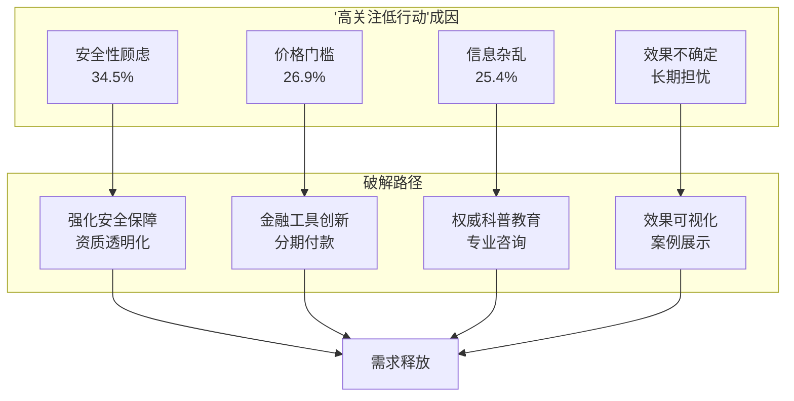

### 6.5 医疗机构战略建议：服务模式创新与能力建设

#### 6.5.1 公立医院：发挥示范引领与标准制定作用

**多学科协作机制的深化。** 公立医院应充分发挥学科齐全、人才集中的优势，深化多学科联合诊疗（MDT）模式。建议建立正畸科与口腔颌面外科、儿童牙科、修复科、牙周科、医美中心的"1+N"联合诊疗机制，为复杂病例提供一站式解决方案。

**行业标准与规范的制定。** 公立医院应积极参与行业标准制定，为"口腔+医美"协同诊疗模式建立可参照的合规路径。通过临床实践积累经验，形成可复制的服务流程标准化文档，为民营机构提供参照。

**数字化诊疗能力的升级。** 加大对数字化诊疗设备的投入，提升口内扫描、AI辅助诊断、3D打印等技术的应用水平。通过数字化技术提升诊疗效率与精准度，同时为医患沟通提供可视化工具。

#### 6.5.2 连锁品牌：规模化与标准化的协同推进

**服务标准化体系建设。** 连锁品牌应建立统一的服务标准体系，涵盖诊疗流程、质量控制、风险管理、患者权益保护等多个维度。通过标准化管理确保服务质量的一致性，避免因扩张导致的服务质量下降。

**复合型人才培养体系构建。** 投资者应关注消费者对正畸产品的不同需求，提供个性化、定制化的正畸治疗方案[^69]。为此，需要建立系统的人才培养体系，培养兼具医学与美学素养的复合型人才。可通过商学院模式进行在职培训，或与医学院校合作开设口腔美学方向专业课程。

**品牌差异化与信任建设。** 在竞争日益激烈的市场环境中，品牌效应愈加重要。口腔正畸企业应重视品牌的塑造与推广，通过多渠道的营销手段提高品牌的市场认知度[^69]。同时，应加强与医疗机构、牙科医生的合作，借助专业医生的口碑效应进行市场拓展。

#### 6.5.3 中小诊所：差异化定位与区域深耕

**细分市场的精准定位。** 中小诊所应避免与大型连锁机构的正面竞争，转而聚焦特定细分市场或区域市场。可选择儿童早期矫治、成人隐形正畸、牙齿美白等特定领域进行深耕，建立专业化优势。

**区域口碑与转介绍体系。** 女性消费者在口腔正畸与医美决策中表现出显著的同伴效应与口碑依赖特征[^48]。中小诊所应重视口碑建设，通过优质服务赢得患者信任，建立稳定的转介绍体系。

**数字化工具的轻量化应用。** 针对资金有限的中小诊所，可选择云端化、轻量化的数字化工具，降低技术投入门槛。通过与上游设备供应商的合作，以租赁或分成模式获取先进设备的使用权。

以下表格汇总了不同类型医疗机构的战略建议：

| 机构类型 | 核心优势 | 战略重点 | 关键举措 |
|---------|---------|---------|---------|
| 公立医院 | 学科齐全、公信力强 | 示范引领、标准制定 | MDT深化、数字化升级 |
| 连锁品牌 | 规模效应、资本优势 | 标准化、品牌建设 | 人才培养、服务标准化 |
| 中小诊所 | 灵活性、区域深耕 | 差异化、口碑建设 | 细分定位、轻量数字化 |

### 6.6 厂商与投资者策略：技术布局与资本配置方向

#### 6.6.1 上游设备材料供应商：技术创新与生态整合

**数字化技术的持续投入。** 技术创新是推动口腔正畸行业持续发展的核心动力。企业应加大对新技术的研发投入，关注数字化口腔正畸技术、人工智能辅助诊疗、远程医疗平台等前沿技术的发展。这些技术的应用不仅可以提高诊疗效率、降低成本，还能改善患者体验，增强企业的竞争力[^69]。

**产业链协同与生态构建。** 上游供应商应从单一产品供应向解决方案提供商转型，构建覆盖"设备-软件-服务"的生态体系。通过与下游医疗机构的深度合作，形成技术研发与临床应用的正向循环。

**国际化布局与技术引进。** 关注国际先进技术的引进与本土化应用，同时探索技术输出的可能性。在材料学、生物力学等基础研究领域加大投入，建立核心技术壁垒。

#### 6.6.2 隐形矫正品牌：产品创新与市场拓展

**产品矩阵的多层次布局。** 针对不同消费能力与需求偏好的群体，建立覆盖高端、中端、入门级的产品矩阵。高端产品强调个性化定制与美学效果，入门级产品注重性价比与可及性。

**成人与儿童市场的双轮驱动。** 随着消费者对口腔正畸治疗的认知不断加深，正畸治疗也不再局限于青少年群体，越来越多的成人患者也开始接受正畸治疗。成人市场的兴起，推动了正畸行业向高端个性化、精准化服务发展[^69]。同时，儿童早期矫治市场增长迅速，应同步布局。

**下沉市场的渗透策略。** 三线城市医美消费增速达25%，远超一线城市[^74]。隐形矫正品牌应制定针对下沉市场的渗透策略，通过价格优化、渠道下沉、市场教育等手段释放潜在需求。

#### 6.6.3 投资者：投资机会识别与风险评估框架

**高价值投资标的识别。** 口腔正畸行业投资机会分析显示，以下领域具有较高投资价值：

| 投资领域 | 核心价值 | 风险等级 | 投资建议 |
|---------|---------|---------|---------|
| 数字化技术平台 | 技术壁垒高、应用场景广 | 中 | 重点关注 |
| 隐形矫正品牌 | 市场增速快、毛利率高 | 中高 | 审慎布局 |
| 复合型服务机构 | 差异化定位、客单价高 | 中 | 择优投资 |
| 下沉市场连锁 | 增量空间大、竞争相对缓和 | 中 | 长期关注 |

**风险评估框架构建。** 投资者应关注以下风险维度：

- **市场竞争风险**：随着口腔正畸市场的不断扩大，行业内的竞争也愈加激烈。投资者应关注市场的动态，灵活调整企业的发展战略[^69]。
- **政策风险**：随着行业监管的不断加强，口腔正畸行业可能面临政策调整带来的不确定性。投资者应密切关注国家和地方政府的相关政策变化[^69]。
- **技术变革风险**：口腔正畸行业的技术发展速度较快，新技术不断涌现，可能会导致一些传统技术和产品面临被淘汰的风险[^69]。

**资本配置策略建议。** 投资者应深入挖掘企业本质，从产品和技术上进一步了解企业的情况，判断其实力和潜力，避免盲目跟风[^75]。建议采取"核心+卫星"的配置策略：核心配置聚焦具备技术壁垒与合规优势的龙头企业，卫星配置关注细分领域的创新型企业。

### 6.7 风险应对与动态调整机制：构建韧性发展框架

#### 6.7.1 综合风险应对体系构建

基于前述风险分析，构建涵盖技术风险、市场风险、政策风险与运营风险的综合应对体系：

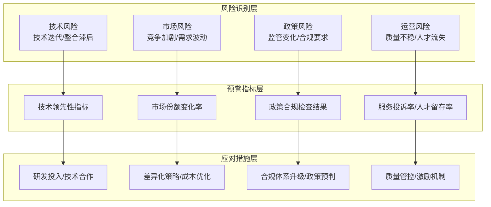

#### 6.7.2 风险预警指标设定

**技术风险预警指标：**
- 核心技术专利数量与质量变化
- 数字化设备渗透率与应用深度
- 新技术临床验证进度

**市场风险预警指标：**
- 目标客群市场份额变化率
- 客单价与毛利率趋势
- 竞争对手动态监测

**政策风险预警指标：**
- 监管政策变化频率与方向
- 合规检查结果与整改要求
- 行业标准更新进度

**运营风险预警指标：**
- 服务投诉率与纠纷发生率
- 核心人才流失率
- 患者满意度评分变化

#### 6.7.3 应急响应机制设计

**分级响应机制。** 根据风险等级设定不同的响应层级：
- **黄色预警**：启动内部评估，制定应对预案
- **橙色预警**：启动跨部门协调，调整运营策略
- **红色预警**：启动最高级别响应，可能涉及战略调整

**利益分配与责任分担框架。** 建立透明、公平的利益分配机制，明确各参与方的责任边界与风险承担比例。通过数据化管理实现贡献度的客观评估，避免短期利益博弈影响长期合作关系。

#### 6.7.4 动态战略调整机制

**基于市场反馈的策略迭代。** 建立定期评估与动态调整机制：
- **季度评估**：评估关键指标达成情况，识别偏差与成因
- **半年复盘**：审视战略方向的适用性，进行必要调整
- **年度规划**：基于市场变化更新中长期发展规划

**弹性规划原则。** 保持战略方向稳定的同时，允许战术层面的灵活调整。关注消费者教育与普及口腔健康知识，消费者对口腔正畸的认知程度直接影响行业发展[^69]。通过线上线下渠道普及口腔健康与正畸治疗的知识，帮助消费者了解正畸治疗的必要性、流程、费用等信息，减少消费者的认知障碍，提高行业的整体接受度。

**经验沉淀与知识管理。** 持续总结成功经验与失败教训，建立组织层面的知识管理体系。为了提高患者的忠诚度和满意度，企业应重视售后服务的建设，提供定期复查、矫正过程中的指导与咨询等服务。可以通过建立患者社群，增强患者之间的互动与支持，提高患者对品牌的认同感[^69]。

---

**本章小结：** 口腔正畸与医美产业融合面临**专业壁垒高、监管合规复杂、医疗风险多元、市场教育不足**四大核心挑战。技术壁垒（数字化、智能化）、人才壁垒（复合型人才稀缺）、资金壁垒（初始及运营成本高昂）三重交织，形成高准入门槛；法律法规体系尚不完善、服务标准不统一、政策存在不确定性构成制度性障碍；感染、神经损伤等并发症风险与服务质量参差不齐放大了医疗安全隐患；消费者认知不足、信任危机与高客单价形成需求释放的关键瓶颈。

针对上述挑战，本章为不同类型参与者提出差异化战略建议：**医疗机构**应聚焦多学科协作机制深化、数字化能力升级与复合型人才培养；**厂商**应加大技术创新投入、构建产业生态、拓展下沉市场；**投资者**应关注具备技术壁垒与合规优势的标的，审慎评估市场竞争、政策变动与技术迭代风险。同时，构建涵盖风险识别、预警指标、应急响应与动态调整的韧性发展框架，确保产业融合的可持续推进。

对于20-30岁女性群体而言，产业融合的成功将带来**更安全、更透明、更个性化**的"功能+美学"一体化服务体验，而实现这一目标需要产业各方共同努力，在坚守医疗安全底线的前提下，通过技术创新、服务优化与信任建设，逐步释放被抑制的巨大市场潜力。

# 参考内容如下：
[^1]:[什么是修复正畸联合治疗](https://www.bohe.cn/article/view/6rqn2qa48k4mhz4.html)
[^2]:[一文详解微笑的美学标准,快来看看你符不符合? ](https://mp.weixin.qq.com/s?__biz=MjM5NzA5NDUwMA==&mid=2650455838&idx=2&sn=5a557197a9920620bd78afffef5c0ac8&chksm=bed12a1589a6a303387850bdc81b8ee8f5776d4908acc1ba56dbf18fbcceca1adc2852f4064e&scene=27)
[^3]:[牙齿咬合标准是什么样的](https://www.bohe.cn/article/view/9g2qs0luvkdawaq.html)
[^4]:[什么是正畸正颌联合治疗](https://www.bohe.cn/article/view/h9avqjwbzkn5esm.html)
[^5]:[牙齿不齐=颜值扣分?美学专家拆解“牙-面”颜值密码](https://baijiahao.baidu.com/s?id=1854449496999426238&wfr=spider&for=pc)
[^6]:[牙齿咬合标准是什么](https://www.mfk.com/ask/15263015.shtml)
[^7]:[什么样的牙齿咬合才算标准的](https://m-mip.39.net/askar/mipso_h6efoq8.html)
[^8]:[说牙齿矫正,道口腔正畸(五)——美的脸,美的牙 ](https://www.haodf.com/neirong/wenzhang/7949340013.html)
[^9]:[文献探析|笑容之美,差异何在:上牙中线偏移的感知](https://weibo.com/ttarticle/p/show?id=2309405118772020380252)
[^10]:[微笑的美学特点分析及研究进展](https://m.docin.com/p-992047832.html)
[^11]:[文献干货|无托槽隐形矫治技术——口腔正畸的机遇与挑战](https://cloud.tencent.com/developer/news/952462)
[^12]:[正畸美学相关文献范文](https://wenku.baidu.com/view/9ccd070dbf68a98271fe910ef12d2af90242a868.html)
[^13]:[京东调研:74.4%受访者对自身容貌满意 多元审美成主流 医美需求“轻量化”](https://baijiahao.baidu.com/s?id=1841572827564872447&wfr=spider&for=pc)
[^14]:[女性健康消费市场需求升级](https://weibo.com/ttarticle/p/show?id=2309404900298539008078)
[^15]:[《2020年口腔医疗白皮书》:“美”的驱动,铸就口腔消费加速繁荣](https://baijiahao.baidu.com/s?id=1670834733209006132&wfr=spider&for=pc)
[^16]:[牙齿要整齐口气要清新 美齿经济崛起](http://www.xinhuanet.com/fashion/20220427/04062de193e84771b2f6d99601046abe/c.html)
[^17]:[调查数据显示超七成受访青年力挺“自然美”](http://www.zj.xinhuanet.com/20250714/8ba72eed823b4e59ac18b2ec7e8b2479/c.html)
[^18]:[超六成化妆全凭心情,当代女孩如何搞美学?](https://baijiahao.baidu.com/s?id=1752004519586853781&wfr=spider&for=pc)
[^19]:[我国隐形正畸行业发展势头强劲 但渗透率偏低 市场则形成“双寡头”垄断格局 ](https://business.sohu.com/a/935021957_121222943)
[^20]:[女性消费心理](https://baike.baidu.com/item/女性消费心理/960925)
[^21]:[有赞2025年消费研究报告:从焦虑防御到乐观理性,消费逻辑彻底变了](https://news.hexun.com/2025-12-29/222978842.html)
[^22]:[2025年口腔医疗市场调研:正畸、种植牙及消费需求增长趋势报告.pptx 10页](https://m.book118.com/html/2025/1212/8021133107010021.shtm)
[^23]:[共探口腔健康新范式,口腔功能美学重建学术论坛在穗举办](https://news.qq.com/rain/a/20260123A08DG800)
[^24]:[口腔健康赛道“卷”出新高度:数字化诊疗+细分赛道,企业如何破局?](http://finance.sina.com.cn/cj/2026-01-21/doc-inhhzycz6693148.shtml)
[^25]:[美国牙齿矫正费用多少](https://www.fh21.com.cn/meirong/view/7954837.html)
[^26]:[国内国外医学审美差异大吗](https://www.bohe.cn/zx/1422627.html)
[^27]:[欧美与亚洲微整形一样吗](https://mip.pingguolv.com/article/5uzzoe5z5mX4.html)
[^28]:[2025年中国口腔正畸行业市场现状及前景分析 2030年市场规模或将超1000亿元【组图】](https://bg.qianzhan.com/report/detail/300/250325-4bd05d99.html)
[^29]:[2025年口腔正畸工作总结.docx 8页](https://m.book118.com/html/2026/0105/8067067013010032.shtm)
[^30]:[从2014年线上启程到如今坐拥近亿用户、业务辐射海内外,健美创研(J.M.C.Y)历经11 ](https://business.sohu.com/a/975600327_122544595)
[^31]:[2025口腔医院行业发展现状与产业链分析](https://www.chinairn.com/scfx/20251205/173434829.shtml)
[^32]:[正畸和牙齿美容有关系吗](https://www.bohe.cn/article/view/182vs5rd9k5t1k3.html)
[^33]:[破局行业痛点,赋能基层医疗 要慈口腔以 AI 技术构建口腔健康新生态 ](https://business.sohu.com/a/977903177_122547840)
[^34]:[【便民信息】重医附属口腔医院正畸科推出系统性正畸诊疗全流程服务,助力患者实现功能与美学双重目标 ](https://mp.weixin.qq.com/s?__biz=MzA4NTQ5MDk2OA==&mid=2654431375&idx=1&sn=0cb0e88050a58dde79f3980f38526dc4&chksm=85bd88e86514f395bf8d62d962f79f371a17b7f6a8719b21fd57b1e797eabf270823ba2b85f6&scene=27)
[^35]:[口腔正畸科2025年工作总结暨下一步工作计划.docx 9页](https://m.book118.com/html/2025/1229/6102000145012035.shtm)
[^36]:[打破界限实现美丽口腔医院与美容院合作案例解读.pptx - 人人文库](https://www.renrendoc.com/paper/312393086.html)
[^37]:[口腔医院与美容院合作的优势与劣势分析实现互相补充共同发展.pptx - 人人文库](https://www.renrendoc.com/paper/312110685.html)
[^38]:[如何选择隐形矫正诊所?2026年成人隐形矫正推荐与评价,解决痛点](https://www.163.com/dy/article/KJLTSBFJ0556GQKR.html)
[^39]:[口腔医美行业现状及前景深度分析](https://wenku.baidu.com/view/8fa4ea0c5b0e7cd184254b35eefdc8d376ee1481.html)
[^40]:[2026年青少年隐形矫正牙科诊所推荐:涵盖日常与应急场景矫治痛点](https://www.163.com/dy/article/KJLTOA9A0556GP79.html)
[^41]:[2025年中国口腔医疗行业用户画像分析 口腔医疗消费持续年轻化「组图」](https://baijiahao.baidu.com/s?id=1828186935185512153&wfr=spider&for=pc)
[^42]:[口腔医疗与美容服务的完美结合口腔医院渠道美容院合作案例调研.pptx - 人人文库](https://www.renrendoc.com/paper/307995941.html)
[^43]:[2025年牙齿正畸市场调研报告](https://www.renrendoc.com/paper/492762506.html)
[^44]:[豫北医学院:协同创新,价值共创——口腔智能制造产业学院助推义齿产业转型升级](https://jyt.henan.gov.cn/2026/01-07/3303236.html)
[^45]:[全球正畸市场收入和份额洞察:按类型、应用、地区和参与者划分(2024-2033)](https://www.globalmarketmonitor.com.cn/market_news/2936365.html)
[^46]:[年轻人追求牙齿美,将撑起千亿级正畸大市场](https://www.jiemian.com/article/7332616.html)
[^47]:[牙齿矫正消费者最关心啥?《2025成都口腔正畸消费趋势报告》发布](https://dy.163.com/article/K46MKP0Q0534L5LX.html)
[^48]:[口腔经济崛起:一口好牙齐又白,千亿市场随风来](https://m.jiemian.com/article/6400689.html)
[^49]:[2025年口腔医疗行业资讯:数字化驱动下的千亿市场与结构性增长](https://www.chinabgao.com/finance/comments/77224.html)
[^50]:[2024年正畸市场达670亿,打破正畸误解,勇敢改善口腔健康](https://baijiahao.baidu.com/s?id=1831280768953305365&wfr=spider&for=pc)
[^51]:[2025年中国口腔医疗行业用户画像分析 口腔医疗消费持续年轻化【组图】](https://dy.163.com/article/JS2R618E051480KF.html)
[^52]:[三线城市医美消费图谱:25—35岁女性主导市场,抗衰需求年增40%引领](https://weibo.com/ttarticle/p/show?id=2309405211145056419972)
[^53]:[新数据|美国牙科行业大变局:年轻化、女性化与城乡分化的新时代](https://baijiahao.baidu.com/s?id=1842874919604179371&wfr=spider&for=pc)
[^54]:[京东调研:医美TOP3诉求为皮肤、牙齿、轮廓微调 超六成人有皮肤美容需求 ](https://www.takefoto.cn/news/2025/08/27/11285793.shtml)
[^55]:[成年女性正畸患者心理健康状况,和矫治器选择的影响因素分析](https://baijiahao.baidu.com/s?id=1800912392446155044&wfr=spider&for=pc)
[^56]:[小牙冠上有大智慧](https://zjnews.zjol.com.cn/zjnews/202601/t20260121_31465278.shtml)
[^57]:[时代天使:隐形矫治器](http://828.people.com.cn/GB/461296/461373/index.html?article_id=208)
[^58]:[持续加码数字能力建设,正雅推动AI技术与临床流程深度结合](https://baijiahao.baidu.com/s?id=1853467803542219284&wfr=spider&for=pc)
[^59]:[访哈尔滨医科大学口腔医院修复专家冯剑桥教授](http://k.sina.com.cn/article_7880068208_1d5b04c7001901b0p8.html)
[^60]:[“口腔+医美”协同诊疗,南方医科大学口腔医院盘福院区升级亮相](https://cj.sina.com.cn/articles/view/1652484947/627eeb5302001tajq)
[^61]:[春节前医美迎消费高峰 专家呼吁理性规划“先医后美”](http://news.10jqka.com.cn/20260125/c674287929.shtml)
[^62]:[春节前医美热,专家提醒:变美不是“年终冲刺”,全年规划得先做对](https://baijiahao.baidu.com/s?id=1855269432965320040&wfr=spider&for=pc)
[^63]:[每牙先生品牌升级,开启“医疗+美学”全产业链新篇章](http://hn.ifeng.com/c/8q7M9oHW3MB)
[^64]:[探访口腔健康服务品牌牙美汇的专业化服务 技术与态度并进,塑造自信微笑人生](https://baijiahao.baidu.com/s?id=1854363890039494325&wfr=spider&for=pc)
[^65]:[营销费用翻倍,儿童口腔早矫市场大战升级](https://baijiahao.baidu.com/s?id=1847119595203637588&wfr=spider&for=pc)
[^66]:[2025年轻医美产业深度分析:发展现状、市场前景与未来趋势深度剖析](https://www.chinairn.com/hyzx/20260121/165446777.shtml)
[^67]:[正雅齿科2025年产品矩阵升级,从“排齐牙齿”迈向“颅颌面协同管理”](https://baijiahao.baidu.com/s?id=1854716908126463696&wfr=spider&for=pc)
[^68]:[口腔正畸行业的挑战与风险分析.pdf 29页VIP](https://max.book118.com/html/2025/0822/6200220010011220.shtm)
[^69]:[口腔正畸行业投资机会与发展建议](https://www.renrendoc.com/paper/368778238.html)
[^70]:[口腔行业市场壁垒分析报告.docx 29页](https://m.book118.com/html/2026/0108/6221024024012043.shtm)
[^71]:[2025年医美行业合规化监管的挑战与对策报告.docx 22页VIP](https://m.book118.com/html/2025/1215/7160161121011024.shtm)
[^72]:[医疗美容行业美容牙科技术发展及市场监管挑战报告.docx 23页VIP](https://max.book118.com/html/2025/0903/8101011115007127.shtm)
[^73]:[医疗整形有哪些常见风险需警惕 ](https://mip.cndzys.com/qw/zt_data_article/3859499.html?s=author.baidu.com)
[^74]:[医美行业消费者调研报告](https://wenku.baidu.com/view/be3830feaaaad1f34693daef5ef7ba0d4a736daa.html)
[^75]:[医美产业及其风险,2023 年投资者该如何把握?](https://baijiahao.baidu.com/s?id=1767034357801977786&wfr=spider&for=pc)
