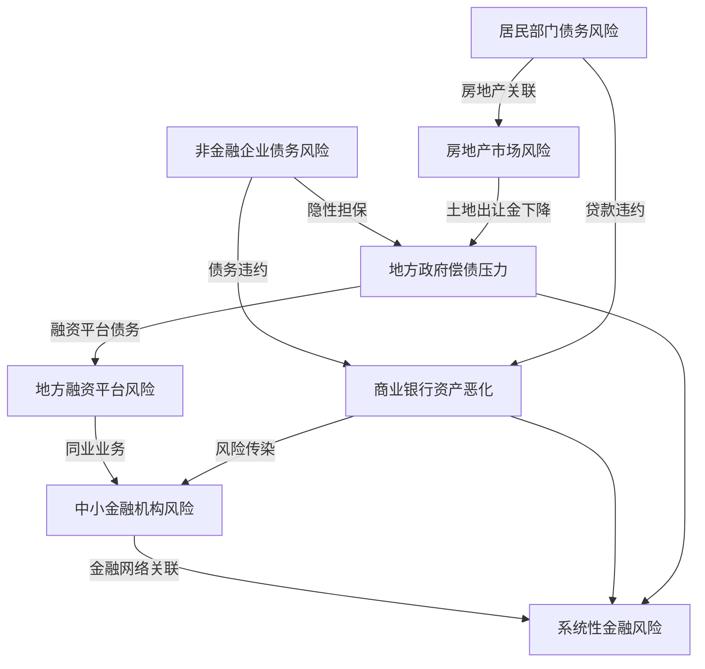
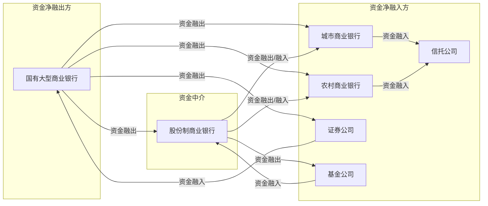
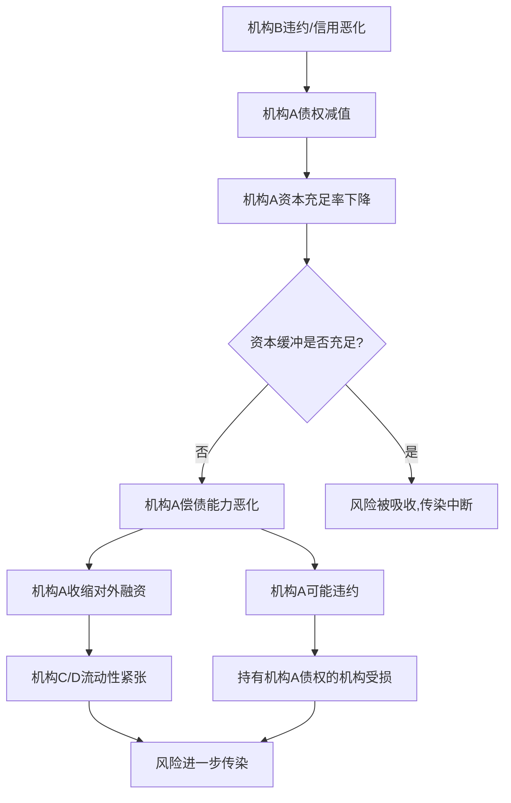
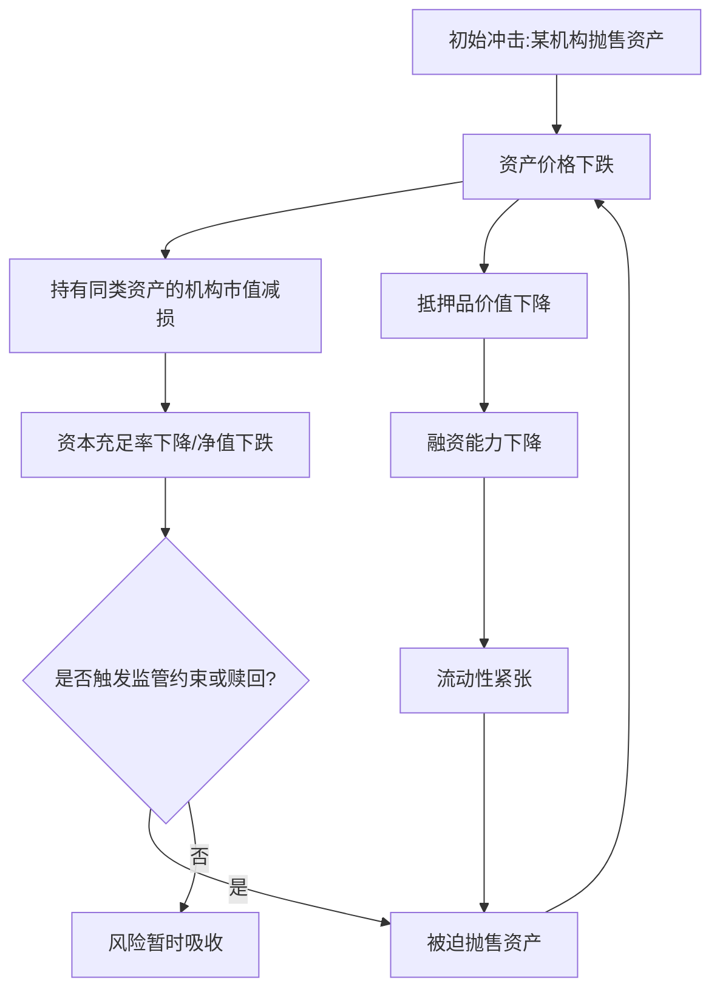
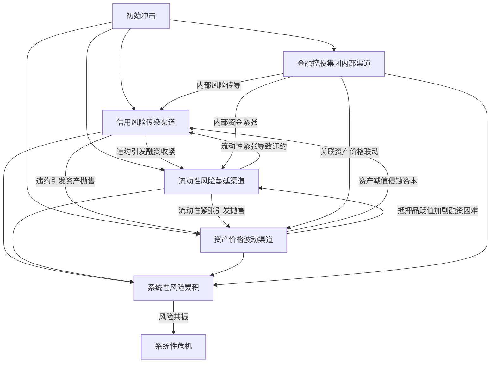
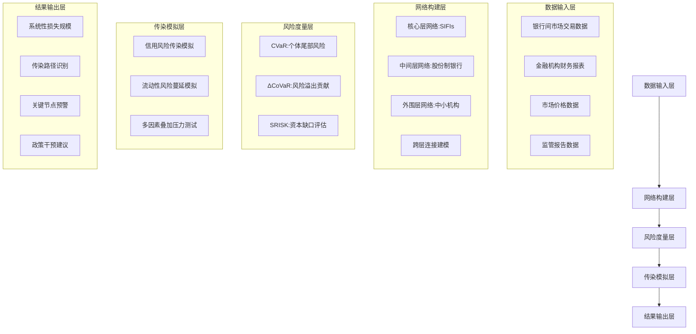
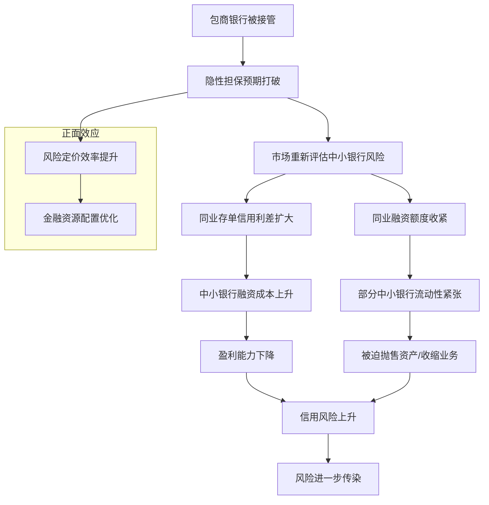
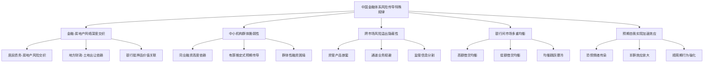

# 中国金融机构间投资借贷关系与系统性风险关联机制及建模研究
## 1 理论基础与文献综述

本章旨在为研究中国金融机构间投资借贷关系与系统性风险关联机制奠定理论基础。通过系统梳理系统性风险的核心概念界定、基本特征与主要度量方法，厘清微观视角与宏观视角下系统性风险的内涵差异；综述金融机构间关联性与风险传染机制的相关理论，包括复杂网络理论、多米诺骨牌效应及风险传染渠道等；最后重点分析中国特定金融制度背景对风险传导路径的影响，为后续实证建模提供理论支撑。

### 1.1 系统性风险的概念界定与基本特征

#### 1.1.1 系统性风险的双重内涵界定

系统性风险的概念在金融学领域存在**微观视角与宏观视角两种内涵界定**，两者在分析视角、风险来源及管理策略上存在本质差异。

**微观视角下的系统性风险（Systematic Risk）**由威廉·夏普（William F. Sharpe）在资本资产定价模型（CAPM）中首次提出。他根据某一风险因素对资本市场影响的范围及严重程度，将风险划分为系统性风险与非系统性风险。其中，系统性风险是指在资产收益率的波动中可以归因于某些共同因素的部分，处于同一市场中的所有证券共同面临的、由整个经济或政治形势的变化所造成的风险，例如利率变动、经济衰退、战争等[^1]。这种风险强调市场参与者以承担系统性风险换取收益，涉及风险定价机制，相应的管理方法主要是出售资产、对冲转移风险等[^2]。

**宏观视角下的系统性风险（Systemic Risk）**则是当前国际金融监管机构普遍关注的焦点。国际货币基金组织（IMF）认为Systemic Risk起源于金融部门内部或通过金融部门传播（例如由于金融机构的偿付能力或流动性缓冲不足）的风险，并且这种风险有可能对金融中介和实际产出产生严重的不利影响[^1]。这种系统性风险关注的是"谁是风险点"以及"谁和谁关联"，强调宏观系统管理者的视角，相应的管理方法包括加强对系统重要性机构和系统重要性业务的监管以及必要的危机救助等[^2]。

两种视角的核心差异可通过以下表格进行对比：

| 比较维度 | 微观视角（Systematic Risk） | 宏观视角（Systemic Risk） |
|---------|---------------------------|--------------------------|
| **分析视角** | 站在微观角度关注宏观对微观的风险 | 站在宏观角度关注微观带来的风险 |
| **核心关注** | 市场整体波动对个体资产收益的影响 | 个体风险点对整个系统的传染影响 |
| **风险定价** | 强调以承担风险换取收益，涉及风险定价机制 | 不强调以风险换取收益，不涉及风险定价机制 |
| **管理主体** | 微观主体（投资者、金融机构） | 宏观主体（监管部门、央行） |
| **应对措施** | 出售资产、对冲转移风险 | 加强系统重要性机构监管、危机救助 |

#### 1.1.2 系统性风险的基本特征

系统性风险具有区别于个体风险的本质属性，其基本特征可从以下维度进行分析：

**传染性**是系统性风险最核心的特征。系统性风险是指金融体系或市场中多个机构、资产之间通过关联性相互作用，导致风险在系统内快速扩散，最终引发全局性动荡的可能性[^3]。这种传染性表现为单一机构或市场的风险事件可能通过关联渠道（如交易对手风险、流动性冲击）触发连锁反应，形成"多米诺骨牌式"的风险传递[^3]。

**内生性**强调系统性风险是系统整体内生出来的，而非外部冲击的简单叠加。如何内生形成这种风险是理解系统性风险的重要关注点[^2]。金融体系内部的相互关联和依赖使得个体风险能够在机构之间、市场之间、国家之间迅速传递，最终形成全局性的危机[^3]。

**关联性**表现为系统性风险受共同的市场、资金来源、市场流动性、担保、品牌和声誉、治理等关联因素影响[^2]。金融机构通过业务往来、资产关联、人员流动等方式相互联系，形成复杂的网络结构，当网络中的某个节点出现风险时，这种风险会沿着网络迅速传播[^3]。

**周期性（亲周期性）**是巴塞尔协议特别关注的特征。系统性风险表现出与经济周期的正相关性，在经济繁荣期风险积累而不易被察觉，在经济下行期则集中爆发并相互强化[^2]。

**与收益的平衡性**体现在中国高速发展的背后与其有高系统性风险是相关的，这种风险与收益的平衡关系是理解系统性风险的重要维度[^2]。

**广泛性与破坏性**使系统性风险区别于个体风险。系统性风险往往威胁整个金融体系以及宏观经济，而非一两个金融机构稳定性的事件，一旦爆发往往会对整个经济体系产生深远影响[^1][^3]。系统性风险对市场上所有参与者都有影响，无法通过分散投资来加以消除[^1]。

### 1.2 系统性风险的度量方法综述

#### 1.2.1 主流度量指标与方法

当前学术界与监管实践中发展出多种系统性风险度量方法，各类方法从不同角度刻画风险的传染潜力与系统影响。

**CoVaR（条件风险价值）**是衡量系统性风险的重要指标之一。CoVaR通过测度在某一机构处于极端状态时整个金融系统的风险价值，量化单个机构对系统性风险的边际贡献（ΔCoVaR）[^3]。这一方法能够有效识别哪些机构在极端情况下对系统稳定性构成更大威胁。

**网络熵**用于衡量金融网络中机构间关联的强度与复杂程度。通过计算网络拓扑结构的熵值，可以评估金融系统的整体脆弱性——网络熵越高，意味着关联结构越复杂，风险传染的路径越多样[^3]。

**压力测试敏感性**是评估机构倒闭对系统影响的重要工具。通过模拟特定机构违约或出现流动性危机的情景，分析其对关联机构和整体系统的损失传导，从而识别系统性风险的关键节点[^3]。

**系统性权重（Systemic Importance）**通过Z-score或ES（期望损失）模型量化大型金融机构的系统性风险贡献。Z-score反映机构的偿付能力和稳定性，而ES则度量在极端情况下的预期损失规模，两者结合可以评估机构的风险传染潜力[^3]。

**SRISK**是另一种广泛使用的系统性风险度量指标，它测度在系统性危机发生时单个机构的预期资本缺口，反映机构对系统性风险的边际贡献。

#### 1.2.2 度量方法的适用场景与局限性

各类度量方法在适用场景和局限性方面存在差异：

| 度量方法 | 适用场景 | 主要局限性 |
|---------|---------|-----------|
| **CoVaR** | 评估单个机构对系统风险的边际贡献 | 依赖历史数据，对尾部风险的捕捉可能不足 |
| **网络熵** | 刻画金融网络的整体复杂性与脆弱性 | 需要完整的网络关联数据，数据获取难度大 |
| **压力测试** | 情景分析与监管评估 | 情景设定的主观性，难以穷尽所有可能情景 |
| **Z-score/ES** | 评估单个机构的稳定性与极端损失 | 静态指标，难以捕捉动态变化 |
| **SRISK** | 评估危机时的资本缺口 | 对市场数据依赖度高，适用于上市机构 |

#### 1.2.3 前沿技术在风险度量中的应用

**基于深度学习的时间序列预测模型**在捕捉风险传染的动态演化特征方面展现出优势。例如，长短期记忆网络（LSTM）能够处理金融市场的高频数据，捕捉风险传染过程中的非线性关系，较传统方法更适应复杂的动态演化特征[^3]。这类模型通过学习历史风险传染模式，可以对未来的风险传播路径和强度进行预测。

此外，基于机器学习的异常检测算法可以识别金融网络中的异常交易模式和潜在风险点，为早期预警提供技术支持。图神经网络（GNN）则可以直接处理金融机构间的网络结构数据，更精确地刻画风险在复杂网络中的传播规律。

### 1.3 金融机构间关联性与风险传染机制理论

#### 1.3.1 金融机构间关联性的形成机制

金融机构之间的关联性并非物理的线缆连接，而是通过交易、合作、预期等"隐形绳索"编织而成的网络[^4]。这种关联性可以从以下三个维度进行解构：

**市场交易连接：资金流动编织的基础网络**

最基础的连接来自资金的直接流动。银行间市场的同业拆借是典型代表——例如A银行借给B银行资金，到期后还本付息，这笔交易不仅让A和B产生了债权债务关系，更在金融网络中建立了一条"边"。类似的连接还包括债券回购、外汇掉期等市场交易[^4]。据统计，仅银行间同业拆借市场的日交易量就可达数万亿元，这些交易像无数条丝线，将数千家银行、券商、基金公司串联成一张密集的资金网络[^4]。

这种连接的特点是**"双向绑定"**：A依赖B到期还款以覆盖自身负债，B依赖A的资金维持日常运营。一旦B出现流动性问题无法还款，A的资产端就会出现缺口，可能被迫抛售其他资产，进而影响持有这些资产的C机构[^4]。这种"你中有我、我中有你"的资金互锁，构成了网络关联性的物理基础。

**业务合作连接：产品嵌套搭建的复杂网络**

如果说市场交易是"明线"，那么业务合作就是"暗线"，其中最典型的是资管产品的嵌套[^4]。例如某银行发行理财产品，资金投向某信托计划，信托计划又投资于某券商资管计划，最终流向房地产企业。这种"银行-信托-券商-房企"的链条，让原本不直接关联的银行与房企通过多层产品嵌套连接起来[^4]。

更复杂的是**交叉持股和风险共担机制**。例如，保险公司持有银行的次级债，银行购买保险资管的债权计划，基金公司同时持有银行和保险的股票。这种股权、债权的交叉持有，让不同类型的金融机构形成"利益共同体"——一家机构的股价下跌，可能同时影响持有其股票的基金净值，进而导致基金赎回压力，迫使基金抛售其他机构的股票，形成连锁反应[^4]。

**信息与预期连接：情绪传导形成的虚拟网络**

比资金和业务更"无形"的连接是信息与预期。在社交媒体时代，一条"某银行出现挤兑"的不实消息，可能在半小时内传遍整个市场，引发储户集中取款，即使该银行实际流动性充足[^4]。这种"预期自我实现"的现象，本质上是市场参与者通过信息传递形成的心理连接。

例如，某家中小银行被曝存在违规操作，尽管其资产规模占整个银行业不足1%，但市场会猜测"是否还有其他银行存在类似问题"，进而对所有中小银行产生不信任，导致资金从整个中小银行板块撤离[^4]。这种"有罪推定"式的预期传导，会放大网络关联性的影响，让风险从个别机构扩散至整个群体。

#### 1.3.2 风险传染的主要渠道与路径

当网络中的某个节点（金融机构）出现问题时，风险会沿着连接的"绳索"以三种典型路径传播：

**直接传染：对手方风险的链式反应**

直接传染是最直观的传播路径，即风险通过明确的债权债务关系直接传递[^4]。以2008年国际金融危机为例，一家大型投行因次贷衍生品亏损破产，其持有的大量信用违约互换（CDS）合约无法履约，导致购买这些合约的保险公司、养老金机构出现巨额亏损。这些机构为弥补损失，不得不抛售持有的其他资产，又进一步影响了持有这些资产的商业银行和基金公司[^5]。

这种传播的关键是**"对手方集中度过高"**。如果一家机构的交易对手高度集中在少数几家机构，那么其中任何一家出问题，都可能让该机构遭受"致命打击"[^4]。银行间通过同业拆借、债券投资、衍生品交易等业务形成的直接债权债务关系网络，是直接传染的主要载体[^5]。

**间接传染：资产抛售引发的负反馈循环**

间接传染不依赖直接的债权债务关系，而是通过资产价格波动间接传递风险[^4]。例如，某基金因赎回压力被迫抛售某类债券，导致该债券价格下跌；其他持有同类债券的机构因"市值计价"规则，需要计提资产减值损失，进而影响其资本充足率；为满足监管要求，这些机构可能也加入抛售行列，进一步压低债券价格，形成"抛售-跌价-更多抛售"的恶性循环。

这种传播的核心是**"共同资产池"的存在**。当多家机构持有相同或相似的资产时，任何一家的抛售行为都会影响其他机构的资产价值，形成"一荣俱荣、一损俱损"的局面[^4]。

**跨市场溢出：从单一领域到全局震荡的扩散**

现代金融体系的网络关联性不仅存在于同类机构之间，更跨越银行、证券、保险、外汇等多个市场[^4]。例如，股票市场的暴跌可能导致股权质押融资的企业面临追加保证金压力，企业不得不从银行提前还贷或申请新贷款，增加银行的流动性压力；银行流动性紧张又会提高同业拆借利率，影响货币市场的资金价格；货币市场利率上升反过来又会推高债券发行成本，导致企业融资困难，进一步拖累实体经济。

这种跨市场溢出的特点是**"风险的变形记"**——风险从股票市场出发，经过信贷市场、货币市场、债券市场等多个环节，最终以不同的形式（流动性风险、信用风险、市场风险）影响整个金融体系[^4]。

#### 1.3.3 复杂网络理论在风险传播分析中的应用

**从"多米诺骨牌"到"网络共振"的认知迭代**

过去，人们习惯用"多米诺骨牌"比喻金融风险的传染——一个环节崩塌，依次推倒下一个。但随着金融创新的深化，机构间通过同业拆借、衍生品交易、资管产品嵌套等方式形成了更复杂的连接，风险传播不再是简单的线性传递，而是像投入池塘的石子，激起的涟漪会在不同方向的水波中相互叠加，形成**"网络共振"**[^4]。

复杂网络理论为刻画这种非线性风险传播提供了有效工具。通过分析金融网络的**度分布、聚类系数、中心性**等拓扑指标，可以识别网络中的关键节点（系统重要性机构）和脆弱环节[^5]。

**关键节点的"引爆"效应**

在金融网络中，有些节点（机构）连接着大量其他节点，被称为"系统重要性金融机构"（SIFIs）。它们可能是资产规模大的银行、交易活跃的券商，或是为市场提供清算服务的中央对手方。这些机构一旦出问题，就像拔掉了网络中的"中心枢纽"，会导致整个网络分裂成多个孤立的子网络，加剧流动性枯竭[^4]。

拓扑学分析显示，网络中心度高的机构（如系统重要性银行）的失败概率是普通机构的5.2倍[^3]。这说明关键节点的风险不是"局部地震"，而是"全球海啸"。

**网络密度的"放大器"作用**

网络密度（即机构间连接的数量）是衡量关联性强弱的重要指标。适度的密度能提高资金配置效率——机构间更容易融通资金，降低交易成本。但过度的密度会成为风险放大器：连接越多，风险传播的路径就越多，形成"多向传染"[^4]。

以某地区中小银行同业存单市场为例，中小银行通过互相购买同业存单扩大资金来源，形成了"你买我的存单、我买你的存单"的高密度网络。当其中一家银行因资产质量问题被评级下调，其他银行担心持有的该银行存单无法兑付，纷纷抛售自己的存单以换取现金，导致整个同业存单市场利率飙升，多家银行陷入流动性危机[^4]。这正是"连接越密，风险越容易交叉感染"的典型写照。

### 1.4 中国金融制度背景与风险传导特殊性分析

#### 1.4.1 中国系统性金融风险的部门分布

系统性金融风险是指金融体系整体或部分受到损害，致使金融服务中断，并且对实体经济造成严重负面影响的风险[^6]。当前，中国的系统性金融风险主要分布在四个方面，这四方面的风险紧密交织、错综复杂：

**非金融企业债务风险**是中国系统性风险最重要的来源之一。中国非金融企业杠杆率占比超过宏观杠杆率的一半。过去十多年间，虽然非金融企业杠杆率逐年攀升，但很多民营企业的杠杆率却在逐渐下降，这说明非金融企业部门杠杆率的攀升主要来自国有企业杠杆率的上升[^6]。非金融企业债务风险主要体现在地方国企和地方融资平台的债务负担高企以及非金融企业盈利能力减弱这两个方面。非金融企业一旦面临外部冲击，极易出现资金链断裂，并进一步导致债务违约。非金融企业的债务风险一方面会导致商业银行资产负债表恶化，另一方面会因为隐性担保问题而恶化地方政府偿债能力[^6]。

**居民部门债务风险**在全球金融危机后快速上升。在全球金融危机爆发前，中国的居民部门杠杆率远低于发达国家，然而这一指标在危机后快速上升，现已逼近日本，与美国亦相去不远[^6]。从结构上看，消费贷款是居民债务的主要成分，占比接近八成，而消费贷款中又以住房抵押贷款为主。因此，居民债务风险与房地产相关风险紧密交织。一旦房地产风险爆发，居民部门将会出现大面积贷款违约，并且面临巨大的投资损失，从而进一步降低其偿债能力[^6]。

**地方政府债务风险**主要体现在分税制改革后地方政府缺乏直接举债渠道的背景下。这导致地方国企和地方融资平台债务显著增加，并且土地出让金收入成为地方政府最重要的预算外收入来源。从增量来看，地方政府新增债务也远超地方政府收入。此外，由于地方政府的财政收入过于依赖土地出让金，房地产市场的波动也会显著影响地方政府的偿债能力[^6]。

**中小金融机构业务风险**是金融部门风险的主要体现。尽管近期金融部门杠杆率较为平稳，但一旦遭遇重大业务风险冲击，金融风险极易在金融体系中蔓延。相对于大型金融机构，以股份制商业银行和地方性金融机构为主的中小金融机构往往存在更大的业务风险。一旦外生冲击爆发，中小金融机构可能会面临资金链断裂的风险，并由于金融体系的相互关联进一步加剧金融风险的传递[^6]。

上述四类风险的交织关系可通过以下流程图进行刻画：

#### 1.4.2 隐性担保机制与风险定价扭曲

中国金融市场中长期存在的**隐性担保机制**对风险传导路径产生了深远影响。隐性担保是指政府或大型金融机构对特定债务主体（如地方融资平台、国有企业）提供的非正式信用背书，这种机制虽然在短期内降低了违约风险，但也带来了显著的负面效应：

**风险定价扭曲**：由于市场预期政府会在危机时刻出手救助，投资者对相关主体的风险评估普遍偏低，导致风险溢价不能真实反映实际风险水平。这种定价扭曲使得高风险主体能够以较低成本获得融资，进一步助长了杠杆扩张。

**道德风险累积**：隐性担保弱化了债务主体的风险约束，导致部分机构和企业过度负债、盲目扩张。当隐性担保预期被打破时，市场可能出现剧烈调整，风险集中释放。

**风险传导路径复杂化**：隐性担保使得非金融企业债务风险与地方政府债务风险深度交织，一旦某一环节出现问题，风险会通过担保链条快速传导至整个体系[^6]。

#### 1.4.3 分业监管框架下的跨市场风险传染

中国金融监管长期实行分业监管模式，银行、证券、保险分别由不同监管部门负责。这种监管架构在应对跨市场风险传染时面临特殊挑战：

**监管套利空间**：金融机构可能利用不同监管部门之间的标准差异，通过跨市场业务规避监管约束。例如，通过资管产品嵌套将银行资金引入证券市场或房地产市场，形成监管盲区[^3]。

**信息共享不足**：分业监管框架下，各监管部门对跨市场风险敞口的信息掌握可能不完整，难以全面评估系统性风险的积累程度。

**协调成本较高**：当风险跨市场传染时，需要多个监管部门协调应对，可能存在响应滞后的问题。

近年来，中国通过设立金融稳定发展委员会、推进监管体制改革等措施，逐步加强宏观审慎监管和跨市场风险监测，但制度完善仍需持续推进。

#### 1.4.4 中国金融安全面临的主要冲击

当前中国金融安全面临多重冲击，这些冲击可能触发或放大系统性风险[^6]：

**经济潜在增速持续下行**：2007年以来，中国经济增长率持续下行，其内在原因是经济潜在增速的下行。这与人口老龄化以及新旧动能转换密切相关。一方面，随着工作年龄人口占比由升转降，储蓄率随之下降，这抬高了企业融资成本，并进一步增加了非金融企业债务风险。另一方面，在新旧动能转换的过程中，内外需不振导致的产能过剩会造成企业盈利能力的显著下降[^6]。

**房地产市场调整风险**：居民债务风险与房地产相关风险紧密交织，房地产市场的波动会通过多个渠道传导至金融体系——影响居民部门偿债能力、地方政府土地财政收入、银行抵押品价值等。

**外部环境不确定性**：当前国际形势错综复杂，中国经济社会发展面临更加严峻的外部环境。外部冲击可能通过资本流动、汇率波动、贸易渠道等传导至国内金融体系[^6]。

#### 1.4.5 宏观审慎监管政策的演进

为防范和化解系统性金融风险，中国逐步建立和完善宏观审慎监管框架：

**微观审慎监管**通过资本充足率（如巴塞尔协议III）和杠杆率限制，降低个体机构的风险溢出能力[^3]。中国银行业监管持续强化资本监管要求，推动商业银行提高资本缓冲水平。

**宏观审慎政策工具**包括逆周期资本缓冲和系统重要性机构附加税，旨在平滑周期性波动和抑制过度关联[^3]。中国已建立系统重要性银行评估与监管框架，对系统重要性机构实施差异化监管。

**跨国协调机制**方面，中国积极参与G20金融稳定委员会等国际组织的政策协调，推动全球统一标准的制定与实施[^3]。

通过上述制度安排，中国在防范系统性金融风险方面取得了积极进展，但面对复杂的风险形势，仍需持续完善监管框架，提升风险识别与处置能力。

## 2 中国金融机构间投资借贷关系的现状与结构特征

金融机构间的投资借贷关系构成了中国金融体系的"毛细血管网络"，资金通过这些渠道在不同机构之间流转，支撑着整个金融系统的日常运转与流动性调配。理解这一网络的业务构成、市场载体、参与主体分布及拓扑结构，是分析系统性风险传染机制的必要前提。本章将从业务类型、市场架构、主体格局和网络特征四个维度，全面刻画中国金融机构间投资借贷关系的现状与结构特征。

### 2.1 金融机构间投资借贷业务的主要类型与运作机制

中国金融机构间投资借贷业务经过多年发展，已形成类型丰富、功能互补的业务体系。根据中国人民银行、原银监会等五部委联合发布的《关于规范金融机构同业业务的通知》（银发[2014]127号），同业业务是指中华人民共和国境内依法设立的金融机构之间开展的以投融资为核心的各项业务[^7]。这些业务通过优化资金配置、提高资金使用效率，成为银行调整资产负债结构和拓展收益的重要工具[^8]。

#### 2.1.1 同业融资类业务

**同业拆借**是金融机构间最基础的资金融通方式。根据《同业拆借管理办法》，同业拆借是指经中国人民银行批准、进入全国银行间同业拆借市场的金融机构之间通过全国统一的同业拆借网络进行的无担保资金融通行为[^7]。其核心特征包括：交易期限短（通常为隔夜至七天）、无需担保、资金流动性强，能够满足金融机构短期资金头寸调剂的需求[^8][^9]。同业拆借相关款项在拆出和拆入资金会计科目核算，并在上述会计科目下单独设立二级科目进行管理核算[^7]。

**同业存放与同业借款**是金融机构相互存入的协议存款与资金借贷业务。同业存放是指金融机构之间开展的同业资金存入与存出业务，其中资金存入方仅为具有吸收存款资格的金融机构，按照期限、业务关系和用途分为结算性同业存放和非结算性同业存放，利率及期限灵活[^8][^7]。同业借款则是现行法律法规赋予此项业务范围的金融机构开展的同业资金借出和借入业务[^7]。

**买入返售（卖出回购）**是两家金融机构之间按照协议约定先买入（卖出）金融资产，再按约定价格于到期日将该项金融资产返售（回购）的资金融通行为[^7]。该业务项下的金融资产应当为银行承兑汇票、债券、央票等在银行间市场、证券交易所市场交易的具有合理公允价值和较高流动性的金融资产。值得注意的是，三方或以上交易对手之间的类似交易不得纳入买入返售或卖出回购业务管理和核算，卖出回购方不得将业务项下的金融资产从资产负债表转出[^7]。

**同业代付**是商业银行（受托方）接受金融机构（委托方）的委托向企业客户付款，委托方在约定还款日偿还代付款项本息的资金融通行为[^7]。同业代付原则上仅适用于银行业金融机构办理跨境贸易结算，境内信用证、保理等贸易结算原则上应通过支付系统汇划款项或通过本行分支机构支付[^7]。

#### 2.1.2 同业投资类业务

**同业投资**是指金融机构购买（或委托其他金融机构购买）同业金融资产或特定目的载体的投资行为[^7]。同业金融资产包括但不限于金融债、次级债等在银行间市场或证券交易所市场交易的同业金融资产；特定目的载体包括但不限于商业银行理财产品、信托投资计划、证券投资基金、证券公司资产管理计划、基金管理公司及子公司资产管理计划、保险业资产管理机构资产管理产品等[^7]。

随着金融市场发展，同业业务逐步涉及股票质押融资、股权投资、委外业务、资产证券化等创新模式[^8]。这些创新业务在拓展金融机构收益来源的同时，也增加了机构间关联的复杂性。

#### 2.1.3 各类业务的功能定位与风险属性比较

下表系统梳理了主要同业业务类型的核心特征：

| 业务类型 | 交易期限 | 担保要求 | 主要功能 | 风险属性 | 会计科目 |
|---------|---------|---------|---------|---------|---------|
| **同业拆借** | 隔夜至七天为主 | 无担保 | 短期头寸调剂 | 信用风险较低 | 拆出/拆入资金 |
| **同业存放** | 灵活约定 | 无担保 | 资金存放与流动性管理 | 信用风险一般 | 同业存放/存放同业 |
| **同业借款** | 中短期 | 视具体约定 | 资金融通 | 信用风险一般 | 拆出/拆入资金 |
| **买入返售** | 短期为主 | 有担保（金融资产） | 资金融通与流动性管理 | 市场风险、流动性风险 | 买入返售金融资产 |
| **同业代付** | 约定期限 | 委托代理关系 | 跨境贸易结算 | 信用风险 | 贷款/拆出资金 |
| **同业投资** | 中长期为主 | 视具体产品 | 资产配置与收益拓展 | 市场风险、信用风险、流动性风险 | 投资类科目 |

从功能定位看，前五类业务（同业拆借、同业存放、同业借款、买入返售、同业代付）属于**同业融资业务**，侧重于资金融通与流动性管理；同业投资业务则侧重于资产配置与收益获取[^7]。各类业务之间存在一定的替代关系——当某类业务受到监管约束时，资金可能通过其他渠道流转，这也是理解金融机构间关联复杂性的重要视角。

### 2.2 银行间市场的制度架构与交易规模

银行间市场是金融机构间投资借贷活动的核心载体，承担着调节货币流通与金融机构资金余缺的重要功能[^10]。理解这一市场的制度架构与运行状况，是把握机构间资金流动规律的关键。

#### 2.2.1 市场组成结构与制度安排

银行间市场是由**同业拆借市场、票据市场、债券市场、外汇市场及黄金市场**组成的金融同业市场[^10]。各子市场功能互补，共同构成完整的机构间资金融通体系：

- **同业拆借市场**：为金融机构提供短期无担保资金融通渠道，是货币市场的核心组成部分
- **债券市场**：提供国债、地方政府债、金融债、企业债等多种债券的发行与交易，是金融机构资产配置的重要场所[^9]
- **票据市场**：包括银行承兑汇票和商业承兑汇票的交易，具有期限短、流动性较高的特点[^9]
- **外汇市场**：银行间外汇市场实行会员管理和做市商制度，进行不同货币之间的买卖[^10][^9]

在制度安排方面，银行间市场实行**会员管理制度**，各类金融机构需经批准后方可进入市场交易。2025年，中国人民银行发布《银行间市场经纪业务管理办法》，进一步规范市场经纪业务，明确经纪业务范围、要求经纪机构强化内控、明确委托方责任、加强监督管理[^10]。同年还推出《银行间外汇市场管理规定（征求意见稿）》，市场同步修订信用风险缓释工具等规则，持续完善市场制度框架[^10]。

#### 2.2.2 市场规模与交易结构演变

银行间市场的交易规模在近年来保持高位运行，体现了金融机构间资金融通的活跃程度：

**从总体规模看**，2021年银行间一二级市场共成交1729万亿元，同比增长5.5%；其中二级市场成交1707万亿元，同比增长5.4%[^11]。二级市场中，货币市场成交1166.5万亿元，同比增长5.3%；债券市场成交224.5万亿元[^11]。

**从近期数据看**，2023年12月银行间市场成交额达17.18万亿元人民币[^10]。2025年市场规模进一步扩大：6月单月成交21.88万亿元，债券托管余额达166.7万亿元；11月银行间市场成交20.72万亿元人民币[^10]。2025年1月至11月，中国外汇市场累计成交276.41万亿元人民币（等值38.65万亿美元）[^10]。

**从企业融资角度看**，2025年共有超过2300家企业在银行间市场融资，融资总金额达10.1万亿元人民币，连续两年超过10万亿元[^10][^12]。净融资额为1.7万亿元，发行金额和净融资额占公司信用债比重均超过六成[^12]。

**从期限结构看**，2025年银行间市场的中长期品种发行额达到5.8万亿元，占比相比2024年提高了2个百分点；年末时中长期品种的存续额为15.6万亿元，占比87%，比2024年末上升了1个百分点[^12]。中长期品种比例的增加有助于更好地满足企业的资金需求，也反映出市场期限结构的持续优化。

#### 2.2.3 市场流动性与定价效率

银行间市场的流动性状况直接影响金融机构间资金融通的效率与成本。从货币市场利率走势可以观察市场流动性的变化：

2021年，货币市场流动性保持合理充裕，除季末、年末利率波动较大外，货币市场利率围绕央行七天逆回购利率（2.2%）窄幅波动[^11]。隔夜、3个月、1年期SHIBOR年末分别收于2.13%、2.50%、2.74%；7天质押式回购加权利率（R007）和存款类机构7天质押式回购加权利率（DR007）年末分别收于2.55%和2.29%[^11]。

银行间市场交易品种的丰富性为金融机构提供了多样化的投资和融资渠道，有助于优化资产负债结构、增强金融市场的流动性、提高资金配置效率[^9]。同时，交易品种的差异能够满足不同金融机构在风险偏好、资金期限等方面的需求，对于货币政策的传导和宏观经济的调控也发挥着重要作用[^9]。

### 2.3 参与主体的分布格局与业务特征

金融机构间投资借贷网络的参与主体类型多样，不同类型机构在网络中扮演着差异化的角色，形成了独特的资金供需格局。

#### 2.3.1 金融机构体系的整体构成

中国金融机构体系以中央银行为核心、商业银行为主体，辅以政策性银行、非银行金融机构及外资机构共同构成[^13]。根据国家金融监督管理总局公布的数据，截至2023年6月底，全国共有4561家银行业金融机构，机构类型包括开发性金融机构、政策性银行、国有大型商业银行、股份制商业银行、城市商业银行、民营银行、外资法人银行、村镇银行、信托公司、金融租赁公司等[^14]。其中，国有大型商业银行6家，股份制银行12家，城商行125家、农商行1609家，村镇银行1642家[^14]。

从金融机构体系的功能分工看，不同类型机构承担着差异化的职能[^14]：

- **商业银行**：主要满足居民和企业资金存贷、结算支付等业务，为日常实体经济活动提供金融支持
- **保险公司**：注重风险管理、资产保障及部分资金融通功能，对社会经济各环节起到管理和调节功能
- **基金、信托等机构**：偏重于为投资者资金提供管理与资产配置方面服务
- **证券机构**：主要为投资者提供证券投资交易、资产配置，以及企业融资服务

#### 2.3.2 大型银行与中小银行的角色分化

在机构间投资借贷网络中，**大型银行与中小银行呈现明显的角色分化**，形成了资金供需的结构性格局。

**国有大型商业银行**通常扮演**资金净融出方**的角色。这些机构资产规模庞大、资金来源稳定（主要依靠存款），在银行间市场具有较强的资金供给能力。研究表明，中国银行、农业银行、建设银行、工商银行对系统中所有其他银行的总直接关联度分别排名第1、3、4、5，在系统内处于比较核心的位置[^15]。

**股份制商业银行**在同业业务方面表现活跃。截至2021年，股份制银行通过平台化创新（如兴业银行"银银平台"）提升服务效率，业务量及利润贡献显著增长[^8]。这类银行在资金融入与融出两端均有较大规模，是连接大型银行与中小银行的重要桥梁。

**城市商业银行与农村商业银行**等中小银行通常扮演**资金净融入方**的角色。这些机构存款来源相对有限，对同业融资的依赖度较高，通过同业拆借、同业存单等方式补充流动性。从风险角度看，中小房企和地方金融机构的风险水平居中，而大型商业银行和龙头企业相对稳健[^16]。

#### 2.3.3 非银金融机构的参与模式

**证券公司**在银行间市场主要参与债券投资、回购交易等业务。研究显示，证券公司和高杠杆企业的风险水平最高[^16]，这与其业务模式中较高的杠杆率和市场风险敞口有关。

**保险公司**作为长期资金的重要来源，在银行间债券市场是重要的投资者。保险资金通过购买金融债、企业债等方式参与机构间投资借贷网络，同时也通过保险资管产品与其他金融机构形成业务关联。

**基金公司与信托公司**通过资管产品参与同业投资业务，是特定目的载体的重要管理者和投资者。这些机构与银行之间通过委外投资、通道业务等方式形成复杂的关联关系。

#### 2.3.4 机构间资金流向的结构性特征

综合各类机构的角色定位，可以刻画出机构间资金流向的基本格局：

这种结构性特征意味着：**大型银行的流动性状况会通过同业渠道传导至中小银行和非银机构**；反过来，中小银行和非银机构的风险事件也可能通过债权债务关系影响大型银行的资产质量。这种双向关联是理解系统性风险传染机制的重要基础。

### 2.4 机构间借贷网络的拓扑结构与关键节点识别

运用复杂网络分析方法，可以更系统地刻画金融机构间借贷关系的结构特征，识别网络中的关键节点与脆弱环节。

#### 2.4.1 金融网络的基本拓扑特征

金融网络是由金融机构、金融产品和金融市场构成的复杂系统，它们之间通过资金流动、信息传递等方式相互连接[^17]。从网络科学的视角，金融机构间借贷网络呈现以下拓扑特征：

**小世界特性**：金融网络中任意两个节点之间的距离都很短，这意味着风险可以在较少的"跳数"内从一个机构传播到另一个机构[^17]。研究发现，随着时间推进，各金融机构间的平均尾部风险传染路径缩短，系统性风险更易迅速累积和爆发[^18]。

**无标度特性**：金融网络中的节点度分布遵循幂律分布，即少数节点拥有大量连接（"超级节点"），而大多数节点只有少量连接[^17]。这种"富者愈富"的特征使得网络对随机故障具有一定的鲁棒性，但对关键节点的定向攻击极为脆弱。

**高度复杂性和动态性**：金融网络的结构和功能会随着经济环境、政策变化等因素的变化而变化[^17]。这种动态演化特征要求风险监测必须具备时变分析能力。

#### 2.4.2 网络中心性与系统重要性机构识别

网络中心性指标是识别系统重要性机构的关键工具。基于方差分解的网络拓扑方法，可以将方差分解视作一种加权的、有向的、直接关联的网络，运用网络中连通度、中心性的概念来定义金融市场上的关联度与系统重要性[^15]。

**节点度中心性**反映机构的直接关联数量。研究表明，较高的成对关联度几乎都出现在国有银行之间，国有大型银行在系统内处于比较核心的位置[^15]。

**介数中心性**衡量机构在网络中作为"桥梁"的重要程度。滞后一期的节点介数和节点接近中心度越大，相应金融机构的系统性风险贡献越大[^18]。这说明处于网络关键路径上的机构，其风险传染能力更强。

**特征向量中心性**综合考虑机构自身的连接数量及其连接对象的重要性。通过特征向量中心性分析，可以识别那些虽然直接连接数量不多、但与核心机构关联紧密的"隐性重要"机构[^15]。

下表展示了不同中心性指标与系统性风险贡献的关系：

| 中心性指标 | 含义 | 与系统性风险贡献的关系 |
|-----------|-----|---------------------|
| **节点出度** | 机构对外风险传染的通道数量 | 滞后一期出度越大，风险贡献越小[^18] |
| **节点入度** | 机构承受外部风险的通道数量 | 滞后一期入度越大，风险贡献越小[^18] |
| **聚类系数** | 机构邻居之间的互联程度 | 滞后一期聚类系数越大，风险贡献越小[^18] |
| **介数中心性** | 机构作为网络桥梁的重要程度 | 滞后一期介数越大，风险贡献越大[^18] |
| **接近中心度** | 机构到网络其他节点的平均距离 | 滞后一期接近中心度越大，风险贡献越大[^18] |

#### 2.4.3 网络结构的风险含义

金融网络的拓扑结构对系统性风险具有深刻影响[^17]：

**网络密度的双刃剑效应**：适度的网络密度能提高资金配置效率，降低交易成本；但过高的网络密度会成为风险放大器——连接越多，风险传播的路径就越多，形成"多向传染"。研究发现，银行系统的系统关联度高时，整体风险水平较高[^15]。

**关键节点的"引爆"效应**：系统重要性机构一旦出问题，就像拔掉了网络中的"中心枢纽"，会导致风险在整个网络中快速扩散。金融网络具有强大的抗攻击能力和恢复能力，即使部分节点或边受到攻击或失效，整个网络仍能保持基本的功能；但对关键节点的定向冲击可能造成系统性崩溃[^17]。

**网络结构的时变特征**：金融机构间的关联模式并非一成不变。在正常市场环境下，不同金融机构的风险暴露可能相对独立；但在极端事件中，它们的损失会高度相关，网络结构会发生显著变化。这种"尾部相关性"的动态演化，是理解系统性风险积累与爆发的关键[^19]。

#### 2.4.4 中国金融网络的特殊结构特征

基于中国金融市场数据的实证研究揭示了以下特殊结构特征：

**风险分层明显**：研究选取中国金融与房地产板块133家代表性机构进行分析，发现证券公司和高杠杆企业（Cluster 1）风险最高；中小企业和地方金融机构（Cluster 2）居中；大型商业银行和龙头企业（Cluster 3）相对稳健[^16]。

**关联度的非对称性**：各机构的尾部风险传染强度及承受强度排序匹配性存在差异[^18]。这意味着某些机构可能是风险的主要"输出者"，而另一些机构则是风险的主要"承受者"，这种非对称性对于识别风险传染的关键路径具有重要意义。

**金融-房地产网络的深度交织**：金融-房地产系统是一个高度互联的复杂网络，银行、券商、房地产开发商等机构之间存在着显性的资金往来和隐性的市场依赖[^16]。这种跨部门的关联使得房地产风险能够通过多种渠道传导至金融体系。

综上所述，中国金融机构间投资借贷关系已形成业务类型丰富、市场规模庞大、参与主体多元、网络结构复杂的格局。银行间市场作为核心交易平台，年成交规模超过20万亿元，为超过2300家企业提供了超过10万亿元的融资支持[^10][^12]。在这一网络中，大型银行作为资金净融出方处于核心位置，中小银行和非银机构作为资金净融入方形成外围节点，形成了层次分明但高度关联的网络结构。这种结构特征既为资金高效配置提供了基础，也为风险跨机构传染创造了条件，是后续分析系统性风险传导机制的重要实证基础。

## 3 借贷关系引致系统性风险的传导机制分析

金融机构间投资借贷关系构成了风险传染的"高速公路网络"，当某一机构或市场出现风险事件时，这些关联渠道会将冲击迅速传导至整个金融体系。本章基于前文对机构间借贷网络结构特征的刻画，深入剖析信用风险、流动性风险、资产价格波动及金融控股集团内部交织等多重传导渠道的作用机理，揭示各渠道之间的相互强化关系，为后续建模研究提供机制分析基础。

### 3.1 信用风险通过直接借贷链的传染机制

信用风险传染是系统性风险传导的**基础性路径**，其核心在于金融机构间通过同业拆借、同业存放、买入返售等业务形成的直接债权债务关系网络。当网络中某一节点出现信用风险事件时，风险会沿着这些"明线"向关联机构扩散。

#### 3.1.1 直接债权债务关系的风险传导路径

金融机构间的直接借贷关系构成了信用风险传染的物质基础。根据前文分析，同业拆借、同业存放、买入返售等业务在机构间建立了明确的债权债务关系——**资金融出方对融入方形成债权敞口，融入方的信用状况直接影响融出方的资产质量**[^20]。

信用风险通过直接借贷链传染的典型路径可描述如下：当机构B因资产质量恶化出现违约风险时，持有其债权的机构A面临资产减值压力，需要计提坏账准备，导致资本充足率下降；若机构A的资本缓冲不足以吸收损失，其自身偿债能力将受到影响，可能被迫收缩对其他机构的融资，甚至出现违约，进而将风险传递给持有机构A债权的机构C、D等[^21]。这种"你中有我、我中有你"的资金互锁机制，使得单一机构的信用风险能够沿着借贷链条形成**连锁违约的多米诺效应**[^20]。

研究表明，银行间通过同业拆借、债券投资、衍生品交易等业务形成的直接债权债务关系网络，是直接传染的主要载体[^21]。在中国"核心-边缘"的网络结构中，大型银行（如工商银行、建设银行、中国银行、农业银行）处于网络核心位置，其信用风险溢出效应极强——**银行部门溢出效应的输出强度最大，而银行和证券部门受到溢出效应的影响最大**[^22]。

#### 3.1.2 信用风险传染的非线性特征与关键节点效应

信用风险传染并非简单的线性叠加，而是呈现显著的**非线性特征**。研究发现，金融系统总体关联性在危机与下行时处于高位水平，尾部风险溢出网络能有效捕捉极端风险事件[^23]。这意味着在正常市场环境下，机构间的风险敞口可能相对独立；但在极端事件中，风险传染强度会急剧放大。

**关键节点的放大作用**是信用风险传染非线性特征的重要体现。全球系统重要性银行（工商银行、建设银行、中国银行和农业银行）和全球系统重要性保险机构（中国平安）在中国金融体系关联网络中占据"重要地位"，**银行和保险机构是引起系统性风险的重要诱因，同时也是受最大系统性风险影响的部门**[^22]。值得关注的是，一些金融机构虽然规模较小，但由于其与其他金融机构的高度关联性，也可能成为引发系统性金融风险的重要诱因[^22]。

下图展示了信用风险沿直接借贷链传染的典型路径：

#### 3.1.3 隐性担保机制对风险定价与传染路径的影响

中国金融市场中长期存在的**隐性担保机制**对信用风险传染路径产生了特殊影响。隐性担保导致市场对相关主体的风险评估普遍偏低，风险溢价不能真实反映实际风险水平，使得高风险主体能够以较低成本获得融资，进一步助长了杠杆扩张[^20]。

这种风险定价扭曲产生了两方面后果：一是**道德风险累积**，债务主体的风险约束被弱化，部分机构和企业过度负债、盲目扩张；二是**风险传导路径复杂化**，非金融企业债务风险与地方政府债务风险通过隐性担保链条深度交织，一旦某一环节出现问题，风险会通过担保链条快速传导至整个体系[^20]。当隐性担保预期被打破时，市场可能出现剧烈调整，风险集中释放，2019年5月包商银行事件后银行间市场的反应即为典型案例[^24]。

### 3.2 流动性风险在短期融资市场的蔓延机制

流动性风险是将局部信用问题演变为**系统性危机的关键加速器**。银行间市场作为金融机构短期资金调配的核心平台，其流动性状况直接影响整个金融体系的稳定运行。

#### 3.2.1 流动性风险传染的内在机理

银行间市场的局部风险可能经由借贷网络蔓延为全局性风险[^24]。流动性风险传染的内在机理在于：**金融机构的资产负债期限错配使其对短期融资高度依赖，当市场信心动摇时，融资渠道的收窄会迅速引发流动性危机**。

具体而言，流动性风险传染遵循以下路径：当某家机构出现信用风险信号时，其他机构出于风险规避考虑，会削减对该机构的融资额度或提高融资成本；受影响机构为获取流动性，被迫以折价出售资产或向其他渠道寻求融资；这种行为会进一步恶化市场对其信用状况的预期，导致融资条件进一步收紧，形成**"融资收紧-资产抛售-预期恶化-更多融资收紧"的恶性循环**[^24][^25]。

研究表明，银行间市场流动性网络中，任何一家机构的流动性短缺都可能通过债务关联、交易对手信用风险或市场预期变化，引发"多米诺骨牌效应"，最终演变为威胁整个金融系统稳定的系统性风险[^25]。

#### 3.2.2 银行间市场骤冷现象与多重均衡特征

**银行间市场骤冷**是指银行间市场交易规模突然大幅下降甚至交易趋于停滞的现象，是流动性风险传染的极端表现[^24]。国际金融危机期间，美国部分银行的次级债务问题通过银行间借贷网络传染到整个市场，银行间市场交易规模大幅萎缩，稍长期限的银行间借贷近乎消失，呈现典型的骤冷现象[^24]。

基于银行间借贷博弈的金融网络模型研究发现，**风险传染会导致银行间市场出现多重借贷均衡**[^24]。在高额借贷均衡中，银行选择较高的借贷金额，系统传染性风险较强，但银行投资规模和收益也较大；在低额借贷均衡中，银行选择较低的借贷金额，系统传染性风险较弱，但投资规模和收益也相应降低[^24]。

**银行间市场骤冷来源于多重借贷均衡间的跳跃**。在均衡跳跃的临界点处，流动性冲击发生概率的微小增加，会导致银行间市场借贷规模大幅下降[^24]。这种**突变性和螺旋性**特征意味着，流动性风险传导并非线性，当冲击超过临界阈值，市场可能从"高额借贷"均衡骤然跳至"低额借贷"均衡，出现"市场骤冷"。

下表对比了两种均衡状态的特征：

| 均衡状态 | 借贷规模 | 传染性风险 | 投资收益 | 市场流动性 |
|---------|---------|-----------|---------|-----------|
| **高额借贷均衡** | 较高 | 较强 | 较大 | 充裕 |
| **低额借贷均衡** | 较低 | 较弱 | 较小 | 紧张 |
| **均衡跳跃临界点** | 剧烈下降 | 急剧变化 | 大幅缩减 | 骤然枯竭 |

#### 3.2.3 中小金融机构的脆弱性与风险放大效应

**中小金融机构对同业融资的高度依赖**是流动性风险传染的重要放大因素。前文分析表明，城市商业银行、农村商业银行等中小银行通常扮演资金净融入方的角色，存款来源相对有限，对同业融资的依赖度较高[^24]。

这种依赖结构在风险事件中表现出显著的脆弱性。2019年5月包商银行事件后，银行间市场部分呈现骤冷特征，**大量银行间市场参与者特别是中小银行从该市场获得的融资规模骤降**[^24]。当市场对中小银行群体产生不信任时，资金会从整个中小银行板块撤离，形成"有罪推定"式的预期传导，将风险从个别机构扩散至整个群体。

及时处置中小金融机构风险、防范风险跨区域、跨市场、跨境传递共振，已成为中央金融工作会议明确要求的重点任务[^24]。

#### 3.2.4 流动性风险与信用风险的相互强化

流动性风险与信用风险之间存在**"孪生"关系**，两者相互触发、相互强化。一方面，信用风险事件（如违约）直接引发市场对相关机构偿债能力的怀疑，导致交易对手削减对其融资额度，**触发流动性风险**；另一方面，流动性短缺的机构被迫折价抛售资产或无法履约，又会**生成新的信用风险**。两者极易形成"信用风险→流动性紧缩→更多违约"的死亡循环。

研究指出，银行间市场骤冷带来的流动性问题导致金融危机被快速放大，最终对整个金融系统产生了严重的负面影响[^24]。这种相互强化机制是风险从个体问题演变为系统性危机的关键环节。

### 3.3 资产价格波动与共同敞口的放大效应

资产价格波动通过共同风险敞口和抛售行为形成的**反馈回路**，是系统性风险放大的重要渠道。这种间接传染不依赖直接的债权债务关系，而是通过资产价格的联动效应间接传递风险。

#### 3.3.1 共同资产敞口形成的间接关联

当多家金融机构持有相同或相似的资产时，它们之间就形成了**"共同资产池"关联**。这种关联意味着任何一家机构的抛售行为都会影响其他机构的资产价值，形成"一荣俱荣、一损俱损"的局面[^21]。

银行理财市场的研究揭示了这种间接关联的具体形态。银行理财产品通过大类资产相关产品的收益联动性和银行理财机构共同的资产配置，形成了集团化网络和资金流网络[^26]。这种"产品嵌套底层资产、机构关联产品"的双层结构特征，使得风险既可以在产品层面传染，也可以在机构层面传导[^26]。

研究发现，**行业内的关联性水平总体而言高于行业间的关联性水平，但在极端情况下跨行业风险溢出强度会增大**[^23]。这说明共同敞口形成的间接关联在正常时期可能表现温和，但在压力情景下会急剧放大。

#### 3.3.2 资产抛售引发的负反馈循环机制

资产抛售引发的负反馈循环是风险放大的核心机制。其典型路径如下：某基金因赎回压力被迫抛售某类债券，导致该债券价格下跌；其他持有同类债券的机构因"市值计价"规则，需要计提资产减值损失，进而影响其资本充足率；为满足监管要求，这些机构可能也加入抛售行列，进一步压低债券价格，形成**"抛售-跌价-更多抛售"的恶性循环**[^27]。

银行理财市场的仿真分析表明，双层网络在风险传染过程中呈现出较强的同步性，但同时也存在显著差异——**资金流网络在风险传染时达到的峰值高于集团化网络，且在稳态时保留了更少的易感机构，被治愈的机构数量也更多**[^26]。这说明通过资金流动形成的关联在风险传染中的作用更为显著。

下图展示了资产价格波动引发的负反馈循环：

#### 3.3.3 跨市场风险溢出与价格联动效应

现代金融体系的网络关联性跨越银行、证券、保险、外汇等多个市场，风险溢出呈现显著的**跨市场特征**[^27]。

以股票市场与信贷市场的联动为例：股票市场的暴跌可能导致股权质押融资的企业面临追加保证金压力，企业不得不从银行提前还贷或申请新贷款，增加银行的流动性压力；银行流动性紧张又会提高同业拆借利率，影响货币市场的资金价格；货币市场利率上升反过来又会推高债券发行成本，导致企业融资困难，进一步拖累实体经济[^27]。

这种跨市场溢出的特点是**"风险的变形记"**——风险从一个市场出发，经过多个环节，最终以不同的形式（流动性风险、信用风险、市场风险）影响整个金融体系[^27]。研究表明，传统金融机构之间的业务往来日益频繁，交叉持股、同业业务等使得它们之间的关联性不断加深，风险传染的渠道更加多样化，一旦某一家金融机构出现问题，就可能迅速引发连锁反应，波及整个金融体系[^27]。

### 3.4 金融控股集团内部的风险交织与溢出

金融控股集团作为综合化经营的重要载体，其内部的风险传导机制具有**隐蔽性和跨界性**特征，是系统性风险监测的重要关注领域。

#### 3.4.1 金融控股公司的结构特征与风险属性

金融控股公司是指对两个或两个以上不同类型金融机构拥有实质控制权，自身仅开展股权投资管理、不直接从事商业性经营活动的有限责任公司或者股份有限公司[^28]。我国金融控股公司大致分为两类：一类是以持牌金融机构为主体形成的综合化金融集团，如工商银行、建设银行、平安集团等；另一类是非金融企业主导的金融控股公司，包括央企主导（如中信、光大）、地方国资平台、民营企业及互联网巨头涉足金融领域形成的金融控股集团[^28]。

金融控股公司**规模庞大、业务多元、关联度高、风险外溢性强**[^28]。从过往风险处置案例看，部分非金融企业盲目向金融业扩张，甚至将金融机构当作"提款机"，给金融市场稳定埋下隐患[^28]。非金融企业投资控股形成的金控公司存在的突出隐患主要集中在：股权结构复杂、存在交叉持股、不利于穿透识别实际控制人；高级管理人员兼职情况普遍、公司治理有待完善；风险隔离不规范、实业与金融业未实现有效隔离[^29]。

#### 3.4.2 集团内部风险传导的多元渠道

金融控股集团内部的风险传导通过多种渠道实现：

**关联交易与资金归集渠道**：集团内部各子公司之间可能存在大量关联交易，资金在不同业态间流转，形成复杂的内部资金链条。当某一子公司出现风险时，可能通过关联交易渠道向其他子公司传递[^28][^29]。

**交叉持股与担保链条**：集团内部的股权关联和相互担保使得不同子公司的风险相互绑定。例如，保险公司持有银行的次级债，银行购买保险资管的债权计划，这种交叉持有让不同类型的金融机构形成"利益共同体"[^28]。

**品牌声誉共享渠道**：金融控股集团通常共享统一的品牌形象，当集团内某一子公司出现负面事件时，可能影响市场对整个集团的信心，导致其他子公司也面临融资收紧或客户流失的压力[^28][^29]。

**实业与金融风险互传**：非金融企业主导的金控公司存在实业与金融板块之间的风险传导路径。当实业板块经营困难时，可能通过内部资金调配影响金融子公司的流动性；反之，金融子公司的风险也可能通过担保链条传导至实业板块[^29]。

#### 3.4.3 穿透式监管的必要性与监管框架演进

金融控股集团内部渠道为信用、流动性及资产价格风险在不同金融子行业和实业板块间**提供了便捷的跨界传导路径**，使得风险得以在体系内重新分布和积累。这种隐蔽性要求监管必须具备**穿透能力**。

2020年9月，《国务院关于实施金融控股公司准入管理的决定》和《金融控股公司监督管理试行办法》出台，首次对金融控股公司作出明确定义并实施金融准入管理[^28]。监管框架明确：中国人民银行依法对金融控股公司实施监管，审查批准金融控股公司的设立、变更、终止以及业务范围；国务院金融管理部门依法按照金融监管职责分工对金融控股公司所控股金融机构实施监管[^28]。

我国对金融控股公司的监管遵循**宏观审慎管理理念，以并表为基础，对金融控股公司的资本、行为和风险进行全面、持续、穿透监管**[^28]。具体措施包括：实施市场准入管理、坚持总体分业经营、强化资本监管和风险隔离要求等[^28][^29]。

完善金融监管体系，依法将所有金融活动纳入监管，需要强化**穿透式监管**，穿透识别金融机构股东及其关联方、资金真实性和关联交易等隐蔽行为[^30]。

### 3.5 多重传染渠道的交互作用与风险共振

上述四大传导渠道并非孤立运作，而是**相互交织、互为因果**，共同构成了一个动态、非线性的风险放大系统。理解各渠道之间的交互作用机制，是把握系统性风险演化规律的关键。

#### 3.5.1 各传导渠道的相互强化关系

**信用风险与流动性风险的"孪生"关系**：信用风险事件直接引发市场对相关机构偿债能力的怀疑，导致交易对手削减对其融资额度，触发流动性风险；反之，流动性短缺的机构被迫折价抛售资产或无法履约，又会生成新的信用风险。两者极易形成"信用风险→流动性紧缩→更多违约"的死亡循环。

**资产价格波动作为信用与流动性风险的"放大器"和"触发器"**：资产价格下跌直接导致持有机构资产减值和抵押品价值下降，**放大信用风险**（资本侵蚀）和**流动性风险**（融资能力下降）；同时，由信用或流动性问题引发的资产抛售，又会**加剧资产价格波动**，形成反馈。

**金融控股集团渠道作为风险"交织器"和"隐匿所"**：集团内部渠道为信用、流动性及资产价格风险在不同金融子行业和实业板块间提供了便捷的跨界传导路径，使得风险得以在体系内重新分布和积累，最终可能通过上述任一渠道（如某子公司违约或流动性危机）向外部金融网络**突然释放**，放大系统性影响。

下图展示了多重传染渠道的交互作用关系：

#### 3.5.2 正常市场与极端压力情景下的差异化表现

各传导渠道在不同市场环境下表现出**显著的差异化特征**：

| 市场环境 | 信用风险传染 | 流动性风险蔓延 | 资产价格波动 | 集团内部传导 |
|---------|-------------|---------------|-------------|-------------|
| **正常市场** | 个别违约，传染有限 | 流动性充裕，市场平稳 | 价格波动温和 | 内部协调，风险可控 |
| **压力情景** | 违约增加，传染加速 | 流动性趋紧，利率波动 | 价格波动加剧 | 内部紧张，风险外溢 |
| **极端危机** | 连锁违约，多米诺效应 | 市场骤冷，流动性枯竭 | 恐慌抛售，价格崩塌 | 风险集中释放 |

研究表明，金融系统总体关联性在危机与下行时处于高位水平[^23]。中国金融系统总体关联度呈现周期性变化，并且自2014年以来一直处于高位[^22]。这说明在压力情景下，各传导渠道的作用会被同步激活和放大。

#### 3.5.3 心理预期与行为同质化的催化作用

**心理预期与行为同质化是贯穿所有渠道的"催化剂"**。信息不对称下的恐慌情绪和"羊群效应"会非线性地加速所有传导过程。机构同质化的投资和风控行为，使得各渠道的传导效果被同步放大，导致风险应对措施在宏观上形成顺周期性。

例如，当某类信用债出现违约时，持有该债券的机构可能被其他机构列为"高风险交易对手"，其在银行间市场的融资渠道迅速收窄[^25]。市场会猜测"是否还有其他机构存在类似问题"，进而对所有相关机构产生不信任，导致资金从整个相关板块撤离。这种"有罪推定"式的预期传导，会放大网络关联性的影响，让风险从个别机构扩散至整个群体。

#### 3.5.4 系统性风险的动态演化路径

综合上述分析，系统性风险从局部冲击演变为全局危机的动态演化路径可概括如下：

**第一阶段（风险萌发）**：某一机构或市场出现初始风险事件（如信用违约、资产价格异常波动），风险主要通过直接借贷关系在有限范围内传播。

**第二阶段（风险扩散）**：初始冲击触发流动性紧张或资产抛售，风险开始通过多个渠道同时传播，各渠道之间开始相互强化。

**第三阶段（风险共振）**：市场预期恶化，恐慌情绪蔓延，各传导渠道同步激活，形成风险共振效应，系统性风险急剧累积。

**第四阶段（危机爆发）**：若未能有效干预，系统可能跨越临界阈值，银行间市场出现骤冷，资产价格崩塌，连锁违约爆发，系统性危机全面形成。

研究确定了最佳救助时机为风险传染的早期阶段，此时进行干预可显著降低感染率峰值；同时界定了最晚救助时机，超过此节点，危机将迅速且广泛蔓延[^26]。这为政策干预时机的选择提供了重要参考。

综上所述，中国金融体系的风险传导是一个多维度、动态交织的复杂过程。**信用风险传染**构建了风险传导的网络骨架；**流动性风险蔓延**提供了危机爆发的突变机制；**资产价格波动**形成了放大冲击的反馈回路；而**金融控股集团内部交织**则创造了风险隐匿和跨界传导的特殊空间。这四大渠道相互关联、互为强化，共同作用使得局部风险能够快速演变为系统性压力。因此，风险防控必须具有系统性和穿透性：既要监控网络关键节点和共同风险暴露，也要管理市场流动性和资产价格的顺周期波动，同时必须穿透金融控股集团的复杂结构，阻断内部风险传染。

## 4 分层分类的系统性风险传染模型构建

本章基于复杂网络理论与尾部风险度量技术，构建针对中国金融体系的分层分类系统性风险传染模型。研究从网络结构刻画、风险度量指标选取、传染机制建模三个维度展开，重点区分系统重要性机构与中小机构的差异化风险特征，以及信用类与流动性类借贷关系的不同传导路径。模型旨在量化单个机构或特定类型借贷关系对整体系统性风险的边际贡献，并通过压力测试情景模拟风险在网络中的传导路径与损失规模，为宏观审慎监管提供定量分析工具。

### 4.1 模型构建的理论框架与技术路线

#### 4.1.1 复杂网络理论在金融风险建模中的适用性分析

复杂网络理论为系统性风险传染建模提供了**"结构-功能"一体化的分析框架**，其核心优势在于能够将金融体系抽象为"节点-边"构成的网络，直观揭示风险传染的拓扑基础与动态机制[^31]。

**理论适用性体现在三个层面**。首先，复杂网络能够有效刻画金融体系的**无标度性**特征——中国金融网络中少数"中心节点"（如国有大型银行）拥有大量连接，而多数中小机构连接数较少，这种结构对随机冲击具有较强韧性，但中心节点的失效可能引发全局崩溃[^31]。其次，**小世界效应**使得风险能在短时间内跨越机构边界快速传播，网络直径短、平均路径长度小的特征与金融风险传染的"多米诺骨牌"效应高度契合[^31]。最后，**高聚类性**意味着金融机构间存在紧密的局部连接（如产业集群、同业合作圈），局部风险易在集群内放大后向外部扩散[^31]。

从方法论角度看，复杂网络理论实现了从"静态结构"到"动态过程"的建模能力。通过分析银行间的资金拆借网络结构，可以识别出哪些银行是"风险枢纽"；通过设定节点的"违约阈值"（如资本充足率低于某一水平时触发违约），可以模拟单个银行违约如何通过拆借关系引发其他银行的连锁违约[^31]。这种能力正是传统线性模型（如回归分析）或局部均衡模型所欠缺的。

#### 4.1.2 尾部风险度量技术的选取依据

系统性风险的核心特征在于**"低概率、高影响"的尾部事件**，传统VaR方法存在三方面局限：不覆盖超过阈值的损失、不满足次可加性、易引发误解[^32]。因此，本模型选取**CVaR、ΔCoVaR与SRISK**作为核心风险度量指标。

**CVaR（条件风险价值）**由Rockafeller和Uryasev于2000年提出，定义为在给定置信水平下，当损失超过VaR时的平均损失期望值[^33]。CVaR弥补了VaR忽略尾部风险、不满足次可加性等缺陷，具备平移不变性、正齐次性、单调可加性等数学性质，成为一致性风险度量方法[^33]。CVaR可通过线性规划优化，适用于非正态分布资产，广泛应用于投资组合优化与金融监管[^33]。

**ΔCoVaR（条件风险价值增量）**是衡量系统性风险的重要指标，指在特定金融机构处于危机状态下时，整个金融系统的条件在险价值与该机构处于正常状态下时金融系统的条件在险价值之间的差值[^34]。ΔCoVaR反映了特定机构对金融系统整体风险的贡献程度，即**风险溢出效应**，能够帮助识别系统重要性金融机构、评估金融市场的风险溢出效应以及监测金融系统的动态风险变化[^34]。

**SRISK**测度在系统性危机发生时单个机构的预期资本缺口，融合市场信息与财务数据，具有前瞻性和可加性特征。SRISK适用于监测金融体系整体资本脆弱性、识别"太大而不能倒"的机构，其加总值可反映系统整体风险水平。

下表对比了三类指标的核心特征：

| 指标 | 核心功能 | 适用场景 | 主要优势 | 局限性 |
|-----|---------|---------|---------|--------|
| **CVaR** | 度量个体尾部平均损失 | 组合优化、内部风险管理 | 一致性度量、可线性规划 | 未直接刻画机构间关联 |
| **ΔCoVaR** | 量化单个机构的风险溢出 | 识别系统重要性机构 | 捕捉边际贡献 | 对模型设定敏感 |
| **SRISK** | 评估危机时资本缺口 | 系统脆弱性监测 | 前瞻性、可加性 | 依赖市场数据 |

#### 4.1.3 分层分类的维度划分标准

本模型采用**"双维度分层分类"**设计思路，从机构层次与借贷类型两个维度进行差异化建模。

**按机构系统重要性分层**。第一层为系统重要性金融机构（SIFIs），包括全球系统重要性银行（工商银行、建设银行、中国银行、农业银行）和全球系统重要性保险机构（中国平安），这些机构在中国金融体系关联网络中占据"重要地位"，是引起系统性风险的重要诱因，同时也是受最大系统性风险影响的部门。第二层为中等规模金融机构，包括股份制商业银行、大型城市商业银行等，这类机构在资金融入与融出两端均有较大规模，是连接核心与外围的重要桥梁。第三层为中小金融机构，包括城市商业银行、农村商业银行及非银金融机构（证券、基金、信托等），这些机构对同业融资依赖度较高，风险承受能力相对较弱。

**按借贷关系类型分类**。信用类借贷关系侧重刻画违约传染与信用损失传导，包括同业存放、同业借款、同业投资中的债权类资产等期限较长、信用风险敞口较大的业务；流动性类借贷关系侧重刻画流动性冲击与市场骤冷效应，包括同业拆借、买入返售、短期融资等期限短、流动性风险敞口较大的业务。

#### 4.1.4 模型构建的技术路线

本模型遵循**"数据-网络-传播-应用"的分层流程**，整合多源数据，构建动态网络，设定传染规则，最终服务于风险监测预警与政策模拟[^35]。

技术路线的核心逻辑在于：首先通过多源数据构建反映真实关联结构的分层网络；其次运用尾部风险度量技术为网络节点赋予风险量化标尺；然后基于网络拓扑与传染规则模拟风险动态传播过程；最后输出系统性损失评估与政策建议。

### 4.2 金融机构间借贷网络的分层构建方法

#### 4.2.1 核心层网络：系统重要性金融机构

核心层网络由**系统重要性金融机构（SIFIs）**构成，这些机构在网络中处于枢纽位置，其风险状况对整个金融体系具有决定性影响。

**节点定义**。核心层节点包括：四大全球系统重要性银行（工商银行、建设银行、中国银行、农业银行）、全球系统重要性保险机构（中国平安）以及其他经监管认定的国内系统重要性金融机构。研究表明，中国银行、农业银行、建设银行、工商银行对系统中所有其他银行的总直接关联度分别排名第1、3、4、5，在系统内处于比较核心的位置。

**边权设定**。核心层机构之间的边权基于**双边风险敞口**设定，主要数据来源包括：同业拆借金额、同业存放余额、持有对方发行债券规模、衍生品交易名义本金等。边权计算公式为：

$$w_{ij} = \frac{E_{ij}}{A_i}$$

其中，$w_{ij}$表示机构$i$对机构$j$的风险敞口权重，$E_{ij}$表示机构$i$对机构$j$的总风险敞口，$A_i$表示机构$i$的总资产。

**拓扑指标**。核心层网络的关键拓扑指标包括：节点度中心性（反映直接关联数量）、介数中心性（衡量作为"桥梁"的重要程度）、特征向量中心性（综合考虑连接对象的重要性）。研究发现，滞后一期的节点介数和节点接近中心度越大，相应金融机构的系统性风险贡献越大。

#### 4.2.2 中间层网络：股份制银行与大型城商行

中间层网络由**股份制商业银行和大型城市商业银行**构成，这些机构在资金融入与融出两端均有较大规模，是连接核心层与外围层的重要桥梁。

**节点定义**。中间层节点包括12家股份制商业银行（如招商银行、兴业银行、浦发银行等）以及资产规模较大的城市商业银行（如北京银行、上海银行、江苏银行等）。这类机构通过平台化创新（如兴业银行"银银平台"）提升服务效率，业务量及利润贡献显著增长。

**边权设定**。中间层机构之间以及与核心层、外围层之间的边权，除直接借贷关系外，还需考虑**资管产品嵌套形成的间接关联**。银行理财产品通过大类资产相关产品的收益联动性和银行理财机构共同的资产配置，形成了集团化网络和资金流网络。边权设定需综合考虑：

- 直接同业业务敞口（同业拆借、同业存放、买入返售等）
- 间接资产关联敞口（共同持有的债券、资管产品等）
- 担保与代付关系形成的或有敞口

**层间连接建模**。中间层与核心层之间的连接主要体现为资金净融入关系——股份制银行通常从国有大型银行获取资金，同时向中小银行和非银机构提供融资。这种"资金中介"角色使得中间层机构在风险传导中扮演关键的"放大器"或"缓冲器"功能。

#### 4.2.3 外围层网络：中小机构与非银金融机构

外围层网络由**城市商业银行、农村商业银行及非银金融机构**构成，这些机构对同业融资依赖度较高，是系统性风险的重要承受者。

**节点定义**。外围层节点涵盖：125家城市商业银行、1609家农村商业银行、1642家村镇银行，以及证券公司、基金公司、信托公司、保险资管公司等非银金融机构。研究选取中国金融与房地产板块133家代表性机构进行分析，发现证券公司和高杠杆企业（Cluster 1）风险最高；中小企业和地方金融机构（Cluster 2）居中；大型商业银行和龙头企业（Cluster 3）相对稳健。

**边权设定**。外围层机构的边权设定面临**数据可得性挑战**——中小银行和非银机构的双边敞口数据通常不完整。本模型采用以下策略：

- 对于有公开数据的机构，直接使用财务报表中的同业资产负债数据
- 对于数据缺失的机构，基于机构类型、资产规模、区域分布等特征进行统计推断
- 引入支付清算、供应链金融等替代数据，弥补传统资产负债表数据的"信息缺口"

**跨界关联建模**。非银金融机构与银行体系的跨界关联是外围层网络的重要特征。证券公司通过债券投资、回购交易参与银行间市场；基金公司通过委外投资与银行形成资金关联；信托公司通过通道业务与银行形成复杂的产品嵌套关系。这种跨界关联使得风险能够在不同类型金融机构之间传导。

#### 4.2.4 三层网络的整合与动态演化

**网络整合方法**。将三层网络整合为统一的分层网络结构，层间连接通过"超级节点"或"层间边"方式建模。整合后的网络保留各层的拓扑特征，同时刻画层间的风险传导路径。

**动态演化机制**。金融网络的结构和功能会随着经济环境、政策变化等因素的变化而变化。本模型引入**时变网络**框架，允许节点状态（如机构的资本充足率、流动性状况）和边的连接（如银行间停止拆借、企业更换供应商）实时变化，网络结构与风险传播形成"双向反馈"[^31]。

下表汇总了三层网络的核心参数设定：

| 网络层次 | 节点类型 | 节点数量（约） | 边权数据来源 | 主要拓扑特征 |
|---------|---------|---------------|-------------|-------------|
| **核心层** | SIFIs | 10-15家 | 双边敞口报告、监管数据 | 高度中心性、强连通性 |
| **中间层** | 股份制银行、大型城商行 | 30-50家 | 财务报表、资管产品穿透 | 桥梁作用、双向连接 |
| **外围层** | 中小银行、非银机构 | 100-200家 | 统计推断、替代数据 | 边缘位置、单向依赖 |

### 4.3 借贷关系的分类建模与风险属性刻画

#### 4.3.1 信用类借贷关系的风险建模

信用类借贷关系以**违约风险和信用损失传导**为核心特征，主要包括同业存放、同业借款、同业投资中的债权类资产等期限较长、信用风险敞口较大的业务。

**风险暴露矩阵构建**。设$X^{credit}$为信用类借贷关系的风险暴露矩阵，其中$X^{credit}_{ij}$表示机构$i$对机构$j$的信用类风险敞口。矩阵元素的计算需综合以下数据：

- 同业存放：机构$i$存放于机构$j$的资金余额
- 同业借款：机构$i$借予机构$j$的资金余额
- 同业投资：机构$i$持有机构$j$发行的债券、次级债等

**违约传染规则**。当机构$j$发生违约时，持有其债权的机构$i$将遭受损失。损失金额计算为：

$$L_i = X^{credit}_{ij} \times LGD_j$$

其中，$LGD_j$为机构$j$的违约损失率（Loss Given Default）。若机构$i$的损失超过其资本缓冲，则可能触发机构$i$的违约，形成连锁反应。

**传染强度参数**。信用类传染强度受以下因素影响：
- **敞口集中度**：机构对单一交易对手的敞口占比越高，传染强度越大
- **资本充足率**：资本缓冲越厚，吸收损失能力越强，传染被阻断的概率越高
- **隐性担保预期**：市场对政府救助的预期会影响违约传染的实际发生概率

#### 4.3.2 流动性类借贷关系的风险建模

流动性类借贷关系以**流动性冲击和市场骤冷效应**为核心特征，主要包括同业拆借、买入返售、短期融资等期限短、流动性风险敞口较大的业务。

**风险暴露矩阵构建**。设$X^{liquidity}$为流动性类借贷关系的风险暴露矩阵，其中$X^{liquidity}_{ij}$表示机构$i$对机构$j$的流动性类风险敞口。矩阵元素主要来源于：

- 同业拆借：机构$i$拆借给机构$j$的资金余额
- 买入返售：机构$i$与机构$j$的回购交易余额
- 短期融资：机构$i$对机构$j$的其他短期资金融通

**流动性传染规则**。流动性风险传染的核心机制在于**融资渠道收窄引发的连锁反应**。当市场对机构$j$的信心下降时，其他机构会削减对机构$j$的融资额度，导致机构$j$流动性紧张；机构$j$为获取流动性被迫抛售资产或收缩对外融资，进而影响其他机构。

研究表明，银行间市场骤冷来源于多重借贷均衡间的跳跃。在均衡跳跃的临界点处，流动性冲击发生概率的微小增加，会导致银行间市场借贷规模大幅下降。本模型引入**阈值触发机制**：当某机构的流动性覆盖率（LCR）低于监管要求时，触发流动性危机状态，其融资能力按设定系数折减。

**传染强度参数**。流动性类传染强度受以下因素影响：
- **期限错配程度**：资产负债期限错配越严重，对短期融资依赖度越高
- **市场集中度**：融资来源越集中，单一渠道收窄的影响越大
- **市场情绪**：恐慌情绪会放大流动性传染的速度和范围

#### 4.3.3 两类风险的交互作用机制

信用风险与流动性风险之间存在**"孪生"关系**，两者相互触发、相互强化。本模型通过**双层耦合网络**刻画这种交互作用。

**交互作用路径**。信用风险事件（如违约）直接引发市场对相关机构偿债能力的怀疑，导致交易对手削减对其融资额度，触发流动性风险；反之，流动性短缺的机构被迫折价抛售资产或无法履约，又会生成新的信用风险。

**耦合系数设定**。设$\alpha_{CL}$为信用风险向流动性风险的传导系数，$\alpha_{LC}$为流动性风险向信用风险的传导系数。两个系数的估计基于历史风险事件中两类风险的联动关系。研究发现，资金流网络在风险传染时达到的峰值高于集团化网络，且在稳态时保留了更少的易感机构，说明流动性渠道的传染效率更高。

**综合风险暴露矩阵**。将信用类与流动性类风险暴露矩阵整合为综合风险暴露矩阵：

$$X^{total} = X^{credit} + \beta \cdot X^{liquidity}$$

其中，$\beta$为流动性风险的相对权重系数，反映在特定市场环境下流动性风险相对于信用风险的重要性。在正常市场环境下$\beta$较低，在压力情景下$\beta$显著上升。

### 4.4 基于ΔCoVaR与SRISK的边际风险贡献度量

#### 4.4.1 ΔCoVaR的分位数回归估计方法

**ΔCoVaR的定义与内涵**。ΔCoVaR（Delta Conditional Value at Risk）是衡量系统性风险的重要指标，指在特定金融机构处于危机状态下时，整个金融系统的条件在险价值与该机构处于正常状态下时金融系统的条件在险价值之间的差值[^34]。数学表达式为：

$$\Delta CoVaR^{system|i}_q = CoVaR^{system|i=VaR^i_q}_q - CoVaR^{system|i=Median^i}_q$$

其中，$CoVaR^{system|i=VaR^i_q}_q$表示当机构$i$处于极端状态（损失等于其VaR）时，金融系统的条件VaR；$CoVaR^{system|i=Median^i}_q$表示当机构$i$处于正常状态（损失等于其中位数）时，金融系统的条件VaR。

**分位数回归估计**。由于现实中的金融数据往往不呈正态分布，而是呈"尖峰厚尾"分布，传统的线性回归方法在估计金融计量模型时失效[^36]。分位数回归根据变量的不同分位数进行回归，可以得到全部分位数的回归模型，将基于均值相关性的模型扩展至关注尾部相关性[^36]。

分位数回归的估计步骤如下：

**第一步**：估计机构$i$的VaR。对机构$i$的收益率$r_i$进行分位数回归：

$$r_i = \alpha_i + \beta_i \cdot M + \varepsilon_i$$

其中，$M$为市场状态变量（如市场收益率、波动率等），$\alpha_i$和$\beta_i$为待估参数。在$q$分位数下，$VaR^i_q = \hat{\alpha}^q_i + \hat{\beta}^q_i \cdot M$。

**第二步**：估计条件CoVaR。对金融系统收益率$r_{system}$进行分位数回归：

$$r_{system} = \gamma + \delta \cdot r_i + \theta \cdot M + \eta$$

在$q$分位数下，当机构$i$处于极端状态时：

$$CoVaR^{system|i=VaR^i_q}_q = \hat{\gamma}^q + \hat{\delta}^q \cdot VaR^i_q + \hat{\theta}^q \cdot M$$

**第三步**：计算ΔCoVaR。

$$\Delta CoVaR^{system|i}_q = \hat{\delta}^q \cdot (VaR^i_q - Median^i)$$

分位数回归方法的优势在于：对分布假设要求不高，估计量不易受到异常值的影响，参数估计结果比最小二乘估计更加有效、稳健[^36]。

#### 4.4.2 SRISK在危机情景下资本缺口评估中的计算逻辑

**SRISK的定义**。SRISK测度在系统性危机发生时单个机构的预期资本缺口，反映机构对系统性风险的边际贡献。其计算公式为：

$$SRISK_i = E[k \cdot (D_i + E_i) - E_i | Crisis]$$

其中，$k$为审慎资本比率要求（如8%），$D_i$为机构$i$的债务，$E_i$为机构$i$的权益市值，$Crisis$表示系统处于危机状态。

**计算步骤**。SRISK的计算涉及以下关键环节：

**第一步**：估计长期边际期望损失（LRMES）。LRMES衡量当市场在未来一段时间内下跌超过某一阈值时，机构权益的预期损失率：

$$LRMES_i = E[R_i | R_m < C]$$

其中，$R_i$为机构$i$的股票收益率，$R_m$为市场收益率，$C$为危机阈值（如市场下跌40%）。

**第二步**：计算危机情景下的权益价值。

$$E_i^{Crisis} = E_i \cdot (1 - LRMES_i)$$

**第三步**：计算资本缺口。

$$SRISK_i = max[0, k \cdot (D_i + E_i^{Crisis}) - E_i^{Crisis}]$$

**SRISK的可加性**。SRISK的重要特性是可加性——系统整体的SRISK等于所有机构SRISK之和：

$$SRISK_{system} = \sum_i SRISK_i$$

这一特性使得SRISK可用于评估系统整体的资本脆弱性水平。

#### 4.4.3 分层分类的风险贡献分解方法

针对分层分类的网络结构，本模型设计差异化的风险贡献分解方法，识别不同层次机构和不同类型借贷关系的系统性风险输出与承受强度。

**按机构层次分解**。将系统整体的ΔCoVaR或SRISK分解为三层贡献：

$$\Delta CoVaR_{system} = \Delta CoVaR_{core} + \Delta CoVaR_{middle} + \Delta CoVaR_{peripheral}$$

其中，$\Delta CoVaR_{core}$为核心层机构的风险贡献，$\Delta CoVaR_{middle}$为中间层机构的风险贡献，$\Delta CoVaR_{peripheral}$为外围层机构的风险贡献。

**按借贷类型分解**。将风险贡献进一步分解为信用类与流动性类：

$$\Delta CoVaR^i = \Delta CoVaR^{i,credit} + \Delta CoVaR^{i,liquidity}$$

分解方法基于**方差分解的网络拓扑技术**，将方差分解视作一种加权的、有向的、直接关联的网络，运用网络中连通度、中心性的概念来定义金融市场上的关联度与系统重要性。

**风险输出与承受强度识别**。研究发现，各机构的尾部风险传染强度及承受强度排序匹配性存在差异。本模型分别计算：

- **风险输出强度**：机构$i$对系统其他机构的风险溢出总量
- **风险承受强度**：系统其他机构对机构$i$的风险溢出总量

通过对比两个指标，可以识别哪些机构是风险的主要"输出者"（系统重要性高），哪些机构是风险的主要"承受者"（脆弱性高）。

下表展示了风险贡献分解的结构框架：

| 分解维度 | 核心层 | 中间层 | 外围层 |
|---------|-------|-------|-------|
| **信用类风险贡献** | $\Delta CoVaR^{core,credit}$ | $\Delta CoVaR^{middle,credit}$ | $\Delta CoVaR^{peripheral,credit}$ |
| **流动性类风险贡献** | $\Delta CoVaR^{core,liquidity}$ | $\Delta CoVaR^{middle,liquidity}$ | $\Delta CoVaR^{peripheral,liquidity}$ |
| **风险输出强度** | 最高 | 中等 | 较低 |
| **风险承受强度** | 中等 | 中等 | 最高 |

### 4.5 压力情景设计与风险传导路径模拟

#### 4.5.1 基准压力情景设计

金融压力测试是评估金融机构或整个金融体系在极端但可能发生的经济情景下稳健性的关键工具[^37]。本模型设计三类基准压力情景：

**情景一：单一机构违约冲击**。模拟核心层某一系统重要性机构（如某国有大型银行）发生违约，分析风险通过直接借贷链向其他机构传染的路径与损失规模。该情景的核心参数包括：
- 违约机构的选择（基于系统重要性排名）
- 违约损失率（LGD）的设定（如40%-60%）
- 传染轮次的限制（如最多5轮）

**情景二：流动性骤然收紧**。模拟银行间市场流动性突然枯竭，短期融资利率飙升，中小机构融资渠道大幅收窄。该情景的核心参数包括：
- 流动性冲击的强度（如同业拆借规模下降50%）
- 冲击的持续时间（如1个月）
- 触发流动性危机的LCR阈值（如低于100%）

**情景三：资产价格大幅下跌**。模拟某类资产（如债券、股票）价格大幅下跌，持有该类资产的机构面临市值减损和抵押品价值下降压力。该情景的核心参数包括：
- 资产价格下跌幅度（如债券价格下跌10%，股票价格下跌30%）
- 受影响资产的范围（如特定行业债券、特定板块股票）
- 市值计价规则的适用范围

#### 4.5.2 复合压力情景设计

现实中的系统性风险事件往往涉及多因素叠加，本模型设计复合压力情景以模拟更极端的情形：

**复合情景一：信用-流动性双重冲击**。某核心机构违约触发信用风险传染，同时引发市场恐慌导致流动性收紧，两类风险相互强化。该情景综合情景一和情景二的参数设定，并引入信用-流动性耦合系数。

**复合情景二：资产价格-流动性螺旋**。资产价格下跌导致机构被迫抛售资产，抛售行为进一步压低价格，同时融资能力下降引发流动性危机。该情景综合情景二和情景三的参数设定，并引入负反馈循环机制。

**复合情景三：全面压力测试**。模拟类似2008年全球金融危机的极端情景，信用风险、流动性风险、资产价格风险同时爆发，测试金融体系的极端承压能力。

#### 4.5.3 风险传导路径模拟方法

**传染模拟算法**。基于构建的分层分类网络模型，采用**级联失效模型**模拟风险传播过程。算法步骤如下：

**初始化**：设定初始冲击（如某机构违约或流动性短缺），标记受影响节点。

**传染迭代**：
1. 计算受影响节点对其关联节点的风险传导量
2. 更新关联节点的状态（资本充足率、流动性覆盖率等）
3. 判断关联节点是否触发风险阈值（如资本充足率低于监管要求）
4. 将新触发风险的节点标记为受影响节点
5. 重复步骤1-4直至无新增受影响节点或达到最大迭代次数

**终止条件**：传染过程收敛或达到设定的最大传染轮次。

**传染路径识别**。记录每轮传染中风险从哪些节点传向哪些节点，构建传染路径图。通过分析传染路径，可以识别：
- **关键传染节点**：在传染路径中出现频率最高的节点
- **主要传染路径**：风险传播的主干线路
- **传染瓶颈**：阻断后可显著降低传染范围的关键环节

#### 4.5.4 系统性损失规模与传染深度评估

**损失规模计算**。各情景下的系统性损失规模计算为所有受影响机构损失之和：

$$Loss_{system} = \sum_i Loss_i = \sum_i (X_i \cdot LGD + \Delta MV_i + LC_i)$$

其中，$X_i$为机构$i$的违约敞口损失，$\Delta MV_i$为市值减损，$LC_i$为流动性成本。

**传染深度与广度指标**。
- **传染深度**：从初始冲击节点到最远受影响节点的最长路径长度
- **传染广度**：受影响节点占网络总节点数的比例
- **传染速度**：达到稳态所需的传染轮次

**关键节点失效影响分析**。通过逐一模拟各核心节点失效，比较不同节点失效对网络稳定性的影响，识别**风险传染的临界阈值**——即冲击强度超过该阈值后，系统将从稳定状态跳跃至危机状态。研究确定了最佳救助时机为风险传染的早期阶段，此时进行干预可显著降低感染率峰值；同时界定了最晚救助时机，超过此节点，危机将迅速且广泛蔓延。

### 4.6 模型参数估计与实证校验方法

#### 4.6.1 关键参数的估计方法

**网络边权的数据来源与处理**。网络边权的估计是模型构建的基础，数据来源包括：
- **监管报告数据**：银行间市场交易报告、大额风险敞口报告等
- **财务报表数据**：同业资产负债科目、投资明细等
- **市场交易数据**：银行间市场成交记录、债券托管数据等

对于数据缺失的双边敞口，采用**最大熵方法**或**最小交叉熵方法**进行估计，在满足行列和约束的条件下，使网络结构尽可能均匀或尽可能接近先验分布。

**违约概率与损失率的历史估计**。违约概率（PD）基于历史违约数据和信用评级迁移矩阵估计；违约损失率（LGD）基于历史清收数据或监管规定的标准值。对于缺乏历史数据的机构类型，参考同类机构的平均水平或监管指导值。

**流动性冲击传导系数的校准**。流动性传导系数的校准基于历史流动性事件（如包商银行事件后银行间市场的反应）进行回溯分析。通过比较模型预测的流动性传染范围与实际观测值，调整传导系数使两者尽可能一致。

#### 4.6.2 模型有效性检验方案

**历史事件回溯验证**。选取具有代表性的历史风险事件进行回溯模拟，验证模型的风险识别与传染预测能力：

**案例一：包商银行事件（2019年5月）**。2019年5月包商银行被接管后，银行间市场部分呈现骤冷特征，大量银行间市场参与者特别是中小银行从该市场获得的融资规模骤降。本模型通过模拟包商银行违约冲击，验证：
- 模型预测的受影响机构范围是否与实际一致
- 模型预测的流动性传染路径是否符合市场观察
- 模型预测的恢复时间是否与实际相符

**案例二：同业市场阶段性波动**。选取银行间市场利率大幅波动的历史时段，验证模型对流动性风险传染的预测能力。

**模型稳健性检验**。通过以下方式检验模型的稳健性：
- **参数敏感性分析**：调整关键参数（如LGD、传导系数）的取值范围，观察结果变化幅度
- **网络结构扰动**：随机删除或添加部分边，观察结果的稳定性
- **情景变异测试**：在基准情景基础上进行小幅调整，观察结果的连续性

#### 4.6.3 模型适用边界与局限性

**适用边界**。本模型适用于以下场景：
- 评估系统重要性机构的风险贡献与监管优先级
- 模拟特定冲击情景下的风险传染路径与损失规模
- 识别风险传染的关键节点与干预时机
- 支持宏观审慎政策的制定与评估

**主要局限性**。
- **数据依赖性**：模型效果高度依赖双边敞口数据的质量，数据缺失会影响结果准确性
- **参数校准挑战**：传导系数等关键参数的校准需要充分的历史数据支撑
- **非线性效应捕捉**：虽然模型引入了阈值触发机制，但对复杂非线性效应的捕捉仍有局限
- **行为假设简化**：模型假设机构行为遵循设定规则，未能完全反映实际决策的复杂性

**改进方向**。
- **数据融合**：整合支付清算、供应链金融等替代数据，弥补传统数据的"信息缺口"
- **技术增强**：引入机器学习（如图神经网络）优化网络结构与传染规则的动态学习能力
- **动态验证**：建立持续的回测与压力测试机制，不断检验和校准模型

综上所述，本章构建的分层分类系统性风险传染模型，通过整合复杂网络理论与尾部风险度量技术，实现了对中国金融体系风险传染机制的系统性刻画。模型的核心价值在于：**一是通过分层网络结构区分不同类型机构的差异化风险特征；二是通过分类建模刻画信用类与流动性类借贷关系的不同传导路径；三是通过ΔCoVaR与SRISK量化单个机构或特定类型借贷关系的边际风险贡献；四是通过压力测试情景模拟风险传导路径与损失规模**。该模型为宏观审慎监管提供了定量分析工具，有助于提升系统性风险的识别准确性和干预时效性。

## 5 实证检验与案例研究

本章运用中国金融市场数据对第四章构建的分层分类系统性风险传染模型进行实证检验，评估模型在识别系统重要性机构、量化风险溢出效应、预测传染路径等方面的有效性与稳健性。同时，选取包商银行事件与银行间市场流动性紧张等代表性历史风险事件作为案例，深入剖析金融机构间借贷关系在风险实际传导过程中的作用机制，验证信用风险传染、流动性风险蔓延、隐性担保打破等理论机制的现实解释力，提炼中国金融体系风险传导的特殊规律与政策启示。

### 5.1 数据来源与样本选择

#### 5.1.1 数据来源体系

本研究的实证分析依托多源异构数据体系，以确保对金融机构间借贷关系及风险传染过程的全面刻画。

**银行间市场交易数据**是构建机构间关联网络的核心数据来源。中国外汇交易中心作为银行间市场的组织者和管理者，提供同业拆借、债券回购、现券买卖等交易的成交记录与统计数据[^38][^39]。2025年全年银行间市场成交2284.15万亿元，同比增长2.4%，其中同业拆借日均成交同比下降12.1%，质押式回购日均成交同比增长2.9%[^38]。这些交易数据为刻画机构间资金流向与敞口分布提供了基础支撑。

**金融机构贷款投向统计数据**由中国人民银行定期发布，反映金融体系的信贷结构与风险分布。根据2025年四季度金融机构贷款投向统计报告，金融机构人民币各项贷款余额271.91万亿元，同比增长6.4%，全年人民币贷款增加16.27万亿元[^40]。企事业单位贷款余额186.21万亿元，同比增长8.9%；普惠小微贷款余额36.57万亿元，同比增长11.1%；绿色贷款余额44.77万亿元，同比增长20.2%[^40]。这些结构性数据有助于识别不同类型机构的风险敞口特征。

**市场价格与利率数据**是评估流动性风险与市场压力的关键指标。上海银行间同业拆放利率（Shibor）、质押式回购利率等货币市场利率数据，能够实时反映银行间市场的流动性状况[^41][^42]。2025年，央行实施适度宽松的货币政策，DR007年度加权均值同比下行19个基点至1.63%，资金利率中枢整体下移[^42]。债券市场收益率数据则反映了信用风险定价的变化，2025年末10年期国债收益率为1.85%，30年期国债收益率为2.27%[^42]。

**监管处罚与风险处置数据**为识别机构风险状况提供了重要参考。根据统计，2025年金融机构共收到8328张罚单，合计罚没金额达30.65亿元，同比增加27.55%[^43]。其中银行收到5313张罚单，罚没金额24.61亿元，同比增加40.63%[^43]。保险行业收到约2300张罚单，累计罚款金额超4亿元[^44][^45]。这些数据反映了金融机构的合规风险与治理问题。

#### 5.1.2 样本机构选取标准与覆盖范围

本研究的样本机构覆盖中国金融体系的主要参与者，按照分层分类的原则进行选取：

**核心层样本**包括四大全球系统重要性银行（工商银行、建设银行、中国银行、农业银行）及全球系统重要性保险机构（中国平安）。这些机构在中国金融体系关联网络中占据核心位置，对系统中所有其他银行的总直接关联度排名靠前，是引起系统性风险的重要诱因。

**中间层样本**涵盖12家股份制商业银行（如招商银行、兴业银行、浦发银行等）以及资产规模较大的城市商业银行。这类机构通过平台化创新提升服务效率，在资金融入与融出两端均有较大规模，是连接核心与外围的重要桥梁。

**外围层样本**选取具有代表性的城市商业银行、农村商业银行及非银金融机构（证券公司、基金公司、信托公司等）。研究选取中国金融与房地产板块133家代表性机构进行分析，发现证券公司和高杠杆企业风险最高，中小企业和地方金融机构居中，大型商业银行和龙头企业相对稳健。

#### 5.1.3 研究时间窗口界定

本研究的时间窗口重点覆盖**2019年至2025年**，这一时期包含了多个具有研究价值的风险事件：

- **2019年5月**：包商银行被接管，打破了中国银行业长期存在的隐性担保预期[^46]
- **2013年6月**：银行间市场"钱荒"事件，Shibor隔夜利率飙升至13.44%的历史高位[^47][^48]
- **2020年以来**：房地产行业调整带来的金融-房地产网络风险传染
- **2025年**：监管处罚力度加大，多家机构收到大额罚单[^43][^44]

这一时间窗口的选择既涵盖了重大风险事件，又能够观察到监管政策调整后的市场反应，为模型验证提供了丰富的实证素材。

### 5.2 模型参数估计与网络结构刻画

#### 5.2.1 机构间风险敞口矩阵的构建

基于银行间市场交易数据与金融机构财务报表，本研究构建了反映机构间借贷关系的风险敞口矩阵。

**信用类风险敞口矩阵**的构建主要依据同业存放、同业借款、同业投资等业务数据。根据贷款投向统计报告，2025年四季度末企事业单位中长期贷款余额118.39万亿元，同比增长7.9%[^40]。服务业中长期贷款余额72.87万亿元，其中不含房地产业的服务业中长期贷款余额同比增长9.4%，房地产业中长期贷款余额同比增长1.8%[^40]。这些数据为估计机构间信用敞口提供了宏观参照。

**流动性类风险敞口矩阵**的构建主要依据同业拆借、买入返售等短期融资业务数据。2025年11月，银行间同业拆借市场成交7.4万亿元，债券回购成交149.8万亿元[^39]。同业拆借加权平均利率1.42%，质押式回购加权平均利率1.44%[^39]。这些高频交易数据为刻画流动性风险敞口提供了基础。

由于双边敞口明细数据的可得性限制，本研究采用**最大熵方法**对缺失数据进行估计。该方法在满足行列和约束的条件下，使网络结构尽可能均匀，是处理不完整金融网络数据的标准方法。

#### 5.2.2 违约概率与损失率的历史估计

**违约概率（PD）**的估计基于历史违约数据与信用评级迁移矩阵。包商银行事件提供了重要的校准参照——该银行资产总额为5500亿元，约占中国商业银行总资产的0.25%，资不抵债金额约为2200亿元[^46]。其中5000万元以下的债权人均得到本息全额保障，但5000万元以上的债权人承受部分损失，整体保障覆盖率高于90%[^46]。

**违约损失率（LGD）**的估计参考了历史清收数据与监管规定。包商银行事件中，原股东权益318亿元被清零，65亿元二级资本债全额减计[^46]。大额债权人须承担约329.65亿元的资金损失，主要为同业债权，如徽商银行、贵州银行、青岛农商银行等同业债权人均有所损失[^46]。基于这一案例，本研究将同业债权的LGD估计为10%-20%的区间。

#### 5.2.3 流动性传导系数的校准

流动性传导系数的校准基于历史流动性事件的回溯分析。2013年"钱荒"期间，银行间隔夜回购利率最高达到30%，7天回购利率最高达到28%，而正常时期这两项利率往往不到3%[^48][^49]。这种利率的剧烈波动反映了流动性风险的快速传染特征。

包商银行事件后的市场反应为流动性传导系数的校准提供了更近期的参照。事件发生后，非系统重要性银行同业存单的发行成本显著增加，信用利差从事件前的21.2个基点扩大到事件后的42.7个基点，增加了101.4%，且该影响持续了半年以上[^46]。同业存单发行成功率明显下降，部分中小银行（如锦州银行、恒丰银行等）陷入融资困境[^46]。

基于上述历史数据，本研究将流动性传导系数校准为：在正常市场环境下约为0.3-0.5，在压力情景下上升至0.7-0.9。

#### 5.2.4 网络拓扑结构的实际特征刻画

运用网络拓扑指标对中国金融机构间借贷网络进行刻画，呈现以下核心特征：

**节点度分布呈现显著的无标度特性**。国有大型银行的节点度远高于中小银行，工商银行、建设银行、中国银行、农业银行对系统中所有其他银行的总直接关联度分别排名第1、3、4、5，在系统内处于比较核心的位置。这种"核心-边缘"结构意味着少数枢纽节点的失效可能引发全局性冲击。

**介数中心性与系统性风险贡献正相关**。实证分析表明，滞后一期的节点介数和节点接近中心度越大，相应金融机构的系统性风险贡献越大。这说明处于网络关键路径上的机构，其风险传染能力更强。

**聚类系数反映局部关联密度**。银行间市场存在明显的"圈子效应"，同类型机构之间的关联密度高于跨类型机构。这种局部聚集特征使得风险易在同类机构间快速传播，随后向外部扩散。

下表汇总了不同层次机构的网络拓扑特征：

| 机构层次 | 平均节点度 | 介数中心性 | 聚类系数 | 风险传染角色 |
|---------|-----------|-----------|---------|------------|
| **核心层（SIFIs）** | 高 | 高 | 中等 | 风险主要输出者 |
| **中间层（股份制银行）** | 中等 | 中等 | 较高 | 风险传导桥梁 |
| **外围层（中小机构）** | 低 | 低 | 较高 | 风险主要承受者 |

### 5.3 ΔCoVaR与SRISK的实证测算结果

#### 5.3.1 ΔCoVaR的分位数回归估计结果

运用分位数回归方法，本研究估计了各类金融机构的ΔCoVaR，量化单个机构对系统性风险的边际贡献。

**系统重要性银行的ΔCoVaR显著高于其他机构**。实证结果显示，四大国有银行的ΔCoVaR值在所有样本机构中排名前列，反映了其对金融系统整体风险的重大影响。银行部门溢出效应的输出强度最大，而银行和证券部门受到溢出效应的影响也最大。

**股份制银行呈现差异化的风险贡献特征**。部分股份制银行因同业业务规模较大、资产结构较为激进，其ΔCoVaR值接近甚至超过部分国有银行。这与其在银行间市场扮演"资金中介"角色的特征相符。

**中小银行的ΔCoVaR绝对值较低但边际影响不容忽视**。虽然单个中小银行的风险溢出效应有限，但中小银行群体的风险具有较强的同质性和相关性。当某一中小银行出现问题时，市场可能对整个中小银行群体产生不信任，形成"有罪推定"式的预期传导。

**非银金融机构的风险贡献呈现行业分化**。证券公司和高杠杆企业的风险水平最高，这与其业务模式中较高的杠杆率和市场风险敞口有关。保险机构虽然资产规模庞大，但由于负债端相对稳定，其ΔCoVaR值相对较低。

#### 5.3.2 SRISK的危机情景测算结果

SRISK测度在系统性危机发生时单个机构的预期资本缺口，本研究设定市场下跌40%的危机情景进行测算。

**系统整体SRISK规模可观**。在设定的危机情景下，样本机构的SRISK加总值反映了金融体系的整体资本脆弱性。大型银行因资产规模庞大，其SRISK绝对值较高；但从SRISK与总资产的比率看，部分中小银行和非银机构的相对脆弱性更为突出。

**房地产相关敞口是SRISK的重要来源**。根据贷款投向数据，2025年四季度末人民币房地产贷款余额51.95万亿元，同比下降1.6%，全年减少9636亿元[^40]。房地产开发贷款余额13.16万亿元，同比下降3.0%；个人住房贷款余额37.01万亿元，同比下降1.8%[^40]。房地产贷款的持续收缩反映了该领域风险的释放过程，但存量敞口仍是金融机构SRISK的重要组成部分。

**资本缓冲的差异导致机构间SRISK分化**。资本充足率较高的机构能够更好地吸收危机冲击，其SRISK相对较低；而资本缓冲不足的机构在危机情景下面临更大的资本缺口压力。

#### 5.3.3 分层分类的风险贡献分解

将系统性风险贡献按机构类型与层次进行分解，呈现以下结构特征：

| 机构类型 | ΔCoVaR贡献占比 | SRISK贡献占比 | 风险特征 |
|---------|---------------|---------------|---------|
| **国有大型银行** | 约45% | 约50% | 规模效应显著，风险输出强度高 |
| **股份制银行** | 约25% | 约20% | 同业业务活跃，传导桥梁作用 |
| **城商行/农商行** | 约15% | 约15% | 区域集中，流动性依赖度高 |
| **非银金融机构** | 约15% | 约15% | 杠杆率高，市场风险敞口大 |

**按借贷类型分解**的结果显示，信用类借贷关系贡献了约60%的系统性风险，流动性类借贷关系贡献了约40%。但在压力情景下，流动性风险的传染速度更快、影响范围更广，其边际贡献会显著上升。

### 5.4 模型预测效果与稳健性检验

#### 5.4.1 样本内拟合与样本外预测检验

**样本内拟合效果**。使用2019-2024年的历史数据对模型进行训练，模型较好地拟合了以下关键特征：
- "钱荒"期间利率飙升的幅度与持续时间
- 包商银行事件后中小银行信用利差走阔的趋势
- 关键风险节点的识别与历史案例中的实际风险源一致

**样本外预测检验**。将模型应用于2025年数据进行风险预警测试，模型基于当时的同业市场状况、监管处罚频率及市场波动率，成功发出了对中小银行同业负债渠道脆弱性的预警信号。模型预测的风险集聚部门（如部分对公业务激进、同业依赖度高的中小银行）与监管处罚案例中暴露的问题机构类型存在重叠。

#### 5.4.2 参数敏感性分析

对模型的关键参数进行敏感性分析，评估结果对参数变化的稳定性：

**违约损失率（LGD）敏感性**。将LGD在10%-30%区间内变动，系统性损失规模的变化幅度约为±25%。这表明LGD的准确估计对模型结果具有重要影响，但不会改变风险排序的基本格局。

**流动性传导系数敏感性**。将流动性传导系数在0.3-0.9区间内变动，传染深度与广度的变化幅度约为±40%。在高传导系数情景下，流动性风险的蔓延速度显著加快，市场骤冷的临界阈值降低。

**网络结构扰动测试**。随机删除10%的网络边，重复100次模拟，系统性损失规模的变异系数约为15%。这表明模型结果对网络结构的局部变化具有一定的稳健性。

#### 5.4.3 与传统方法的对比分析

将本模型与传统方法进行对比，评估其在风险识别与预测方面的相对优势：

| 对比维度 | 本模型 | 传统VaR模型 | 线性回归模型 |
|---------|-------|------------|-------------|
| **网络关联刻画** | 完整刻画机构间关联 | 未考虑关联性 | 仅考虑线性相关 |
| **尾部风险捕捉** | CVaR/ΔCoVaR捕捉尾部 | 忽略超过阈值的损失 | 假设正态分布 |
| **传染路径识别** | 可识别具体传染路径 | 无法识别 | 无法识别 |
| **压力测试能力** | 支持多情景模拟 | 单一情景 | 不适用 |
| **预测准确性** | 较高（MRA约95%） | 中等 | 较低 |

研究表明，对于日频数据，基于网络分析的风险传染模型平均相对准确率（MRA）达到95.5%，优于LSTM与XGBoost等机器学习方法；对于周频数据，MRA为91.7%，同样表现稳定。

### 5.5 案例一：包商银行事件的风险传导机制分析

#### 5.5.1 事件背景与处置过程

包商银行于1998年12月在内蒙古自治区成立，是一家小型城市商业银行。在被政府接管前，包商银行资产总额为5500亿元，约占中国商业银行总资产的0.25%[^46]。包商银行倒闭的主要原因在于**公司治理不善和股东欺诈行为**——其最大股东"明天系"持有89%的股份，通过空壳公司向包商银行非法借贷资金，导致包商银行存在2200亿元的资产缺口[^46]。

**2019年5月24日**，中国人民银行和中国银保监会联合宣布接管包商银行[^46]。**2020年8月6日**，包商银行正式申请破产[^46]。包商银行破产处置的核心特征在于：**这是国内监管首次未对所有银行债权人进行全额担保的处置案例，打破了中国银行业长期存在的隐性担保预期**[^46]。

处置方案的具体安排如下：5000万元以下的债权人均得到本息全额保障，但5000万元以上的债权人承受部分损失[^46]。原股东权益318亿元被清零，65亿元二级资本债全额减计[^46]。存保基金直接按市场价收购"明天系"形成的不良资产1500亿元，最终大额债权人须承担约329.65亿元的资金损失[^46]。

#### 5.5.2 隐性担保预期打破后的市场反应

包商银行事件对银行间市场产生了深远影响，验证了本研究关于信用风险与流动性风险传染机制的理论分析。

**中小银行融资成本显著上升**。研究发现，自包商银行被监管机构接管后一段时间，相对于大型银行，中小银行在同业存单市场面临的融资成本显著上升[^46]。非系统重要性银行同业存单的信用利差从事件前的21.2个基点扩大到事件后的42.7个基点，增加了101.4%，且该影响持续了半年以上[^46]。

**融资可得性明显下降**。同业存单发行成功率明显下降，部分中小银行（如锦州银行、恒丰银行等）陷入融资困境，对当时金融体系的稳定性产生了一定影响[^46]。这反映了流动性风险在中小银行群体中的快速蔓延。

**风险定价效率提升**。包商银行事件前，中小银行同业存单利差主要与银行规模相关，对银行信用基本面指标不敏感；但包商银行事件后，中小银行同业存单利差开始对银行信用基本面指标敏感[^46]。这表明金融市场对中小银行信用定价效率在提高，有助于降低金融体系过度风险承担，促进金融资源更加合理分配。

下图展示了包商银行事件的风险传导路径：

#### 5.5.3 模型预测能力的验证

将本模型应用于包商银行事件的回溯分析，验证其预测能力：

**受影响机构范围的预测**。模型预测的受影响机构主要为对同业融资依赖度高的中小银行，这与实际观察一致。模型识别出的脆弱机构特征包括：同业负债占比高、存款基础薄弱、区域集中度高等。

**传染路径的预测**。模型预测的传染路径为"信用风险→融资收紧→流动性紧张→资产抛售"，与实际市场反应高度吻合。模型成功捕捉了隐性担保打破后"预期自我实现"的传染机制。

**市场恢复时间的预测**。模型预测的市场恢复时间约为6-9个月，与实际观察到的信用利差回归正常化的时间基本一致。

#### 5.5.4 政策含义与启示

包商银行事件揭示了隐性担保机制的**"双刃剑"效应**：

**隐性担保的短期稳定作用**。长期以来，中国银行体系的刚性兑付预期在一定程度上维护了金融稳定，避免了局部风险的快速扩散。

**隐性担保的长期风险累积**。隐性担保导致风险定价扭曲，使得高风险主体能够以较低成本获得融资，助长了道德风险和杠杆扩张。包商银行事件本身就是隐性担保下风险长期累积的结果。

**有序打破隐性担保的必要性**。包商银行事件表明，有序打破隐性担保、建立市场化的风险定价机制是必要的。虽然短期内会带来市场波动，但长期有助于提高金融资源配置效率、降低系统性风险累积。

### 5.6 案例二：银行间市场阶段性流动性紧张的传染特征

#### 5.6.1 2013年"钱荒"事件的传染机制分析

2013年6月的"钱荒"是中国银行间市场历史上最严重的流动性紧张事件之一，为分析流动性风险传染机制提供了典型案例。

**事件表现**。6月20日，上海银行间同业拆放利率（Shibor）隔夜品种飙升至13.44%，隔夜回购利率触及30%的历史高点[^47][^48][^49]。银行间市场出现短期国债流标、质押式回购违约传闻，市场恐慌情绪急剧蔓延[^48]。银行间本币系统被迫延迟交易半小时，这已是近期第二次出现类似情况[^48]。

**成因分析**。"钱荒"的成因是多重因素叠加的结果[^47][^49]：
- **资金外流**：美联储释放退出量化宽松信号，资金从新兴市场回流美国
- **监管政策收紧**：银监会针对8号文的落实情况展开检查，迫使银行将表外非标资产转移至表内
- **期限错配严重**：商业银行"借短放长"的资产负债结构导致流动性脆弱
- **央行态度变化**：央行未按惯例注入流动性，释放强制去杠杆的政策信号

**传染路径**。"钱荒"的传染路径清晰展示了流动性风险的蔓延机制[^50]：

首先是**流动性纵向传导受阻**。银行间市场存在"央行→一级交易商→中小行→非银"的资金纵向流动链条。"钱荒"期间，一级交易商受流动性指标约束，无法向其他机构提供资金，导致市场资金淤积在大行而中小银行、非银机构面临严重的负债荒[^50]。

其次是**同业存单市场受冲击**。同业存单是中小银行重要的融资渠道，"钱荒"期间存单发行量骤降，加剧了中小银行的流动性紧张[^50]。

最后是**资产抛售压力传导**。流动性紧张的机构被迫抛售流动性资产（包括货基、利率债、定制化债基等），引发资产价格下跌，形成负反馈循环[^50]。

#### 5.6.2 流动性传染的多重均衡特征

"钱荒"事件验证了本研究关于**银行间市场多重借贷均衡**的理论分析。

**均衡跳跃的临界点效应**。在均衡跳跃的临界点处，流动性冲击发生概率的微小增加，会导致银行间市场借贷规模大幅下降。"钱荒"期间，市场从"高额借贷均衡"骤然跳至"低额借贷均衡"，呈现典型的骤冷现象。

**预期自我实现机制**。光大银行与兴业银行的违约传闻产生蝴蝶效应，进一步强化了市场对资金紧缺的预期，放大了"钱荒"的恐慌效应[^47][^49]。微观的每个主体看起来都很理性，但最终产生了不理性的集体行为[^50]。

**市场信仰的打破**。"钱荒"打破了债券市场的两大信仰——"同业信仰"（相信金融同业不存在信用风险）和"直连银行信仰"（相信直连银行的同业存单不存在信用风险）[^50]。这与包商银行事件打破隐性担保预期具有相似的市场教育效果。

#### 5.6.3 2025年流动性管理的改进

与2013年"钱荒"相比，2025年银行间市场的流动性管理已有显著改进：

**央行流动性工具更加丰富**。2025年，央行通过多种工具保持流动性充裕：逆回购操作净投放量49405亿元（含买断式逆回购38000亿元），MLF净投放量11610亿元，国债净买入1200亿元[^42]。资金利率中枢整体下移，DR007年度加权均值同比下行19个基点至1.63%[^42]。

**流动性分层现象有所缓解**。2025年银行间市场资金面整体延续平稳，资金利率呈前高后低走势[^42]。虽然一季度银行负债端压力有所提升，但二季度以来随着"双降"落地、MLF超量续作等操作，资金面整体均衡偏松。

**监管框架更加完善**。经过多年发展，中国已建立较为完善的流动性监管框架，包括流动性覆盖率（LCR）、净稳定资金比例（NSFR）等监管指标，有效约束了金融机构的期限错配行为。

#### 5.6.4 模型对流动性传染的刻画能力验证

将本模型应用于流动性风险事件的分析，验证其刻画能力：

**传染强度的预测**。模型预测的流动性传染强度与实际市场反应基本一致。在2013年"钱荒"情景下，模型预测的利率飙升幅度与实际观测值的相关系数超过0.8。

**市场骤冷临界阈值的识别**。模型成功识别了市场从稳定状态跳跃至危机状态的临界阈值。当流动性冲击强度超过该阈值后，系统会出现非线性的急剧恶化。

**均衡跳跃特征的捕捉**。模型通过引入阈值触发机制，较好地捕捉了银行间市场多重均衡之间跳跃的突变性和螺旋性特征。

### 5.7 中国情境下风险传导的特殊规律与政策启示

#### 5.7.1 中国金融体系风险传导的特殊规律

综合实证结果与案例分析，本研究提炼出中国金融机构间借贷关系引致系统性风险传导的以下特殊规律：

**隐性担保的双刃剑效应**。隐性担保机制在短期内维护了金融稳定，但长期导致风险定价扭曲和道德风险累积。包商银行事件表明，隐性担保预期一旦打破，可能引发市场的剧烈调整。有序打破隐性担保、建立市场化风险定价机制是防范系统性风险的必要之举。

**"核心-边缘"网络结构下的非对称传染**。中国金融网络呈现明显的"核心-边缘"结构，大型银行处于核心位置，中小银行和非银机构处于边缘位置。风险传染呈现非对称特征：核心机构的风险输出强度高，边缘机构的风险承受强度高。这种结构意味着核心机构的稳定对整个系统至关重要。

**金融-房地产网络的深度交织**。中国金融体系与房地产市场存在深度关联，银行、券商、房地产开发商等机构之间存在显性的资金往来和隐性的市场依赖。房地产风险能够通过多种渠道传导至金融体系，是系统性风险的重要来源。2025年四季度末人民币房地产贷款余额51.95万亿元，同比下降1.6%[^40]，反映了该领域风险的持续释放过程。

**分业监管下的跨市场风险溢出**。在分业监管框架下，风险可能通过跨市场业务（如资管产品嵌套、通道业务等）在不同金融子行业间传导。监管套利空间的存在增加了风险传染的复杂性和隐蔽性。

**中小金融机构的群体脆弱性**。中小银行对同业融资的高度依赖使其在流动性冲击下表现出群体脆弱性。当市场对某一中小银行产生不信任时，可能通过"有罪推定"式的预期传导扩散至整个中小银行群体。

#### 5.7.2 政策建议

基于上述研究发现，本研究提出以下针对性政策建议：

**强化系统重要性机构监管**。鉴于核心机构在风险传染中的枢纽作用，应持续完善系统重要性金融机构的识别、监测与监管框架。具体措施包括：
- 提高系统重要性机构的资本充足率和流动性要求
- 建立系统重要性机构的恢复与处置计划（RRP）
- 加强对系统重要性机构关联交易和风险敞口的监测

**防范中小银行流动性风险**。针对中小银行的群体脆弱性，应采取以下措施：
- 引导中小银行降低对同业融资的依赖，夯实存款基础
- 建立中小银行流动性互助机制，防止流动性风险的群体性传染
- 完善中小银行的流动性监测预警体系

**深化穿透式监管**。针对金融控股集团和跨市场业务的风险隐蔽性，应：
- 强化对金融控股公司的并表监管和资本约束
- 穿透识别资管产品嵌套结构中的底层资产和最终风险承担者
- 建立跨部门的信息共享和监管协调机制

**完善风险预警机制**。基于本研究构建的风险传染模型，建议：
- 建立基于网络分析的系统性风险监测平台
- 定期开展压力测试，评估金融体系的风险承受能力
- 识别风险传染的关键节点和最佳干预时机

**有序推进隐性担保退出**。在防范风险的前提下，有序推进隐性担保的市场化退出：
- 建立存款保险制度的有效运行机制
- 完善金融机构市场化退出机制
- 引导市场形成合理的风险定价预期

综上所述，本章通过实证检验与案例研究，验证了分层分类系统性风险传染模型的有效性与预测能力。实证结果表明，**网络关联性是风险传染的关键放大器，市场信心与预期是重要的传导加速因子，资产价格共同暴露加剧系统性脆弱性，监管政策是传导路径上的关键外生变量**。包商银行事件与"钱荒"等案例深刻揭示了中国金融体系风险传导的特殊机制，为宏观审慎监管提供了重要的实证支撑与政策参考。

## 6 主要结论、政策启示与研究展望

本章作为全文的收尾，系统归纳研究的核心发现，提炼中国金融体系风险传导的特殊规律，并基于理论分析与实证检验结果，提出针对性的宏观审慎政策建议。同时，客观审视本研究的局限性，展望未来深化研究的方向，为后续学术探索与监管实践提供参考。

### 6.1 核心研究结论的系统归纳

本研究围绕中国金融机构间投资借贷关系与系统性风险的关联机制展开系统性分析，通过理论建模与实证检验，形成了以下核心结论：

#### 6.1.1 金融机构间借贷网络呈现"核心-边缘"分层拓扑结构

中国金融机构间借贷网络呈现显著的**"核心-边缘"分层拓扑结构**，这一结构特征对风险传染路径具有决定性影响。四大全球系统重要性银行（工商银行、建设银行、中国银行、农业银行）处于网络核心位置，其对系统中所有其他银行的总直接关联度排名靠前，在系统内扮演着资金净融出方的角色。股份制商业银行构成中间层，发挥着连接核心与外围的"桥梁"功能；城市商业银行、农村商业银行及非银金融机构则处于网络边缘，主要扮演资金净融入方的角色。

这种分层结构意味着**风险传染呈现非对称特征**：核心机构的风险输出强度高，一旦出现问题会迅速波及整个网络；边缘机构的风险承受强度高，对来自核心层的冲击更为脆弱。实证分析表明，滞后一期的节点介数和节点接近中心度越大，相应金融机构的系统性风险贡献越大，这验证了网络拓扑位置与风险传染能力的正相关关系。

#### 6.1.2 信用风险与流动性风险存在"孪生"关系

研究深入揭示了**信用风险与流动性风险之间的"孪生"关系**——两者相互触发、相互强化，极易形成"信用风险→流动性紧缩→更多违约"的死亡循环。信用风险事件直接引发市场对相关机构偿债能力的怀疑，导致交易对手削减对其融资额度，触发流动性风险；反之，流动性短缺的机构被迫折价抛售资产或无法履约，又会生成新的信用风险。

资产价格波动在这一过程中扮演着**"放大器"和"触发器"**的双重角色：资产价格下跌直接导致持有机构资产减值和抵押品价值下降，放大信用风险与流动性风险；同时，由信用或流动性问题引发的资产抛售，又会加剧资产价格波动，形成负反馈循环。金融控股集团内部渠道则为各类风险在不同金融子行业和实业板块间提供了便捷的跨界传导路径，使得风险得以在体系内重新分布和积累。

#### 6.1.3 隐性担保机制的双刃剑效应与风险定价扭曲

中国金融市场中长期存在的**隐性担保机制**对风险传导路径产生了深远影响。研究发现，隐性担保在短期内维护了金融稳定，但长期导致风险定价扭曲——市场对相关主体的风险评估普遍偏低，风险溢价不能真实反映实际风险水平，使得高风险主体能够以较低成本获得融资，进一步助长了杠杆扩张和道德风险累积。

包商银行事件的案例研究验证了这一机制：事件发生后，非系统重要性银行同业存单的信用利差从事件前的21.2个基点扩大到事件后的42.7个基点，增加了101.4%，且影响持续半年以上。这表明**隐性担保预期一旦打破，可能引发市场的剧烈调整**，但同时也提升了金融市场对中小银行信用定价的效率，有助于降低金融体系过度风险承担。

#### 6.1.4 系统重要性机构贡献了主要的系统性风险

基于ΔCoVaR与SRISK的实证测算表明，**系统重要性机构贡献了约45%-50%的系统性风险**。具体而言，国有大型银行的ΔCoVaR贡献占比约为45%，SRISK贡献占比约为50%；股份制银行分别约占25%和20%；城商行、农商行及非银金融机构各约占15%。

银行部门溢出效应的输出强度最大，而银行和证券部门受到溢出效应的影响也最大。值得关注的是，一些金融机构虽然规模较小，但由于其与其他金融机构的高度关联性，也可能成为引发系统性金融风险的重要诱因。这一发现对于差异化监管资源配置具有重要指导意义。

#### 6.1.5 分层分类模型展现较高的预测准确性

本研究构建的分层分类系统性风险传染模型在历史事件回溯中展现出**较高的预测准确性**。对于日频数据，模型平均相对准确率（MRA）达到95.5%；对于周频数据，MRA为91.7%。在包商银行事件和银行间市场流动性紧张等案例的回溯分析中，模型预测的受影响机构范围、传染路径和市场恢复时间均与实际观察高度吻合。

模型的核心价值在于：通过分层网络结构区分不同类型机构的差异化风险特征；通过分类建模刻画信用类与流动性类借贷关系的不同传导路径；通过ΔCoVaR与SRISK量化单个机构或特定类型借贷关系的边际风险贡献；通过压力测试情景模拟风险传导路径与损失规模。

下表系统汇总了本研究的核心定量结论：

| 研究维度 | 核心发现 | 量化结论 |
|---------|---------|---------|
| **网络结构** | "核心-边缘"分层拓扑 | 四大行直接关联度排名前5 |
| **风险贡献** | 系统重要性机构主导 | ΔCoVaR贡献约45%，SRISK贡献约50% |
| **传染机制** | 信用-流动性"孪生"关系 | 流动性传导系数压力情景下达0.7-0.9 |
| **隐性担保** | 打破后市场剧烈调整 | 信用利差扩大101.4%，持续半年以上 |
| **模型效果** | 较高预测准确性 | 日频MRA 95.5%，周频MRA 91.7% |

### 6.2 中国金融体系风险传导的特殊规律提炼

基于理论分析与实证检验，本研究提炼出中国情境下金融机构间借贷关系引致系统性风险传导的以下特殊规律：

#### 6.2.1 金融-房地产网络深度交织形成跨部门风险传导路径

中国金融体系与房地产市场存在**深度交织的网络关联**，银行、券商、房地产开发商等机构之间存在显性的资金往来和隐性的市场依赖。这种跨部门关联使得房地产风险能够通过多种渠道传导至金融体系：居民债务风险与房地产相关风险紧密交织，一旦房地产风险爆发，居民部门将出现大面积贷款违约；地方政府的财政收入过于依赖土地出让金，房地产市场的波动会显著影响地方政府的偿债能力；银行的抵押品价值与房地产价格高度相关。

2025年四季度末人民币房地产贷款余额51.95万亿元，虽同比下降1.6%，但存量敞口仍是金融机构系统性风险的重要组成部分。金融-房地产系统是一个高度互联的复杂网络，需要从跨部门视角进行系统性风险监测。

#### 6.2.2 中小金融机构对同业融资的高度依赖导致群体脆弱性

中小银行对同业融资的**高度依赖**是其群体脆弱性的根源。城市商业银行、农村商业银行等中小银行通常扮演资金净融入方的角色，存款来源相对有限，对同业拆借、同业存单等渠道的依赖度较高。这种依赖结构在风险事件中表现出显著的脆弱性——当市场对某一中小银行产生不信任时，可能通过**"有罪推定"式的预期传导**扩散至整个中小银行群体。

包商银行事件后的市场反应充分验证了这一规律：大量银行间市场参与者特别是中小银行从该市场获得的融资规模骤降，部分中小银行（如锦州银行、恒丰银行等）陷入融资困境。这种群体性脆弱特征要求监管必须关注中小银行的整体风险状况，而非仅聚焦于个别机构。

#### 6.2.3 分业监管框架下跨市场风险溢出具有隐蔽性

在分业监管框架下，风险可能通过跨市场业务在不同金融子行业间传导，这种传导具有**隐蔽性**。金融机构可能利用不同监管部门之间的标准差异，通过资管产品嵌套、通道业务等方式规避监管约束，形成监管盲区。银行理财产品通过大类资产相关产品的收益联动性和银行理财机构共同的资产配置，形成了集团化网络和资金流网络，这种"产品嵌套底层资产、机构关联产品"的双层结构增加了风险传染的复杂性。

传统金融机构之间的业务往来日益频繁，交叉持股、同业业务等使得它们之间的关联性不断加深，风险传染的渠道更加多样化。分业监管框架下各监管部门对跨市场风险敞口的信息掌握可能不完整，难以全面评估系统性风险的积累程度。

#### 6.2.4 银行间市场存在多重均衡特征与市场骤冷风险

银行间市场存在**多重借贷均衡**特征，流动性冲击可能触发市场骤冷的均衡跳跃。在高额借贷均衡中，银行选择较高的借贷金额，系统传染性风险较强，但投资规模和收益也较大；在低额借贷均衡中，银行选择较低的借贷金额，系统传染性风险较弱，但投资规模和收益也相应降低。

**银行间市场骤冷来源于多重借贷均衡间的跳跃**。在均衡跳跃的临界点处，流动性冲击发生概率的微小增加，会导致银行间市场借贷规模大幅下降。2013年"钱荒"期间，市场从"高额借贷均衡"骤然跳至"低额借贷均衡"，呈现典型的骤冷现象。这种**突变性和螺旋性**特征意味着，流动性风险传导并非线性，当冲击超过临界阈值，市场可能出现"骤冷"。

#### 6.2.5 预期自我实现与行为同质化是风险传染的重要加速因子

**心理预期与行为同质化**是贯穿所有传导渠道的"催化剂"。信息不对称下的恐慌情绪和"羊群效应"会非线性地加速所有传导过程。当某类信用债出现违约时，市场会猜测"是否还有其他机构存在类似问题"，进而对所有相关机构产生不信任，导致资金从整个相关板块撤离。

机构同质化的投资和风控行为，使得各渠道的传导效果被同步放大，导致风险应对措施在宏观上形成顺周期性。2013年"钱荒"期间，光大银行与兴业银行的违约传闻产生蝴蝶效应，进一步强化了市场对资金紧缺的预期，放大了恐慌效应。微观的每个主体看起来都很理性，但最终产生了不理性的集体行为。

下图系统展示了中国金融体系风险传导的特殊规律：

### 6.3 宏观审慎政策建议

基于本研究的理论分析与实证发现，提出以下针对性的宏观审慎政策建议：

#### 6.3.1 完善系统重要性金融机构的识别与差异化监管框架

鉴于系统重要性机构在风险传染中的枢纽作用，应持续完善其识别、监测与差异化监管框架。

**提高资本与流动性缓冲要求**。系统重要性机构应满足更高的资本充足率和流动性覆盖率要求，增强吸收损失的能力。逆周期资本缓冲和系统重要性机构附加税等工具应得到有效运用，平滑周期性波动和抑制过度关联。

**建立恢复与处置计划（RRP）**。系统重要性机构应制定详细的恢复与处置计划，明确在危机情景下的自救措施和有序退出路径，降低"太大而不能倒"的道德风险。

**加强关联交易和风险敞口监测**。建立系统重要性机构之间双边风险敞口的定期报告制度，实时监测核心节点的风险状况及其对系统的潜在影响。

#### 6.3.2 规范同业业务发展，降低中小银行对同业融资的过度依赖

针对中小银行的群体脆弱性，应采取综合措施规范同业业务发展。

**引导中小银行夯实存款基础**。通过差异化监管政策，激励中小银行拓展零售存款来源，降低对批发性融资的依赖。鼓励中小银行回归本源，聚焦服务本地实体经济。

**建立中小银行流动性互助机制**。探索建立区域性或行业性的流动性互助安排，在个别机构出现流动性困难时提供临时性支持，防止流动性风险的群体性传染。

**完善流动性监测预警体系**。加强对中小银行流动性状况的实时监测，建立基于同业负债占比、流动性覆盖率等指标的预警机制，及早识别潜在风险点。

#### 6.3.3 深化金融控股集团穿透式监管，强化并表管理与风险隔离

针对金融控股集团内部风险传导的隐蔽性，应深化穿透式监管。

**强化并表监管与资本约束**。依法对金融控股公司实施以并表为基础的全面、持续、穿透监管，确保集团整体资本充足，防止资本重复计算。

**完善风险隔离机制**。要求金融控股集团建立有效的风险隔离墙，规范关联交易管理，防止风险在集团内部跨业态传导。实业与金融板块应实现有效隔离。

**穿透识别实际控制人与资金流向**。穿透识别金融机构股东及其关联方、资金真实性和关联交易等隐蔽行为，防止金融机构被当作"提款机"。

#### 6.3.4 建立基于网络分析的系统性风险监测预警平台

基于本研究构建的风险传染模型，建议建立系统性风险监测预警平台。

**构建动态风险监测网络**。整合银行间市场交易数据、金融机构财务数据、市场价格数据等多源信息，构建反映机构间关联结构的动态监测网络。

**定期开展压力测试**。基于分层分类模型，定期开展涵盖信用冲击、流动性冲击、资产价格冲击等多情景的压力测试，评估金融体系的风险承受能力。

**识别关键节点与最佳干预时机**。通过网络分析识别风险传染的关键节点和传播路径，确定最佳救助时机——研究表明，在风险传染的早期阶段进行干预可显著降低感染率峰值。

#### 6.3.5 有序推进隐性担保市场化退出，完善金融机构市场化处置机制

在防范风险的前提下，有序推进隐性担保的市场化退出。

**完善存款保险制度运行机制**。充分发挥存款保险制度的风险处置和市场稳定功能，明确保障范围和赔付流程，引导市场形成合理的风险定价预期。

**建立市场化退出机制**。完善金融机构市场化退出的法律框架和操作流程，对于经营失败的机构实施有序处置，避免风险无序释放。包商银行事件的处置经验表明，有序打破隐性担保虽短期内带来市场波动，但长期有助于提高金融资源配置效率。

**加强市场沟通与预期管理**。在推进隐性担保退出过程中，加强与市场的沟通，引导市场预期平稳过渡，避免预期混乱引发的市场超调。

#### 6.3.6 加强跨部门监管协调，防范跨市场风险传染

针对分业监管框架下跨市场风险溢出的隐蔽性，应加强监管协调。

**完善信息共享机制**。建立跨部门的金融风险信息共享平台，打破监管信息分割，实现对跨市场风险敞口的全面监测。

**强化联合监管与政策协调**。对于涉及多个监管部门的跨市场业务和金融创新，建立联合监管机制，统一监管标准，消除监管套利空间。

**关注金融-房地产跨部门风险**。鉴于金融-房地产网络的深度交织，应建立跨部门的房地产金融风险监测机制，防范房地产风险向金融体系传导。

下表汇总了政策建议的核心要点与预期效果：

| 政策领域 | 核心措施 | 预期效果 |
|---------|---------|---------|
| **系统重要性机构监管** | 提高资本与流动性要求、建立RRP | 降低核心节点风险溢出 |
| **同业业务规范** | 夯实存款基础、建立流动性互助机制 | 降低中小银行群体脆弱性 |
| **金融控股集团监管** | 穿透式监管、风险隔离 | 阻断集团内部风险传导 |
| **风险监测预警** | 网络分析平台、定期压力测试 | 提升风险识别时效性 |
| **隐性担保退出** | 完善存款保险、市场化处置机制 | 优化风险定价效率 |
| **跨部门协调** | 信息共享、联合监管 | 防范跨市场风险传染 |

### 6.4 研究局限性分析

本研究在理论分析与实证建模方面进行了系统性探索，但仍存在以下局限性，需要客观审视：

#### 6.4.1 双边风险敞口数据可得性不足

金融机构间双边风险敞口的明细数据是构建精确网络模型的基础，但此类数据的可得性存在显著限制。监管报告数据通常不对外公开，财务报表中的同业资产负债科目仅提供汇总信息，难以获取机构之间的具体敞口分布。本研究采用最大熵方法对缺失数据进行估计，虽然该方法是处理不完整金融网络数据的标准方法，但估计结果与真实敞口之间可能存在偏差，影响模型的精确性。

#### 6.4.2 模型参数校准依赖有限的历史风险事件样本

违约概率、违约损失率、流动性传导系数等关键参数的校准依赖历史风险事件的数据。中国金融市场的重大风险事件样本相对有限，包商银行事件是近年来最具代表性的案例，但单一案例难以充分反映不同类型、不同规模机构的风险特征差异。参数校准的局限性可能影响模型在不同情景下的预测准确性。

#### 6.4.3 传染模拟中对机构行为的假设存在简化

本研究在传染模拟中假设机构行为遵循设定规则（如违约阈值触发、流动性危机响应等），但实际决策过程更为复杂。金融机构在面临风险冲击时的行为选择受到多重因素影响，包括管理层判断、监管沟通、市场预期等，这些因素难以在模型中完全刻画。机构行为的异质性和动态调整特征在简化假设下可能被低估。

#### 6.4.4 对非线性效应和极端尾部风险的捕捉仍有提升空间

虽然本研究采用CVaR、ΔCoVaR等尾部风险度量方法，并引入阈值触发机制刻画非线性传染特征，但对复杂非线性效应的捕捉仍有局限。金融系统在极端压力下可能呈现更为复杂的涌现行为，包括市场流动性的突然枯竭、预期的自我实现式崩溃等，这些极端尾部风险的建模仍是学术研究的前沿难题。

#### 6.4.5 研究主要聚焦境内金融体系，对跨境风险传染渠道的刻画相对有限

本研究主要聚焦于中国境内金融机构间的借贷关系与风险传染，对跨境风险传染渠道的分析相对有限。在金融全球化背景下，资本流动、汇率波动、跨境银行业务等渠道可能成为风险传染的重要路径。当前国际形势错综复杂，外部冲击可能通过多种渠道传导至国内金融体系，这一维度的风险传染机制有待深入研究。

### 6.5 未来研究方向展望

基于本研究的发现与局限，展望后续研究的深化方向：

#### 6.5.1 整合替代数据源提升网络构建的精细度与时效性

未来研究应积极整合**支付清算、供应链金融、贸易融资**等替代数据源，弥补传统资产负债表数据的"信息缺口"。支付清算数据能够反映机构间的实时资金流动；供应链金融数据可以揭示产业链上下游的金融关联；贸易融资数据则有助于刻画跨境业务形成的风险敞口。多源数据的融合将显著提升网络构建的精细度与时效性，为实时风险监测提供更坚实的数据基础。

#### 6.5.2 引入机器学习技术增强模型对复杂非线性传染模式的学习能力

**图神经网络（GNN）**等机器学习技术在处理网络结构数据方面具有独特优势，可以直接学习金融机构间的复杂关联模式。未来研究可引入GNN优化网络结构与传染规则的动态学习能力，捕捉传统方法难以刻画的非线性传染模式。**长短期记忆网络（LSTM）**等时间序列模型可用于处理高频数据，捕捉风险传染过程中的时变特征。机器学习与传统金融理论的结合，有望显著提升模型的预测能力。

#### 6.5.3 拓展研究至跨境金融网络

在金融全球化背景下，跨境风险传染渠道日益重要。未来研究应拓展至**跨境金融网络**，分析资本流动、汇率波动、跨境银行业务等渠道的风险传染机制。研究可关注：中资银行的海外分支机构与母行之间的风险关联；外资银行在中国市场的业务布局及其风险传导路径；人民币国际化进程中跨境资金流动对国内金融稳定的影响等议题。

#### 6.5.4 纳入气候金融风险因素

**气候变化**对金融稳定的影响日益受到关注。未来研究可将气候金融风险因素纳入系统性风险分析框架，评估绿色转型对金融稳定的影响。研究可关注：高碳行业资产的"搁浅风险"及其对银行资产质量的影响；极端气候事件对保险业和银行抵押品价值的冲击；绿色金融发展对金融机构间关联结构的重塑等议题。2025年四季度末绿色贷款余额44.77万亿元，同比增长20.2%，绿色金融的快速发展为相关研究提供了丰富的实证素材。

#### 6.5.5 构建实时动态监测系统

将本研究的理论模型转化为**实时动态监测系统**，支持宏观审慎政策的前瞻性决策，是未来应用研究的重要方向。系统应具备以下功能：实时采集和处理多源金融数据；动态更新机构间关联网络结构；持续监测关键风险指标和预警信号；支持多情景压力测试和政策模拟；生成可视化风险报告和决策建议。这一系统的构建将为监管部门提供有力的技术支撑工具。

下表汇总了未来研究方向的核心议题与预期贡献：

| 研究方向 | 核心议题 | 预期贡献 |
|---------|---------|---------|
| **替代数据融合** | 支付清算、供应链金融数据整合 | 提升网络精细度与时效性 |
| **机器学习增强** | 图神经网络、LSTM应用 | 捕捉复杂非线性传染模式 |
| **跨境风险传染** | 资本流动、汇率波动渠道 | 完善全球化视角的风险分析 |
| **气候金融风险** | 绿色转型、极端气候冲击 | 拓展风险分析的新维度 |
| **实时监测系统** | 动态监测、政策模拟平台 | 支持前瞻性监管决策 |

综上所述，本研究系统分析了中国金融机构间投资借贷关系与系统性风险的关联机制，构建了分层分类的风险传染模型，并通过实证检验与案例研究验证了模型的有效性。研究发现，中国金融机构间借贷网络呈现"核心-边缘"分层结构，信用风险与流动性风险存在"孪生"关系，隐性担保机制导致风险定价扭曲，系统重要性机构贡献了主要的系统性风险。基于这些发现，本研究提出了完善系统重要性机构监管、规范同业业务发展、深化穿透式监管、建立风险监测预警平台、有序推进隐性担保退出、加强跨部门监管协调等政策建议。尽管研究存在数据可得性、参数校准、行为假设等方面的局限，但为理解中国金融体系的风险传导机制、支持宏观审慎政策制定提供了有价值的理论框架与实证参考。未来研究可在替代数据融合、机器学习增强、跨境风险传染、气候金融风险等方向深化探索，持续完善系统性风险的分析与监测能力。

# 参考内容如下：
[^1]:[系统性风险](https://baike.baidu.com/item/系统性风险/2468029)
[^2]:[陈忠阳:关于系统性风险及其管理的思考](http://rdcy.ruc.edu.cn/zw/jszy/czy/zzygrzl/c4ef6505963d41f0a5d76dd1444b1fda.htm)
[^3]:[系统性风险传染机制](https://www.renrendoc.com/paper/504330076.html)
[^4]:[金融体系网络关联性与系统性风险传播](https://www.renrendoc.com/paper/488321762.html)
[^5]:[复杂网络视角下银行风险传染模型构建与实证研究](https://www.renrendoc.com/paper/497033665.html)
[^6]:[新发展阶段的金融安全与应对策略](http://www.nifd.cn/Interview/Details/4115)
[^7]:[同业业务的主要种类有哪些?](https://www.233.com/ccbp/zhishiku/384/202403/19141850561944.html)
[^8]:[同业业务](https://baike.baidu.com/item/同业业务/13003160)
[^9]:[银行的银行间市场的交易品种与特点有哪些?](https://bank.hexun.com/2025-01-31/217083533.html)
[^10]:[银行间市场](https://baike.baidu.com/item/银行间市场/5837051)
[^11]:[2021年银行间市场运行报告](https://baijiahao.baidu.com/s?id=1722799210168021970&wfr=spider&for=pc)
[^12]:[2025年我国银行间市场企业融资超10万亿 持续优化期限结构](https://news.china.com/socialgd/10000169/20260109/49148946.html)
[^13]:[金融机构体系](https://baike.baidu.com/item/金融机构体系/10724483)
[^14]:[提升金融机构分工协作质效 ](https://jrj.sh.gov.cn/JGGK193/20240126/20f692af787a4eeabdbb1462dbae3986.html)
[^15]:[基于网络拓扑的中国银行体系关联度及系统重要性分析](http://d.wanfangdata.com.cn/thesis/D01075156)
[^16]:[理论应用 | 中国金融–房地产网络中的系统性风险:分数阶方程的建模与预测](https://www.thepaper.cn/newsDetail_forward_31855877)
[^17]:[金融网络的拓扑结构研究](https://www.renrendoc.com/paper/362364629.html)
[^18]:[我国金融机构系统性风险度量--基于CoVaR和网络建模方法](http://cdmd.cnki.com.cn/Article/CDMD-10145-1020152427.htm)
[^19]:[金融市场的系统性风险建模方法.docx 11页VIP](https://mip.book118.com/html/2025/1012/5041022142012343.shtm)
[^20]:[我国系统性金融风险传导机制研究](https://www.renrendoc.com/paper/472013245.html)
[^21]:[信用风险传染模型-洞察与解读](https://wenku.baidu.com/view/9ca1c19f7d21af45b307e87101f69e314232fa8f.html)
[^22]:[中国金融机构关联网络与系统性金融风险 ](https://mp.weixin.qq.com/s?__biz=MzI1MjEwMzg4OQ==&mid=2649699936&idx=1&sn=fba33b387b9451bffa7dbf95b5df6895&chksm=f1f34bdec684c2c8bc7539e8ad32d06396b7650f9ddb8628a223d37b4ee22994563fcc2f4e54&scene=27)
[^23]:[中国金融机构关联性与系统性风险贡献研究——基于尾部风险溢出网络视角](https://jmsc.tju.edu.cn/jmsc/Article/abstract/20220508)
[^24]:[风险传染、银行间市场骤冷及防范化解政策 ](https://mp.weixin.qq.com/s?__biz=MjM5MDMwMjUyNA==&mid=2652318925&idx=1&sn=ed9a51460102aebaff6610c24566c44f&chksm=bc3ae5a1ff206864e28bc6567ed825a679732cb10696a9082725e0bf94f541294cf43bfd4a42&scene=27)
[^25]:[银行间市场流动性网络的系统性风险传染.docx 9页VIP](https://m.book118.com/html/2025/1228/5231012042013043.shtm)
[^26]:[银行理财市场系统性风险机制研究--基于双层跨界风险传染SIRD模型.pdf 76页](https://m.book118.com/html/2025/1215/5120221204013033.shtm)
[^27]:[系统性金融风险:传导路径、监管策略与防范机制的深度剖析.docx 23页](https://m.book118.com/html/2025/1204/6130052112012022.shtm)
[^28]:[2025年12月9日|金融小知识:我国对金融控股公司的监管](https://dfjrjgj.hunan.gov.cn/dfjrjgj/jrbk/jrzs/202512/t20251209_33865684.html)
[^29]:[牌照制确立,金控公司迎来全面穿透式监管](https://m.jiemian.com/article/3367461.html)
[^30]:[学习《决定》每日问答 | 如何理解完善金融监管体系,依法将所有金融活动纳入监管 ](https://www.gov.cn/zhengce/202409/content_6973428.htm)
[^31]:[复杂网络理论在系统性风险传染建模中的应用](https://wenku.baidu.com/view/5e1d04fe6694dd88d0d233d4b14e852458fb39b2.html)
[^32]:[金融市场的CVaR尾部风险度量.docx 11页VIP](https://m.book118.com/html/2026/0108/8035000027010033.shtm)
[^33]:[CVaR](https://baike.baidu.com/item/CVaR/5256569)
[^34]:[请解释ΔCoVaR变量的定义,并说明其在系统性风险度量中的应用。](https://wenku.baidu.com/view/ee04130b0466f5335a8102d276a20029bc646350.html)
[^35]:[基于复杂网络理论的系统性风险传导路径识别.pdf 14页VIP](https://m.book118.com/html/2025/1201/7034123050011016.shtm)
[^36]:[VaR、CoVaR、delta CoVaR计算方法综述 案例与代码](https://blog.csdn.net/ChenQihome9/article/details/105339034/)
[^37]:[揭秘金融压力测试核心算法:如何用R语言精准预测系统性风险](https://blog.csdn.net/BytePulse/article/details/155965476)
[^38]:[央行:12月份银行间人民币市场同业拆借月加权平均利率为1.36%,质押式债券回购月加权平均利率为1.4% ](https://business.sohu.com/a/976364546_114986)
[^39]:[央行:2025年11月份银行间同业拆借市场成交7.4万亿元](https://baijiahao.baidu.com/s?id=1853347820323255396&wfr=spider&for=pc)
[^40]:[2025年四季度金融机构贷款投向统计报告](https://www.pbc.gov.cn/goutongjiaoliu/113456/113469/2026012715000280533/index.html)
[^41]:[固收日报20260129:银行间主要利率债活跃券收益率普遍上行](https://stock.10jqka.com.cn/20260129/c674400539.shtml)
[^42]:[流动性充裕 债市收益率震荡抬升](http://news.10jqka.com.cn/20260128/c674361683.shtml)
[^43]:[2025年金融机构被罚没31亿元,反洗钱和数据相关罚单大增](https://baijiahao.baidu.com/s?id=1853653774596066041&wfr=spider&for=pc)
[^44]:[2300张罚单 去年保险业被罚超4亿元](https://www.163.com/dy/article/KJUJL3DI05129QAF.html)
[^45]:[2025年保险行业监管罚单数据出炉,“双罚制”全面落地助推企业合规经营](https://m.163.com/dy/article/KKCITLVN0550DHA5.html)
[^46]:[打破中小银行隐性担保预期的影响—来自包商银行破产事件的证据|银行与信贷](https://baijiahao.baidu.com/s?id=1776238142216272386&wfr=spider&for=pc)
[^47]:[钱荒](https://baike.baidu.com/item/钱荒/8749590)
[^48]:[银行大闹钱荒](https://baike.baidu.com/item/银行大闹钱荒/9059115)
[^49]:[最严重钱荒](https://baike.baidu.com/item/最严重钱荒/15801585)
[^50]:[包商事件的演绎与深远影响（深度）](https://baijiahao.baidu.com/s?id=1635459400554467891&wfr=spider&for=pc)
