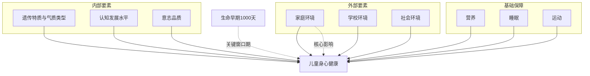
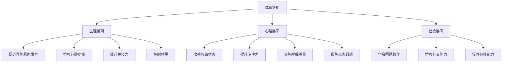
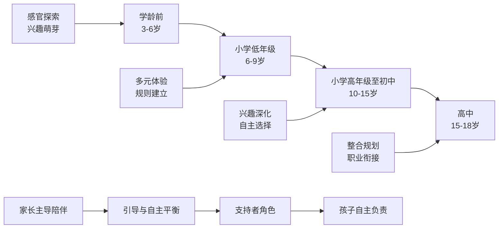
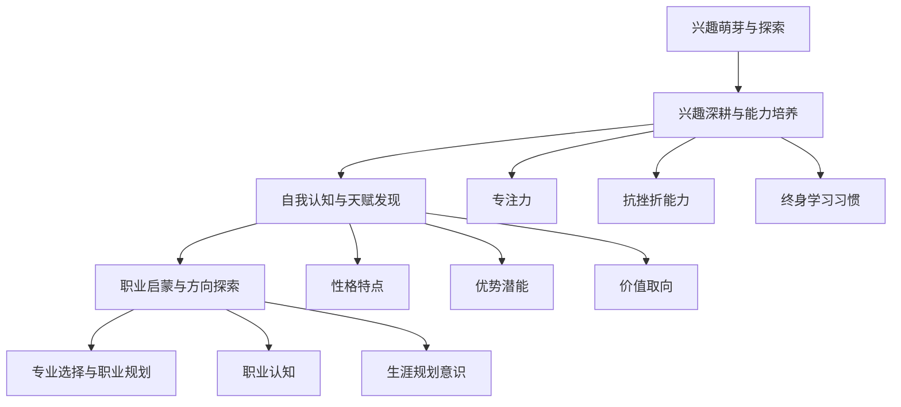
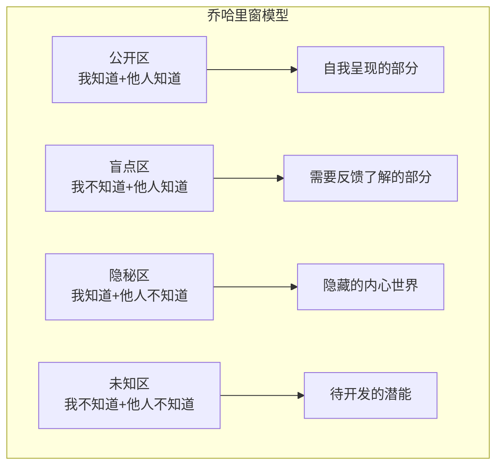
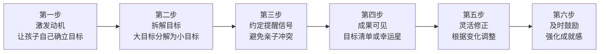
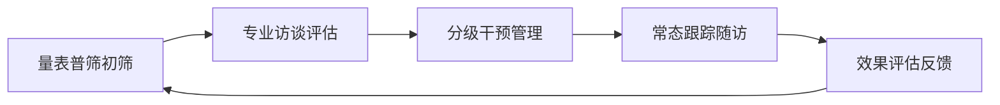
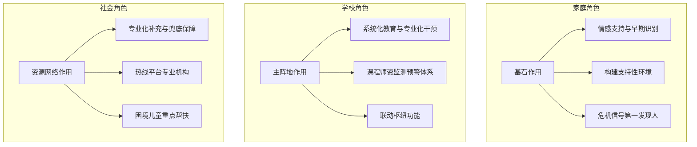

# 孩子身心健康成长资料汇编：学习、生活、兴趣与目标方向的系统整合
## 1 孩子身心健康成长的定义与核心要素

儿童身心健康成长是一个涉及多个维度的复杂议题，理解其科学内涵是开展有效教育与养育实践的基础。本章节将从权威机构的定义出发，系统梳理身心健康的多维内涵、核心评估指标、常见问题识别方法以及影响健康的关键要素，为家长和教育者提供科学的理论框架。

### 1.1 身心健康的多维定义

**健康的概念远比"没有疾病"更为丰富和深刻。** 世界卫生组织（WHO）明确指出："健康不仅仅是没有疾病或虚弱，而是身体、心理和社会适应的良好状态。"[^1]这一经典定义提示我们，评估儿童是否健康，需要从三个相互关联的层面进行综合考量。

**生理健康**是儿童健康的基础层面，表现为体格健壮、各器官功能良好。具体而言，幼儿健康首先指幼儿身体各个器官组织的构造正常，各个生理系统能良好地发挥作用，有效抵御各种疾病[^2]。这种组织结构的正常需要与不同时期幼儿的身高、体重增加速度相匹配，总体发展水平必须保持在正常范围内。联合国儿童基金会（UNICEF）在衡量儿童健康水平时，采用**五岁以下儿童死亡率**作为核心指标，因其能综合反映新生儿护理、传染病控制、营养状况等多方面因素[^3]。此外，婴儿死亡率、疫苗接种覆盖率、儿童营养状况（如发育迟缓、消瘦、低体重等）也是重要的评估维度[^4]。

**心理健康**是儿童全面发展的重要组成部分。根据世界卫生组织的定义，心理健康包括"主观的幸福感、感觉到个人的效能、自主性、和其他人的互动、可以实现个人在智能及情感上的潜力"等丰富内涵[^5]。WHO进一步明确指出："心理健康不仅仅意味着没有精神障碍"，还涵盖了个体的幸福感、生活满意度以及繁荣感[^6]。心理健康的人能够善待自己、善待他人、适应环境、情绪正常、人格和谐，能适时地从痛苦和烦恼中解脱出来，积极地寻求改变不利现状的新途径[^7]。

**社会适应能力**是指个体通过自我调节，保持个人与环境、社会及人际交往中的均衡与协调[^1]。幼儿心理健康的重要标志是情绪反应适度、社会适应良好，能较快地适应幼儿园的新环境和新生活[^2]。个体应主动应对环境变化，积极适应不断变化的自然环境和社会环境，构建和谐的人际关系。

**这三个维度并非相互独立，而是浑然一体、不可割裂。** 一个健康的幼儿，应该是身心发展都处于健康状态之中的[^2]。联合国儿童基金会发布的报告《不可预测的世界中儿童的福祉》正是基于这一整体视角，对儿童的心理健康趋势、身体健康趋势和技能发展趋势进行综合分析[^6]。

为更清晰地呈现三维健康模型，下表对各维度的核心内涵进行了对比说明：

| 维度 | 核心内涵 | 主要表现 | 关键评估指标 |
|------|----------|----------|--------------|
| 生理健康 | 器官构造正常、机能健全 | 体格发育达标、抗病能力良好 | 身高、体重、头围、疫苗接种率 |
| 心理健康 | 心理幸福安宁的状态 | 情绪稳定、认知正常、人格健全 | 生活满意度、情绪状态、智力发展 |
| 社会适应 | 与环境的均衡协调 | 人际交往良好、环境融入顺利 | 社交技能、自理能力、规则意识 |

### 1.2 儿童心理健康的核心指标

科学评估儿童心理健康状况，需要依据明确的标准体系。综合权威资料，**儿童青少年心理健康可归纳为五大核心标准**[^5]：

**第一，良好的情绪稳定性。** 这是儿童心理健康的核心之一，表现为情绪能正常表达，拥有调节能力[^5]。健康的心理状态能帮助儿童有效识别、表达和管理自己的情绪，如快乐、悲伤、愤怒或恐惧[^8]。心理健康的儿童能够合理地表达和调节情绪，能适时地展现积极情绪，也能在适当场合表达负面情绪，且不会长期陷入极端负面情绪中无法自拔[^9]。这种能力有助于建立内在的安全感，减少焦虑和抑郁的风险。

**第二，积极的自我认知。** 表现为自我意识清晰、恰当的自我评价[^5]。心理健康的儿童能清楚自己的优点和不足，既不因为长处而过度自负，也不因为短处而过分自卑[^9]。有恰当的自尊和自信，能够积极面对自身的特点，努力发挥优势、改进不足。美国心理学家马斯洛提出的心理健康标准中，"充分了解自己，对自己的能力作适当的估价"是重要内容[^7]。

**第三，正常的智力水平。** 体现在学习能力与认知水平相符、思维能力正常发展[^5]。认知发展健康包括注意力、记忆力、思维能力等方面的正常发展[^9]。儿童能在适合的时间内专注于学习、游戏等活动，能够较好地识记所学知识，具备一定的逻辑思维和形象思维能力。智力发展正常是心理健康的重要前提，因为它决定了幼儿生活、学习、交往的基本条件[^2]。

**第四，良好的人际关系。** 包括亲子关系融洽、同伴关系和谐[^5]。心理健康的儿童能学会与周围人正常交往，懂得分享与合作、尊重别人、乐于助人[^10]。在与同伴交往中，能建立和谐的同伴关系；在与家人相处时，能理解家人的情感和需求，遵守家庭规则[^9]。马斯洛指出，能保持良好的人际关系，与人和谐相处，是心理健康的重要标准[^7]。

**第五，较强的适应能力。** 表现为环境适应良好、应对挫折能力[^5]。心理健康的儿童能自我接纳、有自制力，能积极面对生活中遇到的问题和困难，适应环境[^10]。不怕困难和挫折，不达到目的不罢休，能根据自己的需要控制愿望和行为，排除外界和内心的干扰。

**心理健康的自我评估方法**可采用"五维评估法"[^5]，通过以下五个维度进行简易判断：

1. **睡眠维度**：睡眠时间是否足够（6-8小时）、睡眠质量好不好
2. **情绪维度**：情绪状态是平和稳定、乐观开朗的，还是苦恼低落、消极退缩、烦躁易怒的
3. **学习维度**：学习状态是有效率、愉快的，还是效率低下、反应迟钝的
4. **人际维度**：与同学、老师、朋友、父母的关系是否良好，沟通是否通畅、相互体谅
5. **饮食维度**：胃口好、有食欲，还是吃不下、消化不良

以上五条，但凡有哪一条出现了状况，都可能与心理相关，需要审视近期生活是否遇到困难[^5]。

### 1.3 儿童常见心理问题的识别

**及时识别心理问题的预警信号，是早期干预的关键。** 当前，儿童青少年心理健康问题已成为社会广泛关注的议题。据《中国国民心理健康发展报告（2019-2022）》数据显示，我国17岁以下青少年儿童中有**3000万**受到各种情绪、心理行为问题的困扰，18岁以下青少年抑郁状态检出率达**30.28%**[^5]。联合国儿童基金会的报告估算，在所涉及的国家中，**每六名10-19岁的儿童里，就有一名患有可被诊断的精神疾病**，且约一半的成人精神疾病在儿童时期就已初现端倪[^6]。

**不同年龄阶段儿童的心理问题呈现不同特点**[^11]：

**婴幼儿期（0-3岁）** 主要表现为由于养育方式不当所带来的心理发育问题，如言语发育不良、交往能力和情绪行为控制差。家长多与孩子进行情感、语言和身体的交流，培养良好的生活行为习惯，是避免此阶段精神卫生问题发生的可行方法。

**学龄前期（4-6岁）** 常见问题包括难以离开家长、与小伙伴相处困难。处理不好，易发生拒绝上幼儿园以及在小朋友中孤僻、不合群等问题。鼓励与小伙伴一起游戏、分享情感，培养孩子的独立与合作能力，是有效的预防方法。

**学龄期（7-12岁）及青少年期（13-18岁）** 问题更为复杂多样，包括学习问题（如考试焦虑、学习困难）、人际交往问题（如学校适应不良、逃学）、情绪问题、性心理发展问题、行为问题（如恃强凌弱、自我伤害）、网络成瘾、吸烟饮酒、过度追星、过度节食等[^11]。调节学习压力、学会情感交流、增强社会适应能力、培养兴趣爱好，是避免此阶段精神卫生问题发生的可行方法。

**儿童心理问题的外在信号可归纳为三类**[^10]：

| 信号类型 | 具体表现 |
|----------|----------|
| **情绪表现** | 恐惧、焦虑、不愿上学、容易生气、想轻生、兴趣减少或多变、情绪低落、有度日如年的感觉 |
| **行为表现** | 离群独处、不与同龄小朋友一起玩、沉默少语、少动、精神不集中、有暴力倾向、逃学、偷东西等 |
| **生理表现** | 头部腹部疼痛、恶心呕吐、厌食或贪食、早醒、入睡困难、耳鸣、尿频甚至全身不适，而躯体检查及实验室检查又没有躯体疾病 |

**值得警惕的是，心理问题如不及时化解，可能引发一系列严重后果。** 可能引发躯体疾病，如头痛心悸、呼吸不畅、手抖脚麻、消化不良、皮肤病等；可能诱发精神障碍，如焦虑抑郁、成瘾行为、人格障碍、双相障碍、精神分裂症等疾病；更有甚者，可能引发安全事故，诱发心理危机，激发人际冲突，产生冲动偏激行为，危害个体人身财产安全[^5]。

### 1.4 影响身心健康的关键要素

儿童身心健康受多层次因素的复杂影响，构成一个相互作用的生态系统。理解这些要素及其关联，有助于采取更有针对性的促进措施。

**内部因素**主要包括以下几个方面：

**遗传特质与气质类型**对儿童的生长潜力和心理特质具有基础性影响。先天性疾病或发育障碍会直接影响健康状态。联合国儿童基金会和世界卫生组织联合发布的报告估计，2019年全球约有**3.17亿例**19岁以下的儿童和青少年患有发育障碍，其中男性患病人数明显高于女性[^12]。

**认知发展水平**直接影响儿童的学习和适应能力。认知发展健康体现在注意力、记忆力、思维能力等方面的正常发展，认知发展不健康可能导致学习困难等问题，影响学业表现和自信心建立[^9]。

**意志品质**体现在面对困难时的坚持性和自制力。心理健康的儿童在面对学习或生活中的困难任务时，能够有毅力去坚持完成，不轻易放弃；在面对诱惑时，具备一定的自制力，能遵守规则和约束自己的行为[^9]。良好的意志品质有助于培养坚韧的心理品质，而意志品质薄弱可能导致遇到挫折就退缩。

**外部因素**的影响更为广泛和深远：

**家庭环境是影响儿童心理健康的核心要素。** 家长需为孩子提供稳定、温暖、充满关爱的家庭环境，通过积极的沟通和高质量的陪伴，建立安全的亲子依恋关系[^13]。应尊重孩子的情绪表达，鼓励其发展兴趣爱好和社交技能，培养自信心和抗挫折能力。家庭氛围与亲子关系是儿童心理健康的基石，冲突、暴力或忽视构成高风险因素。

**学校环境**在儿童社会化发展中扮演重要角色。学校是系统化实施心理健康教育、推广科学学习策略、组织兴趣活动的主阵地。良好的师生关系、和谐的同伴交往、适度的学业压力有助于心理健康发展。若社会适应不良，儿童可能会出现孤僻、不合群等问题，产生孤独感，进而引发一系列心理问题[^9]。

**社会环境**的影响日益凸显。当下，儿童正置身于一个复杂且多变的世界中成长，气候变化、持续不断的地区冲突、数字化转型以及人口结构转型所带来的诸多挑战，被合称为"多重危机"[^6]。COVID-19大流行病对儿童福祉产生的重大影响仍在持续。社区支持、媒体影响、文化背景等都会对儿童心理健康产生作用。

**生命早期1000天是关键的"机遇窗口期"。** 从母亲怀孕到孩子满2岁这一阶段，被世界卫生组织定义为人的体格和大脑发育最快的时期[^14]。在生命的最初几年，大脑发育迅速，每秒钟形成100多万个新的神经元连结，婴儿期内大脑体积翻倍并不断增长，到三岁时达到成人期的80%左右[^15]。因此，做好孕期及孩子生后的护理及喂养，与孩子一生的营养和健康状况密切相关。

**营养、睡眠、运动等基础保障对身心发展具有重要作用。** 均衡营养是儿童生长发育的物质基础，家长需确保儿童每日摄入充足的优质蛋白和新鲜蔬菜水果[^13]。规律作息对儿童的生理和心理健康至关重要，充足的睡眠是生长激素分泌的高峰期，学龄前儿童每天应保证10至13小时的睡眠，学龄儿童也需9至11小时[^13]。适量运动有益于情绪健康，可预防、缓解焦虑抑郁[^10]。

下图展示了影响儿童身心健康的要素生态系统：

**综上所述，儿童身心健康是一个多维、动态的综合状态。** 维护儿童心理健康需要家庭、学校和社会的共同参与[^8]。家长应营造温暖、稳定、充满关爱的家庭氛围，学校需将心理健康教育融入日常教学，同时保证儿童充足的睡眠、均衡的营养和规律的运动。当发现孩子出现持续的情绪低落、社交退缩、学习困难或行为异常时，建议家长及时寻求专业评估与帮助，早期干预效果更佳[^8]。

## 2 促进身心健康的学习安排策略

在明确身心健康多维内涵与影响要素的基础上，本章将从实践操作层面系统整合科学的学习安排策略。合理的学习安排不仅关乎学业成绩，更直接影响儿童青少年的情绪稳定、自我效能感与长期发展动力。**核心理念是从"数量堆砌"转向"质量取胜"，让每一分钟的学习都能直击知识核心，让每一次努力都能形成有效的能力积累**[^16]。以下内容将为家长和教育者提供可落地的行动指引，帮助孩子在学业发展与身心健康之间实现良性平衡。

### 2.1 科学学习计划的构建与执行

**没有科学的学习计划，学习很容易随心所欲而顾此失彼。** 高中学习是一个系统的过程，知识覆盖面相对较广、难度较大，仅靠简单地拼时间、拼精力漫无边际地大量演题是不可能取得好成绩的[^17]。科学有计划地学习才是正解，而制定计划的前提是进行深入的自我剖析，给自己进行科学合理的定位。

#### 2.1.1 自我分析与定位

在制定学习计划之前，需要对自己的性格特点、各科成绩水平等进行分析，作出客观评价。具体包括：

**性格特点分析**：了解自己能否与周围的同学老师"打成一片"，在遇到困难时及时求教；能否在经历考试失利后迅速调整状态，进入下一阶段的学习。这些处理好了都会有助于在以后的学习中不断攻坚克难[^17]。

**学科特长分析**：了解自己有哪些优势学科、哪些劣势学科；优势学科有无再提高可能；劣势学科能否再强一些。这些都对制定学习计划很有帮助[^17]。

#### 2.1.2 学习计划制定的核心原则

在制定学习计划时，需要注意以下几个关键要点：

| 原则 | 具体要求 | 实践方法 |
|------|----------|----------|
| **时间分配** | 以考试为节点划分学习阶段 | 根据考试情况确定学习或复习任务，并根据考试成绩合理调整学习计划及方法[^17] |
| **有所侧重** | 学习时间不能每科都一样 | 重点倾斜与适当放手相结合，学习时间向弱势科目重点倾斜，对优势学科可适当放手但不可完全放手，追求"强科更强，弱科不弱"[^17] |
| **查缺补漏** | 及时回头总结回顾 | 通过各种大小测验及时掌握自己的知识盲点，整理错题本是查缺补漏的好方法[^17] |
| **超强执行力** | 计划的执行才是关键 | 在制定计划后风雨无阻地执行下去，并根据实际情况灵活调整适应[^17] |

#### 2.1.3 目标设定的科学方法

**科学的学习目标是执行学习计划的源动力。** 有了明确的学习目标，就有了努力的方向。设定学习目标切忌大而空、泛而高，应注意以下问题：

**目标恰当性原则**：应设定一个高水平但可以实现的目标，即学习目标应设在自身最近发展区之内，这样既能维持强烈的学习动机，又能充分挖掘自身潜力[^17]。

**目标分解原则**：善于将抽象、难度较大的学习目标分解成相对具体、简单的学习目标来处理。比如，"将语文成绩提高10分"可以细化为具体的小目标，如每周固定时间进行专项练习[^17]。

**三级目标体系**：建立"个人-小组-班级"三级目标体系。个人层面，指导学生制定"跳一跳够得着"的个性化目标，既包括总分目标，也设置"进步最大学科""最稳定学科"等细分目标[^18]。

#### 2.1.4 从外部督促到内部驱动的转变

**小学阶段不是一个追分的阶段，是个"意识觉醒期"。** 如果孩子觉得"学习是我自己的事"，他自然就会想管一管；如果他觉得"我只是听话执行"，那学习永远跟他无关[^19]。

**赋予孩子自主权**是实现这一转变的关键。家长应从"监工"角色转变为"顾问"角色，尝试减少命令式的语言，不要过度提醒，而是赋予孩子选择权和掌控感。可以和孩子一起制订计划，让他参与决定，如"晚饭后先写作业还是先阅读"[^20]。

**实践建议**：从三年级开始，所有计划让孩子自己定。家长只需问他：今天先写哪门？语文打算怎么写？错题还要复盘吗？家长只是当个顾问，不要插手。一开始孩子可能安排得乱七八糟，但后来会学聪明，自己把复习放在前面，把难的题提前解决[^19]。

### 2.2 高效时间管理与学习方法指引

**普通的时间规划只告诉你"什么时候学"，却没说"学什么、要达到什么效果"，最终容易陷入"坐在书桌前就是学习"的假努力。** 真正高效的规划，是围绕核心目标分配精力，让每一个学习时段都有明确的价值[^16]。

#### 2.2.1 结构化番茄钟工作法

普通番茄钟易陷入"机械计时"的误区，结构化番茄钟对其做了针对性升级，把"单纯的计时"变成"有目标、有执行、有总结"的完整学习单元[^16]：

**前5分钟：定准唯一目标**，拒绝多任务并行。比如"理解并复述牛顿第二定律的推导过程""掌握3个文言实词的用法及例句"，目标越具体，专注度越高[^16]。

**中间15分钟：极致专注执行**，隔绝一切干扰。此刻书桌只留与目标相关的资料，大脑只围绕一个问题思考，不中途翻笔记、不刷手机、不纠结无关细节[^16]。

**最后5分钟：即时总结复盘**，留下学习痕迹。立刻写下本时段的核心收获（如"掌握了密度公式的两个变形应用"）或未解决疑问（如"为什么滑动摩擦力与接触面积无关"），收获让知识落地，疑问为后续学习指明方向[^16]。

#### 2.2.2 周计划网格与精力管理

**每天花时间想"今天该学什么"，本身就是一种精力浪费。** 周计划网格以周为单位，结合自身精力规律，将各学科的核心任务（复习、预习、专题突破、错题复盘）提前安排到每天固定的"番茄时段"，让学习形成肌肉记忆[^16]。

**精力规律匹配建议**：
- **早上精力好**：安排英语晨读、语文古诗文背诵等记忆类任务
- **下午思维活跃**：安排数学、理科综合等逻辑类学科[^21]
- **晚上逻辑思维活跃**：安排数学专题突破、物理公式推导
- **碎片时段**（如晚自习前）：安排错题本复盘[^16]

固定的节奏会让大脑进入"到点就学习"的状态，无需反复做决策，把更多精力留给核心的知识加工[^16]。

#### 2.2.3 碎片化时间的高效利用

碎片化时间的学习，核心是**"轻量、高效、贴合场景"**，不搞复杂的知识加工，只做简单的记忆、回顾[^16]。

| 场景 | 时间特点 | 适合任务 |
|------|----------|----------|
| **通勤/洗漱/散步** | 听觉输入为主 | 听英语听力、语文课文朗诵、古诗文背诵音频、自己录制的知识总结录音[^16] |
| **课间/排队/等餐** | 视觉记忆为主 | 用闪卡APP记单词、回顾知识点卡片[^16] |
| **睡前短时间** | 放松状态 | 轻松回顾当日学习要点 |

#### 2.2.4 主动加工的深度学习方法

**很多学生看似学了很多遍，却依然一考就忘，核心问题在于只是"浅层重复"——看书、抄笔记、背公式，却没有让大脑真正参与到知识的消化中。** 精准学习的关键，是通过主动加工，把书本上的"别人的知识"，变成自己能理解、能运用、能迁移的"自己的知识"[^16]。

**费曼学习法**是检验深度理解的终极方法，核心是"把复杂的概念简单化"，尤其适合理科概念、文科知识点的理解记忆：

1. 学完一个知识点后，假装把它教给一个完全不懂的人（比如想象中的10岁孩子，或身边的同桌）
2. 用自己的话讲解，不照搬课本原文，不讲专业术语堆砌的空话
3. 如果讲解时卡壳、说不清楚、逻辑混乱，那这个地方就是知识薄弱点，立刻返回课本、笔记重新学习
4. 把最终讲通顺的内容，用最简单的语言记录下来，形成自己的"知识讲解笔记"[^16]

**思维导图/知识图谱**帮助实现从"点状记忆"到"网状理解"的转变。每周针对一个章节或核心主题，不看书、不抄笔记，用思维导图自主梳理知识：

- 以核心概念为中心，向外延伸出分支
- 重点标注知识点之间的联系
- 梳理完成后，对照课本和笔记补充漏洞，红色笔标注未掌握的部分[^16]

#### 2.2.5 "五星级"错题本法与间隔复习

**刷题的真正价值，不是刷完多少道题，而是从错题中找到自己的知识漏洞、思维误区。** 真正的错题本是精准学习的核心反馈工具，是专属于自己的"薄弱点题库"[^16]。

**五星级分类标注法**：

| 星级 | 错误类型 | 处理方式 |
|------|----------|----------|
| ⭐ | 粗心失误（审题漏字、计算跳步） | 无需抄题，只记录错误模式，考前快速翻阅提醒自己[^16] |
| ⭐⭐ | 概念模糊（知识点理解不清） | 回归课本，用费曼学习法重新厘清概念，再做1道基础题巩固[^16] |
| ⭐⭐⭐ | 思路卡壳（知识点懂但想不到思路） | 重点标注"思维触发器"，即从题目条件到关键第一步的思考逻辑[^16] |
| ⭐⭐⭐⭐ | 方法未掌握（未掌握解题方法或答题模板） | 将错题归类到专题本，寻找3-5道同类题集中强化[^16] |
| ⭐⭐⭐⭐⭐ | 综合难题（涉及多个知识点的复杂思维链条） | 抄题并拆解思维链条，标注每一步涉及的知识点，定期复盘[^16] |

**间隔复习策略**：利用遗忘曲线，在**第1天、第3天、第7天、第30天**对二、三、四星错题进行重复自测，让知识从"短期记忆"变成"长期记忆"[^16]。

### 2.3 考试焦虑的识别与积极心态培养

**临近考试，有的孩子开始出现心烦意躁、乱发脾气的情况；有的孩子则吃不好、睡不香，精神萎靡不振；还有的孩子甚至"不敢走进考场"。** 面对学习任务与考试期待，部分学生可能出现紧张、焦虑的情绪[^22][^23]。

#### 2.3.1 考试焦虑的表现与成因

**心理学认为，焦虑是人们在非正常情况下出现的正常反应。** 适度的考试焦虑有利于帮助学生处于较为适当的警觉状态，提高学习效率，对复习考试也有激励作用[^23]。但若持续过大且缺乏疏导，则可能引发一系列身心反应。

**考试焦虑的典型表现**：

| 反应类型 | 具体表现 |
|----------|----------|
| **行为反应** | 厌学、沉迷网络、逃避考试[^23] |
| **情绪反应** | 对学习感到紧张、焦虑、担忧和恐惧[^23] |
| **认知反应** | 注意力和学习效率下降，认为自己学习不行[^23] |
| **生理反应** | 肚子痛、胸闷气短、失眠多梦等症状[^23] |

**主要成因分析**：

1. **自我认知偏差**：如果对自己的学习成绩没有正确认知，树立过高目标，就会产生严重的焦虑情绪[^22]
2. **学习压力与竞争**：在当前社会环境下，学习压力和竞争是影响青少年心理健康的一个重要因素[^23]
3. **缺乏有效应对策略**：面对压力时缺乏合适的情绪调节和问题解决方法

#### 2.3.2 缓解考试焦虑的实证策略

**第一招：认清自己**。家长应当引导孩子客观评价自己，正确认识自己的成绩，制定可行的学习目标[^22]。调整认知，考试只是检验学习成果的一种方式，能够更好了解自己的优势和薄弱点，不是衡量个人价值的唯一标准[^23]。

**第二招：积极自我暗示**。家长可以鼓励孩子每天进行"自我夸赞"，例如："我能行""我是最棒的"等。通过语言暗示，可以增加孩子的自信，克服焦虑[^22]。

**第三招：适量运动与放松技巧**。运动可以使精神放松，心情愉悦。家长可以引导孩子学会"调整呼吸"，坐着或者躺着，先缓慢地吸气，然后停住几秒，再吐气，多反复几次[^22]。当复习备考觉得紧张焦虑时，不妨停下来转移注意力，可以通过深呼吸、与家人朋友聊天倾诉等方式缓解情绪[^23]。

**第四招：做感兴趣的事**。孩子天天看书是单调、枯燥的过程。考试即将开始，这时家长不妨引导孩子适当地放下手头的功课，做一些感兴趣的事情，如听音乐、看电视、读小说等[^22]。

**第五招：情感宣泄**。情感宣泄是缓解压力、保持心理平衡的重要手段，让孩子把紧张、焦虑讲给心理老师听，在老师的帮助下调整心态[^22]。

#### 2.3.3 家长的共情支持角色

**家长首先要共情、接纳孩子的感受。** 一方面，家长可以自我呈现，用自己相似的体验告诉孩子，遇到困难，该如何表达和处理当下的想法、情绪情感；另一方面，家长还可以教会孩子，焦虑是正常反应，但并非坏事[^23]。

**保持健康的生活节奏是最重要的基础**：生活紊乱会引起心理紊乱，所以最重要的是保持健康的生活节奏，不熬夜学习、玩手机，保持充足的睡眠和适当的体育锻炼。当焦虑情绪持续两周无法调整时，需要积极寻找专业医生的帮助[^23]。

### 2.4 睡眠质量与用眼健康的保障措施

**睡眠与用眼健康是维持高效学习所需身心状态的基础。** 研究表明，睡眠质量不佳的日子，孩子写字、看书的时间容易拉长，眼睛干涩、酸痛、眨眼频繁的情况增多，注意力也易从聚焦的任务上分散开来[^24]。

#### 2.4.1 睡眠质量对学习的影响

**睡眠像一张"修复与整合"的网，睡得好时，大脑会更好地织起这张网，眼部肌肉的调节与泪液的稳定也更容易保持在舒适区间。** 睡眠不足不一定直接改变眼球本身的结构，但它让日间的眼疲劳和视觉负荷更明显，进而影响到学习表现和日常生活的眼部舒适感[^24]。

**不同年龄段儿童的睡眠时长建议**：
- **小学生**：每天睡眠10小时
- **初中生**：每天睡眠9小时
- **高中生**：每天睡眠8小时[^25]

**作息管理要点**：复习期间的班级管理要"严而有度，管中有爱"，严格执行作息时间表，杜绝"开夜车"现象，确保学生每天睡眠不少于8小时[^18]。

#### 2.4.2 用眼健康的核心要点

**各地各校需抓早抓小保护儿童远视储备**，指导学生调整课桌椅高度，养成"一尺、一拳、一寸"读写姿势，严格遵循"20—20—20"用眼法则[^25]。

**"20-20-20"用眼法则详解**：近距离工作时，尝试每工作20分钟看远处20秒的简单休息，并适时进行眼部保健操[^24]。

**户外活动与自然光照的重要性**：户外活动时间不足、日间暴露的自然光不足，都会间接影响睡眠节律和视觉任务的调适能力[^24]。措施要求打造开放式运动场地，确保中小学生每天综合体育活动不低于2小时[^25]。

#### 2.4.3 教学与家庭视觉环境优化

**教学视觉环境持续优化升级**：各地将依据国家教室采光照明卫生标准，常态化普查并改造教室、宿舍、图书馆等场所，推广节能护眼灯具，同时指导家庭同步优化居家光环境，降低学生用眼负荷[^25]。

**睡眠与用眼健康的协同保障策略**：

| 维度 | 具体措施 |
|------|----------|
| **作息规律** | 建立固定的就寝与起床时间，周末也尽量保持相对稳定[^24] |
| **睡前环境** | 睡前减少强光和刺激性活动，选择安静、放松的活动，换上柔和灯光[^24] |
| **日间活动** | 白天增加户外活动和自然光照，降低连续近距离用眼的时间[^24] |
| **用眼习惯** | 遵循20-20-20规则，适时进行眼部保健操[^24] |
| **定期检查** | 家长应定期带孩子到眼科进行视力检查，记录变化，及时调整用眼习惯[^24] |

### 2.5 数字时代健康用网习惯的培养

**网络时代，数字技术已深度融入青少年的学习与生活。** 对当代中小学生而言，网络既是获取知识的"百科全书"、交流情感的"虚拟桥梁"，也是暗藏风险的"情绪旋涡"——短视频的碎片化刺激、游戏的沉浸式吸引、不良信息的隐蔽渗透，正悄然影响着青少年的认知模式与心理状态[^26]。

#### 2.5.1 网络使用对儿童青少年的影响

**未成年人网络使用问题不容忽视。** 据《2024中国青少年网络使用调研报告》显示，我国青少年网民约1.85亿，其中约55.2%的青少年日均上网不超过1小时，13.6%的青少年日均上网超过3小时，轻度网络沉迷比例高达48.9%[^27]。

**电子产品使用对儿童青少年的主要影响**：

| 影响领域 | 具体表现 |
|----------|----------|
| **睡眠质量** | 睡前几小时的屏幕使用显著对儿童睡眠产生负面影响，包括总睡眠时间缩短、入睡潜伏期延长、夜间觉醒增多和睡眠效率下降[^27] |
| **社交技能** | 幼儿期高频屏幕接触与后期同伴交往能力下降相关，过长屏幕时间会减少面对面互动机会[^27] |
| **情绪调节** | 当屏幕频繁用于安抚情绪低落的儿童时，可能无意中阻碍儿童内在自我调节能力的发展[^27] |
| **认知发展** | 高频屏幕使用与学习、记忆、注意力、语言发展及执行功能问题相关[^27] |

#### 2.5.2 电子产品使用的管理规范

**针对电子产品使用，措施划出明确红线**：禁止手机进入课堂、禁用手机布置作业，推行纸质作业；教师使用电子产品教学时长不超教学总时长30%，教学设备需符合近视防控卫生要求[^25]。

**家庭管理建议**：家长要有意识地管控孩子非学习目的电子产品使用，单次不超15分钟，每天累计不超1小时[^25]。

**睡前屏幕戒断策略**：睡前减少强光和刺激性活动，尽量选择安静、放松的活动，如讲故事、简短的放松练习、换上柔和灯光的环境[^24]。屏幕发出的蓝光抑制褪黑素分泌——而褪黑素是调节昼夜节律的关键激素[^27]。

#### 2.5.3 家校协同的健康用网实践

**培养健康用网习惯，应以家校协同为"稳定器"。** 家庭是孩子养成用网习惯的"第一课堂"，家长的示范与引导至关重要[^26]。

**"息屏行动"实践建议**：
- 家长可与孩子共同制定"用网公约"，明确学习时段、娱乐时段的设备使用规则
- 通过亲子共读、户外运动、手工实践等替代活动，减少对网络的过度依赖
- 学校应通过家长课堂、家访等形式，普及科学用网知识
- 帮助家长避免"谈网色变"或"放任不管"的极端做法，形成"监督而不控制、引导而不替代"的教育共识[^26]

#### 2.5.4 提升网络素养与信息辨别能力

**培养健康用网习惯，本质上是帮助青少年在数字世界中建立"心理防护墙"。** 网络素养不仅是操作技能的掌握，更是对信息的辨析、对自我的约束、对规则的敬畏。当青少年学会理性辨别"信息茧房"中的真假优劣，懂得在"即时满足"与"长期主义"间权衡选择，方能将网络转化为成长的助力而非阻力[^26]。

**学校层面的实践建议**：通过生命安全与健康教育课程，系统传授网络安全知识、法治观念与用网礼仪，帮助学生理解"网络不是法外之地"，学会保护个人隐私、抵制网络暴力[^26]。

**核心目标**：数字时代的教育，是一场与技术赛跑的"双向奔赴"。培养学生健康用网习惯，不是要将青少年隔绝于网络之外，而是要教会他们在网络浪潮中站稳脚跟、把握方向，真正成长为适应数字时代的健康学习者与理性参与者[^26]。

---

**本章小结**：促进身心健康的学习安排策略是一个整合系统，它以**结构化工具和自主权结合**的时间管理为骨架，以**主动学习与精准复习**为血肉，以**内在动机和身心调节**为灵魂，并以**健康的生理习惯和用网环境**为基石。这套组合策略兼顾了认知规律、行为科学和身心健康，能系统性地提升学习效率与成果，帮助孩子在学业发展与身心健康之间实现良性平衡。

## 3 构建平衡健康的生活作息与习惯

在明确身心健康的多维内涵与科学学习策略之后，本章将目光聚焦于儿童青少年日常生活的核心领域。**规律饮食与作息是假期健康生活方式的"压舱石"**，更是学期日常健康的基石[^28]。良好的生活习惯不仅为学业发展提供充沛的精力储备，更直接关系到儿童的生长发育、情绪稳定与长期健康。本章将从睡眠、营养、运动、屏幕管理、卫生习惯及假期特别关注等六个维度，为家长和教育者提供系统、可操作的行动指引。

### 3.1 充足睡眠与规律作息的保障

**充足睡眠对学生身心修复、生长发育至关重要**[^28]。睡眠不仅是身体休息的过程，更是大脑进行记忆巩固、情绪调节和生长激素分泌的关键时段。睡眠质量不佳会导致注意力下降、情绪波动、学习效率降低，甚至影响身高发育和免疫功能。

#### 3.1.1 不同年龄段的睡眠时长建议

根据权威健康指导，不同学段儿童的每日睡眠时长应有明确保障：

| 学段 | 每日睡眠时长建议 |
|------|------------------|
| 小学生 | 不少于10小时[^28][^29] |
| 初中生 | 不少于9小时[^28][^29] |
| 高中生 | 不少于8小时[^28][^29] |

这些标准并非随意设定，而是基于儿童青少年生长发育规律和认知功能需求的科学建议。家长应将其作为日常作息安排的基本参照。

#### 3.1.2 建立规律作息的具体方法

**建议家长协助孩子制定并执行作息表，督促孩子早睡早起，避免熬夜使用电子产品**[^28]。规律作息的建立需要从以下几个方面着手：

**固定就寝与起床时间**：即便在假期，也应保持相对固定的作息节律[^28]。尽量保持与上学期间基本一致的起床和睡觉时间，避免开学前出现"假期综合征"[^29]。生物钟的稳定有助于维持内分泌平衡和认知功能的正常发挥。

**睡前环境营造**：睡前1小时应营造安静、昏暗、适宜的睡眠环境，可通过阅读、听轻柔音乐等方式放松助眠[^28]。卧室是孩子需要补充睡眠的地方，如果他们在夜间能接触到电子设备，将无法抗拒地去查看它们[^30]。因此，**夜间请将手机（或平板电脑、游戏机）放在家中其他地方**[^30]。

**睡前屏幕戒断**：许多老师表示，学生因夜间上网而长期处于疲惫状态。此外，更糟糕的事情往往发生在深夜，因为那是孩子自控力最弱、判断力最差的时候[^30]。睡前拒绝电子产品是保障睡眠质量的重要措施[^31]。

#### 3.1.3 假期作息管理的特别提醒

**放假不是放纵**。由于不用早起上学，很多孩子会熬夜玩耍，导致生物钟紊乱[^29]。假期作息紊乱不仅影响当下的身心状态，更会在开学时造成适应困难。家长应帮助孩子理解，保持规律作息是对自己身体的尊重和负责，而非额外的束缚。

### 3.2 均衡营养膳食与科学喂养

**"吃得饱"不等于"营养均衡"，"不挑食"不代表"吸收高效"**[^32]。许多家长陷入"只要孩子吃得好，身高自然会长"的认知陷阱，却忽略了营养结构失衡这一隐性问题。儿科数据显示，在身高增长缓慢的儿童中，约40%存在"隐性营养失衡"问题[^32]。

#### 3.2.1 儿童营养均衡的核心原则

**建议家庭把握"营养均衡、多样适量"的原则**[^28]。具体而言：

**每日膳食多样性**：每日饮食应涵盖谷类、蔬菜、肉类、蛋类、奶制品、豆类等至少12种食物[^28]。主食注重粗细搭配，适量摄入鱼虾、瘦肉、鸡蛋等优质蛋白[^28]。

**营养搭配要点**：多吃蔬菜水果、全谷物、奶类和豆类，少吃油炸、高糖、高盐的食物[^29]。每天喝奶300ml以上，足量饮水，少喝或不喝含糖饮料[^31]。

**规律饮食习惯**：一日三餐定时定量，不暴饮暴食，不以零食代替正餐[^29]。面对节日丰盛饮食，提醒孩子注意食有节制，细嚼慢咽，建议每餐七八分饱为宜[^28]。

下表总结了儿童营养膳食的核心要点：

| 营养维度 | 具体建议 |
|----------|----------|
| 食物种类 | 每日至少12种，涵盖谷类、蔬菜、肉蛋奶豆[^28] |
| 蛋白质 | 适量摄入鱼虾、瘦肉、鸡蛋等优质蛋白[^28] |
| 主食 | 粗细搭配[^28] |
| 奶制品 | 每天300ml以上[^31] |
| 零食选择 | 水果、原味坚果、酸奶等健康食品[^28] |
| 饮食节制 | 每餐七八分饱，避免暴饮暴食[^28] |

#### 3.2.2 生命早期营养与辅食添加

**《中国居民营养与慢性病状况报告(2020年)》显示，我国6岁以下儿童贫血率为21.2%，3-5岁儿童维生素D不足率达49.9%，2-3岁幼儿的日均钙摄入量仅达到推荐量的30%左右**[^33]。这些数据表明，儿童营养问题的关注应从生命早期开始。

**分阶段引入多样化食物**是科学喂养的关键[^33]。母乳是婴幼儿最理想的食物，世界卫生组织建议婴儿出生后1小时内应开始母乳喂养，6个月内纯母乳喂养[^33]。6月龄起添加辅食，优先选择强化铁婴儿米粉、肉泥等富铁食物，弥补母乳铁含量下降的缺口[^33]。7-12月龄逐步过渡到半固体食物，13-24月龄实现与家庭膳食融合[^33]。

#### 3.2.3 健康饮水习惯的培养

**足量饮水是维持身体代谢与免疫功能的关键**，冬季空气干燥，假期在家或外出游玩时也要注意及时、足量饮水[^28]。

不同年龄段儿童的每日饮水量建议如下：
- **6-10岁儿童**：每天饮水800-1000毫升[^28]
- **11-17岁青少年**：每天饮水1100-1400毫升[^28]

**推荐白开水，做到少量、多次、主动饮水**[^28]。聚会时尤其要避免以含糖饮料、功能饮料代替水[^28]。若孩子不喜欢喝白水，可加入少许柠檬片、薄荷叶调味，或自制无糖花果茶、蔬菜汤等[^28]。**许多饮料含糖量"隐形"超标，是导致儿童肥胖和龋齿的元凶之一，家长要严格把关**[^29]。务必明确禁止儿童饮酒及含酒精饮料，家长在聚餐时应做好看护和引导[^28]。

#### 3.2.4 识别"隐性营养失衡"的方法

**当孩子出现以下情况时，家长应留意是否与营养不均衡有关**[^33]：

| 信号类型 | 具体表现 |
|----------|----------|
| 生长发育信号 | 身高体重增长缓慢，明显低于同龄人标准；长牙晚、囟门闭合延迟；肌肉不足，运动能力发育滞后[^33] |
| 免疫力信号 | 频繁感冒发烧，每月超过1-2次；伤口愈合缓慢，容易感染；反复出现呼吸道、消化道感染[^33] |
| 认知发育信号 | 注意力不集中，反应迟钝；语言发育迟缓，表达能力差；记忆力差，学习新事物困难[^33] |
| 其他身体信号 | 头发枯黄、稀疏；皮肤粗糙、干燥；食欲缺乏，消化吸收差[^33] |

**家长可实操的营养评估方法——3天饮食记录法**[^32]：连续记录孩子3天的饮食情况，包括食物种类、摄入量和进餐时间，对照膳食指南评估是否存在营养素摄入不足或过量的问题。一旦发现上述迹象，建议家长咨询专业儿科医生，排除疾病因素，并进行专业的营养评估[^33]。

### 3.3 体育锻炼与户外活动的促进作用

**运动对小孩的成长至关重要**，不仅能促进骨骼、肌肉发育，增强心肺功能和身体协调性，帮助控制体重、提升免疫力，降低成年后患上肥胖、心血管疾病等慢性病的风险，还是锻炼孩子意志品质的绝佳途径[^34]。在奔跑、跳跃、竞技的过程中，他们能学会坚持、抗挫和团队协作，同时还能通过释放精力缓解学习压力，改善情绪状态与睡眠质量，对专注力、记忆力的提升也有积极作用[^34]。

#### 3.3.1 运动对身心健康的多重价值

运动对儿童青少年的益处是全方位的，下图展示了运动促进身心健康的作用机制：

**浙江省宁波市江北区的实践**充分证明了体育运动对心理健康的促进作用。该区发挥体育运动在调节情绪、培养兴趣、建立自信等方面的积极作用，探索出一条体育促进学生心理健康发展的新路径[^35]。案例显示，曾有厌学情绪的学生通过参加跳远训练队，在运动会上取得优异成绩后，以更开放和阳光的心态面对未来的挑战，厌学情绪也一扫而空[^35]。

#### 3.3.2 每日运动时长与强度建议

**即便在假期，也应保证每天累计不少于1小时的中高强度身体活动**[^28][^29]。这一标准是教育部明确要求的基本运动量，有助于维持儿童的体能水平和身心状态。

**运动项目选择建议**：

| 条件 | 推荐运动项目 |
|------|--------------|
| 天气适宜/户外 | 散步、跑步、跳绳、球类运动等，做好保暖措施避免着凉[^28] |
| 户外条件不佳/室内 | 开合跳、俯卧撑、仰卧起坐、跳绳、健身操、亲子游戏等[^28] |

**运动安全注意事项**：运动前充分热身，穿着适宜，运动后及时拉伸肌肉、补充水分，避免过度运动造成损伤[^28]。

#### 3.3.3 户外活动与近视预防的特殊意义

**户外活动是关键：每天2小时以上的日间户外活动，是预防近视有效的方法**[^29][^36]。这一结论已被国内外多项研究证实。户外活动时自然光照的充足暴露，对儿童视觉发育和近视预防具有不可替代的作用。

**积极引导孩子进行户外活动或体育锻炼，让孩子到户外阳光下度过更多时间，保证每天2小时或每周达到14小时的日间户外活动**[^31]。外出注意保暖，适时增减衣物。

#### 3.3.4 体重管理与运动的结合

**可每周定时测量体重，及时了解体重变化，以便调整饮食与活动量，远离"节日胖""假期肥"**[^28]。帮助孩子定期测量身高、体重和腰围，做好记录，从小养成自我健康管理的好习惯[^31]。运动与合理饮食的结合，是科学管理体重、避免能量过剩的有效途径。

### 3.4 减少久坐行为与屏幕时间管理

**孩子沉迷电子产品不是"电子产品的错"，而是缺乏合理的引导和替代方案**[^37]。在数字时代，电子产品已成为家庭生活的一部分，但过度使用对儿童身心发展的负面影响不容忽视。

#### 3.4.1 屏幕过度使用的负面影响

研究表明，屏幕过度使用对儿童的影响是多方面的：

| 影响领域 | 具体表现 |
|----------|----------|
| 睡眠质量 | 总睡眠时间缩短、入睡潜伏期延长、夜间觉醒增多和睡眠效率下降 |
| 社交技能 | 幼儿期高频屏幕接触与后期同伴交往能力下降相关，过长屏幕时间会减少面对面互动机会 |
| 情绪调节 | 当屏幕频繁用于安抚情绪低落的儿童时，可能无意中阻碍儿童内在自我调节能力的发展 |
| 认知发展 | 高频屏幕使用与学习、记忆、注意力、语言发展及执行功能问题相关 |

**"劣质"屏幕时间指在手持设备上独自观看那些简短、碎片化、没有道德信息的内容**，例如短视频。后者更容易让孩子发脾气，因为年幼的大脑无法理解为何这种愉悦的刺激必须结束，孩子的睡眠质量也会受到干扰[^30]。

#### 3.4.2 屏幕使用的具体管控标准

**非学习目的使用电子产品，单次不宜超过15分钟，每天累计不宜超过1小时**[^29][^36]。这是国家卫健委针对儿童青少年近视防控提出的明确建议。

**"20-20-20"护眼法则**：遵循"20-20-20"法则——每看屏幕20分钟，抬头远眺20英尺（约6米）外至少20秒[^29][^36]。这一方法是眼科学界广泛推荐的缓解视疲劳的有效措施。

**打断久坐行为**：注意打断久坐行为，每静坐1小时起身活动5-10分钟[^28]。久坐不仅影响视力，还会导致肌肉僵硬、血液循环不畅等问题。

#### 3.4.3 家庭电子使用公约的制定

**没有规则的自由，只会导致混乱**[^37]。家长可以和孩子一起商量制定"家庭电子使用公约"，明确电子产品的使用时间、使用场景和使用内容，让孩子从"被动遵守"变成"主动参与"[^37]。

**制定公约的要点**[^38][^37]：

1. **平等协商**：和孩子平等协商，而非单向命令，共同制定使用规则
2. **明确内容**：明确每日使用时长、可用时段（如课后放松30分钟，睡前1小时禁用）和禁区（如餐桌、课堂、卧室）
3. **具象化执行**：用计时器提醒，违规后对应合理后果（如次日缩短使用时长）
4. **以身作则**：家长自身也要减少无效用机，树立榜样[^30]

**家长有权根据新情况收紧家规，也有权收回那些可能过早引入的电子设备**[^30]。如果认识到某个设备或平台并未给孩子的成长带来益处，甚至可能对他们有害，那么作为父母就有责任进行干预，可以对孩子大胆说"不"[^30]。

#### 3.4.4 替代活动的安排建议

**当屏幕不再是孩子的主要娱乐形式时，必须给他们安排其他事情做**[^30]。尝试从孩子的视角观察环境：这里是否有实体玩具、游戏、书籍、拼图、手工材料、烘焙食材、运动装备和乐器让他们娱乐？虽然这也意味着更多的杂乱、混乱和噪音，但孩子是天性活泼的生命体，不应久坐不动[^30]。

**阶段性干预策略**[^38]：

| 阶段 | 核心任务 | 具体方法 |
|------|----------|----------|
| 观察识别期 | 摸清使用规律 | 记录每日用机时长、场景和内容，区分"必要使用"与"沉迷倾向" |
| 约定规范期 | 建立明确规则 | 共同制定使用公约，明确时长、时段和禁区 |
| 替代转移期 | 行为调整 | 结合孩子兴趣安排线下活动，优化家庭氛围，预留亲子时光 |
| 监督执行期 | 强化落地 | 借助手机管控功能，温和而坚定地执行，给予正向反馈 |
| 巩固调整期 | 长期维护 | 定期复盘，根据情况灵活调整，关注心理状态 |

### 3.5 口腔护理与日常卫生习惯

**寒假孩子们接触零食、甜食的机会增多，口腔护理不可忽视**[^28]。良好的口腔卫生习惯不仅关系到牙齿健康，也是整体健康习惯体系的重要组成部分。

#### 3.5.1 日常口腔护理要点

**坚持早晚刷牙各2分钟，饭后用清水漱口**[^28]。这是预防龋齿的基本措施。刷牙时应使用正确的方法，确保牙齿各个面都能得到清洁。

**零食选择与进食时机**：零食应选择水果、原味坚果、无糖乳制品，尤其注意避免在睡前及饭后半小时内进食甜食[^28]。若食用甜食后应及时漱口，减少糖分在口腔停留时间[^28]。

**健康零食选择建议**：
- **推荐**：水果、原味坚果、酸奶等健康食品[^28]
- **限制**：油炸类或高糖高脂食品[^31]
- **注意**：约定食用时间，避免影响正餐或睡前进食[^28]

#### 3.5.2 个人卫生习惯与传染病预防

**冬春季是流感、支原体肺炎等呼吸道传染病的高发季节，人员流动和聚集增加了感染风险**[^29]。做好个人卫生是预防传染病的第一道防线。

**勤洗手、讲卫生**：养成良好的个人卫生习惯，饭前便后、触摸公共物品后要洗手[^29]。外出回家后、用餐前、便前便后、触摸眼睛、鼻子或嘴巴前后，及时在流动水下使用肥皂或洗手液洗手[^31]。

**咳嗽礼仪**：咳嗽、打喷嚏时用纸巾或手肘遮挡口鼻，并及时洗手[^29][^31]。

**多通风、少聚集**：尽量避免带孩子去人群密集、空气流通不畅的场所。家中每天定时开窗通风，保持空气清新（注意保暖，避免穿堂风）[^29]。在空气状况良好的情况下，每天开窗通风1-2次，每次不少于30分钟[^31]。

**疫苗接种**：对于流感等有疫苗可预防的疾病，建议符合条件的孩子及时接种[^29][^39]。

**如果孩子出现发热、咳嗽等症状，建议居家休息，必要时及时就医，不带病参加课外班或聚会**[^29]。

### 3.6 假期健康管理的特别关注

**寒假来临，孩子们在享受放松与团聚时光的同时，也迎来了作息、饮食与活动模式变化的挑战**[^28]。假期是身心调整的好时机，但也是健康习惯容易松懈的高风险期。

#### 3.6.1 假期综合健康管理要点

国家多个部门联合部署开展"把爱带回家——暖心护航伴成长"2026寒假儿童关爱服务活动，旨在让广大儿童度过一个安全温暖、健康快乐、富有意义的假期[^28]。在此倡议下，家庭更需关注孩子假期的健康管理。

**假期健康管理核心清单**：

| 维度 | 核心要点 | 具体措施 |
|------|----------|----------|
| 作息 | 保持规律 | 尽量与上学期间一致，避免熬夜[^29] |
| 饮食 | 营养均衡 | 三餐定时定量，控制零食，多喝水少喝饮料[^28][^29] |
| 运动 | 坚持锻炼 | 每天1小时中高强度活动，2小时户外活动[^28][^29] |
| 屏幕 | 合理控制 | 非学习目的每日累计不超1小时[^29] |
| 卫生 | 防护到位 | 勤洗手、多通风、必要时戴口罩[^29] |
| 心理 | 亲子互动 | 多沟通倾听，共同参与家庭活动[^29] |

#### 3.6.2 家长协助制定假期健康计划

**假期是增进亲子感情的好时机**，但也容易因为作业、手机等问题产生摩擦[^29]。家长可以采取以下方式协助孩子制定假期健康计划：

**多沟通、多倾听**：家长要多关注孩子的情绪变化，多与其面对面交流，倾听他们的想法，而不是一味地催促写作业[^29]。

**合理安排学业**：与孩子一起制定合理的假期计划，劳逸结合[^29]。

**共同参与**：利用假期一起做家务、置办年货、进行体育锻炼，增加亲子互动的乐趣[^29][^39]。通过春节大扫除保持家庭环境整洁，重点清理厨房、卫生间，并清除室内外积水容器，以减少蚊虫孳生，营造健康居家环境[^39]。

#### 3.6.3 假期与学期作息的衔接

**调整作息：尽量保持与上学期间基本一致的起床和睡觉时间，避免开学前出现"假期综合征"**[^29]。假期作息的平稳过渡是开学后快速进入学习状态的重要保障。

建议在假期结束前一周，逐步将作息时间向学期标准靠拢，每天提前15-30分钟起床和就寝，让身体有充足的时间适应新的节奏。同时，可以提前预习新学期内容，帮助大脑从"休假模式"切换到"学习模式"。

#### 3.6.4 假期安全提醒

**安全第一，意外伤害要防范**[^29][^36]：

- **冰雪安全**：选择到正规场所活动，防止溺水和坠冰意外[^29]
- **烟花爆竹**：遵守当地规定，不违规燃放烟花爆竹，儿童燃放时必须有家长陪同[^29]
- **交通安全**：遵守交通规则，未满12周岁不骑自行车上路，未满16周岁不骑电动车上路[^29]
- **饮食安全**：家庭烹饪宜多采用蒸、煮等方式，控制油盐使用，牢记生熟分开、烧熟煮透，预防食源性疾病[^28]

---

**本章小结**：构建平衡健康的生活作息与习惯是儿童青少年身心健康成长的基石。**充足睡眠**为大脑发育和情绪调节提供保障，**均衡营养**为生长发育提供物质基础，**规律运动**促进体能与心理的双重提升，**合理的屏幕管理**保护视力并维护专注力，**良好的卫生习惯**筑牢健康防线。这些看似日常的细节，实则构成了支撑孩子学业发展与长期健康的"隐形支柱"。家长应以身作则、持续引导，帮助孩子在日复一日的生活实践中养成受益终身的健康习惯。

## 4 兴趣爱好的培养与身心发展

在前三章系统梳理了身心健康的多维内涵、科学学习策略与健康生活习惯之后，本章将目光聚焦于儿童青少年成长中一个常被低估却至关重要的领域——兴趣爱好的培养。**真正的兴趣，不是"浪费时间的消遣"，而是"自我成长的燃料"**——它能帮助孩子缓解压力、建立自信、找到人生方向；而自我探索，就是在兴趣的尝试与坚持中，慢慢看清"我是谁、我想成为什么样的人"[^40]。本章将从兴趣爱好的多维价值、分龄引导策略、家校协同机制、学业平衡方法以及长期发展联系五个维度，为家长和教育者提供系统、可操作的行动指引。

### 4.1 兴趣爱好对儿童身心发展的多维价值

**有的家长以为，兴趣爱好只是"玩物丧志"的小事，却忽略了它对孩子心理健康的三大核心作用**[^41]。培养孩子的兴趣爱好有助于促进全面发展，提升认知能力、社交能力和情绪管理能力，主要体现在激发创造力、增强自信心、培养专注力、拓展社交圈、缓解学习压力等方面[^42]。

#### 4.1.1 情绪调节的"解压阀"

**兴趣爱好是孩子的情绪解压阀**[^41]。当孩子沉浸在自己喜欢的事情里——无论是画画、弹琴，还是拼乐高、打篮球——他们的注意力会从学业压力、社交烦恼中抽离，进入专注的"心流状态"。这种状态能有效缓解焦虑和抑郁情绪，让孩子在忙碌的生活中找到一片属于自己的"心灵净土"[^41]。

音乐教育对情绪调节具有独特功效。曾有初中生因学业压力陷入焦虑，加入学校合唱团后，每周的集体练唱成为他最期待的时光。音乐的疗愈力量不仅驱散了阴霾，更让他学会用旋律抒发情绪，重拾学习动力[^43]。绘画则为孩子提供了无声的情感宣泄出口——在儿童心理咨询中，绘画疗法常被用于解读孩子的内心世界，帮助他们通过画笔表达难以言说的情绪[^43]。

**当孩子开心时，会用明亮的色彩、流畅的线条；当孩子焦虑时，可能会用厚重的笔触、暗沉的色调**。同伴通过观察画作，能更直观地理解他的心情，家长和老师也能借助画作走进孩子的内心，帮助他们更好地与他人共情[^44]。

#### 4.1.2 创造力与思维能力的激发

**绘画、音乐等艺术类兴趣能激活右脑思维，通过色彩搭配、旋律创作等过程锻炼发散性思维**[^42]。搭建积木、编程等实践类活动则通过解决具体问题培养创新意识。长期坚持兴趣活动可形成独特的创造性思维模式[^42]。

文学创作同样能滋养孩子的心灵。某中学的"青春写作社"中，许多成员通过撰写随笔、诗歌，将青春期的困惑与感悟转化为文字。有学生写道："当我把对父母的误解写成故事，才发现原来他们的严厉背后藏着深深的爱。"写作不仅让孩子们学会反思生活，更培养出积极看待问题的思维习惯[^43]。

#### 4.1.3 社会交往能力的培养

**画画从来不是"一个人的游戏"，尤其是集体绘画场景，更是培养孩子社交能力的绝佳课堂**[^44]。在集体创作中，孩子们需要分工：有人负责画主体，有人负责涂背景，有人负责添加细节。这个过程中，孩子会遇到意见分歧——"我想画蓝色的天空""我觉得绿色的天空更好看"。为了完成作品，他们必须学会沟通协商，找到大家都认可的方案，这正是人际交往中最重要的能力之一[^44]。

**共同的兴趣爱好，能让孩子轻松找到志同道合的朋友**[^41]。在兴趣小组里，他们不需要刻意迎合，只需要分享彼此的热爱，就能自然而然地建立友谊。这种基于兴趣的社交，能有效减少孩子的孤独感，提升他们的社交能力[^41]。

对于语言表达还不够流畅的孩子来说，画笔就是他们的"社交语言"。一个孩子画了五颜六色的气球，另一个孩子看到后，在旁边画了拿着气球的小朋友。没有过多的交谈，两个孩子就通过画笔完成了"互动"，自然而然地拉近了距离[^44]。

#### 4.1.4 自信心与自我价值感的建立

**兴趣爱好是孩子的自信加油站**[^41]。在兴趣领域获得的成就感能建立正向心理反馈，当孩子掌握某项技能时，大脑会分泌多巴胺产生愉悦感。这种成功体验会迁移到其他领域，形成"我能行"的积极心理暗示。定期参加考级或比赛更能强化自我认同感[^42]。

**在兴趣领域，孩子的每一次进步、每一个小小的成就，都能带来强烈的成就感。这种成就感不会因为成绩好坏而被否定，能帮助孩子建立独立于学业之外的自我价值感**，让他们明白：自己的价值，不止体现在试卷的分数上[^41]。

#### 4.1.5 构建多元化的成长支点

**在成长的过程中，一味地只给孩子学习的支点，一旦学习支点陷入困境或不如意，他们就会觉得做什么都没意思，不知道自己真正喜欢的是什么，对自己乃至对世界感到失望，内心充满空虚和无意义感**[^45]。如果给他们在成长道路上装上一个个能够支撑他们前行的支点，就有能力从容应对各种挑战。就像建造一座坚固的大厦，需要多个坚实的支点，孩子的成长也需要多元的支撑，让内核更稳[^45]。

下表总结了兴趣爱好对儿童身心发展的多维价值：

| 价值维度 | 核心作用 | 具体表现 |
|----------|----------|----------|
| 情绪调节 | 缓解压力与焦虑 | 进入"心流状态"，从学业烦恼中抽离，找到心灵净土 |
| 创造力激发 | 培养发散性思维 | 通过艺术创作、实践活动形成创造性思维模式 |
| 社交能力 | 提升人际交往技巧 | 在合作中学会沟通协商，建立志同道合的友谊 |
| 自信建立 | 形成积极自我认知 | 通过成就体验建立"我能行"的心理暗示 |
| 多元支点 | 增强心理韧性 | 避免单一依赖学业，构建稳固的内在支撑体系 |

### 4.2 基于年龄与个性特点的兴趣引导策略

**兴趣不是"天生就有"，而是在尝试中萌芽；自我认知也不是"凭空而来"，而是在探索中清晰**[^40]。兴趣培养需紧密结合儿童身心发展规律，针对不同年龄段采取差异化的引导策略。

#### 4.2.1 学龄前期（3-6岁）：感官探索与兴趣萌芽

**观察引导是识别宝宝潜在兴趣的重要方式**[^46]。家长需留意孩子在日常活动中对特定事物的专注程度，例如观察他们是否反复摆弄积木或对音乐节奏产生反应。通过持续记录这些行为模式，可以发现孩子对建构类游戏或艺术活动的偏好[^46]。

**这一阶段的核心目标是提供广泛、安全的感官体验，激发兴趣萌芽，而非技能训练**。适宜的活动类型包括：

- **艺术启蒙类**：自由涂鸦、手指画、玩黏土、简单的节奏乐器体验，这些活动无需复杂技巧，重在情绪表达和感官探索
- **身体运动类**：跑、跳、攀爬等大肌肉活动，简单的球类游戏、舞蹈模仿，促进身体协调性和感觉统合
- **建构与角色扮演**：搭积木、玩沙玩水、过家家，激发想象力、创造力和社会性萌芽

**创造丰富适宜的环境能为兴趣发展提供必要基础**[^46]。家长可以设置包含绘画工具、乐器、运动器材的专属活动区域，确保材料安全且易于取用。环境布置应当注重感官刺激的多样性，例如在音乐角放置不同材质的打击乐器，在阅读区陈列触觉绘本。定期更新环境中的素材内容，如图书轮换或引入新类型的拼图，能够持续激发探索欲望[^46]。

#### 4.2.2 小学低年级（6-9岁）：多元体验与规则意识建立

**这一阶段的孩子规则意识初步建立，精细动作能力发展，开始有简单的逻辑思维，渴望获得认可**。适宜的活动类型包括：

- **技能入门类**：正式的绘画、书法、乐器入门，游泳、轮滑等运动技能学习，简单的科学小实验
- **团队游戏与规则运动**：足球、篮球等团队运动，棋类游戏，培养规则意识、合作精神和抗挫折能力
- **阅读与表达**：故事阅读、朗诵、小主持人活动，提升语言表达和理解能力

**定期带孩子接触不同类型的活动，如自然观察、手工制作、科学实验等，每周安排1-2项新体验**[^47]。注意控制单次体验时长，学龄前儿童以20-30分钟为宜。体验后与孩子讨论感受，用开放性问题引导表达偏好，避免直接询问喜欢与否的封闭式提问[^47]。

#### 4.2.3 小学高年级至初中（10-15岁）：兴趣深化与自主选择

**这一阶段的孩子抽象逻辑思维快速发展，自我意识增强，寻求同伴认同，兴趣开始分化并可能趋于稳定**。适宜的活动类型包括：

- **技能深化与专项发展**：根据前期探索，在某一两项兴趣上进行系统性学习和技能提升（如编程、机器人、专项体育训练、乐团演奏）
- **社团与社会实践**：参与学校或社区的社团活动（如文学社、航模社、志愿服务），满足社交需求，培养组织协调能力
- **探索与创造类**：深度阅读、创意写作、视频剪辑、项目式学习，鼓励自主探索和创造性产出

**通过心理测试、兴趣问卷，帮助学生了解自己的性格、兴趣、特长**[^48]。开设职业规划课程，介绍不同行业的发展现状与人才需求，组织学生观看职业纪录片、阅读行业报告。鼓励学生参与社会实践，比如周末去社区做志愿者、到父母单位体验工作，进一步明确兴趣方向[^48]。

#### 4.2.4 高中阶段（15-18岁）：整合规划与职业衔接

**这一阶段的孩子具备较强的抽象思维和自主学习能力，开始严肃思考未来学业与职业方向**。适宜的活动类型包括：

- **兴趣与学业/职业衔接**：参与学科竞赛、学术研究项目、与潜在大学专业或职业方向相关的深度实践
- **领导力与公共服务**：担任社团负责人、组织大型活动、参与社会调研或公益项目
- **个性化深度探索**：根据个人志趣进行独立研究、艺术创作、创业尝试等

**结合学生的兴趣、成绩，指导学生选择文理科、填报高考志愿**[^48]。邀请高校招生办老师、职场人士进校园，讲解不同专业的学习内容、就业方向。组织学生参加职业规划大赛，让学生撰写规划方案，明确短期（高中学习计划）、长期（大学专业选择、职业目标）目标[^48]。

#### 4.2.5 尊重个性差异的核心原则

**每位孩子都是独一无二的。在培养他们的兴趣时，始终牢记要尊重他们的个性特点**[^49]。

**性格特点匹配**：宝宝性格活泼好动，可能适合运动类兴趣，如足球、篮球；若性格较为安静，绘画、书法可能更适合[^50]。

**观察天赋潜能**：观察宝宝在某些方面的天赋，如对音乐敏感，可选钢琴、小提琴；若空间感强，可尝试建筑模型制作[^50]。

**避免强加意愿**：强制或过于高压的教育方式常常让孩子感到压迫，反而抑制了他们探索的热情。相反，给予他们自由与空间，允许他们在喜欢的领域自由发展，这样会让他们更加主动地探索兴趣[^49]。

下图展示了不同年龄段兴趣培养的重点与方法演变：

### 4.3 家庭与学校在兴趣培养中的协同角色

**培养孩子的兴趣爱好需要家长采取观察引导、创造环境、亲子互动、鼓励尝试和适度参与等方法，这些方法有助于激发孩子的内在潜能并促进全面发展**[^46]。同时，学校和家庭作为孩子成长的两大主要环境，其合作与联动对于教育资源的整合具有不可估量的价值[^51]。

#### 4.3.1 家庭层面的核心角色与方法

**家长作为孩子的第一任老师，要以身作则，树立正向榜样**[^49]。启发孩子兴趣的过程，其实也是成人示范的过程。当家长自己对某些兴趣充满热情时，这种积极的态度会潜移默化地影响到孩子。例如，若家长喜欢阅读，常常会在孩子面前展示书籍的魅力；或是家长乐于参与户外活动，孩子们自然被吸引并愿意参与其中[^49]。

**高质量的亲子互动是培养兴趣特长的有效催化剂**[^46]。家长可以通过共同参与手工制作、亲子阅读或户外运动等互动形式，在自然情境中发现孩子的兴趣点。互动过程中应注重语言交流与非语言反馈，如描述游戏过程或模仿孩子的创作行为。这种双向参与不仅能增强情感联结，还能通过示范拓展孩子的技能边界。**互动时避免指导性过强，保持以孩子为主导的游戏节奏，更能激发持久参与热情**[^46]。

**适度参与要求家长在培养过程中把握介入程度**[^46]。当孩子在进行感兴趣的活动时，家长应保持观察而非直接指导，仅在遇到困难时提供必要协助。避免制定严格的技能提升计划，应当遵循幼儿发展的自然节奏，重视过程体验而非成果输出。可以定期与孩子讨论活动感受，根据其反馈调整培养策略。这种参与方式既能保证安全引导，又不会抑制孩子的自主性和创造力发展[^46]。

家庭在兴趣培养中的具体实践方法：

| 方法维度 | 具体做法 | 注意事项 |
|----------|----------|----------|
| 观察引导 | 记录孩子对不同活动的持续时间与情绪反应 | 非干预式观察，避免强加家长喜好 |
| 创造环境 | 设置专属活动区域，定期更新素材 | 确保材料安全，注重感官刺激多样性 |
| 亲子互动 | 共同参与手工、阅读、运动等活动 | 以孩子为主导，避免指导性过强 |
| 鼓励尝试 | 设计多元体验周计划，每项15-20分钟 | 允许孩子放弃不感兴趣的领域 |
| 适度参与 | 观察而非直接指导，困难时提供协助 | 重视过程体验而非成果输出 |

#### 4.3.2 学校层面的平台作用

**学校可以邀请家长根据自身职业背景、兴趣爱好等，参与课程设计与实施**[^51]。如开设职业启蒙课、传统文化讲座等，丰富课程内容，拓宽学生视野。同时，鼓励家长与孩子共同参与学校的课外活动，如亲子阅读、科学实验、艺术创作等，增进亲子关系，培养孩子的兴趣与特长[^51]。

**丰富的社团活动不断激发着学生的成长潜能**[^52]。以某小学的无人机社团为例，仅一年多，社团学生已在区、市级比赛中多次获奖，有学生甚至代表市级参加省级青少年机器人竞赛。"从飞行操控到接力配合，学生能够在项目实践中，不断提升解决问题与创新的能力"[^52]。

**学校应充分整合社会资源**。可以定期带孩子参加一些社会活动，通过与外界的接触，让他们接触到不同的人和事，从而激发出更多的兴趣与热情[^49]。利用图书馆、社区活动中心、本地博物馆和各类兴趣班等资源，都是帮助孩子拓展眼界的有效方式[^49]。

#### 4.3.3 家校协同的沟通与反馈机制

**建立有效的沟通机制是基础**[^51]。学校应定期举办家长会、家校联系会等活动，为家长提供了解学校教育动态、孩子学习情况的平台。同时，利用现代信息技术手段，如建立家校微信群、QQ群等，实现信息的即时传递与反馈。家长也应主动参与学校的教育活动，如志愿服务、家长讲堂等，增进对学校教育的理解和支持[^51]。

**在资源整合的过程中，还需注重评价与反馈机制的建立**[^51]。学校应定期对学生的学习成果、综合素质进行评价，同时收集家长对学校教育工作的意见和建议，作为改进教育资源整合的依据。家庭也应定期向学校反馈孩子在家中的表现，以及家庭教育中的困惑与挑战，寻求学校的支持与帮助。通过双向评价与反馈，学校与家庭可以不断调整和优化资源整合的策略，确保教育资源的有效利用[^51]。

**家校协同的核心原则是"支持而不控制、引导而不替代"**。家长应当尊重孩子的兴趣选择，鼓励他们尝试并坚持下去。同时，家长也需要给予关注和支持，帮助孩子解决在学习和兴趣爱好间的困扰[^53]。

### 4.4 兴趣培养与学业发展的平衡策略

**学业与兴趣培养的矛盾在很多孩子身上可能都存在**[^53]。平衡孩子的学业与兴趣是一个复杂但至关重要的任务，它要求家长和学校老师的共同努力，以确保孩子能够在学业成就和个人兴趣之间找到合适的平衡点[^53]。

#### 4.4.1 时间管理与合理规划

**培养孩子的时间意识和提高做事效率是非常重要的**[^53]。尽管当前学生的学习压力较大，但如果能够合理地规划和分配时间，提高完成作业的效率，他们仍然可以拥有相当一部分自由支配的时间来学会如何平衡学习与兴趣[^53]。

**时间分配原则："核心时段保学业，碎片时段养兴趣"**[^40]。比如晚上7-9点专注学习，周末抽2小时投入兴趣。为孩子制定一个合理的时间表，保证他们有足够的时间用于学习，同时留出足够的空间让他们发展自己的兴趣。教会孩子如何管理时间，让他们学会在学习和兴趣之间做出平衡的选择[^53]。

**不同学段的时间安排建议**[^53]：
- **初一初二年级**：可以利用周末时间多培养一些个人兴趣爱好方面的技能，比如打球、跑步、玩音乐等，时间上还是可以保证的
- **初三年级**：因为面临中考，学习压力要更大一点，平时自由支配时间不多，不建议再兼顾兴趣方面的培养，如有需要，可以尽量放在寒暑假进行

#### 4.4.2 兴趣与学业的联动融合

**当学习内容与孩子的兴趣相符时，他们会更加投入和专注**[^53]。可以尝试将孩子感兴趣的元素融入学习中，使学习变得更加有趣和生动[^53]。

**兴趣与学业联动的具体方法**[^40]：
- 喜欢手绘的可以用漫画记知识点
- 喜欢编程的可以用代码解决数学问题
- 喜欢写作的可以用作文记录兴趣感悟

这种联动不仅让学习变得更有趣，还能让孩子感受到兴趣的实用价值，增强学习动力。

#### 4.4.3 设定阶段性目标，避免浅尝辄止

**兴趣只有坚持，才能变成"核心能力"；浅尝辄止只会永远停留在"好奇阶段"**[^40]。

设定"阶梯目标"可以避免因难度而放弃：

| 阶段 | 时间跨度 | 目标示例 |
|------|----------|----------|
| 入门期 | 1-3个月 | 掌握基础技能（如手绘学会线条勾勒、编程学会简单代码） |
| 提升期 | 3-6个月 | 完成小作品（如画一幅完整插画、制作一个简易小程序） |
| 进阶期 | 6-12个月 | 尝试展示或输出（如参加绘画比赛、在平台分享剪辑作品） |

**为孩子建立兴趣成长档案，定期回顾作品或记录进步**[^47]。设置阶段性小目标，如完成一幅完整画作或学会简单曲子，成功后举办家庭展示会。遇到瓶颈期时，引导孩子分析困难而非直接提供解决方案，培养抗挫折能力[^47]。

#### 4.4.4 建立底线规则，防止本末倒置

**避坑提醒：别因兴趣熬夜或逃课**[^40]。设定"底线规则"（如"作业没完成不碰兴趣""每天兴趣时间不超过2小时"），避免本末倒置[^40]。

**家长需要把握的核心原则**：
- 尊重孩子的选择，不要强加自己的意愿给孩子[^53]
- 每个孩子都有自己的独特性和兴趣点，尊重他们的选择，不要强迫他们学习不感兴趣的内容[^53]
- 给予孩子足够的支持和鼓励，尤其是当他们对某个领域表现出兴趣时，提供相应的学习资源和指导，帮助他们深入学习和发展自己的兴趣[^53]

#### 4.4.5 让兴趣成为学习动力而非负担

**孩子的兴趣爱好不仅能促进他们的身心发展，还为未来的学习提供动力**[^49]。无论是音乐、绘画、运动还是科学，兴趣都是学习的最佳"润滑剂"。家长在其中扮演着至关重要的角色，能够通过积极的引导和支持，帮助孩子找到自己真正喜爱的事物[^49]。

**兴趣爱好从来不是学业的"副产品"，而是孩子心理健康的"必需品"**[^41]。它既是孩子情绪的避风港，也是自我成长的阶梯。当孩子理解了兴趣对自身成长的积极意义，就能更主动地在学业与兴趣之间寻找平衡。

### 4.5 兴趣爱好与长期发展及职业探索的联系

**兴趣培养对儿童长期成长具有深远影响**。通过持续的兴趣深耕，孩子不仅能培养专注力、抗挫折能力与终身学习习惯，还能在兴趣实践中发现个人天赋与潜能，为未来职业方向提供探索线索。

#### 4.5.1 兴趣深耕培养核心能力

**用"自我探索日志"，看清成长轨迹**[^40]。兴趣是自我的"镜子"，记录过程能帮助孩子更了解自己。每周记录3个问题：
- 本周在兴趣上做了什么？遇到了什么困难？
- 解决困难时，我用到了哪些能力（如耐心、逻辑思维、创造力）？
- 这件事让我发现自己的哪些特质（如执着、细心、善于沟通）？

**每月复盘一次日志，你会发现"原来我有这么多优点"**——如烘焙培养了细心，编程锻炼了逻辑思维[^40]。这种自我发现的过程，正是建立积极自我认知的重要途径。

#### 4.5.2 从兴趣实践到职业启蒙

**很多学生临近毕业仍不知未来发展方向，根源在于职业生涯规划教育缺失**[^48]。职业生涯规划教育应贯穿中小学，从认识自我、了解职业、规划路径三个维度入手，帮助学生树立目标，明确努力方向[^48]。

**不同学段的生涯规划重点**：

| 学段 | 核心任务 | 具体方法 |
|------|----------|----------|
| 小学阶段 | 职业启蒙 | 通过职业主题班会、邀请家长分享职业故事，开展"职业体验日"活动，角色扮演游戏[^48] |
| 初中阶段 | 自我探索与职业了解 | 心理测试、兴趣问卷，职业规划课程，社会实践[^48] |
| 高中阶段 | 升学与职业路径规划 | 结合兴趣成绩指导选科填报志愿，邀请高校和职场人士讲解，职业规划大赛[^48] |

**库德职业兴趣量表、霍兰德职业兴趣测验等工具**可用于帮助青少年探索职业兴趣[^54][^55]。研究表明，当职业与兴趣匹配时，个体才能发挥率可达80-90%，反之仅能发挥20-30%[^54]。

#### 4.5.3 兴趣、专业与职业的衔接

**结合兴趣与专业的长远职业规划是一个持续的过程**[^56]。大学生长远职业规划需要：

**自我评估**[^56]：
- 兴趣爱好：了解自己的兴趣爱好，思考哪些活动能让你感到满足和充实，这有助于确定职业倾向和潜在的工作领域
- 专业技能：评估在大学所学专业的技能和知识，以及这些技能在未来职场中的需求
- 市场趋势：关注行业动态和未来发展趋势，了解哪些领域和职位具有增长潜力

**目标设定**[^56]：
- 短期目标：与兴趣和专业相关的实习、兼职或项目经验
- 中期目标：获得相关证书、晋升或拓展人际关系
- 长期目标：结合个人愿景和市场趋势，成为行业专家、创业或担任领导职务

#### 4.5.4 终身学习与持续探索

**家长需建立规律的家庭作息时间，确保每日都有自由游戏时段**[^46]。创造稳定的家庭氛围与和谐的亲子关系，为孩子提供心理安全感。注意观察孩子在不同发展阶段兴趣的变化，保持培养方式的灵活性。**当发现孩子对某项活动持续表现出热情与专注时，可考虑提供更专业的资源支持**[^46]。

**整个过程应当尊重个体差异，避免与其他孩子进行横向比较，着重培养终身受益的探索精神和学习能力**[^46]。职业生涯规划教育不是一蹴而就的，需要学校、家庭、社会共同参与。家长要关注孩子的兴趣变化，引导孩子思考未来；学校要将职业规划教育融入日常教学，社会提供更多职业体验资源，帮助学生在成长中找准方向，少走弯路[^48]。

下图展示了兴趣培养与长期发展的内在联系：

---

**本章小结**：兴趣爱好的培养是儿童青少年身心健康成长的重要支点。它不仅是情绪调节的"解压阀"、创造力的"激发器"、社交能力的"练习场"、自信心的"加油站"，更是构建多元化成长支点、增强心理韧性的关键途径。**对家长而言，培养孩子的兴趣爱好，关键在于"尊重"与"陪伴"**[^41]——不要将自己的期待强加给孩子，让他们选择真正喜欢的事情；不要过分追求考级、获奖，让兴趣爱好保持纯粹的快乐；在孩子遇到困难时，多一些鼓励，少一些指责，陪他们一起享受热爱的过程[^41]。当孩子在兴趣的滋养下找到自我、建立自信、明确方向，他们便拥有了面对未来挑战的底气与力量。

## 5 探索与确立合适的目标方向

在前四章系统梳理了身心健康的多维内涵、科学学习策略、健康生活习惯与兴趣爱好培养之后，本章将目光聚焦于儿童青少年成长中的核心命题——**如何帮助孩子找到合适自己的目标方向**。目标不仅是行动的指南针，更是内在动力的源泉。然而，许多孩子面临"不知道自己擅长什么""不清楚未来想做什么"的困惑，这背后往往是自我认知模糊、目标设定缺乏科学方法、面对挫折缺乏心理韧性等问题的综合体现。本章将从自我认知、目标设定、心理韧性培养、生涯规划启蒙以及家校协同五个维度，为家长和教育者提供系统、可操作的行动指引，帮助孩子在成长过程中逐步明确方向，形成既符合自身特点又具有成长弹性的目标体系。

### 5.1 自我认知的方法与工具：发现优势、兴趣与价值观

**自我认知是目标探索的基础，也是一个人对自己清晰、客观、稳定认识和评价的能力**。它如同一张内在的"心灵地图"，回答着"我是谁？""我有什么价值？""我将去向何方？"等核心问题[^57]。对于青少年而言，构建这份"心灵地图"是他们此阶段最核心的发展任务。然而，青少年自我认知模糊是成长的正常阶段，不是缺点，而是需要被引导和培养的能力[^58]。

#### 5.1.1 自我认知的核心内涵与常见困惑

当青少年的自我认知出现困惑或偏差时，通常会通过以下几个典型信号表现出来：

| 困惑类型 | 具体表现 | 深层原因 |
|----------|----------|----------|
| **身份混乱** | 在不同场合表现出迥异甚至矛盾的个性、价值观和行为模式，不确定哪一个才是真实的自己 | 无法将"碎片化的自我"整合成稳定整体 |
| **自我评价两极波动** | 对自己的评价极易受单一事件影响，在"极度自信"与"极度自卑"间剧烈摇摆 | 缺乏稳定、客观的自我评价基准线 |
| **过度依赖外部评价** | 将自我价值感完全建立在他人的评价和反馈之上，他人的一个眼神、一句批评都可能引发长时间的自我怀疑 | 内在价值感尚未建立 |
| **内在批判者肆虐** | 内心有持续不断、严厉苛刻的批评声音，放大缺点、忽视优点，进行持续的自我攻击 | 内化了过高期望或过度批评[^57] |

**这些困惑的产生，是内部心理发展与外部环境压力共同作用的结果**。在社交媒体时代，青少年习惯于将自己的"幕后花絮"（真实、琐碎、不完美的日常生活）与同龄人的"高光集锦"（精心修饰、完美无瑕的展示）进行比较，这种失真的比较会人为地、急剧地放大"现实我"与"理想我"之间的差距，从而导致深刻的自卑、焦虑和不配得感[^57]。

#### 5.1.2 乔哈里窗：四象限自我认知模型

心理学家乔瑟夫（Joseph）和哈里（Harry）从自我概念的角度出发，通过"我知—我不知"和"他知—他不知"两个维度，将"自我"分为四个区域，这个理论被称为"乔哈里窗"[^59]。

**通过分析乔哈里窗，可以帮助孩子更清晰地了解自己**，具体的实践建议包括：

- **扩大公开区**：主动分享自己的想法、感受，建立良好的沟通基础
- **缩小隐秘区**：适度袒露一些隐藏信息，增强与他人的理解与信任
- **自省盲点区**：主动寻求反馈，全面了解自己
- **探索未知区**：持续学习，挖掘自我潜能，提升自己的能力[^59]

**实例演练**：被"数学差"标签困扰的学生轩轩，通过记录每日学习进展，总结自己的数学学习方法，自省"盲点区"。他每天在笔记本上写下自己数学学习中的小问题，如"今天我在解答方程时出现了计算错误，做完后缺少了验证步骤"，明确数学学习上的弱点，以便改进。同时，轩轩逐步探索"未知区"，尝试参加学校的各类活动，如科学小发明比赛等，发现自己在空间智能和动手能力方面的潜力[^59]。

#### 5.1.3 兴趣广度体验与心流信号捕捉

**青少年不知道自己擅长什么，不是没天赋，而是缺乏科学的探索路径**。自我认知的建立从不是"找到天赋"的瞬间，而是在体验中慢慢锚定方向的过程，找对方法比盲目尝试更重要[^58]。

**兴趣广度体验法**是通过"低成本尝试"打开视野的有效方法：

| 操作步骤 | 具体做法 | 价值解读 |
|----------|----------|----------|
| 设定探索主题 | 每月设定"探索主题"，比如"手工月"尝试木工、陶艺，"自然月"做植物标本、观察昆虫 | 青少年的擅长点往往藏在广度体验里 |
| 借助社区资源 | 旁听公益兴趣课、跟着面包店师傅学揉面，低成本接触不同领域 | 多接触才能捕捉到内心真正的热情 |
| 记录投入程度 | 不追求出成果，只记录孩子是否愿意主动投入时间 | 主动投入是兴趣的重要信号[^58] |

**心流信号捕捉法**则是从日常状态中发现擅长线索的方法。心流状态下的投入，往往指向孩子的潜在优势，比刻意安排的兴趣班更有参考意义[^58]。具体操作包括：

- **观察专注时刻**：孩子何时会忘记时间，比如搭乐高3小时不觉得累、反复研究魔方公式、自发剪辑视频
- **记录主动精进行为**：比如偷偷查摄影教程、为了讲好故事反复修改文案
- **汇总高频场景**：找到高频出现的领域，这些往往是潜在优势所在[^58]

#### 5.1.4 体验式探索与试错迭代

**自我认知不是"想"出来的，而是"做"出来的**。每一次新的体验，都是对"我是谁"的一次更新和重塑[^57]。

**体验式探索的实践建议**：有意识地每周或每月做一件"有点兴趣但从未尝试"的小事。例如：参加一个新社团、学习一道菜、主动与一个不太熟悉的同学交谈、读一本不同领域的书。每一次尝试，都是在为人格大厦添砖加瓦[^57]。

**允许试错迭代是探索的重要原则**。当孩子尝试兴趣后半途而废时，家长不应贴"半途而废"标签，而应采取以下策略：

- **设定体验期**：对任何兴趣先试3个月，再决定是否深入
- **复盘放弃原因**：和孩子复盘"放弃原因"，是没兴趣还是难度不适
- **保留轻量化接触**：比如放弃钢琴仍可以偶尔弹唱自娱，不切断与领域的联结

**每一次"试错"都是自我认知的垫脚石，包容试错才能让孩子敢探索**[^58]。

#### 5.1.5 价值感联结：让优势转化为内在动力

**当擅长的事产生价值感，孩子才会更坚定地深入，这也是自我价值建立的核心**[^58]。当孩子找到初步兴趣，却觉得"没用"、缺乏坚持下去的动力时，可以采取以下方法：

- **搭建展示平台**：比如喜欢写作就鼓励投稿、擅长手工就参与社区义卖
- **引导联结社会价值**：比如喜欢画画可以为公益活动设计海报，热爱编程可尝试制作简易便民小程序
- **及时肯定过程**：不说"你做得好"，而是"你用擅长的事帮助了别人，很有意义"[^58]

### 5.2 目标设定的科学原则与实操方法

**科学的学习目标是执行学习计划的源动力**。有了明确的学习目标，就有了努力的方向。然而，很多家长给孩子制定目标时，总是习惯从宏观入手，太过于宏伟的目标会给孩子带来压力，反而没有完成的信心，降低学习兴趣[^60]。

#### 5.2.1 SMART原则：目标设定的黄金法则

**SMART原则是由美国管理学家彼得·德鲁克于1954年提出的目标管理工具**，其通过规范目标设定过程，确保目标的科学性与可操作性[^61]。SMART原则包含五个核心维度：

| 维度 | 英文 | 含义 | 目标示例对比 |
|------|------|------|--------------|
| **明确性** | Specific | 目标需清晰可描述 | ❌"好好学习数学" → ✅"每天做10道数学题，正确率达到90%" |
| **可衡量性** | Measurable | 需有量化数据或质化标准评估 | ❌"提高英语" → ✅"每天用英语APP学习20分钟，周末完成1篇短文写作" |
| **可实现性** | Attainable | 通过合理努力可达 | ❌"每门课都达到A" → ✅"有五门学科能达到A" |
| **相关性** | Relevant | 与其他目标逻辑关联 | 目标应与孩子的兴趣、长期发展方向相关 |
| **时限性** | Time-based | 设定具体完成期限 | ❌"我要变自信" → ✅"在期中考试时，英语成绩能达到93分"[^62] |

**实践案例**：在某学校的青少年发展课上，老师向学生介绍SMART原则后，先列举了常见的错误示例，例如"我想要取得更好的成绩"。老师指出"更好的成绩"是模糊的，给出了改进后的版本："我希望在期中考试时，我的英语成绩能达到93分。"学生们在老师的指导下，开始自己动手设定目标，尝试将自己的梦想转变为一个个具体的行动计划[^62]。

#### 5.2.2 目标设定的"黄金三角"原则

教育部2025年发布的《中国儿童学习力发展报告》显示，具备清晰目标感的孩子，自主学习效率提升67%，抗挫折能力增强3倍[^63]。目标设定需遵循以下三个核心原则：

**第一，目标需"跳一跳够得着"**。儿童发展心理学中的"最近发展区理论"指出，目标应略高于孩子当前能力，但通过努力可实现。例如，若孩子数学成绩长期在70分徘徊，直接设定"考100分"的目标易引发焦虑，而"本周攻克应用题，正确率提升至85%"则更具操作性。北京师范大学实验小学的实践显示，采用"小步快跑"策略（如每天多背3个单词、每周多解2道难题）的孩子，92%能在3个月内建立目标信心[^63]。

**第二，目标需"与兴趣同频"**。当目标与孩子兴趣结合时，内驱力会呈指数级增长。上海家庭教育指导中心的调查发现，兴趣驱动型目标的孩子，持续学习时长比传统目标组多2.3倍[^63]。

| 兴趣类型 | 目标设定示例 |
|----------|--------------|
| 喜欢动物 | 设定"观察小区流浪猫行为并制作科普手册" |
| 热爱游戏 | 设定"用编程设计简单小游戏" |
| 关注环保 | 设定"记录家庭一周垃圾分类数据并提出改进方案"[^63] |

**第三，目标需"可视化+可量化"**。模糊的目标易让孩子迷失方向，而具体目标能提供清晰行动指南。深圳某中学推行的"目标打卡墙"活动显示，将目标拆解为每日任务的孩子，完成率提升81%[^63]。

#### 5.2.3 六步目标法：激发学习内驱力

**家长可以通过"六步目标法"确定学习目标，激发孩子学习的内驱力**[^60]：

**各步骤的具体操作要点**：

| 步骤 | 核心任务 | 具体方法 |
|------|----------|----------|
| 激发动机 | 让孩子发自内心认同目标 | 不是帮孩子制定目标，而是让孩子畅想实现目标后得到的益处 |
| 拆解目标 | 把大目标分解为难度适当的小目标 | 让孩子通过努力能轻松完成，避免畏难情绪 |
| 约定提醒 | 讨论提醒方式 | 把决定提醒方式的权利让给孩子，避免陷入亲子战争 |
| 成果可见 | 让阶段成果清晰可见 | 采用目标清单，每完成一项任务就划掉，或折成幸运星放到玻璃罐中 |
| 灵活修正 | 根据变化适当修正 | 修正完成期限、修正小目标的量、制定新的小目标 |
| 及时鼓励 | 给孩子仪式感 | 完成目标后可以给孩子完成一个心愿，让孩子感受成就感[^60] |

#### 5.2.4 从外部督促到内在驱动的转变

**所谓协同育人，正是要家长从旁观者变为育人责任主体**[^52]。在目标设定中，让孩子成为目标的"设计师"而非"执行者"是激发内驱力的关键。

**内驱力培养的"四大引擎"**[^63]：

| 引擎 | 核心内涵 | 实践方法 |
|------|----------|----------|
| **自主权** | 自主感是内驱力的核心要素 | 允许孩子选择学习方式、设定奖励机制、尊重孩子的"试错权" |
| **胜任感** | 不断体验"我能做到"的成就感 | 降低初始难度、强调过程而非结果、接纳失败 |
| **归属感** | 感受到被接纳时更勇敢探索 | 避免情感绑架、比较贬低、过度施压 |
| **意义感** | 理解学习的价值时内驱力自然涌现 | 社会服务、职业体验、未来规划讨论 |

**实践案例**：杭州家长林女士与儿子签订"目标契约"：儿子自主制定"每天运动30分钟"计划，家长负责提供运动装备并陪同锻炼。3个月后，孩子不仅体能提升，还主动要求增加难度（如学习跳绳双摇）[^63]。

### 5.3 心理韧性培养与挫折应对策略

**真正的心理韧性从不是"咬牙硬扛"，而是允许崩溃后，依然有重启的勇气**[^64]。心理韧性是指个体在面对逆境、压力或创伤时，能够有效适应并恢复正常功能的能力。这种能力不仅包括克服困境和应对挑战的技巧，还涉及在困境中保持积极心态、灵活思维以及从经验中学习和成长的能力[^65]。

#### 5.3.1 心理韧性的内涵与重要性

**心理韧性并不意味着不会感受到痛苦或压力，而是能够在这些不利情况下找到应对方法，并在挫折过后迅速恢复元气**[^65]。它像一根有弹性的弹簧，能顶住压力，也能自我复原，甚至在挫折中积蓄更多能量。

心理韧性对孩子的具体帮助包括：

| 帮助维度 | 具体表现 |
|----------|----------|
| **应对压力和挑战** | 在遇到困难时不会轻易放弃，能够寻找有效的解决方法，并从中学习和成长 |
| **情绪管理** | 面对负面情绪时能够保持冷静，运用适当的情绪调节技巧 |
| **增强自信和自尊** | 通过应对和克服挑战，建立起对自身能力的信任 |
| **建立良好的人际关系** | 表现出更好的同理心、沟通技巧和解决冲突的能力 |
| **提升学业表现** | 在学业上更有动力和毅力，能够更好地应对考试压力[^65] |

**当前孩子容易"玻璃心"的原因分析**："一切为了孩子"是很多家庭和学校的初心，家长包办生活琐事，老师规避学习风险，孩子的成长之路被铺得一帆风顺。这份周全的呵护，却在无形中剥夺了孩子直面挫折、自主解决问题的机会。就像温室里的花朵，没经历过风雨，自然经不起一点风浪[^64]。

#### 5.3.2 "我有-我是-我能"三维策略

**国际心理学界的"心理韧性研究计划"提出的"三维策略"，简单好操作，家长和老师都能直接用**[^64]：

**第一维度："我有"——看见外界的支持与资源**。帮孩子发现"我不是孤单一人"——比如"我有愿意听我说话的爸爸妈妈""我有耐心教我的老师""我有一起加油的好朋友"。让孩子感受到被支持、被保护，安全感是心理韧性的基础[^64]。

**第二维度："我是"——唤醒内在的力量与信念**。引导孩子看见自己的闪光点："我是认真努力的""我是不怕尝试的""我是能接纳不完美的"。当孩子认同自己的价值，就会拥有面对困境的底气，不会因为一次失败就否定自己[^64]。

**第三维度："我能"——锻炼解决问题的实际能力**。在生活中给孩子实践的机会：让他自己收拾书包、独立完成作业、尝试解决和同学的小矛盾。慢慢培养他的沟通能力、专注力、创造力，甚至幽默感——这些"硬技能"，都是应对挫折的"工具箱"[^64]。

#### 5.3.3 情绪调节与认知重构技巧

**真正的抗挫折能力并非天生，而是像肌肉一样可训练的心理机能**。美国心理学会将其分解为接纳力、转化力与行动力三个核心维度[^66]。

**情绪调节的实操方法**：

| 方法 | 具体操作 | 效果说明 |
|------|----------|----------|
| **主动喊停** | 难过时可以哭，生气时可以说出来，情绪上头时先"暂停"——喝杯热水、走一走、深呼吸 | 会主动调节情绪的人，恢复速度比硬扛的人快3倍 |
| **积极微习惯** | 把"我必须坚强"换成"我今天试着自己解决一个小问题""我摔倒了自己爬起来" | 心理韧性像肌肉，需要日常训练，不用追求"一步到位" |
| **情绪气象报告** | 完成"我现在处于__级情绪浪涌（1-10级），这种感受像__颜色的云团" | 具象化训练能有效打破"我不该有负面情绪"的错误认知[^64] |

**认知重构的核心工具——挫折拆解法**：当学生将"数学考砸了"拆解为"三角函数板块薄弱+考场时间分配不当"时，问题就从不可承受的巨石变成了可搬运的碎石。某重点中学的实践数据显示，使用拆解法的学生三个月后抗压测试分数提升42%，远高于传统安慰组[^66]。

#### 5.3.4 面对目标受挫的具体应对策略

**心理压舱石清单**是借鉴船舶稳定系统开发的结构化干预工具[^66]：

- **平衡舱**：5分钟深呼吸
- **配重舱**：3件已解决问题回忆
- **动力舱**：1项立即能做的微行动

这种结构化干预能快速阻断情绪漩涡，正如那位从年级300名逆袭到前50的学生所说："当我把'完蛋了'改成'先做三道题'时，大脑就从死机状态重启了。"[^66]

**家长提高孩子心理韧性的具体做法**[^65]：

| 策略 | 具体方法 |
|------|----------|
| **提供和谐包容的成长环境** | 家庭成员之间和谐互动和积极沟通，避免过多的批评和冲突；倾听孩子的感受，理解他们的情绪，并给予安慰和支持 |
| **培养积极的自我认知** | 通过设定适当的目标，鼓励孩子设定切实可行的小目标，并在达成目标时给予肯定和鼓励；关注并表扬孩子的优点和进步 |
| **教授应对压力和困难的方法** | 教导孩子识别和管理自己的情绪，如通过深呼吸、冥想或运动来缓解压力；引导孩子学习如何分析问题，制定解决方案 |
| **培养独立性，增强自我效能感** | 让孩子在家庭中承担适合他们年龄的责任，如做家务或照顾宠物；给予孩子选择的机会，让他们学会决策并承担相应的结果 |

### 5.4 生涯规划启蒙与社会情感学习的融合

**很多学生临近毕业仍不知未来发展方向，根源在于职业生涯规划教育缺失**[^67]。职业生涯规划教育应贯穿中小学，从认识自我、了解职业、规划路径三个维度入手，帮助学生树立目标，明确努力方向。同时，社会情感学习（SEL）作为联合国教科文组织认定的推动全人教育的重要工具，为目标探索提供了基础能力支撑。

#### 5.4.1 生涯规划启蒙的学段重点

**职业生涯规划是一个系统性的过程，旨在帮助个体在职业生涯中实现个人目标和理想**。这个过程涉及到对个人兴趣、能力、价值观和职业倾向的深入探索，以及根据这些信息制定和调整职业路径[^67]。

不同学段的生涯规划教育重点：

| 学段 | 核心任务 | 具体方法 |
|------|----------|----------|
| **小学阶段** | 职业启蒙，建立职业认知基础 | 通过职业主题班会、邀请家长分享职业故事，开展"职业体验日"活动，了解不同职业的基本职责和技能要求[^68] |
| **初中阶段** | 自我探索与职业了解 | 通过心理测试、兴趣问卷帮助学生了解自己的性格、兴趣、特长；开设职业规划课程，介绍不同行业的发展现状与人才需求[^69] |
| **高中阶段** | 升学与职业路径规划 | 结合学生的兴趣、成绩，指导学生选择文理科、填报高考志愿；邀请高校招生办老师、职场人士进校园讲解不同专业的学习内容、就业方向[^67] |

**职业探索的实践活动建议**[^68]：

- **实地参观**：组织学生到工厂、企业、医院等地方参观，了解职业现场的环境和工作流程
- **角色扮演**：让学生在模拟的职业环境中扮演不同的职业角色，体验职业的特点和要求
- **技能培训**：为学生提供一些职业技能培训，如计算机操作、手工制作、语言表达等
- **榜样学习**：让学生通过阅读优秀职业人物的传记，了解他们的职业经历、奋斗历程和成功经验

#### 5.4.2 社会情感学习（SEL）的五大核心能力

**社会情感学习（SEL）是由美国学术社会和情感学习组织（CASEL）于1994年提出的教育框架**，旨在通过培养五大核心能力促进个体全面发展。2002年，联合国教科文组织向全球140个国家的教育部发布了实施SEL的十大基本原则，开始在全球范围内推广[^70]。

SEL的五大核心能力及其在目标引导中的作用：

| 核心能力 | 内涵 | 在目标引导中的作用 |
|----------|------|---------------------|
| **自我意识** | 认识、理解和发展自我的能力 | 帮助孩子识别情绪状态与个人目标，建立成长型思维模式 |
| **自我管理** | 管理情绪、行为和时间的能力 | 调控基本情绪，实施压力应对策略，支持目标执行 |
| **社会意识** | 社会责任感和同理心 | 发展跨文化理解能力，包括共情与包容性认同 |
| **关系技能** | 人际交往能力 | 运用沟通技巧建立信任，处理人际冲突，获取社会支持 |
| **负责任的决策** | 明智决策的能力 | 基于道德准则评估行动后果，制定可持续发展方案[^71] |

**CASEL十年追踪研究（2003-2013）证实，系统接受SEL训练的学生**：学业成绩提升11-17个百分点（效应量达0.62），焦虑抑郁症状发生率下降24%，大学毕业率提高6.8%[^71]。

#### 5.4.3 SEL在学校中的课程实施

**社会情感学习课程体系在学校中承担着培养学生社会情感能力的重任**[^72]。课程实施方式包括：

- **独立课程**：开设专门的社会情感学习课程，通过系统的教材和教学计划来培养学生的社会情感能力
- **学科渗透**：将社会情感学习的内容和方法融入其他学科的教学中
- **实践活动**：通过组织各种实践活动，如角色扮演、小组讨论、情境模拟等，让学生在实践中学习和提升社会情感技能
- **家校合作**：加强家庭与学校的合作与沟通，共同关注学生的社会情感发展[^72]

**国际实践案例——MindSKILLZ项目**：在撒哈拉以南非洲，Grassroot Soccer推出了MindSKILLZ项目，通过结合足球运动和心理健康教育，帮助青少年提升情绪管理能力和应对压力的技巧。项目已惠及超过30,000名青少年，参与者的应对能力显著提升，对愤怒和压力的管理更加自信（提升23%），心理健康知识得分提升12%，中度至重度抑郁症状比例从16.9%降至9.3%[^73]。

#### 5.4.4 将目标与人生意义相联结

**当孩子理解学习的价值时，内驱力会自然涌现**[^63]。将目标与更广阔的人生意义相联结，是培养持久动力的关键。

**建立意义联结的方法**：

| 方法 | 具体做法 | 效果 |
|------|----------|------|
| **社会服务** | 带孩子参与志愿服务（如教老人用手机），让其感受知识的力量 | 理解学习的社会价值 |
| **职业体验** | 安排孩子参观父母工作场所，了解不同职业对知识的要求 | 建立学习与职业的联系 |
| **未来规划** | 与孩子讨论"你想成为什么样的人""需要哪些能力" | 形成长远目标意识[^63] |

**西班牙"换位思考"项目的启示**：该项目通过情感教育帮助孩子们学会管理情绪、理解他人，核心内容包括情感识别与管理、积极共情、解决冲突。自2017年启动以来，项目已覆盖西班牙130多所学校，惠及12万人，不仅帮助孩子们更好地管理情绪，还培养了他们对未来的积极期待[^73]。

### 5.5 家庭与学校在目标引导中的协同作用

**培养孩子的目标意识需要家庭、学校、社会共同参与**。家长应营造温暖、稳定、充满关爱的家庭氛围，学校需将目标教育融入日常教学，社会提供更多职业体验资源，帮助学生在成长中找准方向，少走弯路[^74]。

#### 5.5.1 家庭在目标引导中的核心角色

**家庭是孩子成长的第一环境，家庭氛围对孩子的心理健康有着重要影响**[^65]。在目标引导中，家长应扮演"支持者"而非"控制者"的角色。

**家长支持孩子目标探索的具体方法**：

| 方法 | 具体做法 | 注意事项 |
|------|----------|----------|
| **共情倾听** | 多关注孩子的情绪变化，多与其面对面交流，倾听他们的想法 | 不要一味地催促写作业，而是理解孩子的困惑 |
| **适度放手** | 给予孩子自主权，让他们参与目标制定 | 即使计划不合理，也先让其尝试再优化 |
| **榜样示范** | 家长自身也要有目标追求，展示积极的人生态度 | 用"爸爸当年考砸后..."的叙事替代说教 |
| **情感支持** | 当孩子受挫时，用"成长型思维"引导 | "这次没做好，我们看看哪里可以改进"[^75] |

**青浦区"上善父母暖心工作坊"的实践启示**：该项目通过亲子共读、心态疗愈等活动，帮助家长学会共情倾听和有效沟通。一位家长分享："以前我总想着替孩子做决定，但通过一次次参与活动，我学会了先改变自己。原来，我们可以给孩子提供多样选项，让他自主做出选择。"[^75]

#### 5.5.2 学校在目标教育中的主导作用

**学校是系统化实施目标教育的主阵地**。2023年唐山市教育局等十三部门印发的《关于健全学校家庭社会协同育人机制的若干措施》指出：要充分发挥学校协同育人主导作用[^52]。

**学校目标教育的实践建议**：

- **"一校一案"建立实践教学资源目录清单**，丰富学校课堂教学和课后服务内容[^52]
- **开展丰富的社团活动**，不断激发学生的成长潜能。例如，路南区南湖小学成立无人机社团，学生在项目实践中不断提升解决问题与创新的能力[^52]
- **创新班级管理模式**，如丰润区迎宾路小学推出"六部管理模式"，让每个孩子都能找到自己在班级的位置，做到"人人有事做，事事有人管"[^52]
- **建立家长学校**，每学期开展家长课堂，围绕"合格家长建设工程"定期进行家长测评[^52]

#### 5.5.3 家校协同的沟通与资源整合

**家校社协同是育人的关键合力**[^74]。2023年起，多地通过政府统筹、学校主责、家庭尽责、社会参与，整合育人资源，让家校社从"各自为战"走向"同频共振"[^52]。

**家校协同的具体机制**：

| 机制 | 具体做法 | 效果 |
|------|----------|------|
| **家校反馈平台** | 收集共性问题，组织家校社座谈沙龙进行商讨 | 及时发现和解决问题 |
| **家长进课堂** | 医生家长开展健康知识讲座、检察官家长为校园模拟法庭提供指导 | 丰富课程资源，拓宽学生视野 |
| **社会资源整合** | 邀请各类社会优秀人物走进校园，学生走进校外育人场所 | 把一切优质的社会资源都变为育人资源[^52] |

**凤冈县"家校共育堂"的实践案例**：该活动以"破局·赋能：解码亲子沟通困境·共筑家校共育之基"为核心主题，通过情感互动与科学方法论赋能，引领家长、学生与教育工作者共同经历"沟通革命"。活动中，家长和学生通过《我们的一天》纪实短片，真正"看见"彼此的付出与成长，长期因物理分隔与信息不对称而产生的陌生与误解开始消融[^76]。

#### 5.5.4 形成"支持而不控制、引导而不替代"的协同格局

**教育者需要像灯塔那样提供稳定而不刺眼的光照**[^66]。在目标引导中，家庭与学校应形成以下协同原则：

- **支持而不控制**：尊重孩子的选择，提供资源和建议，但不强加意愿
- **引导而不替代**：帮助孩子分析问题，但让孩子自己做决定
- **监督而不干预**：关注孩子的进展，但不过度插手
- **鼓励而不比较**：肯定孩子的努力和进步，避免与他人横向比较

**濉溪县家校共育的经验**：该县通过校本课程、亲子研学等形式，构建了鲜活的家校共育场景。一名家长代表现场讲述参与社团活动、亲子共读的体会，折射出家庭在育人过程中的关键角色。全县教育系统已建成覆盖城乡的关工组织30余个，百余名"五老"志愿者长期活跃在育人一线[^77]。

---

**本章小结**：探索与确立合适的目标方向是儿童青少年身心健康成长的核心命题。本章从**自我认知**出发，介绍了乔哈里窗、兴趣广度体验、心流信号捕捉等科学方法，帮助孩子发现优势、兴趣与价值观；在**目标设定**方面，系统阐述了SMART原则、六步目标法、内驱力四大引擎等实操工具，强调目标应设在最近发展区内，尊重孩子的自主参与权；在**心理韧性培养**方面，介绍了"我有-我是-我能"三维策略、情绪调节技巧、认知重构方法等实证有效的干预手段；在**生涯规划与SEL融合**方面，整合了不同学段的生涯认知重点与社会情感学习的五大核心能力；最后强调了**家校协同**在目标引导中的关键作用，形成"支持而不控制、引导而不替代"的协同育人格局。**目标探索的核心不是找到"一劳永逸"的擅长领域，而是教会孩子如何认识自己、感知热情**。给足体验机会、包容试错、帮孩子找到价值感，合适的目标方向自然会慢慢浮现。

## 6 综合支持体系：家庭、学校、社会与政策

在前五章系统梳理了身心健康的多维内涵、科学学习策略、健康生活习惯、兴趣爱好培养与目标方向探索之后，本章将目光聚焦于支撑这些发展领域的外部生态系统。**儿童青少年的身心健康成长从来不是个体的"独角戏"，而是家庭、学校、社会与政策共同构建的"协奏曲"**。正如生态系统理论所揭示的，孩子的发展嵌套在由近及远的多层环境之中，每一层环境的质量与相互协调程度，都深刻影响着孩子的成长轨迹。本章将从家庭、学校、社会与政策四个维度，系统整合多层次支持网络的角色定位、协同机制与实践路径，为家长、教育者和相关从业者提供系统性的行动框架与资源指引。

### 6.1 家庭环境对儿童心理健康的决定性影响

**家庭是儿童心理素质形成的最重要场所，其影响是长远和深刻的**[^78]。家庭不仅是孩子生命的起点，更是心理健康的第一道防线。研究表明，家庭环境对儿童心理素质形成和发展的影响是多层次、多侧面的，主要体现在家庭情绪氛围、父母教养态度和家庭结构变化三个方面[^78]。

#### 6.1.1 家庭情绪氛围与亲子依恋的构建

**良好的家庭情绪氛围是儿童良好心理素质形成的前提**[^78]。家庭情绪氛围是指父母与子女之间的态度及情感交流的状态，合作、谅解的氛围有助于儿童获得安全感和形成乐于接受教育的自觉性[^78]。相反，不良的家庭情绪氛围则易导致儿童心理不健全甚至畸形[^78]。

家庭氛围的和谐与否直接影响学生的心理健康[^79]。具体而言：

| 家庭氛围类型 | 对儿童心理的影响 | 改善建议 |
|--------------|------------------|----------|
| **积极温暖型** | 有助于学生形成安全感和自信心 | 保持家庭成员之间的有效沟通、共同参与家庭活动 |
| **冷漠疏离型** | 可能导致学生焦虑、抑郁等心理问题 | 增加情感交流，建立积极的家庭规则 |
| **冲突频繁型** | 易引发儿童情绪不稳定和行为问题 | 学习冲突解决技巧，必要时寻求专业帮助 |

**家长需为孩子提供稳定、温暖、充满关爱的家庭环境，通过积极的沟通和高质量的陪伴，建立安全的亲子依恋关系**。应尊重孩子的情绪表达，鼓励其发展兴趣爱好和社交技能，培养自信心和抗挫折能力。

#### 6.1.2 父母教养方式的差异化影响

**父母的教养态度主要分为专制型、溺爱型、放任型和民主型四类，对儿童个性品格产生不同的影响**[^78]。民主型的教养态度有助于培养儿童独立处事、坦诚友好等品质[^78]。

父母教育方式对学生心理健康的深远影响体现在以下方面[^79]：

- **权威型教育方式**：有助于学生形成自律和责任感
- **过于严厉的教育方式**：可能导致学生自卑或产生逆反心理
- **过度溺爱的教育方式**：可能导致学生依赖性强、缺乏边界意识

**实践建议**：父母应学习科学的教育方法，如正面管教、鼓励式教育，以促进学生的心理健康发展[^79]。对待孩子，要做到严格要求但不可强制约束，给予关爱但不能过度溺爱。

#### 6.1.3 父母心理健康的示范效应

**父母的心理健康状态对学生的心理健康有直接作用**[^79]。父母的心理问题可能通过情绪传递影响学生，导致学生产生焦虑、抑郁等心理问题[^79]。父母情绪不稳定会给孩子带来深远影响，一个心理健康的孩子，其背后往往有一对情绪稳定的父母。

**父母应关注自身心理健康，必要时寻求专业帮助**，如心理咨询、心理治疗，以改善家庭整体心理健康状况[^79]。当孩子偶尔考试成绩不理想时，父母应保持平和的心态，不可情绪失控，更不能随意指责孩子，而应鼓励孩子努力学习。

#### 6.1.4 家庭结构变化的影响与应对

**单亲家庭增多、再婚率上升等家庭结构变化易对儿童心理造成伤害，可能导致攻击性、冷漠等不良品质**[^78]。强化家庭责任意识有助于缓解此类影响[^78]。

亲子关系紧张或疏离可能导致学生缺乏情感支持，产生孤独感和不安全感[^79]。改善亲子关系的方法包括：

- **增加亲子互动时间**：共同参与活动，建立情感联结
- **倾听孩子的想法和感受**：给予情感支持和理解
- **尊重孩子的独立性**：在适当范围内给予自主权

#### 6.1.5 规律家庭生活的保障作用

**规律生活是青少年心理健康的保证**[^80]。判断一个青少年心理健康是否存在重大问题，可以从日常生活着手：倘若一名青少年能够做到每日按时作息，白天主动按时上学，一日三餐规律，该孩子的心理健康大概率不存在重大问题[^80]。

生活紊乱会引起心理紊乱，因此最重要的是保持健康的生活节奏，不熬夜学习、玩手机，保持充足的睡眠和适当的体育锻炼[^80]。家长应协助孩子建立规律的作息时间，为心理健康提供稳定的生活基础。

### 6.2 学校在心理友好环境建设中的角色与实践

**学校是系统化实施心理健康教育、推广科学学习策略、组织兴趣活动的主阵地**。心理健康教育从不是心理课的"独角戏"，而需要全校参与、全员育心的系统性建设。

#### 6.2.1 心理健康课程体系的构建

**打破"心育仅是心理课"的认知壁垒，构建全域课程体系是学校心理健康教育的基础**。重庆在全国率先构建"心理专门课程—心理班会课程—学科融合课程"三位一体的全域课程体系，形成"筑基—固本—拓展"的三维联动格局[^81]。

课程体系建设的核心要求：

| 课程类型 | 课时要求 | 内容特点 |
|----------|----------|----------|
| **心理健康教育课** | 非毕业年级每2周1课时 | 系统性心理知识与技能传授 |
| **心理班会课** | 毕业年级每月1次 | 针对学业压力等阶段性问题 |
| **学科融合课程** | 融入日常教学 | 将心理健康教育融入德智体美劳"五育" |

**重庆明确要求严禁压缩、挤占心理健康课程课时**[^81]。学校应将心理课纳入正式课表，形成"学期有计划、课时有主题、课堂有设计、课后有反思"的规范化教学[^82]。

#### 6.2.2 专兼职心理教师配备与全员育心能力培训

**强化师资队伍建设是心理健康教育的关键支撑**。《儿童青少年"五健"促进行动计划（2026-2030年）》要求学校每学年至少开展一次心理健康讲座或相关教育活动，到2030年实现学校配备专（兼）职心理健康教育教师全覆盖[^83]。

重庆的实践经验显示[^81]：
- 全市中小学配备心理健康专兼职教师**8300名**
- 所有区县配齐专职心理健康教育教研员
- **3255所**中小学校设置心理健康教育教研室（组）

**全员育心能力培训是实现"人人懂心育、人人会心育"的重要途径**。重庆系统推进中小学教师心理健康ABC等级培训认证，已累计培训认证近**4.2万名**教师，到2030年将完成全市26万中小学教师心育能力培训[^81]。这一培训体系确保心理教师专业能力得到提升，班主任、科任教师、行政人员能识别处理常见心理问题，哪怕学校的后勤服务人员也具备基本沟通技巧与人文关怀能力。

#### 6.2.3 心理健康监测预警与分级干预机制

**加强学生心理健康状况监测，建立风险研判和预警机制是学校心理工作的重要环节**。重庆创新构建"筛查—研判—干预—随访"全链条工作体系，率先探索出一条具有本土特色的学生心理健康预警防护路径[^81]。

监测预警体系的核心要素：

**秀山高级中学的《心理晴雨表》实践**体现了这一机制的运作：学生情绪波动的细微"气压变化"被捕捉后，一系列精准响应随即启动——睡眠调试指南被送至学生手中，操场上响起减压趣味游戏的欢笑声，团辅活动引导学生将压力化为成长阶石[^81]。

#### 6.2.4 体育运动与五育融合促进心理健康

**将心理健康教育深度融入德、智、体、美、劳"五育"中，构建起"培德润心、启智润心、健体润心、尚美润心、乐劳润心"的多学科育心课程群**[^81]。这一模式实现了"问题解决"与"积极发展"的协同增效。

体育运动对心理健康的促进作用已在实践中得到充分验证。浙江省宁波市江北区发挥体育运动在调节情绪、培养兴趣、建立自信等方面的积极作用，探索出一条体育促进学生心理健康发展的新路径。案例显示，曾有厌学情绪的学生通过参加跳远训练队，在运动会上取得优异成绩后，以更开放和阳光的心态面对未来的挑战。

#### 6.2.5 校园心理服务阵地的建设与运营

**心理健康教育中心的建设为学校心理工作提供了专业化阵地**。邯郸市钢苑中学心理健康教育中心秉持"专业化、实用化、人性化"建设原则，科学划分出团体心理辅导室、个体心理辅导室、心理辅导接待室、沙盘心理辅导室等四大功能区域，融合心理测评、个体咨询、团体培训、情绪宣泄等多元功能于一体[^82]。

**团体沙盘心理体验活动**是心理服务的创新形式之一。这种活动通过非语言性的自选式沙盘构建，培养学生的自我觉察能力、情绪表达能力与人际互动意识，帮助学生更好感知他人需求、建立共情连接[^82]。

### 6.3 社会资源与专业机构的支持途径

**当家庭与学校无法解决的问题出现时，社会专业机构、热线、社区服务构成了兜底保障和资源补充**。社会层面的支持网络为儿童青少年心理健康提供了更广泛的资源覆盖和专业化服务。

#### 6.3.1 社区儿童服务站与关爱服务体系

**社区是儿童心理健康支持的重要阵地**。上饶市民政系统整合市县未成年人保护机构、212个乡镇（街道）民政服务站、81个村（社区）"一老一小幸福院"以及54个儿童之家资源，推行"一站多用、资源共享"[^84]。

社区服务体系的层级布局：

| 层级 | 功能定位 | 服务内容 |
|------|----------|----------|
| **县级服务中心** | 枢纽统筹 | 资源整合、专业指导、疑难转介 |
| **乡镇服务站** | 阵地支撑 | 日常服务、活动组织、信息收集 |
| **村（社区）服务点** | 触角延伸 | 入户走访、需求发现、即时响应 |

**莲都区"山河"亲子加油站**是家校社协同的典型案例。该项目以学校为圆心、以社区为主体、以家庭为纽带，常态化开展父母研修班、亲子阅读沙龙、专家讲座等系列活动，截至2026年1月已成功举办4期系统化父母研修班，累计服务家庭逾百户[^85]。

#### 6.3.2 心理热线与危机干预平台

**心理热线是解决"向谁说"困惑的重要渠道**。上海"12356"热线（即"962525"心理热线）通过与团市委"12355"青少年服务热线进行深度合作，从"分线作战"迈入"协同作战"的新阶段[^86]。

热线协同机制的运作模式：
- **心理热线遇法律问题**：可转介至"12355"
- **青少年服务热线识别心理危机**：迅速对接"962525"
- **形成闭环**：从情绪安抚到现实援助的完整服务链条

这意味着，无论是学业压力引发的情绪困扰，还是校园欺凌需要的法律维权，都能在这一体系内获得系统响应[^86]。

#### 6.3.3 医疗卫生机构的儿童心理保健专科服务

**加强妇幼保健等医疗机构儿童心理保健专科建设，强化服务网络**是《儿童青少年"五健"促进行动计划》的重要要求[^83]。医疗机构在儿童心理健康服务中承担着专业诊断、治疗和康复的关键职能。

**上海市精神卫生中心的实践**具有示范意义。该中心系统整合了全市开设儿童精神心理门诊的84家权威医疗机构资源，打造"心灵地图"，让每个陷入心理困境的孩子和家庭都能找到帮助[^86]。此外，该中心还创新推出"心理副校长"制度，将科普丛书、微电影、脑科学夏令营等带到孩子们触手可及的距离内[^86]。

#### 6.3.4 社会组织与志愿者力量的参与

**"慈善+社工+志愿者"联动模式推动政策保障、专业服务、社会帮扶深度融合**[^84]。上饶市培育96家儿童服务类社会组织和5个高校大学生社会工作服务实训实践基地，通过政府购买服务，引入13家专业社工机构为困境儿童及其家庭提供个案管理、家庭治疗、资源链接等专业服务[^84]。

**支教志愿者的持续关爱**也是重要的社会支持形式。在移动互联网时代，支教者可以在结束现场支教后，借助平台与孩子们继续保持稳定的网络联系，通过短视频、直播等方式进行互动，继续对孩子们提供稳定的情感关怀[^87]。

#### 6.3.5 困境儿童的精准关爱服务机制

**一些困境儿童由于受成长环境等多重因素影响，面临心理健康问题，其中一些留守儿童、流动儿童更容易出现心理健康问题**[^88]。民政部等五部门联合发布的《关于加强困境儿童心理健康关爱服务工作的指导意见》，为这一群体提供了系统性的政策保障。

困境儿童关爱服务的核心原则[^88]：

| 原则 | 内涵 | 实践要求 |
|------|------|----------|
| **全面发展** | 围绕身心健康全面发展需求 | 在基本生活保障基础上加强心理健康关爱 |
| **系统治理** | 将解决现实困难与促进全面发展相结合 | 逐步建立健全困境儿童心理健康关爱服务体系 |
| **统筹施策** | 综合运用多方面举措 | 协调组织教师、儿童主任、心理咨询师等多方力量 |
| **精准关爱** | 分人分类制定方案 | 提供针对性、有效性、个性化的关爱服务 |

**上饶市的"茁壮计划"**是困境儿童关爱的典型实践。该计划建立困境儿童"四色预警"风险管理制度，实施"儿童主任+民政社工+心理老师（驻校社工）+班主任老师"结对关爱机制，推动关爱服务由"保基本"向"提升儿童自我效能、恢复家庭功能、重塑社会支持网络"转型升级[^84]。

### 6.4 家校社协同育人机制的构建与运行

**家庭、学校、社会三个层面的支持体系在儿童青少年心理健康工作中已形成明确的协同作用**，其实施效果体现在目标统一、机制衔接与资源共享等方面。

#### 6.4.1 协同育人的责任边界与角色分工

**家庭、学校、社会在协同育人中承担着不同但互补的角色**：

**各主体的功能定位**：
- **家庭**：作为"基石"，提供情感支持与早期识别，构建支持性环境、采用科学教养方式，成为危机信号的"第一发现人"
- **学校**：作为"主阵地"，通过课程、师资、监测预警体系进行全员预防、精准筛查和初步干预，并作为联动枢纽
- **社会**：作为"资源网络"，通过热线、平台、专业机构提供转介和治疗服务，对困境儿童等重点群体进行关爱帮扶

#### 6.4.2 家校沟通平台与反馈机制

**建立有效的沟通机制是家校协同的基础**。学校应定期举办家长会、家校联系会等活动，为家长提供了解学校教育动态、孩子学习情况的平台[^85]。同时，利用现代信息技术手段，如建立家校微信群、QQ群等，实现信息的即时传递与反馈。

**"山河"亲子加油站的实践经验**显示，通过每学年聘任家委会成员、收集反馈优化活动设计等机制，有效增强了家校社之间的联结与互动，形成了良性循环的共育生态[^85]。

#### 6.4.3 社区资源整合与家校社联动模式

**家校社联动机制是协同育人的重要形式**。上饶市深化"家—校—社"联动，制定《家校社协同育人"教联体"工作实施意见》，建立"儿童主任+民政社工+心理老师（驻校社工）+班主任老师"结对关爱机制[^84]。

**团区委的困境青少年关爱实践**体现了资源整合的成效。通过发挥共青团桥梁纽带作用，运用社会化动员方式，引入各界爱心力量，搭建跨部门、跨领域资源整合平台，联动民政、教育、社会组织等，整合物资、课程等各类资源50余项[^89]。

#### 6.4.4 典型协同育人项目的经验借鉴

**"山河"亲子加油站**是家校社协同育人的典型范本。该项目以"赋能家长、疏通渠道、解决问题、营造生态"为宗旨，整合学校、社区及专业力量，通过线上线下平台为家庭提供系统支持[^85]。其经验包括：

- **常态活动精准服务**：针对离异、厌学等需要特别关注的家庭，提供持续性的跟踪辅导与心理支持
- **创新形式深化联结**：推出"21天手机管控计划""阅读习惯培养"等特色项目
- **成效显著广获好评**：切实缓解了许多家长的教育焦虑，推动了学习型家庭与和谐社区的建设

**重庆"逐光成长"学生心理健康促进工程**则从更宏观的层面展示了协同机制的构建。该工程按照"153"总体思路，锚定"全面提升中小学生心理健康水平"核心目标，聚焦"健康教育、监测预警、咨询服务、干预处置、重点关爱"五项重点任务，打造"五育润心、全员育心、基地强心"三大特色品牌[^81]。

#### 6.4.5 形成"支持而不控制、引导而不替代"的协同格局

**协同育人的核心原则是各主体各司其职、相互配合，而非越俎代庖**。家庭是社会的细胞，家庭教育是育人事业的起点[^85]。在协同格局中：

- **家庭**：应发挥情感支持和日常陪伴的优势，不将教育责任完全推给学校
- **学校**：应发挥专业教育和系统服务的优势，不替代家庭的情感功能
- **社会**：应发挥资源补充和兜底保障的优势，为家庭和学校提供支持而非干预

**当前支持体系的协同效应显著**，表现为以共同政策目标为导向，通过功能互补、机制衔接和资源共享，构建了一个多层次、网络化的联动系统。其实施效果体现在工作模式的系统性转型、预防关口的整体前移、服务覆盖的扩大以及专业能力的普遍提升。

### 6.5 政策法规体系与实施导向

**儿童青少年心理健康工作有充分且明确的法律、政策依据**[^90]。国内外相关政策法规为家庭、学校、社会各主体依法履责提供了明确指引，构建了儿童权益保护的法治框架。

#### 6.5.1 《未成年人保护法》的心理保护条款

**2021年实施的新修订《未成年人保护法》将心理健康保护纳入全方位保护体系**[^90]。该法从家庭、学校、社会、司法多维度划定干预责任，让心理干预不再是"软要求"。

核心条款要点[^90]：

| 保护层面 | 责任主体 | 核心要求 |
|----------|----------|----------|
| **家庭保护** | 监护人 | 关注未成年人的生理、心理状况和情感需求，接到学校、社区关于心理异常通知后必须及时采取干预措施 |
| **学校保护** | 教育行政部门、学校 | 建立未成年人心理问题早期发现和及时干预机制，开展心理健康辅导、生命教育 |
| **政府保护** | 卫生健康部门 | 负责心理治疗、危机干预及精神障碍早期识别诊断 |
| **司法保护** | 公安机关、检察院、法院 | 对遭受性侵害、暴力伤害的未成年被害人实施必要的心理干预 |

#### 6.5.2 《家庭教育促进法》与《预防未成年人犯罪法》

**《家庭教育促进法》将心理干预融入家庭教育指导，明确家长的心理教育责任**[^90]。法律规定，监护人实施家庭教育时，需关注未成年人心理健康，树立正确教育观念，避免实施家庭暴力、打击式教育等有害方式。

**《预防未成年人犯罪法》以"预防为主、提前干预"为核心，将心理干预作为预防未成年人违法犯罪的关键手段**[^90]。法律明确：
- 预防未成年人犯罪需结合不同年龄身心特点，加强心理关爱、心理矫治
- 学校需将心理健康教育融入日常教学，建立心理异常问题预防和解决机制
- 对有不良行为的未成年人，学校、家庭需及时开展心理引导和劝诫

#### 6.5.3 教育部"十条措施"与"五健"促进行动计划

**2025年10月，教育部出台《进一步加强中小学生心理健康工作十条措施》**，勾勒出新时代学生身心健康发展的蓝图[^81]。该措施对学校心理健康教育提出了系统性要求。

**《儿童青少年"五健"促进行动计划（2026-2030年）》**由国家卫生健康委等13部门联合发布，围绕体重、视力、心理、骨骼、口腔等5个方面开展儿童青少年健康促进工作[^83]。

心理健康促进行动的核心内容[^83]：
- 开展学龄前儿童心理行为发育监测与指导
- 强化中小学生心理健康服务，要求学校每学年至少开展一次心理健康讲座或相关教育活动
- 到2030年实现学校配备专（兼）职心理健康教育教师全覆盖
- 加强妇幼保健等医疗机构儿童心理保健专科建设

推动落实的政策举措包括[^83]：完善工作机制，加强政策支持，建立部门分工负责、相关机构密切协作、全社会共同参与的工作机制，加强医校协同，促进卫体融合，推进家校共育，强化社会共治，推进多方协同联动。

#### 6.5.4 《儿童权利公约》与儿童优先原则

**《儿童权利公约》确立了世界各地所有儿童时时刻刻应享有的基本人权**[^91]：生存权、全面发展的权利、免遭有害影响、虐待和剥削的受保护权、全面参与家庭生活、文化生活和社会生活的权利。

《公约》建立在四项基本原则之上[^91]：
1. **不歧视**（第2条）
2. **儿童的最大利益**（第3条）
3. **儿童的生命权、生存权和发展权**（第6条）
4. **尊重儿童的意见**（第12条）

**儿童优先原则是中国儿童政策的核心指导思想**[^92]。2021年9月，国务院印发《中国儿童发展纲要（2021—2030年）》，明确将儿童优先原则作为基本原则，要求到2030年健全儿童权益保障的法律体系，形成普遍的社会风尚，并缩小城乡、区域儿童发展差距[^92]。该纲要围绕健康、安全、教育、福利、家庭、环境、法律保护七大领域，设定了70项目标和89项策略措施。

#### 6.5.5 网络信息分类管理等新兴领域政策规范

**近日，国家互联网信息办公室等八部门发布《可能影响未成年人身心健康的网络信息分类办法》**，自2026年3月1日起施行[^93][^94]。该办法将法律法规中的原则性要求转化为有操作性、针对性的具体规则。

《办法》列举了四大类需要重点规制的信息[^93][^94]：

| 信息类型 | 具体内容 |
|----------|----------|
| **可能引发或诱导不良行为的信息** | 带有性暗示、性挑逗的；存在网络暴力不良信息的；诱导非理性消费行为的 |
| **可能对价值观造成负面影响的信息** | 宣扬奢靡享乐、炫富拜金、消极颓废等不良价值观的；宣扬畸形审美、低俗恶俗文化的 |
| **不当使用未成年人形象的信息** | 利用未成年人形象摆拍演绎不良内容的；通过恶搞未成年人博取关注的 |
| **不当披露未成年人个人信息** | 未经监护人同意不当展示不满十四周岁未成年人学习、生活等信息的 |

《办法》的核心管理要求[^93][^94]：
- 网络平台不得在首页首屏、热搜、弹窗、榜单等醒目位置呈现可能影响未成年人身心健康的信息
- 提供算法推荐、生成式人工智能等服务的，不得向未成年人推送可能影响其身心健康的网络信息
- 内容生产者需在信息展示前，在明显位置作出显著提示

---

**本章小结**：综合支持体系是儿童青少年身心健康成长的重要保障。**家庭**作为第一环境，通过情绪氛围营造、科学教养方式、父母情绪稳定为孩子奠定心理健康基础；**学校**作为主阵地，通过课程体系、师资队伍、监测预警、五育融合构建心理友好环境；**社会**作为资源网络，通过社区服务、心理热线、专业机构、志愿力量提供补充支持与兜底保障；**政策法规**则为各主体依法履责提供了明确指引。当前，家校社协同育人机制已初步形成"功能互补、机制衔接、资源共享"的联动格局，从分散走向系统、从被动走向主动、从普适走向精准。**对家长而言**，应认识到家庭环境的决定性影响，营造温暖稳定的家庭氛围，保持自身情绪稳定，与学校保持良好沟通；**对教育者而言**，应发挥学校主阵地作用，落实课程课时要求，提升全员育心能力，建立有效的监测预警机制；**对社会各界而言**，应积极参与儿童关爱服务，整合资源形成合力，共同织密儿童健康成长的支持网络。

# 参考内容如下：
[^1]:[您确定知道什么是健康吗?](https://mp.weixin.qq.com/s?__biz=MzA4MDkwOTk2NQ==&mid=2683057403&idx=1&sn=1089b5ddbc30c091bcb66a1ea6c7fc99&chksm=8483d49de56d65e5e07de237ebb1cd24debac0430de19916f81470e775e9ed5f0fbaca622d90&scene=27)
[^2]:[幼儿健康](https://baike.baidu.com/item/幼儿健康/4989343)
[^3]:[联合国儿童基金会用来衡量儿童的健康水平和变化的主要指标是](https://easylearn.baidu.com/edu-page/tiangong/questiondetail?id=1833032475242277068&fr=search)
[^4]:[120 联合国儿童墓金会用来衡量儿童健康水平及其变化的主要指标是](https://easylearn.baidu.com/edu-page/tiangong/questiondetail?id=1828690577774698111&fr=search)
[^5]:[关注儿童青少年心理健康,从我做起! ](https://mp.weixin.qq.com/s?__biz=MzAxNjM2NzAxOA==&mid=2651255160&idx=2&sn=0dd0a770f558360613f20d7a986c5af5&chksm=8107e6d9728be53053788b5df417562888e4414ec2b0e90b353040d6455e5fbbc626601ba39b&scene=27)
[^6]:[联合国儿童基金会关注儿童心理健康发展](https://untec.shnu.edu.cn/ab/f4/c26039a830452/page.htm)
[^7]:[世界精神卫生日科普系列:青少年心理健康的十大标准,你知道多少? ](https://www.gues.edu.cn/xljk/content.jsp?urltype=news.NewsContentUrl&wbtreeid=1004&wbnewsid=1351)
[^8]:[儿童心理健康重要性](https://www.bohe.cn/article/view/0tuqmueqzk5gdab.html)
[^9]:[小孩的心理健康包括哪些内容](https://www.mfk.com/ask/19408125.shtml)
[^10]:[【恩医课堂】促进儿童心理健康 共同守护美好未来](http://www.eyq120.com/go.htm?url=news_detail&id=67990)
[^11]:[世界精神卫生日 | 你的心理健康吗?赶紧对照这些标准看一下!](http://www.chongyi.gov.cn/cyxrmzf/c103675/202510/43bdd630fb864533919b02d741bab32c.shtml)
[^12]:[联合国最新报告:全球有3.17亿例发育障碍儿童和青少年 ](https://mp.weixin.qq.com/s?__biz=MzA4NDgzMjk3Ng==&mid=2650961191&idx=1&sn=beb04d8a3bce55445f054f7137195bf1&chksm=8417f298b3607b8ecee00a5881f56871faaece2a862edace5686d1a1d04830857b8f18d2cd1c&scene=27)
[^13]:[儿童保健的核心健康知识有哪些](https://www.bohe.cn/article/view/v0rbt3j8ikr8szp.html)
[^14]:[河大附院健康说| 世界卫生日·呵护儿童健康,我们在行动 ](https://mp.weixin.qq.com/s?__biz=MzA4NDI0MDk2OQ==&mid=2651054686&idx=4&sn=5999e03a444abb2e3fe4e5107d022b99&chksm=85fc0a860a21d9ac2ea72b2282f86fd557d8fc8a65337e06e3694c74c6746379a682c69e0c53&scene=27)
[^15]:[儿童早期发 展2021-2025年](https://china.un.org/sites/default/files/2022-04/联合国儿童基金会2021-2025年工作重点：儿童早期发展.pdf)
[^16]:[双减下高效学习:告别盲目刷题,打造可落地的精准闭环学习系统](https://baijiahao.baidu.com/s?id=1855170461167588534&wfr=spider&for=pc)
[^17]:[梁挺福:像学霸一样精确规划高三备考](https://baijiahao.baidu.com/s?id=1855345205742009969&wfr=spider&for=pc)
[^18]:[如何组织期末复习:多维协同,高效备考](https://baijiahao.baidu.com/s?id=1854791520188444072&wfr=spider&for=pc)
[^19]:[小学阶段的分数,从来都不是重点](https://baijiahao.baidu.com/s?id=1855384783777022740&wfr=spider&for=pc)
[^20]:[家庭教育丨怎样唤醒孩子的内在动力?](https://m.thepaper.cn/newsDetail_forward_32430886)
[^21]:[立行教育山东艺考文化课冲刺学校:高效利用时间 冲刺文化课高分](https://www.163.com/dy/article/KK40106J05562UWN.html)
[^22]:[闪电心灵愈站丨临近期末考试 专家教你四招帮助孩子缓解“考前焦虑”](https://baijiahao.baidu.com/s?id=1855369771538820841&wfr=spider&for=pc)
[^23]:[应对考前焦虑专家开出“心理处方”](https://baijiahao.baidu.com/s?id=1855345107011032507&wfr=spider&for=pc)
[^24]:[小学生视力健康状况与睡眠质量有何关系](https://wenku.baidu.com/view/c8e7387472fe910ef12d2af90242a8956aecaad7.html)
[^25]:[保障睡眠、严控甜食、电子产品使用划红线……四川出台中小学生近视防控十条措施 ](https://www.sc.gov.cn/10462/10464/10465/10574/2026/1/23/8ac0ad1e8c1a4c8aaee706d6b9c53df8.shtml)
[^26]:[为青少年系好健康用网“安全带”](https://hndnews.com/p/736432.html)
[^27]:[父母课堂:数字时代,如何引导孩子合理使用电子产品?](http://www.wherzhong.cn/contents/66/1000081.html)
[^28]:[吃动防护全安排!一文搞定孩子寒假健康](https://baijiahao.baidu.com/s?id=1855436925069404553&wfr=spider&for=pc)
[^29]:[寒假健康提示,6个要点助孩子顺利过假期](https://www.cnr.cn/2014jkpd/sy/jd/20260126/t20260126_527506139.shtml)
[^30]:[七个方法让孩子减少“屏幕时间”](https://baijiahao.baidu.com/s?id=1855087862194859606&wfr=spider&for=pc)
[^31]:[北京疾控提醒:中小学生寒假健康注意这些要点](https://baijiahao.baidu.com/s?id=1855446539391581965&wfr=spider&for=pc)
[^32]:[孩子身高增长缓慢,营养评估比“吃得好”更重要](https://baijiahao.baidu.com/s?id=1854533381721795593&wfr=spider&for=pc)
[^33]:[别让营养“偏科”影响孩子成长!科学喂养这样做更有效](https://baijiahao.baidu.com/s?id=1852809123959906730&wfr=spider&for=pc)
[^34]:[运动对小孩有多重要?](https://news.china.com/socialgd/10000169/20260126/49197612.html)
[^35]:[宁波市江北区探索以体育促进学生心理健康发展——学生动起来 身心强起来](https://baijiahao.baidu.com/s?id=1854818295780644547&wfr=spider&for=pc)
[^36]:[寒假健康提示,6个要点助孩子顺利过假期!](https://wjw.fujian.gov.cn/ztzl/jkjy/jkzgxd/202601/t20260126_7085367.htm)
[^37]:[破解孩子“沉迷电子产品”难题,科学引导不粗暴禁止](https://www.163.com/dy/article/KK4HFCP2055616YU.html)
[^38]:[【兴智家庭教育干货】应对孩子手机沉迷的5个阶段干预法](https://news.qq.com/rain/a/20260121A030XV00)
[^39]:[铜陵市发布寒假健康提示 守护儿童假期健康安全](https://stock.10jqka.com.cn/20260126/c674302237.shtml)
[^40]:[发现热爱,点亮成长:青少年兴趣培养与自我探索指南](https://baijiahao.baidu.com/s?id=1853534884882206743&wfr=spider&for=pc)
[^41]:[兴趣爱好:孩子心理健康的“快乐密码”](https://mp.weixin.qq.com/s?__biz=MzA4NTU0MDU2MA==&mid=2650676084&idx=1&sn=0bd863ddfcd954ddfabe33a0a25c4cb6&chksm=86b79a8a1709e29d13180264ba14571883759867f38e11a117efe3bf68fb3ba16da469f28563&scene=27)
[^42]:[培养孩子的兴趣爱好有什么好处?](https://m.fh21.com.cn/iask/dzmip/10118537.html)
[^43]:[兴趣教育与心理健康:为孩子的心灵保驾护航](https://baijiahao.baidu.com/s?id=1842131409001620082&wfr=spider&for=pc)
[^44]:[当孩子拿起画笔,竟悄悄解锁了人际交往力](https://www.163.com/dy/article/KK1UOG6B0536AUZC.html)
[^45]:[幸福e课堂(169) | 台州市路桥区峰江小学潘津英老师:为孩子搭建多元的成长之路](http://baijiahao.baidu.com/s?id=1855410907511721529&wfr=spider&for=pc)
[^46]:[怎样培养宝宝的兴趣特长](https://www.bohe.cn/article/view/uvgem5myrk7or4c.html)
[^47]:[培养孩子的兴趣要讲究技巧](https://www.bohe.cn/zx/151990.html)
[^48]:[职业生涯规划教育:为学生成长指引方向](https://baijiahao.baidu.com/s?id=1852834431655474239&wfr=spider&for=pc)
[^49]:[家庭教育中的兴趣培养:家长如何激发孩子的爱好和潜能 ](http://www.sohu.com/a/856922441_121956424)
[^50]:[如何为宝宝选择合适的兴趣爱好?](https://www.familydoctor.com.cn/q/12559852.html)
[^51]:[学校和家庭如何联合起来进行教育资源整合?](https://baijiahao.baidu.com/s?id=1820233151370249050&wfr=spider&for=pc)
[^52]:[河北唐山家校社协同发力、同向同行,营造和谐教育生态——沃土共耕 嘉木初成](https://baijiahao.baidu.com/s?id=1855360217974090533&wfr=spider&for=pc)
[^53]:[红安县家庭教育“热点问答”第5期|如何平衡学业与兴趣？](https://m.thepaper.cn/newsDetail_forward_29477596)
[^54]:[库德职业兴趣量表](https://baike.baidu.com/item/库德职业兴趣量表/53302433)
[^55]:[规划青春,成就未来——中学生生涯规划指南](https://wszx.xhedu.sh.cn/cms/app/info/doc/index.php/36026)
[^56]:[小信分享 | 大学生长远职业规划:结合兴趣与专业,探索未来之路](https://mp.weixin.qq.com/s?__biz=MzU1NjM4ODg3NQ==&mid=2247606450&idx=3&sn=f5674866aa7583614cf8f5932d32fb6a&chksm=fbc6a7d6ccb12ec0f614702c8ab1abff6cc5e60ca64116e3b9a38582aca338b6e7307eab887a&scene=27)
[^57]:[夜读时光|读懂孩子的内心地图,陪孩子平稳度过“我是谁”的迷茫期](http://www.sxjybk.com/2025/1109/124974.html)
[^58]:[青少年自我认知模糊,不知道自己擅长什么,怎么探索价值?](https://baijiahao.baidu.com/s?id=1855090019376039055&wfr=spider&for=pc)
[^59]:[【家庭教育】如何帮助孩子正确认识自我,唤醒内在潜能?这些实用策略值得一试 ](https://mp.weixin.qq.com/s?__biz=MzIzNzY4MDUzMg==&mid=2247559574&idx=1&sn=5c74991ba34083d0692d1c6c315800a1&chksm=e9ec5140ea397ad3a4e1ded30eff969dca989d5ab4c68b8a2ad06727b075c99578b137c8744b&scene=27)
[^60]:[家有小学生用“6步目标法”帮助孩子确定学习目标,提高学习自驱力](https://baijiahao.baidu.com/s?id=1741476345343802871&wfr=spider&for=pc)
[^61]:[SMART原则](https://baike.baidu.com/item/SMART原则/8575850)
[^62]:[浦西校区 |六年级青少年发展课——目标升级!SMART技巧让你赢在新学期](https://cn.shsid.org/info/1661/56691.htm)
[^63]:[如何帮助孩子设定目标,培养内驱力?从“要我学”到“我要学”:2025年最新内驱力培养指南,让孩子主动掌控人生](https://baijiahao.baidu.com/s?id=1843565329406267585&wfr=spider&for=pc)
[^64]:[孩子一遇挫就崩溃?6 个方法帮他练就 “心理韧性”,越挫越勇!](https://mp.weixin.qq.com/s?__biz=MzIyOTExMTkyMA==&mid=2650383559&idx=1&sn=c91759a7d2b81e6e7eab5e5ff04429f5&chksm=f1f2c14fd7d206263940721a71ca70d7d05c8afa716cdd7ed2ecde42567eb3d35276f1cb36b0&scene=27)
[^65]:[提高孩子的「心理韧性」,家长可以这样做! ](https://mp.weixin.qq.com/s?__biz=Mzg5Mjc3NDE3NA==&mid=2247514950&idx=1&sn=3cf74005ae62aec7f1e3061745fa4f47&chksm=c1ac9138f43ae1161260fc734463e3ba89058ded6853165421af8e5b474a898aa71ab07692b3&scene=27)
[^66]:[当孩子被挫折击垮时:心理韧性培养的航海指南](https://baijiahao.baidu.com/s?id=1854890735357042915&wfr=spider&for=pc)
[^67]:[小学生职业生涯规划启蒙课PPT课件.docx 39页](https://m.book118.com/html/2026/0120/8135063034010037.shtm)
[^68]:[小学生职业生涯规划启蒙教育.pptx 27页](https://m.book118.com/html/2025/0525/5313313000012212.shtm)
[^69]:[生涯教育一体化平台学生使用手册](https://jyzd.ucass.edu.cn/frontpage/ucass/html/newsDetail.html?id=78aab9e2a1cb47d5952f96bcc839f143)
[^70]:[SEL计划](https://baike.baidu.com/item/SEL计划/2546202)
[^71]:[社会情感学习](https://baike.baidu.com/item/社会情感学习/54167362)
[^72]:[社会情感学习(SEL)的课程体系在学校中承担着培养学生社会情感能力的重任](https://www.lzcgedu.cn/studio/index.php?r=studio/post/view&sid=300305&id=7557)
[^73]:[教育前沿|联合国发布“关键词” — SEL社会情感学习(下) ](https://mp.weixin.qq.com/s?__biz=MzAwNTc5MzgxMQ==&mid=2657819065&idx=1&sn=b1f779ac43fe054ea0f6fb4423ba55d2&chksm=81cf0161762704f4728b927623c0507f1b533a9b57c604380070324c7b17979f4d0ec83af36a&scene=27)
[^74]:[深入推进“教联体”建设塑造育人生态新格局](https://baijiahao.baidu.com/s?id=1855349605378417422&wfr=spider&for=pc)
[^75]:[家校社“组团”育新苗,青浦“心灵之约”真暖心!](http://baijiahao.baidu.com/s?id=1855301483990112779&wfr=spider&for=pc)
[^76]:[从“无声默契”到“心声共鸣”,凤冈家校共育堂:让亲子沟通不再有“围墙”](https://baijiahao.baidu.com/s?id=1855264010019795541&wfr=spider&for=pc)
[^77]:[濉溪县:家校协同联动 共育时代新人](https://baijiahao.baidu.com/s?id=1855367739887702019&wfr=spider&for=pc)
[^78]:[家庭环境与儿童心理素质](https://baike.baidu.com/item/家庭环境与儿童心理素质/14491815)
[^79]:[家庭教育对学生心理健康的影响有哪些](https://www.bohe.cn/zx/1343794.html)
[^80]:[规律生活是青少年心理健康的保证](https://www.hljwomen.org/index.php?m=home&c=View&a=index&aid=12035)
[^81]:[重庆大力实施“逐光成长”学生心理健康促进工程,全面构建“153”心育新格局,守护青少年美好未来——从“心”出发 呵护每个孩子向阳绽放](http://www.cq.gov.cn/ywdt/zwhd/bmdt/202601/t20260127_15356229.html)
[^82]:[心育新阵地 护航成长路](https://baijiahao.baidu.com/s?id=1855066028683578222&wfr=spider&for=pc)
[^83]:[《儿童青少年“五健”促进行动计划(2026-2030年)》解读](https://baijiahao.baidu.com/s?id=1852920379587585652&wfr=spider&for=pc)
[^84]:[找准路径,推动困境儿童关爱服务提质 ](https://www.mca.gov.cn/n152/n166/c1662004999980009034/content.html)
[^85]:[莲都区聚焦家校社协同育人|“山河”亲子加油站打造共育温暖范本](http://baijiahao.baidu.com/s?id=1855362461724149019&wfr=spider&for=pc)
[^86]:[上海精神卫生服务友好生态圈解题“去哪儿”“向谁说” “心灵地图”为孩子点亮温暖路灯 ](https://news.online.sh.cn/news/gb/content/2026-01/26/content_10419463.htm)
[^87]:[新民周刊:留守儿童,需要哪些社会支持?](http://www.shnu.edu.cn/_t12/4c/76/c16a806006/page.htm)
[^88]:[国务院部门文件](https://www.gov.cn/zhengce/zhengceku/202311/content_6913516.htm)
[^89]:[在这里,我们以爱守护童心微光,点亮梦想希望](https://mp.weixin.qq.com/s?__biz=MzA5ODIwMzkwNQ==&mid=2683724447&idx=1&sn=ebb90662e7e6728bd84a2e44c800e98e&chksm=8b1ab5eeac8320a59e61d73437f0dcca16b4aa7356f99c0b25750a39b657990f2421e348dd69&scene=27)
[^90]:[明确可循:未成年人心理干预的法律依据与实操指南](https://baijiahao.baidu.com/s?id=1854979086079831324&wfr=spider&for=pc)
[^91]:[儿童权利在行动中](https://www.un.org/zh/events/children/rights.htm)
[^92]:[儿童优先原则](https://baike.baidu.com/item/儿童优先原则/22370972)
[^93]:[可能影响未成年人身心健康的网络信息如何分类、处置?八部门发布办法,3月1日起施行](https://baijiahao.baidu.com/s?id=1855445315189818086&wfr=spider&for=pc)
[^94]:[为未成年人筑牢网络安全屏障 八部门发文明确四类风险信息](https://baijiahao.baidu.com/s?id=1855298223974210618&wfr=spider&for=pc)
