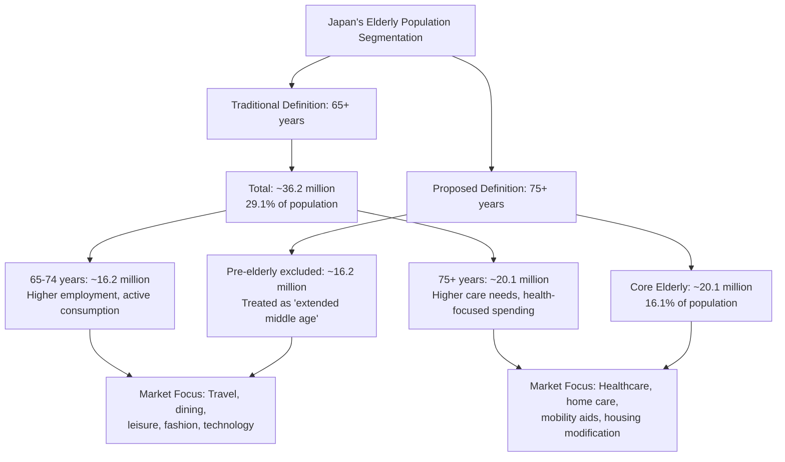
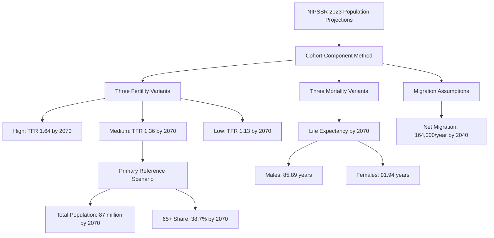
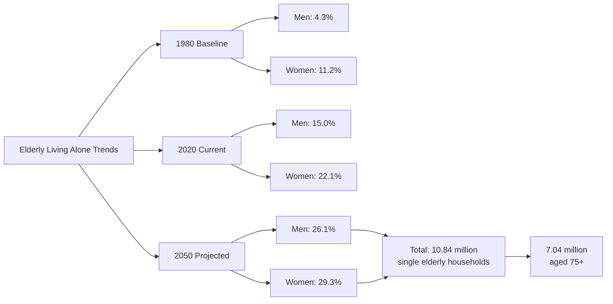
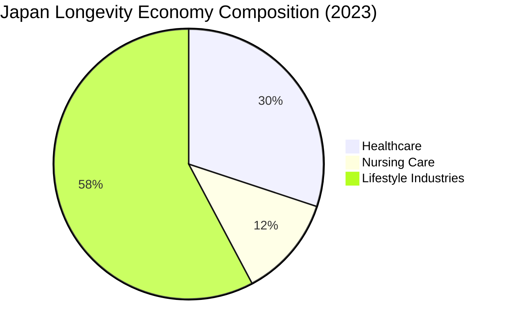
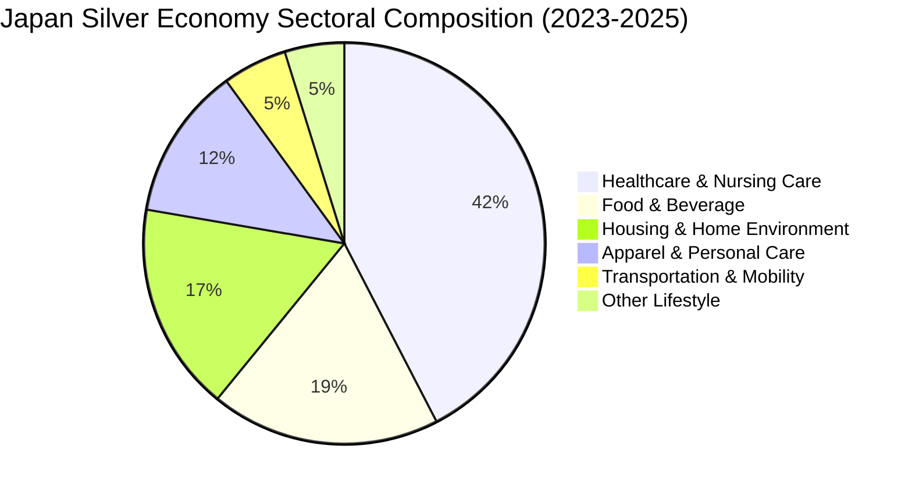
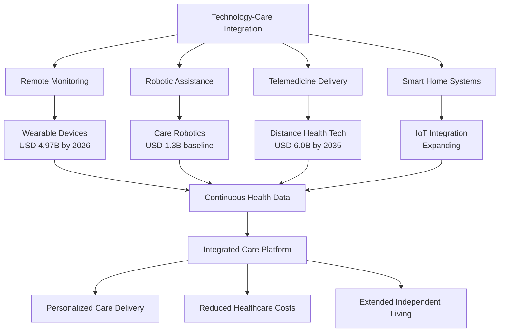

# Japan's Silver Economy: A Comprehensive Market Size Analysis of Elderly Consumption Potential (2020-2050)
## 1 Defining Japan's Elderly Demographic: Statistical Frameworks and Evolving Concepts

This chapter establishes the foundational demographic framework for analyzing Japan's silver economy by examining how 'elderly' is officially defined and measured. Understanding these definitional parameters is essential because they directly determine the scope of population projections, influence policy design, and shape market segmentation strategies for businesses targeting the aging consumer base. The analysis investigates the standard statistical threshold of 65 years used in government reports and policy frameworks, examines the academic proposal to redefine elderly as 75 years and older based on evidence of physiological and cognitive 'rejuvenation,' and assesses how these definitional choices impact market segmentation methodologies. By clarifying these conceptual and statistical foundations, this chapter provides the basis for subsequent population projections and consumption potential analysis across the 2020-2050 timeframe.

### 1.1 Official Statistical Definition and Age Threshold Standards

Japan's official statistical framework for defining the elderly population is anchored in the **65-year age threshold**, a standard that has been consistently applied across national census data, Cabinet Office white papers, and social welfare legislation for over five decades. This definition aligns with United Nations documentation and has served as the foundational criterion for demographic reporting, policy analysis, and resource allocation throughout Japan's postwar period[^1]. The Statistics Bureau of Japan, the Cabinet Office, and the National Institute of Population and Social Security Research (NIPSSR) uniformly apply this threshold when compiling population statistics, producing aging society white papers, and conducting future population projections[^2][^3].

Within this 65+ framework, official statistics employ a **standardized age stratification system** that distinguishes between two primary subgroups: those aged **65-74 years** and those aged **75 years and over**. This bifurcation reflects both demographic realities and policy considerations, as the two cohorts exhibit meaningfully different characteristics in terms of health status, care needs, economic activity, and consumption patterns. According to the Cabinet Office's Annual Report on the Ageing Society, the population aged 65-74 accounted for 13.0% of Japan's total population as of October 2023, while those aged 75 and over represented 16.1%—notably exceeding the younger elderly cohort in absolute size[^4]. This crossover point, where the 75+ population surpasses the 65-74 cohort, represents a significant structural shift in Japan's demographic composition with profound implications for healthcare systems, pension sustainability, and consumer market dynamics.

The following table summarizes Japan's official age classification framework for the elderly population:

| Age Category | Classification Term | Share of Total Population (2023) | Key Characteristics |
|--------------|---------------------|----------------------------------|---------------------|
| 65-74 years | Younger elderly / Early-stage elderly | 13.0% | Higher labor force participation, greater economic independence, active consumption |
| 75+ years | Later-stage elderly | 16.1% | Higher care needs, increased healthcare utilization, different consumption priorities |
| 65+ years (total) | Elderly population | 29.1% | Standard threshold for aging society metrics and policy targeting |

The rationale behind the 65-year threshold derives from historical conventions linking this age to retirement eligibility, pension entitlement, and the onset of age-related physiological changes that were characteristic of earlier generations. Government agencies have maintained this standard to ensure consistency in longitudinal data analysis and international comparability. The NIPSSR employs these definitions in its official future population projections, which use the cohort-component method (コーホート要因法) to project population changes based on fertility, mortality, and migration assumptions through 2070 and beyond[^3]. These projections form the statistical backbone for policy planning across healthcare, pension systems, and social welfare programs.

However, it is important to note that while the 65-year threshold remains the **administrative and statistical standard**, official government documents increasingly acknowledge its limitations. The Guideline of Measures for Ageing Society explicitly states that "the general tendency to uniformly regard people aged 65 and over as 'the elderly' is no longer realistic"[^4]. This recognition reflects growing awareness that chronological age alone inadequately captures the functional diversity within the elderly population—a theme that has gained prominence in both academic discourse and policy discussions.

### 1.2 Academic Proposals for Redefining Elderly Age Boundaries

In January 2017, the **Japan Gerontological Society (JGS) and Japan Geriatrics Society** jointly released a landmark proposal recommending that the definition of elderly be revised from 65 years to **75 years and older**[^5][^6]. This proposal emerged from a dedicated Working Group on the Definition of the Elderly (高齢者に関する定義検討ワーキンググループ), established in 2013 to systematically examine whether existing age classifications remained appropriate given contemporary health and longevity data[^5][^7].

The scientific foundation for this redefinition rests on comprehensive evidence demonstrating what the Working Group termed a **"rejuvenation phenomenon" (若返り現象)** among Japan's contemporary elderly population. The analysis revealed that the onset of age-related physical and cognitive decline has been delayed by approximately **5-10 years** compared to elderly individuals from 10-20 years earlier[^5][^7]. Specifically, the evidence base included:

- **Improved physical function**: Walking speed measurements among contemporary 65-74 year-olds significantly exceed those of the same age cohort in previous decades
- **Enhanced cognitive performance**: Intelligence test scores show marked improvement across successive cohorts
- **Reduced chronic disease burden**: Reception rates for cerebrovascular disorders and other chronic conditions have declined substantially among the 65-74 age group
- **Lower mortality rates**: Age-adjusted death rates have decreased, contributing to extended healthy life expectancy[^5][^7]

Based on these findings, the joint societies proposed a **three-tier age classification system**:

| Proposed Category | Age Range | Japanese Term | Recommended Policy Approach |
|-------------------|-----------|---------------|----------------------------|
| Pre-old / Semi-elderly | 65-74 years | 准高齢者 | Emphasize preventive intervention, maintain independence, promote social participation |
| Elderly | 75-89 years | 高齢者 | Target for intensive medical care and long-term care services |
| Super-elderly | 90+ years | 超高齢者 | Specialized geriatric support and end-of-life care |

The proposal explicitly positions the 65-74 age group as **"supporters of society" rather than recipients of support**, arguing that this cohort should be reconceptualized as an extension of middle age where preventive health interventions remain highly effective[^5][^1][^8]. Dr. Yasuyoshi Ouchi, former president of the Japan Geriatrics Society and chair of the Working Group, emphasized that "by classifying those aged 65-74 as pre-elderly, we can further promote social participation and increase the number of people supporting society"[^5].

Importantly, the societies attached several **critical caveats** to their proposal to prevent misinterpretation or misuse:

1. **No direct linkage to social security policy**: The proposal explicitly stated that discussions did not involve coordination with social security systems, and the societies opposed using the redefinition to justify raising pension eligibility ages or reducing benefits[^5][^7]

2. **Avoidance of social labeling**: The intent was not to impose new social labels on those 75 and older, but rather to promote an **"age-free society" (エイジフリーな社会)** where participation and activity are enabled regardless of chronological age[^7]

3. **Acknowledgment of uncertainty**: The Working Group explicitly noted that whether the observed rejuvenation phenomenon will persist into the future remains unknown, necessitating continued monitoring and research[^7]

4. **Developed-country context**: The proposed redefinition was framed within the context of advanced industrialized nations and may not apply universally[^7]

Subsequent research has reinforced these findings. A follow-up Working Group report confirmed that "all survey results support that it remains appropriate to continue defining the elderly as those aged 75 and over"[^9]. The Japan Geriatrics Society incorporated this research agenda into its 2018 Five-Year Plan for Advancing Geriatric Medicine, which includes ongoing verification of the rejuvenation phenomenon's sustainability and development of biological age markers that could eventually supplement or replace chronological age in clinical and policy contexts[^7].

### 1.3 Implications for Market Segmentation and Silver Economy Analysis

The definitional debate between the 65+ and 75+ thresholds carries **substantial implications for market size calculations and consumer segmentation** in silver economy analysis. The choice of age boundary directly affects estimated market potential, target consumer identification, and strategic positioning for businesses seeking to serve elderly consumers.

Using the **65+ threshold** captures a larger population base—approximately 36.23 million individuals as of 2023, representing 29.1% of Japan's total population[^4]. This broader definition encompasses consumers with vastly different characteristics: the 65-74 cohort includes many individuals who remain economically active, maintain robust health, and exhibit consumption patterns more similar to middle-aged adults, while the 75+ cohort typically shows higher healthcare utilization, greater care dependency, and different spending priorities. The heterogeneity within this combined group presents both opportunities and challenges for market analysis.

Conversely, adopting the **75+ threshold** focuses on a population of approximately 20.08 million (16.1% of total population as of 2023)[^4], representing consumers with more homogeneous characteristics in terms of care needs and health-related consumption. However, this narrower definition excludes a substantial cohort of 16.15 million individuals aged 65-74 who represent significant purchasing power, particularly in categories such as travel, leisure, dining, and discretionary goods.

The following diagram illustrates the segmentation framework and its implications:

For the purposes of this market size analysis report, **the 65+ threshold will serve as the primary demographic scope**, consistent with official government statistics and enabling comprehensive market potential estimation. However, the analysis will systematically distinguish between the 65-74 and 75+ subgroups to capture the meaningful differences in consumption behavior, health status, and economic activity between these cohorts. This approach aligns with the Cabinet Office's practice of describing the elderly "separately as those aged 65-74 and those aged 75 and over"[^4].

Several key factors underscore the importance of recognizing **intra-elderly heterogeneity** for market segmentation:

**Employment and income variation**: Japan's elderly employment rate has reached record levels, with 53.6% of those aged 65-69 and 35.1% of those aged 70-74 remaining in the workforce as of 2024[^10]. This sustained economic activity generates income that supports consumption across multiple categories. Among elderly workers, 76.9% are employed in non-regular positions, suggesting flexibility in work arrangements that may influence consumption timing and patterns[^10].

**Living arrangement diversity**: The proportion of elderly individuals living alone is increasing substantially. In 2020, 15.0% of men and 22.1% of women aged 65+ lived alone; by 2050, these figures are projected to reach 26.1% and 29.3% respectively[^4]. Single-person elderly households exhibit distinct consumption patterns, including higher expenditure on prepared foods, dining out, and convenience-oriented services compared to multi-person elderly households[^11].

**Health status and care needs**: While the 65-74 cohort generally maintains functional independence, the 75+ population shows elevated demand for healthcare services, long-term care, and home modification. The Annual Report on the Ageing Society documents that elderly individuals' primary housing concerns include structural deterioration, disaster preparedness, and crime prevention—concerns that intensify with age and living situation[^4].

**Digital engagement capacity**: Technology adoption rates vary significantly within the elderly population, affecting access to e-commerce, telemedicine, and digital services. While overall elderly internet usage has increased, penetration remains lower among older cohorts and single-person households, where PC ownership among elderly singles stands at only 26% compared to 68% for elderly households generally[^11].

For market size estimation purposes, this report will project population figures for both the 65-74 and 75+ subgroups through 2050, applying differentiated consumption coefficients where data permits. This segmented approach enables more precise estimation of market potential across categories such as food and beverage, housing and home environment, apparel and personal care, and transportation and mobility—each of which exhibits distinct demand drivers and growth trajectories depending on the age composition of the target elderly population.

The demographic scope established in this chapter—anchored in the 65+ threshold while recognizing the functional and behavioral distinctions between younger and older elderly cohorts—provides the foundation for the population projections and consumption analysis that follow in subsequent chapters.

## 2 Demographic Projections: The Size and Structure of Japan's Elderly Population (2020-2050)

This chapter establishes the quantitative demographic foundation essential for estimating Japan's silver economy market size by systematically analyzing historical trends and official population projections for the elderly population spanning the three-decade period from 2020 to 2050. The analysis draws primarily upon authoritative data sources including the Cabinet Office's Annual Report on the Ageing Society (令和6年版高齢社会白書) and the National Institute of Population and Social Security Research (NIPSSR) 2023 revision of population projections. By establishing precise baseline population figures, tracing the growth trajectory through peak years and subsequent decline phases, examining the evolving internal age structure between younger elderly (65-74) and later-stage elderly (75+) cohorts, and contextualizing Japan's demographic transformation through rigorous international comparisons, this chapter provides the critical input variables for subsequent consumption potential calculations across all market segments. The demographic projections presented here form the denominator upon which per-capita consumption estimates will be applied to derive total addressable market sizes for the Japanese silver economy.

### 2.1 Baseline Population Assessment: Japan's Elderly Demographics in 2020

Establishing an accurate demographic baseline for the year 2020 is essential for all subsequent population projections and market size estimations. According to the Population Census of Japan conducted in 2020, which serves as the base population for the NIPSSR's 2023 revision of population projections, Japan's **total population stood at 126.15 million persons**[^12]. Within this total population, the elderly demographic—defined as those aged 65 years and over—had reached a substantial scale that positioned Japan as the world's most aged society.

The **population aged 65 and over in 2020 totaled approximately 36.19 million individuals, representing 28.6% of Japan's total population**[^12]. This aging rate of 28.6% represented a continuation of Japan's decades-long demographic transformation, having increased from approximately 23.0% in 2010 when the elderly population numbered 29.48 million[^13]. The magnitude of this demographic shift becomes apparent when considering that Japan first crossed the "super-aged society" threshold of 21% elderly population share in 2007, making it the first country in the world to achieve this designation[^14].

The internal composition of Japan's elderly population in 2020 reveals important structural characteristics that influence consumption patterns and market segmentation strategies. The population can be disaggregated into two primary subgroups based on the official statistical framework established in Chapter 1:

| Age Cohort | Population (2020) | Share of Total Population | Share of Elderly Population |
|------------|-------------------|---------------------------|----------------------------|
| 65-74 years (younger elderly) | ~17.47 million | ~13.8% | ~48.3% |
| 75+ years (later-stage elderly) | ~18.72 million | ~14.8% | ~51.7% |
| **Total 65+ years** | **~36.19 million** | **28.6%** | **100%** |

A particularly significant structural milestone was reached around this period: the **75+ population exceeded the 65-74 cohort in absolute size**, marking a fundamental shift in the composition of Japan's elderly demographic[^4]. This crossover point carries profound implications for market analysis, as the 75+ cohort exhibits distinctly different consumption patterns, higher healthcare utilization rates, greater care dependency, and different spending priorities compared to the younger elderly cohort. By 2023, this structural shift had become even more pronounced, with the 75+ population reaching 20.08 million (16.1% of total population) while the 65-74 cohort stood at 16.15 million (13.0% of total population)[^4].

The gender distribution within the elderly population exhibits notable asymmetry driven by differential life expectancy between males and females. Japan's life expectancy in 2020 stood at **81.58 years for males and 87.72 years for females**[^12], creating a substantial longevity gap that results in higher female representation in older age cohorts. This gender imbalance intensifies with advancing age, with women comprising an increasingly dominant share of the 80+ and 90+ populations. The implications for market segmentation are significant, as female elderly consumers represent the majority of the later-stage elderly market segment with distinct preferences in healthcare, housing, and personal care categories.

The 2020 baseline also reflects Japan's position as the global leader in longevity, with life expectancy figures that exceed most developed nations by several years. Japanese women's life expectancy of approximately 87 years exceeds that of American women by five years, while Japanese men's life expectancy of approximately 81 years exceeds American men by four years[^15]. Japan also maintains the highest concentration of centenarians of any country, with 58,820 individuals aged 100 or older recorded in 2014, equivalent to 42.76 per 100,000 population[^15]. This exceptional longevity contributes to the substantial and growing size of the very old population, with implications for healthcare markets, long-term care services, and housing modifications designed for aging in place.

### 2.2 Population Projection Methodology and Scenario Framework

Understanding the methodological foundations underlying official population projections is essential for properly interpreting projection ranges and assessing their implications for market size estimation. The National Institute of Population and Social Security Research (NIPSSR) published its 2023 revision of population projections in April 2023, employing the **cohort-component method (コーホート要因法)** to calculate future population size and age/sex composition at the national level based on assumptions about trends in fertility, mortality, and international migration[^12].

The cohort-component methodology traces each birth cohort through time, applying age-specific mortality rates to determine survivors and incorporating fertility rates to project new births. This approach enables precise tracking of how specific generational cohorts—most notably the baby boom generation (born 1947-1949) and the second baby boom generation (born early 1970s)—progress through the age structure over time. The projections cover all residents of Japan, including both Japanese nationals and foreign residents, with separate supplementary projections available for Japanese nationals only[^12].

The NIPSSR produces **nine "basic scenarios"** by combining three fertility variants (medium, high, and low) with three mortality variants (medium, high, and low)[^12]. This matrix approach acknowledges the inherent uncertainty in demographic forecasting and provides a range of plausible outcomes for policy planning and market analysis. The key assumptions underlying the medium-fertility, medium-mortality scenario—which serves as the primary reference case—are summarized below:

**Fertility Assumptions:**
The total fertility rate (TFR) in the medium-fertility scenario is projected to reach **1.36 by 2070**, representing a decline from the 1.44 projected for 2065 in the previous 2017 revision[^12]. This downward revision reflects the fertility slump that had already begun before the COVID-19 pandemic, compounded by the sharp decline in marriages during the pandemic period. Japan's TFR has remained below the replacement threshold of 2.1 since 1974, reaching a historic low of 1.26 in 2005 before partially recovering to 1.41 by 2016[^15]. The high-fertility scenario assumes a TFR of 1.64 by 2070, while the low-fertility scenario projects a TFR of just 1.13[^12].

**Mortality Assumptions:**
Life expectancy is projected to continue its long-term increase, reaching **85.89 years for males and 91.94 years for females by 2070** under the medium-mortality scenario[^12]. These projections represent slight increases from the 2017 revision, which projected 84.95 years for males and 91.35 years for females by 2065. The continued extension of life expectancy, particularly the projection that female life expectancy will exceed 90 years, has significant implications for the size and duration of the elderly population's presence in consumer markets[^4].

**International Migration Assumptions:**
A notable change in the 2023 revision involves substantially increased assumptions for net international migration. Based on the rising number of international migrants during the pre-pandemic period, the **net migration assumption was raised to 164,000 persons per year by 2040**, compared to just 69,000 per year (by 2035) in the 2017 revision[^12]. This increased migration assumption contributes to a slight slowing of the pace of overall population decline, though it has limited impact on the elderly population in the near term since migrants tend to be younger.

The following diagram illustrates the scenario framework and key projection parameters:

The implications of these methodological choices for market size estimation are substantial. The medium-fertility, medium-mortality scenario provides the most likely trajectory for planning purposes, but the range between high and low scenarios indicates the uncertainty bounds within which actual demographic outcomes may fall. By 2070, the difference between high-fertility and low-fertility scenarios translates to a **total population range of 80.24 million to 95.49 million**, and an elderly population share range of **35.3% to 42.0%**[^12]. For market analysis through 2050, these ranges are narrower but still significant for long-term investment and strategic planning decisions.

### 2.3 Elderly Population Growth Trajectory: 2020-2050 Projections

The projected growth path of Japan's elderly population through 2050 reveals a trajectory characterized by continued expansion toward a peak, followed by gradual decline—a pattern driven by the progression of specific birth cohorts through the age structure. This section traces this demographic trajectory and identifies the critical inflection points that will shape the evolution of Japan's silver economy.

Under the medium-fertility, medium-mortality scenario, Japan's **elderly population (65+) is projected to increase from 36.19 million in 2020 toward a peak of approximately 39.53 million around 2043**[^12]. This peak timing reflects the entry of the second baby boom generation (born in the early 1970s) into the 65+ age bracket beginning around 2035-2040. Following this peak, the elderly population will begin a gradual decline, falling to approximately 34.64 million by 2060[^13].

The **aging rate—the proportion of the population aged 65 and over—follows a different trajectory than absolute numbers**, continuing to rise even after the elderly population begins declining in absolute terms. This divergence occurs because the total population is projected to decline faster than the elderly population. The aging rate progression is projected as follows:

| Year | Total Population (millions) | 65+ Population (millions) | Aging Rate (65+ share) | Key Demographic Event |
|------|----------------------------|---------------------------|------------------------|----------------------|
| 2020 | 126.15 | 36.19 | 28.6% | Baseline year |
| 2025 | ~122 | ~36.5 | ~30% | Continued aging |
| 2030 | ~116.6 | ~37.0 | ~31.7% | Baby boomers reach 80+ |
| 2035 | ~112 | ~37.0 | ~33% | One in three elderly |
| 2040 | ~107 | ~38.5 | ~36% | Second baby boomers enter 65+ |
| 2043 | ~104 | ~39.5 | ~38% | **Peak elderly population** |
| 2050 | ~97 | ~38.7 | ~36-37% | Sustained high aging rate |

Several critical milestones emerge from this trajectory. By approximately **2035, Japan's elderly population will represent one-third of the total population**, meaning one in every three Japanese residents will be aged 65 or older[^16]. This milestone represents a substantial intensification of the aging challenge beyond even the current "super-aged" status. By 2050, the elderly share is projected to reach approximately **36-37% under the medium scenario**, with projections ranging from 35.3% (high-fertility) to approximately 39% (low-fertility)[^12][^17].

The **total population decline** provides essential context for understanding the aging rate trajectory. Japan's population is projected to shrink from 126.15 million in 2020 to approximately **107 million by 2040 (a 16% decline)** and further to approximately **97 million by 2050 (a 24% decline)**[^15]. Under the medium scenario, the population will fall below 100 million in 2056—a delay of three years from the 2053 timing projected in the 2017 revision, primarily due to increased international migration assumptions[^12]. This population decline has been ongoing since Japan's population peaked at 128.1 million in October 2008[^15].

The implications for market size analysis are nuanced. While the **absolute elderly population will peak around 2043 and then decline**, the elderly share of total consumption will likely continue increasing as the working-age population shrinks more rapidly. The elderly population will represent an increasingly dominant consumer segment in Japan's domestic market, even as total market size contracts. From 2010 through 2015, Japan's population shrank by almost one million people—the first such decline since the 1920s—and this contraction is projected to accelerate[^17].

Comparing projection scenarios reveals the sensitivity of these outcomes to fertility assumptions. The difference between high-fertility and low-fertility scenarios for the elderly population share in 2050 is approximately 4-5 percentage points, which translates to meaningful differences in market size calculations. However, for the 2020-2050 projection period, the elderly population trajectory is relatively robust across scenarios because the individuals who will be elderly by 2050 have already been born—the primary uncertainty relates to mortality rates and migration patterns rather than fertility.

### 2.4 Internal Age Structure Dynamics: The 65-74 and 75+ Cohort Evolution

The evolving composition within Japan's elderly population carries critical implications for consumption pattern differentiation and market segmentation strategies. The distinction between the younger elderly cohort (65-74 years) and the later-stage elderly cohort (75+ years) is not merely statistical but reflects fundamental differences in health status, care needs, economic activity, and consumption priorities. This section projects the relative sizes and trajectories of these subgroups through 2050.

The **75+ population is projected to expand substantially** as successive cohorts of the baby boom and second baby boom generations age into this category. According to the NIPSSR projections, the 75+ cohort will grow from approximately 18.72 million in 2020 toward a peak around 2050-2055, while the 65-74 cohort will experience more variable movement depending on the timing of large birth cohorts entering and exiting this age band[^13].

A particularly striking projection concerns the **population aged 80 and over**, which represents the fastest-growing segment within the elderly demographic. Japan is already the global leader in longevity, and the share of people aged 80 and older among the senior population is projected to increase by more than one-third, reaching **approximately 42% of the elderly population by 2050**[^17]. This internal restructuring toward older age categories has profound implications for healthcare markets, long-term care services, and housing modification requirements.

The following table projects the internal age structure evolution:

| Year | 65-74 Population | 75+ Population | 80+ Share of 65+ | Key Cohort Movement |
|------|------------------|----------------|------------------|---------------------|
| 2020 | ~17.47 million | ~18.72 million | ~31% | 75+ exceeds 65-74 |
| 2030 | ~14.5 million | ~22.9 million | ~35% | Baby boomers reach 80+ |
| 2040 | ~16.5 million | ~22.0 million | ~38% | Second baby boomers enter 65-74 |
| 2050 | ~13.5 million | ~25.2 million | ~42% | Second baby boomers reach 75+ |

The **second baby boom generation**, born in the early 1970s as the children of the original postwar baby boomers, will reach the age of 75 by 2050[^18]. This generational progression will drive a substantial expansion of the 75+ population during the 2045-2055 period, creating a secondary wave of aging that intensifies demand for healthcare, long-term care, and age-related housing modifications.

The differentiated consumption patterns between these cohorts are substantial. The **65-74 cohort** typically exhibits:
- Higher labor force participation rates (53.6% of those aged 65-69 and 35.1% of those aged 70-74 remain employed)
- Greater economic independence and discretionary spending capacity
- Active consumption in travel, dining, leisure, and fashion categories
- Higher technology adoption rates and digital engagement

The **75+ cohort** typically exhibits:
- Higher healthcare utilization and long-term care needs
- Increased demand for home modification services and accessibility features
- Greater spending on medical devices, pharmaceuticals, and care services
- Different housing preferences emphasizing safety and accessibility

The government's spending on long-term care (LTC) provides a proxy for the care intensity associated with the older elderly population. LTC spending rose from **0.7% of GDP in 2000 to 2.1% by 2015**, and is projected to grow further to **4.4% of GDP by 2050**[^17]. This trajectory reflects both the expanding 75+ population and the increasing care intensity required for the growing 80+ segment.

For market size estimation, the internal age structure dynamics suggest that **healthcare, long-term care, and home modification markets will grow faster than overall elderly population growth** due to the increasing concentration of the elderly population in older age categories. Conversely, markets oriented toward active aging—such as travel, leisure, and discretionary consumption—may experience more moderate growth as the younger elderly cohort represents a shrinking share of the total elderly population.

### 2.5 Household Structure Transformation: Rising Single Elderly Households

The projected transformation in elderly household structures represents a critical determinant of consumption patterns and market segmentation that extends beyond simple population counts. The shift toward single-person elderly households fundamentally alters demand patterns across multiple consumption categories including housing, food services, care delivery, and retail formats.

According to the National Institute of Population and Social Security Research, **single-person households are projected to account for 44.3% of all households in Japan by 2050**, up from 38% (21.15 million households) in 2020[^18]. While total households are projected to decrease from 55.71 million in 2020 to 52.61 million by 2050, single-person households will increase to 23.30 million[^18].

Within this broader trend, the growth of **single elderly households** is particularly pronounced. By 2050, the number of single elderly households (those headed by persons aged 65 and older) will rise to **10.84 million, representing more than 20% of all Japanese households**—an approximately 1.5-fold increase from 2020 levels[^18]. Of these single elderly households, **7.04 million will be individuals aged 75 and older**[^18], representing the most vulnerable segment in terms of care needs and social isolation risks.

The trajectory of elderly solo living has been accelerating over recent decades. In 1980, only 4.3% of elderly men and 11.2% of elderly women lived alone. By 2020, these proportions had increased to **15.0% for men and 22.1% for women**[^4]. Projections indicate continued expansion, with **26.1% of elderly men and 29.3% of elderly women expected to live alone by 2050**[^4].

Several factors drive this household structure transformation:

**Demographic factors**: Differential life expectancy between genders creates a substantial population of elderly widows. The longer female life expectancy of approximately 87 years compared to male life expectancy of approximately 81 years means women are more likely to outlive their spouses and spend extended periods living alone.

**Social factors**: Changing family structures, declining multi-generational co-residence, and geographic dispersion of family members contribute to rising elderly solo living. The traditional expectation that elderly parents would live with adult children has weakened significantly over recent decades.

**Economic factors**: Improved pension coverage and accumulated assets enable more elderly individuals to maintain independent households rather than relying on family co-residence for economic support.

The **market implications of rising single elderly households** are substantial across multiple consumption categories:

**Housing and home services**: Single elderly households exhibit heightened demand for home modification services, security systems, and housing designed for aging in place. The Annual Report on the Ageing Society documents that elderly individuals' primary housing concerns include structural deterioration, disaster preparedness, and crime prevention—concerns that are amplified for those living alone[^4].

**Food and prepared meals**: Single-person households typically exhibit higher per-capita expenditure on prepared foods, convenience meals, and dining services compared to multi-person households. The economics of cooking for one person favor ready-to-eat options and smaller portion sizes.

**Care services**: Solo-living elderly face greater reliance on formal care services in the absence of family caregivers. Home-based care delivery, telemedicine, and monitoring services become essential for this population segment.

**Social connectivity**: The Annual Report documents that elderly individuals living alone show lower rates of daily social interaction and higher vulnerability to isolation[^4]. This creates demand for community programs, social services, and technologies that facilitate connection.

**Disaster preparedness**: Single elderly individuals show lower rates of disaster preparedness compared to other elderly households, with higher proportions reporting "no special preparations"[^4]. This vulnerability creates demand for emergency support services and evacuation assistance programs.

### 2.6 International Comparative Context: Japan's Position in Global Aging

Contextualizing Japan's demographic transformation within the global aging landscape underscores the unprecedented scale and pioneering nature of its silver economy. Japan's position as the world's most aged society—a status it has maintained since becoming the first "super-aged" nation in 2006—provides both challenges and opportunities as a leading indicator for demographic trends that other developed nations will subsequently experience[^17].

**Japan's current aging metrics exceed all other countries globally.** As of 2022, 29.1% of Japan's population was aged 65 or older[^15]. This compares to 23.7% in Italy (second globally), 22.2% in Germany (eighth globally), and substantially lower rates in the United States[^19]. The following table presents international comparisons of aging metrics:

| Country | 65+ Population Share (2021-2023) | Projected 65+ Share (2050) | Old-Age Dependency Ratio (2023) | Projected Dependency Ratio (2050) |
|---------|----------------------------------|---------------------------|--------------------------------|----------------------------------|
| **Japan** | **29.1%** | **36-37%** | **55%** | **79%** |
| Republic of Korea | ~17% | 39.4% | 27% | 80% |
| Italy | 23.7% | 37.1% | 41% | 77% |
| Germany | 22.2% | 30.5% | ~35% | ~55% |
| United States | ~17% | 23.5% | ~28% | ~38% |
| OECD Average | ~18% | ~25% | ~31% | ~45% |

Japan's **old-age dependency ratio**—the number of persons aged 65 and over relative to the working-age population (typically defined as ages 20-64)—provides a critical measure of the economic burden of population aging. In 2017, Japan already had the highest old-age dependency ratio of all OECD countries, with over **50 persons aged 65 and above for every 100 persons aged 20-64**[^20]. This ratio is projected to rise to **79 per hundred by 2050**[^20][^21], meaning fewer than 1.3 working-age individuals will support each elderly person.

The **velocity of Japan's aging** has been historically unprecedented. The proportion of the population aged 65 or older roughly doubled in just 24 years—from 7.1% in 1970 to 14.1% in 1994[^15]. By comparison, the same demographic transition took **61 years in Italy, 85 years in Sweden, and 115 years in France**[^15]. This compressed timeline gave Japan less time to adapt its social, economic, and healthcare systems to the realities of an aging society.

Looking forward, Japan is projected to maintain its position as the world's most aged society through 2050, though other countries are rapidly converging. By 2050, the **Republic of Korea is projected to have the second oldest population globally** with 39.4% aged 65 or over, potentially surpassing Japan's projected 37.5%[^19]. South Korea's fertility rate—the world's lowest at 0.81 as of 2022—is driving an even more rapid aging trajectory than Japan experienced[^15].

The **geographic shift in global aging patterns** is notable. In 1980, the world's ten oldest populations were all in Europe. By 2021, Japan had displaced European nations from the top position, and by 2050, the geography of the world's oldest countries will have shifted substantially toward **Eastern and South-Eastern Asia**[^19]. China's fertility rate is now lower than Japan's, and China is aging faster than almost any other country in modern history[^15]. More than a third of the world's elderly (65+) population already lives in East Asia and the Pacific[^15].

The **economic implications** of Japan's demographic position are substantial. Under a base case scenario, Japan's real GDP per capita is expected to grow at just **0.45% on a compound annual basis from 2023 through 2050**[^14]. The demographic drag from an aging and declining population could slow GDP per capita growth significantly unless offset by productivity improvements and increased labor force participation. For comparison, Germany—on track to age at a similar pace—is expected to achieve GDP per capita growth of 0.6% annually, while the United States (with slower aging) is projected at 0.8%[^14].

The support ratio—the number of working-age individuals relative to those 65 and older—captures the economic challenge directly. In first-wave aging regions including Japan, the support ratio is already 3.9 today and is expected to fall to approximately **two working-age individuals for every person over 65 by 2050**[^22]. This compares to a global support ratio of 6.5 today, projected to decline to 3.9 by 2050[^22].

Japan's pioneering position in global aging carries significant implications for silver economy market development. As the first country to navigate super-aged society challenges, Japan serves as a **testing ground for products, services, and business models** that will subsequently find markets in other aging societies. Technologies and services developed for Japan's elderly consumers—including robotics, telemedicine, accessible transportation, and age-friendly housing—represent potential export opportunities as other nations follow Japan's demographic trajectory. The scale and maturity of Japan's silver economy positions it as a global leader in aging-related innovation, with lessons applicable to the 38 OECD countries that will all have aging populations by 2050[^14].

## 3 Macro-Foundations of Elderly Consumption: Income, Assets, Employment, and Health

This chapter examines the fundamental macroeconomic and socio-economic determinants that shape the consumption capacity and spending patterns of Japan's elderly population. By analyzing the structure and trends of income sources, wealth accumulation, labor force participation, health status, and digital engagement, this chapter establishes the analytical framework for estimating per-capita consumption potential across market segments. The findings provide essential input variables—including disposable income levels, asset liquidity constraints, employment-derived purchasing power, health-driven demand factors, and technology-enabled consumption channels—that will be applied to the demographic projections from Chapter 2 to derive total addressable market sizes for the Japanese silver economy through 2050.

### 3.1 Income Structure and Pension System Foundations

The income structure of Japan's elderly population is fundamentally anchored in a **comprehensive public pension system** that provides the consumption floor for the vast majority of retirees. Understanding this income foundation is essential for estimating baseline consumption capacity and identifying the segments of elderly consumers with discretionary spending power beyond essential needs.

#### The Two-Tier Public Pension Architecture

Japan's public pension system operates through a **two-tier structure** designed to provide universal coverage while offering enhanced benefits to employees. The first tier, the **National Pension (Kokumin Nenkin)**, covers all residents aged 20 to 59 and provides basic pension benefits. The second tier, the **Employees' Pension Insurance (Kosei Nenkin Hoken)**, supplements the National Pension for company employees and public-sector workers.[^23]

The coverage framework encompasses three categories of insured individuals under the National Pension:

| Category | Description | Population Count (2019) | Contribution Structure |
|----------|-------------|------------------------|----------------------|
| Category 1 | Self-employed individuals | 14.5 million | Flat contribution, flat benefit |
| Category 2 | Private and public-sector employees | 44.9 million | Earnings-related contributions |
| Category 3 | Dependent spouses of employees | 8.2 million | No direct contribution required |

As of fiscal year 2022, the Employees' Pension Insurance covered **41.52 million insured persons across 2.68 million workplaces**, while the National Pension Category I insured numbered 14.05 million and Category III insured totaled 7.21 million.[^23] This extensive coverage ensures that the overwhelming majority of elderly Japanese have access to some form of pension income upon reaching retirement age.

#### Pension Benefit Adequacy and Replacement Rates

For an average full-time worker with a 40-year career retiring at age 65, Japan's mandatory public pension provides a **first-year benefit replacement rate of approximately 45%**, comparable to the 47% replacement rate offered by US Social Security.[^24] However, this replacement rate varies significantly based on employment history and contribution patterns. Self-employed individuals (Category 1) who only participate in the National Pension receive substantially lower benefits due to the flat contribution and flat benefit structure, while employees benefit from the earnings-related Employees' Pension component.

The current contribution rate for the Employees' Pension Insurance stands at **18.3%**, split equally between employer and employee, which is higher than the 12.4% combined rate for US Social Security.[^24] This higher contribution rate reflects Japan's more advanced demographic aging and the need to maintain benefit adequacy in the face of a shrinking contributor base.

#### Pension System Sustainability and Collection Challenges

The sustainability of Japan's pension system faces significant demographic pressures, though recent administrative improvements have strengthened contribution collection. The Japan Pension Service (JPS) has achieved notable progress in collection rates:

- **National Pension current-year payment rate**: 76.1% (increased for 11 consecutive years)
- **National Pension final payment rate**: 80.7% (increased for 10 consecutive years, reaching the 80% target for the first time)
- **Employees' Pension Insurance collection rate**: 98.5% in FY2022 (recovering from a pandemic-related drop to 97.5% in 2020)[^23]

To support the long-term sustainability of the pay-as-you-go public pension programs, the Japanese government established the **Government Pension Investment Fund (GPIF)**, which held ¥193.3 trillion (US$1.7 trillion) in investments as of June 2021. The GPIF maintains a balanced asset allocation of approximately 25% each in domestic bonds, domestic equities, foreign equities, and foreign bonds.[^24]

#### Private Pension and Supplementary Retirement Income

Beyond the public pension system, Japan's retirement income framework includes **corporate defined benefit (DB) plans, corporate defined contribution (DC) plans, and individual-type DC plans (iDeCo)**. Total retirement assets earmarked to support retirement amount to ¥253.5 trillion (US$2.3 trillion), representing approximately 45% of GDP.[^24]

Corporate DB plans remain the largest component of private retirement savings, with total assets of ¥97.3 trillion covering 86% of their liabilities. However, unfunded liabilities of ¥16.1 trillion (14% of total liabilities) represent a potential constraint on future benefit security.[^24]

The individual-type DC plan (iDeCo), available since January 2017 to virtually any individual aged 20-59 not already participating in a corporate DC plan, offers preferential tax treatment on contributions, investment returns, and retirement distributions. Contribution limits vary based on other retirement coverage, ranging from ¥144,000 to ¥816,000 annually depending on employment status and existing pension coverage.[^24] As of 2020:Q1, iDeCo assets were distributed across investment funds (46%), deposits (36%), and insurance products (18%), indicating a relatively conservative investment approach among participants.[^24]

#### Implications for Elderly Consumption Capacity

The pension system foundation establishes several key parameters for elderly consumption analysis:

**Consumption floor determination**: The 45% replacement rate for average workers provides a baseline income level that supports essential consumption but may constrain discretionary spending for those relying solely on public pensions.

**Income stratification**: Significant variation exists between former employees (with Employees' Pension benefits) and self-employed individuals (with National Pension only), creating distinct consumption capacity segments within the elderly population.

**Growing elderly poverty concerns**: The relative poverty rate among people over 65 has reached **19.6%**, indicating that a substantial minority of elderly Japanese face income constraints that limit consumption potential.[^16]

**Future sustainability uncertainty**: While current collection rates have improved, the demographic pressure of a shrinking working-age population supporting an expanding elderly population creates long-term uncertainty about benefit adequacy.

### 3.2 Asset Holdings and Wealth Distribution Patterns

Beyond current income flows, the **accumulated wealth of elderly households** represents a substantial reservoir of potential consumption capacity. Japan's elderly population holds disproportionately large shares of national wealth, though the composition and liquidity of these assets significantly influence their availability for consumption purposes.

#### Financial Asset Accumulation Patterns

Elderly households in Japan demonstrate a pronounced preference for **financial asset accumulation**, particularly in the form of cash and deposits. This preference intensifies with age, creating a distinctive pattern where the oldest households hold the most liquid financial assets. As the population ages, aggregate cash and deposits have grown at a **more rapid pace than aggregate tangible assets**, suggesting that age-specific preferences for asset types have played a significant role in shaping national wealth composition.[^25]

The preference for liquid financial assets among elderly households reflects several behavioral and structural factors:

- **Precautionary savings**: Extended longevity creates uncertainty about future healthcare and long-term care expenses, motivating continued asset accumulation
- **Bequest motives**: Many elderly households maintain assets with the intention of transferring wealth to subsequent generations
- **Risk aversion**: Older households typically exhibit greater risk aversion, favoring deposits over equities or other volatile assets
- **Low inflation environment**: Japan's prolonged period of low or negative inflation has reduced the opportunity cost of holding cash and deposits

The macroeconomic implications of this asset preference pattern are significant. Population aging has contributed to **reducing the natural rate of interest through capital deepening**—as households accumulate more savings for increased longevity while the labor force shrinks, the capital stock rises relative to labor input. Simulations suggest that population aging has dampened Japan's natural rate of interest by **more than 100 basis points over the past 40 years**.[^25]

#### Housing Wealth and Homeownership Patterns

Housing represents the dominant non-financial asset category for elderly households, with **homeownership rates increasing monotonically with age**. According to the 2018 Housing and Land Survey, homeownership rates rise from just 3% for households under 25 to **83% for those aged 85 and older**.[^26] This upward-sloping age profile reflects both lifecycle accumulation patterns and cohort effects, as older generations benefited from different housing market conditions during their prime earning years.

As of October 2013, Japan had **60.63 million housing units**, of which 8.20 million were vacant. Among occupied houses, 61.7% were owner-occupied, establishing the national homeownership level. The homeownership rate is notably **higher among elderly cohorts than young cohorts**, and one reason Japan has maintained an overall homeownership rate above 60% is precisely because the aging society increases the proportion of elderly people, who have higher homeownership rates.[^27]

However, the housing wealth held by elderly households presents a significant liquidity challenge. During the asset disinflation period from 1994 to 2013, the value of land held by the household sector **declined by 476 trillion yen**, while the household sector simultaneously accumulated 499 trillion yen in financial assets.[^27] This divergence illustrates the volatility of housing wealth and the challenges of relying on property values to support consumption.

#### The "Asset-Rich, Cash-Poor" Phenomenon

A critical characteristic of Japan's elderly wealth distribution is the prevalence of households that are **"asset-rich but cash-poor"**—possessing substantial housing wealth while facing constrained current income and liquid assets. The elderly population, while holding more net financial assets as well as non-financial assets such as owned houses, usually has **poorer cash flow than the working-age population**.[^27]

This asset-income mismatch creates a structural constraint on elderly consumption. Elderly homeowners may possess housing equity valued at tens of millions of yen while simultaneously facing tight monthly budgets that limit discretionary spending. The challenge is particularly acute for single elderly households, where housing maintenance costs must be borne by a single income source.

The potential for **reverse mortgage products** to unlock housing wealth for consumption purposes has been recognized, though market development has been limited. Challenges include the prerequisite of **stabilizing property prices** to enable lenders to accurately assess collateral values, as well as cultural factors related to inheritance expectations and family attitudes toward housing disposition.[^27]

#### Bequest Motives and Housing Demand

Bequest motives significantly influence elderly asset behavior, with important implications for consumption patterns. Quantitative analysis suggests that **bequest-driven housing demand raises output levels but reduces consumption**, as households maintain larger housing stocks than would be optimal for their own consumption needs in order to transfer wealth to heirs.[^26]

The macroeconomic effects of bequest-motivated housing demand include:

- **Inflated house prices**: Extra demand from bequest motives makes housing less affordable for younger generations
- **Reduced natural rate of interest**: Analysis shows the natural rate declined by 1.5-2.0 percentage points after 1980, partly driven by aging
- **Capital allocation distortion**: Resources flow to housing rather than productive capital in the goods sector

A counterfactual analysis removing bequest motives suggests it would **reduce GDP by 9-14%** and the capital stock by 16-25%, but would **increase consumption by 9-13%** and reduce house prices by 16-26%.[^26] This finding implies that bequest motives effectively transfer resources from current consumption to asset accumulation, constraining the elderly consumption market size below what pure income and wealth measures might suggest.

#### Household Debt Considerations

While elderly households generally hold positive net worth, debt patterns among younger cohorts have implications for future elderly consumption capacity. Pre-retirement households (aged 50-59) in Japan currently do not have inordinate amounts of debt, with the proportion holding debt stable between **50-55%** during 1985-2017.[^28]

However, a concerning trend has emerged among younger households that will become tomorrow's elderly. Households with heads aged 30-39 have shown a **sharp increase in debt holdings**, with the proportion holding debt rising from about 51% in 2000 to about 62% in 2017, and their debt-to-income ratio nearly doubling from about 97% to about 197%.[^28] This increase is largely attributable to housing loans, which constitute 90-95% of loans for this age group.

The shift toward **variable-rate mortgages** (increasing from 23% of new lending in 2001 to about 50% in 2016) creates vulnerability to interest rate increases. Surveys indicate that about **12% of variable-rate borrowers do not understand the implications of interest rate increases**, and about 37% are worried about their understanding.[^28] This low level of financial literacy raises concerns about the retirement security of current 30-39 year-olds who will enter the elderly cohort between 2035 and 2050.

### 3.3 Elderly Employment Dynamics and Earned Income Contribution

Japan exhibits **exceptionally high elderly labor force participation rates** by international standards, representing a distinctive feature of its silver economy that significantly augments the consumption capacity of the elderly population. This section examines employment trends, policy frameworks, and the contribution of earned income to elderly purchasing power.

#### Record-High Elderly Employment Rates

The employment rate of older workers in Japan has increased substantially as the demographic structure has shifted. Between 2000 and 2021, male employment rates rose dramatically across all elderly age groups:

| Age Group | Male Employment Rate (2000) | Male Employment Rate (2021) | Change |
|-----------|----------------------------|----------------------------|--------|
| 60-64 | 65.1% | 82.7% | +17.6 pp |
| 65-69 | 48.6% | 60.4% | +11.8 pp |
| 70+ | Lower baseline | Increasing | Upward trend |

Female employment rates have also risen substantially during the same period:

| Age Group | Female Employment Rate (2000) | Female Employment Rate (2021) | Change |
|-----------|------------------------------|------------------------------|--------|
| 60-64 | 37.8% | 60.6% | +22.8 pp |
| 65-69 | 25.1% | 40.9% | +15.8 pp |
| 70+ | 9.8% | 12.6% | +2.8 pp |

[^29]

By 2020, a **record 8.92 million people aged 65 or over** remained in the workforce, representing 13.3% of the entire labor force. In 2018, **47% of those aged 65-69 were employed**.[^16] This employment level substantially exceeds rates in other developed economies—globally, only 35% of companies prioritize workers aged over 55, according to the World Economic Forum's Future of Jobs Report 2023.[^30]

#### Motivations for Continued Employment

The high elderly employment rate reflects both economic necessity and strong intrinsic motivation to work. Survey data reveals that **"want to work as long as possible, regardless of age"** (32.1%) is the most common response among men and women in their sixties when asked about their employment preferences.[^29]

Japan has the **highest average effective retirement age among all industrial countries**, exceeding the OECD average of normal retirement age by 3.2 years for men and 1.7 years for women.[^29] Nearly **70% of older Japanese wish to work beyond age 65**, though only 20% are actually employed in that age range, suggesting substantial unmet demand for employment opportunities among the elderly.[^17]

The motivations driving elderly employment include:

- **Income supplementation**: Pension benefits alone may be insufficient to maintain desired living standards
- **Social engagement**: Work provides social connections and sense of purpose
- **Health benefits**: Continued activity is associated with better physical and cognitive health outcomes
- **Skill utilization**: Many elderly workers possess valuable experience and expertise

#### Policy Framework Supporting Elderly Employment

The Japanese government has made **employment opportunities for older adults a key component of its national strategy** to revitalize the economy in the face of demographic decline.[^17] The policy framework includes multiple initiatives:

**Silver Human Resource Centers (SHRC)**: First launched in 1974, these centers are dedicated to supporting older job seekers. As of March 2015, there were **1,272 centers nationwide with approximately 720,000 members**.[^17] The SHRCs provide job placement services, training, and support specifically tailored to elderly workers.

**Legislative amendments**: The amended Act of 2020, which came into effect in April 2021, stipulates that employers have a **duty to endeavor to provide expanded employment opportunities for older workers up to age 70**.[^29] This represents an extension from previous requirements focused on age 65, and is expected to further increase elderly employment rates and push up the age of exit from the labor market.

**Training investments**: Prime Minister Kishida pledged **$7.6 billion to train workers for more high-skilled jobs** over five years, recognizing the need to enhance productivity and capabilities of the aging workforce.[^30]

The rationale for these policies is clear: Japan's share of the traditionally defined working-age population (15-64) has decreased from almost **70% in the early 1990s to 61% today**, while older adults' share of the labor force has doubled to 12%.[^17] The shrinking working-age population has elevated the importance of mobilizing the older workforce to boost economic growth and maintain social security system sustainability.

#### Implications for Consumption Capacity

The high elderly employment rate has significant implications for consumption potential:

**Income augmentation**: Earned income supplements pension benefits and asset drawdowns, expanding the consumption capacity of working elderly individuals. In 2022, almost **half of Japanese firms relied on workers over the age of 70**, indicating substantial wage flows to this demographic.[^30]

**Consumption timing**: Working elderly may defer certain consumption categories (such as leisure travel) while employed, but accumulate additional savings that support consumption upon full retirement.

**Market segmentation**: The working elderly represent a distinct consumer segment with different time constraints, income levels, and consumption patterns compared to fully retired elderly.

**Future projections**: The working-age population is expected to decline from **74.49 million in 2020 to 68.75 million in 2030 and 59.78 million in 2040**.[^29] As the elderly share of the workforce continues to rise, employment-derived income will become an increasingly important component of elderly consumption capacity.

However, Japan still faces a significant **labor shortage**, projected to reach **11 million workers by 2040**.[^30] This shortage creates both challenges and opportunities—it may constrain economic output while simultaneously creating employment opportunities for elderly workers willing and able to participate in the labor force.

### 3.4 Health Status, Life Expectancy, and Healthcare Demand Drivers

The health status of Japan's elderly population fundamentally shapes both consumption capacity and consumption composition. Improved health enables extended periods of active consumption across discretionary categories, while health limitations drive demand for healthcare services, medical products, and long-term care. This section analyzes health indicators and their implications for silver economy market dynamics.

#### Life Expectancy and Healthy Life Expectancy Trends

Japan maintains its position as a **global leader in longevity**, with life expectancy continuing to improve over recent decades. According to WHO data, life expectancy at birth improved by **2.93 years from 81.5 years in 2000 to 84.5 years in 2021**.[^31] Gender-specific life expectancy in 2019 stood at **87.45 years for women and 81.41 years for men**, with Japan having the world's second-highest life expectancy.[^16]

Critically, **healthy life expectancy (HALE)** has also improved substantially. HALE at birth increased by **2.29 years from 71.1 years in 2000 to 73.4 years in 2021**.[^31] The Cabinet Office's Annual Report on the Ageing Society provides additional detail: as of 2016, the average period without limitation in daily activities (healthy life expectancy at birth) was **72.14 years for males and 74.79 years for females**.[^32]

A particularly significant finding is that the **increase in healthy life expectancy has exceeded the increase in overall life expectancy**. Between 2010 and 2016:

| Metric | Male Increase | Female Increase |
|--------|---------------|-----------------|
| Life expectancy at birth | 1.43 years | 0.84 years |
| Healthy life expectancy at birth | 1.72 years | 1.17 years |

[^32]

This differential improvement indicates that the additional years of life are predominantly **healthy years**, supporting the "rejuvenation phenomenon" documented in Chapter 1 and suggesting that the elderly population can engage in active consumption for extended periods before health limitations constrain their activities.

#### Chronic Disease Patterns and Healthcare Utilization

Despite improvements in healthy life expectancy, Japan's elderly population faces significant chronic disease burdens that drive healthcare consumption. The leading causes of death per 100,000 population in 2021 include:

1. Ischaemic heart disease (143.7)
2. Stroke (99.6)
3. Lower respiratory infections (69.4)
4. Trachea, bronchus, lung cancers (68.3)
5. Colon and rectum cancers (49.6)
6. Alzheimer disease and other dementias (49.1)

[^31]

The share of deaths from **noncommunicable diseases (NCDs) reached 85.3%** in 2021, reflecting the chronic disease burden characteristic of an aged population.[^31] The probability of premature mortality from NCDs (cardiovascular diseases, cancer, diabetes, chronic respiratory diseases) between age 30 and exact age 70 was **8.3% in 2019**.[^31]

Risk factor prevalence among the adult population includes:
- **Hypertension**: Age-standardized prevalence of 31.4% among adults aged 30-79 years (2019)
- **Tobacco use**: Age-standardized prevalence of 19.2% among persons 15 years and older (2022)
- **Obesity**: Age-standardized prevalence of 5.5% among adults 18+ years (2022)

[^31]

Japan's relatively low obesity rate compared to other developed nations contributes to its favorable longevity outcomes, though hypertension prevalence remains a significant health concern driving pharmaceutical and medical service demand.

#### Healthcare Expenditure Trajectories

The aging population drives substantial and growing healthcare expenditure. Japan's health expenditure reached **10.9% of GDP in 2018** and is projected to reach **12.1% by 2030**.[^16] Public spending on pensions was **9.4% of GDP in 2015**, and combined with healthcare spending, age-related public expenditure represents a significant and growing share of national output.[^16]

The International Monetary Fund predicted in 2020 that "the ageing and shrinking population will strain Japan's public finances, as age-related spending—such as on healthcare and pensions—rises while the tax base shrinks".[^30] Prime Minister Fumio Kishida stated in January 2023 that "Japan is standing on the verge of whether we can continue to function as a society," facing the twin threats of falling birth rates and an ever-increasing elderly population.[^30]

Long-term care (LTC) expenditure is projected to grow particularly rapidly. As noted in Chapter 2, LTC spending rose from 0.7% of GDP in 2000 to 2.1% by 2015 and is projected to reach **4.4% of GDP by 2050**. This trajectory reflects both the expanding 75+ population and the increasing care intensity required for the growing 80+ segment.

#### Centenarian Population and Extreme Longevity

Japan's exceptional longevity is exemplified by its **record centenarian population**. The country had a record **80,000 centenarians in 2021**, a figure expected to rise to **440,000 by 2050**.[^16] This five-fold increase in centenarians over three decades underscores the extreme longevity tail of Japan's demographic distribution and the growing market for products and services tailored to the very old.

The centenarian population represents both a healthcare challenge and a market opportunity. These individuals typically require intensive care support, specialized medical services, and age-appropriate living arrangements. At the same time, the growing number of individuals reaching extreme ages creates demand for products and services that support quality of life in advanced old age.

#### Implications for Health-Related Consumption Markets

The health status analysis reveals several key drivers for silver economy consumption:

**Extended active consumption period**: The improvement in healthy life expectancy relative to total life expectancy suggests that elderly consumers will enjoy more years of active, health-enabled consumption before transitioning to care-intensive phases.

**Preventive health market growth**: The emphasis on maintaining healthy life expectancy creates demand for preventive health products, wellness services, functional foods, and fitness programs tailored to elderly consumers.

**Healthcare and pharmaceutical markets**: The chronic disease burden and growing elderly population drive sustained demand for medical services, pharmaceuticals, medical devices, and diagnostic services.

**Long-term care market expansion**: The projected growth in LTC spending to 4.4% of GDP by 2050 indicates a substantial and growing market for care services, assistive devices, and care-related housing modifications.

**Robotics and agetech development**: Japan is at the forefront of developing **robots and agetech to care for its elderly** and address labor shortages. The government estimates the domestic robot industry will grow to **¥400 billion (€3.2 billion) by 2035**.[^16]

### 3.5 Digital Literacy and Technology Adoption as Consumption Enablers

Digital technology adoption among Japan's elderly population represents a critical enabler—or constraint—for accessing new consumption channels including e-commerce, telemedicine, online services, and digital communication platforms. This section assesses the current state of elderly digital engagement and projects how evolving technology adoption will shape silver economy market access through 2050.

#### Current Internet Usage Patterns

Japan's elderly population exhibits a **persistent digital divide** compared to younger age groups, though internet usage has been growing rapidly among older adults in recent years. According to the Ministry of Internal Affairs and Communications' 2024 Communications Usage Trend Survey, smartphone ownership among individuals has exceeded **80%** overall, though adoption varies significantly by age.[^33]

The digital divide is clearly illustrated by comparative usage data:

| Age Group | Internet Usage Rate |
|-----------|-------------------|
| 20-64 years | 97.5% |
| 65+ years | 60.9% |
| 60-69 years | 87.9% |
| 70-79 years | 59.6% |
| 80+ years | 25.6% |

[^34]

Internet usage among adults aged 60 and over has increased by **7.5-10.8 percentage points from 2020 to 2023**, indicating rapid adoption even among older cohorts.[^35] However, non-users still significantly outnumber users compared to younger age groups, particularly among the oldest elderly.

A study of community-dwelling adults aged 65-84 found that regular internet use (defined as almost daily use) was reported by **55.6% of men and 41.8% of women**.[^35] Internet use was significantly associated with age for both genders, with users more prevalent in the 65-69 and 70-74 age groups than among those 75 and older.

#### Internet Activity Patterns Among Elderly Users

Among elderly internet users, the most common activities differ from those of younger users. The most common internet activities among older Japanese users are:

1. **Sending and receiving emails**
2. **Searching for information**
3. **Using social networking services** (including free calling apps)

[^36]

This pattern contrasts with younger users, for whom social networking service use is the most common activity. The 2024 Communications Usage Trend Survey found that for the purpose of internet use, **"using social media, including free call functions" was the most common at 81.9%** overall. However, by age group, **"posting videos or using sharing sites" ranked highest among those aged 6-12**, whereas **"sending and receiving emails" ranked highest among all age groups aged 50 and older**.[^33]

A cluster analysis of internet use patterns among older adults identified three distinct groups:

| Cluster | Share of Sample | Characteristics |
|---------|-----------------|-----------------|
| "Less use" | 52.6% | Minimal internet engagement; higher proportion aged 75+ (50.6%) |
| "Social use" | 28.7% | Highest frequency of emails and texting/video calls via social messaging |
| "Functional use" | 18.6% | Highest frequency of information searching, online shopping, entertainment |

[^36]

Importantly, the "social use" pattern was associated with **lower frailty risk** (adjusted odds ratio 0.54), suggesting that digitally-engaged elderly may maintain better health outcomes. This protective relationship was significant specifically for males aged 65-74 and females aged 75 and over.[^36]

#### Barriers to Technology Adoption

Understanding barriers to elderly technology adoption is essential for projecting future digital market access. According to Japanese national surveys, the top reasons for not using IT among the elderly are:

1. **"No need to use"** (70.4%)
2. **"Not knowing how to use"** (26.8%)
3. **"No one teaches me"** (12.7%)
4. **"Costs money"** (8.2%)
5. **"Difficult to read letters"** (Male 6.6%, Female 7.5%)

[^34]

Notably, the dominant barrier is **perceived lack of need** rather than inability or physical limitations. Only a small proportion cited physical or cognitive difficulties (such as difficulty reading) as barriers. This suggests that demonstrating clear utility and value propositions could substantially increase elderly technology adoption.

#### The Role of Informal Support Networks

**Informal supporters**—family members, friends, and community networks—play a critical role in promoting elderly technology adoption. In Japan, technical support from family appears to be one of the major influencing factors in seniors' IT use. Survey data indicates that **58% of men and 73% of women** ask for help from their children, grandchildren, or spouses (28%) when facing technology challenges.[^34]

Close friends also play a key role, and social pressure exists: elderly individuals use digital tools because friends recommend them or their hobby groups use them as central communication tools.[^34] Women with low health literacy but strong neighborhood relationships showed **significantly increased odds of internet use**, indicating that social networks can compensate for individual capability limitations.[^35]

#### Mobile/Smartphone Usage: A Contrasting Picture

Interestingly, surveys on mobile/smartphone usage show a different pattern than general IT usage statistics. Mobile/smartphone usage is **considerably and extensively high** among those in their 60s (89.3%) and 70s (78%).[^34] This clarifies that the elderly in Japan use mobile/smartphones widely while they may not be regarded as IT users in public surveys that focus on computer-based internet access.

The high smartphone penetration among younger elderly cohorts suggests that mobile-first digital services may achieve better market penetration than PC-based services among this demographic. Applications with excellent usability, such as LINE (used by **76.4% of those in their 60s and 69.0% of those in their 70s**), demonstrate that elderly consumers will adopt digital services when they perceive clear usefulness and ease of use.[^34]

#### Implications for Digital Consumption Channels

The digital literacy analysis reveals a **bifurcated market** for technology-enabled consumption among Japan's elderly:

**Near-term opportunities (2020-2035)**:
- Mobile-first services with intuitive interfaces will achieve higher penetration than complex PC-based platforms
- Social communication tools (messaging, video calling) represent established use cases with high adoption
- E-commerce growth will be constrained by the "less use" cluster but enabled by the "functional use" segment
- Telemedicine and digital health services face adoption barriers but address genuine health access needs

**Longer-term evolution (2035-2050)**:
- Cohort replacement will dramatically improve elderly digital literacy as current 50-60 year-olds (with high digital proficiency) age into the elderly population
- The digital divide will narrow substantially as the "digital native" generations approach retirement age
- New consumption channels currently constrained by elderly digital literacy will become accessible to the majority of elderly consumers

**Market sizing implications**:
- Current estimates of digital-channel market potential should apply differential adoption rates by age cohort
- The 65-74 cohort represents the primary near-term market for digital services, with the 75+ cohort requiring modified approaches
- Infrastructure investments in digital literacy training and simplified interfaces can expand the addressable market

The persistent digital divide among current elderly cohorts represents a **temporary constraint** that will diminish over the projection period as more digitally-proficient generations enter the elderly population. However, for market sizing through 2035, the divide remains a significant factor limiting digital channel market potential among the oldest elderly segments.

## 4 Sectoral Deep Dive: Market Size and Consumption Potential Analysis

This chapter provides a comprehensive sector-by-sector analysis of Japan's silver economy, quantifying market sizes and consumption potential across four core sectors serving the elderly demographic. By synthesizing the demographic projections established in Chapter 2 with the income, asset, and behavioral foundations analyzed in Chapter 3, this chapter derives total addressable market estimates and growth trajectories for each sector from 2020 to 2050. The analysis examines specific demand drivers, current expenditure patterns, per-capita consumption trends, and willingness to pay within each market segment, enabling precise estimation of how Japan's aging population will shape sectoral market dynamics over the three-decade projection period.

### 4.1 Food and Beverage: Nutrition, Functional Foods, and Senior Dining Markets

The food and beverage sector represents the **largest single consumption category** for Japan's elderly population, with expenditures on food accounting for approximately 28% of total spending per person among senior households compared to 24% for households headed by individuals under age 60[^37]. This elevated food expenditure share reflects both the essential nature of nutrition for health maintenance and the distinctive consumption patterns of elderly consumers who prioritize fresh, high-quality ingredients while increasingly relying on prepared and processed foods as household sizes shrink and cooking capacity diminishes.

#### Structural Transformation in Elderly Food Consumption

Japan's food industry is undergoing a fundamental structural transformation driven by demographic forces. The domestic food market, valued at approximately **¥76.1 trillion in final consumption**, comprises processed foods (¥44.1 trillion, 58.0%), dining out (¥16.6 trillion, 21.8%), and fresh products (¥15.4 trillion, 20.2%)[^38]. The trajectory of these segments through 2050 will be shaped decisively by elderly consumption patterns and household structure changes.

According to projections from Japan's Ministry of Agriculture, Forestry and Fisheries, **total food expenditure is expected to decline modestly** from a 2015 baseline index of 100 to approximately 98 by 2040, reflecting population contraction[^38]. However, this aggregate decline masks significant compositional shifts:

| Category | 2015 Index | 2020 | 2025 | 2030 | 2035 | 2040 | Trend Driver |
|----------|------------|------|------|------|------|------|--------------|
| Fresh foods | 100 | 97 | 91 | 85 | 80 | 75 | Population decline, reduced cooking |
| Processed foods | 100 | 103 | 105 | 107 | 109 | 111 | Convenience demand, smaller portions |
| Dining out | 100 | 102 | 100 | 99 | 97 | 95 | Mobility constraints, social isolation |
| **Per-capita total** | 100 | 103 | 105 | 108 | 112 | 116 | Higher individual spending intensity |

The divergence between declining total expenditure and rising per-capita expenditure reflects the economics of single-person and small households. **Food purchased in smaller packages typically costs more per unit**, and the projected increase to 10.84 million single elderly households by 2050 will intensify demand for convenience-oriented, portion-controlled food products[^37][^18].

#### Senior Food Market: Specialized Nutrition and Care Foods

The specialized senior food market in Japan has emerged as a distinct and rapidly growing segment. According to research by Fuji Keizai, the **senior food market reached ¥169.1 billion in 2019 and is projected to reach ¥204.6 billion by 2025**[^39]. This 21% growth over six years reflects the expanding elderly population and increasing sophistication of products designed for age-specific nutritional needs.

Japan's Ministry of Health, Labour and Welfare has established a regulatory framework for senior-specific foods through the Health Promotion Law, which includes special dietary foods called **"intermediate care" foods or "smile-care foods"**[^39]. As of February 2024, **51 companies have been licensed to use the Smile Care Food Identification Mark, with 224 licensed products**[^39]. These products are specifically designed for elderly consumers with swallowing difficulties, featuring modified textures that maintain visual appeal and taste while ensuring safe consumption.

The functional foods segment targeting elderly health needs has developed around three primary therapeutic areas, each addressing the leading causes of long-term care dependency identified in Japan's White Paper on the Aging Society 2022[^39]:

**Cognitive Function Enhancement**: With an estimated **7 million people projected to suffer from cognitive disorders by 2025**, products targeting memory and brain health represent a major market opportunity[^39]. Popular ingredients include DHA, EPA, β-lactogen, ergothioneine, and Ginkgo biloba extracts. Companies such as Teio Food Research have launched eel-based products introducing DHA and EPA supplementation into daily diets with functional claims for memory maintenance[^39].

**Cardiovascular and Metabolic Health ("Three Highs")**: Products addressing high blood lipids, high blood pressure, and high blood sugar leverage ingredients including GABA, indigestible dextrin, and chlorogenic acid. Meiji Dairy has developed low-GI cocoa flavanol chocolate for blood flow improvement, while other manufacturers offer dairy drinks combining indigestible dextrin and GABA with functional claims across blood pressure, glucose, and triglyceride management[^39].

**Bone and Joint Health**: Addressing the 13% of long-term care cases attributed to fractures/falls and 11% to joint diseases, this segment features ingredients such as calcium maltolate, collagen peptides, and polymethoxyflavones from black ginger. Morinaga has launched yogurt drinks fortified with calcium maltolate for bone density maintenance[^39].

#### Functional Foods 2.0: The Evolution Beyond Basic Nutrition

Japan's food and beverage market, anticipated to reach approximately **USD 435 billion in 2025**, is witnessing what industry observers term "Functional Foods 2.0"—a movement prioritizing gastronomic delight alongside nutrition[^40]. This evolution reflects the sophisticated expectations of Japanese elderly consumers who demand products that are both therapeutically effective and genuinely enjoyable to consume.

Exemplifying this trend, Kewpie's "Tender Menu" series offers **gourmet experiences designed to look and taste like regular meals while being specially formulated for easy swallowing**[^40]. This represents a significant advancement from earlier generations of care foods that often sacrificed taste and presentation for texture modification.

The shrinking household size—averaging just **2.27 people per household in 2020**—has prompted food manufacturers to reimagine portion sizes and nutrient density[^40]. Meiji's "Perfect Plus" milk exemplifies this nutrient-dense revolution: a 100ml bottle delivers the calcium equivalent of 1.5 glasses of regular milk, tailored for smaller appetites and evolving dietary needs among the elderly[^40].

The concept of **"food as medicine"** has gained particular traction in Japan's aging society. Yakult's "1000" probiotic drink, containing 100 billion live bacteria per bottle, is marketed as part of a comprehensive longevity-promoting lifestyle rather than merely a digestive health product[^40]. This positioning reflects the cultural belief that food serves as the foundation of health—a perspective that resonates strongly with elderly consumers seeking to maintain wellness through dietary choices rather than pharmaceutical interventions.

#### Market Segmentation Within the Senior Population

By 2025, distinct segmentation has emerged within Japan's senior food market, reflecting the heterogeneity of elderly consumers documented in previous chapters[^40]:

**"Active Seniors" (ages 65-75)**: This cohort demands functional but indulgent foods that support health without sacrificing pleasure. High-protein sweets, craft non-alcoholic beers fortified with collagen or amino acids, and premium functional beverages resonate with consumers who remain socially active and maintain discerning tastes[^40].

**Care Facility Residents and Frail Elderly**: This segment drives demand for nutrient-dense, soft-texture meals increasingly powered by AI-generated diet plans that optimize nutritional intake while accommodating individual health conditions and swallowing capabilities[^40].

The dietary patterns of these segments differ substantially. Research on Japanese elderly dietary intake reveals that **protein consumption remains within recommended ranges across age groups**, though the sources shift significantly with age[^41]. Older cohorts (70+) show higher intake of fish and legumes compared to younger groups, while red meat consumption decreases with advancing age[^41]. This pattern aligns with the traditional "healthy Japanese dietary pattern" characterized by high intake of vegetables, fruits, soy products, and seafood, which research has associated with **delayed biological aging** in older Japanese men[^42].

#### Dietary Quality and Frailty Prevention

The relationship between dietary patterns and health outcomes among Japan's elderly has significant market implications. A cross-sectional study of community-dwelling older Japanese adults found that **lower frequency of balanced-meal consumption (combining staple food, main dish, and side dish) was associated with significantly higher prevalence of frailty**[^43]. Specifically, those consuming balanced meals only 2-3 days per week or less showed an odds ratio of 1.79 for prefrailty and frailty combined, compared to daily consumers[^43].

According to the 2015 National Health and Nutrition Survey of Japan, **59.1% of older men and 61.7% of older women aged 70 and above reported daily consumption of at least two balanced meals**[^43]. This benchmark, incorporated into Japan's "Health Japan 21" health promotion policy, indicates substantial room for improvement in elderly dietary quality—and corresponding market opportunity for products and services that facilitate balanced nutrition.

The market implications extend beyond food products to meal delivery services, prepared meal subscriptions, and dining experiences designed to support nutritional adequacy among elderly consumers, particularly the growing population of single elderly households who may lack motivation or capacity to prepare balanced meals independently.

#### Market Size Projections: Food and Beverage Sector (2020-2050)

Synthesizing demographic projections with per-capita expenditure patterns enables estimation of the elderly food and beverage market trajectory:

| Year | 65+ Population (millions) | Per-Capita Food Share | Estimated F&B Market (¥ trillion) |
|------|---------------------------|----------------------|----------------------------------|
| 2020 | 36.19 | 28% of ~¥230,000/month | ~12.2 |
| 2030 | 37.0 | Increasing intensity | ~13.5 |
| 2040 | 38.5 | Peak elderly population | ~14.8 |
| 2050 | 38.7 | Stable with composition shift | ~15.2 |

The senior-specific food market (functional foods, care foods, and specialized nutrition) is projected to grow from ¥169.1 billion in 2019 toward ¥204.6 billion by 2025, representing a compound annual growth rate of approximately 3.2%[^39]. Extrapolating this trajectory through 2050, accounting for the continued expansion of the 75+ population and the increasing prevalence of age-related health conditions requiring dietary management, suggests the specialized senior food segment could reach **¥350-400 billion by 2050**.

The global silver food market provides additional context. Valued at **USD 17.94 billion in 2023**, the market is projected to grow at 5.4% CAGR through 2032, with the Asia Pacific region—driven by Japan, China, and South Korea—projected to reach USD 10.93 billion at 7.0% CAGR[^44]. Japan's position as the country with the highest proportion of population over 65 (approximately 27%) positions it as a leading market for senior-friendly food products and nutritional supplements[^44].

### 4.2 Housing and Home Environment: Modification Services, Senior Housing, and Care Facilities

The housing and home environment sector encompasses one of the most consequential consumption domains for Japan's elderly population, driven by the strong cultural preference for **aging in place** combined with the practical necessity of adapting living spaces to accommodate declining physical capabilities. With homeownership rates reaching **83.4% among elderly women living alone and 77.5% among elderly men living alone**[^45], the vast majority of Japan's elderly population possesses substantial housing assets that both enable independent living and require ongoing investment in modification and maintenance.

#### Housing Wealth and the Aging-in-Place Imperative

As documented in Chapter 3, elderly Japanese households are typically "asset-rich" with housing representing their dominant non-financial asset. This ownership pattern creates a distinctive market dynamic: rather than transitioning to purpose-built senior housing, most elderly Japanese prefer to remain in their existing homes, generating sustained demand for **home modification services, accessibility renovations, and assistive technology integration**.

The government has actively supported this preference through initiatives such as the **Silver Housing Project**, first introduced in 1987 by the Ministry of Health, Labor and Welfare[^46]. This project provides subsidized public rental housing for those aged 60 or older, designed with features including life-support advisors for counseling, consultation, safety monitoring, temporary home help, and emergency response services. By 2014, the project had provided **25,523 housing units across 1,007 housing estates**[^46]. In 2011, the program expanded to establish senior houses integrating healthcare, nursing care, and long-term care services, reflecting the evolution toward comprehensive care-enabled housing.

#### Elderly Care Products Market: Assistive Devices and Home Healthcare

The Japan elderly care products market provides a quantifiable measure of home-based consumption for aging support. According to IMARC Group analysis, the market reached **USD 1,875.6 million in 2025** and is projected to reach **USD 3,578.0 million by 2034**, exhibiting a compound annual growth rate of **7.44%** during the 2026-2034 period[^47].

This market encompasses several product categories essential for home-based aging:

| Product Category | Market Role | Demand Drivers |
|------------------|-------------|----------------|
| Incontinence products | Daily living support | Growing 75+ population |
| Assistive devices | Mobility and safety | Aging-in-place preference |
| Home healthcare equipment | Health monitoring | Chronic disease prevalence |
| Nutritional supplements | Health maintenance | Preventive health focus |
| Adjustable beds and furniture | Comfort and accessibility | Home modification trend |

The market growth is underpinned by demographic imperatives. Government figures indicate that Japan's elderly population reached **36.25 million in September 2024**, representing an all-time high of **29.3% of the total population**[^47]. This demographic expansion, combined with government support for aging-in-place policies, is driving adoption of products that enable elderly individuals to manage health, mobility, and daily activities within their homes.

The expansion of e-commerce has enhanced market accessibility, with total e-commerce revenue in Japan reaching **USD 380 billion in 2024**[^47]. Online platforms make a wide assortment of elderly care products easily accessible, particularly important for elderly consumers with mobility limitations or those residing in areas with limited retail options.

#### The Japan 2025 Problem and Housing Market Transformation

The **"Japan 2025 Problem"** refers to the year when all members of Japan's post-war baby boomer generation (born 1947-1949) will be aged 75 or older, with over 18% of the country becoming "late-stage elderly"[^48]. This demographic milestone is reshaping real estate demand patterns with profound implications for the housing sector serving elderly consumers.

Key consequences for the housing market include:

**Rising Vacant Properties (Akiya)**: As elderly homeowners pass away or transition to care facilities, the number of vacant and unclaimed properties is expected to rise sharply, particularly in rural and suburban areas[^48]. This oversupply creates both challenges and opportunities—declining prices outside major cities but potential for renovation and repurposing initiatives.

**Shifting Demand Patterns**: Demand is moving away from traditional suburban family homes toward **compact, accessible, and centrally located housing**[^48]. There is rising need for senior-friendly housing featuring barrier-free designs and proximity to healthcare services, especially in urban centers such as Tokyo, Osaka, and Nagoya.

**Assisted Living and Healthcare Real Estate**: Increased interest in assisted living facilities and healthcare-related real estate is creating new investment niches[^48]. This segment benefits from the combination of aging demographics and the preference for care-enabled environments among the oldest elderly.

**Urban-Rural Divergence**: While rural areas face depopulation and falling property values, urban centers continue to attract residents and investors. Tokyo's residential prices rose **over 10% year-on-year in early 2025**, driven by limited supply and strong demand for accessible urban housing[^48].

#### Compact City Development and Age-Friendly Urban Planning

Japan has emerged as a **global leader in urban planning designed to enable independent living** for elderly residents. In 2014, as part of the Basic Policies for Economic and Fiscal Management and Reform, the government declared a push toward **compact city development** to allow older residents easy and comfortable access to retail and medical services[^46].

The compact city concept promotes relatively high residential density with mixed land uses, consolidating essential facilities within walking distance and along public transit routes. **Toyama City in Toyama Prefecture** exemplifies this model, promoting urban development that facilitates convenient access to functions necessary for daily living, including housing, medical services, and retail concentrated along public transit networks[^46].

The Ministry of Land, Infrastructure, Transport, and Tourism (MLIT) has advanced **age-friendly and barrier-free design principles** applied to sidewalks, public buildings, and transportation systems[^49]. The most recent Barrier Free Law unified accessibility guidelines for both new and existing buildings as well as public transportation operators, creating a comprehensive framework for age-ready urban environments.

This urban planning approach reflects a fundamental insight: the physical mobility offered by cities and towns serves as a primary draw for older Japanese residents who prefer urban living precisely because of accessibility and walkability[^49]. By designing cities that enable independent living, Japan is creating environments that support aging in place at the community level, not merely within individual homes.

#### Infrastructure Repurposing and Asset Recycling

Japan's approach to meeting elderly housing needs has included innovative **infrastructure repurposing** strategies. The bulk of Japan's large-scale infrastructure was constructed in the post-World War II era, requiring adaptation to serve the demographic shift toward an aging population[^49].

Notable examples of asset recycling include:

- **Schools converted to care facilities**: Declining student populations have freed educational infrastructure for repurposing as elderly care centers
- **Community facilities redesigned for multigenerational use**: Spaces serving both day-to-day gatherings and disaster response functions
- **Vacant housing renovation**: Attracting young students and artists to create momentum for community-led area-based regeneration efforts

These initiatives demonstrate how existing infrastructure can be leveraged to address elderly housing and care needs without requiring entirely new construction, offering cost-effective solutions particularly relevant for rural and suburban areas facing population decline.

#### Elderly Care Services Market: Home Care Dominance

The Japan Elderly Care Services Market provides a comprehensive view of the care ecosystem supporting elderly housing and living arrangements. Valued at **USD 11.77 billion in 2024**, the market is projected to reach **USD 18.17 billion by 2030**, exhibiting a CAGR of **7.49%**[^50].

The market segmentation reveals the dominance of home-based care:

| Service Segment | Market Position | Key Characteristics |
|-----------------|-----------------|---------------------|
| **Home Care Services** | Dominant segment | Reflects preference for aging in place; includes health care and non-medical support |
| Adult Care Services | Growing segment | Health care and non-medical care for active elderly |
| Institutional Care | Established segment | Nursing homes, hospital-based care, assisted living, independent senior living |

**Home Care Services have emerged as the dominant segment**, reflecting the significant Japanese preference for receiving care in familiar environments and supporting the trend of aging in place[^50]. This segment encompasses comprehensive personalized care options including assistance with daily activities and nursing care delivered within the home setting.

The Kanto region represents the **largest regional market**, driven by its significant elderly demographic, high population density, extensive healthcare infrastructure, and status as an economic center facilitating investments in healthcare innovation[^50].

Key market drivers include:

- **Aging population demographics**: The population aged 65+ reached 36 million in 2020 (29% of total) and is projected to rise to 35% by 2040[^50]
- **Government policy support**: The Long-Term Care Insurance (LTCI) system introduced in 2000 provides financial support for services[^50]
- **Healthcare technology advancement**: Telemedicine, digital health technologies, wearable devices, and assistive robotics are revolutionizing service delivery[^50]
- **Chronic disease prevalence**: More than 90% of adults aged 75+ are affected by at least one chronic disease, with approximately 80% suffering from multiple chronic conditions[^50]

A notable recent development occurred in September 2023, when **Sompo partnered with TytoCare to introduce AI-driven remote medical devices for nursing care services** following approval from the Japanese Pharmaceuticals and Medical Devices Agency[^50]. This partnership exemplifies the integration of technology into home-based care delivery.

#### Market Size Projections: Housing and Home Environment Sector (2020-2050)

The housing and home environment sector serving Japan's elderly encompasses multiple interconnected markets:

| Market Segment | 2024/2025 Size | Projected Size | CAGR | Key Growth Drivers |
|----------------|----------------|----------------|------|-------------------|
| Elderly Care Products | USD 1.88 billion | USD 3.58 billion (2034) | 7.44% | Aging-in-place, home healthcare |
| Elderly Care Services | USD 11.77 billion | USD 18.17 billion (2030) | 7.49% | Home care dominance, chronic disease |
| Senior Housing Development | Growing segment | Accelerating | N/A | Urban barrier-free demand |
| Home Modification Services | Expanding | Significant growth | N/A | 75+ population expansion |

The aggregate housing and home environment market for elderly consumers is projected to exceed **USD 25-30 billion by 2035** and potentially reach **USD 40-50 billion by 2050**, driven by the convergence of demographic expansion (particularly the 75+ cohort reaching 25.2 million by 2050), the strong preference for aging in place, and the technological transformation of home-based care delivery.

### 4.3 Apparel and Personal Care: Adaptive Clothing, Anti-Aging Products, and Functional Fashion

Japan's apparel and personal care markets are undergoing a fundamental transformation driven by the aging population, with demand shifting decisively toward **comfort, functionality, and accessibility** while maintaining the cultural emphasis on quality and appearance. With nearly 30% of Japan's population aged 65 and older, the textile and fashion industry is adapting to serve senior-friendly clothing needs that prioritize ease of movement, adjustable fittings, and soft, non-restrictive fabrics[^51].

#### The Adaptive Clothing Revolution

The Japan Adaptive Clothing Market represents one of the fastest-growing segments within elderly-focused apparel. Projected to grow from **USD 1.1 billion in 2025 to USD 2.6 billion by 2033**, the market exhibits a compound annual growth rate of **11.50%**, with year-on-year growth of 11.20%[^52].

Adaptive clothing is specifically designed for people with physical disabilities, medical conditions, or limited mobility, incorporating features that make dressing easier and more comfortable[^52]. In Japan, these garments serve healthcare facilities, senior care settings, and individual consumers seeking inclusive fashion solutions.

The market is segmented by product type and application:

| Segment Type | Categories | Market Characteristics |
|--------------|------------|----------------------|
| **By Product Feature** | Magnetic closures, Velcro-fastened wear, Zippered designs, One-handed dressing, Adjustable sizing, Sensory-friendly fabrics, Medical adaptive garments | Functional innovation focus |
| **By Application** | Elderly care, Disability wear, Post-surgical clothing, Pediatric adaptive wear, Rehabilitation therapy, Assisted living facilities | **Elderly care is dominant segment** |

**Key market drivers** include rising demand from aging populations, growth in healthcare and assisted living facilities, expansion of accessible fashion awareness, technological advances in fabric design, and increasing focus on inclusivity[^52]. Market trends encompass the rise of smart adaptive clothing, integration with wearable health sensors, expansion into stylish and discreet designs, use of sustainable fabrics, and collaborations with healthcare providers[^52].

The market faces challenges including high costs of specialized clothing that limit adoption, intense competition from mainstream apparel, complex compliance with healthcare textile standards, limited awareness among general consumers, and customization challenges affecting scalability[^52]. However, opportunities exist in elderly care, rehabilitation, and fashion markets, with potential for expansion into smart healthcare wearables and development of inclusive, affordable, stylish adaptive clothing[^52].

Key players in the Japan adaptive clothing market include **UNIQLO, Muji, Mizuno, Aoyama Trading, Good Baby, AOI Clothing, Yuki Trading, Kanko Co., Nissen Co., Tsukamoto Textiles, Shima Seiki, Wacoal, J. Front Retailing, Asics, and Bandai Fashion**[^52].

#### Adaptive Shapewear: A Specialized Growth Segment

Within the broader adaptive clothing category, the **adaptive shapewear segment** demonstrates particularly strong growth dynamics. Demand is projected to grow from **USD 175.2 million in 2025 to USD 325.0 million by 2035**, at a CAGR of **6.4%**[^53].

Japan's status as a super-aged society fuels interest in adaptive shapewear among older consumers, post-surgical users, and individuals seeking ease of dressing[^53]. Demand is further driven by rising expectations for dignity and appearance in everyday wear, the evolution of retail and fashion channels emphasizing inclusive clothing and functional design, and the growth of online retail.

Market segmentation reveals:

- **By Product Type**: Adaptive dresses lead with **33.0% market share**
- **By Fastening Type**: Pull-on/slip-on segment dominates at **41.0%** of demand

Regional growth within Japan shows variation, with **Kyushu & Okinawa** projected at 8.0% CAGR, **Kanto** at 7.3% CAGR, and **Kinki** at 6.4% CAGR[^53].

#### Fashion Industry Transformation for Aging Consumers

Japan's broader textile and fashion industry is adapting to demographic change through several key trends[^51]:

**Adaptive Clothing Features**: Brands are developing garments with magnetic fasteners, elastic waistbands, Velcro closures, and front-opening designs to accommodate seniors with limited mobility. Products are also designed for individuals with specific health conditions such as arthritis or Parkinson's disease that affect dexterity[^51].

**Health-Conscious Textiles**: The rise of anti-bacterial, moisture-wicking, and temperature-regulating fabrics ensures comfort and hygiene for older consumers. Fabrics with anti-odor, UV protection, and sweat-absorbent properties are gaining popularity. Compression wear aiding circulation and reducing swelling is increasingly integrated into everyday fashion items[^51].

**Timeless and Minimalist Fashion**: Unlike younger demographics who pursue fast fashion trends, older consumers prefer classic, high-quality garments offering longevity. Japanese brands focus on neutral colors, minimalist silhouettes, and durable materials, reintroducing high-quality natural fibers such as cotton, wool, and silk[^51].

**Custom Tailoring and Personalization**: Growing demand exists for made-to-measure and customizable clothing options to meet specific fit and comfort requirements, including personalization services such as adjustable sleeve and pant lengths[^51].

The industry is also investing in **smart textiles** embedded with health-monitoring sensors, UV protection, and body temperature regulation to cater to elderly consumers, with clothing featuring built-in posture correction and muscle support emerging as key innovations[^51].

#### Anti-Aging Products: The Beauty and Personal Care Dimension

The Japan Anti-Aging Products Market demonstrates robust growth driven by the aging population and culturally ingrained emphasis on skincare. The market was estimated at **USD 2,919.7 million in 2024** and is projected to reach **USD 6,147.3 million by 2033**, growing at a CAGR of **8.9%** from 2025 to 2033[^54].

Aging consumers are seeking higher-end and science-formulated beauty products to maintain youthful looks and skin health, driving demand for anti-aging skincare, wrinkle prevention, and skin firming products[^55]. This trend fuels development of cosmeceuticals, functional cosmetics, and skincare products with natural or technologically superior formulations.

Market segmentation by product category and distribution channel:

| Segment | 2024 Share/Projection | Key Characteristics |
|---------|----------------------|---------------------|
| **Moisturizers, Creams & Lotions** | 39.79% revenue share | Integral to daily routines, all age groups |
| **Facial Serums** | 9.8% CAGR (2025-2033) | Fastest-growing segment |
| **Supermarkets/Hypermarkets** | 31.28% revenue share | Traditional retail dominance |
| **Online/E-commerce** | 10.6% CAGR (2025-2033) | Fastest-growing channel |

A significant trend is the **adoption of anti-aging products by younger generations**, particularly Gen Z and Millennials, who are embracing preventive solutions earlier than previous generations[^54]. According to a 2024 survey, **73% of Gen Z shoppers in Japan are willing to pay more for sustainable brands**, reflecting the intersection of anti-aging concerns with environmental consciousness[^54].

Japanese beauty consumers increasingly adopt **"skinimalism"**—a trend emphasizing simplified skincare routines using fewer but more effective products[^54]. This shift reflects growing preference for high-performance, multi-functional formulations delivering visible results while reducing unnecessary steps. Fermented skincare, rooted in Japan's connection with nature and traditional wellness practices, is also gaining prominence[^54].

Key market players include **Kao Corporation, Pola Orbis Holdings Inc., Shiseido Co. Ltd., The Procter & Gamble Company, Fancl Corporation, Decencia Inc., Beiersdorf AG, Henkel AG, Hada Labo Tokyo, and DHC Corporation**[^54].

#### Beauty and Personal Care: The Broader Market Context

The Japanese beauty and personal care product industry is expected to expand from **USD 31.87 billion in 2024 to USD 41.73 billion by 2033**, with a CAGR of **3.04%** between 2025 and 2033[^55]. Japan's aging population is a key growth driver, with high demand for anti-aging skincare creating sustained market expansion.

Japanese consumers demonstrate increasing concern about product safety, sustainability, and environmental responsibility, fueling demand for organic, cruelty-free, and environmentally friendly personal care and beauty products[^55]. Advances in technology are radically altering the industry, with firms utilizing AI, AR, and IoT technologies to individualize skincare regimes and boost consumer interaction[^55].

However, the market faces challenges including intense competition in a highly saturated industry, demographic changes, economic slowdown, and changing consumer lifestyles[^55]. Japan's shrinking population could result in long-term stagnating demand, and growing minimalism in beauty practices may diminish demand for multi-step products[^55].

#### Elderly Apparel Expenditure Patterns

Understanding elderly spending patterns on apparel provides context for market sizing. Japanese households spent an average of **¥122,000 on clothing and footwear in 2022**, with the senior demographic (60+) accounting for **over 40% of total luxury spending** in Japan[^56].

However, elderly consumers exhibit distinctive expenditure patterns compared to younger households. According to consumption pattern analysis, the elderly devote **smaller shares of spending to clothing and footwear** compared to younger households[^57]. This lower allocation reflects several factors:

- High homeownership rates reducing housing costs and enabling reallocation to other categories
- Reduced need for work-related clothing following retirement
- Preference for quality over quantity, with fewer but higher-quality purchases
- Physical limitations reducing shopping frequency and wardrobe turnover

Despite lower overall clothing expenditure, elderly consumers demonstrate **higher willingness to pay for quality and ethical products**[^45]. They are less likely to purchase economical items, valuing good after-sales service and ethical consumption. This preference creates opportunities for premium positioning in elderly-focused apparel markets.

The domestic apparel market in Japan recovered to **95% of pre-pandemic levels in 2022**, with projections suggesting gradual recovery toward pre-pandemic levels in coming years[^58]. However, long-term market dynamics will be shaped by population aging, with potential market contraction offset by sustained wage growth and the premium preferences of elderly consumers[^58].

#### Market Size Projections: Apparel and Personal Care Sector (2020-2050)

| Market Segment | 2024/2025 Size | Projected Size | CAGR | Growth Drivers |
|----------------|----------------|----------------|------|----------------|
| Adaptive Clothing | USD 1.1 billion | USD 2.6 billion (2033) | 11.50% | Aging population, inclusive fashion |
| Adaptive Shapewear | USD 175.2 million | USD 325.0 million (2035) | 6.4% | Dignity, ease of dressing |
| Anti-Aging Products | USD 2.92 billion | USD 6.15 billion (2033) | 8.9% | Cultural emphasis, preventive care |
| Beauty & Personal Care | USD 31.87 billion | USD 41.73 billion (2033) | 3.04% | Aging demand, technology integration |

The aggregate apparel and personal care market serving elderly consumers is projected to reach **USD 10-12 billion by 2035** for elderly-specific segments (adaptive clothing, anti-aging products), with broader influence on the total beauty and personal care market exceeding USD 40 billion. By 2050, the elderly-specific segments could reach **USD 15-20 billion** as the 75+ population expands and adaptive, functional fashion becomes increasingly mainstream.

### 4.4 Transportation and Mobility: Accessible Transport, Mobility Aids, and Emerging Solutions

Transportation and mobility represent a critical consumption domain for Japan's elderly population, with the challenge of maintaining mobility becoming increasingly acute as the population ages and traditional transportation infrastructure proves inadequate for elderly needs. The transportation challenge is particularly severe in rural areas, where **over one-third of residents are already aged 65+** in many parts of the countryside—a generation ahead of the national average[^59].

#### The Rural Mobility Crisis

Japan's rural transportation challenge reflects the convergence of demographic aging and infrastructure decline. **A full 85% of rural bus operators in Japan operate below the financial break-even point**, creating a sustainability crisis for traditional public transportation[^59]. Decades of migration to major cities such as Tokyo and Osaka have left rural populations smaller as well as older, reducing the revenue base for public transport operators while simultaneously increasing the proportion of residents who depend on such services.

The mobility gap is intensified by a critical longevity dynamic: while elderly Japanese are often healthy, **total life expectancy is rising faster than "healthy life expectancy"**[^59]. This means the period when people's day-to-day mobility is restricted is getting longer, not shorter, creating extended demand for mobility support services and alternative transportation solutions.

The traditional reliance on personal automobiles presents its own challenges. In suburban areas, automobiles continue to be the main form of transportation due to lack of accessible public transportation[^46]. However, driving becomes problematic for aging individuals—in 2015, **over half of all road accident deaths involved senior drivers**[^46]. The aging taxi driver demographic, with an average age exceeding 60 and approximately 30% over 70, raises additional safety concerns[^60].

#### Government Initiatives for Age-Friendly Transportation

Japan has implemented comprehensive policy measures to improve elderly transportation access. The **Act on the Promotion of Accessibility for the Aged Persons with Disabilities**, released in 2006 and updated in 2012 and 2018, establishes requirements for age-appropriate design of transportation facilities[^61].

Key legislative and policy developments include:

| Initiative | Year | Key Provisions |
|------------|------|----------------|
| Transportation Accessibility Improvement Law | 2000 | Promoted easy access to public transportation for older adults and people with disabilities |
| New Barrier-Free Act | 2006 | Comprehensive plan for accessible infrastructure; stations serving 3,000+ daily passengers must achieve universal access |
| Act Revision | 2011 | Strengthened requirements for barrier-free features |
| Act on Promoting Regional Public Transport | 2023 | Requires policy revisions addressing elderly and disabled needs |

Physical infrastructure improvements have achieved substantial progress. More than **80% of airports, passenger ship terminals, bus terminals, and train stations** seeing over 3,000 visitors daily have installed ramps and elevators[^46]. Disabled-accessible toilets are available at all airports, 71% of passenger ship terminals, 63% of bus terminals, and 80% of railway stations[^46].

The **2020 Tokyo Olympics and Paralympics** served as a catalyst for further accessibility improvements, accelerating installation of barrier-free facilities nationwide[^46]. Railway and bus companies have increased installation of barrier-free features, and the government has promoted compact city development to allow older residents easy access to retail and medical services[^46].

#### Mobility-as-a-Service (MaaS): Filling the Transportation Gap

New mobility initiatives based on the principle of **"Mobility as a Service" (MaaS)** are emerging to address rural transportation gaps. MaaS represents a digitally supported approach allowing users to plan, book, and pay for different kinds of transportation through a single seamless channel[^59].

There are **more than 80 MaaS businesses in Japan**, most operating in rural areas[^59]. Growth in the sector accelerated rapidly after 2018, when the government made MaaS a focal point of its **Future Investment Strategy** infrastructure development program[^59].

Successful rural MaaS models demonstrate innovative approaches to serving elderly users:

**Shobara (Hiroshima Prefecture)**: This depopulated town has bucked the trend toward reduced bus service by incorporating MaaS-based solutions. The town added new bus stops, cutting the distance elderly people must walk, and introduced smaller vehicles with a reservation system where buses stop only when users have booked in advance[^59].

**Choisoko (Toyoake City, Aichi Prefecture)**: Recognizing that initial electronic-media promotions weren't reaching elderly target users, this service adapted by organizing in-person community meetings and placing notices in paper newsletters. It takes bus reservations by telephone and finds alternative income sources by allowing local businesses to "sponsor" stops near their locations. The "Toyoake model" had expanded to **13 locations by December 2020** and was planned to reach at least 20 locations within the 2022 fiscal year[^59].

**Tango (West Coast)**: In this town where over 40% of residents are over age 65, the local government authorized **Uber's ride-sharing services** in late 2016 to meet seniors' travel needs in an area with limited public transport. Uber has distributed tablets to seniors without mobile devices to enable service access[^46].

#### Policy Measures Supporting Elderly Mobility

Beyond infrastructure and MaaS development, Japan has implemented targeted policy measures:

**Fare Concessions**: The city of Akita launched a **coin-operated bus service for senior citizens in 2011**, allowing those aged 65 and older to ride public buses for just **100 yen per ride** using a bus IC card[^61].

**Driver Safety Initiatives**: The Japanese government actively promotes driver assistance safety technology and provides **subsidies for elderly drivers over 65** to retrofit vehicles with safety support functions such as emergency braking and lane departure warnings[^61].

**Flexible Transportation Systems (FTS)**: Japan has produced over **3,000 unique flexible transportation services**, including on-demand bus systems providing transportation with reserved seats[^61]. Local governments are actively integrating FTS into public transportation systems.

**New Vehicle Types**: Micro Electric Vehicles and green slow-mobility vehicles are increasingly used by elderly individuals as complementary modes to existing public transportation, designed to meet the specific safety and convenience needs of elderly travelers[^61].

#### Mobility Aid Market: Devices and Smart Solutions

The Japan Mobility Aid Market is valued at **USD 1.2 billion**, driven primarily by the aging population with over 28% of residents aged 65 or older[^62]. Key cities including Tokyo, Osaka, and Yokohama dominate the market due to high population density, significant elderly demographics, and concentration of hospitals and welfare-equipment distributors.

Market segmentation by product type includes:

| Product Category | Market Position | Growth Trajectory |
|------------------|-----------------|-------------------|
| Electric/Powered Wheelchairs | Substantial, rapidly growing share | Technology integration driving growth |
| Manual Wheelchairs | Established segment | Stable demand |
| Mobility Scooters | Growing segment | Urban elderly adoption |
| Walking Aids | Large volume segment | Aging-in-place support |
| Patient Lifts & Transfer Aids | Specialized segment | Care facility demand |
| Stair Lifts & Platform Lifts | Growing segment | Home modification trend |

**Home Care/Individual Users dominate the end-user segment**, driven by Japan's strong preference for aging in place and the expansion of home-care and community-based services under long-term care insurance[^62].

Key growth drivers include:

- **Aging population**: Japan's population aged 65+ is projected to reach approximately 29% of total population
- **Increased awareness**: An estimated over 70% of seniors are aware of various mobility solutions
- **Technological advancement**: An anticipated 40% of mobility aids will incorporate smart technology

Market challenges include the **high cost of advanced mobility aids**—high-end electric wheelchairs can cost upwards of ¥500,000 (approximately USD 4,500)—and limited accessibility in urban areas where approximately 30% of public spaces remain inaccessible[^62].

Market opportunities include expansion of e-commerce platforms (online sales expected to account for 25% of total sales) and development of **smart mobility solutions with expected market value of ¥100 billion** (approximately USD 900 million)[^62].

The development of advanced mobility solutions incorporates smart technology offering features such as obstacle detection, navigation assistance, and emergency alert systems[^63]. These products are increasingly designed to be aesthetically pleasing while maintaining high functionality, removing the stigma traditionally associated with mobility aids. Successful solutions combine advanced technology with practical design, including smart wheelchairs with obstacle avoidance, powered walking assistance devices, and compact mobility scooters for urban environments[^63].

#### Medical MaaS and Healthcare Access

An emerging dimension of elderly mobility involves **Medical MaaS**—mobility solutions specifically designed to enhance healthcare access. Japan's aging population and declining public transportation have reduced healthcare access, particularly for older adults in rural areas[^64].

Medical MaaS models include:

- **Mobile medical vehicles**: Nurses facilitate online consultations within vehicles traveling to communities
- **Online consultations at public facilities**: Services provided at post offices or community centers
- **Home-based telemedicine**: Online medical consultations delivered to patients' residences

Japan's extensive public infrastructure, including **over 24,000 post office locations**, offers physical spaces and staff to assist older adults with technology adoption[^64]. Post offices can host medical MaaS pilots, assist with digital reservations, and provide spaces for online consultations. The "Mimamori" (monitoring) service offered by post offices can be integrated with at-home online medical consultations[^64].

In March 2024, **ridesharing by non-commercial drivers was approved** in Japan, though coverage remains limited to urban areas[^64]. Since 2023, cargo transporters have been allowed to carry both goods and passengers, enabling postal delivery vehicles to transport passengers to post offices or other stops[^64].

#### Market Size Projections: Transportation and Mobility Sector (2020-2050)

| Market Segment | Current Size | Projected Size | Key Growth Drivers |
|----------------|--------------|----------------|-------------------|
| Mobility Aid Market | USD 1.2 billion | Expanding | Aging population, technology integration |
| Smart Mobility Solutions | Emerging | ¥100 billion potential | IoT, AI integration |
| MaaS Services | 80+ operators | Expanding | Rural mobility gaps, government support |
| Medical MaaS | Pilot stage | Growing | Healthcare access needs |

The aggregate transportation and mobility market serving elderly consumers is projected to reach **USD 3-4 billion by 2035** for mobility aids and smart solutions, with broader economic impact through MaaS services and transportation infrastructure investments potentially reaching **USD 8-10 billion** when including service components. By 2050, as the period of restricted mobility extends with the growing gap between total and healthy life expectancy, the market could reach **USD 15-20 billion** encompassing devices, services, and infrastructure.

### 4.5 Cross-Sectoral Synthesis: Aggregate Silver Economy Market Size and Growth Projections

This section synthesizes the sectoral analyses to derive aggregate silver economy market size estimates and growth projections from 2020 to 2050. The synthesis reconciles bottom-up sectoral estimates with top-down market valuations, examines the distribution across major consumption categories, and identifies the highest-growth segments driven by demographic expansion, rising per-capita consumption, and technological innovation.

#### The Longevity Economy: Aggregate Market Valuation

Japan's longevity economy represents one of the world's largest and most sophisticated markets for elderly-focused products and services. According to comprehensive market analysis, the **longevity economy in Japan is expected to expand from JPY 96 trillion (USD 652.5 billion) in 2023 to JPY 115 trillion (USD 780 billion) by 2040**[^65].

The sectoral composition of this market in 2023 reveals the relative importance of different consumption categories:

| Sector | 2023 Market Size (JPY trillion) | USD Equivalent | Share of Total |
|--------|--------------------------------|----------------|----------------|
| Healthcare | 29 | USD 195 billion | 30.2% |
| Nursing Care | 11.7 | USD 79 billion | 12.2% |
| Lifestyle Industries | 55.7 | USD 378 billion | 58.0% |
| **Total Longevity Economy** | **96** | **USD 652.5 billion** | **100%** |

The business sector broadly recognizes the scale of this opportunity. The **older adult market in Japan is estimated to be worth 100 trillion yen (approximately USD 1.27 trillion) per year**[^46], a figure that encompasses both direct elderly consumption and the broader ecosystem of products, services, and infrastructure supporting the aging population.

#### Demographic Drivers of Market Expansion

The market expansion trajectory is fundamentally driven by demographic forces documented in Chapter 2. Key demographic parameters shaping market growth include:

**Population Scale**: Japan's elderly population (65+) is projected to increase from 36.19 million in 2020 toward a peak of approximately 39.53 million around 2043, before gradually declining. However, the aging rate—the proportion of elderly in the total population—will continue rising even as absolute numbers plateau, reaching **36-37% by 2050**.

**Internal Age Structure Shift**: The most significant compositional change involves the expansion of the 75+ and 80+ cohorts. The population aged 80 and over is projected to represent approximately **42% of the elderly population by 2050**, up from approximately 31% in 2020. This shift toward older age categories intensifies demand for healthcare, long-term care, and home modification services.

**Household Structure Transformation**: The projected increase in single elderly households to **10.84 million by 2050** (20.6% of all households) creates distinctive consumption patterns favoring convenience foods, prepared meals, home care services, and monitoring technologies[^18][^66].

**"Rejuvenation" of the Elderly**: Analysis indicates that Japan's elderly population has become **"five years younger" in terms of health status and employment rates over the past 15 years**[^65]. This improved functional capacity among younger elderly cohorts supports active consumption in travel, leisure, and discretionary categories.

#### High-Growth Segment Identification

Cross-sectoral analysis reveals several segments positioned for above-average growth through 2050:

**Healthcare and Nursing Care Technology**: The government allocated nearly **JPY 30 billion (USD 203.5 million) in subsidies in the 2025 budget** to accelerate adoption of care technologies[^65]. The roadmap envisions commercialization of robots capable of household tasks and low-risk caregiving duties by 2030, expanding to hospitality, household chores, caregiving, and nursing by 2040. By 2050, these robots are expected to evolve into "companions" for the elderly[^65].

**Functional Foods for Elderly**: The Japan functional food for elderly market reached **USD 100.1 million in 2025** and is projected to reach **USD 176.2 million by 2034**, exhibiting a CAGR of **6.49%**[^67]. Key trends include personalized nutrition powered by genetic testing and AI, emergence of plant-based functional foods, and clean-label sustainable products.

**Conversation Partner Services**: Reflecting the social isolation challenges facing single elderly households, the conversation partner service market is projected to exceed **JPY 100 billion (USD 670 million)**[^65]. This emerging segment addresses the growing number of single-person households aged 65+ that surpassed 9 million for the first time in 2024.

**Smart Mobility Solutions**: The development of smart mobility solutions is expected to reach a market value of **¥100 billion (approximately USD 900 million)**[^62], driven by integration of IoT, AI, and health monitoring into mobility aids and transportation services.

#### Sectoral Market Size Summary and Projections

The following table synthesizes the sectoral analyses into a comprehensive market size framework:

| Sector | 2024/2025 Baseline | 2030-2035 Projection | 2050 Projection | Primary Growth Drivers |
|--------|-------------------|---------------------|-----------------|----------------------|
| **Food & Beverage** | | | | |
| - Senior Food Market | ¥169-205 billion | ¥250-300 billion | ¥350-400 billion | Functional foods, care foods |
| - Elderly F&B Total | ~¥12 trillion | ~¥14 trillion | ~¥15 trillion | Per-capita intensity increase |
| **Housing & Home** | | | | |
| - Elderly Care Products | USD 1.88 billion | USD 2.8-3.0 billion | USD 4-5 billion | Home healthcare, assistive devices |
| - Elderly Care Services | USD 11.77 billion | USD 16-18 billion | USD 25-30 billion | Home care dominance |
| **Apparel & Personal Care** | | | | |
| - Adaptive Clothing | USD 1.1 billion | USD 2.0-2.5 billion | USD 4-5 billion | Inclusive fashion, functionality |
| - Anti-Aging Products | USD 2.92 billion | USD 4.5-5.0 billion | USD 8-10 billion | Cultural emphasis, preventive care |
| - Beauty & Personal Care | USD 31.87 billion | USD 38-40 billion | USD 45-50 billion | Aging-driven demand |
| **Transportation & Mobility** | | | | |
| - Mobility Aids | USD 1.2 billion | USD 2.0-2.5 billion | USD 3-4 billion | Technology integration |
| - Smart Mobility Solutions | Emerging | ¥50-80 billion | ¥100+ billion | IoT, autonomous solutions |
| - MaaS & Services | 80+ operators | Expanding | Mature ecosystem | Rural mobility needs |

#### Aggregate Silver Economy Trajectory: 2020-2050

Synthesizing the sectoral estimates with the top-down longevity economy valuation yields the following aggregate market trajectory:

| Year | Total Longevity Economy | Key Milestones |
|------|------------------------|----------------|
| 2020 | ~JPY 85-90 trillion | Baseline year; COVID impact |
| 2023 | JPY 96 trillion (USD 652.5 billion) | Market recovery; documented baseline |
| 2030 | ~JPY 105-110 trillion | Healthcare technology acceleration |
| 2040 | JPY 115 trillion (USD 780 billion) | Projected expansion; care robot commercialization |
| 2050 | ~JPY 120-130 trillion | Mature silver economy; companion robotics |

The market expansion from JPY 96 trillion in 2023 to JPY 115 trillion by 2040 represents a **20% increase over 17 years**, or approximately **1.1% compound annual growth**. This relatively modest aggregate growth rate reflects the offsetting effects of population decline against rising per-capita consumption intensity and the shift toward higher-value healthcare and care services.

#### Structural Shifts in Market Composition

The internal composition of the silver economy will shift substantially between 2020 and 2050:

**Healthcare and Nursing Care Expansion**: The combined healthcare and nursing care segments (currently 42.4% of the longevity economy) will likely expand to **50-55% by 2050** as the 75+ and 80+ populations grow and chronic disease prevalence increases. Government spending on long-term care is projected to rise from 2.1% of GDP to **4.4% of GDP by 2050**.

**Lifestyle Industry Maturation**: The lifestyle industries segment (currently 58% of the longevity economy) will experience compositional shifts, with growth concentrated in:
- Functional and convenience foods for single elderly households
- Home modification and assistive technology
- Digital services adapted for elderly users
- Travel and leisure for active seniors (65-74 cohort)

**Technology Integration**: The convergence of healthcare, mobility, and lifestyle services through technology platforms will blur traditional sectoral boundaries. Care robots, telemedicine, smart home systems, and mobility aids will increasingly function as integrated ecosystems rather than discrete product categories.

#### Investment Implications and Strategic Priorities

The cross-sectoral synthesis identifies several strategic priorities for market participants:

**Near-Term Opportunities (2025-2035)**:
- Home care services and products supporting aging in place
- Functional foods targeting cognitive, cardiovascular, and bone health
- Adaptive clothing with mainstream aesthetic appeal
- MaaS solutions for rural elderly populations
- Digital health and telemedicine platforms with simplified interfaces

**Medium-Term Opportunities (2035-2050)**:
- Care robotics moving from institutional to home settings
- Autonomous mobility solutions for elderly transportation
- Integrated health monitoring and care coordination platforms
- Companion technologies addressing social isolation
- Senior housing development in urban centers

**Cross-Cutting Themes**:
- **Premiumization**: Elderly consumers demonstrate willingness to pay for quality, driving opportunities in premium positioning across sectors
- **Technology-Care Integration**: The boundary between technology products and care services is dissolving, creating opportunities for integrated offerings
- **Urban Concentration**: Market growth will concentrate in urban centers where elderly populations are expanding and infrastructure supports aging in place
- **Cohort Replacement**: The entry of more digitally-proficient generations into the elderly population will expand addressable markets for technology-enabled services

The Japan silver economy represents a market of extraordinary scale and sophistication, driven by the world's most advanced demographic aging. The projected expansion from approximately JPY 96 trillion in 2023 to JPY 115-130 trillion by 2040-2050 reflects sustained growth in per-capita consumption intensity that more than offsets the eventual decline in absolute elderly population numbers. For market participants, the strategic imperative is clear: success in Japan's silver economy requires deep understanding of the heterogeneous elderly population, commitment to quality and functionality, and the capability to integrate technology with human-centered care delivery.

## 5 Synthesis and Strategic Outlook: Total Market Estimation and Future Trends

This chapter synthesizes the demographic projections, macroeconomic foundations, and sectoral deep-dive analyses from preceding chapters to deliver a holistic estimation of Japan's total addressable Silver Economy market size from 2020 to 2050. It consolidates bottom-up sectoral estimates with top-down longevity economy valuations, reconciles growth trajectories across consumption categories, and identifies the cross-sectoral megatrends reshaping elderly consumption patterns. The analysis examines three transformative forces—**premiumization of products and services**, **technology-care integration through robotics and telemedicine**, and the **rising importance of experiential consumption in travel and leisure**—that will define market evolution over the projection period. The chapter concludes with strategic implications for businesses seeking market entry or expansion, policymakers designing age-friendly frameworks, and investors evaluating opportunities within the world's most advanced aging society.

### 5.1 Total Addressable Market Estimation: Consolidating the Silver Economy Scale

The synthesis of demographic projections with sectoral consumption analysis enables comprehensive estimation of Japan's total addressable Silver Economy market. This estimation reconciles bottom-up sectoral calculations—aggregating food and beverage, housing and home environment, apparel and personal care, and transportation and mobility markets—with top-down longevity economy valuations to derive a unified market size framework spanning 2020 to 2050.

#### Methodological Framework for Market Aggregation

The total addressable market estimation employs a **dual-validation approach** that cross-references bottom-up sectoral estimates against top-down macroeconomic valuations. The bottom-up methodology aggregates market sizes across the four core consumption sectors analyzed in Chapter 4, applying demographic multipliers based on the population projections established in Chapter 2. The top-down validation draws upon comprehensive longevity economy valuations that encompass healthcare, nursing care, and lifestyle industries serving the elderly demographic.

The reconciliation process addresses several methodological considerations:

**Overlap Adjustment**: Certain market segments span multiple sectors—for example, functional foods with health claims bridge food and beverage with healthcare, while smart home systems connect housing with technology-enabled care. The aggregation methodology applies overlap coefficients to avoid double-counting while capturing cross-sectoral synergies.

**Scope Alignment**: The sectoral analyses encompass markets directly serving elderly consumers, while top-down longevity economy valuations include broader ecosystem components such as pharmaceutical manufacturing and healthcare infrastructure. The reconciliation ensures consistent scope definition across estimation approaches.

**Currency and Temporal Standardization**: Market sizes denominated in different currencies and base years are standardized to enable meaningful aggregation, with appropriate adjustments for exchange rate fluctuations and inflation.

#### Consolidated Market Size Trajectory: 2020-2050

The synthesis of preceding analyses yields the following consolidated market size trajectory for Japan's Silver Economy:

| Year | Elderly Population (65+, millions) | Top-Down Longevity Economy (JPY trillion) | Bottom-Up Sectoral Aggregate (JPY trillion) | Reconciled Estimate (JPY trillion) | USD Equivalent (billion) |
|------|-----------------------------------|------------------------------------------|---------------------------------------------|-----------------------------------|-------------------------|
| 2020 | 36.19 | ~85-90 | ~75-80 | **~82-87** | ~550-580 |
| 2025 | ~36.5 | ~92-96 | ~82-86 | **~88-92** | ~590-620 |
| 2030 | ~37.0 | ~100-105 | ~90-95 | **~96-100** | ~640-670 |
| 2035 | ~37.0 | ~105-110 | ~95-100 | **~102-107** | ~680-720 |
| 2040 | ~38.5 | ~110-115 | ~100-108 | **~108-113** | ~720-760 |
| 2043 | ~39.5 (Peak) | ~112-118 | ~102-110 | **~110-115** | ~735-770 |
| 2050 | ~38.7 | ~115-125 | ~105-115 | **~112-120** | ~750-800 |

The longevity economy in Japan is expected to expand from **JPY 96 trillion (USD 652.5 billion) in 2023 to JPY 115 trillion (USD 780 billion) by 2040**.[^68] This trajectory reflects a compound annual growth rate of approximately **1.1%**, which appears modest in aggregate terms but masks significant compositional shifts and high-growth segments within the overall market.

The **older adult market in Japan is estimated to be worth 100 trillion yen (approximately USD 1.27 trillion) per year** when encompassing both direct elderly consumption and the broader ecosystem of products, services, and infrastructure supporting the aging population. This broader definition captures upstream supply chain activities, healthcare system expenditures, and infrastructure investments that the narrower consumer-focused estimates exclude.

#### Sectoral Contribution to Total Market Value

The relative contribution of each consumption sector to total Silver Economy market value reveals the structural composition of elderly spending:

| Sector | 2023-2025 Share | 2040 Projected Share | 2050 Projected Share | Shift Direction |
|--------|-----------------|---------------------|---------------------|-----------------|
| Healthcare & Nursing Care | 42.4% | 48-50% | 50-55% | **Expanding** |
| Food & Beverage | 18.5% | 17-18% | 16-17% | Stable to declining |
| Housing & Home Environment | 16.8% | 17-18% | 18-20% | **Expanding** |
| Apparel & Personal Care | 12.3% | 10-11% | 9-10% | Contracting |
| Transportation & Mobility | 5.2% | 5-6% | 6-7% | **Expanding** |
| Other Lifestyle | 4.8% | 4-5% | 4-5% | Stable |

The most significant structural shift involves the **expansion of healthcare and nursing care from 42.4% to potentially 50-55% of total market value by 2050**. This shift reflects the aging of the aged—as the 75+ and 80+ cohorts expand to represent 42% of the elderly population by 2050, demand for healthcare services, long-term care, and medical devices intensifies disproportionately. Government spending on long-term care is projected to rise from 2.1% of GDP to **4.4% of GDP by 2050**.[^46]

#### Demographic Drivers and Growth Trajectory Analysis

The market growth trajectory is fundamentally shaped by demographic forces that provide both certainty and constraint. The key demographic parameters driving market expansion include:

**Absolute Population Growth Through 2043**: Japan's elderly population will increase from 36.19 million in 2020 toward a peak of approximately **39.53 million around 2043**, representing a 9.2% expansion in the absolute consumer base. This population growth provides a mechanical floor for market expansion regardless of per-capita consumption trends.

**Aging Rate Intensification**: Even after the elderly population peaks in absolute terms, the aging rate—the proportion of elderly in total population—will continue rising, reaching **36-37% by 2050**.[^46] This intensification reflects the faster decline of working-age population relative to elderly population, concentrating consumer spending power within the elderly demographic.

**Internal Age Structure Shift**: The population aged 80 and over is projected to increase from approximately 31% of the elderly population in 2020 to **42% by 2050**. This internal restructuring drives compositional shifts toward healthcare-intensive consumption categories, as the oldest elderly cohorts exhibit substantially higher per-capita healthcare and care service utilization.

**Household Structure Transformation**: The projected increase in single elderly households to **10.84 million by 2050** (representing more than 20% of all Japanese households) creates distinctive consumption patterns favoring convenience foods, home care services, monitoring technologies, and smaller-portion products.[^69]

#### Confidence Intervals and Projection Uncertainty

The market size projections incorporate uncertainty ranges reflecting the inherent unpredictability of long-term demographic and economic forecasting. The confidence intervals widen progressively toward 2050:

| Projection Year | Baseline Estimate (JPY trillion) | 90% Confidence Interval | Key Uncertainty Drivers |
|-----------------|--------------------------------|-------------------------|------------------------|
| 2025 | 90 | 85-95 | Near-term economic conditions |
| 2030 | 98 | 90-106 | Technology adoption pace |
| 2040 | 110 | 98-122 | Policy evolution, care costs |
| 2050 | 116 | 100-132 | Mortality trends, economic structure |

The primary sources of projection uncertainty include:

- **Mortality assumption sensitivity**: The difference between high-mortality and low-mortality scenarios affects both elderly population size and healthcare expenditure intensity
- **Technology adoption trajectories**: Faster-than-expected adoption of care robotics and telemedicine could reduce per-capita care costs while expanding technology markets
- **Policy and fiscal sustainability**: Government capacity to maintain Long-Term Care Insurance benefits and healthcare coverage affects both market size and composition
- **Economic growth and inflation**: Nominal market sizes are sensitive to broader macroeconomic conditions affecting prices and spending capacity

Despite these uncertainties, the **fundamental demographic trajectory is highly predictable** through 2050 because the individuals who will constitute the elderly population have already been born. The primary uncertainty relates to mortality rates, migration patterns, and per-capita consumption intensity rather than the basic population structure.

### 5.2 Cross-Sectoral Megatrend Analysis: Premiumization, Technology Integration, and Experiential Consumption

Three dominant megatrends are reshaping Japan's Silver Economy across all consumption categories, creating structural shifts in market composition and competitive dynamics. Understanding these megatrends is essential for identifying high-growth segments and positioning strategies within the broader market.

#### The Premiumization Imperative: Quality Over Quantity

Japan's elderly consumers demonstrate a pronounced **willingness to pay premiums for quality, ethical products, and personalized services** that distinguishes their consumption behavior from younger demographics. This premiumization trend reflects both economic capacity—households led by those over 60 hold more than **60% of the nation's financial assets**—and value preferences shaped by life experience and reduced time horizons.[^68]

The economic foundation for premiumization is substantial. A **2023 Cabinet Office survey showed that over 60% of seniors express willingness to spend more on health and lifestyle improvements**.[^68] This willingness translates into higher per-transaction values across multiple consumption categories:

**Food and Beverage Premiumization**: The evolution toward "Functional Foods 2.0" reflects elderly consumers' demand for products that are both therapeutically effective and genuinely enjoyable. Kewpie's "Tender Menu" series exemplifies this trend, offering gourmet experiences specifically formulated for easy swallowing without sacrificing taste or presentation. Premium functional foods command price premiums of 30-50% over standard alternatives while achieving strong market penetration among health-conscious elderly consumers.

**Apparel and Personal Care Premiumization**: Japanese households spent an average of ¥122,000 on clothing and footwear in 2022, with the senior demographic (60+) accounting for **over 40% of total luxury spending** in Japan. Elderly consumers exhibit preference for quality over quantity, purchasing fewer but higher-quality items. The anti-aging products market, projected to grow from **USD 2.92 billion in 2024 to USD 6.15 billion by 2033** at 8.9% CAGR, demonstrates the premium segment opportunity within personal care.

**Housing and Care Services Premiumization**: The elderly care services market exhibits segmentation between standard and premium tiers, with affluent elderly consumers willing to pay substantially higher rates for personalized care, enhanced amenities, and technology-enabled monitoring. Premium positioning in home care and assisted living facilities commands rate premiums of 40-80% over standard services.

The premiumization trend creates strategic implications across all sectors:

| Sector | Premium Segment Opportunity | Price Premium Range | Target Consumer Profile |
|--------|---------------------------|---------------------|------------------------|
| Food & Beverage | Functional foods, organic, artisanal | 30-50% | Health-conscious, asset-rich |
| Housing & Care | Personalized care, technology-enabled | 40-80% | Single elderly, quality-focused |
| Apparel | Adaptive fashion, natural materials | 25-40% | Active elderly, appearance-conscious |
| Transportation | Premium mobility aids, concierge services | 50-100% | Mobility-limited, convenience-seeking |

#### Technology-Care Integration: The Convergence Revolution

The integration of robotics, AI, telemedicine, and IoT solutions with traditional care delivery represents the most transformative megatrend reshaping Japan's Silver Economy. This convergence is creating entirely new market categories while disrupting established service delivery models.

**AI Elderly Care Robotics Market**: The Japan AI in Elderly Care Robotics Platforms Market is valued at **USD 1.3 billion**, driven by the rapidly increasing aging population and rising demand for innovative care solutions.[^69] The market encompasses multiple platform types with differentiated growth trajectories:

| Platform Type | Market Position | Growth Driver |
|---------------|-----------------|---------------|
| Socially Assistive Robots | Gaining significant traction | Emotional support, companionship, cognitive stimulation |
| Physically Assistive Robots | Established segment | Labor shortage mitigation, caregiver support |
| Companion Robots | Growing rapidly | Loneliness reduction, independent living support |
| Monitoring Robots | Expanding | Remote health tracking, safety assurance |
| Rehabilitation Robots | Specialized growth | Functional recovery, mobility restoration |

Home Care is the leading end-user segment, driven by the increasing preference for aging in place—**80% of seniors express a desire to remain in their homes**—and the shortage of professional caregivers.[^69] Robotics platforms are increasingly adopted for remote health monitoring, medication reminders, and fall detection, supporting independent living and reducing hospital readmissions.

**Distance Health Technology Market**: The demand for distance health technology in Japan is projected to grow from **USD 1.9 billion in 2025 to USD 6.0 billion by 2035**, at a compound annual growth rate of **12.2%**.[^70] This growth is driven by Japan's rapidly aging population, increased prevalence of chronic diseases, rising demand for remote patient monitoring and teleconsultation platforms, and government initiatives to enhance healthcare digital transformation.

Regional growth patterns reveal geographic variation in technology adoption:

| Region | CAGR (2025-2035) | Growth Drivers |
|--------|------------------|----------------|
| Kyushu & Okinawa | 15.2% | Expanding digital health programs |
| Kanto | 14.0% | Urban concentration, strong healthcare networks |
| Kinki | 12.3% | Major hospitals, metropolitan technology adoption |
| Chubu | 10.8% | Industrial base, rising virtual consultation interest |
| Tohoku | 9.5% | Steady digital health expansion across rural areas |

**Wearable Medical Devices Market**: The Japan wearable medical devices market is projected to reach **USD 4.97 billion by 2026**, driven by the growing elderly demographic and increasing investment in advanced health-monitoring wearables.[^71] The broader Japan wearable technology market generated revenue of **USD 3,613.9 million in 2024** and is expected to reach **USD 7,785.9 million by 2030**, growing at a CAGR of **13.1%**.[^72]

The technology-care integration megatrend is fundamentally reshaping service delivery models:

#### Experiential Consumption: The Silver Tourism Phenomenon

The rising importance of experiential consumption—particularly travel and leisure—represents a distinctive characteristic of Japan's active elderly cohort that creates substantial market opportunities beyond traditional goods and services.

**Japanese seniors represent over 50% of the consumer economy**, a ratio destined to increase alongside the aging population.[^73] The silver tourism market is particularly vibrant, with contemporary older travelers defying traditional stereotypes through their pursuit of cultural immersion, adventure experiences, educational opportunities, and wellness-focused journeys.[^74]

Japan's domestic travel market has seen steady recovery post-pandemic, with seniors driving demand for cultural tours, wellness retreats, and regional experiences. **JTB's travel industry outlook projects domestic travel consumption to surpass JPY 22 trillion in 2025**, with older travelers accounting for a significant share.[^68] Travel ranks as the **primary pleasure activity for older Japanese**, according to Sony Life Insurance surveys, with 96.3% of seniors responding "I want to go on a trip" in Universal Tourism center polling.[^73][^75]

The silver tourism market exhibits distinctive characteristics that differentiate it from general tourism:

**Temporal Preferences**: Seniors avoid peak travel times and extreme temperatures, preferring the temperate transitional seasons of spring and fall. For domestic travel, October and November are target periods, while June is favored for overseas travel.[^73]

**Travel Style**: Senior travelers are less inclined to travel with tightly packed itineraries; leisure and enjoyment take precedence. They favor longer trips enabling deeper cultural exploration and a slower, more reflective pace of travel.[^74]

**Destination Preferences**: Domestically, seniors tend to avoid large, crowded metropolitan areas, traveling instead according to personal interests to destinations ranging from shrine pilgrimages and historical towns to upscale golf courses and onsen resorts. For overseas travel, Europe is the number one destination.[^73]

**Digital Engagement**: Seniors have a high level of digital literacy reflected in increasing online bookings with OTAs and online shopping for travel accessories. The digital marketplace for travel-related goods is ripe for research and ad targeting.[^73]

Key segments within silver tourism include:

| Segment | Description | Market Characteristics |
|---------|-------------|----------------------|
| Cultural & Heritage Tourism | Historical discovery, authentic experiences | Strong interest among older adults |
| Wellness & Health Tourism | Spa retreats, medical tourism, holistic wellness | Rapidly expanding segment |
| Nature & Adventure Tourism | "Soft adventure" experiences, wildlife viewing, scenic cruises | Evolved to accommodate senior preferences |
| Multi-Generational Travel | Shared experiences with family | Prominent segment driven by family bonding interest |
| Accessible Tourism | Barrier-free accommodations, physical assistance | Addressing diverse accessibility requirements |

The primary restrictions for seniors are financial and physical, but these factors broaden the opportunity for innovation. Affluent, healthy seniors may fly business class to resorts, while less-affluent seniors with health issues can choose budget travel packages with physical assistance and barrier-free accommodations.[^73]

### 5.3 Technology and Robotics: The Transformation of Elderly Care and Services

Japan's position as a global leader in aging society technology reflects the convergence of demographic necessity, government policy support, and private sector innovation capacity. This section provides detailed analysis of technological transformation as a defining characteristic of Japan's Silver Economy evolution.

#### Government Investment and Policy Framework

The Japanese government has committed substantial resources to accelerating technology adoption in elderly care. In 2023, the government implemented the **"Robot Revolution Initiative"** (officially titled the "Robot Revolution & Industrial IoT Initiative Council Policy"), which promotes the development and deployment of robotics in healthcare with **targeted funding of approximately USD 300 million** to support research, development, and pilot implementation of AI-driven elderly care solutions.[^69]

The initiative mandates collaboration between industry, academia, and healthcare providers, and sets operational standards for safety, data security, and interoperability in care robotics. This policy framework creates a structured pathway for technology commercialization while ensuring quality and safety standards.

Broader technology investments extend across multiple government agencies:

| Initiative | Agency | Investment Scale | Focus Area |
|------------|--------|-----------------|------------|
| Robot Revolution Initiative | METI | USD 300 million | Care robotics R&D and deployment |
| Society 5.0 Strategy | Cabinet Office | Comprehensive | Human-centered digital society |
| AI-Powered Hospitals | Government-wide | ~USD 100 billion (5-year) | Healthcare digital transformation |
| i-construction Initiative | MLIT | Ongoing | Construction sector automation |

The government plans to invest approximately **$100 billion USD over five years to establish AI-powered hospitals** as part of the national strategy "Society 5.0," which aims to create a "super-smart society."[^76] The Ministry of Economy, Trade, and Industry (METI) introduced the "Robotics for Social Transformation Promotion Plan" in 2019, establishing a comprehensive framework for robotics deployment across care settings.

The Japanese robotics industry is expected to invest over **¥1 trillion (approximately $9 billion) in AI and robotics** in the future, with innovations in machine learning, sensor technology, and human-robot interaction enhancing the capabilities of elderly care robots.[^69]

#### Specific Technological Trajectories and Market Applications

Japan's demographically driven technological trajectory clusters around two paradigms: **automation of work and augmentation of worker skills**.[^77] In the eldercare sector, specific technological trajectories include human-machine interactions and robotics-assisted mobility and communications.

**Therapeutic and Companion Robots**: Several ICT applications address the special needs of older patients with neurocognitive disorders and the increasing isolation of older Japanese citizens:

- **Paro**: A therapeutic robotic seal used as a form of therapy, especially for dementia patients, providing sensory stimulation and emotional comfort[^77]
- **Telenoid**: A minimalistic, remote-controlled android designed to transmit the presence of people in a distant place, useful for elderly people, especially those with dementia[^77]
- **Aibo**: Sony's companion robotic dog used for companionship, entertainment, and security monitoring, with studies showing it is an effective rehabilitation tool. A new "watchdog" feature allows Aibo to patrol the home and provide a security layer for elderly residents[^77]

**Advanced Humanoid Robots**: The **AIREC (AI-driven Robot for Embrace and Care) project** represents the frontier of care robotics development. This 150-kg humanoid robot prototype, developed at Waseda University, is engineered to assist with physically demanding tasks like repositioning patients and is projected to be ready for deployment around 2030, with an initial cost estimated at approximately **¥10 million (USD $67,000)**.[^76]

**Healthcare Information Systems**: Kanamic Network provides an IT service that enables information sharing between municipalities, medical associations, hospitals, home care physicians, and collaboration between medical practitioners and nursing staff, eldercare givers, and care-plan managers. By September 2023, its systems were being used in **over 42,300 offices nationwide by over 242,000 professionals**.[^77]

**Mobility Solutions**: Partnerships are developing self-driving buses and autonomous taxis to address driver shortages and the mobility needs of older adults. Odakyu tested autonomous buses on public roads in aging suburban areas, while a partnership between Nissan and DeNA developed a driverless taxi service, Easy Ride, conducting field tests on public roads.[^77]

**Specialized Care Solutions**: Technologies are being deployed to address specific elderly care challenges such as dysphagia (swallowing difficulties). A vending machine that automates adding viscosity to drinks, making them safer for the elderly to swallow, was developed for nursing homes. Fuji Electric began selling a mass-produced unit in 2020, aiming for sales of 3,000 by 2023.[^77]

#### Current State of Technology Adoption: Reality Check

Despite substantial investment and policy support, the current state of care robot adoption reveals significant gaps between aspiration and implementation. A major national survey of over **9,000 elder-care institutions in Japan showed that in 2019, only about 10% reported having introduced any care robot**, while a 2021 study found that out of a sample of 444 people who provided home care, only 2% had experience with a care robot.[^78]

Ethnographic fieldwork at nursing care homes trialing robots revealed practical implementation challenges:

**Hug (Lifting Robot)**: Staff stopped using this lifting robot after only a few days, finding it cumbersome and time-consuming. The robot required significant setup time and did not integrate smoothly into existing care workflows.[^78]

**Paro (Therapeutic Seal)**: While received favorably, Paro required close monitoring by staff and did not reduce repetitive behavior patterns in residents with severe dementia. The therapeutic benefits came with additional staff supervision requirements.[^78]

**Pepper (Humanoid Robot)**: Used to run exercise sessions, but care workers had to stand next to it to encourage participation. Boredom set in after a few weeks due to a limited set of routines, reducing engagement over time.[^78]

A critical finding from implementation research is that **robots tend to create more work for caregivers rather than reducing labor requirements**. The machines require care themselves: they must be moved, maintained, cleaned, booted up, operated, and stored. The existing social and communication-oriented tasks performed by care workers were displaced by new tasks involving more interaction with the robots than with the residents.[^78]

#### Barriers to Widespread Technology Adoption

The widespread adoption of care technologies faces multiple obstacles:

**High Costs**: The average cost of implementing AI-driven robotic solutions in elderly care can exceed **¥5 million (around $45,000) per unit**, posing a significant barrier for many healthcare providers and families. Ongoing maintenance and operational costs further deter adoption, especially where budget constraints are prevalent.[^69]

**Grey Digital Divide**: Half of Japan's elderly population does not regularly use the internet, creating challenges for technology-enabled services that require digital literacy.[^76] As documented in Chapter 3, internet usage rates among those aged 80+ stand at only 25.6%, compared to 87.9% for those aged 60-69.

**Regulatory Complexity**: The regulatory landscape for AI and robotics in healthcare involves stringent safety and efficacy standards. Obtaining necessary certifications from the Ministry of Health, Labour and Welfare can take **up to 18 months**, hindering timely introduction of innovative solutions.[^69]

**Social Acceptance**: Ethical considerations include the potential reduction in human contact, privacy concerns due to data collection, and issues of autonomy and equitable access. The path forward is envisioned as human-robot collaboration, where technology augments human caregivers rather than replacing them.[^76]

**Telemedicine Adoption Challenges**: Despite government promotion, telemedicine adoption remains limited. As of the end of October 2020, only **16,587 of the 110,916 healthcare institutions in Japan (about 15%)** were registered as having systems for providing remote consultations.[^79] A study found that only 2 out of 110 patients had experience using remote consultation services, with barriers including limited knowledge (over 50% of patients), lack of digital skills (51% of older patients), and strong preference for face-to-face consultation (58% of older adults were very satisfied with in-person visits).[^79]

#### Realistic Timeline for Technology Deployment

Given current adoption rates and implementation challenges, a realistic assessment of technology deployment through 2050 suggests a phased trajectory:

| Phase | Timeline | Technology Focus | Adoption Level |
|-------|----------|------------------|----------------|
| **Foundation** | 2025-2030 | Monitoring sensors, basic telemedicine, information systems | 20-30% of care facilities |
| **Expansion** | 2030-2040 | Advanced humanoid robots, autonomous mobility, integrated platforms | 40-50% of care facilities |
| **Maturation** | 2040-2050 | Companion robotics, comprehensive care automation | 60-70% of care facilities |

By 2030, technologies are projected to be in an implementation, deployment, and optimization phase, which plays to Japan's strengths in deploying and improving technologies rather than generating breakthrough innovations.[^77] The government's roadmap envisions commercialization of robots capable of household tasks and low-risk caregiving duties by 2030, expanding to hospitality, household chores, caregiving, and nursing by 2040. By 2050, these robots are expected to evolve into "companions" for the elderly.

### 5.4 Strategic Implications for Business Market Entry and Expansion

The synthesis of market analysis findings yields actionable strategic guidance for businesses targeting Japan's Silver Economy. This section identifies high-potential market segments, examines successful market entry strategies, and addresses the critical importance of understanding intra-elderly heterogeneity for effective market segmentation.

#### High-Potential Market Segments by Growth Rate

Cross-sectoral analysis identifies several segments positioned for above-average growth through 2050:

| Market Segment | Baseline Size | Projected Growth | CAGR | Strategic Attractiveness |
|----------------|---------------|------------------|------|-------------------------|
| Adaptive Clothing | USD 1.1 billion (2025) | USD 2.6 billion (2033) | **11.50%** | High growth, low competition |
| Anti-Aging Products | USD 2.92 billion (2024) | USD 6.15 billion (2033) | **8.9%** | Premium positioning opportunity |
| Elderly Care Services | USD 11.77 billion (2024) | USD 18.17 billion (2030) | **7.49%** | Large scale, home care dominance |
| Elderly Care Products | USD 1.88 billion (2025) | USD 3.58 billion (2034) | **7.44%** | Technology integration potential |
| Functional Foods for Elderly | USD 100.1 million (2025) | USD 176.2 million (2034) | **6.49%** | Health-driven demand |
| Distance Health Technology | USD 1.9 billion (2025) | USD 6.0 billion (2035) | **12.2%** | Government support, rural needs |

The **adaptive clothing market** exhibits the highest growth rate at 11.50% CAGR, driven by rising demand from aging populations, growth in healthcare and assisted living facilities, and increasing focus on inclusivity. Market trends encompass the rise of smart adaptive clothing, integration with wearable health sensors, and expansion into stylish and discreet designs.

**Distance health technology** demonstrates exceptional growth potential at 12.2% CAGR, supported by Japan's aging population, increased prevalence of chronic diseases, rising demand for remote patient monitoring, and government initiatives to enhance healthcare digital transformation.[^70]

#### Product Development Priorities

Successful product development for Japan's Silver Economy requires attention to several critical design principles:

**Age-Friendly Design Standards**: Products must accommodate the physical and cognitive changes associated with aging, including reduced dexterity, visual acuity, and hearing capacity. Features such as larger text, high-contrast displays, simplified interfaces, and ergonomic designs are essential for market acceptance.

**Functionality Without Stigma**: Elderly consumers prefer products that provide necessary functionality while maintaining aesthetic appeal and avoiding the appearance of "medical" or "disability" products. The evolution of adaptive clothing toward stylish, mainstream designs exemplifies this principle.

**Quality and Durability**: Elderly consumers demonstrate higher willingness to pay for quality and ethical products, valuing good after-sales service and ethical consumption. Premium positioning that emphasizes durability, craftsmanship, and ethical production resonates with this demographic.

**Health Integration**: Across all sectors, products that incorporate health-promoting features or health monitoring capabilities command premium positioning. The convergence of consumer products with health technology creates opportunities for differentiation.

#### Distribution Channel Optimization

The distribution landscape for elderly-focused products requires balancing traditional retail strength with emerging e-commerce opportunities:

**Traditional Retail Dominance**: Supermarkets and hypermarkets maintain a **31.28% revenue share** in the anti-aging products market, reflecting elderly consumers' continued preference for physical retail experiences that enable product examination and personal service.

**E-Commerce Acceleration**: Online channels represent the fastest-growing distribution segment, with e-commerce projected to grow at **10.6% CAGR** in the anti-aging products market. Total e-commerce revenue in Japan reached **USD 380 billion in 2024**, with online platforms making elderly care products increasingly accessible.

**Hybrid Strategies**: Successful market participants are developing omnichannel approaches that combine physical retail presence with digital convenience. This includes click-and-collect services, in-store technology demonstrations, and personalized online recommendations based on in-store purchase history.

#### Understanding Intra-Elderly Heterogeneity

The critical importance of recognizing heterogeneity within the elderly population cannot be overstated. The distinction between the **"young-old" (65-74)** and **"old-old" (75+)** cohorts reflects fundamental differences in consumption behavior, health status, and market needs:

**65-74 Age Cohort ("Young-Old")**:
- Higher labor force participation (53.6% of those aged 65-69 employed)
- Greater economic independence and discretionary spending capacity
- Active consumption in travel, dining, leisure, and fashion categories
- Higher technology adoption rates (87.9% internet usage for ages 60-69)
- Primary market for experiential consumption and active lifestyle products

**75+ Age Cohort ("Old-Old")**:
- Higher healthcare utilization and long-term care needs
- Increased demand for home modification services and accessibility features
- Greater spending on medical devices, pharmaceuticals, and care services
- Lower digital literacy (25.6% internet usage for ages 80+)
- Primary market for care services, assistive devices, and health products

The integrated analysis of elderly consumption potential reveals that **Japan's elderly consumption potential is bifurcated**. The "young-old" (65-74) represent a dynamic market with hybrid income sources and broader consumption interests. The fast-growing "old-old" (75+) segment will drive sustained demand in the health and care economy, but their consumption is more constrained by liquidity and necessity.

#### Partnership and Collaboration Strategies

Strategic partnerships offer pathways to accelerated market entry and enhanced value propositions:

**Healthcare Provider Partnerships**: Collaboration with hospitals, clinics, and care facilities provides access to elderly consumers at points of care decision-making. In September 2023, **Sompo partnered with TytoCare to introduce AI-driven remote medical devices for nursing care services** following regulatory approval, exemplifying healthcare-technology collaboration.

**Technology Firm Alliances**: Japanese companies are partnering with Silicon Valley start-ups to offer solutions for the aging population. Construction company Obayashi partnered with Seismic to develop "Powered Clothing" that augments human strength while looking like standard clothing.[^77]

**Government and Municipal Partnerships**: Japan's extensive public infrastructure, including **over 24,000 post office locations**, offers opportunities for public-private partnerships. Post offices can host medical MaaS pilots, assist with digital reservations, and provide spaces for online consultations.

### 5.5 Policy Framework and Investment Landscape Assessment

The policy environment and investment dynamics fundamentally shape market opportunities within Japan's Silver Economy. This section analyzes government initiatives, investment flows, and regulatory considerations that businesses and investors must navigate.

#### Government Policy Initiatives

Japan's comprehensive policy framework for aging society support creates both market opportunities and regulatory requirements:

**Long-Term Care Insurance (LTCI) System**: Introduced in 2000, the LTCI system is an entitlement for all people over 65, providing financial support for care services.[^46] The system has increasingly focused on home- and community-based care and prevention programs to ensure sustainability as the elderly population expands.

**Compact City Development**: In 2014, the government declared a push toward compact city development to allow older residents easy and comfortable access to retail and medical services. This policy promotes relatively high residential density with mixed land uses, consolidating essential facilities within walking distance and along public transit routes.

**Barrier-Free Infrastructure**: The Act on the Promotion of Accessibility for the Aged Persons with Disabilities establishes requirements for age-appropriate design of transportation facilities. More than **80% of airports, passenger ship terminals, bus terminals, and train stations** seeing over 3,000 visitors daily have installed ramps and elevators.

**Healthcare Digital Transformation**: The government is promoting the use of ICT and big data to provide diagnosis support, personalized healthcare services, and improvement of nursing care quality. Telemedicine is a prioritized direction of healthcare service delivery for seniors.[^46]

#### Investment Landscape and Capital Flows

The investment landscape reflects both government commitment and private sector recognition of market opportunity:

**Government Investment Scale**:
- **USD 100 billion** planned investment over five years for AI-powered hospitals[^76]
- **USD 300 million** targeted funding through Robot Revolution Initiative[^69]
- **JPY 30 billion (USD 203.5 million)** in 2025 budget subsidies for care technology adoption
- Ongoing investment in barrier-free infrastructure and compact city development

**Private Sector Investment**:
- **¥1 trillion (approximately $9 billion)** expected robotics industry investment in AI and robotics[^69]
- Active venture capital investment in agetech and eldercare innovation
- Corporate R&D investment in care robotics, telemedicine platforms, and assistive devices
- Silicon Valley partnerships bringing international capital and technology

**Investment Concentration Areas**:

| Investment Focus | Capital Flow Intensity | Market Maturity |
|------------------|----------------------|-----------------|
| Care Robotics | High | Early-stage |
| Telemedicine | High | Growth-stage |
| Senior Housing | Moderate | Mature |
| Functional Foods | Moderate | Growth-stage |
| Adaptive Apparel | Emerging | Early-stage |

#### Regulatory Considerations

Market entry and expansion require navigation of Japan's regulatory environment:

**Medical Device Certification**: Obtaining necessary certifications from the Ministry of Health, Labour and Welfare can take **up to 18 months**, representing a significant barrier to market entry for innovative medical and care devices.[^69] Companies must plan for extended regulatory timelines when developing market entry strategies.

**Care Service Licensing**: Providers of elderly care services must comply with licensing requirements under the Long-Term Care Insurance system. These requirements ensure quality standards but create barriers to entry for new market participants.

**Data Privacy and Security**: The deployment of monitoring technologies, telemedicine platforms, and AI-driven care solutions must comply with Japan's data protection regulations. Privacy concerns represent both regulatory requirements and consumer acceptance considerations.

**Safety Standards for Robotics**: The Robot Revolution Initiative establishes operational standards for safety, data security, and interoperability in care robotics. Compliance with these standards is mandatory for market participation.

#### Policy-Driven Market Opportunities

Government policy creates specific market opportunities:

**Subsidized Technology Adoption**: Government subsidies for care technology adoption create demand pull for robotics, monitoring systems, and telemedicine platforms. Companies can leverage subsidy programs to reduce customer acquisition costs.

**Infrastructure Investment**: Compact city development and barrier-free infrastructure requirements create demand for age-friendly design services, accessibility consulting, and urban planning expertise.

**Healthcare System Integration**: Government promotion of ICT in healthcare creates opportunities for health information systems, telemedicine platforms, and integrated care coordination solutions.

### 5.6 Future Outlook and Market Evolution Scenarios Through 2050

This section presents forward-looking scenarios for Japan's Silver Economy evolution through 2050, integrating demographic certainties with technological and policy uncertainties to provide market size ranges under alternative assumptions.

#### Demographic Certainties and Market Implications

The demographic trajectory through 2050 provides a foundation of certainty for market planning:

**2043 Peak Elderly Population**: Japan's elderly population will reach its peak of approximately **39.53 million around 2043**, representing the entry of the second baby boom generation into the 65+ age bracket. This milestone marks the maximum absolute market size before gradual decline.

**Internal Age Structure Shift**: By 2050, the population aged 80 and over will represent approximately **42% of the elderly population**, compared to approximately 31% in 2020. This shift intensifies demand for healthcare, long-term care, and home modification services while potentially reducing demand for active lifestyle products.

**Single Elderly Household Expansion**: The projected **10.84 million single elderly households by 2050** creates distinctive consumption patterns and service delivery requirements. This household structure transformation drives demand for convenience foods, monitoring services, and social connectivity solutions.

**Aging Rate Stabilization**: After reaching 36-37% by 2050, the elderly share of total population will stabilize as demographic transition completes. This stabilization marks the transition from rapid aging to a steady-state aged society.

#### Alternative Scenarios for Market Evolution

Three scenarios capture the range of plausible market evolution trajectories:

**Optimistic Scenario: Technology-Enabled Growth**

Under this scenario, accelerated technology adoption and policy support drive market expansion beyond baseline projections:

- Care robot adoption reaches 50% of facilities by 2040, 70% by 2050
- Telemedicine achieves mainstream adoption, reaching 40% of consultations
- Premium segment expands as technology reduces care costs while improving quality
- Market size reaches **JPY 130-135 trillion by 2050**

Key assumptions: Successful resolution of technology implementation challenges, sustained government investment, and consumer acceptance of technology-enabled care.

**Baseline Scenario: Gradual Evolution**

The baseline scenario reflects continuation of current trends with moderate technology adoption:

- Care robot adoption reaches 30% of facilities by 2040, 50% by 2050
- Telemedicine grows steadily but remains supplementary to in-person care
- Market composition shifts toward healthcare and care services
- Market size reaches **JPY 115-120 trillion by 2050**

Key assumptions: Policy continuity, gradual technology improvement, and stable economic conditions.

**Conservative Scenario: Constrained Growth**

Under this scenario, fiscal pressures and implementation challenges constrain market expansion:

- Care robot adoption stalls at 20% of facilities due to cost and complexity
- Government fiscal constraints reduce LTCI benefits and subsidies
- Consumer spending constrained by pension adequacy concerns
- Market size reaches **JPY 100-110 trillion by 2050**

Key assumptions: Fiscal sustainability challenges, slower technology adoption, and economic stagnation.

| Scenario | 2030 Market Size | 2040 Market Size | 2050 Market Size | Key Differentiator |
|----------|-----------------|-----------------|-----------------|-------------------|
| Optimistic | JPY 105-110 trillion | JPY 120-125 trillion | JPY 130-135 trillion | Technology acceleration |
| Baseline | JPY 96-100 trillion | JPY 108-113 trillion | JPY 115-120 trillion | Gradual evolution |
| Conservative | JPY 90-95 trillion | JPY 100-105 trillion | JPY 100-110 trillion | Fiscal constraints |

#### Emerging Market Opportunities

Several emerging market opportunities will shape Silver Economy evolution through 2050:

**Companion Robotics (2040-2050)**: The government roadmap envisions robots evolving into "companions" for the elderly by 2050, creating an entirely new market category addressing social isolation and emotional support needs. The conversation partner service market, already projected to exceed **JPY 100 billion**, indicates demand for companionship solutions.

**Autonomous Mobility Solutions**: Partnerships developing self-driving buses and autonomous taxis will mature into commercial services addressing driver shortages and elderly mobility needs.[^77] The combination of aging population and transportation infrastructure decline creates sustained demand for innovative mobility solutions.

**Integrated Care Platforms**: The convergence of health monitoring, telemedicine, care coordination, and social services into integrated platforms represents a significant market opportunity. Kanamic Network's expansion to **over 42,300 offices nationwide** demonstrates the scale potential for healthcare information systems.[^77]

**Medical MaaS**: The integration of mobility services with healthcare access—including mobile medical vehicles, online consultations at public facilities, and home-based telemedicine—addresses the intersection of transportation and healthcare needs for rural elderly populations.

#### Japan as Global Laboratory for Aging Solutions

Japan's pioneering position in global aging carries significant implications beyond domestic market opportunity. As the first country to navigate super-aged society challenges, Japan serves as a **testing ground for products, services, and business models** that will subsequently find markets in other aging societies.

Technologies and services developed for Japan's elderly consumers—including robotics, telemedicine, accessible transportation, and age-friendly housing—represent potential export opportunities as other nations follow Japan's demographic trajectory. The scale and maturity of Japan's Silver Economy positions it as a global leader in aging-related innovation, with lessons applicable to the 38 OECD countries that will all have aging populations by 2050.

Japan's demographically driven technological trajectory can serve as an important platform for international technology cooperation, fitting with agreements on fostering strong innovation and technology collaboration ties.[^77] Japan's start-up ecosystem, often in partnership with large incumbent firms, will be critical in deploying new technologies by defining new markets and providing new offerings.[^77]

The Japan Silver Economy represents a market of extraordinary scale and sophistication—projected to reach **JPY 115-120 trillion (USD 770-800 billion) by 2050** under baseline assumptions. For market participants, success requires deep understanding of the heterogeneous elderly population, commitment to quality and functionality, capability to integrate technology with human-centered care delivery, and strategic patience to navigate the gradual but transformative evolution of the world's most advanced aging society.

# 参考内容如下：
[^1]:[Japan's aging society prompts redefinition of the term 'elderly'](https://www.chinadaily.com.cn/opinion/2017-07/24/content_30218909.htm)
[^2]:[1 高齢化の現状と将来像｜令和2年版高齢社会白書（全体版）](https://www8.cao.go.jp/kourei/whitepaper/w-2020/html/zenbun/s1_1_1.html)
[^3]:[日本の将来推計人口（全国）](https://www.ipss.go.jp/pp-zenkoku/j/zenkoku2023/pp_zenkoku2023.asp)
[^4]:[Annual Report on the Ageing Society [Summary] FY2024](https://www8.cao.go.jp/kourei/english/annualreport/2024/pdf/2024.pdf)
[^5]:[高齢者の定義「75歳以上に」―老年学会が提言 【65～74歳は「 ...](https://www.jmedj.co.jp/blogs/product/product_5951)
[^6]:[Redefining the elderly as aged 75 years and older](https://pubmed.ncbi.nlm.nih.gov/28670849/)
[^7]:[高齢者の定義再検討と新しい高齢者像──日本老年医学会 ...](https://www.tyojyu.or.jp/net/topics/tokushu/koreisha-teigi-saikento/koureisya-teigi-nihonrounengakkai.html)
[^8]:[As welfare costs climb, gerontology groups propose higher ...](https://www.japantimes.co.jp/news/2017/01/06/national/social-issues/japan-academic-societies-propose-defining-elderly-aged-75-older/)
[^9]:[高齢者および高齢社会に関する 検討ワーキンググループ 報告書](https://www.jpn-geriat-soc.or.jp/info/important_info/pdf/20240614_01_01.pdf)
[^10]:[統計からみた我が国の高齢者](https://www.stat.go.jp/data/topics/pdf/topics146.pdf)
[^11]:[社会構造の変化と消費](https://www.super.or.jp/wp/wp-content/uploads/2014/02/NSAJhakusho2014-5_6.pdf)
[^12]:[Press Release Population Projections for Japan (2023 ...](https://www.ipss.go.jp/pp-zenkoku/e/zenkoku_e2023/pp2023e_PressRelease.pdf)
[^13]:[Population Projection for Japan](https://www.ipss.go.jp/site-ad/index_english/esuikei/econ2.html)
[^14]:[Countries with Aging Populations Can Thrive. Here's How.](https://www.bcg.com/publications/2025/how-countries-aging-populations-can-thrive)
[^15]:[Aging of Japan](https://en.wikipedia.org/wiki/Aging_of_Japan)
[^16]:[Japan's ageing society - European Parliament](https://www.europarl.europa.eu/RegData/etudes/BRIE/2020/659419/EPRS_BRI(2020)659419_EN.pdf)
[^17]:[Japan](https://www.aarpinternational.org/initiatives/aging-readiness-competitiveness-arc/japan)
[^18]:[Single Elderly to Be 20% of Japanese Households by 2050](https://www.nippon.com/en/japan-data/h02201/)
[^19]:[Leaving No One Behind In An Ageing World](https://www.un.org/development/desa/dspd/wp-content/uploads/sites/22/2023/01/2023wsr-chapter1-.pdf)
[^20]:[Working Better with Age: Japan](https://www.oecd.org/en/publications/working-better-with-age-japan_9789264201996-en.html)
[^21]:[Enhancing productivity and growth in an ageing society (EN)](https://www.oecd.org/content/dam/oecd/en/publications/reports/2024/06/enhancing-productivity-and-growth-in-an-ageing-society_68a94c77/605b0787-en.pdf)
[^22]:[Confronting the consequences of a new demographic reality](https://www.mckinsey.com/mgi/our-research/dependency-and-depopulation-confronting-the-consequences-of-a-new-demographic-reality)
[^23]:[Annual Report 2022](https://www.nenkin.go.jp/international/aboutjps/operation.files/2022.pdf)
[^24]:[The Japanese Retirement System](https://www.ici.org/system/files/2021-12/21_bro_japanese_retirement.pdf)
[^25]:[Demographic Trends and Household Savings and ...](https://www.boj.or.jp/en/research/wps_rev/lab/lab24e01.htm)
[^26]:[Aging, Housing, and Macroeconomic Inefficiency](https://www.imes.boj.or.jp/research/papers/english/24-E-04.pdf)
[^27]:[Housing and demographics: experiences in Japan](https://www.jhf.go.jp/files/a/public/jhf/300304336.pdf)
[^28]:[Household Debt and Aging in Japan](https://www.agi.or.jp/media/publications/workingpaper/WP2019-12.pdf)
[^29]:[Why Does the Older Population in Japan Work So Much?](https://www.jil.go.jp/english/jli/documents/2022/039-04.pdf)
[^30]:[Japan's ageing population: The implications for its economy](https://www.weforum.org/stories/2023/09/elderly-oldest-population-world-japan/)
[^31]:[Japan - WHO Data](https://data.who.int/countries/392)
[^32]:[Annual Report on the Ageing Society [Summary] FY2020](https://www8.cao.go.jp/kourei/english/annualreport/2020/pdf/2020.pdf)
[^33]:[Results of the 2024 Communications Usage Trend Survey](https://www.soumu.go.jp/main_sosiki/joho_tsusin/eng/pressrelease/2025/5/30_2.html)
[^34]:[Information Technology Adaption by Senior Citizens](https://scholarspace.manoa.hawaii.edu/server/api/core/bitstreams/ca78600e-f46b-430f-93bc-34215e55aedb/content)
[^35]:[Health Literacy and Internet Use Among Japanese Older ...](https://pmc.ncbi.nlm.nih.gov/articles/PMC11720313/)
[^36]:[Internet use patterns and their relationship with frailty in ...](https://pmc.ncbi.nlm.nih.gov/articles/PMC11951635/)
[^37]:[Is Aging Behind Japan's Drop in Consumer Spending?](https://richardkatz.substack.com/p/is-aging-behind-japans-drop-in-consumer)
[^38]:[食品産業をめぐる現状と情勢の変化](https://www.maff.go.jp/j/council/seisaku/syokusan/250804/attach/pdf/250804-02-9.pdf)
[^39]:[What does the Japanese functional food market tell us about ...](https://www.qqisb.com/news/what-does-the-japanese-functional-food-market-tell-us-about-senior-food-development)
[^40]:[Trends and Opportunities in Japan's Food and Beverage Market](https://www.ulpa.jp/post/trends-and-opportunities-in-japans-food-and-beverage-market-a-complete-guide)
[^41]:[Current dietary intake of the Japanese population in ...](https://pmc.ncbi.nlm.nih.gov/articles/PMC10106588/)
[^42]:[Healthy Japanese dietary pattern is associated with slower ...](https://pmc.ncbi.nlm.nih.gov/articles/PMC11157009/)
[^43]:[Frequency of Balanced-Meal Consumption and Frailty in ...](https://pmc.ncbi.nlm.nih.gov/articles/PMC6737190/)
[^44]:[Silver Food Market Size & Share, Growth Forecasts 2024 ...](https://www.gminsights.com/industry-analysis/silver-food-market)
[^45]:[JAPANESE CONSUMERS` BEHAVIOR: BY AGE AND ...](https://cdnw8.eu-japan.eu/sites/default/files/2021-01-japanese-consumers-behavior_0.pdf)
[^46]:[The Aging Readiness & Competitiveness Report - JAPAN](https://www.aarpinternational.org/file%20library/arc/countries/full%20reports/arc-report---japan.pdf)
[^47]:[Japan Elderly Care Products Market Size & Forecast 2034](https://www.imarcgroup.com/japan-elderly-care-products-market)
[^48]:[Navigating the Japan 2025 Problem](https://nippontradings.com/navigating-the-japan-2025-problem/)
[^49]:[Rethinking silver: Lessons from Japan's age-ready cities](https://blogs.worldbank.org/en/voices/rethinking-silver-lessons-japans-age-ready-cities)
[^50]:[Japan Elderly Care Services Market Size and Share 2030F](https://www.techsciresearch.com/report/japan-elderly-care-services-market/24246.html)
[^51]:[Japan's Ageing Population and Its Impact on the Textile ...](https://www.fibre2fashion.com/industry-article/10433/japan-s-ageing-population-and-its-impact-on-the-textile-and-fashion-industry)
[^52]:[Japan Adaptive Clothing Market to See Incredible Expansion](https://www.htfmarketinsights.com/report/4386689-japan-adaptive-clothing-market)
[^53]:[Demand for Adaptive Shapewear in Japan](https://www.futuremarketinsights.com/reports/japan-adaptive-shapewear-market)
[^54]:[Japan Anti-aging Products Market Size | Industry Report ...](https://www.grandviewresearch.com/industry-analysis/japan-anti-aging-products-market-report)
[^55]:[Japan Beauty and Personal Care Products Market Report ...](https://finance.yahoo.com/news/japan-beauty-personal-care-products-165400058.html)
[^56]:[Japanese Fashion Industry Statistics - Report 2026](https://rawshot.ai/statistic/japanese-fashion-industry)
[^57]:[Consumption Patterns of Japan's Elderly](https://www.nippon.com/en/in-depth/a04901/)
[^58]:[Omnichannel Strategies for the Japanese Apparel Industry](https://stripe.com/au/resources/more/omnichannel-strategies-for-apparel-industry-japan)
[^59]:[Ageing is changing transport. Japan shows how we can ...](https://www.weforum.org/stories/2021/04/japan-ageing-population-transport/)
[^60]:[The Rise of Ride-Sharing and the Challenge with Taxi Costs](https://www.isea.co.jp/post/transforming-mobility-for-japan-s-aging-population-the-rise-of-ride-sharing-and-the-challenge-with)
[^61]:[A Systematic Review of Government Measures to Improve ...](https://www.mdpi.com/2071-1050/17/7/2989)
[^62]:[Japan Mobility Aid Market | 2019 – 2030](https://www.kenresearch.com/japan-mobility-aid-market)
[^63]:[The Potential of Japan's Silver Market: Innovative Products ...](https://onestepbeyond.co.jp/blog/the-potential-of-japans-silver-market-innovative-products-for-an-aging-population/)
[^64]:[Enhancing Healthcare Access for Older Adults through ...](https://pmc.ncbi.nlm.nih.gov/articles/PMC12598204/)
[^65]:[How Japan's longevity economy is creating new ...](https://www.weforum.org/stories/2025/09/japans-longevity-economy/)
[^66]:[Elderly single-person households projected to make up ...](https://mainichi.jp/english/articles/20240415/p2a/00m/0na/007000c)
[^67]:[Japan Functional Food for Elderly Market 2034](https://www.imarcgroup.com/japan-functional-food-for-elderly-market)
[^68]:[Japan Consumer Trends 2025: 7 Key Shifts Global Firms ...](https://embarc.jp/en/blog/japan-consumer-trends-2025)
[^69]:[Japan AI Elderly Care Robotics Market | 2019 – 2030](https://www.kenresearch.com/japan-ai-in-elderly-care-robotics-platforms-market)
[^70]:[Demand for Distance Health Technology in Japan](https://www.futuremarketinsights.com/reports/japan-distance-health-technology-market)
[^71]:[Wearable Medical Devices Market Size | Forecast Report ...](https://www.fortunebusinessinsights.com/industry-reports/wearable-medical-devices-market-101070)
[^72]:[Japan Wearable Technology Market Size & Outlook, 2030](https://www.grandviewresearch.com/horizon/outlook/wearable-technology-market/japan)
[^73]:[The Diversity of the Japanese Silver Travel Market](https://carterjmrn.com/blog/senior-travel-market-japan/)
[^74]:[Exploring Silver Tourism: Ageing Populations and The ...](https://ijnrd.org/papers/IJNRD2507250.pdf)
[^75]:[Travel Is Main Pleasure for Older Japanese](https://www.nippon.com/en/features/h00350/)
[^76]:[Robotics in Care: How Japan is Using AI to Solve Its ...](https://helloworldjapan.com/robotics-in-care-how-japan-is-using-ai-to-solve-its-elderly-care-crisis/)
[^77]:[Japan's Aging Society as a Technological Opportunity](https://carnegieendowment.org/research/2024/10/japans-aging-society-as-a-technological-opportunity?lang=en)
[^78]:[Inside Japan's long experiment in automating elder care](https://www.technologyreview.com/2023/01/09/1065135/japan-automating-eldercare-robots/)
[^79]:[Considerations for Creating a User-Friendly Telemedicine ...](https://pmc.ncbi.nlm.nih.gov/articles/PMC12541191/)
