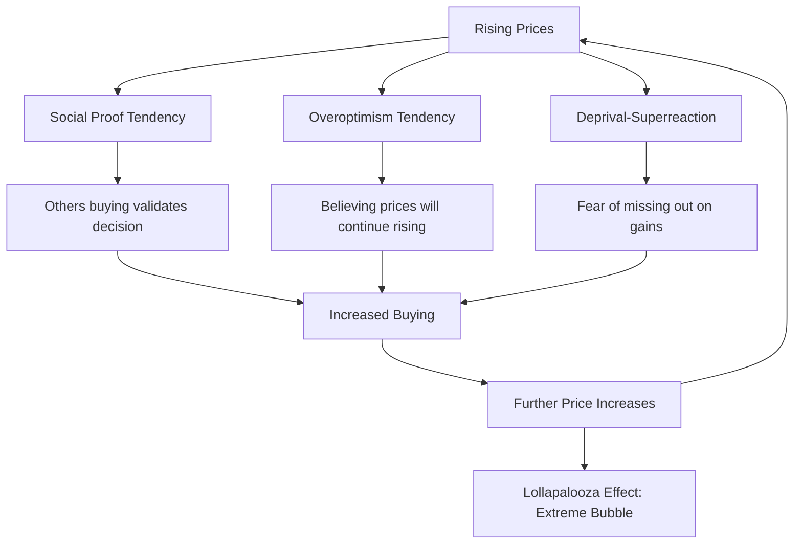
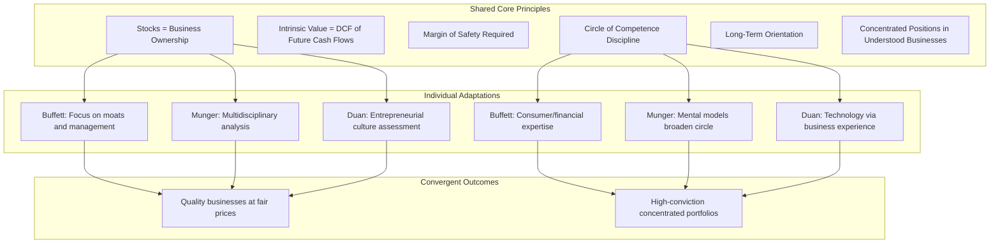
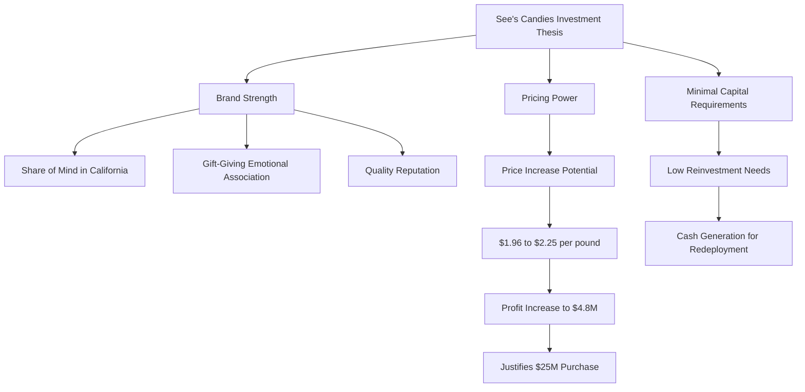
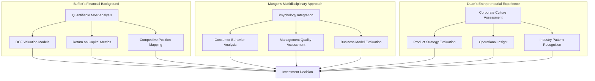
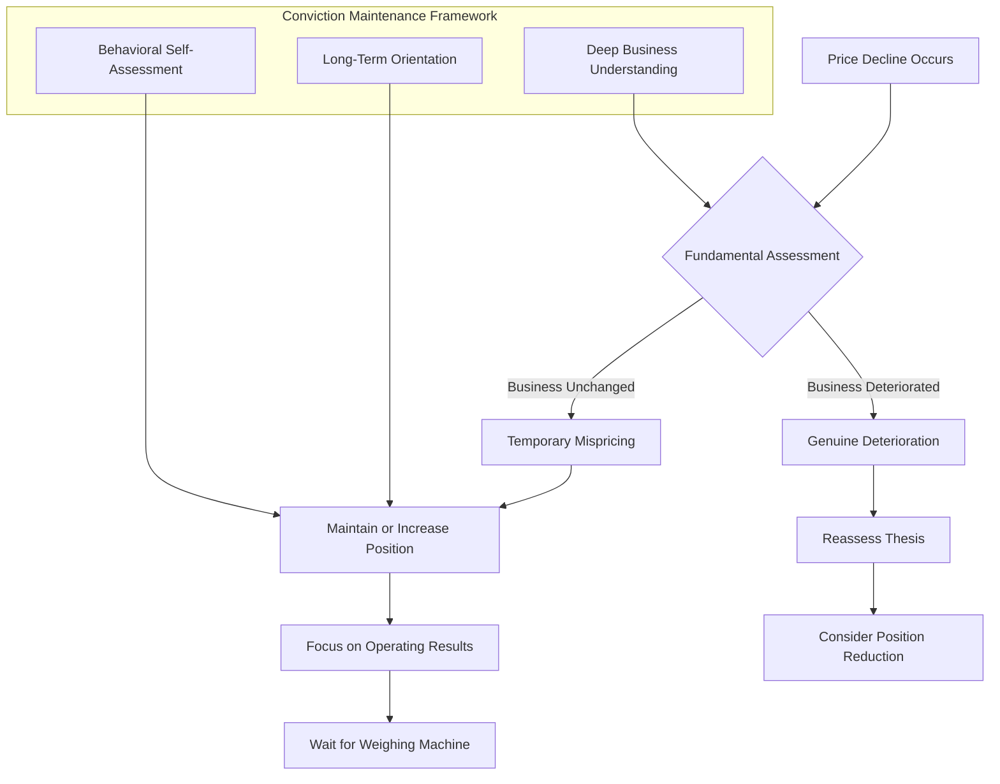
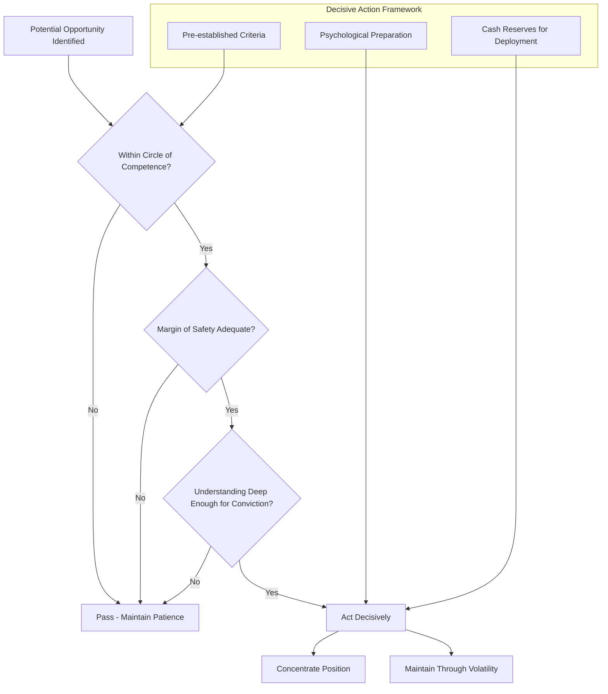
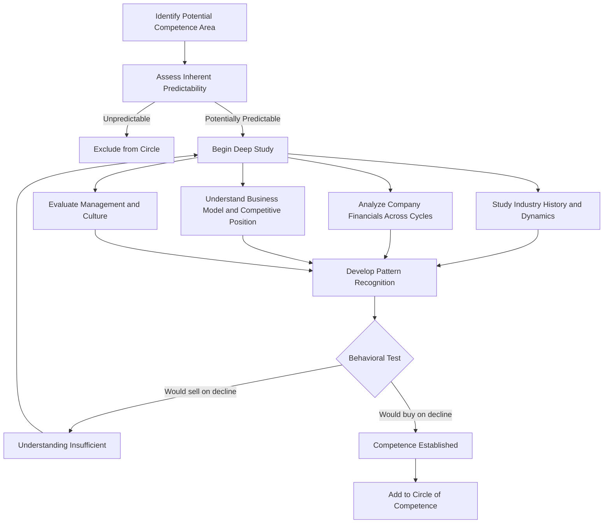

# Investment Philosophies of Duan Yongping, Warren Buffett, and Charlie Munger: A Comparative Analysis
## 1 Foundations of Value Investing: Theoretical Framework and Historical Context

The intellectual architecture of value investing represents one of the most enduring frameworks in financial history, emerging from the crucible of market crises and refined through decades of practical application. This chapter traces the theoretical origins and evolutionary trajectory of value investing as practiced by Benjamin Graham, Warren Buffett, Charlie Munger, and Duan Yongping, examining how a coherent set of principles developed at Columbia Business School in the 1920s transformed into a global investment philosophy adapted across vastly different market environments. The fundamental insight that **purchasing stocks constitutes acquiring ownership in underlying businesses** serves as the unifying thread connecting these practitioners across generations and geographies, while their individual contributions reveal how core principles can be extended, refined, and contextualized without losing their essential character.

### 1.1 Benjamin Graham's Foundational Framework

The intellectual foundations of value investing emerged from the collaborative work of Benjamin Graham and David Dodd at Columbia Business School during the 1920s and 1930s, a period that would prove formative not only for the discipline but for Graham personally[^1][^2]. Graham, born in London in 1894, had experienced financial hardship early when his family lost their savings during the Bank Panic of 1907 after immigrating to America[^2]. This formative experience with financial fragility would later manifest in his emphasis on capital preservation and defensive investment strategies. After attending Columbia University on scholarship and accepting a position on Wall Street with Newburger, Henderson, and Loeb, Graham achieved remarkable early success, earning approximately $500,000 annually by age 25[^2]. However, the Stock Market Crash of 1929 devastated his investments and provided the painful empirical foundation for his subsequent theoretical work[^2].

The observations Graham made in the aftermath of the crash inspired him to collaborate with David Dodd on what would become the foundational text of value investing, *Security Analysis*, published in 1934[^2]. This work, produced during the depths of the Great Depression while Graham served as a lecturer at Columbia Business School, laid out the fundamental groundwork for approaching securities as objects of rational analysis rather than speculative vehicles[^2]. At a time when the stock market was widely perceived as inherently speculative, Graham and Dodd proposed a fundamentally different approach: rather than attempting to anticipate price movements, investors should estimate the true **intrinsic value** of underlying assets and wait for market prices to converge with this fundamental value over time[^1].

Graham's framework rested upon **four foundational pillars** that continue to inform value investing practice today. The first pillar, **intrinsic value**, represented the core analytical concept—the idea that securities possess an objective worth determinable through rigorous research and analysis of financial fundamentals including assets, earnings, and dividend payouts[^1][^2]. Graham proposed that if the calculated intrinsic value exceeded the current market price, investors should buy and hold until mean reversion occurred, reflecting his belief in the market's eventual efficiency in recognizing fundamental value[^2]. The second pillar, the **margin of safety**, provided the operational principle for translating intrinsic value analysis into investment decisions. This concept represented the difference between a security's price and its intrinsic value, serving as a cushion against analytical errors, market downturns, and unforeseen negative events[^3][^4]. Graham's goal was characteristically conservative: to purchase assets worth one dollar for fifty cents[^4]. He achieved this by investing in stocks where liquid assets on the balance sheet, net of all debt, exceeded the total market capitalization—effectively acquiring businesses for nothing while the underlying assets provided protection against loss[^4].

The third pillar introduced one of the most enduring metaphors in investment literature: **Mr. Market**. In *The Intelligent Investor* (1949), Graham presented Mr. Market as an imaginary business partner who offers daily price quotes driven by emotional extremes rather than rational assessment[^5][^4]. Sometimes Mr. Market is excited and quotes high prices; other times he is depressed and quotes low prices. Graham's insight was that investors should not allow Mr. Market's volatile moods to dictate their own emotions or lead to poor decisions[^4]. Instead, they should form independent estimates of business value based on rational examination of facts, buying only when prices make sense and selling when holdings become overvalued[^4]. This allegory captured a profound psychological truth: **market prices reflect collective sentiment rather than intrinsic reality**, and the intelligent investor exploits rather than follows this sentiment.

The fourth pillar, **diversification**, reflected Graham's acknowledgment that even rigorous analysis could not eliminate uncertainty. His quantitative approach to investing in "Net-Nets"—companies trading below their net current asset value—required holding up to 40 stocks to counter the risk inherent in purchasing troubled enterprises[^6]. Graham calculated net current asset value as current assets minus all liabilities and preferred stock, seeking companies where this figure exceeded market capitalization[^6]. This strategy proved remarkably effective in the less efficient markets of Graham's era; one study demonstrated that from 1970 to 1983, a Graham-style Net-Net strategy could have earned an average return of 29.4%[^6].

Graham also established a crucial distinction between **investment and speculation** that remains relevant today. He proposed a clear definition: "An investment operation is one which, upon thorough analysis, promises safety of principal and a satisfactory return"[^5]. He exhorted investors to regard stocks as conferring part ownership of a business and to remain unconcerned with short-term price fluctuations[^5]. This distinction between the investor, who views stocks as fractional business ownership, and the speculator, who views them as pieces of paper whose value is determined solely by what others will pay, established the conceptual foundation for all subsequent value investing practice[^4].

Graham's teaching career at Columbia Business School, which began in 1928 and continued until his retirement in 1965, ensured the transmission of these principles to subsequent generations[^1]. The course he developed with Dodd was subsequently taught by their successor Roger F. Murray, who edited several editions of *Security Analysis*[^1]. Although the class was temporarily suspended when Murray retired in 1978, value investing was vigorously practiced by generations of investors who had studied with Dodd, Graham, or Murray[^1]. Graham's investment performance from 1936 to 1956 demonstrated the practical efficacy of his approach, achieving approximately a 20% annualized return compared to the overall market's 12.2%[^5].

### 1.2 The Buffett-Munger Evolution: From Cigar Butts to Quality Businesses

The transformation of value investing from Graham's quantitative, asset-focused approach to a quality-centered philosophy emphasizing durable competitive advantages represents one of the most significant intellectual developments in investment history. This evolution was catalyzed by the partnership between Warren Buffett, Graham's most famous student, and Charlie Munger, whose influence fundamentally reshaped how value investing would be practiced in the latter half of the twentieth century.

Warren Buffett's early career exemplified rigorous adherence to Graham's principles. As the only student to receive an A+ in Graham's course at Columbia, Buffett subsequently worked at Graham's investment company, Graham-Newman Corporation, before establishing the Buffett Partnership[^6]. During the partnership years, Buffett combined value investing, event-driven strategies, and activist approaches, dividing investments into categories he termed "Generals" (traditional cigar-butt investments), "Workouts" (special situations with short-term catalysts), and "Controls" (situations where Buffett could influence outcomes)[^6]. This approach proved remarkably successful: the partnership achieved a 31.6% annualized compound return from 1957 to 1968, compared to 9.1% for the Dow Jones Industrial Average[^7].

The **cigar-butt strategy** that Buffett initially favored involved purchasing deeply distressed companies at prices so low that even a failing business might yield one final "puff" of value before expiring[^3][^6]. Graham likened such investments to finding discarded cigar butts on the street—unpleasant but offering one free puff[^6]. While this approach worked well when managing small sums, it contained inherent limitations that would become apparent as Buffett's assets under management grew and as he gained deeper insight into business quality.

The pivotal influence of Charlie Munger cannot be overstated in understanding this philosophical transformation. Munger and Buffett first met in 1959 at a dinner in Omaha, quickly discovering their shared intellectual interests and similar rational, long-term-oriented temperaments[^8][^9]. While still practicing law, Munger started an investment partnership that averaged approximately 20% returns from 1962 to 1975[^9]. By 1978, Munger had become Vice Chairman of Berkshire Hathaway, and as Buffett described in his 2023 shareholder letter: "In reality, Charlie was the architect of the present Berkshire, and I acted as the general contractor to carry out the day-by-day construction of his vision"[^8].

Munger's investment philosophy diverged significantly from Graham's quantitative emphasis. He believed in **investing in outstanding businesses with strong moats and holding them for the long term**, recognizing that companies able to deploy capital at high rates of return over extended periods could far exceed the returns from traditional cigar-butt approaches[^8]. In 1965, Munger reportedly told Buffett that his purchase of Berkshire Hathaway—then a struggling textile manufacturer—had been "dumb," offering constructive guidance: "Now that you control Berkshire, add to it wonderful businesses purchased at fair prices and give up buying fair businesses at wonderful prices. In other words, abandon everything you learned from your hero, Ben Graham"[^9].

The **acquisition of See's Candies in 1972** marked the decisive turning point in this philosophical evolution. Berkshire Hathaway's Blue Chip Stamps subsidiary purchased See's for $25 million, paying approximately 300% of book value—an unprecedented move for investors trained in Graham's approach of seeking assets below liquidation value[^10][^11]. The conviction behind this acquisition hinged on the concept of **pricing power**. At the time, See's was selling products for $1.96 per pound; Munger and Buffett determined that if they could increase the price to $2.25, profits would rise sufficiently to justify the purchase price[^10]. They also recognized the power of the brand—See's enjoyed significant "share of mind" in California, particularly around gift-giving occasions[^10].

The See's investment demonstrated that paying premium prices for quality businesses could generate extraordinary returns. Over the following decades, See's raised its effective price per pound by 11% annually—far above inflation—with hikes sometimes reaching 17%[^10]. By 2007, sales had reached $383 million with $82 million in pretax profits[^10]. The business required minimal capital reinvestment; between 1972 and 2007, See's generated $1.35 billion in cumulative pretax earnings while requiring only $32 million in additional capital investment[^10][^12]. Buffett credited this investment with transforming his understanding of value: "If we had not bought See's, we would not have bought Coca-Cola," suggesting the See's experience generated insights worth $12 billion through subsequent investments[^11].

This experience crystallized what Buffett would later articulate as a fundamental shift in value investing philosophy. In a famous investor letter, Buffett wrote that the cigar-butt approach was "foolish," and that the key insight was: **"It is far better to buy a wonderful company at a fair price than a fair company at a wonderful price"**[^3]. This represented a profound evolution from Graham's emphasis on statistical cheapness to a focus on business quality, sustainable competitive advantages, and long-term compounding potential.

The **Coca-Cola investment in 1988** exemplified this evolved philosophy in practice. Buffett invested $1 billion in Coca-Cola immediately after the 1987 market crash, paying approximately 25 times earnings for his final purchases—a multiple Graham would have considered expensive[^7][^13]. However, Buffett and Munger perceived enormous long-term value: the company possessed a powerful moat, pricing power, high incremental returns on capital, substantial operating leverage, global expansion potential, economies of scale, and capable management for capital allocation[^7][^13]. By the end of 2020, this investment had returned 1,550% excluding dividends, and as of 2024, Coca-Cola remained Berkshire Hathaway's fourth-largest holding[^13].

The concept of the **economic moat** became central to the evolved Buffett-Munger philosophy. Buffett articulated this principle clearly: "A truly great business must have an enduring 'moat' that protects excellent returns on invested capital. The dynamics of capitalism guarantee that competitors will repeatedly assault any business 'castle' that is earning high returns"[^14]. Such moats might derive from being the low-cost producer (like GEICO or Costco) or possessing a powerful worldwide brand (like Coca-Cola, Gillette, or American Express)[^14]. Crucially, the moat must be **durable**—a moat that requires continuous rebuilding eventually becomes no moat at all[^14].

This evolution also reflected practical necessities. As Berkshire Hathaway's assets grew, the universe of potential investments that could meaningfully impact returns narrowed considerably. Cigar-butt strategies that worked well with small sums became impractical when deploying billions of dollars[^15]. The shift toward larger, high-quality companies with sustainable competitive advantages was thus both philosophically motivated and practically necessary.

### 1.3 Duan Yongping's Adaptation to Chinese Market Contexts

Duan Yongping represents a distinctive case in the value investing tradition: an entrepreneur who achieved extraordinary business success before applying value investing principles to generate even greater wealth through capital allocation. His investment philosophy demonstrates how Western value investing concepts can be internalized, adapted, and synthesized with entrepreneurial wisdom and Eastern perspectives to create a coherent framework applicable across diverse market environments.

Duan Yongping's background as the founder of BBK Electronics and the driving force behind brands including OPPO and vivo provided him with firsthand experience in building durable competitive advantages—experience that pure financial analysts typically lack[^16]. More than 90% of his personal wealth derives from investment rather than his entrepreneurial activities, a remarkable testament to the effectiveness of his investment approach[^16]. His portfolio reflects extreme concentration consistent with high-conviction value investing: as of recent estimates, Apple comprises approximately 60% of his holdings, with Berkshire Hathaway at 17.78%, demonstrating his willingness to concentrate heavily in businesses he understands deeply[^17].

The foundation of Duan's investment philosophy rests upon **three cardinal principles** directly inherited from Buffett: **do not short, do not borrow money, and do not touch what you do not understand**[^16][^18]. These principles emerged from Buffett's direct counsel to Duan and were reinforced through painful personal experience. Duan lost approximately $150-200 million shorting Baidu, an experience he describes as "extremely foolish speculative behavior" that consumed cash reserves and created enormous opportunity costs[^18]. This mistake reinforced his commitment to avoiding short selling, which he considers incompatible with value investing because it requires facing market irrationality with time working against the investor[^18].

The principle of **not touching what one does not understand** manifests in Duan's concept of the **circle of competence**, which he acknowledges as quite small. Over more than a decade, he has deeply understood only a few companies—primarily Apple and Moutai—taking an average of six years to develop comprehensive understanding of each[^18]. This selectivity reflects his belief that the quality of investment returns depends entirely on the ability to find good investment targets that one genuinely comprehends. As he notes, "the simplest standard for understanding a company is that you wouldn't feel the need to ask others if you understand it"[^18].

Duan's investment framework emphasizes that **value investing is not simply about low price-to-earnings ratios or high dividend yields**, but rather involves systematic thinking based on deep understanding of a company's long-term competitive advantages and business models[^19]. The core insight is that investment represents purchasing the discounted future cash flows of a business—a concept that requires going through a complete loop from theoretical recognition to practical verification[^19]. This understanding exemplifies why "investing is simple but not easy"—the principles are straightforward, but their internalization and consistent application require years of practice and reflection[^19].

The **"not-to-do list"** represents a distinctive methodological contribution from Duan's framework. Rather than focusing primarily on what to do, he emphasizes establishing clear boundaries around activities to avoid[^19]. This exclusionary approach helps navigate information overload and psychological pressures that characterize modern markets. His list is deceptively simple: do not touch what you do not understand[^18]. Yet this simplicity masks profound discipline—it requires honestly acknowledging the limits of one's knowledge and resisting the temptation to act outside those limits.

Duan's emphasis on **corporate culture** as a determinant of investment value reflects his entrepreneurial background. He regards integrity as one of the core competitive advantages of a company, pointing out that it is a common trait of all great enterprises[^20]. His investment tenet is "not doing business I don't understand, and not investing in unethical companies"[^20]. When choosing investment targets, he attaches great importance to the character and integrity of entrepreneurs—for example, respecting Apple's leadership for insisting on user experience first, and appreciating Tencent's management for balancing products and social responsibility[^20].

The **NetEase investment** exemplifies Duan's approach in practice. In 2001-2002, after the internet bubble burst and NetEase's stock price plummeted to approximately $0.64 per share, Duan conducted thorough analysis and discovered that cash reserves per share significantly exceeded the prevailing stock price[^21][^16]. His understanding of the gaming industry from his BBK Electronics experience—knowledge not available in textbooks or financial statements—provided conviction that others lacked[^16]. He purchased shares at an average price of approximately $1 and held for 8-9 years, eventually selling most positions around $30-35 per share, generating returns exceeding one hundred times his initial investment[^21][^16].

This investment illustrates several key aspects of Duan's philosophy. First, the decision was based on **understanding the business** rather than technical analysis—his gaming industry knowledge from BBK provided insights unavailable to pure financial analysts[^16]. Second, the investment criterion was **value rather than listing status**; when others feared delisting, Duan remained unperturbed because his decision was based on intrinsic value independent of market quotation[^16]. Third, he applied the principle that **valuation is a gross estimate**—if you need a calculator to work out whether an investment is profitable, it probably isn't cheap enough[^16].

Duan's philosophy also incorporates distinctive perspectives on **market psychology and long-term thinking**. He proposes that "holding good companies is itself a bull market," reflecting the view that market fluctuations are surface noise while underlying business value represents reality[^22]. For truly valuable companies, dramatic price swings are merely temporary scenery as long as intrinsic value remains stable or grows over time[^22]. This perspective enables him to view price declines in fundamentally sound companies as opportunities rather than threats, as demonstrated by his willingness to increase positions in Moutai during periods of price weakness[^22].

The synthesis of Buffett's teachings with **Eastern wisdom** appears in Duan's emphasis on distinguishing between form and substance in value investing[^19]. He cautions against confusing the superficial indicators of value (low P/E ratios, high dividend yields) with genuine value, which requires understanding business models, competitive dynamics, and management quality at a fundamental level[^19]. This distinction between appearance and reality echoes traditional Eastern philosophical themes while remaining grounded in rigorous business analysis.

### 1.4 The Unifying Principle: Buying Stocks as Buying Businesses

The fundamental insight that **purchasing stocks represents acquiring ownership in underlying businesses** serves as the conceptual foundation uniting Graham, Buffett, Munger, and Duan Yongping across their diverse approaches and market contexts. This perspective transforms investment from speculation about price movements into analysis of business fundamentals, reshaping valuation methodology, holding period decisions, and the relationship between investor and enterprise.

Graham established this principle explicitly, proposing that investors should "regard stocks as conferring part ownership of a business and to be unconcerned with short-term price fluctuations"[^5]. This perspective distinguished the investor from the speculator: the investor views stocks as fractional business ownership with intrinsic value derived from underlying operations, while the speculator views them as pieces of paper whose value depends solely on what others will pay[^4]. Graham's distinction provided the conceptual basis for all subsequent value investing practice by establishing that securities analysis should focus on business fundamentals rather than market sentiment.

Buffett internalized and extended this principle throughout his career. His approach to investment selection consistently reflects the question: would I want to own this entire business if I could afford to?[^16] This owner's mindset shapes every aspect of his investment process, from initial screening through ongoing monitoring. As he has stated, his favorite holding period is "forever"—a stance that only makes sense if one views stock ownership as equivalent to business ownership[^13]. The permanence of this perspective contrasts sharply with trading-oriented approaches that view stocks as instruments for capturing price movements.

The **discounted cash flow framework** represents the analytical expression of this ownership principle. Duan Yongping articulates this connection clearly: the essence of investment is purchasing the discounted future cash flows of a business[^19][^16]. This means "to buy a stock is to buy a company," but quantified through systematic analysis of future earnings potential[^16]. The calculated value relates only to total discounted cash flow in the future; net assets that do not generate cash flow actually have no value (and sometimes negative value)[^16]. This framework forces investors to think like business owners evaluating the long-term earning potential of enterprises rather than traders speculating on short-term price movements.

Duan provides a practical illustration of this principle: if a company must earn 100 million yuan (net cash flow) every year, and assuming bank interest remains constant at 5%, then the intrinsic value of the company is 2 billion yuan[^16]. Interestingly, this calculation appears to have nothing to do with net worth on the surface, though net worth represents one of the conditions for realizing profits[^16]. This example demonstrates how the ownership perspective transforms valuation from accounting-based metrics to forward-looking cash flow analysis.

The owner's mindset also determines **holding period philosophy**. If purchasing stocks means acquiring businesses, then the appropriate holding period extends as long as the business continues generating satisfactory returns on capital. Buffett's decades-long holdings in companies like Coca-Cola and American Express reflect this perspective—these are not trades to be exited when prices reach targets, but ownership stakes in excellent businesses to be held indefinitely[^13]. Similarly, Duan held NetEase for 8-9 years, with the holding criterion being value rather than price targets[^16].

This principle shapes the **relationship between investor and enterprise** in fundamental ways. An owner thinks about business operations, competitive positioning, management quality, and capital allocation rather than chart patterns, momentum indicators, or market sentiment. Duan expresses this clearly: "purchasing a company's stock is like building a partnership"—you must understand how the company makes money to maintain conviction during volatility[^22]. If you don't understand Moutai's earnings, you cannot hold it through price declines[^22]. This understanding creates the psychological foundation for maintaining positions during market turbulence.

The ownership perspective also provides the **simplest distinction between investment and speculation**. Duan proposes asking: at the current price, would you buy this company if it were not listed?[^16] If the answer is yes, the activity is investment; if no, it is speculation. When he purchased NetEase at under $1 per share while others feared delisting, his decision was unrelated to listing status because he would have bought the entire company at that valuation if possible[^16]. This criterion cuts through the complexity of market analysis to focus on the fundamental question: is this a good business at an attractive price?

The principle manifests differently across market environments while maintaining philosophical consistency. Graham applied it through quantitative analysis of balance sheets and earnings in the relatively inefficient markets of his era. Buffett and Munger extended it to encompass qualitative assessment of competitive advantages, management quality, and long-term compounding potential as markets became more efficient and their capital base grew. Duan adapted it to Chinese and global technology markets, applying entrepreneurial insight to evaluate business models and corporate cultures. Despite these contextual variations, the core insight remains constant: **stocks represent ownership in businesses, and intelligent investment requires understanding those businesses as an owner would**.

This unifying principle also explains why all three investors emphasize the **circle of competence**. If purchasing stocks means buying businesses, then investors can only make intelligent decisions about businesses they genuinely understand. Buffett's famous dictum to "never invest in a business you cannot understand" follows directly from the ownership principle[^3]. Duan's insistence on his small circle of competence—really understanding only Apple and Moutai over more than a decade—reflects the same logic[^18]. Understanding a business well enough to value its future cash flows requires deep knowledge that cannot be acquired quickly or superficially.

The ownership mindset ultimately transforms investment from a technical exercise into a business analysis discipline. Rather than seeking patterns in price data or predicting market movements, the value investor analyzes competitive dynamics, evaluates management capability, assesses capital allocation decisions, and estimates future earning potential. This transformation explains why successful value investors often describe their work as closer to business analysis than to traditional finance—they are evaluating enterprises as potential owners rather than securities as potential trades.

[^1]: Columbia Business School
[^2]: Benjamin Graham: The Father of Value Investing
[^5]: Benjamin Graham Wikipedia
[^7]: The Evolution of a Value Investor
[^3]: Lessons from Legendary Value Investors (Source 5)
[^3]: Lessons from Legendary Value Investors (Source 6)
[^6]: A Brief History of Value Investing
[^21]: Duan Yongping Business Philosophy Analysis
[^22]: Duan Yongping Investment Principles (Chinese)
[^4]: Benjamin Graham's Timeless Investment Principles
[^14]: Economic Moat
[^19]: Duan Yongping Value Investing Analysis (Source 12)
[^19]: Duan Yongping Value Investing Analysis (Source 13)
[^19]: Duan Yongping Value Investing Analysis (Source 14)
[^10]: Buffett's See's Candies Teardown (Source 15)
[^10]: Buffett's See's Candies Teardown (Source 16)
[^11]: Twelve Things About See's Candies
[^12]: Tasting Quality: See's Candies (Source 18)
[^12]: Tasting Quality: See's Candies (Source 19)
[^16]: Duan Yongping Investment Philosophy (Source 20)
[^16]: Duan Yongping Investment Philosophy (Source 21)
[^18]: Duan Yongping Three Principles (Source 22)
[^18]: Duan Yongping Three Principles (Source 23)
[^20]: Duan Yongping Business Ideas
[^17]: Duan Yongping Portfolio
[^15]: Graham vs Buffett Comparison
[^23]: Margin of Safety Evolution
[^24]: Graham to Buffett Strategies
[^8]: Charlie Munger Life
[^9]: Charlie Munger Influence
[^13]: Buffett Coca-Cola Investment

## 2 Warren Buffett's Investment Philosophy: Principles and Evolution

Warren Buffett's investment philosophy represents one of the most thoroughly documented and consistently successful approaches to capital allocation in financial history. His framework evolved significantly over six decades, transforming from a quantitative, balance-sheet-focused methodology inherited from Benjamin Graham into a sophisticated quality-centered approach that emphasizes durable competitive advantages, exceptional management, and long-term business ownership. This chapter systematically examines the core principles that define Buffett's investment methodology, tracing their intellectual origins, practical applications, and the psychological discipline required for their successful implementation. The analysis reveals how Buffett's approach synthesizes rigorous business analysis with behavioral discipline, creating a coherent framework that prioritizes deep understanding over technical complexity and patient ownership over active trading.

### 2.1 The Evolution from Cigar Butt Investing to Quality-Focused Value Investing

Warren Buffett's investment philosophy underwent a fundamental transformation during the 1960s and 1970s, shifting from Benjamin Graham's quantitative "cigar butt" approach toward a quality-focused methodology that would define his subsequent career. This evolution represents one of the most significant intellectual developments in investment history, driven by both practical necessity and deepening insight into the nature of business value creation.

The **cigar butt strategy** that Buffett initially practiced involved purchasing deeply distressed companies trading at prices below their liquidation value—businesses so beaten down by the market that even in their declining state, they might yield one final "puff" of value before expiring. As Buffett explained in his 1989 Berkshire Hathaway Annual Letter, this approach operates on the principle that if you buy a stock at a sufficiently low price, there will usually be some hiccup in the business that gives you a chance to unload at a decent profit, even though the long-term performance may be terrible[^25]. The strategy required identifying companies whose net current asset value per share—calculated as current assets minus total liabilities and preferred stock, divided by outstanding common shares—exceeded the market price, effectively acquiring businesses for less than the value of their liquid assets alone[^26].

During his early partnership years, Buffett achieved remarkable success with this approach, generating average annual returns of 31% over the twelve years he ran Buffett Partnership Ltd[^26]. However, the strategy contained inherent limitations that would become increasingly apparent. Buffett himself acknowledged that unless you are a liquidator, the cigar butt approach is ultimately foolish because the original bargain price probably will not turn out to be such a steal[^25]. A difficult business will continually surface new problems, and any initial advantage will be quickly eroded by the low returns the business earns. He illustrated this point with a compelling example: if you buy a business for $8 million that can be liquidated for $10 million and promptly do so, you realize a high return; but the investment will disappoint if the business is sold for $10 million in ten years and in the interim has annually earned only a few percent on cost[^25].

The **pivotal insight** that catalyzed Buffett's philosophical transformation was the recognition that **"time is the friend of the wonderful business and the enemy of the mediocre"**[^25]. This principle fundamentally reframed the relationship between business quality and investment returns. While cigar butt investing sought to extract value from declining enterprises before their deterioration consumed the margin of safety, quality investing recognized that exceptional businesses compound value over time, with each passing year adding to rather than subtracting from intrinsic worth.

Charlie Munger's influence proved decisive in this transformation. As Buffett acknowledged, Munger understood early what Buffett was slow to learn—that it is far better to buy a wonderful company at a fair price than a fair company at a wonderful price[^25]. Munger believed that instead of looking for cigar butts, investors should focus on high-quality companies that have a sustainable competitive advantage, recognizing that "some businesses were worth paying up a bit to get in with for a long-term advantage"[^26]. This perspective directly challenged Graham's emphasis on statistical cheapness, proposing instead that business quality deserved premium valuation.

Buffett learned this lesson through painful personal experience. The acquisition of Hochschild Kohn, a Baltimore department store, exemplified the limitations of cigar butt thinking. Buffett bought the business at a substantial discount from book value, with first-class people and extras like unrecorded real estate values—precisely the characteristics Graham's approach favored. Yet he was lucky to sell it three years later for about what he had paid[^25]. The experience demonstrated that apparent bargains in mediocre businesses often prove illusory when operating challenges consume the margin of safety.

Several structural factors made the transition from cigar butt investing both philosophically motivated and practically necessary. First, as Buffett's capital base grew, the universe of potential cigar butt investments that could meaningfully impact returns narrowed considerably. In 1969, Buffett decided to close his partnership fund, explaining that he believed the strategy would no longer work as the fund had grown too big, making it impossible to find enough undervalued stocks to buy that would offer worthwhile returns on investment[^26]. Second, the investment landscape evolved significantly since the 1950s when Buffett first leveraged this strategy. As more investors caught wind of the highly profitable approach, competition increased and profits were arbitraged away. Additionally, advancements in technology transformed financial analysis, dramatically reducing the competitive advantage that once existed for investors like Buffett[^26].

The **shift toward quality investing** also reflected changing economic realities. The nature of assets that companies possess changed drastically over time, with intangible assets such as patents, goodwill, and brand recognition making up a greater proportion of overall asset value. This transformation made the traditional liquidation approach less effective, as calculating "fair value" became much more complicated when value resided in intangibles rather than physical assets[^26].

The evolved philosophy crystallized around the principle of seeking **first-class businesses accompanied by first-class managements**[^25]. Rather than searching for statistical bargains in troubled enterprises, Buffett began evaluating businesses based on their ability to generate sustained high returns on capital, their competitive positioning, and the quality of their leadership. This approach required paying fair prices for exceptional businesses rather than bargain prices for mediocre ones—a fundamental inversion of Graham's original framework while retaining its core insight that price paid determines investment returns.

### 2.2 Intrinsic Value Calculation and the Discounted Cash Flow Framework

At the heart of Buffett's investment methodology lies the concept of intrinsic value, which he defines as **"the discounted value of the cash that can be taken out of a business during its remaining life"**[^27]. This definition establishes cash flow generation as the fundamental determinant of business worth, transforming investment analysis from accounting-based metrics to forward-looking assessment of earning potential. The discounted cash flow (DCF) framework provides the analytical structure for translating this definition into practical valuation.

The calculation process begins with determining **owner earnings**, a concept Buffett introduced in his 1986 letter to Berkshire Hathaway shareholders as a superior measure of the cash a business generates for its owners[^27]. The formula captures the true economic earnings available to shareholders:

**Owner Earnings = Net Income + Non-cash Charges (Depreciation, Depletion, Amortization) - Maintenance Capital Expenditure**

Alternatively, this can be simplified to: **Owner Earnings = Operating Cash Flow - Maintenance Capital Expenditure**[^27].

The distinction between owner earnings and reported earnings is critical. Reported net income includes non-cash charges that reduce accounting earnings but do not represent actual cash outflows. Conversely, capital expenditures required to maintain competitive position consume cash but are not reflected in the income statement. Owner earnings adjusts for both distortions, revealing the actual cash available for distribution to owners or reinvestment in growth opportunities. The challenge lies in estimating maintenance capital expenditure, which companies typically do not report separately from growth capital expenditure, requiring investors to make informed estimates based on business understanding[^27].

The **discount rate** represents a critical input that significantly impacts calculated intrinsic value. Buffett's approach differs notably from academic finance, which typically employs weighted average cost of capital (WACC) incorporating beta and the capital asset pricing model (CAPM). Instead, Buffett advises using the long-term government bond rate without adding a separate risk factor[^28]. His reasoning is that cash from a risky business and a safe business should be discounted at the same rate if the future cash flows can be estimated with reasonable confidence—the risk adjustment should occur in the cash flow projections themselves rather than the discount rate[^28]. When interest rates are unusually low, Buffett adjusts the rate upward to reflect more normalized conditions[^27]. An alternative approach uses the investor's personal required rate of return, such as 10%, representing the return threshold that must be exceeded for an investment to be attractive[^27].

**Growth rate estimation** requires deep understanding of the business and its industry rather than mechanical extrapolation of historical trends. Buffett does not use a secret formula; rather, he thoroughly understands the company and its competitive dynamics to form reasonable expectations about future performance[^27]. For investors lacking such deep familiarity, historical growth rates of owner earnings or free cash flow can serve as starting points, though conservative estimates are advisable given the uncertainty inherent in forecasting. The growth rate should reflect realistic expectations about the business's ability to expand earnings over the forecast period, typically 10 years.

The **terminal value** captures the value of all cash flows beyond the explicit forecast period, often representing a substantial portion of total intrinsic value. The preferred methodology uses the perpetuity growth model:

**Terminal Value (Future Value) = Final Year Free Cash Flow × (1 + g) / (r - g)**

where g represents the perpetual growth rate and r the discount rate. This future value must then be discounted back to present value[^27]. The perpetual growth rate must be less than the discount rate and typically ranges from 1% to 3%, reflecting the assumption that mature businesses cannot grow faster than the overall economy indefinitely. Setting this rate at or below the long-term GDP growth rate provides a conservative anchor[^28].

The **intrinsic value calculation** aggregates the present value of projected cash flows and terminal value:

| Component | Calculation | Purpose |
|-----------|-------------|---------|
| Year 1-10 Cash Flows | Each year's owner earnings discounted to present value | Captures explicit forecast period value |
| Terminal Value | Perpetuity value discounted to present value | Captures value beyond forecast period |
| Intrinsic Value | Sum of all discounted cash flows | Total estimated business worth |
| Per Share Value | Intrinsic value ÷ shares outstanding | Comparable to market price |

A practical illustration demonstrates the methodology. For Hormel Foods, using a 5% growth rate (conservative relative to 10.88% historical growth) and a 6.44% discount rate (the 1996 30-year Treasury average), the DCF model calculated an intrinsic value per share of $53.99 compared to a year-end 2019 price of $43.64[^28]. The analysis revealed the stock trading at a meaningful discount to estimated intrinsic value.

Buffett emphasizes that **intrinsic value is an estimate rather than a precise figure**[^27]. The calculation depends on numerous assumptions about future cash flows, growth rates, and discount rates—all of which involve uncertainty. Two analysts examining the same company may arrive at different intrinsic values based on different but equally reasonable assumptions. This inherent imprecision explains why Buffett insists on substantial margins of safety rather than attempting to calculate values to multiple decimal places. As he has noted, it is better to be approximately right than precisely wrong.

The DCF framework's primary limitation lies in its sensitivity to input assumptions. Small changes in growth rates or discount rates can produce dramatically different valuations. Using Oshkosh Corp as an example, the intrinsic value per share ranged from $45.38 using a 13.60% discount rate to $702.79 using a 3.02% rate—demonstrating that lower discount rates lead to substantially higher valuations[^28]. This sensitivity reinforces the importance of conservative assumptions and meaningful margins of safety.

**Scenario analysis** addresses this uncertainty by testing valuations under different assumptions[^27]. By modeling best-case, base-case, and worst-case scenarios with varying growth rates and discount rates, investors can understand the range of possible outcomes and the conditions required for attractive returns. This approach transforms intrinsic value from a single point estimate into a probability-weighted range, providing more realistic guidance for investment decisions.

### 2.3 Margin of Safety: The Foundation of Risk Management

The margin of safety concept, originated by Benjamin Graham and embraced by Buffett as foundational to his investment approach, represents the gap between a security's intrinsic value and its market price[^29]. Buffett calls the margin of safety **"the three most important words in investing"**, reflecting its centrality to protecting capital while generating satisfactory returns[^29]. This principle provides the operational framework for translating intrinsic value analysis into disciplined investment decisions.

Buffett's **bridge analogy** illuminates the principle's practical application: engineers insist bridges can carry 30,000 pounds but only drive 10,000-pound trucks across them[^29]. This same thinking applies to stock purchases—buy with substantial cushions below fair value to protect against the inevitable errors in analysis and unforeseen developments in business conditions. The margin of safety acknowledges that intrinsic value calculations involve estimates and assumptions that may prove incorrect, and that businesses face uncertainties that cannot be fully anticipated.

The **margin of safety calculation process** begins with an intrinsic value estimate derived from discounted cash flow analysis. Investors project free cash flows for the next decade or longer, discount these flows to present value, and sum the results to determine the business's current worth[^29]. Comparing this figure against the market price reveals the safety margin available. If intrinsic value is estimated at $100 per share and the market price is $70, the margin of safety is 30%.

**Required margins vary with business predictability**[^29][^27]. For highly predictable businesses with stable cash flows, consistent competitive advantages, and proven management, smaller margins may be acceptable—perhaps 15-25%[^27]. For businesses with greater uncertainty—cyclical industries, competitive threats, or unproven strategies—larger margins of 50% or more provide necessary protection[^27]. Buffett typically seeks margins of 25-50% depending on the certainty level of his cash flow projections[^29].

The relationship between discount rate selection and margin of safety requirements merits careful consideration. If using Buffett's approach of discounting at long-term government bond rates (which produces higher intrinsic values), even confident investors should apply at least 50% margins of safety[^27]. If using higher personal required rates of return (which produces lower intrinsic values), smaller margins of 15-25% may suffice because the higher discount rate has already incorporated additional conservatism[^27]. The key principle is that the combination of discount rate and margin of safety should provide adequate protection against analytical errors and adverse developments.

Buffett's disciplined adherence to margin of safety requirements manifests in Berkshire Hathaway's substantial cash positions when market valuations offer insufficient margins. Berkshire's record $381.7 billion cash position reflects this discipline—with markets trading at elevated valuations, Buffett found insufficient margin in most opportunities[^29]. Rather than compromising standards to deploy capital, he maintains liquidity awaiting more favorable pricing. This patience represents margin of safety thinking extended to portfolio management: holding cash when attractive opportunities are scarce preserves optionality for future deployment at better prices.

The margin of safety provides protection against **multiple sources of risk**:

| Risk Source | How Margin of Safety Protects |
|-------------|------------------------------|
| Analytical errors | Cushion absorbs mistakes in cash flow projections |
| Business deterioration | Buffer against unforeseen competitive or operational challenges |
| Market volatility | Price declines less likely to produce permanent capital loss |
| Economic uncertainty | Protection against macroeconomic developments affecting business |

For individual stock selection, the process follows clear steps[^29]: calculate intrinsic value using conservative assumptions; project cash flows pessimistically rather than optimistically; apply meaningful discount rates reflecting opportunity costs; compare calculated value carefully with market prices; demand substantial margin of safety before purchasing; and buy only at 30-50% discounts to intrinsic value minimum. This buffer protects against inevitable analytical errors while positioning for attractive returns when the market eventually recognizes underlying value.

The margin of safety principle also shapes **position sizing decisions**. Larger margins of safety in individual positions justify greater portfolio concentration, while smaller margins require broader diversification to manage aggregate risk. Buffett's willingness to concentrate heavily in positions with substantial safety margins—sometimes allocating 25% or more to a single holding—reflects confidence that adequate margins protect against permanent capital loss even in concentrated portfolios.

### 2.4 Economic Moats: Identifying Sustainable Competitive Advantages

The economic moat concept, popularized by Buffett, provides a framework for evaluating the durability of competitive advantages that protect business profitability from erosion[^30][^31][^32]. The metaphor draws from medieval castles surrounded by water-filled moats that defended against invaders—similarly, economic moats protect a company's "castle" of profits from competitive assault. Buffett has stated that he seeks businesses with **wide, durable moats** that can sustain excellent returns on invested capital over extended periods[^29].

The **five primary sources of economic moats** create different types of competitive protection:

**Brand Power** enables companies to charge premium prices because consumers willingly pay more due to trust, reputation, or emotional attachment[^31]. Strong brands create customer loyalty that persists across economic cycles and competitive challenges. Coca-Cola exemplifies brand power—its global recognition and emotional associations enable premium pricing that weaker brands cannot command[^30]. The pricing power test quickly reveals brand strength: the ability to raise prices without losing significant volume indicates a genuine moat[^29].

**Network Effects** occur when a product or service becomes more valuable as more people use it, creating self-reinforcing competitive advantages[^31][^32]. Payment networks and digital platforms commonly exhibit this characteristic—each additional user increases value for existing users, making it increasingly difficult for new competitors to attract critical mass. The feedback loop strengthens over time, as growing user bases attract more users, compounding the competitive advantage.

**Switching Costs** arise when customers face friction, expense, or inconvenience when changing providers[^31][^32]. High switching costs reduce customer churn and stabilize revenue, giving companies pricing power even when competitors offer lower prices. Enterprise software and financial platforms commonly exhibit this moat—the time, training, and disruption required to switch systems creates powerful customer retention. Companies with switching cost advantages can maintain profitability even without superior products because the cost of switching exceeds the benefit.

**Cost Advantages** enable companies to produce goods or services at lower costs than competitors, providing flexibility to compete on price while maintaining margins or to earn superior margins at market prices[^30][^32]. Cost advantages may derive from economies of scale, proprietary processes, favorable access to inputs, or operational efficiency. Walmart's vast supply chain and purchasing power exemplify scale-based cost advantages that smaller competitors cannot replicate[^30].

**Efficient Scale** occurs when a market is effectively served by one or a limited number of competitors, making new entry economically unattractive[^31][^32]. In such markets, existing players earn adequate returns, but additional competitors would reduce returns below acceptable levels, deterring rational new entrants. Waste Management illustrates efficient scale—its vast network of landfills and exclusive municipal licenses makes market entry prohibitively expensive[^32].

| Moat Source | Mechanism | Portfolio Example |
|-------------|-----------|-------------------|
| Brand Power | Premium pricing through trust and reputation | Coca-Cola, See's Candies |
| Network Effects | Value increases with user base | American Express, Visa |
| Switching Costs | Friction prevents customer departure | Enterprise software companies |
| Cost Advantages | Lower production costs than competitors | GEICO, Costco |
| Efficient Scale | Market size limits profitable competitors | Utilities, railroads |

Buffett emphasizes that **moat durability matters more than current moat width**[^30]. A wide moat that cannot be sustained provides only temporary protection, while a narrower but durable moat can compound value over decades. The critical questions concern whether advantages can persist for 5, 10, or 20 years; what factors maintain the moat; how stable those factors are; whether the moat depends excessively on current leadership; and whether management might compromise the moat for short-term gains[^30].

The dynamics of capitalism guarantee that competitors will repeatedly assault any business "castle" earning high returns[^29]. Sustainable moats must withstand these assaults through structural advantages that competitors cannot easily replicate. A moat that requires continuous rebuilding eventually becomes no moat at all—the resources devoted to maintaining competitive position consume the profits the moat was meant to protect.

**Intangible assets** including patents, trademarks, and regulatory licenses create additional moat sources[^30][^32]. Pharmaceutical companies rely heavily on patent protection to maintain competitive advantages during exclusivity periods. Regulatory licenses in industries like banking, insurance, and utilities create barriers that protect incumbents from new competition. However, these moats require careful evaluation—patents expire, regulations change, and trademarks can lose relevance.

Morningstar's economic moat rating system provides a structured framework for moat evaluation, categorizing companies into three tiers: **wide moat** (competitive advantage expected to persist more than 20 years), **narrow moat** (advantage likely to persist 10-20 years), and **no moat** (no significant advantage or advantage expected to erode quickly)[^30]. The rating incorporates historical financial performance, future sustainability assessment, and competitive advantage source analysis.

### 2.5 Management Quality Assessment: Evaluating Leadership and Capital Allocation

Buffett believes that **management quality is a key factor in determining whether a stock will be a good investment**, recognizing that even excellent businesses can fail under poor leadership[^33][^34]. His assessment framework evaluates managers along two primary dimensions: operational performance and shareholder treatment.

The **first yardstick measures how well managers run the business**[^33]. This assessment requires understanding what management has accomplished relative to the company's starting position and competitive environment. Investors should examine the hand managers were dealt when they took leadership roles compared to current conditions, evaluating performance against industry trends and competitor achievements. A manager who maintains market share in a declining industry may demonstrate greater skill than one who grows in a booming sector. Reading about both the company's accomplishments and competitors' results provides context for fair evaluation[^33].

**Capital allocation capability** represents a critical subset of operational assessment[^34]. Buffett favors CEOs who reinvest profits wisely, allocate capital efficiently, and maintain financial discipline. Capital allocation decisions—whether to reinvest in the business, make acquisitions, pay dividends, or repurchase shares—compound over time to determine long-term shareholder returns. Managers who consistently deploy capital at high returns create substantial value, while those who pursue empire-building or value-destructive acquisitions erode it.

The **second yardstick assesses how well managers treat shareholders**[^33]. This evaluation requires reading proxy statements to understand how management treats themselves versus how they treat shareholders. Executive compensation structures reveal whether management interests align with shareholder interests or whether managers extract excessive compensation regardless of performance. Poor managers often turn out to be the ones who do not think much about shareholders, and the two characteristics frequently correlate[^33].

| Assessment Dimension | Key Questions | Information Sources |
|---------------------|---------------|---------------------|
| Operational Performance | What has management accomplished relative to starting position? How does performance compare to competitors? | Annual reports, industry analysis |
| Capital Allocation | Are profits reinvested wisely? Do acquisitions create value? | Cash flow statements, acquisition history |
| Shareholder Treatment | Does compensation align with performance? Are shareholders treated fairly? | Proxy statements, shareholder communications |
| Integrity | Does management communicate honestly? Are promises kept? | Historical letters, earnings calls |

Investors can assess management quality through several practical steps[^34]: reviewing past annual letters and earnings calls to evaluate communication quality and promise fulfillment; checking executive compensation structures to determine alignment with shareholder interests; and observing how management allocates capital over time. Patterns of honest communication, conservative guidance, and shareholder-friendly capital allocation indicate trustworthy management.

Buffett cited Microsoft's Bill Gates, Tom Murphy at Capital Cities, and Donald Keough at Coca-Cola as examples of outstanding managers who worked for shareholders[^33]. These leaders demonstrated both operational excellence and genuine concern for shareholder welfare, creating value through superior business performance while treating owners as partners rather than funding sources.

The emphasis on management quality reflects a fundamental insight: **great businesses require great leadership**[^34]. Competitive advantages can erode under poor management, while capable leaders can strengthen and extend existing moats. Even the widest moat can be wasted through poor capital allocation, excessive compensation, or strategic missteps. Conversely, exceptional management can transform narrow advantages into durable competitive positions through disciplined execution and wise capital deployment.

Management assessment also requires evaluating **integrity and honest communication**. Managers who acknowledge mistakes, provide realistic guidance, and communicate transparently about challenges demonstrate the character traits that support long-term value creation. Those who consistently overpromise, blame external factors for failures, or obscure problems through complex accounting warrant skepticism regardless of near-term results.

### 2.6 Mr. Market: The Psychological Framework for Market Participation

The Mr. Market allegory, originated by Benjamin Graham and adopted by Buffett as a cornerstone of his psychological framework, provides a mental model for maintaining rational decision-making amid market volatility[^35][^36][^37]. This concept reframes the relationship between investor and market, transforming potentially destabilizing price fluctuations into opportunities for disciplined capital allocation.

Graham introduced Mr. Market in *The Intelligent Investor* (1949) as an imaginary business partner who appears daily to offer prices at which he will either buy your interest in a shared business or sell you his[^35][^37]. The critical insight is that **Mr. Market has incurable emotional problems**—sometimes he feels euphoric and sees only favorable factors, offering high prices because he fears you will snap up his interest and rob him of imminent gains; other times he is depressed and sees nothing but trouble ahead, offering very low prices because he is terrified you will unload your interest on him[^37].

The allegory's power lies in its reframing of market quotations. Rather than viewing prices as authoritative assessments of value, investors should understand them as offers from an emotionally unstable counterparty whose moods bear no necessary relationship to underlying business reality[^36]. Even when the business owned has stable economic characteristics, Mr. Market's quotations will be anything but stable[^37]. This perspective liberates investors from the psychological pressure to respond to every price movement as if it conveyed meaningful information.

Buffett illustrated Mr. Market's manic-depressive behavior with a striking example involving Cisco Systems[^36]. In 2000, at the peak of euphoria, Mr. Market was willing to pay over $80 per share for Cisco, valuing the company at nearly $600 billion when it earned approximately $3 billion in net income. Just two years later, in his most depressed state, Mr. Market was willing to sell the entire company for approximately $60 billion—a 90% decline—while the company was earning nearly $4 billion annually[^36]. The business had actually improved, but Mr. Market's assessment swung wildly based on emotional factors unrelated to fundamental value.

The principle that **"Mr. Market is there to serve you, not to guide you"** captures the proper relationship between investor and market[^37]. Mr. Market's pocketbook—his willingness to transact at various prices—provides utility, but his wisdom about business value does not. If he appears in a particularly foolish mood, you are free to ignore him or take advantage of him, but falling under his influence will prove disastrous[^37]. This distinction between using the market for transactions while ignoring it for valuation guidance is fundamental to Buffett's approach.

Mr. Market possesses another valuable characteristic: **he doesn't mind being ignored**[^37]. If today's quotation is uninteresting, he will return tomorrow with a new one. Transactions are strictly optional, and the more manic-depressive his behavior, the better for patient investors who can wait for extreme prices in either direction[^37]. This patience requirement explains why successful value investing demands temperament as much as analytical skill—the ability to remain inactive when Mr. Market offers nothing attractive while acting decisively when extreme pessimism creates opportunity.

Graham's famous observation that **"in the short run, the market is a voting machine but in the long run it is a weighing machine"** captures the temporal dimension of Mr. Market's behavior[^37]. Short-term prices reflect popularity contests driven by sentiment, momentum, and narrative; long-term prices eventually converge with underlying business value as economic reality asserts itself. This insight provides both patience and confidence—patience to wait for the weighing machine to operate, and confidence that it eventually will.

Buffett extended this framework to portfolio management: he lets marketable equities tell him by their operating results—not by daily or even yearly price quotations—whether investments are successful[^37]. The market may ignore business success for a while, but eventually will confirm it. The speed at which success is recognized matters less than whether intrinsic value is increasing at a satisfactory rate. Delayed recognition can even be advantageous, providing opportunities to buy more of a good thing at bargain prices[^37].

The practical application requires **independent valuation capability**. As Buffett warns, if you aren't certain that you understand and can value your business far better than Mr. Market, you don't belong in the game[^37]. The allegory only benefits investors who can form independent assessments of value against which to judge Mr. Market's offers. Without such capability, investors inevitably fall under Mr. Market's influence, buying when he is euphoric and selling when he is depressed—precisely the opposite of rational behavior.

### 2.7 Circle of Competence: Disciplined Boundaries for Investment Selection

The circle of competence concept, developed by Buffett and Munger, provides a disciplined framework for limiting investments to areas where the investor possesses genuine understanding and expertise[^38][^39][^40][^41]. Buffett articulated the principle clearly in his 1996 letter to Berkshire Hathaway shareholders: **"You don't have to be an expert on every company, or even many. You only have to be able to evaluate companies within your circle of competence. The size of that circle is not very important; knowing its boundaries, however, is vital"**[^38][^39][^41].

The principle addresses a fundamental asymmetry in investment outcomes: the cost of errors outside one's competence typically exceeds the opportunity cost of missed investments within it. As Buffett observed, what counts for most people in investing is not how much they know, but rather how realistically they define what they don't know[^39]. This self-awareness protects against the overconfidence that leads investors into unfamiliar territory where their analytical frameworks may not apply.

**Three factors define circle of competence boundaries**[^39]:

**Behavioral Comfort** recognizes that purchasing is merely the beginning of an investment relationship. Subsequent decisions—when to sell, how to respond to developments, whether to increase commitment—require ongoing judgment. If an investor feels viscerally uncomfortable with an investment, they are unlikely to make optimal future decisions and should consider not making the initial investment[^39].

**Inherent Predictability** acknowledges that some businesses are fundamentally more forecastable than others. This is not a matter of domain expertise—if the future is inherently murky, no amount of study will provide reliable insight. As an extreme example, no matter how much one studies predicting fair coin flip outcomes, no advantage can be gained[^39]. Some industries and business models simply resist reliable prediction regardless of analytical effort.

**Domain Expertise** involves building sufficient knowledge to have a reasonable chance of estimating future performance. This requires studying industry and company history and performing rigorous economic and financial analysis[^39]. Domain expertise is necessary but not sufficient—it only matters if behavioral comfort and inherent predictability are also present.

| Factor | Description | Can Be Expanded? |
|--------|-------------|------------------|
| Behavioral Comfort | Psychological ease with investment characteristics | Yes, through experience |
| Inherent Predictability | Business model allows reasonable forecasting | No, absolute characteristic |
| Domain Expertise | Knowledge enabling informed analysis | Yes, through study |

Buffett operationalizes the concept through his **"too hard" pile**—any business that is too difficult for him to understand goes into this category regardless of apparent attractiveness[^40]. This discipline prevents the temptation to stretch analytical capabilities to capture seemingly attractive opportunities. Munger reinforces this approach, believing investors must figure out their aptitudes and play where they have an edge[^40].

The circle of competence principle explains why **Buffett emphasizes understanding business models over technical analysis**. Technical analysis attempts to predict price movements from historical patterns without requiring understanding of underlying businesses. Circle of competence thinking rejects this approach because it provides no basis for evaluating whether an investment falls within one's competence—price patterns look similar across industries regardless of the investor's ability to assess fundamental value.

**Expanding the circle of competence** requires balancing deserved confidence with humility[^39]. There are two reasons to expand: opportunity cost (limiting oneself to simple investments foregoes potentially higher-return opportunities requiring different skill sets) and frequency of good investments (good investments are rare, so a broader circle allows finding attractive opportunities elsewhere when nothing meets criteria within the current circle)[^39].

However, expansion carries dangers. **"Fancy play syndrome"** occurs when advanced investors, due to overconfidence, attempt investments with higher difficulty than they can handle[^39]. The second danger is evolving the circle not for fundamental reasons but because nothing in the current circle meets standards at a given time—potentially leading investors to convince themselves something is within their circle when it is not, driven by fear of missing out[^39].

The principle's importance extends to **protecting against catastrophic errors**. Staying within one's circle protects against major mistakes that put investors back to zero—ruin must be avoided[^40]. As Buffett notes, you only have to do a very few things right so long as you don't do too many things wrong[^40]. Conversely, operating within competence enables concentrated positions that can generate substantial returns. Munger states the trick is to invest only where you have extra knowledge, and a few opportunities are enough—one or two great decisions can change your life[^40].

The circle of competence framework ultimately supports the ownership mindset that defines Buffett's approach. Understanding a business well enough to value its future cash flows requires deep knowledge that cannot be acquired quickly or superficially. By restricting investments to genuinely understood businesses, investors can maintain the conviction required to hold through volatility and the judgment required to assess whether fundamental value is being created or destroyed over time.

## 3 Charlie Munger's Mental Models and Multidisciplinary Approach

Charlie Munger, who passed away in late 2023 at age 99, served as Warren Buffett's trusted partner for over 60 years and helped transform Berkshire Hathaway from a struggling textile mill into a diversified holding company with a market capitalization exceeding $780 billion[^9][^42]. His intellectual rigor and particular approach to decision-making fundamentally shaped the company's investment philosophy, introducing a systematic framework that distinguished Berkshire's analytical methods from conventional financial analysis. Munger was not merely an investor but a student of the human condition, devoting much of his time to considering how and why people do what they do[^43]. He was fearless in eschewing the comfort of dogma and reasoning upward from first principles, spending much of his day reading and combining disciplines like psychology, economics, and history to form his own framework for making better decisions[^43]. This chapter examines how Munger's multidisciplinary thinking, systematic checklist methodology, and emphasis on avoiding cognitive errors created a comprehensive intellectual architecture that continues to influence investors worldwide.

### 3.1 The Latticework of Mental Models: Theoretical Foundation and Structure

Charlie Munger's core intellectual contribution to investment philosophy lies in his development of what he termed a **"latticework of mental models"**—an integrated framework drawing from multiple disciplines to create superior decision-making capabilities. The fundamental premise underlying this approach is that people make mistakes in decision-making because they lack a multidisciplinary perspective, often specializing in one area and trying to solve all problems with a single model[^44]. Munger captured this limitation with his famous observation: **"to the man with only a hammer, every problem looks like a nail"**[^9]. This cognitive trap, which he labeled the "man-with-a-hammer tendency," reflects the recognition that there are no one-size-fits-all solutions to complex problems[^44].

The theoretical foundation of Munger's approach rests on the insight that real-world problems do not respect professional boundaries—they jump across disciplinary territories in ways that narrow specialists cannot adequately address[^45]. Ideally, one should have several models to use simultaneously, and when these models combine effectively, they create what Munger termed a **"Lollapalooza effect"**—a critical mass leading to a breakthrough moment, similar to a nuclear explosion in physics[^44]. To speed up achieving this effect, one should study patterns of human behavior, business systems, and scientific disciplines including chemistry, physics, economics, psychology, and business[^44].

Peter Kaufman, who compiled Munger's wisdom in *Poor Charlie's Almanack*, explains the multidisciplinary approach through what he calls the **"three buckets" framework**[^46]. These three buckets represent vast, relevant sample sizes from which to derive fundamental principles:

| Bucket | Time Span | Domain | Key Insights |
|--------|-----------|--------|--------------|
| Bucket One | 13.7 billion years | Inorganic universe (physics, geology) | Physical laws, fundamental forces |
| Bucket Two | 3.5 billion years | Biology on Earth | Evolution, adaptation, survival mechanisms |
| Bucket Three | 20,000 years | Recorded human history | Social patterns, economic systems, behavioral tendencies |

Using this multidisciplinary framework, Kaufman identifies two powerful, simple ideas that emerge consistently across all three buckets[^46]. The first is **"mirrored reciprocation"**—the principle that actions tend to generate corresponding reactions. From bucket one, Newton's Third Law of Motion demonstrates that for every action, there is an equal and opposite reaction. In bucket two, picking up a cat by its tail elicits an aggressive reaction, while stroking it gently elicits affection, showing the same mirrored response. In bucket three, every human interaction follows this pattern—if you smile and say good morning in an elevator, you likely get a positive response approximately 98% of the time; if you scowl, you get a negative response; if you do nothing, you get nothing[^46].

The second fundamental idea is **compound interest**, which Albert Einstein reportedly called the most powerful force in the universe[^46]. Kaufman defines it as "dogged incremental constant progress over a very long time frame." This principle is consistent across all three buckets: in the inorganic universe through compound interest itself, in biology through evolution, and in human endeavors through building businesses like Berkshire Hathaway[^46]. The critical challenge is human intermittency—people are not constant, which disrupts compounding. Warren Buffett and Charlie Munger succeeded precisely through their constancy in applying sound principles over decades[^46].

Munger favored **soft sciences imitating the fundamental ethos of hard sciences** (mathematics, physics, chemistry, engineering) to build a user-friendly multidisciplinary system[^44]. He proposed "pilot training" as an ideal model, where a pilot must operate based on a system requiring technical skills, mental attitude, risk and stress management, knowledge of atmospheric conditions, adaptability, and checklist routines[^44]. The multidisciplinary approach focuses on identifying the **"Big Ideas in Big Disciplines"** and using tools like inversion and checklists to apply them effectively[^44].

Munger's method for efficiently learning these big ideas was characteristically practical. He read extensively across disciplines, seeking layperson-accessible overviews that provided broad bases of parabolic ideas rather than technical minutiae[^46]. The goal was not to become an expert in every field but to understand the fundamental principles well enough to recognize when they applied to investment decisions. This approach enabled Munger to connect dots in ways that academic specialists, constrained by disciplinary boundaries, cannot and will not do[^43].

The application of mental models to investment decisions requires what Munger described as building **rough algorithms**—running down significant factors until the answer occurs[^44]. He emphasized the importance of operating within a system of mental models and checklists, acknowledging that models have limitations but that systematic thinking dramatically improves decision quality[^44]. Two critical models he particularly mastered were **Inversion** (examining problems from the opposite direction) and **Compound Interest** (understanding how small advantages accumulate over time)[^44].

### 3.2 Psychology of Human Misjudgment: The Twenty-Five Cognitive Biases

Charlie Munger's talk "The Psychology of Human Misjudgment" represents one of his most significant intellectual contributions, presenting a systematic checklist of **twenty-five standard causes of human misjudgment**[^45]. Originally delivered in the mid-1990s and extensively revised in 2005, this framework emerged from Munger's long struggle to overcome his own ignorance, largely by collecting instances of bad judgment and pondering how to avoid them[^45]. His approach ignores boundaries between professional territories, recognizing that real-world problems jump across disciplinary lines[^45].

Munger introduces his framework by drawing an analogy to the simple, programmed behavior of ants, which can be misled by circumstances[^45]. Similarly, the human brain often operates counterproductively due to oversimplified mental processes. Our perception is easily fooled by manipulations of contrast, and cognition mimics perception in being misled by similar mechanisms[^45]. The grand general principle of social psychology that Munger emphasizes is that **cognition is ordinarily situation-dependent**—our thinking is shaped by context in ways we often fail to recognize[^45].

The following table summarizes the twenty-five tendencies with their core mechanisms and investment implications:

| # | Tendency | Core Mechanism | Investment Implication |
|---|----------|----------------|------------------------|
| 1 | Reward and Punishment Superresponse | Incentives hold superpower in changing cognition and behavior | Evaluate management incentive structures; fear advice that benefits the advisor[^45][^47] |
| 2 | Liking/Loving | Causes ignoring faults, complying with wishes, favoring associated people/products | Avoid letting personal affection for management cloud judgment[^45][^47] |
| 3 | Disliking/Hating | Causes ignoring virtues, disliking associated people/products, distorting facts | Prevent emotional reactions from biasing analysis of disliked companies[^45][^47] |
| 4 | Doubt-Avoidance | Brain programmed to quickly remove doubt through hasty decisions | Resist pressure to decide quickly under uncertainty[^45][^47] |
| 5 | Inconsistency-Avoidance | Brain reluctant to change, maintaining habits and conclusions | Recognize difficulty of changing established investment theses[^45][^47] |
| 6 | Curiosity | Innate drive that helps prevent bad consequences from other tendencies | Cultivate continuous learning to counteract other biases[^45][^47] |
| 7 | Kantian Fairness | Expectation of reciprocal fair treatment | Understand market participants expect fair dealing[^45][^47] |
| 8 | Envy/Jealousy | Deep-seated tendency triggering hatred and injury | Avoid comparing portfolio returns to others[^45][^47] |
| 9 | Reciprocation | Automatic tendency to reciprocate favors and disfavors | Recognize how gifts or favors may bias analysis[^45][^47] |
| 10 | Influence-from-Mere-Association | Triggered by association with past success or emotions | Examine past successes for accidental factors[^45][^47] |
| 11 | Simple Pain-Avoiding Psychological Denial | Distorting painful facts until bearable | Confront uncomfortable truths about investments[^45][^47] |
| 12 | Excessive Self-Regard | Overappraising oneself and possessions (endowment effect) | Force objective thinking about owned positions[^45][^47] |
| 13 | Overoptimism | Believing what one wishes to believe | Use probability math to counter wishful thinking[^45][^47] |
| 14 | Deprival-Superreaction | Irrational intensity to loss or threatened loss | Recognize disproportionate pain from paper losses[^45][^47] |
| 15 | Social-Proof | Thinking and acting as others do, especially under stress | Resist herd behavior in market panics[^45][^47] |
| 16 | Contrast-Misreaction | Brain relies on contrast and can be misled | Avoid anchoring on previous prices[^45][^47] |
| 17 | Stress-Influence | Sudden stress causes extreme reactions | Maintain composure during market volatility[^45][^47] |
| 18 | Availability-Misweighing | Overweighting easily available information | Use checklists; consider disconfirming evidence[^45][^47] |
| 19 | Use-It-or-Lose-It | Skills attenuate with disuse | Practice analytical skills regularly[^45][^47] |
| 20 | Drug-Misinfluence | Destructive power on cognition | Maintain clear thinking[^45][^47] |
| 21 | Senescence-Misinfluence | Cognitive decay with age | Continue learning to delay decline[^45][^47] |
| 22 | Authority-Misinfluence | Born to follow leaders, even when wrong | Question authority figures' investment advice[^45][^47] |
| 23 | Twaddle | Tendency to prattle meaninglessly | Filter out market noise and commentary[^45][^47] |
| 24 | Reason-Respecting | Natural love of accurate cognition | Demand genuine reasons, not just explanations[^45][^47] |
| 25 | Lollapalooza | Extreme consequences from confluence of tendencies | Recognize when multiple biases compound[^45][^47] |

Several tendencies deserve particular attention for their investment implications. The **Reward and Punishment Superresponse Tendency** holds that incentives and disincentives possess superpower in changing cognition and behavior[^45]. Munger noted he always underestimated this power. This tendency leads to "incentive-caused bias," where people rationalize bad behavior to get what they want[^45]. The antidotes include fearing professional advice when it benefits the advisor and learning the basic elements of your advisor's trade[^45].

The **Social-Proof Tendency** describes the automatic tendency to think and act as one sees others thinking and acting, especially under puzzlement or stress[^45]. This tendency is most easily triggered in conditions of uncertainty, making it particularly dangerous during market panics or bubbles. Munger emphasized that because social proof makes both good and bad behavior contagious, it is crucial to stop bad behavior before it spreads and to foster good behavior[^45].

The **Availability-Misweighing Tendency** causes the brain to overweight what is easily available and vivid[^45]. Extraordinarily vivid evidence should be intentionally discounted, while less vivid evidence should be deliberately weighted more heavily. An idea or fact is not more valuable simply because it is easily accessible. The antidotes include using checklists, emphasizing factors that don't produce easy numbers, and actively considering disconfirming evidence[^45].

The **Deprival-Superreaction Tendency** causes people to react with irrational intensity to a loss, or threatened loss, of anything valued[^45]. The pain of loss seems to exceed the pleasure of equivalent gain—a phenomenon later formalized in behavioral economics as loss aversion. This tendency is a major cause of ruin in gambling and contributes to poor investment decisions when investors refuse to sell losing positions or panic-sell during drawdowns[^45].

Munger's primary tool for bias mitigation is **inversion**, inspired by the algebraist Jacobi's maxim: "Invert, always invert"[^45]. Rather than asking how to succeed, one should ask what would cause failure and systematically avoid those factors. This approach transforms the problem from seeking positive outcomes to preventing negative ones—a reframing that often proves more tractable and actionable.

Munger stated that while these psychological tendencies are thoroughly programmed and generally more good than bad (otherwise they would not exist), knowing them and their antidotes can help prevent trouble[^45][^47]. The knowledge has great utility, as demonstrated by practices like Carl Braun's rule of always explaining the "why" behind orders, the use of simulators in pilot training, and the system of Alcoholics Anonymous[^45].

### 3.3 The Lollapalooza Effect: Confluence of Multiple Psychological Tendencies

The **Lollapalooza effect** represents one of Munger's most original contributions to understanding decision-making—the recognition that multiple cognitive biases interacting simultaneously produce extreme, non-linear outcomes that far exceed what any single bias would predict[^43]. Munger coined this term after reading psychology textbooks and concluding that academic psychologists were fundamentally missing the most important phenomena[^43].

Munger described his thinking at the 2017 Daily Journal Annual Meeting: the Lollapalooza effects came when three or four tendencies were operating at once in the same situation[^43]. He observed that the interaction was not linear—the combined effect was multiplicative rather than additive. Psychology researchers couldn't conduct experiments with four or five things happening simultaneously because it became too complicated to publish, so they were systematically ignoring the most important real-world phenomena[^43].

The theoretical versus applied distinction illuminates why this concept matters. Cognitive biases are typically studied in isolation in academic settings to separate cause and effect cleanly[^43]. However, individual biases fail to capture the complexity of real-world decision-making because people are influenced by multiple factors simultaneously. Different biases can work together, amplifying each other's impact in ways that isolated study cannot reveal[^43].

**Stock market bubbles** provide a compelling example of the Lollapalooza effect in action. When confirmation bias intersects with social proof and optimism bias, the result can be a significantly distorted decision-making process leading to unsustainable valuations[^43]. Investors see others making money (social proof), seek information confirming the bullish thesis (confirmation bias), and believe what they wish to believe about future returns (overoptimism). Each tendency reinforces the others, creating a self-amplifying cycle that drives prices far beyond fundamental value.

**Auctions** demonstrate another Lollapalooza dynamic: prices go much higher than in non-competitive settings due to social proof of observing others bidding combining with scarcity perception and commitment to follow through on initial bids[^43]. The competitive atmosphere triggers multiple tendencies simultaneously—reciprocation (responding to others' bids), deprival-superreaction (fear of losing the item), excessive self-regard (believing one's judgment superior), and social proof (others' interest validating the item's value).

Munger provided the **McDonnell Douglas airliner evacuation test** as a real-world case study of multiple tendencies interacting catastrophically[^45]. The company failed two tests, causing numerous serious injuries, due to a confluence of tendencies including Reward-Superresponse (pressure to pass tests), Doubt-Avoidance (rushing to conclusions), Authority-Misinfluence (following flawed leadership), Inconsistency-Avoidance (maintaining original flawed approach), Social-Proof (others not objecting), and Deprival-Superreaction (fear of losing the contract)[^45].

The following diagram illustrates how multiple tendencies compound in a market bubble scenario:

The practical implication for investors is that **recognizing Lollapalooza conditions provides superior risk assessment capabilities**. When multiple psychological tendencies align in the same direction—whether driving a bubble or a panic—the resulting price movements will likely be extreme and disconnected from fundamental value. Investors who understand this dynamic can either avoid being swept up in the mania or position themselves to profit when the inevitable reversion occurs.

Munger's insight also explains why **cults and extreme ideological movements** succeed in capturing adherents[^45]. The combination of social proof (others believing), authority-misinfluence (charismatic leaders), inconsistency-avoidance (difficulty abandoning commitments), and liking/loving tendency (emotional attachment to the group) creates a self-reinforcing system that resists rational evaluation. The same dynamics can operate in investment contexts, where devotion to particular stocks, strategies, or gurus can reach cult-like intensity.

The Lollapalooza framework suggests that **the most dangerous investment situations are precisely those where everything seems to point in the same direction**. When multiple factors align—bullish sentiment, rising prices, favorable narratives, and widespread participation—investors should exercise heightened caution rather than increased confidence. The apparent unanimity often reflects the compounding of biases rather than the convergence of independent analysis.

### 3.4 The Investment Checklist Methodology: Systematic Decision-Making Framework

Charlie Munger's investment checklist, documented in *Poor Charlie's Almanack*, operationalizes his mental models into a systematic framework that minimizes errors and omissions in investment decisions[^48][^49]. The checklist contains **ten principles** that together provide comprehensive guidance for evaluating investment opportunities while maintaining psychological discipline.

**Principle 1: Measure the Risks.** All investment evaluations should begin by measuring risk, especially reputational risk[^48][^49]. This involves assessing risk before investing, prioritizing safety in decisions, avoiding dealing with those of questionable integrity, considering the impact of inflation and interest rates, and avoiding major mistakes that could cause permanent financial loss[^48]. The emphasis on reputational risk reflects Munger's recognition that some errors damage not just capital but the investor's ability to continue operating effectively.

**Principle 2: Think Independently.** Objectivity requires independence of thought, as following the crowd doesn't always lead to success[^48][^49]. What matters most is whether your thinking is right, not whether others agree with you[^48]. This principle directly counters the social-proof tendency, requiring investors to form independent judgments regardless of market consensus.

**Principle 3: Always Be Prepared.** This involves staying curious and continuing to learn throughout life, recognizing that preparation beats ambition[^48][^49]. The principle recommends using mental models to sharpen thinking and always asking "why" to deepen understanding[^48]. Munger's emphasis on continuous learning reflects his belief that the only way to win is to work, work, work, and hope to have a few insights[^49].

**Principle 4: Intellectual Humility.** This means starting by accepting what you don't know, sticking to areas of expertise, seeking out information that challenges beliefs, not faking certainty, and remembering that it's easy to fool yourself[^48][^49]. Acknowledging what you don't know is the dawning of wisdom[^49]. This principle operationalizes the circle of competence concept while guarding against excessive self-regard.

**Principle 5: Analytical Rigor.** The use of the scientific method and effective checklists minimizes errors and omissions[^48][^49]. This involves using careful methods to avoid mistakes, focusing on a business's value not just its price, analyzing risks from all angles, and approaching problems from different perspectives[^48]. The emphasis on distinguishing value from price echoes Buffett's teaching that price is what you pay while value is what you get.

**Principle 6: Master Capital Allocation.** Proper allocation of capital is an investor's number one job[^48][^49]. This involves deciding where to put money as the most important investment decision, always comparing the best option with the next best one (opportunity cost), betting heavily when the odds are greatly in your favor because good ideas are rare, and not getting overly attached to one investment[^48]. The principle of concentrated betting when odds favor you reflects Munger's rejection of excessive diversification.

**Principle 7: Be Patient.** Resist the natural human bias to act[^48][^49]. This involves fighting the urge to make quick decisions, never interrupting compound interest, avoiding unnecessary costs and taxes, being ready for unexpected opportunities, and enjoying the process as much as the results[^48]. Munger described his approach as **"sit on your ass investing"**—the recognition that most of the time, the best action is no action[^44].

**Principle 8: Be Decisive.** When proper circumstances present themselves, act with decisiveness and conviction[^48][^49]. This involves being fearful when others are greedy and greedy when others are fearful, making decisions with confidence when the right opportunity comes, seizing opportunity because it doesn't come often, and remembering that success favors the prepared[^48]. The apparent tension between patience and decisiveness resolves when understood as applying to different circumstances—patience when opportunities are absent, decisiveness when they appear.

**Principle 9: Embrace Change.** Accept unremovable complexity and be willing to adapt[^48][^49]. This means accepting that the world changes and adapting as needed, being willing to rethink beliefs, and facing reality even when it's uncomfortable[^48]. This principle guards against the inconsistency-avoidance tendency that causes investors to cling to outdated theses.

**Principle 10: Maintain Focus.** Keep investment strategy simple and stick to goals[^48][^49]. This involves guarding reputation and integrity, being wary of overconfidence and unnecessary complexity, and tackling big problems instead of ignoring them[^48]. The emphasis on simplicity reflects Munger's belief that complexity often masks rather than reveals truth.

The following table summarizes how each principle addresses specific psychological tendencies:

| Principle | Primary Tendencies Addressed | Practical Application |
|-----------|------------------------------|----------------------|
| Risk Measurement | Overoptimism, Denial | Systematic risk assessment before commitment |
| Independent Thinking | Social Proof, Authority | Form judgments regardless of consensus |
| Preparation | Use-It-or-Lose-It, Curiosity | Continuous learning and skill maintenance |
| Intellectual Humility | Excessive Self-Regard, Overoptimism | Acknowledge limitations honestly |
| Analytical Rigor | Availability, Contrast-Misreaction | Systematic methodology over intuition |
| Capital Allocation | Deprival-Superreaction, Endowment | Opportunity cost thinking |
| Patience | Doubt-Avoidance, Reward Superresponse | Resist action bias |
| Decisiveness | Doubt-Avoidance, Social Proof | Act when circumstances warrant |
| Embrace Change | Inconsistency-Avoidance | Update beliefs with new information |
| Focus | Twaddle, Complexity | Maintain strategic clarity |

The checklist methodology reflects Munger's recognition that **high performance comes from a "constant search for better methods of thought" and "checklist routines" to maximize correct thinking**[^44]. The approach acknowledges that models have limitations while providing systematic protection against the most common and costly errors.

### 3.5 Transforming Berkshire's Philosophy: From Fair Companies to Wonderful Businesses

Charlie Munger's most consequential contribution to investment history may be his pivotal role in fundamentally reshaping Warren Buffett's investment philosophy from Benjamin Graham's cigar-butt approach toward acquiring wonderful companies at fair prices. This transformation, which occurred gradually through the 1960s and 1970s, established the intellectual foundation for Berkshire Hathaway's extraordinary long-term success.

The philosophical shift can be captured in Munger's famous reformulation of value investing: **"Forget what you know about buying fair businesses at wonderful prices; instead, buy wonderful businesses at fair prices"**[^42]. This inversion of Graham's approach recognized that time is the friend of the wonderful business and the enemy of the mediocre—that exceptional businesses compound value over extended periods while troubled businesses consume any margin of safety through ongoing deterioration.

In 1965, after Buffett had taken control of Berkshire Hathaway—then a struggling textile manufacturer—Munger told him his purchase of the company had been **"dumb"**[^9]. Munger then offered constructive guidance: "Now that you control Berkshire, add to it wonderful businesses purchased at fair prices and give up buying fair businesses at wonderful prices. In other words, abandon everything you learned from your hero, Ben Graham"[^9]. This direct challenge to Buffett's intellectual foundation demonstrated both Munger's conviction and his unique position as perhaps the only person comfortable telling the greatest investor of all time that he was wrong[^50].

Buffett credited Munger with this transformation in his 1989 letter to shareholders, stating that Munger understood early what Buffett was slow to learn—the foolishness of the cigar-butt approach[^42]. Munger and Buffett concluded that a bargain price for a troubled business often turned out to be a false discount, and any immediate gain would be eroded by low returns[^42]. They would rather buy a great business for $1.25, when it is currently worth $1 but is definitely going to be worth $15 in 10 years, than capture a quick profit from a dying enterprise[^42].

The transformation manifested in landmark investments that demonstrated the new philosophy's power. **See's Candies**, acquired in 1972 for $25 million, exemplified paying a fair price for a wonderful business with pricing power and brand loyalty. The investment generated over $2 billion in cumulative pretax earnings while requiring minimal capital reinvestment—a result impossible under the cigar-butt approach. **Coca-Cola**, purchased beginning in 1988, represented paying approximately 25 times earnings for a business with extraordinary competitive advantages—a multiple Graham would have considered expensive but which proved justified by decades of compounding returns.

A core driver of Buffett and Munger's successful partnership was their alignment on maintaining **industry-leading standards for ethical business practices**, with Munger often stating that good businesses are ethical businesses[^42]. This emphasis on character and integrity extended beyond personal conduct to become an investment criterion—they sought businesses run by management teams whose values aligned with long-term shareholder interests.

As vice chair, Munger was second-in-command of all Berkshire assets, including what Buffett calls **Berkshire's "Four Giants"**—the four investments accounting for the bulk of Berkshire's value[^42]:

| Giant | Description | Growth Under Munger's Tenure |
|-------|-------------|------------------------------|
| Insurance Float | Capital from wholly-owned insurance subsidiaries | From $19 million to $164 billion (as of 2023)[^42] |
| Apple, Inc. | 5.8% ownership stake as of August 2023 | Became largest equity holding |
| BNSF | One of largest North American freight railroad networks | Classic moat investment |
| Berkshire Hathaway Energy | Portfolio of locally managed utility businesses | From $122 million (2000) to $26.3 billion earnings (2022)[^42] |

Both BNSF and BHE represent classic examples of the Munger-Buffett preference for companies with an **economic moat**—a built-in competitive advantage that protects long-term profits[^42]. These businesses possess durable advantages that competitors cannot easily replicate, allowing them to generate sustained high returns on capital over extended periods.

Munger's influence extended beyond specific investments to shape Berkshire's entire approach to capital allocation. His emphasis on **concentrated positions in well-understood businesses** rather than broad diversification reflected his belief that **"the big money is not in the buying and selling, but in the waiting"**[^9][^50]. This patience-oriented philosophy required understanding businesses well enough to maintain conviction through inevitable volatility—a capability that only deep analysis and genuine comprehension could provide.

### 3.6 Avoiding Stupidity: The Philosophy of Inversion and Error Prevention

Charlie Munger's distinctive philosophical emphasis on **avoiding stupidity rather than seeking brilliance** represents a fundamental reorientation of investment thinking with profound practical implications. This orientation recognizes that preventing major mistakes compounds favorably over time, often producing better results than aggressive pursuit of exceptional returns.

The mathematical logic behind error avoidance is compelling. As Munger observed, **"It is remarkable how much long-term advantage people like us have gotten by trying to be consistently not stupid, instead of trying to be very intelligent"**. Investment returns compound over time, meaning that avoiding a 50% loss (which requires a 100% gain to recover) contributes more to long-term wealth than capturing an equivalent gain. A portfolio that avoids catastrophic errors will, over sufficient time, outperform one that achieves occasional brilliance punctuated by devastating mistakes.

Munger's systematic application of **inversion** provides the primary tool for identifying potential failure modes before they occur. Inspired by the algebraist Jacobi's maxim "Invert, always invert," this approach transforms problems from seeking positive outcomes to preventing negative ones[^45]. Rather than asking "How can I succeed in this investment?", the inverted question becomes "What would cause this investment to fail, and how can I avoid those factors?"

The practical manifestations of this philosophy appear throughout Munger's approach:

**The "Not-To-Do List"** focuses on establishing clear boundaries around activities to avoid rather than pursuing an ever-expanding list of actions to take. This exclusionary approach helps navigate information overload and psychological pressures by providing simple, actionable constraints. Munger's list includes avoiding businesses outside one's competence, avoiding people of questionable integrity, and avoiding excessive leverage or complexity.

**"Sit on your ass investing"** describes Munger's recognition that most of the time, the best action is no action[^44]. Applying patience, discipline, and objectivity as guiding principles, with discipline and patience being key to investment success, Munger understood that activity often destroys value through transaction costs, taxes, and poor timing[^44]. The urge to act—driven by doubt-avoidance, reward-seeking, and other psychological tendencies—frequently produces worse outcomes than patient inactivity.

**"The big money is not in the buying or selling, but in the waiting"** captures Munger's insight that investment returns accrue primarily through the compounding of business value over time rather than through trading activity[^9][^50]. This perspective shifts focus from market timing to business selection—finding wonderful companies and maintaining the patience to let their value compound over decades.

Munger's approach to waiting for optimal opportunities reflects his understanding that **good ideas are rare**. Rather than forcing capital into mediocre opportunities, he advocated maintaining liquidity until circumstances presented genuinely attractive investments—then acting with decisiveness and conviction. This patience-decisiveness combination requires both the discipline to remain inactive when nothing is attractive and the courage to act boldly when opportunities appear.

The formula for applying these principles in life emerges from combining Kaufman's two fundamental ideas: **"Go positive and go first, and be constant in doing it"**[^46]. People often fail to do this due to loss aversion—the fear of a small probability of rejection outweighs the high probability of positive outcomes[^46]. However, the payoff for being constant and going first is immense. Through consistent demonstration of trustworthiness, principle, courage, competence, kindness, loyalty, understanding, forgiveness, and unselfishness, one earns the loyalty and trust of others[^46].

Munger applied this to leadership, stating that the secret is to achieve win-win outcomes by seeing the world through the eyes of key stakeholders: customers, suppliers, employees, owners, regulators, and communities[^46]. The basic axiom of clinical psychology is key: "If you could see the world the way I see it, you'd understand why I behave the way I do"[^46]. To change behavior, you must change how others see the world.

The philosophy of avoiding stupidity ultimately connects to Munger's emphasis on **opportunity cost thinking**. Life is finite and important, so decisions should be based on comparing alternatives rather than evaluating options in isolation[^46]. Instead of an antagonistic approach to investing and life, one should choose a "celebratory" approach by going positive and going first. An African proverb Kaufman cites captures this wisdom: "If you want to go quickly, go alone; if you want to go far, go together"[^46]. The essence of successful investing, like the essence of a good life, is to surround oneself with quality—quality businesses, quality people, quality thinking—which is earned through virtuous behavior and systematic avoidance of foolishness.

## 4 Duan Yongping's Investment Philosophy: Entrepreneurial Wisdom Applied to Investing

Duan Yongping occupies a unique position in the pantheon of value investors—a successful entrepreneur who transitioned to become one of the most accomplished investors in the world, with more than 90% of his personal wealth derived from investment rather than his entrepreneurial activities. His investment philosophy represents a distinctive synthesis of Warren Buffett's value investing principles with deep operational wisdom gained from building consumer electronics empires. Unlike purely financial analysts who evaluate businesses from the outside through spreadsheets and reports, Duan brings the perspective of someone who has created durable competitive advantages, built organizational cultures, and navigated the complexities of scaling businesses across multiple product cycles. This entrepreneurial lens provides him with proprietary insights into evaluating management quality, corporate culture, and business sustainability that complement rather than replicate his mentors' approaches. His portfolio, estimated at approximately $14.7 billion as of late 2025, reflects **extreme concentration consistent with high-conviction value investing**: Apple comprises approximately 60% of his holdings, with Berkshire Hathaway at 17.78%, demonstrating his willingness to bet heavily on businesses he genuinely understands[^17].

### 4.1 From Entrepreneur to Investor: The Intellectual Foundations of Duan's Philosophy

Duan Yongping's journey from entrepreneur to investor traces an arc that fundamentally shaped his investment worldview, providing him with experiential knowledge that textbooks and financial statements cannot convey. Born in 1961 in Jiangxi Province, Duan demonstrated commercial acumen from an early age, eventually earning a master's degree in econometrics from Renmin University of China in 1988[^21]. His entrepreneurial career began in earnest when he took over a struggling electronics factory in Zhongshan in 1989, transforming a company losing over two million yuan annually into a national phenomenon through the "Little Tyrant" gaming console brand. Within three years, the factory's output exceeded one billion yuan—a testament to his ability to identify market opportunities and execute effectively[^21].

The founding of **BBK Electronics** in 1995 marked the beginning of Duan's most significant entrepreneurial achievement. After a proposed shareholding reform was rejected at Little Tyrant, the 34-year-old Duan departed to establish his own company in Dongguan. Under his leadership, BBK rapidly emerged as an industry leader, and his strategic vision led to a pivotal decision around 2001: the **strategic split of BBK** that incubated OPPO and vivo as independent brands[^21]. This foresighted restructuring ensured his commercial empire remained competitive in the smartphone era while creating what has been described as a rare "three heroes from one family" phenomenon in Chinese business history. By 2018, OPPO and vivo together commanded approximately 40% of China's smartphone market, ranking as the country's second and third largest suppliers[^51].

The **2006 charity lunch with Warren Buffett**, for which Duan paid $620,000, represented a pivotal inflection point in his intellectual development[^51]. This encounter solidified his investment philosophy and provided direct access to Buffett's thinking at a critical juncture in Duan's transition from active business management to capital allocation. The lessons from that lunch became a framework that shaped his investment approach for decades, reinforcing principles he had begun to develop through his own business experience[^52]. Duan has been called the **"Chinese Warren Buffett"** not because he imitates Buffett blindly, but because he has carefully adapted Buffett's and Charlie Munger's value-investing principles to his own unique style, informed by his operational background[^52].

The intellectual foundations of Duan's philosophy rest upon the fundamental insight that **"buying stocks is buying businesses"**—a principle he internalized through decades of actually building businesses rather than merely studying them from afar. His investment framework emphasizes rational thinking and thorough analysis, centering on understanding a company's core business model and accurately projecting its future cash flow potential[^53]. He stressed that successful investment requires investors to deeply understand a company's business model before committing capital, with cash flow analysis forming a central component of his approach, evaluating a company's ability to generate sustainable cash flows over the long term[^53].

Duan's adaptation of Western value investing concepts incorporates elements of Eastern wisdom, particularly in his emphasis on distinguishing between form and substance. He cautions against confusing the superficial indicators of value—low price-to-earnings ratios or high dividend yields—with genuine value, which requires understanding business models, competitive dynamics, and management quality at a fundamental level. This distinction between appearance and reality echoes traditional Eastern philosophical themes while remaining grounded in rigorous business analysis.

His integration of entrepreneurial experience with investment principles manifests in his assessment methodology. When evaluating potential investments, Duan applies the same criteria he would use to evaluate a business partner or a company he might acquire entirely. He views stock purchases as building partnerships, requiring deep understanding of how companies generate profits to maintain conviction during volatility[^53]. This perspective transforms investment from an abstract financial exercise into a concrete evaluation of business fundamentals—precisely the kind of analysis his entrepreneurial background uniquely equips him to perform.

### 4.2 The 'Stop Doing List' Methodology: Avoiding Errors as the Path to Success

Duan Yongping's most distinctive methodological contribution to investment practice is his **"Stop Doing List"** (不为清单)—a framework that prioritizes knowing what not to do over aggressive pursuit of opportunities. During his conversation with students at Stanford University, Duan revealed that this list represents his secret of success, emphasizing that **"resisting doing the wrong things" is more important than "doing the right things"**[^54]. Many people often do things they know are wrong because they cannot resist the temptation of short-term benefits, a psychological trap that the Stop Doing List systematically addresses.

The framework crystallizes around **three cardinal principles** that emerged from Duan's investment reflections: do not short, do not borrow money, and do not touch what you do not understand[^18]. If strictly followed, these three principles significantly improve investment performance by eliminating entire categories of potential errors before they can occur. The simplicity of the list belies its profound discipline—it requires honestly acknowledging the limits of one's knowledge and resisting the temptation to act outside those limits.

**The principle of not shorting** reflects Duan's recognition that short selling is fundamentally incompatible with value investing's core tenets. Shorting is painful because time may not be on your side, and understanding a company well enough to short it requires even deeper knowledge than going long[^18]. The short seller must be prepared for short squeezes at any time, creating psychological stress that interferes with rational decision-making. Duan learned this lesson through **painful personal experience**: his shorting of Baidu resulted in a loss of approximately $100-200 million when he got short squeezed[^54]. He describes this as the most stupid mistake of his investment career—not an investment mistake, but a speculative one. This experience reinforced Buffett's principle: don't invest in things you don't understand, only bet on things you understand, and focus on understanding the business model and how the business makes money[^54].

**The principle of not borrowing money** addresses leverage's insidious appeal. Duan articulates the logic clearly: if you understand investment, you don't need leverage because you will eventually become wealthy anyway; if you don't understand investment, you especially shouldn't use leverage, or you will end up "running naked"[^18]. Investment should be enjoyable, but leverage prevents sleep. Using leverage isn't necessarily foolish, but it is addictive—users continue until they fall into a pit. Buffett expressed this same insight: if you understand investment, you don't need leverage because you'll become wealthy eventually; if you don't understand, you especially shouldn't use it[^18]. Not borrowing money represents a foundational requirement for investment success.

**The principle of not touching what you don't understand** forms the cornerstone of Duan's circle of competence discipline. "Understanding" primarily encompasses two dimensions: business model and corporate culture[^18]. Investment is fundamentally a probability event—those who truly understand make fewer mistakes and achieve higher returns. The meaning of "understanding" is approximately "having some understanding"—only you know whether you truly understand something. From an investment perspective, when you feel genuinely unaffected by a stock's price decline, you probably understand it[^18].

The practical test for understanding reveals itself in behavioral responses to price movements. Companies you don't understand exhibit a characteristic pattern: when prices fall, you want to sell; when prices rise even slightly, you also want to sell. Conversely, when you understand a company, you don't want to sell regardless of how much prices rise, and you want to buy aggressively when prices fall significantly[^18]. The best state for a company you understand is not wanting to sell it at all. This behavioral criterion transforms the abstract concept of "understanding" into an observable, testable condition.

Duan emphasizes that the Stop Doing List accumulated gradually through experience—many "shouldn't do" items were learned through numerous painful lessons[^55]. The list connects directly to the principle of "doing the right things and doing things right," which immediately surfaces questions of right and wrong. If something feels wrong, it becomes easy to stop; but if one only considers whether money can be made, situations become complicated[^55]. Good culture's most important characteristic is ultimately returning to a single path, with a guiding star indicating what should be done—this extends beyond mere business considerations, because focusing only on business makes mistakes easy[^55].

The Stop Doing List methodology addresses information overload and psychological pressures that characterize modern markets. By establishing clear boundaries around activities to avoid, investors can navigate complexity through exclusion rather than comprehensive analysis. The approach acknowledges that knowing one's circle of competence size matters less than knowing its boundaries precisely[^18]. This is also why many "smart" people perform poorly in investment over the long term—they overestimate their understanding and venture outside their true competence.

### 4.3 Corporate Culture as the Ultimate Moat: An Entrepreneur's Perspective on Competitive Advantage

Duan Yongping's emphasis on **corporate culture as a determinant of investment value** distinguishes his approach from purely quantitative moat analysis. This perspective emerges directly from his firsthand experience building organizational cultures at BBK, OPPO, and vivo—experience that provides insights unavailable to analysts who have never created and sustained competitive advantages through cultural mechanisms. He regards **integrity as one of the core competitive advantages** of a company, pointing out that it is a common trait of all great enterprises[^53].

His investment tenet explicitly incorporates ethical considerations: **"not doing business I don't understand, and not investing in unethical companies"**[^53]. When choosing investment targets, Duan attaches great importance to the character and integrity of entrepreneurs. For example, he respects Apple's leadership for insisting on user experience first, and appreciates Tencent's management for balancing products and social responsibility. This emphasis on management character reflects his belief that successful business partnerships are built on a foundation of mutual trust and shared values[^53].

The theoretical foundation for Duan's culture-focused approach rests on his observation that **corporate culture is intimately connected to founders** and requires finding people who identify with you and your culture[^55]. Many cultural elements are realized through growth, and the Stop Doing List itself accumulated item by item through experience. This organic development of culture through learning and adaptation creates competitive advantages that cannot be easily replicated by competitors—precisely the durability characteristic that defines genuine moats.

Duan's assessment methodology for evaluating management places particular emphasis on **leaders' integrity and capability**[^56]. This evaluation of management quality represents a key dimension of his investment methodology, alongside industry selection and valuation judgment. His approach to assessing management requires investors to possess strong patience and discipline for execution—qualities that his entrepreneurial background cultivated through decades of building organizations. His teaching style reflects his emphasis on consistency regarding values; he directly blocks those whose ideas do not align with his own principles[^56].

The core concepts Duan inherited from his mentors and developed through his own experience include **strategically requiring enterprises to clarify their capabilities without overstepping boundaries beyond their core competencies** and **operationally emphasizing the excellent execution of foundational work**[^56]. These principles emerged from building companies that successfully navigated multiple technology transitions and competitive challenges, providing him with pattern recognition capabilities that purely financial analysts typically lack.

When asked about sales and marketing philosophy, Duan stated that **the most important thing is the product, not marketing**[^54]. He emphasized that corporate culture is the most important thing, and no company has failed because their marketing strategy failed—failure is usually due to the failure of its products. This product-first orientation reflects his operational experience at BBK, where success came from understanding consumer needs and delivering superior products rather than from marketing wizardry alone.

Regarding Apple's success, Duan observed that **Apple is very focused on their products, and the strength of Apple culture is very strong**[^54]. He noted that Apple has a very sensible "Stop Doing List" and is focused on satisfying users and making the best products. This cultural assessment—evaluating a company's focus, discipline, and user orientation—represents the kind of qualitative moat analysis that Duan's entrepreneurial background uniquely enables. He can recognize these cultural characteristics because he has built organizations with similar attributes.

Duan's culture-focused assessment also manifests in his approach to business relationships. The success of his companies is not accidental—they stick to their "Stop Doing List" in terms of screening for partners and suppliers, which helps build a great reputation valuable in the long term[^54]. This emphasis on relationship quality and long-term reputation reflects his understanding that sustainable competitive advantages emerge from consistent behavior over time rather than from clever tactics or aggressive competition.

The practical application of culture assessment requires understanding how companies respond to challenges and mistakes. Duan expressed that he **enjoys seeing companies he admires make mistakes because their culture will ultimately lead them to correct those mistakes**, but those mistakes give him the opportunity to buy more shares[^57]. This perspective—viewing temporary setbacks in culturally strong companies as buying opportunities—reflects sophisticated understanding of how organizational culture creates resilience and self-correction mechanisms.

### 4.4 'Doing the Right Thing': Strategic Correctness Over Tactical Optimization

Duan Yongping's core business philosophy of **"doing the right things and doing things right"** (做对的事情，把事情做对) encapsulates the dialectical unity of strategic choice and execution efficiency that guides both his entrepreneurial management and investment decision-making[^20]. "Doing the right things" means identifying the correct direction and goals, choosing strategies with long-term value, and avoiding actions known to be wrong. "Doing things right" means executing well once the right direction is determined, focusing on product and service quality, optimizing operational details, and continuously correcting deviations[^20].

The **strategic correctness dimension** focuses on choosing businesses that prioritize long-term value and genuine user needs rather than short-term gains. Duan's experience emphasizes prioritizing businesses that withstand the test of time—making decisions that remain correct five or ten years later[^20]. When something is judged as "wrong," one should avoid or stop it decisively. This ability to make choices ensures that companies do not waste resources on wrong paths, and Duan emphasizes that if the direction is wrong, it should be corrected promptly because the cost of correction is minimal at that point[^20].

The **execution effectiveness dimension** emphasizes that once the correct direction is chosen, one should focus on doing the process and details well, including team execution, product quality, and user experience. Duan advises entrepreneurs to tolerate trial and error but not tolerate directional errors, correcting deviations in practice promptly[^20]. He believes that "doing the right things will save a lot of trouble"—with the right direction and meticulous execution, many problems will not arise.

Duan applied this philosophy throughout his entrepreneurial career. When he took over the Japanese-Chinese Electronics Factory in the late 1980s, he keenly observed market demand for a high-quality and affordable game console—this was the "right thing"[^20]. He led the team to develop the "Little Tyrant" game console, which matched Nintendo's performance but was cheaper. He then innovatively added a keyboard to turn it into a learning machine and heavily invited Jackie Chan to endorse it. Once launched, it became a nationwide hit, proving he chose the right track and executed it well[^20].

During BBK's development, Duan demonstrated the ability to adjust strategies when circumstances warranted. In the late 1990s, BBK ventured into the VCD business. In 1998, Duan realized the market was fiercely competitive and risky, so he did not stubbornly hold on but supported the company in timely transitioning to new fields[^20]. Around 2002, when the domestic DVD industry faced patent fee impacts, former BBK executives seized the opportunity in mobile communications equipment, fully developing OPPO phones, while another transitioned to start developing mobile phones. This strategic shift exemplifies "doing the right things"—foreseeing the bleak prospects of the DVD business and decisively investing in the emerging mobile phone field[^20].

The **"no great ambition" philosophy** (不要伟大的想法) complements the strategic correctness principle by advocating pragmatic focus on present goals rather than aggressive expansion[^20]. Duan demonstrated this during BBK's rise in the 1990s by avoiding reckless spending. When competitor Aidu won the 1996 and 1997 CCTV King of Ads bidding and later collapsed, BBK instead won the bid in 1999 and 2000 with a steady strategy, achieving lasting success[^20]. Around 2001, at age 39, he retired at BBK's peak, splitting the company into three independent entities (including OPPO and vivo) and retaining only about 10% shares, which ensured stability and growth under new leadership[^20].

This philosophy of strategic restraint extended to his investment approach. After BBK's success, Duan did not rashly enter unfamiliar industries or engage in excessive diversification attempts. Instead, he focused his attention and investments on consumer electronics and the internet, where he had cognitive advantages[^20]. His investments in companies like NetEase were based on understanding and recognizing these industries, not because he had money to invest in hot but unfamiliar industries. This "doing what one can" strategic restraint prevented many potential failures due to spreading too thin, ensuring that assets and energy were used in the most confident areas[^20].

The translation of "doing the right thing" from business management to investment decision-making manifests in Duan's evaluation of investment opportunities. He seeks businesses whose fundamental direction aligns with sustainable value creation—companies that are "doing the right things" in their markets. His willingness to hold positions through volatility stems from confidence that strategically correct businesses will eventually be recognized by the market, regardless of short-term price fluctuations.

### 4.5 Circle of Competence and Concentrated Conviction: The Discipline of Deep Understanding

Duan Yongping's application of circle of competence principles represents one of the most rigorous implementations of this concept among contemporary investors. He acknowledges that his circle of competence is **quite small**—over more than a decade, he has deeply understood only a few companies, primarily **Apple and Moutai**[^57]. This selectivity reflects his belief that the quality of investment returns depends entirely on the ability to find good investment targets that one genuinely comprehends, which requires sustained effort over extended periods.

The **criterion for genuine understanding** that Duan articulates is deceptively simple: you wouldn't feel the need to ask others if you understand a company[^18]. Companies you don't understand exhibit a characteristic pattern—when prices fall, you want to sell; when prices rise even slightly, you also want to sell. Conversely, when you understand a company, you don't want to sell regardless of how much prices rise, and you want to buy aggressively when prices fall significantly[^18]. This behavioral test transforms the abstract concept of "understanding" into an observable condition that investors can evaluate in themselves.

Duan's entrepreneurial background in consumer electronics provides **domain expertise** that informs his technology investments. His deep familiarity with product development, manufacturing, distribution channels, and consumer behavior in the electronics industry gives him pattern recognition capabilities that purely financial analysts lack. When evaluating companies like Apple, he can assess product strategy, supply chain management, and competitive positioning from the perspective of someone who has navigated similar challenges—insights that cannot be gleaned from financial statements alone.

The **extreme portfolio concentration** that characterizes Duan's approach reflects his conviction that genuine understanding justifies concentrated positions. His portfolio demonstrates this philosophy dramatically: Apple comprises approximately **62.47%** of his holdings, with Berkshire Hathaway at **14.24%**, Pinduoduo at **7.86%**, Occidental Petroleum at **4.94%**, and Alibaba at **3.68%**[^58]. Just two stocks—Apple and Berkshire Hathaway—make up more than 75% of the portfolio[^52]. This concentration would be considered reckless by conventional portfolio theory standards, but it reflects Duan's belief that diversification for its own sake dilutes returns from high-conviction positions.

| Holding | Portfolio Weight | Holding Period |
|---------|------------------|----------------|
| Apple (AAPL) | 62.47% | 27+ quarters |
| Berkshire Hathaway (BRK.B) | 14.24% | 27+ quarters |
| Pinduoduo (PDD) | 7.86% | - |
| Occidental Petroleum (OXY) | 4.94% | - |
| Alibaba (BABA) | 3.68% | - |

Duan follows a **deeply concentrated strategy** with an average holding period of approximately 14 quarters (over 3.5 years), and his 5-year performance is +134.34%[^52]. His investing style, solidified after his lunch with Buffett, pursues a Buffett-Munger-inspired philosophy with four pillars: concentration over diversification (hold fewer stocks but know them deeply), value over hype (buy companies trading below intrinsic value with strong moats), patience (let investments compound over years), and global perspective (invest in both U.S. and Chinese giants)[^52].

Duan is a classic value investor who looks for **"wonderful companies at fair prices"**—businesses with brand strength, customer loyalty, pricing power, and durable advantages[^52]. Unlike institutional investors constrained by diversification mandates, Duan is comfortable holding as few as 8-12 stocks. He also follows Munger's philosophy of "sit on your hands" investing, steering clear of speculative fads and instead investing in businesses like Apple, Berkshire Hathaway, and Alphabet[^52].

When asked when he will sell Apple, Duan replied simply: **"I don't need to sell great companies"**[^54]. This statement encapsulates his approach to holding periods—if the business remains wonderful and continues generating value, there is no reason to sell regardless of price appreciation. The discipline required to maintain this stance through market volatility reflects both analytical conviction and psychological fortitude.

Duan's recent portfolio adjustments demonstrate adaptability within his concentrated framework. In Q2 2025, his largest additions were Alphabet (+75.17%), NVIDIA (+49.56%), and Pinduoduo (+11.72%), while he trimmed positions in Alibaba (-5.92%) and Microsoft (-6.68%) and completely exited Moderna[^52]. These moves show that even a disciplined value investor can embrace growth when the long-term economics make sense, while maintaining the concentrated, high-conviction approach that defines his methodology.

### 4.6 Landmark Investments: NetEase, Apple, and the Application of Principles

Duan Yongping's major investment case studies provide concrete demonstrations of how his philosophy translates into actual decisions, revealing the synthesis of entrepreneurial wisdom with value investing discipline. These landmark investments illustrate his approach to identifying opportunities, maintaining conviction through volatility, and applying the principles developed through decades of business experience.

#### The NetEase Investment: Entrepreneurial Insight Meets Value Opportunity

The **NetEase investment** stands as perhaps the most dramatic illustration of Duan's investment methodology in action. In April 2002, during the aftermath of the internet bubble collapse, Duan and his wife purchased 1.52 million shares of NetEase on the open market for approximately $2 million, accounting for 5.05% of NetEase's total share capital[^59]. For NetEase, which was hovering on the line of life and death at that time, this investment represented timely help from an investor who saw value where others saw only risk.

The analytical foundation for this investment drew upon Duan's **industry knowledge from BBK Electronics**—insights unavailable to pure financial analysts or those relying solely on publicly available information. When the internet bubble burst and NetEase's stock price plummeted to approximately $0.64-$0.80 per share, Duan conducted thorough analysis and discovered that **cash reserves per share significantly exceeded the prevailing stock price**[^21]. His understanding of the gaming industry from his BBK experience—knowledge that cannot be found in textbooks or financial statements—provided conviction that others lacked.

The investment criterion was **value rather than listing status**. When others feared delisting, Duan remained unperturbed because his decision was based on intrinsic value independent of market quotation. He would have bought the entire company at that valuation if possible—the ultimate test of genuine investment versus speculation. This perspective enabled him to act decisively when market sentiment was most negative.

The results exceeded even optimistic expectations. With the substantial growth of wireless performance, NetEase's profits soared rapidly, and the stock price launched its first round of upward offensive, rising from about $1 to more than $15[^59]. A year later, Ding Lei became the richest man in China, and the investment brought a huge profit of approximately $100 million for Duan[^59]. The stock surged 20 times in six months, and holding it for eight years generated returns **exceeding one hundred times** his initial investment (approximately $200 million)[^60].

After winning this first battle, Duan reflected that the success of investment lies not only in understanding Buffett but also in **adhering to Buffett's philosophy**[^59]. He observed: "I'm not the only one who bought NetEase's stock for $0.80, but not many of them held it up to $100, so finding value sometimes depends on luck." He particularly warned that investment doesn't care about missing an opportunity but must not seize the wrong opportunity—a principle consistent with his Stop Doing List methodology.

#### The Apple Investment: Fourteen Years of Conviction

Duan's **Apple investment** represents his most significant position and demonstrates the power of patient, conviction-driven holding. After **holding for 14 years**, he achieved an impressive **18-fold gain** on Apple[^57]. He commented modestly: "It might just be good luck. It's merely reaping the dividends of the times." Apple and Moutai are the only two companies that Duan claims to have fully understood over the past decade.

Regarding Apple, Duan stated that **Steve Jobs was a "clockmaker"** and Apple has always had an exceptionally strong user-oriented approach[^57]. He shared: "Many years ago, when we discussed Apple, a famous industry leader told me, 'Trees don't grow to the sky.' I responded that I didn't know much about trees, but Apple would undoubtedly become far more powerful in the future. At least for now, I have no negative outlook on Apple. Finding a good company is not easy. One shouldn't rush to sell just because they've made some profit or the stock price has risen a bit."

The investment strategy reflected Duan's principle of buying wonderful companies when they face temporary challenges. He stated: **"I enjoy seeing companies I admire make mistakes because their culture will ultimately lead them to correct those mistakes, but those mistakes give me the opportunity to buy more shares"**[^57]. Over 80% of his Apple shares were purchased during the three years when Apple did not release large-screen models—a period when many analysts questioned the company's competitive position. This willingness to buy during periods of doubt, based on understanding of the company's culture and long-term trajectory, exemplifies his approach.

Duan's Q2 2025 portfolio showed Apple (AAPL) valued at **$7.21 billion (62.47%)**, held for over 27 quarters[^52]. His most notable recent increase was in Apple, with an additional 894,426 shares bringing the total to 35,118,607 shares—a 2.61% increase in share count representing a 1.59% impact on the current portfolio[^58].

His tactical approach to Apple positions demonstrates sophisticated execution within his long-term framework. On March 12, 2025, he noted: "Today, I sold some puts expiring in January next year. Apple is still not particularly cheap at the moment, and it faces uncertainties due to potential tariff increases"[^57]. On April 4, 2025, he observed: "Apple (AAPL) is trading at a PE ratio of 31x! A PE below 25x would feel much better." On April 8, 2025, he stated: "Apple (AAPL) remains the same steadfast company. Today, I started buying some shares (or selling puts) of Apple... As always, never use margin"[^57].

Commenting on Apple's focus on AI, Duan said: **"AI is exactly what needs to be done; failing to develop strong AI capabilities could result in being eliminated by AI"**[^57]. He also expressed a belief that AI could potentially reduce the importance of the iOS ecosystem, noting that for people who primarily use WeChat, the app actually diminishes the significance of the Apple ecosystem since using WeChat on Android versus iPhone doesn't make much difference. This nuanced assessment of both opportunities and risks demonstrates the depth of analysis underlying his positions.

#### The Pinduoduo Connection: Mentoring the Next Generation

Duan's relationship with **Huang Zheng**, founder of Pinduoduo, illustrates another dimension of his investment philosophy—the importance of character assessment and long-term relationship building. Duan not only invested in NetEase in the secondary market with accurate vision but also unexpectedly became Huang Zheng's **Bole** (talent scout), discovering Pinduoduo in the angel investment stage[^59].

The year before Pinduoduo's founding, Duan invited the then-unknown Huang Zheng to jointly participate in the **Buffett lunch meeting**—a gesture that became a key inflection point in shaping Huang's entrepreneurial thinking[^21]. Duan's investment in Huang Zheng was based on trust in Huang's character, with Duan willing to treat it as a public good if unprofitable[^20]. This willingness to invest based on assessment of founder character, combined with mentorship that extended beyond capital, reflects his emphasis on integrity and long-term relationship building.

The principles Duan advocated—focusing on fundamentals, responsible management, and avoiding speculative risks—infused new vitality into the e-commerce field through his influence on the next generation of entrepreneurs[^21]. His current portfolio includes Pinduoduo at approximately 7.72% of holdings[^17], representing continued conviction in both the business and its leadership.

These landmark investments collectively demonstrate the synthesis of Duan's entrepreneurial wisdom with value investing discipline. Each case illustrates key principles: the importance of industry knowledge for identifying opportunities others miss (NetEase), the power of patient conviction in wonderful companies through periods of doubt (Apple), and the value of character assessment in evaluating both businesses and their leaders (Pinduoduo). The extraordinary returns generated—exceeding one hundred times for NetEase, eighteen-fold for Apple—validate an approach that prioritizes deep understanding over broad diversification and long-term ownership over active trading.

## 5 Core Principles Comparison: Convergence and Divergence

The investment philosophies of Warren Buffett, Charlie Munger, and Duan Yongping share a profound intellectual heritage rooted in Benjamin Graham's foundational principles, yet each investor has developed distinctive applications shaped by individual backgrounds, market contexts, and cognitive strengths. This chapter conducts a systematic comparative analysis across multiple dimensions, revealing how a coherent set of core beliefs—treating stocks as business ownership, demanding margin of safety, operating within competence boundaries, and maintaining long-term orientation—can manifest in varied but internally consistent investment practices. The analysis demonstrates that apparent divergences in application represent contextual adaptations rather than philosophical disagreements, offering valuable insights for investors seeking to internalize these principles while adapting them to their own circumstances.

### 5.1 Intrinsic Value Calculation: Shared Framework, Divergent Applications

All three investors anchor their valuation methodology on the same foundational definition: **intrinsic value represents the discounted present value of future cash flows** that a business will generate over its remaining life. This shared conceptual framework establishes cash flow generation as the fundamental determinant of business worth, transforming investment analysis from accounting-based metrics to forward-looking assessment of earning potential. Warren Buffett articulated this principle explicitly, describing intrinsic value as "the present value of the stream of cash that's going to be generated by any financial asset between now and doomsday. And that's easy to say and impossible to figure"[^61]. Duan Yongping expressed the identical concept: "the essence of investment is purchasing the discounted future cash flows of a business," meaning "to buy a stock is to buy a company"[^62].

Despite this theoretical convergence, **significant divergences emerge in implementation approaches**. The following table summarizes key methodological differences:

| Dimension | Warren Buffett | Charlie Munger | Duan Yongping |
|-----------|----------------|----------------|---------------|
| **Discount Rate** | Long-term government bond rate, adjusted upward for risk in cash flow projections | No mechanical formula; judgment-based assessment | Does not use calculator; rough estimate only |
| **Calculation Precision** | Approximate; never to four decimal places | "No one easy method that could be mechanically applied" | "DCF is a way of thinking, not an algorithm" |
| **Primary Focus** | Owner earnings over accounting profits | Qualitative factors integrated with quantitative | Free cash flow; qualitative assessment paramount |
| **Uncertainty Treatment** | Conservative cash flow projections; meaningful margin of safety | Throw most decisions into "too hard" pile | Understanding eliminates need for precise calculation |

Buffett's approach employs **owner earnings**—net income plus non-cash charges minus maintenance capital expenditure—as the preferred measure of cash generation, preferring the long-term government rate as the discount rate while acknowledging that the math is not complicated but understanding the business is essential[^61]. He emphasized that the numbers in any accounting report mean nothing per se as to economic value; they are merely guidelines to get at economic value[^61]. Charlie Munger provided a characteristically direct perspective: "There is no one easy method that could be simply mechanically applied by, say, a computer and make anybody who could punch the buttons rich"[^61].

Duan Yongping articulates the most explicit rejection of computational precision, stating that **"discounting future cash flows is not an algorithm but a way of thinking"** and that he has never truly used a calculator for valuation[^62]. His criterion for actionable investment decisions reflects this philosophy: "If you need a calculator to work out whether an investment is profitable, it probably isn't cheap enough"[^62]. This perspective emerges from his entrepreneurial background—having built businesses, he understands that business value cannot be captured in spreadsheet formulas but requires deep comprehension of competitive dynamics, management quality, and sustainable earning power.

The **practical threshold for action** reveals another dimension of divergence. Buffett insists on a margin of safety in the purchase price, stating that if the calculated value is only slightly higher than the price, he is not interested[^61]. Munger's approach involves sifting for a few easy decisions while throwing most into the "too hard" pile[^61]. Duan's criterion is behavioral: when you genuinely understand a company, you want to buy aggressively when prices fall significantly rather than sell[^18]. This behavioral test transforms valuation from a computational exercise into a psychological assessment of one's own understanding.

All three investors share a **preference for qualitative over quantitative analysis** in determining intrinsic value. Buffett noted that Munger has never been seen using a calculator to evaluate a company[^62]. Duan stated that rough valuation is primarily used to assess downside risk, while true profits come from qualitative analysis—"this is probably the most difficult part of value investing"[^62]. This convergence around qualitative judgment, despite different articulations, reflects the shared recognition that business value ultimately depends on factors that resist precise quantification: competitive positioning, management capability, and the durability of earning power.

### 5.2 Circle of Competence: Boundaries, Expansion, and Self-Assessment

The **circle of competence** concept, developed by Buffett and Munger, provides a disciplined framework for limiting investments to areas where the investor possesses genuine understanding. Buffett articulated the principle in his 1996 shareholder letter: "You don't have to be an expert on every company, or even many. You only have to be able to evaluate companies within your circle of competence. The size of that circle is not very important; knowing its boundaries, however, is vital"[^38]. This insight addresses a fundamental asymmetry: the cost of errors outside one's competence typically exceeds the opportunity cost of missed investments within it.

The three investors demonstrate **markedly different circle sizes** while sharing identical commitment to respecting boundaries:

| Investor | Circle Characteristics | Key Competence Areas | Explicit Exclusions |
|----------|----------------------|---------------------|---------------------|
| **Warren Buffett** | Historically broad in consumer/financial; expanded to include Apple | Consumer brands, insurance, financial services, railroads | Most technology (until Apple), complex derivatives |
| **Charlie Munger** | Multidisciplinary; broader through mental models | Psychology-informed consumer behavior, emerging markets (BYD) | Highly technical businesses without clear moats |
| **Duan Yongping** | Explicitly narrow; deep rather than wide | Consumer electronics, technology with strong brands (Apple, Moutai) | Insurance, finance, businesses without clear culture |

Duan Yongping acknowledges his circle is **quite small**: "Over more than a decade, I really only understood two companies well: Apple and Moutai, taking an average of six years to understand one"[^18]. This explicit acknowledgment of narrow competence contrasts with the broader circles of Buffett and Munger, yet reflects identical underlying discipline. Duan emphasized that the difference between investors lies in their different circles of competence—"everyone understands different things"[^18]. For instance, Buffett has many investments in insurance and finance, which Duan basically avoids because he does not understand them and feels insecure; conversely, Duan invested in internet-related companies that Buffett never touched[^18].

The **criteria for genuine understanding** reveal philosophical alignment despite different articulations. Buffett's test involves whether the investor can evaluate the business far better than Mr. Market[^63]. Munger applies his latticework of mental models to assess whether he has an unusual degree of competence in a particular situation[^64]. Duan's criterion is behavioral: "The simplest standard for understanding a company is that you wouldn't feel the need to ask others if you understand it"[^18]. He elaborated that companies you don't understand exhibit a characteristic pattern—when prices fall, you want to sell; when prices rise even slightly, you also want to sell—while genuine understanding produces the opposite response[^18].

**Circle expansion** represents an area of meaningful divergence. Munger's multidisciplinary approach effectively broadens competence through the integration of mental models from psychology, economics, and other fields[^65]. This enables him to evaluate businesses through multiple analytical lenses simultaneously. Buffett's eventual investment in Apple demonstrates that circles can expand through deep study—he came to understand Apple as a consumer products company with a strong brand and ecosystem rather than a pure technology play[^66]. Duan's expansion occurred through his entrepreneurial experience in consumer electronics, which provided natural competence in evaluating technology companies that use technology to create durable moats[^66].

The **danger of overestimating competence** receives consistent emphasis from all three. Buffett observed that high IQ individuals often tend to exceed their circle[^18]. Munger warned against "fancy play syndrome"—when advanced investors, due to overconfidence, attempt investments with higher difficulty than they can handle[^65]. Duan noted that many "smart" people perform poorly in investment over the long term because they overestimate their understanding and venture outside their true competence[^18].

The most important insight shared by all three is that **knowing boundaries matters more than circle size**. As Buffett stated, the size of that circle is not very important; knowing its boundaries is vital[^38]. Duan reinforced this: "The most important thing in investing is not what Buffett can understand, but what you can understand yourself. Idolizing anyone is wrong; the key is the 'rationality' that Munger discusses"[^18].

### 5.3 Risk Management and Margin of Safety: Philosophical Alignment with Tactical Variations

The **margin of safety** concept, originated by Benjamin Graham and embraced by all three investors as foundational, represents the gap between a security's intrinsic value and its market price. Charlie Munger emphasized that "no matter how wonderful a business is, it is not worth an infinite price and must be purchased at a price that makes sense and provides a margin of safety considering the normal vicissitudes of life"[^67]. This principle acknowledges that intrinsic value calculations involve estimates and assumptions that may prove incorrect, requiring a cushion against analytical errors and unforeseen developments.

Duan Yongping crystallized risk management into **three cardinal principles** directly inherited from Buffett: **do not short, do not borrow money, and do not touch what you do not understand**[^18]. These principles emerged from both Buffett's counsel and Duan's painful personal experience. The following analysis examines each principle's application across the three investors:

**The prohibition against short selling** reflects recognition that shorting is fundamentally incompatible with value investing's core tenets. Duan lost approximately $150-200 million shorting Baidu, describing it as "extremely foolish speculative behavior" because "one never knows how crazy the market might get, and it leads to sleepless nights"[^18]. Buffett advised Duan against short selling, and Munger shares this aversion—the short seller must be prepared for short squeezes at any time, creating psychological stress that interferes with rational decision-making[^18]. The mathematical asymmetry is compelling: short positions have unlimited loss potential while gains are capped at 100%.

**The prohibition against leverage** addresses what all three consider a potentially fatal risk. Duan articulated the logic clearly: "If you understand investing, you don't need leverage to become wealthy, and if you don't understand, you should never use it"[^18]. He cited Long-Term Capital Management—a fund run by Nobel laureates that collapsed—as a cautionary tale[^18]. Buffett has stated that even if there is only a 1% chance of bankruptcy, one should not proceed[^18]. Munger experienced significant trouble due to margin in the 1970s, reinforcing this lesson[^18].

However, a **critical divergence** exists in Buffett's corporate structure. While personally opposing margin debt, Buffett uniquely employs low-cost, non-recourse leverage through Berkshire's insurance float—premiums collected up front that can be invested until claims are paid. Research found that Buffett's leverage averages about 1.7-to-1, with the estimated cost historically averaging about 1.72%, which is 3 percentage points below the average risk-free Treasury bill rate[^68]. This structural advantage is unavailable to individual investors and represents a meaningful difference between Berkshire's capital allocation and personal investment strategy.

| Risk Management Dimension | Buffett | Munger | Duan Yongping |
|--------------------------|---------|--------|---------------|
| **Short Selling** | Never; advises against | Never | Never; learned through $150-200M loss |
| **Personal Margin** | Avoided | Learned lesson in 1970s | Strictly prohibited |
| **Corporate Leverage** | Insurance float (~1.7x) | N/A (personal investing) | N/A (personal investing) |
| **Margin of Safety Threshold** | 25-50% depending on certainty | Large enough to be obvious | "If you need a calculator, it's not cheap enough" |

**Margin of safety thresholds** vary with business predictability. Buffett typically seeks margins of 25-50% depending on the certainty level of cash flow projections. Munger believes the margin should be large enough that the opportunity is obvious without complex math[^67]. Duan's threshold is characteristically practical: the investment should be so clearly undervalued that no calculator is required to recognize the opportunity[^62].

The **relationship between conviction and position sizing** reflects shared philosophy with tactical variations. All three concentrate heavily when margins of safety are substantial, but their specific thresholds differ based on individual risk tolerance and portfolio context. The underlying principle remains constant: adequate margins protect against permanent capital loss even in concentrated portfolios.

### 5.4 Portfolio Concentration: Conviction-Based Allocation Strategies

All three investors share a **decisive rejection of conventional diversification** in favor of concentrated positions in deeply understood businesses. This convergence reflects their shared belief that diversification, while appropriate for investors lacking analytical edge, dilutes returns for those with genuine understanding. Buffett stated in 2008 that for a professional with confidence, he would advocate lots of concentration, noting that if it is their game, diversification does not make sense[^64].

The degree of concentration practiced by each investor demonstrates this philosophy in action:

| Investor | Concentration Approach | Largest Position | Top 5 Concentration |
|----------|----------------------|------------------|---------------------|
| **Warren Buffett** | 80% in 5 positions when managing smaller sums | Apple (~26% of Berkshire's equity portfolio) | ~71% of portfolio |
| **Charlie Munger** | "No more than three" securities | Daily Journal portfolio: 4-5 central holdings | Extremely concentrated |
| **Duan Yongping** | 8-12 stocks maximum | Apple (~60-62% of portfolio) | ~85% of portfolio |

Munger's rationale for extreme concentration is mathematically grounded: he assumed he could find a few things—say three—each with a substantial statistical expectancy of outperforming averages without creating catastrophe[^64]. Using probabilities, he worked out that owning just three securities over a 30-year period, with an expectancy of outperforming averages by 4 points a year each, would result in a more volatile record but a long-term expectancy that was plenty good enough for disaster prevention[^64].

Duan Yongping's portfolio exemplifies the most extreme concentration among contemporary value investors. As of recent filings, **Apple represents approximately 60-62% of his holdings**, with Berkshire Hathaway at approximately 14%, and the top five positions comprising over 85% of the portfolio[^69]. He holds as few as 8-12 stocks and maintains positions for extended periods—his average holding period is approximately 14 quarters (over 3.5 years)[^69].

The **relationship between understanding and concentration** provides the theoretical foundation for this approach. Buffett explained that he would have 80 percent in five positions, with 25 percent for the largest, when managing $50-200 million[^64]. This concentration is only appropriate when the investor has done the significant effort required to deeply understand each investment—there is a big difference in the work necessary to run a 5-10 stock portfolio compared to a 20-30 stock portfolio[^64].

Buffett's portfolio at Berkshire Hathaway averaged approximately 28 stocks from 1981 to 2024, though this increased to approximately 40 from 2003-2024 as the capital base grew[^70]. The total equity portfolio is more diversified when including operating companies, growing from 13 in 1981 to 64 in 2024[^70]. This evolution reflects practical necessity—as assets grow, the universe of potential investments that can meaningfully impact returns narrows, requiring broader deployment while maintaining concentration in the largest positions.

The **Buffett-Munger principle of owning "few but excellent" businesses** receives explicit endorsement from Duan Yongping. His portfolio "underscores the power of concentration and conviction. By allocating heavily to a small number of dominant companies, he exemplifies the Buffett-Munger principle"[^69]. This approach requires both analytical capability to identify excellent businesses and psychological fortitude to maintain concentrated positions through inevitable volatility.

A critical consideration is **balancing concentration benefits against catastrophic risk avoidance**. Even Buffett's tolerance for concentrated positions has limits—Berkshire began trimming its Apple position when it reached 52% of the publicly traded stock portfolio[^71]. The sales reflected risk management combined with higher valuation, demonstrating that concentration principles operate within prudent bounds. Munger was comfortable with added volatility because he didn't believe volatility was meaningful for the long-term investor; his focus was on permanent loss of capital and reasonable return[^71].

### 5.5 Holding Period Philosophy: Patience, Compounding, and Exit Criteria

The three investors share a **fundamental commitment to long-term holding** as essential to value creation, recognizing that time is the friend of the wonderful business. Buffett's famous statement that his favorite holding period is "forever" captures this orientation[^72]. Munger expressed the same insight: "the big money is not in the buying or selling, but in the waiting"[^71]. Duan Yongping demonstrated this philosophy through his 14-year holding of Apple and 8-9 year holding of NetEase.

The theoretical foundation for patient holding rests on **compound interest** dynamics. Munger identified compound interest as one of two fundamental ideas that emerge consistently across all domains—"dogged incremental constant progress over a very long time frame"[^73]. The critical challenge is human intermittency—people are not constant, which disrupts compounding. Buffett and Munger succeeded precisely through their constancy in applying sound principles over decades.

**Tax efficiency** provides additional rationale for extended holding periods. Unrealized capital gains function as an interest-free loan from the government—the longer an investor can utilize this deferred tax liability to compound wealth, the better[^71]. For a stock with substantial unrealized gains, the new investment must significantly outperform to justify the tax payment triggered by selling. This mathematical reality reinforces the philosophical preference for permanent holdings.

Despite the "forever" orientation, all three investors recognize that **selling becomes appropriate under specific circumstances**:

| Exit Criterion | Buffett | Munger | Duan Yongping |
|----------------|---------|--------|---------------|
| **Fundamental Deterioration** | Moat erosion, management failure | Business quality decline | Loss of cultural strength |
| **Extreme Overvaluation** | Valuation far exceeds intrinsic value | Rarely sells quality businesses | "Never sell just because you've made money" |
| **Better Opportunities** | Superior risk-adjusted alternatives | Opportunity cost consideration | Value comparison drives decisions |
| **Risk Management** | Position size becomes excessive | N/A | N/A |

Duan Yongping articulated a crucial principle: **"Never relate selling to purchase cost. The only reason that should not be used for selling is 'because I have already made money'"**[^62]. When he sold most of his NetEase position at $30-35 per share, the reason was to purchase GE and Yahoo—the judgment standard was always value, not profit realization[^62].

Buffett's Apple sales illustrate practical application of selling discipline. Berkshire began trimming its position in Q4 2023 and sold substantial stakes over four consecutive quarters, reducing holdings from 905 million shares to 300 million shares[^71]. Apple's valuation had expanded from 10 times earnings in 2016 to 30 times earnings by late 2023. Risk management combined with higher valuation—making past gains unlikely to be replicated—led to sales despite enormous tax consequences[^71].

Duan's **behavioral test for holding** provides practical guidance: when you understand a company, you don't want to sell regardless of how much prices rise, and you want to buy aggressively when prices fall significantly[^18]. The best state for a company you understand is not wanting to sell it at all[^18]. When asked when he will sell Apple, Duan replied simply: "I don't need to sell great companies"[^69].

The apparent tension between "forever" holdings and opportunistic selling resolves through understanding that **selling is the exception rather than the rule**. Buffett noted that great companies don't need to be sold because the market rarely offers crazy prices for truly excellent businesses, and selling triggers high capital gains taxes[^62]. The default assumption is permanent ownership; selling requires affirmative justification based on fundamental change or extreme valuation.

### 5.6 Geographic Focus and Sector Preferences: Contextual Adaptation of Universal Principles

The three investors demonstrate **meaningful divergences in geographic focus and sector preferences** while maintaining consistent underlying principles. These differences reflect individual backgrounds, market contexts, and cognitive advantages rather than philosophical disagreements about value investing fundamentals.

**Warren Buffett's** investment focus has historically centered on American businesses, particularly consumer brands and financial services. His major holdings include Coca-Cola (held since 1988), American Express, and Apple[^72]. He avoided technology stocks for decades, explaining that he only invests in businesses he understands, and technology fell outside his circle of competence[^18]. His eventual Apple investment came after recognizing it as a consumer products company with a strong brand and ecosystem rather than a pure technology play[^66].

**Charlie Munger** demonstrated greater openness to international investments and technology. His championing of BYD—the Chinese electric vehicle manufacturer—reflected his multidisciplinary approach and willingness to invest in emerging markets when he identified exceptional founder quality and secular trends[^66]. Munger focused on sustainable competitive advantages like network effects rather than the technology itself[^66].

**Duan Yongping's** sector preferences directly reflect his entrepreneurial background in consumer electronics. His comfort with technology companies stems from firsthand experience building BBK, OPPO, and vivo—knowledge that provides pattern recognition unavailable to purely financial analysts. He distinguishes between investing in technology itself (which is dangerous due to rapid change) and investing in companies that use technology to create durable moats, such as strong brands or ecosystem lock-in[^66].

| Investor | Primary Geographic Focus | Key Sectors | Technology Stance |
|----------|-------------------------|-------------|-------------------|
| **Buffett** | United States | Consumer brands, insurance, financials, railroads | Historically avoided; embraced Apple as consumer brand |
| **Munger** | Global (including China) | Consumer behavior, emerging markets, utilities | Open when founder quality and moat are clear |
| **Duan Yongping** | U.S. and China | Technology with strong brands, consumer products | Comfortable due to entrepreneurial background |

Duan's current portfolio reflects this global perspective with technology emphasis: Apple (60%+), Berkshire Hathaway (~14%), PDD Holdings (~7.5%), Alphabet (~2.9%), and NVIDIA (~1.3%)[^69]. His recent increases in Alphabet (+75%), NVIDIA (+49.6%), and PDD (+12%) demonstrate willingness to embrace growth when long-term economics make sense[^69].

The **adaptation of universal principles to specific markets** reveals how core beliefs manifest differently based on context. Duan invested in Moutai and Tencent in Chinese markets, applying identical analytical frameworks to businesses with different competitive dynamics than American counterparts[^74]. His approach to Chinese internet companies draws on understanding of consumer behavior and business models developed through decades of building consumer electronics businesses.

Buffett's Japanese investments provide another illustration of principle adaptation. He acquired approximately 9% stakes in five large Japanese trading companies, financing most positions by selling yen-denominated bonds worth 1.3 trillion yen[^68]. This structure eliminated currency risk while leveraging ultra-cheap financing—demonstrating sophisticated application of value principles to international markets when opportunities arise.

The key insight is that **sector and geographic preferences reflect circle of competence rather than philosophical divergence**. Buffett invests in insurance because he understands it; Duan avoids insurance because he does not[^18]. Duan invests in technology because his background provides understanding; Buffett historically avoided technology for the opposite reason[^18]. The underlying principle—invest only in what you understand—remains constant while its application varies with individual knowledge and experience.

### 5.7 Synthesis: The Unity Beneath Apparent Divergence

The comparative analysis reveals that **apparent divergences between the three investors represent contextual adaptations of shared core principles** rather than fundamental philosophical disagreements. The essential elements that define their collective approach create a coherent intellectual framework that each investor personalizes based on individual circumstances, knowledge bases, and temperaments.

The following diagram illustrates the relationship between shared principles and individualized applications:

**The fundamental unity** manifests in several dimensions:

**First**, all three view stock purchases as acquiring ownership in underlying businesses, not trading pieces of paper. This perspective transforms investment from speculation about price movements into analysis of business fundamentals. Duan expressed this clearly: "purchasing a company's stock is like building a partnership"—you must understand how the company makes money to maintain conviction during volatility[^53].

**Second**, all three define intrinsic value identically as discounted future cash flows while acknowledging the inherent imprecision of any calculation. The shared insight is that valuation is a way of thinking rather than a computational exercise—understanding the business matters more than spreadsheet precision[^62][^61].

**Third**, all three demand meaningful margin of safety before committing capital, though specific thresholds vary with business predictability and individual risk tolerance. The principle that price paid determines investment returns unites their approaches regardless of implementation details.

**Fourth**, all three operate within defined circles of competence, though circle sizes and boundaries differ based on background and experience. The shared discipline is honest self-assessment about what one genuinely understands versus what one merely thinks one understands[^18][^38].

**Fifth**, all three maintain long-term orientation, recognizing that compounding requires patience and that time is the friend of wonderful businesses. The shared rejection of trading activity in favor of patient ownership reflects understanding that investment returns accrue through business value creation rather than market timing[^71].

The **meaningful divergences** that exist are best understood as adaptations rather than disagreements:

- **Leverage structure**: Buffett's use of insurance float represents a structural advantage of his corporate model unavailable to individual investors; both Duan and Munger strictly warn against personal margin debt[^18][^68].
- **Circle boundaries**: Each investor's competence areas reflect their unique backgrounds—Buffett's understanding of insurance, Duan's understanding of consumer electronics, Munger's multidisciplinary breadth[^18].
- **Valuation communication**: Duan is most explicit that DCF is a thinking framework rather than algorithm; Buffett and Munger share this view but have developed more institutionalized frameworks within Berkshire's process.

The **practical implication** for investors seeking to apply these philosophies is that successful implementation requires personalizing universal principles to individual circumstances. As Duan emphasized: "The most important thing in investing is not what Buffett can understand, but what you can understand yourself"[^18]. Blindly copying positions—like someone who lost money on BYD because Buffett bought it—is bound to cause problems[^18]. Learning principles is essential; copying investments without understanding is speculation.

The collective wisdom of these three investors demonstrates that **value investing is not a rigid methodology but an adaptable framework**. The core principles—business ownership mindset, intrinsic value focus, margin of safety, competence boundaries, and long-term orientation—provide the foundation. Individual investors must build upon this foundation by honestly assessing their own competencies, developing deep understanding in specific areas, and maintaining the psychological discipline to act on their convictions while respecting their limitations. The unity beneath apparent divergence reveals that successful value investing requires both intellectual rigor and self-awareness—knowing not just what constitutes a good investment, but what constitutes a good investment for you.

## 6 Investment Case Studies: Philosophies in Practice

The theoretical frameworks developed by Warren Buffett, Charlie Munger, and Duan Yongping find their most compelling validation in the concrete investment decisions that have generated extraordinary returns over decades. This chapter examines landmark investment cases from each investor, revealing how abstract principles—intrinsic value calculation, margin of safety, circle of competence, and long-term orientation—translate into specific analytical processes, timing decisions, and holding strategies. The cases selected represent defining moments in each investor's career: investments that not only generated exceptional returns but also crystallized or transformed their investment philosophies. Through rigorous examination of these decisions, the chapter demonstrates that successful value investing requires not merely understanding principles intellectually but internalizing them deeply enough to act with conviction when market sentiment is most negative and opportunities are most attractive.

### 6.1 Buffett's Coca-Cola Investment: Brand Power and Pricing Authority

Warren Buffett's investment in Coca-Cola beginning in 1988 stands as one of the most thoroughly documented and instructive cases in value investing history. This investment marked a decisive manifestation of Buffett's evolved philosophy—paying fair prices for wonderful businesses rather than seeking statistical bargains in mediocre enterprises. The case demonstrates how rigorous intrinsic value analysis, combined with deep understanding of competitive advantages, enables investors to identify extraordinary opportunities even in well-known, widely followed companies.

**The Investment Context and Opportunity Recognition**

The investment opportunity emerged from a confluence of factors that created temporary mispricing in one of the world's most recognizable brands. In 1988, Coca-Cola was refocusing on its core business after selling its Columbia Pictures subsidiary in 1987. The company had recovered from the infamous "New Coke" debacle of 1985, returning to its original recipe and rekindling connections with loyal customers. Critically, the stock market crash of 1987 had created attractive opportunities for investors, as all stocks were sold off with little regard to their fundamentals[^13][^75].

Buffett recognized that **Coca-Cola possessed a differentiated and continuing competitive advantage** with an economic moat that was both deep and wide. This moat combined three powerful elements: a special brand advantage that enabled premium pricing, a large-scale cost of production advantage, and a global network distribution advantage that competitors could not easily replicate[^76]. The company's brand identity represented one of the most respected in the world, with pricing power that reflected genuine consumer preference rather than mere convenience[^76].

The timing of Buffett's investment reflected his ability to see past short-term difficulties and focus on long-term potential. Despite the lingering aftershocks of the "New Coke" fiasco, Coca-Cola was steadily regaining its footing in 1988. However, the stock market had not yet fully factored in this turnaround, creating a gap between perception and reality that value investors seek to exploit[^75]. Buffett understood that **the key to protecting great brands was telling a compelling story**, and Coca-Cola's story—built over a century of consumer trust—remained fundamentally intact[^10].

**Valuation Methodology and Margin of Safety**

Buffett's valuation of Coca-Cola employed a rigorous discounted cash flow analysis that revealed significant margin of safety at prevailing market prices. In 1988, Coca-Cola stock traded between $35 and $45.25 per share, while the company's free cash flows had been growing at approximately 21% annually in preceding years[^77]. The base estimate of annual free cash flow started at approximately $1.097 billion, representing the three-year average for 1986-1988[^77].

The following table summarizes the valuation analysis under different growth assumptions:

| Assumption Set | FCF Growth (Years 1-10) | Terminal Growth | Discount Rate | Estimated Intrinsic Value | Market Price | Implied Margin of Safety |
|----------------|------------------------|-----------------|---------------|---------------------------|--------------|-------------------------|
| Conservative | 15% | 0% (years 11-15) | 8.65% | $62.50 | $40 | 36% |
| Base Case | 20% | 0% (years 11-15) | 8.65% | $85.99 | $45 | 48% |
| Extended Model | 15% (years 1-10), 12% (years 11-20) | N/A | 6.0% | $78.67 | $40 | 49% |

The analysis demonstrates that **Buffett bought an understandable business with sustainable competitive advantages, able trustworthy managers, and a significant bargain relative to its intrinsic value**[^77][^76]. Using Benjamin Graham's classic formula as an alternative validation—V = EPS × (8.5 + 2g)—Coca-Cola's estimated value reached approximately $87-88 per share, further confirming the substantial margin of safety available at purchase prices[^76].

**The Strategic Rationale: Moat Identification**

Buffett's conviction in Coca-Cola rested on his identification of multiple reinforcing competitive advantages. The company's 5-year gross margin averaged approximately 62%, with net profit margins around 22% compared to the industry average of 18%[^76]. The 5-year average return on equity of 29.9% demonstrated the company's ability to generate exceptional returns on invested capital[^76]. These metrics reflected the tangible financial manifestation of Coca-Cola's intangible competitive advantages.

The investment thesis centered on **pricing power as the most important factor in evaluating business quality**. Buffett understood that Coca-Cola could raise prices without losing significant volume to competitors—the defining characteristic of a wonderful business. This pricing power derived from brand strength so powerful that consumers actively preferred Coca-Cola despite the availability of cheaper alternatives. The brand represented not merely a product preference but an emotional connection built over generations.

**Investment Execution and Put Option Strategy**

Buffett's execution strategy demonstrated sophisticated application of value principles to position building. He first began buying more than 23 million shares of Coca-Cola between 1988 and 1989, ultimately acquiring approximately 7% of the company for $1.02 billion[^13][^76]. This represented a significant concentration for Berkshire's portfolio at the time, reflecting Buffett's high conviction in the investment thesis.

In 1993, Buffett employed an innovative strategy using put options to potentially add to his position at even more attractive prices. When Coca-Cola was selling for about $39 per share and Buffett wanted to buy approximately 5 million additional shares, he was only willing to pay $35 per share based on his analysis[^78]. Rather than simply waiting for prices to decline, **he sold put options at the $35 strike price, collecting $1.50 per share (approximately $7.5 million total) while he waited for a price correction**[^78]. This approach allowed him to either acquire shares at his target price (with an effective cost basis of $33.50 after accounting for premium income) or earn substantial income if prices remained above the strike price.

**Long-Term Results and Holding Rationale**

The Coca-Cola investment has generated extraordinary returns over more than three decades. By the end of 2020, Buffett's continuing investments in Coca-Cola had returned 1,550%, not including dividends[^13]. As of 2024, Berkshire Hathaway owns 400 million shares of Coca-Cola, representing approximately 8.9% of the company, and the position remains the fourth-largest holding in Berkshire's portfolio more than 30 years after it was first added[^13][^76].

Buffett defended his permanent holding approach by citing his favorite holding period as "forever"[^13]. The rationale for continued ownership encompasses multiple factors: **strong brand recognition** as one of the most recognizable global brands sold in more than 200 countries; **consistent growth** with market capitalization expanding from $16 billion in 1988 to $298 billion by August 2024; and **reliable dividend income** with regular quarterly payments of $0.485 per share as of October 2024[^13].

**Philosophical Significance: The Evolution from Graham to Quality Investing**

The Coca-Cola purchase represented a defining moment in the evolution of Buffett's investment philosophy. The investment suggested that his approach had evolved from Benjamin Graham's focus on finding companies with value exceeding market prices to an emphasis on **"buying great companies at good prices"** rather than "buying bad companies at great prices"[^13]. This adjustment was necessary to account for the growing size of Buffett's portfolio, and the influence of Charlie Munger played a significant part in this transformation[^13].

Research by Kai Wu of Sparkline Capital confirmed that Buffett bought Coca-Cola at 4.1 times book value and held it through the 1990s even as it reached 22.0 times book value[^79]. This willingness to pay premium valuations for quality businesses—and to hold through periods of apparent overvaluation—demonstrated that **Buffett was not focused on traditional metrics like tangible book value but instead recognized the power of intangible assets** including brand strength and customer loyalty[^79]. The Coca-Cola investment exemplified the Consumer Era (1980s-2000s) of Buffett's evolution, when he adapted to brand-driven businesses that demonstrated the power of intangible assets[^79].

### 6.2 The See's Candies Acquisition: Munger's Transformative Influence on Quality Investing

The 1972 acquisition of See's Candies represents perhaps the most consequential investment decision in Berkshire Hathaway's history—not primarily for its direct returns, though these were exceptional, but for its transformative effect on Buffett and Munger's investment philosophy. This case demonstrates how a single investment experience can fundamentally reshape an investor's framework, generating insights that compound across decades of subsequent decisions.

**The Acquisition Context and Initial Resistance**

The opportunity arose when Robert Flaherty, an investor in Blue Chip Stamps (which had become part of Buffett's portfolio through Berkshire Hathaway), learned that See's Candies was for sale[^10]. Flaherty contacted his superior William Ramsey, who then reached out to Buffett with the investment proposal. Buffett was initially skeptical, but after reviewing the financial statements, he indicated willingness to acquire See's at a specific price[^10].

At the time, **Buffett's investment philosophy favored acquiring "cigar butt" companies**—troubled enterprises purchased at prices far below their asset book value. A typical example was his investment in Dempster Mill, which he later sold for approximately three times his purchase price[^10]. The See's opportunity challenged this approach fundamentally: the company had approximately $8 million in tangible assets but was being offered for $25 million—a price representing 300% of book value[^10][^11].

Charlie Munger played the decisive role in persuading Buffett to proceed despite the premium valuation. Munger recognized that **the cigar-butt strategy, while effective for smaller sums, contained inherent limitations**: it involved frequent trading with tax inefficiency, and the investment targets were typically mediocre enterprises lacking competitive advantages that could not compound value over time[^80]. Munger's framework centered on a revolutionary insight: **"It is far better to buy a wonderful company at a fair price than a fair company at a wonderful price"**[^80].

**The Investment Thesis: Pricing Power as the Central Insight**

The conviction that justified paying 300% of book value hinged on the concept of **untapped pricing power**. At the time of acquisition, See's products sold for $1.96 per pound. Buffett and Munger needed to determine whether this price could be increased to $2.00-$2.25 without significant volume loss[^10][^11]. The math was compelling: if they could raise the price by just $0.30 per pound, profits would increase to $4.8 million annually (based on 16 million pounds of sales), which would justify the $25 million purchase price[^10][^11].

Buffett also considered the power of the brand itself. See's enjoyed significant **"share of mind"** in its primary market of California, particularly around gift-giving occasions[^10]. As Buffett later explained to students at the University of Florida, See's meant "getting a kiss" in people's minds—and as long as this emotional association could be maintained, prices could be raised[^10]. The brand's strength derived from its association with happiness, quality, and thoughtful gift-giving, creating customer loyalty that transcended price sensitivity.

The following diagram illustrates the investment thesis structure:

**Post-Acquisition Strategy and Execution**

Following the acquisition, leadership transferred to Charles Huggins, a long-time See's employee[^10]. Buffett wrote Huggins a letter providing general guidance on distribution, merchandising, and marketing, with one paramount instruction: **never sacrifice quality for profit**[^10]. Buffett advised against rapid expansion and recommended that the company continue producing chocolates locally in limited quantities, understanding that the key to protecting the brand was maintaining its premium positioning[^10].

Buffett recognized that See's possessed three distinct advantages: a strong, inherent customer loyalty moat; superior product quality that customers would accept price increases for; and extremely low requirements for reinvestment of operating capital[^10]. Rather than pursuing aggressive growth, the strategy emphasized **"buy commodities, sell brands"**—a formula that had proven successful throughout business history[^11].

**Financial Performance: The Compounding of Quality**

The results validated Munger's thesis about quality businesses spectacularly. Over the decade following acquisition, See's stores grew from 167 to 207 (approximately 2% annually), and candy sales volume increased from 16.9 million to 24.7 million pounds (approximately 4% annually)[^10]. Despite this modest physical growth, **total sales and profitability increased dramatically**, growing at 16% and 21% annually respectively[^10].

The exceptional performance was driven by regular price increases that customers accepted without significant volume loss. See's raised its effective price per pound by approximately 11% annually—far exceeding inflation rates—with some years seeing increases as high as 17%[^10]. As Munger later observed: **"Warren and I raised the prices of See's Candies a little faster than others might have. There are actually people out there who don't price everything as high as the market will easily stand. And once you figure that out, it's like finding money in the street"**[^10].

| Metric | 1972 (Acquisition) | 2007 | Growth |
|--------|-------------------|------|--------|
| Tangible Assets | $8 million | $40 million | 5x |
| Annual Sales | ~$30 million | $383 million | 12.8x |
| Tax-Before Profits | $2 million | $82 million | 41x |
| Cumulative Pretax Earnings | - | $1.35 billion | - |
| Incremental Capital Required | - | $32 million | - |

The capital efficiency was remarkable: **See's generated $1.35 billion in cumulative pretax earnings while requiring only $32 million in additional capital investment**[^10][^11]. This meant the business produced extraordinary returns while freeing up capital for deployment elsewhere. Buffett noted that they tried 50 different ways to invest more capital in See's but could not find methods that would not reduce returns[^11].

**The Transformative Lesson: From Price to Quality**

The See's acquisition fundamentally altered Buffett and Munger's investment framework. Munger stated explicitly that **if they had stuck with the classic Benjamin Graham method, they would never have achieved their subsequent record**[^11]. See's was the first high-quality enterprise they purchased, and they nearly made the terrible mistake of not buying it—multiple times[^11]. If See's had asked for just $100,000 more, Buffett and Munger would have walked away, demonstrating how close they came to missing this transformative lesson[^11].

The contrast between See's and another acquisition proved instructive. The purchase of Hochschild-Kohn department store at below book and liquidation value failed, while See's purchased at 300% of book value succeeded spectacularly[^11]. This comparison **drove the shift in their thinking toward paying higher prices for better businesses**[^11].

Buffett credited See's with enabling subsequent investments: **"If we had not bought See's, we would not have bought Coca-Cola. So thank See's for the $12 billion"**[^11]. The experience of owning and operating See's provided education that transcended the direct profits generated. Munger elaborated: **"We learned that you must think and operate with time-tested values. These lessons made us wiser in making acquisitions elsewhere and making better decisions"**[^11].

The acquisition's primary contribution was **eliminating ignorance**. Munger acknowledged they were "quite foolish" when purchasing See's—"just foolish enough to buy it"[^11]. A friend criticized them for underestimating quality, and they listened and changed their thinking[^11]. This intellectual humility and willingness to evolve based on experience distinguishes great investors from merely good ones.

### 6.3 Buffett's Apple Investment: Adapting Value Principles to Technology

Berkshire Hathaway's investment in Apple, initiated in 2016, represents a landmark case in applying traditional value investing principles to technology companies. This investment demonstrates both the adaptability of value frameworks and the importance of recognizing when competitive advantages transcend traditional industry boundaries. The case also illustrates disciplined position management as concentration and valuation considerations evolved over time.

**The Investment Initiation and Initial Skepticism**

The Apple investment marked a departure from Buffett's historical pattern of avoiding technology stocks. Buffett had famously steered clear of technology investments, explaining that he only invested in businesses he understood and that technology fell outside his circle of competence. As he told CNBC regarding Yahoo: **"Yahoo is not the type of thing I'd ever be an equity partner in. I don't know the business and wouldn't know how to evaluate it"**[^81].

The initial Apple position was built by investment managers Todd Combs and Ted Weschler, whom Buffett had hired to manage portions of Berkshire's portfolio. In the first quarter of 2016, Berkshire disclosed a new stake of 9.8 million shares worth nearly $1.1 billion[^82][^81]. As Buffett confirmed to the Wall Street Journal, the Apple purchase was executed by one of his investment lieutenants rather than by Buffett himself[^81].

This represented a **transition in Berkshire's investment decision-making process**. Vahan Janjigian, chief investment officer of Greenwich Wealth Management, observed: **"What's going on especially with the Apple investment today is that Weschler and Combs are taking over the investment decision-making process"**[^82]. The influence of Combs and Weschler was evident in Berkshire's increasing diversification into technology—a sector that now accounted for 19.79% of the S&P 500 but only approximately 10% of Berkshire's public holdings at the end of 2015[^81].

**The Investment Thesis: Consumer Products Company with Technology Moat**

The critical insight that enabled the Apple investment was recognizing that **Apple was fundamentally a consumer products company with exceptional brand loyalty and ecosystem lock-in** rather than a pure technology play subject to rapid obsolescence. The iPhone, launched in 2007, accounted for roughly two-thirds of Apple's sales by 2015, creating a near-recurring revenue stream and a loyal customer base through its ecosystem[^83]. Buffett came to see Apple as having the same enduring qualities as Coca-Cola and American Express: a strong brand, loyal customers, and predictable long-term earnings[^83].

The valuation at purchase was attractive by traditional metrics. Apple traded at approximately 10 times earnings—well below the broad U.S. stock market valuation of 17 times earnings—following a more than 30% decline from its post-split peak of $133 per share in February 2015[^81]. Research later confirmed that Buffett bought Apple at 4.6 times book value, consistent with his evolved approach of paying fair prices for quality businesses[^84].

Despite being a technology stock, the investment aligned with Berkshire's time-tested philosophy. As one analyst observed: **"Apple is a great consumer products company with a great business model and strong franchise that's trading at an attractive valuation"**[^81]. The investment demonstrated that the people making investment decisions at Berkshire were selecting "more modern and up-to-date names" while still seeking investments that showed value at reasonable prices—not speculative companies like Tesla or Amazon that could be considered "tremendously overvalued"[^81].

**Position Building and Peak Concentration**

From 2016 through 2018, Berkshire accumulated Apple shares aggressively. By 2023, the position peaked at approximately $174 billion, representing almost 50% of Berkshire's equity securities investments and 22% of its market capitalization[^83]. This extraordinary concentration reflected Buffett's high conviction in Apple's competitive positioning and his evolved comfort with the investment thesis.

Buffett's personal endorsement of Apple grew over time. He praised the company's strong brand, premium products, and loyal customer base—characteristics that mirrored his investments in consumer brands like Coca-Cola[^83]. The investment demonstrated **Buffett's ability to adapt his principles to a technology company that met his criteria for brand strength and predictable earnings**[^83].

**Position Reduction: Disciplined Risk Management**

Subsequently, Berkshire trimmed the Apple position significantly, reducing holdings to approximately 280 million shares—roughly 20% of equity investments and 5% of market capitalization[^83]. By Q3 2024, Berkshire had reduced its stake from 905 million shares to 300 million shares over four consecutive quarters of selling.

The reduction reflected multiple considerations:

| Factor | Description |
|--------|-------------|
| **Portfolio Concentration** | Position reached 52% of publicly traded stock portfolio—excessive single-stock exposure |
| **Tax Considerations** | Capital gains tax rates unlikely to decrease; better to realize gains at current rates |
| **Valuation Expansion** | Apple's P/E ratio expanded from 10x at purchase to approximately 30x by late 2023 |
| **Technological Risk** | AI breakthrough could shift dominance away from iPhone; Apple on fringes of AI revolution led by Alphabet, Meta, and OpenAI |

The position management demonstrated that **even Buffett's "forever" holding philosophy operates within prudent bounds**. Despite the reduction, Apple remained a core holding due to its strong brand, premium products, and loyal customers[^83]. The trimming signaled that Apple was no longer the central driver of Berkshire's portfolio while remaining an important position.

Duan Yongping provided additional perspective on Apple's valuation discipline. In April 2025, he observed: **"Apple (AAPL) is trading at a PE ratio of 31x! A PE below 25x would feel much better"**. His tactical approach involved selling puts when prices were not particularly cheap, demonstrating sophisticated execution within a long-term framework while never using margin[^58].

**Lessons for Value Investing in Technology**

The Apple investment offers several key lessons for applying value principles to technology companies. First, **competitive advantages can transcend traditional industry boundaries**—Apple's moat derived from brand loyalty and ecosystem lock-in rather than technological superiority alone. Second, **valuation discipline remains essential** even for wonderful businesses; Berkshire's reduction when valuations expanded demonstrates that no business is worth an infinite price. Third, **position management requires ongoing attention** to concentration risk, tax considerations, and changing competitive dynamics.

Research by Kai Wu confirmed that the Apple investment represented the Information Era (2010s-2020s) of Buffett's evolution, when he embraced technology with his massive Apple position initiated at 4.6 times book value and held through a 10-fold return to over 57.0 times book[^84]. The investment demonstrated that **intangible value and quality work together**—quality identifies currently profitable companies while intangible value finds companies investing heavily in future profitability[^84].

### 6.4 Duan Yongping's NetEase Investment: Entrepreneurial Insight Meets Value Opportunity

Duan Yongping's 2002 investment in NetEase stands as one of the most spectacular demonstrations of value investing principles applied with entrepreneurial insight. This case illustrates how domain expertise acquired through business building can provide analytical advantages unavailable to purely financial analysts, enabling conviction during periods of extreme market pessimism when others see only risk.

**The Investment Context: Crisis and Opportunity**

The opportunity emerged from the catastrophic aftermath of the internet bubble collapse. NetEase, a Chinese internet company, had seen its stock price plummet more than 95% from peak levels, and NASDAQ had announced suspension of trading in NetEase shares[^85]. The company hovered on the line between survival and failure, with most investors viewing it as a casualty of the technology bubble rather than a potential investment opportunity.

In early 2002, NetEase founder Ding Lei informed Duan Yongping—his senior from university—that the company was preparing to fully develop online gaming[^85]. This information, combined with Duan's analysis of the company's financial position, revealed a striking disconnect between market price and underlying value. **NetEase held more than two dollars per share in cash, while the stock traded at approximately $0.64-$1.00 per share**[^21][^86]. The enterprise was in excellent nascent condition, and Duan judged that the company absolutely could not continue losing money indefinitely[^86].

**The Analytical Foundation: Entrepreneurial Domain Expertise**

Duan's conviction derived from knowledge unavailable in textbooks or financial statements: **his deep understanding of the gaming industry from his experience at BBK Electronics**. Having created the "Little Tyrant" gaming console, Duan possessed profound insight into gaming market dynamics and consumer behavior[^86]. He understood why NetEase's pivot to online gaming represented a viable path to profitability—knowledge that pure financial analysts, lacking operational experience in the gaming industry, could not possess.

The investment criterion was **intrinsic value independent of listing status**. When others feared delisting, Duan remained unperturbed because his decision was based on fundamental business value rather than market quotation[^86]. He would have purchased the entire company at that valuation if possible—the ultimate test distinguishing genuine investment from speculation. As he later explained: **"Buying NetEase had nothing to do with whether it was listed or not; if the price was below value, I would buy"**[^86].

Regarding the financial fraud risk that concerned other investors, Duan focused on the essential question: whether the fraud was intentional and whether it would continue[^86]. He concluded that the actual impact of the legal issues was minimal and that the company's fundamental trajectory remained intact.

**Investment Execution: Acting with Conviction During Extreme Pessimism**

Between February and April 2002, Duan and his wife purchased 1.52 million shares of NetEase on the open market for approximately $2 million, accounting for 5.05% of NetEase's total share capital[^85][^86]. Because the purchase exceeded 5% of total shares, NASDAQ regulations required disclosure through an SC 13G filing[^86]. During this period, NetEase stock traded between $0.70 and $1.00, with very low daily trading volume—Duan later noted that **approximately half of the daily buy orders were probably his**[^86].

The investment represented extreme concentration for someone in only his second year of investing. Duan acknowledged that he invested approximately $2 million including borrowed funds and margin—a significant commitment that reflected his high conviction[^86]. This willingness to concentrate heavily when understanding was deep exemplified the principle that diversification is protection against ignorance while concentration is appropriate when genuine understanding exists.

**Results: The Power of Conviction and Patience**

The investment generated returns that exceeded even optimistic expectations. With substantial growth in wireless performance, NetEase's profits soared rapidly, and the stock price launched its first upward surge from approximately $1 to more than $15[^85]. A year later, Ding Lei became the richest person in China, and the investment brought approximately $100 million in profits for Duan[^85]. The stock surged 20 times in six months alone.

Duan held the position for 8-9 years, selling most shares at $30-35 per share (equivalent to $120-140 after subsequent stock splits)[^86]. The total return exceeded **100 times the initial investment**, generating approximately $200 million in profits from a $2 million commitment[^21][^86]. This result demonstrated the extraordinary potential of combining deep business understanding with patient, conviction-driven holding.

| Investment Phase | Price Range | Action | Rationale |
|-----------------|-------------|--------|-----------|
| Initial Purchase (Feb-Apr 2002) | $0.70-$1.00 | Accumulated 1.52 million shares | Cash per share exceeded market price; gaming pivot viable |
| Holding Period (2002-2010) | $1.00-$140 (split-adjusted) | Maintained position | Value continued to grow; understanding remained intact |
| Exit (2010-2011) | $30-$35 ($120-$140 split-adjusted) | Sold most position | Redeployed capital to GE and Yahoo |

**Lessons and Reflections**

Duan's post-investment reflection captured essential wisdom about value investing execution. He observed: **"I'm not the only one who bought NetEase stock at $0.80, but not many held it up to $100, so finding value sometimes depends on luck"**[^85]. More importantly, he emphasized that **investment doesn't care about missing an opportunity but must not seize the wrong opportunity**—a principle consistent with his Stop Doing List methodology.

The investment exemplified Duan's core principle that **selling decisions should never relate to purchase cost**. When he sold NetEase, the reason was to purchase other investments—the judgment standard was always value, not profit realization[^86]. He emphasized: "The only reason that should not be used for selling is 'because I have already made money'"[^86].

The NetEase case also demonstrated the importance of **tracking investments through direct engagement with products**. Duan monitored NetEase's development by playing the company's games himself, enabling continuous assessment of product quality and competitive positioning[^86]. He observed that NetEase's corporate culture was quite good and that the company operated with integrity—factors that reinforced his conviction throughout the holding period.

### 6.5 Duan Yongping's Apple and Moutai Holdings: Long-Term Conviction in Understood Businesses

Duan Yongping's concentrated positions in Apple and Moutai represent the mature expression of his investment philosophy—extreme conviction in a narrow circle of competence maintained through extended holding periods. These investments demonstrate how behavioral responses to price movements serve as tests of genuine understanding, and how entrepreneurial insight enables assessment of corporate culture and competitive positioning that purely financial analysis cannot capture.

**Apple: Fourteen Years of Conviction**

Duan's Apple investment, held for approximately **14 years and generating 18-fold returns**, exemplifies patient, conviction-driven ownership[^58]. His current portfolio shows Apple valued at approximately **$7.2 billion, representing 62.47% of total holdings**—an extraordinary concentration that would be considered reckless by conventional portfolio theory but reflects his deep understanding of the business[^58].

The investment strategy involved **accumulating shares during periods of market skepticism**. Over 80% of Duan's Apple shares were purchased during the three years when Apple did not release large-screen models—a period when many analysts questioned the company's competitive position and future prospects. This willingness to buy when sentiment was negative, based on understanding of the company's culture and long-term trajectory, exemplifies value investing discipline.

Duan's assessment of Apple centered on **corporate culture and user-focused approach**. He characterized Steve Jobs as a **"clockmaker"**—someone building durable systems rather than merely products[^87]. He observed that Apple has always maintained an exceptionally strong user-oriented approach, with a very sensible "Stop Doing List" that keeps the company focused on satisfying users and making the best products[^87]. This cultural assessment—evaluating focus, discipline, and user orientation—represents the kind of qualitative moat analysis that Duan's entrepreneurial background uniquely enables.

When asked about Apple's current position, Duan stated: **"Apple won't touch products that don't add value for users"**[^87]. He believes Apple's culture is excellent, with the company focused on making good products and delivering superior user experience. Regarding the decision not to manufacture electric vehicles, Duan observed that Apple recognized insufficient differentiation in that field—demonstrating the discipline to avoid areas where competitive advantages would be difficult to establish[^87].

On the question of when he will sell Apple, Duan replied simply: **"I don't need to sell great companies"**. This statement encapsulates his approach to holding periods—if the business remains wonderful and continues generating value, there is no reason to sell regardless of price appreciation. His behavioral test for understanding manifests clearly: when prices fall, he wants to buy more rather than sell; when prices rise, he has no desire to sell.

Duan's tactical approach demonstrates sophisticated execution within his long-term framework. He employs put options strategically, noting in March 2025: "Today, I sold some puts expiring in January next year. Apple is still not particularly cheap at the moment, and it faces uncertainties due to potential tariff increases". In April 2025, he observed that Apple trading at 31x P/E felt expensive, with 25x or below feeling "much better". When prices declined in April 2025, he stated: **"Apple (AAPL) remains the same steadfast company. Today, I started buying some shares (or selling puts) of Apple... As always, never use margin"**.

Regarding AI and Apple's future, Duan expressed measured optimism: **"AI is exactly what needs to be done; failing to develop strong AI capabilities could result in being eliminated by AI"**[^87]. However, he also noted potential risks, observing that AI could potentially reduce the importance of the iOS ecosystem—for people who primarily use WeChat, the app actually diminishes the significance of Apple's ecosystem since using WeChat on Android versus iPhone doesn't make much difference[^88][^87].

**Moutai: The Long-Term Bond**

Duan's investment in Moutai reflects his assessment of the company as a **"long-term bond"** with stable intrinsic value[^89]. He holds almost all capital in his yuan account in Moutai, believing that if there are no better opportunities for idle funds, placing them in Moutai represents the safest allocation[^89]. His expectation is that over ten years, Moutai's stock price will outperform traditional assets like bank deposits.

The investment thesis rests on Duan's view that **there are two categories of baijiu: "Moutai and others"**[^87]. This categorical distinction reflects his assessment that Moutai occupies a unique competitive position that cannot be replicated by other producers. The most important question for Moutai, in his view, is whether the company has the culture to maintain its position over time[^87].

Duan has repeatedly emphasized that **Moutai's intrinsic value has always been stable—only the price fluctuates**—making it suitable for patient holding[^89]. This perspective enables him to view price declines as temporary noise rather than signals of deteriorating value. He also challenges the notion that A-share investing is about speculation, stating: **"It is a big mistake to think that A-shares are about being foolish. The ones who really make money in A-shares are value investors, like my investment in Moutai, which I has not touched for over a decade"**[^89].

When Moutai traded at 2,600-2,700 yuan, Duan considered selling but ultimately did not because he could not identify a better alternative investment[^87]. This decision process—evaluating selling based on opportunity cost rather than profit realization—exemplifies his principle that selling should relate to value comparison rather than purchase cost.

**Behavioral Tests of Understanding**

Both investments illustrate Duan's behavioral criterion for genuine understanding. He articulated this test clearly: **"Companies you don't understand exhibit a characteristic pattern—when prices fall, you want to sell; when prices rise even slightly, you also want to sell. Conversely, when you understand a company, you don't want to sell regardless of how much prices rise, and you want to buy aggressively when prices fall significantly"**.

This behavioral test transforms the abstract concept of "understanding" into an observable condition. Duan noted that he enjoys seeing companies he admires make mistakes because their culture will ultimately lead them to correct those mistakes—but those mistakes give him the opportunity to buy more shares. This perspective—viewing temporary setbacks in culturally strong companies as buying opportunities—reflects sophisticated understanding of how organizational culture creates resilience and self-correction mechanisms.

The extreme concentration in Apple and Moutai reflects Duan's acknowledgment that his circle of competence is quite small. Over more than a decade, he has deeply understood only these two companies, taking an average of six years to develop comprehensive understanding of each. This selectivity reflects his belief that the quality of investment returns depends entirely on the ability to find good investment targets that one genuinely comprehends—a standard that few companies meet.

### 6.6 Cross-Case Synthesis: Common Patterns and Distinctive Applications

The investment cases examined reveal recurring patterns that characterize successful value investing while highlighting how individual backgrounds shape distinctive applications of shared principles. This synthesis identifies the common elements that enable extraordinary returns and examines how each investor's framework guides practical decision-making across different contexts and competence areas.

**Common Patterns Across All Cases**

Despite differences in era, geography, and specific circumstances, all examined investments share fundamental characteristics that reflect the core principles of value investing:

| Pattern | Coca-Cola | See's Candies | Apple (Buffett) | NetEase | Apple/Moutai (Duan) |
|---------|-----------|---------------|-----------------|---------|---------------------|
| **Durable Competitive Advantage** | Global brand, distribution | Brand loyalty, pricing power | Ecosystem lock-in, brand | Gaming pivot potential | Culture, user focus |
| **Pricing Power** | Premium pricing sustained | 11% annual price increases | Premium products | Subscription/in-app | Premium positioning |
| **Market Pessimism at Entry** | Post-1987 crash, New Coke recovery | N/A (acquisition) | 30%+ decline from peak | 95%+ decline, delisting fear | Negative sentiment periods |
| **Margin of Safety** | 36-49% below intrinsic value | Pricing power untapped | 10x P/E vs. 17x market | Cash > market cap | Significant undervaluation |
| **Extended Holding** | 35+ years | 50+ years | 8+ years | 8-9 years | 14+ years |

**First, identification of durable competitive advantages** preceded every investment. Buffett recognized Coca-Cola's brand strength and global distribution; Munger identified See's pricing power and brand loyalty; Buffett and his lieutenants understood Apple's ecosystem lock-in; Duan perceived NetEase's gaming potential and Apple's cultural strength. The specific nature of competitive advantages varied, but the requirement for durability remained constant.

**Second, assessment of pricing power** served as a critical validation of competitive advantage. Coca-Cola's ability to maintain premium pricing globally, See's capacity to raise prices 11% annually without volume loss, Apple's premium positioning in consumer electronics, and Moutai's categorical distinction from competitors all demonstrated pricing power that confirmed genuine moats rather than temporary market positions.

**Third, willingness to act during periods of market pessimism** characterized every investment. Buffett bought Coca-Cola after the 1987 crash and New Coke recovery; Apple was purchased after a 30%+ decline; NetEase was acquired when trading below cash value with delisting fears; Duan accumulated Apple during years of negative sentiment about large-screen strategy. This pattern reflects the shared recognition that **the best opportunities emerge when perception lags reality**.

**Fourth, commitment to extended holding periods** enabled compounding that generated extraordinary returns. Coca-Cola has been held for more than 35 years; See's remains in Berkshire's portfolio after 50+ years; Duan held NetEase for 8-9 years and Apple for 14+ years. The patience to maintain positions through volatility—rather than capturing short-term gains—distinguished these investments from trading activity.

**Distinctive Applications Based on Individual Backgrounds**

While sharing core principles, each investor's background shaped distinctive applications:

**Buffett's financial background** emphasizes quantifiable aspects of competitive advantage. His Coca-Cola analysis centered on measurable metrics: gross margins, return on equity, and discounted cash flow calculations. The Apple investment thesis incorporated P/E ratios, market comparisons, and portfolio concentration metrics. This quantitative orientation reflects his training under Graham and decades of evaluating businesses through financial statements.

**Munger's multidisciplinary approach** integrates psychological and business quality factors that resist easy quantification. His conviction about See's pricing power derived from understanding consumer psychology around gift-giving and brand perception. His mental models framework enables assessment of management quality, competitive dynamics, and business sustainability through multiple analytical lenses simultaneously. The See's case demonstrated his insight that **qualitative factors often matter more than quantitative metrics** for identifying wonderful businesses.

**Duan's entrepreneurial experience** enables assessment of corporate culture and product strategy that purely financial analysts cannot replicate. His NetEase investment drew on gaming industry knowledge from BBK Electronics—understanding that no financial statement could convey. His Apple assessment centers on cultural evaluation: user focus, disciplined product decisions, and the "clockmaker" approach to building durable systems. This operational perspective transforms investment analysis from external observation to informed evaluation of internal capabilities.

**Practical Implications for Entry, Holding, and Exit**

The cases provide guidance for applying value principles across different contexts:

**Entry Timing**: All cases involved purchasing during periods when market sentiment was negative or neutral rather than euphoric. The common element was **recognition that perception lagged reality**—the business was better than the market believed. This requires both analytical capability to assess true value and psychological discipline to act against prevailing sentiment.

**Position Sizing**: Concentration increased with conviction level and understanding depth. Buffett allocated heavily to Coca-Cola and Apple when conviction was high; Duan concentrated 60%+ in Apple because it represented one of only two companies he genuinely understood. The principle is that **diversification is protection against ignorance while concentration is appropriate when genuine understanding exists**.

**Holding Decisions**: The criterion for continued holding was whether the business remained wonderful and continued generating value—not whether prices had risen or profits had been realized. Duan's principle that "the only reason that should not be used for selling is 'because I have already made money'" captures this orientation.

**Exit Criteria**: Selling became appropriate when fundamental deterioration occurred, extreme overvaluation emerged, or superior opportunities appeared. Buffett reduced Apple when concentration reached 52% and valuations expanded to 30x earnings; Duan sold NetEase to redeploy capital to other opportunities. The common element was that **selling related to value assessment rather than profit realization**.

The synthesis demonstrates that successful value investing requires not merely understanding principles intellectually but internalizing them deeply enough to act with conviction when opportunities arise. Each investor's distinctive application reflects their unique background and competencies, but the underlying framework—identifying durable advantages, demanding margin of safety, acting during pessimism, and holding patiently—remains consistent across all cases. For investors seeking to apply these philosophies, the lesson is clear: **develop deep understanding in specific areas, maintain discipline to act within competence boundaries, and cultivate the psychological fortitude to hold through inevitable volatility**.

## 7 Psychological Dimensions: Temperament and Behavioral Discipline

The investment philosophies of Warren Buffett, Charlie Munger, and Duan Yongping share a profound recognition that **psychological mastery constitutes the decisive factor separating successful value investors from the vast majority who understand principles intellectually but fail to execute them consistently**. While the preceding chapters examined analytical frameworks, valuation methodologies, and investment case studies, this chapter addresses the foundational psychological architecture that enables these frameworks to function under real-world conditions of uncertainty, volatility, and social pressure. The three investors converge on a counterintuitive insight: temperament supersedes intellect in determining investment outcomes. Their collective wisdom reveals that the primary obstacles to investment success are not informational or analytical but psychological—the innate human tendencies toward fear, greed, impatience, and conformity that systematically undermine rational decision-making. By examining how each investor cultivates emotional discipline, maintains conviction during adverse conditions, resists herd mentality, and balances patience with decisive action, this chapter synthesizes a comprehensive psychological framework that transforms theoretical investment principles into consistently executable practice.

### 7.1 Temperament Over Intellect: The Foundational Psychological Insight

The shared conviction that **emotional intelligence and psychological discipline matter more than raw analytical ability** represents perhaps the most counterintuitive yet consequential insight in value investing philosophy. Warren Buffett has articulated this principle with characteristic directness, stating that successful investing is "more about temperament than intelligence"[^90]. Unlike many traders who react emotionally to short-term market movements, Buffett cultivates an environment that helps him think clearly, filter out noise, and make informed decisions[^90]. This observation challenges the conventional assumption that investment success correlates primarily with analytical sophistication or information access.

Buffett's explicit statements on this matter leave no ambiguity about the relative importance of psychological versus intellectual factors. At the 2025 Berkshire Hathaway shareholder meeting, he advised that while people experience emotions, they must **"leave those at the door when making investment decisions"**[^91]. Emotional intelligence—the ability to recognize and manage your own emotions—is what separates successful investors from those who chase trends. It keeps you from panic-selling or buying into bubbles[^91]. This capacity for emotional self-regulation, rather than superior analytical capability, explains why investors with modest intellectual gifts often outperform those with exceptional cognitive abilities but poor emotional discipline.

Charlie Munger's framework connects rationality directly to behavioral discipline, establishing that **clear thinking requires systematic awareness of psychological biases that distort judgment**. Munger emphasized that a great investor has a good temperament, not just a good IQ, which includes patience, discipline, and courage[^92]. His approach to rationality is about being calm and clear-headed—maintaining the psychological equilibrium necessary for sound decision-making regardless of external circumstances[^92]. This perspective transforms investment success from a matter of intelligence to a matter of character development and psychological training.

Duan Yongping reinforces this foundational insight through his emphasis on overcoming inherent human weaknesses. He stresses that **success in value investing depends less on intellect and more on overcoming inherent human weaknesses such as greed, fear, and herd mentality**[^19]. Remaining rational amidst extreme optimism or pessimism prevailing in markets necessitates formidable psychological fortitude and independent thought capabilities[^19]. This recognition that psychological challenges represent the primary obstacles to investment success—rather than informational or analytical limitations—fundamentally reorients the investor's development priorities.

The theoretical foundation for temperament's primacy over intellect rests on the observation that **investment decisions occur under conditions of uncertainty where emotional responses systematically bias judgment**. Duan Yongping articulates this clearly: if a person cannot bear a 50% drop in stock price, they should not buy that stock[^55]. This criterion establishes psychological capacity as a prerequisite for investment participation rather than a secondary consideration. The ability to maintain equanimity during severe drawdowns requires emotional development that no amount of analytical training can substitute.

The practical implications of this insight extend to how investors should allocate their developmental efforts. Rather than pursuing ever more sophisticated analytical techniques, the temperament-first framework suggests that investors should prioritize psychological training, self-awareness development, and the cultivation of emotional discipline. As Buffett observed, knowledge compounds over time, and reading broadly helps investors develop better judgment, recognize patterns, and make well-informed decisions independently[^90]. This emphasis on judgment development—rather than information accumulation—reflects the recognition that psychological mastery enables effective application of whatever analytical capabilities an investor possesses.

The convergence of all three investors on this foundational insight creates a unified psychological framework for value investing. The framework recognizes that **intellectual understanding of investment principles is necessary but insufficient**—the translation of understanding into consistent practice requires psychological capabilities that must be deliberately cultivated. Duan Yongping captures this synthesis precisely: truly understanding the definition of value investing requires going through a complete loop from theoretical recognition to practical verification[^19]. The most challenging aspect of value investing does not lie in technical analysis but rather in cognitive breakthroughs—internalizing principles into guiding principles for investment decisions necessitates long-term practice and reflection[^19].

### 7.2 Emotional Discipline During Market Volatility

The capacity to maintain **emotional equilibrium during periods of extreme market fluctuation** distinguishes successful value investors from those who understand principles theoretically but fail to execute them under pressure. All three investors have developed specific strategies for managing emotional responses to volatility, transforming what most investors experience as threat into opportunity for disciplined capital deployment.

Warren Buffett's approach centers on the **complete removal of emotions from investment and business decisions**. During the 2023 Berkshire Hathaway Annual Meeting, Buffett discussed the importance of removing emotions from investment decisions, stating that he cannot recall any time in the history of Berkshire that they made an emotional decision[^93]. He clarified the distinction between personal and professional contexts: while you don't want to be a no-emotion person in all of your life, you definitely want to be a no-emotion person in making an investment or business decision[^93]. This compartmentalization enables rational assessment of opportunities regardless of market conditions.

Buffett's perspective on market volatility reframes price fluctuations from threats requiring response to opportunities requiring patience. He stated that stock market drops are "really nothing" if your plan is sound[^91]. This equanimity derives from understanding that **price movements reflect collective sentiment rather than changes in underlying business value**. Buffett exemplifies this by being patient for the right deals—in 2025, Berkshire Hathaway increased its cash stockpile to $382 billion, not because of fear, but because he was waiting patiently for the right opportunities amid high stock prices[^91]. This mirrors his action before the 2008 crash when Berkshire built up cash and then invested in companies like Goldman Sachs when their stocks were at historic lows[^91].

Charlie Munger's framework for emotional discipline during volatility emphasizes **cultivating calm and clear-headed rationality** as a systematic practice rather than a natural trait. His approach involves understanding that emotions like fear and greed are common pitfalls in investing, and decisions influenced by these emotions can lead to poor outcomes[^94]. A rational and disciplined mindset is key[^94]. Munger's multidisciplinary approach borrows concepts from psychology, mathematics, biology, and history to see problems from multiple angles, providing intellectual anchors that stabilize judgment during market turbulence[^92].

Munger's framework specifically addresses how **stress influences tendency toward extreme reactions**. Under his Stress-Influence Tendency, he recognized that sudden stress causes extreme reactions that can lead to poor decisions[^45]. The antidote involves systematic preparation and the development of mental routines that function automatically during high-pressure situations. This preparation enables investors to respond to volatility with pre-established frameworks rather than improvised emotional reactions.

Duan Yongping's approach to emotional discipline during volatility establishes a **behavioral criterion that precedes investment**: investors should only purchase stocks they can hold through 50% declines without distress[^55]. This pre-commitment framework eliminates the need for real-time emotional management by ensuring that only psychologically sustainable positions are established. If an investor cannot bear a 50% drop in stock price, they should not buy that stock—this criterion ensures that emotional capacity matches position exposure.

Duan's strategies for maintaining composure during volatility involve three interconnected elements. First, he establishes strict standards for selecting firms that are completely understood and endorsed. Second, he maintains sufficient cash reserves to ensure the capacity to add positions during panic moments. Third, he disregards short-term performance pressures, focusing solely on fundamental changes occurring within enterprises[^56]. This systematic approach transforms volatility from a source of anxiety into a source of opportunity by ensuring psychological preparation precedes market exposure.

The practical application of emotional discipline manifests in how each investor responds to severe market declines. Buffett's four lessons for using emotional intelligence to profit include: first, do not react to headlines or market drops—Buffett often buys when fear is highest; second, use cash as a tool and do not rush to invest just for the sake of action; third, admit mistakes and view them as valuable lessons; fourth, stay patient, as Buffett's record shows that time, not timing, matters most[^91]. These principles transform emotional discipline from abstract aspiration into concrete behavioral guidelines.

The following table summarizes the emotional discipline frameworks employed by each investor:

| Investor | Core Principle | Practical Application | Volatility Response |
|----------|---------------|----------------------|---------------------|
| **Buffett** | Remove emotions from decisions | Maintain large cash reserves; wait for extreme fear | Buy quality businesses at discounted prices during panics |
| **Munger** | Cultivate calm rationality | Use mental models as anchors; recognize stress effects | Apply pre-established frameworks; avoid improvised reactions |
| **Duan Yongping** | Pre-commitment to sustainable positions | Only buy stocks holdable through 50% declines | Add to positions during panic; ignore short-term pressures |

The convergence of these approaches reveals that **emotional discipline during volatility requires systematic preparation rather than willpower alone**. Each investor has constructed psychological buffers that function automatically during market stress, transforming volatility from a source of anxiety into a source of opportunity. The key insight is that emotional discipline is not about suppressing emotions but about structuring investment processes so that emotional responses do not influence decisions.

### 7.3 Maintaining Conviction During Drawdowns and Adverse Conditions

The capacity to **sustain confidence in investment theses during extended periods of underperformance or negative sentiment** represents one of the most demanding psychological challenges in value investing. All three investors have developed frameworks for maintaining conviction that distinguish between temporary market mispricing—which should be tolerated or exploited—and genuine fundamental deterioration—which requires position adjustment.

Warren Buffett's approach to maintaining conviction centers on **focusing on business fundamentals rather than price quotations**. He lets marketable equities tell him by their operating results—not by daily or even yearly price quotations—whether investments are successful[^95]. The market may ignore business success for a while, but eventually will confirm it. The speed at which success is recognized matters less than whether intrinsic value is increasing at a satisfactory rate[^95]. This orientation transforms the question from "why is the stock price declining?" to "is the business continuing to create value?"—a fundamentally different psychological framework.

Buffett's conviction maintenance draws on Benjamin Graham's insight that **"in the short run, the market is a voting machine but in the long run it is a weighing machine"**[^95]. Short-term prices reflect popularity contests driven by sentiment, momentum, and narrative; long-term prices eventually converge with underlying business value as economic reality asserts itself. This temporal framework provides both patience—to wait for the weighing machine to operate—and confidence—that it eventually will. Buffett illustrated this with Coca-Cola's history: the company went public in 1919 at $40 per share, only to see its stock fall more than 50% within a year, before ultimately compounding into extraordinary wealth over decades[^95].

Charlie Munger's long-term orientation explicitly **accepts short-term volatility as the price of superior returns**. He was comfortable with added volatility because he didn't believe volatility was meaningful for the long-term investor; his focus was on permanent loss of capital and reasonable return. Using probabilities, he worked out that owning just three securities over a 30-year period, with an expectancy of outperforming averages by 4 points a year each, would result in a more volatile record but a long-term expectancy that was plenty good enough for disaster prevention. This mathematical framework transforms volatility from a problem to be solved into a feature to be accepted.

Munger's psychological framework for conviction maintenance involves **understanding the distinction between volatility and permanent capital loss**. Volatility represents temporary price fluctuations that do not affect intrinsic value; permanent capital loss occurs when business fundamentals deteriorate irreversibly. The investor's task is to distinguish between these two phenomena—a distinction that requires deep understanding of the underlying business rather than mere price observation. This framework enables conviction maintenance when prices decline due to market sentiment while permitting position adjustment when fundamental deterioration occurs.

Duan Yongping's behavioral test for conviction provides the most operationally specific framework: **genuine understanding manifests as desire to buy more rather than sell during price declines**[^19]. Companies you don't understand exhibit a characteristic pattern—when prices fall, you want to sell; when prices rise even slightly, you also want to sell. Conversely, when you understand a company, you don't want to sell regardless of how much prices rise, and you want to buy aggressively when prices fall significantly[^19]. This behavioral criterion transforms conviction from an abstract concept into an observable condition that investors can evaluate in themselves.

Duan articulates that **the best state for a company you understand is not wanting to sell it at all**[^19]. This criterion provides a self-diagnostic tool: if an investor experiences the urge to sell during price declines, this suggests insufficient understanding rather than merely insufficient courage. The solution is not to force conviction through willpower but to deepen understanding until conviction emerges naturally. This framework acknowledges that genuine conviction cannot be manufactured—it must be earned through deep analysis and understanding.

The psychological mechanisms for maintaining conviction during drawdowns involve several interconnected elements:

Duan Yongping's approach to distinguishing temporary mispricing from fundamental deterioration emphasizes that **holding good companies is itself a bull market**[^56]. For truly valuable companies, dramatic price swings are merely temporary scenery as long as intrinsic value remains stable or grows over time. This perspective enables viewing price declines in fundamentally sound companies as opportunities rather than threats, as demonstrated by his willingness to increase positions in Moutai during periods of price weakness.

The practical application of conviction maintenance appears in how each investor responds to extended underperformance. Buffett's favorite holding period is "forever"—ignoring short-term drama allows wealth to grow[^91]. Duan held NetEase for 8-9 years through significant volatility, with the holding criterion being value rather than price targets. The common element is that **conviction maintenance requires shifting attention from price to business performance**—a psychological reorientation that transforms the investor's relationship with market quotations.

### 7.4 Resisting Herd Mentality and Cultivating Independent Thinking

The capacity to **maintain independent judgment against the powerful social pressure of market consensus** represents a defining characteristic of successful value investors. All three investors have developed sophisticated frameworks for insulating decision-making from crowd psychology while remaining open to valid information that market signals may convey.

Charlie Munger's detailed treatment of **Social-Proof Tendency** provides the theoretical foundation for understanding herd mentality's dangers. This tendency describes the automatic tendency to think and act as one sees others around him thinking and acting[^96]. It simplifies complex behavior, but in investing, the crowd is a comfortable place to be, leading to groupthink and herd behavior. Most investors would rather be wrong with everyone else than wrong by themselves[^96]. This psychological insight explains why market bubbles and panics occur—social proof creates self-reinforcing cycles where collective behavior validates individual decisions regardless of underlying merit.

Munger identified that Social-Proof Tendency is **most easily triggered in conditions of puzzlement or stress**[^45]—precisely the conditions that characterize market volatility. When uncertainty increases, the natural human response is to look to others for guidance, creating feedback loops that amplify both optimism and pessimism beyond rational bounds. The solution Munger advocates is to learn how to ignore the examples from others when they are wrong[^96]. This requires developing independent analytical frameworks that function regardless of what others are doing.

Warren Buffett's contrarian principle—**"be fearful when others are greedy and greedy when others are fearful"**[^97]—provides the operational framework for resisting herd mentality. This principle directly inverts the natural human response to social proof, requiring investors to act against collective sentiment precisely when that sentiment is most intense. Buffett's emotional discipline enables this contrarian approach by steering him away from knee-jerk responses[^98]. He is mindful of the emotional climate around him; if the investment community is frothing at the mouth over a particular sector, Buffett grows wary[^98].

Buffett's approach to independent thinking involves **deliberate isolation from market noise**. He deliberately avoids unnecessary distractions, does not sit in front of multiple monitors watching price movements, nor does he make knee-jerk decisions based on breaking news[^90]. His office in Omaha, Nebraska, is far removed from financial centers, allowing him to focus on investment research without the pressure of market speculation[^90]. This physical and psychological distance from market activity creates space for independent analysis uncorrupted by collective sentiment.

Buffett's daily routine reinforces independent thinking through **extensive reading and reflection**. He spends 80% of his working hours reading and thinking, rather than actively making investment decisions[^90]. This allocation of time—prioritizing analysis over action—ensures that decisions emerge from independent reasoning rather than reactive responses to market movements. Buffett's reading list includes company financial statements and annual reports, newspapers, and books on business, history, and psychology, providing diverse intellectual inputs that prevent narrow focus on market consensus[^90].

Duan Yongping's emphasis on **developing personal understanding rather than following others' investment decisions** provides practical guidance for cultivating independent thinking. He states that the most important thing in investing is not what Buffett can understand, but what you can understand yourself. Idolizing anyone is wrong; the key is the "rationality" that Munger discusses[^66]. This perspective transforms the question from "what is Buffett buying?" to "what do I genuinely understand?"—a fundamentally different orientation that insulates decision-making from social proof.

Duan explicitly warns against copying investments without understanding: blindly copying positions—like someone who lost money on BYD because Buffett bought it—is bound to cause problems[^66]. Learning principles is essential; copying investments without understanding is speculation. This distinction between principle adoption and position copying provides a framework for learning from successful investors while maintaining independent judgment. The goal is to internalize analytical frameworks rather than replicate specific decisions.

The practical techniques for insulating decision-making from crowd psychology include:

| Technique | Buffett | Munger | Duan Yongping |
|-----------|---------|--------|---------------|
| **Physical Isolation** | Office in Omaha, away from financial centers | N/A | N/A |
| **Information Filtering** | Avoids price monitoring; focuses on fundamentals | Uses checklists to counter availability bias | Blocks those whose ideas don't align |
| **Analytical Framework** | Independent valuation before considering market price | Mental models from multiple disciplines | Personal understanding as prerequisite |
| **Contrarian Orientation** | Fearful when others greedy; greedy when others fearful | Inversion: identify what to avoid | Focus on what you understand, not what's popular |

Munger's framework for combating social proof involves **attacking confirmation bias head-on by purposely seeking out counterarguments before coming to a conclusion**[^96]. This technique, which Charles Darwin practiced systematically, ensures that independent thinking is not merely contrarian reaction but genuine analytical independence. The goal is not to disagree with consensus automatically but to form independent judgments that may or may not align with market sentiment.

The relationship between independent thinking and circle of competence provides additional protection against herd mentality. By restricting investments to genuinely understood businesses, investors create natural barriers against following crowds into unfamiliar territory. Duan's acknowledgment that his circle of competence is quite small—really understanding only Apple and Moutai over more than a decade—demonstrates how competence boundaries function as psychological protection against social proof[^19].

### 7.5 The Discipline of Patience and Inaction

The psychological capacity to **remain inactive when attractive opportunities are absent** represents one of the most demanding yet essential capabilities for successful value investing. All three investors have developed frameworks for resisting the natural human bias toward action, recognizing that patience functions as a competitive advantage in markets dominated by participants who feel compelled to act continuously.

Charlie Munger's **"sit on your ass investing"** philosophy captures the essence of patience as an investment strategy. He recognized that most of the time, the best action is no action—applying patience, discipline, and objectivity as guiding principles[^99]. Munger stated that **"the big money is not in the buying or selling, but in the waiting"**[^99], transforming patience from passive endurance into active strategy. This perspective shifts focus from market timing to business selection—finding wonderful companies and maintaining the patience to let their value compound over decades.

Munger's framework addresses the psychological challenge of patience directly: the urge to act—driven by doubt-avoidance, reward-seeking, and other psychological tendencies—frequently produces worse outcomes than patient inactivity. His Doubt-Avoidance Tendency describes how the brain is programmed to quickly remove doubt through hasty decisions[^92], creating pressure to act even when inaction is optimal. Recognizing this tendency enables investors to resist its influence consciously.

Warren Buffett's willingness to **hold record cash positions while waiting for the right opportunities** demonstrates patience as operational practice. In 2025, Berkshire Hathaway increased its cash stockpile to $382 billion, not because of fear, but because he was waiting patiently for the right opportunities amid high stock prices[^91]. This patience during market booms and busts has brought Buffett big rewards—the discipline to hold cash when valuations are elevated preserves optionality for future deployment at better prices[^91].

Buffett's approach emphasizes that **cash functions as strategic ammunition rather than idle capital**. Berkshire's massive cash position transforms into a secret weapon during crashes[^100]. In 2010, Buffett pledged to maintain at least $10 billion in cash reserves (though typically keeping closer to $20 billion) as strategic preparation for market panics[^100]. This framework transforms patience from passive waiting into active preparation—maintaining the capacity to act decisively when opportunities eventually emerge.

Duan Yongping's principle of **accepting inability to seize every opportunity while concentrating only on thoroughly understood situations** provides psychological grounding for patience. He emphasizes that accepting the inability to seize every opportunity is vital; concentrating solely on opportunities comprehended thoroughly ensures success rates increase substantially over time[^19]. This acceptance transforms patience from frustration into strategic discipline—the recognition that selectivity enhances rather than diminishes long-term returns.

Duan's framework addresses the psychological pressure created by observing others' success. He notes that many "smart" people perform poorly in investment over the long term because they overestimate their understanding and venture outside their true competence[^19]. The temptation to act when others are profiting creates powerful psychological pressure that patience must resist. By focusing on what one genuinely understands rather than what appears profitable, investors can maintain patience without the anxiety of perceived missed opportunities.

The psychological challenges of maintaining discipline during extended periods without compelling investments include:

| Challenge | Psychological Mechanism | Countermeasure |
|-----------|------------------------|----------------|
| **Action Bias** | Doubt-Avoidance Tendency creates pressure to decide | Recognize tendency; establish rules for inaction |
| **Fear of Missing Out** | Social proof from others' success creates anxiety | Focus on personal understanding, not others' returns |
| **Performance Pressure** | Short-term comparisons create urgency | Measure over multi-year cycles, not quarters |
| **Boredom** | Inactivity feels unproductive | Reframe waiting as strategic preparation |

Buffett's daily routine reflects the operational implementation of patience. He does not check stock prices too frequently, make impulsive trades based on headlines, or follow investment fads without due diligence[^90]. His routine reflects consistency, patience, and discipline—he does not chase quick gains or change his strategy based on trends[^90]. Having a strong routine means developing a set of rules and sticking to them, avoiding impulsive decisions based on fear or greed, and consistently applying fundamental analysis[^90].

The competitive advantage of patience derives from **most market participants' inability to wait**. Buffett famously stated that "the stock market is a device for transferring money from the impatient to the patient"[^97]. This observation suggests that patience itself—independent of analytical capability—generates returns by enabling investors to exploit the impatience of others. Value investing is a marathon, not a sprint, as it can take years for the market to recognize a company's real worth[^97].

Duan Yongping's long-term perspective provides the psychological foundation for patience. He notes that the marketplace initially acts like a voting machine but later transitions to a weighing scale; hence, fixating excessively on fleeting prices blindsides one away from intrinsic valuations evolving internally[^19]. True value investors ought to think similarly to how business owners would, concerning their abilities to create sustained value throughout periods ahead[^19]. This cultivation process entails building accurate performance assessment standards, shedding pressures stemming from immediate rankings, and focusing entirely on the absolute returns a portfolio yields over time, ideally measured in cycles spanning three to five years[^19].

### 7.6 Decisive Action When Opportunities Arise

The psychological capacity for **transitioning from patient waiting to decisive commitment when genuine opportunities emerge** complements the discipline of patience, creating a complete behavioral framework. All three investors balance the discipline of patience with the courage to act boldly, recognizing that excessive caution can be as costly as excessive action.

Warren Buffett's concentrated investments during market panics exemplify **decisive action when opportunities arise**. During the 2008 financial crisis, when banking stocks were in free fall, Buffett invested $5 billion in Goldman Sachs[^100]. The deal included preferred shares with a 10% dividend yield and warrants, ultimately netting Berkshire Hathaway over $3 billion in profit[^100]. This investment occurred when fear was highest—precisely when most investors were selling in panic. Buffett's ability to act decisively during extreme pessimism transformed crisis into opportunity.

Buffett's Goldman Sachs investment illustrates the **psychological barriers to decisive action** and how to overcome them. When the investment community was in panic, Buffett recognized that quality companies were being offered at extraordinary discounts. His principle of being "fearful when others are greedy and greedy when others are fearful"[^101] provided the psychological framework for acting against prevailing sentiment. The discipline to maintain liquidity during normal times enabled decisive deployment when opportunities emerged.

Charlie Munger's principle of **betting heavily when odds are greatly favorable** addresses the psychology of decisive action directly. He recognized that good ideas are rare, and when genuine opportunities appear, concentration rather than diversification maximizes returns. His approach involves being fearful when others are greedy and greedy when others are fearful, making decisions with confidence when the right opportunity comes, and seizing opportunity because it doesn't come often[^92]. This framework transforms decisive action from reckless aggression into disciplined response to favorable conditions.

Munger's checklist principle of decisiveness states: **when proper circumstances present themselves, act with decisiveness and conviction**[^92]. This principle acknowledges that the same psychological tendencies that create patience—doubt-avoidance, fear of loss—can also prevent action when action is warranted. The solution involves pre-establishing criteria for action so that decision-making during opportunities relies on frameworks rather than real-time emotional assessment.

Duan Yongping's aggressive accumulation of NetEase shares during extreme pessimism demonstrates **decisive action based on genuine understanding**. When NetEase traded below cash value with delisting fears, Duan purchased 1.52 million shares, accounting for 5.05% of the company's total share capital. During this period, approximately half of the daily buy orders were probably his—demonstrating willingness to act decisively when conviction was high. The investment generated returns exceeding one hundred times over 8-9 years.

The psychological framework for distinguishing genuine opportunity from temptation to abandon discipline involves several criteria:

Duan's behavioral test provides operational guidance for decisive action: **when you understand a company, you want to buy aggressively when prices fall significantly**[^19]. This response—desire to increase exposure during price declines—indicates the level of understanding and conviction necessary for decisive action. If an investor does not experience this desire, the opportunity may not be genuine or the understanding may be insufficient.

The relationship between patience and decisiveness resolves through understanding that **they apply to different circumstances**. Patience is appropriate when opportunities are absent or understanding is insufficient; decisiveness is appropriate when genuine opportunities emerge within the circle of competence. Buffett's approach demonstrates this balance: extended periods of cash accumulation punctuated by concentrated deployment during market panics. The psychological challenge is recognizing which circumstance applies—a recognition that requires both analytical capability and emotional discipline.

Duan Yongping's Apple accumulation illustrates decisive action within a long-term framework. Over 80% of his Apple shares were purchased during the three years when Apple did not release large-screen models—a period when many analysts questioned the company's competitive position. This willingness to buy during periods of doubt, based on understanding of the company's culture and long-term trajectory, exemplifies decisive action grounded in genuine conviction rather than speculative impulse.

### 7.7 Learning from Mistakes: Psychological Resilience and Adaptation

The capacity to **process and learn from investment errors while maintaining psychological equilibrium** distinguishes investors who improve over time from those who either repeat mistakes or become paralyzed by fear. All three investors have developed frameworks for extracting lessons from errors without allowing them to undermine confidence or create destructive behavioral patterns.

Duan Yongping's reflection on his **Baidu shorting mistake** provides the most detailed case study of learning from investment errors. He lost approximately $150-200 million shorting Baidu, describing it as "the most stupid mistake" of his investment career—not an investment mistake, but a speculative one[^18]. Before this, his investment performance was very good, leading to overconfidence. He started wanting to experiment with small amounts but could not accept losing. Eventually, he was caught in a short squeeze and capitulated, leading to significant losses across all accounts[^18].

The most regrettable aspect of Duan's mistake was that it **consumed all of his cash reserves, resulting in a huge opportunity cost**. Otherwise, during the financial crisis, he could have capitalized on the situation to make more money[^18]. This mistake occurred despite Warren Buffett having previously advised him not to short sell. The consequence of not heeding this advice was severe[^18]. This experience reinforced his adherence to Buffett's principles: do not short sell, do not borrow money, and do not touch what you do not understand.

Duan's psychological processing of this error demonstrates **resilience through principle extraction**. Rather than allowing the mistake to create paralyzing fear or defensive overreaction, he extracted clear lessons that strengthened his investment framework. He stated that such an example would not happen again, as it was pure speculation[^18]. His mindset improved significantly after the crisis; he became unafraid of missing opportunities and, most importantly, ceased making large mistakes[^18]. This transformation illustrates how properly processed errors can enhance rather than diminish investment capability.

Warren Buffett's approach to acknowledging errors involves **honest assessment without destructive self-criticism**. He acknowledges that occasional emotional biases may arise, such as loyalty to long-serving managers, but argues these instances have had minimal impact on overall results[^93]. This balanced perspective—acknowledging imperfection while recognizing that not all errors are consequential—prevents both denial and excessive self-blame. Buffett's lesson is to admit mistakes and view them as valuable lessons[^91], transforming errors from sources of shame into sources of learning.

Charlie Munger's systematic approach to **collecting instances of bad judgment as tools for improvement** provides the most structured framework for learning from mistakes. His method involved inversion—seeking good judgment by collecting instances of bad judgment—and ignoring boundaries between professional territories to find important, easy-to-find stupidities[^96]. This approach transforms error analysis from personal failure assessment into systematic pattern recognition, reducing the emotional charge associated with mistakes.

Munger's framework emphasizes that **understanding psychological tendencies, even if one cannot eliminate them, helps prevent trouble**. The knowledge has great utility[^45]. By studying how cognitive biases lead to errors—both personal and observed in others—investors can develop checklists and mental routines that reduce future error probability. This systematic approach transforms mistakes from isolated failures into data points for improving decision-making systems.

The psychological mechanisms for maintaining resilience while learning from mistakes include:

| Mechanism | Description | Application |
|-----------|-------------|-------------|
| **Principle Extraction** | Identify generalizable lessons from specific errors | Duan's three principles emerged from Baidu loss |
| **Proportionate Response** | Match emotional response to error significance | Not all mistakes are consequential; calibrate reaction |
| **Systematic Analysis** | Study errors as data for pattern recognition | Munger's collection of misjudgment instances |
| **Forward Orientation** | Focus on future improvement rather than past regret | Duan became unafraid of missing opportunities |

Munger's emphasis on **self-criticism as a key quality for success** provides psychological grounding for learning from mistakes. He asserts that individuals tend to overestimate their own abilities and stresses the importance of being honest about strengths and weaknesses[^94]. This intellectual humility enables honest error assessment without defensive rationalization. Munger's willingness to change his mind based on new evidence is a testament to his intellectual flexibility—he advocates for openness to new ideas and the humility to admit when one is wrong[^94].

The relationship between mistake processing and psychological resilience involves **accepting that errors are inevitable while maintaining commitment to improvement**. Duan's principle that investment doesn't care about missing an opportunity but must not seize the wrong opportunity reflects this balance—accepting that not all opportunities can be captured while remaining vigilant against fundamental errors. The goal is not perfection but continuous improvement through systematic learning.

Buffett's stress management framework provides additional perspective on maintaining psychological equilibrium. He describes stress as subtle, stemming from habits: "Chains of habit are too light to be felt until they are too heavy to be broken"[^102]. Proactive preparation is vital: "Predicting rain doesn't count. Building arks does"[^102]—meaning focus on solutions rather than problems. He also knows when to abandon a failing situation: "Should you find yourself in a chronically leaking boat, energy devoted to changing vessels is likely to be more productive than energy devoted to patching leaks"[^102]. These principles enable psychological resilience by transforming error response from emotional reaction into systematic problem-solving.

The synthesis of learning from mistakes across all three investors reveals a common framework: **errors are inevitable, but their impact depends on how they are processed**. Properly analyzed mistakes strengthen investment frameworks and enhance future decision-making. Improperly processed mistakes—whether through denial, excessive self-criticism, or failure to extract lessons—create destructive patterns that compound over time. The psychological discipline required for learning from mistakes parallels the discipline required for all other aspects of value investing: honest self-assessment, systematic analysis, and commitment to continuous improvement.

## 8 Synthesis and Implications for Contemporary Investors

The investment philosophies of Warren Buffett, Charlie Munger, and Duan Yongping, examined across the preceding chapters, converge on a set of enduring principles that transcend specific market conditions, geographic boundaries, and technological eras. This concluding chapter synthesizes their collective wisdom into an integrated framework applicable to contemporary investment practice, addressing how timeless value investing principles can be adapted to navigate markets characterized by algorithmic trading, AI-driven transformation, momentum-oriented flows, and unprecedented information abundance. The analysis provides practical guidance for individual investors seeking to implement these philosophies—not through mechanical replication of specific positions, but through internalization of the analytical frameworks, evaluation criteria, and psychological disciplines that have generated extraordinary returns across decades. The fundamental insight remains constant: **successful investing requires treating stock purchases as business ownership, demanding margin of safety, operating within competence boundaries, and cultivating the temperament to act with conviction when opportunities arise while remaining patient when they do not**.

### 8.1 The Integrated Framework: Synthesizing Three Investment Philosophies

The synthesis of Buffett's, Munger's, and Duan Yongping's investment approaches reveals a coherent intellectual architecture built upon **five non-negotiable core principles** that define value investing regardless of era, geography, or market context. These principles function as the foundational pillars upon which all subsequent analytical and behavioral practices rest, and their consistent application across vastly different circumstances demonstrates their universal validity.

**The first principle establishes that purchasing stocks constitutes acquiring ownership in underlying businesses**. This perspective transforms investment from speculation about price movements into analysis of business fundamentals. Buffett articulated this clearly: investors should regard stocks as conferring part ownership of a business and remain unconcerned with short-term price fluctuations. Duan Yongping expressed the identical concept: "purchasing a company's stock is like building a partnership"—you must understand how the company makes money to maintain conviction during volatility[^103]. This ownership mindset shapes every subsequent decision, from initial screening through ongoing monitoring, and explains why all three investors emphasize understanding business models over technical analysis.

**The second principle defines intrinsic value as the discounted present value of future cash flows**. Buffett described intrinsic value as "the discounted value of the cash that can be taken out of a business during its remaining life," establishing cash flow generation as the fundamental determinant of business worth[^19]. Duan reinforced this: "the essence of investment is purchasing the discounted future cash flows of a business"[^103]. Critically, all three investors recognize that intrinsic value calculation involves estimation rather than precision—the framework provides a way of thinking rather than an algorithm for computation.

**The third principle demands meaningful margin of safety before committing capital**. This concept, originated by Benjamin Graham and embraced by all three investors, represents the gap between a security's intrinsic value and its market price. The margin of safety acknowledges that intrinsic value calculations involve estimates and assumptions that may prove incorrect, requiring a cushion against analytical errors and unforeseen developments. Duan's practical criterion captures this principle operationally: "If you need a calculator to work out whether an investment is profitable, it probably isn't cheap enough"[^18].

**The fourth principle requires operating within defined competence boundaries**. Buffett stated that "the size of that circle is not very important; knowing its boundaries, however, is vital"[^18]. Duan acknowledges his circle is quite small—over more than a decade, he has deeply understood only Apple and Moutai[^18]. This discipline addresses a fundamental asymmetry: the cost of errors outside one's competence typically exceeds the opportunity cost of missed investments within it.

**The fifth principle emphasizes psychological discipline as the decisive factor** separating successful value investors from those who understand principles intellectually but fail to execute them consistently. Duan stressed that success in value investing depends less on intellect and more on overcoming inherent human weaknesses such as greed, fear, and herd mentality[^19]. This recognition fundamentally reorients developmental priorities—rather than pursuing ever more sophisticated analytical techniques, investors should prioritize psychological training and emotional discipline.

The following table illustrates how each investor's distinctive contributions complement the shared framework:

| Dimension | Warren Buffett | Charlie Munger | Duan Yongping |
|-----------|----------------|----------------|---------------|
| **Primary Analytical Lens** | Economic moats and capital allocation | Multidisciplinary mental models | Corporate culture and entrepreneurial assessment |
| **Distinctive Contribution** | Moat durability assessment; pricing power analysis | Psychology of misjudgment; latticework of models | "Stop Doing List"; culture as ultimate moat |
| **Competence Foundation** | Financial analysis and insurance expertise | Cross-disciplinary pattern recognition | Consumer electronics and technology operations |
| **Risk Management Focus** | Insurance float leverage; concentrated positions | Avoiding stupidity; inversion methodology | Three cardinal principles; behavioral pre-commitment |

The integration of these distinctive contributions creates a **comprehensive toolkit for evaluating investment opportunities**. Buffett's moat analysis provides the framework for assessing competitive durability. Munger's mental models enable evaluation through multiple analytical lenses simultaneously, identifying patterns that single-discipline analysis might miss. Duan's entrepreneurial perspective adds assessment of corporate culture, management integrity, and operational execution that purely financial analysis cannot capture. Together, these approaches address the full spectrum of factors that determine long-term business value.

Munger's latticework of mental models explicitly broadens the analytical framework beyond traditional financial analysis. He emphasized that real-world problems do not respect professional boundaries—they jump across disciplinary territories in ways that narrow specialists cannot adequately address[^104]. The integration of psychology, economics, physics, and biology into investment analysis enables recognition of patterns and risks that conventional approaches overlook. His concept of the **Lollapalooza effect**—where multiple psychological tendencies interact to produce extreme, non-linear outcomes—provides particular insight into market bubbles and panics[^104].

Duan's "Stop Doing List" methodology represents a distinctive operational contribution that prioritizes knowing what not to do over aggressive pursuit of opportunities. His three cardinal principles—do not short, do not borrow money, and do not touch what you do not understand—emerged from both Buffett's counsel and painful personal experience[^18]. These exclusionary rules eliminate entire categories of potential errors before they can occur, providing systematic protection against the most common and costly mistakes.

The synthesis reveals that **apparent divergences between the three investors represent contextual adaptations of shared core principles** rather than fundamental philosophical disagreements. Buffett invests in insurance because he understands it; Duan avoids insurance because he does not. Duan invests in technology because his background provides understanding; Buffett historically avoided technology for the opposite reason. The underlying principle—invest only in what you understand—remains constant while its application varies with individual knowledge and experience.

### 8.2 Adapting Value Principles to Contemporary Market Conditions

Contemporary markets present distinctive challenges for value investors, characterized by **momentum-driven trading, passive investing flows, algorithmic execution, and historically elevated valuations**. Understanding how timeless principles apply to these conditions requires examining both the structural changes in market dynamics and the enduring relevance of fundamental analysis.

Matt Smith, a portfolio manager with a 30-year career focused on value investing, articulated the contemporary challenge clearly: while the intellectual framework of value investing has remained consistent for 20-30 years, its practical implementation has become more difficult[^105]. Markets have become more momentum-oriented, driven by factors such as short-term trading, passive investing flows, and algorithmic trading, which can push prices far from fair value. The key challenge is maintaining level-headedness and patience, taking a three-to-five-year view while managing short-term momentum within the portfolio[^105].

The current market environment exhibits characteristics reminiscent of historical bubbles. Smith notes similarities to the 2000 dot-com bubble, including significant market cap moves on AI-related announcements and extreme bifurcation between AI-related stocks and the rest of the market[^105]. The current concentration in the "Magnificent Seven" and AI-adjacent stocks echoes the tech, media, and telecom versus "old economy" split that characterized the late 1990s. The S&P 500's market cap stands at 1.9 times US GDP—nearly double the ratio in 2000—suggesting elevated valuations across the market[^105].

Despite these challenges, the core principles of value investing remain applicable. The following framework addresses adaptation to contemporary conditions:

**Maintaining Long-Term Orientation Amid Short-Term Pressures**: The three-to-five-year view that all three investors advocate provides the temporal framework for navigating momentum-driven markets. Duan Yongping's observation that "in the short run, the market is a voting machine but in the long run it is a weighing machine" captures the essential insight[^103]. Short-term prices reflect popularity contests driven by sentiment, momentum, and narrative; long-term prices eventually converge with underlying business value as economic reality asserts itself. This temporal framework provides both patience—to wait for the weighing machine to operate—and confidence—that it eventually will.

**Exploiting Market Bifurcation**: The extreme divergence between AI-related stocks and traditional sectors creates both opportunities and risks. Smith identifies sectors that are cheap, universally disliked, and could benefit from potential rate cuts—including consumer discretionary, certain materials sectors, healthcare, and staples[^105]. For value investors, this bifurcation suggests focusing analytical attention on areas where sentiment has created potential mispricing rather than competing in crowded trades where momentum dominates.

**Managing Concentration Risk**: The current market's extreme concentration in a small number of technology companies creates systemic risks that value investors must consider. Smith points out that 87% of equities are owned by the top 10% of households, who account for 50% of consumption—meaning a market correction could trigger negative wealth effects that amplify economic weakness[^105]. This interconnection between market valuations and economic activity suggests maintaining adequate liquidity to capitalize on potential dislocations.

**Patience as Competitive Advantage**: In markets dominated by algorithmic trading and momentum strategies, patience itself becomes a competitive advantage. Buffett's observation that "the stock market is a device for transferring money from the impatient to the patient" remains valid—perhaps more so in an environment where algorithmic traders compete on millisecond timescales[^103]. Value investors who can maintain multi-year horizons operate in a different competitive arena than momentum-driven participants.

The spread between cheap and expensive stocks is historically wide, making value investing a potential hedge for portfolios concentrated in growth strategies[^105]. This observation suggests that while value investing has underperformed during the recent momentum-driven environment, the potential for mean reversion creates opportunity for patient investors willing to accept short-term underperformance in exchange for long-term positioning.

Duan Yongping's approach to contemporary markets emphasizes **focusing on business fundamentals rather than market dynamics**. He stated that if you cannot bear a 50% drop in stock price, you should not buy that stock[^103]. This pre-commitment framework eliminates the need for real-time emotional management by ensuring that only psychologically sustainable positions are established. The principle applies regardless of market conditions—the investor's task is to identify wonderful businesses at reasonable prices, not to predict market movements.

### 8.3 Evaluating Technology and AI-Driven Businesses Through Value Lenses

The application of value investing principles to technology companies and businesses transformed by artificial intelligence requires distinguishing between **companies that use technology to create durable advantages versus those vulnerable to technological disruption**. The experiences of Buffett with Apple and Duan Yongping with both Apple and NetEase provide instructive frameworks for this evaluation.

The critical insight enabling Buffett's Apple investment was recognizing that **Apple was fundamentally a consumer products company with exceptional brand loyalty and ecosystem lock-in** rather than a pure technology play subject to rapid obsolescence[^52]. The iPhone created a near-recurring revenue stream and a loyal customer base through its ecosystem. Buffett came to see Apple as having the same enduring qualities as Coca-Cola and American Express: a strong brand, loyal customers, and predictable long-term earnings.

Duan Yongping's assessment of Apple centers on **corporate culture and user-focused approach** rather than technological specifications. He characterized Steve Jobs as a "clockmaker"—someone building durable systems rather than merely products[^106]. He observed that Apple has always maintained an exceptionally strong user-oriented approach, with a very sensible "Stop Doing List" that keeps the company focused on satisfying users and making the best products. This cultural assessment—evaluating focus, discipline, and user orientation—represents qualitative moat analysis that transcends traditional financial metrics.

The following framework integrates the approaches of all three investors for evaluating technology businesses:

| Evaluation Dimension | Assessment Criteria | Warning Signs |
|---------------------|---------------------|---------------|
| **Brand and Ecosystem** | Customer loyalty; switching costs; ecosystem lock-in | Commoditized products; easy substitution |
| **Pricing Power** | Ability to raise prices without volume loss | Price competition as primary differentiator |
| **Cultural Strength** | User focus; disciplined product decisions; integrity | Short-term orientation; aggressive accounting |
| **Technology Role** | Technology enables moat vs. technology is the moat | Competitive advantage depends on staying ahead technologically |
| **Cash Flow Predictability** | Stable, growing free cash flows | Earnings dependent on continuous innovation cycles |

Regarding AI specifically, Duan Yongping expressed measured assessment: "AI is exactly what needs to be done; failing to develop strong AI capabilities could result in being eliminated by AI"[^52]. However, he also noted potential risks, observing that AI could potentially reduce the importance of the iOS ecosystem—for people who primarily use WeChat, the app actually diminishes the significance of Apple's ecosystem since using WeChat on Android versus iPhone doesn't make much difference[^52]. This nuanced evaluation demonstrates the importance of considering both opportunities and threats that AI creates for existing businesses.

The McKinsey Global Survey on AI in 2025 reveals that **most organizations remain in experimentation or piloting phases**, with nearly two-thirds of respondents saying their organizations have not yet begun scaling AI across the enterprise[^107]. While 88% of respondents report their organizations regularly use AI, only approximately one-third report that their companies have begun to scale their AI programs[^107]. This gap between AI adoption and AI impact suggests that evaluating AI-related investments requires distinguishing between companies making genuine progress toward monetization versus those benefiting primarily from AI-related sentiment.

Smith identifies an existential risk for incumbent technology companies, drawing a parallel to how over-the-top services destroyed legacy profit pools for telecom companies after the 3G investment cycle[^105]. He highlights uncertainty about monetization for massive AI-related capital expenditure, citing Microsoft's CapEx rising sevenfold from 2019 to 2025[^105]. This observation suggests that value investors should carefully evaluate whether AI investments will generate returns commensurate with capital deployed.

Duan Yongping's approach to technology investing emphasizes **understanding business models rather than tracking technological trends**. His NetEase investment drew on gaming industry knowledge from his BBK Electronics experience—understanding that no financial statement could convey[^18]. His comfort with technology companies stems from firsthand experience building BBK, OPPO, and vivo—knowledge that provides pattern recognition unavailable to purely financial analysts. He distinguishes between investing in technology itself (which is dangerous due to rapid change) and investing in companies that use technology to create durable moats, such as strong brands or ecosystem lock-in.

For investors lacking direct operational experience in technology, Munger's multidisciplinary approach offers an alternative framework. By applying mental models from psychology (understanding consumer behavior and switching costs), economics (analyzing network effects and scale advantages), and business history (recognizing patterns of disruption and consolidation), investors can develop informed perspectives on technology businesses even without technical expertise. The key is recognizing that **competitive advantage in technology often derives from factors other than technological superiority**—brand strength, ecosystem lock-in, distribution advantages, and cultural excellence may matter more than technical specifications.

### 8.4 Building and Expanding the Circle of Competence

The development of genuine understanding in specific domains represents one of the most demanding yet essential tasks for value investors. Duan Yongping's acknowledgment that **developing deep understanding of a single company can take six years** establishes realistic expectations for competence development while highlighting the depth of analysis required for high-conviction investing[^18].

Three factors define competence boundaries, and understanding each is essential for systematic circle development:

**Behavioral Comfort** recognizes that purchasing is merely the beginning of an investment relationship. Subsequent decisions—when to sell, how to respond to developments, whether to increase commitment—require ongoing judgment. If an investor feels viscerally uncomfortable with an investment, they are unlikely to make optimal future decisions. Duan's behavioral test provides operational guidance: when you understand a company, you don't want to sell regardless of how much prices rise, and you want to buy aggressively when prices fall significantly[^18]. If an investor experiences the urge to sell during price declines, this suggests insufficient understanding rather than merely insufficient courage.

**Inherent Predictability** acknowledges that some businesses are fundamentally more forecastable than others. This is not a matter of domain expertise—if the future is inherently murky, no amount of study will provide reliable insight. Buffett seeks businesses whose products are not likely to change, though he has also said that if you can understand changes, you will make a lot of money[^18]. The key is recognizing whether a business model permits reasonable forecasting of future cash flows.

**Domain Expertise** involves building sufficient knowledge to have a reasonable chance of estimating future performance. This requires studying industry and company history and performing rigorous economic and financial analysis. Domain expertise is necessary but not sufficient—it only matters if behavioral comfort and inherent predictability are also present.

The following process provides a systematic approach to competence development:

Duan Yongping's principle that "the simplest standard for understanding a company is that you wouldn't feel the need to ask others if you understand it" provides a self-assessment criterion[^18]. Companies you don't understand exhibit a characteristic pattern—when prices fall, you want to sell; when prices rise even slightly, you also want to sell. This behavioral response reveals the depth of understanding more reliably than intellectual self-assessment.

**Expanding the circle of competence** requires balancing deserved confidence with humility. There are two legitimate reasons to expand: opportunity cost (limiting oneself to simple investments foregoes potentially higher-return opportunities requiring different skill sets) and frequency of good investments (good investments are rare, so a broader circle allows finding attractive opportunities elsewhere when nothing meets criteria within the current circle)[^18].

However, expansion carries dangers. **"Fancy play syndrome"** occurs when advanced investors, due to overconfidence, attempt investments with higher difficulty than they can handle[^18]. The second danger is evolving the circle not for fundamental reasons but because nothing in the current circle meets standards at a given time—potentially leading investors to convince themselves something is within their circle when it is not, driven by fear of missing out.

Duan's explicit acknowledgment that his circle is quite small—really understanding only Apple and Moutai over more than a decade—demonstrates that **successful investing does not require broad competence**[^18]. The differences between investors mainly reflect their different circles of competence. Buffett has many investments in insurance and finance, which Duan basically avoids because he does not understand them; conversely, Duan invested in internet-related companies that Buffett never touched[^18]. The key insight is that the most important thing in investing is not what Buffett can understand, but what you can understand yourself[^18].

Modern research and analysis tools can accelerate competence development while supporting rigorous evaluation. Platforms like GuruFocus provide stock screening tools based on valuation and financial metrics, guru portfolios tracking prominent investors, and DCF calculators for intrinsic value estimation[^108]. Morningstar Investor offers in-depth qualitative analysis, Economic Moat Ratings, and Fair Value Estimates to help identify undervalued opportunities[^109]. These tools support but cannot substitute for the deep understanding that genuine competence requires—they provide data and frameworks, but the investor must develop the judgment to interpret and apply them.

### 8.5 Developing Evaluation Criteria for Modern Businesses

The synthesis of analytical approaches from all three investors yields a comprehensive evaluation framework applicable to contemporary businesses. This framework integrates **Buffett's focus on economic moats and capital allocation, Munger's multidisciplinary assessment methodology, and Duan's emphasis on corporate culture and management integrity** into a practical checklist for investment evaluation.

**Quantitative Assessment Dimensions**:

Value investing involves determining a company's intrinsic value and buying its stock for less, creating a margin of safety[^110]. The process begins with thorough examination of financial statements—the balance sheet, income statement, and cash flow statement—to assess financial health[^110]. Key financial ratios provide initial screening:

| Metric | Purpose | Interpretation |
|--------|---------|----------------|
| **Price-to-Earnings (P/E)** | Valuation relative to earnings | Lower P/E compared to similar competitors indicates possible bargain[^111] |
| **Price-to-Book (P/B)** | Valuation relative to assets | P/B ratio less than 1 suggests potential undervaluation[^111] |
| **Free Cash Flow Yield** | Cash generation relative to price | Higher yields indicate better value; essential for defensive stocks[^105] |
| **Return on Equity** | Profitability of shareholder capital | Sustained high ROE indicates competitive advantage |
| **Debt-to-Equity** | Financial leverage | Lower ratios indicate financial stability |

Duan Yongping emphasizes that **rough valuation is primarily used to assess downside risk, while true profits come from qualitative analysis**—"this is probably the most difficult part of value investing"[^19]. The quantitative metrics provide initial screening and risk assessment, but investment decisions ultimately depend on qualitative factors that resist easy quantification.

**Qualitative Assessment Dimensions**:

Analysis must extend beyond the numbers to qualitative factors, including management quality and the company's competitive moat[^110]. The following checklist integrates the qualitative criteria emphasized by all three investors:

**Economic Moat Assessment** (Buffett's Framework):
- Brand Power: Does the company command premium pricing through trust and reputation?
- Network Effects: Does the product become more valuable as more people use it?
- Switching Costs: Do customers face significant friction when changing providers?
- Cost Advantages: Can the company produce at lower costs than competitors?
- Efficient Scale: Does market size limit profitable competitors?[^112]

**Multidisciplinary Analysis** (Munger's Framework):
- Psychology: How do consumer behavior patterns affect the business?
- Economics: What are the industry's competitive dynamics and profit potential?
- Incentives: Are management incentives aligned with shareholder interests?
- History: What patterns from similar businesses or situations apply?

**Corporate Culture Assessment** (Duan's Framework):
- Integrity: Does management demonstrate honesty and ethical behavior?[^106]
- User Focus: Does the company prioritize customer experience?
- Disciplined Decisions: Does the company have a clear "Stop Doing List"?
- Long-Term Orientation: Does management think like owners?

Duan Yongping's investment tenet explicitly incorporates ethical considerations: "not doing business I don't understand, and not investing in unethical companies"[^106]. When choosing investment targets, he attaches great importance to the character and integrity of entrepreneurs—respecting Apple's leadership for insisting on user experience first, and appreciating Tencent's management for balancing products and social responsibility[^106].

**Distinguishing Temporary Undervaluation from Permanent Problems**:

A critical skill is avoiding "value traps"—stocks that are cheap for fundamental, irreversible reasons—by conducting deep research to distinguish temporary undervaluation from permanent decline[^110]. The following criteria help differentiate between opportunities and traps:

| Characteristic | Temporary Undervaluation | Permanent Problem |
|----------------|-------------------------|-------------------|
| **Competitive Position** | Moat intact; temporary headwinds | Moat eroding; structural disadvantage |
| **Cash Flow Trajectory** | Temporarily depressed; recovery visible | Declining trend; no clear path to improvement |
| **Management Response** | Addressing challenges; maintaining culture | Defensive; blaming external factors |
| **Industry Dynamics** | Cyclical downturn; industry viable | Secular decline; industry disruption |
| **Balance Sheet** | Adequate liquidity; manageable debt | Deteriorating; refinancing risk |

Duan Yongping's approach to this distinction emphasizes behavioral response: he enjoys seeing companies he admires make mistakes because their culture will ultimately lead them to correct those mistakes—but those mistakes give him the opportunity to buy more shares[^52]. This perspective—viewing temporary setbacks in culturally strong companies as buying opportunities—requires confidence in the company's ability to self-correct, which derives from deep understanding of its culture and management.

### 8.6 Cultivating Temperament and Psychological Discipline

The psychological requirements for successful value investing implementation represent the decisive factor separating those who understand principles intellectually from those who execute them consistently. Synthesizing insights from all three investors yields practical strategies for developing the temperament required for long-term success.

**Emotional Discipline Framework**:

Buffett advised that while people experience emotions, they must "leave those at the door when making investment decisions"[^19]. Emotional intelligence—the ability to recognize and manage your own emotions—is what separates successful investors from those who chase trends. It keeps you from panic-selling or buying into bubbles. This capacity for emotional self-regulation, rather than superior analytical capability, explains why investors with modest intellectual gifts often outperform those with exceptional cognitive abilities but poor emotional discipline.

Duan Yongping's pre-commitment framework provides operational structure for emotional discipline: investors should only purchase stocks they can hold through 50% declines without distress[^103]. This criterion ensures that emotional capacity matches position exposure, eliminating the need for real-time emotional management during volatility. If an investor cannot bear a 50% drop in stock price, they should not buy that stock.

**Conviction Maintenance Strategies**:

The behavioral test for genuine understanding provides the foundation for conviction maintenance. Duan articulated this clearly: "Companies you don't understand exhibit a characteristic pattern—when prices fall, you want to sell; when prices rise even slightly, you also want to sell. Conversely, when you understand a company, you don't want to sell regardless of how much prices rise, and you want to buy aggressively when prices fall significantly"[^18]. This behavioral criterion transforms conviction from an abstract concept into an observable condition that investors can evaluate in themselves.

The solution to wavering conviction is not to force confidence through willpower but to deepen understanding until conviction emerges naturally. If an investor experiences the urge to sell during price declines, this suggests insufficient understanding. The appropriate response is additional analysis rather than emotional management.

**Independent Thinking in an Age of Information Overload**:

Munger's treatment of Social-Proof Tendency provides the theoretical foundation for understanding herd mentality's dangers. This tendency describes the automatic tendency to think and act as one sees others thinking and acting[^104]. It is most easily triggered in conditions of puzzlement or stress—precisely the conditions that characterize market volatility. When uncertainty increases, the natural human response is to look to others for guidance, creating feedback loops that amplify both optimism and pessimism beyond rational bounds.

Duan Yongping's emphasis on developing personal understanding rather than following others' investment decisions provides practical guidance: "the most important thing in investing is not what Buffett can understand, but what you can understand yourself. Idolizing anyone is wrong"[^18]. He explicitly warns against copying investments without understanding: blindly copying positions is bound to cause problems. Learning principles is essential; copying investments without understanding is speculation[^18].

**Patience and Action Balance**:

Munger's "sit on your ass investing" philosophy captures the essence of patience as strategy: "the big money is not in the buying or selling, but in the waiting"[^104]. The urge to act—driven by doubt-avoidance, reward-seeking, and other psychological tendencies—frequently produces worse outcomes than patient inactivity. However, patience must be balanced with decisiveness when genuine opportunities emerge.

The resolution lies in recognizing that patience and decisiveness apply to different circumstances. Patience is appropriate when opportunities are absent or understanding is insufficient; decisiveness is appropriate when genuine opportunities emerge within the circle of competence. Duan's behavioral test provides the criterion: when you understand a company, you want to buy aggressively when prices fall significantly[^18]. This response—desire to increase exposure during price declines—indicates the level of understanding and conviction necessary for decisive action.

**Bias Mitigation Through Systematic Process**:

Munger's checklist of twenty-five cognitive biases provides a systematic framework for identifying and counteracting psychological tendencies that distort judgment[^104]. Key biases with particular investment relevance include:

- **Availability-Misweighing**: Overweighting easily available information; counteract by using checklists and considering disconfirming evidence
- **Social-Proof**: Thinking and acting as others do; counteract by forming independent judgments regardless of consensus
- **Deprival-Superreaction**: Irrational intensity to loss; recognize disproportionate pain from paper losses
- **Overoptimism**: Believing what one wishes; use probability thinking to counter wishful analysis

The practical application involves developing systematic processes that function regardless of emotional state. Munger's investment checklist operationalizes mental models into a framework that minimizes errors and omissions[^104]. By establishing rules and routines before emotional situations arise, investors can ensure that decisions emerge from pre-established frameworks rather than improvised emotional reactions.

### 8.7 Practical Implementation: From Philosophy to Portfolio

Translating philosophical principles into concrete implementation requires addressing position sizing, portfolio concentration, holding period discipline, exit criteria, and systematic decision-making processes. The practices of all three investors provide guidance for individual investors seeking to apply these philosophies effectively.

**Position Sizing and Concentration**:

All three investors share a decisive rejection of conventional diversification in favor of concentrated positions in deeply understood businesses. Buffett stated that for a professional with confidence, he would advocate lots of concentration, noting that if it is their game, diversification does not make sense[^112]. Duan Yongping's portfolio exemplifies extreme concentration: Apple comprises approximately 62% of his holdings, with Berkshire Hathaway at approximately 14%[^52]. Just two stocks make up more than 75% of the portfolio.

The relationship between understanding and concentration provides the theoretical foundation: diversification is protection against ignorance while concentration is appropriate when genuine understanding exists. Munger calculated that owning just three securities over a 30-year period, with an expectancy of outperforming averages by 4 points annually each, would result in a more volatile record but long-term expectancy plenty good enough for disaster prevention[^104].

For individual investors, the practical implication is that **concentration should match conviction level and understanding depth**. Those with genuine deep understanding of specific businesses can concentrate heavily; those with broader but shallower knowledge should diversify more broadly. The critical error is concentrating without genuine understanding—a recipe for catastrophic loss.

**Margin of Safety Thresholds**:

Required margins vary with business predictability. For highly predictable businesses with stable cash flows, consistent competitive advantages, and proven management, smaller margins may be acceptable—perhaps 15-25%. For businesses with greater uncertainty—cyclical industries, competitive threats, or unproven strategies—larger margins of 50% or more provide necessary protection[^18]. Duan's practical threshold is characteristically direct: the investment should be so clearly undervalued that no calculator is required to recognize the opportunity[^18].

**Holding Period Discipline**:

The commitment to extended holding periods enables compounding that generates extraordinary returns. Duan Yongping's average holding period is approximately 14 quarters (over 3.5 years), and his 5-year performance is +134.34%[^52]. His Apple position has been held for over 27 quarters. When asked when he will sell Apple, Duan replied simply: "I don't need to sell great companies"[^52].

The criterion for continued holding is whether the business remains wonderful and continues generating value—not whether prices have risen or profits have been realized. Duan articulated a crucial principle: "Never relate selling to purchase cost. The only reason that should not be used for selling is 'because I have already made money'"[^18].

**Exit Criteria**:

Selling becomes appropriate under specific circumstances:
- **Fundamental Deterioration**: Moat erosion, management failure, or cultural decline
- **Extreme Overvaluation**: Valuation far exceeds intrinsic value with no commensurate improvement in business quality
- **Superior Opportunities**: Better risk-adjusted alternatives emerge requiring capital reallocation
- **Risk Management**: Position size becomes excessive relative to portfolio

Duan's recent portfolio adjustments demonstrate disciplined application of these criteria. In Q2 2025, he trimmed positions in Alibaba (-5.92%) and Microsoft (-6.68%) while completely exiting Moderna[^52]. Simultaneously, he increased positions in Alphabet (+75.17%), NVIDIA (+49.56%), and Pinduoduo (+11.72%), demonstrating that even disciplined value investors can embrace growth when long-term economics make sense[^52].

**Systematic Decision-Making Process**:

Building a value investing strategy requires creating a consistent research framework and personal checklist for evaluating investments[^110]. The following process synthesizes the approaches of all three investors:

1. **Initial Screening**: Use quantitative filters to identify potentially undervalued businesses within areas of potential competence
2. **Competence Assessment**: Evaluate whether the business falls within genuine circle of competence; if uncertain, add to watchlist for further study rather than immediate action
3. **Qualitative Analysis**: Apply comprehensive evaluation framework covering moat assessment, culture evaluation, and management quality
4. **Intrinsic Value Estimation**: Develop rough estimate of value; if calculator is required to determine attractiveness, margin is likely insufficient
5. **Behavioral Test**: Assess whether understanding is deep enough to buy aggressively on price declines
6. **Position Sizing**: Determine appropriate allocation based on conviction level and portfolio context
7. **Ongoing Monitoring**: Review company fundamentals and earnings reports; focus on business performance rather than price movements

**Avoiding Common Mistakes**:

Common mistakes to avoid include making emotional decisions driven by fear or greed, insufficient research before investing, overconfidence bias after initial successes, confusing a low stock price with genuine value (avoiding value traps), and ignoring long-term market fundamentals during periods of high volatility[^110]. The discipline of the Stop Doing List provides systematic protection: do not short, do not borrow money, and do not touch what you do not understand[^18].

**The Role of Modern Tools**:

Contemporary investors have access to sophisticated research platforms that can support systematic analysis. AI-powered tools like Prospero.ai provide daily stock picks based on trend signals, technical indicators, and real-time market data[^113]. Platforms like AlphaSense offer comprehensive market research with advanced AI features including generative search and sentiment analysis[^108]. GuruFocus provides value-focused screening tools and guru portfolio tracking[^108].

However, these tools support but cannot substitute for the deep understanding and psychological discipline that successful value investing requires. As Duan Yongping emphasized, the most important ability in investing is independent and rational thinking[^103]. Tools can accelerate research and provide data, but the investor must develop the judgment to interpret and apply them within a coherent philosophical framework.

The ultimate synthesis of the three investors' wisdom is that **successful value investing requires both intellectual rigor and psychological discipline**—knowing not just what constitutes a good investment, but what constitutes a good investment for you. The principles are timeless; their application must be personalized based on individual competencies, temperament, and circumstances. As Duan Yongping concluded: "for those who have to ask if they can make money investing, the answer is likely no"[^103]. The question is not whether value investing works—decades of evidence demonstrate that it does—but whether the individual investor can develop the understanding, discipline, and temperament to implement it consistently over time.

# 参考内容如下：
[^1]:[Value Investing History | Columbia Business School](https://business.columbia.edu/heilbrunn/about/valueinvestinghistory)
[^2]:[Benjamin Graham: The Father of Value Investing and His ...](https://www.investopedia.com/terms/b/bengraham.asp)
[^3]:[Lessons from Legendary Value Investors That May Still Work](https://fooletfs.com/insights/lessons-from-legendary-value-investors-that-may-still-work)
[^4]:[Benjamin Graham's Timeless Investment Principles](https://www.investopedia.com/articles/basics/07/grahamprinciples.asp)
[^5]:[Benjamin Graham](https://en.wikipedia.org/wiki/Benjamin_Graham)
[^6]:[A Brief History of Value Investing](https://fundamentalfinanceplaybook.com/histories/what-is-value-investing/)
[^7]:[The Evolution of a Value Investor](http://mastersinvest.com/newblog/2016/6/9/evolution-of-a-value-manager)
[^8]:[The Extraordinary Life of Charlie Munger](https://quartr.com/insights/edge/the-extraordinary-life-of-charlie-munger)
[^9]:[How Warren Buffett's Right-Hand Man, Charlie Munger, ...](https://www.investopedia.com/warren-buffett-s-right-hand-man-charlie-munger-8786141)
[^10]:[Buffett's sweetest acquisition: A financial teardown of See's ...](https://sbo.financial/blog/financial-teardowns/sees-candies-a-financial-teardown/)
[^11]:[A Dozen Things Warren Buffett and Charlie Munger ...](https://25iq.com/2016/11/25/a-dozen-things-warren-buffett-and-charlie-munger-learned-from-sees-candies/)
[^12]:[Tasting Quality: Berkshire's Defining Bet on See's Candies](https://quartr.com/insights/edge/tasting-quality-berkshires-defining-bet-on-sees-candies)
[^13]:[Warren Buffett's Strategic Investment in Coca-Cola Explained](https://www.investopedia.com/ask/answers/052615/why-did-warren-buffett-invest-heavily-cocacola-ko-late-1980s.asp)
[^14]:[Economic Moat](https://buylyst.com/mental-models/economic-moat-115)
[^15]:[FP Answers: What's the difference between Ben Graham ...](https://financialpost.com/investing/fp-answers-whats-the-difference-between-ben-graham-and-warren-buffett-when-it-comes-to-value-investing)
[^16]:[Duan Yongping: don't do what you don't understand when ...](https://www.futunn.com/en/learn/detail-duan-yongping-dont-do-what-you-dont-understand-when-investing-1259-2109010075)
[^17]:[Duan Yongping's Portfolio - H&H International Investment](https://heygotrade.com/en/insider/duan-yongpings-h-h-international-investment)
[^18]:[Duan Yongping's three major investment principles: do not ...](https://news.futunn.com/en/post/58710159/weekend-reading-duan-yongping-s-three-major-investment-principles-do)
[^19]:[A Comprehensive Analysis of Duan Yongping's Value ...](https://www.oreateai.com/blog/a-comprehensive-analysis-of-duan-yongpings-value-investment-philosophy/f1d508c2b55287ceee88a8ecb070d853)
[^20]:[Duan Yongping's Business Ideas: Analysis of Three Core ...](https://tianpan.co/blog/2025-02-15-duan-yongping-three-core-business-ideas)
[^21]:[A Comprehensive Analysis of Duan Yongping's Business ...](https://www.oreateai.com/blog/a-comprehensive-analysis-of-duan-yongpings-business-philosophy-and-investment-wisdom/f3a2a946f5cac47c7e96674f5d14ce40)
[^22]:[Money | The Investment Principles of Duan Yongping ...](https://medium.com/@dkjunegm/money-the-investment-principles-of-duan-yongping-the-buffett-of-china-part-2-b92c8c72e4cd)
[^23]:[Margin Of Safety In Investing: From Benjamin Graham To ...](https://astuteinvestorscalculus.com/understanding-margin-of-safety/?srsltid=AfmBOooGIrEo543C_JCUNfIsYriLnWW7ZKjstslXNGv--QSkNr4W2cVT)
[^24]:[Mastering Value Strategies: Insights from Graham to Buffett](https://www.stockopedia.com/academy/articles/effective-value-investment-approaches/)
[^25]:[Warren Buffett: Why I Transitioned From Cigar Butts to ...](https://acquirersmultiple.com/2024/08/warren-buffett-why-i-transitioned-from-cigar-butts-to-quality-companies/)
[^26]:[Cigar Butt Investing: Buffett's Strategy Until Munger Came ...](https://www.theinvestorspodcast.com/articles/cigar-butt-investing/)
[^27]:[How to Calculate the Intrinsic Value of a Company Like ...](https://stablebread.com/warren-buffett-intrinsic-value/)
[^28]:[Calculating Intrinsic Value with a DCF Like Warren Buffett Would](https://einvestingforbeginners.com/intrinsic-value-warren-buffett-aher/)
[^29]:[The Warren Buffett approach to fundamental analysis](https://www.winvesta.in/blog/investors/the-warren-buffett-approach-to-fundamental-analysis)
[^30]:[How an Economic Moat Provides a Competitive Advantage](https://www.investopedia.com/ask/answers/05/economicmoat.asp)
[^31]:[Understanding Economic Moat: Types, Examples, Impact](https://heygotrade.com/en/blog/understanding-economic-moat)
[^32]:[Economic Moats: Why They Matter](https://www.schwab.com/learn/story/economic-moats-why-they-matter)
[^33]:[Warren Buffett: Here's how to judge management](https://www.cnbc.com/2018/05/08/warren-buffett-heres-how-to-judge-management.html)
[^34]:[Warren Buffett's investment checklist: A guide to intelligent ...](https://www.trustnet.com/investing/13445225/warren-buffetts-investment-checklist-a-guide-to-intelligent-investing)
[^35]:[Mr. Market at 75: Meaning, Lessons, and Warren Buffett](https://www.investopedia.com/terms/m/mr-market.asp)
[^36]:[The Allegory of "Mr. Market," as Explained by Warren Buffett](https://nxtgennexus.com/the-allegory-of-mr-market-as-explained-by-warren-buffett/)
[^37]:[The Timeless Parable of Mr. Market](https://fs.blog/mr-market/)
[^38]:[Circle of competence](https://en.wikipedia.org/wiki/Circle_of_competence)
[^39]:[Circle Of Competence - by Gary Mishuris, CFA](https://behavioralvalueinvestor.substack.com/p/circle-of-competence)
[^40]:[Circle of Competence: Charlie Munger And ...](https://www.wealest.com/articles/circle-of-competence)
[^41]:[Warren Buffett Reveals the One Investing Tip That Could ...](https://www.investopedia.com/warren-buffett-reveals-the-one-investing-tip-that-could-change-your-financial-future-11875254)
[^42]:[Charlie Munger's Legacy: Berkshire Hathaway and Value ...](https://www.investopedia.com/terms/c/charlie-munger.asp)
[^43]:[The Lollapalooza effect: decision-making in the real world](https://cmym.wordpress.com/2024/01/18/the-lollapalooza-effect-decision-making-in-the-real-world/)
[^44]:[Charlie Munger's Principle: Improve Your Life by ...](https://www.playforthoughts.com/blog/charlie-munger-improve-live-by-multidisciplinary-approach)
[^45]:[The Psychology of Human Misjudgment, by Charlie Munger](https://fs.blog/great-talks/psychology-human-misjudgment/)
[^46]:[The Multidisciplinary Approach to Thinking](https://fs.blog/great-talks/multidisciplinary-approach-thinking-peter-kaufman/)
[^47]:[Psychology of Human Misjudgment Summary (All 25 Biases)](https://www.sloww.co/psychology-human-misjudgment-charlie-munger/)
[^48]:[Charlie Munger's Investing Checklist](https://www.intelligentinvesting.ai/blog-posts/charlie-mungers-investing-checklist)
[^49]:[This could be the world's best investing checklist](https://www.aesinternational.com/blog/this-could-be-the-worlds-best-investing-checklist)
[^50]:[How Charlie Munger Helped Create Berkshire Hathaway](https://www.kiplinger.com/investing/how-charlie-munger-helped-create-berkshire-hathaway-and-warren-buffett)
[^51]:[Duan Yongping](https://www.influencewatch.org/person/duan-yongping/)
[^52]:[Duan Yongping Portfolio Q2 2025: A Deep Dive into a ...](https://www.gainify.io/blog/duan-yongping-portfolio)
[^53]:[Duan Yongping Shares 50 Perspectives on Investment and ...](https://www.gate.com/crypto-wiki/article/duan-yongping-shares-50-perspectives-on-investment-and-education-20260111)
[^54]:[Notes From Duan Yongping's Talk at Stanford University](https://finance.yahoo.com/news/notes-duan-yongpings-talk-stanford-160613922.html)
[^55]:[Duan Yongping's 2-hour interview condenses 50 key ...](https://www.panewslab.com/en/articles/e3681069-bdd4-4d57-8370-0ea7ebbb110a)
[^56]:[The Invisible Path of Duan Yongping: The Underlying ...](http://oreateai.com/blog/the-invisible-path-of-duan-yongping-the-underlying-logic-and-practical-path-of-wealth-accumulation/1ed12ab2d4634521e72aeaea310f2d02)
[^57]:[A Complete Summary of Duan Yongping's 2025 Insights! ...](https://news.futunn.com/en/post/67107835/weekend-reading-a-complete-summary-of-duan-yongping-s-2025)
[^58]:[Duan Yongping's Strategic Moves: A Closer Look at Apple ...](https://finance.yahoo.com/news/duan-yongpings-strategic-moves-closer-152421569.html)
[^59]:[Duan Yongping, the man behind Little Overlord](https://news.futunn.com/en/post/7954060/duan-yongping-the-man-behind-little-overlord)
[^60]:[Duan Yongping heavily invested in NetEase during the 2002](https://www.binance.com/en/square/post/34830015204177)
[^61]:[Warren Buffett on the biggest puzzle for investors: Intrinsic ...](https://www.cnbc.com/2018/12/05/warren-buffett-on-the-biggest-puzzle-for-investors-intrinsic-value.html)
[^62]:[How to Hold a Stock to Earn 100 Times】 (Part 1)](https://www.binance.com/en/square/post/22931334116978)
[^63]:[Warren Buffet's Investment Tenets](https://simplyethical.com/blog/warren-buffetts-investment-tenets/)
[^64]:[Warren Buffett and Charlie Munger on portfolio ...](https://www.valueinvestingworld.com/2016/05/warren-buffett-and-charlie-munger-on.html)
[^65]:[Circle of Competence](https://modelthinkers.com/mental-model/circle-of-competence)
[^66]:[grep-v2-deepresearch-bench/reports/report_052.md at main](https://github.com/Parcha-ai/grep-v2-deepresearch-bench/blob/main/reports/report_052.md)
[^67]:[Charlie Munger on Margin of Safety (the Fourth Essential ...](https://25iq.com/2013/01/02/charlie-munger-on-margin-of-safety-the-fourth-essential-filter/)
[^68]:[Warren Buffett Once Again Shows Why We Think He's the ...](https://www.carsongroup.com/insights/blog/warren-buffett-once-again-shows-why-we-think-hes-the-best-investor-ever/)
[^69]:[Duan Yongping's Stock Portfolio: The Billionaire's Top 5 ...](https://www.tikr.com/blog/duan-yongpings-stock-portfolio-the-billionaires-top-5-recent-buys)
[^70]:[Intelligent Concentration: A Synopsis of Warren Buffett and ...](https://www.interactivebrokers.com/campus/ibkr-quant-news/intelligent-concentration-a-synopsis-of-warren-buffett-and-diversification/)
[^71]:[Concentrated Stock Positions: Compounding Versus Risk](https://www.forbes.com/sites/bill_stone/2025/06/15/concentrated-stock-positions-compounding-versus-risk/)
[^72]:[1 Warren Buffett Stock to Hold Forever](https://www.fool.com/investing/2024/12/18/1-warren-buffett-stock-to-hold-forever/)
[^73]:[Charlie Munger's Childhood Lesson: The Margin of Safety ...](https://www.ainvest.com/news/charlie-munger-childhood-lesson-margin-safety-human-behavior-2601/)
[^74]:[Duan Yongping holds these companies! The latest Share ...](https://www.moomoo.com/news/post/47819168/duan-yongping-holds-these-companies-the-latest-share-highlights-are)
[^75]:[Warren Buffett's Investment in Coca-Cola: A Case Study](https://pictureperfectportfolios.com/buffetts-investment-in-coca-cola-a-case-study/)
[^76]:[Coca-Cola's Valuation, Warren Buffett's 1988 Purchase](https://www.gurufocus.com/news/215892/cocacolas-valuation-warren-buffetts-1988-purchase?mobile=true)
[^77]:[Coca-Cola's Valuation, Warren Buffett's 1988 Purchase](https://www.nasdaq.com/articles/coca-colas-valuation-warren-buffetts-1988-purchase-2013-04-07)
[^78]:[How Buffett Used This Simple Strategy To Boost Returns](https://www.nasdaq.com/articles/how-buffett-used-this-simple-strategy-to-boost-returns-2019-11-06)
[^79]:[Warren Buffett Was Never Just a Value Investor. Here's the ...](https://global.morningstar.com/en-nd/markets/warren-buffett-was-never-just-value-investor-heres-real-secret-his-investing-success)
[^80]:[Part-1 of How Warren Buffett Humbled Me and How he ...](https://devmshr.medium.com/part-1-of-how-warren-buffett-humbled-me-and-how-he-screened-his-stocks-fe36aa0339b8)
[^81]:[Apple buy sign of change at Buffett's Berkshire](https://www.usatoday.com/story/money/markets/2016/05/16/analysis-buffetts-berkshire-buys-apple/84446844/)
[^82]:[Buffett's Berkshire Hathaway takes new stake in Apple](https://www.cnbc.com/2016/05/16/buffetts-berkshire-hathaway-takes-new-stake-in-apple.html)
[^83]:[Warren Buffett and the Evolution of Berkshire Hathaway's ...](https://blog.carnegieinvest.com/warren-buffett-and-the-evolution-of-berkshire-hathaways-apple-investment)
[^84]:[Warren Buffett Was Never Just a Value Investor. Here's the ...](https://www.morningstar.com/markets/warren-buffett-was-never-just-value-investor-heres-real-secret-his-investing-success)
[^85]:[Copy the bottom of Tencent! Chinese Buffett Duan ...](https://www.moomoo.com/news/post/5530613/copy-the-bottom-of-tencent-chinese-buffett-duan-yongping-made)
[^86]:[段永平投资网易全过程原创](https://blog.csdn.net/sinat_37574187/article/details/148429283)
[^87]:[Duan Yongping's Investment and Business Wisdom](https://www.markets.com/news/duan-yongping-investment-philosophy-and-business-insights-2134-en)
[^88]:[Duan Yongping: If you don't understand a business, it's best not ...](https://longbridge.com/en/news/265497053)
[^89]:[The 10 Golden Rules of Investment from 'The God ...](https://www.binance.com/en/square/post/26131627562946)
[^90]:[Learning from Warren Buffett's daily routine to improve ...](https://ethicaloffshoreinvestments.com/top-features/learning-from-warren-buffett-daily-routine-to-improve-investment-decision/)
[^91]:[Warren Buffett Reveals the Key Mindset You Must 'Leave at ...](https://www.investopedia.com/warren-buffett-reveals-the-key-mindset-you-must-leave-at-the-door-to-succeed-as-an-investor-11892209)
[^92]:[Charles Munger and the 24 Behavioural Biases](https://bfccapital.com/blog/charles-munger-and-the-24-behavioural-biases/)
[^93]:[Warren Buffett: There Is No Place For Emotion In Investing](https://acquirersmultiple.com/2024/12/warren-buffett-there-is-no-place-for-emotion-in-investing/)
[^94]:[10 Key Lessons of Charlie Munger's for Successful ...](https://medium.com/@shivangivasoya/charlie-mungers-investment-wisdom-10-key-lessons-for-success-123e15bbd845)
[^95]:[Warren Buffett Warns Short-Term Markets Are a 'Voting ...](https://finance.yahoo.com/news/no-intelligence-emotional-stability-required-165427945.html)
[^96]:[Charlie Munger's Tendencies of Human Misjudgment](https://novelinvestor.com/charlie-mungers-tendencies-of-human-misjudgment/)
[^97]:[Value Investing: Definition, Core Principles, How to Identify](https://heygotrade.com/en/blog/value-investing-what-is-it)
[^98]:[The Psychological Traits That Make Warren Buffett ...](https://pictureperfectportfolios.com/the-psychological-traits-that-make-warren-buffett-successful/)
[^99]:[The Billionaire Mindset: 7 Wealth-Building Strategies From ...](https://becomingbymichaelritoch.substack.com/p/the-billionaire-mindset-7-wealth)
[^100]:[Warren Buffett's Advice on What To Do When the Stock ...](https://www.cnbil.com/Blog/Posts/142/Blog/2025/3/Warren-Buffetts-Advice-on-What-To-Do-When-the-Stock-Market-Crashes/blog-post/)
[^101]:[Warren Buffett's Greatest Lessons: Investing Wisdom ...](https://www.dunham.com/FA/Blog/Posts/warren-buffett-investing-lessons-strategies-wisdom)
[^102]:[Worth $130 Billion, Warren Buffett Reveals How He ...](https://www.stress.org/news/worth-130-billion-warren-buffett-reveals-how-he-handles-stress/)
[^103]:[Tao and the art of investing in modern China - Fakepixels](https://fakepixels.substack.com/p/tao-and-the-art-of-investing-in-modern)
[^104]:[A Lesson on Elementary Worldly Wisdom As It Relates To ...](https://fs.blog/great-talks/a-lesson-on-worldly-wisdom/)
[^105]:[Value investing in the age of AI](https://www.statestreet.com/gb/en/insights/street-signals-value-investing-age-of-ai)
[^106]:[Duan Yongping: Value Investing Through an Entrepreneur's ...](https://www.the-momentum.net/p/duan-yongping-value-investing-through)
[^107]:[The State of AI: Global Survey 2025](https://www.mckinsey.com/capabilities/quantumblack/our-insights/the-state-of-ai)
[^108]:[9 Best Stock & Investment Research Tools for 2025](https://www.alpha-sense.com/blog/trends/stock-investment-research-tools/)
[^109]:[12 Best Stock Analysis Tools for Informed Investors in 2025](https://finzer.io/en/blog/best-stock-analysis-tools)
[^110]:[Essential Value Investing Principles: A Practical Overview](https://waterloocap.com/value-investing-principles-guide/)
[^111]:[What Is Value Investing And 4 Best Strategies](https://www.forbes.com/sites/investor-hub/article/what-is-value-investing-and-4-best-strategies/)
[^112]:[What's Known About Charlie Munger and Warren Buffett's ...](https://trendspider.com/learning-center/whats-known-about-charlie-munger-and-warren-buffetts-strategies-at-berkshire-hathaway/)
[^113]:[Top 5 AI Stock Picking Tools in 2025](https://www.theinvestorspodcast.com/business/top-5-ai-stock-picking-tools-in-2025/)
