# Strategic Asset Allocation: Investment Practices and Portfolio Management of the World's Wealthiest Governments
## 1 Defining Governmental Wealth: Beyond GDP and Revenue

Understanding how the world's wealthiest governments invest requires first establishing a rigorous framework for identifying which governments can legitimately claim this distinction. Traditional metrics such as GDP or government revenue, while useful for many purposes, provide an incomplete and often misleading picture of true governmental wealth. This chapter develops a comprehensive multi-dimensional framework that moves beyond these conventional measures to encompass the full spectrum of what governments own and owe, drawing on the public sector balance sheet approach advocated by the International Monetary Fund and the World Bank, and integrating the analytical lens of Sovereign Asset and Liability Management (SALM).

### 1.1 Limitations of Traditional Government Wealth Metrics

The standard fiscal analysis that dominates public policy discourse focuses predominantly on **flow variables**—government revenues, expenditures, and deficits—while assessment of stock variables remains largely confined to gross public debt[^1]. This narrow focus creates significant blind spots in understanding governmental financial strength. GDP measures the total economic output of a nation within a given period, but it reveals nothing about what the government actually owns or controls. Similarly, government revenue as a percentage of GDP indicates the state's capacity to extract resources from the economy, but provides no information about accumulated assets or the full extent of obligations.

The fundamental limitation of debt-centric analysis is that it captures only one side of the governmental balance sheet. A government with substantial debt but even more substantial assets may be in a stronger financial position than a government with moderate debt but minimal assets[^2]. This asymmetry in analytical attention leads to what the IMF has characterized as potentially "illusory fiscal practices," where governments may appear fiscally sound by debt metrics alone while their comprehensive wealth position deteriorates[^1]. For instance, a government could sell valuable public assets to reduce debt, appearing fiscally prudent by traditional measures while actually depleting its wealth base.

Furthermore, GDP fails to capture the full range of productive activity, particularly those services provided by nature such as clean air and water, and does not account for the costs of resource degradation, environmental pollution, or impacts on human health[^1]. This limitation becomes particularly significant when assessing the long-term sustainability of governmental wealth, as countries may register positive GDP growth while simultaneously depleting the natural capital that underpins future prosperity. Research from the World Bank's Changing Wealth of Nations project reveals that **more than 25% of countries experienced declining real wealth per capita despite positive GDP growth**[^1], demonstrating the divergence between traditional economic indicators and comprehensive wealth measures.

The case for adopting a balance sheet approach stems from its ability to provide a more complete picture of governmental financial health. By examining both assets and liabilities, policymakers and analysts can better assess fiscal risks, evaluate policy effectiveness, and understand the true capacity of governments to respond to economic challenges[^3]. The public sector balance sheet approach raises transparency and accountability by scrutinizing everything a country owns and owes, how this evolves over time, how it is managed, and where risks lie[^1].

### 1.2 Components of the Public Sector Balance Sheet

The public sector balance sheet (PSBS) encompasses the assets and liabilities of general government and public corporations, including central banks[^1]. This comprehensive scope captures the full extent of governmental wealth and obligations, providing a foundation for rigorous analysis of fiscal sustainability and investment capacity.

**Financial Assets** constitute a major component of governmental wealth, comprising several categories:

| Asset Category | Description | Examples |
|----------------|-------------|----------|
| Cash and Deposits | Liquid holdings in domestic and foreign currencies | Bank balances, treasury cash |
| Equity Holdings | Ownership stakes in corporations | State-owned enterprise shares, SWF portfolios |
| Foreign Exchange Reserves | International reserve assets | Central bank holdings, sovereign fund investments |
| Loans and Receivables | Claims on other entities | Government lending programs, tax receivables |
| Debt Securities | Fixed-income investments | Government bond holdings, corporate bonds |

**Non-Financial Assets** represent the physical and tangible wealth controlled by governments:

Public infrastructure forms the backbone of non-financial assets, including transportation networks (bridges, roads, ports), utilities infrastructure, and public buildings[^3]. Land holdings constitute another significant category, encompassing both developed properties and undeveloped territories. The IMF's database covering 38 countries reveals that these nations hold total public sector assets valued at **$103 trillion, equivalent to 216% of global GDP**[^3]. This figure encompasses public infrastructure such as bridges and roads, financial assets including bank deposits, and underground natural resource reserves.

**Natural Resource Assets** deserve particular attention given their significance for many of the world's wealthiest governments. These include:

- **Non-renewable resources**: Oil, natural gas, coal, and mineral deposits
- **Renewable natural capital**: Forests, fisheries, agricultural land
- **Ecosystem services**: Water provision, coastal protection, carbon sequestration

The World Bank's Changing Wealth of Nations framework provides comprehensive methodologies for valuing these assets, recognizing that for many low-income countries, nature represents a pathway out of poverty when managed sustainably[^1][^4]. The 2024 edition of this report extends the wealth measurement to include produced capital, human capital, renewable and non-renewable natural capital, and financial assets[^1].

**Liabilities** on the public sector balance sheet extend well beyond gross public debt:

The 38 countries in the IMF's database carry total liabilities of approximately **$93 trillion**, which includes roughly $44 trillion in general government debt, $22 trillion in current pension obligations, and state-owned enterprise debt[^3]. Pension liabilities represent a particularly significant and often underappreciated component, as they constitute binding obligations to public sector employees that must eventually be honored. Contingent liabilities—potential obligations that may arise from guarantees, legal claims, or implicit government commitments—add another layer of complexity to liability assessment.

The integration of financial and non-financial public corporations into the balance sheet reveals the full scale of wealth under government control and allows for deeper understanding of risk factors across the entire balance sheet[^1]. This comprehensive approach is essential for identifying potential vulnerabilities and opportunities that would remain hidden under traditional fiscal analysis.

### 1.3 Net Worth and Balance Sheet Strength Indicators

The concept of **net worth**—total assets minus total liabilities—provides the most fundamental measure of governmental wealth from a balance sheet perspective. Expressed as a percentage of GDP, net worth offers a solvency measure that captures the comprehensive financial position of the public sector[^5][^6]. For the 38 countries covered by the IMF's public wealth database, aggregate net worth stands at approximately **$10 trillion, representing 21% of GDP**[^3].

Beyond simple net worth, a suite of indicators provides deeper insight into balance sheet strength and resilience:

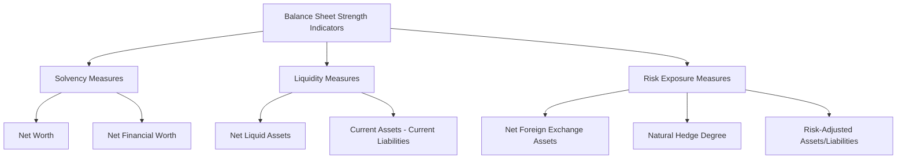

**Net Financial Worth** is calculated as total financial assets less liabilities, providing a measure that excludes non-financial assets which may be less liquid or more difficult to value accurately[^5]. This indicator offers insight into the government's capacity to meet obligations through readily convertible assets.

**Risk-Adjusted Assets and Liabilities** provide measures corrected for their underlying volatility or riskiness[^5]. This adjustment acknowledges that not all assets carry equal certainty of value realization, and not all liabilities present equal probability of crystallization.

**Net Liquid Assets** measure the liquidity mismatch between current assets and current liabilities, indicating the government's capacity to meet short-term obligations without distress sales of long-term assets[^5][^6].

**Net Foreign Exchange Assets** assess currency mismatches between foreign currency-denominated assets and liabilities, a critical risk factor for governments with significant international exposures[^5][^6].

**Natural Hedge Degree** measures the covariance between valuation changes in assets and liabilities[^5][^6]. A high degree of natural hedging indicates that asset and liability values move together, reducing overall balance sheet volatility.

Empirical research demonstrates that these balance sheet strength indicators carry significant macroeconomic implications. Financial markets consider government assets and net worth in addition to their liabilities when pricing sovereign bonds[^2][^5][^6]. Specifically, **a one percentage point of GDP increase in government net worth lowers sovereign bond yields by approximately 1.5 basis points**, an impact magnitude comparable to the effect of gross debt increases on yields[^2][^6]. This finding challenges the conventional focus on debt alone and suggests that asset accumulation or depletion cannot easily influence borrowing costs independently of their effect on net worth.

Furthermore, economies with stronger public sector balance sheets experience **shallower recessions and recover faster** in the aftermath of economic downturns[^2][^5][^6]. Analysis using local projections models on samples of advanced economies shows that countries entering a recession with strong initial balance sheets—defined as net financial worth above the sample median—are able to increase real per-capita government expenditure after a recession, thereby experiencing shallower and shorter downturns[^6]. This faster return to growth reflects the greater space for countercyclical fiscal policy available to governments with stronger balance sheets.

The case of **Kazakhstan** illustrates how balance sheet strength can provide crucial policy flexibility. Following the 2014 oil price shock, Kazakhstan's large sovereign wealth fund provided buffers that financed a fiscal stimulus amounting to **10% of GDP between 2014 and 2017**[^2][^5]. The country's assets and the natural hedge between assets and liabilities allowed authorities to provide this substantial stimulus without triggering a debt crisis.

### 1.4 The Role of Sovereign Wealth Funds in Government Wealth

Sovereign Wealth Funds (SWFs) represent dedicated investment pools owned by governments, constituting a critical component of governmental wealth for many of the world's most financially powerful states. According to the International Working Group (IWG) definition, SWFs are **special purpose investment funds or arrangements owned by the general government, created for macroeconomic purposes, that hold, manage, or administer assets to achieve financial objectives**[^7]. Total assets under management by SWFs amount to approximately **$3 trillion** based on the IWG definition, which excludes central bank reserves and state-owned enterprises[^8][^9].

SWFs are typically established from several sources: balance of payments surpluses, official foreign currency operations, privatization proceeds, fiscal surpluses, and commodity export receipts[^7]. This definition explicitly excludes foreign currency reserve assets held for traditional balance of payments purposes, operations of state-owned enterprises in their ordinary course, government-employee pension funds financed by contributions, and assets managed for individuals.

The taxonomy of SWFs reflects their diverse policy objectives:

| SWF Type | Primary Objective | Investment Horizon | Typical Asset Allocation |
|----------|-------------------|---------------------|--------------------------|
| **Stabilization Funds** | Smooth fiscal revenues against commodity price volatility | Short to medium | Largely liquid assets |
| **Savings Funds** | Preserve wealth for future generations | Very long | Higher equity allocation |
| **Development Funds** | Finance domestic economic development | Medium to long | Strategic domestic investments |
| **Pension Reserve Funds** | Meet future pension liabilities | Liability-driven | Matched to liability profile |
| **Reserve Investment Corporations** | Enhance returns on excess reserves | Long | Diversified global portfolios |

SWFs play an important role in macroeconomic management and ought to be in close coordination with other government institutions[^8][^9]. Their operations are closely linked to public finances, monetary policy, and external accounts. The assets and returns generated by SWFs can have significant impacts on fiscal policy space, monetary conditions, and external account balances. Consequently, SWF investment objectives must be consistent with the government's broad macrofiscal objectives, and their investment strategies should help alleviate phenomena such as the "Dutch Disease" while ensuring external stability[^8][^9].

The governance structures of SWFs vary considerably but share common elements essential for effective management. A robust legal framework is required to promote sound institutional and governance arrangements[^8][^9]. SWFs may be established as separate legal entities with their own legal personality, as state-owned corporations, or as pools of assets without separate legal identity managed within existing governmental structures. The two dominant institutional models are the "manager model," where an external entity manages assets under a mandate, and the "investment company model," where the SWF operates as an independent investment organization[^9].

The **Santiago Principles** (Generally Accepted Principles and Practices—GAPPs), presented by the International Working Group in October 2008, establish a coherent framework for SWF operations and reporting[^7]. These principles address governance, accountability, investment practices, and transparency. GAPP 5 specifically states that relevant statistical data pertaining to the SWF should be reported on a timely basis to the owner, or as otherwise required, for inclusion where appropriate in macroeconomic datasets[^7].

From a balance sheet perspective, SWFs represent a transformation of one form of national wealth into another—typically converting depleting natural resource wealth into diversified financial assets, or investing fiscal surpluses to generate returns for future generations. This transformation function is particularly significant for resource-rich countries where sovereign wealth funds serve to convert nonrenewable natural resource wealth into financial assets, thereby building "strategic reserves" beyond precautionary needs[^10].

### 1.5 The Sovereign Asset and Liability Management (SALM) Framework

Sovereign Asset and Liability Management (SALM) represents an expanded analytical framework applied to the sovereign balance sheet with the aim of ensuring sustainability through policies that address potential vulnerabilities, while attaining minimum financing costs and maximum asset returns within set risk limits[^11][^12]. The distinguishing element of this integrated approach is that management of assets and liabilities is coordinated based on the whole sovereign balance sheet, including the central government, the central bank, and other public sector entities such as state-owned enterprises and sovereign wealth funds[^10].

The rationale for SALM emerges from the recognition that **optimizing isolated sovereign liability or asset balance sheets is sub-optimal**[^11]. Managing different components of the sovereign balance sheet in isolation—public debt by the ministry of finance, foreign reserves by the central bank, sovereign wealth funds by separate entities, pension liabilities by pension funds, and public enterprises independently—creates potential vulnerabilities including currency mismatches, interest rate exposures, and liquidity risks that could be mitigated through coordinated management[^11][^12].

The SALM framework entails monitoring and quantifying the impact of economic and financial risks, including movements in foreign exchange rates, interest rates, inflation, and commodity prices[^12]. It helps manage potential long-run fiscal challenges from contingent liabilities and can identify natural hedges within the sovereign balance sheet that reduce overall risk exposure without requiring external hedging instruments[^13].

**Implementation of SALM** requires institutional coordination mechanisms. Uruguay provides an instructive example of SALM implementation, having anchored its framework in a **Public Debt Coordination Committee (PDCC)** created in 2016 between the Central Bank of Uruguay and the Ministry of Finance[^11][^12]. The PDCC coordinates debt management strategies, development of domestic markets, management of the consolidated balance sheet, and potential risk-mitigating strategies.

The SALM process in Uruguay involves several key elements:

1. **Risk Quantification**: Focus on currency exposure based on net balance sheet currency positions, identifying mismatches across different public sector sub-portfolios
2. **Strategy Development**: Identifying opportunities to better distribute risk across the public sector
3. **Implementation**: Coordinated actions such as:
   - Coordinated bond issuance between the sovereign and central bank to support cost/return objectives
   - Currency forward contracts between the central bank and state-owned enterprises to manage foreign exchange exposures
   - Risk offsetting arrangements for state-owned insurance companies

Uruguay's progress on SALM was facilitated by its **wide definition of "gross public sector debt,"** which includes the central bank and state-owned enterprises, evolution from informal to institutional coordination, and domestic market conditions that encouraged public entities to seek natural hedges within the sovereign balance sheet[^11][^12].

From a risk-return perspective, the SALM framework demonstrates that incorporating sovereign assets can shift the efficient frontier of borrowing strategies, allowing for approaches with lower costs and acceptable risk by identifying natural hedges[^13]. For example, foreign currency borrowing can be optimal if matched with foreign currency assets, as practiced by New Zealand. The conclusion from analytical models is that an integrated SALM approach improves the cost-risk trade-off of borrowing strategies, and debt management offices should assess sovereign assets to identify natural hedges and consider financial hedges to reduce market risk on the government balance sheet[^13].

The application of SALM extends to **disaster risk management**, where the framework helps assess the impact of natural disasters on the public sector balance sheet through assets and liabilities[^14]. New Zealand, an early adopter of SALM that published its first balance sheet in 1991, demonstrated the value of this approach during the Canterbury earthquake series (2010-2011), which caused damage estimated at NZD 40 billion (20% of GDP)[^14]. The country's Natural Disaster Fund and reinsurance arrangements limited the fiscal impact, with the disaster's recognized fiscal cost of NZD 15.1 billion (7.5% of GDP) resulting in public debt being only NZD 7.7 billion higher than it would otherwise have been, compared to an additional NZD 11.4 billion in borrowing that would have been required without these mechanisms[^14].

However, SALM is not suitable for all countries, as preconditions exist[^11][^12]. Fully developing a sovereign balance sheet may not always be feasible, and time is required to establish formal coordinating bodies. A separate entity, such as an expanded public debt management unit, may be desirable to implement strategic SALM analysis, which can serve as a monitoring device for the evolution of sovereign balance-sheet risks[^11].

### 1.6 Constructing a Multi-Dimensional Framework for Assessing Government Wealth

Synthesizing the preceding analysis, a comprehensive framework for identifying and comparing the world's wealthiest governments must integrate multiple dimensions that capture both the scale and quality of governmental financial positions. This framework moves beyond single-metric rankings to provide a nuanced assessment of governmental wealth that accounts for assets, liabilities, risk exposures, and management sophistication.

The proposed multi-dimensional framework encompasses the following core dimensions:

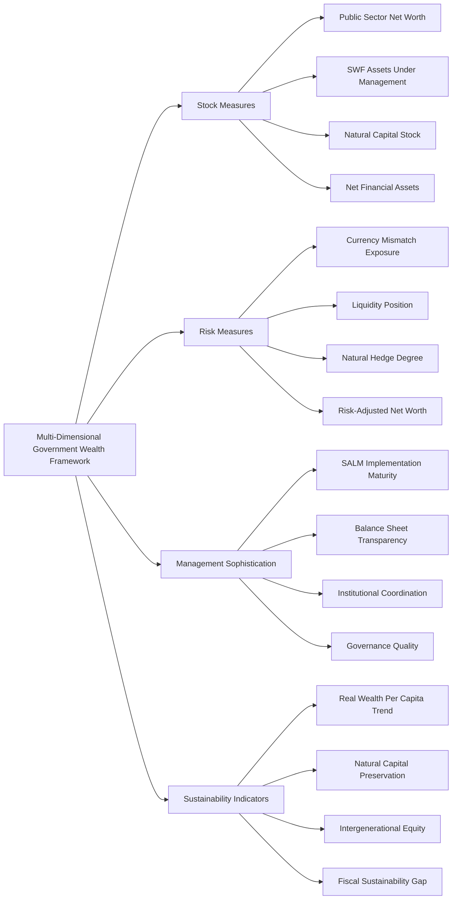

**Dimension 1: Stock Measures of Wealth**

The primary quantitative dimension focuses on the absolute and relative scale of governmental wealth positions:

- **Public Sector Net Worth (% of GDP)**: The fundamental solvency measure capturing total assets minus total liabilities
- **Sovereign Wealth Fund Assets**: Dedicated investment pools representing accumulated savings and strategic reserves
- **Natural Capital Stock**: The value of renewable and non-renewable natural resources under governmental jurisdiction
- **Net Financial Assets**: Liquid and near-liquid financial claims net of financial liabilities

**Dimension 2: Risk Exposure Measures**

Wealth without consideration of risk provides an incomplete picture. This dimension assesses:

- **Currency Mismatch**: Net foreign exchange asset position indicating exposure to exchange rate movements
- **Liquidity Position**: Net liquid assets indicating capacity to meet short-term obligations
- **Natural Hedge Degree**: Covariance between asset and liability valuations
- **Risk-Adjusted Measures**: Assets and liabilities corrected for underlying volatility

**Dimension 3: Management Sophistication**

The capacity to effectively manage governmental wealth depends on institutional arrangements and practices:

- **SALM Implementation**: Degree of integrated asset-liability management across government entities
- **Balance Sheet Transparency**: Quality and comprehensiveness of public reporting on assets and liabilities
- **Institutional Coordination**: Effectiveness of coordination mechanisms between entities managing different balance sheet components
- **Governance Quality**: Adherence to international standards such as the Santiago Principles for SWFs

**Dimension 4: Sustainability Indicators**

Long-term wealth preservation requires attention to sustainability:

- **Real Wealth Per Capita Trend**: Whether comprehensive wealth is growing or declining on a per-capita basis
- **Natural Capital Preservation**: Maintenance of renewable natural capital stocks
- **Intergenerational Equity**: Balance between current consumption and future wealth preservation
- **Fiscal Sustainability Gap**: Comparison of current wealth with projected future obligations

This framework acknowledges that the various measurement approaches—PSBS, SALM, SWF reporting, and CWON—serve different but complementary purposes. The IMF's PSBS framework provides the most comprehensive fiscal sustainability perspective, SALM offers the analytical tools for integrated portfolio risk management, SWF reporting under the Santiago Principles enhances transparency for dedicated investment pools, and the World Bank's CWON framework captures the broader development sustainability dimension including natural and human capital[^1].

Key integration challenges remain, particularly regarding the treatment of human capital (a major component of CWON but not recognized on public sector balance sheets), valuation methodologies for non-financial and natural assets, and the development of standardized risk-adjustment protocols. However, the framework provides a coherent analytical basis for subsequent chapters' examination of how the world's wealthiest governments—those with strong positions across these multiple dimensions—structure their investment portfolios, manage their sovereign assets, and pursue strategic objectives through their investment activities.

The empirical evidence strongly supports the value of this comprehensive approach. Countries that adopt balance sheet management practices—such as Australia, New Zealand, and the United Kingdom—use aggregated data to set overall fiscal policy goals, improve asset management to maximize efficiency and returns, and identify, analyze, and manage fiscal risks from within the balance sheet and from external shocks[^1]. This integrated approach to analyzing public wealth provides transparency to markets, accountability to citizens, and draws direct attention to what governments own as well as what they owe—a foundation essential for understanding how the world's wealthiest governments invest their substantial resources.

## 2 The Composition of Public Investment Portfolios

This chapter provides a comprehensive analysis of the diverse asset classes, investment vehicles, and allocation strategies that constitute government investment portfolios globally. Building upon the multi-dimensional wealth framework established in Chapter 1, this chapter examines how the world's wealthiest governments structure their holdings across domestic and international markets, financial and non-financial assets, and liquid and illiquid instruments. The analysis investigates the strategic rationale behind portfolio composition decisions, comparing approaches across different fund types and national contexts to identify common patterns and distinctive practices in sovereign asset allocation.

### 2.1 Asset Class Allocation Frameworks and Strategic Benchmarks

The world's wealthiest governments employ sophisticated asset allocation frameworks that serve as the foundational architecture for their investment portfolios. These frameworks establish the strategic parameters within which investment decisions are made, balancing the competing demands of return generation, risk management, and liquidity requirements. The examination of major sovereign investors reveals both convergent trends toward diversification and distinctive approaches shaped by each fund's unique mandate and circumstances.

**Norway's Government Pension Fund Global** represents one extreme of the allocation spectrum, maintaining an exceptionally high concentration in public equities. At the end of 2024, the fund's value composition stood at **71.4% equities (14,113 billion kroner), 26.6% fixed income (5,253 billion kroner), 1.8% unlisted real estate (364 billion kroner), and 0.1% unlisted renewable energy infrastructure (25 billion kroner)**[^15]. This allocation reflects a strategic benchmark index comprising 70% equities and 30% fixed income, with the Norwegian Ministry of Finance permitting deviations to invest in real assets and optimize cost-effective management[^16]. The fund's investment strategy has evolved through expert review, practical experience, and deep analysis, with major changes requiring parliamentary approval[^16]. The underlying philosophy leverages the fund's exceptionally long investment horizon and substantial scale—at the end of 2024, the fund was invested in **8,659 listed companies, 6,934 bonds from 1,507 issuers, 910 unlisted properties, and 7 investments in unlisted renewable energy infrastructure across 70 countries and 42 currencies**[^15].

**Singapore's GIC** employs a three-pillar framework that groups asset classes into Equities, Fixed Income, and Real Assets, covering holdings across both public and private markets. As of 31 March 2025, the asset mix stood at **51% equities, 26% fixed income, and 23% real assets**, compared to 46% equities, 32% fixed income, and 22% real assets as of March 2024[^17][^18]. This shift toward equities during the fiscal year reflects active portfolio management in response to market conditions. GIC's Policy Portfolio represents its long-term asset allocation strategy, designed to harvest risk premia in a balanced manner consistent with the client's risk tolerance, with target ranges of **40-70% for Equities, 15-35% for Fixed Income, and 10-30% for Real Assets**[^17][^18]. The framework explicitly acknowledges that diversification across assets, geographies, and time horizons is crucial for building portfolio resilience across a broad range of market conditions[^18].

**China Investment Corporation** has constructed a balanced portfolio across different asset classes including public equities, fixed income, alternative assets, and cash products. As of year-end 2023, CIC's global portfolio consisted of **public equity (33.13%), fixed income (16.46%), alternative assets (48.31%), and cash products and others (2.10%)**[^19][^20]. This allocation demonstrates CIC's distinctive emphasis on alternative investments, reflecting its strategy as a long-term institutional investor with a 10-year investment horizon[^17][^18]. The fund has developed a total portfolio allocation management framework tailored to its institutional needs, consisting of a reference portfolio, a policy portfolio, and the actual portfolio[^17][^18]. In 2024, amid a complex market environment characterized by persistent high interest rates, high inflation, and deepening macroeconomic paradigm shifts, CIC proactively refined its allocation management framework to build a more resilient, higher-quality, and sustainable portfolio[^17].

The following table summarizes the asset allocation frameworks of major sovereign investors:

| Sovereign Fund | Equities | Fixed Income | Real/Alternative Assets | Investment Horizon |
|----------------|----------|--------------|------------------------|-------------------|
| Norway GPFG | 71.4% | 26.6% | 1.9% (Real Estate + Renewables) | Very Long |
| Singapore GIC | 51% | 26% | 23% | 20-year rolling |
| China CIC | 33.1% | 16.5% | 48.3% + 2.1% cash | 10-year |
| Industry Average | ~38% | ~35% | ~25% | Varies |

The **emerging steady-state allocation pattern** across the sovereign wealth fund industry has stabilized at approximately **35-40-25 (fixed income/equities/private markets)**[^21]. This convergence reflects the maturation of sovereign investing as an asset class, with funds gravitating toward similar diversification principles despite different origins and mandates. The average 10-year return (2012-2022) for SWFs was 6.1%, though 2022 marked the first year since 2008 when SWFs on average reported a negative return of -11%, before markets rebounded in 2023 with expected returns of about 12%[^21].

The 2024 Invesco Global Sovereign Asset Management Study, based on insights from 83 sovereign wealth funds and 57 central banks managing approximately US$22 trillion, reveals current allocation trends and future intentions. In 2024, **SWF allocations to fixed income remained steady at 28%, while equity allocations increased to 32% from 30% the previous year**[^22][^23]. Illiquid alternatives accounted for 22% of total assets, with liquid alternatives and direct strategic investments at 4% and 10% respectively[^23]. A notable reversal in allocation intentions is emerging, with **net increases expected for equities, infrastructure, and commodities, but net decreases for cash, private equity, and real estate**[^22][^23]. This shift is driven by inflation and interest rate concerns, with 71% of respondents anticipating interest rates and bond yields to remain in the mid-single digits[^23].

### 2.2 Geographic Diversification and International Investment Patterns

Geographic diversification represents a fundamental principle of sovereign portfolio construction, enabling governments to capture global growth opportunities while managing country-specific risks. The distribution of capital across regions and currencies reflects both strategic objectives and practical considerations regarding market access, regulatory environments, and return expectations.

**GIC's geographic allocation** demonstrates a significant concentration in developed markets, particularly North America. As of 31 March 2025, the portfolio was distributed as **49% in the Americas, 20% in Europe, Middle East, and Africa, 24% in Asia Pacific, and 7% globally**[^17][^18]. This represents a notable shift from March 2024, when allocations were 44% Americas, 20% EMEA, 28% Asia Pacific, and 8% global[^17][^18]. Within equities, GIC increased its investments in the United States, which **continues to be GIC's largest market in terms of capital deployment**[^17][^18]. This concentration reflects the depth and liquidity of US capital markets, the strong performance of US technology stocks, and GIC's assessment of relative growth prospects across regions.

**Temasek's portfolio** maintains a distinctive Asia-anchored approach while achieving substantial exposure to developed economies. As of 31 March 2025, Temasek's net portfolio value was **S$434 billion**, with **66% underlying exposure to developed economies**[^24][^13]. The geographic composition by underlying country exposure reveals a diversified but Asia-centric allocation: **Singapore (26%), China (19%), Americas (17%), Europe, Middle East & Africa (12%), Asia ex-Singapore & China (11%), Australasia (9%), and Others & Liquidity Assets (6%)**[^24]. The currency denomination of the portfolio as of March 2025 was: **Singapore Dollar (24%), US Dollar (42%), Chinese Renminbi (10%), Euro (6%), Indian Rupee (4%), Other Asian Currencies (4%), and Other Currencies (10%)**[^24].

**China Investment Corporation** pursues global diversification while expanding its international footprint. CIC International (Hong Kong) continues to play a key role in supporting the company's business, while the New York representative office serves as an important communication, outreach, and support hub[^17]. The London representative office was formally registered in December 2024, advancing the company's overseas investment business through facilitating communication, conducting research analysis, and supporting project acquisition, due diligence, and post-investment management[^17]. CIC was established with the intent of using China's foreign exchange reserves for investments abroad that are higher risk and higher reward than government bonds, with funding resulting from the state's use of leverage through Ministry of Finance bond issuance[^25].

**Norway's Government Pension Fund Global** maintains the most globally diversified portfolio among major sovereign investors, with investments spanning **70 countries and 42 currencies**[^15]. The fund's equity investments consist of ownership shares in approximately 8,500 companies worldwide, representing on average **1.5% of all listed companies**[^26]. This extreme diversification reflects the fund's mandate to capture global growth and value creation broadly, with its investment strategy based on achieving broad exposure to international markets[^16].

**Emerging markets are attracting increasing interest** from sovereign investors, with a selective approach seen as key to navigating diverse risk profiles across developing economies. The 2024 Invesco study reveals that **India emerges as a top priority destination**, with **88% of SWFs expressing interest in increasing their exposure to Indian debt**, a substantial rise from 66% in 2022[^22][^23]. Geopolitical tensions and supply chain realignment are expected to benefit emerging markets, leading SWFs to adopt a more differentiated approach. **Asia (ex-China) is the top regional priority for 83% of SWFs**, followed by Latin America at 53%[^22]. Over half of surveyed SWFs invest in emerging market debt, recognizing the diversification benefits and yield opportunities these markets offer[^23].

The following diagram illustrates the geographic allocation patterns across major sovereign investors:

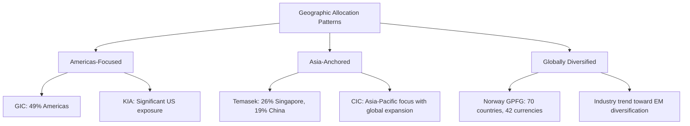

**Central banks are also bolstering and diversifying reserves** amid global uncertainty, with 53% planning to increase the size of their reserves and 52% planning additional diversification[^22]. Concerns about the weaponization of reserves and rising US debt levels are increasing gold's appeal; **56% of central banks agree reserves weaponization makes gold more attractive, and 48% believe rising US debt levels increase its appeal**[^22]. The proportion of central banks with an allocation to emerging markets (ex-China) of 5% or more is projected to increase from 7% in 2022 to **34% in five years**[^22][^23].

### 2.3 Sovereign Wealth Fund Typologies and Investment Mandates

The diverse origins and policy objectives of sovereign wealth funds shape their investment strategies, risk profiles, and operational structures in fundamental ways. Understanding these typologies provides essential context for analyzing portfolio composition decisions and performance expectations across different fund categories.

**Resource-based funds** represent the original model of sovereign wealth accumulation, transforming finite commodity revenues into perpetual financial capital. **Norway's Government Pension Fund Global** exemplifies this approach, funded by petroleum revenues and managed with an explicit intergenerational savings mandate. The fund's investment strategy is designed to create strong returns and safeguard wealth for future generations, leveraging its long-term horizon and substantial scale[^16]. The fund returned **13.1 percent, or a record-high 2,511 billion kroner, in 2024**, with the fund's value increasing by 3,985 billion kroner—the largest increase in krone terms in its history[^15][^27]. US technology stocks contributed most to the positive return on equity investments, driven by strong demand for AI-based advertising and chat solutions and their semiconductors[^15].

**Kuwait Investment Authority** represents the world's oldest sovereign wealth fund, tracing its origins to the Kuwait Investment Board established in 1953 following the commencement of commercial oil exports in 1951[^28][^29]. The government recognized early that dependence on a single finite commodity posed significant economic risks, leading to the establishment of dedicated investment structures. KIA manages two distinct funds with different mandates: the **General Reserve Fund (GRF)** and the **Future Generations Fund (FGF)**[^30][^31][^18].

The **General Reserve Fund** serves as the Government's Public Treasury, consolidating state proceeds and providing financing for government expenditures. In this capacity, the GRF underpins fiscal flexibility, ensuring the Government can meet its financing needs while smoothing the impact of fiscal and economic shocks[^30][^31]. Beyond this stabilization role, the GRF manages a broad portfolio of assets supporting national economic development goals, extending to co-investing and seeding across priority sectors such as **technology, power and energy, tourism and entertainment, services, industry, transportation and logistics, telecommunications, healthcare, infrastructure, financial institutions, and real estate**[^30][^31].

The **Future Generations Fund**, established by Amiri Decree in 1976, serves as the flagship intergenerational savings platform[^30][^31][^28]. The FGF was initially funded with 50% of the savings transferred from the GRF at that time, and by law receives **a minimum of 10% of all state revenues annually**[^28][^29]. The FGF consists of investments outside Kuwait based on an approved Strategic Asset Allocation across various asset classes ranging from traditional assets such as equities and bonds to alternatives including private equity, real estate, and infrastructure[^30][^31]. **No assets can be withdrawn from the FGF unless sanctioned by law**, and all investment income is reinvested as required by law[^30][^31]. This structural separation creates protection for long-term investments; during Kuwait's severe fiscal pressure period (2015-2020), when oil prices collapsed and government deficits reached 10-15% of GDP, the FGF remained untouched and minimum allocations continued[^29].

KIA operates under distinctive investment constraints that differentiate it from many peer funds. The fund is **constitutionally prohibited from borrowing for investment purposes and does not use any derivative products as investment vehicles**[^30][^31][^20]. KIA is a commercially driven entity that invests only in projects with clearly defined profitability targets, while avoiding sectors where gaming and alcohol are the main business[^20]. As of late 2023, the Sovereign Wealth Fund Institute estimated that KIA had one of the world's largest sovereign funds with more than **$803 billion in assets**, with a March 2024 Bloomberg report stating that Kuwait has invested more than half of this amount in the United States across a wide portfolio[^32]. By 2025, KIA's assets have grown to over **USD 1 trillion**, reflecting strategic diversification across asset types, geographic locations, and sectoral focuses[^29].

**Non-commodity sovereign funds** operate with different funding mechanisms and strategic orientations. **Singapore's investment framework** is distinctive for employing a three-entity model covering a full risk spectrum. The Monetary Authority of Singapore (MAS) is the most conservative of the three investment entities, with a significant proportion of its portfolio invested in liquid financial market instruments. **GIC is a fairly conservative investor** with a globally diversified portfolio spread across various asset classes, with most investments in public markets and a smaller component in alternative investments such as private equity and real estate. **Temasek aims to maximize shareholder value over the long term** and is exposed to significantly higher risk than GIC and MAS but has also delivered higher returns over time as expected[^33].

GIC was established in 1981 during Singapore's formative years, driven by a vision to create an entity dedicated to investing Singapore's surplus reserves for better long-term returns[^20]. Its purpose is to grow Singapore's reserves to ensure the country's financial security and safeguard the sovereignty of a fledgling nation. Part of the long-term returns from reserves is channeled into the annual Budget through the Net Investment Returns Contribution (NIRC), with **up to 50% of GIC's net investment returns flowing back to Singapore's Budget**[^20]. For the 20-year period from 1 April 2005 to 31 March 2025, the annualized US$ nominal return of GIC's portfolio was **5.7%**, and after adjusting for global inflation, the annualized 20-year real return was **3.8%**[^17][^18].

**China Investment Corporation** was established in 2007 with about US$200 billion of assets under management, growing to **US$1.33 trillion in assets under management as of March 2025**[^25]. CIC serves as a vehicle to diversify China's foreign exchange holdings and seek maximum returns for its shareholder within acceptable risk tolerance[^17][^18]. As a long-term financial investor, CIC invests globally and independently, applying annualized rolling returns as its key performance metric. As of December 31, 2024, CIC's **annualized cumulative 10-year net return stood at 6.92%**, beating the 10-year performance target by 61 basis points[^17][^18]. Its annualized cumulative net return since inception stood at **6.39%**[^17][^18].

The following table compares key characteristics across fund typologies:

| Characteristic | Resource-Based (Norway, Kuwait) | Non-Commodity (Singapore, China) |
|----------------|--------------------------------|----------------------------------|
| **Funding Source** | Commodity export revenues | Fiscal surpluses, FX reserves |
| **Primary Mandate** | Intergenerational savings | Reserve management, returns |
| **Domestic Investment** | Generally prohibited (FGF) or limited | Strategic domestic exposure permitted |
| **Risk Profile** | Varies by fund structure | Varies by entity mandate |
| **Transparency** | High (Norway) to Low (Kuwait) | Moderate to High |

### 2.4 Alternative Investments and Private Market Strategies

The allocation to alternative investments has emerged as a defining characteristic of sophisticated sovereign portfolios, reflecting the pursuit of illiquidity premiums, diversification benefits, and access to growth opportunities unavailable in public markets. The scale and composition of alternative allocations vary significantly across funds, shaped by investment capabilities, risk tolerance, and strategic priorities.

**China Investment Corporation** stands out for its exceptionally high allocation to alternatives. As of year-end 2023, alternative assets comprised **48.31% of CIC's global portfolio**[^19][^20]. The fund invests almost half of its assets in alternatives, pursuing a strategy that emphasizes private market opportunities across multiple dimensions[^34][^35][^36][^37]. In 2024, CIC restructured its public equity portfolio, deepened management of private markets partnerships, and enhanced resilience within its real estate allocation[^34][^35][^36][^37]. The fund's approach to private markets encompasses several strategic priorities:

- **Private Equity and Private Credit**: CIC actively pursues thematic investment opportunities, particularly in priority industries, while expanding co-investment partnerships[^17][^18]
- **Real Estate**: Focus on enhancing portfolio resilience against inflation and economic cycles[^17][^18]
- **Infrastructure**: Steady increases in investment in priority regions to promote connectivity[^17][^18]
- **Sustainable Energy**: Alignment with Dual Carbon Goals and strengthened energy transition investments[^17][^18]

**Regional variations in alternative allocations** reveal distinctive investment cultures and capabilities. Investment funds from the **Middle East and North Africa (MENA) region have had a strong tilt towards private markets, specifically private equity**, with total private allocation as of 2023 approximately **25% higher than in other well-represented regions**[^21]. This elevated allocation reflects both the substantial capital available from resource revenues and the strategic objectives of economic diversification pursued by Gulf sovereign funds.

**Fund size materially influences alternative allocations**. Large funds with assets under management above US$50 billion invest more in private markets compared with small funds (**28% versus 19%**)[^21]. Smaller funds allocate differently, with a notably greater share toward fixed income, reflecting both liquidity requirements and the operational challenges of building private market investment capabilities at smaller scale.

The 2024 Invesco study reveals evolving trends in alternative allocations. Within alternatives, **private equity allocations decreased to 7.0% from 7.4%** in the previous year, and **real estate allocations fell to 7.6% from 8.0%**[^23]. Conversely, **infrastructure allocations rose to 7.7% from 7.1%**, and **hedge funds/absolute return funds increased to 2.9% from 2.5%** in 2023[^23]. Commodities allocations remained relatively stable at 0.8%[^23].

**Private credit has emerged as a particularly dynamic area** of sovereign investment. The higher rate environment has boosted the appeal of private credit, with **56% of SWFs now investing in it**, primarily through funds, and **two-thirds planning to increase allocations**[^22][^23]. SWFs are reallocating to private credit primarily from fixed income (34%), public equities (26%), and private equity (24%)[^22]. Within private credit, SWFs favor **infrastructure debt (51%), real estate debt (50%), and corporate direct lending (29%)** in developed markets, while also exploring opportunities in emerging markets[^22]. Within real estate debt specifically, there is growing interest in mezzanine debt for enhanced yield[^22].

**Investment vehicles and operational structures** for accessing private markets have evolved significantly. The Kuwait Investment Authority invests mostly through external fund managers and has established a series of specialized standalone entities to excel in certain asset classes[^30][^31][^18]. While the mandate for KIO in London allows it to trade directly, KIA's approach emphasizes partnerships with leading global managers[^30][^31]. The Kuwait Investment Office in London predates Kuwait's independence, with investment professionals split into various asset classes investing directly in equities, fixed income, and alternatives including infrastructure and real estate across the globe[^38].

**QIA's investment approach** exemplifies the multi-channel strategy employed by sophisticated sovereign investors. QIA maintains partner-like relationships with some of the world's top investment managers, using externally managed funds to generate co-investment opportunities, particularly via private equity and real estate funds, and to complement internal investments by creating exposure to non-core asset classes such as hedge funds and venture capital[^39]. QIA follows a rigorous four-stage approach for each investment, whether direct or through funds[^39].

The strategic rationale for alternative allocations encompasses several dimensions:

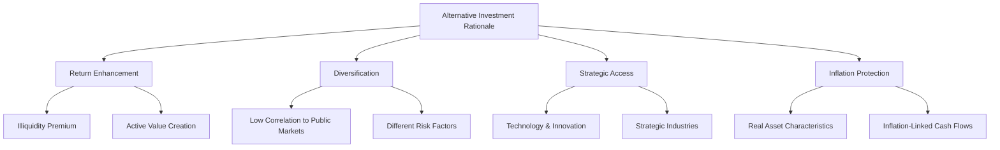

### 2.5 Infrastructure and Real Asset Investment Strategies

Infrastructure and real assets constitute a strategically important component of sovereign portfolios, providing inflation protection, stable income streams, and exposure to essential economic activities. The allocation to physical assets varies considerably across funds, reflecting different mandates, risk tolerances, and investment capabilities.

**Norway's Government Pension Fund Global** maintains a relatively modest but growing allocation to real assets. At the end of the third quarter 2025, the fund's asset allocation included **unlisted real estate at 1.8% of total investments (368 billion kroner)** and **unlisted renewable energy infrastructure at 0.4% (83 billion kroner)**[^26]. The fund has been invested in equities and fixed-income instruments since 1998, with the first investment in unlisted real estate made in 2011 and the first investment in unlisted renewable energy infrastructure made in 2021[^26]. The management mandate allows the fund to invest up to **7% of assets in unlisted real estate** and up to **2% in renewable energy infrastructure**[^16].

The fund's real estate investments involve office and logistics properties in traditional large sectors, with gradual increases in investments in emerging and high-growth sectors to achieve industry diversification[^16]. In renewable energy, the fund is building a diversified portfolio across technologies and geographies, directly investing in wind and solar power generation, with increasing investments in distribution and storage as opportunities emerge[^16]. The strategic rationale for real assets emphasizes that **with longer-term inflation risks still apparent, real assets provide long-term returns less correlated to public markets, improve the portfolio's inflation resilience with their inflation-linked cash flows, and reduce portfolio volatility**[^40].

**GIC's 23% allocation to real assets** represents a substantially larger commitment to physical assets than Norway's approach. GIC groups real assets as one of three broad asset classes alongside equities and fixed income, recognizing their role in providing exposure to inflation and their distinct return characteristics[^17][^18]. The investment outlook acknowledges that **real estate valuations are potentially bottoming, presenting attractive investment opportunities**[^40]. GIC's framework emphasizes that real assets serve multiple portfolio functions: generating inflation-linked returns, providing diversification from public market volatility, and offering access to economic activities not available through listed securities.

**CIC's infrastructure and real estate strategies** reflect alignment with China's broader economic and environmental objectives. In infrastructure, CIC steadily increases investment in priority regions to promote connectivity[^17][^18]. In sustainable energy, CIC aligns with the **Dual Carbon Goals** and has strengthened energy transition investments[^17][^18]. The fund's approach to real estate focuses on enhancing portfolio resilience against inflation and economic cycles[^17][^18]. CIC's significant real estate investments have included acquiring stakes in London's Songbird Estates (parent company of Canary Wharf Group) in 2009, Winchester House in London for $389 million in 2012, a 10% stake in Heathrow Airport Holdings for $726 million in 2012, Chiswick Business Park in London for about £800 million in 2014, a 45% stake in 1221 Avenue of the Americas, New York City, for $1 billion in 2016, and the European warehouse company Logicor for **$13.49 billion** in 2017[^25].

**QIA's infrastructure investments** cover income-producing infrastructure, utilities, and transportation infrastructure globally. The infrastructure assets in QIA's portfolio help connect people, businesses, and markets[^39]. QIA's real estate team invests in a diverse range of assets, with global teams taking a proactive approach to secure new world-class investment opportunities while creating positive impact for the communities where investments are made[^39].

**Climate-aligned investing** has become an increasingly important dimension of real asset strategies. KIA is a founding member of the **One Planet Sovereign Wealth Fund Working Group**, established on December 12th, 2017, which published a framework of principles in July 2018 to integrate climate change analysis into investment management[^28]. CIC has developed its distinctive sustainable investment model and formulated a carbon neutrality action plan, integrating carbon peaking and carbon neutrality goals into its investment approach[^20]. The broader sovereign wealth fund community is increasingly incorporating climate considerations into real asset allocation decisions, recognizing both the risks of climate transition and the opportunities in sustainable infrastructure.

The following table summarizes real asset allocations across major sovereign investors:

| Fund | Real Estate Allocation | Infrastructure Allocation | Strategic Focus |
|------|----------------------|--------------------------|-----------------|
| Norway GPFG | 1.8% | 0.4% (Renewables) | Global diversification, ESG integration |
| Singapore GIC | Part of 23% Real Assets | Part of 23% Real Assets | Inflation protection, diversification |
| China CIC | Part of 48% Alternatives | Part of 48% Alternatives | Dual Carbon Goals, connectivity |
| Industry Average | 7.6% | 7.7% | Increasing emphasis on infrastructure |

### 2.6 State-Owned Enterprises and Strategic Domestic Holdings

Direct government ownership in strategic enterprises represents a distinctive component of certain sovereign investment portfolios, combining commercial return objectives with broader national economic development goals. This approach is particularly pronounced among non-commodity sovereign funds that maintain significant domestic investment mandates.

**Temasek Holdings** exemplifies the strategic domestic holdings model, maintaining concentrated ownership positions in Singapore's national champion companies. As of 31 March 2025, Temasek's major investments in Singapore state-owned or significant enterprises include[^24][^13]:

| Company | Shareholding | Valuation Metric |
|---------|--------------|------------------|
| DBS Group Holdings Ltd | 28% | S$132.2 billion market cap |
| Singapore Telecommunications Limited | 51% | S$56.6 billion market cap |
| Singapore Airlines Limited | 53% | S$20.2 billion market cap |
| Singapore Technologies Engineering Ltd | 51% | S$21.2 billion market cap |
| Keppel Ltd. | 20% | S$12.5 billion market cap |
| Sembcorp Industries Ltd | 50% | S$11.3 billion market cap |
| CapitaLand Group Pte. Ltd. | 100% | S$13.5 billion shareholder equity |
| Mapletree Investments Pte Ltd | 100% | S$18.7 billion shareholder equity |
| PSA International Pte Ltd | 100% | S$15.9 billion shareholder equity |
| Singapore Power Limited | 100% | S$12.6 billion shareholder equity |
| SMRT Corporation Ltd | 100% | S$1.0 billion shareholder equity |

Temasek's portfolio composition by sector reflects this strategic domestic orientation combined with global diversification. As of 31 March 2025, the sector allocation based on underlying assets was: **Financial Services (28%), Telecommunications, Media & Technology (21%), Transportation & Industrials (19%), Consumer & Real Estate (14%), Life Sciences & Agri-Food (9%), Multi-Sector Funds (6%), and Credit (3%)**[^24]. The Transportation & Industrials sector encompasses Energy & Resources[^13].

Temasek operates with a **commercial mandate**, owning and managing its own assets on a commercial basis to deliver sustainable returns over the long term[^41]. Investment, divestment, and business decisions are directed by its Board and management, with a professional management team guided by a Board comprising majority non-executive independent private sector business leaders from across the world[^41]. The Singapore Government does not guarantee Temasek's debt, and Temasek maintains strong credit ratings of **Aaa (Stable) by Moody's and AAA (Stable) by S&P**[^41].

The **liquidity profile** of Temasek's portfolio as of 31 March 2025 reveals the balance between liquid and strategic holdings: **Liquid Assets (12%) and Illiquid Assets (88%)**[^24]. This high proportion of illiquid assets reflects the concentrated positions in strategic enterprises that serve both commercial and national development purposes. The portfolio's exposure to structural trends as of 31 March 2025 demonstrates forward-looking strategic positioning: **Sustainable Living (39%), Longer Life Expectancies (22%), Future of Consumption (19%), Sharper Lives (11%), and Others (9%)**[^24].

**Kuwait's General Reserve Fund** represents a different model of strategic domestic investment, combining fiscal stabilization with economic development objectives. The GRF's role extends beyond ownership to co-investing and seeding across priority sectors including **technology, power and energy, tourism and entertainment, services, industry, transportation and logistics, telecommunications, healthcare, infrastructure, financial institutions, and real estate**[^30][^31][^18]. The GRF's investment strategy is designed to generate sustainable commercial returns while advancing national priorities, fostering private sector participation, and supporting economic diversification[^30][^31]. These dual functions—fiscal stabilization and strategic investment—reinforce Kuwait's resilience and support value creation in alignment with national priorities[^30][^31].

**Saudi Arabia's Public Investment Fund** represents perhaps the most ambitious expansion of the strategic domestic holdings model. PIF's strategy is directly mandated to realize Vision 2030, including its second pillar "Thriving Economy"[^26]. As a leading economic catalyst for Saudi Arabia, the PIF Program epitomizes the country's vision to diversify the economy and invest locally and internationally. The fund's asset allocation as of December 31, 2024, was **80% local investments, 17% international investments, and 2% treasury**, with assets under management of **$912 billion** and one-year performance of 7.20 percent[^39].

PIF's targets and ambitions include a **60% share of Local Content** including PIF and its portfolio companies, a cumulative non-oil GDP contribution of **$320 billion**, the creation of **1.8 million direct and indirect jobs**, and Assets Under Management of **$1.7 trillion**[^26]. Key initiatives for 2021-2025 encompass sectors including Aerospace & Defense, Automotive, Construction & Building Components, Consumer Goods and Retail, Entertainment, Leisure & Sports, Financial Services, Food and Agriculture, Healthcare, Metals and Mining, Real Estate, Telecom, Media and Technology, Transport and Logistics, and Utilities & Renewables[^26]. PIF plans to unveil a new long-term strategy extending to 2040 and beyond, as it looks to boost investment returns, bolster the local economy, and drive the kingdom's push to diversify away from oil[^42].

**Abu Dhabi's Mubadala** operates as a sovereign investor managing a diversified asset portfolio across multiple industries and geographies, with assets under management exceeding **$330 billion**[^42]. Mubadala has invested in disruptive technologies for decades, with investments spanning foundation models, infrastructure, and applications[^42]. The fund's AI strategy is built around three pillars: working smarter (enhancing operational efficiency), investing better (leveraging AI to optimize the investment lifecycle), and accelerating impact (driving value creation in portfolio companies)[^42]. Mubadala is actively integrating AI technologies to enhance its own operations and improve efficiency, reflecting the broader trend of sovereign funds adopting advanced technologies for competitive advantage[^42].

The governance structures for managing state-owned enterprise portfolios vary across jurisdictions but share common elements of balancing commercial objectives with public policy goals. **Australia's Future Fund** provides an instructive model for managing agency issues in sovereign investment. The fund sees its long horizon as a key ingredient for generating high returns through the ability to take on greater levels of market risk, accept capital being locked up in illiquid assets, and be countercyclical, patient, and opportunistic[^39]. Future Fund addresses agency problems through aligned organizational settings, building understanding through engagement, design of incentives focused on portfolio performance rather than short-term results, and commitment to the long term[^39]. The "one portfolio" approach is central, with remuneration for all employees partly based on entire portfolio performance to boost alignment of everyone's interest[^39].

The strategic rationale for maintaining significant state-owned enterprise holdings encompasses multiple dimensions beyond pure financial returns:

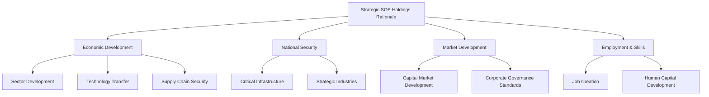

The comparative analysis of portfolio composition across the world's wealthiest governments reveals both convergent trends and distinctive approaches shaped by fund origins, mandates, and national contexts. The emerging pattern suggests a maturation of sovereign investing toward diversified portfolios spanning public and private markets, with increasing emphasis on alternatives, infrastructure, and climate-aligned investments, while maintaining flexibility for strategic domestic holdings where national development objectives warrant concentrated positions.

## 3 Frameworks for Managing Sovereign Wealth: SALM and Institutional Governance

This chapter examines the adoption, implementation, and effectiveness of Sovereign Asset and Liability Management (SALM) frameworks as integrated approaches to managing government balance sheets. Building on the portfolio composition analysis in Chapter 2, this chapter investigates how wealthy governments coordinate the management of assets and liabilities across multiple institutions to optimize risk-adjusted returns, ensure fiscal sustainability, and build policy buffers against economic shocks. The analysis compares advanced implementation cases with fragmented approaches, identifying critical success factors and institutional prerequisites for effective sovereign balance sheet management.

### 3.1 Conceptual Foundations and Rationale for Integrated Balance Sheet Management

The management of sovereign wealth extends far beyond the selection of individual assets or the minimization of borrowing costs in isolation. Sovereign Asset and Liability Management (SALM) represents an expanded analytical framework applied to the sovereign balance sheet with the aim of ensuring sustainability through policies that address potential vulnerabilities, while attaining **minimum financing costs and maximum asset returns within set risk limits**[^43]. The distinguishing element of this integrated approach is that management of assets and liabilities is coordinated based on the whole sovereign balance sheet, encompassing the central government, central bank, and other public sector entities including state-owned enterprises and sovereign wealth funds[^44].

The fundamental rationale for SALM emerges from a straightforward but powerful insight: **from the risk-return perspective, it is suboptimal to optimize isolated balance sheets rather than the consolidated sovereign balance sheet**[^45]. In almost every country, the institutions that manage sovereign assets are different from those that oversee liabilities, often with clearly separate mandates—asset managers typically aim to maximize returns while liability managers seek to minimize funding costs[^46]. While these individual objectives appear rational in isolation, pursuing them independently can create vulnerabilities that would be avoidable through coordinated management.

The core analytical framework of SALM entails monitoring and quantifying the impact of economic and financial risks, including movements in foreign exchange rates, interest rates, inflation, and commodity prices[^47]. This monitoring serves dual purposes: for assets, the goal is to maximize returns given the country's risk tolerance, and for liabilities, to minimize costs subject to an acceptable level of risk[^43]. The integration of these perspectives allows identification of **mismatches in the financial characteristics of sovereign assets and liabilities** that may expose the sovereign to risks, including interest rate and exchange rate risks[^48].

A particularly valuable aspect of the SALM approach is its capacity to identify and leverage **natural hedges** within the sovereign balance sheet. Natural hedges occur when the financial characteristics of assets and liabilities move together in response to economic shocks, thereby reducing overall balance sheet volatility without requiring external hedging instruments. For example, if a government holds substantial foreign currency assets while also maintaining foreign currency debt, movements in exchange rates affect both sides of the balance sheet, potentially offsetting gains and losses. The SALM framework systematically identifies such relationships and informs strategies to strengthen them[^49].

The process of SALM analysis requires examining the sovereign balance sheet as comprising multiple sub-portfolios—government debt, international reserves, state-owned enterprises, fiscal revenues and expenditures, pension liabilities, and sovereign wealth funds—that are typically managed by different institutions with distinct mandates[^49]. A comprehensive balance sheet approach helps capture overall vulnerabilities and prospects that would remain hidden when examining these components in isolation[^50]. This holistic perspective can reveal critical risks such as **currency mismatches, where high foreign currency debt is not matched by foreign currency assets**, exposing the sovereign to exchange rate depreciation risk[^49].

Sound macroeconomic management requires entities with different policy-making mandates to coordinate, ensuring consistency and reinforcing all policies while continuing to provide resilience against economic shocks[^46]. Having a holistic view of the sovereign balance sheet paints a complete picture for analyzing and managing the potential risks and opportunities for the financial position of the government. Critically, as long as the roles, objectives, and resources of the institutions involved in SALM are clear, **a SALM approach could ensure appropriate coordination in the management of assets and liabilities across institutions while continuing to maintain each institution's independence**[^46].

The following diagram illustrates the conceptual architecture of the SALM framework:

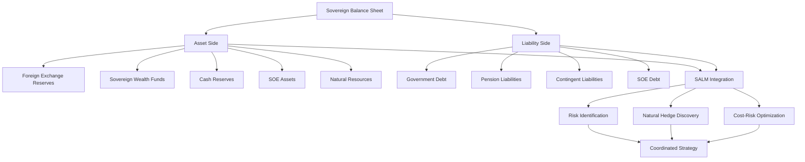

The SALM framework also provides an opportunity to conduct **sovereign portfolio stress testing**, allowing countries to optimally manage their sovereign debt and asset portfolios[^46]. This capability is particularly valuable for identifying vulnerabilities before they materialize into crises, enabling proactive risk mitigation rather than reactive crisis management. By analyzing how different scenarios—currency depreciation, interest rate spikes, commodity price collapses, or natural disasters—would affect both sides of the balance sheet simultaneously, governments can develop more robust fiscal strategies and build appropriate policy buffers.

### 3.2 Institutional Architecture and Coordination Mechanisms

The implementation of SALM faces a fundamental structural challenge: management of the various components of the sovereign balance sheet is typically entrusted to different government entities, each operating under distinct mandates, governance structures, and institutional cultures[^47]. Debt management offices focus on minimizing borrowing costs, central banks prioritize monetary stability and reserve adequacy, sovereign wealth funds pursue return maximization within risk constraints, and state-owned enterprises operate under commercial objectives. This fragmentation creates what one analysis characterizes as **"practical, governance and political challenges"** for integrated balance sheet management[^10].

The government is composed of a wide range of administrations and agencies, each managing sub-portfolio balance sheets based on their own objectives, functions, and legally sanctioned mandates[^10]. Foreign reserve management, for instance, is typically conducted by the central bank, which operates independently from fiscal policy. Although this separation of monetary and fiscal policy may improve effectiveness in normal times, **it can make successful cooperation on risk management more difficult since the objectives are quite different**[^10]. The central bank's mandate to maintain price stability and external balance may conflict with the debt management office's objective of minimizing borrowing costs, particularly when decisions about currency composition of debt or reserves are involved.

To address these institutional challenges, the SALM operational toolkit emphasizes **coordination mechanisms** as essential infrastructure. The IMF emphasizes that enhanced sovereign risk monitoring requires collaboration and information sharing across key institutions and may require cross-institutional arrangements such as coordination committees[^10]. These mechanisms serve to bridge institutional boundaries without eliminating the operational independence that makes each entity effective in its primary mandate.

Several models of coordination have emerged in practice:

**Formal Coordination Committees** represent the most structured approach to inter-institutional coordination. Uruguay's **Public Debt Coordination Committee (PDCC)**, created in 2016 between the Ministry of Finance and the Central Bank, exemplifies this model[^47]. The adoption of a formal PDCC significantly improved the coordinated approach to a more systematic adoption of risk-mitigation strategies of the public-sector balance sheet, facilitating transactions between different parts of the public sector[^43]. The committee structure provides a regular forum for information sharing, joint risk assessment, and coordinated strategy development while preserving each institution's operational autonomy.

**Dedicated ALM Units within Debt Management Offices** offer another coordination model. South Africa has established an Asset Liability Management division within the National Treasury responsible for managing the government's asset and liability portfolio[^10]. Within the Turkish Treasury, a **Debt and Risk Management Committee** was created in 2002 to set debt management strategies within the SALM framework[^10]. These units serve as focal points for collecting information, organizing meetings with relevant departments, and conducting integrated risk analysis across balance sheet components.

**Macro-prudential Committees** comprising key financial institutions represent a broader coordination structure that can encompass SALM functions. Some countries have established such committees for prudent financial oversight regarding overall balance sheet risks—examples include Chile, Mexico, Turkey, the United Kingdom, and the United States[^10]. These committees typically comprise the central bank, supervisory authorities, the Ministry of Finance, and the Treasury, pursuing policy coordination through information sharing and discussions, sometimes supported by expert-level working groups[^10].

The following table summarizes key coordination mechanisms and their characteristics:

| Mechanism Type | Primary Function | Country Examples | Key Strengths |
|----------------|------------------|------------------|---------------|
| **Coordination Committees** | Joint strategy development, information sharing | Uruguay (PDCC), Chile | Formal mandate, regular engagement |
| **Dedicated ALM Units** | Integrated risk analysis, strategy coordination | South Africa, Turkey | Technical expertise, focused mandate |
| **Macro-prudential Committees** | Broad financial oversight including SALM | UK, US, Mexico | High-level authority, systemic perspective |
| **Joint Management Arrangements** | Shared operational responsibility | Denmark | Deep integration, aligned incentives |

A critical question in SALM implementation is **to what extent the management of balance sheet risks should be centralized**[^10]. Full centralization would consolidate all risk management decisions in a single entity, potentially optimizing outcomes but creating governance and political challenges. Partial centralization maintains institutional autonomy while establishing mechanisms for coordination on specific risk dimensions. The practical answer in most countries lies between these extremes, with coordination mechanisms enabling joint analysis and strategy development while preserving operational independence.

Financing guidelines designed by debt management offices can serve as an effective tool to manage the overall credit risk exposure of the government, providing specific rules and limits for guarantee and Public-Private Partnership agreements of ministries, local governments, and state-owned enterprises[^10]. This approach extends SALM principles beyond the core government balance sheet to encompass the broader public sector without requiring full institutional consolidation.

The successful implementation of SALM has implications for institutional arrangements that evolve over time. Since much of the central government's risk management expertise lies with debt managers, **debt management offices are considered well-placed to assess the risk profile of the overall sovereign balance sheet**[^10]. An ALM unit responsible for strategic decisions and coordination across government agencies is favored by many practitioners. However, such arrangements do not need to be structured from the start; refinements can be done in successive phases as institutional capacity develops and the benefits of coordination become apparent.

### 3.3 Advanced Implementation Models: New Zealand and Denmark

Among the world's sovereign wealth managers, **New Zealand stands as the pioneer of fully integrated SALM implementation**, having published its first comprehensive government balance sheet in 1991 and subsequently developing sophisticated analytical capabilities for balance sheet risk management. The New Zealand Treasury conducts sovereign balance sheet risk analyses to support its fiscal, balance sheet, and debt management strategies[^32]. The New Zealand Debt Management Office (NZDMO), operating as a unit within the Treasury, aims to optimize Crown balance sheet risk and return outcomes over the long term, having adopted a broader sovereign asset-liability management approach to public debt management that accounts for total Crown risk and return[^32].

The institutional architecture in New Zealand reflects deep integration of asset and liability management functions. The Treasury serves as the government's lead economic and financial advisor, with the NZDMO overseeing the Government's borrowing requirements while aiming to minimize costs and keeping risk at appropriate levels[^32]. Critically, the Balance Sheet function within Treasury assesses financial risks across the Crown's balance sheet and formulates an ALM framework for the Crown as a whole. This function uses stress tests to measure and monitor total Crown risk exposures, with the resulting information informing policy advice, fiscal strategy, and debt management decisions[^32].

A defining feature of New Zealand's SALM implementation is the **explicit use of natural hedges to manage currency risk**. The NZDMO manages both assets and liabilities using a comprehensive, accrual-based government balance sheet[^51]. A key practice involves immunizing the Reserve Bank's foreign exchange reserves with NZDMO's foreign currency debt to maintain a **net zero foreign-currency debt position**—a natural hedge against currency risk[^51]. This approach recognizes that while the government may need to hold foreign currency reserves for liquidity and intervention purposes, the exchange rate risk associated with these holdings can be offset by maintaining equivalent foreign currency liabilities.

The Balance Sheet function constructs its analysis using a comprehensive government balance sheet derived from monthly financial statements and semi-annual fiscal forecasts[^32]. Financial risk is managed with consideration of total Crown interest rate and currency risk, enabling integrated assessment of how policy decisions affect the overall balance sheet position. The NZDMO combines core debt management and treasury services, with debt management including issuing treasury bills and government bonds and managing cash and liquidity, while treasury services include intermediating risk for departments and Crown entities[^32].

**Denmark** provides another exemplary case of advanced SALM implementation, operating through a distinctive joint management arrangement between the Ministry of Finance and Danmarks Nationalbank. Government debt management is a shared responsibility, with the overall borrowing and debt management strategy determined by the Ministry of Finance and Nationalbank at quarterly meetings, while management operations are executed by the Government Debt Management department within the Nationalbank on behalf of the Ministry[^52]. This arrangement facilitates integrated risk management by placing asset and liability management capabilities within the same institution.

The Danish model demonstrates sophisticated application of SALM principles across multiple risk dimensions. The **interest rate risk of government debt is managed on a consolidated basis**, with the assets of government funds—largely invested in government bonds—acting as a natural hedge against liabilities[^51]. As of 2012, government funds had a face value of DKK 110.3 billion, with 64% of total value invested in government bonds[^52]. This structure means that when interest rates change, the value movements in fund assets offset corresponding changes in the value of government liabilities, reducing overall balance sheet volatility.

Duration management in Denmark employs quantitative risk modeling. A **duration target for the consolidated portfolio is set annually using a Cost-at-Risk (CaR) model**, with the issuance strategy focusing on 10-year domestic government bonds while the overall portfolio duration is managed via interest rate swaps[^51]. The 2013 average duration target was 10 years, reflecting a preference for longer-duration exposure that reduces refinancing risk while accepting some interest rate sensitivity[^52].

**Exchange rate risk management** in Denmark illustrates cross-institutional coordination in practice. Government debt and foreign exchange reserves have been managed jointly since 1992[^53]. Since debt managers only issue domestic debt, the Nationalbank conducts currency swaps to manage foreign reserve composition[^51]. Additionally, the Nationalbank hedges exchange rate risk on US dollar-denominated military procurements through forward contracts[^53]. This comprehensive approach ensures that currency exposures across different government activities are considered holistically rather than managed in isolation.

Refinancing risk receives explicit attention through Denmark's **liquidity buffer policy**. To mitigate refinancing risk, a level of cash reserves sufficient to service one year of debt repayments is maintained[^53]. This strategy can be viewed as a natural hedge against the balance sheet's refinancing risk exposure, ensuring that temporary market disruptions cannot force the government into distressed borrowing[^52].

The Danish approach extends SALM principles to the broader public sector through guidance mechanisms. Government Debt Management at the Nationalbank formulates general guidelines for borrowing by government-owned companies with access to government guarantees and on-lending facilities[^52]. These guidelines establish activity principles ensuring that these companies do not take on risks the central government would typically avoid, with annual meetings held to review compliance and coordination[^53].

The following table compares key features of the New Zealand and Denmark SALM implementations:

| Feature | New Zealand | Denmark |
|---------|-------------|---------|
| **Institutional Structure** | NZDMO within Treasury | Joint MoF-Nationalbank management |
| **Balance Sheet Coverage** | Comprehensive Crown balance sheet | Consolidated government portfolio |
| **Currency Risk Management** | Net zero FX debt position | Domestic-only debt issuance with swap management |
| **Interest Rate Management** | Total Crown interest rate risk | Consolidated duration targeting via CaR model |
| **Natural Hedges** | FX reserves matched with FX debt | Fund assets in government bonds |
| **Refinancing Risk** | Integrated cash management | One-year liquidity buffer policy |
| **SOE Coordination** | Risk intermediation services | Borrowing guidelines and annual reviews |

The experiences of New Zealand and Denmark reveal several **transferable lessons** for other sovereigns considering SALM implementation. First, institutional arrangements matter—whether through integration within a single entity (New Zealand) or formalized joint management (Denmark), effective SALM requires clear mechanisms for coordinated decision-making. Second, natural hedges provide powerful risk mitigation without the costs and complexities of derivative hedging. Third, comprehensive data and accrual-based accounting enable the analytical foundation for meaningful SALM analysis. Fourth, gradual evolution is feasible—both countries developed their frameworks over decades rather than implementing comprehensive systems immediately.

### 3.4 Emerging Market and Developing Country Approaches

The implementation of SALM frameworks in emerging markets and developing countries presents both heightened importance and greater challenges compared to advanced economies. Developing countries may face **greater vulnerability to external shocks** due to less diversified economies, shallower financial markets, and more volatile capital flows, making integrated balance sheet management potentially more valuable[^49]. However, these same characteristics create obstacles including limited data availability, weaker technical capacity, and less developed institutional frameworks for inter-agency coordination.

**Uruguay** provides the most instructive case study of successful SALM implementation in an emerging market context. Authorities in Uruguay take an integrated asset-liability management approach to risk management of the country's overall public sector portfolio, which encompasses the wider public sector including state-owned enterprises and the Central Bank of Uruguay[^47]. The SALM approach explores whether the financial characteristics associated with public sector assets can provide insights for managing the cost and risk of the government's liabilities[^43].

The implementation of Uruguay's SALM framework has been institutionally anchored in the **Public Debt Coordination Committee (PDCC)** created in 2016 between the Ministry of Finance and the Central Bank[^47]. The adoption of a formal PDCC significantly improved the coordinated approach to systematic risk-mitigation strategies of the public-sector balance sheet, facilitating transactions between different parts of the public sector[^43]. This institutional evolution—from informal coordination to formalized committee structure—illustrates the gradual approach that may be most practical for developing countries.

Uruguay's SALM analysis revealed **balance sheet currency mismatches across public sector sub-portfolios** that would have remained hidden under fragmented management[^47]. The general government and non-financial state-owned enterprises were found to be exposed to real depreciation of the exchange rate—meaning their financial position would deteriorate if the peso weakened. Conversely, the Central Bank was exposed to real appreciation of the exchange rate. The state-owned insurance bank faced a different mismatch, being exposed to increases in real wages due to its obligation to provide annuities indexed to wages[^47].

The strategy developed through the PDCC involves **identifying opportunities to better distribute currency risk across different institutions in the public sector**—a process termed cross-sectoral natural and financial hedging[^47]. Specific implementations include:

- **Currency forward contracts** established between the Central Bank and state-owned electricity and oil companies (which have offsetting foreign exchange exposures) to support management of exposures in the energy sector[^47]. This represents risk mitigation through natural hedges across the balance sheet, with the central bank using its balance sheet to provide hedges to state-owned enterprises.

- **Coordinated bond issuance and liability management operations** between the sovereign and the Central Bank to support the cost/return objectives of both entities[^43]. This coordination ensures that debt management decisions consider their implications for the central bank's balance sheet and vice versa.

- **Risk management product development** for the state-owned insurance company to offset the risk involved in its obligation to provide wage-indexed annuities to pensioners, leading authorities to promote development of local debt markets and risk management products[^43].

Uruguay's progress on SALM was facilitated by several enabling factors. The country adopted a **wide definition of "gross public sector debt"** that includes the central bank and state-owned enterprises, providing the comprehensive scope necessary for meaningful SALM analysis[^47]. The framework evolved from informal coordination to institutional setting with the establishment of the PDCC. Notably, the **lack of hedging instruments in the local market** forced public entities to seek solutions through natural hedges within the sovereign balance sheet, demonstrating that SALM can be valuable precisely in contexts where sophisticated financial markets are unavailable[^47].

**Turkey** provides another important case of post-crisis SALM adoption in an emerging market. Following the severe 2001 financial crisis, Turkey implemented comprehensive reforms establishing centralized risk management within the Undersecretariat of Treasury[^51]. A **Risk Management Unit and a Debt and Risk Management Committee** were established in 2002 to set debt management strategies within the SALM framework[^10]. Strategic benchmarks were developed prioritizing the **reduction of foreign currency-denominated debt and floating-rate securities**, addressing the vulnerabilities that had contributed to the crisis[^51].

Turkey's approach incorporated key SALM elements including a liquidity buffer policy and net debt indicators for monitoring balance sheet health[^51]. The Treasury centrally manages main financial assets and liabilities, enabling integrated risk assessment[^51]. The Turkish experience demonstrates how crisis episodes can create political momentum for institutional reforms that would otherwise face resistance, though it also illustrates the importance of sustaining these frameworks during subsequent periods of stability.

For developing countries more broadly, the academic and practitioner literature recommends a **stepwise approach to SALM implementation** that recognizes practical constraints[^50]. This approach involves several phases:

**Phase 1: Conceptual Framework Development**
Initially, priority balance sheet areas should be identified and assessed within a conceptual framework from vulnerability and management perspectives[^49]. A good starting point is considering financial assets like cash reserves or wealth funds managed by Debt Management Offices, as well as future assets and liabilities[^51]. Simple analysis should be preferred over complex modeling at this stage, focusing on identifying the most significant mismatches and vulnerabilities[^50].

**Phase 2: Simplified Risk Analysis**
In the second stage, simplified risk analysis can be applied to elaborate mismatches and determine appropriate hedging options[^49]. This analysis need not require comprehensive data or sophisticated modeling; conceptual balance sheet frameworks can provide significant information about exposures even without full data[^53].

**Phase 3: Institutional Development**
To address communication and governance challenges among government institutions, establishing new structures—certain departments and coordinating committees—is recommended[^49]. These structures can be refined in successive phases as capacity develops and the benefits of coordination become apparent[^10].

The following table summarizes the recommended stepwise approach:

| Phase | Focus Areas | Key Activities | Capacity Requirements |
|-------|-------------|----------------|----------------------|
| **Phase 1** | Conceptual framework | Identify priority areas, assess vulnerabilities | Basic balance sheet understanding |
| **Phase 2** | Simplified analysis | Elaborate mismatches, identify hedging options | Basic risk analysis capability |
| **Phase 3** | Institutional development | Establish coordination mechanisms, build capacity | Inter-agency cooperation framework |

**Passive hedging strategies** are considered more appropriate for developing countries than active hedging with derivatives[^51]. Natural hedges for currency risk—such as matching foreign currency debt with foreign currency assets or revenues—and liquidity buffers for refinancing risk can be implemented without sophisticated financial market infrastructure[^53]. These approaches provide meaningful risk reduction while avoiding the complexity, costs, and counterparty risks associated with derivative instruments.

### 3.5 Operational Challenges: Data, Valuation, and Technical Capacity

The practical implementation of SALM frameworks confronts substantial operational obstacles that explain why comprehensive adoption remains limited despite the conceptual appeal of integrated balance sheet management. A World Bank survey conducted in coordination with the OECD and IMF, examining 28 countries across advanced economies, emerging markets, and developing countries, found that while **almost all respondent countries produce a balance sheet to monitor the overall financial position of the government, only six of them (21 percent) use that balance sheet to determine and monitor mismatches between sovereign assets and liabilities**[^10]. This gap between balance sheet production and SALM utilization reflects the significant challenges involved in moving from data compilation to analytical application.

**Data compilation** represents the first major operational difficulty. Many countries lack comprehensive, homogeneous sovereign balance sheet data that would enable meaningful SALM analysis[^49]. The challenges include:

- **Fragmented data sources**: Different government entities maintain separate accounting systems with varying standards, making consolidation difficult
- **Inconsistent valuation methods**: Some entities use accrual-based accounting while others use cash-based or modified cash-based methods, creating comparability problems
- **Incomplete coverage**: Contingent liabilities, implicit obligations, and certain asset categories may not be systematically recorded

The Serbia case study from the World Bank's SALM and disaster risk analysis illustrates these data challenges. Serbia does not prepare comprehensive balance sheets and uses a modified cash-based accounting system[^54]. When analyzing the fiscal impact of the 2014 floods, data on post-disaster expenditures were limited and fragmented, hampering comprehensive assessment of the disaster's balance sheet implications[^54].

**Valuation of non-financial assets and future items** presents particular complexity. While financial assets and liabilities can typically be valued using market prices or present value calculations, non-financial assets such as infrastructure, land, and natural resources require different methodologies that may be more subjective[^49]. Future items like fiscal revenues and expenditures involve forecasting that introduces additional uncertainty. The valuation of contingent liabilities—guarantees, legal claims, implicit commitments—is especially challenging given the probabilistic nature of these obligations.

The contrast between **accrual accounting and cash accounting** systems significantly affects SALM capability. The World Bank's comparative analysis concludes that **accrual accounting provides higher-quality information about the value of government assets susceptible to disaster risk compared to cash accounting**[^54]. New Zealand's comprehensive SALM implementation is built on accrual-based government financial statements that enable meaningful balance sheet analysis. Countries using cash-based systems face additional hurdles in developing SALM capabilities, as they must first reform their accounting frameworks or develop parallel systems for balance sheet analysis.

**Technical capacity constraints** compound data challenges, particularly in developing countries. Sophisticated SALM analysis requires specialist staff capable of conducting risk quantification, scenario analysis, and portfolio optimization[^49]. The institutional capacity challenges involve the need for advanced technical systems for risk analysis, which may be limited in developing countries[^49]. Building this capacity requires sustained investment in human capital development, analytical infrastructure, and institutional knowledge management.

The survey findings reveal the institutional challenges that countries cite as obstacles to effective SALM framework design and implementation. These challenges include **institutional arrangements, uncertain or lacking mandate, coordination between institutions, data availability, and valuation of assets**[^10]. The multiplicity of challenges suggests that SALM implementation requires addressing multiple dimensions simultaneously rather than solving individual problems in sequence.

Despite these challenges, meaningful progress is possible through pragmatic approaches. The literature emphasizes that **countries starting to consider SALM should begin with simple analysis, such as debt analysis**, rather than attempting comprehensive implementation immediately[^54]. A conceptual SALM framework can provide significant information about exposures without requiring full data, enabling identification of major vulnerabilities and natural hedge opportunities even with incomplete information[^53].

Practical solutions for overcoming operational challenges include:

**Standardized reporting frameworks** that establish common definitions and methodologies across government entities, facilitating data consolidation even when full accounting harmonization is not feasible.

**Phased data development** that prioritizes the most important balance sheet components—typically government debt, foreign reserves, and major financial assets—while gradually expanding coverage to other areas.

**Capacity building programs** such as the World Bank Treasury's B-RISK (Sovereign Balance Sheet Risk Management) Program, which provides advisory, training, and operational support to help clients develop frameworks for joint management of financial assets and liabilities[^46]. The program is designed in modules allowing clients to customize engagement levels, from assessment and reform planning through capacity development to operational support.

**Simplified analytical approaches** that extract useful insights from available data without requiring comprehensive modeling. Net debt indicators, currency composition analysis, and maturity profiles can reveal important vulnerabilities even without sophisticated risk modeling.

The following diagram illustrates the hierarchy of operational challenges and potential solutions:

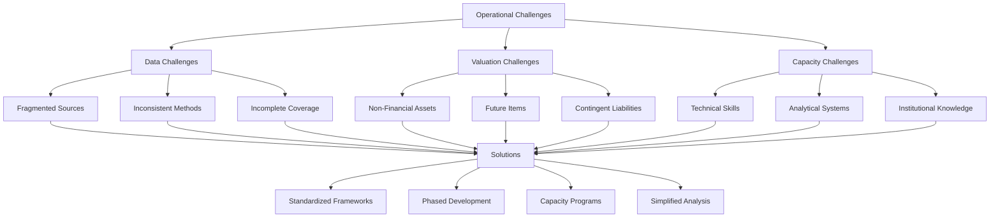

### 3.6 SALM Applications for Fiscal Resilience and Disaster Risk Management

The SALM framework demonstrates particular value in enhancing sovereign resilience against economic shocks and natural disasters—events that can rapidly deteriorate government financial positions if not anticipated and managed proactively. Applying the Sovereign Asset and Liability Management framework is a comprehensive way of looking at the potential impact of a disaster on the public sector balance sheet through assets and liabilities[^54]. This application extends SALM beyond routine financial risk management to encompass catastrophic risk preparedness.

The analytical framework identifies **three channels through which natural disasters impact SALM**[^54]:

1. **Impact on the value of public sector assets and liabilities**: Disasters can destroy or damage government-owned infrastructure, buildings, and other physical assets while potentially triggering changes in liability values through interest rate movements or credit rating changes.

2. **Direct fiscal costs**: These include the cost to rebuild damaged infrastructure and the triggering of contingent liabilities such as government guarantees, insurance obligations, or emergency assistance commitments.

3. **Indirect fiscal costs**: Disasters affect government revenues through economic disruption and may require changes in non-disaster expenditures as resources are redirected to response and recovery.

**New Zealand's Canterbury earthquake series (2010-2011)** provides the most comprehensive case study of SALM's value for disaster risk management. The cost of damage was estimated at approximately **NZD 40 billion, equivalent to 20 percent of GDP**[^54]. Despite this catastrophic scale, the earthquake had very little negative impact on the national macro-economy in the short run, attributed to high insurance coverage, minimal damage to key economic sectors, and monetary policy easing[^54].

The SALM framework's value is evident in how New Zealand's pre-positioned financial mechanisms mitigated fiscal impact. The insurance liability totaled just over **NZD 32 billion**, with the government-backed Earthquake Commission (EQC) bearing around NZD 11.4 billion[^54]. Both the EQC and private insurers had substantial reinsurance in international markets, meaning that **claims on foreign reinsurers improved the net international investment position of New Zealand by around eight percentage points of GDP**[^54]. This outcome illustrates how appropriate financial structuring can transform a domestic disaster into an international risk-sharing event.

The **Natural Disaster Fund (NDF)**, managed by the EQC, was completely depleted for the first time in its history but served its intended purpose of shielding the government from additional borrowing[^54]. The establishment of the **Canterbury Earthquake Recovery Fund (CERF)** helped provide transparency in tracking disaster-related fiscal flows. By June 2017, the disaster's recognized impact on government financial statements totaled NZD 15.1 billion, with the public sector's net worth NZD 12.1 billion lower and public debt NZD 7.7 billion higher than if the earthquakes had not occurred[^54].

New Zealand's Treasury also conducted **stress testing for a potential severe earthquake in Wellington**, demonstrating the forward-looking application of SALM for disaster preparedness. The scenario projected a total impact on the government's finances of **NZD 68 billion**, with indirect fiscal costs comprising the largest share[^54]. The level of central government debt was projected to be 13 percent of GDP higher than baseline under this scenario, providing policymakers with concrete estimates for contingency planning.

**Peru's 2017 coastal El Niño flooding** illustrates SALM application in an emerging market context. The flooding caused damages estimated at **US$3 billion (1.6% of GDP)**, with a reconstruction plan allocated at S/. 26.7 billion (US$7.8 billion, 3% of GDP)[^54]. Peru's financial strategy utilized its **Stabilization Fund (FEF)**, from which US$2.8 billion was mobilized over 2017-2019[^54]. The analysis estimated the event led to a decrease in net worth of S/. 13.2 billion and an increase in debt of S/. 2.5 billion over 2017-2019, demonstrating the balance sheet perspective's value for comprehensive impact assessment.

**Serbia's 2014 floods**, considered the most severe in 120 years, provide a contrasting case illustrating the costs of inadequate financial preparedness. Damages and losses were estimated at **€1.7 billion (4.8% of GDP)**[^54]. Without comprehensive balance sheets and with limited post-disaster expenditure data, assessment of the fiscal impact was challenging. Public debt levels increased from 61.1% of GDP in 2013 to 71.9% in 2014. Critically, **insurance claims amounted to less than 2.5% of total damages and losses**, highlighting an underdeveloped insurance market that left most disaster costs on the public sector balance sheet[^54].

The comparative case studies demonstrate several key lessons for SALM application to disaster risk management:

| Country | Disaster | Damage (% GDP) | Key Financial Mechanisms | Balance Sheet Impact |
|---------|----------|----------------|-------------------------|---------------------|
| **New Zealand** | Canterbury Earthquakes | 20% | EQC, NDF, Reinsurance | Net worth -12.1bn, Debt +7.7bn |
| **Peru** | El Niño Flooding | 1.6% | Stabilization Fund | Net worth -13.2bn, Debt +2.5bn |
| **Serbia** | 2014 Floods | 4.8% | Limited insurance | Debt +10.8pp of GDP |

The case studies demonstrate that **estimating the potential impact of disasters is complex, requiring significant data and modeling**[^54]. However, viable mechanisms for post-disaster response can have high payoffs. Reserve funds, like those in Peru and New Zealand, can mitigate the need to borrow after an event. Reinsurance played a major role in reducing the economic impact in New Zealand. The establishment of specific institutions to oversee the response in Peru and New Zealand made it easier to track expenditure and maintain fiscal transparency[^54].

The application of SALM can increase countries' resilience to financial shocks from disaster risk by **improving the understanding of impacts on both sides of the sovereign balance sheet**[^54]. This understanding enables more effective pre-positioning of financial mechanisms—reserve funds, insurance arrangements, contingent credit facilities—that can absorb disaster impacts without forcing distressed borrowing or fiscal contraction during recovery periods.

### 3.7 Performance Implications and Risk-Return Optimization

The ultimate test of SALM frameworks lies in their impact on sovereign financial outcomes—whether integrated balance sheet management actually delivers superior risk-adjusted results compared to fragmented approaches. The empirical evidence, while still developing given the relatively recent adoption of comprehensive SALM by most countries, supports the theoretical expectation that coordinated management improves the cost-risk trade-off facing sovereigns.

The core performance implication of SALM is that **incorporating sovereign assets can shift the efficient frontier of borrowing strategies**, allowing for approaches with lower costs at acceptable risk levels by identifying natural hedges[^51]. Traditional debt management focuses solely on minimizing borrowing costs subject to risk constraints, treating the liability side of the balance sheet in isolation. SALM expands this optimization to consider how asset characteristics can offset liability risks, potentially enabling debt strategies that would appear suboptimal from a liability-only perspective but prove superior when the full balance sheet is considered.

For example, **foreign currency borrowing can be optimal if matched with foreign currency assets**, as practiced by New Zealand[^51]. From a pure liability management perspective, foreign currency debt introduces exchange rate risk that domestic currency borrowing would avoid. However, if the sovereign holds substantial foreign currency reserves, the exchange rate risk on debt is offset by corresponding gains or losses on assets, making the consolidated position less risky than it appears when examining liabilities alone. This insight fundamentally changes the strategic calculus for debt management.

The relationship between **balance sheet strength indicators and macroeconomic outcomes** provides broader evidence for SALM's value. Research demonstrates that economies with stronger public sector balance sheets experience **shallower recessions and recover faster** in the aftermath of economic downturns. Countries entering recessions with strong initial balance sheets—defined as net financial worth above the sample median—are able to increase real per-capita government expenditure after a recession, thereby experiencing shallower and shorter downturns. This faster return to growth reflects the greater space for countercyclical fiscal policy available to governments with stronger balance sheets.

**Kazakhstan's response to the 2014 oil price shock** illustrates this dynamic in practice. The country's large sovereign wealth fund provided buffers that financed a fiscal stimulus amounting to **10% of GDP between 2014 and 2017**. The country's assets and the natural hedge between assets and liabilities allowed authorities to provide this substantial stimulus without triggering a debt crisis, demonstrating how accumulated wealth and appropriate risk management enable policy flexibility during adverse shocks.

Financial markets incorporate balance sheet strength into sovereign risk assessments, creating tangible cost implications. Research shows that **a one percentage point of GDP increase in government net worth lowers sovereign bond yields by approximately 1.5 basis points**, an impact magnitude comparable to the effect of gross debt increases on yields. This finding challenges the conventional focus on debt alone and suggests that asset accumulation or depletion influences borrowing costs independently of debt levels. Sovereigns that build assets while managing liabilities effectively can expect lower financing costs over time.

The SALM framework enables sovereigns to achieve identified risk levels through several mechanisms[^46]:

- **Matching asset and liability characteristics**: Aligning the currency composition, interest rate sensitivity, and maturity profiles of assets and liabilities to create natural hedges
- **Employing financial derivatives where appropriate**: Using swaps, forwards, and options to transform risk exposures when natural hedges are insufficient
- **Conducting portfolio stress testing**: Analyzing how different scenarios would affect the consolidated balance sheet to identify vulnerabilities and optimize positioning

Denmark's experience demonstrates quantitative risk management within the SALM framework. Duration targets for the consolidated portfolio are set using **Cost-at-Risk (CaR) models** that estimate potential cost increases under adverse interest rate scenarios[^52]. The portfolio duration is then managed through interest rate swaps to achieve the target risk level. This approach enables explicit risk-return trade-offs rather than implicit acceptance of whatever risk profile emerges from debt issuance decisions alone.

The **performance measurement challenges** in SALM should be acknowledged. Unlike private sector asset-liability management where market values provide clear benchmarks, sovereign balance sheets include components that are difficult to value and compare. Non-financial assets, contingent liabilities, and future fiscal flows lack market prices, making comprehensive performance assessment challenging. However, this measurement difficulty does not diminish the value of SALM; it simply means that performance assessment must rely on multiple indicators rather than single metrics.

The following framework summarizes the performance dimensions affected by SALM implementation:

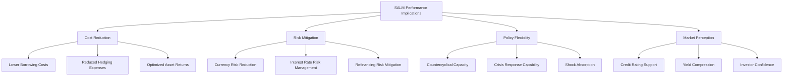

For the world's wealthiest governments examined in this report, SALM frameworks represent an essential component of sophisticated wealth management. The evidence from advanced implementers like New Zealand and Denmark, emerging market adopters like Uruguay and Turkey, and the broader empirical literature consistently supports the value of integrated balance sheet management. While implementation challenges remain significant—particularly regarding data, institutional coordination, and technical capacity—the performance implications justify sustained investment in developing SALM capabilities. The framework enables sovereigns to **optimize the cost-risk trade-off of their borrowing strategies, build resilience against economic and disaster shocks, and maintain the policy flexibility that accumulated wealth should provide**.

## 4 Strategic Objectives and Economic Impacts of Government Investments

This chapter examines the multifaceted purposes driving sovereign investment decisions, analyzing how the world's wealthiest governments balance competing objectives across fiscal stabilization, intergenerational wealth preservation, pension liability funding, and economic development. The analysis investigates strategic dimensions including technology and resource access, international initiative financing, and geopolitical influence enhancement, while critically assessing the inherent trade-offs between financial returns, development goals, and political objectives that shape portfolio construction and asset allocation decisions.

### 4.1 Fiscal Stabilization and Revenue Smoothing Objectives

Sovereign wealth funds designed for fiscal stabilization represent one of the oldest and most clearly defined categories of government investment, serving as **counter-cyclical fiscal tools established to insulate or smooth economies from internal and external economic shocks**[^4]. These funds address a fundamental vulnerability faced by resource-dependent economies: the volatility of commodity prices that can cause dramatic swings in government revenues, creating boom-bust cycles that destabilize budgets, exchange rates, and broader economic activity. The stabilization mandate fundamentally shapes every aspect of portfolio construction, from asset selection to liquidity management, creating investment profiles distinctly different from funds pursuing return maximization.

The operational logic of stabilization funds follows a straightforward pattern: **they receive revenues when resource prices are high and are drawn upon when prices fall to spread the decline in government spending over multiple periods**. This mechanism is critically important because of the substantial adjustment costs associated with changing government spending—rapid fiscal contractions can trigger recessions, while sudden expansions may fuel inflation and misallocation. Countries that have accumulated stabilization funds can use them to smoothly adjust government spending without needing to turn to debt markets during periods of stress, providing essential policy flexibility when it is most needed.

The investment characteristics of stabilization-oriented portfolios reflect their primary function. Stabilization funds are specifically mandated to insulate their home economies from macroeconomic shocks and smooth government revenue streams, which means these funds **tend to have short investment horizons and high liquidity orientations, largely limiting their investable universe to cash and equivalents, short and long-dated bonds, and money market instruments**[^4]. This conservative positioning ensures that assets can be rapidly converted to cash when fiscal needs arise, without suffering the forced-sale losses that would occur if illiquid assets had to be liquidated during market stress.

Russia provides an instructive example of effective stabilization fund design. As a major oil and gas exporter with significant exposure to energy price volatility, Russia established **an effective oil stabilization fund whose mandate is to mitigate the impact to domestic budgets and exchange rates from downswings brought about by periods of low oil and gas prices**[^4]. The fund's conservative investment approach—focused on liquid, high-quality fixed income instruments—ensures that resources remain available precisely when they are needed most, even if this means accepting lower returns during periods of high commodity prices.

The trade-off inherent in stabilization fund design is explicit and intentional: **these funds sacrifice higher potential returns in exchange for liquidity and stability**. While savings funds with transgenerational horizons can pursue equity-heavy portfolios and accept short-term volatility, stabilization funds must maintain portfolios that can be drawn upon at any time without significant value impairment. This positioning means stabilization funds typically generate lower long-term returns than their savings-oriented counterparts, but this is the appropriate outcome given their mandate—the value they provide comes from fiscal smoothing and economic stabilization, not return maximization.

The IMF's framework for categorizing sovereign wealth funds identifies stabilization funds as having **investment horizons and risk/return trade-offs fundamentally different from savings funds**[^55]. Where stabilization objectives dominate, the fund would put more emphasis on liquidity and have a shorter-term investment horizon than funds with saving objectives where liquidity needs are low. This distinction has profound implications for portfolio construction: a stabilization fund holding significant equity or illiquid alternative investments would be failing its mandate, regardless of the potential return enhancement such allocations might offer.

The experience of commodity-dependent economies during the 2014-2016 oil price collapse illustrates the value of properly structured stabilization mechanisms. Countries with accumulated stabilization funds could draw on these resources to smooth fiscal adjustment, while those without such buffers faced more severe fiscal contractions or rapid debt accumulation. **Now that the recent commodity price boom is over, countries with sovereign wealth funds will be seeing the benefit of buffering government spending**, while those without must use the opportunity to prepare for future volatility[^56]. The Norwegian experience in the late 1980s, when an oil price collapse precipitated a recession and banking crisis, created the political will needed to establish what became one of the world's most successful sovereign wealth funds—demonstrating that the pain of poor stabilization policy can catalyze institutional reform.

Kuwait's dual-fund structure illustrates how stabilization and savings objectives can be institutionally separated within a single sovereign wealth framework. The **General Reserve Fund serves as the Government's Public Treasury, consolidating state proceeds and providing financing for government expenditures**[^18]. In this capacity, the GRF underpins fiscal flexibility, ensuring that the Government can meet its financing needs while smoothing the impact of fiscal and economic shocks. This stabilization function is explicitly distinguished from the Future Generations Fund's intergenerational savings mandate, with different investment strategies, governance arrangements, and withdrawal rules appropriate to each objective.

The effectiveness of stabilization funds depends critically on governance arrangements that prevent premature drawdowns during periods when stabilization is not genuinely required. Without robust rules governing accumulation and withdrawal, political pressures may lead to fund depletion during periods of moderate stress, leaving insufficient resources for severe downturns. The design challenge is establishing mechanisms that provide flexibility for genuine stabilization needs while preventing the fund from becoming a general financing source that undermines its counter-cyclical purpose.

### 4.2 Intergenerational Savings and Wealth Preservation Mandates

Savings and future generation funds represent the most ambitious form of sovereign wealth management, seeking to **convert non-renewable natural resource wealth into diversified financial assets that preserve purchasing power across generations**[^4]. These funds address a fundamental challenge facing resource-rich nations: the finite nature of commodity endowments means that current extraction depletes wealth that would otherwise be available to future citizens. By transforming underground resources into above-ground financial capital, intergenerational funds create mechanisms for sharing the benefits of resource wealth with generations yet unborn.

The investment implications of transgenerational time horizons are profound. Capital maximization funds, comprising savings and intergenerational funds, pension reserve funds, and other future liability funds, **sit at the extreme end of the returns maximization continuum**[^4]. They have transgenerational time horizons and are mandated to be the most risk-seeking of sovereign wealth fund types, leading their portfolio allocations to overweight toward global equities and alternative investment classes aggressively in pursuit of alpha. This risk tolerance reflects the fundamental insight that investors with genuinely long horizons can accept short-term volatility in exchange for higher expected long-term returns.

**Norway's Government Pension Fund Global** exemplifies the intergenerational savings model at its most developed. The fund's purpose is to support the funding of pension expenditure and facilitate long-term considerations in the spending of government petroleum revenues[^57]. The investment objective is to achieve the highest possible return, given an acceptable level of risk, with the fund managed responsibly. The strategic benchmark index defines a fixed capital allocation with an **equity share of 70 percent**, reflecting the fund's capacity to bear short-term volatility in pursuit of long-term returns. This high equity allocation would be inappropriate for a stabilization fund but is well-suited to a fund with a multi-generational investment horizon.

The governance mechanisms protecting intergenerational savings from short-term political pressures are essential to their effectiveness. Kuwait's Future Generations Fund, established by Amiri Decree in 1976, demonstrates robust protective structures. The FGF was initially funded with 50% of the General Reserve Fund's balance at that time and **annually receives a minimum of 10% of all state revenues**[^18]. Critically, **no assets can be withdrawn from the FGF unless sanctioned by law, and all investment income is reinvested as required by law**[^18]. These structural protections create powerful barriers against premature consumption of intergenerational wealth.

The effectiveness of these protections was tested during Kuwait's severe fiscal pressure period from 2015 to 2020. When oil prices collapsed and government deficits reached 10-15% of GDP, the political pressure to access FGF assets was substantial. However, the legal requirement for parliamentary legislation to authorize withdrawals provided sufficient friction to protect the fund's capital. The GRF absorbed fiscal pressures while the FGF remained untouched and minimum allocations continued, demonstrating how institutional design can safeguard long-term objectives against short-term pressures.

The intergenerational equity rationale for savings funds extends beyond simple wealth preservation to encompass the transformation of concentrated resource exposure into diversified financial portfolios. Resource-dependent economies face **"Dutch Disease" risks** where commodity revenues can appreciate exchange rates, damage non-resource tradeable sectors, and create economic structures vulnerable to commodity price declines. By investing resource revenues abroad in diversified portfolios, intergenerational funds help **alleviate phenomena such as the Dutch Disease while ensuring external stability**[^55]. This diversification function provides economic benefits beyond the direct financial returns generated by the portfolio.

The investment strategies of intergenerational funds reflect their capacity to accept illiquidity in exchange for return premiums. **A long investment horizon is traditionally associated with the ability to take more risk and invest in illiquid assets to enjoy an illiquidity premium**[^58]. Norway's Government Pension Fund Global has gradually expanded its investable universe from government bonds (1996) to listed equities (1998) to unlisted real estate (2010) and unlisted renewable energy infrastructure (2019)[^57]. This evolution reflects growing recognition that the fund's characteristics enable it to capture returns unavailable to investors with shorter horizons or greater liquidity needs.

Norges Bank's recommendation to permit the Government Pension Fund Global to invest in unlisted equities illustrates the ongoing evolution of intergenerational fund strategies. The **unlisted equity market has grown rapidly, with assets under management at private equity funds reaching $7.8 trillion in Q1 2023, representing 9.2 percent of the listed market, up from 4.2 percent in 2017**[^57]. Analyses of historical returns indicate that investments in private equity could yield higher long-term returns than listed equities, with the fund's peer group achieving annual net returns on private equity **4 percentage points higher than on public equity over the past decade**[^57]. The fund's characteristics as a large, long-term investor with a good reputation are expected to provide access to top managers and lower costs.

The spending rules governing intergenerational funds determine how much current benefit can be drawn while preserving capital for future generations. Norway's fiscal rule limits annual spending to the expected real return on the fund, ensuring that principal remains intact while current generations benefit from investment returns. This approach creates a **permanent income framework** where the fund generates sustainable benefits indefinitely rather than being depleted over time. The contrast with stabilization funds is stark: where stabilization funds are designed to be drawn down during adverse periods, intergenerational funds are designed to grow perpetually.

### 4.3 Pension Reserve Funding and Liability-Driven Investment Strategies

Pension reserve funds represent a distinctive category of sovereign investment where the investment strategy is fundamentally shaped by the timing and magnitude of future benefit obligations. Unlike stabilization funds (which must maintain liquidity for unpredictable fiscal needs) or intergenerational savings funds (which have indefinite horizons), pension reserve funds **derive their investment horizons from the timing of future liabilities**[^58]. This liability-driven framework creates investment approaches that must balance return generation with the imperative of meeting specific future obligations.

The distinguishing characteristic of pension-oriented sovereign funds is their explicit connection between assets and identified future payments. **Contingent pension reserve funds provide for contingent unspecified pension liabilities**, creating investment mandates that differ fundamentally from pure return maximization[^55]. The investment strategy must consider not only expected returns but also the correlation between asset values and liability values—ideally, assets should perform well precisely when liabilities are most burdensome, creating natural hedges that reduce overall balance sheet risk.

**Singapore's investment framework** demonstrates how pension-related objectives can be integrated into a multi-entity sovereign wealth structure. GIC was established to invest Singapore's surplus reserves for better long-term returns, with part of the long-term returns channeled into the annual Budget through the Net Investment Returns Contribution (NIRC)[^20]. **Up to 50% of GIC's net investment returns from the reserves flow back to Singapore's Budget through the NIRC**, which is one of the largest sources of Government revenue[^20]. This mechanism creates a direct connection between investment performance and fiscal capacity, including the ability to fund social expenditures.

The investment approach of pension reserve funds reflects the need to match asset characteristics with liability profiles. For the 20-year period from 1 April 2005 to 31 March 2025, GIC's annualized US$ nominal return was **5.7%**, and after adjusting for global inflation, the annualized 20-year real return was **3.8%**[^18]. GIC's mandate is to **preserve and enhance the international purchasing power of the reserves placed under its management by delivering good long-term returns above global inflation**[^18]. This real return focus reflects the pension-related objective of maintaining purchasing power to meet future obligations that will be denominated in real terms.

The asset allocation of pension reserve funds typically falls between the conservative positioning of stabilization funds and the aggressive positioning of pure intergenerational savings funds. GIC's Policy Portfolio defines the long-term asset allocation strategy with target ranges of **40-70% for Equities, 15-35% for Fixed Income, and 10-30% for Real Assets**[^18]. This balanced approach reflects the fund's need to generate returns sufficient to meet future obligations while managing the risk of significant drawdowns that could impair its capacity to fulfill its mandate.

**Australia's Future Fund** provides another model of pension-oriented sovereign investment. Established in 2006 with a capital injection of AUD 60 billion, the fund's main purpose is to **reach AUD 140 billion to meet liabilities for the payment of superannuation to retired public employees**[^39]. The benchmark is the Consumer Price Index plus a percentage range of 4-5%, reflecting the liability-driven focus on real returns. The fund outsources almost 100% of assets to external managers while maintaining clear strategic direction on how to manage assets.

The Future Fund's approach to its long horizon illustrates how pension reserve funds can leverage their time characteristics. The fund sees its long horizon as a key ingredient for generating high returns through three mechanisms: **(i) the ability to take on greater levels of market risk, under the assumption that a long-term investor is able to tolerate shorter-term losses; (ii) the ability to accept capital being locked up in assets or structures that are costly to sell out of within a short period of time; and (iii) the ability to be countercyclical, patient and opportunistic**[^39]. These capabilities enable pension reserve funds to access return sources unavailable to investors with shorter horizons or greater liquidity constraints.

The governance challenges facing pension reserve funds center on the agency problems inherent in long-horizon investing. The Future Fund has been particularly active in addressing these challenges, recognizing that **short-term evaluation of performance should not be common practice** because when managers sense they are being evaluated on short-term results, delivering good short-term results is what they will work toward[^39]. The fund's solution involves aligning organizational settings, building understanding through engagement, designing appropriate incentives, and demonstrating commitment to the long term.

The "one portfolio" approach adopted by the Future Fund illustrates how pension reserve funds can align organizational incentives with long-term objectives. **Regardless of job function, remuneration for all employees is partly based on entire portfolio performance, so that the portfolio is boosted by the alignment of everyone's interest**[^39]. This approach eliminates the silo effects that can arise when different teams are evaluated on the performance of their specific asset class allocations rather than contribution to overall fund objectives.

### 4.4 Economic Development and Domestic Investment Objectives

Development-focused sovereign funds and strategic domestic holdings represent a fundamentally different approach to sovereign investment, where the primary objective extends beyond financial returns to encompass **national economic transformation, sector development, and diversification away from resource dependence**. These funds operate under mandates that explicitly incorporate non-financial objectives, creating investment strategies oriented toward priority industries, technology transfer, supply chain security, and employment creation. The effectiveness of such approaches—and their relationship to financial returns—represents one of the most contested questions in sovereign wealth management.

**Saudi Arabia's Public Investment Fund** exemplifies the development-oriented sovereign wealth model at its most ambitious scale. PIF's strategy is **directly mandated to realize Vision 2030, including its second pillar "Thriving Economy"**[^26]. As a leading economic catalyst for Saudi Arabia, the PIF Program epitomizes the country's vision to diversify the economy and invest locally and internationally. The fund's asset allocation as of December 31, 2024, was **80% local investments, 17% international investments, and 2% treasury**[^39], reflecting the overwhelming domestic focus of its development mandate.

The scope of PIF's development ambitions spans virtually the entire Saudi economy. Key initiatives for 2021-2025 encompass sectors including **Aerospace & Defense** (to grow Saudi Arabia's sector and establish domestic military industries), **Automotive** (to develop capabilities and boost non-oil GDP), **Construction & Building Components**, **Consumer Goods and Retail**, **Entertainment, Leisure & Sports**, **Financial Services**, **Food and Agriculture**, **Healthcare**, **Metals and Mining**, **Real Estate**, **Telecom, Media and Technology**, **Transport and Logistics**, and **Utilities & Renewables**[^26]. The targets include a cumulative non-oil GDP contribution of **$320 billion** and the creation of **1.8 million direct and indirect jobs**.

Kuwait's General Reserve Fund demonstrates how stabilization and development functions can be combined within a single institutional structure. Beyond its fiscal stabilization role, the **GRF manages a broad portfolio of assets that support national economic development goals**[^18]. Its role extends beyond ownership to co-investing and seeding across priority sectors such as technology, power and energy, tourism and entertainment, services, industry, transportation and logistics, telecommunications, healthcare, infrastructure, financial institutions, and real estate. The GRF's investment strategy is designed to **generate sustainable commercial returns while advancing national priorities, fostering private sector participation, and supporting economic diversification**[^18].

The empirical evidence on industrial policy effectiveness—which provides the conceptual framework for development-oriented sovereign investment—suggests **modest but measurable benefits with significant trade-offs**. IMF analysis indicates that industrial policy is associated with better economic outcomes in targeted industries, particularly in countries with strong institutions, but the gains are relatively small. **Direct subsidies to an industry are associated with about a 0.5 percent improvement in value added and 0.3 percent higher total factor productivity three years after implementation**[^59]. These improvements are modest compared with sample average industry value-added growth of 6.5 percent per year and total factor productivity growth of about 4 percent per year.

The challenge of translating targeted sector support into broader economic benefits represents a fundamental limitation of development-oriented investment. While industrial policy can help specific industries, **translating these into broader economic benefits is challenging**[^59]. A multi-sector, multi-country quantitative model shows that employment, productivity, and output improve in targeted industries. However, because resources are drawn away from untargeted sectors, those sectors shrink and lose productivity, potentially delivering a negative impact on aggregate productivity. Thus, even if targeted support can boost priority sectors and increase resilience and independence, **it can also create misallocation of resources and dampen aggregate outcomes, leaving the economy worse off**[^59].

**Temasek Holdings** provides a contrasting model of strategic domestic holdings that combines development objectives with commercial discipline. Temasek operates with a **commercial mandate**, owning and managing its own assets on a commercial basis to deliver sustainable returns over the long term. Investment, divestment, and business decisions are directed by its Board and management, with a professional management team guided by a Board comprising majority non-executive independent private sector business leaders. This governance structure creates accountability for financial performance while permitting strategic positioning in sectors important to Singapore's economic development.

The sectoral composition of Temasek's portfolio reflects this balance between strategic positioning and commercial returns. As of March 2025, the sector allocation based on underlying assets was: **Financial Services (28%), Telecommunications, Media & Technology (21%), Transportation & Industrials (19%), Consumer & Real Estate (14%), Life Sciences & Agri-Food (9%), Multi-Sector Funds (6%), and Credit (3%)**. The concentrated positions in Singapore's national champion companies—including 28% of DBS Group Holdings, 51% of Singapore Telecommunications, and 53% of Singapore Airlines—serve both strategic national interests and generate commercial returns.

**Abu Dhabi's Mubadala** illustrates how development-oriented sovereign funds can evolve toward technology-focused strategies. Mubadala is a sovereign investor managing a diversified asset portfolio across multiple industries and geographies, with assets under management exceeding **$330 billion**[^42]. The fund has invested in disruptive technologies for decades, with investments spanning foundation models, infrastructure, and applications. Mubadala's AI strategy is built around three pillars: **working smarter (enhancing operational efficiency), investing better (leveraging AI to optimize the investment lifecycle), and accelerating impact (driving value creation in portfolio companies)**[^42].

The governance implications of development mandates require careful attention to prevent mission drift and ensure accountability. Governments pursuing industrial policies through sovereign investment **should consider the risks of wasteful spending, especially when debt is elevated and fiscal space limited**[^59]. They should weigh the opportunity cost of industrial policy against economy-wide reforms that can often boost economic outcomes without relying on precise sector targeting or large fiscal costs. Countries that pursue industrial policies should include mechanisms for regular evaluation and recalibration, underpinned by a strong institutional and macroeconomic framework, and encourage market discipline through vigorous competition.

### 4.5 Strategic Resource and Technology Access Investments

Beyond purely financial returns and domestic development objectives, sovereign investors increasingly pursue **strategic access to critical technologies, natural resources, and essential supply chains** that serve national security and long-term economic interests. These investments reflect recognition that certain assets possess strategic value exceeding their commercial returns, creating investment rationales that blend financial and geopolitical considerations. The challenge lies in pursuing these strategic objectives while maintaining investment discipline and avoiding the destruction of financial value in pursuit of non-financial goals.

**China Investment Corporation's** evolution illustrates how strategic priorities can reshape sovereign investment strategies over time. CIC's early foreign investment activities resulted in losses as it significantly invested in the United States financial sector just before the 2008 financial crisis. As a result, **it shifted its focus in 2009 to prioritize investments in natural resources**[^25]. The fund also replaced its previous asset-class based divisions with new divisions organized based on strategic priorities: Public Market Investments, Tactical Investments, Private Market Investments, and Special Investments. This reorganization reflected growing emphasis on strategic sectors beyond pure financial optimization.

Under Chairman Ding Xuedong's tenure from 2013, **CIC's investment strategy changed with an increased focus on the agricultural sector, technology, real estate, and infrastructure**[^25]. In 2014, CIC contributed some of the initial capital for the Silk Road Fund. In January 2015, CIC made its Special Investments Division into a separate, wholly owned subsidiary called **CIC Capital to support the Belt and Road Initiative**[^25]. These developments demonstrate how sovereign wealth can be deployed to advance broader national strategic objectives beyond portfolio return maximization.

CIC's investments have been explicitly designed to **promote China's national interests in addition to pursuing financial returns**[^25]. The fund has played a significant role in fueling the growth of the Chinese tech sector and providing funding to companies in China's semiconductor industry. The management and board of CIC ultimately report to the State Council of the People's Republic of China, creating direct accountability to national strategic priorities rather than purely commercial objectives.

The dual mandate of pursuing commercial returns while advancing national strategic interests creates inherent tensions that require careful management. CIC operates as **a vehicle to diversify China's foreign exchange holdings and seek maximum returns for its shareholder within acceptable risk tolerance**[^60]. As a long-term financial investor, CIC invests globally and independently. However, the establishment of CIC Capital with an explicit mandate to support the Belt and Road Initiative demonstrates how strategic objectives can be institutionally separated from pure return-seeking activities, potentially allowing different investment criteria for different pools of capital.

Notable CIC investments illustrate the blend of financial and strategic considerations. Real estate investments have included acquiring stakes in **London's Songbird Estates (parent company of Canary Wharf Group) in 2009**, Winchester House in London for $389 million in 2012, a **10% stake in Heathrow Airport Holdings for $726 million in 2012**, Chiswick Business Park in London for about £800 million in 2014, a 45% stake in 1221 Avenue of the Americas for $1 billion in 2016, and the European warehouse company **Logicor for $13.49 billion in 2017**[^25]. These investments combine commercial real estate returns with strategic positioning in key global financial and logistics centers.

Financial institution investments have included a **$5.5 billion investment in Morgan Stanley in 2007**, a $3 billion stake in the Blackstone Group in 2007, a 40% stake in the CITIC Group in 2009, a $1.8 billion consortium investment in BTG Pactual in 2010, a $100 million investment in VTB Bank in 2011, and a minority stake in EIG Global Energy Partners in 2012[^25]. These positions provide both financial returns and strategic relationships with major global financial institutions.

**ADIA's investment strategy** demonstrates how strategic asset allocation can be pursued within a framework emphasizing financial returns. ADIA believes that **asset allocation is the primary driver of long-term outperformance**[^61]. The fund takes a structured yet flexible approach that balances long-term focus with an ability to respond quickly when new opportunities arise. Investment strategy at ADIA begins by defining risk appetite, calibrated through a blend of publicly traded securities known as the Reference Portfolio. The fund then seeks to add value through Strategic Asset Allocation, diversifying across **more than two dozen asset classes and sub-categories based on ADIA's long-term view of the world**[^61].

ADIA's geographic allocation reflects strategic positioning across global markets. The fund has investments in all of the world's major markets, as well as **significant and growing exposure to developing markets that will drive global growth of the future**[^61]. The allocation ranges are: **North America (45-60%), Europe (15-30%), Developed Asia (5-10%), and Emerging Markets (10-20%)**[^61]. This geographic diversification provides exposure to different growth drivers while managing concentration risk.

The asset class allocation ranges at ADIA illustrate the balance between strategic positioning and risk management. The long-term strategy portfolio ranges include: **Developed Equities (32-42%), Emerging Market Equities (7-15%), Small Cap Equities (1-5%), Government Bonds (7-15%), Credit (2-7%), Financial Alternatives (5-10%), Real Estate (5-10%), Private Equity (12-17%), Infrastructure (2-7%), and Cash (0-5%)**[^61]. These ranges provide flexibility for tactical positioning while maintaining strategic discipline.

### 4.6 International Initiative Financing and Geopolitical Influence

The deployment of sovereign wealth to finance international initiatives and enhance geopolitical influence represents the most overtly strategic application of government investment. **China's Belt and Road Initiative** provides the most significant contemporary example, demonstrating both the potential and limitations of using economic investment to achieve political objectives. The initiative illustrates the complex interplay between financial returns, development impact, and geopolitical influence that characterizes strategic sovereign investment.

The Belt and Road Initiative was originally conceptualized as a **"going out" strategy to develop outlets for domestic overcapacity and diversify foreign asset holdings, but has taken on a greater security profile over time**[^60]. The initiative has attracted interest from over 150 countries and international organizations in Asia, Europe, the Middle East, and Africa, partly by meeting a need and filling a void left by international financial institutions that shifted away from hard infrastructure development. This positioning reflects the strategic insight that infrastructure financing can create relationships and influence unavailable through traditional diplomatic channels.

The scale of BRI financing has been substantial. Between 2000 and 2022, **Chinese financiers committed $1.34 trillion to low- and middle-income countries, with nearly $800 billion of that in the BRI's first decade (2013-2022)**[^60]. By 2021, Chinese FDI stock in LMICs had increased to $2.55 trillion from $626 billion in 2013. These flows have contributed to significant infrastructure development: in sub-Saharan Africa, Chinese-financed hydropower capacity since 2000 amounts to **9.2 gigawatts (24% of total installed capacity)**, and Chinese capital has financed approximately **5,600 kilometres of railway lines (about 8.5% of the sub-Saharan network)**[^60].

BRI should not be seen as a traditional aid program; it is described as **a money-making investment and an opportunity for China to increase its connectivity**[^60]. The initiative has a blend of economic, political, and strategic agendas that play out differently in various countries. This is illustrated by China's flexible approach to resolving debt, accepting payment in cash, commodities, or the lease of assets. Strategic objectives are particularly apparent in investments that align with China's strategy of developing access to ports along key waterways, such as its overseas military base in Djibouti.

The BRI's official plans contain two explicit geopolitical objectives: **"policy coordination" and "people-to-people bonds"**[^61]. Policy coordination is essentially political, while increasing people-to-people bonds is also a political goal. Case evidence suggests some BRI projects are designed to support geopolitical objectives, such as building obviously unprofitable oil pipelines or investing in port facilities with unclear economic returns but clear strategic security interests.

However, the evidence on whether BRI investment has achieved its geopolitical objectives is **decidedly mixed**. Research measuring China's geopolitical influence through UN General Assembly voting alignment and foreign public opinion surveys found that **despite China's substantial increase in foreign direct investment, support for China's positions in the UN General Assembly and international public opinion toward China have generally declined from 2005 to 2018**[^61]. This decline was consistent across countries receiving high and low levels of Chinese foreign direct investment.

The research findings are striking: **China's foreign direct investment, particularly the BRI, has not succeeded in improving China's reputation abroad or improving its success in achieving its objectives at the United Nations**[^61]. Instead, the research found relatively stable declines in foreign public opinion toward China and in other countries' willingness to vote with China in the UN General Assembly, with these trends unrelated to the amount of Chinese investment received. These findings **raise questions about the efficacy of economic means alone to generate political influence**[^61].

Despite the infrastructure benefits delivered, the BRI faces significant challenges. Primary concerns include **debt sustainability** (though the "debt trap diplomacy" myth has been widely debunked, many countries have over-borrowed), **lack of transparency in project agreements**, **governance and corruption concerns**, and **negative environmental and social impacts** such as deforestation and community displacement[^60]. Chinese capital inflows have also been linked to increased inequality and, in extreme cases, funding illegal activities.

In the last decade, a **retrenchment of China's overseas lending and a slowdown in investment have occurred**[^60]. In 2023, China's policy banks committed $4.6 billion to African countries, down from $16.2 billion in 2018. FDI flows declined from a peak of $196 billion in 2016 to $177 billion in 2023. This slowdown reflects factors including the Covid-19 pandemic, debt distress events, and criticism of lending practices. Chinese lending is shifting toward **"small and beautiful" projects** (under $50 million with positive impacts), with a move toward more commercial lending and emergency rescue lending.

CIC has pursued international influence through **bilateral cooperation fund partnerships** with Western institutions. Following Chairman Tu Guangshao's alignment of investments with the Belt and Road Initiative, CIC established a strategy of partnering with Western institutions. Under Chairman Peng Chun, the fund continued this cooperation fund strategy, forming the **France-China Cooperation Fund, the China-Italy Industrial Cooperation Fund, the UK-China Cooperation Fund, and the Japan-China Industrial Cooperation Fund in 2020**[^25]. These partnerships provide mechanisms for joint investment that may be more acceptable to recipient countries than direct Chinese investment.

### 4.7 Trade-offs Between Financial Returns and Strategic Objectives

The inherent tensions between maximizing risk-adjusted financial returns and pursuing economic development or political objectives represent a fundamental challenge in sovereign wealth management. These trade-offs are not merely theoretical—they shape portfolio construction, governance structures, and performance measurement frameworks across the world's wealthiest governments. Understanding how different fund types navigate these tensions provides essential insight into the practical realities of sovereign investment.

The **primary strategic objective of a fund fundamentally determines its financial return profile**. Stabilization funds explicitly sacrifice higher returns for liquidity and stability, while intergenerational savings funds prioritize long-term, risk-seeking returns. This mandate-driven calibration means that comparing returns across different fund types without accounting for their objectives is misleading. A stabilization fund generating lower returns than a savings fund is not underperforming—it is fulfilling a different mandate that requires different portfolio characteristics.

The **investment time horizon serves as a critical lever** in balancing financial and strategic objectives. Short-horizon funds for fiscal stabilization are constrained to lower-yielding liquid assets, while long-horizon funds for future generations can pursue illiquidity premiums and higher equity returns. This temporal dimension creates natural alignment between strategic timeframes and financial strategies: stabilization requires immediate liquidity, intergenerational savings can accept decades of volatility, and development investments may require patient capital willing to accept extended periods before returns materialize.

A clear pattern exists between **diversification for risk-adjusted returns and targeted investment for strategic goals**. Funds like Norway's GPFG and ADIA maximize returns through broad global diversification, spreading investments across thousands of companies, dozens of countries, and multiple asset classes. In contrast, development funds and industrial policies accept concentrated risk and potentially lower portfolio returns to build specific domestic industries or secure strategic assets abroad. The choice between these approaches reflects fundamental decisions about fund purpose rather than investment skill.

The tension between **domestic and international investment** represents a recurring trade-off. Governments face pressure to invest domestically to fuel economic development, but international investment typically offers superior diversification and risk-adjusted returns. Intergenerational funds typically invest abroad to avoid domestic economic double-exposure—if the domestic economy weakens, both the source of fund inflows (commodity revenues or fiscal surpluses) and the value of domestic investments would decline simultaneously. Development-focused investments face legitimacy pressures if they do not direct capital homeward, even when international diversification would be financially superior.

**Non-financial objectives actively constrain the investment universe**, impacting potential returns. This includes ethical exclusions (Norway's GPFG excludes companies involved in tobacco, coal, and certain weapons)[^57], mandates to support domestic banks during crises (which may shorten investment horizons and force suboptimal asset sales), and development investments in subsidized sectors or geopolitically strategic projects that may not be commercially optimal. Each constraint reduces the set of available investments and potentially lowers risk-adjusted returns relative to unconstrained portfolios.

The evidence on geopolitical investments demonstrates **mixed efficacy in translating financial deployment into political influence**. China's Belt and Road Initiative has deployed massive capital—over $1.34 trillion committed to low- and middle-income countries—yet research suggests this investment has not reliably translated into increased soft power or diplomatic alignment[^61]. This finding indicates a complex and sometimes inefficient trade-off between financial outlay and geopolitical gain, challenging assumptions that economic investment automatically generates political returns.

**Impact investing frameworks** provide conceptual tools for analyzing the trade-offs between financial and social returns. Research indicates that in impact investing, **there is an inevitable trade-off between expected financial return and expected social impact when for-profit and socially motivated agents co-finance projects**[^55]. If an investment project can produce social impact, its financial return may not necessarily meet expectations, creating inherent tension between monetary gains and social benefits. However, when the potential social value of a project is large, co-financing can benefit both parties—increasing expected profit for owners while improving social outcomes for impact investors.

The institutional mechanisms for managing these trade-offs vary across sovereign funds. **Clear mandate definition** is essential—funds with multiple, potentially conflicting objectives face greater challenges than those with singular purposes. Norway's GPFG benefits from a clear return-maximization mandate with ethical constraints, while development-oriented funds like Saudi Arabia's PIF must navigate more complex trade-offs between commercial returns and national development priorities.

**Governance structures** play a critical role in maintaining balance between competing objectives. KIA's constitutional prohibition on borrowing for investment purposes and prohibition on derivative products as investment vehicles[^18] represent governance constraints that may limit return optimization but serve broader risk management and legitimacy objectives. Temasek's commercial mandate with board accountability creates discipline that prevents development objectives from overwhelming financial performance.

The following table summarizes the key trade-offs across different fund types:

| Fund Type | Primary Objective | Financial Trade-off | Key Constraints |
|-----------|-------------------|---------------------|-----------------|
| **Stabilization** | Fiscal smoothing | Lower returns for liquidity | Short horizon, liquid assets only |
| **Intergenerational Savings** | Wealth preservation | Higher returns accepted with volatility | Long horizon, withdrawal restrictions |
| **Pension Reserve** | Liability matching | Returns matched to obligations | Liability-driven allocation |
| **Development** | Economic transformation | Returns sacrificed for strategic goals | Domestic concentration, sector targeting |
| **Strategic** | National interests | Variable based on specific objectives | Geopolitical constraints, ethical exclusions |

**Performance measurement frameworks** must account for these trade-offs to provide meaningful accountability. Evaluating a stabilization fund on return maximization criteria, or a development fund on pure financial metrics, produces misleading assessments. Effective governance requires performance frameworks that align with fund mandates—measuring stabilization funds on fiscal smoothing effectiveness, intergenerational funds on long-term real returns, and development funds on both financial returns and development impact.

The costs of strategic investments to government budgets and economic efficiency can be substantial. Industrial policy simulations show that **consumers can face higher prices for a prolonged period, and governments incur substantial budgetary costs**[^59]. Success is not guaranteed, as it depends on difficult-to-predict industry traits. The risks of resource misallocation are real: even if targeted support boosts priority sectors, drawing resources away from untargeted sectors can reduce aggregate productivity and leave the economy worse off overall.

In essence, the balancing act is not a uniform adjustment but a **mandate-driven calibration**. The strategic objective sets the allowable risk level, time horizon, and acceptable constraints on the investment universe, directly shaping the attainable financial return profile. Clear mandates and robust governance are crucial to managing these inherent trade-offs consistently. Funds that attempt to pursue multiple conflicting objectives without clear prioritization frameworks risk achieving neither financial returns nor strategic goals effectively.

## 5 Risk, Performance, and the Sustainability of Public Wealth

This chapter provides a comprehensive analysis of the multidimensional risks confronting sovereign wealth portfolios, the methodological challenges in measuring long-term performance, and the frameworks for assessing whether public wealth can be sustained across generations. Building on the SALM frameworks and strategic objectives examined in previous chapters, this chapter investigates how market volatility, currency mismatches, liquidity constraints, and political interference threaten portfolio integrity, while examining how performance benchmarking must account for the unique characteristics of sovereign investors. The analysis extends to the fundamental sustainability challenges facing different fund types—resource depletion for commodity-based funds and rising contingent liabilities for pension-oriented funds—and explores how net worth concepts and comprehensive balance sheet approaches enable assessment of intergenerational equity and long-term fiscal sustainability.

### 5.1 Market Risk and Volatility Management in Sovereign Portfolios

Sovereign wealth funds face continuous exposure to market volatility across their diverse asset holdings, requiring sophisticated frameworks for identifying, measuring, and managing risks that can materially impact portfolio values over both short and long horizons. The challenge for sovereign investors lies not merely in minimizing volatility but in calibrating risk exposure to align with fund mandates—a stabilization fund requiring immediate liquidity tolerance fundamentally different levels of market risk than an intergenerational savings fund with multi-decade horizons.

**Strategic asset allocation serves as the primary mechanism for controlling portfolio-level risk**, with the composition of assets across equities, fixed income, and alternatives determining the fund's overall volatility profile. Norway's Government Pension Fund Global maintains a strategic benchmark of **70% equities and 30% fixed income**, reflecting its assessment that the fund's exceptionally long investment horizon enables it to accept substantial short-term volatility in exchange for higher expected long-term returns[^26]. This allocation has delivered strong results—the fund returned **13.1 percent in 2024**, with US technology stocks contributing most to positive equity returns[^26]. However, such equity-heavy allocations expose funds to significant drawdown risk during market corrections; the sovereign wealth fund industry experienced its **first negative average return since 2008 in 2022, at -11%**, before markets rebounded in 2023 with expected returns of approximately 12%.

The **investment framework architecture** employed by sophisticated sovereign investors typically incorporates multiple layers of risk management. GIC's approach begins with the **Policy Portfolio**, which defines the long-term asset allocation strategy with target ranges of **40-70% for Equities, 15-35% for Fixed Income, and 10-30% for Real Assets**[^18]. The Active Portfolio comprises skill-based strategies that add value to the Policy Portfolio, while the overall GIC Portfolio is constructed to be resilient across a broad range of market conditions. This layered structure enables the fund to maintain strategic discipline while retaining flexibility for tactical adjustments as market conditions evolve.

**Risk budgeting frameworks** allocate permissible risk across different portfolio segments and investment strategies. Norway's management mandate permits deviation from the benchmark index subject to a **predicted relative volatility (tracking error) upper limit of 1.25%**[^16]. This constraint enables active management and investment in real assets while preventing excessive deviation from the strategic allocation that could introduce unintended risk concentrations. The framework acknowledges that diversification across assets, geographies, and time horizons is crucial for building portfolio resilience.

The following table summarizes market risk parameters across major sovereign investors:

| Fund | Equity Allocation | Risk Framework | Volatility Management Approach |
|------|-------------------|----------------|-------------------------------|
| Norway GPFG | 70% benchmark | 1.25% tracking error limit | Strategic benchmark with tactical flexibility |
| Singapore GIC | 40-70% range | Policy Portfolio ranges | Three-pillar framework with active overlay |
| China CIC | 33% public equity | 10-year rolling returns | Total portfolio allocation management |
| Kuwait KIA | Varies by fund | Board-approved SAA | Dynamic allocation with risk monitoring |

**Stress testing methodologies** enable funds to assess portfolio resilience under adverse scenarios. The Risk and Performance Measurement Unit at KIA produces quarterly **ex-post and ex-ante risk reports** with various risk statistics and analyses, including Value-at-Risk calculations and scenario analyses[^20]. These assessments help identify potential vulnerabilities before they materialize, enabling proactive risk mitigation rather than reactive crisis management. The comprehensiveness of RPU reports has increased significantly since the unit's establishment in 2008, reflecting the growing sophistication of sovereign risk management practices.

**Fund mandate fundamentally shapes appropriate volatility tolerance**. Stabilization funds designed for fiscal smoothing must maintain portfolios that can be liquidated rapidly without significant value impairment, constraining them to lower-yielding liquid assets with limited volatility exposure. In contrast, intergenerational savings funds can pursue illiquidity premiums and accept extended periods of negative returns, confident that their multi-generational horizons provide time for recovery. This mandate-driven calibration means that comparing volatility metrics across different fund types without accounting for their objectives produces misleading assessments of risk management effectiveness.

The investment outlook for sovereign portfolios is characterized by **elevated uncertainty driven by heightened economic policy uncertainty, trade tensions, and geopolitical risks**[^18]. GIC's assessment indicates that the medium-term outlook will be increasingly driven by supply shocks, with higher inflation and increased macro uncertainty induced by domestic and geopolitical pressures. In this environment, funds require resilient and agile portfolios capable of handling a wider range of potential outcomes than historical experience might suggest.

### 5.2 Currency Mismatch Exposures and Foreign Exchange Risk Management

Currency mismatches between sovereign assets and liabilities represent one of the most significant systemic risks facing government balance sheets, capable of transforming manageable fiscal positions into crisis situations when exchange rates move adversely. The IMF's framework for assessing systemic financial stability risks identifies **two distinct types of currency mismatch**: balance sheet mismatches arising when the currency denomination of liabilities differs from that of assets (affecting solvency through valuation changes), and maturity mismatches between foreign currency liabilities coming due and readily available foreign currency resources (creating liquidity risk)[^56]. Both types can amplify the effects of financial shocks such as capital flow reversals or depreciation events.

**Systemic risks from currency mismatches can be amplified by several factors**, including high leverage of domestic borrowers or lenders, overvalued asset prices, and the degree of foreign investor holdings of local currency securities[^56]. An abrupt reversal by foreign investors can lead to large depreciation, realizing preexisting liquidity and solvency risks that might otherwise have remained latent. The interconnected nature of these amplifying factors means that currency risk assessment requires holistic evaluation rather than examination of individual exposures in isolation.

The IMF proposes a **two-step approach to assess systemic risks from currency mismatches**[^56]. The first step evaluates the level of mismatches by examining three components: the stock of foreign currency liabilities, the denomination of assets and availability of hedges, and the maturity structure of the balance sheet. This assessment requires judgment and the use of multiple indicators and data sources. If mismatches are judged high for at least one macro-critical sector, the assessment proceeds to the second step, which evaluates whether systemic financial stability risks arising from those mismatches are elevated. A preferred approach involves **granular stress testing of relevant sectors**, covering both liquidity and solvency risks to assess whether key sectors can withstand shocks, quantify domestic contagion, and judge the degree of policy support needed.

**Natural hedging strategies** represent the most cost-effective approach to currency risk mitigation for sovereigns with appropriate balance sheet structures. A practical asset and liability management approach allows debt management offices and central bank reserve management units to optimize their portfolios separately while mitigating risk through coordinated frameworks that identify net foreign currency exposure, execute natural hedges to match currency composition of inflows and outflows, and employ macro-hedging to address residual asset-liability mismatches[^56]. This joint risk management approach tends to deliver higher expected returns on excess reserves by mitigating currency mismatches through natural hedging executed within the consolidated balance sheet.

The **implementation of joint risk management** operates through several mechanisms: central banks set foreign exchange reserve levels and determine strategic asset allocation; debt management offices define ideal debt portfolios and hedge foreign currency risk; debt management transfers any residual risk to reserve management; and reserve management eliminates combined risk around macroeconomic events[^56]. This coordinated approach provides cost savings through low-cost or no-cost natural hedges and internal swap transactions that avoid counterparty risk, collateral exchange, or complex modeling requirements.

**Emerging market central banks face particular challenges** in managing currency exposures amid global uncertainty. The primary risk confronting these institutions is the potential for **tariff threats and trade fragmentation to increase shock vulnerability and price volatility**, making reserve management more challenging[^62]. While the US dollar's position as the world's safe, liquid reserve currency remains unmatched, central banks increasingly question whether such high concentration in dollar assets is prudent. Concerns about de-dollarization, combined with the use of sanctions and asset freezes as financial weaponization tools, have intensified debates about reserve currency diversification.

**Fiscal dominance represents an emerging risk** that historically associated with emerging markets but now extends to advanced economies[^62]. In the United States, growing deficits and debt servicing costs, combined with political pressure on the Federal Reserve to lower rates, have raised concerns about potential slides toward dynamics that could compromise monetary policy independence. While the US benefits from issuing debt in its own currency and strong global dollar demand, the 2022 UK gilt market crisis demonstrated that even advanced economies can become unstable when fiscal and monetary credibility is damaged.

The following diagram illustrates the currency risk management framework:

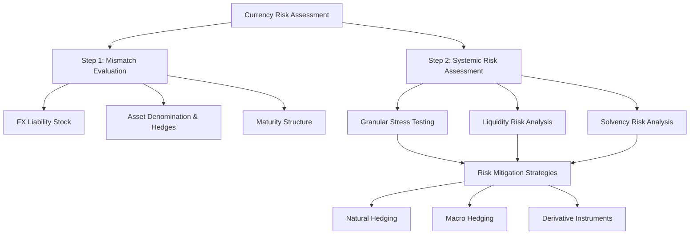

For sovereigns managing currency risk in the current environment, **active portfolio management is essential**, including close monitoring of economic, financial, and political risks, rigorous duration management, dynamic asset class rotation, and tactical use of derivatives[^62]. These measures are particularly important given elevated uncertainty about the trajectory of advanced economy fiscal and monetary policies.

### 5.3 Liquidity Constraints and Redemption Risk in Sovereign Investment

The tension between pursuing illiquidity premiums through alternative investments and maintaining sufficient liquid reserves for potential fiscal calls represents a fundamental challenge in sovereign portfolio construction. Unlike conventional institutional investors whose liquidity needs are primarily driven by predictable cash flow requirements, sovereign wealth funds face **unique "redemption risk" arising from the possibility of being called upon to transfer assets to support political objectives**[^63]. This distinctive characteristic modifies the composition of sovereign funds' utility functions and requires explicit attention to liquidity risk mitigation.

**Being a long-term investor means taking advantage of low redemption risk through two primary channels**: increasing allocation toward illiquid assets to earn an illiquidity premium, or investing in liquid assets while choosing long-term risk-return metrics[^63]. However, sovereign wealth funds' redemption risk is not zero—it is arguably higher than that of other long-term investors such as endowment funds due to their dual nature serving both financial and non-financial objectives. Consequently, sovereign funds benefit by maintaining liquidity and focusing on the second method of exploiting their favorable position rather than maximizing illiquid asset exposure.

**The J-curve effect in private market investments** creates particular challenges for liquidity management. Private investment funds and corresponding benchmarks require surprisingly long periods to provide any indication of ultimate performance—on average, a fund needs approximately **six years to settle into its final peer quartile ranking**[^64]. During the early years of private investments, negative returns due to fees and the timing of capital deployment can strain liquidity positions even as long-term return potential remains strong. This extended maturation period means that **80% to 90% of funds land in at least three different quartiles during their lives**, making early performance assessment unreliable and liquidity planning complex.

**Fund mandates fundamentally shape liquidity requirements**. Stabilization funds must maintain portfolios that can be rapidly converted to cash without suffering forced-sale losses, largely limiting their investable universe to cash equivalents, short and long-dated bonds, and money market instruments. Intergenerational savings funds with transgenerational horizons and no short-term liabilities can accept capital being locked up in assets or structures costly to exit within short periods. The Kuwait Investment Authority's dual-fund structure illustrates this mandate-driven differentiation: the General Reserve Fund maintains liquidity for fiscal stabilization purposes, while the Future Generations Fund pursues longer-term investments with legal restrictions on withdrawals[^18].

**Tiered portfolio structures** enable sovereigns to balance liquidity needs against return optimization. QIA's investment strategy explicitly acknowledges that as a long-term investor with no short-term liabilities, the fund invests for the long term to create value for generations to come[^39]. Patient capital can be invested in less liquid private companies and assets requiring longer maturation periods. Critically, QIA has **certainty of capital**—the fund is not subject to client redemptions and can make longer-term commitments and strategic investments in internal capabilities and relationships. This structural advantage enables access to return sources unavailable to investors facing redemption pressure.

The **allocation to alternatives across sovereign investors** reflects varying assessments of appropriate liquidity positioning. China Investment Corporation maintains the highest alternative allocation among major funds at **48.31% of its global portfolio**[^20], reflecting its 10-year investment horizon and assessment that illiquidity premiums justify reduced liquidity. Investment funds from the Middle East and North Africa region have demonstrated a **strong tilt toward private markets, with total private allocation approximately 25% higher than other well-represented regions**. Fund size materially influences alternative allocations, with large funds (assets above US$50 billion) investing more in private markets (**28% versus 19%** for smaller funds).

**Dynamic allocation serves as a mechanism for controlling liquidity risk** while maintaining return-seeking exposure. The investment process at sophisticated sovereign funds includes risk-management discipline as a critical layer of protection, requiring that the cost-of-risk function be monitored to ensure portfolios remain within risk parameters[^63]. Implementation of value-investing concepts tends to drive funds out of asset bubbles ahead of crashes, while utility function guidelines induce funds to reduce risky exposures when market volatilities and correlations increase significantly.

The following table summarizes liquidity characteristics across major sovereign investors:

| Fund | Alternative Allocation | Liquidity Approach | Redemption Risk Mitigation |
|------|----------------------|--------------------|-----------------------------|
| Norway GPFG | 1.9% | High liquidity, limited illiquids | Spending rule limits withdrawals |
| Singapore GIC | 23% Real Assets | Tiered structure | NIRC mechanism smooths flows |
| China CIC | 48.3% | Long horizon tolerance | 10-year performance focus |
| Kuwait KIA (FGF) | Varies | Legal withdrawal restrictions | Parliamentary approval required |

### 5.4 Political Interference and Governance Risks

Political interference represents one of the most significant threats to sovereign wealth fund performance and integrity, operating through multiple channels that can compromise investment decisions, erode market confidence, and ultimately destroy financial value. Research demonstrates that **targets of sovereign wealth fund investments experience a weaker stock price reaction at investment announcement than targets of private-sector investments**—announcements of SWF investments are associated with a positive mean abnormal return of only **0.38%, compared with 4.45%** for a benchmark sample of private investors[^63]. This estimated "SWF discount" is statistically and economically significant, translating to an average discount on firm market capitalization of **$60 million for each SWF investment**.

**The discount is larger for SWFs originating from autocratic countries (-1.57%) than for those from democratic countries (-1.12%)**[^63]. This differential reflects market concerns that funds from non-democratic countries may pursue political objectives that conflict with shareholder value maximization. The research finds that SWFs, particularly those from non-democratic countries, can mitigate this discount by signaling a passive stance to insulate investment targets from political interference—mechanisms include investing through subsidiaries, buying small stakes, not acquiring control, not electing board representatives, co-investing with private partners, and investing abroad.

**The effectiveness of these signals depends critically on the SWF's country of origin**. For SWFs from democratic countries, the market reaction is more favorable when they signal an active stance through large stakes, controlling stakes, and direct investments. Conversely, for SWFs from autocratic countries, the market reaction is more favorable when they signal a passive stance; **controlling stakes and direct investments are associated with a larger discount**[^63]. Despite the negative market reaction to an active stance, funds from autocratic countries are less likely to signal passivity—they are more likely to invest directly, domestically, appoint directors, and assume control compared to democratic SWFs, suggesting they value the ability to influence investment targets even at the cost of a discount.

**Central bank independence provides an instructive parallel** for understanding political interference risks. The Federal Reserve's independence and the checks and balances constraining presidential influence illustrate how institutional design can mitigate political pressure[^64]. However, multiple channels exist for political interference: personnel selection to influence policy direction, pre-announcement of successor signals to undermine current leadership authority, direct public pressure through speeches and social media, legal or structural challenges to governing legislation, and attempts to force resignations.

**If central bank or sovereign fund independence is compromised, market dynamics shift fundamentally**. When institutional credibility weakens, markets no longer interpret policy through economic data but through political lenses[^64]. This shift manifests first in expectations—investors add inflation risk premiums, breakeven inflation rates exceed survey-based expectations, and uncertainty around reaction functions increases term premiums at longer maturities. If fiscal objectives begin influencing monetary or investment policy, decisions may tilt toward financing convenience rather than optimal outcomes.

The analysis identifies **four probability-weighted scenarios** for political interference outcomes[^64]:

| Scenario | Probability | Characteristics | Market Impact |
|----------|-------------|-----------------|---------------|
| **Scenario 1** | 10-20% | Market volatility prompts policy adjustment, pressure ceases, credibility rebuilds | Return to predictable, data-based function |
| **Scenario 2** | 45-65% | Subtle political influence creates dovish bias, policy looser than data-driven approach | Moderate yield curve steepening, credit spread widening |
| **Scenario 3** | 15-25% | Intermittent visible interference, occasional capitulation, unpredictable reaction function | Notable bear steepening, elevated refinancing risk |
| **Scenario 4** | 2-5% | Independence effectively overturned, institution becomes fiscal arm | Potential yield caps, direct financing, major stability risk |

**Sovereign wealth funds without adequate transparency and governance are susceptible to corruption and political interference**[^63]. The dramatic growth of SWFs is concerning because they have been established not only in countries with strong rule of law but also in those with high corruption risks, insecurity, and weak rule of law. As state-owned entities, SWFs are completely beholden to the governments that endow them, and politicians can exert influence over their operations to pursue political goals. The lack of fiduciary duties to private investors and minimal reporting obligations make it difficult to understand where a country's money is invested.

**The Malaysia 1MDB case exemplifies how SWFs can be used for gross corruption**. The U.S. Department of Justice called it the **"largest kleptocracy case to date,"** with $4.5 billion diverted from the fund[^63]. The scandal involved senior Malaysian elites, politically connected individuals, and bankers who exploited overcentralized power, weak governance, and poor accountability. Saudi Arabia's Public Investment Fund demonstrates how SWFs may be used for purposes beyond economic diversification—substantial investments in sports, such as the LIV Golf Invitational Series and Newcastle United Football Club acquisition, suggest that financial returns were not necessarily the primary consideration, with "sports-washing" potentially allowing enhancement of regime popularity while de-emphasizing human rights concerns.

**The Santiago Principles provide voluntary governance standards** but lack enforcement mechanisms[^63]. They do not explicitly acknowledge the potential for abuse or address the increase in "sovereign-private arrangements" that heighten corruption and national security risks. There is no requirement to publish audited statements or have them verified by independent third parties. Effective reform requires parallel action across policy reform in countries where SWFs invest, policy reform in countries where SWFs are created, and revision of international standards to reflect current risks and serve as enforceable requirements.

### 5.5 Performance Measurement Challenges and Benchmarking Frameworks

Measuring sovereign wealth fund performance presents unique methodological challenges that distinguish these investors from conventional asset managers. The **two most common performance measures—time-weighted returns (TWR) and money-weighted returns (internal rate of return, or IRR)—differ meaningfully** in ways that are particularly consequential for portfolios with significant private market allocations[^64]. Understanding these distinctions is essential for accurate performance assessment and appropriate accountability frameworks.

**IRR is a superior indicator of ultimate performance** because it holistically considers the time horizon and all cash flows, capturing the impact of managers' decisions including when to call and return capital and when to exit investments[^64]. Unlike compounded TWR, IRR captures the effects of capital deployment decisions that are central to private market investing. However, IRR has limitations including the reinvestment rate assumption and potential for being "managed" in certain circumstances. Investors should always review IRRs alongside **cash-on-cash multiples (DPI—distributed to paid-in capital, and TVPI—total value to paid-in capital)** for comprehensive understanding.

**The extended time horizons required for meaningful private market performance assessment** create particular challenges for accountability frameworks. On average, a fund needs approximately **six years to settle into its final quartile ranking versus peers**, with **80% to 90% of funds landing in at least three different quartiles during their lives**[^64]. Furthermore, **37% of funds shifted quartiles between years six and seven, and 22% between years eight and nine**[^64]. Drawing conclusions about manager performance earlier than five to six years into a fund's lifecycle can lead to incorrect conclusions and erroneous selection decisions for subsequent funds.

For private portfolios with staggered commitment approaches, **meaningful returns and benchmark comparisons should not be attempted until the program is at least eight years old**[^64]. This extended evaluation horizon conflicts with typical governance cycles and creates tension between the patience required for accurate assessment and the accountability demands of stakeholders. Investors must resist the temptation to draw premature conclusions from early performance data that may be dominated by J-curve effects and valuation noise rather than genuine investment skill.

**Comparing private IRRs to public TWRs creates inappropriate apples-to-oranges comparisons**[^64]. The common practice of evaluating private investments against public market benchmarks plus a spread (e.g., S&P 500 plus 500 basis points) conflates fundamentally different return calculations. Instead, private IRRs should be compared to **public market equivalent (PME) calculations** that invest private fund contributions "on paper" in a selected public market index, with distributions withdrawn from the index. The Cambridge Associates Modified PME (mPME) methodology addresses potential problems with other PME approaches by selling the same proportion of public shares as private shares are distributed, avoiding the "negative NAV" problem.

**A comprehensive benchmarking framework for private investments** addresses three fundamental questions[^64]:

1. **Was allocating to privates a good decision?** PME analysis compares private returns to public alternatives to assess compensation for illiquidity. A typical premium over publics averages approximately 3%.

2. **Did we select good managers?** Once investments are mature, medians and quartile rankings against a relevant peer universe (ideally at least 20 funds) provide the best measure of selection skill.

3. **Did we make good allocation decisions within privates?** Custom-weighted pooled benchmarks allow investors to gauge the effectiveness of strategy, vintage year, and geographic decisions by comparing alternative benchmark scenarios.

**Peer-group benchmarks can introduce unintended incentive distortions**. Research on UK pension fund performance found that peer-group tracking combined with fee structures not promoting genuine active management tends to produce **herding and closet index matching**[^65]. The median UK pension fund underperformed the market index by a relatively small **15 basis points annually**, whereas the median US pension fund underperformed by a much wider margin of **130 basis points annually**. However, the dispersion of returns around the median was much greater in the US (**603 basis points for the 10-90 percentile range versus 311 basis points in the UK**), indicating that genuine active management is more prevalent in the US while UK managers display signs of herding around the median.

**Fee structures provide disincentives for active management** when fees are related to year-end asset values rather than performance[^65]. The prospective fee increase from outperformance is second-order, while the risk of underperformance due to poor luck outweighs prospective benefits from active management for all but the most certain opportunities. Decomposition of median pension fund returns found that of the **median total return of 12.06% annually**, **12.00% (99.47% of total)** was due to the essentially passive activity of strategic asset allocation. The overall contribution of active management at just over 1% of total return (approximately 12 basis points annually) is less than typical active management fees.

**Sovereign wealth funds employ various performance measurement approaches** calibrated to their mandates:

| Fund | Performance Metric | Benchmark Approach | Reported Performance |
|------|-------------------|--------------------|--------------------|
| Norway GPFG | Absolute and relative returns | Strategic benchmark index | 13.1% return in 2024 |
| Singapore GIC | 20-year rolling real return | Global inflation | 3.8% real return (20-year) |
| China CIC | 10-year annualized net return | Performance target | 6.92% (10-year), beating target by 61 bps |
| Kuwait KIA | 3-year rolling average | Composite benchmarks | Not publicly disclosed |

GIC's mandate to **preserve and enhance the international purchasing power of reserves** by delivering good long-term returns above global inflation leads to evaluation using the **rolling 20-year real rate of return**[^18]. This metric reflects the Government's investment mandate requiring GIC to invest for the long term in real terms. For the 20-year period from April 2005 to March 2025, GIC achieved an annualized US$ nominal return of **5.7%** and after adjusting for global inflation, an annualized 20-year real return of **3.8%**.

### 5.6 Resource Depletion and the Sustainability of Commodity-Based Funds

The fundamental sustainability challenge facing resource-based sovereign wealth funds stems from the finite nature of the commodity endowments that fund them. Unlike tax revenues or trade surpluses that can theoretically continue indefinitely, petroleum and mineral deposits are depleting assets—each barrel extracted or ton mined reduces the remaining stock available for future generations. The central question for resource-based funds is whether current extraction and investment policies will successfully **transform depleting underground wealth into perpetual above-ground financial capital** that maintains purchasing power across generations.

**Norway's Government Pension Fund Global represents the most successful model** of resource wealth transformation. The fund's foundation is systematic reinvestment of petroleum revenues into globally diversified markets since formal establishment in 1996[^66]. The Norwegian government progressively increased its share of resource extraction proceeds, ultimately securing **50% ownership interest in every production license**. Today, oil and gas revenues account for less than half of total fund value, with the majority derived from investment returns on global equities, real estate, and renewable energy infrastructure. This transformation demonstrates that resource wealth can be successfully converted into sustainable financial assets when appropriate policies are maintained over extended periods.

**Norway's comprehensive dual tax structure** ensures maximum public capture of resource rents. The petroleum tax framework includes a **56% special petroleum tax and 22% standard corporate tax**, creating a combined effective tax rate of **78%** on oil and gas company profits[^66]. Beyond taxation, the government's 50% ownership stake in production licenses creates a dual revenue stream through both tax receipts and direct profit participation. This comprehensive approach contrasts sharply with jurisdictions where resource taxation structures include extensive deduction allowances and loss carryforward provisions that reduce effective rates well below nominal levels.

**Fiscal rules governing accumulation and withdrawal** determine whether intergenerational equity is achieved. Norway's **"3% rule"** limits government withdrawal from the sovereign wealth fund to 3% of fund value annually, designed to preserve capital for future generations while allowing current generations to benefit from investment returns[^66]. This spending rule creates a permanent income framework where the fund generates sustainable benefits indefinitely rather than being depleted over time. By systematically investing oil revenues in overseas markets, Norway has successfully avoided "Dutch Disease"—the economic distortion where resource booms cause currency appreciation that crowds out other productive industries.

**Kuwait's Future Generations Fund demonstrates robust structural protections** against premature wealth consumption. Established by Amiri Decree in 1976 with 50% of General Reserve Fund savings, the FGF annually receives a **minimum of 10% of all state revenues**[^18]. Critically, **no assets can be withdrawn from the FGF unless sanctioned by law, and all investment income is reinvested as required by law**. These structural protections were tested during Kuwait's severe fiscal pressure period from 2015 to 2020, when oil prices collapsed and government deficits reached 10-15% of GDP. Despite substantial political pressure to access FGF assets, the legal requirement for parliamentary legislation to authorize withdrawals provided sufficient friction to protect the fund's capital—the GRF absorbed fiscal pressures while the FGF remained untouched and minimum allocations continued.

The following table compares resource fund sustainability mechanisms:

| Country | Tax Rate | Ownership Stake | Spending Rule | Withdrawal Restrictions |
|---------|----------|-----------------|---------------|------------------------|
| Norway | 78% effective | 50% per license | 3% of fund value | Parliamentary approval |
| Kuwait (FGF) | Varies | State ownership | 10% minimum allocation | Legislation required |
| Australia (PRRT) | 40% nominal | Varies | N/A | N/A |

**The contrast between Norway and Australia illustrates divergent outcomes** from different resource taxation approaches[^66]. Norway's 78% effective tax rate generated **$89.5 billion in 2022 tax revenue**, supporting the world's largest sovereign wealth fund. Australia's Petroleum Resource Rent Tax (PRRT) at 40% nominal rate includes extensive deduction allowances and loss carryforward provisions that reduce effective rates significantly below nominal levels, generating revenue **$4 billion below expectations in 2022**. Australia's Future Fund ranks approximately 16th globally compared to Norway's first-place position.

**Principles for successful resource wealth transformation** include long-term strategic vision, transparent governance structures, fiscal discipline agreements, and comprehensive diversification strategies[^66]. Early implementation of comprehensive resource taxation combined with rigorous reinvestment strategies and transparent governance can create sustainable wealth generation mechanisms. The Norwegian experience demonstrates that resource-rich countries can convert temporary natural wealth into permanent financial assets through appropriate policy frameworks maintained consistently over decades.

### 5.7 Rising Contingent Liabilities and Pension Sustainability Challenges

Aging populations and rising pension obligations threaten the sustainability of public wealth across both developed and developing economies, creating **intergenerational transfers that may leave future generations significantly worse off** than current retirees. The intersection of demographic change, economic growth constraints, and political economy dynamics creates sustainability challenges that extend far beyond simple funding arithmetic to encompass fundamental questions of fairness across generations.

**Population aging affects pension fund risk-taking behavior** in ways that may amplify sustainability challenges. Research examining Chinese pension funds over two decades provides **strong evidence that population aging is positively associated with pension fund risk-taking**[^66]. This counterintuitive finding—contrary to life-cycle theory suggesting aging should lead to more conservative portfolios—reflects the structural fiscal pressures created by rising dependency ratios. As the ratio of retirees to contributors increases, pension funds face growing challenges meeting long-term financial obligations, potentially driving them toward higher-risk investments in pursuit of returns sufficient to cover expanding liabilities.

**This relationship is stronger in regions with lower economic development and lower birth rates**, where pension systems face greater financial pressure[^66]. Transfer payments serve as a mediating factor in this relationship, as central government support can moderate the pressure on local pension systems to pursue risky investment strategies. The finding that demographic pressure drives risk-taking behavior raises concerns about potential feedback loops where aging-driven investment risk could compound demographic sustainability challenges.

**The intergenerational transfer implications of underfunded pension systems are substantial**. Analysis of US state government pension promises projects that the value of promises already made will grow to approximately **$7.9 trillion in 15 years**[^67]. Conservatively, there is a **50% chance of aggregate underfunding greater than $750 billion and a 25% chance of at least $1.75 trillion** (in 2005 dollars). Adjusting for risk, the true intergenerational transfer is substantially larger—insuring both taxpayers against funding deficits and plan participants against benefit reductions would cost almost **$2 trillion today**.

**Governmental accounting rules obscure the true extent of public pension underfunding** by allowing pension liabilities to be discounted at expected rates of return on pension assets[^67]. This practice makes pension funding situations appear much better than they actually are. The underfunding in state pension plans exceeds the total magnitude of outstanding state bonds. If households do not undo the government's investment strategy, investing in risky assets subjects future generations to substantially more risk—poor returns tend to occur in high marginal utility states, making the pain associated with underfunding greater than nominal figures suggest.

**Intergenerational equity becomes critical when younger generations face excessive burdens** created by decisions they had no part in making[^66]. Pay-as-you-go defined benefit plans involve massive intergenerational income transfers, with political risk arising because older voters form powerful constituencies while younger and future generations have weak or no current political voice. Politicians tend to make excessive promises early but become reluctant to implement unpopular measures—raising contribution rates, increasing taxes, raising retirement ages, or reducing replacement rates—needed to maintain system sustainability.

**Sustained economic growth can ease sustainability pressures**, but absent growth, maintaining current transfer levels becomes increasingly difficult[^66]. Using Japan as an illustrative case, current younger generations' expected lifetime real wages may be approximately **30% lower than current older generations** due to prolonged economic stagnation. Over the past 20 years, wage curves for younger generations have flattened. Japan's total fertility rate remains at extremely low levels around 1.3-1.4, with estimates suggesting that if current low fertility persists, approximately **40% of women born in 1990 will remain childless throughout their lives, and approximately 50% will have no grandchildren**. This demographic trajectory may weaken public consciousness of intergenerational solidarity.

**Automatic adjustment mechanisms represent a prudent approach** to reducing political risk in pension systems[^66]. Sweden invented an automatic balancing mechanism that automatically adjusts nominal returns downward if the balance sheet verifies excess liabilities. Germany and Japan have introduced new pension benefit indexation formulas based on demographic changes. Denmark introduced automatic indexation of normal pensionable age with life expectancy extension in 2006, designed to avoid political risk and ensure intergenerational equity—the normal pensionable age is expected to reach **70 around 2040**. The Netherlands and Italy have subsequently adopted similar measures.

**Gender gaps in pension outcomes compound sustainability challenges**[^66]. Women typically receive lower social insurance pensions than men—in Japan, women's average monthly old-age benefits were **10.4 million yen, only about 60% of men's 17.1 million yen** in 2010. Women live longer on average and face greater poverty risk in old age. Contributing factors include lower average wage rates, shorter working hours, fewer years of market work due to childcare and eldercare responsibilities, greater prevalence in informal sector employment, and pension rights penalties for divorced women.

The following diagram illustrates pension sustainability dynamics:

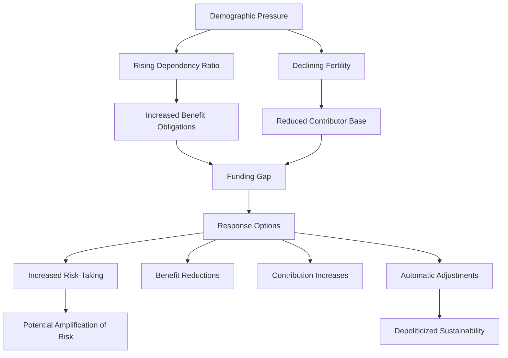

### 5.8 Net Worth Anchors and Comprehensive Balance Sheet Assessment

The case for anchoring fiscal policy in **Public Sector Net Worth (PSNW) targets** rather than debt-based rules reflects growing recognition that comprehensive balance sheet assessment provides superior frameworks for evaluating intergenerational equity and fiscal sustainability. Net worth—total assets minus total liabilities—captures the fundamental financial position of government in ways that debt metrics alone cannot, revealing both the resources available to meet obligations and the true legacy that current generations pass to their successors.

**A net worth anchor widens the scope of fiscal policy to include public sector assets in addition to liabilities**—the focus of debt-based rules[^68]. This expansion is directly relevant to ongoing policy debates on green fiscal rules and reform of fiscal frameworks to allow for public investment in high debt environments. Modeling demonstrates that compared to debt-based anchors, **a PSNW anchor is more conducive to public investment and economic growth** while providing sensible policy reactions to changes in long-term interest rates. The net worth anchor also precludes unsustainable debt dynamics, and simulated transition dynamics show that replacing a debt anchor with a net worth anchor does not necessarily lead to higher debt-to-GDP ratios.

**An improvement in public sector net worth can be achieved through two pathways**: running surpluses or shifting expenditure toward productive investment[^68]. This flexibility encourages productive public investment that is pro-growth. Furthermore, a net worth target is consistent with the principle of intergenerational equity, as it increases both public wealth and economic activity for future generations. A net worth anchor also provides a **feedback mechanism from interest rates to levels of public investment**, leading to higher public investment when borrowing costs are low and decreases when rates are high.

**The key argument for measuring and managing net worth is intergenerational fairness**[^68]. More than any other single measure, net worth describes the legacy that each cohort of taxpayers passes to the next. Currently negative public sector net worth positions in countries like the UK are important because they indicate loss of the moral compass to leave more for future generations. Current simple debt-based targets focusing on net borrowing and net debt-to-GDP ratios ignore assets entirely and non-debt liabilities, which in the UK (mainly public sector pensions) exceed net debt.

**Debt-based fiscal rules create significant blind spots**. For example, in 2021-22, the UK National Health Service Pension Scheme had an actuarial assessment showing liabilities increased by **£112 billion**—almost as much as that year's net borrowing of £120 billion—yet these very large costs are managed outside fiscal rules[^68]. This omission means that substantial changes in the government's financial position occur without triggering the accountability mechanisms designed to ensure fiscal discipline.

**Operational challenges in implementing net worth frameworks** include defining exactly what represents productive investment, determining what benefits should be included within assessment of productive investments, and properly evaluating public capital[^68]. A purely financial approach could potentially discourage projects with lower financial returns but higher social returns. It may take time to realize growth benefits of investment while associated debt is incurred at onset, and forecasts of growth impact may be inaccurate. Policymakers may also weigh using PSNW or public sector *financial* net worth (which excludes nonfinancial public assets) as an anchor.

**Concerns about net worth volatility** can be addressed through appropriate accounting treatment. Using face values of debt rather than market values, consistent with IFRS accounting standards, results in lower reported PSNW volatility[^68]. While difficulties exist in measuring non-financial asset values, valuable information is lost when governments fail to measure assets. The scale of undervaluation of government property holdings may be substantial—perhaps as much as **100% of GDP** in some jurisdictions.

**Better management of public assets and liabilities could substantially increase government revenues**[^68]. Better management of public commercial assets could yield revenues of approximately **1.5% of asset value**, suggesting potential revenue gains of 1-1.5% of GDP. Better management of liabilities, such as borrowing to fund pension liabilities and investing in diversified portfolios, could increase government revenues by the equivalent of **3% of GDP**. Combined, scope exists for governments to increase revenues by **4%+ of GDP** through improved asset and liability management—approaching what fiscal authorities estimate is needed to sustain public services as populations age.

The following table compares debt-based and net worth-based fiscal frameworks:

| Dimension | Debt-Based Rules | Net Worth Framework |
|-----------|------------------|---------------------|
| **Scope** | Liabilities only | Assets and liabilities |
| **Investment Incentive** | Discourages public investment | Encourages productive investment |
| **Intergenerational Equity** | Partial assessment | Comprehensive assessment |
| **Interest Rate Response** | Limited feedback | Natural feedback mechanism |
| **Pension Liabilities** | Often excluded | Explicitly included |
| **Asset Management** | No incentive | Creates accountability |

### 5.9 Climate Risk Integration and Long-Term Wealth Sustainability

Climate change poses **systemic risks to sovereign wealth sustainability** through three major channels identified by the Bank of England: **physical risk** from extreme weather events, **transition risk** from financial adjustments to a lower-carbon economy, and **liability risk** from claims for compensation related to climate-related losses[^69]. As large, long-term providers of capital, sovereign wealth funds are exposed to these risks with significant financial implications for both their portfolios and the societies they serve. The intersection of climate risk with intergenerational equity obligations creates particular urgency—unchecked climate change threatens to leave future generations worse off regardless of financial wealth preservation.

**Sovereign wealth funds have made significant progress on climate integration** since the International Forum of Sovereign Wealth Funds first discussed climate change's financial impact at its 2016 annual meeting[^69]. In 2017, six of the world's largest sovereign wealth funds formed the **One Planet Sovereign Wealth Funds (OPSWF)**, publishing the OPSWF Framework less than a year later. By 2020, the network expanded to 14 sovereign wealth funds, 14 asset managers, and five private investment firms with combined assets under management and ownership of **$30 trillion**, all working toward Framework implementation.

**Investment behavior reflects this evolving commitment**. IFSWF's database shows sovereign wealth fund investments in agritech, forestry, and renewables increased almost **six-fold from eight investments valued at $324 million in 2015 to 18 investments valued at $2 billion in 2020**, totaling over $5 billion invested over five years[^69]. In 2020, amid the coronavirus pandemic, investors' focus on environmental, social, and governance issues including climate change intensified further.

A 2020 survey of 34 sovereign wealth funds (representing 43% of the world's 78 sovereign wealth funds and approximately 90% of total assets under management) demonstrates **broad consensus on the need for immediate action**: **93% recognize climate change as a risk and/or opportunity for their portfolios**[^69]. The majority agree that financial markets are under-pricing climate change risks and that unchecked climate change will leave future generations worse off. **88% claim to take climate change into account in their investment processes**, though approaches vary in systematization.

**Formal climate strategies remain less prevalent** than general awareness. Slightly more than a third of respondents (**36%**) have a formal climate change strategy in place; of these, 55% adopted policies since 2015, with 30% introducing policies since 2018[^69]. Early adopters like New Zealand Superannuation Fund and Norges Bank Investment Management have had strategies for over ten years. Encouragingly, **60% report that Board or CEO-level executives are responsible for climate change** within their organizations, and **30% have more than 10% of their portfolios invested in climate-related strategies**.

**Two main barriers to climate action emerge from the survey**: finding appropriate data and convincing stakeholders of the business case[^69]. On data challenges, OPSWF members signed a joint statement calling for enhanced climate-related financial disclosure. On the business case, only **10% expect climate strategies to lead to negative returns in the short term and just 3% expect long-term negative returns**; **43% expect positive long-term returns**. However, over half of respondents do not publicly disclose any information on their climate change approach.

**Climate risk is particularly challenging for pension funds** due to their long-term investment horizons[^70]. Climate change risk may adversely affect asset values but is difficult to price and hedge because of its systemic nature, inadequate disclosure by funds and portfolio companies, and difficulty finding appropriate hedging instruments. Underfunded pension plans, especially defined benefit plans, are more vulnerable to downside risks such as sharp asset value declines. A survey of 439 institutional investors revealed that analyzing portfolio companies' carbon footprints is the primary concern (**38%**), with 29% actively working to reduce these footprints. Only one-fifth use divestment to avoid climate risk, preferring engagement—**43% discuss climate risk's financial impact with portfolio company management**.

**The concept of intergenerational equity extends explicitly to environmental sustainability**[^62]. The world's constitutions in **74% of countries** protect the idea of intergenerational equity—that future generations have the right to a healthy, vibrant, sustainable planet. The UN Framework Convention on Climate Change considers intergenerational equity in its 1992 treaty, stating that parties should protect the climate system "for the benefit of present and future generations of humankind." Climate change risks are affecting financial markets, with concerns that if climate change causes more frequent and extreme weather events, large financial product providers will be unable to transfer risk in their portfolios, posing risks to financial system stability.

**Sustainable investment enables investors to expand the definition of intergenerational equity** while fulfilling fiduciary responsibilities, deploying capital to protect and access resources for future generations[^62]. Many institutional investors are implementing ESG strategies despite challenges in defining standards, terminology, and collecting consistent, high-quality data. The UN Principles for Responsible Investment CEO has called for decisive collective action shaping a recovery that prioritizes social and environmental outcomes, laying the foundation for a more stakeholder-driven and sustainable global economy.

**Sovereign wealth funds' progress on sustainability disclosure varies significantly**. Research examining over 50 SWFs finds that while a majority disclose at least some sustainability criteria, only a **small minority address a broad selection as a possible basis for a comprehensive sustainability strategy**[^67]. Across all funds, only **27% of criteria were met**. Governance criteria were met 37% of the time, followed by social criteria at 30%, with significantly lower proportions for economic (21%) and environmental (18%) sustainability dimensions. High state capacity, young populations, and commitment to the Santiago Principles (IFSWF membership) are positively associated with higher disclosure rates.

The following recommendations emerge from survey findings for advancing climate integration[^69]:

1. **Adopt and implement climate-related policies**, using the OPSWF Framework as a guide
2. **Seek out appropriate talent and expertise** for climate risk assessment
3. **Explore board member and executive education** on climate issues
4. **Use metrics to show climate impact**, comparable returns, and risk reduction
5. **Communicate strategic importance of climate change** to all stakeholders and be transparent in reporting
6. **Partner with peers and international initiatives** to share experience

**Investment in climate-related strategies represents both risk mitigation and opportunity capture**. A 2016 International Finance Corporation report identified a **$23 trillion market for climate-smart investments in emerging markets by 2030**[^69]. Sovereign wealth funds, with their long-term horizons and substantial capital bases, are well-positioned to capture these opportunities while contributing to the climate transition necessary to preserve intergenerational equity in its fullest sense—ensuring future generations inherit both financial wealth and a sustainable planet.

## 6 Future Trends and Evolving Challenges in Sovereign Investing

This chapter synthesizes emerging trends and projects future trajectories in sovereign wealth management, examining how technological disruption, climate imperatives, regulatory evolution, and macroeconomic transformation are reshaping investment strategies of the world's wealthiest governments. The analysis integrates findings from preceding chapters on portfolio composition, SALM frameworks, strategic objectives, and sustainability challenges to identify critical inflection points and provide actionable policy recommendations for enhancing transparency, governance, and the effective deployment of public wealth for long-term societal benefit.

### 6.1 The Acceleration of Sustainable and Impact Investing in Sovereign Portfolios

The integration of sustainability considerations into sovereign investment strategies has undergone a **structural transformation from voluntary aspiration to strategic imperative**, driven by evolving interpretations of fiduciary duty, empirical evidence on performance, and the recognition that climate-related risks pose material threats to long-term portfolio value. This shift represents one of the most significant reorientations in sovereign wealth management since the establishment of modern fund structures, with implications extending across asset allocation, risk management, and stakeholder engagement.

**Sustainable funds have demonstrated compelling performance characteristics** that challenge earlier assumptions about return trade-offs. According to the Morgan Stanley Institute for Sustainable Investing, sustainable funds outperformed traditional funds in the first half of 2025, generating **median returns of 12.5% compared to traditional funds' 9.2%**—marking the strongest period of outperformance since tracking began in 2019[^71]. Key drivers of this outperformance include sustainable funds' greater allocations to global and European regions, with **70% of sustainable funds investing either in Europe or globally, compared to only 41% of traditional funds**[^71]. Assets under management in sustainable funds grew to a new high of **$3.92 trillion as of June 2025**, up 11.5% from December 2024[^71].

The **One Planet Sovereign Wealth Funds (OPSWF) initiative** has emerged as the primary institutional framework for coordinating climate action among sovereign investors. Launched on December 12, 2017 by President Emmanuel Macron with founding members including the Public Investment Fund of Saudi Arabia, Mubadala of the United Arab Emirates, Norges Bank Investment Management, the Qatar Investment Authority, the Kuwait Investment Authority, and the New Zealand Superannuation Fund, the initiative advances a dual rationale: **aligning sovereign capital with climate goals and leveraging shareholder influence for corporate decarbonization**[^25]. The 8th OPSWF CEO Summit in Paris on October 21-22, 2025 convened over 80 institutions representing approximately **$48 trillion in assets—roughly 40% of global equity market capitalization**—to advance an agenda linking climate action, financial performance, and technological transformation[^25].

The evolution from generic ESG approaches toward **targeted sustainability themes** reflects growing sophistication among sovereign investors. Key thematic areas identified by leading practitioners include technology and innovation (including AI and digital infrastructure), health and wellness, sustainable infrastructure and resource security, and the circular economy encompassing natural resources, energy, transport, materials, construction, water, and waste management[^18]. This thematic focus enables funds to capture opportunities in specific value chains rather than applying broad exclusionary screens that may limit investment universe without generating alpha.

**Climate alignment has transitioned from compliance obligation to profit engine**. Market evidence demonstrates that representatives of over **$3.6 trillion—70% of institutional investors—now incorporate climate criteria into value creation plans**, while managers overseeing $3.9 trillion (77% of investors) use decarbonization as an active performance lever[^25]. The financial benefits are increasingly quantifiable: industrial case studies indicate that decarbonization initiatives can generate **€26 million in EBITDA gains within three years**, with economic models suggesting climate-aligned companies may achieve profitability **20% higher than non-aligned peers**[^25].

The following table summarizes the evolution of sustainable investing frameworks among sovereign wealth funds:

| Dimension | Early Stage (Pre-2017) | Current State (2025) | Emerging Trajectory |
|-----------|----------------------|---------------------|---------------------|
| **Approach** | Exclusionary screening | Thematic integration | Value creation focus |
| **Scope** | Limited asset classes | Cross-portfolio application | Full investment lifecycle |
| **Measurement** | Qualitative assessment | Carbon footprinting | Comprehensive impact metrics |
| **Governance** | Ad hoc consideration | Board-level responsibility | Strategic pillar status |
| **Disclosure** | Minimal reporting | Selective transparency | Standardized frameworks |

**Measurement challenges and data gaps** continue to complicate implementation despite significant progress. The IFSWF and OPSWF's fourth annual survey found that **over a third of sovereign wealth funds have carbon footprinted their portfolios, up from 18.5% the previous year**, with funds becoming more discerning about which tools are appropriate for their specific portfolios[^25]. Sovereign wealth funds are also becoming increasingly sophisticated in understanding climate financing—whereas previously they concentrated climate efforts on unlisted assets such as private equity and real estate, there is now an uptick in efforts in listed markets including fixed income and hedge funds[^25].

**The geographic dimension of climate investing** reveals both opportunities and challenges. Africa is becoming an increasingly attractive geography for sovereign wealth funds seeking climate change solutions, though it remains challenging and unfamiliar territory for many[^25]. The Green Capital Bridge, launched at the 2025 OPSWF Summit, represents a co-investment platform targeting **$100 billion to deploy 131 GW of renewable capacity in Africa by 2030**[^25]. Conversely, Southeast Asia remains the least popular geography for sovereign funds seeking climate solutions[^25], suggesting significant capital gaps in regions with substantial transition needs.

**Sovereign wealth funds are demanding greater transparency** from external managers on climate approaches and asset-level metrics. As funds become more experienced in climate investing and assessment, they are becoming more comfortable publicly reporting on their approaches while simultaneously requiring enhanced disclosure from the investment managers they allocate capital to[^25]. This cascading transparency requirement has the potential to accelerate climate integration across the broader investment management industry.

The strategic rationale for climate integration extends beyond risk mitigation to encompass **the correction of market failures in transition financing**. Low-carbon infrastructure typically requires high capital expenditure, long investment periods, and exposure to uncertain policy environments—characteristics that often deter short-term private capital[^25]. Sovereign wealth funds, explicitly designed to deploy patient capital and absorb volatility, are structurally positioned to serve as market anchors that can attract private investment, particularly in emerging economies where financing gaps are widest.

### 6.2 Intensifying Cross-Border Investment Scrutiny and Regulatory Fragmentation

The global landscape for sovereign investment has been fundamentally transformed by the **proliferation and strengthening of foreign direct investment screening mechanisms**, creating an increasingly complex regulatory environment that constrains portfolio construction, increases compliance burdens, and reshapes the strategic calculus for cross-border capital deployment. This regulatory intensification reflects heightened concerns about national security, technology competition, and supply chain resilience that have elevated investment screening from peripheral administrative process to central element of economic statecraft.

**The European Union has moved decisively toward a strengthened FDI screening system**. On December 11, 2025, the European Commission welcomed the political agreement reached by the European Parliament and Council on a revised framework designed to make investment screening more robust, coherent, and strategic[^18]. The main elements of this revision include **mandatory introduction of screening mechanisms by all Member States**, coverage of intra-EU investments where the EU investor is owned or controlled by a third-country person or entity, and establishment of a common minimum scope for national screening mechanisms[^18].

The mandatory scope under the revised EU framework covers critical sectors including:
- **Dual-use items and items on the EU common military list**
- **Union targets manufacturing, researching, or developing semiconductors, quantum technologies, or artificial intelligence technology**
- **Entities active in transport, energy, or digital infrastructure sectors considered critical by relevant Member States**
- **Entities active in exploration, extraction, processing, recycling, recovery, or stockpiling of strategic critical raw materials**
- **Specific categories of financial service providers**[^18]

**Key procedural requirements** under the revised framework include a two-phase review process, power to screen unnotified transactions retroactively, and harmonized deadlines including a **45-calendar day deadline for initial screening by national authorities**[^18]. The framework also features an improved cooperation mechanism for situations where other Member States or the Commission have issued comments or opinions, with aligned timelines for multijurisdictional transactions requiring all filings to be made on the same day[^18].

The **current state of EU Member State screening regimes** reflects significant heterogeneity despite convergence pressures. As of the most recent assessment, **25 of 27 EU Member States have a screening regime or are about to introduce one**, though regimes differ widely in areas including mandatory versus voluntary filings, ex officio intervention rights, filing requirements and thresholds, definitions of "critical" industries, standstill obligations, and the duration and structure of proceedings[^20]. There is broad divergence regarding whether regimes cover only investments by non-EU-based investors or investments by any non-domestic acquirer[^20].

According to the European Commission's Fourth Annual FDI Report published in October 2024, the **number of cases notified under the cooperation mechanism continues to rise**. In 2023, 18 EU Member States notified **488 transactions, an increase of 67 compared to 2022**[^20]. Notifications remained highly concentrated, with **85% originating from just seven Member States: Austria, Denmark, France, Germany, Italy, Romania, and Spain**[^20]. Multijurisdictional deals accounted for 36% of all notifications. The main sectors subject to notifications were information and communication technology (23%), manufacturing (21%), wholesale and retail (19%), professional activities (13%), and energy (5%)[^20].

**Clearance remains the norm** despite increased scrutiny, with **85% of notifications subject to formal screening cleared without conditions**[^20]. Only 1% of all decided cases were eventually blocked by national authorities, while for a further 4%, the transaction was withdrawn by the parties[^20]. However, the investor origin continues to be a relevant consideration in risk assessment, with Germany issuing or threatening an increasing number of prohibitions on transactions from China and Russia[^20].

The **evolution of views on "sensitive" sectors** demonstrates regulatory expansion beyond traditional defense and security concerns. Convergence is occurring with expansion beyond traditional sectors to include biotechnologies, hi-tech, artificial intelligence, 3D printing, data-driven activities, and access to patients' health data[^20]. The COVID-19 pandemic accelerated addition of the healthcare sector, and food security has become a priority with investments in the agri-food sector subject to review in several Member States[^20]. 5G technology is also a source of concern, with specific rules in Italy, France, and Germany[^20].

**The United States CFIUS framework** provides a comparative reference point for EU developments. CFIUS completes hundreds of reviews per year using an interagency process, with its ability to review foreign acquisitions for threats to national security not limited to certain sectors[^18]. The Foreign Investment Risk Review Modernization Act of 2018 (FIRRMA) allocated more money and staff to the committee and gave it the ability to review foreign acquisitions that threaten national security under certain circumstances, even if the foreign stake is non-controlling[^18]. However, CFIUS has limitations that the EU should avoid—it does not cover "greenfield" investments (only acquisitions), and there are limitations on what is construed as a foreign investor under FIRRMA[^18].

**Sovereign wealth funds face particular scrutiny** within these frameworks given their state ownership and potential for political motivation. The six main countries of origin of the 488 cases notified to the EC in 2023 were the **US (33%), UK (11%), UAE (7%), China (6%), Canada (5%), and Japan (5%)**[^20]. Russia and Belarus together accounted for 1.6%[^20]. This distribution indicates that even investments from allied nations face significant review requirements, with sovereign investors from all origins needing to navigate increasingly complex compliance landscapes.

**Blocking decisions on national security grounds remain exceptional**, but **clearance with "remedies" is becoming customary** in an increasing number of Member States[^20]. Remedies can include maintaining local resources, restrictions on intellectual property or governance, continuation of sensitive contracts, appointing a security officer, reporting obligations, and strict data protection obligations[^20]. These conditions represent a middle ground between outright prohibition and unconditional approval that allows transactions to proceed while addressing specific security concerns.

The **European Commission has also initiated focus on outbound investments**, publishing a white paper finding substantial knowledge gaps due to lack of specific or systematic monitoring[^20]. On January 15, 2025, the EC published its "Recommendation on Reviewing Outbound Investments in Technology Areas Critical for the Economic Security of the Union," urging Member States to collect data in sectors such as semiconductor technologies, artificial intelligence, and quantum technologies[^20]. This development suggests that regulatory attention may expand from inbound to outbound capital flows, potentially affecting sovereign fund investments in sensitive technology sectors.

The following diagram illustrates the regulatory landscape confronting sovereign investors:

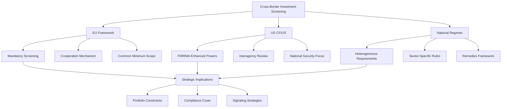

**Strategic responses by sovereign investors** to this regulatory environment include enhanced due diligence on regulatory requirements prior to transaction initiation, structuring investments to signal passive intent where appropriate, co-investment with local partners to reduce political sensitivity, and building relationships with regulatory authorities to facilitate constructive engagement. The research finding that sovereign wealth funds from democratic countries can mitigate market discounts by signaling active stances while those from autocratic countries benefit from passive signaling provides important guidance for navigating these complexities.

### 6.3 The Emergence of New Sovereign Wealth Funds and Evolving Fund Architectures

The sovereign wealth fund landscape is undergoing **significant structural evolution** through both the establishment of new funds in major economies and the transformation of existing fund architectures to address emerging challenges. This dual dynamic reflects recognition that sovereign investment vehicles can serve as powerful instruments for achieving national strategic objectives while also highlighting the governance risks that accompany rapid fund formation without adequate institutional foundations.

**The United States has moved toward establishing a federal sovereign wealth fund**, representing a potentially transformative development given the scale of the American economy and its capital markets. On February 3, 2025, President Trump signed an executive order calling for the secretaries of the Treasury and Commerce to develop a plan to create a U.S. sovereign wealth fund within ninety days[^72]. The executive order states that it is U.S. policy to **"maximize the stewardship of our national wealth for the sole benefit of American citizens"** and confirms national interests in promoting fiscal sustainability, reducing tax burdens, building economic security for future generations, and promoting American economic and strategic leadership internationally[^26].

The **funding mechanisms suggested for the U.S. fund** raise significant questions about fiscal sustainability. The federal government "directly holds $5.7 trillion in assets" and even more through "natural resource reserves"[^72]. More specific proposals include channeling tariff revenues into the fund through a new "External Revenue Service" agency and earmarking proceeds from a "gold card" scheme under which the United States would give wealthy foreigners the right to live and work in the country in exchange for a $5 million fee[^72]. Treasury Secretary Scott Bessent has suggested monetizing assets on the U.S. balance sheet, noting that U.S. gold reserves amount to approximately 261.5 million troy ounces with a fair value of approximately **$762.5 billion**[^26].

**Governance concerns surrounding the U.S. fund proposal are substantial**. The administration's statements are largely silent on fund governance, and without robust governance, a U.S. SWF risks **large-scale distortions, capture by special interests, and increased U.S. public debt**[^39]. If a U.S. SWF fails to abide by international norms like the Santiago Principles, earlier global understandings could unravel, weakening confidence in global capital markets[^39]. The purpose and mandate of any proposed U.S. SWF remain unclear, its funding sources are unspecified, and its governance structure is undetermined[^39].

**Sovereign wealth funds have dramatically grown** from about $500 billion in assets in the 1990s to approximately **$13.7 trillion overall today**[^72]. The U.S. move to create a federal fund follows precedent at the state level—at least **23 states run their own funds, totaling $332 billion in assets**[^72]. Seven new sovereign wealth funds were established in 2024 and five in 2023[^26], indicating continued global expansion of the sovereign investment model.

**The United Kingdom has also moved toward establishing sovereign AI investment capacity**. The UK government launched its **£500 million "Sovereign AI Unit"** in July 2025 to build and scale domestic AI capabilities[^20]. This targeted approach reflects recognition that AI represents a strategic technology requiring dedicated investment vehicles rather than general-purpose fund structures.

**Gulf sovereign funds are establishing specialized technology subsidiaries** to capture AI opportunities. MGX, a tech investing company affiliated with the UAE's Mubadala, joined **OpenAI's mega funding round of $6.6 billion as a major investor** in 2024[^20]. Saudi Arabia's trillion-dollar Public Investment Fund established its AI-focused operational subsidiary **Humain** in 2025, aiming to invest and provide AI-native platforms across four core layers[^20]. Qatar established its national AI company **Qai** under the Qatar Investment Authority at the end of 2025, joining the global AI competition[^20].

The emergence of **sovereign funds as venture capital-style investors** represents a significant evolution in fund architectures. Sovereign investment funds are becoming the new, powerful venture capitalists, actively scouting startups, investing earlier, and even building their own standalone venture arms[^20]. Examples include Taiwan's sovereign wealth fund-backed Taiwania Capital. The U.S. sovereign wealth fund's investment in XLight—a chip startup developing ultra-precision lasers for semiconductor manufacturing—with up to **$150 million** in funding demonstrates this venture orientation[^20].

**Sovereign funds are filling hardware investment gaps** left by traditional venture capital. Approximately **90% of U.S. venture capital flows into software** today, leaving significant funding gaps for hardware and advanced manufacturing[^20]. The U.S. sovereign wealth fund is becoming a funder of hard-tech startups, and it would not be surprising if it becomes a major investor in the emerging quantum computing space[^20]. Quantum computing companies including IonQ, Rigetti Computing, and D-Wave Quantum were reportedly in talks in October 2025 to give the U.S. government equity stakes in exchange for federal funding of at least $10 million each[^20].

**China has similarly focused sovereign capital on AI hardware**. In early 2025, Beijing launched a **60.1 billion yuan ($8.4 billion) national AI fund**, with one focus being "embodied AI"[^20]. China's sovereign funds, including the National Integrated Circuit Industry Investment Fund, are focusing on AI hardware startups[^20]. This parallel development suggests that sovereign funds globally are recognizing the strategic importance of hardware capabilities for technological competitiveness.

The following table compares emerging sovereign fund architectures:

| Fund/Initiative | Jurisdiction | Focus Area | Funding Scale | Governance Model |
|-----------------|--------------|------------|---------------|------------------|
| U.S. SWF (Proposed) | United States | Strategic investments | TBD | Under development |
| UK Sovereign AI Unit | United Kingdom | AI capabilities | £500 million | Government agency |
| MGX | UAE | AI and advanced tech | Multi-billion | Mubadala subsidiary |
| Humain | Saudi Arabia | AI platforms | Multi-billion | PIF subsidiary |
| Qai | Qatar | AI capabilities | Undisclosed | QIA subsidiary |
| National AI Fund | China | AI hardware | $8.4 billion | State-backed |

**Governance lessons from established funds** should inform new fund design. Key safeguards recommended include statutory protections limiting the ability to exploit funds for personal or political gain, operational independence from political interference, clear governance frameworks with defined responsibilities, independent oversight bodies, and standardized disclosure policies[^72]. The Santiago Principles provide a coherent framework for SWF operations and reporting, though they lack enforcement mechanisms and do not explicitly acknowledge the potential for abuse[^39].

**The strategic rationale for sovereign funds as technology investors** reflects their structural advantages. Sovereign funds' ample resources, preference for lower profile, long time horizons, and adherence to sustainability make them **perfect shareholders and strategic partners for tech startup founders**[^20]. In XLight's case, the $150 million investment will help the laser enterprise achieve its goal of producing its first silicon wafers by 2028[^20]. Overall, global sovereign wealth funds are behind-the-scenes "unicorn makers"—their tech investments are on par with private equity and venture capital funds, but they usually have strategic goals in addition to financial returns[^20].

### 6.4 Technological Transformation and AI Integration in Investment Operations

Artificial intelligence is driving **the most profound technological transformation in investment management history**, reshaping how sovereign funds source deals, conduct due diligence, construct portfolios, monitor risk, and create value in portfolio companies. This transformation extends beyond incremental efficiency gains to encompass fundamental changes in competitive dynamics, with early adopters positioning themselves for sustained advantages in an increasingly technology-driven investment landscape.

**The value potential from effective technology deployment is substantial**. Analysis indicates that effective technology and AI deployment can generate **more than ten-fold returns across three domains**: investment returns, operational efficiency, and risk management[^26]. Technology plays a critical role in institutional investing through new alpha generation strategies, dynamic portfolio construction, streamlined investment operations, risk management and compliance, and the transformation of data into a strategic asset[^26].

**AI enables new alpha generation strategies** particularly valuable in periods of private market growth deceleration. Managers can leverage AI tools to analyze large datasets and identify hidden market signals—for example, investing in higher-return early-stage opportunities that traditional analysis might miss[^26]. Dynamic portfolio construction benefits from technology that establishes total portfolio views, improves visibility into risk factors (including ESG) and performance drivers, enables rapid reallocation of investments, and manages liquidity more effectively[^26].

**Leading sovereign funds are implementing comprehensive AI strategies**. Mubadala, managing a diversified asset portfolio exceeding **$330 billion**, has invested in disruptive technologies for decades, with investments spanning foundation models, infrastructure, and applications[^42]. Mubadala's AI strategy is built around three pillars: **working smarter (enhancing operational efficiency), investing better (leveraging AI to optimize the investment lifecycle), and accelerating impact (driving value creation in portfolio companies)**[^42].

**MGX represents an AI-native fund architecture**. The fund employs a streamlined structure with fewer human and corporate function professionals, building an AI-native technology stack[^42]. In investment processes, MGX uses AI to help research potential targets, conduct competitive benchmarking, automate financial modeling, understand AI value creation potential, and generate investment committee summaries[^42]. MGX also works directly with portfolio companies to assess their AI potential and drive value creation[^42].

**Bain's survey of 30 leading private equity funds** (total AUM of $3.2 trillion) reveals evolving expectations for AI-driven value. Only **2% of general partners expect significant AI-driven value in the next year**, but **93% expect moderate to substantial gains within three years**[^42]. At the portfolio company level, investors anticipate AI-driven productivity tools will deliver:
- **20-35% time savings** in customer service response times
- **Up to 50% time savings** in sales and marketing content creation
- **15% reduction** in coding time for software product development
- **Up to 50% improvement** in back-office efficiency through task automation[^42]

One surveyed fund reported that its data science team, through close collaboration with portfolio companies, delivered **more than $150 million in annual positive bottom-line impact** from AI-driven operational improvements[^42]. On the limited partner side, **77% of LPs indicate they want the funds they invest in to use AI for investment analysis and decision-making**[^42].

**Institutional investors face significant technology adoption challenges**. Many investors remain behind in digitization, using spreadsheets and email for tasks that could be automated, and struggling with outdated core systems such as investment books of record (IBOR) that reduce decision-making speed[^26]. Data quality and granularity present challenges, especially in emerging asset classes like private credit[^26]. These challenges typically stem from insufficient spending or inability to articulate priorities clearly to boards and stakeholders[^26].

**Technology spending varies significantly across institutional investors**. Data shows that in 2022, large institutional investors spent on average between **1.3 and 2.7 basis points** on technology and AI[^26]. The top 25% of spenders exceeded 3.5 basis points[^26]. Higher technology spending correlates with three factors: higher proportion of internally managed assets, greater allocation to private assets, and more staff focused on risk management[^26].

**Successful AI transformation requires a multi-pillar approach**:

1. **Define technology vision based on investment objectives**: Institutions should set long-term technology strategy visions aligned with their investment mandates[^26]

2. **Strengthen technology foundations**: This includes modernizing core investment platforms (such as IBOR), deploying AI tools to improve data processes, and treating data as a strategic asset[^26]

3. **Reimagine technology delivery methods**: Building cross-functional collaborative operating models (such as embedding technology personnel in investment teams) and deploying iteratively (building and deploying minimum viable products in three-month cycles) to create value early and continuously[^26]

4. **Revisit talent models**: Attracting and retaining technology talent through clear value propositions, development paths, and competitive compensation, while investing in skill development for all employees[^26]

5. **Identify and mitigate risks**: Including cybersecurity, data risk, operational risk, third-party risk, and legal and compliance issues[^26]

6. **Emphasize change management**: Thinking about change management before technology delivery begins, securing leadership support, communicating through clear change stories and value propositions, and providing adequate employee training[^26]

The following diagram illustrates the AI transformation framework for sovereign investors:

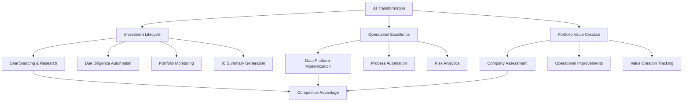

**The UAE has created a supportive environment** for AI-driven investment transformation. The UAE publicly committed to becoming a global AI leader and appointed its first AI minister in 2017[^42]. Mohamed bin Zayed University of Artificial Intelligence was established in 2019, and in January 2024, the UAE President established the AI and Advanced Technology Council[^42]. As of 2024, the UAE ranked fifth in Stanford University's global AI Vibrancy Tool[^42]. This ecosystem support enables funds like Mubadala and MGX to pursue ambitious AI integration strategies.

**Sovereign funds are also major investors in digital infrastructure** supporting the AI ecosystem. In addition to direct tech startup investing, sovereign investors are long-term capital providers for digital economy infrastructure such as 5G towers, fiber networks, and undersea cables[^26]. The AI boom is leading to tremendous demand for digital infrastructure like data centers, which have emerged as **the top real asset segment for sovereign funds**[^26]. MGX teamed up with BlackRock, Global Infrastructure Partners, and Microsoft to launch a **$100 billion AI partnership** to invest in data centers and power infrastructure[^26]. Singapore-based GIC Real Estate and the Canada Pension Plan Investment Board signed a joint venture with Equinix to raise **over $15 billion for data center development** in the US[^26].

### 6.5 Climate Transition Imperatives and the Reorientation of Capital Allocation

The accelerating climate transition is **fundamentally reshaping sovereign investment strategies**, driving a paradigm shift from viewing decarbonization as a portfolio constraint toward recognizing it as a primary source of value creation and competitive advantage. This reorientation reflects both the massive scale of investment required to achieve climate objectives and the growing recognition that economic competitiveness and climate transition have become structurally inseparable—a reality that positions sovereign wealth funds as essential providers of the patient capital needed to finance the transition.

**The scale of required investment is unprecedented**. The International Energy Agency estimates that global annual clean energy investment must rise from approximately **$1.8 trillion in 2023 to $4.5 trillion by the early 2030s** to maintain a 1.5°C pathway[^25]. Emerging and developing economies alone will require **more than $1 trillion annually** to build infrastructure necessary for their ecological transition[^25]. The EU invests €498 billion annually (2023) but requires €842 billion annually to meet 2030 targets, leaving a **€344 billion shortfall**[^25]. France's cumulative infrastructure investment needs over the next fifteen years are approximately **€500 billion**, including €100 billion for electrical networks, €100 billion for rail, €220 billion for general transport, and €67 billion for six new EPR2 nuclear reactors[^25].

**Sovereign wealth funds and public pension funds are pivotal to closing these financing gaps**. These institutions, managing over **$100 trillion globally**, have become critical participants in financing the transition to a low-carbon economy[^25]. "Principal investors"—including sovereign funds and public pension funds—manage **$36 trillion** and are projected to grow at **6% annually through 2030**[^25]. Their allocations to private markets have grown **10% annually over the past decade**, and they now control up to **70% of global private market assets**[^25]. This structural positioning enables sovereign funds to serve as market anchors that can attract private investment to high-capex sectors.

**The shift from constraint to opportunity** represents a fundamental reorientation in how investors approach climate. Investors are moving beyond targeting low-carbon investments to aligning portfolios with net-zero pathways and supporting climate solutions[^18]. The transition consists of companies reducing their emissions and companies providing transition-enabling products and services, which can unlock value[^18]. Despite the U.S. political environment, growth in transition investing is expected due to U.S.-based climate tech companies and increased capital expenditure by large industrial companies[^18]. The US represents approximately **10% of all investment in climate and energy transition**, with additional opportunities in Japan and emerging markets[^18].

**Physical climate risks are increasingly influencing portfolio construction**. Investors are focusing more on physical risks, which are evident globally through extreme weather disasters affecting infrastructure, real estate, and public health[^18]. These risks are quantifiable and often priced based on insurance risk. The Schroders 2024 Global Investor Insights Survey found that **insurers expressed the highest commitment to net zero**[^18]. Insurance-linked securities are seen as having a key role in narrowing the protection gap and contributing to resilience[^18]. After consistently being ranked as the least attractive climate change strategy, **catastrophe insurance is becoming more popular with sovereign wealth funds, with 55% of respondents rating this asset class as either a four or five out of five for attractiveness**[^25].

**Collaborative platforms are emerging to scale climate investment**. The Green Capital Bridge, launched at the 2025 OPSWF CEO Summit, represents a co-investment platform targeting deployment of **131 GW of renewable capacity in Africa by 2030**[^25]. This initiative exemplifies how sovereign funds are working collectively to address financing gaps in regions where individual fund capacity may be insufficient. President Macron emphasized to attending CEOs that **economic competitiveness and climate transition are now structurally inseparable**, and OPSWF members play an increasingly important role in shaping global capital flows toward strategic priorities[^25].

**China Investment Corporation exemplifies integration of climate objectives** into sovereign investment strategy. CIC aligns with the **Dual Carbon Goals** and has strengthened energy transition investments[^18]. The fund has developed its distinctive sustainable investment model and formulated a carbon neutrality action plan, integrating carbon peaking and carbon neutrality goals into its rural revitalization initiatives[^20]. In sustainable energy, CIC aligned with the Dual Carbon Goals and strengthened energy transition investments as part of its 2024 portfolio refinement[^18].

The following table summarizes climate investment imperatives and sovereign fund responses:

| Dimension | Investment Requirement | Sovereign Fund Role | Key Mechanisms |
|-----------|----------------------|---------------------|----------------|
| **Clean Energy** | $4.5T annually by 2030s | Patient capital provider | Direct investment, co-investment |
| **Infrastructure** | €500B (France, 15 years) | Long-term financing | Infrastructure funds, project finance |
| **Emerging Markets** | $1T+ annually | Risk anchor | Blended finance, Green Capital Bridge |
| **Physical Resilience** | Growing demand | Insurance-linked investment | Cat bonds, resilience infrastructure |
| **Technology** | AI investment €109B (France, 2025) | Strategic positioning | Tech subsidiaries, venture investment |

**Sovereign funds are increasingly viewed as essential to achieving climate objectives**. The OPSWF initiative demonstrates that when long-term sovereign investors coordinate action and adopt common standards, they can not only correct market failures but also accelerate innovation, competitiveness, and resilience in the transition to a low-carbon global economy[^25]. This transformation brings enormous opportunities—France has played a pioneering role in shaping OPSWF as a platform for constructive climate diplomacy and proving that financial innovation can align with the public interest[^25].

**The path forward requires strengthening international cooperation** alongside sovereign capital deployment. Three priorities should guide this agenda: first, enhancing governance frameworks to ensure climate alignment is measurable, credible, and translates into real economy outcomes; second, expanding collaborative de-risking mechanisms to unlock investment in high-impact regions; and third, continuing to build bridges between long-term investors, public institutions, and technology innovators[^25].

### 6.6 Macroeconomic Regime Shifts and Strategic Portfolio Recalibration

Sovereign investors are confronting a **structural break from the post-crisis era** characterized by ultra-low interest rates, subdued inflation, and relatively stable geopolitical conditions. The combination of interest rate normalization, persistent inflation pressures, heightened geopolitical fragmentation, and sovereign debt sustainability concerns is forcing fundamental reassessment of portfolio frameworks that had been optimized for a different macroeconomic regime. This recalibration extends beyond tactical adjustments to encompass strategic rethinking of diversification principles, asset class roles, and risk management approaches.

**The 2025 Global Sovereign Asset Management Study reveals significantly intensified concerns** about the investment environment. Geopolitical tensions (cited by **88% of respondents**) and inflation pressures (**64%**) continue to dominate near-term risk assessments, but excessive financial market volatility has also emerged as a major concern (**59%**), substantially increasing from 2024[^42]. The long-term outlook shows high levels of anxiety about global fragmentation (**76%**), climate impacts (**63%**), and sovereign debt sustainability (**57%**)—with the latter showing the most significant year-over-year increase[^42].

**Many respondents believe the current political and economic realignment marks the end of the low interest rate era**. The majority (**74%**) expect medium-term interest rates and bond yields to stabilize in the mid-single digit range, up slightly from 71% in 2024[^42]. Only **11% foresee a return to ultra-low or negative rates**[^42]. This expectation has profound implications for portfolio construction, as the strategies that generated strong risk-adjusted returns in the low-rate environment may prove inadequate in a higher-rate regime.

**The combination of geopolitical shifts and interest rate normalization has prompted structural reassessment of diversification**. In today's higher-inflation, higher-rate environment, **equities and bonds are increasingly correlated, diminishing fixed income's effectiveness as a diversification tool**[^42]. This correlation shift challenges the foundational assumptions of traditional portfolio construction, where fixed income served as a hedge against equity drawdowns. The 2025 study shows **24% of sovereign wealth funds (on a net basis) plan to increase their fixed income exposure**, making it the second most favored asset class behind infrastructure[^42].

**Private credit has emerged as a strategic pillar** for sovereign wealth funds seeking alternative sources of income and resilience. It is becoming increasingly viewed as offering higher yields, bespoke structuring, and lower volatility and correlation to public markets[^42]. The higher rate environment has boosted the appeal of private credit, with **56% of SWFs now investing in it** primarily through funds, and **two-thirds planning to increase allocations**[^18]. SWFs are reallocating to private credit primarily from fixed income (34%), public equities (26%), and private equity (24%)[^18]. Within private credit, SWFs favor **infrastructure debt (51%), real estate debt (50%), and corporate direct lending (29%)** in developed markets[^18].

**Infrastructure allocations are rising** as sovereign funds seek real assets with inflation-linked characteristics. The 2024 Invesco study revealed that **infrastructure allocations rose to 7.7% from 7.1%** the previous year[^42]. Real assets provide long-term returns less correlated to public markets, improve portfolio inflation resilience with their inflation-linked cash flows, and reduce portfolio volatility. GIC's assessment indicates that **real estate valuations are potentially bottoming, presenting attractive investment opportunities**[^18].

**Central banks are also bolstering and diversifying reserves** amid global uncertainty. **53% plan to increase the size of their reserves** and **52% plan additional diversification**[^42]. Concerns about the weaponization of reserves and rising US debt levels are increasing gold's appeal—**56% of central banks agree reserves weaponization makes gold more attractive, and 48% believe rising US debt levels increase its appeal**[^42]. The proportion of central banks with an allocation to emerging markets (ex-China) of 5% or more is projected to increase from 7% in 2022 to **34% in five years**[^42].

**The investment outlook is characterized by elevated uncertainty** requiring portfolio resilience. GIC's assessment indicates that the resilience of the global economy is being challenged by rising uncertainty driven by heightened economic policy uncertainty, trade tensions, and geopolitical risks[^18]. The medium-term outlook will be increasingly driven by supply shocks, with higher inflation and increased macro uncertainty induced by domestic and geopolitical pressures[^18]. GIC emphasizes the need for **a resilient and agile portfolio to handle a wider range of potential outcomes**[^18].

**Current market positioning reflects these recalibration dynamics**. Despite political pressure and a weakening jobs market forcing the Fed's hand with rate cuts, both 10- and 30-year Treasury bond yields have eased to **4.1% and 4.6% respectively**[^42]. US Treasury bonds are not pricing in high long-term inflation rates, with the current 10-year US Treasury bond inflation breakeven rate remaining at around **2.4%**[^42]. Investment grade corporate spreads have tightened to historic lows of **under 1% for BBB-rated bonds**, potentially reflecting that US and eurozone countries no longer look as "risk-free" as they once did given record-high levels of government debt compared to GDP[^42].

The following table summarizes the macroeconomic regime shift and portfolio implications:

| Dimension | Previous Regime | Current/Emerging Regime | Portfolio Implication |
|-----------|-----------------|------------------------|----------------------|
| **Interest Rates** | Ultra-low/negative | Mid-single digits | Reduced fixed income diversification benefit |
| **Inflation** | Subdued | Persistent pressures | Increased real asset allocation |
| **Correlations** | Low equity-bond | Elevated correlation | Alternative diversification sources needed |
| **Geopolitics** | Relatively stable | Heightened fragmentation | Geographic diversification reassessment |
| **Debt Sustainability** | Moderate concern | Elevated concern | Credit quality focus |
| **Currency** | Dollar dominance | Diversification pressure | Reserve composition changes |

**Commodities are being reconsidered as portfolio diversifiers** given changed correlation dynamics. Commodities have diverse drivers and can play an important role in well-diversified portfolios, **especially given the positive correlation between stock and bond markets**[^42]. The Equal Weight Commodities Index is +14% in USD for the year[^42]. The precious metals bull market has not yet run its course, supporting continued positive views on gold and silver[^42]. Preferred ways to gain exposure include strategies that capture the roll yield in commodity futures in backwardation[^42].

**Geographic allocation is shifting** in response to relative growth prospects and risk assessments. GIC increased its investments in the United States, which **continues to be GIC's largest market for capital deployment**[^18]. As of March 2025, GIC's portfolio was distributed **49% in the Americas** (up from 44% a year earlier), **20% in Europe, Middle East, and Africa**, **24% in Asia Pacific** (down from 28%), and **7% globally**[^18]. This shift reflects assessment of relative opportunities while maintaining diversification across regions.

### 6.7 Policy Recommendations for Enhancing Governance, Transparency, and Societal Impact

The analysis across this report reveals both the tremendous potential of sovereign wealth as an instrument for long-term societal benefit and the significant governance, transparency, and coordination challenges that must be addressed to realize this potential. This concluding section synthesizes findings to develop **actionable policy recommendations** for sovereign wealth fund governance and operations, addressing institutional prerequisites for effective wealth management, transparency standards necessary for public accountability, and mechanisms for aligning sovereign investment with broader societal objectives.

**Governance structures must be fortified to prevent political interference and ensure operational independence**. Research demonstrates that targets of sovereign wealth fund investments experience weaker stock price reactions at investment announcement than targets of private-sector investments, with the estimated "SWF discount" translating to an average discount on firm market capitalization of **$60 million for each SWF investment**. This discount is larger for SWFs originating from autocratic countries, reflecting market concerns about political motivation. Effective governance requires:

- **Clear legal frameworks** establishing operational independence from political interference
- **Independent oversight bodies** with authority to monitor compliance with investment mandates
- **Statutory safeguards** limiting the ability to exploit funds for personal or political gain
- **Board composition** including independent directors with relevant expertise
- **Regular, credible audits** by independent third parties with public disclosure

**Mandate modernization is essential** to address contemporary challenges while maintaining core fiduciary responsibilities. Policymakers should update fund mandates to explicitly incorporate long-term strategic objectives (technology, climate) alongside traditional return and risk parameters. For new funds, legislation should establish clear purposes, funding mechanisms, investment strategies, and governance models following international standards like the Santiago Principles[^26]. The Santiago Principles provide a coherent framework but lack enforcement mechanisms and do not explicitly acknowledge the potential for abuse—reform should address these limitations.

**Enhanced transparency and standardized disclosure** are necessary to build public trust and market confidence. Sovereign wealth funds without adequate transparency are susceptible to corruption and political interference, and the lack of fiduciary duties to private investors and minimal reporting obligations make it difficult to understand where a country's money is invested. Policy should mandate standardized, periodic public disclosure covering:

| Disclosure Category | Current State | Recommended Standard |
|--------------------|---------------|---------------------|
| **Governance** | Variable | Annual governance report |
| **Investment Strategy** | Often opaque | Strategic framework disclosure |
| **Performance** | Selective | Standardized return reporting |
| **Climate/ESG** | Voluntary | Mandatory climate metrics |
| **Holdings** | Limited | Periodic portfolio disclosure |

**Building strategic capacity and fostering collaboration** should be policy priorities. Policies should encourage sovereign funds to develop in-house expertise in critical areas like technology due diligence, climate analytics, and geopolitical risk assessment. Fostering collaboration through networks like OPSWF is essential for sharing best practices and scaling impact investments. The OPSWF framework demonstrates that when long-term sovereign investors coordinate action and adopt common standards, they can correct market failures and accelerate the transition to sustainable outcomes[^25].

**Adapting to regulatory fragmentation** requires sophisticated internal capabilities. Sovereign investors and their policymakers must develop capabilities to navigate the increasingly complex global web of investment screening regulations. With **25 of 27 EU Member States** now having or implementing screening regimes[^20], and similar frameworks in the US, UK, and elsewhere, compliance has become a strategic function requiring dedicated resources and expertise.

**SALM frameworks should be strengthened and extended** to enhance fiscal resilience and intergenerational equity. The evidence from advanced implementers like New Zealand and Denmark demonstrates that integrated balance sheet management improves cost-risk trade-offs, builds resilience against shocks, and maintains policy flexibility. Policy recommendations include:

1. **Establish coordination mechanisms** between entities managing different balance sheet components
2. **Develop comprehensive data systems** enabling consolidated balance sheet analysis
3. **Implement natural hedging strategies** to manage currency and interest rate exposures
4. **Build capacity for stress testing** across the consolidated sovereign balance sheet
5. **Create institutional frameworks** for disaster risk financial management

**Performance measurement frameworks must evolve** to provide meaningful accountability while respecting the unique characteristics of sovereign investors. Different fund types require different metrics—evaluating stabilization funds on return maximization criteria or development funds on pure financial metrics produces misleading assessments. Recommended approaches include:

- **Mandate-aligned benchmarks** reflecting fund-specific objectives
- **Long-term performance horizons** (20-year rolling for intergenerational funds)
- **Risk-adjusted metrics** accounting for volatility and correlation characteristics
- **Impact measurement** for funds with development or strategic mandates
- **Peer comparison** within appropriate fund categories

**Climate integration should be accelerated** through both policy mandates and capacity building. The evidence that **70% of sovereign funds believe integrating climate factors enhances long-term returns**[^25] supports the business case for climate action, but implementation gaps remain. Recommendations include:

1. **Adopt formal climate strategies** using the OPSWF Framework as a guide
2. **Develop climate risk assessment capabilities** including scenario analysis and carbon footprinting
3. **Establish board-level accountability** for climate strategy implementation
4. **Enhance transparency** through standardized climate disclosure
5. **Participate in collaborative initiatives** to share experience and scale impact

**Intergenerational equity considerations** should be embedded in fund governance and policy. The case for anchoring fiscal policy in public sector net worth targets rather than debt-based rules reflects recognition that comprehensive balance sheet assessment provides superior frameworks for evaluating intergenerational equity. A net worth anchor is more conducive to public investment and economic growth while providing sensible policy reactions to changes in long-term interest rates. Key recommendations include:

- **Spending rules** that preserve capital for future generations while allowing current benefit
- **Automatic adjustment mechanisms** to depoliticize sustainability decisions
- **Comprehensive balance sheet reporting** including pension and contingent liabilities
- **Natural capital preservation requirements** for resource-based funds
- **Regular intergenerational equity assessments** informing policy decisions

**Technology governance** requires attention as AI integration accelerates. The transformation of investment operations through artificial intelligence creates both opportunities and risks requiring appropriate governance frameworks. Recommendations include:

1. **Define clear AI strategies** aligned with investment objectives
2. **Establish data governance frameworks** ensuring quality, security, and appropriate use
3. **Build cybersecurity capabilities** commensurate with digital transformation
4. **Develop talent strategies** for technology-intensive operations
5. **Implement change management** to drive adoption while managing risks

The following diagram synthesizes the policy recommendation framework:

```mermaid
graph TD
    A[Policy Framework for Sovereign Wealth] --> B[Governance]
    A --> C[Transparency]
    A --> D[Sustainability]
    A --> E[Coordination]
    
    B --> B1[Independence Safeguards]
    B --> B2[Mandate Clarity]
    B --> B3[Board Composition]
    B --> B4[Accountability Mechanisms]
    
    C --> C1[Standardized Disclosure]
    C --> C2[Performance Reporting]
    C --> C3[Climate Metrics]
    C --> C4[Holdings Transparency]
    
    D --> D1[Climate Integration]
    D --> D2[Intergenerational Equity]
    D --> D3[Impact Measurement]
    D --> D4[Natural Capital]
    
    E --> E1[SALM Implementation]
    E --> E2[International Collaboration]
    E --> E3[Regulatory Navigation]
    E --> E4[Stakeholder Engagement]
```

**The path forward** requires recognizing that sovereign wealth funds now occupy a central position in global finance with responsibilities extending beyond narrow financial objectives. The approximately **$13.7 trillion** managed by sovereign wealth funds globally[^72], combined with the even larger pools managed by public pension funds, represents capital of sufficient scale to shape markets, influence corporate behavior, and contribute meaningfully to addressing global challenges including climate change, infrastructure gaps, and sustainable development.

Effective governance, enhanced transparency, and strategic alignment with long-term societal objectives can transform sovereign wealth from a potential source of market distortion and political interference into a powerful instrument for intergenerational prosperity. The recommendations in this chapter provide a roadmap for realizing this potential—but implementation requires sustained commitment from policymakers, fund managers, and the international community to the principles of responsible sovereign investment.

# 参考内容如下：
[^1]:[China Investment Corp. reports 18% growth, portfolio ...](https://www.pionline.com/institutional-investors/sovereign-wealth-funds/pi-china-investment-corp-2024-annual-report/)
[^2]:[Sovereign Wealth Funds: Aspects of Governance ...](https://www.imf.org/external/pubs/ft/wp/2013/wp13231.pdf)
[^3]:[A Global Picture of Public Wealth](https://www.imf.org/en/blogs/articles/2019/06/18/blog-a-global-picture-of-public-wealth)
[^4]:[Kuwait Investment Authority](https://www.kia.gov.kw/investments/)
[^5]:[Sovereign Asset-Liability Management](https://www.imf.org/external/np/pp/eng/2014/061014.pdf)
[^6]:[The Changing Wealth of Nations 2024](https://www.worldbank.org/en/publication/the-changing-wealth-of-nations)
[^7]:[Government Pension Fund Global Annual report 2024](https://www.nbim.no/contentassets/490f9f062cfc4694b12c45f4d04ab0a5/annual_report_2024.pdf)
[^8]:[Our Portfolio](https://www.temasek.com.sg/en/our-investments/our-portfolio)
[^9]:[CIC posts ten-year return of 6.92%](https://www.asiaasset.com/post/30357-cic-1215)
[^10]:[Report on the Management of the Government's Portfolio](https://www.gic.com.sg/uploads/2025/07/GIC_AR_2024-25_PRINT.pdf)
[^11]:[Sovereign Asset and Liability Management](https://pubdocs.worldbank.org/en/123551510764803764/BRISK-Resources-2008BlommensteinKoc-SovereignAssetLiabilityManagement.pdf)
[^12]:[Public Sector Balance Sheet Strength and the Macro ...](https://www.aeaweb.org/conference/2022/preliminary/paper/5sGTZ9aA)
[^13]:[World Bank Document](https://www.publicdebtnet.org/export/sites/pdm/pdm/.content/attachments/Cook.pdf)
[^14]:[Natural Capital](https://www.worldbank.org/en/topic/natural-capital)
[^15]:[Invesco Global Sovereign Asset Management Study](https://www.invesco.com/content/dam/invesco/igsams/en/docs/Invesco-global-sovereign-asset-management-study-2024.pdf)
[^16]:[A US sovereign wealth fund? A confused solution to an ...](https://www.piie.com/blogs/realtime-economics/2025/us-sovereign-wealth-fund-confused-solution-undefined-problem)
[^17]:[Sovereign Asset and Liability Management Framework for ...](https://unctad.org/system/files/official-document/gdsddf2014misc1_en.pdf)
[^18]:[Mubadala: Forging Development in Abu Dhabi - Case](https://www.hbs.edu/faculty/Pages/item.aspx?num=35249)
[^19]:[China Investment Corporation](https://www.china-inv.cn/chinainven/gszl/ExecutiveCommittee.shtml?tagid=cic)
[^20]:[Saudi PIF to Set New Strategy With View to Local Investment](https://www.bloomberg.com/news/articles/2025-09-09/saudi-pif-to-set-new-strategy-with-view-to-local-investment)
[^21]:[White Paper on Government Pension Fund 2025](https://www.regjeringen.no/contentassets/820e1658cc134386a6f8d5b488e76d4c/white-paper-on-government-pension-fund-2025-executive-summary.pdf)
[^22]:[Sovereign Wealth Fund Investment Strategies - IMF eLibrary](https://www.elibrary.imf.org/downloadpdf/display/book/9781589069275/CH010.pdf)
[^23]:[Chapter 1 Demystifying Sovereign Wealth Funds in](https://www.elibrary.imf.org/display/book/9781589069275/CH001.xml?utm_source=miragenews&utm_medium=miragenews&utm_campaign=news)
[^24]:[Sovereign Asset and Liability Management in ...](https://thedocs.worldbank.org/en/doc/309091568656967425-0340022019/related/Session1111Jonasson.pdf)
[^25]:[How we invest](https://www.qia.qa/en/how-we-invest/Pages/default.aspx)
[^26]:[Public Investment Fund (PIF)](https://www.top1000funds.com/asset_owner/public-investment-fund-pif/)
[^27]:[Why Does the Kuwait Investment Authority Still Matter? ...](https://moderndiplomacy.eu/2026/01/03/why-does-the-kuwait-investment-authority-still-matter-success-challenges-and-institutional-reform/)
[^28]:[Investment strategy for the Government Pension Fund Global](https://www.nbim.no/contentassets/b373c58c1c6b4ffe89b0b600eb9f37ee/investment-strategy-for-the-government-pension-fund-global--unlisted-equities.pdf)
[^29]:[The Belt and Road Initiative: what impact on China and ...](https://www.economicsobservatory.com/the-belt-and-road-initiative-what-impact-on-china-and-the-global-economy)
[^30]:[Sovereign Wealth Funds Investment Strategies](https://www.toptal.com/management-consultants/market-research-analysts/sovereign-wealth-funds)
[^31]:[Sovereign Wealth Funds—A Work Agenda](https://www.imf.org/external/np/pp/eng/2008/022908.pdf)
[^32]:[China Investment Corporation](http://www.china-inv.cn/chinainven/Investments/Portfolio_Management.shtml)
[^33]:[In almost every country, the institutions that manage](https://thedocs.worldbank.org/en/doc/825031542726513603-0340022018/original/BRISKBrochureOct12V1FINAL.pdf)
[^34]:[PDF File - The Market Equity Risk Premium](https://www.treasury.govt.nz/sites/default/files/2007-11/tp-tmerp-may2005.pdf)
[^35]:[Denmark's ATP creates new overlays to manage future ...](https://www.top1000funds.com/2024/02/denmarks-atp-creates-new-overlays-to-manage-future-bond-equity-correlation/)
[^36]:[Asset and Liability Management (ALM): The case of New ...](https://thedocs.worldbank.org/en/doc/531561585575215103-0340022020/render/SovereignAssetandLiabilityManagementNewZealandTurkeyDenmark.pdf)
[^37]:[Sovereign Asset and Liability Management Framework for ...](https://thedocs.worldbank.org/en/doc/810761510764907261-0340022017/render/BRISKResourcesFatosKoc2014SovereignAssetLiabilityManagementFrameworkforDMOs.pdf)
[^38]:[What are trade-offs in decision-making?](https://www.1000minds.com/articles/what-are-trade-offs)
[^39]:[Case Study—Future Fund](https://www.achievinginvestmentexcellence.com/download/preview-aie-casestudy.pdf)
[^40]:[Sovereign Asset-Liability Management - IMF eLibrary](https://www.elibrary.imf.org/view/journals/007/2014/078/article-A001-en.xml)
[^41]:[China's Belt and Road: The new geopolitics of global ...](https://www.brookings.edu/articles/chinas-belt-and-road-the-new-geopolitics-of-global-infrastructure-development/)
[^42]:[Portfolio](https://www.qia.qa/en/portfolio/Pages/default.aspx)
[^43]:[Measuring the Influence of China's Belt and Road Initiative](https://www.ni-u.edu/wp-content/uploads/2023/11/NIUShort_02162021_DNI202200751_China.pdf)
[^44]:[Beyond Debt: Net Worth Fiscal Anchors in - IMF eLibrary](https://www.elibrary.imf.org/view/journals/001/2024/137/article-A001-en.xml)
[^45]:[Mitigating Political Interference in Sovereign Wealth Funds ...](https://baffi.unibocconi.eu/sites/default/files/media/attach/Taming-Leviathan.pdf)
[^46]:[Can Pension Funds Integrate Environmental, Social, and ...](https://pensionresearchcouncil.wharton.upenn.edu/blog/can-pension-funds-integrate-environmental-social-and-governance-principles/)
[^47]:[A Diverse Global Portfolio Built for the Long Term](https://www.adia.ae/en/investments)
[^48]:[Assessing Systemic Financial Stability Risks Due to Fx ...](https://www.elibrary.imf.org/view/journals/007/2022/008/article-A003-en.xml)
[^49]:[Population aging and pension fund risk-taking](https://www.sciencedirect.com/science/article/abs/pii/S1544612325023827)
[^50]:[Under Pressure: Checks and balances in central banks](https://am.vontobel.com/en/insights/under-pressure-checks-and-balances-in-central-banks)
[^51]:[A Framework for Benchmarking Private Investments](https://www.cambridgeassociates.com/insight/a-framework-for-benchmarking/)
[^52]:[Norway's Sovereign Wealth Fund: $2.1T Global Leader](https://discoveryalert.com.au/norways-sovereign-wealth-fund-leader-2025-economic-strategy/)
[^53]:[The Case for Sovereign Wealth Funds in Resource-Cursed ...](https://sppe.lse.ac.uk/articles/69)
[^54]:[Sovereign wealth fund governance: A trade-off between ...](https://amu.hal.science/hal-04231607/file/Sovereign%2520wealth%2520fund%2520governance_A%2520trade-off%2520between%2520internal%2520and%2520external%2520legitimacy_2023.pdf)
[^55]:[About – Kuwait Investment Authority](https://www.kia.gov.kw/about-kia/)
[^56]:[The fund's value - Investments](https://www.nbim.no/en/investments/the-funds-value/)
[^57]:[CIC Released the Annual Report 2023](https://www.china-inv.cn/chinainven/Media/2024-09/1002742.shtml)
[^58]:[KIA's Implementation of the Santiago Principles [Generally ...](https://www.kia.gov.kw/wp-content/uploads/2018/10/KIA-IFSWF-CASE-STUDY-Presentation-18OCT2018-V2-1.pdf)
[^59]:[Foreign direct investment reviews 2025: European Union](https://www.whitecase.com/insight-our-thinking/foreign-direct-investment-reviews-2025-european-union)
[^60]:[Invested In Our Future](https://www.gic.com.sg/invested-in-our-future/)
[^61]:[PIF Program 2021-2025](https://www.pif.gov.sa/en/strategy-and-impact/the-program/)
[^62]:[The Portfolio Construction of the Norwegian Sovereign ...](https://sites.duke.edu/finance/2025/06/06/norwegian-sovereign-wealth-fund/)
[^63]:[THE INVESTMENT FUND OF THE FUTURE](https://www.mubadala.com/-/media/Files/alpha-intelligence-investment-fund-of-the-future.pdf?ver=latest)
[^64]:[Investment strategy](https://www.nbim.no/en/investments/investment-strategy/)
[^65]:[Sovereign Wealth Funds as Engines of Capital for the ...](https://pppescp.com/2025/10/27/sovereign-wealth-funds-as-engines-of-capital-for-the-climate-transition/)
[^66]:[Overall Performance Management of Temasek Holdings and ...](https://www.mof.gov.sg/news-resources/newsroom/overall-performance-management-of-temasek-holdings-and-gic/)
[^67]:[China Investment Corporation](https://en.wikipedia.org/wiki/China_Investment_Corporation)
[^68]:[SAFE IC (China) - Fund Profile](https://globalswf.com/fund/SAFE)
[^69]:[Sovereign Wealth Funds Climate Change](https://www.ifswf.org/document/publication/powering-change-building-resilience-transforming-climate)
[^70]:[Sovereign funds and the hunt for unicorns](https://www.omfif.org/2024/12/sovereign-funds-and-the-hunt-for-unicorns/)
[^71]:[Sovereign investors recalibrate for a transformed ...](https://www.invesco.com/apac/en/institutional/insights/market-outlook/sovereign-investors-recalibrate-transformed-investment-landscape.html)
[^72]:[Governance and Transparency in Sovereign Wealth Funds ...](https://papers.ssrn.com/sol3/papers.cfm?abstract_id=5211840)
