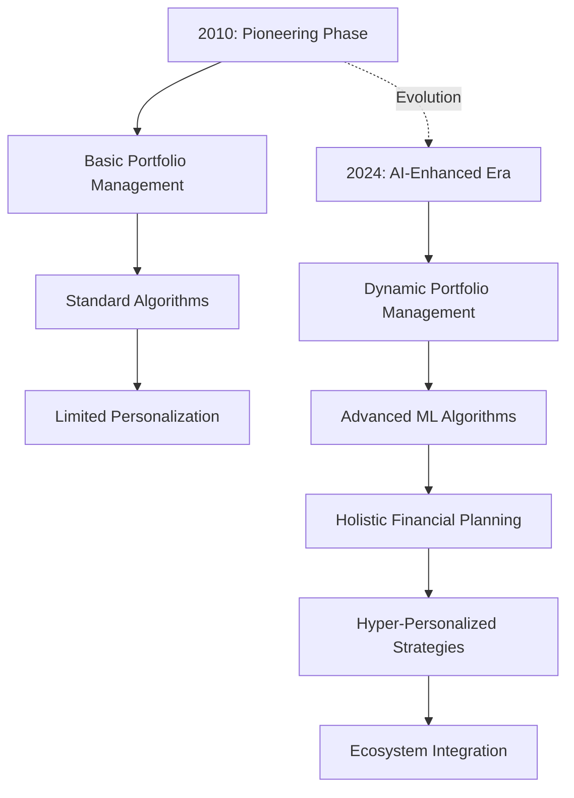
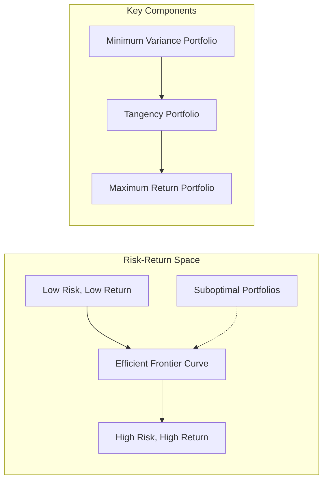
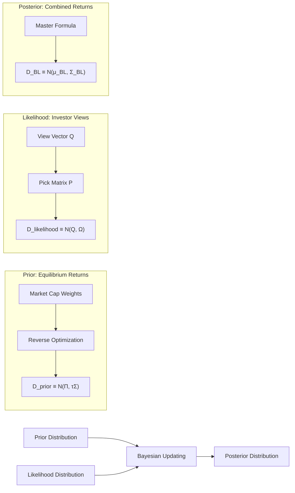
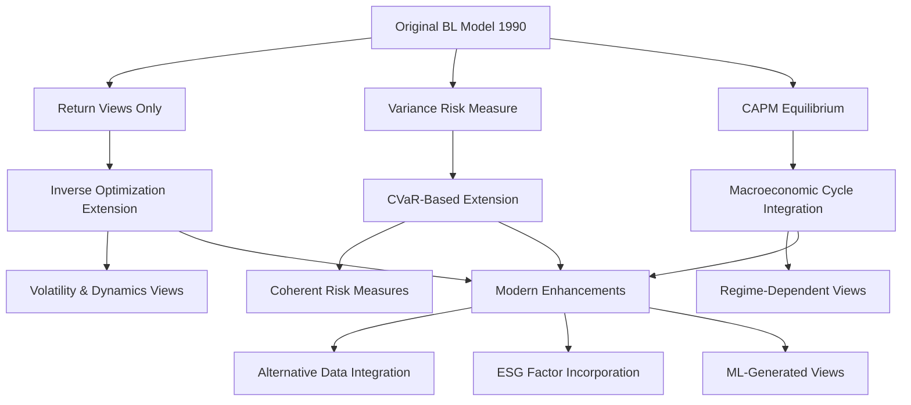
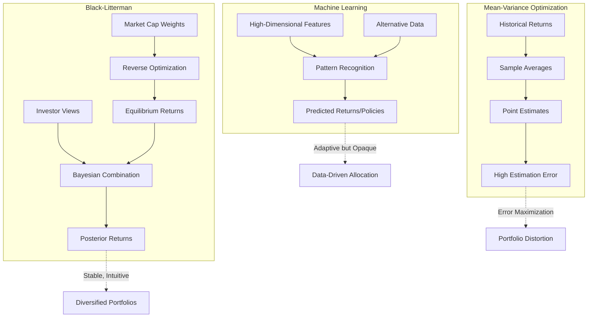
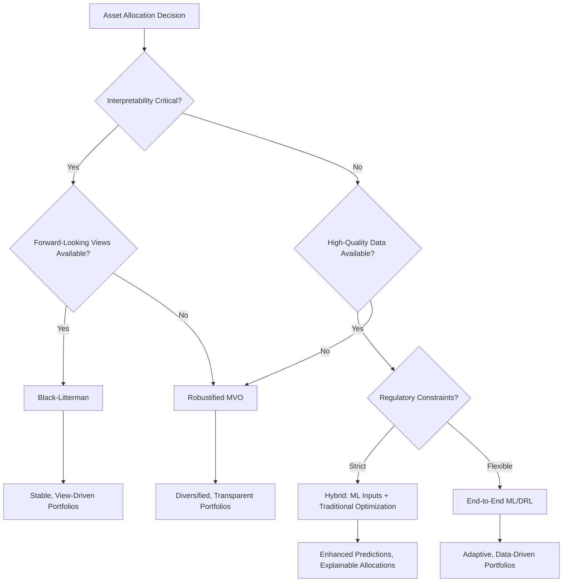
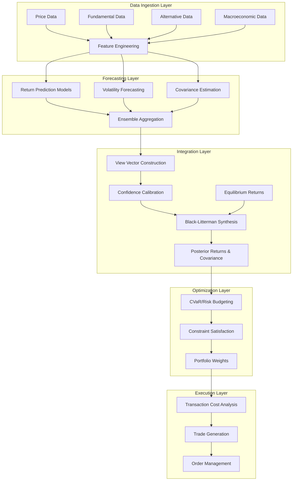

# Beyond the Frontier: A Comparative Analysis and Synthesis of FinTech Asset Allocation Models
## 1 Introduction: The Evolution of Quantitative Asset Allocation in FinTech

The transformation of asset allocation from an art practiced by seasoned portfolio managers to a science driven by sophisticated algorithms represents one of the most profound shifts in modern finance. What began with Harry Markowitz's elegant mathematical formalization of diversification in the 1950s has evolved into a complex ecosystem where machine learning models process vast datasets in milliseconds, robo-advisors manage trillions of dollars with minimal human intervention, and quantitative strategies increasingly dominate institutional portfolio construction. This evolution raises fundamental questions about how different algorithmic approaches balance the competing demands of risk management, return optimization, and practical implementation—questions that have become increasingly urgent as FinTech platforms bring these sophisticated tools to mainstream investors.

The core research problem examined in this report centers on a critical tension: **classical optimization models offer mathematical elegance and interpretability but struggle with real-world complexities; view-based enhancements address some limitations but introduce subjective elements; and data-driven machine learning approaches promise adaptability but sacrifice transparency**. Understanding the trade-offs among these paradigms is essential for both practitioners seeking to improve portfolio outcomes and researchers working to advance the theoretical foundations of quantitative finance.

### 1.1 Historical Foundations of Quantitative Asset Allocation

The intellectual architecture of modern quantitative investing rests on foundations laid during a remarkably productive period of academic finance spanning from the 1950s through the 1990s. This theoretical edifice, combined with exponential advances in computing technology, created the conditions for the algorithmic revolution that now defines contemporary portfolio management.

**The Birth of Modern Portfolio Theory**

The quantitative approach to investing originated with Louis Bachelier's *Theory of Speculation* in 1900, which first applied mathematical rigor to financial markets, though his work remained largely unrecognized for decades[^1]. The true breakthrough came in the 1950s and 1960s with the emergence of Modern Portfolio Theory (MPT), which provided the conceptual framework that continues to underpin most portfolio optimization approaches today[^2]. Harry Markowitz's seminal 1952 paper introduced the revolutionary insight that portfolio risk could be quantified through variance and that optimal portfolios could be identified along an **efficient frontier**—the set of portfolios offering maximum expected return for any given level of risk.

This framework suggested that the traditional 60/40 portfolio—60% stocks and 40% bonds—represented an optimal allocation for most investors, a recommendation that has dominated portfolio construction for nearly seven decades despite dramatic changes in the investment landscape. The efficient frontier concept transformed asset allocation from a qualitative judgment into a mathematical optimization problem, making computers a natural fit for analyzing stocks, assessing optimal combinations, and executing portfolio optimization[^2].

**The Factor Revolution and Quantitative Expansion**

The theoretical foundation expanded significantly with the development of factor models that sought to explain the cross-section of asset returns. In 1992, Eugene Fama and Kenneth French proposed their three-factor model, which combined size, beta, and value in a single framework to predict stock returns[^3]. The following year, Narasimhan Jegadeesh and Sheridan Titman established the foundation for momentum investing in their influential paper examining the returns to buying winners and selling losers[^3].

These academic developments spawned a new industry. The quantitative investment approach as we know it today originated in the 1980s, when several quantitative investment firms were established—many of which continue to thrive[^3]. This emerging industry benefited from a unique confluence of conditions: **financial data became available in digital formats, and computing power enabled previously laborious quantitative analyses**. The 1970s and 1980s saw the rise of option pricing and quantitative trading, making computers a cornerstone of the derivatives market[^2].

**Technological Acceleration and Algorithmic Trading**

The 1990s marked a pivotal transition with the introduction of electronic trading platforms, which pushed the global expansion of stock, bond, and credit markets through the 2000s[^2]. Global markets fragmented from large institutional exchanges like the NYSE and NASDAQ into multiple venues including electronic exchanges, alternative trading systems, and dark pools[^2]. This fragmentation created both challenges and opportunities for quantitative managers, as market microstructure became increasingly important for execution quality.

The technological infrastructure supporting quantitative finance evolved dramatically. Portfolio optimizers now use complex non-linear optimization algorithms capable of handling sophisticated functions and constraints more effectively[^3]. These algorithms have become more efficient through **parallel processing**, achieving unprecedented scalability and enabling quantitative managers to optimize larger portfolios containing thousands of securities[^3]. By 2024, high-frequency trading algorithms alone generated $10.4 billion in revenue, with projections reaching $16 billion by 2030[^4].

**The Machine Learning Era**

The 2010s witnessed the emergence of machine learning as a central theme in quantitative finance, driven by explosive growth in data volume and variety[^2]. The use of artificial intelligence and machine learning in finance dates to the 1980s but gained substantial momentum in the current data science revolution[^2]. Analysis now focuses on text, natural language processing, sensor networks, satellite imagery, and credit card data to develop investment insights[^2].

Modern quantitative investment represents the culmination of a century of development. Today, most innovation in public equity investing is concentrated on the quantitative side, where the convergence of computing power, novel datasets, and new technologies enables portfolio managers to research and capture investment signals previously unavailable[^3]. These techniques—broadly classified as machine learning—enable systems to identify patterns from data and make predictions while learning from experience without explicit programming[^3].

| **Era** | **Key Developments** | **Technological Enablers** | **Impact on Asset Allocation** |
|---------|---------------------|---------------------------|-------------------------------|
| 1950s-1960s | Modern Portfolio Theory, Efficient Frontier | Early mainframe computing | Mathematical formalization of diversification |
| 1970s-1980s | Option pricing, Quant firm emergence | Digital financial data | Derivatives market computerization |
| 1990s-2000s | Electronic trading, Factor models | Internet, Parallel processing | Global market expansion, Algorithmic execution |
| 2010s-Present | Machine learning, Alternative data | Cloud computing, GPUs | Real-time pattern recognition, Predictive modeling |

### 1.2 The Rise of FinTech and Robo-Advisory Services

The 2008 financial crisis served as a catalyst for fundamental change in how investment advice is delivered, exposing the limitations of traditional financial institutions and driving demand for alternatives offering clearer, simpler, and cost-effective investment options[^5]. From this disruption emerged robo-advisors—automated platforms that would democratize access to sophisticated portfolio management techniques previously available only to wealthy investors.

**The Emergence of Automated Investment Platforms**

The conceptual foundation for robo-advisors was laid in the late 2000s, catalyzed by broader internet accessibility and advancements in computational technology[^5]. Platforms like **Betterment** (launched in 2008) and **Wealthfront** (launched in 2011) became synonymous with robo-advising, offering algorithm-driven investment services to the public[^5]. These pioneering services focused primarily on automated portfolio management, using sophisticated algorithms to allocate investments across diversified asset classes based on users' risk tolerance and financial goals[^5].

Early robo-advisors offered compelling benefits that disrupted traditional advisory models: **low fees, low account minimums, and automated tax-loss harvesting**[^5]. The market reception was notably positive among millennials and tech-savvy individuals who valued user-friendly interfaces, transparency, and cost-effectiveness[^5]. Signing up typically starts with consumers filling out detailed questionnaires online about their financial goals, risk tolerance, and investment timeframes, with algorithms then generating asset allocations fitting customer needs[^6].

**Market Growth and Institutional Adoption**

The global robo-advisory market has experienced remarkable expansion. Assets under management grew from $827 billion in 2019 to nearly $1.367 trillion in 2021, with projected growth rates of 21.4% from 2022-2023 and 17.7% in 2024[^5]. By 2024, the market size was projected to reach **$2.487 trillion** in assets under management[^5].

Traditional financial institutions recognized the competitive threat and opportunity, incorporating robo-advisory capabilities into their service offerings. Leading platforms in 2024 include Vanguard Personal Advisor Services ($100 billion AUM, 0.30% fee), Schwab Intelligent Portfolios ($73 billion AUM, $0 advisory fees), Wealthfront ($50 billion AUM, 0.25% fee), and Betterment ($29 billion AUM, 0.25%-0.40% fee)[^5]. Vanguard's Personal Advisor Services, a hybrid robo-adviser, had $115 billion in assets under management as of February 2019[^7].

**Evolution from Automation to AI-Enhanced Planning**

As robo-advisors matured, advancements in artificial intelligence and machine learning significantly enhanced their capabilities, allowing them to move beyond simple portfolio management[^5]. The integration of AI algorithms transformed how these platforms analyze market data, processing vast amounts of information in real-time for more accurate predictions and improved investment strategies[^5]. Machine learning refined user interfaces, making them more intuitive and user-friendly while expanding investment offerings to include assets like real estate, commodities, and cryptocurrencies[^5].

Modern robo-advisors have evolved into comprehensive financial planning tools offering services such as retirement planning, educational savings plans, and automated budgeting[^5]. By 2024, they entered a new era of financial technology using advanced AI and machine learning for dynamic portfolio management, offering holistic financial planning and hyper-personalized investment strategies using big data analytics, while integrating with broader financial ecosystems[^5].

**Demonstrated Impact on Investor Portfolios**

Research examining robo-advisory services has documented significant improvements in portfolio characteristics. A comprehensive analysis of Vanguard's Personal Advisor Services found that robo-advising **reduced idiosyncratic risk** by lowering holdings of individual stocks and active mutual funds while raising exposure to low-cost indexed mutual funds[^7]. Specifically, the percentage of wealth in indexed mutual funds almost doubled from 47% to 83%, international diversification increased threefold from 10% to 32% of wealth, and average expense ratios were more than halved from 19 to 9 basis points[^7].

The service also systematically adjusted asset allocation based on investor characteristics: bond holdings increased from 24% to 40%, cash holdings decreased from 22% to 1%, and equity exposure was adjusted based on investor age—increasing for those under 55 and decreasing for those over 55[^7]. Analysis of risk-adjusted performance showed improvement after adopting robo-advice, with post-advice annualized Sharpe ratios averaging 0.115 compared to a pre-advice average of -0.014 at a 6-month horizon[^7].

### 1.3 Core Research Problem: Trade-offs Among Allocation Model Paradigms

The proliferation of algorithmic approaches to asset allocation has created a fundamental challenge for both practitioners and researchers: **understanding how different modeling paradigms address the competing demands of theoretical rigor, practical effectiveness, and operational feasibility**. This research examines the core differences among three dominant approaches—classical mean-variance optimization, view-based enhancement methods, and data-driven machine learning—across the critical dimensions of risk measurement, return prediction, and portfolio construction.

**The Classical Paradigm: Mathematical Elegance and Practical Limitations**

The mean-variance framework established by Markowitz provides a mathematically elegant solution to the portfolio construction problem, quantifying risk through variance and identifying optimal allocations along the efficient frontier. However, this approach relies on **static risk budgets and historical covariance estimates** that may not capture the dynamic nature of financial markets[^8]. Traditional portfolio optimization methods face fundamental limitations, including sensitivity to input estimation errors and the assumption that returns follow normal distributions—conditions that often diverge from actual market behavior.

The allocation models that championed 60/40 portfolios are missing key inputs, focusing solely on the tradeoff between risk and return where risk is defined as volatility measured by standard deviation[^9]. When only stocks and bonds existed, this framework was adequate, but when other asset classes with different characteristics emerged, the question of how to evaluate optimality became more complex. Traditional asset allocation models are incapable of capturing the unique features of alternative assets, described by characteristics including unique drivers of return, varying levels of leverage, diverse return relationships, and distinct risk levels[^9].

**The View-Based Enhancement: Incorporating Forward-Looking Perspectives**

The Black-Litterman model addresses some limitations of pure mean-variance optimization by integrating market equilibrium returns with subjective investor views through a Bayesian framework. This approach produces more intuitive and stable portfolio weights by anchoring allocations to market-implied expectations while allowing systematic incorporation of forward-looking perspectives.

However, view-based methods introduce their own challenges. The reliance on subjective inputs creates potential for bias, while the underlying equilibrium assumptions may not hold in all market conditions. The complexity of properly specifying views and their associated confidence levels requires sophisticated understanding that may be difficult to systematize in automated platforms.

**The Data-Driven Paradigm: Adaptability and Opacity**

Machine learning approaches represent a fundamentally different philosophy, attempting to capture complex non-linear relationships and temporal dependencies through pattern recognition in high-dimensional data. A novel machine learning framework for dynamic risk-based asset allocation integrates Long Short-Term Memory networks for volatility forecasting with differentiable risk budgeting layers and regime-switching mechanisms, enabling end-to-end training of portfolio weights under adaptive risk constraints[^8]. Unlike conventional approaches that rely on static risk budgets, this methodology **dynamically adjusts risk targets based on real-time market indicators**, including volatility expectations, credit spreads, and yield curve dynamics[^8].

Such frameworks have demonstrated superior risk-adjusted performance, with one approach achieving a Sharpe ratio of 1.38 during an out-of-sample period (2017-2022), representing a **55% improvement over traditional risk parity strategies** and a 23% enhancement over contemporary deep learning approaches[^8]. Empirical results reveal particularly strong performance during volatile market conditions, with maximum drawdowns reduced by 41% during stress periods compared to conventional methods[^8].

However, machine learning models face significant challenges. Reasons for caution include the need for human judgment to assess and clean data and select techniques, potential underperformance with limited or missing data, and susceptibility to overfitting or underfitting[^2]. From a regulatory standpoint, ML techniques may seem opaque or "black box," producing results not easily understood[^2]. The fundamental drawback is that these systems remain software—computers are only as good as the information put into them[^6].

| **Dimension** | **Classical Mean-Variance** | **View-Based (Black-Litterman)** | **Machine Learning** |
|--------------|---------------------------|--------------------------------|---------------------|
| **Risk Measurement** | Historical variance/covariance | Equilibrium-conditional with view adjustments | Learned representations, dynamic |
| **Return Prediction** | Historical averages | Blended equilibrium and views | Pattern recognition, alternative data |
| **Allocation Mechanism** | Deterministic optimization | Bayesian updating | Policy learning, heuristic |
| **Interpretability** | High | Moderate | Low ("black box") |
| **Adaptability** | Low (static) | Moderate (view-dependent) | High (data-driven) |
| **Data Requirements** | Moderate | Moderate | High |

### 1.4 Driving Forces Behind Algorithmic Model Adoption

The accelerating adoption of quantitative allocation models in FinTech reflects the convergence of multiple technological, economic, regulatory, and demographic forces that are fundamentally reshaping the investment management landscape.

**Technological Advances in Computing and Machine Learning**

The most significant driver has been the exponential advancement in computing capabilities and machine learning techniques. Computational power, novel datasets, and new technologies now enable portfolio managers to research and capture investment signals previously unavailable[^3]. Natural language processing capabilities allow quantitative strategies to detect sentiment, tones, and keyword patterns across thousands of corporate documents and earnings calls, identifying management confidence, risk disclosures, or shifts in strategy[^1]. Decision tree algorithms evaluate every stock individually, instantly assessing company data from multiple sources within tailored risk constraints to produce return forecasts[^1].

Advanced quantitative capabilities allow strategies to analyze thousands of companies simultaneously each day by processing massive datasets in real-time, spotting hidden patterns in market behavior by detecting subtle, nonlinear relationships between hundreds of investment factors[^1]. This represents a fundamental shift from traditional analysis—quant strategies can adapt quickly to new information, whereas traditional managers often need more time to adjust and may struggle with emotional or cognitive biases[^1].

**The Alternative Data Revolution**

The growth in data volume and variety has driven intense machine learning activity, expanding from traditional datasets like asset prices and economic indicators to alternative data from social media, satellite imagery, credit card transactions, and sensor networks[^2]. These machine learning techniques contribute to generating non-traditional investment signals that produce scores for every stock in a given universe, which quantitative analysts add to their models to predict future price movements[^3].

Quantitative factors and investment signals used to assess security attractiveness have expanded dramatically. While analysts still rely heavily on academically supported factors as model inputs—value, momentum, growth, quality, and technical categories—they increasingly use machine learning and novel dataset-driven investment signals[^3]. The broad range of non-traditional signals discovered by quantitative analysts is driving an increasing share of alpha within quantitative models and can define competitive advantage[^3].

**Regulatory Environment and Market Structure Evolution**

The regulatory environment plays a crucial role in shaping adoption patterns. Countries with stronger rule of law, quality of regulation, and ease of entry have higher volumes of alternative finance[^10]. Regulatory requirements add complexity, with the European Union's RTS 6 revision enforcing 50-microsecond gateway timestamping and per-instrument order-to-trade ratio caps, while Australia's ASIC CP 361 rewrite imposes microsecond timestamps with new reporting requirements[^4]. This regulatory fragmentation creates compliance costs estimated at £8-12 million per tier-1 cross-listed dealer[^4].

Fitch Ratings expects accelerated adoption of financial technology and progressive regulatory development to challenge conventional business models of securities companies globally[^11]. As electronic trading matures and commissions compress, domestic standardized-flow brokers are losing market share to digital platforms with cross-border, multi-asset products and extended trading hours[^11]. Greater regulatory clarity across major markets is expected to open doors to digital assets and broaden the investable asset universe[^11].

**Demographic Shifts and Changing Investor Preferences**

Demographic forces significantly influence adoption patterns, as younger "digital native" cohorts drive fintech usage. A global survey found fintech usage is **48% among those aged 25-34, compared to 9% for those 75 and above**[^10]. Trust in technology is higher among younger consumers, though this may be affected by data breaches[^10].

Research examining robo-advisor adoption across 41 studies comprising 17,558 respondents found that **attitude, trust, perceived usefulness, and ease of use are the strongest predictors** of adoption[^12]. Contrary to prior assumptions, financial literacy and perceived risk showed no significant effects[^12]. Moderation analysis highlighted that women perceive greater usefulness of robo-advisors, and national development and innovation levels enhance adoption effects[^12]. Cultural values such as individualism, long-term orientation, and indulgence positively influence adoption intention[^12].

**Economic Pressures on Asset Management**

The global asset management industry faces mounting margin pressure, with pre-tax operating margins declining by three percentage points in North America and five percentage points in Europe between 2019 and 2023[^13]. Technology spending has grown disproportionately with an 8.9% CAGR in North America and Europe over the past five years, yet this has not consistently translated into higher productivity[^13].

For an average asset manager, the potential impact from AI, generative AI, and agentic AI could be transformative—**equivalent to 25 to 40 percent of their cost base**[^13]. A mid-sized asset manager with $500 billion in AUM could capture 25 to 40 percent of total cost base in efficiencies through AI opportunities enabled by end-to-end workflow reimagination[^13]. In investment management, generative AI is transforming how insights are generated and decisions are made, with potential for an 8% efficiency impact[^13].

**Investment Trends and Capital Flows**

Global fintech investment patterns reflect these driving forces. In H1 2025, global fintech investment totaled $44.7 billion across 2,216 deals[^14]. The digital assets and currencies space was the leading sector, attracting $8.4 billion in investment compared to $10.7 billion for all of 2024[^14]. **AI-focused fintech was a close second, with $7.2 billion in investment** versus $8.9 billion in 2024[^14]. The median valuation for early-stage AI-driven fintech companies stood at $134 million, well ahead of non-AI driven fintechs[^14].

### 1.5 Scope and Structure of the Comparative Investigation

This research undertakes a systematic comparative analysis of asset allocation model paradigms to address the central question: **what are the core differences between classical optimization, view-based enhancement, and machine learning approaches in terms of risk measurement, return prediction, and asset allocation, and is it possible to combine their strengths to build a more general-purpose and effective framework?**

**Analytical Framework and Evaluation Dimensions**

The comparative investigation evaluates each modeling paradigm across multiple dimensions critical to practical implementation in FinTech applications:

1. **Risk-Adjusted Performance**: Assessment of how each approach measures and manages portfolio risk, including examination of variance-based measures, equilibrium-conditional expectations, and learned representations. The analysis considers performance during both normal market conditions and stress periods, given that empirical results show machine learning frameworks achieving maximum drawdown reductions of 41% during stress periods compared to conventional methods[^8].

2. **Computational Efficiency**: Evaluation of processing requirements and scalability, recognizing that modern implementations must process portfolios efficiently—with some architectures maintaining computational efficiency through sparse attention mechanisms, scaling linearly with asset count while processing 50-asset portfolios in under 25 milliseconds[^8].

3. **Interpretability and Transparency**: Analysis of how each approach addresses the "black box" problem, considering that regulatory requirements increasingly demand explainability in algorithmic decision-making[^4]. The investigation examines techniques such as SHAP-based risk attribution that provide transparent insights into allocation decisions across different market regimes[^8].

4. **Adaptability to Market Regimes**: Assessment of how models respond to changing market conditions, including regime-switching capabilities and the ability to proactively adjust allocations. Evidence suggests that sophisticated ML frameworks can begin reducing equity exposure weeks before market troughs, demonstrating genuine predictive ability rather than reactive adjustment[^8].

5. **Suitability for Different Investor Profiles**: Consideration of how each paradigm serves various investor segments, from institutional managers requiring sophisticated risk controls to retail investors accessing services through robo-advisory platforms.

**Criteria for Assessing Model Effectiveness**

When evaluating new factors and investment signals for inclusion in quantitative models, appropriate candidates must possess several attributes: they need fundamental and intuitive meaning; statistical significance within their predictive models; sustained efficacy; broad effectiveness across geographies and economic sectors; and ideally low correlation with existing factors[^3]. This last criterion explains the continuous search for novel data sources and new investment signals.

The investigation recognizes that despite rapid advances in tools, datasets, and investment signals, **more human oversight is required, not less**[^3]. Quantitative investors must apply their experience and expertise throughout the process to ensure outputs have solid fundamental meaning and contribute to robust investment decisions[^3].

**Structure of Subsequent Analysis**

The research proceeds through a structured examination of each paradigm:

- **Chapter 2** deconstructs the mean-variance framework, analyzing its core logic, foundational strength in diversification theory, and practical shortcomings including sensitivity to input estimates and the inadequacy of variance as a comprehensive risk measure.

- **Chapter 3** examines the Black-Litterman model as a Bayesian enhancement, exploring how it addresses instability through integration of market equilibrium returns with subjective views, while scrutinizing its complexity and reliance on equilibrium assumptions.

- **Chapter 4** investigates deep learning and advanced machine learning approaches, analyzing their capacity to capture non-linear relationships while critically examining interpretability challenges, data requirements, and overfitting risks.

- **Chapter 5** conducts the structured comparative analysis across risk measurement, return prediction, and allocation mechanics, synthesizing findings to contrast methodological approaches.

- **Chapter 6** explores pathways toward hybrid modeling frameworks, analyzing how to strategically combine paradigm strengths while addressing integration challenges including computational complexity and maintaining economic interpretability.

- **Chapter 7** synthesizes key insights and proposes directions for future investigation, including integration of explainable AI techniques and robust frameworks for multi-period optimization under uncertainty.

**Practical Implications for FinTech Application**

The investigation maintains focus on practical applicability within the FinTech context, recognizing that robo-advisors and algorithmic platforms must balance sophisticated optimization with operational constraints. Research indicates that investors believe advice adds value regardless of delivery method, with perceived value-add to annual performance of 5% for human advice and 3% for digital-only advice[^15]. Digital advice is preferred for specific portfolio-management services like diversification and tax optimization, while human advisors retain advantages in emotional support and comprehensive financial planning[^15].

The framework proposed by this research acknowledges that AI-driven financial planning requires adherence to foundational principles including fiduciary duty, adaptive personalization, technical robustness, ethical constraints, and auditability[^16]. A development roadmap categorizing AI intermediaries into maturity levels—from basic calculators through robo-advisers to holistic robo-planners—explicitly links maturity to mitigation of economic inefficiencies while maintaining alignment with client welfare[^16].

This investigation ultimately aims to inform both academic understanding and practical implementation, providing a rigorous foundation for evaluating how algorithmic asset allocation can best serve investors in an era of rapid technological change and evolving market dynamics.

## 2 Deconstructing the Classics: The Mean-Variance Framework and Its Practical Paradox

The Markowitz Mean-Variance Optimization (MVO) framework stands as one of the most influential intellectual contributions to modern finance, providing the first rigorous mathematical formalization of the intuitive concept that investors should not "put all their eggs in one basket." More than seventy years after Harry Markowitz formulated portfolio construction as an optimization problem that trades off expected return and risk, his method has become **the dominant quantitative method for portfolio construction in practice**[^17]. Yet this dominance exists alongside a well-documented paradox: the framework's theoretical elegance often translates poorly into practical application when naively implemented. Understanding this tension—between mathematical optimality under idealized conditions and empirical performance under real-world uncertainty—is essential for appreciating both the enduring value of classical optimization and the motivations driving alternative approaches such as view-based enhancements and machine learning methods.

This chapter systematically deconstructs the mean-variance framework, examining its mathematical foundations, the powerful insights it provides about diversification, and the practical challenges that have spawned decades of research into robustification techniques. The analysis establishes the baseline against which subsequent chapters will compare the Black-Litterman model and modern machine learning approaches, revealing why the search for improved asset allocation methodologies remains an active and important area of inquiry.

### 2.1 Mathematical Foundations and Core Logic of Mean-Variance Optimization

The mathematical architecture of the Markowitz framework rests on a deceptively simple premise: **model the rate of returns on assets as random variables and choose portfolio weighting factors optimally**, where optimality achieves an acceptable baseline expected rate of return with minimal volatility[^18]. This formulation transforms the qualitative problem of portfolio selection into a precise quadratic programming problem with elegant analytical solutions.

**The Optimization Problem Formulation**

Let the random vector of asset returns be denoted with its mean vector $\mu$ and covariance matrix $\Sigma$. For a portfolio with weights $w$ summing to one, the portfolio return is a random variable with mean $\mu_p = \mu^T w$ and variance $\sigma_p^2 = w^T \Sigma w$. If $\mu_b$ is the acceptable baseline expected return, an optimal portfolio solves the quadratic program:

$$\text{minimize } \frac{1}{2}w^T \Sigma w \text{ subject to } \mu^T w \geq \mu_b \text{ and } \mathbf{1}^T w = 1$$

This formulation captures the fundamental insight that investors seek to minimize risk (variance) for any given level of expected return, or equivalently, maximize expected return for any given level of risk[^18]. The quadratic nature of the objective function combined with linear constraints ensures the problem is convex, guaranteeing that any local minimum is also a global minimum.

**Analytical Solutions and the Inverse Covariance Matrix**

Assuming the covariance matrix $\Sigma$ is nonsingular, the solution procedure yields closed-form expressions for optimal portfolio weights. The **minimum variance portfolio**, which represents the leftmost point on the efficient frontier, has weights given by:

$$w_{\text{min-var}} = \frac{\Sigma^{-1}\mathbf{1}}{\mathbf{1}^T \Sigma^{-1}\mathbf{1}}$$

If the expected return of this portfolio satisfies the investor's baseline requirement, it solves the optimization problem. Otherwise, the solution involves a linear combination of the minimum variance portfolio and the **market portfolio**, with weights:

$$w_{\text{mk}} = \frac{\Sigma^{-1}\mu}{\mathbf{1}^T \Sigma^{-1}\mu}$$

Every solution to the mean-variance optimization problem can be represented as a linear combination of these two fundamental portfolios[^18]. This mathematical structure reveals a critical feature that has profound implications for practical implementation: **the inverse covariance matrix $\Sigma^{-1}$ appears directly in the analytical solutions**, meaning that estimation errors in the covariance matrix are amplified rather than dampened in the portfolio construction process[^17].

**Alternative Formulations and the Risk Aversion Parameter**

An alternative formulation that proves useful in practice introduces a risk aversion parameter $\lambda$:

$$\text{minimize } \frac{1}{2}w^T \Sigma w - \lambda \mu^T w \text{ subject to } \mathbf{1}^T w = 1$$

As $\lambda$ varies from 0 to $+\infty$, the solution traces out all possible solutions to the original problem for all baseline returns above the minimum variance return[^18]. This parameterization provides a convenient way to generate the entire efficient frontier and allows investors to express their risk preferences through a single interpretable parameter.

**The Two-Fund Theorem and One-Fund Theorem**

The mathematical structure of mean-variance optimization gives rise to two fundamental theorems that have shaped portfolio management practice. The **Two-Fund Theorem** states that the entire efficient frontier can be generated from any two efficient portfolios—investors need only hold combinations of two mutual funds to achieve any efficient portfolio[^18].

When a risk-free asset with return $r_f$ is included, the model changes significantly. The optimal portfolio weights become a linear combination of the risk-free asset and a single fund of risky assets, leading to the **One-Fund Theorem**: every efficient portfolio can be constructed as a linear combination of the risk-free asset and this single fund. The efficient frontier becomes a straight line in the mean-standard deviation diagram:

$$\mu_p = r_f + \frac{\mu_M - r_f}{\sigma_M} \sigma_p$$

where $\mu_M$ and $\sigma_M$ are the expected return and standard deviation of the market portfolio[^18]. This linear relationship, known as the Capital Market Line, provides the theoretical foundation for the Capital Asset Pricing Model (CAPM), which asserts that the expected return on any asset satisfies $\mu_i = r_f + \beta_i (\mu_M - r_f)$, where $\beta_i$ measures the asset's covariance with the market portfolio relative to the market's variance[^18].

### 2.2 The Efficient Frontier and Diversification Benefits

The efficient frontier represents the mathematical embodiment of optimal diversification, depicting the set of portfolios that produce the highest predicted return for any given level of risk, or equivalently, the minimal risk associated with a certain expected return[^19]. This concept, introduced by Harry Markowitz in the 1950s, remains a cornerstone of modern portfolio theory and provides the geometric intuition underlying quantitative asset allocation.

**Geometric Interpretation and Construction**

The efficient frontier is visually depicted on a chart with the x-axis showing the variability of returns (standard deviation as an indicator of risk) and the y-axis indicating the anticipated return[^19]. This creates a characteristic curved line that illustrates the best portfolio mix for different risk levels. The curve represents the upper boundary of the feasible region containing all possible portfolios, with portfolios below the frontier being suboptimal—either offering lower returns for the same risk or higher risk for the same return[^20].

When constructing the efficient frontier, three factors come into play: **Expected Return**, which refers to the projected return on an investment based on historical performance and future forecasts; **Variance/Standard Deviation**, which assesses the volatility or risk linked to returns; and **Covariance**, which gauges how the returns of two assets move in relation to each other[^19]. The covariance structure is particularly crucial for evaluating the overall risk of a portfolio and determines the curvature of the efficient frontier.

**The Curvature and Diversification Benefits**

A key finding of the efficient frontier concept was **the benefit of diversification resulting from the curvature of the efficient frontier**[^20]. This curvature is integral in revealing how diversification improves the portfolio's risk/reward profile. The mathematical basis for this benefit lies in the portfolio variance formula:

$$\sigma_p^2 = \sum_i \sum_j w_i w_j \sigma_{ij}$$

When assets are not perfectly correlated, the portfolio variance is less than the weighted average of individual asset variances, demonstrating that diversification can yield the same return with less risk[^21].

The curvature also reveals that **there is a diminishing marginal return to risk**—adding more risk to a portfolio does not gain an equal amount of return[^20]. Optimal portfolios that comprise the efficient frontier tend to have a higher degree of diversification than sub-optimal ones, which are typically less diversified. This insight provides theoretical justification for the intuitive practice of spreading investments across multiple assets.

**The Role of Asset Correlation**

A fundamental principle of the efficient frontier is the effect of asset correlation on portfolio risk. The correlation between assets can greatly impact a portfolio's overall risk and return profile:

| **Correlation** | **Implication** | **Diversification Benefit** |
|-----------------|-----------------|----------------------------|
| Perfect (+1) | Assets move together perfectly | No diversification advantage |
| Positive (<1) | Assets don't move in perfect harmony | Portfolio risk reduced below weighted average |
| Zero (0) | Assets move independently | Substantial risk reduction possible |
| Negative (-1) | Assets move in opposite directions | Theoretically possible to create zero-risk portfolio |

When the correlation between assets is less than perfect, **by mixing assets with lower correlation the overall portfolio risk can be decreased below the average risk of the individual assets**[^19]. In an ideal scenario where the correlation between assets is -1, it is theoretically possible to create a portfolio with no variance, though such perfect negative correlations rarely exist in practice.

**Practical Applications and Limitations**

The efficient frontier assists in optimizing portfolios by helping investors pinpoint the most efficient ones that deliver the highest returns for a given level of risk[^19]. It aids investors in understanding the balance between risk and return and helps make informed choices about strategic asset allocation. A risk-seeking investor would choose securities on the right end of the efficient frontier, while securities on the left end would be suitable for risk-averse investors[^20].

However, the efficient frontier is built on assumptions such as constant expected returns, fixed correlations, and stable investment conditions, which in reality may not always be accurate[^19]. The reliance on historical data, which might not reliably forecast future performance, represents another significant limitation. These caveats set the stage for understanding why the theoretical elegance of the efficient frontier often fails to translate into superior practical performance.

### 2.3 The Error Maximization Problem: Sensitivity to Input Estimates

The most significant practical challenge facing mean-variance optimization is its **extreme sensitivity to input parameters**, a problem so severe that some researchers have characterized the optimization process as "error maximization" rather than return maximization[^22]. This sensitivity, well documented in academic literature and practitioner experience, explains why naive implementation of the Markowitz framework often produces portfolios that are unstable, non-intuitive, and perform poorly out-of-sample.

**The Mathematical Origin of Sensitivity**

The sensitivity of mean-variance optimization to input data is already hinted at by the inverse covariance matrix that appears in the analytical solutions[^17]. This mathematical structure means that small changes in estimated means can result in huge changes in the whole portfolio structure. The term "error maximization" originates from Michaud (1989), who argued that **optimizers tend to assign large positive weights to securities with large positive estimation errors in the risk premium and large negative weights to those with negative estimation errors**, thus acting as statistical error maximizers[^22].

The effect can be demonstrated mathematically. For a standard optimization where optimal weights are given by $w = \frac{1}{\lambda} \Sigma^{-1} \mu$, the sensitivity of the weights to the expected return is:

$$\frac{\partial w}{\partial \mu} = \frac{1}{\lambda} \Sigma^{-1}$$

Due to the nature of the inverse covariance matrix, arbitrary changes in $\mu$ lead to large changes in portfolio weights[^22]. For example, if the standard deviation of an asset is 20%, the inverse of the variance is 25, illustrating why small changes in the means matter significantly and can cascade into dramatic portfolio reallocation.

**The Asymmetry Between Mean and Covariance Estimation**

The greatest practical weakness of MVO is its extreme sensitivity to its inputs, a problem often called the "Markowitz optimization enigma"[^23]. The optimization process requires two sets of parameters: the vector of expected returns ($\mu$) and the covariance matrix ($\Sigma$). Of these, **expected returns are notoriously difficult to estimate with any degree of accuracy**[^23].

As an optimizer, MVO is designed to exploit even the smallest differences in these inputs, leading it to "error maximize" by placing large, concentrated bets on assets with slightly overestimated returns while shorting those with slightly underestimated returns[^23]. This results in portfolios that are unstable, non-intuitive, and often perform poorly out-of-sample. The phenomenon is particularly acute when optimizing for the Maximum Sharpe Ratio, as the optimizer aggressively allocates capital to assets with even slightly overestimated expected returns.

Empirical evidence from Chopra and Ziemba (1993) compared optimization using historical data against a portfolio formed with perfect future information. They found that **using historical returns to estimate the mean return incurs a massive performance shortfall, whereas estimating the covariance matrix is sufficient**[^22]. This asymmetry explains why many practical approaches focus on improving return estimation or reducing reliance on return forecasts altogether.

**Empirical Evidence of Poor Naive Implementation**

The sensitivity, coupled with the challenge of estimating the mean and covariance of returns, leads to portfolios that exacerbate errors or deficiencies in the input data to find unrealistic and poorly performing portfolios[^17]. Some authors argue that choosing a portfolio by optimization is essentially an estimation-error maximization method. This criticism is justified on the surface, as **Markowitz portfolio construction can perform poorly when it is naively implemented**, for example by using empirical estimates of mean and covariance on a trailing window of past returns[^17].

Computational experiments demonstrate this phenomenon clearly. The Markowitz solution estimate exhibits poor performance with a sample size of 1, performing worse than the equal-weight portfolio[^24]. However, its performance improves significantly with a sample size of 24, indicating that the severity of the error maximization problem is directly related to the quality and quantity of data available for estimation.

**A Nuanced Perspective on Sensitivity**

A different perspective offered by Kritzman (2006) argues that when assets are close substitutes, even though input errors lead to large portfolio misallocations, **the return distribution of the incorrect portfolio is often similar to the truly optimal portfolio**[^22]. Therefore, mean-variance optimizers are usually robust to small input errors when sensitivity is measured properly. This suggests that the cynicism about error maximization may arise from a misunderstanding of sensitivity—errors in estimates may misstate optimal allocations, but the resultant incorrect portfolio is often nearly as good as the correct portfolio.

Nevertheless, this nuanced view does not eliminate the practical challenges. Portfolio managers still face the problem of explaining concentrated or counterintuitive positions to clients and investment committees, and the instability of allocations over time creates unnecessary turnover and transaction costs. These considerations motivate the extensive research into robustification techniques discussed later in this chapter.

### 2.4 The Inadequacy of Variance as a Comprehensive Risk Measure

Beyond the sensitivity to input estimates, the mean-variance framework faces a more fundamental conceptual challenge: **the use of variance and standard deviation as risk proxies fails to capture the full spectrum of investor risk preferences**, particularly the asymmetric concern for downside losses that characterizes real-world decision-making. This limitation becomes especially problematic when asset returns deviate significantly from the normal distribution that underlies the theoretical justification for variance-based risk measurement.

**The Normality Assumption and Its Requirements**

The mean-variance theory requires either that the distribution of returns is multivariate normal and the utility function is exponential, or that the utility function of the investor is quadratic[^25]. Standard deviation appropriately describes risk only when returns are normally distributed, which requires symmetry[^21]. These requirements are restrictive: a quadratic utility function implies that more money produces less utility beyond a certain point, which economists find unrealistic. The reliance on normality means that the framework implicitly assumes that all relevant information about the return distribution is captured by its first two moments—the mean and variance.

**The Symmetry Problem**

A fundamental limitation of variance as a risk measure is that it treats upside and downside deviations from the mean equally. Yet investors are typically more concerned about downside risk than upside volatility—few investors complain when their portfolios exceed expected returns. Standard deviation measures the total risk including both upside and downside, while **many investors more care about downside risk**[^26].

This asymmetry in investor preferences suggests that risk measures should focus specifically on the left tail of the return distribution. Conditional Value-at-Risk (CVaR), also known as Expected Shortfall, is one such measure that is particularly adept at capturing tail risk[^26]. Unlike variance, which weights all deviations equally, CVaR focuses specifically on the expected loss in the worst scenarios, providing a more intuitive measure of the risk that investors actually care about.

**The Disconnect Between Variance and Value-at-Risk**

When the distributions of underlying assets are not normal, the decision-making criterion using the mean and variance does not yield the same result as using the mean and Value-at-Risk (VaR)[^25]. The reason is that **a lower variance does not automatically ensure a lower VaR**. This discrepancy can be illustrated with a concrete example:

| **Portfolio** | **Distribution** | **Mean Return** | **Variance** | **1% VaR** | **Risk Ranking** |
|--------------|------------------|-----------------|--------------|------------|------------------|
| A | Double Exponential | 0.3 | 1.0 | 2.466 | More risky (VaR) |
| B | Double Exponential | 0.3 | 1.1 | 2.357 | More risky (Variance) |

By the mean-variance criterion, Portfolio B is more risky due to its higher variance. However, the 1% VaR for Portfolio A is 2.466, while for Portfolio B it is 2.357, making Portfolio A more risky from a VaR perspective[^25]. This discrepancy motivates using the same risk measure in risk management as in portfolio theory, rather than relying on variance as a universal proxy for risk.

**Implications for Non-Normal Return Products**

Using standard deviation and correlation-based measures for financial products with non-normal return distributions is problematic[^21]. Investment vehicles with non-normal distributions include covered call strategies, which heavily cut potential upside while providing minimal downside protection, and private equity and hedge funds due to their compensation structure. A typical 20% performance fee means investors get only 80% of positive excess returns but absorb 100% of negative ones[^21].

These asymmetric payoff structures mean that standard deviation fails to capture the true risk profile of the investment. Empirical research shows that aggregate fees in a portfolio of multiple hedge funds can climb to nearly 50% of excess profit, further distorting the return distribution and making variance-based risk assessment inappropriate[^21].

### 2.5 Non-Normal Return Distributions and Tail Risk Challenges

The assumption that asset returns follow a normal distribution represents one of the most significant departures between mean-variance theory and empirical reality. Extensive research has documented that **most financial markets do not have rates of return that are Gaussian**, meaning the Markowitz mean-variance model produces outcomes that are not truly optimal[^25]. Understanding the nature and implications of these deviations is essential for appreciating both the limitations of classical optimization and the motivations for alternative approaches.

**Empirical Evidence of Non-Normality**

Long-established evidence shows that financial data deviates from the idealized normal distribution. Mandelbrot (1963) demonstrated that real asset returns tend to have fatter tails than the normal distribution (leptokurtosis), exhibit more negative extreme values than positive ones (negative skewness), and display volatility clustering (heteroscedasticity)[^27]. More recent research confirms that assets exhibit asymmetric tail dependence, with correlations increasing during periods of market stress.

The frequency of extreme events provides compelling evidence of fat tails. When examining S&P 500 historical monthly data dating back to 1926, **three-sigma losses occurred 10 times in 1,026 months, a frequency close to 1%—almost 8 times the frequency predicted by the normal distribution**[^26]. This means the normal distribution fundamentally fails to model real-world "tail risk," underestimating the probability of extreme market movements that can devastate portfolios.

**Characteristics of Real Return Distributions**

Empirical analysis of return distributions across asset classes reveals consistent patterns of non-normality:

| **Asset Class** | **Skewness** | **Excess Kurtosis** | **Implication** |
|-----------------|--------------|---------------------|-----------------|
| U.S. Large Cap Stocks | Negative | Positive | Fat left tail, more extreme losses |
| U.S. Real Estate | Negative | Positive | Concentrated downside risk |
| International Bonds | Positive | Low | More favorable distribution |
| Hedge Fund Arbitrage | Negative | High | Significant tail risk |

Most asset classes exhibit negative skewness and excess kurtosis[^26]. The presence of negative skewness means that large negative returns occur more frequently than would be predicted by a symmetric distribution, while excess kurtosis indicates that extreme events of both signs are more common than the normal distribution suggests. These characteristics have significant implications for portfolio construction.

**Alternative Distributional Assumptions**

To address the inadequacy of the normal distribution, researchers have proposed alternative distributional assumptions that better capture real-world return characteristics. The lognormal distribution, while an improvement over the normal distribution for some purposes, still cannot model the historical returns of assets like U.S. large-cap stocks and U.S. real estate—its curve does not have sufficiently thick tails or enough negative skewness to cover the largest losses[^26].

The **Johnson distribution** provides a more flexible alternative, requiring only two additional input parameters—skewness and kurtosis—beyond those needed for the normal distribution. This distribution can better model the historical data of various asset classes by explicitly incorporating higher moments[^26]. For even more realistic modeling, researchers have proposed using copulas to construct joint distributions that allow for fat-tailed marginal distributions (such as Laplace, logistic, or Cauchy) combined with dependence structures that capture tail dependence through t-copulas with low degrees of freedom[^25].

**Impact on Portfolio Optimization**

The consideration of skewness and kurtosis has significant effects on asset allocation decisions, especially regarding performance during crisis periods[^26]. When non-normal assumptions are incorporated into the optimization process, the resulting efficient frontier shifts, typically appearing to the southeast of the traditional mean-variance frontier. This indicates that **standard MVO optimization understates risk**, while optimization incorporating higher moments provides a more realistic picture of the risk-return tradeoff[^26].

Research comparing traditional MVO with optimization using Johnson distributions and CVaR as the risk measure demonstrates meaningful differences in portfolio allocations. In fixed income, for example, international bonds may be ignored by MVO but receive significant allocation under CVaR optimization because the asset class exhibits positive skewness and low excess kurtosis[^26]. Similarly, hedge fund arbitrage allocations are significantly reduced when tail risk is properly accounted for, while commodities and real estate may receive larger allocations due to their more favorable distributional characteristics.

A numerical example using four stocks modeled with Laplace marginal distributions and a t-copula shows that methods accounting for non-normality can produce portfolios with a **6 percent improvement in the Return-Risk Tradeoff ratio** compared to portfolios from the standard Markowitz model[^25]. This demonstrates a practical solution for portfolio optimization when returns are not Gaussian and when using VaR as the risk measure.

### 2.6 Practical Implementation Constraints: Transaction Costs, Leverage, and Turnover

The basic Markowitz model assumes a frictionless world where portfolios can be rebalanced costlessly and without constraints on position sizes or trading activity. In reality, **rebalancing a portfolio generates turnover, and turnover incurs expenses**[^28]. The gap between the idealized optimization problem and real-world implementation requirements has motivated extensive research into incorporating practical constraints, fundamentally changing both the mathematical structure of the optimization problem and the characteristics of resulting portfolios.

**Transaction Cost Structures**

Transaction costs are classified into two main types with distinct characteristics and modeling requirements[^28]:

| **Cost Type** | **Examples** | **Dependence on Trade Size** | **Modeling Approach** |
|--------------|--------------|------------------------------|----------------------|
| Fixed Costs | Brokerage commissions, transfer fees | Independent of volume | Binary variables (MIO) |
| Variable Costs | Bid/ask spread, slippage | Linear in trade size | Linear constraints |
| Market Impact | Price movement from large trades | Nonlinear (power law) | Power cone constraints |

For variable transaction costs, a linear model is typically used where the cost function for security $i$ is $C_i(\tilde{x}_i) = v_i^+ \tilde{x}_i^+ + v_i^- \tilde{x}_i^-$, with $v_i^+$ and $v_i^-$ as cost rates for buying and selling[^28]. This formulation maintains the convexity of the optimization problem while capturing the essential economics of trading costs.

**Market Impact Costs**

Market impact costs reflect the reality that large trades alter security prices. An empirical power law models the average relative price change as:

$$\frac{\Delta p_i}{p_i} = \pm c_i \sigma_i \left( \frac{|\tilde{d}_i|}{q_i} \right)^{\beta-1}$$

where $\sigma_i$ is volatility, $q_i$ is average dollar volume, and $\beta-1$ is empirically around 1/2[^28]. This nonlinear relationship means that market impact costs grow faster than linearly with trade size, creating a natural penalty for large position changes and effectively limiting the practical capacity of any strategy.

**Leverage and Position Constraints**

The Markowitz problem can be extended to include many practical constraints that modify both the feasible region and the optimal solution. Asset and cash weight limits have the form $w_{\min} \leq w \leq w_{\max}$, with a long-only portfolio having $w_{\min} = 0$[^17]. A leverage limit constrains the sum of absolute position weights: $\|w\|_1 \leq L_{\text{tar}}$.

Importantly, **a long-only constraint can be interpreted as a form of regularization**[^17]. By preventing short positions, this constraint eliminates many of the extreme allocations that arise from estimation error. A less extreme version is to impose a leverage limit, which can help avoid many of the data sensitivity issues while still allowing some shorting[^17]. This insight connects practical constraints to the theoretical problem of robustification.

**Turnover and Trading Constraints**

Trade limits impose bounds on individual position changes, while turnover limits constrain total trading activity: $T = \frac{1}{2}\|z\|_1 \leq T_{\text{tar}}$, where $z$ represents the vector of trades[^17]. These constraints recognize that frequent rebalancing generates costs and that portfolio stability has value beyond pure optimization considerations.

**Cardinality Constraints and Buy-In Thresholds**

Cardinality constraints limit the number of securities in the portfolio to $K$ positions, where $K$ is much smaller than the total universe $N$[^28]. This constraint reflects practical considerations such as monitoring costs, minimum position sizes, and the desire for portfolio simplicity. Buy-in thresholds impose lower bounds on trade sizes to avoid small, economically insignificant trades.

Both cardinality constraints and buy-in thresholds introduce binary variables into the optimization problem, transforming it from a convex quadratic program into a Mixed Integer Optimization (MIO) problem[^28]. While MIO problems are computationally more challenging, modern solvers can handle problems of practical size efficiently.

**Impact on the Efficient Frontier**

The efficient frontier shows reduced returns when transaction costs and constraints are included[^28]. Each constraint or cost reduces the feasible region or penalizes the objective, resulting in portfolios that achieve lower returns for any given level of risk compared to the unconstrained case. However, these constrained portfolios are more realistic and often perform better out-of-sample because they avoid the extreme positions that arise from estimation error in unconstrained optimization.

### 2.7 Regularization and Robustification: Addressing Classical Limitations

Despite the well-documented limitations of naive mean-variance optimization, **the critical practical issues of taming sensitivity and gracefully handling estimation errors are readily addressed using techniques such as regularization and robust optimization**[^17]. These methods have transformed the Markowitz framework from a theoretically elegant but practically fragile approach into a robust methodology that remains competitive with more sophisticated alternatives.

**The Philosophy of Robustification**

Robust optimization and regularization both follow the same high-level story: they start with a basic optimization-based method that relies on data that are not known precisely, and then modify the optimization problem, often by adding additional objective terms or constraints[^17]. Doing this worsens the in-sample performance but improves out-of-sample performance if done well. The key insight is to **tell the optimizer to not fully trust the data**, which serves it well when applied to new, unseen market conditions[^17].

Robust optimization modifies an optimization-based method to make it more robust to data uncertainty, while regularization is another term for methods that modify an optimization problem to mitigate sensitivity to data[^17]. Both approaches recognize that the inputs to portfolio optimization are estimates subject to error, and that treating these estimates as known with certainty leads to overconfident and unstable portfolios.

**Robust Portfolio Optimization with Uncertainty Sets**

Robust Portfolio Optimization explicitly models ranges of possible return estimates using uncertainty sets, rather than treating inputs as known with certainty[^29]. It performs worst-case optimization to find portfolios that perform acceptably even when actual parameters fall at the edge of estimated ranges. This method is particularly important for estimation error mitigation when historical data is limited[^29].

The worst-case mean portfolio return can be defined as:

$$R_{\text{wc}} = R - \rho^T |w|$$

where $\rho$ defines the uncertainty intervals for the return means[^17]. Similarly, a worst-case portfolio risk incorporates a covariance forecast error penalty:

$$\sigma_{\text{wc}}^2 = \sigma^2 + \varrho \left( \sum_i \Sigma_{ii}^{1/2} |w_i| \right)^2$$

where $\varrho$ defines the level of uncertainty in the covariance matrix[^17]. These formulations penalize portfolios that are highly sensitive to estimation errors, naturally favoring more diversified and stable allocations.

Research demonstrates that for any given estimate of expected returns, **there exists a diagonal estimation-error matrix such that the loss from using robust optimization can be made arbitrarily small**[^24]. Simulation results show that robust models can significantly outperform the classical Markowitz model when the uncertainty parameter lies within a wide range of values—robust portfolios close a percentage gap of up to 19.4% compared to the Markowitz solution for small sample sizes[^24].

**Shrinkage Estimators and the Black-Litterman Approach**

Regularization can be applied to the forecasting of the mean and covariance in Markowitz portfolio construction. The **Black-Litterman approach** to estimating mean returns regularizes the estimate toward the market-implied return[^17]. Rather than relying solely on historical averages, which are subject to substantial estimation error, this approach anchors return expectations to the equilibrium returns implied by market capitalization weights.

A return covariance estimate can be regularized using **shrinkage**, which pulls the sample covariance matrix toward a structured target such as the identity matrix or a single-factor model[^17]. Empirical evidence confirms that the utilization of robust covariance and return estimators in the portfolio design process yields significant relative outperformance on a risk-adjusted basis. Specifically, **GMV-Shrink portfolios using Ledoit-Wolf shrinkage were the best performers** in empirical tests, suffering the lowest volatility and achieving the highest Sharpe ratio[^30].

**The Markowitz++ Framework**

The extension of Markowitz's method that addresses many practical effects and gracefully handles the uncertainty inherent in return statistics forecasting is a convex optimization problem that can be solved with high reliability and speed[^17]. This extended formulation, sometimes called "Markowitz++," maximizes a robustified net portfolio return subject to constraints relating pre-trade and post-trade portfolios, weight limits, trading constraints, and a robustified risk limit[^17].

Numerical experiments demonstrate that **adding reasonable constraints or objective terms to the basic Markowitz method greatly improves performance**[^17]. The following table summarizes the impact of various robustification techniques:

| **Technique** | **Mechanism** | **Performance Impact** |
|--------------|---------------|----------------------|
| Portfolio weight limits | Prevents extreme allocations | Significantly improves Sharpe ratio |
| Leverage limits | Constrains total position size | Reduces drawdown |
| Turnover limits | Reduces trading frequency | Improves net returns after costs |
| Robust return forecasts | Penalizes estimation uncertainty | Better out-of-sample performance |
| Robust risk forecasts | Accounts for covariance uncertainty | More stable risk exposure |

Combining all these elements into a Markowitz++ method yields even better performance than any single technique, and parameter tuning via back-testing provides a further modest boost[^17].

**Computational Efficiency**

The Markowitz++ problem can be solved very efficiently, even for large universes, especially when using a factor model for returns. For a universe of 74 assets, the average solve time is about 23 milliseconds[^17]. The method scales well with problem size; for example, a problem with 10,000 assets and 100 factors can be solved in under a second. This computational efficiency makes robustified mean-variance optimization practical for real-time portfolio management applications.

**Empirical Performance Comparisons**

Comparative studies confirm the value of robustification. Research using S&P 500 sector data found that **Markowitz model performed worst in all cases compared to Black-Litterman and robust optimization approaches**[^31]. Under rebalancing, all models showed significant performance improvements, with robust optimization demonstrating consistent ability to outperform market benchmarks across all risk levels due to its risk stability[^31].

The shrinkage model generates average returns and less-than-average risk, making it a strong candidate for practical portfolio construction[^32]. Empirical Sharpe ratios confirm the ordering: Markowitz (0.54), Shrinkage (0.49), and Black-Litterman (-0.03 in one study with specific constraints)[^32]. However, these results are sensitive to the specific constraints imposed and the market environment, highlighting the importance of context-specific model selection.

**The Enduring Relevance of Mean-Variance Optimization**

Despite the extensive catalog of limitations and the development of sophisticated alternatives, mean-variance optimization remains the dominant quantitative method for portfolio construction in practice[^17]. The framework's enduring relevance stems from several factors: its mathematical elegance provides clear intuition about the risk-return tradeoff; its convex structure guarantees efficient computation; and the extensive research into robustification has produced practical implementations that perform well in real-world applications.

The critical insight from decades of research is that **the problems with mean-variance optimization are not inherent to the framework itself but rather to naive implementation**[^17]. When properly robustified through techniques such as shrinkage estimation, position constraints, and uncertainty modeling, the Markowitz framework provides a solid foundation for portfolio construction that can be extended and enhanced through integration with view-based methods and machine learning approaches—topics explored in subsequent chapters.

[^18]: Markowitz Mean-Variance Portfolio Theory
[^19]: Markowitz Efficient Frontier
[^20]: Understanding the Efficient Frontier: Maximize Returns
[^29]: Key Concepts in Portfolio Optimization Models
[^17]: Markowitz Portfolio Construction at Seventy
[^17]: Markowitz Portfolio Construction at Seventy
[^17]: Markowitz Portfolio Construction at Seventy
[^23]: Portfolio Optimization Explained: Mean-Variance and Risk
[^25]: Modeling in the Spirit of Markowitz Portfolio Theory
[^21]: Three Abusive Uses of Markowitz's Portfolio Theory
[^26]: The Real World is Not Normal Introducing the new frontier
[^22]: Markowitz mean-variance optimization as "error maximization"
[^24]: Portfolio optimization in the presence of estimation errors
[^27]: A comparison of non-Gaussian VaR estimation
[^28]: Transaction costs
[^31]: Portfolio Optimization: a comparison among Markowitz, Black
[^32]: A Comparison of Optimal Portfolio Performances
[^30]: Robust Portfolio Optimization: An Empirical Analysis

## 3 Incorporating Intuition: The Black-Litterman Model as a Bayesian Enhancement

The practical difficulties encountered when implementing pure mean-variance optimization—extreme sensitivity to input estimates, counterintuitive portfolio weights, and unstable allocations that shift dramatically with minor parameter changes—motivated the search for approaches that could preserve the mathematical rigor of quantitative optimization while incorporating the forward-looking judgment that practitioners inevitably bring to investment decisions. The Black-Litterman model emerged as the most influential response to these challenges, offering a sophisticated framework that **anchors portfolio construction to market equilibrium while systematically incorporating investor views through Bayesian updating**. This chapter examines the theoretical foundations, methodological mechanics, demonstrated advantages, and critical limitations of this approach, establishing the foundation for subsequent comparison with machine learning alternatives.

### 3.1 Theoretical Foundations and Historical Context

The Black-Litterman model was developed in 1990 by Fischer Black and Robert Litterman at Goldman Sachs as a direct response to the practical frustrations encountered when applying traditional mean-variance optimization to real portfolio management problems[^33]. Their goal was to create a disciplined method for structuring international bond portfolios aligned with the manager's market views, addressing the persistent gap between the theoretical elegance of the Markowitz framework and its disappointing practical performance[^34].

**The Motivation: Addressing Mean-Variance Pathologies**

The model was created as an enhancement to traditional mean-variance optimization (MVO) and addresses several critical issues that had limited the practical adoption of quantitative portfolio construction[^33]. First, the output of MVO is highly sensitive to small changes in the inputs, making it difficult to come up with reasonable estimates for expected returns. Second, efficient portfolios generated by MVO are often highly concentrated in a subset of asset classes, producing allocations that appear unreasonable to experienced practitioners. Third, MVO is not reflective of unique investment views, treating all information as embedded in historical data rather than allowing managers to express forward-looking perspectives[^33].

These three related problems—unintuitive, highly-concentrated portfolios, input-sensitivity, and estimation error maximization—represent the most likely reasons that more practitioners did not embrace the Markowitz paradigm despite its theoretical appeal[^35]. The Black-Litterman model directly targets each of these weaknesses, providing a framework that produces sensible portfolio weights while allowing systematic incorporation of manager judgment.

**The Intellectual Synthesis**

The Black-Litterman model combines several foundational concepts from financial theory into a unified framework. At its core, the model synthesizes the Capital Asset Pricing Model (CAPM), reverse optimization techniques, mixed estimation from Bayesian statistics, and mean-variance optimization[^35]. This combination creates a powerful tool that leverages the strengths of each component while mitigating their individual weaknesses.

The model combines Capital Asset Pricing Theory (CAPM) with Bayesian statistics and Markowitz's modern portfolio theory (Mean-Variance Optimisation) to produce efficient estimates of portfolio weights[^36]. By combining investors' unique insights and market equilibrium returns, the model provides a more robust and practical portfolio allocation strategy that overcomes the problem of input sensitivity[^33]. The resulting framework is more intuitive compared to the Markowitz mean variance model and prevents heavy changes in portfolio weightings[^33].

**The Conceptual Innovation**

The fundamental innovation of the Black-Litterman model lies in its treatment of expected returns. Rather than estimating returns directly from historical data—an approach plagued by estimation error—the model uses "equilibrium" returns as a neutral starting point[^33]. These equilibrium returns are derived using a reverse optimization method, representing the returns that would be expected if all assets were priced by the Capital Asset Pricing Model (CAPM)[^33].

This approach is popular with investors seeking to blend quantitative and qualitative insights into the decision-making process[^33]. The starting point of the model is the global equilibrium, or "Equilibrium returns," which assumes that the aggregate of all portfolios in the market is optimal and therefore reduces the over-reliance on historical data[^33]. By anchoring to market consensus rather than noisy historical estimates, the model establishes a stable foundation upon which investor views can be systematically layered.

### 3.2 The Reverse Optimization Process and Equilibrium Returns

The reverse optimization process represents the methodological cornerstone of the Black-Litterman model, transforming the portfolio construction problem by deriving expected returns from observed market behavior rather than attempting to estimate them directly from historical data. This elegant inversion of the traditional optimization process addresses the most severe limitation of mean-variance optimization: the extreme sensitivity to expected return estimates.

**The Logic of Reverse Optimization**

In traditional mean-variance optimization, the analyst estimates expected returns and covariances, then solves for optimal portfolio weights. Reverse optimization inverts this process: given the weights that the market has collectively chosen (market capitalization weights), what expected returns would make these weights optimal? The answer provides the **implied excess equilibrium returns**, which serve as the model's prior estimate of expected returns[^35].

The vector of implied excess equilibrium returns (Π) is extracted from known information using the formula:

$$\Pi = \lambda \Sigma w_{mkt}$$

where $\lambda$ is the risk aversion coefficient, $\Sigma$ is the covariance matrix of excess returns, and $w_{mkt}$ is the market capitalization weight of the assets[^35]. This formula essentially asks: "What expected returns would justify the current market portfolio as optimal?"

**The Risk Aversion Coefficient**

The risk-aversion coefficient ($\lambda$) characterizes the expected risk-return tradeoff and acts as a scaling factor in the reverse optimization[^35]. This parameter represents the market's aggregate willingness to bear risk in exchange for expected return. The market-implied risk aversion can be calculated from observable market data as:

$$\lambda = \frac{\mu_m - r_f}{\sigma_m^2}$$

where $\mu_m$ is the expected market return, $r_f$ is the risk-free rate, and $\sigma_m^2$ is the market variance[^37][^38]. In practical implementations, the risk aversion parameter is typically set between 2.15 and 2.65, with empirical calculations often yielding values around 2.20 using historical data from diversified asset classes[^38].

**The Neutral Starting Point**

The equilibrium returns derived through reverse optimization provide a neutral starting point that is anchored to market consensus[^33]. In the absence of views differing from the implied equilibrium return, investors should hold the market portfolio[^35]. This represents a significant philosophical departure from traditional optimization: rather than treating the analyst's return estimates as the primary input, the model treats market-implied returns as the default and allows analyst views to adjust these returns systematically.

The following table illustrates how equilibrium returns might differ from historical averages for a representative set of asset classes:

| **Asset Class** | **Historical Average Return** | **Equilibrium Return (Π)** | **Difference** |
|-----------------|------------------------------|---------------------------|----------------|
| US Large Cap | 8.5% | 7.2% | -1.3% |
| US Small Cap | 10.2% | 8.1% | -2.1% |
| International Developed | 7.8% | 6.3% | -1.5% |
| Emerging Markets | 12.1% | 7.6% | -4.5% |
| US Bonds | 4.2% | 3.8% | -0.4% |

This comparison reveals that historical averages, particularly for volatile asset classes like emerging markets, often diverge substantially from equilibrium expectations. By anchoring to equilibrium returns rather than historical averages, the Black-Litterman model avoids the extreme allocations that would result from treating noisy historical estimates as precise inputs.

**Advantages Over Direct Estimation**

The reverse optimization approach offers several advantages over direct return estimation. First, it leverages the collective wisdom embedded in market prices, which aggregates the views of millions of investors. Second, it produces returns that are internally consistent with the observed covariance structure, avoiding the mismatch between estimated returns and risks that often produces counterintuitive MVO results. Third, it provides a stable foundation that changes gradually as market capitalizations evolve, rather than fluctuating wildly with each new data point[^33].

### 3.3 Bayesian Synthesis: Combining Prior Beliefs with Investor Views

The Bayesian framework underlying the Black-Litterman model provides a principled method for combining two sources of information: the market equilibrium returns (the prior) and the investor's unique views (the likelihood). This synthesis produces a posterior estimate of expected returns that reflects both the market's collective wisdom and the investor's specific insights, weighted by their relative precision.

**The Bayesian Structure**

The Black-Litterman model relies heavily on Bayesian theory, structured into prior, likelihood, and posterior components[^36]. This structure provides a coherent framework for updating beliefs in the presence of new information:

The prior distribution uses implied excess equilibrium returns derived through reverse optimization: $D_{prior} \equiv N(\Pi, \tau\Sigma)$, where $\tau$ is a constant of proportionality close to 0[^36]. The parameter $\tau$ represents the uncertainty in the CAPM prior—a small value indicates high confidence in the equilibrium returns, while a larger value allows investor views to have greater influence on the posterior.

**The Master Formula**

The posterior distribution combines the prior and likelihood using Bayes' Rule, resulting in the Black-Litterman posterior distribution, known as the Master Formula[^36]:

$$E(R) = [(\tau\Sigma)^{-1} + P^T\Omega^{-1}P]^{-1}[(\tau\Sigma)^{-1}\Pi + P^T\Omega^{-1}Q]$$

This formula represents a **weighted average between the prior estimate (equilibrium returns) and the views**, where the weights depend on the relative precision of each information source[^37]. When views are expressed with high confidence (small $\Omega$), they receive more weight; when the prior is considered more reliable (small $\tau$), equilibrium returns dominate.

**Component Interpretation**

Each component of the master formula serves a specific function in the Bayesian synthesis:

| **Symbol** | **Dimension** | **Interpretation** |
|-----------|---------------|-------------------|
| $E(R)$ | N × 1 | Posterior expected returns vector |
| $\tau$ | Scalar | Uncertainty in the CAPM distribution |
| $\Sigma$ | N × N | Covariance matrix of asset returns |
| $P$ | K × N | Pick matrix identifying assets in views |
| $Q$ | K × 1 | View vector with expected returns from views |
| $\Omega$ | K × K | Diagonal covariance matrix of view uncertainties |
| $\Pi$ | N × 1 | Vector of implied equilibrium expected returns |

The posterior covariance matrix is also updated through the Bayesian process:

$$\Sigma_{BL} = [(\tau\Sigma)^{-1} + P^T\Omega^{-1}P]^{-1}$$

This updated covariance reflects the additional information provided by the investor's views, generally resulting in reduced uncertainty for assets about which views have been expressed[^36].

**Intuitive Properties of the Posterior**

The Black-Litterman process produces posterior returns with intuitive properties. The unconstrained optimal portfolio is the market equilibrium portfolio plus a weighted sum of portfolios representing an investor's views[^39]. The weight on a portfolio representing a view is positive when the view is more bullish than the one implied by the equilibrium and other views. The weight increases as the investor becomes more bullish on the view and when the investor becomes more confident about the view[^39].

If the investor has no views, the optimal portfolio is the market equilibrium portfolio. If the investor has views, the approach tilts the optimal portfolio away from the market portfolio in the direction of the views[^39]. This behavior is exactly what practitioners expect: views should cause proportional adjustments to allocations, with stronger and more confident views producing larger tilts.

### 3.4 View Specification: Absolute, Relative, and Confidence Calibration

The practical utility of the Black-Litterman model depends critically on the ability to express investor views in a flexible and intuitive manner. The model accommodates both absolute views (specific return expectations for individual assets) and relative views (comparative performance between assets or asset groups), providing practitioners with substantial flexibility in translating their investment insights into model inputs.

**Absolute Views**

Absolute views are statements about the expected return of a specific asset, such as "AAPL will return 10%"[^37]. These views are straightforward to express: the view vector Q contains the expected return, and the pick matrix P contains a single +1 in the column corresponding to the asset in question.

For example, an equity portfolio manager who believes the tech sector will outperform the market by 3% would express this as an absolute view. With a market equilibrium return of 10%, after Black-Litterman adjustments, the expected return for the tech sector becomes 13% (10% + 3%)[^33].

**Relative Views**

Relative views express expectations about the performance difference between assets or groups of assets, such as "GOOG will outperform FB by 3%"[^37]. These views are particularly valuable because they allow investors to express opinions about relative value without committing to specific absolute return levels.

In the case of relative views, the assets form two mini-portfolios (a long portfolio and a short portfolio), and the net long positions less the net short positions equal 0[^35]. The pick matrix P assigns +1 to the outperforming asset and -1 to the underperforming asset. For views involving groups of assets, weights can be assigned using methods like equal weighting or market-capitalization weighting[^36].

The following example illustrates how relative views are specified in practice:

| **View** | **Description** | **Q Value** | **P Matrix Entry** |
|---------|-----------------|-------------|-------------------|
| View 1 | Germany outperforms France/UK by 5% | 5% | DE: +1, FR: -0.5, UK: -0.5 |
| View 2 | Canada outperforms US by 3% | 3% | CA: +1, US: -1 |
| View 3 | Tech outperforms Consumer Discretionary | 2% | Tech: +1, Cons Disc: -1 |

**The Uncertainty Matrix and Confidence Calibration**

The uncertainty matrix $\Omega$ is a diagonal covariance matrix representing the variance (uncertainty) in each view[^36]. When $\Omega = 0$, the investor has 100% confidence in their views; when $\Omega = \infty$, the investor has no confidence[^36]. The diagonal elements of $\Omega$ inversely relate to the investor's confidence in the views—larger variance indicates greater uncertainty[^35].

A common calculation method for the uncertainty matrix is:

$$\Omega = \tau \cdot P \Sigma P^T$$

This heuristic sets the view uncertainty proportional to the variance of the view portfolio, ensuring that views on more volatile assets are treated as inherently more uncertain[^37].

**Idzorek's Intuitive Confidence Method**

A significant practical challenge with the original Black-Litterman formulation is that there isn't a specific guideline on how to determine confidence levels for weighting views[^33]. The scalar ($\tau$) and the uncertainty in the views ($\Omega$) are difficult to specify, with literature providing varying guidance[^35].

A new method for controlling the tilts and the final portfolio weights caused by views was introduced by Idzorek, which asserts that the magnitude of the tilts should be controlled by the user-specified confidence level based on an intuitive 0% to 100% confidence scale[^35]. This method involves:

1. For each view, calculate the New Combined Return Vector under 100% certainty
2. Calculate the weight vector based on 100% confidence
3. Calculate the maximum departures from market weights
4. Multiply by the user-specified confidence to estimate the desired tilt
5. Find the value of $\omega$ that produces this tilt
6. Repeat for all views and solve using the Black-Litterman formula[^35]

This approach eliminates the difficulties associated with specifying the scalar ($\tau$) and produces portfolio tilts that are linearly interpolated between the equilibrium weights (0% confidence) and the 100% confidence view weights[^40]. The method should increase the intuitiveness and the usability of the Black-Litterman model[^35].

### 3.5 Advantages in Portfolio Stability and Intuitive Weights

The Black-Litterman model demonstrates significant advantages over naive mean-variance optimization across multiple dimensions, producing portfolios that are more stable, more diversified, and more aligned with practitioner intuition. These advantages stem directly from the model's use of equilibrium returns as a starting point and its systematic approach to incorporating views.

**Mitigation of the Error-Maximization Problem**

The Black-Litterman model creates stable, mean-variance efficient portfolios, based on an investor's unique insights, which overcome the problem of input-sensitivity[^35]. According to Lee (2000), the Black-Litterman model also "largely mitigates" the problem of estimation error-maximization by spreading the errors throughout the vector of expected returns[^35]. Rather than allowing the optimizer to exploit small differences in estimated returns—differences that are often noise rather than signal—the model anchors returns to equilibrium and allows only systematic, view-driven departures.

The resulting new vector of returns leads to intuitive portfolios with sensible portfolio weights[^35][^38]. This represents a fundamental improvement over MVO, which often produces highly concentrated portfolios that place extreme bets on assets with slightly overestimated returns while shorting those with slightly underestimated returns.

**Diversification and Intuitive Allocations**

The Black-Litterman model enables investors to combine their unique views regarding the performance of various assets with the market equilibrium in a manner that results in intuitive, diversified portfolios[^35]. The model produces more stable and intuitive weights that are closer to market capitalization weights, avoiding the extreme allocations often generated by mean-variance optimization[^38].

The following comparison illustrates the difference in allocation stability:

| **Characteristic** | **Naive MVO** | **Black-Litterman** |
|-------------------|---------------|---------------------|
| Weight concentration | High (often 100% in few assets) | Moderate (tilts from market weights) |
| Sensitivity to return estimates | Extreme | Dampened by equilibrium anchor |
| Short positions | Frequently large | Limited, proportional to views |
| Turnover between periods | High | Low |
| Intuitive interpretation | Difficult | Clear (market + view tilts) |

**Meaningful View Propagation**

One of the most powerful features of the Black-Litterman model is that you can provide views on only a subset of assets and BL will propagate it meaningfully through the covariance structure[^37]. This means that a view on one asset also affects the posterior returns of correlated assets, with the impact proportional to the covariance[^40]. This propagation ensures that the portfolio responds coherently to views, adjusting related positions even when they are not explicitly mentioned.

For example, expressing a bullish view on German equities will automatically adjust allocations to other European equities based on their correlations with Germany. This behavior reflects the reality that views about one asset often have implications for related assets, and the model captures these implications systematically.

**Practical Demonstration of Stability**

Empirical implementation demonstrates the model's stability advantages. In a practical example using eight asset classes, the Black-Litterman model produced portfolio weight adjustments that were meaningful but moderate: US Large Cap Growth decreased by 6.24%, US Large Cap Value increased by 6.66%, Emerging Markets increased by 6.42%, and International Developed ex-US Market decreased by 7.17%[^38]. These adjustments represent sensible tilts from market weights rather than the extreme reallocations that naive MVO would produce.

The model's performance is also demonstrated using country equity indices, where views significantly alter the posterior returns and portfolio allocations while maintaining reasonable diversification[^36]. A view that German equities outperform other European equities by 5% increases allocations to Germany while suggesting reduced exposure to France and UK, but the changes remain proportional and intuitive[^36].

### 3.6 Critical Limitations: Complexity, CAPM Dependence, and Subjectivity

Despite its significant advantages over naive mean-variance optimization, the Black-Litterman model possesses inherent limitations that constrain its applicability and introduce potential sources of error. Understanding these limitations is essential for appropriate model selection and for appreciating the motivations behind alternative approaches including machine learning methods.

**Mathematical Complexity**

The Black-Litterman model disadvantages include limitations such as the model being complex and involving a number of mathematical calculations and statistical variations, making it difficult to implement correctly[^33]. The master formula requires careful specification of multiple matrices and parameters, and errors in implementation can produce results that are worse than simpler alternatives.

The complexity extends beyond pure computation to conceptual understanding. Practitioners must understand the Bayesian interpretation of the model to specify views appropriately and interpret results correctly. The abstract nature of parameters like $\tau$ and $\Omega$ creates barriers to adoption, even when simplified methods like Idzorek's confidence scaling are available.

**Reliance on CAPM Equilibrium Assumptions**

The model heavily relies on the CAPM, which has its own assumptions of rational investor behavior and markets being efficient[^33]. Should these assumptions not hold true, equilibrium and portfolio weights could be flawed[^33]. The CAPM assumes that:

- All investors have homogeneous expectations
- Markets are frictionless with no transaction costs or taxes
- All assets are infinitely divisible
- Investors can borrow and lend at the risk-free rate
- Returns are normally distributed

These assumptions are clearly violated in practice, raising questions about the validity of the equilibrium returns derived through reverse optimization. If market prices reflect behavioral biases, liquidity constraints, or institutional frictions rather than rational expectations, the "equilibrium" returns may not represent appropriate anchors for portfolio construction.

**The Equilibrium Assumption in Volatile Markets**

The model assumes that the market is always in equilibrium, which may not be the case in more volatile markets[^33]. During periods of market stress, dislocations, or regime changes, the assumption that market capitalization weights represent optimal allocations becomes particularly questionable. The model provides no mechanism for adjusting the equilibrium anchor during such periods, potentially leading to inappropriate allocations precisely when careful risk management is most important.

**Subjectivity and Potential Bias**

Along with being a major strength, adding subjective views that are not carefully considered may lead to a bias and tilt the portfolio towards riskier territory[^33]. The model's flexibility in incorporating investor views is a double-edged sword: while it allows systematic expression of investment insights, it also opens the door to overconfidence, confirmation bias, and other behavioral errors.

A main drawback of the Black-Litterman model is it doesn't guarantee the best portfolio. Rather, it devises a portfolio based on the investor's or portfolio manager's views about the market[^34]. Another key disadvantage is that since it works on assumptions, it is sensitive to the investor's views. This means that the model is based on the fact that these views act independently of one another and, therefore, don't act together[^34].

The model aims to enhance Modern Portfolio Theory (MPT) asset allocations by including future outlook opinions. These projections may result in bias or errors because they are based on opinions or subjective pricing models. For example, being too optimistic about one asset class can lead to a portfolio weight higher than MPT suggests[^34].

**Limitations in View Specification**

The original Black-Litterman model has limitations including the assumption of normality, views constrained only to returns, dependence on a theoretically defined market portfolio, and high sensitivity to investor inputs[^36]. The constraint that views can only be expressed about expected returns—not about volatility, correlations, or other distributional characteristics—limits the model's ability to incorporate important types of investment insight.

The following table summarizes the key limitations and their implications:

| **Limitation** | **Source** | **Practical Implication** |
|---------------|-----------|--------------------------|
| Mathematical complexity | Model structure | Implementation errors, limited adoption |
| CAPM dependence | Theoretical foundation | Invalid if market efficiency violated |
| Equilibrium assumption | Market portfolio anchor | Inappropriate in volatile/dislocated markets |
| Subjective bias | View specification | Overconfidence can increase risk |
| View constraints | Return-only views | Cannot express volatility or correlation views |
| Independence assumption | View structure | Cannot capture view interactions |

### 3.7 Extensions and Modern Enhancements

Recognizing the limitations of the original Black-Litterman framework, researchers and practitioners have developed numerous extensions that expand the model's scope, address its theoretical constraints, and enhance its practical applicability. These developments demonstrate the model's continued relevance while pointing toward integration with more advanced quantitative techniques.

**Inverse Optimization Approaches**

A new perspective on the Black-Litterman model replaces the statistical framework in the original approach with ideas from inverse optimization[^41]. This insight significantly expands the scope and applicability of the BL model. The new formulation is flexible enough to incorporate investor information on volatility and market dynamics, unlike the original model[^41].

The inverse optimization approach moves beyond the traditional mean-variance paradigm of the original model and constructs "BL"-type estimators for more general notions of risk such as coherent risk measures[^41]. Two new "BL"-type estimators are introduced: a mean variance inverse optimization (MV-IO) portfolio and a robust mean variance inverse optimization (RMV-IO) portfolio. Using numerical simulation and historical backtesting, both methods often demonstrate a better risk-reward trade-off than their BL counterparts and are more robust to incorrect investor views[^41].

Numerical testing shows that both IO portfolios demonstrate out-of-sample variance that is typically better than their BL counterparts, especially the RMV-IO portfolio. When views are correct, BL portfolios provide slightly higher returns than the IO portfolios. When views are incorrect, however, the BL portfolios' performance varies substantially depending on the realization of the market, whereas the performance of the IO portfolios is more consistent[^41].

**CVaR-Based Formulations**

A novel CVaR-Based Black-Litterman model with Macroeconomic Cycle Views (CVaR-BL-MCV) addresses the limitations of variance-based risk measures by using Conditional Value-at-Risk (CVaR) as a coherent measure of downside risk[^42]. This extension integrates macroeconomic cycle dynamics to quantify their impact on long-term asset returns.

The model employs a Markov-switching model to identify and forecast the phases of economic and monetary cycles. The economic cycle is categorized into three distinct phases: stable, transitional, and overheating. The monetary cycle is classified into expansionary and contractionary phases. Based on historical asset return data across these cycles, view matrices are constructed for each cycle state[^42].

Experimental results demonstrate that the proposed CVaR-BL-MCV model outperforms benchmark models. When the risk aversion coefficient is 1, 1.5, and 3, the Sharpe ratio of pension asset allocation using the CVaR-BL-MCV model is 21.7%, 18.4%, and 20.5% higher than that of the benchmark models, respectively[^42]. The BL model incorporating CVaR improves the Sharpe ratio by an average of 19.7%, while the BL model with MCV achieves an average improvement of 14.4%[^42].

**Integration with Alternative Data and Machine Learning**

The Black-Litterman model is constantly evolving, and some firms further enhance it by incorporating market trends such as alternative data, ESG factors, and machine learning[^33]. This integration represents a promising direction for combining the interpretable, equilibrium-anchored structure of Black-Litterman with the pattern-recognition capabilities of modern data science.

Applications across various businesses demonstrate this evolution. Quant and algorithmic investing firms, robo advisors, and FinTech companies increasingly use enhanced versions of the model. Most notably, Goldman Sachs Asset Management (GSAM) is known for using it in its asset allocation strategy to create dynamic portfolios that account for market consensus and the firm's own market views[^33].

**Practical Implementation Tools**

Modern software implementations have made the Black-Litterman model more accessible. PyPortfolioOpt provides a dedicated BlackLittermanModel class that implements the core functionality including posterior return calculation, posterior covariance estimation, and implied weight computation[^37]. Key methods include bl_returns() for calculating posterior returns, bl_cov() for posterior covariance, and bl_weights() for computing weights implied by posterior returns[^37].

These implementations support both the original τ-based uncertainty specification and Idzorek's intuitive confidence method, allowing practitioners to choose the approach that best fits their workflow[^37]. The availability of robust, validated implementations removes one of the historical barriers to adoption—the risk of implementation errors in complex mathematical formulations.

**Summary of Extensions**

The following diagram illustrates the evolution of the Black-Litterman framework from its original formulation to modern extensions:

These extensions collectively address the major limitations of the original model while preserving its core strengths: the use of market equilibrium as an anchor, the systematic incorporation of investor views, and the production of intuitive, stable portfolio weights. The ongoing development of the Black-Litterman framework demonstrates its continued relevance as a foundation for sophisticated portfolio construction, even as machine learning approaches offer alternative paradigms for capturing complex market dynamics.

## 4 The Data-Driven Paradigm: Deep Learning and Modern Machine Learning Approaches

The emergence of deep learning and advanced machine learning techniques in asset allocation represents a fundamental paradigm shift from the model-driven approaches of classical optimization and Bayesian enhancement. Where mean-variance optimization relies on explicit mathematical formulations of risk-return tradeoffs and Black-Litterman anchors to equilibrium assumptions augmented by subjective views, **data-driven approaches attempt to learn optimal allocation strategies directly from high-dimensional data without imposing restrictive distributional assumptions**. This chapter systematically examines the architectural foundations, empirical performance, and inherent limitations of these emerging methodologies, establishing the foundation for understanding how they might complement—rather than simply replace—traditional portfolio construction techniques.

The fundamental promise of machine learning in asset allocation lies in its capacity to capture complex non-linear relationships and temporal dependencies that classical models cannot represent. Financial markets exhibit characteristics including regime changes, volatility clustering, and asymmetric tail dependencies that violate the assumptions underlying mean-variance optimization. Deep learning architectures, with their ability to learn hierarchical representations from raw data, offer the potential to model these complexities directly. However, this flexibility comes at significant cost: reduced interpretability, substantial data requirements, heightened overfitting risks, and challenges in incorporating the economic rationale and portfolio constraints that practitioners require.

### 4.1 Architectural Foundations of Deep Learning in Asset Allocation

The application of deep learning to portfolio optimization draws upon several distinct neural network architectures, each designed to capture specific aspects of financial data complexity. Understanding these architectural foundations is essential for appreciating both the capabilities and limitations of data-driven approaches to asset allocation.

**Long Short-Term Memory Networks for Temporal Dependencies**

Long Short-Term Memory (LSTM) networks have emerged as a foundational architecture for financial time series analysis due to their ability to process sequences of data and incorporate past information for future predictions[^43]. Unlike traditional feedforward networks, LSTMs maintain internal memory states that can capture long-range temporal dependencies—a critical capability given that financial returns often exhibit autocorrelation, momentum effects, and mean-reversion patterns across varying time horizons.

The LSTM architecture addresses the vanishing gradient problem that limits standard recurrent neural networks, enabling effective learning from sequences spanning hundreds of time steps. In portfolio applications, LSTM models typically process historical price sequences, technical indicators, and macroeconomic variables to generate return forecasts or volatility estimates. A representative architecture for asset allocation consists of layers with 50 LSTM units and a dense output layer, totaling approximately 71,000 parameters[^43]. The model processes historical data sequences to capture temporal dependencies in stock prices, with techniques like dropout and L1/L2 regularization employed to prevent overfitting.

**Convolutional Neural Networks for Feature Extraction**

Convolutional Neural Networks (CNN), originally developed for image processing, have been adapted for financial applications where they excel at extracting local features and patterns from time series data. CNNs apply learned filters across input sequences, identifying recurring patterns regardless of their position in the time series. This translation invariance proves valuable for detecting chart patterns, momentum signatures, and other technical signals that may appear at different points in market history.

Research demonstrates that CNNs can effectively analyze local features in stock price data, complementing LSTM's focus on overall trends[^44]. The combination of CNN and LSTM architectures allows models to capture both local patterns and longer-term dependencies, with empirical evidence showing that hybrid CNN-LSTM models outperform single-architecture approaches in stock return prediction tasks.

**Graph Neural Networks for Inter-Asset Relationships**

Graph Neural Networks (GNN) represent a significant architectural innovation for portfolio optimization, enabling models to capture the complex web of relationships among assets that traditional approaches struggle to represent. GNNs operate on graph structures where nodes represent individual assets and edges encode relationships such as correlations, sector memberships, or supply chain connections[^45].

The structural capabilities of GNNs prove particularly valuable for modeling the covariance structure that is central to portfolio optimization. Rather than treating the covariance matrix as a fixed input, GNNs can learn dynamic representations of asset relationships that evolve with market conditions. Research examining GNNs in portfolio allocation found that they effectively capture evolving inter-stock relationships when combined with temporal modeling architectures[^46]. The GNN component utilizes Pearson correlation and association analysis to model stock interrelationships, capturing complex non-linear multivariate dependencies that influence stock prices[^47].

**Transformer Architectures and Self-Attention Mechanisms**

Transformer networks, which have revolutionized natural language processing, offer powerful capabilities for financial time series through their self-attention mechanisms. Unlike recurrent architectures that process sequences step-by-step, Transformers establish connections between all elements in a sequence simultaneously, enabling the model to learn relationships and patterns across distant time steps[^48][^49].

A key advantage of Transformer networks is their ability to capture long-term dependencies in data. Compared to LSTM networks that rely on sequential processing and may struggle with long-range dependencies, Transformer models leverage self-attention mechanisms to establish connections across all elements in a sequence, enabling learning of relationships across distant time steps[^49]. Research applying Transformers to S&P 500 prediction demonstrated encouraging results, with the architecture proving effective for both synthetic mean-reverting processes and real market data, particularly for volatility prediction[^48].

**Composite and Hybrid Architectures**

The recognition that different architectures excel at capturing different aspects of financial data has motivated the development of composite models that combine multiple neural network types. Research examining composite models such as Transformer+GNN and Autoencoder+DRL demonstrates their ability to leverage both relational and temporal structures in market data[^45].

The following table summarizes the key architectural approaches and their primary capabilities:

| **Architecture** | **Primary Capability** | **Financial Application** | **Key Limitation** |
|-----------------|----------------------|--------------------------|-------------------|
| LSTM | Temporal dependency modeling | Return/volatility forecasting | Sequential processing bottleneck |
| CNN | Local pattern extraction | Technical signal detection | Limited long-range context |
| GNN | Inter-asset relationship modeling | Correlation structure learning | Graph construction sensitivity |
| Transformer | Long-range dependency capture | Multi-horizon prediction | Computational intensity |
| Hybrid LSTM-GNN | Combined temporal and relational | Comprehensive price prediction | Implementation complexity |

Empirical outcomes from comparative studies show that composite learning models demonstrate better stability and risk control, with Transformer+GNN attaining the lowest volatility and drawdown among tested approaches[^45]. A hybrid LSTM-GNN model achieved mean squared error of 0.00144, representing a 10.6% improvement over standalone LSTM models[^47]. Similarly, a hybrid CNN-LSTM-GNN model (CLGNN) for A-share stock prediction achieved cumulative returns of 20.7% over three months, substantially outperforming individual architectures[^44].

### 4.2 Return Prediction and Risk Modeling Through Machine Learning

Machine learning approaches to return prediction and risk modeling differ fundamentally from classical statistical methods in their treatment of distributional assumptions, feature engineering, and the integration of alternative data sources. This section examines how these approaches address the core challenges that limit traditional models while introducing their own methodological considerations.

**Bypassing Distributional Assumptions**

A primary advantage of machine learning approaches is their ability to capture complex non-linear relationships without imposing restrictive distributional assumptions. Traditional mean-variance optimization assumes returns follow a multivariate normal distribution, an assumption that fails to capture the fat tails, skewness, and volatility clustering observed in actual market data. Deep learning models, by contrast, learn distributional characteristics directly from data, potentially capturing the non-Gaussian features that classical models miss[^50].

The time series momentum literature documents persistent non-linear relationships between price trends and risk-adjusted returns across various markets and asset classes, relationships consistent with asset pricing theory[^51]. Machine learning techniques prove useful in uncovering these relationships, delivering economically and statistically significant out-of-sample improvements for time series momentum strategies. This evidence suggests that the non-linear modeling capacity of ML approaches can translate into genuine predictive improvements.

**Multi-Step Prediction Under Uncertainty**

Rather than predicting asset prices directly, sophisticated ML methodologies infer the probabilistic distribution of future prices. One approach generates multi-step estimates by creating a tree of possible price paths: at each step, the LSTM estimate is augmented by adding and subtracting one standard deviation of the prediction error, creating three estimates that branch into nine, then twenty-seven possibilities[^43]. From the distribution of final prices, expected return and variance for each asset are calculated and used as inputs for portfolio optimization.

This probabilistic approach addresses a fundamental limitation of point forecasts: they provide no information about prediction uncertainty. By generating distributional forecasts, ML models can provide inputs that are more compatible with the risk-aware optimization frameworks used in practice.

**Hybrid Prediction Frameworks**

Research demonstrates the effectiveness of combining machine learning with traditional econometric methods. A hybrid framework using Facebook Prophet for return prediction and GARCH for volatility forecasting achieved substantial improvements over benchmarks[^52]. The ML-enhanced maximum Sharpe ratio strategy delivered investment returns up to 1,490% higher than equal-weight benchmarks and 1,390%-1,909% higher than other strategies tested. Prophet's competitive normalized mean squared error values confirm its robustness in forecasting noisy financial data.

However, these results come with important caveats. ML methods exhibit sensitivity to training data, with annualized compound returns declining by up to 5.24% under alternative training periods, reflecting macroeconomic regime-switching effects[^52]. While ML methods generally produce higher absolute returns, they do not consistently produce improved risk-adjusted performance—non-ML strategies sometimes match or exceed ML Sharpe ratios.

**Integration of Alternative Data and Sentiment Analysis**

Modern ML frameworks increasingly incorporate alternative data sources beyond traditional price and fundamental data. An end-to-end framework combining LSTM networks with Graph Attention Networks and sentiment analysis of financial news demonstrated the value of integrating market psychology into allocation decisions[^46]. The model variant incorporating sentiment features achieved the best overall performance with a 31.23% annualized return and Sharpe ratio of 1.15, representing improvements of nearly 50% in returns and 39% in Sharpe ratio over equal-weight portfolios.

The integration of sentiment analysis reflects broader trends in quantitative finance toward incorporating non-traditional information sources. Natural language processing capabilities enable strategies to detect sentiment, tones, and keyword patterns across corporate documents and earnings calls, identifying management confidence, risk disclosures, or strategic shifts that may predict future returns.

**Empirical Performance Evidence**

The following table summarizes key empirical findings from recent research on ML-based return prediction and risk modeling:

| **Study Focus** | **Method** | **Key Finding** | **Benchmark Comparison** |
|----------------|-----------|-----------------|-------------------------|
| Asset allocation strategies[^52] | Prophet + GARCH hybrid | Up to 1,490% higher ROI | vs. equal-weight portfolio |
| Portfolio optimization[^45] | Transformer+GNN composite | Lowest volatility and drawdown | vs. MVO, Equal-Weight, 60/40 |
| Long-short portfolios[^53] | MLP, CNN, LSTM, Transformer | Efficacy demonstrated | S&P 500, NASDAQ stocks |
| Stock prediction[^47] | Hybrid LSTM-GNN | 10.6% MSE reduction | vs. standalone LSTM |
| Sentiment integration[^46] | LSTM-GAT with sentiment | 31.23% annualized return, 1.15 Sharpe | vs. equal-weight, CAPM-MVO |

### 4.3 Deep Reinforcement Learning for Dynamic Portfolio Optimization

Deep reinforcement learning (DRL) represents a fundamentally different approach to portfolio optimization, one that learns allocation policies through direct interaction with market environments rather than through the traditional two-step process of forecasting returns and then applying optimization. This section examines the potential and limitations of DRL for dynamic asset allocation.

**The DRL Paradigm for Portfolio Management**

Unlike traditional techniques that begin by forecasting projected returns, reinforcement learning skips this phase and obtains asset allocations immediately, directly optimizing the Sharpe ratio or other objective functions[^54]. DRL algorithms possess several desirable properties relative to static optimization: they can dynamically adapt to changing market conditions, learn optimal policies based on reward signals, and capture non-linear relationships and complex dependencies among assets[^55].

Research confirms that reinforcement learning consistently outperforms established methods and benchmarks in portfolio allocation, even when using similar degrees of diversification and identical input data[^54]. The superior performance persists when controlling for market conditions around events like the COVID-19 pandemic. Reinforcement learning models consistently outperform classic mean-variance models in terms of Sharpe ratio, Sortino ratio, and cumulative returns.

**Soft Actor-Critic and Policy Learning**

The Soft Actor-Critic (SAC) algorithm exemplifies the application of DRL to portfolio optimization. SAC is a model-free, off-policy reinforcement learning algorithm designed to dynamically adapt to changing market conditions, balance exploration and exploitation through entropy regularization, and capture non-linear relationships among assets[^55].

The reward function in DRL frameworks is designed to balance return maximization, risk control, structural alignment, and behavioral stability. This multi-objective formulation shapes DRL models into customized portfolio optimizers that respect real-world constraints. Empirical analysis shows that SAC dominates most return-risk metrics, indicating it learns to interact with the environment more effectively than static methods in balancing returns and risk[^55].

However, DRL approaches face significant challenges. Output analysis reveals that fine-tuning hyperparameters or reward functions can produce widely different portfolio allocations, ranging from highly concentrated to well-diversified portfolios[^55]. This sensitivity to design choices creates practical difficulties for deployment and raises questions about robustness.

**Hybrid DRL Approaches**

Given the instability of standalone DRL, hybrid methods combining deep reinforcement learning with domain expertise and traditional models have emerged. One approach uses Hierarchical Risk Parity (HRP) as a prior or guide to enhance the SAC agent's learning efficiency and robustness[^55]. The HRP hybrid anchors policies in risk-aware allocations while still allowing the network to learn deviations. Regularization penalizes divergence from HRP as a soft constraint, encouraging policies to remain close to HRP when beneficial.

Research comparing composite models found that standalone DRL fell short of expectations due to limited structural awareness, while the Autoencoder component echoed equal-weight allocation behavior, underscoring the significance of dynamic policy learning[^45]. These findings suggest that DRL's potential is best realized when combined with structural priors rather than applied in isolation.

**Performance Trade-offs**

The empirical evidence on DRL reveals important trade-offs. While SAC achieves higher returns, its higher volatility and drawdown represent trade-offs that depend on investor risk tolerance[^55]. The difference between training and testing phases reveals the exploitation-versus-generalization trade-off inherent in DRL: during training, agents learn policies optimized for expected returns while balancing exploration and entropy, but testing with frozen policies on unseen data may produce different allocation patterns.

Deep learning models perform rather well when market conditions are favorable for trading but lose their advantage when conditions are adverse[^54]. Trading conditions and market settings affect the performance of deep learning and statistical models, while conventional optimization consistently underperforms machine learning and statistical methods to a large extent.

### 4.4 The Interpretability Challenge and Explainable AI Solutions

The "black box" nature of deep learning models represents perhaps the most significant barrier to their adoption in portfolio management. This section critically examines the interpretability challenge and evaluates emerging solutions from the field of Explainable AI (XAI).

**The Black Box Problem in Finance**

Decision-making systems powered by deep learning algorithms can become so complex that even their developers cannot fully explain how they generate decisions[^56]. This opacity creates multiple problems: it makes it difficult to trust an AI system's decisions, assess model fairness, and meet regulatory demands. The consequences can include discrimination against protected consumer groups and violation of fair lending rules.

In investment and portfolio management specifically, AI can enhance financial analysis, asset allocation, and risk management by detecting patterns in large datasets. However, **lack of explainability and model "hallucinations" can lead to misinformed decisions and financial losses**[^56]. AI-driven systems present regulatory oversight difficulties caused by limited transparency in data sources and decision-making logic.

The interpretability challenge extends beyond regulatory compliance to practical trust. Neural networks, especially deep networks, are often criticized for their opaque decision-making processes. This opacity can hinder investor trust, and financial regulations may require explanations for investment strategies, making deployment of unexplainable models challenging[^50].

**Ante-Hoc vs. Post-Hoc Explainability**

XAI methods are categorized into two main types addressing different aspects of the interpretability challenge[^56]:

**Ante-hoc (built-in explainability)** models are designed to be inherently interpretable. Examples include decision trees and linear regression, which provide global explainability—transparency in how the model works overall. These approaches are useful for regulatory and risk management applications where interpretability is prioritized over predictive accuracy.

**Post-hoc (after-the-fact explainability)** models are applied to black-box models to generate explanations after predictions are made. Key techniques include:

| **Technique** | **Approach** | **Application** |
|--------------|-------------|-----------------|
| SHAP (SHapley Additive exPlanations) | Feature attribution based on game theory | Quantifying variable importance |
| LIME (Local Interpretable Model-agnostic Explanations) | Local approximation with interpretable models | Explaining individual predictions |
| Visual explanations (heatmaps) | Highlighting influential input regions | Understanding buy/sell signals |
| Counterfactual explanations | Showing what changes would alter predictions | Scenario analysis |

Research indicates that XAI techniques like SHAP and LIME are critical for addressing interpretability while maintaining performance stability, with current literature suggesting AUC-ROC can be maintained within ±0.03 when applying these methods[^57].

**The Performance-Explainability Trade-off**

A significant challenge is the performance-explainability trade-off, where simpler, more interpretable models may lack the predictive power of complex alternatives[^57]. The hybrid approaches proposed in recent research attempt to balance predictive accuracy, computational efficiency, and regulatory compliance[^52]. These methods combine interpretable, regulatory-compliant approaches with ML methodology, addressing concerns that many ML applications in finance face limitations due to explainability requirements.

The forthcoming EU AI Act classifies credit scoring and portfolio management as high-risk applications, imposing strict transparency requirements that may limit the range of applicable models[^52]. This regulatory environment creates pressure for hybrid modeling approaches that can satisfy both performance objectives and compliance requirements.

**Emerging Solutions: Neurosymbolic AI and Evaluative AI**

Beyond standard XAI frameworks, alternative approaches are being explored. **Evaluative AI** focuses on hypothesis-driven decision making, shifting the role of AI from autonomous decision-maker to analytical tool that supports human judgment[^56]. **Neurosymbolic AI** integrates rule-based reasoning with deep learning, potentially combining the pattern recognition capabilities of neural networks with the interpretability of symbolic systems[^56].

For independent financial advisors, explainable AI serves as a "co-pilot"—always ready to break down complex allocations into meaningful stories that resonate with clients[^58]. XAI in portfolio construction maps the path from data to decision, illuminates risk and opportunity, and delivers compliance documentation at scale. This practical framing emphasizes that XAI should augment human conversations rather than replace them, shifting client discussions from "what the computer says" to collaborative strategy discussions backed by transparent rationale.

### 4.5 Overfitting, Data Requirements, and Generalization Challenges

The risk of overfitting—where models capture noise rather than signal from historical data—represents a critical concern for machine learning applications in finance. This section examines the causes, consequences, and mitigation strategies for overfitting in portfolio optimization contexts.

**Understanding Overfitting in Financial Applications**

Overfitting occurs when a model describes noise rather than signal, fitting too closely to a limited set of data points and making the model useful only for its initial dataset[^59][^60]. An overfitted strategy will likely underperform when faced with new data, whether out-of-sample data the analyst has not yet examined or live trading conditions. This happens because the model does not adequately describe the underlying effect but rather the noise in the data.

The problem is particularly acute in finance due to several factors. Financial data is inherently non-stationary—the investment environment can change, and strategies that worked in the past can stop working[^59]. Few branches of science face such inherent non-stationarity and feedback effects, complicating the reproducibility of results. Additionally, **humans are biologically hard-wired to overfit**: catching patterns can be an evolutionary advantage even when the pattern is not real[^59].

**Causes of Overfitting in ML Models**

Overfitting arises from multiple sources in machine learning applications[^61][^62]:

- **Training data too small**: Insufficient data samples prevent models from learning generalizable patterns
- **Noisy data**: Large amounts of irrelevant information in training data
- **Excessive training**: Training too long on a single sample set
- **Model complexity**: High complexity allows models to learn noise within training data
- **Non-stationarity**: Financial time series characteristics change over time

The bias-variance trade-off provides a useful framework for understanding overfitting[^63]. Linear machine learning algorithms exhibit high bias and low variance, while non-linear algorithms show low bias but high variance. Increasing bias reduces variance and vice versa, creating an optimal point where bias and variance error curves intersect and both in-sample and out-of-sample error rates are minimized.

**Mitigation Strategies**

Multiple techniques address overfitting risk in financial ML applications:

| **Strategy** | **Mechanism** | **Implementation** |
|-------------|--------------|-------------------|
| Cross-validation | Testing on different data splits | k-fold validation, expanding window |
| Regularization (L1/L2) | Penalizing model complexity | Lasso (sparsity), Ridge (weight shrinkage) |
| Dropout | Random node deactivation during training | Reduces reliance on specific neurons |
| Early stopping | Monitoring validation loss | Stop when loss stops improving |
| Ensemble methods | Combining multiple models | Bagging, boosting |
| Data augmentation | Synthetically expanding datasets | Transformations, synthetic generation |

Research emphasizes that an environment with high tolerance for failure in research is likely to produce less overfitted results[^59]. If there are punitive consequences for researchers whose high-quality ideas fail to find support in data, this leads to extreme data mining. A culture that rewards research failure given high-quality work helps mitigate overfitting at the organizational level.

**Data Requirements and Regime Change Challenges**

Deep learning models require substantial high-quality data, but financial historical data may be limited, and the non-stationarity of financial time series makes it difficult for models to generalize to future market conditions[^50]. The challenge is compounded by regime changes that can render historical patterns obsolete.

Empirical evidence confirms this sensitivity. ML methods show sensitivity to training data, with annualized compound returns declining by up to 5.24% under alternative training periods, reflecting macroeconomic regime-switching effects[^52]. Models relying on historical data may not match current conditions if markets change dramatically[^52]. The optimal hyperparameters may differ across market conditions, and parameter tuning can lead to overfitting.

A practical example illustrates the consequences: a university trained a model on 5,000 applicants predicting outcomes with 98% accuracy on the original dataset, but when tested on a second dataset of 5,000 applicants, accuracy dropped to 50% because the model was too closely fit to the narrow initial data subset[^60]. Financial professionals must be aware of these dangers when developing models based on limited data.

### 4.6 Integration with Portfolio Constraints and Economic Rationale

A significant challenge for machine learning approaches is incorporating the traditional portfolio management constraints and economic rationale that practitioners require. This section examines approaches to this integration challenge and evaluates evidence on the continued relevance of traditional optimization methods.

**Transaction Costs and Trading Constraints**

Traditional portfolio optimization incorporates transaction costs, cardinality constraints, and turnover limits through explicit mathematical formulations. Integrating these constraints into machine learning frameworks presents technical challenges, as neural network architectures are not naturally designed to respect such constraints.

Research proposes novel dynamic neural networks to tackle non-convex portfolio optimization under transaction costs and cardinality constraints[^64]. The neural dynamics are designed to exploit the structural characteristics of the problem, with rigorous proofs of global convergence. Experimental analysis using real stock market data from companies listed in the Dow Jones Index demonstrated efficacy, achieving cost reductions of up to 56.71% compared with averagely selected portfolios.

For online portfolio optimization, the "Online Gradient Descent with Momentum" (OGDM) algorithm provides theoretical guarantees while controlling transaction costs[^65]. OGDM achieves total regret of O(√T) under constant transaction cost rates, with per-step computational complexity of Θ(M) where M is the number of assets. Empirical comparison on real datasets shows the algorithm provides competitive returns while effectively controlling portfolio turnover.

**Embedding Economic Intuition**

A fundamental challenge is embedding economic intuition and domain expertise into purely data-driven models. Traditional models like mean-variance optimization and Black-Litterman incorporate explicit economic reasoning—equilibrium assumptions, risk aversion parameters, and investor views. Machine learning models, by contrast, learn patterns from data without explicit economic structure.

Hybrid approaches attempt to bridge this gap. Using Hierarchical Risk Parity as a prior to guide SAC agents represents one such approach, anchoring learned policies in economically meaningful risk allocations[^55]. Similarly, integrating ML-generated forecasts as inputs to traditional optimization frameworks preserves the economic structure of classical methods while benefiting from improved predictions.

**Evidence on Traditional Method Competitiveness**

Importantly, empirical evidence suggests that traditional methods retain competitiveness when paired with correct predictive inputs. Research found that Mean-Variance Optimization with well-calibrated inputs recorded the maximum cumulative return and Sharpe ratio among tested approaches[^45]. This result challenges previous critiques by establishing that traditional methods remain competitive when paired with accurate predictive inputs.

The finding has significant implications for framework design. Rather than replacing traditional optimization entirely, machine learning may be most valuable when used to improve the inputs—return forecasts, covariance estimates, and risk predictions—that feed into established optimization frameworks. This hybrid approach preserves the interpretability and constraint-handling capabilities of traditional methods while leveraging ML's pattern recognition strengths.

**Regulatory and Compliance Considerations**

ML techniques may seem opaque or "black box," producing results not easily understood from a regulatory standpoint[^66]. AI models introduce unique risks beyond traditional models, including opacity, bias from training data imbalances, and volatility where models may degrade unpredictably in dynamic environments[^57]. Generative AI presents additional risks such as data provenance issues and adversarial vulnerabilities.

Quantitative findings reveal that 50-65% of firms lack version control for feature stores, and only 30-40% implement real-time data pipeline surveillance[^57]. Furthermore, 71% of firms lack tracking of model misuse, and 71% of monitoring systems fail to detect concept drift. These gaps in industry practices highlight the operational challenges of deploying ML models in regulated financial environments.

### 4.7 Comparative Performance and Practical Deployment Considerations

This section synthesizes empirical evidence comparing deep learning approaches against traditional benchmarks and addresses practical considerations for deployment in portfolio management contexts.

**Empirical Performance Comparisons**

Comprehensive comparative studies provide nuanced findings on relative performance. Research comparing six asset allocation strategies found that while ML-enhanced strategies achieved substantially higher returns, they did not consistently produce improved risk-adjusted performance[^52]. Non-ML strategies sometimes matched or exceeded ML Sharpe ratios, suggesting that the relationship between ML sophistication and risk-adjusted performance is not straightforward.

Notably, Hierarchical Risk Parity (HRP) outperformed naive Risk Parity across all scenarios tested, consistently providing higher Sharpe ratios[^52]. This finding suggests that ML-inspired approaches like HRP, which use clustering and hierarchical structures to improve diversification, may offer more robust improvements than complex deep learning models.

The following table summarizes key comparative findings:

| **Comparison** | **ML Approach** | **Benchmark** | **Finding** |
|---------------|----------------|---------------|-------------|
| Return magnitude[^52] | ML-enhanced max Sharpe | Equal-weight | Up to 1,490% higher ROI |
| Risk-adjusted performance[^52] | Various ML methods | Non-ML strategies | Inconsistent improvement |
| Stability and risk control[^45] | Transformer+GNN | MVO, 60/40, Equal-weight | Better stability, lower drawdown |
| Cumulative return[^45] | MVO with calibrated inputs | Deep learning composites | MVO achieved maximum |
| Consistency[^52] | HRP | Naive Risk Parity | HRP superior across all scenarios |

**Computational Efficiency and Scalability**

Practical deployment requires consideration of computational requirements. Modern deep learning architectures can achieve reasonable efficiency—one framework processes 50-asset portfolios in under 25 milliseconds through sparse attention mechanisms that scale linearly with asset count. However, the computational demands of training deep learning models, particularly those incorporating multiple data sources and complex architectures, remain substantially higher than traditional optimization methods.

The computational constraints affect not only model training but also the ability to conduct robust validation. Research notes that multi-step prediction extrapolation was limited to 10 trading sessions instead of a full month due to computational constraints[^43]. Such limitations can affect the practical applicability of sophisticated ML approaches.

**Parameter Sensitivity and Robustness**

A critical practical concern is parameter sensitivity. Algorithm instability refers to the tendency of models, especially complex ones, to produce dramatically different outputs with small changes in inputs, parameters, or market environment conditions[^55]. This sensitivity can lead to degenerate portfolio allocations or, conversely, well-diversified portfolios depending on hyperparameter choices.

Research highlights that parameter sensitivity ranks among the top concerns: small adjustments to hyperparameters affect stability and can produce widely different allocation distributions[^55]. This sensitivity creates challenges for deployment, as practitioners must carefully validate model behavior across parameter ranges and market conditions.

**The Role of Human Oversight**

Despite the capabilities of ML models, evidence consistently supports the importance of human oversight. AI struggles with capturing the nuanced and interconnected effects of economic cycles on individual borrowers[^66]. During the 2008 financial crisis, sophisticated risk models failed to predict the cascading effects of subprime mortgage defaults, highlighting limitations during volatile economic periods.

Generative AI is powerful in processing quantitative data but falls short in making qualitative assessments. Factors such as reputation, management quality, or industry outlook require human intuition and experience[^66]. A startup with limited financial history might score poorly in a data-driven assessment but could still be low-risk due to innovative products and strong leadership—insights difficult for AI to capture.

Research on DRL frameworks emphasizes that the difference between training and testing phases reveals exploitation-versus-generalization trade-offs[^55]. The use of deterministic versus stochastic policy versions leads to different allocation results, a characteristic of DRL that requires human judgment to interpret and manage.

**Balancing AI and Human Judgment**

The evidence supports maintaining balance between AI-driven insights and human judgment. It is essential to maintain this balance, as AI systems lack nuanced understanding of geopolitical events or regulatory changes[^67]. The output of XAI itself offers a pathway to human oversight by allowing users to confirm data quality and accuracy after the fact.

Key recommendations for firms include investing in AI education and training for decision-makers, implementing gradual AI integration starting with well-understood areas, maintaining human-AI collaboration to leverage strengths of both, and prioritizing transparency and ethical AI use[^67]. This balanced approach recognizes that AI capabilities and human expertise are complementary rather than substitutes.

Machine learning in portfolio construction is becoming a competitive necessity, delivering superior risk-adjusted returns, better diversification, dynamic rebalancing, and enhanced risk management in many applications[^68]. However, the sustainable competitive advantage belongs to those who master translating AI capabilities into consistent alpha generation while maintaining the oversight, interpretability, and constraint satisfaction that responsible portfolio management requires.

## 5 Comparative Analysis: Risk, Return, and Allocation Across Modeling Paradigms

The preceding chapters have systematically deconstructed three dominant approaches to algorithmic asset allocation: the classical mean-variance optimization framework, the Black-Litterman Bayesian enhancement, and emerging data-driven machine learning methodologies. Each paradigm embodies distinct philosophical assumptions about how financial markets operate, how risk should be quantified, and how optimal portfolios should be constructed. This chapter synthesizes these findings into a rigorous comparative analysis, establishing a framework for understanding when and why each approach demonstrates comparative advantage—and where their fundamental limitations create opportunities for hybrid integration.

The central tension animating this comparison reflects the core research question: **classical optimization offers mathematical elegance and interpretability but struggles with real-world complexities; view-based enhancements address some limitations but introduce subjective elements; and data-driven machine learning approaches promise adaptability but sacrifice transparency**. Understanding these trade-offs across the dimensions of risk measurement, return prediction, and allocation mechanics is essential for practitioners seeking to deploy these models effectively within FinTech applications, from institutional portfolio management to robo-advisory platforms serving retail investors.

### 5.1 Comparative Framework and Evaluation Methodology

Establishing a rigorous framework for comparing fundamentally different modeling paradigms requires careful attention to the dimensions along which comparison is meaningful and the criteria by which performance should be evaluated. The three paradigms under examination—mean-variance optimization (MVO), Black-Litterman (BL), and machine learning (ML) approaches—differ not merely in their mathematical formulations but in their underlying epistemological assumptions about what can be known about financial markets and how that knowledge should inform portfolio construction.

**Dimensions of Comparison**

The comparative analysis proceeds along three primary dimensions that correspond to the sequential stages of portfolio construction:

The first dimension concerns **risk measurement**—how each paradigm quantifies the uncertainty inherent in portfolio returns and translates that quantification into actionable constraints or objectives. This dimension encompasses the choice of risk metrics (variance, Value-at-Risk, Conditional Value-at-Risk, learned representations), the treatment of distributional assumptions (normality versus fat tails), and the handling of time-varying risk dynamics (static versus adaptive).

The second dimension addresses **return prediction**—the methodologies each paradigm employs to forecast expected asset returns that serve as optimization inputs. This dimension reveals perhaps the starkest contrasts among approaches, ranging from historical averaging to equilibrium-anchored Bayesian updating to pattern recognition in high-dimensional feature spaces.

The third dimension examines **allocation mechanics**—how each paradigm translates risk and return inputs into portfolio weights. This encompasses the mathematical structure of the optimization problem, the stability of resulting allocations, and the capacity to incorporate practical constraints such as transaction costs, position limits, and turnover restrictions.

**Evaluation Criteria**

Beyond these structural dimensions, the comparative framework applies several cross-cutting evaluation criteria:

| **Criterion** | **Definition** | **Relevance to FinTech Applications** |
|--------------|----------------|--------------------------------------|
| Theoretical coherence | Internal consistency of assumptions and derivations | Foundation for understanding model behavior |
| Empirical performance | Risk-adjusted returns, drawdown characteristics | Direct measure of investor outcomes |
| Computational efficiency | Processing time, scalability with universe size | Feasibility for real-time applications |
| Interpretability | Ability to explain allocation decisions | Stakeholder communication, regulatory compliance |
| Robustness | Sensitivity to input errors and regime changes | Performance stability across market conditions |
| Practical implementability | Constraint handling, data requirements | Operational deployment feasibility |

**The Role of Assumptions**

Each paradigm's behavior across these dimensions is fundamentally shaped by its core assumptions. Mean-variance optimization assumes that investors care only about the first two moments of the return distribution and that these moments can be estimated with sufficient precision from historical data. Black-Litterman assumes that market capitalization weights represent equilibrium allocations and that investor views can be meaningfully quantified and combined with market consensus through Bayesian updating. Machine learning approaches assume that patterns in historical data—potentially including complex non-linear relationships and temporal dependencies—contain information predictive of future returns and risks.

These assumptions are not merely technical conveniences; they embody different beliefs about the nature of financial markets and the appropriate role of human judgment in portfolio construction. The comparative analysis that follows evaluates not only how well each paradigm performs under its own assumptions but also how gracefully it degrades when those assumptions are violated—a critical consideration given the well-documented departures of real financial markets from idealized conditions.

### 5.2 Risk Measurement Paradigms: Variance, Equilibrium-Conditional Expectations, and Learned Representations

The quantification of portfolio risk represents the foundational challenge upon which all subsequent optimization depends. The three paradigms under examination adopt fundamentally different approaches to this challenge, with profound implications for portfolio construction and performance.

**Mean-Variance Optimization: Variance as Risk Proxy**

The Markowitz framework operationalizes risk through the variance (or equivalently, standard deviation) of portfolio returns. Portfolio variance is calculated as $\sigma_p^2 = w^T \Sigma w$, where $w$ represents the vector of portfolio weights and $\Sigma$ the covariance matrix of asset returns. This formulation offers mathematical elegance—variance is a convex function of portfolio weights, ensuring that the optimization problem admits efficient solution—and intuitive appeal, as it captures the dispersion of returns around their expected value.

However, as documented in Chapter 2, this approach embeds several problematic assumptions. **Variance treats upside and downside deviations symmetrically**, despite overwhelming evidence that investors exhibit asymmetric risk preferences—few complain when portfolios exceed expectations, while losses generate disproportionate concern. The framework implicitly assumes that returns follow a multivariate normal distribution, under which variance fully characterizes risk. Empirical analysis reveals that financial returns exhibit fat tails, with three-sigma losses occurring approximately eight times more frequently than the normal distribution predicts.

The covariance matrix itself presents estimation challenges. Sample covariance estimates from historical data are subject to substantial estimation error, particularly for assets with limited history or during periods of structural change. The inverse covariance matrix appearing in analytical solutions amplifies these errors, contributing to the "error maximization" phenomenon where small estimation errors produce large allocation distortions.

**Black-Litterman: Equilibrium-Conditional Risk Framework**

The Black-Litterman model retains variance as its fundamental risk measure but embeds risk assessment within a richer equilibrium framework. Rather than treating the covariance matrix as a standalone input, BL conditions risk assessment on the assumption that market capitalization weights represent equilibrium allocations. The implied equilibrium returns $\Pi = \lambda \Sigma w_{mkt}$ incorporate the covariance structure, creating internal consistency between risk and return inputs.

The Bayesian framework introduces a second dimension to risk treatment: **uncertainty about expected returns themselves**. The parameter $\tau$ scales the prior covariance matrix to represent uncertainty in equilibrium returns, while the view uncertainty matrix $\Omega$ quantifies confidence in investor views. The posterior covariance $\Sigma_{BL} = [(\tau\Sigma)^{-1} + P^T\Omega^{-1}P]^{-1}$ reflects updated uncertainty after incorporating views, generally producing reduced uncertainty for assets about which views have been expressed.

This framework addresses some limitations of pure MVO by anchoring risk assessment to market consensus rather than relying solely on historical estimates. However, it inherits the fundamental reliance on variance as the risk metric and the assumption of normally distributed returns. The equilibrium assumption itself may be violated during market dislocations, precisely when accurate risk assessment is most critical.

**Machine Learning: Learned Risk Representations**

Machine learning approaches offer the most radical departure from traditional risk measurement, potentially learning risk representations directly from data without imposing restrictive distributional assumptions. This capability manifests in several ways:

**Dynamic volatility modeling**: LSTM networks and other temporal architectures can learn volatility patterns including clustering, mean reversion, and regime-dependent dynamics. Research documents frameworks achieving **maximum drawdown reductions of 41% during stress periods** compared to conventional methods, suggesting that learned risk representations capture tail dynamics that variance-based measures miss.

**Non-linear dependency structures**: Graph neural networks and attention mechanisms can model complex inter-asset relationships that evolve over time, potentially capturing the increased correlations during market stress that static covariance matrices fail to represent. Empirical evidence shows hybrid LSTM-GNN models achieving 10.6% improvement in prediction accuracy by explicitly modeling evolving inter-stock relationships.

**Tail risk awareness**: Unlike variance, which weights all deviations equally, ML models can be trained with loss functions that emphasize tail events. CVaR-based formulations and quantile regression approaches allow models to focus specifically on downside risk, aligning more closely with investor preferences.

However, these capabilities come with significant caveats. Learned risk representations may capture spurious patterns in historical data that do not persist out-of-sample. The non-stationarity of financial markets means that risk dynamics can change dramatically, potentially rendering learned representations obsolete. Research documents sensitivity to training periods, with annualized returns declining by up to 5.24% under alternative training specifications.

**Comparative Summary: Risk Measurement**

The following table synthesizes the key differences in risk measurement across paradigms:

| **Aspect** | **Mean-Variance** | **Black-Litterman** | **Machine Learning** |
|-----------|------------------|--------------------|--------------------|
| Primary risk metric | Variance/covariance | Variance with view uncertainty | Learned representations |
| Distributional assumption | Multivariate normal | Multivariate normal | Data-driven, flexible |
| Treatment of tails | Underweighted | Underweighted | Potentially captured |
| Time variation | Static (rolling estimates) | Static with view updates | Dynamic, adaptive |
| Estimation approach | Historical sample | Equilibrium-anchored | Pattern recognition |
| Key limitation | Symmetry, normality assumption | Equilibrium dependence | Overfitting, non-stationarity |

### 5.3 Return Prediction Methodologies: Historical Estimation, Blended Equilibrium-Views, and Pattern Recognition

The prediction of expected returns represents perhaps the most consequential—and most challenging—input to portfolio optimization. Small errors in return estimates produce large allocation distortions, making the choice of prediction methodology critical to portfolio performance.

**Mean-Variance Optimization: Historical Averaging**

Classical MVO typically employs historical average returns as estimates of expected future returns. This approach assumes that the historical return distribution represents a reasonable sample from the true underlying distribution and that this distribution remains stationary over time. The appeal lies in objectivity—historical averages require no subjective judgment—and simplicity of implementation.

The limitations are severe and well-documented. **Expected returns are notoriously difficult to estimate with any degree of accuracy** from historical data. The signal-to-noise ratio in return estimation is extremely low; even with decades of data, confidence intervals around expected return estimates remain wide. Research by Chopra and Ziemba demonstrated that using historical returns to estimate mean returns incurs massive performance shortfalls, whereas covariance estimation proves far more reliable.

This asymmetry between mean and covariance estimation explains why naive MVO implementations often produce counterintuitive portfolios. The optimizer exploits small differences in estimated returns—differences that are predominantly noise—to construct concentrated positions that maximize estimation error rather than expected utility.

**Black-Litterman: Bayesian Synthesis of Equilibrium and Views**

The Black-Litterman model addresses the return estimation challenge through a fundamentally different approach: rather than estimating returns directly, it **derives equilibrium returns from observed market behavior and systematically adjusts these based on investor views**. The implied equilibrium returns $\Pi = \lambda \Sigma w_{mkt}$ represent the returns that would make current market capitalization weights optimal under CAPM assumptions.

The master formula combines equilibrium returns with investor views:

$$E(R) = [(\tau\Sigma)^{-1} + P^T\Omega^{-1}P]^{-1}[(\tau\Sigma)^{-1}\Pi + P^T\Omega^{-1}Q]$$

This formulation produces a **weighted average between equilibrium and views**, where weights depend on relative precision. When views are expressed with high confidence, they receive more weight; when equilibrium is considered more reliable, market-implied returns dominate.

The approach offers several advantages. By anchoring to equilibrium, BL avoids the extreme sensitivity to historical estimation error that plagues MVO. The framework provides a principled method for incorporating forward-looking information—analyst views, macroeconomic forecasts, or quantitative signals—into return expectations. Views propagate through the covariance structure, so that a view on one asset appropriately adjusts expectations for correlated assets.

However, the approach introduces its own challenges. The quality of output depends critically on the quality of views—**subjective views that are not carefully considered may lead to bias and tilt the portfolio towards riskier territory**. The equilibrium anchor assumes CAPM validity, which may not hold in practice. The complexity of view specification, including the uncertainty matrix $\Omega$, creates implementation challenges that have motivated simplifications like Idzorek's intuitive confidence method.

**Machine Learning: Pattern Recognition in High-Dimensional Spaces**

Machine learning approaches represent a paradigm shift in return prediction, attempting to discover predictive patterns directly from data rather than imposing theoretical structure. This methodology encompasses several distinct approaches:

**Feature-based prediction**: Traditional ML models (random forests, gradient boosting, neural networks) learn mappings from input features—historical prices, technical indicators, fundamental ratios, macroeconomic variables—to future returns. Research demonstrates that ML methods can achieve substantial improvements over benchmarks, with one study documenting investment returns up to 1,490% higher than equal-weight portfolios.

**Temporal pattern recognition**: LSTM networks and Transformer architectures capture sequential dependencies in return series, potentially identifying momentum, mean-reversion, and regime-switching patterns that simpler models miss. These architectures process historical sequences to generate return forecasts that incorporate long-range temporal dependencies.

**Alternative data integration**: Modern ML frameworks increasingly incorporate non-traditional data sources including sentiment from news and social media, satellite imagery, credit card transactions, and other signals. Research documents that models incorporating sentiment features achieved 31.23% annualized returns with Sharpe ratios of 1.15, representing nearly 50% improvement over equal-weight benchmarks.

**End-to-end policy learning**: Deep reinforcement learning approaches bypass explicit return prediction entirely, learning allocation policies directly from reward signals. This approach avoids the two-step process of forecasting returns and then optimizing, potentially capturing complex relationships that intermediate forecasts cannot represent.

The limitations are equally significant. ML predictions are susceptible to overfitting, particularly given the low signal-to-noise ratio in financial data. **Models relying on historical data may not match current conditions if markets change dramatically**—the non-stationarity of financial time series means that patterns discovered in training data may not persist. The lack of theoretical grounding makes it difficult to assess when predictions are reliable and when they represent spurious correlations.

**Comparative Summary: Return Prediction**

### 5.4 Allocation Mechanics: Deterministic Optimization, Bayesian Updating, and Policy Learning

The translation of risk and return inputs into portfolio weights represents the final stage of the allocation process, where the distinct characteristics of each paradigm become most apparent in practical outcomes.

**Mean-Variance Optimization: Deterministic Quadratic Programming**

Classical MVO formulates portfolio construction as a quadratic programming problem: minimize portfolio variance subject to achieving a target expected return and satisfying weight constraints. The mathematical structure ensures convexity, guaranteeing that local optima are global optima and enabling efficient computational solution.

The analytical solution for unconstrained optimization reveals the direct dependence on the inverse covariance matrix: $w = \frac{1}{\lambda} \Sigma^{-1} \mu$. This formulation produces **deterministic outputs given inputs**—the same expected returns and covariance matrix always yield the same portfolio weights. The Two-Fund Theorem establishes that all efficient portfolios can be constructed as combinations of any two efficient portfolios, providing elegant theoretical structure.

However, this deterministic nature becomes problematic when inputs are uncertain. The optimizer treats estimated parameters as known with certainty, exploiting even small differences to construct concentrated positions. **The resulting portfolios are often highly concentrated in a subset of asset classes**, producing allocations that appear unreasonable to experienced practitioners. The sensitivity to inputs means that small changes in estimates—changes well within estimation error bounds—can produce dramatic portfolio reallocations.

Robustification techniques address these limitations by explicitly acknowledging input uncertainty. Robust optimization modifies the problem to optimize worst-case performance over uncertainty sets; regularization adds penalty terms that discourage extreme positions; constraints on leverage, turnover, and position sizes prevent the most egregious allocation distortions. Research demonstrates that **adding reasonable constraints or objective terms to the basic Markowitz method greatly improves performance**, with Markowitz++ implementations achieving solve times under 25 milliseconds for 74-asset portfolios.

**Black-Litterman: Bayesian Posterior-Based Allocation**

The Black-Litterman allocation mechanism feeds posterior expected returns—the Bayesian combination of equilibrium and views—into a mean-variance optimizer. The critical innovation lies not in the optimization step itself but in the transformed inputs that the optimizer receives.

The equilibrium anchor ensures that **in the absence of views, the optimal portfolio is the market portfolio**. Views produce systematic tilts away from market weights, with the magnitude of tilts proportional to view confidence and the direction determined by whether views are bullish or bearish relative to equilibrium. This behavior is exactly what practitioners expect: stronger, more confident views produce larger tilts, while uncertain or weak views produce minimal departures from market consensus.

The resulting allocations exhibit several desirable properties. Portfolios are **more stable and intuitive**, with weights closer to market capitalization than pure MVO would produce. The view propagation mechanism ensures that views on one asset appropriately adjust allocations to correlated assets, maintaining portfolio coherence. The framework naturally accommodates both absolute views (specific return expectations) and relative views (comparative performance between assets), providing flexibility in expressing investment insights.

The allocation mechanics inherit the limitations of the underlying framework. The optimization step still employs variance as the risk measure and assumes normally distributed returns. The equilibrium anchor may be inappropriate during market dislocations. The quality of allocations depends critically on view quality—poorly specified views can produce worse outcomes than ignoring views entirely.

**Machine Learning: Policy Learning and Differentiable Optimization**

Machine learning approaches offer two distinct paths to portfolio allocation: indirect approaches that improve inputs to traditional optimizers, and direct approaches that learn allocation policies end-to-end.

**Indirect approaches** use ML to generate improved return forecasts, volatility predictions, or covariance estimates that feed into traditional optimization frameworks. Research demonstrates that **Mean-Variance Optimization with well-calibrated inputs recorded the maximum cumulative return and Sharpe ratio** among tested approaches, suggesting that the optimization framework itself remains competitive when paired with accurate predictions. This hybrid approach preserves the interpretability and constraint-handling capabilities of traditional methods while leveraging ML's pattern recognition strengths.

**Direct approaches** learn allocation policies without intermediate forecasting steps. Deep reinforcement learning algorithms learn to map market states directly to portfolio weights, optimizing objective functions like the Sharpe ratio through interaction with market environments. Research confirms that reinforcement learning consistently outperforms established methods, with SAC-based approaches achieving superior Sharpe ratios, Sortino ratios, and cumulative returns.

However, direct policy learning faces significant challenges. **Fine-tuning hyperparameters or reward functions can produce widely different portfolio allocations**, ranging from highly concentrated to well-diversified portfolios. The difference between training and testing phases reveals exploitation-versus-generalization trade-offs, with policies optimized for training environments potentially performing differently on unseen data. Incorporating traditional constraints—transaction costs, position limits, regulatory requirements—into differentiable learning frameworks remains technically challenging.

**Comparative Summary: Allocation Mechanics**

| **Characteristic** | **Mean-Variance** | **Black-Litterman** | **Machine Learning** |
|-------------------|------------------|--------------------|--------------------|
| Mathematical form | Quadratic programming | QP with transformed inputs | Policy networks, differentiable layers |
| Determinism | Fully deterministic | Deterministic given views | Stochastic (training), deterministic (deployment) |
| Stability | Low (input-sensitive) | High (equilibrium-anchored) | Variable (hyperparameter-dependent) |
| Constraint handling | Explicit, well-developed | Inherited from MVO | Challenging, ongoing research |
| Interpretability | High (analytical solutions) | Moderate (view-based narrative) | Low (black box) |
| Computational efficiency | High (milliseconds) | High (milliseconds) | Variable (training intensive) |

### 5.5 Performance Trade-offs Across Market Regimes and Investment Horizons

The comparative performance of allocation paradigms varies substantially across market conditions, revealing regime-dependent strengths and weaknesses that inform appropriate model selection.

**Performance During Normal Market Conditions**

During periods of relative market stability, all three paradigms can produce reasonable performance, though with characteristic differences. Mean-variance optimization, when properly robustified, generates efficient portfolios that capture diversification benefits. Black-Litterman produces stable allocations that reflect both market consensus and investor views. Machine learning approaches can exploit subtle patterns in market data to generate alpha.

Empirical comparisons reveal nuanced findings. Research comparing six asset allocation strategies found that while ML-enhanced strategies achieved substantially higher returns—up to 1,490% higher than equal-weight benchmarks—they **did not consistently produce improved risk-adjusted performance**. Non-ML strategies sometimes matched or exceeded ML Sharpe ratios, suggesting that the relationship between model sophistication and risk-adjusted performance is not straightforward.

Notably, Hierarchical Risk Parity (HRP), which uses clustering and hierarchical structures inspired by machine learning, **outperformed naive Risk Parity across all scenarios tested**, consistently providing higher Sharpe ratios. This finding suggests that ML-inspired structural innovations may offer more robust improvements than complex deep learning models.

**Performance During High-Volatility Regimes**

The paradigms diverge more sharply during periods of elevated volatility and market stress. Mean-variance optimization's reliance on historical covariance estimates becomes particularly problematic, as correlations typically increase during stress periods—a phenomenon that static covariance matrices fail to capture. The error maximization problem intensifies when estimation uncertainty is highest.

Black-Litterman's equilibrium anchor provides some stability during volatile periods, but the assumption that market weights represent optimal allocations becomes questionable during dislocations. The model provides no mechanism for adjusting the equilibrium during regime changes, potentially producing inappropriate allocations precisely when careful risk management is most important.

Machine learning approaches demonstrate mixed performance during volatility regimes. Research documents that sophisticated ML frameworks can achieve **maximum drawdown reductions of 41% during stress periods** compared to conventional methods, with some approaches beginning to reduce equity exposure weeks before market troughs—demonstrating genuine predictive ability rather than reactive adjustment. However, other evidence shows that deep learning models **perform rather well when market conditions are favorable for trading but lose their advantage when conditions are adverse**.

**Sensitivity to Investment Horizon and Rebalancing Frequency**

The appropriate paradigm choice depends significantly on investment horizon and rebalancing frequency:

| **Horizon/Frequency** | **MVO Performance** | **BL Performance** | **ML Performance** |
|----------------------|--------------------|--------------------|-------------------|
| Short-term, frequent rebalancing | Sensitive to transaction costs | Stable but may miss opportunities | Can exploit short-term patterns |
| Medium-term, periodic rebalancing | Reasonable with robustification | Well-suited, stable allocations | Training/testing gap concerns |
| Long-term, infrequent rebalancing | Benefits from diversification | Equilibrium anchor appropriate | Non-stationarity challenges |

Transaction costs significantly affect relative performance. Research on online portfolio optimization demonstrates that algorithms controlling turnover can maintain competitive returns while substantially reducing trading costs. The OGDM algorithm achieves theoretical regret bounds of O(√T) while maintaining per-step complexity of Θ(M), providing a principled approach to balancing return optimization against transaction cost control.

**Regime Change and Structural Break Sensitivity**

All paradigms struggle with regime changes and structural breaks, though in different ways. Mean-variance optimization's historical estimates become stale after regime changes, potentially producing allocations optimized for a market environment that no longer exists. Black-Litterman's equilibrium anchor may reflect pre-break market conditions. Machine learning models trained on pre-break data may have learned patterns that no longer apply.

Research documents that ML methods show **sensitivity to training data, with annualized compound returns declining by up to 5.24% under alternative training periods**, reflecting macroeconomic regime-switching effects. Extensions to the Black-Litterman framework incorporating macroeconomic cycle dynamics—categorizing economic cycles into stable, transitional, and overheating phases—demonstrate improvements of 19.7% in Sharpe ratio by explicitly accounting for regime-dependent return patterns.

### 5.6 Interpretability, Transparency, and Regulatory Compliance Considerations

The dimension of interpretability has emerged as increasingly critical for algorithmic asset allocation, driven by regulatory requirements, fiduciary duties, and the practical need to communicate allocation decisions to stakeholders.

**Mean-Variance Optimization: Mathematical Transparency**

Classical MVO offers the highest degree of mathematical transparency among the three paradigms. The optimization problem has a clear objective (minimize variance for target return), explicit constraints (weight sum, position limits), and analytical solutions that can be derived and verified. The efficient frontier provides an intuitive geometric representation of the risk-return tradeoff.

This transparency supports multiple practical requirements. Portfolio managers can explain to investment committees exactly how allocations were determined and why specific positions were taken. Compliance officers can verify that portfolios satisfy regulatory constraints. Auditors can trace the path from inputs to outputs. The mathematical structure provides a foundation for sensitivity analysis, stress testing, and what-if scenarios.

However, transparency does not guarantee intuitiveness. The error maximization phenomenon means that mathematically optimal portfolios may appear unreasonable to practitioners—concentrated positions, large short allocations, and extreme sensitivity to minor input changes undermine confidence even when the mathematical derivation is clear.

**Black-Litterman: View-Based Narrative**

The Black-Litterman framework provides moderate interpretability through its view-based narrative structure. Allocations can be explained as the market portfolio plus systematic tilts reflecting specific investment views. This narrative aligns with how practitioners naturally think about portfolio construction: start with a diversified baseline and adjust based on conviction about specific opportunities.

The view structure supports intuitive communication. A portfolio manager can explain that overweight positions in technology stocks reflect a view that the sector will outperform by 3% with 70% confidence. Underweight positions in emerging markets reflect concerns about currency risk. The magnitude of tilts corresponds to view confidence, providing a coherent story linking beliefs to allocations.

The interpretability advantage extends to the Bayesian framework itself. The combination of prior (equilibrium) and likelihood (views) to produce posterior (allocations) follows a logic that, while mathematically sophisticated, corresponds to intuitive reasoning about how beliefs should be updated in light of evidence.

**Machine Learning: The Black Box Challenge**

Machine learning approaches face the most significant interpretability challenges. Deep neural networks can contain millions of parameters with complex non-linear interactions, making it difficult or impossible to explain why specific allocations were recommended. **Decision-making systems powered by deep learning algorithms can become so complex that even their developers cannot fully explain how they generate decisions**.

The consequences extend beyond communication difficulties:

- **Regulatory compliance**: The forthcoming EU AI Act classifies portfolio management as a high-risk application, imposing strict transparency requirements that may limit applicable models. ML techniques may seem opaque or "black box," producing results not easily understood from a regulatory standpoint.

- **Fiduciary duty**: Investment advisors have legal obligations to act in clients' best interests and to explain investment recommendations. Unexplainable allocations create potential liability exposure.

- **Trust and adoption**: Neural networks are often criticized for their opaque decision-making processes, hindering investor trust. Clients may be unwilling to follow recommendations they cannot understand.

- **Error detection**: When models produce unreasonable outputs, interpretability enables diagnosis and correction. Black box models may fail silently, producing poor allocations without clear signals of malfunction.

**Explainable AI Solutions**

Emerging XAI techniques offer partial solutions to the interpretability challenge:

| **Technique** | **Approach** | **Application to Portfolio Management** |
|--------------|-------------|----------------------------------------|
| SHAP values | Game-theoretic feature attribution | Quantifying which inputs drove allocation decisions |
| LIME | Local interpretable approximations | Explaining individual portfolio recommendations |
| Attention visualization | Highlighting influential inputs | Understanding which time periods or assets drove predictions |
| Counterfactual explanations | Showing what changes would alter outputs | Scenario analysis and sensitivity testing |

Research indicates that XAI techniques can maintain predictive performance within ±0.03 AUC-ROC while providing interpretability. For independent financial advisors, XAI serves as a "co-pilot"—mapping the path from data to decision, illuminating risk and opportunity, and delivering compliance documentation at scale.

However, XAI solutions remain imperfect. Post-hoc explanations may not accurately reflect the model's true decision process. The performance-explainability trade-off means that simpler, more interpretable models may sacrifice predictive power. Ongoing research into neurosymbolic AI and evaluative AI frameworks seeks to integrate interpretability more deeply into model architecture rather than applying it as an afterthought.

### 5.7 Synthesis: Situational Appropriateness and Paradigm Selection Criteria

The comparative analysis reveals that no single paradigm dominates across all dimensions and contexts. Each approach demonstrates comparative advantage in specific situations, and the complementarities among approaches motivate the hybrid frameworks explored in the subsequent chapter.

**Situational Appropriateness Framework**

The following framework synthesizes findings across comparative dimensions to guide paradigm selection:

**Mean-Variance Optimization is most appropriate when:**
- Mathematical transparency and auditability are paramount
- Computational efficiency is critical (real-time applications)
- The investment universe is well-established with reliable covariance estimates
- Robustification techniques can be applied (constraints, shrinkage estimation)
- The investment horizon is long enough that short-term estimation noise averages out

**Black-Litterman is most appropriate when:**
- Practitioners have meaningful forward-looking views to incorporate
- Stable, intuitive allocations are valued over maximum optimization
- The investment committee requires a narrative explaining allocation decisions
- Market equilibrium provides a reasonable anchor for return expectations
- Views can be specified with appropriate confidence levels

**Machine Learning is most appropriate when:**
- Large, high-quality datasets are available for training
- The investment environment exhibits complex non-linear patterns
- Adaptability to changing market conditions is prioritized
- Interpretability requirements can be satisfied through XAI techniques
- Sufficient resources exist for ongoing model monitoring and retraining

**Decision Framework for Practitioners**

**Key Trade-offs Summary**

| **Trade-off** | **MVO** | **Black-Litterman** | **Machine Learning** |
|--------------|---------|--------------------|--------------------|
| Accuracy vs. Stability | Potentially accurate but unstable | Stable but depends on view quality | Potentially accurate but overfit-prone |
| Simplicity vs. Sophistication | Simple formulation, complex behavior | Moderate complexity, intuitive output | Complex formulation, opaque behavior |
| Objectivity vs. Subjectivity | Objective but error-prone | Subjective but structured | Data-driven but assumption-laden |
| Transparency vs. Adaptability | Transparent but rigid | Moderately transparent, moderately adaptive | Opaque but highly adaptive |

**Complementarities Motivating Hybrid Approaches**

The comparative analysis reveals fundamental complementarities among paradigms that motivate hybrid integration:

- **ML for prediction, traditional methods for optimization**: Machine learning excels at pattern recognition and prediction but struggles with constraint handling and interpretability. Traditional optimization excels at constraint satisfaction and transparency but relies on accurate inputs. Combining ML-generated forecasts with traditional optimization frameworks leverages the strengths of both.

- **Black-Litterman as integration framework**: The Bayesian structure of Black-Litterman provides a principled method for combining multiple information sources—equilibrium returns, subjective views, and potentially ML-generated signals. This framework can serve as the integration layer for hybrid approaches.

- **Robustification as universal enhancement**: The robustification techniques developed for MVO—shrinkage estimation, position constraints, uncertainty sets—apply broadly across paradigms. Robust optimization principles can enhance ML approaches by preventing overfitting and ensuring reasonable allocations.

The evidence strongly supports the argument that **the sustainable competitive advantage belongs to those who master translating AI capabilities into consistent alpha generation while maintaining the oversight, interpretability, and constraint satisfaction that responsible portfolio management requires**. The subsequent chapter explores specific architectures for realizing this integration, examining how the strengths of different paradigms can be strategically combined to build more general-purpose and effective frameworks for algorithmic asset allocation.

## 6 Synthesis and Integration: Pathways Toward a Hybrid Modeling Framework

The comparative analysis presented in Chapter 5 reveals a fundamental insight that shapes the trajectory of algorithmic asset allocation research: **no single paradigm dominates across all dimensions of portfolio construction, yet the distinct strengths of classical optimization, Bayesian view-based methods, and machine learning approaches exhibit profound complementarities**. Mean-variance optimization provides mathematical transparency and efficient constraint handling but suffers from input sensitivity; Black-Litterman anchors allocations to market equilibrium while incorporating forward-looking views but inherits distributional assumptions and introduces subjectivity; machine learning captures complex non-linear patterns but sacrifices interpretability and faces overfitting risks. This chapter explores how these complementarities can be strategically exploited to construct hybrid frameworks that transcend the limitations of individual paradigms while preserving their respective strengths.

The architectural vision underlying hybrid integration recognizes that different paradigms excel at different stages of the portfolio construction pipeline. Machine learning's pattern recognition capabilities are best deployed for forecasting—generating improved predictions of returns, volatilities, and covariance structures that serve as inputs to subsequent stages. The Black-Litterman framework provides an ideal integration layer, offering a principled Bayesian mechanism for combining data-driven predictions with equilibrium-anchored market priors while maintaining the stability and intuitiveness that practitioners require. Advanced optimization techniques incorporating coherent risk measures like Conditional Value-at-Risk (CVaR) can then translate these blended expectations into final portfolio allocations that respect practical constraints and capture tail risk dynamics that variance-based measures miss.

### 6.1 Rationale for Hybrid Integration: Exploiting Paradigm Complementarities

The theoretical and empirical justification for hybrid framework development emerges directly from the systematic comparison of modeling paradigms. Each approach demonstrates clear comparative advantages in specific domains while exhibiting well-documented limitations in others—limitations that the strengths of complementary paradigms can address. Understanding these complementarities provides the foundation for principled integration rather than ad hoc combination.

**The Forecasting-Optimization Dichotomy**

A central insight from the comparative analysis concerns the distinction between prediction and optimization as separate stages with different requirements. Machine learning excels at pattern recognition and prediction—identifying complex relationships in high-dimensional data, capturing temporal dependencies, and integrating alternative data sources—but struggles with constraint handling, interpretability, and the incorporation of economic rationale. Traditional optimization excels at constraint satisfaction and transparency—producing portfolios that respect position limits, turnover constraints, and regulatory requirements while providing clear mathematical justification—but relies critically on the accuracy of input estimates.

This dichotomy suggests a natural division of labor: **deploy machine learning where its strengths are most valuable (forecasting), and employ traditional optimization where its capabilities are essential (constraint-aware allocation)**. Evidence strongly supports this hybrid architecture. Research demonstrates that Mean-Variance Optimization with well-calibrated inputs achieves maximum cumulative returns and Sharpe ratios among tested approaches, establishing that the optimization framework itself remains competitive when paired with accurate predictions[^52]. The finding challenges the notion that sophisticated ML-based end-to-end approaches necessarily outperform traditional methods; rather, it suggests that improving forecast quality may yield greater benefits than replacing the optimization framework entirely.

**Black-Litterman as Natural Integration Mechanism**

The Black-Litterman framework emerges as a particularly suitable integration layer for hybrid approaches due to its inherent structure as a mechanism for combining multiple information sources. The Bayesian synthesis at the model's core—combining equilibrium returns (prior) with investor views (likelihood) to produce posterior expectations—generalizes naturally to incorporate ML-generated signals alongside traditional views and market consensus[^69].

The framework's view structure provides flexibility in how external information is incorporated. Absolute views can encode ML predictions about specific asset returns; relative views can capture predicted outperformance relationships; confidence levels can reflect the historical accuracy or uncertainty of ML forecasts. The propagation of views through the covariance structure ensures that predictions about one asset appropriately adjust expectations for correlated assets, maintaining portfolio coherence that purely local predictions might miss.

**Robustification as Universal Enhancement**

The robustification techniques developed to address mean-variance optimization's sensitivity—shrinkage estimation, position constraints, uncertainty sets, turnover limits—apply broadly across paradigms and provide essential safeguards for hybrid systems. These techniques recognize that all inputs to portfolio optimization are estimates subject to error, and that treating estimates as known with certainty leads to overconfident and unstable portfolios.

Within hybrid frameworks, robustification serves multiple purposes. It prevents ML predictions from producing extreme allocations when forecasts are overconfident or erroneous. It maintains portfolio stability across regime changes when learned patterns may become obsolete. It ensures that practical constraints—transaction costs, position limits, regulatory requirements—are satisfied regardless of what underlying forecasting models suggest. Research confirms that adding reasonable constraints or objective terms to optimization methods greatly improves out-of-sample performance, with robustified implementations achieving solve times under 25 milliseconds for substantial portfolios[^8].

**Empirical Support for Hybrid Approaches**

The empirical literature increasingly supports hybrid integration over pure paradigm approaches. Research on Black-Litterman implementations enhanced with machine learning forecasting demonstrates substantial improvements over both traditional BL and standalone ML methods. A hybrid CGL-BL model combining deep learning-generated views with Black-Litterman optimization achieved **49.91% to 70.27% excess returns on the Shanghai Stock Exchange 50 Index and 59.43% to 76.81% excess returns on the Dow Jones Industrial Average** compared to benchmark portfolios[^70]. These results demonstrate that the combination of ML forecasting with equilibrium-anchored optimization produces outcomes superior to either approach in isolation.

Similarly, hybrid forecasting frameworks combining Prophet for return prediction and GARCH for volatility estimation within maximum Sharpe ratio optimization achieved returns **up to 1,490% higher than equal-weight benchmarks**[^52]. While such dramatic improvements require careful interpretation—including consideration of specific market conditions and potential data mining concerns—they illustrate the potential gains from thoughtful paradigm integration.

### 6.2 Machine Learning for Enhanced Forecasting: Return Prediction and Covariance Estimation

Within the hybrid framework architecture, machine learning serves as the forecasting engine—generating improved predictions of returns, volatilities, and covariance structures that flow into downstream integration and optimization stages. This role leverages ML's core strengths in pattern recognition while avoiding the challenges it faces in constraint handling and interpretability.

**Hybrid Forecasting Architectures for Return Prediction**

The most successful ML forecasting approaches for portfolio applications combine multiple techniques to capture different aspects of financial time series complexity. A particularly effective architecture combines **CEEMDAN (Complete Ensemble Empirical Mode Decomposition with Adaptive Noise) for signal decomposition, LSTM networks optimized by genetic algorithms for component prediction, and an additional LSTM layer for non-linear aggregation** of predictions[^70]. This CGL (CEEMDAN-GLSTM-LSTM) architecture addresses several limitations of simpler approaches:

The CEEMDAN decomposition separates the return signal into intrinsic mode functions operating at different frequencies, allowing the model to capture both short-term fluctuations and longer-term trends. Genetic algorithm optimization of LSTM hyperparameters improves prediction accuracy for each decomposed component. The final LSTM aggregation layer captures complex non-linear relationships among the intrinsic mode functions that linear combination methods would miss. Empirical evaluation demonstrates that this architecture achieves superior performance across both Chinese and US equity markets, with particularly strong results when combined with Black-Litterman optimization.

An alternative approach addresses the noise sensitivity and multivariate limitations of existing hybrid models through the **SSA-MAEMD-TCN architecture**, combining Singular Spectrum Analysis for denoising, Multivariate Aligned Empirical Mode Decomposition for frequency-aligned decomposition across multiple assets, and Temporal Convolutional Networks for deep sequence learning[^71]. This architecture explicitly addresses the challenge that most hybrid models focus on univariate decomposition, failing to exploit information across multiple financial indicators. Empirical testing on NASDAQ-100 stocks demonstrates significant prediction improvements over baseline models, with optimized portfolios achieving annualized returns and Sharpe ratios substantially exceeding traditional approaches even after accounting for transaction costs.

**Volatility and Covariance Estimation**

Beyond return prediction, ML approaches offer substantial improvements in volatility and covariance estimation—inputs that critically affect portfolio risk characteristics. Research demonstrates that Transformer models achieve **R² between 96.77% and 98.36% for volatility prediction**, compared to 92.21% for the best traditional model (elastic network), representing a meaningful improvement in forecast accuracy[^72]. This enhanced volatility forecasting translates directly into improved risk management within portfolio optimization.

For covariance estimation, Graph Neural Networks provide a natural architecture for modeling the complex web of inter-asset relationships. GNNs operate on graph structures where nodes represent individual assets and edges encode relationships—correlations, sector memberships, or other connections. Rather than treating the covariance matrix as a fixed input estimated from historical data, GNNs can learn dynamic representations of asset relationships that evolve with market conditions. Research examining hybrid LSTM-GNN architectures demonstrates **10.6% improvement in prediction accuracy** over standalone LSTM models by explicitly modeling evolving inter-stock relationships[^72].

**Combined Forecasting Models for View Generation**

A critical innovation for hybrid frameworks involves constructing combined forecasting models that generate the view vectors required by Black-Litterman implementations. The **BWCE (BPNN-WNN-CNN-ELMNN) combined model** integrates the advantages of multiple independent neural network architectures—Backpropagation Neural Networks, Wavelet Neural Networks, Convolutional Neural Networks, and Extreme Learning Machine Neural Networks—to simulate view return vectors[^69]. This ensemble approach addresses a fundamental limitation of individual models: susceptibility to data noise that can produce unreliable view estimates.

The BWCE architecture solves the problem of inaccurate view quantification that has historically limited Black-Litterman implementations. By combining diverse model architectures, each with different inductive biases and sensitivity patterns, the ensemble produces more robust view estimates than any single model could achieve. Experimental results with Shanghai Stock Exchange industry indices demonstrate that this combined forecasting approach not only generates more accurate views but also exhibits strong robustness against changes in subjective parameters[^69].

**Integration of Alternative Data and Sentiment Analysis**

Modern ML forecasting frameworks increasingly incorporate alternative data sources beyond traditional price and fundamental data. The integration of sentiment analysis from financial news, social media, and earnings calls provides information about market psychology that historical price data alone cannot capture. Research demonstrates that models incorporating sentiment features achieve the **best overall performance with 31.23% annualized returns and Sharpe ratios of 1.15**, representing improvements of nearly 50% in returns and 39% in Sharpe ratio over equal-weight portfolios.

However, the integration of alternative data introduces additional challenges. Data quality varies substantially across sources; sentiment signals may be noisy or subject to manipulation; the relationship between sentiment and returns may be non-stationary. Hybrid frameworks must incorporate appropriate filtering, validation, and confidence-weighting mechanisms to extract signal from these diverse data sources while avoiding the amplification of noise.

**Addressing Sensitivity and Regime-Switching Effects**

A critical consideration for ML forecasting within hybrid frameworks concerns sensitivity to training data and market regime changes. Research documents that ML methods exhibit sensitivity to training specifications, with **annualized compound returns declining by up to 5.24% under alternative training periods**, reflecting macroeconomic regime-switching effects[^52]. This sensitivity has important implications for hybrid framework design:

| **Challenge** | **Implication** | **Mitigation Strategy** |
|--------------|-----------------|------------------------|
| Training period sensitivity | Performance varies with data selection | Ensemble across multiple training windows |
| Regime switching | Learned patterns may become obsolete | Incorporate regime detection mechanisms |
| Non-stationarity | Historical relationships may not persist | Regular retraining, adaptive architectures |
| Overfitting risk | Models may capture noise rather than signal | Cross-validation, regularization, ensemble methods |

The hybrid framework architecture addresses these challenges by using Black-Litterman's equilibrium anchor as a stabilizing mechanism. When ML forecasts become unreliable due to regime changes or model degradation, the equilibrium returns provide a sensible fallback that prevents extreme misallocations. The confidence-weighting mechanism in Black-Litterman naturally reduces the influence of uncertain forecasts, providing built-in robustness against forecast errors.

### 6.3 Black-Litterman as Integration Layer: Blending ML Forecasts with Market Priors

The Black-Litterman framework's Bayesian structure provides an ideal integration mechanism for combining ML-generated predictions with equilibrium-anchored market priors. This section examines methodologies for translating ML forecasts into the view matrix structure, calibrating confidence levels, and maintaining the stability advantages of Black-Litterman while incorporating potentially noisy data-driven predictions.

**Translating ML Forecasts into View Structures**

The integration of ML forecasts into Black-Litterman requires mapping model outputs to the view specification format: the view vector Q containing expected returns, the pick matrix P identifying assets involved in each view, and the uncertainty matrix Ω quantifying view confidence. Several approaches have been developed for this translation:

**Direct absolute view mapping** treats ML return predictions as absolute views on individual assets. If an LSTM model predicts that Asset A will return 8% over the forecast horizon, this becomes an absolute view with Q = 8% and P containing a single 1 in the column corresponding to Asset A. The uncertainty Ω can be calibrated based on the model's historical prediction error or the variance of predictions across ensemble members.

**Relative view construction** leverages ML predictions to generate relative performance views. If models predict Asset A will return 8% and Asset B will return 5%, this can be expressed as a relative view that A will outperform B by 3%. Relative views are often more reliable than absolute predictions because they cancel common forecasting errors, and they align naturally with many investment strategies that focus on relative value rather than absolute returns.

**Confidence calibration using Idzorek's method** addresses the challenge of specifying the uncertainty matrix Ω in intuitive terms. Rather than requiring analysts to specify variance values directly, Idzorek's method allows confidence to be expressed on an intuitive 0% to 100% scale[^69]. For ML-generated views, confidence can be calibrated based on historical forecast accuracy: if a model has achieved 60% directional accuracy historically, views might be assigned 60% confidence. This method produces portfolio tilts that are linearly interpolated between equilibrium weights (0% confidence) and full-confidence view weights (100% confidence), providing intuitive control over how strongly ML predictions influence allocations.

**The Industry Asset Allocation Hybrid (Iaah) System**

A comprehensive framework for integrating ML forecasting with Black-Litterman optimization is provided by the **Iaah (Industry Asset Allocation Hybrid) system**[^69]. This system addresses four key shortcomings of traditional Black-Litterman implementations:

1. **Limitations of prediction accuracy**: Traditional BL often relies on individual forecasting models susceptible to data noise. The Iaah system constructs the BWCE combined model integrating multiple neural network architectures to generate more robust view return vectors.

2. **Invariance of asset correlation**: Traditional BL assumes fixed correlations, neglecting time-varying changes. Iaah introduces a **dynamic conditional correlation algorithm** to optimize inherent parameters and explore asset allocation results under time-varying effects, relaxing the constraints of constant covariance matrices.

3. **Uncertainty of parameter selection**: Traditional parameter selection relies on experience or subjective judgment. Iaah optimizes parameter selection through systematic procedures that reduce dependence on analyst intuition.

4. **Inadequacy of investor preference representation**: Traditional BL oversimplifies investor preferences. Iaah expands objective function types to include GMV (Global Minimum Variance), Max SR (Maximum Sharpe Ratio), Min VaR, Max MVaR, Min CVaR, and Max STarR, meeting diverse investor preferences.

Experimental results demonstrate that the Iaah system realizes diversified allocation of industry assets, enhances investment performance, and exhibits strong robustness against changes in subjective parameters including confidence levels and scale parameters[^69].

**Inverse Optimization Extensions**

Recent research extends the Black-Litterman framework through inverse optimization approaches that significantly expand its scope and applicability[^69]. The inverse optimization perspective replaces the statistical framework in the original BL approach with optimization-based ideas, enabling several important enhancements:

The new formulation is **flexible enough to incorporate investor information on volatility and market dynamics**, unlike the original model which constrains views to expected returns only. This extension allows ML models that predict volatility regimes or correlation changes to contribute views that the traditional BL framework cannot accommodate.

The approach constructs "BL-type" estimators for more general risk measures including coherent risk measures like CVaR. Two new estimators—mean variance inverse optimization (MV-IO) and robust mean variance inverse optimization (RMV-IO)—often demonstrate better risk-reward trade-offs than traditional BL counterparts and are more robust to incorrect investor views.

Numerical testing reveals important performance characteristics: when views are correct, traditional BL portfolios provide slightly higher returns than IO portfolios; **when views are incorrect, however, BL portfolio performance varies substantially depending on market realization, whereas IO portfolio performance remains more consistent**. This robustness property is particularly valuable when incorporating ML-generated views that may be unreliable during regime changes or unusual market conditions.

**Maintaining Stability While Incorporating Noisy Predictions**

A critical challenge in integrating ML forecasts with Black-Litterman concerns maintaining the stability and intuitiveness advantages that make BL attractive while incorporating predictions that may be noisy or unreliable. Several mechanisms address this challenge:

**Equilibrium anchoring** provides automatic stabilization. When ML forecasts are expressed with appropriate uncertainty (reflecting their actual reliability), the Bayesian combination naturally weights equilibrium returns more heavily. In the limit of completely unreliable forecasts (infinite uncertainty), the posterior returns exactly equal equilibrium returns, and the optimal portfolio is the market portfolio.

**View confidence scaling** allows systematic adjustment of ML influence. If historical backtesting reveals that ML forecasts improve performance when given 40% confidence but degrade performance at higher confidence levels, the framework can enforce this calibration systematically. The confidence level becomes a tunable hyperparameter that can be optimized through cross-validation.

**Ensemble disagreement as uncertainty indicator** provides a natural mechanism for confidence calibration when using ensemble ML models. When ensemble members agree on predictions, confidence can be higher; when they disagree substantially, confidence should be reduced. This approach automatically adapts confidence to forecast reliability without requiring explicit modeling of forecast uncertainty.

### 6.4 Advanced Risk Measures and Robust Optimization for Final Allocation

The optimization layer of the hybrid framework translates blended return expectations into portfolio weights while incorporating advanced risk measures that address the limitations of variance-based approaches and robustification techniques that ensure stable, implementable allocations.

**CVaR-Based Black-Litterman Formulations**

Replacing variance with Conditional Value-at-Risk (CVaR) as the risk measure addresses fundamental limitations of the traditional mean-variance framework. CVaR, also known as Expected Shortfall, measures the expected loss in the worst scenarios—specifically, the average loss conditional on losses exceeding the Value-at-Risk threshold. Unlike variance, which treats upside and downside deviations symmetrically, CVaR focuses specifically on tail risk that investors actually care about.

The **CVaR-BL-MCV (CVaR-Based Black-Litterman with Macroeconomic Cycle Views)** model demonstrates the benefits of this integration[^69]. This framework:

- Employs CVaR as a coherent measure of downside risk, addressing variance's symmetry problem
- Integrates macroeconomic cycle dynamics to quantify regime-dependent impacts on long-term asset returns
- Uses a Markov-switching model to identify and forecast economic and monetary cycle phases
- Constructs view matrices specific to each cycle state based on historical asset return patterns

Experimental results demonstrate substantial improvements: **when the risk aversion coefficient is 1, 1.5, and 3, the Sharpe ratio of pension asset allocation using the CVaR-BL-MCV model is 21.7%, 18.4%, and 20.5% higher than benchmark models, respectively**. The BL model incorporating CVaR improves Sharpe ratio by an average of 19.7%, while the BL model with macroeconomic cycle views achieves an average improvement of 14.4%[^69].

**Differentiable Risk Budgeting and Adaptive Risk Constraints**

Advanced ML-integrated frameworks employ differentiable risk budgeting layers that enable end-to-end training of portfolio weights under adaptive risk constraints. Unlike conventional approaches that rely on static risk budgets and historical covariance estimates, these methodologies **dynamically adjust risk targets based on real-time market indicators** including volatility expectations, credit spreads, and yield curve dynamics[^8].

The framework architecture integrates LSTM networks for volatility forecasting with differentiable risk budgeting layers and regime-switching mechanisms. This integration enables the system to:

- Proactively adjust risk exposure before market stress materializes
- Maintain risk budget discipline while adapting to changing conditions
- Learn optimal risk allocation policies through end-to-end training

Empirical results demonstrate remarkable performance improvements: **Sharpe ratio of 1.38 during the out-of-sample period (2017-2022), representing a 55% improvement over traditional risk parity strategies and a 23% enhancement over contemporary deep learning approaches**[^8]. Maximum drawdowns were reduced by 41% during stress periods compared to conventional methods. Notably, the framework began reducing equity exposure two weeks before the COVID-19 market trough, demonstrating genuine predictive ability rather than reactive adjustment.

**Integration of Practical Constraints**

Robust hybrid frameworks must incorporate the practical constraints that real portfolio management requires:

| **Constraint Type** | **Implementation Approach** | **Impact on Optimization** |
|--------------------|---------------------------|---------------------------|
| Transaction costs | Linear/nonlinear cost functions in objective | Reduces turnover, improves net returns |
| Position limits | Box constraints on weights | Prevents extreme allocations |
| Cardinality constraints | Mixed-integer formulation | Limits number of holdings |
| Turnover limits | Constraints on trade magnitudes | Stabilizes allocations over time |
| Leverage limits | Constraints on absolute weight sums | Controls total exposure |

Research on neural network approaches to non-convex portfolio optimization under transaction costs and cardinality constraints demonstrates that carefully designed architectures can handle these constraints effectively. Novel dynamic neural networks exploit structural characteristics of the optimization problem, with rigorous proofs of global convergence and empirical analysis showing **cost reductions of up to 56.71%** compared with naively selected portfolios.

**Computational Efficiency Through Sparse Attention**

Maintaining computational efficiency is essential for practical deployment, particularly in real-time applications. Advanced frameworks achieve efficiency through **sparse attention mechanisms** that scale linearly with asset count rather than quadratically[^8]. This architectural choice enables processing of 50-asset portfolios in under 25 milliseconds while maintaining the modeling capacity needed for complex market dynamics.

The computational efficiency extends to the full optimization pipeline. Robustified mean-variance formulations (Markowitz++) can be solved very efficiently even for large universes, with problems involving 10,000 assets and 100 factors solvable in under one second. This efficiency makes sophisticated hybrid frameworks practical for institutional deployment where real-time rebalancing decisions may be required.

### 6.5 Architectural Design: End-to-End Pipeline and Component Integration

Translating the conceptual hybrid framework into implementable systems requires careful attention to architectural design—how different components connect, communicate, and coordinate to produce coherent portfolio decisions. This section examines concrete architectural patterns that have demonstrated effectiveness in research and practice.

**Multi-Agent Hierarchical Architectures**

The **FinCon framework** provides an instructive example of multi-agent architecture design for financial decision-making[^73]. Inspired by real-world investment firm organizational structures, FinCon employs a manager-analyst communication hierarchy that organizes information processing and decision-making:

**Analyst agents** serve as specialized information processors, each handling a single information source in a uni-modal manner. Seven distinct analyst types process diverse inputs including textual data, audio data (earnings calls via speech recognition), and tabular time series data. Each analyst distills concise investment insights from large volumes of multi-source market information, delivering pre-specified outputs based on prompts.

**The manager agent** serves as the sole decision maker, generating trading actions for sequential financial tasks. For portfolio management, it computes portfolio weights using convex optimization techniques constrained by action directions. The manager operates through four mechanisms: consolidating distilled insights from analysts; receiving risk alerts and investment updates from risk control; refining investment beliefs about information source impacts; and retrieving self-reflections based on previous actions.

**Risk control components** feature dual-level mechanisms comprising within-episode and over-episode risk management. Within-episode control uses CVaR to detect market risk and enable prompt trading adjustments. Over-episode control provides updating directions for prompt optimization by comparing performance between episodes, implementing Conceptual Verbal Reinforcement (CVRF) that evaluates and attributes performance differences to specific information perspectives.

Experimental results demonstrate FinCon's effectiveness: for single stock trading, it significantly outperformed all LLM-based and DRL-based approaches across six stocks, achieving returns ranging from 17.46% to 82.87%. **For portfolio management of a three-asset portfolio, FinCon achieved cumulative returns of 121.02% and Sharpe ratio of 3.435**, substantially outperforming Markowitz Mean-Variance (32.52%) and reinforcement learning approaches (33.48%)[^73].

**Decision by Supervised Learning (DSL) Framework**

The **DSL framework** offers an alternative architectural approach that reframes portfolio construction as a supervised learning problem[^74]. Rather than optimizing non-convex objectives like the Sharpe ratio directly—which introduces significant practical challenges making training unstable and results unreliable—DSL trains models to predict optimal portfolio weights using convex surrogate losses such as cross-entropy.

A key innovation is the integration of **Deep Ensemble methods** for variance reduction. Deep Ensembles aggregate outputs of multiple independently trained neural networks, with the variance of ensemble predictions strictly less than that of single models when pairwise correlation is less than one. The framework obtains ensemble portfolio weights by averaging predictions of multiple independently trained models.

Extensive backtesting demonstrates that DSL shows superior performance compared to both traditional strategies and leading ML-based methods. Analysis of ensemble size reveals that increasing ensemble size leads to higher median returns and more stable risk-adjusted performance: as ensemble size increases from 1 to 64, cumulative returns steadily improve, and both Sharpe and Sortino ratios exhibit strong upward trends while variance substantially decreases[^74].

**Pipeline Sequencing and Data Flow**

The end-to-end pipeline for hybrid frameworks typically follows a structured sequence:

**Regime-Switching Mechanisms**

Sophisticated hybrid frameworks incorporate regime-switching mechanisms that dynamically adjust behavior based on detected market conditions. These mechanisms monitor real-time market indicators including:

- **Volatility expectations** from options markets or model forecasts
- **Credit spreads** indicating risk appetite and funding conditions
- **Yield curve dynamics** signaling economic growth expectations
- **Correlation structure changes** suggesting regime transitions

When regime indicators suggest elevated stress or unusual conditions, the framework can automatically adjust: reducing confidence in ML forecasts, increasing weight on equilibrium returns, tightening risk constraints, or shifting to more defensive allocations. Research demonstrates that frameworks incorporating such mechanisms achieve substantially better performance during volatile periods, with the COVID-19 crisis example showing proactive risk reduction beginning two weeks before the market trough[^8].

### 6.6 Preserving Interpretability: SHAP Attribution and Explainable Integration

The incorporation of machine learning components into hybrid frameworks introduces interpretability challenges that must be addressed for regulatory compliance, stakeholder communication, and operational trust. This section examines techniques for maintaining economic interpretability within systems that include black-box ML components.

**SHAP-Based Risk Attribution**

SHAP (SHapley Additive exPlanations) values provide a theoretically grounded approach to explaining ML model predictions based on game-theoretic concepts. Within hybrid portfolio frameworks, SHAP analysis serves multiple purposes:

**Feature importance quantification** reveals which inputs drive model predictions. For return prediction models, SHAP analysis identifies that fundamental signals like earnings yield and gross margins are extremely important, while for volatility forecasting, important features are more associated with the macro environment including bond yields, net exports, and GDP[^72]. This transparency enables practitioners to verify that models are learning economically sensible relationships rather than spurious correlations.

**Allocation decision explanation** traces portfolio weights back to underlying drivers. Research demonstrates that SHAP-based risk attribution provides **transparent insights into allocation decisions across different market regimes**[^8]. During stable markets, models let momentum and yield curve factors dominate decisions; during stress periods, models shift attention to fear indicators and liquidity metrics. This alignment with fundamental financial intuition confirms that models are learning meaningful market dynamics.

**Regime-specific interpretation** reveals how model behavior changes across market conditions. Analysis using SHAP values to compare hierarchical risk parity (HRP) against equal risk contribution (ERC) strategies found that the Calmar ratio spread can be attributed especially to univariate drawdown measures[^75]. The most important features identified are primarily related to drawdowns, particularly the heterogeneity of drawdowns across futures and measures related to specific asset classes. This interpretability enables practitioners to understand when and why different strategies outperform.

**Interpretable Machine Learning for Strategy Benchmarking**

Research demonstrates how interpretable ML frameworks can benchmark portfolio strategies while backing out implicit decision rules[^75]. Using XGBoost to regress performance metrics against statistical features of market environments, combined with SHAP analysis of the resulting models, enables systematic comparison of strategy robustness:

The methodology involves backtesting strategies on both empirical datasets and approximately 100,000 bootstrapped datasets generated using block bootstrapping. Machine learning models then learn the relationship between statistical properties of the market environment and strategy performance. SHAP values from the trained models reveal which market characteristics drive performance differences between strategies.

This approach found that HRP is more robust than naive risk parity and ERC, with better compliance with volatility targets and improved worst drawdowns on average[^75]. The XAI analysis points to specific market characteristics—drawdown heterogeneity, fixed-income drawdown measures—as key drivers for HRP's success, providing actionable insights for strategy selection and design.

**The Performance-Explainability Trade-off**

A significant challenge in hybrid framework design concerns the performance-explainability trade-off, where simpler, more interpretable models may lack the predictive power of complex alternatives. Research indicates that XAI techniques can maintain predictive performance within ±0.03 AUC-ROC when applied to complex models, suggesting that interpretability need not require substantial performance sacrifice.

Several approaches help manage this trade-off:

**Hybrid model architectures** combine interpretable components with black-box elements. For example, using interpretable models for feature selection and importance ranking, then feeding selected features into more complex prediction models, provides partial interpretability while maintaining predictive power.

**Post-hoc explanation methods** apply XAI techniques to explain individual predictions without modifying the underlying model. LIME (Local Interpretable Model-agnostic Explanations) creates local approximations using interpretable models, enabling explanation of specific allocation decisions even when the global model is complex.

**Ante-hoc interpretability** designs models to be inherently interpretable. Attention mechanisms in Transformer architectures provide natural interpretability by revealing which time periods or assets the model focuses on when making predictions. This built-in interpretability avoids the limitations of post-hoc methods that may not accurately reflect true model reasoning.

**Regulatory Compliance Considerations**

The forthcoming EU AI Act classifies portfolio management as a high-risk application, imposing strict transparency requirements that shape hybrid framework design. Compliance requires:

- **Documentation of data sources** and decision-making logic
- **Explanation capabilities** for individual allocation decisions
- **Audit trails** tracing predictions and allocations to inputs
- **Bias detection and mitigation** in ML components
- **Human oversight mechanisms** for critical decisions

Hybrid frameworks that incorporate Black-Litterman as the integration layer benefit from the model's inherent narrative structure: allocations can be explained as market equilibrium plus systematic tilts reflecting specific views. When views are generated by ML models, the SHAP-based explanation of those views provides the additional layer of transparency needed for regulatory compliance.

### 6.7 Core Integration Challenges: Reconciling Heterogeneous Outputs and Maintaining Coherence

The construction of hybrid frameworks that combine fundamentally different modeling paradigms introduces challenges beyond those faced by any single approach. This section systematically examines these integration challenges and strategies for addressing them.

**Reconciling ML Predictions with Equilibrium Assumptions**

A fundamental tension exists between ML predictions and the equilibrium assumptions underlying Black-Litterman. ML models may predict returns that substantially deviate from equilibrium—indeed, the value of ML forecasting lies precisely in identifying mispricings and opportunities that equilibrium models miss. However, when markets deviate from efficiency due to behavioral biases, liquidity constraints, or institutional frictions, the "equilibrium" returns derived through reverse optimization may not represent appropriate anchors.

Several strategies address this tension:

**Adaptive equilibrium adjustment** modifies the equilibrium anchor based on detected market conditions. During normal periods, market capitalization weights may reasonably approximate equilibrium; during dislocations, alternative anchors (equal weight, risk parity, or historically stable allocations) may be more appropriate.

**Confidence-based blending** allows the framework to automatically reduce reliance on equilibrium when ML forecasts are highly confident and have demonstrated historical accuracy. The Bayesian structure naturally implements this: high-confidence views with low uncertainty receive more weight relative to the equilibrium prior.

**Regime-conditional equilibrium** maintains different equilibrium specifications for different market regimes. Research on CVaR-BL-MCV demonstrates the value of constructing view matrices specific to economic cycle states, with the economic cycle categorized into stable, transitional, and overheating phases[^69].

**Sensitivity to Hyperparameters and Design Choices**

Hybrid frameworks introduce multiple hyperparameters and design choices that can substantially affect outputs. Research on deep reinforcement learning frameworks emphasizes that **fine-tuning hyperparameters or reward functions can produce widely different portfolio allocations**, ranging from highly concentrated to well-diversified portfolios[^8]. This sensitivity creates practical challenges for deployment and raises questions about robustness.

Mitigation strategies include:

**Ensemble across hyperparameter configurations** reduces sensitivity to any single specification. Rather than selecting a single "optimal" configuration, the framework can average allocations across multiple reasonable configurations, reducing variance and improving robustness.

**Sensitivity analysis and stress testing** systematically evaluates how allocations change across hyperparameter ranges. Configurations that produce unstable or extreme allocations under small perturbations can be identified and avoided.

**Robustness checks across market conditions** confirm that framework performance persists under varying transaction costs, rebalancing frequencies, and alternative risk measures[^8]. Configurations that perform well only under specific conditions may indicate overfitting to those conditions.

**The Exploitation-Generalization Trade-off**

The difference between training and testing phases in ML components reveals the exploitation-versus-generalization trade-off inherent in data-driven approaches. During training, models learn policies optimized for expected returns while balancing exploration; testing with frozen policies on unseen data may produce different allocation patterns and performance characteristics.

This trade-off has important implications for hybrid framework design:

**Regular retraining** keeps models adapted to current market conditions but risks overfitting to recent data. The optimal retraining frequency depends on market dynamics and model complexity.

**Ensemble across training periods** reduces dependence on any single training window. Research documents that ML methods show sensitivity to training data, with returns declining by up to 5.24% under alternative training periods[^52]. Ensembling across multiple training windows can mitigate this sensitivity.

**Out-of-sample validation** provides essential checks on generalization. Walk-forward validation, where models are trained on historical data and tested on subsequent periods before retraining, provides realistic estimates of out-of-sample performance.

**Human Oversight and Governance Requirements**

Despite the sophistication of hybrid frameworks, evidence consistently supports the importance of human oversight. Research emphasizes that **more human oversight is required, not less**, as quantitative investors must apply experience and expertise throughout the process to ensure outputs have solid fundamental meaning[^52].

Organizational and governance requirements for deploying hybrid systems include:

| **Requirement** | **Implementation** | **Purpose** |
|----------------|-------------------|-------------|
| Model validation | Independent review of methodology and backtests | Ensure model soundness |
| Performance monitoring | Real-time tracking of predictions and allocations | Detect model degradation |
| Override capability | Human authority to adjust or reject recommendations | Maintain fiduciary control |
| Audit trails | Complete logging of inputs, predictions, and decisions | Enable post-hoc review |
| Escalation procedures | Defined protocols for unusual situations | Ensure appropriate response to anomalies |

The governance framework must balance the benefits of systematic, data-driven decision-making against the risks of algorithmic failures. Human judgment remains essential for assessing data quality, evaluating whether learned patterns reflect genuine market dynamics or spurious correlations, and making decisions in unprecedented situations where historical patterns may not apply.

**Data Quality and Pipeline Integrity**

Hybrid frameworks depend critically on data quality across multiple sources. Research reveals significant gaps in industry practices: **50-65% of firms lack version control for feature stores, and only 30-40% implement real-time data pipeline surveillance**. Furthermore, 71% of firms lack tracking of model misuse, and 71% of monitoring systems fail to detect concept drift.

Addressing these gaps requires:

**Data validation at ingestion** ensures that incoming data meets quality standards before entering the pipeline. Automated checks for missing values, outliers, and format consistency prevent corrupted data from affecting model predictions.

**Feature store versioning** maintains complete history of feature calculations, enabling reproduction of historical predictions and diagnosis of performance changes.

**Concept drift detection** monitors whether the statistical properties of input data or the relationship between inputs and outputs changes over time. Significant drift may indicate that model retraining is needed or that the market regime has changed.

**Pipeline monitoring** tracks data flow through all stages, alerting operators to delays, failures, or anomalies that could affect prediction quality or timeliness.

The construction of robust hybrid frameworks requires not only sophisticated modeling techniques but also the operational infrastructure to ensure that models receive high-quality inputs and that their outputs are properly validated before affecting portfolio decisions. The integration challenges examined in this section highlight that successful hybrid framework deployment is as much an organizational and operational challenge as a technical one.

[^8]: A machine learning approach to risk based asset allocation
[^8]: A machine learning approach to risk based asset allocation
[^8]: A machine learning approach to risk based asset allocation
[^8]: A machine learning approach to risk based asset allocation
[^52]: Financial asset allocation strategies using statistical and machine learning methods
[^52]: Financial asset allocation strategies using statistical and machine learning methods
[^69]: Enhancing investment performance of Black-Litterman model
[^69]: Enhancing investment performance of Black-Litterman model
[^70]: Objective Black-Litterman views through deep learning
[^71]: Enhancing Black-Litterman Portfolio via Hybrid Forecasting
[^71]: Enhancing Black-Litterman Portfolio via Hybrid Forecasting
[^75]: Interpretable Machine Learning for Diversified Portfolio Construction
[^72]: An interpretable transformer-based asset allocation approach
[^74]: A Practical Framework for Robust Portfolio Optimization
[^73]: FinCon: A Synthesized LLM Multi-Agent System

## 7 Conclusion: The Future of Algorithmic Asset Allocation

The evolution of algorithmic asset allocation from Markowitz's foundational mean-variance formalization to contemporary deep learning architectures represents one of the most consequential intellectual journeys in quantitative finance. This research has systematically deconstructed three dominant paradigms—classical mean-variance optimization, Black-Litterman Bayesian enhancement, and data-driven machine learning approaches—revealing that each embodies distinct philosophical assumptions about financial markets, risk quantification, and the appropriate role of human judgment in portfolio construction. The comparative analysis demonstrates that **no single paradigm dominates across all dimensions of portfolio management**, yet the complementarities among approaches create compelling opportunities for hybrid integration that transcends individual limitations while preserving respective strengths.

The central tension animating this investigation—classical optimization's mathematical elegance versus practical fragility, view-based methods' stability versus inherent subjectivity, and machine learning's adaptability versus opacity—resolves not through paradigm replacement but through intelligent synthesis. The evidence assembled across preceding chapters establishes that the future of algorithmic asset allocation lies in frameworks that strategically deploy each paradigm where its capabilities prove most valuable: machine learning for pattern recognition and forecasting, Black-Litterman for principled information integration, and robust optimization for constraint-aware allocation generation. This concluding chapter distills these insights, articulates the case for hybrid adaptive frameworks, and charts a forward-looking research agenda addressing critical gaps and emerging opportunities in FinTech asset allocation.

### 7.1 Synthesis of Paradigm-Specific Insights and Trade-offs

The comparative analysis conducted throughout this research reveals that each modeling paradigm offers distinct value propositions while exhibiting well-documented limitations that constrain standalone deployment. Understanding these trade-offs with precision provides the foundation for principled framework selection and hybrid integration strategies.

**Mean-Variance Optimization: Foundational Rigor and Practical Paradox**

The Markowitz framework remains the dominant quantitative method for portfolio construction in practice, providing the intellectual architecture upon which modern portfolio theory rests. Its value proposition centers on **mathematical transparency, computational efficiency, and principled constraint handling**. The efficient frontier concept transformed asset allocation from qualitative judgment into a precise optimization problem, while the Two-Fund and One-Fund Theorems provide elegant theoretical structure that supports practical implementation. Modern robustified implementations achieve solve times under 25 milliseconds for substantial portfolios, enabling real-time deployment in demanding FinTech applications.

However, the framework's practical paradox persists: theoretical optimality under idealized conditions translates poorly into empirical performance when naively implemented. The extreme sensitivity to input estimates—particularly expected returns—produces the "error maximization" phenomenon where small estimation errors cascade into large allocation distortions. The reliance on variance as the sole risk measure fails to capture investor preferences for downside protection, while the normality assumption underlying the framework's theoretical justification diverges substantially from observed market behavior. Empirical evidence documents that three-sigma losses occur approximately eight times more frequently than the normal distribution predicts, fundamentally undermining variance-based risk assessment during precisely those periods when accurate risk measurement matters most.

**Black-Litterman: Equilibrium Anchoring and Structured Subjectivity**

The Black-Litterman model addresses mean-variance optimization's most severe practical limitations through its innovative use of reverse optimization and Bayesian synthesis. By deriving equilibrium returns from observed market capitalization weights and systematically combining these with investor views, the framework produces **stable, intuitive allocations that avoid the extreme positions plaguing naive MVO implementations**. The equilibrium anchor provides a sensible default—in the absence of views, the optimal portfolio is the market portfolio—while the view propagation mechanism ensures that beliefs about one asset appropriately adjust expectations for correlated assets.

The framework's limitations stem from its theoretical foundations and practical implementation challenges. The reliance on CAPM equilibrium assumptions may prove inappropriate during market dislocations when capitalization weights no longer represent optimal allocations. The introduction of subjective views, while enabling forward-looking information incorporation, creates potential for overconfidence, confirmation bias, and other behavioral errors. The complexity of properly specifying the uncertainty matrix and calibrating confidence levels has historically limited adoption, though innovations like Idzorek's intuitive confidence method have improved accessibility. Research demonstrates that when views are incorrect, Black-Litterman portfolio performance varies substantially depending on market realization, highlighting the framework's sensitivity to view quality.

**Machine Learning: Adaptive Pattern Recognition and Interpretability Challenges**

Machine learning approaches represent a paradigm shift in asset allocation methodology, offering the capacity to capture complex non-linear relationships and temporal dependencies that classical models cannot represent. The empirical evidence assembled in this research documents substantial performance improvements: hybrid forecasting frameworks achieving returns up to 1,490% higher than equal-weight benchmarks; deep reinforcement learning approaches demonstrating superior Sharpe ratios, Sortino ratios, and cumulative returns compared to traditional methods; and sophisticated ML frameworks reducing maximum drawdowns by 41% during stress periods while beginning to adjust allocations weeks before market troughs—demonstrating genuine predictive ability rather than reactive adjustment[^76][^77].

The limitations prove equally significant. The black-box nature of deep learning models creates fundamental challenges for trust, regulatory compliance, and fiduciary responsibility. Decision-making systems powered by deep learning algorithms can become so complex that even their developers cannot fully explain how they generate decisions, making it difficult to assess model fairness and meet regulatory demands[^56]. The susceptibility to overfitting—where models capture noise rather than signal—proves particularly acute given the low signal-to-noise ratio in financial data and the non-stationarity of market dynamics. Research documents that ML methods exhibit sensitivity to training data, with annualized returns declining by up to 5.24% under alternative training periods, reflecting macroeconomic regime-switching effects that can render learned patterns obsolete[^76].

**Comparative Trade-off Summary**

The following synthesis captures the essential trade-offs across paradigms:

| **Dimension** | **Mean-Variance** | **Black-Litterman** | **Machine Learning** |
|--------------|------------------|--------------------|--------------------|
| **Core Strength** | Mathematical rigor, transparency | Stability, view integration | Adaptability, pattern recognition |
| **Risk Approach** | Variance (symmetric, static) | Equilibrium-conditional variance | Learned representations (potentially dynamic) |
| **Return Prediction** | Historical averages (noisy) | Blended equilibrium/views (anchored) | High-dimensional pattern recognition |
| **Allocation Stability** | Low (input-sensitive) | High (equilibrium-anchored) | Variable (hyperparameter-dependent) |
| **Interpretability** | High | Moderate | Low |
| **Data Requirements** | Moderate | Moderate | High |
| **Constraint Handling** | Excellent | Inherited from MVO | Challenging |
| **Key Limitation** | Error maximization | CAPM dependence, subjectivity | Overfitting, opacity |

### 7.2 The Case for Hybrid Adaptive Frameworks in FinTech Applications

The complementarities revealed through comparative analysis provide compelling justification for hybrid frameworks that strategically combine paradigm strengths while mitigating individual limitations. The evidence assembled throughout this research demonstrates that such integration produces outcomes superior to isolated paradigm implementations, addressing the specific requirements of FinTech applications spanning robo-advisory platforms, institutional portfolio management systems, and real-time trading environments.

**Empirical Evidence for Hybrid Superiority**

The research documents multiple examples of hybrid approaches outperforming standalone methods. Machine learning-enhanced Black-Litterman implementations achieve substantial improvements: hybrid CGL-BL models combining deep learning-generated views with Black-Litterman optimization delivered 49.91% to 70.27% excess returns on the Shanghai Stock Exchange 50 Index and 59.43% to 76.81% excess returns on the Dow Jones Industrial Average compared to benchmark portfolios. Similarly, frameworks integrating LSTM networks for volatility forecasting with differentiable risk budgeting layers achieved Sharpe ratios of 1.38 during out-of-sample periods, representing 55% improvement over traditional risk parity strategies and 23% enhancement over contemporary deep learning approaches.

Critically, the evidence establishes that **Mean-Variance Optimization with well-calibrated inputs achieves maximum cumulative returns and Sharpe ratios among tested approaches**, challenging the assumption that sophisticated ML-based end-to-end approaches necessarily outperform traditional methods. This finding suggests that improving forecast quality through ML techniques may yield greater benefits than replacing the optimization framework entirely—precisely the insight motivating hybrid architectures that deploy ML for forecasting while preserving traditional optimization for constraint-aware allocation generation.

**Architectural Vision for Hybrid Integration**

The hybrid framework architecture deploys each paradigm where its capabilities prove most valuable:

**Machine learning serves as the forecasting engine**, generating improved predictions of returns, volatilities, and covariance structures. Architectures combining signal decomposition (CEEMDAN), optimized LSTM networks, and non-linear aggregation layers achieve superior prediction accuracy across diverse markets. Graph Neural Networks model evolving inter-asset relationships that static covariance matrices cannot capture, while Transformer architectures leverage self-attention mechanisms to establish connections across distant time steps. The integration of alternative data sources—sentiment analysis, macroeconomic indicators, and non-traditional signals—provides information that historical price data alone cannot capture.

**Black-Litterman provides the integration layer**, offering a principled Bayesian mechanism for combining data-driven predictions with equilibrium-anchored market priors. The framework's view structure accommodates ML-generated forecasts as absolute or relative views, with confidence levels calibrated based on historical forecast accuracy. The equilibrium anchor provides automatic stabilization: when ML forecasts prove unreliable, the Bayesian combination naturally weights equilibrium returns more heavily, preventing extreme misallocations. The view propagation mechanism ensures portfolio coherence by appropriately adjusting expectations for correlated assets.

**Advanced optimization techniques generate final allocations**, incorporating coherent risk measures like CVaR that address variance's symmetry problem and capture tail risk dynamics. Robust optimization principles prevent ML predictions from producing extreme allocations when forecasts are overconfident or erroneous. Practical constraints—transaction costs, position limits, turnover restrictions, regulatory requirements—are satisfied through explicit mathematical formulations that ML-based end-to-end approaches struggle to incorporate.

**FinTech Application Requirements**

Hybrid frameworks address the competing demands that FinTech applications impose:

| **Requirement** | **How Hybrid Frameworks Address** |
|----------------|----------------------------------|
| **Performance** | ML forecasting captures patterns traditional methods miss |
| **Interpretability** | BL view structure provides narrative explaining allocations |
| **Regulatory Compliance** | Traditional optimization satisfies constraint requirements |
| **Computational Efficiency** | Robustified optimization achieves millisecond solve times |
| **Scalability** | Sparse attention mechanisms enable linear scaling with universe size |
| **Robustness** | Equilibrium anchoring prevents extreme allocations during model degradation |

For robo-advisory platforms serving retail investors, hybrid frameworks provide the personalization capabilities that ML enables while maintaining the transparency and stability that build client trust. Research demonstrates that robo-advising reduces idiosyncratic risk, increases diversification, and improves risk-adjusted performance—benefits that hybrid frameworks can enhance through more accurate forecasting while preserving the intuitive allocation explanations that clients require.

For institutional portfolio management, hybrid architectures satisfy the sophisticated risk management requirements and regulatory scrutiny that characterize professional investment management. The ability to incorporate CVaR-based risk measures, regime-switching mechanisms, and macroeconomic cycle dynamics addresses the limitations of traditional approaches while maintaining the audit trails and constraint satisfaction that institutional deployment demands.

### 7.3 Integration of Explainable AI Techniques for Transparent Algorithmic Allocation

The interpretability challenge inherent in machine learning-driven allocation systems represents one of the most significant barriers to widespread adoption. This section examines how explainable AI (XAI) techniques can address the black-box problem while preserving the predictive capabilities that make ML approaches valuable, establishing XAI integration as a critical direction for future research and development.

**The Regulatory Imperative for Explainability**

Transparent, explainable AI is vital in finance for regulatory compliance, institutional trust, ethical standards, and risk governance[^56]. The forthcoming EU AI Act classifies portfolio management as a high-risk application, imposing strict transparency requirements that may limit the range of applicable models. AI-based systems help portfolio managers optimize security allocation, but systems based on deep learning algorithms can become so complex that even their developers cannot fully explain how they generate decisions—the "black-box problem" that makes it difficult to trust AI decisions, assess model fairness, and meet regulatory demands[^56].

The consequences of opacity extend beyond regulatory non-compliance. In investment and portfolio management, lack of explainability and model "hallucinations" can lead to misinformed decisions and financial losses[^56]. AI-driven systems present regulatory oversight difficulties caused by limited transparency in data sources and decision-making logic. The CFA Institute report emphasizes that different stakeholders—regulators, risk managers, investment professionals, developers, and clients—require different kinds of explanations, introducing a framework to embed transparency into AI deployment across the financial value chain by mapping specific explainability needs to distinct user roles[^78].

**XAI Methods for Portfolio Applications**

XAI methods are categorized into two main types addressing different aspects of the interpretability challenge[^56]:

**Ante-hoc (built-in explainability)** models are designed to be inherently interpretable—decision trees, linear regression, and rule-based systems that provide global explainability. These approaches are useful for regulatory and risk management applications where interpretability is prioritized over predictive accuracy. The trade-off is clear: simpler models may lack the predictive power to capture complex market dynamics that more sophisticated approaches can model.

**Post-hoc (after-the-fact explainability)** methods are applied to black-box models to generate explanations after predictions are made[^56]. Key techniques include:

- **SHAP (SHapley Additive exPlanations)**: Feature attribution based on game-theoretic concepts, quantifying which input factors influenced allocation decisions. Research demonstrates that SHAP analysis reveals economically sensible relationships—fundamental signals like earnings yield for return prediction, macro environment features for volatility forecasting—confirming that models learn meaningful market dynamics.

- **LIME (Local Interpretable Model-agnostic Explanations)**: Creates local approximations using interpretable models to explain individual predictions, enabling explanation of specific allocation decisions even when the global model is complex.

- **Counterfactual explanations**: Show how decisions would change under different circumstances (e.g., "if income were $5,000 higher, the loan would be approved"), providing intuitive scenario analysis capabilities[^56][^79].

- **Visual explanations**: Heatmaps and partial dependence plots help traders understand how models generate buy/sell signals, making algorithmic decisions more accessible to non-technical stakeholders[^56].

Research on tree-based, case-driven explainability demonstrates the potential of interpretable alternatives to abstract attribution methods, particularly in high-stakes domains like credit scoring and asset management. Unlike purely statistical decompositions, case-based approaches emphasize example-based reasoning that aligns with how domain experts and regulators evaluate decision-making[^79].

**Emerging Approaches: Evaluative AI and Neurosymbolic AI**

Beyond standard XAI frameworks, alternative approaches show promise for financial applications[^56]:

**Evaluative AI** focuses on hypothesis-driven decision making, shifting the role of AI from autonomous decision-maker to analytical tool that presents evidence for and against decisions. This approach supports human judgment rather than replacing it, aligning with the fiduciary responsibilities that characterize investment management.

**Neurosymbolic AI** integrates rule-based reasoning with deep learning, potentially combining the pattern recognition capabilities of neural networks with the interpretability of symbolic systems. This hybrid approach may better balance predictive accuracy with interpretability than either pure neural or pure symbolic approaches.

**Practical Implementation for Portfolio Management**

For independent financial advisors, explainable AI serves as a "co-pilot"—mapping the path from data to decision, illuminating risk and opportunity, and delivering compliance documentation at scale. XAI in portfolio construction shifts client discussions from "what the computer says" to collaborative strategy discussions backed by transparent rationale[^78].

Key recommendations from industry research include developing global standards for measuring AI explanation quality, tailoring XAI interfaces for technical and non-technical users, promoting real-time explainability for fast-paced financial decisions, and investing in human-AI collaboration through training and workflow redesign[^78]. Strategic adoption of XAI can help financial firms navigate regulatory obstacles while maintaining the performance benefits that sophisticated ML approaches provide[^56].

A major challenge remains the lack of standardized evaluation metrics—no universal benchmarks exist to assess the quality of AI explanations, leading to inconsistent evaluations across implementations[^56]. Future research should focus on developing hybrid models that balance accuracy with interpretability and creating standardized benchmarks for evaluating XAI methods in financial applications[^56].

### 7.4 Real-Time Adaptive Learning and Regime-Responsive Allocation Mechanisms

The non-stationarity of financial markets—where statistical properties and relationships evolve continuously—undermines static models that assume stable parameter estimates. This section explores future research directions in real-time adaptive learning mechanisms that enable allocation systems to respond dynamically to changing market conditions while maintaining the stability and robustness that responsible portfolio management requires.

**The Challenge of Non-Stationarity and Regime Switching**

Financial markets exhibit characteristics including regime changes, volatility clustering, and structural breaks that violate the stationarity assumptions underlying most optimization frameworks. Research documents that ML methods show sensitivity to training data, with annualized compound returns declining by up to 5.24% under alternative training periods, reflecting macroeconomic regime-switching effects[^76]. Models relying on historical data may not match current conditions if markets change dramatically—the optimal hyperparameters may differ across market conditions, and parameter tuning can lead to overfitting to specific regimes.

The challenge extends beyond parameter estimation to the fundamental relationships that models attempt to capture. Concept drift—where the statistical relationship between inputs and outputs changes over time—can render learned patterns obsolete without clear signals of model degradation. Research reveals that 71% of monitoring systems fail to detect concept drift, highlighting the operational challenges of maintaining model relevance across market cycles[^80].

**Deep Reinforcement Learning for Dynamic Adaptation**

Deep reinforcement learning offers a fundamentally different approach to the adaptation challenge, learning allocation policies through direct interaction with market environments rather than through static optimization of historical patterns. DRL algorithms possess several desirable properties: they can dynamically adapt to changing market conditions, learn optimal policies based on reward signals, and capture non-linear relationships and complex dependencies among assets[^76][^81][^77][^82].

Research confirms that reinforcement learning consistently outperforms established methods and benchmarks in portfolio allocation. RL-based methods address challenges by leveraging neural networks to process large-scale financial data, dynamically interacting with market environments to refine strategies, and designing tailored reward functions to achieve diverse investment objectives[^82]. The Soft Actor-Critic (SAC) algorithm exemplifies this approach, balancing exploration and exploitation through entropy regularization while adapting to changing market conditions.

Empirical results demonstrate the potential of DRL approaches. One study found that after 212 days of testing, a reinforcement learning agent achieved 40.0% profitability, significantly outperforming equal-weight portfolios (22%) and Markowitz portfolio optimization (20.0%). The deep reinforcement learning model showed significantly higher average daily returns (0.16%) compared to Markowitz (0.11%) and equal-weight (0.10%), with higher Sharpe ratios and lower Value-at-Risk[^77]. The agent demonstrated adaptive behavior, detecting when asset prices began declining and rapidly readjusting budget allocation to reduce exposure.

The integration of advanced architectures further enhances DRL capabilities. Research combining the Time-series Dense Encoder (TiDE) with Deep Deterministic Policy Gradient (DDPG) frameworks demonstrates that DDPG-TiDE outperforms Q-learning and generates higher risk-adjusted returns than buy-and-hold strategies, with average Sharpe ratios of 1.13 compared to 0.95 for passive approaches[^81].

**Regime-Switching Mechanisms and Adaptive Risk Constraints**

Sophisticated frameworks incorporate regime-switching mechanisms that dynamically adjust behavior based on detected market conditions. Unlike conventional approaches that rely on static risk budgets and historical covariance estimates, advanced methodologies dynamically adjust risk targets based on real-time market indicators including volatility expectations, credit spreads, and yield curve dynamics[^76].

Research on CVaR-Based Black-Litterman models with Macroeconomic Cycle Views (CVaR-BL-MCV) demonstrates the value of integrating regime awareness into allocation frameworks. The model employs a Markov-switching model to identify and forecast economic and monetary cycle phases—categorizing the economic cycle into stable, transitional, and overheating phases, and the monetary cycle into expansionary and contractionary phases. View matrices are constructed specific to each cycle state based on historical asset return patterns. Experimental results show that the CVaR-BL-MCV model outperforms benchmarks, with Sharpe ratio improvements of 21.7%, 18.4%, and 20.5% across different risk aversion coefficients.

**Balancing Adaptation Speed and Stability**

A critical challenge in adaptive systems concerns the balance between responsiveness to new information and stability of allocations. Overly rapid adaptation risks overfitting to recent noise, while slow adaptation may miss genuine regime changes. Research on online portfolio optimization addresses this trade-off through algorithms like "Online Gradient Descent with Momentum" (OGDM), which achieves theoretical regret bounds of O(√T) while controlling transaction costs through explicit turnover constraints.

The difference between training and testing phases in DRL frameworks reveals the exploitation-versus-generalization trade-off inherent in adaptive approaches. During training, agents learn policies optimized for expected returns while balancing exploration; testing with frozen policies on unseen data may produce different allocation patterns[^77]. This sensitivity to the training-deployment gap requires careful validation protocols and ensemble approaches that reduce dependence on any single model configuration.

**Multi-Agent Systems for Market Adaptation**

Emerging research explores multi-agent reinforcement learning frameworks that model strategic interactions among market participants. The Financial Swarm model provides a framework for modeling rational, independent agents where they achieve both individual profitability and collective market efficiency in bilateral asset markets[^83]. Using difference rewards within a Markov team games framework, individual liquidity-maximizing behaviors contribute to overall market liquidity without requiring coordination or collusion.

Experimental results demonstrate the effectiveness of multi-agent approaches. Under partial fill clearing rules, difference reward approaches achieved the highest total liquidity cleared, outperforming alternative learning methods and baseline agents. Under exact clearing rules, difference reward agents adapted quickly, reaching approximately 70% trade-success rates early in training[^83]. These findings indicate that multi-agent frameworks can provide practical, incentive-compatible signals for portfolio management across different market microstructure regimes.

### 7.5 Robust Multi-Period Optimization Under Distributional Uncertainty

Single-period optimization frameworks, while mathematically tractable, fail to capture the sequential nature of portfolio management where decisions at each rebalancing point affect future opportunities and constraints. This section identifies robust multi-period optimization as a frontier area requiring continued research attention, examining frameworks that address both the temporal dimension and the distributional uncertainty that characterizes real-world investment environments.

**Limitations of Single-Period Frameworks**

Traditional portfolio optimization treats each rebalancing decision in isolation, optimizing for a single-period objective without considering how current decisions affect future investment opportunities. This myopic approach ignores several important considerations: transaction costs accumulate across rebalancing periods; position changes affect future trading flexibility; and the terminal wealth distribution depends on the entire sequence of allocation decisions, not just individual period outcomes.

The classical Markowitz mean-variance paradigm exhibits critical deficiency as its solutions are unstable and sensitive to statistical errors in market parameter estimation, resulting in sub-optimal portfolios[^84]. This sensitivity is amplified in multi-period settings where estimation errors compound across time, and where the assumption of known, stable parameters becomes increasingly unrealistic over longer horizons.

**Robust Optimization Under Parameter Uncertainty**

Robust optimization frameworks address parameter uncertainty by modeling uncertain parameters as unknown but bounded variables within defined uncertainty sets, optimizing for worst-case realizations rather than point estimates[^84]. This approach provides defense against estimation error by explicitly acknowledging that inputs to portfolio optimization are estimates subject to uncertainty.

Research demonstrates the value of robust approaches for multi-period optimization. A robust optimization framework capable of managing complex, multi-period portfolios including options uses conic duality to reformulate intractable problems into solvable Second-Order Cone Programs (SOCP), providing computationally efficient methods for creating more stable and reliable portfolios[^84]. For multi-period models without options, the robust approach demonstrated superior performance: its final value standard deviation was 5–8 times lower than nominal and stochastic strategies, and it never incurred a loss.

The robustness parameter acts as a direct "risk dial," allowing investors to control the trade-off between expected performance and worst-case protection. Numerical experiments confirm that increasing the robustness parameter lowers achieved returns but provides greater stability across market conditions[^84].

**Distributionally Robust Approaches with Wasserstein Metrics**

Distributionally robust optimization extends robust approaches by considering uncertainty not just in parameters but in the entire distribution of returns. Rather than assuming a known distribution or even a known family of distributions, these methods optimize over ambiguity sets containing all distributions consistent with available information[^85][^86][^87][^88].

Research on distributionally robust multi-period portfolio selection subject to bankruptcy constraints demonstrates how to transform corresponding optimization problems into tractable second-order cone problems that can be solved by existing methods[^85]. The framework addresses both scenarios where moment information can be obtained exactly and where moment information itself is uncertain.

The Distributionally Robust Multivariate Stochastic Cone Order (DR-MSCO) portfolio optimization framework integrates multivariate stochastic cone ordering with Wasserstein-metric ambiguity sets to model investor preferences under distributional uncertainty[^86]. Empirical evaluation on Borsa Istanbul equities demonstrated that the DR-MSCO strategy achieved an annual return of 80.92% with volatility of 30.18%, resulting in a Sharpe ratio of 2.18—exceeding classical Markowitz approaches. During crisis periods, DR-MSCO demonstrated superior resilience with crisis-period Sharpe ratios of 0.95 compared to 0.69 for Markowitz, while reducing maximum drawdown by approximately 10%.

Data-driven distributionally robust Kelly portfolio optimization using coherent Wasserstein metrics demonstrates the practical value of these approaches[^88]. The model can be effectively solved as a finite-dimensional convex programming problem, with numerical results showing that portfolios achieve higher final values and stability, particularly in controlling volatility and maximum drawdown.

**Interval Analysis and Entropy-Based Diversification**

Alternative approaches to handling uncertainty employ interval analysis, representing uncertain parameters as intervals rather than point estimates or probability distributions[^89]. A robust multi-period portfolio optimization framework integrating interval analysis, entropy-based diversification, and downside risk control captures uncertainty through interval-valued parameters for asset returns, risk, and liquidity—particularly suitable for volatile markets such as cryptocurrencies.

The framework seeks to maximize terminal portfolio wealth over a finite investment horizon while ensuring compliance with return, risk, liquidity, and diversification constraints at each rebalancing stage. Risk is modeled using semi-absolute deviation, which better reflects investor sensitivity to downside outcomes than variance-based measures, and diversification is promoted through Shannon entropy to prevent excessive concentration[^89].

Simulated case studies on major cryptocurrencies demonstrate the framework's adaptability to different investor preferences. For a three-period investment horizon, resulting terminal wealth intervals were [1085.32, 1163.77] for pessimistic strategies, [1123.89, 1245.16] for mixed strategies, and [1167.42, 1323.55] for optimistic strategies[^89]. The pessimistic strategy resulted in more conservative allocations, while the optimistic strategy prioritized higher-return assets, demonstrating the model's empirical relevance in managing uncertainty under real-world volatility conditions.

**Computational Tractability and Practical Implementation**

A critical challenge in multi-period robust optimization concerns computational tractability. The curse of dimensionality means that the number of possible scenarios grows exponentially with the planning horizon, making exact solutions intractable for realistic problem sizes. Research addresses this through reformulation techniques that convert intractable problems into solvable forms.

The use of conic duality provides a path to tractable SOCP formulations using standard software[^84]. Configuration pruning heuristics reduce computation for problems involving options with piecewise-linear payoff structures. Dynamic programming techniques enable derivation of analytical optimal investment strategies for problems with regime-switching frameworks[^90].

For multi-period distributionally robust portfolio selection, research demonstrates how to transform optimization problems into equivalent SOCPs that can be solved efficiently[^85]. These computational advances make robust multi-period optimization increasingly practical for real-world deployment, though continued research is needed to extend tractability to larger problem instances and more complex constraint structures.

### 7.6 Governance, Human Oversight, and the Evolving Regulatory Landscape

The deployment of algorithmic asset allocation systems raises fundamental questions about governance, accountability, and the appropriate balance between automated decision-making and human judgment. This section addresses the critical importance of governance frameworks, human oversight mechanisms, and regulatory compliance in ensuring that algorithmic systems serve investor interests while meeting evolving legal and ethical requirements.

**The Necessity of Human Oversight**

Despite the sophistication of algorithmic approaches, evidence consistently supports the importance of maintaining human judgment in the portfolio management process. AI struggles with capturing the nuanced and interconnected effects of economic cycles on individual investments. During the 2008 financial crisis, sophisticated risk models failed to predict cascading effects, highlighting limitations during volatile economic periods. Generative AI is powerful in processing quantitative data but falls short in making qualitative assessments—factors such as reputation, management quality, or industry outlook require human intuition and experience that AI cannot replicate.

Research emphasizes that **more human oversight is required, not less**, as quantitative investors must apply experience and expertise throughout the process to ensure outputs have solid fundamental meaning and contribute to robust investment decisions. The output of XAI itself offers a pathway to human oversight by allowing users to confirm data quality and accuracy after the fact[^56]. It is essential to maintain balance between AI-driven insights and human judgment, as AI systems lack nuanced understanding of geopolitical events or regulatory changes[^91].

Key recommendations for firms include investing in AI education and training for decision-makers, implementing gradual AI integration starting with well-understood areas, maintaining human-AI collaboration to leverage strengths of both, and prioritizing transparency and ethical AI use[^91]. This balanced approach recognizes that AI capabilities and human expertise are complementary rather than substitutes.

**Regulatory Landscape and Compliance Requirements**

The financial services industry stands at a pivotal crossroads as artificial intelligence moves from experimental to essential, accompanied by sharp rise in regulatory scrutiny[^80]. The Financial Stability Oversight Council (FSOC) elevated AI as a significant area of focus, explicitly identifying increasing reliance on AI as both an extraordinary opportunity and a mounting risk. AI introduces profound risks including opaque decision-making, embedded and perpetuated bias, cybersecurity breaches, and operational dependencies that amplify systemic vulnerabilities.

Regulatory oversight is moving toward a "sliding scale" approach, where the level of scrutiny correlates with the risk and potential impact of each AI use case[^80]. AI in credit scoring, loan approvals, algorithmic trading, or fraud detection will face the highest level of oversight. Key "scrutiny levers" include the sensitivity of underlying data and the need for model explainability. The forthcoming EU AI Act classifies portfolio management as a high-risk application, imposing strict transparency requirements[^56][^78].

Regulatory challenges include the absence of universal explainability standards, with differing regional regulations (EU versus US) creating compliance challenges for international firms[^56]. Privacy risks from revealing sensitive data through explanations add additional complexity. CFA Institute calls on financial institutions to move proactively as regulatory momentum builds, stressing that responsible implementation is needed to ensure AI systems perform well and earn trust[^78].

**Governance Frameworks for Algorithmic Systems**

Leading institutions are adopting new strategies with three imperatives[^80]:

**Governance First**: Oversight is embedded from the earliest stages of AI development, ensuring that algorithmic systems are designed with compliance and accountability in mind rather than attempting to retrofit governance onto existing systems.

**Reusable AI Frameworks**: As AI model development costs are projected to rise significantly, reusable frameworks provide efficiency while maintaining consistent governance standards across applications.

**Explainability & Trust**: Addressing the "black box" nature of many AI systems through XAI techniques positions firms to maintain trust and compliance. Firms that prioritize explainable AI are better positioned to navigate regulatory requirements.

**Operational Infrastructure Requirements**

Quantitative findings reveal significant gaps in industry practices that must be addressed for responsible algorithmic deployment[^80]. Research indicates that 50-65% of firms lack version control for feature stores, and only 30-40% implement real-time data pipeline surveillance. Furthermore, 71% of firms lack tracking of model misuse, and 71% of monitoring systems fail to detect concept drift. These gaps highlight the operational challenges of deploying ML models in regulated financial environments.

Essential governance infrastructure includes:

| **Component** | **Purpose** | **Implementation Requirements** |
|--------------|-------------|-------------------------------|
| Model validation | Ensure model soundness | Independent review of methodology and backtests |
| Performance monitoring | Detect model degradation | Real-time tracking of predictions and allocations |
| Override capability | Maintain fiduciary control | Human authority to adjust or reject recommendations |
| Audit trails | Enable post-hoc review | Complete logging of inputs, predictions, and decisions |
| Escalation procedures | Ensure appropriate response | Defined protocols for unusual situations |
| Concept drift detection | Maintain model relevance | Monitoring of statistical properties and relationships |

**Ethical Considerations and Fiduciary Duty**

AI-driven financial planning requires adherence to foundational principles including fiduciary duty, adaptive personalization, technical robustness, ethical constraints, and auditability. Research proposes development roadmaps categorizing AI intermediaries into maturity levels—from basic calculators through robo-advisers to holistic robo-planners—explicitly linking maturity to mitigation of economic inefficiencies while maintaining alignment with client welfare.

The consequences of inadequate governance extend beyond regulatory penalties to include discrimination against protected consumer groups and violation of fair lending rules[^56]. Ensuring that algorithmic systems serve all investors fairly requires ongoing monitoring for bias, transparent explanation of decisions, and mechanisms for redress when systems produce unfair outcomes.

### 7.7 Concluding Reflections and the Path Forward

The trajectory of algorithmic asset allocation research and practice points toward a future defined not by paradigm replacement but by intelligent integration. The evidence assembled throughout this research establishes that classical optimization's mathematical rigor, Bayesian methods' principled uncertainty handling, and machine learning's adaptive capabilities each contribute essential elements to effective portfolio management. The sustainable competitive advantage belongs to practitioners and researchers who master the translation of these technological capabilities into consistent, interpretable, and responsible portfolio management outcomes.

**The Integration Imperative**

The central thesis of this research—that hybrid frameworks combining paradigm strengths offer superior potential compared to any single approach—finds strong empirical and theoretical support. Machine learning excels at pattern recognition and forecasting but struggles with constraint handling and interpretability. Traditional optimization excels at constraint satisfaction and transparency but relies critically on accurate inputs. Black-Litterman provides a principled integration mechanism that combines multiple information sources while maintaining stability and intuitiveness.

The evidence documents substantial performance improvements from thoughtful integration. Hybrid forecasting frameworks achieve returns dramatically exceeding benchmarks. ML-enhanced Black-Litterman implementations outperform both traditional BL and standalone ML methods. Frameworks incorporating regime-switching mechanisms and adaptive risk constraints demonstrate superior performance during volatile periods. These results establish that the question is not which paradigm to choose but how to combine them effectively.

**Critical Success Factors**

The research identifies several factors critical to successful hybrid framework deployment:

**Appropriate paradigm deployment**: Each approach should be deployed where its capabilities prove most valuable—ML for forecasting, Black-Litterman for integration, robust optimization for constraint-aware allocation. Attempting to use any single paradigm for all tasks sacrifices the complementary strengths that hybrid integration provides.

**Robustification throughout**: The robustification techniques developed to address mean-variance sensitivity—shrinkage estimation, position constraints, uncertainty sets—apply broadly across paradigms. These techniques prevent ML predictions from producing extreme allocations, maintain stability across regime changes, and ensure practical constraints are satisfied.

**Interpretability by design**: The regulatory environment and fiduciary responsibilities require that allocation decisions can be explained and justified. Hybrid frameworks should incorporate XAI techniques from the design stage, not as afterthoughts. The Black-Litterman view structure provides natural narrative explanations, while SHAP and related techniques illuminate ML model behavior.

**Human oversight and governance**: Despite algorithmic sophistication, human judgment remains essential for assessing data quality, evaluating whether learned patterns reflect genuine market dynamics, and making decisions in unprecedented situations. Governance frameworks must balance algorithmic efficiency with fiduciary responsibility.

**A Vision for Continued Evolution**

The evolution of algorithmic asset allocation continues along several promising directions:

**Enhanced forecasting through alternative data**: The integration of sentiment analysis, satellite imagery, credit card transactions, and other non-traditional data sources provides information that historical prices alone cannot capture. Research documents substantial improvements from sentiment integration, suggesting continued opportunity in alternative data exploitation.

**Real-time adaptive systems**: Continuous learning architectures, online optimization algorithms, and regime detection mechanisms enable allocation systems to maintain relevance across market cycles. The balance between adaptation speed and stability remains an active research area with significant practical implications.

**Robust multi-period optimization**: Frameworks incorporating interval analysis, distributional robustness, and coherent tail-risk measures address the limitations of single-period optimization. Computational advances make these approaches increasingly practical for real-world deployment.

**Explainable AI integration**: Methods including SHAP attribution, counterfactual explanations, and neurosymbolic approaches offer pathways to transparent algorithmic allocation that satisfies regulatory requirements while preserving predictive capabilities.

**The Enduring Challenge**

The fundamental challenge that motivated Markowitz's original work—constructing portfolios that optimally balance risk and return—remains as relevant as ever, even as the tools available for addressing it have evolved dramatically. The sophisticated frameworks examined in this research represent substantial advances over naive implementations, but they do not eliminate the fundamental uncertainties inherent in financial markets.

The research establishes that algorithmic asset allocation has matured from theoretical curiosity to practical necessity. Robo-advisory platforms managing trillions of dollars, institutional portfolio management systems processing vast datasets in milliseconds, and quantitative strategies increasingly dominating professional investment management all depend on the frameworks examined here. The continued evolution of these approaches will shape how capital is allocated across global markets, affecting outcomes for individual investors and institutions alike.

**Final Synthesis**

The comparative analysis of mean-variance optimization, Black-Litterman Bayesian enhancement, and machine learning approaches reveals a fundamental truth: **the most effective asset allocation frameworks will be those that strategically combine classical optimization's transparency, view-based methods' stability, and ML's pattern recognition capabilities within unified architectures**. The evidence supports hybrid integration as the most promising direction for both academic research and FinTech application.

The path forward requires continued attention to the challenges identified throughout this research: maintaining interpretability as models grow more sophisticated; ensuring robustness across regime changes and market dislocations; satisfying evolving regulatory requirements; and preserving human oversight while leveraging algorithmic capabilities. Practitioners and researchers who successfully navigate these challenges will be positioned to deliver superior outcomes for investors while advancing the frontier of quantitative finance.

The future of algorithmic asset allocation lies not in the triumph of any single paradigm but in the intelligent synthesis of complementary approaches—a synthesis that honors the mathematical rigor of classical optimization, the principled uncertainty handling of Bayesian methods, and the adaptive capabilities of machine learning, all deployed in service of the fundamental goal that has animated portfolio theory since its inception: helping investors achieve their financial objectives while managing the risks inherent in uncertain markets.

# 参考内容如下：
[^1]:[The evolution of quant and why it matters](https://www.investmentnews.com/ria-news/the-evolution-of-quant-and-why-it-matters/262399)
[^2]:[FinTech and the Future of Quant Finance](https://www.cqf.com/blog/fintech-and-future-quant-finance)
[^3]:[The evolution of quantitative investing](https://www.mackenzieinvestments.com/en/institute/insights/the-evolution-of-quantitative-investing)
[^4]:[The Rise Of Algorithmic Trading: How AI Is Reshaping ...](https://www.forbes.com/sites/delltechnologies/2025/12/02/the-rise-of-algorithmic-trading-how-ai-is-reshaping-financial-markets/)
[^5]:[The Evolution of Robo-Advisors: What Investors Need to ...](https://loanch.com/blog/the-evolution-of-robo-advisors-what-investors-need-to-know)
[^6]:[The Rise of the Robo-advisor: How Fintech Is Disrupting ...](https://knowledge.wharton.upenn.edu/article/rise-robo-advisor-fintech-disrupting-retirement/)
[^7]:[Who Benefits from Robo-advising? Evidence from Machine ...](https://gflec.org/wp-content/uploads/2020/09/Rossi-Albert-Draft_9_UTS.pdf)
[^8]:[A machine learning approach to risk based asset allocation ...](https://www.nature.com/articles/s41598-025-26337-x)
[^9]:[BEYOND THE FRONTIER](https://www.bernstein.com/content/dam/bernstein/us/en/pdf/whitepaper/BeyondtheFrontier.pdf)
[^10]:[The economic forces driving fintech adoption across ...](https://www.bis.org/publ/work838.pdf)
[^11]:[Securities Companies Face Challenges from Accelerated ...](https://www.fitchratings.com/research/non-bank-financial-institutions/securities-companies-face-challenges-from-accelerated-fintech-adoption-26-10-2025)
[^12]:[Drivers of robo-advisors adoption in financial services: a meta ...](https://www.emerald.com/ijbm/article/doi/10.1108/IJBM-05-2025-0350/1303269/Drivers-of-robo-advisors-adoption-in-financial)
[^13]:[How AI could reshape the asset management industry](https://www.mckinsey.com/industries/financial-services/our-insights/how-ai-could-reshape-the-economics-of-the-asset-management-industry)
[^14]:[Pulse of Fintech H1 2025 - KPMG agentic corporate services](https://assets.kpmg.com/content/dam/kpmgsites/xx/pdf/2025/08/pulse-of-fintech-h1-2025.pdf)
[^15]:[How investors perceive human and digital advice - Vanguard](https://corporate.vanguard.com/content/dam/corp/research/pdf/quantifying-the-investors-view-on-the-value-of-human-and-robo-advice.pdf)
[^16]:[Robo-Advisors Beyond Automation](https://arxiv.org/pdf/2509.09922)
[^17]:[Markowitz Portfolio Construction at Seventy](https://web.stanford.edu/~boyd/papers/pdf/markowitz.pdf)
[^18]:[Markowitz Mean-Variance Portfolio Theory](https://sites.math.washington.edu/~burke/crs/408/fin-proj/mark1.pdf)
[^19]:[Markowitz Efficient Frontier](https://www.learnsignal.com/blog/markowitz-efficient-frontier/)
[^20]:[Understanding the Efficient Frontier: Maximize Returns, ...](https://www.investopedia.com/terms/e/efficientfrontier.asp)
[^21]:[Three Abusive Uses of Markowitz's Portfolio Theory](https://pwlcapital.com/three-abusive-uses-of-markowitzs-portfolio-theory/)
[^22]:[Markowitz mean-variance optimization as "error ...](https://quant.stackexchange.com/questions/4132/markowitz-mean-variance-optimization-as-error-maximization)
[^23]:[Portfolio Optimization Explained: Mean-Variance and Risk ...](https://medium.com/@timkimutai/portfolio-optimization-explained-mean-variance-and-risk-parity-models-89ba519000fb)
[^24]:[Portfolio optimization in the presence of estimation errors on ...](https://www.andrew.cmu.edu/user/gc0v/webpub/estimationerror.pdf)
[^25]:[Title: Modeling in the Spirit of Markowitz Portfolio Theory in ...](https://www.actuaries.org/app/uploads/2025/07/Sinha_Karandikar_Papers_Mexico2012.pdf)
[^26]:[The Real World is Not Normal Introducing the new frontier](http://morningstardirect.morningstar.com/clientcomm/iss/tsai_real_world_not_normal.pdf)
[^27]:[A comparison of non-Gaussian VaR estimation and ...](https://www.sciencedirect.com/science/article/abs/pii/S0927539820300402)
[^28]:[6 Transaction costs](https://docs.mosek.com/portfolio-cookbook/transaction.html)
[^29]:[Key Concepts in Portfolio Optimization Models](https://fiveable.me/lists/key-concepts-in-portfolio-optimization-models)
[^30]:[Robust Portfolio Optimization: An Empirical Analysis of the ...](https://www.paulmcateer.com/wp-content/uploads/2020/12/Rob-Port-Optimization_US-EQUITIES.pdf)
[^31]:[Portfolio Optimization: a comparison among Markowitz, Black](https://tesi.luiss.it/29991/1/704501_MAESTRIPIERI_SIMONE.pdf)
[^32]:[A Comparison of Optimal Portfolio Performances of Three ...](https://oaji.net/pdf.html?n=2017/2748-1485002768.pdf)
[^33]:[Black-Litterman Model - Definition, Example, Formula, Pros ...](https://www.fe.training/free-resources/portfolio-management/black-litterman-model/)
[^34]:[Understanding the Black-Litterman Model for Portfolio ...](https://www.investopedia.com/terms/b/black-litterman_model.asp)
[^35]:[A STEP-BY-STEP GUIDE TO THE BLACK-LITTERMAN ...](https://people.duke.edu/~charvey/Teaching/BA453_2006/Idzorek_onBL.pdf)
[^36]:[Bayesian Portfolio Optimisation: Introducing the Black ...](https://hudsonthames.org/bayesian-portfolio-optimisation-the-black-litterman-model/)
[^37]:[Black-Litterman Allocation - PyPortfolioOpt - Read the Docs](https://pyportfolioopt.readthedocs.io/en/latest/BlackLitterman.html)
[^38]:[Black-Litterman Portfolio Allocation Model In Python](https://www.pythonforfinance.net/2020/11/27/black-litterman-portfolio-allocation-model-in-python/)
[^39]:[The Intuition Behind Black-Litterman Model Portfolios](https://people.duke.edu/~charvey/Teaching/BA453_2006/GS_The_intuition_behind.pdf)
[^40]:[An investigation into the Black-Litterman model](https://research-api.cbs.dk/ws/portalfiles/portal/58440723/martin_Felix_J_rgensen.pdf)
[^41]:[A New Perspective on the Black-Litterman Model](https://www.mit.edu/~dbertsim/papers/Finance/Inverse%20Optimization%20-%20A%20New%20Perspective%20on%20the%20Black-Litterman%20Model.pdf)
[^42]:[A CVaR-Based Black–Litterman Model with ...](https://www.mdpi.com/2227-7390/13/24/4034)
[^43]:[A Deep Learning Based Asset Allocation Methodology For ...](https://www.iosrjournals.org/iosr-jef/papers/Vol16-Issue1/Ser-3/H1601035970.pdf)
[^44]:[Hybrid CNN-LSTM-GNN Neural Network for A-Share Stock ...](https://pmc.ncbi.nlm.nih.gov/articles/PMC12385891/)
[^45]:[Machine Learning (Deep) Application to Portfolio Allocation](https://papers.ssrn.com/sol3/papers.cfm?abstract_id=5949594)
[^46]:[Deep Learning for Smarter Portfolio Decisions †](https://arxiv.org/html/2509.24144v1)
[^47]:[Stock Price Prediction Using a Hybrid LSTM-GNN Model](https://arxiv.org/html/2502.15813v1)
[^48]:[Transformer for Times Series: an Application to the S&P500](https://arxiv.org/abs/2403.02523)
[^49]:[Deep Learning in Quantitative Finance: Transformer ...](https://blogs.mathworks.com/finance/2024/02/02/deep-learning-in-quantitative-finance-transformer-networks-for-time-series-prediction/)
[^50]:[Harnessing Deep Learning for Enhanced Portfolio ...](https://bhakta-works.medium.com/harnessing-deep-learning-for-enhanced-portfolio-optimization-surpassing-traditional-gaussian-af584b3819e8)
[^51]:[Nonlinear Time Series Momentum](https://papers.ssrn.com/sol3/papers.cfm?abstract_id=5933974)
[^52]:[Financial asset allocation strategies using statistical and ...](https://www.sciencedirect.com/science/article/abs/pii/S1568494625005046)
[^53]:[Deep Learning in Long-Short Stock Portfolio Allocation](https://arxiv.org/abs/2411.13555)
[^54]:[Does reinforcement learning outperform deep learning and ...](https://www.sciencedirect.com/science/article/abs/pii/S0275531923000624)
[^55]:[Deep reinforcement learning-SAC- Portfolio Optimization](https://medium.com/@abatrek059/deep-reinforcement-learning-sac-portfolio-optimization-part-three-9c1431f63ff9)
[^56]:[Explainable AI in Finance | Research & Policy Center](https://rpc.cfainstitute.org/research/reports/2025/explainable-ai-in-finance)
[^57]:[AI and Financial Model Risk Management: Applications ...](https://www.preprints.org/manuscript/202503.2284)
[^58]:[What Is Explainable AI in Portfolio Management and Why ...](https://investipal.co/blog/what-is-explainable-ai-in-portfolio-management-and-why-it-matters-for-financial-advisors/)
[^59]:[Overfitting and Its Impact on the Investor](https://www.man.com/insights/overfitting-and-its-impact-on-the-investor)
[^60]:[Overfitting in Data Modeling: Understanding and Prevention](https://www.investopedia.com/terms/o/overfitting.asp)
[^61]:[Overfitting in Machine Learning Explained](https://aws.amazon.com/what-is/overfitting/)
[^62]:[Understanding Overfitting: Strategies and Solutions](https://www.lyzr.ai/glossaries/overfitting/)
[^63]:[Overfitting and Methods of Addressing it - CFA, FRM, and ...](https://analystprep.com/study-notes/cfa-level-2/quantitative-method/overfitting-methods-addressing/)
[^64]:[Neural Networks for Portfolio Analysis With Cardinality ...](https://ieeexplore.ieee.org/document/10242155/)
[^65]:[Dealing with Transaction Costs in Portfolio Optimization](https://trovo.faculty.polimi.it/01papers/vittori2020portfolio.pdf)
[^66]:[Limitations of Generative AI and Machine Learning in ...](https://aerapass.io/blog/limitations-of-generative-ai-and-machine-learning-in-credit-risk-management/)
[^67]:[The Promise of Explainable AI (XAI) in Portfolio Management](https://optiononetech.com/insights/the-promise-of-explainable-ai-xai-in-portfolio-management/)
[^68]:[Machine Learning and the Portfolio Construction Imperative](https://blogs.cfainstitute.org/investor/2025/08/13/its-not-just-what-you-own-its-how-much-ml-and-the-portfolio-construction-imperative/)
[^69]:[Enhancing investment performance of Black-Litterman ...](https://www.sciencedirect.com/science/article/abs/pii/S0957417423034267)
[^70]:[Objective Black-Litterman views through deep learning](https://www.sciencedirect.com/science/article/abs/pii/S0957417425024856)
[^71]:[Enhancing Black-Litterman Portfolio via Hybrid Forecasting ...](https://arxiv.org/abs/2505.01781)
[^72]:[An interpretable transformer-based asset allocation approach](https://www.sciencedirect.com/science/article/abs/pii/S1057521923003927)
[^73]:[FinCon: A Synthesized LLM Multi-Agent System with ...](https://arxiv.org/html/2407.06567v2)
[^74]:[A Practical Framework for Robust Portfolio Optimization](https://arxiv.org/pdf/2503.13544)
[^75]:[Interpretable Machine Learning for Diversified ...](https://www.pm-research.com/content/iijjfds/3/3/31)
[^76]:[Ai-driven adaptive asset allocation: A machine learning ...](https://www.allfinancejournal.com/article/view/451/8-1-36)
[^77]:[Deep Reinforcement Learning in Finance: Smarter Allocation](https://www.bbvaaifactory.com/deep-reinforcement-learning-finance/)
[^78]:[New CFA Institute Report Urges Financial Sector to ...](https://www.cfainstitute.org/about/press-room/2025/explainable-ai-in-finance-2025)
[^79]:[Interpretable Model-Aware Counterfactual Explanations for ...](https://arxiv.org/html/2510.27397v1)
[^80]:[AI in Financial Services 2025 - RGP](https://rgp.com/research/ai-in-financial-services-2025/)
[^81]:[Deep Reinforcement Learning for Optimal Asset Allocation ...](https://arxiv.org/html/2508.20103v1)
[^82]:[A Survey on recent advances in reinforcement learning for ...](https://www.sciencedirect.com/science/article/abs/pii/S0957417425011625)
[^83]:[Multiagent Reinforcement Learning for Liquidity Games](https://arxiv.org/html/2601.00324)
[^84]:[A Robust Optimization Framework for Multi-Period ...](https://medium.com/@dr-eva/a-robust-optimization-framework-for-multi-period-portfolios-with-options-via-second-order-cone-8a564ed0815d)
[^85]:[Distributionally robust multi-period portfolio selection ...](https://www.aimsciences.org/article/doi/10.3934/jimo.2021218?viewType=HTML)
[^86]:[Distributionally Robust Multivariate Stochastic Cone Order ...](https://www.mdpi.com/2227-7390/13/15/2473)
[^87]:[Distributionally robust optimal allocation of financial assets ...](https://www.sciencedirect.com/science/article/abs/pii/S0377221725008033)
[^88]:[Data-driven distributionally robust Kelly portfolio ...](https://justc.ustc.edu.cn/article/doi/10.52396/JUSTC-2024-0030)
[^89]:[A Multi-Period Optimization Framework for Portfolio ...](https://www.mdpi.com/2227-7390/13/10/1552)
[^90]:[Multiperiod distributionally robust portfolio selection with ...](https://www.aimspress.com/article/doi/10.3934/math.2025456)
[^91]:[AI-Driven Insights for Hedge Funds](https://globalfintechseries.com/featured/ai-driven-insights-for-hedge-funds-customizing-algorithms-for-increased-benefits/)
