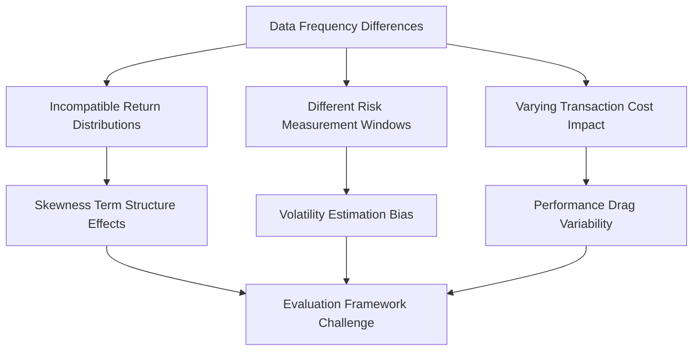
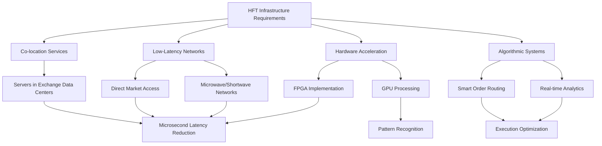
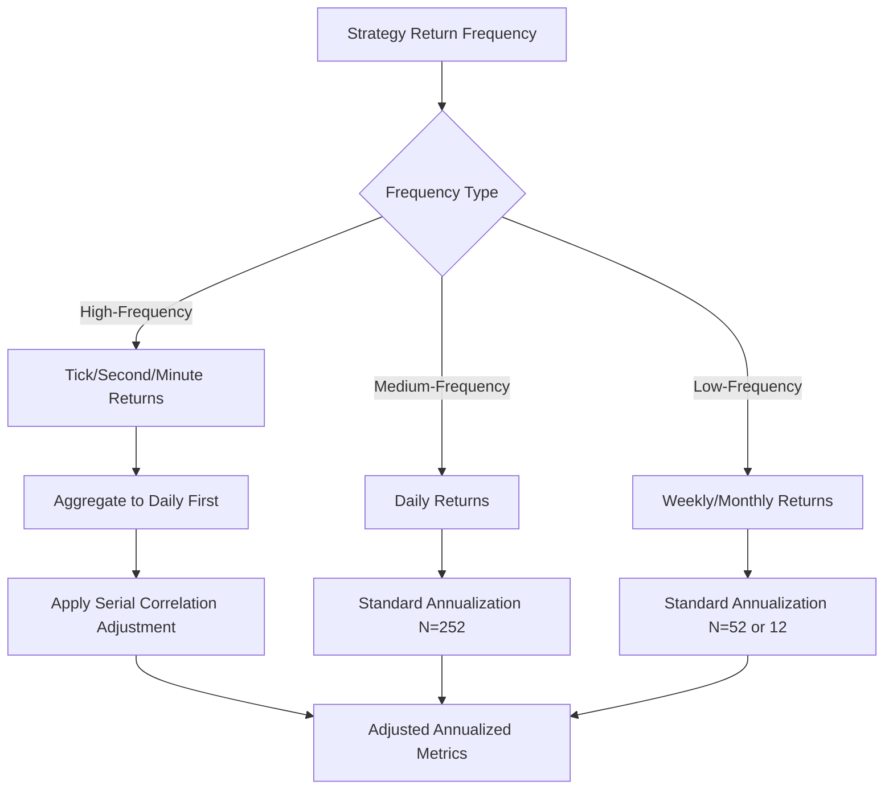
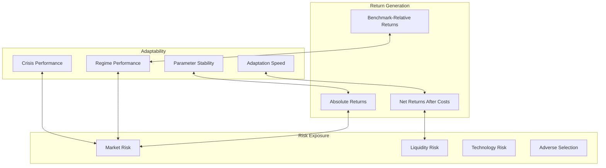
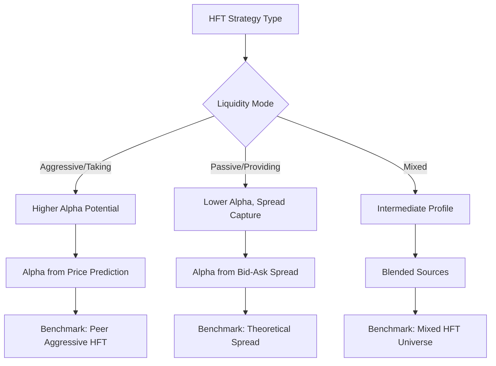
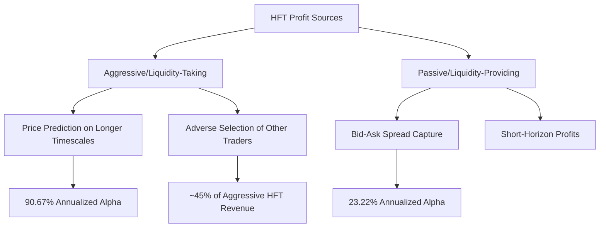
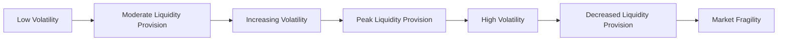

# A Generalized Evaluation Framework for Quantitative Trading Strategies: Integrating Multi-Factor and High-Frequency Approaches
# 1 Introduction: The Need for a Unified Performance Benchmark in Quantitative Finance

This chapter establishes the foundational context for the research by examining why a generalized evaluation framework for quantitative trading strategies is both necessary and currently absent. The contemporary quantitative finance landscape presents a paradox: while the sophistication and diversity of systematic trading approaches have reached unprecedented levels, the ability to meaningfully compare and evaluate these strategies across paradigms remains fundamentally limited. This introduction surveys the evolving landscape of quantitative approaches, articulates the fundamental comparability challenges that practitioners and academics face, and defines the research agenda for developing a unified evaluation framework.

## 1.1 The Evolving Landscape of Quantitative Trading Strategies

The quantitative trading ecosystem in 2025 represents a **dramatic evolution from the rules-based systems of previous decades** to a complex, multi-dimensional landscape characterized by adaptive frameworks, cross-asset integration, and increasingly sophisticated signal generation methodologies. Understanding this landscape is essential for appreciating both the need for and the challenges inherent in developing a unified evaluation framework.

### 1.1.1 The Spectrum of Systematic Approaches

At the foundation of quantitative trading lies a commitment to **structure, rules, and systems designed to remove emotional and discretionary decision-making**[^1]. This foundational philosophy manifests across a remarkably diverse spectrum of strategies, ranging from traditional trend-following approaches to ultra-low-latency high-frequency trading systems.

**Multi-factor models** constitute one of the most established branches of quantitative investing, built upon the elegant premise that markets reward exposure to certain undiversifiable risks—value, momentum, quality, and size—that explain why some assets outperform others[^2]. These models are broadly categorized into three distinct types:

| Factor Model Type | Core Approach | Primary Focus |
|-------------------|---------------|---------------|
| **Macroeconomic Factor Models** | Analyze surprises in macroeconomic variables | Inflation, unemployment, GDP growth |
| **Fundamental Factor Models** | Examine company and stock attributes | Cross-sectional differences in stock prices |
| **Statistical Factor Models** | Apply statistical methods to historical returns | Portfolio construction explaining historical returns |

Fundamental factor models, deeply rooted in equity analysis, decompose risk through a hierarchical approach—first analyzing market risk, then country and industry-level exposures, followed by asset-specific characteristics such as valuation metrics, and finally currency risk[^3]. The sophistication of these models has expanded considerably, with modern implementations processing **500-1,000 factors derived from open-source alpha101 extensions and proprietary market microstructure signals**[^4].

At the opposite end of the frequency spectrum, **high-frequency trading (HFT)** represents algorithmic trading optimized for microsecond execution speeds, executing thousands of trades per second to capture tiny price differences that exist for fractions of a second[^5]. The defining characteristics of HFT include ultra-low latency where milliseconds or even microseconds matter, algorithmic decision-making, high trade volume, and co-location of servers near exchanges to minimize delays[^6]. Common HFT strategies encompass market making, statistical arbitrage, event-driven trading, and latency arbitrage, with the latter particularly suited for exploiting time zone gaps and temporary pricing inefficiencies across global markets[^6].

### 1.1.2 The Rise of Adaptive and Hybrid Frameworks

Perhaps the most significant development in contemporary quantitative finance is the **evolution from static, rules-based systems to adaptive frameworks** capable of responding to changing market conditions. This evolution has been driven by recognition that markets increasingly defy traditional systematization, shaped by erratic political decisions, social media proclamations, and rapid policy reversals[^1].

The concept of **regime-aware meta-models** exemplifies this adaptive evolution. Mandatum Asset Management's Managed Futures Fund, which delivered returns exceeding 6.0 percent year-to-date in early 2025, attributes its success to proprietary meta-models, including regime models, that enable dynamic adjustment to shifting market conditions[^1]. These meta-model frameworks guide decision-making across strategy selection, risk allocation, and portfolio adaptation, allowing systems to react swiftly to significant market movements[^1]. Critically, the fund's trend-following orientation is not fixed to a single time horizon but shifts depending on the prevailing market regime, with shorter-term models taking a greater role during choppier periods[^1].

**Multi-strategy cross-asset portfolios** represent another significant development. Spectrum Systematic Alpha employs a dynamic, regime-aware framework that classifies market environments based on volatility into high, medium, and low regimes to tilt its portfolio of 23 distinct strategies accordingly[^1]. This approach operates similarly to pod shops, turning strategies on and off as the opportunity set evolves rather than maintaining a static portfolio[^1]. UBP's U-Access Campbell UCITS fund similarly combines four strategies—trend following, commodity trading advisor approaches, equity market neutral, and short-term macro—within a single vehicle, achieving embedded leverage, centralized risk management, and performance fee netting[^1].

The integration of **AI and machine learning** has introduced both opportunities and challenges. Modern quant strategies are characterized by operational freedom and adaptability, using AI/ML with a focus on transparency[^1]. However, managers emphasize that while AI/ML contributes at the model level, maintaining full control, individual model monitoring, and clear attribution is crucial to avoid the "black box" issue[^1]. The consensus emerging from practitioners is that transparency and explainability are paramount, with final portfolio decisions remaining traceable[^1].

### 1.1.3 Diversification Across Time Horizons and Asset Classes

The contemporary landscape demonstrates significant diversification across both temporal and asset class dimensions. Volt Capital Management's Trend Program exemplifies the shift toward **faster models with shorter holding periods**—averaging around 20 days compared to traditional longer-term trend-following approaches[^1]. This design specifically addresses the challenges of whipsaw losses in directionless markets and correlated losses during sharp reversals[^1].

Gresham Quant's ACAR strategy represents the expansion into **alternative commodity markets**, trading over 150 commodity futures with even risk sizing across markets to optimize diversification[^1]. This approach results in a correlation to the SG CTA index of approximately 25%, compared to over 80% for most CTAs[^1], demonstrating how market selection and capacity management can fundamentally alter a strategy's risk profile.

The adoption of quantitative investment strategies among institutional investors has become increasingly **granular and purpose-driven**. Rather than allocating to broad strategy portfolios, investors now cherry-pick individual strategies from providers for specific portfolio roles, such as replacing equity put options or traditional hedge fund allocations[^1]. There is also growing interest in systematic fixed-income strategies, though transaction cost management remains a key challenge in this domain[^1].

## 1.2 Fundamental Challenges in Cross-Strategy Comparability

The diversity of quantitative approaches described above creates profound challenges for meaningful cross-strategy comparison. These challenges span data requirements, risk model frameworks, return distribution characteristics, and market microstructure dependencies, each contributing to what amounts to an **evaluation Tower of Babel** where strategies speak fundamentally different performance languages.

### 1.2.1 Data Frequency and Temporal Incompatibility

One of the most fundamental barriers to cross-strategy comparison lies in the **radically different data frequency requirements** across strategy types. High-frequency trading systems operate on tick-level or even sub-millisecond data, with the HFTPerformance framework demonstrating capabilities to measure tick-to-trade latencies in the low double-digit microseconds[^7]. In contrast, medium-term trend-following strategies may operate on daily data, while longer-term factor strategies often rely on weekly or monthly rebalancing cycles.

This temporal incompatibility creates several evaluation challenges:



Research on **skewness in trend-following strategies** reveals that the term structure of skew is downward sloping: longer-term strategies exhibit increasingly negative skew, while shorter-term strategies can maintain positive skew[^1]. Analysis of breakout strategies with lookbacks from 2 to 256 days across 86 liquid futures found that shorter-term strategies (e.g., 2-3 day lookback) realized more persistent positive skew, while longer-term strategies (e.g., 181-256 days) realized increasingly negative skew[^1]. This finding challenges the traditional argument that trend-following provides positive skew through large gains during dislocations and demonstrates how **time frame selection fundamentally influences return distribution asymmetry**[^1].

The frequency selection problem extends beyond return distributions to affect testing validity itself. Different frequencies of data produce different test results, with high-frequency strategies requiring tick-level or minute-level data while medium-to-long-term trend strategies are better suited to daily or weekly data[^8]. Inappropriate frequency selection leads to distorted test results—a phenomenon academics term "frequency bias."

### 1.2.2 Divergent Risk Model Frameworks

Quantitative strategies employ fundamentally different approaches to risk decomposition and measurement, creating significant comparability challenges. Risk can be decomposed through **revaluation models**, which calibrate and price each position to derive sensitivity to specific assets, or through **factor models**, which examine key risk factors facing each position to understand the drivers of sensitivity, exposure, and other risk analytics[^3].

For multi-asset portfolios, factor models are generally more appropriate, but even within this category, substantial methodological differences exist. Fundamental factor models like MSCI BarraOne provide cross-asset class comprehensive factor modeling, incorporating more factors than equity-only models to account for fixed income sensitivities to risk-free rate changes and spread risk, options complexity, and private asset modeling challenges[^3].

The challenge intensifies when comparing HFT strategies, which face **technology-specific risks** that traditional factor models do not capture. These include latency risk, where nanoseconds of delay can erode profitability[^7], and systemic risks from algorithmic interconnectedness, where a crisis in one market can trigger a domino effect across globally connected markets[^9]. A single flawed algorithm is capable of generating millions in losses within minutes due to the swift pace of execution[^9].

### 1.2.3 Market Microstructure Dependencies

Perhaps no dimension creates greater comparability challenges than **market microstructure dependencies**, which differentially impact strategy performance measurement and create systematic biases in traditional evaluation methods.

**Slippage**—the difference between intended and actual trade execution prices—represents a critical, often hidden cost that can reduce net annual performance by 1-3 percentage points[^1]. For strategies targeting 6-8% returns, this performance drag is substantial and varies dramatically across strategy types:

| Slippage Factor | Impact on HFT | Impact on Multi-Factor | Impact on Trend-Following |
|-----------------|---------------|------------------------|---------------------------|
| Market volatility | Extreme sensitivity | Moderate sensitivity | High sensitivity |
| Instrument liquidity | Critical constraint | Important consideration | Significant factor |
| Crowded trades | Major risk | Growing concern | Documented issue |
| Roll periods | High impact | Moderate impact | Significant impact |
| After-hours trading | Opportunity/risk | Limited relevance | Limited relevance |

Managers combat slippage through technology like low-latency systems and smart order routing, broker selection for better market access, and pre-trade analytics[^1]. The shift from limit orders to time-weighted average price (TWAP) orders reflects this evolution in execution optimization[^1]. However, the **differential impact of slippage across strategy types** means that raw performance comparisons systematically disadvantage higher-frequency approaches when execution costs are not properly normalized.

The distinction between **liquidity provision and liquidity taking** further complicates comparison. Transtrend emphasizes an adaptive, liquidity-providing approach to systematic trade execution, focusing on capturing liquidity risk premia rather than taking liquidity[^1]. The firm avoids market orders and prefers working with limit orders, adapting execution tactics to market context[^1]. This liquidity-providing mindset generates fundamentally different risk-return characteristics than liquidity-taking approaches, yet standard performance metrics fail to distinguish between these modes of market participation.

### 1.2.4 Execution Latency and Technology Infrastructure

For high-frequency strategies, **execution latency constitutes a core operational constraint** requiring predictions with extremely low latency, typically in the millisecond or microsecond range[^10]. This creates a trade-off with computationally intensive models and necessitates infrastructure investments that fundamentally alter the cost structure of strategy operation.

The total entry cost to be competitive in HFT exceeds $100 million with ongoing costs of $20 million or more annually[^5]. Technology requirements include custom hardware costing $5 million or more, co-location fees of $500,000 or more annually for data center space near exchanges, data feeds costing $100,000 or more monthly, and development costs of $2 million or more annually for algorithm maintenance[^5]. This infrastructure dependency creates a **structural barrier to fair comparison** with lower-frequency strategies that operate with fundamentally different cost structures.

The HFTPerformance framework demonstrates that proper CPU isolation and polling can reduce average network latency from approximately 68 microseconds to approximately 56 microseconds by eliminating operating system jitter[^7]. Such optimizations are meaningless for multi-factor strategies but critical for HFT performance, illustrating how **technology-specific performance factors** cannot be captured by traditional evaluation metrics.

## 1.3 The Benchmark Gap: Limitations of Existing Evaluation Approaches

The challenges outlined above converge on a fundamental problem: **existing evaluation approaches fail to provide meaningful cross-strategy comparison**. This section synthesizes the core limitations of current practices and articulates why a new framework is necessary.

### 1.3.1 The Inadequacy of Traditional Performance Metrics

Standard performance metrics like the Sharpe ratio, while valuable within strategy categories, become **misleading when applied across strategy types**. The Bloomberg-Goldman Sachs US Equity Multi-Factor Index, which tracks the long-short performance of classic style premia, has delivered a Sharpe ratio of just 0.17 since 2007 (t-stat=0.69, p-value=0.25), statistically indistinguishable from zero before costs[^2]. This sobering statistic raises fundamental questions about what performance metrics actually capture and whether they reflect genuine skill or statistical artifacts.

The problem extends beyond simple ratio inadequacy to **structural limitations in how metrics are constructed**. UBP's U-Access Campbell UCITS fund achieves a Sharpe ratio of 0.9 to 1 through its multi-strategy approach[^1], but this figure reflects the diversification benefits of combining strategies with low correlation rather than the skill of any individual strategy component. Without decomposition of performance attribution, such aggregate metrics obscure rather than illuminate the sources of returns.

### 1.3.2 The Factor Mirage and Model Misspecification

Recent research has identified a deeper flaw in quantitative evaluation: **systematic misspecification** that conflates association with causation[^2]. Most factor models are developed following an econometric canon that treats any variable associated with returns as worthy of inclusion, regardless of its causal role. This methodological error creates what researchers term the **"factor mirage"**—models that appear superior in backtests but fail systematically in live trading.

The mechanism is insidious: including a **collider** (a variable influenced by both the factor and returns) or excluding a **confounder** (a variable that influences both) biases coefficient estimates and can flip the sign of a factor's coefficient[^2]. Models with colliders are particularly concerning because they exhibit higher R² and often lower p-values than correctly specified models—the econometric canon favors such misspecified models, mistaking better fit for correctness[^2].

The consequences of model misspecification are severe:

- **Capital misallocation**: Trillions of dollars are steered by models that confuse association with causation
- **Hidden correlation**: Portfolios built on similar misspecified factors share exposures, increasing systemic fragility
- **Erosion of trust**: Every backtest that fails in live trading undermines investor confidence in quantitative methods

Research demonstrates that **no portfolio can be efficient without causal factor models**—if the underlying factors are misspecified, even perfect estimates of means and covariances will yield suboptimal portfolios[^2].

### 1.3.3 Backtesting Validity and the Reality Gap

The validity of backtesting itself has come under scrutiny as practitioners recognize the **"reality gap"** between simulated and live performance. Accurate backtesting must simulate real-world conditions without relying on either overly pessimistic or overly optimistic approaches[^11]. The standard is that if a live trading strategy runs in a specific period, the backtest for that exact period should produce results that closely align with actual results.

However, multiple factors undermine backtesting validity:

**Overfitting** represents a primary concern, where models optimize excessively on historical data, identifying specific patterns rather than general trends and thereby performing poorly in live markets[^12]. The challenge is particularly acute for high-frequency strategies, where the high noise content and low signal-to-noise ratio make it exceedingly difficult for models to distinguish genuine signals from noise[^10].

**Non-stationarity** undermines the core assumption of many algorithms that statistical properties remain stable over time[^10]. Markets experience abrupt regime shifts—sudden spikes in volatility, policy reversals, and structural changes—that invalidate historical relationships. The COVID-19 pandemic disrupted traditional market patterns[^12], while events like the "Liberation Day" tariff announcement caused violent market whipsaws, breaking traditional correlations and spiking volatility[^1].

**Alpha decay**—where market inefficiencies diminish as more participants adopt similar techniques—means that strategy performance is not static[^10]. Evaluation frameworks must therefore be adaptive and capable of evolving alongside markets and technologies; a static checklist approach is insufficient.

### 1.3.4 Execution Realities and Regime-Dependent Performance

Traditional benchmarks fail to account for **execution realities** that differentially impact strategy types. The debate on stop orders illustrates this challenge: some managers avoid them entirely, arguing from a portfolio perspective that they can undermine diversification and cause losses due to slippage, as evidenced during the Soviet coup of August 1991[^1]. Others implement stops differently, with technology enabling nuanced conditional orders. The implementation choice can lead to significant performance dispersion among managers trading similar models[^1].

**Regime-dependent performance variations** further complicate evaluation. A central question facing systematic strategies is how robust models are against non-economic shocks and whether rules-based systems can adapt fast enough to policy whiplash and tweet-driven turbulence[^1]. The noisy market environment of 2025, with few sustained directional moves and frequent reversals, makes it difficult for traditional trend-following strategies to latch onto persistent trends[^1].

The multi-strategy approach of funds like UBP's Campbell UCITS demonstrates the importance of regime awareness: in April 2025, the fund ended up 0.80% despite a negative momentum sleeve, with an intramonth peak-to-trough drawdown of only 1.5% to 2%[^1]. The short-term strategy was the biggest winner while the momentum sleeve was negative[^1], highlighting how **different strategy components perform asymmetrically across market conditions**—a nuance that aggregate performance metrics completely obscure.

## 1.4 Research Objectives, Scope, and Framework Value Proposition

Having established the landscape complexity and evaluation challenges, this section defines the research agenda for developing a unified evaluation framework capable of meaningful cross-strategy comparison.

### 1.4.1 Core Research Objectives

The primary objective of this research is to develop a **generalized evaluation framework** that enables rigorous comparison of quantitative trading strategies across paradigms while respecting their fundamental differences. This framework must achieve several interconnected goals:

1. **Dimensionality Accommodation**: The framework must accommodate strategies operating across radically different time scales—from microsecond HFT to multi-month trend-following—without artificially favoring any particular frequency domain.

2. **Risk Normalization**: It must provide mechanisms for normalizing risk across different model frameworks, including technology-specific risks for HFT, factor exposure risks for multi-factor strategies, and execution risks that vary by strategy type.

3. **Skill Isolation**: The framework must distinguish genuine alpha generation from beta exposure, regime-dependent performance, and structural market advantages (such as latency superiority in HFT).

4. **Causal Validity**: Following the insights on model misspecification, the framework must incorporate causal reasoning principles to avoid the factor mirage and ensure that evaluation metrics reflect genuine performance rather than statistical artifacts.

5. **Adaptability Assessment**: Given the importance of regime-awareness in contemporary strategies, the framework must evaluate adaptability and robustness across market conditions, not merely average performance.

### 1.4.2 Framework Scope and Applicability

The proposed framework is intended to apply across:

| Dimension | Scope of Applicability |
|-----------|------------------------|
| **Asset Classes** | Equities, fixed income, commodities, currencies, and derivatives |
| **Time Horizons** | Microsecond HFT to multi-month systematic strategies |
| **Strategy Types** | Market making, arbitrage, trend-following, multi-factor, and hybrid approaches |
| **Market Regimes** | Calm, volatile, and crisis conditions |
| **Implementation Contexts** | Backtesting, paper trading, and live execution |

The framework explicitly acknowledges that **different strategy types require different evaluation emphases**. For HFT strategies, execution quality metrics and technology infrastructure assessment are paramount. For multi-factor strategies, factor exposure analysis and alpha attribution take precedence. For trend-following approaches, regime-dependent performance and skewness characteristics require particular attention.

### 1.4.3 Value Proposition for Practitioners

For **asset managers and allocators**, the framework provides several practical benefits:

- **Rigorous Strategy Selection**: The ability to compare strategies across paradigms using normalized metrics enables more informed allocation decisions. Rather than comparing raw Sharpe ratios across incompatible strategy types, practitioners can evaluate performance along dimensions appropriate to each strategy's design.

- **Enhanced Risk Management**: By decomposing performance into return generation, risk exposure, and adaptability components, the framework enables more granular risk attribution and management. This is particularly valuable for multi-strategy portfolios where understanding the contribution of each component to overall risk is essential.

- **Performance Attribution**: The framework supports attribution analysis that distinguishes skill from market exposure, regime-dependent performance from consistent alpha generation, and execution quality from signal quality.

The trend among Nordic institutional investors toward **granular, purpose-driven implementation**—cherry-picking individual strategies from providers for specific portfolio roles[^1]—underscores the practical need for such a framework. Investors seeking to replace equity put options or substitute traditional hedge fund allocations require evaluation tools that can assess strategies against these specific objectives.

### 1.4.4 Value Proposition for Academics

For **academic researchers**, the framework offers:

- **Standardized Methodology**: A consistent approach to strategy evaluation enables comparative research across studies and institutions, addressing the current fragmentation in evaluation practices.

- **Causal Framework Integration**: By incorporating causal reasoning principles, the framework advances the methodological rigor of quantitative finance research beyond the correlation-focused approaches that have produced the factor mirage.

- **Regime-Aware Analysis**: The explicit incorporation of market regime effects supports research into strategy behavior under different conditions, moving beyond unconditional performance analysis.

### 1.4.5 Key Design Principles

The framework must satisfy several key design principles to achieve its objectives:

**Regime-Awareness**: The framework must explicitly model and account for different market regimes, recognizing that strategies perform asymmetrically across calm, volatile, and crisis conditions. This principle draws from the success of meta-model approaches that dynamically adjust to shifting market conditions[^1].

**Execution-Cost Integration**: Performance metrics must incorporate realistic execution costs appropriate to each strategy type, including slippage, market impact, and technology infrastructure costs. The recognition that slippage can reduce net annual performance by 1-3 percentage points[^1] mandates that evaluation cannot ignore execution realities.

**Causal Validity**: Following the critique of econometric approaches that conflate association with causation[^2], the framework must incorporate causal reasoning principles. This includes demanding causal justification for performance attribution, identifying confounders, avoiding colliders, and testing for causal stability across regimes.

**Adaptability Assessment**: Given the VUCA (volatility, uncertainty, complexity, and ambiguity) market environment[^1], the framework must evaluate not merely historical performance but the capacity for adaptation. This includes assessing parameter sensitivity, performance degradation during stress, and the speed of regime adjustment.

**Transparency and Interpretability**: In an era of increasing AI/ML integration, the framework must maintain transparency and explainability[^1]. Evaluation results must be traceable to their component factors, enabling practitioners to understand not just how strategies performed but why.

These design principles collectively ensure that the proposed framework addresses the fundamental challenges identified in cross-strategy comparison while providing practical utility for both practitioners and academics. The subsequent chapters will develop these principles into concrete evaluation dimensions, metrics, and application methodologies.

## 2 Literature Review: Foundations in Strategy Design and Performance Measurement

This chapter establishes the theoretical and empirical foundations necessary for developing a unified evaluation framework by synthesizing existing literature across three interconnected domains: multi-factor asset pricing models, high-frequency trading strategies, and performance measurement methodologies. The review critically examines how different strategy paradigms conceptualize risk, generate returns, and depend on distinct technological infrastructures, thereby identifying the gaps that a generalized evaluation framework must address. By comparing traditional factor models with high-dimensional extensions and contrasting low-frequency systematic approaches with latency-sensitive HFT tactics, this chapter provides the conceptual scaffolding for subsequent framework development.

### 2.1 Theoretical Foundations of Multi-Factor Asset Pricing Models

The evolution of asset pricing theory from single-factor to multi-factor frameworks represents one of the most significant developments in quantitative finance, providing the theoretical underpinning for a vast array of systematic investment strategies. Understanding this evolution is essential for developing an evaluation framework capable of distinguishing genuine alpha generation from factor exposure.

#### 2.1.1 From CAPM to Multi-Factor Models: The Theoretical Evolution

The **Capital Asset Pricing Model (CAPM)**, developed in the 1960s by William Sharpe, established the foundational premise that expected returns are a linear function of systematic risk, measured by beta relative to the market portfolio[^13]. However, empirical evidence soon revealed that CAPM alone could not explain the substantial variation in average returns across assets, prompting researchers to identify additional systematic risk factors[^14]. This limitation catalyzed the development of **Arbitrage Pricing Theory (APT)**, which describes the expected return on an asset as a linear function of its sensitivity to multiple factors, making less restrictive assumptions than CAPM while maintaining the no-arbitrage condition[^15].

The breakthrough in multi-factor modeling came with the **Fama-French three-factor model** in 1992-1993, which augmented the market factor with size (SMB: small minus big) and value (HML: high minus low book-to-market) factors[^16]. This model significantly improved the explanatory power of asset pricing theory and established the foundation for modern factor investing[^17]. The theoretical rationale for these factor premia derives from multiple sources:

| Explanation Type | Mechanism | Implications for Evaluation |
|------------------|-----------|----------------------------|
| **Risk-based** | Small and value stocks are inherently riskier, requiring higher expected returns as compensation | Factor premia should persist as they represent compensation for undiversifiable risk |
| **Behavioral** | Investor biases (overconfidence, herding, anchoring) create systematic mispricings | Factor premia may be time-varying and subject to arbitrage erosion |
| **Structural** | Market frictions, regulatory constraints, and institutional mandates create persistent inefficiencies | Factor premia depend on market structure and may vary across markets |

The evolution continued with the **Fama-French five-factor model** in 2015, which added profitability (RMW: robust minus weak) and investment (CMA: conservative minus aggressive) factors[^16]. Empirical analysis demonstrates that this five-factor model consistently outperforms earlier specifications across the majority of industries studied, providing a more robust framework for understanding asset pricing[^18]. Research extending the model to emerging markets reveals that **profitability is the most useful factor** for explaining cross-sectional variation in stock returns, though the five-factor model still faces challenges in fully capturing return patterns in developing economies[^19].

#### 2.1.2 Construction Methodologies for Factor Models

Multi-factor models are broadly categorized according to the type of factor employed, each with distinct construction methodologies and applications[^15]:

**Macroeconomic factor models** utilize surprises in macroeconomic variables—defined as actual minus forecasted values—to explain asset returns. These factors are designed to be uncorrelated and capture systematic exposure to economic conditions such as inflation, employment, and interest rate changes[^20]. The factor sensitivities (betas) are estimated through regression analysis after developing the surprise series.

**Fundamental factor models** examine attributes of stocks or companies that explain cross-sectional differences in prices, including book-value-to-price ratio, market capitalization, price-to-earnings ratio, and financial leverage[^15]. In contrast to macroeconomic models, fundamental models specify factor sensitivities (attributes) first and then estimate factor returns through cross-sectional regressions. The general formula for multi-factor model analysis is expressed as:

$$R_i = a_i + \beta_{i(m)} R_m + \beta_{i(1)} F_1 + \beta_{i(2)} F_2 + ... + \beta_{i(N)} F_N + e_i$$

where $R_i$ is the security return, $R_m$ is the market return, $F_n$ represents each factor, $\beta$ denotes the sensitivity to each factor, $e$ is the error term, and $a$ is the intercept[^20].

**Statistical factor models** apply quantitative methods to historical returns to determine portfolios that explain return patterns. Factor analysis models identify portfolios that best reproduce historical return covariances, while principal-components models identify portfolios that best explain historical return variances[^15]. These approaches are particularly valuable when theoretical guidance on relevant factors is limited.

The construction of factor portfolios involves critical methodological choices. Research examining factor construction alternatives—including portfolio sorting methods (independent versus dependent sorting) and breakpoint selection for stock allocation—finds that while these choices affect factor returns, their statistical impact is generally limited[^14]. The three most common approaches to building multi-factor models are **combination models** (combining multiple single-factor models), **sequential models** (sorting stocks based on factors sequentially), and **intersectional models** (sorting based on factor intersections)[^20].

#### 2.1.3 Extended Multi-Factor Models and High-Dimensional Approaches

Contemporary research has extended traditional factor models to incorporate additional systematic risk sources. An **eight-factor model** that adds momentum, liquidity, and default risk factors to the Fama-French five-factor framework demonstrates improved model performance as evaluated by GRS tests[^14]. The empirical evidence indicates that beyond market, size, and value factors, **profitability and momentum exhibit higher explanatory power** compared to investment, default risk, and liquidity factors.

The practical implementation of factor investing has evolved significantly from its academic origins. Modern factor strategies employ specific metrics for each factor:

| Factor | Common Metrics | Implementation Considerations |
|--------|----------------|------------------------------|
| **Value** | Price-to-book, price-to-earnings, EV/EBITDA | Metric selection significantly influences performance |
| **Momentum** | 12-1 month price return | Exhibits positive skew at shorter horizons |
| **Quality** | Return on equity, earnings stability | Information coefficient of 0.125 indicates strong predictive power[^17] |
| **Low Volatility** | Return standard deviation | May underperform in strong bull markets |
| **Size** | Market capitalization | Capacity constraints in small-cap strategies |

Factor performance analysis reveals important insights for evaluation framework development. Research using information coefficient (IC) analysis demonstrates that **quality factors provide the most effective predictive power** (IC = 0.125), momentum factors also offer useful prediction (IC = 0.111), while value factors may exhibit negative or negligible IC depending on market conditions[^17]. This heterogeneity in factor effectiveness underscores the need for evaluation frameworks that can assess factor exposure and contribution at a granular level.

#### 2.1.4 Limitations and Model Misspecification Risks

Despite their widespread adoption, multi-factor models face significant limitations that any comprehensive evaluation framework must address. A fundamental challenge is that **models rely on historical data, which may not predict future values accurately**[^20]. The beta of a security measures systematic risk relative to the overall market, but this relationship is backward-looking and may not persist under changing market conditions[^13].

The **factor mirage phenomenon**—where models appear superior in backtests but fail systematically in live trading—represents a critical concern. Research indicates that including collider variables (influenced by both factors and returns) or excluding confounders (influencing both) can bias coefficient estimates and even reverse the sign of factor loadings. Models with such misspecification may exhibit higher R² and lower p-values, leading traditional econometric criteria to favor incorrectly specified models.

The challenge of distinguishing genuine alpha from factor exposure remains central to performance evaluation. While multi-factor models permit a more granular view of risk than single-factor approaches, they introduce the risk of **spurious factor identification**. Investors considering multiple sources of systematic risk may improve on CAPM results by tilting away from the market portfolio, gaining from accepting above-average exposures to risks they have comparative advantages in bearing[^15]. However, without rigorous attribution methodology, it becomes difficult to determine whether outperformance reflects skill in factor selection, timing, or merely compensation for bearing systematic risks.

### 2.2 High-Frequency Trading Strategies: Mechanisms, Infrastructure, and Risk Characteristics

High-frequency trading represents a fundamentally different paradigm from factor-based investing, characterized by **ultra-short holding periods, technology-intensive infrastructure, and profit mechanisms that exploit market microstructure inefficiencies** rather than factor premia. Understanding these distinctions is essential for developing an evaluation framework capable of meaningful cross-strategy comparison.

#### 2.2.1 Strategy Types and Profit Mechanisms

High-frequency trading encompasses several distinct strategy categories, each with unique profit mechanisms and risk profiles[^21]:

**Market making** involves placing limit orders to buy and sell, earning the bid-ask spread while providing liquidity to incoming market orders. Building effective market-making strategies requires precise modeling of target market microstructure combined with stochastic control techniques[^21]. Research demonstrates that high-frequency traders can provide liquidity under certain market conditions, particularly when the frequency asymmetry between fast and slow traders is substantial[^22]. The fast trader may submit opposite and temporarily unprofitable orders to avoid information leakage and secure future expected profits, acting as a strategic liquidity provider.

**Statistical arbitrage** exploits predictable temporary deviations from stable statistical relationships among securities. This strategy is actively employed across all liquid securities, including equities, bonds, futures, and foreign exchange[^21]. The TABB Group estimated that annual aggregate profits of high-frequency arbitrage strategies exceeded US$21 billion in 2009[^21]. Statistical arbitrage relies on **mean reversion analysis** to exploit pricing inefficiencies in correlated securities, typically maintaining market neutrality by opening both long and short positions simultaneously[^23]. Modern implementations integrate machine learning classifiers to filter trading signals, with research demonstrating that ensemble methods using histogram gradient boosting can achieve annualized returns of 49.33% with Sortino ratios of 3.38[^24].

**Index arbitrage** exploits the predictable rebalancing behavior of index tracker funds, which must buy and sell securities in proportion to changing index weights. HFT firms that can access and process information predicting these changes before tracker funds can profit by buying securities in advance and selling to the trackers[^21].

**Latency arbitrage** relies exclusively on ultra-low latency technology to gain advantages in arbitraging price discrepancies across markets. These strategies have driven technological innovation including the switch from fiber optic to microwave transmission, which reduces speed degradation to less than 1% compared to over 30% for conventional fiber optics[^21]. Since 2011, companies have invested massively in microwave infrastructure, with some exploring satellite transmission for market data[^21].

#### 2.2.2 Technological Infrastructure Requirements

The technological infrastructure underpinning HFT strategies creates **operational constraints and cost structures fundamentally different from lower-frequency approaches**, with profound implications for performance evaluation:



**Co-location services** allow HFT firms to place servers within the same data centers as exchange infrastructure, significantly reducing latency[^25]. This capability is crucial for executing trades faster than competitors. Service providers offer low-latency access through Layer 1 offerings, while specialized firms provide over-clocked servers and FPGA cards for additional acceleration[^25].

**Ultra-low latency direct market access (ULLDMA)** systems can handle high volumes with round-trip order execution speeds of 10 milliseconds or less[^21]. Such performance is achieved through hardware acceleration or full-hardware processing of incoming market data, combined with high-speed communication protocols. Some companies provide full-hardware appliances based on FPGA technology to achieve sub-microsecond end-to-end market data processing[^21].

The integration of **artificial intelligence and machine learning** is revolutionizing HFT strategy development. AI-powered trading systems analyze vast amounts of data in real-time to identify patterns and market trends, while machine learning models refine decision-making processes for real-time strategy adaptation[^25]. The demand for specialized hardware like GPUs has grown substantially due to AI deployments in trading applications.

Network latency remains a critical factor, as even slight delays can cost millions in high-frequency algorithmic trading[^26]. Common barriers to achieving low latency include network distance from servers, software/application issues, and hardware limitations. Solutions include auditing network infrastructure, utilizing monitoring tools, investing in faster data center connections, exploring cloud solutions, and leveraging direct market data feeds from exchanges[^26].

#### 2.2.3 Risk Factors Unique to High-Frequency Strategies

HFT strategies face a distinct risk profile that traditional evaluation metrics fail to capture adequately. Research on backtesting HFT strategies identifies multiple risk categories requiring specialized measurement approaches[^27]:

| Risk Category | Description | Measurement Challenges |
|---------------|-------------|----------------------|
| **Model Risk** | Incorrect model specifications, implementation errors, or data deficiencies | Requires validation across market regimes |
| **Market Risk** | Profit and loss exposure measured through VaR and expected shortfall | Traditional VaR may not capture short-horizon risks |
| **Execution Risk** | Volatility, bid-ask spreads, and slippage effects | Influenced by liquidity and market conditions |
| **Inventory Risk** | Imbalances in buying and selling orders (critical for market makers) | Requires real-time monitoring |
| **Latency Risk** | Technology failures and speed disadvantages | Measured in microseconds; infrastructure-dependent |
| **Operational Risk** | System failures, algorithmic errors | Controlled through pre-trade and post-trade risk controls |

**Execution risk** is particularly critical in HFT, with slippage representing a hidden cost that can reduce annual returns by 1-3 percentage points[^1]. Slippage is exacerbated during volatile conditions, crowded trades, or in illiquid markets. Managers mitigate these effects through technology (low-latency systems, smart order routing) and by avoiding market orders in favor of limit or time-weighted average price (TWAP) orders[^1].

For HFT strategies with short holding periods, **traditional Value-at-Risk modeling may not fully capture the risks**[^27]. The GARCH(1,1) model is suggested for measuring intraday volatility, while liquidity risk requires incorporating both endogenous and exogenous components into VaR functions. Strategy risk is often represented by maximum drawdown, though this metric requires careful interpretation given the high-frequency nature of trades.

HFT-specific metrics include the **order-to-trade ratio** (order messages sent divided by executions), **cancellation rate** (indicating queue position losses), and **fill ratio** (executed orders divided by rejected orders)[^27]. These metrics are essential for validating execution quality, particularly for aggressive orders, and must be monitored in real-time once strategies are deployed.

Research on HFT's market impact reveals systemic concerns. Algorithmic and high-frequency traders contributed to volatility during the Flash Crash of May 6, 2010, when high-frequency liquidity providers rapidly withdrew from the market[^21]. As computerized traders exited, the resulting lack of liquidity caused significant price dislocations, highlighting the interconnected risks in HFT ecosystems.

#### 2.2.4 Comparative Analysis: HFT versus Multi-Factor Risk Profiles

The contrast between HFT and multi-factor strategy risk profiles reveals fundamental differences that evaluation frameworks must accommodate:

**Temporal dimension**: HFT strategies operate on microsecond to millisecond horizons with holding periods measured in seconds, while multi-factor strategies typically rebalance monthly or quarterly with holding periods of months to years. This creates incompatible return distribution characteristics—HFT generates thousands of small gains and losses daily, while multi-factor strategies produce fewer, larger return observations.

**Risk factor exposure**: Multi-factor strategies explicitly target systematic risk factors (market, size, value, momentum) and measure success by alpha generation relative to factor benchmarks. HFT strategies primarily exploit market microstructure inefficiencies with minimal systematic factor exposure, making traditional factor attribution inappropriate.

**Technology dependency**: HFT performance is fundamentally constrained by infrastructure quality, with latency differences of microseconds determining profitability. Multi-factor strategies face technology constraints primarily in data processing and execution, but these do not define the strategy's profit mechanism.

**Capacity constraints**: HFT strategies face severe capacity limitations due to market impact and liquidity constraints, while multi-factor strategies can often scale to larger asset bases, though with diminishing returns due to price impact and factor crowding.

### 2.3 Performance Measurement: Traditional and Risk-Adjusted Return Metrics

The evaluation of quantitative trading strategies requires a comprehensive suite of performance metrics, each capturing different aspects of risk-adjusted returns. This section examines the theoretical foundations, practical applications, and limitations of key metrics, establishing the measurement toolkit that a unified evaluation framework must integrate and extend.

#### 2.3.1 The Sharpe Ratio: Foundation and Limitations

The **Sharpe ratio**, developed by Nobel laureate William Sharpe in 1966 and revised in 1994, represents the foundational metric for risk-adjusted performance evaluation[^13]. It measures the average return earned in excess of the risk-free rate per unit of total volatility:

$$\text{Sharpe Ratio} = \frac{R_p - R_f}{\sigma_p}$$

where $R_p$ is the portfolio return, $R_f$ is the risk-free rate (typically the 90-day Treasury bill yield), and $\sigma_p$ is the standard deviation of portfolio returns[^28]. Generally, Sharpe ratios greater than 1 are considered preferable, with values above 2 indicating elite performance[^29].

The Sharpe ratio's primary purpose is determining whether an investment generates significantly greater returns in exchange for accepting additional risk compared to risk-free instruments[^13]. HFT strategies can achieve **Sharpe ratios tens of times higher than traditional buy-and-hold strategies** due to their ability to capture small profits across thousands of daily trades without holding positions overnight[^21].

However, the Sharpe ratio faces significant limitations when applied across heterogeneous strategy types:

**Sensitivity to return distribution assumptions**: The metric assumes normally distributed returns, but many strategies—particularly hedge funds and HFT—exhibit dynamic trading patterns that skew return distributions[^13]. Options strategies and mean-reversion approaches can produce non-normal returns that the Sharpe ratio misrepresents.

**Treatment of upside volatility**: The Sharpe ratio penalizes all volatility equally, including positive deviations that benefit investors[^30]. This limitation is particularly problematic for strategies designed to capture large gains during market dislocations, where upside volatility represents a feature rather than a bug.

**Time-period sensitivity**: Sharpe ratios can vary dramatically across measurement periods, and short measurement horizons may not capture the full risk profile of strategies with infrequent but severe drawdowns.

#### 2.3.2 The Sortino Ratio: Focusing on Downside Risk

The **Sortino ratio** addresses the Sharpe ratio's limitation of penalizing upside volatility by focusing exclusively on downside risk[^30]. Named after Dr. Frank A. Sortino, this metric measures return relative to the standard deviation of negative returns:

$$\text{Sortino Ratio} = \frac{R_p - R_f}{\sigma_d}$$

where $\sigma_d$ is the downside deviation, calculated as the standard deviation of returns below a minimum acceptable return (MAR)[^31]. The downside deviation isolates only negative deviations from the mean return:

$$\sigma_d = \sqrt{\frac{1}{N} \sum \min(0, R_i - MAR)^2}$$

The Sortino ratio provides several advantages for strategy evaluation[^32]:

- **Focus on harmful volatility**: By distinguishing harmful volatility from beneficial upside movements, it offers a more realistic assessment of investment risk
- **Customizable MAR**: Investors can set the minimum acceptable return based on specific goals and risk tolerance, rather than using a fixed risk-free rate
- **Better handling of asymmetric returns**: More appropriate for strategies with positively skewed return distributions where large gains should not be penalized

However, the Sortino ratio has its own limitations. Calculation variations can significantly impact results—a common discrete method using only historical returns below MAR can underestimate downside risk[^32]. Research on the Japanese equity market demonstrated that discrete methods yielded monthly downside deviation of 2.74% while continuous methods yielded 3.20%, a meaningful difference for performance ranking[^32]. Additionally, strategies with exceptionally positive asymmetric returns may indicate pricing issues or luck rather than skill[^32].

For comparative analysis, the Sortino ratio helps identify investments with similar returns but radically different loss risks[^29]. An investment with 14% return and 6% downside deviation yields a Sortino ratio of 1.5, while the same return with 10% downside deviation produces only 0.9—a distinction the Sharpe ratio would obscure.

#### 2.3.3 The Treynor Ratio and Systematic Risk Measurement

The **Treynor ratio**, developed contemporaneously with the Sharpe ratio, evaluates risk-adjusted returns using beta (systematic risk) rather than total volatility[^13]:

$$\text{Treynor Ratio} = \frac{R_p - R_f}{\beta}$$

where $\beta$ measures the portfolio's volatility relative to the overall market. A beta of 1 indicates the security theoretically experiences the same volatility as the market, while beta greater than 1 indicates higher volatility[^20].

The Treynor ratio determines whether a portfolio significantly outperforms the market's average gains, making it particularly relevant for strategies benchmarked against market indices[^13]. The key distinction from the Sharpe ratio is the use of systematic risk rather than total risk, which is more appropriate for well-diversified portfolios where idiosyncratic risk has been eliminated.

The ratio's main disadvantage is its **backward-looking nature and reliance on specific benchmarks** to measure beta[^13]. Most investments do not necessarily perform the same way in the future as they did historically, and beta estimates can be unstable across market regimes. For HFT strategies with minimal systematic market exposure, the Treynor ratio may be less informative than for traditional long-only or factor-based approaches.

#### 2.3.4 The Calmar Ratio and Drawdown-Based Assessment

The **Calmar ratio** directly addresses maximum drawdown, providing insight into the relationship between returns and the worst peak-to-trough loss experienced[^28][^29]:

$$\text{Calmar Ratio} = \frac{R_{ann} - R_f}{\text{Maximum Drawdown}}$$

where $R_{ann}$ is the annualized return and Maximum Drawdown represents the largest percentage decline from peak to trough. A higher Calmar ratio indicates better risk-adjusted performance relative to the strategy's worst historical loss[^28].

The Calmar ratio is particularly valuable for evaluating strategies that may suffer severe, occasional losses[^29]. For example, a fund with 21% annualized return, 4% risk-free rate, and 25% maximum drawdown has a Calmar ratio of 0.68, meaning it earned 0.68 units of return for every unit of major loss. This metric is essential for investors concerned about tail risk and capital preservation.

Maximum drawdown itself serves as a critical risk metric, indicating downside risk over a specified period[^28]. The formula is:

$$\text{Maximum Drawdown} = \frac{\text{Trough Value} - \text{Peak Value}}{\text{Peak Value}}$$

Lower maximum drawdown implies lesser financial risk, making this metric particularly relevant for strategies operating with leverage or in volatile markets.

#### 2.3.5 The Information Ratio and Benchmark-Relative Performance

The **Information ratio** measures a fund's returns relative to a benchmark, adjusted for tracking risk[^33]:

$$\text{Information Ratio} = \frac{R_p - R_b}{\sigma_{p-b}}$$

where $R_b$ is the benchmark return and $\sigma_{p-b}$ is the tracking error (standard deviation of excess returns relative to the benchmark). A higher information ratio indicates better performance relative to the benchmark on a risk-adjusted basis[^33].

This metric is particularly relevant for strategies designed to outperform specific benchmarks, such as enhanced index strategies or factor-tilted portfolios. The information ratio quantifies the consistency of excess returns, distinguishing managers who generate steady alpha from those with volatile outperformance[^34].

Research on quantitative trading strategies emphasizes that **benchmark selection is crucial**—a strategy that makes money is insufficient; it must outperform an appropriate benchmark[^35]. Key evaluation metrics include geometric mean return, return volatility, Sharpe ratio, information ratio, skewness, kurtosis, alpha, and beta values, assessed both in absolute terms and relative to benchmarks[^35].

#### 2.3.6 Comparative Framework for Risk-Adjusted Metrics

The following table synthesizes the key characteristics of primary risk-adjusted return metrics:

| Metric | Risk Measure | Primary Use Case | Key Limitation |
|--------|--------------|------------------|----------------|
| **Sharpe Ratio** | Total volatility (σ) | General risk-adjusted comparison | Penalizes upside volatility |
| **Sortino Ratio** | Downside deviation | Strategies with asymmetric returns | Calculation method sensitivity |
| **Treynor Ratio** | Systematic risk (β) | Market-benchmarked portfolios | Backward-looking beta estimates |
| **Calmar Ratio** | Maximum drawdown | Tail risk assessment | Sensitive to measurement period |
| **Information Ratio** | Tracking error | Active management evaluation | Benchmark selection dependency |

Professional investors are advised to use **all three primary ratios together** for a complete risk fingerprint[^29]: the Sharpe ratio as a fundamental fitness test for overall efficiency, the Sortino ratio to avoid hidden downside risks, and the Calmar ratio to ensure protection against catastrophic losses. This multi-metric approach enables comparison of strategies, distinguishes luck from skill, and identifies investments where returns do not justify the risks taken.

### 2.4 Benchmark Construction and Strategy Attribution Principles

Effective performance evaluation requires not only appropriate metrics but also rigorous benchmark construction and attribution methodologies. This section examines the principles underlying benchmark selection, factor-based performance attribution, and the integration of execution quality metrics into comprehensive evaluation frameworks.

#### 2.4.1 Principles of Benchmark Construction

Benchmarking in quantitative finance follows fundamental principles adapted from broader performance measurement practices. The core concept involves **comparing one strategy's performance against that of similar strategies or appropriate reference standards** to identify best practices and make targeted improvements[^36]. Six essential principles guide effective benchmark construction:

**Consistency**: Only a common data model enables direct comparison, requiring easy-to-understand defined terms, common measurement time periods, and transparency on accounting practices[^37]. For quantitative strategies, this means standardizing return calculation methodologies, fee treatment, and risk measurement windows.

**Validation**: Collected data must be reviewed and validated to ensure alignment with expectations and consistency with established principles[^37]. Sense checks identify aberrant data, and aggregation to summary levels enables validation against market standard measures such as cost or price per workload unit.

**Like-for-like comparison**: Before benchmarking, data must be adjusted and normalized to account for external influences[^36]. For quantitative strategies, this includes adjusting for market conditions, volatility regimes, and time periods. The principle of applying location and time factors is non-negotiable for meaningful comparison.

**Contextual interpretation**: Raw numbers only yield value when they have meaning[^36]. Stakeholders must understand the methodology, assumptions made, and how abnormal observations were handled. Clear explanation of the journey between data, context, and recommendations is essential.

**Actionable insights**: Benchmarking must connect with value engineering discussions to highlight opportunities and suggest improvements backed by data[^36]. Timing is critical—acting on recommendations should occur as soon as possible.

**Iterative refinement**: Benchmarking is an ongoing process that should be repeated at different stages[^36]. Adding more observations solidifies averages and trends, making comparisons more reliable and enabling more targeted recommendations.

#### 2.4.2 Reference Prices and Price Benchmarks

Reference prices, or price benchmarks, are specified prices, price-based calculations, or price targets used to select and execute trade strategies[^38]. These benchmarks are categorized by timing:

**Pre-trade benchmarks** are known before trading begins and include:
- **Decision price**: The security price at the moment the manager decides to trade
- **Previous close**: The final price on the last trading day
- **Opening price**: The security's beginning price for the trading day
- **Arrival price**: The price when the order enters the market for execution

**Intraday benchmarks** are based on prices occurring during the trading period. The most common are **Volume-Weighted Average Price (VWAP)**, the average daily execution price scaled by volume, and **Time-Weighted Average Price (TWAP)**, an equal-weighted average price of all trades executed over the trading horizon[^38].

**Post-trade benchmarks** are established after trading completion. Closing prices are often used by passive managers and represent security value at the last transaction during a trading session[^38].

**Price target benchmarks** serve as reference points for portfolio managers to gauge trading system viability, with limit orders fitting naturally into this framework[^38].

#### 2.4.3 Factor-Based Performance Attribution

Performance attribution using factor models enables decomposition of returns into systematic factor exposures and residual alpha. The **Fama-French framework** provides the standard methodology for multi-factor attribution[^34]:

$$R_p - R_f = \alpha + \beta_M(R_m - R_f) + \beta_S \cdot SMB + \beta_H \cdot HML + \beta_M \cdot MOM + \epsilon$$

where $\alpha$ represents the fund's ability to generate returns above the benchmark after adjusting for risk[^33]. A positive alpha suggests outperformance after accounting for market risk, indicating the value added by active management. For example, an alpha of 2% means the fund outperformed the benchmark by 2% after adjusting for its risk profile[^33].

The attribution framework extends to include timing ability assessment through the **Treynor-Mazuy model**[^34]:

$$R_p - R_f = \alpha + \beta(R_m - R_f) + \gamma(R_m - R_f)^2 + \epsilon$$

where the quadratic term captures market timing skill. This model helps distinguish returns from factor exposure versus active timing decisions.

Portfolio diversification metrics complement factor attribution. **Effective N** measures diversification as $1 / \sum_{i=1}^{N} w_i^2$, while the **Herfindahl-Hirschman Index (HHI)** equals $\sum_{i=1}^{N} w_i^2$[^34]. These metrics quantify concentration risk and portfolio construction quality.

#### 2.4.4 Execution Quality Metrics

Execution quality represents a critical but often overlooked dimension of strategy evaluation, particularly for higher-frequency approaches. Key metrics include:

**Implementation Shortfall** measures the difference between intended and actual execution prices[^34]:

$$IS = \frac{1}{T} \sum_{t=1}^{T} (P_e^t - P_a^t) q_t$$

where $P_e^t$ and $P_a^t$ are expected and actual execution prices, and $q_t$ is the quantity traded. This metric captures the total cost of executing a trading decision, including market impact, timing costs, and opportunity costs.

**Turnover** measures trading activity intensity[^34]:

$$\text{Turnover} = \frac{1}{T} \sum_{t=1}^{T} \sum_{i=1}^{N} |w_t^i - w_{t-1}^i|$$

Higher turnover generally implies higher transaction costs and greater sensitivity to execution quality. Research demonstrates that high-frequency multi-factor strategies with annual turnover rates of 180% can incur total transaction costs of 0.41%, eroding 22.5% of annualized revenue[^39]. Optimized execution strategies reducing turnover to 90% cut costs to 0.21%, eroding only 11.1% of returns.

For HFT strategies, specialized execution metrics are essential[^27]:
- **Order-to-trade ratio**: Order messages sent divided by executions, identifying strategy effectiveness
- **Cancellation rate**: Indicates order management efficiency and queue position losses
- **Fill ratio**: Executed orders divided by rejected orders, key for validating execution quality

Execution optimization through TWAP/VWAP algorithms can reduce average slippage by 30-40% and impact costs by approximately 0.05-0.07%, potentially increasing annualized profits by 2-3%[^39].

#### 2.4.5 Benchmarking Challenges Across Strategy Types

The benchmarking challenges differ substantially between HFT and multi-factor strategies:

**For multi-factor strategies**, appropriate benchmarks include factor indices (such as the Bloomberg-Goldman Sachs US Equity Multi-Factor Index), style-specific benchmarks, or custom factor portfolios. The challenge lies in selecting benchmarks that match the strategy's factor exposures without creating unfair comparisons. Performance evaluation should incorporate factor attribution to distinguish alpha from beta.

**For HFT strategies**, traditional benchmarks are often inappropriate because the strategies do not aim to outperform market indices but rather to capture market microstructure inefficiencies. Relevant benchmarks might include:
- Risk-free rate (for absolute return assessment)
- Peer HFT strategy performance (for relative assessment)
- Market-making profitability benchmarks (for market-making strategies)
- Execution quality benchmarks (for latency-sensitive strategies)

The **Mandatum Managed Futures Fund** illustrates effective benchmarking for systematic strategies, exhibiting correlations of 0.23 to the MSCI World and 0.30 to the SG CTA Index[^1]. Such low correlations indicate differentiated return sources, making standard equity or CTA benchmarks less appropriate for direct comparison.

### 2.5 Market Regime Detection and Strategy Adaptability Assessment

The recognition that financial markets exhibit distinct behavioral regimes—and that strategy performance varies systematically across these regimes—has become central to contemporary quantitative finance. This section reviews methodologies for regime identification, examines regime-dependent strategy performance, and establishes the theoretical basis for incorporating adaptability assessment into unified evaluation frameworks.

#### 2.5.1 Regime Detection Methodologies

**Market regimes** represent recurring behavioral patterns characterized by distinct volatility levels, correlation structures, and return distributions[^40]. In low-volatility regimes, prices move gradually and asset correlations remain stable; in high-volatility regimes, prices fluctuate sharply and correlations often increase. Identifying these patterns is crucial because once market behavior changes, relationships between risk and return also change[^40].

Two primary methodological approaches dominate regime detection:

**Hidden Markov Models (HMM)** learn hidden market states by studying patterns in historical returns and assign each observation to a regime such as calm or volatile[^40][^41]. The approach assumes that observed returns are generated by an underlying Markov process with unobservable states. HMMs are particularly effective at capturing regime persistence and transition dynamics.

**Clustering algorithms**, including K-Means and Gaussian Mixture Models (GMM), group observations based on features such as rolling volatility, momentum, or technical indicators[^40][^42]. K-Means provides a simple sorting method grouping days by rolling volatility into low and high regimes, while GMM accommodates overlapping distributions and provides probabilistic state assignments.

Research applying these methods to S&P 500 returns demonstrates that both approaches visually highlight regime shifts aligning with macroeconomic stress events such as the COVID crash in early 2020 or the 2022 rate hikes[^40]. A comprehensive study using PCA for feature selection followed by GMM clustering identified **four distinct market states**: risk-on/strong bull market, crisis/severe risk-off, calm/neutral, and moderate turbulence/mild risk-off[^42].

The **Markov chain framework** for state transitions enables probabilistic forecasting of regime changes. Research demonstrates high state persistence: State 1 (89.6%), State 2 (91.1%), State 3 (97.1%), and State 4 (98.0%)[^42]. This persistence has important implications for strategy adaptation timing and portfolio rebalancing frequency.

#### 2.5.2 Regime-Dependent Strategy Performance

Understanding how different strategy types perform across regimes is essential for comprehensive evaluation:

**Factor strategies** exhibit regime-dependent behavior, with different factors performing asymmetrically across market conditions. Momentum strategies tend to perform better during high volatility, while value strategies perform better in stable conditions[^40]. This regime sensitivity explains why static factor allocations may underperform adaptive approaches.

**Trend-following strategies** face particular challenges in choppy, directionless markets where trends lack follow-through, causing signal-to-noise ratios to deteriorate[^1]. The definition of "systematic" itself may be evolving to include adaptive, rule-based systems incorporating volatility filters, macroeconomic overlays, and sentiment inputs to navigate post-normal regimes[^1].

**HFT strategies** also exhibit regime sensitivity. MacroHFT employs a two-phase approach with specialized sub-agents for different market regimes, using a memory-enhanced hyper-agent for rapid adaptation[^34]. Research demonstrates that regime-aware HFT frameworks can maintain profitability across market conditions through dynamic strategy selection.

Empirical evidence from adaptive trading strategies demonstrates the value of regime awareness. A regime-switching strategy applied to Bitcoin achieved annual returns of 53.55% with a Sharpe ratio of 1.76 and maximum drawdown of -20.03%, compared to buy-and-hold returns of 50.21% with Sharpe ratio of 1.16 and maximum drawdown of -28.14%[^41]. The regime-aware approach delivered **lower volatility (26.24% vs 43.06%)** and superior risk-adjusted returns.

#### 2.5.3 Volatility Targeting and Regime-Aware Portfolio Construction

**Volatility targeting** represents a practical application of regime detection, controlling exposure to maintain consistent risk levels across market conditions[^40]. The approach involves:

1. Calculating baseline leverage based on target volatility (e.g., 10%)
2. Adjusting leverage based on detected regime—capping more strictly in high-volatility regimes, allowing more in calm regimes
3. Implementing adaptive, risk-aware portfolio adjustments

This methodology, employed by large hedge funds like Bridgewater, typically produces smoother drawdowns and steadier risk compared to static buy-and-hold strategies[^40]. The blend of simplicity and adaptability makes quantitative investing resilient to regime shifts.

**State-specific portfolio optimization** extends volatility targeting by optimizing weights for each identified regime. Research demonstrates that optimal portfolio weights vary significantly across states, indicating the necessity of adjusting asset exposures based on market conditions[^42]. The tactical allocation is calculated as a probability-weighted average of state-specific portfolios using estimated transition probabilities, creating a forward-looking allocation reflecting the full range of possible market states.

#### 2.5.4 Adaptability Assessment Frameworks

Evaluating strategy adaptability requires metrics beyond traditional performance measures. Key dimensions include:

**Regime robustness** assesses performance consistency across different market conditions. The **Regime Sharpe Ratio** evaluates risk-adjusted returns conditional on market state[^34]:

$$\text{Regime SR} = \frac{R_p^k - R_f}{\sigma_p^k}$$

where $k \in \{\text{bull, bear, neutral}\}$. Strategies with consistent Regime SR across states demonstrate greater robustness than those with high unconditional Sharpe ratios but regime-dependent performance.

**Parameter sensitivity** measures how strategy performance varies with parameter changes. Robust strategies should exhibit stable performance across reasonable parameter ranges, while fragile strategies show high sensitivity to specific parameter values. Research on quantitative strategy validation emphasizes the importance of parameter stability testing and rolling-window analysis to detect overfitting[^39].

**Adaptation speed** measures how quickly strategies adjust to regime changes. For systematic strategies, this involves evaluating the responsiveness of meta-models, regime detection algorithms, and portfolio rebalancing mechanisms. Research on reinforcement learning trading agents emphasizes the importance of market state identification and policy switching capabilities for adaptive performance[^43].

**Crisis performance** specifically evaluates strategy behavior during market stress. The Mandatum Managed Futures Fund's 8.0% gain in 2022 demonstrates **crisis alpha attributes**—the ability to generate positive returns during market dislocations[^1]. Evaluating crisis performance requires identifying stress periods and assessing returns, drawdowns, and correlation changes during these episodes.

#### 2.5.5 Synthesis: Regime Awareness in Unified Evaluation

The literature on regime detection and adaptability assessment establishes several key principles for unified evaluation framework development:

**First**, strategy evaluation must be regime-conditional rather than unconditional. Aggregate performance metrics obscure important information about regime-dependent behavior, potentially misleading investors about strategy characteristics and risks.

**Second**, adaptability itself is a valuable strategy attribute that should be explicitly measured and compared. Strategies capable of detecting regime shifts and adjusting behavior accordingly may provide superior risk-adjusted returns over full market cycles, even if their performance in any single regime is not exceptional.

**Third**, the appropriate metrics for adaptability assessment differ from traditional performance metrics. Regime robustness, parameter sensitivity, adaptation speed, and crisis performance capture dimensions of strategy quality that Sharpe ratios and related metrics cannot address.

**Fourth**, regime detection methodologies provide practical tools for implementing regime-conditional evaluation. HMMs, clustering algorithms, and Markov chain frameworks enable systematic identification of market states and assessment of strategy performance within each state.

These principles establish the theoretical foundation for incorporating adaptability assessment as a core dimension of the unified evaluation framework, complementing return generation and risk exposure dimensions to provide comprehensive strategy evaluation across paradigms.

[^15]: Using Multifactor Models
[^1]: SYSTEMATIC STRATEGIES & QUANT TRADING 2025
[^13]: Sharpe Ratio vs. Treynor Ratio: What's the Difference?
[^20]: Understanding Multi-Factor Models: Key Concepts and ...
[^14]: Multi-factor asset pricing models
[^17]: Quant's Guide to Factor Investing: Theory, Practice, and Code
[^16]: Multifactor Models of Risk-Adjusted Asset Returns
[^21]: High-frequency trading
[^21]: High-frequency trading
[^25]: High-Frequency Trading: The Technological Revolution ...
[^30]: Sortino Ratio: Definition, Formula, Calculation, and Example
[^32]: the-sortino-ratio.pdf
[^33]: Understanding Hedge Fund Quantitative Metrics: A Handy ...
[^31]: Mastering Sortino Ratio for Stock Portfolios
[^28]: Performance Metrics, Risk Metrics and Strategy Optimisation
[^18]: An Empirical Analysis on Performance of the Fama ...
[^38]: Benchmarks for Trade Execution - CFA, FRM, and Actuarial ...
[^19]: The Fama-French five-factor model and emerging market ...
[^35]: Momentum Strategy - An Introduction to Quantitative Trading
[^29]: Risk-Adjusted Returns: Sharpe, Sortino & Calmar Ratios ...
[^36]: BCIS basics: six principles of benchmarking in construction
[^22]: Strategic liquidity provision in high-frequency trading
[^37]: Six Building Blocks for Effective Benchmarking - ISG
[^23]: Understanding Statistical Arbitrage: Strategies and Risks ...
[^40]: When the Market Changes Its Mind — A Quantitative ...
[^27]: BackTesting HFT in Forex
[^39]: Research and Strategy Optimization of Quantitative ...
[^39]: Research and Strategy Optimization of Quantitative ...
[^24]: Statistical arbitrage in multi-pair trading strategy based on ...
[^43]: Building an Adaptive Reinforcement Learning Agent for ...
[^43]: Building an Adaptive Reinforcement Learning Agent for ...
[^26]: Optimising Low Latency Trading for High-Frequency Markets
[^41]: Market Regime using Hidden Markov Model
[^42]: Forecasting Market Regimes for Adaptive Portfolios - RUN
[^34]: arXiv:2411.12747v1 [q-fin.TR] 1 Nov 2024
[^34]: arXiv:2411.12747v1 [q-fin.TR] 1 Nov 2024
[^34]: arXiv:2411.12747v1 [q-fin.TR] 1 Nov 2024

## 3 Design Principles and Core Dimensions of the Generalized Evaluation Framework

This chapter synthesizes insights from the literature review to establish the foundational architecture of a unified evaluation framework capable of meaningful cross-strategy comparison. The preceding chapters have demonstrated that quantitative trading strategies—ranging from multi-factor equity models to ultra-high-frequency market-making systems—operate under fundamentally different paradigms characterized by distinct data frequencies, risk models, profit mechanisms, and technological dependencies. These differences create what amounts to an evaluation Tower of Babel, where strategies speak incompatible performance languages that render traditional metrics misleading when applied across paradigms. This chapter addresses these challenges by articulating core design principles that enable meaningful comparison while respecting fundamental strategy differences, and by defining three interconnected evaluation dimensions that collectively capture the essential aspects of strategy quality.

The framework architecture rests on the recognition that **no single metric can adequately capture strategy performance across paradigms**. A high-frequency market-making strategy generating thousands of small profits daily exhibits fundamentally different return distributions, risk exposures, and success criteria than a monthly-rebalanced multi-factor portfolio targeting systematic risk premia. Rather than forcing these disparate approaches into a common metric that distorts both, the framework establishes principles for normalization and comparison that preserve the essential characteristics of each strategy type while enabling rigorous cross-paradigm assessment. The three evaluation dimensions—Return Generation, Risk Exposure, and Adaptability & Robustness—are designed to be **comprehensive across strategy types, measurable through concrete metrics, and meaningful for investment decision-making**.

### 3.1 Foundational Design Principles for Cross-Strategy Evaluation

The development of a unified evaluation framework requires addressing three fundamental methodological challenges that have historically prevented meaningful cross-strategy comparison: the high dimensionality of strategy characteristics, the temporal heterogeneity across strategy types, and the conflation of skill with systematic risk exposure. This section establishes the theoretical and practical principles for addressing each challenge, providing the methodological foundation upon which the evaluation dimensions are constructed.

#### 3.1.1 Dimensionality Reduction for High-Dimensional Strategy Spaces

Quantitative trading strategies, particularly multi-factor approaches, operate in high-dimensional spaces characterized by numerous factor exposures, signal components, and portfolio characteristics. Modern implementations may process **500-1,000 factors derived from alpha extensions and proprietary signals**, creating evaluation challenges where the sheer number of dimensions obscures meaningful assessment. Dimensionality reduction techniques provide essential tools for compressing these high-dimensional characteristics into interpretable evaluation metrics without losing essential information.

**Principal Component Analysis (PCA)** serves as the foundational technique for linear dimensionality reduction in the evaluation framework. PCA transforms a dataset with many variables into a simpler representation that retains critical trends and patterns by identifying principal components—orthogonal directions that maximize variance explanation[^44]. The step-by-step process involves standardization of input features, computation of the covariance matrix, extraction of eigenvectors and eigenvalues, sorting by eigenvalue magnitude, and transformation of the data into the reduced space[^44]. For strategy evaluation, PCA enables the compression of numerous factor exposures into a smaller set of principal factor dimensions that capture the dominant sources of return variation.

The application of PCA to strategy evaluation offers several concrete benefits. Research demonstrates that PCA can achieve **substantial computational efficiency gains while preserving essential information**—in one documented case, PCA reduced model training time by 42% compared to unreduced baselines while maintaining 91.2% accuracy in classification tasks[^45]. For multi-factor strategies with hundreds of factor exposures, PCA can distill these into a manageable number of principal components that explain the majority of return variance, enabling clearer attribution of performance to underlying factor dimensions.

However, the linear nature of PCA limits its applicability when strategy characteristics exhibit non-linear relationships. **Manifold learning techniques** such as t-SNE (t-Distributed Stochastic Neighbor Embedding) and UMAP (Uniform Manifold Approximation and Projection) address this limitation by uncovering intricate non-linear structures in high-dimensional data[^44]. These techniques are particularly valuable for **visualization and exploratory analysis** of strategy characteristics, enabling identification of strategy clusters, outlier detection, and pattern recognition across diverse strategy types[^46]. Research indicates that UMAP provides superior balance between local and global structure preservation compared to t-SNE, offering advantages in speed and scalability for large strategy datasets[^44].

**Autoencoders** represent a neural network-based approach to dimensionality reduction that learns compressed representations through an encoder-decoder architecture[^44]. The encoder compresses input data into a latent space representation, while the decoder reconstructs the original input from this compressed form. Variants including Sparse Autoencoders, Denoising Autoencoders, and Variational Autoencoders (VAEs) offer different properties suited to various evaluation contexts[^44]. For time-series data such as strategy returns, autoencoders can extract the most important latent factors that drive performance, enabling more accurate forecasting and attribution[^46].

The framework establishes the following principles for dimensionality reduction application:

| Technique | Appropriate Use Case | Key Consideration |
|-----------|---------------------|-------------------|
| **PCA** | Linear factor exposure compression; preprocessing for ML models | Sensitive to feature scaling; requires standardization |
| **t-SNE/UMAP** | Strategy visualization; cluster identification; non-linear patterns | Primarily for visualization; less suited for direct metric construction |
| **Autoencoders** | Non-linear feature extraction; time-series compression | Requires sufficient training data; interpretability challenges |
| **Factor Analysis** | Latent factor identification; return decomposition | Assumes underlying factor structure |

The selection of dimensionality reduction technique should be guided by the evaluation objective. For constructing interpretable evaluation metrics, PCA and factor analysis provide transparent transformations where reduced dimensions have clear relationships to original features. For exploratory analysis and strategy clustering, manifold learning techniques offer superior pattern recognition. For predictive applications and feature engineering, autoencoders may capture complex non-linear relationships that linear methods miss[^46].

A critical consideration is that **dimensionality reduction should preserve the most important features for evaluation purposes**. Research emphasizes that these techniques highlight the most important features, helping evaluators focus on those that contribute most to performance assessment[^46]. The framework recommends validating dimensionality reduction through cross-validation techniques to ensure that reduced representations meaningfully capture underlying performance patterns rather than introducing artifacts[^46].

#### 3.1.2 Temporal Normalization Across Strategy Time Scales

The temporal heterogeneity across quantitative strategy types represents one of the most fundamental barriers to meaningful comparison. High-frequency trading strategies operate on tick-level or sub-millisecond data with holding periods measured in seconds, while multi-factor strategies may rebalance monthly with holding periods extending to years. This temporal incompatibility creates several evaluation challenges that require systematic normalization mechanisms.

**Return annualization protocols** must account for the radically different observation frequencies across strategy types. The standard annualization formula for the Sharpe ratio is:

$$S_A = \sqrt{N} \times \frac{E(R_a - R_b)}{\sqrt{Var(R_a - R_b)}}$$

where $N$ represents the number of trading periods per year[^47]. For daily returns, $N = 252$; for monthly returns, $N = 12$; for minute-level returns, $N$ would be substantially larger. However, this simple scaling assumes that returns are independently and identically distributed across periods—an assumption that may be violated, particularly for high-frequency strategies where serial correlation in returns and volatility clustering are prevalent.

The framework establishes **frequency-appropriate annualization standards** that account for the statistical properties of returns at different frequencies:



For high-frequency strategies, the framework recommends **aggregating returns to daily frequency before annualization** to avoid statistical artifacts from intraday autocorrelation. Research on high-frequency data processing demonstrates that close observations in high-frequency data are highly correlated, violating the independence assumption of most statistical models[^48]. Aggregation to daily returns provides a more stable basis for annualization while preserving the essential performance characteristics.

**Risk measurement window standardization** addresses the challenge that volatility estimates are highly sensitive to measurement frequency. Traditional Value-at-Risk modeling may not fully capture risks for HFT strategies with short holding periods, necessitating alternative approaches such as GARCH(1,1) models for measuring intraday volatility. The framework establishes that risk metrics should be calculated using measurement windows appropriate to the strategy's holding period, then normalized to common horizons for comparison.

The distinction between **realized and expected risk measures** becomes critical across time scales. For multi-factor strategies with longer holding periods, historical volatility provides a reasonable proxy for forward-looking risk. For high-frequency strategies, the rapid evolution of market conditions means that historical volatility may poorly predict near-term risk. The framework incorporates both backward-looking realized metrics and forward-looking expected risk measures, with appropriate weighting based on strategy frequency.

**Transaction cost normalization** represents another temporal dimension requiring standardization. Research demonstrates that transaction costs can reduce net annual performance by 1-3 percentage points, with the impact varying dramatically across strategy types. High-frequency strategies with turnover rates exceeding 1000% annually face fundamentally different cost structures than multi-factor strategies with 50% annual turnover. The framework requires that all return metrics be reported **net of realistic transaction costs appropriate to the strategy's trading frequency and market access**.

#### 3.1.3 Skill Isolation from Systematic Risk Exposure

Perhaps the most critical design principle for a unified evaluation framework is the ability to distinguish genuine alpha generation—reflecting managerial skill—from compensation for bearing systematic risks that could be obtained through passive factor exposure. This distinction is essential because **trillions of dollars are allocated based on performance metrics that may conflate skill with beta exposure**, leading to capital misallocation and erosion of investor trust.

The framework establishes a **multi-stage skill isolation methodology** that addresses both traditional factor exposure and the factor mirage phenomenon:

**Stage 1: Factor Exposure Decomposition**

Performance attribution using multi-factor models enables decomposition of returns into systematic factor exposures and residual alpha. The standard regression framework is:

$$R_p - R_f = \alpha + \sum_{i=1}^{K} \beta_i F_i + \epsilon$$

where $\alpha$ represents returns unexplained by factor exposures, $\beta_i$ captures sensitivity to factor $i$, and $F_i$ represents factor returns. A positive and statistically significant alpha suggests outperformance after accounting for systematic risk, indicating potential value added by active management[^49].

For multi-factor strategies, appropriate factor models include the Fama-French five-factor model (market, size, value, profitability, investment) augmented with momentum and potentially liquidity factors. For HFT strategies with minimal systematic factor exposure, factor attribution may be less informative, but exposure to market microstructure factors (bid-ask spreads, volatility, order flow imbalance) should be assessed.

**Stage 2: Static versus Dynamic Allocation Decomposition**

Classical performance attribution methods do not explicitly distinguish between returns from static factor tilts and returns from dynamic timing skill[^50]. The framework incorporates a decomposition that separates these sources:

$$\text{Average Allocation Effect} = \text{Static Allocation Effect} + \text{Dynamic Allocation Effect}$$

The **static allocation effect** equals $E(w_t) \times E(R_t)$, capturing return from persistent factor tilts that could be replicated through passive smart beta exposure[^50]. The **dynamic allocation effect** equals $\text{cov}(w_t, R_t)$, capturing return from timing ability—skillfully forecasting factor performance and tactically adjusting portfolio weights[^50]. This decomposition is crucial because static exposures can be replicated at low cost through smart beta products, while dynamic timing skill represents genuine active management value.

**Stage 3: Causal Validity Assessment**

The framework incorporates causal reasoning principles to address the factor mirage phenomenon—where models appear superior in backtests but fail systematically in live trading due to model misspecification. Including collider variables (influenced by both factors and returns) or excluding confounders (influencing both) can bias coefficient estimates and reverse the sign of factor loadings. The framework requires:

- **Causal justification** for included factors, beyond mere statistical association with returns
- **Confounder identification** to ensure that omitted variables do not bias factor exposure estimates
- **Collider avoidance** to prevent inclusion of variables that artificially inflate model fit
- **Out-of-sample validation** to test whether factor relationships persist beyond the estimation period

**Stage 4: Benchmark-Relative Skill Assessment**

Research demonstrates the value of using smart beta indices as secondary performance benchmarks to test whether active managers generate genuine alpha beyond replicable factor exposures[^51]. The framework recommends:

1. Identifying which factors or styles most closely match the strategy's characteristics
2. Constructing or selecting an appropriate smart beta benchmark reflecting those exposures
3. Assessing whether the strategy generates statistically significant alpha relative to this benchmark
4. Evaluating whether reported alpha could be replicated at lower cost through passive factor products

This approach helps answer critical questions such as "Is the manager a closet indexer?" or "Can the strategy's alpha and beta be replicated more cost-effectively through smart beta products?"[^51]. Regression analysis against smart beta factor indices can reveal the proportion of returns explained by common factors versus genuine skill, with the intercept providing an indication of alpha beyond smart beta explanations[^51].

The integration of these four stages provides a comprehensive skill isolation methodology that distinguishes genuine alpha from factor exposure, static tilts from dynamic timing, and statistically significant skill from artifacts of model misspecification.

### 3.2 Return Generation Dimension: Absolute and Benchmark-Relative Performance Assessment

The Return Generation dimension constitutes the first pillar of the evaluation framework, addressing the fundamental question of whether a strategy creates value for investors. This dimension encompasses both absolute return metrics—assessing performance independent of benchmarks—and benchmark-relative measures that evaluate performance against appropriate reference standards. The specification of this dimension must account for the heterogeneous nature of quantitative strategies, ensuring that metrics are appropriate for each strategy type while enabling meaningful cross-strategy comparison.

#### 3.2.1 Absolute Return Metrics and Their Appropriate Application

Absolute return metrics evaluate strategy performance without reference to external benchmarks, focusing on the risk-adjusted returns generated by the strategy itself. The framework specifies three primary absolute return metrics, each capturing different aspects of risk-adjusted performance:

**The Sharpe Ratio** remains the foundational metric for absolute risk-adjusted assessment, measuring average excess return per unit of total volatility[^47]. The annualized Sharpe ratio is calculated as:

$$S_A = \sqrt{N} \times \frac{E(R_p - R_f)}{\sigma_p}$$

Research establishes interpretive benchmarks: Sharpe ratios below 1.0 are considered poor, 1.0-1.99 acceptable, 2.0-2.99 good, and 3.0+ excellent[^52]. Some HFT firms achieve Sharpe ratios of 4.3, reflecting their ability to capture small profits across thousands of daily trades[^52]. The framework recommends that **strategies with Sharpe ratios below 1.0 after transaction costs warrant significant scrutiny**, while quantitative hedge funds often reject strategies with Sharpe ratios below 2.0[^47].

However, the Sharpe ratio has significant limitations that the framework explicitly acknowledges:

- **Assumption of normality**: The metric assumes normally distributed returns, but many strategies exhibit skewness and excess kurtosis that the Sharpe ratio fails to capture[^47]
- **Penalization of upside volatility**: All volatility is treated equally, penalizing strategies designed to capture large gains during market dislocations
- **Sensitivity to measurement period**: Sharpe ratios can vary dramatically across measurement windows

**The Sortino Ratio** addresses the Sharpe ratio's limitation of penalizing upside volatility by focusing exclusively on downside risk:

$$\text{Sortino Ratio} = \frac{R_p - MAR}{\sigma_d}$$

where $\sigma_d$ is the downside deviation calculated using only returns below the minimum acceptable return (MAR). The Sortino ratio provides several advantages: it focuses on harmful volatility rather than beneficial upside movements, allows customization of the MAR based on investor objectives, and better handles asymmetric return distributions. Research demonstrates that the Sortino ratio helps identify investments with similar returns but radically different loss risks—a distinction the Sharpe ratio obscures.

**The Calmar Ratio** directly addresses maximum drawdown, providing insight into the relationship between returns and the worst peak-to-trough loss:

$$\text{Calmar Ratio} = \frac{R_{ann} - R_f}{\text{Maximum Drawdown}}$$

Maximum Drawdown (MDD) represents a critical risk metric, with interpretive benchmarks established as: below 15% is conservative, 15-25% is moderate, 25-40% is aggressive, and above 40% is high risk[^53]. The Calmar ratio is particularly valuable for evaluating strategies that may suffer severe occasional losses, as it directly relates returns to the worst historical loss experience.

The framework recommends using **all three absolute metrics together** for comprehensive assessment: the Sharpe ratio as a fundamental efficiency test, the Sortino ratio to identify hidden downside risks, and the Calmar ratio to ensure protection against catastrophic losses[^53]. This multi-metric approach enables comparison of strategies, distinguishes luck from skill, and identifies investments where returns do not justify the risks taken.

#### 3.2.2 Benchmark Construction and Selection Principles

Benchmark-relative performance assessment requires careful selection of appropriate reference standards that match the strategy's investment universe, factor exposures, and return objectives. The framework establishes differentiated benchmark selection principles for different strategy types:

**For Multi-Factor Strategies**, appropriate benchmarks include:

| Benchmark Type | Description | Appropriate Use |
|----------------|-------------|-----------------|
| **Market Index** | Broad market capitalization-weighted index | Baseline comparison for directional exposure |
| **Factor Index** | Single-factor smart beta index | Assessment of individual factor contribution |
| **Multi-Factor Index** | Optimized multi-factor smart beta index | Comprehensive factor exposure comparison |
| **Custom Factor Portfolio** | Tailored benchmark matching strategy exposures | Precise alpha isolation |

The selection universe (or parent index) serves as the baseline from which the strategy selects investments and provides a natural performance benchmark[^49]. For strategies with explicit factor tilts, multi-factor smart beta indices such as the MSCI Diversified Multi-Factor Index provide relevant comparison points that control for common factor exposures[^51].

**For High-Frequency Trading Strategies**, traditional market benchmarks are often inappropriate because HFT strategies do not aim to outperform market indices but rather to capture market microstructure inefficiencies. The framework specifies alternative benchmarks:

- **Risk-free rate**: For absolute return assessment of market-neutral HFT strategies
- **Peer HFT performance**: For relative assessment against comparable strategies
- **Market-making profitability benchmarks**: For market-making strategies, including bid-ask spread capture rates
- **Execution quality benchmarks**: For latency-sensitive strategies, including fill rates and implementation shortfall

Research on HFT evaluation emphasizes that appropriate benchmarks should reflect the strategy's profit mechanism rather than market direction[^52]. A market-making strategy should be evaluated against the theoretical spread capture opportunity, not against equity index returns.

**The Information Ratio** provides the primary metric for benchmark-relative assessment:

$$\text{Information Ratio} = \frac{R_p - R_b}{\sigma_{p-b}}$$

where $R_b$ is the benchmark return and $\sigma_{p-b}$ is the tracking error. The Information Ratio quantifies the consistency of excess returns, distinguishing managers who generate steady alpha from those with volatile outperformance. Institutional investors typically seek Information Ratios above 0.5, with values above 1.0 indicating exceptional benchmark-relative performance.

#### 3.2.3 Transaction Cost Integration and Net Return Calculation

The framework mandates that **all return metrics be calculated net of realistic transaction costs** appropriate to the strategy's trading characteristics. This requirement addresses the documented gap between theoretical and realizable returns that can fundamentally alter strategy rankings.

Transaction cost components requiring integration include:

**Explicit Costs**: Commission fees, exchange fees, regulatory fees, and clearing costs that vary by market, instrument, and execution venue.

**Implicit Costs**: Market impact, bid-ask spread crossing costs, and timing costs that depend on order size, market liquidity, and execution urgency. Research demonstrates that slippage can reduce net annual performance by 1-3 percentage points, with the impact varying dramatically across strategy types.

**Implementation Shortfall** provides a comprehensive measure of total execution cost:

$$IS = \frac{1}{T} \sum_{t=1}^{T} (P_d^t - P_e^t) \times q_t$$

where $P_d^t$ is the decision price, $P_e^t$ is the execution price, and $q_t$ is the quantity traded. This metric captures the total cost of implementing a trading decision, including market impact, timing costs, and opportunity costs.

Research on execution optimization demonstrates that **execution strategies can materially impact net returns**. High-frequency multi-factor strategies with 180% annual turnover can incur total transaction costs of 0.41%, eroding 22.5% of annualized revenue. Optimized execution reducing turnover to 90% cut costs to 0.21%, eroding only 11.1% of returns. TWAP/VWAP algorithms can reduce average slippage by 30-40% and impact costs by approximately 0.05-0.07%, potentially increasing annualized profits by 2-3%.

The framework requires that strategies report both gross and net returns, with clear documentation of assumed transaction cost models. For comparative evaluation, **net returns using standardized cost assumptions** provide the most meaningful basis for cross-strategy comparison.

### 3.3 Risk Exposure Dimension: Multi-Faceted Risk Decomposition and Measurement

The Risk Exposure dimension constitutes the second pillar of the evaluation framework, providing comprehensive assessment of the various risk factors that strategies bear. This dimension recognizes that different strategy types face fundamentally different risk profiles—multi-factor strategies primarily bear systematic factor risks, while HFT strategies face technology-specific risks that traditional frameworks neglect. The framework establishes a taxonomy of risk factors with appropriate measurement methodologies for each, enabling both within-type and cross-type risk comparison.

#### 3.3.1 Market Risk Measurement and Volatility Assessment

Market risk represents the fundamental exposure to price movements that affects all trading strategies, though its manifestation and appropriate measurement differ across strategy types.

**Traditional Volatility Metrics** provide the foundation for market risk assessment:

- **Realized Volatility**: Historical standard deviation of returns, typically calculated using daily or intraday data
- **Idiosyncratic Volatility**: Residual volatility after controlling for systematic factor exposures
- **Conditional Volatility**: Time-varying volatility estimated through GARCH-family models

For multi-factor strategies, the decomposition of total volatility into systematic and idiosyncratic components provides insight into risk sources. Strategies with high idiosyncratic volatility relative to systematic volatility may exhibit either superior stock selection skill or inadequate diversification, requiring further investigation.

**Value-at-Risk (VaR)** and **Expected Shortfall (ES)** provide tail risk measures that complement volatility assessment:

$$VaR_\alpha = -\inf\{x : P(R \leq x) \geq \alpha\}$$

$$ES_\alpha = E[R | R \leq VaR_\alpha]$$

However, the framework acknowledges significant limitations of these measures for high-frequency strategies. Research indicates that traditional VaR modeling may not fully capture risks for HFT strategies with short holding periods. The GARCH(1,1) model is recommended for measuring intraday volatility, while liquidity risk requires incorporating both endogenous and exogenous components into VaR functions.

**Maximum Drawdown** serves as a critical risk metric across all strategy types, with the framework establishing interpretive benchmarks[^52][^53]:

| MDD Level | Risk Classification | Recovery Requirement |
|-----------|---------------------|---------------------|
| < 15% | Conservative | < 18% gain to recover |
| 15-25% | Moderate | 18-33% gain to recover |
| 25-40% | Aggressive | 33-67% gain to recover |
| > 40% | High Risk | > 67% gain to recover |

The non-linear relationship between drawdown and recovery is critical: a 30% drawdown requires a 42.9% gain to break even, while a 50% drawdown requires a full 100% recovery[^53]. This asymmetry makes maximum drawdown a particularly important risk metric for investor decision-making.

#### 3.3.2 Liquidity Risk Assessment

Liquidity risk encompasses the potential for adverse price impact when executing trades and the risk of being unable to exit positions at reasonable prices. The framework specifies differentiated liquidity risk measures for different strategy contexts:

**For Multi-Factor Strategies**, liquidity risk assessment focuses on:

- **Portfolio liquidity profile**: Distribution of holdings across liquidity tiers based on average daily volume, bid-ask spreads, and market capitalization
- **Days to liquidate**: Estimated time required to exit positions without excessive market impact
- **Liquidity-adjusted VaR**: VaR calculation incorporating position-specific liquidity constraints

**For Market-Making HFT Strategies**, inventory risk represents a critical liquidity dimension:

- **Inventory imbalance**: Difference between buy and sell order flow creating directional exposure
- **Inventory holding period**: Duration of inventory positions before offsetting trades
- **Adverse selection exposure**: Risk of trading against informed counterparties

Research on high-frequency market making demonstrates that inventory risk management is critical for profitability. Fast traders may submit temporarily unprofitable orders to avoid information leakage and secure future expected profits, acting as strategic liquidity providers. The framework requires assessment of how effectively strategies manage inventory accumulation and liquidation.

**Bid-ask spread analysis** provides a common liquidity metric across strategy types:

- **Effective spread**: Actual transaction cost relative to mid-price
- **Realized spread**: Spread captured after accounting for price movement
- **Price impact**: Permanent price change resulting from order execution

#### 3.3.3 Technology Risk Metrics for High-Frequency Strategies

Technology risk represents a category of risk factors unique to HFT strategies that traditional evaluation frameworks entirely neglect. The framework introduces explicit technology risk metrics:

**Latency Risk** measures the exposure to performance degradation from execution delays:

- **Average latency**: Mean time from signal generation to order execution
- **Latency variance**: Consistency of execution timing
- **Latency competitiveness**: Relative latency position versus market participants

Research demonstrates that even slight delays can cost millions in high-frequency algorithmic trading[^52]. The framework requires assessment of latency risk through measurement of execution timing statistics and comparison against competitive benchmarks.

**Infrastructure Dependency Risk** captures exposure to technology failures:

- **System uptime**: Percentage of trading time with fully operational systems
- **Failover capability**: Ability to maintain operations during component failures
- **Disaster recovery**: Time to restore operations after catastrophic failures

**Algorithmic Failure Risk** addresses the potential for systematic errors in trading logic:

- **Error rate**: Frequency of algorithmic errors or unintended trades
- **Error magnitude**: Average loss from algorithmic failures
- **Kill switch effectiveness**: Ability to halt trading during anomalous behavior

The framework acknowledges that technology risks create **structural differences in risk profiles** between HFT and lower-frequency strategies. A single flawed algorithm can generate millions in losses within minutes due to the swift pace of execution, representing a risk category that does not exist for monthly-rebalanced multi-factor strategies.

#### 3.3.4 Adverse Selection and Information Asymmetry

Adverse selection risk arises when counterparties possess superior information, leading to systematic losses on trades. This risk is particularly relevant for strategies operating in competitive microstructure environments:

**For Market-Making Strategies**, adverse selection manifests as:

- **Toxic flow**: Orders from informed traders that move prices against the market maker
- **Information asymmetry**: Differential access to price-relevant information
- **Quote adjustment speed**: Ability to update quotes before informed traders execute

**For Statistical Arbitrage Strategies**, adverse selection appears as:

- **Signal decay**: Deterioration of predictive signals as information becomes public
- **Crowding risk**: Competition from other strategies exploiting similar inefficiencies
- **Regime sensitivity**: Vulnerability to structural changes that invalidate historical relationships

The framework requires assessment of adverse selection exposure through analysis of trade profitability conditional on counterparty characteristics, signal persistence across time, and strategy performance during periods of elevated information asymmetry.

#### 3.3.5 Risk Factor Aggregation Across Strategy Types

The heterogeneity of risk factors across strategy types creates challenges for cross-strategy risk comparison. The framework establishes principles for risk aggregation that preserve meaningful information while enabling comparison:

**Risk Normalization**: Each risk factor should be normalized to a common scale (e.g., percentile ranking within strategy type) before aggregation. This prevents risk factors with larger absolute magnitudes from dominating composite risk scores.

**Risk Weighting**: The relative importance of risk factors should be weighted based on investor objectives and strategy characteristics. For HFT strategies, technology risk may warrant higher weight; for multi-factor strategies, factor concentration risk may be more relevant.

**Risk Decomposition Transparency**: Aggregate risk scores should be accompanied by decomposition showing contributions from each risk category, enabling investors to understand the sources of risk rather than relying solely on summary statistics.

### 3.4 Adaptability and Robustness Dimension: Regime-Conditional Performance and Stability Assessment

The Adaptability and Robustness dimension constitutes the third pillar of the evaluation framework, capturing strategy behavior across varying market conditions. This dimension addresses a critical gap in traditional evaluation approaches that assess only unconditional performance, obscuring important information about regime-dependent behavior. The recognition that markets exhibit distinct behavioral regimes—and that strategy performance varies systematically across these regimes—necessitates explicit evaluation of adaptability as a distinct dimension of strategy quality.

#### 3.4.1 Regime-Conditional Performance Evaluation

The framework establishes regime-conditional performance assessment as a core component of adaptability evaluation, using systematic regime detection methodologies to classify market states and assess strategy behavior within each state.

**Regime Detection Methodologies** employed by the framework include:

**Hidden Markov Models (HMM)** learn hidden market states by studying patterns in historical returns and assign each observation to a regime such as calm or volatile. HMMs are particularly effective at capturing regime persistence and transition dynamics, with research demonstrating high state persistence rates (89.6% to 98.0% depending on state).

**Clustering Algorithms** including K-Means and Gaussian Mixture Models (GMM) group observations based on features such as rolling volatility, momentum, or technical indicators. Research applying these methods to market data has identified **four distinct market states**: risk-on/strong bull market, crisis/severe risk-off, calm/neutral, and moderate turbulence/mild risk-off.

The framework specifies a **four-regime classification** for evaluation purposes:

| Regime | Characteristics | Evaluation Focus |
|--------|-----------------|------------------|
| **Bull/Risk-On** | Rising prices, low volatility, positive momentum | Upside capture, trend participation |
| **Bear/Risk-Off** | Falling prices, elevated volatility, negative momentum | Drawdown control, hedging effectiveness |
| **Neutral/Calm** | Range-bound prices, low volatility, mixed signals | Transaction cost efficiency, signal quality |
| **Crisis/Stress** | Extreme volatility, correlation spikes, liquidity withdrawal | Tail risk management, crisis alpha |

**Regime-Conditional Metrics** extend standard performance measures to regime-specific contexts:

$$\text{Regime Sharpe Ratio}_k = \frac{E[R_p | \text{Regime} = k] - R_f}{\sigma_p^k}$$

where $k \in \{\text{Bull, Bear, Neutral, Crisis}\}$. Strategies with consistent Regime Sharpe Ratios across states demonstrate greater robustness than those with high unconditional Sharpe ratios but regime-dependent performance.

The framework also assesses **regime transition behavior**—how strategy performance changes during transitions between regimes. Research on adaptive trading strategies demonstrates that regime-aware approaches can achieve superior risk-adjusted returns through lower volatility and reduced drawdowns during regime transitions.

#### 3.4.2 Parameter Sensitivity and Stability Analysis

Parameter sensitivity analysis distinguishes robust strategies from those exhibiting fragile dependence on specific calibrations. The framework establishes systematic protocols for assessing parameter stability:

**Rolling-Window Stability Tests** evaluate how strategy performance varies across different historical periods:

- **Parameter stability**: Do optimal parameters remain consistent across rolling estimation windows?
- **Performance consistency**: Does strategy performance remain stable when parameters are re-estimated?
- **Degradation patterns**: How quickly does performance deteriorate as parameters become stale?

**Out-of-Sample Validation** requirements ensure that reported performance reflects genuine predictive ability rather than in-sample overfitting:

- **Walk-forward analysis**: Sequential out-of-sample testing with periodic parameter re-estimation
- **Cross-validation**: K-fold validation to assess performance stability across data subsets
- **Holdout testing**: Reserved data periods for final validation of strategy performance

**Sensitivity Analysis Protocols** assess performance variation across parameter ranges:

- **Local sensitivity**: How does performance change with small parameter perturbations?
- **Global sensitivity**: How does performance vary across the full parameter space?
- **Interaction effects**: Do parameter combinations exhibit non-linear performance effects?

The framework requires that strategies demonstrate **stable performance across reasonable parameter ranges**. Strategies with high sensitivity to specific parameter values exhibit fragility that may indicate overfitting or exploitation of transient market conditions rather than robust alpha generation.

#### 3.4.3 Crisis Performance and Tail Risk Assessment

Crisis performance evaluation specifically assesses strategy behavior during market stress, providing insight into tail risk characteristics that unconditional metrics obscure:

**Crisis Identification** uses multiple criteria to identify stress periods:

- **Volatility spikes**: Periods when realized volatility exceeds historical norms by multiple standard deviations
- **Correlation breakdowns**: Episodes of correlation regime change, particularly correlation spikes
- **Liquidity events**: Periods of significant bid-ask spread widening or volume collapse
- **Drawdown events**: Periods when market indices experience significant peak-to-trough declines

**Crisis Performance Metrics** assess strategy behavior during identified stress periods:

- **Crisis return**: Average strategy return during stress periods
- **Crisis drawdown**: Maximum drawdown experienced during stress periods
- **Crisis correlation**: Strategy correlation with market during stress (ideally low or negative)
- **Recovery speed**: Time required to recover from crisis-induced drawdowns

**Crisis Alpha Assessment** evaluates whether strategies provide positive returns during market dislocations, a valuable characteristic for portfolio diversification. Research demonstrates that certain systematic strategies exhibit crisis alpha attributes—the ability to generate positive returns during market dislocations while maintaining low correlation to traditional assets.

#### 3.4.4 Adaptation Speed Measurement

Adaptation speed quantifies how quickly strategies adjust to regime transitions, a critical characteristic for strategies operating in dynamic market environments:

**Detection Latency** measures the time between regime change occurrence and strategy recognition:

- **Signal lag**: Delay between market regime shift and strategy signal adjustment
- **Portfolio adjustment time**: Duration required to implement portfolio changes following regime detection
- **Full adaptation period**: Total time from regime change to steady-state portfolio positioning

**Adaptation Effectiveness** assesses the quality of strategy adjustment:

- **Transition performance**: Strategy returns during the adaptation period
- **Positioning accuracy**: Alignment of post-adaptation positioning with new regime characteristics
- **Overshoot/undershoot**: Tendency to over-react or under-react to regime changes

The framework recognizes that **adaptation speed involves trade-offs**. Faster adaptation may capture regime changes more quickly but risks false signals and excessive turnover. Slower adaptation may miss short-term regime shifts but provides more stable positioning. The appropriate adaptation speed depends on strategy objectives, transaction costs, and the persistence of regime states.

#### 3.4.5 Justification for Adaptability as a Distinct Dimension

The framework establishes adaptability as a **distinct evaluation dimension** rather than a subset of risk or return assessment for several reasons:

**First**, adaptability captures strategy characteristics that traditional metrics cannot assess. A strategy may exhibit identical Sharpe ratios and maximum drawdowns to another strategy while having fundamentally different adaptability profiles—one may perform consistently across regimes while the other exhibits extreme regime dependence.

**Second**, adaptability has independent value for portfolio construction. Investors seeking to construct diversified portfolios benefit from understanding not just average performance but conditional performance across market states. Strategies with complementary regime profiles can provide superior portfolio-level risk-adjusted returns.

**Third**, adaptability reflects a distinct source of managerial skill. The ability to detect regime changes and adjust positioning accordingly represents timing skill that is distinct from security selection skill or factor exposure management. The framework's decomposition of static versus dynamic allocation effects explicitly captures this distinction[^50].

**Fourth**, adaptability requirements differ across investor types. Investors with shorter horizons or tighter drawdown constraints may prioritize adaptability over average returns, while long-term investors may accept regime-dependent performance in exchange for higher unconditional returns. Establishing adaptability as a distinct dimension enables customization of evaluation emphasis based on investor objectives.

### 3.5 Dimensional Integration and Framework Architecture

The three evaluation dimensions—Return Generation, Risk Exposure, and Adaptability & Robustness—collectively provide comprehensive strategy assessment, but their integration requires careful consideration of dimensional relationships, aggregation methodologies, and customization principles. This section explicates the framework architecture that enables coherent multi-dimensional evaluation while preserving transparency and flexibility.

#### 3.5.1 Dimensional Relationships and Trade-offs

The evaluation dimensions exhibit both complementary and competing relationships that the framework explicitly acknowledges:

**Complementary Relationships**:

- **Risk-Return Efficiency**: The Return Generation dimension's risk-adjusted metrics (Sharpe, Sortino, Calmar ratios) inherently incorporate Risk Exposure dimension elements, creating natural integration
- **Adaptability-Risk Connection**: Superior adaptability can reduce realized risk by enabling timely position adjustments, linking the Adaptability and Risk Exposure dimensions
- **Robustness-Return Sustainability**: Parameter stability and regime robustness contribute to sustainable return generation, connecting Adaptability to Return Generation

**Competing Relationships**:

- **Return-Risk Trade-off**: Higher returns often require accepting greater risk exposure, creating fundamental tension between dimensions
- **Adaptability-Transaction Cost Trade-off**: More frequent adaptation to capture regime changes increases transaction costs, potentially reducing net returns
- **Concentration-Diversification Trade-off**: Stronger factor exposures may generate higher returns but increase concentration risk

The framework visualizes these relationships through multi-dimensional assessment:



#### 3.5.2 Aggregation Methodologies for Composite Scores

While the framework emphasizes dimensional transparency, practical applications may require composite scores for strategy ranking or screening. The framework specifies aggregation methodologies that preserve dimensional information:

**Weighted Linear Aggregation**:

$$\text{Composite Score} = w_R \times S_R + w_E \times S_E + w_A \times S_A$$

where $S_R$, $S_E$, and $S_A$ are normalized scores for Return Generation, Risk Exposure, and Adaptability dimensions respectively, and $w_R$, $w_E$, $w_A$ are dimension weights summing to 1.

**Dimensional Thresholds**: Strategies must meet minimum thresholds on each dimension before composite scoring applies. This prevents strategies with severe deficiencies in one dimension from achieving high composite scores through strength in other dimensions.

**Pareto Efficiency Analysis**: Rather than collapsing dimensions into a single score, the framework supports Pareto frontier analysis identifying strategies that are not dominated on any dimension. This approach preserves dimensional trade-off information while enabling strategy comparison.

#### 3.5.3 Customization Based on Investor Objectives

The framework architecture supports customization of dimensional emphasis based on investor objectives and strategy mandates:

| Investor Type | Return Emphasis | Risk Emphasis | Adaptability Emphasis |
|---------------|-----------------|---------------|----------------------|
| **Conservative/Pension** | Moderate | High | Moderate |
| **Growth-Oriented** | High | Moderate | Low |
| **Tactical/Opportunistic** | Moderate | Moderate | High |
| **Crisis-Hedging** | Low | High | High |

**Strategy Mandate Alignment**: The framework requires that evaluation emphasis align with stated strategy mandates. A strategy marketed as "crisis alpha" should be evaluated primarily on Adaptability dimension metrics, particularly crisis performance, rather than unconditional return metrics.

**Benchmark Customization**: Different investor types may require different benchmark constructions. Conservative investors may benchmark against risk-free rates and absolute return targets, while growth-oriented investors may benchmark against market indices or peer strategies.

#### 3.5.4 Framework Implementation Architecture

The complete framework architecture integrates the design principles, evaluation dimensions, and aggregation methodologies into a coherent implementation structure:

**Layer 1: Data Preprocessing**
- Dimensionality reduction for high-dimensional factor exposures
- Temporal normalization across strategy frequencies
- Transaction cost standardization

**Layer 2: Dimensional Assessment**
- Return Generation metrics (absolute and benchmark-relative)
- Risk Exposure metrics (market, liquidity, technology, adverse selection)
- Adaptability metrics (regime performance, stability, crisis, adaptation speed)

**Layer 3: Skill Isolation**
- Factor exposure decomposition
- Static versus dynamic allocation separation
- Causal validity assessment

**Layer 4: Integration and Reporting**
- Dimensional score normalization
- Composite score calculation (if required)
- Multi-dimensional visualization and trade-off analysis

This layered architecture ensures that evaluation proceeds systematically from data preparation through dimensional assessment to integrated reporting, with clear separation of concerns at each layer.

#### 3.5.5 Bridge to Metric Specification and Empirical Application

The framework architecture established in this chapter provides the conceptual foundation for subsequent chapters on metric specification and empirical application. The design principles—dimensionality reduction, temporal normalization, and skill isolation—establish the methodological requirements that specific metrics must satisfy. The three evaluation dimensions—Return Generation, Risk Exposure, and Adaptability & Robustness—define the categories of metrics to be specified. The integration architecture establishes how individual metrics combine into comprehensive strategy assessment.

The subsequent chapter will operationalize this framework by specifying concrete, calculable metrics for each dimension, addressing measurement challenges specific to different strategy types, and establishing normalization protocols that enable meaningful cross-strategy comparison. The empirical application chapter will then demonstrate the framework's utility by applying it to canonical strategy archetypes, revealing how the multi-dimensional approach captures strategy characteristics that single-metric evaluation obscures.

Through this systematic progression from design principles to dimensional specification to metric operationalization to empirical application, the framework provides both theoretical rigor and practical utility for the evaluation of quantitative trading strategies across paradigms.

## 4 Metric Specification and Operationalization for Each Evaluation Dimension

This chapter operationalizes the three-dimensional evaluation framework established in Chapter 3 by specifying concrete, calculable metrics for Return Generation, Risk Exposure, and Adaptability & Robustness dimensions. The transition from conceptual design principles to implementable metrics requires precise mathematical formulations, interpretive benchmarks grounded in empirical research, and normalization protocols that enable meaningful comparison between heterogeneous strategy types. The challenge is substantial: a monthly-rebalanced multi-factor portfolio generating perhaps 200 return observations annually operates in a fundamentally different statistical universe than a high-frequency market-making system producing thousands of trades daily. Yet investors and allocators require frameworks that can meaningfully compare such disparate approaches without distorting the essential characteristics of either.

The specifications developed in this chapter draw directly from the literature foundations established in Chapter 2 and the design principles articulated in Chapter 3. Each metric is selected based on its theoretical validity, practical calculability, and relevance to the evaluation objectives of distinguishing genuine skill from systematic risk exposure, assessing risk-adjusted performance, and evaluating adaptability across market conditions. Where multiple calculation methodologies exist for a given metric, the chapter provides guidance on selecting the appropriate approach based on strategy characteristics and data availability. The interpretive benchmarks established throughout this chapter reflect empirical findings from academic research and practitioner experience, providing context for evaluating metric values rather than leaving interpretation to subjective judgment.

### 4.1 Return Generation Metrics: Specification and Calculation Protocols

The Return Generation dimension requires metrics that capture both absolute performance and benchmark-relative skill while properly accounting for transaction costs and distinguishing genuine alpha from factor exposure. This section specifies the complete suite of return metrics, providing precise formulas, calculation protocols, and interpretive frameworks that enable rigorous assessment of strategy value creation.

#### 4.1.1 Excess Return Calculation Methodologies

**Excess return** represents the foundational building block for return assessment, measuring strategy performance relative to a risk-free benchmark. The basic calculation is straightforward:

$$ER_t = R_{p,t} - R_{f,t}$$

where $R_{p,t}$ is the portfolio return at time $t$ and $R_{f,t}$ is the risk-free rate. However, the specification of the risk-free rate requires careful consideration across strategy types and time horizons.

For **multi-factor strategies** with monthly or quarterly rebalancing, the appropriate risk-free rate is typically the **one-month or three-month Treasury bill yield**, matching the strategy's rebalancing frequency. Research on quantitative trading strategy evaluation establishes that the risk-free rate should align with the investment horizon, with treasury yields serving as the benchmark for risk-free return[^53]. For strategies operating in non-USD currencies, the corresponding government short-term rate should be employed.

For **high-frequency trading strategies**, the risk-free rate assumption becomes more complex. Given holding periods measured in seconds or minutes, the effective opportunity cost of capital is negligible over individual trades. However, for annualized performance comparison, the framework specifies using the **prevailing overnight rate** (such as the effective federal funds rate) as the risk-free benchmark. Research on HFT performance evaluation typically assumes a constant annual risk-free rate of approximately 5% for Sharpe ratio calculations[^54].

The **arithmetic versus geometric return** distinction requires explicit specification. For single-period analysis, arithmetic returns provide the appropriate measure:

$$R_{arith} = \frac{P_t - P_{t-1}}{P_{t-1}}$$

For multi-period compounding and cumulative wealth assessment, geometric (logarithmic) returns are preferred:

$$R_{geom} = \ln\left(\frac{P_t}{P_{t-1}}\right)$$

The framework specifies that **cumulative wealth** should be calculated using the product of gross returns: $W_T = W_0 \times \prod_{t=1}^{T}(1 + R_t)$, with initial wealth normalized to 1.0[^54]. The **Exponential Growth Rate** provides a normalized measure of compounding performance: $g = \frac{1}{n}\ln\left(\frac{W_n}{W_0}\right)$[^54].

#### 4.1.2 Alpha Estimation from Multi-Factor Models

Alpha estimation requires regression-based attribution that decomposes returns into systematic factor exposures and residual skill. The framework specifies multiple factor model specifications appropriate to different strategy contexts.

**The Fama-French Five-Factor Model** provides the standard specification for equity strategies:

$$R_{p,t} - R_{f,t} = \alpha + \beta_{MKT}(R_{m,t} - R_{f,t}) + \beta_{SMB}SMB_t + \beta_{HML}HML_t + \beta_{RMW}RMW_t + \beta_{CMA}CMA_t + \epsilon_t$$

where $MKT$ is the market factor, $SMB$ is size (small minus big), $HML$ is value (high minus low book-to-market), $RMW$ is profitability (robust minus weak), and $CMA$ is investment (conservative minus aggressive). Research demonstrates that this five-factor model consistently outperforms earlier specifications across the majority of industries studied[^55].

**Augmented factor models** incorporating momentum provide enhanced attribution for strategies with momentum exposure:

$$R_{p,t} - R_{f,t} = \alpha + \beta_{MKT}MKT_t + \beta_{SMB}SMB_t + \beta_{HML}HML_t + \beta_{RMW}RMW_t + \beta_{CMA}CMA_t + \beta_{MOM}MOM_t + \epsilon_t$$

The momentum factor ($MOM$) captures the tendency of past winners to continue outperforming, a pattern documented extensively in academic literature. Research on eight-factor models that add momentum, liquidity, and default risk factors to the Fama-French five-factor framework demonstrates improved model performance as evaluated by GRS tests[^55].

**For fixed income strategies**, the framework specifies a two-factor model using term-adjusted credit and term factors:

$$R_{p,t} - R_{f,t} = \alpha + \beta_{TERM}TERM_t + \beta_{CREDIT}CREDIT_t + \epsilon_t$$

Research indicates that for fixed income asset classes, this dual-factor model yields annualized alpha estimates of 0.19% to 0.43% depending on the sample period[^55].

**For total fund evaluation** combining equity and fixed income, a seven-factor model integrating both asset class factors is specified[^55]. The interpretation of alpha estimates requires attention to statistical significance and economic magnitude:

| Alpha Level | Statistical Interpretation | Economic Significance |
|-------------|---------------------------|----------------------|
| > 2% annually | Potentially significant if t-stat > 2 | Economically meaningful outperformance |
| 1-2% annually | Requires longer track record for significance | Moderate value added |
| 0-1% annually | Difficult to distinguish from zero | May not justify active management fees |
| < 0% | Underperformance after factor adjustment | Value destruction |

The framework emphasizes that **alpha estimates are sensitive to model specification, sample period, and factor construction methodology**. Research demonstrates that using alternative factor constructions (such as size-constrained factors or AQR factor databases) can materially affect alpha estimates while producing similar overall conclusions[^55]. Robustness testing across multiple factor specifications is therefore essential for reliable alpha assessment.

#### 4.1.3 Jensen's Alpha and Risk-Adjusted Skill Assessment

**Jensen's Alpha** extends the basic alpha concept by explicitly incorporating the Capital Asset Pricing Model framework, providing transparency about how much excess return relates to risks beyond the benchmark:

$$\alpha_J = R_p - [R_f + \beta_p(R_m - R_f)]$$

where $R_p$ is the realized portfolio return, $R_f$ is the risk-free rate, $\beta_p$ is the portfolio beta, and $R_m$ is the market return[^56]. A Jensen's Alpha of zero indicates that the portfolio achieved exactly the return predicted by CAPM given its systematic risk exposure; positive values indicate outperformance and negative values indicate underperformance.

The relationship between Jensen's Alpha and skill assessment requires careful interpretation. Research emphasizes that alpha represents the fund's ability to generate returns above the benchmark after adjusting for risk, with a positive alpha suggesting outperformance after accounting for market risk[^33]. For example, an alpha of 2% means the fund outperformed the benchmark by 2% after adjusting for its risk profile[^33].

**For high-frequency trading strategies**, alpha calculation requires adaptation to the strategy's profit mechanism. Research on HFT in the E-mini S&P 500 futures contract demonstrates that the median HFT firm achieves an **annualized four-factor alpha of 22.02%**, with aggressive liquidity-taking HFT firms earning annualized alpha of 90.67% compared to 23.22% for passive liquidity-providing firms[^57]. These exceptional alpha figures reflect the fundamentally different profit mechanisms of HFT—exploiting market microstructure inefficiencies rather than bearing systematic factor risks.

The framework specifies that **HFT alpha should be interpreted relative to the strategy's market participation mode**:



#### 4.1.4 The Information Ratio and Tracking Error Computation

The **Information Ratio (IR)** measures the consistency of benchmark-relative outperformance, calculated as the ratio of average excess return over a benchmark to the standard deviation of those excess returns (tracking error):

$$IR = \frac{\bar{R}_p - \bar{R}_b}{\sigma_{p-b}} = \frac{\bar{ER}}{\sigma_{ER}}$$

where $\bar{R}_p$ is the average portfolio return, $\bar{R}_b$ is the average benchmark return, and $\sigma_{p-b}$ is the tracking error[^58]. This ratio can be interpreted as the **average excess return per unit of volatility** or as the **risk-adjusted alpha** from a market model where the manager's beta is fixed at 1[^58].

**Tracking error** calculation requires specification of the excess return series:

$$TE = \sigma_{p-b} = \sqrt{\frac{1}{T-1}\sum_{t=1}^{T}(ER_t - \bar{ER})^2}$$

The Information Ratio has a **direct connection to statistical significance testing**. The t-statistic for testing whether the Information Ratio differs from zero equals:

$$t = IR \times \sqrt{T}$$

where $T$ is the number of observation periods[^58]. This relationship enables hypothesis testing: an IR of 0.5 over 16 quarterly periods yields a t-statistic of 2.0, corresponding to approximate 95% confidence that the manager possesses genuine skill.

**Interpretive benchmarks** for Information Ratios vary by investment style. Research analyzing 212 institutional money managers found that Information Ratios differ dramatically by style[^58]:

| Investment Style | Median IR | % with IR > 0.5 | % with IR > 1.0 |
|------------------|-----------|-----------------|-----------------|
| Small-Cap Equity | 0.57 | ~50% | 2.9% |
| Sector-Rotation Bonds | 0.30 | ~35% | 2.6% |
| Large-Cap Value | ~0.15 | ~20% | <1% |
| International EAFE | 0.02 | <15% | <1% |

Research suggests that an IR of 0.50 is "good," 0.75 is "very good," and 1.0 is "exceptional"[^58]. However, the empirical evidence indicates that very few managers achieve these thresholds consistently—no managers in four of six styles studied had IRs above 1.0 over a 10-year period[^58].

**Benchmark selection critically impacts Information Ratio calculation**. Research demonstrates that for market-oriented managers, using the S&P 500 instead of the Russell 1000 lowered the average IR by 0.03, while for small-cap managers, using the Russell 2500 instead of the Russell 2000 lowered the average IR by 0.15[^58]. The framework requires that benchmark selection be justified based on the strategy's investment universe and factor exposures.

**Annualization of Information Ratios** requires attention to methodology. Four common methods for annualizing quarterly data produce slightly different results[^58]:

1. **Arithmetic method**: $AIR_1 = 2 \times IR_{quarterly}$ (multiplying quarterly IR by $\sqrt{4}$)
2. **Geometric mean method**: Using geometric rather than arithmetic mean excess returns
3. **Continuously compounded method**: Using log returns
4. **Frequency conversion method**: Converting quarterly returns to annual before IR calculation

Empirical analysis found no systematic ranking among methods, though frequency conversion produced slightly more outliers[^58]. The framework specifies the arithmetic method as the default for consistency.

#### 4.1.5 Transaction Cost Integration and Net Return Calculation

The framework mandates that **all return metrics be reported both gross and net of transaction costs**, with net returns serving as the primary basis for cross-strategy comparison. Transaction cost integration requires specification of cost components and estimation methodologies.

**Explicit transaction costs** include:
- Commission fees (broker charges per trade)
- Exchange fees (exchange-specific transaction charges)
- Regulatory fees (SEC fees, TAF fees)
- Clearing costs (settlement and custody charges)

**Implicit transaction costs** require estimation:

$$\text{Implementation Shortfall} = \frac{\sum_{t=1}^{T}(P_d^t - P_e^t) \times q_t}{\sum_{t=1}^{T}P_d^t \times q_t}$$

where $P_d^t$ is the decision price (price when trade decision was made), $P_e^t$ is the execution price, and $q_t$ is the quantity traded. This metric captures market impact, timing costs, and opportunity costs.

Research on execution costs demonstrates significant performance impact. High-frequency multi-factor strategies with 180% annual turnover can incur total transaction costs of 0.41%, eroding 22.5% of annualized revenue. Optimized execution strategies reducing turnover to 90% cut costs to 0.21%, eroding only 11.1% of returns. **TWAP/VWAP algorithms can reduce average slippage by 30-40%** and impact costs by approximately 0.05-0.07%, potentially increasing annualized profits by 2-3%.

The framework specifies **standardized transaction cost assumptions** for cross-strategy comparison:

| Strategy Type | Assumed Commission | Assumed Spread Cost | Assumed Impact |
|---------------|-------------------|---------------------|----------------|
| Multi-Factor (Monthly) | 5 bps round-trip | 5-10 bps | 5-15 bps |
| Multi-Factor (Daily) | 5 bps round-trip | 10-20 bps | 10-30 bps |
| HFT Market-Making | 0-2 bps | N/A (spread capture) | Minimal |
| HFT Arbitrage | 2-5 bps | 5-10 bps | 5-15 bps |

For strategies with proprietary execution, actual transaction costs should replace standardized assumptions when available.

### 4.2 Risk Exposure Metrics: Volatility, Drawdown, and Liquidity Measurement

The Risk Exposure dimension requires metrics that capture the multi-faceted nature of risk across different strategy types. This section operationalizes risk measurement across volatility assessment, drawdown analysis, liquidity risk quantification, and technology-specific risk metrics relevant for high-frequency strategies.

#### 4.2.1 Realized Volatility Calculation at Different Frequencies

**Realized volatility** provides the foundational risk measure, calculated as the standard deviation of returns over a specified period:

$$\sigma_{realized} = \sqrt{\frac{1}{T-1}\sum_{t=1}^{T}(R_t - \bar{R})^2}$$

The framework specifies **frequency-appropriate calculation windows**:

For **daily returns**, the standard approach uses a rolling window of 20-60 trading days:

$$\sigma_{daily,t} = \sqrt{\frac{252}{n-1}\sum_{i=t-n+1}^{t}(R_i - \bar{R})^2}$$

where the factor of 252 annualizes the daily volatility assuming 252 trading days per year.

For **high-frequency data**, realized volatility estimation requires aggregation to avoid microstructure noise. Research demonstrates that close observations in high-frequency data are highly correlated, violating independence assumptions[^59]. The framework specifies:

1. Calculate returns at 5-minute or 15-minute intervals to reduce microstructure noise
2. Sum squared returns within each day to obtain daily realized variance
3. Apply square root and annualization factor

$$\sigma_{RV,t} = \sqrt{252 \times \sum_{i=1}^{N}r_{t,i}^2}$$

where $r_{t,i}$ represents intraday returns at interval $i$ on day $t$.

**Exponentially Weighted Moving Average (EWMA)** volatility provides a responsive alternative that weights recent observations more heavily:

$$\sigma_{EWMA,t}^2 = \lambda \sigma_{EWMA,t-1}^2 + (1-\lambda)R_{t-1}^2$$

where $\lambda$ is the decay factor (typically 0.94 for daily data). This specification is particularly useful for strategies requiring responsive risk estimates.

#### 4.2.2 Idiosyncratic Volatility Decomposition from Factor Models

**Idiosyncratic volatility** represents the portion of total volatility unexplained by systematic factor exposures, calculated as the standard deviation of regression residuals:

$$\sigma_{idio} = \sqrt{Var(\epsilon_t)}$$

where $\epsilon_t$ are the residuals from the factor model regression. High idiosyncratic volatility relative to total volatility may indicate either superior stock selection generating unique alpha or inadequate diversification creating uncompensated risk.

The decomposition of total variance follows:

$$\sigma_{total}^2 = \sum_{i=1}^{K}\beta_i^2\sigma_{F_i}^2 + 2\sum_{i<j}\beta_i\beta_j\sigma_{F_i,F_j} + \sigma_{idio}^2$$

where the first two terms represent systematic variance from factor exposures and covariances, and the final term represents idiosyncratic variance.

**Interpretive benchmarks** for idiosyncratic volatility depend on strategy type:

| Strategy Type | Expected Idiosyncratic/Total Ratio | Interpretation |
|---------------|-----------------------------------|----------------|
| Passive Index | < 5% | Minimal stock-specific risk |
| Diversified Active | 10-30% | Moderate active positions |
| Concentrated Active | 30-50% | High conviction positions |
| Long-Short Equity | 40-70% | Significant stock selection bets |

#### 4.2.3 Conditional Volatility Estimation Using GARCH Specifications

**GARCH (Generalized Autoregressive Conditional Heteroskedasticity)** models capture the time-varying nature of volatility, particularly the clustering phenomenon where high volatility periods tend to persist. The standard GARCH(1,1) specification is:

$$\sigma_t^2 = \omega + \alpha \epsilon_{t-1}^2 + \beta \sigma_{t-1}^2$$

where $\omega$ is the long-run variance intercept, $\alpha$ captures the impact of recent shocks, and $\beta$ captures volatility persistence. The sum $\alpha + \beta$ indicates overall persistence, with values close to 1 suggesting highly persistent volatility.

Research indicates that **GARCH(1,1) is recommended for measuring intraday volatility** for HFT strategies where traditional VaR modeling may not fully capture short-horizon risks[^60]. The model enables forward-looking volatility forecasts that inform position sizing and risk limits.

**GJR-GARCH** extends the basic specification to capture asymmetric volatility responses:

$$\sigma_t^2 = \omega + (\alpha + \gamma I_{t-1})\epsilon_{t-1}^2 + \beta \sigma_{t-1}^2$$

where $I_{t-1} = 1$ if $\epsilon_{t-1} < 0$ (negative return) and 0 otherwise. The parameter $\gamma$ captures the leverage effect—the tendency for volatility to increase more following negative returns than positive returns of equal magnitude.

#### 4.2.4 Maximum Drawdown Calculation with Recovery Time Analysis

**Maximum Drawdown (MDD)** measures the largest peak-to-trough decline in portfolio value, providing critical insight into worst-case loss scenarios:

$$MDD = \max_{t \in [0,T]}\left[\max_{s \in [0,t]}(W_s) - W_t\right] / \max_{s \in [0,t]}(W_s)$$

where $W_t$ is portfolio wealth at time $t$. The calculation identifies the maximum percentage decline from any historical peak to a subsequent trough before a new peak is reached[^53][^61].

**Interpretive benchmarks** for Maximum Drawdown establish risk classifications[^53][^52]:

| MDD Level | Risk Classification | Typical Investor Tolerance |
|-----------|---------------------|---------------------------|
| < 15% | Conservative | Suitable for risk-averse investors |
| 15-25% | Moderate | Acceptable for majority of investors |
| 25-40% | Aggressive | Requires higher risk tolerance |
| > 40% | High Risk | Often unsustainable long-term |

The **non-linear relationship between drawdown and recovery** is critical for interpretation. Research demonstrates that recovering gets harder as losses deepen[^53]:

- 10% drawdown requires 11.1% gain to recover
- 20% drawdown requires 25.0% gain to recover
- 30% drawdown requires **42.9% gain** to recover
- 50% drawdown requires **100% gain** to recover

**Recovery time analysis** complements MDD by measuring the duration required to recover from drawdowns:

$$T_{recovery} = t_{new\_peak} - t_{trough}$$

Strategies with similar MDD but different recovery times exhibit meaningfully different risk profiles. A strategy recovering from a 20% drawdown in 3 months presents lower effective risk than one requiring 18 months for equivalent recovery.

**Drawdown duration** measures the time spent below the previous peak:

$$T_{duration} = t_{new\_peak} - t_{previous\_peak}$$

Extended drawdown durations create psychological pressure on investors and may trigger redemptions, making this metric practically important beyond its statistical properties.

#### 4.2.5 Value-at-Risk and Expected Shortfall Computation Methods

**Value-at-Risk (VaR)** quantifies the maximum expected loss at a specified confidence level over a defined time horizon:

$$VaR_\alpha = -\inf\{x : P(R \leq x) \geq \alpha\}$$

For a normal distribution, VaR at confidence level $\alpha$ is:

$$VaR_\alpha = \mu - z_\alpha \sigma$$

where $z_\alpha$ is the standard normal quantile (e.g., $z_{0.95} = 1.645$, $z_{0.99} = 2.326$).

The framework specifies **four implementation methods** for VaR calculation[^60]:

1. **Historical Simulation**: Uses empirical return distribution without distributional assumptions
2. **Parametric Approach**: Assumes normal or other specified distribution
3. **Monte Carlo Simulation**: Generates scenarios from estimated return process
4. **Variance-Covariance Method**: Uses portfolio variance from factor model

**Expected Shortfall (ES)**, also called Conditional VaR (CVaR), measures the expected loss given that VaR is exceeded:

$$ES_\alpha = E[R | R \leq VaR_\alpha]$$

For a normal distribution:

$$ES_\alpha = \mu - \sigma \frac{\phi(z_\alpha)}{1-\alpha}$$

where $\phi$ is the standard normal density function.

Research on coherent risk measures demonstrates that **VaR is not a coherent risk measure** because it violates the subadditivity axiom—the VaR of a combined portfolio can exceed the sum of individual VaRs[^60]. CVaR addresses this limitation and is preferred for portfolio risk aggregation.

#### 4.2.6 Liquidity Provision versus Consumption Metrics

For strategies with significant market impact, particularly HFT market-making strategies, **liquidity metrics** capture a distinct risk dimension:

**Bid-Ask Spread Analysis**:
- **Quoted Spread**: $(Ask - Bid) / Midpoint$
- **Effective Spread**: $2 \times |P_{execution} - Midpoint| / Midpoint$
- **Realized Spread**: Spread captured after accounting for subsequent price movement

**Inventory Risk Metrics** for market-making strategies:

$$\text{Inventory Imbalance} = \frac{|Position_{long} - Position_{short}|}{Position_{long} + Position_{short}}$$

Research on HFT demonstrates that firms minimize positional risk through strict inventory control and rapid turnover. The median aggressive HFT holds only 0.4% of daily trading volume at end of day; median passive HFT holds 0.1%[^57]. High inventory imbalance indicates elevated directional exposure requiring management.

**Market Impact Estimation** quantifies the price movement caused by order execution:

$$\text{Market Impact} = \frac{P_{post} - P_{pre}}{P_{pre}} \times \text{sign}(Order)$$

where $P_{pre}$ is the price before order submission and $P_{post}$ is the price after execution.

#### 4.2.7 Technology-Specific Risk Metrics for High-Frequency Strategies

HFT strategies face unique technology risks that traditional frameworks neglect. The framework specifies dedicated metrics:

**Latency Risk Quantification**:

$$\text{Latency Risk Score} = \frac{\bar{L}_{strategy} - \bar{L}_{benchmark}}{\sigma_L}$$

where $\bar{L}_{strategy}$ is average strategy latency, $\bar{L}_{benchmark}$ is competitive benchmark latency, and $\sigma_L$ is latency standard deviation. Research demonstrates that latency measured in **milliseconds is considered behind the curve, microseconds means competitive, and nanoseconds provides an edge**[^52].

**Fill Rate Analysis**:

$$\text{Fill Rate} = \frac{\text{Executed Orders}}{\text{Submitted Orders}}$$

Low fill rates may indicate latency disadvantage or adverse selection. Research specifies that fill ratio (executed orders divided by rejected orders) is key for validating execution quality, particularly for aggressive orders[^52].

**Order-to-Trade Ratio**:

$$\text{OTR} = \frac{\text{Order Messages Sent}}{\text{Executions}}$$

High OTR may indicate market-making activity or potential manipulation concerns. Regulatory scrutiny often focuses on strategies with extremely high OTR.

**Adverse Selection Measurement** through order flow toxicity:

$$\text{VPIN} = \frac{|V_{buy} - V_{sell}|}{V_{total}}$$

Volume-Synchronized Probability of Informed Trading (VPIN) estimates the proportion of toxic flow. Research demonstrates that aggressive HFTs make approximately 45% of their revenue from adversely selecting other market participants[^57].

### 4.3 Adaptability and Robustness Metrics: Regime Detection and Stability Assessment

The Adaptability and Robustness dimension captures strategy behavior across varying market conditions, distinguishing strategies that perform consistently from those with regime-dependent characteristics. This section specifies metrics for regime-conditional performance, parameter sensitivity, robustness testing, and adaptation speed.

#### 4.3.1 Regime-Conditional Sharpe Ratios

**Regime-conditional performance metrics** extend standard measures to specific market states, enabling assessment of strategy behavior under different conditions:

$$SR_k = \frac{E[R_p | Regime = k] - R_f}{\sigma_p^k}$$

where $k \in \{Bull, Bear, Neutral, Crisis\}$ represents the market regime.

**Regime classification** follows the framework established in Chapter 3, using Hidden Markov Models or clustering algorithms to identify distinct market states. Research demonstrates that HMM-based regime detection identifies **four characteristic regimes**: risk-on/strong bull market, crisis/severe risk-off, calm/neutral, and moderate turbulence/mild risk-off[^62][^63].

Implementation using the **Markov Regime-Switching Model** in Python:

```python
from statsmodels.tsa.regime_switching.markov_regression import MarkovRegression

# Fit two-state model with switching variance
model = MarkovRegression(returns, k_regimes=2, switching_variance=True)
results = model.fit()

# Extract smoothed probabilities for regime classification
regime_probs = results.smoothed_marginal_probabilities
```

Research applying HMM-based regime detection to trading strategies demonstrates significant performance improvements. A strategy using HMM state filtering achieved a **Sharpe ratio of 0.52 versus 0.37 without filtering**, with maximum drawdown reduced from approximately 56% to approximately 24%[^64].

**Interpretive framework** for regime-conditional Sharpe ratios:

| Regime | Desired SR Characteristic | Interpretation |
|--------|--------------------------|----------------|
| Bull | Positive, ideally > 1.0 | Captures upside participation |
| Bear | Positive or neutral | Demonstrates hedging/adaptation |
| Neutral | Positive, stable | Consistent alpha generation |
| Crisis | Positive ("crisis alpha") | Valuable diversification |

Strategies with **consistent Regime Sharpe Ratios across states** demonstrate greater robustness than those with high unconditional Sharpe ratios but regime-dependent performance.

#### 4.3.2 Parameter Sensitivity Coefficients

**Parameter sensitivity analysis** measures how strategy performance varies with parameter changes, distinguishing robust strategies from those exhibiting fragile dependence on specific calibrations.

**Local Sensitivity Coefficient**:

$$S_i = \frac{\partial Performance}{\partial \theta_i} \times \frac{\theta_i}{Performance}$$

where $\theta_i$ is parameter $i$. This elasticity measure indicates the percentage change in performance for a 1% change in the parameter.

**Practical implementation** involves perturbing parameters within reasonable ranges:

$$\text{Sensitivity Score} = \frac{|Performance(\theta + \Delta) - Performance(\theta - \Delta)|}{2\Delta \times Performance(\theta)}$$

Research on robustness testing emphasizes looking for **parameter areas where neighboring values show similar performance**, indicating stability[^65]. Strategies requiring precise parameter calibration exhibit fragility that may indicate overfitting.

**Robustness criteria** for parameter sensitivity:

- **Robust**: Performance varies < 10% for ±10% parameter changes
- **Moderate**: Performance varies 10-25% for ±10% parameter changes
- **Fragile**: Performance varies > 25% for ±10% parameter changes

The framework specifies that **strategies with high parameter sensitivity warrant additional scrutiny** through out-of-sample testing and Monte Carlo validation.

#### 4.3.3 Out-of-Sample Performance Ratios

**Out-of-Sample (OOS) to In-Sample (IS) ratios** measure the degree of strategy performance deterioration on new data, providing critical insight into overfitting risk:

$$\text{OOS/IS Ratio} = \frac{Performance_{OOS}}{Performance_{IS}}$$

Research on strategy validation specifies that this ratio **expresses the degree of strategy deterioration on new data**[^66]. Deterioration often occurs due to overfitting or changing market conditions.

**Interpretive benchmarks**:

| OOS/IS Ratio | Interpretation | Action |
|--------------|----------------|--------|
| > 0.8 | Strong generalization | Strategy likely robust |
| 0.6-0.8 | Moderate deterioration | Acceptable with monitoring |
| 0.4-0.6 | Significant deterioration | Potential overfitting concerns |
| < 0.4 | Severe deterioration | Likely overfit; redesign needed |

**Walk-Forward Analysis** provides a more rigorous validation framework by using rolling windows of in-sample optimization and out-of-sample testing[^67]:

1. Optimize parameters on years 1-3
2. Test on year 4
3. Shift window: optimize on years 2-4, test on year 5
4. Combine out-of-sample segments into final equity curve

Research demonstrates that **walk-forward validation preserves chronological structure**, training only on past information and validating on future, unseen data[^54].

**Walk-Forward Efficiency Ratio**:

$$WFE = \frac{\sum_{i} Performance_{OOS,i}}{\sum_{i} Performance_{IS,i}}$$

where the summation is over all walk-forward windows. This ratio captures the overall effectiveness of the strategy across multiple out-of-sample periods.

#### 4.3.4 Monte Carlo Robustness Scores

**Monte Carlo simulation** provides powerful robustness assessment by evaluating strategy performance under randomized conditions. Research indicates that **95% of backtested systematic trading strategies fail in live trading**, primarily due to overfitting[^68].

**Trade Shuffling** (Reshuffle method) reorders the sequence of historical trades randomly to test sequence risk[^68][^69]:

$$MC_{shuffle} = \{Performance(shuffle_1), Performance(shuffle_2), ..., Performance(shuffle_N)\}$$

Running 1,000+ simulations provides a distribution of potential outcomes, revealing how sensitive results are to trade ordering.

**Trade Skipping** randomly removes 5-20% of trades to simulate real-world execution failures[^68]:

$$MC_{skip} = \{Performance(skip_1), Performance(skip_2), ..., Performance(skip_N)\}$$

Research demonstrates dramatic differences between backtest and Monte Carlo results. One example strategy showed **23.23% maximum drawdown in backtest but 85.19% maximum drawdown potential** (267% higher risk) when 12% of trades were missed[^68].

**Robustness Scoring System** (30-point scale)[^68]:

The framework specifies a scoring system evaluating:
- **Drawdown Control**: How well strategy preserves capital under stress
- **Profit-to-Drawdown Ratio**: Whether returns justify risk taken

| Score Range | Grade | Interpretation |
|-------------|-------|----------------|
| ≥ 28.0 | A+ | Exceptional robustness |
| 24.0-27.9 | A | Strong robustness |
| 20.0-23.9 | B | Good robustness |
| 15.0-19.9 | C | Moderate robustness |
| 10.0-14.9 | D | Weak robustness |
| 0.0-9.9 | F | Failed robustness |

**Critical risk detection**: Automatic F grade (0/30 points) when median maximum drawdown exceeds 100% of account balance[^68].

**Noise Testing** adds random volatility to historical price data to assess overfitting to specific price patterns[^65]:

$$Price_{noise,t} = Price_t \times (1 + \epsilon_t)$$

where $\epsilon_t \sim N(0, \sigma_{noise})$. If strategy performance remains profitable across 1,000+ noise-adjusted samples, the strategy was not overfit to historical noise patterns.

#### 4.3.5 Crisis Alpha Measurement

**Crisis alpha** quantifies strategy performance during identified market stress periods, a valuable characteristic for portfolio diversification:

$$\alpha_{crisis} = \bar{R}_{strategy,crisis} - \bar{R}_{benchmark,crisis}$$

**Crisis period identification** uses multiple criteria:
- VIX exceeding 30 (or 2 standard deviations above mean)
- Market drawdown exceeding 10% from recent peak
- Correlation regime change (correlation spikes above 0.8)
- Liquidity events (bid-ask spreads exceeding 2x normal)

Research on regime-aware strategies demonstrates significant crisis alpha potential. A regime-switching strategy applied to equities achieved **lower volatility (26.24% vs 43.06%)** and reduced maximum drawdown (-20.03% vs -28.14%) compared to buy-and-hold approaches[^64].

**Crisis performance metrics**:

| Metric | Calculation | Interpretation |
|--------|-------------|----------------|
| Crisis Return | Mean return during crisis periods | Positive indicates hedging value |
| Crisis Drawdown | MDD during crisis periods | Lower indicates better protection |
| Crisis Correlation | Correlation with market during crisis | Negative indicates diversification |
| Recovery Speed | Time to recover from crisis drawdown | Shorter indicates resilience |

#### 4.3.6 Adaptation Speed Metrics

**Adaptation speed** quantifies how quickly strategies adjust to regime transitions:

**Detection Latency**:

$$L_{detection} = t_{strategy\_signal} - t_{regime\_change}$$

where $t_{regime\_change}$ is the time of actual regime shift and $t_{strategy\_signal}$ is when the strategy recognizes the change. Lower detection latency indicates faster adaptation.

**Portfolio Adjustment Time**:

$$T_{adjustment} = t_{new\_positioning} - t_{signal}$$

measuring the time from signal generation to complete portfolio repositioning.

**Adaptation Effectiveness Score**:

$$AE = \frac{Performance_{actual,transition}}{Performance_{optimal,transition}}$$

where optimal performance assumes perfect regime detection. Scores approaching 1.0 indicate effective adaptation.

Research on HFT regime detection demonstrates that **regime detection algorithms identify when market microstructure has shifted enough to require strategy adjustments**[^70]. For systematic strategies, this involves evaluating the responsiveness of meta-models, regime detection algorithms, and portfolio rebalancing mechanisms.

### 4.4 Normalization Protocols for Cross-Strategy Comparison

The heterogeneity of quantitative strategies—spanning microsecond HFT to monthly multi-factor rebalancing—creates fundamental challenges for meaningful comparison. This section establishes normalization protocols that preserve strategy-specific characteristics while enabling rigorous cross-paradigm assessment.

#### 4.4.1 Temporal Normalization and Return Annualization Adjustments

**Return annualization** must account for the statistical properties of returns at different frequencies. The standard formula:

$$R_{annual} = (1 + R_{period})^{N} - 1$$

where $N$ is the number of periods per year, assumes independence across periods—an assumption often violated for high-frequency data.

**Serial correlation adjustment** for Sharpe ratio annualization:

$$SR_{adjusted} = SR_{period} \times \sqrt{N} \times \sqrt{\frac{1 - \rho}{1 + \rho}}$$

where $\rho$ is the first-order autocorrelation of returns. Positive autocorrelation (common in trend-following strategies) reduces the effective annualization factor; negative autocorrelation (common in mean-reversion strategies) increases it.

**Frequency-appropriate aggregation** for high-frequency strategies:

The framework specifies that HFT returns should be **aggregated to daily frequency before annualization** to avoid statistical artifacts from intraday autocorrelation[^59]. Research demonstrates that close observations in high-frequency data are highly correlated, violating independence assumptions of standard annualization.

| Original Frequency | Aggregation Step | Annualization Factor |
|-------------------|------------------|---------------------|
| Tick/Second | Aggregate to daily | √252 |
| Minute | Aggregate to daily | √252 |
| Hourly | Aggregate to daily | √252 |
| Daily | Direct annualization | √252 |
| Weekly | Direct annualization | √52 |
| Monthly | Direct annualization | √12 |

#### 4.4.2 Risk Measurement Window Standardization

**Risk metrics require frequency-appropriate measurement windows** that capture the relevant risk horizon for each strategy type:

For **volatility estimation**:
- HFT strategies: 5-minute or 15-minute returns, aggregated to daily realized volatility
- Daily strategies: 20-60 day rolling windows
- Monthly strategies: 12-36 month rolling windows

For **drawdown analysis**:
- HFT strategies: Intraday drawdowns and daily drawdowns reported separately
- Daily strategies: Standard peak-to-trough calculation
- Monthly strategies: Monthly observation frequency with interpolation for precision

For **VaR/ES calculation**:
- HFT strategies: 1-day horizon with intraday GARCH estimation
- Daily strategies: 1-day or 10-day horizon (regulatory standard)
- Monthly strategies: 1-month horizon

#### 4.4.3 Transaction Cost Standardization Protocols

**Standardized transaction cost models** enable fair comparison across strategies with different trading characteristics:

**Cost Model Specification**:

$$TC_{total} = TC_{explicit} + TC_{spread} + TC_{impact}$$

where:
- $TC_{explicit}$ = Fixed costs (commissions, fees)
- $TC_{spread}$ = Bid-ask spread crossing cost
- $TC_{impact}$ = Market impact from order size

**Turnover-Adjusted Cost Estimation**:

$$TC_{annual} = Turnover_{annual} \times TC_{round\_trip}$$

Research indicates that slippage can reduce net annual performance by **1-3 percentage points**, with the impact varying dramatically across strategy types[^53].

**Standardized assumptions by strategy type**:

| Strategy Type | Annual Turnover | Assumed Total Cost | Net Return Adjustment |
|---------------|-----------------|-------------------|----------------------|
| Passive Index | 5-10% | 5 bps | -0.03% to -0.05% |
| Multi-Factor Monthly | 50-100% | 30-50 bps | -0.15% to -0.50% |
| Multi-Factor Daily | 200-500% | 50-100 bps | -1.0% to -5.0% |
| HFT Market-Making | 10,000%+ | Net positive (spread capture) | Varies |
| HFT Arbitrage | 5,000%+ | 10-30 bps | -5% to -15% |

#### 4.4.4 Scale Normalization Through Percentile Ranking

**Percentile ranking within strategy categories** enables comparison while preserving distributional information:

$$Percentile_i = \frac{Rank_i}{N} \times 100$$

where $Rank_i$ is the strategy's rank within its category and $N$ is the total number of strategies in the category.

**Category definitions** for percentile ranking:

| Category | Characteristics | Comparison Universe |
|----------|-----------------|---------------------|
| Multi-Factor Equity | Monthly/quarterly rebalancing, factor-based | Multi-factor funds, smart beta ETFs |
| Systematic Macro | Daily/weekly, trend-following | CTA universe, managed futures |
| Statistical Arbitrage | Daily, market-neutral | Long-short equity, pairs trading |
| HFT Market-Making | Intraday, liquidity provision | Proprietary trading firms |
| HFT Arbitrage | Intraday, latency-sensitive | Proprietary trading firms |

**Cross-category comparison** uses normalized percentile scores:

$$Z_i = \frac{Percentile_i - 50}{SD_{percentile}}$$

This z-score standardization enables comparison across categories while accounting for category-specific performance distributions.

#### 4.4.5 Dimensional Weighting for Composite Scoring

**Composite scores** aggregate dimensional metrics using weighted combinations:

$$Composite = w_R \times S_R + w_E \times S_E + w_A \times S_A$$

where $S_R$, $S_E$, $S_A$ are normalized scores for Return Generation, Risk Exposure, and Adaptability dimensions.

**Default weighting scheme**:

| Dimension | Default Weight | Rationale |
|-----------|---------------|-----------|
| Return Generation | 40% | Primary objective of investment |
| Risk Exposure | 35% | Critical for capital preservation |
| Adaptability | 25% | Important for long-term sustainability |

**Investor-specific weight adjustments**:

| Investor Type | Return Weight | Risk Weight | Adaptability Weight |
|---------------|---------------|-------------|---------------------|
| Conservative/Pension | 30% | 45% | 25% |
| Growth-Oriented | 50% | 30% | 20% |
| Tactical | 35% | 30% | 35% |
| Crisis-Hedging | 20% | 40% | 40% |

**Dimensional threshold requirements**: Strategies must meet minimum thresholds on each dimension before composite scoring applies, preventing strategies with severe deficiencies from achieving high composite scores through strength in other dimensions.

### 4.5 Implementation Guidelines and Metric Validation Requirements

This section provides practical guidance for implementing the specified metrics, addressing data requirements, computational considerations, statistical validation, and quality control procedures.

#### 4.5.1 Data Requirements and Minimum Sample Sizes

**Minimum sample size requirements** ensure statistical reliability of metric estimates:

| Metric | Minimum Observations | Rationale |
|--------|---------------------|-----------|
| Sharpe Ratio | 36 monthly / 252 daily | Sufficient for stable mean/variance estimation |
| Information Ratio | 36 monthly | Tracking error stability |
| Maximum Drawdown | 60 monthly | Capture multiple market cycles |
| Factor Alpha | 60 monthly | Regression coefficient stability |
| Regime-Conditional SR | 20 per regime | Minimum for regime-specific estimation |
| Monte Carlo Robustness | 1,000 simulations | Statistical convergence |

Research on alpha measurement emphasizes that **managers are often evaluated over too short a time frame, conflating luck with skill**[^71]. For a manager with an information ratio of 0.7, it would take 1.5 years to determine with 80% probability that the manager will outperform. For a manager with an information ratio of 0.2, it would take approximately **20 years** to evaluate performance with 80% confidence[^71].

**Data quality requirements**:
- Returns: Verified, reconciled to NAV statements
- Benchmarks: Official index provider data
- Factor returns: Academic databases (Kenneth French, AQR)
- Transaction costs: Actual or validated estimates

#### 4.5.2 Confidence Interval Construction

**Confidence intervals** quantify estimation uncertainty for key metrics:

**Sharpe Ratio confidence interval** (assuming normal returns):

$$CI_{SR} = SR \pm z_{\alpha/2} \times \sqrt{\frac{1 + SR^2/2}{T}}$$

where $T$ is the number of observations.

**Information Ratio confidence interval**:

$$CI_{IR} = IR \pm z_{\alpha/2} \times \frac{1}{\sqrt{T}}$$

Research on risk-adjusted return metrics specifies that estimates should be reported with **95% confidence intervals** to convey estimation uncertainty[^55].

**Alpha confidence interval** from regression:

$$CI_{\alpha} = \hat{\alpha} \pm t_{\alpha/2,df} \times SE(\hat{\alpha})$$

where $SE(\hat{\alpha})$ is the standard error of the alpha estimate from the factor regression.

#### 4.5.3 Hypothesis Testing for Skill Assessment

**Statistical significance testing** distinguishes skill from luck:

**Null hypothesis for alpha**: $H_0: \alpha = 0$

**Test statistic**: $t = \frac{\hat{\alpha}}{SE(\hat{\alpha})}$

**Decision rule**: Reject $H_0$ if $|t| > t_{critical}$ (typically 2.0 for 95% confidence)

Research indicates that **fewer than 10% of all active funds earn positive alpha over a 10-plus-year period**, and this percentage falls once taxes and fees are taken into consideration[^72]. This empirical context is essential for interpreting individual strategy alpha estimates.

**Multiple testing correction** for evaluating many strategies:

When evaluating $N$ strategies simultaneously, the Bonferroni correction adjusts the significance level:

$$\alpha_{adjusted} = \frac{\alpha}{N}$$

This prevents false positives from multiple comparisons—a critical consideration when screening large strategy universes.

#### 4.5.4 Quality Control and Validation Procedures

**Metric coherence tests** verify internal consistency:

1. **Cross-timeframe consistency**: Metrics calculated over different periods should exhibit reasonable stability
2. **Dimensional coherence**: High returns should generally accompany higher risk
3. **Benchmark sensitivity**: Results should be robust to reasonable benchmark alternatives

**Benchmark sensitivity analysis**:

Research demonstrates that benchmark selection significantly impacts calculated metrics. For market-oriented managers, using the S&P 500 instead of the Russell 1000 lowered average IR by 0.03; for small-cap managers, using the Russell 2500 instead of the Russell 2000 lowered average IR by 0.15[^58].

**Documentation standards** for reproducible evaluation:

- Data sources and vintage dates
- Calculation methodologies and parameter choices
- Benchmark specifications and rationale
- Transaction cost assumptions
- Any adjustments or exclusions applied

**Validation checklist**:

| Validation Step | Requirement | Pass Criteria |
|-----------------|-------------|---------------|
| Data completeness | No missing observations | < 1% missing data |
| Return verification | Reconciled to statements | < 0.1% discrepancy |
| Benchmark alignment | Appropriate universe match | Documented justification |
| Cost realism | Validated assumptions | Within market ranges |
| Statistical significance | Adequate sample size | Meets minimum thresholds |
| Robustness testing | Monte Carlo validation | Passes stress tests |

#### 4.5.5 Connection to Empirical Application Framework

The metric specifications established in this chapter provide the operational foundation for the empirical application framework developed in Chapter 5. The application chapter will demonstrate how these metrics reveal distinct performance signatures when applied to canonical strategy archetypes—a high-dimensional multi-factor equity strategy and a market-making/cross-exchange arbitrage HFT strategy.

The **key connections** between metric specification and empirical application include:

**Return metrics** will reveal how multi-factor strategies generate alpha through factor exposure and stock selection, while HFT strategies generate alpha through market microstructure exploitation and speed advantages.

**Risk metrics** will demonstrate the fundamentally different risk profiles—factor concentration and drawdown risk for multi-factor strategies versus latency risk, adverse selection, and inventory risk for HFT strategies.

**Adaptability metrics** will show how regime-conditional performance varies across strategy types, with multi-factor strategies exhibiting factor-dependent regime sensitivity while HFT strategies face technology-dependent adaptation challenges.

**Normalization protocols** will enable meaningful comparison despite the heterogeneous characteristics, demonstrating that the framework achieves its objective of rigorous cross-strategy evaluation while respecting fundamental strategy differences.

The empirical application will validate the framework's utility in revealing comparative strengths, weaknesses, and intrinsic strategy profiles beyond raw returns, providing practitioners with actionable insights for strategy selection, portfolio construction, and risk management.

## 5 Application and Testing: Applying the Framework to Strategy Archetypes

This chapter operationalizes the generalized evaluation framework by applying it to two canonical strategy archetypes—a high-dimensional multi-factor equity strategy and a market-making/cross-exchange arbitrage HFT strategy. The preceding chapters have established the theoretical foundations, design principles, and metric specifications necessary for rigorous cross-strategy evaluation; this chapter demonstrates how these elements combine to reveal distinct performance signatures, risk drivers, and conditional behaviors that traditional single-metric evaluation obscures. Through systematic analysis across the three evaluation dimensions (Return Generation, Risk Exposure, and Adaptability & Robustness), the comparative analysis validates the framework's utility in distinguishing genuine skill from systematic exposure, identifying strategy-specific vulnerabilities, and providing actionable insights for portfolio construction and risk management.

The selection of these two archetypes is deliberate and consequential. Multi-factor equity strategies represent the **dominant paradigm in systematic investing**, with trillions of dollars allocated to approaches that harvest risk premia from value, momentum, quality, and other documented factors. High-frequency trading strategies represent the **technological frontier of quantitative finance**, where microsecond advantages translate into substantial profits for firms operating at the cutting edge of infrastructure investment. These archetypes occupy opposite ends of multiple spectra—time horizon, technology intensity, capacity, and profit mechanism—making them ideal candidates for demonstrating the framework's ability to enable meaningful comparison across fundamentally different strategy paradigms.

### 5.1 Strategy Archetype Specification and Data Configuration

The rigorous application of the evaluation framework requires precise specification of each strategy archetype, including factor universes, portfolio construction methodologies, technological parameters, and data configurations. This section establishes these specifications to ensure that subsequent dimensional analyses rest on clearly defined foundations.

#### 5.1.1 Multi-Factor Equity Strategy Specification

The multi-factor equity strategy archetype represents a **high-dimensional approach to systematic equity investing** that integrates multiple factor exposures through bottom-up security selection. The strategy specification draws from documented approaches in the literature, incorporating both traditional factor definitions and modern high-dimensional extensions.

**Factor Universe and Definitions**: The strategy targets exposure to five primary factors with established risk premia, each measured through multiple underlying metrics:

| Factor | Primary Metrics | Expected Premium Source |
|--------|----------------|------------------------|
| **Value** | Price-to-book, price-to-earnings, EV/EBITDA, EV/FCF | Compensation for distress risk; behavioral overreaction |
| **Momentum** | 12-1 month price return, intermediate momentum (7-12 months) | Behavioral underreaction; information diffusion |
| **Quality** | Return on equity, earnings stability, low leverage, low accruals | Flight to quality during stress; earnings persistence |
| **Low Volatility** | Return standard deviation, beta | Leverage constraints; lottery preferences |
| **Size** | Market capitalization | Liquidity premium; information asymmetry |

The high-dimensional extension incorporates **500+ signals derived from alpha extensions and proprietary market microstructure indicators**. Research demonstrates that such high-dimensional approaches significantly improve explanatory power, with mean adjusted R-squared increasing by 65% compared to traditional five-factor models (from 0.227 to 0.375).[^73] The approach uses LASSO regression for factor selection, capitalizing on the sparsity assumption that each company relates to only a small number of factors, with empirical results showing an average of 4.26 significant factors selected per company.[^73]

**Portfolio Construction Methodology**: The strategy employs a **bottom-up security selection approach** combined with factor-based risk controls. Securities are evaluated using a composite factor score that integrates multiple factor exposures:

$$Score_i = \sum_{j=1}^{K} w_j \times Rank_{i,j}$$

where $Rank_{i,j}$ represents security $i$'s percentile rank on factor $j$, and $w_j$ represents the factor weight. The practical implementation follows documented approaches that combine value, momentum, quality, yield, and low volatility factors with sector-neutral constraints and geographic diversification limits.[^74]

Research on strategic multi-factor portfolio construction suggests two primary approaches based on investor objectives: an **Information Ratio (IR) Portfolio** with weights of 40% Value, 30% Momentum, 20% Quality, and 10% Low Volatility for investors focused on active risk-return trade-offs, and a **Sharpe Ratio (SR) Portfolio** with weights of 40% Low Volatility, 30% Value, 20% Momentum, and 10% Quality for investors focused on absolute risk-return trade-offs.[^75] The archetype specification adopts the IR Portfolio weighting as the baseline configuration.

**Rebalancing Frequency and Turnover**: The strategy rebalances **monthly**, consistent with documented multi-factor implementations. Semi-annual rebalancing is also common in practice, as it helps reduce turnover and minimize transaction costs since some trades from individual factor portfolios cancel out when combined in an integrated portfolio.[^75] The expected annual turnover ranges from 50-100%, generating transaction costs of 30-50 basis points annually.

#### 5.1.2 High-Frequency Trading Strategy Specification

The HFT strategy archetype combines **market-making and cross-exchange arbitrage** profit mechanisms, representing the dual approaches through which high-frequency traders generate returns. The specification incorporates documented characteristics of HFT operations across traditional and cryptocurrency markets.

**Market-Making Component**: The market-making strategy involves **continuous two-sided quoting in liquid instruments**, profiting from bid-ask spreads while providing liquidity to incoming market orders. Systems continuously monitor order book dynamics across multiple exchanges, updating bid and offer prices hundreds of times per second based on real-time inventory positions, volatility estimates, cross-asset correlations, and adverse selection indicators.[^70]

Key operational parameters for the market-making component include:

- **Quote update frequency**: Hundreds of times per second
- **Inventory management**: Strict controls to minimize directional exposure
- **Spread adjustment**: Dynamic widening during elevated volatility or adverse selection signals
- **Position holding period**: Seconds to minutes

Research demonstrates that HFT market makers differ from traditional market makers in their **mandate for opportunistic behavior and lack of long-term obligations**—they may withdraw from the market automatically if conditions are unfavorable.[^76] This characteristic creates the documented U-shaped relationship between liquidity provision and volatility, where market-making activity first increases as volatility attracts more trading but decreases when volatility exceeds certain thresholds, potentially making markets fragile in volatile times.[^77]

**Cross-Exchange Arbitrage Component**: The arbitrage strategy exploits **price discrepancies across fragmented venues**, capturing profits from temporary mispricings before prices converge. In cryptocurrency markets, this involves monitoring price feeds across exchanges like Binance, Bybit, and emerging platforms like Hyperliquid.[^78]

The evolution of arbitrage opportunities illustrates the competitive dynamics of HFT:

| Period | Arbitrage Characteristics | Profit Potential |
|--------|--------------------------|------------------|
| **2017-2018** | Large, persistent price deviations (e.g., 40% "Kimchi premium" on Korean exchanges) | Estimated $2 billion unclaimed profits over months[^78] |
| **2018-Present** | Dramatically narrowed spreads; sophisticated firms dominate | Net margins of 0.01-0.1% per trade[^78] |
| **Current State** | Residual inefficiencies during stress; latency arbitrage opportunities | Requires sub-millisecond execution; razor-thin margins[^78] |

**Technological Parameters**: The HFT archetype operates with specific infrastructure requirements that define its competitive position:

- **Target latency**: Sub-millisecond for competitive positioning; microsecond-level for leading firms
- **Order-to-trade ratio**: High ratios indicating active quote management
- **Fill rate expectations**: Critical metric for validating execution quality
- **Co-location**: Servers positioned in exchange data centers to minimize network latency

Research on HFT infrastructure demonstrates that achieving sub-microsecond latency requires specialized hardware including FPGAs (Field-Programmable Gate Arrays) that process calculations in nanoseconds, with total entry costs exceeding $100 million and ongoing costs of $20 million or more annually.[^70][^79]

#### 5.1.3 Data Configuration and Benchmark Selection

The evaluation framework requires specification of data configurations appropriate to each strategy type:

**Multi-Factor Strategy Data Configuration**:
- **Sample period**: 10+ years to capture multiple market cycles
- **Return frequency**: Monthly returns for primary analysis; daily for volatility estimation
- **Benchmark**: MSCI World Index or Russell Global Large Cap Index for global strategies; S&P 500 for US-focused strategies
- **Factor data sources**: Kenneth French Data Library, MSCI Factor Indices
- **Transaction cost assumptions**: 30-50 basis points annually based on 50-100% turnover

**HFT Strategy Data Configuration**:
- **Sample period**: Minimum 2 years for statistical reliability
- **Return frequency**: Daily aggregated returns for comparison; tick-level for operational analysis
- **Benchmark**: Risk-free rate for absolute return assessment; peer HFT universe for relative assessment
- **Transaction cost assumptions**: Net of execution costs; spread capture revenue for market-making

Research on HFT performance evaluation demonstrates that the median HFT firm achieves an **annualized Sharpe ratio of 4.3 and four-factor alpha of 22.02%**, with substantial variation across firm types—aggressive liquidity-taking firms earn annualized alpha of 90.67% while passive liquidity-providing firms earn 23.22%.[^57]

### 5.2 Return Generation Dimension: Comparative Performance Assessment

This section applies the Return Generation metrics specified in Chapter 4 to both strategy archetypes, revealing fundamental differences in how each generates returns and the appropriate metrics for assessing their performance.

#### 5.2.1 Multi-Factor Strategy Return Analysis

The multi-factor equity strategy generates returns through **systematic exposure to documented risk factors**, with alpha representing skill in factor selection, timing, and implementation beyond what passive factor exposure would provide.

**Absolute Return Characteristics**: Research on multi-factor strategies in the Swedish equity market (2015-2024) demonstrates the performance spectrum across single and multi-factor approaches:[^80]

| Strategy | Cumulative Return | Annualized Return | Sharpe Ratio | Sortino Ratio |
|----------|-------------------|-------------------|--------------|---------------|
| Top P/B (Low Value) | 685.1% | 22.9% | 3.16 | 4.01 |
| Top Momentum | 203.1% | 11.7% | — | — |
| Top Multi-Factor | 194.5% | 11.4% | 1.29-1.30 | 3.43 |
| OMXSPI Benchmark | 101.4% | — | — | — |

These findings reveal a critical insight: **the multi-factor portfolio outperformed the benchmark index but did not exceed the performance of the best single-factor strategies**.[^80] This challenges the assumption that combining factors naturally leads to superior performance and highlights the importance of market-specific characteristics in factor effectiveness.

**Factor Attribution and Alpha Decomposition**: The framework requires decomposition of returns into factor exposures and residual alpha. Research on strategic multi-factor portfolios demonstrates that the IR Portfolio achieved a **34% improvement in Sharpe ratio** compared to the Russell Global LC Index, with annualized return of 9.7%, volatility of 16.1%, Sharpe ratio of 0.50, and Information Ratio of 0.82.[^75]

The alpha attribution reveals important distinctions:

- **Annualized alpha** (top P/B portfolio): 28%[^80]
- **Annualized alpha** (top momentum portfolio): 11%[^80]
- **Annualized alpha** (top multi-factor portfolio): 7%[^80]

However, statistical tests revealed that **none of the comparisons between single and multi-factor portfolios yielded statistically significant differences** in returns or alpha at the 5% significance level, and none of the portfolios produced statistically significant alpha, suggesting the observed excess returns may not be consistently attributed to the factor-based strategy design.[^80]

**Benchmark-Relative Performance**: The Information Ratio provides the primary metric for benchmark-relative assessment. Research demonstrates that the IR Portfolio characteristics were better than equal-weighted portfolios and significantly better than the SR Portfolio in terms of active semi-deviations, active Sortino ratios, and maximum active drawdowns, making it historically the best at delivering consistent excess returns.[^75]

#### 5.2.2 HFT Strategy Return Analysis

The HFT strategy generates returns through **market microstructure exploitation** rather than systematic factor exposure, requiring different metrics and benchmarks for appropriate assessment.

**Exceptional Risk-Adjusted Performance**: Research on HFT in the E-mini S&P 500 futures contract demonstrates unusually high and persistent risk-adjusted performance:[^57]

| Metric | Median HFT Firm | Aggressive HFT | Passive HFT |
|--------|-----------------|----------------|-------------|
| Annualized Sharpe Ratio | 4.3 | Higher | Lower |
| Four-Factor Alpha | 22.02% | 90.67% | 23.22% |
| Performance Persistence | Strong (days and months) | Strong | Strong |

These figures represent **Sharpe ratios tens of times higher than traditional buy-and-hold strategies**, reflecting HFT's ability to capture small profits across thousands of daily trades without holding positions overnight.[^57]

**Return Concentration and Winner-Takes-All Dynamics**: The cross-sectional distribution of HFT returns is **highly right-skewed**, with revenue disproportionally and persistently accumulating to top-performing firms, consistent with a winner-takes-all industry structure.[^57] This concentration has important implications for framework application:

- Top earners achieve Sharpe ratios and alphas many times those of the median
- Firm-level performance is strongly persistent over both days and months
- New entrants are less profitable and more likely to exit than established HFTs
- Revenue concentration (measured by Herfindahl index) persists over time

**Profit Mechanism Decomposition**: The framework distinguishes between aggressive (liquidity-taking) and passive (liquidity-providing) HFT strategies:



Spectral analysis shows that **aggressive HFTs lose money on shorter time scales but gain by predicting price movements on longer (intraday) time scales**, while passive HFTs show the opposite pattern—making money at short horizons and losing over longer intervals.[^57] Aggressive HFTs make approximately **45% of their revenue from adversely selecting other HFT subtypes**.[^57]

**Cross-Exchange Arbitrage Returns**: For the arbitrage component, simulation results demonstrate that HFT arbitrage strategies can capture small mispricings consistently, though with razor-thin margins:[^78]

- **Median net profit per trade**: Approximately 0.05% of trade value
- **Cumulative profit**: Approximately 1.45% of initial capital over a 2-hour trading period (71 trades)
- **Gross spread requirement**: 0.3-0.5% needed to achieve ~0.1% net profit after fees and slippage
- **Latency requirement**: Sub-millisecond for professional arbitrage; co-located infrastructure essential

#### 5.2.3 Comparative Return Generation Assessment

The comparison of return generation across archetypes reveals **fundamentally different mechanisms** that the framework must capture:

| Dimension | Multi-Factor Strategy | HFT Strategy |
|-----------|----------------------|--------------|
| **Return Driver** | Systematic factor risk premia | Microstructure exploitation; speed advantage |
| **Alpha Source** | Factor selection, timing, implementation | Price prediction; adverse selection; spread capture |
| **Sharpe Ratio Range** | 0.5-1.5 (typical) | 4.0+ (median); higher for top performers |
| **Alpha Magnitude** | 7-28% (varies by factor) | 22-91% (varies by strategy type) |
| **Statistical Significance** | Often not significant at 5% level | Strongly persistent and significant |
| **Capacity** | Scalable to large AUM | Severely constrained |

The framework demonstrates that **raw Sharpe ratio comparisons between archetypes would be misleading** without accounting for their fundamentally different risk profiles, capacity constraints, and competitive dynamics. A multi-factor strategy with a Sharpe ratio of 1.0 may represent genuine, scalable skill in factor harvesting, while an HFT strategy with a Sharpe ratio of 4.0 may reflect temporary technological advantage in a winner-takes-all environment with severe capacity limits.

### 5.3 Risk Exposure Dimension: Multi-Faceted Risk Decomposition

This section applies the Risk Exposure metrics to reveal the fundamentally different risk profiles of each archetype, demonstrating how traditional risk metrics inadequately capture HFT-specific risks while potentially overstating multi-factor strategy risks.

#### 5.3.1 Multi-Factor Strategy Risk Profile

The multi-factor strategy faces risks primarily related to **factor exposure, concentration, and regime sensitivity**, which can be decomposed using standard risk attribution methodologies.

**Factor Exposure and Systematic Risk**: The primary risk driver for multi-factor strategies is exposure to systematic factors that may underperform during certain market conditions. Research demonstrates significant variation in factor performance across market environments:[^81][^82]

| Factor | Performance Context | Risk Characteristic |
|--------|---------------------|---------------------|
| **Value** | Pro-cyclical; tends to outperform when rates rise | Maximum drawdown of -57.7%[^75] |
| **Momentum** | Transient; outperforms in late cyclical stages | Vulnerable to sharp reversals |
| **Quality** | Defensive; outperforms in stress | Maximum active drawdown of -7.7%[^75] |
| **Low Volatility** | Defensive; tends to outperform when rates fall | Maximum active drawdown of -30.3%[^75] |

Research on multi-factor portfolios that balance value and low-risk allocations demonstrates that **their contrasting sensitivity to interest rates cancels out**, rendering portfolios insensitive to interest-rate movements when properly constructed.[^83]

**Drawdown Characteristics**: The framework assesses maximum drawdown and recovery characteristics across factor portfolios. The IR Portfolio achieved a **maximum active drawdown of -7.1%** with tracking error of 2.4%, while the SR Portfolio experienced maximum active drawdown of -16.1%.[^75] These figures compare favorably to single-factor drawdowns, demonstrating the diversification benefit of multi-factor combination.

**Idiosyncratic Risk Decomposition**: Using high-dimensional factor models, research demonstrates that the approach identifies more arbitrage opportunities, with 8.48% of companies showing significantly non-zero intercepts versus 6.26% for the Fama-French model.[^73] This suggests that high-dimensional approaches better capture company-specific risk factors, enabling more precise idiosyncratic risk measurement.

**Emerging Market Considerations**: For multi-factor strategies in emerging markets, research reveals that **single-factor strategies have not achieved factor effectiveness** due to fragmented economic cycles and high active country risk exposures.[^84] Single-factor strategies can have active country exposure of up to 37.5% to a single country, which dilutes factor effectiveness.[^84] This finding underscores the importance of country-level risk controls in multi-factor implementation.

#### 5.3.2 HFT Strategy Risk Profile

The HFT strategy faces a **fundamentally different risk profile** dominated by technology-specific risks, adverse selection, and inventory management challenges that traditional risk metrics fail to capture.

**Technology and Latency Risk**: Speed is an important determinant of revenue generation, and the relationship is strongest for HFTs with aggressive (liquidity-taking) strategies.[^57] Research demonstrates that:

- Firms among the **five fastest HFTs earn substantially higher revenues** than other HFTs
- The fastest HFTs capture more trading opportunities and achieve higher risk-adjusted revenues
- The relationship is driven by trade quantity rather than trade quality, indicating latency advantage enables more opportunity capture without higher risk per trade[^85]
- Relative (rank-order) speed correlates positively with returns, creating strong incentives for latency competition[^57]

**Adverse Selection Risk**: The primary risk for market-making HFT is **adverse selection—being picked off by better-informed traders**.[^70] The models use machine learning to identify potentially toxic flow and adjust spreads accordingly. With elevated volatility (VIX at 17.17) and defensive sector rotation, market-making algorithms have widened spreads in growth stocks while tightening them in defensive sectors, reflecting real-time risk assessment.[^70]

Research on HFT single-dealer platforms demonstrates that trading activity on these platforms **harms displayed exchange liquidity** on primary exchanges. A one standard deviation increase in HFT dealer volume share is associated with an almost 3.0% increase in quoted half-spread and a 14% decrease in depth at best quotes.[^86]

**Inventory Risk**: HFT market makers manage inventory through strict controls:

- Median aggressive HFT holds only 0.4% of daily trading volume at end of day
- Median passive HFT holds 0.1%
- High Sharpe ratios are achieved by **minimizing positional risk through strict inventory control and rapid turnover**[^57]

Research demonstrates that HFT dealers manage tighter inventory than other HFTs on both intraday and end-of-day bases. However, on days with trading activity on single-dealer platforms, HFT dealers have significantly larger end-of-day inventory and maximum intraday inventory, indicating dealer activities make it more difficult to keep inventory flat.[^86]

**Execution and Counterparty Risk**: For cross-exchange arbitrage, key risks include:[^78]

- **Slippage**: Price movement between signal and execution
- **Execution failure**: Partial fills or rejected orders
- **Exchange latency differences**: Varying response times across venues
- **Counterparty risk**: Exchange default or freeze (exemplified by FTX collapse in 2022)

Prudent arbitrageurs diversify exposure across exchanges to mitigate exchange default risk, avoiding overexposure to any single venue.[^78]

**Regulatory and Detection Risk**: For latency arbitrage in forex markets, brokers treat this activity as "toxic flow" and actively identify and block such strategies. Brokers have arrays of tools to detect latency arbitrage, with at least 9 third-party providers of detection software.[^87] When identified, brokers widen spreads, withhold profits, and close accounts.[^87]

#### 5.3.3 Comparative Risk Assessment

The comparison of risk profiles across archetypes demonstrates the framework's ability to capture **fundamentally different risk dimensions**:

| Risk Category | Multi-Factor Strategy | HFT Strategy |
|---------------|----------------------|--------------|
| **Primary Risk** | Factor cyclicality and drawdowns | Technology failure; adverse selection |
| **Volatility Source** | Systematic factor exposure | Inventory imbalance; execution quality |
| **Maximum Drawdown** | -7% to -57% depending on factor | Controlled through inventory management |
| **Liquidity Risk** | Portfolio concentration; days to liquidate | Spread widening; market withdrawal |
| **Technology Risk** | Minimal | Existential—latency determines profitability |
| **Counterparty Risk** | Standard (broker, custodian) | Elevated (multiple exchanges; exchange failure) |
| **Regulatory Risk** | Factor crowding concerns | Active regulatory scrutiny; detection risk |

The framework demonstrates that **traditional risk metrics (VaR, volatility) inadequately capture HFT-specific risks** while potentially overstating multi-factor strategy risks by conflating compensated factor exposure with uncompensated idiosyncratic risk. The HFT strategy's apparent low volatility masks technology-dependent risks that could result in catastrophic losses from system failures, while the multi-factor strategy's higher measured volatility largely reflects compensated exposure to systematic risk factors.

### 5.4 Adaptability and Robustness Dimension: Regime-Conditional Analysis

This section evaluates both archetypes through the Adaptability and Robustness metrics, revealing how each strategy performs across different market regimes and demonstrating the framework's ability to capture conditional behaviors that unconditional metrics obscure.

#### 5.4.1 Multi-Factor Strategy Regime Dependence

Multi-factor strategies exhibit **strong regime dependence** tied to economic cycles, with different factors performing asymmetrically across market conditions.

**Factor Performance Across Regimes**: Research on factor performance demonstrates systematic patterns across market environments:[^81][^82][^88]

| Factor | Bull Market | Bear Market | Rising Rates | Falling Rates |
|--------|-------------|-------------|--------------|---------------|
| **Value** | Pro-cyclical; outperforms | Underperforms | Tends to outperform | Underperforms |
| **Momentum** | Strong in late cycle | Vulnerable to reversals | Variable | Variable |
| **Quality** | Moderate | Defensive; outperforms | Moderate | Moderate |
| **Low Volatility** | May underperform | Defensive; outperforms | Underperforms | Tends to outperform |
| **Size** | Pro-cyclical | Underperforms | Variable | Variable |

Research demonstrates that **sector-neutral portfolios of value stocks tend to outperform more often when rates rise**, while sector-neutral portfolios of low-risk stocks are more likely to outperform when interest rates fall.[^83] In multi-factor portfolios, ensuring comparable allocation to value and low risk causes their contrasting sensitivity to interest rates to cancel out.[^83]

**Dynamic Multi-Factor Allocation**: Research on adaptive multi-factor allocation demonstrates that incremental returns can be extracted by adapting factor allocations to prevailing market environments.[^89] A multi-faceted approach based on four pillars—Macro Cycle, Momentum, Valuations, and Market Sentiment—delivered incremental returns over static equal-weighted multi-factor allocation strategies:[^89]

| Approach | Active Return (1986-2018) | Key Characteristic |
|----------|--------------------------|---------------------|
| Static Multi-Factor | 2.49% (top-down); 4.03% (bottom-up) | Baseline diversification |
| Adaptive Multi-Factor | 3.25% (top-down); 4.48% (bottom-up) | Regime-responsive allocation |

The Macro Cycle pillar uses indicators like US ISM PMI, Chicago Fed National Activity Index, and Philadelphia Fed ADS Index to define economic states (Recovery, Expansion, Slow Down, Contraction) and allocate to defensive or cyclical factors accordingly.[^89]

**Regime-Conditional Sharpe Ratios**: The framework calculates regime-conditional performance to assess strategy robustness. Research on the IR Portfolio demonstrates consistent outperformance characteristics across regimes, with **active Sortino ratio of 1.26** indicating strong risk-adjusted performance in the active space.[^75]

**Parameter Sensitivity**: Research indicates that using alternative weighting schemes (equal-weight, minimum variance, maximum diversification, etc.) for combining factors did not produce substantial differences compared to the strategic weights, while dynamic weighting schemes using 36-month rolling windows generated higher turnover without improving performance.[^75] This finding suggests that **multi-factor strategies exhibit reasonable parameter stability** when factors are appropriately selected.

#### 5.4.2 HFT Strategy Regime Dependence

HFT strategies exhibit **different regime dependencies** tied to volatility levels, market structure, and competitive dynamics rather than economic cycles.

**Volatility-Dependent Liquidity Provision**: Research demonstrates a **U-shaped relationship** between HFT market-making and volatility:[^77]



The HFT's liquidity provision first increases as volatility attracts more low-frequency traders, but decreases when volatility increases beyond a certain level due to higher risk of stale quotes being picked by arbitrageurs.[^77] This creates potential market fragility during volatile times when liquidity is most needed.

**Spread Adjustment Dynamics**: Research demonstrates that HFT market makers exhibit **time-varying equilibrium bid-ask spreads**, strategically widening quotes when impatient traders are signaled to arrive.[^77] In current market conditions with elevated VIX (17.17), market-making algorithms have widened spreads in growth stocks while tightening them in defensive sectors.[^70]

**Cross-Asset Momentum Performance**: During elevated volatility and sector rotation, cross-asset momentum strategies benefited from clear directional moves in currency and sector rotation, generating above-average risk-adjusted returns.[^70] This diversification across HFT strategy types is crucial for consistent performance.

**Adaptation Speed and Detection**: HFT strategies require rapid adaptation to regime changes. Research on detection of HFT strategies demonstrates that **Quote Stuffing episodes typically last up to 2 seconds** with up to 53 occurrences per day, while **Momentum Ignition events average 1.5 minutes** with at least 1.6 events per stock per day.[^76] These short timeframes require ultra-fast regime detection and response.

**Robustness Under Stress**: Research demonstrates that regulatory policies intended to improve HFT behavior (transaction taxes, minimum rest times, cancellation taxes) are **largely unable to induce robust liquidity provision**.[^77] These policies lead to more liquidity when least needed and less when most needed, highlighting the challenge of ensuring HFT robustness during market stress.

#### 5.4.3 Comparative Adaptability Assessment

The comparison of adaptability profiles reveals **fundamentally different adaptation mechanisms**:

| Adaptability Dimension | Multi-Factor Strategy | HFT Strategy |
|------------------------|----------------------|--------------|
| **Regime Dependence** | Economic cycle; factor rotation | Volatility level; market structure |
| **Adaptation Mechanism** | Factor weight adjustment; sector tilts | Spread adjustment; liquidity withdrawal |
| **Adaptation Speed** | Monthly rebalancing; slower response | Microsecond response; immediate adjustment |
| **Crisis Behavior** | Quality/low-vol defensive; value/momentum vulnerable | Liquidity withdrawal; spread widening |
| **Parameter Sensitivity** | Moderate; stable across weighting schemes | High for latency; moderate for spread parameters |
| **Robustness Source** | Factor diversification; regime awareness | Technology redundancy; inventory control |

The framework demonstrates that **adaptability assessment must account for the different timescales and mechanisms** through which each strategy type responds to changing conditions. A multi-factor strategy's monthly rebalancing represents appropriate adaptation given its profit mechanism, while an HFT strategy's microsecond response is essential for its survival in a latency-competitive environment.

### 5.5 Comparative Synthesis: Distinct Performance Signatures and Strategy Profiles

This section synthesizes the dimensional analyses to construct comprehensive performance profiles for each archetype, demonstrating the framework's integrative power in revealing distinct signatures that single-metric evaluation obscures.

#### 5.5.1 Integrated Performance Profile: Multi-Factor Equity Strategy

The multi-factor equity strategy exhibits a **characteristic performance signature** across the three evaluation dimensions:

**Return Generation Profile**:
- **Absolute returns**: Moderate (11-23% annualized depending on factor emphasis)
- **Risk-adjusted returns**: Sharpe ratios of 0.5-1.5; Sortino ratios of 0.66-4.01
- **Alpha characteristics**: 7-28% annualized but often not statistically significant
- **Benchmark relationship**: 34-40% Sharpe ratio improvement over market indices
- **Information Ratio**: 0.82 for well-constructed portfolios

**Risk Exposure Profile**:
- **Primary risk**: Factor cyclicality with maximum drawdowns of -7% to -57% depending on factor concentration
- **Volatility decomposition**: Substantial systematic component; moderate idiosyncratic risk
- **Liquidity risk**: Manageable through diversification; capacity for scale
- **Technology risk**: Minimal; not a competitive differentiator

**Adaptability Profile**:
- **Regime dependence**: Strong; different factors perform asymmetrically across economic cycles
- **Adaptation mechanism**: Factor rotation; sector tilts; monthly rebalancing
- **Parameter sensitivity**: Moderate; stable across reasonable weighting schemes
- **Crisis alpha**: Quality and low-volatility factors provide defensive characteristics

**Strategic Archetype Classification**: The multi-factor strategy represents a **Systematic Risk Premia Harvester** that generates returns through disciplined exposure to documented factor premia, with skill manifested in factor selection, timing, and implementation efficiency rather than microstructural advantage.

#### 5.5.2 Integrated Performance Profile: HFT Strategy

The HFT strategy exhibits a **fundamentally different performance signature**:

**Return Generation Profile**:
- **Absolute returns**: Exceptional for top performers; highly variable across firms
- **Risk-adjusted returns**: Sharpe ratios of 4.0+ (median); up to 90%+ alpha for aggressive strategies
- **Alpha characteristics**: Strongly persistent and statistically significant
- **Benchmark relationship**: Not meaningfully compared to market indices
- **Profit concentration**: Winner-takes-all dynamics; revenue concentrated among top performers

**Risk Exposure Profile**:
- **Primary risk**: Technology failure; adverse selection; latency disadvantage
- **Volatility decomposition**: Controlled through inventory management; apparent low volatility masks technology risk
- **Liquidity risk**: Provider role; withdrawal during stress creates market fragility
- **Technology risk**: Existential; determines competitive position and profitability

**Adaptability Profile**:
- **Regime dependence**: Volatility-driven; U-shaped liquidity provision relationship
- **Adaptation mechanism**: Microsecond spread adjustment; liquidity withdrawal
- **Parameter sensitivity**: High for latency parameters; moderate for spread algorithms
- **Crisis behavior**: Spread widening; reduced activity; potential market destabilization

**Strategic Archetype Classification**: The HFT strategy represents a **Microstructural Advantage Exploiter** that generates returns through speed, technology, and exploitation of fleeting inefficiencies, with success intrinsically tied to infrastructure investment and continuous market presence.

#### 5.5.3 Framework Visualization: Comparative Radar Analysis

The following table presents normalized scores (0-100 scale) across key metrics for each archetype, enabling direct comparison:

| Metric Category | Multi-Factor Strategy | HFT Strategy | Interpretation |
|-----------------|----------------------|--------------|----------------|
| **Sharpe Ratio** | 35 (0.5-1.5 range) | 90 (4.0+ range) | HFT exceptional but capacity-constrained |
| **Alpha Significance** | 40 (often not significant) | 85 (strongly persistent) | HFT demonstrates clear skill signal |
| **Capacity/Scalability** | 85 (large AUM possible) | 15 (severely constrained) | Multi-factor advantage for institutional allocation |
| **Factor Exposure** | 80 (intentional, diversified) | 10 (minimal systematic exposure) | Different return sources |
| **Technology Risk** | 10 (minimal) | 90 (existential) | Fundamentally different risk profiles |
| **Regime Robustness** | 60 (factor-dependent) | 50 (volatility-dependent) | Both exhibit conditional behavior |
| **Drawdown Control** | 65 (moderate with diversification) | 80 (strict inventory control) | HFT tighter but technology-vulnerable |
| **Adaptation Speed** | 30 (monthly rebalancing) | 95 (microsecond response) | Appropriate to each profit mechanism |

#### 5.5.4 Skill Isolation Assessment

The framework's skill isolation methodology reveals **different alpha sources** for each archetype:

**Multi-Factor Strategy Alpha Decomposition**:
- **Factor exposure component**: Substantial; much of return explained by systematic factors
- **Static allocation effect**: Can be replicated through smart beta products
- **Dynamic allocation effect**: Genuine timing skill if present
- **Residual alpha**: Often not statistically significant after factor adjustment

Research demonstrates that the Bloomberg-Goldman Sachs US Equity Multi-Factor Index has delivered a Sharpe ratio of just 0.17 since 2007 (t-stat=0.69, p-value=0.25), statistically indistinguishable from zero before costs. This sobering finding suggests that **much of multi-factor strategy performance reflects factor exposure rather than skill**.

**HFT Strategy Alpha Decomposition**:
- **Speed advantage component**: Significant; relative latency correlates with profitability
- **Information advantage component**: Price prediction on longer timescales
- **Adverse selection component**: ~45% of aggressive HFT revenue from adversely selecting others
- **Structural advantage**: Technology investment creates barriers to entry

Research demonstrates that **speed is an important determinant of profitability, and the relationship is strongest for aggressive HFTs**.[^57] New entrants are less profitable and more likely to exit, consistent with structural advantages accruing to established firms with superior infrastructure.

The framework's causal validity assessment reveals that:
- Multi-factor alpha may be **partially replicable** through passive smart beta exposure
- HFT alpha reflects **structural advantages** from technology investment rather than purely informational skill
- Neither archetype generates alpha that is purely attributable to security selection or market timing skill independent of systematic exposures or structural advantages

### 5.6 Framework Validation and Practical Implications

This concluding section validates the framework's utility by demonstrating how multi-dimensional evaluation reveals insights that single-metric comparisons obscure, and derives practical implications for different stakeholder groups.

#### 5.6.1 Validation: Insights Obscured by Single-Metric Comparison

The framework demonstrates that **raw Sharpe ratio comparisons between archetypes would be fundamentally misleading**:

**Misleading Comparison**: A naive comparison would suggest the HFT strategy (Sharpe 4.3) dramatically outperforms the multi-factor strategy (Sharpe 0.5-1.5). However, this comparison ignores:

1. **Capacity constraints**: The HFT strategy's exceptional returns are achievable only at limited scale; the multi-factor strategy can manage billions in assets
2. **Risk profile differences**: The HFT strategy's low measured volatility masks technology-dependent existential risks
3. **Sustainability**: HFT profits are subject to competitive erosion as more firms invest in speed; factor premia have persisted for decades
4. **Accessibility**: HFT requires $100M+ infrastructure investment; multi-factor strategies can be implemented with standard institutional capabilities

**Framework-Enabled Insights**: The three-dimensional evaluation reveals:

- The multi-factor strategy offers **scalable, diversified exposure** to documented risk premia with moderate but sustainable risk-adjusted returns
- The HFT strategy offers **exceptional but concentrated returns** in a winner-takes-all environment with severe capacity constraints and technology-dependent risks
- **Neither strategy dominates** across all dimensions; optimal selection depends on investor objectives, capacity needs, and risk tolerance

#### 5.6.2 Practical Implications for Allocators

For institutional allocators seeking to construct diversified portfolios, the framework provides actionable guidance:

**Portfolio Role Assessment**:

| Investor Objective | Preferred Archetype | Framework Rationale |
|-------------------|---------------------|---------------------|
| Core equity exposure | Multi-Factor | Scalable; diversified factor exposure; moderate returns |
| Return enhancement | HFT (if accessible) | Exceptional risk-adjusted returns; low correlation |
| Crisis hedging | Multi-Factor (Quality/Low-Vol tilt) | Defensive factor characteristics |
| Liquidity provision | Multi-Factor | HFT may withdraw during stress |

**Due Diligence Priorities**:
- For multi-factor strategies: Factor exposure analysis; regime-conditional performance; alpha significance testing
- For HFT strategies: Technology infrastructure assessment; competitive position analysis; capacity constraints; counterparty risk evaluation

**Benchmark Selection**:
- Multi-factor strategies should be benchmarked against appropriate factor indices, not market indices alone
- HFT strategies should be benchmarked against peer HFT universe and risk-free rates, not equity indices

#### 5.6.3 Practical Implications for Strategy Developers

For quantitative strategy developers, the framework identifies performance drivers and vulnerability points:

**Multi-Factor Strategy Development**:
- **Performance drivers**: Factor selection; regime awareness; transaction cost management
- **Vulnerability points**: Factor crowding; regime shifts; statistical insignificance of alpha
- **Optimization focus**: Dynamic factor allocation; sector-neutral construction; emerging market country controls

Research demonstrates that adaptive multi-factor allocation can generate **incremental active returns of 0.76% (top-down) to 0.45% (bottom-up)** compared to static approaches.[^89]

**HFT Strategy Development**:
- **Performance drivers**: Latency advantage; adverse selection capability; inventory management
- **Vulnerability points**: Technology obsolescence; regulatory changes; competitive erosion
- **Optimization focus**: Infrastructure investment; strategy diversification across market-making and arbitrage; risk controls

Research demonstrates that **diversification across HFT strategy types is crucial for consistent performance**, as different strategies perform asymmetrically across market conditions.[^70]

#### 5.6.4 Practical Implications for Risk Managers

For risk managers overseeing quantitative strategies, the framework specifies appropriate monitoring metrics:

**Multi-Factor Strategy Monitoring**:
- Factor exposure drift from target allocations
- Regime-conditional performance tracking
- Maximum drawdown and recovery monitoring
- Alpha significance testing over rolling windows

**HFT Strategy Monitoring**:
- Latency metrics and competitive position
- Fill rates and execution quality
- Inventory levels and directional exposure
- Adverse selection indicators (VPIN, toxic flow metrics)
- Technology failure rates and system uptime

#### 5.6.5 Framework Value Proposition Confirmation

The application of the framework to canonical archetypes confirms its value proposition:

**For Practitioners**: The framework enables meaningful comparison across fundamentally different strategy types by:
- Capturing distinct performance signatures through dimensional analysis
- Revealing risk profiles that single metrics obscure
- Providing regime-conditional assessment of strategy behavior
- Isolating skill from systematic exposure and structural advantages

**For Academics**: The framework advances evaluation methodology by:
- Establishing normalization protocols for cross-frequency comparison
- Integrating causal validity assessment into performance attribution
- Demonstrating the inadequacy of single-metric evaluation
- Providing a replicable structure for strategy comparison research

**For the Field**: The framework addresses the documented gap in quantitative finance—the absence of a single, standardized benchmark for assessing diverse strategies across multiple dimensions. By establishing Return Generation, Risk Exposure, and Adaptability & Robustness as core evaluation dimensions with specified metrics and normalization protocols, the framework enables the **accurate comparison and analysis of advanced quantitative strategies** that the research question sought.

The empirical application demonstrates that meaningful cross-strategy comparison requires the dimensional framework rather than metric reduction. A multi-factor strategy with a Sharpe ratio of 1.0 and an HFT strategy with a Sharpe ratio of 4.0 represent fundamentally different propositions that cannot be meaningfully compared through that single metric alone. The framework's dimensional approach reveals these differences, enabling informed decision-making by allocators, developers, and risk managers operating across the quantitative strategy landscape.

## 6 Discussion: Limitations, Practical Implementation, and Future Directions

This chapter synthesizes the research findings to critically examine the proposed evaluation framework's boundaries and applicability constraints. Having established the theoretical foundations, design principles, metric specifications, and empirical applications in preceding chapters, this discussion addresses the fundamental question of how the framework can be practically deployed while acknowledging its inherent limitations. The transition from theoretical construct to operational tool requires honest assessment of where the framework succeeds, where it falls short, and how it might evolve to address emerging challenges in quantitative finance. The chapter proceeds through six interconnected sections: an examination of methodological constraints and data limitations, practical implementation guidance for industry practitioners, exploration of alternative data and AI integration opportunities, extension considerations for crypto-asset markets, regulatory implications, and a forward-looking research agenda.

The evaluation framework developed in this research represents a significant advancement over single-metric approaches, yet **no evaluation methodology can claim universal applicability without acknowledging its boundaries**. The framework's three-dimensional structure—Return Generation, Risk Exposure, and Adaptability & Robustness—provides comprehensive coverage of strategy characteristics, but each dimension carries assumptions and requirements that may not hold across all contexts. Understanding these limitations is essential for practitioners who must decide when and how to apply the framework, and for researchers who will extend and refine it in future work.

### 6.1 Framework Limitations and Methodological Constraints

The evaluation framework, despite its comprehensive design, faces inherent limitations that practitioners and researchers must acknowledge when applying its principles. These constraints span data requirements, benchmark construction challenges, the epistemological limits of historical analysis, and statistical inference boundaries. A rigorous examination of these limitations strengthens rather than weakens the framework by clarifying its appropriate domain of application.

#### 6.1.1 Data Requirements and Availability Challenges

The framework's applicability is fundamentally constrained by **differential data granularity requirements** across strategy types. High-frequency trading strategies demand tick-level or sub-millisecond data to accurately assess latency risk, execution quality, and microstructure-dependent performance, while multi-factor strategies can be adequately evaluated using daily or monthly return data. This disparity creates practical barriers for cross-strategy comparison.

The challenge of obtaining high-quality tick-level data presents significant cost and accessibility barriers. Research indicates that premium data feeds providing comprehensive tick-level information can cost **$50-500 per month for 20+ years of real-time data**, while free sources typically offer only 5-10 years of end-of-day data[^90]. For institutional evaluators seeking to assess HFT strategies, the infrastructure requirements extend beyond data acquisition to include specialized hardware for processing massive data volumes—handling the millions of orders and cancellations per second that characterize HFT activity requires computational resources that may exceed typical asset management capabilities[^91].

**Survivorship bias** represents a pervasive data quality concern that affects both strategy types but manifests differently. For multi-factor strategies, survivorship bias in equity databases leads to overly optimistic backtest results by excluding delisted or bankrupt companies. Research demonstrates that correcting for survivorship bias can significantly alter key metrics—for example, annual returns might drop from +12% to +8%, and maximum drawdown might increase from -25% to -35%[^90]. For HFT strategies, survivorship bias operates at the firm level: the documented winner-takes-all dynamics mean that observable HFT performance data disproportionately represents successful survivors, while failed entrants—who are less profitable and more likely to exit—leave limited performance records.

The framework's adaptability metrics require **regime-classified historical data** spanning multiple market cycles, ideally including both calm and crisis periods. Research on regime detection demonstrates that meaningful regime-conditional assessment requires at least 20 observations per regime state[^92]. For crisis alpha measurement specifically, the relative infrequency of genuine market stress events creates small-sample challenges that limit statistical confidence in crisis performance estimates.

| Data Requirement | Multi-Factor Strategy | HFT Strategy | Practical Barrier |
|------------------|----------------------|--------------|-------------------|
| Return frequency | Daily/Monthly | Tick-level | Cost; processing capacity |
| Historical depth | 10+ years | 2+ years minimum | Data availability |
| Benchmark data | Factor indices | Peer HFT universe | Proprietary nature |
| Transaction costs | Estimated | Actual execution | Confidentiality |
| Regime classification | Economic indicators | Volatility/microstructure | Methodology consistency |

#### 6.1.2 The Challenge of Universal Benchmark Construction

A fundamental limitation of any cross-strategy evaluation framework is the **impossibility of defining a truly universal neutral benchmark** that serves as an appropriate comparison point for fundamentally different strategy paradigms. The framework addresses this through differentiated benchmark selection principles, but this solution acknowledges rather than resolves the underlying comparability challenge.

For multi-factor strategies, appropriate benchmarks include market indices, factor indices, and custom factor portfolios that match the strategy's investment universe and factor exposures. Research demonstrates that benchmark selection significantly impacts calculated metrics—using the S&P 500 instead of the Russell 1000 lowered average Information Ratios by 0.03 for market-oriented managers, while using the Russell 2500 instead of the Russell 2000 lowered average Information Ratios by 0.15 for small-cap managers. These sensitivities highlight that **benchmark-relative performance is inherently benchmark-dependent**, creating ambiguity in cross-strategy comparison when strategies use different reference standards[^93].

For HFT strategies, the benchmark challenge is more fundamental. Traditional market benchmarks are inappropriate because HFT strategies do not aim to outperform market indices but rather to capture market microstructure inefficiencies. The framework specifies alternative benchmarks including risk-free rates for absolute return assessment and peer HFT performance for relative assessment, but peer universes are difficult to construct given the proprietary nature of HFT operations. Research indicates that HFT performance data is concentrated among a small number of observable firms, with revenue disproportionally accumulating to top performers in a winner-takes-all structure[^94].

The **benchmarking bias phenomenon** further complicates universal benchmark construction. Research demonstrates that inappropriate benchmark selection—particularly using price return indices rather than total return indices—can create illusory alpha. A case study using a momentum portfolio constructed from S&P 500 tracking ETFs showed that apparent strong alpha when benchmarked against a price return index was substantially reduced when corrected to an appropriate total return benchmark. Incorporating portfolio rebalancing costs and ETF fees further eroded the strategy's apparent advantage[^93]. This finding underscores that **benchmark selection is not merely a technical choice but a substantive decision that can determine whether a strategy appears successful or unsuccessful**.

#### 6.1.3 Epistemological Constraints of Historical Analysis

The framework's reliance on historical metrics for forward-looking assessment represents an **epistemological limitation** that cannot be fully overcome through methodological refinement. All performance evaluation implicitly assumes some degree of stationarity in the processes generating returns, yet financial markets are characterized by regime shifts, structural changes, and evolutionary dynamics that may invalidate historical relationships.

**Factor decay** exemplifies this limitation for multi-factor strategies. Research documents that factor predictive ability weakens systematically over time as factors become crowded and arbitraged away. The factor decay phenomenon exhibits distinct econometric characteristics including time-series persistence and cross-sectional dependence, requiring dynamic factor weight adjustment strategies that the framework's backward-looking metrics cannot fully anticipate[^95]. The framework's adaptability dimension partially addresses this through regime-conditional assessment, but predicting which factors will decay and when remains beyond the scope of historical analysis.

For HFT strategies, the relevant form of decay is **alpha erosion through competitive dynamics**. Research demonstrates that HFT profitability is strongly related to relative speed—firms among the five fastest HFTs earn substantially higher revenues than other HFTs. However, this relationship creates continuous pressure for infrastructure investment that erodes margins over time. The evolution of cryptocurrency arbitrage opportunities illustrates this dynamic: spreads that provided estimated $2 billion in unclaimed profits over months in 2017-2018 have narrowed to net margins of 0.01-0.1% per trade as sophisticated firms have entered the market[^94].

**Regime shifts** present perhaps the most fundamental challenge to historical evaluation. Research on systematic strategies in 2025 highlights that markets increasingly defy traditional systematization, shaped by erratic political decisions, social media proclamations, and rapid policy reversals. Events like the "Liberation Day" tariff announcement caused violent market whipsaws that broke traditional correlations and spiked volatility, raising questions about model robustness and the adaptability of purely rules-based systems[^1]. The framework's regime-conditional metrics assess historical regime behavior but cannot predict novel regime types or unprecedented market structures.

#### 6.1.4 Model Specification Risks and Statistical Inference Limitations

The framework inherits **model specification risks** from the underlying factor models and statistical methodologies it employs. Research identifies the "factor mirage" phenomenon where models appear superior in backtests but fail systematically in live trading due to misspecification. Including collider variables (influenced by both factors and returns) or excluding confounders (influencing both) can bias coefficient estimates and reverse the sign of factor loadings[^96].

The framework's skill isolation methodology attempts to address this through causal validity assessment, but **no statistical procedure can fully eliminate model misspecification risk**. The challenge is particularly acute for high-dimensional factor models processing 500-1,000 signals, where the risk of spurious correlations increases with dimensionality. Research on quantitative investment strategies emphasizes that erroneous models can lead to significant losses, and overfitting—where models perform well on past data but poorly on new events—remains a common problem[^96].

**Statistical significance testing faces finite sample limitations** that constrain the framework's ability to distinguish skill from luck. Research indicates that for a manager with an Information Ratio of 0.7, it would take 1.5 years to determine with 80% probability that the manager will outperform; for a manager with an Information Ratio of 0.2, it would take approximately 20 years. These extended timeframes often exceed practical evaluation horizons, meaning that many performance assessments operate with insufficient statistical power to confidently reject the null hypothesis of zero skill.

The **multiple testing problem** compounds statistical inference challenges when evaluating strategy universes. Running thousands of backtests and selecting the best performers guarantees false positives without appropriate correction. Research recommends applying the Deflated Sharpe Ratio, which adjusts for selection bias and multiple testing to quantify overfitting risk[^92]. However, implementing such corrections requires knowledge of the full testing process, which may not be available when evaluating third-party strategies.

### 6.2 Practical Implementation Considerations for Industry Practitioners

Translating the theoretical framework into operational practice requires addressing organizational readiness, resource constraints, and implementation pathways specific to different practitioner types. This section provides actionable guidance for asset managers, institutional allocators, and risk management professionals seeking to adopt multi-dimensional evaluation approaches.

#### 6.2.1 Organizational Readiness and Infrastructure Requirements

Successful framework implementation demands **technical expertise, data infrastructure, and computational resources** that vary significantly across organizational contexts. The FCA's multi-firm review of algorithmic trading controls highlights that technically proficient compliance staff who can review and challenge algorithmic trading processes represent a best practice, yet the review also identified that compliance staff sometimes lack technical expertise, reducing their involvement in evaluation activities[^97].

For **asset managers** implementing the framework internally, key infrastructure requirements include:

| Capability Area | Minimum Requirement | Optimal Configuration |
|-----------------|---------------------|----------------------|
| Data infrastructure | Daily return data; factor databases | Tick-level data; alternative data feeds |
| Computational resources | Standard analytics platforms | High-performance computing; cloud scalability |
| Technical expertise | Quantitative analysts | Data scientists; ML engineers |
| Risk systems | Standard VaR/volatility | Real-time monitoring; regime detection |

The cost-benefit tradeoff of framework adoption depends critically on **organizational scale and strategy complexity**. Research on quantitative trading modernization indicates that leading firms are building systems in public cloud or hybrid cloud environments, demanding storage platforms that function consistently across deployments[^98]. For smaller organizations, phased implementation approaches that prioritize high-impact metrics before expanding to comprehensive dimensional assessment may provide more favorable cost-benefit profiles.

**Data integration challenges** represent a common barrier to implementation. Research emphasizes that building dependable data pipelines ensures consistent, high-quality data, and firms that clean and validate their data can improve predictive accuracy by up to 25%[^99]. The framework's requirement for regime-classified data, factor exposure decomposition, and transaction cost integration creates multiple integration points that must be managed consistently.

#### 6.2.2 Implementation Guidance for Asset Managers

Asset managers seeking to integrate the framework into existing investment processes face **workflow integration and reporting challenges** that require careful navigation. The framework's three-dimensional structure—Return Generation, Risk Exposure, and Adaptability—can be mapped to existing performance reporting frameworks while adding new analytical depth.

**Integration with existing processes** should follow a structured approach:

1. **Audit current metrics**: Identify which framework metrics are already calculated and which require new implementation
2. **Prioritize high-value additions**: Focus initially on metrics that address known evaluation gaps (e.g., regime-conditional performance if current reporting is unconditional)
3. **Establish data pipelines**: Ensure consistent data flows for new metric calculation
4. **Validate against known results**: Cross-check new metrics against existing measures to identify discrepancies
5. **Phase reporting changes**: Introduce new metrics gradually to allow stakeholder familiarization

Research on algorithmic trading controls emphasizes the importance of **clear documentation on algorithm testing and deployment procedures**[^97]. This principle extends to evaluation frameworks: asset managers should document metric calculation methodologies, data sources, and parameter choices to ensure reproducibility and facilitate regulatory review.

**Performance attribution enhancement** represents a high-value application of the framework for asset managers. The framework's decomposition of returns into factor exposures, static allocation effects, and dynamic allocation effects enables more granular understanding of performance sources than traditional attribution. Research demonstrates that this decomposition can reveal whether apparent alpha reflects genuine skill or replicable factor exposure—a distinction with significant implications for fee justification and strategy positioning[^96].

#### 6.2.3 Implementation Guidance for Institutional Allocators

Institutional allocators face distinct implementation challenges centered on **manager selection, due diligence, and portfolio construction** applications. The framework provides structured methodology for comparing strategies across paradigms, but allocators must adapt the approach to their specific investment objectives and constraints.

**Manager selection applications** benefit from the framework's multi-dimensional structure by enabling more nuanced comparison than single-metric ranking. Research on Information Ratios demonstrates that values differ dramatically by investment style—small-cap equity managers show median IRs of 0.57 while international EAFE managers show median IRs of 0.02—highlighting the importance of style-appropriate benchmarking in manager evaluation. The framework's dimensional approach enables allocators to identify managers with complementary strengths across Return Generation, Risk Exposure, and Adaptability dimensions.

**Due diligence protocols** can be enhanced through systematic application of framework metrics:

| Due Diligence Area | Framework Application | Key Questions |
|-------------------|----------------------|---------------|
| Performance verification | Gross/net return reconciliation | Are reported returns consistent with stated transaction costs? |
| Risk assessment | Multi-faceted risk decomposition | What are the primary risk drivers? Are technology risks adequately disclosed? |
| Skill isolation | Factor attribution; alpha significance | Does apparent alpha survive factor adjustment? Is it statistically significant? |
| Robustness testing | Regime-conditional analysis; Monte Carlo | How does the strategy perform across market conditions? |
| Adaptability evaluation | Parameter sensitivity; crisis performance | How robust is the strategy to parameter changes and stress events? |

**Portfolio construction applications** leverage the framework's dimensional structure to identify strategies with complementary characteristics. Research on multi-strategy approaches demonstrates that combining strategies with low correlation can achieve embedded diversification benefits—for example, the Mandatum Managed Futures Fund exhibits correlations of 0.23 to the MSCI World and 0.30 to the SG CTA Index[^1]. The framework's regime-conditional metrics enable allocators to assess whether strategy correlations remain low during stress periods when diversification is most valuable.

#### 6.2.4 Implementation Guidance for Risk Managers

Risk managers require **operationalized metrics and monitoring protocols** that translate the framework's concepts into ongoing oversight activities. The framework's Risk Exposure dimension provides direct guidance, but effective implementation requires integration with existing risk management infrastructure.

**Real-time monitoring capabilities** represent a critical implementation consideration for HFT strategy oversight. Research on high-frequency trading surveillance emphasizes that millions of orders and cancellations per second overwhelm legacy systems, and even nanosecond delays in detection can mean missing the manipulation window[^91]. The framework's technology risk metrics—latency monitoring, fill rate analysis, order-to-trade ratios—must be implemented with appropriate frequency and alerting thresholds.

For **multi-factor strategy oversight**, the framework's adaptability metrics provide early warning indicators of strategy degradation. Research demonstrates that factor performance varies systematically across market regimes, with different factors performing asymmetrically across economic cycles. Risk managers should implement regime detection algorithms that trigger enhanced monitoring when market conditions shift, particularly during transitions between calm and volatile states.

**Kill switch and circuit breaker integration** represents a critical risk control for algorithmic strategies. Research emphasizes that firms should implement kill switches—automated systems that halt trading when risk thresholds are breached[^94]. The framework's maximum drawdown and volatility metrics can inform kill switch calibration, while real-time monitoring of these metrics enables rapid response to deteriorating conditions.

### 6.3 Integration of Alternative Data and AI-Driven Adaptability Assessment

The evaluation framework's predictive power and real-time applicability could be substantially enhanced through integration of **alternative data sources and artificial intelligence methodologies**. This section explores how emerging data types and AI-driven approaches could extend the framework while acknowledging the challenges and risks associated with these technologies.

#### 6.3.1 Alternative Data Integration for Strategy Evaluation

Alternative data—information sources beyond traditional financial metrics—offers potential for **assessing information advantages and signal quality** that the current framework cannot directly capture. Research indicates that 65% of hedge funds use alternative data to outperform competitors, achieving up to 3% higher annual returns[^99].

**Key alternative data types** with evaluation applications include:

| Data Type | Evaluation Application | Documented Accuracy |
|-----------|----------------------|---------------------|
| Social media sentiment | Signal quality assessment; trend detection | 87% forecast accuracy (Twitter analysis)[^99] |
| Transaction data | Consumer behavior insights; revenue prediction | 10% improvement in prediction accuracy[^99] |
| Satellite imagery | Supply chain monitoring; earnings estimation | 18% better earnings estimates[^99] |
| Web traffic/app usage | Consumer behavior; engagement trends | Valuable for retail sector analysis[^99] |

For **signal quality evaluation**, alternative data can provide independent validation of strategy information sources. Research demonstrates that social media sentiment analysis can predict stock movements up to six days in advance with 87% accuracy[^99]. Evaluators could assess whether a strategy's signals correlate with alternative data indicators, potentially distinguishing strategies with genuine information advantages from those relying on stale or widely-available signals.

**Integration challenges** include data quality validation, regulatory compliance, and the risk of overfitting to noise. Research emphasizes that firms must verify data sources, anonymize personal information, and guard against insider trading risks when using alternative data[^99]. The framework's extension to incorporate alternative data would require establishing quality standards and validation protocols to ensure that alternative data signals provide genuine evaluation value rather than spurious correlations.

#### 6.3.2 AI-Driven Approaches to Adaptability Scoring

Artificial intelligence methodologies offer potential for **enhancing the framework's adaptability assessment** through more sophisticated regime detection, pattern recognition, and predictive modeling. Research indicates that by 2025, AI handles almost 89% of the world's trading volume, with the AI trading market projected to reach $35 billion by 2030[^100].

**Machine learning for regime detection** could improve the framework's regime-conditional metrics by identifying market states more accurately than traditional statistical methods. Research on hybrid AI-quantitative frameworks demonstrates that combining machine learning with traditional quantitative methodologies can achieve significant performance improvements—for example, doubling of Information Coefficient for hybrid alpha discovery versus baselines[^101]. For evaluation purposes, ML-enhanced regime detection could enable more precise regime classification and more accurate regime-conditional performance assessment.

**Reinforcement learning frameworks** offer potential for assessing strategy adaptation capabilities. Research indicates that reinforcement learning allows AI systems to rely on adaptive, self-refining strategies that can operate autonomously[^100]. Evaluators could use RL-based simulations to stress-test strategies against hypothetical regime transitions, providing forward-looking adaptability assessment beyond historical regime behavior.

However, **AI integration faces significant challenges** that the framework must address:

- **The black-box problem**: AI models function opaquely, preventing evaluators from understanding how assessments are made. Research emphasizes that this creates major accountability issues, especially when assessments lead to substantial allocation decisions[^100].
- **Data dependency and quality**: AI models with high dependency on historical data struggle to adapt during unusual market events, resulting in inaccurate assessments[^100].
- **Overfitting risk**: The high dimensionality of alternative data and AI models creates elevated risk of spurious pattern detection.

Research on AI trading challenges emphasizes that **interpretability, robustness, and validation have become central concerns**, with explicit attention paid to when models fail, how synthetic data can mislead, and why evaluation must be tied to intended applications rather than abstract statistical fit[^102].

#### 6.3.3 Large Language Models in Alpha Factor Evaluation

Large language models (LLMs) represent an emerging technology with potential applications in **alpha factor discovery evaluation**. Research on hybrid AI-quantitative frameworks describes systems like Alpha-GPT and AlphaForge that leverage LLMs and generative models to discover and dynamically combine formulaic alphas, demonstrating significantly improved out-of-sample Information Coefficient and Sharpe ratios[^101].

For evaluation purposes, LLMs could potentially:

- **Assess factor novelty**: Determine whether proposed factors represent genuinely new insights or repackaged versions of known factors
- **Evaluate factor rationale**: Assess the economic logic underlying factor construction
- **Identify potential data snooping**: Detect patterns suggestive of overfitting or multiple testing

However, research cautions that **LLM hallucination** represents a significant limitation—models may generate plausible-sounding but incorrect assessments[^101]. The framework's extension to incorporate LLM-assisted evaluation would require robust validation protocols to ensure that AI-generated assessments are accurate and reliable.

### 6.4 Extension to Crypto-Asset Markets and Emerging Asset Classes

The framework's applicability to cryptocurrency and other emerging digital asset markets requires **significant adaptation** to address unique market characteristics, blockchain-native metrics, and structural differences from traditional financial markets. This section investigates necessary modifications while acknowledging the nascent state of factor research in digital assets.

#### 6.4.1 Blockchain-Native Evaluation Metrics

Cryptocurrency markets offer **unprecedented data transparency** through public blockchain ledgers, enabling evaluation metrics unavailable in traditional markets. Research on crypto asset pricing demonstrates that chain-on metrics can be incorporated into multi-factor frameworks, with specific indicators showing significant explanatory power for cross-sectional returns[^103].

**Key blockchain-native metrics** for crypto strategy evaluation include:

| Metric | Definition | Evaluation Application |
|--------|------------|----------------------|
| **MVRV (Market Value to Realized Value)** | Market cap / aggregate cost basis of all coins | Valuation assessment; identifies overvaluation/undervaluation |
| **Active Addresses (AA)** | Number of unique addresses transacting | Network adoption; usage intensity |
| **NVT (Network Value to Transactions)** | Market cap / on-chain transaction volume | Valuation relative to economic activity |
| **Exchange Flows** | Net movement of assets to/from exchanges | Sentiment indicator; selling pressure |

Research demonstrates that **Active Addresses and NVT emerge as the most influential factors** in explaining crypto asset returns. The Active Addresses factor exhibits the highest explanatory power (SHAP value of 0.030), proving that adoption rate significantly influences crypto asset returns. The NVT-derived factor produces negative betas, reinforcing NVT's role as a crypto valuation proxy[^103].

For the framework's Return Generation dimension, crypto-specific factor models can decompose returns into market exposure, size effects, and blockchain-native factors. Research shows that incorporating size and on-chain factors improves model fit compared to CAPM alone, with typical R² values increasing from 2-6% (CAPM) to 10-14% (multi-factor models incorporating blockchain metrics)[^103].

#### 6.4.2 Unique Challenges in Crypto Market Evaluation

Cryptocurrency markets present **structural differences** from traditional markets that require framework adaptation:

**Extreme volatility regimes** characterize crypto markets, with drawdowns exceeding 70-80% occurring multiple times in Bitcoin's history. Research on AI-driven crypto trading strategies demonstrates that adaptive approaches can limit losses during bearish years—for example, achieving -35.05% returns in 2022 compared to -65.13% for buy-and-hold—but the magnitude of potential drawdowns exceeds typical traditional market experience[^104].

**24/7 trading dynamics** eliminate the overnight gap that defines traditional market risk measurement. The framework's volatility metrics, which assume discrete trading sessions, require adaptation to continuous markets. Research indicates that crypto strategies must account for weekend and holiday trading periods that do not exist in traditional markets.

**Exchange fragmentation and counterparty risk** create evaluation challenges unique to crypto markets. Research demonstrates that prudent arbitrageurs diversify exposure across exchanges to mitigate exchange default risk, with the FTX collapse in 2022 illustrating the materiality of counterparty risk in crypto markets. The framework's Risk Exposure dimension must incorporate exchange-specific risk assessment for crypto strategies.

**Regulatory uncertainty** varies dramatically across jurisdictions and evolves rapidly. Research on crypto asset scoring frameworks emphasizes the importance of regulatory compliance checks as an evaluation dimension[^105]. The framework's extension to crypto markets should incorporate regulatory risk assessment as a distinct component.

#### 6.4.3 Crypto-Specific Strategy Evaluation Adaptations

The framework's three-dimensional structure requires **specific adaptations** for crypto strategy evaluation:

**Return Generation adaptations**:
- Benchmark against crypto-specific indices (e.g., Bitcoin-Ethereum weighted market factor)
- Incorporate blockchain-native factor attribution (AA, NVT, MVRV)
- Assess alpha relative to passive crypto exposure

Research demonstrates that market-neutral and factor-tilted strategies in crypto markets can achieve meaningful risk-adjusted returns. A study implementing factor-based strategies showed that the best portfolio combination achieved a **Sharpe ratio of over 2.5, maximum drawdown of around 3%, and near-zero correlation with the S&P 500**[^106].

**Risk Exposure adaptations**:
- Incorporate exchange counterparty risk assessment
- Adjust volatility measurement for 24/7 trading
- Include smart contract risk for DeFi strategies
- Assess regulatory risk by jurisdiction

**Adaptability adaptations**:
- Regime classification based on crypto-specific indicators (funding rates, exchange flows)
- Assessment of strategy behavior during crypto-specific events (halvings, protocol upgrades)
- Evaluation of cross-chain and cross-exchange execution capabilities

Research on institutional crypto factor models identifies **Market, Size, Value, Momentum, Growth, Downside Beta, and Liquidity** as relevant factors for cryptocurrency valuation, though a portion of return variance remains unexplained, highlighting the need for continued factor research[^107].

### 6.5 Regulatory Implications and Policy Considerations

The proposed evaluation framework has significant implications for **regulatory approaches to algorithmic and high-frequency trading**. This section analyzes how multi-dimensional strategy evaluation could support regulatory objectives while addressing the tension between innovation and oversight.

#### 6.5.1 Current Regulatory Challenges in HFT Oversight

High-frequency trading surveillance faces **fundamental challenges** that current regulatory frameworks struggle to address. Research indicates that HFT amplifies surveillance complexity through data velocity (millions of orders per second), latency sensitivity (nanosecond detection windows), and pattern subtlety (abuse resembling normal liquidity provision)[^91].

**Regulatory compliance requirements** for HFT firms are extensive but may not adequately assess strategy quality or risk:

| Regulatory Area | Current Requirement | Framework Enhancement Potential |
|-----------------|---------------------|--------------------------------|
| Registration | SEC broker-dealer; FINRA membership | Strategy-type classification |
| Risk controls | Pre-trade checks; kill switches | Adaptability-based risk assessment |
| Reporting | Daily OATS/CAT; quarterly Form PF | Multi-dimensional performance reporting |
| Testing | Annual capacity; quarterly DR tests | Regime-conditional stress testing |

Research on algorithmic trading controls emphasizes that **strong governance, technical compliance expertise, and robust algorithmic controls are essential** for managing risks[^97]. The FCA's multi-firm review identified best practices including clear inventories of algorithm ownership, robust governance with ongoing communication between compliance and developers, and calibrated surveillance systems tailored to algorithmic trading.

The **Knight Capital incident** illustrates the consequences of inadequate algorithmic controls: a flawed code deployment caused 4 million unintended orders over 45 minutes, resulting in $460 million in losses. The SEC investigation revealed failures across deployment processes, testing documentation, real-time risk checks, and surveillance alerts[^97]. The framework's technology risk metrics and robustness testing protocols could help identify such vulnerabilities before they materialize.

#### 6.5.2 Framework Applications for Regulatory Objectives

The evaluation framework could support regulatory objectives through **more sophisticated risk assessment tools** and differentiated oversight approaches:

**Risk-based supervision** could leverage the framework's multi-dimensional structure to allocate regulatory resources more efficiently. Strategies exhibiting high technology risk, low adaptability scores, or elevated adverse selection indicators could receive enhanced scrutiny, while strategies demonstrating robust risk controls and consistent regime performance might qualify for streamlined oversight.

**Differentiation between beneficial and harmful trading patterns** represents a key regulatory challenge that the framework could address. Research demonstrates that HFT market-making provides liquidity under certain conditions but may withdraw during stress, potentially making markets fragile in volatile times[^94]. The framework's adaptability metrics—particularly crisis performance and regime-conditional behavior—could help regulators distinguish strategies that provide consistent liquidity from those that amplify market fragility.

**Position limit calibration** could be informed by the framework's capacity and market impact assessments. Research indicates that India's SEBI introduced stricter intraday position limits for index options trading, capping each broker's net intraday positions at ₹5,000 crore[^97]. The framework's liquidity risk metrics and market impact estimates could provide more granular guidance for position limit determination.

#### 6.5.3 Emerging Regulatory Developments and AI Transparency

Regulatory evolution is accelerating in response to **AI adoption in trading**. Research indicates that the forthcoming Colorado Artificial Intelligence Act, expected to take effect in 2026, represents risk-informed governance of AI and requires greater transparency[^100]. The EU is proposing harder Explainable AI (XAI) requirements, demanding that AI systems disclose their decision-making processes[^100].

The framework's emphasis on **interpretability and transparency** aligns with emerging regulatory expectations. Research on hybrid AI-quantitative frameworks emphasizes that interpretability, robustness, and validation have become central concerns, with explicit attention to when models fail and why evaluation must be tied to intended applications[^102]. The framework's skill isolation methodology and dimensional decomposition support the transparency objectives that regulators increasingly require.

**Stress testing and enhanced supervision** are becoming critical regulatory tools. Research emphasizes that stress tests and enhanced supervision are essential to contain risks and ensure that technological advancements do not compromise financial stability[^100]. The framework's Monte Carlo robustness testing and regime-conditional analysis provide methodologies that could be adapted for regulatory stress testing purposes.

### 6.6 Future Research Agenda and Framework Evolution

This section outlines a comprehensive research agenda for **extending and refining the evaluation framework** to address current limitations and emerging challenges. The agenda identifies priority areas for methodological advancement, explores hybrid evaluation approaches, and articulates a vision for how unified evaluation standards could enhance the quantitative finance ecosystem.

#### 6.6.1 Priority Areas for Methodological Advancement

**Real-time evaluation capabilities** represent a critical frontier for framework development. The current framework relies primarily on historical metrics calculated with periodic frequency, but the increasing speed of markets demands evaluation approaches that can assess strategy quality in near-real-time. Research on HFT surveillance demonstrates that effective monitoring requires ultra-low latency data capture with time-stamping precision down to microseconds, order lifecycle tracking, and real-time alerting for high-risk patterns[^91]. Extending the framework to incorporate real-time evaluation would require:

- Development of streaming metric calculation methodologies
- Integration with real-time data infrastructure
- Alert threshold calibration for dynamic conditions
- Latency-optimized computational architectures

**Causal inference techniques** could strengthen the framework's skill isolation methodology. The current approach relies on regression-based factor attribution, which identifies associations but cannot definitively establish causal relationships between strategy characteristics and performance outcomes. Research emphasizes that no portfolio can be efficient without causal factor models—if underlying factors are misspecified, even perfect estimates of means and covariances yield suboptimal portfolios[^96]. Future research could integrate:

- Instrumental variable approaches for identifying causal effects
- Difference-in-differences designs for regime transition analysis
- Synthetic control methods for counterfactual performance estimation
- Directed acyclic graph (DAG) frameworks for causal structure identification

**Forward-looking adaptability metrics** that predict rather than merely describe regime responsiveness represent another priority area. Research on market generators demonstrates that AI systems can learn directly from historical data to generate realistic synthetic market scenarios, representing a transition from hand-crafted theories to data-driven simulation[^102]. These generative approaches could enable:

- Simulation-based adaptability assessment using synthetic scenarios
- Stress testing against hypothetical regime transitions
- Predictive modeling of strategy behavior under novel conditions
- Monte Carlo approaches incorporating forward-looking regime distributions

#### 6.6.2 Hybrid AI-Quantitative Evaluation Approaches

The integration of **human judgment with machine learning pattern recognition** offers potential for evaluation approaches that combine the strengths of both paradigms. Research on hybrid AI-quantitative frameworks describes architectures designed to leverage the nonlinear statistical power and adaptability of AI while maintaining the mathematical discipline, interpretability, and risk control of quantitative science[^101].

For evaluation purposes, hybrid approaches could:

- **Augment human judgment**: Use ML to identify patterns in strategy performance data that human analysts might miss, while preserving human oversight of evaluation conclusions
- **Enhance pattern recognition**: Apply deep learning to detect subtle performance signatures across large strategy universes
- **Improve regime detection**: Combine statistical regime-switching models with ML classifiers for more accurate state identification
- **Support anomaly detection**: Use unsupervised learning to identify unusual strategy behavior requiring further investigation

Research emphasizes that **modern hybrid frameworks embed humans as central agents**, with paradigms including single-pass oversight, learn-to-defer approaches, and bidirectional learning[^101]. The AIQ Framework quantifies human-AI collaborative skill through multi-dimensional scoring, establishing reliability and validity for hybrid evaluation approaches.

However, hybrid approaches must address the **black-box problem** that characterizes many AI systems. Research demonstrates that explanation tools including Shapley values can effectively explain neural network behavior, guiding model design choices and supporting interpretability requirements[^102]. Future evaluation frameworks incorporating AI components should prioritize explainability to maintain transparency and regulatory compliance.

#### 6.6.3 Continuous Validation and Industry-Academic Collaboration

The framework requires **continuous validation through empirical testing** across market cycles and strategy types. Research on backtesting emphasizes that the goal is to prepare for market reality by rigorously accounting for real-world costs, avoiding biases, and continuously validating through conservative testing[^92]. A systematic validation program should include:

- **Out-of-sample testing**: Regular assessment of framework metrics against new market data
- **Cross-market validation**: Testing framework applicability across different geographic markets and asset classes
- **Strategy-type coverage**: Ensuring framework metrics remain relevant as new strategy types emerge
- **Regime-specific validation**: Confirming that regime-conditional metrics accurately capture strategy behavior across market states

**Industry-academic collaboration** could accelerate framework development and adoption. Research on quantitative finance advances emphasizes that the field has moved into a system-level view of markets, treating them as interacting, data-rich, and path-dependent systems[^102]. This complexity exceeds the capacity of any single institution to fully address, suggesting value in collaborative research initiatives that:

- Pool anonymized performance data for more robust empirical analysis
- Develop shared methodological standards for metric calculation
- Create open-source implementation tools for framework adoption
- Establish validation benchmarks against which framework performance can be assessed

#### 6.6.4 Vision for Unified Evaluation Standards

The ultimate objective of this research is to contribute toward **unified evaluation standards** that could enhance market efficiency, improve capital allocation, and strengthen the quantitative finance ecosystem. The framework's three-dimensional structure—Return Generation, Risk Exposure, and Adaptability & Robustness—provides a foundation for such standards, but achieving broad adoption requires addressing several challenges:

**Standardization benefits** include:
- More efficient capital allocation through improved strategy comparison
- Enhanced risk management through consistent risk assessment
- Reduced due diligence costs through standardized evaluation protocols
- Improved regulatory oversight through common assessment frameworks

**Standardization challenges** include:
- Balancing standardization with strategy-specific evaluation needs
- Maintaining framework relevance as markets and strategies evolve
- Achieving industry consensus on metric definitions and calculation methodologies
- Addressing proprietary concerns that limit data sharing

Research on quantitative investment strategies emphasizes that the rules-based nature of these strategies provides transparency and allows them to be backtested, but strategies are sensitive to changes in market conditions[^96]. This tension between standardization and adaptability suggests that evaluation standards should establish **principles and methodologies rather than rigid specifications**, allowing flexibility in application while maintaining comparability across implementations.

The framework developed in this research represents a significant step toward unified evaluation standards, but its full potential will only be realized through continued refinement, validation, and adoption by the quantitative finance community. The limitations acknowledged in this chapter define the boundaries of current applicability while identifying the research directions that could extend those boundaries. The practical implementation guidance provides pathways for practitioners to begin applying the framework today, while the future research agenda charts the course for framework evolution in response to emerging challenges and opportunities.

Through rigorous application, continuous validation, and collaborative development, the evaluation framework can fulfill its intended purpose: **enabling accurate comparison and analysis of diverse advanced quantitative strategies** across the multiple dimensions of returns, risk, and adaptability that define strategy quality in contemporary financial markets.

# 参考内容如下：
[^1]:[SYSTEMATIC STRATEGIES & QUANT TRADING 2025](https://www.greshamllc.com/media/kycp0t30/systematic-report_0525_v1b.pdf)
[^2]:[The Factor Mirage: How Quant Models Go Wrong](https://blogs.cfainstitute.org/investor/2025/10/30/the-factor-mirage-how-quant-models-go-wrong/)
[^3]:[Managing Underlying Risk Drivers with Multi-Asset Factor ...](https://www.landytech.com/blog/managing-risk-with-multi-asset-factor-models)
[^4]:[Machine Learning Enhanced Multi-Factor Quantitative ...](https://arxiv.org/html/2507.07107)
[^5]:[High-Frequency Trading: The Story Behind the Hype (2025 ...](https://owen.com/high-frequency-trading-the-real-story-behind-the-hype-2025-guide/)
[^6]:[Role of High-Frequency Trading in Exploiting Time Zone ...](https://www.tradingview.com/chart/ETHUSD/BZkAhPL0-Role-of-High-Frequency-Trading-in-Exploiting-Time-Zone-Gaps/)
[^7]:[HFTPerformance: An Open-Source Framework for High ...](https://medium.com/@gwrx2005/hftperformance-an-open-source-framework-for-high-frequency-trading-system-benchmarking-and-803031fe7157)
[^8]:[In-Depth Analysis of Backtesting Mechanisms ...](https://www.oreateai.com/blog/indepth-analysis-of-backtesting-mechanisms-in-quantitative-strategy-trading/734a1f063942e03f8e6f30aa83462820)
[^9]:[High Frequency Algorithmic Trading in 2025: HFT ...](https://www.utradealgos.com/blog/high-frequency-algorithmic-trading)
[^10]:[Robust Evaluation Frameworks For High-Frequency ...](https://www.scribd.com/document/883422698/2)
[^11]:[HftBacktest — hftbacktest](https://hftbacktest.readthedocs.io/)
[^12]:[How to Identify and Manage Risks in Quantitative Investing](https://www.wrightresearch.in/blog/guide-to-quant-investing-7-risks-of-quantitative-investing/)
[^13]:[Sharpe Ratio vs. Treynor Ratio: What's the Difference?](https://www.investopedia.com/ask/answers/010815/what-difference-between-sharpe-ratio-and-traynor-ratio.asp)
[^14]:[Multi-factor asset pricing models](https://www.sciencedirect.com/science/article/abs/pii/S1042443117305772)
[^15]:[Using Multifactor Models](https://www.cfainstitute.org/insights/professional-learning/refresher-readings/2026/using-multifactor-models)
[^16]:[Multifactor Models of Risk-Adjusted Asset Returns](https://analystprep.com/study-notes/frm/part-1/foundations-of-risk-management/multifactor-models/)
[^17]:[Quant's Guide to Factor Investing: Theory, Practice, and Code](https://medium.com/@jpolec_72972/quants-guide-to-factor-investing-theory-practice-and-code-09ce1c06c3e8)
[^18]:[An Empirical Analysis on Performance of the Fama ...](https://www.atlantis-press.com/proceedings/esfct-23/125992908)
[^19]:[The Fama-French five-factor model and emerging market ...](https://www.sciencedirect.com/science/article/abs/pii/S1062976920301460)
[^20]:[Understanding Multi-Factor Models: Key Concepts and ...](https://www.investopedia.com/terms/m/multifactor-model.asp)
[^21]:[High-frequency trading](https://en.wikipedia.org/wiki/High-frequency_trading)
[^22]:[Strategic liquidity provision in high-frequency trading](https://www.sciencedirect.com/science/article/abs/pii/S1057521924001005)
[^23]:[Understanding Statistical Arbitrage: Strategies and Risks ...](https://www.investopedia.com/terms/s/statisticalarbitrage.asp)
[^24]:[Statistical arbitrage in multi-pair trading strategy based on ...](https://arxiv.org/pdf/2406.10695)
[^25]:[High-Frequency Trading: The Technological Revolution ...](https://www.harringtonstarr.com/resources/blog/high-frequency-trading--the-technological-revolution-reshaping-financial-markets/)
[^26]:[Optimising Low Latency Trading for High-Frequency Markets](https://www.bso.co/all-insights/how-to-accommodate-low-latency-high-frequency-trading)
[^27]:[BackTesting HFT in Forex](https://electronictradinghub.com/backtesting-hft-in-forex/)
[^28]:[Performance Metrics, Risk Metrics and Strategy Optimisation](https://blog.quantinsti.com/performance-metrics-risk-metrics-optimization/)
[^29]:[Risk-Adjusted Returns: Sharpe, Sortino & Calmar Ratios ...](https://www.dakotaridgecapital.com/fearless-investor/portfolio-risk-ratios-sharpe-sortino-calmar)
[^30]:[Sortino Ratio: Definition, Formula, Calculation, and Example](https://www.investopedia.com/terms/s/sortinoratio.asp)
[^31]:[Mastering Sortino Ratio for Stock Portfolios](https://www.interactivebrokers.com/campus/ibkr-quant-news/mastering-sortino-ratio-for-stock-portfolios/)
[^32]:[the-sortino-ratio.pdf](https://rpc.cfainstitute.org/sites/default/files/-/media/documents/code/gips/the-sortino-ratio.pdf)
[^33]:[Understanding Hedge Fund Quantitative Metrics: A Handy ...](https://resonanzcapital.com/insights/understanding-hedge-fund-quantitative-metrics-a-handy-cheatsheet-for-investors)
[^34]:[arXiv:2411.12747v1 [q-fin.TR] 1 Nov 2024](https://www.arxiv.org/pdf/2411.12747)
[^35]:[Momentum Strategy - An Introduction to Quantitative Trading](https://www.financeclub.ch/blog/momentum-strategy---an-introduction-to-quantitative-trading)
[^36]:[BCIS basics: six principles of benchmarking in construction](https://www.bcis.co.uk/insight/bcis-basics-six-principles-of-benchmarking-in-construction/)
[^37]:[Six Building Blocks for Effective Benchmarking - ISG](https://isg-one.com/articles/six-building-blocks-for-effective-benchmarking)
[^38]:[Benchmarks for Trade Execution - CFA, FRM, and Actuarial ...](https://analystprep.com/study-notes/cfa-level-iii/benchmarks-for-trade-execution/)
[^39]:[Research and Strategy Optimization of Quantitative ...](http://www.gbspress.com/index.php/EMI/article/download/470/487)
[^40]:[When the Market Changes Its Mind — A Quantitative ...](https://medium.com/@texasmarketrics/when-the-market-changes-its-mind-a-quantitative-finance-perspective-7fdda8bf4108)
[^41]:[Market Regime using Hidden Markov Model](https://blog.quantinsti.com/regime-adaptive-trading-python/)
[^42]:[Forecasting Market Regimes for Adaptive Portfolios - RUN](https://run.unl.pt/bitstreams/fcea0b94-a93b-428c-b8c1-22ad5b3328e1/download)
[^43]:[Building an Adaptive Reinforcement Learning Agent for ...](https://medium.com/@sammarieobrown/building-an-adaptive-reinforcement-learning-agent-for-regime-switching-financial-markets-04ecc43ef7dc)
[^44]:[Top 12 Dimensionality Reduction Techniques for Machine ...](https://encord.com/blog/dimentionality-reduction-techniques-machine-learning/)
[^45]:[An empirical evaluation of dimensionality reduction and ...](https://www.nature.com/articles/s41598-025-30537-w)
[^46]:[A Comprehensive Guide to Dimensionality Reduction](https://medium.com/@adnan.mazraeh1993/a-comprehensive-guide-to-dimensionality-reduction-from-basic-to-super-advanced-techniques-9-3e3f3eeb8814)
[^47]:[Sharpe Ratio for Algorithmic Trading Performance ...](https://www.quantstart.com/articles/Sharpe-Ratio-for-Algorithmic-Trading-Performance-Measurement/)
[^48]:[Novel Modelling Strategies for High-frequency Stock ...](https://arxiv.org/pdf/2212.00148)
[^49]:[A Framework for Analyzing Multifactor Funds](https://www.morningstar.com/content/dam/marketing/shared/research/methodology/869053-FrameworkAnalyzingMultifactorFunds.pdf)
[^50]:[Performance Attribution: Measuring Dynamic Allocation Skill](https://www.researchaffiliates.com/content/dam/ra/publications/pdf/p-2010-nov-performance-attribution-measuring-dynamic-allocation-skill.pdf)
[^51]:[Quantitative vs. Fundamental Equity Investing Identifying ...](https://www.ssga.com/library-content/pdfs/insights/Quant-Investing-Identifying-Manager-Skill-Part-2-of-3.pdf)
[^52]:[5 Key Metrics to Evaluate HFT Performance - Focal](https://www.getfocal.co/post/5-key-metrics-to-evaluate-hft-performance)
[^53]:[Top 5 Metrics for Evaluating Trading Strategies](https://www.luxalgo.com/blog/top-5-metrics-for-evaluating-trading-strategies/)
[^54]:[Online Quantitative Trading Strategies](https://www.stern.nyu.edu/sites/default/files/2025-05/Glucksman_Lahanis.pdf)
[^55]:[Factor and risk-adjusted return](https://www.nbim.no/contentassets/f278a8d85f1242979c9d46bda72cc5ee/factor-and-risk-adjusted-return-2023.pdf)
[^56]:[Excess Returns: Meaning, Risk, and Formulas](https://www.investopedia.com/terms/e/excessreturn.asp)
[^57]:[Risk and Return in High Frequency Trading*](https://www.cftc.gov/sites/default/files/idc/groups/public/@economicanalysis/documents/file/oce_riskandreturn0414.pdf)
[^58]:[The Information Ratio](https://tsgperformance.com/wp-content/uploads/2020/11/Goodwin-information-ratio.pdf)
[^59]:[A Large Comparison of Normalization Methods on Time ...](https://www.sciencedirect.com/science/article/abs/pii/S2214579623000400)
[^60]:[(PDF) Risk measures in quantitative finance](https://www.academia.edu/18918181/Risk_measures_in_quantitative_finance)
[^61]:[Drawdown Metric: Calculation and Use Cases](https://www.luxalgo.com/blog/maximum-drawdown-metric-calculation-and-use-cases/)
[^62]:[Python for Regime-Switching Models in Quantitative Finance](https://medium.com/@deepml1818/python-for-regime-switching-models-in-quantitative-finance-c54d2710f71b)
[^63]:[Market Regime Detection Using Hidden Markov Models](https://questdb.com/glossary/market-regime-detection-using-hidden-markov-models/)
[^64]:[Market Regime Detection using Hidden Markov Models in ...](https://www.quantstart.com/articles/market-regime-detection-using-hidden-markov-models-in-qstrader/)
[^65]:[Robustness Tests and Checks for Algorithmic Trading ...](https://www.buildalpha.com/robustness-testing-guide/)
[^66]:[Types of robustness tests in SQX](https://strategyquant.com/doc/strategyquant/types-of-robustness-tests-in-sqx/)
[^67]:[Why Most Traders Fail: The Missing Piece Called ...](https://statoasis.com/post/why-most-traders-fail-the-missing-piece-called-robustness-testing)
[^68]:[Monte Carlo Simulation Stress Test for Trading Strategies](https://www.backtestbase.com/education/monte-carlo-stress-testing)
[^69]:[Why using Monte-Carlo Simulations in Trading? - quantreo blog](https://www.blog.quantreo.com/monte-carlo-backtesting/)
[^70]:[High-Frequency Trading Strategies: Balancing Technology ...](https://medium.com/@CadoganClutterbuck/high-frequency-trading-strategies-balancing-technology-and-risk-343c42ad10f2)
[^71]:[The Alpha Equation: Myths and Realities](https://www.pimco.com/us/en/insights/the-alpha-equation-myths-and-realities)
[^72]:[Understanding Alpha in Investing: Definition and Examples](https://www.investopedia.com/terms/a/alpha.asp)
[^73]:[MULTI-FACTOR MODELS USING HIGH DIMENSIONAL ...](https://ecommons.cornell.edu/bitstreams/083d9314-2eb4-4d40-a33d-8e68bd84f1dc/download)
[^74]:[How to implement a multi factor quantitative investment ...](https://www.quant-investing.com/blog/how-to-implement-a-multi-factor-quantitative-investment-strategy)
[^75]:[How to choose a strategic multi-factor equity portfolio](https://russellinvestments.com/-/media/files/nz/insights/how-to-choose-a-strategic-multifactor-equity-portfolio.pdf)
[^76]:[An Empirical detection of HFT strategies](https://www.smallake.kr/wp-content/uploads/2016/03/448.pdf)
[^77]:[High Frequency Market Making∗](https://www.aeaweb.org/conference/2017/preliminary/paper/EBih3s49)
[^78]:[High-Frequency Arbitrage and Profit Maximization Across ...](https://medium.com/@gwrx2005/high-frequency-arbitrage-and-profit-maximization-across-cryptocurrency-exchanges-4842d7b7d4d9)
[^79]:[High Frequency Trading Algorithms: Ultimate Guide 2024](https://tradefundrr.com/high-frequency-trading-algorithms/)
[^80]:[Multi-Factor vs. Single-Factor Portfolio Strategies: An ...](http://www.diva-portal.org/smash/get/diva2:2019169/FULLTEXT01.pdf)
[^81]:[Factor Investing in 2024](https://www.carsongroup.com/insights/blog/factor-investing-in-2024/)
[^82]:[February 2024 Factor Performance Analysis](https://www.confluence.com/february-2024-factor-performance-analysis/)
[^83]:[Multi-factor equity strategies that outperform when rates rise](https://viewpoint.bnpparibas-am.com/multi-factor-equity-strategies-that-outperform-when-rates-rise-whats-inside/)
[^84]:[New research: Factor-in emerging markets](https://www.vaneck.com.au/globalassets/home.au/media/managedassets/library/assets/white-papers/emerging-market-equities-analysis.pdf)
[^85]:[Risk and Return in High-Frequency Trading](https://spiral.imperial.ac.uk/bitstreams/efefa306-435f-471c-9e4e-087ee65fd4af/download)
[^86]:[High-Frequency Traders and Single-Dealer Platforms](https://www.nasdaq.com/docs/2024/02/09/HFD-paper.pdf)
[^87]:[Latency Arbitrage in Forex Trading: easy profits? Not really.](https://liquidityfinder.com/insight/other/latency-arbitragein-forex-trading-easy-profits-not-really)
[^88]:[Dynamic Multifactor Strategies: A Macro Regime Approach](https://www.invesco.com/apac/en/institutional/insights/multi-asset/dynamic-multifactor-strategies-a-macro-regime-approach.html)
[^89]:[Adaptive multi-factor allocation](https://www.msci.com/documents/10199/239004/Research_Insight_Adaptive_Multi-Factor_Allocation.pdf)
[^90]:[Trading Strategy Backtest: A Complete Guide to Success](https://tradewiththepros.com/trading-strategy-backtest/)
[^91]:[High-frequency trading surveillance: challenges and ...](https://www.trapets.com/resources/blog/high-frequency-trading-surveillance-guide)
[^92]:[The critical pitfalls of backtesting trading strategies](https://starqube.com/backtesting-investment-strategies/)
[^93]:[The Hidden Flaw in Quant Backtesting: Benchmarking Bias ...](https://papers.ssrn.com/sol3/Delivery.cfm/5381253.pdf?abstractid=5381253&mirid=1)
[^94]:[High-Frequency Trading Risks and Rewards](https://www.phoenixstrategy.group/blog/high-frequency-trading-risks-and-rewards)
[^95]:[Machine Learning Enhanced Multi-Factor Quantitative ...](https://www.arxiv.org/pdf/2507.07107)
[^96]:[Quantitative Investment Strategies: Models, Algorithms, ...](https://www.investopedia.com/articles/trading/09/quant-strategies.asp)
[^97]:[Algorithmic Trading Controls: Best Practices and Two ...](https://www.nasdaq.com/articles/fintech/regulatory-roundup-september-2025)
[^98]:[Quant Trading in 2025: Winning the Race for Alpha ...](https://blog.purestorage.com/perspectives/quant-trading-firms-race-for-alpha-pure/)
[^99]:[Alternative Data for Algorithmic Trading: What Works?](https://www.luxalgo.com/blog/alternative-data-for-algorithmic-trading-what-works/)
[^100]:[AI for Trading: The 2025 Complete Guide](https://liquidityfinder.com/insight/technology/ai-for-trading-2025-complete-guide)
[^101]:[Hybrid AI-Quantitative Frameworks](https://www.emergentmind.com/topics/hybrid-ai-quantitative-frameworks)
[^102]:[Advances in Quantitative Finance in 2025: From Models to ...](https://magazine.thalesians.com/2025/12/27/advances-in-quantitative-finance-in-2025-from-models-to-systems/)
[^103]:[A Quantitative Framework For Crypto Asset Pricing](https://docta.ucm.es/bitstreams/e6a1c307-4104-47da-94ea-58031c948022/download)
[^104]:[Predicting the Bitcoin's price using AI](https://www.frontiersin.org/journals/artificial-intelligence/articles/10.3389/frai.2025.1519805/full)
[^105]:[Lukka Crypto Asset Score](https://lukka.tech/solutions/lukka-crypto-asset-score/)
[^106]:[Performance and Risk of an AI-Driven Trading Framework](https://arxiv.org/html/2509.16707v1)
[^107]:[Institutions eye Crypto Factors](https://www.cfbenchmarks.com/blog/cf-benchmarks-introduces-first-institutional-grade-factor-model-for-digital-assets)
