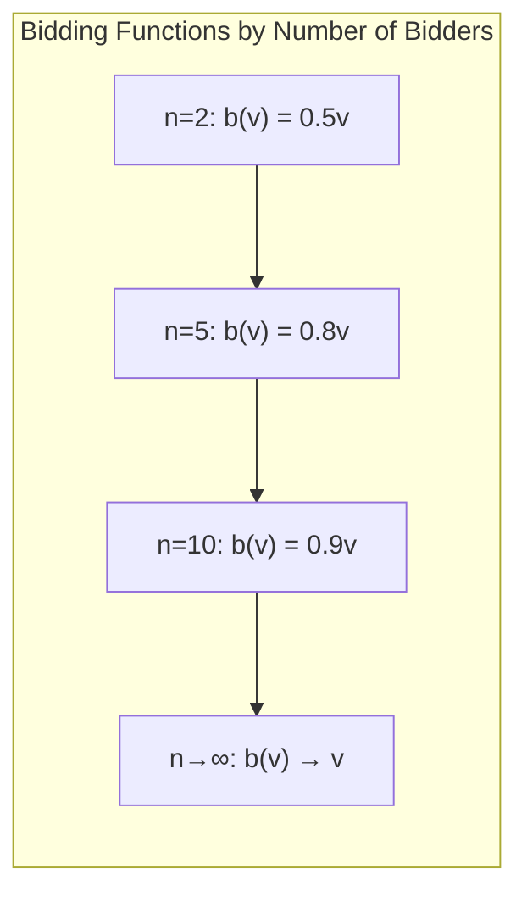
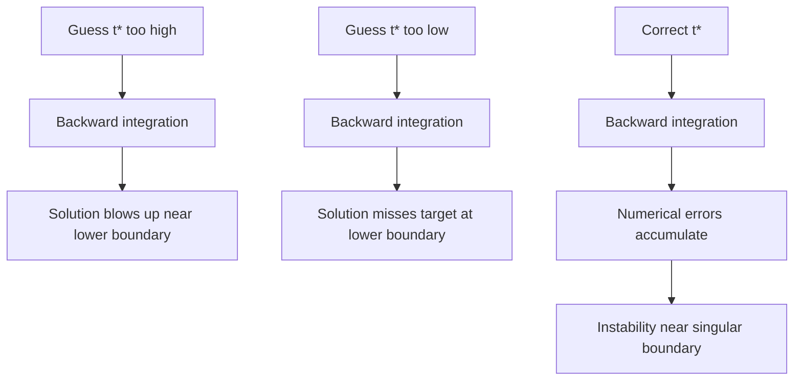
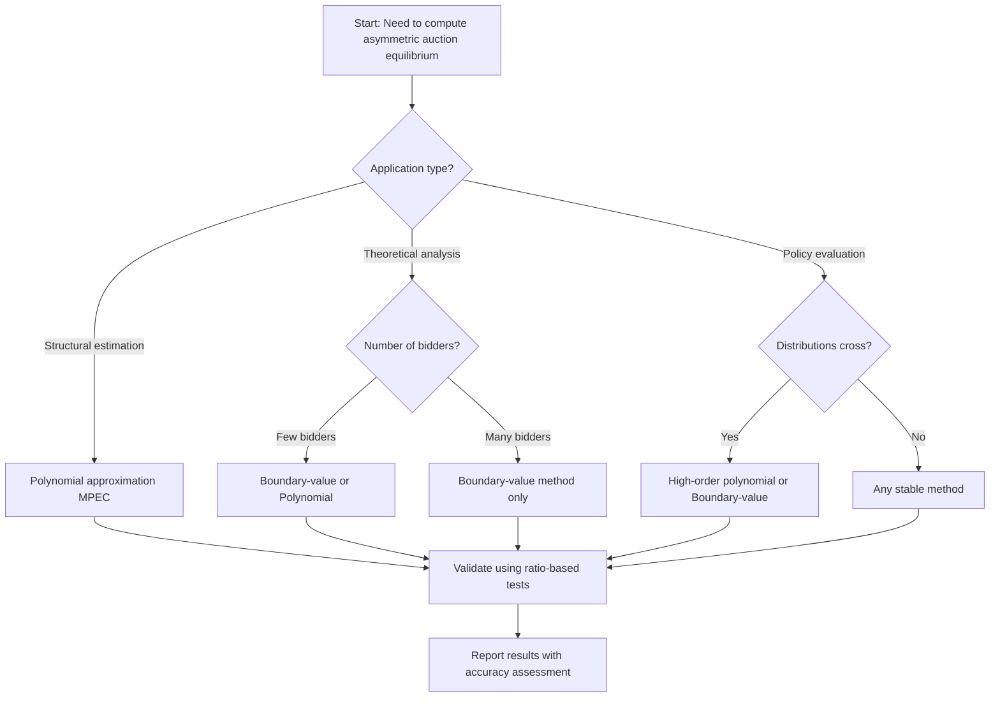
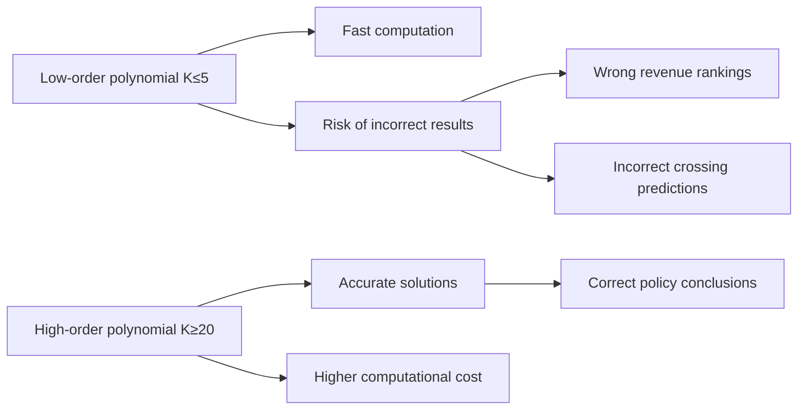

# Solving Asymmetric First-Price Sealed-Bid Auctions: A Theoretical and Methodological Inquiry
## 1 Foundations of the First-Price Sealed-Bid Auction

This chapter establishes the theoretical groundwork for analyzing first-price sealed-bid auctions (FPSBA) by formally defining the auction mechanism within the framework of Bayesian games of incomplete information. It explicates the auction rules, characterizes the strategic environment facing bidders, and identifies the fundamental economic forces that distinguish FPSBA from other auction formats, thereby providing the essential conceptual foundation for subsequent equilibrium analysis.

### 1.1 Formal Definition and Rules of the First-Price Sealed-Bid Auction

A **first-price sealed-bid auction (FPSBA)** is a common auction mechanism characterized by three fundamental procedural elements that collectively define its strategic structure[^1]. First, all bidders simultaneously submit sealed bids without any opportunity to observe competitors' submissions, ensuring that each bidder makes their decision in isolation from the actual choices of others[^2]. Second, the item is allocated to the bidder who submits the highest bid, with tie-breaking typically resolved through random mechanisms such as a coin flip[^2]. Third, and most critically for strategic analysis, the winning bidder pays exactly the price they submitted—not a penny more or less[^1].

The mathematical structure of bidder utility in FPSBA follows directly from these rules. For a bidder $i$ with private valuation $v_i$ who submits bid $b_i$, the utility function can be formally expressed as:

$$u_i(b_i, b_{-i}) = \begin{cases} v_i - b_i & \text{if } b_i > \max_{j \neq i} b_j \\ \frac{1}{2}(v_i - b_i) & \text{if } b_i = \max_{j \neq i} b_j \\ 0 & \text{if } b_i < \max_{j \neq i} b_j \end{cases}$$

This utility specification reveals the fundamental structure of the strategic problem: the bidder receives positive payoff only upon winning, and that payoff equals the difference between their valuation and their bid[^3]. The sealed-bid nature of the auction means that each bidder must commit to a bid without knowledge of what others have chosen, transforming the auction into a simultaneous-move game where strategic reasoning must be based on beliefs rather than observations[^4].

The FPSBA format finds widespread application in contexts ranging from government procurement and spectrum license allocation to real estate transactions and, increasingly, programmatic digital advertising[^5]. In the programmatic advertising context, the transition from second-price to first-price auctions has made understanding these strategic dynamics particularly relevant for market participants seeking to optimize their bidding behavior[^5].

### 1.2 FPSBA as a Bayesian Game of Incomplete Information

The FPSBA naturally fits within the framework of **Bayesian games of incomplete information** as formalized by Harsanyi (1967)[^4]. A game of incomplete information is one where players lack common knowledge of some aspect of the game being played—in the auction context, this typically means that bidders do not know their rivals' valuations[^2]. Harsanyi's seminal insight was that such games can be analyzed as games of complete but imperfect information where Nature first selects types according to a commonly known probability distribution and reveals each player's type only to that player[^2].

Formally, a Bayesian game modeling the FPSBA is defined as a tuple $G = (N, A, \Theta, p, u)$ with the following components[^4]:

| Component | Definition | Auction Interpretation |
|-----------|------------|----------------------|
| $N = \{1, 2, ..., n\}$ | Set of players | The set of bidders |
| $A = A_1 \times ... \times A_n$ | Action profiles | Feasible bid combinations |
| $\Theta = \Theta_1 \times ... \times \Theta_n$ | Type profiles | Private valuation combinations |
| $p: \Theta \rightarrow [0,1]$ | Joint prior over types | Distribution of valuations |
| $u: A \times \Theta \rightarrow \mathbb{R}^n$ | Utility functions | Payoffs from auction outcomes |

In this framework, each bidder $i$ observes their own type $\theta_i$ (their private valuation) but must form beliefs about rivals' types based on the commonly known prior distribution $p$[^6]. A **strategy** for player $i$ is a function $s_i: \Theta_i \rightarrow A_i$ that prescribes an action (bid) for every possible type (valuation)[^4]. This strategy must be chosen before the bidder learns their actual type, though the bid itself is submitted after the type is realized.

The appropriate solution concept for this environment is the **Bayesian Nash Equilibrium (BNE)**, defined as a strategy profile $s = (s_1, ..., s_n)$ such that every player maximizes their expected utility given their type, where the expectation is taken over the uncertainty about other players' types[^4]. Formally, $(s_1^*, ..., s_n^*)$ constitutes a BNE if for every player $i$ and every type $\theta_i$:

$$s_i^*(\theta_i) \in \arg\max_{a_i \in A_i} \mathbb{E}_{\theta_{-i}}[u_i(a_i, s_{-i}^*(\theta_{-i}); \theta_i, \theta_{-i})]$$

This equilibrium concept captures the essential feature of strategic interaction under incomplete information: each bidder's optimal strategy depends not only on their own valuation but also on their beliefs about rivals' valuations and their expectations about how those rivals will bid[^6]. The interdependence of strategic choices through this belief-formation process is what makes equilibrium analysis in FPSBA fundamentally more complex than in mechanisms with dominant strategies.

### 1.3 Comparison with Second-Price and Other Auction Formats

Understanding the distinctive features of FPSBA requires systematic comparison with alternative auction formats. The auction theory literature traditionally identifies **four basic auction types** for single-item sales, which can be organized into two pairs based on strategic equivalence[^7]:

**Table: Comparison of Standard Single-Item Auction Formats**

| Auction Type | Price Determination | Information Structure | Strategic Equivalence |
|--------------|--------------------|-----------------------|----------------------|
| First-Price Sealed-Bid | Winner pays own bid | Sealed, simultaneous | Dutch Auction |
| Second-Price Sealed-Bid (Vickrey) | Winner pays second-highest bid | Sealed, simultaneous | English Auction |
| Dutch (Descending) | First acceptor pays current price | Sequential, public | FPSBA |
| English (Ascending) | Last remaining bidder wins | Sequential, public | Second-Price |

The **second-price sealed-bid auction** (also known as the Vickrey auction) differs from FPSBA solely in its payment rule: the highest bidder wins but pays only the second-highest bid[^8]. This seemingly minor modification has profound strategic implications. In a second-price auction, **bidding one's true valuation is a weakly dominant strategy**[^1][^8]. The logic is straightforward: since a bidder's payment conditional on winning is determined by others' bids rather than their own, their bid affects only whether they win, not what they pay if they win. Bidding truthfully ensures winning exactly when the price would be below one's valuation, which is the optimal outcome[^7].

This dominant-strategy property makes second-price auctions "incentive compatible" in a strong sense—bidders have no strategic reason to misrepresent their valuations regardless of what others do[^1]. By contrast, FPSBA is **not incentive-compatible** even in the weaker sense of Bayesian-Nash incentive compatibility, since there exists no BNE in which bidders truthfully report their values[^1].

The **Dutch descending auction** operates by starting at a high price and progressively lowering it until some bidder accepts. Despite its dynamic appearance, this format is **strategically equivalent to FPSBA** because each bidder must internally decide at what price they would accept, and the first to reach their threshold wins and pays that price[^7]. Similarly, the **English ascending auction** is strategically equivalent to the second-price auction under the independent private values paradigm: rational bidders remain active until the price reaches their valuation, so the winner pays the second-highest valuation—exactly as in a second-price sealed-bid auction[^7].

These equivalences highlight that the fundamental strategic distinction is not between sealed-bid and open formats, but between first-price and second-price payment rules. The payment rule determines whether strategic bid shading is necessary, which in turn determines whether a dominant strategy exists.

### 1.4 The Strategic Logic of Bid Shading

The absence of a dominant strategy in FPSBA stems from a fundamental **economic tension between the probability of winning and the profit margin conditional on winning**[^3][^7]. This tension gives rise to the phenomenon of **bid shading**—the strategic practice of submitting a bid below one's true valuation.

To understand why bid shading is necessary, consider what happens if a bidder bids their true valuation. If bidder $i$ with valuation $v_i$ submits $b_i = v_i$, their payoff upon winning would be $v_i - b_i = 0$[^3]. Thus, truthful bidding guarantees zero profit regardless of whether the bidder wins. Since losing also yields zero profit, a bidder who bids truthfully is indifferent between all outcomes and cannot do worse—but crucially, they can do better by shading their bid[^3].

By bidding $b_i < v_i$, the bidder creates the possibility of positive profit $(v_i - b_i) > 0$ conditional on winning. The trade-off is that a lower bid reduces the probability of winning. The **optimal bid** balances these competing considerations by maximizing expected utility:

$$b_i^* = \arg\max_{b_i} (v_i - b_i) \cdot \Pr[b_i \geq \max_{j \neq i} b_j]$$

This optimization problem reveals the core strategic challenge: the probability of winning depends on competitors' bids, which in turn depend on their valuations and their bidding strategies[^3]. The optimal bid is therefore determined by solving:

$$b_i = \max_{x \in \mathbb{R}} (v_i - x) \prod_{j \neq i} \Pr(x \geq b_j)$$

The solution to this problem depends critically on the bidder's beliefs about the distribution of competing bids[^3]. In equilibrium, these beliefs must be consistent with competitors actually using their equilibrium strategies, creating a fixed-point problem that characterizes the Bayesian Nash Equilibrium.

The **magnitude of optimal bid shading** depends on several factors[^7]. First, it depends on the number of competitors: with more bidders, the probability of winning with any given bid decreases, pushing optimal bids higher and reducing the degree of shading. Second, it depends on the distribution of competitors' valuations: if competitors are likely to have high valuations, more aggressive bidding is necessary to maintain a reasonable winning probability. These dependencies explain why equilibrium bidding functions in FPSBA are generally complex functions of both the bidder's own valuation and the entire distributional environment.

### 1.5 Absence of Dominant Strategy and Implications for Equilibrium Analysis

The FPSBA fundamentally differs from the second-price auction in that **no dominant strategy exists**[^1][^3]. A dominant strategy is one that yields at least as high a payoff as any alternative strategy, regardless of what other players do. In the second-price auction, bidding one's true value satisfies this criterion because the bid affects only whether one wins, not the payment conditional on winning[^8]. In FPSBA, the bid directly determines the payment, creating an inextricable link between bidding strategy and payoff that makes the optimal bid contingent on competitors' behavior.

To see this formally, note that in FPSBA, the optimal bid for bidder $i$ depends on the probability distribution of the highest competing bid, which itself depends on:

1. The distribution of competitors' valuations (the prior $p$)
2. The bidding functions competitors use to map valuations to bids

If competitors change their bidding strategies, the optimal response changes accordingly. There is no single bid that is optimal against all possible competitor strategies, hence no dominant strategy exists[^1][^3].

This absence of dominant strategy has profound implications for equilibrium analysis:

**First**, it necessitates the use of **Bayesian Nash Equilibrium** rather than dominant-strategy equilibrium as the solution concept[^6]. Bidders must form correct beliefs about competitors' strategies and best-respond to those beliefs, with equilibrium requiring that these beliefs are self-confirming.

**Second**, equilibrium bidding functions are generally **non-trivial functions of valuations**, not simply the identity function as in second-price auctions. Deriving these functions requires solving optimization problems that incorporate expectations over competitors' behavior[^9].

**Third**, the complexity increases substantially when bidders are **asymmetric**—that is, when their valuations are drawn from different distributions. In the symmetric case, one can look for symmetric equilibria where all bidders use the same bidding function, substantially simplifying the analysis[^2][^6]. With asymmetric bidders, each bidder type potentially requires a distinct bidding function, and these functions must be mutually consistent in equilibrium[^10][^11].

**Fourth**, while existence of equilibrium is guaranteed under certain conditions—for continuous valuation distributions, pure-strategy BNE always exists in FPSBA[^4]—the **analytical tractability** of equilibrium characterization varies dramatically with the distributional assumptions. For symmetric bidders with uniform distributions, elegant closed-form solutions exist[^2][^1]. For asymmetric bidders with general distributions, the equilibrium is typically characterized by a system of differential equations that may lack closed-form solutions[^10][^11].

These considerations establish that analyzing FPSBA requires sophisticated game-theoretic tools and that the difficulty of analysis scales with the degree of asymmetry among bidders. The subsequent chapters will develop these tools systematically, beginning with the well-understood symmetric benchmark before addressing the substantially more challenging asymmetric case that is the focus of this research report.

## 2 The Symmetric Benchmark: Standard Solution Methods and Equilibrium

This chapter establishes the canonical symmetric case as a foundational benchmark for analyzing first-price sealed-bid auctions. The symmetric independent private values (IPV) model, where all bidders draw valuations from the same distribution, admits elegant analytical solutions that illuminate the fundamental strategic forces at work. By deriving the symmetric Bayesian Nash Equilibrium bidding strategy, verifying its properties, and establishing key results such as revenue equivalence, this chapter provides the essential reference point against which the complexities of asymmetric auctions will be evaluated in subsequent chapters.

### 2.1 Derivation of the Symmetric BNE Bidding Strategy

The derivation of the symmetric equilibrium bidding function in first-price sealed-bid auctions proceeds through two complementary analytical approaches, each offering distinct insights into the strategic logic underlying optimal bidding behavior. Both approaches ultimately yield the same equilibrium characterization, but their different starting points illuminate different aspects of the underlying economic problem.

**The First-Order Conditions Approach**

Consider a symmetric auction with $n$ bidders, where each bidder's private valuation is independently drawn from a common distribution with cumulative distribution function $F(\cdot)$ and probability density function $f(\cdot)$ on support $[\underline{s}, \bar{s}]$. In seeking a symmetric equilibrium, we postulate that all bidders employ the same strictly increasing and differentiable bidding function $b(v)$ that maps valuations to bids.

A bidder with valuation $v$ who submits bid $b$ wins the auction if and only if all $n-1$ other bidders submit lower bids. Since competitors use the same bidding function and their valuations are independent, the probability of winning with bid $b$ equals the probability that all rival valuations fall below $b^{-1}(b)$, which is $F(b^{-1}(b))^{n-1}$. In equilibrium, where the bidder optimally bids $b(v)$, the winning probability becomes $F(v)^{n-1}$.

The bidder's expected utility maximization problem can be formulated by considering a deviation to bidding as if one's type were $r$ rather than $v$. If a bidder with true valuation $v$ bids $b(r)$, their expected utility is:

$$u(b(r), v) = F(r)^{n-1} \cdot (v - b(r))$$

In equilibrium, the optimal response for a bidder of type $v$ must be to bid $b(v)$—that is, to "report truthfully" in the sense of choosing $r = v$. The first-order condition for this optimization, evaluated at $r = v$, requires:

$$\frac{\partial u}{\partial r}\bigg|_{r=v} = (n-1)F(v)^{n-2}f(v)(v - b(v)) - F(v)^{n-1}b'(v) = 0$$

Rearranging this expression yields a first-order linear differential equation:

$$b'(v) = \frac{(n-1)f(v)}{F(v)}(v - b(v))$$

This differential equation, combined with the boundary condition $b(\underline{s}) = \underline{s}$ (a bidder with the lowest possible valuation should bid that valuation, as any higher bid would guarantee negative profit upon winning), can be solved using standard techniques. The solution is:[^3]

$$b(v) = v - \frac{\int_{\underline{s}}^{v} F(x)^{n-1} dx}{F(v)^{n-1}}$$

This formula reveals that **the equilibrium bid equals the bidder's valuation minus a "shading" term** that depends on the distribution of competing valuations. The shading term captures the strategic incentive to bid below one's true value in order to increase profit conditional on winning.

**The Envelope Theorem Approach**

An alternative derivation employs the envelope theorem to characterize equilibrium bidding through a conditional expectation. Let $U(v)$ denote the equilibrium expected utility of a bidder with valuation $v$. By the envelope theorem, the derivative of the value function with respect to the type parameter equals the partial derivative of the objective function with respect to that parameter, evaluated at the optimum:

$$U'(v) = \frac{\partial}{\partial v}[F(v)^{n-1}(v - b(v))] = F(v)^{n-1}$$

Since a bidder with the lowest valuation earns zero expected profit (they either lose or win at a price equal to their value), we have $U(\underline{s}) = 0$. Integrating the envelope condition yields:

$$U(v) = \int_{\underline{s}}^{v} F(x)^{n-1} dx$$

But we also know that $U(v) = F(v)^{n-1}(v - b(v))$, the probability of winning times the profit conditional on winning. Equating these two expressions and solving for $b(v)$ recovers the same formula derived above.

This approach yields a powerful economic interpretation: **the equilibrium bid equals the expected value of the highest rival valuation, conditional on that valuation being below one's own**.[^6][^9] Formally:

$$b(v) = E[Y_{1:n-1} | Y_{1:n-1} < v]$$

where $Y_{1:n-1}$ denotes the maximum of the $n-1$ rival valuations. This characterization reveals that a bidder optimally bids what they expect the strongest competitor to be worth, given that they themselves have the highest valuation. The intuition is that this bid extracts the maximum surplus while still ensuring victory against the expected competition.

**Mathematical Equivalence**

The equivalence between these two characterizations can be verified directly. The conditional expectation $E[Y_{1:n-1} | Y_{1:n-1} < v]$ can be computed as:

$$E[Y_{1:n-1} | Y_{1:n-1} < v] = \frac{\int_{\underline{s}}^{v} x \cdot (n-1)F(x)^{n-2}f(x) dx}{F(v)^{n-1}}$$

Integration by parts shows this equals $v - \frac{\int_{\underline{s}}^{v} F(x)^{n-1} dx}{F(v)^{n-1}}$, confirming the equivalence.[^9]

### 2.2 Verification for the Uniform Distribution Case

The general equilibrium formula admits a particularly elegant closed-form solution when valuations are uniformly distributed on $[0,1]$. This canonical case serves as the workhorse example in auction theory and provides concrete numerical intuition for the abstract equilibrium characterization.

**Derivation of the Closed-Form Solution**

When $v_i \sim U[0,1]$ for all bidders, we have $F(v) = v$ and $f(v) = 1$. Substituting into the general equilibrium formula:

$$b(v) = v - \frac{\int_{0}^{v} x^{n-1} dx}{v^{n-1}} = v - \frac{v^n/n}{v^{n-1}} = v - \frac{v}{n} = \frac{n-1}{n} \cdot v$$

Thus, **the symmetric Bayesian Nash Equilibrium bidding strategy under uniform valuations is $b(v) = \frac{n-1}{n} \cdot v$**.[^3][^8] Each bidder bids a fixed fraction of their true valuation, with the fraction approaching unity as the number of bidders increases.

**Direct Verification of Equilibrium**

To verify that this strategy constitutes an equilibrium, consider a bidder with valuation $v_i$ contemplating a deviation to bid $z$ when all $n-1$ opponents bid according to $b(v_j) = \frac{n-1}{n} v_j$. The bidder wins if $z > \frac{n-1}{n} v_j$ for all $j \neq i$, which occurs when $v_j < \frac{n}{n-1} z$ for all opponents.[^12]

The probability of winning with bid $z$ is therefore:

$$\Pr(\text{win}) = \Pr\left(v_j < \frac{nz}{n-1} \text{ for all } j \neq i\right) = \left(\frac{nz}{n-1}\right)^{n-1}$$

for $z \leq \frac{n-1}{n}$ (since bidding above $\frac{n-1}{n}$ guarantees winning regardless). The expected utility from bidding $z$ is:

$$E[u_i(z)] = \left(\frac{nz}{n-1}\right)^{n-1} (v_i - z)$$

Taking the first-order condition with respect to $z$:

$$\frac{dE[u_i]}{dz} = \left(\frac{n}{n-1}\right)^{n-1} \left[(n-1)z^{n-2}(v_i - z) - z^{n-1}\right] = 0$$

Solving yields $(n-1)(v_i - z) - z = 0$, hence $z^* = \frac{n-1}{n} v_i$, confirming that the proposed strategy is indeed a best response.[^12]

**Numerical Illustration**

The following table illustrates equilibrium bidding behavior for different numbers of bidders:

| Number of Bidders ($n$) | Equilibrium Bid Formula | Bid for $v = 0.8$ | Bid Shading |
|------------------------|------------------------|-------------------|-------------|
| 2 | $b(v) = 0.5v$ | $0.40$ | $50\%$ |
| 3 | $b(v) = 0.667v$ | $0.53$ | $33\%$ |
| 5 | $b(v) = 0.8v$ | $0.64$ | $20\%$ |
| 10 | $b(v) = 0.9v$ | $0.72$ | $10\%$ |
| 100 | $b(v) = 0.99v$ | $0.79$ | $1\%$ |

This table demonstrates how **bid shading decreases systematically as competition intensifies**. A bidder with valuation $0.8$ bids only $0.40$ in a two-bidder auction but bids $0.79$ when facing ninety-nine competitors.

### 2.3 Monotonicity and Structural Properties of the Equilibrium

The symmetric equilibrium bidding function possesses several fundamental structural properties that ensure the auction operates efficiently and predictably. These properties—particularly monotonicity—are essential for the auction to achieve its allocative objectives.

**Strict Monotonicity of the Bidding Function**

The equilibrium bidding function $b(v) = v - \frac{\int_{0}^{v} F(x)^{n-1} dx}{F(v)^{n-1}}$ is **strictly increasing in valuation**. This can be verified by computing the derivative:[^3]

$$b'(v) = \frac{(n-1)f(v)F(v)^{n-2} \int_{0}^{v} F(x)^{n-1} dx}{F(v)^{2(n-1)}} > 0 \text{ for } v > 0$$

For the uniform distribution case, $b'(v) = \frac{n-1}{n} > 0$, confirming strict monotonicity. This property ensures that **higher-valuation bidders submit higher bids**, establishing a one-to-one correspondence between valuations and bids in equilibrium.

**Allocative Efficiency**

The monotonicity of the equilibrium bidding function has a crucial implication: **the first-price sealed-bid auction achieves allocative efficiency in the symmetric BNE**. Since $b(v)$ is strictly increasing, the bidder with the highest valuation necessarily submits the highest bid and wins the auction.[^3] The item is therefore allocated to the bidder who values it most, maximizing social welfare.

This efficiency result holds despite the strategic bid shading that characterizes equilibrium behavior. Although bidders do not reveal their true valuations through their bids, the ordinal ranking of bids perfectly reflects the ordinal ranking of valuations, which is sufficient for efficient allocation.

**Characterization of Bid Shading**

The equilibrium bid can be decomposed as:

$$b(v) = v - \underbrace{\frac{\int_{0}^{v} F(x)^{n-1} dx}{F(v)^{n-1}}}_{\text{Bid Shading}}$$

The bid shading term represents the strategic markdown from true valuation. Several properties of this shading are noteworthy:

1. **Shading is always positive**: For $v > 0$, the integral term is positive, so $b(v) < v$. Bidders never bid their full valuation.

2. **Shading varies with valuation**: The amount of shading depends on the bidder's position in the valuation distribution. For the uniform case, shading equals $\frac{v}{n}$, which is proportional to valuation.

3. **Proportional shading under uniformity**: Under uniform distributions, the *proportion* of shading ($\frac{1}{n}$) is constant across all valuation levels, making the equilibrium particularly tractable.

### 2.4 Comparative Statics: The Effect of Bidder Numbers

The number of competing bidders fundamentally shapes equilibrium bidding behavior through its effect on competition intensity. As the number of bidders increases, strategic considerations push equilibrium bids closer to true valuations.

**Convergence Toward Truthful Bidding**

Under uniform valuations, the equilibrium bid $b(v) = \frac{n-1}{n} \cdot v$ converges to $v$ as $n \to \infty$. More generally, for any distribution, the shading term diminishes as $n$ increases:[^3]

$$\lim_{n \to \infty} \frac{\int_{0}^{v} F(x)^{n-1} dx}{F(v)^{n-1}} = 0$$

This convergence occurs because for any $x \in (0, v]$, the ratio $\frac{F(x)}{F(v)} \leq 1$, and raising this ratio to the power $n-1$ drives it toward zero as $n$ increases.[^3]

**Economic Intuition**

The reduction in bid shading as competition intensifies reflects two reinforcing mechanisms:

1. **Increased probability of facing strong competition**: With more bidders, the likelihood that at least one competitor has a high valuation increases. A bidder who shades significantly risks losing to a competitor who might have been beaten with a slightly higher bid.

2. **Reduced marginal benefit of shading**: The gain from shading comes from increased profit conditional on winning. But with more competitors, the probability of winning at any given bid decreases, reducing the expected benefit of the additional margin.

The following diagram illustrates how the equilibrium bidding function shifts as $n$ varies:

**Limiting Behavior**

As $n \to \infty$, the first-price auction approaches a mechanism where bidders bid their true valuations. In this limit, the auction becomes equivalent to a second-price auction in terms of both allocation and payment—both award the item to the highest-value bidder at a price equal to their valuation. This convergence illustrates how competition can substitute for mechanism design in eliciting truthful behavior.

### 2.5 Revenue Equivalence and Comparison with Second-Price Auctions

One of the most celebrated results in auction theory is the **Revenue Equivalence Theorem**, which establishes that under certain conditions, different auction formats generate identical expected revenue for the seller. This result provides deep insight into the relationship between mechanism design and market outcomes.

**Statement of Revenue Equivalence**

The Revenue Equivalence Theorem states that if $n$ bidders have independent, identically distributed valuations drawn from a continuous distribution $F$, then any auction mechanism satisfying the following conditions yields the same expected revenue:[^13][^9]

1. The item is always allocated to the bidder with the highest valuation in equilibrium
2. A bidder with the lowest possible valuation earns zero expected profit

Under these conditions, the expected revenue equals $E[S_{2:n}]$—the expected value of the second-highest order statistic among $n$ draws from $F$.[^9]

**Application to First-Price and Second-Price Auctions**

Both first-price and second-price sealed-bid auctions satisfy the conditions of the theorem:

| Property | First-Price Auction | Second-Price Auction |
|----------|--------------------|--------------------|
| Equilibrium Strategy | $b(v) = E[Y_{1:n-1} \mid Y_{1:n-1} < v]$ | $b(v) = v$ (dominant strategy) |
| Winner | Highest-valuation bidder | Highest-valuation bidder |
| Payment Rule | Winner pays own bid | Winner pays second-highest bid |
| Expected Revenue | $E[S_{2:n}]$ | $E[S_{2:n}]$ |

Despite the dramatically different strategic environments—strategic shading versus truthful revelation—**both auctions generate the same expected revenue**.[^8][^13]

**Verification for Uniform Distribution**

Under $U[0,1]$ valuations with $n$ bidders, the expected revenue in both auction formats is:[^8]

$$E[\text{Revenue}] = \frac{n-1}{n+1}$$

For the second-price auction, this equals the expected second-highest value among $n$ uniform draws. For the first-price auction, this equals the expected winning bid, which is $E[\frac{n-1}{n} \cdot V_{1:n}] = \frac{n-1}{n} \cdot \frac{n}{n+1} = \frac{n-1}{n+1}$.

Simulation studies confirm this equivalence: with 5 bidders and uniform valuations, both auctions yield average revenues of approximately $0.667$, consistent with the theoretical prediction of $\frac{4}{6} \approx 0.667$.[^8]

**Economic Logic of Revenue Equivalence**

The Revenue Equivalence Theorem can be understood through the lens of bidder surplus. In any standard auction, the expected profit of a bidder with valuation $v$ is determined by the probability of winning and the expected payment. The envelope theorem shows that:[^14]

$$U'(v) = \Pr(\text{win} \mid v) = F(v)^{n-1}$$

Since $U(0) = 0$ (the lowest-type bidder earns zero), integrating yields $U(v) = \int_0^v F(x)^{n-1} dx$. This expected profit function is **the same across all standard auctions**, regardless of their payment rules. Since total surplus (the expected value of the highest valuation) is also fixed, the seller's expected revenue must be identical across all such mechanisms.

### 2.6 The Symmetric Case as Benchmark for Asymmetric Analysis

The symmetric equilibrium analysis establishes several key properties that serve as reference points for understanding how asymmetry complicates auction analysis. Identifying which properties depend critically on symmetry clarifies the challenges that arise when this assumption is relaxed.

**Properties Dependent on Symmetry**

The following features of the symmetric equilibrium rely fundamentally on the assumption that all bidders draw valuations from the same distribution:

1. **Closed-form solutions**: The elegant formula $b(v) = \frac{n-1}{n} \cdot v$ for uniform valuations, and more generally the single differential equation characterization, depends on all bidders using identical strategies. With asymmetric distributions, each bidder type requires a distinct bidding function, leading to a system of coupled differential equations.[^15]

2. **Unique symmetric equilibrium**: In symmetric auctions, there exists a unique symmetric equilibrium in monotone strategies.[^16] Asymmetric auctions may admit multiple equilibria or require mixed strategies in certain configurations.

3. **Revenue equivalence**: The theorem requires symmetric, i.i.d. valuations. When bidders are asymmetric, first-price and second-price auctions generally yield different expected revenues, with the ranking depending on the specific distributional asymmetry.[^13][^9]

4. **Allocative efficiency**: While symmetric first-price auctions are efficient, **asymmetric first-price auctions may fail to allocate the item to the highest-value bidder**. The example in the reference materials demonstrates that when bidders are asymmetric, a lower-valuation bidder may win with positive probability in equilibrium.[^15]

**Preview of Asymmetric Complications**

When bidders draw valuations from different distributions $F_1$ and $F_2$, several analytical complications arise:

- **Coupled differential equations**: The equilibrium conditions become a system where each bidder's optimal strategy depends on the other's strategy, which in turn depends on the first bidder's strategy.

- **Boundary conditions**: The appropriate boundary conditions become more complex, as bidders with different supports may have different minimum bids.

- **Non-existence of pure-strategy equilibrium**: In some asymmetric configurations, particularly with discrete valuations or specific distributional shapes, equilibrium may require mixed strategies.[^15]

- **Analytical intractability**: Even when pure-strategy equilibria exist, they typically lack closed-form solutions and must be characterized numerically.

The background material explicitly notes that **the Conditional Second Value (CSV) bidding strategy—which characterizes symmetric equilibrium—does not constitute a Nash equilibrium in asymmetric settings**.[^15] This failure of the symmetric solution to extend to asymmetric cases underscores the fundamental nature of the analytical challenge.

**Summary: The Symmetric Benchmark**

The symmetric IPV model provides a tractable benchmark characterized by:

- A unique, closed-form equilibrium bidding strategy
- Strict monotonicity ensuring efficient allocation
- Revenue equivalence with second-price auctions
- Clear comparative statics with respect to bidder numbers

These properties establish the standard against which asymmetric auction analysis must be evaluated. The subsequent chapters will demonstrate how relaxing the symmetry assumption disrupts each of these convenient properties, necessitating more sophisticated analytical and computational approaches to characterize equilibrium behavior in asymmetric first-price auctions.

## 3 The Asymmetric Challenge: Problem Formulation and Theoretical Hurdles

This chapter formally introduces the asymmetric first-price sealed-bid auction problem and systematically identifies the fundamental theoretical obstacles that distinguish it from the symmetric benchmark. Building on the symmetric equilibrium analysis established in Chapter 2, this chapter demonstrates why standard solution methods fail when bidders draw valuations from heterogeneous distributions, and characterizes the mathematical and strategic complexities that necessitate alternative analytical approaches.

### 3.1 Formal Definition of the Asymmetric Two-Bidder Model

The asymmetric independent private values (IPV) model with two bidders represents a fundamental departure from the symmetric framework analyzed in Chapter 2. In this setting, each bidder $i \in \{1, 2\}$ independently draws their private valuation $v_i$ from a distinct, commonly known cumulative distribution function $F_i(v)$ with corresponding probability density function $f_i(v)$. The distributions may have different supports, denoted $[\underline{v}_1, \bar{v}_1]$ and $[\underline{v}_2, \bar{v}_2]$, though the standard analysis often assumes a common support $[\underline{v}, \bar{v}]$ to simplify initial exposition.

**The informational structure** of this game is characterized by asymmetric information within a Bayesian framework. Each bidder knows their own valuation realization with certainty, knows the distributional form of their opponent's valuation (including all parameters), but does not observe the opponent's actual valuation draw. This information structure is common knowledge among the bidders, meaning both bidders understand the complete probabilistic environment and know that their opponent understands it as well.

**The strategy space** for each bidder consists of all measurable functions mapping valuations to bids. A pure strategy for bidder $i$ is a bidding function $b_i: [\underline{v}_i, \bar{v}_i] \rightarrow \mathbb{R}_+$ that specifies a bid for each possible valuation realization. The theoretical analysis typically focuses on monotonically increasing bidding strategies, which preserve the ordinal ranking of valuations in the bid space.

**The equilibrium concept** employed is the Bayesian Nash Equilibrium (BNE), where each bidder's strategy maximizes their expected payoff given correct beliefs about the opponent's strategy. Formally, a pair of bidding functions $(b_1^*, b_2^*)$ constitutes a BNE if for each bidder $i$ and almost every valuation $v_i$:

$$b_i^*(v_i) \in \arg\max_{b} (v_i - b) \cdot \Pr(b > b_j^*(v_j))$$

where the probability is computed over the opponent's valuation distribution $F_j$.

When seeking strictly increasing equilibrium bidding functions, the analysis typically works with **inverse bid functions** $\phi_i(b)$, which map bids back to valuations. If $b_i(v)$ is strictly increasing, then $\phi_i(b) = b_i^{-1}(b)$ represents the valuation of bidder $i$ who would submit bid $b$ in equilibrium. The inverse bid function formulation proves analytically convenient because it transforms the equilibrium conditions into a system of differential equations.

**The system of coupled differential equations** characterizing equilibrium inverse bid functions emerges from the first-order conditions for optimal bidding. For bidder 1 with valuation $v_1 = \phi_1(b)$ who bids $b$, the expected utility is:

$$U_1(b, \phi_1(b)) = (\phi_1(b) - b) \cdot F_2(\phi_2(b))$$

The first-order condition for optimality, combined with the analogous condition for bidder 2, yields the system:

$$\frac{d\phi_1}{db} = \frac{F_2(\phi_2(b))}{f_2(\phi_2(b))} \cdot \frac{1}{\phi_1(b) - b}$$

$$\frac{d\phi_2}{db} = \frac{F_1(\phi_1(b))}{f_1(\phi_1(b))} \cdot \frac{1}{\phi_2(b) - b}$$

This system exhibits **fundamental coupling**: the derivative of each inverse bid function depends on the level of the other inverse bid function, creating an interdependence that prevents separate solution of the two equations.

**The boundary conditions** that any equilibrium must satisfy are twofold. At the lower boundary, a bidder with the lowest valuation in the common support should bid that valuation, as any higher bid would guarantee negative profit upon winning: $\phi_1(\underline{b}) = \phi_2(\underline{b}) = \underline{v}$ where $\underline{b} = \underline{v}$ when supports coincide at the lower end. At the upper boundary, both bidders with their maximum valuations must submit the same maximum bid $\bar{b}$: $\phi_1(\bar{b}) = \bar{v}_1$ and $\phi_2(\bar{b}) = \bar{v}_2$. Critically, **the upper boundary $\bar{b}$ is endogenously determined** as part of the equilibrium solution, creating what is technically known as a free boundary problem.[^17]

### 3.2 Failure of the Conditional Second Value Strategy in Asymmetric Settings

The symmetric equilibrium analysis in Chapter 2 established that the optimal bid equals the **Conditional Second Value (CSV)**—the expected value of the highest rival valuation conditional on one's own value being the highest. This elegant characterization, expressed as $b(v) = E[Y_{1:n-1} | Y_{1:n-1} < v]$, provides both computational tractability and economic intuition for the symmetric case. However, this strategy fundamentally fails to constitute a Nash equilibrium when bidders are asymmetric.[^15]

**The CSV strategy in asymmetric settings** would prescribe that each bidder $i$ bids the expected highest opposing valuation conditional on their own being highest:

$$b_i^{CSV}(v_i) = E[v_j | v_j < v_i] = \frac{\int_{\underline{v}}^{v_i} x f_j(x) dx}{F_j(v_i)}$$

where $j \neq i$ denotes the opponent. When $F_1 \neq F_2$, these formulas yield different bidding functions for the two bidders, which is appropriate. However, the critical failure is that **these CSV strategies do not constitute mutual best responses**.

**A concrete numerical example** from the reference materials demonstrates this failure decisively. Consider a first-price sealed-bid auction with two bidders, B and C. Bidder B has a known valuation of 400, while bidder C's valuation is 300 with probability one-half and 800 with probability one-half. If bidders followed the CSV strategy:

| Bidder | Valuation | CSV Bid |
|--------|-----------|---------|
| B | 400 | 300 |
| C | 300 | 300 |
| C | 800 | 400 |

Under these CSV strategies, bidder B would bid 300 (the expected value of C's valuation conditional on it being below 400), and bidder C would bid 300 when $v_C = 300$ and 400 when $v_C = 800$. **These strategies are not a Nash equilibrium** because they create profitable deviation opportunities.[^15]

**The deviation incentive for bidder B** arises because when C bids according to CSV, B faces a discrete distribution of competing bids: 300 with probability one-half and 400 with probability one-half. If B bids exactly 300, ties occur when $v_C = 300$, yielding expected payoff $(400 - 300) \times (0.5 + 0.5 \times 0.5) = 75$ (winning outright half the time, and winning the tie-break one-quarter of the time). But B could profitably deviate by bidding slightly above 300, say 300.01, winning whenever $v_C = 300$ and still losing when $v_C = 800$, yielding approximately $(400 - 300) \times 0.5 = 50$. Actually, the optimal deviation involves a more complex calculation considering the full strategic interaction.

**The actual Nash equilibrium** in this example involves **mixed strategies**. In equilibrium, bidder B's average bid is 302.59, and bidder C's average bid when $v_C = 800$ is 330.69—substantially below the CSV of 400. The seller's expected revenue is 316.94, which is **lower than the expected CSV of 350 that would obtain in a second-price auction**. This demonstrates that the Revenue Equivalence Theorem's assumptions are violated when bidders are asymmetric.[^15]

**The fundamental reason CSV fails** is that it was derived under the assumption that all bidders use the same bidding function. The CSV formula emerges from the envelope theorem applied to a symmetric optimization problem where each bidder's winning probability is $F(v)^{n-1}$. When distributions differ, the winning probability for bidder $i$ with valuation $v$ who bids $b$ is $F_j(\phi_j(b))$, which depends on the opponent's inverse bid function. The CSV derivation implicitly assumes $\phi_j = \phi_i$, an assumption that fails by construction in asymmetric settings.

**The strategic implications** of this failure are profound. Asymmetry does not merely complicate the symmetric solution—it fundamentally alters the strategic calculus. Bidders must account for the fact that their opponent draws from a different distribution and therefore uses a different bidding function. This interdependence creates the coupled system of differential equations described in Section 3.1, which generally cannot be solved using the techniques that yield closed-form solutions in the symmetric case.

### 3.3 The Phenomenon of Differential Bid Shading: Weak Beats Strong

One of the most counterintuitive results in asymmetric auction theory is that **weaker bidders bid more aggressively relative to their valuations than stronger bidders**. This phenomenon, sometimes called "weakness leads to aggression," has profound implications for auction efficiency and revenue.[^18]

**The formal setting** involves two bidders, conventionally labeled "strong" (S) and "weak" (W), whose valuations are drawn from distributions $F_S$ and $F_W$ respectively. The strong bidder's distribution $F_S$ is said to **first-order stochastically dominate** $F_W$ if $F_S(v) < F_W(v)$ for all interior values $v$. This means the strong bidder is more likely to have high valuations. Under the stronger condition of **conditional stochastic dominance** (introduced by Maskin and Riley), the ratio $F_S(v)/F_W(v)$ is strictly increasing in $v$, implying that the strong bidder's relative advantage increases at higher valuation levels.

**The theoretical result** states that under conditional stochastic dominance, the equilibrium bidding functions satisfy $b_S(v) < b_W(v)$ for all interior valuations $v < \bar{v}$. That is, **for any given valuation, the strong bidder submits a lower bid than the weak bidder would with the same valuation**. The strong bidder shades their bid more aggressively.[^18]

**The economic intuition** behind this result involves asymmetric competitive pressures:

1. **The strong bidder's perspective**: A strong bidder knows they are likely to have a high valuation and face an opponent who is likely to have a lower valuation. This reduces the competitive pressure to bid aggressively—the strong bidder can afford to shade their bid substantially because they expect to win even with moderate bids.

2. **The weak bidder's perspective**: A weak bidder knows they are likely to have a low valuation competing against an opponent who is likely to have a higher valuation. To have any reasonable chance of winning, the weak bidder must bid aggressively relative to their valuation. Significant bid shading would virtually guarantee losing.

**The allocative efficiency implications** are immediate and striking. Since the weak bidder bids more aggressively at any given valuation level, there exist valuation realizations where the weak bidder wins despite having a lower valuation than the strong bidder. Specifically, when both bidders have similar valuations with the weak bidder's valuation slightly below the strong bidder's, the weak bidder's more aggressive bidding can result in a higher bid and thus victory.[^18]

**A formal characterization** of this inefficiency involves the **matching function** $m(v) \equiv b_W^{-1}(b_S(v))$, which identifies the weak bidder's valuation that generates the same bid as a strong bidder with valuation $v$. Since $b_S(v) < b_W(v)$, we have $m(v) < v$ for interior valuations. The matching function reveals that a strong bidder with valuation $v$ ties with a weak bidder whose valuation is only $m(v) < v$. Consequently, when the weak bidder's valuation falls in the interval $(m(v), v)$, the weak bidder wins despite having a lower valuation than the strong bidder.

**The magnitude of inefficiency** depends on the degree of asymmetry between the distributions. Perturbation analysis shows that when distributions are "close" to symmetric (differing by a small parameter $\epsilon$), the probability of inefficient allocation is $O(\epsilon)$—first-order in the asymmetry parameter.[^19] This quantifies how even modest asymmetries can generate meaningful efficiency losses.

**Bidder preferences across auction formats** follow directly from this analysis. The strong bidder's expected payoff in a first-price auction is:

$$V_S^{FP}(v) = \int_{\underline{v}}^{v} F_W(m(s)) ds$$

while in a second-price auction (where the dominant strategy is truthful bidding):

$$V_S^{SP}(v) = \int_{\underline{v}}^{v} F_W(s) ds$$

Since $m(s) < s$ and $F_W$ is increasing, we have $V_S^{FP}(v) < V_S^{SP}(v)$. **All types of the strong bidder strictly prefer the second-price auction**, while symmetric reasoning shows that **all types of the weak bidder strictly prefer the first-price auction**.[^18]

### 3.4 Mathematical Intractability: Coupled Differential Equations and Singularities

The mathematical structure of asymmetric first-price auctions presents formidable analytical challenges that explain why closed-form solutions are generally unavailable. These challenges arise from three interconnected sources: the coupled nature of the equilibrium conditions, singularities at boundary points, and the free boundary problem structure.[^11][^17]

**The system of coupled nonlinear ODEs** characterizing equilibrium inverse bid functions takes the general form:

$$\frac{d\phi_n(b)}{db} = \frac{\phi_n(b) - b}{\sum_{m \neq n} \frac{f_m(\phi_m(b))}{F_m(\phi_m(b))}} \quad \text{for } n = 1, \ldots, N$$

For the two-bidder case, this simplifies to:

$$\phi_1'(b) = \frac{F_2(\phi_2(b))}{f_2(\phi_2(b))} \cdot \frac{1}{\phi_1(b) - b}$$

$$\phi_2'(b) = \frac{F_1(\phi_1(b))}{f_1(\phi_1(b))} \cdot \frac{1}{\phi_2(b) - b}$$

**The coupling** between these equations is fundamental: the derivative of $\phi_1$ depends on the level of $\phi_2$, and vice versa. This interdependence means the equations cannot be solved sequentially—they must be solved simultaneously as a system. In the symmetric case where $F_1 = F_2 = F$ and we seek symmetric solutions $\phi_1 = \phi_2 = \phi$, the system collapses to a single equation that admits the closed-form solution derived in Chapter 2. No such simplification is available when $F_1 \neq F_2$.[^11]

**The singularity at the lower boundary** creates severe mathematical complications. At the lower bound $b = \underline{v}$, the boundary condition requires $\phi_n(\underline{v}) = \underline{v}$ for all bidders, which means $\phi_n(b) - b \to 0$ as $b \to \underline{v}$. Examining the differential equations, this implies the denominators approach zero, causing the derivatives to become unbounded. More precisely, **the Lipschitz condition fails at this boundary**, which has two critical consequences:[^11][^17]

1. **Standard uniqueness theory does not apply**: The Picard-Lindelöf theorem, which guarantees local existence and uniqueness of ODE solutions, requires Lipschitz continuity. Its failure means standard theoretical tools cannot establish uniqueness.

2. **Standard numerical methods are unreliable**: Numerical ODE solvers (Euler, Runge-Kutta, Adams methods) are designed for Lipschitz-continuous problems. Applying them to this singular system produces unstable, unreliable results.

**The free boundary problem structure** adds another layer of complexity. Unlike standard boundary value problems where both boundaries are specified exogenously, the upper boundary $\bar{b}$—the common maximum bid submitted by bidders with their highest valuations—is **endogenously determined** as part of the equilibrium. The system must be solved subject to:

- Left boundary: $\phi_n(\underline{b}) = \underline{v}$ for all $n$
- Right boundary: $\phi_n(\bar{b}) = \bar{v}_n$ for all $n$, where $\bar{b}$ is unknown

This creates a two-point boundary value problem with a free boundary, substantially more difficult than either initial value problems or standard boundary value problems.[^17]

**The following table summarizes the mathematical features** that distinguish asymmetric from symmetric auctions:

| Feature | Symmetric Case | Asymmetric Case |
|---------|---------------|-----------------|
| Number of equations | 1 | $N$ (coupled) |
| Boundary conditions | Standard | Free boundary |
| Lipschitz condition | Fails at lower bound | Fails at lower bound |
| Closed-form solution | Available for many $F$ | Generally unavailable |
| Numerical stability | Moderate | Severe challenges |

**The practical implication** is that researchers seeking to characterize equilibrium bidding in asymmetric auctions must employ specialized numerical techniques. Standard analytical methods and off-the-shelf numerical solvers are inadequate for this problem class, necessitating the methodological developments discussed in Chapter 4.

### 3.5 Equilibrium Existence, Uniqueness, and the Role of Mixed Strategies

Despite the mathematical intractability of computing equilibrium bidding functions, theoretical results establish conditions under which equilibria exist and are unique. These results provide essential foundations for numerical analysis by ensuring that computational methods are searching for objects that actually exist.[^20]

**Existence of pure-strategy equilibrium** in asymmetric first-price auctions with continuous valuation distributions is generally assured under mild regularity conditions. When distributions are absolutely continuous with positive densities on their supports, a pure-strategy Bayesian Nash Equilibrium in strictly increasing strategies exists. The proof typically proceeds by establishing that the best-response correspondence is upper hemicontinuous and convex-valued, then applying fixed-point theorems.

**Uniqueness of equilibrium** is more delicate and requires additional assumptions. Bernard Lebrun's seminal 2004 result establishes uniqueness under the condition that valuation cumulative distribution functions are **strictly log-concave at the highest lower extremity of their supports**. Formally, if $\log F_i(v)$ is strictly concave in a neighborhood to the right of $\underline{v}$, then the equilibrium is unique. This condition is equivalent to requiring **decreasing reverse hazard rates** in an interval to the right of the minimum valuation.[^20]

**The log-concavity condition** is satisfied by many standard parametric distributions:

| Distribution | Log-concavity | Unique Equilibrium |
|--------------|---------------|-------------------|
| Uniform | Satisfied | Yes |
| Exponential | Satisfied | Yes |
| Normal (truncated) | Satisfied | Yes |
| Weibull | Satisfied | Yes |
| Beta (certain parameters) | Satisfied | Yes |
| Power distributions | May fail | Depends on parameters |

The importance of uniqueness for applied work cannot be overstated. When uniqueness holds, numerical methods need find only one equilibrium, and comparative statics exercises are well-defined. Without uniqueness, researchers must contend with equilibrium selection issues that complicate both computation and interpretation.[^20]

**Mixed-strategy equilibria** arise in certain asymmetric settings, particularly when valuations have discrete distributions or when the continuous distribution case exhibits certain pathological features. The example in Section 3.2, with one bidder having a known valuation and the other having a two-point distribution, demonstrates that **pure-strategy equilibria may not exist** in such settings, necessitating analysis of mixed strategies.[^15]

**In discrete-information first-price auctions**, it is well established that pure-strategy equilibria generally do not exist when tie-breaking is random. The intuition is that with discrete bid spaces or discrete valuation supports, bidders have incentives to slightly undercut or overcut opponents' bids, creating cycles that prevent pure-strategy equilibrium. Mixed-strategy equilibria, where bidders randomize over intervals of bids, restore equilibrium existence.[^21]

**The characterization of mixed-strategy equilibria** is substantially more complex than pure-strategy analysis. In the common-value auction setting with asymmetric information precision, research has shown that unique, generically asymmetric mixed-strategy equilibria exist under certain conditions. In these equilibria, one bidder submits higher average bids than the other, but **aggressive bidding is not necessarily associated with informational inferiority**—the relationship between information quality and bidding aggression can be non-monotonic.[^21]

**Implications for the general solution question**: The existence and uniqueness results provide qualified positive answers to whether general methods exist. For continuous distributions satisfying log-concavity, a unique pure-strategy equilibrium exists and is characterized by the system of differential equations. For discrete distributions or pathological continuous cases, mixed-strategy equilibria exist but require different analytical tools. The methodological framework thus depends on the distributional assumptions, though a general approach—either differential equations for pure strategies or fixed-point methods for mixed strategies—is available for each case.

### 3.6 Bid Bifurcation and Dimensional Complexity with Heterogeneous Supports

When bidders' valuation distributions have different supports, additional complications arise that have been largely overlooked in the theoretical literature but are crucial for empirical applications. The phenomenon of **bid bifurcation**—where equilibrium bid ranges do not coincide across bidder types—fundamentally changes the problem's structure.[^22]

**The standard assumption** in most theoretical work is that all bidders' valuations share a common support $[\underline{v}, \bar{v}]$. Under this assumption, all bidders submit bids over the same interval $[\underline{b}, \bar{b}]$ in equilibrium, with $\underline{b} = \underline{v}$ and $\bar{b}$ determined endogenously. The coupled differential equation system applies throughout this common bid interval.

**When supports differ**, say $[\underline{v}_1, \bar{v}_1]$ for "strong" bidders and $[\underline{v}_2, \bar{v}_2]$ for "weak" bidders with $\bar{v}_1 > \bar{v}_2$, **bid bifurcation may occur**. In a bifurcated equilibrium, strong bidders submit bids over a larger interval than weak bidders. Specifically, there exists a critical bid $b_c$ such that:

- For $b \in [\underline{b}, b_c]$: Both bidder types are active, and the full coupled system applies
- For $b \in (b_c, \bar{b}]$: Only strong bidders are active, and a simpler single-bidder equation applies

**The conditions for bid bifurcation** depend on the relative "strength" of bidders and the number of bidders in each group. Research has established that bifurcation is more likely when:[^22]

1. The asymmetry between distributions is larger (greater difference between $\bar{v}_1$ and $\bar{v}_2$)
2. Strong bidders are "stronger" in terms of reverse hazard rate dominance
3. There are more bidders in either group

**Quantitative thresholds** have been computed for specific distributional families. For uniform distributions with supports $[0, v_1]$ and $[0, v_2]$, bid bifurcation occurs when $v_1$ exceeds $v_2$ by more than a critical percentage that depends on the number of bidders:

| Bidder Configuration | Critical Asymmetry for Bifurcation |
|---------------------|-----------------------------------|
| 2 strong, 1 weak | $v_1 > 1.33 v_2$ (33% larger) |
| 3 strong, 2 weak | $v_1 > 1.081 v_2$ (8.1% larger) |
| 5 strong, 3 weak | $v_1 > 1.04 v_2$ (4% larger) |

These thresholds decrease rapidly as the number of bidders increases, suggesting that **bid bifurcation should not be dismissed as a theoretical curiosity** in real-world auctions with many participants.[^22]

**The dimensional complexity** introduced by bid bifurcation appears to increase the problem's difficulty. With a common bid support, there is a single unknown boundary condition (the maximum bid $\bar{b}$). With bifurcation, it seems there are two unknowns: the bifurcation point $b_c$ and the maximum bid $\bar{b}$. However, research has shown that **these boundaries are mechanically linked**, reducing the problem back to a single degree of freedom. The key insight is that the weak bidders' maximum bid $b_c$ is determined by the condition that a weak bidder with maximum valuation $\bar{v}_2$ is indifferent between bidding $b_c$ and any slightly higher bid (which would never win against a strong bidder).[^22]

**The methodological implications** are significant for both theoretical and empirical work:

1. **Solution algorithms must diagnose bifurcation**: Before solving the differential equation system, researchers must determine whether bifurcation occurs. This requires checking sufficient conditions or using diagnostic tests based on comparing critical values.

2. **Imposing incorrect common support produces errors**: If bifurcation is present but ignored, solving the coupled system over an assumed common support produces equilibrium strategies that violate optimality conditions. Simulations show this can lead to **erroneous revenue rankings** between first-price and second-price auctions.[^22]

3. **Empirical bid data may reveal bifurcation**: In observed auction data, non-overlapping bid supports across bidder types may indicate bifurcation, providing a diagnostic for model specification.

**The general solution framework** must therefore incorporate bifurcation analysis as a preliminary step. The complete methodology involves: (1) checking conditions for bifurcation; (2) if bifurcation is absent, solving the standard coupled system; (3) if bifurcation is present, solving the coupled system over the overlapping support and then integrating the single-bidder equation over the bifurcated region. This extended framework maintains the generality of the differential equation approach while accommodating the additional complexity of heterogeneous supports.

## 4 Methodological Approaches for Asymmetric Equilibrium Analysis

This chapter systematically examines the principal methodological frameworks for analyzing equilibrium in asymmetric first-price sealed-bid auctions. Building on the theoretical challenges identified in Chapter 3—the coupled nature of equilibrium conditions, singularities at boundary points, and the free boundary problem structure—this chapter develops the analytical apparatus for characterizing, computing, and verifying equilibrium bidding strategies when bidders draw valuations from heterogeneous distributions. The progression moves from the derivation of the coupled differential equation system that defines pure-strategy equilibria, through existence and uniqueness theorems that establish when such equilibria are well-defined, to practical numerical algorithms that enable computation when closed-form solutions are unavailable. The central answer to the research question emerges through this analysis: **a general methodological framework based on solving a system of differential equations does exist for characterizing equilibria in asymmetric first-price auctions**, though this framework requires numerical implementation rather than yielding simple closed-form solutions.

### 4.1 The System of Differential Equations from Mutual Best-Response Conditions

The characterization of pure-strategy Bayesian Nash Equilibria in asymmetric first-price auctions rests on a system of coupled ordinary differential equations derived from the mutual best-response conditions that each bidder's strategy must satisfy. This system constitutes the **fundamental analytical object** for equilibrium analysis, and understanding its structure is essential for both theoretical insight and practical computation.

**Derivation from Expected Utility Maximization**

Consider an asymmetric first-price auction with $N$ potential bidders, where bidders are partitioned into $n$ types. Each type $i$ is characterized by a distribution function $F_i$ on a common support $[\underline{v}, \bar{v}]$, with $k_i$ bidders belonging to group $i$[^23]. In seeking a pure-strategy equilibrium, we postulate that all bidders of the same type employ the same strictly increasing and differentiable bidding function. The analysis works with **inverse bid functions** $\lambda_i(t)$, which map bids $t$ back to valuations—if a bidder of type $i$ with valuation $v$ bids $b_i(v)$, then $\lambda_i(b_i(v)) = v$.

For a bidder of type $i$ with valuation $\lambda_i(t)$ who submits bid $t$, the expected utility is the product of the probability of winning and the profit conditional on winning. The probability of winning requires that all other bidders submit lower bids. Since competitors of type $j$ bid according to $b_j(\cdot)$, a competitor of type $j$ bids below $t$ if and only if their valuation is below $\lambda_j(t)$. The winning probability for a type-$i$ bidder submitting bid $t$ is therefore:

$$\Pr(\text{win}) = \prod_{j=1}^{n} F_j(\lambda_j(t))^{k_j - \mathbf{1}_{j=i}} \cdot F_i(\lambda_i(t))^{k_i - 1}$$

where the product accounts for all $k_j$ bidders of each type $j \neq i$ and $k_i - 1$ other bidders of type $i$[^23].

The first-order condition for optimal bidding, requiring that the derivative of expected utility with respect to the bid equals zero, yields after manipulation the **system of ordinary differential equations**:

$$\frac{d\lambda_i(t)}{dt} = \frac{\lambda_i(t) - t}{\sum_{j \neq i} k_j \frac{f_j(\lambda_j(t))}{F_j(\lambda_j(t))} + (k_i - 1)\frac{f_i(\lambda_i(t))}{F_i(\lambda_i(t))}}$$

For the canonical two-bidder case with distinct distributions $F_1$ and $F_2$, this simplifies to the system:

$$\lambda_1'(t) = \frac{F_2(\lambda_2(t))}{f_2(\lambda_2(t))} \cdot \frac{1}{\lambda_1(t) - t}$$

$$\lambda_2'(t) = \frac{F_1(\lambda_1(t))}{f_1(\lambda_1(t))} \cdot \frac{1}{\lambda_2(t) - t}$$

**The Coupling Structure**

The **fundamental coupling** between these equations is immediately apparent: the derivative of $\lambda_1$ depends on the level of $\lambda_2$, and vice versa[^10]. This interdependence means the equations cannot be solved sequentially—they must be solved simultaneously as a system. The coupling arises because each bidder's optimal strategy depends on the distribution of competing bids, which in turn depends on how competitors map their valuations to bids. In the symmetric case where $F_1 = F_2 = F$ and we seek symmetric solutions $\lambda_1 = \lambda_2 = \lambda$, the system collapses to a single equation admitting the closed-form solution derived in Chapter 2. **No such simplification is available when $F_1 \neq F_2$**[^10].

**Boundary Conditions and the Free Boundary Problem**

The system of differential equations must be solved subject to boundary conditions at both extremities of the bid support. The **lower boundary condition** requires that bidders with the lowest possible valuation bid that valuation:

$$\lambda_i(\underline{b}) = \underline{v} \quad \text{for all } i$$

where $\underline{b} = \underline{v}$ when all distributions share the same lower bound. The economic logic is straightforward: a bidder with the minimum valuation earns zero profit regardless of whether they win, so they should bid their value to avoid negative profits[^10].

The **upper boundary condition** requires that all bidders with their maximum valuations submit the same maximum bid $t^*$:

$$\lambda_i(t^*) = \bar{v}_i \quad \text{for all } i$$

Critically, **the upper boundary $t^*$ is endogenously determined** as part of the equilibrium solution[^23]. This creates what is technically known as a **two-point boundary value problem with a free boundary**—the solution must satisfy conditions at both endpoints, but the location of one endpoint is unknown a priori[^23]. The unknown endpoint $t^*$ must be found through iteration as part of the solution procedure[^23].

**The Singularity at the Lower Boundary**

The system exhibits a **severe singularity at the lower boundary** that creates both theoretical and computational challenges. As $t \to \underline{b}$, the boundary conditions require $\lambda_i(t) - t \to 0$, which means the denominators in the differential equations approach zero. Examining the structure:

$$\lambda_i'(t) \propto \frac{1}{\lambda_i(t) - t} \to \infty \quad \text{as } t \to \underline{b}$$

This implies the derivatives become unbounded near the lower boundary. More precisely, **the Lipschitz condition fails at this boundary**, which has two critical consequences[^17]:

1. **Standard uniqueness theory does not apply**: The Picard-Lindelöf theorem, which guarantees local existence and uniqueness of ODE solutions, requires Lipschitz continuity. Its failure means standard theoretical tools cannot directly establish uniqueness[^11].

2. **Standard numerical methods are unreliable**: Numerical ODE solvers (Euler, Runge-Kutta, Adams methods) are designed for Lipschitz-continuous problems. Forward extrapolation from the lower boundary produces **"nuisance" solutions** that do not satisfy the terminal conditions at $t^*$[^10]. Backward solutions from $t^*$ are well-behaved except near the origin, where they become **highly unstable**[^10].

The following table summarizes the mathematical structure of the equilibrium characterization:

| Component | Mathematical Form | Key Challenge |
|-----------|------------------|---------------|
| Governing equations | System of coupled nonlinear ODEs | Simultaneous solution required |
| Lower boundary | $\lambda_i(\underline{b}) = \underline{v}$ | Singularity, Lipschitz failure |
| Upper boundary | $\lambda_i(t^*) = \bar{v}_i$ | Free boundary, $t^*$ unknown |
| Problem type | Two-point BVP with free boundary | Neither standard IVP nor BVP |

### 4.2 Existence and Uniqueness of Pure-Strategy Equilibria

The theoretical foundations establishing when asymmetric first-price auctions possess well-defined pure-strategy equilibria provide essential assurance that the differential equation system characterizes objects that actually exist. Without existence guarantees, numerical methods would be searching for potentially nonexistent solutions; without uniqueness guarantees, computed solutions might represent only one of multiple equilibria, complicating interpretation and comparative statics.

**Existence Results**

The **existence of pure-strategy equilibrium** in asymmetric first-price auctions with continuous valuation distributions is established under mild regularity conditions. The pioneering contributions of **Lebrun (1991)** and **Maskin and Riley (1991, 1992)** prove existence for the two-bidder case with independent private valuations drawn from heterogeneous distributions[^10]. Their approach demonstrates that the system of differential equations derived from first-order conditions, combined with appropriate boundary conditions, admits a solution that constitutes a Bayesian Nash Equilibrium.

The existence proof proceeds by establishing that the best-response correspondence satisfies properties sufficient for fixed-point theorems to apply. When distributions are absolutely continuous with positive densities on their supports, the mapping from one bidder's strategy to the other's best response is well-behaved enough to guarantee a fixed point. **Reny and Zamir (2004)** extend these results to more general settings, establishing existence of pure-strategy monotone equilibria in first-price auctions with asymmetric bidders, interdependent values, and affiliated one-dimensional signals[^24]. Their key contribution is the **individually rational tieless single-crossing condition (IRT-SCC)**, which ensures that best responses preserve monotonicity even when standard single-crossing conditions fail.

**Uniqueness Results**

**Uniqueness of equilibrium** requires additional regularity conditions beyond those sufficient for existence. The seminal result is due to **Lebrun (2006)**, who establishes uniqueness under the condition that valuation cumulative distribution functions are **strictly log-concave at the highest lower extremity of their supports**[^23]. Formally, if $\log F_i(v)$ is strictly concave in a neighborhood to the right of $\underline{v}$ for all bidder types, then the equilibrium is unique.

The log-concavity condition is equivalent to requiring **decreasing reverse hazard rates** in an interval to the right of the minimum valuation. The reverse hazard rate of distribution $F$ is defined as $r(v) = f(v)/F(v)$, and log-concavity of $F$ implies $r(v)$ is decreasing. This condition ensures that the system of differential equations has a unique solution satisfying the boundary conditions[^23].

The following table identifies which standard parametric distributions satisfy the log-concavity condition:

| Distribution | Log-concavity Status | Unique Equilibrium Guaranteed |
|--------------|---------------------|------------------------------|
| Uniform | Satisfied | Yes |
| Exponential | Satisfied | Yes |
| Weibull | Satisfied | Yes |
| Beta (many parameters) | Satisfied | Yes |
| Normal (truncated) | Satisfied | Yes |
| Lognormal | Satisfied | Yes |
| Power distributions | May fail for certain parameters | Depends on specification |

**Economic Interpretation of Regularity Conditions**

The log-concavity condition has an intuitive economic interpretation related to the **intensity of competition** at low valuations. When the reverse hazard rate is decreasing, bidders with low valuations face relatively intense competition from the possibility that opponents also have low valuations. This competitive pressure disciplines bidding behavior and prevents the multiplicity of equilibria that could arise if low-valuation bidders faced less competitive pressure[^10].

**Implications for Applied Work**

The existence and uniqueness results have profound implications for both theoretical and empirical applications:

1. **Computational assurance**: Numerical methods search for objects that provably exist, eliminating concerns about algorithmic failure due to nonexistence[^10].

2. **Well-posed comparative statics**: With a unique equilibrium, changes in distributional parameters map to unique changes in equilibrium strategies and outcomes. Without uniqueness, comparative statics would require equilibrium selection criteria.

3. **Structural estimation validity**: Econometric procedures that invert observed bids to recover valuations rely on the invertibility of equilibrium bid functions, which requires uniqueness of the monotone equilibrium[^23].

The numerical algorithms described in subsequent sections **rely on Lebrun's uniqueness result** to determine the unknown endpoint $t^*$ through iteration—the uniqueness guarantee ensures that the iterative search converges to the correct value[^23].

### 4.3 Mixed-Strategy Equilibria in Asymmetric Settings

While the preceding analysis focuses on pure-strategy equilibria characterized by deterministic bidding functions, certain asymmetric configurations necessitate consideration of **mixed-strategy equilibria** where bidders randomize over bids. Understanding when and why mixed strategies arise is essential for a complete methodological framework.

**When Pure-Strategy Equilibria Fail**

Pure-strategy equilibria may not exist in asymmetric first-price auctions under specific conditions, particularly when valuations have **discrete distributions** or when continuous distributions exhibit certain pathological features. The example from Chapter 3—with one bidder having a known valuation of 400 and another having valuations of 300 or 800 with equal probability—demonstrates that **the Conditional Second Value strategy does not constitute equilibrium**, and the actual equilibrium involves randomization[^25].

The fundamental reason pure-strategy equilibria can fail in discrete settings relates to the structure of best responses. With discrete valuations, bidders have incentives to slightly undercut or overcut opponents' anticipated bids, creating **cycles that prevent pure-strategy equilibrium**. When a bidder knows their opponent will bid a specific amount with positive probability, they face a discontinuous payoff function at that bid level, and the optimal response may involve randomization to make the opponent indifferent[^25].

**Structure of Mixed-Strategy Equilibria**

In mixed-strategy equilibria, bidders randomize over intervals of bids according to probability distributions. **Maskin and Riley (2003)** and **Lebrun (2006)** prove that the Bayes-Nash equilibrium of first-price auctions is unique under the assumption that a buyer never bids above their value[^25]. However, relaxing this assumption reveals that **asymmetric first-price auctions can admit multiple equilibria** with different allocations and revenues.

The research demonstrates that in asymmetric settings, "non-standard" equilibria exist where bidders may bid above their values off the equilibrium path (though no buyer wins with such a bid)[^25]. These equilibria can generate **different expected revenues** for the seller. For example, in the two-buyer case with values from $[0,5]$ and $[6,7]$ respectively, three equilibria exist with revenues of 3.99, 4.27, and 5.00—a substantial range[^25].

**Outcome Equivalence Results**

A remarkable theoretical result established by **McAdams (2002)** shows that **every mixed-strategy equilibrium is outcome-equivalent to a monotone pure-strategy equilibrium** in asymmetric first-price auctions where $n$ bidders have affiliated, one-dimensional, atomless types and interdependent values[^26]. This result implies that for continuous-type auctions satisfying standard regularity conditions, the focus on pure-strategy equilibria does not sacrifice generality in terms of equilibrium outcomes.

The outcome equivalence result has important methodological implications:

1. **Computational focus**: Researchers can concentrate on computing pure-strategy equilibria without concern that mixed-strategy equilibria might generate different outcomes[^26].

2. **Empirical identification**: Observed bid distributions can be interpreted as arising from pure-strategy equilibria even if the underlying equilibrium involves mixing, simplifying structural estimation[^26].

**Computational Challenges with Mixed Strategies**

When pure-strategy equilibria genuinely do not exist (as in discrete-valuation settings), computing mixed-strategy equilibria requires different techniques than the differential equation approach. The characterization involves finding probability distributions over bids such that each bidder is indifferent across bids in the support of their mixing distribution. This typically requires solving systems of integral equations rather than differential equations, substantially increasing computational complexity.

The practical implication is that **the methodological framework depends on distributional assumptions**: for continuous distributions satisfying regularity conditions, the differential equation system characterizes the unique pure-strategy equilibrium; for discrete distributions or pathological continuous cases, mixed-strategy analysis with different computational tools becomes necessary.

### 4.4 Numerical Methods I: Shooting Algorithms and Their Limitations

The **backward shooting algorithm** represents the historically foundational numerical approach for computing asymmetric auction equilibria, pioneered by **Marshall, Meurer, Richard, and Stromquist (1994)**[^10]. Understanding both its mechanics and its fundamental limitations is essential for appreciating why more sophisticated methods were subsequently developed.

**The Shooting Algorithm Procedure**

Shooting algorithms treat the two-point boundary value problem as an **initial value problem solved repeatedly** with adjusted guesses for the unknown boundary condition. The procedure for asymmetric first-price auctions proceeds as follows[^17]:

1. **Guess the upper boundary**: Start with an initial guess $t^*_0$ for the common maximum bid.

2. **Specify terminal conditions**: At $t = t^*_0$, set $\lambda_i(t^*_0) = \bar{v}_i$ for all bidder types.

3. **Integrate backwards**: Solve the system of ODEs backward from $t^*_0$ toward the lower boundary $\underline{b}$, using the terminal conditions as initial values for the backward integration.

4. **Check boundary conditions**: Evaluate whether $\lambda_i(\underline{b}) = \underline{v}$ for all $i$. If the computed values miss the target, adjust $t^*_0$ and repeat.

5. **Iterate until convergence**: Use bisection or more sophisticated root-finding to adjust $t^*_0$ until the lower boundary conditions are satisfied within tolerance.

**Why Backward Rather Than Forward Shooting**

The choice of backward rather than forward shooting is dictated by the **singularity structure** at the lower boundary. Forward shooting from $\underline{b}$ would require specifying the derivatives $\lambda_i'(\underline{b})$, which are infinite due to the singularity. Moreover, forward extrapolation produces **"nuisance" solutions** that act as attractors—the numerical solution diverges toward these spurious solutions rather than converging to the true equilibrium[^10].

Backward shooting avoids the singularity problem at initiation because the terminal conditions at $t^*$ are well-behaved (finite valuations and derivatives). The solution is computed moving away from the problematic lower boundary rather than toward it[^10].

**Taylor-Series Expansion Techniques**

The MMRS algorithm employs **piecewise low-order Taylor-series expansions** to achieve numerical stability during backward integration[^10]. Rather than using standard ODE solvers, the algorithm constructs local polynomial approximations to the inverse bid functions:

$$\ell_i(t) = F_i(\lambda_i(t))$$

The algorithm computes Taylor-series coefficients $a_{i,J}$, $p_{i,J}$, and $b_{i,J}$ via recurrence relationships that link expansions for $\ell_i(t)$, its logarithmic derivative, and the function $F_i^{-1}(\ell_i(t)) - t$[^23]. This approach proves **numerically stable and efficient** for moderate numbers of bidders and standard distributions[^10].

**Inherent Numerical Instability**

Despite its historical importance, the shooting algorithm suffers from **inherent numerical instability** that cannot be eliminated by changing the numerical methodology of the backward solver. **Fibich and Gavish (2011)** provide a rigorous demonstration that this instability is fundamental to the shooting approach rather than an artifact of implementation choices[^27].

The instability manifests in several ways:

1. **Sensitivity to $t^*$ guess**: Small errors in the initial guess for $t^*$ are amplified during backward integration, causing the computed solution to miss the lower boundary conditions by large amounts[^17].

2. **Blow-up near the origin**: As the backward integration approaches the singular lower boundary, numerical errors accumulate rapidly. The solution either "blows up" (diverges to infinity) if $t^*$ is too high, or "misses" the target (converges to wrong values) if $t^*$ is too low[^10].

3. **Worsening with bidder numbers**: The instability becomes **more severe as the number of players increases**, making the shooting algorithm impractical for auctions with many participants[^27][^28].

The following diagram illustrates the instability mechanism:

**Practical Limitations**

Empirical testing reveals that shooting algorithms **often fail to converge** for stringent tolerance levels. In comparative studies, shooting methods required relaxed tolerances to produce any solution, and even then the solutions were less accurate than those from alternative methods[^17]. The practical consequence is that shooting algorithms, while historically important for establishing computational feasibility, are **not recommended for current research applications**[^17].

### 4.5 Numerical Methods II: Boundary-Value and Fixed-Point Iterative Approaches

The **boundary-value method** proposed by **Fibich and Gavish (2011)** overcomes the inherent instability of shooting algorithms through a fundamental reformulation of the computational problem[^27]. This approach has become the preferred method for computing asymmetric auction equilibria due to its robustness and stability.

**The Key Innovation: Change of Variables**

The central insight of the boundary-value method is that the **free boundary problem can be transformed into a standard boundary-value problem** through a change of independent variable. Instead of working with the bid $t$ as the independent variable (where the upper boundary $t^*$ is unknown), the method uses one bidder's valuation as the independent variable[^27].

Specifically, let $v_1$ denote bidder 1's valuation, and express bidder 2's inverse bid function in terms of $v_1$:

$$\psi(v_1) \equiv \lambda_2(b_1(v_1))$$

This transformation places the system on a **fixed, known domain** $[\underline{v}, \bar{v}_1]$ rather than the unknown domain $[\underline{b}, t^*]$. The boundary conditions become:

$$\psi(\underline{v}) = \underline{v}, \quad \psi(\bar{v}_1) = \bar{v}_2$$

Both boundaries are now known a priori, converting the free boundary problem into a standard two-point boundary value problem[^27].

**Fixed-Point Iteration**

The transformed system can be solved using **fixed-point iteration**. Starting from an initial guess $\psi^{(0)}(v_1)$ for the relationship between bidders' valuations at equal bids, the iteration proceeds:

1. Given $\psi^{(k)}$, compute the implied bid function for bidder 1 by solving a single-bidder optimization problem.

2. Given bidder 1's bid function, compute bidder 2's best response.

3. Update $\psi^{(k+1)}$ based on the relationship between valuations at equal bids under the computed strategies.

4. Repeat until $\|\psi^{(k+1)} - \psi^{(k)}\| < \epsilon$ for some tolerance $\epsilon$.

The fixed-point iteration converges under standard contraction mapping conditions, which are satisfied for the auction problem under the regularity conditions ensuring equilibrium existence[^27].

**Newton's Method Alternative**

For faster convergence, **Newton's method** can replace fixed-point iteration. This requires computing the Jacobian of the system, which involves derivatives of the equilibrium conditions with respect to the function $\psi$. While more complex to implement, Newton's method achieves quadratic convergence near the solution, substantially reducing computation time for high-accuracy requirements[^29].

**Robustness and Stability**

The boundary-value method demonstrates **remarkable robustness** across a wide range of problem configurations:

1. **Large numbers of bidders**: Unlike shooting algorithms, the method remains stable for auctions with hundreds of players. Fibich and Gavish successfully compute equilibria for auctions with up to **450 participants**[^27][^28].

2. **Mixed distribution types**: The method handles bidders with different distributional families (Weibull, truncated normal, Beta, etc.) without modification[^27].

3. **Crossing distributions**: When bidders' valuation distributions cross (neither first-order stochastically dominates the other), the equilibrium bid functions also cross. The boundary-value method correctly computes these **crossing bid functions**, including cases with multiple crossings[^27][^28].

**Implementation Considerations**

Practical implementation requires attention to several details:

- **Choice of independent variable**: The choice of which bidder's valuation to use as the independent variable can affect convergence speed. Generally, using the "stronger" bidder's valuation (in the sense of stochastic dominance) produces better numerical behavior[^17].

- **Grid resolution**: The accuracy of the solution depends on the fineness of the discretization grid. Studies show that relatively coarse grids (e.g., 500 points) provide sufficient accuracy for most applications[^23].

- **Initial guess**: While the method is less sensitive to initial guesses than shooting algorithms, a good starting point accelerates convergence. Perturbation analysis results can provide informed initial guesses for cases with small asymmetries[^17].

**MATLAB codes** implementing the boundary-value method with both fixed-point and Newton's iterations are publicly available, facilitating adoption by researchers[^29].

### 4.6 Numerical Methods III: Polynomial Approximation and Projection Methods

The **polynomial approximation approach**, pioneered by **Bajari (2001)** and substantially refined by **Hubbard and Paarsch (2009)** within the Mathematical Programming with Equilibrium Constraints (MPEC) framework, offers an alternative computational strategy with distinct advantages for certain applications[^11].

**The Projection Method Framework**

Projection methods approximate the unknown inverse bid functions using a **finite combination of known basis functions**:

$$\lambda_i(t) \approx \sum_{k=0}^{K} c_{i,k} \phi_k(t)$$

where $\phi_k(t)$ are basis functions (typically polynomials) and $c_{i,k}$ are coefficients to be determined. The approximation transforms the infinite-dimensional problem of finding functions into a finite-dimensional problem of finding coefficient vectors[^17].

**Chebyshev Polynomial Basis**

The refinement by Hubbard and Paarsch employs **Chebyshev polynomials** rather than ordinary polynomials as the basis functions[^11]. Chebyshev polynomials are orthogonal polynomials with superior numerical properties:

1. **Numerical stability**: The coefficients in Chebyshev expansions remain bounded, avoiding the numerical instability that can arise with high-order ordinary polynomials[^11].

2. **Approximation quality**: Chebyshev approximations minimize the maximum error over the approximation interval (minimax property), providing uniform accuracy[^11].

3. **Efficient evaluation**: Recursive formulas enable fast computation of Chebyshev polynomials and their derivatives[^11].

**The MPEC Formulation**

The Mathematical Programming with Equilibrium Constraints approach casts the equilibrium computation as a **constrained optimization problem**[^11]:

$$\min_{c_{i,k}, t^*} \sum_{j=1}^{M} \sum_{i=1}^{n} \left[ \text{FOC}_i(t_j) \right]^2$$

subject to:
- Boundary conditions: $\lambda_i(\underline{b}) = \underline{v}$, $\lambda_i(t^*) = \bar{v}_i$
- Endpoint properties: $\lambda_i'(\underline{b}) = \frac{N}{N-1}$ (derived from theoretical analysis)
- Monotonicity: $\lambda_i'(t) > 0$ for all $t \in [\underline{b}, t^*]$

The objective function minimizes the **sum of squared residuals** from the first-order conditions evaluated at grid points $t_1, \ldots, t_M$[^11]. The constraints ensure that the approximated solution satisfies the theoretical properties that any equilibrium must possess.

**Incorporating Theoretical Constraints**

A key innovation is the incorporation of **endpoint properties derived from economic theory** as additional constraints[^11]. Fibich et al. (2002) prove that equilibrium inverse bid functions must satisfy specific derivative conditions at the boundaries:

- At the lower boundary: $\lambda_i'(\underline{b}) = \frac{N}{N-1}$
- At the upper boundary: specific relationships involving the densities $f_i(\bar{v}_i)$

Including these constraints **disciplines the approximation** by ensuring it satisfies known theoretical requirements, improving accuracy particularly near the boundaries where the singularity creates challenges[^11].

**Polynomial Order and Accuracy Trade-offs**

The choice of polynomial order $K$ involves a fundamental trade-off:

| Polynomial Order | Accuracy | Computational Cost | Risk |
|-----------------|----------|-------------------|------|
| Low ($K \leq 5$) | Poor | Low | Misleading results |
| Moderate ($K = 10-15$) | Good | Moderate | Generally adequate |
| High ($K \geq 25$) | Excellent | High | Possible overfitting |

Research demonstrates that **low-order polynomial approximations can produce seriously misleading results**[^11]. A critical finding is that if inverse bid functions are approximated by polynomials of order $K \geq 3$ satisfying boundary conditions and endpoint properties, and if the densities differ at the upper endpoint, then the approximated bid functions can cross at most $(K-3)$ times[^11]. This means a third-order polynomial approximation **precludes any crossing of bid functions**, which is inconsistent with theory when valuation distributions cross[^11].

**Comparison of Numerical Methods**

The following table summarizes the key characteristics of the three numerical approaches:

| Feature | Shooting Algorithm | Boundary-Value Method | Polynomial Approximation |
|---------|-------------------|----------------------|-------------------------|
| Stability | Poor, inherently unstable | Excellent | Good with high-order |
| Scalability | Poor for many bidders | Excellent | Moderate |
| Speed | Moderate | Fast | Very fast |
| Accuracy control | Difficult | Grid-based | Polynomial order |
| Implementation complexity | Moderate | Moderate | Higher (optimization) |
| Best use case | Historical interest | General computation | Structural estimation |

### 4.7 Validation and Accuracy Assessment Using Economic Theory

The absence of closed-form solutions for asymmetric auction equilibria creates a fundamental challenge: **how can researchers verify that computed numerical solutions are accurate?** This section develops the framework for evaluating solution quality using theoretical predictions as diagnostic criteria.

**The Ratio-Based Validation Framework**

**Kirkegaard (2009)** derives theoretical results that provide powerful tools for assessing numerical approximations[^11]. The key insight is that the relationship between two bidders' equilibrium strategies can be characterized through the comparison of two ratios:

1. **Exogenous ratio**: $P_{n,m}(v) = \frac{F_m(v)}{F_n(v)}$, the ratio of the cumulative distribution functions

2. **Endogenous ratio**: $R_{n,m}(v) = \frac{U_n(v)}{U_m(v)}$, the ratio of equilibrium expected payoffs

Theory establishes that $R_{n,m}(v)$ and $P_{n,m}(v)$ must interact in specific, predictable ways[^11]:

- The comparison $R_{n,m}(v) \lessgtr P_{n,m}(v)$ is equivalent to the comparison of equilibrium bids $\sigma_n(v) \lessgtr \sigma_m(v)$
- The sign of $R_{n,m}'(v)$ is determined by whether $R_{n,m}(v)$ is above or below $P_{n,m}(v)$
- At the boundaries, $R_{n,m}(\underline{v}) = P_{n,m}(\underline{v}) = 1$ and $R_{n,m}(\bar{v}) = P_{n,m}(\bar{v}) = 1$

**Crossing Properties as Diagnostic Criteria**

When the cumulative distribution functions cross (neither distribution first-order stochastically dominates the other), **the equilibrium bid functions must also cross**[^11]. Under additional conditions (the "decreasing fluctuation" property), the exact number of crossings can be predicted. This provides a **qualitative test** for numerical solutions:

1. **Number of crossings**: The computed bid functions should cross the theoretically predicted number of times.

2. **Slope at crossings**: At each point where $R_{n,m}(v) = P_{n,m}(v)$ (equivalently, where bids are equal), the derivative $R_{n,m}'(v)$ should equal zero—the endogenous ratio should be **flat at crossing points**[^11].

3. **Location of crossings**: The positions of crossings should be consistent with the theoretical constraints implied by the distributional properties[^11].

**Detecting Inadequate Approximations**

Violations of these theoretical properties indicate inadequate approximations:

- **Incorrect number of crossings**: If theory predicts two crossings but the computed solution shows one or three, the approximation is flawed[^11].

- **Non-zero slope at crossings**: If $\hat{R}_{n,m}(v)$ has a steep slope where it intersects $P_{n,m}(v)$, the approximation fails to satisfy equilibrium conditions at those points[^11].

- **Boundary violations**: If the computed ratios do not satisfy $R_{n,m}(\underline{v}) = R_{n,m}(\bar{v}) = 1$, the boundary conditions are not properly enforced[^11].

**Simulation Evidence on Approximation Quality**

Simulation studies dramatically illustrate the importance of validation. In examples where valuation distributions cross, researchers find[^11]:

- **With $K=3$ polynomial**: First-price auction appears to yield higher expected revenue than second-price auction
- **With $K=25$ polynomial**: Second-price auction yields higher expected revenue (the correct ranking)

The **revenue ranking reverses** depending on approximation quality, demonstrating that poor approximations can lead to **fundamentally incorrect policy conclusions**[^11]. The proportion of inefficient allocations also changes substantially with approximation quality—low-order approximations underestimate inefficiency[^11].

**Pointwise Best-Response Verification**

An alternative validation approach computes **pointwise best responses** for each bidder type and compares them to the computed equilibrium strategies[^23]. If the computed strategy $\hat{b}_i(v)$ is truly an equilibrium, then for each valuation $v$, the best response to the opponents' computed strategies should equal $\hat{b}_i(v)$. Deviations indicate approximation error.

This verification is computationally intensive but provides a direct test of equilibrium conditions without relying on theoretical predictions about crossing behavior. Studies show that the boundary-value method and high-order polynomial approximations pass this test with high accuracy, while shooting algorithms and low-order polynomials exhibit substantial deviations[^23].

### 4.8 Computational Tools and Software Implementations

The practical application of asymmetric auction theory requires access to reliable computational tools. This section surveys available software implementations, comparing their capabilities and providing guidance for researchers selecting among alternatives.

**The Gayle-Richard FORTRAN Implementation**

The **Center for the Study of Auctions, Procurements, and Competition Policy** offers a FORTRAN-90 program developed by Gayle and Richard based on the generalized MMRS algorithm[^30]. Key features include:

- **Supported distributions**: Two-parameter Weibull (including exponential), Beta (including uniform and power), normal, and lognormal[^30]
- **Coalition handling**: Treats coalitions as single players drawing from the highest-order statistics CDF of member valuations[^23]
- **Output statistics**: Inverse bid functions, expected revenues, winning probabilities, probability of retention under reserve pricing, and optimal reserve prices[^23][^30]
- **Limitations**: Requires FORTRAN-90 compiler and IMSL library for user-defined distributions; executable version limited to built-in distributions[^30]

The algorithm computes equilibrium by recursive application of Taylor-series expansions, solving the two-point boundary value problem by backward extrapolation from the endpoint $t^*$[^23]. It represents the most comprehensive implementation of the MMRS approach.

**The Fibich-Gavish MATLAB Codes**

**Fibich and Gavish** provide MATLAB implementations of the boundary-value method[^29], including:

- **Fixed-point iteration code**: `fixedPointIterationsCode.m` for two-player auctions
- **Newton's iteration code**: `Newtons_iterations.m` for faster convergence
- **Three-player extension**: `computeEquilibrium_threePlayers.m`
- **Enhanced two-player code**: Includes revenue computation with improved accuracy

These codes are **freely available** and easily modified to accommodate different distributions. The accuracy is controlled by numerical parameters and can be set as low as machine precision[^29]. The MATLAB environment provides accessibility for researchers without specialized programming expertise.

**Julia Implementations**

Recent work implements equilibrium computation in **Julia**, citing advantages in speed and open-source availability[^31]. The approach uses:

- **Implicit Runge-Kutta methods**: Specifically the MIRK4 algorithm for boundary value problems
- **Perturbation technique**: Approximates asymmetric-support auctions by sequences of common-support auctions
- **BVP solvers**: Specialized boundary-value problem solvers rather than shooting methods

The Julia implementation is particularly suited for auctions with **asymmetric supports**, where the perturbation approach provides a computationally feasible path to equilibrium[^31].

**Comparative Assessment**

| Implementation | Language | Accessibility | Speed | Flexibility | Best For |
|---------------|----------|---------------|-------|-------------|----------|
| Gayle-Richard | FORTRAN-90 | Requires compiler | Fast | Moderate (built-in distributions) | Production computation |
| Fibich-Gavish | MATLAB | High | Moderate | High (easily modified) | Research exploration |
| Julia BVP | Julia | High | Very fast | High | Large-scale computation |

**Guidance for Method Selection**

The choice among computational approaches depends on the research context:

1. **For structural econometric estimation**: Polynomial approximation methods are preferred due to their speed, which is critical when equilibrium must be computed repeatedly within an estimation loop[^11].

2. **For theoretical exploration**: The boundary-value method provides the most robust and accurate solutions across diverse distributional configurations[^27].

3. **For large auctions**: Only the boundary-value method scales reliably to auctions with many bidders[^28].

4. **For auctions with crossing distributions**: High-order polynomial approximations or the boundary-value method are necessary; low-order approximations and shooting algorithms produce unreliable results[^11].

**Embedding in Estimation Procedures**

When equilibrium computation is embedded within structural estimation, **speed becomes paramount**. The polynomial approximation method's advantage in speed makes it the preferred choice for such applications, despite requiring careful attention to polynomial order to ensure accuracy[^11]. Researchers should validate results using the theoretical criteria described in Section 4.7 before drawing policy conclusions.

The following flowchart summarizes the recommended decision process for selecting a computational method:

In summary, the methodological framework for solving asymmetric first-price auctions is well-developed and practically implementable. While no simple closed-form solution exists analogous to the symmetric case, the combination of theoretical characterization through differential equations, existence and uniqueness guarantees under standard conditions, and robust numerical algorithms provides researchers with a **complete toolkit** for analyzing equilibrium behavior when bidders draw valuations from heterogeneous distributions.

## 5 Implications of Asymmetry: Efficiency, Revenue, and Comparative Analysis

This chapter systematically analyzes the consequences of bidder asymmetry on auction outcomes in first-price sealed-bid auctions. Building on the equilibrium characterization developed in Chapter 4, it investigates how distributional heterogeneity affects allocative efficiency, seller revenue, and the strategic positions of different bidder types. The analysis demonstrates the breakdown of key results from symmetric auction theory—particularly the Revenue Equivalence Theorem and guaranteed efficiency—while providing precise characterizations of when and how asymmetry alters auction performance relative to symmetric benchmarks and alternative auction formats.

### 5.1 Allocative Inefficiency in Asymmetric First-Price Auctions

A fundamental consequence of bidder asymmetry in first-price sealed-bid auctions is the **breakdown of allocative efficiency**—the property that the item is allocated to the bidder who values it most. While the symmetric equilibrium analyzed in Chapter 2 guarantees efficiency through monotonic bidding, the differential bid shading that emerges under asymmetry creates systematic misallocation.

**The Mechanism of Inefficiency: Differential Bid Shading**

The theoretical analysis in Chapter 3 established that when bidders draw valuations from different distributions, **weak bidders bid more aggressively than strong bidders at any given valuation level**. This phenomenon arises from asymmetric competitive pressures: strong bidders, knowing they are likely to face weaker competition, can afford to shade their bids substantially, while weak bidders must bid aggressively to have any reasonable chance of winning. The equilibrium bidding functions therefore satisfy $b_S(v) < b_W(v)$ for interior valuations, where subscripts $S$ and $W$ denote strong and weak bidders respectively[^32].

This differential shading directly produces inefficiency. Consider a situation where the strong bidder has valuation $v_S$ and the weak bidder has valuation $v_W$ with $v_W < v_S$. Under truthful bidding (as in a second-price auction), the strong bidder would win. However, because the weak bidder bids more aggressively, there exist configurations where $b_W(v_W) > b_S(v_S)$ despite $v_W < v_S$. In such cases, the weak bidder wins the auction despite having a lower valuation, resulting in an **inefficient allocation** that destroys social welfare.

**The Matching Function and Quantification of Inefficiency**

The **matching function** $m(v) \equiv b_W^{-1}(b_S(v))$ provides a precise characterization of the inefficiency boundary. This function identifies the weak bidder's valuation that generates the same bid as a strong bidder with valuation $v$. Since $b_S(v) < b_W(v)$ for interior valuations, we have $m(v) < v$—the weak bidder whose bid matches a strong bidder with valuation $v$ has a strictly lower valuation. When the weak bidder's realized valuation falls in the interval $(m(v), v)$, the weak bidder submits a higher bid than the strong bidder and wins, despite having a lower valuation.

The **probability of inefficient allocation** can be computed by integrating over all valuation pairs where the lower-valuation bidder wins:

$$\Pr(\text{inefficient}) = \int \int_{\{(v_S, v_W): v_W < v_S \text{ and } b_W(v_W) > b_S(v_S)\}} f_S(v_S) f_W(v_W) dv_S dv_W$$

Perturbation analysis reveals that when distributions are "close" to symmetric—differing by a small parameter $\epsilon$—the probability of inefficient allocation is $O(\epsilon)$, first-order in the asymmetry parameter. This quantifies how even modest asymmetries generate meaningful efficiency losses.

**Empirical Evidence on Inefficiency Magnitude**

Structural empirical analysis of German railway passenger service procurement auctions provides striking evidence on the magnitude of asymmetry-induced inefficiency. In this market, the incumbent (Deutsche Bahn) possesses both a modest cost advantage and a substantial informational advantage regarding future ticket revenues. The **median ex-ante probability of selecting the cost-efficient firm is only 20% in net contract auctions** that feature common-value components with asymmetric information precision[^33]. This dramatic inefficiency—where the wrong firm wins 80% of the time in the median case—demonstrates that asymmetry can fundamentally undermine the allocative performance of first-price auctions in practice.

Counterfactual analysis reveals the sources of this inefficiency. If net auctions were instead procured as gross contracts (eliminating the common-value component), the median efficiency probability would increase from 20% to 81%[^33]. While cost asymmetries and signal noise contribute to inefficiency, **asymmetric precision of information is by far the most important source of efficiency loss**[^33][^34].

**Contrast with Second-Price Auctions**

The efficiency failure of asymmetric first-price auctions stands in sharp contrast to second-price auctions, where **truthful bidding remains a weakly dominant strategy regardless of asymmetry**. In a second-price auction, each bidder's optimal strategy is to bid their true valuation because their payment (if they win) is determined by the second-highest bid rather than their own bid. This means the bid affects only whether one wins, not what one pays conditional on winning. Since bidding one's true value ensures winning exactly when the price would be below one's valuation, truthful bidding is optimal regardless of what others do or what distributions they draw from[^35].

The dominant-strategy property of second-price auctions guarantees that the highest-valuation bidder always wins, achieving **full allocative efficiency even under arbitrary asymmetry**. This efficiency advantage of second-price auctions has led some researchers to advocate for their use in settings where bidder asymmetry is prevalent. However, as subsequent sections demonstrate, efficiency considerations must be balanced against revenue implications and the effects of endogenous reserve prices.

| Auction Format | Bidding Strategy | Efficiency Under Asymmetry |
|---------------|------------------|---------------------------|
| First-Price | Strategic shading; differential by bidder type | Inefficient; lower-value bidder may win |
| Second-Price | Truthful bidding (dominant strategy) | Efficient; highest-value bidder always wins |

### 5.2 Breakdown of the Revenue Equivalence Theorem

The **Revenue Equivalence Theorem**—one of the most celebrated results in auction theory—establishes that under certain conditions, different auction formats generate identical expected revenue for the seller. The theorem requires that bidders are risk-neutral, have independent and identically distributed valuations, and that the auction allocates to the highest bidder while ensuring zero expected profit for the lowest-type bidder[^36]. When bidders are asymmetric, these conditions are violated, and revenue equivalence breaks down.

**Why Revenue Equivalence Fails Under Asymmetry**

The Revenue Equivalence Theorem's proof relies critically on the condition that **the probability of a player winning the object is independent of the auction mechanism**[^36]. In symmetric auctions, this condition holds because all standard auction formats—first-price, second-price, English, Dutch—allocate to the bidder with the highest valuation in equilibrium. Since valuations are identically distributed, winning probabilities are mechanism-independent.

When bidders are asymmetric, this condition fails because **differential bid shading in first-price auctions alters winning probabilities relative to truthful-bidding mechanisms**. In a second-price auction, the strong bidder wins whenever their valuation exceeds the weak bidder's valuation. In a first-price auction, however, the strong bidder's more aggressive shading means they sometimes lose to a weak bidder with a lower valuation. The winning probabilities therefore differ across mechanisms, invalidating the revenue equivalence argument.

Myerson (1981) showed that the Revenue Equivalence Theorem remains true for asymmetric auctions **provided that the probability of winning is mechanism-independent**—but this condition typically does not hold in asymmetric settings[^36]. The practical consequence is that first-price and second-price auctions generally yield different expected revenues when bidders are asymmetric, and the direction of the revenue ranking depends on the specific nature of the asymmetry.

**Essential Revenue Equivalence Under Weak Asymmetry**

While strict revenue equivalence fails under asymmetry, **perturbation analysis reveals that weakly asymmetric auctions remain essentially revenue equivalent**. Consider distribution functions of the form $F_i(v) = F(v) + \epsilon H_i(v)$, where $\epsilon$ measures the level of asymmetry. The seller's expected revenue $R(\epsilon)$ can be expanded as:

$$R(\epsilon) = R(0) + \epsilon R'(0) + O(\epsilon^2)$$

A fundamental result establishes that both $R(0)$ (the seller's expected revenue in the symmetric case) and $R'(0)$ (the leading-order effect of asymmetry) are **independent of the auction mechanism**[^36]. The value of $R''(0)$, however, does depend on the mechanism. This means that differences in revenue across auction formats are **second-order in the asymmetry parameter**—negligible when asymmetry is small.

Numerical simulations confirm this theoretical prediction. For two bidders with distributions $F_1 = v + \epsilon v(1-v)$ and $F_2 = v - \epsilon v(1-v)$ on $[0,1]$, the difference between first-price and second-price auction revenues scales like $\epsilon^2$[^36]. When $\epsilon = 0.1$, the revenue difference is approximately 0.01—economically negligible. Therefore, **asymmetric first-price and second-price auctions remain essentially revenue equivalent when asymmetry is weak**[^36].

**The Averaging Approximation**

A powerful practical tool emerges from perturbation theory: **the seller's expected revenue in asymmetric auctions can be well-approximated by the revenue in a symmetric auction using the arithmetic average of the asymmetric distribution functions**[^36]. Formally:

$$R[F_1, \ldots, F_n] = R_{sym}[F_{avg}] + O(\epsilon^2)$$

where $F_{avg} = \frac{1}{n}\sum_i F_i$. This averaging method yields an $O(\epsilon^2)$ error, substantially more accurate than naive approximations using any single distribution. The practical implication is that for weakly asymmetric auctions, researchers can estimate expected revenue using the well-understood symmetric formulas with averaged distributions, avoiding the computational complexity of solving asymmetric equilibrium.

**Revenue Non-Equivalence Under Strong Asymmetry**

When asymmetry is substantial, revenue equivalence breaks down completely, and the ranking between first-price and second-price auctions depends on the specific form of asymmetry. The following table summarizes key findings:

| Type of Asymmetry | Revenue Ranking | Source |
|------------------|-----------------|--------|
| Stochastic dominance (strong vs. weak) | Ambiguous; depends on distributional details | [^37] |
| Collusion-induced asymmetry | First-price > Second-price | [^10] |
| Asymmetric budget constraints | Second-price may dominate First-price | [^38] |
| Common-value informational asymmetry | First-price often dominates | [^39] |

The key insight is that **no universal revenue ranking exists**—the optimal auction format depends on the nature and magnitude of bidder heterogeneity.

### 5.3 Revenue Comparison: First-Price versus Second-Price Auctions

This section provides detailed comparative analysis of expected seller revenue across auction formats under various asymmetric configurations, demonstrating how the specific structure of asymmetry determines which format generates higher revenue.

**Collusion-Induced Asymmetry: First-Price Dominates**

When asymmetry arises from **collusive behavior** among subsets of bidders, first-price auctions consistently outperform second-price auctions in terms of expected revenue. Numerical analysis of auctions where distributionally homogeneous bidders form coalitions demonstrates this pattern clearly[^10].

The mechanism underlying this revenue advantage involves the **more aggressive bidding of the disadvantaged coalition**. When a smaller coalition faces a larger one (or individual non-cooperative bidders face a coalition), the distributional asymmetry created by the difference in coalition size induces the smaller coalition to shade their bid less than they would in the symmetric case[^10]. This aggressive bidding by the disadvantaged party intensifies competition and drives up expected revenue.

Numerical examples for auctions with 5 and 101 players confirm that **the type of bidder asymmetry arising from collusion leads to higher expected revenue for the seller in a first-price auction compared to an English (second-price) auction**[^10]. This revenue non-equivalence is not covered by existing theoretical propositions, representing a novel finding enabled by numerical methods.

An additional insight from this analysis concerns coalition stability. The numerical results suggest that **individual defection from a coalition is unprofitable for small coalitions but becomes profitable for very large coalitions**[^10]. This implies that small all-inclusive coalitions might be feasible at first-price auctions while large ones might not be—the first-price format provides some natural resistance to large-scale collusion.

**Asymmetric Common-Value Settings: First-Price Often Dominates**

In common-value auctions where bidders have asymmetric information about the item's value, first-price auctions demonstrate important robustness properties. Research on **almost common-value auctions**—where one bidder has a small private-value advantage—reveals that second-price (English) auctions can produce catastrophic outcomes: a small advantage leads to extreme strategic responses where the advantaged bidder bids very aggressively and the disadvantaged bidder essentially exits competition[^39].

In contrast, **first-price auctions give the disadvantaged bidder a genuine chance of winning**[^39]. The strong bidder cannot adopt an extremely aggressive strategy in a first-price format because doing so would require committing to a high bid that might exceed the item's value. The sealed-bid nature of first-price auctions prevents the "war of attrition" dynamics that can emerge in ascending auctions and devastate the disadvantaged bidder's prospects.

Furthermore, in first-price common-value auctions, **a small asymmetry produces only small changes in equilibrium strategies**, and the equilibrium converges uniformly to the symmetric equilibrium as asymmetry vanishes[^39]. This continuity property contrasts sharply with second-price auctions, where the symmetric Milgrom-style equilibrium falls outside the limit set of equilibria as asymmetry approaches zero.

**Asymmetric Budget Constraints: Second-Price May Dominate**

When asymmetry takes the form of **heterogeneous budget constraints** rather than heterogeneous valuations, the revenue ranking can reverse. In a model where bidders have known valuations but private budget constraints drawn from different distributions, second-price auctions can yield strictly higher revenue than first-price auctions[^38].

The mechanism involves the interaction between budget constraints and bidding incentives. In first-price auctions with budget constraints, bidders may place mass points in their bid distributions at budget levels, creating discontinuities in competitive dynamics. When one bidder's budget distribution is dominated by another's in the reverse-hazard-rate order, the weaker bidder bids more aggressively—consistent with the general pattern—but this can actually reduce revenue relative to second-price auctions where truthful bidding (up to budget constraints) prevails[^38].

This finding demonstrates that **asymmetric budget distributions break the revenue dominance of first-price auctions** that holds under symmetric budget constraints[^38]. The practical implication is that auction designers must consider the specific nature of bidder heterogeneity when selecting formats.

**Efficiency-Revenue Trade-offs with Endogenous Reserve Prices**

A sophisticated analysis considers how **endogenous reserve prices** affect the efficiency and revenue comparison across formats. When reserve prices are optimally set to maximize seller revenue, the first-price auction may have a lower optimal reserve than the second-price auction[^40].

This occurs because the first-price format already extracts surplus through competitive bidding, reducing the marginal benefit of a high reserve price. The second-price format, by contrast, relies more heavily on reserve prices to extract surplus from high-valuation bidders. The consequence is that **first-price auctions more frequently generate gains from trade** because lower reserve prices mean more transactions occur[^40].

Remarkably, this effect can be strong enough that **first-price auctions Pareto dominate second-price auctions**—the seller earns higher revenue and all bidder types (both strong and weak) earn higher expected utility[^40]. This finding challenges the conventional wisdom that second-price auctions are preferred by strong bidders, demonstrating that endogenous reserve price effects can overturn preference rankings derived from fixed reserve price analysis.

### 5.4 Strategic Advantages and Bidder Preferences Across Auction Formats

Distributional differences between bidders translate into strategic advantages or disadvantages that shape preferences over auction formats. Understanding these preferences is essential for predicting which formats will be voluntarily adopted and for designing mechanisms that achieve desired objectives.

**Strong Bidders Prefer Second-Price Auctions**

When bidder strength is defined by **first-order stochastic dominance**—the strong bidder's valuation distribution places higher probability on high valuations—a clear preference pattern emerges. The strong bidder's expected payoff in a first-price auction is systematically lower than in a second-price auction because differential bid shading works against them[^32].

The mechanism is intuitive: in a second-price auction, truthful bidding allows the strong bidder to **fully exploit their distributional advantage**. They win whenever their valuation exceeds the weak bidder's, paying only the weak bidder's value. In a first-price auction, the strong bidder must shade their bid, and their more aggressive shading (relative to the weak bidder) means they sometimes lose auctions they would have won under truthful bidding.

Formally, under the condition of reverse hazard rate dominance, the weak bidder bids more aggressively than the strong bidder for all valuations[^32]. This implies that the strong bidder's winning probability is lower in first-price auctions than in second-price auctions, reducing their expected payoff. The result is that **all types of the strong bidder strictly prefer the second-price auction**[^32].

**Weak Bidders Prefer First-Price Auctions**

Symmetric reasoning establishes that weak bidders prefer first-price auctions. In a second-price auction, the weak bidder's distributional disadvantage translates directly into lower winning probability and expected payoff. In a first-price auction, the weak bidder's **aggressive bidding partially compensates for their distributional disadvantage**, increasing their winning probability relative to what truthful bidding would yield.

The economic intuition is that the first-price format allows weak bidders to "try harder" in a way that is not possible under truthful bidding. By accepting lower profit margins conditional on winning, weak bidders can increase their probability of winning, potentially improving their overall expected payoff[^32].

Experimental evidence confirms these theoretical predictions. When subjects are allowed to choose between first-price and second-price auctions, **strong bidders overwhelmingly select second-price auctions and weak bidders overwhelmingly select first-price auctions**, consistent with the predicted preference patterns[^41].

**Predictable versus Unpredictable Bidders**

A different form of asymmetry arises when one bidder's valuation distribution is a **mean-preserving spread** of another's—the "unpredictable" bidder has more dispersed valuations than the "predictable" bidder, but the same mean. In this case, neither bidder is consistently better off, and preferences depend on valuation realizations rather than bidder type alone[^32].

The analysis reveals that:
- The unpredictable bidder bids more aggressively for **low valuations**
- The predictable bidder bids more aggressively for **high valuations**
- For low valuations, the unpredictable bidder prefers first-price auctions
- For high valuations, the predictable bidder prefers second-price auctions

This nuanced pattern demonstrates that the simple "strong prefers second-price, weak prefers first-price" characterization does not extend to all forms of asymmetry. The nature of the distributional difference matters for determining preferences.

**Impact of Endogenous Reserve Prices on Preferences**

When reserve prices are endogenously determined to maximize seller revenue, the preference rankings can change dramatically. The key insight is that **first-price auctions tend to have lower optimal reserve prices** than second-price auctions because competitive bidding already extracts surplus[^40].

Lower reserve prices benefit bidders who would otherwise be excluded from the auction—those with valuations below the reserve. Even strong bidders benefit from lower reserves when they have low valuation realizations. If the difference in reserve prices is large enough, this benefit can outweigh the disadvantage strong bidders face from differential bid shading, potentially making **all bidder types prefer first-price auctions**[^40].

This analysis has important implications for auction design. Regulations requiring "conditionally efficient" auctions like second-price formats may be counterproductive if they lead to higher endogenous reserve prices that reduce overall welfare[^40].

### 5.5 Empirical Evidence and Experimental Validation

The theoretical predictions regarding asymmetric auction outcomes have been subjected to extensive empirical and experimental scrutiny. This evidence provides important validation of the theory while also revealing systematic departures that inform practical auction design.

**Experimental Evidence on Bidding Behavior**

Laboratory experiments testing asymmetric auction theory confirm several key qualitative predictions while revealing quantitative departures[^41]. In experiments where one bidder draws valuations from a distribution that first-order stochastically dominates the other's (specifically, weak bidders from Uniform[50,150] and strong bidders from Uniform[50,200]):

1. **Strong bidders shade bids more than weak bidders**: Consistent with theory, strong bidders submit lower bids relative to their valuations than weak bidders at comparable valuation levels[^41].

2. **First-price auctions generate higher revenue**: The experimental data confirm that first-price auctions yield significantly higher seller revenue than second-price auctions in asymmetric settings[^41].

3. **Second-price auctions approximate truthful bidding**: In second-price auctions, bids are close to valuations, validating the dominant strategy prediction[^41].

However, the experiments also reveal **systematic overbidding** relative to theoretical predictions. Both strong and weak bidders bid significantly higher than the equilibrium strategies predict, and the difference between their bid functions is smaller than theory suggests[^41]. This overbidding may reflect risk aversion, competitive arousal, or other behavioral factors not captured in standard theory.

**Payoff Comparisons and Auction Choice**

Experimental payoffs confirm the theoretical preference predictions. **Payoffs in second-price auctions far exceed those in first-price auctions** for both bidder types, though the advantage is larger for strong bidders[^41]. When subjects are allowed to choose the auction format—either before or after learning their valuation—they overwhelmingly select the format yielding higher expected payoff. Strong bidders bid more for the right to dictate the auction rule, reflecting their stronger preference for second-price formats[^41].

**Structural Empirical Evidence from Procurement**

Structural econometric analysis of real-world procurement auctions provides compelling evidence on asymmetry's effects. The German railway passenger services market offers a particularly informative setting because variation in contract design creates natural experiments that allow researchers to distinguish between different sources of asymmetry[^33][^34].

In this market, the incumbent (Deutsche Bahn) wins the vast majority of contracts. The structural analysis reveals two potential sources of this dominance:
- **Cost asymmetry**: The incumbent may have lower operating costs due to experience and infrastructure
- **Informational asymmetry**: The incumbent may have better information about future ticket revenues

These asymmetries have **opposite welfare implications**[^33]. Cost efficiency advantages are socially beneficial—the incumbent wins because they can provide service at lower cost. Informational advantages are potentially harmful—the incumbent wins because competitors face amplified winner's curse problems, not because the incumbent is more efficient.

The empirical results indicate that the incumbent is **only slightly more cost-efficient** than competitors; its cost distribution dominates entrants' in a first-order stochastic sense in only 27% of auctions[^33]. However, the incumbent possesses a **substantial informational advantage**: an entrant's residual uncertainty about ticket revenues is, on average, 2.7 times higher than the incumbent's[^33].

**Quantifying Inefficiency Sources**

The structural estimates enable counterfactual analysis that quantifies the contribution of different asymmetry sources to inefficiency:

| Source of Inefficiency | Contribution to Misallocation |
|-----------------------|------------------------------|
| Cost distribution asymmetry | Moderate |
| Revenue signal noise | Moderate |
| Asymmetric information precision | **Dominant** |

The **asymmetric precision of information is by far the most important source of efficiency loss**[^33][^34]. If the informational asymmetry were eliminated (by switching from net contracts to gross contracts), the median probability of selecting the cost-efficient firm would increase by 61 percentage points[^33].

**Implications for Auction Design**

These findings have direct implications for practical auction design in settings where asymmetry is prevalent:

1. **Contract structure matters**: In procurement settings with common-value components, gross contracts (where the procurer bears revenue risk) can dramatically improve efficiency relative to net contracts[^33][^34].

2. **Information symmetrization**: Regulatory interventions to make information more symmetric across bidders—such as requiring incumbents to share demand data—can substantially improve allocative efficiency.

3. **First-price format robustness**: Despite efficiency concerns, first-price auctions demonstrate important robustness properties in asymmetric common-value settings, giving disadvantaged bidders meaningful chances of winning[^39].

4. **Endogenous reserve prices**: When designing auction rules, the effects of reserve prices should be considered jointly with format choice, as format-dependent optimal reserves can alter both efficiency and revenue rankings[^40].

The empirical evidence collectively demonstrates that **asymmetry is the norm rather than the exception** in real-world auctions, and that the theoretical framework developed for analyzing asymmetric auctions provides valuable guidance for practical mechanism design. While the simple closed-form solutions of symmetric auction theory are unavailable, the methodological tools and qualitative insights from asymmetric auction analysis enable informed policy decisions in complex real-world settings.

## 6 Synthesis, Limitations, and Future Research Directions

This chapter synthesizes the findings from the preceding analysis to provide a definitive answer to the core research question regarding general solution methods for asymmetric first-price sealed-bid auctions. It consolidates the key insights by establishing that while no simple closed-form solution analogous to the symmetric benchmark exists, a well-defined general methodological framework based on systems of coupled differential equations (for pure strategies) or fixed-point characterizations (for mixed strategies) does exist for characterizing equilibria under standard regularity conditions. The chapter systematically delineates the limitations of this framework—including analytical tractability constraints, sensitivity to distributional assumptions, computational complexity, and the boundaries of existence and uniqueness guarantees—while identifying the practical and theoretical contexts where these limitations become binding. It concludes by charting future research directions that address unresolved questions and extend the framework to more complex environments.

### 6.1 Consolidated Answer to the Core Research Question

The central inquiry motivating this research report—whether a general method exists for solving first-price sealed-bid auctions with two asymmetric bidders—admits a **nuanced but definitive affirmative answer**. The analysis developed across the preceding chapters establishes that a comprehensive methodological framework does exist for characterizing equilibria in asymmetric first-price auctions, though this framework differs fundamentally in nature from the elegant closed-form solutions available in symmetric settings.

**The Definitive Conclusion**

The answer to the core research question can be stated precisely: **Yes, a general method exists, but it takes the form of a systematic analytical and computational framework rather than a simple closed-form formula**. This framework consists of several interconnected components that together provide a complete methodology for analyzing equilibrium behavior when bidders draw valuations from heterogeneous distributions.

The **first component** is the system of coupled ordinary differential equations derived from mutual best-response conditions. For two asymmetric bidders with valuation distributions $F_1$ and $F_2$, the equilibrium inverse bid functions $\lambda_1(b)$ and $\lambda_2(b)$ satisfy:

$$\lambda_1'(b) = \frac{F_2(\lambda_2(b))}{f_2(\lambda_2(b))} \cdot \frac{1}{\lambda_1(b) - b}$$

$$\lambda_2'(b) = \frac{F_1(\lambda_1(b))}{f_1(\lambda_1(b))} \cdot \frac{1}{\lambda_2(b) - b}$$

This system, combined with appropriate boundary conditions at both extremities of the bid support, constitutes a **two-point boundary value problem with a free boundary**—the maximum bid $t^*$ is determined endogenously as part of the solution. The differential equation system is general in the sense that it applies to arbitrary continuous distributions satisfying mild regularity conditions.

The **second component** consists of existence and uniqueness theorems that establish when the differential equation system possesses a well-defined solution. Under the condition of **strict log-concavity** of the cumulative distribution functions at the highest lower extremity of their supports—a condition satisfied by uniform, exponential, Weibull, beta, truncated normal, and lognormal distributions among others—a unique pure-strategy Bayesian Nash Equilibrium exists. This theoretical foundation ensures that the computational methods described below are searching for objects that provably exist and are uniquely determined.

The **third component** encompasses numerical algorithms for computing equilibrium bidding functions. The boundary-value method, which transforms the free boundary problem into a standard two-point boundary value problem through a change of variables, provides robust and accurate solutions across diverse distributional configurations. Polynomial approximation methods within the Mathematical Programming with Equilibrium Constraints (MPEC) framework offer computational efficiency advantages for structural estimation applications. Both approaches have been validated against theoretical predictions and demonstrated to produce reliable results when properly implemented.

The **fourth component** addresses settings where pure-strategy equilibria do not exist—particularly auctions with discrete valuation distributions or certain pathological continuous distributions. In such cases, mixed-strategy equilibria must be characterized through different analytical tools, typically involving systems of integral equations or fixed-point characterizations of probability distributions over bids.

**The Sense in Which the Framework is "General"**

The methodological framework is general in several important respects:

1. **Distributional generality**: The differential equation characterization applies to any pair of continuous distributions with positive densities on their supports, not merely to specific parametric families. The framework does not require bidders to draw from the same distributional family—one bidder might have uniform valuations while the other has exponential valuations.

2. **Scalability**: The framework extends naturally to auctions with more than two bidders, with each additional bidder type contributing an additional differential equation to the system. The boundary-value method has been successfully applied to auctions with hundreds of participants.

3. **Robustness to asymmetry structure**: The framework handles diverse forms of asymmetry, including first-order stochastic dominance relationships, crossing distributions (where neither distribution dominates the other), and heterogeneous supports.

**Why Closed-Form Solutions are Generally Unavailable**

The contrast with the symmetric case illuminates why the asymmetric framework cannot yield simple closed-form solutions. In symmetric auctions, the assumption that all bidders use identical strategies allows the system of $n$ coupled differential equations to collapse into a single equation. This equation admits the elegant solution $b(v) = E[Y_{1:n-1} | Y_{1:n-1} < v]$—the expected highest rival valuation conditional on one's own being highest—which can be computed in closed form for many standard distributions.

When bidders are asymmetric, this simplification is impossible. Each bidder type requires a distinct bidding function, and these functions are **mutually interdependent** through the equilibrium conditions. The derivative of bidder 1's inverse bid function depends on the level of bidder 2's inverse bid function, and vice versa. This coupling prevents sequential solution and eliminates the possibility of expressing either function independently of the other.

Furthermore, the **free boundary problem structure**—where the common maximum bid is determined endogenously—introduces an additional degree of complexity absent from the symmetric case. The upper boundary must be found through iteration as part of the solution procedure, precluding direct analytical characterization.

**Summary of Solution Methodology Components**

The following table consolidates the key components of the general solution methodology:

| Component | Mathematical Form | Function in Framework |
|-----------|------------------|----------------------|
| Equilibrium conditions | System of coupled nonlinear ODEs | Characterizes pure-strategy equilibria |
| Boundary conditions | $\lambda_i(\underline{b}) = \underline{v}$, $\lambda_i(t^*) = \bar{v}_i$ | Pins down unique solution |
| Existence theorem | Requires continuous distributions with positive densities | Ensures equilibrium exists |
| Uniqueness theorem | Requires log-concavity at lower bound | Ensures unique equilibrium |
| Numerical implementation | Boundary-value method, MPEC polynomial approximation | Enables practical computation |
| Validation criteria | Ratio-based tests, crossing properties | Verifies solution accuracy |

This comprehensive framework constitutes the "general method" for solving asymmetric first-price auctions. While it does not provide the immediate analytical convenience of the symmetric formula $b(v) = \frac{n-1}{n}v$ for uniform distributions, it offers a systematic and reliable approach applicable across the full range of asymmetric configurations encountered in theoretical and empirical research.

### 6.2 Analytical and Computational Limitations of the Framework

Despite its generality, the methodological framework for asymmetric first-price auctions operates within significant constraints that researchers must understand to apply it appropriately. These limitations span analytical tractability, computational challenges, and dependence on regularity conditions.

**Analytical Tractability Constraints**

The most fundamental limitation is the **general unavailability of closed-form solutions**. Unlike the symmetric case where explicit formulas can be derived for many distributional families, asymmetric equilibria must typically be characterized through numerical methods. This limitation has several practical consequences:

First, **comparative statics analysis** becomes substantially more difficult. In symmetric auctions, one can directly differentiate the closed-form bidding function to understand how equilibrium behavior responds to parameter changes. In asymmetric auctions, comparative statics require either numerical differentiation of computed solutions or analytical perturbation methods that provide only local approximations.

Second, **intuition development** is hampered by the absence of explicit formulas. The symmetric result that bidders bid the expected second-highest value conditional on winning provides immediate economic insight. The asymmetric characterization through differential equations, while mathematically complete, does not yield comparably intuitive interpretations.

Third, **structural estimation** faces increased computational burden. Econometric procedures that require evaluating equilibrium strategies at many parameter values during optimization must repeatedly solve the differential equation system, substantially increasing estimation time relative to symmetric specifications where closed-form bid functions can be evaluated directly.

**Parametric Special Cases with Tractable Characterizations**

A limited number of asymmetric configurations admit analytical tractability beyond the general numerical framework:

| Configuration | Tractability | Key Result |
|--------------|--------------|------------|
| Weak asymmetry (perturbation) | $O(\epsilon^2)$ revenue approximation | Averaging method for revenue estimation |
| Power distributions on $[0,1]$ | Partial closed-form | Equilibrium can be expressed through integrals of power functions |
| One known valuation | Mixed-strategy characterization | Explicit support and density of mixing distribution |

The perturbation approach deserves particular emphasis. When distributions differ by a small parameter $\epsilon$, the seller's expected revenue can be approximated by the symmetric formula evaluated at the averaged distribution, with error $O(\epsilon^2)$. This result enables practical revenue estimation without solving the full asymmetric equilibrium for weakly asymmetric settings.

**Computational Limitations**

The numerical methods for computing asymmetric equilibria face several challenges:

**Singularity at the lower boundary**: The differential equation system exhibits a singularity where the Lipschitz condition fails, causing standard numerical ODE solvers to produce unreliable results. This singularity necessitates specialized numerical techniques—either the boundary-value transformation that avoids the problematic region or shooting algorithms with Taylor-series expansions designed to handle the singularity.

**Sensitivity to distributional parameters**: Numerical solutions can be sensitive to specific parameter values, particularly when distributions approach configurations where regularity conditions are marginally satisfied. Small changes in parameters may produce disproportionately large changes in computed equilibrium strategies near such boundaries.

**Scalability challenges**: While the boundary-value method scales to auctions with many bidders, computational cost increases with the number of distinct bidder types. Each additional type adds a differential equation to the system and increases the dimensionality of the numerical problem. For auctions with many heterogeneous bidder types, computation becomes increasingly demanding.

**Accuracy-speed trade-offs in polynomial approximation**: The MPEC approach using polynomial approximations faces a fundamental trade-off between accuracy and computational speed. Low-order polynomials (degree 3-5) compute quickly but can produce seriously misleading results, including incorrect revenue rankings between auction formats. High-order polynomials (degree 20+) achieve high accuracy but increase computational cost and may introduce numerical instability.

The following diagram illustrates the accuracy-complexity trade-off:

**Dependence on Regularity Conditions**

The theoretical guarantees underlying the framework—particularly uniqueness of equilibrium—depend on distributional regularity conditions that may not hold universally:

**Log-concavity requirement**: Uniqueness of pure-strategy equilibrium requires that $\log F_i(v)$ be strictly concave near the lower bound of the support. While this condition is satisfied by most standard distributions, certain power distributions and other parametric families may violate it for specific parameter values.

**Continuity of distributions**: The differential equation characterization assumes absolutely continuous distributions with positive densities. Distributions with atoms (point masses), gaps in support, or zero-density regions require different analytical approaches.

**Common support assumption**: Much of the theoretical development assumes bidders' valuations share a common support. When supports differ, the phenomenon of bid bifurcation may arise, requiring extended analysis that diagnoses whether bifurcation occurs and solves different equation systems over different bid regions.

When regularity conditions fail, the framework becomes less reliable:

| Condition Violated | Consequence | Remediation |
|-------------------|-------------|-------------|
| Log-concavity fails | Multiple equilibria may exist | Equilibrium selection criteria needed |
| Discrete valuations | Pure-strategy equilibrium may not exist | Mixed-strategy analysis required |
| Different supports | Bid bifurcation may occur | Extended framework with bifurcation diagnosis |
| Zero-density regions | Differential equations degenerate | Specialized boundary conditions needed |

### 6.3 Boundaries of Existence, Uniqueness, and Equilibrium Selection

The reliability of the methodological framework depends critically on the theoretical foundations establishing when equilibria exist and are unique. Understanding these boundaries is essential for researchers applying the framework to specific problems.

**Conditions for Pure-Strategy Equilibrium Existence**

Pure-strategy Bayesian Nash Equilibria in strictly increasing strategies exist under mild regularity conditions. The key requirements are:

1. **Absolute continuity**: Valuation distributions must be absolutely continuous with respect to Lebesgue measure, possessing probability density functions.

2. **Positive densities**: The density functions $f_i(v)$ must be strictly positive on the interior of the support, ensuring that all valuations in the support have positive probability density.

3. **Bounded supports**: The valuation supports $[\underline{v}_i, \bar{v}_i]$ must be bounded intervals (though extensions to unbounded supports are possible with additional conditions).

Under these conditions, the existence proofs of Lebrun (1991) and Maskin and Riley (1991, 1992) establish that the differential equation system with appropriate boundary conditions admits a solution constituting a Bayesian Nash Equilibrium. The proof strategy demonstrates that the best-response correspondence satisfies properties sufficient for fixed-point theorems to apply.

**Conditions for Uniqueness**

Uniqueness requires the stronger condition of **strict log-concavity** of distribution functions at the highest lower extremity of supports. Formally, if $\underline{v} = \max_i \underline{v}_i$ denotes the highest lower bound among all bidder types, uniqueness holds when $\log F_i(v)$ is strictly concave in a neighborhood to the right of $\underline{v}$ for all bidder types.

This condition is equivalent to requiring **decreasing reverse hazard rates** near the lower bound. The reverse hazard rate $r_i(v) = f_i(v)/F_i(v)$ must satisfy $r_i'(v) < 0$ for $v$ slightly above $\underline{v}$. Intuitively, this condition ensures sufficient competitive pressure at low valuations to discipline bidding behavior and prevent equilibrium multiplicity.

The practical implication is that **most commonly used distributions satisfy the uniqueness condition**. Researchers working with uniform, exponential, Weibull, beta (with standard parameters), truncated normal, or lognormal distributions can rely on uniqueness guarantees. Caution is warranted when working with power distributions or other families where log-concavity may fail for certain parameter values.

**Configurations Necessitating Mixed-Strategy Analysis**

Pure-strategy equilibria fail to exist in several important configurations:

**Discrete valuations**: When valuations take values from finite sets rather than continuous distributions, pure-strategy equilibria generically do not exist. The intuition is that with discrete bids or valuations, bidders have incentives to slightly undercut or overcut opponents' anticipated bids, creating cycles that prevent pure-strategy equilibrium. The example from Chapter 3—with one bidder having known valuation 400 and another having valuations 300 or 800 with equal probability—demonstrates this phenomenon.

**Certain continuous distributions**: Even with continuous distributions, pure-strategy equilibria may fail when distributions exhibit pathological features such as highly non-monotonic hazard rates or extreme asymmetries in support.

When pure-strategy equilibria do not exist, **mixed-strategy equilibria** must be characterized. In mixed-strategy equilibria, bidders randomize over intervals of bids according to probability distributions. The characterization involves finding distributions over bids such that each bidder is indifferent across bids in the support of their mixing distribution. This typically requires solving systems of integral equations rather than differential equations.

An important theoretical result establishes that for continuous-type auctions satisfying standard regularity conditions, **every mixed-strategy equilibrium is outcome-equivalent to a monotone pure-strategy equilibrium**. This outcome equivalence result implies that the focus on pure-strategy equilibria does not sacrifice generality in terms of equilibrium outcomes for the broad class of well-behaved continuous distributions.

**Equilibrium Selection When Uniqueness Fails**

When multiple equilibria exist, researchers face equilibrium selection challenges with important implications:

**For theoretical analysis**: Multiple equilibria complicate comparative statics because different equilibria may respond differently to parameter changes. Welfare and revenue comparisons across auction formats become ambiguous when the baseline equilibrium is not uniquely determined.

**For empirical work**: Structural estimation procedures that invert observed bids to recover valuations require uniqueness of the monotone equilibrium to ensure invertibility. When multiple equilibria exist, the mapping from valuations to bids is not one-to-one, and identification fails without additional assumptions about which equilibrium is played.

**For policy analysis**: Auction design recommendations depend on which equilibrium market participants coordinate on. If multiple equilibria with different efficiency and revenue properties exist, policy conclusions become contingent on equilibrium selection.

Possible approaches to equilibrium selection include:

1. **Stability-based selection**: Select equilibria that are stable under best-response dynamics or learning processes.

2. **Pareto dominance**: When one equilibrium Pareto dominates others, coordination on the dominant equilibrium may be focal.

3. **Symmetry-based selection**: In settings with symmetric bidders, symmetric equilibria may be focal even when asymmetric equilibria exist.

4. **Empirical identification**: In structural estimation, the observed bid distribution may reveal which equilibrium is played, enabling selection based on data.

**Robustness to Distributional Perturbations**

The equilibrium characterization exhibits **local robustness** to small perturbations in distributional assumptions. When distributions are perturbed by a small parameter $\epsilon$, equilibrium bidding functions change continuously, and the perturbation in equilibrium strategies is $O(\epsilon)$. This continuity property is essential for structural estimation, where estimated distributions are subject to sampling error.

However, **global robustness** is more limited. Large changes in distributional assumptions can produce qualitatively different equilibrium behavior, including changes in the number of crossings between bid functions, transitions between pure-strategy and mixed-strategy equilibria, and reversals in efficiency or revenue rankings across auction formats.

### 6.4 Future Directions: Specific Distribution Pairs and Parametric Analysis

Despite the generality of the methodological framework, substantial value remains in systematic study of specific distributional configurations. Such analysis can yield approximate closed-form solutions, establish benchmark results for calibration and validation, and provide intuition that complements the general numerical approach.

**Cataloging Equilibrium Properties for Common Distribution Pairs**

A productive research agenda involves comprehensive characterization of equilibrium properties for distribution pairs frequently encountered in applications:

**Uniform-Exponential combinations**: When one bidder has uniform valuations on $[0,1]$ and another has exponential valuations (truncated to $[0,1]$), the equilibrium exhibits specific qualitative features. The exponential bidder faces a hazard rate that increases with valuation (unlike the constant hazard rate of uniform), creating distinctive bid shading patterns. Systematic numerical analysis can characterize how equilibrium strategies, winning probabilities, and expected revenues depend on the exponential rate parameter.

**Beta-Beta combinations with different parameters**: The beta family offers rich flexibility through its two shape parameters. Asymmetric auctions where both bidders have beta-distributed valuations but with different parameter combinations span cases from near-uniform (when both parameters approach 1) to highly skewed. Mapping equilibrium properties across the parameter space would provide valuable reference results.

**Truncated normal combinations**: In many empirical applications, valuations are well-approximated by truncated normal distributions. When bidders have different means or variances, the resulting asymmetry creates equilibrium behavior that depends on both the location and scale differences. Characterizing how mean differences versus variance differences affect equilibrium outcomes would inform empirical specification choices.

The following table outlines priority distribution pairs for systematic analysis:

| Distribution Pair | Key Parameters | Primary Application Context |
|------------------|----------------|---------------------------|
| Uniform-Uniform (different supports) | Support bounds | Procurement with known cost ranges |
| Uniform-Exponential | Exponential rate | Entry deterrence models |
| Beta-Beta | Shape parameters | Bounded valuation contexts |
| Truncated Normal-Truncated Normal | Means, variances | General empirical applications |
| Weibull-Weibull | Shape, scale | Duration-based valuations |

**Approximate Closed-Form Solutions Through Asymptotic Expansions**

Perturbation methods offer a pathway to approximate analytical solutions that combine the tractability advantages of closed-form expressions with applicability to asymmetric settings. When asymmetry is parameterized by $\epsilon$, equilibrium bidding functions can be expanded as:

$$b_i(v; \epsilon) = b^{(0)}(v) + \epsilon b_i^{(1)}(v) + \epsilon^2 b_i^{(2)}(v) + O(\epsilon^3)$$

where $b^{(0)}(v)$ is the symmetric equilibrium strategy. The first-order correction terms $b_i^{(1)}(v)$ can often be computed analytically by linearizing the equilibrium conditions around the symmetric solution.

This approach has proven valuable for revenue approximation, where the averaging method provides $O(\epsilon^2)$ accuracy. Extending perturbation analysis to characterize bidding strategies, winning probabilities, and efficiency losses would substantially enhance the practical toolkit for weakly asymmetric auctions.

**Development of Numerical Libraries and Benchmark Solutions**

Applied research would benefit from publicly available numerical libraries providing:

1. **Pre-computed equilibrium solutions** for standard distribution pairs across parameter grids, enabling rapid lookup rather than case-by-case computation.

2. **Validated reference implementations** of the boundary-value method and MPEC approaches in multiple programming languages (MATLAB, Python, Julia, R), facilitating adoption across research communities.

3. **Diagnostic tools** implementing the ratio-based validation framework to assess solution accuracy without requiring users to understand the underlying theory in detail.

4. **Structural estimation templates** that embed equilibrium computation within standard econometric procedures, reducing the barrier to entry for empirical researchers.

Such infrastructure would accelerate the application of asymmetric auction theory to empirical problems and reduce the risk of computational errors affecting research conclusions.

### 6.5 Future Directions: Risk Aversion, Correlation, and Behavioral Extensions

The analysis throughout this report has maintained the assumption of risk-neutral bidders with independent private valuations. Relaxing these assumptions opens important research frontiers that address empirically documented departures from the baseline model.

**Incorporating Risk Aversion**

Risk aversion fundamentally alters equilibrium bidding behavior in first-price auctions. Risk-averse bidders shade their bids less than risk-neutral bidders because the certainty of winning (with a higher bid) becomes relatively more attractive than the risky prospect of higher profit (with a lower bid). This effect is well-understood in symmetric auctions, where risk aversion leads to higher bids and higher expected revenue for the seller.

In asymmetric settings, risk aversion interacts with distributional heterogeneity in complex ways:

**Differential risk aversion**: When bidders differ in both valuation distributions and risk preferences, the equilibrium characterization involves additional state variables capturing risk attitudes. A bidder who is both distributionally weak and highly risk-averse faces compounding pressures toward aggressive bidding.

**Risk aversion and efficiency**: The efficiency implications of asymmetry may be amplified or mitigated by risk aversion. If the weak bidder is more risk-averse, their already-aggressive bidding becomes even more aggressive, potentially increasing misallocation. If the strong bidder is more risk-averse, their reduced bid shading may partially offset the asymmetry-induced inefficiency.

**Methodological challenges**: Incorporating risk aversion transforms the equilibrium conditions from a system of ordinary differential equations to a system involving the bidders' utility functions and their derivatives. When utility functions are not CARA (constant absolute risk aversion), the state space expands to include wealth levels, substantially complicating analysis.

**Affiliated and Correlated Valuations**

The independent private values assumption is restrictive in many applications. When bidders' valuations are correlated—either because they depend on common factors or because bidders receive signals about a common value—the equilibrium analysis requires different tools.

**Common-value components**: In auctions with common-value elements, bidders must account for the winner's curse—the fact that winning conveys adverse information about the item's value. Asymmetric information precision in common-value settings creates particularly severe efficiency problems, as documented in the German railway procurement analysis.

**Affiliated private values**: When private valuations are affiliated (positively correlated), the symmetric equilibrium results change in important ways. The Revenue Equivalence Theorem fails even in symmetric affiliated settings, with English auctions generally yielding higher revenue than first-price auctions. How affiliation interacts with asymmetry to determine equilibrium behavior and revenue rankings remains incompletely understood.

**Methodological requirements**: Analyzing asymmetric auctions with correlated valuations requires extending the differential equation framework to incorporate the conditional distribution of opponents' values given one's own signal. This extension substantially increases analytical complexity and may require simulation-based methods rather than purely analytical approaches.

**Behavioral Extensions**

Experimental evidence consistently documents departures from equilibrium predictions that suggest behavioral factors beyond risk aversion:

**Overbidding**: Both strong and weak bidders bid higher than equilibrium predictions, with the magnitude of overbidding varying across bidder types and auction formats. Models incorporating joy of winning, competitive arousal, or probability weighting can potentially explain these patterns.

**Loss aversion**: Reference-dependent preferences where losses loom larger than gains may affect bidding behavior, particularly when bidders frame their valuation as a reference point and experience losing as a loss relative to that reference.

**Bounded rationality**: Computing equilibrium strategies in asymmetric auctions is cognitively demanding. Bidders may use heuristics or simplified strategies that approximate but do not exactly match equilibrium behavior. Understanding which heuristics bidders employ and how well they perform relative to equilibrium strategies has practical implications for auction design.

**Level-k thinking**: Models where bidders engage in limited strategic reasoning—responding optimally to beliefs that opponents use simpler strategies—may explain systematic departures from equilibrium predictions while maintaining a coherent theoretical framework.

Integrating these behavioral considerations into the asymmetric auction framework requires both theoretical innovation (developing equilibrium concepts appropriate for boundedly rational agents) and empirical methodology (identifying behavioral parameters from observed bidding data).

### 6.6 Future Directions: Optimal Mechanism Design in Asymmetric Environments

The positive analysis of equilibrium behavior in asymmetric first-price auctions naturally leads to normative questions about optimal mechanism design. When bidders are heterogeneous, what auction format and rules maximize seller revenue or social welfare?

**Revenue-Maximizing Mechanisms**

Myerson's (1981) optimal auction theory provides the foundation for revenue maximization with asymmetric bidders. The key insight is that the optimal mechanism can be characterized through **virtual valuations**:

$$\psi_i(v) = v - \frac{1 - F_i(v)}{f_i(v)}$$

The revenue-maximizing allocation awards the item to the bidder with the highest non-negative virtual valuation (provided it exceeds any reserve). When bidders are symmetric, virtual valuations are identical transformations of true valuations, and the optimal mechanism reduces to a standard auction with an appropriately chosen reserve price.

When bidders are asymmetric, virtual valuations differ across bidder types, and **the optimal mechanism may discriminate between bidders**. A bidder with a higher virtual valuation at a given true valuation receives preferential treatment—potentially winning even when another bidder has a higher true valuation. This discrimination is revenue-enhancing for the seller but welfare-reducing for society.

**Implementation challenges**: The theoretically optimal mechanism may be difficult to implement in practice due to:
- **Information requirements**: The seller must know the bidders' valuation distributions to compute virtual valuations.
- **Legal constraints**: Explicit discrimination between bidders may violate procurement regulations or fairness norms.
- **Complexity**: The optimal mechanism may involve complex allocation and payment rules that are difficult for bidders to understand.

**Welfare-Maximizing Mechanisms**

From a social welfare perspective, the objective is efficient allocation—awarding the item to the highest-valuation bidder. The analysis in Chapter 5 established that first-price auctions fail to achieve efficiency under asymmetry, while second-price auctions maintain efficiency through dominant-strategy truthful bidding.

However, the welfare comparison becomes more nuanced when considering:

**Endogenous participation**: If auction format affects bidder participation decisions, the welfare comparison must account for entry effects. First-price auctions may attract more entrants if weak bidders prefer the format, potentially increasing competition and welfare.

**Endogenous reserve prices**: As discussed in Chapter 5, first-price auctions tend to have lower optimal reserve prices, which increases the probability of trade. This effect can be strong enough that first-price auctions Pareto dominate second-price auctions when reserve prices are optimally set.

**Dynamic considerations**: In repeated auction settings, the choice of format affects bidders' incentives to invest in cost reduction or quality improvement. A format that provides stronger incentives for investment may yield higher long-run welfare despite static inefficiency.

**Role of Reserve Prices and Entry Fees**

Reserve prices and entry fees are powerful instruments for extracting surplus in asymmetric settings:

**Differentiated reserve prices**: The seller can set different reserve prices for different bidder types, effectively implementing the discrimination embedded in the optimal mechanism through a simpler instrument. This approach may be more practical than fully optimal mechanisms while capturing much of the revenue gain.

**Entry fees**: Requiring bidders to pay for participation can screen out low-valuation bidders and extract surplus from high-valuation bidders. Optimal entry fees in asymmetric settings depend on the distributional differences and may differ across bidder types.

**Sequential mechanisms**: Combining entry fees with sequential bidding formats (where some bidders bid first and others respond) can further enhance revenue by exploiting informational asymmetries.

**Practical Design Choices**

Beyond the choice of auction format, several design decisions affect outcomes in asymmetric environments:

**Information disclosure**: Should the seller reveal information about bidder identities, past performance, or the number of competitors? Disclosure policies affect the degree of asymmetry perceived by bidders and their resulting strategies.

**Bidder qualification**: Entry restrictions that screen bidders based on observable characteristics affect the composition of the bidder pool and the degree of asymmetry among qualified bidders.

**Lot structure**: In multi-unit or combinatorial auctions, the grouping of items into lots affects which bidders compete against each other and the effective asymmetry in each competition.

**Open Questions**

Several important questions regarding optimal mechanism design in asymmetric environments remain unresolved:

1. **Robust mechanism design**: How should mechanisms be designed when the seller has uncertainty about bidder distributions? Robust mechanisms that perform well across a range of distributional assumptions may sacrifice some revenue relative to the fully optimal mechanism but provide insurance against misspecification.

2. **Multi-dimensional asymmetry**: When bidders differ along multiple dimensions (valuations, risk preferences, budget constraints, information precision), characterizing optimal mechanisms becomes substantially more complex. Understanding which dimensions of asymmetry are most important for mechanism design would guide practical applications.

3. **Dynamic mechanism design**: In settings where bidders interact repeatedly or where the seller can learn about bidder characteristics over time, the optimal mechanism may involve dynamic elements that exploit information revealed through past behavior.

4. **Behavioral mechanism design**: If bidders exhibit systematic behavioral biases, optimal mechanism design should account for these biases. A mechanism that is optimal for rational bidders may perform poorly when bidders overbid, exhibit loss aversion, or use heuristic strategies.

The research agenda on optimal mechanism design in asymmetric environments thus extends well beyond the equilibrium analysis that has been the focus of this report, connecting auction theory to broader questions in market design and economic policy.

---

**Concluding Synthesis**

This research report has provided a comprehensive answer to the question of whether a general method exists for solving first-price sealed-bid auctions with asymmetric bidders. The answer is affirmative but qualified: **a general methodological framework exists, consisting of coupled differential equations characterizing pure-strategy equilibria, existence and uniqueness theorems establishing when these equilibria are well-defined, and numerical algorithms enabling practical computation**. This framework is general in the sense of applying across arbitrary continuous distributions satisfying mild regularity conditions, though it does not yield the simple closed-form solutions available in symmetric settings.

The analysis has established that asymmetry has profound implications for auction outcomes—breaking revenue equivalence, introducing allocative inefficiency, and creating divergent preferences across bidder types regarding auction format. These implications are not merely theoretical curiosities but have been documented in real-world markets and validated through experimental research.

The limitations of the framework—analytical intractability, computational challenges, and dependence on regularity conditions—are real but surmountable through appropriate methodological choices. The future research directions identified—systematic study of specific distributions, extensions to risk aversion and correlation, and optimal mechanism design—chart a path toward deeper understanding of strategic behavior in heterogeneous competitive environments.

For practitioners and researchers confronting asymmetric auction problems, the message is clear: while the elegant simplicity of symmetric auction theory is unavailable, a rigorous and implementable methodology exists for analyzing equilibrium behavior when bidders are heterogeneous. The tools developed by auction theorists over the past three decades provide a solid foundation for both positive analysis of market outcomes and normative design of improved institutions.

# 参考内容如下：
[^1]:[First-price sealed-bid auction](https://en.wikipedia.org/wiki/First-price_sealed-bid_auction)
[^2]:[Games of Incomplete Information](https://web.stanford.edu/~jdlevin/Econ%20203/Bayesian.pdf)
[^3]:[First-Price Sealed-Bid Auctions](https://cs.brown.edu/courses/cs1951k/lectures/2020/first_price_auctions.pdf)
[^4]:[Lecture 18 - Bayesian Games and First-Price Auctions](https://opencourse.inf.ed.ac.uk/sites/default/files/2025-03/agta_-_lecture_18_-_bayesian_games_and_first-price_auctions.pdf)
[^5]:[A Beginners Guide to First-Price vs. Second-Price Auctions](https://www.geoedge.com/first-price-vs-second-price-auctions-publishers/)
[^6]:[Incomplete Information: Bayesian Nash Equilibria, Auctions ...](https://economics.mit.edu/sites/default/files/inline-files/Lectures%2019-21%20-%20Bayesian%20Nash%20Equilibria%2C%20Auctions%20and%20Introduction%20to%20Social%20Learning.pdf)
[^7]:[Chapter 9 Auctions](https://www.cs.cornell.edu/home/kleinber/networks-book/networks-book-ch09.pdf)
[^8]:[88. First-Price and Second-Price Auctions](https://python.quantecon.org/two_auctions.html)
[^9]:[Auction Theory](https://web.stanford.edu/~jdlevin/Econ%20286/Auctions.pdf)
[^10]:[Numerical Analysis of Asymmetric First Price Auctions](https://capcp.la.psu.edu/wp-content/uploads/sites/11/numericalanalysis.pdf)
[^11]:[Solving for Equilibria in Models of Asymmetric First-Price ...](https://vinci.cs.uiowa.edu/~hjp/download/hkp.pdf)
[^12]:[Bayes-Nash Equilibrium in the First-Price Auction](https://cs.brown.edu/courses/cs1951k/lectures/2020/first_price_BNE.pdf)
[^13]:[Revenue equivalence](https://en.wikipedia.org/wiki/Revenue_equivalence)
[^14]:[Notes on the Revenue Equivalence Theorem](https://www.economics.utoronto.ca/damiano/ps426/RET-Levin-Notes.pdf)
[^15]:[THE THEORY OF FIRST-PRICE, SEALED-BID AUCTIONS](https://eml.berkeley.edu/~mcfadden/eC103_f03/auctionlect.pdf)
[^16]:[First Price Auctions: Monotonicity and Uniqueness](https://econ-papers.upf.edu/papers/208.pdf)
[^17]:[On the Numerical Solution of Equilibria in Auction Models ...](https://www.carloalberto.org/wp-content/uploads/2018/11/no.291.pdf)
[^18]:[Oct 4 2007 Last week, we began relaxing the assumptions o](https://users.ssc.wisc.edu/~dquint/econ805%202007/econ%20805%20lecture%209.pdf)
[^19]:[ASYMMETRIC FIRST-PRICE AUCTIONS—A ...](http://www.math.tau.ac.il/~fibich/Manuscripts/first_rev_final.pdf)
[^20]:[Uniqueness of the Equilibrium in First-Price Auctions1](https://econ.laps.yorku.ca/files/2015/10/lebrunb-u.pdf)
[^21]:[Common value auctions with asymmetric bidder information](https://www.sciencedirect.com/science/article/abs/pii/S0165176505000352)
[^22]:[Asymmetric Auctions with More Than Two Bidders](https://www.uoguelph.ca/economics/repec/workingpapers/2015/2015-02.pdf)
[^23]:[Numerical Solutions of Asymmetric, First-Price, ...](https://capcp.la.psu.edu/wp-content/uploads/sites/11/2020/07/NumericalSolutions.pdf)
[^24]:[On the Existence of Pure Strategy Monotone Equilibria in ...](https://kylewoodward.com/blog-data/pdfs/references/reny+zamir-econometrica-2004A.pdf)
[^25]:[Multiple equilibria in asymmetric first-price auctions](https://mpra.ub.uni-muenchen.de/34937/1/MPRA_paper_34937.pdf)
[^26]:[All Mixed Strategy Equilibria are Monotone Pure ...](https://papers.ssrn.com/sol3/papers.cfm?abstract_id=321425)
[^27]:[Numerical simulations of asymmetric first-price auctions](http://www.math.tau.ac.il/~fibich/Manuscripts/BV_Method_GEB11.pdf)
[^28]:[Numerical simulations of asymmetric first-price auctions](https://www.sciencedirect.com/science/article/abs/pii/S0899825611000509)
[^29]:[Codes for asymmetric first-price auctions](https://ngavish.net.technion.ac.il/matlab-code-for-asymmetric-first-price-auctions/)
[^30]:[Asymmetric Auctions Software](https://capcp.la.psu.edu/data-and-software/asymmetric-auctions-software/)
[^31]:[Equilibrium in Asymmetric Auctions](https://www.isid.ac.in/~epu/acegd2022/papers/G_V_A_Dharanan.pdf)
[^32]:[A Simple Approach to Analyzing Asymmetric First Price ...](https://brocku.ca/repec/pdf/0504.pdf)
[^33]:[Bidder Asymmetries in Procurement Auctions: Efficiency vs. ...](https://www.aeaweb.org/conference/2019/preliminary/paper/FkKdiErr)
[^34]:[Bidder asymmetries in procurement auctions: Efficiency vs. ...](https://www.sciencedirect.com/science/article/abs/pii/S0167718722000777)
[^35]:[1 Introduction 2 When does Revenue Equivalence Fail?](http://www.comlabgames.com/strategicplay/20_chapter/20_Violating_Equivalence_November_06.pdf)
[^36]:[Revenue Equivalence in Asymmetric Auctions 1 Introduction](http://www.math.tau.ac.il/~fibich/Manuscripts/RET2.pdf)
[^37]:[Efficiency and Revenue in Asymmetric Auctions](https://ideas.repec.org/a/kea/keappr/ker-20190701-35-2-04.html)
[^38]:[Asymmetric budget constraints in a first-price auction](https://www.sciencedirect.com/science/article/abs/pii/S0022053119301231)
[^39]:[Auctions with asymmetric common-values: The first-price ...](https://www.sciencedirect.com/science/article/abs/pii/S0304406807000262)
[^40]:[Efficiency in asymmetric auctions with endogenous reserve ...](https://www.sciencedirect.com/science/article/abs/pii/S0899825622000070)
[^41]:[Bidding behavior in asymmetric auctions: An experimental ...](https://www.sciencedirect.com/science/article/abs/pii/S0014292104000753)
